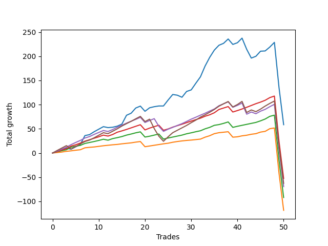

# Short Wallace 011 
- Symbol: ES_SmolBoi
- Date Range: 03/18/2022 - 07/29/2022
- Trading Period: 7:20-12:30
- Number of Trades: 50



| Name | Win Percent | Profit | Avg Profit / Trade | Avg Time / Trade |      | Name | Win Percent | Profit | Avg Profit / Trade | Avg Time / Trade |
| ---- | ----------- | ------ | ------------------ | ---------------- | ---- | ---- | ----------- | ------ | ------------------ | ---------------- |
| Sorted By <br> Profit | | | | | | Sorted By <br> Win Percentage ||||
| Two | 78.00 | 29250.00 | 585.00 | 72:44 |     | Eighty-One | 92.00 | -59250.00 | -1185.00 | 57:55 |
| Eighty-Three | 88.00 | -26250.00 | -525.00 | 62:58 |     | Eighty-Three | 88.00 | -26250.00 | -525.00 | 62:58 |
| Eighty-Five | 78.00 | -31375.00 | -627.50 | 66:19 |     | Eighty-Two | 88.00 | -46000.00 | -920.00 | 60:53 |
| Eighty-Four | 82.00 | -34750.00 | -695.00 | 65:03 |     | Eighty-Four | 82.00 | -34750.00 | -695.00 | 65:03 |
| Eighty-Two | 88.00 | -46000.00 | -920.00 | 60:53 |     | Two | 78.00 | 29250.00 | 585.00 | 72:44 |
| Eighty-One | 92.00 | -59250.00 | -1185.00 | 57:55 |     | Eighty-Five | 78.00 | -31375.00 | -627.50 | 66:19 |

## NO STOPLOSS

### Test Two
* Sell when the price hits the upper line of the 20p 2std bollinger
* No Stoploss
* Results:
```
Total Trades: 50
Percent Up: 22.00
Percent Down: 78.00
Total Points Moved Down: 58.50
Potential Profit: 29250.00
Total Points Ups: 243.75 Count Ups: 11
Total Points Downs: 302.25 Count Downs: 39
```

<details><summary>Trades</summary>

<code>In: 2022-03-25 11:57:00		Out: 2022-03-25 12:00:55		Total Position Time: 03:55		Total Move Down: 2.75		Total to Date: 2.75</code> <br />
<code>In: 2022-04-01 11:34:00		Out: 2022-04-01 11:50:20		Total Position Time: 16:20		Total Move Down: 3.75		Total to Date: 6.50</code> <br />
<code>In: 2022-04-06 08:53:00		Out: 2022-04-06 09:09:40		Total Position Time: 16:40		Total Move Down: 3.75		Total to Date: 10.25</code> <br />
<code>In: 2022-04-06 10:36:00		Out: 2022-04-06 10:57:20		Total Position Time: 21:20		Total Move Down: -2.50		Total to Date: 7.75</code> <br />
<code>In: 2022-04-06 10:43:00		Out: 2022-04-06 10:57:20		Total Position Time: 14:20		Total Move Down: 5.00		Total to Date: 12.75</code> <br />
<code>In: 2022-04-06 10:45:00		Out: 2022-04-06 10:57:20		Total Position Time: 12:20		Total Move Down: 4.75		Total to Date: 17.50</code> <br />
<code>In: 2022-04-06 11:05:00		Out: 2022-04-06 11:08:10		Total Position Time: 03:10		Total Move Down: 18.50		Total to Date: 36.00</code> <br />
<code>In: 2022-04-07 10:22:00		Out: 2022-04-07 10:45:15		Total Position Time: 23:15		Total Move Down: 2.00		Total to Date: 38.00</code> <br />
<code>In: 2022-04-07 11:03:00		Out: 2022-04-07 11:18:20		Total Position Time: 15:20		Total Move Down: 6.00		Total to Date: 44.00</code> <br />
<code>In: 2022-04-07 11:04:00		Out: 2022-04-07 11:18:20		Total Position Time: 14:20		Total Move Down: 5.25		Total to Date: 49.25</code> <br />
<code>In: 2022-04-08 07:33:00		Out: 2022-04-08 07:49:20		Total Position Time: 16:20		Total Move Down: 5.25		Total to Date: 54.50</code> <br />
<code>In: 2022-04-18 10:38:00		Out: 2022-04-18 11:07:55		Total Position Time: 29:55		Total Move Down: -2.00		Total to Date: 52.50</code> <br />
<code>In: 2022-04-20 07:40:00		Out: 2022-04-20 08:00:45		Total Position Time: 20:45		Total Move Down: 0.75		Total to Date: 53.25</code> <br />
<code>In: 2022-04-20 07:43:00		Out: 2022-04-20 08:00:45		Total Position Time: 17:45		Total Move Down: 2.25		Total to Date: 55.50</code> <br />
<code>In: 2022-04-20 09:54:00		Out: 2022-04-20 10:08:15		Total Position Time: 14:15		Total Move Down: 4.25		Total to Date: 59.75</code> <br />
<code>In: 2022-04-25 07:34:00		Out: 2022-04-25 07:52:35		Total Position Time: 18:35		Total Move Down: 18.25		Total to Date: 78.00</code> <br />
<code>In: 2022-04-25 10:14:00		Out: 2022-04-25 10:33:35		Total Position Time: 19:35		Total Move Down: 4.25		Total to Date: 82.25</code> <br />
<code>In: 2022-04-25 10:17:00		Out: 2022-04-25 10:33:35		Total Position Time: 16:35		Total Move Down: 10.75		Total to Date: 93.00</code> <br />
<code>In: 2022-04-27 08:34:00		Out: 2022-04-27 08:50:10		Total Position Time: 16:10		Total Move Down: 4.00		Total to Date: 97.00</code> <br />
<code>In: 2022-05-04 09:25:00		Out: 2022-05-04 09:54:55		Total Position Time: 29:55		Total Move Down: -10.75		Total to Date: 86.25</code> <br />
<code>In: 2022-05-17 08:36:00		Out: 2022-05-17 08:48:20		Total Position Time: 12:20		Total Move Down: 7.25		Total to Date: 93.50</code> <br />
<code>In: 2022-05-24 10:43:00		Out: 2022-05-24 11:01:50		Total Position Time: 18:50		Total Move Down: 2.25		Total to Date: 95.75</code> <br />
<code>In: 2022-05-24 10:44:00		Out: 2022-05-24 11:01:50		Total Position Time: 17:50		Total Move Down: 1.50		Total to Date: 97.25</code> <br />
<code>In: 2022-05-24 10:48:00		Out: 2022-05-24 11:01:50		Total Position Time: 13:50		Total Move Down: -0.00		Total to Date: 97.25</code> <br />
<code>In: 2022-05-25 11:04:00		Out: 2022-05-25 11:06:40		Total Position Time: 02:40		Total Move Down: 12.25		Total to Date: 109.50</code> <br />
<code>In: 2022-05-25 11:06:00		Out: 2022-05-25 11:06:40		Total Position Time: 00:40		Total Move Down: 11.50		Total to Date: 121.00</code> <br />
<code>In: 2022-05-31 07:23:00		Out: 2022-05-31 07:52:55		Total Position Time: 29:55		Total Move Down: -1.50		Total to Date: 119.50</code> <br />
<code>In: 2022-05-31 07:24:00		Out: 2022-05-31 07:53:55		Total Position Time: 29:55		Total Move Down: -4.25		Total to Date: 115.25</code> <br />
<code>In: 2022-06-03 10:06:00		Out: 2022-06-03 10:17:55		Total Position Time: 11:55		Total Move Down: 12.00		Total to Date: 127.25</code> <br />
<code>In: 2022-06-09 10:08:00		Out: 2022-06-09 10:18:55		Total Position Time: 10:55		Total Move Down: 3.25		Total to Date: 130.50</code> <br />
<code>In: 2022-06-10 12:00:00		Out: 2022-06-10 12:05:55		Total Position Time: 05:55		Total Move Down: 13.75		Total to Date: 144.25</code> <br />
<code>In: 2022-06-10 12:29:00		Out: 2022-06-10 12:42:45		Total Position Time: 13:45		Total Move Down: 13.25		Total to Date: 157.50</code> <br />
<code>In: 2022-06-13 09:40:00		Out: 2022-06-13 09:54:20		Total Position Time: 14:20		Total Move Down: 22.25		Total to Date: 179.75</code> <br />
<code>In: 2022-06-13 09:41:00		Out: 2022-06-13 09:54:20		Total Position Time: 13:20		Total Move Down: 18.00		Total to Date: 197.75</code> <br />
<code>In: 2022-06-14 10:21:00		Out: 2022-06-14 10:31:00		Total Position Time: 10:00		Total Move Down: 15.00		Total to Date: 212.75</code> <br />
<code>In: 2022-06-15 11:02:00		Out: 2022-06-15 11:03:05		Total Position Time: 01:05		Total Move Down: 10.00		Total to Date: 222.75</code> <br />
<code>In: 2022-06-17 10:11:00		Out: 2022-06-17 10:27:05		Total Position Time: 16:05		Total Move Down: 4.00		Total to Date: 226.75</code> <br />
<code>In: 2022-06-17 10:14:00		Out: 2022-06-17 10:27:05		Total Position Time: 13:05		Total Move Down: 9.00		Total to Date: 235.75</code> <br />
<code>In: 2022-06-23 12:30:00		Out: 2022-06-23 12:46:00		Total Position Time: 16:00		Total Move Down: -11.25		Total to Date: 224.50</code> <br />
<code>In: 2022-06-29 11:06:00		Out: 2022-06-29 11:20:45		Total Position Time: 14:45		Total Move Down: 3.50		Total to Date: 228.00</code> <br />
<code>In: 2022-06-29 12:31:00		Out: 2022-06-29 12:35:20		Total Position Time: 04:20		Total Move Down: 9.50		Total to Date: 237.50</code> <br />
<code>In: 2022-06-30 07:57:00		Out: 2022-06-30 08:26:55		Total Position Time: 29:55		Total Move Down: -23.00		Total to Date: 214.50</code> <br />
<code>In: 2022-06-30 08:01:00		Out: 2022-06-30 08:30:55		Total Position Time: 29:55		Total Move Down: -18.25		Total to Date: 196.25</code> <br />
<code>In: 2022-07-05 08:49:00		Out: 2022-07-05 09:03:50		Total Position Time: 14:50		Total Move Down: 3.75		Total to Date: 200.00</code> <br />
<code>In: 2022-07-06 11:10:00		Out: 2022-07-06 11:11:45		Total Position Time: 01:45		Total Move Down: 10.50		Total to Date: 210.50</code> <br />
<code>In: 2022-07-06 11:35:00		Out: 2022-07-06 12:01:25		Total Position Time: 26:25		Total Move Down: 0.50		Total to Date: 211.00</code> <br />
<code>In: 2022-07-11 07:43:00		Out: 2022-07-11 08:53:00		Total Position Time: 70:00		Total Move Down: 8.00		Total to Date: 219.00</code> <br />
<code>In: 2022-07-12 08:14:00		Out: 2022-07-12 10:26:00		Total Position Time: 132:00		Total Move Down: 9.75		Total to Date: 228.75</code> <br />
<code>In: 2022-07-14 08:02:00		Out: 2022-07-15 06:42:00		Total Position Time: 1360:00		Total Move Down: -93.75		Total to Date: 135.00</code> <br />
<code>In: 2022-07-14 08:12:00		Out: 2022-07-15 06:52:00		Total Position Time: 1360:00		Total Move Down: -76.50		Total to Date: 58.50</code> <br />


</details>

## TAKE PROFIT

### Test Eighty-One
* Take Profit of 1 Point
* No Stoploss
* Results:
```
Total Trades: 50
Percent Up: 8.00
Percent Down: 92.00
Total Points Moved Down: -118.50
Potential Profit: -59250.00
Total Points Ups: 192.25 Count Ups: 4
Total Points Downs: 73.75 Count Downs: 46
```

<details><summary>Trades</summary>

<code>In: 2022-03-25 11:57:00		Out: 2022-03-25 11:58:45		Total Position Time: 01:45		Total Move Down: 1.00		Total to Date: 1.00</code> <br />
<code>In: 2022-04-01 11:34:00		Out: 2022-04-01 11:36:40		Total Position Time: 02:40		Total Move Down: 1.00		Total to Date: 2.00</code> <br />
<code>In: 2022-04-06 08:53:00		Out: 2022-04-06 08:55:40		Total Position Time: 02:40		Total Move Down: 1.50		Total to Date: 3.50</code> <br />
<code>In: 2022-04-06 10:36:00		Out: 2022-04-06 10:36:10		Total Position Time: 00:10		Total Move Down: 1.00		Total to Date: 4.50</code> <br />
<code>In: 2022-04-06 10:43:00		Out: 2022-04-06 10:46:05		Total Position Time: 03:05		Total Move Down: 1.25		Total to Date: 5.75</code> <br />
<code>In: 2022-04-06 10:45:00		Out: 2022-04-06 10:46:05		Total Position Time: 01:05		Total Move Down: 1.00		Total to Date: 6.75</code> <br />
<code>In: 2022-04-06 11:05:00		Out: 2022-04-06 11:05:10		Total Position Time: 00:10		Total Move Down: 4.00		Total to Date: 10.75</code> <br />
<code>In: 2022-04-07 10:22:00		Out: 2022-04-07 10:24:35		Total Position Time: 02:35		Total Move Down: 1.00		Total to Date: 11.75</code> <br />
<code>In: 2022-04-07 11:03:00		Out: 2022-04-07 11:04:00		Total Position Time: 01:00		Total Move Down: 0.75		Total to Date: 12.50</code> <br />
<code>In: 2022-04-07 11:04:00		Out: 2022-04-07 11:04:10		Total Position Time: 00:10		Total Move Down: 1.25		Total to Date: 13.75</code> <br />
<code>In: 2022-04-08 07:33:00		Out: 2022-04-08 07:33:25		Total Position Time: 00:25		Total Move Down: 1.25		Total to Date: 15.00</code> <br />
<code>In: 2022-04-18 10:38:00		Out: 2022-04-18 10:38:10		Total Position Time: 00:10		Total Move Down: 1.00		Total to Date: 16.00</code> <br />
<code>In: 2022-04-20 07:40:00		Out: 2022-04-20 07:48:05		Total Position Time: 08:05		Total Move Down: 1.00		Total to Date: 17.00</code> <br />
<code>In: 2022-04-20 07:43:00		Out: 2022-04-20 07:44:25		Total Position Time: 01:25		Total Move Down: 0.75		Total to Date: 17.75</code> <br />
<code>In: 2022-04-20 09:54:00		Out: 2022-04-20 09:54:30		Total Position Time: 00:30		Total Move Down: 1.25		Total to Date: 19.00</code> <br />
<code>In: 2022-04-25 07:34:00		Out: 2022-04-25 07:39:15		Total Position Time: 05:15		Total Move Down: 1.00		Total to Date: 20.00</code> <br />
<code>In: 2022-04-25 10:14:00		Out: 2022-04-25 10:23:05		Total Position Time: 09:05		Total Move Down: 1.00		Total to Date: 21.00</code> <br />
<code>In: 2022-04-25 10:17:00		Out: 2022-04-25 10:17:15		Total Position Time: 00:15		Total Move Down: 1.50		Total to Date: 22.50</code> <br />
<code>In: 2022-04-27 08:34:00		Out: 2022-04-27 08:34:10		Total Position Time: 00:10		Total Move Down: 1.25		Total to Date: 23.75</code> <br />
<code>In: 2022-05-04 09:25:00		Out: 2022-05-04 09:54:55		Total Position Time: 29:55		Total Move Down: -10.75		Total to Date: 13.00</code> <br />
<code>In: 2022-05-17 08:36:00		Out: 2022-05-17 08:37:25		Total Position Time: 01:25		Total Move Down: 1.50		Total to Date: 14.50</code> <br />
<code>In: 2022-05-24 10:43:00		Out: 2022-05-24 10:43:10		Total Position Time: 00:10		Total Move Down: 1.50		Total to Date: 16.00</code> <br />
<code>In: 2022-05-24 10:44:00		Out: 2022-05-24 10:47:50		Total Position Time: 03:50		Total Move Down: 1.50		Total to Date: 17.50</code> <br />
<code>In: 2022-05-24 10:48:00		Out: 2022-05-24 11:05:00		Total Position Time: 17:00		Total Move Down: 1.50		Total to Date: 19.00</code> <br />
<code>In: 2022-05-25 11:04:00		Out: 2022-05-25 11:04:10		Total Position Time: 00:10		Total Move Down: 1.25		Total to Date: 20.25</code> <br />
<code>In: 2022-05-25 11:06:00		Out: 2022-05-25 11:06:20		Total Position Time: 00:20		Total Move Down: 2.00		Total to Date: 22.25</code> <br />
<code>In: 2022-05-31 07:23:00		Out: 2022-05-31 07:23:15		Total Position Time: 00:15		Total Move Down: 1.50		Total to Date: 23.75</code> <br />
<code>In: 2022-05-31 07:24:00		Out: 2022-05-31 07:24:10		Total Position Time: 00:10		Total Move Down: 1.25		Total to Date: 25.00</code> <br />
<code>In: 2022-06-03 10:06:00		Out: 2022-06-03 10:08:20		Total Position Time: 02:20		Total Move Down: 1.00		Total to Date: 26.00</code> <br />
<code>In: 2022-06-09 10:08:00		Out: 2022-06-09 10:10:15		Total Position Time: 02:15		Total Move Down: 0.75		Total to Date: 26.75</code> <br />
<code>In: 2022-06-10 12:00:00		Out: 2022-06-10 12:02:05		Total Position Time: 02:05		Total Move Down: 1.00		Total to Date: 27.75</code> <br />
<code>In: 2022-06-10 12:29:00		Out: 2022-06-10 12:29:10		Total Position Time: 00:10		Total Move Down: 1.00		Total to Date: 28.75</code> <br />
<code>In: 2022-06-13 09:40:00		Out: 2022-06-13 09:40:10		Total Position Time: 00:10		Total Move Down: 4.00		Total to Date: 32.75</code> <br />
<code>In: 2022-06-13 09:41:00		Out: 2022-06-13 09:41:10		Total Position Time: 00:10		Total Move Down: 3.00		Total to Date: 35.75</code> <br />
<code>In: 2022-06-14 10:21:00		Out: 2022-06-14 10:21:10		Total Position Time: 00:10		Total Move Down: 4.25		Total to Date: 40.00</code> <br />
<code>In: 2022-06-15 11:02:00		Out: 2022-06-15 11:02:10		Total Position Time: 00:10		Total Move Down: 2.00		Total to Date: 42.00</code> <br />
<code>In: 2022-06-17 10:11:00		Out: 2022-06-17 10:21:10		Total Position Time: 10:10		Total Move Down: 1.00		Total to Date: 43.00</code> <br />
<code>In: 2022-06-17 10:14:00		Out: 2022-06-17 10:14:10		Total Position Time: 00:10		Total Move Down: 1.00		Total to Date: 44.00</code> <br />
<code>In: 2022-06-23 12:30:00		Out: 2022-06-23 12:46:00		Total Position Time: 16:00		Total Move Down: -11.25		Total to Date: 32.75</code> <br />
<code>In: 2022-06-29 11:06:00		Out: 2022-06-29 11:07:45		Total Position Time: 01:45		Total Move Down: 0.75		Total to Date: 33.50</code> <br />
<code>In: 2022-06-29 12:31:00		Out: 2022-06-29 12:31:10		Total Position Time: 00:10		Total Move Down: 2.00		Total to Date: 35.50</code> <br />
<code>In: 2022-06-30 07:57:00		Out: 2022-06-30 08:02:00		Total Position Time: 05:00		Total Move Down: 1.25		Total to Date: 36.75</code> <br />
<code>In: 2022-06-30 08:01:00		Out: 2022-06-30 08:01:10		Total Position Time: 00:10		Total Move Down: 2.00		Total to Date: 38.75</code> <br />
<code>In: 2022-07-05 08:49:00		Out: 2022-07-05 08:52:25		Total Position Time: 03:25		Total Move Down: 1.25		Total to Date: 40.00</code> <br />
<code>In: 2022-07-06 11:10:00		Out: 2022-07-06 11:10:10		Total Position Time: 00:10		Total Move Down: 3.25		Total to Date: 43.25</code> <br />
<code>In: 2022-07-06 11:35:00		Out: 2022-07-06 11:36:10		Total Position Time: 01:10		Total Move Down: 1.50		Total to Date: 44.75</code> <br />
<code>In: 2022-07-11 07:43:00		Out: 2022-07-11 07:56:00		Total Position Time: 13:00		Total Move Down: 5.50		Total to Date: 50.25</code> <br />
<code>In: 2022-07-12 08:14:00		Out: 2022-07-12 08:38:00		Total Position Time: 24:00		Total Move Down: 1.50		Total to Date: 51.75</code> <br />
<code>In: 2022-07-14 08:02:00		Out: 2022-07-15 06:42:00		Total Position Time: 1360:00		Total Move Down: -93.75		Total to Date: -42.00</code> <br />
<code>In: 2022-07-14 08:12:00		Out: 2022-07-15 06:52:00		Total Position Time: 1360:00		Total Move Down: -76.50		Total to Date: -118.50</code> <br />


</details>

### Test Eighty-Two
* Take Profit of 2 Point
* No Stoploss
* Results:
```
Total Trades: 50
Percent Up: 12.00
Percent Down: 88.00
Total Points Moved Down: -92.00
Potential Profit: -46000.00
Total Points Ups: 204.75 Count Ups: 6
Total Points Downs: 112.75 Count Downs: 44
```

<details><summary>Trades</summary>

<code>In: 2022-03-25 11:57:00		Out: 2022-03-25 12:00:50		Total Position Time: 03:50		Total Move Down: 2.75		Total to Date: 2.75</code> <br />
<code>In: 2022-04-01 11:34:00		Out: 2022-04-01 11:36:55		Total Position Time: 02:55		Total Move Down: 2.00		Total to Date: 4.75</code> <br />
<code>In: 2022-04-06 08:53:00		Out: 2022-04-06 08:57:30		Total Position Time: 04:30		Total Move Down: 2.00		Total to Date: 6.75</code> <br />
<code>In: 2022-04-06 10:36:00		Out: 2022-04-06 11:00:10		Total Position Time: 24:10		Total Move Down: 5.25		Total to Date: 12.00</code> <br />
<code>In: 2022-04-06 10:43:00		Out: 2022-04-06 10:46:40		Total Position Time: 03:40		Total Move Down: 2.00		Total to Date: 14.00</code> <br />
<code>In: 2022-04-06 10:45:00		Out: 2022-04-06 10:46:40		Total Position Time: 01:40		Total Move Down: 1.75		Total to Date: 15.75</code> <br />
<code>In: 2022-04-06 11:05:00		Out: 2022-04-06 11:05:10		Total Position Time: 00:10		Total Move Down: 4.00		Total to Date: 19.75</code> <br />
<code>In: 2022-04-07 10:22:00		Out: 2022-04-07 10:25:00		Total Position Time: 03:00		Total Move Down: 2.00		Total to Date: 21.75</code> <br />
<code>In: 2022-04-07 11:03:00		Out: 2022-04-07 11:04:05		Total Position Time: 01:05		Total Move Down: 2.00		Total to Date: 23.75</code> <br />
<code>In: 2022-04-07 11:04:00		Out: 2022-04-07 11:04:20		Total Position Time: 00:20		Total Move Down: 2.25		Total to Date: 26.00</code> <br />
<code>In: 2022-04-08 07:33:00		Out: 2022-04-08 07:33:35		Total Position Time: 00:35		Total Move Down: 2.50		Total to Date: 28.50</code> <br />
<code>In: 2022-04-18 10:38:00		Out: 2022-04-18 11:07:55		Total Position Time: 29:55		Total Move Down: -2.00		Total to Date: 26.50</code> <br />
<code>In: 2022-04-20 07:40:00		Out: 2022-04-20 08:01:10		Total Position Time: 21:10		Total Move Down: 3.25		Total to Date: 29.75</code> <br />
<code>In: 2022-04-20 07:43:00		Out: 2022-04-20 07:47:45		Total Position Time: 04:45		Total Move Down: 2.00		Total to Date: 31.75</code> <br />
<code>In: 2022-04-20 09:54:00		Out: 2022-04-20 09:57:25		Total Position Time: 03:25		Total Move Down: 2.25		Total to Date: 34.00</code> <br />
<code>In: 2022-04-25 07:34:00		Out: 2022-04-25 07:39:30		Total Position Time: 05:30		Total Move Down: 3.00		Total to Date: 37.00</code> <br />
<code>In: 2022-04-25 10:14:00		Out: 2022-04-25 10:27:05		Total Position Time: 13:05		Total Move Down: 2.25		Total to Date: 39.25</code> <br />
<code>In: 2022-04-25 10:17:00		Out: 2022-04-25 10:17:30		Total Position Time: 00:30		Total Move Down: 2.50		Total to Date: 41.75</code> <br />
<code>In: 2022-04-27 08:34:00		Out: 2022-04-27 08:34:25		Total Position Time: 00:25		Total Move Down: 2.00		Total to Date: 43.75</code> <br />
<code>In: 2022-05-04 09:25:00		Out: 2022-05-04 09:54:55		Total Position Time: 29:55		Total Move Down: -10.75		Total to Date: 33.00</code> <br />
<code>In: 2022-05-17 08:36:00		Out: 2022-05-17 08:38:40		Total Position Time: 02:40		Total Move Down: 1.75		Total to Date: 34.75</code> <br />
<code>In: 2022-05-24 10:43:00		Out: 2022-05-24 10:47:50		Total Position Time: 04:50		Total Move Down: 2.25		Total to Date: 37.00</code> <br />
<code>In: 2022-05-24 10:44:00		Out: 2022-05-24 11:04:55		Total Position Time: 20:55		Total Move Down: 2.25		Total to Date: 39.25</code> <br />
<code>In: 2022-05-24 10:48:00		Out: 2022-05-24 11:17:55		Total Position Time: 29:55		Total Move Down: -10.50		Total to Date: 28.75</code> <br />
<code>In: 2022-05-25 11:04:00		Out: 2022-05-25 11:05:45		Total Position Time: 01:45		Total Move Down: 2.25		Total to Date: 31.00</code> <br />
<code>In: 2022-05-25 11:06:00		Out: 2022-05-25 11:06:20		Total Position Time: 00:20		Total Move Down: 2.00		Total to Date: 33.00</code> <br />
<code>In: 2022-05-31 07:23:00		Out: 2022-05-31 07:23:35		Total Position Time: 00:35		Total Move Down: 2.00		Total to Date: 35.00</code> <br />
<code>In: 2022-05-31 07:24:00		Out: 2022-05-31 07:24:15		Total Position Time: 00:15		Total Move Down: 2.00		Total to Date: 37.00</code> <br />
<code>In: 2022-06-03 10:06:00		Out: 2022-06-03 10:08:45		Total Position Time: 02:45		Total Move Down: 2.75		Total to Date: 39.75</code> <br />
<code>In: 2022-06-09 10:08:00		Out: 2022-06-09 10:16:55		Total Position Time: 08:55		Total Move Down: 2.00		Total to Date: 41.75</code> <br />
<code>In: 2022-06-10 12:00:00		Out: 2022-06-10 12:02:15		Total Position Time: 02:15		Total Move Down: 2.25		Total to Date: 44.00</code> <br />
<code>In: 2022-06-10 12:29:00		Out: 2022-06-10 12:29:20		Total Position Time: 00:20		Total Move Down: 2.00		Total to Date: 46.00</code> <br />
<code>In: 2022-06-13 09:40:00		Out: 2022-06-13 09:40:10		Total Position Time: 00:10		Total Move Down: 4.00		Total to Date: 50.00</code> <br />
<code>In: 2022-06-13 09:41:00		Out: 2022-06-13 09:41:10		Total Position Time: 00:10		Total Move Down: 3.00		Total to Date: 53.00</code> <br />
<code>In: 2022-06-14 10:21:00		Out: 2022-06-14 10:21:10		Total Position Time: 00:10		Total Move Down: 4.25		Total to Date: 57.25</code> <br />
<code>In: 2022-06-15 11:02:00		Out: 2022-06-15 11:02:45		Total Position Time: 00:45		Total Move Down: 1.50		Total to Date: 58.75</code> <br />
<code>In: 2022-06-17 10:11:00		Out: 2022-06-17 10:23:05		Total Position Time: 12:05		Total Move Down: 2.50		Total to Date: 61.25</code> <br />
<code>In: 2022-06-17 10:14:00		Out: 2022-06-17 10:15:45		Total Position Time: 01:45		Total Move Down: 3.00		Total to Date: 64.25</code> <br />
<code>In: 2022-06-23 12:30:00		Out: 2022-06-23 12:46:00		Total Position Time: 16:00		Total Move Down: -11.25		Total to Date: 53.00</code> <br />
<code>In: 2022-06-29 11:06:00		Out: 2022-06-29 11:08:05		Total Position Time: 02:05		Total Move Down: 2.25		Total to Date: 55.25</code> <br />
<code>In: 2022-06-29 12:31:00		Out: 2022-06-29 12:31:10		Total Position Time: 00:10		Total Move Down: 2.00		Total to Date: 57.25</code> <br />
<code>In: 2022-06-30 07:57:00		Out: 2022-06-30 08:03:40		Total Position Time: 06:40		Total Move Down: 2.00		Total to Date: 59.25</code> <br />
<code>In: 2022-06-30 08:01:00		Out: 2022-06-30 08:01:10		Total Position Time: 00:10		Total Move Down: 2.00		Total to Date: 61.25</code> <br />
<code>In: 2022-07-05 08:49:00		Out: 2022-07-05 09:03:30		Total Position Time: 14:30		Total Move Down: 2.00		Total to Date: 63.25</code> <br />
<code>In: 2022-07-06 11:10:00		Out: 2022-07-06 11:10:10		Total Position Time: 00:10		Total Move Down: 3.25		Total to Date: 66.50</code> <br />
<code>In: 2022-07-06 11:35:00		Out: 2022-07-06 11:36:35		Total Position Time: 01:35		Total Move Down: 3.75		Total to Date: 70.25</code> <br />
<code>In: 2022-07-11 07:43:00		Out: 2022-07-11 07:56:00		Total Position Time: 13:00		Total Move Down: 5.50		Total to Date: 75.75</code> <br />
<code>In: 2022-07-12 08:14:00		Out: 2022-07-12 08:39:00		Total Position Time: 25:00		Total Move Down: 2.50		Total to Date: 78.25</code> <br />
<code>In: 2022-07-14 08:02:00		Out: 2022-07-15 06:42:00		Total Position Time: 1360:00		Total Move Down: -93.75		Total to Date: -15.50</code> <br />
<code>In: 2022-07-14 08:12:00		Out: 2022-07-15 06:52:00		Total Position Time: 1360:00		Total Move Down: -76.50		Total to Date: -92.00</code> <br />


</details>

### Test Eighty-Three
* Take Profit of 3 Point
* No Stoploss
* Results:
```
Total Trades: 50
Percent Up: 12.00
Percent Down: 88.00
Total Points Moved Down: -52.50
Potential Profit: -26250.00
Total Points Ups: 204.75 Count Ups: 6
Total Points Downs: 152.25 Count Downs: 44
```

<details><summary>Trades</summary>

<code>In: 2022-03-25 11:57:00		Out: 2022-03-25 12:01:00		Total Position Time: 04:00		Total Move Down: 3.00		Total to Date: 3.00</code> <br />
<code>In: 2022-04-01 11:34:00		Out: 2022-04-01 11:37:40		Total Position Time: 03:40		Total Move Down: 3.25		Total to Date: 6.25</code> <br />
<code>In: 2022-04-06 08:53:00		Out: 2022-04-06 09:03:50		Total Position Time: 10:50		Total Move Down: 2.75		Total to Date: 9.00</code> <br />
<code>In: 2022-04-06 10:36:00		Out: 2022-04-06 11:00:10		Total Position Time: 24:10		Total Move Down: 5.25		Total to Date: 14.25</code> <br />
<code>In: 2022-04-06 10:43:00		Out: 2022-04-06 10:47:00		Total Position Time: 04:00		Total Move Down: 2.75		Total to Date: 17.00</code> <br />
<code>In: 2022-04-06 10:45:00		Out: 2022-04-06 10:47:05		Total Position Time: 02:05		Total Move Down: 3.50		Total to Date: 20.50</code> <br />
<code>In: 2022-04-06 11:05:00		Out: 2022-04-06 11:05:10		Total Position Time: 00:10		Total Move Down: 4.00		Total to Date: 24.50</code> <br />
<code>In: 2022-04-07 10:22:00		Out: 2022-04-07 10:48:20		Total Position Time: 26:20		Total Move Down: 3.00		Total to Date: 27.50</code> <br />
<code>In: 2022-04-07 11:03:00		Out: 2022-04-07 11:04:20		Total Position Time: 01:20		Total Move Down: 3.00		Total to Date: 30.50</code> <br />
<code>In: 2022-04-07 11:04:00		Out: 2022-04-07 11:06:00		Total Position Time: 02:00		Total Move Down: 3.00		Total to Date: 33.50</code> <br />
<code>In: 2022-04-08 07:33:00		Out: 2022-04-08 07:38:35		Total Position Time: 05:35		Total Move Down: 3.50		Total to Date: 37.00</code> <br />
<code>In: 2022-04-18 10:38:00		Out: 2022-04-18 11:07:55		Total Position Time: 29:55		Total Move Down: -2.00		Total to Date: 35.00</code> <br />
<code>In: 2022-04-20 07:40:00		Out: 2022-04-20 08:01:10		Total Position Time: 21:10		Total Move Down: 3.25		Total to Date: 38.25</code> <br />
<code>In: 2022-04-20 07:43:00		Out: 2022-04-20 08:01:10		Total Position Time: 18:10		Total Move Down: 4.75		Total to Date: 43.00</code> <br />
<code>In: 2022-04-20 09:54:00		Out: 2022-04-20 09:59:05		Total Position Time: 05:05		Total Move Down: 2.75		Total to Date: 45.75</code> <br />
<code>In: 2022-04-25 07:34:00		Out: 2022-04-25 07:39:30		Total Position Time: 05:30		Total Move Down: 3.00		Total to Date: 48.75</code> <br />
<code>In: 2022-04-25 10:14:00		Out: 2022-04-25 10:27:10		Total Position Time: 13:10		Total Move Down: 3.25		Total to Date: 52.00</code> <br />
<code>In: 2022-04-25 10:17:00		Out: 2022-04-25 10:17:40		Total Position Time: 00:40		Total Move Down: 3.25		Total to Date: 55.25</code> <br />
<code>In: 2022-04-27 08:34:00		Out: 2022-04-27 08:40:30		Total Position Time: 06:30		Total Move Down: 3.25		Total to Date: 58.50</code> <br />
<code>In: 2022-05-04 09:25:00		Out: 2022-05-04 09:54:55		Total Position Time: 29:55		Total Move Down: -10.75		Total to Date: 47.75</code> <br />
<code>In: 2022-05-17 08:36:00		Out: 2022-05-17 08:42:50		Total Position Time: 06:50		Total Move Down: 3.75		Total to Date: 51.50</code> <br />
<code>In: 2022-05-24 10:43:00		Out: 2022-05-24 11:04:55		Total Position Time: 21:55		Total Move Down: 3.00		Total to Date: 54.50</code> <br />
<code>In: 2022-05-24 10:44:00		Out: 2022-05-24 11:05:00		Total Position Time: 21:00		Total Move Down: 3.00		Total to Date: 57.50</code> <br />
<code>In: 2022-05-24 10:48:00		Out: 2022-05-24 11:17:55		Total Position Time: 29:55		Total Move Down: -10.50		Total to Date: 47.00</code> <br />
<code>In: 2022-05-25 11:04:00		Out: 2022-05-25 11:06:20		Total Position Time: 02:20		Total Move Down: 2.75		Total to Date: 49.75</code> <br />
<code>In: 2022-05-25 11:06:00		Out: 2022-05-25 11:06:25		Total Position Time: 00:25		Total Move Down: 3.75		Total to Date: 53.50</code> <br />
<code>In: 2022-05-31 07:23:00		Out: 2022-05-31 07:23:40		Total Position Time: 00:40		Total Move Down: 3.00		Total to Date: 56.50</code> <br />
<code>In: 2022-05-31 07:24:00		Out: 2022-05-31 07:25:35		Total Position Time: 01:35		Total Move Down: 3.00		Total to Date: 59.50</code> <br />
<code>In: 2022-06-03 10:06:00		Out: 2022-06-03 10:08:55		Total Position Time: 02:55		Total Move Down: 3.25		Total to Date: 62.75</code> <br />
<code>In: 2022-06-09 10:08:00		Out: 2022-06-09 10:18:55		Total Position Time: 10:55		Total Move Down: 3.25		Total to Date: 66.00</code> <br />
<code>In: 2022-06-10 12:00:00		Out: 2022-06-10 12:02:30		Total Position Time: 02:30		Total Move Down: 3.00		Total to Date: 69.00</code> <br />
<code>In: 2022-06-10 12:29:00		Out: 2022-06-10 12:30:10		Total Position Time: 01:10		Total Move Down: 3.00		Total to Date: 72.00</code> <br />
<code>In: 2022-06-13 09:40:00		Out: 2022-06-13 09:40:10		Total Position Time: 00:10		Total Move Down: 4.00		Total to Date: 76.00</code> <br />
<code>In: 2022-06-13 09:41:00		Out: 2022-06-13 09:41:10		Total Position Time: 00:10		Total Move Down: 3.00		Total to Date: 79.00</code> <br />
<code>In: 2022-06-14 10:21:00		Out: 2022-06-14 10:21:10		Total Position Time: 00:10		Total Move Down: 4.25		Total to Date: 83.25</code> <br />
<code>In: 2022-06-15 11:02:00		Out: 2022-06-15 11:03:00		Total Position Time: 01:00		Total Move Down: 6.75		Total to Date: 90.00</code> <br />
<code>In: 2022-06-17 10:11:00		Out: 2022-06-17 10:23:10		Total Position Time: 12:10		Total Move Down: 3.00		Total to Date: 93.00</code> <br />
<code>In: 2022-06-17 10:14:00		Out: 2022-06-17 10:15:45		Total Position Time: 01:45		Total Move Down: 3.00		Total to Date: 96.00</code> <br />
<code>In: 2022-06-23 12:30:00		Out: 2022-06-23 12:46:00		Total Position Time: 16:00		Total Move Down: -11.25		Total to Date: 84.75</code> <br />
<code>In: 2022-06-29 11:06:00		Out: 2022-06-29 11:20:35		Total Position Time: 14:35		Total Move Down: 3.00		Total to Date: 87.75</code> <br />
<code>In: 2022-06-29 12:31:00		Out: 2022-06-29 12:32:15		Total Position Time: 01:15		Total Move Down: 3.25		Total to Date: 91.00</code> <br />
<code>In: 2022-06-30 07:57:00		Out: 2022-06-30 08:04:05		Total Position Time: 07:05		Total Move Down: 3.50		Total to Date: 94.50</code> <br />
<code>In: 2022-06-30 08:01:00		Out: 2022-06-30 08:02:00		Total Position Time: 01:00		Total Move Down: 3.75		Total to Date: 98.25</code> <br />
<code>In: 2022-07-05 08:49:00		Out: 2022-07-05 09:03:50		Total Position Time: 14:50		Total Move Down: 3.75		Total to Date: 102.00</code> <br />
<code>In: 2022-07-06 11:10:00		Out: 2022-07-06 11:10:10		Total Position Time: 00:10		Total Move Down: 3.25		Total to Date: 105.25</code> <br />
<code>In: 2022-07-06 11:35:00		Out: 2022-07-06 11:36:35		Total Position Time: 01:35		Total Move Down: 3.75		Total to Date: 109.00</code> <br />
<code>In: 2022-07-11 07:43:00		Out: 2022-07-11 07:56:00		Total Position Time: 13:00		Total Move Down: 5.50		Total to Date: 114.50</code> <br />
<code>In: 2022-07-12 08:14:00		Out: 2022-07-12 08:41:00		Total Position Time: 27:00		Total Move Down: 3.25		Total to Date: 117.75</code> <br />
<code>In: 2022-07-14 08:02:00		Out: 2022-07-15 06:42:00		Total Position Time: 1360:00		Total Move Down: -93.75		Total to Date: 24.00</code> <br />
<code>In: 2022-07-14 08:12:00		Out: 2022-07-15 06:52:00		Total Position Time: 1360:00		Total Move Down: -76.50		Total to Date: -52.50</code> <br />


</details>

### Test Eighty-Four
* Take Profit of 4 Point
* No Stoploss
* Results:
```
Total Trades: 50
Percent Up: 18.00
Percent Down: 82.00
Total Points Moved Down: -69.50
Potential Profit: -34750.00
Total Points Ups: 247.00 Count Ups: 9
Total Points Downs: 177.50 Count Downs: 41
```

<details><summary>Trades</summary>

<code>In: 2022-03-25 11:57:00		Out: 2022-03-25 12:01:45		Total Position Time: 04:45		Total Move Down: 4.00		Total to Date: 4.00</code> <br />
<code>In: 2022-04-01 11:34:00		Out: 2022-04-01 11:37:50		Total Position Time: 03:50		Total Move Down: 4.00		Total to Date: 8.00</code> <br />
<code>In: 2022-04-06 08:53:00		Out: 2022-04-06 09:10:30		Total Position Time: 17:30		Total Move Down: 4.00		Total to Date: 12.00</code> <br />
<code>In: 2022-04-06 10:36:00		Out: 2022-04-06 11:00:10		Total Position Time: 24:10		Total Move Down: 5.25		Total to Date: 17.25</code> <br />
<code>In: 2022-04-06 10:43:00		Out: 2022-04-06 10:47:10		Total Position Time: 04:10		Total Move Down: 4.50		Total to Date: 21.75</code> <br />
<code>In: 2022-04-06 10:45:00		Out: 2022-04-06 10:47:10		Total Position Time: 02:10		Total Move Down: 4.25		Total to Date: 26.00</code> <br />
<code>In: 2022-04-06 11:05:00		Out: 2022-04-06 11:05:25		Total Position Time: 00:25		Total Move Down: 5.00		Total to Date: 31.00</code> <br />
<code>In: 2022-04-07 10:22:00		Out: 2022-04-07 10:51:55		Total Position Time: 29:55		Total Move Down: 3.00		Total to Date: 34.00</code> <br />
<code>In: 2022-04-07 11:03:00		Out: 2022-04-07 11:06:10		Total Position Time: 03:10		Total Move Down: 4.50		Total to Date: 38.50</code> <br />
<code>In: 2022-04-07 11:04:00		Out: 2022-04-07 11:06:15		Total Position Time: 02:15		Total Move Down: 4.00		Total to Date: 42.50</code> <br />
<code>In: 2022-04-08 07:33:00		Out: 2022-04-08 07:45:10		Total Position Time: 12:10		Total Move Down: 4.00		Total to Date: 46.50</code> <br />
<code>In: 2022-04-18 10:38:00		Out: 2022-04-18 11:07:55		Total Position Time: 29:55		Total Move Down: -2.00		Total to Date: 44.50</code> <br />
<code>In: 2022-04-20 07:40:00		Out: 2022-04-20 08:03:50		Total Position Time: 23:50		Total Move Down: 4.00		Total to Date: 48.50</code> <br />
<code>In: 2022-04-20 07:43:00		Out: 2022-04-20 08:01:10		Total Position Time: 18:10		Total Move Down: 4.75		Total to Date: 53.25</code> <br />
<code>In: 2022-04-20 09:54:00		Out: 2022-04-20 10:08:15		Total Position Time: 14:15		Total Move Down: 4.25		Total to Date: 57.50</code> <br />
<code>In: 2022-04-25 07:34:00		Out: 2022-04-25 07:39:55		Total Position Time: 05:55		Total Move Down: 4.25		Total to Date: 61.75</code> <br />
<code>In: 2022-04-25 10:14:00		Out: 2022-04-25 10:27:50		Total Position Time: 13:50		Total Move Down: 4.00		Total to Date: 65.75</code> <br />
<code>In: 2022-04-25 10:17:00		Out: 2022-04-25 10:18:00		Total Position Time: 01:00		Total Move Down: 3.75		Total to Date: 69.50</code> <br />
<code>In: 2022-04-27 08:34:00		Out: 2022-04-27 08:45:25		Total Position Time: 11:25		Total Move Down: 4.25		Total to Date: 73.75</code> <br />
<code>In: 2022-05-04 09:25:00		Out: 2022-05-04 09:54:55		Total Position Time: 29:55		Total Move Down: -10.75		Total to Date: 63.00</code> <br />
<code>In: 2022-05-17 08:36:00		Out: 2022-05-17 08:43:35		Total Position Time: 07:35		Total Move Down: 4.25		Total to Date: 67.25</code> <br />
<code>In: 2022-05-24 10:43:00		Out: 2022-05-24 11:05:25		Total Position Time: 22:25		Total Move Down: 3.75		Total to Date: 71.00</code> <br />
<code>In: 2022-05-24 10:44:00		Out: 2022-05-24 11:13:55		Total Position Time: 29:55		Total Move Down: -15.75		Total to Date: 55.25</code> <br />
<code>In: 2022-05-24 10:48:00		Out: 2022-05-24 11:17:55		Total Position Time: 29:55		Total Move Down: -10.50		Total to Date: 44.75</code> <br />
<code>In: 2022-05-25 11:04:00		Out: 2022-05-25 11:06:25		Total Position Time: 02:25		Total Move Down: 4.50		Total to Date: 49.25</code> <br />
<code>In: 2022-05-25 11:06:00		Out: 2022-05-25 11:06:25		Total Position Time: 00:25		Total Move Down: 3.75		Total to Date: 53.00</code> <br />
<code>In: 2022-05-31 07:23:00		Out: 2022-05-31 07:24:05		Total Position Time: 01:05		Total Move Down: 4.00		Total to Date: 57.00</code> <br />
<code>In: 2022-05-31 07:24:00		Out: 2022-05-31 07:26:15		Total Position Time: 02:15		Total Move Down: 3.75		Total to Date: 60.75</code> <br />
<code>In: 2022-06-03 10:06:00		Out: 2022-06-03 10:13:20		Total Position Time: 07:20		Total Move Down: 4.50		Total to Date: 65.25</code> <br />
<code>In: 2022-06-09 10:08:00		Out: 2022-06-09 10:22:05		Total Position Time: 14:05		Total Move Down: 4.75		Total to Date: 70.00</code> <br />
<code>In: 2022-06-10 12:00:00		Out: 2022-06-10 12:03:00		Total Position Time: 03:00		Total Move Down: 4.00		Total to Date: 74.00</code> <br />
<code>In: 2022-06-10 12:29:00		Out: 2022-06-10 12:30:20		Total Position Time: 01:20		Total Move Down: 4.25		Total to Date: 78.25</code> <br />
<code>In: 2022-06-13 09:40:00		Out: 2022-06-13 09:40:10		Total Position Time: 00:10		Total Move Down: 4.00		Total to Date: 82.25</code> <br />
<code>In: 2022-06-13 09:41:00		Out: 2022-06-13 09:41:15		Total Position Time: 00:15		Total Move Down: 4.50		Total to Date: 86.75</code> <br />
<code>In: 2022-06-14 10:21:00		Out: 2022-06-14 10:21:10		Total Position Time: 00:10		Total Move Down: 4.25		Total to Date: 91.00</code> <br />
<code>In: 2022-06-15 11:02:00		Out: 2022-06-15 11:03:00		Total Position Time: 01:00		Total Move Down: 6.75		Total to Date: 97.75</code> <br />
<code>In: 2022-06-17 10:11:00		Out: 2022-06-17 10:26:30		Total Position Time: 15:30		Total Move Down: 4.00		Total to Date: 101.75</code> <br />
<code>In: 2022-06-17 10:14:00		Out: 2022-06-17 10:15:50		Total Position Time: 01:50		Total Move Down: 4.00		Total to Date: 105.75</code> <br />
<code>In: 2022-06-23 12:30:00		Out: 2022-06-23 12:46:00		Total Position Time: 16:00		Total Move Down: -11.25		Total to Date: 94.50</code> <br />
<code>In: 2022-06-29 11:06:00		Out: 2022-06-29 11:21:10		Total Position Time: 15:10		Total Move Down: 4.00		Total to Date: 98.50</code> <br />
<code>In: 2022-06-29 12:31:00		Out: 2022-06-29 12:33:20		Total Position Time: 02:20		Total Move Down: 4.75		Total to Date: 103.25</code> <br />
<code>In: 2022-06-30 07:57:00		Out: 2022-06-30 08:26:55		Total Position Time: 29:55		Total Move Down: -23.00		Total to Date: 80.25</code> <br />
<code>In: 2022-06-30 08:01:00		Out: 2022-06-30 08:03:40		Total Position Time: 02:40		Total Move Down: 4.50		Total to Date: 84.75</code> <br />
<code>In: 2022-07-05 08:49:00		Out: 2022-07-05 09:18:55		Total Position Time: 29:55		Total Move Down: -3.50		Total to Date: 81.25</code> <br />
<code>In: 2022-07-06 11:10:00		Out: 2022-07-06 11:11:05		Total Position Time: 01:05		Total Move Down: 5.25		Total to Date: 86.50</code> <br />
<code>In: 2022-07-06 11:35:00		Out: 2022-07-06 11:36:45		Total Position Time: 01:45		Total Move Down: 3.75		Total to Date: 90.25</code> <br />
<code>In: 2022-07-11 07:43:00		Out: 2022-07-11 07:56:00		Total Position Time: 13:00		Total Move Down: 5.50		Total to Date: 95.75</code> <br />
<code>In: 2022-07-12 08:14:00		Out: 2022-07-12 08:42:00		Total Position Time: 28:00		Total Move Down: 5.00		Total to Date: 100.75</code> <br />
<code>In: 2022-07-14 08:02:00		Out: 2022-07-15 06:42:00		Total Position Time: 1360:00		Total Move Down: -93.75		Total to Date: 7.00</code> <br />
<code>In: 2022-07-14 08:12:00		Out: 2022-07-15 06:52:00		Total Position Time: 1360:00		Total Move Down: -76.50		Total to Date: -69.50</code> <br />


</details>

### Test Eighty-Five
* Take Profit of 5 Point
* No Stoploss
* Results:
```
Total Trades: 50
Percent Up: 22.00
Percent Down: 78.00
Total Points Moved Down: -62.75
Potential Profit: -31375.00
Total Points Ups: 273.50 Count Ups: 11
Total Points Downs: 210.75 Count Downs: 39
```

<details><summary>Trades</summary>

<code>In: 2022-03-25 11:57:00		Out: 2022-03-25 12:01:55		Total Position Time: 04:55		Total Move Down: 5.25		Total to Date: 5.25</code> <br />
<code>In: 2022-04-01 11:34:00		Out: 2022-04-01 11:54:00		Total Position Time: 20:00		Total Move Down: 5.00		Total to Date: 10.25</code> <br />
<code>In: 2022-04-06 08:53:00		Out: 2022-04-06 09:12:55		Total Position Time: 19:55		Total Move Down: 5.00		Total to Date: 15.25</code> <br />
<code>In: 2022-04-06 10:36:00		Out: 2022-04-06 11:05:55		Total Position Time: 29:55		Total Move Down: -7.00		Total to Date: 8.25</code> <br />
<code>In: 2022-04-06 10:43:00		Out: 2022-04-06 10:47:20		Total Position Time: 04:20		Total Move Down: 5.00		Total to Date: 13.25</code> <br />
<code>In: 2022-04-06 10:45:00		Out: 2022-04-06 10:58:00		Total Position Time: 13:00		Total Move Down: 5.50		Total to Date: 18.75</code> <br />
<code>In: 2022-04-06 11:05:00		Out: 2022-04-06 11:05:25		Total Position Time: 00:25		Total Move Down: 5.00		Total to Date: 23.75</code> <br />
<code>In: 2022-04-07 10:22:00		Out: 2022-04-07 10:51:55		Total Position Time: 29:55		Total Move Down: 3.00		Total to Date: 26.75</code> <br />
<code>In: 2022-04-07 11:03:00		Out: 2022-04-07 11:06:15		Total Position Time: 03:15		Total Move Down: 4.75		Total to Date: 31.50</code> <br />
<code>In: 2022-04-07 11:04:00		Out: 2022-04-07 11:06:40		Total Position Time: 02:40		Total Move Down: 5.25		Total to Date: 36.75</code> <br />
<code>In: 2022-04-08 07:33:00		Out: 2022-04-08 07:49:20		Total Position Time: 16:20		Total Move Down: 5.25		Total to Date: 42.00</code> <br />
<code>In: 2022-04-18 10:38:00		Out: 2022-04-18 11:07:55		Total Position Time: 29:55		Total Move Down: -2.00		Total to Date: 40.00</code> <br />
<code>In: 2022-04-20 07:40:00		Out: 2022-04-20 08:04:55		Total Position Time: 24:55		Total Move Down: 5.00		Total to Date: 45.00</code> <br />
<code>In: 2022-04-20 07:43:00		Out: 2022-04-20 08:03:05		Total Position Time: 20:05		Total Move Down: 5.00		Total to Date: 50.00</code> <br />
<code>In: 2022-04-20 09:54:00		Out: 2022-04-20 10:08:35		Total Position Time: 14:35		Total Move Down: 5.75		Total to Date: 55.75</code> <br />
<code>In: 2022-04-25 07:34:00		Out: 2022-04-25 07:40:00		Total Position Time: 06:00		Total Move Down: 5.00		Total to Date: 60.75</code> <br />
<code>In: 2022-04-25 10:14:00		Out: 2022-04-25 10:28:20		Total Position Time: 14:20		Total Move Down: 4.75		Total to Date: 65.50</code> <br />
<code>In: 2022-04-25 10:17:00		Out: 2022-04-25 10:18:10		Total Position Time: 01:10		Total Move Down: 5.25		Total to Date: 70.75</code> <br />
<code>In: 2022-04-27 08:34:00		Out: 2022-04-27 08:45:35		Total Position Time: 11:35		Total Move Down: 5.00		Total to Date: 75.75</code> <br />
<code>In: 2022-05-04 09:25:00		Out: 2022-05-04 09:54:55		Total Position Time: 29:55		Total Move Down: -10.75		Total to Date: 65.00</code> <br />
<code>In: 2022-05-17 08:36:00		Out: 2022-05-17 08:44:50		Total Position Time: 08:50		Total Move Down: 5.00		Total to Date: 70.00</code> <br />
<code>In: 2022-05-24 10:43:00		Out: 2022-05-24 11:12:55		Total Position Time: 29:55		Total Move Down: -19.50		Total to Date: 50.50</code> <br />
<code>In: 2022-05-24 10:44:00		Out: 2022-05-24 11:13:55		Total Position Time: 29:55		Total Move Down: -15.75		Total to Date: 34.75</code> <br />
<code>In: 2022-05-24 10:48:00		Out: 2022-05-24 11:17:55		Total Position Time: 29:55		Total Move Down: -10.50		Total to Date: 24.25</code> <br />
<code>In: 2022-05-25 11:04:00		Out: 2022-05-25 11:06:35		Total Position Time: 02:35		Total Move Down: 9.25		Total to Date: 33.50</code> <br />
<code>In: 2022-05-25 11:06:00		Out: 2022-05-25 11:06:35		Total Position Time: 00:35		Total Move Down: 8.50		Total to Date: 42.00</code> <br />
<code>In: 2022-05-31 07:23:00		Out: 2022-05-31 07:24:15		Total Position Time: 01:15		Total Move Down: 5.00		Total to Date: 47.00</code> <br />
<code>In: 2022-05-31 07:24:00		Out: 2022-05-31 07:26:30		Total Position Time: 02:30		Total Move Down: 5.00		Total to Date: 52.00</code> <br />
<code>In: 2022-06-03 10:06:00		Out: 2022-06-03 10:13:50		Total Position Time: 07:50		Total Move Down: 5.00		Total to Date: 57.00</code> <br />
<code>In: 2022-06-09 10:08:00		Out: 2022-06-09 10:22:35		Total Position Time: 14:35		Total Move Down: 5.75		Total to Date: 62.75</code> <br />
<code>In: 2022-06-10 12:00:00		Out: 2022-06-10 12:03:15		Total Position Time: 03:15		Total Move Down: 5.25		Total to Date: 68.00</code> <br />
<code>In: 2022-06-10 12:29:00		Out: 2022-06-10 12:30:30		Total Position Time: 01:30		Total Move Down: 6.25		Total to Date: 74.25</code> <br />
<code>In: 2022-06-13 09:40:00		Out: 2022-06-13 09:40:30		Total Position Time: 00:30		Total Move Down: 4.75		Total to Date: 79.00</code> <br />
<code>In: 2022-06-13 09:41:00		Out: 2022-06-13 09:41:45		Total Position Time: 00:45		Total Move Down: 5.25		Total to Date: 84.25</code> <br />
<code>In: 2022-06-14 10:21:00		Out: 2022-06-14 10:25:10		Total Position Time: 04:10		Total Move Down: 5.75		Total to Date: 90.00</code> <br />
<code>In: 2022-06-15 11:02:00		Out: 2022-06-15 11:03:00		Total Position Time: 01:00		Total Move Down: 6.75		Total to Date: 96.75</code> <br />
<code>In: 2022-06-17 10:11:00		Out: 2022-06-17 10:27:10		Total Position Time: 16:10		Total Move Down: 5.00		Total to Date: 101.75</code> <br />
<code>In: 2022-06-17 10:14:00		Out: 2022-06-17 10:16:10		Total Position Time: 02:10		Total Move Down: 4.75		Total to Date: 106.50</code> <br />
<code>In: 2022-06-23 12:30:00		Out: 2022-06-23 12:46:00		Total Position Time: 16:00		Total Move Down: -11.25		Total to Date: 95.25</code> <br />
<code>In: 2022-06-29 11:06:00		Out: 2022-06-29 11:21:55		Total Position Time: 15:55		Total Move Down: 5.00		Total to Date: 100.25</code> <br />
<code>In: 2022-06-29 12:31:00		Out: 2022-06-29 12:33:25		Total Position Time: 02:25		Total Move Down: 6.50		Total to Date: 106.75</code> <br />
<code>In: 2022-06-30 07:57:00		Out: 2022-06-30 08:26:55		Total Position Time: 29:55		Total Move Down: -23.00		Total to Date: 83.75</code> <br />
<code>In: 2022-06-30 08:01:00		Out: 2022-06-30 08:03:50		Total Position Time: 02:50		Total Move Down: 5.25		Total to Date: 89.00</code> <br />
<code>In: 2022-07-05 08:49:00		Out: 2022-07-05 09:18:55		Total Position Time: 29:55		Total Move Down: -3.50		Total to Date: 85.50</code> <br />
<code>In: 2022-07-06 11:10:00		Out: 2022-07-06 11:11:05		Total Position Time: 01:05		Total Move Down: 5.25		Total to Date: 90.75</code> <br />
<code>In: 2022-07-06 11:35:00		Out: 2022-07-06 11:37:10		Total Position Time: 02:10		Total Move Down: 6.25		Total to Date: 97.00</code> <br />
<code>In: 2022-07-11 07:43:00		Out: 2022-07-11 07:56:00		Total Position Time: 13:00		Total Move Down: 5.50		Total to Date: 102.50</code> <br />
<code>In: 2022-07-12 08:14:00		Out: 2022-07-12 08:42:00		Total Position Time: 28:00		Total Move Down: 5.00		Total to Date: 107.50</code> <br />
<code>In: 2022-07-14 08:02:00		Out: 2022-07-15 06:42:00		Total Position Time: 1360:00		Total Move Down: -93.75		Total to Date: 13.75</code> <br />
<code>In: 2022-07-14 08:12:00		Out: 2022-07-15 06:52:00		Total Position Time: 1360:00		Total Move Down: -76.50		Total to Date: -62.75</code> <br />


</details>