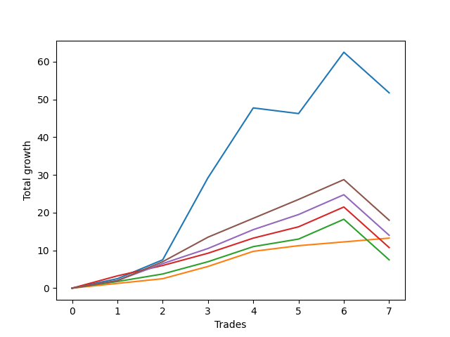

# Short Wallace 013 
- Symbol: ES_SmolBoi
- Date Range: 03/18/2022 - 07/29/2022
- Trading Period: 7:20-12:30
- Number of Trades: 7



| Name | Win Percent | Profit | Avg Profit / Trade | Avg Time / Trade |      | Name | Win Percent | Profit | Avg Profit / Trade | Avg Time / Trade |
| ---- | ----------- | ------ | ------------------ | ---------------- | ---- | ---- | ----------- | ------ | ------------------ | ---------------- |
| Sorted By <br> Profit | | | | | | Sorted By <br> Win Percentage ||||
| Two | 71.43 | 25875.00 | 3696.43 | 14:57 |     | Eighty-One | 100.00 | 6625.00 | 946.43 | 01:20 |
| Eighty-Five | 85.71 | 9000.00 | 1285.71 | 09:32 |     | Eighty-Five | 85.71 | 9000.00 | 1285.71 | 09:32 |
| Eighty-Four | 85.71 | 7000.00 | 1000.00 | 09:28 |     | Eighty-Four | 85.71 | 7000.00 | 1000.00 | 09:28 |
| Eighty-One | 100.00 | 6625.00 | 946.43 | 01:20 |     | Eighty-Three | 85.71 | 5375.00 | 767.86 | 09:16 |
| Eighty-Three | 85.71 | 5375.00 | 767.86 | 09:16 |     | Eighty-Two | 85.71 | 3750.00 | 535.71 | 05:57 |
| Eighty-Two | 85.71 | 3750.00 | 535.71 | 05:57 |     | Two | 71.43 | 25875.00 | 3696.43 | 14:57 |

## NO STOPLOSS

### Test Two
* Sell when the price hits the upper line of the 20p 2std bollinger
* No Stoploss
* Results:
```
Total Trades: 7
Percent Up: 28.57
Percent Down: 71.43
Total Points Moved Down: 51.75
Potential Profit: 25875.00
Total Points Ups: 12.25 Count Ups: 2
Total Points Downs: 64.00 Count Downs: 5
```

<details><summary>Trades</summary>

<code>In: 2022-03-31 07:48:00		Out: 2022-03-31 08:08:30		Total Position Time: 20:30		Total Move Down: 2.50		Total to Date: 2.50</code> <br />
<code>In: 2022-04-06 10:43:00		Out: 2022-04-06 10:57:20		Total Position Time: 14:20		Total Move Down: 5.00		Total to Date: 7.50</code> <br />
<code>In: 2022-04-06 11:04:00		Out: 2022-04-06 11:08:10		Total Position Time: 04:10		Total Move Down: 21.75		Total to Date: 29.25</code> <br />
<code>In: 2022-04-06 11:05:00		Out: 2022-04-06 11:08:10		Total Position Time: 03:10		Total Move Down: 18.50		Total to Date: 47.75</code> <br />
<code>In: 2022-05-31 07:23:00		Out: 2022-05-31 07:52:55		Total Position Time: 29:55		Total Move Down: -1.50		Total to Date: 46.25</code> <br />
<code>In: 2022-07-06 11:09:00		Out: 2022-07-06 11:11:45		Total Position Time: 02:45		Total Move Down: 16.25		Total to Date: 62.50</code> <br />
<code>In: 2022-07-06 11:31:00		Out: 2022-07-06 12:00:55		Total Position Time: 29:55		Total Move Down: -10.75		Total to Date: 51.75</code> <br />


</details>

## TAKE PROFIT

### Test Eighty-One
* Take Profit of 1 Point
* No Stoploss
* Results:
```
Total Trades: 7
Percent Up: 0.00
Percent Down: 100.00
Total Points Moved Down: 13.25
Potential Profit: 6625.00
Total Points Ups: 0.00 Count Ups: 0
Total Points Downs: 13.25 Count Downs: 7
```

<details><summary>Trades</summary>

<code>In: 2022-03-31 07:48:00		Out: 2022-03-31 07:53:10		Total Position Time: 05:10		Total Move Down: 1.25		Total to Date: 1.25</code> <br />
<code>In: 2022-04-06 10:43:00		Out: 2022-04-06 10:46:05		Total Position Time: 03:05		Total Move Down: 1.25		Total to Date: 2.50</code> <br />
<code>In: 2022-04-06 11:04:00		Out: 2022-04-06 11:04:10		Total Position Time: 00:10		Total Move Down: 3.25		Total to Date: 5.75</code> <br />
<code>In: 2022-04-06 11:05:00		Out: 2022-04-06 11:05:10		Total Position Time: 00:10		Total Move Down: 4.00		Total to Date: 9.75</code> <br />
<code>In: 2022-05-31 07:23:00		Out: 2022-05-31 07:23:15		Total Position Time: 00:15		Total Move Down: 1.50		Total to Date: 11.25</code> <br />
<code>In: 2022-07-06 11:09:00		Out: 2022-07-06 11:09:15		Total Position Time: 00:15		Total Move Down: 1.00		Total to Date: 12.25</code> <br />
<code>In: 2022-07-06 11:31:00		Out: 2022-07-06 11:31:15		Total Position Time: 00:15		Total Move Down: 1.00		Total to Date: 13.25</code> <br />


</details>

### Test Eighty-Two
* Take Profit of 2 Point
* No Stoploss
* Results:
```
Total Trades: 7
Percent Up: 14.29
Percent Down: 85.71
Total Points Moved Down: 7.50
Potential Profit: 3750.00
Total Points Ups: 10.75 Count Ups: 1
Total Points Downs: 18.25 Count Downs: 6
```

<details><summary>Trades</summary>

<code>In: 2022-03-31 07:48:00		Out: 2022-03-31 07:54:45		Total Position Time: 06:45		Total Move Down: 1.75		Total to Date: 1.75</code> <br />
<code>In: 2022-04-06 10:43:00		Out: 2022-04-06 10:46:40		Total Position Time: 03:40		Total Move Down: 2.00		Total to Date: 3.75</code> <br />
<code>In: 2022-04-06 11:04:00		Out: 2022-04-06 11:04:10		Total Position Time: 00:10		Total Move Down: 3.25		Total to Date: 7.00</code> <br />
<code>In: 2022-04-06 11:05:00		Out: 2022-04-06 11:05:10		Total Position Time: 00:10		Total Move Down: 4.00		Total to Date: 11.00</code> <br />
<code>In: 2022-05-31 07:23:00		Out: 2022-05-31 07:23:35		Total Position Time: 00:35		Total Move Down: 2.00		Total to Date: 13.00</code> <br />
<code>In: 2022-07-06 11:09:00		Out: 2022-07-06 11:09:25		Total Position Time: 00:25		Total Move Down: 5.25		Total to Date: 18.25</code> <br />
<code>In: 2022-07-06 11:31:00		Out: 2022-07-06 12:00:55		Total Position Time: 29:55		Total Move Down: -10.75		Total to Date: 7.50</code> <br />


</details>

### Test Eighty-Three
* Take Profit of 3 Point
* No Stoploss
* Results:
```
Total Trades: 7
Percent Up: 14.29
Percent Down: 85.71
Total Points Moved Down: 10.75
Potential Profit: 5375.00
Total Points Ups: 10.75 Count Ups: 1
Total Points Downs: 21.50 Count Downs: 6
```

<details><summary>Trades</summary>

<code>In: 2022-03-31 07:48:00		Out: 2022-03-31 08:17:35		Total Position Time: 29:35		Total Move Down: 3.25		Total to Date: 3.25</code> <br />
<code>In: 2022-04-06 10:43:00		Out: 2022-04-06 10:47:00		Total Position Time: 04:00		Total Move Down: 2.75		Total to Date: 6.00</code> <br />
<code>In: 2022-04-06 11:04:00		Out: 2022-04-06 11:04:10		Total Position Time: 00:10		Total Move Down: 3.25		Total to Date: 9.25</code> <br />
<code>In: 2022-04-06 11:05:00		Out: 2022-04-06 11:05:10		Total Position Time: 00:10		Total Move Down: 4.00		Total to Date: 13.25</code> <br />
<code>In: 2022-05-31 07:23:00		Out: 2022-05-31 07:23:40		Total Position Time: 00:40		Total Move Down: 3.00		Total to Date: 16.25</code> <br />
<code>In: 2022-07-06 11:09:00		Out: 2022-07-06 11:09:25		Total Position Time: 00:25		Total Move Down: 5.25		Total to Date: 21.50</code> <br />
<code>In: 2022-07-06 11:31:00		Out: 2022-07-06 12:00:55		Total Position Time: 29:55		Total Move Down: -10.75		Total to Date: 10.75</code> <br />


</details>

### Test Eighty-Four
* Take Profit of 4 Point
* No Stoploss
* Results:
```
Total Trades: 7
Percent Up: 14.29
Percent Down: 85.71
Total Points Moved Down: 14.00
Potential Profit: 7000.00
Total Points Ups: 10.75 Count Ups: 1
Total Points Downs: 24.75 Count Downs: 6
```

<details><summary>Trades</summary>

<code>In: 2022-03-31 07:48:00		Out: 2022-03-31 08:17:55		Total Position Time: 29:55		Total Move Down: 2.00		Total to Date: 2.00</code> <br />
<code>In: 2022-04-06 10:43:00		Out: 2022-04-06 10:47:10		Total Position Time: 04:10		Total Move Down: 4.50		Total to Date: 6.50</code> <br />
<code>In: 2022-04-06 11:04:00		Out: 2022-04-06 11:04:25		Total Position Time: 00:25		Total Move Down: 4.00		Total to Date: 10.50</code> <br />
<code>In: 2022-04-06 11:05:00		Out: 2022-04-06 11:05:25		Total Position Time: 00:25		Total Move Down: 5.00		Total to Date: 15.50</code> <br />
<code>In: 2022-05-31 07:23:00		Out: 2022-05-31 07:24:05		Total Position Time: 01:05		Total Move Down: 4.00		Total to Date: 19.50</code> <br />
<code>In: 2022-07-06 11:09:00		Out: 2022-07-06 11:09:25		Total Position Time: 00:25		Total Move Down: 5.25		Total to Date: 24.75</code> <br />
<code>In: 2022-07-06 11:31:00		Out: 2022-07-06 12:00:55		Total Position Time: 29:55		Total Move Down: -10.75		Total to Date: 14.00</code> <br />


</details>

### Test Eighty-Five
* Take Profit of 5 Point
* No Stoploss
* Results:
```
Total Trades: 7
Percent Up: 14.29
Percent Down: 85.71
Total Points Moved Down: 18.00
Potential Profit: 9000.00
Total Points Ups: 10.75 Count Ups: 1
Total Points Downs: 28.75 Count Downs: 6
```

<details><summary>Trades</summary>

<code>In: 2022-03-31 07:48:00		Out: 2022-03-31 08:17:55		Total Position Time: 29:55		Total Move Down: 2.00		Total to Date: 2.00</code> <br />
<code>In: 2022-04-06 10:43:00		Out: 2022-04-06 10:47:20		Total Position Time: 04:20		Total Move Down: 5.00		Total to Date: 7.00</code> <br />
<code>In: 2022-04-06 11:04:00		Out: 2022-04-06 11:04:35		Total Position Time: 00:35		Total Move Down: 6.50		Total to Date: 13.50</code> <br />
<code>In: 2022-04-06 11:05:00		Out: 2022-04-06 11:05:25		Total Position Time: 00:25		Total Move Down: 5.00		Total to Date: 18.50</code> <br />
<code>In: 2022-05-31 07:23:00		Out: 2022-05-31 07:24:15		Total Position Time: 01:15		Total Move Down: 5.00		Total to Date: 23.50</code> <br />
<code>In: 2022-07-06 11:09:00		Out: 2022-07-06 11:09:25		Total Position Time: 00:25		Total Move Down: 5.25		Total to Date: 28.75</code> <br />
<code>In: 2022-07-06 11:31:00		Out: 2022-07-06 12:00:55		Total Position Time: 29:55		Total Move Down: -10.75		Total to Date: 18.00</code> <br />


</details>