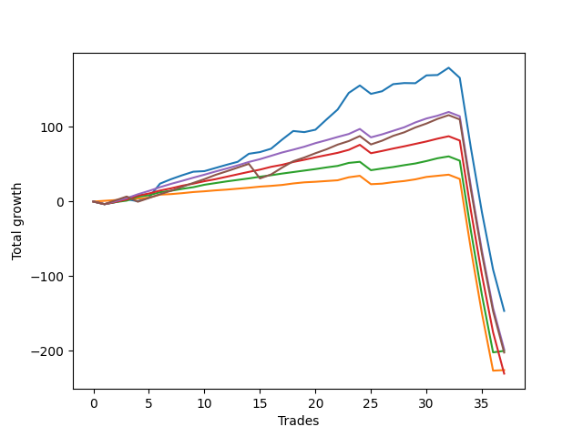

# Short Wallace 014 
- Symbol: ES_SmolBoi
- Date Range: 03/18/2022 - 07/29/2022
- Trading Period: 7:20-12:30
- Number of Trades: 37



| Name | Win Percent | Profit | Avg Profit / Trade | Avg Time / Trade |      | Name | Win Percent | Profit | Avg Profit / Trade | Avg Time / Trade |
| ---- | ----------- | ------ | ------------------ | ---------------- | ---- | ---- | ----------- | ------ | ------------------ | ---------------- |
| Sorted By <br> Profit | | | | | | Sorted By <br> Win Percentage ||||
| Two | 72.97 | -73250.00 | -1979.73 | 170:53 |     | Eighty-One | 86.49 | -112875.00 | -3050.68 | 123:42 |
| Eighty-Four | 81.08 | -99000.00 | -2675.68 | 165:03 |     | Eighty-Two | 83.78 | -100000.00 | -2702.70 | 126:10 |
| Eighty-Two | 83.78 | -100000.00 | -2702.70 | 126:10 |     | Eighty-Four | 81.08 | -99000.00 | -2675.68 | 165:03 |
| Eighty-Five | 75.68 | -101125.00 | -2733.11 | 167:14 |     | Eighty-Three | 81.08 | -115250.00 | -3114.86 | 163:59 |
| Eighty-One | 86.49 | -112875.00 | -3050.68 | 123:42 |     | Eighty-Five | 75.68 | -101125.00 | -2733.11 | 167:14 |
| Eighty-Three | 81.08 | -115250.00 | -3114.86 | 163:59 |     | Two | 72.97 | -73250.00 | -1979.73 | 170:53 |

## NO STOPLOSS

### Test Two
* Sell when the price hits the upper line of the 20p 2std bollinger
* No Stoploss
* Results:
```
Total Trades: 37
Percent Up: 27.03
Percent Down: 72.97
Total Points Moved Down: -146.50
Potential Profit: -73250.00
Total Points Ups: 344.75 Count Ups: 10
Total Points Downs: 198.25 Count Downs: 27
```

<details><summary>Trades</summary>

<code>In: 2022-03-25 11:05:00		Out: 2022-03-25 11:34:55		Total Position Time: 29:55		Total Move Down: -3.50		Total to Date: -3.50</code> <br />
<code>In: 2022-03-25 11:57:00		Out: 2022-03-25 12:00:55		Total Position Time: 03:55		Total Move Down: 2.75		Total to Date: -0.75</code> <br />
<code>In: 2022-04-01 11:34:00		Out: 2022-04-01 11:50:20		Total Position Time: 16:20		Total Move Down: 3.75		Total to Date: 3.00</code> <br />
<code>In: 2022-04-06 10:36:00		Out: 2022-04-06 10:57:20		Total Position Time: 21:20		Total Move Down: -2.50		Total to Date: 0.50</code> <br />
<code>In: 2022-04-06 10:43:00		Out: 2022-04-06 10:57:20		Total Position Time: 14:20		Total Move Down: 5.00		Total to Date: 5.50</code> <br />
<code>In: 2022-04-06 11:05:00		Out: 2022-04-06 11:08:10		Total Position Time: 03:10		Total Move Down: 18.50		Total to Date: 24.00</code> <br />
<code>In: 2022-04-07 11:03:00		Out: 2022-04-07 11:18:20		Total Position Time: 15:20		Total Move Down: 6.00		Total to Date: 30.00</code> <br />
<code>In: 2022-04-08 07:33:00		Out: 2022-04-08 07:49:20		Total Position Time: 16:20		Total Move Down: 5.25		Total to Date: 35.25</code> <br />
<code>In: 2022-04-18 07:27:00		Out: 2022-04-18 07:51:45		Total Position Time: 24:45		Total Move Down: 4.75		Total to Date: 40.00</code> <br />
<code>In: 2022-04-20 07:40:00		Out: 2022-04-20 08:00:45		Total Position Time: 20:45		Total Move Down: 0.75		Total to Date: 40.75</code> <br />
<code>In: 2022-04-20 09:54:00		Out: 2022-04-20 10:08:15		Total Position Time: 14:15		Total Move Down: 4.25		Total to Date: 45.00</code> <br />
<code>In: 2022-04-25 10:14:00		Out: 2022-04-25 10:33:35		Total Position Time: 19:35		Total Move Down: 4.25		Total to Date: 49.25</code> <br />
<code>In: 2022-04-27 08:34:00		Out: 2022-04-27 08:50:10		Total Position Time: 16:10		Total Move Down: 4.00		Total to Date: 53.25</code> <br />
<code>In: 2022-05-24 09:18:00		Out: 2022-05-24 09:31:20		Total Position Time: 13:20		Total Move Down: 10.75		Total to Date: 64.00</code> <br />
<code>In: 2022-05-24 10:43:00		Out: 2022-05-24 11:01:50		Total Position Time: 18:50		Total Move Down: 2.25		Total to Date: 66.25</code> <br />
<code>In: 2022-05-24 10:47:00		Out: 2022-05-24 11:01:50		Total Position Time: 14:50		Total Move Down: 4.50		Total to Date: 70.75</code> <br />
<code>In: 2022-05-25 11:04:00		Out: 2022-05-25 11:06:40		Total Position Time: 02:40		Total Move Down: 12.25		Total to Date: 83.00</code> <br />
<code>In: 2022-05-25 11:06:00		Out: 2022-05-25 11:06:40		Total Position Time: 00:40		Total Move Down: 11.50		Total to Date: 94.50</code> <br />
<code>In: 2022-05-31 07:23:00		Out: 2022-05-31 07:52:55		Total Position Time: 29:55		Total Move Down: -1.50		Total to Date: 93.00</code> <br />
<code>In: 2022-06-09 10:08:00		Out: 2022-06-09 10:18:55		Total Position Time: 10:55		Total Move Down: 3.25		Total to Date: 96.25</code> <br />
<code>In: 2022-06-10 12:00:00		Out: 2022-06-10 12:05:55		Total Position Time: 05:55		Total Move Down: 13.75		Total to Date: 110.00</code> <br />
<code>In: 2022-06-10 12:29:00		Out: 2022-06-10 12:42:45		Total Position Time: 13:45		Total Move Down: 13.25		Total to Date: 123.25</code> <br />
<code>In: 2022-06-13 09:40:00		Out: 2022-06-13 09:54:20		Total Position Time: 14:20		Total Move Down: 22.25		Total to Date: 145.50</code> <br />
<code>In: 2022-06-15 11:02:00		Out: 2022-06-15 11:03:05		Total Position Time: 01:05		Total Move Down: 10.00		Total to Date: 155.50</code> <br />
<code>In: 2022-06-23 12:30:00		Out: 2022-06-23 12:46:00		Total Position Time: 16:00		Total Move Down: -11.25		Total to Date: 144.25</code> <br />
<code>In: 2022-06-29 11:06:00		Out: 2022-06-29 11:20:45		Total Position Time: 14:45		Total Move Down: 3.50		Total to Date: 147.75</code> <br />
<code>In: 2022-06-29 12:31:00		Out: 2022-06-29 12:35:20		Total Position Time: 04:20		Total Move Down: 9.50		Total to Date: 157.25</code> <br />
<code>In: 2022-07-01 10:47:00		Out: 2022-07-01 11:07:55		Total Position Time: 20:55		Total Move Down: 1.50		Total to Date: 158.75</code> <br />
<code>In: 2022-07-06 11:01:00		Out: 2022-07-06 11:02:20		Total Position Time: 01:20		Total Move Down: -0.25		Total to Date: 158.50</code> <br />
<code>In: 2022-07-06 11:10:00		Out: 2022-07-06 11:11:45		Total Position Time: 01:45		Total Move Down: 10.50		Total to Date: 169.00</code> <br />
<code>In: 2022-07-06 11:35:00		Out: 2022-07-06 12:01:25		Total Position Time: 26:25		Total Move Down: 0.50		Total to Date: 169.50</code> <br />
<code>In: 2022-07-12 08:14:00		Out: 2022-07-12 10:26:00		Total Position Time: 132:00		Total Move Down: 9.75		Total to Date: 179.25</code> <br />
<code>In: 2022-07-13 07:37:00		Out: 2022-07-13 13:00:00		Total Position Time: 323:00		Total Move Down: -13.50		Total to Date: 165.75</code> <br />
<code>In: 2022-07-14 08:02:00		Out: 2022-07-15 06:42:00		Total Position Time: 1360:00		Total Move Down: -93.75		Total to Date: 72.00</code> <br />
<code>In: 2022-07-14 08:07:00		Out: 2022-07-15 06:47:00		Total Position Time: 1360:00		Total Move Down: -86.50		Total to Date: -14.50</code> <br />
<code>In: 2022-07-14 08:12:00		Out: 2022-07-15 06:52:00		Total Position Time: 1360:00		Total Move Down: -76.50		Total to Date: -91.00</code> <br />
<code>In: 2022-07-21 08:01:00		Out: 2022-07-22 06:41:00		Total Position Time: 1360:00		Total Move Down: -55.50		Total to Date: -146.50</code> <br />


</details>

## TAKE PROFIT

### Test Eighty-One
* Take Profit of 1 Point
* No Stoploss
* Results:
```
Total Trades: 37
Percent Up: 13.51
Percent Down: 86.49
Total Points Moved Down: -225.75
Potential Profit: -112875.00
Total Points Ups: 273.75 Count Ups: 5
Total Points Downs: 48.00 Count Downs: 32
```

<details><summary>Trades</summary>

<code>In: 2022-03-25 11:05:00		Out: 2022-03-25 11:12:10		Total Position Time: 07:10		Total Move Down: 1.00		Total to Date: 1.00</code> <br />
<code>In: 2022-03-25 11:57:00		Out: 2022-03-25 11:58:45		Total Position Time: 01:45		Total Move Down: 1.00		Total to Date: 2.00</code> <br />
<code>In: 2022-04-01 11:34:00		Out: 2022-04-01 11:36:40		Total Position Time: 02:40		Total Move Down: 1.00		Total to Date: 3.00</code> <br />
<code>In: 2022-04-06 10:36:00		Out: 2022-04-06 10:36:10		Total Position Time: 00:10		Total Move Down: 1.00		Total to Date: 4.00</code> <br />
<code>In: 2022-04-06 10:43:00		Out: 2022-04-06 10:46:05		Total Position Time: 03:05		Total Move Down: 1.25		Total to Date: 5.25</code> <br />
<code>In: 2022-04-06 11:05:00		Out: 2022-04-06 11:05:10		Total Position Time: 00:10		Total Move Down: 4.00		Total to Date: 9.25</code> <br />
<code>In: 2022-04-07 11:03:00		Out: 2022-04-07 11:04:00		Total Position Time: 01:00		Total Move Down: 0.75		Total to Date: 10.00</code> <br />
<code>In: 2022-04-08 07:33:00		Out: 2022-04-08 07:33:25		Total Position Time: 00:25		Total Move Down: 1.25		Total to Date: 11.25</code> <br />
<code>In: 2022-04-18 07:27:00		Out: 2022-04-18 07:27:20		Total Position Time: 00:20		Total Move Down: 1.50		Total to Date: 12.75</code> <br />
<code>In: 2022-04-20 07:40:00		Out: 2022-04-20 07:48:05		Total Position Time: 08:05		Total Move Down: 1.00		Total to Date: 13.75</code> <br />
<code>In: 2022-04-20 09:54:00		Out: 2022-04-20 09:54:30		Total Position Time: 00:30		Total Move Down: 1.25		Total to Date: 15.00</code> <br />
<code>In: 2022-04-25 10:14:00		Out: 2022-04-25 10:23:05		Total Position Time: 09:05		Total Move Down: 1.00		Total to Date: 16.00</code> <br />
<code>In: 2022-04-27 08:34:00		Out: 2022-04-27 08:34:10		Total Position Time: 00:10		Total Move Down: 1.25		Total to Date: 17.25</code> <br />
<code>In: 2022-05-24 09:18:00		Out: 2022-05-24 09:18:50		Total Position Time: 00:50		Total Move Down: 1.25		Total to Date: 18.50</code> <br />
<code>In: 2022-05-24 10:43:00		Out: 2022-05-24 10:43:10		Total Position Time: 00:10		Total Move Down: 1.50		Total to Date: 20.00</code> <br />
<code>In: 2022-05-24 10:47:00		Out: 2022-05-24 10:47:10		Total Position Time: 00:10		Total Move Down: 1.00		Total to Date: 21.00</code> <br />
<code>In: 2022-05-25 11:04:00		Out: 2022-05-25 11:04:10		Total Position Time: 00:10		Total Move Down: 1.25		Total to Date: 22.25</code> <br />
<code>In: 2022-05-25 11:06:00		Out: 2022-05-25 11:06:20		Total Position Time: 00:20		Total Move Down: 2.00		Total to Date: 24.25</code> <br />
<code>In: 2022-05-31 07:23:00		Out: 2022-05-31 07:23:15		Total Position Time: 00:15		Total Move Down: 1.50		Total to Date: 25.75</code> <br />
<code>In: 2022-06-09 10:08:00		Out: 2022-06-09 10:10:15		Total Position Time: 02:15		Total Move Down: 0.75		Total to Date: 26.50</code> <br />
<code>In: 2022-06-10 12:00:00		Out: 2022-06-10 12:02:05		Total Position Time: 02:05		Total Move Down: 1.00		Total to Date: 27.50</code> <br />
<code>In: 2022-06-10 12:29:00		Out: 2022-06-10 12:29:10		Total Position Time: 00:10		Total Move Down: 1.00		Total to Date: 28.50</code> <br />
<code>In: 2022-06-13 09:40:00		Out: 2022-06-13 09:40:10		Total Position Time: 00:10		Total Move Down: 4.00		Total to Date: 32.50</code> <br />
<code>In: 2022-06-15 11:02:00		Out: 2022-06-15 11:02:10		Total Position Time: 00:10		Total Move Down: 2.00		Total to Date: 34.50</code> <br />
<code>In: 2022-06-23 12:30:00		Out: 2022-06-23 12:46:00		Total Position Time: 16:00		Total Move Down: -11.25		Total to Date: 23.25</code> <br />
<code>In: 2022-06-29 11:06:00		Out: 2022-06-29 11:07:45		Total Position Time: 01:45		Total Move Down: 0.75		Total to Date: 24.00</code> <br />
<code>In: 2022-06-29 12:31:00		Out: 2022-06-29 12:31:10		Total Position Time: 00:10		Total Move Down: 2.00		Total to Date: 26.00</code> <br />
<code>In: 2022-07-01 10:47:00		Out: 2022-07-01 11:07:55		Total Position Time: 20:55		Total Move Down: 1.50		Total to Date: 27.50</code> <br />
<code>In: 2022-07-06 11:01:00		Out: 2022-07-06 11:02:25		Total Position Time: 01:25		Total Move Down: 2.25		Total to Date: 29.75</code> <br />
<code>In: 2022-07-06 11:10:00		Out: 2022-07-06 11:10:10		Total Position Time: 00:10		Total Move Down: 3.25		Total to Date: 33.00</code> <br />
<code>In: 2022-07-06 11:35:00		Out: 2022-07-06 11:36:10		Total Position Time: 01:10		Total Move Down: 1.50		Total to Date: 34.50</code> <br />
<code>In: 2022-07-12 08:14:00		Out: 2022-07-12 08:38:00		Total Position Time: 24:00		Total Move Down: 1.50		Total to Date: 36.00</code> <br />
<code>In: 2022-07-13 07:37:00		Out: 2022-07-13 13:47:00		Total Position Time: 370:00		Total Move Down: -5.75		Total to Date: 30.25</code> <br />
<code>In: 2022-07-14 08:02:00		Out: 2022-07-15 06:42:00		Total Position Time: 1360:00		Total Move Down: -93.75		Total to Date: -63.50</code> <br />
<code>In: 2022-07-14 08:07:00		Out: 2022-07-15 06:47:00		Total Position Time: 1360:00		Total Move Down: -86.50		Total to Date: -150.00</code> <br />
<code>In: 2022-07-14 08:12:00		Out: 2022-07-15 06:52:00		Total Position Time: 1360:00		Total Move Down: -76.50		Total to Date: -226.50</code> <br />
<code>In: 2022-07-21 08:01:00		Out: 2022-07-21 08:21:00		Total Position Time: 20:00		Total Move Down: 0.75		Total to Date: -225.75</code> <br />


</details>

### Test Eighty-Two
* Take Profit of 2 Point
* No Stoploss
* Results:
```
Total Trades: 37
Percent Up: 16.22
Percent Down: 83.78
Total Points Moved Down: -200.00
Potential Profit: -100000.00
Total Points Ups: 277.25 Count Ups: 6
Total Points Downs: 77.25 Count Downs: 31
```

<details><summary>Trades</summary>

<code>In: 2022-03-25 11:05:00		Out: 2022-03-25 11:34:55		Total Position Time: 29:55		Total Move Down: -3.50		Total to Date: -3.50</code> <br />
<code>In: 2022-03-25 11:57:00		Out: 2022-03-25 12:00:50		Total Position Time: 03:50		Total Move Down: 2.75		Total to Date: -0.75</code> <br />
<code>In: 2022-04-01 11:34:00		Out: 2022-04-01 11:36:55		Total Position Time: 02:55		Total Move Down: 2.00		Total to Date: 1.25</code> <br />
<code>In: 2022-04-06 10:36:00		Out: 2022-04-06 11:00:10		Total Position Time: 24:10		Total Move Down: 5.25		Total to Date: 6.50</code> <br />
<code>In: 2022-04-06 10:43:00		Out: 2022-04-06 10:46:40		Total Position Time: 03:40		Total Move Down: 2.00		Total to Date: 8.50</code> <br />
<code>In: 2022-04-06 11:05:00		Out: 2022-04-06 11:05:10		Total Position Time: 00:10		Total Move Down: 4.00		Total to Date: 12.50</code> <br />
<code>In: 2022-04-07 11:03:00		Out: 2022-04-07 11:04:05		Total Position Time: 01:05		Total Move Down: 2.00		Total to Date: 14.50</code> <br />
<code>In: 2022-04-08 07:33:00		Out: 2022-04-08 07:33:35		Total Position Time: 00:35		Total Move Down: 2.50		Total to Date: 17.00</code> <br />
<code>In: 2022-04-18 07:27:00		Out: 2022-04-18 07:27:30		Total Position Time: 00:30		Total Move Down: 2.25		Total to Date: 19.25</code> <br />
<code>In: 2022-04-20 07:40:00		Out: 2022-04-20 08:01:10		Total Position Time: 21:10		Total Move Down: 3.25		Total to Date: 22.50</code> <br />
<code>In: 2022-04-20 09:54:00		Out: 2022-04-20 09:57:25		Total Position Time: 03:25		Total Move Down: 2.25		Total to Date: 24.75</code> <br />
<code>In: 2022-04-25 10:14:00		Out: 2022-04-25 10:27:05		Total Position Time: 13:05		Total Move Down: 2.25		Total to Date: 27.00</code> <br />
<code>In: 2022-04-27 08:34:00		Out: 2022-04-27 08:34:25		Total Position Time: 00:25		Total Move Down: 2.00		Total to Date: 29.00</code> <br />
<code>In: 2022-05-24 09:18:00		Out: 2022-05-24 09:20:10		Total Position Time: 02:10		Total Move Down: 2.00		Total to Date: 31.00</code> <br />
<code>In: 2022-05-24 10:43:00		Out: 2022-05-24 10:47:50		Total Position Time: 04:50		Total Move Down: 2.25		Total to Date: 33.25</code> <br />
<code>In: 2022-05-24 10:47:00		Out: 2022-05-24 10:47:30		Total Position Time: 00:30		Total Move Down: 2.00		Total to Date: 35.25</code> <br />
<code>In: 2022-05-25 11:04:00		Out: 2022-05-25 11:05:45		Total Position Time: 01:45		Total Move Down: 2.25		Total to Date: 37.50</code> <br />
<code>In: 2022-05-25 11:06:00		Out: 2022-05-25 11:06:20		Total Position Time: 00:20		Total Move Down: 2.00		Total to Date: 39.50</code> <br />
<code>In: 2022-05-31 07:23:00		Out: 2022-05-31 07:23:35		Total Position Time: 00:35		Total Move Down: 2.00		Total to Date: 41.50</code> <br />
<code>In: 2022-06-09 10:08:00		Out: 2022-06-09 10:16:55		Total Position Time: 08:55		Total Move Down: 2.00		Total to Date: 43.50</code> <br />
<code>In: 2022-06-10 12:00:00		Out: 2022-06-10 12:02:15		Total Position Time: 02:15		Total Move Down: 2.25		Total to Date: 45.75</code> <br />
<code>In: 2022-06-10 12:29:00		Out: 2022-06-10 12:29:20		Total Position Time: 00:20		Total Move Down: 2.00		Total to Date: 47.75</code> <br />
<code>In: 2022-06-13 09:40:00		Out: 2022-06-13 09:40:10		Total Position Time: 00:10		Total Move Down: 4.00		Total to Date: 51.75</code> <br />
<code>In: 2022-06-15 11:02:00		Out: 2022-06-15 11:02:45		Total Position Time: 00:45		Total Move Down: 1.50		Total to Date: 53.25</code> <br />
<code>In: 2022-06-23 12:30:00		Out: 2022-06-23 12:46:00		Total Position Time: 16:00		Total Move Down: -11.25		Total to Date: 42.00</code> <br />
<code>In: 2022-06-29 11:06:00		Out: 2022-06-29 11:08:05		Total Position Time: 02:05		Total Move Down: 2.25		Total to Date: 44.25</code> <br />
<code>In: 2022-06-29 12:31:00		Out: 2022-06-29 12:31:10		Total Position Time: 00:10		Total Move Down: 2.00		Total to Date: 46.25</code> <br />
<code>In: 2022-07-01 10:47:00		Out: 2022-07-01 11:08:30		Total Position Time: 21:30		Total Move Down: 2.50		Total to Date: 48.75</code> <br />
<code>In: 2022-07-06 11:01:00		Out: 2022-07-06 11:02:25		Total Position Time: 01:25		Total Move Down: 2.25		Total to Date: 51.00</code> <br />
<code>In: 2022-07-06 11:10:00		Out: 2022-07-06 11:10:10		Total Position Time: 00:10		Total Move Down: 3.25		Total to Date: 54.25</code> <br />
<code>In: 2022-07-06 11:35:00		Out: 2022-07-06 11:36:35		Total Position Time: 01:35		Total Move Down: 3.75		Total to Date: 58.00</code> <br />
<code>In: 2022-07-12 08:14:00		Out: 2022-07-12 08:39:00		Total Position Time: 25:00		Total Move Down: 2.50		Total to Date: 60.50</code> <br />
<code>In: 2022-07-13 07:37:00		Out: 2022-07-13 13:47:00		Total Position Time: 370:00		Total Move Down: -5.75		Total to Date: 54.75</code> <br />
<code>In: 2022-07-14 08:02:00		Out: 2022-07-15 06:42:00		Total Position Time: 1360:00		Total Move Down: -93.75		Total to Date: -39.00</code> <br />
<code>In: 2022-07-14 08:07:00		Out: 2022-07-15 06:47:00		Total Position Time: 1360:00		Total Move Down: -86.50		Total to Date: -125.50</code> <br />
<code>In: 2022-07-14 08:12:00		Out: 2022-07-15 06:52:00		Total Position Time: 1360:00		Total Move Down: -76.50		Total to Date: -202.00</code> <br />
<code>In: 2022-07-21 08:01:00		Out: 2022-07-21 08:24:00		Total Position Time: 23:00		Total Move Down: 2.00		Total to Date: -200.00</code> <br />


</details>

### Test Eighty-Three
* Take Profit of 3 Point
* No Stoploss
* Results:
```
Total Trades: 37
Percent Up: 18.92
Percent Down: 81.08
Total Points Moved Down: -230.50
Potential Profit: -115250.00
Total Points Ups: 332.75 Count Ups: 7
Total Points Downs: 102.25 Count Downs: 30
```

<details><summary>Trades</summary>

<code>In: 2022-03-25 11:05:00		Out: 2022-03-25 11:34:55		Total Position Time: 29:55		Total Move Down: -3.50		Total to Date: -3.50</code> <br />
<code>In: 2022-03-25 11:57:00		Out: 2022-03-25 12:01:00		Total Position Time: 04:00		Total Move Down: 3.00		Total to Date: -0.50</code> <br />
<code>In: 2022-04-01 11:34:00		Out: 2022-04-01 11:37:40		Total Position Time: 03:40		Total Move Down: 3.25		Total to Date: 2.75</code> <br />
<code>In: 2022-04-06 10:36:00		Out: 2022-04-06 11:00:10		Total Position Time: 24:10		Total Move Down: 5.25		Total to Date: 8.00</code> <br />
<code>In: 2022-04-06 10:43:00		Out: 2022-04-06 10:47:00		Total Position Time: 04:00		Total Move Down: 2.75		Total to Date: 10.75</code> <br />
<code>In: 2022-04-06 11:05:00		Out: 2022-04-06 11:05:10		Total Position Time: 00:10		Total Move Down: 4.00		Total to Date: 14.75</code> <br />
<code>In: 2022-04-07 11:03:00		Out: 2022-04-07 11:04:20		Total Position Time: 01:20		Total Move Down: 3.00		Total to Date: 17.75</code> <br />
<code>In: 2022-04-08 07:33:00		Out: 2022-04-08 07:38:35		Total Position Time: 05:35		Total Move Down: 3.50		Total to Date: 21.25</code> <br />
<code>In: 2022-04-18 07:27:00		Out: 2022-04-18 07:27:45		Total Position Time: 00:45		Total Move Down: 2.75		Total to Date: 24.00</code> <br />
<code>In: 2022-04-20 07:40:00		Out: 2022-04-20 08:01:10		Total Position Time: 21:10		Total Move Down: 3.25		Total to Date: 27.25</code> <br />
<code>In: 2022-04-20 09:54:00		Out: 2022-04-20 09:59:05		Total Position Time: 05:05		Total Move Down: 2.75		Total to Date: 30.00</code> <br />
<code>In: 2022-04-25 10:14:00		Out: 2022-04-25 10:27:10		Total Position Time: 13:10		Total Move Down: 3.25		Total to Date: 33.25</code> <br />
<code>In: 2022-04-27 08:34:00		Out: 2022-04-27 08:40:30		Total Position Time: 06:30		Total Move Down: 3.25		Total to Date: 36.50</code> <br />
<code>In: 2022-05-24 09:18:00		Out: 2022-05-24 09:21:05		Total Position Time: 03:05		Total Move Down: 3.25		Total to Date: 39.75</code> <br />
<code>In: 2022-05-24 10:43:00		Out: 2022-05-24 11:04:55		Total Position Time: 21:55		Total Move Down: 3.00		Total to Date: 42.75</code> <br />
<code>In: 2022-05-24 10:47:00		Out: 2022-05-24 10:47:45		Total Position Time: 00:45		Total Move Down: 3.75		Total to Date: 46.50</code> <br />
<code>In: 2022-05-25 11:04:00		Out: 2022-05-25 11:06:20		Total Position Time: 02:20		Total Move Down: 2.75		Total to Date: 49.25</code> <br />
<code>In: 2022-05-25 11:06:00		Out: 2022-05-25 11:06:25		Total Position Time: 00:25		Total Move Down: 3.75		Total to Date: 53.00</code> <br />
<code>In: 2022-05-31 07:23:00		Out: 2022-05-31 07:23:40		Total Position Time: 00:40		Total Move Down: 3.00		Total to Date: 56.00</code> <br />
<code>In: 2022-06-09 10:08:00		Out: 2022-06-09 10:18:55		Total Position Time: 10:55		Total Move Down: 3.25		Total to Date: 59.25</code> <br />
<code>In: 2022-06-10 12:00:00		Out: 2022-06-10 12:02:30		Total Position Time: 02:30		Total Move Down: 3.00		Total to Date: 62.25</code> <br />
<code>In: 2022-06-10 12:29:00		Out: 2022-06-10 12:30:10		Total Position Time: 01:10		Total Move Down: 3.00		Total to Date: 65.25</code> <br />
<code>In: 2022-06-13 09:40:00		Out: 2022-06-13 09:40:10		Total Position Time: 00:10		Total Move Down: 4.00		Total to Date: 69.25</code> <br />
<code>In: 2022-06-15 11:02:00		Out: 2022-06-15 11:03:00		Total Position Time: 01:00		Total Move Down: 6.75		Total to Date: 76.00</code> <br />
<code>In: 2022-06-23 12:30:00		Out: 2022-06-23 12:46:00		Total Position Time: 16:00		Total Move Down: -11.25		Total to Date: 64.75</code> <br />
<code>In: 2022-06-29 11:06:00		Out: 2022-06-29 11:20:35		Total Position Time: 14:35		Total Move Down: 3.00		Total to Date: 67.75</code> <br />
<code>In: 2022-06-29 12:31:00		Out: 2022-06-29 12:32:15		Total Position Time: 01:15		Total Move Down: 3.25		Total to Date: 71.00</code> <br />
<code>In: 2022-07-01 10:47:00		Out: 2022-07-01 11:08:50		Total Position Time: 21:50		Total Move Down: 3.00		Total to Date: 74.00</code> <br />
<code>In: 2022-07-06 11:01:00		Out: 2022-07-06 11:12:05		Total Position Time: 11:05		Total Move Down: 3.25		Total to Date: 77.25</code> <br />
<code>In: 2022-07-06 11:10:00		Out: 2022-07-06 11:10:10		Total Position Time: 00:10		Total Move Down: 3.25		Total to Date: 80.50</code> <br />
<code>In: 2022-07-06 11:35:00		Out: 2022-07-06 11:36:35		Total Position Time: 01:35		Total Move Down: 3.75		Total to Date: 84.25</code> <br />
<code>In: 2022-07-12 08:14:00		Out: 2022-07-12 08:41:00		Total Position Time: 27:00		Total Move Down: 3.25		Total to Date: 87.50</code> <br />
<code>In: 2022-07-13 07:37:00		Out: 2022-07-13 13:47:00		Total Position Time: 370:00		Total Move Down: -5.75		Total to Date: 81.75</code> <br />
<code>In: 2022-07-14 08:02:00		Out: 2022-07-15 06:42:00		Total Position Time: 1360:00		Total Move Down: -93.75		Total to Date: -12.00</code> <br />
<code>In: 2022-07-14 08:07:00		Out: 2022-07-15 06:47:00		Total Position Time: 1360:00		Total Move Down: -86.50		Total to Date: -98.50</code> <br />
<code>In: 2022-07-14 08:12:00		Out: 2022-07-15 06:52:00		Total Position Time: 1360:00		Total Move Down: -76.50		Total to Date: -175.00</code> <br />
<code>In: 2022-07-21 08:01:00		Out: 2022-07-22 06:41:00		Total Position Time: 1360:00		Total Move Down: -55.50		Total to Date: -230.50</code> <br />


</details>

### Test Eighty-Four
* Take Profit of 4 Point
* No Stoploss
* Results:
```
Total Trades: 37
Percent Up: 18.92
Percent Down: 81.08
Total Points Moved Down: -198.00
Potential Profit: -99000.00
Total Points Ups: 332.75 Count Ups: 7
Total Points Downs: 134.75 Count Downs: 30
```

<details><summary>Trades</summary>

<code>In: 2022-03-25 11:05:00		Out: 2022-03-25 11:34:55		Total Position Time: 29:55		Total Move Down: -3.50		Total to Date: -3.50</code> <br />
<code>In: 2022-03-25 11:57:00		Out: 2022-03-25 12:01:45		Total Position Time: 04:45		Total Move Down: 4.00		Total to Date: 0.50</code> <br />
<code>In: 2022-04-01 11:34:00		Out: 2022-04-01 11:37:50		Total Position Time: 03:50		Total Move Down: 4.00		Total to Date: 4.50</code> <br />
<code>In: 2022-04-06 10:36:00		Out: 2022-04-06 11:00:10		Total Position Time: 24:10		Total Move Down: 5.25		Total to Date: 9.75</code> <br />
<code>In: 2022-04-06 10:43:00		Out: 2022-04-06 10:47:10		Total Position Time: 04:10		Total Move Down: 4.50		Total to Date: 14.25</code> <br />
<code>In: 2022-04-06 11:05:00		Out: 2022-04-06 11:05:25		Total Position Time: 00:25		Total Move Down: 5.00		Total to Date: 19.25</code> <br />
<code>In: 2022-04-07 11:03:00		Out: 2022-04-07 11:06:10		Total Position Time: 03:10		Total Move Down: 4.50		Total to Date: 23.75</code> <br />
<code>In: 2022-04-08 07:33:00		Out: 2022-04-08 07:45:10		Total Position Time: 12:10		Total Move Down: 4.00		Total to Date: 27.75</code> <br />
<code>In: 2022-04-18 07:27:00		Out: 2022-04-18 07:28:45		Total Position Time: 01:45		Total Move Down: 4.25		Total to Date: 32.00</code> <br />
<code>In: 2022-04-20 07:40:00		Out: 2022-04-20 08:03:50		Total Position Time: 23:50		Total Move Down: 4.00		Total to Date: 36.00</code> <br />
<code>In: 2022-04-20 09:54:00		Out: 2022-04-20 10:08:15		Total Position Time: 14:15		Total Move Down: 4.25		Total to Date: 40.25</code> <br />
<code>In: 2022-04-25 10:14:00		Out: 2022-04-25 10:27:50		Total Position Time: 13:50		Total Move Down: 4.00		Total to Date: 44.25</code> <br />
<code>In: 2022-04-27 08:34:00		Out: 2022-04-27 08:45:25		Total Position Time: 11:25		Total Move Down: 4.25		Total to Date: 48.50</code> <br />
<code>In: 2022-05-24 09:18:00		Out: 2022-05-24 09:21:15		Total Position Time: 03:15		Total Move Down: 4.50		Total to Date: 53.00</code> <br />
<code>In: 2022-05-24 10:43:00		Out: 2022-05-24 11:05:25		Total Position Time: 22:25		Total Move Down: 3.75		Total to Date: 56.75</code> <br />
<code>In: 2022-05-24 10:47:00		Out: 2022-05-24 10:47:50		Total Position Time: 00:50		Total Move Down: 4.50		Total to Date: 61.25</code> <br />
<code>In: 2022-05-25 11:04:00		Out: 2022-05-25 11:06:25		Total Position Time: 02:25		Total Move Down: 4.50		Total to Date: 65.75</code> <br />
<code>In: 2022-05-25 11:06:00		Out: 2022-05-25 11:06:25		Total Position Time: 00:25		Total Move Down: 3.75		Total to Date: 69.50</code> <br />
<code>In: 2022-05-31 07:23:00		Out: 2022-05-31 07:24:05		Total Position Time: 01:05		Total Move Down: 4.00		Total to Date: 73.50</code> <br />
<code>In: 2022-06-09 10:08:00		Out: 2022-06-09 10:22:05		Total Position Time: 14:05		Total Move Down: 4.75		Total to Date: 78.25</code> <br />
<code>In: 2022-06-10 12:00:00		Out: 2022-06-10 12:03:00		Total Position Time: 03:00		Total Move Down: 4.00		Total to Date: 82.25</code> <br />
<code>In: 2022-06-10 12:29:00		Out: 2022-06-10 12:30:20		Total Position Time: 01:20		Total Move Down: 4.25		Total to Date: 86.50</code> <br />
<code>In: 2022-06-13 09:40:00		Out: 2022-06-13 09:40:10		Total Position Time: 00:10		Total Move Down: 4.00		Total to Date: 90.50</code> <br />
<code>In: 2022-06-15 11:02:00		Out: 2022-06-15 11:03:00		Total Position Time: 01:00		Total Move Down: 6.75		Total to Date: 97.25</code> <br />
<code>In: 2022-06-23 12:30:00		Out: 2022-06-23 12:46:00		Total Position Time: 16:00		Total Move Down: -11.25		Total to Date: 86.00</code> <br />
<code>In: 2022-06-29 11:06:00		Out: 2022-06-29 11:21:10		Total Position Time: 15:10		Total Move Down: 4.00		Total to Date: 90.00</code> <br />
<code>In: 2022-06-29 12:31:00		Out: 2022-06-29 12:33:20		Total Position Time: 02:20		Total Move Down: 4.75		Total to Date: 94.75</code> <br />
<code>In: 2022-07-01 10:47:00		Out: 2022-07-01 11:11:05		Total Position Time: 24:05		Total Move Down: 4.75		Total to Date: 99.50</code> <br />
<code>In: 2022-07-06 11:01:00		Out: 2022-07-06 11:12:15		Total Position Time: 11:15		Total Move Down: 6.50		Total to Date: 106.00</code> <br />
<code>In: 2022-07-06 11:10:00		Out: 2022-07-06 11:11:05		Total Position Time: 01:05		Total Move Down: 5.25		Total to Date: 111.25</code> <br />
<code>In: 2022-07-06 11:35:00		Out: 2022-07-06 11:36:45		Total Position Time: 01:45		Total Move Down: 3.75		Total to Date: 115.00</code> <br />
<code>In: 2022-07-12 08:14:00		Out: 2022-07-12 08:42:00		Total Position Time: 28:00		Total Move Down: 5.00		Total to Date: 120.00</code> <br />
<code>In: 2022-07-13 07:37:00		Out: 2022-07-13 13:47:00		Total Position Time: 370:00		Total Move Down: -5.75		Total to Date: 114.25</code> <br />
<code>In: 2022-07-14 08:02:00		Out: 2022-07-15 06:42:00		Total Position Time: 1360:00		Total Move Down: -93.75		Total to Date: 20.50</code> <br />
<code>In: 2022-07-14 08:07:00		Out: 2022-07-15 06:47:00		Total Position Time: 1360:00		Total Move Down: -86.50		Total to Date: -66.00</code> <br />
<code>In: 2022-07-14 08:12:00		Out: 2022-07-15 06:52:00		Total Position Time: 1360:00		Total Move Down: -76.50		Total to Date: -142.50</code> <br />
<code>In: 2022-07-21 08:01:00		Out: 2022-07-22 06:41:00		Total Position Time: 1360:00		Total Move Down: -55.50		Total to Date: -198.00</code> <br />


</details>

### Test Eighty-Five
* Take Profit of 5 Point
* No Stoploss
* Results:
```
Total Trades: 37
Percent Up: 24.32
Percent Down: 75.68
Total Points Moved Down: -202.25
Potential Profit: -101125.00
Total Points Ups: 359.25 Count Ups: 9
Total Points Downs: 157.00 Count Downs: 28
```

<details><summary>Trades</summary>

<code>In: 2022-03-25 11:05:00		Out: 2022-03-25 11:34:55		Total Position Time: 29:55		Total Move Down: -3.50		Total to Date: -3.50</code> <br />
<code>In: 2022-03-25 11:57:00		Out: 2022-03-25 12:01:55		Total Position Time: 04:55		Total Move Down: 5.25		Total to Date: 1.75</code> <br />
<code>In: 2022-04-01 11:34:00		Out: 2022-04-01 11:54:00		Total Position Time: 20:00		Total Move Down: 5.00		Total to Date: 6.75</code> <br />
<code>In: 2022-04-06 10:36:00		Out: 2022-04-06 11:05:55		Total Position Time: 29:55		Total Move Down: -7.00		Total to Date: -0.25</code> <br />
<code>In: 2022-04-06 10:43:00		Out: 2022-04-06 10:47:20		Total Position Time: 04:20		Total Move Down: 5.00		Total to Date: 4.75</code> <br />
<code>In: 2022-04-06 11:05:00		Out: 2022-04-06 11:05:25		Total Position Time: 00:25		Total Move Down: 5.00		Total to Date: 9.75</code> <br />
<code>In: 2022-04-07 11:03:00		Out: 2022-04-07 11:06:15		Total Position Time: 03:15		Total Move Down: 4.75		Total to Date: 14.50</code> <br />
<code>In: 2022-04-08 07:33:00		Out: 2022-04-08 07:49:20		Total Position Time: 16:20		Total Move Down: 5.25		Total to Date: 19.75</code> <br />
<code>In: 2022-04-18 07:27:00		Out: 2022-04-18 07:51:50		Total Position Time: 24:50		Total Move Down: 5.25		Total to Date: 25.00</code> <br />
<code>In: 2022-04-20 07:40:00		Out: 2022-04-20 08:04:55		Total Position Time: 24:55		Total Move Down: 5.00		Total to Date: 30.00</code> <br />
<code>In: 2022-04-20 09:54:00		Out: 2022-04-20 10:08:35		Total Position Time: 14:35		Total Move Down: 5.75		Total to Date: 35.75</code> <br />
<code>In: 2022-04-25 10:14:00		Out: 2022-04-25 10:28:20		Total Position Time: 14:20		Total Move Down: 4.75		Total to Date: 40.50</code> <br />
<code>In: 2022-04-27 08:34:00		Out: 2022-04-27 08:45:35		Total Position Time: 11:35		Total Move Down: 5.00		Total to Date: 45.50</code> <br />
<code>In: 2022-05-24 09:18:00		Out: 2022-05-24 09:21:30		Total Position Time: 03:30		Total Move Down: 5.00		Total to Date: 50.50</code> <br />
<code>In: 2022-05-24 10:43:00		Out: 2022-05-24 11:12:55		Total Position Time: 29:55		Total Move Down: -19.50		Total to Date: 31.00</code> <br />
<code>In: 2022-05-24 10:47:00		Out: 2022-05-24 11:04:55		Total Position Time: 17:55		Total Move Down: 5.25		Total to Date: 36.25</code> <br />
<code>In: 2022-05-25 11:04:00		Out: 2022-05-25 11:06:35		Total Position Time: 02:35		Total Move Down: 9.25		Total to Date: 45.50</code> <br />
<code>In: 2022-05-25 11:06:00		Out: 2022-05-25 11:06:35		Total Position Time: 00:35		Total Move Down: 8.50		Total to Date: 54.00</code> <br />
<code>In: 2022-05-31 07:23:00		Out: 2022-05-31 07:24:15		Total Position Time: 01:15		Total Move Down: 5.00		Total to Date: 59.00</code> <br />
<code>In: 2022-06-09 10:08:00		Out: 2022-06-09 10:22:35		Total Position Time: 14:35		Total Move Down: 5.75		Total to Date: 64.75</code> <br />
<code>In: 2022-06-10 12:00:00		Out: 2022-06-10 12:03:15		Total Position Time: 03:15		Total Move Down: 5.25		Total to Date: 70.00</code> <br />
<code>In: 2022-06-10 12:29:00		Out: 2022-06-10 12:30:30		Total Position Time: 01:30		Total Move Down: 6.25		Total to Date: 76.25</code> <br />
<code>In: 2022-06-13 09:40:00		Out: 2022-06-13 09:40:30		Total Position Time: 00:30		Total Move Down: 4.75		Total to Date: 81.00</code> <br />
<code>In: 2022-06-15 11:02:00		Out: 2022-06-15 11:03:00		Total Position Time: 01:00		Total Move Down: 6.75		Total to Date: 87.75</code> <br />
<code>In: 2022-06-23 12:30:00		Out: 2022-06-23 12:46:00		Total Position Time: 16:00		Total Move Down: -11.25		Total to Date: 76.50</code> <br />
<code>In: 2022-06-29 11:06:00		Out: 2022-06-29 11:21:55		Total Position Time: 15:55		Total Move Down: 5.00		Total to Date: 81.50</code> <br />
<code>In: 2022-06-29 12:31:00		Out: 2022-06-29 12:33:25		Total Position Time: 02:25		Total Move Down: 6.50		Total to Date: 88.00</code> <br />
<code>In: 2022-07-01 10:47:00		Out: 2022-07-01 11:12:00		Total Position Time: 25:00		Total Move Down: 4.75		Total to Date: 92.75</code> <br />
<code>In: 2022-07-06 11:01:00		Out: 2022-07-06 11:12:15		Total Position Time: 11:15		Total Move Down: 6.50		Total to Date: 99.25</code> <br />
<code>In: 2022-07-06 11:10:00		Out: 2022-07-06 11:11:05		Total Position Time: 01:05		Total Move Down: 5.25		Total to Date: 104.50</code> <br />
<code>In: 2022-07-06 11:35:00		Out: 2022-07-06 11:37:10		Total Position Time: 02:10		Total Move Down: 6.25		Total to Date: 110.75</code> <br />
<code>In: 2022-07-12 08:14:00		Out: 2022-07-12 08:42:00		Total Position Time: 28:00		Total Move Down: 5.00		Total to Date: 115.75</code> <br />
<code>In: 2022-07-13 07:37:00		Out: 2022-07-13 13:47:00		Total Position Time: 370:00		Total Move Down: -5.75		Total to Date: 110.00</code> <br />
<code>In: 2022-07-14 08:02:00		Out: 2022-07-15 06:42:00		Total Position Time: 1360:00		Total Move Down: -93.75		Total to Date: 16.25</code> <br />
<code>In: 2022-07-14 08:07:00		Out: 2022-07-15 06:47:00		Total Position Time: 1360:00		Total Move Down: -86.50		Total to Date: -70.25</code> <br />
<code>In: 2022-07-14 08:12:00		Out: 2022-07-15 06:52:00		Total Position Time: 1360:00		Total Move Down: -76.50		Total to Date: -146.75</code> <br />
<code>In: 2022-07-21 08:01:00		Out: 2022-07-22 06:41:00		Total Position Time: 1360:00		Total Move Down: -55.50		Total to Date: -202.25</code> <br />


</details>