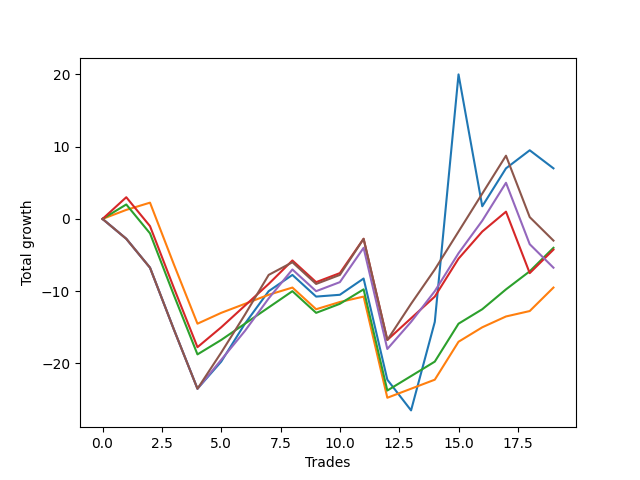

# Short Wallace 016 
- Symbol: ES_SmolBoi
- Date Range: 03/18/2022 - 07/29/2022
- Trading Period: 7:20-12:30
- Number of Trades: 19



| Name | Win Percent | Profit | Avg Profit / Trade | Avg Time / Trade |      | Name | Win Percent | Profit | Avg Profit / Trade | Avg Time / Trade |
| ---- | ----------- | ------ | ------------------ | ---------------- | ---- | ---- | ----------- | ------ | ------------------ | ---------------- |
| Sorted By <br> Profit | | | | | | Sorted By <br> Win Percentage ||||
| Two | 52.63 | 3500.00 | 184.21 | 21:33 |     | Eighty-One | 78.95 | -4750.00 | -250.00 | 08:58 |
| Eighty-Five | 57.89 | -1500.00 | -78.95 | 19:55 |     | Eighty-Two | 73.68 | -2000.00 | -105.26 | 10:54 |
| Eighty-Two | 73.68 | -2000.00 | -105.26 | 10:54 |     | Eighty-Three | 68.42 | -2125.00 | -111.84 | 14:13 |
| Eighty-Three | 68.42 | -2125.00 | -111.84 | 14:13 |     | Eighty-Five | 57.89 | -1500.00 | -78.95 | 19:55 |
| Eighty-Four | 57.89 | -3375.00 | -177.63 | 17:57 |     | Eighty-Four | 57.89 | -3375.00 | -177.63 | 17:57 |
| Eighty-One | 78.95 | -4750.00 | -250.00 | 08:58 |     | Two | 52.63 | 3500.00 | 184.21 | 21:33 |

## NO STOPLOSS

### Test Two
* Sell when the price hits the upper line of the 20p 2std bollinger
* No Stoploss
* Results:
```
Total Trades: 19
Percent Up: 47.37
Percent Down: 52.63
Total Points Moved Down: 7.00
Potential Profit: 3500.00
Total Points Ups: 65.50 Count Ups: 9
Total Points Downs: 72.50 Count Downs: 10
```

<details><summary>Trades</summary>

<code>In: 2022-03-25 11:08:00		Out: 2022-03-25 11:37:55		Total Position Time: 29:55		Total Move Down: -2.75		Total to Date: -2.75</code> <br />
<code>In: 2022-03-28 12:01:00		Out: 2022-03-28 12:30:55		Total Position Time: 29:55		Total Move Down: -4.00		Total to Date: -6.75</code> <br />
<code>In: 2022-03-29 11:40:00		Out: 2022-03-29 12:09:55		Total Position Time: 29:55		Total Move Down: -8.50		Total to Date: -15.25</code> <br />
<code>In: 2022-03-29 11:43:00		Out: 2022-03-29 12:12:55		Total Position Time: 29:55		Total Move Down: -8.25		Total to Date: -23.50</code> <br />
<code>In: 2022-04-06 08:53:00		Out: 2022-04-06 09:09:40		Total Position Time: 16:40		Total Move Down: 3.75		Total to Date: -19.75</code> <br />
<code>In: 2022-04-07 11:04:00		Out: 2022-04-07 11:18:20		Total Position Time: 14:20		Total Move Down: 5.25		Total to Date: -14.50</code> <br />
<code>In: 2022-04-07 11:05:00		Out: 2022-04-07 11:18:20		Total Position Time: 13:20		Total Move Down: 4.50		Total to Date: -10.00</code> <br />
<code>In: 2022-04-07 11:06:00		Out: 2022-04-07 11:18:20		Total Position Time: 12:20		Total Move Down: 2.25		Total to Date: -7.75</code> <br />
<code>In: 2022-04-18 10:39:00		Out: 2022-04-18 11:08:55		Total Position Time: 29:55		Total Move Down: -3.00		Total to Date: -10.75</code> <br />
<code>In: 2022-04-18 10:42:00		Out: 2022-04-18 11:10:40		Total Position Time: 28:40		Total Move Down: 0.25		Total to Date: -10.50</code> <br />
<code>In: 2022-04-20 07:43:00		Out: 2022-04-20 08:00:45		Total Position Time: 17:45		Total Move Down: 2.25		Total to Date: -8.25</code> <br />
<code>In: 2022-05-04 09:32:00		Out: 2022-05-04 10:01:55		Total Position Time: 29:55		Total Move Down: -14.00		Total to Date: -22.25</code> <br />
<code>In: 2022-05-31 07:24:00		Out: 2022-05-31 07:53:55		Total Position Time: 29:55		Total Move Down: -4.25		Total to Date: -26.50</code> <br />
<code>In: 2022-06-03 10:08:00		Out: 2022-06-03 10:17:55		Total Position Time: 09:55		Total Move Down: 12.25		Total to Date: -14.25</code> <br />
<code>In: 2022-06-15 11:48:00		Out: 2022-06-15 11:58:05		Total Position Time: 10:05		Total Move Down: 34.25		Total to Date: 20.00</code> <br />
<code>In: 2022-06-30 08:01:00		Out: 2022-06-30 08:30:55		Total Position Time: 29:55		Total Move Down: -18.25		Total to Date: 1.75</code> <br />
<code>In: 2022-07-05 08:52:00		Out: 2022-07-05 09:03:50		Total Position Time: 11:50		Total Move Down: 5.25		Total to Date: 7.00</code> <br />
<code>In: 2022-07-05 08:53:00		Out: 2022-07-05 09:03:50		Total Position Time: 10:50		Total Move Down: 2.50		Total to Date: 9.50</code> <br />
<code>In: 2022-07-06 11:37:00		Out: 2022-07-06 12:01:25		Total Position Time: 24:25		Total Move Down: -2.50		Total to Date: 7.00</code> <br />


</details>

## TAKE PROFIT

### Test Eighty-One
* Take Profit of 1 Point
* No Stoploss
* Results:
```
Total Trades: 19
Percent Up: 21.05
Percent Down: 78.95
Total Points Moved Down: -9.50
Potential Profit: -4750.00
Total Points Ups: 33.75 Count Ups: 4
Total Points Downs: 24.25 Count Downs: 15
```

<details><summary>Trades</summary>

<code>In: 2022-03-25 11:08:00		Out: 2022-03-25 11:11:05		Total Position Time: 03:05		Total Move Down: 1.25		Total to Date: 1.25</code> <br />
<code>In: 2022-03-28 12:01:00		Out: 2022-03-28 12:03:00		Total Position Time: 02:00		Total Move Down: 1.00		Total to Date: 2.25</code> <br />
<code>In: 2022-03-29 11:40:00		Out: 2022-03-29 12:09:55		Total Position Time: 29:55		Total Move Down: -8.50		Total to Date: -6.25</code> <br />
<code>In: 2022-03-29 11:43:00		Out: 2022-03-29 12:12:55		Total Position Time: 29:55		Total Move Down: -8.25		Total to Date: -14.50</code> <br />
<code>In: 2022-04-06 08:53:00		Out: 2022-04-06 08:55:40		Total Position Time: 02:40		Total Move Down: 1.50		Total to Date: -13.00</code> <br />
<code>In: 2022-04-07 11:04:00		Out: 2022-04-07 11:04:10		Total Position Time: 00:10		Total Move Down: 1.25		Total to Date: -11.75</code> <br />
<code>In: 2022-04-07 11:05:00		Out: 2022-04-07 11:05:10		Total Position Time: 00:10		Total Move Down: 1.25		Total to Date: -10.50</code> <br />
<code>In: 2022-04-07 11:06:00		Out: 2022-04-07 11:06:15		Total Position Time: 00:15		Total Move Down: 1.00		Total to Date: -9.50</code> <br />
<code>In: 2022-04-18 10:39:00		Out: 2022-04-18 11:08:55		Total Position Time: 29:55		Total Move Down: -3.00		Total to Date: -12.50</code> <br />
<code>In: 2022-04-18 10:42:00		Out: 2022-04-18 11:11:10		Total Position Time: 29:10		Total Move Down: 1.00		Total to Date: -11.50</code> <br />
<code>In: 2022-04-20 07:43:00		Out: 2022-04-20 07:44:25		Total Position Time: 01:25		Total Move Down: 0.75		Total to Date: -10.75</code> <br />
<code>In: 2022-05-04 09:32:00		Out: 2022-05-04 10:01:55		Total Position Time: 29:55		Total Move Down: -14.00		Total to Date: -24.75</code> <br />
<code>In: 2022-05-31 07:24:00		Out: 2022-05-31 07:24:10		Total Position Time: 00:10		Total Move Down: 1.25		Total to Date: -23.50</code> <br />
<code>In: 2022-06-03 10:08:00		Out: 2022-06-03 10:08:20		Total Position Time: 00:20		Total Move Down: 1.25		Total to Date: -22.25</code> <br />
<code>In: 2022-06-15 11:48:00		Out: 2022-06-15 11:48:10		Total Position Time: 00:10		Total Move Down: 5.25		Total to Date: -17.00</code> <br />
<code>In: 2022-06-30 08:01:00		Out: 2022-06-30 08:01:10		Total Position Time: 00:10		Total Move Down: 2.00		Total to Date: -15.00</code> <br />
<code>In: 2022-07-05 08:52:00		Out: 2022-07-05 08:52:10		Total Position Time: 00:10		Total Move Down: 1.50		Total to Date: -13.50</code> <br />
<code>In: 2022-07-05 08:53:00		Out: 2022-07-05 09:03:45		Total Position Time: 10:45		Total Move Down: 0.75		Total to Date: -12.75</code> <br />
<code>In: 2022-07-06 11:37:00		Out: 2022-07-06 11:37:10		Total Position Time: 00:10		Total Move Down: 3.25		Total to Date: -9.50</code> <br />


</details>

### Test Eighty-Two
* Take Profit of 2 Point
* No Stoploss
* Results:
```
Total Trades: 19
Percent Up: 26.32
Percent Down: 73.68
Total Points Moved Down: -4.00
Potential Profit: -2000.00
Total Points Ups: 37.75 Count Ups: 5
Total Points Downs: 33.75 Count Downs: 14
```

<details><summary>Trades</summary>

<code>In: 2022-03-25 11:08:00		Out: 2022-03-25 11:12:05		Total Position Time: 04:05		Total Move Down: 2.00		Total to Date: 2.00</code> <br />
<code>In: 2022-03-28 12:01:00		Out: 2022-03-28 12:30:55		Total Position Time: 29:55		Total Move Down: -4.00		Total to Date: -2.00</code> <br />
<code>In: 2022-03-29 11:40:00		Out: 2022-03-29 12:09:55		Total Position Time: 29:55		Total Move Down: -8.50		Total to Date: -10.50</code> <br />
<code>In: 2022-03-29 11:43:00		Out: 2022-03-29 12:12:55		Total Position Time: 29:55		Total Move Down: -8.25		Total to Date: -18.75</code> <br />
<code>In: 2022-04-06 08:53:00		Out: 2022-04-06 08:57:30		Total Position Time: 04:30		Total Move Down: 2.00		Total to Date: -16.75</code> <br />
<code>In: 2022-04-07 11:04:00		Out: 2022-04-07 11:04:20		Total Position Time: 00:20		Total Move Down: 2.25		Total to Date: -14.50</code> <br />
<code>In: 2022-04-07 11:05:00		Out: 2022-04-07 11:06:00		Total Position Time: 01:00		Total Move Down: 2.25		Total to Date: -12.25</code> <br />
<code>In: 2022-04-07 11:06:00		Out: 2022-04-07 11:06:40		Total Position Time: 00:40		Total Move Down: 2.25		Total to Date: -10.00</code> <br />
<code>In: 2022-04-18 10:39:00		Out: 2022-04-18 11:08:55		Total Position Time: 29:55		Total Move Down: -3.00		Total to Date: -13.00</code> <br />
<code>In: 2022-04-18 10:42:00		Out: 2022-04-18 11:11:55		Total Position Time: 29:55		Total Move Down: 1.25		Total to Date: -11.75</code> <br />
<code>In: 2022-04-20 07:43:00		Out: 2022-04-20 07:47:45		Total Position Time: 04:45		Total Move Down: 2.00		Total to Date: -9.75</code> <br />
<code>In: 2022-05-04 09:32:00		Out: 2022-05-04 10:01:55		Total Position Time: 29:55		Total Move Down: -14.00		Total to Date: -23.75</code> <br />
<code>In: 2022-05-31 07:24:00		Out: 2022-05-31 07:24:15		Total Position Time: 00:15		Total Move Down: 2.00		Total to Date: -21.75</code> <br />
<code>In: 2022-06-03 10:08:00		Out: 2022-06-03 10:08:25		Total Position Time: 00:25		Total Move Down: 2.00		Total to Date: -19.75</code> <br />
<code>In: 2022-06-15 11:48:00		Out: 2022-06-15 11:48:10		Total Position Time: 00:10		Total Move Down: 5.25		Total to Date: -14.50</code> <br />
<code>In: 2022-06-30 08:01:00		Out: 2022-06-30 08:01:10		Total Position Time: 00:10		Total Move Down: 2.00		Total to Date: -12.50</code> <br />
<code>In: 2022-07-05 08:52:00		Out: 2022-07-05 08:52:25		Total Position Time: 00:25		Total Move Down: 2.75		Total to Date: -9.75</code> <br />
<code>In: 2022-07-05 08:53:00		Out: 2022-07-05 09:03:50		Total Position Time: 10:50		Total Move Down: 2.50		Total to Date: -7.25</code> <br />
<code>In: 2022-07-06 11:37:00		Out: 2022-07-06 11:37:10		Total Position Time: 00:10		Total Move Down: 3.25		Total to Date: -4.00</code> <br />


</details>

### Test Eighty-Three
* Take Profit of 3 Point
* No Stoploss
* Results:
```
Total Trades: 19
Percent Up: 31.58
Percent Down: 68.42
Total Points Moved Down: -4.25
Potential Profit: -2125.00
Total Points Ups: 46.25 Count Ups: 6
Total Points Downs: 42.00 Count Downs: 13
```

<details><summary>Trades</summary>

<code>In: 2022-03-25 11:08:00		Out: 2022-03-25 11:20:00		Total Position Time: 12:00		Total Move Down: 3.00		Total to Date: 3.00</code> <br />
<code>In: 2022-03-28 12:01:00		Out: 2022-03-28 12:30:55		Total Position Time: 29:55		Total Move Down: -4.00		Total to Date: -1.00</code> <br />
<code>In: 2022-03-29 11:40:00		Out: 2022-03-29 12:09:55		Total Position Time: 29:55		Total Move Down: -8.50		Total to Date: -9.50</code> <br />
<code>In: 2022-03-29 11:43:00		Out: 2022-03-29 12:12:55		Total Position Time: 29:55		Total Move Down: -8.25		Total to Date: -17.75</code> <br />
<code>In: 2022-04-06 08:53:00		Out: 2022-04-06 09:03:50		Total Position Time: 10:50		Total Move Down: 2.75		Total to Date: -15.00</code> <br />
<code>In: 2022-04-07 11:04:00		Out: 2022-04-07 11:06:00		Total Position Time: 02:00		Total Move Down: 3.00		Total to Date: -12.00</code> <br />
<code>In: 2022-04-07 11:05:00		Out: 2022-04-07 11:06:10		Total Position Time: 01:10		Total Move Down: 3.00		Total to Date: -9.00</code> <br />
<code>In: 2022-04-07 11:06:00		Out: 2022-04-07 11:18:40		Total Position Time: 12:40		Total Move Down: 3.25		Total to Date: -5.75</code> <br />
<code>In: 2022-04-18 10:39:00		Out: 2022-04-18 11:08:55		Total Position Time: 29:55		Total Move Down: -3.00		Total to Date: -8.75</code> <br />
<code>In: 2022-04-18 10:42:00		Out: 2022-04-18 11:11:55		Total Position Time: 29:55		Total Move Down: 1.25		Total to Date: -7.50</code> <br />
<code>In: 2022-04-20 07:43:00		Out: 2022-04-20 08:01:10		Total Position Time: 18:10		Total Move Down: 4.75		Total to Date: -2.75</code> <br />
<code>In: 2022-05-04 09:32:00		Out: 2022-05-04 10:01:55		Total Position Time: 29:55		Total Move Down: -14.00		Total to Date: -16.75</code> <br />
<code>In: 2022-05-31 07:24:00		Out: 2022-05-31 07:25:35		Total Position Time: 01:35		Total Move Down: 3.00		Total to Date: -13.75</code> <br />
<code>In: 2022-06-03 10:08:00		Out: 2022-06-03 10:08:50		Total Position Time: 00:50		Total Move Down: 3.00		Total to Date: -10.75</code> <br />
<code>In: 2022-06-15 11:48:00		Out: 2022-06-15 11:48:10		Total Position Time: 00:10		Total Move Down: 5.25		Total to Date: -5.50</code> <br />
<code>In: 2022-06-30 08:01:00		Out: 2022-06-30 08:02:00		Total Position Time: 01:00		Total Move Down: 3.75		Total to Date: -1.75</code> <br />
<code>In: 2022-07-05 08:52:00		Out: 2022-07-05 08:52:25		Total Position Time: 00:25		Total Move Down: 2.75		Total to Date: 1.00</code> <br />
<code>In: 2022-07-05 08:53:00		Out: 2022-07-05 09:22:55		Total Position Time: 29:55		Total Move Down: -8.50		Total to Date: -7.50</code> <br />
<code>In: 2022-07-06 11:37:00		Out: 2022-07-06 11:37:10		Total Position Time: 00:10		Total Move Down: 3.25		Total to Date: -4.25</code> <br />


</details>

### Test Eighty-Four
* Take Profit of 4 Point
* No Stoploss
* Results:
```
Total Trades: 19
Percent Up: 42.11
Percent Down: 57.89
Total Points Moved Down: -6.75
Potential Profit: -3375.00
Total Points Ups: 52.25 Count Ups: 8
Total Points Downs: 45.50 Count Downs: 11
```

<details><summary>Trades</summary>

<code>In: 2022-03-25 11:08:00		Out: 2022-03-25 11:37:55		Total Position Time: 29:55		Total Move Down: -2.75		Total to Date: -2.75</code> <br />
<code>In: 2022-03-28 12:01:00		Out: 2022-03-28 12:30:55		Total Position Time: 29:55		Total Move Down: -4.00		Total to Date: -6.75</code> <br />
<code>In: 2022-03-29 11:40:00		Out: 2022-03-29 12:09:55		Total Position Time: 29:55		Total Move Down: -8.50		Total to Date: -15.25</code> <br />
<code>In: 2022-03-29 11:43:00		Out: 2022-03-29 12:12:55		Total Position Time: 29:55		Total Move Down: -8.25		Total to Date: -23.50</code> <br />
<code>In: 2022-04-06 08:53:00		Out: 2022-04-06 09:10:30		Total Position Time: 17:30		Total Move Down: 4.00		Total to Date: -19.50</code> <br />
<code>In: 2022-04-07 11:04:00		Out: 2022-04-07 11:06:15		Total Position Time: 02:15		Total Move Down: 4.00		Total to Date: -15.50</code> <br />
<code>In: 2022-04-07 11:05:00		Out: 2022-04-07 11:06:40		Total Position Time: 01:40		Total Move Down: 4.50		Total to Date: -11.00</code> <br />
<code>In: 2022-04-07 11:06:00		Out: 2022-04-07 11:19:10		Total Position Time: 13:10		Total Move Down: 4.00		Total to Date: -7.00</code> <br />
<code>In: 2022-04-18 10:39:00		Out: 2022-04-18 11:08:55		Total Position Time: 29:55		Total Move Down: -3.00		Total to Date: -10.00</code> <br />
<code>In: 2022-04-18 10:42:00		Out: 2022-04-18 11:11:55		Total Position Time: 29:55		Total Move Down: 1.25		Total to Date: -8.75</code> <br />
<code>In: 2022-04-20 07:43:00		Out: 2022-04-20 08:01:10		Total Position Time: 18:10		Total Move Down: 4.75		Total to Date: -4.00</code> <br />
<code>In: 2022-05-04 09:32:00		Out: 2022-05-04 10:01:55		Total Position Time: 29:55		Total Move Down: -14.00		Total to Date: -18.00</code> <br />
<code>In: 2022-05-31 07:24:00		Out: 2022-05-31 07:26:15		Total Position Time: 02:15		Total Move Down: 3.75		Total to Date: -14.25</code> <br />
<code>In: 2022-06-03 10:08:00		Out: 2022-06-03 10:10:15		Total Position Time: 02:15		Total Move Down: 4.25		Total to Date: -10.00</code> <br />
<code>In: 2022-06-15 11:48:00		Out: 2022-06-15 11:48:10		Total Position Time: 00:10		Total Move Down: 5.25		Total to Date: -4.75</code> <br />
<code>In: 2022-06-30 08:01:00		Out: 2022-06-30 08:03:40		Total Position Time: 02:40		Total Move Down: 4.50		Total to Date: -0.25</code> <br />
<code>In: 2022-07-05 08:52:00		Out: 2022-07-05 09:03:50		Total Position Time: 11:50		Total Move Down: 5.25		Total to Date: 5.00</code> <br />
<code>In: 2022-07-05 08:53:00		Out: 2022-07-05 09:22:55		Total Position Time: 29:55		Total Move Down: -8.50		Total to Date: -3.50</code> <br />
<code>In: 2022-07-06 11:37:00		Out: 2022-07-06 12:06:55		Total Position Time: 29:55		Total Move Down: -3.25		Total to Date: -6.75</code> <br />


</details>

### Test Eighty-Five
* Take Profit of 5 Point
* No Stoploss
* Results:
```
Total Trades: 19
Percent Up: 42.11
Percent Down: 57.89
Total Points Moved Down: -3.00
Potential Profit: -1500.00
Total Points Ups: 52.25 Count Ups: 8
Total Points Downs: 49.25 Count Downs: 11
```

<details><summary>Trades</summary>

<code>In: 2022-03-25 11:08:00		Out: 2022-03-25 11:37:55		Total Position Time: 29:55		Total Move Down: -2.75		Total to Date: -2.75</code> <br />
<code>In: 2022-03-28 12:01:00		Out: 2022-03-28 12:30:55		Total Position Time: 29:55		Total Move Down: -4.00		Total to Date: -6.75</code> <br />
<code>In: 2022-03-29 11:40:00		Out: 2022-03-29 12:09:55		Total Position Time: 29:55		Total Move Down: -8.50		Total to Date: -15.25</code> <br />
<code>In: 2022-03-29 11:43:00		Out: 2022-03-29 12:12:55		Total Position Time: 29:55		Total Move Down: -8.25		Total to Date: -23.50</code> <br />
<code>In: 2022-04-06 08:53:00		Out: 2022-04-06 09:12:55		Total Position Time: 19:55		Total Move Down: 5.00		Total to Date: -18.50</code> <br />
<code>In: 2022-04-07 11:04:00		Out: 2022-04-07 11:06:40		Total Position Time: 02:40		Total Move Down: 5.25		Total to Date: -13.25</code> <br />
<code>In: 2022-04-07 11:05:00		Out: 2022-04-07 11:18:40		Total Position Time: 13:40		Total Move Down: 5.50		Total to Date: -7.75</code> <br />
<code>In: 2022-04-07 11:06:00		Out: 2022-04-07 11:35:55		Total Position Time: 29:55		Total Move Down: 1.75		Total to Date: -6.00</code> <br />
<code>In: 2022-04-18 10:39:00		Out: 2022-04-18 11:08:55		Total Position Time: 29:55		Total Move Down: -3.00		Total to Date: -9.00</code> <br />
<code>In: 2022-04-18 10:42:00		Out: 2022-04-18 11:11:55		Total Position Time: 29:55		Total Move Down: 1.25		Total to Date: -7.75</code> <br />
<code>In: 2022-04-20 07:43:00		Out: 2022-04-20 08:03:05		Total Position Time: 20:05		Total Move Down: 5.00		Total to Date: -2.75</code> <br />
<code>In: 2022-05-04 09:32:00		Out: 2022-05-04 10:01:55		Total Position Time: 29:55		Total Move Down: -14.00		Total to Date: -16.75</code> <br />
<code>In: 2022-05-31 07:24:00		Out: 2022-05-31 07:26:30		Total Position Time: 02:30		Total Move Down: 5.00		Total to Date: -11.75</code> <br />
<code>In: 2022-06-03 10:08:00		Out: 2022-06-03 10:13:45		Total Position Time: 05:45		Total Move Down: 4.75		Total to Date: -7.00</code> <br />
<code>In: 2022-06-15 11:48:00		Out: 2022-06-15 11:48:10		Total Position Time: 00:10		Total Move Down: 5.25		Total to Date: -1.75</code> <br />
<code>In: 2022-06-30 08:01:00		Out: 2022-06-30 08:03:50		Total Position Time: 02:50		Total Move Down: 5.25		Total to Date: 3.50</code> <br />
<code>In: 2022-07-05 08:52:00		Out: 2022-07-05 09:03:50		Total Position Time: 11:50		Total Move Down: 5.25		Total to Date: 8.75</code> <br />
<code>In: 2022-07-05 08:53:00		Out: 2022-07-05 09:22:55		Total Position Time: 29:55		Total Move Down: -8.50		Total to Date: 0.25</code> <br />
<code>In: 2022-07-06 11:37:00		Out: 2022-07-06 12:06:55		Total Position Time: 29:55		Total Move Down: -3.25		Total to Date: -3.00</code> <br />


</details>