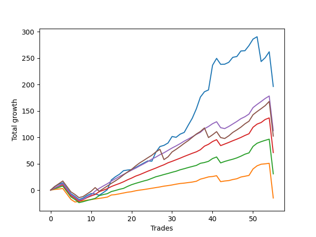

# Short Wallace 019 
- Symbol: ES_SmolBoi
- Date Range: 03/18/2022 - 07/29/2022
- Trading Period: 7:20-12:30
- Number of Trades: 55



| Name | Win Percent | Profit | Avg Profit / Trade | Avg Time / Trade |      | Name | Win Percent | Profit | Avg Profit / Trade | Avg Time / Trade |
| ---- | ----------- | ------ | ------------------ | ---------------- | ---- | ---- | ----------- | ------ | ------------------ | ---------------- |
| Sorted By <br> Profit | | | | | | Sorted By <br> Win Percentage ||||
| Two | 80.00 | 98125.00 | 1784.09 | 74:51 |     | Eighty-One | 90.91 | -7500.00 | -136.36 | 33:36 |
| Eighty-Four | 87.27 | 56250.00 | 1022.73 | 39:51 |     | Eighty-Three | 89.09 | 35500.00 | 645.45 | 37:49 |
| Eighty-Five | 81.82 | 51125.00 | 929.55 | 42:16 |     | Eighty-Two | 89.09 | 15375.00 | 279.55 | 36:02 |
| Eighty-Three | 89.09 | 35500.00 | 645.45 | 37:49 |     | Eighty-Four | 87.27 | 56250.00 | 1022.73 | 39:51 |
| Eighty-Two | 89.09 | 15375.00 | 279.55 | 36:02 |     | Eighty-Five | 81.82 | 51125.00 | 929.55 | 42:16 |
| Eighty-One | 90.91 | -7500.00 | -136.36 | 33:36 |     | Two | 80.00 | 98125.00 | 1784.09 | 74:51 |

## NO STOPLOSS

### Test Two
* Sell when the price hits the upper line of the 20p 2std bollinger
* No Stoploss
* Results:
```
Total Trades: 55
Percent Up: 20.00
Percent Down: 80.00
Total Points Moved Down: 196.25
Potential Profit: 98125.00
Total Points Ups: 160.75 Count Ups: 11
Total Points Downs: 357.00 Count Downs: 44
```

<details><summary>Trades</summary>

<code>In: 2022-03-21 08:26:00		Out: 2022-03-21 08:36:05		Total Position Time: 10:05		Total Move Down: 6.75		Total to Date: 6.75</code> <br />
<code>In: 2022-03-25 11:55:00		Out: 2022-03-25 12:00:55		Total Position Time: 05:55		Total Move Down: 4.25		Total to Date: 11.00</code> <br />
<code>In: 2022-03-25 11:57:00		Out: 2022-03-25 12:00:55		Total Position Time: 03:55		Total Move Down: 2.75		Total to Date: 13.75</code> <br />
<code>In: 2022-03-28 11:42:00		Out: 2022-03-28 12:11:55		Total Position Time: 29:55		Total Move Down: -10.25		Total to Date: 3.50</code> <br />
<code>In: 2022-03-28 11:43:00		Out: 2022-03-28 12:12:55		Total Position Time: 29:55		Total Move Down: -10.25		Total to Date: -6.75</code> <br />
<code>In: 2022-03-28 11:50:00		Out: 2022-03-28 12:19:55		Total Position Time: 29:55		Total Move Down: -5.00		Total to Date: -11.75</code> <br />
<code>In: 2022-03-29 11:38:00		Out: 2022-03-29 12:07:55		Total Position Time: 29:55		Total Move Down: -6.00		Total to Date: -17.75</code> <br />
<code>In: 2022-03-31 07:48:00		Out: 2022-03-31 08:08:30		Total Position Time: 20:30		Total Move Down: 2.50		Total to Date: -15.25</code> <br />
<code>In: 2022-03-31 07:49:00		Out: 2022-03-31 08:08:30		Total Position Time: 19:30		Total Move Down: 5.00		Total to Date: -10.25</code> <br />
<code>In: 2022-04-01 11:34:00		Out: 2022-04-01 11:50:20		Total Position Time: 16:20		Total Move Down: 3.75		Total to Date: -6.50</code> <br />
<code>In: 2022-04-06 10:35:00		Out: 2022-04-06 10:57:20		Total Position Time: 22:20		Total Move Down: -0.75		Total to Date: -7.25</code> <br />
<code>In: 2022-04-06 10:36:00		Out: 2022-04-06 10:57:20		Total Position Time: 21:20		Total Move Down: -2.50		Total to Date: -9.75</code> <br />
<code>In: 2022-04-06 10:43:00		Out: 2022-04-06 10:57:20		Total Position Time: 14:20		Total Move Down: 5.00		Total to Date: -4.75</code> <br />
<code>In: 2022-04-06 10:44:00		Out: 2022-04-06 10:57:20		Total Position Time: 13:20		Total Move Down: 5.50		Total to Date: 0.75</code> <br />
<code>In: 2022-04-06 11:05:00		Out: 2022-04-06 11:08:10		Total Position Time: 03:10		Total Move Down: 18.50		Total to Date: 19.25</code> <br />
<code>In: 2022-04-07 11:03:00		Out: 2022-04-07 11:18:20		Total Position Time: 15:20		Total Move Down: 6.00		Total to Date: 25.25</code> <br />
<code>In: 2022-04-18 07:27:00		Out: 2022-04-18 07:51:45		Total Position Time: 24:45		Total Move Down: 4.75		Total to Date: 30.00</code> <br />
<code>In: 2022-04-18 11:26:00		Out: 2022-04-18 11:44:10		Total Position Time: 18:10		Total Move Down: 6.75		Total to Date: 36.75</code> <br />
<code>In: 2022-04-20 07:39:00		Out: 2022-04-20 08:00:45		Total Position Time: 21:45		Total Move Down: 1.25		Total to Date: 38.00</code> <br />
<code>In: 2022-04-20 07:40:00		Out: 2022-04-20 08:00:45		Total Position Time: 20:45		Total Move Down: 0.75		Total to Date: 38.75</code> <br />
<code>In: 2022-04-20 07:42:00		Out: 2022-04-20 08:00:45		Total Position Time: 18:45		Total Move Down: 4.00		Total to Date: 42.75</code> <br />
<code>In: 2022-04-20 09:54:00		Out: 2022-04-20 10:08:15		Total Position Time: 14:15		Total Move Down: 4.25		Total to Date: 47.00</code> <br />
<code>In: 2022-04-25 10:14:00		Out: 2022-04-25 10:33:35		Total Position Time: 19:35		Total Move Down: 4.25		Total to Date: 51.25</code> <br />
<code>In: 2022-04-27 08:34:00		Out: 2022-04-27 08:50:10		Total Position Time: 16:10		Total Move Down: 4.00		Total to Date: 55.25</code> <br />
<code>In: 2022-05-16 08:48:00		Out: 2022-05-16 09:11:35		Total Position Time: 23:35		Total Move Down: -0.50		Total to Date: 54.75</code> <br />
<code>In: 2022-05-24 09:17:00		Out: 2022-05-24 09:31:20		Total Position Time: 14:20		Total Move Down: 17.00		Total to Date: 71.75</code> <br />
<code>In: 2022-05-24 09:18:00		Out: 2022-05-24 09:31:20		Total Position Time: 13:20		Total Move Down: 10.75		Total to Date: 82.50</code> <br />
<code>In: 2022-05-24 10:43:00		Out: 2022-05-24 11:01:50		Total Position Time: 18:50		Total Move Down: 2.25		Total to Date: 84.75</code> <br />
<code>In: 2022-05-24 10:47:00		Out: 2022-05-24 11:01:50		Total Position Time: 14:50		Total Move Down: 4.50		Total to Date: 89.25</code> <br />
<code>In: 2022-05-25 11:04:00		Out: 2022-05-25 11:06:40		Total Position Time: 02:40		Total Move Down: 12.25		Total to Date: 101.50</code> <br />
<code>In: 2022-05-31 07:23:00		Out: 2022-05-31 07:52:55		Total Position Time: 29:55		Total Move Down: -1.50		Total to Date: 100.00</code> <br />
<code>In: 2022-06-09 10:07:00		Out: 2022-06-09 10:18:55		Total Position Time: 11:55		Total Move Down: 6.00		Total to Date: 106.00</code> <br />
<code>In: 2022-06-09 10:08:00		Out: 2022-06-09 10:18:55		Total Position Time: 10:55		Total Move Down: 3.25		Total to Date: 109.25</code> <br />
<code>In: 2022-06-10 12:00:00		Out: 2022-06-10 12:05:55		Total Position Time: 05:55		Total Move Down: 13.75		Total to Date: 123.00</code> <br />
<code>In: 2022-06-10 12:29:00		Out: 2022-06-10 12:42:45		Total Position Time: 13:45		Total Move Down: 13.25		Total to Date: 136.25</code> <br />
<code>In: 2022-06-13 09:38:00		Out: 2022-06-13 09:54:20		Total Position Time: 16:20		Total Move Down: 17.75		Total to Date: 154.00</code> <br />
<code>In: 2022-06-13 09:40:00		Out: 2022-06-13 09:54:20		Total Position Time: 14:20		Total Move Down: 22.25		Total to Date: 176.25</code> <br />
<code>In: 2022-06-15 11:02:00		Out: 2022-06-15 11:03:05		Total Position Time: 01:05		Total Move Down: 10.00		Total to Date: 186.25</code> <br />
<code>In: 2022-06-15 11:40:00		Out: 2022-06-15 11:58:05		Total Position Time: 18:05		Total Move Down: 3.50		Total to Date: 189.75</code> <br />
<code>In: 2022-06-15 11:45:00		Out: 2022-06-15 11:58:05		Total Position Time: 13:05		Total Move Down: 46.75		Total to Date: 236.50</code> <br />
<code>In: 2022-06-17 10:13:00		Out: 2022-06-17 10:27:05		Total Position Time: 14:05		Total Move Down: 13.00		Total to Date: 249.50</code> <br />
<code>In: 2022-06-23 12:30:00		Out: 2022-06-23 12:46:00		Total Position Time: 16:00		Total Move Down: -11.25		Total to Date: 238.25</code> <br />
<code>In: 2022-06-27 07:49:00		Out: 2022-06-27 08:09:45		Total Position Time: 20:45		Total Move Down: 0.25		Total to Date: 238.50</code> <br />
<code>In: 2022-06-29 11:06:00		Out: 2022-06-29 11:20:45		Total Position Time: 14:45		Total Move Down: 3.50		Total to Date: 242.00</code> <br />
<code>In: 2022-06-29 12:31:00		Out: 2022-06-29 12:35:20		Total Position Time: 04:20		Total Move Down: 9.50		Total to Date: 251.50</code> <br />
<code>In: 2022-07-01 10:47:00		Out: 2022-07-01 11:07:55		Total Position Time: 20:55		Total Move Down: 1.50		Total to Date: 253.00</code> <br />
<code>In: 2022-07-06 11:10:00		Out: 2022-07-06 11:11:45		Total Position Time: 01:45		Total Move Down: 10.50		Total to Date: 263.50</code> <br />
<code>In: 2022-07-06 11:35:00		Out: 2022-07-06 12:01:25		Total Position Time: 26:25		Total Move Down: 0.50		Total to Date: 264.00</code> <br />
<code>In: 2022-07-12 08:14:00		Out: 2022-07-12 10:26:00		Total Position Time: 132:00		Total Move Down: 9.75		Total to Date: 273.75</code> <br />
<code>In: 2022-07-12 08:31:00		Out: 2022-07-12 08:44:00		Total Position Time: 13:00		Total Move Down: 12.25		Total to Date: 286.00</code> <br />
<code>In: 2022-07-20 07:28:00		Out: 2022-07-20 10:56:00		Total Position Time: 208:00		Total Move Down: 4.50		Total to Date: 290.50</code> <br />
<code>In: 2022-07-21 08:03:00		Out: 2022-07-22 06:43:00		Total Position Time: 1360:00		Total Move Down: -47.00		Total to Date: 243.50</code> <br />
<code>In: 2022-07-25 08:32:00		Out: 2022-07-25 10:44:00		Total Position Time: 132:00		Total Move Down: 7.25		Total to Date: 250.75</code> <br />
<code>In: 2022-07-25 08:33:00		Out: 2022-07-25 10:43:00		Total Position Time: 130:00		Total Move Down: 11.25		Total to Date: 262.00</code> <br />
<code>In: 2022-07-28 08:07:00		Out: 2022-07-29 06:47:00		Total Position Time: 1360:00		Total Move Down: -65.75		Total to Date: 196.25</code> <br />


</details>

## TAKE PROFIT

### Test Eighty-One
* Take Profit of 1 Point
* No Stoploss
* Results:
```
Total Trades: 55
Percent Up: 9.09
Percent Down: 90.91
Total Points Moved Down: -15.00
Potential Profit: -7500.00
Total Points Ups: 102.50 Count Ups: 5
Total Points Downs: 87.50 Count Downs: 50
```

<details><summary>Trades</summary>

<code>In: 2022-03-21 08:26:00		Out: 2022-03-21 08:30:25		Total Position Time: 04:25		Total Move Down: 1.25		Total to Date: 1.25</code> <br />
<code>In: 2022-03-25 11:55:00		Out: 2022-03-25 11:56:25		Total Position Time: 01:25		Total Move Down: 0.75		Total to Date: 2.00</code> <br />
<code>In: 2022-03-25 11:57:00		Out: 2022-03-25 11:58:45		Total Position Time: 01:45		Total Move Down: 1.00		Total to Date: 3.00</code> <br />
<code>In: 2022-03-28 11:42:00		Out: 2022-03-28 12:11:55		Total Position Time: 29:55		Total Move Down: -10.25		Total to Date: -7.25</code> <br />
<code>In: 2022-03-28 11:43:00		Out: 2022-03-28 12:12:55		Total Position Time: 29:55		Total Move Down: -10.25		Total to Date: -17.50</code> <br />
<code>In: 2022-03-28 11:50:00		Out: 2022-03-28 12:19:55		Total Position Time: 29:55		Total Move Down: -5.00		Total to Date: -22.50</code> <br />
<code>In: 2022-03-29 11:38:00		Out: 2022-03-29 11:42:10		Total Position Time: 04:10		Total Move Down: 1.00		Total to Date: -21.50</code> <br />
<code>In: 2022-03-31 07:48:00		Out: 2022-03-31 07:53:10		Total Position Time: 05:10		Total Move Down: 1.25		Total to Date: -20.25</code> <br />
<code>In: 2022-03-31 07:49:00		Out: 2022-03-31 07:49:25		Total Position Time: 00:25		Total Move Down: 1.25		Total to Date: -19.00</code> <br />
<code>In: 2022-04-01 11:34:00		Out: 2022-04-01 11:36:40		Total Position Time: 02:40		Total Move Down: 1.00		Total to Date: -18.00</code> <br />
<code>In: 2022-04-06 10:35:00		Out: 2022-04-06 10:35:25		Total Position Time: 00:25		Total Move Down: 1.25		Total to Date: -16.75</code> <br />
<code>In: 2022-04-06 10:36:00		Out: 2022-04-06 10:36:10		Total Position Time: 00:10		Total Move Down: 1.00		Total to Date: -15.75</code> <br />
<code>In: 2022-04-06 10:43:00		Out: 2022-04-06 10:46:05		Total Position Time: 03:05		Total Move Down: 1.25		Total to Date: -14.50</code> <br />
<code>In: 2022-04-06 10:44:00		Out: 2022-04-06 10:45:45		Total Position Time: 01:45		Total Move Down: 1.25		Total to Date: -13.25</code> <br />
<code>In: 2022-04-06 11:05:00		Out: 2022-04-06 11:05:10		Total Position Time: 00:10		Total Move Down: 4.00		Total to Date: -9.25</code> <br />
<code>In: 2022-04-07 11:03:00		Out: 2022-04-07 11:04:00		Total Position Time: 01:00		Total Move Down: 0.75		Total to Date: -8.50</code> <br />
<code>In: 2022-04-18 07:27:00		Out: 2022-04-18 07:27:20		Total Position Time: 00:20		Total Move Down: 1.50		Total to Date: -7.00</code> <br />
<code>In: 2022-04-18 11:26:00		Out: 2022-04-18 11:26:20		Total Position Time: 00:20		Total Move Down: 1.50		Total to Date: -5.50</code> <br />
<code>In: 2022-04-20 07:39:00		Out: 2022-04-20 07:39:15		Total Position Time: 00:15		Total Move Down: 1.50		Total to Date: -4.00</code> <br />
<code>In: 2022-04-20 07:40:00		Out: 2022-04-20 07:48:05		Total Position Time: 08:05		Total Move Down: 1.00		Total to Date: -3.00</code> <br />
<code>In: 2022-04-20 07:42:00		Out: 2022-04-20 07:43:00		Total Position Time: 01:00		Total Move Down: 1.75		Total to Date: -1.25</code> <br />
<code>In: 2022-04-20 09:54:00		Out: 2022-04-20 09:54:30		Total Position Time: 00:30		Total Move Down: 1.25		Total to Date: 0.00</code> <br />
<code>In: 2022-04-25 10:14:00		Out: 2022-04-25 10:23:05		Total Position Time: 09:05		Total Move Down: 1.00		Total to Date: 1.00</code> <br />
<code>In: 2022-04-27 08:34:00		Out: 2022-04-27 08:34:10		Total Position Time: 00:10		Total Move Down: 1.25		Total to Date: 2.25</code> <br />
<code>In: 2022-05-16 08:48:00		Out: 2022-05-16 08:50:45		Total Position Time: 02:45		Total Move Down: 1.25		Total to Date: 3.50</code> <br />
<code>In: 2022-05-24 09:17:00		Out: 2022-05-24 09:17:15		Total Position Time: 00:15		Total Move Down: 1.25		Total to Date: 4.75</code> <br />
<code>In: 2022-05-24 09:18:00		Out: 2022-05-24 09:18:50		Total Position Time: 00:50		Total Move Down: 1.25		Total to Date: 6.00</code> <br />
<code>In: 2022-05-24 10:43:00		Out: 2022-05-24 10:43:10		Total Position Time: 00:10		Total Move Down: 1.50		Total to Date: 7.50</code> <br />
<code>In: 2022-05-24 10:47:00		Out: 2022-05-24 10:47:10		Total Position Time: 00:10		Total Move Down: 1.00		Total to Date: 8.50</code> <br />
<code>In: 2022-05-25 11:04:00		Out: 2022-05-25 11:04:10		Total Position Time: 00:10		Total Move Down: 1.25		Total to Date: 9.75</code> <br />
<code>In: 2022-05-31 07:23:00		Out: 2022-05-31 07:23:15		Total Position Time: 00:15		Total Move Down: 1.50		Total to Date: 11.25</code> <br />
<code>In: 2022-06-09 10:07:00		Out: 2022-06-09 10:07:45		Total Position Time: 00:45		Total Move Down: 1.25		Total to Date: 12.50</code> <br />
<code>In: 2022-06-09 10:08:00		Out: 2022-06-09 10:10:15		Total Position Time: 02:15		Total Move Down: 0.75		Total to Date: 13.25</code> <br />
<code>In: 2022-06-10 12:00:00		Out: 2022-06-10 12:02:05		Total Position Time: 02:05		Total Move Down: 1.00		Total to Date: 14.25</code> <br />
<code>In: 2022-06-10 12:29:00		Out: 2022-06-10 12:29:10		Total Position Time: 00:10		Total Move Down: 1.00		Total to Date: 15.25</code> <br />
<code>In: 2022-06-13 09:38:00		Out: 2022-06-13 09:38:10		Total Position Time: 00:10		Total Move Down: 1.50		Total to Date: 16.75</code> <br />
<code>In: 2022-06-13 09:40:00		Out: 2022-06-13 09:40:10		Total Position Time: 00:10		Total Move Down: 4.00		Total to Date: 20.75</code> <br />
<code>In: 2022-06-15 11:02:00		Out: 2022-06-15 11:02:10		Total Position Time: 00:10		Total Move Down: 2.00		Total to Date: 22.75</code> <br />
<code>In: 2022-06-15 11:40:00		Out: 2022-06-15 11:57:55		Total Position Time: 17:55		Total Move Down: 2.25		Total to Date: 25.00</code> <br />
<code>In: 2022-06-15 11:45:00		Out: 2022-06-15 11:45:15		Total Position Time: 00:15		Total Move Down: 0.75		Total to Date: 25.75</code> <br />
<code>In: 2022-06-17 10:13:00		Out: 2022-06-17 10:13:30		Total Position Time: 00:30		Total Move Down: 1.50		Total to Date: 27.25</code> <br />
<code>In: 2022-06-23 12:30:00		Out: 2022-06-23 12:46:00		Total Position Time: 16:00		Total Move Down: -11.25		Total to Date: 16.00</code> <br />
<code>In: 2022-06-27 07:49:00		Out: 2022-06-27 08:09:50		Total Position Time: 20:50		Total Move Down: 1.25		Total to Date: 17.25</code> <br />
<code>In: 2022-06-29 11:06:00		Out: 2022-06-29 11:07:45		Total Position Time: 01:45		Total Move Down: 0.75		Total to Date: 18.00</code> <br />
<code>In: 2022-06-29 12:31:00		Out: 2022-06-29 12:31:10		Total Position Time: 00:10		Total Move Down: 2.00		Total to Date: 20.00</code> <br />
<code>In: 2022-07-01 10:47:00		Out: 2022-07-01 11:07:55		Total Position Time: 20:55		Total Move Down: 1.50		Total to Date: 21.50</code> <br />
<code>In: 2022-07-06 11:10:00		Out: 2022-07-06 11:10:10		Total Position Time: 00:10		Total Move Down: 3.25		Total to Date: 24.75</code> <br />
<code>In: 2022-07-06 11:35:00		Out: 2022-07-06 11:36:10		Total Position Time: 01:10		Total Move Down: 1.50		Total to Date: 26.25</code> <br />
<code>In: 2022-07-12 08:14:00		Out: 2022-07-12 08:38:00		Total Position Time: 24:00		Total Move Down: 1.50		Total to Date: 27.75</code> <br />
<code>In: 2022-07-12 08:31:00		Out: 2022-07-12 08:44:00		Total Position Time: 13:00		Total Move Down: 12.25		Total to Date: 40.00</code> <br />
<code>In: 2022-07-20 07:28:00		Out: 2022-07-20 10:11:00		Total Position Time: 163:00		Total Move Down: 6.00		Total to Date: 46.00</code> <br />
<code>In: 2022-07-21 08:03:00		Out: 2022-07-21 08:16:00		Total Position Time: 13:00		Total Move Down: 3.00		Total to Date: 49.00</code> <br />
<code>In: 2022-07-25 08:32:00		Out: 2022-07-25 09:03:00		Total Position Time: 31:00		Total Move Down: 0.75		Total to Date: 49.75</code> <br />
<code>In: 2022-07-25 08:33:00		Out: 2022-07-25 08:51:00		Total Position Time: 18:00		Total Move Down: 1.00		Total to Date: 50.75</code> <br />
<code>In: 2022-07-28 08:07:00		Out: 2022-07-29 06:47:00		Total Position Time: 1360:00		Total Move Down: -65.75		Total to Date: -15.00</code> <br />


</details>

### Test Eighty-Two
* Take Profit of 2 Point
* No Stoploss
* Results:
```
Total Trades: 55
Percent Up: 10.91
Percent Down: 89.09
Total Points Moved Down: 30.75
Potential Profit: 15375.00
Total Points Ups: 108.50 Count Ups: 6
Total Points Downs: 139.25 Count Downs: 49
```

<details><summary>Trades</summary>

<code>In: 2022-03-21 08:26:00		Out: 2022-03-21 08:30:55		Total Position Time: 04:55		Total Move Down: 2.75		Total to Date: 2.75</code> <br />
<code>In: 2022-03-25 11:55:00		Out: 2022-03-25 11:57:20		Total Position Time: 02:20		Total Move Down: 2.25		Total to Date: 5.00</code> <br />
<code>In: 2022-03-25 11:57:00		Out: 2022-03-25 12:00:50		Total Position Time: 03:50		Total Move Down: 2.75		Total to Date: 7.75</code> <br />
<code>In: 2022-03-28 11:42:00		Out: 2022-03-28 12:11:55		Total Position Time: 29:55		Total Move Down: -10.25		Total to Date: -2.50</code> <br />
<code>In: 2022-03-28 11:43:00		Out: 2022-03-28 12:12:55		Total Position Time: 29:55		Total Move Down: -10.25		Total to Date: -12.75</code> <br />
<code>In: 2022-03-28 11:50:00		Out: 2022-03-28 12:19:55		Total Position Time: 29:55		Total Move Down: -5.00		Total to Date: -17.75</code> <br />
<code>In: 2022-03-29 11:38:00		Out: 2022-03-29 12:07:55		Total Position Time: 29:55		Total Move Down: -6.00		Total to Date: -23.75</code> <br />
<code>In: 2022-03-31 07:48:00		Out: 2022-03-31 07:54:45		Total Position Time: 06:45		Total Move Down: 1.75		Total to Date: -22.00</code> <br />
<code>In: 2022-03-31 07:49:00		Out: 2022-03-31 07:51:30		Total Position Time: 02:30		Total Move Down: 2.25		Total to Date: -19.75</code> <br />
<code>In: 2022-04-01 11:34:00		Out: 2022-04-01 11:36:55		Total Position Time: 02:55		Total Move Down: 2.00		Total to Date: -17.75</code> <br />
<code>In: 2022-04-06 10:35:00		Out: 2022-04-06 10:35:35		Total Position Time: 00:35		Total Move Down: 2.00		Total to Date: -15.75</code> <br />
<code>In: 2022-04-06 10:36:00		Out: 2022-04-06 11:00:10		Total Position Time: 24:10		Total Move Down: 5.25		Total to Date: -10.50</code> <br />
<code>In: 2022-04-06 10:43:00		Out: 2022-04-06 10:46:40		Total Position Time: 03:40		Total Move Down: 2.00		Total to Date: -8.50</code> <br />
<code>In: 2022-04-06 10:44:00		Out: 2022-04-06 10:46:05		Total Position Time: 02:05		Total Move Down: 1.75		Total to Date: -6.75</code> <br />
<code>In: 2022-04-06 11:05:00		Out: 2022-04-06 11:05:10		Total Position Time: 00:10		Total Move Down: 4.00		Total to Date: -2.75</code> <br />
<code>In: 2022-04-07 11:03:00		Out: 2022-04-07 11:04:05		Total Position Time: 01:05		Total Move Down: 2.00		Total to Date: -0.75</code> <br />
<code>In: 2022-04-18 07:27:00		Out: 2022-04-18 07:27:30		Total Position Time: 00:30		Total Move Down: 2.25		Total to Date: 1.50</code> <br />
<code>In: 2022-04-18 11:26:00		Out: 2022-04-18 11:26:25		Total Position Time: 00:25		Total Move Down: 1.75		Total to Date: 3.25</code> <br />
<code>In: 2022-04-20 07:39:00		Out: 2022-04-20 08:01:10		Total Position Time: 22:10		Total Move Down: 3.75		Total to Date: 7.00</code> <br />
<code>In: 2022-04-20 07:40:00		Out: 2022-04-20 08:01:10		Total Position Time: 21:10		Total Move Down: 3.25		Total to Date: 10.25</code> <br />
<code>In: 2022-04-20 07:42:00		Out: 2022-04-20 07:43:10		Total Position Time: 01:10		Total Move Down: 2.50		Total to Date: 12.75</code> <br />
<code>In: 2022-04-20 09:54:00		Out: 2022-04-20 09:57:25		Total Position Time: 03:25		Total Move Down: 2.25		Total to Date: 15.00</code> <br />
<code>In: 2022-04-25 10:14:00		Out: 2022-04-25 10:27:05		Total Position Time: 13:05		Total Move Down: 2.25		Total to Date: 17.25</code> <br />
<code>In: 2022-04-27 08:34:00		Out: 2022-04-27 08:34:25		Total Position Time: 00:25		Total Move Down: 2.00		Total to Date: 19.25</code> <br />
<code>In: 2022-05-16 08:48:00		Out: 2022-05-16 08:50:55		Total Position Time: 02:55		Total Move Down: 3.00		Total to Date: 22.25</code> <br />
<code>In: 2022-05-24 09:17:00		Out: 2022-05-24 09:17:35		Total Position Time: 00:35		Total Move Down: 3.00		Total to Date: 25.25</code> <br />
<code>In: 2022-05-24 09:18:00		Out: 2022-05-24 09:20:10		Total Position Time: 02:10		Total Move Down: 2.00		Total to Date: 27.25</code> <br />
<code>In: 2022-05-24 10:43:00		Out: 2022-05-24 10:47:50		Total Position Time: 04:50		Total Move Down: 2.25		Total to Date: 29.50</code> <br />
<code>In: 2022-05-24 10:47:00		Out: 2022-05-24 10:47:30		Total Position Time: 00:30		Total Move Down: 2.00		Total to Date: 31.50</code> <br />
<code>In: 2022-05-25 11:04:00		Out: 2022-05-25 11:05:45		Total Position Time: 01:45		Total Move Down: 2.25		Total to Date: 33.75</code> <br />
<code>In: 2022-05-31 07:23:00		Out: 2022-05-31 07:23:35		Total Position Time: 00:35		Total Move Down: 2.00		Total to Date: 35.75</code> <br />
<code>In: 2022-06-09 10:07:00		Out: 2022-06-09 10:08:00		Total Position Time: 01:00		Total Move Down: 2.75		Total to Date: 38.50</code> <br />
<code>In: 2022-06-09 10:08:00		Out: 2022-06-09 10:16:55		Total Position Time: 08:55		Total Move Down: 2.00		Total to Date: 40.50</code> <br />
<code>In: 2022-06-10 12:00:00		Out: 2022-06-10 12:02:15		Total Position Time: 02:15		Total Move Down: 2.25		Total to Date: 42.75</code> <br />
<code>In: 2022-06-10 12:29:00		Out: 2022-06-10 12:29:20		Total Position Time: 00:20		Total Move Down: 2.00		Total to Date: 44.75</code> <br />
<code>In: 2022-06-13 09:38:00		Out: 2022-06-13 09:40:55		Total Position Time: 02:55		Total Move Down: 2.00		Total to Date: 46.75</code> <br />
<code>In: 2022-06-13 09:40:00		Out: 2022-06-13 09:40:10		Total Position Time: 00:10		Total Move Down: 4.00		Total to Date: 50.75</code> <br />
<code>In: 2022-06-15 11:02:00		Out: 2022-06-15 11:02:45		Total Position Time: 00:45		Total Move Down: 1.50		Total to Date: 52.25</code> <br />
<code>In: 2022-06-15 11:40:00		Out: 2022-06-15 11:57:55		Total Position Time: 17:55		Total Move Down: 2.25		Total to Date: 54.50</code> <br />
<code>In: 2022-06-15 11:45:00		Out: 2022-06-15 11:46:30		Total Position Time: 01:30		Total Move Down: 5.25		Total to Date: 59.75</code> <br />
<code>In: 2022-06-17 10:13:00		Out: 2022-06-17 10:13:45		Total Position Time: 00:45		Total Move Down: 3.00		Total to Date: 62.75</code> <br />
<code>In: 2022-06-23 12:30:00		Out: 2022-06-23 12:46:00		Total Position Time: 16:00		Total Move Down: -11.25		Total to Date: 51.50</code> <br />
<code>In: 2022-06-27 07:49:00		Out: 2022-06-27 08:10:10		Total Position Time: 21:10		Total Move Down: 2.75		Total to Date: 54.25</code> <br />
<code>In: 2022-06-29 11:06:00		Out: 2022-06-29 11:08:05		Total Position Time: 02:05		Total Move Down: 2.25		Total to Date: 56.50</code> <br />
<code>In: 2022-06-29 12:31:00		Out: 2022-06-29 12:31:10		Total Position Time: 00:10		Total Move Down: 2.00		Total to Date: 58.50</code> <br />
<code>In: 2022-07-01 10:47:00		Out: 2022-07-01 11:08:30		Total Position Time: 21:30		Total Move Down: 2.50		Total to Date: 61.00</code> <br />
<code>In: 2022-07-06 11:10:00		Out: 2022-07-06 11:10:10		Total Position Time: 00:10		Total Move Down: 3.25		Total to Date: 64.25</code> <br />
<code>In: 2022-07-06 11:35:00		Out: 2022-07-06 11:36:35		Total Position Time: 01:35		Total Move Down: 3.75		Total to Date: 68.00</code> <br />
<code>In: 2022-07-12 08:14:00		Out: 2022-07-12 08:39:00		Total Position Time: 25:00		Total Move Down: 2.50		Total to Date: 70.50</code> <br />
<code>In: 2022-07-12 08:31:00		Out: 2022-07-12 08:44:00		Total Position Time: 13:00		Total Move Down: 12.25		Total to Date: 82.75</code> <br />
<code>In: 2022-07-20 07:28:00		Out: 2022-07-20 10:11:00		Total Position Time: 163:00		Total Move Down: 6.00		Total to Date: 88.75</code> <br />
<code>In: 2022-07-21 08:03:00		Out: 2022-07-21 08:16:00		Total Position Time: 13:00		Total Move Down: 3.00		Total to Date: 91.75</code> <br />
<code>In: 2022-07-25 08:32:00		Out: 2022-07-25 09:12:00		Total Position Time: 40:00		Total Move Down: 2.50		Total to Date: 94.25</code> <br />
<code>In: 2022-07-25 08:33:00		Out: 2022-07-25 08:52:00		Total Position Time: 19:00		Total Move Down: 2.25		Total to Date: 96.50</code> <br />
<code>In: 2022-07-28 08:07:00		Out: 2022-07-29 06:47:00		Total Position Time: 1360:00		Total Move Down: -65.75		Total to Date: 30.75</code> <br />


</details>

### Test Eighty-Three
* Take Profit of 3 Point
* No Stoploss
* Results:
```
Total Trades: 55
Percent Up: 10.91
Percent Down: 89.09
Total Points Moved Down: 71.00
Potential Profit: 35500.00
Total Points Ups: 108.50 Count Ups: 6
Total Points Downs: 179.50 Count Downs: 49
```

<details><summary>Trades</summary>

<code>In: 2022-03-21 08:26:00		Out: 2022-03-21 08:32:35		Total Position Time: 06:35		Total Move Down: 4.00		Total to Date: 4.00</code> <br />
<code>In: 2022-03-25 11:55:00		Out: 2022-03-25 12:00:45		Total Position Time: 05:45		Total Move Down: 3.25		Total to Date: 7.25</code> <br />
<code>In: 2022-03-25 11:57:00		Out: 2022-03-25 12:01:00		Total Position Time: 04:00		Total Move Down: 3.00		Total to Date: 10.25</code> <br />
<code>In: 2022-03-28 11:42:00		Out: 2022-03-28 12:11:55		Total Position Time: 29:55		Total Move Down: -10.25		Total to Date: 0.00</code> <br />
<code>In: 2022-03-28 11:43:00		Out: 2022-03-28 12:12:55		Total Position Time: 29:55		Total Move Down: -10.25		Total to Date: -10.25</code> <br />
<code>In: 2022-03-28 11:50:00		Out: 2022-03-28 12:19:55		Total Position Time: 29:55		Total Move Down: -5.00		Total to Date: -15.25</code> <br />
<code>In: 2022-03-29 11:38:00		Out: 2022-03-29 12:07:55		Total Position Time: 29:55		Total Move Down: -6.00		Total to Date: -21.25</code> <br />
<code>In: 2022-03-31 07:48:00		Out: 2022-03-31 08:17:35		Total Position Time: 29:35		Total Move Down: 3.25		Total to Date: -18.00</code> <br />
<code>In: 2022-03-31 07:49:00		Out: 2022-03-31 07:53:10		Total Position Time: 04:10		Total Move Down: 3.75		Total to Date: -14.25</code> <br />
<code>In: 2022-04-01 11:34:00		Out: 2022-04-01 11:37:40		Total Position Time: 03:40		Total Move Down: 3.25		Total to Date: -11.00</code> <br />
<code>In: 2022-04-06 10:35:00		Out: 2022-04-06 10:36:05		Total Position Time: 01:05		Total Move Down: 2.75		Total to Date: -8.25</code> <br />
<code>In: 2022-04-06 10:36:00		Out: 2022-04-06 11:00:10		Total Position Time: 24:10		Total Move Down: 5.25		Total to Date: -3.00</code> <br />
<code>In: 2022-04-06 10:43:00		Out: 2022-04-06 10:47:00		Total Position Time: 04:00		Total Move Down: 2.75		Total to Date: -0.25</code> <br />
<code>In: 2022-04-06 10:44:00		Out: 2022-04-06 10:46:45		Total Position Time: 02:45		Total Move Down: 3.00		Total to Date: 2.75</code> <br />
<code>In: 2022-04-06 11:05:00		Out: 2022-04-06 11:05:10		Total Position Time: 00:10		Total Move Down: 4.00		Total to Date: 6.75</code> <br />
<code>In: 2022-04-07 11:03:00		Out: 2022-04-07 11:04:20		Total Position Time: 01:20		Total Move Down: 3.00		Total to Date: 9.75</code> <br />
<code>In: 2022-04-18 07:27:00		Out: 2022-04-18 07:27:45		Total Position Time: 00:45		Total Move Down: 2.75		Total to Date: 12.50</code> <br />
<code>In: 2022-04-18 11:26:00		Out: 2022-04-18 11:27:35		Total Position Time: 01:35		Total Move Down: 3.25		Total to Date: 15.75</code> <br />
<code>In: 2022-04-20 07:39:00		Out: 2022-04-20 08:01:10		Total Position Time: 22:10		Total Move Down: 3.75		Total to Date: 19.50</code> <br />
<code>In: 2022-04-20 07:40:00		Out: 2022-04-20 08:01:10		Total Position Time: 21:10		Total Move Down: 3.25		Total to Date: 22.75</code> <br />
<code>In: 2022-04-20 07:42:00		Out: 2022-04-20 07:47:45		Total Position Time: 05:45		Total Move Down: 3.75		Total to Date: 26.50</code> <br />
<code>In: 2022-04-20 09:54:00		Out: 2022-04-20 09:59:05		Total Position Time: 05:05		Total Move Down: 2.75		Total to Date: 29.25</code> <br />
<code>In: 2022-04-25 10:14:00		Out: 2022-04-25 10:27:10		Total Position Time: 13:10		Total Move Down: 3.25		Total to Date: 32.50</code> <br />
<code>In: 2022-04-27 08:34:00		Out: 2022-04-27 08:40:30		Total Position Time: 06:30		Total Move Down: 3.25		Total to Date: 35.75</code> <br />
<code>In: 2022-05-16 08:48:00		Out: 2022-05-16 08:50:55		Total Position Time: 02:55		Total Move Down: 3.00		Total to Date: 38.75</code> <br />
<code>In: 2022-05-24 09:17:00		Out: 2022-05-24 09:17:35		Total Position Time: 00:35		Total Move Down: 3.00		Total to Date: 41.75</code> <br />
<code>In: 2022-05-24 09:18:00		Out: 2022-05-24 09:21:05		Total Position Time: 03:05		Total Move Down: 3.25		Total to Date: 45.00</code> <br />
<code>In: 2022-05-24 10:43:00		Out: 2022-05-24 11:04:55		Total Position Time: 21:55		Total Move Down: 3.00		Total to Date: 48.00</code> <br />
<code>In: 2022-05-24 10:47:00		Out: 2022-05-24 10:47:45		Total Position Time: 00:45		Total Move Down: 3.75		Total to Date: 51.75</code> <br />
<code>In: 2022-05-25 11:04:00		Out: 2022-05-25 11:06:20		Total Position Time: 02:20		Total Move Down: 2.75		Total to Date: 54.50</code> <br />
<code>In: 2022-05-31 07:23:00		Out: 2022-05-31 07:23:40		Total Position Time: 00:40		Total Move Down: 3.00		Total to Date: 57.50</code> <br />
<code>In: 2022-06-09 10:07:00		Out: 2022-06-09 10:08:05		Total Position Time: 01:05		Total Move Down: 3.00		Total to Date: 60.50</code> <br />
<code>In: 2022-06-09 10:08:00		Out: 2022-06-09 10:18:55		Total Position Time: 10:55		Total Move Down: 3.25		Total to Date: 63.75</code> <br />
<code>In: 2022-06-10 12:00:00		Out: 2022-06-10 12:02:30		Total Position Time: 02:30		Total Move Down: 3.00		Total to Date: 66.75</code> <br />
<code>In: 2022-06-10 12:29:00		Out: 2022-06-10 12:30:10		Total Position Time: 01:10		Total Move Down: 3.00		Total to Date: 69.75</code> <br />
<code>In: 2022-06-13 09:38:00		Out: 2022-06-13 09:41:10		Total Position Time: 03:10		Total Move Down: 2.75		Total to Date: 72.50</code> <br />
<code>In: 2022-06-13 09:40:00		Out: 2022-06-13 09:40:10		Total Position Time: 00:10		Total Move Down: 4.00		Total to Date: 76.50</code> <br />
<code>In: 2022-06-15 11:02:00		Out: 2022-06-15 11:03:00		Total Position Time: 01:00		Total Move Down: 6.75		Total to Date: 83.25</code> <br />
<code>In: 2022-06-15 11:40:00		Out: 2022-06-15 11:58:05		Total Position Time: 18:05		Total Move Down: 3.50		Total to Date: 86.75</code> <br />
<code>In: 2022-06-15 11:45:00		Out: 2022-06-15 11:46:30		Total Position Time: 01:30		Total Move Down: 5.25		Total to Date: 92.00</code> <br />
<code>In: 2022-06-17 10:13:00		Out: 2022-06-17 10:13:50		Total Position Time: 00:50		Total Move Down: 3.50		Total to Date: 95.50</code> <br />
<code>In: 2022-06-23 12:30:00		Out: 2022-06-23 12:46:00		Total Position Time: 16:00		Total Move Down: -11.25		Total to Date: 84.25</code> <br />
<code>In: 2022-06-27 07:49:00		Out: 2022-06-27 08:10:20		Total Position Time: 21:20		Total Move Down: 3.00		Total to Date: 87.25</code> <br />
<code>In: 2022-06-29 11:06:00		Out: 2022-06-29 11:20:35		Total Position Time: 14:35		Total Move Down: 3.00		Total to Date: 90.25</code> <br />
<code>In: 2022-06-29 12:31:00		Out: 2022-06-29 12:32:15		Total Position Time: 01:15		Total Move Down: 3.25		Total to Date: 93.50</code> <br />
<code>In: 2022-07-01 10:47:00		Out: 2022-07-01 11:08:50		Total Position Time: 21:50		Total Move Down: 3.00		Total to Date: 96.50</code> <br />
<code>In: 2022-07-06 11:10:00		Out: 2022-07-06 11:10:10		Total Position Time: 00:10		Total Move Down: 3.25		Total to Date: 99.75</code> <br />
<code>In: 2022-07-06 11:35:00		Out: 2022-07-06 11:36:35		Total Position Time: 01:35		Total Move Down: 3.75		Total to Date: 103.50</code> <br />
<code>In: 2022-07-12 08:14:00		Out: 2022-07-12 08:41:00		Total Position Time: 27:00		Total Move Down: 3.25		Total to Date: 106.75</code> <br />
<code>In: 2022-07-12 08:31:00		Out: 2022-07-12 08:44:00		Total Position Time: 13:00		Total Move Down: 12.25		Total to Date: 119.00</code> <br />
<code>In: 2022-07-20 07:28:00		Out: 2022-07-20 10:11:00		Total Position Time: 163:00		Total Move Down: 6.00		Total to Date: 125.00</code> <br />
<code>In: 2022-07-21 08:03:00		Out: 2022-07-21 08:16:00		Total Position Time: 13:00		Total Move Down: 3.00		Total to Date: 128.00</code> <br />
<code>In: 2022-07-25 08:32:00		Out: 2022-07-25 09:14:00		Total Position Time: 42:00		Total Move Down: 5.75		Total to Date: 133.75</code> <br />
<code>In: 2022-07-25 08:33:00		Out: 2022-07-25 09:03:00		Total Position Time: 30:00		Total Move Down: 3.00		Total to Date: 136.75</code> <br />
<code>In: 2022-07-28 08:07:00		Out: 2022-07-29 06:47:00		Total Position Time: 1360:00		Total Move Down: -65.75		Total to Date: 71.00</code> <br />


</details>

### Test Eighty-Four
* Take Profit of 4 Point
* No Stoploss
* Results:
```
Total Trades: 55
Percent Up: 12.73
Percent Down: 87.27
Total Points Moved Down: 112.50
Potential Profit: 56250.00
Total Points Ups: 110.25 Count Ups: 7
Total Points Downs: 222.75 Count Downs: 48
```

<details><summary>Trades</summary>

<code>In: 2022-03-21 08:26:00		Out: 2022-03-21 08:32:35		Total Position Time: 06:35		Total Move Down: 4.00		Total to Date: 4.00</code> <br />
<code>In: 2022-03-25 11:55:00		Out: 2022-03-25 12:00:50		Total Position Time: 05:50		Total Move Down: 4.25		Total to Date: 8.25</code> <br />
<code>In: 2022-03-25 11:57:00		Out: 2022-03-25 12:01:45		Total Position Time: 04:45		Total Move Down: 4.00		Total to Date: 12.25</code> <br />
<code>In: 2022-03-28 11:42:00		Out: 2022-03-28 12:11:55		Total Position Time: 29:55		Total Move Down: -10.25		Total to Date: 2.00</code> <br />
<code>In: 2022-03-28 11:43:00		Out: 2022-03-28 12:12:55		Total Position Time: 29:55		Total Move Down: -10.25		Total to Date: -8.25</code> <br />
<code>In: 2022-03-28 11:50:00		Out: 2022-03-28 12:19:55		Total Position Time: 29:55		Total Move Down: -5.00		Total to Date: -13.25</code> <br />
<code>In: 2022-03-29 11:38:00		Out: 2022-03-29 12:07:55		Total Position Time: 29:55		Total Move Down: -6.00		Total to Date: -19.25</code> <br />
<code>In: 2022-03-31 07:48:00		Out: 2022-03-31 08:17:55		Total Position Time: 29:55		Total Move Down: 2.00		Total to Date: -17.25</code> <br />
<code>In: 2022-03-31 07:49:00		Out: 2022-03-31 07:54:45		Total Position Time: 05:45		Total Move Down: 4.25		Total to Date: -13.00</code> <br />
<code>In: 2022-04-01 11:34:00		Out: 2022-04-01 11:37:50		Total Position Time: 03:50		Total Move Down: 4.00		Total to Date: -9.00</code> <br />
<code>In: 2022-04-06 10:35:00		Out: 2022-04-06 11:00:10		Total Position Time: 25:10		Total Move Down: 7.00		Total to Date: -2.00</code> <br />
<code>In: 2022-04-06 10:36:00		Out: 2022-04-06 11:00:10		Total Position Time: 24:10		Total Move Down: 5.25		Total to Date: 3.25</code> <br />
<code>In: 2022-04-06 10:43:00		Out: 2022-04-06 10:47:10		Total Position Time: 04:10		Total Move Down: 4.50		Total to Date: 7.75</code> <br />
<code>In: 2022-04-06 10:44:00		Out: 2022-04-06 10:47:05		Total Position Time: 03:05		Total Move Down: 4.25		Total to Date: 12.00</code> <br />
<code>In: 2022-04-06 11:05:00		Out: 2022-04-06 11:05:25		Total Position Time: 00:25		Total Move Down: 5.00		Total to Date: 17.00</code> <br />
<code>In: 2022-04-07 11:03:00		Out: 2022-04-07 11:06:10		Total Position Time: 03:10		Total Move Down: 4.50		Total to Date: 21.50</code> <br />
<code>In: 2022-04-18 07:27:00		Out: 2022-04-18 07:28:45		Total Position Time: 01:45		Total Move Down: 4.25		Total to Date: 25.75</code> <br />
<code>In: 2022-04-18 11:26:00		Out: 2022-04-18 11:27:55		Total Position Time: 01:55		Total Move Down: 4.00		Total to Date: 29.75</code> <br />
<code>In: 2022-04-20 07:39:00		Out: 2022-04-20 08:03:05		Total Position Time: 24:05		Total Move Down: 4.00		Total to Date: 33.75</code> <br />
<code>In: 2022-04-20 07:40:00		Out: 2022-04-20 08:03:50		Total Position Time: 23:50		Total Move Down: 4.00		Total to Date: 37.75</code> <br />
<code>In: 2022-04-20 07:42:00		Out: 2022-04-20 07:47:45		Total Position Time: 05:45		Total Move Down: 3.75		Total to Date: 41.50</code> <br />
<code>In: 2022-04-20 09:54:00		Out: 2022-04-20 10:08:15		Total Position Time: 14:15		Total Move Down: 4.25		Total to Date: 45.75</code> <br />
<code>In: 2022-04-25 10:14:00		Out: 2022-04-25 10:27:50		Total Position Time: 13:50		Total Move Down: 4.00		Total to Date: 49.75</code> <br />
<code>In: 2022-04-27 08:34:00		Out: 2022-04-27 08:45:25		Total Position Time: 11:25		Total Move Down: 4.25		Total to Date: 54.00</code> <br />
<code>In: 2022-05-16 08:48:00		Out: 2022-05-16 09:16:05		Total Position Time: 28:05		Total Move Down: 4.75		Total to Date: 58.75</code> <br />
<code>In: 2022-05-24 09:17:00		Out: 2022-05-24 09:17:50		Total Position Time: 00:50		Total Move Down: 3.75		Total to Date: 62.50</code> <br />
<code>In: 2022-05-24 09:18:00		Out: 2022-05-24 09:21:15		Total Position Time: 03:15		Total Move Down: 4.50		Total to Date: 67.00</code> <br />
<code>In: 2022-05-24 10:43:00		Out: 2022-05-24 11:05:25		Total Position Time: 22:25		Total Move Down: 3.75		Total to Date: 70.75</code> <br />
<code>In: 2022-05-24 10:47:00		Out: 2022-05-24 10:47:50		Total Position Time: 00:50		Total Move Down: 4.50		Total to Date: 75.25</code> <br />
<code>In: 2022-05-25 11:04:00		Out: 2022-05-25 11:06:25		Total Position Time: 02:25		Total Move Down: 4.50		Total to Date: 79.75</code> <br />
<code>In: 2022-05-31 07:23:00		Out: 2022-05-31 07:24:05		Total Position Time: 01:05		Total Move Down: 4.00		Total to Date: 83.75</code> <br />
<code>In: 2022-06-09 10:07:00		Out: 2022-06-09 10:10:30		Total Position Time: 03:30		Total Move Down: 4.25		Total to Date: 88.00</code> <br />
<code>In: 2022-06-09 10:08:00		Out: 2022-06-09 10:22:05		Total Position Time: 14:05		Total Move Down: 4.75		Total to Date: 92.75</code> <br />
<code>In: 2022-06-10 12:00:00		Out: 2022-06-10 12:03:00		Total Position Time: 03:00		Total Move Down: 4.00		Total to Date: 96.75</code> <br />
<code>In: 2022-06-10 12:29:00		Out: 2022-06-10 12:30:20		Total Position Time: 01:20		Total Move Down: 4.25		Total to Date: 101.00</code> <br />
<code>In: 2022-06-13 09:38:00		Out: 2022-06-13 09:41:20		Total Position Time: 03:20		Total Move Down: 4.50		Total to Date: 105.50</code> <br />
<code>In: 2022-06-13 09:40:00		Out: 2022-06-13 09:40:10		Total Position Time: 00:10		Total Move Down: 4.00		Total to Date: 109.50</code> <br />
<code>In: 2022-06-15 11:02:00		Out: 2022-06-15 11:03:00		Total Position Time: 01:00		Total Move Down: 6.75		Total to Date: 116.25</code> <br />
<code>In: 2022-06-15 11:40:00		Out: 2022-06-15 11:58:10		Total Position Time: 18:10		Total Move Down: 4.25		Total to Date: 120.50</code> <br />
<code>In: 2022-06-15 11:45:00		Out: 2022-06-15 11:46:30		Total Position Time: 01:30		Total Move Down: 5.25		Total to Date: 125.75</code> <br />
<code>In: 2022-06-17 10:13:00		Out: 2022-06-17 10:13:55		Total Position Time: 00:55		Total Move Down: 3.75		Total to Date: 129.50</code> <br />
<code>In: 2022-06-23 12:30:00		Out: 2022-06-23 12:46:00		Total Position Time: 16:00		Total Move Down: -11.25		Total to Date: 118.25</code> <br />
<code>In: 2022-06-27 07:49:00		Out: 2022-06-27 08:18:55		Total Position Time: 29:55		Total Move Down: -1.75		Total to Date: 116.50</code> <br />
<code>In: 2022-06-29 11:06:00		Out: 2022-06-29 11:21:10		Total Position Time: 15:10		Total Move Down: 4.00		Total to Date: 120.50</code> <br />
<code>In: 2022-06-29 12:31:00		Out: 2022-06-29 12:33:20		Total Position Time: 02:20		Total Move Down: 4.75		Total to Date: 125.25</code> <br />
<code>In: 2022-07-01 10:47:00		Out: 2022-07-01 11:11:05		Total Position Time: 24:05		Total Move Down: 4.75		Total to Date: 130.00</code> <br />
<code>In: 2022-07-06 11:10:00		Out: 2022-07-06 11:11:05		Total Position Time: 01:05		Total Move Down: 5.25		Total to Date: 135.25</code> <br />
<code>In: 2022-07-06 11:35:00		Out: 2022-07-06 11:36:45		Total Position Time: 01:45		Total Move Down: 3.75		Total to Date: 139.00</code> <br />
<code>In: 2022-07-12 08:14:00		Out: 2022-07-12 08:42:00		Total Position Time: 28:00		Total Move Down: 5.00		Total to Date: 144.00</code> <br />
<code>In: 2022-07-12 08:31:00		Out: 2022-07-12 08:44:00		Total Position Time: 13:00		Total Move Down: 12.25		Total to Date: 156.25</code> <br />
<code>In: 2022-07-20 07:28:00		Out: 2022-07-20 10:11:00		Total Position Time: 163:00		Total Move Down: 6.00		Total to Date: 162.25</code> <br />
<code>In: 2022-07-21 08:03:00		Out: 2022-07-21 08:21:00		Total Position Time: 18:00		Total Move Down: 5.50		Total to Date: 167.75</code> <br />
<code>In: 2022-07-25 08:32:00		Out: 2022-07-25 09:14:00		Total Position Time: 42:00		Total Move Down: 5.75		Total to Date: 173.50</code> <br />
<code>In: 2022-07-25 08:33:00		Out: 2022-07-25 09:12:00		Total Position Time: 39:00		Total Move Down: 4.75		Total to Date: 178.25</code> <br />
<code>In: 2022-07-28 08:07:00		Out: 2022-07-29 06:47:00		Total Position Time: 1360:00		Total Move Down: -65.75		Total to Date: 112.50</code> <br />


</details>

### Test Eighty-Five
* Take Profit of 5 Point
* No Stoploss
* Results:
```
Total Trades: 55
Percent Up: 18.18
Percent Down: 81.82
Total Points Moved Down: 102.25
Potential Profit: 51125.00
Total Points Ups: 155.00 Count Ups: 10
Total Points Downs: 257.25 Count Downs: 45
```

<details><summary>Trades</summary>

<code>In: 2022-03-21 08:26:00		Out: 2022-03-21 08:36:05		Total Position Time: 10:05		Total Move Down: 6.75		Total to Date: 6.75</code> <br />
<code>In: 2022-03-25 11:55:00		Out: 2022-03-25 12:01:40		Total Position Time: 06:40		Total Move Down: 5.25		Total to Date: 12.00</code> <br />
<code>In: 2022-03-25 11:57:00		Out: 2022-03-25 12:01:55		Total Position Time: 04:55		Total Move Down: 5.25		Total to Date: 17.25</code> <br />
<code>In: 2022-03-28 11:42:00		Out: 2022-03-28 12:11:55		Total Position Time: 29:55		Total Move Down: -10.25		Total to Date: 7.00</code> <br />
<code>In: 2022-03-28 11:43:00		Out: 2022-03-28 12:12:55		Total Position Time: 29:55		Total Move Down: -10.25		Total to Date: -3.25</code> <br />
<code>In: 2022-03-28 11:50:00		Out: 2022-03-28 12:19:55		Total Position Time: 29:55		Total Move Down: -5.00		Total to Date: -8.25</code> <br />
<code>In: 2022-03-29 11:38:00		Out: 2022-03-29 12:07:55		Total Position Time: 29:55		Total Move Down: -6.00		Total to Date: -14.25</code> <br />
<code>In: 2022-03-31 07:48:00		Out: 2022-03-31 08:17:55		Total Position Time: 29:55		Total Move Down: 2.00		Total to Date: -12.25</code> <br />
<code>In: 2022-03-31 07:49:00		Out: 2022-03-31 08:08:30		Total Position Time: 19:30		Total Move Down: 5.00		Total to Date: -7.25</code> <br />
<code>In: 2022-04-01 11:34:00		Out: 2022-04-01 11:54:00		Total Position Time: 20:00		Total Move Down: 5.00		Total to Date: -2.25</code> <br />
<code>In: 2022-04-06 10:35:00		Out: 2022-04-06 11:00:10		Total Position Time: 25:10		Total Move Down: 7.00		Total to Date: 4.75</code> <br />
<code>In: 2022-04-06 10:36:00		Out: 2022-04-06 11:05:55		Total Position Time: 29:55		Total Move Down: -7.00		Total to Date: -2.25</code> <br />
<code>In: 2022-04-06 10:43:00		Out: 2022-04-06 10:47:20		Total Position Time: 04:20		Total Move Down: 5.00		Total to Date: 2.75</code> <br />
<code>In: 2022-04-06 10:44:00		Out: 2022-04-06 10:47:10		Total Position Time: 03:10		Total Move Down: 5.00		Total to Date: 7.75</code> <br />
<code>In: 2022-04-06 11:05:00		Out: 2022-04-06 11:05:25		Total Position Time: 00:25		Total Move Down: 5.00		Total to Date: 12.75</code> <br />
<code>In: 2022-04-07 11:03:00		Out: 2022-04-07 11:06:15		Total Position Time: 03:15		Total Move Down: 4.75		Total to Date: 17.50</code> <br />
<code>In: 2022-04-18 07:27:00		Out: 2022-04-18 07:51:50		Total Position Time: 24:50		Total Move Down: 5.25		Total to Date: 22.75</code> <br />
<code>In: 2022-04-18 11:26:00		Out: 2022-04-18 11:28:05		Total Position Time: 02:05		Total Move Down: 6.00		Total to Date: 28.75</code> <br />
<code>In: 2022-04-20 07:39:00		Out: 2022-04-20 08:04:55		Total Position Time: 25:55		Total Move Down: 5.50		Total to Date: 34.25</code> <br />
<code>In: 2022-04-20 07:40:00		Out: 2022-04-20 08:04:55		Total Position Time: 24:55		Total Move Down: 5.00		Total to Date: 39.25</code> <br />
<code>In: 2022-04-20 07:42:00		Out: 2022-04-20 08:01:10		Total Position Time: 19:10		Total Move Down: 6.50		Total to Date: 45.75</code> <br />
<code>In: 2022-04-20 09:54:00		Out: 2022-04-20 10:08:35		Total Position Time: 14:35		Total Move Down: 5.75		Total to Date: 51.50</code> <br />
<code>In: 2022-04-25 10:14:00		Out: 2022-04-25 10:28:20		Total Position Time: 14:20		Total Move Down: 4.75		Total to Date: 56.25</code> <br />
<code>In: 2022-04-27 08:34:00		Out: 2022-04-27 08:45:35		Total Position Time: 11:35		Total Move Down: 5.00		Total to Date: 61.25</code> <br />
<code>In: 2022-05-16 08:48:00		Out: 2022-05-16 09:16:05		Total Position Time: 28:05		Total Move Down: 4.75		Total to Date: 66.00</code> <br />
<code>In: 2022-05-24 09:17:00		Out: 2022-05-24 09:18:00		Total Position Time: 01:00		Total Move Down: 6.25		Total to Date: 72.25</code> <br />
<code>In: 2022-05-24 09:18:00		Out: 2022-05-24 09:21:30		Total Position Time: 03:30		Total Move Down: 5.00		Total to Date: 77.25</code> <br />
<code>In: 2022-05-24 10:43:00		Out: 2022-05-24 11:12:55		Total Position Time: 29:55		Total Move Down: -19.50		Total to Date: 57.75</code> <br />
<code>In: 2022-05-24 10:47:00		Out: 2022-05-24 11:04:55		Total Position Time: 17:55		Total Move Down: 5.25		Total to Date: 63.00</code> <br />
<code>In: 2022-05-25 11:04:00		Out: 2022-05-25 11:06:35		Total Position Time: 02:35		Total Move Down: 9.25		Total to Date: 72.25</code> <br />
<code>In: 2022-05-31 07:23:00		Out: 2022-05-31 07:24:15		Total Position Time: 01:15		Total Move Down: 5.00		Total to Date: 77.25</code> <br />
<code>In: 2022-06-09 10:07:00		Out: 2022-06-09 10:18:50		Total Position Time: 11:50		Total Move Down: 5.50		Total to Date: 82.75</code> <br />
<code>In: 2022-06-09 10:08:00		Out: 2022-06-09 10:22:35		Total Position Time: 14:35		Total Move Down: 5.75		Total to Date: 88.50</code> <br />
<code>In: 2022-06-10 12:00:00		Out: 2022-06-10 12:03:15		Total Position Time: 03:15		Total Move Down: 5.25		Total to Date: 93.75</code> <br />
<code>In: 2022-06-10 12:29:00		Out: 2022-06-10 12:30:30		Total Position Time: 01:30		Total Move Down: 6.25		Total to Date: 100.00</code> <br />
<code>In: 2022-06-13 09:38:00		Out: 2022-06-13 09:41:55		Total Position Time: 03:55		Total Move Down: 6.25		Total to Date: 106.25</code> <br />
<code>In: 2022-06-13 09:40:00		Out: 2022-06-13 09:40:30		Total Position Time: 00:30		Total Move Down: 4.75		Total to Date: 111.00</code> <br />
<code>In: 2022-06-15 11:02:00		Out: 2022-06-15 11:03:00		Total Position Time: 01:00		Total Move Down: 6.75		Total to Date: 117.75</code> <br />
<code>In: 2022-06-15 11:40:00		Out: 2022-06-15 12:09:55		Total Position Time: 29:55		Total Move Down: -18.25		Total to Date: 99.50</code> <br />
<code>In: 2022-06-15 11:45:00		Out: 2022-06-15 11:46:30		Total Position Time: 01:30		Total Move Down: 5.25		Total to Date: 104.75</code> <br />
<code>In: 2022-06-17 10:13:00		Out: 2022-06-17 10:14:05		Total Position Time: 01:05		Total Move Down: 6.00		Total to Date: 110.75</code> <br />
<code>In: 2022-06-23 12:30:00		Out: 2022-06-23 12:46:00		Total Position Time: 16:00		Total Move Down: -11.25		Total to Date: 99.50</code> <br />
<code>In: 2022-06-27 07:49:00		Out: 2022-06-27 08:18:55		Total Position Time: 29:55		Total Move Down: -1.75		Total to Date: 97.75</code> <br />
<code>In: 2022-06-29 11:06:00		Out: 2022-06-29 11:21:55		Total Position Time: 15:55		Total Move Down: 5.00		Total to Date: 102.75</code> <br />
<code>In: 2022-06-29 12:31:00		Out: 2022-06-29 12:33:25		Total Position Time: 02:25		Total Move Down: 6.50		Total to Date: 109.25</code> <br />
<code>In: 2022-07-01 10:47:00		Out: 2022-07-01 11:12:00		Total Position Time: 25:00		Total Move Down: 4.75		Total to Date: 114.00</code> <br />
<code>In: 2022-07-06 11:10:00		Out: 2022-07-06 11:11:05		Total Position Time: 01:05		Total Move Down: 5.25		Total to Date: 119.25</code> <br />
<code>In: 2022-07-06 11:35:00		Out: 2022-07-06 11:37:10		Total Position Time: 02:10		Total Move Down: 6.25		Total to Date: 125.50</code> <br />
<code>In: 2022-07-12 08:14:00		Out: 2022-07-12 08:42:00		Total Position Time: 28:00		Total Move Down: 5.00		Total to Date: 130.50</code> <br />
<code>In: 2022-07-12 08:31:00		Out: 2022-07-12 08:44:00		Total Position Time: 13:00		Total Move Down: 12.25		Total to Date: 142.75</code> <br />
<code>In: 2022-07-20 07:28:00		Out: 2022-07-20 10:11:00		Total Position Time: 163:00		Total Move Down: 6.00		Total to Date: 148.75</code> <br />
<code>In: 2022-07-21 08:03:00		Out: 2022-07-21 08:21:00		Total Position Time: 18:00		Total Move Down: 5.50		Total to Date: 154.25</code> <br />
<code>In: 2022-07-25 08:32:00		Out: 2022-07-25 09:14:00		Total Position Time: 42:00		Total Move Down: 5.75		Total to Date: 160.00</code> <br />
<code>In: 2022-07-25 08:33:00		Out: 2022-07-25 09:14:00		Total Position Time: 41:00		Total Move Down: 8.00		Total to Date: 168.00</code> <br />
<code>In: 2022-07-28 08:07:00		Out: 2022-07-29 06:47:00		Total Position Time: 1360:00		Total Move Down: -65.75		Total to Date: 102.25</code> <br />


</details>