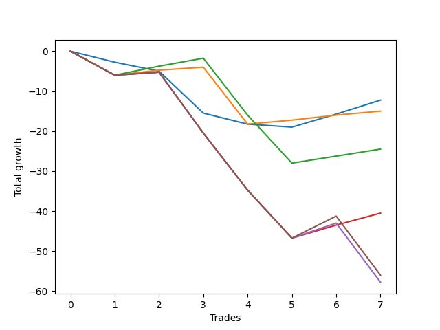

# Long Bulldog 003 DB 
- Symbol: ES_SmolBoiHour
- Date Range: 03/18/2022 - 07/29/2022
- Trading Period: 7:20-12:30
- Number of Trades: 7



| Name | Win Percent | Profit | Avg Profit / Trade | Avg Time / Trade |      | Name | Win Percent | Profit | Avg Profit / Trade | Avg Time / Trade |
| ---- | ----------- | ------ | ------------------ | ---------------- | ---- | ---- | ----------- | ------ | ------------------ | ---------------- |
| Sorted By <br> Profit | | | | | | Sorted By <br> Win Percentage ||||
| Two | 28.57 | -6125.00 | -875.00 | 29:22 |     | Eighty-One | 71.43 | -7500.00 | -1071.43 | 17:39 |
| Eighty-One | 71.43 | -7500.00 | -1071.43 | 17:39 |     | Eighty-Two | 57.14 | -12250.00 | -1750.00 | 29:53 |
| Eighty-Two | 57.14 | -12250.00 | -1750.00 | 29:53 |     | Eighty-Three | 42.86 | -20250.00 | -2892.86 | 48:48 |
| Eighty-Three | 42.86 | -20250.00 | -2892.86 | 48:48 |     | Two | 28.57 | -6125.00 | -875.00 | 29:22 |
| Eighty-Five | 28.57 | -28000.00 | -4000.00 | 55:00 |     | Eighty-Five | 28.57 | -28000.00 | -4000.00 | 55:00 |
| Eighty-Four | 28.57 | -28875.00 | -4125.00 | 54:57 |     | Eighty-Four | 28.57 | -28875.00 | -4125.00 | 54:57 |

## NO STOPLOSS

### Test Two
* Sell when the price hits the upper line of the 20p 2std bollinger
* No Stoploss
* Results:
```
Total Trades: 7
Percent Up: 28.57
Percent Down: 71.43
Total Points Moved Up: -12.25
Potential Profit: -6125.00
Total Points Ups: 6.75 Count Ups: 2
Total Points Downs: -19.00 Count Downs: 5
```

<details><summary>Trades</summary>

<code>In: 2022-03-23 10:23:00		Out: 2022-03-23 10:54:25		Total Position Time: 31:25		Total Move Up: -2.75		Total to Date: -2.75</code> <br />
<code>In: 2022-03-25 08:14:00		Out: 2022-03-25 08:41:45		Total Position Time: 27:45		Total Move Up: -2.25		Total to Date: -5.00</code> <br />
<code>In: 2022-03-28 08:27:00		Out: 2022-03-28 09:07:10		Total Position Time: 40:10		Total Move Up: -10.50		Total to Date: -15.50</code> <br />
<code>In: 2022-04-18 08:26:00		Out: 2022-04-18 08:59:35		Total Position Time: 33:35		Total Move Up: -2.75		Total to Date: -18.25</code> <br />
<code>In: 2022-04-18 08:29:00		Out: 2022-04-18 08:59:35		Total Position Time: 30:35		Total Move Up: -0.75		Total to Date: -19.00</code> <br />
<code>In: 2022-06-06 08:19:00		Out: 2022-06-06 08:43:00		Total Position Time: 24:00		Total Move Up: 3.25		Total to Date: -15.75</code> <br />
<code>In: 2022-06-08 09:41:00		Out: 2022-06-08 09:59:10		Total Position Time: 18:10		Total Move Up: 3.50		Total to Date: -12.25</code> <br />


</details>

## TAKE PROFIT

### Test Eighty-One
* Take Profit of 1 Point
* No Stoploss
* Results:
```
Total Trades: 7
Percent Up: 71.43
Percent Down: 28.57
Total Points Moved Up: -15.00
Potential Profit: -7500.00
Total Points Ups: 5.25 Count Ups: 5
Total Points Downs: -20.25 Count Downs: 2
```

<details><summary>Trades</summary>

<code>In: 2022-03-23 10:23:00		Out: 2022-03-23 11:22:55		Total Position Time: 59:55		Total Move Up: -6.00		Total to Date: -6.00</code> <br />
<code>In: 2022-03-25 08:14:00		Out: 2022-03-25 08:15:50		Total Position Time: 01:50		Total Move Up: 1.25		Total to Date: -4.75</code> <br />
<code>In: 2022-03-28 08:27:00		Out: 2022-03-28 08:27:45		Total Position Time: 00:45		Total Move Up: 0.75		Total to Date: -4.00</code> <br />
<code>In: 2022-04-18 08:26:00		Out: 2022-04-18 09:25:55		Total Position Time: 59:55		Total Move Up: -14.25		Total to Date: -18.25</code> <br />
<code>In: 2022-04-18 08:29:00		Out: 2022-04-18 08:29:25		Total Position Time: 00:25		Total Move Up: 1.00		Total to Date: -17.25</code> <br />
<code>In: 2022-06-06 08:19:00		Out: 2022-06-06 08:19:10		Total Position Time: 00:10		Total Move Up: 1.25		Total to Date: -16.00</code> <br />
<code>In: 2022-06-08 09:41:00		Out: 2022-06-08 09:41:35		Total Position Time: 00:35		Total Move Up: 1.00		Total to Date: -15.00</code> <br />


</details>

### Test Eighty-Two
* Take Profit of 2 Point
* No Stoploss
* Results:
```
Total Trades: 7
Percent Up: 57.14
Percent Down: 42.86
Total Points Moved Up: -24.50
Potential Profit: -12250.00
Total Points Ups: 7.75 Count Ups: 4
Total Points Downs: -32.25 Count Downs: 3
```

<details><summary>Trades</summary>

<code>In: 2022-03-23 10:23:00		Out: 2022-03-23 11:22:55		Total Position Time: 59:55		Total Move Up: -6.00		Total to Date: -6.00</code> <br />
<code>In: 2022-03-25 08:14:00		Out: 2022-03-25 08:16:05		Total Position Time: 02:05		Total Move Up: 2.25		Total to Date: -3.75</code> <br />
<code>In: 2022-03-28 08:27:00		Out: 2022-03-28 08:28:10		Total Position Time: 01:10		Total Move Up: 2.00		Total to Date: -1.75</code> <br />
<code>In: 2022-04-18 08:26:00		Out: 2022-04-18 09:25:55		Total Position Time: 59:55		Total Move Up: -14.25		Total to Date: -16.00</code> <br />
<code>In: 2022-04-18 08:29:00		Out: 2022-04-18 09:28:55		Total Position Time: 59:55		Total Move Up: -12.00		Total to Date: -28.00</code> <br />
<code>In: 2022-06-06 08:19:00		Out: 2022-06-06 08:29:05		Total Position Time: 10:05		Total Move Up: 1.75		Total to Date: -26.25</code> <br />
<code>In: 2022-06-08 09:41:00		Out: 2022-06-08 09:57:10		Total Position Time: 16:10		Total Move Up: 1.75		Total to Date: -24.50</code> <br />


</details>

### Test Eighty-Three
* Take Profit of 3 Point
* No Stoploss
* Results:
```
Total Trades: 7
Percent Up: 42.86
Percent Down: 57.14
Total Points Moved Up: -40.50
Potential Profit: -20250.00
Total Points Ups: 7.00 Count Ups: 3
Total Points Downs: -47.50 Count Downs: 4
```

<details><summary>Trades</summary>

<code>In: 2022-03-23 10:23:00		Out: 2022-03-23 11:22:55		Total Position Time: 59:55		Total Move Up: -6.00		Total to Date: -6.00</code> <br />
<code>In: 2022-03-25 08:14:00		Out: 2022-03-25 09:13:55		Total Position Time: 59:55		Total Move Up: 0.75		Total to Date: -5.25</code> <br />
<code>In: 2022-03-28 08:27:00		Out: 2022-03-28 09:26:55		Total Position Time: 59:55		Total Move Up: -15.25		Total to Date: -20.50</code> <br />
<code>In: 2022-04-18 08:26:00		Out: 2022-04-18 09:25:55		Total Position Time: 59:55		Total Move Up: -14.25		Total to Date: -34.75</code> <br />
<code>In: 2022-04-18 08:29:00		Out: 2022-04-18 09:28:55		Total Position Time: 59:55		Total Move Up: -12.00		Total to Date: -46.75</code> <br />
<code>In: 2022-06-06 08:19:00		Out: 2022-06-06 08:43:00		Total Position Time: 24:00		Total Move Up: 3.25		Total to Date: -43.50</code> <br />
<code>In: 2022-06-08 09:41:00		Out: 2022-06-08 09:59:05		Total Position Time: 18:05		Total Move Up: 3.00		Total to Date: -40.50</code> <br />


</details>

### Test Eighty-Four
* Take Profit of 4 Point
* No Stoploss
* Results:
```
Total Trades: 7
Percent Up: 28.57
Percent Down: 71.43
Total Points Moved Up: -57.75
Potential Profit: -28875.00
Total Points Ups: 4.50 Count Ups: 2
Total Points Downs: -62.25 Count Downs: 5
```

<details><summary>Trades</summary>

<code>In: 2022-03-23 10:23:00		Out: 2022-03-23 11:22:55		Total Position Time: 59:55		Total Move Up: -6.00		Total to Date: -6.00</code> <br />
<code>In: 2022-03-25 08:14:00		Out: 2022-03-25 09:13:55		Total Position Time: 59:55		Total Move Up: 0.75		Total to Date: -5.25</code> <br />
<code>In: 2022-03-28 08:27:00		Out: 2022-03-28 09:26:55		Total Position Time: 59:55		Total Move Up: -15.25		Total to Date: -20.50</code> <br />
<code>In: 2022-04-18 08:26:00		Out: 2022-04-18 09:25:55		Total Position Time: 59:55		Total Move Up: -14.25		Total to Date: -34.75</code> <br />
<code>In: 2022-04-18 08:29:00		Out: 2022-04-18 09:28:55		Total Position Time: 59:55		Total Move Up: -12.00		Total to Date: -46.75</code> <br />
<code>In: 2022-06-06 08:19:00		Out: 2022-06-06 08:44:15		Total Position Time: 25:15		Total Move Up: 3.75		Total to Date: -43.00</code> <br />
<code>In: 2022-06-08 09:41:00		Out: 2022-06-08 10:40:55		Total Position Time: 59:55		Total Move Up: -14.75		Total to Date: -57.75</code> <br />


</details>

### Test Eighty-Five
* Take Profit of 5 Point
* No Stoploss
* Results:
```
Total Trades: 7
Percent Up: 28.57
Percent Down: 71.43
Total Points Moved Up: -56.00
Potential Profit: -28000.00
Total Points Ups: 6.25 Count Ups: 2
Total Points Downs: -62.25 Count Downs: 5
```

<details><summary>Trades</summary>

<code>In: 2022-03-23 10:23:00		Out: 2022-03-23 11:22:55		Total Position Time: 59:55		Total Move Up: -6.00		Total to Date: -6.00</code> <br />
<code>In: 2022-03-25 08:14:00		Out: 2022-03-25 09:13:55		Total Position Time: 59:55		Total Move Up: 0.75		Total to Date: -5.25</code> <br />
<code>In: 2022-03-28 08:27:00		Out: 2022-03-28 09:26:55		Total Position Time: 59:55		Total Move Up: -15.25		Total to Date: -20.50</code> <br />
<code>In: 2022-04-18 08:26:00		Out: 2022-04-18 09:25:55		Total Position Time: 59:55		Total Move Up: -14.25		Total to Date: -34.75</code> <br />
<code>In: 2022-04-18 08:29:00		Out: 2022-04-18 09:28:55		Total Position Time: 59:55		Total Move Up: -12.00		Total to Date: -46.75</code> <br />
<code>In: 2022-06-06 08:19:00		Out: 2022-06-06 08:44:30		Total Position Time: 25:30		Total Move Up: 5.50		Total to Date: -41.25</code> <br />
<code>In: 2022-06-08 09:41:00		Out: 2022-06-08 10:40:55		Total Position Time: 59:55		Total Move Up: -14.75		Total to Date: -56.00</code> <br />


</details>