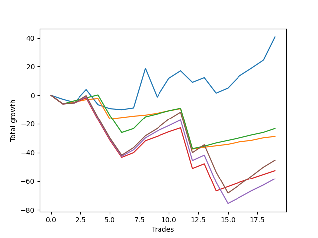

# Long Bulldog 005 DB 
- Symbol: ES_SmolBoiHour
- Date Range: 03/18/2022 - 07/29/2022
- Trading Period: 7:20-12:30
- Number of Trades: 19



| Name | Win Percent | Profit | Avg Profit / Trade | Avg Time / Trade |      | Name | Win Percent | Profit | Avg Profit / Trade | Avg Time / Trade |
| ---- | ----------- | ------ | ------------------ | ---------------- | ---- | ---- | ----------- | ------ | ------------------ | ---------------- |
| Sorted By <br> Profit | | | | | | Sorted By <br> Win Percentage ||||
| Two | 57.89 | 20375.00 | 1072.37 | 23:42 |     | Eighty-One | 84.21 | -14375.00 | -756.58 | 10:27 |
| Eighty-Two | 78.95 | -11625.00 | -611.84 | 16:36 |     | Eighty-Two | 78.95 | -11625.00 | -611.84 | 16:36 |
| Eighty-One | 84.21 | -14375.00 | -756.58 | 10:27 |     | Eighty-Three | 68.42 | -26250.00 | -1381.58 | 27:02 |
| Eighty-Five | 63.16 | -22625.00 | -1190.79 | 31:20 |     | Eighty-Five | 63.16 | -22625.00 | -1190.79 | 31:20 |
| Eighty-Three | 68.42 | -26250.00 | -1381.58 | 27:02 |     | Eighty-Four | 63.16 | -29125.00 | -1532.89 | 30:13 |
| Eighty-Four | 63.16 | -29125.00 | -1532.89 | 30:13 |     | Two | 57.89 | 20375.00 | 1072.37 | 23:42 |

## NO STOPLOSS

### Test Two
* Sell when the price hits the upper line of the 20p 2std bollinger
* No Stoploss
* Results:
```
Total Trades: 19
Percent Up: 57.89
Percent Down: 42.11
Total Points Moved Up: 40.75
Potential Profit: 20375.00
Total Points Ups: 98.50 Count Ups: 11
Total Points Downs: -57.75 Count Downs: 8
```

<details><summary>Trades</summary>

<code>In: 2022-03-23 10:23:00		Out: 2022-03-23 10:54:25		Total Position Time: 31:25		Total Move Up: -2.75		Total to Date: -2.75</code> <br />
<code>In: 2022-03-25 08:14:00		Out: 2022-03-25 08:41:45		Total Position Time: 27:45		Total Move Up: -2.25		Total to Date: -5.00</code> <br />
<code>In: 2022-03-28 07:39:00		Out: 2022-03-28 07:48:05		Total Position Time: 09:05		Total Move Up: 9.00		Total to Date: 4.00</code> <br />
<code>In: 2022-03-28 08:27:00		Out: 2022-03-28 09:07:10		Total Position Time: 40:10		Total Move Up: -10.50		Total to Date: -6.50</code> <br />
<code>In: 2022-04-18 08:26:00		Out: 2022-04-18 08:59:35		Total Position Time: 33:35		Total Move Up: -2.75		Total to Date: -9.25</code> <br />
<code>In: 2022-04-18 08:29:00		Out: 2022-04-18 08:59:35		Total Position Time: 30:35		Total Move Up: -0.75		Total to Date: -10.00</code> <br />
<code>In: 2022-04-20 11:38:00		Out: 2022-04-20 12:12:35		Total Position Time: 34:35		Total Move Up: 1.25		Total to Date: -8.75</code> <br />
<code>In: 2022-05-04 11:36:00		Out: 2022-05-04 11:43:45		Total Position Time: 07:45		Total Move Up: 27.50		Total to Date: 18.75</code> <br />
<code>In: 2022-05-11 09:32:00		Out: 2022-05-11 10:24:50		Total Position Time: 52:50		Total Move Up: -20.00		Total to Date: -1.25</code> <br />
<code>In: 2022-05-17 11:24:00		Out: 2022-05-17 11:40:00		Total Position Time: 16:00		Total Move Up: 13.00		Total to Date: 11.75</code> <br />
<code>In: 2022-05-25 09:29:00		Out: 2022-05-25 09:45:20		Total Position Time: 16:20		Total Move Up: 5.25		Total to Date: 17.00</code> <br />
<code>In: 2022-06-06 08:14:00		Out: 2022-06-06 08:43:00		Total Position Time: 29:00		Total Move Up: -8.00		Total to Date: 9.00</code> <br />
<code>In: 2022-06-06 08:19:00		Out: 2022-06-06 08:43:00		Total Position Time: 24:00		Total Move Up: 3.25		Total to Date: 12.25</code> <br />
<code>In: 2022-06-08 09:29:00		Out: 2022-06-08 09:59:10		Total Position Time: 30:10		Total Move Up: -10.75		Total to Date: 1.50</code> <br />
<code>In: 2022-06-08 09:41:00		Out: 2022-06-08 09:59:10		Total Position Time: 18:10		Total Move Up: 3.50		Total to Date: 5.00</code> <br />
<code>In: 2022-06-29 08:25:00		Out: 2022-06-29 08:34:40		Total Position Time: 09:40		Total Move Up: 8.50		Total to Date: 13.50</code> <br />
<code>In: 2022-07-05 08:02:00		Out: 2022-07-05 08:17:55		Total Position Time: 15:55		Total Move Up: 5.25		Total to Date: 18.75</code> <br />
<code>In: 2022-07-05 08:04:00		Out: 2022-07-05 08:17:55		Total Position Time: 13:55		Total Move Up: 5.50		Total to Date: 24.25</code> <br />
<code>In: 2022-07-13 07:22:00		Out: 2022-07-13 07:31:30		Total Position Time: 09:30		Total Move Up: 16.50		Total to Date: 40.75</code> <br />


</details>

## TAKE PROFIT

### Test Eighty-One
* Take Profit of 1 Point
* No Stoploss
* Results:
```
Total Trades: 19
Percent Up: 84.21
Percent Down: 15.79
Total Points Moved Up: -28.75
Potential Profit: -14375.00
Total Points Ups: 19.75 Count Ups: 16
Total Points Downs: -48.50 Count Downs: 3
```

<details><summary>Trades</summary>

<code>In: 2022-03-23 10:23:00		Out: 2022-03-23 11:22:55		Total Position Time: 59:55		Total Move Up: -6.00		Total to Date: -6.00</code> <br />
<code>In: 2022-03-25 08:14:00		Out: 2022-03-25 08:15:50		Total Position Time: 01:50		Total Move Up: 1.25		Total to Date: -4.75</code> <br />
<code>In: 2022-03-28 07:39:00		Out: 2022-03-28 07:39:20		Total Position Time: 00:20		Total Move Up: 1.75		Total to Date: -3.00</code> <br />
<code>In: 2022-03-28 08:27:00		Out: 2022-03-28 08:27:45		Total Position Time: 00:45		Total Move Up: 0.75		Total to Date: -2.25</code> <br />
<code>In: 2022-04-18 08:26:00		Out: 2022-04-18 09:25:55		Total Position Time: 59:55		Total Move Up: -14.25		Total to Date: -16.50</code> <br />
<code>In: 2022-04-18 08:29:00		Out: 2022-04-18 08:29:25		Total Position Time: 00:25		Total Move Up: 1.00		Total to Date: -15.50</code> <br />
<code>In: 2022-04-20 11:38:00		Out: 2022-04-20 11:48:20		Total Position Time: 10:20		Total Move Up: 1.00		Total to Date: -14.50</code> <br />
<code>In: 2022-05-04 11:36:00		Out: 2022-05-04 11:36:10		Total Position Time: 00:10		Total Move Up: 0.75		Total to Date: -13.75</code> <br />
<code>In: 2022-05-11 09:32:00		Out: 2022-05-11 09:32:30		Total Position Time: 00:30		Total Move Up: 1.25		Total to Date: -12.50</code> <br />
<code>In: 2022-05-17 11:24:00		Out: 2022-05-17 11:24:25		Total Position Time: 00:25		Total Move Up: 1.75		Total to Date: -10.75</code> <br />
<code>In: 2022-05-25 09:29:00		Out: 2022-05-25 09:30:00		Total Position Time: 01:00		Total Move Up: 1.50		Total to Date: -9.25</code> <br />
<code>In: 2022-06-06 08:14:00		Out: 2022-06-06 09:13:55		Total Position Time: 59:55		Total Move Up: -28.25		Total to Date: -37.50</code> <br />
<code>In: 2022-06-06 08:19:00		Out: 2022-06-06 08:19:10		Total Position Time: 00:10		Total Move Up: 1.25		Total to Date: -36.25</code> <br />
<code>In: 2022-06-08 09:29:00		Out: 2022-06-08 09:29:15		Total Position Time: 00:15		Total Move Up: 1.00		Total to Date: -35.25</code> <br />
<code>In: 2022-06-08 09:41:00		Out: 2022-06-08 09:41:35		Total Position Time: 00:35		Total Move Up: 1.00		Total to Date: -34.25</code> <br />
<code>In: 2022-06-29 08:25:00		Out: 2022-06-29 08:25:15		Total Position Time: 00:15		Total Move Up: 1.75		Total to Date: -32.50</code> <br />
<code>In: 2022-07-05 08:02:00		Out: 2022-07-05 08:03:45		Total Position Time: 01:45		Total Move Up: 1.00		Total to Date: -31.50</code> <br />
<code>In: 2022-07-05 08:04:00		Out: 2022-07-05 08:04:10		Total Position Time: 00:10		Total Move Up: 1.75		Total to Date: -29.75</code> <br />
<code>In: 2022-07-13 07:22:00		Out: 2022-07-13 07:22:10		Total Position Time: 00:10		Total Move Up: 1.00		Total to Date: -28.75</code> <br />


</details>

### Test Eighty-Two
* Take Profit of 2 Point
* No Stoploss
* Results:
```
Total Trades: 19
Percent Up: 78.95
Percent Down: 21.05
Total Points Moved Up: -23.25
Potential Profit: -11625.00
Total Points Ups: 37.25 Count Ups: 15
Total Points Downs: -60.50 Count Downs: 4
```

<details><summary>Trades</summary>

<code>In: 2022-03-23 10:23:00		Out: 2022-03-23 11:22:55		Total Position Time: 59:55		Total Move Up: -6.00		Total to Date: -6.00</code> <br />
<code>In: 2022-03-25 08:14:00		Out: 2022-03-25 08:16:05		Total Position Time: 02:05		Total Move Up: 2.25		Total to Date: -3.75</code> <br />
<code>In: 2022-03-28 07:39:00		Out: 2022-03-28 07:40:00		Total Position Time: 01:00		Total Move Up: 2.00		Total to Date: -1.75</code> <br />
<code>In: 2022-03-28 08:27:00		Out: 2022-03-28 08:28:10		Total Position Time: 01:10		Total Move Up: 2.00		Total to Date: 0.25</code> <br />
<code>In: 2022-04-18 08:26:00		Out: 2022-04-18 09:25:55		Total Position Time: 59:55		Total Move Up: -14.25		Total to Date: -14.00</code> <br />
<code>In: 2022-04-18 08:29:00		Out: 2022-04-18 09:28:55		Total Position Time: 59:55		Total Move Up: -12.00		Total to Date: -26.00</code> <br />
<code>In: 2022-04-20 11:38:00		Out: 2022-04-20 12:12:50		Total Position Time: 34:50		Total Move Up: 2.75		Total to Date: -23.25</code> <br />
<code>In: 2022-05-04 11:36:00		Out: 2022-05-04 11:36:40		Total Position Time: 00:40		Total Move Up: 8.25		Total to Date: -15.00</code> <br />
<code>In: 2022-05-11 09:32:00		Out: 2022-05-11 09:35:20		Total Position Time: 03:20		Total Move Up: 2.00		Total to Date: -13.00</code> <br />
<code>In: 2022-05-17 11:24:00		Out: 2022-05-17 11:24:35		Total Position Time: 00:35		Total Move Up: 2.25		Total to Date: -10.75</code> <br />
<code>In: 2022-05-25 09:29:00		Out: 2022-05-25 09:30:05		Total Position Time: 01:05		Total Move Up: 1.75		Total to Date: -9.00</code> <br />
<code>In: 2022-06-06 08:14:00		Out: 2022-06-06 09:13:55		Total Position Time: 59:55		Total Move Up: -28.25		Total to Date: -37.25</code> <br />
<code>In: 2022-06-06 08:19:00		Out: 2022-06-06 08:29:05		Total Position Time: 10:05		Total Move Up: 1.75		Total to Date: -35.50</code> <br />
<code>In: 2022-06-08 09:29:00		Out: 2022-06-08 09:29:55		Total Position Time: 00:55		Total Move Up: 2.25		Total to Date: -33.25</code> <br />
<code>In: 2022-06-08 09:41:00		Out: 2022-06-08 09:57:10		Total Position Time: 16:10		Total Move Up: 1.75		Total to Date: -31.50</code> <br />
<code>In: 2022-06-29 08:25:00		Out: 2022-06-29 08:25:15		Total Position Time: 00:15		Total Move Up: 1.75		Total to Date: -29.75</code> <br />
<code>In: 2022-07-05 08:02:00		Out: 2022-07-05 08:04:40		Total Position Time: 02:40		Total Move Up: 2.00		Total to Date: -27.75</code> <br />
<code>In: 2022-07-05 08:04:00		Out: 2022-07-05 08:04:30		Total Position Time: 00:30		Total Move Up: 1.75		Total to Date: -26.00</code> <br />
<code>In: 2022-07-13 07:22:00		Out: 2022-07-13 07:22:30		Total Position Time: 00:30		Total Move Up: 2.75		Total to Date: -23.25</code> <br />


</details>

### Test Eighty-Three
* Take Profit of 3 Point
* No Stoploss
* Results:
```
Total Trades: 19
Percent Up: 68.42
Percent Down: 31.58
Total Points Moved Up: -52.50
Potential Profit: -26250.00
Total Points Ups: 42.25 Count Ups: 13
Total Points Downs: -94.75 Count Downs: 6
```

<details><summary>Trades</summary>

<code>In: 2022-03-23 10:23:00		Out: 2022-03-23 11:22:55		Total Position Time: 59:55		Total Move Up: -6.00		Total to Date: -6.00</code> <br />
<code>In: 2022-03-25 08:14:00		Out: 2022-03-25 09:13:55		Total Position Time: 59:55		Total Move Up: 0.75		Total to Date: -5.25</code> <br />
<code>In: 2022-03-28 07:39:00		Out: 2022-03-28 07:43:00		Total Position Time: 04:00		Total Move Up: 3.50		Total to Date: -1.75</code> <br />
<code>In: 2022-03-28 08:27:00		Out: 2022-03-28 09:26:55		Total Position Time: 59:55		Total Move Up: -15.25		Total to Date: -17.00</code> <br />
<code>In: 2022-04-18 08:26:00		Out: 2022-04-18 09:25:55		Total Position Time: 59:55		Total Move Up: -14.25		Total to Date: -31.25</code> <br />
<code>In: 2022-04-18 08:29:00		Out: 2022-04-18 09:28:55		Total Position Time: 59:55		Total Move Up: -12.00		Total to Date: -43.25</code> <br />
<code>In: 2022-04-20 11:38:00		Out: 2022-04-20 12:12:55		Total Position Time: 34:55		Total Move Up: 3.25		Total to Date: -40.00</code> <br />
<code>In: 2022-05-04 11:36:00		Out: 2022-05-04 11:36:40		Total Position Time: 00:40		Total Move Up: 8.25		Total to Date: -31.75</code> <br />
<code>In: 2022-05-11 09:32:00		Out: 2022-05-11 09:35:30		Total Position Time: 03:30		Total Move Up: 3.00		Total to Date: -28.75</code> <br />
<code>In: 2022-05-17 11:24:00		Out: 2022-05-17 11:24:40		Total Position Time: 00:40		Total Move Up: 3.25		Total to Date: -25.50</code> <br />
<code>In: 2022-05-25 09:29:00		Out: 2022-05-25 09:30:15		Total Position Time: 01:15		Total Move Up: 2.75		Total to Date: -22.75</code> <br />
<code>In: 2022-06-06 08:14:00		Out: 2022-06-06 09:13:55		Total Position Time: 59:55		Total Move Up: -28.25		Total to Date: -51.00</code> <br />
<code>In: 2022-06-06 08:19:00		Out: 2022-06-06 08:43:00		Total Position Time: 24:00		Total Move Up: 3.25		Total to Date: -47.75</code> <br />
<code>In: 2022-06-08 09:29:00		Out: 2022-06-08 10:28:55		Total Position Time: 59:55		Total Move Up: -19.00		Total to Date: -66.75</code> <br />
<code>In: 2022-06-08 09:41:00		Out: 2022-06-08 09:59:05		Total Position Time: 18:05		Total Move Up: 3.00		Total to Date: -63.75</code> <br />
<code>In: 2022-06-29 08:25:00		Out: 2022-06-29 08:25:20		Total Position Time: 00:20		Total Move Up: 3.00		Total to Date: -60.75</code> <br />
<code>In: 2022-07-05 08:02:00		Out: 2022-07-05 08:07:50		Total Position Time: 05:50		Total Move Up: 2.75		Total to Date: -58.00</code> <br />
<code>In: 2022-07-05 08:04:00		Out: 2022-07-05 08:04:45		Total Position Time: 00:45		Total Move Up: 2.75		Total to Date: -55.25</code> <br />
<code>In: 2022-07-13 07:22:00		Out: 2022-07-13 07:22:30		Total Position Time: 00:30		Total Move Up: 2.75		Total to Date: -52.50</code> <br />


</details>

### Test Eighty-Four
* Take Profit of 4 Point
* No Stoploss
* Results:
```
Total Trades: 19
Percent Up: 63.16
Percent Down: 36.84
Total Points Moved Up: -58.25
Potential Profit: -29125.00
Total Points Ups: 51.25 Count Ups: 12
Total Points Downs: -109.50 Count Downs: 7
```

<details><summary>Trades</summary>

<code>In: 2022-03-23 10:23:00		Out: 2022-03-23 11:22:55		Total Position Time: 59:55		Total Move Up: -6.00		Total to Date: -6.00</code> <br />
<code>In: 2022-03-25 08:14:00		Out: 2022-03-25 09:13:55		Total Position Time: 59:55		Total Move Up: 0.75		Total to Date: -5.25</code> <br />
<code>In: 2022-03-28 07:39:00		Out: 2022-03-28 07:43:10		Total Position Time: 04:10		Total Move Up: 4.25		Total to Date: -1.00</code> <br />
<code>In: 2022-03-28 08:27:00		Out: 2022-03-28 09:26:55		Total Position Time: 59:55		Total Move Up: -15.25		Total to Date: -16.25</code> <br />
<code>In: 2022-04-18 08:26:00		Out: 2022-04-18 09:25:55		Total Position Time: 59:55		Total Move Up: -14.25		Total to Date: -30.50</code> <br />
<code>In: 2022-04-18 08:29:00		Out: 2022-04-18 09:28:55		Total Position Time: 59:55		Total Move Up: -12.00		Total to Date: -42.50</code> <br />
<code>In: 2022-04-20 11:38:00		Out: 2022-04-20 12:13:35		Total Position Time: 35:35		Total Move Up: 4.50		Total to Date: -38.00</code> <br />
<code>In: 2022-05-04 11:36:00		Out: 2022-05-04 11:36:40		Total Position Time: 00:40		Total Move Up: 8.25		Total to Date: -29.75</code> <br />
<code>In: 2022-05-11 09:32:00		Out: 2022-05-11 09:35:50		Total Position Time: 03:50		Total Move Up: 4.75		Total to Date: -25.00</code> <br />
<code>In: 2022-05-17 11:24:00		Out: 2022-05-17 11:24:50		Total Position Time: 00:50		Total Move Up: 3.75		Total to Date: -21.25</code> <br />
<code>In: 2022-05-25 09:29:00		Out: 2022-05-25 09:30:30		Total Position Time: 01:30		Total Move Up: 4.00		Total to Date: -17.25</code> <br />
<code>In: 2022-06-06 08:14:00		Out: 2022-06-06 09:13:55		Total Position Time: 59:55		Total Move Up: -28.25		Total to Date: -45.50</code> <br />
<code>In: 2022-06-06 08:19:00		Out: 2022-06-06 08:44:15		Total Position Time: 25:15		Total Move Up: 3.75		Total to Date: -41.75</code> <br />
<code>In: 2022-06-08 09:29:00		Out: 2022-06-08 10:28:55		Total Position Time: 59:55		Total Move Up: -19.00		Total to Date: -60.75</code> <br />
<code>In: 2022-06-08 09:41:00		Out: 2022-06-08 10:40:55		Total Position Time: 59:55		Total Move Up: -14.75		Total to Date: -75.50</code> <br />
<code>In: 2022-06-29 08:25:00		Out: 2022-06-29 08:28:15		Total Position Time: 03:15		Total Move Up: 4.25		Total to Date: -71.25</code> <br />
<code>In: 2022-07-05 08:02:00		Out: 2022-07-05 08:16:45		Total Position Time: 14:45		Total Move Up: 4.50		Total to Date: -66.75</code> <br />
<code>In: 2022-07-05 08:04:00		Out: 2022-07-05 08:08:20		Total Position Time: 04:20		Total Move Up: 4.00		Total to Date: -62.75</code> <br />
<code>In: 2022-07-13 07:22:00		Out: 2022-07-13 07:22:45		Total Position Time: 00:45		Total Move Up: 4.50		Total to Date: -58.25</code> <br />


</details>

### Test Eighty-Five
* Take Profit of 5 Point
* No Stoploss
* Results:
```
Total Trades: 19
Percent Up: 63.16
Percent Down: 36.84
Total Points Moved Up: -45.25
Potential Profit: -22625.00
Total Points Ups: 64.25 Count Ups: 12
Total Points Downs: -109.50 Count Downs: 7
```

<details><summary>Trades</summary>

<code>In: 2022-03-23 10:23:00		Out: 2022-03-23 11:22:55		Total Position Time: 59:55		Total Move Up: -6.00		Total to Date: -6.00</code> <br />
<code>In: 2022-03-25 08:14:00		Out: 2022-03-25 09:13:55		Total Position Time: 59:55		Total Move Up: 0.75		Total to Date: -5.25</code> <br />
<code>In: 2022-03-28 07:39:00		Out: 2022-03-28 07:44:55		Total Position Time: 05:55		Total Move Up: 5.00		Total to Date: -0.25</code> <br />
<code>In: 2022-03-28 08:27:00		Out: 2022-03-28 09:26:55		Total Position Time: 59:55		Total Move Up: -15.25		Total to Date: -15.50</code> <br />
<code>In: 2022-04-18 08:26:00		Out: 2022-04-18 09:25:55		Total Position Time: 59:55		Total Move Up: -14.25		Total to Date: -29.75</code> <br />
<code>In: 2022-04-18 08:29:00		Out: 2022-04-18 09:28:55		Total Position Time: 59:55		Total Move Up: -12.00		Total to Date: -41.75</code> <br />
<code>In: 2022-04-20 11:38:00		Out: 2022-04-20 12:13:50		Total Position Time: 35:50		Total Move Up: 5.25		Total to Date: -36.50</code> <br />
<code>In: 2022-05-04 11:36:00		Out: 2022-05-04 11:36:40		Total Position Time: 00:40		Total Move Up: 8.25		Total to Date: -28.25</code> <br />
<code>In: 2022-05-11 09:32:00		Out: 2022-05-11 09:36:05		Total Position Time: 04:05		Total Move Up: 5.00		Total to Date: -23.25</code> <br />
<code>In: 2022-05-17 11:24:00		Out: 2022-05-17 11:26:40		Total Position Time: 02:40		Total Move Up: 6.50		Total to Date: -16.75</code> <br />
<code>In: 2022-05-25 09:29:00		Out: 2022-05-25 09:32:10		Total Position Time: 03:10		Total Move Up: 5.00		Total to Date: -11.75</code> <br />
<code>In: 2022-06-06 08:14:00		Out: 2022-06-06 09:13:55		Total Position Time: 59:55		Total Move Up: -28.25		Total to Date: -40.00</code> <br />
<code>In: 2022-06-06 08:19:00		Out: 2022-06-06 08:44:30		Total Position Time: 25:30		Total Move Up: 5.50		Total to Date: -34.50</code> <br />
<code>In: 2022-06-08 09:29:00		Out: 2022-06-08 10:28:55		Total Position Time: 59:55		Total Move Up: -19.00		Total to Date: -53.50</code> <br />
<code>In: 2022-06-08 09:41:00		Out: 2022-06-08 10:40:55		Total Position Time: 59:55		Total Move Up: -14.75		Total to Date: -68.25</code> <br />
<code>In: 2022-06-29 08:25:00		Out: 2022-06-29 08:32:15		Total Position Time: 07:15		Total Move Up: 5.75		Total to Date: -62.50</code> <br />
<code>In: 2022-07-05 08:02:00		Out: 2022-07-05 08:17:50		Total Position Time: 15:50		Total Move Up: 6.00		Total to Date: -56.50</code> <br />
<code>In: 2022-07-05 08:04:00		Out: 2022-07-05 08:17:50		Total Position Time: 13:50		Total Move Up: 6.25		Total to Date: -50.25</code> <br />
<code>In: 2022-07-13 07:22:00		Out: 2022-07-13 07:23:20		Total Position Time: 01:20		Total Move Up: 5.00		Total to Date: -45.25</code> <br />


</details>