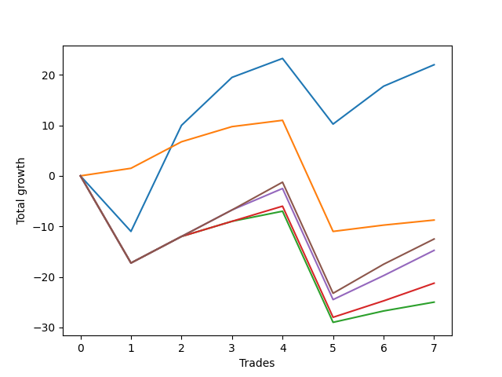

# Long Bulldog 006 DB 
- Symbol: ES_SmolBoiHour
- Date Range: 03/18/2022 - 07/29/2022
- Trading Period: 7:20-12:30
- Number of Trades: 7



| Name | Win Percent | Profit | Avg Profit / Trade | Avg Time / Trade |      | Name | Win Percent | Profit | Avg Profit / Trade | Avg Time / Trade |
| ---- | ----------- | ------ | ------------------ | ---------------- | ---- | ---- | ----------- | ------ | ------------------ | ---------------- |
| Sorted By <br> Profit | | | | | | Sorted By <br> Win Percentage ||||
| Two | 71.43 | 11000.00 | 1571.43 | 18:08 |     | Eighty-One | 85.71 | -4375.00 | -625.00 | 10:00 |
| Eighty-One | 85.71 | -4375.00 | -625.00 | 10:00 |     | Two | 71.43 | 11000.00 | 1571.43 | 18:08 |
| Eighty-Five | 71.43 | -6250.00 | -892.86 | 23:50 |     | Eighty-Five | 71.43 | -6250.00 | -892.86 | 23:50 |
| Eighty-Four | 71.43 | -7375.00 | -1053.57 | 23:20 |     | Eighty-Four | 71.43 | -7375.00 | -1053.57 | 23:20 |
| Eighty-Three | 71.43 | -10625.00 | -1517.86 | 20:12 |     | Eighty-Three | 71.43 | -10625.00 | -1517.86 | 20:12 |
| Eighty-Two | 71.43 | -12500.00 | -1785.71 | 18:43 |     | Eighty-Two | 71.43 | -12500.00 | -1785.71 | 18:43 |

## NO STOPLOSS

### Test Two
* Sell when the price hits the upper line of the 20p 2std bollinger
* No Stoploss
* Results:
```
Total Trades: 7
Percent Up: 71.43
Percent Down: 28.57
Total Points Moved Up: 22.00
Potential Profit: 11000.00
Total Points Ups: 46.00 Count Ups: 5
Total Points Downs: -24.00 Count Downs: 2
```

<details><summary>Trades</summary>

<code>In: 2022-03-28 08:28:00		Out: 2022-03-28 09:07:10		Total Position Time: 39:10		Total Move Up: -11.00		Total to Date: -11.00</code> <br />
<code>In: 2022-05-04 11:37:00		Out: 2022-05-04 11:43:45		Total Position Time: 06:45		Total Move Up: 21.00		Total to Date: 10.00</code> <br />
<code>In: 2022-05-17 11:25:00		Out: 2022-05-17 11:40:00		Total Position Time: 15:00		Total Move Up: 9.50		Total to Date: 19.50</code> <br />
<code>In: 2022-05-25 09:30:00		Out: 2022-05-25 09:45:20		Total Position Time: 15:20		Total Move Up: 3.75		Total to Date: 23.25</code> <br />
<code>In: 2022-06-08 09:30:00		Out: 2022-06-08 09:59:10		Total Position Time: 29:10		Total Move Up: -13.00		Total to Date: 10.25</code> <br />
<code>In: 2022-06-29 08:26:00		Out: 2022-06-29 08:34:40		Total Position Time: 08:40		Total Move Up: 7.50		Total to Date: 17.75</code> <br />
<code>In: 2022-07-05 08:05:00		Out: 2022-07-05 08:17:55		Total Position Time: 12:55		Total Move Up: 4.25		Total to Date: 22.00</code> <br />


</details>

## TAKE PROFIT

### Test Eighty-One
* Take Profit of 1 Point
* No Stoploss
* Results:
```
Total Trades: 7
Percent Up: 85.71
Percent Down: 14.29
Total Points Moved Up: -8.75
Potential Profit: -4375.00
Total Points Ups: 13.25 Count Ups: 6
Total Points Downs: -22.00 Count Downs: 1
```

<details><summary>Trades</summary>

<code>In: 2022-03-28 08:28:00		Out: 2022-03-28 08:28:10		Total Position Time: 00:10		Total Move Up: 1.50		Total to Date: 1.50</code> <br />
<code>In: 2022-05-04 11:37:00		Out: 2022-05-04 11:41:15		Total Position Time: 04:15		Total Move Up: 5.25		Total to Date: 6.75</code> <br />
<code>In: 2022-05-17 11:25:00		Out: 2022-05-17 11:26:40		Total Position Time: 01:40		Total Move Up: 3.00		Total to Date: 9.75</code> <br />
<code>In: 2022-05-25 09:30:00		Out: 2022-05-25 09:30:15		Total Position Time: 00:15		Total Move Up: 1.25		Total to Date: 11.00</code> <br />
<code>In: 2022-06-08 09:30:00		Out: 2022-06-08 10:29:55		Total Position Time: 59:55		Total Move Up: -22.00		Total to Date: -11.00</code> <br />
<code>In: 2022-06-29 08:26:00		Out: 2022-06-29 08:27:15		Total Position Time: 01:15		Total Move Up: 1.25		Total to Date: -9.75</code> <br />
<code>In: 2022-07-05 08:05:00		Out: 2022-07-05 08:07:35		Total Position Time: 02:35		Total Move Up: 1.00		Total to Date: -8.75</code> <br />


</details>

### Test Eighty-Two
* Take Profit of 2 Point
* No Stoploss
* Results:
```
Total Trades: 7
Percent Up: 71.43
Percent Down: 28.57
Total Points Moved Up: -25.00
Potential Profit: -12500.00
Total Points Ups: 14.25 Count Ups: 5
Total Points Downs: -39.25 Count Downs: 2
```

<details><summary>Trades</summary>

<code>In: 2022-03-28 08:28:00		Out: 2022-03-28 09:27:55		Total Position Time: 59:55		Total Move Up: -17.25		Total to Date: -17.25</code> <br />
<code>In: 2022-05-04 11:37:00		Out: 2022-05-04 11:41:15		Total Position Time: 04:15		Total Move Up: 5.25		Total to Date: -12.00</code> <br />
<code>In: 2022-05-17 11:25:00		Out: 2022-05-17 11:26:40		Total Position Time: 01:40		Total Move Up: 3.00		Total to Date: -9.00</code> <br />
<code>In: 2022-05-25 09:30:00		Out: 2022-05-25 09:30:25		Total Position Time: 00:25		Total Move Up: 2.00		Total to Date: -7.00</code> <br />
<code>In: 2022-06-08 09:30:00		Out: 2022-06-08 10:29:55		Total Position Time: 59:55		Total Move Up: -22.00		Total to Date: -29.00</code> <br />
<code>In: 2022-06-29 08:26:00		Out: 2022-06-29 08:28:05		Total Position Time: 02:05		Total Move Up: 2.25		Total to Date: -26.75</code> <br />
<code>In: 2022-07-05 08:05:00		Out: 2022-07-05 08:07:50		Total Position Time: 02:50		Total Move Up: 1.75		Total to Date: -25.00</code> <br />


</details>

### Test Eighty-Three
* Take Profit of 3 Point
* No Stoploss
* Results:
```
Total Trades: 7
Percent Up: 71.43
Percent Down: 28.57
Total Points Moved Up: -21.25
Potential Profit: -10625.00
Total Points Ups: 18.00 Count Ups: 5
Total Points Downs: -39.25 Count Downs: 2
```

<details><summary>Trades</summary>

<code>In: 2022-03-28 08:28:00		Out: 2022-03-28 09:27:55		Total Position Time: 59:55		Total Move Up: -17.25		Total to Date: -17.25</code> <br />
<code>In: 2022-05-04 11:37:00		Out: 2022-05-04 11:41:15		Total Position Time: 04:15		Total Move Up: 5.25		Total to Date: -12.00</code> <br />
<code>In: 2022-05-17 11:25:00		Out: 2022-05-17 11:26:40		Total Position Time: 01:40		Total Move Up: 3.00		Total to Date: -9.00</code> <br />
<code>In: 2022-05-25 09:30:00		Out: 2022-05-25 09:31:45		Total Position Time: 01:45		Total Move Up: 3.00		Total to Date: -6.00</code> <br />
<code>In: 2022-06-08 09:30:00		Out: 2022-06-08 10:29:55		Total Position Time: 59:55		Total Move Up: -22.00		Total to Date: -28.00</code> <br />
<code>In: 2022-06-29 08:26:00		Out: 2022-06-29 08:28:15		Total Position Time: 02:15		Total Move Up: 3.25		Total to Date: -24.75</code> <br />
<code>In: 2022-07-05 08:05:00		Out: 2022-07-05 08:16:45		Total Position Time: 11:45		Total Move Up: 3.50		Total to Date: -21.25</code> <br />


</details>

### Test Eighty-Four
* Take Profit of 4 Point
* No Stoploss
* Results:
```
Total Trades: 7
Percent Up: 71.43
Percent Down: 28.57
Total Points Moved Up: -14.75
Potential Profit: -7375.00
Total Points Ups: 24.50 Count Ups: 5
Total Points Downs: -39.25 Count Downs: 2
```

<details><summary>Trades</summary>

<code>In: 2022-03-28 08:28:00		Out: 2022-03-28 09:27:55		Total Position Time: 59:55		Total Move Up: -17.25		Total to Date: -17.25</code> <br />
<code>In: 2022-05-04 11:37:00		Out: 2022-05-04 11:41:15		Total Position Time: 04:15		Total Move Up: 5.25		Total to Date: -12.00</code> <br />
<code>In: 2022-05-17 11:25:00		Out: 2022-05-17 11:27:05		Total Position Time: 02:05		Total Move Up: 5.25		Total to Date: -6.75</code> <br />
<code>In: 2022-05-25 09:30:00		Out: 2022-05-25 09:48:10		Total Position Time: 18:10		Total Move Up: 4.25		Total to Date: -2.50</code> <br />
<code>In: 2022-06-08 09:30:00		Out: 2022-06-08 10:29:55		Total Position Time: 59:55		Total Move Up: -22.00		Total to Date: -24.50</code> <br />
<code>In: 2022-06-29 08:26:00		Out: 2022-06-29 08:32:15		Total Position Time: 06:15		Total Move Up: 4.75		Total to Date: -19.75</code> <br />
<code>In: 2022-07-05 08:05:00		Out: 2022-07-05 08:17:50		Total Position Time: 12:50		Total Move Up: 5.00		Total to Date: -14.75</code> <br />


</details>

### Test Eighty-Five
* Take Profit of 5 Point
* No Stoploss
* Results:
```
Total Trades: 7
Percent Up: 71.43
Percent Down: 28.57
Total Points Moved Up: -12.50
Potential Profit: -6250.00
Total Points Ups: 26.75 Count Ups: 5
Total Points Downs: -39.25 Count Downs: 2
```

<details><summary>Trades</summary>

<code>In: 2022-03-28 08:28:00		Out: 2022-03-28 09:27:55		Total Position Time: 59:55		Total Move Up: -17.25		Total to Date: -17.25</code> <br />
<code>In: 2022-05-04 11:37:00		Out: 2022-05-04 11:41:15		Total Position Time: 04:15		Total Move Up: 5.25		Total to Date: -12.00</code> <br />
<code>In: 2022-05-17 11:25:00		Out: 2022-05-17 11:27:05		Total Position Time: 02:05		Total Move Up: 5.25		Total to Date: -6.75</code> <br />
<code>In: 2022-05-25 09:30:00		Out: 2022-05-25 09:48:50		Total Position Time: 18:50		Total Move Up: 5.50		Total to Date: -1.25</code> <br />
<code>In: 2022-06-08 09:30:00		Out: 2022-06-08 10:29:55		Total Position Time: 59:55		Total Move Up: -22.00		Total to Date: -23.25</code> <br />
<code>In: 2022-06-29 08:26:00		Out: 2022-06-29 08:32:20		Total Position Time: 06:20		Total Move Up: 5.75		Total to Date: -17.50</code> <br />
<code>In: 2022-07-05 08:05:00		Out: 2022-07-05 08:20:35		Total Position Time: 15:35		Total Move Up: 5.00		Total to Date: -12.50</code> <br />


</details>