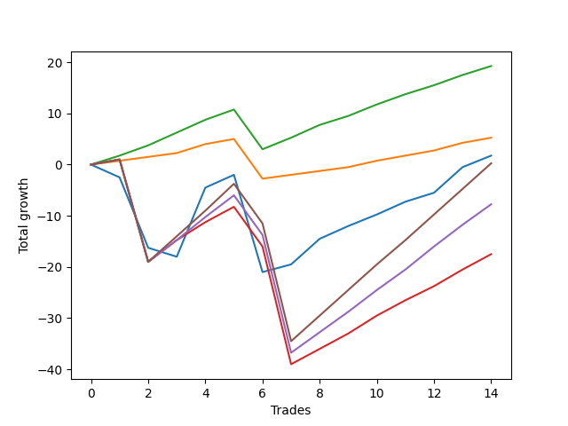

# Long Pointer 004 
- Symbol: ES_SmolBoiHour
- Date Range: 03/18/2022 - 07/29/2022
- Trading Period: 7:20-12:30
- Number of Trades: 14



| Name | Win Percent | Profit | Avg Profit / Trade | Avg Time / Trade |      | Name | Win Percent | Profit | Avg Profit / Trade | Avg Time / Trade |
| ---- | ----------- | ------ | ------------------ | ---------------- | ---- | ---- | ----------- | ------ | ------------------ | ---------------- |
| Sorted By <br> Profit | | | | | | Sorted By <br> Win Percentage ||||
| Eighty-Two | 92.86 | 9625.00 | 687.50 | 11:35 |     | Eighty-Two | 92.86 | 9625.00 | 687.50 | 11:35 |
| Eighty-One | 92.86 | 2625.00 | 187.50 | 09:07 |     | Eighty-One | 92.86 | 2625.00 | 187.50 | 09:07 |
| Two | 71.43 | 875.00 | 62.50 | 22:06 |     | Eighty-Five | 78.57 | 125.00 | 8.93 | 31:41 |
| Eighty-Five | 78.57 | 125.00 | 8.93 | 31:41 |     | Eighty-Four | 78.57 | -3875.00 | -276.79 | 28:03 |
| Eighty-Four | 78.57 | -3875.00 | -276.79 | 28:03 |     | Eighty-Three | 78.57 | -8750.00 | -625.00 | 25:59 |
| Eighty-Three | 78.57 | -8750.00 | -625.00 | 25:59 |     | Two | 71.43 | 875.00 | 62.50 | 22:06 |

## NO STOPLOSS

### Test Two
* Sell when the price hits the upper line of the 20p 2std bollinger
* No Stoploss
* Results:
```
Total Trades: 14
Percent Up: 71.43
Percent Down: 28.57
Total Points Moved Up: 1.75
Potential Profit: 875.00
Total Points Ups: 38.75 Count Ups: 10
Total Points Downs: -37.00 Count Downs: 4
```

<details><summary>Trades</summary>

<code>In: 2022-03-22 11:11:00		Out: 2022-03-22 11:53:55		Total Position Time: 42:55		Total Move Up: -2.50		Total to Date: -2.50</code> <br />
<code>In: 2022-03-28 08:11:00		Out: 2022-03-28 09:07:10		Total Position Time: 56:10		Total Move Up: -13.75		Total to Date: -16.25</code> <br />
<code>In: 2022-04-12 07:47:00		Out: 2022-04-12 08:15:45		Total Position Time: 28:45		Total Move Up: -1.75		Total to Date: -18.00</code> <br />
<code>In: 2022-05-19 10:19:00		Out: 2022-05-19 10:44:05		Total Position Time: 25:05		Total Move Up: 13.50		Total to Date: -4.50</code> <br />
<code>In: 2022-05-26 10:32:00		Out: 2022-05-26 10:46:25		Total Position Time: 14:25		Total Move Up: 2.50		Total to Date: -2.00</code> <br />
<code>In: 2022-05-31 11:31:00		Out: 2022-05-31 12:15:05		Total Position Time: 44:05		Total Move Up: -19.00		Total to Date: -21.00</code> <br />
<code>In: 2022-06-22 11:46:00		Out: 2022-06-22 12:04:10		Total Position Time: 18:10		Total Move Up: 1.50		Total to Date: -19.50</code> <br />
<code>In: 2022-06-22 11:55:00		Out: 2022-06-22 12:04:10		Total Position Time: 09:10		Total Move Up: 5.00		Total to Date: -14.50</code> <br />
<code>In: 2022-07-05 09:53:00		Out: 2022-07-05 10:04:15		Total Position Time: 11:15		Total Move Up: 2.50		Total to Date: -12.00</code> <br />
<code>In: 2022-07-07 08:35:00		Out: 2022-07-07 08:43:45		Total Position Time: 08:45		Total Move Up: 2.25		Total to Date: -9.75</code> <br />
<code>In: 2022-07-15 11:08:00		Out: 2022-07-15 11:14:55		Total Position Time: 06:55		Total Move Up: 2.50		Total to Date: -7.25</code> <br />
<code>In: 2022-07-19 10:25:00		Out: 2022-07-19 10:33:50		Total Position Time: 08:50		Total Move Up: 1.75		Total to Date: -5.50</code> <br />
<code>In: 2022-07-21 10:57:00		Out: 2022-07-21 11:06:55		Total Position Time: 09:55		Total Move Up: 5.00		Total to Date: -0.50</code> <br />
<code>In: 2022-07-28 11:11:00		Out: 2022-07-28 11:36:05		Total Position Time: 25:05		Total Move Up: 2.25		Total to Date: 1.75</code> <br />


</details>

## TAKE PROFIT

### Test Eighty-One
* Take Profit of 1 Point
* No Stoploss
* Results:
```
Total Trades: 14
Percent Up: 92.86
Percent Down: 7.14
Total Points Moved Up: 5.25
Potential Profit: 2625.00
Total Points Ups: 13.00 Count Ups: 13
Total Points Downs: -7.75 Count Downs: 1
```

<details><summary>Trades</summary>

<code>In: 2022-03-22 11:11:00		Out: 2022-03-22 11:11:50		Total Position Time: 00:50		Total Move Up: 0.75		Total to Date: 0.75</code> <br />
<code>In: 2022-03-28 08:11:00		Out: 2022-03-28 08:11:10		Total Position Time: 00:10		Total Move Up: 0.75		Total to Date: 1.50</code> <br />
<code>In: 2022-04-12 07:47:00		Out: 2022-04-12 08:19:00		Total Position Time: 32:00		Total Move Up: 0.75		Total to Date: 2.25</code> <br />
<code>In: 2022-05-19 10:19:00		Out: 2022-05-19 10:19:20		Total Position Time: 00:20		Total Move Up: 1.75		Total to Date: 4.00</code> <br />
<code>In: 2022-05-26 10:32:00		Out: 2022-05-26 10:33:15		Total Position Time: 01:15		Total Move Up: 1.00		Total to Date: 5.00</code> <br />
<code>In: 2022-05-31 11:31:00		Out: 2022-05-31 12:30:55		Total Position Time: 59:55		Total Move Up: -7.75		Total to Date: -2.75</code> <br />
<code>In: 2022-06-22 11:46:00		Out: 2022-06-22 11:56:25		Total Position Time: 10:25		Total Move Up: 0.75		Total to Date: -2.00</code> <br />
<code>In: 2022-06-22 11:55:00		Out: 2022-06-22 11:55:15		Total Position Time: 00:15		Total Move Up: 0.75		Total to Date: -1.25</code> <br />
<code>In: 2022-07-05 09:53:00		Out: 2022-07-05 10:01:45		Total Position Time: 08:45		Total Move Up: 0.75		Total to Date: -0.50</code> <br />
<code>In: 2022-07-07 08:35:00		Out: 2022-07-07 08:39:05		Total Position Time: 04:05		Total Move Up: 1.25		Total to Date: 0.75</code> <br />
<code>In: 2022-07-15 11:08:00		Out: 2022-07-15 11:10:05		Total Position Time: 02:05		Total Move Up: 1.00		Total to Date: 1.75</code> <br />
<code>In: 2022-07-19 10:25:00		Out: 2022-07-19 10:26:45		Total Position Time: 01:45		Total Move Up: 1.00		Total to Date: 2.75</code> <br />
<code>In: 2022-07-21 10:57:00		Out: 2022-07-21 10:57:15		Total Position Time: 00:15		Total Move Up: 1.50		Total to Date: 4.25</code> <br />
<code>In: 2022-07-28 11:11:00		Out: 2022-07-28 11:16:35		Total Position Time: 05:35		Total Move Up: 1.00		Total to Date: 5.25</code> <br />


</details>

### Test Eighty-Two
* Take Profit of 2 Point
* No Stoploss
* Results:
```
Total Trades: 14
Percent Up: 92.86
Percent Down: 7.14
Total Points Moved Up: 19.25
Potential Profit: 9625.00
Total Points Ups: 27.00 Count Ups: 13
Total Points Downs: -7.75 Count Downs: 1
```

<details><summary>Trades</summary>

<code>In: 2022-03-22 11:11:00		Out: 2022-03-22 11:18:30		Total Position Time: 07:30		Total Move Up: 1.75		Total to Date: 1.75</code> <br />
<code>In: 2022-03-28 08:11:00		Out: 2022-03-28 08:11:40		Total Position Time: 00:40		Total Move Up: 2.00		Total to Date: 3.75</code> <br />
<code>In: 2022-04-12 07:47:00		Out: 2022-04-12 08:19:50		Total Position Time: 32:50		Total Move Up: 2.50		Total to Date: 6.25</code> <br />
<code>In: 2022-05-19 10:19:00		Out: 2022-05-19 10:19:30		Total Position Time: 00:30		Total Move Up: 2.50		Total to Date: 8.75</code> <br />
<code>In: 2022-05-26 10:32:00		Out: 2022-05-26 10:34:00		Total Position Time: 02:00		Total Move Up: 2.00		Total to Date: 10.75</code> <br />
<code>In: 2022-05-31 11:31:00		Out: 2022-05-31 12:30:55		Total Position Time: 59:55		Total Move Up: -7.75		Total to Date: 3.00</code> <br />
<code>In: 2022-06-22 11:46:00		Out: 2022-06-22 12:04:20		Total Position Time: 18:20		Total Move Up: 2.25		Total to Date: 5.25</code> <br />
<code>In: 2022-06-22 11:55:00		Out: 2022-06-22 11:56:05		Total Position Time: 01:05		Total Move Up: 2.50		Total to Date: 7.75</code> <br />
<code>In: 2022-07-05 09:53:00		Out: 2022-07-05 10:03:15		Total Position Time: 10:15		Total Move Up: 1.75		Total to Date: 9.50</code> <br />
<code>In: 2022-07-07 08:35:00		Out: 2022-07-07 08:43:45		Total Position Time: 08:45		Total Move Up: 2.25		Total to Date: 11.75</code> <br />
<code>In: 2022-07-15 11:08:00		Out: 2022-07-15 11:10:25		Total Position Time: 02:25		Total Move Up: 2.00		Total to Date: 13.75</code> <br />
<code>In: 2022-07-19 10:25:00		Out: 2022-07-19 10:33:50		Total Position Time: 08:50		Total Move Up: 1.75		Total to Date: 15.50</code> <br />
<code>In: 2022-07-21 10:57:00		Out: 2022-07-21 10:59:45		Total Position Time: 02:45		Total Move Up: 2.00		Total to Date: 17.50</code> <br />
<code>In: 2022-07-28 11:11:00		Out: 2022-07-28 11:17:30		Total Position Time: 06:30		Total Move Up: 1.75		Total to Date: 19.25</code> <br />


</details>

### Test Eighty-Three
* Take Profit of 3 Point
* No Stoploss
* Results:
```
Total Trades: 14
Percent Up: 78.57
Percent Down: 21.43
Total Points Moved Up: -17.50
Potential Profit: -8750.00
Total Points Ups: 33.25 Count Ups: 11
Total Points Downs: -50.75 Count Downs: 3
```

<details><summary>Trades</summary>

<code>In: 2022-03-22 11:11:00		Out: 2022-03-22 12:10:55		Total Position Time: 59:55		Total Move Up: 1.00		Total to Date: 1.00</code> <br />
<code>In: 2022-03-28 08:11:00		Out: 2022-03-28 09:10:55		Total Position Time: 59:55		Total Move Up: -20.00		Total to Date: -19.00</code> <br />
<code>In: 2022-04-12 07:47:00		Out: 2022-04-12 08:20:35		Total Position Time: 33:35		Total Move Up: 4.25		Total to Date: -14.75</code> <br />
<code>In: 2022-05-19 10:19:00		Out: 2022-05-19 10:20:00		Total Position Time: 01:00		Total Move Up: 3.50		Total to Date: -11.25</code> <br />
<code>In: 2022-05-26 10:32:00		Out: 2022-05-26 10:48:40		Total Position Time: 16:40		Total Move Up: 3.00		Total to Date: -8.25</code> <br />
<code>In: 2022-05-31 11:31:00		Out: 2022-05-31 12:30:55		Total Position Time: 59:55		Total Move Up: -7.75		Total to Date: -16.00</code> <br />
<code>In: 2022-06-22 11:46:00		Out: 2022-06-22 12:45:55		Total Position Time: 59:55		Total Move Up: -23.00		Total to Date: -39.00</code> <br />
<code>In: 2022-06-22 11:55:00		Out: 2022-06-22 11:56:10		Total Position Time: 01:10		Total Move Up: 3.00		Total to Date: -36.00</code> <br />
<code>In: 2022-07-05 09:53:00		Out: 2022-07-05 10:04:30		Total Position Time: 11:30		Total Move Up: 3.00		Total to Date: -33.00</code> <br />
<code>In: 2022-07-07 08:35:00		Out: 2022-07-07 08:44:05		Total Position Time: 09:05		Total Move Up: 3.50		Total to Date: -29.50</code> <br />
<code>In: 2022-07-15 11:08:00		Out: 2022-07-15 11:15:15		Total Position Time: 07:15		Total Move Up: 3.00		Total to Date: -26.50</code> <br />
<code>In: 2022-07-19 10:25:00		Out: 2022-07-19 10:34:45		Total Position Time: 09:45		Total Move Up: 2.75		Total to Date: -23.75</code> <br />
<code>In: 2022-07-21 10:57:00		Out: 2022-07-21 11:01:30		Total Position Time: 04:30		Total Move Up: 3.25		Total to Date: -20.50</code> <br />
<code>In: 2022-07-28 11:11:00		Out: 2022-07-28 11:40:40		Total Position Time: 29:40		Total Move Up: 3.00		Total to Date: -17.50</code> <br />


</details>

### Test Eighty-Four
* Take Profit of 4 Point
* No Stoploss
* Results:
```
Total Trades: 14
Percent Up: 78.57
Percent Down: 21.43
Total Points Moved Up: -7.75
Potential Profit: -3875.00
Total Points Ups: 43.00 Count Ups: 11
Total Points Downs: -50.75 Count Downs: 3
```

<details><summary>Trades</summary>

<code>In: 2022-03-22 11:11:00		Out: 2022-03-22 12:10:55		Total Position Time: 59:55		Total Move Up: 1.00		Total to Date: 1.00</code> <br />
<code>In: 2022-03-28 08:11:00		Out: 2022-03-28 09:10:55		Total Position Time: 59:55		Total Move Up: -20.00		Total to Date: -19.00</code> <br />
<code>In: 2022-04-12 07:47:00		Out: 2022-04-12 08:20:35		Total Position Time: 33:35		Total Move Up: 4.25		Total to Date: -14.75</code> <br />
<code>In: 2022-05-19 10:19:00		Out: 2022-05-19 10:21:15		Total Position Time: 02:15		Total Move Up: 4.50		Total to Date: -10.25</code> <br />
<code>In: 2022-05-26 10:32:00		Out: 2022-05-26 10:58:25		Total Position Time: 26:25		Total Move Up: 4.25		Total to Date: -6.00</code> <br />
<code>In: 2022-05-31 11:31:00		Out: 2022-05-31 12:30:55		Total Position Time: 59:55		Total Move Up: -7.75		Total to Date: -13.75</code> <br />
<code>In: 2022-06-22 11:46:00		Out: 2022-06-22 12:45:55		Total Position Time: 59:55		Total Move Up: -23.00		Total to Date: -36.75</code> <br />
<code>In: 2022-06-22 11:55:00		Out: 2022-06-22 11:56:20		Total Position Time: 01:20		Total Move Up: 4.00		Total to Date: -32.75</code> <br />
<code>In: 2022-07-05 09:53:00		Out: 2022-07-05 10:04:45		Total Position Time: 11:45		Total Move Up: 4.00		Total to Date: -28.75</code> <br />
<code>In: 2022-07-07 08:35:00		Out: 2022-07-07 08:48:15		Total Position Time: 13:15		Total Move Up: 4.25		Total to Date: -24.50</code> <br />
<code>In: 2022-07-15 11:08:00		Out: 2022-07-15 11:19:10		Total Position Time: 11:10		Total Move Up: 4.00		Total to Date: -20.50</code> <br />
<code>In: 2022-07-19 10:25:00		Out: 2022-07-19 10:37:35		Total Position Time: 12:35		Total Move Up: 4.50		Total to Date: -16.00</code> <br />
<code>In: 2022-07-21 10:57:00		Out: 2022-07-21 11:06:35		Total Position Time: 09:35		Total Move Up: 4.25		Total to Date: -11.75</code> <br />
<code>In: 2022-07-28 11:11:00		Out: 2022-07-28 11:42:20		Total Position Time: 31:20		Total Move Up: 4.00		Total to Date: -7.75</code> <br />


</details>

### Test Eighty-Five
* Take Profit of 5 Point
* No Stoploss
* Results:
```
Total Trades: 14
Percent Up: 78.57
Percent Down: 21.43
Total Points Moved Up: 0.25
Potential Profit: 125.00
Total Points Ups: 51.00 Count Ups: 11
Total Points Downs: -50.75 Count Downs: 3
```

<details><summary>Trades</summary>

<code>In: 2022-03-22 11:11:00		Out: 2022-03-22 12:10:55		Total Position Time: 59:55		Total Move Up: 1.00		Total to Date: 1.00</code> <br />
<code>In: 2022-03-28 08:11:00		Out: 2022-03-28 09:10:55		Total Position Time: 59:55		Total Move Up: -20.00		Total to Date: -19.00</code> <br />
<code>In: 2022-04-12 07:47:00		Out: 2022-04-12 08:21:05		Total Position Time: 34:05		Total Move Up: 5.00		Total to Date: -14.00</code> <br />
<code>In: 2022-05-19 10:19:00		Out: 2022-05-19 10:21:35		Total Position Time: 02:35		Total Move Up: 5.00		Total to Date: -9.00</code> <br />
<code>In: 2022-05-26 10:32:00		Out: 2022-05-26 10:59:20		Total Position Time: 27:20		Total Move Up: 5.25		Total to Date: -3.75</code> <br />
<code>In: 2022-05-31 11:31:00		Out: 2022-05-31 12:30:55		Total Position Time: 59:55		Total Move Up: -7.75		Total to Date: -11.50</code> <br />
<code>In: 2022-06-22 11:46:00		Out: 2022-06-22 12:45:55		Total Position Time: 59:55		Total Move Up: -23.00		Total to Date: -34.50</code> <br />
<code>In: 2022-06-22 11:55:00		Out: 2022-06-22 12:04:10		Total Position Time: 09:10		Total Move Up: 5.00		Total to Date: -29.50</code> <br />
<code>In: 2022-07-05 09:53:00		Out: 2022-07-05 10:04:50		Total Position Time: 11:50		Total Move Up: 5.00		Total to Date: -24.50</code> <br />
<code>In: 2022-07-07 08:35:00		Out: 2022-07-07 08:51:00		Total Position Time: 16:00		Total Move Up: 5.00		Total to Date: -19.50</code> <br />
<code>In: 2022-07-15 11:08:00		Out: 2022-07-15 11:44:45		Total Position Time: 36:45		Total Move Up: 4.75		Total to Date: -14.75</code> <br />
<code>In: 2022-07-19 10:25:00		Out: 2022-07-19 10:38:00		Total Position Time: 13:00		Total Move Up: 5.00		Total to Date: -9.75</code> <br />
<code>In: 2022-07-21 10:57:00		Out: 2022-07-21 11:06:50		Total Position Time: 09:50		Total Move Up: 5.00		Total to Date: -4.75</code> <br />
<code>In: 2022-07-28 11:11:00		Out: 2022-07-28 11:54:30		Total Position Time: 43:30		Total Move Up: 5.00		Total to Date: 0.25</code> <br />


</details>