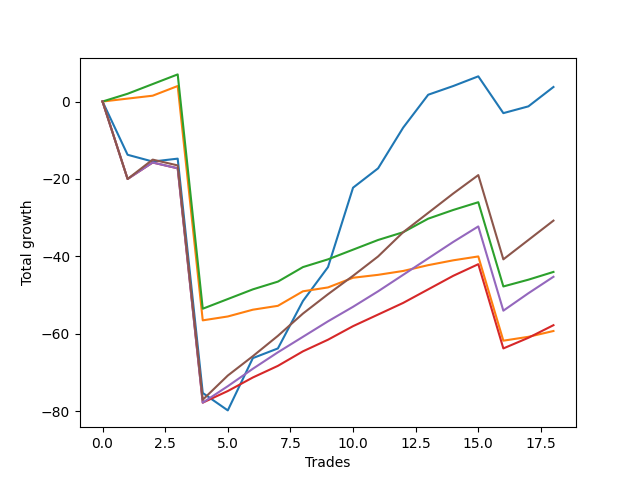

# Long Pointer 005 
- Symbol: ES_SmolBoiHour
- Date Range: 03/18/2022 - 07/29/2022
- Trading Period: 7:20-12:30
- Number of Trades: 18



| Name | Win Percent | Profit | Avg Profit / Trade | Avg Time / Trade |      | Name | Win Percent | Profit | Avg Profit / Trade | Avg Time / Trade |
| ---- | ----------- | ------ | ------------------ | ---------------- | ---- | ---- | ----------- | ------ | ------------------ | ---------------- |
| Sorted By <br> Profit | | | | | | Sorted By <br> Win Percentage ||||
| Two | 72.22 | 1875.00 | 104.17 | 24:36 |     | Eighty-Two | 88.89 | -22000.00 | -1222.22 | 12:07 |
| Eighty-Five | 77.78 | -15375.00 | -854.17 | 23:28 |     | Eighty-One | 88.89 | -29625.00 | -1645.83 | 10:44 |
| Eighty-Two | 88.89 | -22000.00 | -1222.22 | 12:07 |     | Eighty-Five | 77.78 | -15375.00 | -854.17 | 23:28 |
| Eighty-Four | 77.78 | -22625.00 | -1256.94 | 21:13 |     | Eighty-Four | 77.78 | -22625.00 | -1256.94 | 21:13 |
| Eighty-Three | 77.78 | -28875.00 | -1604.17 | 18:36 |     | Eighty-Three | 77.78 | -28875.00 | -1604.17 | 18:36 |
| Eighty-One | 88.89 | -29625.00 | -1645.83 | 10:44 |     | Two | 72.22 | 1875.00 | 104.17 | 24:36 |

## NO STOPLOSS

### Test Two
* Sell when the price hits the upper line of the 20p 2std bollinger
* No Stoploss
* Results:
```
Total Trades: 18
Percent Up: 72.22
Percent Down: 27.78
Total Points Moved Up: 3.75
Potential Profit: 1875.00
Total Points Ups: 93.75 Count Ups: 13
Total Points Downs: -90.00 Count Downs: 5
```

<details><summary>Trades</summary>

<code>In: 2022-03-28 08:11:00		Out: 2022-03-28 09:07:10		Total Position Time: 56:10		Total Move Up: -13.75		Total to Date: -13.75</code> <br />
<code>In: 2022-04-12 07:47:00		Out: 2022-04-12 08:15:45		Total Position Time: 28:45		Total Move Up: -1.75		Total to Date: -15.50</code> <br />
<code>In: 2022-04-27 12:07:00		Out: 2022-04-27 12:31:20		Total Position Time: 24:20		Total Move Up: 0.75		Total to Date: -14.75</code> <br />
<code>In: 2022-05-10 07:33:00		Out: 2022-05-10 08:32:55		Total Position Time: 59:55		Total Move Up: -60.50		Total to Date: -75.25</code> <br />
<code>In: 2022-05-12 11:15:00		Out: 2022-05-12 11:53:00		Total Position Time: 38:00		Total Move Up: -4.50		Total to Date: -79.75</code> <br />
<code>In: 2022-05-19 10:19:00		Out: 2022-05-19 10:44:05		Total Position Time: 25:05		Total Move Up: 13.50		Total to Date: -66.25</code> <br />
<code>In: 2022-05-26 10:32:00		Out: 2022-05-26 10:46:25		Total Position Time: 14:25		Total Move Up: 2.50		Total to Date: -63.75</code> <br />
<code>In: 2022-06-02 07:30:00		Out: 2022-06-02 07:42:40		Total Position Time: 12:40		Total Move Up: 12.25		Total to Date: -51.50</code> <br />
<code>In: 2022-06-15 08:19:00		Out: 2022-06-15 09:18:55		Total Position Time: 59:55		Total Move Up: 8.75		Total to Date: -42.75</code> <br />
<code>In: 2022-06-16 11:57:00		Out: 2022-06-16 12:10:15		Total Position Time: 13:15		Total Move Up: 20.50		Total to Date: -22.25</code> <br />
<code>In: 2022-06-22 11:55:00		Out: 2022-06-22 12:04:10		Total Position Time: 09:10		Total Move Up: 5.00		Total to Date: -17.25</code> <br />
<code>In: 2022-06-27 12:09:00		Out: 2022-06-27 12:45:45		Total Position Time: 36:45		Total Move Up: 10.50		Total to Date: -6.75</code> <br />
<code>In: 2022-06-29 09:32:00		Out: 2022-06-29 09:38:30		Total Position Time: 06:30		Total Move Up: 8.50		Total to Date: 1.75</code> <br />
<code>In: 2022-07-07 08:35:00		Out: 2022-07-07 08:43:45		Total Position Time: 08:45		Total Move Up: 2.25		Total to Date: 4.00</code> <br />
<code>In: 2022-07-15 11:08:00		Out: 2022-07-15 11:14:55		Total Position Time: 06:55		Total Move Up: 2.50		Total to Date: 6.50</code> <br />
<code>In: 2022-07-18 10:52:00		Out: 2022-07-18 11:15:45		Total Position Time: 23:45		Total Move Up: -9.50		Total to Date: -3.00</code> <br />
<code>In: 2022-07-19 10:25:00		Out: 2022-07-19 10:33:50		Total Position Time: 08:50		Total Move Up: 1.75		Total to Date: -1.25</code> <br />
<code>In: 2022-07-21 10:57:00		Out: 2022-07-21 11:06:55		Total Position Time: 09:55		Total Move Up: 5.00		Total to Date: 3.75</code> <br />


</details>

## TAKE PROFIT

### Test Eighty-One
* Take Profit of 1 Point
* No Stoploss
* Results:
```
Total Trades: 18
Percent Up: 88.89
Percent Down: 11.11
Total Points Moved Up: -59.25
Potential Profit: -29625.00
Total Points Ups: 23.00 Count Ups: 16
Total Points Downs: -82.25 Count Downs: 2
```

<details><summary>Trades</summary>

<code>In: 2022-03-28 08:11:00		Out: 2022-03-28 08:11:10		Total Position Time: 00:10		Total Move Up: 0.75		Total to Date: 0.75</code> <br />
<code>In: 2022-04-12 07:47:00		Out: 2022-04-12 08:19:00		Total Position Time: 32:00		Total Move Up: 0.75		Total to Date: 1.50</code> <br />
<code>In: 2022-04-27 12:07:00		Out: 2022-04-27 12:15:20		Total Position Time: 08:20		Total Move Up: 2.50		Total to Date: 4.00</code> <br />
<code>In: 2022-05-10 07:33:00		Out: 2022-05-10 08:32:55		Total Position Time: 59:55		Total Move Up: -60.50		Total to Date: -56.50</code> <br />
<code>In: 2022-05-12 11:15:00		Out: 2022-05-12 11:15:55		Total Position Time: 00:55		Total Move Up: 1.00		Total to Date: -55.50</code> <br />
<code>In: 2022-05-19 10:19:00		Out: 2022-05-19 10:19:20		Total Position Time: 00:20		Total Move Up: 1.75		Total to Date: -53.75</code> <br />
<code>In: 2022-05-26 10:32:00		Out: 2022-05-26 10:33:15		Total Position Time: 01:15		Total Move Up: 1.00		Total to Date: -52.75</code> <br />
<code>In: 2022-06-02 07:30:00		Out: 2022-06-02 07:30:35		Total Position Time: 00:35		Total Move Up: 3.75		Total to Date: -49.00</code> <br />
<code>In: 2022-06-15 08:19:00		Out: 2022-06-15 08:36:00		Total Position Time: 17:00		Total Move Up: 1.00		Total to Date: -48.00</code> <br />
<code>In: 2022-06-16 11:57:00		Out: 2022-06-16 12:00:25		Total Position Time: 03:25		Total Move Up: 2.50		Total to Date: -45.50</code> <br />
<code>In: 2022-06-22 11:55:00		Out: 2022-06-22 11:55:15		Total Position Time: 00:15		Total Move Up: 0.75		Total to Date: -44.75</code> <br />
<code>In: 2022-06-27 12:09:00		Out: 2022-06-27 12:09:25		Total Position Time: 00:25		Total Move Up: 1.00		Total to Date: -43.75</code> <br />
<code>In: 2022-06-29 09:32:00		Out: 2022-06-29 09:32:45		Total Position Time: 00:45		Total Move Up: 1.50		Total to Date: -42.25</code> <br />
<code>In: 2022-07-07 08:35:00		Out: 2022-07-07 08:39:05		Total Position Time: 04:05		Total Move Up: 1.25		Total to Date: -41.00</code> <br />
<code>In: 2022-07-15 11:08:00		Out: 2022-07-15 11:10:05		Total Position Time: 02:05		Total Move Up: 1.00		Total to Date: -40.00</code> <br />
<code>In: 2022-07-18 10:52:00		Out: 2022-07-18 11:51:55		Total Position Time: 59:55		Total Move Up: -21.75		Total to Date: -61.75</code> <br />
<code>In: 2022-07-19 10:25:00		Out: 2022-07-19 10:26:45		Total Position Time: 01:45		Total Move Up: 1.00		Total to Date: -60.75</code> <br />
<code>In: 2022-07-21 10:57:00		Out: 2022-07-21 10:57:15		Total Position Time: 00:15		Total Move Up: 1.50		Total to Date: -59.25</code> <br />


</details>

### Test Eighty-Two
* Take Profit of 2 Point
* No Stoploss
* Results:
```
Total Trades: 18
Percent Up: 88.89
Percent Down: 11.11
Total Points Moved Up: -44.00
Potential Profit: -22000.00
Total Points Ups: 38.25 Count Ups: 16
Total Points Downs: -82.25 Count Downs: 2
```

<details><summary>Trades</summary>

<code>In: 2022-03-28 08:11:00		Out: 2022-03-28 08:11:40		Total Position Time: 00:40		Total Move Up: 2.00		Total to Date: 2.00</code> <br />
<code>In: 2022-04-12 07:47:00		Out: 2022-04-12 08:19:50		Total Position Time: 32:50		Total Move Up: 2.50		Total to Date: 4.50</code> <br />
<code>In: 2022-04-27 12:07:00		Out: 2022-04-27 12:15:20		Total Position Time: 08:20		Total Move Up: 2.50		Total to Date: 7.00</code> <br />
<code>In: 2022-05-10 07:33:00		Out: 2022-05-10 08:32:55		Total Position Time: 59:55		Total Move Up: -60.50		Total to Date: -53.50</code> <br />
<code>In: 2022-05-12 11:15:00		Out: 2022-05-12 11:16:10		Total Position Time: 01:10		Total Move Up: 2.50		Total to Date: -51.00</code> <br />
<code>In: 2022-05-19 10:19:00		Out: 2022-05-19 10:19:30		Total Position Time: 00:30		Total Move Up: 2.50		Total to Date: -48.50</code> <br />
<code>In: 2022-05-26 10:32:00		Out: 2022-05-26 10:34:00		Total Position Time: 02:00		Total Move Up: 2.00		Total to Date: -46.50</code> <br />
<code>In: 2022-06-02 07:30:00		Out: 2022-06-02 07:30:35		Total Position Time: 00:35		Total Move Up: 3.75		Total to Date: -42.75</code> <br />
<code>In: 2022-06-15 08:19:00		Out: 2022-06-15 08:38:50		Total Position Time: 19:50		Total Move Up: 2.00		Total to Date: -40.75</code> <br />
<code>In: 2022-06-16 11:57:00		Out: 2022-06-16 12:00:25		Total Position Time: 03:25		Total Move Up: 2.50		Total to Date: -38.25</code> <br />
<code>In: 2022-06-22 11:55:00		Out: 2022-06-22 11:56:05		Total Position Time: 01:05		Total Move Up: 2.50		Total to Date: -35.75</code> <br />
<code>In: 2022-06-27 12:09:00		Out: 2022-06-27 12:09:30		Total Position Time: 00:30		Total Move Up: 2.00		Total to Date: -33.75</code> <br />
<code>In: 2022-06-29 09:32:00		Out: 2022-06-29 09:36:40		Total Position Time: 04:40		Total Move Up: 3.50		Total to Date: -30.25</code> <br />
<code>In: 2022-07-07 08:35:00		Out: 2022-07-07 08:43:45		Total Position Time: 08:45		Total Move Up: 2.25		Total to Date: -28.00</code> <br />
<code>In: 2022-07-15 11:08:00		Out: 2022-07-15 11:10:25		Total Position Time: 02:25		Total Move Up: 2.00		Total to Date: -26.00</code> <br />
<code>In: 2022-07-18 10:52:00		Out: 2022-07-18 11:51:55		Total Position Time: 59:55		Total Move Up: -21.75		Total to Date: -47.75</code> <br />
<code>In: 2022-07-19 10:25:00		Out: 2022-07-19 10:33:50		Total Position Time: 08:50		Total Move Up: 1.75		Total to Date: -46.00</code> <br />
<code>In: 2022-07-21 10:57:00		Out: 2022-07-21 10:59:45		Total Position Time: 02:45		Total Move Up: 2.00		Total to Date: -44.00</code> <br />


</details>

### Test Eighty-Three
* Take Profit of 3 Point
* No Stoploss
* Results:
```
Total Trades: 18
Percent Up: 77.78
Percent Down: 22.22
Total Points Moved Up: -57.75
Potential Profit: -28875.00
Total Points Ups: 46.00 Count Ups: 14
Total Points Downs: -103.75 Count Downs: 4
```

<details><summary>Trades</summary>

<code>In: 2022-03-28 08:11:00		Out: 2022-03-28 09:10:55		Total Position Time: 59:55		Total Move Up: -20.00		Total to Date: -20.00</code> <br />
<code>In: 2022-04-12 07:47:00		Out: 2022-04-12 08:20:35		Total Position Time: 33:35		Total Move Up: 4.25		Total to Date: -15.75</code> <br />
<code>In: 2022-04-27 12:07:00		Out: 2022-04-27 12:46:00		Total Position Time: 39:00		Total Move Up: -1.50		Total to Date: -17.25</code> <br />
<code>In: 2022-05-10 07:33:00		Out: 2022-05-10 08:32:55		Total Position Time: 59:55		Total Move Up: -60.50		Total to Date: -77.75</code> <br />
<code>In: 2022-05-12 11:15:00		Out: 2022-05-12 11:18:50		Total Position Time: 03:50		Total Move Up: 3.00		Total to Date: -74.75</code> <br />
<code>In: 2022-05-19 10:19:00		Out: 2022-05-19 10:20:00		Total Position Time: 01:00		Total Move Up: 3.50		Total to Date: -71.25</code> <br />
<code>In: 2022-05-26 10:32:00		Out: 2022-05-26 10:48:40		Total Position Time: 16:40		Total Move Up: 3.00		Total to Date: -68.25</code> <br />
<code>In: 2022-06-02 07:30:00		Out: 2022-06-02 07:30:35		Total Position Time: 00:35		Total Move Up: 3.75		Total to Date: -64.50</code> <br />
<code>In: 2022-06-15 08:19:00		Out: 2022-06-15 08:38:55		Total Position Time: 19:55		Total Move Up: 3.00		Total to Date: -61.50</code> <br />
<code>In: 2022-06-16 11:57:00		Out: 2022-06-16 12:00:35		Total Position Time: 03:35		Total Move Up: 3.50		Total to Date: -58.00</code> <br />
<code>In: 2022-06-22 11:55:00		Out: 2022-06-22 11:56:10		Total Position Time: 01:10		Total Move Up: 3.00		Total to Date: -55.00</code> <br />
<code>In: 2022-06-27 12:09:00		Out: 2022-06-27 12:09:40		Total Position Time: 00:40		Total Move Up: 3.00		Total to Date: -52.00</code> <br />
<code>In: 2022-06-29 09:32:00		Out: 2022-06-29 09:36:40		Total Position Time: 04:40		Total Move Up: 3.50		Total to Date: -48.50</code> <br />
<code>In: 2022-07-07 08:35:00		Out: 2022-07-07 08:44:05		Total Position Time: 09:05		Total Move Up: 3.50		Total to Date: -45.00</code> <br />
<code>In: 2022-07-15 11:08:00		Out: 2022-07-15 11:15:15		Total Position Time: 07:15		Total Move Up: 3.00		Total to Date: -42.00</code> <br />
<code>In: 2022-07-18 10:52:00		Out: 2022-07-18 11:51:55		Total Position Time: 59:55		Total Move Up: -21.75		Total to Date: -63.75</code> <br />
<code>In: 2022-07-19 10:25:00		Out: 2022-07-19 10:34:45		Total Position Time: 09:45		Total Move Up: 2.75		Total to Date: -61.00</code> <br />
<code>In: 2022-07-21 10:57:00		Out: 2022-07-21 11:01:30		Total Position Time: 04:30		Total Move Up: 3.25		Total to Date: -57.75</code> <br />


</details>

### Test Eighty-Four
* Take Profit of 4 Point
* No Stoploss
* Results:
```
Total Trades: 18
Percent Up: 77.78
Percent Down: 22.22
Total Points Moved Up: -45.25
Potential Profit: -22625.00
Total Points Ups: 58.50 Count Ups: 14
Total Points Downs: -103.75 Count Downs: 4
```

<details><summary>Trades</summary>

<code>In: 2022-03-28 08:11:00		Out: 2022-03-28 09:10:55		Total Position Time: 59:55		Total Move Up: -20.00		Total to Date: -20.00</code> <br />
<code>In: 2022-04-12 07:47:00		Out: 2022-04-12 08:20:35		Total Position Time: 33:35		Total Move Up: 4.25		Total to Date: -15.75</code> <br />
<code>In: 2022-04-27 12:07:00		Out: 2022-04-27 12:46:00		Total Position Time: 39:00		Total Move Up: -1.50		Total to Date: -17.25</code> <br />
<code>In: 2022-05-10 07:33:00		Out: 2022-05-10 08:32:55		Total Position Time: 59:55		Total Move Up: -60.50		Total to Date: -77.75</code> <br />
<code>In: 2022-05-12 11:15:00		Out: 2022-05-12 11:19:30		Total Position Time: 04:30		Total Move Up: 4.25		Total to Date: -73.50</code> <br />
<code>In: 2022-05-19 10:19:00		Out: 2022-05-19 10:21:15		Total Position Time: 02:15		Total Move Up: 4.50		Total to Date: -69.00</code> <br />
<code>In: 2022-05-26 10:32:00		Out: 2022-05-26 10:58:25		Total Position Time: 26:25		Total Move Up: 4.25		Total to Date: -64.75</code> <br />
<code>In: 2022-06-02 07:30:00		Out: 2022-06-02 07:31:00		Total Position Time: 01:00		Total Move Up: 4.00		Total to Date: -60.75</code> <br />
<code>In: 2022-06-15 08:19:00		Out: 2022-06-15 08:56:45		Total Position Time: 37:45		Total Move Up: 4.00		Total to Date: -56.75</code> <br />
<code>In: 2022-06-16 11:57:00		Out: 2022-06-16 12:00:40		Total Position Time: 03:40		Total Move Up: 3.75		Total to Date: -53.00</code> <br />
<code>In: 2022-06-22 11:55:00		Out: 2022-06-22 11:56:20		Total Position Time: 01:20		Total Move Up: 4.00		Total to Date: -49.00</code> <br />
<code>In: 2022-06-27 12:09:00		Out: 2022-06-27 12:10:20		Total Position Time: 01:20		Total Move Up: 4.25		Total to Date: -44.75</code> <br />
<code>In: 2022-06-29 09:32:00		Out: 2022-06-29 09:36:45		Total Position Time: 04:45		Total Move Up: 4.25		Total to Date: -40.50</code> <br />
<code>In: 2022-07-07 08:35:00		Out: 2022-07-07 08:48:15		Total Position Time: 13:15		Total Move Up: 4.25		Total to Date: -36.25</code> <br />
<code>In: 2022-07-15 11:08:00		Out: 2022-07-15 11:19:10		Total Position Time: 11:10		Total Move Up: 4.00		Total to Date: -32.25</code> <br />
<code>In: 2022-07-18 10:52:00		Out: 2022-07-18 11:51:55		Total Position Time: 59:55		Total Move Up: -21.75		Total to Date: -54.00</code> <br />
<code>In: 2022-07-19 10:25:00		Out: 2022-07-19 10:37:35		Total Position Time: 12:35		Total Move Up: 4.50		Total to Date: -49.50</code> <br />
<code>In: 2022-07-21 10:57:00		Out: 2022-07-21 11:06:35		Total Position Time: 09:35		Total Move Up: 4.25		Total to Date: -45.25</code> <br />


</details>

### Test Eighty-Five
* Take Profit of 5 Point
* No Stoploss
* Results:
```
Total Trades: 18
Percent Up: 77.78
Percent Down: 22.22
Total Points Moved Up: -30.75
Potential Profit: -15375.00
Total Points Ups: 73.00 Count Ups: 14
Total Points Downs: -103.75 Count Downs: 4
```

<details><summary>Trades</summary>

<code>In: 2022-03-28 08:11:00		Out: 2022-03-28 09:10:55		Total Position Time: 59:55		Total Move Up: -20.00		Total to Date: -20.00</code> <br />
<code>In: 2022-04-12 07:47:00		Out: 2022-04-12 08:21:05		Total Position Time: 34:05		Total Move Up: 5.00		Total to Date: -15.00</code> <br />
<code>In: 2022-04-27 12:07:00		Out: 2022-04-27 12:46:00		Total Position Time: 39:00		Total Move Up: -1.50		Total to Date: -16.50</code> <br />
<code>In: 2022-05-10 07:33:00		Out: 2022-05-10 08:32:55		Total Position Time: 59:55		Total Move Up: -60.50		Total to Date: -77.00</code> <br />
<code>In: 2022-05-12 11:15:00		Out: 2022-05-12 11:19:55		Total Position Time: 04:55		Total Move Up: 6.25		Total to Date: -70.75</code> <br />
<code>In: 2022-05-19 10:19:00		Out: 2022-05-19 10:21:35		Total Position Time: 02:35		Total Move Up: 5.00		Total to Date: -65.75</code> <br />
<code>In: 2022-05-26 10:32:00		Out: 2022-05-26 10:59:20		Total Position Time: 27:20		Total Move Up: 5.25		Total to Date: -60.50</code> <br />
<code>In: 2022-06-02 07:30:00		Out: 2022-06-02 07:31:30		Total Position Time: 01:30		Total Move Up: 5.75		Total to Date: -54.75</code> <br />
<code>In: 2022-06-15 08:19:00		Out: 2022-06-15 08:57:00		Total Position Time: 38:00		Total Move Up: 5.00		Total to Date: -49.75</code> <br />
<code>In: 2022-06-16 11:57:00		Out: 2022-06-16 12:01:00		Total Position Time: 04:00		Total Move Up: 4.75		Total to Date: -45.00</code> <br />
<code>In: 2022-06-22 11:55:00		Out: 2022-06-22 12:04:10		Total Position Time: 09:10		Total Move Up: 5.00		Total to Date: -40.00</code> <br />
<code>In: 2022-06-27 12:09:00		Out: 2022-06-27 12:10:30		Total Position Time: 01:30		Total Move Up: 6.25		Total to Date: -33.75</code> <br />
<code>In: 2022-06-29 09:32:00		Out: 2022-06-29 09:37:05		Total Position Time: 05:05		Total Move Up: 5.00		Total to Date: -28.75</code> <br />
<code>In: 2022-07-07 08:35:00		Out: 2022-07-07 08:51:00		Total Position Time: 16:00		Total Move Up: 5.00		Total to Date: -23.75</code> <br />
<code>In: 2022-07-15 11:08:00		Out: 2022-07-15 11:44:45		Total Position Time: 36:45		Total Move Up: 4.75		Total to Date: -19.00</code> <br />
<code>In: 2022-07-18 10:52:00		Out: 2022-07-18 11:51:55		Total Position Time: 59:55		Total Move Up: -21.75		Total to Date: -40.75</code> <br />
<code>In: 2022-07-19 10:25:00		Out: 2022-07-19 10:38:00		Total Position Time: 13:00		Total Move Up: 5.00		Total to Date: -35.75</code> <br />
<code>In: 2022-07-21 10:57:00		Out: 2022-07-21 11:06:50		Total Position Time: 09:50		Total Move Up: 5.00		Total to Date: -30.75</code> <br />


</details>