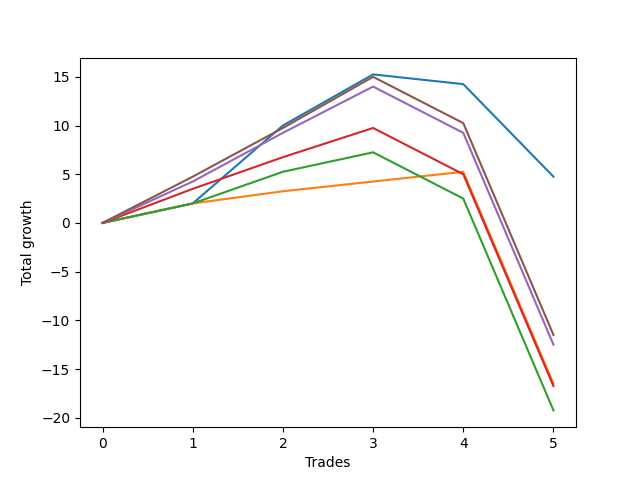

# Long Pointer 007 
- Symbol: ES_SmolBoiHour
- Date Range: 03/18/2022 - 07/29/2022
- Trading Period: 7:20-12:30
- Number of Trades: 5



| Name | Win Percent | Profit | Avg Profit / Trade | Avg Time / Trade |      | Name | Win Percent | Profit | Avg Profit / Trade | Avg Time / Trade |
| ---- | ----------- | ------ | ------------------ | ---------------- | ---- | ---- | ----------- | ------ | ------------------ | ---------------- |
| Sorted By <br> Profit | | | | | | Sorted By <br> Win Percentage ||||
| Two | 60.00 | 2375.00 | 475.00 | 17:41 |     | Eighty-One | 80.00 | -8250.00 | -1650.00 | 18:58 |
| Eighty-Five | 60.00 | -5750.00 | -1150.00 | 24:23 |     | Two | 60.00 | 2375.00 | 475.00 | 17:41 |
| Eighty-Four | 60.00 | -6250.00 | -1250.00 | 24:21 |     | Eighty-Five | 60.00 | -5750.00 | -1150.00 | 24:23 |
| Eighty-One | 80.00 | -8250.00 | -1650.00 | 18:58 |     | Eighty-Four | 60.00 | -6250.00 | -1250.00 | 24:21 |
| Eighty-Three | 60.00 | -8375.00 | -1675.00 | 23:01 |     | Eighty-Three | 60.00 | -8375.00 | -1675.00 | 23:01 |
| Eighty-Two | 60.00 | -9625.00 | -1925.00 | 22:32 |     | Eighty-Two | 60.00 | -9625.00 | -1925.00 | 22:32 |

## NO STOPLOSS

### Test Two
* Sell when the price hits the upper line of the 20p 2std bollinger
* No Stoploss
* Results:
```
Total Trades: 5
Percent Up: 60.00
Percent Down: 40.00
Total Points Moved Up: 4.75
Potential Profit: 2375.00
Total Points Ups: 15.25 Count Ups: 3
Total Points Downs: -10.50 Count Downs: 2
```

<details><summary>Trades</summary>

<code>In: 2022-04-22 12:00:00		Out: 2022-04-22 12:11:50		Total Position Time: 11:50		Total Move Up: 2.00		Total to Date: 2.00</code> <br />
<code>In: 2022-05-24 07:22:00		Out: 2022-05-24 07:43:15		Total Position Time: 21:15		Total Move Up: 8.00		Total to Date: 10.00</code> <br />
<code>In: 2022-06-08 09:48:00		Out: 2022-06-08 09:59:10		Total Position Time: 11:10		Total Move Up: 5.25		Total to Date: 15.25</code> <br />
<code>In: 2022-07-11 12:09:00		Out: 2022-07-11 12:29:25		Total Position Time: 20:25		Total Move Up: -1.00		Total to Date: 14.25</code> <br />
<code>In: 2022-07-18 10:52:00		Out: 2022-07-18 11:15:45		Total Position Time: 23:45		Total Move Up: -9.50		Total to Date: 4.75</code> <br />


</details>

## TAKE PROFIT

### Test Eighty-One
* Take Profit of 1 Point
* No Stoploss
* Results:
```
Total Trades: 5
Percent Up: 80.00
Percent Down: 20.00
Total Points Moved Up: -16.50
Potential Profit: -8250.00
Total Points Ups: 5.25 Count Ups: 4
Total Points Downs: -21.75 Count Downs: 1
```

<details><summary>Trades</summary>

<code>In: 2022-04-22 12:00:00		Out: 2022-04-22 12:11:50		Total Position Time: 11:50		Total Move Up: 2.00		Total to Date: 2.00</code> <br />
<code>In: 2022-05-24 07:22:00		Out: 2022-05-24 07:22:15		Total Position Time: 00:15		Total Move Up: 1.25		Total to Date: 3.25</code> <br />
<code>In: 2022-06-08 09:48:00		Out: 2022-06-08 09:48:35		Total Position Time: 00:35		Total Move Up: 1.00		Total to Date: 4.25</code> <br />
<code>In: 2022-07-11 12:09:00		Out: 2022-07-11 12:31:15		Total Position Time: 22:15		Total Move Up: 1.00		Total to Date: 5.25</code> <br />
<code>In: 2022-07-18 10:52:00		Out: 2022-07-18 11:51:55		Total Position Time: 59:55		Total Move Up: -21.75		Total to Date: -16.50</code> <br />


</details>

### Test Eighty-Two
* Take Profit of 2 Point
* No Stoploss
* Results:
```
Total Trades: 5
Percent Up: 60.00
Percent Down: 40.00
Total Points Moved Up: -19.25
Potential Profit: -9625.00
Total Points Ups: 7.25 Count Ups: 3
Total Points Downs: -26.50 Count Downs: 2
```

<details><summary>Trades</summary>

<code>In: 2022-04-22 12:00:00		Out: 2022-04-22 12:11:50		Total Position Time: 11:50		Total Move Up: 2.00		Total to Date: 2.00</code> <br />
<code>In: 2022-05-24 07:22:00		Out: 2022-05-24 07:22:20		Total Position Time: 00:20		Total Move Up: 3.25		Total to Date: 5.25</code> <br />
<code>In: 2022-06-08 09:48:00		Out: 2022-06-08 09:51:35		Total Position Time: 03:35		Total Move Up: 2.00		Total to Date: 7.25</code> <br />
<code>In: 2022-07-11 12:09:00		Out: 2022-07-11 12:46:00		Total Position Time: 37:00		Total Move Up: -4.75		Total to Date: 2.50</code> <br />
<code>In: 2022-07-18 10:52:00		Out: 2022-07-18 11:51:55		Total Position Time: 59:55		Total Move Up: -21.75		Total to Date: -19.25</code> <br />


</details>

### Test Eighty-Three
* Take Profit of 3 Point
* No Stoploss
* Results:
```
Total Trades: 5
Percent Up: 60.00
Percent Down: 40.00
Total Points Moved Up: -16.75
Potential Profit: -8375.00
Total Points Ups: 9.75 Count Ups: 3
Total Points Downs: -26.50 Count Downs: 2
```

<details><summary>Trades</summary>

<code>In: 2022-04-22 12:00:00		Out: 2022-04-22 12:12:50		Total Position Time: 12:50		Total Move Up: 3.50		Total to Date: 3.50</code> <br />
<code>In: 2022-05-24 07:22:00		Out: 2022-05-24 07:22:20		Total Position Time: 00:20		Total Move Up: 3.25		Total to Date: 6.75</code> <br />
<code>In: 2022-06-08 09:48:00		Out: 2022-06-08 09:53:00		Total Position Time: 05:00		Total Move Up: 3.00		Total to Date: 9.75</code> <br />
<code>In: 2022-07-11 12:09:00		Out: 2022-07-11 12:46:00		Total Position Time: 37:00		Total Move Up: -4.75		Total to Date: 5.00</code> <br />
<code>In: 2022-07-18 10:52:00		Out: 2022-07-18 11:51:55		Total Position Time: 59:55		Total Move Up: -21.75		Total to Date: -16.75</code> <br />


</details>

### Test Eighty-Four
* Take Profit of 4 Point
* No Stoploss
* Results:
```
Total Trades: 5
Percent Up: 60.00
Percent Down: 40.00
Total Points Moved Up: -12.50
Potential Profit: -6250.00
Total Points Ups: 14.00 Count Ups: 3
Total Points Downs: -26.50 Count Downs: 2
```

<details><summary>Trades</summary>

<code>In: 2022-04-22 12:00:00		Out: 2022-04-22 12:12:55		Total Position Time: 12:55		Total Move Up: 4.25		Total to Date: 4.25</code> <br />
<code>In: 2022-05-24 07:22:00		Out: 2022-05-24 07:22:50		Total Position Time: 00:50		Total Move Up: 5.00		Total to Date: 9.25</code> <br />
<code>In: 2022-06-08 09:48:00		Out: 2022-06-08 09:59:05		Total Position Time: 11:05		Total Move Up: 4.75		Total to Date: 14.00</code> <br />
<code>In: 2022-07-11 12:09:00		Out: 2022-07-11 12:46:00		Total Position Time: 37:00		Total Move Up: -4.75		Total to Date: 9.25</code> <br />
<code>In: 2022-07-18 10:52:00		Out: 2022-07-18 11:51:55		Total Position Time: 59:55		Total Move Up: -21.75		Total to Date: -12.50</code> <br />


</details>

### Test Eighty-Five
* Take Profit of 5 Point
* No Stoploss
* Results:
```
Total Trades: 5
Percent Up: 60.00
Percent Down: 40.00
Total Points Moved Up: -11.50
Potential Profit: -5750.00
Total Points Ups: 15.00 Count Ups: 3
Total Points Downs: -26.50 Count Downs: 2
```

<details><summary>Trades</summary>

<code>In: 2022-04-22 12:00:00		Out: 2022-04-22 12:13:00		Total Position Time: 13:00		Total Move Up: 4.75		Total to Date: 4.75</code> <br />
<code>In: 2022-05-24 07:22:00		Out: 2022-05-24 07:22:50		Total Position Time: 00:50		Total Move Up: 5.00		Total to Date: 9.75</code> <br />
<code>In: 2022-06-08 09:48:00		Out: 2022-06-08 09:59:10		Total Position Time: 11:10		Total Move Up: 5.25		Total to Date: 15.00</code> <br />
<code>In: 2022-07-11 12:09:00		Out: 2022-07-11 12:46:00		Total Position Time: 37:00		Total Move Up: -4.75		Total to Date: 10.25</code> <br />
<code>In: 2022-07-18 10:52:00		Out: 2022-07-18 11:51:55		Total Position Time: 59:55		Total Move Up: -21.75		Total to Date: -11.50</code> <br />


</details>