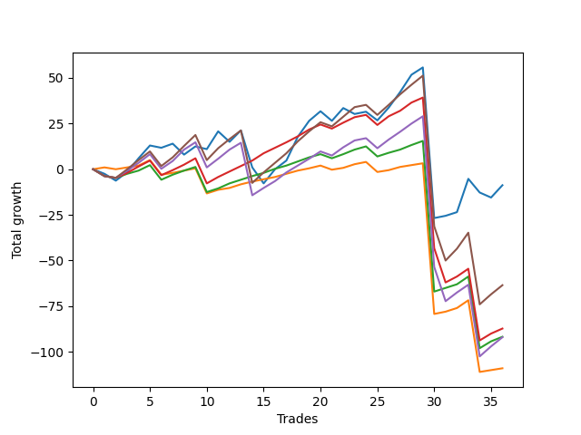

# Long Pointer 011 
- Symbol: ES_SmolBoiHour
- Date Range: 03/18/2022 - 07/29/2022
- Trading Period: 7:20-12:30
- Number of Trades: 36



| Name | Win Percent | Profit | Avg Profit / Trade | Avg Time / Trade |      | Name | Win Percent | Profit | Avg Profit / Trade | Avg Time / Trade |
| ---- | ----------- | ------ | ------------------ | ---------------- | ---- | ---- | ----------- | ------ | ------------------ | ---------------- |
| Sorted By <br> Profit | | | | | | Sorted By <br> Win Percentage ||||
| Two | 61.11 | -4375.00 | -121.53 | 139:40 |     | Eighty-One | 80.56 | -54500.00 | -1513.89 | 154:33 |
| Eighty-Five | 72.22 | -31750.00 | -881.94 | 128:37 |     | Eighty-Two | 77.78 | -45875.00 | -1274.31 | 156:51 |
| Eighty-Three | 75.00 | -43625.00 | -1211.81 | 123:50 |     | Eighty-Three | 75.00 | -43625.00 | -1211.81 | 123:50 |
| Eighty-Two | 77.78 | -45875.00 | -1274.31 | 156:51 |     | Eighty-Five | 72.22 | -31750.00 | -881.94 | 128:37 |
| Eighty-Four | 72.22 | -46000.00 | -1277.78 | 127:10 |     | Eighty-Four | 72.22 | -46000.00 | -1277.78 | 127:10 |
| Eighty-One | 80.56 | -54500.00 | -1513.89 | 154:33 |     | Two | 61.11 | -4375.00 | -121.53 | 139:40 |

## NO STOPLOSS

### Test Two
* Sell when the price hits the upper line of the 20p 2std bollinger
* No Stoploss
* Results:
```
Total Trades: 36
Percent Up: 61.11
Percent Down: 38.89
Total Points Moved Up: -8.75
Potential Profit: -4375.00
Total Points Ups: 147.00 Count Ups: 22
Total Points Downs: -155.75 Count Downs: 14
```

<details><summary>Trades</summary>

<code>In: 2022-03-28 08:39:00		Out: 2022-03-28 09:07:10		Total Position Time: 28:10		Total Move Up: -2.50		Total to Date: -2.50</code> <br />
<code>In: 2022-03-30 08:02:00		Out: 2022-03-30 08:35:15		Total Position Time: 33:15		Total Move Up: -3.75		Total to Date: -6.25</code> <br />
<code>In: 2022-03-30 08:14:00		Out: 2022-03-30 08:35:15		Total Position Time: 21:15		Total Move Up: 4.75		Total to Date: -1.50</code> <br />
<code>In: 2022-03-30 12:27:00		Out: 2022-03-30 12:36:20		Total Position Time: 09:20		Total Move Up: 7.50		Total to Date: 6.00</code> <br />
<code>In: 2022-04-07 08:35:00		Out: 2022-04-07 08:47:35		Total Position Time: 12:35		Total Move Up: 7.00		Total to Date: 13.00</code> <br />
<code>In: 2022-04-11 07:30:00		Out: 2022-04-11 07:54:25		Total Position Time: 24:25		Total Move Up: -1.25		Total to Date: 11.75</code> <br />
<code>In: 2022-04-12 07:53:00		Out: 2022-04-12 08:15:45		Total Position Time: 22:45		Total Move Up: 2.25		Total to Date: 14.00</code> <br />
<code>In: 2022-04-12 09:14:00		Out: 2022-04-12 09:50:15		Total Position Time: 36:15		Total Move Up: -6.00		Total to Date: 8.00</code> <br />
<code>In: 2022-04-12 11:35:00		Out: 2022-04-12 11:47:00		Total Position Time: 12:00		Total Move Up: 4.50		Total to Date: 12.50</code> <br />
<code>In: 2022-04-18 08:30:00		Out: 2022-04-18 08:59:35		Total Position Time: 29:35		Total Move Up: -1.50		Total to Date: 11.00</code> <br />
<code>In: 2022-04-20 11:58:00		Out: 2022-04-20 12:12:35		Total Position Time: 14:35		Total Move Up: 9.75		Total to Date: 20.75</code> <br />
<code>In: 2022-05-02 10:06:00		Out: 2022-05-02 11:03:45		Total Position Time: 57:45		Total Move Up: -5.75		Total to Date: 15.00</code> <br />
<code>In: 2022-05-02 10:51:00		Out: 2022-05-02 11:03:45		Total Position Time: 12:45		Total Move Up: 6.25		Total to Date: 21.25</code> <br />
<code>In: 2022-05-10 07:44:00		Out: 2022-05-10 08:39:10		Total Position Time: 55:10		Total Move Up: -20.25		Total to Date: 1.00</code> <br />
<code>In: 2022-05-10 07:52:00		Out: 2022-05-10 08:39:10		Total Position Time: 47:10		Total Move Up: -8.75		Total to Date: -7.75</code> <br />
<code>In: 2022-05-13 11:07:00		Out: 2022-05-13 11:31:20		Total Position Time: 24:20		Total Move Up: 7.75		Total to Date: 0.00</code> <br />
<code>In: 2022-05-17 07:48:00		Out: 2022-05-17 07:59:25		Total Position Time: 11:25		Total Move Up: 4.75		Total to Date: 4.75</code> <br />
<code>In: 2022-05-17 11:24:00		Out: 2022-05-17 11:40:00		Total Position Time: 16:00		Total Move Up: 13.00		Total to Date: 17.75</code> <br />
<code>In: 2022-05-18 08:32:00		Out: 2022-05-18 08:42:55		Total Position Time: 10:55		Total Move Up: 8.75		Total to Date: 26.50</code> <br />
<code>In: 2022-05-25 09:29:00		Out: 2022-05-25 09:45:20		Total Position Time: 16:20		Total Move Up: 5.25		Total to Date: 31.75</code> <br />
<code>In: 2022-06-06 09:08:00		Out: 2022-06-06 09:41:45		Total Position Time: 33:45		Total Move Up: -5.25		Total to Date: 26.50</code> <br />
<code>In: 2022-06-08 10:35:00		Out: 2022-06-08 11:03:45		Total Position Time: 28:45		Total Move Up: 7.00		Total to Date: 33.50</code> <br />
<code>In: 2022-06-14 11:52:00		Out: 2022-06-14 12:29:35		Total Position Time: 37:35		Total Move Up: -3.25		Total to Date: 30.25</code> <br />
<code>In: 2022-06-15 07:57:00		Out: 2022-06-15 08:56:55		Total Position Time: 59:55		Total Move Up: 1.25		Total to Date: 31.50</code> <br />
<code>In: 2022-06-16 11:02:00		Out: 2022-06-16 11:40:30		Total Position Time: 38:30		Total Move Up: -4.75		Total to Date: 26.75</code> <br />
<code>In: 2022-06-23 09:07:00		Out: 2022-06-23 09:19:05		Total Position Time: 12:05		Total Move Up: 7.00		Total to Date: 33.75</code> <br />
<code>In: 2022-06-29 08:25:00		Out: 2022-06-29 08:34:40		Total Position Time: 09:40		Total Move Up: 8.50		Total to Date: 42.25</code> <br />
<code>In: 2022-06-29 09:29:00		Out: 2022-06-29 09:38:30		Total Position Time: 09:30		Total Move Up: 9.50		Total to Date: 51.75</code> <br />
<code>In: 2022-07-06 08:35:00		Out: 2022-07-06 08:51:15		Total Position Time: 16:15		Total Move Up: 4.00		Total to Date: 55.75</code> <br />
<code>In: 2022-07-12 11:36:00		Out: 2022-07-14 08:46:00		Total Position Time: 1270:00		Total Move Up: -82.50		Total to Date: -26.75</code> <br />
<code>In: 2022-07-12 12:07:00		Out: 2022-07-13 10:03:00		Total Position Time: 1316:00		Total Move Up: 1.25		Total to Date: -25.50</code> <br />
<code>In: 2022-07-18 10:51:00		Out: 2022-07-19 06:31:00		Total Position Time: 1180:00		Total Move Up: 2.00		Total to Date: -23.50</code> <br />
<code>In: 2022-07-20 10:14:00		Out: 2022-07-20 11:38:00		Total Position Time: 84:00		Total Move Up: 18.25		Total to Date: -5.25</code> <br />
<code>In: 2022-07-22 08:27:00		Out: 2022-07-25 09:48:00		Total Position Time: 81:00		Total Move Up: -7.50		Total to Date: -12.75</code> <br />
<code>In: 2022-07-22 08:39:00		Out: 2022-07-25 13:00:00		Total Position Time: 261:00		Total Move Up: -2.75		Total to Date: -15.50</code> <br />
<code>In: 2022-07-26 08:35:00		Out: 2022-07-26 10:09:00		Total Position Time: 94:00		Total Move Up: 6.75		Total to Date: -8.75</code> <br />


</details>

## TAKE PROFIT

### Test Eighty-One
* Take Profit of 1 Point
* No Stoploss
* Results:
```
Total Trades: 36
Percent Up: 80.56
Percent Down: 19.44
Total Points Moved Up: -109.00
Potential Profit: -54500.00
Total Points Ups: 43.25 Count Ups: 29
Total Points Downs: -152.25 Count Downs: 7
```

<details><summary>Trades</summary>

<code>In: 2022-03-28 08:39:00		Out: 2022-03-28 08:44:40		Total Position Time: 05:40		Total Move Up: 1.00		Total to Date: 1.00</code> <br />
<code>In: 2022-03-30 08:02:00		Out: 2022-03-30 09:01:55		Total Position Time: 59:55		Total Move Up: -1.00		Total to Date: 0.00</code> <br />
<code>In: 2022-03-30 08:14:00		Out: 2022-03-30 08:15:25		Total Position Time: 01:25		Total Move Up: 1.00		Total to Date: 1.00</code> <br />
<code>In: 2022-03-30 12:27:00		Out: 2022-03-30 12:27:35		Total Position Time: 00:35		Total Move Up: 1.00		Total to Date: 2.00</code> <br />
<code>In: 2022-04-07 08:35:00		Out: 2022-04-07 08:35:10		Total Position Time: 00:10		Total Move Up: 3.00		Total to Date: 5.00</code> <br />
<code>In: 2022-04-11 07:30:00		Out: 2022-04-11 08:29:55		Total Position Time: 59:55		Total Move Up: -8.00		Total to Date: -3.00</code> <br />
<code>In: 2022-04-12 07:53:00		Out: 2022-04-12 07:57:25		Total Position Time: 04:25		Total Move Up: 1.00		Total to Date: -2.00</code> <br />
<code>In: 2022-04-12 09:14:00		Out: 2022-04-12 09:15:00		Total Position Time: 01:00		Total Move Up: 1.25		Total to Date: -0.75</code> <br />
<code>In: 2022-04-12 11:35:00		Out: 2022-04-12 11:35:45		Total Position Time: 00:45		Total Move Up: 1.25		Total to Date: 0.50</code> <br />
<code>In: 2022-04-18 08:30:00		Out: 2022-04-18 09:29:55		Total Position Time: 59:55		Total Move Up: -13.75		Total to Date: -13.25</code> <br />
<code>In: 2022-04-20 11:58:00		Out: 2022-04-20 12:00:15		Total Position Time: 02:15		Total Move Up: 2.00		Total to Date: -11.25</code> <br />
<code>In: 2022-05-02 10:06:00		Out: 2022-05-02 10:07:25		Total Position Time: 01:25		Total Move Up: 1.00		Total to Date: -10.25</code> <br />
<code>In: 2022-05-02 10:51:00		Out: 2022-05-02 10:55:45		Total Position Time: 04:45		Total Move Up: 2.00		Total to Date: -8.25</code> <br />
<code>In: 2022-05-10 07:44:00		Out: 2022-05-10 07:44:10		Total Position Time: 00:10		Total Move Up: 1.50		Total to Date: -6.75</code> <br />
<code>In: 2022-05-10 07:52:00		Out: 2022-05-10 07:52:20		Total Position Time: 00:20		Total Move Up: 1.25		Total to Date: -5.50</code> <br />
<code>In: 2022-05-13 11:07:00		Out: 2022-05-13 11:09:25		Total Position Time: 02:25		Total Move Up: 1.25		Total to Date: -4.25</code> <br />
<code>In: 2022-05-17 07:48:00		Out: 2022-05-17 07:52:35		Total Position Time: 04:35		Total Move Up: 1.75		Total to Date: -2.50</code> <br />
<code>In: 2022-05-17 11:24:00		Out: 2022-05-17 11:24:25		Total Position Time: 00:25		Total Move Up: 1.75		Total to Date: -0.75</code> <br />
<code>In: 2022-05-18 08:32:00		Out: 2022-05-18 08:33:20		Total Position Time: 01:20		Total Move Up: 1.25		Total to Date: 0.50</code> <br />
<code>In: 2022-05-25 09:29:00		Out: 2022-05-25 09:30:00		Total Position Time: 01:00		Total Move Up: 1.50		Total to Date: 2.00</code> <br />
<code>In: 2022-06-06 09:08:00		Out: 2022-06-06 10:07:55		Total Position Time: 59:55		Total Move Up: -2.25		Total to Date: -0.25</code> <br />
<code>In: 2022-06-08 10:35:00		Out: 2022-06-08 10:41:55		Total Position Time: 06:55		Total Move Up: 1.00		Total to Date: 0.75</code> <br />
<code>In: 2022-06-14 11:52:00		Out: 2022-06-14 12:30:35		Total Position Time: 38:35		Total Move Up: 2.00		Total to Date: 2.75</code> <br />
<code>In: 2022-06-15 07:57:00		Out: 2022-06-15 07:59:05		Total Position Time: 02:05		Total Move Up: 1.25		Total to Date: 4.00</code> <br />
<code>In: 2022-06-16 11:02:00		Out: 2022-06-16 12:01:55		Total Position Time: 59:55		Total Move Up: -5.50		Total to Date: -1.50</code> <br />
<code>In: 2022-06-23 09:07:00		Out: 2022-06-23 09:07:10		Total Position Time: 00:10		Total Move Up: 1.00		Total to Date: -0.50</code> <br />
<code>In: 2022-06-29 08:25:00		Out: 2022-06-29 08:25:15		Total Position Time: 00:15		Total Move Up: 1.75		Total to Date: 1.25</code> <br />
<code>In: 2022-06-29 09:29:00		Out: 2022-06-29 09:32:00		Total Position Time: 03:00		Total Move Up: 1.00		Total to Date: 2.25</code> <br />
<code>In: 2022-07-06 08:35:00		Out: 2022-07-06 08:36:55		Total Position Time: 01:55		Total Move Up: 1.00		Total to Date: 3.25</code> <br />
<code>In: 2022-07-12 11:36:00		Out: 2022-07-14 08:46:00		Total Position Time: 1270:00		Total Move Up: -82.50		Total to Date: -79.25</code> <br />
<code>In: 2022-07-12 12:07:00		Out: 2022-07-13 10:03:00		Total Position Time: 1316:00		Total Move Up: 1.25		Total to Date: -78.00</code> <br />
<code>In: 2022-07-18 10:51:00		Out: 2022-07-19 06:31:00		Total Position Time: 1180:00		Total Move Up: 2.00		Total to Date: -76.00</code> <br />
<code>In: 2022-07-20 10:14:00		Out: 2022-07-20 10:27:00		Total Position Time: 13:00		Total Move Up: 4.25		Total to Date: -71.75</code> <br />
<code>In: 2022-07-22 08:27:00		Out: 2022-07-26 06:37:00		Total Position Time: 1330:00		Total Move Up: -39.25		Total to Date: -111.00</code> <br />
<code>In: 2022-07-22 08:39:00		Out: 2022-07-22 08:52:00		Total Position Time: 13:00		Total Move Up: 1.00		Total to Date: -110.00</code> <br />
<code>In: 2022-07-26 08:35:00		Out: 2022-07-26 09:32:00		Total Position Time: 57:00		Total Move Up: 1.00		Total to Date: -109.00</code> <br />


</details>

### Test Eighty-Two
* Take Profit of 2 Point
* No Stoploss
* Results:
```
Total Trades: 36
Percent Up: 77.78
Percent Down: 22.22
Total Points Moved Up: -91.75
Potential Profit: -45875.00
Total Points Ups: 64.25 Count Ups: 28
Total Points Downs: -156.00 Count Downs: 8
```

<details><summary>Trades</summary>

<code>In: 2022-03-28 08:39:00		Out: 2022-03-28 09:38:55		Total Position Time: 59:55		Total Move Up: -3.75		Total to Date: -3.75</code> <br />
<code>In: 2022-03-30 08:02:00		Out: 2022-03-30 09:01:55		Total Position Time: 59:55		Total Move Up: -1.00		Total to Date: -4.75</code> <br />
<code>In: 2022-03-30 08:14:00		Out: 2022-03-30 08:15:40		Total Position Time: 01:40		Total Move Up: 2.25		Total to Date: -2.50</code> <br />
<code>In: 2022-03-30 12:27:00		Out: 2022-03-30 12:28:00		Total Position Time: 01:00		Total Move Up: 1.75		Total to Date: -0.75</code> <br />
<code>In: 2022-04-07 08:35:00		Out: 2022-04-07 08:35:10		Total Position Time: 00:10		Total Move Up: 3.00		Total to Date: 2.25</code> <br />
<code>In: 2022-04-11 07:30:00		Out: 2022-04-11 08:29:55		Total Position Time: 59:55		Total Move Up: -8.00		Total to Date: -5.75</code> <br />
<code>In: 2022-04-12 07:53:00		Out: 2022-04-12 08:02:35		Total Position Time: 09:35		Total Move Up: 2.75		Total to Date: -3.00</code> <br />
<code>In: 2022-04-12 09:14:00		Out: 2022-04-12 09:16:20		Total Position Time: 02:20		Total Move Up: 2.25		Total to Date: -0.75</code> <br />
<code>In: 2022-04-12 11:35:00		Out: 2022-04-12 11:35:55		Total Position Time: 00:55		Total Move Up: 2.00		Total to Date: 1.25</code> <br />
<code>In: 2022-04-18 08:30:00		Out: 2022-04-18 09:29:55		Total Position Time: 59:55		Total Move Up: -13.75		Total to Date: -12.50</code> <br />
<code>In: 2022-04-20 11:58:00		Out: 2022-04-20 12:00:15		Total Position Time: 02:15		Total Move Up: 2.00		Total to Date: -10.50</code> <br />
<code>In: 2022-05-02 10:06:00		Out: 2022-05-02 10:07:30		Total Position Time: 01:30		Total Move Up: 2.75		Total to Date: -7.75</code> <br />
<code>In: 2022-05-02 10:51:00		Out: 2022-05-02 10:55:45		Total Position Time: 04:45		Total Move Up: 2.00		Total to Date: -5.75</code> <br />
<code>In: 2022-05-10 07:44:00		Out: 2022-05-10 07:44:20		Total Position Time: 00:20		Total Move Up: 2.00		Total to Date: -3.75</code> <br />
<code>In: 2022-05-10 07:52:00		Out: 2022-05-10 07:54:10		Total Position Time: 02:10		Total Move Up: 1.75		Total to Date: -2.00</code> <br />
<code>In: 2022-05-13 11:07:00		Out: 2022-05-13 11:09:30		Total Position Time: 02:30		Total Move Up: 2.25		Total to Date: 0.25</code> <br />
<code>In: 2022-05-17 07:48:00		Out: 2022-05-17 07:52:40		Total Position Time: 04:40		Total Move Up: 1.75		Total to Date: 2.00</code> <br />
<code>In: 2022-05-17 11:24:00		Out: 2022-05-17 11:24:35		Total Position Time: 00:35		Total Move Up: 2.25		Total to Date: 4.25</code> <br />
<code>In: 2022-05-18 08:32:00		Out: 2022-05-18 08:35:00		Total Position Time: 03:00		Total Move Up: 2.25		Total to Date: 6.50</code> <br />
<code>In: 2022-05-25 09:29:00		Out: 2022-05-25 09:30:05		Total Position Time: 01:05		Total Move Up: 1.75		Total to Date: 8.25</code> <br />
<code>In: 2022-06-06 09:08:00		Out: 2022-06-06 10:07:55		Total Position Time: 59:55		Total Move Up: -2.25		Total to Date: 6.00</code> <br />
<code>In: 2022-06-08 10:35:00		Out: 2022-06-08 10:42:15		Total Position Time: 07:15		Total Move Up: 2.25		Total to Date: 8.25</code> <br />
<code>In: 2022-06-14 11:52:00		Out: 2022-06-14 12:30:55		Total Position Time: 38:55		Total Move Up: 2.50		Total to Date: 10.75</code> <br />
<code>In: 2022-06-15 07:57:00		Out: 2022-06-15 08:00:20		Total Position Time: 03:20		Total Move Up: 1.75		Total to Date: 12.50</code> <br />
<code>In: 2022-06-16 11:02:00		Out: 2022-06-16 12:01:55		Total Position Time: 59:55		Total Move Up: -5.50		Total to Date: 7.00</code> <br />
<code>In: 2022-06-23 09:07:00		Out: 2022-06-23 09:14:30		Total Position Time: 07:30		Total Move Up: 2.00		Total to Date: 9.00</code> <br />
<code>In: 2022-06-29 08:25:00		Out: 2022-06-29 08:25:15		Total Position Time: 00:15		Total Move Up: 1.75		Total to Date: 10.75</code> <br />
<code>In: 2022-06-29 09:29:00		Out: 2022-06-29 09:32:45		Total Position Time: 03:45		Total Move Up: 2.50		Total to Date: 13.25</code> <br />
<code>In: 2022-07-06 08:35:00		Out: 2022-07-06 08:37:05		Total Position Time: 02:05		Total Move Up: 2.25		Total to Date: 15.50</code> <br />
<code>In: 2022-07-12 11:36:00		Out: 2022-07-14 08:46:00		Total Position Time: 1270:00		Total Move Up: -82.50		Total to Date: -67.00</code> <br />
<code>In: 2022-07-12 12:07:00		Out: 2022-07-13 10:06:00		Total Position Time: 1319:00		Total Move Up: 2.00		Total to Date: -65.00</code> <br />
<code>In: 2022-07-18 10:51:00		Out: 2022-07-19 06:31:00		Total Position Time: 1180:00		Total Move Up: 2.00		Total to Date: -63.00</code> <br />
<code>In: 2022-07-20 10:14:00		Out: 2022-07-20 10:27:00		Total Position Time: 13:00		Total Move Up: 4.25		Total to Date: -58.75</code> <br />
<code>In: 2022-07-22 08:27:00		Out: 2022-07-26 06:37:00		Total Position Time: 1330:00		Total Move Up: -39.25		Total to Date: -98.00</code> <br />
<code>In: 2022-07-22 08:39:00		Out: 2022-07-22 08:53:00		Total Position Time: 14:00		Total Move Up: 3.75		Total to Date: -94.25</code> <br />
<code>In: 2022-07-26 08:35:00		Out: 2022-07-26 09:35:00		Total Position Time: 60:00		Total Move Up: 2.50		Total to Date: -91.75</code> <br />


</details>

### Test Eighty-Three
* Take Profit of 3 Point
* No Stoploss
* Results:
```
Total Trades: 36
Percent Up: 75.00
Percent Down: 25.00
Total Points Moved Up: -87.25
Potential Profit: -43625.00
Total Points Ups: 87.50 Count Ups: 27
Total Points Downs: -174.75 Count Downs: 9
```

<details><summary>Trades</summary>

<code>In: 2022-03-28 08:39:00		Out: 2022-03-28 09:38:55		Total Position Time: 59:55		Total Move Up: -3.75		Total to Date: -3.75</code> <br />
<code>In: 2022-03-30 08:02:00		Out: 2022-03-30 09:01:55		Total Position Time: 59:55		Total Move Up: -1.00		Total to Date: -4.75</code> <br />
<code>In: 2022-03-30 08:14:00		Out: 2022-03-30 08:19:15		Total Position Time: 05:15		Total Move Up: 2.75		Total to Date: -2.00</code> <br />
<code>In: 2022-03-30 12:27:00		Out: 2022-03-30 12:31:35		Total Position Time: 04:35		Total Move Up: 3.50		Total to Date: 1.50</code> <br />
<code>In: 2022-04-07 08:35:00		Out: 2022-04-07 08:35:15		Total Position Time: 00:15		Total Move Up: 3.25		Total to Date: 4.75</code> <br />
<code>In: 2022-04-11 07:30:00		Out: 2022-04-11 08:29:55		Total Position Time: 59:55		Total Move Up: -8.00		Total to Date: -3.25</code> <br />
<code>In: 2022-04-12 07:53:00		Out: 2022-04-12 08:02:55		Total Position Time: 09:55		Total Move Up: 2.75		Total to Date: -0.50</code> <br />
<code>In: 2022-04-12 09:14:00		Out: 2022-04-12 09:16:50		Total Position Time: 02:50		Total Move Up: 3.00		Total to Date: 2.50</code> <br />
<code>In: 2022-04-12 11:35:00		Out: 2022-04-12 11:37:20		Total Position Time: 02:20		Total Move Up: 3.50		Total to Date: 6.00</code> <br />
<code>In: 2022-04-18 08:30:00		Out: 2022-04-18 09:29:55		Total Position Time: 59:55		Total Move Up: -13.75		Total to Date: -7.75</code> <br />
<code>In: 2022-04-20 11:58:00		Out: 2022-04-20 12:01:10		Total Position Time: 03:10		Total Move Up: 3.50		Total to Date: -4.25</code> <br />
<code>In: 2022-05-02 10:06:00		Out: 2022-05-02 10:07:40		Total Position Time: 01:40		Total Move Up: 3.00		Total to Date: -1.25</code> <br />
<code>In: 2022-05-02 10:51:00		Out: 2022-05-02 11:00:05		Total Position Time: 09:05		Total Move Up: 3.00		Total to Date: 1.75</code> <br />
<code>In: 2022-05-10 07:44:00		Out: 2022-05-10 07:45:00		Total Position Time: 01:00		Total Move Up: 3.00		Total to Date: 4.75</code> <br />
<code>In: 2022-05-10 07:52:00		Out: 2022-05-10 07:54:15		Total Position Time: 02:15		Total Move Up: 4.00		Total to Date: 8.75</code> <br />
<code>In: 2022-05-13 11:07:00		Out: 2022-05-13 11:09:35		Total Position Time: 02:35		Total Move Up: 3.00		Total to Date: 11.75</code> <br />
<code>In: 2022-05-17 07:48:00		Out: 2022-05-17 07:55:15		Total Position Time: 07:15		Total Move Up: 3.00		Total to Date: 14.75</code> <br />
<code>In: 2022-05-17 11:24:00		Out: 2022-05-17 11:24:40		Total Position Time: 00:40		Total Move Up: 3.25		Total to Date: 18.00</code> <br />
<code>In: 2022-05-18 08:32:00		Out: 2022-05-18 08:35:30		Total Position Time: 03:30		Total Move Up: 3.75		Total to Date: 21.75</code> <br />
<code>In: 2022-05-25 09:29:00		Out: 2022-05-25 09:30:15		Total Position Time: 01:15		Total Move Up: 2.75		Total to Date: 24.50</code> <br />
<code>In: 2022-06-06 09:08:00		Out: 2022-06-06 10:07:55		Total Position Time: 59:55		Total Move Up: -2.25		Total to Date: 22.25</code> <br />
<code>In: 2022-06-08 10:35:00		Out: 2022-06-08 10:44:05		Total Position Time: 09:05		Total Move Up: 3.25		Total to Date: 25.50</code> <br />
<code>In: 2022-06-14 11:52:00		Out: 2022-06-14 12:32:10		Total Position Time: 40:10		Total Move Up: 3.00		Total to Date: 28.50</code> <br />
<code>In: 2022-06-15 07:57:00		Out: 2022-06-15 08:56:55		Total Position Time: 59:55		Total Move Up: 1.25		Total to Date: 29.75</code> <br />
<code>In: 2022-06-16 11:02:00		Out: 2022-06-16 12:01:55		Total Position Time: 59:55		Total Move Up: -5.50		Total to Date: 24.25</code> <br />
<code>In: 2022-06-23 09:07:00		Out: 2022-06-23 09:18:25		Total Position Time: 11:25		Total Move Up: 4.75		Total to Date: 29.00</code> <br />
<code>In: 2022-06-29 08:25:00		Out: 2022-06-29 08:25:20		Total Position Time: 00:20		Total Move Up: 3.00		Total to Date: 32.00</code> <br />
<code>In: 2022-06-29 09:29:00		Out: 2022-06-29 09:36:40		Total Position Time: 07:40		Total Move Up: 4.50		Total to Date: 36.50</code> <br />
<code>In: 2022-07-06 08:35:00		Out: 2022-07-06 08:49:20		Total Position Time: 14:20		Total Move Up: 2.75		Total to Date: 39.25</code> <br />
<code>In: 2022-07-12 11:36:00		Out: 2022-07-14 08:46:00		Total Position Time: 1270:00		Total Move Up: -82.50		Total to Date: -43.25</code> <br />
<code>In: 2022-07-12 12:07:00		Out: 2022-07-13 12:36:00		Total Position Time: 29:00		Total Move Up: -18.75		Total to Date: -62.00</code> <br />
<code>In: 2022-07-18 10:51:00		Out: 2022-07-19 06:32:00		Total Position Time: 1181:00		Total Move Up: 3.25		Total to Date: -58.75</code> <br />
<code>In: 2022-07-20 10:14:00		Out: 2022-07-20 10:27:00		Total Position Time: 13:00		Total Move Up: 4.25		Total to Date: -54.50</code> <br />
<code>In: 2022-07-22 08:27:00		Out: 2022-07-26 06:37:00		Total Position Time: 1330:00		Total Move Up: -39.25		Total to Date: -93.75</code> <br />
<code>In: 2022-07-22 08:39:00		Out: 2022-07-22 08:53:00		Total Position Time: 14:00		Total Move Up: 3.75		Total to Date: -90.00</code> <br />
<code>In: 2022-07-26 08:35:00		Out: 2022-07-26 09:36:00		Total Position Time: 61:00		Total Move Up: 2.75		Total to Date: -87.25</code> <br />


</details>

### Test Eighty-Four
* Take Profit of 4 Point
* No Stoploss
* Results:
```
Total Trades: 36
Percent Up: 72.22
Percent Down: 27.78
Total Points Moved Up: -92.00
Potential Profit: -46000.00
Total Points Ups: 111.50 Count Ups: 26
Total Points Downs: -203.50 Count Downs: 10
```

<details><summary>Trades</summary>

<code>In: 2022-03-28 08:39:00		Out: 2022-03-28 09:38:55		Total Position Time: 59:55		Total Move Up: -3.75		Total to Date: -3.75</code> <br />
<code>In: 2022-03-30 08:02:00		Out: 2022-03-30 09:01:55		Total Position Time: 59:55		Total Move Up: -1.00		Total to Date: -4.75</code> <br />
<code>In: 2022-03-30 08:14:00		Out: 2022-03-30 08:19:30		Total Position Time: 05:30		Total Move Up: 4.00		Total to Date: -0.75</code> <br />
<code>In: 2022-03-30 12:27:00		Out: 2022-03-30 12:32:15		Total Position Time: 05:15		Total Move Up: 4.25		Total to Date: 3.50</code> <br />
<code>In: 2022-04-07 08:35:00		Out: 2022-04-07 08:36:05		Total Position Time: 01:05		Total Move Up: 4.75		Total to Date: 8.25</code> <br />
<code>In: 2022-04-11 07:30:00		Out: 2022-04-11 08:29:55		Total Position Time: 59:55		Total Move Up: -8.00		Total to Date: 0.25</code> <br />
<code>In: 2022-04-12 07:53:00		Out: 2022-04-12 08:18:50		Total Position Time: 25:50		Total Move Up: 4.25		Total to Date: 4.50</code> <br />
<code>In: 2022-04-12 09:14:00		Out: 2022-04-12 09:17:45		Total Position Time: 03:45		Total Move Up: 6.25		Total to Date: 10.75</code> <br />
<code>In: 2022-04-12 11:35:00		Out: 2022-04-12 11:37:35		Total Position Time: 02:35		Total Move Up: 4.00		Total to Date: 14.75</code> <br />
<code>In: 2022-04-18 08:30:00		Out: 2022-04-18 09:29:55		Total Position Time: 59:55		Total Move Up: -13.75		Total to Date: 1.00</code> <br />
<code>In: 2022-04-20 11:58:00		Out: 2022-04-20 12:01:15		Total Position Time: 03:15		Total Move Up: 4.75		Total to Date: 5.75</code> <br />
<code>In: 2022-05-02 10:06:00		Out: 2022-05-02 10:07:45		Total Position Time: 01:45		Total Move Up: 5.00		Total to Date: 10.75</code> <br />
<code>In: 2022-05-02 10:51:00		Out: 2022-05-02 11:02:40		Total Position Time: 11:40		Total Move Up: 3.75		Total to Date: 14.50</code> <br />
<code>In: 2022-05-10 07:44:00		Out: 2022-05-10 08:43:55		Total Position Time: 59:55		Total Move Up: -28.75		Total to Date: -14.25</code> <br />
<code>In: 2022-05-10 07:52:00		Out: 2022-05-10 07:54:15		Total Position Time: 02:15		Total Move Up: 4.00		Total to Date: -10.25</code> <br />
<code>In: 2022-05-13 11:07:00		Out: 2022-05-13 11:10:20		Total Position Time: 03:20		Total Move Up: 3.75		Total to Date: -6.50</code> <br />
<code>In: 2022-05-17 07:48:00		Out: 2022-05-17 07:56:10		Total Position Time: 08:10		Total Move Up: 4.75		Total to Date: -1.75</code> <br />
<code>In: 2022-05-17 11:24:00		Out: 2022-05-17 11:24:50		Total Position Time: 00:50		Total Move Up: 3.75		Total to Date: 2.00</code> <br />
<code>In: 2022-05-18 08:32:00		Out: 2022-05-18 08:35:35		Total Position Time: 03:35		Total Move Up: 3.75		Total to Date: 5.75</code> <br />
<code>In: 2022-05-25 09:29:00		Out: 2022-05-25 09:30:30		Total Position Time: 01:30		Total Move Up: 4.00		Total to Date: 9.75</code> <br />
<code>In: 2022-06-06 09:08:00		Out: 2022-06-06 10:07:55		Total Position Time: 59:55		Total Move Up: -2.25		Total to Date: 7.50</code> <br />
<code>In: 2022-06-08 10:35:00		Out: 2022-06-08 10:45:20		Total Position Time: 10:20		Total Move Up: 4.50		Total to Date: 12.00</code> <br />
<code>In: 2022-06-14 11:52:00		Out: 2022-06-14 12:32:30		Total Position Time: 40:30		Total Move Up: 3.75		Total to Date: 15.75</code> <br />
<code>In: 2022-06-15 07:57:00		Out: 2022-06-15 08:56:55		Total Position Time: 59:55		Total Move Up: 1.25		Total to Date: 17.00</code> <br />
<code>In: 2022-06-16 11:02:00		Out: 2022-06-16 12:01:55		Total Position Time: 59:55		Total Move Up: -5.50		Total to Date: 11.50</code> <br />
<code>In: 2022-06-23 09:07:00		Out: 2022-06-23 09:18:25		Total Position Time: 11:25		Total Move Up: 4.75		Total to Date: 16.25</code> <br />
<code>In: 2022-06-29 08:25:00		Out: 2022-06-29 08:28:15		Total Position Time: 03:15		Total Move Up: 4.25		Total to Date: 20.50</code> <br />
<code>In: 2022-06-29 09:29:00		Out: 2022-06-29 09:36:40		Total Position Time: 07:40		Total Move Up: 4.50		Total to Date: 25.00</code> <br />
<code>In: 2022-07-06 08:35:00		Out: 2022-07-06 08:51:15		Total Position Time: 16:15		Total Move Up: 4.00		Total to Date: 29.00</code> <br />
<code>In: 2022-07-12 11:36:00		Out: 2022-07-14 08:46:00		Total Position Time: 1270:00		Total Move Up: -82.50		Total to Date: -53.50</code> <br />
<code>In: 2022-07-12 12:07:00		Out: 2022-07-13 12:36:00		Total Position Time: 29:00		Total Move Up: -18.75		Total to Date: -72.25</code> <br />
<code>In: 2022-07-18 10:51:00		Out: 2022-07-19 06:34:00		Total Position Time: 1183:00		Total Move Up: 4.75		Total to Date: -67.50</code> <br />
<code>In: 2022-07-20 10:14:00		Out: 2022-07-20 10:27:00		Total Position Time: 13:00		Total Move Up: 4.25		Total to Date: -63.25</code> <br />
<code>In: 2022-07-22 08:27:00		Out: 2022-07-26 06:37:00		Total Position Time: 1330:00		Total Move Up: -39.25		Total to Date: -102.50</code> <br />
<code>In: 2022-07-22 08:39:00		Out: 2022-07-22 08:54:00		Total Position Time: 15:00		Total Move Up: 5.50		Total to Date: -97.00</code> <br />
<code>In: 2022-07-26 08:35:00		Out: 2022-07-26 10:04:00		Total Position Time: 89:00		Total Move Up: 5.00		Total to Date: -92.00</code> <br />


</details>

### Test Eighty-Five
* Take Profit of 5 Point
* No Stoploss
* Results:
```
Total Trades: 36
Percent Up: 72.22
Percent Down: 27.78
Total Points Moved Up: -63.50
Potential Profit: -31750.00
Total Points Ups: 140.00 Count Ups: 26
Total Points Downs: -203.50 Count Downs: 10
```

<details><summary>Trades</summary>

<code>In: 2022-03-28 08:39:00		Out: 2022-03-28 09:38:55		Total Position Time: 59:55		Total Move Up: -3.75		Total to Date: -3.75</code> <br />
<code>In: 2022-03-30 08:02:00		Out: 2022-03-30 09:01:55		Total Position Time: 59:55		Total Move Up: -1.00		Total to Date: -4.75</code> <br />
<code>In: 2022-03-30 08:14:00		Out: 2022-03-30 08:35:15		Total Position Time: 21:15		Total Move Up: 4.75		Total to Date: 0.00</code> <br />
<code>In: 2022-03-30 12:27:00		Out: 2022-03-30 12:32:25		Total Position Time: 05:25		Total Move Up: 5.00		Total to Date: 5.00</code> <br />
<code>In: 2022-04-07 08:35:00		Out: 2022-04-07 08:36:25		Total Position Time: 01:25		Total Move Up: 4.75		Total to Date: 9.75</code> <br />
<code>In: 2022-04-11 07:30:00		Out: 2022-04-11 08:29:55		Total Position Time: 59:55		Total Move Up: -8.00		Total to Date: 1.75</code> <br />
<code>In: 2022-04-12 07:53:00		Out: 2022-04-12 08:19:00		Total Position Time: 26:00		Total Move Up: 4.75		Total to Date: 6.50</code> <br />
<code>In: 2022-04-12 09:14:00		Out: 2022-04-12 09:17:45		Total Position Time: 03:45		Total Move Up: 6.25		Total to Date: 12.75</code> <br />
<code>In: 2022-04-12 11:35:00		Out: 2022-04-12 11:47:05		Total Position Time: 12:05		Total Move Up: 6.00		Total to Date: 18.75</code> <br />
<code>In: 2022-04-18 08:30:00		Out: 2022-04-18 09:29:55		Total Position Time: 59:55		Total Move Up: -13.75		Total to Date: 5.00</code> <br />
<code>In: 2022-04-20 11:58:00		Out: 2022-04-20 12:01:20		Total Position Time: 03:20		Total Move Up: 6.50		Total to Date: 11.50</code> <br />
<code>In: 2022-05-02 10:06:00		Out: 2022-05-02 10:07:45		Total Position Time: 01:45		Total Move Up: 5.00		Total to Date: 16.50</code> <br />
<code>In: 2022-05-02 10:51:00		Out: 2022-05-02 11:02:45		Total Position Time: 11:45		Total Move Up: 4.75		Total to Date: 21.25</code> <br />
<code>In: 2022-05-10 07:44:00		Out: 2022-05-10 08:43:55		Total Position Time: 59:55		Total Move Up: -28.75		Total to Date: -7.50</code> <br />
<code>In: 2022-05-10 07:52:00		Out: 2022-05-10 07:54:20		Total Position Time: 02:20		Total Move Up: 5.75		Total to Date: -1.75</code> <br />
<code>In: 2022-05-13 11:07:00		Out: 2022-05-13 11:10:50		Total Position Time: 03:50		Total Move Up: 5.25		Total to Date: 3.50</code> <br />
<code>In: 2022-05-17 07:48:00		Out: 2022-05-17 07:59:15		Total Position Time: 11:15		Total Move Up: 5.25		Total to Date: 8.75</code> <br />
<code>In: 2022-05-17 11:24:00		Out: 2022-05-17 11:26:40		Total Position Time: 02:40		Total Move Up: 6.50		Total to Date: 15.25</code> <br />
<code>In: 2022-05-18 08:32:00		Out: 2022-05-18 08:37:40		Total Position Time: 05:40		Total Move Up: 5.50		Total to Date: 20.75</code> <br />
<code>In: 2022-05-25 09:29:00		Out: 2022-05-25 09:32:10		Total Position Time: 03:10		Total Move Up: 5.00		Total to Date: 25.75</code> <br />
<code>In: 2022-06-06 09:08:00		Out: 2022-06-06 10:07:55		Total Position Time: 59:55		Total Move Up: -2.25		Total to Date: 23.50</code> <br />
<code>In: 2022-06-08 10:35:00		Out: 2022-06-08 10:47:05		Total Position Time: 12:05		Total Move Up: 5.25		Total to Date: 28.75</code> <br />
<code>In: 2022-06-14 11:52:00		Out: 2022-06-14 12:32:40		Total Position Time: 40:40		Total Move Up: 5.25		Total to Date: 34.00</code> <br />
<code>In: 2022-06-15 07:57:00		Out: 2022-06-15 08:56:55		Total Position Time: 59:55		Total Move Up: 1.25		Total to Date: 35.25</code> <br />
<code>In: 2022-06-16 11:02:00		Out: 2022-06-16 12:01:55		Total Position Time: 59:55		Total Move Up: -5.50		Total to Date: 29.75</code> <br />
<code>In: 2022-06-23 09:07:00		Out: 2022-06-23 09:18:40		Total Position Time: 11:40		Total Move Up: 5.50		Total to Date: 35.25</code> <br />
<code>In: 2022-06-29 08:25:00		Out: 2022-06-29 08:32:15		Total Position Time: 07:15		Total Move Up: 5.75		Total to Date: 41.00</code> <br />
<code>In: 2022-06-29 09:29:00		Out: 2022-06-29 09:36:45		Total Position Time: 07:45		Total Move Up: 5.25		Total to Date: 46.25</code> <br />
<code>In: 2022-07-06 08:35:00		Out: 2022-07-06 08:58:10		Total Position Time: 23:10		Total Move Up: 5.00		Total to Date: 51.25</code> <br />
<code>In: 2022-07-12 11:36:00		Out: 2022-07-14 08:46:00		Total Position Time: 1270:00		Total Move Up: -82.50		Total to Date: -31.25</code> <br />
<code>In: 2022-07-12 12:07:00		Out: 2022-07-13 12:36:00		Total Position Time: 29:00		Total Move Up: -18.75		Total to Date: -50.00</code> <br />
<code>In: 2022-07-18 10:51:00		Out: 2022-07-19 06:36:00		Total Position Time: 1185:00		Total Move Up: 6.50		Total to Date: -43.50</code> <br />
<code>In: 2022-07-20 10:14:00		Out: 2022-07-20 10:29:00		Total Position Time: 15:00		Total Move Up: 8.75		Total to Date: -34.75</code> <br />
<code>In: 2022-07-22 08:27:00		Out: 2022-07-26 06:37:00		Total Position Time: 1330:00		Total Move Up: -39.25		Total to Date: -74.00</code> <br />
<code>In: 2022-07-22 08:39:00		Out: 2022-07-22 08:54:00		Total Position Time: 15:00		Total Move Up: 5.50		Total to Date: -68.50</code> <br />
<code>In: 2022-07-26 08:35:00		Out: 2022-07-26 10:04:00		Total Position Time: 89:00		Total Move Up: 5.00		Total to Date: -63.50</code> <br />


</details>