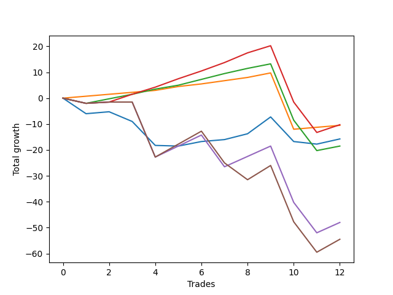

# Long Shepard 001 
- Symbol: ES_SmolBoiHour
- Date Range: 03/18/2022 - 07/29/2022
- Trading Period: 7:20-12:30
- Number of Trades: 12



| Name | Win Percent | Profit | Avg Profit / Trade | Avg Time / Trade |      | Name | Win Percent | Profit | Avg Profit / Trade | Avg Time / Trade |
| ---- | ----------- | ------ | ------------------ | ---------------- | ---- | ---- | ----------- | ------ | ------------------ | ---------------- |
| Sorted By <br> Profit | | | | | | Sorted By <br> Win Percentage ||||
| Eighty-Three | 75.00 | -5125.00 | -427.08 | 19:19 |     | Eighty-One | 91.67 | -5250.00 | -437.50 | 06:51 |
| Eighty-One | 91.67 | -5250.00 | -437.50 | 06:51 |     | Eighty-Three | 75.00 | -5125.00 | -427.08 | 19:19 |
| Two | 50.00 | -7875.00 | -656.25 | 20:01 |     | Eighty-Two | 75.00 | -9250.00 | -770.83 | 17:47 |
| Eighty-Two | 75.00 | -9250.00 | -770.83 | 17:47 |     | Eighty-Four | 58.33 | -24000.00 | -2000.00 | 33:33 |
| Eighty-Four | 58.33 | -24000.00 | -2000.00 | 33:33 |     | Two | 50.00 | -7875.00 | -656.25 | 20:01 |
| Eighty-Five | 50.00 | -27250.00 | -2270.83 | 40:09 |     | Eighty-Five | 50.00 | -27250.00 | -2270.83 | 40:09 |

## NO STOPLOSS

### Test Two
* Sell when the price hits the upper line of the 20p 2std bollinger
* No Stoploss
* Results:
```
Total Trades: 12
Percent Up: 50.00
Percent Down: 50.00
Total Points Moved Up: -15.75
Potential Profit: -7875.00
Total Points Ups: 14.00 Count Ups: 6
Total Points Downs: -29.75 Count Downs: 6
```

<details><summary>Trades</summary>

<code>In: 2022-03-25 12:12:00		Out: 2022-03-25 12:41:35		Total Position Time: 29:35		Total Move Up: -6.00		Total to Date: -6.00</code> <br />
<code>In: 2022-03-30 12:15:00		Out: 2022-03-30 12:36:20		Total Position Time: 21:20		Total Move Up: 0.75		Total to Date: -5.25</code> <br />
<code>In: 2022-04-05 09:05:00		Out: 2022-04-05 09:39:45		Total Position Time: 34:45		Total Move Up: -3.75		Total to Date: -9.00</code> <br />
<code>In: 2022-04-12 11:05:00		Out: 2022-04-12 11:47:00		Total Position Time: 42:00		Total Move Up: -9.25		Total to Date: -18.25</code> <br />
<code>In: 2022-04-21 10:22:00		Out: 2022-04-21 10:22:10		Total Position Time: 00:10		Total Move Up: -0.25		Total to Date: -18.50</code> <br />
<code>In: 2022-04-22 11:07:00		Out: 2022-04-22 11:17:35		Total Position Time: 10:35		Total Move Up: 1.75		Total to Date: -16.75</code> <br />
<code>In: 2022-05-18 10:22:00		Out: 2022-05-18 10:35:05		Total Position Time: 13:05		Total Move Up: 0.75		Total to Date: -16.00</code> <br />
<code>In: 2022-05-18 10:29:00		Out: 2022-05-18 10:35:05		Total Position Time: 06:05		Total Move Up: 2.25		Total to Date: -13.75</code> <br />
<code>In: 2022-06-08 10:42:00		Out: 2022-06-08 11:03:45		Total Position Time: 21:45		Total Move Up: 6.50		Total to Date: -7.25</code> <br />
<code>In: 2022-07-18 10:52:00		Out: 2022-07-18 11:15:45		Total Position Time: 23:45		Total Move Up: -9.50		Total to Date: -16.75</code> <br />
<code>In: 2022-07-25 11:07:00		Out: 2022-07-25 11:35:45		Total Position Time: 28:45		Total Move Up: -1.00		Total to Date: -17.75</code> <br />
<code>In: 2022-07-26 11:43:00		Out: 2022-07-26 11:51:30		Total Position Time: 08:30		Total Move Up: 2.00		Total to Date: -15.75</code> <br />


</details>

## TAKE PROFIT

### Test Eighty-One
* Take Profit of 1 Point
* No Stoploss
* Results:
```
Total Trades: 12
Percent Up: 91.67
Percent Down: 8.33
Total Points Moved Up: -10.50
Potential Profit: -5250.00
Total Points Ups: 11.25 Count Ups: 11
Total Points Downs: -21.75 Count Downs: 1
```

<details><summary>Trades</summary>

<code>In: 2022-03-25 12:12:00		Out: 2022-03-25 12:12:30		Total Position Time: 00:30		Total Move Up: 0.75		Total to Date: 0.75</code> <br />
<code>In: 2022-03-30 12:15:00		Out: 2022-03-30 12:15:20		Total Position Time: 00:20		Total Move Up: 0.75		Total to Date: 1.50</code> <br />
<code>In: 2022-04-05 09:05:00		Out: 2022-04-05 09:05:20		Total Position Time: 00:20		Total Move Up: 0.75		Total to Date: 2.25</code> <br />
<code>In: 2022-04-12 11:05:00		Out: 2022-04-12 11:05:45		Total Position Time: 00:45		Total Move Up: 0.75		Total to Date: 3.00</code> <br />
<code>In: 2022-04-21 10:22:00		Out: 2022-04-21 10:22:20		Total Position Time: 00:20		Total Move Up: 1.50		Total to Date: 4.50</code> <br />
<code>In: 2022-04-22 11:07:00		Out: 2022-04-22 11:17:15		Total Position Time: 10:15		Total Move Up: 1.00		Total to Date: 5.50</code> <br />
<code>In: 2022-05-18 10:22:00		Out: 2022-05-18 10:22:50		Total Position Time: 00:50		Total Move Up: 1.25		Total to Date: 6.75</code> <br />
<code>In: 2022-05-18 10:29:00		Out: 2022-05-18 10:31:25		Total Position Time: 02:25		Total Move Up: 1.25		Total to Date: 8.00</code> <br />
<code>In: 2022-06-08 10:42:00		Out: 2022-06-08 10:42:15		Total Position Time: 00:15		Total Move Up: 1.75		Total to Date: 9.75</code> <br />
<code>In: 2022-07-18 10:52:00		Out: 2022-07-18 11:51:55		Total Position Time: 59:55		Total Move Up: -21.75		Total to Date: -12.00</code> <br />
<code>In: 2022-07-25 11:07:00		Out: 2022-07-25 11:11:45		Total Position Time: 04:45		Total Move Up: 0.75		Total to Date: -11.25</code> <br />
<code>In: 2022-07-26 11:43:00		Out: 2022-07-26 11:44:35		Total Position Time: 01:35		Total Move Up: 0.75		Total to Date: -10.50</code> <br />


</details>

### Test Eighty-Two
* Take Profit of 2 Point
* No Stoploss
* Results:
```
Total Trades: 12
Percent Up: 75.00
Percent Down: 25.00
Total Points Moved Up: -18.50
Potential Profit: -9250.00
Total Points Ups: 17.00 Count Ups: 9
Total Points Downs: -35.50 Count Downs: 3
```

<details><summary>Trades</summary>

<code>In: 2022-03-25 12:12:00		Out: 2022-03-25 12:46:00		Total Position Time: 34:00		Total Move Up: -2.00		Total to Date: -2.00</code> <br />
<code>In: 2022-03-30 12:15:00		Out: 2022-03-30 12:36:55		Total Position Time: 21:55		Total Move Up: 1.75		Total to Date: -0.25</code> <br />
<code>In: 2022-04-05 09:05:00		Out: 2022-04-05 09:06:10		Total Position Time: 01:10		Total Move Up: 1.75		Total to Date: 1.50</code> <br />
<code>In: 2022-04-12 11:05:00		Out: 2022-04-12 11:05:50		Total Position Time: 00:50		Total Move Up: 2.00		Total to Date: 3.50</code> <br />
<code>In: 2022-04-21 10:22:00		Out: 2022-04-21 10:22:20		Total Position Time: 00:20		Total Move Up: 1.50		Total to Date: 5.00</code> <br />
<code>In: 2022-04-22 11:07:00		Out: 2022-04-22 11:17:40		Total Position Time: 10:40		Total Move Up: 2.25		Total to Date: 7.25</code> <br />
<code>In: 2022-05-18 10:22:00		Out: 2022-05-18 10:35:20		Total Position Time: 13:20		Total Move Up: 2.25		Total to Date: 9.50</code> <br />
<code>In: 2022-05-18 10:29:00		Out: 2022-05-18 10:34:35		Total Position Time: 05:35		Total Move Up: 2.00		Total to Date: 11.50</code> <br />
<code>In: 2022-06-08 10:42:00		Out: 2022-06-08 10:44:00		Total Position Time: 02:00		Total Move Up: 1.75		Total to Date: 13.25</code> <br />
<code>In: 2022-07-18 10:52:00		Out: 2022-07-18 11:51:55		Total Position Time: 59:55		Total Move Up: -21.75		Total to Date: -8.50</code> <br />
<code>In: 2022-07-25 11:07:00		Out: 2022-07-25 12:06:55		Total Position Time: 59:55		Total Move Up: -11.75		Total to Date: -20.25</code> <br />
<code>In: 2022-07-26 11:43:00		Out: 2022-07-26 11:46:50		Total Position Time: 03:50		Total Move Up: 1.75		Total to Date: -18.50</code> <br />


</details>

### Test Eighty-Three
* Take Profit of 3 Point
* No Stoploss
* Results:
```
Total Trades: 12
Percent Up: 75.00
Percent Down: 25.00
Total Points Moved Up: -10.25
Potential Profit: -5125.00
Total Points Ups: 25.25 Count Ups: 9
Total Points Downs: -35.50 Count Downs: 3
```

<details><summary>Trades</summary>

<code>In: 2022-03-25 12:12:00		Out: 2022-03-25 12:46:00		Total Position Time: 34:00		Total Move Up: -2.00		Total to Date: -2.00</code> <br />
<code>In: 2022-03-30 12:15:00		Out: 2022-03-30 12:46:00		Total Position Time: 31:00		Total Move Up: 0.50		Total to Date: -1.50</code> <br />
<code>In: 2022-04-05 09:05:00		Out: 2022-04-05 09:08:05		Total Position Time: 03:05		Total Move Up: 3.00		Total to Date: 1.50</code> <br />
<code>In: 2022-04-12 11:05:00		Out: 2022-04-12 11:07:00		Total Position Time: 02:00		Total Move Up: 2.75		Total to Date: 4.25</code> <br />
<code>In: 2022-04-21 10:22:00		Out: 2022-04-21 10:22:35		Total Position Time: 00:35		Total Move Up: 3.25		Total to Date: 7.50</code> <br />
<code>In: 2022-04-22 11:07:00		Out: 2022-04-22 11:17:45		Total Position Time: 10:45		Total Move Up: 3.00		Total to Date: 10.50</code> <br />
<code>In: 2022-05-18 10:22:00		Out: 2022-05-18 10:35:30		Total Position Time: 13:30		Total Move Up: 3.25		Total to Date: 13.75</code> <br />
<code>In: 2022-05-18 10:29:00		Out: 2022-05-18 10:35:20		Total Position Time: 06:20		Total Move Up: 3.75		Total to Date: 17.50</code> <br />
<code>In: 2022-06-08 10:42:00		Out: 2022-06-08 10:44:05		Total Position Time: 02:05		Total Move Up: 2.75		Total to Date: 20.25</code> <br />
<code>In: 2022-07-18 10:52:00		Out: 2022-07-18 11:51:55		Total Position Time: 59:55		Total Move Up: -21.75		Total to Date: -1.50</code> <br />
<code>In: 2022-07-25 11:07:00		Out: 2022-07-25 12:06:55		Total Position Time: 59:55		Total Move Up: -11.75		Total to Date: -13.25</code> <br />
<code>In: 2022-07-26 11:43:00		Out: 2022-07-26 11:51:45		Total Position Time: 08:45		Total Move Up: 3.00		Total to Date: -10.25</code> <br />


</details>

### Test Eighty-Four
* Take Profit of 4 Point
* No Stoploss
* Results:
```
Total Trades: 12
Percent Up: 58.33
Percent Down: 41.67
Total Points Moved Up: -48.00
Potential Profit: -24000.00
Total Points Ups: 21.00 Count Ups: 7
Total Points Downs: -69.00 Count Downs: 5
```

<details><summary>Trades</summary>

<code>In: 2022-03-25 12:12:00		Out: 2022-03-25 12:46:00		Total Position Time: 34:00		Total Move Up: -2.00		Total to Date: -2.00</code> <br />
<code>In: 2022-03-30 12:15:00		Out: 2022-03-30 12:46:00		Total Position Time: 31:00		Total Move Up: 0.50		Total to Date: -1.50</code> <br />
<code>In: 2022-04-05 09:05:00		Out: 2022-04-05 10:04:55		Total Position Time: 59:55		Total Move Up: 0.00		Total to Date: -1.50</code> <br />
<code>In: 2022-04-12 11:05:00		Out: 2022-04-12 12:04:55		Total Position Time: 59:55		Total Move Up: -21.25		Total to Date: -22.75</code> <br />
<code>In: 2022-04-21 10:22:00		Out: 2022-04-21 10:29:05		Total Position Time: 07:05		Total Move Up: 4.25		Total to Date: -18.50</code> <br />
<code>In: 2022-04-22 11:07:00		Out: 2022-04-22 11:17:50		Total Position Time: 10:50		Total Move Up: 4.25		Total to Date: -14.25</code> <br />
<code>In: 2022-05-18 10:22:00		Out: 2022-05-18 11:21:55		Total Position Time: 59:55		Total Move Up: -12.25		Total to Date: -26.50</code> <br />
<code>In: 2022-05-18 10:29:00		Out: 2022-05-18 10:35:25		Total Position Time: 06:25		Total Move Up: 4.00		Total to Date: -22.50</code> <br />
<code>In: 2022-06-08 10:42:00		Out: 2022-06-08 10:45:20		Total Position Time: 03:20		Total Move Up: 4.00		Total to Date: -18.50</code> <br />
<code>In: 2022-07-18 10:52:00		Out: 2022-07-18 11:51:55		Total Position Time: 59:55		Total Move Up: -21.75		Total to Date: -40.25</code> <br />
<code>In: 2022-07-25 11:07:00		Out: 2022-07-25 12:06:55		Total Position Time: 59:55		Total Move Up: -11.75		Total to Date: -52.00</code> <br />
<code>In: 2022-07-26 11:43:00		Out: 2022-07-26 11:53:30		Total Position Time: 10:30		Total Move Up: 4.00		Total to Date: -48.00</code> <br />


</details>

### Test Eighty-Five
* Take Profit of 5 Point
* No Stoploss
* Results:
```
Total Trades: 12
Percent Up: 50.00
Percent Down: 50.00
Total Points Moved Up: -54.50
Potential Profit: -27250.00
Total Points Ups: 21.00 Count Ups: 6
Total Points Downs: -75.50 Count Downs: 6
```

<details><summary>Trades</summary>

<code>In: 2022-03-25 12:12:00		Out: 2022-03-25 12:46:00		Total Position Time: 34:00		Total Move Up: -2.00		Total to Date: -2.00</code> <br />
<code>In: 2022-03-30 12:15:00		Out: 2022-03-30 12:46:00		Total Position Time: 31:00		Total Move Up: 0.50		Total to Date: -1.50</code> <br />
<code>In: 2022-04-05 09:05:00		Out: 2022-04-05 10:04:55		Total Position Time: 59:55		Total Move Up: 0.00		Total to Date: -1.50</code> <br />
<code>In: 2022-04-12 11:05:00		Out: 2022-04-12 12:04:55		Total Position Time: 59:55		Total Move Up: -21.25		Total to Date: -22.75</code> <br />
<code>In: 2022-04-21 10:22:00		Out: 2022-04-21 10:29:20		Total Position Time: 07:20		Total Move Up: 5.00		Total to Date: -17.75</code> <br />
<code>In: 2022-04-22 11:07:00		Out: 2022-04-22 11:17:55		Total Position Time: 10:55		Total Move Up: 5.00		Total to Date: -12.75</code> <br />
<code>In: 2022-05-18 10:22:00		Out: 2022-05-18 11:21:55		Total Position Time: 59:55		Total Move Up: -12.25		Total to Date: -25.00</code> <br />
<code>In: 2022-05-18 10:29:00		Out: 2022-05-18 11:28:55		Total Position Time: 59:55		Total Move Up: -6.50		Total to Date: -31.50</code> <br />
<code>In: 2022-06-08 10:42:00		Out: 2022-06-08 10:47:10		Total Position Time: 05:10		Total Move Up: 5.50		Total to Date: -26.00</code> <br />
<code>In: 2022-07-18 10:52:00		Out: 2022-07-18 11:51:55		Total Position Time: 59:55		Total Move Up: -21.75		Total to Date: -47.75</code> <br />
<code>In: 2022-07-25 11:07:00		Out: 2022-07-25 12:06:55		Total Position Time: 59:55		Total Move Up: -11.75		Total to Date: -59.50</code> <br />
<code>In: 2022-07-26 11:43:00		Out: 2022-07-26 12:17:00		Total Position Time: 34:00		Total Move Up: 5.00		Total to Date: -54.50</code> <br />


</details>