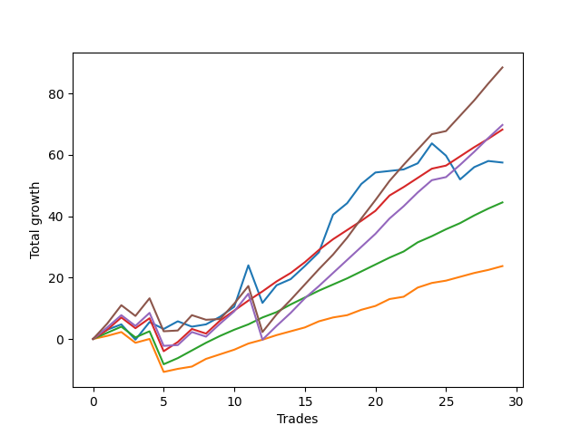

# Long Shepard 002 
- Symbol: ES_SmolBoiHour
- Date Range: 03/18/2022 - 07/29/2022
- Trading Period: 7:20-12:30
- Number of Trades: 29



| Name | Win Percent | Profit | Avg Profit / Trade | Avg Time / Trade |      | Name | Win Percent | Profit | Avg Profit / Trade | Avg Time / Trade |
| ---- | ----------- | ------ | ------------------ | ---------------- | ---- | ---- | ----------- | ------ | ------------------ | ---------------- |
| Sorted By <br> Profit | | | | | | Sorted By <br> Win Percentage ||||
| Eighty-Five | 86.21 | 44250.00 | 1525.86 | 24:51 |     | Eighty-Two | 93.10 | 22250.00 | 767.24 | 11:56 |
| Eighty-Four | 86.21 | 34875.00 | 1202.59 | 21:19 |     | Eighty-One | 93.10 | 11875.00 | 409.48 | 07:32 |
| Eighty-Three | 89.66 | 34125.00 | 1176.72 | 16:01 |     | Eighty-Three | 89.66 | 34125.00 | 1176.72 | 16:01 |
| Two | 75.86 | 28750.00 | 991.38 | 18:38 |     | Eighty-Five | 86.21 | 44250.00 | 1525.86 | 24:51 |
| Eighty-Two | 93.10 | 22250.00 | 767.24 | 11:56 |     | Eighty-Four | 86.21 | 34875.00 | 1202.59 | 21:19 |
| Eighty-One | 93.10 | 11875.00 | 409.48 | 07:32 |     | Two | 75.86 | 28750.00 | 991.38 | 18:38 |

## NO STOPLOSS

### Test Two
* Sell when the price hits the upper line of the 20p 2std bollinger
* No Stoploss
* Results:
```
Total Trades: 29
Percent Up: 75.86
Percent Down: 24.14
Total Points Moved Up: 57.50
Potential Profit: 28750.00
Total Points Ups: 91.00 Count Ups: 22
Total Points Downs: -33.50 Count Downs: 7
```

<details><summary>Trades</summary>

<code>In: 2022-03-22 09:35:00		Out: 2022-03-22 09:41:50		Total Position Time: 06:50		Total Move Up: 3.00		Total to Date: 3.00</code> <br />
<code>In: 2022-03-22 11:33:00		Out: 2022-03-22 11:53:55		Total Position Time: 20:55		Total Move Up: 1.75		Total to Date: 4.75</code> <br />
<code>In: 2022-03-25 08:18:00		Out: 2022-03-25 08:41:45		Total Position Time: 23:45		Total Move Up: -5.00		Total to Date: -0.25</code> <br />
<code>In: 2022-03-31 08:37:00		Out: 2022-03-31 08:41:10		Total Position Time: 04:10		Total Move Up: 5.75		Total to Date: 5.50</code> <br />
<code>In: 2022-03-31 09:16:00		Out: 2022-03-31 09:44:20		Total Position Time: 28:20		Total Move Up: -2.25		Total to Date: 3.25</code> <br />
<code>In: 2022-03-31 09:30:00		Out: 2022-03-31 09:44:20		Total Position Time: 14:20		Total Move Up: 2.50		Total to Date: 5.75</code> <br />
<code>In: 2022-04-12 07:47:00		Out: 2022-04-12 08:15:45		Total Position Time: 28:45		Total Move Up: -1.75		Total to Date: 4.00</code> <br />
<code>In: 2022-04-27 12:07:00		Out: 2022-04-27 12:31:20		Total Position Time: 24:20		Total Move Up: 0.75		Total to Date: 4.75</code> <br />
<code>In: 2022-04-27 12:11:00		Out: 2022-04-27 12:31:20		Total Position Time: 20:20		Total Move Up: 2.50		Total to Date: 7.25</code> <br />
<code>In: 2022-05-03 11:23:00		Out: 2022-05-03 11:34:50		Total Position Time: 11:50		Total Move Up: 3.25		Total to Date: 10.50</code> <br />
<code>In: 2022-05-04 11:24:00		Out: 2022-05-04 11:27:35		Total Position Time: 03:35		Total Move Up: 13.50		Total to Date: 24.00</code> <br />
<code>In: 2022-05-13 10:49:00		Out: 2022-05-13 11:31:20		Total Position Time: 42:20		Total Move Up: -12.25		Total to Date: 11.75</code> <br />
<code>In: 2022-05-13 11:10:00		Out: 2022-05-13 11:31:20		Total Position Time: 21:20		Total Move Up: 5.75		Total to Date: 17.50</code> <br />
<code>In: 2022-05-16 07:58:00		Out: 2022-05-16 08:11:30		Total Position Time: 13:30		Total Move Up: 2.00		Total to Date: 19.50</code> <br />
<code>In: 2022-05-16 08:02:00		Out: 2022-05-16 08:11:30		Total Position Time: 09:30		Total Move Up: 4.25		Total to Date: 23.75</code> <br />
<code>In: 2022-05-16 09:47:00		Out: 2022-05-16 10:06:30		Total Position Time: 19:30		Total Move Up: 4.50		Total to Date: 28.25</code> <br />
<code>In: 2022-05-24 11:57:00		Out: 2022-05-24 12:03:30		Total Position Time: 06:30		Total Move Up: 12.25		Total to Date: 40.50</code> <br />
<code>In: 2022-05-25 09:39:00		Out: 2022-05-25 09:45:20		Total Position Time: 06:20		Total Move Up: 3.75		Total to Date: 44.25</code> <br />
<code>In: 2022-05-31 11:59:00		Out: 2022-05-31 12:15:05		Total Position Time: 16:05		Total Move Up: 6.25		Total to Date: 50.50</code> <br />
<code>In: 2022-06-06 08:24:00		Out: 2022-06-06 08:43:00		Total Position Time: 19:00		Total Move Up: 3.75		Total to Date: 54.25</code> <br />
<code>In: 2022-06-17 12:18:00		Out: 2022-06-17 12:46:00		Total Position Time: 28:00		Total Move Up: 0.50		Total to Date: 54.75</code> <br />
<code>In: 2022-06-21 09:02:00		Out: 2022-06-21 09:19:55		Total Position Time: 17:55		Total Move Up: 0.50		Total to Date: 55.25</code> <br />
<code>In: 2022-06-22 09:01:00		Out: 2022-06-22 09:18:30		Total Position Time: 17:30		Total Move Up: 2.00		Total to Date: 57.25</code> <br />
<code>In: 2022-06-27 09:36:00		Out: 2022-06-27 09:45:00		Total Position Time: 09:00		Total Move Up: 6.50		Total to Date: 63.75</code> <br />
<code>In: 2022-07-08 09:36:00		Out: 2022-07-08 10:10:30		Total Position Time: 34:30		Total Move Up: -4.00		Total to Date: 59.75</code> <br />
<code>In: 2022-07-20 09:52:00		Out: 2022-07-20 10:28:15		Total Position Time: 36:15		Total Move Up: -7.75		Total to Date: 52.00</code> <br />
<code>In: 2022-07-25 09:23:00		Out: 2022-07-25 09:32:05		Total Position Time: 09:05		Total Move Up: 4.00		Total to Date: 56.00</code> <br />
<code>In: 2022-07-27 10:10:00		Out: 2022-07-27 10:28:40		Total Position Time: 18:40		Total Move Up: 2.00		Total to Date: 58.00</code> <br />
<code>In: 2022-07-29 08:13:00		Out: 2022-07-29 08:41:15		Total Position Time: 28:15		Total Move Up: -0.50		Total to Date: 57.50</code> <br />


</details>

## TAKE PROFIT

### Test Eighty-One
* Take Profit of 1 Point
* No Stoploss
* Results:
```
Total Trades: 29
Percent Up: 93.10
Percent Down: 6.90
Total Points Moved Up: 23.75
Potential Profit: 11875.00
Total Points Ups: 38.00 Count Ups: 27
Total Points Downs: -14.25 Count Downs: 2
```

<details><summary>Trades</summary>

<code>In: 2022-03-22 09:35:00		Out: 2022-03-22 09:35:10		Total Position Time: 00:10		Total Move Up: 1.00		Total to Date: 1.00</code> <br />
<code>In: 2022-03-22 11:33:00		Out: 2022-03-22 11:34:50		Total Position Time: 01:50		Total Move Up: 1.25		Total to Date: 2.25</code> <br />
<code>In: 2022-03-25 08:18:00		Out: 2022-03-25 09:17:55		Total Position Time: 59:55		Total Move Up: -3.50		Total to Date: -1.25</code> <br />
<code>In: 2022-03-31 08:37:00		Out: 2022-03-31 08:37:40		Total Position Time: 00:40		Total Move Up: 1.25		Total to Date: 0.00</code> <br />
<code>In: 2022-03-31 09:16:00		Out: 2022-03-31 10:15:55		Total Position Time: 59:55		Total Move Up: -10.75		Total to Date: -10.75</code> <br />
<code>In: 2022-03-31 09:30:00		Out: 2022-03-31 09:30:30		Total Position Time: 00:30		Total Move Up: 1.00		Total to Date: -9.75</code> <br />
<code>In: 2022-04-12 07:47:00		Out: 2022-04-12 08:19:00		Total Position Time: 32:00		Total Move Up: 0.75		Total to Date: -9.00</code> <br />
<code>In: 2022-04-27 12:07:00		Out: 2022-04-27 12:15:20		Total Position Time: 08:20		Total Move Up: 2.50		Total to Date: -6.50</code> <br />
<code>In: 2022-04-27 12:11:00		Out: 2022-04-27 12:13:55		Total Position Time: 02:55		Total Move Up: 1.50		Total to Date: -5.00</code> <br />
<code>In: 2022-05-03 11:23:00		Out: 2022-05-03 11:32:20		Total Position Time: 09:20		Total Move Up: 1.50		Total to Date: -3.50</code> <br />
<code>In: 2022-05-04 11:24:00		Out: 2022-05-04 11:24:15		Total Position Time: 00:15		Total Move Up: 2.00		Total to Date: -1.50</code> <br />
<code>In: 2022-05-13 10:49:00		Out: 2022-05-13 10:49:30		Total Position Time: 00:30		Total Move Up: 1.25		Total to Date: -0.25</code> <br />
<code>In: 2022-05-13 11:10:00		Out: 2022-05-13 11:10:15		Total Position Time: 00:15		Total Move Up: 1.50		Total to Date: 1.25</code> <br />
<code>In: 2022-05-16 07:58:00		Out: 2022-05-16 08:09:55		Total Position Time: 11:55		Total Move Up: 1.25		Total to Date: 2.50</code> <br />
<code>In: 2022-05-16 08:02:00		Out: 2022-05-16 08:09:40		Total Position Time: 07:40		Total Move Up: 1.25		Total to Date: 3.75</code> <br />
<code>In: 2022-05-16 09:47:00		Out: 2022-05-16 09:47:50		Total Position Time: 00:50		Total Move Up: 2.00		Total to Date: 5.75</code> <br />
<code>In: 2022-05-24 11:57:00		Out: 2022-05-24 11:57:30		Total Position Time: 00:30		Total Move Up: 1.25		Total to Date: 7.00</code> <br />
<code>In: 2022-05-25 09:39:00		Out: 2022-05-25 09:42:00		Total Position Time: 03:00		Total Move Up: 0.75		Total to Date: 7.75</code> <br />
<code>In: 2022-05-31 11:59:00		Out: 2022-05-31 11:59:10		Total Position Time: 00:10		Total Move Up: 1.75		Total to Date: 9.50</code> <br />
<code>In: 2022-06-06 08:24:00		Out: 2022-06-06 08:26:35		Total Position Time: 02:35		Total Move Up: 1.25		Total to Date: 10.75</code> <br />
<code>In: 2022-06-17 12:18:00		Out: 2022-06-17 12:18:10		Total Position Time: 00:10		Total Move Up: 2.25		Total to Date: 13.00</code> <br />
<code>In: 2022-06-21 09:02:00		Out: 2022-06-21 09:02:20		Total Position Time: 00:20		Total Move Up: 0.75		Total to Date: 13.75</code> <br />
<code>In: 2022-06-22 09:01:00		Out: 2022-06-22 09:01:20		Total Position Time: 00:20		Total Move Up: 3.00		Total to Date: 16.75</code> <br />
<code>In: 2022-06-27 09:36:00		Out: 2022-06-27 09:38:00		Total Position Time: 02:00		Total Move Up: 1.50		Total to Date: 18.25</code> <br />
<code>In: 2022-07-08 09:36:00		Out: 2022-07-08 09:36:10		Total Position Time: 00:10		Total Move Up: 0.75		Total to Date: 19.00</code> <br />
<code>In: 2022-07-20 09:52:00		Out: 2022-07-20 09:52:10		Total Position Time: 00:10		Total Move Up: 1.25		Total to Date: 20.25</code> <br />
<code>In: 2022-07-25 09:23:00		Out: 2022-07-25 09:27:25		Total Position Time: 04:25		Total Move Up: 1.25		Total to Date: 21.50</code> <br />
<code>In: 2022-07-27 10:10:00		Out: 2022-07-27 10:11:10		Total Position Time: 01:10		Total Move Up: 1.00		Total to Date: 22.50</code> <br />
<code>In: 2022-07-29 08:13:00		Out: 2022-07-29 08:19:40		Total Position Time: 06:40		Total Move Up: 1.25		Total to Date: 23.75</code> <br />


</details>

### Test Eighty-Two
* Take Profit of 2 Point
* No Stoploss
* Results:
```
Total Trades: 29
Percent Up: 93.10
Percent Down: 6.90
Total Points Moved Up: 44.50
Potential Profit: 22250.00
Total Points Ups: 58.75 Count Ups: 27
Total Points Downs: -14.25 Count Downs: 2
```

<details><summary>Trades</summary>

<code>In: 2022-03-22 09:35:00		Out: 2022-03-22 09:35:15		Total Position Time: 00:15		Total Move Up: 2.00		Total to Date: 2.00</code> <br />
<code>In: 2022-03-22 11:33:00		Out: 2022-03-22 11:54:00		Total Position Time: 21:00		Total Move Up: 2.00		Total to Date: 4.00</code> <br />
<code>In: 2022-03-25 08:18:00		Out: 2022-03-25 09:17:55		Total Position Time: 59:55		Total Move Up: -3.50		Total to Date: 0.50</code> <br />
<code>In: 2022-03-31 08:37:00		Out: 2022-03-31 08:38:15		Total Position Time: 01:15		Total Move Up: 2.00		Total to Date: 2.50</code> <br />
<code>In: 2022-03-31 09:16:00		Out: 2022-03-31 10:15:55		Total Position Time: 59:55		Total Move Up: -10.75		Total to Date: -8.25</code> <br />
<code>In: 2022-03-31 09:30:00		Out: 2022-03-31 09:32:50		Total Position Time: 02:50		Total Move Up: 2.00		Total to Date: -6.25</code> <br />
<code>In: 2022-04-12 07:47:00		Out: 2022-04-12 08:19:50		Total Position Time: 32:50		Total Move Up: 2.50		Total to Date: -3.75</code> <br />
<code>In: 2022-04-27 12:07:00		Out: 2022-04-27 12:15:20		Total Position Time: 08:20		Total Move Up: 2.50		Total to Date: -1.25</code> <br />
<code>In: 2022-04-27 12:11:00		Out: 2022-04-27 12:14:00		Total Position Time: 03:00		Total Move Up: 2.25		Total to Date: 1.00</code> <br />
<code>In: 2022-05-03 11:23:00		Out: 2022-05-03 11:34:45		Total Position Time: 11:45		Total Move Up: 2.00		Total to Date: 3.00</code> <br />
<code>In: 2022-05-04 11:24:00		Out: 2022-05-04 11:26:45		Total Position Time: 02:45		Total Move Up: 1.75		Total to Date: 4.75</code> <br />
<code>In: 2022-05-13 10:49:00		Out: 2022-05-13 10:49:45		Total Position Time: 00:45		Total Move Up: 2.25		Total to Date: 7.00</code> <br />
<code>In: 2022-05-13 11:10:00		Out: 2022-05-13 11:10:20		Total Position Time: 00:20		Total Move Up: 1.75		Total to Date: 8.75</code> <br />
<code>In: 2022-05-16 07:58:00		Out: 2022-05-16 08:11:15		Total Position Time: 13:15		Total Move Up: 2.50		Total to Date: 11.25</code> <br />
<code>In: 2022-05-16 08:02:00		Out: 2022-05-16 08:09:50		Total Position Time: 07:50		Total Move Up: 2.25		Total to Date: 13.50</code> <br />
<code>In: 2022-05-16 09:47:00		Out: 2022-05-16 09:47:55		Total Position Time: 00:55		Total Move Up: 2.25		Total to Date: 15.75</code> <br />
<code>In: 2022-05-24 11:57:00		Out: 2022-05-24 11:57:40		Total Position Time: 00:40		Total Move Up: 2.00		Total to Date: 17.75</code> <br />
<code>In: 2022-05-25 09:39:00		Out: 2022-05-25 09:44:30		Total Position Time: 05:30		Total Move Up: 2.00		Total to Date: 19.75</code> <br />
<code>In: 2022-05-31 11:59:00		Out: 2022-05-31 12:09:20		Total Position Time: 10:20		Total Move Up: 2.25		Total to Date: 22.00</code> <br />
<code>In: 2022-06-06 08:24:00		Out: 2022-06-06 08:27:45		Total Position Time: 03:45		Total Move Up: 2.25		Total to Date: 24.25</code> <br />
<code>In: 2022-06-17 12:18:00		Out: 2022-06-17 12:18:10		Total Position Time: 00:10		Total Move Up: 2.25		Total to Date: 26.50</code> <br />
<code>In: 2022-06-21 09:02:00		Out: 2022-06-21 09:25:30		Total Position Time: 23:30		Total Move Up: 2.00		Total to Date: 28.50</code> <br />
<code>In: 2022-06-22 09:01:00		Out: 2022-06-22 09:01:20		Total Position Time: 00:20		Total Move Up: 3.00		Total to Date: 31.50</code> <br />
<code>In: 2022-06-27 09:36:00		Out: 2022-06-27 09:38:05		Total Position Time: 02:05		Total Move Up: 2.00		Total to Date: 33.50</code> <br />
<code>In: 2022-07-08 09:36:00		Out: 2022-07-08 10:29:10		Total Position Time: 53:10		Total Move Up: 2.25		Total to Date: 35.75</code> <br />
<code>In: 2022-07-20 09:52:00		Out: 2022-07-20 09:53:10		Total Position Time: 01:10		Total Move Up: 2.00		Total to Date: 37.75</code> <br />
<code>In: 2022-07-25 09:23:00		Out: 2022-07-25 09:28:20		Total Position Time: 05:20		Total Move Up: 2.50		Total to Date: 40.25</code> <br />
<code>In: 2022-07-27 10:10:00		Out: 2022-07-27 10:15:50		Total Position Time: 05:50		Total Move Up: 2.25		Total to Date: 42.50</code> <br />
<code>In: 2022-07-29 08:13:00		Out: 2022-07-29 08:20:20		Total Position Time: 07:20		Total Move Up: 2.00		Total to Date: 44.50</code> <br />


</details>

### Test Eighty-Three
* Take Profit of 3 Point
* No Stoploss
* Results:
```
Total Trades: 29
Percent Up: 89.66
Percent Down: 10.34
Total Points Moved Up: 68.25
Potential Profit: 34125.00
Total Points Ups: 84.00 Count Ups: 26
Total Points Downs: -15.75 Count Downs: 3
```

<details><summary>Trades</summary>

<code>In: 2022-03-22 09:35:00		Out: 2022-03-22 09:41:50		Total Position Time: 06:50		Total Move Up: 3.00		Total to Date: 3.00</code> <br />
<code>In: 2022-03-22 11:33:00		Out: 2022-03-22 11:56:05		Total Position Time: 23:05		Total Move Up: 4.00		Total to Date: 7.00</code> <br />
<code>In: 2022-03-25 08:18:00		Out: 2022-03-25 09:17:55		Total Position Time: 59:55		Total Move Up: -3.50		Total to Date: 3.50</code> <br />
<code>In: 2022-03-31 08:37:00		Out: 2022-03-31 08:40:35		Total Position Time: 03:35		Total Move Up: 3.25		Total to Date: 6.75</code> <br />
<code>In: 2022-03-31 09:16:00		Out: 2022-03-31 10:15:55		Total Position Time: 59:55		Total Move Up: -10.75		Total to Date: -4.00</code> <br />
<code>In: 2022-03-31 09:30:00		Out: 2022-03-31 09:44:50		Total Position Time: 14:50		Total Move Up: 3.00		Total to Date: -1.00</code> <br />
<code>In: 2022-04-12 07:47:00		Out: 2022-04-12 08:20:35		Total Position Time: 33:35		Total Move Up: 4.25		Total to Date: 3.25</code> <br />
<code>In: 2022-04-27 12:07:00		Out: 2022-04-27 12:46:00		Total Position Time: 39:00		Total Move Up: -1.50		Total to Date: 1.75</code> <br />
<code>In: 2022-04-27 12:11:00		Out: 2022-04-27 12:15:20		Total Position Time: 04:20		Total Move Up: 4.25		Total to Date: 6.00</code> <br />
<code>In: 2022-05-03 11:23:00		Out: 2022-05-03 11:34:50		Total Position Time: 11:50		Total Move Up: 3.25		Total to Date: 9.25</code> <br />
<code>In: 2022-05-04 11:24:00		Out: 2022-05-04 11:26:50		Total Position Time: 02:50		Total Move Up: 3.25		Total to Date: 12.50</code> <br />
<code>In: 2022-05-13 10:49:00		Out: 2022-05-13 10:51:45		Total Position Time: 02:45		Total Move Up: 3.00		Total to Date: 15.50</code> <br />
<code>In: 2022-05-13 11:10:00		Out: 2022-05-13 11:10:50		Total Position Time: 00:50		Total Move Up: 3.25		Total to Date: 18.75</code> <br />
<code>In: 2022-05-16 07:58:00		Out: 2022-05-16 08:12:00		Total Position Time: 14:00		Total Move Up: 2.75		Total to Date: 21.50</code> <br />
<code>In: 2022-05-16 08:02:00		Out: 2022-05-16 08:09:55		Total Position Time: 07:55		Total Move Up: 3.50		Total to Date: 25.00</code> <br />
<code>In: 2022-05-16 09:47:00		Out: 2022-05-16 09:48:15		Total Position Time: 01:15		Total Move Up: 4.00		Total to Date: 29.00</code> <br />
<code>In: 2022-05-24 11:57:00		Out: 2022-05-24 11:58:35		Total Position Time: 01:35		Total Move Up: 3.50		Total to Date: 32.50</code> <br />
<code>In: 2022-05-25 09:39:00		Out: 2022-05-25 09:45:15		Total Position Time: 06:15		Total Move Up: 3.00		Total to Date: 35.50</code> <br />
<code>In: 2022-05-31 11:59:00		Out: 2022-05-31 12:09:40		Total Position Time: 10:40		Total Move Up: 3.00		Total to Date: 38.50</code> <br />
<code>In: 2022-06-06 08:24:00		Out: 2022-06-06 08:31:35		Total Position Time: 07:35		Total Move Up: 3.25		Total to Date: 41.75</code> <br />
<code>In: 2022-06-17 12:18:00		Out: 2022-06-17 12:20:25		Total Position Time: 02:25		Total Move Up: 5.00		Total to Date: 46.75</code> <br />
<code>In: 2022-06-21 09:02:00		Out: 2022-06-21 09:26:10		Total Position Time: 24:10		Total Move Up: 2.75		Total to Date: 49.50</code> <br />
<code>In: 2022-06-22 09:01:00		Out: 2022-06-22 09:01:20		Total Position Time: 00:20		Total Move Up: 3.00		Total to Date: 52.50</code> <br />
<code>In: 2022-06-27 09:36:00		Out: 2022-06-27 09:41:00		Total Position Time: 05:00		Total Move Up: 3.00		Total to Date: 55.50</code> <br />
<code>In: 2022-07-08 09:36:00		Out: 2022-07-08 10:35:55		Total Position Time: 59:55		Total Move Up: 1.00		Total to Date: 56.50</code> <br />
<code>In: 2022-07-20 09:52:00		Out: 2022-07-20 09:54:05		Total Position Time: 02:05		Total Move Up: 3.00		Total to Date: 59.50</code> <br />
<code>In: 2022-07-25 09:23:00		Out: 2022-07-25 09:30:10		Total Position Time: 07:10		Total Move Up: 3.00		Total to Date: 62.50</code> <br />
<code>In: 2022-07-27 10:10:00		Out: 2022-07-27 10:30:05		Total Position Time: 20:05		Total Move Up: 2.75		Total to Date: 65.25</code> <br />
<code>In: 2022-07-29 08:13:00		Out: 2022-07-29 08:44:00		Total Position Time: 31:00		Total Move Up: 3.00		Total to Date: 68.25</code> <br />


</details>

### Test Eighty-Four
* Take Profit of 4 Point
* No Stoploss
* Results:
```
Total Trades: 29
Percent Up: 86.21
Percent Down: 13.79
Total Points Moved Up: 69.75
Potential Profit: 34875.00
Total Points Ups: 100.50 Count Ups: 25
Total Points Downs: -30.75 Count Downs: 4
```

<details><summary>Trades</summary>

<code>In: 2022-03-22 09:35:00		Out: 2022-03-22 09:50:05		Total Position Time: 15:05		Total Move Up: 3.75		Total to Date: 3.75</code> <br />
<code>In: 2022-03-22 11:33:00		Out: 2022-03-22 11:56:05		Total Position Time: 23:05		Total Move Up: 4.00		Total to Date: 7.75</code> <br />
<code>In: 2022-03-25 08:18:00		Out: 2022-03-25 09:17:55		Total Position Time: 59:55		Total Move Up: -3.50		Total to Date: 4.25</code> <br />
<code>In: 2022-03-31 08:37:00		Out: 2022-03-31 08:41:05		Total Position Time: 04:05		Total Move Up: 4.25		Total to Date: 8.50</code> <br />
<code>In: 2022-03-31 09:16:00		Out: 2022-03-31 10:15:55		Total Position Time: 59:55		Total Move Up: -10.75		Total to Date: -2.25</code> <br />
<code>In: 2022-03-31 09:30:00		Out: 2022-03-31 10:29:55		Total Position Time: 59:55		Total Move Up: 0.25		Total to Date: -2.00</code> <br />
<code>In: 2022-04-12 07:47:00		Out: 2022-04-12 08:20:35		Total Position Time: 33:35		Total Move Up: 4.25		Total to Date: 2.25</code> <br />
<code>In: 2022-04-27 12:07:00		Out: 2022-04-27 12:46:00		Total Position Time: 39:00		Total Move Up: -1.50		Total to Date: 0.75</code> <br />
<code>In: 2022-04-27 12:11:00		Out: 2022-04-27 12:15:20		Total Position Time: 04:20		Total Move Up: 4.25		Total to Date: 5.00</code> <br />
<code>In: 2022-05-03 11:23:00		Out: 2022-05-03 11:35:00		Total Position Time: 12:00		Total Move Up: 4.00		Total to Date: 9.00</code> <br />
<code>In: 2022-05-04 11:24:00		Out: 2022-05-04 11:26:55		Total Position Time: 02:55		Total Move Up: 5.75		Total to Date: 14.75</code> <br />
<code>In: 2022-05-13 10:49:00		Out: 2022-05-13 11:48:55		Total Position Time: 59:55		Total Move Up: -15.00		Total to Date: -0.25</code> <br />
<code>In: 2022-05-13 11:10:00		Out: 2022-05-13 11:12:25		Total Position Time: 02:25		Total Move Up: 4.50		Total to Date: 4.25</code> <br />
<code>In: 2022-05-16 07:58:00		Out: 2022-05-16 08:16:25		Total Position Time: 18:25		Total Move Up: 4.25		Total to Date: 8.50</code> <br />
<code>In: 2022-05-16 08:02:00		Out: 2022-05-16 08:11:15		Total Position Time: 09:15		Total Move Up: 4.75		Total to Date: 13.25</code> <br />
<code>In: 2022-05-16 09:47:00		Out: 2022-05-16 09:48:15		Total Position Time: 01:15		Total Move Up: 4.00		Total to Date: 17.25</code> <br />
<code>In: 2022-05-24 11:57:00		Out: 2022-05-24 11:58:40		Total Position Time: 01:40		Total Move Up: 4.25		Total to Date: 21.50</code> <br />
<code>In: 2022-05-25 09:39:00		Out: 2022-05-25 09:48:10		Total Position Time: 09:10		Total Move Up: 4.25		Total to Date: 25.75</code> <br />
<code>In: 2022-05-31 11:59:00		Out: 2022-05-31 12:09:55		Total Position Time: 10:55		Total Move Up: 4.25		Total to Date: 30.00</code> <br />
<code>In: 2022-06-06 08:24:00		Out: 2022-06-06 08:44:10		Total Position Time: 20:10		Total Move Up: 4.25		Total to Date: 34.25</code> <br />
<code>In: 2022-06-17 12:18:00		Out: 2022-06-17 12:20:25		Total Position Time: 02:25		Total Move Up: 5.00		Total to Date: 39.25</code> <br />
<code>In: 2022-06-21 09:02:00		Out: 2022-06-21 09:35:55		Total Position Time: 33:55		Total Move Up: 4.00		Total to Date: 43.25</code> <br />
<code>In: 2022-06-22 09:01:00		Out: 2022-06-22 09:01:50		Total Position Time: 00:50		Total Move Up: 4.50		Total to Date: 47.75</code> <br />
<code>In: 2022-06-27 09:36:00		Out: 2022-06-27 09:41:15		Total Position Time: 05:15		Total Move Up: 4.00		Total to Date: 51.75</code> <br />
<code>In: 2022-07-08 09:36:00		Out: 2022-07-08 10:35:55		Total Position Time: 59:55		Total Move Up: 1.00		Total to Date: 52.75</code> <br />
<code>In: 2022-07-20 09:52:00		Out: 2022-07-20 09:56:55		Total Position Time: 04:55		Total Move Up: 4.00		Total to Date: 56.75</code> <br />
<code>In: 2022-07-25 09:23:00		Out: 2022-07-25 09:32:00		Total Position Time: 09:00		Total Move Up: 4.25		Total to Date: 61.00</code> <br />
<code>In: 2022-07-27 10:10:00		Out: 2022-07-27 10:32:45		Total Position Time: 22:45		Total Move Up: 4.50		Total to Date: 65.50</code> <br />
<code>In: 2022-07-29 08:13:00		Out: 2022-07-29 08:45:15		Total Position Time: 32:15		Total Move Up: 4.25		Total to Date: 69.75</code> <br />


</details>

### Test Eighty-Five
* Take Profit of 5 Point
* No Stoploss
* Results:
```
Total Trades: 29
Percent Up: 86.21
Percent Down: 13.79
Total Points Moved Up: 88.50
Potential Profit: 44250.00
Total Points Ups: 119.25 Count Ups: 25
Total Points Downs: -30.75 Count Downs: 4
```

<details><summary>Trades</summary>

<code>In: 2022-03-22 09:35:00		Out: 2022-03-22 09:50:45		Total Position Time: 15:45		Total Move Up: 5.00		Total to Date: 5.00</code> <br />
<code>In: 2022-03-22 11:33:00		Out: 2022-03-22 12:03:05		Total Position Time: 30:05		Total Move Up: 6.00		Total to Date: 11.00</code> <br />
<code>In: 2022-03-25 08:18:00		Out: 2022-03-25 09:17:55		Total Position Time: 59:55		Total Move Up: -3.50		Total to Date: 7.50</code> <br />
<code>In: 2022-03-31 08:37:00		Out: 2022-03-31 08:41:10		Total Position Time: 04:10		Total Move Up: 5.75		Total to Date: 13.25</code> <br />
<code>In: 2022-03-31 09:16:00		Out: 2022-03-31 10:15:55		Total Position Time: 59:55		Total Move Up: -10.75		Total to Date: 2.50</code> <br />
<code>In: 2022-03-31 09:30:00		Out: 2022-03-31 10:29:55		Total Position Time: 59:55		Total Move Up: 0.25		Total to Date: 2.75</code> <br />
<code>In: 2022-04-12 07:47:00		Out: 2022-04-12 08:21:05		Total Position Time: 34:05		Total Move Up: 5.00		Total to Date: 7.75</code> <br />
<code>In: 2022-04-27 12:07:00		Out: 2022-04-27 12:46:00		Total Position Time: 39:00		Total Move Up: -1.50		Total to Date: 6.25</code> <br />
<code>In: 2022-04-27 12:11:00		Out: 2022-04-27 12:46:00		Total Position Time: 35:00		Total Move Up: 0.25		Total to Date: 6.50</code> <br />
<code>In: 2022-05-03 11:23:00		Out: 2022-05-03 11:35:15		Total Position Time: 12:15		Total Move Up: 5.00		Total to Date: 11.50</code> <br />
<code>In: 2022-05-04 11:24:00		Out: 2022-05-04 11:26:55		Total Position Time: 02:55		Total Move Up: 5.75		Total to Date: 17.25</code> <br />
<code>In: 2022-05-13 10:49:00		Out: 2022-05-13 11:48:55		Total Position Time: 59:55		Total Move Up: -15.00		Total to Date: 2.25</code> <br />
<code>In: 2022-05-13 11:10:00		Out: 2022-05-13 11:31:20		Total Position Time: 21:20		Total Move Up: 5.75		Total to Date: 8.00</code> <br />
<code>In: 2022-05-16 07:58:00		Out: 2022-05-16 08:17:00		Total Position Time: 19:00		Total Move Up: 4.75		Total to Date: 12.75</code> <br />
<code>In: 2022-05-16 08:02:00		Out: 2022-05-16 08:11:35		Total Position Time: 09:35		Total Move Up: 5.00		Total to Date: 17.75</code> <br />
<code>In: 2022-05-16 09:47:00		Out: 2022-05-16 09:48:45		Total Position Time: 01:45		Total Move Up: 5.00		Total to Date: 22.75</code> <br />
<code>In: 2022-05-24 11:57:00		Out: 2022-05-24 12:00:20		Total Position Time: 03:20		Total Move Up: 4.75		Total to Date: 27.50</code> <br />
<code>In: 2022-05-25 09:39:00		Out: 2022-05-25 09:48:50		Total Position Time: 09:50		Total Move Up: 5.50		Total to Date: 33.00</code> <br />
<code>In: 2022-05-31 11:59:00		Out: 2022-05-31 12:15:05		Total Position Time: 16:05		Total Move Up: 6.25		Total to Date: 39.25</code> <br />
<code>In: 2022-06-06 08:24:00		Out: 2022-06-06 08:44:30		Total Position Time: 20:30		Total Move Up: 6.00		Total to Date: 45.25</code> <br />
<code>In: 2022-06-17 12:18:00		Out: 2022-06-17 12:20:30		Total Position Time: 02:30		Total Move Up: 6.25		Total to Date: 51.50</code> <br />
<code>In: 2022-06-21 09:02:00		Out: 2022-06-21 09:37:30		Total Position Time: 35:30		Total Move Up: 5.25		Total to Date: 56.75</code> <br />
<code>In: 2022-06-22 09:01:00		Out: 2022-06-22 09:22:45		Total Position Time: 21:45		Total Move Up: 5.00		Total to Date: 61.75</code> <br />
<code>In: 2022-06-27 09:36:00		Out: 2022-06-27 09:44:20		Total Position Time: 08:20		Total Move Up: 5.00		Total to Date: 66.75</code> <br />
<code>In: 2022-07-08 09:36:00		Out: 2022-07-08 10:35:55		Total Position Time: 59:55		Total Move Up: 1.00		Total to Date: 67.75</code> <br />
<code>In: 2022-07-20 09:52:00		Out: 2022-07-20 09:57:30		Total Position Time: 05:30		Total Move Up: 5.00		Total to Date: 72.75</code> <br />
<code>In: 2022-07-25 09:23:00		Out: 2022-07-25 09:32:20		Total Position Time: 09:20		Total Move Up: 5.00		Total to Date: 77.75</code> <br />
<code>In: 2022-07-27 10:10:00		Out: 2022-07-27 10:33:20		Total Position Time: 23:20		Total Move Up: 5.50		Total to Date: 83.25</code> <br />
<code>In: 2022-07-29 08:13:00		Out: 2022-07-29 08:53:25		Total Position Time: 40:25		Total Move Up: 5.25		Total to Date: 88.50</code> <br />


</details>