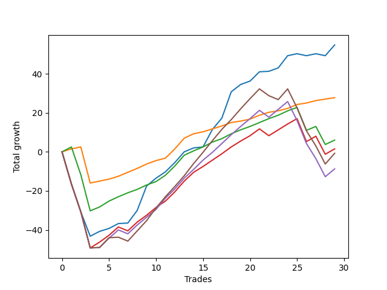

# Long Shepard 003 DB 
- Symbol: ES_SmolBoiHour
- Date Range: 03/18/2022 - 07/29/2022
- Trading Period: 7:20-12:30
- Number of Trades: 29



| Name | Win Percent | Profit | Avg Profit / Trade | Avg Time / Trade |      | Name | Win Percent | Profit | Avg Profit / Trade | Avg Time / Trade |
| ---- | ----------- | ------ | ------------------ | ---------------- | ---- | ---- | ----------- | ------ | ------------------ | ---------------- |
| Sorted By <br> Profit | | | | | | Sorted By <br> Win Percentage ||||
| Two | 82.76 | 27375.00 | 943.97 | 18:45 |     | Eighty-One | 96.55 | 13875.00 | 478.45 | 04:20 |
| Eighty-One | 96.55 | 13875.00 | 478.45 | 04:20 |     | Eighty-Two | 86.21 | 3000.00 | 103.45 | 11:53 |
| Eighty-Two | 86.21 | 3000.00 | 103.45 | 11:53 |     | Two | 82.76 | 27375.00 | 943.97 | 18:45 |
| Eighty-Three | 75.86 | 750.00 | 25.86 | 17:21 |     | Eighty-Three | 75.86 | 750.00 | 25.86 | 17:21 |
| Eighty-Five | 65.52 | -375.00 | -12.93 | 27:06 |     | Eighty-Four | 68.97 | -4375.00 | -150.86 | 23:26 |
| Eighty-Four | 68.97 | -4375.00 | -150.86 | 23:26 |     | Eighty-Five | 65.52 | -375.00 | -12.93 | 27:06 |

## NO STOPLOSS

### Test Two
* Sell when the price hits the upper line of the 20p 2std bollinger
* No Stoploss
* Results:
```
Total Trades: 29
Percent Up: 82.76
Percent Down: 17.24
Total Points Moved Up: 54.75
Potential Profit: 27375.00
Total Points Ups: 100.00 Count Ups: 24
Total Points Downs: -45.25 Count Downs: 5
```

<details><summary>Trades</summary>

<code>In: 2022-03-23 09:49:00		Out: 2022-03-23 10:48:55		Total Position Time: 59:55		Total Move Up: -16.50		Total to Date: -16.50</code> <br />
<code>In: 2022-03-23 09:53:00		Out: 2022-03-23 10:52:55		Total Position Time: 59:55		Total Move Up: -14.25		Total to Date: -30.75</code> <br />
<code>In: 2022-03-28 08:30:00		Out: 2022-03-28 09:07:10		Total Position Time: 37:10		Total Move Up: -12.50		Total to Date: -43.25</code> <br />
<code>In: 2022-03-31 09:30:00		Out: 2022-03-31 09:44:20		Total Position Time: 14:20		Total Move Up: 2.50		Total to Date: -40.75</code> <br />
<code>In: 2022-04-20 11:48:00		Out: 2022-04-20 12:12:35		Total Position Time: 24:35		Total Move Up: 1.50		Total to Date: -39.25</code> <br />
<code>In: 2022-04-27 12:11:00		Out: 2022-04-27 12:31:20		Total Position Time: 20:20		Total Move Up: 2.50		Total to Date: -36.75</code> <br />
<code>In: 2022-04-27 12:14:00		Out: 2022-04-27 12:31:20		Total Position Time: 17:20		Total Move Up: 0.25		Total to Date: -36.50</code> <br />
<code>In: 2022-04-27 12:24:00		Out: 2022-04-27 12:31:20		Total Position Time: 07:20		Total Move Up: 6.50		Total to Date: -30.00</code> <br />
<code>In: 2022-05-03 11:45:00		Out: 2022-05-03 11:52:15		Total Position Time: 07:15		Total Move Up: 12.50		Total to Date: -17.50</code> <br />
<code>In: 2022-05-06 11:36:00		Out: 2022-05-06 11:49:10		Total Position Time: 13:10		Total Move Up: 4.00		Total to Date: -13.50</code> <br />
<code>In: 2022-05-06 11:41:00		Out: 2022-05-06 11:49:10		Total Position Time: 08:10		Total Move Up: 3.25		Total to Date: -10.25</code> <br />
<code>In: 2022-05-06 11:47:00		Out: 2022-05-06 11:49:10		Total Position Time: 02:10		Total Move Up: 4.75		Total to Date: -5.50</code> <br />
<code>In: 2022-05-06 11:50:00		Out: 2022-05-06 11:50:10		Total Position Time: 00:10		Total Move Up: 5.50		Total to Date: 0.00</code> <br />
<code>In: 2022-05-06 12:12:00		Out: 2022-05-06 12:28:10		Total Position Time: 16:10		Total Move Up: 2.00		Total to Date: 2.00</code> <br />
<code>In: 2022-05-06 12:20:00		Out: 2022-05-06 12:28:10		Total Position Time: 08:10		Total Move Up: 0.50		Total to Date: 2.50</code> <br />
<code>In: 2022-05-12 09:04:00		Out: 2022-05-12 09:16:10		Total Position Time: 12:10		Total Move Up: 9.00		Total to Date: 11.50</code> <br />
<code>In: 2022-05-13 11:10:00		Out: 2022-05-13 11:31:20		Total Position Time: 21:20		Total Move Up: 5.75		Total to Date: 17.25</code> <br />
<code>In: 2022-05-19 10:19:00		Out: 2022-05-19 10:44:05		Total Position Time: 25:05		Total Move Up: 13.50		Total to Date: 30.75</code> <br />
<code>In: 2022-05-25 09:39:00		Out: 2022-05-25 09:45:20		Total Position Time: 06:20		Total Move Up: 3.75		Total to Date: 34.50</code> <br />
<code>In: 2022-07-08 09:48:00		Out: 2022-07-08 10:10:30		Total Position Time: 22:30		Total Move Up: 1.75		Total to Date: 36.25</code> <br />
<code>In: 2022-07-08 10:06:00		Out: 2022-07-08 10:10:30		Total Position Time: 04:30		Total Move Up: 4.75		Total to Date: 41.00</code> <br />
<code>In: 2022-07-11 12:15:00		Out: 2022-07-11 12:29:25		Total Position Time: 14:25		Total Move Up: 0.25		Total to Date: 41.25</code> <br />
<code>In: 2022-07-11 12:25:00		Out: 2022-07-11 12:29:25		Total Position Time: 04:25		Total Move Up: 1.75		Total to Date: 43.00</code> <br />
<code>In: 2022-07-20 11:01:00		Out: 2022-07-20 11:20:00		Total Position Time: 19:00		Total Move Up: 6.25		Total to Date: 49.25</code> <br />
<code>In: 2022-07-25 11:06:00		Out: 2022-07-25 11:35:45		Total Position Time: 29:45		Total Move Up: 1.00		Total to Date: 50.25</code> <br />
<code>In: 2022-07-25 11:07:00		Out: 2022-07-25 11:35:45		Total Position Time: 28:45		Total Move Up: -1.00		Total to Date: 49.25</code> <br />
<code>In: 2022-07-25 11:10:00		Out: 2022-07-25 11:35:45		Total Position Time: 25:45		Total Move Up: 1.00		Total to Date: 50.25</code> <br />
<code>In: 2022-07-25 11:11:00		Out: 2022-07-25 11:35:45		Total Position Time: 24:45		Total Move Up: -1.00		Total to Date: 49.25</code> <br />
<code>In: 2022-07-29 08:32:00		Out: 2022-07-29 08:41:15		Total Position Time: 09:15		Total Move Up: 5.50		Total to Date: 54.75</code> <br />


</details>

## TAKE PROFIT

### Test Eighty-One
* Take Profit of 1 Point
* No Stoploss
* Results:
```
Total Trades: 29
Percent Up: 96.55
Percent Down: 3.45
Total Points Moved Up: 27.75
Potential Profit: 13875.00
Total Points Ups: 46.25 Count Ups: 28
Total Points Downs: -18.50 Count Downs: 1
```

<details><summary>Trades</summary>

<code>In: 2022-03-23 09:49:00		Out: 2022-03-23 09:52:50		Total Position Time: 03:50		Total Move Up: 1.50		Total to Date: 1.50</code> <br />
<code>In: 2022-03-23 09:53:00		Out: 2022-03-23 09:59:10		Total Position Time: 06:10		Total Move Up: 1.00		Total to Date: 2.50</code> <br />
<code>In: 2022-03-28 08:30:00		Out: 2022-03-28 09:29:55		Total Position Time: 59:55		Total Move Up: -18.50		Total to Date: -16.00</code> <br />
<code>In: 2022-03-31 09:30:00		Out: 2022-03-31 09:30:30		Total Position Time: 00:30		Total Move Up: 1.00		Total to Date: -15.00</code> <br />
<code>In: 2022-04-20 11:48:00		Out: 2022-04-20 11:48:15		Total Position Time: 00:15		Total Move Up: 1.00		Total to Date: -14.00</code> <br />
<code>In: 2022-04-27 12:11:00		Out: 2022-04-27 12:13:55		Total Position Time: 02:55		Total Move Up: 1.50		Total to Date: -12.50</code> <br />
<code>In: 2022-04-27 12:14:00		Out: 2022-04-27 12:15:20		Total Position Time: 01:20		Total Move Up: 2.00		Total to Date: -10.50</code> <br />
<code>In: 2022-04-27 12:24:00		Out: 2022-04-27 12:24:15		Total Position Time: 00:15		Total Move Up: 2.00		Total to Date: -8.50</code> <br />
<code>In: 2022-05-03 11:45:00		Out: 2022-05-03 11:45:10		Total Position Time: 00:10		Total Move Up: 2.25		Total to Date: -6.25</code> <br />
<code>In: 2022-05-06 11:36:00		Out: 2022-05-06 11:40:25		Total Position Time: 04:25		Total Move Up: 1.75		Total to Date: -4.50</code> <br />
<code>In: 2022-05-06 11:41:00		Out: 2022-05-06 11:41:10		Total Position Time: 00:10		Total Move Up: 1.25		Total to Date: -3.25</code> <br />
<code>In: 2022-05-06 11:47:00		Out: 2022-05-06 11:49:10		Total Position Time: 02:10		Total Move Up: 4.75		Total to Date: 1.50</code> <br />
<code>In: 2022-05-06 11:50:00		Out: 2022-05-06 11:50:10		Total Position Time: 00:10		Total Move Up: 5.50		Total to Date: 7.00</code> <br />
<code>In: 2022-05-06 12:12:00		Out: 2022-05-06 12:12:10		Total Position Time: 00:10		Total Move Up: 2.25		Total to Date: 9.25</code> <br />
<code>In: 2022-05-06 12:20:00		Out: 2022-05-06 12:28:25		Total Position Time: 08:25		Total Move Up: 1.00		Total to Date: 10.25</code> <br />
<code>In: 2022-05-12 09:04:00		Out: 2022-05-12 09:04:10		Total Position Time: 00:10		Total Move Up: 1.50		Total to Date: 11.75</code> <br />
<code>In: 2022-05-13 11:10:00		Out: 2022-05-13 11:10:15		Total Position Time: 00:15		Total Move Up: 1.50		Total to Date: 13.25</code> <br />
<code>In: 2022-05-19 10:19:00		Out: 2022-05-19 10:19:20		Total Position Time: 00:20		Total Move Up: 1.75		Total to Date: 15.00</code> <br />
<code>In: 2022-05-25 09:39:00		Out: 2022-05-25 09:42:00		Total Position Time: 03:00		Total Move Up: 0.75		Total to Date: 15.75</code> <br />
<code>In: 2022-07-08 09:48:00		Out: 2022-07-08 09:48:20		Total Position Time: 00:20		Total Move Up: 1.00		Total to Date: 16.75</code> <br />
<code>In: 2022-07-08 10:06:00		Out: 2022-07-08 10:06:10		Total Position Time: 00:10		Total Move Up: 2.00		Total to Date: 18.75</code> <br />
<code>In: 2022-07-11 12:15:00		Out: 2022-07-11 12:29:40		Total Position Time: 14:40		Total Move Up: 1.50		Total to Date: 20.25</code> <br />
<code>In: 2022-07-11 12:25:00		Out: 2022-07-11 12:27:35		Total Position Time: 02:35		Total Move Up: 0.75		Total to Date: 21.00</code> <br />
<code>In: 2022-07-20 11:01:00		Out: 2022-07-20 11:03:20		Total Position Time: 02:20		Total Move Up: 1.25		Total to Date: 22.25</code> <br />
<code>In: 2022-07-25 11:06:00		Out: 2022-07-25 11:06:15		Total Position Time: 00:15		Total Move Up: 2.00		Total to Date: 24.25</code> <br />
<code>In: 2022-07-25 11:07:00		Out: 2022-07-25 11:11:45		Total Position Time: 04:45		Total Move Up: 0.75		Total to Date: 25.00</code> <br />
<code>In: 2022-07-25 11:10:00		Out: 2022-07-25 11:10:40		Total Position Time: 00:40		Total Move Up: 1.25		Total to Date: 26.25</code> <br />
<code>In: 2022-07-25 11:11:00		Out: 2022-07-25 11:11:45		Total Position Time: 00:45		Total Move Up: 0.75		Total to Date: 27.00</code> <br />
<code>In: 2022-07-29 08:32:00		Out: 2022-07-29 08:37:00		Total Position Time: 05:00		Total Move Up: 0.75		Total to Date: 27.75</code> <br />


</details>

### Test Eighty-Two
* Take Profit of 2 Point
* No Stoploss
* Results:
```
Total Trades: 29
Percent Up: 86.21
Percent Down: 13.79
Total Points Moved Up: 6.00
Potential Profit: 3000.00
Total Points Ups: 59.75 Count Ups: 25
Total Points Downs: -53.75 Count Downs: 4
```

<details><summary>Trades</summary>

<code>In: 2022-03-23 09:49:00		Out: 2022-03-23 09:59:10		Total Position Time: 10:10		Total Move Up: 2.50		Total to Date: 2.50</code> <br />
<code>In: 2022-03-23 09:53:00		Out: 2022-03-23 10:52:55		Total Position Time: 59:55		Total Move Up: -14.25		Total to Date: -11.75</code> <br />
<code>In: 2022-03-28 08:30:00		Out: 2022-03-28 09:29:55		Total Position Time: 59:55		Total Move Up: -18.50		Total to Date: -30.25</code> <br />
<code>In: 2022-03-31 09:30:00		Out: 2022-03-31 09:32:50		Total Position Time: 02:50		Total Move Up: 2.00		Total to Date: -28.25</code> <br />
<code>In: 2022-04-20 11:48:00		Out: 2022-04-20 12:12:50		Total Position Time: 24:50		Total Move Up: 3.00		Total to Date: -25.25</code> <br />
<code>In: 2022-04-27 12:11:00		Out: 2022-04-27 12:14:00		Total Position Time: 03:00		Total Move Up: 2.25		Total to Date: -23.00</code> <br />
<code>In: 2022-04-27 12:14:00		Out: 2022-04-27 12:15:20		Total Position Time: 01:20		Total Move Up: 2.00		Total to Date: -21.00</code> <br />
<code>In: 2022-04-27 12:24:00		Out: 2022-04-27 12:25:15		Total Position Time: 01:15		Total Move Up: 1.75		Total to Date: -19.25</code> <br />
<code>In: 2022-05-03 11:45:00		Out: 2022-05-03 11:45:10		Total Position Time: 00:10		Total Move Up: 2.25		Total to Date: -17.00</code> <br />
<code>In: 2022-05-06 11:36:00		Out: 2022-05-06 11:40:25		Total Position Time: 04:25		Total Move Up: 1.75		Total to Date: -15.25</code> <br />
<code>In: 2022-05-06 11:41:00		Out: 2022-05-06 11:49:10		Total Position Time: 08:10		Total Move Up: 3.25		Total to Date: -12.00</code> <br />
<code>In: 2022-05-06 11:47:00		Out: 2022-05-06 11:49:10		Total Position Time: 02:10		Total Move Up: 4.75		Total to Date: -7.25</code> <br />
<code>In: 2022-05-06 11:50:00		Out: 2022-05-06 11:50:10		Total Position Time: 00:10		Total Move Up: 5.50		Total to Date: -1.75</code> <br />
<code>In: 2022-05-06 12:12:00		Out: 2022-05-06 12:12:10		Total Position Time: 00:10		Total Move Up: 2.25		Total to Date: 0.50</code> <br />
<code>In: 2022-05-06 12:20:00		Out: 2022-05-06 12:28:50		Total Position Time: 08:50		Total Move Up: 2.00		Total to Date: 2.50</code> <br />
<code>In: 2022-05-12 09:04:00		Out: 2022-05-12 09:04:35		Total Position Time: 00:35		Total Move Up: 2.50		Total to Date: 5.00</code> <br />
<code>In: 2022-05-13 11:10:00		Out: 2022-05-13 11:10:20		Total Position Time: 00:20		Total Move Up: 1.75		Total to Date: 6.75</code> <br />
<code>In: 2022-05-19 10:19:00		Out: 2022-05-19 10:19:30		Total Position Time: 00:30		Total Move Up: 2.50		Total to Date: 9.25</code> <br />
<code>In: 2022-05-25 09:39:00		Out: 2022-05-25 09:44:30		Total Position Time: 05:30		Total Move Up: 2.00		Total to Date: 11.25</code> <br />
<code>In: 2022-07-08 09:48:00		Out: 2022-07-08 09:49:00		Total Position Time: 01:00		Total Move Up: 1.75		Total to Date: 13.00</code> <br />
<code>In: 2022-07-08 10:06:00		Out: 2022-07-08 10:06:10		Total Position Time: 00:10		Total Move Up: 2.00		Total to Date: 15.00</code> <br />
<code>In: 2022-07-11 12:15:00		Out: 2022-07-11 12:31:10		Total Position Time: 16:10		Total Move Up: 2.00		Total to Date: 17.00</code> <br />
<code>In: 2022-07-11 12:25:00		Out: 2022-07-11 12:29:25		Total Position Time: 04:25		Total Move Up: 1.75		Total to Date: 18.75</code> <br />
<code>In: 2022-07-20 11:01:00		Out: 2022-07-20 11:03:35		Total Position Time: 02:35		Total Move Up: 2.25		Total to Date: 21.00</code> <br />
<code>In: 2022-07-25 11:06:00		Out: 2022-07-25 11:06:20		Total Position Time: 00:20		Total Move Up: 1.75		Total to Date: 22.75</code> <br />
<code>In: 2022-07-25 11:07:00		Out: 2022-07-25 12:06:55		Total Position Time: 59:55		Total Move Up: -11.75		Total to Date: 11.00</code> <br />
<code>In: 2022-07-25 11:10:00		Out: 2022-07-25 11:11:00		Total Position Time: 01:00		Total Move Up: 2.00		Total to Date: 13.00</code> <br />
<code>In: 2022-07-25 11:11:00		Out: 2022-07-25 12:10:55		Total Position Time: 59:55		Total Move Up: -9.25		Total to Date: 3.75</code> <br />
<code>In: 2022-07-29 08:32:00		Out: 2022-07-29 08:37:20		Total Position Time: 05:20		Total Move Up: 2.25		Total to Date: 6.00</code> <br />


</details>

### Test Eighty-Three
* Take Profit of 3 Point
* No Stoploss
* Results:
```
Total Trades: 29
Percent Up: 75.86
Percent Down: 24.14
Total Points Moved Up: 1.50
Potential Profit: 750.00
Total Points Ups: 77.25 Count Ups: 22
Total Points Downs: -75.75 Count Downs: 7
```

<details><summary>Trades</summary>

<code>In: 2022-03-23 09:49:00		Out: 2022-03-23 10:48:55		Total Position Time: 59:55		Total Move Up: -16.50		Total to Date: -16.50</code> <br />
<code>In: 2022-03-23 09:53:00		Out: 2022-03-23 10:52:55		Total Position Time: 59:55		Total Move Up: -14.25		Total to Date: -30.75</code> <br />
<code>In: 2022-03-28 08:30:00		Out: 2022-03-28 09:29:55		Total Position Time: 59:55		Total Move Up: -18.50		Total to Date: -49.25</code> <br />
<code>In: 2022-03-31 09:30:00		Out: 2022-03-31 09:44:50		Total Position Time: 14:50		Total Move Up: 3.00		Total to Date: -46.25</code> <br />
<code>In: 2022-04-20 11:48:00		Out: 2022-04-20 12:12:55		Total Position Time: 24:55		Total Move Up: 3.50		Total to Date: -42.75</code> <br />
<code>In: 2022-04-27 12:11:00		Out: 2022-04-27 12:15:20		Total Position Time: 04:20		Total Move Up: 4.25		Total to Date: -38.50</code> <br />
<code>In: 2022-04-27 12:14:00		Out: 2022-04-27 12:46:00		Total Position Time: 32:00		Total Move Up: -2.00		Total to Date: -40.50</code> <br />
<code>In: 2022-04-27 12:24:00		Out: 2022-04-27 12:27:15		Total Position Time: 03:15		Total Move Up: 4.50		Total to Date: -36.00</code> <br />
<code>In: 2022-05-03 11:45:00		Out: 2022-05-03 11:49:20		Total Position Time: 04:20		Total Move Up: 3.50		Total to Date: -32.50</code> <br />
<code>In: 2022-05-06 11:36:00		Out: 2022-05-06 11:49:10		Total Position Time: 13:10		Total Move Up: 4.00		Total to Date: -28.50</code> <br />
<code>In: 2022-05-06 11:41:00		Out: 2022-05-06 11:49:10		Total Position Time: 08:10		Total Move Up: 3.25		Total to Date: -25.25</code> <br />
<code>In: 2022-05-06 11:47:00		Out: 2022-05-06 11:49:10		Total Position Time: 02:10		Total Move Up: 4.75		Total to Date: -20.50</code> <br />
<code>In: 2022-05-06 11:50:00		Out: 2022-05-06 11:50:10		Total Position Time: 00:10		Total Move Up: 5.50		Total to Date: -15.00</code> <br />
<code>In: 2022-05-06 12:12:00		Out: 2022-05-06 12:13:10		Total Position Time: 01:10		Total Move Up: 4.50		Total to Date: -10.50</code> <br />
<code>In: 2022-05-06 12:20:00		Out: 2022-05-06 12:28:55		Total Position Time: 08:55		Total Move Up: 3.00		Total to Date: -7.50</code> <br />
<code>In: 2022-05-12 09:04:00		Out: 2022-05-12 09:05:00		Total Position Time: 01:00		Total Move Up: 3.25		Total to Date: -4.25</code> <br />
<code>In: 2022-05-13 11:10:00		Out: 2022-05-13 11:10:50		Total Position Time: 00:50		Total Move Up: 3.25		Total to Date: -1.00</code> <br />
<code>In: 2022-05-19 10:19:00		Out: 2022-05-19 10:20:00		Total Position Time: 01:00		Total Move Up: 3.50		Total to Date: 2.50</code> <br />
<code>In: 2022-05-25 09:39:00		Out: 2022-05-25 09:45:15		Total Position Time: 06:15		Total Move Up: 3.00		Total to Date: 5.50</code> <br />
<code>In: 2022-07-08 09:48:00		Out: 2022-07-08 10:11:20		Total Position Time: 23:20		Total Move Up: 2.75		Total to Date: 8.25</code> <br />
<code>In: 2022-07-08 10:06:00		Out: 2022-07-08 10:06:50		Total Position Time: 00:50		Total Move Up: 3.50		Total to Date: 11.75</code> <br />
<code>In: 2022-07-11 12:15:00		Out: 2022-07-11 12:46:00		Total Position Time: 31:00		Total Move Up: -3.50		Total to Date: 8.25</code> <br />
<code>In: 2022-07-11 12:25:00		Out: 2022-07-11 12:29:40		Total Position Time: 04:40		Total Move Up: 3.00		Total to Date: 11.25</code> <br />
<code>In: 2022-07-20 11:01:00		Out: 2022-07-20 11:03:45		Total Position Time: 02:45		Total Move Up: 3.00		Total to Date: 14.25</code> <br />
<code>In: 2022-07-25 11:06:00		Out: 2022-07-25 11:11:45		Total Position Time: 05:45		Total Move Up: 2.75		Total to Date: 17.00</code> <br />
<code>In: 2022-07-25 11:07:00		Out: 2022-07-25 12:06:55		Total Position Time: 59:55		Total Move Up: -11.75		Total to Date: 5.25</code> <br />
<code>In: 2022-07-25 11:10:00		Out: 2022-07-25 11:11:45		Total Position Time: 01:45		Total Move Up: 2.75		Total to Date: 8.00</code> <br />
<code>In: 2022-07-25 11:11:00		Out: 2022-07-25 12:10:55		Total Position Time: 59:55		Total Move Up: -9.25		Total to Date: -1.25</code> <br />
<code>In: 2022-07-29 08:32:00		Out: 2022-07-29 08:39:05		Total Position Time: 07:05		Total Move Up: 2.75		Total to Date: 1.50</code> <br />


</details>

### Test Eighty-Four
* Take Profit of 4 Point
* No Stoploss
* Results:
```
Total Trades: 29
Percent Up: 68.97
Percent Down: 31.03
Total Points Moved Up: -8.75
Potential Profit: -4375.00
Total Points Ups: 84.50 Count Ups: 20
Total Points Downs: -93.25 Count Downs: 9
```

<details><summary>Trades</summary>

<code>In: 2022-03-23 09:49:00		Out: 2022-03-23 10:48:55		Total Position Time: 59:55		Total Move Up: -16.50		Total to Date: -16.50</code> <br />
<code>In: 2022-03-23 09:53:00		Out: 2022-03-23 10:52:55		Total Position Time: 59:55		Total Move Up: -14.25		Total to Date: -30.75</code> <br />
<code>In: 2022-03-28 08:30:00		Out: 2022-03-28 09:29:55		Total Position Time: 59:55		Total Move Up: -18.50		Total to Date: -49.25</code> <br />
<code>In: 2022-03-31 09:30:00		Out: 2022-03-31 10:29:55		Total Position Time: 59:55		Total Move Up: 0.25		Total to Date: -49.00</code> <br />
<code>In: 2022-04-20 11:48:00		Out: 2022-04-20 12:13:35		Total Position Time: 25:35		Total Move Up: 4.75		Total to Date: -44.25</code> <br />
<code>In: 2022-04-27 12:11:00		Out: 2022-04-27 12:15:20		Total Position Time: 04:20		Total Move Up: 4.25		Total to Date: -40.00</code> <br />
<code>In: 2022-04-27 12:14:00		Out: 2022-04-27 12:46:00		Total Position Time: 32:00		Total Move Up: -2.00		Total to Date: -42.00</code> <br />
<code>In: 2022-04-27 12:24:00		Out: 2022-04-27 12:27:15		Total Position Time: 03:15		Total Move Up: 4.50		Total to Date: -37.50</code> <br />
<code>In: 2022-05-03 11:45:00		Out: 2022-05-03 11:50:40		Total Position Time: 05:40		Total Move Up: 4.00		Total to Date: -33.50</code> <br />
<code>In: 2022-05-06 11:36:00		Out: 2022-05-06 11:49:10		Total Position Time: 13:10		Total Move Up: 4.00		Total to Date: -29.50</code> <br />
<code>In: 2022-05-06 11:41:00		Out: 2022-05-06 11:49:25		Total Position Time: 08:25		Total Move Up: 5.75		Total to Date: -23.75</code> <br />
<code>In: 2022-05-06 11:47:00		Out: 2022-05-06 11:49:10		Total Position Time: 02:10		Total Move Up: 4.75		Total to Date: -19.00</code> <br />
<code>In: 2022-05-06 11:50:00		Out: 2022-05-06 11:50:10		Total Position Time: 00:10		Total Move Up: 5.50		Total to Date: -13.50</code> <br />
<code>In: 2022-05-06 12:12:00		Out: 2022-05-06 12:13:10		Total Position Time: 01:10		Total Move Up: 4.50		Total to Date: -9.00</code> <br />
<code>In: 2022-05-06 12:20:00		Out: 2022-05-06 12:30:15		Total Position Time: 10:15		Total Move Up: 4.75		Total to Date: -4.25</code> <br />
<code>In: 2022-05-12 09:04:00		Out: 2022-05-12 09:05:05		Total Position Time: 01:05		Total Move Up: 4.00		Total to Date: -0.25</code> <br />
<code>In: 2022-05-13 11:10:00		Out: 2022-05-13 11:12:25		Total Position Time: 02:25		Total Move Up: 4.50		Total to Date: 4.25</code> <br />
<code>In: 2022-05-19 10:19:00		Out: 2022-05-19 10:21:15		Total Position Time: 02:15		Total Move Up: 4.50		Total to Date: 8.75</code> <br />
<code>In: 2022-05-25 09:39:00		Out: 2022-05-25 09:48:10		Total Position Time: 09:10		Total Move Up: 4.25		Total to Date: 13.00</code> <br />
<code>In: 2022-07-08 09:48:00		Out: 2022-07-08 10:12:25		Total Position Time: 24:25		Total Move Up: 4.00		Total to Date: 17.00</code> <br />
<code>In: 2022-07-08 10:06:00		Out: 2022-07-08 10:09:40		Total Position Time: 03:40		Total Move Up: 4.25		Total to Date: 21.25</code> <br />
<code>In: 2022-07-11 12:15:00		Out: 2022-07-11 12:46:00		Total Position Time: 31:00		Total Move Up: -3.50		Total to Date: 17.75</code> <br />
<code>In: 2022-07-11 12:25:00		Out: 2022-07-11 12:31:50		Total Position Time: 06:50		Total Move Up: 4.00		Total to Date: 21.75</code> <br />
<code>In: 2022-07-20 11:01:00		Out: 2022-07-20 11:07:25		Total Position Time: 06:25		Total Move Up: 4.00		Total to Date: 25.75</code> <br />
<code>In: 2022-07-25 11:06:00		Out: 2022-07-25 12:05:55		Total Position Time: 59:55		Total Move Up: -9.75		Total to Date: 16.00</code> <br />
<code>In: 2022-07-25 11:07:00		Out: 2022-07-25 12:06:55		Total Position Time: 59:55		Total Move Up: -11.75		Total to Date: 4.25</code> <br />
<code>In: 2022-07-25 11:10:00		Out: 2022-07-25 12:09:55		Total Position Time: 59:55		Total Move Up: -7.75		Total to Date: -3.50</code> <br />
<code>In: 2022-07-25 11:11:00		Out: 2022-07-25 12:10:55		Total Position Time: 59:55		Total Move Up: -9.25		Total to Date: -12.75</code> <br />
<code>In: 2022-07-29 08:32:00		Out: 2022-07-29 08:39:15		Total Position Time: 07:15		Total Move Up: 4.00		Total to Date: -8.75</code> <br />


</details>

### Test Eighty-Five
* Take Profit of 5 Point
* No Stoploss
* Results:
```
Total Trades: 29
Percent Up: 65.52
Percent Down: 34.48
Total Points Moved Up: -0.75
Potential Profit: -375.00
Total Points Ups: 94.50 Count Ups: 19
Total Points Downs: -95.25 Count Downs: 10
```

<details><summary>Trades</summary>

<code>In: 2022-03-23 09:49:00		Out: 2022-03-23 10:48:55		Total Position Time: 59:55		Total Move Up: -16.50		Total to Date: -16.50</code> <br />
<code>In: 2022-03-23 09:53:00		Out: 2022-03-23 10:52:55		Total Position Time: 59:55		Total Move Up: -14.25		Total to Date: -30.75</code> <br />
<code>In: 2022-03-28 08:30:00		Out: 2022-03-28 09:29:55		Total Position Time: 59:55		Total Move Up: -18.50		Total to Date: -49.25</code> <br />
<code>In: 2022-03-31 09:30:00		Out: 2022-03-31 10:29:55		Total Position Time: 59:55		Total Move Up: 0.25		Total to Date: -49.00</code> <br />
<code>In: 2022-04-20 11:48:00		Out: 2022-04-20 12:13:40		Total Position Time: 25:40		Total Move Up: 5.00		Total to Date: -44.00</code> <br />
<code>In: 2022-04-27 12:11:00		Out: 2022-04-27 12:46:00		Total Position Time: 35:00		Total Move Up: 0.25		Total to Date: -43.75</code> <br />
<code>In: 2022-04-27 12:14:00		Out: 2022-04-27 12:46:00		Total Position Time: 32:00		Total Move Up: -2.00		Total to Date: -45.75</code> <br />
<code>In: 2022-04-27 12:24:00		Out: 2022-04-27 12:27:35		Total Position Time: 03:35		Total Move Up: 5.25		Total to Date: -40.50</code> <br />
<code>In: 2022-05-03 11:45:00		Out: 2022-05-03 11:50:45		Total Position Time: 05:45		Total Move Up: 5.25		Total to Date: -35.25</code> <br />
<code>In: 2022-05-06 11:36:00		Out: 2022-05-06 11:49:25		Total Position Time: 13:25		Total Move Up: 6.50		Total to Date: -28.75</code> <br />
<code>In: 2022-05-06 11:41:00		Out: 2022-05-06 11:49:25		Total Position Time: 08:25		Total Move Up: 5.75		Total to Date: -23.00</code> <br />
<code>In: 2022-05-06 11:47:00		Out: 2022-05-06 11:49:20		Total Position Time: 02:20		Total Move Up: 5.25		Total to Date: -17.75</code> <br />
<code>In: 2022-05-06 11:50:00		Out: 2022-05-06 11:50:10		Total Position Time: 00:10		Total Move Up: 5.50		Total to Date: -12.25</code> <br />
<code>In: 2022-05-06 12:12:00		Out: 2022-05-06 12:30:15		Total Position Time: 18:15		Total Move Up: 6.25		Total to Date: -6.00</code> <br />
<code>In: 2022-05-06 12:20:00		Out: 2022-05-06 12:30:20		Total Position Time: 10:20		Total Move Up: 5.75		Total to Date: -0.25</code> <br />
<code>In: 2022-05-12 09:04:00		Out: 2022-05-12 09:07:35		Total Position Time: 03:35		Total Move Up: 6.00		Total to Date: 5.75</code> <br />
<code>In: 2022-05-13 11:10:00		Out: 2022-05-13 11:31:20		Total Position Time: 21:20		Total Move Up: 5.75		Total to Date: 11.50</code> <br />
<code>In: 2022-05-19 10:19:00		Out: 2022-05-19 10:21:35		Total Position Time: 02:35		Total Move Up: 5.00		Total to Date: 16.50</code> <br />
<code>In: 2022-05-25 09:39:00		Out: 2022-05-25 09:48:50		Total Position Time: 09:50		Total Move Up: 5.50		Total to Date: 22.00</code> <br />
<code>In: 2022-07-08 09:48:00		Out: 2022-07-08 10:28:05		Total Position Time: 40:05		Total Move Up: 5.25		Total to Date: 27.25</code> <br />
<code>In: 2022-07-08 10:06:00		Out: 2022-07-08 10:10:20		Total Position Time: 04:20		Total Move Up: 5.00		Total to Date: 32.25</code> <br />
<code>In: 2022-07-11 12:15:00		Out: 2022-07-11 12:46:00		Total Position Time: 31:00		Total Move Up: -3.50		Total to Date: 28.75</code> <br />
<code>In: 2022-07-11 12:25:00		Out: 2022-07-11 12:46:00		Total Position Time: 21:00		Total Move Up: -2.00		Total to Date: 26.75</code> <br />
<code>In: 2022-07-20 11:01:00		Out: 2022-07-20 11:09:55		Total Position Time: 08:55		Total Move Up: 5.50		Total to Date: 32.25</code> <br />
<code>In: 2022-07-25 11:06:00		Out: 2022-07-25 12:05:55		Total Position Time: 59:55		Total Move Up: -9.75		Total to Date: 22.50</code> <br />
<code>In: 2022-07-25 11:07:00		Out: 2022-07-25 12:06:55		Total Position Time: 59:55		Total Move Up: -11.75		Total to Date: 10.75</code> <br />
<code>In: 2022-07-25 11:10:00		Out: 2022-07-25 12:09:55		Total Position Time: 59:55		Total Move Up: -7.75		Total to Date: 3.00</code> <br />
<code>In: 2022-07-25 11:11:00		Out: 2022-07-25 12:10:55		Total Position Time: 59:55		Total Move Up: -9.25		Total to Date: -6.25</code> <br />
<code>In: 2022-07-29 08:32:00		Out: 2022-07-29 08:41:15		Total Position Time: 09:15		Total Move Up: 5.50		Total to Date: -0.75</code> <br />


</details>