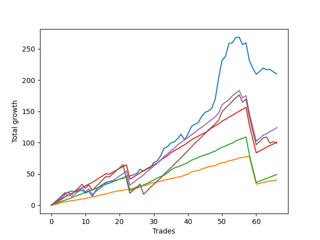

# Long Shepard 004 
- Symbol: ES_SmolBoiHour
- Date Range: 03/18/2022 - 07/29/2022
- Trading Period: 7:20-12:30
- Number of Trades: 66



| Name | Win Percent | Profit | Avg Profit / Trade | Avg Time / Trade |      | Name | Win Percent | Profit | Avg Profit / Trade | Avg Time / Trade |
| ---- | ----------- | ------ | ------------------ | ---------------- | ---- | ---- | ----------- | ------ | ------------------ | ---------------- |
| Sorted By <br> Profit | | | | | | Sorted By <br> Win Percentage ||||
| Two | 81.82 | 105000.00 | 1590.91 | 17:06 |     | Eighty-One | 96.97 | 20250.00 | 306.82 | 06:55 |
| Eighty-Four | 86.36 | 62000.00 | 939.39 | 19:43 |     | Eighty-Two | 93.94 | 24500.00 | 371.21 | 11:19 |
| Eighty-Three | 92.42 | 50500.00 | 765.15 | 15:13 |     | Eighty-Three | 92.42 | 50500.00 | 765.15 | 15:13 |
| Eighty-Five | 80.30 | 49500.00 | 750.00 | 24:18 |     | Eighty-Four | 86.36 | 62000.00 | 939.39 | 19:43 |
| Eighty-Two | 93.94 | 24500.00 | 371.21 | 11:19 |     | Two | 81.82 | 105000.00 | 1590.91 | 17:06 |
| Eighty-One | 96.97 | 20250.00 | 306.82 | 06:55 |     | Eighty-Five | 80.30 | 49500.00 | 750.00 | 24:18 |

## NO STOPLOSS

### Test Two
* Sell when the price hits the upper line of the 20p 2std bollinger
* No Stoploss
* Results:
```
Total Trades: 66
Percent Up: 81.82
Percent Down: 18.18
Total Points Moved Up: 210.00
Potential Profit: 105000.00
Total Points Ups: 309.25 Count Ups: 54
Total Points Downs: -99.25 Count Downs: 12
```

<details><summary>Trades</summary>

<code>In: 2022-03-23 10:32:00		Out: 2022-03-23 10:54:25		Total Position Time: 22:25		Total Move Up: 2.50		Total to Date: 2.50</code> <br />
<code>In: 2022-03-23 11:17:00		Out: 2022-03-23 11:27:00		Total Position Time: 10:00		Total Move Up: 4.50		Total to Date: 7.00</code> <br />
<code>In: 2022-03-30 07:35:00		Out: 2022-03-30 07:46:00		Total Position Time: 11:00		Total Move Up: 3.75		Total to Date: 10.75</code> <br />
<code>In: 2022-03-30 12:27:00		Out: 2022-03-30 12:36:20		Total Position Time: 09:20		Total Move Up: 7.50		Total to Date: 18.25</code> <br />
<code>In: 2022-03-31 09:30:00		Out: 2022-03-31 09:44:20		Total Position Time: 14:20		Total Move Up: 2.50		Total to Date: 20.75</code> <br />
<code>In: 2022-03-31 09:37:00		Out: 2022-03-31 09:44:20		Total Position Time: 07:20		Total Move Up: 2.00		Total to Date: 22.75</code> <br />
<code>In: 2022-03-31 10:02:00		Out: 2022-03-31 10:27:00		Total Position Time: 25:00		Total Move Up: -1.50		Total to Date: 21.25</code> <br />
<code>In: 2022-03-31 10:19:00		Out: 2022-03-31 10:27:00		Total Position Time: 08:00		Total Move Up: 1.00		Total to Date: 22.25</code> <br />
<code>In: 2022-03-31 11:21:00		Out: 2022-03-31 11:29:25		Total Position Time: 08:25		Total Move Up: 2.00		Total to Date: 24.25</code> <br />
<code>In: 2022-04-01 08:48:00		Out: 2022-04-01 09:23:20		Total Position Time: 35:20		Total Move Up: -5.00		Total to Date: 19.25</code> <br />
<code>In: 2022-04-01 10:23:00		Out: 2022-04-01 10:30:25		Total Position Time: 07:25		Total Move Up: 3.00		Total to Date: 22.25</code> <br />
<code>In: 2022-04-05 12:17:00		Out: 2022-04-05 12:46:00		Total Position Time: 29:00		Total Move Up: -8.50		Total to Date: 13.75</code> <br />
<code>In: 2022-04-06 11:21:00		Out: 2022-04-06 11:31:55		Total Position Time: 10:55		Total Move Up: 9.75		Total to Date: 23.50</code> <br />
<code>In: 2022-04-06 11:22:00		Out: 2022-04-06 11:31:55		Total Position Time: 09:55		Total Move Up: 6.00		Total to Date: 29.50</code> <br />
<code>In: 2022-04-07 08:36:00		Out: 2022-04-07 08:47:35		Total Position Time: 11:35		Total Move Up: 3.50		Total to Date: 33.00</code> <br />
<code>In: 2022-04-07 09:52:00		Out: 2022-04-07 10:01:25		Total Position Time: 09:25		Total Move Up: 3.50		Total to Date: 36.50</code> <br />
<code>In: 2022-04-11 07:39:00		Out: 2022-04-11 07:54:25		Total Position Time: 15:25		Total Move Up: 1.50		Total to Date: 38.00</code> <br />
<code>In: 2022-04-11 08:18:00		Out: 2022-04-11 08:30:15		Total Position Time: 12:15		Total Move Up: 1.25		Total to Date: 39.25</code> <br />
<code>In: 2022-04-11 08:27:00		Out: 2022-04-11 08:30:15		Total Position Time: 03:15		Total Move Up: 0.25		Total to Date: 39.50</code> <br />
<code>In: 2022-04-12 09:32:00		Out: 2022-04-12 09:50:15		Total Position Time: 18:15		Total Move Up: 2.25		Total to Date: 41.75</code> <br />
<code>In: 2022-04-18 09:21:00		Out: 2022-04-18 09:35:25		Total Position Time: 14:25		Total Move Up: 1.00		Total to Date: 42.75</code> <br />
<code>In: 2022-04-21 07:58:00		Out: 2022-04-21 08:11:45		Total Position Time: 13:45		Total Move Up: 4.00		Total to Date: 46.75</code> <br />
<code>In: 2022-04-21 09:12:00		Out: 2022-04-21 09:35:40		Total Position Time: 23:40		Total Move Up: 0.00		Total to Date: 46.75</code> <br />
<code>In: 2022-04-22 11:07:00		Out: 2022-04-22 11:17:35		Total Position Time: 10:35		Total Move Up: 1.75		Total to Date: 48.50</code> <br />
<code>In: 2022-04-22 12:00:00		Out: 2022-04-22 12:11:50		Total Position Time: 11:50		Total Move Up: 2.00		Total to Date: 50.50</code> <br />
<code>In: 2022-04-28 07:43:00		Out: 2022-04-28 07:47:25		Total Position Time: 04:25		Total Move Up: 7.00		Total to Date: 57.50</code> <br />
<code>In: 2022-04-29 11:58:00		Out: 2022-04-29 12:25:35		Total Position Time: 27:35		Total Move Up: -3.25		Total to Date: 54.25</code> <br />
<code>In: 2022-05-02 10:56:00		Out: 2022-05-02 11:03:45		Total Position Time: 07:45		Total Move Up: 3.50		Total to Date: 57.75</code> <br />
<code>In: 2022-05-02 11:22:00		Out: 2022-05-02 11:32:45		Total Position Time: 10:45		Total Move Up: 2.25		Total to Date: 60.00</code> <br />
<code>In: 2022-05-04 08:37:00		Out: 2022-05-04 08:47:05		Total Position Time: 10:05		Total Move Up: 8.00		Total to Date: 68.00</code> <br />
<code>In: 2022-05-09 07:35:00		Out: 2022-05-09 07:48:05		Total Position Time: 13:05		Total Move Up: 2.75		Total to Date: 70.75</code> <br />
<code>In: 2022-05-09 07:42:00		Out: 2022-05-09 07:48:05		Total Position Time: 06:05		Total Move Up: 8.00		Total to Date: 78.75</code> <br />
<code>In: 2022-05-09 08:34:00		Out: 2022-05-09 08:39:15		Total Position Time: 05:15		Total Move Up: 12.00		Total to Date: 90.75</code> <br />
<code>In: 2022-05-11 10:50:00		Out: 2022-05-11 11:02:35		Total Position Time: 12:35		Total Move Up: 2.50		Total to Date: 93.25</code> <br />
<code>In: 2022-05-12 11:45:00		Out: 2022-05-12 11:53:00		Total Position Time: 08:00		Total Move Up: 6.25		Total to Date: 99.50</code> <br />
<code>In: 2022-05-12 11:46:00		Out: 2022-05-12 11:53:00		Total Position Time: 07:00		Total Move Up: 1.50		Total to Date: 101.00</code> <br />
<code>In: 2022-05-18 07:40:00		Out: 2022-05-18 07:48:35		Total Position Time: 08:35		Total Move Up: 5.50		Total to Date: 106.50</code> <br />
<code>In: 2022-05-18 09:12:00		Out: 2022-05-18 09:17:50		Total Position Time: 05:50		Total Move Up: 7.00		Total to Date: 113.50</code> <br />
<code>In: 2022-05-20 09:48:00		Out: 2022-05-20 10:33:15		Total Position Time: 45:15		Total Move Up: -9.00		Total to Date: 104.50</code> <br />
<code>In: 2022-05-24 07:21:00		Out: 2022-05-24 07:43:15		Total Position Time: 22:15		Total Move Up: 8.75		Total to Date: 113.25</code> <br />
<code>In: 2022-06-02 07:30:00		Out: 2022-06-02 07:42:40		Total Position Time: 12:40		Total Move Up: 12.25		Total to Date: 125.50</code> <br />
<code>In: 2022-06-06 08:24:00		Out: 2022-06-06 08:43:00		Total Position Time: 19:00		Total Move Up: 3.75		Total to Date: 129.25</code> <br />
<code>In: 2022-06-06 09:17:00		Out: 2022-06-06 09:41:45		Total Position Time: 24:45		Total Move Up: 2.75		Total to Date: 132.00</code> <br />
<code>In: 2022-06-08 10:41:00		Out: 2022-06-08 11:03:45		Total Position Time: 22:45		Total Move Up: 9.75		Total to Date: 141.75</code> <br />
<code>In: 2022-06-08 10:42:00		Out: 2022-06-08 11:03:45		Total Position Time: 21:45		Total Move Up: 6.50		Total to Date: 148.25</code> <br />
<code>In: 2022-06-08 11:31:00		Out: 2022-06-08 11:43:35		Total Position Time: 12:35		Total Move Up: 2.25		Total to Date: 150.50</code> <br />
<code>In: 2022-06-14 07:23:00		Out: 2022-06-14 07:51:00		Total Position Time: 28:00		Total Move Up: 4.50		Total to Date: 155.00</code> <br />
<code>In: 2022-06-15 08:23:00		Out: 2022-06-15 09:22:55		Total Position Time: 59:55		Total Move Up: 14.75		Total to Date: 169.75</code> <br />
<code>In: 2022-06-15 11:36:00		Out: 2022-06-15 11:38:50		Total Position Time: 02:50		Total Move Up: 33.50		Total to Date: 203.25</code> <br />
<code>In: 2022-06-15 11:37:00		Out: 2022-06-15 11:38:50		Total Position Time: 01:50		Total Move Up: 28.50		Total to Date: 231.75</code> <br />
<code>In: 2022-06-16 07:55:00		Out: 2022-06-16 08:11:45		Total Position Time: 16:45		Total Move Up: 6.25		Total to Date: 238.00</code> <br />
<code>In: 2022-06-16 11:57:00		Out: 2022-06-16 12:10:15		Total Position Time: 13:15		Total Move Up: 20.50		Total to Date: 258.50</code> <br />
<code>In: 2022-06-23 09:49:00		Out: 2022-06-23 09:56:50		Total Position Time: 07:50		Total Move Up: 1.00		Total to Date: 259.50</code> <br />
<code>In: 2022-06-29 09:32:00		Out: 2022-06-29 09:38:30		Total Position Time: 06:30		Total Move Up: 8.50		Total to Date: 268.00</code> <br />
<code>In: 2022-07-06 08:12:00		Out: 2022-07-06 08:51:15		Total Position Time: 39:15		Total Move Up: 0.50		Total to Date: 268.50</code> <br />
<code>In: 2022-07-12 12:14:00		Out: 2022-07-12 12:46:00		Total Position Time: 32:00		Total Move Up: -11.75		Total to Date: 256.75</code> <br />
<code>In: 2022-07-18 08:19:00		Out: 2022-07-18 08:27:05		Total Position Time: 08:05		Total Move Up: 2.75		Total to Date: 259.50</code> <br />
<code>In: 2022-07-18 10:02:00		Out: 2022-07-18 11:01:55		Total Position Time: 59:55		Total Move Up: -28.50		Total to Date: 231.00</code> <br />
<code>In: 2022-07-18 10:46:00		Out: 2022-07-18 11:15:45		Total Position Time: 29:45		Total Move Up: -12.25		Total to Date: 218.75</code> <br />
<code>In: 2022-07-18 10:52:00		Out: 2022-07-18 11:15:45		Total Position Time: 23:45		Total Move Up: -9.50		Total to Date: 209.25</code> <br />
<code>In: 2022-07-18 12:01:00		Out: 2022-07-18 12:08:50		Total Position Time: 07:50		Total Move Up: 4.50		Total to Date: 213.75</code> <br />
<code>In: 2022-07-25 07:29:00		Out: 2022-07-25 07:43:50		Total Position Time: 14:50		Total Move Up: 5.50		Total to Date: 219.25</code> <br />
<code>In: 2022-07-25 11:56:00		Out: 2022-07-25 12:21:00		Total Position Time: 25:00		Total Move Up: -2.75		Total to Date: 216.50</code> <br />
<code>In: 2022-07-26 07:27:00		Out: 2022-07-26 07:42:10		Total Position Time: 15:10		Total Move Up: 0.75		Total to Date: 217.25</code> <br />
<code>In: 2022-07-26 08:36:00		Out: 2022-07-26 09:16:25		Total Position Time: 40:25		Total Move Up: -4.25		Total to Date: 213.00</code> <br />
<code>In: 2022-07-26 08:41:00		Out: 2022-07-26 09:16:25		Total Position Time: 35:25		Total Move Up: -3.00		Total to Date: 210.00</code> <br />


</details>

## TAKE PROFIT

### Test Eighty-One
* Take Profit of 1 Point
* No Stoploss
* Results:
```
Total Trades: 66
Percent Up: 96.97
Percent Down: 3.03
Total Points Moved Up: 40.50
Potential Profit: 20250.00
Total Points Ups: 84.75 Count Ups: 64
Total Points Downs: -44.25 Count Downs: 2
```

<details><summary>Trades</summary>

<code>In: 2022-03-23 10:32:00		Out: 2022-03-23 10:32:45		Total Position Time: 00:45		Total Move Up: 1.00		Total to Date: 1.00</code> <br />
<code>In: 2022-03-23 11:17:00		Out: 2022-03-23 11:17:15		Total Position Time: 00:15		Total Move Up: 1.25		Total to Date: 2.25</code> <br />
<code>In: 2022-03-30 07:35:00		Out: 2022-03-30 07:36:25		Total Position Time: 01:25		Total Move Up: 2.00		Total to Date: 4.25</code> <br />
<code>In: 2022-03-30 12:27:00		Out: 2022-03-30 12:27:35		Total Position Time: 00:35		Total Move Up: 1.00		Total to Date: 5.25</code> <br />
<code>In: 2022-03-31 09:30:00		Out: 2022-03-31 09:30:30		Total Position Time: 00:30		Total Move Up: 1.00		Total to Date: 6.25</code> <br />
<code>In: 2022-03-31 09:37:00		Out: 2022-03-31 09:40:45		Total Position Time: 03:45		Total Move Up: 1.00		Total to Date: 7.25</code> <br />
<code>In: 2022-03-31 10:02:00		Out: 2022-03-31 10:29:40		Total Position Time: 27:40		Total Move Up: 0.75		Total to Date: 8.00</code> <br />
<code>In: 2022-03-31 10:19:00		Out: 2022-03-31 10:19:15		Total Position Time: 00:15		Total Move Up: 1.00		Total to Date: 9.00</code> <br />
<code>In: 2022-03-31 11:21:00		Out: 2022-03-31 11:23:30		Total Position Time: 02:30		Total Move Up: 0.75		Total to Date: 9.75</code> <br />
<code>In: 2022-04-01 08:48:00		Out: 2022-04-01 08:53:15		Total Position Time: 05:15		Total Move Up: 1.00		Total to Date: 10.75</code> <br />
<code>In: 2022-04-01 10:23:00		Out: 2022-04-01 10:23:10		Total Position Time: 00:10		Total Move Up: 1.25		Total to Date: 12.00</code> <br />
<code>In: 2022-04-05 12:17:00		Out: 2022-04-05 12:23:40		Total Position Time: 06:40		Total Move Up: 1.25		Total to Date: 13.25</code> <br />
<code>In: 2022-04-06 11:21:00		Out: 2022-04-06 11:21:10		Total Position Time: 00:10		Total Move Up: 0.75		Total to Date: 14.00</code> <br />
<code>In: 2022-04-06 11:22:00		Out: 2022-04-06 11:25:25		Total Position Time: 03:25		Total Move Up: 1.75		Total to Date: 15.75</code> <br />
<code>In: 2022-04-07 08:36:00		Out: 2022-04-07 08:36:20		Total Position Time: 00:20		Total Move Up: 1.25		Total to Date: 17.00</code> <br />
<code>In: 2022-04-07 09:52:00		Out: 2022-04-07 09:52:55		Total Position Time: 00:55		Total Move Up: 1.00		Total to Date: 18.00</code> <br />
<code>In: 2022-04-11 07:39:00		Out: 2022-04-11 07:54:25		Total Position Time: 15:25		Total Move Up: 1.50		Total to Date: 19.50</code> <br />
<code>In: 2022-04-11 08:18:00		Out: 2022-04-11 08:18:10		Total Position Time: 00:10		Total Move Up: 1.50		Total to Date: 21.00</code> <br />
<code>In: 2022-04-11 08:27:00		Out: 2022-04-11 08:30:50		Total Position Time: 03:50		Total Move Up: 1.00		Total to Date: 22.00</code> <br />
<code>In: 2022-04-12 09:32:00		Out: 2022-04-12 09:33:30		Total Position Time: 01:30		Total Move Up: 1.25		Total to Date: 23.25</code> <br />
<code>In: 2022-04-18 09:21:00		Out: 2022-04-18 09:25:00		Total Position Time: 04:00		Total Move Up: 0.75		Total to Date: 24.00</code> <br />
<code>In: 2022-04-21 07:58:00		Out: 2022-04-21 07:58:55		Total Position Time: 00:55		Total Move Up: 1.00		Total to Date: 25.00</code> <br />
<code>In: 2022-04-21 09:12:00		Out: 2022-04-21 09:20:35		Total Position Time: 08:35		Total Move Up: 1.00		Total to Date: 26.00</code> <br />
<code>In: 2022-04-22 11:07:00		Out: 2022-04-22 11:17:15		Total Position Time: 10:15		Total Move Up: 1.00		Total to Date: 27.00</code> <br />
<code>In: 2022-04-22 12:00:00		Out: 2022-04-22 12:11:50		Total Position Time: 11:50		Total Move Up: 2.00		Total to Date: 29.00</code> <br />
<code>In: 2022-04-28 07:43:00		Out: 2022-04-28 07:43:50		Total Position Time: 00:50		Total Move Up: 1.00		Total to Date: 30.00</code> <br />
<code>In: 2022-04-29 11:58:00		Out: 2022-04-29 11:58:20		Total Position Time: 00:20		Total Move Up: 1.25		Total to Date: 31.25</code> <br />
<code>In: 2022-05-02 10:56:00		Out: 2022-05-02 11:02:25		Total Position Time: 06:25		Total Move Up: 0.75		Total to Date: 32.00</code> <br />
<code>In: 2022-05-02 11:22:00		Out: 2022-05-02 11:22:10		Total Position Time: 00:10		Total Move Up: 3.00		Total to Date: 35.00</code> <br />
<code>In: 2022-05-04 08:37:00		Out: 2022-05-04 08:38:10		Total Position Time: 01:10		Total Move Up: 1.00		Total to Date: 36.00</code> <br />
<code>In: 2022-05-09 07:35:00		Out: 2022-05-09 07:35:25		Total Position Time: 00:25		Total Move Up: 1.00		Total to Date: 37.00</code> <br />
<code>In: 2022-05-09 07:42:00		Out: 2022-05-09 07:42:20		Total Position Time: 00:20		Total Move Up: 1.50		Total to Date: 38.50</code> <br />
<code>In: 2022-05-09 08:34:00		Out: 2022-05-09 08:34:10		Total Position Time: 00:10		Total Move Up: 1.50		Total to Date: 40.00</code> <br />
<code>In: 2022-05-11 10:50:00		Out: 2022-05-11 10:50:35		Total Position Time: 00:35		Total Move Up: 1.25		Total to Date: 41.25</code> <br />
<code>In: 2022-05-12 11:45:00		Out: 2022-05-12 11:45:10		Total Position Time: 00:10		Total Move Up: 1.00		Total to Date: 42.25</code> <br />
<code>In: 2022-05-12 11:46:00		Out: 2022-05-12 11:52:55		Total Position Time: 06:55		Total Move Up: 1.00		Total to Date: 43.25</code> <br />
<code>In: 2022-05-18 07:40:00		Out: 2022-05-18 07:42:00		Total Position Time: 02:00		Total Move Up: 1.75		Total to Date: 45.00</code> <br />
<code>In: 2022-05-18 09:12:00		Out: 2022-05-18 09:13:05		Total Position Time: 01:05		Total Move Up: 0.75		Total to Date: 45.75</code> <br />
<code>In: 2022-05-20 09:48:00		Out: 2022-05-20 09:48:25		Total Position Time: 00:25		Total Move Up: 2.25		Total to Date: 48.00</code> <br />
<code>In: 2022-05-24 07:21:00		Out: 2022-05-24 07:21:15		Total Position Time: 00:15		Total Move Up: 1.50		Total to Date: 49.50</code> <br />
<code>In: 2022-06-02 07:30:00		Out: 2022-06-02 07:30:35		Total Position Time: 00:35		Total Move Up: 3.75		Total to Date: 53.25</code> <br />
<code>In: 2022-06-06 08:24:00		Out: 2022-06-06 08:26:35		Total Position Time: 02:35		Total Move Up: 1.25		Total to Date: 54.50</code> <br />
<code>In: 2022-06-06 09:17:00		Out: 2022-06-06 09:18:40		Total Position Time: 01:40		Total Move Up: 1.00		Total to Date: 55.50</code> <br />
<code>In: 2022-06-08 10:41:00		Out: 2022-06-08 10:41:10		Total Position Time: 00:10		Total Move Up: 2.25		Total to Date: 57.75</code> <br />
<code>In: 2022-06-08 10:42:00		Out: 2022-06-08 10:42:15		Total Position Time: 00:15		Total Move Up: 1.75		Total to Date: 59.50</code> <br />
<code>In: 2022-06-08 11:31:00		Out: 2022-06-08 11:43:30		Total Position Time: 12:30		Total Move Up: 2.00		Total to Date: 61.50</code> <br />
<code>In: 2022-06-14 07:23:00		Out: 2022-06-14 07:49:55		Total Position Time: 26:55		Total Move Up: 0.75		Total to Date: 62.25</code> <br />
<code>In: 2022-06-15 08:23:00		Out: 2022-06-15 08:34:30		Total Position Time: 11:30		Total Move Up: 0.75		Total to Date: 63.00</code> <br />
<code>In: 2022-06-15 11:36:00		Out: 2022-06-15 11:36:20		Total Position Time: 00:20		Total Move Up: 3.50		Total to Date: 66.50</code> <br />
<code>In: 2022-06-15 11:37:00		Out: 2022-06-15 11:37:10		Total Position Time: 00:10		Total Move Up: 1.25		Total to Date: 67.75</code> <br />
<code>In: 2022-06-16 07:55:00		Out: 2022-06-16 08:01:20		Total Position Time: 06:20		Total Move Up: 0.75		Total to Date: 68.50</code> <br />
<code>In: 2022-06-16 11:57:00		Out: 2022-06-16 12:00:25		Total Position Time: 03:25		Total Move Up: 2.50		Total to Date: 71.00</code> <br />
<code>In: 2022-06-23 09:49:00		Out: 2022-06-23 09:56:50		Total Position Time: 07:50		Total Move Up: 1.00		Total to Date: 72.00</code> <br />
<code>In: 2022-06-29 09:32:00		Out: 2022-06-29 09:32:45		Total Position Time: 00:45		Total Move Up: 1.50		Total to Date: 73.50</code> <br />
<code>In: 2022-07-06 08:12:00		Out: 2022-07-06 08:12:15		Total Position Time: 00:15		Total Move Up: 2.00		Total to Date: 75.50</code> <br />
<code>In: 2022-07-12 12:14:00		Out: 2022-07-12 12:14:10		Total Position Time: 00:10		Total Move Up: 0.75		Total to Date: 76.25</code> <br />
<code>In: 2022-07-18 08:19:00		Out: 2022-07-18 08:19:15		Total Position Time: 00:15		Total Move Up: 1.00		Total to Date: 77.25</code> <br />
<code>In: 2022-07-18 10:02:00		Out: 2022-07-18 10:05:00		Total Position Time: 03:00		Total Move Up: 0.75		Total to Date: 78.00</code> <br />
<code>In: 2022-07-18 10:46:00		Out: 2022-07-18 11:45:55		Total Position Time: 59:55		Total Move Up: -22.50		Total to Date: 55.50</code> <br />
<code>In: 2022-07-18 10:52:00		Out: 2022-07-18 11:51:55		Total Position Time: 59:55		Total Move Up: -21.75		Total to Date: 33.75</code> <br />
<code>In: 2022-07-18 12:01:00		Out: 2022-07-18 12:05:55		Total Position Time: 04:55		Total Move Up: 1.00		Total to Date: 34.75</code> <br />
<code>In: 2022-07-25 07:29:00		Out: 2022-07-25 07:29:10		Total Position Time: 00:10		Total Move Up: 1.50		Total to Date: 36.25</code> <br />
<code>In: 2022-07-25 11:56:00		Out: 2022-07-25 12:39:30		Total Position Time: 43:30		Total Move Up: 1.25		Total to Date: 37.50</code> <br />
<code>In: 2022-07-26 07:27:00		Out: 2022-07-26 07:45:55		Total Position Time: 18:55		Total Move Up: 1.00		Total to Date: 38.50</code> <br />
<code>In: 2022-07-26 08:36:00		Out: 2022-07-26 09:32:00		Total Position Time: 56:00		Total Move Up: 0.75		Total to Date: 39.25</code> <br />
<code>In: 2022-07-26 08:41:00		Out: 2022-07-26 08:43:40		Total Position Time: 02:40		Total Move Up: 1.25		Total to Date: 40.50</code> <br />


</details>

### Test Eighty-Two
* Take Profit of 2 Point
* No Stoploss
* Results:
```
Total Trades: 66
Percent Up: 93.94
Percent Down: 6.06
Total Points Moved Up: 49.00
Potential Profit: 24500.00
Total Points Ups: 144.50 Count Ups: 62
Total Points Downs: -95.50 Count Downs: 4
```

<details><summary>Trades</summary>

<code>In: 2022-03-23 10:32:00		Out: 2022-03-23 10:34:40		Total Position Time: 02:40		Total Move Up: 2.00		Total to Date: 2.00</code> <br />
<code>In: 2022-03-23 11:17:00		Out: 2022-03-23 11:18:00		Total Position Time: 01:00		Total Move Up: 2.25		Total to Date: 4.25</code> <br />
<code>In: 2022-03-30 07:35:00		Out: 2022-03-30 07:36:25		Total Position Time: 01:25		Total Move Up: 2.00		Total to Date: 6.25</code> <br />
<code>In: 2022-03-30 12:27:00		Out: 2022-03-30 12:28:00		Total Position Time: 01:00		Total Move Up: 1.75		Total to Date: 8.00</code> <br />
<code>In: 2022-03-31 09:30:00		Out: 2022-03-31 09:32:50		Total Position Time: 02:50		Total Move Up: 2.00		Total to Date: 10.00</code> <br />
<code>In: 2022-03-31 09:37:00		Out: 2022-03-31 09:44:20		Total Position Time: 07:20		Total Move Up: 2.00		Total to Date: 12.00</code> <br />
<code>In: 2022-03-31 10:02:00		Out: 2022-03-31 10:31:20		Total Position Time: 29:20		Total Move Up: 2.25		Total to Date: 14.25</code> <br />
<code>In: 2022-03-31 10:19:00		Out: 2022-03-31 10:19:40		Total Position Time: 00:40		Total Move Up: 2.00		Total to Date: 16.25</code> <br />
<code>In: 2022-03-31 11:21:00		Out: 2022-03-31 11:29:25		Total Position Time: 08:25		Total Move Up: 2.00		Total to Date: 18.25</code> <br />
<code>In: 2022-04-01 08:48:00		Out: 2022-04-01 08:53:40		Total Position Time: 05:40		Total Move Up: 2.50		Total to Date: 20.75</code> <br />
<code>In: 2022-04-01 10:23:00		Out: 2022-04-01 10:23:20		Total Position Time: 00:20		Total Move Up: 2.00		Total to Date: 22.75</code> <br />
<code>In: 2022-04-05 12:17:00		Out: 2022-04-05 12:24:35		Total Position Time: 07:35		Total Move Up: 2.00		Total to Date: 24.75</code> <br />
<code>In: 2022-04-06 11:21:00		Out: 2022-04-06 11:21:15		Total Position Time: 00:15		Total Move Up: 2.00		Total to Date: 26.75</code> <br />
<code>In: 2022-04-06 11:22:00		Out: 2022-04-06 11:25:30		Total Position Time: 03:30		Total Move Up: 2.00		Total to Date: 28.75</code> <br />
<code>In: 2022-04-07 08:36:00		Out: 2022-04-07 08:36:30		Total Position Time: 00:30		Total Move Up: 2.00		Total to Date: 30.75</code> <br />
<code>In: 2022-04-07 09:52:00		Out: 2022-04-07 09:59:10		Total Position Time: 07:10		Total Move Up: 2.50		Total to Date: 33.25</code> <br />
<code>In: 2022-04-11 07:39:00		Out: 2022-04-11 08:36:10		Total Position Time: 57:10		Total Move Up: 2.00		Total to Date: 35.25</code> <br />
<code>In: 2022-04-11 08:18:00		Out: 2022-04-11 08:30:50		Total Position Time: 12:50		Total Move Up: 2.00		Total to Date: 37.25</code> <br />
<code>In: 2022-04-11 08:27:00		Out: 2022-04-11 08:32:20		Total Position Time: 05:20		Total Move Up: 2.25		Total to Date: 39.50</code> <br />
<code>In: 2022-04-12 09:32:00		Out: 2022-04-12 09:50:15		Total Position Time: 18:15		Total Move Up: 2.25		Total to Date: 41.75</code> <br />
<code>In: 2022-04-18 09:21:00		Out: 2022-04-18 09:44:35		Total Position Time: 23:35		Total Move Up: 2.00		Total to Date: 43.75</code> <br />
<code>In: 2022-04-21 07:58:00		Out: 2022-04-21 07:59:10		Total Position Time: 01:10		Total Move Up: 2.25		Total to Date: 46.00</code> <br />
<code>In: 2022-04-21 09:12:00		Out: 2022-04-21 10:11:55		Total Position Time: 59:55		Total Move Up: -22.75		Total to Date: 23.25</code> <br />
<code>In: 2022-04-22 11:07:00		Out: 2022-04-22 11:17:40		Total Position Time: 10:40		Total Move Up: 2.25		Total to Date: 25.50</code> <br />
<code>In: 2022-04-22 12:00:00		Out: 2022-04-22 12:11:50		Total Position Time: 11:50		Total Move Up: 2.00		Total to Date: 27.50</code> <br />
<code>In: 2022-04-28 07:43:00		Out: 2022-04-28 07:44:00		Total Position Time: 01:00		Total Move Up: 2.00		Total to Date: 29.50</code> <br />
<code>In: 2022-04-29 11:58:00		Out: 2022-04-29 11:59:10		Total Position Time: 01:10		Total Move Up: 3.00		Total to Date: 32.50</code> <br />
<code>In: 2022-05-02 10:56:00		Out: 2022-05-02 11:02:45		Total Position Time: 06:45		Total Move Up: 2.00		Total to Date: 34.50</code> <br />
<code>In: 2022-05-02 11:22:00		Out: 2022-05-02 11:22:10		Total Position Time: 00:10		Total Move Up: 3.00		Total to Date: 37.50</code> <br />
<code>In: 2022-05-04 08:37:00		Out: 2022-05-04 08:39:25		Total Position Time: 02:25		Total Move Up: 2.75		Total to Date: 40.25</code> <br />
<code>In: 2022-05-09 07:35:00		Out: 2022-05-09 07:46:10		Total Position Time: 11:10		Total Move Up: 3.00		Total to Date: 43.25</code> <br />
<code>In: 2022-05-09 07:42:00		Out: 2022-05-09 07:42:25		Total Position Time: 00:25		Total Move Up: 2.50		Total to Date: 45.75</code> <br />
<code>In: 2022-05-09 08:34:00		Out: 2022-05-09 08:34:15		Total Position Time: 00:15		Total Move Up: 2.25		Total to Date: 48.00</code> <br />
<code>In: 2022-05-11 10:50:00		Out: 2022-05-11 10:50:45		Total Position Time: 00:45		Total Move Up: 3.50		Total to Date: 51.50</code> <br />
<code>In: 2022-05-12 11:45:00		Out: 2022-05-12 11:45:15		Total Position Time: 00:15		Total Move Up: 4.75		Total to Date: 56.25</code> <br />
<code>In: 2022-05-12 11:46:00		Out: 2022-05-12 11:53:25		Total Position Time: 07:25		Total Move Up: 3.25		Total to Date: 59.50</code> <br />
<code>In: 2022-05-18 07:40:00		Out: 2022-05-18 07:42:00		Total Position Time: 02:00		Total Move Up: 1.75		Total to Date: 61.25</code> <br />
<code>In: 2022-05-18 09:12:00		Out: 2022-05-18 09:14:45		Total Position Time: 02:45		Total Move Up: 2.25		Total to Date: 63.50</code> <br />
<code>In: 2022-05-20 09:48:00		Out: 2022-05-20 09:48:25		Total Position Time: 00:25		Total Move Up: 2.25		Total to Date: 65.75</code> <br />
<code>In: 2022-05-24 07:21:00		Out: 2022-05-24 07:21:25		Total Position Time: 00:25		Total Move Up: 2.25		Total to Date: 68.00</code> <br />
<code>In: 2022-06-02 07:30:00		Out: 2022-06-02 07:30:35		Total Position Time: 00:35		Total Move Up: 3.75		Total to Date: 71.75</code> <br />
<code>In: 2022-06-06 08:24:00		Out: 2022-06-06 08:27:45		Total Position Time: 03:45		Total Move Up: 2.25		Total to Date: 74.00</code> <br />
<code>In: 2022-06-06 09:17:00		Out: 2022-06-06 09:19:45		Total Position Time: 02:45		Total Move Up: 2.25		Total to Date: 76.25</code> <br />
<code>In: 2022-06-08 10:41:00		Out: 2022-06-08 10:41:10		Total Position Time: 00:10		Total Move Up: 2.25		Total to Date: 78.50</code> <br />
<code>In: 2022-06-08 10:42:00		Out: 2022-06-08 10:44:00		Total Position Time: 02:00		Total Move Up: 1.75		Total to Date: 80.25</code> <br />
<code>In: 2022-06-08 11:31:00		Out: 2022-06-08 11:43:30		Total Position Time: 12:30		Total Move Up: 2.00		Total to Date: 82.25</code> <br />
<code>In: 2022-06-14 07:23:00		Out: 2022-06-14 07:50:55		Total Position Time: 27:55		Total Move Up: 2.25		Total to Date: 84.50</code> <br />
<code>In: 2022-06-15 08:23:00		Out: 2022-06-15 08:36:00		Total Position Time: 13:00		Total Move Up: 2.00		Total to Date: 86.50</code> <br />
<code>In: 2022-06-15 11:36:00		Out: 2022-06-15 11:36:20		Total Position Time: 00:20		Total Move Up: 3.50		Total to Date: 90.00</code> <br />
<code>In: 2022-06-15 11:37:00		Out: 2022-06-15 11:37:20		Total Position Time: 00:20		Total Move Up: 2.50		Total to Date: 92.50</code> <br />
<code>In: 2022-06-16 07:55:00		Out: 2022-06-16 08:01:50		Total Position Time: 06:50		Total Move Up: 2.25		Total to Date: 94.75</code> <br />
<code>In: 2022-06-16 11:57:00		Out: 2022-06-16 12:00:25		Total Position Time: 03:25		Total Move Up: 2.50		Total to Date: 97.25</code> <br />
<code>In: 2022-06-23 09:49:00		Out: 2022-06-23 10:07:45		Total Position Time: 18:45		Total Move Up: 2.00		Total to Date: 99.25</code> <br />
<code>In: 2022-06-29 09:32:00		Out: 2022-06-29 09:36:40		Total Position Time: 04:40		Total Move Up: 3.50		Total to Date: 102.75</code> <br />
<code>In: 2022-07-06 08:12:00		Out: 2022-07-06 08:12:15		Total Position Time: 00:15		Total Move Up: 2.00		Total to Date: 104.75</code> <br />
<code>In: 2022-07-12 12:14:00		Out: 2022-07-12 12:14:50		Total Position Time: 00:50		Total Move Up: 2.25		Total to Date: 107.00</code> <br />
<code>In: 2022-07-18 08:19:00		Out: 2022-07-18 08:25:05		Total Position Time: 06:05		Total Move Up: 2.00		Total to Date: 109.00</code> <br />
<code>In: 2022-07-18 10:02:00		Out: 2022-07-18 11:01:55		Total Position Time: 59:55		Total Move Up: -28.50		Total to Date: 80.50</code> <br />
<code>In: 2022-07-18 10:46:00		Out: 2022-07-18 11:45:55		Total Position Time: 59:55		Total Move Up: -22.50		Total to Date: 58.00</code> <br />
<code>In: 2022-07-18 10:52:00		Out: 2022-07-18 11:51:55		Total Position Time: 59:55		Total Move Up: -21.75		Total to Date: 36.25</code> <br />
<code>In: 2022-07-18 12:01:00		Out: 2022-07-18 12:06:10		Total Position Time: 05:10		Total Move Up: 2.00		Total to Date: 38.25</code> <br />
<code>In: 2022-07-25 07:29:00		Out: 2022-07-25 07:32:10		Total Position Time: 03:10		Total Move Up: 2.50		Total to Date: 40.75</code> <br />
<code>In: 2022-07-25 11:56:00		Out: 2022-07-25 12:39:40		Total Position Time: 43:40		Total Move Up: 2.00		Total to Date: 42.75</code> <br />
<code>In: 2022-07-26 07:27:00		Out: 2022-07-26 07:59:20		Total Position Time: 32:20		Total Move Up: 2.00		Total to Date: 44.75</code> <br />
<code>In: 2022-07-26 08:36:00		Out: 2022-07-26 09:34:45		Total Position Time: 58:45		Total Move Up: 2.25		Total to Date: 47.00</code> <br />
<code>In: 2022-07-26 08:41:00		Out: 2022-07-26 08:43:45		Total Position Time: 02:45		Total Move Up: 2.00		Total to Date: 49.00</code> <br />


</details>

### Test Eighty-Three
* Take Profit of 3 Point
* No Stoploss
* Results:
```
Total Trades: 66
Percent Up: 92.42
Percent Down: 7.58
Total Points Moved Up: 101.00
Potential Profit: 50500.00
Total Points Ups: 197.25 Count Ups: 61
Total Points Downs: -96.25 Count Downs: 5
```

<details><summary>Trades</summary>

<code>In: 2022-03-23 10:32:00		Out: 2022-03-23 10:54:30		Total Position Time: 22:30		Total Move Up: 3.25		Total to Date: 3.25</code> <br />
<code>In: 2022-03-23 11:17:00		Out: 2022-03-23 11:20:50		Total Position Time: 03:50		Total Move Up: 3.00		Total to Date: 6.25</code> <br />
<code>In: 2022-03-30 07:35:00		Out: 2022-03-30 07:38:35		Total Position Time: 03:35		Total Move Up: 3.25		Total to Date: 9.50</code> <br />
<code>In: 2022-03-30 12:27:00		Out: 2022-03-30 12:31:35		Total Position Time: 04:35		Total Move Up: 3.50		Total to Date: 13.00</code> <br />
<code>In: 2022-03-31 09:30:00		Out: 2022-03-31 09:44:50		Total Position Time: 14:50		Total Move Up: 3.00		Total to Date: 16.00</code> <br />
<code>In: 2022-03-31 09:37:00		Out: 2022-03-31 09:46:15		Total Position Time: 09:15		Total Move Up: 2.75		Total to Date: 18.75</code> <br />
<code>In: 2022-03-31 10:02:00		Out: 2022-03-31 10:50:05		Total Position Time: 48:05		Total Move Up: 3.00		Total to Date: 21.75</code> <br />
<code>In: 2022-03-31 10:19:00		Out: 2022-03-31 10:29:20		Total Position Time: 10:20		Total Move Up: 3.00		Total to Date: 24.75</code> <br />
<code>In: 2022-03-31 11:21:00		Out: 2022-03-31 11:59:20		Total Position Time: 38:20		Total Move Up: 3.25		Total to Date: 28.00</code> <br />
<code>In: 2022-04-01 08:48:00		Out: 2022-04-01 08:54:15		Total Position Time: 06:15		Total Move Up: 2.75		Total to Date: 30.75</code> <br />
<code>In: 2022-04-01 10:23:00		Out: 2022-04-01 10:24:15		Total Position Time: 01:15		Total Move Up: 3.00		Total to Date: 33.75</code> <br />
<code>In: 2022-04-05 12:17:00		Out: 2022-04-05 12:25:00		Total Position Time: 08:00		Total Move Up: 2.75		Total to Date: 36.50</code> <br />
<code>In: 2022-04-06 11:21:00		Out: 2022-04-06 11:21:20		Total Position Time: 00:20		Total Move Up: 3.25		Total to Date: 39.75</code> <br />
<code>In: 2022-04-06 11:22:00		Out: 2022-04-06 11:25:40		Total Position Time: 03:40		Total Move Up: 3.75		Total to Date: 43.50</code> <br />
<code>In: 2022-04-07 08:36:00		Out: 2022-04-07 08:47:30		Total Position Time: 11:30		Total Move Up: 3.25		Total to Date: 46.75</code> <br />
<code>In: 2022-04-07 09:52:00		Out: 2022-04-07 10:01:25		Total Position Time: 09:25		Total Move Up: 3.50		Total to Date: 50.25</code> <br />
<code>In: 2022-04-11 07:39:00		Out: 2022-04-11 08:38:55		Total Position Time: 59:55		Total Move Up: -0.75		Total to Date: 49.50</code> <br />
<code>In: 2022-04-11 08:18:00		Out: 2022-04-11 08:32:20		Total Position Time: 14:20		Total Move Up: 3.25		Total to Date: 52.75</code> <br />
<code>In: 2022-04-11 08:27:00		Out: 2022-04-11 08:32:50		Total Position Time: 05:50		Total Move Up: 3.00		Total to Date: 55.75</code> <br />
<code>In: 2022-04-12 09:32:00		Out: 2022-04-12 09:50:35		Total Position Time: 18:35		Total Move Up: 3.25		Total to Date: 59.00</code> <br />
<code>In: 2022-04-18 09:21:00		Out: 2022-04-18 09:46:00		Total Position Time: 25:00		Total Move Up: 2.75		Total to Date: 61.75</code> <br />
<code>In: 2022-04-21 07:58:00		Out: 2022-04-21 08:01:15		Total Position Time: 03:15		Total Move Up: 2.75		Total to Date: 64.50</code> <br />
<code>In: 2022-04-21 09:12:00		Out: 2022-04-21 10:11:55		Total Position Time: 59:55		Total Move Up: -22.75		Total to Date: 41.75</code> <br />
<code>In: 2022-04-22 11:07:00		Out: 2022-04-22 11:17:45		Total Position Time: 10:45		Total Move Up: 3.00		Total to Date: 44.75</code> <br />
<code>In: 2022-04-22 12:00:00		Out: 2022-04-22 12:12:50		Total Position Time: 12:50		Total Move Up: 3.50		Total to Date: 48.25</code> <br />
<code>In: 2022-04-28 07:43:00		Out: 2022-04-28 07:45:30		Total Position Time: 02:30		Total Move Up: 3.75		Total to Date: 52.00</code> <br />
<code>In: 2022-04-29 11:58:00		Out: 2022-04-29 11:59:15		Total Position Time: 01:15		Total Move Up: 3.00		Total to Date: 55.00</code> <br />
<code>In: 2022-05-02 10:56:00		Out: 2022-05-02 11:03:45		Total Position Time: 07:45		Total Move Up: 3.50		Total to Date: 58.50</code> <br />
<code>In: 2022-05-02 11:22:00		Out: 2022-05-02 11:22:10		Total Position Time: 00:10		Total Move Up: 3.00		Total to Date: 61.50</code> <br />
<code>In: 2022-05-04 08:37:00		Out: 2022-05-04 08:39:30		Total Position Time: 02:30		Total Move Up: 3.00		Total to Date: 64.50</code> <br />
<code>In: 2022-05-09 07:35:00		Out: 2022-05-09 07:46:10		Total Position Time: 11:10		Total Move Up: 3.00		Total to Date: 67.50</code> <br />
<code>In: 2022-05-09 07:42:00		Out: 2022-05-09 07:42:30		Total Position Time: 00:30		Total Move Up: 4.75		Total to Date: 72.25</code> <br />
<code>In: 2022-05-09 08:34:00		Out: 2022-05-09 08:34:40		Total Position Time: 00:40		Total Move Up: 3.25		Total to Date: 75.50</code> <br />
<code>In: 2022-05-11 10:50:00		Out: 2022-05-11 10:50:45		Total Position Time: 00:45		Total Move Up: 3.50		Total to Date: 79.00</code> <br />
<code>In: 2022-05-12 11:45:00		Out: 2022-05-12 11:45:15		Total Position Time: 00:15		Total Move Up: 4.75		Total to Date: 83.75</code> <br />
<code>In: 2022-05-12 11:46:00		Out: 2022-05-12 11:53:25		Total Position Time: 07:25		Total Move Up: 3.25		Total to Date: 87.00</code> <br />
<code>In: 2022-05-18 07:40:00		Out: 2022-05-18 07:46:35		Total Position Time: 06:35		Total Move Up: 3.00		Total to Date: 90.00</code> <br />
<code>In: 2022-05-18 09:12:00		Out: 2022-05-18 09:15:20		Total Position Time: 03:20		Total Move Up: 3.50		Total to Date: 93.50</code> <br />
<code>In: 2022-05-20 09:48:00		Out: 2022-05-20 09:49:10		Total Position Time: 01:10		Total Move Up: 3.00		Total to Date: 96.50</code> <br />
<code>In: 2022-05-24 07:21:00		Out: 2022-05-24 07:22:20		Total Position Time: 01:20		Total Move Up: 4.00		Total to Date: 100.50</code> <br />
<code>In: 2022-06-02 07:30:00		Out: 2022-06-02 07:30:35		Total Position Time: 00:35		Total Move Up: 3.75		Total to Date: 104.25</code> <br />
<code>In: 2022-06-06 08:24:00		Out: 2022-06-06 08:31:35		Total Position Time: 07:35		Total Move Up: 3.25		Total to Date: 107.50</code> <br />
<code>In: 2022-06-06 09:17:00		Out: 2022-06-06 09:41:45		Total Position Time: 24:45		Total Move Up: 2.75		Total to Date: 110.25</code> <br />
<code>In: 2022-06-08 10:41:00		Out: 2022-06-08 10:41:30		Total Position Time: 00:30		Total Move Up: 3.00		Total to Date: 113.25</code> <br />
<code>In: 2022-06-08 10:42:00		Out: 2022-06-08 10:44:05		Total Position Time: 02:05		Total Move Up: 2.75		Total to Date: 116.00</code> <br />
<code>In: 2022-06-08 11:31:00		Out: 2022-06-08 11:45:20		Total Position Time: 14:20		Total Move Up: 3.25		Total to Date: 119.25</code> <br />
<code>In: 2022-06-14 07:23:00		Out: 2022-06-14 07:51:00		Total Position Time: 28:00		Total Move Up: 4.50		Total to Date: 123.75</code> <br />
<code>In: 2022-06-15 08:23:00		Out: 2022-06-15 08:38:50		Total Position Time: 15:50		Total Move Up: 3.00		Total to Date: 126.75</code> <br />
<code>In: 2022-06-15 11:36:00		Out: 2022-06-15 11:36:20		Total Position Time: 00:20		Total Move Up: 3.50		Total to Date: 130.25</code> <br />
<code>In: 2022-06-15 11:37:00		Out: 2022-06-15 11:37:30		Total Position Time: 00:30		Total Move Up: 4.00		Total to Date: 134.25</code> <br />
<code>In: 2022-06-16 07:55:00		Out: 2022-06-16 08:11:25		Total Position Time: 16:25		Total Move Up: 3.00		Total to Date: 137.25</code> <br />
<code>In: 2022-06-16 11:57:00		Out: 2022-06-16 12:00:35		Total Position Time: 03:35		Total Move Up: 3.50		Total to Date: 140.75</code> <br />
<code>In: 2022-06-23 09:49:00		Out: 2022-06-23 10:13:00		Total Position Time: 24:00		Total Move Up: 2.75		Total to Date: 143.50</code> <br />
<code>In: 2022-06-29 09:32:00		Out: 2022-06-29 09:36:40		Total Position Time: 04:40		Total Move Up: 3.50		Total to Date: 147.00</code> <br />
<code>In: 2022-07-06 08:12:00		Out: 2022-07-06 08:13:15		Total Position Time: 01:15		Total Move Up: 3.25		Total to Date: 150.25</code> <br />
<code>In: 2022-07-12 12:14:00		Out: 2022-07-12 12:14:55		Total Position Time: 00:55		Total Move Up: 3.00		Total to Date: 153.25</code> <br />
<code>In: 2022-07-18 08:19:00		Out: 2022-07-18 08:33:25		Total Position Time: 14:25		Total Move Up: 3.25		Total to Date: 156.50</code> <br />
<code>In: 2022-07-18 10:02:00		Out: 2022-07-18 11:01:55		Total Position Time: 59:55		Total Move Up: -28.50		Total to Date: 128.00</code> <br />
<code>In: 2022-07-18 10:46:00		Out: 2022-07-18 11:45:55		Total Position Time: 59:55		Total Move Up: -22.50		Total to Date: 105.50</code> <br />
<code>In: 2022-07-18 10:52:00		Out: 2022-07-18 11:51:55		Total Position Time: 59:55		Total Move Up: -21.75		Total to Date: 83.75</code> <br />
<code>In: 2022-07-18 12:01:00		Out: 2022-07-18 12:07:55		Total Position Time: 06:55		Total Move Up: 3.00		Total to Date: 86.75</code> <br />
<code>In: 2022-07-25 07:29:00		Out: 2022-07-25 07:43:25		Total Position Time: 14:25		Total Move Up: 2.75		Total to Date: 89.50</code> <br />
<code>In: 2022-07-25 11:56:00		Out: 2022-07-25 12:40:50		Total Position Time: 44:50		Total Move Up: 3.25		Total to Date: 92.75</code> <br />
<code>In: 2022-07-26 07:27:00		Out: 2022-07-26 07:59:30		Total Position Time: 32:30		Total Move Up: 2.75		Total to Date: 95.50</code> <br />
<code>In: 2022-07-26 08:36:00		Out: 2022-07-26 09:35:55		Total Position Time: 59:55		Total Move Up: 2.25		Total to Date: 97.75</code> <br />
<code>In: 2022-07-26 08:41:00		Out: 2022-07-26 09:34:35		Total Position Time: 53:35		Total Move Up: 3.25		Total to Date: 101.00</code> <br />


</details>

### Test Eighty-Four
* Take Profit of 4 Point
* No Stoploss
* Results:
```
Total Trades: 66
Percent Up: 86.36
Percent Down: 13.64
Total Points Moved Up: 124.00
Potential Profit: 62000.00
Total Points Ups: 249.75 Count Ups: 57
Total Points Downs: -125.75 Count Downs: 9
```

<details><summary>Trades</summary>

<code>In: 2022-03-23 10:32:00		Out: 2022-03-23 10:55:00		Total Position Time: 23:00		Total Move Up: 3.75		Total to Date: 3.75</code> <br />
<code>In: 2022-03-23 11:17:00		Out: 2022-03-23 11:26:55		Total Position Time: 09:55		Total Move Up: 4.25		Total to Date: 8.00</code> <br />
<code>In: 2022-03-30 07:35:00		Out: 2022-03-30 07:46:25		Total Position Time: 11:25		Total Move Up: 4.25		Total to Date: 12.25</code> <br />
<code>In: 2022-03-30 12:27:00		Out: 2022-03-30 12:32:15		Total Position Time: 05:15		Total Move Up: 4.25		Total to Date: 16.50</code> <br />
<code>In: 2022-03-31 09:30:00		Out: 2022-03-31 10:29:55		Total Position Time: 59:55		Total Move Up: 0.25		Total to Date: 16.75</code> <br />
<code>In: 2022-03-31 09:37:00		Out: 2022-03-31 10:36:55		Total Position Time: 59:55		Total Move Up: -2.75		Total to Date: 14.00</code> <br />
<code>In: 2022-03-31 10:02:00		Out: 2022-03-31 10:50:50		Total Position Time: 48:50		Total Move Up: 4.25		Total to Date: 18.25</code> <br />
<code>In: 2022-03-31 10:19:00		Out: 2022-03-31 10:29:50		Total Position Time: 10:50		Total Move Up: 4.00		Total to Date: 22.25</code> <br />
<code>In: 2022-03-31 11:21:00		Out: 2022-03-31 12:00:05		Total Position Time: 39:05		Total Move Up: 5.75		Total to Date: 28.00</code> <br />
<code>In: 2022-04-01 08:48:00		Out: 2022-04-01 09:47:55		Total Position Time: 59:55		Total Move Up: -6.50		Total to Date: 21.50</code> <br />
<code>In: 2022-04-01 10:23:00		Out: 2022-04-01 10:31:50		Total Position Time: 08:50		Total Move Up: 4.50		Total to Date: 26.00</code> <br />
<code>In: 2022-04-05 12:17:00		Out: 2022-04-05 12:46:00		Total Position Time: 29:00		Total Move Up: -8.50		Total to Date: 17.50</code> <br />
<code>In: 2022-04-06 11:21:00		Out: 2022-04-06 11:21:35		Total Position Time: 00:35		Total Move Up: 4.00		Total to Date: 21.50</code> <br />
<code>In: 2022-04-06 11:22:00		Out: 2022-04-06 11:25:45		Total Position Time: 03:45		Total Move Up: 4.50		Total to Date: 26.00</code> <br />
<code>In: 2022-04-07 08:36:00		Out: 2022-04-07 08:48:15		Total Position Time: 12:15		Total Move Up: 4.00		Total to Date: 30.00</code> <br />
<code>In: 2022-04-07 09:52:00		Out: 2022-04-07 10:02:15		Total Position Time: 10:15		Total Move Up: 5.50		Total to Date: 35.50</code> <br />
<code>In: 2022-04-11 07:39:00		Out: 2022-04-11 08:38:55		Total Position Time: 59:55		Total Move Up: -0.75		Total to Date: 34.75</code> <br />
<code>In: 2022-04-11 08:18:00		Out: 2022-04-11 08:32:50		Total Position Time: 14:50		Total Move Up: 4.00		Total to Date: 38.75</code> <br />
<code>In: 2022-04-11 08:27:00		Out: 2022-04-11 08:33:00		Total Position Time: 06:00		Total Move Up: 4.00		Total to Date: 42.75</code> <br />
<code>In: 2022-04-12 09:32:00		Out: 2022-04-12 09:50:40		Total Position Time: 18:40		Total Move Up: 4.00		Total to Date: 46.75</code> <br />
<code>In: 2022-04-18 09:21:00		Out: 2022-04-18 09:53:15		Total Position Time: 32:15		Total Move Up: 3.75		Total to Date: 50.50</code> <br />
<code>In: 2022-04-21 07:58:00		Out: 2022-04-21 08:02:00		Total Position Time: 04:00		Total Move Up: 4.25		Total to Date: 54.75</code> <br />
<code>In: 2022-04-21 09:12:00		Out: 2022-04-21 10:11:55		Total Position Time: 59:55		Total Move Up: -22.75		Total to Date: 32.00</code> <br />
<code>In: 2022-04-22 11:07:00		Out: 2022-04-22 11:17:50		Total Position Time: 10:50		Total Move Up: 4.25		Total to Date: 36.25</code> <br />
<code>In: 2022-04-22 12:00:00		Out: 2022-04-22 12:12:55		Total Position Time: 12:55		Total Move Up: 4.25		Total to Date: 40.50</code> <br />
<code>In: 2022-04-28 07:43:00		Out: 2022-04-28 07:45:30		Total Position Time: 02:30		Total Move Up: 3.75		Total to Date: 44.25</code> <br />
<code>In: 2022-04-29 11:58:00		Out: 2022-04-29 11:59:40		Total Position Time: 01:40		Total Move Up: 4.00		Total to Date: 48.25</code> <br />
<code>In: 2022-05-02 10:56:00		Out: 2022-05-02 11:03:55		Total Position Time: 07:55		Total Move Up: 5.25		Total to Date: 53.50</code> <br />
<code>In: 2022-05-02 11:22:00		Out: 2022-05-02 11:23:45		Total Position Time: 01:45		Total Move Up: 4.25		Total to Date: 57.75</code> <br />
<code>In: 2022-05-04 08:37:00		Out: 2022-05-04 08:40:55		Total Position Time: 03:55		Total Move Up: 5.00		Total to Date: 62.75</code> <br />
<code>In: 2022-05-09 07:35:00		Out: 2022-05-09 07:48:00		Total Position Time: 13:00		Total Move Up: 4.00		Total to Date: 66.75</code> <br />
<code>In: 2022-05-09 07:42:00		Out: 2022-05-09 07:42:30		Total Position Time: 00:30		Total Move Up: 4.75		Total to Date: 71.50</code> <br />
<code>In: 2022-05-09 08:34:00		Out: 2022-05-09 08:35:10		Total Position Time: 01:10		Total Move Up: 6.25		Total to Date: 77.75</code> <br />
<code>In: 2022-05-11 10:50:00		Out: 2022-05-11 11:01:40		Total Position Time: 11:40		Total Move Up: 4.25		Total to Date: 82.00</code> <br />
<code>In: 2022-05-12 11:45:00		Out: 2022-05-12 11:45:15		Total Position Time: 00:15		Total Move Up: 4.75		Total to Date: 86.75</code> <br />
<code>In: 2022-05-12 11:46:00		Out: 2022-05-12 11:54:20		Total Position Time: 08:20		Total Move Up: 4.25		Total to Date: 91.00</code> <br />
<code>In: 2022-05-18 07:40:00		Out: 2022-05-18 07:48:35		Total Position Time: 08:35		Total Move Up: 5.50		Total to Date: 96.50</code> <br />
<code>In: 2022-05-18 09:12:00		Out: 2022-05-18 09:15:25		Total Position Time: 03:25		Total Move Up: 4.00		Total to Date: 100.50</code> <br />
<code>In: 2022-05-20 09:48:00		Out: 2022-05-20 09:49:20		Total Position Time: 01:20		Total Move Up: 3.75		Total to Date: 104.25</code> <br />
<code>In: 2022-05-24 07:21:00		Out: 2022-05-24 07:22:20		Total Position Time: 01:20		Total Move Up: 4.00		Total to Date: 108.25</code> <br />
<code>In: 2022-06-02 07:30:00		Out: 2022-06-02 07:31:00		Total Position Time: 01:00		Total Move Up: 4.00		Total to Date: 112.25</code> <br />
<code>In: 2022-06-06 08:24:00		Out: 2022-06-06 08:44:10		Total Position Time: 20:10		Total Move Up: 4.25		Total to Date: 116.50</code> <br />
<code>In: 2022-06-06 09:17:00		Out: 2022-06-06 09:43:15		Total Position Time: 26:15		Total Move Up: 4.25		Total to Date: 120.75</code> <br />
<code>In: 2022-06-08 10:41:00		Out: 2022-06-08 10:41:55		Total Position Time: 00:55		Total Move Up: 3.75		Total to Date: 124.50</code> <br />
<code>In: 2022-06-08 10:42:00		Out: 2022-06-08 10:45:20		Total Position Time: 03:20		Total Move Up: 4.00		Total to Date: 128.50</code> <br />
<code>In: 2022-06-08 11:31:00		Out: 2022-06-08 11:45:30		Total Position Time: 14:30		Total Move Up: 4.25		Total to Date: 132.75</code> <br />
<code>In: 2022-06-14 07:23:00		Out: 2022-06-14 07:51:00		Total Position Time: 28:00		Total Move Up: 4.50		Total to Date: 137.25</code> <br />
<code>In: 2022-06-15 08:23:00		Out: 2022-06-15 08:38:55		Total Position Time: 15:55		Total Move Up: 4.00		Total to Date: 141.25</code> <br />
<code>In: 2022-06-15 11:36:00		Out: 2022-06-15 11:37:05		Total Position Time: 01:05		Total Move Up: 6.00		Total to Date: 147.25</code> <br />
<code>In: 2022-06-15 11:37:00		Out: 2022-06-15 11:38:05		Total Position Time: 01:05		Total Move Up: 13.25		Total to Date: 160.50</code> <br />
<code>In: 2022-06-16 07:55:00		Out: 2022-06-16 08:11:30		Total Position Time: 16:30		Total Move Up: 4.25		Total to Date: 164.75</code> <br />
<code>In: 2022-06-16 11:57:00		Out: 2022-06-16 12:00:40		Total Position Time: 03:40		Total Move Up: 3.75		Total to Date: 168.50</code> <br />
<code>In: 2022-06-23 09:49:00		Out: 2022-06-23 10:23:20		Total Position Time: 34:20		Total Move Up: 6.25		Total to Date: 174.75</code> <br />
<code>In: 2022-06-29 09:32:00		Out: 2022-06-29 09:36:45		Total Position Time: 04:45		Total Move Up: 4.25		Total to Date: 179.00</code> <br />
<code>In: 2022-07-06 08:12:00		Out: 2022-07-06 08:15:05		Total Position Time: 03:05		Total Move Up: 4.25		Total to Date: 183.25</code> <br />
<code>In: 2022-07-12 12:14:00		Out: 2022-07-12 12:46:00		Total Position Time: 32:00		Total Move Up: -11.75		Total to Date: 171.50</code> <br />
<code>In: 2022-07-18 08:19:00		Out: 2022-07-18 08:34:15		Total Position Time: 15:15		Total Move Up: 3.75		Total to Date: 175.25</code> <br />
<code>In: 2022-07-18 10:02:00		Out: 2022-07-18 11:01:55		Total Position Time: 59:55		Total Move Up: -28.50		Total to Date: 146.75</code> <br />
<code>In: 2022-07-18 10:46:00		Out: 2022-07-18 11:45:55		Total Position Time: 59:55		Total Move Up: -22.50		Total to Date: 124.25</code> <br />
<code>In: 2022-07-18 10:52:00		Out: 2022-07-18 11:51:55		Total Position Time: 59:55		Total Move Up: -21.75		Total to Date: 102.50</code> <br />
<code>In: 2022-07-18 12:01:00		Out: 2022-07-18 12:08:30		Total Position Time: 07:30		Total Move Up: 4.00		Total to Date: 106.50</code> <br />
<code>In: 2022-07-25 07:29:00		Out: 2022-07-25 07:43:50		Total Position Time: 14:50		Total Move Up: 5.50		Total to Date: 112.00</code> <br />
<code>In: 2022-07-25 11:56:00		Out: 2022-07-25 12:46:00		Total Position Time: 50:00		Total Move Up: 1.75		Total to Date: 113.75</code> <br />
<code>In: 2022-07-26 07:27:00		Out: 2022-07-26 08:00:10		Total Position Time: 33:10		Total Move Up: 4.25		Total to Date: 118.00</code> <br />
<code>In: 2022-07-26 08:36:00		Out: 2022-07-26 09:35:55		Total Position Time: 59:55		Total Move Up: 2.25		Total to Date: 120.25</code> <br />
<code>In: 2022-07-26 08:41:00		Out: 2022-07-26 09:36:00		Total Position Time: 55:00		Total Move Up: 3.75		Total to Date: 124.00</code> <br />


</details>

### Test Eighty-Five
* Take Profit of 5 Point
* No Stoploss
* Results:
```
Total Trades: 66
Percent Up: 80.30
Percent Down: 19.70
Total Points Moved Up: 99.00
Potential Profit: 49500.00
Total Points Ups: 276.50 Count Ups: 53
Total Points Downs: -177.50 Count Downs: 13
```

<details><summary>Trades</summary>

<code>In: 2022-03-23 10:32:00		Out: 2022-03-23 10:58:45		Total Position Time: 26:45		Total Move Up: 4.75		Total to Date: 4.75</code> <br />
<code>In: 2022-03-23 11:17:00		Out: 2022-03-23 11:27:50		Total Position Time: 10:50		Total Move Up: 5.00		Total to Date: 9.75</code> <br />
<code>In: 2022-03-30 07:35:00		Out: 2022-03-30 07:47:55		Total Position Time: 12:55		Total Move Up: 5.00		Total to Date: 14.75</code> <br />
<code>In: 2022-03-30 12:27:00		Out: 2022-03-30 12:32:25		Total Position Time: 05:25		Total Move Up: 5.00		Total to Date: 19.75</code> <br />
<code>In: 2022-03-31 09:30:00		Out: 2022-03-31 10:29:55		Total Position Time: 59:55		Total Move Up: 0.25		Total to Date: 20.00</code> <br />
<code>In: 2022-03-31 09:37:00		Out: 2022-03-31 10:36:55		Total Position Time: 59:55		Total Move Up: -2.75		Total to Date: 17.25</code> <br />
<code>In: 2022-03-31 10:02:00		Out: 2022-03-31 10:52:00		Total Position Time: 50:00		Total Move Up: 5.50		Total to Date: 22.75</code> <br />
<code>In: 2022-03-31 10:19:00		Out: 2022-03-31 10:31:40		Total Position Time: 12:40		Total Move Up: 5.00		Total to Date: 27.75</code> <br />
<code>In: 2022-03-31 11:21:00		Out: 2022-03-31 12:00:05		Total Position Time: 39:05		Total Move Up: 5.75		Total to Date: 33.50</code> <br />
<code>In: 2022-04-01 08:48:00		Out: 2022-04-01 09:47:55		Total Position Time: 59:55		Total Move Up: -6.50		Total to Date: 27.00</code> <br />
<code>In: 2022-04-01 10:23:00		Out: 2022-04-01 10:36:15		Total Position Time: 13:15		Total Move Up: 5.25		Total to Date: 32.25</code> <br />
<code>In: 2022-04-05 12:17:00		Out: 2022-04-05 12:46:00		Total Position Time: 29:00		Total Move Up: -8.50		Total to Date: 23.75</code> <br />
<code>In: 2022-04-06 11:21:00		Out: 2022-04-06 11:25:25		Total Position Time: 04:25		Total Move Up: 5.50		Total to Date: 29.25</code> <br />
<code>In: 2022-04-06 11:22:00		Out: 2022-04-06 11:25:50		Total Position Time: 03:50		Total Move Up: 5.25		Total to Date: 34.50</code> <br />
<code>In: 2022-04-07 08:36:00		Out: 2022-04-07 09:10:55		Total Position Time: 34:55		Total Move Up: 5.75		Total to Date: 40.25</code> <br />
<code>In: 2022-04-07 09:52:00		Out: 2022-04-07 10:02:15		Total Position Time: 10:15		Total Move Up: 5.50		Total to Date: 45.75</code> <br />
<code>In: 2022-04-11 07:39:00		Out: 2022-04-11 08:38:55		Total Position Time: 59:55		Total Move Up: -0.75		Total to Date: 45.00</code> <br />
<code>In: 2022-04-11 08:18:00		Out: 2022-04-11 08:33:00		Total Position Time: 15:00		Total Move Up: 5.00		Total to Date: 50.00</code> <br />
<code>In: 2022-04-11 08:27:00		Out: 2022-04-11 08:33:15		Total Position Time: 06:15		Total Move Up: 5.00		Total to Date: 55.00</code> <br />
<code>In: 2022-04-12 09:32:00		Out: 2022-04-12 10:20:30		Total Position Time: 48:30		Total Move Up: 4.75		Total to Date: 59.75</code> <br />
<code>In: 2022-04-18 09:21:00		Out: 2022-04-18 09:54:20		Total Position Time: 33:20		Total Move Up: 5.25		Total to Date: 65.00</code> <br />
<code>In: 2022-04-21 07:58:00		Out: 2022-04-21 08:57:55		Total Position Time: 59:55		Total Move Up: -23.25		Total to Date: 41.75</code> <br />
<code>In: 2022-04-21 09:12:00		Out: 2022-04-21 10:11:55		Total Position Time: 59:55		Total Move Up: -22.75		Total to Date: 19.00</code> <br />
<code>In: 2022-04-22 11:07:00		Out: 2022-04-22 11:17:55		Total Position Time: 10:55		Total Move Up: 5.00		Total to Date: 24.00</code> <br />
<code>In: 2022-04-22 12:00:00		Out: 2022-04-22 12:13:00		Total Position Time: 13:00		Total Move Up: 4.75		Total to Date: 28.75</code> <br />
<code>In: 2022-04-28 07:43:00		Out: 2022-04-28 07:45:35		Total Position Time: 02:35		Total Move Up: 5.00		Total to Date: 33.75</code> <br />
<code>In: 2022-04-29 11:58:00		Out: 2022-04-29 12:46:00		Total Position Time: 48:00		Total Move Up: -16.25		Total to Date: 17.50</code> <br />
<code>In: 2022-05-02 10:56:00		Out: 2022-05-02 11:03:55		Total Position Time: 07:55		Total Move Up: 5.25		Total to Date: 22.75</code> <br />
<code>In: 2022-05-02 11:22:00		Out: 2022-05-02 11:33:45		Total Position Time: 11:45		Total Move Up: 5.50		Total to Date: 28.25</code> <br />
<code>In: 2022-05-04 08:37:00		Out: 2022-05-04 08:40:55		Total Position Time: 03:55		Total Move Up: 5.00		Total to Date: 33.25</code> <br />
<code>In: 2022-05-09 07:35:00		Out: 2022-05-09 07:49:10		Total Position Time: 14:10		Total Move Up: 5.25		Total to Date: 38.50</code> <br />
<code>In: 2022-05-09 07:42:00		Out: 2022-05-09 07:42:30		Total Position Time: 00:30		Total Move Up: 4.75		Total to Date: 43.25</code> <br />
<code>In: 2022-05-09 08:34:00		Out: 2022-05-09 08:35:10		Total Position Time: 01:10		Total Move Up: 6.25		Total to Date: 49.50</code> <br />
<code>In: 2022-05-11 10:50:00		Out: 2022-05-11 11:04:50		Total Position Time: 14:50		Total Move Up: 5.25		Total to Date: 54.75</code> <br />
<code>In: 2022-05-12 11:45:00		Out: 2022-05-12 11:45:20		Total Position Time: 00:20		Total Move Up: 5.00		Total to Date: 59.75</code> <br />
<code>In: 2022-05-12 11:46:00		Out: 2022-05-12 12:03:45		Total Position Time: 17:45		Total Move Up: 5.50		Total to Date: 65.25</code> <br />
<code>In: 2022-05-18 07:40:00		Out: 2022-05-18 07:48:35		Total Position Time: 08:35		Total Move Up: 5.50		Total to Date: 70.75</code> <br />
<code>In: 2022-05-18 09:12:00		Out: 2022-05-18 09:16:30		Total Position Time: 04:30		Total Move Up: 5.25		Total to Date: 76.00</code> <br />
<code>In: 2022-05-20 09:48:00		Out: 2022-05-20 09:49:30		Total Position Time: 01:30		Total Move Up: 5.50		Total to Date: 81.50</code> <br />
<code>In: 2022-05-24 07:21:00		Out: 2022-05-24 07:22:50		Total Position Time: 01:50		Total Move Up: 5.75		Total to Date: 87.25</code> <br />
<code>In: 2022-06-02 07:30:00		Out: 2022-06-02 07:31:30		Total Position Time: 01:30		Total Move Up: 5.75		Total to Date: 93.00</code> <br />
<code>In: 2022-06-06 08:24:00		Out: 2022-06-06 08:44:30		Total Position Time: 20:30		Total Move Up: 6.00		Total to Date: 99.00</code> <br />
<code>In: 2022-06-06 09:17:00		Out: 2022-06-06 09:46:55		Total Position Time: 29:55		Total Move Up: 5.00		Total to Date: 104.00</code> <br />
<code>In: 2022-06-08 10:41:00		Out: 2022-06-08 10:42:15		Total Position Time: 01:15		Total Move Up: 5.00		Total to Date: 109.00</code> <br />
<code>In: 2022-06-08 10:42:00		Out: 2022-06-08 10:47:10		Total Position Time: 05:10		Total Move Up: 5.50		Total to Date: 114.50</code> <br />
<code>In: 2022-06-08 11:31:00		Out: 2022-06-08 12:21:20		Total Position Time: 50:20		Total Move Up: 5.75		Total to Date: 120.25</code> <br />
<code>In: 2022-06-14 07:23:00		Out: 2022-06-14 07:51:05		Total Position Time: 28:05		Total Move Up: 4.75		Total to Date: 125.00</code> <br />
<code>In: 2022-06-15 08:23:00		Out: 2022-06-15 08:56:45		Total Position Time: 33:45		Total Move Up: 5.00		Total to Date: 130.00</code> <br />
<code>In: 2022-06-15 11:36:00		Out: 2022-06-15 11:37:05		Total Position Time: 01:05		Total Move Up: 6.00		Total to Date: 136.00</code> <br />
<code>In: 2022-06-15 11:37:00		Out: 2022-06-15 11:38:05		Total Position Time: 01:05		Total Move Up: 13.25		Total to Date: 149.25</code> <br />
<code>In: 2022-06-16 07:55:00		Out: 2022-06-16 08:11:40		Total Position Time: 16:40		Total Move Up: 6.00		Total to Date: 155.25</code> <br />
<code>In: 2022-06-16 11:57:00		Out: 2022-06-16 12:01:00		Total Position Time: 04:00		Total Move Up: 4.75		Total to Date: 160.00</code> <br />
<code>In: 2022-06-23 09:49:00		Out: 2022-06-23 10:23:20		Total Position Time: 34:20		Total Move Up: 6.25		Total to Date: 166.25</code> <br />
<code>In: 2022-06-29 09:32:00		Out: 2022-06-29 09:37:05		Total Position Time: 05:05		Total Move Up: 5.00		Total to Date: 171.25</code> <br />
<code>In: 2022-07-06 08:12:00		Out: 2022-07-06 08:15:15		Total Position Time: 03:15		Total Move Up: 5.00		Total to Date: 176.25</code> <br />
<code>In: 2022-07-12 12:14:00		Out: 2022-07-12 12:46:00		Total Position Time: 32:00		Total Move Up: -11.75		Total to Date: 164.50</code> <br />
<code>In: 2022-07-18 08:19:00		Out: 2022-07-18 08:37:15		Total Position Time: 18:15		Total Move Up: 5.00		Total to Date: 169.50</code> <br />
<code>In: 2022-07-18 10:02:00		Out: 2022-07-18 11:01:55		Total Position Time: 59:55		Total Move Up: -28.50		Total to Date: 141.00</code> <br />
<code>In: 2022-07-18 10:46:00		Out: 2022-07-18 11:45:55		Total Position Time: 59:55		Total Move Up: -22.50		Total to Date: 118.50</code> <br />
<code>In: 2022-07-18 10:52:00		Out: 2022-07-18 11:51:55		Total Position Time: 59:55		Total Move Up: -21.75		Total to Date: 96.75</code> <br />
<code>In: 2022-07-18 12:01:00		Out: 2022-07-18 12:16:00		Total Position Time: 15:00		Total Move Up: 5.00		Total to Date: 101.75</code> <br />
<code>In: 2022-07-25 07:29:00		Out: 2022-07-25 07:43:50		Total Position Time: 14:50		Total Move Up: 5.50		Total to Date: 107.25</code> <br />
<code>In: 2022-07-25 11:56:00		Out: 2022-07-25 12:46:00		Total Position Time: 50:00		Total Move Up: 1.75		Total to Date: 109.00</code> <br />
<code>In: 2022-07-26 07:27:00		Out: 2022-07-26 08:26:55		Total Position Time: 59:55		Total Move Up: -9.75		Total to Date: 99.25</code> <br />
<code>In: 2022-07-26 08:36:00		Out: 2022-07-26 09:35:55		Total Position Time: 59:55		Total Move Up: 2.25		Total to Date: 101.50</code> <br />
<code>In: 2022-07-26 08:41:00		Out: 2022-07-26 09:40:55		Total Position Time: 59:55		Total Move Up: -2.50		Total to Date: 99.00</code> <br />


</details>