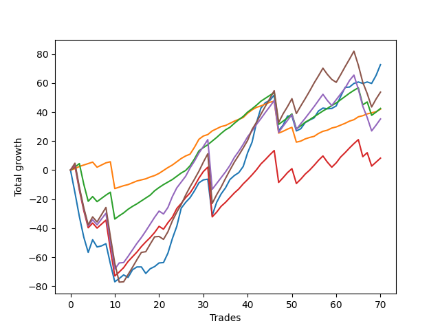

# Long Shepard 006 
- Symbol: ES_SmolBoiHour
- Date Range: 03/18/2022 - 07/29/2022
- Trading Period: 7:20-12:30
- Number of Trades: 70



| Name | Win Percent | Profit | Avg Profit / Trade | Avg Time / Trade |      | Name | Win Percent | Profit | Avg Profit / Trade | Avg Time / Trade |
| ---- | ----------- | ------ | ------------------ | ---------------- | ---- | ---- | ----------- | ------ | ------------------ | ---------------- |
| Sorted By <br> Profit | | | | | | Sorted By <br> Win Percentage ||||
| Two | 78.57 | 36375.00 | 519.64 | 19:32 |     | Eighty-One | 94.29 | 21000.00 | 300.00 | 07:40 |
| Eighty-Five | 74.29 | 26875.00 | 383.93 | 25:37 |     | Eighty-Two | 88.57 | 21250.00 | 303.57 | 13:50 |
| Eighty-Two | 88.57 | 21250.00 | 303.57 | 13:50 |     | Eighty-Three | 80.00 | 4125.00 | 58.93 | 18:32 |
| Eighty-One | 94.29 | 21000.00 | 300.00 | 07:40 |     | Two | 78.57 | 36375.00 | 519.64 | 19:32 |
| Eighty-Four | 77.14 | 17625.00 | 251.79 | 22:40 |     | Eighty-Four | 77.14 | 17625.00 | 251.79 | 22:40 |
| Eighty-Three | 80.00 | 4125.00 | 58.93 | 18:32 |     | Eighty-Five | 74.29 | 26875.00 | 383.93 | 25:37 |

## NO STOPLOSS

### Test Two
* Sell when the price hits the upper line of the 20p 2std bollinger
* No Stoploss
* Results:
```
Total Trades: 70
Percent Up: 78.57
Percent Down: 21.43
Total Points Moved Up: 72.75
Potential Profit: 36375.00
Total Points Ups: 229.25 Count Ups: 55
Total Points Downs: -156.50 Count Downs: 15
```

<details><summary>Trades</summary>

<code>In: 2022-03-21 09:41:00		Out: 2022-03-21 10:34:05		Total Position Time: 53:05		Total Move Up: -15.50		Total to Date: -15.50</code> <br />
<code>In: 2022-03-23 09:49:00		Out: 2022-03-23 10:48:55		Total Position Time: 59:55		Total Move Up: -16.50		Total to Date: -32.00</code> <br />
<code>In: 2022-03-23 09:53:00		Out: 2022-03-23 10:52:55		Total Position Time: 59:55		Total Move Up: -14.25		Total to Date: -46.25</code> <br />
<code>In: 2022-03-23 10:07:00		Out: 2022-03-23 10:54:25		Total Position Time: 47:25		Total Move Up: -10.50		Total to Date: -56.75</code> <br />
<code>In: 2022-03-24 07:32:00		Out: 2022-03-24 07:34:15		Total Position Time: 02:15		Total Move Up: 8.75		Total to Date: -48.00</code> <br />
<code>In: 2022-03-25 08:18:00		Out: 2022-03-25 08:41:45		Total Position Time: 23:45		Total Move Up: -5.00		Total to Date: -53.00</code> <br />
<code>In: 2022-03-28 07:30:00		Out: 2022-03-28 07:30:25		Total Position Time: 00:25		Total Move Up: 0.75		Total to Date: -52.25</code> <br />
<code>In: 2022-03-28 07:31:00		Out: 2022-03-28 07:48:05		Total Position Time: 17:05		Total Move Up: 1.50		Total to Date: -50.75</code> <br />
<code>In: 2022-03-28 08:11:00		Out: 2022-03-28 09:07:10		Total Position Time: 56:10		Total Move Up: -13.75		Total to Date: -64.50</code> <br />
<code>In: 2022-03-28 08:30:00		Out: 2022-03-28 09:07:10		Total Position Time: 37:10		Total Move Up: -12.50		Total to Date: -77.00</code> <br />
<code>In: 2022-03-30 07:29:00		Out: 2022-03-30 07:46:00		Total Position Time: 17:00		Total Move Up: 2.25		Total to Date: -74.75</code> <br />
<code>In: 2022-03-31 09:30:00		Out: 2022-03-31 09:44:20		Total Position Time: 14:20		Total Move Up: 2.50		Total to Date: -72.25</code> <br />
<code>In: 2022-04-12 07:47:00		Out: 2022-04-12 08:15:45		Total Position Time: 28:45		Total Move Up: -1.75		Total to Date: -74.00</code> <br />
<code>In: 2022-04-20 08:27:00		Out: 2022-04-20 08:31:15		Total Position Time: 04:15		Total Move Up: 5.25		Total to Date: -68.75</code> <br />
<code>In: 2022-04-20 08:30:00		Out: 2022-04-20 08:31:15		Total Position Time: 01:15		Total Move Up: 2.00		Total to Date: -66.75</code> <br />
<code>In: 2022-04-20 09:19:00		Out: 2022-04-20 09:31:05		Total Position Time: 12:05		Total Move Up: 0.00		Total to Date: -66.75</code> <br />
<code>In: 2022-04-20 11:32:00		Out: 2022-04-20 12:12:35		Total Position Time: 40:35		Total Move Up: -4.50		Total to Date: -71.25</code> <br />
<code>In: 2022-04-20 11:47:00		Out: 2022-04-20 12:12:35		Total Position Time: 25:35		Total Move Up: 3.25		Total to Date: -68.00</code> <br />
<code>In: 2022-04-20 11:48:00		Out: 2022-04-20 12:12:35		Total Position Time: 24:35		Total Move Up: 1.50		Total to Date: -66.50</code> <br />
<code>In: 2022-04-27 12:11:00		Out: 2022-04-27 12:31:20		Total Position Time: 20:20		Total Move Up: 2.50		Total to Date: -64.00</code> <br />
<code>In: 2022-04-27 12:14:00		Out: 2022-04-27 12:31:20		Total Position Time: 17:20		Total Move Up: 0.25		Total to Date: -63.75</code> <br />
<code>In: 2022-04-27 12:24:00		Out: 2022-04-27 12:31:20		Total Position Time: 07:20		Total Move Up: 6.50		Total to Date: -57.25</code> <br />
<code>In: 2022-05-03 07:51:00		Out: 2022-05-03 07:59:10		Total Position Time: 08:10		Total Move Up: 10.00		Total to Date: -47.25</code> <br />
<code>In: 2022-05-03 07:52:00		Out: 2022-05-03 07:59:10		Total Position Time: 07:10		Total Move Up: 8.50		Total to Date: -38.75</code> <br />
<code>In: 2022-05-03 11:45:00		Out: 2022-05-03 11:52:15		Total Position Time: 07:15		Total Move Up: 12.50		Total to Date: -26.25</code> <br />
<code>In: 2022-05-06 11:36:00		Out: 2022-05-06 11:49:10		Total Position Time: 13:10		Total Move Up: 4.00		Total to Date: -22.25</code> <br />
<code>In: 2022-05-06 11:41:00		Out: 2022-05-06 11:49:10		Total Position Time: 08:10		Total Move Up: 3.25		Total to Date: -19.00</code> <br />
<code>In: 2022-05-06 11:47:00		Out: 2022-05-06 11:49:10		Total Position Time: 02:10		Total Move Up: 4.75		Total to Date: -14.25</code> <br />
<code>In: 2022-05-06 11:50:00		Out: 2022-05-06 11:50:10		Total Position Time: 00:10		Total Move Up: 5.50		Total to Date: -8.75</code> <br />
<code>In: 2022-05-06 12:12:00		Out: 2022-05-06 12:28:10		Total Position Time: 16:10		Total Move Up: 2.00		Total to Date: -6.75</code> <br />
<code>In: 2022-05-06 12:20:00		Out: 2022-05-06 12:28:10		Total Position Time: 08:10		Total Move Up: 0.50		Total to Date: -6.25</code> <br />
<code>In: 2022-05-11 09:37:00		Out: 2022-05-11 10:24:50		Total Position Time: 47:50		Total Move Up: -25.00		Total to Date: -31.25</code> <br />
<code>In: 2022-05-12 09:04:00		Out: 2022-05-12 09:16:10		Total Position Time: 12:10		Total Move Up: 9.00		Total to Date: -22.25</code> <br />
<code>In: 2022-05-12 09:05:00		Out: 2022-05-12 09:16:10		Total Position Time: 11:10		Total Move Up: 5.75		Total to Date: -16.50</code> <br />
<code>In: 2022-05-12 09:08:00		Out: 2022-05-12 09:16:10		Total Position Time: 08:10		Total Move Up: 4.25		Total to Date: -12.25</code> <br />
<code>In: 2022-05-13 11:10:00		Out: 2022-05-13 11:31:20		Total Position Time: 21:20		Total Move Up: 5.75		Total to Date: -6.50</code> <br />
<code>In: 2022-05-13 11:11:00		Out: 2022-05-13 11:31:20		Total Position Time: 20:20		Total Move Up: 2.75		Total to Date: -3.75</code> <br />
<code>In: 2022-05-16 07:58:00		Out: 2022-05-16 08:11:30		Total Position Time: 13:30		Total Move Up: 2.00		Total to Date: -1.75</code> <br />
<code>In: 2022-05-16 08:02:00		Out: 2022-05-16 08:11:30		Total Position Time: 09:30		Total Move Up: 4.25		Total to Date: 2.50</code> <br />
<code>In: 2022-05-17 11:25:00		Out: 2022-05-17 11:40:00		Total Position Time: 15:00		Total Move Up: 9.50		Total to Date: 12.00</code> <br />
<code>In: 2022-05-19 07:47:00		Out: 2022-05-19 07:55:50		Total Position Time: 08:50		Total Move Up: 7.25		Total to Date: 19.25</code> <br />
<code>In: 2022-05-19 10:19:00		Out: 2022-05-19 10:44:05		Total Position Time: 25:05		Total Move Up: 13.50		Total to Date: 32.75</code> <br />
<code>In: 2022-05-19 10:20:00		Out: 2022-05-19 10:44:05		Total Position Time: 24:05		Total Move Up: 10.00		Total to Date: 42.75</code> <br />
<code>In: 2022-05-25 09:30:00		Out: 2022-05-25 09:45:20		Total Position Time: 15:20		Total Move Up: 3.75		Total to Date: 46.50</code> <br />
<code>In: 2022-05-25 09:31:00		Out: 2022-05-25 09:45:20		Total Position Time: 14:20		Total Move Up: 1.50		Total to Date: 48.00</code> <br />
<code>In: 2022-05-25 09:39:00		Out: 2022-05-25 09:45:20		Total Position Time: 06:20		Total Move Up: 3.75		Total to Date: 51.75</code> <br />
<code>In: 2022-06-03 07:33:00		Out: 2022-06-03 08:32:00		Total Position Time: 59:00		Total Move Up: -24.50		Total to Date: 27.25</code> <br />
<code>In: 2022-06-06 08:24:00		Out: 2022-06-06 08:43:00		Total Position Time: 19:00		Total Move Up: 3.75		Total to Date: 31.00</code> <br />
<code>In: 2022-06-08 08:06:00		Out: 2022-06-08 08:14:00		Total Position Time: 08:00		Total Move Up: 6.25		Total to Date: 37.25</code> <br />
<code>In: 2022-06-09 07:58:00		Out: 2022-06-09 08:22:35		Total Position Time: 24:35		Total Move Up: 0.00		Total to Date: 37.25</code> <br />
<code>In: 2022-06-15 07:43:00		Out: 2022-06-15 08:42:55		Total Position Time: 59:55		Total Move Up: -10.25		Total to Date: 27.00</code> <br />
<code>In: 2022-06-27 10:51:00		Out: 2022-06-27 11:13:35		Total Position Time: 22:35		Total Move Up: 1.50		Total to Date: 28.50</code> <br />
<code>In: 2022-06-29 08:29:00		Out: 2022-06-29 08:34:40		Total Position Time: 05:40		Total Move Up: 4.25		Total to Date: 32.75</code> <br />
<code>In: 2022-07-08 09:48:00		Out: 2022-07-08 10:10:30		Total Position Time: 22:30		Total Move Up: 1.75		Total to Date: 34.50</code> <br />
<code>In: 2022-07-08 09:56:00		Out: 2022-07-08 10:10:30		Total Position Time: 14:30		Total Move Up: 1.50		Total to Date: 36.00</code> <br />
<code>In: 2022-07-08 10:06:00		Out: 2022-07-08 10:10:30		Total Position Time: 04:30		Total Move Up: 4.75		Total to Date: 40.75</code> <br />
<code>In: 2022-07-08 10:07:00		Out: 2022-07-08 10:10:30		Total Position Time: 03:30		Total Move Up: 2.00		Total to Date: 42.75</code> <br />
<code>In: 2022-07-11 12:12:00		Out: 2022-07-11 12:29:25		Total Position Time: 17:25		Total Move Up: -0.50		Total to Date: 42.25</code> <br />
<code>In: 2022-07-11 12:15:00		Out: 2022-07-11 12:29:25		Total Position Time: 14:25		Total Move Up: 0.25		Total to Date: 42.50</code> <br />
<code>In: 2022-07-11 12:25:00		Out: 2022-07-11 12:29:25		Total Position Time: 04:25		Total Move Up: 1.75		Total to Date: 44.25</code> <br />
<code>In: 2022-07-20 10:18:00		Out: 2022-07-20 10:28:15		Total Position Time: 10:15		Total Move Up: 6.50		Total to Date: 50.75</code> <br />
<code>In: 2022-07-20 11:01:00		Out: 2022-07-20 11:20:00		Total Position Time: 19:00		Total Move Up: 6.25		Total to Date: 57.00</code> <br />
<code>In: 2022-07-25 07:22:00		Out: 2022-07-25 07:43:50		Total Position Time: 21:50		Total Move Up: 0.25		Total to Date: 57.25</code> <br />
<code>In: 2022-07-25 07:25:00		Out: 2022-07-25 07:43:50		Total Position Time: 18:50		Total Move Up: 2.50		Total to Date: 59.75</code> <br />
<code>In: 2022-07-25 11:06:00		Out: 2022-07-25 11:35:45		Total Position Time: 29:45		Total Move Up: 1.00		Total to Date: 60.75</code> <br />
<code>In: 2022-07-25 11:07:00		Out: 2022-07-25 11:35:45		Total Position Time: 28:45		Total Move Up: -1.00		Total to Date: 59.75</code> <br />
<code>In: 2022-07-25 11:10:00		Out: 2022-07-25 11:35:45		Total Position Time: 25:45		Total Move Up: 1.00		Total to Date: 60.75</code> <br />
<code>In: 2022-07-25 11:11:00		Out: 2022-07-25 11:35:45		Total Position Time: 24:45		Total Move Up: -1.00		Total to Date: 59.75</code> <br />
<code>In: 2022-07-29 08:32:00		Out: 2022-07-29 08:41:15		Total Position Time: 09:15		Total Move Up: 5.50		Total to Date: 65.25</code> <br />
<code>In: 2022-07-29 08:36:00		Out: 2022-07-29 08:41:15		Total Position Time: 05:15		Total Move Up: 7.50		Total to Date: 72.75</code> <br />


</details>

## TAKE PROFIT

### Test Eighty-One
* Take Profit of 1 Point
* No Stoploss
* Results:
```
Total Trades: 70
Percent Up: 94.29
Percent Down: 5.71
Total Points Moved Up: 42.00
Potential Profit: 21000.00
Total Points Ups: 96.25 Count Ups: 66
Total Points Downs: -54.25 Count Downs: 4
```

<details><summary>Trades</summary>

<code>In: 2022-03-21 09:41:00		Out: 2022-03-21 09:42:10		Total Position Time: 01:10		Total Move Up: 1.00		Total to Date: 1.00</code> <br />
<code>In: 2022-03-23 09:49:00		Out: 2022-03-23 09:52:50		Total Position Time: 03:50		Total Move Up: 1.50		Total to Date: 2.50</code> <br />
<code>In: 2022-03-23 09:53:00		Out: 2022-03-23 09:59:10		Total Position Time: 06:10		Total Move Up: 1.00		Total to Date: 3.50</code> <br />
<code>In: 2022-03-23 10:07:00		Out: 2022-03-23 10:09:40		Total Position Time: 02:40		Total Move Up: 1.00		Total to Date: 4.50</code> <br />
<code>In: 2022-03-24 07:32:00		Out: 2022-03-24 07:32:20		Total Position Time: 00:20		Total Move Up: 1.00		Total to Date: 5.50</code> <br />
<code>In: 2022-03-25 08:18:00		Out: 2022-03-25 09:17:55		Total Position Time: 59:55		Total Move Up: -3.50		Total to Date: 2.00</code> <br />
<code>In: 2022-03-28 07:30:00		Out: 2022-03-28 07:48:05		Total Position Time: 18:05		Total Move Up: 1.50		Total to Date: 3.50</code> <br />
<code>In: 2022-03-28 07:31:00		Out: 2022-03-28 07:48:05		Total Position Time: 17:05		Total Move Up: 1.50		Total to Date: 5.00</code> <br />
<code>In: 2022-03-28 08:11:00		Out: 2022-03-28 08:11:10		Total Position Time: 00:10		Total Move Up: 0.75		Total to Date: 5.75</code> <br />
<code>In: 2022-03-28 08:30:00		Out: 2022-03-28 09:29:55		Total Position Time: 59:55		Total Move Up: -18.50		Total to Date: -12.75</code> <br />
<code>In: 2022-03-30 07:29:00		Out: 2022-03-30 07:36:55		Total Position Time: 07:55		Total Move Up: 1.00		Total to Date: -11.75</code> <br />
<code>In: 2022-03-31 09:30:00		Out: 2022-03-31 09:30:30		Total Position Time: 00:30		Total Move Up: 1.00		Total to Date: -10.75</code> <br />
<code>In: 2022-04-12 07:47:00		Out: 2022-04-12 08:19:00		Total Position Time: 32:00		Total Move Up: 0.75		Total to Date: -10.00</code> <br />
<code>In: 2022-04-20 08:27:00		Out: 2022-04-20 08:28:50		Total Position Time: 01:50		Total Move Up: 1.25		Total to Date: -8.75</code> <br />
<code>In: 2022-04-20 08:30:00		Out: 2022-04-20 08:30:50		Total Position Time: 00:50		Total Move Up: 1.25		Total to Date: -7.50</code> <br />
<code>In: 2022-04-20 09:19:00		Out: 2022-04-20 09:19:35		Total Position Time: 00:35		Total Move Up: 0.75		Total to Date: -6.75</code> <br />
<code>In: 2022-04-20 11:32:00		Out: 2022-04-20 12:25:30		Total Position Time: 53:30		Total Move Up: 0.75		Total to Date: -6.00</code> <br />
<code>In: 2022-04-20 11:47:00		Out: 2022-04-20 11:47:20		Total Position Time: 00:20		Total Move Up: 1.25		Total to Date: -4.75</code> <br />
<code>In: 2022-04-20 11:48:00		Out: 2022-04-20 11:48:15		Total Position Time: 00:15		Total Move Up: 1.00		Total to Date: -3.75</code> <br />
<code>In: 2022-04-27 12:11:00		Out: 2022-04-27 12:13:55		Total Position Time: 02:55		Total Move Up: 1.50		Total to Date: -2.25</code> <br />
<code>In: 2022-04-27 12:14:00		Out: 2022-04-27 12:15:20		Total Position Time: 01:20		Total Move Up: 2.00		Total to Date: -0.25</code> <br />
<code>In: 2022-04-27 12:24:00		Out: 2022-04-27 12:24:15		Total Position Time: 00:15		Total Move Up: 2.00		Total to Date: 1.75</code> <br />
<code>In: 2022-05-03 07:51:00		Out: 2022-05-03 07:51:35		Total Position Time: 00:35		Total Move Up: 1.75		Total to Date: 3.50</code> <br />
<code>In: 2022-05-03 07:52:00		Out: 2022-05-03 07:52:25		Total Position Time: 00:25		Total Move Up: 2.25		Total to Date: 5.75</code> <br />
<code>In: 2022-05-03 11:45:00		Out: 2022-05-03 11:45:10		Total Position Time: 00:10		Total Move Up: 2.25		Total to Date: 8.00</code> <br />
<code>In: 2022-05-06 11:36:00		Out: 2022-05-06 11:40:25		Total Position Time: 04:25		Total Move Up: 1.75		Total to Date: 9.75</code> <br />
<code>In: 2022-05-06 11:41:00		Out: 2022-05-06 11:41:10		Total Position Time: 00:10		Total Move Up: 1.25		Total to Date: 11.00</code> <br />
<code>In: 2022-05-06 11:47:00		Out: 2022-05-06 11:49:10		Total Position Time: 02:10		Total Move Up: 4.75		Total to Date: 15.75</code> <br />
<code>In: 2022-05-06 11:50:00		Out: 2022-05-06 11:50:10		Total Position Time: 00:10		Total Move Up: 5.50		Total to Date: 21.25</code> <br />
<code>In: 2022-05-06 12:12:00		Out: 2022-05-06 12:12:10		Total Position Time: 00:10		Total Move Up: 2.25		Total to Date: 23.50</code> <br />
<code>In: 2022-05-06 12:20:00		Out: 2022-05-06 12:28:25		Total Position Time: 08:25		Total Move Up: 1.00		Total to Date: 24.50</code> <br />
<code>In: 2022-05-11 09:37:00		Out: 2022-05-11 09:40:45		Total Position Time: 03:45		Total Move Up: 2.50		Total to Date: 27.00</code> <br />
<code>In: 2022-05-12 09:04:00		Out: 2022-05-12 09:04:10		Total Position Time: 00:10		Total Move Up: 1.50		Total to Date: 28.50</code> <br />
<code>In: 2022-05-12 09:05:00		Out: 2022-05-12 09:06:20		Total Position Time: 01:20		Total Move Up: 1.50		Total to Date: 30.00</code> <br />
<code>In: 2022-05-12 09:08:00		Out: 2022-05-12 09:08:50		Total Position Time: 00:50		Total Move Up: 0.75		Total to Date: 30.75</code> <br />
<code>In: 2022-05-13 11:10:00		Out: 2022-05-13 11:10:15		Total Position Time: 00:15		Total Move Up: 1.50		Total to Date: 32.25</code> <br />
<code>In: 2022-05-13 11:11:00		Out: 2022-05-13 11:12:25		Total Position Time: 01:25		Total Move Up: 1.50		Total to Date: 33.75</code> <br />
<code>In: 2022-05-16 07:58:00		Out: 2022-05-16 08:09:55		Total Position Time: 11:55		Total Move Up: 1.25		Total to Date: 35.00</code> <br />
<code>In: 2022-05-16 08:02:00		Out: 2022-05-16 08:09:40		Total Position Time: 07:40		Total Move Up: 1.25		Total to Date: 36.25</code> <br />
<code>In: 2022-05-17 11:25:00		Out: 2022-05-17 11:26:40		Total Position Time: 01:40		Total Move Up: 3.00		Total to Date: 39.25</code> <br />
<code>In: 2022-05-19 07:47:00		Out: 2022-05-19 07:54:45		Total Position Time: 07:45		Total Move Up: 2.25		Total to Date: 41.50</code> <br />
<code>In: 2022-05-19 10:19:00		Out: 2022-05-19 10:19:20		Total Position Time: 00:20		Total Move Up: 1.75		Total to Date: 43.25</code> <br />
<code>In: 2022-05-19 10:20:00		Out: 2022-05-19 10:21:15		Total Position Time: 01:15		Total Move Up: 1.00		Total to Date: 44.25</code> <br />
<code>In: 2022-05-25 09:30:00		Out: 2022-05-25 09:30:15		Total Position Time: 00:15		Total Move Up: 1.25		Total to Date: 45.50</code> <br />
<code>In: 2022-05-25 09:31:00		Out: 2022-05-25 09:32:10		Total Position Time: 01:10		Total Move Up: 1.25		Total to Date: 46.75</code> <br />
<code>In: 2022-05-25 09:39:00		Out: 2022-05-25 09:42:00		Total Position Time: 03:00		Total Move Up: 0.75		Total to Date: 47.50</code> <br />
<code>In: 2022-06-03 07:33:00		Out: 2022-06-03 08:32:55		Total Position Time: 59:55		Total Move Up: -22.00		Total to Date: 25.50</code> <br />
<code>In: 2022-06-06 08:24:00		Out: 2022-06-06 08:26:35		Total Position Time: 02:35		Total Move Up: 1.25		Total to Date: 26.75</code> <br />
<code>In: 2022-06-08 08:06:00		Out: 2022-06-08 08:06:10		Total Position Time: 00:10		Total Move Up: 1.50		Total to Date: 28.25</code> <br />
<code>In: 2022-06-09 07:58:00		Out: 2022-06-09 07:58:30		Total Position Time: 00:30		Total Move Up: 1.25		Total to Date: 29.50</code> <br />
<code>In: 2022-06-15 07:43:00		Out: 2022-06-15 08:42:55		Total Position Time: 59:55		Total Move Up: -10.25		Total to Date: 19.25</code> <br />
<code>In: 2022-06-27 10:51:00		Out: 2022-06-27 10:53:30		Total Position Time: 02:30		Total Move Up: 0.75		Total to Date: 20.00</code> <br />
<code>In: 2022-06-29 08:29:00		Out: 2022-06-29 08:32:15		Total Position Time: 03:15		Total Move Up: 1.50		Total to Date: 21.50</code> <br />
<code>In: 2022-07-08 09:48:00		Out: 2022-07-08 09:48:20		Total Position Time: 00:20		Total Move Up: 1.00		Total to Date: 22.50</code> <br />
<code>In: 2022-07-08 09:56:00		Out: 2022-07-08 09:56:20		Total Position Time: 00:20		Total Move Up: 0.75		Total to Date: 23.25</code> <br />
<code>In: 2022-07-08 10:06:00		Out: 2022-07-08 10:06:10		Total Position Time: 00:10		Total Move Up: 2.00		Total to Date: 25.25</code> <br />
<code>In: 2022-07-08 10:07:00		Out: 2022-07-08 10:09:40		Total Position Time: 02:40		Total Move Up: 1.50		Total to Date: 26.75</code> <br />
<code>In: 2022-07-11 12:12:00		Out: 2022-07-11 12:30:55		Total Position Time: 18:55		Total Move Up: 0.75		Total to Date: 27.50</code> <br />
<code>In: 2022-07-11 12:15:00		Out: 2022-07-11 12:29:40		Total Position Time: 14:40		Total Move Up: 1.50		Total to Date: 29.00</code> <br />
<code>In: 2022-07-11 12:25:00		Out: 2022-07-11 12:27:35		Total Position Time: 02:35		Total Move Up: 0.75		Total to Date: 29.75</code> <br />
<code>In: 2022-07-20 10:18:00		Out: 2022-07-20 10:18:15		Total Position Time: 00:15		Total Move Up: 1.25		Total to Date: 31.00</code> <br />
<code>In: 2022-07-20 11:01:00		Out: 2022-07-20 11:03:20		Total Position Time: 02:20		Total Move Up: 1.25		Total to Date: 32.25</code> <br />
<code>In: 2022-07-25 07:22:00		Out: 2022-07-25 07:44:20		Total Position Time: 22:20		Total Move Up: 1.50		Total to Date: 33.75</code> <br />
<code>In: 2022-07-25 07:25:00		Out: 2022-07-25 07:26:00		Total Position Time: 01:00		Total Move Up: 1.00		Total to Date: 34.75</code> <br />
<code>In: 2022-07-25 11:06:00		Out: 2022-07-25 11:06:15		Total Position Time: 00:15		Total Move Up: 2.00		Total to Date: 36.75</code> <br />
<code>In: 2022-07-25 11:07:00		Out: 2022-07-25 11:11:45		Total Position Time: 04:45		Total Move Up: 0.75		Total to Date: 37.50</code> <br />
<code>In: 2022-07-25 11:10:00		Out: 2022-07-25 11:10:40		Total Position Time: 00:40		Total Move Up: 1.25		Total to Date: 38.75</code> <br />
<code>In: 2022-07-25 11:11:00		Out: 2022-07-25 11:11:45		Total Position Time: 00:45		Total Move Up: 0.75		Total to Date: 39.50</code> <br />
<code>In: 2022-07-29 08:32:00		Out: 2022-07-29 08:37:00		Total Position Time: 05:00		Total Move Up: 0.75		Total to Date: 40.25</code> <br />
<code>In: 2022-07-29 08:36:00		Out: 2022-07-29 08:36:20		Total Position Time: 00:20		Total Move Up: 1.75		Total to Date: 42.00</code> <br />


</details>

### Test Eighty-Two
* Take Profit of 2 Point
* No Stoploss
* Results:
```
Total Trades: 70
Percent Up: 88.57
Percent Down: 11.43
Total Points Moved Up: 42.50
Potential Profit: 21250.00
Total Points Ups: 143.75 Count Ups: 62
Total Points Downs: -101.25 Count Downs: 8
```

<details><summary>Trades</summary>

<code>In: 2022-03-21 09:41:00		Out: 2022-03-21 09:42:50		Total Position Time: 01:50		Total Move Up: 2.00		Total to Date: 2.00</code> <br />
<code>In: 2022-03-23 09:49:00		Out: 2022-03-23 09:59:10		Total Position Time: 10:10		Total Move Up: 2.50		Total to Date: 4.50</code> <br />
<code>In: 2022-03-23 09:53:00		Out: 2022-03-23 10:52:55		Total Position Time: 59:55		Total Move Up: -14.25		Total to Date: -9.75</code> <br />
<code>In: 2022-03-23 10:07:00		Out: 2022-03-23 11:06:55		Total Position Time: 59:55		Total Move Up: -11.75		Total to Date: -21.50</code> <br />
<code>In: 2022-03-24 07:32:00		Out: 2022-03-24 07:32:40		Total Position Time: 00:40		Total Move Up: 3.25		Total to Date: -18.25</code> <br />
<code>In: 2022-03-25 08:18:00		Out: 2022-03-25 09:17:55		Total Position Time: 59:55		Total Move Up: -3.50		Total to Date: -21.75</code> <br />
<code>In: 2022-03-28 07:30:00		Out: 2022-03-28 07:48:15		Total Position Time: 18:15		Total Move Up: 2.25		Total to Date: -19.50</code> <br />
<code>In: 2022-03-28 07:31:00		Out: 2022-03-28 07:48:15		Total Position Time: 17:15		Total Move Up: 2.25		Total to Date: -17.25</code> <br />
<code>In: 2022-03-28 08:11:00		Out: 2022-03-28 08:11:40		Total Position Time: 00:40		Total Move Up: 2.00		Total to Date: -15.25</code> <br />
<code>In: 2022-03-28 08:30:00		Out: 2022-03-28 09:29:55		Total Position Time: 59:55		Total Move Up: -18.50		Total to Date: -33.75</code> <br />
<code>In: 2022-03-30 07:29:00		Out: 2022-03-30 07:46:00		Total Position Time: 17:00		Total Move Up: 2.25		Total to Date: -31.50</code> <br />
<code>In: 2022-03-31 09:30:00		Out: 2022-03-31 09:32:50		Total Position Time: 02:50		Total Move Up: 2.00		Total to Date: -29.50</code> <br />
<code>In: 2022-04-12 07:47:00		Out: 2022-04-12 08:19:50		Total Position Time: 32:50		Total Move Up: 2.50		Total to Date: -27.00</code> <br />
<code>In: 2022-04-20 08:27:00		Out: 2022-04-20 08:29:05		Total Position Time: 02:05		Total Move Up: 2.00		Total to Date: -25.00</code> <br />
<code>In: 2022-04-20 08:30:00		Out: 2022-04-20 08:30:55		Total Position Time: 00:55		Total Move Up: 1.75		Total to Date: -23.25</code> <br />
<code>In: 2022-04-20 09:19:00		Out: 2022-04-20 09:32:30		Total Position Time: 13:30		Total Move Up: 2.00		Total to Date: -21.25</code> <br />
<code>In: 2022-04-20 11:32:00		Out: 2022-04-20 12:25:45		Total Position Time: 53:45		Total Move Up: 2.00		Total to Date: -19.25</code> <br />
<code>In: 2022-04-20 11:47:00		Out: 2022-04-20 11:48:05		Total Position Time: 01:05		Total Move Up: 2.00		Total to Date: -17.25</code> <br />
<code>In: 2022-04-20 11:48:00		Out: 2022-04-20 12:12:50		Total Position Time: 24:50		Total Move Up: 3.00		Total to Date: -14.25</code> <br />
<code>In: 2022-04-27 12:11:00		Out: 2022-04-27 12:14:00		Total Position Time: 03:00		Total Move Up: 2.25		Total to Date: -12.00</code> <br />
<code>In: 2022-04-27 12:14:00		Out: 2022-04-27 12:15:20		Total Position Time: 01:20		Total Move Up: 2.00		Total to Date: -10.00</code> <br />
<code>In: 2022-04-27 12:24:00		Out: 2022-04-27 12:25:15		Total Position Time: 01:15		Total Move Up: 1.75		Total to Date: -8.25</code> <br />
<code>In: 2022-05-03 07:51:00		Out: 2022-05-03 07:51:55		Total Position Time: 00:55		Total Move Up: 1.75		Total to Date: -6.50</code> <br />
<code>In: 2022-05-03 07:52:00		Out: 2022-05-03 07:52:25		Total Position Time: 00:25		Total Move Up: 2.25		Total to Date: -4.25</code> <br />
<code>In: 2022-05-03 11:45:00		Out: 2022-05-03 11:45:10		Total Position Time: 00:10		Total Move Up: 2.25		Total to Date: -2.00</code> <br />
<code>In: 2022-05-06 11:36:00		Out: 2022-05-06 11:40:25		Total Position Time: 04:25		Total Move Up: 1.75		Total to Date: -0.25</code> <br />
<code>In: 2022-05-06 11:41:00		Out: 2022-05-06 11:49:10		Total Position Time: 08:10		Total Move Up: 3.25		Total to Date: 3.00</code> <br />
<code>In: 2022-05-06 11:47:00		Out: 2022-05-06 11:49:10		Total Position Time: 02:10		Total Move Up: 4.75		Total to Date: 7.75</code> <br />
<code>In: 2022-05-06 11:50:00		Out: 2022-05-06 11:50:10		Total Position Time: 00:10		Total Move Up: 5.50		Total to Date: 13.25</code> <br />
<code>In: 2022-05-06 12:12:00		Out: 2022-05-06 12:12:10		Total Position Time: 00:10		Total Move Up: 2.25		Total to Date: 15.50</code> <br />
<code>In: 2022-05-06 12:20:00		Out: 2022-05-06 12:28:50		Total Position Time: 08:50		Total Move Up: 2.00		Total to Date: 17.50</code> <br />
<code>In: 2022-05-11 09:37:00		Out: 2022-05-11 09:40:45		Total Position Time: 03:45		Total Move Up: 2.50		Total to Date: 20.00</code> <br />
<code>In: 2022-05-12 09:04:00		Out: 2022-05-12 09:04:35		Total Position Time: 00:35		Total Move Up: 2.50		Total to Date: 22.50</code> <br />
<code>In: 2022-05-12 09:05:00		Out: 2022-05-12 09:07:35		Total Position Time: 02:35		Total Move Up: 2.75		Total to Date: 25.25</code> <br />
<code>In: 2022-05-12 09:08:00		Out: 2022-05-12 09:09:10		Total Position Time: 01:10		Total Move Up: 2.50		Total to Date: 27.75</code> <br />
<code>In: 2022-05-13 11:10:00		Out: 2022-05-13 11:10:20		Total Position Time: 00:20		Total Move Up: 1.75		Total to Date: 29.50</code> <br />
<code>In: 2022-05-13 11:11:00		Out: 2022-05-13 11:31:20		Total Position Time: 20:20		Total Move Up: 2.75		Total to Date: 32.25</code> <br />
<code>In: 2022-05-16 07:58:00		Out: 2022-05-16 08:11:15		Total Position Time: 13:15		Total Move Up: 2.50		Total to Date: 34.75</code> <br />
<code>In: 2022-05-16 08:02:00		Out: 2022-05-16 08:09:50		Total Position Time: 07:50		Total Move Up: 2.25		Total to Date: 37.00</code> <br />
<code>In: 2022-05-17 11:25:00		Out: 2022-05-17 11:26:40		Total Position Time: 01:40		Total Move Up: 3.00		Total to Date: 40.00</code> <br />
<code>In: 2022-05-19 07:47:00		Out: 2022-05-19 07:54:45		Total Position Time: 07:45		Total Move Up: 2.25		Total to Date: 42.25</code> <br />
<code>In: 2022-05-19 10:19:00		Out: 2022-05-19 10:19:30		Total Position Time: 00:30		Total Move Up: 2.50		Total to Date: 44.75</code> <br />
<code>In: 2022-05-19 10:20:00		Out: 2022-05-19 10:22:45		Total Position Time: 02:45		Total Move Up: 2.75		Total to Date: 47.50</code> <br />
<code>In: 2022-05-25 09:30:00		Out: 2022-05-25 09:30:25		Total Position Time: 00:25		Total Move Up: 2.00		Total to Date: 49.50</code> <br />
<code>In: 2022-05-25 09:31:00		Out: 2022-05-25 09:48:25		Total Position Time: 17:25		Total Move Up: 2.00		Total to Date: 51.50</code> <br />
<code>In: 2022-05-25 09:39:00		Out: 2022-05-25 09:44:30		Total Position Time: 05:30		Total Move Up: 2.00		Total to Date: 53.50</code> <br />
<code>In: 2022-06-03 07:33:00		Out: 2022-06-03 08:32:55		Total Position Time: 59:55		Total Move Up: -22.00		Total to Date: 31.50</code> <br />
<code>In: 2022-06-06 08:24:00		Out: 2022-06-06 08:27:45		Total Position Time: 03:45		Total Move Up: 2.25		Total to Date: 33.75</code> <br />
<code>In: 2022-06-08 08:06:00		Out: 2022-06-08 08:10:45		Total Position Time: 04:45		Total Move Up: 2.25		Total to Date: 36.00</code> <br />
<code>In: 2022-06-09 07:58:00		Out: 2022-06-09 08:42:25		Total Position Time: 44:25		Total Move Up: 2.75		Total to Date: 38.75</code> <br />
<code>In: 2022-06-15 07:43:00		Out: 2022-06-15 08:42:55		Total Position Time: 59:55		Total Move Up: -10.25		Total to Date: 28.50</code> <br />
<code>In: 2022-06-27 10:51:00		Out: 2022-06-27 11:14:45		Total Position Time: 23:45		Total Move Up: 2.00		Total to Date: 30.50</code> <br />
<code>In: 2022-06-29 08:29:00		Out: 2022-06-29 08:32:20		Total Position Time: 03:20		Total Move Up: 2.50		Total to Date: 33.00</code> <br />
<code>In: 2022-07-08 09:48:00		Out: 2022-07-08 09:49:00		Total Position Time: 01:00		Total Move Up: 1.75		Total to Date: 34.75</code> <br />
<code>In: 2022-07-08 09:56:00		Out: 2022-07-08 10:11:05		Total Position Time: 15:05		Total Move Up: 2.00		Total to Date: 36.75</code> <br />
<code>In: 2022-07-08 10:06:00		Out: 2022-07-08 10:06:10		Total Position Time: 00:10		Total Move Up: 2.00		Total to Date: 38.75</code> <br />
<code>In: 2022-07-08 10:07:00		Out: 2022-07-08 10:10:05		Total Position Time: 03:05		Total Move Up: 2.00		Total to Date: 40.75</code> <br />
<code>In: 2022-07-11 12:12:00		Out: 2022-07-11 12:31:55		Total Position Time: 19:55		Total Move Up: 1.75		Total to Date: 42.50</code> <br />
<code>In: 2022-07-11 12:15:00		Out: 2022-07-11 12:31:10		Total Position Time: 16:10		Total Move Up: 2.00		Total to Date: 44.50</code> <br />
<code>In: 2022-07-11 12:25:00		Out: 2022-07-11 12:29:25		Total Position Time: 04:25		Total Move Up: 1.75		Total to Date: 46.25</code> <br />
<code>In: 2022-07-20 10:18:00		Out: 2022-07-20 10:18:35		Total Position Time: 00:35		Total Move Up: 2.25		Total to Date: 48.50</code> <br />
<code>In: 2022-07-20 11:01:00		Out: 2022-07-20 11:03:35		Total Position Time: 02:35		Total Move Up: 2.25		Total to Date: 50.75</code> <br />
<code>In: 2022-07-25 07:22:00		Out: 2022-07-25 07:45:15		Total Position Time: 23:15		Total Move Up: 2.25		Total to Date: 53.00</code> <br />
<code>In: 2022-07-25 07:25:00		Out: 2022-07-25 07:26:30		Total Position Time: 01:30		Total Move Up: 2.00		Total to Date: 55.00</code> <br />
<code>In: 2022-07-25 11:06:00		Out: 2022-07-25 11:06:20		Total Position Time: 00:20		Total Move Up: 1.75		Total to Date: 56.75</code> <br />
<code>In: 2022-07-25 11:07:00		Out: 2022-07-25 12:06:55		Total Position Time: 59:55		Total Move Up: -11.75		Total to Date: 45.00</code> <br />
<code>In: 2022-07-25 11:10:00		Out: 2022-07-25 11:11:00		Total Position Time: 01:00		Total Move Up: 2.00		Total to Date: 47.00</code> <br />
<code>In: 2022-07-25 11:11:00		Out: 2022-07-25 12:10:55		Total Position Time: 59:55		Total Move Up: -9.25		Total to Date: 37.75</code> <br />
<code>In: 2022-07-29 08:32:00		Out: 2022-07-29 08:37:20		Total Position Time: 05:20		Total Move Up: 2.25		Total to Date: 40.00</code> <br />
<code>In: 2022-07-29 08:36:00		Out: 2022-07-29 08:36:25		Total Position Time: 00:25		Total Move Up: 2.50		Total to Date: 42.50</code> <br />


</details>

### Test Eighty-Three
* Take Profit of 3 Point
* No Stoploss
* Results:
```
Total Trades: 70
Percent Up: 80.00
Percent Down: 20.00
Total Points Moved Up: 8.25
Potential Profit: 4125.00
Total Points Ups: 190.00 Count Ups: 56
Total Points Downs: -181.75 Count Downs: 14
```

<details><summary>Trades</summary>

<code>In: 2022-03-21 09:41:00		Out: 2022-03-21 09:44:45		Total Position Time: 03:45		Total Move Up: 2.75		Total to Date: 2.75</code> <br />
<code>In: 2022-03-23 09:49:00		Out: 2022-03-23 10:48:55		Total Position Time: 59:55		Total Move Up: -16.50		Total to Date: -13.75</code> <br />
<code>In: 2022-03-23 09:53:00		Out: 2022-03-23 10:52:55		Total Position Time: 59:55		Total Move Up: -14.25		Total to Date: -28.00</code> <br />
<code>In: 2022-03-23 10:07:00		Out: 2022-03-23 11:06:55		Total Position Time: 59:55		Total Move Up: -11.75		Total to Date: -39.75</code> <br />
<code>In: 2022-03-24 07:32:00		Out: 2022-03-24 07:32:40		Total Position Time: 00:40		Total Move Up: 3.25		Total to Date: -36.50</code> <br />
<code>In: 2022-03-25 08:18:00		Out: 2022-03-25 09:17:55		Total Position Time: 59:55		Total Move Up: -3.50		Total to Date: -40.00</code> <br />
<code>In: 2022-03-28 07:30:00		Out: 2022-03-28 07:48:35		Total Position Time: 18:35		Total Move Up: 2.75		Total to Date: -37.25</code> <br />
<code>In: 2022-03-28 07:31:00		Out: 2022-03-28 07:48:35		Total Position Time: 17:35		Total Move Up: 2.75		Total to Date: -34.50</code> <br />
<code>In: 2022-03-28 08:11:00		Out: 2022-03-28 09:10:55		Total Position Time: 59:55		Total Move Up: -20.00		Total to Date: -54.50</code> <br />
<code>In: 2022-03-28 08:30:00		Out: 2022-03-28 09:29:55		Total Position Time: 59:55		Total Move Up: -18.50		Total to Date: -73.00</code> <br />
<code>In: 2022-03-30 07:29:00		Out: 2022-03-30 07:47:20		Total Position Time: 18:20		Total Move Up: 2.75		Total to Date: -70.25</code> <br />
<code>In: 2022-03-31 09:30:00		Out: 2022-03-31 09:44:50		Total Position Time: 14:50		Total Move Up: 3.00		Total to Date: -67.25</code> <br />
<code>In: 2022-04-12 07:47:00		Out: 2022-04-12 08:20:35		Total Position Time: 33:35		Total Move Up: 4.25		Total to Date: -63.00</code> <br />
<code>In: 2022-04-20 08:27:00		Out: 2022-04-20 08:29:30		Total Position Time: 02:30		Total Move Up: 3.25		Total to Date: -59.75</code> <br />
<code>In: 2022-04-20 08:30:00		Out: 2022-04-20 08:32:10		Total Position Time: 02:10		Total Move Up: 3.25		Total to Date: -56.50</code> <br />
<code>In: 2022-04-20 09:19:00		Out: 2022-04-20 09:32:40		Total Position Time: 13:40		Total Move Up: 3.75		Total to Date: -52.75</code> <br />
<code>In: 2022-04-20 11:32:00		Out: 2022-04-20 12:25:50		Total Position Time: 53:50		Total Move Up: 3.25		Total to Date: -49.50</code> <br />
<code>In: 2022-04-20 11:47:00		Out: 2022-04-20 11:48:20		Total Position Time: 01:20		Total Move Up: 3.00		Total to Date: -46.50</code> <br />
<code>In: 2022-04-20 11:48:00		Out: 2022-04-20 12:12:55		Total Position Time: 24:55		Total Move Up: 3.50		Total to Date: -43.00</code> <br />
<code>In: 2022-04-27 12:11:00		Out: 2022-04-27 12:15:20		Total Position Time: 04:20		Total Move Up: 4.25		Total to Date: -38.75</code> <br />
<code>In: 2022-04-27 12:14:00		Out: 2022-04-27 12:46:00		Total Position Time: 32:00		Total Move Up: -2.00		Total to Date: -40.75</code> <br />
<code>In: 2022-04-27 12:24:00		Out: 2022-04-27 12:27:15		Total Position Time: 03:15		Total Move Up: 4.50		Total to Date: -36.25</code> <br />
<code>In: 2022-05-03 07:51:00		Out: 2022-05-03 07:52:25		Total Position Time: 01:25		Total Move Up: 3.75		Total to Date: -32.50</code> <br />
<code>In: 2022-05-03 07:52:00		Out: 2022-05-03 07:54:05		Total Position Time: 02:05		Total Move Up: 6.00		Total to Date: -26.50</code> <br />
<code>In: 2022-05-03 11:45:00		Out: 2022-05-03 11:49:20		Total Position Time: 04:20		Total Move Up: 3.50		Total to Date: -23.00</code> <br />
<code>In: 2022-05-06 11:36:00		Out: 2022-05-06 11:49:10		Total Position Time: 13:10		Total Move Up: 4.00		Total to Date: -19.00</code> <br />
<code>In: 2022-05-06 11:41:00		Out: 2022-05-06 11:49:10		Total Position Time: 08:10		Total Move Up: 3.25		Total to Date: -15.75</code> <br />
<code>In: 2022-05-06 11:47:00		Out: 2022-05-06 11:49:10		Total Position Time: 02:10		Total Move Up: 4.75		Total to Date: -11.00</code> <br />
<code>In: 2022-05-06 11:50:00		Out: 2022-05-06 11:50:10		Total Position Time: 00:10		Total Move Up: 5.50		Total to Date: -5.50</code> <br />
<code>In: 2022-05-06 12:12:00		Out: 2022-05-06 12:13:10		Total Position Time: 01:10		Total Move Up: 4.50		Total to Date: -1.00</code> <br />
<code>In: 2022-05-06 12:20:00		Out: 2022-05-06 12:28:55		Total Position Time: 08:55		Total Move Up: 3.00		Total to Date: 2.00</code> <br />
<code>In: 2022-05-11 09:37:00		Out: 2022-05-11 10:36:55		Total Position Time: 59:55		Total Move Up: -34.25		Total to Date: -32.25</code> <br />
<code>In: 2022-05-12 09:04:00		Out: 2022-05-12 09:05:00		Total Position Time: 01:00		Total Move Up: 3.25		Total to Date: -29.00</code> <br />
<code>In: 2022-05-12 09:05:00		Out: 2022-05-12 09:09:10		Total Position Time: 04:10		Total Move Up: 4.00		Total to Date: -25.00</code> <br />
<code>In: 2022-05-12 09:08:00		Out: 2022-05-12 09:09:15		Total Position Time: 01:15		Total Move Up: 2.75		Total to Date: -22.25</code> <br />
<code>In: 2022-05-13 11:10:00		Out: 2022-05-13 11:10:50		Total Position Time: 00:50		Total Move Up: 3.25		Total to Date: -19.00</code> <br />
<code>In: 2022-05-13 11:11:00		Out: 2022-05-13 11:31:25		Total Position Time: 20:25		Total Move Up: 3.25		Total to Date: -15.75</code> <br />
<code>In: 2022-05-16 07:58:00		Out: 2022-05-16 08:12:00		Total Position Time: 14:00		Total Move Up: 2.75		Total to Date: -13.00</code> <br />
<code>In: 2022-05-16 08:02:00		Out: 2022-05-16 08:09:55		Total Position Time: 07:55		Total Move Up: 3.50		Total to Date: -9.50</code> <br />
<code>In: 2022-05-17 11:25:00		Out: 2022-05-17 11:26:40		Total Position Time: 01:40		Total Move Up: 3.00		Total to Date: -6.50</code> <br />
<code>In: 2022-05-19 07:47:00		Out: 2022-05-19 07:54:50		Total Position Time: 07:50		Total Move Up: 3.25		Total to Date: -3.25</code> <br />
<code>In: 2022-05-19 10:19:00		Out: 2022-05-19 10:20:00		Total Position Time: 01:00		Total Move Up: 3.50		Total to Date: 0.25</code> <br />
<code>In: 2022-05-19 10:20:00		Out: 2022-05-19 10:22:50		Total Position Time: 02:50		Total Move Up: 4.00		Total to Date: 4.25</code> <br />
<code>In: 2022-05-25 09:30:00		Out: 2022-05-25 09:31:45		Total Position Time: 01:45		Total Move Up: 3.00		Total to Date: 7.25</code> <br />
<code>In: 2022-05-25 09:31:00		Out: 2022-05-25 09:48:50		Total Position Time: 17:50		Total Move Up: 3.25		Total to Date: 10.50</code> <br />
<code>In: 2022-05-25 09:39:00		Out: 2022-05-25 09:45:15		Total Position Time: 06:15		Total Move Up: 3.00		Total to Date: 13.50</code> <br />
<code>In: 2022-06-03 07:33:00		Out: 2022-06-03 08:32:55		Total Position Time: 59:55		Total Move Up: -22.00		Total to Date: -8.50</code> <br />
<code>In: 2022-06-06 08:24:00		Out: 2022-06-06 08:31:35		Total Position Time: 07:35		Total Move Up: 3.25		Total to Date: -5.25</code> <br />
<code>In: 2022-06-08 08:06:00		Out: 2022-06-08 08:11:05		Total Position Time: 05:05		Total Move Up: 3.50		Total to Date: -1.75</code> <br />
<code>In: 2022-06-09 07:58:00		Out: 2022-06-09 08:42:25		Total Position Time: 44:25		Total Move Up: 2.75		Total to Date: 1.00</code> <br />
<code>In: 2022-06-15 07:43:00		Out: 2022-06-15 08:42:55		Total Position Time: 59:55		Total Move Up: -10.25		Total to Date: -9.25</code> <br />
<code>In: 2022-06-27 10:51:00		Out: 2022-06-27 11:16:55		Total Position Time: 25:55		Total Move Up: 3.00		Total to Date: -6.25</code> <br />
<code>In: 2022-06-29 08:29:00		Out: 2022-06-29 08:33:05		Total Position Time: 04:05		Total Move Up: 3.50		Total to Date: -2.75</code> <br />
<code>In: 2022-07-08 09:48:00		Out: 2022-07-08 10:11:20		Total Position Time: 23:20		Total Move Up: 2.75		Total to Date: 0.00</code> <br />
<code>In: 2022-07-08 09:56:00		Out: 2022-07-08 10:12:00		Total Position Time: 16:00		Total Move Up: 3.25		Total to Date: 3.25</code> <br />
<code>In: 2022-07-08 10:06:00		Out: 2022-07-08 10:06:50		Total Position Time: 00:50		Total Move Up: 3.50		Total to Date: 6.75</code> <br />
<code>In: 2022-07-08 10:07:00		Out: 2022-07-08 10:11:15		Total Position Time: 04:15		Total Move Up: 3.00		Total to Date: 9.75</code> <br />
<code>In: 2022-07-11 12:12:00		Out: 2022-07-11 12:46:00		Total Position Time: 34:00		Total Move Up: -4.25		Total to Date: 5.50</code> <br />
<code>In: 2022-07-11 12:15:00		Out: 2022-07-11 12:46:00		Total Position Time: 31:00		Total Move Up: -3.50		Total to Date: 2.00</code> <br />
<code>In: 2022-07-11 12:25:00		Out: 2022-07-11 12:29:40		Total Position Time: 04:40		Total Move Up: 3.00		Total to Date: 5.00</code> <br />
<code>In: 2022-07-20 10:18:00		Out: 2022-07-20 10:19:20		Total Position Time: 01:20		Total Move Up: 4.00		Total to Date: 9.00</code> <br />
<code>In: 2022-07-20 11:01:00		Out: 2022-07-20 11:03:45		Total Position Time: 02:45		Total Move Up: 3.00		Total to Date: 12.00</code> <br />
<code>In: 2022-07-25 07:22:00		Out: 2022-07-25 07:45:25		Total Position Time: 23:25		Total Move Up: 3.25		Total to Date: 15.25</code> <br />
<code>In: 2022-07-25 07:25:00		Out: 2022-07-25 07:44:15		Total Position Time: 19:15		Total Move Up: 3.00		Total to Date: 18.25</code> <br />
<code>In: 2022-07-25 11:06:00		Out: 2022-07-25 11:11:45		Total Position Time: 05:45		Total Move Up: 2.75		Total to Date: 21.00</code> <br />
<code>In: 2022-07-25 11:07:00		Out: 2022-07-25 12:06:55		Total Position Time: 59:55		Total Move Up: -11.75		Total to Date: 9.25</code> <br />
<code>In: 2022-07-25 11:10:00		Out: 2022-07-25 11:11:45		Total Position Time: 01:45		Total Move Up: 2.75		Total to Date: 12.00</code> <br />
<code>In: 2022-07-25 11:11:00		Out: 2022-07-25 12:10:55		Total Position Time: 59:55		Total Move Up: -9.25		Total to Date: 2.75</code> <br />
<code>In: 2022-07-29 08:32:00		Out: 2022-07-29 08:39:05		Total Position Time: 07:05		Total Move Up: 2.75		Total to Date: 5.50</code> <br />
<code>In: 2022-07-29 08:36:00		Out: 2022-07-29 08:37:00		Total Position Time: 01:00		Total Move Up: 2.75		Total to Date: 8.25</code> <br />


</details>

### Test Eighty-Four
* Take Profit of 4 Point
* No Stoploss
* Results:
```
Total Trades: 70
Percent Up: 77.14
Percent Down: 22.86
Total Points Moved Up: 35.25
Potential Profit: 17625.00
Total Points Ups: 234.50 Count Ups: 54
Total Points Downs: -199.25 Count Downs: 16
```

<details><summary>Trades</summary>

<code>In: 2022-03-21 09:41:00		Out: 2022-03-21 09:44:55		Total Position Time: 03:55		Total Move Up: 4.00		Total to Date: 4.00</code> <br />
<code>In: 2022-03-23 09:49:00		Out: 2022-03-23 10:48:55		Total Position Time: 59:55		Total Move Up: -16.50		Total to Date: -12.50</code> <br />
<code>In: 2022-03-23 09:53:00		Out: 2022-03-23 10:52:55		Total Position Time: 59:55		Total Move Up: -14.25		Total to Date: -26.75</code> <br />
<code>In: 2022-03-23 10:07:00		Out: 2022-03-23 11:06:55		Total Position Time: 59:55		Total Move Up: -11.75		Total to Date: -38.50</code> <br />
<code>In: 2022-03-24 07:32:00		Out: 2022-03-24 07:32:45		Total Position Time: 00:45		Total Move Up: 4.25		Total to Date: -34.25</code> <br />
<code>In: 2022-03-25 08:18:00		Out: 2022-03-25 09:17:55		Total Position Time: 59:55		Total Move Up: -3.50		Total to Date: -37.75</code> <br />
<code>In: 2022-03-28 07:30:00		Out: 2022-03-28 08:00:05		Total Position Time: 30:05		Total Move Up: 4.00		Total to Date: -33.75</code> <br />
<code>In: 2022-03-28 07:31:00		Out: 2022-03-28 08:00:05		Total Position Time: 29:05		Total Move Up: 4.00		Total to Date: -29.75</code> <br />
<code>In: 2022-03-28 08:11:00		Out: 2022-03-28 09:10:55		Total Position Time: 59:55		Total Move Up: -20.00		Total to Date: -49.75</code> <br />
<code>In: 2022-03-28 08:30:00		Out: 2022-03-28 09:29:55		Total Position Time: 59:55		Total Move Up: -18.50		Total to Date: -68.25</code> <br />
<code>In: 2022-03-30 07:29:00		Out: 2022-03-30 07:51:05		Total Position Time: 22:05		Total Move Up: 4.25		Total to Date: -64.00</code> <br />
<code>In: 2022-03-31 09:30:00		Out: 2022-03-31 10:29:55		Total Position Time: 59:55		Total Move Up: 0.25		Total to Date: -63.75</code> <br />
<code>In: 2022-04-12 07:47:00		Out: 2022-04-12 08:20:35		Total Position Time: 33:35		Total Move Up: 4.25		Total to Date: -59.50</code> <br />
<code>In: 2022-04-20 08:27:00		Out: 2022-04-20 08:30:50		Total Position Time: 03:50		Total Move Up: 4.50		Total to Date: -55.00</code> <br />
<code>In: 2022-04-20 08:30:00		Out: 2022-04-20 08:36:10		Total Position Time: 06:10		Total Move Up: 4.50		Total to Date: -50.50</code> <br />
<code>In: 2022-04-20 09:19:00		Out: 2022-04-20 09:32:50		Total Position Time: 13:50		Total Move Up: 4.00		Total to Date: -46.50</code> <br />
<code>In: 2022-04-20 11:32:00		Out: 2022-04-20 12:26:15		Total Position Time: 54:15		Total Move Up: 4.50		Total to Date: -42.00</code> <br />
<code>In: 2022-04-20 11:47:00		Out: 2022-04-20 12:12:50		Total Position Time: 25:50		Total Move Up: 4.75		Total to Date: -37.25</code> <br />
<code>In: 2022-04-20 11:48:00		Out: 2022-04-20 12:13:35		Total Position Time: 25:35		Total Move Up: 4.75		Total to Date: -32.50</code> <br />
<code>In: 2022-04-27 12:11:00		Out: 2022-04-27 12:15:20		Total Position Time: 04:20		Total Move Up: 4.25		Total to Date: -28.25</code> <br />
<code>In: 2022-04-27 12:14:00		Out: 2022-04-27 12:46:00		Total Position Time: 32:00		Total Move Up: -2.00		Total to Date: -30.25</code> <br />
<code>In: 2022-04-27 12:24:00		Out: 2022-04-27 12:27:15		Total Position Time: 03:15		Total Move Up: 4.50		Total to Date: -25.75</code> <br />
<code>In: 2022-05-03 07:51:00		Out: 2022-05-03 07:54:05		Total Position Time: 03:05		Total Move Up: 7.50		Total to Date: -18.25</code> <br />
<code>In: 2022-05-03 07:52:00		Out: 2022-05-03 07:54:05		Total Position Time: 02:05		Total Move Up: 6.00		Total to Date: -12.25</code> <br />
<code>In: 2022-05-03 11:45:00		Out: 2022-05-03 11:50:40		Total Position Time: 05:40		Total Move Up: 4.00		Total to Date: -8.25</code> <br />
<code>In: 2022-05-06 11:36:00		Out: 2022-05-06 11:49:10		Total Position Time: 13:10		Total Move Up: 4.00		Total to Date: -4.25</code> <br />
<code>In: 2022-05-06 11:41:00		Out: 2022-05-06 11:49:25		Total Position Time: 08:25		Total Move Up: 5.75		Total to Date: 1.50</code> <br />
<code>In: 2022-05-06 11:47:00		Out: 2022-05-06 11:49:10		Total Position Time: 02:10		Total Move Up: 4.75		Total to Date: 6.25</code> <br />
<code>In: 2022-05-06 11:50:00		Out: 2022-05-06 11:50:10		Total Position Time: 00:10		Total Move Up: 5.50		Total to Date: 11.75</code> <br />
<code>In: 2022-05-06 12:12:00		Out: 2022-05-06 12:13:10		Total Position Time: 01:10		Total Move Up: 4.50		Total to Date: 16.25</code> <br />
<code>In: 2022-05-06 12:20:00		Out: 2022-05-06 12:30:15		Total Position Time: 10:15		Total Move Up: 4.75		Total to Date: 21.00</code> <br />
<code>In: 2022-05-11 09:37:00		Out: 2022-05-11 10:36:55		Total Position Time: 59:55		Total Move Up: -34.25		Total to Date: -13.25</code> <br />
<code>In: 2022-05-12 09:04:00		Out: 2022-05-12 09:05:05		Total Position Time: 01:05		Total Move Up: 4.00		Total to Date: -9.25</code> <br />
<code>In: 2022-05-12 09:05:00		Out: 2022-05-12 09:09:10		Total Position Time: 04:10		Total Move Up: 4.00		Total to Date: -5.25</code> <br />
<code>In: 2022-05-12 09:08:00		Out: 2022-05-12 09:11:15		Total Position Time: 03:15		Total Move Up: 4.00		Total to Date: -1.25</code> <br />
<code>In: 2022-05-13 11:10:00		Out: 2022-05-13 11:12:25		Total Position Time: 02:25		Total Move Up: 4.50		Total to Date: 3.25</code> <br />
<code>In: 2022-05-13 11:11:00		Out: 2022-05-13 11:31:30		Total Position Time: 20:30		Total Move Up: 5.50		Total to Date: 8.75</code> <br />
<code>In: 2022-05-16 07:58:00		Out: 2022-05-16 08:16:25		Total Position Time: 18:25		Total Move Up: 4.25		Total to Date: 13.00</code> <br />
<code>In: 2022-05-16 08:02:00		Out: 2022-05-16 08:11:15		Total Position Time: 09:15		Total Move Up: 4.75		Total to Date: 17.75</code> <br />
<code>In: 2022-05-17 11:25:00		Out: 2022-05-17 11:27:05		Total Position Time: 02:05		Total Move Up: 5.25		Total to Date: 23.00</code> <br />
<code>In: 2022-05-19 07:47:00		Out: 2022-05-19 07:55:05		Total Position Time: 08:05		Total Move Up: 4.00		Total to Date: 27.00</code> <br />
<code>In: 2022-05-19 10:19:00		Out: 2022-05-19 10:21:15		Total Position Time: 02:15		Total Move Up: 4.50		Total to Date: 31.50</code> <br />
<code>In: 2022-05-19 10:20:00		Out: 2022-05-19 10:22:50		Total Position Time: 02:50		Total Move Up: 4.00		Total to Date: 35.50</code> <br />
<code>In: 2022-05-25 09:30:00		Out: 2022-05-25 09:48:10		Total Position Time: 18:10		Total Move Up: 4.25		Total to Date: 39.75</code> <br />
<code>In: 2022-05-25 09:31:00		Out: 2022-05-25 09:49:05		Total Position Time: 18:05		Total Move Up: 4.00		Total to Date: 43.75</code> <br />
<code>In: 2022-05-25 09:39:00		Out: 2022-05-25 09:48:10		Total Position Time: 09:10		Total Move Up: 4.25		Total to Date: 48.00</code> <br />
<code>In: 2022-06-03 07:33:00		Out: 2022-06-03 08:32:55		Total Position Time: 59:55		Total Move Up: -22.00		Total to Date: 26.00</code> <br />
<code>In: 2022-06-06 08:24:00		Out: 2022-06-06 08:44:10		Total Position Time: 20:10		Total Move Up: 4.25		Total to Date: 30.25</code> <br />
<code>In: 2022-06-08 08:06:00		Out: 2022-06-08 08:11:15		Total Position Time: 05:15		Total Move Up: 4.00		Total to Date: 34.25</code> <br />
<code>In: 2022-06-09 07:58:00		Out: 2022-06-09 08:42:50		Total Position Time: 44:50		Total Move Up: 4.00		Total to Date: 38.25</code> <br />
<code>In: 2022-06-15 07:43:00		Out: 2022-06-15 08:42:55		Total Position Time: 59:55		Total Move Up: -10.25		Total to Date: 28.00</code> <br />
<code>In: 2022-06-27 10:51:00		Out: 2022-06-27 11:18:55		Total Position Time: 27:55		Total Move Up: 4.00		Total to Date: 32.00</code> <br />
<code>In: 2022-06-29 08:29:00		Out: 2022-06-29 08:33:10		Total Position Time: 04:10		Total Move Up: 3.75		Total to Date: 35.75</code> <br />
<code>In: 2022-07-08 09:48:00		Out: 2022-07-08 10:12:25		Total Position Time: 24:25		Total Move Up: 4.00		Total to Date: 39.75</code> <br />
<code>In: 2022-07-08 09:56:00		Out: 2022-07-08 10:12:45		Total Position Time: 16:45		Total Move Up: 4.00		Total to Date: 43.75</code> <br />
<code>In: 2022-07-08 10:06:00		Out: 2022-07-08 10:09:40		Total Position Time: 03:40		Total Move Up: 4.25		Total to Date: 48.00</code> <br />
<code>In: 2022-07-08 10:07:00		Out: 2022-07-08 10:12:25		Total Position Time: 05:25		Total Move Up: 4.25		Total to Date: 52.25</code> <br />
<code>In: 2022-07-11 12:12:00		Out: 2022-07-11 12:46:00		Total Position Time: 34:00		Total Move Up: -4.25		Total to Date: 48.00</code> <br />
<code>In: 2022-07-11 12:15:00		Out: 2022-07-11 12:46:00		Total Position Time: 31:00		Total Move Up: -3.50		Total to Date: 44.50</code> <br />
<code>In: 2022-07-11 12:25:00		Out: 2022-07-11 12:31:50		Total Position Time: 06:50		Total Move Up: 4.00		Total to Date: 48.50</code> <br />
<code>In: 2022-07-20 10:18:00		Out: 2022-07-20 10:19:20		Total Position Time: 01:20		Total Move Up: 4.00		Total to Date: 52.50</code> <br />
<code>In: 2022-07-20 11:01:00		Out: 2022-07-20 11:07:25		Total Position Time: 06:25		Total Move Up: 4.00		Total to Date: 56.50</code> <br />
<code>In: 2022-07-25 07:22:00		Out: 2022-07-25 07:56:20		Total Position Time: 34:20		Total Move Up: 5.25		Total to Date: 61.75</code> <br />
<code>In: 2022-07-25 07:25:00		Out: 2022-07-25 07:44:20		Total Position Time: 19:20		Total Move Up: 3.75		Total to Date: 65.50</code> <br />
<code>In: 2022-07-25 11:06:00		Out: 2022-07-25 12:05:55		Total Position Time: 59:55		Total Move Up: -9.75		Total to Date: 55.75</code> <br />
<code>In: 2022-07-25 11:07:00		Out: 2022-07-25 12:06:55		Total Position Time: 59:55		Total Move Up: -11.75		Total to Date: 44.00</code> <br />
<code>In: 2022-07-25 11:10:00		Out: 2022-07-25 12:09:55		Total Position Time: 59:55		Total Move Up: -7.75		Total to Date: 36.25</code> <br />
<code>In: 2022-07-25 11:11:00		Out: 2022-07-25 12:10:55		Total Position Time: 59:55		Total Move Up: -9.25		Total to Date: 27.00</code> <br />
<code>In: 2022-07-29 08:32:00		Out: 2022-07-29 08:39:15		Total Position Time: 07:15		Total Move Up: 4.00		Total to Date: 31.00</code> <br />
<code>In: 2022-07-29 08:36:00		Out: 2022-07-29 08:37:20		Total Position Time: 01:20		Total Move Up: 4.25		Total to Date: 35.25</code> <br />


</details>

### Test Eighty-Five
* Take Profit of 5 Point
* No Stoploss
* Results:
```
Total Trades: 70
Percent Up: 74.29
Percent Down: 25.71
Total Points Moved Up: 53.75
Potential Profit: 26875.00
Total Points Ups: 268.00 Count Ups: 52
Total Points Downs: -214.25 Count Downs: 18
```

<details><summary>Trades</summary>

<code>In: 2022-03-21 09:41:00		Out: 2022-03-21 09:45:00		Total Position Time: 04:00		Total Move Up: 4.75		Total to Date: 4.75</code> <br />
<code>In: 2022-03-23 09:49:00		Out: 2022-03-23 10:48:55		Total Position Time: 59:55		Total Move Up: -16.50		Total to Date: -11.75</code> <br />
<code>In: 2022-03-23 09:53:00		Out: 2022-03-23 10:52:55		Total Position Time: 59:55		Total Move Up: -14.25		Total to Date: -26.00</code> <br />
<code>In: 2022-03-23 10:07:00		Out: 2022-03-23 11:06:55		Total Position Time: 59:55		Total Move Up: -11.75		Total to Date: -37.75</code> <br />
<code>In: 2022-03-24 07:32:00		Out: 2022-03-24 07:32:50		Total Position Time: 00:50		Total Move Up: 5.50		Total to Date: -32.25</code> <br />
<code>In: 2022-03-25 08:18:00		Out: 2022-03-25 09:17:55		Total Position Time: 59:55		Total Move Up: -3.50		Total to Date: -35.75</code> <br />
<code>In: 2022-03-28 07:30:00		Out: 2022-03-28 08:01:15		Total Position Time: 31:15		Total Move Up: 5.00		Total to Date: -30.75</code> <br />
<code>In: 2022-03-28 07:31:00		Out: 2022-03-28 08:01:15		Total Position Time: 30:15		Total Move Up: 5.00		Total to Date: -25.75</code> <br />
<code>In: 2022-03-28 08:11:00		Out: 2022-03-28 09:10:55		Total Position Time: 59:55		Total Move Up: -20.00		Total to Date: -45.75</code> <br />
<code>In: 2022-03-28 08:30:00		Out: 2022-03-28 09:29:55		Total Position Time: 59:55		Total Move Up: -18.50		Total to Date: -64.25</code> <br />
<code>In: 2022-03-30 07:29:00		Out: 2022-03-30 08:28:55		Total Position Time: 59:55		Total Move Up: -13.00		Total to Date: -77.25</code> <br />
<code>In: 2022-03-31 09:30:00		Out: 2022-03-31 10:29:55		Total Position Time: 59:55		Total Move Up: 0.25		Total to Date: -77.00</code> <br />
<code>In: 2022-04-12 07:47:00		Out: 2022-04-12 08:21:05		Total Position Time: 34:05		Total Move Up: 5.00		Total to Date: -72.00</code> <br />
<code>In: 2022-04-20 08:27:00		Out: 2022-04-20 08:30:55		Total Position Time: 03:55		Total Move Up: 5.00		Total to Date: -67.00</code> <br />
<code>In: 2022-04-20 08:30:00		Out: 2022-04-20 08:38:10		Total Position Time: 08:10		Total Move Up: 5.25		Total to Date: -61.75</code> <br />
<code>In: 2022-04-20 09:19:00		Out: 2022-04-20 09:33:05		Total Position Time: 14:05		Total Move Up: 5.00		Total to Date: -56.75</code> <br />
<code>In: 2022-04-20 11:32:00		Out: 2022-04-20 12:31:55		Total Position Time: 59:55		Total Move Up: 0.50		Total to Date: -56.25</code> <br />
<code>In: 2022-04-20 11:47:00		Out: 2022-04-20 12:12:55		Total Position Time: 25:55		Total Move Up: 5.25		Total to Date: -51.00</code> <br />
<code>In: 2022-04-20 11:48:00		Out: 2022-04-20 12:13:40		Total Position Time: 25:40		Total Move Up: 5.00		Total to Date: -46.00</code> <br />
<code>In: 2022-04-27 12:11:00		Out: 2022-04-27 12:46:00		Total Position Time: 35:00		Total Move Up: 0.25		Total to Date: -45.75</code> <br />
<code>In: 2022-04-27 12:14:00		Out: 2022-04-27 12:46:00		Total Position Time: 32:00		Total Move Up: -2.00		Total to Date: -47.75</code> <br />
<code>In: 2022-04-27 12:24:00		Out: 2022-04-27 12:27:35		Total Position Time: 03:35		Total Move Up: 5.25		Total to Date: -42.50</code> <br />
<code>In: 2022-05-03 07:51:00		Out: 2022-05-03 07:54:05		Total Position Time: 03:05		Total Move Up: 7.50		Total to Date: -35.00</code> <br />
<code>In: 2022-05-03 07:52:00		Out: 2022-05-03 07:54:05		Total Position Time: 02:05		Total Move Up: 6.00		Total to Date: -29.00</code> <br />
<code>In: 2022-05-03 11:45:00		Out: 2022-05-03 11:50:45		Total Position Time: 05:45		Total Move Up: 5.25		Total to Date: -23.75</code> <br />
<code>In: 2022-05-06 11:36:00		Out: 2022-05-06 11:49:25		Total Position Time: 13:25		Total Move Up: 6.50		Total to Date: -17.25</code> <br />
<code>In: 2022-05-06 11:41:00		Out: 2022-05-06 11:49:25		Total Position Time: 08:25		Total Move Up: 5.75		Total to Date: -11.50</code> <br />
<code>In: 2022-05-06 11:47:00		Out: 2022-05-06 11:49:20		Total Position Time: 02:20		Total Move Up: 5.25		Total to Date: -6.25</code> <br />
<code>In: 2022-05-06 11:50:00		Out: 2022-05-06 11:50:10		Total Position Time: 00:10		Total Move Up: 5.50		Total to Date: -0.75</code> <br />
<code>In: 2022-05-06 12:12:00		Out: 2022-05-06 12:30:15		Total Position Time: 18:15		Total Move Up: 6.25		Total to Date: 5.50</code> <br />
<code>In: 2022-05-06 12:20:00		Out: 2022-05-06 12:30:20		Total Position Time: 10:20		Total Move Up: 5.75		Total to Date: 11.25</code> <br />
<code>In: 2022-05-11 09:37:00		Out: 2022-05-11 10:36:55		Total Position Time: 59:55		Total Move Up: -34.25		Total to Date: -23.00</code> <br />
<code>In: 2022-05-12 09:04:00		Out: 2022-05-12 09:07:35		Total Position Time: 03:35		Total Move Up: 6.00		Total to Date: -17.00</code> <br />
<code>In: 2022-05-12 09:05:00		Out: 2022-05-12 09:11:10		Total Position Time: 06:10		Total Move Up: 5.25		Total to Date: -11.75</code> <br />
<code>In: 2022-05-12 09:08:00		Out: 2022-05-12 09:21:20		Total Position Time: 13:20		Total Move Up: 6.00		Total to Date: -5.75</code> <br />
<code>In: 2022-05-13 11:10:00		Out: 2022-05-13 11:31:20		Total Position Time: 21:20		Total Move Up: 5.75		Total to Date: 0.00</code> <br />
<code>In: 2022-05-13 11:11:00		Out: 2022-05-13 11:31:30		Total Position Time: 20:30		Total Move Up: 5.50		Total to Date: 5.50</code> <br />
<code>In: 2022-05-16 07:58:00		Out: 2022-05-16 08:17:00		Total Position Time: 19:00		Total Move Up: 4.75		Total to Date: 10.25</code> <br />
<code>In: 2022-05-16 08:02:00		Out: 2022-05-16 08:11:35		Total Position Time: 09:35		Total Move Up: 5.00		Total to Date: 15.25</code> <br />
<code>In: 2022-05-17 11:25:00		Out: 2022-05-17 11:27:05		Total Position Time: 02:05		Total Move Up: 5.25		Total to Date: 20.50</code> <br />
<code>In: 2022-05-19 07:47:00		Out: 2022-05-19 07:55:40		Total Position Time: 08:40		Total Move Up: 7.50		Total to Date: 28.00</code> <br />
<code>In: 2022-05-19 10:19:00		Out: 2022-05-19 10:21:35		Total Position Time: 02:35		Total Move Up: 5.00		Total to Date: 33.00</code> <br />
<code>In: 2022-05-19 10:20:00		Out: 2022-05-19 10:23:20		Total Position Time: 03:20		Total Move Up: 5.50		Total to Date: 38.50</code> <br />
<code>In: 2022-05-25 09:30:00		Out: 2022-05-25 09:48:50		Total Position Time: 18:50		Total Move Up: 5.50		Total to Date: 44.00</code> <br />
<code>In: 2022-05-25 09:31:00		Out: 2022-05-25 09:49:30		Total Position Time: 18:30		Total Move Up: 5.25		Total to Date: 49.25</code> <br />
<code>In: 2022-05-25 09:39:00		Out: 2022-05-25 09:48:50		Total Position Time: 09:50		Total Move Up: 5.50		Total to Date: 54.75</code> <br />
<code>In: 2022-06-03 07:33:00		Out: 2022-06-03 08:32:55		Total Position Time: 59:55		Total Move Up: -22.00		Total to Date: 32.75</code> <br />
<code>In: 2022-06-06 08:24:00		Out: 2022-06-06 08:44:30		Total Position Time: 20:30		Total Move Up: 6.00		Total to Date: 38.75</code> <br />
<code>In: 2022-06-08 08:06:00		Out: 2022-06-08 08:11:30		Total Position Time: 05:30		Total Move Up: 5.00		Total to Date: 43.75</code> <br />
<code>In: 2022-06-09 07:58:00		Out: 2022-06-09 08:42:55		Total Position Time: 44:55		Total Move Up: 5.50		Total to Date: 49.25</code> <br />
<code>In: 2022-06-15 07:43:00		Out: 2022-06-15 08:42:55		Total Position Time: 59:55		Total Move Up: -10.25		Total to Date: 39.00</code> <br />
<code>In: 2022-06-27 10:51:00		Out: 2022-06-27 11:19:05		Total Position Time: 28:05		Total Move Up: 5.25		Total to Date: 44.25</code> <br />
<code>In: 2022-06-29 08:29:00		Out: 2022-06-29 08:35:05		Total Position Time: 06:05		Total Move Up: 5.00		Total to Date: 49.25</code> <br />
<code>In: 2022-07-08 09:48:00		Out: 2022-07-08 10:28:05		Total Position Time: 40:05		Total Move Up: 5.25		Total to Date: 54.50</code> <br />
<code>In: 2022-07-08 09:56:00		Out: 2022-07-08 10:28:10		Total Position Time: 32:10		Total Move Up: 5.50		Total to Date: 60.00</code> <br />
<code>In: 2022-07-08 10:06:00		Out: 2022-07-08 10:10:20		Total Position Time: 04:20		Total Move Up: 5.00		Total to Date: 65.00</code> <br />
<code>In: 2022-07-08 10:07:00		Out: 2022-07-08 10:27:00		Total Position Time: 20:00		Total Move Up: 5.25		Total to Date: 70.25</code> <br />
<code>In: 2022-07-11 12:12:00		Out: 2022-07-11 12:46:00		Total Position Time: 34:00		Total Move Up: -4.25		Total to Date: 66.00</code> <br />
<code>In: 2022-07-11 12:15:00		Out: 2022-07-11 12:46:00		Total Position Time: 31:00		Total Move Up: -3.50		Total to Date: 62.50</code> <br />
<code>In: 2022-07-11 12:25:00		Out: 2022-07-11 12:46:00		Total Position Time: 21:00		Total Move Up: -2.00		Total to Date: 60.50</code> <br />
<code>In: 2022-07-20 10:18:00		Out: 2022-07-20 10:19:40		Total Position Time: 01:40		Total Move Up: 5.25		Total to Date: 65.75</code> <br />
<code>In: 2022-07-20 11:01:00		Out: 2022-07-20 11:09:55		Total Position Time: 08:55		Total Move Up: 5.50		Total to Date: 71.25</code> <br />
<code>In: 2022-07-25 07:22:00		Out: 2022-07-25 07:56:20		Total Position Time: 34:20		Total Move Up: 5.25		Total to Date: 76.50</code> <br />
<code>In: 2022-07-25 07:25:00		Out: 2022-07-25 07:45:25		Total Position Time: 20:25		Total Move Up: 5.50		Total to Date: 82.00</code> <br />
<code>In: 2022-07-25 11:06:00		Out: 2022-07-25 12:05:55		Total Position Time: 59:55		Total Move Up: -9.75		Total to Date: 72.25</code> <br />
<code>In: 2022-07-25 11:07:00		Out: 2022-07-25 12:06:55		Total Position Time: 59:55		Total Move Up: -11.75		Total to Date: 60.50</code> <br />
<code>In: 2022-07-25 11:10:00		Out: 2022-07-25 12:09:55		Total Position Time: 59:55		Total Move Up: -7.75		Total to Date: 52.75</code> <br />
<code>In: 2022-07-25 11:11:00		Out: 2022-07-25 12:10:55		Total Position Time: 59:55		Total Move Up: -9.25		Total to Date: 43.50</code> <br />
<code>In: 2022-07-29 08:32:00		Out: 2022-07-29 08:41:15		Total Position Time: 09:15		Total Move Up: 5.50		Total to Date: 49.00</code> <br />
<code>In: 2022-07-29 08:36:00		Out: 2022-07-29 08:39:05		Total Position Time: 03:05		Total Move Up: 4.75		Total to Date: 53.75</code> <br />


</details>