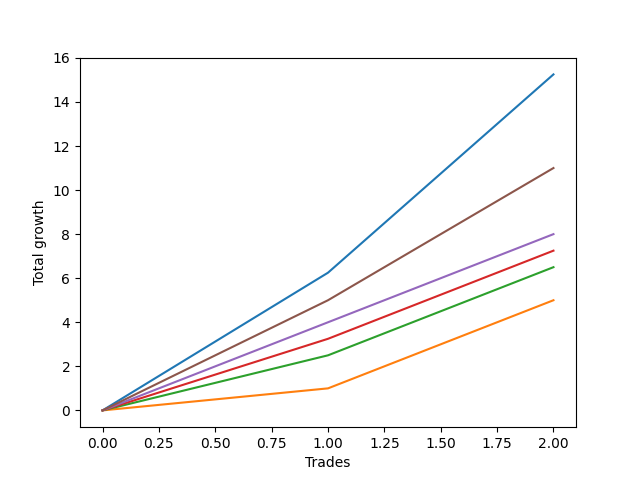

# Long Wallace 001 
- Symbol: ES_SmolBoiHour
- Date Range: 03/18/2022 - 07/29/2022
- Trading Period: 7:20-12:30
- Number of Trades: 2



| Name | Win Percent | Profit | Avg Profit / Trade | Avg Time / Trade |      | Name | Win Percent | Profit | Avg Profit / Trade | Avg Time / Trade |
| ---- | ----------- | ------ | ------------------ | ---------------- | ---- | ---- | ----------- | ------ | ------------------ | ---------------- |
| Sorted By <br> Profit | | | | | | Sorted By <br> Win Percentage ||||
| Two | 100.00 | 7625.00 | 3812.50 | 37:20 |     | Two | 100.00 | 7625.00 | 3812.50 | 37:20 |
| Eighty-Five | 100.00 | 5500.00 | 2750.00 | 08:42 |     | Eighty-Five | 100.00 | 5500.00 | 2750.00 | 08:42 |
| Eighty-Four | 100.00 | 4000.00 | 2000.00 | 07:57 |     | Eighty-Four | 100.00 | 4000.00 | 2000.00 | 07:57 |
| Eighty-Three | 100.00 | 3625.00 | 1812.50 | 07:45 |     | Eighty-Three | 100.00 | 3625.00 | 1812.50 | 07:45 |
| Eighty-Two | 100.00 | 3250.00 | 1625.00 | 07:42 |     | Eighty-Two | 100.00 | 3250.00 | 1625.00 | 07:42 |
| Eighty-One | 100.00 | 2500.00 | 1250.00 | 07:40 |     | Eighty-One | 100.00 | 2500.00 | 1250.00 | 07:40 |

## NO STOPLOSS

### Test Two
* Sell when the price hits the upper line of the 20p 2std bollinger
* No Stoploss
* Results:
```
Total Trades: 2
Percent Up: 100.00
Percent Down: 0.00
Total Points Moved Up: 15.25
Potential Profit: 7625.00
Total Points Ups: 15.25 Count Ups: 2
Total Points Downs: 0.00 Count Downs: 0
```

<details><summary>Trades</summary>

<code>In: 2022-05-25 10:15:00		Out: 2022-05-25 10:29:40		Total Position Time: 14:40		Total Move Up: 6.25		Total to Date: 6.25</code> <br />
<code>In: 2022-07-25 07:29:00		Out: 2022-07-25 08:29:00		Total Position Time: 60:00		Total Move Up: 9.00		Total to Date: 15.25</code> <br />


</details>

## TAKE PROFIT

### Test Eighty-One
* Take Profit of 1 Point
* No Stoploss
* Results:
```
Total Trades: 2
Percent Up: 100.00
Percent Down: 0.00
Total Points Moved Up: 5.00
Potential Profit: 2500.00
Total Points Ups: 5.00 Count Ups: 2
Total Points Downs: 0.00 Count Downs: 0
```

<details><summary>Trades</summary>

<code>In: 2022-05-25 10:15:00		Out: 2022-05-25 10:15:20		Total Position Time: 00:20		Total Move Up: 1.00		Total to Date: 1.00</code> <br />
<code>In: 2022-07-25 07:29:00		Out: 2022-07-25 07:44:00		Total Position Time: 15:00		Total Move Up: 4.00		Total to Date: 5.00</code> <br />


</details>

### Test Eighty-Two
* Take Profit of 2 Point
* No Stoploss
* Results:
```
Total Trades: 2
Percent Up: 100.00
Percent Down: 0.00
Total Points Moved Up: 6.50
Potential Profit: 3250.00
Total Points Ups: 6.50 Count Ups: 2
Total Points Downs: 0.00 Count Downs: 0
```

<details><summary>Trades</summary>

<code>In: 2022-05-25 10:15:00		Out: 2022-05-25 10:15:25		Total Position Time: 00:25		Total Move Up: 2.50		Total to Date: 2.50</code> <br />
<code>In: 2022-07-25 07:29:00		Out: 2022-07-25 07:44:00		Total Position Time: 15:00		Total Move Up: 4.00		Total to Date: 6.50</code> <br />


</details>

### Test Eighty-Three
* Take Profit of 3 Point
* No Stoploss
* Results:
```
Total Trades: 2
Percent Up: 100.00
Percent Down: 0.00
Total Points Moved Up: 7.25
Potential Profit: 3625.00
Total Points Ups: 7.25 Count Ups: 2
Total Points Downs: 0.00 Count Downs: 0
```

<details><summary>Trades</summary>

<code>In: 2022-05-25 10:15:00		Out: 2022-05-25 10:15:30		Total Position Time: 00:30		Total Move Up: 3.25		Total to Date: 3.25</code> <br />
<code>In: 2022-07-25 07:29:00		Out: 2022-07-25 07:44:00		Total Position Time: 15:00		Total Move Up: 4.00		Total to Date: 7.25</code> <br />


</details>

### Test Eighty-Four
* Take Profit of 4 Point
* No Stoploss
* Results:
```
Total Trades: 2
Percent Up: 100.00
Percent Down: 0.00
Total Points Moved Up: 8.00
Potential Profit: 4000.00
Total Points Ups: 8.00 Count Ups: 2
Total Points Downs: 0.00 Count Downs: 0
```

<details><summary>Trades</summary>

<code>In: 2022-05-25 10:15:00		Out: 2022-05-25 10:15:55		Total Position Time: 00:55		Total Move Up: 4.00		Total to Date: 4.00</code> <br />
<code>In: 2022-07-25 07:29:00		Out: 2022-07-25 07:44:00		Total Position Time: 15:00		Total Move Up: 4.00		Total to Date: 8.00</code> <br />


</details>

### Test Eighty-Five
* Take Profit of 5 Point
* No Stoploss
* Results:
```
Total Trades: 2
Percent Up: 100.00
Percent Down: 0.00
Total Points Moved Up: 11.00
Potential Profit: 5500.00
Total Points Ups: 11.00 Count Ups: 2
Total Points Downs: 0.00 Count Downs: 0
```

<details><summary>Trades</summary>

<code>In: 2022-05-25 10:15:00		Out: 2022-05-25 10:16:25		Total Position Time: 01:25		Total Move Up: 5.00		Total to Date: 5.00</code> <br />
<code>In: 2022-07-25 07:29:00		Out: 2022-07-25 07:45:00		Total Position Time: 16:00		Total Move Up: 6.00		Total to Date: 11.00</code> <br />


</details>