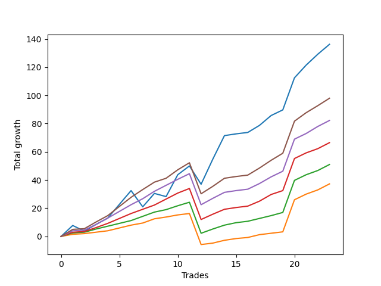

# Long Wallace 003 
- Symbol: ES_SmolBoiHour
- Date Range: 03/18/2022 - 07/29/2022
- Trading Period: 7:20-12:30
- Number of Trades: 23



| Name | Win Percent | Profit | Avg Profit / Trade | Avg Time / Trade |      | Name | Win Percent | Profit | Avg Profit / Trade | Avg Time / Trade |
| ---- | ----------- | ------ | ------------------ | ---------------- | ---- | ---- | ----------- | ------ | ------------------ | ---------------- |
| Sorted By <br> Profit | | | | | | Sorted By <br> Win Percentage ||||
| Two | 82.61 | 68125.00 | 2961.96 | 22:48 |     | Eighty-Five | 95.65 | 49000.00 | 2130.43 | 22:36 |
| Eighty-Five | 95.65 | 49000.00 | 2130.43 | 22:36 |     | Eighty-Four | 95.65 | 41125.00 | 1788.04 | 17:35 |
| Eighty-Four | 95.65 | 41125.00 | 1788.04 | 17:35 |     | Eighty-Three | 95.65 | 33250.00 | 1445.65 | 15:10 |
| Eighty-Three | 95.65 | 33250.00 | 1445.65 | 15:10 |     | Eighty-Two | 95.65 | 25500.00 | 1108.70 | 11:31 |
| Eighty-Two | 95.65 | 25500.00 | 1108.70 | 11:31 |     | Eighty-One | 95.65 | 18625.00 | 809.78 | 08:23 |
| Eighty-One | 95.65 | 18625.00 | 809.78 | 08:23 |     | Two | 82.61 | 68125.00 | 2961.96 | 22:48 |

## NO STOPLOSS

### Test Two
* Sell when the price hits the upper line of the 20p 2std bollinger
* No Stoploss
* Results:
```
Total Trades: 23
Percent Up: 82.61
Percent Down: 17.39
Total Points Moved Up: 136.25
Potential Profit: 68125.00
Total Points Ups: 167.00 Count Ups: 19
Total Points Downs: -30.75 Count Downs: 4
```

<details><summary>Trades</summary>

<code>In: 2022-03-25 08:30:00		Out: 2022-03-25 08:41:45		Total Position Time: 11:45		Total Move Up: 7.75		Total to Date: 7.75</code> <br />
<code>In: 2022-03-30 08:03:00		Out: 2022-03-30 08:35:15		Total Position Time: 32:15		Total Move Up: -4.00		Total to Date: 3.75</code> <br />
<code>In: 2022-03-30 08:14:00		Out: 2022-03-30 08:35:15		Total Position Time: 21:15		Total Move Up: 4.75		Total to Date: 8.50</code> <br />
<code>In: 2022-03-31 08:38:00		Out: 2022-03-31 08:41:10		Total Position Time: 03:10		Total Move Up: 4.50		Total to Date: 13.00</code> <br />
<code>In: 2022-04-20 11:58:00		Out: 2022-04-20 12:12:35		Total Position Time: 14:35		Total Move Up: 9.75		Total to Date: 22.75</code> <br />
<code>In: 2022-04-20 11:59:00		Out: 2022-04-20 12:12:35		Total Position Time: 13:35		Total Move Up: 9.75		Total to Date: 32.50</code> <br />
<code>In: 2022-05-11 10:33:00		Out: 2022-05-11 11:02:35		Total Position Time: 29:35		Total Move Up: -11.50		Total to Date: 21.00</code> <br />
<code>In: 2022-05-17 11:25:00		Out: 2022-05-17 11:40:00		Total Position Time: 15:00		Total Move Up: 9.50		Total to Date: 30.50</code> <br />
<code>In: 2022-05-19 07:33:00		Out: 2022-05-19 07:55:50		Total Position Time: 22:50		Total Move Up: -2.25		Total to Date: 28.25</code> <br />
<code>In: 2022-05-19 10:52:00		Out: 2022-05-19 10:55:15		Total Position Time: 03:15		Total Move Up: 15.50		Total to Date: 43.75</code> <br />
<code>In: 2022-05-25 10:15:00		Out: 2022-05-25 10:29:40		Total Position Time: 14:40		Total Move Up: 6.25		Total to Date: 50.00</code> <br />
<code>In: 2022-06-08 09:30:00		Out: 2022-06-08 09:59:10		Total Position Time: 29:10		Total Move Up: -13.00		Total to Date: 37.00</code> <br />
<code>In: 2022-06-14 07:45:00		Out: 2022-06-14 07:51:00		Total Position Time: 06:00		Total Move Up: 17.75		Total to Date: 54.75</code> <br />
<code>In: 2022-06-14 07:46:00		Out: 2022-06-14 07:51:00		Total Position Time: 05:00		Total Move Up: 16.75		Total to Date: 71.50</code> <br />
<code>In: 2022-06-15 07:57:00		Out: 2022-06-15 08:56:55		Total Position Time: 59:55		Total Move Up: 1.25		Total to Date: 72.75</code> <br />
<code>In: 2022-06-15 07:58:00		Out: 2022-06-15 08:57:55		Total Position Time: 59:55		Total Move Up: 1.00		Total to Date: 73.75</code> <br />
<code>In: 2022-06-17 07:38:00		Out: 2022-06-17 08:02:25		Total Position Time: 24:25		Total Move Up: 5.00		Total to Date: 78.75</code> <br />
<code>In: 2022-06-23 09:07:00		Out: 2022-06-23 09:19:05		Total Position Time: 12:05		Total Move Up: 7.00		Total to Date: 85.75</code> <br />
<code>In: 2022-07-06 08:35:00		Out: 2022-07-06 08:51:15		Total Position Time: 16:15		Total Move Up: 4.00		Total to Date: 89.75</code> <br />
<code>In: 2022-07-13 07:23:00		Out: 2022-07-13 07:36:00		Total Position Time: 13:00		Total Move Up: 22.75		Total to Date: 112.50</code> <br />
<code>In: 2022-07-25 07:29:00		Out: 2022-07-25 08:29:00		Total Position Time: 60:00		Total Move Up: 9.00		Total to Date: 121.50</code> <br />
<code>In: 2022-07-25 07:30:00		Out: 2022-07-25 07:57:00		Total Position Time: 27:00		Total Move Up: 7.75		Total to Date: 129.25</code> <br />
<code>In: 2022-07-25 12:10:00		Out: 2022-07-25 12:40:00		Total Position Time: 30:00		Total Move Up: 7.00		Total to Date: 136.25</code> <br />


</details>

## TAKE PROFIT

### Test Eighty-One
* Take Profit of 1 Point
* No Stoploss
* Results:
```
Total Trades: 23
Percent Up: 95.65
Percent Down: 4.35
Total Points Moved Up: 37.25
Potential Profit: 18625.00
Total Points Ups: 59.25 Count Ups: 22
Total Points Downs: -22.00 Count Downs: 1
```

<details><summary>Trades</summary>

<code>In: 2022-03-25 08:30:00		Out: 2022-03-25 08:30:20		Total Position Time: 00:20		Total Move Up: 1.50		Total to Date: 1.50</code> <br />
<code>In: 2022-03-30 08:03:00		Out: 2022-03-30 09:02:55		Total Position Time: 59:55		Total Move Up: 0.50		Total to Date: 2.00</code> <br />
<code>In: 2022-03-30 08:14:00		Out: 2022-03-30 08:15:25		Total Position Time: 01:25		Total Move Up: 1.00		Total to Date: 3.00</code> <br />
<code>In: 2022-03-31 08:38:00		Out: 2022-03-31 08:38:20		Total Position Time: 00:20		Total Move Up: 1.00		Total to Date: 4.00</code> <br />
<code>In: 2022-04-20 11:58:00		Out: 2022-04-20 12:00:15		Total Position Time: 02:15		Total Move Up: 2.00		Total to Date: 6.00</code> <br />
<code>In: 2022-04-20 11:59:00		Out: 2022-04-20 12:00:15		Total Position Time: 01:15		Total Move Up: 2.00		Total to Date: 8.00</code> <br />
<code>In: 2022-05-11 10:33:00		Out: 2022-05-11 10:34:30		Total Position Time: 01:30		Total Move Up: 1.50		Total to Date: 9.50</code> <br />
<code>In: 2022-05-17 11:25:00		Out: 2022-05-17 11:26:40		Total Position Time: 01:40		Total Move Up: 3.00		Total to Date: 12.50</code> <br />
<code>In: 2022-05-19 07:33:00		Out: 2022-05-19 07:33:10		Total Position Time: 00:10		Total Move Up: 1.25		Total to Date: 13.75</code> <br />
<code>In: 2022-05-19 10:52:00		Out: 2022-05-19 10:52:20		Total Position Time: 00:20		Total Move Up: 1.50		Total to Date: 15.25</code> <br />
<code>In: 2022-05-25 10:15:00		Out: 2022-05-25 10:15:20		Total Position Time: 00:20		Total Move Up: 1.00		Total to Date: 16.25</code> <br />
<code>In: 2022-06-08 09:30:00		Out: 2022-06-08 10:29:55		Total Position Time: 59:55		Total Move Up: -22.00		Total to Date: -5.75</code> <br />
<code>In: 2022-06-14 07:45:00		Out: 2022-06-14 07:46:15		Total Position Time: 01:15		Total Move Up: 1.00		Total to Date: -4.75</code> <br />
<code>In: 2022-06-14 07:46:00		Out: 2022-06-14 07:46:35		Total Position Time: 00:35		Total Move Up: 2.00		Total to Date: -2.75</code> <br />
<code>In: 2022-06-15 07:57:00		Out: 2022-06-15 07:59:05		Total Position Time: 02:05		Total Move Up: 1.25		Total to Date: -1.50</code> <br />
<code>In: 2022-06-15 07:58:00		Out: 2022-06-15 08:00:20		Total Position Time: 02:20		Total Move Up: 0.75		Total to Date: -0.75</code> <br />
<code>In: 2022-06-17 07:38:00		Out: 2022-06-17 07:38:10		Total Position Time: 00:10		Total Move Up: 2.00		Total to Date: 1.25</code> <br />
<code>In: 2022-06-23 09:07:00		Out: 2022-06-23 09:07:10		Total Position Time: 00:10		Total Move Up: 1.00		Total to Date: 2.25</code> <br />
<code>In: 2022-07-06 08:35:00		Out: 2022-07-06 08:36:55		Total Position Time: 01:55		Total Move Up: 1.00		Total to Date: 3.25</code> <br />
<code>In: 2022-07-13 07:23:00		Out: 2022-07-13 07:36:00		Total Position Time: 13:00		Total Move Up: 22.75		Total to Date: 26.00</code> <br />
<code>In: 2022-07-25 07:29:00		Out: 2022-07-25 07:44:00		Total Position Time: 15:00		Total Move Up: 4.00		Total to Date: 30.00</code> <br />
<code>In: 2022-07-25 07:30:00		Out: 2022-07-25 07:44:00		Total Position Time: 14:00		Total Move Up: 3.00		Total to Date: 33.00</code> <br />
<code>In: 2022-07-25 12:10:00		Out: 2022-07-25 12:23:00		Total Position Time: 13:00		Total Move Up: 4.25		Total to Date: 37.25</code> <br />


</details>

### Test Eighty-Two
* Take Profit of 2 Point
* No Stoploss
* Results:
```
Total Trades: 23
Percent Up: 95.65
Percent Down: 4.35
Total Points Moved Up: 51.00
Potential Profit: 25500.00
Total Points Ups: 73.00 Count Ups: 22
Total Points Downs: -22.00 Count Downs: 1
```

<details><summary>Trades</summary>

<code>In: 2022-03-25 08:30:00		Out: 2022-03-25 08:30:30		Total Position Time: 00:30		Total Move Up: 2.50		Total to Date: 2.50</code> <br />
<code>In: 2022-03-30 08:03:00		Out: 2022-03-30 09:02:55		Total Position Time: 59:55		Total Move Up: 0.50		Total to Date: 3.00</code> <br />
<code>In: 2022-03-30 08:14:00		Out: 2022-03-30 08:15:40		Total Position Time: 01:40		Total Move Up: 2.25		Total to Date: 5.25</code> <br />
<code>In: 2022-03-31 08:38:00		Out: 2022-03-31 08:40:35		Total Position Time: 02:35		Total Move Up: 2.00		Total to Date: 7.25</code> <br />
<code>In: 2022-04-20 11:58:00		Out: 2022-04-20 12:00:15		Total Position Time: 02:15		Total Move Up: 2.00		Total to Date: 9.25</code> <br />
<code>In: 2022-04-20 11:59:00		Out: 2022-04-20 12:00:15		Total Position Time: 01:15		Total Move Up: 2.00		Total to Date: 11.25</code> <br />
<code>In: 2022-05-11 10:33:00		Out: 2022-05-11 10:34:50		Total Position Time: 01:50		Total Move Up: 3.00		Total to Date: 14.25</code> <br />
<code>In: 2022-05-17 11:25:00		Out: 2022-05-17 11:26:40		Total Position Time: 01:40		Total Move Up: 3.00		Total to Date: 17.25</code> <br />
<code>In: 2022-05-19 07:33:00		Out: 2022-05-19 07:35:00		Total Position Time: 02:00		Total Move Up: 1.75		Total to Date: 19.00</code> <br />
<code>In: 2022-05-19 10:52:00		Out: 2022-05-19 10:52:40		Total Position Time: 00:40		Total Move Up: 2.75		Total to Date: 21.75</code> <br />
<code>In: 2022-05-25 10:15:00		Out: 2022-05-25 10:15:25		Total Position Time: 00:25		Total Move Up: 2.50		Total to Date: 24.25</code> <br />
<code>In: 2022-06-08 09:30:00		Out: 2022-06-08 10:29:55		Total Position Time: 59:55		Total Move Up: -22.00		Total to Date: 2.25</code> <br />
<code>In: 2022-06-14 07:45:00		Out: 2022-06-14 07:46:35		Total Position Time: 01:35		Total Move Up: 3.00		Total to Date: 5.25</code> <br />
<code>In: 2022-06-14 07:46:00		Out: 2022-06-14 07:46:40		Total Position Time: 00:40		Total Move Up: 2.75		Total to Date: 8.00</code> <br />
<code>In: 2022-06-15 07:57:00		Out: 2022-06-15 08:00:20		Total Position Time: 03:20		Total Move Up: 1.75		Total to Date: 9.75</code> <br />
<code>In: 2022-06-15 07:58:00		Out: 2022-06-15 08:57:55		Total Position Time: 59:55		Total Move Up: 1.00		Total to Date: 10.75</code> <br />
<code>In: 2022-06-17 07:38:00		Out: 2022-06-17 07:38:10		Total Position Time: 00:10		Total Move Up: 2.00		Total to Date: 12.75</code> <br />
<code>In: 2022-06-23 09:07:00		Out: 2022-06-23 09:14:30		Total Position Time: 07:30		Total Move Up: 2.00		Total to Date: 14.75</code> <br />
<code>In: 2022-07-06 08:35:00		Out: 2022-07-06 08:37:05		Total Position Time: 02:05		Total Move Up: 2.25		Total to Date: 17.00</code> <br />
<code>In: 2022-07-13 07:23:00		Out: 2022-07-13 07:36:00		Total Position Time: 13:00		Total Move Up: 22.75		Total to Date: 39.75</code> <br />
<code>In: 2022-07-25 07:29:00		Out: 2022-07-25 07:44:00		Total Position Time: 15:00		Total Move Up: 4.00		Total to Date: 43.75</code> <br />
<code>In: 2022-07-25 07:30:00		Out: 2022-07-25 07:44:00		Total Position Time: 14:00		Total Move Up: 3.00		Total to Date: 46.75</code> <br />
<code>In: 2022-07-25 12:10:00		Out: 2022-07-25 12:23:00		Total Position Time: 13:00		Total Move Up: 4.25		Total to Date: 51.00</code> <br />


</details>

### Test Eighty-Three
* Take Profit of 3 Point
* No Stoploss
* Results:
```
Total Trades: 23
Percent Up: 95.65
Percent Down: 4.35
Total Points Moved Up: 66.50
Potential Profit: 33250.00
Total Points Ups: 88.50 Count Ups: 22
Total Points Downs: -22.00 Count Downs: 1
```

<details><summary>Trades</summary>

<code>In: 2022-03-25 08:30:00		Out: 2022-03-25 08:35:05		Total Position Time: 05:05		Total Move Up: 3.00		Total to Date: 3.00</code> <br />
<code>In: 2022-03-30 08:03:00		Out: 2022-03-30 09:02:55		Total Position Time: 59:55		Total Move Up: 0.50		Total to Date: 3.50</code> <br />
<code>In: 2022-03-30 08:14:00		Out: 2022-03-30 08:19:15		Total Position Time: 05:15		Total Move Up: 2.75		Total to Date: 6.25</code> <br />
<code>In: 2022-03-31 08:38:00		Out: 2022-03-31 08:41:05		Total Position Time: 03:05		Total Move Up: 3.00		Total to Date: 9.25</code> <br />
<code>In: 2022-04-20 11:58:00		Out: 2022-04-20 12:01:10		Total Position Time: 03:10		Total Move Up: 3.50		Total to Date: 12.75</code> <br />
<code>In: 2022-04-20 11:59:00		Out: 2022-04-20 12:01:10		Total Position Time: 02:10		Total Move Up: 3.50		Total to Date: 16.25</code> <br />
<code>In: 2022-05-11 10:33:00		Out: 2022-05-11 10:34:50		Total Position Time: 01:50		Total Move Up: 3.00		Total to Date: 19.25</code> <br />
<code>In: 2022-05-17 11:25:00		Out: 2022-05-17 11:26:40		Total Position Time: 01:40		Total Move Up: 3.00		Total to Date: 22.25</code> <br />
<code>In: 2022-05-19 07:33:00		Out: 2022-05-19 07:35:10		Total Position Time: 02:10		Total Move Up: 4.25		Total to Date: 26.50</code> <br />
<code>In: 2022-05-19 10:52:00		Out: 2022-05-19 10:52:45		Total Position Time: 00:45		Total Move Up: 4.25		Total to Date: 30.75</code> <br />
<code>In: 2022-05-25 10:15:00		Out: 2022-05-25 10:15:30		Total Position Time: 00:30		Total Move Up: 3.25		Total to Date: 34.00</code> <br />
<code>In: 2022-06-08 09:30:00		Out: 2022-06-08 10:29:55		Total Position Time: 59:55		Total Move Up: -22.00		Total to Date: 12.00</code> <br />
<code>In: 2022-06-14 07:45:00		Out: 2022-06-14 07:46:40		Total Position Time: 01:40		Total Move Up: 3.75		Total to Date: 15.75</code> <br />
<code>In: 2022-06-14 07:46:00		Out: 2022-06-14 07:46:50		Total Position Time: 00:50		Total Move Up: 3.50		Total to Date: 19.25</code> <br />
<code>In: 2022-06-15 07:57:00		Out: 2022-06-15 08:56:55		Total Position Time: 59:55		Total Move Up: 1.25		Total to Date: 20.50</code> <br />
<code>In: 2022-06-15 07:58:00		Out: 2022-06-15 08:57:55		Total Position Time: 59:55		Total Move Up: 1.00		Total to Date: 21.50</code> <br />
<code>In: 2022-06-17 07:38:00		Out: 2022-06-17 07:38:20		Total Position Time: 00:20		Total Move Up: 3.50		Total to Date: 25.00</code> <br />
<code>In: 2022-06-23 09:07:00		Out: 2022-06-23 09:18:25		Total Position Time: 11:25		Total Move Up: 4.75		Total to Date: 29.75</code> <br />
<code>In: 2022-07-06 08:35:00		Out: 2022-07-06 08:49:20		Total Position Time: 14:20		Total Move Up: 2.75		Total to Date: 32.50</code> <br />
<code>In: 2022-07-13 07:23:00		Out: 2022-07-13 07:36:00		Total Position Time: 13:00		Total Move Up: 22.75		Total to Date: 55.25</code> <br />
<code>In: 2022-07-25 07:29:00		Out: 2022-07-25 07:44:00		Total Position Time: 15:00		Total Move Up: 4.00		Total to Date: 59.25</code> <br />
<code>In: 2022-07-25 07:30:00		Out: 2022-07-25 07:44:00		Total Position Time: 14:00		Total Move Up: 3.00		Total to Date: 62.25</code> <br />
<code>In: 2022-07-25 12:10:00		Out: 2022-07-25 12:23:00		Total Position Time: 13:00		Total Move Up: 4.25		Total to Date: 66.50</code> <br />


</details>

### Test Eighty-Four
* Take Profit of 4 Point
* No Stoploss
* Results:
```
Total Trades: 23
Percent Up: 95.65
Percent Down: 4.35
Total Points Moved Up: 82.25
Potential Profit: 41125.00
Total Points Ups: 104.25 Count Ups: 22
Total Points Downs: -22.00 Count Downs: 1
```

<details><summary>Trades</summary>

<code>In: 2022-03-25 08:30:00		Out: 2022-03-25 08:36:55		Total Position Time: 06:55		Total Move Up: 4.00		Total to Date: 4.00</code> <br />
<code>In: 2022-03-30 08:03:00		Out: 2022-03-30 09:02:55		Total Position Time: 59:55		Total Move Up: 0.50		Total to Date: 4.50</code> <br />
<code>In: 2022-03-30 08:14:00		Out: 2022-03-30 08:19:30		Total Position Time: 05:30		Total Move Up: 4.00		Total to Date: 8.50</code> <br />
<code>In: 2022-03-31 08:38:00		Out: 2022-03-31 08:41:10		Total Position Time: 03:10		Total Move Up: 4.50		Total to Date: 13.00</code> <br />
<code>In: 2022-04-20 11:58:00		Out: 2022-04-20 12:01:15		Total Position Time: 03:15		Total Move Up: 4.75		Total to Date: 17.75</code> <br />
<code>In: 2022-04-20 11:59:00		Out: 2022-04-20 12:01:15		Total Position Time: 02:15		Total Move Up: 4.75		Total to Date: 22.50</code> <br />
<code>In: 2022-05-11 10:33:00		Out: 2022-05-11 11:24:05		Total Position Time: 51:05		Total Move Up: 4.25		Total to Date: 26.75</code> <br />
<code>In: 2022-05-17 11:25:00		Out: 2022-05-17 11:27:05		Total Position Time: 02:05		Total Move Up: 5.25		Total to Date: 32.00</code> <br />
<code>In: 2022-05-19 07:33:00		Out: 2022-05-19 07:35:10		Total Position Time: 02:10		Total Move Up: 4.25		Total to Date: 36.25</code> <br />
<code>In: 2022-05-19 10:52:00		Out: 2022-05-19 10:52:45		Total Position Time: 00:45		Total Move Up: 4.25		Total to Date: 40.50</code> <br />
<code>In: 2022-05-25 10:15:00		Out: 2022-05-25 10:15:55		Total Position Time: 00:55		Total Move Up: 4.00		Total to Date: 44.50</code> <br />
<code>In: 2022-06-08 09:30:00		Out: 2022-06-08 10:29:55		Total Position Time: 59:55		Total Move Up: -22.00		Total to Date: 22.50</code> <br />
<code>In: 2022-06-14 07:45:00		Out: 2022-06-14 07:46:50		Total Position Time: 01:50		Total Move Up: 4.50		Total to Date: 27.00</code> <br />
<code>In: 2022-06-14 07:46:00		Out: 2022-06-14 07:47:00		Total Position Time: 01:00		Total Move Up: 4.25		Total to Date: 31.25</code> <br />
<code>In: 2022-06-15 07:57:00		Out: 2022-06-15 08:56:55		Total Position Time: 59:55		Total Move Up: 1.25		Total to Date: 32.50</code> <br />
<code>In: 2022-06-15 07:58:00		Out: 2022-06-15 08:57:55		Total Position Time: 59:55		Total Move Up: 1.00		Total to Date: 33.50</code> <br />
<code>In: 2022-06-17 07:38:00		Out: 2022-06-17 07:38:25		Total Position Time: 00:25		Total Move Up: 4.00		Total to Date: 37.50</code> <br />
<code>In: 2022-06-23 09:07:00		Out: 2022-06-23 09:18:25		Total Position Time: 11:25		Total Move Up: 4.75		Total to Date: 42.25</code> <br />
<code>In: 2022-07-06 08:35:00		Out: 2022-07-06 08:51:15		Total Position Time: 16:15		Total Move Up: 4.00		Total to Date: 46.25</code> <br />
<code>In: 2022-07-13 07:23:00		Out: 2022-07-13 07:36:00		Total Position Time: 13:00		Total Move Up: 22.75		Total to Date: 69.00</code> <br />
<code>In: 2022-07-25 07:29:00		Out: 2022-07-25 07:44:00		Total Position Time: 15:00		Total Move Up: 4.00		Total to Date: 73.00</code> <br />
<code>In: 2022-07-25 07:30:00		Out: 2022-07-25 07:45:00		Total Position Time: 15:00		Total Move Up: 5.00		Total to Date: 78.00</code> <br />
<code>In: 2022-07-25 12:10:00		Out: 2022-07-25 12:23:00		Total Position Time: 13:00		Total Move Up: 4.25		Total to Date: 82.25</code> <br />


</details>

### Test Eighty-Five
* Take Profit of 5 Point
* No Stoploss
* Results:
```
Total Trades: 23
Percent Up: 95.65
Percent Down: 4.35
Total Points Moved Up: 98.00
Potential Profit: 49000.00
Total Points Ups: 120.00 Count Ups: 22
Total Points Downs: -22.00 Count Downs: 1
```

<details><summary>Trades</summary>

<code>In: 2022-03-25 08:30:00		Out: 2022-03-25 08:40:40		Total Position Time: 10:40		Total Move Up: 5.00		Total to Date: 5.00</code> <br />
<code>In: 2022-03-30 08:03:00		Out: 2022-03-30 09:02:55		Total Position Time: 59:55		Total Move Up: 0.50		Total to Date: 5.50</code> <br />
<code>In: 2022-03-30 08:14:00		Out: 2022-03-30 08:35:15		Total Position Time: 21:15		Total Move Up: 4.75		Total to Date: 10.25</code> <br />
<code>In: 2022-03-31 08:38:00		Out: 2022-03-31 08:42:55		Total Position Time: 04:55		Total Move Up: 4.50		Total to Date: 14.75</code> <br />
<code>In: 2022-04-20 11:58:00		Out: 2022-04-20 12:01:20		Total Position Time: 03:20		Total Move Up: 6.50		Total to Date: 21.25</code> <br />
<code>In: 2022-04-20 11:59:00		Out: 2022-04-20 12:01:20		Total Position Time: 02:20		Total Move Up: 6.50		Total to Date: 27.75</code> <br />
<code>In: 2022-05-11 10:33:00		Out: 2022-05-11 11:25:10		Total Position Time: 52:10		Total Move Up: 5.50		Total to Date: 33.25</code> <br />
<code>In: 2022-05-17 11:25:00		Out: 2022-05-17 11:27:05		Total Position Time: 02:05		Total Move Up: 5.25		Total to Date: 38.50</code> <br />
<code>In: 2022-05-19 07:33:00		Out: 2022-05-19 08:32:55		Total Position Time: 59:55		Total Move Up: 2.75		Total to Date: 41.25</code> <br />
<code>In: 2022-05-19 10:52:00		Out: 2022-05-19 10:52:55		Total Position Time: 00:55		Total Move Up: 6.00		Total to Date: 47.25</code> <br />
<code>In: 2022-05-25 10:15:00		Out: 2022-05-25 10:16:25		Total Position Time: 01:25		Total Move Up: 5.00		Total to Date: 52.25</code> <br />
<code>In: 2022-06-08 09:30:00		Out: 2022-06-08 10:29:55		Total Position Time: 59:55		Total Move Up: -22.00		Total to Date: 30.25</code> <br />
<code>In: 2022-06-14 07:45:00		Out: 2022-06-14 07:47:00		Total Position Time: 02:00		Total Move Up: 5.25		Total to Date: 35.50</code> <br />
<code>In: 2022-06-14 07:46:00		Out: 2022-06-14 07:47:05		Total Position Time: 01:05		Total Move Up: 5.75		Total to Date: 41.25</code> <br />
<code>In: 2022-06-15 07:57:00		Out: 2022-06-15 08:56:55		Total Position Time: 59:55		Total Move Up: 1.25		Total to Date: 42.50</code> <br />
<code>In: 2022-06-15 07:58:00		Out: 2022-06-15 08:57:55		Total Position Time: 59:55		Total Move Up: 1.00		Total to Date: 43.50</code> <br />
<code>In: 2022-06-17 07:38:00		Out: 2022-06-17 08:02:25		Total Position Time: 24:25		Total Move Up: 5.00		Total to Date: 48.50</code> <br />
<code>In: 2022-06-23 09:07:00		Out: 2022-06-23 09:18:40		Total Position Time: 11:40		Total Move Up: 5.50		Total to Date: 54.00</code> <br />
<code>In: 2022-07-06 08:35:00		Out: 2022-07-06 08:58:10		Total Position Time: 23:10		Total Move Up: 5.00		Total to Date: 59.00</code> <br />
<code>In: 2022-07-13 07:23:00		Out: 2022-07-13 07:36:00		Total Position Time: 13:00		Total Move Up: 22.75		Total to Date: 81.75</code> <br />
<code>In: 2022-07-25 07:29:00		Out: 2022-07-25 07:45:00		Total Position Time: 16:00		Total Move Up: 6.00		Total to Date: 87.75</code> <br />
<code>In: 2022-07-25 07:30:00		Out: 2022-07-25 07:45:00		Total Position Time: 15:00		Total Move Up: 5.00		Total to Date: 92.75</code> <br />
<code>In: 2022-07-25 12:10:00		Out: 2022-07-25 12:25:00		Total Position Time: 15:00		Total Move Up: 5.25		Total to Date: 98.00</code> <br />


</details>