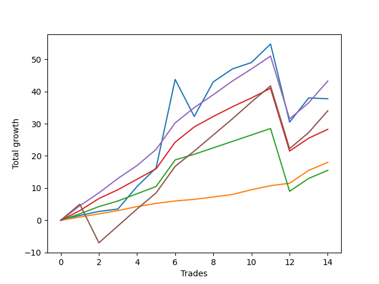

# Long Wallace 010 
- Symbol: ES_SmolBoiHour
- Date Range: 03/18/2022 - 07/29/2022
- Trading Period: 7:20-12:30
- Number of Trades: 14



| Name | Win Percent | Profit | Avg Profit / Trade | Avg Time / Trade |      | Name | Win Percent | Profit | Avg Profit / Trade | Avg Time / Trade |
| ---- | ----------- | ------ | ------------------ | ---------------- | ---- | ---- | ----------- | ------ | ------------------ | ---------------- |
| Sorted By <br> Profit | | | | | | Sorted By <br> Win Percentage ||||
| Eighty-Four | 92.86 | 21625.00 | 1544.64 | 23:04 |     | Eighty-One | 100.00 | 9000.00 | 642.86 | 05:46 |
| Two | 78.57 | 18875.00 | 1348.21 | 26:04 |     | Eighty-Four | 92.86 | 21625.00 | 1544.64 | 23:04 |
| Eighty-Five | 85.71 | 17000.00 | 1214.29 | 24:21 |     | Eighty-Three | 92.86 | 14125.00 | 1008.93 | 20:16 |
| Eighty-Three | 92.86 | 14125.00 | 1008.93 | 20:16 |     | Eighty-Two | 92.86 | 7750.00 | 553.57 | 11:46 |
| Eighty-One | 100.00 | 9000.00 | 642.86 | 05:46 |     | Eighty-Five | 85.71 | 17000.00 | 1214.29 | 24:21 |
| Eighty-Two | 92.86 | 7750.00 | 553.57 | 11:46 |     | Two | 78.57 | 18875.00 | 1348.21 | 26:04 |

## NO STOPLOSS

### Test Two
* Sell when the price hits the upper line of the 20p 2std bollinger
* No Stoploss
* Results:
```
Total Trades: 14
Percent Up: 78.57
Percent Down: 21.43
Total Points Moved Up: 37.75
Potential Profit: 18875.00
Total Points Ups: 73.75 Count Ups: 11
Total Points Downs: -36.00 Count Downs: 3
```

<details><summary>Trades</summary>

<code>In: 2022-03-24 11:29:00		Out: 2022-03-24 11:51:30		Total Position Time: 22:30		Total Move Up: 1.50		Total to Date: 1.50</code> <br />
<code>In: 2022-04-08 10:36:00		Out: 2022-04-08 11:10:10		Total Position Time: 34:10		Total Move Up: 1.25		Total to Date: 2.75</code> <br />
<code>In: 2022-04-20 09:14:00		Out: 2022-04-20 09:31:05		Total Position Time: 17:05		Total Move Up: 0.75		Total to Date: 3.50</code> <br />
<code>In: 2022-04-27 11:28:00		Out: 2022-04-27 11:42:40		Total Position Time: 14:40		Total Move Up: 7.00		Total to Date: 10.50</code> <br />
<code>In: 2022-04-27 11:40:00		Out: 2022-04-27 11:42:40		Total Position Time: 02:40		Total Move Up: 5.75		Total to Date: 16.25</code> <br />
<code>In: 2022-05-04 11:36:00		Out: 2022-05-04 11:43:45		Total Position Time: 07:45		Total Move Up: 27.50		Total to Date: 43.75</code> <br />
<code>In: 2022-05-06 10:56:00		Out: 2022-05-06 11:49:10		Total Position Time: 53:10		Total Move Up: -11.50		Total to Date: 32.25</code> <br />
<code>In: 2022-05-23 10:23:00		Out: 2022-05-23 10:33:15		Total Position Time: 10:15		Total Move Up: 10.75		Total to Date: 43.00</code> <br />
<code>In: 2022-05-26 11:38:00		Out: 2022-05-26 11:54:10		Total Position Time: 16:10		Total Move Up: 4.00		Total to Date: 47.00</code> <br />
<code>In: 2022-05-27 10:42:00		Out: 2022-05-27 10:57:20		Total Position Time: 15:20		Total Move Up: 2.00		Total to Date: 49.00</code> <br />
<code>In: 2022-06-27 09:32:00		Out: 2022-06-27 09:45:00		Total Position Time: 13:00		Total Move Up: 5.75		Total to Date: 54.75</code> <br />
<code>In: 2022-06-30 11:28:00		Out: 2022-06-30 12:25:15		Total Position Time: 57:15		Total Move Up: -24.25		Total to Date: 30.50</code> <br />
<code>In: 2022-07-15 11:05:00		Out: 2022-07-15 11:46:00		Total Position Time: 41:00		Total Move Up: 7.50		Total to Date: 38.00</code> <br />
<code>In: 2022-07-27 10:01:00		Out: 2022-07-27 11:01:00		Total Position Time: 60:00		Total Move Up: -0.25		Total to Date: 37.75</code> <br />


</details>

## TAKE PROFIT

### Test Eighty-One
* Take Profit of 1 Point
* No Stoploss
* Results:
```
Total Trades: 14
Percent Up: 100.00
Percent Down: 0.00
Total Points Moved Up: 18.00
Potential Profit: 9000.00
Total Points Ups: 18.00 Count Ups: 14
Total Points Downs: 0.00 Count Downs: 0
```

<details><summary>Trades</summary>

<code>In: 2022-03-24 11:29:00		Out: 2022-03-24 11:29:55		Total Position Time: 00:55		Total Move Up: 1.00		Total to Date: 1.00</code> <br />
<code>In: 2022-04-08 10:36:00		Out: 2022-04-08 10:36:15		Total Position Time: 00:15		Total Move Up: 1.00		Total to Date: 2.00</code> <br />
<code>In: 2022-04-20 09:14:00		Out: 2022-04-20 09:18:50		Total Position Time: 04:50		Total Move Up: 1.00		Total to Date: 3.00</code> <br />
<code>In: 2022-04-27 11:28:00		Out: 2022-04-27 11:32:05		Total Position Time: 04:05		Total Move Up: 1.25		Total to Date: 4.25</code> <br />
<code>In: 2022-04-27 11:40:00		Out: 2022-04-27 11:40:10		Total Position Time: 00:10		Total Move Up: 1.00		Total to Date: 5.25</code> <br />
<code>In: 2022-05-04 11:36:00		Out: 2022-05-04 11:36:10		Total Position Time: 00:10		Total Move Up: 0.75		Total to Date: 6.00</code> <br />
<code>In: 2022-05-06 10:56:00		Out: 2022-05-06 10:59:05		Total Position Time: 03:05		Total Move Up: 0.50		Total to Date: 6.50</code> <br />
<code>In: 2022-05-23 10:23:00		Out: 2022-05-23 10:23:10		Total Position Time: 00:10		Total Move Up: 0.75		Total to Date: 7.25</code> <br />
<code>In: 2022-05-26 11:38:00		Out: 2022-05-26 11:42:10		Total Position Time: 04:10		Total Move Up: 0.75		Total to Date: 8.00</code> <br />
<code>In: 2022-05-27 10:42:00		Out: 2022-05-27 10:51:10		Total Position Time: 09:10		Total Move Up: 1.50		Total to Date: 9.50</code> <br />
<code>In: 2022-06-27 09:32:00		Out: 2022-06-27 09:38:05		Total Position Time: 06:05		Total Move Up: 1.25		Total to Date: 10.75</code> <br />
<code>In: 2022-06-30 11:28:00		Out: 2022-06-30 11:30:50		Total Position Time: 02:50		Total Move Up: 0.75		Total to Date: 11.50</code> <br />
<code>In: 2022-07-15 11:05:00		Out: 2022-07-15 11:18:00		Total Position Time: 13:00		Total Move Up: 4.00		Total to Date: 15.50</code> <br />
<code>In: 2022-07-27 10:01:00		Out: 2022-07-27 10:33:00		Total Position Time: 32:00		Total Move Up: 2.50		Total to Date: 18.00</code> <br />


</details>

### Test Eighty-Two
* Take Profit of 2 Point
* No Stoploss
* Results:
```
Total Trades: 14
Percent Up: 92.86
Percent Down: 7.14
Total Points Moved Up: 15.50
Potential Profit: 7750.00
Total Points Ups: 35.00 Count Ups: 13
Total Points Downs: -19.50 Count Downs: 1
```

<details><summary>Trades</summary>

<code>In: 2022-03-24 11:29:00		Out: 2022-03-24 11:30:40		Total Position Time: 01:40		Total Move Up: 2.00		Total to Date: 2.00</code> <br />
<code>In: 2022-04-08 10:36:00		Out: 2022-04-08 10:36:30		Total Position Time: 00:30		Total Move Up: 2.25		Total to Date: 4.25</code> <br />
<code>In: 2022-04-20 09:14:00		Out: 2022-04-20 09:31:35		Total Position Time: 17:35		Total Move Up: 1.75		Total to Date: 6.00</code> <br />
<code>In: 2022-04-27 11:28:00		Out: 2022-04-27 11:32:10		Total Position Time: 04:10		Total Move Up: 2.25		Total to Date: 8.25</code> <br />
<code>In: 2022-04-27 11:40:00		Out: 2022-04-27 11:40:15		Total Position Time: 00:15		Total Move Up: 2.25		Total to Date: 10.50</code> <br />
<code>In: 2022-05-04 11:36:00		Out: 2022-05-04 11:36:40		Total Position Time: 00:40		Total Move Up: 8.25		Total to Date: 18.75</code> <br />
<code>In: 2022-05-06 10:56:00		Out: 2022-05-06 11:01:00		Total Position Time: 05:00		Total Move Up: 1.75		Total to Date: 20.50</code> <br />
<code>In: 2022-05-23 10:23:00		Out: 2022-05-23 10:25:45		Total Position Time: 02:45		Total Move Up: 2.00		Total to Date: 22.50</code> <br />
<code>In: 2022-05-26 11:38:00		Out: 2022-05-26 11:42:40		Total Position Time: 04:40		Total Move Up: 2.00		Total to Date: 24.50</code> <br />
<code>In: 2022-05-27 10:42:00		Out: 2022-05-27 10:57:20		Total Position Time: 15:20		Total Move Up: 2.00		Total to Date: 26.50</code> <br />
<code>In: 2022-06-27 09:32:00		Out: 2022-06-27 09:39:20		Total Position Time: 07:20		Total Move Up: 2.00		Total to Date: 28.50</code> <br />
<code>In: 2022-06-30 11:28:00		Out: 2022-06-30 12:27:55		Total Position Time: 59:55		Total Move Up: -19.50		Total to Date: 9.00</code> <br />
<code>In: 2022-07-15 11:05:00		Out: 2022-07-15 11:18:00		Total Position Time: 13:00		Total Move Up: 4.00		Total to Date: 13.00</code> <br />
<code>In: 2022-07-27 10:01:00		Out: 2022-07-27 10:33:00		Total Position Time: 32:00		Total Move Up: 2.50		Total to Date: 15.50</code> <br />


</details>

### Test Eighty-Three
* Take Profit of 3 Point
* No Stoploss
* Results:
```
Total Trades: 14
Percent Up: 92.86
Percent Down: 7.14
Total Points Moved Up: 28.25
Potential Profit: 14125.00
Total Points Ups: 47.75 Count Ups: 13
Total Points Downs: -19.50 Count Downs: 1
```

<details><summary>Trades</summary>

<code>In: 2022-03-24 11:29:00		Out: 2022-03-24 12:07:00		Total Position Time: 38:00		Total Move Up: 3.00		Total to Date: 3.00</code> <br />
<code>In: 2022-04-08 10:36:00		Out: 2022-04-08 11:21:10		Total Position Time: 45:10		Total Move Up: 3.75		Total to Date: 6.75</code> <br />
<code>In: 2022-04-20 09:14:00		Out: 2022-04-20 09:32:30		Total Position Time: 18:30		Total Move Up: 2.75		Total to Date: 9.50</code> <br />
<code>In: 2022-04-27 11:28:00		Out: 2022-04-27 11:32:25		Total Position Time: 04:25		Total Move Up: 3.25		Total to Date: 12.75</code> <br />
<code>In: 2022-04-27 11:40:00		Out: 2022-04-27 11:42:30		Total Position Time: 02:30		Total Move Up: 3.25		Total to Date: 16.00</code> <br />
<code>In: 2022-05-04 11:36:00		Out: 2022-05-04 11:36:40		Total Position Time: 00:40		Total Move Up: 8.25		Total to Date: 24.25</code> <br />
<code>In: 2022-05-06 10:56:00		Out: 2022-05-06 11:02:20		Total Position Time: 06:20		Total Move Up: 4.75		Total to Date: 29.00</code> <br />
<code>In: 2022-05-23 10:23:00		Out: 2022-05-23 10:25:55		Total Position Time: 02:55		Total Move Up: 3.25		Total to Date: 32.25</code> <br />
<code>In: 2022-05-26 11:38:00		Out: 2022-05-26 11:45:25		Total Position Time: 07:25		Total Move Up: 3.00		Total to Date: 35.25</code> <br />
<code>In: 2022-05-27 10:42:00		Out: 2022-05-27 11:09:45		Total Position Time: 27:45		Total Move Up: 2.75		Total to Date: 38.00</code> <br />
<code>In: 2022-06-27 09:32:00		Out: 2022-06-27 09:41:10		Total Position Time: 09:10		Total Move Up: 3.00		Total to Date: 41.00</code> <br />
<code>In: 2022-06-30 11:28:00		Out: 2022-06-30 12:27:55		Total Position Time: 59:55		Total Move Up: -19.50		Total to Date: 21.50</code> <br />
<code>In: 2022-07-15 11:05:00		Out: 2022-07-15 11:18:00		Total Position Time: 13:00		Total Move Up: 4.00		Total to Date: 25.50</code> <br />
<code>In: 2022-07-27 10:01:00		Out: 2022-07-27 10:49:00		Total Position Time: 48:00		Total Move Up: 2.75		Total to Date: 28.25</code> <br />


</details>

### Test Eighty-Four
* Take Profit of 4 Point
* No Stoploss
* Results:
```
Total Trades: 14
Percent Up: 92.86
Percent Down: 7.14
Total Points Moved Up: 43.25
Potential Profit: 21625.00
Total Points Ups: 62.75 Count Ups: 13
Total Points Downs: -19.50 Count Downs: 1
```

<details><summary>Trades</summary>

<code>In: 2022-03-24 11:29:00		Out: 2022-03-24 12:07:35		Total Position Time: 38:35		Total Move Up: 4.50		Total to Date: 4.50</code> <br />
<code>In: 2022-04-08 10:36:00		Out: 2022-04-08 11:21:25		Total Position Time: 45:25		Total Move Up: 4.00		Total to Date: 8.50</code> <br />
<code>In: 2022-04-20 09:14:00		Out: 2022-04-20 09:32:40		Total Position Time: 18:40		Total Move Up: 4.50		Total to Date: 13.00</code> <br />
<code>In: 2022-04-27 11:28:00		Out: 2022-04-27 11:32:45		Total Position Time: 04:45		Total Move Up: 4.00		Total to Date: 17.00</code> <br />
<code>In: 2022-04-27 11:40:00		Out: 2022-04-27 11:42:35		Total Position Time: 02:35		Total Move Up: 5.00		Total to Date: 22.00</code> <br />
<code>In: 2022-05-04 11:36:00		Out: 2022-05-04 11:36:40		Total Position Time: 00:40		Total Move Up: 8.25		Total to Date: 30.25</code> <br />
<code>In: 2022-05-06 10:56:00		Out: 2022-05-06 11:02:20		Total Position Time: 06:20		Total Move Up: 4.75		Total to Date: 35.00</code> <br />
<code>In: 2022-05-23 10:23:00		Out: 2022-05-23 10:26:30		Total Position Time: 03:30		Total Move Up: 4.00		Total to Date: 39.00</code> <br />
<code>In: 2022-05-26 11:38:00		Out: 2022-05-26 11:57:50		Total Position Time: 19:50		Total Move Up: 4.25		Total to Date: 43.25</code> <br />
<code>In: 2022-05-27 10:42:00		Out: 2022-05-27 11:16:30		Total Position Time: 34:30		Total Move Up: 3.75		Total to Date: 47.00</code> <br />
<code>In: 2022-06-27 09:32:00		Out: 2022-06-27 09:44:15		Total Position Time: 12:15		Total Move Up: 4.00		Total to Date: 51.00</code> <br />
<code>In: 2022-06-30 11:28:00		Out: 2022-06-30 12:27:55		Total Position Time: 59:55		Total Move Up: -19.50		Total to Date: 31.50</code> <br />
<code>In: 2022-07-15 11:05:00		Out: 2022-07-15 11:19:00		Total Position Time: 14:00		Total Move Up: 5.00		Total to Date: 36.50</code> <br />
<code>In: 2022-07-27 10:01:00		Out: 2022-07-27 11:03:00		Total Position Time: 62:00		Total Move Up: 6.75		Total to Date: 43.25</code> <br />


</details>

### Test Eighty-Five
* Take Profit of 5 Point
* No Stoploss
* Results:
```
Total Trades: 14
Percent Up: 85.71
Percent Down: 14.29
Total Points Moved Up: 34.00
Potential Profit: 17000.00
Total Points Ups: 65.50 Count Ups: 12
Total Points Downs: -31.50 Count Downs: 2
```

<details><summary>Trades</summary>

<code>In: 2022-03-24 11:29:00		Out: 2022-03-24 12:08:20		Total Position Time: 39:20		Total Move Up: 5.00		Total to Date: 5.00</code> <br />
<code>In: 2022-04-08 10:36:00		Out: 2022-04-08 11:35:55		Total Position Time: 59:55		Total Move Up: -12.00		Total to Date: -7.00</code> <br />
<code>In: 2022-04-20 09:14:00		Out: 2022-04-20 09:32:55		Total Position Time: 18:55		Total Move Up: 5.25		Total to Date: -1.75</code> <br />
<code>In: 2022-04-27 11:28:00		Out: 2022-04-27 11:33:25		Total Position Time: 05:25		Total Move Up: 5.25		Total to Date: 3.50</code> <br />
<code>In: 2022-04-27 11:40:00		Out: 2022-04-27 11:42:35		Total Position Time: 02:35		Total Move Up: 5.00		Total to Date: 8.50</code> <br />
<code>In: 2022-05-04 11:36:00		Out: 2022-05-04 11:36:40		Total Position Time: 00:40		Total Move Up: 8.25		Total to Date: 16.75</code> <br />
<code>In: 2022-05-06 10:56:00		Out: 2022-05-06 11:02:20		Total Position Time: 06:20		Total Move Up: 4.75		Total to Date: 21.50</code> <br />
<code>In: 2022-05-23 10:23:00		Out: 2022-05-23 10:27:00		Total Position Time: 04:00		Total Move Up: 5.00		Total to Date: 26.50</code> <br />
<code>In: 2022-05-26 11:38:00		Out: 2022-05-26 11:58:05		Total Position Time: 20:05		Total Move Up: 5.00		Total to Date: 31.50</code> <br />
<code>In: 2022-05-27 10:42:00		Out: 2022-05-27 11:16:50		Total Position Time: 34:50		Total Move Up: 5.25		Total to Date: 36.75</code> <br />
<code>In: 2022-06-27 09:32:00		Out: 2022-06-27 09:44:55		Total Position Time: 12:55		Total Move Up: 5.00		Total to Date: 41.75</code> <br />
<code>In: 2022-06-30 11:28:00		Out: 2022-06-30 12:27:55		Total Position Time: 59:55		Total Move Up: -19.50		Total to Date: 22.25</code> <br />
<code>In: 2022-07-15 11:05:00		Out: 2022-07-15 11:19:00		Total Position Time: 14:00		Total Move Up: 5.00		Total to Date: 27.25</code> <br />
<code>In: 2022-07-27 10:01:00		Out: 2022-07-27 11:03:00		Total Position Time: 62:00		Total Move Up: 6.75		Total to Date: 34.00</code> <br />


</details>