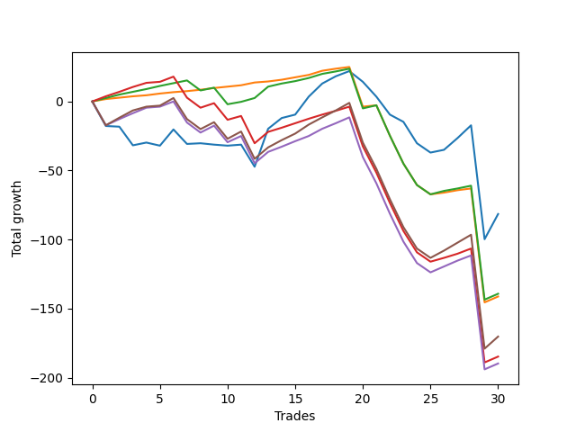

# Long Wallace 011 
- Symbol: ES_SmolBoiHour
- Date Range: 03/18/2022 - 07/29/2022
- Trading Period: 7:20-12:30
- Number of Trades: 30



| Name | Win Percent | Profit | Avg Profit / Trade | Avg Time / Trade |      | Name | Win Percent | Profit | Avg Profit / Trade | Avg Time / Trade |
| ---- | ----------- | ------ | ------------------ | ---------------- | ---- | ---- | ----------- | ------ | ------------------ | ---------------- |
| Sorted By <br> Profit | | | | | | Sorted By <br> Win Percentage ||||
| Two | 50.00 | -40750.00 | -1358.33 | 109:13 |     | Eighty-One | 80.00 | -70625.00 | -2354.17 | 56:13 |
| Eighty-Two | 73.33 | -69625.00 | -2320.83 | 61:57 |     | Eighty-Two | 73.33 | -69625.00 | -2320.83 | 61:57 |
| Eighty-One | 80.00 | -70625.00 | -2354.17 | 56:13 |     | Eighty-Three | 63.33 | -92375.00 | -3079.17 | 72:03 |
| Eighty-Five | 60.00 | -85125.00 | -2837.50 | 76:24 |     | Eighty-Five | 60.00 | -85125.00 | -2837.50 | 76:24 |
| Eighty-Three | 63.33 | -92375.00 | -3079.17 | 72:03 |     | Eighty-Four | 60.00 | -94875.00 | -3162.50 | 74:30 |
| Eighty-Four | 60.00 | -94875.00 | -3162.50 | 74:30 |     | Two | 50.00 | -40750.00 | -1358.33 | 109:13 |

## NO STOPLOSS

### Test Two
* Sell when the price hits the upper line of the 20p 2std bollinger
* No Stoploss
* Results:
```
Total Trades: 30
Percent Up: 50.00
Percent Down: 50.00
Total Points Moved Up: -81.50
Potential Profit: -40750.00
Total Points Ups: 122.25 Count Ups: 15
Total Points Downs: -203.75 Count Downs: 15
```

<details><summary>Trades</summary>

<code>In: 2022-03-21 09:35:00		Out: 2022-03-21 10:34:05		Total Position Time: 59:05		Total Move Up: -17.75		Total to Date: -17.75</code> <br />
<code>In: 2022-03-23 09:14:00		Out: 2022-03-23 10:13:55		Total Position Time: 59:55		Total Move Up: -0.50		Total to Date: -18.25</code> <br />
<code>In: 2022-03-23 09:47:00		Out: 2022-03-23 10:46:55		Total Position Time: 59:55		Total Move Up: -13.50		Total to Date: -31.75</code> <br />
<code>In: 2022-03-23 10:28:00		Out: 2022-03-23 10:54:25		Total Position Time: 26:25		Total Move Up: 2.00		Total to Date: -29.75</code> <br />
<code>In: 2022-03-25 08:14:00		Out: 2022-03-25 08:41:45		Total Position Time: 27:45		Total Move Up: -2.25		Total to Date: -32.00</code> <br />
<code>In: 2022-03-25 08:29:00		Out: 2022-03-25 08:41:45		Total Position Time: 12:45		Total Move Up: 11.75		Total to Date: -20.25</code> <br />
<code>In: 2022-03-28 08:27:00		Out: 2022-03-28 09:07:10		Total Position Time: 40:10		Total Move Up: -10.50		Total to Date: -30.75</code> <br />
<code>In: 2022-03-31 09:23:00		Out: 2022-03-31 09:44:20		Total Position Time: 21:20		Total Move Up: 0.50		Total to Date: -30.25</code> <br />
<code>In: 2022-04-12 07:41:00		Out: 2022-04-12 08:15:45		Total Position Time: 34:45		Total Move Up: -1.00		Total to Date: -31.25</code> <br />
<code>In: 2022-04-18 08:29:00		Out: 2022-04-18 08:59:35		Total Position Time: 30:35		Total Move Up: -0.75		Total to Date: -32.00</code> <br />
<code>In: 2022-04-20 09:14:00		Out: 2022-04-20 09:31:05		Total Position Time: 17:05		Total Move Up: 0.75		Total to Date: -31.25</code> <br />
<code>In: 2022-04-29 07:22:00		Out: 2022-04-29 08:05:20		Total Position Time: 43:20		Total Move Up: -16.00		Total to Date: -47.25</code> <br />
<code>In: 2022-05-04 11:36:00		Out: 2022-05-04 11:43:45		Total Position Time: 07:45		Total Move Up: 27.50		Total to Date: -19.75</code> <br />
<code>In: 2022-05-13 11:07:00		Out: 2022-05-13 11:31:20		Total Position Time: 24:20		Total Move Up: 7.75		Total to Date: -12.00</code> <br />
<code>In: 2022-05-16 07:55:00		Out: 2022-05-16 08:11:30		Total Position Time: 16:30		Total Move Up: 2.50		Total to Date: -9.50</code> <br />
<code>In: 2022-05-17 11:24:00		Out: 2022-05-17 11:40:00		Total Position Time: 16:00		Total Move Up: 13.00		Total to Date: 3.50</code> <br />
<code>In: 2022-05-17 11:25:00		Out: 2022-05-17 11:40:00		Total Position Time: 15:00		Total Move Up: 9.50		Total to Date: 13.00</code> <br />
<code>In: 2022-05-25 09:29:00		Out: 2022-05-25 09:45:20		Total Position Time: 16:20		Total Move Up: 5.25		Total to Date: 18.25</code> <br />
<code>In: 2022-05-25 09:30:00		Out: 2022-05-25 09:45:20		Total Position Time: 15:20		Total Move Up: 3.75		Total to Date: 22.00</code> <br />
<code>In: 2022-06-06 08:15:00		Out: 2022-06-06 08:43:00		Total Position Time: 28:00		Total Move Up: -7.75		Total to Date: 14.25</code> <br />
<code>In: 2022-06-08 09:29:00		Out: 2022-06-08 09:59:10		Total Position Time: 30:10		Total Move Up: -10.75		Total to Date: 3.50</code> <br />
<code>In: 2022-06-08 09:30:00		Out: 2022-06-08 09:59:10		Total Position Time: 29:10		Total Move Up: -13.00		Total to Date: -9.50</code> <br />
<code>In: 2022-06-08 09:35:00		Out: 2022-06-08 09:59:10		Total Position Time: 24:10		Total Move Up: -5.25		Total to Date: -14.75</code> <br />
<code>In: 2022-06-15 07:35:00		Out: 2022-06-15 08:34:55		Total Position Time: 59:55		Total Move Up: -15.50		Total to Date: -30.25</code> <br />
<code>In: 2022-06-15 07:48:00		Out: 2022-06-15 08:47:55		Total Position Time: 59:55		Total Move Up: -6.75		Total to Date: -37.00</code> <br />
<code>In: 2022-06-27 10:45:00		Out: 2022-06-27 11:13:35		Total Position Time: 28:35		Total Move Up: 2.00		Total to Date: -35.00</code> <br />
<code>In: 2022-06-29 08:25:00		Out: 2022-06-29 08:34:40		Total Position Time: 09:40		Total Move Up: 8.50		Total to Date: -26.50</code> <br />
<code>In: 2022-07-11 12:07:00		Out: 2022-07-12 06:36:00		Total Position Time: 1109:00		Total Move Up: 9.25		Total to Date: -17.25</code> <br />
<code>In: 2022-07-12 11:36:00		Out: 2022-07-14 08:46:00		Total Position Time: 1270:00		Total Move Up: -82.50		Total to Date: -99.75</code> <br />
<code>In: 2022-07-20 10:14:00		Out: 2022-07-20 11:38:00		Total Position Time: 84:00		Total Move Up: 18.25		Total to Date: -81.50</code> <br />


</details>

## TAKE PROFIT

### Test Eighty-One
* Take Profit of 1 Point
* No Stoploss
* Results:
```
Total Trades: 30
Percent Up: 80.00
Percent Down: 20.00
Total Points Moved Up: -141.25
Potential Profit: -70625.00
Total Points Ups: 34.50 Count Ups: 24
Total Points Downs: -175.75 Count Downs: 6
```

<details><summary>Trades</summary>

<code>In: 2022-03-21 09:35:00		Out: 2022-03-21 09:44:55		Total Position Time: 09:55		Total Move Up: 1.75		Total to Date: 1.75</code> <br />
<code>In: 2022-03-23 09:14:00		Out: 2022-03-23 09:14:10		Total Position Time: 00:10		Total Move Up: 1.00		Total to Date: 2.75</code> <br />
<code>In: 2022-03-23 09:47:00		Out: 2022-03-23 09:47:35		Total Position Time: 00:35		Total Move Up: 1.00		Total to Date: 3.75</code> <br />
<code>In: 2022-03-23 10:28:00		Out: 2022-03-23 10:34:30		Total Position Time: 06:30		Total Move Up: 0.75		Total to Date: 4.50</code> <br />
<code>In: 2022-03-25 08:14:00		Out: 2022-03-25 08:15:50		Total Position Time: 01:50		Total Move Up: 1.25		Total to Date: 5.75</code> <br />
<code>In: 2022-03-25 08:29:00		Out: 2022-03-25 08:29:10		Total Position Time: 00:10		Total Move Up: 1.00		Total to Date: 6.75</code> <br />
<code>In: 2022-03-28 08:27:00		Out: 2022-03-28 08:27:45		Total Position Time: 00:45		Total Move Up: 0.75		Total to Date: 7.50</code> <br />
<code>In: 2022-03-31 09:23:00		Out: 2022-03-31 09:44:50		Total Position Time: 21:50		Total Move Up: 1.00		Total to Date: 8.50</code> <br />
<code>In: 2022-04-12 07:41:00		Out: 2022-04-12 07:46:15		Total Position Time: 05:15		Total Move Up: 1.25		Total to Date: 9.75</code> <br />
<code>In: 2022-04-18 08:29:00		Out: 2022-04-18 08:29:25		Total Position Time: 00:25		Total Move Up: 1.00		Total to Date: 10.75</code> <br />
<code>In: 2022-04-20 09:14:00		Out: 2022-04-20 09:18:50		Total Position Time: 04:50		Total Move Up: 1.00		Total to Date: 11.75</code> <br />
<code>In: 2022-04-29 07:22:00		Out: 2022-04-29 07:22:10		Total Position Time: 00:10		Total Move Up: 2.00		Total to Date: 13.75</code> <br />
<code>In: 2022-05-04 11:36:00		Out: 2022-05-04 11:36:10		Total Position Time: 00:10		Total Move Up: 0.75		Total to Date: 14.50</code> <br />
<code>In: 2022-05-13 11:07:00		Out: 2022-05-13 11:09:25		Total Position Time: 02:25		Total Move Up: 1.25		Total to Date: 15.75</code> <br />
<code>In: 2022-05-16 07:55:00		Out: 2022-05-16 08:09:55		Total Position Time: 14:55		Total Move Up: 1.75		Total to Date: 17.50</code> <br />
<code>In: 2022-05-17 11:24:00		Out: 2022-05-17 11:24:25		Total Position Time: 00:25		Total Move Up: 1.75		Total to Date: 19.25</code> <br />
<code>In: 2022-05-17 11:25:00		Out: 2022-05-17 11:26:40		Total Position Time: 01:40		Total Move Up: 3.00		Total to Date: 22.25</code> <br />
<code>In: 2022-05-25 09:29:00		Out: 2022-05-25 09:30:00		Total Position Time: 01:00		Total Move Up: 1.50		Total to Date: 23.75</code> <br />
<code>In: 2022-05-25 09:30:00		Out: 2022-05-25 09:30:15		Total Position Time: 00:15		Total Move Up: 1.25		Total to Date: 25.00</code> <br />
<code>In: 2022-06-06 08:15:00		Out: 2022-06-06 09:14:55		Total Position Time: 59:55		Total Move Up: -28.75		Total to Date: -3.75</code> <br />
<code>In: 2022-06-08 09:29:00		Out: 2022-06-08 09:29:15		Total Position Time: 00:15		Total Move Up: 1.00		Total to Date: -2.75</code> <br />
<code>In: 2022-06-08 09:30:00		Out: 2022-06-08 10:29:55		Total Position Time: 59:55		Total Move Up: -22.00		Total to Date: -24.75</code> <br />
<code>In: 2022-06-08 09:35:00		Out: 2022-06-08 10:34:55		Total Position Time: 59:55		Total Move Up: -20.25		Total to Date: -45.00</code> <br />
<code>In: 2022-06-15 07:35:00		Out: 2022-06-15 08:34:55		Total Position Time: 59:55		Total Move Up: -15.50		Total to Date: -60.50</code> <br />
<code>In: 2022-06-15 07:48:00		Out: 2022-06-15 08:47:55		Total Position Time: 59:55		Total Move Up: -6.75		Total to Date: -67.25</code> <br />
<code>In: 2022-06-27 10:45:00		Out: 2022-06-27 10:51:15		Total Position Time: 06:15		Total Move Up: 1.25		Total to Date: -66.00</code> <br />
<code>In: 2022-06-29 08:25:00		Out: 2022-06-29 08:25:15		Total Position Time: 00:15		Total Move Up: 1.75		Total to Date: -64.25</code> <br />
<code>In: 2022-07-11 12:07:00		Out: 2022-07-11 12:31:00		Total Position Time: 24:00		Total Move Up: 1.25		Total to Date: -63.00</code> <br />
<code>In: 2022-07-12 11:36:00		Out: 2022-07-14 08:46:00		Total Position Time: 1270:00		Total Move Up: -82.50		Total to Date: -145.50</code> <br />
<code>In: 2022-07-20 10:14:00		Out: 2022-07-20 10:27:00		Total Position Time: 13:00		Total Move Up: 4.25		Total to Date: -141.25</code> <br />


</details>

### Test Eighty-Two
* Take Profit of 2 Point
* No Stoploss
* Results:
```
Total Trades: 30
Percent Up: 73.33
Percent Down: 26.67
Total Points Moved Up: -139.25
Potential Profit: -69625.00
Total Points Ups: 55.75 Count Ups: 22
Total Points Downs: -195.00 Count Downs: 8
```

<details><summary>Trades</summary>

<code>In: 2022-03-21 09:35:00		Out: 2022-03-21 09:45:00		Total Position Time: 10:00		Total Move Up: 2.50		Total to Date: 2.50</code> <br />
<code>In: 2022-03-23 09:14:00		Out: 2022-03-23 09:14:55		Total Position Time: 00:55		Total Move Up: 2.50		Total to Date: 5.00</code> <br />
<code>In: 2022-03-23 09:47:00		Out: 2022-03-23 09:48:20		Total Position Time: 01:20		Total Move Up: 2.00		Total to Date: 7.00</code> <br />
<code>In: 2022-03-23 10:28:00		Out: 2022-03-23 10:54:25		Total Position Time: 26:25		Total Move Up: 2.00		Total to Date: 9.00</code> <br />
<code>In: 2022-03-25 08:14:00		Out: 2022-03-25 08:16:05		Total Position Time: 02:05		Total Move Up: 2.25		Total to Date: 11.25</code> <br />
<code>In: 2022-03-25 08:29:00		Out: 2022-03-25 08:29:20		Total Position Time: 00:20		Total Move Up: 2.00		Total to Date: 13.25</code> <br />
<code>In: 2022-03-28 08:27:00		Out: 2022-03-28 08:28:10		Total Position Time: 01:10		Total Move Up: 2.00		Total to Date: 15.25</code> <br />
<code>In: 2022-03-31 09:23:00		Out: 2022-03-31 10:22:55		Total Position Time: 59:55		Total Move Up: -7.25		Total to Date: 8.00</code> <br />
<code>In: 2022-04-12 07:41:00		Out: 2022-04-12 08:19:45		Total Position Time: 38:45		Total Move Up: 2.00		Total to Date: 10.00</code> <br />
<code>In: 2022-04-18 08:29:00		Out: 2022-04-18 09:28:55		Total Position Time: 59:55		Total Move Up: -12.00		Total to Date: -2.00</code> <br />
<code>In: 2022-04-20 09:14:00		Out: 2022-04-20 09:31:35		Total Position Time: 17:35		Total Move Up: 1.75		Total to Date: -0.25</code> <br />
<code>In: 2022-04-29 07:22:00		Out: 2022-04-29 07:22:15		Total Position Time: 00:15		Total Move Up: 2.75		Total to Date: 2.50</code> <br />
<code>In: 2022-05-04 11:36:00		Out: 2022-05-04 11:36:40		Total Position Time: 00:40		Total Move Up: 8.25		Total to Date: 10.75</code> <br />
<code>In: 2022-05-13 11:07:00		Out: 2022-05-13 11:09:30		Total Position Time: 02:30		Total Move Up: 2.25		Total to Date: 13.00</code> <br />
<code>In: 2022-05-16 07:55:00		Out: 2022-05-16 08:09:55		Total Position Time: 14:55		Total Move Up: 1.75		Total to Date: 14.75</code> <br />
<code>In: 2022-05-17 11:24:00		Out: 2022-05-17 11:24:35		Total Position Time: 00:35		Total Move Up: 2.25		Total to Date: 17.00</code> <br />
<code>In: 2022-05-17 11:25:00		Out: 2022-05-17 11:26:40		Total Position Time: 01:40		Total Move Up: 3.00		Total to Date: 20.00</code> <br />
<code>In: 2022-05-25 09:29:00		Out: 2022-05-25 09:30:05		Total Position Time: 01:05		Total Move Up: 1.75		Total to Date: 21.75</code> <br />
<code>In: 2022-05-25 09:30:00		Out: 2022-05-25 09:30:25		Total Position Time: 00:25		Total Move Up: 2.00		Total to Date: 23.75</code> <br />
<code>In: 2022-06-06 08:15:00		Out: 2022-06-06 09:14:55		Total Position Time: 59:55		Total Move Up: -28.75		Total to Date: -5.00</code> <br />
<code>In: 2022-06-08 09:29:00		Out: 2022-06-08 09:29:55		Total Position Time: 00:55		Total Move Up: 2.25		Total to Date: -2.75</code> <br />
<code>In: 2022-06-08 09:30:00		Out: 2022-06-08 10:29:55		Total Position Time: 59:55		Total Move Up: -22.00		Total to Date: -24.75</code> <br />
<code>In: 2022-06-08 09:35:00		Out: 2022-06-08 10:34:55		Total Position Time: 59:55		Total Move Up: -20.25		Total to Date: -45.00</code> <br />
<code>In: 2022-06-15 07:35:00		Out: 2022-06-15 08:34:55		Total Position Time: 59:55		Total Move Up: -15.50		Total to Date: -60.50</code> <br />
<code>In: 2022-06-15 07:48:00		Out: 2022-06-15 08:47:55		Total Position Time: 59:55		Total Move Up: -6.75		Total to Date: -67.25</code> <br />
<code>In: 2022-06-27 10:45:00		Out: 2022-06-27 10:54:20		Total Position Time: 09:20		Total Move Up: 2.50		Total to Date: -64.75</code> <br />
<code>In: 2022-06-29 08:25:00		Out: 2022-06-29 08:25:15		Total Position Time: 00:15		Total Move Up: 1.75		Total to Date: -63.00</code> <br />
<code>In: 2022-07-11 12:07:00		Out: 2022-07-11 12:32:00		Total Position Time: 25:00		Total Move Up: 2.00		Total to Date: -61.00</code> <br />
<code>In: 2022-07-12 11:36:00		Out: 2022-07-14 08:46:00		Total Position Time: 1270:00		Total Move Up: -82.50		Total to Date: -143.50</code> <br />
<code>In: 2022-07-20 10:14:00		Out: 2022-07-20 10:27:00		Total Position Time: 13:00		Total Move Up: 4.25		Total to Date: -139.25</code> <br />


</details>

### Test Eighty-Three
* Take Profit of 3 Point
* No Stoploss
* Results:
```
Total Trades: 30
Percent Up: 63.33
Percent Down: 36.67
Total Points Moved Up: -184.75
Potential Profit: -92375.00
Total Points Ups: 64.25 Count Ups: 19
Total Points Downs: -249.00 Count Downs: 11
```

<details><summary>Trades</summary>

<code>In: 2022-03-21 09:35:00		Out: 2022-03-21 09:49:45		Total Position Time: 14:45		Total Move Up: 3.75		Total to Date: 3.75</code> <br />
<code>In: 2022-03-23 09:14:00		Out: 2022-03-23 09:15:15		Total Position Time: 01:15		Total Move Up: 3.25		Total to Date: 7.00</code> <br />
<code>In: 2022-03-23 09:47:00		Out: 2022-03-23 09:52:30		Total Position Time: 05:30		Total Move Up: 3.50		Total to Date: 10.50</code> <br />
<code>In: 2022-03-23 10:28:00		Out: 2022-03-23 10:54:50		Total Position Time: 26:50		Total Move Up: 3.00		Total to Date: 13.50</code> <br />
<code>In: 2022-03-25 08:14:00		Out: 2022-03-25 09:13:55		Total Position Time: 59:55		Total Move Up: 0.75		Total to Date: 14.25</code> <br />
<code>In: 2022-03-25 08:29:00		Out: 2022-03-25 08:29:55		Total Position Time: 00:55		Total Move Up: 3.75		Total to Date: 18.00</code> <br />
<code>In: 2022-03-28 08:27:00		Out: 2022-03-28 09:26:55		Total Position Time: 59:55		Total Move Up: -15.25		Total to Date: 2.75</code> <br />
<code>In: 2022-03-31 09:23:00		Out: 2022-03-31 10:22:55		Total Position Time: 59:55		Total Move Up: -7.25		Total to Date: -4.50</code> <br />
<code>In: 2022-04-12 07:41:00		Out: 2022-04-12 08:19:50		Total Position Time: 38:50		Total Move Up: 3.25		Total to Date: -1.25</code> <br />
<code>In: 2022-04-18 08:29:00		Out: 2022-04-18 09:28:55		Total Position Time: 59:55		Total Move Up: -12.00		Total to Date: -13.25</code> <br />
<code>In: 2022-04-20 09:14:00		Out: 2022-04-20 09:32:30		Total Position Time: 18:30		Total Move Up: 2.75		Total to Date: -10.50</code> <br />
<code>In: 2022-04-29 07:22:00		Out: 2022-04-29 08:21:55		Total Position Time: 59:55		Total Move Up: -19.75		Total to Date: -30.25</code> <br />
<code>In: 2022-05-04 11:36:00		Out: 2022-05-04 11:36:40		Total Position Time: 00:40		Total Move Up: 8.25		Total to Date: -22.00</code> <br />
<code>In: 2022-05-13 11:07:00		Out: 2022-05-13 11:09:35		Total Position Time: 02:35		Total Move Up: 3.00		Total to Date: -19.00</code> <br />
<code>In: 2022-05-16 07:55:00		Out: 2022-05-16 08:11:35		Total Position Time: 16:35		Total Move Up: 3.25		Total to Date: -15.75</code> <br />
<code>In: 2022-05-17 11:24:00		Out: 2022-05-17 11:24:40		Total Position Time: 00:40		Total Move Up: 3.25		Total to Date: -12.50</code> <br />
<code>In: 2022-05-17 11:25:00		Out: 2022-05-17 11:26:40		Total Position Time: 01:40		Total Move Up: 3.00		Total to Date: -9.50</code> <br />
<code>In: 2022-05-25 09:29:00		Out: 2022-05-25 09:30:15		Total Position Time: 01:15		Total Move Up: 2.75		Total to Date: -6.75</code> <br />
<code>In: 2022-05-25 09:30:00		Out: 2022-05-25 09:31:45		Total Position Time: 01:45		Total Move Up: 3.00		Total to Date: -3.75</code> <br />
<code>In: 2022-06-06 08:15:00		Out: 2022-06-06 09:14:55		Total Position Time: 59:55		Total Move Up: -28.75		Total to Date: -32.50</code> <br />
<code>In: 2022-06-08 09:29:00		Out: 2022-06-08 10:28:55		Total Position Time: 59:55		Total Move Up: -19.00		Total to Date: -51.50</code> <br />
<code>In: 2022-06-08 09:30:00		Out: 2022-06-08 10:29:55		Total Position Time: 59:55		Total Move Up: -22.00		Total to Date: -73.50</code> <br />
<code>In: 2022-06-08 09:35:00		Out: 2022-06-08 10:34:55		Total Position Time: 59:55		Total Move Up: -20.25		Total to Date: -93.75</code> <br />
<code>In: 2022-06-15 07:35:00		Out: 2022-06-15 08:34:55		Total Position Time: 59:55		Total Move Up: -15.50		Total to Date: -109.25</code> <br />
<code>In: 2022-06-15 07:48:00		Out: 2022-06-15 08:47:55		Total Position Time: 59:55		Total Move Up: -6.75		Total to Date: -116.00</code> <br />
<code>In: 2022-06-27 10:45:00		Out: 2022-06-27 11:15:35		Total Position Time: 30:35		Total Move Up: 2.75		Total to Date: -113.25</code> <br />
<code>In: 2022-06-29 08:25:00		Out: 2022-06-29 08:25:20		Total Position Time: 00:20		Total Move Up: 3.00		Total to Date: -110.25</code> <br />
<code>In: 2022-07-11 12:07:00		Out: 2022-07-11 13:04:00		Total Position Time: 57:00		Total Move Up: 3.75		Total to Date: -106.50</code> <br />
<code>In: 2022-07-12 11:36:00		Out: 2022-07-14 08:46:00		Total Position Time: 1270:00		Total Move Up: -82.50		Total to Date: -189.00</code> <br />
<code>In: 2022-07-20 10:14:00		Out: 2022-07-20 10:27:00		Total Position Time: 13:00		Total Move Up: 4.25		Total to Date: -184.75</code> <br />


</details>

### Test Eighty-Four
* Take Profit of 4 Point
* No Stoploss
* Results:
```
Total Trades: 30
Percent Up: 60.00
Percent Down: 40.00
Total Points Moved Up: -189.75
Potential Profit: -94875.00
Total Points Ups: 76.50 Count Ups: 18
Total Points Downs: -266.25 Count Downs: 12
```

<details><summary>Trades</summary>

<code>In: 2022-03-21 09:35:00		Out: 2022-03-21 10:34:55		Total Position Time: 59:55		Total Move Up: -17.25		Total to Date: -17.25</code> <br />
<code>In: 2022-03-23 09:14:00		Out: 2022-03-23 09:15:45		Total Position Time: 01:45		Total Move Up: 4.50		Total to Date: -12.75</code> <br />
<code>In: 2022-03-23 09:47:00		Out: 2022-03-23 09:52:50		Total Position Time: 05:50		Total Move Up: 4.25		Total to Date: -8.50</code> <br />
<code>In: 2022-03-23 10:28:00		Out: 2022-03-23 10:55:05		Total Position Time: 27:05		Total Move Up: 4.00		Total to Date: -4.50</code> <br />
<code>In: 2022-03-25 08:14:00		Out: 2022-03-25 09:13:55		Total Position Time: 59:55		Total Move Up: 0.75		Total to Date: -3.75</code> <br />
<code>In: 2022-03-25 08:29:00		Out: 2022-03-25 08:29:55		Total Position Time: 00:55		Total Move Up: 3.75		Total to Date: 0.00</code> <br />
<code>In: 2022-03-28 08:27:00		Out: 2022-03-28 09:26:55		Total Position Time: 59:55		Total Move Up: -15.25		Total to Date: -15.25</code> <br />
<code>In: 2022-03-31 09:23:00		Out: 2022-03-31 10:22:55		Total Position Time: 59:55		Total Move Up: -7.25		Total to Date: -22.50</code> <br />
<code>In: 2022-04-12 07:41:00		Out: 2022-04-12 08:20:35		Total Position Time: 39:35		Total Move Up: 5.00		Total to Date: -17.50</code> <br />
<code>In: 2022-04-18 08:29:00		Out: 2022-04-18 09:28:55		Total Position Time: 59:55		Total Move Up: -12.00		Total to Date: -29.50</code> <br />
<code>In: 2022-04-20 09:14:00		Out: 2022-04-20 09:32:40		Total Position Time: 18:40		Total Move Up: 4.50		Total to Date: -25.00</code> <br />
<code>In: 2022-04-29 07:22:00		Out: 2022-04-29 08:21:55		Total Position Time: 59:55		Total Move Up: -19.75		Total to Date: -44.75</code> <br />
<code>In: 2022-05-04 11:36:00		Out: 2022-05-04 11:36:40		Total Position Time: 00:40		Total Move Up: 8.25		Total to Date: -36.50</code> <br />
<code>In: 2022-05-13 11:07:00		Out: 2022-05-13 11:10:20		Total Position Time: 03:20		Total Move Up: 3.75		Total to Date: -32.75</code> <br />
<code>In: 2022-05-16 07:55:00		Out: 2022-05-16 08:13:10		Total Position Time: 18:10		Total Move Up: 4.00		Total to Date: -28.75</code> <br />
<code>In: 2022-05-17 11:24:00		Out: 2022-05-17 11:24:50		Total Position Time: 00:50		Total Move Up: 3.75		Total to Date: -25.00</code> <br />
<code>In: 2022-05-17 11:25:00		Out: 2022-05-17 11:27:05		Total Position Time: 02:05		Total Move Up: 5.25		Total to Date: -19.75</code> <br />
<code>In: 2022-05-25 09:29:00		Out: 2022-05-25 09:30:30		Total Position Time: 01:30		Total Move Up: 4.00		Total to Date: -15.75</code> <br />
<code>In: 2022-05-25 09:30:00		Out: 2022-05-25 09:48:10		Total Position Time: 18:10		Total Move Up: 4.25		Total to Date: -11.50</code> <br />
<code>In: 2022-06-06 08:15:00		Out: 2022-06-06 09:14:55		Total Position Time: 59:55		Total Move Up: -28.75		Total to Date: -40.25</code> <br />
<code>In: 2022-06-08 09:29:00		Out: 2022-06-08 10:28:55		Total Position Time: 59:55		Total Move Up: -19.00		Total to Date: -59.25</code> <br />
<code>In: 2022-06-08 09:30:00		Out: 2022-06-08 10:29:55		Total Position Time: 59:55		Total Move Up: -22.00		Total to Date: -81.25</code> <br />
<code>In: 2022-06-08 09:35:00		Out: 2022-06-08 10:34:55		Total Position Time: 59:55		Total Move Up: -20.25		Total to Date: -101.50</code> <br />
<code>In: 2022-06-15 07:35:00		Out: 2022-06-15 08:34:55		Total Position Time: 59:55		Total Move Up: -15.50		Total to Date: -117.00</code> <br />
<code>In: 2022-06-15 07:48:00		Out: 2022-06-15 08:47:55		Total Position Time: 59:55		Total Move Up: -6.75		Total to Date: -123.75</code> <br />
<code>In: 2022-06-27 10:45:00		Out: 2022-06-27 11:18:25		Total Position Time: 33:25		Total Move Up: 4.25		Total to Date: -119.50</code> <br />
<code>In: 2022-06-29 08:25:00		Out: 2022-06-29 08:28:15		Total Position Time: 03:15		Total Move Up: 4.25		Total to Date: -115.25</code> <br />
<code>In: 2022-07-11 12:07:00		Out: 2022-07-11 13:05:00		Total Position Time: 58:00		Total Move Up: 3.75		Total to Date: -111.50</code> <br />
<code>In: 2022-07-12 11:36:00		Out: 2022-07-14 08:46:00		Total Position Time: 1270:00		Total Move Up: -82.50		Total to Date: -194.00</code> <br />
<code>In: 2022-07-20 10:14:00		Out: 2022-07-20 10:27:00		Total Position Time: 13:00		Total Move Up: 4.25		Total to Date: -189.75</code> <br />


</details>

### Test Eighty-Five
* Take Profit of 5 Point
* No Stoploss
* Results:
```
Total Trades: 30
Percent Up: 60.00
Percent Down: 40.00
Total Points Moved Up: -170.25
Potential Profit: -85125.00
Total Points Ups: 96.00 Count Ups: 18
Total Points Downs: -266.25 Count Downs: 12
```

<details><summary>Trades</summary>

<code>In: 2022-03-21 09:35:00		Out: 2022-03-21 10:34:55		Total Position Time: 59:55		Total Move Up: -17.25		Total to Date: -17.25</code> <br />
<code>In: 2022-03-23 09:14:00		Out: 2022-03-23 09:16:05		Total Position Time: 02:05		Total Move Up: 5.50		Total to Date: -11.75</code> <br />
<code>In: 2022-03-23 09:47:00		Out: 2022-03-23 09:59:10		Total Position Time: 12:10		Total Move Up: 5.25		Total to Date: -6.50</code> <br />
<code>In: 2022-03-23 10:28:00		Out: 2022-03-23 11:27:55		Total Position Time: 59:55		Total Move Up: 2.75		Total to Date: -3.75</code> <br />
<code>In: 2022-03-25 08:14:00		Out: 2022-03-25 09:13:55		Total Position Time: 59:55		Total Move Up: 0.75		Total to Date: -3.00</code> <br />
<code>In: 2022-03-25 08:29:00		Out: 2022-03-25 08:30:20		Total Position Time: 01:20		Total Move Up: 5.50		Total to Date: 2.50</code> <br />
<code>In: 2022-03-28 08:27:00		Out: 2022-03-28 09:26:55		Total Position Time: 59:55		Total Move Up: -15.25		Total to Date: -12.75</code> <br />
<code>In: 2022-03-31 09:23:00		Out: 2022-03-31 10:22:55		Total Position Time: 59:55		Total Move Up: -7.25		Total to Date: -20.00</code> <br />
<code>In: 2022-04-12 07:41:00		Out: 2022-04-12 08:20:35		Total Position Time: 39:35		Total Move Up: 5.00		Total to Date: -15.00</code> <br />
<code>In: 2022-04-18 08:29:00		Out: 2022-04-18 09:28:55		Total Position Time: 59:55		Total Move Up: -12.00		Total to Date: -27.00</code> <br />
<code>In: 2022-04-20 09:14:00		Out: 2022-04-20 09:32:55		Total Position Time: 18:55		Total Move Up: 5.25		Total to Date: -21.75</code> <br />
<code>In: 2022-04-29 07:22:00		Out: 2022-04-29 08:21:55		Total Position Time: 59:55		Total Move Up: -19.75		Total to Date: -41.50</code> <br />
<code>In: 2022-05-04 11:36:00		Out: 2022-05-04 11:36:40		Total Position Time: 00:40		Total Move Up: 8.25		Total to Date: -33.25</code> <br />
<code>In: 2022-05-13 11:07:00		Out: 2022-05-13 11:10:50		Total Position Time: 03:50		Total Move Up: 5.25		Total to Date: -28.00</code> <br />
<code>In: 2022-05-16 07:55:00		Out: 2022-05-16 08:16:30		Total Position Time: 21:30		Total Move Up: 4.75		Total to Date: -23.25</code> <br />
<code>In: 2022-05-17 11:24:00		Out: 2022-05-17 11:26:40		Total Position Time: 02:40		Total Move Up: 6.50		Total to Date: -16.75</code> <br />
<code>In: 2022-05-17 11:25:00		Out: 2022-05-17 11:27:05		Total Position Time: 02:05		Total Move Up: 5.25		Total to Date: -11.50</code> <br />
<code>In: 2022-05-25 09:29:00		Out: 2022-05-25 09:32:10		Total Position Time: 03:10		Total Move Up: 5.00		Total to Date: -6.50</code> <br />
<code>In: 2022-05-25 09:30:00		Out: 2022-05-25 09:48:50		Total Position Time: 18:50		Total Move Up: 5.50		Total to Date: -1.00</code> <br />
<code>In: 2022-06-06 08:15:00		Out: 2022-06-06 09:14:55		Total Position Time: 59:55		Total Move Up: -28.75		Total to Date: -29.75</code> <br />
<code>In: 2022-06-08 09:29:00		Out: 2022-06-08 10:28:55		Total Position Time: 59:55		Total Move Up: -19.00		Total to Date: -48.75</code> <br />
<code>In: 2022-06-08 09:30:00		Out: 2022-06-08 10:29:55		Total Position Time: 59:55		Total Move Up: -22.00		Total to Date: -70.75</code> <br />
<code>In: 2022-06-08 09:35:00		Out: 2022-06-08 10:34:55		Total Position Time: 59:55		Total Move Up: -20.25		Total to Date: -91.00</code> <br />
<code>In: 2022-06-15 07:35:00		Out: 2022-06-15 08:34:55		Total Position Time: 59:55		Total Move Up: -15.50		Total to Date: -106.50</code> <br />
<code>In: 2022-06-15 07:48:00		Out: 2022-06-15 08:47:55		Total Position Time: 59:55		Total Move Up: -6.75		Total to Date: -113.25</code> <br />
<code>In: 2022-06-27 10:45:00		Out: 2022-06-27 11:19:00		Total Position Time: 34:00		Total Move Up: 5.25		Total to Date: -108.00</code> <br />
<code>In: 2022-06-29 08:25:00		Out: 2022-06-29 08:32:15		Total Position Time: 07:15		Total Move Up: 5.75		Total to Date: -102.25</code> <br />
<code>In: 2022-07-11 12:07:00		Out: 2022-07-11 13:07:00		Total Position Time: 60:00		Total Move Up: 5.75		Total to Date: -96.50</code> <br />
<code>In: 2022-07-12 11:36:00		Out: 2022-07-14 08:46:00		Total Position Time: 1270:00		Total Move Up: -82.50		Total to Date: -179.00</code> <br />
<code>In: 2022-07-20 10:14:00		Out: 2022-07-20 10:29:00		Total Position Time: 15:00		Total Move Up: 8.75		Total to Date: -170.25</code> <br />


</details>