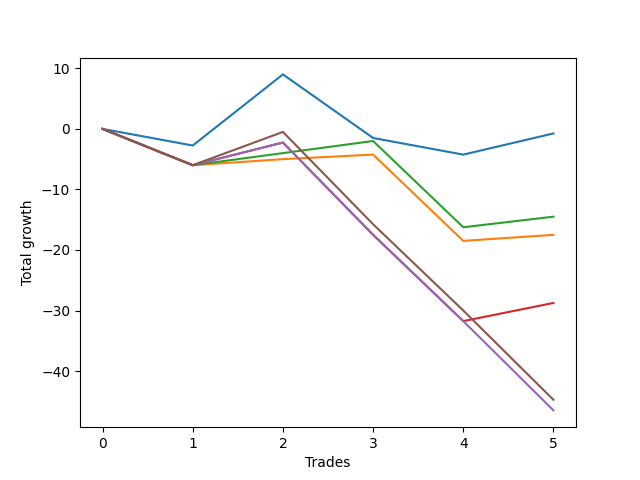

# Long Wallace 013 
- Symbol: ES_SmolBoiHour
- Date Range: 03/18/2022 - 07/29/2022
- Trading Period: 7:20-12:30
- Number of Trades: 5



| Name | Win Percent | Profit | Avg Profit / Trade | Avg Time / Trade |      | Name | Win Percent | Profit | Avg Profit / Trade | Avg Time / Trade |
| ---- | ----------- | ------ | ------------------ | ---------------- | ---- | ---- | ----------- | ------ | ------------------ | ---------------- |
| Sorted By <br> Profit | | | | | | Sorted By <br> Win Percentage ||||
| Two | 40.00 | -375.00 | -75.00 | 27:13 |     | Eighty-Two | 60.00 | -7250.00 | -1450.00 | 27:30 |
| Eighty-Two | 60.00 | -7250.00 | -1450.00 | 27:30 |     | Eighty-One | 60.00 | -8750.00 | -1750.00 | 24:16 |
| Eighty-One | 60.00 | -8750.00 | -1750.00 | 24:16 |     | Two | 40.00 | -375.00 | -75.00 | 27:13 |
| Eighty-Three | 40.00 | -14375.00 | -2875.00 | 39:45 |     | Eighty-Three | 40.00 | -14375.00 | -2875.00 | 39:45 |
| Eighty-Five | 20.00 | -22375.00 | -4475.00 | 48:12 |     | Eighty-Five | 20.00 | -22375.00 | -4475.00 | 48:12 |
| Eighty-Four | 20.00 | -23250.00 | -4650.00 | 48:07 |     | Eighty-Four | 20.00 | -23250.00 | -4650.00 | 48:07 |

## NO STOPLOSS

### Test Two
* Sell when the price hits the upper line of the 20p 2std bollinger
* No Stoploss
* Results:
```
Total Trades: 5
Percent Up: 40.00
Percent Down: 60.00
Total Points Moved Up: -0.75
Potential Profit: -375.00
Total Points Ups: 15.25 Count Ups: 2
Total Points Downs: -16.00 Count Downs: 3
```

<details><summary>Trades</summary>

<code>In: 2022-03-23 10:23:00		Out: 2022-03-23 10:54:25		Total Position Time: 31:25		Total Move Up: -2.75		Total to Date: -2.75</code> <br />
<code>In: 2022-03-25 08:29:00		Out: 2022-03-25 08:41:45		Total Position Time: 12:45		Total Move Up: 11.75		Total to Date: 9.00</code> <br />
<code>In: 2022-03-28 08:27:00		Out: 2022-03-28 09:07:10		Total Position Time: 40:10		Total Move Up: -10.50		Total to Date: -1.50</code> <br />
<code>In: 2022-04-18 08:26:00		Out: 2022-04-18 08:59:35		Total Position Time: 33:35		Total Move Up: -2.75		Total to Date: -4.25</code> <br />
<code>In: 2022-06-08 09:41:00		Out: 2022-06-08 09:59:10		Total Position Time: 18:10		Total Move Up: 3.50		Total to Date: -0.75</code> <br />


</details>

## TAKE PROFIT

### Test Eighty-One
* Take Profit of 1 Point
* No Stoploss
* Results:
```
Total Trades: 5
Percent Up: 60.00
Percent Down: 40.00
Total Points Moved Up: -17.50
Potential Profit: -8750.00
Total Points Ups: 2.75 Count Ups: 3
Total Points Downs: -20.25 Count Downs: 2
```

<details><summary>Trades</summary>

<code>In: 2022-03-23 10:23:00		Out: 2022-03-23 11:22:55		Total Position Time: 59:55		Total Move Up: -6.00		Total to Date: -6.00</code> <br />
<code>In: 2022-03-25 08:29:00		Out: 2022-03-25 08:29:10		Total Position Time: 00:10		Total Move Up: 1.00		Total to Date: -5.00</code> <br />
<code>In: 2022-03-28 08:27:00		Out: 2022-03-28 08:27:45		Total Position Time: 00:45		Total Move Up: 0.75		Total to Date: -4.25</code> <br />
<code>In: 2022-04-18 08:26:00		Out: 2022-04-18 09:25:55		Total Position Time: 59:55		Total Move Up: -14.25		Total to Date: -18.50</code> <br />
<code>In: 2022-06-08 09:41:00		Out: 2022-06-08 09:41:35		Total Position Time: 00:35		Total Move Up: 1.00		Total to Date: -17.50</code> <br />


</details>

### Test Eighty-Two
* Take Profit of 2 Point
* No Stoploss
* Results:
```
Total Trades: 5
Percent Up: 60.00
Percent Down: 40.00
Total Points Moved Up: -14.50
Potential Profit: -7250.00
Total Points Ups: 5.75 Count Ups: 3
Total Points Downs: -20.25 Count Downs: 2
```

<details><summary>Trades</summary>

<code>In: 2022-03-23 10:23:00		Out: 2022-03-23 11:22:55		Total Position Time: 59:55		Total Move Up: -6.00		Total to Date: -6.00</code> <br />
<code>In: 2022-03-25 08:29:00		Out: 2022-03-25 08:29:20		Total Position Time: 00:20		Total Move Up: 2.00		Total to Date: -4.00</code> <br />
<code>In: 2022-03-28 08:27:00		Out: 2022-03-28 08:28:10		Total Position Time: 01:10		Total Move Up: 2.00		Total to Date: -2.00</code> <br />
<code>In: 2022-04-18 08:26:00		Out: 2022-04-18 09:25:55		Total Position Time: 59:55		Total Move Up: -14.25		Total to Date: -16.25</code> <br />
<code>In: 2022-06-08 09:41:00		Out: 2022-06-08 09:57:10		Total Position Time: 16:10		Total Move Up: 1.75		Total to Date: -14.50</code> <br />


</details>

### Test Eighty-Three
* Take Profit of 3 Point
* No Stoploss
* Results:
```
Total Trades: 5
Percent Up: 40.00
Percent Down: 60.00
Total Points Moved Up: -28.75
Potential Profit: -14375.00
Total Points Ups: 6.75 Count Ups: 2
Total Points Downs: -35.50 Count Downs: 3
```

<details><summary>Trades</summary>

<code>In: 2022-03-23 10:23:00		Out: 2022-03-23 11:22:55		Total Position Time: 59:55		Total Move Up: -6.00		Total to Date: -6.00</code> <br />
<code>In: 2022-03-25 08:29:00		Out: 2022-03-25 08:29:55		Total Position Time: 00:55		Total Move Up: 3.75		Total to Date: -2.25</code> <br />
<code>In: 2022-03-28 08:27:00		Out: 2022-03-28 09:26:55		Total Position Time: 59:55		Total Move Up: -15.25		Total to Date: -17.50</code> <br />
<code>In: 2022-04-18 08:26:00		Out: 2022-04-18 09:25:55		Total Position Time: 59:55		Total Move Up: -14.25		Total to Date: -31.75</code> <br />
<code>In: 2022-06-08 09:41:00		Out: 2022-06-08 09:59:05		Total Position Time: 18:05		Total Move Up: 3.00		Total to Date: -28.75</code> <br />


</details>

### Test Eighty-Four
* Take Profit of 4 Point
* No Stoploss
* Results:
```
Total Trades: 5
Percent Up: 20.00
Percent Down: 80.00
Total Points Moved Up: -46.50
Potential Profit: -23250.00
Total Points Ups: 3.75 Count Ups: 1
Total Points Downs: -50.25 Count Downs: 4
```

<details><summary>Trades</summary>

<code>In: 2022-03-23 10:23:00		Out: 2022-03-23 11:22:55		Total Position Time: 59:55		Total Move Up: -6.00		Total to Date: -6.00</code> <br />
<code>In: 2022-03-25 08:29:00		Out: 2022-03-25 08:29:55		Total Position Time: 00:55		Total Move Up: 3.75		Total to Date: -2.25</code> <br />
<code>In: 2022-03-28 08:27:00		Out: 2022-03-28 09:26:55		Total Position Time: 59:55		Total Move Up: -15.25		Total to Date: -17.50</code> <br />
<code>In: 2022-04-18 08:26:00		Out: 2022-04-18 09:25:55		Total Position Time: 59:55		Total Move Up: -14.25		Total to Date: -31.75</code> <br />
<code>In: 2022-06-08 09:41:00		Out: 2022-06-08 10:40:55		Total Position Time: 59:55		Total Move Up: -14.75		Total to Date: -46.50</code> <br />


</details>

### Test Eighty-Five
* Take Profit of 5 Point
* No Stoploss
* Results:
```
Total Trades: 5
Percent Up: 20.00
Percent Down: 80.00
Total Points Moved Up: -44.75
Potential Profit: -22375.00
Total Points Ups: 5.50 Count Ups: 1
Total Points Downs: -50.25 Count Downs: 4
```

<details><summary>Trades</summary>

<code>In: 2022-03-23 10:23:00		Out: 2022-03-23 11:22:55		Total Position Time: 59:55		Total Move Up: -6.00		Total to Date: -6.00</code> <br />
<code>In: 2022-03-25 08:29:00		Out: 2022-03-25 08:30:20		Total Position Time: 01:20		Total Move Up: 5.50		Total to Date: -0.50</code> <br />
<code>In: 2022-03-28 08:27:00		Out: 2022-03-28 09:26:55		Total Position Time: 59:55		Total Move Up: -15.25		Total to Date: -15.75</code> <br />
<code>In: 2022-04-18 08:26:00		Out: 2022-04-18 09:25:55		Total Position Time: 59:55		Total Move Up: -14.25		Total to Date: -30.00</code> <br />
<code>In: 2022-06-08 09:41:00		Out: 2022-06-08 10:40:55		Total Position Time: 59:55		Total Move Up: -14.75		Total to Date: -44.75</code> <br />


</details>