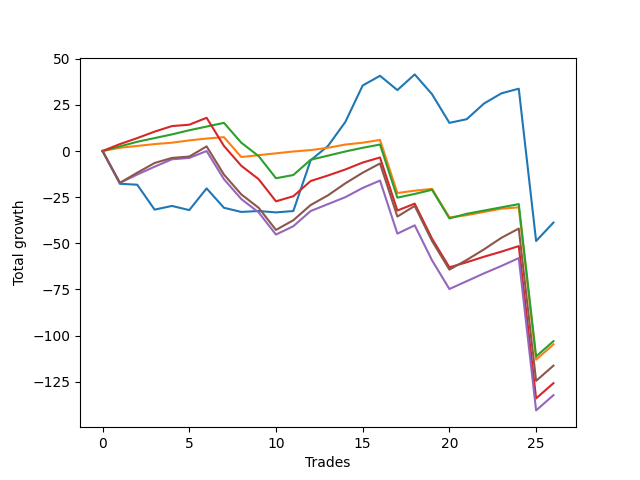

# Long Wallace 014 
- Symbol: ES_SmolBoiHour
- Date Range: 03/18/2022 - 07/29/2022
- Trading Period: 7:20-12:30
- Number of Trades: 26



| Name | Win Percent | Profit | Avg Profit / Trade | Avg Time / Trade |      | Name | Win Percent | Profit | Avg Profit / Trade | Avg Time / Trade |
| ---- | ----------- | ------ | ------------------ | ---------------- | ---- | ---- | ----------- | ------ | ------------------ | ---------------- |
| Sorted By <br> Profit | | | | | | Sorted By <br> Win Percentage ||||
| Two | 57.69 | -19375.00 | -745.19 | 74:45 |     | Eighty-One | 84.62 | -52375.00 | -2014.42 | 58:30 |
| Eighty-Two | 76.92 | -51500.00 | -1980.77 | 63:49 |     | Eighty-Two | 76.92 | -51500.00 | -1980.77 | 63:49 |
| Eighty-One | 84.62 | -52375.00 | -2014.42 | 58:30 |     | Eighty-Three | 69.23 | -62875.00 | -2418.27 | 72:04 |
| Eighty-Five | 65.38 | -58125.00 | -2235.58 | 77:37 |     | Eighty-Five | 65.38 | -58125.00 | -2235.58 | 77:37 |
| Eighty-Three | 69.23 | -62875.00 | -2418.27 | 72:04 |     | Eighty-Four | 65.38 | -66125.00 | -2543.27 | 75:19 |
| Eighty-Four | 65.38 | -66125.00 | -2543.27 | 75:19 |     | Two | 57.69 | -19375.00 | -745.19 | 74:45 |

## NO STOPLOSS

### Test Two
* Sell when the price hits the upper line of the 20p 2std bollinger
* No Stoploss
* Results:
```
Total Trades: 26
Percent Up: 57.69
Percent Down: 42.31
Total Points Moved Up: -38.75
Potential Profit: -19375.00
Total Points Ups: 125.25 Count Ups: 15
Total Points Downs: -164.00 Count Downs: 11
```

<details><summary>Trades</summary>

<code>In: 2022-03-21 09:35:00		Out: 2022-03-21 10:34:05		Total Position Time: 59:05		Total Move Up: -17.75		Total to Date: -17.75</code> <br />
<code>In: 2022-03-23 09:14:00		Out: 2022-03-23 10:13:55		Total Position Time: 59:55		Total Move Up: -0.50		Total to Date: -18.25</code> <br />
<code>In: 2022-03-23 09:47:00		Out: 2022-03-23 10:46:55		Total Position Time: 59:55		Total Move Up: -13.50		Total to Date: -31.75</code> <br />
<code>In: 2022-03-23 10:28:00		Out: 2022-03-23 10:54:25		Total Position Time: 26:25		Total Move Up: 2.00		Total to Date: -29.75</code> <br />
<code>In: 2022-03-25 08:14:00		Out: 2022-03-25 08:41:45		Total Position Time: 27:45		Total Move Up: -2.25		Total to Date: -32.00</code> <br />
<code>In: 2022-03-25 08:29:00		Out: 2022-03-25 08:41:45		Total Position Time: 12:45		Total Move Up: 11.75		Total to Date: -20.25</code> <br />
<code>In: 2022-03-28 08:27:00		Out: 2022-03-28 09:07:10		Total Position Time: 40:10		Total Move Up: -10.50		Total to Date: -30.75</code> <br />
<code>In: 2022-03-31 09:16:00		Out: 2022-03-31 09:44:20		Total Position Time: 28:20		Total Move Up: -2.25		Total to Date: -33.00</code> <br />
<code>In: 2022-03-31 09:23:00		Out: 2022-03-31 09:44:20		Total Position Time: 21:20		Total Move Up: 0.50		Total to Date: -32.50</code> <br />
<code>In: 2022-04-18 08:29:00		Out: 2022-04-18 08:59:35		Total Position Time: 30:35		Total Move Up: -0.75		Total to Date: -33.25</code> <br />
<code>In: 2022-04-20 09:14:00		Out: 2022-04-20 09:31:05		Total Position Time: 17:05		Total Move Up: 0.75		Total to Date: -32.50</code> <br />
<code>In: 2022-05-04 11:36:00		Out: 2022-05-04 11:43:45		Total Position Time: 07:45		Total Move Up: 27.50		Total to Date: -5.00</code> <br />
<code>In: 2022-05-13 11:07:00		Out: 2022-05-13 11:31:20		Total Position Time: 24:20		Total Move Up: 7.75		Total to Date: 2.75</code> <br />
<code>In: 2022-05-17 11:24:00		Out: 2022-05-17 11:40:00		Total Position Time: 16:00		Total Move Up: 13.00		Total to Date: 15.75</code> <br />
<code>In: 2022-05-19 10:51:00		Out: 2022-05-19 10:55:15		Total Position Time: 04:15		Total Move Up: 19.75		Total to Date: 35.50</code> <br />
<code>In: 2022-05-25 09:29:00		Out: 2022-05-25 09:45:20		Total Position Time: 16:20		Total Move Up: 5.25		Total to Date: 40.75</code> <br />
<code>In: 2022-06-06 08:15:00		Out: 2022-06-06 08:43:00		Total Position Time: 28:00		Total Move Up: -7.75		Total to Date: 33.00</code> <br />
<code>In: 2022-06-08 08:05:00		Out: 2022-06-08 08:14:00		Total Position Time: 09:00		Total Move Up: 8.50		Total to Date: 41.50</code> <br />
<code>In: 2022-06-08 09:29:00		Out: 2022-06-08 09:59:10		Total Position Time: 30:10		Total Move Up: -10.75		Total to Date: 30.75</code> <br />
<code>In: 2022-06-15 07:35:00		Out: 2022-06-15 08:34:55		Total Position Time: 59:55		Total Move Up: -15.50		Total to Date: 15.25</code> <br />
<code>In: 2022-06-27 10:45:00		Out: 2022-06-27 11:13:35		Total Position Time: 28:35		Total Move Up: 2.00		Total to Date: 17.25</code> <br />
<code>In: 2022-06-29 08:25:00		Out: 2022-06-29 08:34:40		Total Position Time: 09:40		Total Move Up: 8.50		Total to Date: 25.75</code> <br />
<code>In: 2022-07-05 08:04:00		Out: 2022-07-05 08:17:55		Total Position Time: 13:55		Total Move Up: 5.50		Total to Date: 31.25</code> <br />
<code>In: 2022-07-08 09:44:00		Out: 2022-07-08 10:10:30		Total Position Time: 26:30		Total Move Up: 2.50		Total to Date: 33.75</code> <br />
<code>In: 2022-07-12 11:36:00		Out: 2022-07-14 08:46:00		Total Position Time: 1270:00		Total Move Up: -82.50		Total to Date: -48.75</code> <br />
<code>In: 2022-07-29 08:29:00		Out: 2022-07-29 08:45:00		Total Position Time: 16:00		Total Move Up: 10.00		Total to Date: -38.75</code> <br />


</details>

## TAKE PROFIT

### Test Eighty-One
* Take Profit of 1 Point
* No Stoploss
* Results:
```
Total Trades: 26
Percent Up: 84.62
Percent Down: 15.38
Total Points Moved Up: -104.75
Potential Profit: -52375.00
Total Points Ups: 32.75 Count Ups: 22
Total Points Downs: -137.50 Count Downs: 4
```

<details><summary>Trades</summary>

<code>In: 2022-03-21 09:35:00		Out: 2022-03-21 09:44:55		Total Position Time: 09:55		Total Move Up: 1.75		Total to Date: 1.75</code> <br />
<code>In: 2022-03-23 09:14:00		Out: 2022-03-23 09:14:10		Total Position Time: 00:10		Total Move Up: 1.00		Total to Date: 2.75</code> <br />
<code>In: 2022-03-23 09:47:00		Out: 2022-03-23 09:47:35		Total Position Time: 00:35		Total Move Up: 1.00		Total to Date: 3.75</code> <br />
<code>In: 2022-03-23 10:28:00		Out: 2022-03-23 10:34:30		Total Position Time: 06:30		Total Move Up: 0.75		Total to Date: 4.50</code> <br />
<code>In: 2022-03-25 08:14:00		Out: 2022-03-25 08:15:50		Total Position Time: 01:50		Total Move Up: 1.25		Total to Date: 5.75</code> <br />
<code>In: 2022-03-25 08:29:00		Out: 2022-03-25 08:29:10		Total Position Time: 00:10		Total Move Up: 1.00		Total to Date: 6.75</code> <br />
<code>In: 2022-03-28 08:27:00		Out: 2022-03-28 08:27:45		Total Position Time: 00:45		Total Move Up: 0.75		Total to Date: 7.50</code> <br />
<code>In: 2022-03-31 09:16:00		Out: 2022-03-31 10:15:55		Total Position Time: 59:55		Total Move Up: -10.75		Total to Date: -3.25</code> <br />
<code>In: 2022-03-31 09:23:00		Out: 2022-03-31 09:44:50		Total Position Time: 21:50		Total Move Up: 1.00		Total to Date: -2.25</code> <br />
<code>In: 2022-04-18 08:29:00		Out: 2022-04-18 08:29:25		Total Position Time: 00:25		Total Move Up: 1.00		Total to Date: -1.25</code> <br />
<code>In: 2022-04-20 09:14:00		Out: 2022-04-20 09:18:50		Total Position Time: 04:50		Total Move Up: 1.00		Total to Date: -0.25</code> <br />
<code>In: 2022-05-04 11:36:00		Out: 2022-05-04 11:36:10		Total Position Time: 00:10		Total Move Up: 0.75		Total to Date: 0.50</code> <br />
<code>In: 2022-05-13 11:07:00		Out: 2022-05-13 11:09:25		Total Position Time: 02:25		Total Move Up: 1.25		Total to Date: 1.75</code> <br />
<code>In: 2022-05-17 11:24:00		Out: 2022-05-17 11:24:25		Total Position Time: 00:25		Total Move Up: 1.75		Total to Date: 3.50</code> <br />
<code>In: 2022-05-19 10:51:00		Out: 2022-05-19 10:51:15		Total Position Time: 00:15		Total Move Up: 1.00		Total to Date: 4.50</code> <br />
<code>In: 2022-05-25 09:29:00		Out: 2022-05-25 09:30:00		Total Position Time: 01:00		Total Move Up: 1.50		Total to Date: 6.00</code> <br />
<code>In: 2022-06-06 08:15:00		Out: 2022-06-06 09:14:55		Total Position Time: 59:55		Total Move Up: -28.75		Total to Date: -22.75</code> <br />
<code>In: 2022-06-08 08:05:00		Out: 2022-06-08 08:05:10		Total Position Time: 00:10		Total Move Up: 1.25		Total to Date: -21.50</code> <br />
<code>In: 2022-06-08 09:29:00		Out: 2022-06-08 09:29:15		Total Position Time: 00:15		Total Move Up: 1.00		Total to Date: -20.50</code> <br />
<code>In: 2022-06-15 07:35:00		Out: 2022-06-15 08:34:55		Total Position Time: 59:55		Total Move Up: -15.50		Total to Date: -36.00</code> <br />
<code>In: 2022-06-27 10:45:00		Out: 2022-06-27 10:51:15		Total Position Time: 06:15		Total Move Up: 1.25		Total to Date: -34.75</code> <br />
<code>In: 2022-06-29 08:25:00		Out: 2022-06-29 08:25:15		Total Position Time: 00:15		Total Move Up: 1.75		Total to Date: -33.00</code> <br />
<code>In: 2022-07-05 08:04:00		Out: 2022-07-05 08:04:10		Total Position Time: 00:10		Total Move Up: 1.75		Total to Date: -31.25</code> <br />
<code>In: 2022-07-08 09:44:00		Out: 2022-07-08 09:44:20		Total Position Time: 00:20		Total Move Up: 0.75		Total to Date: -30.50</code> <br />
<code>In: 2022-07-12 11:36:00		Out: 2022-07-14 08:46:00		Total Position Time: 1270:00		Total Move Up: -82.50		Total to Date: -113.00</code> <br />
<code>In: 2022-07-29 08:29:00		Out: 2022-07-29 08:42:00		Total Position Time: 13:00		Total Move Up: 8.25		Total to Date: -104.75</code> <br />


</details>

### Test Eighty-Two
* Take Profit of 2 Point
* No Stoploss
* Results:
```
Total Trades: 26
Percent Up: 76.92
Percent Down: 23.08
Total Points Moved Up: -103.00
Potential Profit: -51500.00
Total Points Ups: 53.75 Count Ups: 20
Total Points Downs: -156.75 Count Downs: 6
```

<details><summary>Trades</summary>

<code>In: 2022-03-21 09:35:00		Out: 2022-03-21 09:45:00		Total Position Time: 10:00		Total Move Up: 2.50		Total to Date: 2.50</code> <br />
<code>In: 2022-03-23 09:14:00		Out: 2022-03-23 09:14:55		Total Position Time: 00:55		Total Move Up: 2.50		Total to Date: 5.00</code> <br />
<code>In: 2022-03-23 09:47:00		Out: 2022-03-23 09:48:20		Total Position Time: 01:20		Total Move Up: 2.00		Total to Date: 7.00</code> <br />
<code>In: 2022-03-23 10:28:00		Out: 2022-03-23 10:54:25		Total Position Time: 26:25		Total Move Up: 2.00		Total to Date: 9.00</code> <br />
<code>In: 2022-03-25 08:14:00		Out: 2022-03-25 08:16:05		Total Position Time: 02:05		Total Move Up: 2.25		Total to Date: 11.25</code> <br />
<code>In: 2022-03-25 08:29:00		Out: 2022-03-25 08:29:20		Total Position Time: 00:20		Total Move Up: 2.00		Total to Date: 13.25</code> <br />
<code>In: 2022-03-28 08:27:00		Out: 2022-03-28 08:28:10		Total Position Time: 01:10		Total Move Up: 2.00		Total to Date: 15.25</code> <br />
<code>In: 2022-03-31 09:16:00		Out: 2022-03-31 10:15:55		Total Position Time: 59:55		Total Move Up: -10.75		Total to Date: 4.50</code> <br />
<code>In: 2022-03-31 09:23:00		Out: 2022-03-31 10:22:55		Total Position Time: 59:55		Total Move Up: -7.25		Total to Date: -2.75</code> <br />
<code>In: 2022-04-18 08:29:00		Out: 2022-04-18 09:28:55		Total Position Time: 59:55		Total Move Up: -12.00		Total to Date: -14.75</code> <br />
<code>In: 2022-04-20 09:14:00		Out: 2022-04-20 09:31:35		Total Position Time: 17:35		Total Move Up: 1.75		Total to Date: -13.00</code> <br />
<code>In: 2022-05-04 11:36:00		Out: 2022-05-04 11:36:40		Total Position Time: 00:40		Total Move Up: 8.25		Total to Date: -4.75</code> <br />
<code>In: 2022-05-13 11:07:00		Out: 2022-05-13 11:09:30		Total Position Time: 02:30		Total Move Up: 2.25		Total to Date: -2.50</code> <br />
<code>In: 2022-05-17 11:24:00		Out: 2022-05-17 11:24:35		Total Position Time: 00:35		Total Move Up: 2.25		Total to Date: -0.25</code> <br />
<code>In: 2022-05-19 10:51:00		Out: 2022-05-19 10:51:20		Total Position Time: 00:20		Total Move Up: 2.00		Total to Date: 1.75</code> <br />
<code>In: 2022-05-25 09:29:00		Out: 2022-05-25 09:30:05		Total Position Time: 01:05		Total Move Up: 1.75		Total to Date: 3.50</code> <br />
<code>In: 2022-06-06 08:15:00		Out: 2022-06-06 09:14:55		Total Position Time: 59:55		Total Move Up: -28.75		Total to Date: -25.25</code> <br />
<code>In: 2022-06-08 08:05:00		Out: 2022-06-08 08:05:25		Total Position Time: 00:25		Total Move Up: 2.00		Total to Date: -23.25</code> <br />
<code>In: 2022-06-08 09:29:00		Out: 2022-06-08 09:29:55		Total Position Time: 00:55		Total Move Up: 2.25		Total to Date: -21.00</code> <br />
<code>In: 2022-06-15 07:35:00		Out: 2022-06-15 08:34:55		Total Position Time: 59:55		Total Move Up: -15.50		Total to Date: -36.50</code> <br />
<code>In: 2022-06-27 10:45:00		Out: 2022-06-27 10:54:20		Total Position Time: 09:20		Total Move Up: 2.50		Total to Date: -34.00</code> <br />
<code>In: 2022-06-29 08:25:00		Out: 2022-06-29 08:25:15		Total Position Time: 00:15		Total Move Up: 1.75		Total to Date: -32.25</code> <br />
<code>In: 2022-07-05 08:04:00		Out: 2022-07-05 08:04:30		Total Position Time: 00:30		Total Move Up: 1.75		Total to Date: -30.50</code> <br />
<code>In: 2022-07-08 09:44:00		Out: 2022-07-08 09:44:35		Total Position Time: 00:35		Total Move Up: 1.75		Total to Date: -28.75</code> <br />
<code>In: 2022-07-12 11:36:00		Out: 2022-07-14 08:46:00		Total Position Time: 1270:00		Total Move Up: -82.50		Total to Date: -111.25</code> <br />
<code>In: 2022-07-29 08:29:00		Out: 2022-07-29 08:42:00		Total Position Time: 13:00		Total Move Up: 8.25		Total to Date: -103.00</code> <br />


</details>

### Test Eighty-Three
* Take Profit of 3 Point
* No Stoploss
* Results:
```
Total Trades: 26
Percent Up: 69.23
Percent Down: 30.77
Total Points Moved Up: -125.75
Potential Profit: -62875.00
Total Points Ups: 65.25 Count Ups: 18
Total Points Downs: -191.00 Count Downs: 8
```

<details><summary>Trades</summary>

<code>In: 2022-03-21 09:35:00		Out: 2022-03-21 09:49:45		Total Position Time: 14:45		Total Move Up: 3.75		Total to Date: 3.75</code> <br />
<code>In: 2022-03-23 09:14:00		Out: 2022-03-23 09:15:15		Total Position Time: 01:15		Total Move Up: 3.25		Total to Date: 7.00</code> <br />
<code>In: 2022-03-23 09:47:00		Out: 2022-03-23 09:52:30		Total Position Time: 05:30		Total Move Up: 3.50		Total to Date: 10.50</code> <br />
<code>In: 2022-03-23 10:28:00		Out: 2022-03-23 10:54:50		Total Position Time: 26:50		Total Move Up: 3.00		Total to Date: 13.50</code> <br />
<code>In: 2022-03-25 08:14:00		Out: 2022-03-25 09:13:55		Total Position Time: 59:55		Total Move Up: 0.75		Total to Date: 14.25</code> <br />
<code>In: 2022-03-25 08:29:00		Out: 2022-03-25 08:29:55		Total Position Time: 00:55		Total Move Up: 3.75		Total to Date: 18.00</code> <br />
<code>In: 2022-03-28 08:27:00		Out: 2022-03-28 09:26:55		Total Position Time: 59:55		Total Move Up: -15.25		Total to Date: 2.75</code> <br />
<code>In: 2022-03-31 09:16:00		Out: 2022-03-31 10:15:55		Total Position Time: 59:55		Total Move Up: -10.75		Total to Date: -8.00</code> <br />
<code>In: 2022-03-31 09:23:00		Out: 2022-03-31 10:22:55		Total Position Time: 59:55		Total Move Up: -7.25		Total to Date: -15.25</code> <br />
<code>In: 2022-04-18 08:29:00		Out: 2022-04-18 09:28:55		Total Position Time: 59:55		Total Move Up: -12.00		Total to Date: -27.25</code> <br />
<code>In: 2022-04-20 09:14:00		Out: 2022-04-20 09:32:30		Total Position Time: 18:30		Total Move Up: 2.75		Total to Date: -24.50</code> <br />
<code>In: 2022-05-04 11:36:00		Out: 2022-05-04 11:36:40		Total Position Time: 00:40		Total Move Up: 8.25		Total to Date: -16.25</code> <br />
<code>In: 2022-05-13 11:07:00		Out: 2022-05-13 11:09:35		Total Position Time: 02:35		Total Move Up: 3.00		Total to Date: -13.25</code> <br />
<code>In: 2022-05-17 11:24:00		Out: 2022-05-17 11:24:40		Total Position Time: 00:40		Total Move Up: 3.25		Total to Date: -10.00</code> <br />
<code>In: 2022-05-19 10:51:00		Out: 2022-05-19 10:51:50		Total Position Time: 00:50		Total Move Up: 3.75		Total to Date: -6.25</code> <br />
<code>In: 2022-05-25 09:29:00		Out: 2022-05-25 09:30:15		Total Position Time: 01:15		Total Move Up: 2.75		Total to Date: -3.50</code> <br />
<code>In: 2022-06-06 08:15:00		Out: 2022-06-06 09:14:55		Total Position Time: 59:55		Total Move Up: -28.75		Total to Date: -32.25</code> <br />
<code>In: 2022-06-08 08:05:00		Out: 2022-06-08 08:06:10		Total Position Time: 01:10		Total Move Up: 3.75		Total to Date: -28.50</code> <br />
<code>In: 2022-06-08 09:29:00		Out: 2022-06-08 10:28:55		Total Position Time: 59:55		Total Move Up: -19.00		Total to Date: -47.50</code> <br />
<code>In: 2022-06-15 07:35:00		Out: 2022-06-15 08:34:55		Total Position Time: 59:55		Total Move Up: -15.50		Total to Date: -63.00</code> <br />
<code>In: 2022-06-27 10:45:00		Out: 2022-06-27 11:15:35		Total Position Time: 30:35		Total Move Up: 2.75		Total to Date: -60.25</code> <br />
<code>In: 2022-06-29 08:25:00		Out: 2022-06-29 08:25:20		Total Position Time: 00:20		Total Move Up: 3.00		Total to Date: -57.25</code> <br />
<code>In: 2022-07-05 08:04:00		Out: 2022-07-05 08:04:45		Total Position Time: 00:45		Total Move Up: 2.75		Total to Date: -54.50</code> <br />
<code>In: 2022-07-08 09:44:00		Out: 2022-07-08 09:49:10		Total Position Time: 05:10		Total Move Up: 3.00		Total to Date: -51.50</code> <br />
<code>In: 2022-07-12 11:36:00		Out: 2022-07-14 08:46:00		Total Position Time: 1270:00		Total Move Up: -82.50		Total to Date: -134.00</code> <br />
<code>In: 2022-07-29 08:29:00		Out: 2022-07-29 08:42:00		Total Position Time: 13:00		Total Move Up: 8.25		Total to Date: -125.75</code> <br />


</details>

### Test Eighty-Four
* Take Profit of 4 Point
* No Stoploss
* Results:
```
Total Trades: 26
Percent Up: 65.38
Percent Down: 34.62
Total Points Moved Up: -132.25
Potential Profit: -66125.00
Total Points Ups: 76.00 Count Ups: 17
Total Points Downs: -208.25 Count Downs: 9
```

<details><summary>Trades</summary>

<code>In: 2022-03-21 09:35:00		Out: 2022-03-21 10:34:55		Total Position Time: 59:55		Total Move Up: -17.25		Total to Date: -17.25</code> <br />
<code>In: 2022-03-23 09:14:00		Out: 2022-03-23 09:15:45		Total Position Time: 01:45		Total Move Up: 4.50		Total to Date: -12.75</code> <br />
<code>In: 2022-03-23 09:47:00		Out: 2022-03-23 09:52:50		Total Position Time: 05:50		Total Move Up: 4.25		Total to Date: -8.50</code> <br />
<code>In: 2022-03-23 10:28:00		Out: 2022-03-23 10:55:05		Total Position Time: 27:05		Total Move Up: 4.00		Total to Date: -4.50</code> <br />
<code>In: 2022-03-25 08:14:00		Out: 2022-03-25 09:13:55		Total Position Time: 59:55		Total Move Up: 0.75		Total to Date: -3.75</code> <br />
<code>In: 2022-03-25 08:29:00		Out: 2022-03-25 08:29:55		Total Position Time: 00:55		Total Move Up: 3.75		Total to Date: 0.00</code> <br />
<code>In: 2022-03-28 08:27:00		Out: 2022-03-28 09:26:55		Total Position Time: 59:55		Total Move Up: -15.25		Total to Date: -15.25</code> <br />
<code>In: 2022-03-31 09:16:00		Out: 2022-03-31 10:15:55		Total Position Time: 59:55		Total Move Up: -10.75		Total to Date: -26.00</code> <br />
<code>In: 2022-03-31 09:23:00		Out: 2022-03-31 10:22:55		Total Position Time: 59:55		Total Move Up: -7.25		Total to Date: -33.25</code> <br />
<code>In: 2022-04-18 08:29:00		Out: 2022-04-18 09:28:55		Total Position Time: 59:55		Total Move Up: -12.00		Total to Date: -45.25</code> <br />
<code>In: 2022-04-20 09:14:00		Out: 2022-04-20 09:32:40		Total Position Time: 18:40		Total Move Up: 4.50		Total to Date: -40.75</code> <br />
<code>In: 2022-05-04 11:36:00		Out: 2022-05-04 11:36:40		Total Position Time: 00:40		Total Move Up: 8.25		Total to Date: -32.50</code> <br />
<code>In: 2022-05-13 11:07:00		Out: 2022-05-13 11:10:20		Total Position Time: 03:20		Total Move Up: 3.75		Total to Date: -28.75</code> <br />
<code>In: 2022-05-17 11:24:00		Out: 2022-05-17 11:24:50		Total Position Time: 00:50		Total Move Up: 3.75		Total to Date: -25.00</code> <br />
<code>In: 2022-05-19 10:51:00		Out: 2022-05-19 10:51:55		Total Position Time: 00:55		Total Move Up: 5.00		Total to Date: -20.00</code> <br />
<code>In: 2022-05-25 09:29:00		Out: 2022-05-25 09:30:30		Total Position Time: 01:30		Total Move Up: 4.00		Total to Date: -16.00</code> <br />
<code>In: 2022-06-06 08:15:00		Out: 2022-06-06 09:14:55		Total Position Time: 59:55		Total Move Up: -28.75		Total to Date: -44.75</code> <br />
<code>In: 2022-06-08 08:05:00		Out: 2022-06-08 08:10:45		Total Position Time: 05:45		Total Move Up: 4.50		Total to Date: -40.25</code> <br />
<code>In: 2022-06-08 09:29:00		Out: 2022-06-08 10:28:55		Total Position Time: 59:55		Total Move Up: -19.00		Total to Date: -59.25</code> <br />
<code>In: 2022-06-15 07:35:00		Out: 2022-06-15 08:34:55		Total Position Time: 59:55		Total Move Up: -15.50		Total to Date: -74.75</code> <br />
<code>In: 2022-06-27 10:45:00		Out: 2022-06-27 11:18:25		Total Position Time: 33:25		Total Move Up: 4.25		Total to Date: -70.50</code> <br />
<code>In: 2022-06-29 08:25:00		Out: 2022-06-29 08:28:15		Total Position Time: 03:15		Total Move Up: 4.25		Total to Date: -66.25</code> <br />
<code>In: 2022-07-05 08:04:00		Out: 2022-07-05 08:08:20		Total Position Time: 04:20		Total Move Up: 4.00		Total to Date: -62.25</code> <br />
<code>In: 2022-07-08 09:44:00		Out: 2022-07-08 10:12:00		Total Position Time: 28:00		Total Move Up: 4.25		Total to Date: -58.00</code> <br />
<code>In: 2022-07-12 11:36:00		Out: 2022-07-14 08:46:00		Total Position Time: 1270:00		Total Move Up: -82.50		Total to Date: -140.50</code> <br />
<code>In: 2022-07-29 08:29:00		Out: 2022-07-29 08:42:00		Total Position Time: 13:00		Total Move Up: 8.25		Total to Date: -132.25</code> <br />


</details>

### Test Eighty-Five
* Take Profit of 5 Point
* No Stoploss
* Results:
```
Total Trades: 26
Percent Up: 65.38
Percent Down: 34.62
Total Points Moved Up: -116.25
Potential Profit: -58125.00
Total Points Ups: 92.00 Count Ups: 17
Total Points Downs: -208.25 Count Downs: 9
```

<details><summary>Trades</summary>

<code>In: 2022-03-21 09:35:00		Out: 2022-03-21 10:34:55		Total Position Time: 59:55		Total Move Up: -17.25		Total to Date: -17.25</code> <br />
<code>In: 2022-03-23 09:14:00		Out: 2022-03-23 09:16:05		Total Position Time: 02:05		Total Move Up: 5.50		Total to Date: -11.75</code> <br />
<code>In: 2022-03-23 09:47:00		Out: 2022-03-23 09:59:10		Total Position Time: 12:10		Total Move Up: 5.25		Total to Date: -6.50</code> <br />
<code>In: 2022-03-23 10:28:00		Out: 2022-03-23 11:27:55		Total Position Time: 59:55		Total Move Up: 2.75		Total to Date: -3.75</code> <br />
<code>In: 2022-03-25 08:14:00		Out: 2022-03-25 09:13:55		Total Position Time: 59:55		Total Move Up: 0.75		Total to Date: -3.00</code> <br />
<code>In: 2022-03-25 08:29:00		Out: 2022-03-25 08:30:20		Total Position Time: 01:20		Total Move Up: 5.50		Total to Date: 2.50</code> <br />
<code>In: 2022-03-28 08:27:00		Out: 2022-03-28 09:26:55		Total Position Time: 59:55		Total Move Up: -15.25		Total to Date: -12.75</code> <br />
<code>In: 2022-03-31 09:16:00		Out: 2022-03-31 10:15:55		Total Position Time: 59:55		Total Move Up: -10.75		Total to Date: -23.50</code> <br />
<code>In: 2022-03-31 09:23:00		Out: 2022-03-31 10:22:55		Total Position Time: 59:55		Total Move Up: -7.25		Total to Date: -30.75</code> <br />
<code>In: 2022-04-18 08:29:00		Out: 2022-04-18 09:28:55		Total Position Time: 59:55		Total Move Up: -12.00		Total to Date: -42.75</code> <br />
<code>In: 2022-04-20 09:14:00		Out: 2022-04-20 09:32:55		Total Position Time: 18:55		Total Move Up: 5.25		Total to Date: -37.50</code> <br />
<code>In: 2022-05-04 11:36:00		Out: 2022-05-04 11:36:40		Total Position Time: 00:40		Total Move Up: 8.25		Total to Date: -29.25</code> <br />
<code>In: 2022-05-13 11:07:00		Out: 2022-05-13 11:10:50		Total Position Time: 03:50		Total Move Up: 5.25		Total to Date: -24.00</code> <br />
<code>In: 2022-05-17 11:24:00		Out: 2022-05-17 11:26:40		Total Position Time: 02:40		Total Move Up: 6.50		Total to Date: -17.50</code> <br />
<code>In: 2022-05-19 10:51:00		Out: 2022-05-19 10:52:20		Total Position Time: 01:20		Total Move Up: 5.75		Total to Date: -11.75</code> <br />
<code>In: 2022-05-25 09:29:00		Out: 2022-05-25 09:32:10		Total Position Time: 03:10		Total Move Up: 5.00		Total to Date: -6.75</code> <br />
<code>In: 2022-06-06 08:15:00		Out: 2022-06-06 09:14:55		Total Position Time: 59:55		Total Move Up: -28.75		Total to Date: -35.50</code> <br />
<code>In: 2022-06-08 08:05:00		Out: 2022-06-08 08:11:05		Total Position Time: 06:05		Total Move Up: 5.75		Total to Date: -29.75</code> <br />
<code>In: 2022-06-08 09:29:00		Out: 2022-06-08 10:28:55		Total Position Time: 59:55		Total Move Up: -19.00		Total to Date: -48.75</code> <br />
<code>In: 2022-06-15 07:35:00		Out: 2022-06-15 08:34:55		Total Position Time: 59:55		Total Move Up: -15.50		Total to Date: -64.25</code> <br />
<code>In: 2022-06-27 10:45:00		Out: 2022-06-27 11:19:00		Total Position Time: 34:00		Total Move Up: 5.25		Total to Date: -59.00</code> <br />
<code>In: 2022-06-29 08:25:00		Out: 2022-06-29 08:32:15		Total Position Time: 07:15		Total Move Up: 5.75		Total to Date: -53.25</code> <br />
<code>In: 2022-07-05 08:04:00		Out: 2022-07-05 08:17:50		Total Position Time: 13:50		Total Move Up: 6.25		Total to Date: -47.00</code> <br />
<code>In: 2022-07-08 09:44:00		Out: 2022-07-08 10:12:45		Total Position Time: 28:45		Total Move Up: 5.00		Total to Date: -42.00</code> <br />
<code>In: 2022-07-12 11:36:00		Out: 2022-07-14 08:46:00		Total Position Time: 1270:00		Total Move Up: -82.50		Total to Date: -124.50</code> <br />
<code>In: 2022-07-29 08:29:00		Out: 2022-07-29 08:42:00		Total Position Time: 13:00		Total Move Up: 8.25		Total to Date: -116.25</code> <br />


</details>