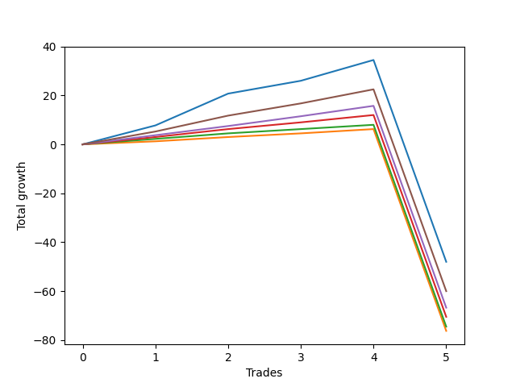

# Long Wallace 020 
- Symbol: ES_SmolBoiHour
- Date Range: 03/18/2022 - 07/29/2022
- Trading Period: 7:20-12:30
- Number of Trades: 5



| Name | Win Percent | Profit | Avg Profit / Trade | Avg Time / Trade |      | Name | Win Percent | Profit | Avg Profit / Trade | Avg Time / Trade |
| ---- | ----------- | ------ | ------------------ | ---------------- | ---- | ---- | ----------- | ------ | ------------------ | ---------------- |
| Sorted By <br> Profit | | | | | | Sorted By <br> Win Percentage ||||
| Two | 80.00 | -24000.00 | -4800.00 | 267:16 |     | Two | 80.00 | -24000.00 | -4800.00 | 267:16 |
| Eighty-Five | 80.00 | -30000.00 | -6000.00 | 257:23 |     | Eighty-Five | 80.00 | -30000.00 | -6000.00 | 257:23 |
| Eighty-Four | 80.00 | -33375.00 | -6675.00 | 255:47 |     | Eighty-Four | 80.00 | -33375.00 | -6675.00 | 255:47 |
| Eighty-Three | 80.00 | -35250.00 | -7050.00 | 254:58 |     | Eighty-Three | 80.00 | -35250.00 | -7050.00 | 254:58 |
| Eighty-Two | 80.00 | -37250.00 | -7450.00 | 254:53 |     | Eighty-Two | 80.00 | -37250.00 | -7450.00 | 254:53 |
| Eighty-One | 80.00 | -38125.00 | -7625.00 | 254:49 |     | Eighty-One | 80.00 | -38125.00 | -7625.00 | 254:49 |

## NO STOPLOSS

### Test Two
* Sell when the price hits the upper line of the 20p 2std bollinger
* No Stoploss
* Results:
```
Total Trades: 5
Percent Up: 80.00
Percent Down: 20.00
Total Points Moved Up: -48.00
Potential Profit: -24000.00
Total Points Ups: 34.50 Count Ups: 4
Total Points Downs: -82.50 Count Downs: 1
```

<details><summary>Trades</summary>

<code>In: 2022-05-13 11:07:00		Out: 2022-05-13 11:31:20		Total Position Time: 24:20		Total Move Up: 7.75		Total to Date: 7.75</code> <br />
<code>In: 2022-05-17 11:24:00		Out: 2022-05-17 11:40:00		Total Position Time: 16:00		Total Move Up: 13.00		Total to Date: 20.75</code> <br />
<code>In: 2022-05-25 09:29:00		Out: 2022-05-25 09:45:20		Total Position Time: 16:20		Total Move Up: 5.25		Total to Date: 26.00</code> <br />
<code>In: 2022-06-29 08:25:00		Out: 2022-06-29 08:34:40		Total Position Time: 09:40		Total Move Up: 8.50		Total to Date: 34.50</code> <br />
<code>In: 2022-07-12 11:36:00		Out: 2022-07-14 08:46:00		Total Position Time: 1270:00		Total Move Up: -82.50		Total to Date: -48.00</code> <br />


</details>

## TAKE PROFIT

### Test Eighty-One
* Take Profit of 1 Point
* No Stoploss
* Results:
```
Total Trades: 5
Percent Up: 80.00
Percent Down: 20.00
Total Points Moved Up: -76.25
Potential Profit: -38125.00
Total Points Ups: 6.25 Count Ups: 4
Total Points Downs: -82.50 Count Downs: 1
```

<details><summary>Trades</summary>

<code>In: 2022-05-13 11:07:00		Out: 2022-05-13 11:09:25		Total Position Time: 02:25		Total Move Up: 1.25		Total to Date: 1.25</code> <br />
<code>In: 2022-05-17 11:24:00		Out: 2022-05-17 11:24:25		Total Position Time: 00:25		Total Move Up: 1.75		Total to Date: 3.00</code> <br />
<code>In: 2022-05-25 09:29:00		Out: 2022-05-25 09:30:00		Total Position Time: 01:00		Total Move Up: 1.50		Total to Date: 4.50</code> <br />
<code>In: 2022-06-29 08:25:00		Out: 2022-06-29 08:25:15		Total Position Time: 00:15		Total Move Up: 1.75		Total to Date: 6.25</code> <br />
<code>In: 2022-07-12 11:36:00		Out: 2022-07-14 08:46:00		Total Position Time: 1270:00		Total Move Up: -82.50		Total to Date: -76.25</code> <br />


</details>

### Test Eighty-Two
* Take Profit of 2 Point
* No Stoploss
* Results:
```
Total Trades: 5
Percent Up: 80.00
Percent Down: 20.00
Total Points Moved Up: -74.50
Potential Profit: -37250.00
Total Points Ups: 8.00 Count Ups: 4
Total Points Downs: -82.50 Count Downs: 1
```

<details><summary>Trades</summary>

<code>In: 2022-05-13 11:07:00		Out: 2022-05-13 11:09:30		Total Position Time: 02:30		Total Move Up: 2.25		Total to Date: 2.25</code> <br />
<code>In: 2022-05-17 11:24:00		Out: 2022-05-17 11:24:35		Total Position Time: 00:35		Total Move Up: 2.25		Total to Date: 4.50</code> <br />
<code>In: 2022-05-25 09:29:00		Out: 2022-05-25 09:30:05		Total Position Time: 01:05		Total Move Up: 1.75		Total to Date: 6.25</code> <br />
<code>In: 2022-06-29 08:25:00		Out: 2022-06-29 08:25:15		Total Position Time: 00:15		Total Move Up: 1.75		Total to Date: 8.00</code> <br />
<code>In: 2022-07-12 11:36:00		Out: 2022-07-14 08:46:00		Total Position Time: 1270:00		Total Move Up: -82.50		Total to Date: -74.50</code> <br />


</details>

### Test Eighty-Three
* Take Profit of 3 Point
* No Stoploss
* Results:
```
Total Trades: 5
Percent Up: 80.00
Percent Down: 20.00
Total Points Moved Up: -70.50
Potential Profit: -35250.00
Total Points Ups: 12.00 Count Ups: 4
Total Points Downs: -82.50 Count Downs: 1
```

<details><summary>Trades</summary>

<code>In: 2022-05-13 11:07:00		Out: 2022-05-13 11:09:35		Total Position Time: 02:35		Total Move Up: 3.00		Total to Date: 3.00</code> <br />
<code>In: 2022-05-17 11:24:00		Out: 2022-05-17 11:24:40		Total Position Time: 00:40		Total Move Up: 3.25		Total to Date: 6.25</code> <br />
<code>In: 2022-05-25 09:29:00		Out: 2022-05-25 09:30:15		Total Position Time: 01:15		Total Move Up: 2.75		Total to Date: 9.00</code> <br />
<code>In: 2022-06-29 08:25:00		Out: 2022-06-29 08:25:20		Total Position Time: 00:20		Total Move Up: 3.00		Total to Date: 12.00</code> <br />
<code>In: 2022-07-12 11:36:00		Out: 2022-07-14 08:46:00		Total Position Time: 1270:00		Total Move Up: -82.50		Total to Date: -70.50</code> <br />


</details>

### Test Eighty-Four
* Take Profit of 4 Point
* No Stoploss
* Results:
```
Total Trades: 5
Percent Up: 80.00
Percent Down: 20.00
Total Points Moved Up: -66.75
Potential Profit: -33375.00
Total Points Ups: 15.75 Count Ups: 4
Total Points Downs: -82.50 Count Downs: 1
```

<details><summary>Trades</summary>

<code>In: 2022-05-13 11:07:00		Out: 2022-05-13 11:10:20		Total Position Time: 03:20		Total Move Up: 3.75		Total to Date: 3.75</code> <br />
<code>In: 2022-05-17 11:24:00		Out: 2022-05-17 11:24:50		Total Position Time: 00:50		Total Move Up: 3.75		Total to Date: 7.50</code> <br />
<code>In: 2022-05-25 09:29:00		Out: 2022-05-25 09:30:30		Total Position Time: 01:30		Total Move Up: 4.00		Total to Date: 11.50</code> <br />
<code>In: 2022-06-29 08:25:00		Out: 2022-06-29 08:28:15		Total Position Time: 03:15		Total Move Up: 4.25		Total to Date: 15.75</code> <br />
<code>In: 2022-07-12 11:36:00		Out: 2022-07-14 08:46:00		Total Position Time: 1270:00		Total Move Up: -82.50		Total to Date: -66.75</code> <br />


</details>

### Test Eighty-Five
* Take Profit of 5 Point
* No Stoploss
* Results:
```
Total Trades: 5
Percent Up: 80.00
Percent Down: 20.00
Total Points Moved Up: -60.00
Potential Profit: -30000.00
Total Points Ups: 22.50 Count Ups: 4
Total Points Downs: -82.50 Count Downs: 1
```

<details><summary>Trades</summary>

<code>In: 2022-05-13 11:07:00		Out: 2022-05-13 11:10:50		Total Position Time: 03:50		Total Move Up: 5.25		Total to Date: 5.25</code> <br />
<code>In: 2022-05-17 11:24:00		Out: 2022-05-17 11:26:40		Total Position Time: 02:40		Total Move Up: 6.50		Total to Date: 11.75</code> <br />
<code>In: 2022-05-25 09:29:00		Out: 2022-05-25 09:32:10		Total Position Time: 03:10		Total Move Up: 5.00		Total to Date: 16.75</code> <br />
<code>In: 2022-06-29 08:25:00		Out: 2022-06-29 08:32:15		Total Position Time: 07:15		Total Move Up: 5.75		Total to Date: 22.50</code> <br />
<code>In: 2022-07-12 11:36:00		Out: 2022-07-14 08:46:00		Total Position Time: 1270:00		Total Move Up: -82.50		Total to Date: -60.00</code> <br />


</details>