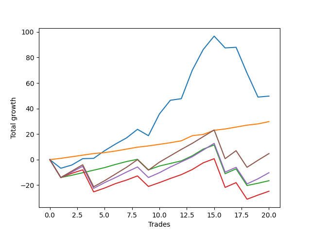

# Short Bulldog 005 DB 
- Symbol: ES_SmolBoiHour
- Date Range: 03/18/2022 - 07/29/2022
- Trading Period: 7:20-12:30
- Number of Trades: 20



| Name | Win Percent | Profit | Avg Profit / Trade | Avg Time / Trade |      | Name | Win Percent | Profit | Avg Profit / Trade | Avg Time / Trade |
| ---- | ----------- | ------ | ------------------ | ---------------- | ---- | ---- | ----------- | ------ | ------------------ | ---------------- |
| Sorted By <br> Profit | | | | | | Sorted By <br> Win Percentage ||||
| Two | 75.00 | 24875.00 | 1243.75 | 24:55 |     | Eighty-One | 100.00 | 14875.00 | 743.75 | 03:33 |
| Eighty-One | 100.00 | 14875.00 | 743.75 | 03:33 |     | Eighty-Two | 80.00 | -8250.00 | -412.50 | 15:59 |
| Eighty-Five | 75.00 | 2375.00 | 118.75 | 22:20 |     | Two | 75.00 | 24875.00 | 1243.75 | 24:55 |
| Eighty-Four | 75.00 | -5125.00 | -256.25 | 20:40 |     | Eighty-Five | 75.00 | 2375.00 | 118.75 | 22:20 |
| Eighty-Two | 80.00 | -8250.00 | -412.50 | 15:59 |     | Eighty-Four | 75.00 | -5125.00 | -256.25 | 20:40 |
| Eighty-Three | 75.00 | -12375.00 | -618.75 | 19:35 |     | Eighty-Three | 75.00 | -12375.00 | -618.75 | 19:35 |

## NO STOPLOSS

### Test Two
* Sell when the price hits the upper line of the 20p 2std bollinger
* No Stoploss
* Results:
```
Total Trades: 20
Percent Up: 25.00
Percent Down: 75.00
Total Points Moved Down: 49.75
Potential Profit: 24875.00
Total Points Ups: 60.00 Count Ups: 5
Total Points Downs: 109.75 Count Downs: 15
```

<details><summary>Trades</summary>

<code>In: 2022-03-29 11:38:00		Out: 2022-03-29 12:27:50		Total Position Time: 49:50		Total Move Down: -6.75		Total to Date: -6.75</code> <br />
<code>In: 2022-03-31 07:48:00		Out: 2022-03-31 08:08:30		Total Position Time: 20:30		Total Move Down: 2.50		Total to Date: -4.25</code> <br />
<code>In: 2022-04-06 10:43:00		Out: 2022-04-06 10:57:20		Total Position Time: 14:20		Total Move Down: 5.00		Total to Date: 0.75</code> <br />
<code>In: 2022-04-07 10:58:00		Out: 2022-04-07 11:18:20		Total Position Time: 20:20		Total Move Down: 0.25		Total to Date: 1.00</code> <br />
<code>In: 2022-04-07 11:03:00		Out: 2022-04-07 11:18:20		Total Position Time: 15:20		Total Move Down: 6.00		Total to Date: 7.00</code> <br />
<code>In: 2022-04-08 07:33:00		Out: 2022-04-08 07:49:20		Total Position Time: 16:20		Total Move Down: 5.25		Total to Date: 12.25</code> <br />
<code>In: 2022-04-18 07:27:00		Out: 2022-04-18 07:51:45		Total Position Time: 24:45		Total Move Down: 4.75		Total to Date: 17.00</code> <br />
<code>In: 2022-04-18 11:26:00		Out: 2022-04-18 11:44:10		Total Position Time: 18:10		Total Move Down: 6.75		Total to Date: 23.75</code> <br />
<code>In: 2022-05-04 09:24:00		Out: 2022-05-04 10:11:15		Total Position Time: 47:15		Total Move Down: -5.00		Total to Date: 18.75</code> <br />
<code>In: 2022-05-24 09:17:00		Out: 2022-05-24 09:31:20		Total Position Time: 14:20		Total Move Down: 17.00		Total to Date: 35.75</code> <br />
<code>In: 2022-05-24 09:18:00		Out: 2022-05-24 09:31:20		Total Position Time: 13:20		Total Move Down: 10.75		Total to Date: 46.50</code> <br />
<code>In: 2022-05-31 07:23:00		Out: 2022-05-31 08:07:30		Total Position Time: 44:30		Total Move Down: 1.25		Total to Date: 47.75</code> <br />
<code>In: 2022-06-13 09:40:00		Out: 2022-06-13 09:54:20		Total Position Time: 14:20		Total Move Down: 22.25		Total to Date: 70.00</code> <br />
<code>In: 2022-07-06 11:09:00		Out: 2022-07-06 11:11:45		Total Position Time: 02:45		Total Move Down: 16.25		Total to Date: 86.25</code> <br />
<code>In: 2022-07-06 11:10:00		Out: 2022-07-06 11:11:45		Total Position Time: 01:45		Total Move Down: 10.50		Total to Date: 96.75</code> <br />
<code>In: 2022-07-06 11:31:00		Out: 2022-07-06 12:01:25		Total Position Time: 30:25		Total Move Down: -9.25		Total to Date: 87.50</code> <br />
<code>In: 2022-07-06 11:35:00		Out: 2022-07-06 12:01:25		Total Position Time: 26:25		Total Move Down: 0.50		Total to Date: 88.00</code> <br />
<code>In: 2022-07-13 07:37:00		Out: 2022-07-13 08:25:05		Total Position Time: 48:05		Total Move Down: -20.25		Total to Date: 67.75</code> <br />
<code>In: 2022-07-14 08:12:00		Out: 2022-07-14 09:07:30		Total Position Time: 55:30		Total Move Down: -18.75		Total to Date: 49.00</code> <br />
<code>In: 2022-07-25 08:32:00		Out: 2022-07-25 08:52:10		Total Position Time: 20:10		Total Move Down: 0.75		Total to Date: 49.75</code> <br />


</details>

## TAKE PROFIT

### Test Eighty-One
* Take Profit of 1 Point
* No Stoploss
* Results:
```
Total Trades: 20
Percent Up: 0.00
Percent Down: 100.00
Total Points Moved Down: 29.75
Potential Profit: 14875.00
Total Points Ups: 0.00 Count Ups: 0
Total Points Downs: 29.75 Count Downs: 20
```

<details><summary>Trades</summary>

<code>In: 2022-03-29 11:38:00		Out: 2022-03-29 11:42:10		Total Position Time: 04:10		Total Move Down: 1.00		Total to Date: 1.00</code> <br />
<code>In: 2022-03-31 07:48:00		Out: 2022-03-31 07:53:10		Total Position Time: 05:10		Total Move Down: 1.25		Total to Date: 2.25</code> <br />
<code>In: 2022-04-06 10:43:00		Out: 2022-04-06 10:46:05		Total Position Time: 03:05		Total Move Down: 1.25		Total to Date: 3.50</code> <br />
<code>In: 2022-04-07 10:58:00		Out: 2022-04-07 11:18:40		Total Position Time: 20:40		Total Move Down: 1.25		Total to Date: 4.75</code> <br />
<code>In: 2022-04-07 11:03:00		Out: 2022-04-07 11:04:00		Total Position Time: 01:00		Total Move Down: 0.75		Total to Date: 5.50</code> <br />
<code>In: 2022-04-08 07:33:00		Out: 2022-04-08 07:33:25		Total Position Time: 00:25		Total Move Down: 1.25		Total to Date: 6.75</code> <br />
<code>In: 2022-04-18 07:27:00		Out: 2022-04-18 07:27:20		Total Position Time: 00:20		Total Move Down: 1.50		Total to Date: 8.25</code> <br />
<code>In: 2022-04-18 11:26:00		Out: 2022-04-18 11:26:20		Total Position Time: 00:20		Total Move Down: 1.50		Total to Date: 9.75</code> <br />
<code>In: 2022-05-04 09:24:00		Out: 2022-05-04 09:24:55		Total Position Time: 00:55		Total Move Down: 1.00		Total to Date: 10.75</code> <br />
<code>In: 2022-05-24 09:17:00		Out: 2022-05-24 09:17:15		Total Position Time: 00:15		Total Move Down: 1.25		Total to Date: 12.00</code> <br />
<code>In: 2022-05-24 09:18:00		Out: 2022-05-24 09:18:50		Total Position Time: 00:50		Total Move Down: 1.25		Total to Date: 13.25</code> <br />
<code>In: 2022-05-31 07:23:00		Out: 2022-05-31 07:23:15		Total Position Time: 00:15		Total Move Down: 1.50		Total to Date: 14.75</code> <br />
<code>In: 2022-06-13 09:40:00		Out: 2022-06-13 09:40:10		Total Position Time: 00:10		Total Move Down: 4.00		Total to Date: 18.75</code> <br />
<code>In: 2022-07-06 11:09:00		Out: 2022-07-06 11:09:15		Total Position Time: 00:15		Total Move Down: 1.00		Total to Date: 19.75</code> <br />
<code>In: 2022-07-06 11:10:00		Out: 2022-07-06 11:10:10		Total Position Time: 00:10		Total Move Down: 3.25		Total to Date: 23.00</code> <br />
<code>In: 2022-07-06 11:31:00		Out: 2022-07-06 11:31:15		Total Position Time: 00:15		Total Move Down: 1.00		Total to Date: 24.00</code> <br />
<code>In: 2022-07-06 11:35:00		Out: 2022-07-06 11:36:10		Total Position Time: 01:10		Total Move Down: 1.50		Total to Date: 25.50</code> <br />
<code>In: 2022-07-13 07:37:00		Out: 2022-07-13 07:37:15		Total Position Time: 00:15		Total Move Down: 1.50		Total to Date: 27.00</code> <br />
<code>In: 2022-07-14 08:12:00		Out: 2022-07-14 08:12:45		Total Position Time: 00:45		Total Move Down: 1.00		Total to Date: 28.00</code> <br />
<code>In: 2022-07-25 08:32:00		Out: 2022-07-25 09:02:50		Total Position Time: 30:50		Total Move Down: 1.75		Total to Date: 29.75</code> <br />


</details>

### Test Eighty-Two
* Take Profit of 2 Point
* No Stoploss
* Results:
```
Total Trades: 20
Percent Up: 20.00
Percent Down: 80.00
Total Points Moved Down: -16.50
Potential Profit: -8250.00
Total Points Ups: 57.75 Count Ups: 4
Total Points Downs: 41.25 Count Downs: 16
```

<details><summary>Trades</summary>

<code>In: 2022-03-29 11:38:00		Out: 2022-03-29 12:37:55		Total Position Time: 59:55		Total Move Down: -14.00		Total to Date: -14.00</code> <br />
<code>In: 2022-03-31 07:48:00		Out: 2022-03-31 07:54:45		Total Position Time: 06:45		Total Move Down: 1.75		Total to Date: -12.25</code> <br />
<code>In: 2022-04-06 10:43:00		Out: 2022-04-06 10:46:40		Total Position Time: 03:40		Total Move Down: 2.00		Total to Date: -10.25</code> <br />
<code>In: 2022-04-07 10:58:00		Out: 2022-04-07 11:19:10		Total Position Time: 21:10		Total Move Down: 2.00		Total to Date: -8.25</code> <br />
<code>In: 2022-04-07 11:03:00		Out: 2022-04-07 11:04:05		Total Position Time: 01:05		Total Move Down: 2.00		Total to Date: -6.25</code> <br />
<code>In: 2022-04-08 07:33:00		Out: 2022-04-08 07:33:35		Total Position Time: 00:35		Total Move Down: 2.50		Total to Date: -3.75</code> <br />
<code>In: 2022-04-18 07:27:00		Out: 2022-04-18 07:27:30		Total Position Time: 00:30		Total Move Down: 2.25		Total to Date: -1.50</code> <br />
<code>In: 2022-04-18 11:26:00		Out: 2022-04-18 11:26:25		Total Position Time: 00:25		Total Move Down: 1.75		Total to Date: 0.25</code> <br />
<code>In: 2022-05-04 09:24:00		Out: 2022-05-04 10:23:55		Total Position Time: 59:55		Total Move Down: -8.25		Total to Date: -8.00</code> <br />
<code>In: 2022-05-24 09:17:00		Out: 2022-05-24 09:17:35		Total Position Time: 00:35		Total Move Down: 3.00		Total to Date: -5.00</code> <br />
<code>In: 2022-05-24 09:18:00		Out: 2022-05-24 09:20:10		Total Position Time: 02:10		Total Move Down: 2.00		Total to Date: -3.00</code> <br />
<code>In: 2022-05-31 07:23:00		Out: 2022-05-31 07:23:35		Total Position Time: 00:35		Total Move Down: 2.00		Total to Date: -1.00</code> <br />
<code>In: 2022-06-13 09:40:00		Out: 2022-06-13 09:40:10		Total Position Time: 00:10		Total Move Down: 4.00		Total to Date: 3.00</code> <br />
<code>In: 2022-07-06 11:09:00		Out: 2022-07-06 11:09:25		Total Position Time: 00:25		Total Move Down: 5.25		Total to Date: 8.25</code> <br />
<code>In: 2022-07-06 11:10:00		Out: 2022-07-06 11:10:10		Total Position Time: 00:10		Total Move Down: 3.25		Total to Date: 11.50</code> <br />
<code>In: 2022-07-06 11:31:00		Out: 2022-07-06 12:30:55		Total Position Time: 59:55		Total Move Down: -22.50		Total to Date: -11.00</code> <br />
<code>In: 2022-07-06 11:35:00		Out: 2022-07-06 11:36:35		Total Position Time: 01:35		Total Move Down: 3.75		Total to Date: -7.25</code> <br />
<code>In: 2022-07-13 07:37:00		Out: 2022-07-13 08:36:55		Total Position Time: 59:55		Total Move Down: -13.00		Total to Date: -20.25</code> <br />
<code>In: 2022-07-14 08:12:00		Out: 2022-07-14 08:12:55		Total Position Time: 00:55		Total Move Down: 1.75		Total to Date: -18.50</code> <br />
<code>In: 2022-07-25 08:32:00		Out: 2022-07-25 09:11:15		Total Position Time: 39:15		Total Move Down: 2.00		Total to Date: -16.50</code> <br />


</details>

### Test Eighty-Three
* Take Profit of 3 Point
* No Stoploss
* Results:
```
Total Trades: 20
Percent Up: 25.00
Percent Down: 75.00
Total Points Moved Down: -24.75
Potential Profit: -12375.00
Total Points Ups: 75.00 Count Ups: 5
Total Points Downs: 50.25 Count Downs: 15
```

<details><summary>Trades</summary>

<code>In: 2022-03-29 11:38:00		Out: 2022-03-29 12:37:55		Total Position Time: 59:55		Total Move Down: -14.00		Total to Date: -14.00</code> <br />
<code>In: 2022-03-31 07:48:00		Out: 2022-03-31 08:17:35		Total Position Time: 29:35		Total Move Down: 3.25		Total to Date: -10.75</code> <br />
<code>In: 2022-04-06 10:43:00		Out: 2022-04-06 10:47:00		Total Position Time: 04:00		Total Move Down: 2.75		Total to Date: -8.00</code> <br />
<code>In: 2022-04-07 10:58:00		Out: 2022-04-07 11:57:55		Total Position Time: 59:55		Total Move Down: -17.25		Total to Date: -25.25</code> <br />
<code>In: 2022-04-07 11:03:00		Out: 2022-04-07 11:04:20		Total Position Time: 01:20		Total Move Down: 3.00		Total to Date: -22.25</code> <br />
<code>In: 2022-04-08 07:33:00		Out: 2022-04-08 07:38:35		Total Position Time: 05:35		Total Move Down: 3.50		Total to Date: -18.75</code> <br />
<code>In: 2022-04-18 07:27:00		Out: 2022-04-18 07:27:45		Total Position Time: 00:45		Total Move Down: 2.75		Total to Date: -16.00</code> <br />
<code>In: 2022-04-18 11:26:00		Out: 2022-04-18 11:27:35		Total Position Time: 01:35		Total Move Down: 3.25		Total to Date: -12.75</code> <br />
<code>In: 2022-05-04 09:24:00		Out: 2022-05-04 10:23:55		Total Position Time: 59:55		Total Move Down: -8.25		Total to Date: -21.00</code> <br />
<code>In: 2022-05-24 09:17:00		Out: 2022-05-24 09:17:35		Total Position Time: 00:35		Total Move Down: 3.00		Total to Date: -18.00</code> <br />
<code>In: 2022-05-24 09:18:00		Out: 2022-05-24 09:21:05		Total Position Time: 03:05		Total Move Down: 3.25		Total to Date: -14.75</code> <br />
<code>In: 2022-05-31 07:23:00		Out: 2022-05-31 07:23:40		Total Position Time: 00:40		Total Move Down: 3.00		Total to Date: -11.75</code> <br />
<code>In: 2022-06-13 09:40:00		Out: 2022-06-13 09:40:10		Total Position Time: 00:10		Total Move Down: 4.00		Total to Date: -7.75</code> <br />
<code>In: 2022-07-06 11:09:00		Out: 2022-07-06 11:09:25		Total Position Time: 00:25		Total Move Down: 5.25		Total to Date: -2.50</code> <br />
<code>In: 2022-07-06 11:10:00		Out: 2022-07-06 11:10:10		Total Position Time: 00:10		Total Move Down: 3.25		Total to Date: 0.75</code> <br />
<code>In: 2022-07-06 11:31:00		Out: 2022-07-06 12:30:55		Total Position Time: 59:55		Total Move Down: -22.50		Total to Date: -21.75</code> <br />
<code>In: 2022-07-06 11:35:00		Out: 2022-07-06 11:36:35		Total Position Time: 01:35		Total Move Down: 3.75		Total to Date: -18.00</code> <br />
<code>In: 2022-07-13 07:37:00		Out: 2022-07-13 08:36:55		Total Position Time: 59:55		Total Move Down: -13.00		Total to Date: -31.00</code> <br />
<code>In: 2022-07-14 08:12:00		Out: 2022-07-14 08:15:15		Total Position Time: 03:15		Total Move Down: 3.25		Total to Date: -27.75</code> <br />
<code>In: 2022-07-25 08:32:00		Out: 2022-07-25 09:11:20		Total Position Time: 39:20		Total Move Down: 3.00		Total to Date: -24.75</code> <br />


</details>

### Test Eighty-Four
* Take Profit of 4 Point
* No Stoploss
* Results:
```
Total Trades: 20
Percent Up: 25.00
Percent Down: 75.00
Total Points Moved Down: -10.25
Potential Profit: -5125.00
Total Points Ups: 75.00 Count Ups: 5
Total Points Downs: 64.75 Count Downs: 15
```

<details><summary>Trades</summary>

<code>In: 2022-03-29 11:38:00		Out: 2022-03-29 12:37:55		Total Position Time: 59:55		Total Move Down: -14.00		Total to Date: -14.00</code> <br />
<code>In: 2022-03-31 07:48:00		Out: 2022-03-31 08:25:20		Total Position Time: 37:20		Total Move Down: 4.25		Total to Date: -9.75</code> <br />
<code>In: 2022-04-06 10:43:00		Out: 2022-04-06 10:47:10		Total Position Time: 04:10		Total Move Down: 4.50		Total to Date: -5.25</code> <br />
<code>In: 2022-04-07 10:58:00		Out: 2022-04-07 11:57:55		Total Position Time: 59:55		Total Move Down: -17.25		Total to Date: -22.50</code> <br />
<code>In: 2022-04-07 11:03:00		Out: 2022-04-07 11:06:10		Total Position Time: 03:10		Total Move Down: 4.50		Total to Date: -18.00</code> <br />
<code>In: 2022-04-08 07:33:00		Out: 2022-04-08 07:45:10		Total Position Time: 12:10		Total Move Down: 4.00		Total to Date: -14.00</code> <br />
<code>In: 2022-04-18 07:27:00		Out: 2022-04-18 07:28:45		Total Position Time: 01:45		Total Move Down: 4.25		Total to Date: -9.75</code> <br />
<code>In: 2022-04-18 11:26:00		Out: 2022-04-18 11:27:55		Total Position Time: 01:55		Total Move Down: 4.00		Total to Date: -5.75</code> <br />
<code>In: 2022-05-04 09:24:00		Out: 2022-05-04 10:23:55		Total Position Time: 59:55		Total Move Down: -8.25		Total to Date: -14.00</code> <br />
<code>In: 2022-05-24 09:17:00		Out: 2022-05-24 09:17:50		Total Position Time: 00:50		Total Move Down: 3.75		Total to Date: -10.25</code> <br />
<code>In: 2022-05-24 09:18:00		Out: 2022-05-24 09:21:15		Total Position Time: 03:15		Total Move Down: 4.50		Total to Date: -5.75</code> <br />
<code>In: 2022-05-31 07:23:00		Out: 2022-05-31 07:24:05		Total Position Time: 01:05		Total Move Down: 4.00		Total to Date: -1.75</code> <br />
<code>In: 2022-06-13 09:40:00		Out: 2022-06-13 09:40:10		Total Position Time: 00:10		Total Move Down: 4.00		Total to Date: 2.25</code> <br />
<code>In: 2022-07-06 11:09:00		Out: 2022-07-06 11:09:25		Total Position Time: 00:25		Total Move Down: 5.25		Total to Date: 7.50</code> <br />
<code>In: 2022-07-06 11:10:00		Out: 2022-07-06 11:11:05		Total Position Time: 01:05		Total Move Down: 5.25		Total to Date: 12.75</code> <br />
<code>In: 2022-07-06 11:31:00		Out: 2022-07-06 12:30:55		Total Position Time: 59:55		Total Move Down: -22.50		Total to Date: -9.75</code> <br />
<code>In: 2022-07-06 11:35:00		Out: 2022-07-06 11:36:45		Total Position Time: 01:45		Total Move Down: 3.75		Total to Date: -6.00</code> <br />
<code>In: 2022-07-13 07:37:00		Out: 2022-07-13 08:36:55		Total Position Time: 59:55		Total Move Down: -13.00		Total to Date: -19.00</code> <br />
<code>In: 2022-07-14 08:12:00		Out: 2022-07-14 08:15:25		Total Position Time: 03:25		Total Move Down: 4.00		Total to Date: -15.00</code> <br />
<code>In: 2022-07-25 08:32:00		Out: 2022-07-25 09:13:30		Total Position Time: 41:30		Total Move Down: 4.75		Total to Date: -10.25</code> <br />


</details>

### Test Eighty-Five
* Take Profit of 5 Point
* No Stoploss
* Results:
```
Total Trades: 20
Percent Up: 25.00
Percent Down: 75.00
Total Points Moved Down: 4.75
Potential Profit: 2375.00
Total Points Ups: 75.00 Count Ups: 5
Total Points Downs: 79.75 Count Downs: 15
```

<details><summary>Trades</summary>

<code>In: 2022-03-29 11:38:00		Out: 2022-03-29 12:37:55		Total Position Time: 59:55		Total Move Down: -14.00		Total to Date: -14.00</code> <br />
<code>In: 2022-03-31 07:48:00		Out: 2022-03-31 08:29:05		Total Position Time: 41:05		Total Move Down: 5.00		Total to Date: -9.00</code> <br />
<code>In: 2022-04-06 10:43:00		Out: 2022-04-06 10:47:20		Total Position Time: 04:20		Total Move Down: 5.00		Total to Date: -4.00</code> <br />
<code>In: 2022-04-07 10:58:00		Out: 2022-04-07 11:57:55		Total Position Time: 59:55		Total Move Down: -17.25		Total to Date: -21.25</code> <br />
<code>In: 2022-04-07 11:03:00		Out: 2022-04-07 11:06:15		Total Position Time: 03:15		Total Move Down: 4.75		Total to Date: -16.50</code> <br />
<code>In: 2022-04-08 07:33:00		Out: 2022-04-08 07:49:20		Total Position Time: 16:20		Total Move Down: 5.25		Total to Date: -11.25</code> <br />
<code>In: 2022-04-18 07:27:00		Out: 2022-04-18 07:51:50		Total Position Time: 24:50		Total Move Down: 5.25		Total to Date: -6.00</code> <br />
<code>In: 2022-04-18 11:26:00		Out: 2022-04-18 11:28:05		Total Position Time: 02:05		Total Move Down: 6.00		Total to Date: 0.00</code> <br />
<code>In: 2022-05-04 09:24:00		Out: 2022-05-04 10:23:55		Total Position Time: 59:55		Total Move Down: -8.25		Total to Date: -8.25</code> <br />
<code>In: 2022-05-24 09:17:00		Out: 2022-05-24 09:18:00		Total Position Time: 01:00		Total Move Down: 6.25		Total to Date: -2.00</code> <br />
<code>In: 2022-05-24 09:18:00		Out: 2022-05-24 09:21:30		Total Position Time: 03:30		Total Move Down: 5.00		Total to Date: 3.00</code> <br />
<code>In: 2022-05-31 07:23:00		Out: 2022-05-31 07:24:15		Total Position Time: 01:15		Total Move Down: 5.00		Total to Date: 8.00</code> <br />
<code>In: 2022-06-13 09:40:00		Out: 2022-06-13 09:40:30		Total Position Time: 00:30		Total Move Down: 4.75		Total to Date: 12.75</code> <br />
<code>In: 2022-07-06 11:09:00		Out: 2022-07-06 11:09:25		Total Position Time: 00:25		Total Move Down: 5.25		Total to Date: 18.00</code> <br />
<code>In: 2022-07-06 11:10:00		Out: 2022-07-06 11:11:05		Total Position Time: 01:05		Total Move Down: 5.25		Total to Date: 23.25</code> <br />
<code>In: 2022-07-06 11:31:00		Out: 2022-07-06 12:30:55		Total Position Time: 59:55		Total Move Down: -22.50		Total to Date: 0.75</code> <br />
<code>In: 2022-07-06 11:35:00		Out: 2022-07-06 11:37:10		Total Position Time: 02:10		Total Move Down: 6.25		Total to Date: 7.00</code> <br />
<code>In: 2022-07-13 07:37:00		Out: 2022-07-13 08:36:55		Total Position Time: 59:55		Total Move Down: -13.00		Total to Date: -6.00</code> <br />
<code>In: 2022-07-14 08:12:00		Out: 2022-07-14 08:15:45		Total Position Time: 03:45		Total Move Down: 5.50		Total to Date: -0.50</code> <br />
<code>In: 2022-07-25 08:32:00		Out: 2022-07-25 09:13:40		Total Position Time: 41:40		Total Move Down: 5.25		Total to Date: 4.75</code> <br />


</details>