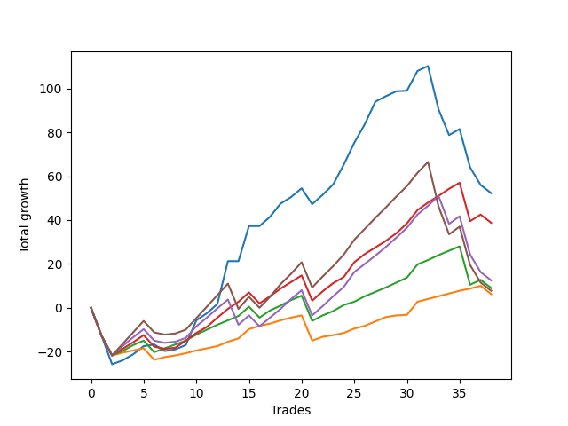

# Short Pointer 002 
- Symbol: ES_SmolBoiHour
- Date Range: 03/18/2022 - 07/29/2022
- Trading Period: 7:20-12:30
- Number of Trades: 38



| Name | Win Percent | Profit | Avg Profit / Trade | Avg Time / Trade |      | Name | Win Percent | Profit | Avg Profit / Trade | Avg Time / Trade |
| ---- | ----------- | ------ | ------------------ | ---------------- | ---- | ---- | ----------- | ------ | ------------------ | ---------------- |
| Sorted By <br> Profit | | | | | | Sorted By <br> Win Percentage ||||
| Two | 73.68 | -110375.00 | -2904.61 | 67:09 |     | Eighty-One | 78.95 | -167625.00 | -4411.18 | 59:37 |
| Eighty-Five | 71.05 | -132750.00 | -3493.42 | 71:46 |     | Eighty-Two | 76.32 | -157375.00 | -4141.45 | 63:06 |
| Eighty-Four | 71.05 | -143375.00 | -3773.03 | 71:08 |     | Two | 73.68 | -110375.00 | -2904.61 | 67:09 |
| Eighty-Three | 73.68 | -144000.00 | -3789.47 | 68:00 |     | Eighty-Three | 73.68 | -144000.00 | -3789.47 | 68:00 |
| Eighty-Two | 76.32 | -157375.00 | -4141.45 | 63:06 |     | Eighty-Five | 71.05 | -132750.00 | -3493.42 | 71:46 |
| Eighty-One | 78.95 | -167625.00 | -4411.18 | 59:37 |     | Eighty-Four | 71.05 | -143375.00 | -3773.03 | 71:08 |

## NO STOPLOSS

### Test Two
* Sell when the price hits the upper line of the 20p 2std bollinger
* No Stoploss
* Results:
```
Total Trades: 38
Percent Up: 26.32
Percent Down: 73.68
Total Points Moved Down: -220.75
Potential Profit: -110375.00
Total Points Ups: 378.00 Count Ups: 10
Total Points Downs: 157.25 Count Downs: 28
```

<details><summary>Trades</summary>

<code>In: 2022-03-18 12:13:00		Out: 2022-03-18 12:46:00		Total Position Time: 33:00		Total Move Down: -12.75		Total to Date: -12.75</code> <br />
<code>In: 2022-03-24 08:09:00		Out: 2022-03-24 09:03:10		Total Position Time: 54:10		Total Move Down: -13.00		Total to Date: -25.75</code> <br />
<code>In: 2022-03-25 11:34:00		Out: 2022-03-25 12:00:55		Total Position Time: 26:55		Total Move Down: 1.75		Total to Date: -24.00</code> <br />
<code>In: 2022-03-25 11:57:00		Out: 2022-03-25 12:00:55		Total Position Time: 03:55		Total Move Down: 2.75		Total to Date: -21.25</code> <br />
<code>In: 2022-03-29 08:53:00		Out: 2022-03-29 09:01:40		Total Position Time: 08:40		Total Move Down: 3.75		Total to Date: -17.50</code> <br />
<code>In: 2022-03-29 12:15:00		Out: 2022-03-29 12:27:50		Total Position Time: 12:50		Total Move Down: 0.75		Total to Date: -16.75</code> <br />
<code>In: 2022-03-31 07:39:00		Out: 2022-03-31 08:08:30		Total Position Time: 29:30		Total Move Down: -3.00		Total to Date: -19.75</code> <br />
<code>In: 2022-04-04 11:50:00		Out: 2022-04-04 12:03:40		Total Position Time: 13:40		Total Move Down: 0.75		Total to Date: -19.00</code> <br />
<code>In: 2022-04-04 11:57:00		Out: 2022-04-04 12:03:40		Total Position Time: 06:40		Total Move Down: 2.00		Total to Date: -17.00</code> <br />
<code>In: 2022-04-06 11:06:00		Out: 2022-04-06 11:08:10		Total Position Time: 02:10		Total Move Down: 11.25		Total to Date: -5.75</code> <br />
<code>In: 2022-04-20 10:50:00		Out: 2022-04-20 11:13:55		Total Position Time: 23:55		Total Move Down: 3.25		Total to Date: -2.50</code> <br />
<code>In: 2022-04-25 09:29:00		Out: 2022-04-25 10:01:20		Total Position Time: 32:20		Total Move Down: 4.25		Total to Date: 1.75</code> <br />
<code>In: 2022-04-26 10:02:00		Out: 2022-04-26 10:22:20		Total Position Time: 20:20		Total Move Down: 19.50		Total to Date: 21.25</code> <br />
<code>In: 2022-04-28 10:42:00		Out: 2022-04-28 11:15:40		Total Position Time: 33:40		Total Move Down: -0.00		Total to Date: 21.25</code> <br />
<code>In: 2022-05-04 11:07:00		Out: 2022-05-04 11:07:40		Total Position Time: 00:40		Total Move Down: 16.00		Total to Date: 37.25</code> <br />
<code>In: 2022-05-24 10:48:00		Out: 2022-05-24 11:01:50		Total Position Time: 13:50		Total Move Down: -0.00		Total to Date: 37.25</code> <br />
<code>In: 2022-05-24 10:58:00		Out: 2022-05-24 11:01:50		Total Position Time: 03:50		Total Move Down: 4.25		Total to Date: 41.50</code> <br />
<code>In: 2022-05-24 11:42:00		Out: 2022-05-24 11:43:50		Total Position Time: 01:50		Total Move Down: 6.00		Total to Date: 47.50</code> <br />
<code>In: 2022-05-25 10:40:00		Out: 2022-05-25 10:52:10		Total Position Time: 12:10		Total Move Down: 3.00		Total to Date: 50.50</code> <br />
<code>In: 2022-05-26 10:12:00		Out: 2022-05-26 10:22:35		Total Position Time: 10:35		Total Move Down: 4.00		Total to Date: 54.50</code> <br />
<code>In: 2022-05-27 12:03:00		Out: 2022-05-27 12:36:55		Total Position Time: 33:55		Total Move Down: -7.25		Total to Date: 47.25</code> <br />
<code>In: 2022-06-01 12:19:00		Out: 2022-06-01 12:30:05		Total Position Time: 11:05		Total Move Down: 4.25		Total to Date: 51.50</code> <br />
<code>In: 2022-06-07 11:38:00		Out: 2022-06-07 11:43:25		Total Position Time: 05:25		Total Move Down: 4.75		Total to Date: 56.25</code> <br />
<code>In: 2022-06-09 08:47:00		Out: 2022-06-09 09:11:05		Total Position Time: 24:05		Total Move Down: 9.00		Total to Date: 65.25</code> <br />
<code>In: 2022-06-15 11:02:00		Out: 2022-06-15 11:03:05		Total Position Time: 01:05		Total Move Down: 10.00		Total to Date: 75.25</code> <br />
<code>In: 2022-06-17 08:21:00		Out: 2022-06-17 08:45:15		Total Position Time: 24:15		Total Move Down: 8.50		Total to Date: 83.75</code> <br />
<code>In: 2022-06-17 08:35:00		Out: 2022-06-17 08:45:15		Total Position Time: 10:15		Total Move Down: 10.25		Total to Date: 94.00</code> <br />
<code>In: 2022-06-29 12:20:00		Out: 2022-06-29 12:35:20		Total Position Time: 15:20		Total Move Down: 2.50		Total to Date: 96.50</code> <br />
<code>In: 2022-06-30 08:51:00		Out: 2022-06-30 09:06:15		Total Position Time: 15:15		Total Move Down: 2.25		Total to Date: 98.75</code> <br />
<code>In: 2022-07-06 11:00:00		Out: 2022-07-06 11:00:10		Total Position Time: 00:10		Total Move Down: 0.25		Total to Date: 99.00</code> <br />
<code>In: 2022-07-06 11:11:00		Out: 2022-07-06 11:11:45		Total Position Time: 00:45		Total Move Down: 9.00		Total to Date: 108.00</code> <br />
<code>In: 2022-07-08 11:47:00		Out: 2022-07-08 11:54:00		Total Position Time: 07:00		Total Move Down: 2.25		Total to Date: 110.25</code> <br />
<code>In: 2022-07-14 08:13:00		Out: 2022-07-15 12:53:00		Total Position Time: 280:00		Total Move Down: -109.50		Total to Date: 0.75</code> <br />
<code>In: 2022-07-14 11:09:00		Out: 2022-07-18 09:19:00		Total Position Time: 1330:00		Total Move Down: -120.00		Total to Date: -119.25</code> <br />
<code>In: 2022-07-18 08:46:00		Out: 2022-07-18 09:51:00		Total Position Time: 65:00		Total Move Down: 6.00		Total to Date: -113.25</code> <br />
<code>In: 2022-07-28 08:09:00		Out: 2022-07-29 12:49:00		Total Position Time: 280:00		Total Move Down: -110.00		Total to Date: -223.25</code> <br />
<code>In: 2022-07-29 11:41:00		Out: 2022-07-29 12:59:00		Total Position Time: 78:00		Total Move Down: -2.50		Total to Date: -225.75</code> <br />
<code>In: 2022-07-29 12:31:00		Out: 2022-07-29 12:57:00		Total Position Time: 26:00		Total Move Down: 5.00		Total to Date: -220.75</code> <br />


</details>

## TAKE PROFIT

### Test Eighty-One
* Take Profit of 1 Point
* No Stoploss
* Results:
```
Total Trades: 38
Percent Up: 21.05
Percent Down: 78.95
Total Points Moved Down: -335.25
Potential Profit: -167625.00
Total Points Ups: 380.50 Count Ups: 8
Total Points Downs: 45.25 Count Downs: 30
```

<details><summary>Trades</summary>

<code>In: 2022-03-18 12:13:00		Out: 2022-03-18 12:46:00		Total Position Time: 33:00		Total Move Down: -12.75		Total to Date: -12.75</code> <br />
<code>In: 2022-03-24 08:09:00		Out: 2022-03-24 09:08:55		Total Position Time: 59:55		Total Move Down: -9.00		Total to Date: -21.75</code> <br />
<code>In: 2022-03-25 11:34:00		Out: 2022-03-25 11:35:15		Total Position Time: 01:15		Total Move Down: 1.25		Total to Date: -20.50</code> <br />
<code>In: 2022-03-25 11:57:00		Out: 2022-03-25 11:58:45		Total Position Time: 01:45		Total Move Down: 1.00		Total to Date: -19.50</code> <br />
<code>In: 2022-03-29 08:53:00		Out: 2022-03-29 08:57:35		Total Position Time: 04:35		Total Move Down: 1.00		Total to Date: -18.50</code> <br />
<code>In: 2022-03-29 12:15:00		Out: 2022-03-29 12:46:00		Total Position Time: 31:00		Total Move Down: -5.25		Total to Date: -23.75</code> <br />
<code>In: 2022-03-31 07:39:00		Out: 2022-03-31 07:41:25		Total Position Time: 02:25		Total Move Down: 1.25		Total to Date: -22.50</code> <br />
<code>In: 2022-04-04 11:50:00		Out: 2022-04-04 11:52:10		Total Position Time: 02:10		Total Move Down: 0.75		Total to Date: -21.75</code> <br />
<code>In: 2022-04-04 11:57:00		Out: 2022-04-04 12:00:05		Total Position Time: 03:05		Total Move Down: 1.00		Total to Date: -20.75</code> <br />
<code>In: 2022-04-06 11:06:00		Out: 2022-04-06 11:07:00		Total Position Time: 01:00		Total Move Down: 1.25		Total to Date: -19.50</code> <br />
<code>In: 2022-04-20 10:50:00		Out: 2022-04-20 10:50:20		Total Position Time: 00:20		Total Move Down: 1.00		Total to Date: -18.50</code> <br />
<code>In: 2022-04-25 09:29:00		Out: 2022-04-25 09:31:05		Total Position Time: 02:05		Total Move Down: 1.00		Total to Date: -17.50</code> <br />
<code>In: 2022-04-26 10:02:00		Out: 2022-04-26 10:02:10		Total Position Time: 00:10		Total Move Down: 2.00		Total to Date: -15.50</code> <br />
<code>In: 2022-04-28 10:42:00		Out: 2022-04-28 10:42:10		Total Position Time: 00:10		Total Move Down: 1.50		Total to Date: -14.00</code> <br />
<code>In: 2022-05-04 11:07:00		Out: 2022-05-04 11:07:10		Total Position Time: 00:10		Total Move Down: 4.25		Total to Date: -9.75</code> <br />
<code>In: 2022-05-24 10:48:00		Out: 2022-05-24 11:05:00		Total Position Time: 17:00		Total Move Down: 1.50		Total to Date: -8.25</code> <br />
<code>In: 2022-05-24 10:58:00		Out: 2022-05-24 11:01:30		Total Position Time: 03:30		Total Move Down: 1.00		Total to Date: -7.25</code> <br />
<code>In: 2022-05-24 11:42:00		Out: 2022-05-24 11:42:10		Total Position Time: 00:10		Total Move Down: 1.50		Total to Date: -5.75</code> <br />
<code>In: 2022-05-25 10:40:00		Out: 2022-05-25 10:41:05		Total Position Time: 01:05		Total Move Down: 1.25		Total to Date: -4.50</code> <br />
<code>In: 2022-05-26 10:12:00		Out: 2022-05-26 10:12:20		Total Position Time: 00:20		Total Move Down: 1.00		Total to Date: -3.50</code> <br />
<code>In: 2022-05-27 12:03:00		Out: 2022-05-27 12:46:00		Total Position Time: 43:00		Total Move Down: -11.50		Total to Date: -15.00</code> <br />
<code>In: 2022-06-01 12:19:00		Out: 2022-06-01 12:25:30		Total Position Time: 06:30		Total Move Down: 1.75		Total to Date: -13.25</code> <br />
<code>In: 2022-06-07 11:38:00		Out: 2022-06-07 11:40:55		Total Position Time: 02:55		Total Move Down: 0.75		Total to Date: -12.50</code> <br />
<code>In: 2022-06-09 08:47:00		Out: 2022-06-09 08:48:05		Total Position Time: 01:05		Total Move Down: 1.00		Total to Date: -11.50</code> <br />
<code>In: 2022-06-15 11:02:00		Out: 2022-06-15 11:02:10		Total Position Time: 00:10		Total Move Down: 2.00		Total to Date: -9.50</code> <br />
<code>In: 2022-06-17 08:21:00		Out: 2022-06-17 08:22:10		Total Position Time: 01:10		Total Move Down: 1.25		Total to Date: -8.25</code> <br />
<code>In: 2022-06-17 08:35:00		Out: 2022-06-17 08:35:45		Total Position Time: 00:45		Total Move Down: 2.00		Total to Date: -6.25</code> <br />
<code>In: 2022-06-29 12:20:00		Out: 2022-06-29 12:34:15		Total Position Time: 14:15		Total Move Down: 2.00		Total to Date: -4.25</code> <br />
<code>In: 2022-06-30 08:51:00		Out: 2022-06-30 09:06:00		Total Position Time: 15:00		Total Move Down: 0.75		Total to Date: -3.50</code> <br />
<code>In: 2022-07-06 11:00:00		Out: 2022-07-06 11:00:10		Total Position Time: 00:10		Total Move Down: 0.25		Total to Date: -3.25</code> <br />
<code>In: 2022-07-06 11:11:00		Out: 2022-07-06 11:11:10		Total Position Time: 00:10		Total Move Down: 6.00		Total to Date: 2.75</code> <br />
<code>In: 2022-07-08 11:47:00		Out: 2022-07-08 11:49:25		Total Position Time: 02:25		Total Move Down: 1.25		Total to Date: 4.00</code> <br />
<code>In: 2022-07-14 08:13:00		Out: 2022-07-15 12:53:00		Total Position Time: 280:00		Total Move Down: -109.50		Total to Date: -105.50</code> <br />
<code>In: 2022-07-14 11:09:00		Out: 2022-07-18 09:19:00		Total Position Time: 1330:00		Total Move Down: -120.00		Total to Date: -225.50</code> <br />
<code>In: 2022-07-18 08:46:00		Out: 2022-07-18 09:08:00		Total Position Time: 22:00		Total Move Down: 1.25		Total to Date: -224.25</code> <br />
<code>In: 2022-07-28 08:09:00		Out: 2022-07-29 12:49:00		Total Position Time: 280:00		Total Move Down: -110.00		Total to Date: -334.25</code> <br />
<code>In: 2022-07-29 11:41:00		Out: 2022-07-29 12:59:00		Total Position Time: 78:00		Total Move Down: -2.50		Total to Date: -336.75</code> <br />
<code>In: 2022-07-29 12:31:00		Out: 2022-07-29 12:54:00		Total Position Time: 23:00		Total Move Down: 1.50		Total to Date: -335.25</code> <br />


</details>

### Test Eighty-Two
* Take Profit of 2 Point
* No Stoploss
* Results:
```
Total Trades: 38
Percent Up: 23.68
Percent Down: 76.32
Total Points Moved Down: -314.75
Potential Profit: -157375.00
Total Points Ups: 385.50 Count Ups: 9
Total Points Downs: 70.75 Count Downs: 29
```

<details><summary>Trades</summary>

<code>In: 2022-03-18 12:13:00		Out: 2022-03-18 12:46:00		Total Position Time: 33:00		Total Move Down: -12.75		Total to Date: -12.75</code> <br />
<code>In: 2022-03-24 08:09:00		Out: 2022-03-24 09:08:55		Total Position Time: 59:55		Total Move Down: -9.00		Total to Date: -21.75</code> <br />
<code>In: 2022-03-25 11:34:00		Out: 2022-03-25 11:40:25		Total Position Time: 06:25		Total Move Down: 2.00		Total to Date: -19.75</code> <br />
<code>In: 2022-03-25 11:57:00		Out: 2022-03-25 12:00:50		Total Position Time: 03:50		Total Move Down: 2.75		Total to Date: -17.00</code> <br />
<code>In: 2022-03-29 08:53:00		Out: 2022-03-29 08:58:35		Total Position Time: 05:35		Total Move Down: 2.00		Total to Date: -15.00</code> <br />
<code>In: 2022-03-29 12:15:00		Out: 2022-03-29 12:46:00		Total Position Time: 31:00		Total Move Down: -5.25		Total to Date: -20.25</code> <br />
<code>In: 2022-03-31 07:39:00		Out: 2022-03-31 07:41:50		Total Position Time: 02:50		Total Move Down: 1.75		Total to Date: -18.50</code> <br />
<code>In: 2022-04-04 11:50:00		Out: 2022-04-04 12:45:10		Total Position Time: 55:10		Total Move Down: 1.75		Total to Date: -16.75</code> <br />
<code>In: 2022-04-04 11:57:00		Out: 2022-04-04 12:03:35		Total Position Time: 06:35		Total Move Down: 1.75		Total to Date: -15.00</code> <br />
<code>In: 2022-04-06 11:06:00		Out: 2022-04-06 11:07:05		Total Position Time: 01:05		Total Move Down: 2.75		Total to Date: -12.25</code> <br />
<code>In: 2022-04-20 10:50:00		Out: 2022-04-20 10:51:30		Total Position Time: 01:30		Total Move Down: 2.25		Total to Date: -10.00</code> <br />
<code>In: 2022-04-25 09:29:00		Out: 2022-04-25 09:31:10		Total Position Time: 02:10		Total Move Down: 2.25		Total to Date: -7.75</code> <br />
<code>In: 2022-04-26 10:02:00		Out: 2022-04-26 10:02:10		Total Position Time: 00:10		Total Move Down: 2.00		Total to Date: -5.75</code> <br />
<code>In: 2022-04-28 10:42:00		Out: 2022-04-28 10:44:05		Total Position Time: 02:05		Total Move Down: 2.00		Total to Date: -3.75</code> <br />
<code>In: 2022-05-04 11:07:00		Out: 2022-05-04 11:07:10		Total Position Time: 00:10		Total Move Down: 4.25		Total to Date: 0.50</code> <br />
<code>In: 2022-05-24 10:48:00		Out: 2022-05-24 11:47:55		Total Position Time: 59:55		Total Move Down: -5.00		Total to Date: -4.50</code> <br />
<code>In: 2022-05-24 10:58:00		Out: 2022-05-24 11:01:40		Total Position Time: 03:40		Total Move Down: 3.25		Total to Date: -1.25</code> <br />
<code>In: 2022-05-24 11:42:00		Out: 2022-05-24 11:42:20		Total Position Time: 00:20		Total Move Down: 2.25		Total to Date: 1.00</code> <br />
<code>In: 2022-05-25 10:40:00		Out: 2022-05-25 10:41:15		Total Position Time: 01:15		Total Move Down: 2.50		Total to Date: 3.50</code> <br />
<code>In: 2022-05-26 10:12:00		Out: 2022-05-26 10:12:40		Total Position Time: 00:40		Total Move Down: 2.00		Total to Date: 5.50</code> <br />
<code>In: 2022-05-27 12:03:00		Out: 2022-05-27 12:46:00		Total Position Time: 43:00		Total Move Down: -11.50		Total to Date: -6.00</code> <br />
<code>In: 2022-06-01 12:19:00		Out: 2022-06-01 12:25:40		Total Position Time: 06:40		Total Move Down: 2.50		Total to Date: -3.50</code> <br />
<code>In: 2022-06-07 11:38:00		Out: 2022-06-07 11:41:50		Total Position Time: 03:50		Total Move Down: 2.00		Total to Date: -1.50</code> <br />
<code>In: 2022-06-09 08:47:00		Out: 2022-06-09 08:48:20		Total Position Time: 01:20		Total Move Down: 2.75		Total to Date: 1.25</code> <br />
<code>In: 2022-06-15 11:02:00		Out: 2022-06-15 11:02:45		Total Position Time: 00:45		Total Move Down: 1.50		Total to Date: 2.75</code> <br />
<code>In: 2022-06-17 08:21:00		Out: 2022-06-17 08:22:40		Total Position Time: 01:40		Total Move Down: 2.50		Total to Date: 5.25</code> <br />
<code>In: 2022-06-17 08:35:00		Out: 2022-06-17 08:35:45		Total Position Time: 00:45		Total Move Down: 2.00		Total to Date: 7.25</code> <br />
<code>In: 2022-06-29 12:20:00		Out: 2022-06-29 12:34:15		Total Position Time: 14:15		Total Move Down: 2.00		Total to Date: 9.25</code> <br />
<code>In: 2022-06-30 08:51:00		Out: 2022-06-30 09:06:15		Total Position Time: 15:15		Total Move Down: 2.25		Total to Date: 11.50</code> <br />
<code>In: 2022-07-06 11:00:00		Out: 2022-07-06 11:00:15		Total Position Time: 00:15		Total Move Down: 2.25		Total to Date: 13.75</code> <br />
<code>In: 2022-07-06 11:11:00		Out: 2022-07-06 11:11:10		Total Position Time: 00:10		Total Move Down: 6.00		Total to Date: 19.75</code> <br />
<code>In: 2022-07-08 11:47:00		Out: 2022-07-08 11:53:50		Total Position Time: 06:50		Total Move Down: 2.00		Total to Date: 21.75</code> <br />
<code>In: 2022-07-14 08:13:00		Out: 2022-07-15 12:53:00		Total Position Time: 280:00		Total Move Down: -109.50		Total to Date: -87.75</code> <br />
<code>In: 2022-07-14 11:09:00		Out: 2022-07-18 09:19:00		Total Position Time: 1330:00		Total Move Down: -120.00		Total to Date: -207.75</code> <br />
<code>In: 2022-07-18 08:46:00		Out: 2022-07-18 09:19:00		Total Position Time: 33:00		Total Move Down: 2.25		Total to Date: -205.50</code> <br />
<code>In: 2022-07-28 08:09:00		Out: 2022-07-29 12:49:00		Total Position Time: 280:00		Total Move Down: -110.00		Total to Date: -315.50</code> <br />
<code>In: 2022-07-29 11:41:00		Out: 2022-07-29 12:59:00		Total Position Time: 78:00		Total Move Down: -2.50		Total to Date: -318.00</code> <br />
<code>In: 2022-07-29 12:31:00		Out: 2022-07-29 12:56:00		Total Position Time: 25:00		Total Move Down: 3.25		Total to Date: -314.75</code> <br />


</details>

### Test Eighty-Three
* Take Profit of 3 Point
* No Stoploss
* Results:
```
Total Trades: 38
Percent Up: 26.32
Percent Down: 73.68
Total Points Moved Down: -288.00
Potential Profit: -144000.00
Total Points Ups: 386.50 Count Ups: 10
Total Points Downs: 98.50 Count Downs: 28
```

<details><summary>Trades</summary>

<code>In: 2022-03-18 12:13:00		Out: 2022-03-18 12:46:00		Total Position Time: 33:00		Total Move Down: -12.75		Total to Date: -12.75</code> <br />
<code>In: 2022-03-24 08:09:00		Out: 2022-03-24 09:08:55		Total Position Time: 59:55		Total Move Down: -9.00		Total to Date: -21.75</code> <br />
<code>In: 2022-03-25 11:34:00		Out: 2022-03-25 12:01:45		Total Position Time: 27:45		Total Move Down: 3.00		Total to Date: -18.75</code> <br />
<code>In: 2022-03-25 11:57:00		Out: 2022-03-25 12:01:00		Total Position Time: 04:00		Total Move Down: 3.00		Total to Date: -15.75</code> <br />
<code>In: 2022-03-29 08:53:00		Out: 2022-03-29 09:01:35		Total Position Time: 08:35		Total Move Down: 3.25		Total to Date: -12.50</code> <br />
<code>In: 2022-03-29 12:15:00		Out: 2022-03-29 12:46:00		Total Position Time: 31:00		Total Move Down: -5.25		Total to Date: -17.75</code> <br />
<code>In: 2022-03-31 07:39:00		Out: 2022-03-31 08:38:55		Total Position Time: 59:55		Total Move Down: -1.00		Total to Date: -18.75</code> <br />
<code>In: 2022-04-04 11:50:00		Out: 2022-04-04 12:46:00		Total Position Time: 56:00		Total Move Down: 0.50		Total to Date: -18.25</code> <br />
<code>In: 2022-04-04 11:57:00		Out: 2022-04-04 12:45:05		Total Position Time: 48:05		Total Move Down: 3.25		Total to Date: -15.00</code> <br />
<code>In: 2022-04-06 11:06:00		Out: 2022-04-06 11:07:15		Total Position Time: 01:15		Total Move Down: 3.50		Total to Date: -11.50</code> <br />
<code>In: 2022-04-20 10:50:00		Out: 2022-04-20 10:55:05		Total Position Time: 05:05		Total Move Down: 2.75		Total to Date: -8.75</code> <br />
<code>In: 2022-04-25 09:29:00		Out: 2022-04-25 10:01:20		Total Position Time: 32:20		Total Move Down: 4.25		Total to Date: -4.50</code> <br />
<code>In: 2022-04-26 10:02:00		Out: 2022-04-26 10:02:25		Total Position Time: 00:25		Total Move Down: 4.00		Total to Date: -0.50</code> <br />
<code>In: 2022-04-28 10:42:00		Out: 2022-04-28 10:44:10		Total Position Time: 02:10		Total Move Down: 3.25		Total to Date: 2.75</code> <br />
<code>In: 2022-05-04 11:07:00		Out: 2022-05-04 11:07:10		Total Position Time: 00:10		Total Move Down: 4.25		Total to Date: 7.00</code> <br />
<code>In: 2022-05-24 10:48:00		Out: 2022-05-24 11:47:55		Total Position Time: 59:55		Total Move Down: -5.00		Total to Date: 2.00</code> <br />
<code>In: 2022-05-24 10:58:00		Out: 2022-05-24 11:01:40		Total Position Time: 03:40		Total Move Down: 3.25		Total to Date: 5.25</code> <br />
<code>In: 2022-05-24 11:42:00		Out: 2022-05-24 11:43:10		Total Position Time: 01:10		Total Move Down: 3.50		Total to Date: 8.75</code> <br />
<code>In: 2022-05-25 10:40:00		Out: 2022-05-25 10:52:10		Total Position Time: 12:10		Total Move Down: 3.00		Total to Date: 11.75</code> <br />
<code>In: 2022-05-26 10:12:00		Out: 2022-05-26 10:12:45		Total Position Time: 00:45		Total Move Down: 3.00		Total to Date: 14.75</code> <br />
<code>In: 2022-05-27 12:03:00		Out: 2022-05-27 12:46:00		Total Position Time: 43:00		Total Move Down: -11.50		Total to Date: 3.25</code> <br />
<code>In: 2022-06-01 12:19:00		Out: 2022-06-01 12:30:05		Total Position Time: 11:05		Total Move Down: 4.25		Total to Date: 7.50</code> <br />
<code>In: 2022-06-07 11:38:00		Out: 2022-06-07 11:43:00		Total Position Time: 05:00		Total Move Down: 3.75		Total to Date: 11.25</code> <br />
<code>In: 2022-06-09 08:47:00		Out: 2022-06-09 08:48:20		Total Position Time: 01:20		Total Move Down: 2.75		Total to Date: 14.00</code> <br />
<code>In: 2022-06-15 11:02:00		Out: 2022-06-15 11:03:00		Total Position Time: 01:00		Total Move Down: 6.75		Total to Date: 20.75</code> <br />
<code>In: 2022-06-17 08:21:00		Out: 2022-06-17 08:22:45		Total Position Time: 01:45		Total Move Down: 3.75		Total to Date: 24.50</code> <br />
<code>In: 2022-06-17 08:35:00		Out: 2022-06-17 08:36:55		Total Position Time: 01:55		Total Move Down: 3.00		Total to Date: 27.50</code> <br />
<code>In: 2022-06-29 12:20:00		Out: 2022-06-29 12:35:15		Total Position Time: 15:15		Total Move Down: 3.00		Total to Date: 30.50</code> <br />
<code>In: 2022-06-30 08:51:00		Out: 2022-06-30 09:06:20		Total Position Time: 15:20		Total Move Down: 3.50		Total to Date: 34.00</code> <br />
<code>In: 2022-07-06 11:00:00		Out: 2022-07-06 11:00:40		Total Position Time: 00:40		Total Move Down: 4.50		Total to Date: 38.50</code> <br />
<code>In: 2022-07-06 11:11:00		Out: 2022-07-06 11:11:10		Total Position Time: 00:10		Total Move Down: 6.00		Total to Date: 44.50</code> <br />
<code>In: 2022-07-08 11:47:00		Out: 2022-07-08 11:54:10		Total Position Time: 07:10		Total Move Down: 3.50		Total to Date: 48.00</code> <br />
<code>In: 2022-07-14 08:13:00		Out: 2022-07-15 12:53:00		Total Position Time: 280:00		Total Move Down: -109.50		Total to Date: -61.50</code> <br />
<code>In: 2022-07-14 11:09:00		Out: 2022-07-18 09:19:00		Total Position Time: 1330:00		Total Move Down: -120.00		Total to Date: -181.50</code> <br />
<code>In: 2022-07-18 08:46:00		Out: 2022-07-18 09:26:00		Total Position Time: 40:00		Total Move Down: 2.75		Total to Date: -178.75</code> <br />
<code>In: 2022-07-28 08:09:00		Out: 2022-07-29 12:49:00		Total Position Time: 280:00		Total Move Down: -110.00		Total to Date: -288.75</code> <br />
<code>In: 2022-07-29 11:41:00		Out: 2022-07-29 12:59:00		Total Position Time: 78:00		Total Move Down: -2.50		Total to Date: -291.25</code> <br />
<code>In: 2022-07-29 12:31:00		Out: 2022-07-29 12:56:00		Total Position Time: 25:00		Total Move Down: 3.25		Total to Date: -288.00</code> <br />


</details>

### Test Eighty-Four
* Take Profit of 4 Point
* No Stoploss
* Results:
```
Total Trades: 38
Percent Up: 28.95
Percent Down: 71.05
Total Points Moved Down: -286.75
Potential Profit: -143375.00
Total Points Ups: 398.00 Count Ups: 11
Total Points Downs: 111.25 Count Downs: 27
```

<details><summary>Trades</summary>

<code>In: 2022-03-18 12:13:00		Out: 2022-03-18 12:46:00		Total Position Time: 33:00		Total Move Down: -12.75		Total to Date: -12.75</code> <br />
<code>In: 2022-03-24 08:09:00		Out: 2022-03-24 09:08:55		Total Position Time: 59:55		Total Move Down: -9.00		Total to Date: -21.75</code> <br />
<code>In: 2022-03-25 11:34:00		Out: 2022-03-25 12:01:55		Total Position Time: 27:55		Total Move Down: 4.25		Total to Date: -17.50</code> <br />
<code>In: 2022-03-25 11:57:00		Out: 2022-03-25 12:01:45		Total Position Time: 04:45		Total Move Down: 4.00		Total to Date: -13.50</code> <br />
<code>In: 2022-03-29 08:53:00		Out: 2022-03-29 09:01:40		Total Position Time: 08:40		Total Move Down: 3.75		Total to Date: -9.75</code> <br />
<code>In: 2022-03-29 12:15:00		Out: 2022-03-29 12:46:00		Total Position Time: 31:00		Total Move Down: -5.25		Total to Date: -15.00</code> <br />
<code>In: 2022-03-31 07:39:00		Out: 2022-03-31 08:38:55		Total Position Time: 59:55		Total Move Down: -1.00		Total to Date: -16.00</code> <br />
<code>In: 2022-04-04 11:50:00		Out: 2022-04-04 12:46:00		Total Position Time: 56:00		Total Move Down: 0.50		Total to Date: -15.50</code> <br />
<code>In: 2022-04-04 11:57:00		Out: 2022-04-04 12:46:00		Total Position Time: 49:00		Total Move Down: 1.75		Total to Date: -13.75</code> <br />
<code>In: 2022-04-06 11:06:00		Out: 2022-04-06 11:07:20		Total Position Time: 01:20		Total Move Down: 5.25		Total to Date: -8.50</code> <br />
<code>In: 2022-04-20 10:50:00		Out: 2022-04-20 11:14:30		Total Position Time: 24:30		Total Move Down: 4.00		Total to Date: -4.50</code> <br />
<code>In: 2022-04-25 09:29:00		Out: 2022-04-25 10:01:20		Total Position Time: 32:20		Total Move Down: 4.25		Total to Date: -0.25</code> <br />
<code>In: 2022-04-26 10:02:00		Out: 2022-04-26 10:02:25		Total Position Time: 00:25		Total Move Down: 4.00		Total to Date: 3.75</code> <br />
<code>In: 2022-04-28 10:42:00		Out: 2022-04-28 11:41:55		Total Position Time: 59:55		Total Move Down: -11.50		Total to Date: -7.75</code> <br />
<code>In: 2022-05-04 11:07:00		Out: 2022-05-04 11:07:10		Total Position Time: 00:10		Total Move Down: 4.25		Total to Date: -3.50</code> <br />
<code>In: 2022-05-24 10:48:00		Out: 2022-05-24 11:47:55		Total Position Time: 59:55		Total Move Down: -5.00		Total to Date: -8.50</code> <br />
<code>In: 2022-05-24 10:58:00		Out: 2022-05-24 11:01:45		Total Position Time: 03:45		Total Move Down: 4.00		Total to Date: -4.50</code> <br />
<code>In: 2022-05-24 11:42:00		Out: 2022-05-24 11:43:15		Total Position Time: 01:15		Total Move Down: 4.00		Total to Date: -0.50</code> <br />
<code>In: 2022-05-25 10:40:00		Out: 2022-05-25 10:53:35		Total Position Time: 13:35		Total Move Down: 4.50		Total to Date: 4.00</code> <br />
<code>In: 2022-05-26 10:12:00		Out: 2022-05-26 10:22:35		Total Position Time: 10:35		Total Move Down: 4.00		Total to Date: 8.00</code> <br />
<code>In: 2022-05-27 12:03:00		Out: 2022-05-27 12:46:00		Total Position Time: 43:00		Total Move Down: -11.50		Total to Date: -3.50</code> <br />
<code>In: 2022-06-01 12:19:00		Out: 2022-06-01 12:30:05		Total Position Time: 11:05		Total Move Down: 4.25		Total to Date: 0.75</code> <br />
<code>In: 2022-06-07 11:38:00		Out: 2022-06-07 11:43:05		Total Position Time: 05:05		Total Move Down: 4.50		Total to Date: 5.25</code> <br />
<code>In: 2022-06-09 08:47:00		Out: 2022-06-09 08:48:35		Total Position Time: 01:35		Total Move Down: 4.25		Total to Date: 9.50</code> <br />
<code>In: 2022-06-15 11:02:00		Out: 2022-06-15 11:03:00		Total Position Time: 01:00		Total Move Down: 6.75		Total to Date: 16.25</code> <br />
<code>In: 2022-06-17 08:21:00		Out: 2022-06-17 08:23:10		Total Position Time: 02:10		Total Move Down: 3.75		Total to Date: 20.00</code> <br />
<code>In: 2022-06-17 08:35:00		Out: 2022-06-17 08:38:35		Total Position Time: 03:35		Total Move Down: 3.75		Total to Date: 23.75</code> <br />
<code>In: 2022-06-29 12:20:00		Out: 2022-06-29 12:37:05		Total Position Time: 17:05		Total Move Down: 4.00		Total to Date: 27.75</code> <br />
<code>In: 2022-06-30 08:51:00		Out: 2022-06-30 09:07:15		Total Position Time: 16:15		Total Move Down: 4.25		Total to Date: 32.00</code> <br />
<code>In: 2022-07-06 11:00:00		Out: 2022-07-06 11:00:40		Total Position Time: 00:40		Total Move Down: 4.50		Total to Date: 36.50</code> <br />
<code>In: 2022-07-06 11:11:00		Out: 2022-07-06 11:11:10		Total Position Time: 00:10		Total Move Down: 6.00		Total to Date: 42.50</code> <br />
<code>In: 2022-07-08 11:47:00		Out: 2022-07-08 11:54:40		Total Position Time: 07:40		Total Move Down: 4.00		Total to Date: 46.50</code> <br />
<code>In: 2022-07-14 08:13:00		Out: 2022-07-15 12:53:00		Total Position Time: 280:00		Total Move Down: -109.50		Total to Date: -63.00</code> <br />
<code>In: 2022-07-14 11:09:00		Out: 2022-07-18 09:19:00		Total Position Time: 1330:00		Total Move Down: -120.00		Total to Date: -183.00</code> <br />
<code>In: 2022-07-18 08:46:00		Out: 2022-07-18 09:48:00		Total Position Time: 62:00		Total Move Down: 3.75		Total to Date: -179.25</code> <br />
<code>In: 2022-07-28 08:09:00		Out: 2022-07-29 12:49:00		Total Position Time: 280:00		Total Move Down: -110.00		Total to Date: -289.25</code> <br />
<code>In: 2022-07-29 11:41:00		Out: 2022-07-29 12:59:00		Total Position Time: 78:00		Total Move Down: -2.50		Total to Date: -291.75</code> <br />
<code>In: 2022-07-29 12:31:00		Out: 2022-07-29 12:57:00		Total Position Time: 26:00		Total Move Down: 5.00		Total to Date: -286.75</code> <br />


</details>

### Test Eighty-Five
* Take Profit of 5 Point
* No Stoploss
* Results:
```
Total Trades: 38
Percent Up: 28.95
Percent Down: 71.05
Total Points Moved Down: -265.50
Potential Profit: -132750.00
Total Points Ups: 398.00 Count Ups: 11
Total Points Downs: 132.50 Count Downs: 27
```

<details><summary>Trades</summary>

<code>In: 2022-03-18 12:13:00		Out: 2022-03-18 12:46:00		Total Position Time: 33:00		Total Move Down: -12.75		Total to Date: -12.75</code> <br />
<code>In: 2022-03-24 08:09:00		Out: 2022-03-24 09:08:55		Total Position Time: 59:55		Total Move Down: -9.00		Total to Date: -21.75</code> <br />
<code>In: 2022-03-25 11:34:00		Out: 2022-03-25 12:02:00		Total Position Time: 28:00		Total Move Down: 5.25		Total to Date: -16.50</code> <br />
<code>In: 2022-03-25 11:57:00		Out: 2022-03-25 12:01:55		Total Position Time: 04:55		Total Move Down: 5.25		Total to Date: -11.25</code> <br />
<code>In: 2022-03-29 08:53:00		Out: 2022-03-29 09:02:10		Total Position Time: 09:10		Total Move Down: 5.25		Total to Date: -6.00</code> <br />
<code>In: 2022-03-29 12:15:00		Out: 2022-03-29 12:46:00		Total Position Time: 31:00		Total Move Down: -5.25		Total to Date: -11.25</code> <br />
<code>In: 2022-03-31 07:39:00		Out: 2022-03-31 08:38:55		Total Position Time: 59:55		Total Move Down: -1.00		Total to Date: -12.25</code> <br />
<code>In: 2022-04-04 11:50:00		Out: 2022-04-04 12:46:00		Total Position Time: 56:00		Total Move Down: 0.50		Total to Date: -11.75</code> <br />
<code>In: 2022-04-04 11:57:00		Out: 2022-04-04 12:46:00		Total Position Time: 49:00		Total Move Down: 1.75		Total to Date: -10.00</code> <br />
<code>In: 2022-04-06 11:06:00		Out: 2022-04-06 11:07:20		Total Position Time: 01:20		Total Move Down: 5.25		Total to Date: -4.75</code> <br />
<code>In: 2022-04-20 10:50:00		Out: 2022-04-20 11:17:15		Total Position Time: 27:15		Total Move Down: 5.25		Total to Date: 0.50</code> <br />
<code>In: 2022-04-25 09:29:00		Out: 2022-04-25 10:01:40		Total Position Time: 32:40		Total Move Down: 5.25		Total to Date: 5.75</code> <br />
<code>In: 2022-04-26 10:02:00		Out: 2022-04-26 10:02:30		Total Position Time: 00:30		Total Move Down: 5.25		Total to Date: 11.00</code> <br />
<code>In: 2022-04-28 10:42:00		Out: 2022-04-28 11:41:55		Total Position Time: 59:55		Total Move Down: -11.50		Total to Date: -0.50</code> <br />
<code>In: 2022-05-04 11:07:00		Out: 2022-05-04 11:07:15		Total Position Time: 00:15		Total Move Down: 5.50		Total to Date: 5.00</code> <br />
<code>In: 2022-05-24 10:48:00		Out: 2022-05-24 11:47:55		Total Position Time: 59:55		Total Move Down: -5.00		Total to Date: 0.00</code> <br />
<code>In: 2022-05-24 10:58:00		Out: 2022-05-24 11:04:55		Total Position Time: 06:55		Total Move Down: 5.00		Total to Date: 5.00</code> <br />
<code>In: 2022-05-24 11:42:00		Out: 2022-05-24 11:43:25		Total Position Time: 01:25		Total Move Down: 5.75		Total to Date: 10.75</code> <br />
<code>In: 2022-05-25 10:40:00		Out: 2022-05-25 10:56:15		Total Position Time: 16:15		Total Move Down: 4.75		Total to Date: 15.50</code> <br />
<code>In: 2022-05-26 10:12:00		Out: 2022-05-26 10:22:50		Total Position Time: 10:50		Total Move Down: 5.25		Total to Date: 20.75</code> <br />
<code>In: 2022-05-27 12:03:00		Out: 2022-05-27 12:46:00		Total Position Time: 43:00		Total Move Down: -11.50		Total to Date: 9.25</code> <br />
<code>In: 2022-06-01 12:19:00		Out: 2022-06-01 12:32:50		Total Position Time: 13:50		Total Move Down: 5.00		Total to Date: 14.25</code> <br />
<code>In: 2022-06-07 11:38:00		Out: 2022-06-07 11:43:25		Total Position Time: 05:25		Total Move Down: 4.75		Total to Date: 19.00</code> <br />
<code>In: 2022-06-09 08:47:00		Out: 2022-06-09 08:48:50		Total Position Time: 01:50		Total Move Down: 5.25		Total to Date: 24.25</code> <br />
<code>In: 2022-06-15 11:02:00		Out: 2022-06-15 11:03:00		Total Position Time: 01:00		Total Move Down: 6.75		Total to Date: 31.00</code> <br />
<code>In: 2022-06-17 08:21:00		Out: 2022-06-17 08:24:15		Total Position Time: 03:15		Total Move Down: 5.00		Total to Date: 36.00</code> <br />
<code>In: 2022-06-17 08:35:00		Out: 2022-06-17 08:39:00		Total Position Time: 04:00		Total Move Down: 5.00		Total to Date: 41.00</code> <br />
<code>In: 2022-06-29 12:20:00		Out: 2022-06-29 12:41:05		Total Position Time: 21:05		Total Move Down: 4.75		Total to Date: 45.75</code> <br />
<code>In: 2022-06-30 08:51:00		Out: 2022-06-30 09:09:40		Total Position Time: 18:40		Total Move Down: 5.00		Total to Date: 50.75</code> <br />
<code>In: 2022-07-06 11:00:00		Out: 2022-07-06 11:01:15		Total Position Time: 01:15		Total Move Down: 4.75		Total to Date: 55.50</code> <br />
<code>In: 2022-07-06 11:11:00		Out: 2022-07-06 11:11:10		Total Position Time: 00:10		Total Move Down: 6.00		Total to Date: 61.50</code> <br />
<code>In: 2022-07-08 11:47:00		Out: 2022-07-08 11:55:00		Total Position Time: 08:00		Total Move Down: 5.00		Total to Date: 66.50</code> <br />
<code>In: 2022-07-14 08:13:00		Out: 2022-07-15 12:53:00		Total Position Time: 280:00		Total Move Down: -109.50		Total to Date: -43.00</code> <br />
<code>In: 2022-07-14 11:09:00		Out: 2022-07-18 09:19:00		Total Position Time: 1330:00		Total Move Down: -120.00		Total to Date: -163.00</code> <br />
<code>In: 2022-07-18 08:46:00		Out: 2022-07-18 09:50:00		Total Position Time: 64:00		Total Move Down: 5.00		Total to Date: -158.00</code> <br />
<code>In: 2022-07-28 08:09:00		Out: 2022-07-29 12:49:00		Total Position Time: 280:00		Total Move Down: -110.00		Total to Date: -268.00</code> <br />
<code>In: 2022-07-29 11:41:00		Out: 2022-07-29 12:59:00		Total Position Time: 78:00		Total Move Down: -2.50		Total to Date: -270.50</code> <br />
<code>In: 2022-07-29 12:31:00		Out: 2022-07-29 12:57:00		Total Position Time: 26:00		Total Move Down: 5.00		Total to Date: -265.50</code> <br />


</details>