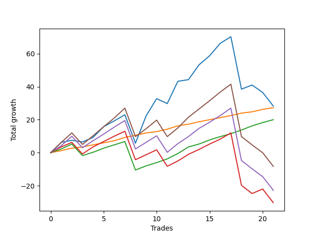

# Short Pointer 005 
- Symbol: ES_SmolBoiHour
- Date Range: 03/18/2022 - 07/29/2022
- Trading Period: 7:20-12:30
- Number of Trades: 21



| Name | Win Percent | Profit | Avg Profit / Trade | Avg Time / Trade |      | Name | Win Percent | Profit | Avg Profit / Trade | Avg Time / Trade |
| ---- | ----------- | ------ | ------------------ | ---------------- | ---- | ---- | ----------- | ------ | ------------------ | ---------------- |
| Sorted By <br> Profit | | | | | | Sorted By <br> Win Percentage ||||
| Two | 71.43 | 14125.00 | 672.62 | 17:35 |     | Eighty-One | 100.00 | 13625.00 | 648.81 | 05:05 |
| Eighty-One | 100.00 | 13625.00 | 648.81 | 05:05 |     | Eighty-Two | 90.48 | 10000.00 | 476.19 | 08:15 |
| Eighty-Two | 90.48 | 10000.00 | 476.19 | 08:15 |     | Two | 71.43 | 14125.00 | 672.62 | 17:35 |
| Eighty-Five | 66.67 | -4125.00 | -196.43 | 22:48 |     | Eighty-Three | 71.43 | -15125.00 | -720.24 | 18:26 |
| Eighty-Four | 66.67 | -11375.00 | -541.67 | 21:33 |     | Eighty-Five | 66.67 | -4125.00 | -196.43 | 22:48 |
| Eighty-Three | 71.43 | -15125.00 | -720.24 | 18:26 |     | Eighty-Four | 66.67 | -11375.00 | -541.67 | 21:33 |

## NO STOPLOSS

### Test Two
* Sell when the price hits the upper line of the 20p 2std bollinger
* No Stoploss
* Results:
```
Total Trades: 21
Percent Up: 28.57
Percent Down: 71.43
Total Points Moved Down: 28.25
Potential Profit: 14125.00
Total Points Ups: 65.75 Count Ups: 6
Total Points Downs: 94.00 Count Downs: 15
```

<details><summary>Trades</summary>

<code>In: 2022-03-21 08:30:00		Out: 2022-03-21 08:36:05		Total Position Time: 06:05		Total Move Down: 6.25		Total to Date: 6.25</code> <br />
<code>In: 2022-03-21 11:32:00		Out: 2022-03-21 11:42:15		Total Position Time: 10:15		Total Move Down: 1.25		Total to Date: 7.50</code> <br />
<code>In: 2022-03-28 10:33:00		Out: 2022-03-28 10:55:00		Total Position Time: 22:00		Total Move Down: -1.00		Total to Date: 6.50</code> <br />
<code>In: 2022-03-29 08:03:00		Out: 2022-03-29 08:13:30		Total Position Time: 10:30		Total Move Down: 2.75		Total to Date: 9.25</code> <br />
<code>In: 2022-04-06 07:26:00		Out: 2022-04-06 07:34:10		Total Position Time: 08:10		Total Move Down: 6.50		Total to Date: 15.75</code> <br />
<code>In: 2022-04-11 10:09:00		Out: 2022-04-11 10:19:05		Total Position Time: 10:05		Total Move Down: 3.50		Total to Date: 19.25</code> <br />
<code>In: 2022-04-11 11:58:00		Out: 2022-04-11 12:05:05		Total Position Time: 07:05		Total Move Down: 3.75		Total to Date: 23.00</code> <br />
<code>In: 2022-04-25 12:28:00		Out: 2022-04-25 12:46:00		Total Position Time: 18:00		Total Move Down: -17.25		Total to Date: 5.75</code> <br />
<code>In: 2022-05-05 10:11:00		Out: 2022-05-05 10:16:35		Total Position Time: 05:35		Total Move Down: 16.50		Total to Date: 22.25</code> <br />
<code>In: 2022-05-10 10:11:00		Out: 2022-05-10 10:24:00		Total Position Time: 13:00		Total Move Down: 10.50		Total to Date: 32.75</code> <br />
<code>In: 2022-05-17 09:31:00		Out: 2022-05-17 10:01:10		Total Position Time: 30:10		Total Move Down: -3.00		Total to Date: 29.75</code> <br />
<code>In: 2022-05-19 07:26:00		Out: 2022-05-19 07:27:40		Total Position Time: 01:40		Total Move Down: 13.50		Total to Date: 43.25</code> <br />
<code>In: 2022-05-23 07:38:00		Out: 2022-05-23 07:51:15		Total Position Time: 13:15		Total Move Down: 1.00		Total to Date: 44.25</code> <br />
<code>In: 2022-06-01 08:01:00		Out: 2022-06-01 08:15:50		Total Position Time: 14:50		Total Move Down: 9.00		Total to Date: 53.25</code> <br />
<code>In: 2022-06-03 09:08:00		Out: 2022-06-03 09:19:10		Total Position Time: 11:10		Total Move Down: 5.50		Total to Date: 58.75</code> <br />
<code>In: 2022-06-10 10:54:00		Out: 2022-06-10 11:01:00		Total Position Time: 07:00		Total Move Down: 7.50		Total to Date: 66.25</code> <br />
<code>In: 2022-06-10 11:27:00		Out: 2022-06-10 11:40:10		Total Position Time: 13:10		Total Move Down: 4.00		Total to Date: 70.25</code> <br />
<code>In: 2022-06-30 08:02:00		Out: 2022-06-30 09:01:55		Total Position Time: 59:55		Total Move Down: -31.75		Total to Date: 38.50</code> <br />
<code>In: 2022-07-05 08:53:00		Out: 2022-07-05 09:03:50		Total Position Time: 10:50		Total Move Down: 2.50		Total to Date: 41.00</code> <br />
<code>In: 2022-07-22 12:00:00		Out: 2022-07-22 12:36:55		Total Position Time: 36:55		Total Move Down: -4.50		Total to Date: 36.50</code> <br />
<code>In: 2022-07-29 10:58:00		Out: 2022-07-29 11:57:55		Total Position Time: 59:55		Total Move Down: -8.25		Total to Date: 28.25</code> <br />


</details>

## TAKE PROFIT

### Test Eighty-One
* Take Profit of 1 Point
* No Stoploss
* Results:
```
Total Trades: 21
Percent Up: 0.00
Percent Down: 100.00
Total Points Moved Down: 27.25
Potential Profit: 13625.00
Total Points Ups: 0.00 Count Ups: 0
Total Points Downs: 27.25 Count Downs: 21
```

<details><summary>Trades</summary>

<code>In: 2022-03-21 08:30:00		Out: 2022-03-21 08:30:35		Total Position Time: 00:35		Total Move Down: 1.25		Total to Date: 1.25</code> <br />
<code>In: 2022-03-21 11:32:00		Out: 2022-03-21 11:35:45		Total Position Time: 03:45		Total Move Down: 1.50		Total to Date: 2.75</code> <br />
<code>In: 2022-03-28 10:33:00		Out: 2022-03-28 10:57:00		Total Position Time: 24:00		Total Move Down: 0.75		Total to Date: 3.50</code> <br />
<code>In: 2022-03-29 08:03:00		Out: 2022-03-29 08:06:00		Total Position Time: 03:00		Total Move Down: 1.25		Total to Date: 4.75</code> <br />
<code>In: 2022-04-06 07:26:00		Out: 2022-04-06 07:27:45		Total Position Time: 01:45		Total Move Down: 1.25		Total to Date: 6.00</code> <br />
<code>In: 2022-04-11 10:09:00		Out: 2022-04-11 10:16:15		Total Position Time: 07:15		Total Move Down: 1.25		Total to Date: 7.25</code> <br />
<code>In: 2022-04-11 11:58:00		Out: 2022-04-11 12:04:15		Total Position Time: 06:15		Total Move Down: 2.00		Total to Date: 9.25</code> <br />
<code>In: 2022-04-25 12:28:00		Out: 2022-04-25 12:28:30		Total Position Time: 00:30		Total Move Down: 1.25		Total to Date: 10.50</code> <br />
<code>In: 2022-05-05 10:11:00		Out: 2022-05-05 10:11:10		Total Position Time: 00:10		Total Move Down: 1.50		Total to Date: 12.00</code> <br />
<code>In: 2022-05-10 10:11:00		Out: 2022-05-10 10:11:10		Total Position Time: 00:10		Total Move Down: 0.75		Total to Date: 12.75</code> <br />
<code>In: 2022-05-17 09:31:00		Out: 2022-05-17 10:02:15		Total Position Time: 31:15		Total Move Down: 1.50		Total to Date: 14.25</code> <br />
<code>In: 2022-05-19 07:26:00		Out: 2022-05-19 07:26:40		Total Position Time: 00:40		Total Move Down: 2.00		Total to Date: 16.25</code> <br />
<code>In: 2022-05-23 07:38:00		Out: 2022-05-23 07:47:00		Total Position Time: 09:00		Total Move Down: 1.00		Total to Date: 17.25</code> <br />
<code>In: 2022-06-01 08:01:00		Out: 2022-06-01 08:01:35		Total Position Time: 00:35		Total Move Down: 1.50		Total to Date: 18.75</code> <br />
<code>In: 2022-06-03 09:08:00		Out: 2022-06-03 09:08:10		Total Position Time: 00:10		Total Move Down: 1.25		Total to Date: 20.00</code> <br />
<code>In: 2022-06-10 10:54:00		Out: 2022-06-10 10:54:55		Total Position Time: 00:55		Total Move Down: 1.25		Total to Date: 21.25</code> <br />
<code>In: 2022-06-10 11:27:00		Out: 2022-06-10 11:28:10		Total Position Time: 01:10		Total Move Down: 1.25		Total to Date: 22.50</code> <br />
<code>In: 2022-06-30 08:02:00		Out: 2022-06-30 08:03:50		Total Position Time: 01:50		Total Move Down: 1.50		Total to Date: 24.00</code> <br />
<code>In: 2022-07-05 08:53:00		Out: 2022-07-05 09:03:45		Total Position Time: 10:45		Total Move Down: 0.75		Total to Date: 24.75</code> <br />
<code>In: 2022-07-22 12:00:00		Out: 2022-07-22 12:00:10		Total Position Time: 00:10		Total Move Down: 1.50		Total to Date: 26.25</code> <br />
<code>In: 2022-07-29 10:58:00		Out: 2022-07-29 11:00:55		Total Position Time: 02:55		Total Move Down: 1.00		Total to Date: 27.25</code> <br />


</details>

### Test Eighty-Two
* Take Profit of 2 Point
* No Stoploss
* Results:
```
Total Trades: 21
Percent Up: 9.52
Percent Down: 90.48
Total Points Moved Down: 20.00
Potential Profit: 10000.00
Total Points Ups: 24.25 Count Ups: 2
Total Points Downs: 44.25 Count Downs: 19
```

<details><summary>Trades</summary>

<code>In: 2022-03-21 08:30:00		Out: 2022-03-21 08:30:55		Total Position Time: 00:55		Total Move Down: 2.25		Total to Date: 2.25</code> <br />
<code>In: 2022-03-21 11:32:00		Out: 2022-03-21 11:42:30		Total Position Time: 10:30		Total Move Down: 3.00		Total to Date: 5.25</code> <br />
<code>In: 2022-03-28 10:33:00		Out: 2022-03-28 11:32:55		Total Position Time: 59:55		Total Move Down: -7.00		Total to Date: -1.75</code> <br />
<code>In: 2022-03-29 08:03:00		Out: 2022-03-29 08:07:15		Total Position Time: 04:15		Total Move Down: 2.00		Total to Date: 0.25</code> <br />
<code>In: 2022-04-06 07:26:00		Out: 2022-04-06 07:28:05		Total Position Time: 02:05		Total Move Down: 2.50		Total to Date: 2.75</code> <br />
<code>In: 2022-04-11 10:09:00		Out: 2022-04-11 10:17:05		Total Position Time: 08:05		Total Move Down: 2.00		Total to Date: 4.75</code> <br />
<code>In: 2022-04-11 11:58:00		Out: 2022-04-11 12:04:15		Total Position Time: 06:15		Total Move Down: 2.00		Total to Date: 6.75</code> <br />
<code>In: 2022-04-25 12:28:00		Out: 2022-04-25 12:46:00		Total Position Time: 18:00		Total Move Down: -17.25		Total to Date: -10.50</code> <br />
<code>In: 2022-05-05 10:11:00		Out: 2022-05-05 10:11:15		Total Position Time: 00:15		Total Move Down: 2.50		Total to Date: -8.00</code> <br />
<code>In: 2022-05-10 10:11:00		Out: 2022-05-10 10:12:10		Total Position Time: 01:10		Total Move Down: 2.00		Total to Date: -6.00</code> <br />
<code>In: 2022-05-17 09:31:00		Out: 2022-05-17 10:02:20		Total Position Time: 31:20		Total Move Down: 2.25		Total to Date: -3.75</code> <br />
<code>In: 2022-05-19 07:26:00		Out: 2022-05-19 07:26:45		Total Position Time: 00:45		Total Move Down: 3.25		Total to Date: -0.50</code> <br />
<code>In: 2022-05-23 07:38:00		Out: 2022-05-23 07:47:05		Total Position Time: 09:05		Total Move Down: 4.00		Total to Date: 3.50</code> <br />
<code>In: 2022-06-01 08:01:00		Out: 2022-06-01 08:01:40		Total Position Time: 00:40		Total Move Down: 1.75		Total to Date: 5.25</code> <br />
<code>In: 2022-06-03 09:08:00		Out: 2022-06-03 09:09:10		Total Position Time: 01:10		Total Move Down: 2.50		Total to Date: 7.75</code> <br />
<code>In: 2022-06-10 10:54:00		Out: 2022-06-10 10:55:10		Total Position Time: 01:10		Total Move Down: 2.00		Total to Date: 9.75</code> <br />
<code>In: 2022-06-10 11:27:00		Out: 2022-06-10 11:28:20		Total Position Time: 01:20		Total Move Down: 1.75		Total to Date: 11.50</code> <br />
<code>In: 2022-06-30 08:02:00		Out: 2022-06-30 08:04:05		Total Position Time: 02:05		Total Move Down: 2.25		Total to Date: 13.75</code> <br />
<code>In: 2022-07-05 08:53:00		Out: 2022-07-05 09:03:50		Total Position Time: 10:50		Total Move Down: 2.50		Total to Date: 16.25</code> <br />
<code>In: 2022-07-22 12:00:00		Out: 2022-07-22 12:00:25		Total Position Time: 00:25		Total Move Down: 2.00		Total to Date: 18.25</code> <br />
<code>In: 2022-07-29 10:58:00		Out: 2022-07-29 11:01:05		Total Position Time: 03:05		Total Move Down: 1.75		Total to Date: 20.00</code> <br />


</details>

### Test Eighty-Three
* Take Profit of 3 Point
* No Stoploss
* Results:
```
Total Trades: 21
Percent Up: 28.57
Percent Down: 71.43
Total Points Moved Down: -30.25
Potential Profit: -15125.00
Total Points Ups: 79.25 Count Ups: 6
Total Points Downs: 49.00 Count Downs: 15
```

<details><summary>Trades</summary>

<code>In: 2022-03-21 08:30:00		Out: 2022-03-21 08:32:35		Total Position Time: 02:35		Total Move Down: 3.50		Total to Date: 3.50</code> <br />
<code>In: 2022-03-21 11:32:00		Out: 2022-03-21 11:42:35		Total Position Time: 10:35		Total Move Down: 2.75		Total to Date: 6.25</code> <br />
<code>In: 2022-03-28 10:33:00		Out: 2022-03-28 11:32:55		Total Position Time: 59:55		Total Move Down: -7.00		Total to Date: -0.75</code> <br />
<code>In: 2022-03-29 08:03:00		Out: 2022-03-29 08:13:35		Total Position Time: 10:35		Total Move Down: 4.25		Total to Date: 3.50</code> <br />
<code>In: 2022-04-06 07:26:00		Out: 2022-04-06 07:28:10		Total Position Time: 02:10		Total Move Down: 3.25		Total to Date: 6.75</code> <br />
<code>In: 2022-04-11 10:09:00		Out: 2022-04-11 10:18:25		Total Position Time: 09:25		Total Move Down: 3.25		Total to Date: 10.00</code> <br />
<code>In: 2022-04-11 11:58:00		Out: 2022-04-11 12:04:45		Total Position Time: 06:45		Total Move Down: 3.00		Total to Date: 13.00</code> <br />
<code>In: 2022-04-25 12:28:00		Out: 2022-04-25 12:46:00		Total Position Time: 18:00		Total Move Down: -17.25		Total to Date: -4.25</code> <br />
<code>In: 2022-05-05 10:11:00		Out: 2022-05-05 10:12:30		Total Position Time: 01:30		Total Move Down: 3.00		Total to Date: -1.25</code> <br />
<code>In: 2022-05-10 10:11:00		Out: 2022-05-10 10:12:25		Total Position Time: 01:25		Total Move Down: 3.00		Total to Date: 1.75</code> <br />
<code>In: 2022-05-17 09:31:00		Out: 2022-05-17 10:30:55		Total Position Time: 59:55		Total Move Down: -10.00		Total to Date: -8.25</code> <br />
<code>In: 2022-05-19 07:26:00		Out: 2022-05-19 07:26:45		Total Position Time: 00:45		Total Move Down: 3.25		Total to Date: -5.00</code> <br />
<code>In: 2022-05-23 07:38:00		Out: 2022-05-23 07:47:05		Total Position Time: 09:05		Total Move Down: 4.00		Total to Date: -1.00</code> <br />
<code>In: 2022-06-01 08:01:00		Out: 2022-06-01 08:01:55		Total Position Time: 00:55		Total Move Down: 3.00		Total to Date: 2.00</code> <br />
<code>In: 2022-06-03 09:08:00		Out: 2022-06-03 09:10:10		Total Position Time: 02:10		Total Move Down: 3.25		Total to Date: 5.25</code> <br />
<code>In: 2022-06-10 10:54:00		Out: 2022-06-10 10:55:15		Total Position Time: 01:15		Total Move Down: 3.00		Total to Date: 8.25</code> <br />
<code>In: 2022-06-10 11:27:00		Out: 2022-06-10 11:28:30		Total Position Time: 01:30		Total Move Down: 3.75		Total to Date: 12.00</code> <br />
<code>In: 2022-06-30 08:02:00		Out: 2022-06-30 09:01:55		Total Position Time: 59:55		Total Move Down: -31.75		Total to Date: -19.75</code> <br />
<code>In: 2022-07-05 08:53:00		Out: 2022-07-05 09:52:55		Total Position Time: 59:55		Total Move Down: -5.00		Total to Date: -24.75</code> <br />
<code>In: 2022-07-22 12:00:00		Out: 2022-07-22 12:09:05		Total Position Time: 09:05		Total Move Down: 2.75		Total to Date: -22.00</code> <br />
<code>In: 2022-07-29 10:58:00		Out: 2022-07-29 11:57:55		Total Position Time: 59:55		Total Move Down: -8.25		Total to Date: -30.25</code> <br />


</details>

### Test Eighty-Four
* Take Profit of 4 Point
* No Stoploss
* Results:
```
Total Trades: 21
Percent Up: 33.33
Percent Down: 66.67
Total Points Moved Down: -22.75
Potential Profit: -11375.00
Total Points Ups: 84.00 Count Ups: 7
Total Points Downs: 61.25 Count Downs: 14
```

<details><summary>Trades</summary>

<code>In: 2022-03-21 08:30:00		Out: 2022-03-21 08:36:00		Total Position Time: 06:00		Total Move Down: 4.25		Total to Date: 4.25</code> <br />
<code>In: 2022-03-21 11:32:00		Out: 2022-03-21 11:55:35		Total Position Time: 23:35		Total Move Down: 5.75		Total to Date: 10.00</code> <br />
<code>In: 2022-03-28 10:33:00		Out: 2022-03-28 11:32:55		Total Position Time: 59:55		Total Move Down: -7.00		Total to Date: 3.00</code> <br />
<code>In: 2022-03-29 08:03:00		Out: 2022-03-29 08:13:35		Total Position Time: 10:35		Total Move Down: 4.25		Total to Date: 7.25</code> <br />
<code>In: 2022-04-06 07:26:00		Out: 2022-04-06 07:28:55		Total Position Time: 02:55		Total Move Down: 4.00		Total to Date: 11.25</code> <br />
<code>In: 2022-04-11 10:09:00		Out: 2022-04-11 10:21:25		Total Position Time: 12:25		Total Move Down: 4.25		Total to Date: 15.50</code> <br />
<code>In: 2022-04-11 11:58:00		Out: 2022-04-11 12:04:55		Total Position Time: 06:55		Total Move Down: 4.00		Total to Date: 19.50</code> <br />
<code>In: 2022-04-25 12:28:00		Out: 2022-04-25 12:46:00		Total Position Time: 18:00		Total Move Down: -17.25		Total to Date: 2.25</code> <br />
<code>In: 2022-05-05 10:11:00		Out: 2022-05-05 10:12:45		Total Position Time: 01:45		Total Move Down: 4.00		Total to Date: 6.25</code> <br />
<code>In: 2022-05-10 10:11:00		Out: 2022-05-10 10:13:55		Total Position Time: 02:55		Total Move Down: 4.00		Total to Date: 10.25</code> <br />
<code>In: 2022-05-17 09:31:00		Out: 2022-05-17 10:30:55		Total Position Time: 59:55		Total Move Down: -10.00		Total to Date: 0.25</code> <br />
<code>In: 2022-05-19 07:26:00		Out: 2022-05-19 07:26:50		Total Position Time: 00:50		Total Move Down: 5.25		Total to Date: 5.50</code> <br />
<code>In: 2022-05-23 07:38:00		Out: 2022-05-23 07:51:45		Total Position Time: 13:45		Total Move Down: 4.25		Total to Date: 9.75</code> <br />
<code>In: 2022-06-01 08:01:00		Out: 2022-06-01 08:02:05		Total Position Time: 01:05		Total Move Down: 5.00		Total to Date: 14.75</code> <br />
<code>In: 2022-06-03 09:08:00		Out: 2022-06-03 09:10:40		Total Position Time: 02:40		Total Move Down: 3.75		Total to Date: 18.50</code> <br />
<code>In: 2022-06-10 10:54:00		Out: 2022-06-10 10:56:15		Total Position Time: 02:15		Total Move Down: 4.00		Total to Date: 22.50</code> <br />
<code>In: 2022-06-10 11:27:00		Out: 2022-06-10 11:28:35		Total Position Time: 01:35		Total Move Down: 4.50		Total to Date: 27.00</code> <br />
<code>In: 2022-06-30 08:02:00		Out: 2022-06-30 09:01:55		Total Position Time: 59:55		Total Move Down: -31.75		Total to Date: -4.75</code> <br />
<code>In: 2022-07-05 08:53:00		Out: 2022-07-05 09:52:55		Total Position Time: 59:55		Total Move Down: -5.00		Total to Date: -9.75</code> <br />
<code>In: 2022-07-22 12:00:00		Out: 2022-07-22 12:46:00		Total Position Time: 46:00		Total Move Down: -4.75		Total to Date: -14.50</code> <br />
<code>In: 2022-07-29 10:58:00		Out: 2022-07-29 11:57:55		Total Position Time: 59:55		Total Move Down: -8.25		Total to Date: -22.75</code> <br />


</details>

### Test Eighty-Five
* Take Profit of 5 Point
* No Stoploss
* Results:
```
Total Trades: 21
Percent Up: 33.33
Percent Down: 66.67
Total Points Moved Down: -8.25
Potential Profit: -4125.00
Total Points Ups: 84.00 Count Ups: 7
Total Points Downs: 75.75 Count Downs: 14
```

<details><summary>Trades</summary>

<code>In: 2022-03-21 08:30:00		Out: 2022-03-21 08:36:05		Total Position Time: 06:05		Total Move Down: 6.25		Total to Date: 6.25</code> <br />
<code>In: 2022-03-21 11:32:00		Out: 2022-03-21 11:55:35		Total Position Time: 23:35		Total Move Down: 5.75		Total to Date: 12.00</code> <br />
<code>In: 2022-03-28 10:33:00		Out: 2022-03-28 11:32:55		Total Position Time: 59:55		Total Move Down: -7.00		Total to Date: 5.00</code> <br />
<code>In: 2022-03-29 08:03:00		Out: 2022-03-29 08:22:25		Total Position Time: 19:25		Total Move Down: 5.25		Total to Date: 10.25</code> <br />
<code>In: 2022-04-06 07:26:00		Out: 2022-04-06 07:32:30		Total Position Time: 06:30		Total Move Down: 5.50		Total to Date: 15.75</code> <br />
<code>In: 2022-04-11 10:09:00		Out: 2022-04-11 10:22:25		Total Position Time: 13:25		Total Move Down: 5.25		Total to Date: 21.00</code> <br />
<code>In: 2022-04-11 11:58:00		Out: 2022-04-11 12:06:10		Total Position Time: 08:10		Total Move Down: 6.00		Total to Date: 27.00</code> <br />
<code>In: 2022-04-25 12:28:00		Out: 2022-04-25 12:46:00		Total Position Time: 18:00		Total Move Down: -17.25		Total to Date: 9.75</code> <br />
<code>In: 2022-05-05 10:11:00		Out: 2022-05-05 10:12:50		Total Position Time: 01:50		Total Move Down: 4.75		Total to Date: 14.50</code> <br />
<code>In: 2022-05-10 10:11:00		Out: 2022-05-10 10:14:10		Total Position Time: 03:10		Total Move Down: 5.25		Total to Date: 19.75</code> <br />
<code>In: 2022-05-17 09:31:00		Out: 2022-05-17 10:30:55		Total Position Time: 59:55		Total Move Down: -10.00		Total to Date: 9.75</code> <br />
<code>In: 2022-05-19 07:26:00		Out: 2022-05-19 07:26:50		Total Position Time: 00:50		Total Move Down: 5.25		Total to Date: 15.00</code> <br />
<code>In: 2022-05-23 07:38:00		Out: 2022-05-23 07:52:55		Total Position Time: 14:55		Total Move Down: 6.50		Total to Date: 21.50</code> <br />
<code>In: 2022-06-01 08:01:00		Out: 2022-06-01 08:02:05		Total Position Time: 01:05		Total Move Down: 5.00		Total to Date: 26.50</code> <br />
<code>In: 2022-06-03 09:08:00		Out: 2022-06-03 09:19:00		Total Position Time: 11:00		Total Move Down: 5.00		Total to Date: 31.50</code> <br />
<code>In: 2022-06-10 10:54:00		Out: 2022-06-10 10:57:30		Total Position Time: 03:30		Total Move Down: 5.25		Total to Date: 36.75</code> <br />
<code>In: 2022-06-10 11:27:00		Out: 2022-06-10 11:28:50		Total Position Time: 01:50		Total Move Down: 4.75		Total to Date: 41.50</code> <br />
<code>In: 2022-06-30 08:02:00		Out: 2022-06-30 09:01:55		Total Position Time: 59:55		Total Move Down: -31.75		Total to Date: 9.75</code> <br />
<code>In: 2022-07-05 08:53:00		Out: 2022-07-05 09:52:55		Total Position Time: 59:55		Total Move Down: -5.00		Total to Date: 4.75</code> <br />
<code>In: 2022-07-22 12:00:00		Out: 2022-07-22 12:46:00		Total Position Time: 46:00		Total Move Down: -4.75		Total to Date: 0.00</code> <br />
<code>In: 2022-07-29 10:58:00		Out: 2022-07-29 11:57:55		Total Position Time: 59:55		Total Move Down: -8.25		Total to Date: -8.25</code> <br />


</details>