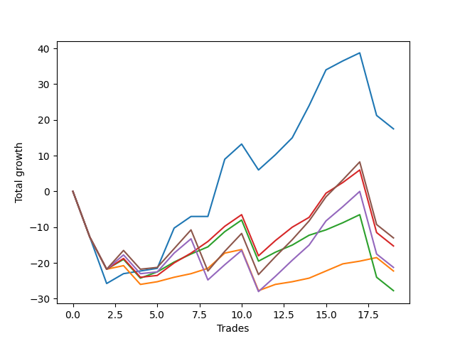

# Short Pointer 009 
- Symbol: ES_SmolBoiHour
- Date Range: 03/18/2022 - 07/29/2022
- Trading Period: 7:20-12:30
- Number of Trades: 19



| Name | Win Percent | Profit | Avg Profit / Trade | Avg Time / Trade |      | Name | Win Percent | Profit | Avg Profit / Trade | Avg Time / Trade |
| ---- | ----------- | ------ | ------------------ | ---------------- | ---- | ---- | ----------- | ------ | ------------------ | ---------------- |
| Sorted By <br> Profit | | | | | | Sorted By <br> Win Percentage ||||
| Two | 73.68 | -33125.00 | -1743.42 | 31:15 |     | Two | 73.68 | -33125.00 | -1743.42 | 31:15 |
| Eighty-Five | 68.42 | -48375.00 | -2546.05 | 36:23 |     | Eighty-Three | 73.68 | -50375.00 | -2651.32 | 31:13 |
| Eighty-Three | 73.68 | -50375.00 | -2651.32 | 31:13 |     | Eighty-Two | 73.68 | -56625.00 | -2980.26 | 30:36 |
| Eighty-Four | 68.42 | -52500.00 | -2763.16 | 35:32 |     | Eighty-One | 73.68 | -64000.00 | -3368.42 | 27:18 |
| Eighty-Two | 73.68 | -56625.00 | -2980.26 | 30:36 |     | Eighty-Five | 68.42 | -48375.00 | -2546.05 | 36:23 |
| Eighty-One | 73.68 | -64000.00 | -3368.42 | 27:18 |     | Eighty-Four | 68.42 | -52500.00 | -2763.16 | 35:32 |

## NO STOPLOSS

### Test Two
* Sell when the price hits the upper line of the 20p 2std bollinger
* No Stoploss
* Results:
```
Total Trades: 19
Percent Up: 26.32
Percent Down: 73.68
Total Points Moved Down: -66.25
Potential Profit: -33125.00
Total Points Ups: 143.00 Count Ups: 5
Total Points Downs: 76.75 Count Downs: 14
```

<details><summary>Trades</summary>

<code>In: 2022-03-18 12:13:00		Out: 2022-03-18 12:46:00		Total Position Time: 33:00		Total Move Down: -12.75		Total to Date: -12.75</code> <br />
<code>In: 2022-03-24 08:09:00		Out: 2022-03-24 09:03:10		Total Position Time: 54:10		Total Move Down: -13.00		Total to Date: -25.75</code> <br />
<code>In: 2022-03-25 11:57:00		Out: 2022-03-25 12:00:55		Total Position Time: 03:55		Total Move Down: 2.75		Total to Date: -23.00</code> <br />
<code>In: 2022-03-29 12:15:00		Out: 2022-03-29 12:27:50		Total Position Time: 12:50		Total Move Down: 0.75		Total to Date: -22.25</code> <br />
<code>In: 2022-04-04 11:50:00		Out: 2022-04-04 12:03:40		Total Position Time: 13:40		Total Move Down: 0.75		Total to Date: -21.50</code> <br />
<code>In: 2022-04-06 11:06:00		Out: 2022-04-06 11:08:10		Total Position Time: 02:10		Total Move Down: 11.25		Total to Date: -10.25</code> <br />
<code>In: 2022-04-20 10:50:00		Out: 2022-04-20 11:13:55		Total Position Time: 23:55		Total Move Down: 3.25		Total to Date: -7.00</code> <br />
<code>In: 2022-04-28 10:42:00		Out: 2022-04-28 11:15:40		Total Position Time: 33:40		Total Move Down: -0.00		Total to Date: -7.00</code> <br />
<code>In: 2022-05-04 11:07:00		Out: 2022-05-04 11:07:40		Total Position Time: 00:40		Total Move Down: 16.00		Total to Date: 9.00</code> <br />
<code>In: 2022-05-24 10:58:00		Out: 2022-05-24 11:01:50		Total Position Time: 03:50		Total Move Down: 4.25		Total to Date: 13.25</code> <br />
<code>In: 2022-05-27 12:03:00		Out: 2022-05-27 12:36:55		Total Position Time: 33:55		Total Move Down: -7.25		Total to Date: 6.00</code> <br />
<code>In: 2022-06-01 12:19:00		Out: 2022-06-01 12:30:05		Total Position Time: 11:05		Total Move Down: 4.25		Total to Date: 10.25</code> <br />
<code>In: 2022-06-07 11:38:00		Out: 2022-06-07 11:43:25		Total Position Time: 05:25		Total Move Down: 4.75		Total to Date: 15.00</code> <br />
<code>In: 2022-06-09 08:47:00		Out: 2022-06-09 09:11:05		Total Position Time: 24:05		Total Move Down: 9.00		Total to Date: 24.00</code> <br />
<code>In: 2022-06-15 11:02:00		Out: 2022-06-15 11:03:05		Total Position Time: 01:05		Total Move Down: 10.00		Total to Date: 34.00</code> <br />
<code>In: 2022-06-29 12:20:00		Out: 2022-06-29 12:35:20		Total Position Time: 15:20		Total Move Down: 2.50		Total to Date: 36.50</code> <br />
<code>In: 2022-06-30 08:51:00		Out: 2022-06-30 09:06:15		Total Position Time: 15:15		Total Move Down: 2.25		Total to Date: 38.75</code> <br />
<code>In: 2022-07-28 08:09:00		Out: 2022-07-29 12:49:00		Total Position Time: 280:00		Total Move Down: -110.00		Total to Date: -71.25</code> <br />
<code>In: 2022-07-29 12:31:00		Out: 2022-07-29 12:57:00		Total Position Time: 26:00		Total Move Down: 5.00		Total to Date: -66.25</code> <br />


</details>

## TAKE PROFIT

### Test Eighty-One
* Take Profit of 1 Point
* No Stoploss
* Results:
```
Total Trades: 19
Percent Up: 26.32
Percent Down: 73.68
Total Points Moved Down: -128.00
Potential Profit: -64000.00
Total Points Ups: 148.50 Count Ups: 5
Total Points Downs: 20.50 Count Downs: 14
```

<details><summary>Trades</summary>

<code>In: 2022-03-18 12:13:00		Out: 2022-03-18 12:46:00		Total Position Time: 33:00		Total Move Down: -12.75		Total to Date: -12.75</code> <br />
<code>In: 2022-03-24 08:09:00		Out: 2022-03-24 09:08:55		Total Position Time: 59:55		Total Move Down: -9.00		Total to Date: -21.75</code> <br />
<code>In: 2022-03-25 11:57:00		Out: 2022-03-25 11:58:45		Total Position Time: 01:45		Total Move Down: 1.00		Total to Date: -20.75</code> <br />
<code>In: 2022-03-29 12:15:00		Out: 2022-03-29 12:46:00		Total Position Time: 31:00		Total Move Down: -5.25		Total to Date: -26.00</code> <br />
<code>In: 2022-04-04 11:50:00		Out: 2022-04-04 11:52:10		Total Position Time: 02:10		Total Move Down: 0.75		Total to Date: -25.25</code> <br />
<code>In: 2022-04-06 11:06:00		Out: 2022-04-06 11:07:00		Total Position Time: 01:00		Total Move Down: 1.25		Total to Date: -24.00</code> <br />
<code>In: 2022-04-20 10:50:00		Out: 2022-04-20 10:50:20		Total Position Time: 00:20		Total Move Down: 1.00		Total to Date: -23.00</code> <br />
<code>In: 2022-04-28 10:42:00		Out: 2022-04-28 10:42:10		Total Position Time: 00:10		Total Move Down: 1.50		Total to Date: -21.50</code> <br />
<code>In: 2022-05-04 11:07:00		Out: 2022-05-04 11:07:10		Total Position Time: 00:10		Total Move Down: 4.25		Total to Date: -17.25</code> <br />
<code>In: 2022-05-24 10:58:00		Out: 2022-05-24 11:01:30		Total Position Time: 03:30		Total Move Down: 1.00		Total to Date: -16.25</code> <br />
<code>In: 2022-05-27 12:03:00		Out: 2022-05-27 12:46:00		Total Position Time: 43:00		Total Move Down: -11.50		Total to Date: -27.75</code> <br />
<code>In: 2022-06-01 12:19:00		Out: 2022-06-01 12:25:30		Total Position Time: 06:30		Total Move Down: 1.75		Total to Date: -26.00</code> <br />
<code>In: 2022-06-07 11:38:00		Out: 2022-06-07 11:40:55		Total Position Time: 02:55		Total Move Down: 0.75		Total to Date: -25.25</code> <br />
<code>In: 2022-06-09 08:47:00		Out: 2022-06-09 08:48:05		Total Position Time: 01:05		Total Move Down: 1.00		Total to Date: -24.25</code> <br />
<code>In: 2022-06-15 11:02:00		Out: 2022-06-15 11:02:10		Total Position Time: 00:10		Total Move Down: 2.00		Total to Date: -22.25</code> <br />
<code>In: 2022-06-29 12:20:00		Out: 2022-06-29 12:34:15		Total Position Time: 14:15		Total Move Down: 2.00		Total to Date: -20.25</code> <br />
<code>In: 2022-06-30 08:51:00		Out: 2022-06-30 09:06:00		Total Position Time: 15:00		Total Move Down: 0.75		Total to Date: -19.50</code> <br />
<code>In: 2022-07-28 08:09:00		Out: 2022-07-29 12:49:00		Total Position Time: 280:00		Total Move Down: -110.00		Total to Date: -129.50</code> <br />
<code>In: 2022-07-29 12:31:00		Out: 2022-07-29 12:54:00		Total Position Time: 23:00		Total Move Down: 1.50		Total to Date: -128.00</code> <br />


</details>

### Test Eighty-Two
* Take Profit of 2 Point
* No Stoploss
* Results:
```
Total Trades: 19
Percent Up: 26.32
Percent Down: 73.68
Total Points Moved Down: -113.25
Potential Profit: -56625.00
Total Points Ups: 148.50 Count Ups: 5
Total Points Downs: 35.25 Count Downs: 14
```

<details><summary>Trades</summary>

<code>In: 2022-03-18 12:13:00		Out: 2022-03-18 12:46:00		Total Position Time: 33:00		Total Move Down: -12.75		Total to Date: -12.75</code> <br />
<code>In: 2022-03-24 08:09:00		Out: 2022-03-24 09:08:55		Total Position Time: 59:55		Total Move Down: -9.00		Total to Date: -21.75</code> <br />
<code>In: 2022-03-25 11:57:00		Out: 2022-03-25 12:00:50		Total Position Time: 03:50		Total Move Down: 2.75		Total to Date: -19.00</code> <br />
<code>In: 2022-03-29 12:15:00		Out: 2022-03-29 12:46:00		Total Position Time: 31:00		Total Move Down: -5.25		Total to Date: -24.25</code> <br />
<code>In: 2022-04-04 11:50:00		Out: 2022-04-04 12:45:10		Total Position Time: 55:10		Total Move Down: 1.75		Total to Date: -22.50</code> <br />
<code>In: 2022-04-06 11:06:00		Out: 2022-04-06 11:07:05		Total Position Time: 01:05		Total Move Down: 2.75		Total to Date: -19.75</code> <br />
<code>In: 2022-04-20 10:50:00		Out: 2022-04-20 10:51:30		Total Position Time: 01:30		Total Move Down: 2.25		Total to Date: -17.50</code> <br />
<code>In: 2022-04-28 10:42:00		Out: 2022-04-28 10:44:05		Total Position Time: 02:05		Total Move Down: 2.00		Total to Date: -15.50</code> <br />
<code>In: 2022-05-04 11:07:00		Out: 2022-05-04 11:07:10		Total Position Time: 00:10		Total Move Down: 4.25		Total to Date: -11.25</code> <br />
<code>In: 2022-05-24 10:58:00		Out: 2022-05-24 11:01:40		Total Position Time: 03:40		Total Move Down: 3.25		Total to Date: -8.00</code> <br />
<code>In: 2022-05-27 12:03:00		Out: 2022-05-27 12:46:00		Total Position Time: 43:00		Total Move Down: -11.50		Total to Date: -19.50</code> <br />
<code>In: 2022-06-01 12:19:00		Out: 2022-06-01 12:25:40		Total Position Time: 06:40		Total Move Down: 2.50		Total to Date: -17.00</code> <br />
<code>In: 2022-06-07 11:38:00		Out: 2022-06-07 11:41:50		Total Position Time: 03:50		Total Move Down: 2.00		Total to Date: -15.00</code> <br />
<code>In: 2022-06-09 08:47:00		Out: 2022-06-09 08:48:20		Total Position Time: 01:20		Total Move Down: 2.75		Total to Date: -12.25</code> <br />
<code>In: 2022-06-15 11:02:00		Out: 2022-06-15 11:02:45		Total Position Time: 00:45		Total Move Down: 1.50		Total to Date: -10.75</code> <br />
<code>In: 2022-06-29 12:20:00		Out: 2022-06-29 12:34:15		Total Position Time: 14:15		Total Move Down: 2.00		Total to Date: -8.75</code> <br />
<code>In: 2022-06-30 08:51:00		Out: 2022-06-30 09:06:15		Total Position Time: 15:15		Total Move Down: 2.25		Total to Date: -6.50</code> <br />
<code>In: 2022-07-28 08:09:00		Out: 2022-07-29 12:49:00		Total Position Time: 280:00		Total Move Down: -110.00		Total to Date: -116.50</code> <br />
<code>In: 2022-07-29 12:31:00		Out: 2022-07-29 12:56:00		Total Position Time: 25:00		Total Move Down: 3.25		Total to Date: -113.25</code> <br />


</details>

### Test Eighty-Three
* Take Profit of 3 Point
* No Stoploss
* Results:
```
Total Trades: 19
Percent Up: 26.32
Percent Down: 73.68
Total Points Moved Down: -100.75
Potential Profit: -50375.00
Total Points Ups: 148.50 Count Ups: 5
Total Points Downs: 47.75 Count Downs: 14
```

<details><summary>Trades</summary>

<code>In: 2022-03-18 12:13:00		Out: 2022-03-18 12:46:00		Total Position Time: 33:00		Total Move Down: -12.75		Total to Date: -12.75</code> <br />
<code>In: 2022-03-24 08:09:00		Out: 2022-03-24 09:08:55		Total Position Time: 59:55		Total Move Down: -9.00		Total to Date: -21.75</code> <br />
<code>In: 2022-03-25 11:57:00		Out: 2022-03-25 12:01:00		Total Position Time: 04:00		Total Move Down: 3.00		Total to Date: -18.75</code> <br />
<code>In: 2022-03-29 12:15:00		Out: 2022-03-29 12:46:00		Total Position Time: 31:00		Total Move Down: -5.25		Total to Date: -24.00</code> <br />
<code>In: 2022-04-04 11:50:00		Out: 2022-04-04 12:46:00		Total Position Time: 56:00		Total Move Down: 0.50		Total to Date: -23.50</code> <br />
<code>In: 2022-04-06 11:06:00		Out: 2022-04-06 11:07:15		Total Position Time: 01:15		Total Move Down: 3.50		Total to Date: -20.00</code> <br />
<code>In: 2022-04-20 10:50:00		Out: 2022-04-20 10:55:05		Total Position Time: 05:05		Total Move Down: 2.75		Total to Date: -17.25</code> <br />
<code>In: 2022-04-28 10:42:00		Out: 2022-04-28 10:44:10		Total Position Time: 02:10		Total Move Down: 3.25		Total to Date: -14.00</code> <br />
<code>In: 2022-05-04 11:07:00		Out: 2022-05-04 11:07:10		Total Position Time: 00:10		Total Move Down: 4.25		Total to Date: -9.75</code> <br />
<code>In: 2022-05-24 10:58:00		Out: 2022-05-24 11:01:40		Total Position Time: 03:40		Total Move Down: 3.25		Total to Date: -6.50</code> <br />
<code>In: 2022-05-27 12:03:00		Out: 2022-05-27 12:46:00		Total Position Time: 43:00		Total Move Down: -11.50		Total to Date: -18.00</code> <br />
<code>In: 2022-06-01 12:19:00		Out: 2022-06-01 12:30:05		Total Position Time: 11:05		Total Move Down: 4.25		Total to Date: -13.75</code> <br />
<code>In: 2022-06-07 11:38:00		Out: 2022-06-07 11:43:00		Total Position Time: 05:00		Total Move Down: 3.75		Total to Date: -10.00</code> <br />
<code>In: 2022-06-09 08:47:00		Out: 2022-06-09 08:48:20		Total Position Time: 01:20		Total Move Down: 2.75		Total to Date: -7.25</code> <br />
<code>In: 2022-06-15 11:02:00		Out: 2022-06-15 11:03:00		Total Position Time: 01:00		Total Move Down: 6.75		Total to Date: -0.50</code> <br />
<code>In: 2022-06-29 12:20:00		Out: 2022-06-29 12:35:15		Total Position Time: 15:15		Total Move Down: 3.00		Total to Date: 2.50</code> <br />
<code>In: 2022-06-30 08:51:00		Out: 2022-06-30 09:06:20		Total Position Time: 15:20		Total Move Down: 3.50		Total to Date: 6.00</code> <br />
<code>In: 2022-07-28 08:09:00		Out: 2022-07-29 12:49:00		Total Position Time: 280:00		Total Move Down: -110.00		Total to Date: -104.00</code> <br />
<code>In: 2022-07-29 12:31:00		Out: 2022-07-29 12:56:00		Total Position Time: 25:00		Total Move Down: 3.25		Total to Date: -100.75</code> <br />


</details>

### Test Eighty-Four
* Take Profit of 4 Point
* No Stoploss
* Results:
```
Total Trades: 19
Percent Up: 31.58
Percent Down: 68.42
Total Points Moved Down: -105.00
Potential Profit: -52500.00
Total Points Ups: 160.00 Count Ups: 6
Total Points Downs: 55.00 Count Downs: 13
```

<details><summary>Trades</summary>

<code>In: 2022-03-18 12:13:00		Out: 2022-03-18 12:46:00		Total Position Time: 33:00		Total Move Down: -12.75		Total to Date: -12.75</code> <br />
<code>In: 2022-03-24 08:09:00		Out: 2022-03-24 09:08:55		Total Position Time: 59:55		Total Move Down: -9.00		Total to Date: -21.75</code> <br />
<code>In: 2022-03-25 11:57:00		Out: 2022-03-25 12:01:45		Total Position Time: 04:45		Total Move Down: 4.00		Total to Date: -17.75</code> <br />
<code>In: 2022-03-29 12:15:00		Out: 2022-03-29 12:46:00		Total Position Time: 31:00		Total Move Down: -5.25		Total to Date: -23.00</code> <br />
<code>In: 2022-04-04 11:50:00		Out: 2022-04-04 12:46:00		Total Position Time: 56:00		Total Move Down: 0.50		Total to Date: -22.50</code> <br />
<code>In: 2022-04-06 11:06:00		Out: 2022-04-06 11:07:20		Total Position Time: 01:20		Total Move Down: 5.25		Total to Date: -17.25</code> <br />
<code>In: 2022-04-20 10:50:00		Out: 2022-04-20 11:14:30		Total Position Time: 24:30		Total Move Down: 4.00		Total to Date: -13.25</code> <br />
<code>In: 2022-04-28 10:42:00		Out: 2022-04-28 11:41:55		Total Position Time: 59:55		Total Move Down: -11.50		Total to Date: -24.75</code> <br />
<code>In: 2022-05-04 11:07:00		Out: 2022-05-04 11:07:10		Total Position Time: 00:10		Total Move Down: 4.25		Total to Date: -20.50</code> <br />
<code>In: 2022-05-24 10:58:00		Out: 2022-05-24 11:01:45		Total Position Time: 03:45		Total Move Down: 4.00		Total to Date: -16.50</code> <br />
<code>In: 2022-05-27 12:03:00		Out: 2022-05-27 12:46:00		Total Position Time: 43:00		Total Move Down: -11.50		Total to Date: -28.00</code> <br />
<code>In: 2022-06-01 12:19:00		Out: 2022-06-01 12:30:05		Total Position Time: 11:05		Total Move Down: 4.25		Total to Date: -23.75</code> <br />
<code>In: 2022-06-07 11:38:00		Out: 2022-06-07 11:43:05		Total Position Time: 05:05		Total Move Down: 4.50		Total to Date: -19.25</code> <br />
<code>In: 2022-06-09 08:47:00		Out: 2022-06-09 08:48:35		Total Position Time: 01:35		Total Move Down: 4.25		Total to Date: -15.00</code> <br />
<code>In: 2022-06-15 11:02:00		Out: 2022-06-15 11:03:00		Total Position Time: 01:00		Total Move Down: 6.75		Total to Date: -8.25</code> <br />
<code>In: 2022-06-29 12:20:00		Out: 2022-06-29 12:37:05		Total Position Time: 17:05		Total Move Down: 4.00		Total to Date: -4.25</code> <br />
<code>In: 2022-06-30 08:51:00		Out: 2022-06-30 09:07:15		Total Position Time: 16:15		Total Move Down: 4.25		Total to Date: 0.00</code> <br />
<code>In: 2022-07-28 08:09:00		Out: 2022-07-29 12:49:00		Total Position Time: 280:00		Total Move Down: -110.00		Total to Date: -110.00</code> <br />
<code>In: 2022-07-29 12:31:00		Out: 2022-07-29 12:57:00		Total Position Time: 26:00		Total Move Down: 5.00		Total to Date: -105.00</code> <br />


</details>

### Test Eighty-Five
* Take Profit of 5 Point
* No Stoploss
* Results:
```
Total Trades: 19
Percent Up: 31.58
Percent Down: 68.42
Total Points Moved Down: -96.75
Potential Profit: -48375.00
Total Points Ups: 160.00 Count Ups: 6
Total Points Downs: 63.25 Count Downs: 13
```

<details><summary>Trades</summary>

<code>In: 2022-03-18 12:13:00		Out: 2022-03-18 12:46:00		Total Position Time: 33:00		Total Move Down: -12.75		Total to Date: -12.75</code> <br />
<code>In: 2022-03-24 08:09:00		Out: 2022-03-24 09:08:55		Total Position Time: 59:55		Total Move Down: -9.00		Total to Date: -21.75</code> <br />
<code>In: 2022-03-25 11:57:00		Out: 2022-03-25 12:01:55		Total Position Time: 04:55		Total Move Down: 5.25		Total to Date: -16.50</code> <br />
<code>In: 2022-03-29 12:15:00		Out: 2022-03-29 12:46:00		Total Position Time: 31:00		Total Move Down: -5.25		Total to Date: -21.75</code> <br />
<code>In: 2022-04-04 11:50:00		Out: 2022-04-04 12:46:00		Total Position Time: 56:00		Total Move Down: 0.50		Total to Date: -21.25</code> <br />
<code>In: 2022-04-06 11:06:00		Out: 2022-04-06 11:07:20		Total Position Time: 01:20		Total Move Down: 5.25		Total to Date: -16.00</code> <br />
<code>In: 2022-04-20 10:50:00		Out: 2022-04-20 11:17:15		Total Position Time: 27:15		Total Move Down: 5.25		Total to Date: -10.75</code> <br />
<code>In: 2022-04-28 10:42:00		Out: 2022-04-28 11:41:55		Total Position Time: 59:55		Total Move Down: -11.50		Total to Date: -22.25</code> <br />
<code>In: 2022-05-04 11:07:00		Out: 2022-05-04 11:07:15		Total Position Time: 00:15		Total Move Down: 5.50		Total to Date: -16.75</code> <br />
<code>In: 2022-05-24 10:58:00		Out: 2022-05-24 11:04:55		Total Position Time: 06:55		Total Move Down: 5.00		Total to Date: -11.75</code> <br />
<code>In: 2022-05-27 12:03:00		Out: 2022-05-27 12:46:00		Total Position Time: 43:00		Total Move Down: -11.50		Total to Date: -23.25</code> <br />
<code>In: 2022-06-01 12:19:00		Out: 2022-06-01 12:32:50		Total Position Time: 13:50		Total Move Down: 5.00		Total to Date: -18.25</code> <br />
<code>In: 2022-06-07 11:38:00		Out: 2022-06-07 11:43:25		Total Position Time: 05:25		Total Move Down: 4.75		Total to Date: -13.50</code> <br />
<code>In: 2022-06-09 08:47:00		Out: 2022-06-09 08:48:50		Total Position Time: 01:50		Total Move Down: 5.25		Total to Date: -8.25</code> <br />
<code>In: 2022-06-15 11:02:00		Out: 2022-06-15 11:03:00		Total Position Time: 01:00		Total Move Down: 6.75		Total to Date: -1.50</code> <br />
<code>In: 2022-06-29 12:20:00		Out: 2022-06-29 12:41:05		Total Position Time: 21:05		Total Move Down: 4.75		Total to Date: 3.25</code> <br />
<code>In: 2022-06-30 08:51:00		Out: 2022-06-30 09:09:40		Total Position Time: 18:40		Total Move Down: 5.00		Total to Date: 8.25</code> <br />
<code>In: 2022-07-28 08:09:00		Out: 2022-07-29 12:49:00		Total Position Time: 280:00		Total Move Down: -110.00		Total to Date: -101.75</code> <br />
<code>In: 2022-07-29 12:31:00		Out: 2022-07-29 12:57:00		Total Position Time: 26:00		Total Move Down: 5.00		Total to Date: -96.75</code> <br />


</details>