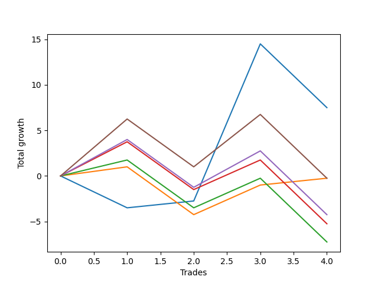

# Short Pointer 010 
- Symbol: ES_SmolBoiHour
- Date Range: 03/18/2022 - 07/29/2022
- Trading Period: 7:20-12:30
- Number of Trades: 4



| Name | Win Percent | Profit | Avg Profit / Trade | Avg Time / Trade |      | Name | Win Percent | Profit | Avg Profit / Trade | Avg Time / Trade |
| ---- | ----------- | ------ | ------------------ | ---------------- | ---- | ---- | ----------- | ------ | ------------------ | ---------------- |
| Sorted By <br> Profit | | | | | | Sorted By <br> Win Percentage ||||
| Two | 50.00 | 3750.00 | 937.50 | 21:25 |     | Eighty-One | 75.00 | -125.00 | -31.25 | 08:55 |
| Eighty-One | 75.00 | -125.00 | -31.25 | 08:55 |     | Two | 50.00 | 3750.00 | 937.50 | 21:25 |
| Eighty-Five | 50.00 | -125.00 | -31.25 | 29:20 |     | Eighty-Five | 50.00 | -125.00 | -31.25 | 29:20 |
| Eighty-Four | 50.00 | -2125.00 | -531.25 | 26:51 |     | Eighty-Four | 50.00 | -2125.00 | -531.25 | 26:51 |
| Eighty-Three | 50.00 | -2625.00 | -656.25 | 26:43 |     | Eighty-Three | 50.00 | -2625.00 | -656.25 | 26:43 |
| Eighty-Two | 50.00 | -3625.00 | -906.25 | 26:40 |     | Eighty-Two | 50.00 | -3625.00 | -906.25 | 26:40 |

## NO STOPLOSS

### Test Two
* Sell when the price hits the upper line of the 20p 2std bollinger
* No Stoploss
* Results:
```
Total Trades: 4
Percent Up: 50.00
Percent Down: 50.00
Total Points Moved Down: 7.50
Potential Profit: 3750.00
Total Points Ups: 10.50 Count Ups: 2
Total Points Downs: 18.00 Count Downs: 2
```

<details><summary>Trades</summary>

<code>In: 2022-03-25 07:26:00		Out: 2022-03-25 07:54:10		Total Position Time: 28:10		Total Move Down: -3.50		Total to Date: -3.50</code> <br />
<code>In: 2022-03-29 12:15:00		Out: 2022-03-29 12:27:50		Total Position Time: 12:50		Total Move Down: 0.75		Total to Date: -2.75</code> <br />
<code>In: 2022-05-04 11:03:00		Out: 2022-05-04 11:07:40		Total Position Time: 04:40		Total Move Down: 17.25		Total to Date: 14.50</code> <br />
<code>In: 2022-07-29 12:06:00		Out: 2022-07-29 12:46:00		Total Position Time: 40:00		Total Move Down: -7.00		Total to Date: 7.50</code> <br />


</details>

## TAKE PROFIT

### Test Eighty-One
* Take Profit of 1 Point
* No Stoploss
* Results:
```
Total Trades: 4
Percent Up: 25.00
Percent Down: 75.00
Total Points Moved Down: -0.25
Potential Profit: -125.00
Total Points Ups: 5.25 Count Ups: 1
Total Points Downs: 5.00 Count Downs: 3
```

<details><summary>Trades</summary>

<code>In: 2022-03-25 07:26:00		Out: 2022-03-25 07:26:10		Total Position Time: 00:10		Total Move Down: 1.00		Total to Date: 1.00</code> <br />
<code>In: 2022-03-29 12:15:00		Out: 2022-03-29 12:46:00		Total Position Time: 31:00		Total Move Down: -5.25		Total to Date: -4.25</code> <br />
<code>In: 2022-05-04 11:03:00		Out: 2022-05-04 11:03:10		Total Position Time: 00:10		Total Move Down: 3.25		Total to Date: -1.00</code> <br />
<code>In: 2022-07-29 12:06:00		Out: 2022-07-29 12:10:20		Total Position Time: 04:20		Total Move Down: 0.75		Total to Date: -0.25</code> <br />


</details>

### Test Eighty-Two
* Take Profit of 2 Point
* No Stoploss
* Results:
```
Total Trades: 4
Percent Up: 50.00
Percent Down: 50.00
Total Points Moved Down: -7.25
Potential Profit: -3625.00
Total Points Ups: 12.25 Count Ups: 2
Total Points Downs: 5.00 Count Downs: 2
```

<details><summary>Trades</summary>

<code>In: 2022-03-25 07:26:00		Out: 2022-03-25 08:01:30		Total Position Time: 35:30		Total Move Down: 1.75		Total to Date: 1.75</code> <br />
<code>In: 2022-03-29 12:15:00		Out: 2022-03-29 12:46:00		Total Position Time: 31:00		Total Move Down: -5.25		Total to Date: -3.50</code> <br />
<code>In: 2022-05-04 11:03:00		Out: 2022-05-04 11:03:10		Total Position Time: 00:10		Total Move Down: 3.25		Total to Date: -0.25</code> <br />
<code>In: 2022-07-29 12:06:00		Out: 2022-07-29 12:46:00		Total Position Time: 40:00		Total Move Down: -7.00		Total to Date: -7.25</code> <br />


</details>

### Test Eighty-Three
* Take Profit of 3 Point
* No Stoploss
* Results:
```
Total Trades: 4
Percent Up: 50.00
Percent Down: 50.00
Total Points Moved Down: -5.25
Potential Profit: -2625.00
Total Points Ups: 12.25 Count Ups: 2
Total Points Downs: 7.00 Count Downs: 2
```

<details><summary>Trades</summary>

<code>In: 2022-03-25 07:26:00		Out: 2022-03-25 08:01:45		Total Position Time: 35:45		Total Move Down: 3.75		Total to Date: 3.75</code> <br />
<code>In: 2022-03-29 12:15:00		Out: 2022-03-29 12:46:00		Total Position Time: 31:00		Total Move Down: -5.25		Total to Date: -1.50</code> <br />
<code>In: 2022-05-04 11:03:00		Out: 2022-05-04 11:03:10		Total Position Time: 00:10		Total Move Down: 3.25		Total to Date: 1.75</code> <br />
<code>In: 2022-07-29 12:06:00		Out: 2022-07-29 12:46:00		Total Position Time: 40:00		Total Move Down: -7.00		Total to Date: -5.25</code> <br />


</details>

### Test Eighty-Four
* Take Profit of 4 Point
* No Stoploss
* Results:
```
Total Trades: 4
Percent Up: 50.00
Percent Down: 50.00
Total Points Moved Down: -4.25
Potential Profit: -2125.00
Total Points Ups: 12.25 Count Ups: 2
Total Points Downs: 8.00 Count Downs: 2
```

<details><summary>Trades</summary>

<code>In: 2022-03-25 07:26:00		Out: 2022-03-25 08:02:05		Total Position Time: 36:05		Total Move Down: 4.00		Total to Date: 4.00</code> <br />
<code>In: 2022-03-29 12:15:00		Out: 2022-03-29 12:46:00		Total Position Time: 31:00		Total Move Down: -5.25		Total to Date: -1.25</code> <br />
<code>In: 2022-05-04 11:03:00		Out: 2022-05-04 11:03:20		Total Position Time: 00:20		Total Move Down: 4.00		Total to Date: 2.75</code> <br />
<code>In: 2022-07-29 12:06:00		Out: 2022-07-29 12:46:00		Total Position Time: 40:00		Total Move Down: -7.00		Total to Date: -4.25</code> <br />


</details>

### Test Eighty-Five
* Take Profit of 5 Point
* No Stoploss
* Results:
```
Total Trades: 4
Percent Up: 50.00
Percent Down: 50.00
Total Points Moved Down: -0.25
Potential Profit: -125.00
Total Points Ups: 12.25 Count Ups: 2
Total Points Downs: 12.00 Count Downs: 2
```

<details><summary>Trades</summary>

<code>In: 2022-03-25 07:26:00		Out: 2022-03-25 08:08:15		Total Position Time: 42:15		Total Move Down: 6.25		Total to Date: 6.25</code> <br />
<code>In: 2022-03-29 12:15:00		Out: 2022-03-29 12:46:00		Total Position Time: 31:00		Total Move Down: -5.25		Total to Date: 1.00</code> <br />
<code>In: 2022-05-04 11:03:00		Out: 2022-05-04 11:07:05		Total Position Time: 04:05		Total Move Down: 5.75		Total to Date: 6.75</code> <br />
<code>In: 2022-07-29 12:06:00		Out: 2022-07-29 12:46:00		Total Position Time: 40:00		Total Move Down: -7.00		Total to Date: -0.25</code> <br />


</details>