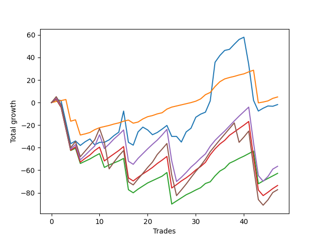

# Short Shepard 002 
- Symbol: ES_SmolBoiHour
- Date Range: 03/18/2022 - 07/29/2022
- Trading Period: 7:20-12:30
- Number of Trades: 47



| Name | Win Percent | Profit | Avg Profit / Trade | Avg Time / Trade |      | Name | Win Percent | Profit | Avg Profit / Trade | Avg Time / Trade |
| ---- | ----------- | ------ | ------------------ | ---------------- | ---- | ---- | ----------- | ------ | ------------------ | ---------------- |
| Sorted By <br> Profit | | | | | | Sorted By <br> Win Percentage ||||
| Eighty-One | 91.49 | 2500.00 | 53.19 | 08:36 |     | Eighty-One | 91.49 | 2500.00 | 53.19 | 08:36 |
| Two | 63.83 | -875.00 | -18.62 | 20:49 |     | Eighty-Two | 80.85 | -31375.00 | -667.55 | 16:15 |
| Eighty-Four | 74.47 | -28250.00 | -601.06 | 25:24 |     | Eighty-Three | 76.60 | -36750.00 | -781.91 | 21:07 |
| Eighty-Two | 80.85 | -31375.00 | -667.55 | 16:15 |     | Eighty-Four | 74.47 | -28250.00 | -601.06 | 25:24 |
| Eighty-Three | 76.60 | -36750.00 | -781.91 | 21:07 |     | Eighty-Five | 70.21 | -38625.00 | -821.81 | 28:43 |
| Eighty-Five | 70.21 | -38625.00 | -821.81 | 28:43 |     | Two | 63.83 | -875.00 | -18.62 | 20:49 |

## NO STOPLOSS

### Test Two
* Sell when the price hits the upper line of the 20p 2std bollinger
* No Stoploss
* Results:
```
Total Trades: 47
Percent Up: 36.17
Percent Down: 63.83
Total Points Moved Down: -1.75
Potential Profit: -875.00
Total Points Ups: 166.00 Count Ups: 17
Total Points Downs: 164.25 Count Downs: 30
```

<details><summary>Trades</summary>

<code>In: 2022-03-25 11:57:00		Out: 2022-03-25 12:00:55		Total Position Time: 03:55		Total Move Down: 2.75		Total to Date: 2.75</code> <br />
<code>In: 2022-03-28 10:33:00		Out: 2022-03-28 10:55:00		Total Position Time: 22:00		Total Move Down: -1.00		Total to Date: 1.75</code> <br />
<code>In: 2022-03-28 11:34:00		Out: 2022-03-28 12:33:55		Total Position Time: 59:55		Total Move Down: -19.00		Total to Date: -17.25</code> <br />
<code>In: 2022-03-28 11:36:00		Out: 2022-03-28 12:35:55		Total Position Time: 59:55		Total Move Down: -19.25		Total to Date: -36.50</code> <br />
<code>In: 2022-03-29 08:36:00		Out: 2022-03-29 09:01:40		Total Position Time: 25:40		Total Move Down: 2.50		Total to Date: -34.00</code> <br />
<code>In: 2022-03-29 10:51:00		Out: 2022-03-29 11:18:30		Total Position Time: 27:30		Total Move Down: -4.00		Total to Date: -38.00</code> <br />
<code>In: 2022-04-06 08:56:00		Out: 2022-04-06 09:09:40		Total Position Time: 13:40		Total Move Down: 3.25		Total to Date: -34.75</code> <br />
<code>In: 2022-04-06 08:57:00		Out: 2022-04-06 09:09:40		Total Position Time: 12:40		Total Move Down: 2.50		Total to Date: -32.25</code> <br />
<code>In: 2022-04-06 10:32:00		Out: 2022-04-06 10:57:20		Total Position Time: 25:20		Total Move Down: -5.25		Total to Date: -37.50</code> <br />
<code>In: 2022-04-06 10:47:00		Out: 2022-04-06 10:57:20		Total Position Time: 10:20		Total Move Down: 2.25		Total to Date: -35.25</code> <br />
<code>In: 2022-04-07 10:25:00		Out: 2022-04-07 10:45:15		Total Position Time: 20:15		Total Move Down: -0.00		Total to Date: -35.25</code> <br />
<code>In: 2022-04-07 11:06:00		Out: 2022-04-07 11:18:20		Total Position Time: 12:20		Total Move Down: 2.25		Total to Date: -33.00</code> <br />
<code>In: 2022-04-12 08:36:00		Out: 2022-04-12 08:49:15		Total Position Time: 13:15		Total Move Down: 3.75		Total to Date: -29.25</code> <br />
<code>In: 2022-04-14 11:08:00		Out: 2022-04-14 11:19:10		Total Position Time: 11:10		Total Move Down: 3.00		Total to Date: -26.25</code> <br />
<code>In: 2022-04-25 07:39:00		Out: 2022-04-25 07:52:35		Total Position Time: 13:35		Total Move Down: 18.75		Total to Date: -7.50</code> <br />
<code>In: 2022-05-04 08:58:00		Out: 2022-05-04 09:57:55		Total Position Time: 59:55		Total Move Down: -27.75		Total to Date: -35.25</code> <br />
<code>In: 2022-05-04 09:32:00		Out: 2022-05-04 10:11:15		Total Position Time: 39:15		Total Move Down: -2.50		Total to Date: -37.75</code> <br />
<code>In: 2022-05-09 09:20:00		Out: 2022-05-09 09:37:50		Total Position Time: 17:50		Total Move Down: 11.75		Total to Date: -26.00</code> <br />
<code>In: 2022-05-09 12:04:00		Out: 2022-05-09 12:20:35		Total Position Time: 16:35		Total Move Down: 4.25		Total to Date: -21.75</code> <br />
<code>In: 2022-05-16 08:51:00		Out: 2022-05-16 09:11:35		Total Position Time: 20:35		Total Move Down: -2.50		Total to Date: -24.25</code> <br />
<code>In: 2022-05-24 08:55:00		Out: 2022-05-24 09:31:20		Total Position Time: 36:20		Total Move Down: -4.25		Total to Date: -28.50</code> <br />
<code>In: 2022-05-25 10:41:00		Out: 2022-05-25 10:52:10		Total Position Time: 11:10		Total Move Down: 2.00		Total to Date: -26.50</code> <br />
<code>In: 2022-05-25 10:47:00		Out: 2022-05-25 10:52:10		Total Position Time: 05:10		Total Move Down: 3.00		Total to Date: -23.50</code> <br />
<code>In: 2022-05-25 11:07:00		Out: 2022-05-25 11:07:10		Total Position Time: 00:10		Total Move Down: 3.25		Total to Date: -20.25</code> <br />
<code>In: 2022-05-25 11:23:00		Out: 2022-05-25 11:50:00		Total Position Time: 27:00		Total Move Down: -9.75		Total to Date: -30.00</code> <br />
<code>In: 2022-05-25 11:33:00		Out: 2022-05-25 11:50:00		Total Position Time: 17:00		Total Move Down: -0.00		Total to Date: -30.00</code> <br />
<code>In: 2022-05-31 07:26:00		Out: 2022-05-31 08:07:30		Total Position Time: 41:30		Total Move Down: -5.00		Total to Date: -35.00</code> <br />
<code>In: 2022-06-09 08:47:00		Out: 2022-06-09 09:11:05		Total Position Time: 24:05		Total Move Down: 9.00		Total to Date: -26.00</code> <br />
<code>In: 2022-06-09 10:14:00		Out: 2022-06-09 10:18:55		Total Position Time: 04:55		Total Move Down: 3.25		Total to Date: -22.75</code> <br />
<code>In: 2022-06-10 12:03:00		Out: 2022-06-10 12:05:55		Total Position Time: 02:55		Total Move Down: 9.75		Total to Date: -13.00</code> <br />
<code>In: 2022-06-13 10:54:00		Out: 2022-06-13 11:02:10		Total Position Time: 08:10		Total Move Down: 2.75		Total to Date: -10.25</code> <br />
<code>In: 2022-06-15 09:26:00		Out: 2022-06-15 09:34:05		Total Position Time: 08:05		Total Move Down: 1.75		Total to Date: -8.50</code> <br />
<code>In: 2022-06-15 11:02:00		Out: 2022-06-15 11:03:05		Total Position Time: 01:05		Total Move Down: 10.00		Total to Date: 1.50</code> <br />
<code>In: 2022-06-15 11:48:00		Out: 2022-06-15 11:58:05		Total Position Time: 10:05		Total Move Down: 34.25		Total to Date: 35.75</code> <br />
<code>In: 2022-06-16 08:31:00		Out: 2022-06-16 08:41:25		Total Position Time: 10:25		Total Move Down: 6.00		Total to Date: 41.75</code> <br />
<code>In: 2022-06-16 10:11:00		Out: 2022-06-16 10:20:05		Total Position Time: 09:05		Total Move Down: 4.50		Total to Date: 46.25</code> <br />
<code>In: 2022-06-17 08:13:00		Out: 2022-06-17 08:45:15		Total Position Time: 32:15		Total Move Down: 1.00		Total to Date: 47.25</code> <br />
<code>In: 2022-06-17 10:16:00		Out: 2022-06-17 10:27:05		Total Position Time: 11:05		Total Move Down: 4.50		Total to Date: 51.75</code> <br />
<code>In: 2022-06-23 11:41:00		Out: 2022-06-23 12:01:10		Total Position Time: 20:10		Total Move Down: 4.25		Total to Date: 56.00</code> <br />
<code>In: 2022-06-29 11:08:00		Out: 2022-06-29 11:20:45		Total Position Time: 12:45		Total Move Down: 2.00		Total to Date: 58.00</code> <br />
<code>In: 2022-06-30 07:39:00		Out: 2022-06-30 08:38:55		Total Position Time: 59:55		Total Move Down: -24.25		Total to Date: 33.75</code> <br />
<code>In: 2022-06-30 08:02:00		Out: 2022-06-30 09:01:55		Total Position Time: 59:55		Total Move Down: -31.75		Total to Date: 2.00</code> <br />
<code>In: 2022-07-01 10:36:00		Out: 2022-07-01 11:07:55		Total Position Time: 31:55		Total Move Down: -9.50		Total to Date: -7.50</code> <br />
<code>In: 2022-07-05 08:53:00		Out: 2022-07-05 09:03:50		Total Position Time: 10:50		Total Move Down: 2.50		Total to Date: -5.00</code> <br />
<code>In: 2022-07-06 10:11:00		Out: 2022-07-06 10:26:25		Total Position Time: 15:25		Total Move Down: 2.00		Total to Date: -3.00</code> <br />
<code>In: 2022-07-06 11:01:00		Out: 2022-07-06 11:02:20		Total Position Time: 01:20		Total Move Down: -0.25		Total to Date: -3.25</code> <br />
<code>In: 2022-07-18 08:48:00		Out: 2022-07-18 09:08:15		Total Position Time: 20:15		Total Move Down: 1.50		Total to Date: -1.75</code> <br />


</details>

## TAKE PROFIT

### Test Eighty-One
* Take Profit of 1 Point
* No Stoploss
* Results:
```
Total Trades: 47
Percent Up: 8.51
Percent Down: 91.49
Total Points Moved Down: 5.00
Potential Profit: 2500.00
Total Points Ups: 64.50 Count Ups: 4
Total Points Downs: 69.50 Count Downs: 43
```

<details><summary>Trades</summary>

<code>In: 2022-03-25 11:57:00		Out: 2022-03-25 11:58:45		Total Position Time: 01:45		Total Move Down: 1.00		Total to Date: 1.00</code> <br />
<code>In: 2022-03-28 10:33:00		Out: 2022-03-28 10:57:00		Total Position Time: 24:00		Total Move Down: 0.75		Total to Date: 1.75</code> <br />
<code>In: 2022-03-28 11:34:00		Out: 2022-03-28 11:36:05		Total Position Time: 02:05		Total Move Down: 1.00		Total to Date: 2.75</code> <br />
<code>In: 2022-03-28 11:36:00		Out: 2022-03-28 12:35:55		Total Position Time: 59:55		Total Move Down: -19.25		Total to Date: -16.50</code> <br />
<code>In: 2022-03-29 08:36:00		Out: 2022-03-29 08:37:25		Total Position Time: 01:25		Total Move Down: 1.25		Total to Date: -15.25</code> <br />
<code>In: 2022-03-29 10:51:00		Out: 2022-03-29 11:50:55		Total Position Time: 59:55		Total Move Down: -13.50		Total to Date: -28.75</code> <br />
<code>In: 2022-04-06 08:56:00		Out: 2022-04-06 08:56:55		Total Position Time: 00:55		Total Move Down: 1.00		Total to Date: -27.75</code> <br />
<code>In: 2022-04-06 08:57:00		Out: 2022-04-06 08:57:35		Total Position Time: 00:35		Total Move Down: 1.25		Total to Date: -26.50</code> <br />
<code>In: 2022-04-06 10:32:00		Out: 2022-04-06 11:00:10		Total Position Time: 28:10		Total Move Down: 2.50		Total to Date: -24.00</code> <br />
<code>In: 2022-04-06 10:47:00		Out: 2022-04-06 10:47:10		Total Position Time: 00:10		Total Move Down: 1.75		Total to Date: -22.25</code> <br />
<code>In: 2022-04-07 10:25:00		Out: 2022-04-07 10:48:20		Total Position Time: 23:20		Total Move Down: 1.00		Total to Date: -21.25</code> <br />
<code>In: 2022-04-07 11:06:00		Out: 2022-04-07 11:06:15		Total Position Time: 00:15		Total Move Down: 1.00		Total to Date: -20.25</code> <br />
<code>In: 2022-04-12 08:36:00		Out: 2022-04-12 08:36:10		Total Position Time: 00:10		Total Move Down: 1.25		Total to Date: -19.00</code> <br />
<code>In: 2022-04-14 11:08:00		Out: 2022-04-14 11:09:00		Total Position Time: 01:00		Total Move Down: 1.00		Total to Date: -18.00</code> <br />
<code>In: 2022-04-25 07:39:00		Out: 2022-04-25 07:39:15		Total Position Time: 00:15		Total Move Down: 1.50		Total to Date: -16.50</code> <br />
<code>In: 2022-05-04 08:58:00		Out: 2022-05-04 09:02:35		Total Position Time: 04:35		Total Move Down: 1.00		Total to Date: -15.50</code> <br />
<code>In: 2022-05-04 09:32:00		Out: 2022-05-04 10:31:55		Total Position Time: 59:55		Total Move Down: -2.75		Total to Date: -18.25</code> <br />
<code>In: 2022-05-09 09:20:00		Out: 2022-05-09 09:20:15		Total Position Time: 00:15		Total Move Down: 1.00		Total to Date: -17.25</code> <br />
<code>In: 2022-05-09 12:04:00		Out: 2022-05-09 12:04:10		Total Position Time: 00:10		Total Move Down: 2.75		Total to Date: -14.50</code> <br />
<code>In: 2022-05-16 08:51:00		Out: 2022-05-16 09:15:55		Total Position Time: 24:55		Total Move Down: 2.00		Total to Date: -12.50</code> <br />
<code>In: 2022-05-24 08:55:00		Out: 2022-05-24 08:56:15		Total Position Time: 01:15		Total Move Down: 1.00		Total to Date: -11.50</code> <br />
<code>In: 2022-05-25 10:41:00		Out: 2022-05-25 10:41:15		Total Position Time: 00:15		Total Move Down: 1.50		Total to Date: -10.00</code> <br />
<code>In: 2022-05-25 10:47:00		Out: 2022-05-25 10:51:20		Total Position Time: 04:20		Total Move Down: 1.00		Total to Date: -9.00</code> <br />
<code>In: 2022-05-25 11:07:00		Out: 2022-05-25 11:07:10		Total Position Time: 00:10		Total Move Down: 3.25		Total to Date: -5.75</code> <br />
<code>In: 2022-05-25 11:23:00		Out: 2022-05-25 11:23:25		Total Position Time: 00:25		Total Move Down: 1.75		Total to Date: -4.00</code> <br />
<code>In: 2022-05-25 11:33:00		Out: 2022-05-25 11:33:15		Total Position Time: 00:15		Total Move Down: 1.00		Total to Date: -3.00</code> <br />
<code>In: 2022-05-31 07:26:00		Out: 2022-05-31 07:26:20		Total Position Time: 00:20		Total Move Down: 1.00		Total to Date: -2.00</code> <br />
<code>In: 2022-06-09 08:47:00		Out: 2022-06-09 08:48:05		Total Position Time: 01:05		Total Move Down: 1.00		Total to Date: -1.00</code> <br />
<code>In: 2022-06-09 10:14:00		Out: 2022-06-09 10:16:30		Total Position Time: 02:30		Total Move Down: 1.00		Total to Date: 0.00</code> <br />
<code>In: 2022-06-10 12:03:00		Out: 2022-06-10 12:03:15		Total Position Time: 00:15		Total Move Down: 1.25		Total to Date: 1.25</code> <br />
<code>In: 2022-06-13 10:54:00		Out: 2022-06-13 10:54:10		Total Position Time: 00:10		Total Move Down: 2.00		Total to Date: 3.25</code> <br />
<code>In: 2022-06-15 09:26:00		Out: 2022-06-15 09:26:10		Total Position Time: 00:10		Total Move Down: 3.75		Total to Date: 7.00</code> <br />
<code>In: 2022-06-15 11:02:00		Out: 2022-06-15 11:02:10		Total Position Time: 00:10		Total Move Down: 2.00		Total to Date: 9.00</code> <br />
<code>In: 2022-06-15 11:48:00		Out: 2022-06-15 11:48:10		Total Position Time: 00:10		Total Move Down: 5.25		Total to Date: 14.25</code> <br />
<code>In: 2022-06-16 08:31:00		Out: 2022-06-16 08:31:10		Total Position Time: 00:10		Total Move Down: 4.25		Total to Date: 18.50</code> <br />
<code>In: 2022-06-16 10:11:00		Out: 2022-06-16 10:11:10		Total Position Time: 00:10		Total Move Down: 2.50		Total to Date: 21.00</code> <br />
<code>In: 2022-06-17 08:13:00		Out: 2022-06-17 08:25:45		Total Position Time: 12:45		Total Move Down: 1.25		Total to Date: 22.25</code> <br />
<code>In: 2022-06-17 10:16:00		Out: 2022-06-17 10:20:55		Total Position Time: 04:55		Total Move Down: 1.00		Total to Date: 23.25</code> <br />
<code>In: 2022-06-23 11:41:00		Out: 2022-06-23 11:42:00		Total Position Time: 01:00		Total Move Down: 1.25		Total to Date: 24.50</code> <br />
<code>In: 2022-06-29 11:08:00		Out: 2022-06-29 11:08:20		Total Position Time: 00:20		Total Move Down: 1.00		Total to Date: 25.50</code> <br />
<code>In: 2022-06-30 07:39:00		Out: 2022-06-30 07:39:55		Total Position Time: 00:55		Total Move Down: 1.75		Total to Date: 27.25</code> <br />
<code>In: 2022-06-30 08:02:00		Out: 2022-06-30 08:03:50		Total Position Time: 01:50		Total Move Down: 1.50		Total to Date: 28.75</code> <br />
<code>In: 2022-07-01 10:36:00		Out: 2022-07-01 11:35:55		Total Position Time: 59:55		Total Move Down: -29.00		Total to Date: -0.25</code> <br />
<code>In: 2022-07-05 08:53:00		Out: 2022-07-05 09:03:45		Total Position Time: 10:45		Total Move Down: 0.75		Total to Date: 0.50</code> <br />
<code>In: 2022-07-06 10:11:00		Out: 2022-07-06 10:13:45		Total Position Time: 02:45		Total Move Down: 1.00		Total to Date: 1.50</code> <br />
<code>In: 2022-07-06 11:01:00		Out: 2022-07-06 11:02:25		Total Position Time: 01:25		Total Move Down: 2.25		Total to Date: 3.75</code> <br />
<code>In: 2022-07-18 08:48:00		Out: 2022-07-18 08:50:10		Total Position Time: 02:10		Total Move Down: 1.25		Total to Date: 5.00</code> <br />


</details>

### Test Eighty-Two
* Take Profit of 2 Point
* No Stoploss
* Results:
```
Total Trades: 47
Percent Up: 19.15
Percent Down: 80.85
Total Points Moved Down: -62.75
Potential Profit: -31375.00
Total Points Ups: 158.50 Count Ups: 9
Total Points Downs: 95.75 Count Downs: 38
```

<details><summary>Trades</summary>

<code>In: 2022-03-25 11:57:00		Out: 2022-03-25 12:00:50		Total Position Time: 03:50		Total Move Down: 2.75		Total to Date: 2.75</code> <br />
<code>In: 2022-03-28 10:33:00		Out: 2022-03-28 11:32:55		Total Position Time: 59:55		Total Move Down: -7.00		Total to Date: -4.25</code> <br />
<code>In: 2022-03-28 11:34:00		Out: 2022-03-28 12:33:55		Total Position Time: 59:55		Total Move Down: -19.00		Total to Date: -23.25</code> <br />
<code>In: 2022-03-28 11:36:00		Out: 2022-03-28 12:35:55		Total Position Time: 59:55		Total Move Down: -19.25		Total to Date: -42.50</code> <br />
<code>In: 2022-03-29 08:36:00		Out: 2022-03-29 08:37:30		Total Position Time: 01:30		Total Move Down: 2.00		Total to Date: -40.50</code> <br />
<code>In: 2022-03-29 10:51:00		Out: 2022-03-29 11:50:55		Total Position Time: 59:55		Total Move Down: -13.50		Total to Date: -54.00</code> <br />
<code>In: 2022-04-06 08:56:00		Out: 2022-04-06 08:57:35		Total Position Time: 01:35		Total Move Down: 2.00		Total to Date: -52.00</code> <br />
<code>In: 2022-04-06 08:57:00		Out: 2022-04-06 09:04:20		Total Position Time: 07:20		Total Move Down: 2.00		Total to Date: -50.00</code> <br />
<code>In: 2022-04-06 10:32:00		Out: 2022-04-06 11:00:10		Total Position Time: 28:10		Total Move Down: 2.50		Total to Date: -47.50</code> <br />
<code>In: 2022-04-06 10:47:00		Out: 2022-04-06 10:47:15		Total Position Time: 00:15		Total Move Down: 2.25		Total to Date: -45.25</code> <br />
<code>In: 2022-04-07 10:25:00		Out: 2022-04-07 11:24:55		Total Position Time: 59:55		Total Move Down: -12.25		Total to Date: -57.50</code> <br />
<code>In: 2022-04-07 11:06:00		Out: 2022-04-07 11:06:40		Total Position Time: 00:40		Total Move Down: 2.25		Total to Date: -55.25</code> <br />
<code>In: 2022-04-12 08:36:00		Out: 2022-04-12 08:36:15		Total Position Time: 00:15		Total Move Down: 1.75		Total to Date: -53.50</code> <br />
<code>In: 2022-04-14 11:08:00		Out: 2022-04-14 11:14:15		Total Position Time: 06:15		Total Move Down: 1.75		Total to Date: -51.75</code> <br />
<code>In: 2022-04-25 07:39:00		Out: 2022-04-25 07:39:20		Total Position Time: 00:20		Total Move Down: 2.25		Total to Date: -49.50</code> <br />
<code>In: 2022-05-04 08:58:00		Out: 2022-05-04 09:57:55		Total Position Time: 59:55		Total Move Down: -27.75		Total to Date: -77.25</code> <br />
<code>In: 2022-05-04 09:32:00		Out: 2022-05-04 10:31:55		Total Position Time: 59:55		Total Move Down: -2.75		Total to Date: -80.00</code> <br />
<code>In: 2022-05-09 09:20:00		Out: 2022-05-09 09:20:20		Total Position Time: 00:20		Total Move Down: 3.25		Total to Date: -76.75</code> <br />
<code>In: 2022-05-09 12:04:00		Out: 2022-05-09 12:04:10		Total Position Time: 00:10		Total Move Down: 2.75		Total to Date: -74.00</code> <br />
<code>In: 2022-05-16 08:51:00		Out: 2022-05-16 09:16:05		Total Position Time: 25:05		Total Move Down: 2.75		Total to Date: -71.25</code> <br />
<code>In: 2022-05-24 08:55:00		Out: 2022-05-24 09:01:05		Total Position Time: 06:05		Total Move Down: 2.00		Total to Date: -69.25</code> <br />
<code>In: 2022-05-25 10:41:00		Out: 2022-05-25 10:52:10		Total Position Time: 11:10		Total Move Down: 2.00		Total to Date: -67.25</code> <br />
<code>In: 2022-05-25 10:47:00		Out: 2022-05-25 10:51:35		Total Position Time: 04:35		Total Move Down: 2.00		Total to Date: -65.25</code> <br />
<code>In: 2022-05-25 11:07:00		Out: 2022-05-25 11:07:10		Total Position Time: 00:10		Total Move Down: 3.25		Total to Date: -62.00</code> <br />
<code>In: 2022-05-25 11:23:00		Out: 2022-05-25 12:22:55		Total Position Time: 59:55		Total Move Down: -28.00		Total to Date: -90.00</code> <br />
<code>In: 2022-05-25 11:33:00		Out: 2022-05-25 11:39:10		Total Position Time: 06:10		Total Move Down: 2.75		Total to Date: -87.25</code> <br />
<code>In: 2022-05-31 07:26:00		Out: 2022-05-31 07:26:35		Total Position Time: 00:35		Total Move Down: 2.75		Total to Date: -84.50</code> <br />
<code>In: 2022-06-09 08:47:00		Out: 2022-06-09 08:48:20		Total Position Time: 01:20		Total Move Down: 2.75		Total to Date: -81.75</code> <br />
<code>In: 2022-06-09 10:14:00		Out: 2022-06-09 10:16:55		Total Position Time: 02:55		Total Move Down: 2.00		Total to Date: -79.75</code> <br />
<code>In: 2022-06-10 12:03:00		Out: 2022-06-10 12:03:25		Total Position Time: 00:25		Total Move Down: 2.25		Total to Date: -77.50</code> <br />
<code>In: 2022-06-13 10:54:00		Out: 2022-06-13 10:54:10		Total Position Time: 00:10		Total Move Down: 2.00		Total to Date: -75.50</code> <br />
<code>In: 2022-06-15 09:26:00		Out: 2022-06-15 09:26:10		Total Position Time: 00:10		Total Move Down: 3.75		Total to Date: -71.75</code> <br />
<code>In: 2022-06-15 11:02:00		Out: 2022-06-15 11:02:45		Total Position Time: 00:45		Total Move Down: 1.50		Total to Date: -70.25</code> <br />
<code>In: 2022-06-15 11:48:00		Out: 2022-06-15 11:48:10		Total Position Time: 00:10		Total Move Down: 5.25		Total to Date: -65.00</code> <br />
<code>In: 2022-06-16 08:31:00		Out: 2022-06-16 08:31:10		Total Position Time: 00:10		Total Move Down: 4.25		Total to Date: -60.75</code> <br />
<code>In: 2022-06-16 10:11:00		Out: 2022-06-16 10:11:10		Total Position Time: 00:10		Total Move Down: 2.50		Total to Date: -58.25</code> <br />
<code>In: 2022-06-17 08:13:00		Out: 2022-06-17 08:51:25		Total Position Time: 38:25		Total Move Down: 4.50		Total to Date: -53.75</code> <br />
<code>In: 2022-06-17 10:16:00		Out: 2022-06-17 10:22:10		Total Position Time: 06:10		Total Move Down: 2.00		Total to Date: -51.75</code> <br />
<code>In: 2022-06-23 11:41:00		Out: 2022-06-23 11:45:45		Total Position Time: 04:45		Total Move Down: 2.25		Total to Date: -49.50</code> <br />
<code>In: 2022-06-29 11:08:00		Out: 2022-06-29 11:20:40		Total Position Time: 12:40		Total Move Down: 2.00		Total to Date: -47.50</code> <br />
<code>In: 2022-06-30 07:39:00		Out: 2022-06-30 07:40:00		Total Position Time: 01:00		Total Move Down: 2.25		Total to Date: -45.25</code> <br />
<code>In: 2022-06-30 08:02:00		Out: 2022-06-30 08:04:05		Total Position Time: 02:05		Total Move Down: 2.25		Total to Date: -43.00</code> <br />
<code>In: 2022-07-01 10:36:00		Out: 2022-07-01 11:35:55		Total Position Time: 59:55		Total Move Down: -29.00		Total to Date: -72.00</code> <br />
<code>In: 2022-07-05 08:53:00		Out: 2022-07-05 09:03:50		Total Position Time: 10:50		Total Move Down: 2.50		Total to Date: -69.50</code> <br />
<code>In: 2022-07-06 10:11:00		Out: 2022-07-06 10:16:40		Total Position Time: 05:40		Total Move Down: 2.25		Total to Date: -67.25</code> <br />
<code>In: 2022-07-06 11:01:00		Out: 2022-07-06 11:02:25		Total Position Time: 01:25		Total Move Down: 2.25		Total to Date: -65.00</code> <br />
<code>In: 2022-07-18 08:48:00		Out: 2022-07-18 09:19:25		Total Position Time: 31:25		Total Move Down: 2.25		Total to Date: -62.75</code> <br />


</details>

### Test Eighty-Three
* Take Profit of 3 Point
* No Stoploss
* Results:
```
Total Trades: 47
Percent Up: 23.40
Percent Down: 76.60
Total Points Moved Down: -73.50
Potential Profit: -36750.00
Total Points Ups: 195.25 Count Ups: 11
Total Points Downs: 121.75 Count Downs: 36
```

<details><summary>Trades</summary>

<code>In: 2022-03-25 11:57:00		Out: 2022-03-25 12:01:00		Total Position Time: 04:00		Total Move Down: 3.00		Total to Date: 3.00</code> <br />
<code>In: 2022-03-28 10:33:00		Out: 2022-03-28 11:32:55		Total Position Time: 59:55		Total Move Down: -7.00		Total to Date: -4.00</code> <br />
<code>In: 2022-03-28 11:34:00		Out: 2022-03-28 12:33:55		Total Position Time: 59:55		Total Move Down: -19.00		Total to Date: -23.00</code> <br />
<code>In: 2022-03-28 11:36:00		Out: 2022-03-28 12:35:55		Total Position Time: 59:55		Total Move Down: -19.25		Total to Date: -42.25</code> <br />
<code>In: 2022-03-29 08:36:00		Out: 2022-03-29 08:41:45		Total Position Time: 05:45		Total Move Down: 3.00		Total to Date: -39.25</code> <br />
<code>In: 2022-03-29 10:51:00		Out: 2022-03-29 11:50:55		Total Position Time: 59:55		Total Move Down: -13.50		Total to Date: -52.75</code> <br />
<code>In: 2022-04-06 08:56:00		Out: 2022-04-06 09:09:40		Total Position Time: 13:40		Total Move Down: 3.25		Total to Date: -49.50</code> <br />
<code>In: 2022-04-06 08:57:00		Out: 2022-04-06 09:11:00		Total Position Time: 14:00		Total Move Down: 3.00		Total to Date: -46.50</code> <br />
<code>In: 2022-04-06 10:32:00		Out: 2022-04-06 11:09:20		Total Position Time: 37:20		Total Move Down: 4.00		Total to Date: -42.50</code> <br />
<code>In: 2022-04-06 10:47:00		Out: 2022-04-06 10:58:00		Total Position Time: 11:00		Total Move Down: 3.00		Total to Date: -39.50</code> <br />
<code>In: 2022-04-07 10:25:00		Out: 2022-04-07 11:24:55		Total Position Time: 59:55		Total Move Down: -12.25		Total to Date: -51.75</code> <br />
<code>In: 2022-04-07 11:06:00		Out: 2022-04-07 11:18:40		Total Position Time: 12:40		Total Move Down: 3.25		Total to Date: -48.50</code> <br />
<code>In: 2022-04-12 08:36:00		Out: 2022-04-12 08:40:20		Total Position Time: 04:20		Total Move Down: 3.00		Total to Date: -45.50</code> <br />
<code>In: 2022-04-14 11:08:00		Out: 2022-04-14 11:18:25		Total Position Time: 10:25		Total Move Down: 3.00		Total to Date: -42.50</code> <br />
<code>In: 2022-04-25 07:39:00		Out: 2022-04-25 07:39:30		Total Position Time: 00:30		Total Move Down: 3.50		Total to Date: -39.00</code> <br />
<code>In: 2022-05-04 08:58:00		Out: 2022-05-04 09:57:55		Total Position Time: 59:55		Total Move Down: -27.75		Total to Date: -66.75</code> <br />
<code>In: 2022-05-04 09:32:00		Out: 2022-05-04 10:31:55		Total Position Time: 59:55		Total Move Down: -2.75		Total to Date: -69.50</code> <br />
<code>In: 2022-05-09 09:20:00		Out: 2022-05-09 09:20:20		Total Position Time: 00:20		Total Move Down: 3.25		Total to Date: -66.25</code> <br />
<code>In: 2022-05-09 12:04:00		Out: 2022-05-09 12:04:15		Total Position Time: 00:15		Total Move Down: 3.00		Total to Date: -63.25</code> <br />
<code>In: 2022-05-16 08:51:00		Out: 2022-05-16 09:16:05		Total Position Time: 25:05		Total Move Down: 2.75		Total to Date: -60.50</code> <br />
<code>In: 2022-05-24 08:55:00		Out: 2022-05-24 09:01:15		Total Position Time: 06:15		Total Move Down: 3.00		Total to Date: -57.50</code> <br />
<code>In: 2022-05-25 10:41:00		Out: 2022-05-25 10:53:35		Total Position Time: 12:35		Total Move Down: 3.50		Total to Date: -54.00</code> <br />
<code>In: 2022-05-25 10:47:00		Out: 2022-05-25 10:52:10		Total Position Time: 05:10		Total Move Down: 3.00		Total to Date: -51.00</code> <br />
<code>In: 2022-05-25 11:07:00		Out: 2022-05-25 11:07:10		Total Position Time: 00:10		Total Move Down: 3.25		Total to Date: -47.75</code> <br />
<code>In: 2022-05-25 11:23:00		Out: 2022-05-25 12:22:55		Total Position Time: 59:55		Total Move Down: -28.00		Total to Date: -75.75</code> <br />
<code>In: 2022-05-25 11:33:00		Out: 2022-05-25 11:39:55		Total Position Time: 06:55		Total Move Down: 3.00		Total to Date: -72.75</code> <br />
<code>In: 2022-05-31 07:26:00		Out: 2022-05-31 07:29:45		Total Position Time: 03:45		Total Move Down: 3.25		Total to Date: -69.50</code> <br />
<code>In: 2022-06-09 08:47:00		Out: 2022-06-09 08:48:20		Total Position Time: 01:20		Total Move Down: 2.75		Total to Date: -66.75</code> <br />
<code>In: 2022-06-09 10:14:00		Out: 2022-06-09 10:18:55		Total Position Time: 04:55		Total Move Down: 3.25		Total to Date: -63.50</code> <br />
<code>In: 2022-06-10 12:03:00		Out: 2022-06-10 12:03:30		Total Position Time: 00:30		Total Move Down: 3.75		Total to Date: -59.75</code> <br />
<code>In: 2022-06-13 10:54:00		Out: 2022-06-13 10:54:15		Total Position Time: 00:15		Total Move Down: 3.00		Total to Date: -56.75</code> <br />
<code>In: 2022-06-15 09:26:00		Out: 2022-06-15 09:26:10		Total Position Time: 00:10		Total Move Down: 3.75		Total to Date: -53.00</code> <br />
<code>In: 2022-06-15 11:02:00		Out: 2022-06-15 11:03:00		Total Position Time: 01:00		Total Move Down: 6.75		Total to Date: -46.25</code> <br />
<code>In: 2022-06-15 11:48:00		Out: 2022-06-15 11:48:10		Total Position Time: 00:10		Total Move Down: 5.25		Total to Date: -41.00</code> <br />
<code>In: 2022-06-16 08:31:00		Out: 2022-06-16 08:31:10		Total Position Time: 00:10		Total Move Down: 4.25		Total to Date: -36.75</code> <br />
<code>In: 2022-06-16 10:11:00		Out: 2022-06-16 10:11:15		Total Position Time: 00:15		Total Move Down: 3.25		Total to Date: -33.50</code> <br />
<code>In: 2022-06-17 08:13:00		Out: 2022-06-17 08:51:25		Total Position Time: 38:25		Total Move Down: 4.50		Total to Date: -29.00</code> <br />
<code>In: 2022-06-17 10:16:00		Out: 2022-06-17 10:23:05		Total Position Time: 07:05		Total Move Down: 3.00		Total to Date: -26.00</code> <br />
<code>In: 2022-06-23 11:41:00		Out: 2022-06-23 11:46:00		Total Position Time: 05:00		Total Move Down: 3.00		Total to Date: -23.00</code> <br />
<code>In: 2022-06-29 11:08:00		Out: 2022-06-29 11:21:30		Total Position Time: 13:30		Total Move Down: 3.00		Total to Date: -20.00</code> <br />
<code>In: 2022-06-30 07:39:00		Out: 2022-06-30 07:40:10		Total Position Time: 01:10		Total Move Down: 3.25		Total to Date: -16.75</code> <br />
<code>In: 2022-06-30 08:02:00		Out: 2022-06-30 09:01:55		Total Position Time: 59:55		Total Move Down: -31.75		Total to Date: -48.50</code> <br />
<code>In: 2022-07-01 10:36:00		Out: 2022-07-01 11:35:55		Total Position Time: 59:55		Total Move Down: -29.00		Total to Date: -77.50</code> <br />
<code>In: 2022-07-05 08:53:00		Out: 2022-07-05 09:52:55		Total Position Time: 59:55		Total Move Down: -5.00		Total to Date: -82.50</code> <br />
<code>In: 2022-07-06 10:11:00		Out: 2022-07-06 10:27:20		Total Position Time: 16:20		Total Move Down: 3.00		Total to Date: -79.50</code> <br />
<code>In: 2022-07-06 11:01:00		Out: 2022-07-06 11:12:05		Total Position Time: 11:05		Total Move Down: 3.25		Total to Date: -76.25</code> <br />
<code>In: 2022-07-18 08:48:00		Out: 2022-07-18 09:46:15		Total Position Time: 58:15		Total Move Down: 2.75		Total to Date: -73.50</code> <br />


</details>

### Test Eighty-Four
* Take Profit of 4 Point
* No Stoploss
* Results:
```
Total Trades: 47
Percent Up: 25.53
Percent Down: 74.47
Total Points Moved Down: -56.50
Potential Profit: -28250.00
Total Points Ups: 213.50 Count Ups: 12
Total Points Downs: 157.00 Count Downs: 35
```

<details><summary>Trades</summary>

<code>In: 2022-03-25 11:57:00		Out: 2022-03-25 12:01:45		Total Position Time: 04:45		Total Move Down: 4.00		Total to Date: 4.00</code> <br />
<code>In: 2022-03-28 10:33:00		Out: 2022-03-28 11:32:55		Total Position Time: 59:55		Total Move Down: -7.00		Total to Date: -3.00</code> <br />
<code>In: 2022-03-28 11:34:00		Out: 2022-03-28 12:33:55		Total Position Time: 59:55		Total Move Down: -19.00		Total to Date: -22.00</code> <br />
<code>In: 2022-03-28 11:36:00		Out: 2022-03-28 12:35:55		Total Position Time: 59:55		Total Move Down: -19.25		Total to Date: -41.25</code> <br />
<code>In: 2022-03-29 08:36:00		Out: 2022-03-29 09:02:10		Total Position Time: 26:10		Total Move Down: 4.00		Total to Date: -37.25</code> <br />
<code>In: 2022-03-29 10:51:00		Out: 2022-03-29 11:50:55		Total Position Time: 59:55		Total Move Down: -13.50		Total to Date: -50.75</code> <br />
<code>In: 2022-04-06 08:56:00		Out: 2022-04-06 09:11:35		Total Position Time: 15:35		Total Move Down: 4.00		Total to Date: -46.75</code> <br />
<code>In: 2022-04-06 08:57:00		Out: 2022-04-06 09:13:05		Total Position Time: 16:05		Total Move Down: 4.25		Total to Date: -42.50</code> <br />
<code>In: 2022-04-06 10:32:00		Out: 2022-04-06 11:09:20		Total Position Time: 37:20		Total Move Down: 4.00		Total to Date: -38.50</code> <br />
<code>In: 2022-04-06 10:47:00		Out: 2022-04-06 11:00:10		Total Position Time: 13:10		Total Move Down: 10.00		Total to Date: -28.50</code> <br />
<code>In: 2022-04-07 10:25:00		Out: 2022-04-07 11:24:55		Total Position Time: 59:55		Total Move Down: -12.25		Total to Date: -40.75</code> <br />
<code>In: 2022-04-07 11:06:00		Out: 2022-04-07 11:19:10		Total Position Time: 13:10		Total Move Down: 4.00		Total to Date: -36.75</code> <br />
<code>In: 2022-04-12 08:36:00		Out: 2022-04-12 08:49:25		Total Position Time: 13:25		Total Move Down: 4.50		Total to Date: -32.25</code> <br />
<code>In: 2022-04-14 11:08:00		Out: 2022-04-14 11:19:25		Total Position Time: 11:25		Total Move Down: 3.75		Total to Date: -28.50</code> <br />
<code>In: 2022-04-25 07:39:00		Out: 2022-04-25 07:39:40		Total Position Time: 00:40		Total Move Down: 4.25		Total to Date: -24.25</code> <br />
<code>In: 2022-05-04 08:58:00		Out: 2022-05-04 09:57:55		Total Position Time: 59:55		Total Move Down: -27.75		Total to Date: -52.00</code> <br />
<code>In: 2022-05-04 09:32:00		Out: 2022-05-04 10:31:55		Total Position Time: 59:55		Total Move Down: -2.75		Total to Date: -54.75</code> <br />
<code>In: 2022-05-09 09:20:00		Out: 2022-05-09 09:20:35		Total Position Time: 00:35		Total Move Down: 5.25		Total to Date: -49.50</code> <br />
<code>In: 2022-05-09 12:04:00		Out: 2022-05-09 12:04:30		Total Position Time: 00:30		Total Move Down: 4.25		Total to Date: -45.25</code> <br />
<code>In: 2022-05-16 08:51:00		Out: 2022-05-16 09:18:05		Total Position Time: 27:05		Total Move Down: 4.25		Total to Date: -41.00</code> <br />
<code>In: 2022-05-24 08:55:00		Out: 2022-05-24 09:36:40		Total Position Time: 41:40		Total Move Down: 4.00		Total to Date: -37.00</code> <br />
<code>In: 2022-05-25 10:41:00		Out: 2022-05-25 10:56:15		Total Position Time: 15:15		Total Move Down: 3.75		Total to Date: -33.25</code> <br />
<code>In: 2022-05-25 10:47:00		Out: 2022-05-25 10:53:35		Total Position Time: 06:35		Total Move Down: 4.50		Total to Date: -28.75</code> <br />
<code>In: 2022-05-25 11:07:00		Out: 2022-05-25 11:07:15		Total Position Time: 00:15		Total Move Down: 5.00		Total to Date: -23.75</code> <br />
<code>In: 2022-05-25 11:23:00		Out: 2022-05-25 12:22:55		Total Position Time: 59:55		Total Move Down: -28.00		Total to Date: -51.75</code> <br />
<code>In: 2022-05-25 11:33:00		Out: 2022-05-25 12:32:55		Total Position Time: 59:55		Total Move Down: -18.25		Total to Date: -70.00</code> <br />
<code>In: 2022-05-31 07:26:00		Out: 2022-05-31 08:14:40		Total Position Time: 48:40		Total Move Down: 3.75		Total to Date: -66.25</code> <br />
<code>In: 2022-06-09 08:47:00		Out: 2022-06-09 08:48:35		Total Position Time: 01:35		Total Move Down: 4.25		Total to Date: -62.00</code> <br />
<code>In: 2022-06-09 10:14:00		Out: 2022-06-09 10:22:05		Total Position Time: 08:05		Total Move Down: 4.75		Total to Date: -57.25</code> <br />
<code>In: 2022-06-10 12:03:00		Out: 2022-06-10 12:03:30		Total Position Time: 00:30		Total Move Down: 3.75		Total to Date: -53.50</code> <br />
<code>In: 2022-06-13 10:54:00		Out: 2022-06-13 11:02:25		Total Position Time: 08:25		Total Move Down: 4.25		Total to Date: -49.25</code> <br />
<code>In: 2022-06-15 09:26:00		Out: 2022-06-15 09:26:20		Total Position Time: 00:20		Total Move Down: 3.75		Total to Date: -45.50</code> <br />
<code>In: 2022-06-15 11:02:00		Out: 2022-06-15 11:03:00		Total Position Time: 01:00		Total Move Down: 6.75		Total to Date: -38.75</code> <br />
<code>In: 2022-06-15 11:48:00		Out: 2022-06-15 11:48:10		Total Position Time: 00:10		Total Move Down: 5.25		Total to Date: -33.50</code> <br />
<code>In: 2022-06-16 08:31:00		Out: 2022-06-16 08:31:10		Total Position Time: 00:10		Total Move Down: 4.25		Total to Date: -29.25</code> <br />
<code>In: 2022-06-16 10:11:00		Out: 2022-06-16 10:13:35		Total Position Time: 02:35		Total Move Down: 4.00		Total to Date: -25.25</code> <br />
<code>In: 2022-06-17 08:13:00		Out: 2022-06-17 08:51:25		Total Position Time: 38:25		Total Move Down: 4.50		Total to Date: -20.75</code> <br />
<code>In: 2022-06-17 10:16:00		Out: 2022-06-17 10:26:30		Total Position Time: 10:30		Total Move Down: 4.50		Total to Date: -16.25</code> <br />
<code>In: 2022-06-23 11:41:00		Out: 2022-06-23 11:46:50		Total Position Time: 05:50		Total Move Down: 4.25		Total to Date: -12.00</code> <br />
<code>In: 2022-06-29 11:08:00		Out: 2022-06-29 11:22:35		Total Position Time: 14:35		Total Move Down: 4.00		Total to Date: -8.00</code> <br />
<code>In: 2022-06-30 07:39:00		Out: 2022-06-30 07:42:10		Total Position Time: 03:10		Total Move Down: 4.00		Total to Date: -4.00</code> <br />
<code>In: 2022-06-30 08:02:00		Out: 2022-06-30 09:01:55		Total Position Time: 59:55		Total Move Down: -31.75		Total to Date: -35.75</code> <br />
<code>In: 2022-07-01 10:36:00		Out: 2022-07-01 11:35:55		Total Position Time: 59:55		Total Move Down: -29.00		Total to Date: -64.75</code> <br />
<code>In: 2022-07-05 08:53:00		Out: 2022-07-05 09:52:55		Total Position Time: 59:55		Total Move Down: -5.00		Total to Date: -69.75</code> <br />
<code>In: 2022-07-06 10:11:00		Out: 2022-07-06 10:27:35		Total Position Time: 16:35		Total Move Down: 4.25		Total to Date: -65.50</code> <br />
<code>In: 2022-07-06 11:01:00		Out: 2022-07-06 11:12:15		Total Position Time: 11:15		Total Move Down: 6.50		Total to Date: -59.00</code> <br />
<code>In: 2022-07-18 08:48:00		Out: 2022-07-18 09:47:55		Total Position Time: 59:55		Total Move Down: 2.50		Total to Date: -56.50</code> <br />


</details>

### Test Eighty-Five
* Take Profit of 5 Point
* No Stoploss
* Results:
```
Total Trades: 47
Percent Up: 29.79
Percent Down: 70.21
Total Points Moved Down: -77.25
Potential Profit: -38625.00
Total Points Ups: 254.25 Count Ups: 14
Total Points Downs: 177.00 Count Downs: 33
```

<details><summary>Trades</summary>

<code>In: 2022-03-25 11:57:00		Out: 2022-03-25 12:01:55		Total Position Time: 04:55		Total Move Down: 5.25		Total to Date: 5.25</code> <br />
<code>In: 2022-03-28 10:33:00		Out: 2022-03-28 11:32:55		Total Position Time: 59:55		Total Move Down: -7.00		Total to Date: -1.75</code> <br />
<code>In: 2022-03-28 11:34:00		Out: 2022-03-28 12:33:55		Total Position Time: 59:55		Total Move Down: -19.00		Total to Date: -20.75</code> <br />
<code>In: 2022-03-28 11:36:00		Out: 2022-03-28 12:35:55		Total Position Time: 59:55		Total Move Down: -19.25		Total to Date: -40.00</code> <br />
<code>In: 2022-03-29 08:36:00		Out: 2022-03-29 09:02:15		Total Position Time: 26:15		Total Move Down: 5.50		Total to Date: -34.50</code> <br />
<code>In: 2022-03-29 10:51:00		Out: 2022-03-29 11:50:55		Total Position Time: 59:55		Total Move Down: -13.50		Total to Date: -48.00</code> <br />
<code>In: 2022-04-06 08:56:00		Out: 2022-04-06 09:13:05		Total Position Time: 17:05		Total Move Down: 5.00		Total to Date: -43.00</code> <br />
<code>In: 2022-04-06 08:57:00		Out: 2022-04-06 09:13:30		Total Position Time: 16:30		Total Move Down: 5.00		Total to Date: -38.00</code> <br />
<code>In: 2022-04-06 10:32:00		Out: 2022-04-06 11:09:35		Total Position Time: 37:35		Total Move Down: 5.00		Total to Date: -33.00</code> <br />
<code>In: 2022-04-06 10:47:00		Out: 2022-04-06 11:00:10		Total Position Time: 13:10		Total Move Down: 10.00		Total to Date: -23.00</code> <br />
<code>In: 2022-04-07 10:25:00		Out: 2022-04-07 11:24:55		Total Position Time: 59:55		Total Move Down: -12.25		Total to Date: -35.25</code> <br />
<code>In: 2022-04-07 11:06:00		Out: 2022-04-07 12:05:55		Total Position Time: 59:55		Total Move Down: -23.50		Total to Date: -58.75</code> <br />
<code>In: 2022-04-12 08:36:00		Out: 2022-04-12 08:50:30		Total Position Time: 14:30		Total Move Down: 6.00		Total to Date: -52.75</code> <br />
<code>In: 2022-04-14 11:08:00		Out: 2022-04-14 11:20:05		Total Position Time: 12:05		Total Move Down: 5.50		Total to Date: -47.25</code> <br />
<code>In: 2022-04-25 07:39:00		Out: 2022-04-25 07:39:55		Total Position Time: 00:55		Total Move Down: 4.75		Total to Date: -42.50</code> <br />
<code>In: 2022-05-04 08:58:00		Out: 2022-05-04 09:57:55		Total Position Time: 59:55		Total Move Down: -27.75		Total to Date: -70.25</code> <br />
<code>In: 2022-05-04 09:32:00		Out: 2022-05-04 10:31:55		Total Position Time: 59:55		Total Move Down: -2.75		Total to Date: -73.00</code> <br />
<code>In: 2022-05-09 09:20:00		Out: 2022-05-09 09:20:35		Total Position Time: 00:35		Total Move Down: 5.25		Total to Date: -67.75</code> <br />
<code>In: 2022-05-09 12:04:00		Out: 2022-05-09 12:09:35		Total Position Time: 05:35		Total Move Down: 5.00		Total to Date: -62.75</code> <br />
<code>In: 2022-05-16 08:51:00		Out: 2022-05-16 09:24:25		Total Position Time: 33:25		Total Move Down: 5.25		Total to Date: -57.50</code> <br />
<code>In: 2022-05-24 08:55:00		Out: 2022-05-24 09:36:45		Total Position Time: 41:45		Total Move Down: 4.75		Total to Date: -52.75</code> <br />
<code>In: 2022-05-25 10:41:00		Out: 2022-05-25 11:06:40		Total Position Time: 25:40		Total Move Down: 6.75		Total to Date: -46.00</code> <br />
<code>In: 2022-05-25 10:47:00		Out: 2022-05-25 10:56:15		Total Position Time: 09:15		Total Move Down: 4.75		Total to Date: -41.25</code> <br />
<code>In: 2022-05-25 11:07:00		Out: 2022-05-25 11:07:15		Total Position Time: 00:15		Total Move Down: 5.00		Total to Date: -36.25</code> <br />
<code>In: 2022-05-25 11:23:00		Out: 2022-05-25 12:22:55		Total Position Time: 59:55		Total Move Down: -28.00		Total to Date: -64.25</code> <br />
<code>In: 2022-05-25 11:33:00		Out: 2022-05-25 12:32:55		Total Position Time: 59:55		Total Move Down: -18.25		Total to Date: -82.50</code> <br />
<code>In: 2022-05-31 07:26:00		Out: 2022-05-31 08:14:55		Total Position Time: 48:55		Total Move Down: 5.00		Total to Date: -77.50</code> <br />
<code>In: 2022-06-09 08:47:00		Out: 2022-06-09 08:48:50		Total Position Time: 01:50		Total Move Down: 5.25		Total to Date: -72.25</code> <br />
<code>In: 2022-06-09 10:14:00		Out: 2022-06-09 10:22:35		Total Position Time: 08:35		Total Move Down: 5.75		Total to Date: -66.50</code> <br />
<code>In: 2022-06-10 12:03:00		Out: 2022-06-10 12:03:40		Total Position Time: 00:40		Total Move Down: 5.50		Total to Date: -61.00</code> <br />
<code>In: 2022-06-13 10:54:00		Out: 2022-06-13 11:02:35		Total Position Time: 08:35		Total Move Down: 5.00		Total to Date: -56.00</code> <br />
<code>In: 2022-06-15 09:26:00		Out: 2022-06-15 09:36:10		Total Position Time: 10:10		Total Move Down: 5.75		Total to Date: -50.25</code> <br />
<code>In: 2022-06-15 11:02:00		Out: 2022-06-15 11:03:00		Total Position Time: 01:00		Total Move Down: 6.75		Total to Date: -43.50</code> <br />
<code>In: 2022-06-15 11:48:00		Out: 2022-06-15 11:48:10		Total Position Time: 00:10		Total Move Down: 5.25		Total to Date: -38.25</code> <br />
<code>In: 2022-06-16 08:31:00		Out: 2022-06-16 08:35:10		Total Position Time: 04:10		Total Move Down: 5.25		Total to Date: -33.00</code> <br />
<code>In: 2022-06-16 10:11:00		Out: 2022-06-16 10:20:25		Total Position Time: 09:25		Total Move Down: 5.00		Total to Date: -28.00</code> <br />
<code>In: 2022-06-17 08:13:00		Out: 2022-06-17 08:51:40		Total Position Time: 38:40		Total Move Down: 5.00		Total to Date: -23.00</code> <br />
<code>In: 2022-06-17 10:16:00		Out: 2022-06-17 10:26:50		Total Position Time: 10:50		Total Move Down: 5.00		Total to Date: -18.00</code> <br />
<code>In: 2022-06-23 11:41:00		Out: 2022-06-23 12:40:55		Total Position Time: 59:55		Total Move Down: -17.25		Total to Date: -35.25</code> <br />
<code>In: 2022-06-29 11:08:00		Out: 2022-06-29 11:24:15		Total Position Time: 16:15		Total Move Down: 4.75		Total to Date: -30.50</code> <br />
<code>In: 2022-06-30 07:39:00		Out: 2022-06-30 07:43:00		Total Position Time: 04:00		Total Move Down: 5.25		Total to Date: -25.25</code> <br />
<code>In: 2022-06-30 08:02:00		Out: 2022-06-30 09:01:55		Total Position Time: 59:55		Total Move Down: -31.75		Total to Date: -57.00</code> <br />
<code>In: 2022-07-01 10:36:00		Out: 2022-07-01 11:35:55		Total Position Time: 59:55		Total Move Down: -29.00		Total to Date: -86.00</code> <br />
<code>In: 2022-07-05 08:53:00		Out: 2022-07-05 09:52:55		Total Position Time: 59:55		Total Move Down: -5.00		Total to Date: -91.00</code> <br />
<code>In: 2022-07-06 10:11:00		Out: 2022-07-06 10:28:05		Total Position Time: 17:05		Total Move Down: 4.75		Total to Date: -86.25</code> <br />
<code>In: 2022-07-06 11:01:00		Out: 2022-07-06 11:12:15		Total Position Time: 11:15		Total Move Down: 6.50		Total to Date: -79.75</code> <br />
<code>In: 2022-07-18 08:48:00		Out: 2022-07-18 09:47:55		Total Position Time: 59:55		Total Move Down: 2.50		Total to Date: -77.25</code> <br />


</details>