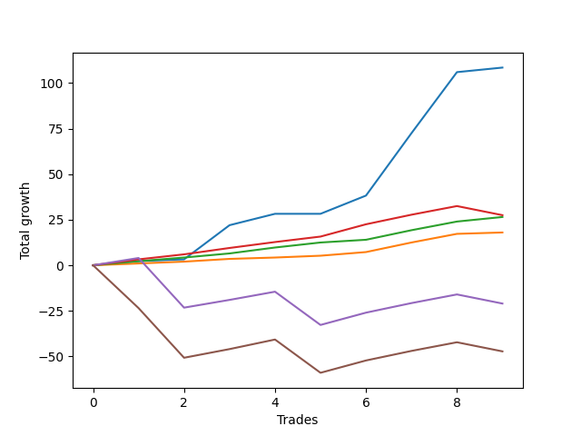

# Short Shepard 007 DB 
- Symbol: ES_SmolBoiHour
- Date Range: 03/18/2022 - 07/29/2022
- Trading Period: 7:20-12:30
- Number of Trades: 9



| Name | Win Percent | Profit | Avg Profit / Trade | Avg Time / Trade |      | Name | Win Percent | Profit | Avg Profit / Trade | Avg Time / Trade |
| ---- | ----------- | ------ | ------------------ | ---------------- | ---- | ---- | ----------- | ------ | ------------------ | ---------------- |
| Sorted By <br> Profit | | | | | | Sorted By <br> Win Percentage ||||
| Two | 88.89 | 54250.00 | 6027.78 | 11:06 |     | Eighty-Two | 100.00 | 13250.00 | 1472.22 | 04:25 |
| Eighty-Three | 88.89 | 13750.00 | 1527.78 | 11:23 |     | Eighty-One | 100.00 | 9000.00 | 1000.00 | 02:38 |
| Eighty-Two | 100.00 | 13250.00 | 1472.22 | 04:25 |     | Two | 88.89 | 54250.00 | 6027.78 | 11:06 |
| Eighty-One | 100.00 | 9000.00 | 1000.00 | 02:38 |     | Eighty-Three | 88.89 | 13750.00 | 1527.78 | 11:23 |
| Eighty-Four | 66.67 | -10500.00 | -1166.67 | 22:40 |     | Eighty-Four | 66.67 | -10500.00 | -1166.67 | 22:40 |
| Eighty-Five | 55.56 | -23625.00 | -2625.00 | 27:53 |     | Eighty-Five | 55.56 | -23625.00 | -2625.00 | 27:53 |

## NO STOPLOSS

### Test Two
* Sell when the price hits the upper line of the 20p 2std bollinger
* No Stoploss
* Results:
```
Total Trades: 9
Percent Up: 11.11
Percent Down: 88.89
Total Points Moved Down: 108.50
Potential Profit: 54250.00
Total Points Ups: 0.00 Count Ups: 1
Total Points Downs: 108.50 Count Downs: 8
```

<details><summary>Trades</summary>

<code>In: 2022-04-07 11:06:00		Out: 2022-04-07 11:18:20		Total Position Time: 12:20		Total Move Down: 2.25		Total to Date: 2.25</code> <br />
<code>In: 2022-04-07 11:07:00		Out: 2022-04-07 11:18:20		Total Position Time: 11:20		Total Move Down: 1.00		Total to Date: 3.25</code> <br />
<code>In: 2022-04-25 07:39:00		Out: 2022-04-25 07:52:35		Total Position Time: 13:35		Total Move Down: 18.75		Total to Date: 22.00</code> <br />
<code>In: 2022-05-16 08:57:00		Out: 2022-05-16 09:11:35		Total Position Time: 14:35		Total Move Down: 6.25		Total to Date: 28.25</code> <br />
<code>In: 2022-05-25 11:33:00		Out: 2022-05-25 11:50:00		Total Position Time: 17:00		Total Move Down: -0.00		Total to Date: 28.25</code> <br />
<code>In: 2022-06-15 11:02:00		Out: 2022-06-15 11:03:05		Total Position Time: 01:05		Total Move Down: 10.00		Total to Date: 38.25</code> <br />
<code>In: 2022-06-15 11:48:00		Out: 2022-06-15 11:58:05		Total Position Time: 10:05		Total Move Down: 34.25		Total to Date: 72.50</code> <br />
<code>In: 2022-06-15 11:49:00		Out: 2022-06-15 11:58:05		Total Position Time: 09:05		Total Move Down: 33.50		Total to Date: 106.00</code> <br />
<code>In: 2022-07-05 08:53:00		Out: 2022-07-05 09:03:50		Total Position Time: 10:50		Total Move Down: 2.50		Total to Date: 108.50</code> <br />


</details>

## TAKE PROFIT

### Test Eighty-One
* Take Profit of 1 Point
* No Stoploss
* Results:
```
Total Trades: 9
Percent Up: 0.00
Percent Down: 100.00
Total Points Moved Down: 18.00
Potential Profit: 9000.00
Total Points Ups: 0.00 Count Ups: 0
Total Points Downs: 18.00 Count Downs: 9
```

<details><summary>Trades</summary>

<code>In: 2022-04-07 11:06:00		Out: 2022-04-07 11:06:15		Total Position Time: 00:15		Total Move Down: 1.00		Total to Date: 1.00</code> <br />
<code>In: 2022-04-07 11:07:00		Out: 2022-04-07 11:18:20		Total Position Time: 11:20		Total Move Down: 1.00		Total to Date: 2.00</code> <br />
<code>In: 2022-04-25 07:39:00		Out: 2022-04-25 07:39:15		Total Position Time: 00:15		Total Move Down: 1.50		Total to Date: 3.50</code> <br />
<code>In: 2022-05-16 08:57:00		Out: 2022-05-16 08:57:25		Total Position Time: 00:25		Total Move Down: 0.75		Total to Date: 4.25</code> <br />
<code>In: 2022-05-25 11:33:00		Out: 2022-05-25 11:33:15		Total Position Time: 00:15		Total Move Down: 1.00		Total to Date: 5.25</code> <br />
<code>In: 2022-06-15 11:02:00		Out: 2022-06-15 11:02:10		Total Position Time: 00:10		Total Move Down: 2.00		Total to Date: 7.25</code> <br />
<code>In: 2022-06-15 11:48:00		Out: 2022-06-15 11:48:10		Total Position Time: 00:10		Total Move Down: 5.25		Total to Date: 12.50</code> <br />
<code>In: 2022-06-15 11:49:00		Out: 2022-06-15 11:49:10		Total Position Time: 00:10		Total Move Down: 4.75		Total to Date: 17.25</code> <br />
<code>In: 2022-07-05 08:53:00		Out: 2022-07-05 09:03:45		Total Position Time: 10:45		Total Move Down: 0.75		Total to Date: 18.00</code> <br />


</details>

### Test Eighty-Two
* Take Profit of 2 Point
* No Stoploss
* Results:
```
Total Trades: 9
Percent Up: 0.00
Percent Down: 100.00
Total Points Moved Down: 26.50
Potential Profit: 13250.00
Total Points Ups: 0.00 Count Ups: 0
Total Points Downs: 26.50 Count Downs: 9
```

<details><summary>Trades</summary>

<code>In: 2022-04-07 11:06:00		Out: 2022-04-07 11:06:40		Total Position Time: 00:40		Total Move Down: 2.25		Total to Date: 2.25</code> <br />
<code>In: 2022-04-07 11:07:00		Out: 2022-04-07 11:18:40		Total Position Time: 11:40		Total Move Down: 2.00		Total to Date: 4.25</code> <br />
<code>In: 2022-04-25 07:39:00		Out: 2022-04-25 07:39:20		Total Position Time: 00:20		Total Move Down: 2.25		Total to Date: 6.50</code> <br />
<code>In: 2022-05-16 08:57:00		Out: 2022-05-16 09:06:00		Total Position Time: 09:00		Total Move Down: 3.25		Total to Date: 9.75</code> <br />
<code>In: 2022-05-25 11:33:00		Out: 2022-05-25 11:39:10		Total Position Time: 06:10		Total Move Down: 2.75		Total to Date: 12.50</code> <br />
<code>In: 2022-06-15 11:02:00		Out: 2022-06-15 11:02:45		Total Position Time: 00:45		Total Move Down: 1.50		Total to Date: 14.00</code> <br />
<code>In: 2022-06-15 11:48:00		Out: 2022-06-15 11:48:10		Total Position Time: 00:10		Total Move Down: 5.25		Total to Date: 19.25</code> <br />
<code>In: 2022-06-15 11:49:00		Out: 2022-06-15 11:49:10		Total Position Time: 00:10		Total Move Down: 4.75		Total to Date: 24.00</code> <br />
<code>In: 2022-07-05 08:53:00		Out: 2022-07-05 09:03:50		Total Position Time: 10:50		Total Move Down: 2.50		Total to Date: 26.50</code> <br />


</details>

### Test Eighty-Three
* Take Profit of 3 Point
* No Stoploss
* Results:
```
Total Trades: 9
Percent Up: 11.11
Percent Down: 88.89
Total Points Moved Down: 27.50
Potential Profit: 13750.00
Total Points Ups: 5.00 Count Ups: 1
Total Points Downs: 32.50 Count Downs: 8
```

<details><summary>Trades</summary>

<code>In: 2022-04-07 11:06:00		Out: 2022-04-07 11:18:40		Total Position Time: 12:40		Total Move Down: 3.25		Total to Date: 3.25</code> <br />
<code>In: 2022-04-07 11:07:00		Out: 2022-04-07 11:19:10		Total Position Time: 12:10		Total Move Down: 2.75		Total to Date: 6.00</code> <br />
<code>In: 2022-04-25 07:39:00		Out: 2022-04-25 07:39:30		Total Position Time: 00:30		Total Move Down: 3.50		Total to Date: 9.50</code> <br />
<code>In: 2022-05-16 08:57:00		Out: 2022-05-16 09:06:00		Total Position Time: 09:00		Total Move Down: 3.25		Total to Date: 12.75</code> <br />
<code>In: 2022-05-25 11:33:00		Out: 2022-05-25 11:39:55		Total Position Time: 06:55		Total Move Down: 3.00		Total to Date: 15.75</code> <br />
<code>In: 2022-06-15 11:02:00		Out: 2022-06-15 11:03:00		Total Position Time: 01:00		Total Move Down: 6.75		Total to Date: 22.50</code> <br />
<code>In: 2022-06-15 11:48:00		Out: 2022-06-15 11:48:10		Total Position Time: 00:10		Total Move Down: 5.25		Total to Date: 27.75</code> <br />
<code>In: 2022-06-15 11:49:00		Out: 2022-06-15 11:49:10		Total Position Time: 00:10		Total Move Down: 4.75		Total to Date: 32.50</code> <br />
<code>In: 2022-07-05 08:53:00		Out: 2022-07-05 09:52:55		Total Position Time: 59:55		Total Move Down: -5.00		Total to Date: 27.50</code> <br />


</details>

### Test Eighty-Four
* Take Profit of 4 Point
* No Stoploss
* Results:
```
Total Trades: 9
Percent Up: 33.33
Percent Down: 66.67
Total Points Moved Down: -21.00
Potential Profit: -10500.00
Total Points Ups: 50.50 Count Ups: 3
Total Points Downs: 29.50 Count Downs: 6
```

<details><summary>Trades</summary>

<code>In: 2022-04-07 11:06:00		Out: 2022-04-07 11:19:10		Total Position Time: 13:10		Total Move Down: 4.00		Total to Date: 4.00</code> <br />
<code>In: 2022-04-07 11:07:00		Out: 2022-04-07 12:06:55		Total Position Time: 59:55		Total Move Down: -27.25		Total to Date: -23.25</code> <br />
<code>In: 2022-04-25 07:39:00		Out: 2022-04-25 07:39:40		Total Position Time: 00:40		Total Move Down: 4.25		Total to Date: -19.00</code> <br />
<code>In: 2022-05-16 08:57:00		Out: 2022-05-16 09:06:05		Total Position Time: 09:05		Total Move Down: 4.50		Total to Date: -14.50</code> <br />
<code>In: 2022-05-25 11:33:00		Out: 2022-05-25 12:32:55		Total Position Time: 59:55		Total Move Down: -18.25		Total to Date: -32.75</code> <br />
<code>In: 2022-06-15 11:02:00		Out: 2022-06-15 11:03:00		Total Position Time: 01:00		Total Move Down: 6.75		Total to Date: -26.00</code> <br />
<code>In: 2022-06-15 11:48:00		Out: 2022-06-15 11:48:10		Total Position Time: 00:10		Total Move Down: 5.25		Total to Date: -20.75</code> <br />
<code>In: 2022-06-15 11:49:00		Out: 2022-06-15 11:49:10		Total Position Time: 00:10		Total Move Down: 4.75		Total to Date: -16.00</code> <br />
<code>In: 2022-07-05 08:53:00		Out: 2022-07-05 09:52:55		Total Position Time: 59:55		Total Move Down: -5.00		Total to Date: -21.00</code> <br />


</details>

### Test Eighty-Five
* Take Profit of 5 Point
* No Stoploss
* Results:
```
Total Trades: 9
Percent Up: 44.44
Percent Down: 55.56
Total Points Moved Down: -47.25
Potential Profit: -23625.00
Total Points Ups: 74.00 Count Ups: 4
Total Points Downs: 26.75 Count Downs: 5
```

<details><summary>Trades</summary>

<code>In: 2022-04-07 11:06:00		Out: 2022-04-07 12:05:55		Total Position Time: 59:55		Total Move Down: -23.50		Total to Date: -23.50</code> <br />
<code>In: 2022-04-07 11:07:00		Out: 2022-04-07 12:06:55		Total Position Time: 59:55		Total Move Down: -27.25		Total to Date: -50.75</code> <br />
<code>In: 2022-04-25 07:39:00		Out: 2022-04-25 07:39:55		Total Position Time: 00:55		Total Move Down: 4.75		Total to Date: -46.00</code> <br />
<code>In: 2022-05-16 08:57:00		Out: 2022-05-16 09:06:10		Total Position Time: 09:10		Total Move Down: 5.25		Total to Date: -40.75</code> <br />
<code>In: 2022-05-25 11:33:00		Out: 2022-05-25 12:32:55		Total Position Time: 59:55		Total Move Down: -18.25		Total to Date: -59.00</code> <br />
<code>In: 2022-06-15 11:02:00		Out: 2022-06-15 11:03:00		Total Position Time: 01:00		Total Move Down: 6.75		Total to Date: -52.25</code> <br />
<code>In: 2022-06-15 11:48:00		Out: 2022-06-15 11:48:10		Total Position Time: 00:10		Total Move Down: 5.25		Total to Date: -47.00</code> <br />
<code>In: 2022-06-15 11:49:00		Out: 2022-06-15 11:49:10		Total Position Time: 00:10		Total Move Down: 4.75		Total to Date: -42.25</code> <br />
<code>In: 2022-07-05 08:53:00		Out: 2022-07-05 09:52:55		Total Position Time: 59:55		Total Move Down: -5.00		Total to Date: -47.25</code> <br />


</details>