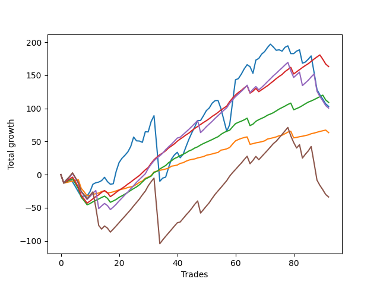

# Short Shepard 007 
- Symbol: ES_SmolBoiHour
- Date Range: 03/18/2022 - 07/29/2022
- Trading Period: 7:20-12:30
- Number of Trades: 92



| Name | Win Percent | Profit | Avg Profit / Trade | Avg Time / Trade |      | Name | Win Percent | Profit | Avg Profit / Trade | Avg Time / Trade |
| ---- | ----------- | ------ | ------------------ | ---------------- | ---- | ---- | ----------- | ------ | ------------------ | ---------------- |
| Sorted By <br> Profit | | | | | | Sorted By <br> Win Percentage ||||
| Eighty-Three | 84.78 | 81625.00 | 887.23 | 14:14 |     | Eighty-One | 91.30 | 31750.00 | 345.11 | 08:08 |
| Eighty-Two | 86.96 | 54500.00 | 592.39 | 12:21 |     | Eighty-Two | 86.96 | 54500.00 | 592.39 | 12:21 |
| Two | 64.13 | 51500.00 | 559.78 | 21:15 |     | Eighty-Three | 84.78 | 81625.00 | 887.23 | 14:14 |
| Eighty-Four | 78.26 | 50250.00 | 546.20 | 18:48 |     | Eighty-Four | 78.26 | 50250.00 | 546.20 | 18:48 |
| Eighty-One | 91.30 | 31750.00 | 345.11 | 08:08 |     | Eighty-Five | 71.74 | -16875.00 | -183.42 | 23:07 |
| Eighty-Five | 71.74 | -16875.00 | -183.42 | 23:07 |     | Two | 64.13 | 51500.00 | 559.78 | 21:15 |

## NO STOPLOSS

### Test Two
* Sell when the price hits the upper line of the 20p 2std bollinger
* No Stoploss
* Results:
```
Total Trades: 92
Percent Up: 35.87
Percent Down: 64.13
Total Points Moved Down: 103.00
Potential Profit: 51500.00
Total Points Ups: 344.00 Count Ups: 33
Total Points Downs: 447.00 Count Downs: 59
```

<details><summary>Trades</summary>

<code>In: 2022-03-18 12:13:00		Out: 2022-03-18 12:46:00		Total Position Time: 33:00		Total Move Down: -12.75		Total to Date: -12.75</code> <br />
<code>In: 2022-03-23 09:05:00		Out: 2022-03-23 09:06:25		Total Position Time: 01:25		Total Move Down: 5.50		Total to Date: -7.25</code> <br />
<code>In: 2022-03-24 08:35:00		Out: 2022-03-24 09:03:10		Total Position Time: 28:10		Total Move Down: 0.50		Total to Date: -6.75</code> <br />
<code>In: 2022-03-25 07:29:00		Out: 2022-03-25 07:54:10		Total Position Time: 25:10		Total Move Down: -4.25		Total to Date: -11.00</code> <br />
<code>In: 2022-03-28 12:01:00		Out: 2022-03-28 12:46:00		Total Position Time: 45:00		Total Move Down: -7.25		Total to Date: -18.25</code> <br />
<code>In: 2022-03-28 12:02:00		Out: 2022-03-28 12:46:00		Total Position Time: 44:00		Total Move Down: -7.75		Total to Date: -26.00</code> <br />
<code>In: 2022-03-29 11:51:00		Out: 2022-03-29 12:27:50		Total Position Time: 36:50		Total Move Down: -7.00		Total to Date: -33.00</code> <br />
<code>In: 2022-03-29 12:15:00		Out: 2022-03-29 12:27:50		Total Position Time: 12:50		Total Move Down: 0.75		Total to Date: -32.25</code> <br />
<code>In: 2022-03-29 12:16:00		Out: 2022-03-29 12:27:50		Total Position Time: 11:50		Total Move Down: -0.00		Total to Date: -32.25</code> <br />
<code>In: 2022-03-31 08:00:00		Out: 2022-03-31 08:08:30		Total Position Time: 08:30		Total Move Down: 6.50		Total to Date: -25.75</code> <br />
<code>In: 2022-04-06 11:06:00		Out: 2022-04-06 11:08:10		Total Position Time: 02:10		Total Move Down: 11.25		Total to Date: -14.50</code> <br />
<code>In: 2022-04-07 11:06:00		Out: 2022-04-07 11:18:20		Total Position Time: 12:20		Total Move Down: 2.25		Total to Date: -12.25</code> <br />
<code>In: 2022-04-07 11:07:00		Out: 2022-04-07 11:18:20		Total Position Time: 11:20		Total Move Down: 1.00		Total to Date: -11.25</code> <br />
<code>In: 2022-04-07 12:08:00		Out: 2022-04-07 12:21:20		Total Position Time: 13:20		Total Move Down: 2.25		Total to Date: -9.00</code> <br />
<code>In: 2022-04-08 08:05:00		Out: 2022-04-08 08:20:10		Total Position Time: 15:10		Total Move Down: 5.00		Total to Date: -4.00</code> <br />
<code>In: 2022-04-13 08:13:00		Out: 2022-04-13 08:45:15		Total Position Time: 32:15		Total Move Down: -6.50		Total to Date: -10.50</code> <br />
<code>In: 2022-04-13 09:28:00		Out: 2022-04-13 09:59:05		Total Position Time: 31:05		Total Move Down: -4.00		Total to Date: -14.50</code> <br />
<code>In: 2022-04-13 10:26:00		Out: 2022-04-13 10:26:55		Total Position Time: 00:55		Total Move Down: 0.75		Total to Date: -13.75</code> <br />
<code>In: 2022-04-25 07:39:00		Out: 2022-04-25 07:52:35		Total Position Time: 13:35		Total Move Down: 18.75		Total to Date: 5.00</code> <br />
<code>In: 2022-04-25 07:40:00		Out: 2022-04-25 07:52:35		Total Position Time: 12:35		Total Move Down: 13.25		Total to Date: 18.25</code> <br />
<code>In: 2022-04-27 09:33:00		Out: 2022-04-27 10:00:10		Total Position Time: 27:10		Total Move Down: 6.50		Total to Date: 24.75</code> <br />
<code>In: 2022-04-27 09:34:00		Out: 2022-04-27 10:00:10		Total Position Time: 26:10		Total Move Down: 4.50		Total to Date: 29.25</code> <br />
<code>In: 2022-04-28 11:54:00		Out: 2022-04-28 12:33:50		Total Position Time: 39:50		Total Move Down: 5.00		Total to Date: 34.25</code> <br />
<code>In: 2022-05-02 07:36:00		Out: 2022-05-02 07:47:15		Total Position Time: 11:15		Total Move Down: 8.25		Total to Date: 42.50</code> <br />
<code>In: 2022-05-03 07:37:00		Out: 2022-05-03 07:43:50		Total Position Time: 06:50		Total Move Down: 14.25		Total to Date: 56.75</code> <br />
<code>In: 2022-05-03 08:14:00		Out: 2022-05-03 08:39:10		Total Position Time: 25:10		Total Move Down: -5.75		Total to Date: 51.00</code> <br />
<code>In: 2022-05-03 08:17:00		Out: 2022-05-03 08:39:10		Total Position Time: 22:10		Total Move Down: -0.25		Total to Date: 50.75</code> <br />
<code>In: 2022-05-03 08:18:00		Out: 2022-05-03 08:39:10		Total Position Time: 21:10		Total Move Down: -2.00		Total to Date: 48.75</code> <br />
<code>In: 2022-05-04 11:07:00		Out: 2022-05-04 11:07:40		Total Position Time: 00:40		Total Move Down: 16.00		Total to Date: 64.75</code> <br />
<code>In: 2022-05-04 11:08:00		Out: 2022-05-04 11:08:10		Total Position Time: 00:10		Total Move Down: -0.25		Total to Date: 64.50</code> <br />
<code>In: 2022-05-04 11:31:00		Out: 2022-05-04 11:32:25		Total Position Time: 01:25		Total Move Down: 15.50		Total to Date: 80.00</code> <br />
<code>In: 2022-05-04 11:32:00		Out: 2022-05-04 11:32:25		Total Position Time: 00:25		Total Move Down: 9.00		Total to Date: 89.00</code> <br />
<code>In: 2022-05-04 11:58:00		Out: 2022-05-04 12:46:00		Total Position Time: 48:00		Total Move Down: -49.25		Total to Date: 39.75</code> <br />
<code>In: 2022-05-04 11:59:00		Out: 2022-05-04 12:46:00		Total Position Time: 47:00		Total Move Down: -49.75		Total to Date: -10.00</code> <br />
<code>In: 2022-05-12 08:01:00		Out: 2022-05-12 08:22:05		Total Position Time: 21:05		Total Move Down: 4.75		Total to Date: -5.25</code> <br />
<code>In: 2022-05-12 08:02:00		Out: 2022-05-12 08:22:05		Total Position Time: 20:05		Total Move Down: 1.50		Total to Date: -3.75</code> <br />
<code>In: 2022-05-12 08:13:00		Out: 2022-05-12 08:22:05		Total Position Time: 09:05		Total Move Down: 14.25		Total to Date: 10.50</code> <br />
<code>In: 2022-05-12 08:14:00		Out: 2022-05-12 08:22:05		Total Position Time: 08:05		Total Move Down: 13.00		Total to Date: 23.50</code> <br />
<code>In: 2022-05-16 08:57:00		Out: 2022-05-16 09:11:35		Total Position Time: 14:35		Total Move Down: 6.25		Total to Date: 29.75</code> <br />
<code>In: 2022-05-16 10:34:00		Out: 2022-05-16 10:46:35		Total Position Time: 12:35		Total Move Down: 4.00		Total to Date: 33.75</code> <br />
<code>In: 2022-05-16 11:12:00		Out: 2022-05-16 11:45:35		Total Position Time: 33:35		Total Move Down: -8.25		Total to Date: 25.50</code> <br />
<code>In: 2022-05-16 11:36:00		Out: 2022-05-16 11:45:35		Total Position Time: 09:35		Total Move Down: 5.00		Total to Date: 30.50</code> <br />
<code>In: 2022-05-19 08:46:00		Out: 2022-05-19 08:56:05		Total Position Time: 10:05		Total Move Down: 11.75		Total to Date: 42.25</code> <br />
<code>In: 2022-05-19 08:47:00		Out: 2022-05-19 08:56:05		Total Position Time: 09:05		Total Move Down: 11.25		Total to Date: 53.50</code> <br />
<code>In: 2022-05-19 11:56:00		Out: 2022-05-19 12:14:05		Total Position Time: 18:05		Total Move Down: 9.75		Total to Date: 63.25</code> <br />
<code>In: 2022-05-19 11:57:00		Out: 2022-05-19 12:14:05		Total Position Time: 17:05		Total Move Down: 8.75		Total to Date: 72.00</code> <br />
<code>In: 2022-05-25 07:41:00		Out: 2022-05-25 07:48:10		Total Position Time: 07:10		Total Move Down: 9.75		Total to Date: 81.75</code> <br />
<code>In: 2022-05-25 11:33:00		Out: 2022-05-25 11:50:00		Total Position Time: 17:00		Total Move Down: -0.00		Total to Date: 81.75</code> <br />
<code>In: 2022-05-25 12:13:00		Out: 2022-05-25 12:22:50		Total Position Time: 09:50		Total Move Down: 7.25		Total to Date: 89.00</code> <br />
<code>In: 2022-05-25 12:15:00		Out: 2022-05-25 12:22:50		Total Position Time: 07:50		Total Move Down: 7.75		Total to Date: 96.75</code> <br />
<code>In: 2022-05-26 10:12:00		Out: 2022-05-26 10:22:35		Total Position Time: 10:35		Total Move Down: 4.00		Total to Date: 100.75</code> <br />
<code>In: 2022-05-31 09:07:00		Out: 2022-05-31 09:15:05		Total Position Time: 08:05		Total Move Down: 7.25		Total to Date: 108.00</code> <br />
<code>In: 2022-05-31 11:04:00		Out: 2022-05-31 11:22:35		Total Position Time: 18:35		Total Move Down: 3.75		Total to Date: 111.75</code> <br />
<code>In: 2022-06-02 08:18:00		Out: 2022-06-02 08:30:55		Total Position Time: 12:55		Total Move Down: 0.25		Total to Date: 112.00</code> <br />
<code>In: 2022-06-02 08:54:00		Out: 2022-06-02 09:53:55		Total Position Time: 59:55		Total Move Down: -12.25		Total to Date: 99.75</code> <br />
<code>In: 2022-06-02 08:55:00		Out: 2022-06-02 09:54:55		Total Position Time: 59:55		Total Move Down: -17.25		Total to Date: 82.50</code> <br />
<code>In: 2022-06-02 08:56:00		Out: 2022-06-02 09:55:55		Total Position Time: 59:55		Total Move Down: -17.00		Total to Date: 65.50</code> <br />
<code>In: 2022-06-15 11:02:00		Out: 2022-06-15 11:03:05		Total Position Time: 01:05		Total Move Down: 10.00		Total to Date: 75.50</code> <br />
<code>In: 2022-06-15 11:48:00		Out: 2022-06-15 11:58:05		Total Position Time: 10:05		Total Move Down: 34.25		Total to Date: 109.75</code> <br />
<code>In: 2022-06-15 11:49:00		Out: 2022-06-15 11:58:05		Total Position Time: 09:05		Total Move Down: 33.50		Total to Date: 143.25</code> <br />
<code>In: 2022-06-23 07:51:00		Out: 2022-06-23 08:04:15		Total Position Time: 13:15		Total Move Down: 1.75		Total to Date: 145.00</code> <br />
<code>In: 2022-06-27 08:00:00		Out: 2022-06-27 08:09:45		Total Position Time: 09:45		Total Move Down: 6.75		Total to Date: 151.75</code> <br />
<code>In: 2022-06-30 09:35:00		Out: 2022-06-30 09:50:45		Total Position Time: 15:45		Total Move Down: 8.00		Total to Date: 159.75</code> <br />
<code>In: 2022-06-30 09:36:00		Out: 2022-06-30 09:50:45		Total Position Time: 14:45		Total Move Down: 6.25		Total to Date: 166.00</code> <br />
<code>In: 2022-07-01 11:30:00		Out: 2022-07-01 11:54:35		Total Position Time: 24:35		Total Move Down: -3.00		Total to Date: 163.00</code> <br />
<code>In: 2022-07-01 12:18:00		Out: 2022-07-01 12:46:00		Total Position Time: 28:00		Total Move Down: -10.00		Total to Date: 153.00</code> <br />
<code>In: 2022-07-05 07:44:00		Out: 2022-07-05 08:01:10		Total Position Time: 17:10		Total Move Down: 20.00		Total to Date: 173.00</code> <br />
<code>In: 2022-07-05 08:53:00		Out: 2022-07-05 09:03:50		Total Position Time: 10:50		Total Move Down: 2.50		Total to Date: 175.50</code> <br />
<code>In: 2022-07-05 08:58:00		Out: 2022-07-05 09:03:50		Total Position Time: 05:50		Total Move Down: 6.50		Total to Date: 182.00</code> <br />
<code>In: 2022-07-05 11:43:00		Out: 2022-07-05 12:01:15		Total Position Time: 18:15		Total Move Down: 3.75		Total to Date: 185.75</code> <br />
<code>In: 2022-07-06 11:48:00		Out: 2022-07-06 12:01:25		Total Position Time: 13:25		Total Move Down: 6.25		Total to Date: 192.00</code> <br />
<code>In: 2022-07-07 12:23:00		Out: 2022-07-07 12:28:30		Total Position Time: 05:30		Total Move Down: 5.00		Total to Date: 197.00</code> <br />
<code>In: 2022-07-11 10:15:00		Out: 2022-07-11 11:00:50		Total Position Time: 45:50		Total Move Down: -4.25		Total to Date: 192.75</code> <br />
<code>In: 2022-07-11 10:16:00		Out: 2022-07-11 11:00:50		Total Position Time: 44:50		Total Move Down: -5.00		Total to Date: 187.75</code> <br />
<code>In: 2022-07-13 07:53:00		Out: 2022-07-13 08:25:05		Total Position Time: 32:05		Total Move Down: 0.75		Total to Date: 188.50</code> <br />
<code>In: 2022-07-13 07:54:00		Out: 2022-07-13 08:25:05		Total Position Time: 31:05		Total Move Down: -2.00		Total to Date: 186.50</code> <br />
<code>In: 2022-07-13 10:08:00		Out: 2022-07-13 10:18:35		Total Position Time: 10:35		Total Move Down: 5.75		Total to Date: 192.25</code> <br />
<code>In: 2022-07-14 08:50:00		Out: 2022-07-14 09:07:30		Total Position Time: 17:30		Total Move Down: 2.25		Total to Date: 194.50</code> <br />
<code>In: 2022-07-14 11:09:00		Out: 2022-07-14 11:52:00		Total Position Time: 43:00		Total Move Down: -11.75		Total to Date: 182.75</code> <br />
<code>In: 2022-07-14 11:28:00		Out: 2022-07-14 11:52:00		Total Position Time: 24:00		Total Move Down: -0.00		Total to Date: 182.75</code> <br />
<code>In: 2022-07-14 11:32:00		Out: 2022-07-14 11:52:00		Total Position Time: 20:00		Total Move Down: 3.75		Total to Date: 186.50</code> <br />
<code>In: 2022-07-15 08:18:00		Out: 2022-07-15 08:30:35		Total Position Time: 12:35		Total Move Down: 2.00		Total to Date: 188.50</code> <br />
<code>In: 2022-07-21 08:40:00		Out: 2022-07-21 09:39:55		Total Position Time: 59:55		Total Move Down: -20.25		Total to Date: 168.25</code> <br />
<code>In: 2022-07-25 08:38:00		Out: 2022-07-25 08:52:10		Total Position Time: 14:10		Total Move Down: 1.75		Total to Date: 170.00</code> <br />
<code>In: 2022-07-27 08:08:00		Out: 2022-07-27 08:25:00		Total Position Time: 17:00		Total Move Down: 4.25		Total to Date: 174.25</code> <br />
<code>In: 2022-07-27 11:06:00		Out: 2022-07-27 11:06:35		Total Position Time: 00:35		Total Move Down: 5.00		Total to Date: 179.25</code> <br />
<code>In: 2022-07-27 11:48:00		Out: 2022-07-27 12:46:00		Total Position Time: 58:00		Total Move Down: -24.75		Total to Date: 154.50</code> <br />
<code>In: 2022-07-27 11:50:00		Out: 2022-07-27 12:46:00		Total Position Time: 56:00		Total Move Down: -26.00		Total to Date: 128.50</code> <br />
<code>In: 2022-07-29 11:41:00		Out: 2022-07-29 12:40:55		Total Position Time: 59:55		Total Move Down: -8.00		Total to Date: 120.50</code> <br />
<code>In: 2022-07-29 12:09:00		Out: 2022-07-29 12:46:00		Total Position Time: 37:00		Total Move Down: -6.50		Total to Date: 114.00</code> <br />
<code>In: 2022-07-29 12:10:00		Out: 2022-07-29 12:46:00		Total Position Time: 36:00		Total Move Down: -7.25		Total to Date: 106.75</code> <br />
<code>In: 2022-07-29 12:31:00		Out: 2022-07-29 12:46:00		Total Position Time: 15:00		Total Move Down: -3.75		Total to Date: 103.00</code> <br />


</details>

## TAKE PROFIT

### Test Eighty-One
* Take Profit of 1 Point
* No Stoploss
* Results:
```
Total Trades: 92
Percent Up: 8.70
Percent Down: 91.30
Total Points Moved Down: 63.50
Potential Profit: 31750.00
Total Points Ups: 65.25 Count Ups: 8
Total Points Downs: 128.75 Count Downs: 84
```

<details><summary>Trades</summary>

<code>In: 2022-03-18 12:13:00		Out: 2022-03-18 12:46:00		Total Position Time: 33:00		Total Move Down: -12.75		Total to Date: -12.75</code> <br />
<code>In: 2022-03-23 09:05:00		Out: 2022-03-23 09:05:30		Total Position Time: 00:30		Total Move Down: 1.00		Total to Date: -11.75</code> <br />
<code>In: 2022-03-24 08:35:00		Out: 2022-03-24 09:03:15		Total Position Time: 28:15		Total Move Down: 1.00		Total to Date: -10.75</code> <br />
<code>In: 2022-03-25 07:29:00		Out: 2022-03-25 08:01:30		Total Position Time: 32:30		Total Move Down: 1.00		Total to Date: -9.75</code> <br />
<code>In: 2022-03-28 12:01:00		Out: 2022-03-28 12:03:00		Total Position Time: 02:00		Total Move Down: 1.00		Total to Date: -8.75</code> <br />
<code>In: 2022-03-28 12:02:00		Out: 2022-03-28 12:03:05		Total Position Time: 01:05		Total Move Down: 1.00		Total to Date: -7.75</code> <br />
<code>In: 2022-03-29 11:51:00		Out: 2022-03-29 12:46:00		Total Position Time: 55:00		Total Move Down: -13.00		Total to Date: -20.75</code> <br />
<code>In: 2022-03-29 12:15:00		Out: 2022-03-29 12:46:00		Total Position Time: 31:00		Total Move Down: -5.25		Total to Date: -26.00</code> <br />
<code>In: 2022-03-29 12:16:00		Out: 2022-03-29 12:46:00		Total Position Time: 30:00		Total Move Down: -6.00		Total to Date: -32.00</code> <br />
<code>In: 2022-03-31 08:00:00		Out: 2022-03-31 08:01:25		Total Position Time: 01:25		Total Move Down: 1.00		Total to Date: -31.00</code> <br />
<code>In: 2022-04-06 11:06:00		Out: 2022-04-06 11:07:00		Total Position Time: 01:00		Total Move Down: 1.25		Total to Date: -29.75</code> <br />
<code>In: 2022-04-07 11:06:00		Out: 2022-04-07 11:06:15		Total Position Time: 00:15		Total Move Down: 1.00		Total to Date: -28.75</code> <br />
<code>In: 2022-04-07 11:07:00		Out: 2022-04-07 11:18:20		Total Position Time: 11:20		Total Move Down: 1.00		Total to Date: -27.75</code> <br />
<code>In: 2022-04-07 12:08:00		Out: 2022-04-07 12:21:20		Total Position Time: 13:20		Total Move Down: 2.25		Total to Date: -25.50</code> <br />
<code>In: 2022-04-08 08:05:00		Out: 2022-04-08 08:06:25		Total Position Time: 01:25		Total Move Down: 1.00		Total to Date: -24.50</code> <br />
<code>In: 2022-04-13 08:13:00		Out: 2022-04-13 09:12:55		Total Position Time: 59:55		Total Move Down: -3.25		Total to Date: -27.75</code> <br />
<code>In: 2022-04-13 09:28:00		Out: 2022-04-13 09:29:50		Total Position Time: 01:50		Total Move Down: 0.75		Total to Date: -27.00</code> <br />
<code>In: 2022-04-13 10:26:00		Out: 2022-04-13 10:28:10		Total Position Time: 02:10		Total Move Down: 1.00		Total to Date: -26.00</code> <br />
<code>In: 2022-04-25 07:39:00		Out: 2022-04-25 07:39:15		Total Position Time: 00:15		Total Move Down: 1.50		Total to Date: -24.50</code> <br />
<code>In: 2022-04-25 07:40:00		Out: 2022-04-25 07:40:20		Total Position Time: 00:20		Total Move Down: 1.50		Total to Date: -23.00</code> <br />
<code>In: 2022-04-27 09:33:00		Out: 2022-04-27 09:33:25		Total Position Time: 00:25		Total Move Down: 1.00		Total to Date: -22.00</code> <br />
<code>In: 2022-04-27 09:34:00		Out: 2022-04-27 09:34:10		Total Position Time: 00:10		Total Move Down: 1.00		Total to Date: -21.00</code> <br />
<code>In: 2022-04-28 11:54:00		Out: 2022-04-28 11:54:20		Total Position Time: 00:20		Total Move Down: 1.50		Total to Date: -19.50</code> <br />
<code>In: 2022-05-02 07:36:00		Out: 2022-05-02 07:36:10		Total Position Time: 00:10		Total Move Down: 1.00		Total to Date: -18.50</code> <br />
<code>In: 2022-05-03 07:37:00		Out: 2022-05-03 07:37:25		Total Position Time: 00:25		Total Move Down: 1.25		Total to Date: -17.25</code> <br />
<code>In: 2022-05-03 08:14:00		Out: 2022-05-03 09:07:05		Total Position Time: 53:05		Total Move Down: 2.50		Total to Date: -14.75</code> <br />
<code>In: 2022-05-03 08:17:00		Out: 2022-05-03 08:17:15		Total Position Time: 00:15		Total Move Down: 3.25		Total to Date: -11.50</code> <br />
<code>In: 2022-05-03 08:18:00		Out: 2022-05-03 09:06:15		Total Position Time: 48:15		Total Move Down: 1.75		Total to Date: -9.75</code> <br />
<code>In: 2022-05-04 11:07:00		Out: 2022-05-04 11:07:10		Total Position Time: 00:10		Total Move Down: 4.25		Total to Date: -5.50</code> <br />
<code>In: 2022-05-04 11:08:00		Out: 2022-05-04 11:08:15		Total Position Time: 00:15		Total Move Down: 1.75		Total to Date: -3.75</code> <br />
<code>In: 2022-05-04 11:31:00		Out: 2022-05-04 11:31:10		Total Position Time: 00:10		Total Move Down: 2.25		Total to Date: -1.50</code> <br />
<code>In: 2022-05-04 11:32:00		Out: 2022-05-04 11:32:10		Total Position Time: 00:10		Total Move Down: 5.50		Total to Date: 4.00</code> <br />
<code>In: 2022-05-04 11:58:00		Out: 2022-05-04 11:58:45		Total Position Time: 00:45		Total Move Down: 1.25		Total to Date: 5.25</code> <br />
<code>In: 2022-05-04 11:59:00		Out: 2022-05-04 11:59:10		Total Position Time: 00:10		Total Move Down: 1.25		Total to Date: 6.50</code> <br />
<code>In: 2022-05-12 08:01:00		Out: 2022-05-12 08:01:15		Total Position Time: 00:15		Total Move Down: 1.00		Total to Date: 7.50</code> <br />
<code>In: 2022-05-12 08:02:00		Out: 2022-05-12 08:02:15		Total Position Time: 00:15		Total Move Down: 1.00		Total to Date: 8.50</code> <br />
<code>In: 2022-05-12 08:13:00		Out: 2022-05-12 08:14:00		Total Position Time: 01:00		Total Move Down: 1.25		Total to Date: 9.75</code> <br />
<code>In: 2022-05-12 08:14:00		Out: 2022-05-12 08:15:00		Total Position Time: 01:00		Total Move Down: 3.00		Total to Date: 12.75</code> <br />
<code>In: 2022-05-16 08:57:00		Out: 2022-05-16 08:57:25		Total Position Time: 00:25		Total Move Down: 0.75		Total to Date: 13.50</code> <br />
<code>In: 2022-05-16 10:34:00		Out: 2022-05-16 10:34:25		Total Position Time: 00:25		Total Move Down: 1.00		Total to Date: 14.50</code> <br />
<code>In: 2022-05-16 11:12:00		Out: 2022-05-16 12:10:20		Total Position Time: 58:20		Total Move Down: 2.50		Total to Date: 17.00</code> <br />
<code>In: 2022-05-16 11:36:00		Out: 2022-05-16 11:36:10		Total Position Time: 00:10		Total Move Down: 1.00		Total to Date: 18.00</code> <br />
<code>In: 2022-05-19 08:46:00		Out: 2022-05-19 08:53:35		Total Position Time: 07:35		Total Move Down: 2.25		Total to Date: 20.25</code> <br />
<code>In: 2022-05-19 08:47:00		Out: 2022-05-19 08:53:35		Total Position Time: 06:35		Total Move Down: 1.75		Total to Date: 22.00</code> <br />
<code>In: 2022-05-19 11:56:00		Out: 2022-05-19 11:57:00		Total Position Time: 01:00		Total Move Down: 1.00		Total to Date: 23.00</code> <br />
<code>In: 2022-05-19 11:57:00		Out: 2022-05-19 11:57:25		Total Position Time: 00:25		Total Move Down: 0.75		Total to Date: 23.75</code> <br />
<code>In: 2022-05-25 07:41:00		Out: 2022-05-25 07:41:20		Total Position Time: 00:20		Total Move Down: 1.50		Total to Date: 25.25</code> <br />
<code>In: 2022-05-25 11:33:00		Out: 2022-05-25 11:33:15		Total Position Time: 00:15		Total Move Down: 1.00		Total to Date: 26.25</code> <br />
<code>In: 2022-05-25 12:13:00		Out: 2022-05-25 12:15:05		Total Position Time: 02:05		Total Move Down: 1.00		Total to Date: 27.25</code> <br />
<code>In: 2022-05-25 12:15:00		Out: 2022-05-25 12:15:10		Total Position Time: 00:10		Total Move Down: 2.00		Total to Date: 29.25</code> <br />
<code>In: 2022-05-26 10:12:00		Out: 2022-05-26 10:12:20		Total Position Time: 00:20		Total Move Down: 1.00		Total to Date: 30.25</code> <br />
<code>In: 2022-05-31 09:07:00		Out: 2022-05-31 09:08:40		Total Position Time: 01:40		Total Move Down: 1.00		Total to Date: 31.25</code> <br />
<code>In: 2022-05-31 11:04:00		Out: 2022-05-31 11:04:10		Total Position Time: 00:10		Total Move Down: 1.25		Total to Date: 32.50</code> <br />
<code>In: 2022-06-02 08:18:00		Out: 2022-06-02 08:20:30		Total Position Time: 02:30		Total Move Down: 1.00		Total to Date: 33.50</code> <br />
<code>In: 2022-06-02 08:54:00		Out: 2022-06-02 08:54:30		Total Position Time: 00:30		Total Move Down: 3.50		Total to Date: 37.00</code> <br />
<code>In: 2022-06-02 08:55:00		Out: 2022-06-02 08:55:30		Total Position Time: 00:30		Total Move Down: 0.75		Total to Date: 37.75</code> <br />
<code>In: 2022-06-02 08:56:00		Out: 2022-06-02 08:56:10		Total Position Time: 00:10		Total Move Down: 1.25		Total to Date: 39.00</code> <br />
<code>In: 2022-06-15 11:02:00		Out: 2022-06-15 11:02:10		Total Position Time: 00:10		Total Move Down: 2.00		Total to Date: 41.00</code> <br />
<code>In: 2022-06-15 11:48:00		Out: 2022-06-15 11:48:10		Total Position Time: 00:10		Total Move Down: 5.25		Total to Date: 46.25</code> <br />
<code>In: 2022-06-15 11:49:00		Out: 2022-06-15 11:49:10		Total Position Time: 00:10		Total Move Down: 4.75		Total to Date: 51.00</code> <br />
<code>In: 2022-06-23 07:51:00		Out: 2022-06-23 07:51:10		Total Position Time: 00:10		Total Move Down: 2.00		Total to Date: 53.00</code> <br />
<code>In: 2022-06-27 08:00:00		Out: 2022-06-27 08:01:15		Total Position Time: 01:15		Total Move Down: 1.75		Total to Date: 54.75</code> <br />
<code>In: 2022-06-30 09:35:00		Out: 2022-06-30 09:35:15		Total Position Time: 00:15		Total Move Down: 1.25		Total to Date: 56.00</code> <br />
<code>In: 2022-06-30 09:36:00		Out: 2022-06-30 09:36:15		Total Position Time: 00:15		Total Move Down: 1.00		Total to Date: 57.00</code> <br />
<code>In: 2022-07-01 11:30:00		Out: 2022-07-01 12:29:55		Total Position Time: 59:55		Total Move Down: -11.25		Total to Date: 45.75</code> <br />
<code>In: 2022-07-01 12:18:00		Out: 2022-07-01 12:19:50		Total Position Time: 01:50		Total Move Down: 1.00		Total to Date: 46.75</code> <br />
<code>In: 2022-07-05 07:44:00		Out: 2022-07-05 07:44:20		Total Position Time: 00:20		Total Move Down: 1.25		Total to Date: 48.00</code> <br />
<code>In: 2022-07-05 08:53:00		Out: 2022-07-05 09:03:45		Total Position Time: 10:45		Total Move Down: 0.75		Total to Date: 48.75</code> <br />
<code>In: 2022-07-05 08:58:00		Out: 2022-07-05 08:58:20		Total Position Time: 00:20		Total Move Down: 1.00		Total to Date: 49.75</code> <br />
<code>In: 2022-07-05 11:43:00		Out: 2022-07-05 11:44:10		Total Position Time: 01:10		Total Move Down: 1.25		Total to Date: 51.00</code> <br />
<code>In: 2022-07-06 11:48:00		Out: 2022-07-06 11:48:10		Total Position Time: 00:10		Total Move Down: 2.75		Total to Date: 53.75</code> <br />
<code>In: 2022-07-07 12:23:00		Out: 2022-07-07 12:24:05		Total Position Time: 01:05		Total Move Down: 1.00		Total to Date: 54.75</code> <br />
<code>In: 2022-07-11 10:15:00		Out: 2022-07-11 10:15:35		Total Position Time: 00:35		Total Move Down: 1.00		Total to Date: 55.75</code> <br />
<code>In: 2022-07-11 10:16:00		Out: 2022-07-11 11:09:55		Total Position Time: 53:55		Total Move Down: 1.25		Total to Date: 57.00</code> <br />
<code>In: 2022-07-13 07:53:00		Out: 2022-07-13 07:53:10		Total Position Time: 00:10		Total Move Down: 1.75		Total to Date: 58.75</code> <br />
<code>In: 2022-07-13 07:54:00		Out: 2022-07-13 07:54:45		Total Position Time: 00:45		Total Move Down: 0.75		Total to Date: 59.50</code> <br />
<code>In: 2022-07-13 10:08:00		Out: 2022-07-13 10:16:30		Total Position Time: 08:30		Total Move Down: 2.25		Total to Date: 61.75</code> <br />
<code>In: 2022-07-14 08:50:00		Out: 2022-07-14 08:50:15		Total Position Time: 00:15		Total Move Down: 2.50		Total to Date: 64.25</code> <br />
<code>In: 2022-07-14 11:09:00		Out: 2022-07-14 11:10:30		Total Position Time: 01:30		Total Move Down: 1.25		Total to Date: 65.50</code> <br />
<code>In: 2022-07-14 11:28:00		Out: 2022-07-14 12:27:55		Total Position Time: 59:55		Total Move Down: -10.00		Total to Date: 55.50</code> <br />
<code>In: 2022-07-14 11:32:00		Out: 2022-07-14 11:44:00		Total Position Time: 12:00		Total Move Down: 0.75		Total to Date: 56.25</code> <br />
<code>In: 2022-07-15 08:18:00		Out: 2022-07-15 08:19:30		Total Position Time: 01:30		Total Move Down: 1.00		Total to Date: 57.25</code> <br />
<code>In: 2022-07-21 08:40:00		Out: 2022-07-21 08:48:55		Total Position Time: 08:55		Total Move Down: 0.75		Total to Date: 58.00</code> <br />
<code>In: 2022-07-25 08:38:00		Out: 2022-07-25 08:44:35		Total Position Time: 06:35		Total Move Down: 1.00		Total to Date: 59.00</code> <br />
<code>In: 2022-07-27 08:08:00		Out: 2022-07-27 08:08:40		Total Position Time: 00:40		Total Move Down: 1.00		Total to Date: 60.00</code> <br />
<code>In: 2022-07-27 11:06:00		Out: 2022-07-27 11:06:10		Total Position Time: 00:10		Total Move Down: 1.75		Total to Date: 61.75</code> <br />
<code>In: 2022-07-27 11:48:00		Out: 2022-07-27 11:48:55		Total Position Time: 00:55		Total Move Down: 1.00		Total to Date: 62.75</code> <br />
<code>In: 2022-07-27 11:50:00		Out: 2022-07-27 11:50:45		Total Position Time: 00:45		Total Move Down: 1.25		Total to Date: 64.00</code> <br />
<code>In: 2022-07-29 11:41:00		Out: 2022-07-29 11:41:20		Total Position Time: 00:20		Total Move Down: 1.25		Total to Date: 65.25</code> <br />
<code>In: 2022-07-29 12:09:00		Out: 2022-07-29 12:09:25		Total Position Time: 00:25		Total Move Down: 1.00		Total to Date: 66.25</code> <br />
<code>In: 2022-07-29 12:10:00		Out: 2022-07-29 12:10:30		Total Position Time: 00:30		Total Move Down: 1.00		Total to Date: 67.25</code> <br />
<code>In: 2022-07-29 12:31:00		Out: 2022-07-29 12:46:00		Total Position Time: 15:00		Total Move Down: -3.75		Total to Date: 63.50</code> <br />


</details>

### Test Eighty-Two
* Take Profit of 2 Point
* No Stoploss
* Results:
```
Total Trades: 92
Percent Up: 13.04
Percent Down: 86.96
Total Points Moved Down: 109.00
Potential Profit: 54500.00
Total Points Ups: 93.50 Count Ups: 12
Total Points Downs: 202.50 Count Downs: 80
```

<details><summary>Trades</summary>

<code>In: 2022-03-18 12:13:00		Out: 2022-03-18 12:46:00		Total Position Time: 33:00		Total Move Down: -12.75		Total to Date: -12.75</code> <br />
<code>In: 2022-03-23 09:05:00		Out: 2022-03-23 09:05:55		Total Position Time: 00:55		Total Move Down: 2.25		Total to Date: -10.50</code> <br />
<code>In: 2022-03-24 08:35:00		Out: 2022-03-24 09:03:20		Total Position Time: 28:20		Total Move Down: 2.00		Total to Date: -8.50</code> <br />
<code>In: 2022-03-25 07:29:00		Out: 2022-03-25 08:01:40		Total Position Time: 32:40		Total Move Down: 2.25		Total to Date: -6.25</code> <br />
<code>In: 2022-03-28 12:01:00		Out: 2022-03-28 12:46:00		Total Position Time: 45:00		Total Move Down: -7.25		Total to Date: -13.50</code> <br />
<code>In: 2022-03-28 12:02:00		Out: 2022-03-28 12:46:00		Total Position Time: 44:00		Total Move Down: -7.75		Total to Date: -21.25</code> <br />
<code>In: 2022-03-29 11:51:00		Out: 2022-03-29 12:46:00		Total Position Time: 55:00		Total Move Down: -13.00		Total to Date: -34.25</code> <br />
<code>In: 2022-03-29 12:15:00		Out: 2022-03-29 12:46:00		Total Position Time: 31:00		Total Move Down: -5.25		Total to Date: -39.50</code> <br />
<code>In: 2022-03-29 12:16:00		Out: 2022-03-29 12:46:00		Total Position Time: 30:00		Total Move Down: -6.00		Total to Date: -45.50</code> <br />
<code>In: 2022-03-31 08:00:00		Out: 2022-03-31 08:01:50		Total Position Time: 01:50		Total Move Down: 1.75		Total to Date: -43.75</code> <br />
<code>In: 2022-04-06 11:06:00		Out: 2022-04-06 11:07:05		Total Position Time: 01:05		Total Move Down: 2.75		Total to Date: -41.00</code> <br />
<code>In: 2022-04-07 11:06:00		Out: 2022-04-07 11:06:40		Total Position Time: 00:40		Total Move Down: 2.25		Total to Date: -38.75</code> <br />
<code>In: 2022-04-07 11:07:00		Out: 2022-04-07 11:18:40		Total Position Time: 11:40		Total Move Down: 2.00		Total to Date: -36.75</code> <br />
<code>In: 2022-04-07 12:08:00		Out: 2022-04-07 12:21:20		Total Position Time: 13:20		Total Move Down: 2.25		Total to Date: -34.50</code> <br />
<code>In: 2022-04-08 08:05:00		Out: 2022-04-08 08:06:35		Total Position Time: 01:35		Total Move Down: 2.00		Total to Date: -32.50</code> <br />
<code>In: 2022-04-13 08:13:00		Out: 2022-04-13 09:12:55		Total Position Time: 59:55		Total Move Down: -3.25		Total to Date: -35.75</code> <br />
<code>In: 2022-04-13 09:28:00		Out: 2022-04-13 10:27:55		Total Position Time: 59:55		Total Move Down: -6.00		Total to Date: -41.75</code> <br />
<code>In: 2022-04-13 10:26:00		Out: 2022-04-13 10:33:10		Total Position Time: 07:10		Total Move Down: 2.00		Total to Date: -39.75</code> <br />
<code>In: 2022-04-25 07:39:00		Out: 2022-04-25 07:39:20		Total Position Time: 00:20		Total Move Down: 2.25		Total to Date: -37.50</code> <br />
<code>In: 2022-04-25 07:40:00		Out: 2022-04-25 07:40:25		Total Position Time: 00:25		Total Move Down: 3.25		Total to Date: -34.25</code> <br />
<code>In: 2022-04-27 09:33:00		Out: 2022-04-27 09:33:55		Total Position Time: 00:55		Total Move Down: 2.25		Total to Date: -32.00</code> <br />
<code>In: 2022-04-27 09:34:00		Out: 2022-04-27 09:36:40		Total Position Time: 02:40		Total Move Down: 2.50		Total to Date: -29.50</code> <br />
<code>In: 2022-04-28 11:54:00		Out: 2022-04-28 11:54:30		Total Position Time: 00:30		Total Move Down: 2.75		Total to Date: -26.75</code> <br />
<code>In: 2022-05-02 07:36:00		Out: 2022-05-02 07:36:15		Total Position Time: 00:15		Total Move Down: 3.00		Total to Date: -23.75</code> <br />
<code>In: 2022-05-03 07:37:00		Out: 2022-05-03 07:37:35		Total Position Time: 00:35		Total Move Down: 2.75		Total to Date: -21.00</code> <br />
<code>In: 2022-05-03 08:14:00		Out: 2022-05-03 09:07:05		Total Position Time: 53:05		Total Move Down: 2.50		Total to Date: -18.50</code> <br />
<code>In: 2022-05-03 08:17:00		Out: 2022-05-03 08:17:15		Total Position Time: 00:15		Total Move Down: 3.25		Total to Date: -15.25</code> <br />
<code>In: 2022-05-03 08:18:00		Out: 2022-05-03 09:06:20		Total Position Time: 48:20		Total Move Down: 4.25		Total to Date: -11.00</code> <br />
<code>In: 2022-05-04 11:07:00		Out: 2022-05-04 11:07:10		Total Position Time: 00:10		Total Move Down: 4.25		Total to Date: -6.75</code> <br />
<code>In: 2022-05-04 11:08:00		Out: 2022-05-04 11:18:50		Total Position Time: 10:50		Total Move Down: 2.25		Total to Date: -4.50</code> <br />
<code>In: 2022-05-04 11:31:00		Out: 2022-05-04 11:31:10		Total Position Time: 00:10		Total Move Down: 2.25		Total to Date: -2.25</code> <br />
<code>In: 2022-05-04 11:32:00		Out: 2022-05-04 11:32:10		Total Position Time: 00:10		Total Move Down: 5.50		Total to Date: 3.25</code> <br />
<code>In: 2022-05-04 11:58:00		Out: 2022-05-04 11:58:50		Total Position Time: 00:50		Total Move Down: 1.75		Total to Date: 5.00</code> <br />
<code>In: 2022-05-04 11:59:00		Out: 2022-05-04 12:03:45		Total Position Time: 04:45		Total Move Down: 3.50		Total to Date: 8.50</code> <br />
<code>In: 2022-05-12 08:01:00		Out: 2022-05-12 08:01:25		Total Position Time: 00:25		Total Move Down: 2.75		Total to Date: 11.25</code> <br />
<code>In: 2022-05-12 08:02:00		Out: 2022-05-12 08:22:10		Total Position Time: 20:10		Total Move Down: 2.50		Total to Date: 13.75</code> <br />
<code>In: 2022-05-12 08:13:00		Out: 2022-05-12 08:15:00		Total Position Time: 02:00		Total Move Down: 4.25		Total to Date: 18.00</code> <br />
<code>In: 2022-05-12 08:14:00		Out: 2022-05-12 08:15:00		Total Position Time: 01:00		Total Move Down: 3.00		Total to Date: 21.00</code> <br />
<code>In: 2022-05-16 08:57:00		Out: 2022-05-16 09:06:00		Total Position Time: 09:00		Total Move Down: 3.25		Total to Date: 24.25</code> <br />
<code>In: 2022-05-16 10:34:00		Out: 2022-05-16 10:37:15		Total Position Time: 03:15		Total Move Down: 2.00		Total to Date: 26.25</code> <br />
<code>In: 2022-05-16 11:12:00		Out: 2022-05-16 12:10:20		Total Position Time: 58:20		Total Move Down: 2.50		Total to Date: 28.75</code> <br />
<code>In: 2022-05-16 11:36:00		Out: 2022-05-16 11:36:25		Total Position Time: 00:25		Total Move Down: 2.00		Total to Date: 30.75</code> <br />
<code>In: 2022-05-19 08:46:00		Out: 2022-05-19 08:53:35		Total Position Time: 07:35		Total Move Down: 2.25		Total to Date: 33.00</code> <br />
<code>In: 2022-05-19 08:47:00		Out: 2022-05-19 08:53:40		Total Position Time: 06:40		Total Move Down: 2.75		Total to Date: 35.75</code> <br />
<code>In: 2022-05-19 11:56:00		Out: 2022-05-19 11:57:25		Total Position Time: 01:25		Total Move Down: 1.75		Total to Date: 37.50</code> <br />
<code>In: 2022-05-19 11:57:00		Out: 2022-05-19 11:57:30		Total Position Time: 00:30		Total Move Down: 2.75		Total to Date: 40.25</code> <br />
<code>In: 2022-05-25 07:41:00		Out: 2022-05-25 07:41:45		Total Position Time: 00:45		Total Move Down: 1.75		Total to Date: 42.00</code> <br />
<code>In: 2022-05-25 11:33:00		Out: 2022-05-25 11:39:10		Total Position Time: 06:10		Total Move Down: 2.75		Total to Date: 44.75</code> <br />
<code>In: 2022-05-25 12:13:00		Out: 2022-05-25 12:15:30		Total Position Time: 02:30		Total Move Down: 2.25		Total to Date: 47.00</code> <br />
<code>In: 2022-05-25 12:15:00		Out: 2022-05-25 12:15:10		Total Position Time: 00:10		Total Move Down: 2.00		Total to Date: 49.00</code> <br />
<code>In: 2022-05-26 10:12:00		Out: 2022-05-26 10:12:40		Total Position Time: 00:40		Total Move Down: 2.00		Total to Date: 51.00</code> <br />
<code>In: 2022-05-31 09:07:00		Out: 2022-05-31 09:10:00		Total Position Time: 03:00		Total Move Down: 2.00		Total to Date: 53.00</code> <br />
<code>In: 2022-05-31 11:04:00		Out: 2022-05-31 11:05:05		Total Position Time: 01:05		Total Move Down: 2.25		Total to Date: 55.25</code> <br />
<code>In: 2022-06-02 08:18:00		Out: 2022-06-02 08:31:35		Total Position Time: 13:35		Total Move Down: 2.00		Total to Date: 57.25</code> <br />
<code>In: 2022-06-02 08:54:00		Out: 2022-06-02 08:54:30		Total Position Time: 00:30		Total Move Down: 3.50		Total to Date: 60.75</code> <br />
<code>In: 2022-06-02 08:55:00		Out: 2022-06-02 08:56:10		Total Position Time: 01:10		Total Move Down: 2.75		Total to Date: 63.50</code> <br />
<code>In: 2022-06-02 08:56:00		Out: 2022-06-02 08:56:55		Total Position Time: 00:55		Total Move Down: 2.00		Total to Date: 65.50</code> <br />
<code>In: 2022-06-15 11:02:00		Out: 2022-06-15 11:02:45		Total Position Time: 00:45		Total Move Down: 1.50		Total to Date: 67.00</code> <br />
<code>In: 2022-06-15 11:48:00		Out: 2022-06-15 11:48:10		Total Position Time: 00:10		Total Move Down: 5.25		Total to Date: 72.25</code> <br />
<code>In: 2022-06-15 11:49:00		Out: 2022-06-15 11:49:10		Total Position Time: 00:10		Total Move Down: 4.75		Total to Date: 77.00</code> <br />
<code>In: 2022-06-23 07:51:00		Out: 2022-06-23 07:51:10		Total Position Time: 00:10		Total Move Down: 2.00		Total to Date: 79.00</code> <br />
<code>In: 2022-06-27 08:00:00		Out: 2022-06-27 08:01:15		Total Position Time: 01:15		Total Move Down: 1.75		Total to Date: 80.75</code> <br />
<code>In: 2022-06-30 09:35:00		Out: 2022-06-30 09:35:30		Total Position Time: 00:30		Total Move Down: 2.00		Total to Date: 82.75</code> <br />
<code>In: 2022-06-30 09:36:00		Out: 2022-06-30 09:36:30		Total Position Time: 00:30		Total Move Down: 2.50		Total to Date: 85.25</code> <br />
<code>In: 2022-07-01 11:30:00		Out: 2022-07-01 12:29:55		Total Position Time: 59:55		Total Move Down: -11.25		Total to Date: 74.00</code> <br />
<code>In: 2022-07-01 12:18:00		Out: 2022-07-01 12:20:30		Total Position Time: 02:30		Total Move Down: 2.25		Total to Date: 76.25</code> <br />
<code>In: 2022-07-05 07:44:00		Out: 2022-07-05 07:44:30		Total Position Time: 00:30		Total Move Down: 4.25		Total to Date: 80.50</code> <br />
<code>In: 2022-07-05 08:53:00		Out: 2022-07-05 09:03:50		Total Position Time: 10:50		Total Move Down: 2.50		Total to Date: 83.00</code> <br />
<code>In: 2022-07-05 08:58:00		Out: 2022-07-05 08:58:40		Total Position Time: 00:40		Total Move Down: 2.00		Total to Date: 85.00</code> <br />
<code>In: 2022-07-05 11:43:00		Out: 2022-07-05 11:47:40		Total Position Time: 04:40		Total Move Down: 2.00		Total to Date: 87.00</code> <br />
<code>In: 2022-07-06 11:48:00		Out: 2022-07-06 11:48:10		Total Position Time: 00:10		Total Move Down: 2.75		Total to Date: 89.75</code> <br />
<code>In: 2022-07-07 12:23:00		Out: 2022-07-07 12:24:25		Total Position Time: 01:25		Total Move Down: 1.75		Total to Date: 91.50</code> <br />
<code>In: 2022-07-11 10:15:00		Out: 2022-07-11 11:09:55		Total Position Time: 54:55		Total Move Down: 2.00		Total to Date: 93.50</code> <br />
<code>In: 2022-07-11 10:16:00		Out: 2022-07-11 11:10:15		Total Position Time: 54:15		Total Move Down: 2.75		Total to Date: 96.25</code> <br />
<code>In: 2022-07-13 07:53:00		Out: 2022-07-13 07:54:00		Total Position Time: 01:00		Total Move Down: 2.75		Total to Date: 99.00</code> <br />
<code>In: 2022-07-13 07:54:00		Out: 2022-07-13 08:25:45		Total Position Time: 31:45		Total Move Down: 2.25		Total to Date: 101.25</code> <br />
<code>In: 2022-07-13 10:08:00		Out: 2022-07-13 10:16:30		Total Position Time: 08:30		Total Move Down: 2.25		Total to Date: 103.50</code> <br />
<code>In: 2022-07-14 08:50:00		Out: 2022-07-14 08:50:15		Total Position Time: 00:15		Total Move Down: 2.50		Total to Date: 106.00</code> <br />
<code>In: 2022-07-14 11:09:00		Out: 2022-07-14 11:10:35		Total Position Time: 01:35		Total Move Down: 2.00		Total to Date: 108.00</code> <br />
<code>In: 2022-07-14 11:28:00		Out: 2022-07-14 12:27:55		Total Position Time: 59:55		Total Move Down: -10.00		Total to Date: 98.00</code> <br />
<code>In: 2022-07-14 11:32:00		Out: 2022-07-14 11:44:30		Total Position Time: 12:30		Total Move Down: 1.75		Total to Date: 99.75</code> <br />
<code>In: 2022-07-15 08:18:00		Out: 2022-07-15 08:30:35		Total Position Time: 12:35		Total Move Down: 2.00		Total to Date: 101.75</code> <br />
<code>In: 2022-07-21 08:40:00		Out: 2022-07-21 08:49:15		Total Position Time: 09:15		Total Move Down: 2.50		Total to Date: 104.25</code> <br />
<code>In: 2022-07-25 08:38:00		Out: 2022-07-25 09:02:50		Total Position Time: 24:50		Total Move Down: 2.75		Total to Date: 107.00</code> <br />
<code>In: 2022-07-27 08:08:00		Out: 2022-07-27 08:08:50		Total Position Time: 00:50		Total Move Down: 2.50		Total to Date: 109.50</code> <br />
<code>In: 2022-07-27 11:06:00		Out: 2022-07-27 11:06:10		Total Position Time: 00:10		Total Move Down: 1.75		Total to Date: 111.25</code> <br />
<code>In: 2022-07-27 11:48:00		Out: 2022-07-27 11:49:15		Total Position Time: 01:15		Total Move Down: 2.00		Total to Date: 113.25</code> <br />
<code>In: 2022-07-27 11:50:00		Out: 2022-07-27 11:50:50		Total Position Time: 00:50		Total Move Down: 2.25		Total to Date: 115.50</code> <br />
<code>In: 2022-07-29 11:41:00		Out: 2022-07-29 11:41:40		Total Position Time: 00:40		Total Move Down: 2.25		Total to Date: 117.75</code> <br />
<code>In: 2022-07-29 12:09:00		Out: 2022-07-29 12:12:55		Total Position Time: 03:55		Total Move Down: 2.25		Total to Date: 120.00</code> <br />
<code>In: 2022-07-29 12:10:00		Out: 2022-07-29 12:46:00		Total Position Time: 36:00		Total Move Down: -7.25		Total to Date: 112.75</code> <br />
<code>In: 2022-07-29 12:31:00		Out: 2022-07-29 12:46:00		Total Position Time: 15:00		Total Move Down: -3.75		Total to Date: 109.00</code> <br />


</details>

### Test Eighty-Three
* Take Profit of 3 Point
* No Stoploss
* Results:
```
Total Trades: 92
Percent Up: 15.22
Percent Down: 84.78
Total Points Moved Down: 163.25
Potential Profit: 81625.00
Total Points Ups: 105.00 Count Ups: 14
Total Points Downs: 268.25 Count Downs: 78
```

<details><summary>Trades</summary>

<code>In: 2022-03-18 12:13:00		Out: 2022-03-18 12:46:00		Total Position Time: 33:00		Total Move Down: -12.75		Total to Date: -12.75</code> <br />
<code>In: 2022-03-23 09:05:00		Out: 2022-03-23 09:06:05		Total Position Time: 01:05		Total Move Down: 3.00		Total to Date: -9.75</code> <br />
<code>In: 2022-03-24 08:35:00		Out: 2022-03-24 09:03:30		Total Position Time: 28:30		Total Move Down: 3.00		Total to Date: -6.75</code> <br />
<code>In: 2022-03-25 07:29:00		Out: 2022-03-25 08:01:45		Total Position Time: 32:45		Total Move Down: 3.00		Total to Date: -3.75</code> <br />
<code>In: 2022-03-28 12:01:00		Out: 2022-03-28 12:46:00		Total Position Time: 45:00		Total Move Down: -7.25		Total to Date: -11.00</code> <br />
<code>In: 2022-03-28 12:02:00		Out: 2022-03-28 12:46:00		Total Position Time: 44:00		Total Move Down: -7.75		Total to Date: -18.75</code> <br />
<code>In: 2022-03-29 11:51:00		Out: 2022-03-29 12:46:00		Total Position Time: 55:00		Total Move Down: -13.00		Total to Date: -31.75</code> <br />
<code>In: 2022-03-29 12:15:00		Out: 2022-03-29 12:46:00		Total Position Time: 31:00		Total Move Down: -5.25		Total to Date: -37.00</code> <br />
<code>In: 2022-03-29 12:16:00		Out: 2022-03-29 12:46:00		Total Position Time: 30:00		Total Move Down: -6.00		Total to Date: -43.00</code> <br />
<code>In: 2022-03-31 08:00:00		Out: 2022-03-31 08:03:05		Total Position Time: 03:05		Total Move Down: 3.00		Total to Date: -40.00</code> <br />
<code>In: 2022-04-06 11:06:00		Out: 2022-04-06 11:07:15		Total Position Time: 01:15		Total Move Down: 3.50		Total to Date: -36.50</code> <br />
<code>In: 2022-04-07 11:06:00		Out: 2022-04-07 11:18:40		Total Position Time: 12:40		Total Move Down: 3.25		Total to Date: -33.25</code> <br />
<code>In: 2022-04-07 11:07:00		Out: 2022-04-07 11:19:10		Total Position Time: 12:10		Total Move Down: 2.75		Total to Date: -30.50</code> <br />
<code>In: 2022-04-07 12:08:00		Out: 2022-04-07 12:24:10		Total Position Time: 16:10		Total Move Down: 3.75		Total to Date: -26.75</code> <br />
<code>In: 2022-04-08 08:05:00		Out: 2022-04-08 08:06:50		Total Position Time: 01:50		Total Move Down: 2.75		Total to Date: -24.00</code> <br />
<code>In: 2022-04-13 08:13:00		Out: 2022-04-13 09:12:55		Total Position Time: 59:55		Total Move Down: -3.25		Total to Date: -27.25</code> <br />
<code>In: 2022-04-13 09:28:00		Out: 2022-04-13 10:27:55		Total Position Time: 59:55		Total Move Down: -6.00		Total to Date: -33.25</code> <br />
<code>In: 2022-04-13 10:26:00		Out: 2022-04-13 10:33:25		Total Position Time: 07:25		Total Move Down: 3.00		Total to Date: -30.25</code> <br />
<code>In: 2022-04-25 07:39:00		Out: 2022-04-25 07:39:30		Total Position Time: 00:30		Total Move Down: 3.50		Total to Date: -26.75</code> <br />
<code>In: 2022-04-25 07:40:00		Out: 2022-04-25 07:40:25		Total Position Time: 00:25		Total Move Down: 3.25		Total to Date: -23.50</code> <br />
<code>In: 2022-04-27 09:33:00		Out: 2022-04-27 09:34:05		Total Position Time: 01:05		Total Move Down: 2.75		Total to Date: -20.75</code> <br />
<code>In: 2022-04-27 09:34:00		Out: 2022-04-27 09:36:55		Total Position Time: 02:55		Total Move Down: 3.00		Total to Date: -17.75</code> <br />
<code>In: 2022-04-28 11:54:00		Out: 2022-04-28 11:54:40		Total Position Time: 00:40		Total Move Down: 3.50		Total to Date: -14.25</code> <br />
<code>In: 2022-05-02 07:36:00		Out: 2022-05-02 07:36:15		Total Position Time: 00:15		Total Move Down: 3.00		Total to Date: -11.25</code> <br />
<code>In: 2022-05-03 07:37:00		Out: 2022-05-03 07:37:40		Total Position Time: 00:40		Total Move Down: 3.50		Total to Date: -7.75</code> <br />
<code>In: 2022-05-03 08:14:00		Out: 2022-05-03 09:07:30		Total Position Time: 53:30		Total Move Down: 3.25		Total to Date: -4.50</code> <br />
<code>In: 2022-05-03 08:17:00		Out: 2022-05-03 08:17:15		Total Position Time: 00:15		Total Move Down: 3.25		Total to Date: -1.25</code> <br />
<code>In: 2022-05-03 08:18:00		Out: 2022-05-03 09:06:20		Total Position Time: 48:20		Total Move Down: 4.25		Total to Date: 3.00</code> <br />
<code>In: 2022-05-04 11:07:00		Out: 2022-05-04 11:07:10		Total Position Time: 00:10		Total Move Down: 4.25		Total to Date: 7.25</code> <br />
<code>In: 2022-05-04 11:08:00		Out: 2022-05-04 11:19:05		Total Position Time: 11:05		Total Move Down: 3.50		Total to Date: 10.75</code> <br />
<code>In: 2022-05-04 11:31:00		Out: 2022-05-04 11:31:20		Total Position Time: 00:20		Total Move Down: 6.25		Total to Date: 17.00</code> <br />
<code>In: 2022-05-04 11:32:00		Out: 2022-05-04 11:32:10		Total Position Time: 00:10		Total Move Down: 5.50		Total to Date: 22.50</code> <br />
<code>In: 2022-05-04 11:58:00		Out: 2022-05-04 12:03:45		Total Position Time: 05:45		Total Move Down: 4.00		Total to Date: 26.50</code> <br />
<code>In: 2022-05-04 11:59:00		Out: 2022-05-04 12:03:45		Total Position Time: 04:45		Total Move Down: 3.50		Total to Date: 30.00</code> <br />
<code>In: 2022-05-12 08:01:00		Out: 2022-05-12 08:01:25		Total Position Time: 00:25		Total Move Down: 2.75		Total to Date: 32.75</code> <br />
<code>In: 2022-05-12 08:02:00		Out: 2022-05-12 08:23:45		Total Position Time: 21:45		Total Move Down: 3.25		Total to Date: 36.00</code> <br />
<code>In: 2022-05-12 08:13:00		Out: 2022-05-12 08:15:00		Total Position Time: 02:00		Total Move Down: 4.25		Total to Date: 40.25</code> <br />
<code>In: 2022-05-12 08:14:00		Out: 2022-05-12 08:15:00		Total Position Time: 01:00		Total Move Down: 3.00		Total to Date: 43.25</code> <br />
<code>In: 2022-05-16 08:57:00		Out: 2022-05-16 09:06:00		Total Position Time: 09:00		Total Move Down: 3.25		Total to Date: 46.50</code> <br />
<code>In: 2022-05-16 10:34:00		Out: 2022-05-16 10:42:25		Total Position Time: 08:25		Total Move Down: 4.00		Total to Date: 50.50</code> <br />
<code>In: 2022-05-16 11:12:00		Out: 2022-05-16 12:10:25		Total Position Time: 58:25		Total Move Down: 3.25		Total to Date: 53.75</code> <br />
<code>In: 2022-05-16 11:36:00		Out: 2022-05-16 11:36:45		Total Position Time: 00:45		Total Move Down: 3.00		Total to Date: 56.75</code> <br />
<code>In: 2022-05-19 08:46:00		Out: 2022-05-19 08:53:40		Total Position Time: 07:40		Total Move Down: 3.25		Total to Date: 60.00</code> <br />
<code>In: 2022-05-19 08:47:00		Out: 2022-05-19 08:53:40		Total Position Time: 06:40		Total Move Down: 2.75		Total to Date: 62.75</code> <br />
<code>In: 2022-05-19 11:56:00		Out: 2022-05-19 11:57:30		Total Position Time: 01:30		Total Move Down: 3.75		Total to Date: 66.50</code> <br />
<code>In: 2022-05-19 11:57:00		Out: 2022-05-19 11:57:35		Total Position Time: 00:35		Total Move Down: 3.25		Total to Date: 69.75</code> <br />
<code>In: 2022-05-25 07:41:00		Out: 2022-05-25 07:41:50		Total Position Time: 00:50		Total Move Down: 3.00		Total to Date: 72.75</code> <br />
<code>In: 2022-05-25 11:33:00		Out: 2022-05-25 11:39:55		Total Position Time: 06:55		Total Move Down: 3.00		Total to Date: 75.75</code> <br />
<code>In: 2022-05-25 12:13:00		Out: 2022-05-25 12:15:40		Total Position Time: 02:40		Total Move Down: 3.00		Total to Date: 78.75</code> <br />
<code>In: 2022-05-25 12:15:00		Out: 2022-05-25 12:15:35		Total Position Time: 00:35		Total Move Down: 2.75		Total to Date: 81.50</code> <br />
<code>In: 2022-05-26 10:12:00		Out: 2022-05-26 10:12:45		Total Position Time: 00:45		Total Move Down: 3.00		Total to Date: 84.50</code> <br />
<code>In: 2022-05-31 09:07:00		Out: 2022-05-31 09:14:20		Total Position Time: 07:20		Total Move Down: 3.50		Total to Date: 88.00</code> <br />
<code>In: 2022-05-31 11:04:00		Out: 2022-05-31 11:05:20		Total Position Time: 01:20		Total Move Down: 2.75		Total to Date: 90.75</code> <br />
<code>In: 2022-06-02 08:18:00		Out: 2022-06-02 08:31:45		Total Position Time: 13:45		Total Move Down: 3.25		Total to Date: 94.00</code> <br />
<code>In: 2022-06-02 08:54:00		Out: 2022-06-02 08:54:30		Total Position Time: 00:30		Total Move Down: 3.50		Total to Date: 97.50</code> <br />
<code>In: 2022-06-02 08:55:00		Out: 2022-06-02 08:56:25		Total Position Time: 01:25		Total Move Down: 3.00		Total to Date: 100.50</code> <br />
<code>In: 2022-06-02 08:56:00		Out: 2022-06-02 08:57:15		Total Position Time: 01:15		Total Move Down: 3.00		Total to Date: 103.50</code> <br />
<code>In: 2022-06-15 11:02:00		Out: 2022-06-15 11:03:00		Total Position Time: 01:00		Total Move Down: 6.75		Total to Date: 110.25</code> <br />
<code>In: 2022-06-15 11:48:00		Out: 2022-06-15 11:48:10		Total Position Time: 00:10		Total Move Down: 5.25		Total to Date: 115.50</code> <br />
<code>In: 2022-06-15 11:49:00		Out: 2022-06-15 11:49:10		Total Position Time: 00:10		Total Move Down: 4.75		Total to Date: 120.25</code> <br />
<code>In: 2022-06-23 07:51:00		Out: 2022-06-23 08:04:35		Total Position Time: 13:35		Total Move Down: 3.75		Total to Date: 124.00</code> <br />
<code>In: 2022-06-27 08:00:00		Out: 2022-06-27 08:01:20		Total Position Time: 01:20		Total Move Down: 3.25		Total to Date: 127.25</code> <br />
<code>In: 2022-06-30 09:35:00		Out: 2022-06-30 09:36:25		Total Position Time: 01:25		Total Move Down: 3.75		Total to Date: 131.00</code> <br />
<code>In: 2022-06-30 09:36:00		Out: 2022-06-30 09:36:35		Total Position Time: 00:35		Total Move Down: 3.25		Total to Date: 134.25</code> <br />
<code>In: 2022-07-01 11:30:00		Out: 2022-07-01 12:29:55		Total Position Time: 59:55		Total Move Down: -11.25		Total to Date: 123.00</code> <br />
<code>In: 2022-07-01 12:18:00		Out: 2022-07-01 12:20:50		Total Position Time: 02:50		Total Move Down: 3.00		Total to Date: 126.00</code> <br />
<code>In: 2022-07-05 07:44:00		Out: 2022-07-05 07:44:30		Total Position Time: 00:30		Total Move Down: 4.25		Total to Date: 130.25</code> <br />
<code>In: 2022-07-05 08:53:00		Out: 2022-07-05 09:52:55		Total Position Time: 59:55		Total Move Down: -5.00		Total to Date: 125.25</code> <br />
<code>In: 2022-07-05 08:58:00		Out: 2022-07-05 08:59:15		Total Position Time: 01:15		Total Move Down: 3.00		Total to Date: 128.25</code> <br />
<code>In: 2022-07-05 11:43:00		Out: 2022-07-05 11:48:10		Total Position Time: 05:10		Total Move Down: 3.00		Total to Date: 131.25</code> <br />
<code>In: 2022-07-06 11:48:00		Out: 2022-07-06 11:48:35		Total Position Time: 00:35		Total Move Down: 3.00		Total to Date: 134.25</code> <br />
<code>In: 2022-07-07 12:23:00		Out: 2022-07-07 12:25:05		Total Position Time: 02:05		Total Move Down: 3.50		Total to Date: 137.75</code> <br />
<code>In: 2022-07-11 10:15:00		Out: 2022-07-11 11:10:15		Total Position Time: 55:15		Total Move Down: 3.50		Total to Date: 141.25</code> <br />
<code>In: 2022-07-11 10:16:00		Out: 2022-07-11 11:10:20		Total Position Time: 54:20		Total Move Down: 3.75		Total to Date: 145.00</code> <br />
<code>In: 2022-07-13 07:53:00		Out: 2022-07-13 07:54:35		Total Position Time: 01:35		Total Move Down: 3.25		Total to Date: 148.25</code> <br />
<code>In: 2022-07-13 07:54:00		Out: 2022-07-13 08:26:40		Total Position Time: 32:40		Total Move Down: 3.00		Total to Date: 151.25</code> <br />
<code>In: 2022-07-13 10:08:00		Out: 2022-07-13 10:17:05		Total Position Time: 09:05		Total Move Down: 4.25		Total to Date: 155.50</code> <br />
<code>In: 2022-07-14 08:50:00		Out: 2022-07-14 09:07:35		Total Position Time: 17:35		Total Move Down: 3.25		Total to Date: 158.75</code> <br />
<code>In: 2022-07-14 11:09:00		Out: 2022-07-14 11:12:05		Total Position Time: 03:05		Total Move Down: 3.25		Total to Date: 162.00</code> <br />
<code>In: 2022-07-14 11:28:00		Out: 2022-07-14 12:27:55		Total Position Time: 59:55		Total Move Down: -10.00		Total to Date: 152.00</code> <br />
<code>In: 2022-07-14 11:32:00		Out: 2022-07-14 11:46:00		Total Position Time: 14:00		Total Move Down: 3.25		Total to Date: 155.25</code> <br />
<code>In: 2022-07-15 08:18:00		Out: 2022-07-15 08:31:00		Total Position Time: 13:00		Total Move Down: 3.25		Total to Date: 158.50</code> <br />
<code>In: 2022-07-21 08:40:00		Out: 2022-07-21 08:49:20		Total Position Time: 09:20		Total Move Down: 3.25		Total to Date: 161.75</code> <br />
<code>In: 2022-07-25 08:38:00		Out: 2022-07-25 09:11:15		Total Position Time: 33:15		Total Move Down: 3.00		Total to Date: 164.75</code> <br />
<code>In: 2022-07-27 08:08:00		Out: 2022-07-27 08:09:25		Total Position Time: 01:25		Total Move Down: 2.75		Total to Date: 167.50</code> <br />
<code>In: 2022-07-27 11:06:00		Out: 2022-07-27 11:06:30		Total Position Time: 00:30		Total Move Down: 3.50		Total to Date: 171.00</code> <br />
<code>In: 2022-07-27 11:48:00		Out: 2022-07-27 11:50:50		Total Position Time: 02:50		Total Move Down: 3.50		Total to Date: 174.50</code> <br />
<code>In: 2022-07-27 11:50:00		Out: 2022-07-27 11:51:05		Total Position Time: 01:05		Total Move Down: 3.25		Total to Date: 177.75</code> <br />
<code>In: 2022-07-29 11:41:00		Out: 2022-07-29 11:42:10		Total Position Time: 01:10		Total Move Down: 3.00		Total to Date: 180.75</code> <br />
<code>In: 2022-07-29 12:09:00		Out: 2022-07-29 12:46:00		Total Position Time: 37:00		Total Move Down: -6.50		Total to Date: 174.25</code> <br />
<code>In: 2022-07-29 12:10:00		Out: 2022-07-29 12:46:00		Total Position Time: 36:00		Total Move Down: -7.25		Total to Date: 167.00</code> <br />
<code>In: 2022-07-29 12:31:00		Out: 2022-07-29 12:46:00		Total Position Time: 15:00		Total Move Down: -3.75		Total to Date: 163.25</code> <br />


</details>

### Test Eighty-Four
* Take Profit of 4 Point
* No Stoploss
* Results:
```
Total Trades: 92
Percent Up: 21.74
Percent Down: 78.26
Total Points Moved Down: 100.50
Potential Profit: 50250.00
Total Points Ups: 217.50 Count Ups: 20
Total Points Downs: 318.00 Count Downs: 72
```

<details><summary>Trades</summary>

<code>In: 2022-03-18 12:13:00		Out: 2022-03-18 12:46:00		Total Position Time: 33:00		Total Move Down: -12.75		Total to Date: -12.75</code> <br />
<code>In: 2022-03-23 09:05:00		Out: 2022-03-23 09:06:20		Total Position Time: 01:20		Total Move Down: 5.25		Total to Date: -7.50</code> <br />
<code>In: 2022-03-24 08:35:00		Out: 2022-03-24 09:08:45		Total Position Time: 33:45		Total Move Down: 3.75		Total to Date: -3.75</code> <br />
<code>In: 2022-03-25 07:29:00		Out: 2022-03-25 08:08:15		Total Position Time: 39:15		Total Move Down: 5.50		Total to Date: 1.75</code> <br />
<code>In: 2022-03-28 12:01:00		Out: 2022-03-28 12:46:00		Total Position Time: 45:00		Total Move Down: -7.25		Total to Date: -5.50</code> <br />
<code>In: 2022-03-28 12:02:00		Out: 2022-03-28 12:46:00		Total Position Time: 44:00		Total Move Down: -7.75		Total to Date: -13.25</code> <br />
<code>In: 2022-03-29 11:51:00		Out: 2022-03-29 12:46:00		Total Position Time: 55:00		Total Move Down: -13.00		Total to Date: -26.25</code> <br />
<code>In: 2022-03-29 12:15:00		Out: 2022-03-29 12:46:00		Total Position Time: 31:00		Total Move Down: -5.25		Total to Date: -31.50</code> <br />
<code>In: 2022-03-29 12:16:00		Out: 2022-03-29 12:46:00		Total Position Time: 30:00		Total Move Down: -6.00		Total to Date: -37.50</code> <br />
<code>In: 2022-03-31 08:00:00		Out: 2022-03-31 08:03:15		Total Position Time: 03:15		Total Move Down: 4.25		Total to Date: -33.25</code> <br />
<code>In: 2022-04-06 11:06:00		Out: 2022-04-06 11:07:20		Total Position Time: 01:20		Total Move Down: 5.25		Total to Date: -28.00</code> <br />
<code>In: 2022-04-07 11:06:00		Out: 2022-04-07 11:19:10		Total Position Time: 13:10		Total Move Down: 4.00		Total to Date: -24.00</code> <br />
<code>In: 2022-04-07 11:07:00		Out: 2022-04-07 12:06:55		Total Position Time: 59:55		Total Move Down: -27.25		Total to Date: -51.25</code> <br />
<code>In: 2022-04-07 12:08:00		Out: 2022-04-07 12:24:35		Total Position Time: 16:35		Total Move Down: 4.00		Total to Date: -47.25</code> <br />
<code>In: 2022-04-08 08:05:00		Out: 2022-04-08 08:15:45		Total Position Time: 10:45		Total Move Down: 3.75		Total to Date: -43.50</code> <br />
<code>In: 2022-04-13 08:13:00		Out: 2022-04-13 09:12:55		Total Position Time: 59:55		Total Move Down: -3.25		Total to Date: -46.75</code> <br />
<code>In: 2022-04-13 09:28:00		Out: 2022-04-13 10:27:55		Total Position Time: 59:55		Total Move Down: -6.00		Total to Date: -52.75</code> <br />
<code>In: 2022-04-13 10:26:00		Out: 2022-04-13 10:34:30		Total Position Time: 08:30		Total Move Down: 3.75		Total to Date: -49.00</code> <br />
<code>In: 2022-04-25 07:39:00		Out: 2022-04-25 07:39:40		Total Position Time: 00:40		Total Move Down: 4.25		Total to Date: -44.75</code> <br />
<code>In: 2022-04-25 07:40:00		Out: 2022-04-25 07:40:35		Total Position Time: 00:35		Total Move Down: 5.00		Total to Date: -39.75</code> <br />
<code>In: 2022-04-27 09:33:00		Out: 2022-04-27 09:36:40		Total Position Time: 03:40		Total Move Down: 4.50		Total to Date: -35.25</code> <br />
<code>In: 2022-04-27 09:34:00		Out: 2022-04-27 09:37:00		Total Position Time: 03:00		Total Move Down: 4.75		Total to Date: -30.50</code> <br />
<code>In: 2022-04-28 11:54:00		Out: 2022-04-28 11:55:00		Total Position Time: 01:00		Total Move Down: 4.25		Total to Date: -26.25</code> <br />
<code>In: 2022-05-02 07:36:00		Out: 2022-05-02 07:37:00		Total Position Time: 01:00		Total Move Down: 5.00		Total to Date: -21.25</code> <br />
<code>In: 2022-05-03 07:37:00		Out: 2022-05-03 07:37:55		Total Position Time: 00:55		Total Move Down: 4.50		Total to Date: -16.75</code> <br />
<code>In: 2022-05-03 08:14:00		Out: 2022-05-03 09:08:30		Total Position Time: 54:30		Total Move Down: 5.25		Total to Date: -11.50</code> <br />
<code>In: 2022-05-03 08:17:00		Out: 2022-05-03 08:17:20		Total Position Time: 00:20		Total Move Down: 4.25		Total to Date: -7.25</code> <br />
<code>In: 2022-05-03 08:18:00		Out: 2022-05-03 09:06:20		Total Position Time: 48:20		Total Move Down: 4.25		Total to Date: -3.00</code> <br />
<code>In: 2022-05-04 11:07:00		Out: 2022-05-04 11:07:10		Total Position Time: 00:10		Total Move Down: 4.25		Total to Date: 1.25</code> <br />
<code>In: 2022-05-04 11:08:00		Out: 2022-05-04 11:20:50		Total Position Time: 12:50		Total Move Down: 8.00		Total to Date: 9.25</code> <br />
<code>In: 2022-05-04 11:31:00		Out: 2022-05-04 11:31:20		Total Position Time: 00:20		Total Move Down: 6.25		Total to Date: 15.50</code> <br />
<code>In: 2022-05-04 11:32:00		Out: 2022-05-04 11:32:10		Total Position Time: 00:10		Total Move Down: 5.50		Total to Date: 21.00</code> <br />
<code>In: 2022-05-04 11:58:00		Out: 2022-05-04 12:03:45		Total Position Time: 05:45		Total Move Down: 4.00		Total to Date: 25.00</code> <br />
<code>In: 2022-05-04 11:59:00		Out: 2022-05-04 12:03:45		Total Position Time: 04:45		Total Move Down: 3.50		Total to Date: 28.50</code> <br />
<code>In: 2022-05-12 08:01:00		Out: 2022-05-12 08:02:10		Total Position Time: 01:10		Total Move Down: 4.00		Total to Date: 32.50</code> <br />
<code>In: 2022-05-12 08:02:00		Out: 2022-05-12 08:24:50		Total Position Time: 22:50		Total Move Down: 5.25		Total to Date: 37.75</code> <br />
<code>In: 2022-05-12 08:13:00		Out: 2022-05-12 08:15:00		Total Position Time: 02:00		Total Move Down: 4.25		Total to Date: 42.00</code> <br />
<code>In: 2022-05-12 08:14:00		Out: 2022-05-12 08:15:10		Total Position Time: 01:10		Total Move Down: 4.00		Total to Date: 46.00</code> <br />
<code>In: 2022-05-16 08:57:00		Out: 2022-05-16 09:06:05		Total Position Time: 09:05		Total Move Down: 4.50		Total to Date: 50.50</code> <br />
<code>In: 2022-05-16 10:34:00		Out: 2022-05-16 10:42:30		Total Position Time: 08:30		Total Move Down: 4.75		Total to Date: 55.25</code> <br />
<code>In: 2022-05-16 11:12:00		Out: 2022-05-16 12:11:55		Total Position Time: 59:55		Total Move Down: 1.25		Total to Date: 56.50</code> <br />
<code>In: 2022-05-16 11:36:00		Out: 2022-05-16 11:45:10		Total Position Time: 09:10		Total Move Down: 4.00		Total to Date: 60.50</code> <br />
<code>In: 2022-05-19 08:46:00		Out: 2022-05-19 08:54:20		Total Position Time: 08:20		Total Move Down: 4.00		Total to Date: 64.50</code> <br />
<code>In: 2022-05-19 08:47:00		Out: 2022-05-19 08:54:25		Total Position Time: 07:25		Total Move Down: 4.00		Total to Date: 68.50</code> <br />
<code>In: 2022-05-19 11:56:00		Out: 2022-05-19 11:57:35		Total Position Time: 01:35		Total Move Down: 4.25		Total to Date: 72.75</code> <br />
<code>In: 2022-05-19 11:57:00		Out: 2022-05-19 11:57:40		Total Position Time: 00:40		Total Move Down: 4.50		Total to Date: 77.25</code> <br />
<code>In: 2022-05-25 07:41:00		Out: 2022-05-25 07:42:00		Total Position Time: 01:00		Total Move Down: 4.50		Total to Date: 81.75</code> <br />
<code>In: 2022-05-25 11:33:00		Out: 2022-05-25 12:32:55		Total Position Time: 59:55		Total Move Down: -18.25		Total to Date: 63.50</code> <br />
<code>In: 2022-05-25 12:13:00		Out: 2022-05-25 12:15:55		Total Position Time: 02:55		Total Move Down: 4.25		Total to Date: 67.75</code> <br />
<code>In: 2022-05-25 12:15:00		Out: 2022-05-25 12:15:55		Total Position Time: 00:55		Total Move Down: 4.75		Total to Date: 72.50</code> <br />
<code>In: 2022-05-26 10:12:00		Out: 2022-05-26 10:22:35		Total Position Time: 10:35		Total Move Down: 4.00		Total to Date: 76.50</code> <br />
<code>In: 2022-05-31 09:07:00		Out: 2022-05-31 09:14:25		Total Position Time: 07:25		Total Move Down: 4.00		Total to Date: 80.50</code> <br />
<code>In: 2022-05-31 11:04:00		Out: 2022-05-31 11:05:45		Total Position Time: 01:45		Total Move Down: 4.50		Total to Date: 85.00</code> <br />
<code>In: 2022-06-02 08:18:00		Out: 2022-06-02 08:36:00		Total Position Time: 18:00		Total Move Down: 4.00		Total to Date: 89.00</code> <br />
<code>In: 2022-06-02 08:54:00		Out: 2022-06-02 08:54:55		Total Position Time: 00:55		Total Move Down: 4.25		Total to Date: 93.25</code> <br />
<code>In: 2022-06-02 08:55:00		Out: 2022-06-02 08:57:05		Total Position Time: 02:05		Total Move Down: 4.00		Total to Date: 97.25</code> <br />
<code>In: 2022-06-02 08:56:00		Out: 2022-06-02 08:57:30		Total Position Time: 01:30		Total Move Down: 3.75		Total to Date: 101.00</code> <br />
<code>In: 2022-06-15 11:02:00		Out: 2022-06-15 11:03:00		Total Position Time: 01:00		Total Move Down: 6.75		Total to Date: 107.75</code> <br />
<code>In: 2022-06-15 11:48:00		Out: 2022-06-15 11:48:10		Total Position Time: 00:10		Total Move Down: 5.25		Total to Date: 113.00</code> <br />
<code>In: 2022-06-15 11:49:00		Out: 2022-06-15 11:49:10		Total Position Time: 00:10		Total Move Down: 4.75		Total to Date: 117.75</code> <br />
<code>In: 2022-06-23 07:51:00		Out: 2022-06-23 08:04:45		Total Position Time: 13:45		Total Move Down: 4.00		Total to Date: 121.75</code> <br />
<code>In: 2022-06-27 08:00:00		Out: 2022-06-27 08:04:10		Total Position Time: 04:10		Total Move Down: 4.00		Total to Date: 125.75</code> <br />
<code>In: 2022-06-30 09:35:00		Out: 2022-06-30 09:36:30		Total Position Time: 01:30		Total Move Down: 4.25		Total to Date: 130.00</code> <br />
<code>In: 2022-06-30 09:36:00		Out: 2022-06-30 09:37:05		Total Position Time: 01:05		Total Move Down: 5.00		Total to Date: 135.00</code> <br />
<code>In: 2022-07-01 11:30:00		Out: 2022-07-01 12:29:55		Total Position Time: 59:55		Total Move Down: -11.25		Total to Date: 123.75</code> <br />
<code>In: 2022-07-01 12:18:00		Out: 2022-07-01 12:21:00		Total Position Time: 03:00		Total Move Down: 5.00		Total to Date: 128.75</code> <br />
<code>In: 2022-07-05 07:44:00		Out: 2022-07-05 07:44:30		Total Position Time: 00:30		Total Move Down: 4.25		Total to Date: 133.00</code> <br />
<code>In: 2022-07-05 08:53:00		Out: 2022-07-05 09:52:55		Total Position Time: 59:55		Total Move Down: -5.00		Total to Date: 128.00</code> <br />
<code>In: 2022-07-05 08:58:00		Out: 2022-07-05 08:59:30		Total Position Time: 01:30		Total Move Down: 3.75		Total to Date: 131.75</code> <br />
<code>In: 2022-07-05 11:43:00		Out: 2022-07-05 11:48:55		Total Position Time: 05:55		Total Move Down: 4.25		Total to Date: 136.00</code> <br />
<code>In: 2022-07-06 11:48:00		Out: 2022-07-06 11:50:15		Total Position Time: 02:15		Total Move Down: 4.50		Total to Date: 140.50</code> <br />
<code>In: 2022-07-07 12:23:00		Out: 2022-07-07 12:27:40		Total Position Time: 04:40		Total Move Down: 4.25		Total to Date: 144.75</code> <br />
<code>In: 2022-07-11 10:15:00		Out: 2022-07-11 11:10:20		Total Position Time: 55:20		Total Move Down: 4.50		Total to Date: 149.25</code> <br />
<code>In: 2022-07-11 10:16:00		Out: 2022-07-11 11:10:25		Total Position Time: 54:25		Total Move Down: 3.75		Total to Date: 153.00</code> <br />
<code>In: 2022-07-13 07:53:00		Out: 2022-07-13 08:01:40		Total Position Time: 08:40		Total Move Down: 4.25		Total to Date: 157.25</code> <br />
<code>In: 2022-07-13 07:54:00		Out: 2022-07-13 08:28:30		Total Position Time: 34:30		Total Move Down: 4.00		Total to Date: 161.25</code> <br />
<code>In: 2022-07-13 10:08:00		Out: 2022-07-13 10:17:05		Total Position Time: 09:05		Total Move Down: 4.25		Total to Date: 165.50</code> <br />
<code>In: 2022-07-14 08:50:00		Out: 2022-07-14 09:08:00		Total Position Time: 18:00		Total Move Down: 4.00		Total to Date: 169.50</code> <br />
<code>In: 2022-07-14 11:09:00		Out: 2022-07-14 12:08:55		Total Position Time: 59:55		Total Move Down: -12.75		Total to Date: 156.75</code> <br />
<code>In: 2022-07-14 11:28:00		Out: 2022-07-14 12:27:55		Total Position Time: 59:55		Total Move Down: -10.00		Total to Date: 146.75</code> <br />
<code>In: 2022-07-14 11:32:00		Out: 2022-07-14 11:52:05		Total Position Time: 20:05		Total Move Down: 4.00		Total to Date: 150.75</code> <br />
<code>In: 2022-07-15 08:18:00		Out: 2022-07-15 08:31:05		Total Position Time: 13:05		Total Move Down: 4.00		Total to Date: 154.75</code> <br />
<code>In: 2022-07-21 08:40:00		Out: 2022-07-21 09:39:55		Total Position Time: 59:55		Total Move Down: -20.25		Total to Date: 134.50</code> <br />
<code>In: 2022-07-25 08:38:00		Out: 2022-07-25 09:11:20		Total Position Time: 33:20		Total Move Down: 4.00		Total to Date: 138.50</code> <br />
<code>In: 2022-07-27 08:08:00		Out: 2022-07-27 08:23:00		Total Position Time: 15:00		Total Move Down: 4.00		Total to Date: 142.50</code> <br />
<code>In: 2022-07-27 11:06:00		Out: 2022-07-27 11:06:35		Total Position Time: 00:35		Total Move Down: 5.00		Total to Date: 147.50</code> <br />
<code>In: 2022-07-27 11:48:00		Out: 2022-07-27 11:51:05		Total Position Time: 03:05		Total Move Down: 4.50		Total to Date: 152.00</code> <br />
<code>In: 2022-07-27 11:50:00		Out: 2022-07-27 12:46:00		Total Position Time: 56:00		Total Move Down: -26.00		Total to Date: 126.00</code> <br />
<code>In: 2022-07-29 11:41:00		Out: 2022-07-29 12:40:55		Total Position Time: 59:55		Total Move Down: -8.00		Total to Date: 118.00</code> <br />
<code>In: 2022-07-29 12:09:00		Out: 2022-07-29 12:46:00		Total Position Time: 37:00		Total Move Down: -6.50		Total to Date: 111.50</code> <br />
<code>In: 2022-07-29 12:10:00		Out: 2022-07-29 12:46:00		Total Position Time: 36:00		Total Move Down: -7.25		Total to Date: 104.25</code> <br />
<code>In: 2022-07-29 12:31:00		Out: 2022-07-29 12:46:00		Total Position Time: 15:00		Total Move Down: -3.75		Total to Date: 100.50</code> <br />


</details>

### Test Eighty-Five
* Take Profit of 5 Point
* No Stoploss
* Results:
```
Total Trades: 92
Percent Up: 28.26
Percent Down: 71.74
Total Points Moved Down: -33.75
Potential Profit: -16875.00
Total Points Ups: 378.50 Count Ups: 26
Total Points Downs: 344.75 Count Downs: 66
```

<details><summary>Trades</summary>

<code>In: 2022-03-18 12:13:00		Out: 2022-03-18 12:46:00		Total Position Time: 33:00		Total Move Down: -12.75		Total to Date: -12.75</code> <br />
<code>In: 2022-03-23 09:05:00		Out: 2022-03-23 09:06:20		Total Position Time: 01:20		Total Move Down: 5.25		Total to Date: -7.50</code> <br />
<code>In: 2022-03-24 08:35:00		Out: 2022-03-24 09:10:45		Total Position Time: 35:45		Total Move Down: 4.75		Total to Date: -2.75</code> <br />
<code>In: 2022-03-25 07:29:00		Out: 2022-03-25 08:08:15		Total Position Time: 39:15		Total Move Down: 5.50		Total to Date: 2.75</code> <br />
<code>In: 2022-03-28 12:01:00		Out: 2022-03-28 12:46:00		Total Position Time: 45:00		Total Move Down: -7.25		Total to Date: -4.50</code> <br />
<code>In: 2022-03-28 12:02:00		Out: 2022-03-28 12:46:00		Total Position Time: 44:00		Total Move Down: -7.75		Total to Date: -12.25</code> <br />
<code>In: 2022-03-29 11:51:00		Out: 2022-03-29 12:46:00		Total Position Time: 55:00		Total Move Down: -13.00		Total to Date: -25.25</code> <br />
<code>In: 2022-03-29 12:15:00		Out: 2022-03-29 12:46:00		Total Position Time: 31:00		Total Move Down: -5.25		Total to Date: -30.50</code> <br />
<code>In: 2022-03-29 12:16:00		Out: 2022-03-29 12:46:00		Total Position Time: 30:00		Total Move Down: -6.00		Total to Date: -36.50</code> <br />
<code>In: 2022-03-31 08:00:00		Out: 2022-03-31 08:03:25		Total Position Time: 03:25		Total Move Down: 5.25		Total to Date: -31.25</code> <br />
<code>In: 2022-04-06 11:06:00		Out: 2022-04-06 11:07:20		Total Position Time: 01:20		Total Move Down: 5.25		Total to Date: -26.00</code> <br />
<code>In: 2022-04-07 11:06:00		Out: 2022-04-07 12:05:55		Total Position Time: 59:55		Total Move Down: -23.50		Total to Date: -49.50</code> <br />
<code>In: 2022-04-07 11:07:00		Out: 2022-04-07 12:06:55		Total Position Time: 59:55		Total Move Down: -27.25		Total to Date: -76.75</code> <br />
<code>In: 2022-04-07 12:08:00		Out: 2022-04-07 12:46:00		Total Position Time: 38:00		Total Move Down: -5.50		Total to Date: -82.25</code> <br />
<code>In: 2022-04-08 08:05:00		Out: 2022-04-08 08:17:10		Total Position Time: 12:10		Total Move Down: 4.75		Total to Date: -77.50</code> <br />
<code>In: 2022-04-13 08:13:00		Out: 2022-04-13 09:12:55		Total Position Time: 59:55		Total Move Down: -3.25		Total to Date: -80.75</code> <br />
<code>In: 2022-04-13 09:28:00		Out: 2022-04-13 10:27:55		Total Position Time: 59:55		Total Move Down: -6.00		Total to Date: -86.75</code> <br />
<code>In: 2022-04-13 10:26:00		Out: 2022-04-13 10:36:00		Total Position Time: 10:00		Total Move Down: 4.50		Total to Date: -82.25</code> <br />
<code>In: 2022-04-25 07:39:00		Out: 2022-04-25 07:39:55		Total Position Time: 00:55		Total Move Down: 4.75		Total to Date: -77.50</code> <br />
<code>In: 2022-04-25 07:40:00		Out: 2022-04-25 07:40:35		Total Position Time: 00:35		Total Move Down: 5.00		Total to Date: -72.50</code> <br />
<code>In: 2022-04-27 09:33:00		Out: 2022-04-27 09:36:55		Total Position Time: 03:55		Total Move Down: 5.00		Total to Date: -67.50</code> <br />
<code>In: 2022-04-27 09:34:00		Out: 2022-04-27 09:37:00		Total Position Time: 03:00		Total Move Down: 4.75		Total to Date: -62.75</code> <br />
<code>In: 2022-04-28 11:54:00		Out: 2022-04-28 11:55:10		Total Position Time: 01:10		Total Move Down: 5.00		Total to Date: -57.75</code> <br />
<code>In: 2022-05-02 07:36:00		Out: 2022-05-02 07:37:00		Total Position Time: 01:00		Total Move Down: 5.00		Total to Date: -52.75</code> <br />
<code>In: 2022-05-03 07:37:00		Out: 2022-05-03 07:38:45		Total Position Time: 01:45		Total Move Down: 5.50		Total to Date: -47.25</code> <br />
<code>In: 2022-05-03 08:14:00		Out: 2022-05-03 09:08:30		Total Position Time: 54:30		Total Move Down: 5.25		Total to Date: -42.00</code> <br />
<code>In: 2022-05-03 08:17:00		Out: 2022-05-03 08:17:25		Total Position Time: 00:25		Total Move Down: 5.25		Total to Date: -36.75</code> <br />
<code>In: 2022-05-03 08:18:00		Out: 2022-05-03 09:07:05		Total Position Time: 49:05		Total Move Down: 6.25		Total to Date: -30.50</code> <br />
<code>In: 2022-05-04 11:07:00		Out: 2022-05-04 11:07:15		Total Position Time: 00:15		Total Move Down: 5.50		Total to Date: -25.00</code> <br />
<code>In: 2022-05-04 11:08:00		Out: 2022-05-04 11:20:50		Total Position Time: 12:50		Total Move Down: 8.00		Total to Date: -17.00</code> <br />
<code>In: 2022-05-04 11:31:00		Out: 2022-05-04 11:31:20		Total Position Time: 00:20		Total Move Down: 6.25		Total to Date: -10.75</code> <br />
<code>In: 2022-05-04 11:32:00		Out: 2022-05-04 11:32:10		Total Position Time: 00:10		Total Move Down: 5.50		Total to Date: -5.25</code> <br />
<code>In: 2022-05-04 11:58:00		Out: 2022-05-04 12:46:00		Total Position Time: 48:00		Total Move Down: -49.25		Total to Date: -54.50</code> <br />
<code>In: 2022-05-04 11:59:00		Out: 2022-05-04 12:46:00		Total Position Time: 47:00		Total Move Down: -49.75		Total to Date: -104.25</code> <br />
<code>In: 2022-05-12 08:01:00		Out: 2022-05-12 08:22:10		Total Position Time: 21:10		Total Move Down: 5.75		Total to Date: -98.50</code> <br />
<code>In: 2022-05-12 08:02:00		Out: 2022-05-12 08:24:50		Total Position Time: 22:50		Total Move Down: 5.25		Total to Date: -93.25</code> <br />
<code>In: 2022-05-12 08:13:00		Out: 2022-05-12 08:15:10		Total Position Time: 02:10		Total Move Down: 5.25		Total to Date: -88.00</code> <br />
<code>In: 2022-05-12 08:14:00		Out: 2022-05-12 08:17:20		Total Position Time: 03:20		Total Move Down: 5.00		Total to Date: -83.00</code> <br />
<code>In: 2022-05-16 08:57:00		Out: 2022-05-16 09:06:10		Total Position Time: 09:10		Total Move Down: 5.25		Total to Date: -77.75</code> <br />
<code>In: 2022-05-16 10:34:00		Out: 2022-05-16 10:42:35		Total Position Time: 08:35		Total Move Down: 5.00		Total to Date: -72.75</code> <br />
<code>In: 2022-05-16 11:12:00		Out: 2022-05-16 12:11:55		Total Position Time: 59:55		Total Move Down: 1.25		Total to Date: -71.50</code> <br />
<code>In: 2022-05-16 11:36:00		Out: 2022-05-16 11:45:40		Total Position Time: 09:40		Total Move Down: 5.25		Total to Date: -66.25</code> <br />
<code>In: 2022-05-19 08:46:00		Out: 2022-05-19 08:54:30		Total Position Time: 08:30		Total Move Down: 5.25		Total to Date: -61.00</code> <br />
<code>In: 2022-05-19 08:47:00		Out: 2022-05-19 08:54:30		Total Position Time: 07:30		Total Move Down: 4.75		Total to Date: -56.25</code> <br />
<code>In: 2022-05-19 11:56:00		Out: 2022-05-19 11:57:40		Total Position Time: 01:40		Total Move Down: 5.50		Total to Date: -50.75</code> <br />
<code>In: 2022-05-19 11:57:00		Out: 2022-05-19 11:57:50		Total Position Time: 00:50		Total Move Down: 6.00		Total to Date: -44.75</code> <br />
<code>In: 2022-05-25 07:41:00		Out: 2022-05-25 07:43:15		Total Position Time: 02:15		Total Move Down: 5.00		Total to Date: -39.75</code> <br />
<code>In: 2022-05-25 11:33:00		Out: 2022-05-25 12:32:55		Total Position Time: 59:55		Total Move Down: -18.25		Total to Date: -58.00</code> <br />
<code>In: 2022-05-25 12:13:00		Out: 2022-05-25 12:17:30		Total Position Time: 04:30		Total Move Down: 5.25		Total to Date: -52.75</code> <br />
<code>In: 2022-05-25 12:15:00		Out: 2022-05-25 12:16:05		Total Position Time: 01:05		Total Move Down: 5.25		Total to Date: -47.50</code> <br />
<code>In: 2022-05-26 10:12:00		Out: 2022-05-26 10:22:50		Total Position Time: 10:50		Total Move Down: 5.25		Total to Date: -42.25</code> <br />
<code>In: 2022-05-31 09:07:00		Out: 2022-05-31 09:14:40		Total Position Time: 07:40		Total Move Down: 6.50		Total to Date: -35.75</code> <br />
<code>In: 2022-05-31 11:04:00		Out: 2022-05-31 11:22:50		Total Position Time: 18:50		Total Move Down: 6.00		Total to Date: -29.75</code> <br />
<code>In: 2022-06-02 08:18:00		Out: 2022-06-02 08:36:10		Total Position Time: 18:10		Total Move Down: 5.25		Total to Date: -24.50</code> <br />
<code>In: 2022-06-02 08:54:00		Out: 2022-06-02 08:55:45		Total Position Time: 01:45		Total Move Down: 5.00		Total to Date: -19.50</code> <br />
<code>In: 2022-06-02 08:55:00		Out: 2022-06-02 08:57:25		Total Position Time: 02:25		Total Move Down: 5.25		Total to Date: -14.25</code> <br />
<code>In: 2022-06-02 08:56:00		Out: 2022-06-02 08:57:40		Total Position Time: 01:40		Total Move Down: 5.25		Total to Date: -9.00</code> <br />
<code>In: 2022-06-15 11:02:00		Out: 2022-06-15 11:03:00		Total Position Time: 01:00		Total Move Down: 6.75		Total to Date: -2.25</code> <br />
<code>In: 2022-06-15 11:48:00		Out: 2022-06-15 11:48:10		Total Position Time: 00:10		Total Move Down: 5.25		Total to Date: 3.00</code> <br />
<code>In: 2022-06-15 11:49:00		Out: 2022-06-15 11:49:10		Total Position Time: 00:10		Total Move Down: 4.75		Total to Date: 7.75</code> <br />
<code>In: 2022-06-23 07:51:00		Out: 2022-06-23 08:05:55		Total Position Time: 14:55		Total Move Down: 5.00		Total to Date: 12.75</code> <br />
<code>In: 2022-06-27 08:00:00		Out: 2022-06-27 08:07:30		Total Position Time: 07:30		Total Move Down: 4.75		Total to Date: 17.50</code> <br />
<code>In: 2022-06-30 09:35:00		Out: 2022-06-30 09:36:40		Total Position Time: 01:40		Total Move Down: 5.25		Total to Date: 22.75</code> <br />
<code>In: 2022-06-30 09:36:00		Out: 2022-06-30 09:37:05		Total Position Time: 01:05		Total Move Down: 5.00		Total to Date: 27.75</code> <br />
<code>In: 2022-07-01 11:30:00		Out: 2022-07-01 12:29:55		Total Position Time: 59:55		Total Move Down: -11.25		Total to Date: 16.50</code> <br />
<code>In: 2022-07-01 12:18:00		Out: 2022-07-01 12:21:00		Total Position Time: 03:00		Total Move Down: 5.00		Total to Date: 21.50</code> <br />
<code>In: 2022-07-05 07:44:00		Out: 2022-07-05 07:45:00		Total Position Time: 01:00		Total Move Down: 6.00		Total to Date: 27.50</code> <br />
<code>In: 2022-07-05 08:53:00		Out: 2022-07-05 09:52:55		Total Position Time: 59:55		Total Move Down: -5.00		Total to Date: 22.50</code> <br />
<code>In: 2022-07-05 08:58:00		Out: 2022-07-05 09:03:45		Total Position Time: 05:45		Total Move Down: 4.75		Total to Date: 27.25</code> <br />
<code>In: 2022-07-05 11:43:00		Out: 2022-07-05 12:01:50		Total Position Time: 18:50		Total Move Down: 4.75		Total to Date: 32.00</code> <br />
<code>In: 2022-07-06 11:48:00		Out: 2022-07-06 11:50:20		Total Position Time: 02:20		Total Move Down: 4.75		Total to Date: 36.75</code> <br />
<code>In: 2022-07-07 12:23:00		Out: 2022-07-07 12:28:30		Total Position Time: 05:30		Total Move Down: 5.00		Total to Date: 41.75</code> <br />
<code>In: 2022-07-11 10:15:00		Out: 2022-07-11 11:10:30		Total Position Time: 55:30		Total Move Down: 5.00		Total to Date: 46.75</code> <br />
<code>In: 2022-07-11 10:16:00		Out: 2022-07-11 11:15:55		Total Position Time: 59:55		Total Move Down: 3.75		Total to Date: 50.50</code> <br />
<code>In: 2022-07-13 07:53:00		Out: 2022-07-13 08:25:45		Total Position Time: 32:45		Total Move Down: 5.00		Total to Date: 55.50</code> <br />
<code>In: 2022-07-13 07:54:00		Out: 2022-07-13 08:28:50		Total Position Time: 34:50		Total Move Down: 5.25		Total to Date: 60.75</code> <br />
<code>In: 2022-07-13 10:08:00		Out: 2022-07-13 10:18:30		Total Position Time: 10:30		Total Move Down: 5.25		Total to Date: 66.00</code> <br />
<code>In: 2022-07-14 08:50:00		Out: 2022-07-14 09:17:00		Total Position Time: 27:00		Total Move Down: 5.25		Total to Date: 71.25</code> <br />
<code>In: 2022-07-14 11:09:00		Out: 2022-07-14 12:08:55		Total Position Time: 59:55		Total Move Down: -12.75		Total to Date: 58.50</code> <br />
<code>In: 2022-07-14 11:28:00		Out: 2022-07-14 12:27:55		Total Position Time: 59:55		Total Move Down: -10.00		Total to Date: 48.50</code> <br />
<code>In: 2022-07-14 11:32:00		Out: 2022-07-14 12:31:55		Total Position Time: 59:55		Total Move Down: -8.25		Total to Date: 40.25</code> <br />
<code>In: 2022-07-15 08:18:00		Out: 2022-07-15 08:58:00		Total Position Time: 40:00		Total Move Down: 5.00		Total to Date: 45.25</code> <br />
<code>In: 2022-07-21 08:40:00		Out: 2022-07-21 09:39:55		Total Position Time: 59:55		Total Move Down: -20.25		Total to Date: 25.00</code> <br />
<code>In: 2022-07-25 08:38:00		Out: 2022-07-25 09:13:30		Total Position Time: 35:30		Total Move Down: 5.75		Total to Date: 30.75</code> <br />
<code>In: 2022-07-27 08:08:00		Out: 2022-07-27 08:26:20		Total Position Time: 18:20		Total Move Down: 5.00		Total to Date: 35.75</code> <br />
<code>In: 2022-07-27 11:06:00		Out: 2022-07-27 11:06:40		Total Position Time: 00:40		Total Move Down: 6.75		Total to Date: 42.50</code> <br />
<code>In: 2022-07-27 11:48:00		Out: 2022-07-27 12:46:00		Total Position Time: 58:00		Total Move Down: -24.75		Total to Date: 17.75</code> <br />
<code>In: 2022-07-27 11:50:00		Out: 2022-07-27 12:46:00		Total Position Time: 56:00		Total Move Down: -26.00		Total to Date: -8.25</code> <br />
<code>In: 2022-07-29 11:41:00		Out: 2022-07-29 12:40:55		Total Position Time: 59:55		Total Move Down: -8.00		Total to Date: -16.25</code> <br />
<code>In: 2022-07-29 12:09:00		Out: 2022-07-29 12:46:00		Total Position Time: 37:00		Total Move Down: -6.50		Total to Date: -22.75</code> <br />
<code>In: 2022-07-29 12:10:00		Out: 2022-07-29 12:46:00		Total Position Time: 36:00		Total Move Down: -7.25		Total to Date: -30.00</code> <br />
<code>In: 2022-07-29 12:31:00		Out: 2022-07-29 12:46:00		Total Position Time: 15:00		Total Move Down: -3.75		Total to Date: -33.75</code> <br />


</details>