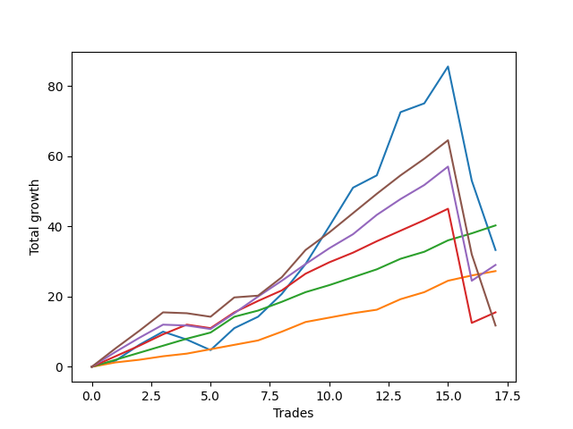

# Short Wallace 003 DB 
- Symbol: ES_SmolBoiHour
- Date Range: 03/18/2022 - 07/29/2022
- Trading Period: 7:20-12:30
- Number of Trades: 17



| Name | Win Percent | Profit | Avg Profit / Trade | Avg Time / Trade |      | Name | Win Percent | Profit | Avg Profit / Trade | Avg Time / Trade |
| ---- | ----------- | ------ | ------------------ | ---------------- | ---- | ---- | ----------- | ------ | ------------------ | ---------------- |
| Sorted By <br> Profit | | | | | | Sorted By <br> Win Percentage ||||
| Eighty-Two | 100.00 | 20125.00 | 1183.82 | 02:56 |     | Eighty-Two | 100.00 | 20125.00 | 1183.82 | 02:56 |
| Two | 76.47 | 16625.00 | 977.94 | 20:48 |     | Eighty-One | 100.00 | 13625.00 | 801.47 | 01:46 |
| Eighty-Four | 82.35 | 14500.00 | 852.94 | 15:54 |     | Eighty-Three | 88.24 | 7750.00 | 455.88 | 15:18 |
| Eighty-One | 100.00 | 13625.00 | 801.47 | 01:46 |     | Eighty-Four | 82.35 | 14500.00 | 852.94 | 15:54 |
| Eighty-Three | 88.24 | 7750.00 | 455.88 | 15:18 |     | Two | 76.47 | 16625.00 | 977.94 | 20:48 |
| Eighty-Five | 76.47 | 5875.00 | 345.59 | 22:47 |     | Eighty-Five | 76.47 | 5875.00 | 345.59 | 22:47 |

## NO STOPLOSS

### Test Two
* Sell when the price hits the upper line of the 20p 2std bollinger
* No Stoploss
* Results:
```
Total Trades: 17
Percent Up: 23.53
Percent Down: 76.47
Total Points Moved Down: 33.25
Potential Profit: 16625.00
Total Points Ups: 57.50 Count Ups: 4
Total Points Downs: 90.75 Count Downs: 13
```

<details><summary>Trades</summary>

<code>In: 2022-03-25 11:34:00		Out: 2022-03-25 12:00:55		Total Position Time: 26:55		Total Move Down: 1.75		Total to Date: 1.75</code> <br />
<code>In: 2022-03-29 08:52:00		Out: 2022-03-29 09:01:40		Total Position Time: 09:40		Total Move Down: 4.50		Total to Date: 6.25</code> <br />
<code>In: 2022-03-29 08:53:00		Out: 2022-03-29 09:01:40		Total Position Time: 08:40		Total Move Down: 3.75		Total to Date: 10.00</code> <br />
<code>In: 2022-03-31 07:38:00		Out: 2022-03-31 08:08:30		Total Position Time: 30:30		Total Move Down: -2.25		Total to Date: 7.75</code> <br />
<code>In: 2022-03-31 07:39:00		Out: 2022-03-31 08:08:30		Total Position Time: 29:30		Total Move Down: -3.00		Total to Date: 4.75</code> <br />
<code>In: 2022-04-18 10:59:00		Out: 2022-04-18 11:10:40		Total Position Time: 11:40		Total Move Down: 6.25		Total to Date: 11.00</code> <br />
<code>In: 2022-04-20 09:55:00		Out: 2022-04-20 10:08:15		Total Position Time: 13:15		Total Move Down: 3.25		Total to Date: 14.25</code> <br />
<code>In: 2022-04-25 09:28:00		Out: 2022-04-25 10:01:20		Total Position Time: 33:20		Total Move Down: 6.50		Total to Date: 20.75</code> <br />
<code>In: 2022-05-10 11:47:00		Out: 2022-05-10 11:56:50		Total Position Time: 09:50		Total Move Down: 8.50		Total to Date: 29.25</code> <br />
<code>In: 2022-05-24 09:18:00		Out: 2022-05-24 09:31:20		Total Position Time: 13:20		Total Move Down: 10.75		Total to Date: 40.00</code> <br />
<code>In: 2022-06-10 10:53:00		Out: 2022-06-10 11:01:00		Total Position Time: 08:00		Total Move Down: 11.00		Total to Date: 51.00</code> <br />
<code>In: 2022-06-13 09:15:00		Out: 2022-06-13 09:30:15		Total Position Time: 15:15		Total Move Down: 3.50		Total to Date: 54.50</code> <br />
<code>In: 2022-06-13 09:41:00		Out: 2022-06-13 09:54:20		Total Position Time: 13:20		Total Move Down: 18.00		Total to Date: 72.50</code> <br />
<code>In: 2022-06-29 12:21:00		Out: 2022-06-29 12:35:20		Total Position Time: 14:20		Total Move Down: 2.50		Total to Date: 75.00</code> <br />
<code>In: 2022-07-06 11:10:00		Out: 2022-07-06 11:11:45		Total Position Time: 01:45		Total Move Down: 10.50		Total to Date: 85.50</code> <br />
<code>In: 2022-07-14 07:57:00		Out: 2022-07-14 08:56:55		Total Position Time: 59:55		Total Move Down: -32.50		Total to Date: 53.00</code> <br />
<code>In: 2022-07-14 08:13:00		Out: 2022-07-14 09:07:30		Total Position Time: 54:30		Total Move Down: -19.75		Total to Date: 33.25</code> <br />


</details>

## TAKE PROFIT

### Test Eighty-One
* Take Profit of 1 Point
* No Stoploss
* Results:
```
Total Trades: 17
Percent Up: 0.00
Percent Down: 100.00
Total Points Moved Down: 27.25
Potential Profit: 13625.00
Total Points Ups: 0.00 Count Ups: 0
Total Points Downs: 27.25 Count Downs: 17
```

<details><summary>Trades</summary>

<code>In: 2022-03-25 11:34:00		Out: 2022-03-25 11:35:15		Total Position Time: 01:15		Total Move Down: 1.25		Total to Date: 1.25</code> <br />
<code>In: 2022-03-29 08:52:00		Out: 2022-03-29 08:52:55		Total Position Time: 00:55		Total Move Down: 0.75		Total to Date: 2.00</code> <br />
<code>In: 2022-03-29 08:53:00		Out: 2022-03-29 08:57:35		Total Position Time: 04:35		Total Move Down: 1.00		Total to Date: 3.00</code> <br />
<code>In: 2022-03-31 07:38:00		Out: 2022-03-31 07:39:15		Total Position Time: 01:15		Total Move Down: 0.75		Total to Date: 3.75</code> <br />
<code>In: 2022-03-31 07:39:00		Out: 2022-03-31 07:41:25		Total Position Time: 02:25		Total Move Down: 1.25		Total to Date: 5.00</code> <br />
<code>In: 2022-04-18 10:59:00		Out: 2022-04-18 10:59:15		Total Position Time: 00:15		Total Move Down: 1.25		Total to Date: 6.25</code> <br />
<code>In: 2022-04-20 09:55:00		Out: 2022-04-20 09:57:25		Total Position Time: 02:25		Total Move Down: 1.25		Total to Date: 7.50</code> <br />
<code>In: 2022-04-25 09:28:00		Out: 2022-04-25 09:28:30		Total Position Time: 00:30		Total Move Down: 2.50		Total to Date: 10.00</code> <br />
<code>In: 2022-05-10 11:47:00		Out: 2022-05-10 11:47:10		Total Position Time: 00:10		Total Move Down: 2.75		Total to Date: 12.75</code> <br />
<code>In: 2022-05-24 09:18:00		Out: 2022-05-24 09:18:50		Total Position Time: 00:50		Total Move Down: 1.25		Total to Date: 14.00</code> <br />
<code>In: 2022-06-10 10:53:00		Out: 2022-06-10 10:53:10		Total Position Time: 00:10		Total Move Down: 1.25		Total to Date: 15.25</code> <br />
<code>In: 2022-06-13 09:15:00		Out: 2022-06-13 09:15:10		Total Position Time: 00:10		Total Move Down: 1.00		Total to Date: 16.25</code> <br />
<code>In: 2022-06-13 09:41:00		Out: 2022-06-13 09:41:10		Total Position Time: 00:10		Total Move Down: 3.00		Total to Date: 19.25</code> <br />
<code>In: 2022-06-29 12:21:00		Out: 2022-06-29 12:34:15		Total Position Time: 13:15		Total Move Down: 2.00		Total to Date: 21.25</code> <br />
<code>In: 2022-07-06 11:10:00		Out: 2022-07-06 11:10:10		Total Position Time: 00:10		Total Move Down: 3.25		Total to Date: 24.50</code> <br />
<code>In: 2022-07-14 07:57:00		Out: 2022-07-14 07:57:15		Total Position Time: 00:15		Total Move Down: 1.50		Total to Date: 26.00</code> <br />
<code>In: 2022-07-14 08:13:00		Out: 2022-07-14 08:14:30		Total Position Time: 01:30		Total Move Down: 1.25		Total to Date: 27.25</code> <br />


</details>

### Test Eighty-Two
* Take Profit of 2 Point
* No Stoploss
* Results:
```
Total Trades: 17
Percent Up: 0.00
Percent Down: 100.00
Total Points Moved Down: 40.25
Potential Profit: 20125.00
Total Points Ups: 0.00 Count Ups: 0
Total Points Downs: 40.25 Count Downs: 17
```

<details><summary>Trades</summary>

<code>In: 2022-03-25 11:34:00		Out: 2022-03-25 11:40:25		Total Position Time: 06:25		Total Move Down: 2.00		Total to Date: 2.00</code> <br />
<code>In: 2022-03-29 08:52:00		Out: 2022-03-29 08:57:40		Total Position Time: 05:40		Total Move Down: 2.00		Total to Date: 4.00</code> <br />
<code>In: 2022-03-29 08:53:00		Out: 2022-03-29 08:58:35		Total Position Time: 05:35		Total Move Down: 2.00		Total to Date: 6.00</code> <br />
<code>In: 2022-03-31 07:38:00		Out: 2022-03-31 07:41:25		Total Position Time: 03:25		Total Move Down: 2.00		Total to Date: 8.00</code> <br />
<code>In: 2022-03-31 07:39:00		Out: 2022-03-31 07:41:50		Total Position Time: 02:50		Total Move Down: 1.75		Total to Date: 9.75</code> <br />
<code>In: 2022-04-18 10:59:00		Out: 2022-04-18 10:59:30		Total Position Time: 00:30		Total Move Down: 4.50		Total to Date: 14.25</code> <br />
<code>In: 2022-04-20 09:55:00		Out: 2022-04-20 09:59:05		Total Position Time: 04:05		Total Move Down: 1.75		Total to Date: 16.00</code> <br />
<code>In: 2022-04-25 09:28:00		Out: 2022-04-25 09:28:30		Total Position Time: 00:30		Total Move Down: 2.50		Total to Date: 18.50</code> <br />
<code>In: 2022-05-10 11:47:00		Out: 2022-05-10 11:47:10		Total Position Time: 00:10		Total Move Down: 2.75		Total to Date: 21.25</code> <br />
<code>In: 2022-05-24 09:18:00		Out: 2022-05-24 09:20:10		Total Position Time: 02:10		Total Move Down: 2.00		Total to Date: 23.25</code> <br />
<code>In: 2022-06-10 10:53:00		Out: 2022-06-10 10:53:15		Total Position Time: 00:15		Total Move Down: 2.25		Total to Date: 25.50</code> <br />
<code>In: 2022-06-13 09:15:00		Out: 2022-06-13 09:16:45		Total Position Time: 01:45		Total Move Down: 2.25		Total to Date: 27.75</code> <br />
<code>In: 2022-06-13 09:41:00		Out: 2022-06-13 09:41:10		Total Position Time: 00:10		Total Move Down: 3.00		Total to Date: 30.75</code> <br />
<code>In: 2022-06-29 12:21:00		Out: 2022-06-29 12:34:15		Total Position Time: 13:15		Total Move Down: 2.00		Total to Date: 32.75</code> <br />
<code>In: 2022-07-06 11:10:00		Out: 2022-07-06 11:10:10		Total Position Time: 00:10		Total Move Down: 3.25		Total to Date: 36.00</code> <br />
<code>In: 2022-07-14 07:57:00		Out: 2022-07-14 07:57:50		Total Position Time: 00:50		Total Move Down: 2.00		Total to Date: 38.00</code> <br />
<code>In: 2022-07-14 08:13:00		Out: 2022-07-14 08:15:15		Total Position Time: 02:15		Total Move Down: 2.25		Total to Date: 40.25</code> <br />


</details>

### Test Eighty-Three
* Take Profit of 3 Point
* No Stoploss
* Results:
```
Total Trades: 17
Percent Up: 11.76
Percent Down: 88.24
Total Points Moved Down: 15.50
Potential Profit: 7750.00
Total Points Ups: 33.50 Count Ups: 2
Total Points Downs: 49.00 Count Downs: 15
```

<details><summary>Trades</summary>

<code>In: 2022-03-25 11:34:00		Out: 2022-03-25 12:01:45		Total Position Time: 27:45		Total Move Down: 3.00		Total to Date: 3.00</code> <br />
<code>In: 2022-03-29 08:52:00		Out: 2022-03-29 08:58:40		Total Position Time: 06:40		Total Move Down: 3.00		Total to Date: 6.00</code> <br />
<code>In: 2022-03-29 08:53:00		Out: 2022-03-29 09:01:35		Total Position Time: 08:35		Total Move Down: 3.25		Total to Date: 9.25</code> <br />
<code>In: 2022-03-31 07:38:00		Out: 2022-03-31 08:35:35		Total Position Time: 57:35		Total Move Down: 2.75		Total to Date: 12.00</code> <br />
<code>In: 2022-03-31 07:39:00		Out: 2022-03-31 08:38:55		Total Position Time: 59:55		Total Move Down: -1.00		Total to Date: 11.00</code> <br />
<code>In: 2022-04-18 10:59:00		Out: 2022-04-18 10:59:30		Total Position Time: 00:30		Total Move Down: 4.50		Total to Date: 15.50</code> <br />
<code>In: 2022-04-20 09:55:00		Out: 2022-04-20 10:08:15		Total Position Time: 13:15		Total Move Down: 3.25		Total to Date: 18.75</code> <br />
<code>In: 2022-04-25 09:28:00		Out: 2022-04-25 09:31:00		Total Position Time: 03:00		Total Move Down: 3.00		Total to Date: 21.75</code> <br />
<code>In: 2022-05-10 11:47:00		Out: 2022-05-10 11:47:15		Total Position Time: 00:15		Total Move Down: 4.75		Total to Date: 26.50</code> <br />
<code>In: 2022-05-24 09:18:00		Out: 2022-05-24 09:21:05		Total Position Time: 03:05		Total Move Down: 3.25		Total to Date: 29.75</code> <br />
<code>In: 2022-06-10 10:53:00		Out: 2022-06-10 10:53:55		Total Position Time: 00:55		Total Move Down: 2.75		Total to Date: 32.50</code> <br />
<code>In: 2022-06-13 09:15:00		Out: 2022-06-13 09:16:50		Total Position Time: 01:50		Total Move Down: 3.25		Total to Date: 35.75</code> <br />
<code>In: 2022-06-13 09:41:00		Out: 2022-06-13 09:41:10		Total Position Time: 00:10		Total Move Down: 3.00		Total to Date: 38.75</code> <br />
<code>In: 2022-06-29 12:21:00		Out: 2022-06-29 12:35:15		Total Position Time: 14:15		Total Move Down: 3.00		Total to Date: 41.75</code> <br />
<code>In: 2022-07-06 11:10:00		Out: 2022-07-06 11:10:10		Total Position Time: 00:10		Total Move Down: 3.25		Total to Date: 45.00</code> <br />
<code>In: 2022-07-14 07:57:00		Out: 2022-07-14 08:56:55		Total Position Time: 59:55		Total Move Down: -32.50		Total to Date: 12.50</code> <br />
<code>In: 2022-07-14 08:13:00		Out: 2022-07-14 08:15:25		Total Position Time: 02:25		Total Move Down: 3.00		Total to Date: 15.50</code> <br />


</details>

### Test Eighty-Four
* Take Profit of 4 Point
* No Stoploss
* Results:
```
Total Trades: 17
Percent Up: 17.65
Percent Down: 82.35
Total Points Moved Down: 29.00
Potential Profit: 14500.00
Total Points Ups: 33.75 Count Ups: 3
Total Points Downs: 62.75 Count Downs: 14
```

<details><summary>Trades</summary>

<code>In: 2022-03-25 11:34:00		Out: 2022-03-25 12:01:55		Total Position Time: 27:55		Total Move Down: 4.25		Total to Date: 4.25</code> <br />
<code>In: 2022-03-29 08:52:00		Out: 2022-03-29 09:01:35		Total Position Time: 09:35		Total Move Down: 4.00		Total to Date: 8.25</code> <br />
<code>In: 2022-03-29 08:53:00		Out: 2022-03-29 09:01:40		Total Position Time: 08:40		Total Move Down: 3.75		Total to Date: 12.00</code> <br />
<code>In: 2022-03-31 07:38:00		Out: 2022-03-31 08:37:55		Total Position Time: 59:55		Total Move Down: -0.25		Total to Date: 11.75</code> <br />
<code>In: 2022-03-31 07:39:00		Out: 2022-03-31 08:38:55		Total Position Time: 59:55		Total Move Down: -1.00		Total to Date: 10.75</code> <br />
<code>In: 2022-04-18 10:59:00		Out: 2022-04-18 10:59:30		Total Position Time: 00:30		Total Move Down: 4.50		Total to Date: 15.25</code> <br />
<code>In: 2022-04-20 09:55:00		Out: 2022-04-20 10:08:35		Total Position Time: 13:35		Total Move Down: 4.75		Total to Date: 20.00</code> <br />
<code>In: 2022-04-25 09:28:00		Out: 2022-04-25 09:31:10		Total Position Time: 03:10		Total Move Down: 4.50		Total to Date: 24.50</code> <br />
<code>In: 2022-05-10 11:47:00		Out: 2022-05-10 11:47:15		Total Position Time: 00:15		Total Move Down: 4.75		Total to Date: 29.25</code> <br />
<code>In: 2022-05-24 09:18:00		Out: 2022-05-24 09:21:15		Total Position Time: 03:15		Total Move Down: 4.50		Total to Date: 33.75</code> <br />
<code>In: 2022-06-10 10:53:00		Out: 2022-06-10 10:54:30		Total Position Time: 01:30		Total Move Down: 4.00		Total to Date: 37.75</code> <br />
<code>In: 2022-06-13 09:15:00		Out: 2022-06-13 09:17:05		Total Position Time: 02:05		Total Move Down: 5.50		Total to Date: 43.25</code> <br />
<code>In: 2022-06-13 09:41:00		Out: 2022-06-13 09:41:15		Total Position Time: 00:15		Total Move Down: 4.50		Total to Date: 47.75</code> <br />
<code>In: 2022-06-29 12:21:00		Out: 2022-06-29 12:37:05		Total Position Time: 16:05		Total Move Down: 4.00		Total to Date: 51.75</code> <br />
<code>In: 2022-07-06 11:10:00		Out: 2022-07-06 11:11:05		Total Position Time: 01:05		Total Move Down: 5.25		Total to Date: 57.00</code> <br />
<code>In: 2022-07-14 07:57:00		Out: 2022-07-14 08:56:55		Total Position Time: 59:55		Total Move Down: -32.50		Total to Date: 24.50</code> <br />
<code>In: 2022-07-14 08:13:00		Out: 2022-07-14 08:15:45		Total Position Time: 02:45		Total Move Down: 4.50		Total to Date: 29.00</code> <br />


</details>

### Test Eighty-Five
* Take Profit of 5 Point
* No Stoploss
* Results:
```
Total Trades: 17
Percent Up: 23.53
Percent Down: 76.47
Total Points Moved Down: 11.75
Potential Profit: 5875.00
Total Points Ups: 54.00 Count Ups: 4
Total Points Downs: 65.75 Count Downs: 13
```

<details><summary>Trades</summary>

<code>In: 2022-03-25 11:34:00		Out: 2022-03-25 12:02:00		Total Position Time: 28:00		Total Move Down: 5.25		Total to Date: 5.25</code> <br />
<code>In: 2022-03-29 08:52:00		Out: 2022-03-29 09:01:45		Total Position Time: 09:45		Total Move Down: 5.00		Total to Date: 10.25</code> <br />
<code>In: 2022-03-29 08:53:00		Out: 2022-03-29 09:02:10		Total Position Time: 09:10		Total Move Down: 5.25		Total to Date: 15.50</code> <br />
<code>In: 2022-03-31 07:38:00		Out: 2022-03-31 08:37:55		Total Position Time: 59:55		Total Move Down: -0.25		Total to Date: 15.25</code> <br />
<code>In: 2022-03-31 07:39:00		Out: 2022-03-31 08:38:55		Total Position Time: 59:55		Total Move Down: -1.00		Total to Date: 14.25</code> <br />
<code>In: 2022-04-18 10:59:00		Out: 2022-04-18 11:06:40		Total Position Time: 07:40		Total Move Down: 5.50		Total to Date: 19.75</code> <br />
<code>In: 2022-04-20 09:55:00		Out: 2022-04-20 10:54:55		Total Position Time: 59:55		Total Move Down: 0.50		Total to Date: 20.25</code> <br />
<code>In: 2022-04-25 09:28:00		Out: 2022-04-25 09:31:15		Total Position Time: 03:15		Total Move Down: 5.25		Total to Date: 25.50</code> <br />
<code>In: 2022-05-10 11:47:00		Out: 2022-05-10 11:47:20		Total Position Time: 00:20		Total Move Down: 7.75		Total to Date: 33.25</code> <br />
<code>In: 2022-05-24 09:18:00		Out: 2022-05-24 09:21:30		Total Position Time: 03:30		Total Move Down: 5.00		Total to Date: 38.25</code> <br />
<code>In: 2022-06-10 10:53:00		Out: 2022-06-10 10:55:05		Total Position Time: 02:05		Total Move Down: 5.50		Total to Date: 43.75</code> <br />
<code>In: 2022-06-13 09:15:00		Out: 2022-06-13 09:17:05		Total Position Time: 02:05		Total Move Down: 5.50		Total to Date: 49.25</code> <br />
<code>In: 2022-06-13 09:41:00		Out: 2022-06-13 09:41:45		Total Position Time: 00:45		Total Move Down: 5.25		Total to Date: 54.50</code> <br />
<code>In: 2022-06-29 12:21:00		Out: 2022-06-29 12:41:05		Total Position Time: 20:05		Total Move Down: 4.75		Total to Date: 59.25</code> <br />
<code>In: 2022-07-06 11:10:00		Out: 2022-07-06 11:11:05		Total Position Time: 01:05		Total Move Down: 5.25		Total to Date: 64.50</code> <br />
<code>In: 2022-07-14 07:57:00		Out: 2022-07-14 08:56:55		Total Position Time: 59:55		Total Move Down: -32.50		Total to Date: 32.00</code> <br />
<code>In: 2022-07-14 08:13:00		Out: 2022-07-14 09:12:55		Total Position Time: 59:55		Total Move Down: -20.25		Total to Date: 11.75</code> <br />


</details>