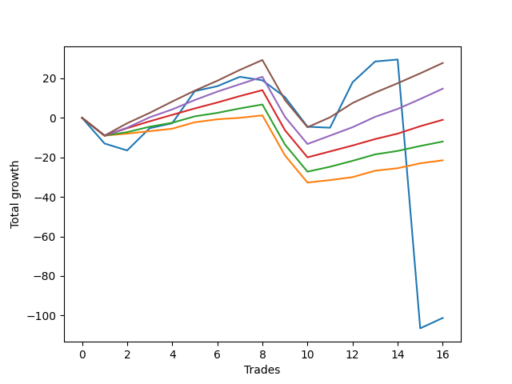

# Short Wallace 004 
- Symbol: ES_SmolBoiHour
- Date Range: 03/18/2022 - 07/29/2022
- Trading Period: 7:20-12:30
- Number of Trades: 16



| Name | Win Percent | Profit | Avg Profit / Trade | Avg Time / Trade |      | Name | Win Percent | Profit | Avg Profit / Trade | Avg Time / Trade |
| ---- | ----------- | ------ | ------------------ | ---------------- | ---- | ---- | ----------- | ------ | ------------------ | ---------------- |
| Sorted By <br> Profit | | | | | | Sorted By <br> Win Percentage ||||
| Eighty-Five | 81.25 | 13875.00 | 867.19 | 22:39 |     | Eighty-Five | 81.25 | 13875.00 | 867.19 | 22:39 |
| Eighty-Four | 81.25 | 7375.00 | 460.94 | 21:40 |     | Eighty-Four | 81.25 | 7375.00 | 460.94 | 21:40 |
| Eighty-Three | 81.25 | -500.00 | -31.25 | 20:12 |     | Eighty-Three | 81.25 | -500.00 | -31.25 | 20:12 |
| Eighty-Two | 81.25 | -6000.00 | -375.00 | 16:22 |     | Eighty-Two | 81.25 | -6000.00 | -375.00 | 16:22 |
| Eighty-One | 81.25 | -10750.00 | -671.88 | 13:47 |     | Eighty-One | 81.25 | -10750.00 | -671.88 | 13:47 |
| Two | 56.25 | -50625.00 | -3164.06 | 118:11 |     | Two | 56.25 | -50625.00 | -3164.06 | 118:11 |

## NO STOPLOSS

### Test Two
* Sell when the price hits the upper line of the 20p 2std bollinger
* No Stoploss
* Results:
```
Total Trades: 16
Percent Up: 43.75
Percent Down: 56.25
Total Points Moved Down: -101.25
Potential Profit: -50625.00
Total Points Ups: 178.25 Count Ups: 7
Total Points Downs: 77.00 Count Downs: 9
```

<details><summary>Trades</summary>

<code>In: 2022-03-24 08:09:00		Out: 2022-03-24 09:03:10		Total Position Time: 54:10		Total Move Down: -13.00		Total to Date: -13.00</code> <br />
<code>In: 2022-03-25 07:26:00		Out: 2022-03-25 07:54:10		Total Position Time: 28:10		Total Move Down: -3.50		Total to Date: -16.50</code> <br />
<code>In: 2022-04-06 11:06:00		Out: 2022-04-06 11:08:10		Total Position Time: 02:10		Total Move Down: 11.25		Total to Date: -5.25</code> <br />
<code>In: 2022-04-18 07:28:00		Out: 2022-04-18 07:51:45		Total Position Time: 23:45		Total Move Down: 2.50		Total to Date: -2.75</code> <br />
<code>In: 2022-05-03 07:36:00		Out: 2022-05-03 07:43:50		Total Position Time: 07:50		Total Move Down: 16.25		Total to Date: 13.50</code> <br />
<code>In: 2022-05-04 09:42:00		Out: 2022-05-04 10:11:15		Total Position Time: 29:15		Total Move Down: 2.50		Total to Date: 16.00</code> <br />
<code>In: 2022-05-24 11:15:00		Out: 2022-05-24 11:43:50		Total Position Time: 28:50		Total Move Down: 4.75		Total to Date: 20.75</code> <br />
<code>In: 2022-05-31 07:24:00		Out: 2022-05-31 08:07:30		Total Position Time: 43:30		Total Move Down: -1.75		Total to Date: 19.00</code> <br />
<code>In: 2022-06-02 08:06:00		Out: 2022-06-02 08:30:55		Total Position Time: 24:55		Total Move Down: -8.50		Total to Date: 10.50</code> <br />
<code>In: 2022-06-30 08:12:00		Out: 2022-06-30 09:06:15		Total Position Time: 54:15		Total Move Down: -15.00		Total to Date: -4.50</code> <br />
<code>In: 2022-06-30 08:30:00		Out: 2022-06-30 09:06:15		Total Position Time: 36:15		Total Move Down: -0.50		Total to Date: -5.00</code> <br />
<code>In: 2022-07-05 07:41:00		Out: 2022-07-05 08:01:10		Total Position Time: 20:10		Total Move Down: 23.00		Total to Date: 18.00</code> <br />
<code>In: 2022-07-06 11:10:00		Out: 2022-07-06 11:11:45		Total Position Time: 01:45		Total Move Down: 10.50		Total to Date: 28.50</code> <br />
<code>In: 2022-07-07 07:57:00		Out: 2022-07-07 08:21:00		Total Position Time: 24:00		Total Move Down: 1.00		Total to Date: 29.50</code> <br />
<code>In: 2022-07-14 08:46:00		Out: 2022-07-18 06:56:00		Total Position Time: 1330:00		Total Move Down: -136.00		Total to Date: -106.50</code> <br />
<code>In: 2022-07-27 08:05:00		Out: 2022-07-27 11:07:00		Total Position Time: 182:00		Total Move Down: 5.25		Total to Date: -101.25</code> <br />


</details>

## TAKE PROFIT

### Test Eighty-One
* Take Profit of 1 Point
* No Stoploss
* Results:
```
Total Trades: 16
Percent Up: 18.75
Percent Down: 81.25
Total Points Moved Down: -21.50
Potential Profit: -10750.00
Total Points Ups: 43.00 Count Ups: 3
Total Points Downs: 21.50 Count Downs: 13
```

<details><summary>Trades</summary>

<code>In: 2022-03-24 08:09:00		Out: 2022-03-24 09:08:55		Total Position Time: 59:55		Total Move Down: -9.00		Total to Date: -9.00</code> <br />
<code>In: 2022-03-25 07:26:00		Out: 2022-03-25 07:26:10		Total Position Time: 00:10		Total Move Down: 1.00		Total to Date: -8.00</code> <br />
<code>In: 2022-04-06 11:06:00		Out: 2022-04-06 11:07:00		Total Position Time: 01:00		Total Move Down: 1.25		Total to Date: -6.75</code> <br />
<code>In: 2022-04-18 07:28:00		Out: 2022-04-18 07:28:15		Total Position Time: 00:15		Total Move Down: 1.25		Total to Date: -5.50</code> <br />
<code>In: 2022-05-03 07:36:00		Out: 2022-05-03 07:36:10		Total Position Time: 00:10		Total Move Down: 3.25		Total to Date: -2.25</code> <br />
<code>In: 2022-05-04 09:42:00		Out: 2022-05-04 09:42:10		Total Position Time: 00:10		Total Move Down: 1.50		Total to Date: -0.75</code> <br />
<code>In: 2022-05-24 11:15:00		Out: 2022-05-24 11:15:10		Total Position Time: 00:10		Total Move Down: 0.75		Total to Date: 0.00</code> <br />
<code>In: 2022-05-31 07:24:00		Out: 2022-05-31 07:24:10		Total Position Time: 00:10		Total Move Down: 1.25		Total to Date: 1.25</code> <br />
<code>In: 2022-06-02 08:06:00		Out: 2022-06-02 09:05:55		Total Position Time: 59:55		Total Move Down: -20.25		Total to Date: -19.00</code> <br />
<code>In: 2022-06-30 08:12:00		Out: 2022-06-30 09:11:55		Total Position Time: 59:55		Total Move Down: -13.75		Total to Date: -32.75</code> <br />
<code>In: 2022-06-30 08:30:00		Out: 2022-06-30 08:31:35		Total Position Time: 01:35		Total Move Down: 1.25		Total to Date: -31.50</code> <br />
<code>In: 2022-07-05 07:41:00		Out: 2022-07-05 07:43:00		Total Position Time: 02:00		Total Move Down: 1.50		Total to Date: -30.00</code> <br />
<code>In: 2022-07-06 11:10:00		Out: 2022-07-06 11:10:10		Total Position Time: 00:10		Total Move Down: 3.25		Total to Date: -26.75</code> <br />
<code>In: 2022-07-07 07:57:00		Out: 2022-07-07 07:57:10		Total Position Time: 00:10		Total Move Down: 1.25		Total to Date: -25.50</code> <br />
<code>In: 2022-07-14 08:46:00		Out: 2022-07-14 09:08:00		Total Position Time: 22:00		Total Move Down: 2.50		Total to Date: -23.00</code> <br />
<code>In: 2022-07-27 08:05:00		Out: 2022-07-27 08:18:00		Total Position Time: 13:00		Total Move Down: 1.50		Total to Date: -21.50</code> <br />


</details>

### Test Eighty-Two
* Take Profit of 2 Point
* No Stoploss
* Results:
```
Total Trades: 16
Percent Up: 18.75
Percent Down: 81.25
Total Points Moved Down: -12.00
Potential Profit: -6000.00
Total Points Ups: 43.00 Count Ups: 3
Total Points Downs: 31.00 Count Downs: 13
```

<details><summary>Trades</summary>

<code>In: 2022-03-24 08:09:00		Out: 2022-03-24 09:08:55		Total Position Time: 59:55		Total Move Down: -9.00		Total to Date: -9.00</code> <br />
<code>In: 2022-03-25 07:26:00		Out: 2022-03-25 08:01:30		Total Position Time: 35:30		Total Move Down: 1.75		Total to Date: -7.25</code> <br />
<code>In: 2022-04-06 11:06:00		Out: 2022-04-06 11:07:05		Total Position Time: 01:05		Total Move Down: 2.75		Total to Date: -4.50</code> <br />
<code>In: 2022-04-18 07:28:00		Out: 2022-04-18 07:28:45		Total Position Time: 00:45		Total Move Down: 2.00		Total to Date: -2.50</code> <br />
<code>In: 2022-05-03 07:36:00		Out: 2022-05-03 07:36:10		Total Position Time: 00:10		Total Move Down: 3.25		Total to Date: 0.75</code> <br />
<code>In: 2022-05-04 09:42:00		Out: 2022-05-04 09:42:20		Total Position Time: 00:20		Total Move Down: 1.75		Total to Date: 2.50</code> <br />
<code>In: 2022-05-24 11:15:00		Out: 2022-05-24 11:15:30		Total Position Time: 00:30		Total Move Down: 2.25		Total to Date: 4.75</code> <br />
<code>In: 2022-05-31 07:24:00		Out: 2022-05-31 07:24:15		Total Position Time: 00:15		Total Move Down: 2.00		Total to Date: 6.75</code> <br />
<code>In: 2022-06-02 08:06:00		Out: 2022-06-02 09:05:55		Total Position Time: 59:55		Total Move Down: -20.25		Total to Date: -13.50</code> <br />
<code>In: 2022-06-30 08:12:00		Out: 2022-06-30 09:11:55		Total Position Time: 59:55		Total Move Down: -13.75		Total to Date: -27.25</code> <br />
<code>In: 2022-06-30 08:30:00		Out: 2022-06-30 08:32:00		Total Position Time: 02:00		Total Move Down: 2.50		Total to Date: -24.75</code> <br />
<code>In: 2022-07-05 07:41:00		Out: 2022-07-05 07:44:00		Total Position Time: 03:00		Total Move Down: 3.00		Total to Date: -21.75</code> <br />
<code>In: 2022-07-06 11:10:00		Out: 2022-07-06 11:10:10		Total Position Time: 00:10		Total Move Down: 3.25		Total to Date: -18.50</code> <br />
<code>In: 2022-07-07 07:57:00		Out: 2022-07-07 07:58:25		Total Position Time: 01:25		Total Move Down: 1.75		Total to Date: -16.75</code> <br />
<code>In: 2022-07-14 08:46:00		Out: 2022-07-14 09:08:00		Total Position Time: 22:00		Total Move Down: 2.50		Total to Date: -14.25</code> <br />
<code>In: 2022-07-27 08:05:00		Out: 2022-07-27 08:20:00		Total Position Time: 15:00		Total Move Down: 2.25		Total to Date: -12.00</code> <br />


</details>

### Test Eighty-Three
* Take Profit of 3 Point
* No Stoploss
* Results:
```
Total Trades: 16
Percent Up: 18.75
Percent Down: 81.25
Total Points Moved Down: -1.00
Potential Profit: -500.00
Total Points Ups: 43.00 Count Ups: 3
Total Points Downs: 42.00 Count Downs: 13
```

<details><summary>Trades</summary>

<code>In: 2022-03-24 08:09:00		Out: 2022-03-24 09:08:55		Total Position Time: 59:55		Total Move Down: -9.00		Total to Date: -9.00</code> <br />
<code>In: 2022-03-25 07:26:00		Out: 2022-03-25 08:01:45		Total Position Time: 35:45		Total Move Down: 3.75		Total to Date: -5.25</code> <br />
<code>In: 2022-04-06 11:06:00		Out: 2022-04-06 11:07:15		Total Position Time: 01:15		Total Move Down: 3.50		Total to Date: -1.75</code> <br />
<code>In: 2022-04-18 07:28:00		Out: 2022-04-18 07:52:25		Total Position Time: 24:25		Total Move Down: 3.25		Total to Date: 1.50</code> <br />
<code>In: 2022-05-03 07:36:00		Out: 2022-05-03 07:36:10		Total Position Time: 00:10		Total Move Down: 3.25		Total to Date: 4.75</code> <br />
<code>In: 2022-05-04 09:42:00		Out: 2022-05-04 09:42:35		Total Position Time: 00:35		Total Move Down: 3.00		Total to Date: 7.75</code> <br />
<code>In: 2022-05-24 11:15:00		Out: 2022-05-24 11:15:40		Total Position Time: 00:40		Total Move Down: 3.25		Total to Date: 11.00</code> <br />
<code>In: 2022-05-31 07:24:00		Out: 2022-05-31 07:25:35		Total Position Time: 01:35		Total Move Down: 3.00		Total to Date: 14.00</code> <br />
<code>In: 2022-06-02 08:06:00		Out: 2022-06-02 09:05:55		Total Position Time: 59:55		Total Move Down: -20.25		Total to Date: -6.25</code> <br />
<code>In: 2022-06-30 08:12:00		Out: 2022-06-30 09:11:55		Total Position Time: 59:55		Total Move Down: -13.75		Total to Date: -20.00</code> <br />
<code>In: 2022-06-30 08:30:00		Out: 2022-06-30 08:32:10		Total Position Time: 02:10		Total Move Down: 3.00		Total to Date: -17.00</code> <br />
<code>In: 2022-07-05 07:41:00		Out: 2022-07-05 07:44:00		Total Position Time: 03:00		Total Move Down: 3.00		Total to Date: -14.00</code> <br />
<code>In: 2022-07-06 11:10:00		Out: 2022-07-06 11:10:10		Total Position Time: 00:10		Total Move Down: 3.25		Total to Date: -10.75</code> <br />
<code>In: 2022-07-07 07:57:00		Out: 2022-07-07 08:22:50		Total Position Time: 25:50		Total Move Down: 2.75		Total to Date: -8.00</code> <br />
<code>In: 2022-07-14 08:46:00		Out: 2022-07-14 09:17:00		Total Position Time: 31:00		Total Move Down: 3.75		Total to Date: -4.25</code> <br />
<code>In: 2022-07-27 08:05:00		Out: 2022-07-27 08:22:00		Total Position Time: 17:00		Total Move Down: 3.25		Total to Date: -1.00</code> <br />


</details>

### Test Eighty-Four
* Take Profit of 4 Point
* No Stoploss
* Results:
```
Total Trades: 16
Percent Up: 18.75
Percent Down: 81.25
Total Points Moved Down: 14.75
Potential Profit: 7375.00
Total Points Ups: 43.00 Count Ups: 3
Total Points Downs: 57.75 Count Downs: 13
```

<details><summary>Trades</summary>

<code>In: 2022-03-24 08:09:00		Out: 2022-03-24 09:08:55		Total Position Time: 59:55		Total Move Down: -9.00		Total to Date: -9.00</code> <br />
<code>In: 2022-03-25 07:26:00		Out: 2022-03-25 08:02:05		Total Position Time: 36:05		Total Move Down: 4.00		Total to Date: -5.00</code> <br />
<code>In: 2022-04-06 11:06:00		Out: 2022-04-06 11:07:20		Total Position Time: 01:20		Total Move Down: 5.25		Total to Date: 0.25</code> <br />
<code>In: 2022-04-18 07:28:00		Out: 2022-04-18 07:54:25		Total Position Time: 26:25		Total Move Down: 4.00		Total to Date: 4.25</code> <br />
<code>In: 2022-05-03 07:36:00		Out: 2022-05-03 07:37:35		Total Position Time: 01:35		Total Move Down: 4.75		Total to Date: 9.00</code> <br />
<code>In: 2022-05-04 09:42:00		Out: 2022-05-04 09:46:15		Total Position Time: 04:15		Total Move Down: 4.25		Total to Date: 13.25</code> <br />
<code>In: 2022-05-24 11:15:00		Out: 2022-05-24 11:17:45		Total Position Time: 02:45		Total Move Down: 3.75		Total to Date: 17.00</code> <br />
<code>In: 2022-05-31 07:24:00		Out: 2022-05-31 07:26:15		Total Position Time: 02:15		Total Move Down: 3.75		Total to Date: 20.75</code> <br />
<code>In: 2022-06-02 08:06:00		Out: 2022-06-02 09:05:55		Total Position Time: 59:55		Total Move Down: -20.25		Total to Date: 0.50</code> <br />
<code>In: 2022-06-30 08:12:00		Out: 2022-06-30 09:11:55		Total Position Time: 59:55		Total Move Down: -13.75		Total to Date: -13.25</code> <br />
<code>In: 2022-06-30 08:30:00		Out: 2022-06-30 08:33:55		Total Position Time: 03:55		Total Move Down: 4.25		Total to Date: -9.00</code> <br />
<code>In: 2022-07-05 07:41:00		Out: 2022-07-05 07:44:20		Total Position Time: 03:20		Total Move Down: 4.25		Total to Date: -4.75</code> <br />
<code>In: 2022-07-06 11:10:00		Out: 2022-07-06 11:11:05		Total Position Time: 01:05		Total Move Down: 5.25		Total to Date: 0.50</code> <br />
<code>In: 2022-07-07 07:57:00		Out: 2022-07-07 08:23:05		Total Position Time: 26:05		Total Move Down: 4.00		Total to Date: 4.50</code> <br />
<code>In: 2022-07-14 08:46:00		Out: 2022-07-14 09:26:00		Total Position Time: 40:00		Total Move Down: 5.00		Total to Date: 9.50</code> <br />
<code>In: 2022-07-27 08:05:00		Out: 2022-07-27 08:23:00		Total Position Time: 18:00		Total Move Down: 5.25		Total to Date: 14.75</code> <br />


</details>

### Test Eighty-Five
* Take Profit of 5 Point
* No Stoploss
* Results:
```
Total Trades: 16
Percent Up: 18.75
Percent Down: 81.25
Total Points Moved Down: 27.75
Potential Profit: 13875.00
Total Points Ups: 43.00 Count Ups: 3
Total Points Downs: 70.75 Count Downs: 13
```

<details><summary>Trades</summary>

<code>In: 2022-03-24 08:09:00		Out: 2022-03-24 09:08:55		Total Position Time: 59:55		Total Move Down: -9.00		Total to Date: -9.00</code> <br />
<code>In: 2022-03-25 07:26:00		Out: 2022-03-25 08:08:15		Total Position Time: 42:15		Total Move Down: 6.25		Total to Date: -2.75</code> <br />
<code>In: 2022-04-06 11:06:00		Out: 2022-04-06 11:07:20		Total Position Time: 01:20		Total Move Down: 5.25		Total to Date: 2.50</code> <br />
<code>In: 2022-04-18 07:28:00		Out: 2022-04-18 07:55:15		Total Position Time: 27:15		Total Move Down: 5.75		Total to Date: 8.25</code> <br />
<code>In: 2022-05-03 07:36:00		Out: 2022-05-03 07:37:40		Total Position Time: 01:40		Total Move Down: 5.50		Total to Date: 13.75</code> <br />
<code>In: 2022-05-04 09:42:00		Out: 2022-05-04 09:46:30		Total Position Time: 04:30		Total Move Down: 5.00		Total to Date: 18.75</code> <br />
<code>In: 2022-05-24 11:15:00		Out: 2022-05-24 11:18:20		Total Position Time: 03:20		Total Move Down: 5.50		Total to Date: 24.25</code> <br />
<code>In: 2022-05-31 07:24:00		Out: 2022-05-31 07:26:30		Total Position Time: 02:30		Total Move Down: 5.00		Total to Date: 29.25</code> <br />
<code>In: 2022-06-02 08:06:00		Out: 2022-06-02 09:05:55		Total Position Time: 59:55		Total Move Down: -20.25		Total to Date: 9.00</code> <br />
<code>In: 2022-06-30 08:12:00		Out: 2022-06-30 09:11:55		Total Position Time: 59:55		Total Move Down: -13.75		Total to Date: -4.75</code> <br />
<code>In: 2022-06-30 08:30:00		Out: 2022-06-30 08:34:00		Total Position Time: 04:00		Total Move Down: 5.00		Total to Date: 0.25</code> <br />
<code>In: 2022-07-05 07:41:00		Out: 2022-07-05 07:44:30		Total Position Time: 03:30		Total Move Down: 7.25		Total to Date: 7.50</code> <br />
<code>In: 2022-07-06 11:10:00		Out: 2022-07-06 11:11:05		Total Position Time: 01:05		Total Move Down: 5.25		Total to Date: 12.75</code> <br />
<code>In: 2022-07-07 07:57:00		Out: 2022-07-07 08:30:15		Total Position Time: 33:15		Total Move Down: 4.75		Total to Date: 17.50</code> <br />
<code>In: 2022-07-14 08:46:00		Out: 2022-07-14 09:26:00		Total Position Time: 40:00		Total Move Down: 5.00		Total to Date: 22.50</code> <br />
<code>In: 2022-07-27 08:05:00		Out: 2022-07-27 08:23:00		Total Position Time: 18:00		Total Move Down: 5.25		Total to Date: 27.75</code> <br />


</details>