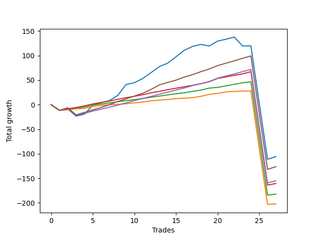

# Short Wallace 009 
- Symbol: ES_SmolBoiHour
- Date Range: 03/18/2022 - 07/29/2022
- Trading Period: 7:20-12:30
- Number of Trades: 27



| Name | Win Percent | Profit | Avg Profit / Trade | Avg Time / Trade |      | Name | Win Percent | Profit | Avg Profit / Trade | Avg Time / Trade |
| ---- | ----------- | ------ | ------------------ | ---------------- | ---- | ---- | ----------- | ------ | ------------------ | ---------------- |
| Sorted By <br> Profit | | | | | | Sorted By <br> Win Percentage ||||
| Two | 77.78 | -52875.00 | -1958.33 | 41:03 |     | Eighty-Three | 88.89 | -80250.00 | -2972.22 | 27:47 |
| Eighty-Five | 85.19 | -63125.00 | -2337.96 | 33:32 |     | Eighty-Two | 88.89 | -91000.00 | -3370.37 | 26:58 |
| Eighty-Four | 85.19 | -77500.00 | -2870.37 | 31:10 |     | Eighty-One | 88.89 | -101000.00 | -3740.74 | 25:57 |
| Eighty-Three | 88.89 | -80250.00 | -2972.22 | 27:47 |     | Eighty-Five | 85.19 | -63125.00 | -2337.96 | 33:32 |
| Eighty-Two | 88.89 | -91000.00 | -3370.37 | 26:58 |     | Eighty-Four | 85.19 | -77500.00 | -2870.37 | 31:10 |
| Eighty-One | 88.89 | -101000.00 | -3740.74 | 25:57 |     | Two | 77.78 | -52875.00 | -1958.33 | 41:03 |

## NO STOPLOSS

### Test Two
* Sell when the price hits the upper line of the 20p 2std bollinger
* No Stoploss
* Results:
```
Total Trades: 27
Percent Up: 22.22
Percent Down: 77.78
Total Points Moved Down: -105.75
Potential Profit: -52875.00
Total Points Ups: 278.50 Count Ups: 6
Total Points Downs: 172.75 Count Downs: 21
```

<details><summary>Trades</summary>

<code>In: 2022-03-25 10:52:00		Out: 2022-03-25 11:51:55		Total Position Time: 59:55		Total Move Down: -11.50		Total to Date: -11.50</code> <br />
<code>In: 2022-03-25 11:57:00		Out: 2022-03-25 12:00:55		Total Position Time: 03:55		Total Move Down: 2.75		Total to Date: -8.75</code> <br />
<code>In: 2022-03-28 11:12:00		Out: 2022-03-28 12:11:55		Total Position Time: 59:55		Total Move Down: -14.50		Total to Date: -23.25</code> <br />
<code>In: 2022-04-01 11:34:00		Out: 2022-04-01 11:50:20		Total Position Time: 16:20		Total Move Down: 3.75		Total to Date: -19.50</code> <br />
<code>In: 2022-04-06 11:05:00		Out: 2022-04-06 11:08:10		Total Position Time: 03:10		Total Move Down: 18.50		Total to Date: -1.00</code> <br />
<code>In: 2022-04-14 11:06:00		Out: 2022-04-14 11:19:10		Total Position Time: 13:10		Total Move Down: 5.00		Total to Date: 4.00</code> <br />
<code>In: 2022-04-20 09:54:00		Out: 2022-04-20 10:08:15		Total Position Time: 14:15		Total Move Down: 4.25		Total to Date: 8.25</code> <br />
<code>In: 2022-04-25 09:27:00		Out: 2022-04-25 10:01:20		Total Position Time: 34:20		Total Move Down: 10.50		Total to Date: 18.75</code> <br />
<code>In: 2022-04-26 10:01:00		Out: 2022-04-26 10:22:20		Total Position Time: 21:20		Total Move Down: 22.25		Total to Date: 41.00</code> <br />
<code>In: 2022-04-26 11:23:00		Out: 2022-04-26 11:41:25		Total Position Time: 18:25		Total Move Down: 3.75		Total to Date: 44.75</code> <br />
<code>In: 2022-04-29 10:39:00		Out: 2022-04-29 10:43:20		Total Position Time: 04:20		Total Move Down: 8.50		Total to Date: 53.25</code> <br />
<code>In: 2022-05-10 12:08:00		Out: 2022-05-10 12:17:20		Total Position Time: 09:20		Total Move Down: 12.00		Total to Date: 65.25</code> <br />
<code>In: 2022-05-25 11:04:00		Out: 2022-05-25 11:06:40		Total Position Time: 02:40		Total Move Down: 12.25		Total to Date: 77.50</code> <br />
<code>In: 2022-06-03 11:31:00		Out: 2022-06-03 11:37:15		Total Position Time: 06:15		Total Move Down: 7.00		Total to Date: 84.50</code> <br />
<code>In: 2022-06-10 10:52:00		Out: 2022-06-10 11:01:00		Total Position Time: 09:00		Total Move Down: 13.00		Total to Date: 97.50</code> <br />
<code>In: 2022-06-10 12:29:00		Out: 2022-06-10 12:42:45		Total Position Time: 13:45		Total Move Down: 13.25		Total to Date: 110.75</code> <br />
<code>In: 2022-06-13 08:42:00		Out: 2022-06-13 08:54:20		Total Position Time: 12:20		Total Move Down: 8.00		Total to Date: 118.75</code> <br />
<code>In: 2022-06-13 09:14:00		Out: 2022-06-13 09:30:15		Total Position Time: 16:15		Total Move Down: 4.00		Total to Date: 122.75</code> <br />
<code>In: 2022-06-14 10:02:00		Out: 2022-06-14 10:31:00		Total Position Time: 29:00		Total Move Down: -3.25		Total to Date: 119.50</code> <br />
<code>In: 2022-06-15 11:02:00		Out: 2022-06-15 11:03:05		Total Position Time: 01:05		Total Move Down: 10.00		Total to Date: 129.50</code> <br />
<code>In: 2022-06-16 09:31:00		Out: 2022-06-16 09:59:40		Total Position Time: 28:40		Total Move Down: 3.75		Total to Date: 133.25</code> <br />
<code>In: 2022-06-17 08:09:00		Out: 2022-06-17 08:45:15		Total Position Time: 36:15		Total Move Down: 4.50		Total to Date: 137.75</code> <br />
<code>In: 2022-06-30 07:36:00		Out: 2022-06-30 08:35:55		Total Position Time: 59:55		Total Move Down: -18.25		Total to Date: 119.50</code> <br />
<code>In: 2022-07-06 11:00:00		Out: 2022-07-06 11:00:10		Total Position Time: 00:10		Total Move Down: 0.25		Total to Date: 119.75</code> <br />
<code>In: 2022-07-14 07:56:00		Out: 2022-07-15 12:36:00		Total Position Time: 280:00		Total Move Down: -116.25		Total to Date: 3.50</code> <br />
<code>In: 2022-07-14 08:02:00		Out: 2022-07-15 12:42:00		Total Position Time: 280:00		Total Move Down: -114.75		Total to Date: -111.25</code> <br />
<code>In: 2022-07-18 08:39:00		Out: 2022-07-18 09:54:00		Total Position Time: 75:00		Total Move Down: 5.50		Total to Date: -105.75</code> <br />


</details>

## TAKE PROFIT

### Test Eighty-One
* Take Profit of 1 Point
* No Stoploss
* Results:
```
Total Trades: 27
Percent Up: 11.11
Percent Down: 88.89
Total Points Moved Down: -202.00
Potential Profit: -101000.00
Total Points Ups: 242.50 Count Ups: 3
Total Points Downs: 40.50 Count Downs: 24
```

<details><summary>Trades</summary>

<code>In: 2022-03-25 10:52:00		Out: 2022-03-25 11:51:55		Total Position Time: 59:55		Total Move Down: -11.50		Total to Date: -11.50</code> <br />
<code>In: 2022-03-25 11:57:00		Out: 2022-03-25 11:58:45		Total Position Time: 01:45		Total Move Down: 1.00		Total to Date: -10.50</code> <br />
<code>In: 2022-03-28 11:12:00		Out: 2022-03-28 11:12:10		Total Position Time: 00:10		Total Move Down: 2.00		Total to Date: -8.50</code> <br />
<code>In: 2022-04-01 11:34:00		Out: 2022-04-01 11:36:40		Total Position Time: 02:40		Total Move Down: 1.00		Total to Date: -7.50</code> <br />
<code>In: 2022-04-06 11:05:00		Out: 2022-04-06 11:05:10		Total Position Time: 00:10		Total Move Down: 4.00		Total to Date: -3.50</code> <br />
<code>In: 2022-04-14 11:06:00		Out: 2022-04-14 11:07:40		Total Position Time: 01:40		Total Move Down: 2.00		Total to Date: -1.50</code> <br />
<code>In: 2022-04-20 09:54:00		Out: 2022-04-20 09:54:30		Total Position Time: 00:30		Total Move Down: 1.25		Total to Date: -0.25</code> <br />
<code>In: 2022-04-25 09:27:00		Out: 2022-04-25 09:27:30		Total Position Time: 00:30		Total Move Down: 1.00		Total to Date: 0.75</code> <br />
<code>In: 2022-04-26 10:01:00		Out: 2022-04-26 10:01:15		Total Position Time: 00:15		Total Move Down: 1.00		Total to Date: 1.75</code> <br />
<code>In: 2022-04-26 11:23:00		Out: 2022-04-26 11:27:25		Total Position Time: 04:25		Total Move Down: 2.00		Total to Date: 3.75</code> <br />
<code>In: 2022-04-29 10:39:00		Out: 2022-04-29 10:39:45		Total Position Time: 00:45		Total Move Down: 1.50		Total to Date: 5.25</code> <br />
<code>In: 2022-05-10 12:08:00		Out: 2022-05-10 12:08:10		Total Position Time: 00:10		Total Move Down: 2.75		Total to Date: 8.00</code> <br />
<code>In: 2022-05-25 11:04:00		Out: 2022-05-25 11:04:10		Total Position Time: 00:10		Total Move Down: 1.25		Total to Date: 9.25</code> <br />
<code>In: 2022-06-03 11:31:00		Out: 2022-06-03 11:32:35		Total Position Time: 01:35		Total Move Down: 1.25		Total to Date: 10.50</code> <br />
<code>In: 2022-06-10 10:52:00		Out: 2022-06-10 10:52:10		Total Position Time: 00:10		Total Move Down: 1.75		Total to Date: 12.25</code> <br />
<code>In: 2022-06-10 12:29:00		Out: 2022-06-10 12:29:10		Total Position Time: 00:10		Total Move Down: 1.00		Total to Date: 13.25</code> <br />
<code>In: 2022-06-13 08:42:00		Out: 2022-06-13 08:47:05		Total Position Time: 05:05		Total Move Down: 1.00		Total to Date: 14.25</code> <br />
<code>In: 2022-06-13 09:14:00		Out: 2022-06-13 09:14:10		Total Position Time: 00:10		Total Move Down: 2.75		Total to Date: 17.00</code> <br />
<code>In: 2022-06-14 10:02:00		Out: 2022-06-14 10:02:10		Total Position Time: 00:10		Total Move Down: 4.00		Total to Date: 21.00</code> <br />
<code>In: 2022-06-15 11:02:00		Out: 2022-06-15 11:02:10		Total Position Time: 00:10		Total Move Down: 2.00		Total to Date: 23.00</code> <br />
<code>In: 2022-06-16 09:31:00		Out: 2022-06-16 09:31:10		Total Position Time: 00:10		Total Move Down: 3.00		Total to Date: 26.00</code> <br />
<code>In: 2022-06-17 08:09:00		Out: 2022-06-17 08:12:20		Total Position Time: 03:20		Total Move Down: 1.00		Total to Date: 27.00</code> <br />
<code>In: 2022-06-30 07:36:00		Out: 2022-06-30 07:36:30		Total Position Time: 00:30		Total Move Down: 0.75		Total to Date: 27.75</code> <br />
<code>In: 2022-07-06 11:00:00		Out: 2022-07-06 11:00:10		Total Position Time: 00:10		Total Move Down: 0.25		Total to Date: 28.00</code> <br />
<code>In: 2022-07-14 07:56:00		Out: 2022-07-15 12:36:00		Total Position Time: 280:00		Total Move Down: -116.25		Total to Date: -88.25</code> <br />
<code>In: 2022-07-14 08:02:00		Out: 2022-07-15 12:42:00		Total Position Time: 280:00		Total Move Down: -114.75		Total to Date: -203.00</code> <br />
<code>In: 2022-07-18 08:39:00		Out: 2022-07-18 09:35:00		Total Position Time: 56:00		Total Move Down: 1.00		Total to Date: -202.00</code> <br />


</details>

### Test Eighty-Two
* Take Profit of 2 Point
* No Stoploss
* Results:
```
Total Trades: 27
Percent Up: 11.11
Percent Down: 88.89
Total Points Moved Down: -182.00
Potential Profit: -91000.00
Total Points Ups: 242.50 Count Ups: 3
Total Points Downs: 60.50 Count Downs: 24
```

<details><summary>Trades</summary>

<code>In: 2022-03-25 10:52:00		Out: 2022-03-25 11:51:55		Total Position Time: 59:55		Total Move Down: -11.50		Total to Date: -11.50</code> <br />
<code>In: 2022-03-25 11:57:00		Out: 2022-03-25 12:00:50		Total Position Time: 03:50		Total Move Down: 2.75		Total to Date: -8.75</code> <br />
<code>In: 2022-03-28 11:12:00		Out: 2022-03-28 11:12:10		Total Position Time: 00:10		Total Move Down: 2.00		Total to Date: -6.75</code> <br />
<code>In: 2022-04-01 11:34:00		Out: 2022-04-01 11:36:55		Total Position Time: 02:55		Total Move Down: 2.00		Total to Date: -4.75</code> <br />
<code>In: 2022-04-06 11:05:00		Out: 2022-04-06 11:05:10		Total Position Time: 00:10		Total Move Down: 4.00		Total to Date: -0.75</code> <br />
<code>In: 2022-04-14 11:06:00		Out: 2022-04-14 11:07:50		Total Position Time: 01:50		Total Move Down: 2.00		Total to Date: 1.25</code> <br />
<code>In: 2022-04-20 09:54:00		Out: 2022-04-20 09:57:25		Total Position Time: 03:25		Total Move Down: 2.25		Total to Date: 3.50</code> <br />
<code>In: 2022-04-25 09:27:00		Out: 2022-04-25 09:27:40		Total Position Time: 00:40		Total Move Down: 2.50		Total to Date: 6.00</code> <br />
<code>In: 2022-04-26 10:01:00		Out: 2022-04-26 10:01:45		Total Position Time: 00:45		Total Move Down: 2.25		Total to Date: 8.25</code> <br />
<code>In: 2022-04-26 11:23:00		Out: 2022-04-26 11:27:30		Total Position Time: 04:30		Total Move Down: 2.00		Total to Date: 10.25</code> <br />
<code>In: 2022-04-29 10:39:00		Out: 2022-04-29 10:40:00		Total Position Time: 01:00		Total Move Down: 2.25		Total to Date: 12.50</code> <br />
<code>In: 2022-05-10 12:08:00		Out: 2022-05-10 12:08:10		Total Position Time: 00:10		Total Move Down: 2.75		Total to Date: 15.25</code> <br />
<code>In: 2022-05-25 11:04:00		Out: 2022-05-25 11:05:45		Total Position Time: 01:45		Total Move Down: 2.25		Total to Date: 17.50</code> <br />
<code>In: 2022-06-03 11:31:00		Out: 2022-06-03 11:33:10		Total Position Time: 02:10		Total Move Down: 2.50		Total to Date: 20.00</code> <br />
<code>In: 2022-06-10 10:52:00		Out: 2022-06-10 10:52:15		Total Position Time: 00:15		Total Move Down: 2.25		Total to Date: 22.25</code> <br />
<code>In: 2022-06-10 12:29:00		Out: 2022-06-10 12:29:20		Total Position Time: 00:20		Total Move Down: 2.00		Total to Date: 24.25</code> <br />
<code>In: 2022-06-13 08:42:00		Out: 2022-06-13 08:47:40		Total Position Time: 05:40		Total Move Down: 2.75		Total to Date: 27.00</code> <br />
<code>In: 2022-06-13 09:14:00		Out: 2022-06-13 09:14:10		Total Position Time: 00:10		Total Move Down: 2.75		Total to Date: 29.75</code> <br />
<code>In: 2022-06-14 10:02:00		Out: 2022-06-14 10:02:10		Total Position Time: 00:10		Total Move Down: 4.00		Total to Date: 33.75</code> <br />
<code>In: 2022-06-15 11:02:00		Out: 2022-06-15 11:02:45		Total Position Time: 00:45		Total Move Down: 1.50		Total to Date: 35.25</code> <br />
<code>In: 2022-06-16 09:31:00		Out: 2022-06-16 09:31:10		Total Position Time: 00:10		Total Move Down: 3.00		Total to Date: 38.25</code> <br />
<code>In: 2022-06-17 08:09:00		Out: 2022-06-17 08:12:30		Total Position Time: 03:30		Total Move Down: 3.25		Total to Date: 41.50</code> <br />
<code>In: 2022-06-30 07:36:00		Out: 2022-06-30 07:39:00		Total Position Time: 03:00		Total Move Down: 3.00		Total to Date: 44.50</code> <br />
<code>In: 2022-07-06 11:00:00		Out: 2022-07-06 11:00:15		Total Position Time: 00:15		Total Move Down: 2.25		Total to Date: 46.75</code> <br />
<code>In: 2022-07-14 07:56:00		Out: 2022-07-15 12:36:00		Total Position Time: 280:00		Total Move Down: -116.25		Total to Date: -69.50</code> <br />
<code>In: 2022-07-14 08:02:00		Out: 2022-07-15 12:42:00		Total Position Time: 280:00		Total Move Down: -114.75		Total to Date: -184.25</code> <br />
<code>In: 2022-07-18 08:39:00		Out: 2022-07-18 09:50:00		Total Position Time: 71:00		Total Move Down: 2.25		Total to Date: -182.00</code> <br />


</details>

### Test Eighty-Three
* Take Profit of 3 Point
* No Stoploss
* Results:
```
Total Trades: 27
Percent Up: 11.11
Percent Down: 88.89
Total Points Moved Down: -160.50
Potential Profit: -80250.00
Total Points Ups: 242.50 Count Ups: 3
Total Points Downs: 82.00 Count Downs: 24
```

<details><summary>Trades</summary>

<code>In: 2022-03-25 10:52:00		Out: 2022-03-25 11:51:55		Total Position Time: 59:55		Total Move Down: -11.50		Total to Date: -11.50</code> <br />
<code>In: 2022-03-25 11:57:00		Out: 2022-03-25 12:01:00		Total Position Time: 04:00		Total Move Down: 3.00		Total to Date: -8.50</code> <br />
<code>In: 2022-03-28 11:12:00		Out: 2022-03-28 11:20:40		Total Position Time: 08:40		Total Move Down: 2.75		Total to Date: -5.75</code> <br />
<code>In: 2022-04-01 11:34:00		Out: 2022-04-01 11:37:40		Total Position Time: 03:40		Total Move Down: 3.25		Total to Date: -2.50</code> <br />
<code>In: 2022-04-06 11:05:00		Out: 2022-04-06 11:05:10		Total Position Time: 00:10		Total Move Down: 4.00		Total to Date: 1.50</code> <br />
<code>In: 2022-04-14 11:06:00		Out: 2022-04-14 11:09:00		Total Position Time: 03:00		Total Move Down: 3.00		Total to Date: 4.50</code> <br />
<code>In: 2022-04-20 09:54:00		Out: 2022-04-20 09:59:05		Total Position Time: 05:05		Total Move Down: 2.75		Total to Date: 7.25</code> <br />
<code>In: 2022-04-25 09:27:00		Out: 2022-04-25 09:27:50		Total Position Time: 00:50		Total Move Down: 3.75		Total to Date: 11.00</code> <br />
<code>In: 2022-04-26 10:01:00		Out: 2022-04-26 10:01:55		Total Position Time: 00:55		Total Move Down: 3.25		Total to Date: 14.25</code> <br />
<code>In: 2022-04-26 11:23:00		Out: 2022-04-26 11:32:20		Total Position Time: 09:20		Total Move Down: 2.75		Total to Date: 17.00</code> <br />
<code>In: 2022-04-29 10:39:00		Out: 2022-04-29 10:40:25		Total Position Time: 01:25		Total Move Down: 3.25		Total to Date: 20.25</code> <br />
<code>In: 2022-05-10 12:08:00		Out: 2022-05-10 12:08:15		Total Position Time: 00:15		Total Move Down: 4.00		Total to Date: 24.25</code> <br />
<code>In: 2022-05-25 11:04:00		Out: 2022-05-25 11:06:20		Total Position Time: 02:20		Total Move Down: 2.75		Total to Date: 27.00</code> <br />
<code>In: 2022-06-03 11:31:00		Out: 2022-06-03 11:33:25		Total Position Time: 02:25		Total Move Down: 3.50		Total to Date: 30.50</code> <br />
<code>In: 2022-06-10 10:52:00		Out: 2022-06-10 10:52:45		Total Position Time: 00:45		Total Move Down: 3.00		Total to Date: 33.50</code> <br />
<code>In: 2022-06-10 12:29:00		Out: 2022-06-10 12:30:10		Total Position Time: 01:10		Total Move Down: 3.00		Total to Date: 36.50</code> <br />
<code>In: 2022-06-13 08:42:00		Out: 2022-06-13 08:47:50		Total Position Time: 05:50		Total Move Down: 3.00		Total to Date: 39.50</code> <br />
<code>In: 2022-06-13 09:14:00		Out: 2022-06-13 09:14:15		Total Position Time: 00:15		Total Move Down: 3.25		Total to Date: 42.75</code> <br />
<code>In: 2022-06-14 10:02:00		Out: 2022-06-14 10:02:10		Total Position Time: 00:10		Total Move Down: 4.00		Total to Date: 46.75</code> <br />
<code>In: 2022-06-15 11:02:00		Out: 2022-06-15 11:03:00		Total Position Time: 01:00		Total Move Down: 6.75		Total to Date: 53.50</code> <br />
<code>In: 2022-06-16 09:31:00		Out: 2022-06-16 09:31:10		Total Position Time: 00:10		Total Move Down: 3.00		Total to Date: 56.50</code> <br />
<code>In: 2022-06-17 08:09:00		Out: 2022-06-17 08:12:30		Total Position Time: 03:30		Total Move Down: 3.25		Total to Date: 59.75</code> <br />
<code>In: 2022-06-30 07:36:00		Out: 2022-06-30 07:39:00		Total Position Time: 03:00		Total Move Down: 3.00		Total to Date: 62.75</code> <br />
<code>In: 2022-07-06 11:00:00		Out: 2022-07-06 11:00:40		Total Position Time: 00:40		Total Move Down: 4.50		Total to Date: 67.25</code> <br />
<code>In: 2022-07-14 07:56:00		Out: 2022-07-15 12:36:00		Total Position Time: 280:00		Total Move Down: -116.25		Total to Date: -49.00</code> <br />
<code>In: 2022-07-14 08:02:00		Out: 2022-07-15 12:42:00		Total Position Time: 280:00		Total Move Down: -114.75		Total to Date: -163.75</code> <br />
<code>In: 2022-07-18 08:39:00		Out: 2022-07-18 09:51:00		Total Position Time: 72:00		Total Move Down: 3.25		Total to Date: -160.50</code> <br />


</details>

### Test Eighty-Four
* Take Profit of 4 Point
* No Stoploss
* Results:
```
Total Trades: 27
Percent Up: 14.81
Percent Down: 85.19
Total Points Moved Down: -155.00
Potential Profit: -77500.00
Total Points Ups: 257.00 Count Ups: 4
Total Points Downs: 102.00 Count Downs: 23
```

<details><summary>Trades</summary>

<code>In: 2022-03-25 10:52:00		Out: 2022-03-25 11:51:55		Total Position Time: 59:55		Total Move Down: -11.50		Total to Date: -11.50</code> <br />
<code>In: 2022-03-25 11:57:00		Out: 2022-03-25 12:01:45		Total Position Time: 04:45		Total Move Down: 4.00		Total to Date: -7.50</code> <br />
<code>In: 2022-03-28 11:12:00		Out: 2022-03-28 12:11:55		Total Position Time: 59:55		Total Move Down: -14.50		Total to Date: -22.00</code> <br />
<code>In: 2022-04-01 11:34:00		Out: 2022-04-01 11:37:50		Total Position Time: 03:50		Total Move Down: 4.00		Total to Date: -18.00</code> <br />
<code>In: 2022-04-06 11:05:00		Out: 2022-04-06 11:05:25		Total Position Time: 00:25		Total Move Down: 5.00		Total to Date: -13.00</code> <br />
<code>In: 2022-04-14 11:06:00		Out: 2022-04-14 11:14:15		Total Position Time: 08:15		Total Move Down: 3.75		Total to Date: -9.25</code> <br />
<code>In: 2022-04-20 09:54:00		Out: 2022-04-20 10:08:15		Total Position Time: 14:15		Total Move Down: 4.25		Total to Date: -5.00</code> <br />
<code>In: 2022-04-25 09:27:00		Out: 2022-04-25 09:28:00		Total Position Time: 01:00		Total Move Down: 4.00		Total to Date: -1.00</code> <br />
<code>In: 2022-04-26 10:01:00		Out: 2022-04-26 10:02:10		Total Position Time: 01:10		Total Move Down: 4.75		Total to Date: 3.75</code> <br />
<code>In: 2022-04-26 11:23:00		Out: 2022-04-26 11:33:45		Total Position Time: 10:45		Total Move Down: 4.50		Total to Date: 8.25</code> <br />
<code>In: 2022-04-29 10:39:00		Out: 2022-04-29 10:40:30		Total Position Time: 01:30		Total Move Down: 4.50		Total to Date: 12.75</code> <br />
<code>In: 2022-05-10 12:08:00		Out: 2022-05-10 12:08:15		Total Position Time: 00:15		Total Move Down: 4.00		Total to Date: 16.75</code> <br />
<code>In: 2022-05-25 11:04:00		Out: 2022-05-25 11:06:25		Total Position Time: 02:25		Total Move Down: 4.50		Total to Date: 21.25</code> <br />
<code>In: 2022-06-03 11:31:00		Out: 2022-06-03 11:35:45		Total Position Time: 04:45		Total Move Down: 4.25		Total to Date: 25.50</code> <br />
<code>In: 2022-06-10 10:52:00		Out: 2022-06-10 10:53:15		Total Position Time: 01:15		Total Move Down: 4.25		Total to Date: 29.75</code> <br />
<code>In: 2022-06-10 12:29:00		Out: 2022-06-10 12:30:20		Total Position Time: 01:20		Total Move Down: 4.25		Total to Date: 34.00</code> <br />
<code>In: 2022-06-13 08:42:00		Out: 2022-06-13 08:51:35		Total Position Time: 09:35		Total Move Down: 5.00		Total to Date: 39.00</code> <br />
<code>In: 2022-06-13 09:14:00		Out: 2022-06-13 09:14:40		Total Position Time: 00:40		Total Move Down: 3.50		Total to Date: 42.50</code> <br />
<code>In: 2022-06-14 10:02:00		Out: 2022-06-14 10:02:15		Total Position Time: 00:15		Total Move Down: 4.75		Total to Date: 47.25</code> <br />
<code>In: 2022-06-15 11:02:00		Out: 2022-06-15 11:03:00		Total Position Time: 01:00		Total Move Down: 6.75		Total to Date: 54.00</code> <br />
<code>In: 2022-06-16 09:31:00		Out: 2022-06-16 09:31:15		Total Position Time: 00:15		Total Move Down: 4.50		Total to Date: 58.50</code> <br />
<code>In: 2022-06-17 08:09:00		Out: 2022-06-17 08:25:35		Total Position Time: 16:35		Total Move Down: 4.00		Total to Date: 62.50</code> <br />
<code>In: 2022-06-30 07:36:00		Out: 2022-06-30 07:39:55		Total Position Time: 03:55		Total Move Down: 4.75		Total to Date: 67.25</code> <br />
<code>In: 2022-07-06 11:00:00		Out: 2022-07-06 11:00:40		Total Position Time: 00:40		Total Move Down: 4.50		Total to Date: 71.75</code> <br />
<code>In: 2022-07-14 07:56:00		Out: 2022-07-15 12:36:00		Total Position Time: 280:00		Total Move Down: -116.25		Total to Date: -44.50</code> <br />
<code>In: 2022-07-14 08:02:00		Out: 2022-07-15 12:42:00		Total Position Time: 280:00		Total Move Down: -114.75		Total to Date: -159.25</code> <br />
<code>In: 2022-07-18 08:39:00		Out: 2022-07-18 09:52:00		Total Position Time: 73:00		Total Move Down: 4.25		Total to Date: -155.00</code> <br />


</details>

### Test Eighty-Five
* Take Profit of 5 Point
* No Stoploss
* Results:
```
Total Trades: 27
Percent Up: 14.81
Percent Down: 85.19
Total Points Moved Down: -126.25
Potential Profit: -63125.00
Total Points Ups: 257.00 Count Ups: 4
Total Points Downs: 130.75 Count Downs: 23
```

<details><summary>Trades</summary>

<code>In: 2022-03-25 10:52:00		Out: 2022-03-25 11:51:55		Total Position Time: 59:55		Total Move Down: -11.50		Total to Date: -11.50</code> <br />
<code>In: 2022-03-25 11:57:00		Out: 2022-03-25 12:01:55		Total Position Time: 04:55		Total Move Down: 5.25		Total to Date: -6.25</code> <br />
<code>In: 2022-03-28 11:12:00		Out: 2022-03-28 12:11:55		Total Position Time: 59:55		Total Move Down: -14.50		Total to Date: -20.75</code> <br />
<code>In: 2022-04-01 11:34:00		Out: 2022-04-01 11:54:00		Total Position Time: 20:00		Total Move Down: 5.00		Total to Date: -15.75</code> <br />
<code>In: 2022-04-06 11:05:00		Out: 2022-04-06 11:05:25		Total Position Time: 00:25		Total Move Down: 5.00		Total to Date: -10.75</code> <br />
<code>In: 2022-04-14 11:06:00		Out: 2022-04-14 11:18:25		Total Position Time: 12:25		Total Move Down: 5.00		Total to Date: -5.75</code> <br />
<code>In: 2022-04-20 09:54:00		Out: 2022-04-20 10:08:35		Total Position Time: 14:35		Total Move Down: 5.75		Total to Date: 0.00</code> <br />
<code>In: 2022-04-25 09:27:00		Out: 2022-04-25 09:28:30		Total Position Time: 01:30		Total Move Down: 6.50		Total to Date: 6.50</code> <br />
<code>In: 2022-04-26 10:01:00		Out: 2022-04-26 10:02:15		Total Position Time: 01:15		Total Move Down: 5.25		Total to Date: 11.75</code> <br />
<code>In: 2022-04-26 11:23:00		Out: 2022-04-26 11:42:05		Total Position Time: 19:05		Total Move Down: 5.75		Total to Date: 17.50</code> <br />
<code>In: 2022-04-29 10:39:00		Out: 2022-04-29 10:40:40		Total Position Time: 01:40		Total Move Down: 5.75		Total to Date: 23.25</code> <br />
<code>In: 2022-05-10 12:08:00		Out: 2022-05-10 12:09:45		Total Position Time: 01:45		Total Move Down: 7.75		Total to Date: 31.00</code> <br />
<code>In: 2022-05-25 11:04:00		Out: 2022-05-25 11:06:35		Total Position Time: 02:35		Total Move Down: 9.25		Total to Date: 40.25</code> <br />
<code>In: 2022-06-03 11:31:00		Out: 2022-06-03 11:36:20		Total Position Time: 05:20		Total Move Down: 5.00		Total to Date: 45.25</code> <br />
<code>In: 2022-06-10 10:52:00		Out: 2022-06-10 10:53:55		Total Position Time: 01:55		Total Move Down: 4.75		Total to Date: 50.00</code> <br />
<code>In: 2022-06-10 12:29:00		Out: 2022-06-10 12:30:30		Total Position Time: 01:30		Total Move Down: 6.25		Total to Date: 56.25</code> <br />
<code>In: 2022-06-13 08:42:00		Out: 2022-06-13 08:51:35		Total Position Time: 09:35		Total Move Down: 5.00		Total to Date: 61.25</code> <br />
<code>In: 2022-06-13 09:14:00		Out: 2022-06-13 09:17:05		Total Position Time: 03:05		Total Move Down: 6.00		Total to Date: 67.25</code> <br />
<code>In: 2022-06-14 10:02:00		Out: 2022-06-14 10:02:20		Total Position Time: 00:20		Total Move Down: 5.50		Total to Date: 72.75</code> <br />
<code>In: 2022-06-15 11:02:00		Out: 2022-06-15 11:03:00		Total Position Time: 01:00		Total Move Down: 6.75		Total to Date: 79.50</code> <br />
<code>In: 2022-06-16 09:31:00		Out: 2022-06-16 09:31:20		Total Position Time: 00:20		Total Move Down: 5.00		Total to Date: 84.50</code> <br />
<code>In: 2022-06-17 08:09:00		Out: 2022-06-17 08:51:20		Total Position Time: 42:20		Total Move Down: 4.75		Total to Date: 89.25</code> <br />
<code>In: 2022-06-30 07:36:00		Out: 2022-06-30 07:40:00		Total Position Time: 04:00		Total Move Down: 5.25		Total to Date: 94.50</code> <br />
<code>In: 2022-07-06 11:00:00		Out: 2022-07-06 11:01:15		Total Position Time: 01:15		Total Move Down: 4.75		Total to Date: 99.25</code> <br />
<code>In: 2022-07-14 07:56:00		Out: 2022-07-15 12:36:00		Total Position Time: 280:00		Total Move Down: -116.25		Total to Date: -17.00</code> <br />
<code>In: 2022-07-14 08:02:00		Out: 2022-07-15 12:42:00		Total Position Time: 280:00		Total Move Down: -114.75		Total to Date: -131.75</code> <br />
<code>In: 2022-07-18 08:39:00		Out: 2022-07-18 09:54:00		Total Position Time: 75:00		Total Move Down: 5.50		Total to Date: -126.25</code> <br />


</details>