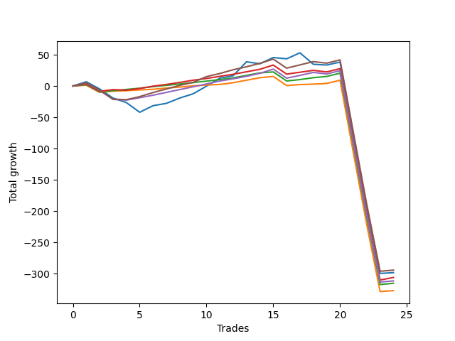

# Short Wallace 012 
- Symbol: ES_SmolBoiHour
- Date Range: 03/18/2022 - 07/29/2022
- Trading Period: 7:20-12:30
- Number of Trades: 24



| Name | Win Percent | Profit | Avg Profit / Trade | Avg Time / Trade |      | Name | Win Percent | Profit | Avg Profit / Trade | Avg Time / Trade |
| ---- | ----------- | ------ | ------------------ | ---------------- | ---- | ---- | ----------- | ------ | ------------------ | ---------------- |
| Sorted By <br> Profit | | | | | | Sorted By <br> Win Percentage ||||
| Eighty-Five | 66.67 | -147250.00 | -6135.42 | 109:20 |     | Eighty-Two | 79.17 | -157750.00 | -6572.92 | 45:03 |
| Two | 54.17 | -149250.00 | -6218.75 | 119:38 |     | Eighty-One | 79.17 | -163625.00 | -6817.71 | 42:52 |
| Eighty-Three | 70.83 | -153125.00 | -6380.21 | 48:29 |     | Eighty-Three | 70.83 | -153125.00 | -6380.21 | 48:29 |
| Eighty-Four | 66.67 | -155875.00 | -6494.79 | 108:46 |     | Eighty-Five | 66.67 | -147250.00 | -6135.42 | 109:20 |
| Eighty-Two | 79.17 | -157750.00 | -6572.92 | 45:03 |     | Eighty-Four | 66.67 | -155875.00 | -6494.79 | 108:46 |
| Eighty-One | 79.17 | -163625.00 | -6817.71 | 42:52 |     | Two | 54.17 | -149250.00 | -6218.75 | 119:38 |

## NO STOPLOSS

### Test Two
* Sell when the price hits the upper line of the 20p 2std bollinger
* No Stoploss
* Results:
```
Total Trades: 24
Percent Up: 45.83
Percent Down: 54.17
Total Points Moved Down: -298.50
Potential Profit: -149250.00
Total Points Ups: 411.50 Count Ups: 11
Total Points Downs: 113.00 Count Downs: 13
```

<details><summary>Trades</summary>

<code>In: 2022-03-23 11:51:00		Out: 2022-03-23 11:57:20		Total Position Time: 06:20		Total Move Down: 6.75		Total to Date: 6.75</code> <br />
<code>In: 2022-03-25 10:52:00		Out: 2022-03-25 11:51:55		Total Position Time: 59:55		Total Move Down: -11.50		Total to Date: -4.75</code> <br />
<code>In: 2022-03-28 11:12:00		Out: 2022-03-28 12:11:55		Total Position Time: 59:55		Total Move Down: -14.50		Total to Date: -19.25</code> <br />
<code>In: 2022-04-14 10:38:00		Out: 2022-04-14 11:19:10		Total Position Time: 41:10		Total Move Down: -7.25		Total to Date: -26.50</code> <br />
<code>In: 2022-04-18 10:13:00		Out: 2022-04-18 11:10:40		Total Position Time: 57:40		Total Move Down: -15.50		Total to Date: -42.00</code> <br />
<code>In: 2022-04-25 09:27:00		Out: 2022-04-25 10:01:20		Total Position Time: 34:20		Total Move Down: 10.50		Total to Date: -31.50</code> <br />
<code>In: 2022-04-26 11:23:00		Out: 2022-04-26 11:41:25		Total Position Time: 18:25		Total Move Down: 3.75		Total to Date: -27.75</code> <br />
<code>In: 2022-04-29 10:39:00		Out: 2022-04-29 10:43:20		Total Position Time: 04:20		Total Move Down: 8.50		Total to Date: -19.25</code> <br />
<code>In: 2022-05-11 11:27:00		Out: 2022-05-11 11:51:20		Total Position Time: 24:20		Total Move Down: 6.75		Total to Date: -12.50</code> <br />
<code>In: 2022-05-25 11:04:00		Out: 2022-05-25 11:06:40		Total Position Time: 02:40		Total Move Down: 12.25		Total to Date: -0.25</code> <br />
<code>In: 2022-06-09 08:45:00		Out: 2022-06-09 09:11:05		Total Position Time: 26:05		Total Move Down: 12.75		Total to Date: 12.50</code> <br />
<code>In: 2022-06-13 09:14:00		Out: 2022-06-13 09:30:15		Total Position Time: 16:15		Total Move Down: 4.00		Total to Date: 16.50</code> <br />
<code>In: 2022-06-13 09:40:00		Out: 2022-06-13 09:54:20		Total Position Time: 14:20		Total Move Down: 22.25		Total to Date: 38.75</code> <br />
<code>In: 2022-06-14 10:02:00		Out: 2022-06-14 10:31:00		Total Position Time: 29:00		Total Move Down: -3.25		Total to Date: 35.50</code> <br />
<code>In: 2022-06-15 11:02:00		Out: 2022-06-15 11:03:05		Total Position Time: 01:05		Total Move Down: 10.00		Total to Date: 45.50</code> <br />
<code>In: 2022-06-23 10:53:00		Out: 2022-06-23 11:18:15		Total Position Time: 25:15		Total Move Down: -2.00		Total to Date: 43.50</code> <br />
<code>In: 2022-06-29 10:12:00		Out: 2022-06-29 10:16:00		Total Position Time: 04:00		Total Move Down: 9.50		Total to Date: 53.00</code> <br />
<code>In: 2022-06-30 07:36:00		Out: 2022-06-30 08:35:55		Total Position Time: 59:55		Total Move Down: -18.25		Total to Date: 34.75</code> <br />
<code>In: 2022-07-06 10:05:00		Out: 2022-07-06 10:26:25		Total Position Time: 21:25		Total Move Down: -1.25		Total to Date: 33.50</code> <br />
<code>In: 2022-07-11 09:41:00		Out: 2022-07-11 12:00:00		Total Position Time: 139:00		Total Move Down: 4.75		Total to Date: 38.25</code> <br />
<code>In: 2022-07-14 07:56:00		Out: 2022-07-15 12:36:00		Total Position Time: 280:00		Total Move Down: -116.25		Total to Date: -78.00</code> <br />
<code>In: 2022-07-14 08:02:00		Out: 2022-07-15 12:42:00		Total Position Time: 280:00		Total Move Down: -114.75		Total to Date: -192.75</code> <br />
<code>In: 2022-07-14 08:12:00		Out: 2022-07-15 12:52:00		Total Position Time: 280:00		Total Move Down: -107.00		Total to Date: -299.75</code> <br />
<code>In: 2022-07-22 12:16:00		Out: 2022-07-25 11:22:00		Total Position Time: 1386:00		Total Move Down: 1.25		Total to Date: -298.50</code> <br />


</details>

## TAKE PROFIT

### Test Eighty-One
* Take Profit of 1 Point
* No Stoploss
* Results:
```
Total Trades: 24
Percent Up: 20.83
Percent Down: 79.17
Total Points Moved Down: -327.25
Potential Profit: -163625.00
Total Points Ups: 364.00 Count Ups: 5
Total Points Downs: 36.75 Count Downs: 19
```

<details><summary>Trades</summary>

<code>In: 2022-03-23 11:51:00		Out: 2022-03-23 11:51:25		Total Position Time: 00:25		Total Move Down: 1.25		Total to Date: 1.25</code> <br />
<code>In: 2022-03-25 10:52:00		Out: 2022-03-25 11:51:55		Total Position Time: 59:55		Total Move Down: -11.50		Total to Date: -10.25</code> <br />
<code>In: 2022-03-28 11:12:00		Out: 2022-03-28 11:12:10		Total Position Time: 00:10		Total Move Down: 2.00		Total to Date: -8.25</code> <br />
<code>In: 2022-04-14 10:38:00		Out: 2022-04-14 10:38:25		Total Position Time: 00:25		Total Move Down: 0.75		Total to Date: -7.50</code> <br />
<code>In: 2022-04-18 10:13:00		Out: 2022-04-18 10:13:50		Total Position Time: 00:50		Total Move Down: 1.25		Total to Date: -6.25</code> <br />
<code>In: 2022-04-25 09:27:00		Out: 2022-04-25 09:27:30		Total Position Time: 00:30		Total Move Down: 1.00		Total to Date: -5.25</code> <br />
<code>In: 2022-04-26 11:23:00		Out: 2022-04-26 11:27:25		Total Position Time: 04:25		Total Move Down: 2.00		Total to Date: -3.25</code> <br />
<code>In: 2022-04-29 10:39:00		Out: 2022-04-29 10:39:45		Total Position Time: 00:45		Total Move Down: 1.50		Total to Date: -1.75</code> <br />
<code>In: 2022-05-11 11:27:00		Out: 2022-05-11 11:27:10		Total Position Time: 00:10		Total Move Down: 2.00		Total to Date: 0.25</code> <br />
<code>In: 2022-05-25 11:04:00		Out: 2022-05-25 11:04:10		Total Position Time: 00:10		Total Move Down: 1.25		Total to Date: 1.50</code> <br />
<code>In: 2022-06-09 08:45:00		Out: 2022-06-09 08:45:10		Total Position Time: 00:10		Total Move Down: 1.00		Total to Date: 2.50</code> <br />
<code>In: 2022-06-13 09:14:00		Out: 2022-06-13 09:14:10		Total Position Time: 00:10		Total Move Down: 2.75		Total to Date: 5.25</code> <br />
<code>In: 2022-06-13 09:40:00		Out: 2022-06-13 09:40:10		Total Position Time: 00:10		Total Move Down: 4.00		Total to Date: 9.25</code> <br />
<code>In: 2022-06-14 10:02:00		Out: 2022-06-14 10:02:10		Total Position Time: 00:10		Total Move Down: 4.00		Total to Date: 13.25</code> <br />
<code>In: 2022-06-15 11:02:00		Out: 2022-06-15 11:02:10		Total Position Time: 00:10		Total Move Down: 2.00		Total to Date: 15.25</code> <br />
<code>In: 2022-06-23 10:53:00		Out: 2022-06-23 11:52:55		Total Position Time: 59:55		Total Move Down: -14.50		Total to Date: 0.75</code> <br />
<code>In: 2022-06-29 10:12:00		Out: 2022-06-29 10:12:20		Total Position Time: 00:20		Total Move Down: 1.50		Total to Date: 2.25</code> <br />
<code>In: 2022-06-30 07:36:00		Out: 2022-06-30 07:36:30		Total Position Time: 00:30		Total Move Down: 0.75		Total to Date: 3.00</code> <br />
<code>In: 2022-07-06 10:05:00		Out: 2022-07-06 10:27:40		Total Position Time: 22:40		Total Move Down: 1.00		Total to Date: 4.00</code> <br />
<code>In: 2022-07-11 09:41:00		Out: 2022-07-11 09:54:00		Total Position Time: 13:00		Total Move Down: 5.25		Total to Date: 9.25</code> <br />
<code>In: 2022-07-14 07:56:00		Out: 2022-07-15 12:36:00		Total Position Time: 280:00		Total Move Down: -116.25		Total to Date: -107.00</code> <br />
<code>In: 2022-07-14 08:02:00		Out: 2022-07-15 12:42:00		Total Position Time: 280:00		Total Move Down: -114.75		Total to Date: -221.75</code> <br />
<code>In: 2022-07-14 08:12:00		Out: 2022-07-15 12:52:00		Total Position Time: 280:00		Total Move Down: -107.00		Total to Date: -328.75</code> <br />
<code>In: 2022-07-22 12:16:00		Out: 2022-07-22 12:40:00		Total Position Time: 24:00		Total Move Down: 1.50		Total to Date: -327.25</code> <br />


</details>

### Test Eighty-Two
* Take Profit of 2 Point
* No Stoploss
* Results:
```
Total Trades: 24
Percent Up: 20.83
Percent Down: 79.17
Total Points Moved Down: -315.50
Potential Profit: -157750.00
Total Points Ups: 364.00 Count Ups: 5
Total Points Downs: 48.50 Count Downs: 19
```

<details><summary>Trades</summary>

<code>In: 2022-03-23 11:51:00		Out: 2022-03-23 11:52:40		Total Position Time: 01:40		Total Move Down: 2.00		Total to Date: 2.00</code> <br />
<code>In: 2022-03-25 10:52:00		Out: 2022-03-25 11:51:55		Total Position Time: 59:55		Total Move Down: -11.50		Total to Date: -9.50</code> <br />
<code>In: 2022-03-28 11:12:00		Out: 2022-03-28 11:12:10		Total Position Time: 00:10		Total Move Down: 2.00		Total to Date: -7.50</code> <br />
<code>In: 2022-04-14 10:38:00		Out: 2022-04-14 10:39:40		Total Position Time: 01:40		Total Move Down: 2.00		Total to Date: -5.50</code> <br />
<code>In: 2022-04-18 10:13:00		Out: 2022-04-18 10:15:10		Total Position Time: 02:10		Total Move Down: 2.00		Total to Date: -3.50</code> <br />
<code>In: 2022-04-25 09:27:00		Out: 2022-04-25 09:27:40		Total Position Time: 00:40		Total Move Down: 2.50		Total to Date: -1.00</code> <br />
<code>In: 2022-04-26 11:23:00		Out: 2022-04-26 11:27:30		Total Position Time: 04:30		Total Move Down: 2.00		Total to Date: 1.00</code> <br />
<code>In: 2022-04-29 10:39:00		Out: 2022-04-29 10:40:00		Total Position Time: 01:00		Total Move Down: 2.25		Total to Date: 3.25</code> <br />
<code>In: 2022-05-11 11:27:00		Out: 2022-05-11 11:27:15		Total Position Time: 00:15		Total Move Down: 2.25		Total to Date: 5.50</code> <br />
<code>In: 2022-05-25 11:04:00		Out: 2022-05-25 11:05:45		Total Position Time: 01:45		Total Move Down: 2.25		Total to Date: 7.75</code> <br />
<code>In: 2022-06-09 08:45:00		Out: 2022-06-09 08:46:45		Total Position Time: 01:45		Total Move Down: 2.50		Total to Date: 10.25</code> <br />
<code>In: 2022-06-13 09:14:00		Out: 2022-06-13 09:14:10		Total Position Time: 00:10		Total Move Down: 2.75		Total to Date: 13.00</code> <br />
<code>In: 2022-06-13 09:40:00		Out: 2022-06-13 09:40:10		Total Position Time: 00:10		Total Move Down: 4.00		Total to Date: 17.00</code> <br />
<code>In: 2022-06-14 10:02:00		Out: 2022-06-14 10:02:10		Total Position Time: 00:10		Total Move Down: 4.00		Total to Date: 21.00</code> <br />
<code>In: 2022-06-15 11:02:00		Out: 2022-06-15 11:02:45		Total Position Time: 00:45		Total Move Down: 1.50		Total to Date: 22.50</code> <br />
<code>In: 2022-06-23 10:53:00		Out: 2022-06-23 11:52:55		Total Position Time: 59:55		Total Move Down: -14.50		Total to Date: 8.00</code> <br />
<code>In: 2022-06-29 10:12:00		Out: 2022-06-29 10:12:30		Total Position Time: 00:30		Total Move Down: 2.25		Total to Date: 10.25</code> <br />
<code>In: 2022-06-30 07:36:00		Out: 2022-06-30 07:39:00		Total Position Time: 03:00		Total Move Down: 3.00		Total to Date: 13.25</code> <br />
<code>In: 2022-07-06 10:05:00		Out: 2022-07-06 11:04:25		Total Position Time: 59:25		Total Move Down: 2.00		Total to Date: 15.25</code> <br />
<code>In: 2022-07-11 09:41:00		Out: 2022-07-11 09:54:00		Total Position Time: 13:00		Total Move Down: 5.25		Total to Date: 20.50</code> <br />
<code>In: 2022-07-14 07:56:00		Out: 2022-07-15 12:36:00		Total Position Time: 280:00		Total Move Down: -116.25		Total to Date: -95.75</code> <br />
<code>In: 2022-07-14 08:02:00		Out: 2022-07-15 12:42:00		Total Position Time: 280:00		Total Move Down: -114.75		Total to Date: -210.50</code> <br />
<code>In: 2022-07-14 08:12:00		Out: 2022-07-15 12:52:00		Total Position Time: 280:00		Total Move Down: -107.00		Total to Date: -317.50</code> <br />
<code>In: 2022-07-22 12:16:00		Out: 2022-07-22 12:45:00		Total Position Time: 29:00		Total Move Down: 2.00		Total to Date: -315.50</code> <br />


</details>

### Test Eighty-Three
* Take Profit of 3 Point
* No Stoploss
* Results:
```
Total Trades: 24
Percent Up: 29.17
Percent Down: 70.83
Total Points Moved Down: -306.25
Potential Profit: -153125.00
Total Points Ups: 367.50 Count Ups: 7
Total Points Downs: 61.25 Count Downs: 17
```

<details><summary>Trades</summary>

<code>In: 2022-03-23 11:51:00		Out: 2022-03-23 11:56:25		Total Position Time: 05:25		Total Move Down: 3.00		Total to Date: 3.00</code> <br />
<code>In: 2022-03-25 10:52:00		Out: 2022-03-25 11:51:55		Total Position Time: 59:55		Total Move Down: -11.50		Total to Date: -8.50</code> <br />
<code>In: 2022-03-28 11:12:00		Out: 2022-03-28 11:20:40		Total Position Time: 08:40		Total Move Down: 2.75		Total to Date: -5.75</code> <br />
<code>In: 2022-04-14 10:38:00		Out: 2022-04-14 11:37:55		Total Position Time: 59:55		Total Move Down: -1.00		Total to Date: -6.75</code> <br />
<code>In: 2022-04-18 10:13:00		Out: 2022-04-18 10:17:25		Total Position Time: 04:25		Total Move Down: 2.75		Total to Date: -4.00</code> <br />
<code>In: 2022-04-25 09:27:00		Out: 2022-04-25 09:27:50		Total Position Time: 00:50		Total Move Down: 3.75		Total to Date: -0.25</code> <br />
<code>In: 2022-04-26 11:23:00		Out: 2022-04-26 11:32:20		Total Position Time: 09:20		Total Move Down: 2.75		Total to Date: 2.50</code> <br />
<code>In: 2022-04-29 10:39:00		Out: 2022-04-29 10:40:25		Total Position Time: 01:25		Total Move Down: 3.25		Total to Date: 5.75</code> <br />
<code>In: 2022-05-11 11:27:00		Out: 2022-05-11 11:27:25		Total Position Time: 00:25		Total Move Down: 3.50		Total to Date: 9.25</code> <br />
<code>In: 2022-05-25 11:04:00		Out: 2022-05-25 11:06:20		Total Position Time: 02:20		Total Move Down: 2.75		Total to Date: 12.00</code> <br />
<code>In: 2022-06-09 08:45:00		Out: 2022-06-09 08:46:50		Total Position Time: 01:50		Total Move Down: 3.50		Total to Date: 15.50</code> <br />
<code>In: 2022-06-13 09:14:00		Out: 2022-06-13 09:14:15		Total Position Time: 00:15		Total Move Down: 3.25		Total to Date: 18.75</code> <br />
<code>In: 2022-06-13 09:40:00		Out: 2022-06-13 09:40:10		Total Position Time: 00:10		Total Move Down: 4.00		Total to Date: 22.75</code> <br />
<code>In: 2022-06-14 10:02:00		Out: 2022-06-14 10:02:10		Total Position Time: 00:10		Total Move Down: 4.00		Total to Date: 26.75</code> <br />
<code>In: 2022-06-15 11:02:00		Out: 2022-06-15 11:03:00		Total Position Time: 01:00		Total Move Down: 6.75		Total to Date: 33.50</code> <br />
<code>In: 2022-06-23 10:53:00		Out: 2022-06-23 11:52:55		Total Position Time: 59:55		Total Move Down: -14.50		Total to Date: 19.00</code> <br />
<code>In: 2022-06-29 10:12:00		Out: 2022-06-29 10:12:50		Total Position Time: 00:50		Total Move Down: 3.00		Total to Date: 22.00</code> <br />
<code>In: 2022-06-30 07:36:00		Out: 2022-06-30 07:39:00		Total Position Time: 03:00		Total Move Down: 3.00		Total to Date: 25.00</code> <br />
<code>In: 2022-07-06 10:05:00		Out: 2022-07-06 11:04:55		Total Position Time: 59:55		Total Move Down: -2.50		Total to Date: 22.50</code> <br />
<code>In: 2022-07-11 09:41:00		Out: 2022-07-11 09:54:00		Total Position Time: 13:00		Total Move Down: 5.25		Total to Date: 27.75</code> <br />
<code>In: 2022-07-14 07:56:00		Out: 2022-07-15 12:36:00		Total Position Time: 280:00		Total Move Down: -116.25		Total to Date: -88.50</code> <br />
<code>In: 2022-07-14 08:02:00		Out: 2022-07-15 12:42:00		Total Position Time: 280:00		Total Move Down: -114.75		Total to Date: -203.25</code> <br />
<code>In: 2022-07-14 08:12:00		Out: 2022-07-15 12:52:00		Total Position Time: 280:00		Total Move Down: -107.00		Total to Date: -310.25</code> <br />
<code>In: 2022-07-22 12:16:00		Out: 2022-07-22 12:47:00		Total Position Time: 31:00		Total Move Down: 4.00		Total to Date: -306.25</code> <br />


</details>

### Test Eighty-Four
* Take Profit of 4 Point
* No Stoploss
* Results:
```
Total Trades: 24
Percent Up: 33.33
Percent Down: 66.67
Total Points Moved Down: -311.75
Potential Profit: -155875.00
Total Points Ups: 382.00 Count Ups: 8
Total Points Downs: 70.25 Count Downs: 16
```

<details><summary>Trades</summary>

<code>In: 2022-03-23 11:51:00		Out: 2022-03-23 11:56:35		Total Position Time: 05:35		Total Move Down: 4.50		Total to Date: 4.50</code> <br />
<code>In: 2022-03-25 10:52:00		Out: 2022-03-25 11:51:55		Total Position Time: 59:55		Total Move Down: -11.50		Total to Date: -7.00</code> <br />
<code>In: 2022-03-28 11:12:00		Out: 2022-03-28 12:11:55		Total Position Time: 59:55		Total Move Down: -14.50		Total to Date: -21.50</code> <br />
<code>In: 2022-04-14 10:38:00		Out: 2022-04-14 11:37:55		Total Position Time: 59:55		Total Move Down: -1.00		Total to Date: -22.50</code> <br />
<code>In: 2022-04-18 10:13:00		Out: 2022-04-18 10:17:45		Total Position Time: 04:45		Total Move Down: 3.75		Total to Date: -18.75</code> <br />
<code>In: 2022-04-25 09:27:00		Out: 2022-04-25 09:28:00		Total Position Time: 01:00		Total Move Down: 4.00		Total to Date: -14.75</code> <br />
<code>In: 2022-04-26 11:23:00		Out: 2022-04-26 11:33:45		Total Position Time: 10:45		Total Move Down: 4.50		Total to Date: -10.25</code> <br />
<code>In: 2022-04-29 10:39:00		Out: 2022-04-29 10:40:30		Total Position Time: 01:30		Total Move Down: 4.50		Total to Date: -5.75</code> <br />
<code>In: 2022-05-11 11:27:00		Out: 2022-05-11 11:27:45		Total Position Time: 00:45		Total Move Down: 4.50		Total to Date: -1.25</code> <br />
<code>In: 2022-05-25 11:04:00		Out: 2022-05-25 11:06:25		Total Position Time: 02:25		Total Move Down: 4.50		Total to Date: 3.25</code> <br />
<code>In: 2022-06-09 08:45:00		Out: 2022-06-09 08:48:05		Total Position Time: 03:05		Total Move Down: 4.75		Total to Date: 8.00</code> <br />
<code>In: 2022-06-13 09:14:00		Out: 2022-06-13 09:14:40		Total Position Time: 00:40		Total Move Down: 3.50		Total to Date: 11.50</code> <br />
<code>In: 2022-06-13 09:40:00		Out: 2022-06-13 09:40:10		Total Position Time: 00:10		Total Move Down: 4.00		Total to Date: 15.50</code> <br />
<code>In: 2022-06-14 10:02:00		Out: 2022-06-14 10:02:15		Total Position Time: 00:15		Total Move Down: 4.75		Total to Date: 20.25</code> <br />
<code>In: 2022-06-15 11:02:00		Out: 2022-06-15 11:03:00		Total Position Time: 01:00		Total Move Down: 6.75		Total to Date: 27.00</code> <br />
<code>In: 2022-06-23 10:53:00		Out: 2022-06-23 11:52:55		Total Position Time: 59:55		Total Move Down: -14.50		Total to Date: 12.50</code> <br />
<code>In: 2022-06-29 10:12:00		Out: 2022-06-29 10:13:10		Total Position Time: 01:10		Total Move Down: 4.50		Total to Date: 17.00</code> <br />
<code>In: 2022-06-30 07:36:00		Out: 2022-06-30 07:39:55		Total Position Time: 03:55		Total Move Down: 4.75		Total to Date: 21.75</code> <br />
<code>In: 2022-07-06 10:05:00		Out: 2022-07-06 11:04:55		Total Position Time: 59:55		Total Move Down: -2.50		Total to Date: 19.25</code> <br />
<code>In: 2022-07-11 09:41:00		Out: 2022-07-11 09:54:00		Total Position Time: 13:00		Total Move Down: 5.25		Total to Date: 24.50</code> <br />
<code>In: 2022-07-14 07:56:00		Out: 2022-07-15 12:36:00		Total Position Time: 280:00		Total Move Down: -116.25		Total to Date: -91.75</code> <br />
<code>In: 2022-07-14 08:02:00		Out: 2022-07-15 12:42:00		Total Position Time: 280:00		Total Move Down: -114.75		Total to Date: -206.50</code> <br />
<code>In: 2022-07-14 08:12:00		Out: 2022-07-15 12:52:00		Total Position Time: 280:00		Total Move Down: -107.00		Total to Date: -313.50</code> <br />
<code>In: 2022-07-22 12:16:00		Out: 2022-07-25 11:57:00		Total Position Time: 1421:00		Total Move Down: 1.75		Total to Date: -311.75</code> <br />


</details>

### Test Eighty-Five
* Take Profit of 5 Point
* No Stoploss
* Results:
```
Total Trades: 24
Percent Up: 33.33
Percent Down: 66.67
Total Points Moved Down: -294.50
Potential Profit: -147250.00
Total Points Ups: 382.00 Count Ups: 8
Total Points Downs: 87.50 Count Downs: 16
```

<details><summary>Trades</summary>

<code>In: 2022-03-23 11:51:00		Out: 2022-03-23 11:56:45		Total Position Time: 05:45		Total Move Down: 5.00		Total to Date: 5.00</code> <br />
<code>In: 2022-03-25 10:52:00		Out: 2022-03-25 11:51:55		Total Position Time: 59:55		Total Move Down: -11.50		Total to Date: -6.50</code> <br />
<code>In: 2022-03-28 11:12:00		Out: 2022-03-28 12:11:55		Total Position Time: 59:55		Total Move Down: -14.50		Total to Date: -21.00</code> <br />
<code>In: 2022-04-14 10:38:00		Out: 2022-04-14 11:37:55		Total Position Time: 59:55		Total Move Down: -1.00		Total to Date: -22.00</code> <br />
<code>In: 2022-04-18 10:13:00		Out: 2022-04-18 10:18:00		Total Position Time: 05:00		Total Move Down: 5.00		Total to Date: -17.00</code> <br />
<code>In: 2022-04-25 09:27:00		Out: 2022-04-25 09:28:30		Total Position Time: 01:30		Total Move Down: 6.50		Total to Date: -10.50</code> <br />
<code>In: 2022-04-26 11:23:00		Out: 2022-04-26 11:42:05		Total Position Time: 19:05		Total Move Down: 5.75		Total to Date: -4.75</code> <br />
<code>In: 2022-04-29 10:39:00		Out: 2022-04-29 10:40:40		Total Position Time: 01:40		Total Move Down: 5.75		Total to Date: 1.00</code> <br />
<code>In: 2022-05-11 11:27:00		Out: 2022-05-11 11:27:50		Total Position Time: 00:50		Total Move Down: 4.75		Total to Date: 5.75</code> <br />
<code>In: 2022-05-25 11:04:00		Out: 2022-05-25 11:06:35		Total Position Time: 02:35		Total Move Down: 9.25		Total to Date: 15.00</code> <br />
<code>In: 2022-06-09 08:45:00		Out: 2022-06-09 08:48:10		Total Position Time: 03:10		Total Move Down: 5.00		Total to Date: 20.00</code> <br />
<code>In: 2022-06-13 09:14:00		Out: 2022-06-13 09:17:05		Total Position Time: 03:05		Total Move Down: 6.00		Total to Date: 26.00</code> <br />
<code>In: 2022-06-13 09:40:00		Out: 2022-06-13 09:40:30		Total Position Time: 00:30		Total Move Down: 4.75		Total to Date: 30.75</code> <br />
<code>In: 2022-06-14 10:02:00		Out: 2022-06-14 10:02:20		Total Position Time: 00:20		Total Move Down: 5.50		Total to Date: 36.25</code> <br />
<code>In: 2022-06-15 11:02:00		Out: 2022-06-15 11:03:00		Total Position Time: 01:00		Total Move Down: 6.75		Total to Date: 43.00</code> <br />
<code>In: 2022-06-23 10:53:00		Out: 2022-06-23 11:52:55		Total Position Time: 59:55		Total Move Down: -14.50		Total to Date: 28.50</code> <br />
<code>In: 2022-06-29 10:12:00		Out: 2022-06-29 10:13:55		Total Position Time: 01:55		Total Move Down: 5.25		Total to Date: 33.75</code> <br />
<code>In: 2022-06-30 07:36:00		Out: 2022-06-30 07:40:00		Total Position Time: 04:00		Total Move Down: 5.25		Total to Date: 39.00</code> <br />
<code>In: 2022-07-06 10:05:00		Out: 2022-07-06 11:04:55		Total Position Time: 59:55		Total Move Down: -2.50		Total to Date: 36.50</code> <br />
<code>In: 2022-07-11 09:41:00		Out: 2022-07-11 09:54:00		Total Position Time: 13:00		Total Move Down: 5.25		Total to Date: 41.75</code> <br />
<code>In: 2022-07-14 07:56:00		Out: 2022-07-15 12:36:00		Total Position Time: 280:00		Total Move Down: -116.25		Total to Date: -74.50</code> <br />
<code>In: 2022-07-14 08:02:00		Out: 2022-07-15 12:42:00		Total Position Time: 280:00		Total Move Down: -114.75		Total to Date: -189.25</code> <br />
<code>In: 2022-07-14 08:12:00		Out: 2022-07-15 12:52:00		Total Position Time: 280:00		Total Move Down: -107.00		Total to Date: -296.25</code> <br />
<code>In: 2022-07-22 12:16:00		Out: 2022-07-25 11:57:00		Total Position Time: 1421:00		Total Move Down: 1.75		Total to Date: -294.50</code> <br />


</details>