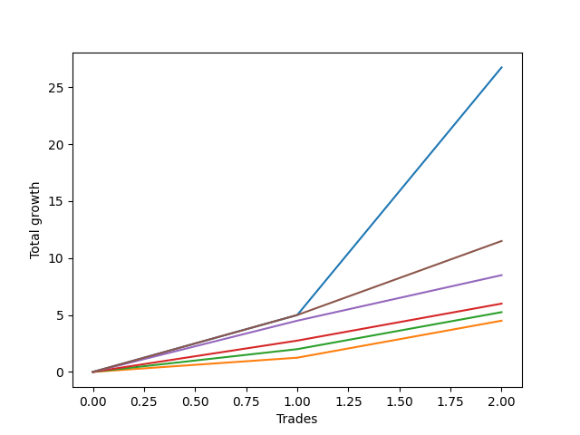

# Short Wallace 015 
- Symbol: ES_SmolBoiHour
- Date Range: 03/18/2022 - 07/29/2022
- Trading Period: 7:20-12:30
- Number of Trades: 2



| Name | Win Percent | Profit | Avg Profit / Trade | Avg Time / Trade |      | Name | Win Percent | Profit | Avg Profit / Trade | Avg Time / Trade |
| ---- | ----------- | ------ | ------------------ | ---------------- | ---- | ---- | ----------- | ------ | ------------------ | ---------------- |
| Sorted By <br> Profit | | | | | | Sorted By <br> Win Percentage ||||
| Two | 100.00 | 13375.00 | 6687.50 | 09:15 |     | Two | 100.00 | 13375.00 | 6687.50 | 09:15 |
| Eighty-Five | 100.00 | 5750.00 | 2875.00 | 02:27 |     | Eighty-Five | 100.00 | 5750.00 | 2875.00 | 02:27 |
| Eighty-Four | 100.00 | 4250.00 | 2125.00 | 02:17 |     | Eighty-Four | 100.00 | 4250.00 | 2125.00 | 02:17 |
| Eighty-Three | 100.00 | 3000.00 | 1500.00 | 02:05 |     | Eighty-Three | 100.00 | 3000.00 | 1500.00 | 02:05 |
| Eighty-Two | 100.00 | 2625.00 | 1312.50 | 01:55 |     | Eighty-Two | 100.00 | 2625.00 | 1312.50 | 01:55 |
| Eighty-One | 100.00 | 2250.00 | 1125.00 | 01:37 |     | Eighty-One | 100.00 | 2250.00 | 1125.00 | 01:37 |

## NO STOPLOSS

### Test Two
* Sell when the price hits the upper line of the 20p 2std bollinger
* No Stoploss
* Results:
```
Total Trades: 2
Percent Up: 0.00
Percent Down: 100.00
Total Points Moved Down: 26.75
Potential Profit: 13375.00
Total Points Ups: 0.00 Count Ups: 0
Total Points Downs: 26.75 Count Downs: 2
```

<details><summary>Trades</summary>

<code>In: 2022-04-06 10:43:00		Out: 2022-04-06 10:57:20		Total Position Time: 14:20		Total Move Down: 5.00		Total to Date: 5.00</code> <br />
<code>In: 2022-04-06 11:04:00		Out: 2022-04-06 11:08:10		Total Position Time: 04:10		Total Move Down: 21.75		Total to Date: 26.75</code> <br />


</details>

## TAKE PROFIT

### Test Eighty-One
* Take Profit of 1 Point
* No Stoploss
* Results:
```
Total Trades: 2
Percent Up: 0.00
Percent Down: 100.00
Total Points Moved Down: 4.50
Potential Profit: 2250.00
Total Points Ups: 0.00 Count Ups: 0
Total Points Downs: 4.50 Count Downs: 2
```

<details><summary>Trades</summary>

<code>In: 2022-04-06 10:43:00		Out: 2022-04-06 10:46:05		Total Position Time: 03:05		Total Move Down: 1.25		Total to Date: 1.25</code> <br />
<code>In: 2022-04-06 11:04:00		Out: 2022-04-06 11:04:10		Total Position Time: 00:10		Total Move Down: 3.25		Total to Date: 4.50</code> <br />


</details>

### Test Eighty-Two
* Take Profit of 2 Point
* No Stoploss
* Results:
```
Total Trades: 2
Percent Up: 0.00
Percent Down: 100.00
Total Points Moved Down: 5.25
Potential Profit: 2625.00
Total Points Ups: 0.00 Count Ups: 0
Total Points Downs: 5.25 Count Downs: 2
```

<details><summary>Trades</summary>

<code>In: 2022-04-06 10:43:00		Out: 2022-04-06 10:46:40		Total Position Time: 03:40		Total Move Down: 2.00		Total to Date: 2.00</code> <br />
<code>In: 2022-04-06 11:04:00		Out: 2022-04-06 11:04:10		Total Position Time: 00:10		Total Move Down: 3.25		Total to Date: 5.25</code> <br />


</details>

### Test Eighty-Three
* Take Profit of 3 Point
* No Stoploss
* Results:
```
Total Trades: 2
Percent Up: 0.00
Percent Down: 100.00
Total Points Moved Down: 6.00
Potential Profit: 3000.00
Total Points Ups: 0.00 Count Ups: 0
Total Points Downs: 6.00 Count Downs: 2
```

<details><summary>Trades</summary>

<code>In: 2022-04-06 10:43:00		Out: 2022-04-06 10:47:00		Total Position Time: 04:00		Total Move Down: 2.75		Total to Date: 2.75</code> <br />
<code>In: 2022-04-06 11:04:00		Out: 2022-04-06 11:04:10		Total Position Time: 00:10		Total Move Down: 3.25		Total to Date: 6.00</code> <br />


</details>

### Test Eighty-Four
* Take Profit of 4 Point
* No Stoploss
* Results:
```
Total Trades: 2
Percent Up: 0.00
Percent Down: 100.00
Total Points Moved Down: 8.50
Potential Profit: 4250.00
Total Points Ups: 0.00 Count Ups: 0
Total Points Downs: 8.50 Count Downs: 2
```

<details><summary>Trades</summary>

<code>In: 2022-04-06 10:43:00		Out: 2022-04-06 10:47:10		Total Position Time: 04:10		Total Move Down: 4.50		Total to Date: 4.50</code> <br />
<code>In: 2022-04-06 11:04:00		Out: 2022-04-06 11:04:25		Total Position Time: 00:25		Total Move Down: 4.00		Total to Date: 8.50</code> <br />


</details>

### Test Eighty-Five
* Take Profit of 5 Point
* No Stoploss
* Results:
```
Total Trades: 2
Percent Up: 0.00
Percent Down: 100.00
Total Points Moved Down: 11.50
Potential Profit: 5750.00
Total Points Ups: 0.00 Count Ups: 0
Total Points Downs: 11.50 Count Downs: 2
```

<details><summary>Trades</summary>

<code>In: 2022-04-06 10:43:00		Out: 2022-04-06 10:47:20		Total Position Time: 04:20		Total Move Down: 5.00		Total to Date: 5.00</code> <br />
<code>In: 2022-04-06 11:04:00		Out: 2022-04-06 11:04:35		Total Position Time: 00:35		Total Move Down: 6.50		Total to Date: 11.50</code> <br />


</details>