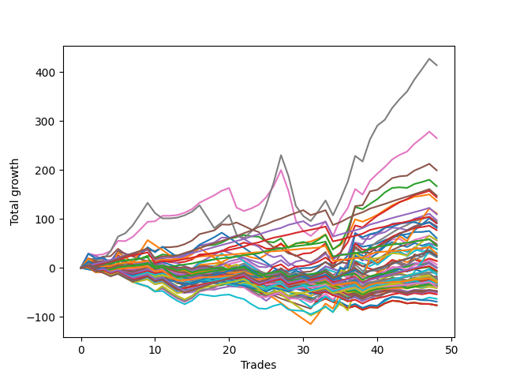

# Long Bulldog 003 
- Symbol: ES_Unlimited
- Date Range: 03/18/2022 - 07/15/2022
- Trading Period: 7:20-12:30
- Number of Trades: 48



| Name | Win Percent | Profit | Avg Profit / Trade | Avg Time / Trade |      | Name | Win Percent | Profit | Avg Profit / Trade | Avg Time / Trade |
| ---- | ----------- | ------ | ------------------ | ---------------- | ---- | ---- | ----------- | ------ | ------------------ | ---------------- |
| Sorted By <br> Profit | | | | | | Sorted By <br> Win Percentage ||||
| Seven | 70.83 | 207000.00 | 4312.50 | 133:47 |     | Eighty-One | 95.83 | 14375.00 | 299.48 | 15:05 |
| Six | 77.08 | 132500.00 | 2760.42 | 91:58 |     | Eighty-Three | 93.75 | 45375.00 | 945.31 | 32:07 |
| Five | 66.67 | 99625.00 | 2075.52 | 59:41 |     | Eighty-Two | 93.75 | 22500.00 | 468.75 | 23:43 |
| Two | 64.58 | 83375.00 | 1736.98 | 27:39 |     | Eighty-Four | 91.67 | 54625.00 | 1138.02 | 38:11 |
| Eighty-Five | 89.58 | 73750.00 | 1536.46 | 42:24 |     | Eighty-Five | 89.58 | 73750.00 | 1536.46 | 42:24 |
| Three | 68.75 | 72000.00 | 1500.00 | 27:44 |     | One Hundred Twenty-Six | 81.25 | -15125.00 | -315.10 | 06:33 |
| One | 72.92 | 68375.00 | 1424.48 | 18:47 |     | One Hundred Twenty-Seven | 79.17 | -3750.00 | -78.12 | 08:21 |
| Sixty-Three | 39.58 | 55625.00 | 1158.85 | 67:06 |     | One Hundred Twenty-One | 79.17 | -19750.00 | -411.46 | 05:10 |
| Eighty-Four | 91.67 | 54625.00 | 1138.02 | 38:11 |     | Six | 77.08 | 132500.00 | 2760.42 | 91:58 |
| Four | 60.42 | 48625.00 | 1013.02 | 52:16 |     | One Hundred Twenty-Two | 77.08 | -11000.00 | -229.17 | 06:59 |
| Fifty-Nine | 66.67 | 47000.00 | 979.17 | 17:43 |     | One | 72.92 | 68375.00 | 1424.48 | 18:47 |
| Sixty-Two | 47.92 | 45500.00 | 947.92 | 42:24 |     | One Hundred Twenty-Eight | 72.92 | -2875.00 | -59.90 | 10:41 |
| Eighty-Three | 93.75 | 45375.00 | 945.31 | 32:07 |     | Seven | 70.83 | 207000.00 | 4312.50 | 133:47 |
| Sixty-Six | 58.33 | 42375.00 | 882.81 | 17:11 |     | One Hundred Twenty-Three | 70.83 | -13375.00 | -278.65 | 09:21 |
| Sixty-Seven | 58.33 | 42000.00 | 875.00 | 17:04 |     | Three | 68.75 | 72000.00 | 1500.00 | 27:44 |
| Seventy-Three | 54.17 | 40750.00 | 848.96 | 14:10 |     | Fifty-Seven | 68.75 | 24125.00 | 502.60 | 13:16 |
| Sixty-Five | 66.67 | 38500.00 | 802.08 | 13:26 |     | One Hundred Twenty-Five | 68.75 | 11500.00 | 239.58 | 13:57 |
| Zero | 62.50 | 30250.00 | 630.21 | 14:08 |     | One Hundred Twenty-Nine | 68.75 | -125.00 | -2.60 | 12:14 |
| Seventy | 43.75 | 28250.00 | 588.54 | 28:35 |     | One Hundred Twenty-Four | 68.75 | -7000.00 | -145.83 | 11:12 |
| Fifty-Eight | 62.50 | 27750.00 | 578.12 | 18:18 |     | Five | 66.67 | 99625.00 | 2075.52 | 59:41 |
| Fifty-Seven | 68.75 | 24125.00 | 502.60 | 13:16 |     | Fifty-Nine | 66.67 | 47000.00 | 979.17 | 17:43 |
| Eighty-Two | 93.75 | 22500.00 | 468.75 | 23:43 |     | Sixty-Five | 66.67 | 38500.00 | 802.08 | 13:26 |
| Forty-Two | 41.67 | 22500.00 | 468.75 | 11:44 |     | One Hundred Thirty | 66.67 | 12625.00 | 263.02 | 14:22 |
| Forty-Six | 29.17 | 22375.00 | 466.15 | 23:31 |     | One Hundred Sixteen | 66.67 | -18500.00 | -385.42 | 03:34 |
| Forty-Seven | 20.83 | 19375.00 | 403.65 | 36:28 |     | Two | 64.58 | 83375.00 | 1736.98 | 27:39 |
| Sixty-One | 50.00 | 18750.00 | 390.62 | 33:04 |     | One Hundred Eleven | 64.58 | -16875.00 | -351.56 | 03:11 |
| Forty-One | 45.83 | 15500.00 | 322.92 | 08:39 |     | Zero | 62.50 | 30250.00 | 630.21 | 14:08 |
| Eighty-One | 95.83 | 14375.00 | 299.48 | 15:05 |     | Fifty-Eight | 62.50 | 27750.00 | 578.12 | 18:18 |
| One Hundred Thirty | 66.67 | 12625.00 | 263.02 | 14:22 |     | Four | 60.42 | 48625.00 | 1013.02 | 52:16 |
| Seventy-One | 39.58 | 12625.00 | 263.02 | 33:56 |     | Fifty-Six | 60.42 | 625.00 | 13.02 | 10:24 |
| One Hundred Twenty-Five | 68.75 | 11500.00 | 239.58 | 13:57 |     | One Hundred Twelve | 60.42 | -11875.00 | -247.40 | 04:01 |
| Sixty-Nine | 43.75 | 10625.00 | 221.35 | 26:43 |     | Sixty-Six | 58.33 | 42375.00 | 882.81 | 17:11 |
| Forty-Three | 37.50 | 7000.00 | 145.83 | 11:22 |     | Sixty-Seven | 58.33 | 42000.00 | 875.00 | 17:04 |
| Forty-Five | 29.17 | 6875.00 | 143.23 | 19:21 |     | Sixty-Four | 58.33 | -125.00 | -2.60 | 10:54 |
| Sixty-Eight | 43.75 | 3375.00 | 70.31 | 23:22 |     | One Hundred Seventeen | 58.33 | -18500.00 | -385.42 | 04:32 |
| Fifty-Six | 60.42 | 625.00 | 13.02 | 10:24 |     | Seventy-Three | 54.17 | 40750.00 | 848.96 | 14:10 |
| One Hundred Twenty-Nine | 68.75 | -125.00 | -2.60 | 12:14 |     | One Hundred One | 52.08 | -15500.00 | -322.92 | 02:06 |
| Sixty-Four | 58.33 | -125.00 | -2.60 | 10:54 |     | One Hundred Six | 52.08 | -18500.00 | -385.42 | 02:23 |
| One Hundred Twenty-Eight | 72.92 | -2875.00 | -59.90 | 10:41 |     | Sixty-One | 50.00 | 18750.00 | 390.62 | 33:04 |
| One Hundred Twenty-Seven | 79.17 | -3750.00 | -78.12 | 08:21 |     | Sixty | 50.00 | -12625.00 | -263.02 | 28:14 |
| One Hundred Fifteen | 47.92 | -3875.00 | -80.73 | 08:00 |     | Ninety-Six | 50.00 | -13500.00 | -281.25 | 01:49 |
| Ninety-Two | 45.83 | -5625.00 | -117.19 | 02:00 |     | One Hundred Thirteen | 50.00 | -20000.00 | -416.67 | 05:45 |
| One Hundred Twenty-Four | 68.75 | -7000.00 | -145.83 | 11:12 |     | Sixty-Two | 47.92 | 45500.00 | 947.92 | 42:24 |
| One Hundred | 41.67 | -8875.00 | -184.90 | 02:28 |     | One Hundred Fifteen | 47.92 | -3875.00 | -80.73 | 08:00 |
| Forty | 41.67 | -9750.00 | -203.12 | 06:45 |     | Ninety-One | 47.92 | -11375.00 | -236.98 | 01:41 |
| Ninety-Nine | 41.67 | -10250.00 | -213.54 | 02:19 |     | One Hundred Two | 47.92 | -12000.00 | -250.00 | 02:29 |
| One Hundred Twenty-Two | 77.08 | -11000.00 | -229.17 | 06:59 |     | One Hundred Fourteen | 47.92 | -15875.00 | -330.73 | 06:25 |
| Ninety-Seven | 43.75 | -11250.00 | -234.38 | 02:02 |     | Forty-One | 45.83 | 15500.00 | 322.92 | 08:39 |
| Ninety-One | 47.92 | -11375.00 | -236.98 | 01:41 |     | Ninety-Two | 45.83 | -5625.00 | -117.19 | 02:00 |
| One Hundred Twelve | 60.42 | -11875.00 | -247.40 | 04:01 |     | Seventy | 43.75 | 28250.00 | 588.54 | 28:35 |
| One Hundred Two | 47.92 | -12000.00 | -250.00 | 02:29 |     | Sixty-Nine | 43.75 | 10625.00 | 221.35 | 26:43 |
| Ninety-Eight | 41.67 | -12500.00 | -260.42 | 02:13 |     | Sixty-Eight | 43.75 | 3375.00 | 70.31 | 23:22 |
| Sixty | 50.00 | -12625.00 | -263.02 | 28:14 |     | Ninety-Seven | 43.75 | -11250.00 | -234.38 | 02:02 |
| Forty-Four | 29.17 | -12750.00 | -265.62 | 16:03 |     | One Hundred Seven | 43.75 | -18000.00 | -375.00 | 02:42 |
| One Hundred Twenty-Three | 70.83 | -13375.00 | -278.65 | 09:21 |     | One Hundred Eighteen | 43.75 | -27125.00 | -565.10 | 05:41 |
| Ninety-Six | 50.00 | -13500.00 | -281.25 | 01:49 |     | Forty-Two | 41.67 | 22500.00 | 468.75 | 11:44 |
| One Hundred Twenty-Six | 81.25 | -15125.00 | -315.10 | 06:33 |     | One Hundred | 41.67 | -8875.00 | -184.90 | 02:28 |
| One Hundred Five | 31.25 | -15125.00 | -315.10 | 04:24 |     | Forty | 41.67 | -9750.00 | -203.12 | 06:45 |
| Ninety-Three | 31.25 | -15375.00 | -320.31 | 02:49 |     | Ninety-Nine | 41.67 | -10250.00 | -213.54 | 02:19 |
| One Hundred One | 52.08 | -15500.00 | -322.92 | 02:06 |     | Ninety-Eight | 41.67 | -12500.00 | -260.42 | 02:13 |
| One Hundred Fourteen | 47.92 | -15875.00 | -330.73 | 06:25 |     | Sixty-Three | 39.58 | 55625.00 | 1158.85 | 67:06 |
| Ninety-Four | 27.08 | -16625.00 | -346.35 | 02:59 |     | Seventy-One | 39.58 | 12625.00 | 263.02 | 33:56 |
| Ninety-Five | 22.92 | -16625.00 | -346.35 | 03:17 |     | One Hundred Ninteen | 39.58 | -24875.00 | -518.23 | 06:01 |
| One Hundred Eleven | 64.58 | -16875.00 | -351.56 | 03:11 |     | Forty-Three | 37.50 | 7000.00 | 145.83 | 11:22 |
| One Hundred Seven | 43.75 | -18000.00 | -375.00 | 02:42 |     | Forty-Nine | 37.50 | -24750.00 | -515.62 | 07:01 |
| One Hundred Sixteen | 66.67 | -18500.00 | -385.42 | 03:34 |     | Forty-Eight | 37.50 | -25875.00 | -539.06 | 05:59 |
| One Hundred Seventeen | 58.33 | -18500.00 | -385.42 | 04:32 |     | One Hundred Three | 35.42 | -20875.00 | -434.90 | 03:30 |
| One Hundred Six | 52.08 | -18500.00 | -385.42 | 02:23 |     | Fifty | 35.42 | -24375.00 | -507.81 | 07:54 |
| One Hundred Four | 33.33 | -19000.00 | -395.83 | 03:45 |     | Fifty-One | 35.42 | -31750.00 | -661.46 | 07:40 |
| One Hundred Twenty-One | 79.17 | -19750.00 | -411.46 | 05:10 |     | One Hundred Four | 33.33 | -19000.00 | -395.83 | 03:45 |
| One Hundred Thirteen | 50.00 | -20000.00 | -416.67 | 05:45 |     | One Hundred Twenty | 33.33 | -23875.00 | -497.40 | 06:35 |
| One Hundred Three | 35.42 | -20875.00 | -434.90 | 03:30 |     | Fifty-Two | 33.33 | -34625.00 | -721.35 | 08:07 |
| One Hundred Nine | 27.08 | -23625.00 | -492.19 | 03:17 |     | One Hundred Five | 31.25 | -15125.00 | -315.10 | 04:24 |
| One Hundred Twenty | 33.33 | -23875.00 | -497.40 | 06:35 |     | Ninety-Three | 31.25 | -15375.00 | -320.31 | 02:49 |
| One Hundred Eight | 29.17 | -24125.00 | -502.60 | 03:09 |     | Fifty-Five | 31.25 | -38375.00 | -799.48 | 08:27 |
| One Hundred Ten | 27.08 | -24250.00 | -505.21 | 03:28 |     | Fifty-Four | 31.25 | -38375.00 | -799.48 | 08:27 |
| Fifty | 35.42 | -24375.00 | -507.81 | 07:54 |     | Fifty-Three | 31.25 | -38375.00 | -799.48 | 08:27 |
| Forty-Nine | 37.50 | -24750.00 | -515.62 | 07:01 |     | Forty-Six | 29.17 | 22375.00 | 466.15 | 23:31 |
| One Hundred Ninteen | 39.58 | -24875.00 | -518.23 | 06:01 |     | Forty-Five | 29.17 | 6875.00 | 143.23 | 19:21 |
| Forty-Eight | 37.50 | -25875.00 | -539.06 | 05:59 |     | Forty-Four | 29.17 | -12750.00 | -265.62 | 16:03 |
| One Hundred Eighteen | 43.75 | -27125.00 | -565.10 | 05:41 |     | One Hundred Eight | 29.17 | -24125.00 | -502.60 | 03:09 |
| Fifty-One | 35.42 | -31750.00 | -661.46 | 07:40 |     | Ninety-Four | 27.08 | -16625.00 | -346.35 | 02:59 |
| Fifty-Two | 33.33 | -34625.00 | -721.35 | 08:07 |     | One Hundred Nine | 27.08 | -23625.00 | -492.19 | 03:17 |
| Fifty-Five | 31.25 | -38375.00 | -799.48 | 08:27 |     | One Hundred Ten | 27.08 | -24250.00 | -505.21 | 03:28 |
| Fifty-Four | 31.25 | -38375.00 | -799.48 | 08:27 |     | Ninety-Five | 22.92 | -16625.00 | -346.35 | 03:17 |
| Fifty-Three | 31.25 | -38375.00 | -799.48 | 08:27 |     | Forty-Seven | 20.83 | 19375.00 | 403.65 | 36:28 |

## NO STOPLOSS

### Test Zero
* Sell when price hits the middle line of the 20p bollinger
* No Stoploss
* Results:
```
Total Trades: 48
Percent Up: 62.50
Percent Down: 37.50
Total Points Moved Up: 60.50
Potential Profit: 30250.00
Total Points Ups: 155.25 Count Ups: 30
Total Points Downs: -94.75 Count Downs: 18
```

<details><summary>Trades</summary>

<code>In: 2022-03-21 10:21:00		Out: 2022-03-21 10:26:15		Total Position Time: 05:15		Total Move Up: 5.75		Total to Date: 5.75</code> <br />
<code>In: 2022-03-23 10:23:00		Out: 2022-03-23 10:51:10		Total Position Time: 28:10		Total Move Up: -6.25		Total to Date: -0.50</code> <br />
<code>In: 2022-03-23 10:28:00		Out: 2022-03-23 10:51:10		Total Position Time: 23:10		Total Move Up: -1.50		Total to Date: -2.00</code> <br />
<code>In: 2022-03-25 08:14:00		Out: 2022-03-25 08:36:55		Total Position Time: 22:55		Total Move Up: -6.00		Total to Date: -8.00</code> <br />
<code>In: 2022-03-25 08:29:00		Out: 2022-03-25 08:36:55		Total Position Time: 07:55		Total Move Up: 8.00		Total to Date: 0.00</code> <br />
<code>In: 2022-03-28 08:27:00		Out: 2022-03-28 09:02:00		Total Position Time: 35:00		Total Move Up: -13.75		Total to Date: -13.75</code> <br />
<code>In: 2022-03-28 08:38:00		Out: 2022-03-28 09:02:00		Total Position Time: 24:00		Total Move Up: -4.50		Total to Date: -18.25</code> <br />
<code>In: 2022-03-28 08:51:00		Out: 2022-03-28 09:02:00		Total Position Time: 11:00		Total Move Up: 1.75		Total to Date: -16.50</code> <br />
<code>In: 2022-03-28 08:55:00		Out: 2022-03-28 09:02:00		Total Position Time: 07:00		Total Move Up: 2.50		Total to Date: -14.00</code> <br />
<code>In: 2022-03-30 08:02:00		Out: 2022-03-30 08:19:25		Total Position Time: 17:25		Total Move Up: -4.75		Total to Date: -18.75</code> <br />
<code>In: 2022-03-30 08:13:00		Out: 2022-03-30 08:19:25		Total Position Time: 06:25		Total Move Up: 5.50		Total to Date: -13.25</code> <br />
<code>In: 2022-03-30 12:00:00		Out: 2022-03-30 12:28:50		Total Position Time: 28:50		Total Move Up: -6.50		Total to Date: -19.75</code> <br />
<code>In: 2022-03-30 12:06:00		Out: 2022-03-30 12:28:50		Total Position Time: 22:50		Total Move Up: -5.00		Total to Date: -24.75</code> <br />
<code>In: 2022-03-30 12:13:00		Out: 2022-03-30 12:28:50		Total Position Time: 15:50		Total Move Up: -1.75		Total to Date: -26.50</code> <br />
<code>In: 2022-03-30 12:20:00		Out: 2022-03-30 12:28:50		Total Position Time: 08:50		Total Move Up: 1.00		Total to Date: -25.50</code> <br />
<code>In: 2022-03-30 12:26:00		Out: 2022-03-30 12:28:50		Total Position Time: 02:50		Total Move Up: 6.50		Total to Date: -19.00</code> <br />
<code>In: 2022-03-31 10:00:00		Out: 2022-03-31 10:19:05		Total Position Time: 19:05		Total Move Up: -0.75		Total to Date: -19.75</code> <br />
<code>In: 2022-03-31 10:11:00		Out: 2022-03-31 10:19:05		Total Position Time: 08:05		Total Move Up: -0.50		Total to Date: -20.25</code> <br />
<code>In: 2022-04-01 07:24:00		Out: 2022-04-01 07:35:05		Total Position Time: 11:05		Total Move Up: 3.75		Total to Date: -16.50</code> <br />
<code>In: 2022-04-07 07:43:00		Out: 2022-04-07 07:55:30		Total Position Time: 12:30		Total Move Up: 3.00		Total to Date: -13.50</code> <br />
<code>In: 2022-04-12 09:28:00		Out: 2022-04-12 09:49:40		Total Position Time: 21:40		Total Move Up: -0.50		Total to Date: -14.00</code> <br />
<code>In: 2022-04-12 11:35:00		Out: 2022-04-12 11:36:10		Total Position Time: 01:10		Total Move Up: 1.50		Total to Date: -12.50</code> <br />
<code>In: 2022-04-18 08:26:00		Out: 2022-04-18 08:55:05		Total Position Time: 29:05		Total Move Up: -6.50		Total to Date: -19.00</code> <br />
<code>In: 2022-04-18 08:29:00		Out: 2022-04-18 08:55:05		Total Position Time: 26:05		Total Move Up: -4.50		Total to Date: -23.50</code> <br />
<code>In: 2022-05-02 10:02:00		Out: 2022-05-02 10:08:15		Total Position Time: 06:15		Total Move Up: 5.00		Total to Date: -18.50</code> <br />
<code>In: 2022-05-02 10:05:00		Out: 2022-05-02 10:08:15		Total Position Time: 03:15		Total Move Up: 12.25		Total to Date: -6.25</code> <br />
<code>In: 2022-05-02 10:49:00		Out: 2022-05-02 10:59:50		Total Position Time: 10:50		Total Move Up: 2.50		Total to Date: -3.75</code> <br />
<code>In: 2022-05-11 09:59:00		Out: 2022-05-11 10:15:25		Total Position Time: 16:25		Total Move Up: -3.75		Total to Date: -7.50</code> <br />
<code>In: 2022-05-18 08:32:00		Out: 2022-05-18 08:37:35		Total Position Time: 05:35		Total Move Up: 4.75		Total to Date: -2.75</code> <br />
<code>In: 2022-06-06 08:19:00		Out: 2022-06-06 08:33:05		Total Position Time: 14:05		Total Move Up: 2.00		Total to Date: -0.75</code> <br />
<code>In: 2022-06-08 09:41:00		Out: 2022-06-08 09:56:25		Total Position Time: 15:25		Total Move Up: 0.50		Total to Date: -0.25</code> <br />
<code>In: 2022-06-09 08:06:00		Out: 2022-06-09 08:11:10		Total Position Time: 05:10		Total Move Up: 4.25		Total to Date: 4.00</code> <br />
<code>In: 2022-06-09 08:09:00		Out: 2022-06-09 08:11:10		Total Position Time: 02:10		Total Move Up: 7.25		Total to Date: 11.25</code> <br />
<code>In: 2022-06-09 12:03:00		Out: 2022-06-09 12:20:15		Total Position Time: 17:15		Total Move Up: -6.50		Total to Date: 4.75</code> <br />
<code>In: 2022-06-14 12:16:00		Out: 2022-06-14 12:26:30		Total Position Time: 10:30		Total Move Up: 4.25		Total to Date: 9.00</code> <br />
<code>In: 2022-06-15 11:08:00		Out: 2022-06-15 11:16:50		Total Position Time: 08:50		Total Move Up: 15.75		Total to Date: 24.75</code> <br />
<code>In: 2022-06-15 11:34:00		Out: 2022-06-15 11:38:05		Total Position Time: 04:05		Total Move Up: 25.25		Total to Date: 50.00</code> <br />
<code>In: 2022-06-16 11:02:00		Out: 2022-06-16 11:40:20		Total Position Time: 38:20		Total Move Up: -7.00		Total to Date: 43.00</code> <br />
<code>In: 2022-06-17 07:37:00		Out: 2022-06-17 07:55:05		Total Position Time: 18:05		Total Move Up: 2.75		Total to Date: 45.75</code> <br />
<code>In: 2022-06-23 09:06:00		Out: 2022-06-23 09:17:45		Total Position Time: 11:45		Total Move Up: 4.00		Total to Date: 49.75</code> <br />
<code>In: 2022-06-27 12:07:00		Out: 2022-06-27 12:10:20		Total Position Time: 03:20		Total Move Up: 7.00		Total to Date: 56.75</code> <br />
<code>In: 2022-06-29 09:29:00		Out: 2022-06-29 09:36:40		Total Position Time: 07:40		Total Move Up: 4.50		Total to Date: 61.25</code> <br />
<code>In: 2022-07-06 08:05:00		Out: 2022-07-06 08:15:05		Total Position Time: 10:05		Total Move Up: 5.00		Total to Date: 66.25</code> <br />
<code>In: 2022-07-06 08:06:00		Out: 2022-07-06 08:15:05		Total Position Time: 09:05		Total Move Up: 2.50		Total to Date: 68.75</code> <br />
<code>In: 2022-07-06 08:34:00		Out: 2022-07-06 08:46:30		Total Position Time: 12:30		Total Move Up: 4.25		Total to Date: 73.00</code> <br />
<code>In: 2022-07-06 08:35:00		Out: 2022-07-06 08:46:30		Total Position Time: 11:30		Total Move Up: 0.25		Total to Date: 73.25</code> <br />
<code>In: 2022-07-06 08:46:00		Out: 2022-07-06 08:47:10		Total Position Time: 01:10		Total Move Up: 2.00		Total to Date: 75.25</code> <br />
<code>In: 2022-07-12 12:06:00		Out: 2022-07-12 12:45:35		Total Position Time: 39:35		Total Move Up: -14.75		Total to Date: 60.50</code> <br />


</details>

### Test One
* Sell when the price hits the upper line of the 20p 1std bollinger
* No Stoploss
* Results:
```
Total Trades: 48
Percent Up: 72.92
Percent Down: 27.08
Total Points Moved Up: 136.75
Potential Profit: 68375.00
Total Points Ups: 234.00 Count Ups: 35
Total Points Downs: -97.25 Count Downs: 13
```

<details><summary>Trades</summary>

<code>In: 2022-03-21 10:21:00		Out: 2022-03-21 10:32:05		Total Position Time: 11:05		Total Move Up: 7.75		Total to Date: 7.75</code> <br />
<code>In: 2022-03-23 10:23:00		Out: 2022-03-23 10:51:50		Total Position Time: 28:50		Total Move Up: -4.50		Total to Date: 3.25</code> <br />
<code>In: 2022-03-23 10:28:00		Out: 2022-03-23 10:51:50		Total Position Time: 23:50		Total Move Up: 0.25		Total to Date: 3.50</code> <br />
<code>In: 2022-03-25 08:14:00		Out: 2022-03-25 08:41:10		Total Position Time: 27:10		Total Move Up: -4.50		Total to Date: -1.00</code> <br />
<code>In: 2022-03-25 08:29:00		Out: 2022-03-25 08:41:10		Total Position Time: 12:10		Total Move Up: 9.50		Total to Date: 8.50</code> <br />
<code>In: 2022-03-28 08:27:00		Out: 2022-03-28 09:05:25		Total Position Time: 38:25		Total Move Up: -11.75		Total to Date: -3.25</code> <br />
<code>In: 2022-03-28 08:38:00		Out: 2022-03-28 09:05:25		Total Position Time: 27:25		Total Move Up: -2.50		Total to Date: -5.75</code> <br />
<code>In: 2022-03-28 08:51:00		Out: 2022-03-28 09:05:25		Total Position Time: 14:25		Total Move Up: 3.75		Total to Date: -2.00</code> <br />
<code>In: 2022-03-28 08:55:00		Out: 2022-03-28 09:05:25		Total Position Time: 10:25		Total Move Up: 4.50		Total to Date: 2.50</code> <br />
<code>In: 2022-03-30 08:02:00		Out: 2022-03-30 08:34:45		Total Position Time: 32:45		Total Move Up: -5.50		Total to Date: -3.00</code> <br />
<code>In: 2022-03-30 08:13:00		Out: 2022-03-30 08:34:45		Total Position Time: 21:45		Total Move Up: 4.75		Total to Date: 1.75</code> <br />
<code>In: 2022-03-30 12:00:00		Out: 2022-03-30 12:32:20		Total Position Time: 32:20		Total Move Up: -4.50		Total to Date: -2.75</code> <br />
<code>In: 2022-03-30 12:06:00		Out: 2022-03-30 12:32:20		Total Position Time: 26:20		Total Move Up: -3.00		Total to Date: -5.75</code> <br />
<code>In: 2022-03-30 12:13:00		Out: 2022-03-30 12:32:20		Total Position Time: 19:20		Total Move Up: 0.25		Total to Date: -5.50</code> <br />
<code>In: 2022-03-30 12:20:00		Out: 2022-03-30 12:32:20		Total Position Time: 12:20		Total Move Up: 3.00		Total to Date: -2.50</code> <br />
<code>In: 2022-03-30 12:26:00		Out: 2022-03-30 12:32:20		Total Position Time: 06:20		Total Move Up: 8.50		Total to Date: 6.00</code> <br />
<code>In: 2022-03-31 10:00:00		Out: 2022-03-31 10:19:40		Total Position Time: 19:40		Total Move Up: 1.25		Total to Date: 7.25</code> <br />
<code>In: 2022-03-31 10:11:00		Out: 2022-03-31 10:19:40		Total Position Time: 08:40		Total Move Up: 1.50		Total to Date: 8.75</code> <br />
<code>In: 2022-04-01 07:24:00		Out: 2022-04-01 07:45:15		Total Position Time: 21:15		Total Move Up: 2.75		Total to Date: 11.50</code> <br />
<code>In: 2022-04-07 07:43:00		Out: 2022-04-07 08:00:05		Total Position Time: 17:05		Total Move Up: 7.75		Total to Date: 19.25</code> <br />
<code>In: 2022-04-12 09:28:00		Out: 2022-04-12 09:50:15		Total Position Time: 22:15		Total Move Up: 3.25		Total to Date: 22.50</code> <br />
<code>In: 2022-04-12 11:35:00		Out: 2022-04-12 11:37:30		Total Position Time: 02:30		Total Move Up: 3.75		Total to Date: 26.25</code> <br />
<code>In: 2022-04-18 08:26:00		Out: 2022-04-18 08:57:20		Total Position Time: 31:20		Total Move Up: -5.00		Total to Date: 21.25</code> <br />
<code>In: 2022-04-18 08:29:00		Out: 2022-04-18 08:57:20		Total Position Time: 28:20		Total Move Up: -3.00		Total to Date: 18.25</code> <br />
<code>In: 2022-05-02 10:02:00		Out: 2022-05-02 10:10:55		Total Position Time: 08:55		Total Move Up: 8.50		Total to Date: 26.75</code> <br />
<code>In: 2022-05-02 10:05:00		Out: 2022-05-02 10:10:55		Total Position Time: 05:55		Total Move Up: 15.75		Total to Date: 42.50</code> <br />
<code>In: 2022-05-02 10:49:00		Out: 2022-05-02 11:02:45		Total Position Time: 13:45		Total Move Up: 5.00		Total to Date: 47.50</code> <br />
<code>In: 2022-05-11 09:59:00		Out: 2022-05-11 10:24:35		Total Position Time: 25:35		Total Move Up: -4.75		Total to Date: 42.75</code> <br />
<code>In: 2022-05-18 08:32:00		Out: 2022-05-18 08:41:20		Total Position Time: 09:20		Total Move Up: 7.00		Total to Date: 49.75</code> <br />
<code>In: 2022-06-06 08:19:00		Out: 2022-06-06 08:39:15		Total Position Time: 20:15		Total Move Up: 1.00		Total to Date: 50.75</code> <br />
<code>In: 2022-06-08 09:41:00		Out: 2022-06-08 09:59:05		Total Position Time: 18:05		Total Move Up: 3.00		Total to Date: 53.75</code> <br />
<code>In: 2022-06-09 08:06:00		Out: 2022-06-09 08:21:10		Total Position Time: 15:10		Total Move Up: 5.75		Total to Date: 59.50</code> <br />
<code>In: 2022-06-09 08:09:00		Out: 2022-06-09 08:21:10		Total Position Time: 12:10		Total Move Up: 8.75		Total to Date: 68.25</code> <br />
<code>In: 2022-06-09 12:03:00		Out: 2022-06-09 12:47:00		Total Position Time: 44:00		Total Move Up: -30.25		Total to Date: 38.00</code> <br />
<code>In: 2022-06-14 12:16:00		Out: 2022-06-14 12:27:20		Total Position Time: 11:20		Total Move Up: 8.25		Total to Date: 46.25</code> <br />
<code>In: 2022-06-15 11:08:00		Out: 2022-06-15 11:38:10		Total Position Time: 30:10		Total Move Up: 18.25		Total to Date: 64.50</code> <br />
<code>In: 2022-06-15 11:34:00		Out: 2022-06-15 11:38:10		Total Position Time: 04:10		Total Move Up: 34.50		Total to Date: 99.00</code> <br />
<code>In: 2022-06-16 11:02:00		Out: 2022-06-16 11:40:30		Total Position Time: 38:30		Total Move Up: -4.75		Total to Date: 94.25</code> <br />
<code>In: 2022-06-17 07:37:00		Out: 2022-06-17 07:56:20		Total Position Time: 19:20		Total Move Up: 6.50		Total to Date: 100.75</code> <br />
<code>In: 2022-06-23 09:06:00		Out: 2022-06-23 09:18:25		Total Position Time: 12:25		Total Move Up: 7.50		Total to Date: 108.25</code> <br />
<code>In: 2022-06-27 12:07:00		Out: 2022-06-27 12:12:10		Total Position Time: 05:10		Total Move Up: 10.00		Total to Date: 118.25</code> <br />
<code>In: 2022-06-29 09:29:00		Out: 2022-06-29 09:38:30		Total Position Time: 09:30		Total Move Up: 9.50		Total to Date: 127.75</code> <br />
<code>In: 2022-07-06 08:05:00		Out: 2022-07-06 08:21:05		Total Position Time: 16:05		Total Move Up: 7.00		Total to Date: 134.75</code> <br />
<code>In: 2022-07-06 08:06:00		Out: 2022-07-06 08:21:05		Total Position Time: 15:05		Total Move Up: 4.50		Total to Date: 139.25</code> <br />
<code>In: 2022-07-06 08:34:00		Out: 2022-07-06 08:48:25		Total Position Time: 14:25		Total Move Up: 6.00		Total to Date: 145.25</code> <br />
<code>In: 2022-07-06 08:35:00		Out: 2022-07-06 08:48:25		Total Position Time: 13:25		Total Move Up: 2.00		Total to Date: 147.25</code> <br />
<code>In: 2022-07-06 08:46:00		Out: 2022-07-06 08:48:25		Total Position Time: 02:25		Total Move Up: 2.75		Total to Date: 150.00</code> <br />
<code>In: 2022-07-12 12:06:00		Out: 2022-07-12 12:47:00		Total Position Time: 41:00		Total Move Up: -13.25		Total to Date: 136.75</code> <br />


</details>

### Test Two
* Sell when the price hits the upper line of the 20p 2std bollinger
* No Stoploss
* Results:
```
Total Trades: 48
Percent Up: 64.58
Percent Down: 35.42
Total Points Moved Up: 166.75
Potential Profit: 83375.00
Total Points Ups: 274.25 Count Ups: 31
Total Points Downs: -107.50 Count Downs: 17
```

<details><summary>Trades</summary>

<code>In: 2022-03-21 10:21:00		Out: 2022-03-21 10:34:15		Total Position Time: 13:15		Total Move Up: 11.75		Total to Date: 11.75</code> <br />
<code>In: 2022-03-23 10:23:00		Out: 2022-03-23 10:54:30		Total Position Time: 31:30		Total Move Up: -2.00		Total to Date: 9.75</code> <br />
<code>In: 2022-03-23 10:28:00		Out: 2022-03-23 10:54:30		Total Position Time: 26:30		Total Move Up: 2.75		Total to Date: 12.50</code> <br />
<code>In: 2022-03-25 08:14:00		Out: 2022-03-25 08:41:55		Total Position Time: 27:55		Total Move Up: -0.50		Total to Date: 12.00</code> <br />
<code>In: 2022-03-25 08:29:00		Out: 2022-03-25 08:41:55		Total Position Time: 12:55		Total Move Up: 13.50		Total to Date: 25.50</code> <br />
<code>In: 2022-03-28 08:27:00		Out: 2022-03-28 09:07:10		Total Position Time: 40:10		Total Move Up: -10.50		Total to Date: 15.00</code> <br />
<code>In: 2022-03-28 08:38:00		Out: 2022-03-28 09:07:10		Total Position Time: 29:10		Total Move Up: -1.25		Total to Date: 13.75</code> <br />
<code>In: 2022-03-28 08:51:00		Out: 2022-03-28 09:07:10		Total Position Time: 16:10		Total Move Up: 5.00		Total to Date: 18.75</code> <br />
<code>In: 2022-03-28 08:55:00		Out: 2022-03-28 09:07:10		Total Position Time: 12:10		Total Move Up: 5.75		Total to Date: 24.50</code> <br />
<code>In: 2022-03-30 08:02:00		Out: 2022-03-30 08:35:15		Total Position Time: 33:15		Total Move Up: -3.75		Total to Date: 20.75</code> <br />
<code>In: 2022-03-30 08:13:00		Out: 2022-03-30 08:35:15		Total Position Time: 22:15		Total Move Up: 6.50		Total to Date: 27.25</code> <br />
<code>In: 2022-03-30 12:00:00		Out: 2022-03-30 12:36:20		Total Position Time: 36:20		Total Move Up: -1.75		Total to Date: 25.50</code> <br />
<code>In: 2022-03-30 12:06:00		Out: 2022-03-30 12:36:20		Total Position Time: 30:20		Total Move Up: -0.25		Total to Date: 25.25</code> <br />
<code>In: 2022-03-30 12:13:00		Out: 2022-03-30 12:36:20		Total Position Time: 23:20		Total Move Up: 3.00		Total to Date: 28.25</code> <br />
<code>In: 2022-03-30 12:20:00		Out: 2022-03-30 12:36:20		Total Position Time: 16:20		Total Move Up: 5.75		Total to Date: 34.00</code> <br />
<code>In: 2022-03-30 12:26:00		Out: 2022-03-30 12:36:20		Total Position Time: 10:20		Total Move Up: 11.25		Total to Date: 45.25</code> <br />
<code>In: 2022-03-31 10:00:00		Out: 2022-03-31 10:27:50		Total Position Time: 27:50		Total Move Up: 0.50		Total to Date: 45.75</code> <br />
<code>In: 2022-03-31 10:11:00		Out: 2022-03-31 10:27:50		Total Position Time: 16:50		Total Move Up: 0.75		Total to Date: 46.50</code> <br />
<code>In: 2022-04-01 07:24:00		Out: 2022-04-01 07:46:50		Total Position Time: 22:50		Total Move Up: 5.00		Total to Date: 51.50</code> <br />
<code>In: 2022-04-07 07:43:00		Out: 2022-04-07 08:00:05		Total Position Time: 17:05		Total Move Up: 7.75		Total to Date: 59.25</code> <br />
<code>In: 2022-04-12 09:28:00		Out: 2022-04-12 09:50:15		Total Position Time: 22:15		Total Move Up: 3.25		Total to Date: 62.50</code> <br />
<code>In: 2022-04-12 11:35:00		Out: 2022-04-12 11:47:00		Total Position Time: 12:00		Total Move Up: 4.50		Total to Date: 67.00</code> <br />
<code>In: 2022-04-18 08:26:00		Out: 2022-04-18 08:59:35		Total Position Time: 33:35		Total Move Up: -2.75		Total to Date: 64.25</code> <br />
<code>In: 2022-04-18 08:29:00		Out: 2022-04-18 08:59:35		Total Position Time: 30:35		Total Move Up: -0.75		Total to Date: 63.50</code> <br />
<code>In: 2022-05-02 10:02:00		Out: 2022-05-02 11:03:55		Total Position Time: 61:55		Total Move Up: -9.50		Total to Date: 54.00</code> <br />
<code>In: 2022-05-02 10:05:00		Out: 2022-05-02 11:03:55		Total Position Time: 58:55		Total Move Up: -2.25		Total to Date: 51.75</code> <br />
<code>In: 2022-05-02 10:49:00		Out: 2022-05-02 11:03:55		Total Position Time: 14:55		Total Move Up: 8.25		Total to Date: 60.00</code> <br />
<code>In: 2022-05-11 09:59:00		Out: 2022-05-11 11:04:55		Total Position Time: 65:55		Total Move Up: -19.25		Total to Date: 40.75</code> <br />
<code>In: 2022-05-18 08:32:00		Out: 2022-05-18 08:42:55		Total Position Time: 10:55		Total Move Up: 8.75		Total to Date: 49.50</code> <br />
<code>In: 2022-06-06 08:19:00		Out: 2022-06-06 08:43:00		Total Position Time: 24:00		Total Move Up: 3.25		Total to Date: 52.75</code> <br />
<code>In: 2022-06-08 09:41:00		Out: 2022-06-08 11:03:45		Total Position Time: 82:45		Total Move Up: -4.25		Total to Date: 48.50</code> <br />
<code>In: 2022-06-09 08:06:00		Out: 2022-06-09 08:22:35		Total Position Time: 16:35		Total Move Up: 8.00		Total to Date: 56.50</code> <br />
<code>In: 2022-06-09 08:09:00		Out: 2022-06-09 08:22:35		Total Position Time: 13:35		Total Move Up: 11.00		Total to Date: 67.50</code> <br />
<code>In: 2022-06-09 12:03:00		Out: 2022-06-09 12:47:00		Total Position Time: 44:00		Total Move Up: -30.25		Total to Date: 37.25</code> <br />
<code>In: 2022-06-14 12:16:00		Out: 2022-06-14 12:29:20		Total Position Time: 13:20		Total Move Up: 11.50		Total to Date: 48.75</code> <br />
<code>In: 2022-06-15 11:08:00		Out: 2022-06-15 11:38:55		Total Position Time: 30:55		Total Move Up: 29.50		Total to Date: 78.25</code> <br />
<code>In: 2022-06-15 11:34:00		Out: 2022-06-15 11:38:55		Total Position Time: 04:55		Total Move Up: 45.75		Total to Date: 124.00</code> <br />
<code>In: 2022-06-16 11:02:00		Out: 2022-06-16 11:41:05		Total Position Time: 39:05		Total Move Up: -4.00		Total to Date: 120.00</code> <br />
<code>In: 2022-06-17 07:37:00		Out: 2022-06-17 08:02:25		Total Position Time: 25:25		Total Move Up: 10.50		Total to Date: 130.50</code> <br />
<code>In: 2022-06-23 09:06:00		Out: 2022-06-23 09:19:10		Total Position Time: 13:10		Total Move Up: 10.00		Total to Date: 140.50</code> <br />
<code>In: 2022-06-27 12:07:00		Out: 2022-06-27 12:45:40		Total Position Time: 38:40		Total Move Up: 13.50		Total to Date: 154.00</code> <br />
<code>In: 2022-06-29 09:29:00		Out: 2022-06-29 10:01:45		Total Position Time: 32:45		Total Move Up: 9.25		Total to Date: 163.25</code> <br />
<code>In: 2022-07-06 08:05:00		Out: 2022-07-06 08:51:15		Total Position Time: 46:15		Total Move Up: 1.25		Total to Date: 164.50</code> <br />
<code>In: 2022-07-06 08:06:00		Out: 2022-07-06 08:51:15		Total Position Time: 45:15		Total Move Up: -1.25		Total to Date: 163.25</code> <br />
<code>In: 2022-07-06 08:34:00		Out: 2022-07-06 08:51:15		Total Position Time: 17:15		Total Move Up: 8.00		Total to Date: 171.25</code> <br />
<code>In: 2022-07-06 08:35:00		Out: 2022-07-06 08:51:15		Total Position Time: 16:15		Total Move Up: 4.00		Total to Date: 175.25</code> <br />
<code>In: 2022-07-06 08:46:00		Out: 2022-07-06 08:51:15		Total Position Time: 05:15		Total Move Up: 4.75		Total to Date: 180.00</code> <br />
<code>In: 2022-07-12 12:06:00		Out: 2022-07-12 12:47:00		Total Position Time: 41:00		Total Move Up: -13.25		Total to Date: 166.75</code> <br />


</details>

### Test Three
* Sell when price hits the middle line of the 50p bollinger
* No Stoploss
* Results:
```
Total Trades: 48
Percent Up: 68.75
Percent Down: 31.25
Total Points Moved Up: 144.00
Potential Profit: 72000.00
Total Points Ups: 259.00 Count Ups: 33
Total Points Downs: -115.00 Count Downs: 15
```

<details><summary>Trades</summary>

<code>In: 2022-03-21 10:21:00		Out: 2022-03-21 10:34:30		Total Position Time: 13:30		Total Move Up: 12.25		Total to Date: 12.25</code> <br />
<code>In: 2022-03-23 10:23:00		Out: 2022-03-23 10:55:00		Total Position Time: 32:00		Total Move Up: -1.50		Total to Date: 10.75</code> <br />
<code>In: 2022-03-23 10:28:00		Out: 2022-03-23 10:55:00		Total Position Time: 27:00		Total Move Up: 3.25		Total to Date: 14.00</code> <br />
<code>In: 2022-03-25 08:14:00		Out: 2022-03-25 08:53:00		Total Position Time: 39:00		Total Move Up: -1.25		Total to Date: 12.75</code> <br />
<code>In: 2022-03-25 08:29:00		Out: 2022-03-25 08:53:00		Total Position Time: 24:00		Total Move Up: 12.75		Total to Date: 25.50</code> <br />
<code>In: 2022-03-28 08:27:00		Out: 2022-03-28 09:25:20		Total Position Time: 58:20		Total Move Up: -14.00		Total to Date: 11.50</code> <br />
<code>In: 2022-03-28 08:38:00		Out: 2022-03-28 09:25:20		Total Position Time: 47:20		Total Move Up: -4.75		Total to Date: 6.75</code> <br />
<code>In: 2022-03-28 08:51:00		Out: 2022-03-28 09:25:20		Total Position Time: 34:20		Total Move Up: 1.50		Total to Date: 8.25</code> <br />
<code>In: 2022-03-28 08:55:00		Out: 2022-03-28 09:25:20		Total Position Time: 30:20		Total Move Up: 2.25		Total to Date: 10.50</code> <br />
<code>In: 2022-03-30 08:02:00		Out: 2022-03-30 08:35:20		Total Position Time: 33:20		Total Move Up: -3.25		Total to Date: 7.25</code> <br />
<code>In: 2022-03-30 08:13:00		Out: 2022-03-30 08:35:20		Total Position Time: 22:20		Total Move Up: 7.00		Total to Date: 14.25</code> <br />
<code>In: 2022-03-30 12:00:00		Out: 2022-03-30 12:33:40		Total Position Time: 33:40		Total Move Up: -2.75		Total to Date: 11.50</code> <br />
<code>In: 2022-03-30 12:06:00		Out: 2022-03-30 12:33:40		Total Position Time: 27:40		Total Move Up: -1.25		Total to Date: 10.25</code> <br />
<code>In: 2022-03-30 12:13:00		Out: 2022-03-30 12:33:40		Total Position Time: 20:40		Total Move Up: 2.00		Total to Date: 12.25</code> <br />
<code>In: 2022-03-30 12:20:00		Out: 2022-03-30 12:33:40		Total Position Time: 13:40		Total Move Up: 4.75		Total to Date: 17.00</code> <br />
<code>In: 2022-03-30 12:26:00		Out: 2022-03-30 12:33:40		Total Position Time: 07:40		Total Move Up: 10.25		Total to Date: 27.25</code> <br />
<code>In: 2022-03-31 10:00:00		Out: 2022-03-31 10:28:00		Total Position Time: 28:00		Total Move Up: 0.75		Total to Date: 28.00</code> <br />
<code>In: 2022-03-31 10:11:00		Out: 2022-03-31 10:28:00		Total Position Time: 17:00		Total Move Up: 1.00		Total to Date: 29.00</code> <br />
<code>In: 2022-04-01 07:24:00		Out: 2022-04-01 07:46:55		Total Position Time: 22:55		Total Move Up: 5.00		Total to Date: 34.00</code> <br />
<code>In: 2022-04-07 07:43:00		Out: 2022-04-07 08:00:05		Total Position Time: 17:05		Total Move Up: 7.75		Total to Date: 41.75</code> <br />
<code>In: 2022-04-12 09:28:00		Out: 2022-04-12 10:00:40		Total Position Time: 32:40		Total Move Up: 3.75		Total to Date: 45.50</code> <br />
<code>In: 2022-04-12 11:35:00		Out: 2022-04-12 11:47:05		Total Position Time: 12:05		Total Move Up: 6.00		Total to Date: 51.50</code> <br />
<code>In: 2022-04-18 08:26:00		Out: 2022-04-18 09:07:15		Total Position Time: 41:15		Total Move Up: -3.75		Total to Date: 47.75</code> <br />
<code>In: 2022-04-18 08:29:00		Out: 2022-04-18 09:07:15		Total Position Time: 38:15		Total Move Up: -1.75		Total to Date: 46.00</code> <br />
<code>In: 2022-05-02 10:02:00		Out: 2022-05-02 11:05:00		Total Position Time: 63:00		Total Move Up: -7.00		Total to Date: 39.00</code> <br />
<code>In: 2022-05-02 10:05:00		Out: 2022-05-02 11:05:00		Total Position Time: 60:00		Total Move Up: 0.25		Total to Date: 39.25</code> <br />
<code>In: 2022-05-02 10:49:00		Out: 2022-05-02 11:05:00		Total Position Time: 16:00		Total Move Up: 10.75		Total to Date: 50.00</code> <br />
<code>In: 2022-05-11 09:59:00		Out: 2022-05-11 11:05:00		Total Position Time: 66:00		Total Move Up: -17.50		Total to Date: 32.50</code> <br />
<code>In: 2022-05-18 08:32:00		Out: 2022-05-18 09:36:20		Total Position Time: 64:20		Total Move Up: -8.75		Total to Date: 23.75</code> <br />
<code>In: 2022-06-06 08:19:00		Out: 2022-06-06 08:55:30		Total Position Time: 36:30		Total Move Up: 5.25		Total to Date: 29.00</code> <br />
<code>In: 2022-06-08 09:41:00		Out: 2022-06-08 10:19:05		Total Position Time: 38:05		Total Move Up: 1.25		Total to Date: 30.25</code> <br />
<code>In: 2022-06-09 08:06:00		Out: 2022-06-09 08:25:35		Total Position Time: 19:35		Total Move Up: 8.25		Total to Date: 38.50</code> <br />
<code>In: 2022-06-09 08:09:00		Out: 2022-06-09 08:25:35		Total Position Time: 16:35		Total Move Up: 11.25		Total to Date: 49.75</code> <br />
<code>In: 2022-06-09 12:03:00		Out: 2022-06-09 12:47:00		Total Position Time: 44:00		Total Move Up: -30.25		Total to Date: 19.50</code> <br />
<code>In: 2022-06-14 12:16:00		Out: 2022-06-14 12:29:10		Total Position Time: 13:10		Total Move Up: 11.25		Total to Date: 30.75</code> <br />
<code>In: 2022-06-15 11:08:00		Out: 2022-06-15 11:17:05		Total Position Time: 09:05		Total Move Up: 21.25		Total to Date: 52.00</code> <br />
<code>In: 2022-06-15 11:34:00		Out: 2022-06-15 11:38:10		Total Position Time: 04:10		Total Move Up: 34.50		Total to Date: 86.50</code> <br />
<code>In: 2022-06-16 11:02:00		Out: 2022-06-16 11:41:05		Total Position Time: 39:05		Total Move Up: -4.00		Total to Date: 82.50</code> <br />
<code>In: 2022-06-17 07:37:00		Out: 2022-06-17 08:02:30		Total Position Time: 25:30		Total Move Up: 12.50		Total to Date: 95.00</code> <br />
<code>In: 2022-06-23 09:06:00		Out: 2022-06-23 09:22:00		Total Position Time: 16:00		Total Move Up: 11.50		Total to Date: 106.50</code> <br />
<code>In: 2022-06-27 12:07:00		Out: 2022-06-27 12:11:50		Total Position Time: 04:50		Total Move Up: 9.00		Total to Date: 115.50</code> <br />
<code>In: 2022-06-29 09:29:00		Out: 2022-06-29 09:38:30		Total Position Time: 09:30		Total Move Up: 9.50		Total to Date: 125.00</code> <br />
<code>In: 2022-07-06 08:05:00		Out: 2022-07-06 08:21:40		Total Position Time: 16:40		Total Move Up: 9.00		Total to Date: 134.00</code> <br />
<code>In: 2022-07-06 08:06:00		Out: 2022-07-06 08:21:40		Total Position Time: 15:40		Total Move Up: 6.50		Total to Date: 140.50</code> <br />
<code>In: 2022-07-06 08:34:00		Out: 2022-07-06 08:51:15		Total Position Time: 17:15		Total Move Up: 8.00		Total to Date: 148.50</code> <br />
<code>In: 2022-07-06 08:35:00		Out: 2022-07-06 08:51:15		Total Position Time: 16:15		Total Move Up: 4.00		Total to Date: 152.50</code> <br />
<code>In: 2022-07-06 08:46:00		Out: 2022-07-06 08:51:15		Total Position Time: 05:15		Total Move Up: 4.75		Total to Date: 157.25</code> <br />
<code>In: 2022-07-12 12:06:00		Out: 2022-07-12 12:47:00		Total Position Time: 41:00		Total Move Up: -13.25		Total to Date: 144.00</code> <br />


</details>

### Test Four
* Sell when the price hits the upper line of the 50p 1std bollinger
* No Stoploss
* Results:
```
Total Trades: 48
Percent Up: 60.42
Percent Down: 39.58
Total Points Moved Up: 97.25
Potential Profit: 48625.00
Total Points Ups: 257.75 Count Ups: 29
Total Points Downs: -160.50 Count Downs: 19
```

<details><summary>Trades</summary>

<code>In: 2022-03-21 10:21:00		Out: 2022-03-21 10:50:05		Total Position Time: 29:05		Total Move Up: 12.75		Total to Date: 12.75</code> <br />
<code>In: 2022-03-23 10:23:00		Out: 2022-03-23 11:27:00		Total Position Time: 64:00		Total Move Up: -2.50		Total to Date: 10.25</code> <br />
<code>In: 2022-03-23 10:28:00		Out: 2022-03-23 11:27:00		Total Position Time: 59:00		Total Move Up: 2.25		Total to Date: 12.50</code> <br />
<code>In: 2022-03-25 08:14:00		Out: 2022-03-25 09:08:25		Total Position Time: 54:25		Total Move Up: -2.00		Total to Date: 10.50</code> <br />
<code>In: 2022-03-25 08:29:00		Out: 2022-03-25 09:08:25		Total Position Time: 39:25		Total Move Up: 12.00		Total to Date: 22.50</code> <br />
<code>In: 2022-03-28 08:27:00		Out: 2022-03-28 09:35:05		Total Position Time: 68:05		Total Move Up: -12.25		Total to Date: 10.25</code> <br />
<code>In: 2022-03-28 08:38:00		Out: 2022-03-28 09:35:05		Total Position Time: 57:05		Total Move Up: -3.00		Total to Date: 7.25</code> <br />
<code>In: 2022-03-28 08:51:00		Out: 2022-03-28 09:35:05		Total Position Time: 44:05		Total Move Up: 3.25		Total to Date: 10.50</code> <br />
<code>In: 2022-03-28 08:55:00		Out: 2022-03-28 09:35:05		Total Position Time: 40:05		Total Move Up: 4.00		Total to Date: 14.50</code> <br />
<code>In: 2022-03-30 08:02:00		Out: 2022-03-30 08:57:20		Total Position Time: 55:20		Total Move Up: -4.50		Total to Date: 10.00</code> <br />
<code>In: 2022-03-30 08:13:00		Out: 2022-03-30 08:57:20		Total Position Time: 44:20		Total Move Up: 5.75		Total to Date: 15.75</code> <br />
<code>In: 2022-03-30 12:00:00		Out: 2022-03-30 12:46:25		Total Position Time: 46:25		Total Move Up: 0.50		Total to Date: 16.25</code> <br />
<code>In: 2022-03-30 12:06:00		Out: 2022-03-30 12:46:25		Total Position Time: 40:25		Total Move Up: 2.00		Total to Date: 18.25</code> <br />
<code>In: 2022-03-30 12:13:00		Out: 2022-03-30 12:46:25		Total Position Time: 33:25		Total Move Up: 5.25		Total to Date: 23.50</code> <br />
<code>In: 2022-03-30 12:20:00		Out: 2022-03-30 12:46:25		Total Position Time: 26:25		Total Move Up: 8.00		Total to Date: 31.50</code> <br />
<code>In: 2022-03-30 12:26:00		Out: 2022-03-30 12:46:25		Total Position Time: 20:25		Total Move Up: 13.50		Total to Date: 45.00</code> <br />
<code>In: 2022-03-31 10:00:00		Out: 2022-03-31 10:29:50		Total Position Time: 29:50		Total Move Up: 3.25		Total to Date: 48.25</code> <br />
<code>In: 2022-03-31 10:11:00		Out: 2022-03-31 10:29:50		Total Position Time: 18:50		Total Move Up: 3.50		Total to Date: 51.75</code> <br />
<code>In: 2022-04-01 07:24:00		Out: 2022-04-01 07:52:25		Total Position Time: 28:25		Total Move Up: 10.00		Total to Date: 61.75</code> <br />
<code>In: 2022-04-07 07:43:00		Out: 2022-04-07 09:10:45		Total Position Time: 87:45		Total Move Up: -0.50		Total to Date: 61.25</code> <br />
<code>In: 2022-04-12 09:28:00		Out: 2022-04-12 10:13:30		Total Position Time: 45:30		Total Move Up: 4.50		Total to Date: 65.75</code> <br />
<code>In: 2022-04-12 11:35:00		Out: 2022-04-12 12:47:00		Total Position Time: 72:00		Total Move Up: -7.00		Total to Date: 58.75</code> <br />
<code>In: 2022-04-18 08:26:00		Out: 2022-04-18 09:53:35		Total Position Time: 87:35		Total Move Up: -9.00		Total to Date: 49.75</code> <br />
<code>In: 2022-04-18 08:29:00		Out: 2022-04-18 09:53:35		Total Position Time: 84:35		Total Move Up: -7.00		Total to Date: 42.75</code> <br />
<code>In: 2022-05-02 10:02:00		Out: 2022-05-02 11:53:40		Total Position Time: 111:40		Total Move Up: -14.25		Total to Date: 28.50</code> <br />
<code>In: 2022-05-02 10:05:00		Out: 2022-05-02 11:53:40		Total Position Time: 108:40		Total Move Up: -7.00		Total to Date: 21.50</code> <br />
<code>In: 2022-05-02 10:49:00		Out: 2022-05-02 11:53:40		Total Position Time: 64:40		Total Move Up: 3.50		Total to Date: 25.00</code> <br />
<code>In: 2022-05-11 09:59:00		Out: 2022-05-11 11:18:20		Total Position Time: 79:20		Total Move Up: -15.25		Total to Date: 9.75</code> <br />
<code>In: 2022-05-18 08:32:00		Out: 2022-05-18 09:47:55		Total Position Time: 75:55		Total Move Up: -7.25		Total to Date: 2.50</code> <br />
<code>In: 2022-06-06 08:19:00		Out: 2022-06-06 09:55:15		Total Position Time: 96:15		Total Move Up: -12.00		Total to Date: -9.50</code> <br />
<code>In: 2022-06-08 09:41:00		Out: 2022-06-08 12:12:35		Total Position Time: 151:35		Total Move Up: -9.50		Total to Date: -19.00</code> <br />
<code>In: 2022-06-09 08:06:00		Out: 2022-06-09 08:40:10		Total Position Time: 34:10		Total Move Up: 7.25		Total to Date: -11.75</code> <br />
<code>In: 2022-06-09 08:09:00		Out: 2022-06-09 08:40:10		Total Position Time: 31:10		Total Move Up: 10.25		Total to Date: -1.50</code> <br />
<code>In: 2022-06-09 12:03:00		Out: 2022-06-09 12:47:00		Total Position Time: 44:00		Total Move Up: -30.25		Total to Date: -31.75</code> <br />
<code>In: 2022-06-14 12:16:00		Out: 2022-06-14 12:30:55		Total Position Time: 14:55		Total Move Up: 18.50		Total to Date: -13.25</code> <br />
<code>In: 2022-06-15 11:08:00		Out: 2022-06-15 11:38:50		Total Position Time: 30:50		Total Move Up: 24.25		Total to Date: 11.00</code> <br />
<code>In: 2022-06-15 11:34:00		Out: 2022-06-15 11:38:50		Total Position Time: 04:50		Total Move Up: 40.50		Total to Date: 51.50</code> <br />
<code>In: 2022-06-16 11:02:00		Out: 2022-06-16 12:04:10		Total Position Time: 62:10		Total Move Up: -3.50		Total to Date: 48.00</code> <br />
<code>In: 2022-06-17 07:37:00		Out: 2022-06-17 08:06:05		Total Position Time: 29:05		Total Move Up: 20.25		Total to Date: 68.25</code> <br />
<code>In: 2022-06-23 09:06:00		Out: 2022-06-23 10:18:10		Total Position Time: 72:10		Total Move Up: 0.25		Total to Date: 68.50</code> <br />
<code>In: 2022-06-27 12:07:00		Out: 2022-06-27 12:15:30		Total Position Time: 08:30		Total Move Up: 12.50		Total to Date: 81.00</code> <br />
<code>In: 2022-06-29 09:29:00		Out: 2022-06-29 09:59:30		Total Position Time: 30:30		Total Move Up: 9.00		Total to Date: 90.00</code> <br />
<code>In: 2022-07-06 08:05:00		Out: 2022-07-06 09:13:30		Total Position Time: 68:30		Total Move Up: 2.00		Total to Date: 92.00</code> <br />
<code>In: 2022-07-06 08:06:00		Out: 2022-07-06 09:13:30		Total Position Time: 67:30		Total Move Up: -0.50		Total to Date: 91.50</code> <br />
<code>In: 2022-07-06 08:34:00		Out: 2022-07-06 09:13:30		Total Position Time: 39:30		Total Move Up: 8.75		Total to Date: 100.25</code> <br />
<code>In: 2022-07-06 08:35:00		Out: 2022-07-06 09:13:30		Total Position Time: 38:30		Total Move Up: 4.75		Total to Date: 105.00</code> <br />
<code>In: 2022-07-06 08:46:00		Out: 2022-07-06 09:13:30		Total Position Time: 27:30		Total Move Up: 5.50		Total to Date: 110.50</code> <br />
<code>In: 2022-07-12 12:06:00		Out: 2022-07-12 12:47:00		Total Position Time: 41:00		Total Move Up: -13.25		Total to Date: 97.25</code> <br />


</details>

### Test Five
* Sell when the price hits the upper line of the 50p 2std bollinger
* No Stoploss
* Results:
```
Total Trades: 48
Percent Up: 66.67
Percent Down: 33.33
Total Points Moved Up: 199.25
Potential Profit: 99625.00
Total Points Ups: 340.25 Count Ups: 32
Total Points Downs: -141.00 Count Downs: 16
```

<details><summary>Trades</summary>

<code>In: 2022-03-21 10:21:00		Out: 2022-03-21 11:00:20		Total Position Time: 39:20		Total Move Up: 17.50		Total to Date: 17.50</code> <br />
<code>In: 2022-03-23 10:23:00		Out: 2022-03-23 11:30:00		Total Position Time: 67:00		Total Move Up: 0.25		Total to Date: 17.75</code> <br />
<code>In: 2022-03-23 10:28:00		Out: 2022-03-23 11:30:00		Total Position Time: 62:00		Total Move Up: 5.00		Total to Date: 22.75</code> <br />
<code>In: 2022-03-25 08:14:00		Out: 2022-03-25 09:11:40		Total Position Time: 57:40		Total Move Up: 1.00		Total to Date: 23.75</code> <br />
<code>In: 2022-03-25 08:29:00		Out: 2022-03-25 09:11:40		Total Position Time: 42:40		Total Move Up: 15.00		Total to Date: 38.75</code> <br />
<code>In: 2022-03-28 08:27:00		Out: 2022-03-28 09:39:55		Total Position Time: 72:55		Total Move Up: -10.75		Total to Date: 28.00</code> <br />
<code>In: 2022-03-28 08:38:00		Out: 2022-03-28 09:39:55		Total Position Time: 61:55		Total Move Up: -1.50		Total to Date: 26.50</code> <br />
<code>In: 2022-03-28 08:51:00		Out: 2022-03-28 09:39:55		Total Position Time: 48:55		Total Move Up: 4.75		Total to Date: 31.25</code> <br />
<code>In: 2022-03-28 08:55:00		Out: 2022-03-28 09:39:55		Total Position Time: 44:55		Total Move Up: 5.50		Total to Date: 36.75</code> <br />
<code>In: 2022-03-30 08:02:00		Out: 2022-03-30 09:00:25		Total Position Time: 58:25		Total Move Up: -2.50		Total to Date: 34.25</code> <br />
<code>In: 2022-03-30 08:13:00		Out: 2022-03-30 09:00:25		Total Position Time: 47:25		Total Move Up: 7.75		Total to Date: 42.00</code> <br />
<code>In: 2022-03-30 12:00:00		Out: 2022-03-30 12:47:00		Total Position Time: 47:00		Total Move Up: 0.00		Total to Date: 42.00</code> <br />
<code>In: 2022-03-30 12:06:00		Out: 2022-03-30 12:47:00		Total Position Time: 41:00		Total Move Up: 1.50		Total to Date: 43.50</code> <br />
<code>In: 2022-03-30 12:13:00		Out: 2022-03-30 12:47:00		Total Position Time: 34:00		Total Move Up: 4.75		Total to Date: 48.25</code> <br />
<code>In: 2022-03-30 12:20:00		Out: 2022-03-30 12:47:00		Total Position Time: 27:00		Total Move Up: 7.50		Total to Date: 55.75</code> <br />
<code>In: 2022-03-30 12:26:00		Out: 2022-03-30 12:47:00		Total Position Time: 21:00		Total Move Up: 13.00		Total to Date: 68.75</code> <br />
<code>In: 2022-03-31 10:00:00		Out: 2022-03-31 10:46:00		Total Position Time: 46:00		Total Move Up: 3.75		Total to Date: 72.50</code> <br />
<code>In: 2022-03-31 10:11:00		Out: 2022-03-31 10:46:00		Total Position Time: 35:00		Total Move Up: 4.00		Total to Date: 76.50</code> <br />
<code>In: 2022-04-01 07:24:00		Out: 2022-04-01 08:09:15		Total Position Time: 45:15		Total Move Up: 12.00		Total to Date: 88.50</code> <br />
<code>In: 2022-04-07 07:43:00		Out: 2022-04-07 09:22:05		Total Position Time: 99:05		Total Move Up: -0.50		Total to Date: 88.00</code> <br />
<code>In: 2022-04-12 09:28:00		Out: 2022-04-12 10:20:10		Total Position Time: 52:10		Total Move Up: 4.50		Total to Date: 92.50</code> <br />
<code>In: 2022-04-12 11:35:00		Out: 2022-04-12 12:47:00		Total Position Time: 72:00		Total Move Up: -7.00		Total to Date: 85.50</code> <br />
<code>In: 2022-04-18 08:26:00		Out: 2022-04-18 09:58:15		Total Position Time: 92:15		Total Move Up: -7.25		Total to Date: 78.25</code> <br />
<code>In: 2022-04-18 08:29:00		Out: 2022-04-18 09:58:15		Total Position Time: 89:15		Total Move Up: -5.25		Total to Date: 73.00</code> <br />
<code>In: 2022-05-02 10:02:00		Out: 2022-05-02 12:03:30		Total Position Time: 121:30		Total Move Up: -19.25		Total to Date: 53.75</code> <br />
<code>In: 2022-05-02 10:05:00		Out: 2022-05-02 12:03:30		Total Position Time: 118:30		Total Move Up: -12.00		Total to Date: 41.75</code> <br />
<code>In: 2022-05-02 10:49:00		Out: 2022-05-02 12:03:30		Total Position Time: 74:30		Total Move Up: -1.50		Total to Date: 40.25</code> <br />
<code>In: 2022-05-11 09:59:00		Out: 2022-05-11 11:23:40		Total Position Time: 84:40		Total Move Up: -11.00		Total to Date: 29.25</code> <br />
<code>In: 2022-05-18 08:32:00		Out: 2022-05-18 09:50:35		Total Position Time: 78:35		Total Move Up: -3.75		Total to Date: 25.50</code> <br />
<code>In: 2022-06-06 08:19:00		Out: 2022-06-06 09:56:20		Total Position Time: 97:20		Total Move Up: -9.25		Total to Date: 16.25</code> <br />
<code>In: 2022-06-08 09:41:00		Out: 2022-06-08 12:21:15		Total Position Time: 160:15		Total Move Up: -6.00		Total to Date: 10.25</code> <br />
<code>In: 2022-06-09 08:06:00		Out: 2022-06-09 08:41:45		Total Position Time: 35:45		Total Move Up: 9.50		Total to Date: 19.75</code> <br />
<code>In: 2022-06-09 08:09:00		Out: 2022-06-09 08:41:45		Total Position Time: 32:45		Total Move Up: 12.50		Total to Date: 32.25</code> <br />
<code>In: 2022-06-09 12:03:00		Out: 2022-06-09 12:47:00		Total Position Time: 44:00		Total Move Up: -30.25		Total to Date: 2.00</code> <br />
<code>In: 2022-06-14 12:16:00		Out: 2022-06-14 12:37:50		Total Position Time: 21:50		Total Move Up: 25.75		Total to Date: 27.75</code> <br />
<code>In: 2022-06-15 11:08:00		Out: 2022-06-15 11:41:00		Total Position Time: 33:00		Total Move Up: 41.00		Total to Date: 68.75</code> <br />
<code>In: 2022-06-15 11:34:00		Out: 2022-06-15 11:41:00		Total Position Time: 07:00		Total Move Up: 57.25		Total to Date: 126.00</code> <br />
<code>In: 2022-06-16 11:02:00		Out: 2022-06-16 12:10:00		Total Position Time: 68:00		Total Move Up: 2.00		Total to Date: 128.00</code> <br />
<code>In: 2022-06-17 07:37:00		Out: 2022-06-17 08:07:55		Total Position Time: 30:55		Total Move Up: 28.25		Total to Date: 156.25</code> <br />
<code>In: 2022-06-23 09:06:00		Out: 2022-06-23 10:23:20		Total Position Time: 77:20		Total Move Up: 3.25		Total to Date: 159.50</code> <br />
<code>In: 2022-06-27 12:07:00		Out: 2022-06-27 12:47:00		Total Position Time: 40:00		Total Move Up: 11.75		Total to Date: 171.25</code> <br />
<code>In: 2022-06-29 09:29:00		Out: 2022-06-29 10:09:35		Total Position Time: 40:35		Total Move Up: 12.00		Total to Date: 183.25</code> <br />
<code>In: 2022-07-06 08:05:00		Out: 2022-07-06 09:35:55		Total Position Time: 90:55		Total Move Up: 3.75		Total to Date: 187.00</code> <br />
<code>In: 2022-07-06 08:06:00		Out: 2022-07-06 09:35:55		Total Position Time: 89:55		Total Move Up: 1.25		Total to Date: 188.25</code> <br />
<code>In: 2022-07-06 08:34:00		Out: 2022-07-06 09:35:55		Total Position Time: 61:55		Total Move Up: 10.50		Total to Date: 198.75</code> <br />
<code>In: 2022-07-06 08:35:00		Out: 2022-07-06 09:35:55		Total Position Time: 60:55		Total Move Up: 6.50		Total to Date: 205.25</code> <br />
<code>In: 2022-07-06 08:46:00		Out: 2022-07-06 09:35:55		Total Position Time: 49:55		Total Move Up: 7.25		Total to Date: 212.50</code> <br />
<code>In: 2022-07-12 12:06:00		Out: 2022-07-12 12:47:00		Total Position Time: 41:00		Total Move Up: -13.25		Total to Date: 199.25</code> <br />


</details>

### Test Six
* Sell when the price hits the middle line of the 1std VWAP
* No Stoploss
* Results:
```
Total Trades: 48
Percent Up: 77.08
Percent Down: 22.92
Total Points Moved Up: 265.00
Potential Profit: 132500.00
Total Points Ups: 505.25 Count Ups: 37
Total Points Downs: -240.25 Count Downs: 11
```

<details><summary>Trades</summary>

<code>In: 2022-03-21 10:21:00		Out: 2022-03-21 11:46:15		Total Position Time: 85:15		Total Move Up: 28.75		Total to Date: 28.75</code> <br />
<code>In: 2022-03-23 10:23:00		Out: 2022-03-23 12:47:00		Total Position Time: 144:00		Total Move Up: -3.00		Total to Date: 25.75</code> <br />
<code>In: 2022-03-23 10:28:00		Out: 2022-03-23 12:47:00		Total Position Time: 139:00		Total Move Up: 1.75		Total to Date: 27.50</code> <br />
<code>In: 2022-03-25 08:14:00		Out: 2022-03-25 10:19:30		Total Position Time: 125:30		Total Move Up: 6.75		Total to Date: 34.25</code> <br />
<code>In: 2022-03-25 08:29:00		Out: 2022-03-25 10:19:30		Total Position Time: 110:30		Total Move Up: 20.75		Total to Date: 55.00</code> <br />
<code>In: 2022-03-28 08:27:00		Out: 2022-03-28 10:24:25		Total Position Time: 117:25		Total Move Up: -0.50		Total to Date: 54.50</code> <br />
<code>In: 2022-03-28 08:38:00		Out: 2022-03-28 10:24:25		Total Position Time: 106:25		Total Move Up: 8.75		Total to Date: 63.25</code> <br />
<code>In: 2022-03-28 08:51:00		Out: 2022-03-28 10:24:25		Total Position Time: 93:25		Total Move Up: 15.00		Total to Date: 78.25</code> <br />
<code>In: 2022-03-28 08:55:00		Out: 2022-03-28 10:24:25		Total Position Time: 89:25		Total Move Up: 15.75		Total to Date: 94.00</code> <br />
<code>In: 2022-03-30 08:02:00		Out: 2022-03-30 09:03:05		Total Position Time: 61:05		Total Move Up: 1.00		Total to Date: 95.00</code> <br />
<code>In: 2022-03-30 08:13:00		Out: 2022-03-30 09:03:05		Total Position Time: 50:05		Total Move Up: 11.25		Total to Date: 106.25</code> <br />
<code>In: 2022-03-30 12:00:00		Out: 2022-03-30 12:47:00		Total Position Time: 47:00		Total Move Up: 0.00		Total to Date: 106.25</code> <br />
<code>In: 2022-03-30 12:06:00		Out: 2022-03-30 12:47:00		Total Position Time: 41:00		Total Move Up: 1.50		Total to Date: 107.75</code> <br />
<code>In: 2022-03-30 12:13:00		Out: 2022-03-30 12:47:00		Total Position Time: 34:00		Total Move Up: 4.75		Total to Date: 112.50</code> <br />
<code>In: 2022-03-30 12:20:00		Out: 2022-03-30 12:47:00		Total Position Time: 27:00		Total Move Up: 7.50		Total to Date: 120.00</code> <br />
<code>In: 2022-03-30 12:26:00		Out: 2022-03-30 12:47:00		Total Position Time: 21:00		Total Move Up: 13.00		Total to Date: 133.00</code> <br />
<code>In: 2022-03-31 10:00:00		Out: 2022-03-31 10:52:05		Total Position Time: 52:05		Total Move Up: 7.50		Total to Date: 140.50</code> <br />
<code>In: 2022-03-31 10:11:00		Out: 2022-03-31 10:52:05		Total Position Time: 41:05		Total Move Up: 7.75		Total to Date: 148.25</code> <br />
<code>In: 2022-04-01 07:24:00		Out: 2022-04-01 07:51:50		Total Position Time: 27:50		Total Move Up: 9.25		Total to Date: 157.50</code> <br />
<code>In: 2022-04-07 07:43:00		Out: 2022-04-07 10:12:10		Total Position Time: 149:10		Total Move Up: 5.50		Total to Date: 163.00</code> <br />
<code>In: 2022-04-12 09:28:00		Out: 2022-04-12 12:47:00		Total Position Time: 199:00		Total Move Up: -40.00		Total to Date: 123.00</code> <br />
<code>In: 2022-04-12 11:35:00		Out: 2022-04-12 12:47:00		Total Position Time: 72:00		Total Move Up: -7.00		Total to Date: 116.00</code> <br />
<code>In: 2022-04-18 08:26:00		Out: 2022-04-18 10:32:10		Total Position Time: 126:10		Total Move Up: 5.50		Total to Date: 121.50</code> <br />
<code>In: 2022-04-18 08:29:00		Out: 2022-04-18 10:32:10		Total Position Time: 123:10		Total Move Up: 7.50		Total to Date: 129.00</code> <br />
<code>In: 2022-05-02 10:02:00		Out: 2022-05-02 12:16:15		Total Position Time: 134:15		Total Move Up: 15.25		Total to Date: 144.25</code> <br />
<code>In: 2022-05-02 10:05:00		Out: 2022-05-02 12:16:15		Total Position Time: 131:15		Total Move Up: 22.50		Total to Date: 166.75</code> <br />
<code>In: 2022-05-02 10:49:00		Out: 2022-05-02 12:16:15		Total Position Time: 87:15		Total Move Up: 33.00		Total to Date: 199.75</code> <br />
<code>In: 2022-05-11 09:59:00		Out: 2022-05-11 12:47:00		Total Position Time: 168:00		Total Move Up: -42.75		Total to Date: 157.00</code> <br />
<code>In: 2022-05-18 08:32:00		Out: 2022-05-18 12:47:00		Total Position Time: 255:00		Total Move Up: -61.00		Total to Date: 96.00</code> <br />
<code>In: 2022-06-06 08:19:00		Out: 2022-06-06 12:47:00		Total Position Time: 268:00		Total Move Up: -20.75		Total to Date: 75.25</code> <br />
<code>In: 2022-06-08 09:41:00		Out: 2022-06-08 12:47:00		Total Position Time: 186:00		Total Move Up: -10.25		Total to Date: 65.00</code> <br />
<code>In: 2022-06-09 08:06:00		Out: 2022-06-09 08:42:55		Total Position Time: 36:55		Total Move Up: 13.50		Total to Date: 78.50</code> <br />
<code>In: 2022-06-09 08:09:00		Out: 2022-06-09 08:42:55		Total Position Time: 33:55		Total Move Up: 16.50		Total to Date: 95.00</code> <br />
<code>In: 2022-06-09 12:03:00		Out: 2022-06-09 12:47:00		Total Position Time: 44:00		Total Move Up: -30.25		Total to Date: 64.75</code> <br />
<code>In: 2022-06-14 12:16:00		Out: 2022-06-14 12:42:00		Total Position Time: 26:00		Total Move Up: 35.00		Total to Date: 99.75</code> <br />
<code>In: 2022-06-15 11:08:00		Out: 2022-06-15 11:38:45		Total Position Time: 30:45		Total Move Up: 22.50		Total to Date: 122.25</code> <br />
<code>In: 2022-06-15 11:34:00		Out: 2022-06-15 11:38:45		Total Position Time: 04:45		Total Move Up: 38.75		Total to Date: 161.00</code> <br />
<code>In: 2022-06-16 11:02:00		Out: 2022-06-16 12:47:00		Total Position Time: 105:00		Total Move Up: -11.50		Total to Date: 149.50</code> <br />
<code>In: 2022-06-17 07:37:00		Out: 2022-06-17 08:07:55		Total Position Time: 30:55		Total Move Up: 28.25		Total to Date: 177.75</code> <br />
<code>In: 2022-06-23 09:06:00		Out: 2022-06-23 11:30:55		Total Position Time: 144:55		Total Move Up: 14.75		Total to Date: 192.50</code> <br />
<code>In: 2022-06-27 12:07:00		Out: 2022-06-27 12:45:40		Total Position Time: 38:40		Total Move Up: 13.50		Total to Date: 206.00</code> <br />
<code>In: 2022-06-29 09:29:00		Out: 2022-06-29 10:45:25		Total Position Time: 76:25		Total Move Up: 15.50		Total to Date: 221.50</code> <br />
<code>In: 2022-07-06 08:05:00		Out: 2022-07-06 10:03:05		Total Position Time: 118:05		Total Move Up: 9.25		Total to Date: 230.75</code> <br />
<code>In: 2022-07-06 08:06:00		Out: 2022-07-06 10:03:05		Total Position Time: 117:05		Total Move Up: 6.75		Total to Date: 237.50</code> <br />
<code>In: 2022-07-06 08:34:00		Out: 2022-07-06 10:03:05		Total Position Time: 89:05		Total Move Up: 16.00		Total to Date: 253.50</code> <br />
<code>In: 2022-07-06 08:35:00		Out: 2022-07-06 10:03:05		Total Position Time: 88:05		Total Move Up: 12.00		Total to Date: 265.50</code> <br />
<code>In: 2022-07-06 08:46:00		Out: 2022-07-06 10:03:05		Total Position Time: 77:05		Total Move Up: 12.75		Total to Date: 278.25</code> <br />
<code>In: 2022-07-12 12:06:00		Out: 2022-07-12 12:47:00		Total Position Time: 41:00		Total Move Up: -13.25		Total to Date: 265.00</code> <br />


</details>

### Test Seven
* Sell when the price hits the upper line of the 1std VWAP
* No Stoploss
* Results:
```
Total Trades: 48
Percent Up: 70.83
Percent Down: 29.17
Total Points Moved Up: 414.00
Potential Profit: 207000.00
Total Points Ups: 732.25 Count Ups: 34
Total Points Downs: -318.25 Count Downs: 14
```

<details><summary>Trades</summary>

<code>In: 2022-03-21 10:21:00		Out: 2022-03-21 12:47:00		Total Position Time: 146:00		Total Move Up: 19.00		Total to Date: 19.00</code> <br />
<code>In: 2022-03-23 10:23:00		Out: 2022-03-23 12:47:00		Total Position Time: 144:00		Total Move Up: -3.00		Total to Date: 16.00</code> <br />
<code>In: 2022-03-23 10:28:00		Out: 2022-03-23 12:47:00		Total Position Time: 139:00		Total Move Up: 1.75		Total to Date: 17.75</code> <br />
<code>In: 2022-03-25 08:14:00		Out: 2022-03-25 11:04:05		Total Position Time: 170:05		Total Move Up: 16.00		Total to Date: 33.75</code> <br />
<code>In: 2022-03-25 08:29:00		Out: 2022-03-25 11:04:05		Total Position Time: 155:05		Total Move Up: 30.00		Total to Date: 63.75</code> <br />
<code>In: 2022-03-28 08:27:00		Out: 2022-03-28 11:29:05		Total Position Time: 182:05		Total Move Up: 7.00		Total to Date: 70.75</code> <br />
<code>In: 2022-03-28 08:38:00		Out: 2022-03-28 11:29:05		Total Position Time: 171:05		Total Move Up: 16.25		Total to Date: 87.00</code> <br />
<code>In: 2022-03-28 08:51:00		Out: 2022-03-28 11:29:05		Total Position Time: 158:05		Total Move Up: 22.50		Total to Date: 109.50</code> <br />
<code>In: 2022-03-28 08:55:00		Out: 2022-03-28 11:29:05		Total Position Time: 154:05		Total Move Up: 23.25		Total to Date: 132.75</code> <br />
<code>In: 2022-03-30 08:02:00		Out: 2022-03-30 12:47:00		Total Position Time: 285:00		Total Move Up: -21.00		Total to Date: 111.75</code> <br />
<code>In: 2022-03-30 08:13:00		Out: 2022-03-30 12:47:00		Total Position Time: 274:00		Total Move Up: -10.75		Total to Date: 101.00</code> <br />
<code>In: 2022-03-30 12:00:00		Out: 2022-03-30 12:47:00		Total Position Time: 47:00		Total Move Up: 0.00		Total to Date: 101.00</code> <br />
<code>In: 2022-03-30 12:06:00		Out: 2022-03-30 12:47:00		Total Position Time: 41:00		Total Move Up: 1.50		Total to Date: 102.50</code> <br />
<code>In: 2022-03-30 12:13:00		Out: 2022-03-30 12:47:00		Total Position Time: 34:00		Total Move Up: 4.75		Total to Date: 107.25</code> <br />
<code>In: 2022-03-30 12:20:00		Out: 2022-03-30 12:47:00		Total Position Time: 27:00		Total Move Up: 7.50		Total to Date: 114.75</code> <br />
<code>In: 2022-03-30 12:26:00		Out: 2022-03-30 12:47:00		Total Position Time: 21:00		Total Move Up: 13.00		Total to Date: 127.75</code> <br />
<code>In: 2022-03-31 10:00:00		Out: 2022-03-31 12:47:00		Total Position Time: 167:00		Total Move Up: -23.50		Total to Date: 104.25</code> <br />
<code>In: 2022-03-31 10:11:00		Out: 2022-03-31 12:47:00		Total Position Time: 156:00		Total Move Up: -23.25		Total to Date: 81.00</code> <br />
<code>In: 2022-04-01 07:24:00		Out: 2022-04-01 11:30:30		Total Position Time: 246:30		Total Move Up: 11.75		Total to Date: 92.75</code> <br />
<code>In: 2022-04-07 07:43:00		Out: 2022-04-07 10:20:30		Total Position Time: 157:30		Total Move Up: 15.00		Total to Date: 107.75</code> <br />
<code>In: 2022-04-12 09:28:00		Out: 2022-04-12 12:47:00		Total Position Time: 199:00		Total Move Up: -40.00		Total to Date: 67.75</code> <br />
<code>In: 2022-04-12 11:35:00		Out: 2022-04-12 12:47:00		Total Position Time: 72:00		Total Move Up: -7.00		Total to Date: 60.75</code> <br />
<code>In: 2022-04-18 08:26:00		Out: 2022-04-18 10:35:50		Total Position Time: 129:50		Total Move Up: 13.50		Total to Date: 74.25</code> <br />
<code>In: 2022-04-18 08:29:00		Out: 2022-04-18 10:35:50		Total Position Time: 126:50		Total Move Up: 15.50		Total to Date: 89.75</code> <br />
<code>In: 2022-05-02 10:02:00		Out: 2022-05-02 12:30:30		Total Position Time: 148:30		Total Move Up: 38.50		Total to Date: 128.25</code> <br />
<code>In: 2022-05-02 10:05:00		Out: 2022-05-02 12:30:30		Total Position Time: 145:30		Total Move Up: 45.75		Total to Date: 174.00</code> <br />
<code>In: 2022-05-02 10:49:00		Out: 2022-05-02 12:30:30		Total Position Time: 101:30		Total Move Up: 56.25		Total to Date: 230.25</code> <br />
<code>In: 2022-05-11 09:59:00		Out: 2022-05-11 12:47:00		Total Position Time: 168:00		Total Move Up: -42.75		Total to Date: 187.50</code> <br />
<code>In: 2022-05-18 08:32:00		Out: 2022-05-18 12:47:00		Total Position Time: 255:00		Total Move Up: -61.00		Total to Date: 126.50</code> <br />
<code>In: 2022-06-06 08:19:00		Out: 2022-06-06 12:47:00		Total Position Time: 268:00		Total Move Up: -20.75		Total to Date: 105.75</code> <br />
<code>In: 2022-06-08 09:41:00		Out: 2022-06-08 12:47:00		Total Position Time: 186:00		Total Move Up: -10.25		Total to Date: 95.50</code> <br />
<code>In: 2022-06-09 08:06:00		Out: 2022-06-09 09:59:40		Total Position Time: 113:40		Total Move Up: 19.50		Total to Date: 115.00</code> <br />
<code>In: 2022-06-09 08:09:00		Out: 2022-06-09 09:59:40		Total Position Time: 110:40		Total Move Up: 22.50		Total to Date: 137.50</code> <br />
<code>In: 2022-06-09 12:03:00		Out: 2022-06-09 12:47:00		Total Position Time: 44:00		Total Move Up: -30.25		Total to Date: 107.25</code> <br />
<code>In: 2022-06-14 12:16:00		Out: 2022-06-14 12:47:00		Total Position Time: 31:00		Total Move Up: 32.25		Total to Date: 139.50</code> <br />
<code>In: 2022-06-15 11:08:00		Out: 2022-06-15 11:40:55		Total Position Time: 32:55		Total Move Up: 36.50		Total to Date: 176.00</code> <br />
<code>In: 2022-06-15 11:34:00		Out: 2022-06-15 11:40:55		Total Position Time: 06:55		Total Move Up: 52.75		Total to Date: 228.75</code> <br />
<code>In: 2022-06-16 11:02:00		Out: 2022-06-16 12:47:00		Total Position Time: 105:00		Total Move Up: -11.50		Total to Date: 217.25</code> <br />
<code>In: 2022-06-17 07:37:00		Out: 2022-06-17 10:07:35		Total Position Time: 150:35		Total Move Up: 45.25		Total to Date: 262.50</code> <br />
<code>In: 2022-06-23 09:06:00		Out: 2022-06-23 12:27:35		Total Position Time: 201:35		Total Move Up: 28.25		Total to Date: 290.75</code> <br />
<code>In: 2022-06-27 12:07:00		Out: 2022-06-27 12:47:00		Total Position Time: 40:00		Total Move Up: 11.75		Total to Date: 302.50</code> <br />
<code>In: 2022-06-29 09:29:00		Out: 2022-06-29 11:02:00		Total Position Time: 93:00		Total Move Up: 24.25		Total to Date: 326.75</code> <br />
<code>In: 2022-07-06 08:05:00		Out: 2022-07-06 11:00:25		Total Position Time: 175:25		Total Move Up: 18.00		Total to Date: 344.75</code> <br />
<code>In: 2022-07-06 08:06:00		Out: 2022-07-06 11:00:25		Total Position Time: 174:25		Total Move Up: 15.50		Total to Date: 360.25</code> <br />
<code>In: 2022-07-06 08:34:00		Out: 2022-07-06 11:00:25		Total Position Time: 146:25		Total Move Up: 24.75		Total to Date: 385.00</code> <br />
<code>In: 2022-07-06 08:35:00		Out: 2022-07-06 11:00:25		Total Position Time: 145:25		Total Move Up: 20.75		Total to Date: 405.75</code> <br />
<code>In: 2022-07-06 08:46:00		Out: 2022-07-06 11:00:25		Total Position Time: 134:25		Total Move Up: 21.50		Total to Date: 427.25</code> <br />
<code>In: 2022-07-12 12:06:00		Out: 2022-07-12 12:47:00		Total Position Time: 41:00		Total Move Up: -13.25		Total to Date: 414.00</code> <br />


</details>

## STOPLOSS OF 5

### Test Forty
* Sell when price hits the middle line of the 20p bollinger
* Stoploss is 5 points
* Results:
```
Total Trades: 48
Percent Up: 41.67
Percent Down: 58.33
Total Points Moved Up: -19.50
Potential Profit: -9750.00
Total Points Ups: 118.25 Count Ups: 20
Total Points Downs: -137.75 Count Downs: 28
```

<details><summary>Trades</summary>

<code>In: 2022-03-21 10:21:00		Out: 2022-03-21 10:26:15		Total Position Time: 05:15		Total Move Up: 5.75		Total to Date: 5.75</code> <br />
<code>In: 2022-03-23 10:23:00		Out: 2022-03-23 10:25:30		Total Position Time: 02:30		Total Move Up: -5.25		Total to Date: 0.50</code> <br />
<code>In: 2022-03-23 10:28:00		Out: 2022-03-23 10:30:15		Total Position Time: 02:15		Total Move Up: -5.25		Total to Date: -4.75</code> <br />
<code>In: 2022-03-25 08:14:00		Out: 2022-03-25 08:24:25		Total Position Time: 10:25		Total Move Up: -4.75		Total to Date: -9.50</code> <br />
<code>In: 2022-03-25 08:29:00		Out: 2022-03-25 08:36:55		Total Position Time: 07:55		Total Move Up: 8.00		Total to Date: -1.50</code> <br />
<code>In: 2022-03-28 08:27:00		Out: 2022-03-28 08:33:30		Total Position Time: 06:30		Total Move Up: -5.50		Total to Date: -7.00</code> <br />
<code>In: 2022-03-28 08:38:00		Out: 2022-03-28 08:49:00		Total Position Time: 11:00		Total Move Up: -5.00		Total to Date: -12.00</code> <br />
<code>In: 2022-03-28 08:51:00		Out: 2022-03-28 09:02:00		Total Position Time: 11:00		Total Move Up: 1.75		Total to Date: -10.25</code> <br />
<code>In: 2022-03-28 08:55:00		Out: 2022-03-28 09:02:00		Total Position Time: 07:00		Total Move Up: 2.50		Total to Date: -7.75</code> <br />
<code>In: 2022-03-30 08:02:00		Out: 2022-03-30 08:08:00		Total Position Time: 06:00		Total Move Up: -5.00		Total to Date: -12.75</code> <br />
<code>In: 2022-03-30 08:13:00		Out: 2022-03-30 08:19:25		Total Position Time: 06:25		Total Move Up: 5.50		Total to Date: -7.25</code> <br />
<code>In: 2022-03-30 12:00:00		Out: 2022-03-30 12:11:45		Total Position Time: 11:45		Total Move Up: -5.25		Total to Date: -12.50</code> <br />
<code>In: 2022-03-30 12:06:00		Out: 2022-03-30 12:17:40		Total Position Time: 11:40		Total Move Up: -4.75		Total to Date: -17.25</code> <br />
<code>In: 2022-03-30 12:13:00		Out: 2022-03-30 12:22:50		Total Position Time: 09:50		Total Move Up: -6.00		Total to Date: -23.25</code> <br />
<code>In: 2022-03-30 12:20:00		Out: 2022-03-30 12:23:15		Total Position Time: 03:15		Total Move Up: -5.00		Total to Date: -28.25</code> <br />
<code>In: 2022-03-30 12:26:00		Out: 2022-03-30 12:28:50		Total Position Time: 02:50		Total Move Up: 6.50		Total to Date: -21.75</code> <br />
<code>In: 2022-03-31 10:00:00		Out: 2022-03-31 10:19:05		Total Position Time: 19:05		Total Move Up: -0.75		Total to Date: -22.50</code> <br />
<code>In: 2022-03-31 10:11:00		Out: 2022-03-31 10:19:05		Total Position Time: 08:05		Total Move Up: -0.50		Total to Date: -23.00</code> <br />
<code>In: 2022-04-01 07:24:00		Out: 2022-04-01 07:35:05		Total Position Time: 11:05		Total Move Up: 3.75		Total to Date: -19.25</code> <br />
<code>In: 2022-04-07 07:43:00		Out: 2022-04-07 07:49:15		Total Position Time: 06:15		Total Move Up: -5.25		Total to Date: -24.50</code> <br />
<code>In: 2022-04-12 09:28:00		Out: 2022-04-12 09:47:05		Total Position Time: 19:05		Total Move Up: -5.25		Total to Date: -29.75</code> <br />
<code>In: 2022-04-12 11:35:00		Out: 2022-04-12 11:36:10		Total Position Time: 01:10		Total Move Up: 1.50		Total to Date: -28.25</code> <br />
<code>In: 2022-04-18 08:26:00		Out: 2022-04-18 08:33:50		Total Position Time: 07:50		Total Move Up: -4.75		Total to Date: -33.00</code> <br />
<code>In: 2022-04-18 08:29:00		Out: 2022-04-18 08:39:25		Total Position Time: 10:25		Total Move Up: -5.00		Total to Date: -38.00</code> <br />
<code>In: 2022-05-02 10:02:00		Out: 2022-05-02 10:03:10		Total Position Time: 01:10		Total Move Up: -5.00		Total to Date: -43.00</code> <br />
<code>In: 2022-05-02 10:05:00		Out: 2022-05-02 10:08:15		Total Position Time: 03:15		Total Move Up: 12.25		Total to Date: -30.75</code> <br />
<code>In: 2022-05-02 10:49:00		Out: 2022-05-02 10:59:50		Total Position Time: 10:50		Total Move Up: 2.50		Total to Date: -28.25</code> <br />
<code>In: 2022-05-11 09:59:00		Out: 2022-05-11 10:02:10		Total Position Time: 03:10		Total Move Up: -5.25		Total to Date: -33.50</code> <br />
<code>In: 2022-05-18 08:32:00		Out: 2022-05-18 08:37:35		Total Position Time: 05:35		Total Move Up: 4.75		Total to Date: -28.75</code> <br />
<code>In: 2022-06-06 08:19:00		Out: 2022-06-06 08:20:20		Total Position Time: 01:20		Total Move Up: -5.25		Total to Date: -34.00</code> <br />
<code>In: 2022-06-08 09:41:00		Out: 2022-06-08 09:44:45		Total Position Time: 03:45		Total Move Up: -5.00		Total to Date: -39.00</code> <br />
<code>In: 2022-06-09 08:06:00		Out: 2022-06-09 08:11:10		Total Position Time: 05:10		Total Move Up: 4.25		Total to Date: -34.75</code> <br />
<code>In: 2022-06-09 08:09:00		Out: 2022-06-09 08:11:10		Total Position Time: 02:10		Total Move Up: 7.25		Total to Date: -27.50</code> <br />
<code>In: 2022-06-09 12:03:00		Out: 2022-06-09 12:04:35		Total Position Time: 01:35		Total Move Up: -5.25		Total to Date: -32.75</code> <br />
<code>In: 2022-06-14 12:16:00		Out: 2022-06-14 12:18:10		Total Position Time: 02:10		Total Move Up: -4.75		Total to Date: -37.50</code> <br />
<code>In: 2022-06-15 11:08:00		Out: 2022-06-15 11:09:10		Total Position Time: 01:10		Total Move Up: -8.00		Total to Date: -45.50</code> <br />
<code>In: 2022-06-15 11:34:00		Out: 2022-06-15 11:38:05		Total Position Time: 04:05		Total Move Up: 25.25		Total to Date: -20.25</code> <br />
<code>In: 2022-06-16 11:02:00		Out: 2022-06-16 11:05:50		Total Position Time: 03:50		Total Move Up: -5.50		Total to Date: -25.75</code> <br />
<code>In: 2022-06-17 07:37:00		Out: 2022-06-17 07:48:40		Total Position Time: 11:40		Total Move Up: -5.25		Total to Date: -31.00</code> <br />
<code>In: 2022-06-23 09:06:00		Out: 2022-06-23 09:17:45		Total Position Time: 11:45		Total Move Up: 4.00		Total to Date: -27.00</code> <br />
<code>In: 2022-06-27 12:07:00		Out: 2022-06-27 12:10:20		Total Position Time: 03:20		Total Move Up: 7.00		Total to Date: -20.00</code> <br />
<code>In: 2022-06-29 09:29:00		Out: 2022-06-29 09:36:40		Total Position Time: 07:40		Total Move Up: 4.50		Total to Date: -15.50</code> <br />
<code>In: 2022-07-06 08:05:00		Out: 2022-07-06 08:15:05		Total Position Time: 10:05		Total Move Up: 5.00		Total to Date: -10.50</code> <br />
<code>In: 2022-07-06 08:06:00		Out: 2022-07-06 08:10:20		Total Position Time: 04:20		Total Move Up: -5.00		Total to Date: -15.50</code> <br />
<code>In: 2022-07-06 08:34:00		Out: 2022-07-06 08:46:30		Total Position Time: 12:30		Total Move Up: 4.25		Total to Date: -11.25</code> <br />
<code>In: 2022-07-06 08:35:00		Out: 2022-07-06 08:45:15		Total Position Time: 10:15		Total Move Up: -5.25		Total to Date: -16.50</code> <br />
<code>In: 2022-07-06 08:46:00		Out: 2022-07-06 08:47:10		Total Position Time: 01:10		Total Move Up: 2.00		Total to Date: -14.50</code> <br />
<code>In: 2022-07-12 12:06:00		Out: 2022-07-12 12:09:30		Total Position Time: 03:30		Total Move Up: -5.00		Total to Date: -19.50</code> <br />


</details>

### Test Forty-One
* Sell when the price hits the upper line of the 20p 1std bollinger
* Stoploss is 5 points
* Results:
```
Total Trades: 48
Percent Up: 45.83
Percent Down: 54.17
Total Points Moved Up: 31.00
Potential Profit: 15500.00
Total Points Ups: 167.50 Count Ups: 22
Total Points Downs: -136.50 Count Downs: 26
```

<details><summary>Trades</summary>

<code>In: 2022-03-21 10:21:00		Out: 2022-03-21 10:32:05		Total Position Time: 11:05		Total Move Up: 7.75		Total to Date: 7.75</code> <br />
<code>In: 2022-03-23 10:23:00		Out: 2022-03-23 10:25:30		Total Position Time: 02:30		Total Move Up: -5.25		Total to Date: 2.50</code> <br />
<code>In: 2022-03-23 10:28:00		Out: 2022-03-23 10:30:15		Total Position Time: 02:15		Total Move Up: -5.25		Total to Date: -2.75</code> <br />
<code>In: 2022-03-25 08:14:00		Out: 2022-03-25 08:24:25		Total Position Time: 10:25		Total Move Up: -4.75		Total to Date: -7.50</code> <br />
<code>In: 2022-03-25 08:29:00		Out: 2022-03-25 08:41:10		Total Position Time: 12:10		Total Move Up: 9.50		Total to Date: 2.00</code> <br />
<code>In: 2022-03-28 08:27:00		Out: 2022-03-28 08:33:30		Total Position Time: 06:30		Total Move Up: -5.50		Total to Date: -3.50</code> <br />
<code>In: 2022-03-28 08:38:00		Out: 2022-03-28 08:49:00		Total Position Time: 11:00		Total Move Up: -5.00		Total to Date: -8.50</code> <br />
<code>In: 2022-03-28 08:51:00		Out: 2022-03-28 09:05:25		Total Position Time: 14:25		Total Move Up: 3.75		Total to Date: -4.75</code> <br />
<code>In: 2022-03-28 08:55:00		Out: 2022-03-28 09:05:25		Total Position Time: 10:25		Total Move Up: 4.50		Total to Date: -0.25</code> <br />
<code>In: 2022-03-30 08:02:00		Out: 2022-03-30 08:08:00		Total Position Time: 06:00		Total Move Up: -5.00		Total to Date: -5.25</code> <br />
<code>In: 2022-03-30 08:13:00		Out: 2022-03-30 08:34:45		Total Position Time: 21:45		Total Move Up: 4.75		Total to Date: -0.50</code> <br />
<code>In: 2022-03-30 12:00:00		Out: 2022-03-30 12:11:45		Total Position Time: 11:45		Total Move Up: -5.25		Total to Date: -5.75</code> <br />
<code>In: 2022-03-30 12:06:00		Out: 2022-03-30 12:17:40		Total Position Time: 11:40		Total Move Up: -4.75		Total to Date: -10.50</code> <br />
<code>In: 2022-03-30 12:13:00		Out: 2022-03-30 12:22:50		Total Position Time: 09:50		Total Move Up: -6.00		Total to Date: -16.50</code> <br />
<code>In: 2022-03-30 12:20:00		Out: 2022-03-30 12:23:15		Total Position Time: 03:15		Total Move Up: -5.00		Total to Date: -21.50</code> <br />
<code>In: 2022-03-30 12:26:00		Out: 2022-03-30 12:32:20		Total Position Time: 06:20		Total Move Up: 8.50		Total to Date: -13.00</code> <br />
<code>In: 2022-03-31 10:00:00		Out: 2022-03-31 10:19:40		Total Position Time: 19:40		Total Move Up: 1.25		Total to Date: -11.75</code> <br />
<code>In: 2022-03-31 10:11:00		Out: 2022-03-31 10:19:40		Total Position Time: 08:40		Total Move Up: 1.50		Total to Date: -10.25</code> <br />
<code>In: 2022-04-01 07:24:00		Out: 2022-04-01 07:45:15		Total Position Time: 21:15		Total Move Up: 2.75		Total to Date: -7.50</code> <br />
<code>In: 2022-04-07 07:43:00		Out: 2022-04-07 07:49:15		Total Position Time: 06:15		Total Move Up: -5.25		Total to Date: -12.75</code> <br />
<code>In: 2022-04-12 09:28:00		Out: 2022-04-12 09:47:05		Total Position Time: 19:05		Total Move Up: -5.25		Total to Date: -18.00</code> <br />
<code>In: 2022-04-12 11:35:00		Out: 2022-04-12 11:37:30		Total Position Time: 02:30		Total Move Up: 3.75		Total to Date: -14.25</code> <br />
<code>In: 2022-04-18 08:26:00		Out: 2022-04-18 08:33:50		Total Position Time: 07:50		Total Move Up: -4.75		Total to Date: -19.00</code> <br />
<code>In: 2022-04-18 08:29:00		Out: 2022-04-18 08:39:25		Total Position Time: 10:25		Total Move Up: -5.00		Total to Date: -24.00</code> <br />
<code>In: 2022-05-02 10:02:00		Out: 2022-05-02 10:03:10		Total Position Time: 01:10		Total Move Up: -5.00		Total to Date: -29.00</code> <br />
<code>In: 2022-05-02 10:05:00		Out: 2022-05-02 10:10:55		Total Position Time: 05:55		Total Move Up: 15.75		Total to Date: -13.25</code> <br />
<code>In: 2022-05-02 10:49:00		Out: 2022-05-02 11:02:45		Total Position Time: 13:45		Total Move Up: 5.00		Total to Date: -8.25</code> <br />
<code>In: 2022-05-11 09:59:00		Out: 2022-05-11 10:02:10		Total Position Time: 03:10		Total Move Up: -5.25		Total to Date: -13.50</code> <br />
<code>In: 2022-05-18 08:32:00		Out: 2022-05-18 08:41:20		Total Position Time: 09:20		Total Move Up: 7.00		Total to Date: -6.50</code> <br />
<code>In: 2022-06-06 08:19:00		Out: 2022-06-06 08:20:20		Total Position Time: 01:20		Total Move Up: -5.25		Total to Date: -11.75</code> <br />
<code>In: 2022-06-08 09:41:00		Out: 2022-06-08 09:44:45		Total Position Time: 03:45		Total Move Up: -5.00		Total to Date: -16.75</code> <br />
<code>In: 2022-06-09 08:06:00		Out: 2022-06-09 08:21:10		Total Position Time: 15:10		Total Move Up: 5.75		Total to Date: -11.00</code> <br />
<code>In: 2022-06-09 08:09:00		Out: 2022-06-09 08:21:10		Total Position Time: 12:10		Total Move Up: 8.75		Total to Date: -2.25</code> <br />
<code>In: 2022-06-09 12:03:00		Out: 2022-06-09 12:04:35		Total Position Time: 01:35		Total Move Up: -5.25		Total to Date: -7.50</code> <br />
<code>In: 2022-06-14 12:16:00		Out: 2022-06-14 12:18:10		Total Position Time: 02:10		Total Move Up: -4.75		Total to Date: -12.25</code> <br />
<code>In: 2022-06-15 11:08:00		Out: 2022-06-15 11:09:10		Total Position Time: 01:10		Total Move Up: -8.00		Total to Date: -20.25</code> <br />
<code>In: 2022-06-15 11:34:00		Out: 2022-06-15 11:38:10		Total Position Time: 04:10		Total Move Up: 34.50		Total to Date: 14.25</code> <br />
<code>In: 2022-06-16 11:02:00		Out: 2022-06-16 11:05:50		Total Position Time: 03:50		Total Move Up: -5.50		Total to Date: 8.75</code> <br />
<code>In: 2022-06-17 07:37:00		Out: 2022-06-17 07:48:40		Total Position Time: 11:40		Total Move Up: -5.25		Total to Date: 3.50</code> <br />
<code>In: 2022-06-23 09:06:00		Out: 2022-06-23 09:18:25		Total Position Time: 12:25		Total Move Up: 7.50		Total to Date: 11.00</code> <br />
<code>In: 2022-06-27 12:07:00		Out: 2022-06-27 12:12:10		Total Position Time: 05:10		Total Move Up: 10.00		Total to Date: 21.00</code> <br />
<code>In: 2022-06-29 09:29:00		Out: 2022-06-29 09:38:30		Total Position Time: 09:30		Total Move Up: 9.50		Total to Date: 30.50</code> <br />
<code>In: 2022-07-06 08:05:00		Out: 2022-07-06 08:21:05		Total Position Time: 16:05		Total Move Up: 7.00		Total to Date: 37.50</code> <br />
<code>In: 2022-07-06 08:06:00		Out: 2022-07-06 08:10:20		Total Position Time: 04:20		Total Move Up: -5.00		Total to Date: 32.50</code> <br />
<code>In: 2022-07-06 08:34:00		Out: 2022-07-06 08:48:25		Total Position Time: 14:25		Total Move Up: 6.00		Total to Date: 38.50</code> <br />
<code>In: 2022-07-06 08:35:00		Out: 2022-07-06 08:45:15		Total Position Time: 10:15		Total Move Up: -5.25		Total to Date: 33.25</code> <br />
<code>In: 2022-07-06 08:46:00		Out: 2022-07-06 08:48:25		Total Position Time: 02:25		Total Move Up: 2.75		Total to Date: 36.00</code> <br />
<code>In: 2022-07-12 12:06:00		Out: 2022-07-12 12:09:30		Total Position Time: 03:30		Total Move Up: -5.00		Total to Date: 31.00</code> <br />


</details>

### Test Forty-Two
* Sell when the price hits the upper line of the 20p 2std bollinger
* Stoploss is 5 points
* Results:
```
Total Trades: 48
Percent Up: 41.67
Percent Down: 58.33
Total Points Moved Up: 45.00
Potential Profit: 22500.00
Total Points Ups: 191.75 Count Ups: 20
Total Points Downs: -146.75 Count Downs: 28
```

<details><summary>Trades</summary>

<code>In: 2022-03-21 10:21:00		Out: 2022-03-21 10:34:15		Total Position Time: 13:15		Total Move Up: 11.75		Total to Date: 11.75</code> <br />
<code>In: 2022-03-23 10:23:00		Out: 2022-03-23 10:25:30		Total Position Time: 02:30		Total Move Up: -5.25		Total to Date: 6.50</code> <br />
<code>In: 2022-03-23 10:28:00		Out: 2022-03-23 10:30:15		Total Position Time: 02:15		Total Move Up: -5.25		Total to Date: 1.25</code> <br />
<code>In: 2022-03-25 08:14:00		Out: 2022-03-25 08:24:25		Total Position Time: 10:25		Total Move Up: -4.75		Total to Date: -3.50</code> <br />
<code>In: 2022-03-25 08:29:00		Out: 2022-03-25 08:41:55		Total Position Time: 12:55		Total Move Up: 13.50		Total to Date: 10.00</code> <br />
<code>In: 2022-03-28 08:27:00		Out: 2022-03-28 08:33:30		Total Position Time: 06:30		Total Move Up: -5.50		Total to Date: 4.50</code> <br />
<code>In: 2022-03-28 08:38:00		Out: 2022-03-28 08:49:00		Total Position Time: 11:00		Total Move Up: -5.00		Total to Date: -0.50</code> <br />
<code>In: 2022-03-28 08:51:00		Out: 2022-03-28 09:07:10		Total Position Time: 16:10		Total Move Up: 5.00		Total to Date: 4.50</code> <br />
<code>In: 2022-03-28 08:55:00		Out: 2022-03-28 09:07:10		Total Position Time: 12:10		Total Move Up: 5.75		Total to Date: 10.25</code> <br />
<code>In: 2022-03-30 08:02:00		Out: 2022-03-30 08:08:00		Total Position Time: 06:00		Total Move Up: -5.00		Total to Date: 5.25</code> <br />
<code>In: 2022-03-30 08:13:00		Out: 2022-03-30 08:35:15		Total Position Time: 22:15		Total Move Up: 6.50		Total to Date: 11.75</code> <br />
<code>In: 2022-03-30 12:00:00		Out: 2022-03-30 12:11:45		Total Position Time: 11:45		Total Move Up: -5.25		Total to Date: 6.50</code> <br />
<code>In: 2022-03-30 12:06:00		Out: 2022-03-30 12:17:40		Total Position Time: 11:40		Total Move Up: -4.75		Total to Date: 1.75</code> <br />
<code>In: 2022-03-30 12:13:00		Out: 2022-03-30 12:22:50		Total Position Time: 09:50		Total Move Up: -6.00		Total to Date: -4.25</code> <br />
<code>In: 2022-03-30 12:20:00		Out: 2022-03-30 12:23:15		Total Position Time: 03:15		Total Move Up: -5.00		Total to Date: -9.25</code> <br />
<code>In: 2022-03-30 12:26:00		Out: 2022-03-30 12:36:20		Total Position Time: 10:20		Total Move Up: 11.25		Total to Date: 2.00</code> <br />
<code>In: 2022-03-31 10:00:00		Out: 2022-03-31 10:27:50		Total Position Time: 27:50		Total Move Up: 0.50		Total to Date: 2.50</code> <br />
<code>In: 2022-03-31 10:11:00		Out: 2022-03-31 10:27:50		Total Position Time: 16:50		Total Move Up: 0.75		Total to Date: 3.25</code> <br />
<code>In: 2022-04-01 07:24:00		Out: 2022-04-01 07:46:50		Total Position Time: 22:50		Total Move Up: 5.00		Total to Date: 8.25</code> <br />
<code>In: 2022-04-07 07:43:00		Out: 2022-04-07 07:49:15		Total Position Time: 06:15		Total Move Up: -5.25		Total to Date: 3.00</code> <br />
<code>In: 2022-04-12 09:28:00		Out: 2022-04-12 09:47:05		Total Position Time: 19:05		Total Move Up: -5.25		Total to Date: -2.25</code> <br />
<code>In: 2022-04-12 11:35:00		Out: 2022-04-12 11:47:00		Total Position Time: 12:00		Total Move Up: 4.50		Total to Date: 2.25</code> <br />
<code>In: 2022-04-18 08:26:00		Out: 2022-04-18 08:33:50		Total Position Time: 07:50		Total Move Up: -4.75		Total to Date: -2.50</code> <br />
<code>In: 2022-04-18 08:29:00		Out: 2022-04-18 08:39:25		Total Position Time: 10:25		Total Move Up: -5.00		Total to Date: -7.50</code> <br />
<code>In: 2022-05-02 10:02:00		Out: 2022-05-02 10:03:10		Total Position Time: 01:10		Total Move Up: -5.00		Total to Date: -12.50</code> <br />
<code>In: 2022-05-02 10:05:00		Out: 2022-05-02 10:39:35		Total Position Time: 34:35		Total Move Up: -5.25		Total to Date: -17.75</code> <br />
<code>In: 2022-05-02 10:49:00		Out: 2022-05-02 11:03:55		Total Position Time: 14:55		Total Move Up: 8.25		Total to Date: -9.50</code> <br />
<code>In: 2022-05-11 09:59:00		Out: 2022-05-11 10:02:10		Total Position Time: 03:10		Total Move Up: -5.25		Total to Date: -14.75</code> <br />
<code>In: 2022-05-18 08:32:00		Out: 2022-05-18 08:42:55		Total Position Time: 10:55		Total Move Up: 8.75		Total to Date: -6.00</code> <br />
<code>In: 2022-06-06 08:19:00		Out: 2022-06-06 08:20:20		Total Position Time: 01:20		Total Move Up: -5.25		Total to Date: -11.25</code> <br />
<code>In: 2022-06-08 09:41:00		Out: 2022-06-08 09:44:45		Total Position Time: 03:45		Total Move Up: -5.00		Total to Date: -16.25</code> <br />
<code>In: 2022-06-09 08:06:00		Out: 2022-06-09 08:22:35		Total Position Time: 16:35		Total Move Up: 8.00		Total to Date: -8.25</code> <br />
<code>In: 2022-06-09 08:09:00		Out: 2022-06-09 08:22:35		Total Position Time: 13:35		Total Move Up: 11.00		Total to Date: 2.75</code> <br />
<code>In: 2022-06-09 12:03:00		Out: 2022-06-09 12:04:35		Total Position Time: 01:35		Total Move Up: -5.25		Total to Date: -2.50</code> <br />
<code>In: 2022-06-14 12:16:00		Out: 2022-06-14 12:18:10		Total Position Time: 02:10		Total Move Up: -4.75		Total to Date: -7.25</code> <br />
<code>In: 2022-06-15 11:08:00		Out: 2022-06-15 11:09:10		Total Position Time: 01:10		Total Move Up: -8.00		Total to Date: -15.25</code> <br />
<code>In: 2022-06-15 11:34:00		Out: 2022-06-15 11:38:55		Total Position Time: 04:55		Total Move Up: 45.75		Total to Date: 30.50</code> <br />
<code>In: 2022-06-16 11:02:00		Out: 2022-06-16 11:05:50		Total Position Time: 03:50		Total Move Up: -5.50		Total to Date: 25.00</code> <br />
<code>In: 2022-06-17 07:37:00		Out: 2022-06-17 07:48:40		Total Position Time: 11:40		Total Move Up: -5.25		Total to Date: 19.75</code> <br />
<code>In: 2022-06-23 09:06:00		Out: 2022-06-23 09:19:10		Total Position Time: 13:10		Total Move Up: 10.00		Total to Date: 29.75</code> <br />
<code>In: 2022-06-27 12:07:00		Out: 2022-06-27 12:45:40		Total Position Time: 38:40		Total Move Up: 13.50		Total to Date: 43.25</code> <br />
<code>In: 2022-06-29 09:29:00		Out: 2022-06-29 10:01:45		Total Position Time: 32:45		Total Move Up: 9.25		Total to Date: 52.50</code> <br />
<code>In: 2022-07-06 08:05:00		Out: 2022-07-06 08:32:30		Total Position Time: 27:30		Total Move Up: -5.00		Total to Date: 47.50</code> <br />
<code>In: 2022-07-06 08:06:00		Out: 2022-07-06 08:10:20		Total Position Time: 04:20		Total Move Up: -5.00		Total to Date: 42.50</code> <br />
<code>In: 2022-07-06 08:34:00		Out: 2022-07-06 08:51:15		Total Position Time: 17:15		Total Move Up: 8.00		Total to Date: 50.50</code> <br />
<code>In: 2022-07-06 08:35:00		Out: 2022-07-06 08:45:15		Total Position Time: 10:15		Total Move Up: -5.25		Total to Date: 45.25</code> <br />
<code>In: 2022-07-06 08:46:00		Out: 2022-07-06 08:51:15		Total Position Time: 05:15		Total Move Up: 4.75		Total to Date: 50.00</code> <br />
<code>In: 2022-07-12 12:06:00		Out: 2022-07-12 12:09:30		Total Position Time: 03:30		Total Move Up: -5.00		Total to Date: 45.00</code> <br />


</details>

### Test Forty-Three
* Sell when price hits the middle line of the 50p bollinger
* Stoploss is 5 points
* Results:
```
Total Trades: 48
Percent Up: 37.50
Percent Down: 62.50
Total Points Moved Up: 14.00
Potential Profit: 7000.00
Total Points Ups: 171.50 Count Ups: 18
Total Points Downs: -157.50 Count Downs: 30
```

<details><summary>Trades</summary>

<code>In: 2022-03-21 10:21:00		Out: 2022-03-21 10:34:30		Total Position Time: 13:30		Total Move Up: 12.25		Total to Date: 12.25</code> <br />
<code>In: 2022-03-23 10:23:00		Out: 2022-03-23 10:25:30		Total Position Time: 02:30		Total Move Up: -5.25		Total to Date: 7.00</code> <br />
<code>In: 2022-03-23 10:28:00		Out: 2022-03-23 10:30:15		Total Position Time: 02:15		Total Move Up: -5.25		Total to Date: 1.75</code> <br />
<code>In: 2022-03-25 08:14:00		Out: 2022-03-25 08:24:25		Total Position Time: 10:25		Total Move Up: -4.75		Total to Date: -3.00</code> <br />
<code>In: 2022-03-25 08:29:00		Out: 2022-03-25 08:53:00		Total Position Time: 24:00		Total Move Up: 12.75		Total to Date: 9.75</code> <br />
<code>In: 2022-03-28 08:27:00		Out: 2022-03-28 08:33:30		Total Position Time: 06:30		Total Move Up: -5.50		Total to Date: 4.25</code> <br />
<code>In: 2022-03-28 08:38:00		Out: 2022-03-28 08:49:00		Total Position Time: 11:00		Total Move Up: -5.00		Total to Date: -0.75</code> <br />
<code>In: 2022-03-28 08:51:00		Out: 2022-03-28 09:17:25		Total Position Time: 26:25		Total Move Up: -5.25		Total to Date: -6.00</code> <br />
<code>In: 2022-03-28 08:55:00		Out: 2022-03-28 09:17:30		Total Position Time: 22:30		Total Move Up: -5.50		Total to Date: -11.50</code> <br />
<code>In: 2022-03-30 08:02:00		Out: 2022-03-30 08:08:00		Total Position Time: 06:00		Total Move Up: -5.00		Total to Date: -16.50</code> <br />
<code>In: 2022-03-30 08:13:00		Out: 2022-03-30 08:35:20		Total Position Time: 22:20		Total Move Up: 7.00		Total to Date: -9.50</code> <br />
<code>In: 2022-03-30 12:00:00		Out: 2022-03-30 12:11:45		Total Position Time: 11:45		Total Move Up: -5.25		Total to Date: -14.75</code> <br />
<code>In: 2022-03-30 12:06:00		Out: 2022-03-30 12:17:40		Total Position Time: 11:40		Total Move Up: -4.75		Total to Date: -19.50</code> <br />
<code>In: 2022-03-30 12:13:00		Out: 2022-03-30 12:22:50		Total Position Time: 09:50		Total Move Up: -6.00		Total to Date: -25.50</code> <br />
<code>In: 2022-03-30 12:20:00		Out: 2022-03-30 12:23:15		Total Position Time: 03:15		Total Move Up: -5.00		Total to Date: -30.50</code> <br />
<code>In: 2022-03-30 12:26:00		Out: 2022-03-30 12:33:40		Total Position Time: 07:40		Total Move Up: 10.25		Total to Date: -20.25</code> <br />
<code>In: 2022-03-31 10:00:00		Out: 2022-03-31 10:28:00		Total Position Time: 28:00		Total Move Up: 0.75		Total to Date: -19.50</code> <br />
<code>In: 2022-03-31 10:11:00		Out: 2022-03-31 10:28:00		Total Position Time: 17:00		Total Move Up: 1.00		Total to Date: -18.50</code> <br />
<code>In: 2022-04-01 07:24:00		Out: 2022-04-01 07:46:55		Total Position Time: 22:55		Total Move Up: 5.00		Total to Date: -13.50</code> <br />
<code>In: 2022-04-07 07:43:00		Out: 2022-04-07 07:49:15		Total Position Time: 06:15		Total Move Up: -5.25		Total to Date: -18.75</code> <br />
<code>In: 2022-04-12 09:28:00		Out: 2022-04-12 09:47:05		Total Position Time: 19:05		Total Move Up: -5.25		Total to Date: -24.00</code> <br />
<code>In: 2022-04-12 11:35:00		Out: 2022-04-12 11:47:05		Total Position Time: 12:05		Total Move Up: 6.00		Total to Date: -18.00</code> <br />
<code>In: 2022-04-18 08:26:00		Out: 2022-04-18 08:33:50		Total Position Time: 07:50		Total Move Up: -4.75		Total to Date: -22.75</code> <br />
<code>In: 2022-04-18 08:29:00		Out: 2022-04-18 08:39:25		Total Position Time: 10:25		Total Move Up: -5.00		Total to Date: -27.75</code> <br />
<code>In: 2022-05-02 10:02:00		Out: 2022-05-02 10:03:10		Total Position Time: 01:10		Total Move Up: -5.00		Total to Date: -32.75</code> <br />
<code>In: 2022-05-02 10:05:00		Out: 2022-05-02 10:39:35		Total Position Time: 34:35		Total Move Up: -5.25		Total to Date: -38.00</code> <br />
<code>In: 2022-05-02 10:49:00		Out: 2022-05-02 11:05:00		Total Position Time: 16:00		Total Move Up: 10.75		Total to Date: -27.25</code> <br />
<code>In: 2022-05-11 09:59:00		Out: 2022-05-11 10:02:10		Total Position Time: 03:10		Total Move Up: -5.25		Total to Date: -32.50</code> <br />
<code>In: 2022-05-18 08:32:00		Out: 2022-05-18 08:54:35		Total Position Time: 22:35		Total Move Up: -5.00		Total to Date: -37.50</code> <br />
<code>In: 2022-06-06 08:19:00		Out: 2022-06-06 08:20:20		Total Position Time: 01:20		Total Move Up: -5.25		Total to Date: -42.75</code> <br />
<code>In: 2022-06-08 09:41:00		Out: 2022-06-08 09:44:45		Total Position Time: 03:45		Total Move Up: -5.00		Total to Date: -47.75</code> <br />
<code>In: 2022-06-09 08:06:00		Out: 2022-06-09 08:25:35		Total Position Time: 19:35		Total Move Up: 8.25		Total to Date: -39.50</code> <br />
<code>In: 2022-06-09 08:09:00		Out: 2022-06-09 08:25:35		Total Position Time: 16:35		Total Move Up: 11.25		Total to Date: -28.25</code> <br />
<code>In: 2022-06-09 12:03:00		Out: 2022-06-09 12:04:35		Total Position Time: 01:35		Total Move Up: -5.25		Total to Date: -33.50</code> <br />
<code>In: 2022-06-14 12:16:00		Out: 2022-06-14 12:18:10		Total Position Time: 02:10		Total Move Up: -4.75		Total to Date: -38.25</code> <br />
<code>In: 2022-06-15 11:08:00		Out: 2022-06-15 11:09:10		Total Position Time: 01:10		Total Move Up: -8.00		Total to Date: -46.25</code> <br />
<code>In: 2022-06-15 11:34:00		Out: 2022-06-15 11:38:10		Total Position Time: 04:10		Total Move Up: 34.50		Total to Date: -11.75</code> <br />
<code>In: 2022-06-16 11:02:00		Out: 2022-06-16 11:05:50		Total Position Time: 03:50		Total Move Up: -5.50		Total to Date: -17.25</code> <br />
<code>In: 2022-06-17 07:37:00		Out: 2022-06-17 07:48:40		Total Position Time: 11:40		Total Move Up: -5.25		Total to Date: -22.50</code> <br />
<code>In: 2022-06-23 09:06:00		Out: 2022-06-23 09:22:00		Total Position Time: 16:00		Total Move Up: 11.50		Total to Date: -11.00</code> <br />
<code>In: 2022-06-27 12:07:00		Out: 2022-06-27 12:11:50		Total Position Time: 04:50		Total Move Up: 9.00		Total to Date: -2.00</code> <br />
<code>In: 2022-06-29 09:29:00		Out: 2022-06-29 09:38:30		Total Position Time: 09:30		Total Move Up: 9.50		Total to Date: 7.50</code> <br />
<code>In: 2022-07-06 08:05:00		Out: 2022-07-06 08:21:40		Total Position Time: 16:40		Total Move Up: 9.00		Total to Date: 16.50</code> <br />
<code>In: 2022-07-06 08:06:00		Out: 2022-07-06 08:10:20		Total Position Time: 04:20		Total Move Up: -5.00		Total to Date: 11.50</code> <br />
<code>In: 2022-07-06 08:34:00		Out: 2022-07-06 08:51:15		Total Position Time: 17:15		Total Move Up: 8.00		Total to Date: 19.50</code> <br />
<code>In: 2022-07-06 08:35:00		Out: 2022-07-06 08:45:15		Total Position Time: 10:15		Total Move Up: -5.25		Total to Date: 14.25</code> <br />
<code>In: 2022-07-06 08:46:00		Out: 2022-07-06 08:51:15		Total Position Time: 05:15		Total Move Up: 4.75		Total to Date: 19.00</code> <br />
<code>In: 2022-07-12 12:06:00		Out: 2022-07-12 12:09:30		Total Position Time: 03:30		Total Move Up: -5.00		Total to Date: 14.00</code> <br />


</details>

### Test Forty-Four
* Sell when the price hits the upper line of the 50p 1std bollinger
* Stoploss is 5 points
* Results:
```
Total Trades: 48
Percent Up: 29.17
Percent Down: 70.83
Total Points Moved Up: -25.50
Potential Profit: -12750.00
Total Points Ups: 154.50 Count Ups: 14
Total Points Downs: -180.00 Count Downs: 34
```

<details><summary>Trades</summary>

<code>In: 2022-03-21 10:21:00		Out: 2022-03-21 10:50:05		Total Position Time: 29:05		Total Move Up: 12.75		Total to Date: 12.75</code> <br />
<code>In: 2022-03-23 10:23:00		Out: 2022-03-23 10:25:30		Total Position Time: 02:30		Total Move Up: -5.25		Total to Date: 7.50</code> <br />
<code>In: 2022-03-23 10:28:00		Out: 2022-03-23 10:30:15		Total Position Time: 02:15		Total Move Up: -5.25		Total to Date: 2.25</code> <br />
<code>In: 2022-03-25 08:14:00		Out: 2022-03-25 08:24:25		Total Position Time: 10:25		Total Move Up: -4.75		Total to Date: -2.50</code> <br />
<code>In: 2022-03-25 08:29:00		Out: 2022-03-25 09:08:25		Total Position Time: 39:25		Total Move Up: 12.00		Total to Date: 9.50</code> <br />
<code>In: 2022-03-28 08:27:00		Out: 2022-03-28 08:33:30		Total Position Time: 06:30		Total Move Up: -5.50		Total to Date: 4.00</code> <br />
<code>In: 2022-03-28 08:38:00		Out: 2022-03-28 08:49:00		Total Position Time: 11:00		Total Move Up: -5.00		Total to Date: -1.00</code> <br />
<code>In: 2022-03-28 08:51:00		Out: 2022-03-28 09:17:25		Total Position Time: 26:25		Total Move Up: -5.25		Total to Date: -6.25</code> <br />
<code>In: 2022-03-28 08:55:00		Out: 2022-03-28 09:17:30		Total Position Time: 22:30		Total Move Up: -5.50		Total to Date: -11.75</code> <br />
<code>In: 2022-03-30 08:02:00		Out: 2022-03-30 08:08:00		Total Position Time: 06:00		Total Move Up: -5.00		Total to Date: -16.75</code> <br />
<code>In: 2022-03-30 08:13:00		Out: 2022-03-30 08:57:20		Total Position Time: 44:20		Total Move Up: 5.75		Total to Date: -11.00</code> <br />
<code>In: 2022-03-30 12:00:00		Out: 2022-03-30 12:11:45		Total Position Time: 11:45		Total Move Up: -5.25		Total to Date: -16.25</code> <br />
<code>In: 2022-03-30 12:06:00		Out: 2022-03-30 12:17:40		Total Position Time: 11:40		Total Move Up: -4.75		Total to Date: -21.00</code> <br />
<code>In: 2022-03-30 12:13:00		Out: 2022-03-30 12:22:50		Total Position Time: 09:50		Total Move Up: -6.00		Total to Date: -27.00</code> <br />
<code>In: 2022-03-30 12:20:00		Out: 2022-03-30 12:23:15		Total Position Time: 03:15		Total Move Up: -5.00		Total to Date: -32.00</code> <br />
<code>In: 2022-03-30 12:26:00		Out: 2022-03-30 12:46:25		Total Position Time: 20:25		Total Move Up: 13.50		Total to Date: -18.50</code> <br />
<code>In: 2022-03-31 10:00:00		Out: 2022-03-31 10:29:50		Total Position Time: 29:50		Total Move Up: 3.25		Total to Date: -15.25</code> <br />
<code>In: 2022-03-31 10:11:00		Out: 2022-03-31 10:29:50		Total Position Time: 18:50		Total Move Up: 3.50		Total to Date: -11.75</code> <br />
<code>In: 2022-04-01 07:24:00		Out: 2022-04-01 07:52:25		Total Position Time: 28:25		Total Move Up: 10.00		Total to Date: -1.75</code> <br />
<code>In: 2022-04-07 07:43:00		Out: 2022-04-07 07:49:15		Total Position Time: 06:15		Total Move Up: -5.25		Total to Date: -7.00</code> <br />
<code>In: 2022-04-12 09:28:00		Out: 2022-04-12 09:47:05		Total Position Time: 19:05		Total Move Up: -5.25		Total to Date: -12.25</code> <br />
<code>In: 2022-04-12 11:35:00		Out: 2022-04-12 12:03:05		Total Position Time: 28:05		Total Move Up: -5.25		Total to Date: -17.50</code> <br />
<code>In: 2022-04-18 08:26:00		Out: 2022-04-18 08:33:50		Total Position Time: 07:50		Total Move Up: -4.75		Total to Date: -22.25</code> <br />
<code>In: 2022-04-18 08:29:00		Out: 2022-04-18 08:39:25		Total Position Time: 10:25		Total Move Up: -5.00		Total to Date: -27.25</code> <br />
<code>In: 2022-05-02 10:02:00		Out: 2022-05-02 10:03:10		Total Position Time: 01:10		Total Move Up: -5.00		Total to Date: -32.25</code> <br />
<code>In: 2022-05-02 10:05:00		Out: 2022-05-02 10:39:35		Total Position Time: 34:35		Total Move Up: -5.25		Total to Date: -37.50</code> <br />
<code>In: 2022-05-02 10:49:00		Out: 2022-05-02 11:12:30		Total Position Time: 23:30		Total Move Up: -6.50		Total to Date: -44.00</code> <br />
<code>In: 2022-05-11 09:59:00		Out: 2022-05-11 10:02:10		Total Position Time: 03:10		Total Move Up: -5.25		Total to Date: -49.25</code> <br />
<code>In: 2022-05-18 08:32:00		Out: 2022-05-18 08:54:35		Total Position Time: 22:35		Total Move Up: -5.00		Total to Date: -54.25</code> <br />
<code>In: 2022-06-06 08:19:00		Out: 2022-06-06 08:20:20		Total Position Time: 01:20		Total Move Up: -5.25		Total to Date: -59.50</code> <br />
<code>In: 2022-06-08 09:41:00		Out: 2022-06-08 09:44:45		Total Position Time: 03:45		Total Move Up: -5.00		Total to Date: -64.50</code> <br />
<code>In: 2022-06-09 08:06:00		Out: 2022-06-09 08:40:10		Total Position Time: 34:10		Total Move Up: 7.25		Total to Date: -57.25</code> <br />
<code>In: 2022-06-09 08:09:00		Out: 2022-06-09 08:40:10		Total Position Time: 31:10		Total Move Up: 10.25		Total to Date: -47.00</code> <br />
<code>In: 2022-06-09 12:03:00		Out: 2022-06-09 12:04:35		Total Position Time: 01:35		Total Move Up: -5.25		Total to Date: -52.25</code> <br />
<code>In: 2022-06-14 12:16:00		Out: 2022-06-14 12:18:10		Total Position Time: 02:10		Total Move Up: -4.75		Total to Date: -57.00</code> <br />
<code>In: 2022-06-15 11:08:00		Out: 2022-06-15 11:09:10		Total Position Time: 01:10		Total Move Up: -8.00		Total to Date: -65.00</code> <br />
<code>In: 2022-06-15 11:34:00		Out: 2022-06-15 11:38:50		Total Position Time: 04:50		Total Move Up: 40.50		Total to Date: -24.50</code> <br />
<code>In: 2022-06-16 11:02:00		Out: 2022-06-16 11:05:50		Total Position Time: 03:50		Total Move Up: -5.50		Total to Date: -30.00</code> <br />
<code>In: 2022-06-17 07:37:00		Out: 2022-06-17 07:48:40		Total Position Time: 11:40		Total Move Up: -5.25		Total to Date: -35.25</code> <br />
<code>In: 2022-06-23 09:06:00		Out: 2022-06-23 09:38:25		Total Position Time: 32:25		Total Move Up: -5.75		Total to Date: -41.00</code> <br />
<code>In: 2022-06-27 12:07:00		Out: 2022-06-27 12:15:30		Total Position Time: 08:30		Total Move Up: 12.50		Total to Date: -28.50</code> <br />
<code>In: 2022-06-29 09:29:00		Out: 2022-06-29 09:59:30		Total Position Time: 30:30		Total Move Up: 9.00		Total to Date: -19.50</code> <br />
<code>In: 2022-07-06 08:05:00		Out: 2022-07-06 08:32:30		Total Position Time: 27:30		Total Move Up: -5.00		Total to Date: -24.50</code> <br />
<code>In: 2022-07-06 08:06:00		Out: 2022-07-06 08:10:20		Total Position Time: 04:20		Total Move Up: -5.00		Total to Date: -29.50</code> <br />
<code>In: 2022-07-06 08:34:00		Out: 2022-07-06 09:13:30		Total Position Time: 39:30		Total Move Up: 8.75		Total to Date: -20.75</code> <br />
<code>In: 2022-07-06 08:35:00		Out: 2022-07-06 08:45:15		Total Position Time: 10:15		Total Move Up: -5.25		Total to Date: -26.00</code> <br />
<code>In: 2022-07-06 08:46:00		Out: 2022-07-06 09:13:30		Total Position Time: 27:30		Total Move Up: 5.50		Total to Date: -20.50</code> <br />
<code>In: 2022-07-12 12:06:00		Out: 2022-07-12 12:09:30		Total Position Time: 03:30		Total Move Up: -5.00		Total to Date: -25.50</code> <br />


</details>

### Test Forty-Five
* Sell when the price hits the upper line of the 50p 2std bollinger
* Stoploss is 5 points
* Results:
```
Total Trades: 48
Percent Up: 29.17
Percent Down: 70.83
Total Points Moved Up: 13.75
Potential Profit: 6875.00
Total Points Ups: 193.75 Count Ups: 14
Total Points Downs: -180.00 Count Downs: 34
```

<details><summary>Trades</summary>

<code>In: 2022-03-21 10:21:00		Out: 2022-03-21 11:00:20		Total Position Time: 39:20		Total Move Up: 17.50		Total to Date: 17.50</code> <br />
<code>In: 2022-03-23 10:23:00		Out: 2022-03-23 10:25:30		Total Position Time: 02:30		Total Move Up: -5.25		Total to Date: 12.25</code> <br />
<code>In: 2022-03-23 10:28:00		Out: 2022-03-23 10:30:15		Total Position Time: 02:15		Total Move Up: -5.25		Total to Date: 7.00</code> <br />
<code>In: 2022-03-25 08:14:00		Out: 2022-03-25 08:24:25		Total Position Time: 10:25		Total Move Up: -4.75		Total to Date: 2.25</code> <br />
<code>In: 2022-03-25 08:29:00		Out: 2022-03-25 09:11:40		Total Position Time: 42:40		Total Move Up: 15.00		Total to Date: 17.25</code> <br />
<code>In: 2022-03-28 08:27:00		Out: 2022-03-28 08:33:30		Total Position Time: 06:30		Total Move Up: -5.50		Total to Date: 11.75</code> <br />
<code>In: 2022-03-28 08:38:00		Out: 2022-03-28 08:49:00		Total Position Time: 11:00		Total Move Up: -5.00		Total to Date: 6.75</code> <br />
<code>In: 2022-03-28 08:51:00		Out: 2022-03-28 09:17:25		Total Position Time: 26:25		Total Move Up: -5.25		Total to Date: 1.50</code> <br />
<code>In: 2022-03-28 08:55:00		Out: 2022-03-28 09:17:30		Total Position Time: 22:30		Total Move Up: -5.50		Total to Date: -4.00</code> <br />
<code>In: 2022-03-30 08:02:00		Out: 2022-03-30 08:08:00		Total Position Time: 06:00		Total Move Up: -5.00		Total to Date: -9.00</code> <br />
<code>In: 2022-03-30 08:13:00		Out: 2022-03-30 09:00:25		Total Position Time: 47:25		Total Move Up: 7.75		Total to Date: -1.25</code> <br />
<code>In: 2022-03-30 12:00:00		Out: 2022-03-30 12:11:45		Total Position Time: 11:45		Total Move Up: -5.25		Total to Date: -6.50</code> <br />
<code>In: 2022-03-30 12:06:00		Out: 2022-03-30 12:17:40		Total Position Time: 11:40		Total Move Up: -4.75		Total to Date: -11.25</code> <br />
<code>In: 2022-03-30 12:13:00		Out: 2022-03-30 12:22:50		Total Position Time: 09:50		Total Move Up: -6.00		Total to Date: -17.25</code> <br />
<code>In: 2022-03-30 12:20:00		Out: 2022-03-30 12:23:15		Total Position Time: 03:15		Total Move Up: -5.00		Total to Date: -22.25</code> <br />
<code>In: 2022-03-30 12:26:00		Out: 2022-03-30 12:47:00		Total Position Time: 21:00		Total Move Up: 13.00		Total to Date: -9.25</code> <br />
<code>In: 2022-03-31 10:00:00		Out: 2022-03-31 10:46:00		Total Position Time: 46:00		Total Move Up: 3.75		Total to Date: -5.50</code> <br />
<code>In: 2022-03-31 10:11:00		Out: 2022-03-31 10:46:00		Total Position Time: 35:00		Total Move Up: 4.00		Total to Date: -1.50</code> <br />
<code>In: 2022-04-01 07:24:00		Out: 2022-04-01 08:09:15		Total Position Time: 45:15		Total Move Up: 12.00		Total to Date: 10.50</code> <br />
<code>In: 2022-04-07 07:43:00		Out: 2022-04-07 07:49:15		Total Position Time: 06:15		Total Move Up: -5.25		Total to Date: 5.25</code> <br />
<code>In: 2022-04-12 09:28:00		Out: 2022-04-12 09:47:05		Total Position Time: 19:05		Total Move Up: -5.25		Total to Date: 0.00</code> <br />
<code>In: 2022-04-12 11:35:00		Out: 2022-04-12 12:03:05		Total Position Time: 28:05		Total Move Up: -5.25		Total to Date: -5.25</code> <br />
<code>In: 2022-04-18 08:26:00		Out: 2022-04-18 08:33:50		Total Position Time: 07:50		Total Move Up: -4.75		Total to Date: -10.00</code> <br />
<code>In: 2022-04-18 08:29:00		Out: 2022-04-18 08:39:25		Total Position Time: 10:25		Total Move Up: -5.00		Total to Date: -15.00</code> <br />
<code>In: 2022-05-02 10:02:00		Out: 2022-05-02 10:03:10		Total Position Time: 01:10		Total Move Up: -5.00		Total to Date: -20.00</code> <br />
<code>In: 2022-05-02 10:05:00		Out: 2022-05-02 10:39:35		Total Position Time: 34:35		Total Move Up: -5.25		Total to Date: -25.25</code> <br />
<code>In: 2022-05-02 10:49:00		Out: 2022-05-02 11:12:30		Total Position Time: 23:30		Total Move Up: -6.50		Total to Date: -31.75</code> <br />
<code>In: 2022-05-11 09:59:00		Out: 2022-05-11 10:02:10		Total Position Time: 03:10		Total Move Up: -5.25		Total to Date: -37.00</code> <br />
<code>In: 2022-05-18 08:32:00		Out: 2022-05-18 08:54:35		Total Position Time: 22:35		Total Move Up: -5.00		Total to Date: -42.00</code> <br />
<code>In: 2022-06-06 08:19:00		Out: 2022-06-06 08:20:20		Total Position Time: 01:20		Total Move Up: -5.25		Total to Date: -47.25</code> <br />
<code>In: 2022-06-08 09:41:00		Out: 2022-06-08 09:44:45		Total Position Time: 03:45		Total Move Up: -5.00		Total to Date: -52.25</code> <br />
<code>In: 2022-06-09 08:06:00		Out: 2022-06-09 08:41:45		Total Position Time: 35:45		Total Move Up: 9.50		Total to Date: -42.75</code> <br />
<code>In: 2022-06-09 08:09:00		Out: 2022-06-09 08:41:45		Total Position Time: 32:45		Total Move Up: 12.50		Total to Date: -30.25</code> <br />
<code>In: 2022-06-09 12:03:00		Out: 2022-06-09 12:04:35		Total Position Time: 01:35		Total Move Up: -5.25		Total to Date: -35.50</code> <br />
<code>In: 2022-06-14 12:16:00		Out: 2022-06-14 12:18:10		Total Position Time: 02:10		Total Move Up: -4.75		Total to Date: -40.25</code> <br />
<code>In: 2022-06-15 11:08:00		Out: 2022-06-15 11:09:10		Total Position Time: 01:10		Total Move Up: -8.00		Total to Date: -48.25</code> <br />
<code>In: 2022-06-15 11:34:00		Out: 2022-06-15 11:41:00		Total Position Time: 07:00		Total Move Up: 57.25		Total to Date: 9.00</code> <br />
<code>In: 2022-06-16 11:02:00		Out: 2022-06-16 11:05:50		Total Position Time: 03:50		Total Move Up: -5.50		Total to Date: 3.50</code> <br />
<code>In: 2022-06-17 07:37:00		Out: 2022-06-17 07:48:40		Total Position Time: 11:40		Total Move Up: -5.25		Total to Date: -1.75</code> <br />
<code>In: 2022-06-23 09:06:00		Out: 2022-06-23 09:38:25		Total Position Time: 32:25		Total Move Up: -5.75		Total to Date: -7.50</code> <br />
<code>In: 2022-06-27 12:07:00		Out: 2022-06-27 12:47:00		Total Position Time: 40:00		Total Move Up: 11.75		Total to Date: 4.25</code> <br />
<code>In: 2022-06-29 09:29:00		Out: 2022-06-29 10:09:35		Total Position Time: 40:35		Total Move Up: 12.00		Total to Date: 16.25</code> <br />
<code>In: 2022-07-06 08:05:00		Out: 2022-07-06 08:32:30		Total Position Time: 27:30		Total Move Up: -5.00		Total to Date: 11.25</code> <br />
<code>In: 2022-07-06 08:06:00		Out: 2022-07-06 08:10:20		Total Position Time: 04:20		Total Move Up: -5.00		Total to Date: 6.25</code> <br />
<code>In: 2022-07-06 08:34:00		Out: 2022-07-06 09:35:55		Total Position Time: 61:55		Total Move Up: 10.50		Total to Date: 16.75</code> <br />
<code>In: 2022-07-06 08:35:00		Out: 2022-07-06 08:45:15		Total Position Time: 10:15		Total Move Up: -5.25		Total to Date: 11.50</code> <br />
<code>In: 2022-07-06 08:46:00		Out: 2022-07-06 09:35:55		Total Position Time: 49:55		Total Move Up: 7.25		Total to Date: 18.75</code> <br />
<code>In: 2022-07-12 12:06:00		Out: 2022-07-12 12:09:30		Total Position Time: 03:30		Total Move Up: -5.00		Total to Date: 13.75</code> <br />


</details>

### Test Forty-Six
* Sell when the price hits the middle line of the 1std VWAP
* Stoploss is 5 points
* Results:
```
Total Trades: 48
Percent Up: 29.17
Percent Down: 70.83
Total Points Moved Up: 44.75
Potential Profit: 22375.00
Total Points Ups: 224.75 Count Ups: 14
Total Points Downs: -180.00 Count Downs: 34
```

<details><summary>Trades</summary>

<code>In: 2022-03-21 10:21:00		Out: 2022-03-21 11:46:15		Total Position Time: 85:15		Total Move Up: 28.75		Total to Date: 28.75</code> <br />
<code>In: 2022-03-23 10:23:00		Out: 2022-03-23 10:25:30		Total Position Time: 02:30		Total Move Up: -5.25		Total to Date: 23.50</code> <br />
<code>In: 2022-03-23 10:28:00		Out: 2022-03-23 10:30:15		Total Position Time: 02:15		Total Move Up: -5.25		Total to Date: 18.25</code> <br />
<code>In: 2022-03-25 08:14:00		Out: 2022-03-25 08:24:25		Total Position Time: 10:25		Total Move Up: -4.75		Total to Date: 13.50</code> <br />
<code>In: 2022-03-25 08:29:00		Out: 2022-03-25 10:19:30		Total Position Time: 110:30		Total Move Up: 20.75		Total to Date: 34.25</code> <br />
<code>In: 2022-03-28 08:27:00		Out: 2022-03-28 08:33:30		Total Position Time: 06:30		Total Move Up: -5.50		Total to Date: 28.75</code> <br />
<code>In: 2022-03-28 08:38:00		Out: 2022-03-28 08:49:00		Total Position Time: 11:00		Total Move Up: -5.00		Total to Date: 23.75</code> <br />
<code>In: 2022-03-28 08:51:00		Out: 2022-03-28 09:17:25		Total Position Time: 26:25		Total Move Up: -5.25		Total to Date: 18.50</code> <br />
<code>In: 2022-03-28 08:55:00		Out: 2022-03-28 09:17:30		Total Position Time: 22:30		Total Move Up: -5.50		Total to Date: 13.00</code> <br />
<code>In: 2022-03-30 08:02:00		Out: 2022-03-30 08:08:00		Total Position Time: 06:00		Total Move Up: -5.00		Total to Date: 8.00</code> <br />
<code>In: 2022-03-30 08:13:00		Out: 2022-03-30 09:03:05		Total Position Time: 50:05		Total Move Up: 11.25		Total to Date: 19.25</code> <br />
<code>In: 2022-03-30 12:00:00		Out: 2022-03-30 12:11:45		Total Position Time: 11:45		Total Move Up: -5.25		Total to Date: 14.00</code> <br />
<code>In: 2022-03-30 12:06:00		Out: 2022-03-30 12:17:40		Total Position Time: 11:40		Total Move Up: -4.75		Total to Date: 9.25</code> <br />
<code>In: 2022-03-30 12:13:00		Out: 2022-03-30 12:22:50		Total Position Time: 09:50		Total Move Up: -6.00		Total to Date: 3.25</code> <br />
<code>In: 2022-03-30 12:20:00		Out: 2022-03-30 12:23:15		Total Position Time: 03:15		Total Move Up: -5.00		Total to Date: -1.75</code> <br />
<code>In: 2022-03-30 12:26:00		Out: 2022-03-30 12:47:00		Total Position Time: 21:00		Total Move Up: 13.00		Total to Date: 11.25</code> <br />
<code>In: 2022-03-31 10:00:00		Out: 2022-03-31 10:52:05		Total Position Time: 52:05		Total Move Up: 7.50		Total to Date: 18.75</code> <br />
<code>In: 2022-03-31 10:11:00		Out: 2022-03-31 10:52:05		Total Position Time: 41:05		Total Move Up: 7.75		Total to Date: 26.50</code> <br />
<code>In: 2022-04-01 07:24:00		Out: 2022-04-01 07:51:50		Total Position Time: 27:50		Total Move Up: 9.25		Total to Date: 35.75</code> <br />
<code>In: 2022-04-07 07:43:00		Out: 2022-04-07 07:49:15		Total Position Time: 06:15		Total Move Up: -5.25		Total to Date: 30.50</code> <br />
<code>In: 2022-04-12 09:28:00		Out: 2022-04-12 09:47:05		Total Position Time: 19:05		Total Move Up: -5.25		Total to Date: 25.25</code> <br />
<code>In: 2022-04-12 11:35:00		Out: 2022-04-12 12:03:05		Total Position Time: 28:05		Total Move Up: -5.25		Total to Date: 20.00</code> <br />
<code>In: 2022-04-18 08:26:00		Out: 2022-04-18 08:33:50		Total Position Time: 07:50		Total Move Up: -4.75		Total to Date: 15.25</code> <br />
<code>In: 2022-04-18 08:29:00		Out: 2022-04-18 08:39:25		Total Position Time: 10:25		Total Move Up: -5.00		Total to Date: 10.25</code> <br />
<code>In: 2022-05-02 10:02:00		Out: 2022-05-02 10:03:10		Total Position Time: 01:10		Total Move Up: -5.00		Total to Date: 5.25</code> <br />
<code>In: 2022-05-02 10:05:00		Out: 2022-05-02 10:39:35		Total Position Time: 34:35		Total Move Up: -5.25		Total to Date: 0.00</code> <br />
<code>In: 2022-05-02 10:49:00		Out: 2022-05-02 11:12:30		Total Position Time: 23:30		Total Move Up: -6.50		Total to Date: -6.50</code> <br />
<code>In: 2022-05-11 09:59:00		Out: 2022-05-11 10:02:10		Total Position Time: 03:10		Total Move Up: -5.25		Total to Date: -11.75</code> <br />
<code>In: 2022-05-18 08:32:00		Out: 2022-05-18 08:54:35		Total Position Time: 22:35		Total Move Up: -5.00		Total to Date: -16.75</code> <br />
<code>In: 2022-06-06 08:19:00		Out: 2022-06-06 08:20:20		Total Position Time: 01:20		Total Move Up: -5.25		Total to Date: -22.00</code> <br />
<code>In: 2022-06-08 09:41:00		Out: 2022-06-08 09:44:45		Total Position Time: 03:45		Total Move Up: -5.00		Total to Date: -27.00</code> <br />
<code>In: 2022-06-09 08:06:00		Out: 2022-06-09 08:42:55		Total Position Time: 36:55		Total Move Up: 13.50		Total to Date: -13.50</code> <br />
<code>In: 2022-06-09 08:09:00		Out: 2022-06-09 08:42:55		Total Position Time: 33:55		Total Move Up: 16.50		Total to Date: 3.00</code> <br />
<code>In: 2022-06-09 12:03:00		Out: 2022-06-09 12:04:35		Total Position Time: 01:35		Total Move Up: -5.25		Total to Date: -2.25</code> <br />
<code>In: 2022-06-14 12:16:00		Out: 2022-06-14 12:18:10		Total Position Time: 02:10		Total Move Up: -4.75		Total to Date: -7.00</code> <br />
<code>In: 2022-06-15 11:08:00		Out: 2022-06-15 11:09:10		Total Position Time: 01:10		Total Move Up: -8.00		Total to Date: -15.00</code> <br />
<code>In: 2022-06-15 11:34:00		Out: 2022-06-15 11:38:45		Total Position Time: 04:45		Total Move Up: 38.75		Total to Date: 23.75</code> <br />
<code>In: 2022-06-16 11:02:00		Out: 2022-06-16 11:05:50		Total Position Time: 03:50		Total Move Up: -5.50		Total to Date: 18.25</code> <br />
<code>In: 2022-06-17 07:37:00		Out: 2022-06-17 07:48:40		Total Position Time: 11:40		Total Move Up: -5.25		Total to Date: 13.00</code> <br />
<code>In: 2022-06-23 09:06:00		Out: 2022-06-23 09:38:25		Total Position Time: 32:25		Total Move Up: -5.75		Total to Date: 7.25</code> <br />
<code>In: 2022-06-27 12:07:00		Out: 2022-06-27 12:45:40		Total Position Time: 38:40		Total Move Up: 13.50		Total to Date: 20.75</code> <br />
<code>In: 2022-06-29 09:29:00		Out: 2022-06-29 10:45:25		Total Position Time: 76:25		Total Move Up: 15.50		Total to Date: 36.25</code> <br />
<code>In: 2022-07-06 08:05:00		Out: 2022-07-06 08:32:30		Total Position Time: 27:30		Total Move Up: -5.00		Total to Date: 31.25</code> <br />
<code>In: 2022-07-06 08:06:00		Out: 2022-07-06 08:10:20		Total Position Time: 04:20		Total Move Up: -5.00		Total to Date: 26.25</code> <br />
<code>In: 2022-07-06 08:34:00		Out: 2022-07-06 10:03:05		Total Position Time: 89:05		Total Move Up: 16.00		Total to Date: 42.25</code> <br />
<code>In: 2022-07-06 08:35:00		Out: 2022-07-06 08:45:15		Total Position Time: 10:15		Total Move Up: -5.25		Total to Date: 37.00</code> <br />
<code>In: 2022-07-06 08:46:00		Out: 2022-07-06 10:03:05		Total Position Time: 77:05		Total Move Up: 12.75		Total to Date: 49.75</code> <br />
<code>In: 2022-07-12 12:06:00		Out: 2022-07-12 12:09:30		Total Position Time: 03:30		Total Move Up: -5.00		Total to Date: 44.75</code> <br />


</details>

### Test Forty-Seven
* Sell when the price hits the upper line of the 1std VWAP
* Stoploss is 5 points
* Results:
```
Total Trades: 48
Percent Up: 20.83
Percent Down: 79.17
Total Points Moved Up: 38.75
Potential Profit: 19375.00
Total Points Ups: 239.00 Count Ups: 10
Total Points Downs: -200.25 Count Downs: 38
```

<details><summary>Trades</summary>

<code>In: 2022-03-21 10:21:00		Out: 2022-03-21 12:47:00		Total Position Time: 146:00		Total Move Up: 19.00		Total to Date: 19.00</code> <br />
<code>In: 2022-03-23 10:23:00		Out: 2022-03-23 10:25:30		Total Position Time: 02:30		Total Move Up: -5.25		Total to Date: 13.75</code> <br />
<code>In: 2022-03-23 10:28:00		Out: 2022-03-23 10:30:15		Total Position Time: 02:15		Total Move Up: -5.25		Total to Date: 8.50</code> <br />
<code>In: 2022-03-25 08:14:00		Out: 2022-03-25 08:24:25		Total Position Time: 10:25		Total Move Up: -4.75		Total to Date: 3.75</code> <br />
<code>In: 2022-03-25 08:29:00		Out: 2022-03-25 11:04:05		Total Position Time: 155:05		Total Move Up: 30.00		Total to Date: 33.75</code> <br />
<code>In: 2022-03-28 08:27:00		Out: 2022-03-28 08:33:30		Total Position Time: 06:30		Total Move Up: -5.50		Total to Date: 28.25</code> <br />
<code>In: 2022-03-28 08:38:00		Out: 2022-03-28 08:49:00		Total Position Time: 11:00		Total Move Up: -5.00		Total to Date: 23.25</code> <br />
<code>In: 2022-03-28 08:51:00		Out: 2022-03-28 09:17:25		Total Position Time: 26:25		Total Move Up: -5.25		Total to Date: 18.00</code> <br />
<code>In: 2022-03-28 08:55:00		Out: 2022-03-28 09:17:30		Total Position Time: 22:30		Total Move Up: -5.50		Total to Date: 12.50</code> <br />
<code>In: 2022-03-30 08:02:00		Out: 2022-03-30 08:08:00		Total Position Time: 06:00		Total Move Up: -5.00		Total to Date: 7.50</code> <br />
<code>In: 2022-03-30 08:13:00		Out: 2022-03-30 11:27:40		Total Position Time: 194:40		Total Move Up: -5.25		Total to Date: 2.25</code> <br />
<code>In: 2022-03-30 12:00:00		Out: 2022-03-30 12:11:45		Total Position Time: 11:45		Total Move Up: -5.25		Total to Date: -3.00</code> <br />
<code>In: 2022-03-30 12:06:00		Out: 2022-03-30 12:17:40		Total Position Time: 11:40		Total Move Up: -4.75		Total to Date: -7.75</code> <br />
<code>In: 2022-03-30 12:13:00		Out: 2022-03-30 12:22:50		Total Position Time: 09:50		Total Move Up: -6.00		Total to Date: -13.75</code> <br />
<code>In: 2022-03-30 12:20:00		Out: 2022-03-30 12:23:15		Total Position Time: 03:15		Total Move Up: -5.00		Total to Date: -18.75</code> <br />
<code>In: 2022-03-30 12:26:00		Out: 2022-03-30 12:47:00		Total Position Time: 21:00		Total Move Up: 13.00		Total to Date: -5.75</code> <br />
<code>In: 2022-03-31 10:00:00		Out: 2022-03-31 11:09:30		Total Position Time: 69:30		Total Move Up: -5.00		Total to Date: -10.75</code> <br />
<code>In: 2022-03-31 10:11:00		Out: 2022-03-31 11:09:40		Total Position Time: 58:40		Total Move Up: -4.75		Total to Date: -15.50</code> <br />
<code>In: 2022-04-01 07:24:00		Out: 2022-04-01 08:40:20		Total Position Time: 76:20		Total Move Up: -5.25		Total to Date: -20.75</code> <br />
<code>In: 2022-04-07 07:43:00		Out: 2022-04-07 07:49:15		Total Position Time: 06:15		Total Move Up: -5.25		Total to Date: -26.00</code> <br />
<code>In: 2022-04-12 09:28:00		Out: 2022-04-12 09:47:05		Total Position Time: 19:05		Total Move Up: -5.25		Total to Date: -31.25</code> <br />
<code>In: 2022-04-12 11:35:00		Out: 2022-04-12 12:03:05		Total Position Time: 28:05		Total Move Up: -5.25		Total to Date: -36.50</code> <br />
<code>In: 2022-04-18 08:26:00		Out: 2022-04-18 08:33:50		Total Position Time: 07:50		Total Move Up: -4.75		Total to Date: -41.25</code> <br />
<code>In: 2022-04-18 08:29:00		Out: 2022-04-18 08:39:25		Total Position Time: 10:25		Total Move Up: -5.00		Total to Date: -46.25</code> <br />
<code>In: 2022-05-02 10:02:00		Out: 2022-05-02 10:03:10		Total Position Time: 01:10		Total Move Up: -5.00		Total to Date: -51.25</code> <br />
<code>In: 2022-05-02 10:05:00		Out: 2022-05-02 10:39:35		Total Position Time: 34:35		Total Move Up: -5.25		Total to Date: -56.50</code> <br />
<code>In: 2022-05-02 10:49:00		Out: 2022-05-02 11:12:30		Total Position Time: 23:30		Total Move Up: -6.50		Total to Date: -63.00</code> <br />
<code>In: 2022-05-11 09:59:00		Out: 2022-05-11 10:02:10		Total Position Time: 03:10		Total Move Up: -5.25		Total to Date: -68.25</code> <br />
<code>In: 2022-05-18 08:32:00		Out: 2022-05-18 08:54:35		Total Position Time: 22:35		Total Move Up: -5.00		Total to Date: -73.25</code> <br />
<code>In: 2022-06-06 08:19:00		Out: 2022-06-06 08:20:20		Total Position Time: 01:20		Total Move Up: -5.25		Total to Date: -78.50</code> <br />
<code>In: 2022-06-08 09:41:00		Out: 2022-06-08 09:44:45		Total Position Time: 03:45		Total Move Up: -5.00		Total to Date: -83.50</code> <br />
<code>In: 2022-06-09 08:06:00		Out: 2022-06-09 09:59:40		Total Position Time: 113:40		Total Move Up: 19.50		Total to Date: -64.00</code> <br />
<code>In: 2022-06-09 08:09:00		Out: 2022-06-09 09:59:40		Total Position Time: 110:40		Total Move Up: 22.50		Total to Date: -41.50</code> <br />
<code>In: 2022-06-09 12:03:00		Out: 2022-06-09 12:04:35		Total Position Time: 01:35		Total Move Up: -5.25		Total to Date: -46.75</code> <br />
<code>In: 2022-06-14 12:16:00		Out: 2022-06-14 12:18:10		Total Position Time: 02:10		Total Move Up: -4.75		Total to Date: -51.50</code> <br />
<code>In: 2022-06-15 11:08:00		Out: 2022-06-15 11:09:10		Total Position Time: 01:10		Total Move Up: -8.00		Total to Date: -59.50</code> <br />
<code>In: 2022-06-15 11:34:00		Out: 2022-06-15 11:40:55		Total Position Time: 06:55		Total Move Up: 52.75		Total to Date: -6.75</code> <br />
<code>In: 2022-06-16 11:02:00		Out: 2022-06-16 11:05:50		Total Position Time: 03:50		Total Move Up: -5.50		Total to Date: -12.25</code> <br />
<code>In: 2022-06-17 07:37:00		Out: 2022-06-17 07:48:40		Total Position Time: 11:40		Total Move Up: -5.25		Total to Date: -17.50</code> <br />
<code>In: 2022-06-23 09:06:00		Out: 2022-06-23 09:38:25		Total Position Time: 32:25		Total Move Up: -5.75		Total to Date: -23.25</code> <br />
<code>In: 2022-06-27 12:07:00		Out: 2022-06-27 12:47:00		Total Position Time: 40:00		Total Move Up: 11.75		Total to Date: -11.50</code> <br />
<code>In: 2022-06-29 09:29:00		Out: 2022-06-29 11:02:00		Total Position Time: 93:00		Total Move Up: 24.25		Total to Date: 12.75</code> <br />
<code>In: 2022-07-06 08:05:00		Out: 2022-07-06 08:32:30		Total Position Time: 27:30		Total Move Up: -5.00		Total to Date: 7.75</code> <br />
<code>In: 2022-07-06 08:06:00		Out: 2022-07-06 08:10:20		Total Position Time: 04:20		Total Move Up: -5.00		Total to Date: 2.75</code> <br />
<code>In: 2022-07-06 08:34:00		Out: 2022-07-06 11:00:25		Total Position Time: 146:25		Total Move Up: 24.75		Total to Date: 27.50</code> <br />
<code>In: 2022-07-06 08:35:00		Out: 2022-07-06 08:45:15		Total Position Time: 10:15		Total Move Up: -5.25		Total to Date: 22.25</code> <br />
<code>In: 2022-07-06 08:46:00		Out: 2022-07-06 11:00:25		Total Position Time: 134:25		Total Move Up: 21.50		Total to Date: 43.75</code> <br />
<code>In: 2022-07-12 12:06:00		Out: 2022-07-12 12:09:30		Total Position Time: 03:30		Total Move Up: -5.00		Total to Date: 38.75</code> <br />


</details>

## TRAIL STOP OF 5

### Test Forty-Eight
* Sell when price hits the middle line of the 20p bollinger
* Trailing Stop is 5 points
* Results:
```
Total Trades: 48
Percent Up: 37.50
Percent Down: 62.50
Total Points Moved Up: -51.75
Potential Profit: -25875.00
Total Points Ups: 80.25 Count Ups: 18
Total Points Downs: -132.00 Count Downs: 30
```

<details><summary>Trades</summary>

<code>In: 2022-03-21 10:21:00		Out: 2022-03-21 10:26:15		Total Position Time: 05:15		Total Move Up: 5.75		Total to Date: 5.75</code> <br />
<code>In: 2022-03-23 10:23:00		Out: 2022-03-23 10:25:50		Total Position Time: 02:50		Total Move Up: -6.25		Total to Date: -0.50</code> <br />
<code>In: 2022-03-23 10:28:00		Out: 2022-03-23 10:44:25		Total Position Time: 16:25		Total Move Up: -3.50		Total to Date: -4.00</code> <br />
<code>In: 2022-03-25 08:14:00		Out: 2022-03-25 08:20:40		Total Position Time: 06:40		Total Move Up: -2.50		Total to Date: -6.50</code> <br />
<code>In: 2022-03-25 08:29:00		Out: 2022-03-25 08:32:20		Total Position Time: 03:20		Total Move Up: 1.75		Total to Date: -4.75</code> <br />
<code>In: 2022-03-28 08:27:00		Out: 2022-03-28 08:32:10		Total Position Time: 05:10		Total Move Up: -4.00		Total to Date: -8.75</code> <br />
<code>In: 2022-03-28 08:38:00		Out: 2022-03-28 08:46:25		Total Position Time: 08:25		Total Move Up: -3.25		Total to Date: -12.00</code> <br />
<code>In: 2022-03-28 08:51:00		Out: 2022-03-28 09:02:00		Total Position Time: 11:00		Total Move Up: 1.75		Total to Date: -10.25</code> <br />
<code>In: 2022-03-28 08:55:00		Out: 2022-03-28 09:02:00		Total Position Time: 07:00		Total Move Up: 2.50		Total to Date: -7.75</code> <br />
<code>In: 2022-03-30 08:02:00		Out: 2022-03-30 08:07:05		Total Position Time: 05:05		Total Move Up: -4.75		Total to Date: -12.50</code> <br />
<code>In: 2022-03-30 08:13:00		Out: 2022-03-30 08:19:25		Total Position Time: 06:25		Total Move Up: 5.50		Total to Date: -7.00</code> <br />
<code>In: 2022-03-30 12:00:00		Out: 2022-03-30 12:11:45		Total Position Time: 11:45		Total Move Up: -5.25		Total to Date: -12.25</code> <br />
<code>In: 2022-03-30 12:06:00		Out: 2022-03-30 12:17:05		Total Position Time: 11:05		Total Move Up: -4.50		Total to Date: -16.75</code> <br />
<code>In: 2022-03-30 12:13:00		Out: 2022-03-30 12:17:40		Total Position Time: 04:40		Total Move Up: -1.50		Total to Date: -18.25</code> <br />
<code>In: 2022-03-30 12:20:00		Out: 2022-03-30 12:24:40		Total Position Time: 04:40		Total Move Up: -6.75		Total to Date: -25.00</code> <br />
<code>In: 2022-03-30 12:26:00		Out: 2022-03-30 12:28:50		Total Position Time: 02:50		Total Move Up: 6.50		Total to Date: -18.50</code> <br />
<code>In: 2022-03-31 10:00:00		Out: 2022-03-31 10:11:55		Total Position Time: 11:55		Total Move Up: -2.25		Total to Date: -20.75</code> <br />
<code>In: 2022-03-31 10:11:00		Out: 2022-03-31 10:19:05		Total Position Time: 08:05		Total Move Up: -0.50		Total to Date: -21.25</code> <br />
<code>In: 2022-04-01 07:24:00		Out: 2022-04-01 07:35:05		Total Position Time: 11:05		Total Move Up: 3.75		Total to Date: -17.50</code> <br />
<code>In: 2022-04-07 07:43:00		Out: 2022-04-07 07:49:15		Total Position Time: 06:15		Total Move Up: -5.25		Total to Date: -22.75</code> <br />
<code>In: 2022-04-12 09:28:00		Out: 2022-04-12 09:43:00		Total Position Time: 15:00		Total Move Up: -3.00		Total to Date: -25.75</code> <br />
<code>In: 2022-04-12 11:35:00		Out: 2022-04-12 11:36:10		Total Position Time: 01:10		Total Move Up: 1.50		Total to Date: -24.25</code> <br />
<code>In: 2022-04-18 08:26:00		Out: 2022-04-18 08:36:50		Total Position Time: 10:50		Total Move Up: -5.50		Total to Date: -29.75</code> <br />
<code>In: 2022-04-18 08:29:00		Out: 2022-04-18 08:38:10		Total Position Time: 09:10		Total Move Up: -4.50		Total to Date: -34.25</code> <br />
<code>In: 2022-05-02 10:02:00		Out: 2022-05-02 10:04:00		Total Position Time: 02:00		Total Move Up: -9.75		Total to Date: -44.00</code> <br />
<code>In: 2022-05-02 10:05:00		Out: 2022-05-02 10:08:15		Total Position Time: 03:15		Total Move Up: 12.25		Total to Date: -31.75</code> <br />
<code>In: 2022-05-02 10:49:00		Out: 2022-05-02 10:53:45		Total Position Time: 04:45		Total Move Up: -4.00		Total to Date: -35.75</code> <br />
<code>In: 2022-05-11 09:59:00		Out: 2022-05-11 10:04:05		Total Position Time: 05:05		Total Move Up: -6.00		Total to Date: -41.75</code> <br />
<code>In: 2022-05-18 08:32:00		Out: 2022-05-18 08:37:35		Total Position Time: 05:35		Total Move Up: 4.75		Total to Date: -37.00</code> <br />
<code>In: 2022-06-06 08:19:00		Out: 2022-06-06 08:33:05		Total Position Time: 14:05		Total Move Up: 2.00		Total to Date: -35.00</code> <br />
<code>In: 2022-06-08 09:41:00		Out: 2022-06-08 09:44:45		Total Position Time: 03:45		Total Move Up: -5.00		Total to Date: -40.00</code> <br />
<code>In: 2022-06-09 08:06:00		Out: 2022-06-09 08:08:20		Total Position Time: 02:20		Total Move Up: -4.50		Total to Date: -44.50</code> <br />
<code>In: 2022-06-09 08:09:00		Out: 2022-06-09 08:11:10		Total Position Time: 02:10		Total Move Up: 7.25		Total to Date: -37.25</code> <br />
<code>In: 2022-06-09 12:03:00		Out: 2022-06-09 12:06:00		Total Position Time: 03:00		Total Move Up: -7.00		Total to Date: -44.25</code> <br />
<code>In: 2022-06-14 12:16:00		Out: 2022-06-14 12:18:10		Total Position Time: 02:10		Total Move Up: -4.75		Total to Date: -49.00</code> <br />
<code>In: 2022-06-15 11:08:00		Out: 2022-06-15 11:09:10		Total Position Time: 01:10		Total Move Up: -8.00		Total to Date: -57.00</code> <br />
<code>In: 2022-06-15 11:34:00		Out: 2022-06-15 11:36:45		Total Position Time: 02:45		Total Move Up: 4.50		Total to Date: -52.50</code> <br />
<code>In: 2022-06-16 11:02:00		Out: 2022-06-16 11:07:05		Total Position Time: 05:05		Total Move Up: -8.00		Total to Date: -60.50</code> <br />
<code>In: 2022-06-17 07:37:00		Out: 2022-06-17 07:40:05		Total Position Time: 03:05		Total Move Up: 5.50		Total to Date: -55.00</code> <br />
<code>In: 2022-06-23 09:06:00		Out: 2022-06-23 09:08:55		Total Position Time: 02:55		Total Move Up: -1.00		Total to Date: -56.00</code> <br />
<code>In: 2022-06-27 12:07:00		Out: 2022-06-27 12:10:20		Total Position Time: 03:20		Total Move Up: 7.00		Total to Date: -49.00</code> <br />
<code>In: 2022-06-29 09:29:00		Out: 2022-06-29 09:36:40		Total Position Time: 07:40		Total Move Up: 4.50		Total to Date: -44.50</code> <br />
<code>In: 2022-07-06 08:05:00		Out: 2022-07-06 08:10:15		Total Position Time: 05:15		Total Move Up: -1.50		Total to Date: -46.00</code> <br />
<code>In: 2022-07-06 08:06:00		Out: 2022-07-06 08:10:15		Total Position Time: 04:15		Total Move Up: -4.00		Total to Date: -50.00</code> <br />
<code>In: 2022-07-06 08:34:00		Out: 2022-07-06 08:41:35		Total Position Time: 07:35		Total Move Up: 1.50		Total to Date: -48.50</code> <br />
<code>In: 2022-07-06 08:35:00		Out: 2022-07-06 08:41:35		Total Position Time: 06:35		Total Move Up: -2.50		Total to Date: -51.00</code> <br />
<code>In: 2022-07-06 08:46:00		Out: 2022-07-06 08:47:10		Total Position Time: 01:10		Total Move Up: 2.00		Total to Date: -49.00</code> <br />
<code>In: 2022-07-12 12:06:00		Out: 2022-07-12 12:08:10		Total Position Time: 02:10		Total Move Up: -2.75		Total to Date: -51.75</code> <br />


</details>

### Test Forty-Nine
* Sell when the price hits the upper line of the 20p 1std bollinger
* Trailing Stop is 5 points
* Results:
```
Total Trades: 48
Percent Up: 37.50
Percent Down: 62.50
Total Points Moved Up: -49.50
Potential Profit: -24750.00
Total Points Ups: 84.75 Count Ups: 18
Total Points Downs: -134.25 Count Downs: 30
```

<details><summary>Trades</summary>

<code>In: 2022-03-21 10:21:00		Out: 2022-03-21 10:29:55		Total Position Time: 08:55		Total Move Up: 2.50		Total to Date: 2.50</code> <br />
<code>In: 2022-03-23 10:23:00		Out: 2022-03-23 10:25:50		Total Position Time: 02:50		Total Move Up: -6.25		Total to Date: -3.75</code> <br />
<code>In: 2022-03-23 10:28:00		Out: 2022-03-23 10:44:25		Total Position Time: 16:25		Total Move Up: -3.50		Total to Date: -7.25</code> <br />
<code>In: 2022-03-25 08:14:00		Out: 2022-03-25 08:20:40		Total Position Time: 06:40		Total Move Up: -2.50		Total to Date: -9.75</code> <br />
<code>In: 2022-03-25 08:29:00		Out: 2022-03-25 08:32:20		Total Position Time: 03:20		Total Move Up: 1.75		Total to Date: -8.00</code> <br />
<code>In: 2022-03-28 08:27:00		Out: 2022-03-28 08:32:10		Total Position Time: 05:10		Total Move Up: -4.00		Total to Date: -12.00</code> <br />
<code>In: 2022-03-28 08:38:00		Out: 2022-03-28 08:46:25		Total Position Time: 08:25		Total Move Up: -3.25		Total to Date: -15.25</code> <br />
<code>In: 2022-03-28 08:51:00		Out: 2022-03-28 09:05:25		Total Position Time: 14:25		Total Move Up: 3.75		Total to Date: -11.50</code> <br />
<code>In: 2022-03-28 08:55:00		Out: 2022-03-28 09:05:25		Total Position Time: 10:25		Total Move Up: 4.50		Total to Date: -7.00</code> <br />
<code>In: 2022-03-30 08:02:00		Out: 2022-03-30 08:07:05		Total Position Time: 05:05		Total Move Up: -4.75		Total to Date: -11.75</code> <br />
<code>In: 2022-03-30 08:13:00		Out: 2022-03-30 08:27:05		Total Position Time: 14:05		Total Move Up: 1.25		Total to Date: -10.50</code> <br />
<code>In: 2022-03-30 12:00:00		Out: 2022-03-30 12:11:45		Total Position Time: 11:45		Total Move Up: -5.25		Total to Date: -15.75</code> <br />
<code>In: 2022-03-30 12:06:00		Out: 2022-03-30 12:17:05		Total Position Time: 11:05		Total Move Up: -4.50		Total to Date: -20.25</code> <br />
<code>In: 2022-03-30 12:13:00		Out: 2022-03-30 12:17:40		Total Position Time: 04:40		Total Move Up: -1.50		Total to Date: -21.75</code> <br />
<code>In: 2022-03-30 12:20:00		Out: 2022-03-30 12:24:40		Total Position Time: 04:40		Total Move Up: -6.75		Total to Date: -28.50</code> <br />
<code>In: 2022-03-30 12:26:00		Out: 2022-03-30 12:32:20		Total Position Time: 06:20		Total Move Up: 8.50		Total to Date: -20.00</code> <br />
<code>In: 2022-03-31 10:00:00		Out: 2022-03-31 10:11:55		Total Position Time: 11:55		Total Move Up: -2.25		Total to Date: -22.25</code> <br />
<code>In: 2022-03-31 10:11:00		Out: 2022-03-31 10:19:40		Total Position Time: 08:40		Total Move Up: 1.50		Total to Date: -20.75</code> <br />
<code>In: 2022-04-01 07:24:00		Out: 2022-04-01 07:39:35		Total Position Time: 15:35		Total Move Up: 0.25		Total to Date: -20.50</code> <br />
<code>In: 2022-04-07 07:43:00		Out: 2022-04-07 07:49:15		Total Position Time: 06:15		Total Move Up: -5.25		Total to Date: -25.75</code> <br />
<code>In: 2022-04-12 09:28:00		Out: 2022-04-12 09:43:00		Total Position Time: 15:00		Total Move Up: -3.00		Total to Date: -28.75</code> <br />
<code>In: 2022-04-12 11:35:00		Out: 2022-04-12 11:37:30		Total Position Time: 02:30		Total Move Up: 3.75		Total to Date: -25.00</code> <br />
<code>In: 2022-04-18 08:26:00		Out: 2022-04-18 08:36:50		Total Position Time: 10:50		Total Move Up: -5.50		Total to Date: -30.50</code> <br />
<code>In: 2022-04-18 08:29:00		Out: 2022-04-18 08:38:10		Total Position Time: 09:10		Total Move Up: -4.50		Total to Date: -35.00</code> <br />
<code>In: 2022-05-02 10:02:00		Out: 2022-05-02 10:04:00		Total Position Time: 02:00		Total Move Up: -9.75		Total to Date: -44.75</code> <br />
<code>In: 2022-05-02 10:05:00		Out: 2022-05-02 10:09:15		Total Position Time: 04:15		Total Move Up: 7.50		Total to Date: -37.25</code> <br />
<code>In: 2022-05-02 10:49:00		Out: 2022-05-02 10:53:45		Total Position Time: 04:45		Total Move Up: -4.00		Total to Date: -41.25</code> <br />
<code>In: 2022-05-11 09:59:00		Out: 2022-05-11 10:04:05		Total Position Time: 05:05		Total Move Up: -6.00		Total to Date: -47.25</code> <br />
<code>In: 2022-05-18 08:32:00		Out: 2022-05-18 08:41:20		Total Position Time: 09:20		Total Move Up: 7.00		Total to Date: -40.25</code> <br />
<code>In: 2022-06-06 08:19:00		Out: 2022-06-06 08:35:15		Total Position Time: 16:15		Total Move Up: -2.75		Total to Date: -43.00</code> <br />
<code>In: 2022-06-08 09:41:00		Out: 2022-06-08 09:44:45		Total Position Time: 03:45		Total Move Up: -5.00		Total to Date: -48.00</code> <br />
<code>In: 2022-06-09 08:06:00		Out: 2022-06-09 08:08:20		Total Position Time: 02:20		Total Move Up: -4.50		Total to Date: -52.50</code> <br />
<code>In: 2022-06-09 08:09:00		Out: 2022-06-09 08:21:10		Total Position Time: 12:10		Total Move Up: 8.75		Total to Date: -43.75</code> <br />
<code>In: 2022-06-09 12:03:00		Out: 2022-06-09 12:06:00		Total Position Time: 03:00		Total Move Up: -7.00		Total to Date: -50.75</code> <br />
<code>In: 2022-06-14 12:16:00		Out: 2022-06-14 12:18:10		Total Position Time: 02:10		Total Move Up: -4.75		Total to Date: -55.50</code> <br />
<code>In: 2022-06-15 11:08:00		Out: 2022-06-15 11:09:10		Total Position Time: 01:10		Total Move Up: -8.00		Total to Date: -63.50</code> <br />
<code>In: 2022-06-15 11:34:00		Out: 2022-06-15 11:36:45		Total Position Time: 02:45		Total Move Up: 4.50		Total to Date: -59.00</code> <br />
<code>In: 2022-06-16 11:02:00		Out: 2022-06-16 11:07:05		Total Position Time: 05:05		Total Move Up: -8.00		Total to Date: -67.00</code> <br />
<code>In: 2022-06-17 07:37:00		Out: 2022-06-17 07:40:05		Total Position Time: 03:05		Total Move Up: 5.50		Total to Date: -61.50</code> <br />
<code>In: 2022-06-23 09:06:00		Out: 2022-06-23 09:08:55		Total Position Time: 02:55		Total Move Up: -1.00		Total to Date: -62.50</code> <br />
<code>In: 2022-06-27 12:07:00		Out: 2022-06-27 12:12:10		Total Position Time: 05:10		Total Move Up: 10.00		Total to Date: -52.50</code> <br />
<code>In: 2022-06-29 09:29:00		Out: 2022-06-29 09:38:30		Total Position Time: 09:30		Total Move Up: 9.50		Total to Date: -43.00</code> <br />
<code>In: 2022-07-06 08:05:00		Out: 2022-07-06 08:10:15		Total Position Time: 05:15		Total Move Up: -1.50		Total to Date: -44.50</code> <br />
<code>In: 2022-07-06 08:06:00		Out: 2022-07-06 08:10:15		Total Position Time: 04:15		Total Move Up: -4.00		Total to Date: -48.50</code> <br />
<code>In: 2022-07-06 08:34:00		Out: 2022-07-06 08:41:35		Total Position Time: 07:35		Total Move Up: 1.50		Total to Date: -47.00</code> <br />
<code>In: 2022-07-06 08:35:00		Out: 2022-07-06 08:41:35		Total Position Time: 06:35		Total Move Up: -2.50		Total to Date: -49.50</code> <br />
<code>In: 2022-07-06 08:46:00		Out: 2022-07-06 08:48:25		Total Position Time: 02:25		Total Move Up: 2.75		Total to Date: -46.75</code> <br />
<code>In: 2022-07-12 12:06:00		Out: 2022-07-12 12:08:10		Total Position Time: 02:10		Total Move Up: -2.75		Total to Date: -49.50</code> <br />


</details>

### Test Fifty
* Sell when the price hits the upper line of the 20p 2std bollinger
* Trailing Stop is 5 points
* Results:
```
Total Trades: 48
Percent Up: 35.42
Percent Down: 64.58
Total Points Moved Up: -48.75
Potential Profit: -24375.00
Total Points Ups: 86.25 Count Ups: 17
Total Points Downs: -135.00 Count Downs: 31
```

<details><summary>Trades</summary>

<code>In: 2022-03-21 10:21:00		Out: 2022-03-21 10:29:55		Total Position Time: 08:55		Total Move Up: 2.50		Total to Date: 2.50</code> <br />
<code>In: 2022-03-23 10:23:00		Out: 2022-03-23 10:25:50		Total Position Time: 02:50		Total Move Up: -6.25		Total to Date: -3.75</code> <br />
<code>In: 2022-03-23 10:28:00		Out: 2022-03-23 10:44:25		Total Position Time: 16:25		Total Move Up: -3.50		Total to Date: -7.25</code> <br />
<code>In: 2022-03-25 08:14:00		Out: 2022-03-25 08:20:40		Total Position Time: 06:40		Total Move Up: -2.50		Total to Date: -9.75</code> <br />
<code>In: 2022-03-25 08:29:00		Out: 2022-03-25 08:32:20		Total Position Time: 03:20		Total Move Up: 1.75		Total to Date: -8.00</code> <br />
<code>In: 2022-03-28 08:27:00		Out: 2022-03-28 08:32:10		Total Position Time: 05:10		Total Move Up: -4.00		Total to Date: -12.00</code> <br />
<code>In: 2022-03-28 08:38:00		Out: 2022-03-28 08:46:25		Total Position Time: 08:25		Total Move Up: -3.25		Total to Date: -15.25</code> <br />
<code>In: 2022-03-28 08:51:00		Out: 2022-03-28 09:07:10		Total Position Time: 16:10		Total Move Up: 5.00		Total to Date: -10.25</code> <br />
<code>In: 2022-03-28 08:55:00		Out: 2022-03-28 09:07:10		Total Position Time: 12:10		Total Move Up: 5.75		Total to Date: -4.50</code> <br />
<code>In: 2022-03-30 08:02:00		Out: 2022-03-30 08:07:05		Total Position Time: 05:05		Total Move Up: -4.75		Total to Date: -9.25</code> <br />
<code>In: 2022-03-30 08:13:00		Out: 2022-03-30 08:27:05		Total Position Time: 14:05		Total Move Up: 1.25		Total to Date: -8.00</code> <br />
<code>In: 2022-03-30 12:00:00		Out: 2022-03-30 12:11:45		Total Position Time: 11:45		Total Move Up: -5.25		Total to Date: -13.25</code> <br />
<code>In: 2022-03-30 12:06:00		Out: 2022-03-30 12:17:05		Total Position Time: 11:05		Total Move Up: -4.50		Total to Date: -17.75</code> <br />
<code>In: 2022-03-30 12:13:00		Out: 2022-03-30 12:17:40		Total Position Time: 04:40		Total Move Up: -1.50		Total to Date: -19.25</code> <br />
<code>In: 2022-03-30 12:20:00		Out: 2022-03-30 12:24:40		Total Position Time: 04:40		Total Move Up: -6.75		Total to Date: -26.00</code> <br />
<code>In: 2022-03-30 12:26:00		Out: 2022-03-30 12:36:20		Total Position Time: 10:20		Total Move Up: 11.25		Total to Date: -14.75</code> <br />
<code>In: 2022-03-31 10:00:00		Out: 2022-03-31 10:11:55		Total Position Time: 11:55		Total Move Up: -2.25		Total to Date: -17.00</code> <br />
<code>In: 2022-03-31 10:11:00		Out: 2022-03-31 10:27:50		Total Position Time: 16:50		Total Move Up: 0.75		Total to Date: -16.25</code> <br />
<code>In: 2022-04-01 07:24:00		Out: 2022-04-01 07:39:35		Total Position Time: 15:35		Total Move Up: 0.25		Total to Date: -16.00</code> <br />
<code>In: 2022-04-07 07:43:00		Out: 2022-04-07 07:49:15		Total Position Time: 06:15		Total Move Up: -5.25		Total to Date: -21.25</code> <br />
<code>In: 2022-04-12 09:28:00		Out: 2022-04-12 09:43:00		Total Position Time: 15:00		Total Move Up: -3.00		Total to Date: -24.25</code> <br />
<code>In: 2022-04-12 11:35:00		Out: 2022-04-12 11:40:05		Total Position Time: 05:05		Total Move Up: -0.75		Total to Date: -25.00</code> <br />
<code>In: 2022-04-18 08:26:00		Out: 2022-04-18 08:36:50		Total Position Time: 10:50		Total Move Up: -5.50		Total to Date: -30.50</code> <br />
<code>In: 2022-04-18 08:29:00		Out: 2022-04-18 08:38:10		Total Position Time: 09:10		Total Move Up: -4.50		Total to Date: -35.00</code> <br />
<code>In: 2022-05-02 10:02:00		Out: 2022-05-02 10:04:00		Total Position Time: 02:00		Total Move Up: -9.75		Total to Date: -44.75</code> <br />
<code>In: 2022-05-02 10:05:00		Out: 2022-05-02 10:09:15		Total Position Time: 04:15		Total Move Up: 7.50		Total to Date: -37.25</code> <br />
<code>In: 2022-05-02 10:49:00		Out: 2022-05-02 10:53:45		Total Position Time: 04:45		Total Move Up: -4.00		Total to Date: -41.25</code> <br />
<code>In: 2022-05-11 09:59:00		Out: 2022-05-11 10:04:05		Total Position Time: 05:05		Total Move Up: -6.00		Total to Date: -47.25</code> <br />
<code>In: 2022-05-18 08:32:00		Out: 2022-05-18 08:42:55		Total Position Time: 10:55		Total Move Up: 8.75		Total to Date: -38.50</code> <br />
<code>In: 2022-06-06 08:19:00		Out: 2022-06-06 08:35:15		Total Position Time: 16:15		Total Move Up: -2.75		Total to Date: -41.25</code> <br />
<code>In: 2022-06-08 09:41:00		Out: 2022-06-08 09:44:45		Total Position Time: 03:45		Total Move Up: -5.00		Total to Date: -46.25</code> <br />
<code>In: 2022-06-09 08:06:00		Out: 2022-06-09 08:08:20		Total Position Time: 02:20		Total Move Up: -4.50		Total to Date: -50.75</code> <br />
<code>In: 2022-06-09 08:09:00		Out: 2022-06-09 08:22:35		Total Position Time: 13:35		Total Move Up: 11.00		Total to Date: -39.75</code> <br />
<code>In: 2022-06-09 12:03:00		Out: 2022-06-09 12:06:00		Total Position Time: 03:00		Total Move Up: -7.00		Total to Date: -46.75</code> <br />
<code>In: 2022-06-14 12:16:00		Out: 2022-06-14 12:18:10		Total Position Time: 02:10		Total Move Up: -4.75		Total to Date: -51.50</code> <br />
<code>In: 2022-06-15 11:08:00		Out: 2022-06-15 11:09:10		Total Position Time: 01:10		Total Move Up: -8.00		Total to Date: -59.50</code> <br />
<code>In: 2022-06-15 11:34:00		Out: 2022-06-15 11:36:45		Total Position Time: 02:45		Total Move Up: 4.50		Total to Date: -55.00</code> <br />
<code>In: 2022-06-16 11:02:00		Out: 2022-06-16 11:07:05		Total Position Time: 05:05		Total Move Up: -8.00		Total to Date: -63.00</code> <br />
<code>In: 2022-06-17 07:37:00		Out: 2022-06-17 07:40:05		Total Position Time: 03:05		Total Move Up: 5.50		Total to Date: -57.50</code> <br />
<code>In: 2022-06-23 09:06:00		Out: 2022-06-23 09:08:55		Total Position Time: 02:55		Total Move Up: -1.00		Total to Date: -58.50</code> <br />
<code>In: 2022-06-27 12:07:00		Out: 2022-06-27 12:21:40		Total Position Time: 14:40		Total Move Up: 8.75		Total to Date: -49.75</code> <br />
<code>In: 2022-06-29 09:29:00		Out: 2022-06-29 09:47:30		Total Position Time: 18:30		Total Move Up: 5.50		Total to Date: -44.25</code> <br />
<code>In: 2022-07-06 08:05:00		Out: 2022-07-06 08:10:15		Total Position Time: 05:15		Total Move Up: -1.50		Total to Date: -45.75</code> <br />
<code>In: 2022-07-06 08:06:00		Out: 2022-07-06 08:10:15		Total Position Time: 04:15		Total Move Up: -4.00		Total to Date: -49.75</code> <br />
<code>In: 2022-07-06 08:34:00		Out: 2022-07-06 08:41:35		Total Position Time: 07:35		Total Move Up: 1.50		Total to Date: -48.25</code> <br />
<code>In: 2022-07-06 08:35:00		Out: 2022-07-06 08:41:35		Total Position Time: 06:35		Total Move Up: -2.50		Total to Date: -50.75</code> <br />
<code>In: 2022-07-06 08:46:00		Out: 2022-07-06 08:51:15		Total Position Time: 05:15		Total Move Up: 4.75		Total to Date: -46.00</code> <br />
<code>In: 2022-07-12 12:06:00		Out: 2022-07-12 12:08:10		Total Position Time: 02:10		Total Move Up: -2.75		Total to Date: -48.75</code> <br />


</details>

### Test Fifty-One
* Sell when price hits the middle line of the 50p bollinger
* Trailing Stop is 5 points
* Results:
```
Total Trades: 48
Percent Up: 35.42
Percent Down: 64.58
Total Points Moved Up: -63.50
Potential Profit: -31750.00
Total Points Ups: 71.50 Count Ups: 17
Total Points Downs: -135.00 Count Downs: 31
```

<details><summary>Trades</summary>

<code>In: 2022-03-21 10:21:00		Out: 2022-03-21 10:29:55		Total Position Time: 08:55		Total Move Up: 2.50		Total to Date: 2.50</code> <br />
<code>In: 2022-03-23 10:23:00		Out: 2022-03-23 10:25:50		Total Position Time: 02:50		Total Move Up: -6.25		Total to Date: -3.75</code> <br />
<code>In: 2022-03-23 10:28:00		Out: 2022-03-23 10:44:25		Total Position Time: 16:25		Total Move Up: -3.50		Total to Date: -7.25</code> <br />
<code>In: 2022-03-25 08:14:00		Out: 2022-03-25 08:20:40		Total Position Time: 06:40		Total Move Up: -2.50		Total to Date: -9.75</code> <br />
<code>In: 2022-03-25 08:29:00		Out: 2022-03-25 08:32:20		Total Position Time: 03:20		Total Move Up: 1.75		Total to Date: -8.00</code> <br />
<code>In: 2022-03-28 08:27:00		Out: 2022-03-28 08:32:10		Total Position Time: 05:10		Total Move Up: -4.00		Total to Date: -12.00</code> <br />
<code>In: 2022-03-28 08:38:00		Out: 2022-03-28 08:46:25		Total Position Time: 08:25		Total Move Up: -3.25		Total to Date: -15.25</code> <br />
<code>In: 2022-03-28 08:51:00		Out: 2022-03-28 09:10:10		Total Position Time: 19:10		Total Move Up: 0.25		Total to Date: -15.00</code> <br />
<code>In: 2022-03-28 08:55:00		Out: 2022-03-28 09:10:10		Total Position Time: 15:10		Total Move Up: 1.00		Total to Date: -14.00</code> <br />
<code>In: 2022-03-30 08:02:00		Out: 2022-03-30 08:07:05		Total Position Time: 05:05		Total Move Up: -4.75		Total to Date: -18.75</code> <br />
<code>In: 2022-03-30 08:13:00		Out: 2022-03-30 08:27:05		Total Position Time: 14:05		Total Move Up: 1.25		Total to Date: -17.50</code> <br />
<code>In: 2022-03-30 12:00:00		Out: 2022-03-30 12:11:45		Total Position Time: 11:45		Total Move Up: -5.25		Total to Date: -22.75</code> <br />
<code>In: 2022-03-30 12:06:00		Out: 2022-03-30 12:17:05		Total Position Time: 11:05		Total Move Up: -4.50		Total to Date: -27.25</code> <br />
<code>In: 2022-03-30 12:13:00		Out: 2022-03-30 12:17:40		Total Position Time: 04:40		Total Move Up: -1.50		Total to Date: -28.75</code> <br />
<code>In: 2022-03-30 12:20:00		Out: 2022-03-30 12:24:40		Total Position Time: 04:40		Total Move Up: -6.75		Total to Date: -35.50</code> <br />
<code>In: 2022-03-30 12:26:00		Out: 2022-03-30 12:33:40		Total Position Time: 07:40		Total Move Up: 10.25		Total to Date: -25.25</code> <br />
<code>In: 2022-03-31 10:00:00		Out: 2022-03-31 10:11:55		Total Position Time: 11:55		Total Move Up: -2.25		Total to Date: -27.50</code> <br />
<code>In: 2022-03-31 10:11:00		Out: 2022-03-31 10:28:00		Total Position Time: 17:00		Total Move Up: 1.00		Total to Date: -26.50</code> <br />
<code>In: 2022-04-01 07:24:00		Out: 2022-04-01 07:39:35		Total Position Time: 15:35		Total Move Up: 0.25		Total to Date: -26.25</code> <br />
<code>In: 2022-04-07 07:43:00		Out: 2022-04-07 07:49:15		Total Position Time: 06:15		Total Move Up: -5.25		Total to Date: -31.50</code> <br />
<code>In: 2022-04-12 09:28:00		Out: 2022-04-12 09:43:00		Total Position Time: 15:00		Total Move Up: -3.00		Total to Date: -34.50</code> <br />
<code>In: 2022-04-12 11:35:00		Out: 2022-04-12 11:40:05		Total Position Time: 05:05		Total Move Up: -0.75		Total to Date: -35.25</code> <br />
<code>In: 2022-04-18 08:26:00		Out: 2022-04-18 08:36:50		Total Position Time: 10:50		Total Move Up: -5.50		Total to Date: -40.75</code> <br />
<code>In: 2022-04-18 08:29:00		Out: 2022-04-18 08:38:10		Total Position Time: 09:10		Total Move Up: -4.50		Total to Date: -45.25</code> <br />
<code>In: 2022-05-02 10:02:00		Out: 2022-05-02 10:04:00		Total Position Time: 02:00		Total Move Up: -9.75		Total to Date: -55.00</code> <br />
<code>In: 2022-05-02 10:05:00		Out: 2022-05-02 10:09:15		Total Position Time: 04:15		Total Move Up: 7.50		Total to Date: -47.50</code> <br />
<code>In: 2022-05-02 10:49:00		Out: 2022-05-02 10:53:45		Total Position Time: 04:45		Total Move Up: -4.00		Total to Date: -51.50</code> <br />
<code>In: 2022-05-11 09:59:00		Out: 2022-05-11 10:04:05		Total Position Time: 05:05		Total Move Up: -6.00		Total to Date: -57.50</code> <br />
<code>In: 2022-05-18 08:32:00		Out: 2022-05-18 08:45:55		Total Position Time: 13:55		Total Move Up: 4.25		Total to Date: -53.25</code> <br />
<code>In: 2022-06-06 08:19:00		Out: 2022-06-06 08:35:15		Total Position Time: 16:15		Total Move Up: -2.75		Total to Date: -56.00</code> <br />
<code>In: 2022-06-08 09:41:00		Out: 2022-06-08 09:44:45		Total Position Time: 03:45		Total Move Up: -5.00		Total to Date: -61.00</code> <br />
<code>In: 2022-06-09 08:06:00		Out: 2022-06-09 08:08:20		Total Position Time: 02:20		Total Move Up: -4.50		Total to Date: -65.50</code> <br />
<code>In: 2022-06-09 08:09:00		Out: 2022-06-09 08:23:40		Total Position Time: 14:40		Total Move Up: 6.75		Total to Date: -58.75</code> <br />
<code>In: 2022-06-09 12:03:00		Out: 2022-06-09 12:06:00		Total Position Time: 03:00		Total Move Up: -7.00		Total to Date: -65.75</code> <br />
<code>In: 2022-06-14 12:16:00		Out: 2022-06-14 12:18:10		Total Position Time: 02:10		Total Move Up: -4.75		Total to Date: -70.50</code> <br />
<code>In: 2022-06-15 11:08:00		Out: 2022-06-15 11:09:10		Total Position Time: 01:10		Total Move Up: -8.00		Total to Date: -78.50</code> <br />
<code>In: 2022-06-15 11:34:00		Out: 2022-06-15 11:36:45		Total Position Time: 02:45		Total Move Up: 4.50		Total to Date: -74.00</code> <br />
<code>In: 2022-06-16 11:02:00		Out: 2022-06-16 11:07:05		Total Position Time: 05:05		Total Move Up: -8.00		Total to Date: -82.00</code> <br />
<code>In: 2022-06-17 07:37:00		Out: 2022-06-17 07:40:05		Total Position Time: 03:05		Total Move Up: 5.50		Total to Date: -76.50</code> <br />
<code>In: 2022-06-23 09:06:00		Out: 2022-06-23 09:08:55		Total Position Time: 02:55		Total Move Up: -1.00		Total to Date: -77.50</code> <br />
<code>In: 2022-06-27 12:07:00		Out: 2022-06-27 12:11:50		Total Position Time: 04:50		Total Move Up: 9.00		Total to Date: -68.50</code> <br />
<code>In: 2022-06-29 09:29:00		Out: 2022-06-29 09:38:30		Total Position Time: 09:30		Total Move Up: 9.50		Total to Date: -59.00</code> <br />
<code>In: 2022-07-06 08:05:00		Out: 2022-07-06 08:10:15		Total Position Time: 05:15		Total Move Up: -1.50		Total to Date: -60.50</code> <br />
<code>In: 2022-07-06 08:06:00		Out: 2022-07-06 08:10:15		Total Position Time: 04:15		Total Move Up: -4.00		Total to Date: -64.50</code> <br />
<code>In: 2022-07-06 08:34:00		Out: 2022-07-06 08:41:35		Total Position Time: 07:35		Total Move Up: 1.50		Total to Date: -63.00</code> <br />
<code>In: 2022-07-06 08:35:00		Out: 2022-07-06 08:41:35		Total Position Time: 06:35		Total Move Up: -2.50		Total to Date: -65.50</code> <br />
<code>In: 2022-07-06 08:46:00		Out: 2022-07-06 08:51:15		Total Position Time: 05:15		Total Move Up: 4.75		Total to Date: -60.75</code> <br />
<code>In: 2022-07-12 12:06:00		Out: 2022-07-12 12:08:10		Total Position Time: 02:10		Total Move Up: -2.75		Total to Date: -63.50</code> <br />


</details>

### Test Fifty-Two
* Sell when the price hits the upper line of the 50p 1std bollinger
* Trailing Stop is 5 points
* Results:
```
Total Trades: 48
Percent Up: 33.33
Percent Down: 66.67
Total Points Moved Up: -69.25
Potential Profit: -34625.00
Total Points Ups: 66.00 Count Ups: 16
Total Points Downs: -135.25 Count Downs: 32
```

<details><summary>Trades</summary>

<code>In: 2022-03-21 10:21:00		Out: 2022-03-21 10:29:55		Total Position Time: 08:55		Total Move Up: 2.50		Total to Date: 2.50</code> <br />
<code>In: 2022-03-23 10:23:00		Out: 2022-03-23 10:25:50		Total Position Time: 02:50		Total Move Up: -6.25		Total to Date: -3.75</code> <br />
<code>In: 2022-03-23 10:28:00		Out: 2022-03-23 10:44:25		Total Position Time: 16:25		Total Move Up: -3.50		Total to Date: -7.25</code> <br />
<code>In: 2022-03-25 08:14:00		Out: 2022-03-25 08:20:40		Total Position Time: 06:40		Total Move Up: -2.50		Total to Date: -9.75</code> <br />
<code>In: 2022-03-25 08:29:00		Out: 2022-03-25 08:32:20		Total Position Time: 03:20		Total Move Up: 1.75		Total to Date: -8.00</code> <br />
<code>In: 2022-03-28 08:27:00		Out: 2022-03-28 08:32:10		Total Position Time: 05:10		Total Move Up: -4.00		Total to Date: -12.00</code> <br />
<code>In: 2022-03-28 08:38:00		Out: 2022-03-28 08:46:25		Total Position Time: 08:25		Total Move Up: -3.25		Total to Date: -15.25</code> <br />
<code>In: 2022-03-28 08:51:00		Out: 2022-03-28 09:10:10		Total Position Time: 19:10		Total Move Up: 0.25		Total to Date: -15.00</code> <br />
<code>In: 2022-03-28 08:55:00		Out: 2022-03-28 09:10:10		Total Position Time: 15:10		Total Move Up: 1.00		Total to Date: -14.00</code> <br />
<code>In: 2022-03-30 08:02:00		Out: 2022-03-30 08:07:05		Total Position Time: 05:05		Total Move Up: -4.75		Total to Date: -18.75</code> <br />
<code>In: 2022-03-30 08:13:00		Out: 2022-03-30 08:27:05		Total Position Time: 14:05		Total Move Up: 1.25		Total to Date: -17.50</code> <br />
<code>In: 2022-03-30 12:00:00		Out: 2022-03-30 12:11:45		Total Position Time: 11:45		Total Move Up: -5.25		Total to Date: -22.75</code> <br />
<code>In: 2022-03-30 12:06:00		Out: 2022-03-30 12:17:05		Total Position Time: 11:05		Total Move Up: -4.50		Total to Date: -27.25</code> <br />
<code>In: 2022-03-30 12:13:00		Out: 2022-03-30 12:17:40		Total Position Time: 04:40		Total Move Up: -1.50		Total to Date: -28.75</code> <br />
<code>In: 2022-03-30 12:20:00		Out: 2022-03-30 12:24:40		Total Position Time: 04:40		Total Move Up: -6.75		Total to Date: -35.50</code> <br />
<code>In: 2022-03-30 12:26:00		Out: 2022-03-30 12:38:50		Total Position Time: 12:50		Total Move Up: 7.50		Total to Date: -28.00</code> <br />
<code>In: 2022-03-31 10:00:00		Out: 2022-03-31 10:11:55		Total Position Time: 11:55		Total Move Up: -2.25		Total to Date: -30.25</code> <br />
<code>In: 2022-03-31 10:11:00		Out: 2022-03-31 10:29:50		Total Position Time: 18:50		Total Move Up: 3.50		Total to Date: -26.75</code> <br />
<code>In: 2022-04-01 07:24:00		Out: 2022-04-01 07:39:35		Total Position Time: 15:35		Total Move Up: 0.25		Total to Date: -26.50</code> <br />
<code>In: 2022-04-07 07:43:00		Out: 2022-04-07 07:49:15		Total Position Time: 06:15		Total Move Up: -5.25		Total to Date: -31.75</code> <br />
<code>In: 2022-04-12 09:28:00		Out: 2022-04-12 09:43:00		Total Position Time: 15:00		Total Move Up: -3.00		Total to Date: -34.75</code> <br />
<code>In: 2022-04-12 11:35:00		Out: 2022-04-12 11:40:05		Total Position Time: 05:05		Total Move Up: -0.75		Total to Date: -35.50</code> <br />
<code>In: 2022-04-18 08:26:00		Out: 2022-04-18 08:36:50		Total Position Time: 10:50		Total Move Up: -5.50		Total to Date: -41.00</code> <br />
<code>In: 2022-04-18 08:29:00		Out: 2022-04-18 08:38:10		Total Position Time: 09:10		Total Move Up: -4.50		Total to Date: -45.50</code> <br />
<code>In: 2022-05-02 10:02:00		Out: 2022-05-02 10:04:00		Total Position Time: 02:00		Total Move Up: -9.75		Total to Date: -55.25</code> <br />
<code>In: 2022-05-02 10:05:00		Out: 2022-05-02 10:09:15		Total Position Time: 04:15		Total Move Up: 7.50		Total to Date: -47.75</code> <br />
<code>In: 2022-05-02 10:49:00		Out: 2022-05-02 10:53:45		Total Position Time: 04:45		Total Move Up: -4.00		Total to Date: -51.75</code> <br />
<code>In: 2022-05-11 09:59:00		Out: 2022-05-11 10:04:05		Total Position Time: 05:05		Total Move Up: -6.00		Total to Date: -57.75</code> <br />
<code>In: 2022-05-18 08:32:00		Out: 2022-05-18 08:45:55		Total Position Time: 13:55		Total Move Up: 4.25		Total to Date: -53.50</code> <br />
<code>In: 2022-06-06 08:19:00		Out: 2022-06-06 08:35:15		Total Position Time: 16:15		Total Move Up: -2.75		Total to Date: -56.25</code> <br />
<code>In: 2022-06-08 09:41:00		Out: 2022-06-08 09:44:45		Total Position Time: 03:45		Total Move Up: -5.00		Total to Date: -61.25</code> <br />
<code>In: 2022-06-09 08:06:00		Out: 2022-06-09 08:08:20		Total Position Time: 02:20		Total Move Up: -4.50		Total to Date: -65.75</code> <br />
<code>In: 2022-06-09 08:09:00		Out: 2022-06-09 08:23:40		Total Position Time: 14:40		Total Move Up: 6.75		Total to Date: -59.00</code> <br />
<code>In: 2022-06-09 12:03:00		Out: 2022-06-09 12:06:00		Total Position Time: 03:00		Total Move Up: -7.00		Total to Date: -66.00</code> <br />
<code>In: 2022-06-14 12:16:00		Out: 2022-06-14 12:18:10		Total Position Time: 02:10		Total Move Up: -4.75		Total to Date: -70.75</code> <br />
<code>In: 2022-06-15 11:08:00		Out: 2022-06-15 11:09:10		Total Position Time: 01:10		Total Move Up: -8.00		Total to Date: -78.75</code> <br />
<code>In: 2022-06-15 11:34:00		Out: 2022-06-15 11:36:45		Total Position Time: 02:45		Total Move Up: 4.50		Total to Date: -74.25</code> <br />
<code>In: 2022-06-16 11:02:00		Out: 2022-06-16 11:07:05		Total Position Time: 05:05		Total Move Up: -8.00		Total to Date: -82.25</code> <br />
<code>In: 2022-06-17 07:37:00		Out: 2022-06-17 07:40:05		Total Position Time: 03:05		Total Move Up: 5.50		Total to Date: -76.75</code> <br />
<code>In: 2022-06-23 09:06:00		Out: 2022-06-23 09:08:55		Total Position Time: 02:55		Total Move Up: -1.00		Total to Date: -77.75</code> <br />
<code>In: 2022-06-27 12:07:00		Out: 2022-06-27 12:15:30		Total Position Time: 08:30		Total Move Up: 12.50		Total to Date: -65.25</code> <br />
<code>In: 2022-06-29 09:29:00		Out: 2022-06-29 09:47:30		Total Position Time: 18:30		Total Move Up: 5.50		Total to Date: -59.75</code> <br />
<code>In: 2022-07-06 08:05:00		Out: 2022-07-06 08:10:15		Total Position Time: 05:15		Total Move Up: -1.50		Total to Date: -61.25</code> <br />
<code>In: 2022-07-06 08:06:00		Out: 2022-07-06 08:10:15		Total Position Time: 04:15		Total Move Up: -4.00		Total to Date: -65.25</code> <br />
<code>In: 2022-07-06 08:34:00		Out: 2022-07-06 08:41:35		Total Position Time: 07:35		Total Move Up: 1.50		Total to Date: -63.75</code> <br />
<code>In: 2022-07-06 08:35:00		Out: 2022-07-06 08:41:35		Total Position Time: 06:35		Total Move Up: -2.50		Total to Date: -66.25</code> <br />
<code>In: 2022-07-06 08:46:00		Out: 2022-07-06 08:53:15		Total Position Time: 07:15		Total Move Up: -0.25		Total to Date: -66.50</code> <br />
<code>In: 2022-07-12 12:06:00		Out: 2022-07-12 12:08:10		Total Position Time: 02:10		Total Move Up: -2.75		Total to Date: -69.25</code> <br />


</details>

### Test Fifty-Three
* Sell when the price hits the upper line of the 50p 2std bollinger
* Trailing Stop is 5 points
* Results:
```
Total Trades: 48
Percent Up: 31.25
Percent Down: 68.75
Total Points Moved Up: -76.75
Potential Profit: -38375.00
Total Points Ups: 58.75 Count Ups: 15
Total Points Downs: -135.50 Count Downs: 33
```

<details><summary>Trades</summary>

<code>In: 2022-03-21 10:21:00		Out: 2022-03-21 10:29:55		Total Position Time: 08:55		Total Move Up: 2.50		Total to Date: 2.50</code> <br />
<code>In: 2022-03-23 10:23:00		Out: 2022-03-23 10:25:50		Total Position Time: 02:50		Total Move Up: -6.25		Total to Date: -3.75</code> <br />
<code>In: 2022-03-23 10:28:00		Out: 2022-03-23 10:44:25		Total Position Time: 16:25		Total Move Up: -3.50		Total to Date: -7.25</code> <br />
<code>In: 2022-03-25 08:14:00		Out: 2022-03-25 08:20:40		Total Position Time: 06:40		Total Move Up: -2.50		Total to Date: -9.75</code> <br />
<code>In: 2022-03-25 08:29:00		Out: 2022-03-25 08:32:20		Total Position Time: 03:20		Total Move Up: 1.75		Total to Date: -8.00</code> <br />
<code>In: 2022-03-28 08:27:00		Out: 2022-03-28 08:32:10		Total Position Time: 05:10		Total Move Up: -4.00		Total to Date: -12.00</code> <br />
<code>In: 2022-03-28 08:38:00		Out: 2022-03-28 08:46:25		Total Position Time: 08:25		Total Move Up: -3.25		Total to Date: -15.25</code> <br />
<code>In: 2022-03-28 08:51:00		Out: 2022-03-28 09:10:10		Total Position Time: 19:10		Total Move Up: 0.25		Total to Date: -15.00</code> <br />
<code>In: 2022-03-28 08:55:00		Out: 2022-03-28 09:10:10		Total Position Time: 15:10		Total Move Up: 1.00		Total to Date: -14.00</code> <br />
<code>In: 2022-03-30 08:02:00		Out: 2022-03-30 08:07:05		Total Position Time: 05:05		Total Move Up: -4.75		Total to Date: -18.75</code> <br />
<code>In: 2022-03-30 08:13:00		Out: 2022-03-30 08:27:05		Total Position Time: 14:05		Total Move Up: 1.25		Total to Date: -17.50</code> <br />
<code>In: 2022-03-30 12:00:00		Out: 2022-03-30 12:11:45		Total Position Time: 11:45		Total Move Up: -5.25		Total to Date: -22.75</code> <br />
<code>In: 2022-03-30 12:06:00		Out: 2022-03-30 12:17:05		Total Position Time: 11:05		Total Move Up: -4.50		Total to Date: -27.25</code> <br />
<code>In: 2022-03-30 12:13:00		Out: 2022-03-30 12:17:40		Total Position Time: 04:40		Total Move Up: -1.50		Total to Date: -28.75</code> <br />
<code>In: 2022-03-30 12:20:00		Out: 2022-03-30 12:24:40		Total Position Time: 04:40		Total Move Up: -6.75		Total to Date: -35.50</code> <br />
<code>In: 2022-03-30 12:26:00		Out: 2022-03-30 12:38:50		Total Position Time: 12:50		Total Move Up: 7.50		Total to Date: -28.00</code> <br />
<code>In: 2022-03-31 10:00:00		Out: 2022-03-31 10:11:55		Total Position Time: 11:55		Total Move Up: -2.25		Total to Date: -30.25</code> <br />
<code>In: 2022-03-31 10:11:00		Out: 2022-03-31 10:39:20		Total Position Time: 28:20		Total Move Up: -0.25		Total to Date: -30.50</code> <br />
<code>In: 2022-04-01 07:24:00		Out: 2022-04-01 07:39:35		Total Position Time: 15:35		Total Move Up: 0.25		Total to Date: -30.25</code> <br />
<code>In: 2022-04-07 07:43:00		Out: 2022-04-07 07:49:15		Total Position Time: 06:15		Total Move Up: -5.25		Total to Date: -35.50</code> <br />
<code>In: 2022-04-12 09:28:00		Out: 2022-04-12 09:43:00		Total Position Time: 15:00		Total Move Up: -3.00		Total to Date: -38.50</code> <br />
<code>In: 2022-04-12 11:35:00		Out: 2022-04-12 11:40:05		Total Position Time: 05:05		Total Move Up: -0.75		Total to Date: -39.25</code> <br />
<code>In: 2022-04-18 08:26:00		Out: 2022-04-18 08:36:50		Total Position Time: 10:50		Total Move Up: -5.50		Total to Date: -44.75</code> <br />
<code>In: 2022-04-18 08:29:00		Out: 2022-04-18 08:38:10		Total Position Time: 09:10		Total Move Up: -4.50		Total to Date: -49.25</code> <br />
<code>In: 2022-05-02 10:02:00		Out: 2022-05-02 10:04:00		Total Position Time: 02:00		Total Move Up: -9.75		Total to Date: -59.00</code> <br />
<code>In: 2022-05-02 10:05:00		Out: 2022-05-02 10:09:15		Total Position Time: 04:15		Total Move Up: 7.50		Total to Date: -51.50</code> <br />
<code>In: 2022-05-02 10:49:00		Out: 2022-05-02 10:53:45		Total Position Time: 04:45		Total Move Up: -4.00		Total to Date: -55.50</code> <br />
<code>In: 2022-05-11 09:59:00		Out: 2022-05-11 10:04:05		Total Position Time: 05:05		Total Move Up: -6.00		Total to Date: -61.50</code> <br />
<code>In: 2022-05-18 08:32:00		Out: 2022-05-18 08:45:55		Total Position Time: 13:55		Total Move Up: 4.25		Total to Date: -57.25</code> <br />
<code>In: 2022-06-06 08:19:00		Out: 2022-06-06 08:35:15		Total Position Time: 16:15		Total Move Up: -2.75		Total to Date: -60.00</code> <br />
<code>In: 2022-06-08 09:41:00		Out: 2022-06-08 09:44:45		Total Position Time: 03:45		Total Move Up: -5.00		Total to Date: -65.00</code> <br />
<code>In: 2022-06-09 08:06:00		Out: 2022-06-09 08:08:20		Total Position Time: 02:20		Total Move Up: -4.50		Total to Date: -69.50</code> <br />
<code>In: 2022-06-09 08:09:00		Out: 2022-06-09 08:23:40		Total Position Time: 14:40		Total Move Up: 6.75		Total to Date: -62.75</code> <br />
<code>In: 2022-06-09 12:03:00		Out: 2022-06-09 12:06:00		Total Position Time: 03:00		Total Move Up: -7.00		Total to Date: -69.75</code> <br />
<code>In: 2022-06-14 12:16:00		Out: 2022-06-14 12:18:10		Total Position Time: 02:10		Total Move Up: -4.75		Total to Date: -74.50</code> <br />
<code>In: 2022-06-15 11:08:00		Out: 2022-06-15 11:09:10		Total Position Time: 01:10		Total Move Up: -8.00		Total to Date: -82.50</code> <br />
<code>In: 2022-06-15 11:34:00		Out: 2022-06-15 11:36:45		Total Position Time: 02:45		Total Move Up: 4.50		Total to Date: -78.00</code> <br />
<code>In: 2022-06-16 11:02:00		Out: 2022-06-16 11:07:05		Total Position Time: 05:05		Total Move Up: -8.00		Total to Date: -86.00</code> <br />
<code>In: 2022-06-17 07:37:00		Out: 2022-06-17 07:40:05		Total Position Time: 03:05		Total Move Up: 5.50		Total to Date: -80.50</code> <br />
<code>In: 2022-06-23 09:06:00		Out: 2022-06-23 09:08:55		Total Position Time: 02:55		Total Move Up: -1.00		Total to Date: -81.50</code> <br />
<code>In: 2022-06-27 12:07:00		Out: 2022-06-27 12:21:40		Total Position Time: 14:40		Total Move Up: 8.75		Total to Date: -72.75</code> <br />
<code>In: 2022-06-29 09:29:00		Out: 2022-06-29 09:47:30		Total Position Time: 18:30		Total Move Up: 5.50		Total to Date: -67.25</code> <br />
<code>In: 2022-07-06 08:05:00		Out: 2022-07-06 08:10:15		Total Position Time: 05:15		Total Move Up: -1.50		Total to Date: -68.75</code> <br />
<code>In: 2022-07-06 08:06:00		Out: 2022-07-06 08:10:15		Total Position Time: 04:15		Total Move Up: -4.00		Total to Date: -72.75</code> <br />
<code>In: 2022-07-06 08:34:00		Out: 2022-07-06 08:41:35		Total Position Time: 07:35		Total Move Up: 1.50		Total to Date: -71.25</code> <br />
<code>In: 2022-07-06 08:35:00		Out: 2022-07-06 08:41:35		Total Position Time: 06:35		Total Move Up: -2.50		Total to Date: -73.75</code> <br />
<code>In: 2022-07-06 08:46:00		Out: 2022-07-06 08:53:15		Total Position Time: 07:15		Total Move Up: -0.25		Total to Date: -74.00</code> <br />
<code>In: 2022-07-12 12:06:00		Out: 2022-07-12 12:08:10		Total Position Time: 02:10		Total Move Up: -2.75		Total to Date: -76.75</code> <br />


</details>

### Test Fifty-Four
* Sell when the price hits the middle line of the 1std VWAP
* Trailing Stop is 5 points
* Results:
```
Total Trades: 48
Percent Up: 31.25
Percent Down: 68.75
Total Points Moved Up: -76.75
Potential Profit: -38375.00
Total Points Ups: 58.75 Count Ups: 15
Total Points Downs: -135.50 Count Downs: 33
```

<details><summary>Trades</summary>

<code>In: 2022-03-21 10:21:00		Out: 2022-03-21 10:29:55		Total Position Time: 08:55		Total Move Up: 2.50		Total to Date: 2.50</code> <br />
<code>In: 2022-03-23 10:23:00		Out: 2022-03-23 10:25:50		Total Position Time: 02:50		Total Move Up: -6.25		Total to Date: -3.75</code> <br />
<code>In: 2022-03-23 10:28:00		Out: 2022-03-23 10:44:25		Total Position Time: 16:25		Total Move Up: -3.50		Total to Date: -7.25</code> <br />
<code>In: 2022-03-25 08:14:00		Out: 2022-03-25 08:20:40		Total Position Time: 06:40		Total Move Up: -2.50		Total to Date: -9.75</code> <br />
<code>In: 2022-03-25 08:29:00		Out: 2022-03-25 08:32:20		Total Position Time: 03:20		Total Move Up: 1.75		Total to Date: -8.00</code> <br />
<code>In: 2022-03-28 08:27:00		Out: 2022-03-28 08:32:10		Total Position Time: 05:10		Total Move Up: -4.00		Total to Date: -12.00</code> <br />
<code>In: 2022-03-28 08:38:00		Out: 2022-03-28 08:46:25		Total Position Time: 08:25		Total Move Up: -3.25		Total to Date: -15.25</code> <br />
<code>In: 2022-03-28 08:51:00		Out: 2022-03-28 09:10:10		Total Position Time: 19:10		Total Move Up: 0.25		Total to Date: -15.00</code> <br />
<code>In: 2022-03-28 08:55:00		Out: 2022-03-28 09:10:10		Total Position Time: 15:10		Total Move Up: 1.00		Total to Date: -14.00</code> <br />
<code>In: 2022-03-30 08:02:00		Out: 2022-03-30 08:07:05		Total Position Time: 05:05		Total Move Up: -4.75		Total to Date: -18.75</code> <br />
<code>In: 2022-03-30 08:13:00		Out: 2022-03-30 08:27:05		Total Position Time: 14:05		Total Move Up: 1.25		Total to Date: -17.50</code> <br />
<code>In: 2022-03-30 12:00:00		Out: 2022-03-30 12:11:45		Total Position Time: 11:45		Total Move Up: -5.25		Total to Date: -22.75</code> <br />
<code>In: 2022-03-30 12:06:00		Out: 2022-03-30 12:17:05		Total Position Time: 11:05		Total Move Up: -4.50		Total to Date: -27.25</code> <br />
<code>In: 2022-03-30 12:13:00		Out: 2022-03-30 12:17:40		Total Position Time: 04:40		Total Move Up: -1.50		Total to Date: -28.75</code> <br />
<code>In: 2022-03-30 12:20:00		Out: 2022-03-30 12:24:40		Total Position Time: 04:40		Total Move Up: -6.75		Total to Date: -35.50</code> <br />
<code>In: 2022-03-30 12:26:00		Out: 2022-03-30 12:38:50		Total Position Time: 12:50		Total Move Up: 7.50		Total to Date: -28.00</code> <br />
<code>In: 2022-03-31 10:00:00		Out: 2022-03-31 10:11:55		Total Position Time: 11:55		Total Move Up: -2.25		Total to Date: -30.25</code> <br />
<code>In: 2022-03-31 10:11:00		Out: 2022-03-31 10:39:20		Total Position Time: 28:20		Total Move Up: -0.25		Total to Date: -30.50</code> <br />
<code>In: 2022-04-01 07:24:00		Out: 2022-04-01 07:39:35		Total Position Time: 15:35		Total Move Up: 0.25		Total to Date: -30.25</code> <br />
<code>In: 2022-04-07 07:43:00		Out: 2022-04-07 07:49:15		Total Position Time: 06:15		Total Move Up: -5.25		Total to Date: -35.50</code> <br />
<code>In: 2022-04-12 09:28:00		Out: 2022-04-12 09:43:00		Total Position Time: 15:00		Total Move Up: -3.00		Total to Date: -38.50</code> <br />
<code>In: 2022-04-12 11:35:00		Out: 2022-04-12 11:40:05		Total Position Time: 05:05		Total Move Up: -0.75		Total to Date: -39.25</code> <br />
<code>In: 2022-04-18 08:26:00		Out: 2022-04-18 08:36:50		Total Position Time: 10:50		Total Move Up: -5.50		Total to Date: -44.75</code> <br />
<code>In: 2022-04-18 08:29:00		Out: 2022-04-18 08:38:10		Total Position Time: 09:10		Total Move Up: -4.50		Total to Date: -49.25</code> <br />
<code>In: 2022-05-02 10:02:00		Out: 2022-05-02 10:04:00		Total Position Time: 02:00		Total Move Up: -9.75		Total to Date: -59.00</code> <br />
<code>In: 2022-05-02 10:05:00		Out: 2022-05-02 10:09:15		Total Position Time: 04:15		Total Move Up: 7.50		Total to Date: -51.50</code> <br />
<code>In: 2022-05-02 10:49:00		Out: 2022-05-02 10:53:45		Total Position Time: 04:45		Total Move Up: -4.00		Total to Date: -55.50</code> <br />
<code>In: 2022-05-11 09:59:00		Out: 2022-05-11 10:04:05		Total Position Time: 05:05		Total Move Up: -6.00		Total to Date: -61.50</code> <br />
<code>In: 2022-05-18 08:32:00		Out: 2022-05-18 08:45:55		Total Position Time: 13:55		Total Move Up: 4.25		Total to Date: -57.25</code> <br />
<code>In: 2022-06-06 08:19:00		Out: 2022-06-06 08:35:15		Total Position Time: 16:15		Total Move Up: -2.75		Total to Date: -60.00</code> <br />
<code>In: 2022-06-08 09:41:00		Out: 2022-06-08 09:44:45		Total Position Time: 03:45		Total Move Up: -5.00		Total to Date: -65.00</code> <br />
<code>In: 2022-06-09 08:06:00		Out: 2022-06-09 08:08:20		Total Position Time: 02:20		Total Move Up: -4.50		Total to Date: -69.50</code> <br />
<code>In: 2022-06-09 08:09:00		Out: 2022-06-09 08:23:40		Total Position Time: 14:40		Total Move Up: 6.75		Total to Date: -62.75</code> <br />
<code>In: 2022-06-09 12:03:00		Out: 2022-06-09 12:06:00		Total Position Time: 03:00		Total Move Up: -7.00		Total to Date: -69.75</code> <br />
<code>In: 2022-06-14 12:16:00		Out: 2022-06-14 12:18:10		Total Position Time: 02:10		Total Move Up: -4.75		Total to Date: -74.50</code> <br />
<code>In: 2022-06-15 11:08:00		Out: 2022-06-15 11:09:10		Total Position Time: 01:10		Total Move Up: -8.00		Total to Date: -82.50</code> <br />
<code>In: 2022-06-15 11:34:00		Out: 2022-06-15 11:36:45		Total Position Time: 02:45		Total Move Up: 4.50		Total to Date: -78.00</code> <br />
<code>In: 2022-06-16 11:02:00		Out: 2022-06-16 11:07:05		Total Position Time: 05:05		Total Move Up: -8.00		Total to Date: -86.00</code> <br />
<code>In: 2022-06-17 07:37:00		Out: 2022-06-17 07:40:05		Total Position Time: 03:05		Total Move Up: 5.50		Total to Date: -80.50</code> <br />
<code>In: 2022-06-23 09:06:00		Out: 2022-06-23 09:08:55		Total Position Time: 02:55		Total Move Up: -1.00		Total to Date: -81.50</code> <br />
<code>In: 2022-06-27 12:07:00		Out: 2022-06-27 12:21:40		Total Position Time: 14:40		Total Move Up: 8.75		Total to Date: -72.75</code> <br />
<code>In: 2022-06-29 09:29:00		Out: 2022-06-29 09:47:30		Total Position Time: 18:30		Total Move Up: 5.50		Total to Date: -67.25</code> <br />
<code>In: 2022-07-06 08:05:00		Out: 2022-07-06 08:10:15		Total Position Time: 05:15		Total Move Up: -1.50		Total to Date: -68.75</code> <br />
<code>In: 2022-07-06 08:06:00		Out: 2022-07-06 08:10:15		Total Position Time: 04:15		Total Move Up: -4.00		Total to Date: -72.75</code> <br />
<code>In: 2022-07-06 08:34:00		Out: 2022-07-06 08:41:35		Total Position Time: 07:35		Total Move Up: 1.50		Total to Date: -71.25</code> <br />
<code>In: 2022-07-06 08:35:00		Out: 2022-07-06 08:41:35		Total Position Time: 06:35		Total Move Up: -2.50		Total to Date: -73.75</code> <br />
<code>In: 2022-07-06 08:46:00		Out: 2022-07-06 08:53:15		Total Position Time: 07:15		Total Move Up: -0.25		Total to Date: -74.00</code> <br />
<code>In: 2022-07-12 12:06:00		Out: 2022-07-12 12:08:10		Total Position Time: 02:10		Total Move Up: -2.75		Total to Date: -76.75</code> <br />


</details>

### Test Fifty-Five
* Sell when the price hits the upper line of the 1std VWAP
* Trailing Stop is 5 points
* Results:
```
Total Trades: 48
Percent Up: 31.25
Percent Down: 68.75
Total Points Moved Up: -76.75
Potential Profit: -38375.00
Total Points Ups: 58.75 Count Ups: 15
Total Points Downs: -135.50 Count Downs: 33
```

<details><summary>Trades</summary>

<code>In: 2022-03-21 10:21:00		Out: 2022-03-21 10:29:55		Total Position Time: 08:55		Total Move Up: 2.50		Total to Date: 2.50</code> <br />
<code>In: 2022-03-23 10:23:00		Out: 2022-03-23 10:25:50		Total Position Time: 02:50		Total Move Up: -6.25		Total to Date: -3.75</code> <br />
<code>In: 2022-03-23 10:28:00		Out: 2022-03-23 10:44:25		Total Position Time: 16:25		Total Move Up: -3.50		Total to Date: -7.25</code> <br />
<code>In: 2022-03-25 08:14:00		Out: 2022-03-25 08:20:40		Total Position Time: 06:40		Total Move Up: -2.50		Total to Date: -9.75</code> <br />
<code>In: 2022-03-25 08:29:00		Out: 2022-03-25 08:32:20		Total Position Time: 03:20		Total Move Up: 1.75		Total to Date: -8.00</code> <br />
<code>In: 2022-03-28 08:27:00		Out: 2022-03-28 08:32:10		Total Position Time: 05:10		Total Move Up: -4.00		Total to Date: -12.00</code> <br />
<code>In: 2022-03-28 08:38:00		Out: 2022-03-28 08:46:25		Total Position Time: 08:25		Total Move Up: -3.25		Total to Date: -15.25</code> <br />
<code>In: 2022-03-28 08:51:00		Out: 2022-03-28 09:10:10		Total Position Time: 19:10		Total Move Up: 0.25		Total to Date: -15.00</code> <br />
<code>In: 2022-03-28 08:55:00		Out: 2022-03-28 09:10:10		Total Position Time: 15:10		Total Move Up: 1.00		Total to Date: -14.00</code> <br />
<code>In: 2022-03-30 08:02:00		Out: 2022-03-30 08:07:05		Total Position Time: 05:05		Total Move Up: -4.75		Total to Date: -18.75</code> <br />
<code>In: 2022-03-30 08:13:00		Out: 2022-03-30 08:27:05		Total Position Time: 14:05		Total Move Up: 1.25		Total to Date: -17.50</code> <br />
<code>In: 2022-03-30 12:00:00		Out: 2022-03-30 12:11:45		Total Position Time: 11:45		Total Move Up: -5.25		Total to Date: -22.75</code> <br />
<code>In: 2022-03-30 12:06:00		Out: 2022-03-30 12:17:05		Total Position Time: 11:05		Total Move Up: -4.50		Total to Date: -27.25</code> <br />
<code>In: 2022-03-30 12:13:00		Out: 2022-03-30 12:17:40		Total Position Time: 04:40		Total Move Up: -1.50		Total to Date: -28.75</code> <br />
<code>In: 2022-03-30 12:20:00		Out: 2022-03-30 12:24:40		Total Position Time: 04:40		Total Move Up: -6.75		Total to Date: -35.50</code> <br />
<code>In: 2022-03-30 12:26:00		Out: 2022-03-30 12:38:50		Total Position Time: 12:50		Total Move Up: 7.50		Total to Date: -28.00</code> <br />
<code>In: 2022-03-31 10:00:00		Out: 2022-03-31 10:11:55		Total Position Time: 11:55		Total Move Up: -2.25		Total to Date: -30.25</code> <br />
<code>In: 2022-03-31 10:11:00		Out: 2022-03-31 10:39:20		Total Position Time: 28:20		Total Move Up: -0.25		Total to Date: -30.50</code> <br />
<code>In: 2022-04-01 07:24:00		Out: 2022-04-01 07:39:35		Total Position Time: 15:35		Total Move Up: 0.25		Total to Date: -30.25</code> <br />
<code>In: 2022-04-07 07:43:00		Out: 2022-04-07 07:49:15		Total Position Time: 06:15		Total Move Up: -5.25		Total to Date: -35.50</code> <br />
<code>In: 2022-04-12 09:28:00		Out: 2022-04-12 09:43:00		Total Position Time: 15:00		Total Move Up: -3.00		Total to Date: -38.50</code> <br />
<code>In: 2022-04-12 11:35:00		Out: 2022-04-12 11:40:05		Total Position Time: 05:05		Total Move Up: -0.75		Total to Date: -39.25</code> <br />
<code>In: 2022-04-18 08:26:00		Out: 2022-04-18 08:36:50		Total Position Time: 10:50		Total Move Up: -5.50		Total to Date: -44.75</code> <br />
<code>In: 2022-04-18 08:29:00		Out: 2022-04-18 08:38:10		Total Position Time: 09:10		Total Move Up: -4.50		Total to Date: -49.25</code> <br />
<code>In: 2022-05-02 10:02:00		Out: 2022-05-02 10:04:00		Total Position Time: 02:00		Total Move Up: -9.75		Total to Date: -59.00</code> <br />
<code>In: 2022-05-02 10:05:00		Out: 2022-05-02 10:09:15		Total Position Time: 04:15		Total Move Up: 7.50		Total to Date: -51.50</code> <br />
<code>In: 2022-05-02 10:49:00		Out: 2022-05-02 10:53:45		Total Position Time: 04:45		Total Move Up: -4.00		Total to Date: -55.50</code> <br />
<code>In: 2022-05-11 09:59:00		Out: 2022-05-11 10:04:05		Total Position Time: 05:05		Total Move Up: -6.00		Total to Date: -61.50</code> <br />
<code>In: 2022-05-18 08:32:00		Out: 2022-05-18 08:45:55		Total Position Time: 13:55		Total Move Up: 4.25		Total to Date: -57.25</code> <br />
<code>In: 2022-06-06 08:19:00		Out: 2022-06-06 08:35:15		Total Position Time: 16:15		Total Move Up: -2.75		Total to Date: -60.00</code> <br />
<code>In: 2022-06-08 09:41:00		Out: 2022-06-08 09:44:45		Total Position Time: 03:45		Total Move Up: -5.00		Total to Date: -65.00</code> <br />
<code>In: 2022-06-09 08:06:00		Out: 2022-06-09 08:08:20		Total Position Time: 02:20		Total Move Up: -4.50		Total to Date: -69.50</code> <br />
<code>In: 2022-06-09 08:09:00		Out: 2022-06-09 08:23:40		Total Position Time: 14:40		Total Move Up: 6.75		Total to Date: -62.75</code> <br />
<code>In: 2022-06-09 12:03:00		Out: 2022-06-09 12:06:00		Total Position Time: 03:00		Total Move Up: -7.00		Total to Date: -69.75</code> <br />
<code>In: 2022-06-14 12:16:00		Out: 2022-06-14 12:18:10		Total Position Time: 02:10		Total Move Up: -4.75		Total to Date: -74.50</code> <br />
<code>In: 2022-06-15 11:08:00		Out: 2022-06-15 11:09:10		Total Position Time: 01:10		Total Move Up: -8.00		Total to Date: -82.50</code> <br />
<code>In: 2022-06-15 11:34:00		Out: 2022-06-15 11:36:45		Total Position Time: 02:45		Total Move Up: 4.50		Total to Date: -78.00</code> <br />
<code>In: 2022-06-16 11:02:00		Out: 2022-06-16 11:07:05		Total Position Time: 05:05		Total Move Up: -8.00		Total to Date: -86.00</code> <br />
<code>In: 2022-06-17 07:37:00		Out: 2022-06-17 07:40:05		Total Position Time: 03:05		Total Move Up: 5.50		Total to Date: -80.50</code> <br />
<code>In: 2022-06-23 09:06:00		Out: 2022-06-23 09:08:55		Total Position Time: 02:55		Total Move Up: -1.00		Total to Date: -81.50</code> <br />
<code>In: 2022-06-27 12:07:00		Out: 2022-06-27 12:21:40		Total Position Time: 14:40		Total Move Up: 8.75		Total to Date: -72.75</code> <br />
<code>In: 2022-06-29 09:29:00		Out: 2022-06-29 09:47:30		Total Position Time: 18:30		Total Move Up: 5.50		Total to Date: -67.25</code> <br />
<code>In: 2022-07-06 08:05:00		Out: 2022-07-06 08:10:15		Total Position Time: 05:15		Total Move Up: -1.50		Total to Date: -68.75</code> <br />
<code>In: 2022-07-06 08:06:00		Out: 2022-07-06 08:10:15		Total Position Time: 04:15		Total Move Up: -4.00		Total to Date: -72.75</code> <br />
<code>In: 2022-07-06 08:34:00		Out: 2022-07-06 08:41:35		Total Position Time: 07:35		Total Move Up: 1.50		Total to Date: -71.25</code> <br />
<code>In: 2022-07-06 08:35:00		Out: 2022-07-06 08:41:35		Total Position Time: 06:35		Total Move Up: -2.50		Total to Date: -73.75</code> <br />
<code>In: 2022-07-06 08:46:00		Out: 2022-07-06 08:53:15		Total Position Time: 07:15		Total Move Up: -0.25		Total to Date: -74.00</code> <br />
<code>In: 2022-07-12 12:06:00		Out: 2022-07-12 12:08:10		Total Position Time: 02:10		Total Move Up: -2.75		Total to Date: -76.75</code> <br />


</details>

## STOPLOSS OF 10

### Test Fifty-Six
* Sell when price hits the middle line of the 20p bollinger
* Stoploss is 10 points
* Results:
```
Total Trades: 48
Percent Up: 60.42
Percent Down: 39.58
Total Points Moved Up: 1.25
Potential Profit: 625.00
Total Points Ups: 150.25 Count Ups: 29
Total Points Downs: -149.00 Count Downs: 19
```

<details><summary>Trades</summary>

<code>In: 2022-03-21 10:21:00		Out: 2022-03-21 10:26:15		Total Position Time: 05:15		Total Move Up: 5.75		Total to Date: 5.75</code> <br />
<code>In: 2022-03-23 10:23:00		Out: 2022-03-23 10:30:15		Total Position Time: 07:15		Total Move Up: -10.00		Total to Date: -4.25</code> <br />
<code>In: 2022-03-23 10:28:00		Out: 2022-03-23 10:51:10		Total Position Time: 23:10		Total Move Up: -1.50		Total to Date: -5.75</code> <br />
<code>In: 2022-03-25 08:14:00		Out: 2022-03-25 08:26:25		Total Position Time: 12:25		Total Move Up: -9.75		Total to Date: -15.50</code> <br />
<code>In: 2022-03-25 08:29:00		Out: 2022-03-25 08:36:55		Total Position Time: 07:55		Total Move Up: 8.00		Total to Date: -7.50</code> <br />
<code>In: 2022-03-28 08:27:00		Out: 2022-03-28 08:36:20		Total Position Time: 09:20		Total Move Up: -10.00		Total to Date: -17.50</code> <br />
<code>In: 2022-03-28 08:38:00		Out: 2022-03-28 08:50:15		Total Position Time: 12:15		Total Move Up: -10.25		Total to Date: -27.75</code> <br />
<code>In: 2022-03-28 08:51:00		Out: 2022-03-28 09:02:00		Total Position Time: 11:00		Total Move Up: 1.75		Total to Date: -26.00</code> <br />
<code>In: 2022-03-28 08:55:00		Out: 2022-03-28 09:02:00		Total Position Time: 07:00		Total Move Up: 2.50		Total to Date: -23.50</code> <br />
<code>In: 2022-03-30 08:02:00		Out: 2022-03-30 08:11:10		Total Position Time: 09:10		Total Move Up: -10.25		Total to Date: -33.75</code> <br />
<code>In: 2022-03-30 08:13:00		Out: 2022-03-30 08:19:25		Total Position Time: 06:25		Total Move Up: 5.50		Total to Date: -28.25</code> <br />
<code>In: 2022-03-30 12:00:00		Out: 2022-03-30 12:22:50		Total Position Time: 22:50		Total Move Up: -10.75		Total to Date: -39.00</code> <br />
<code>In: 2022-03-30 12:06:00		Out: 2022-03-30 12:23:10		Total Position Time: 17:10		Total Move Up: -10.25		Total to Date: -49.25</code> <br />
<code>In: 2022-03-30 12:13:00		Out: 2022-03-30 12:28:50		Total Position Time: 15:50		Total Move Up: -1.75		Total to Date: -51.00</code> <br />
<code>In: 2022-03-30 12:20:00		Out: 2022-03-30 12:28:50		Total Position Time: 08:50		Total Move Up: 1.00		Total to Date: -50.00</code> <br />
<code>In: 2022-03-30 12:26:00		Out: 2022-03-30 12:28:50		Total Position Time: 02:50		Total Move Up: 6.50		Total to Date: -43.50</code> <br />
<code>In: 2022-03-31 10:00:00		Out: 2022-03-31 10:19:05		Total Position Time: 19:05		Total Move Up: -0.75		Total to Date: -44.25</code> <br />
<code>In: 2022-03-31 10:11:00		Out: 2022-03-31 10:19:05		Total Position Time: 08:05		Total Move Up: -0.50		Total to Date: -44.75</code> <br />
<code>In: 2022-04-01 07:24:00		Out: 2022-04-01 07:35:05		Total Position Time: 11:05		Total Move Up: 3.75		Total to Date: -41.00</code> <br />
<code>In: 2022-04-07 07:43:00		Out: 2022-04-07 07:55:30		Total Position Time: 12:30		Total Move Up: 3.00		Total to Date: -38.00</code> <br />
<code>In: 2022-04-12 09:28:00		Out: 2022-04-12 09:49:40		Total Position Time: 21:40		Total Move Up: -0.50		Total to Date: -38.50</code> <br />
<code>In: 2022-04-12 11:35:00		Out: 2022-04-12 11:36:10		Total Position Time: 01:10		Total Move Up: 1.50		Total to Date: -37.00</code> <br />
<code>In: 2022-04-18 08:26:00		Out: 2022-04-18 08:48:20		Total Position Time: 22:20		Total Move Up: -10.25		Total to Date: -47.25</code> <br />
<code>In: 2022-04-18 08:29:00		Out: 2022-04-18 08:49:35		Total Position Time: 20:35		Total Move Up: -9.75		Total to Date: -57.00</code> <br />
<code>In: 2022-05-02 10:02:00		Out: 2022-05-02 10:04:05		Total Position Time: 02:05		Total Move Up: -10.50		Total to Date: -67.50</code> <br />
<code>In: 2022-05-02 10:05:00		Out: 2022-05-02 10:08:15		Total Position Time: 03:15		Total Move Up: 12.25		Total to Date: -55.25</code> <br />
<code>In: 2022-05-02 10:49:00		Out: 2022-05-02 10:59:50		Total Position Time: 10:50		Total Move Up: 2.50		Total to Date: -52.75</code> <br />
<code>In: 2022-05-11 09:59:00		Out: 2022-05-11 10:06:15		Total Position Time: 07:15		Total Move Up: -11.50		Total to Date: -64.25</code> <br />
<code>In: 2022-05-18 08:32:00		Out: 2022-05-18 08:37:35		Total Position Time: 05:35		Total Move Up: 4.75		Total to Date: -59.50</code> <br />
<code>In: 2022-06-06 08:19:00		Out: 2022-06-06 08:33:05		Total Position Time: 14:05		Total Move Up: 2.00		Total to Date: -57.50</code> <br />
<code>In: 2022-06-08 09:41:00		Out: 2022-06-08 09:56:25		Total Position Time: 15:25		Total Move Up: 0.50		Total to Date: -57.00</code> <br />
<code>In: 2022-06-09 08:06:00		Out: 2022-06-09 08:11:10		Total Position Time: 05:10		Total Move Up: 4.25		Total to Date: -52.75</code> <br />
<code>In: 2022-06-09 08:09:00		Out: 2022-06-09 08:11:10		Total Position Time: 02:10		Total Move Up: 7.25		Total to Date: -45.50</code> <br />
<code>In: 2022-06-09 12:03:00		Out: 2022-06-09 12:08:35		Total Position Time: 05:35		Total Move Up: -10.50		Total to Date: -56.00</code> <br />
<code>In: 2022-06-14 12:16:00		Out: 2022-06-14 12:26:30		Total Position Time: 10:30		Total Move Up: 4.25		Total to Date: -51.75</code> <br />
<code>In: 2022-06-15 11:08:00		Out: 2022-06-15 11:16:50		Total Position Time: 08:50		Total Move Up: 15.75		Total to Date: -36.00</code> <br />
<code>In: 2022-06-15 11:34:00		Out: 2022-06-15 11:38:05		Total Position Time: 04:05		Total Move Up: 25.25		Total to Date: -10.75</code> <br />
<code>In: 2022-06-16 11:02:00		Out: 2022-06-16 11:08:05		Total Position Time: 06:05		Total Move Up: -10.00		Total to Date: -20.75</code> <br />
<code>In: 2022-06-17 07:37:00		Out: 2022-06-17 07:55:05		Total Position Time: 18:05		Total Move Up: 2.75		Total to Date: -18.00</code> <br />
<code>In: 2022-06-23 09:06:00		Out: 2022-06-23 09:17:45		Total Position Time: 11:45		Total Move Up: 4.00		Total to Date: -14.00</code> <br />
<code>In: 2022-06-27 12:07:00		Out: 2022-06-27 12:10:20		Total Position Time: 03:20		Total Move Up: 7.00		Total to Date: -7.00</code> <br />
<code>In: 2022-06-29 09:29:00		Out: 2022-06-29 09:36:40		Total Position Time: 07:40		Total Move Up: 4.50		Total to Date: -2.50</code> <br />
<code>In: 2022-07-06 08:05:00		Out: 2022-07-06 08:15:05		Total Position Time: 10:05		Total Move Up: 5.00		Total to Date: 2.50</code> <br />
<code>In: 2022-07-06 08:06:00		Out: 2022-07-06 08:15:05		Total Position Time: 09:05		Total Move Up: 2.50		Total to Date: 5.00</code> <br />
<code>In: 2022-07-06 08:34:00		Out: 2022-07-06 08:46:30		Total Position Time: 12:30		Total Move Up: 4.25		Total to Date: 9.25</code> <br />
<code>In: 2022-07-06 08:35:00		Out: 2022-07-06 08:46:30		Total Position Time: 11:30		Total Move Up: 0.25		Total to Date: 9.50</code> <br />
<code>In: 2022-07-06 08:46:00		Out: 2022-07-06 08:47:10		Total Position Time: 01:10		Total Move Up: 2.00		Total to Date: 11.50</code> <br />
<code>In: 2022-07-12 12:06:00		Out: 2022-07-12 12:24:00		Total Position Time: 18:00		Total Move Up: -10.25		Total to Date: 1.25</code> <br />


</details>

### Test Fifty-Seven
* Sell when the price hits the upper line of the 20p 1std bollinger
* Stoploss is 10 points
* Results:
```
Total Trades: 48
Percent Up: 68.75
Percent Down: 31.25
Total Points Moved Up: 48.25
Potential Profit: 24125.00
Total Points Ups: 207.25 Count Ups: 33
Total Points Downs: -159.00 Count Downs: 15
```

<details><summary>Trades</summary>

<code>In: 2022-03-21 10:21:00		Out: 2022-03-21 10:32:05		Total Position Time: 11:05		Total Move Up: 7.75		Total to Date: 7.75</code> <br />
<code>In: 2022-03-23 10:23:00		Out: 2022-03-23 10:30:15		Total Position Time: 07:15		Total Move Up: -10.00		Total to Date: -2.25</code> <br />
<code>In: 2022-03-23 10:28:00		Out: 2022-03-23 10:51:50		Total Position Time: 23:50		Total Move Up: 0.25		Total to Date: -2.00</code> <br />
<code>In: 2022-03-25 08:14:00		Out: 2022-03-25 08:26:25		Total Position Time: 12:25		Total Move Up: -9.75		Total to Date: -11.75</code> <br />
<code>In: 2022-03-25 08:29:00		Out: 2022-03-25 08:41:10		Total Position Time: 12:10		Total Move Up: 9.50		Total to Date: -2.25</code> <br />
<code>In: 2022-03-28 08:27:00		Out: 2022-03-28 08:36:20		Total Position Time: 09:20		Total Move Up: -10.00		Total to Date: -12.25</code> <br />
<code>In: 2022-03-28 08:38:00		Out: 2022-03-28 08:50:15		Total Position Time: 12:15		Total Move Up: -10.25		Total to Date: -22.50</code> <br />
<code>In: 2022-03-28 08:51:00		Out: 2022-03-28 09:05:25		Total Position Time: 14:25		Total Move Up: 3.75		Total to Date: -18.75</code> <br />
<code>In: 2022-03-28 08:55:00		Out: 2022-03-28 09:05:25		Total Position Time: 10:25		Total Move Up: 4.50		Total to Date: -14.25</code> <br />
<code>In: 2022-03-30 08:02:00		Out: 2022-03-30 08:11:10		Total Position Time: 09:10		Total Move Up: -10.25		Total to Date: -24.50</code> <br />
<code>In: 2022-03-30 08:13:00		Out: 2022-03-30 08:34:45		Total Position Time: 21:45		Total Move Up: 4.75		Total to Date: -19.75</code> <br />
<code>In: 2022-03-30 12:00:00		Out: 2022-03-30 12:22:50		Total Position Time: 22:50		Total Move Up: -10.75		Total to Date: -30.50</code> <br />
<code>In: 2022-03-30 12:06:00		Out: 2022-03-30 12:23:10		Total Position Time: 17:10		Total Move Up: -10.25		Total to Date: -40.75</code> <br />
<code>In: 2022-03-30 12:13:00		Out: 2022-03-30 12:32:20		Total Position Time: 19:20		Total Move Up: 0.25		Total to Date: -40.50</code> <br />
<code>In: 2022-03-30 12:20:00		Out: 2022-03-30 12:32:20		Total Position Time: 12:20		Total Move Up: 3.00		Total to Date: -37.50</code> <br />
<code>In: 2022-03-30 12:26:00		Out: 2022-03-30 12:32:20		Total Position Time: 06:20		Total Move Up: 8.50		Total to Date: -29.00</code> <br />
<code>In: 2022-03-31 10:00:00		Out: 2022-03-31 10:19:40		Total Position Time: 19:40		Total Move Up: 1.25		Total to Date: -27.75</code> <br />
<code>In: 2022-03-31 10:11:00		Out: 2022-03-31 10:19:40		Total Position Time: 08:40		Total Move Up: 1.50		Total to Date: -26.25</code> <br />
<code>In: 2022-04-01 07:24:00		Out: 2022-04-01 07:45:15		Total Position Time: 21:15		Total Move Up: 2.75		Total to Date: -23.50</code> <br />
<code>In: 2022-04-07 07:43:00		Out: 2022-04-07 08:00:05		Total Position Time: 17:05		Total Move Up: 7.75		Total to Date: -15.75</code> <br />
<code>In: 2022-04-12 09:28:00		Out: 2022-04-12 09:50:15		Total Position Time: 22:15		Total Move Up: 3.25		Total to Date: -12.50</code> <br />
<code>In: 2022-04-12 11:35:00		Out: 2022-04-12 11:37:30		Total Position Time: 02:30		Total Move Up: 3.75		Total to Date: -8.75</code> <br />
<code>In: 2022-04-18 08:26:00		Out: 2022-04-18 08:48:20		Total Position Time: 22:20		Total Move Up: -10.25		Total to Date: -19.00</code> <br />
<code>In: 2022-04-18 08:29:00		Out: 2022-04-18 08:49:35		Total Position Time: 20:35		Total Move Up: -9.75		Total to Date: -28.75</code> <br />
<code>In: 2022-05-02 10:02:00		Out: 2022-05-02 10:04:05		Total Position Time: 02:05		Total Move Up: -10.50		Total to Date: -39.25</code> <br />
<code>In: 2022-05-02 10:05:00		Out: 2022-05-02 10:10:55		Total Position Time: 05:55		Total Move Up: 15.75		Total to Date: -23.50</code> <br />
<code>In: 2022-05-02 10:49:00		Out: 2022-05-02 11:02:45		Total Position Time: 13:45		Total Move Up: 5.00		Total to Date: -18.50</code> <br />
<code>In: 2022-05-11 09:59:00		Out: 2022-05-11 10:06:15		Total Position Time: 07:15		Total Move Up: -11.50		Total to Date: -30.00</code> <br />
<code>In: 2022-05-18 08:32:00		Out: 2022-05-18 08:41:20		Total Position Time: 09:20		Total Move Up: 7.00		Total to Date: -23.00</code> <br />
<code>In: 2022-06-06 08:19:00		Out: 2022-06-06 08:39:15		Total Position Time: 20:15		Total Move Up: 1.00		Total to Date: -22.00</code> <br />
<code>In: 2022-06-08 09:41:00		Out: 2022-06-08 09:59:05		Total Position Time: 18:05		Total Move Up: 3.00		Total to Date: -19.00</code> <br />
<code>In: 2022-06-09 08:06:00		Out: 2022-06-09 08:21:10		Total Position Time: 15:10		Total Move Up: 5.75		Total to Date: -13.25</code> <br />
<code>In: 2022-06-09 08:09:00		Out: 2022-06-09 08:21:10		Total Position Time: 12:10		Total Move Up: 8.75		Total to Date: -4.50</code> <br />
<code>In: 2022-06-09 12:03:00		Out: 2022-06-09 12:08:35		Total Position Time: 05:35		Total Move Up: -10.50		Total to Date: -15.00</code> <br />
<code>In: 2022-06-14 12:16:00		Out: 2022-06-14 12:27:20		Total Position Time: 11:20		Total Move Up: 8.25		Total to Date: -6.75</code> <br />
<code>In: 2022-06-15 11:08:00		Out: 2022-06-15 11:31:30		Total Position Time: 23:30		Total Move Up: -15.00		Total to Date: -21.75</code> <br />
<code>In: 2022-06-15 11:34:00		Out: 2022-06-15 11:38:10		Total Position Time: 04:10		Total Move Up: 34.50		Total to Date: 12.75</code> <br />
<code>In: 2022-06-16 11:02:00		Out: 2022-06-16 11:08:05		Total Position Time: 06:05		Total Move Up: -10.00		Total to Date: 2.75</code> <br />
<code>In: 2022-06-17 07:37:00		Out: 2022-06-17 07:56:20		Total Position Time: 19:20		Total Move Up: 6.50		Total to Date: 9.25</code> <br />
<code>In: 2022-06-23 09:06:00		Out: 2022-06-23 09:18:25		Total Position Time: 12:25		Total Move Up: 7.50		Total to Date: 16.75</code> <br />
<code>In: 2022-06-27 12:07:00		Out: 2022-06-27 12:12:10		Total Position Time: 05:10		Total Move Up: 10.00		Total to Date: 26.75</code> <br />
<code>In: 2022-06-29 09:29:00		Out: 2022-06-29 09:38:30		Total Position Time: 09:30		Total Move Up: 9.50		Total to Date: 36.25</code> <br />
<code>In: 2022-07-06 08:05:00		Out: 2022-07-06 08:21:05		Total Position Time: 16:05		Total Move Up: 7.00		Total to Date: 43.25</code> <br />
<code>In: 2022-07-06 08:06:00		Out: 2022-07-06 08:21:05		Total Position Time: 15:05		Total Move Up: 4.50		Total to Date: 47.75</code> <br />
<code>In: 2022-07-06 08:34:00		Out: 2022-07-06 08:48:25		Total Position Time: 14:25		Total Move Up: 6.00		Total to Date: 53.75</code> <br />
<code>In: 2022-07-06 08:35:00		Out: 2022-07-06 08:48:25		Total Position Time: 13:25		Total Move Up: 2.00		Total to Date: 55.75</code> <br />
<code>In: 2022-07-06 08:46:00		Out: 2022-07-06 08:48:25		Total Position Time: 02:25		Total Move Up: 2.75		Total to Date: 58.50</code> <br />
<code>In: 2022-07-12 12:06:00		Out: 2022-07-12 12:24:00		Total Position Time: 18:00		Total Move Up: -10.25		Total to Date: 48.25</code> <br />


</details>

### Test Fifty-Eight
* Sell when the price hits the upper line of the 20p 2std bollinger
* Stoploss is 10 points
* Results:
```
Total Trades: 48
Percent Up: 62.50
Percent Down: 37.50
Total Points Moved Up: 55.50
Potential Profit: 27750.00
Total Points Ups: 244.75 Count Ups: 30
Total Points Downs: -189.25 Count Downs: 18
```

<details><summary>Trades</summary>

<code>In: 2022-03-21 10:21:00		Out: 2022-03-21 10:34:15		Total Position Time: 13:15		Total Move Up: 11.75		Total to Date: 11.75</code> <br />
<code>In: 2022-03-23 10:23:00		Out: 2022-03-23 10:30:15		Total Position Time: 07:15		Total Move Up: -10.00		Total to Date: 1.75</code> <br />
<code>In: 2022-03-23 10:28:00		Out: 2022-03-23 10:54:30		Total Position Time: 26:30		Total Move Up: 2.75		Total to Date: 4.50</code> <br />
<code>In: 2022-03-25 08:14:00		Out: 2022-03-25 08:26:25		Total Position Time: 12:25		Total Move Up: -9.75		Total to Date: -5.25</code> <br />
<code>In: 2022-03-25 08:29:00		Out: 2022-03-25 08:41:55		Total Position Time: 12:55		Total Move Up: 13.50		Total to Date: 8.25</code> <br />
<code>In: 2022-03-28 08:27:00		Out: 2022-03-28 08:36:20		Total Position Time: 09:20		Total Move Up: -10.00		Total to Date: -1.75</code> <br />
<code>In: 2022-03-28 08:38:00		Out: 2022-03-28 08:50:15		Total Position Time: 12:15		Total Move Up: -10.25		Total to Date: -12.00</code> <br />
<code>In: 2022-03-28 08:51:00		Out: 2022-03-28 09:07:10		Total Position Time: 16:10		Total Move Up: 5.00		Total to Date: -7.00</code> <br />
<code>In: 2022-03-28 08:55:00		Out: 2022-03-28 09:07:10		Total Position Time: 12:10		Total Move Up: 5.75		Total to Date: -1.25</code> <br />
<code>In: 2022-03-30 08:02:00		Out: 2022-03-30 08:11:10		Total Position Time: 09:10		Total Move Up: -10.25		Total to Date: -11.50</code> <br />
<code>In: 2022-03-30 08:13:00		Out: 2022-03-30 08:35:15		Total Position Time: 22:15		Total Move Up: 6.50		Total to Date: -5.00</code> <br />
<code>In: 2022-03-30 12:00:00		Out: 2022-03-30 12:22:50		Total Position Time: 22:50		Total Move Up: -10.75		Total to Date: -15.75</code> <br />
<code>In: 2022-03-30 12:06:00		Out: 2022-03-30 12:23:10		Total Position Time: 17:10		Total Move Up: -10.25		Total to Date: -26.00</code> <br />
<code>In: 2022-03-30 12:13:00		Out: 2022-03-30 12:36:20		Total Position Time: 23:20		Total Move Up: 3.00		Total to Date: -23.00</code> <br />
<code>In: 2022-03-30 12:20:00		Out: 2022-03-30 12:36:20		Total Position Time: 16:20		Total Move Up: 5.75		Total to Date: -17.25</code> <br />
<code>In: 2022-03-30 12:26:00		Out: 2022-03-30 12:36:20		Total Position Time: 10:20		Total Move Up: 11.25		Total to Date: -6.00</code> <br />
<code>In: 2022-03-31 10:00:00		Out: 2022-03-31 10:27:50		Total Position Time: 27:50		Total Move Up: 0.50		Total to Date: -5.50</code> <br />
<code>In: 2022-03-31 10:11:00		Out: 2022-03-31 10:27:50		Total Position Time: 16:50		Total Move Up: 0.75		Total to Date: -4.75</code> <br />
<code>In: 2022-04-01 07:24:00		Out: 2022-04-01 07:46:50		Total Position Time: 22:50		Total Move Up: 5.00		Total to Date: 0.25</code> <br />
<code>In: 2022-04-07 07:43:00		Out: 2022-04-07 08:00:05		Total Position Time: 17:05		Total Move Up: 7.75		Total to Date: 8.00</code> <br />
<code>In: 2022-04-12 09:28:00		Out: 2022-04-12 09:50:15		Total Position Time: 22:15		Total Move Up: 3.25		Total to Date: 11.25</code> <br />
<code>In: 2022-04-12 11:35:00		Out: 2022-04-12 11:47:00		Total Position Time: 12:00		Total Move Up: 4.50		Total to Date: 15.75</code> <br />
<code>In: 2022-04-18 08:26:00		Out: 2022-04-18 08:48:20		Total Position Time: 22:20		Total Move Up: -10.25		Total to Date: 5.50</code> <br />
<code>In: 2022-04-18 08:29:00		Out: 2022-04-18 08:49:35		Total Position Time: 20:35		Total Move Up: -9.75		Total to Date: -4.25</code> <br />
<code>In: 2022-05-02 10:02:00		Out: 2022-05-02 10:04:05		Total Position Time: 02:05		Total Move Up: -10.50		Total to Date: -14.75</code> <br />
<code>In: 2022-05-02 10:05:00		Out: 2022-05-02 10:46:10		Total Position Time: 41:10		Total Move Up: -10.00		Total to Date: -24.75</code> <br />
<code>In: 2022-05-02 10:49:00		Out: 2022-05-02 11:03:55		Total Position Time: 14:55		Total Move Up: 8.25		Total to Date: -16.50</code> <br />
<code>In: 2022-05-11 09:59:00		Out: 2022-05-11 10:06:15		Total Position Time: 07:15		Total Move Up: -11.50		Total to Date: -28.00</code> <br />
<code>In: 2022-05-18 08:32:00		Out: 2022-05-18 08:42:55		Total Position Time: 10:55		Total Move Up: 8.75		Total to Date: -19.25</code> <br />
<code>In: 2022-06-06 08:19:00		Out: 2022-06-06 08:43:00		Total Position Time: 24:00		Total Move Up: 3.25		Total to Date: -16.00</code> <br />
<code>In: 2022-06-08 09:41:00		Out: 2022-06-08 10:30:50		Total Position Time: 49:50		Total Move Up: -10.25		Total to Date: -26.25</code> <br />
<code>In: 2022-06-09 08:06:00		Out: 2022-06-09 08:22:35		Total Position Time: 16:35		Total Move Up: 8.00		Total to Date: -18.25</code> <br />
<code>In: 2022-06-09 08:09:00		Out: 2022-06-09 08:22:35		Total Position Time: 13:35		Total Move Up: 11.00		Total to Date: -7.25</code> <br />
<code>In: 2022-06-09 12:03:00		Out: 2022-06-09 12:08:35		Total Position Time: 05:35		Total Move Up: -10.50		Total to Date: -17.75</code> <br />
<code>In: 2022-06-14 12:16:00		Out: 2022-06-14 12:29:20		Total Position Time: 13:20		Total Move Up: 11.50		Total to Date: -6.25</code> <br />
<code>In: 2022-06-15 11:08:00		Out: 2022-06-15 11:31:30		Total Position Time: 23:30		Total Move Up: -15.00		Total to Date: -21.25</code> <br />
<code>In: 2022-06-15 11:34:00		Out: 2022-06-15 11:38:55		Total Position Time: 04:55		Total Move Up: 45.75		Total to Date: 24.50</code> <br />
<code>In: 2022-06-16 11:02:00		Out: 2022-06-16 11:08:05		Total Position Time: 06:05		Total Move Up: -10.00		Total to Date: 14.50</code> <br />
<code>In: 2022-06-17 07:37:00		Out: 2022-06-17 08:02:25		Total Position Time: 25:25		Total Move Up: 10.50		Total to Date: 25.00</code> <br />
<code>In: 2022-06-23 09:06:00		Out: 2022-06-23 09:19:10		Total Position Time: 13:10		Total Move Up: 10.00		Total to Date: 35.00</code> <br />
<code>In: 2022-06-27 12:07:00		Out: 2022-06-27 12:45:40		Total Position Time: 38:40		Total Move Up: 13.50		Total to Date: 48.50</code> <br />
<code>In: 2022-06-29 09:29:00		Out: 2022-06-29 10:01:45		Total Position Time: 32:45		Total Move Up: 9.25		Total to Date: 57.75</code> <br />
<code>In: 2022-07-06 08:05:00		Out: 2022-07-06 08:51:15		Total Position Time: 46:15		Total Move Up: 1.25		Total to Date: 59.00</code> <br />
<code>In: 2022-07-06 08:06:00		Out: 2022-07-06 08:32:50		Total Position Time: 26:50		Total Move Up: -10.00		Total to Date: 49.00</code> <br />
<code>In: 2022-07-06 08:34:00		Out: 2022-07-06 08:51:15		Total Position Time: 17:15		Total Move Up: 8.00		Total to Date: 57.00</code> <br />
<code>In: 2022-07-06 08:35:00		Out: 2022-07-06 08:51:15		Total Position Time: 16:15		Total Move Up: 4.00		Total to Date: 61.00</code> <br />
<code>In: 2022-07-06 08:46:00		Out: 2022-07-06 08:51:15		Total Position Time: 05:15		Total Move Up: 4.75		Total to Date: 65.75</code> <br />
<code>In: 2022-07-12 12:06:00		Out: 2022-07-12 12:24:00		Total Position Time: 18:00		Total Move Up: -10.25		Total to Date: 55.50</code> <br />


</details>

### Test Fifty-Nine
* Sell when price hits the middle line of the 50p bollinger
* Stoploss is 10 points
* Results:
```
Total Trades: 48
Percent Up: 66.67
Percent Down: 33.33
Total Points Moved Up: 94.00
Potential Profit: 47000.00
Total Points Ups: 258.75 Count Ups: 32
Total Points Downs: -164.75 Count Downs: 16
```

<details><summary>Trades</summary>

<code>In: 2022-03-21 10:21:00		Out: 2022-03-21 10:34:30		Total Position Time: 13:30		Total Move Up: 12.25		Total to Date: 12.25</code> <br />
<code>In: 2022-03-23 10:23:00		Out: 2022-03-23 10:30:15		Total Position Time: 07:15		Total Move Up: -10.00		Total to Date: 2.25</code> <br />
<code>In: 2022-03-23 10:28:00		Out: 2022-03-23 10:55:00		Total Position Time: 27:00		Total Move Up: 3.25		Total to Date: 5.50</code> <br />
<code>In: 2022-03-25 08:14:00		Out: 2022-03-25 08:26:25		Total Position Time: 12:25		Total Move Up: -9.75		Total to Date: -4.25</code> <br />
<code>In: 2022-03-25 08:29:00		Out: 2022-03-25 08:53:00		Total Position Time: 24:00		Total Move Up: 12.75		Total to Date: 8.50</code> <br />
<code>In: 2022-03-28 08:27:00		Out: 2022-03-28 08:36:20		Total Position Time: 09:20		Total Move Up: -10.00		Total to Date: -1.50</code> <br />
<code>In: 2022-03-28 08:38:00		Out: 2022-03-28 08:50:15		Total Position Time: 12:15		Total Move Up: -10.25		Total to Date: -11.75</code> <br />
<code>In: 2022-03-28 08:51:00		Out: 2022-03-28 09:25:20		Total Position Time: 34:20		Total Move Up: 1.50		Total to Date: -10.25</code> <br />
<code>In: 2022-03-28 08:55:00		Out: 2022-03-28 09:25:20		Total Position Time: 30:20		Total Move Up: 2.25		Total to Date: -8.00</code> <br />
<code>In: 2022-03-30 08:02:00		Out: 2022-03-30 08:11:10		Total Position Time: 09:10		Total Move Up: -10.25		Total to Date: -18.25</code> <br />
<code>In: 2022-03-30 08:13:00		Out: 2022-03-30 08:35:20		Total Position Time: 22:20		Total Move Up: 7.00		Total to Date: -11.25</code> <br />
<code>In: 2022-03-30 12:00:00		Out: 2022-03-30 12:22:50		Total Position Time: 22:50		Total Move Up: -10.75		Total to Date: -22.00</code> <br />
<code>In: 2022-03-30 12:06:00		Out: 2022-03-30 12:23:10		Total Position Time: 17:10		Total Move Up: -10.25		Total to Date: -32.25</code> <br />
<code>In: 2022-03-30 12:13:00		Out: 2022-03-30 12:33:40		Total Position Time: 20:40		Total Move Up: 2.00		Total to Date: -30.25</code> <br />
<code>In: 2022-03-30 12:20:00		Out: 2022-03-30 12:33:40		Total Position Time: 13:40		Total Move Up: 4.75		Total to Date: -25.50</code> <br />
<code>In: 2022-03-30 12:26:00		Out: 2022-03-30 12:33:40		Total Position Time: 07:40		Total Move Up: 10.25		Total to Date: -15.25</code> <br />
<code>In: 2022-03-31 10:00:00		Out: 2022-03-31 10:28:00		Total Position Time: 28:00		Total Move Up: 0.75		Total to Date: -14.50</code> <br />
<code>In: 2022-03-31 10:11:00		Out: 2022-03-31 10:28:00		Total Position Time: 17:00		Total Move Up: 1.00		Total to Date: -13.50</code> <br />
<code>In: 2022-04-01 07:24:00		Out: 2022-04-01 07:46:55		Total Position Time: 22:55		Total Move Up: 5.00		Total to Date: -8.50</code> <br />
<code>In: 2022-04-07 07:43:00		Out: 2022-04-07 08:00:05		Total Position Time: 17:05		Total Move Up: 7.75		Total to Date: -0.75</code> <br />
<code>In: 2022-04-12 09:28:00		Out: 2022-04-12 10:00:40		Total Position Time: 32:40		Total Move Up: 3.75		Total to Date: 3.00</code> <br />
<code>In: 2022-04-12 11:35:00		Out: 2022-04-12 11:47:05		Total Position Time: 12:05		Total Move Up: 6.00		Total to Date: 9.00</code> <br />
<code>In: 2022-04-18 08:26:00		Out: 2022-04-18 08:48:20		Total Position Time: 22:20		Total Move Up: -10.25		Total to Date: -1.25</code> <br />
<code>In: 2022-04-18 08:29:00		Out: 2022-04-18 08:49:35		Total Position Time: 20:35		Total Move Up: -9.75		Total to Date: -11.00</code> <br />
<code>In: 2022-05-02 10:02:00		Out: 2022-05-02 10:04:05		Total Position Time: 02:05		Total Move Up: -10.50		Total to Date: -21.50</code> <br />
<code>In: 2022-05-02 10:05:00		Out: 2022-05-02 10:46:10		Total Position Time: 41:10		Total Move Up: -10.00		Total to Date: -31.50</code> <br />
<code>In: 2022-05-02 10:49:00		Out: 2022-05-02 11:05:00		Total Position Time: 16:00		Total Move Up: 10.75		Total to Date: -20.75</code> <br />
<code>In: 2022-05-11 09:59:00		Out: 2022-05-11 10:06:15		Total Position Time: 07:15		Total Move Up: -11.50		Total to Date: -32.25</code> <br />
<code>In: 2022-05-18 08:32:00		Out: 2022-05-18 09:05:35		Total Position Time: 33:35		Total Move Up: -10.75		Total to Date: -43.00</code> <br />
<code>In: 2022-06-06 08:19:00		Out: 2022-06-06 08:55:30		Total Position Time: 36:30		Total Move Up: 5.25		Total to Date: -37.75</code> <br />
<code>In: 2022-06-08 09:41:00		Out: 2022-06-08 10:19:05		Total Position Time: 38:05		Total Move Up: 1.25		Total to Date: -36.50</code> <br />
<code>In: 2022-06-09 08:06:00		Out: 2022-06-09 08:25:35		Total Position Time: 19:35		Total Move Up: 8.25		Total to Date: -28.25</code> <br />
<code>In: 2022-06-09 08:09:00		Out: 2022-06-09 08:25:35		Total Position Time: 16:35		Total Move Up: 11.25		Total to Date: -17.00</code> <br />
<code>In: 2022-06-09 12:03:00		Out: 2022-06-09 12:08:35		Total Position Time: 05:35		Total Move Up: -10.50		Total to Date: -27.50</code> <br />
<code>In: 2022-06-14 12:16:00		Out: 2022-06-14 12:29:10		Total Position Time: 13:10		Total Move Up: 11.25		Total to Date: -16.25</code> <br />
<code>In: 2022-06-15 11:08:00		Out: 2022-06-15 11:17:05		Total Position Time: 09:05		Total Move Up: 21.25		Total to Date: 5.00</code> <br />
<code>In: 2022-06-15 11:34:00		Out: 2022-06-15 11:38:10		Total Position Time: 04:10		Total Move Up: 34.50		Total to Date: 39.50</code> <br />
<code>In: 2022-06-16 11:02:00		Out: 2022-06-16 11:08:05		Total Position Time: 06:05		Total Move Up: -10.00		Total to Date: 29.50</code> <br />
<code>In: 2022-06-17 07:37:00		Out: 2022-06-17 08:02:30		Total Position Time: 25:30		Total Move Up: 12.50		Total to Date: 42.00</code> <br />
<code>In: 2022-06-23 09:06:00		Out: 2022-06-23 09:22:00		Total Position Time: 16:00		Total Move Up: 11.50		Total to Date: 53.50</code> <br />
<code>In: 2022-06-27 12:07:00		Out: 2022-06-27 12:11:50		Total Position Time: 04:50		Total Move Up: 9.00		Total to Date: 62.50</code> <br />
<code>In: 2022-06-29 09:29:00		Out: 2022-06-29 09:38:30		Total Position Time: 09:30		Total Move Up: 9.50		Total to Date: 72.00</code> <br />
<code>In: 2022-07-06 08:05:00		Out: 2022-07-06 08:21:40		Total Position Time: 16:40		Total Move Up: 9.00		Total to Date: 81.00</code> <br />
<code>In: 2022-07-06 08:06:00		Out: 2022-07-06 08:21:40		Total Position Time: 15:40		Total Move Up: 6.50		Total to Date: 87.50</code> <br />
<code>In: 2022-07-06 08:34:00		Out: 2022-07-06 08:51:15		Total Position Time: 17:15		Total Move Up: 8.00		Total to Date: 95.50</code> <br />
<code>In: 2022-07-06 08:35:00		Out: 2022-07-06 08:51:15		Total Position Time: 16:15		Total Move Up: 4.00		Total to Date: 99.50</code> <br />
<code>In: 2022-07-06 08:46:00		Out: 2022-07-06 08:51:15		Total Position Time: 05:15		Total Move Up: 4.75		Total to Date: 104.25</code> <br />
<code>In: 2022-07-12 12:06:00		Out: 2022-07-12 12:24:00		Total Position Time: 18:00		Total Move Up: -10.25		Total to Date: 94.00</code> <br />


</details>

### Test Sixty
* Sell when the price hits the upper line of the 50p 1std bollinger
* Stoploss is 10 points
* Results:
```
Total Trades: 48
Percent Up: 50.00
Percent Down: 50.00
Total Points Moved Up: -25.25
Potential Profit: -12625.00
Total Points Ups: 227.25 Count Ups: 24
Total Points Downs: -252.50 Count Downs: 24
```

<details><summary>Trades</summary>

<code>In: 2022-03-21 10:21:00		Out: 2022-03-21 10:50:05		Total Position Time: 29:05		Total Move Up: 12.75		Total to Date: 12.75</code> <br />
<code>In: 2022-03-23 10:23:00		Out: 2022-03-23 10:30:15		Total Position Time: 07:15		Total Move Up: -10.00		Total to Date: 2.75</code> <br />
<code>In: 2022-03-23 10:28:00		Out: 2022-03-23 11:27:00		Total Position Time: 59:00		Total Move Up: 2.25		Total to Date: 5.00</code> <br />
<code>In: 2022-03-25 08:14:00		Out: 2022-03-25 08:26:25		Total Position Time: 12:25		Total Move Up: -9.75		Total to Date: -4.75</code> <br />
<code>In: 2022-03-25 08:29:00		Out: 2022-03-25 09:08:25		Total Position Time: 39:25		Total Move Up: 12.00		Total to Date: 7.25</code> <br />
<code>In: 2022-03-28 08:27:00		Out: 2022-03-28 08:36:20		Total Position Time: 09:20		Total Move Up: -10.00		Total to Date: -2.75</code> <br />
<code>In: 2022-03-28 08:38:00		Out: 2022-03-28 08:50:15		Total Position Time: 12:15		Total Move Up: -10.25		Total to Date: -13.00</code> <br />
<code>In: 2022-03-28 08:51:00		Out: 2022-03-28 09:35:05		Total Position Time: 44:05		Total Move Up: 3.25		Total to Date: -9.75</code> <br />
<code>In: 2022-03-28 08:55:00		Out: 2022-03-28 09:35:05		Total Position Time: 40:05		Total Move Up: 4.00		Total to Date: -5.75</code> <br />
<code>In: 2022-03-30 08:02:00		Out: 2022-03-30 08:11:10		Total Position Time: 09:10		Total Move Up: -10.25		Total to Date: -16.00</code> <br />
<code>In: 2022-03-30 08:13:00		Out: 2022-03-30 08:57:20		Total Position Time: 44:20		Total Move Up: 5.75		Total to Date: -10.25</code> <br />
<code>In: 2022-03-30 12:00:00		Out: 2022-03-30 12:22:50		Total Position Time: 22:50		Total Move Up: -10.75		Total to Date: -21.00</code> <br />
<code>In: 2022-03-30 12:06:00		Out: 2022-03-30 12:23:10		Total Position Time: 17:10		Total Move Up: -10.25		Total to Date: -31.25</code> <br />
<code>In: 2022-03-30 12:13:00		Out: 2022-03-30 12:46:25		Total Position Time: 33:25		Total Move Up: 5.25		Total to Date: -26.00</code> <br />
<code>In: 2022-03-30 12:20:00		Out: 2022-03-30 12:46:25		Total Position Time: 26:25		Total Move Up: 8.00		Total to Date: -18.00</code> <br />
<code>In: 2022-03-30 12:26:00		Out: 2022-03-30 12:46:25		Total Position Time: 20:25		Total Move Up: 13.50		Total to Date: -4.50</code> <br />
<code>In: 2022-03-31 10:00:00		Out: 2022-03-31 10:29:50		Total Position Time: 29:50		Total Move Up: 3.25		Total to Date: -1.25</code> <br />
<code>In: 2022-03-31 10:11:00		Out: 2022-03-31 10:29:50		Total Position Time: 18:50		Total Move Up: 3.50		Total to Date: 2.25</code> <br />
<code>In: 2022-04-01 07:24:00		Out: 2022-04-01 07:52:25		Total Position Time: 28:25		Total Move Up: 10.00		Total to Date: 12.25</code> <br />
<code>In: 2022-04-07 07:43:00		Out: 2022-04-07 08:54:40		Total Position Time: 71:40		Total Move Up: -10.00		Total to Date: 2.25</code> <br />
<code>In: 2022-04-12 09:28:00		Out: 2022-04-12 10:13:30		Total Position Time: 45:30		Total Move Up: 4.50		Total to Date: 6.75</code> <br />
<code>In: 2022-04-12 11:35:00		Out: 2022-04-12 12:08:25		Total Position Time: 33:25		Total Move Up: -10.50		Total to Date: -3.75</code> <br />
<code>In: 2022-04-18 08:26:00		Out: 2022-04-18 08:48:20		Total Position Time: 22:20		Total Move Up: -10.25		Total to Date: -14.00</code> <br />
<code>In: 2022-04-18 08:29:00		Out: 2022-04-18 08:49:35		Total Position Time: 20:35		Total Move Up: -9.75		Total to Date: -23.75</code> <br />
<code>In: 2022-05-02 10:02:00		Out: 2022-05-02 10:04:05		Total Position Time: 02:05		Total Move Up: -10.50		Total to Date: -34.25</code> <br />
<code>In: 2022-05-02 10:05:00		Out: 2022-05-02 10:46:10		Total Position Time: 41:10		Total Move Up: -10.00		Total to Date: -44.25</code> <br />
<code>In: 2022-05-02 10:49:00		Out: 2022-05-02 11:13:45		Total Position Time: 24:45		Total Move Up: -10.25		Total to Date: -54.50</code> <br />
<code>In: 2022-05-11 09:59:00		Out: 2022-05-11 10:06:15		Total Position Time: 07:15		Total Move Up: -11.50		Total to Date: -66.00</code> <br />
<code>In: 2022-05-18 08:32:00		Out: 2022-05-18 09:05:35		Total Position Time: 33:35		Total Move Up: -10.75		Total to Date: -76.75</code> <br />
<code>In: 2022-06-06 08:19:00		Out: 2022-06-06 09:04:05		Total Position Time: 45:05		Total Move Up: -10.50		Total to Date: -87.25</code> <br />
<code>In: 2022-06-08 09:41:00		Out: 2022-06-08 10:30:50		Total Position Time: 49:50		Total Move Up: -10.25		Total to Date: -97.50</code> <br />
<code>In: 2022-06-09 08:06:00		Out: 2022-06-09 08:40:10		Total Position Time: 34:10		Total Move Up: 7.25		Total to Date: -90.25</code> <br />
<code>In: 2022-06-09 08:09:00		Out: 2022-06-09 08:40:10		Total Position Time: 31:10		Total Move Up: 10.25		Total to Date: -80.00</code> <br />
<code>In: 2022-06-09 12:03:00		Out: 2022-06-09 12:08:35		Total Position Time: 05:35		Total Move Up: -10.50		Total to Date: -90.50</code> <br />
<code>In: 2022-06-14 12:16:00		Out: 2022-06-14 12:30:55		Total Position Time: 14:55		Total Move Up: 18.50		Total to Date: -72.00</code> <br />
<code>In: 2022-06-15 11:08:00		Out: 2022-06-15 11:31:30		Total Position Time: 23:30		Total Move Up: -15.00		Total to Date: -87.00</code> <br />
<code>In: 2022-06-15 11:34:00		Out: 2022-06-15 11:38:50		Total Position Time: 04:50		Total Move Up: 40.50		Total to Date: -46.50</code> <br />
<code>In: 2022-06-16 11:02:00		Out: 2022-06-16 11:08:05		Total Position Time: 06:05		Total Move Up: -10.00		Total to Date: -56.50</code> <br />
<code>In: 2022-06-17 07:37:00		Out: 2022-06-17 08:06:05		Total Position Time: 29:05		Total Move Up: 20.25		Total to Date: -36.25</code> <br />
<code>In: 2022-06-23 09:06:00		Out: 2022-06-23 09:53:35		Total Position Time: 47:35		Total Move Up: -11.25		Total to Date: -47.50</code> <br />
<code>In: 2022-06-27 12:07:00		Out: 2022-06-27 12:15:30		Total Position Time: 08:30		Total Move Up: 12.50		Total to Date: -35.00</code> <br />
<code>In: 2022-06-29 09:29:00		Out: 2022-06-29 09:59:30		Total Position Time: 30:30		Total Move Up: 9.00		Total to Date: -26.00</code> <br />
<code>In: 2022-07-06 08:05:00		Out: 2022-07-06 09:13:30		Total Position Time: 68:30		Total Move Up: 2.00		Total to Date: -24.00</code> <br />
<code>In: 2022-07-06 08:06:00		Out: 2022-07-06 08:32:50		Total Position Time: 26:50		Total Move Up: -10.00		Total to Date: -34.00</code> <br />
<code>In: 2022-07-06 08:34:00		Out: 2022-07-06 09:13:30		Total Position Time: 39:30		Total Move Up: 8.75		Total to Date: -25.25</code> <br />
<code>In: 2022-07-06 08:35:00		Out: 2022-07-06 09:13:30		Total Position Time: 38:30		Total Move Up: 4.75		Total to Date: -20.50</code> <br />
<code>In: 2022-07-06 08:46:00		Out: 2022-07-06 09:13:30		Total Position Time: 27:30		Total Move Up: 5.50		Total to Date: -15.00</code> <br />
<code>In: 2022-07-12 12:06:00		Out: 2022-07-12 12:24:00		Total Position Time: 18:00		Total Move Up: -10.25		Total to Date: -25.25</code> <br />


</details>

### Test Sixty-One
* Sell when the price hits the upper line of the 50p 2std bollinger
* Stoploss is 10 points
* Results:
```
Total Trades: 48
Percent Up: 50.00
Percent Down: 50.00
Total Points Moved Up: 37.50
Potential Profit: 18750.00
Total Points Ups: 290.00 Count Ups: 24
Total Points Downs: -252.50 Count Downs: 24
```

<details><summary>Trades</summary>

<code>In: 2022-03-21 10:21:00		Out: 2022-03-21 11:00:20		Total Position Time: 39:20		Total Move Up: 17.50		Total to Date: 17.50</code> <br />
<code>In: 2022-03-23 10:23:00		Out: 2022-03-23 10:30:15		Total Position Time: 07:15		Total Move Up: -10.00		Total to Date: 7.50</code> <br />
<code>In: 2022-03-23 10:28:00		Out: 2022-03-23 11:30:00		Total Position Time: 62:00		Total Move Up: 5.00		Total to Date: 12.50</code> <br />
<code>In: 2022-03-25 08:14:00		Out: 2022-03-25 08:26:25		Total Position Time: 12:25		Total Move Up: -9.75		Total to Date: 2.75</code> <br />
<code>In: 2022-03-25 08:29:00		Out: 2022-03-25 09:11:40		Total Position Time: 42:40		Total Move Up: 15.00		Total to Date: 17.75</code> <br />
<code>In: 2022-03-28 08:27:00		Out: 2022-03-28 08:36:20		Total Position Time: 09:20		Total Move Up: -10.00		Total to Date: 7.75</code> <br />
<code>In: 2022-03-28 08:38:00		Out: 2022-03-28 08:50:15		Total Position Time: 12:15		Total Move Up: -10.25		Total to Date: -2.50</code> <br />
<code>In: 2022-03-28 08:51:00		Out: 2022-03-28 09:39:55		Total Position Time: 48:55		Total Move Up: 4.75		Total to Date: 2.25</code> <br />
<code>In: 2022-03-28 08:55:00		Out: 2022-03-28 09:39:55		Total Position Time: 44:55		Total Move Up: 5.50		Total to Date: 7.75</code> <br />
<code>In: 2022-03-30 08:02:00		Out: 2022-03-30 08:11:10		Total Position Time: 09:10		Total Move Up: -10.25		Total to Date: -2.50</code> <br />
<code>In: 2022-03-30 08:13:00		Out: 2022-03-30 09:00:25		Total Position Time: 47:25		Total Move Up: 7.75		Total to Date: 5.25</code> <br />
<code>In: 2022-03-30 12:00:00		Out: 2022-03-30 12:22:50		Total Position Time: 22:50		Total Move Up: -10.75		Total to Date: -5.50</code> <br />
<code>In: 2022-03-30 12:06:00		Out: 2022-03-30 12:23:10		Total Position Time: 17:10		Total Move Up: -10.25		Total to Date: -15.75</code> <br />
<code>In: 2022-03-30 12:13:00		Out: 2022-03-30 12:47:00		Total Position Time: 34:00		Total Move Up: 4.75		Total to Date: -11.00</code> <br />
<code>In: 2022-03-30 12:20:00		Out: 2022-03-30 12:47:00		Total Position Time: 27:00		Total Move Up: 7.50		Total to Date: -3.50</code> <br />
<code>In: 2022-03-30 12:26:00		Out: 2022-03-30 12:47:00		Total Position Time: 21:00		Total Move Up: 13.00		Total to Date: 9.50</code> <br />
<code>In: 2022-03-31 10:00:00		Out: 2022-03-31 10:46:00		Total Position Time: 46:00		Total Move Up: 3.75		Total to Date: 13.25</code> <br />
<code>In: 2022-03-31 10:11:00		Out: 2022-03-31 10:46:00		Total Position Time: 35:00		Total Move Up: 4.00		Total to Date: 17.25</code> <br />
<code>In: 2022-04-01 07:24:00		Out: 2022-04-01 08:09:15		Total Position Time: 45:15		Total Move Up: 12.00		Total to Date: 29.25</code> <br />
<code>In: 2022-04-07 07:43:00		Out: 2022-04-07 08:54:40		Total Position Time: 71:40		Total Move Up: -10.00		Total to Date: 19.25</code> <br />
<code>In: 2022-04-12 09:28:00		Out: 2022-04-12 10:20:10		Total Position Time: 52:10		Total Move Up: 4.50		Total to Date: 23.75</code> <br />
<code>In: 2022-04-12 11:35:00		Out: 2022-04-12 12:08:25		Total Position Time: 33:25		Total Move Up: -10.50		Total to Date: 13.25</code> <br />
<code>In: 2022-04-18 08:26:00		Out: 2022-04-18 08:48:20		Total Position Time: 22:20		Total Move Up: -10.25		Total to Date: 3.00</code> <br />
<code>In: 2022-04-18 08:29:00		Out: 2022-04-18 08:49:35		Total Position Time: 20:35		Total Move Up: -9.75		Total to Date: -6.75</code> <br />
<code>In: 2022-05-02 10:02:00		Out: 2022-05-02 10:04:05		Total Position Time: 02:05		Total Move Up: -10.50		Total to Date: -17.25</code> <br />
<code>In: 2022-05-02 10:05:00		Out: 2022-05-02 10:46:10		Total Position Time: 41:10		Total Move Up: -10.00		Total to Date: -27.25</code> <br />
<code>In: 2022-05-02 10:49:00		Out: 2022-05-02 11:13:45		Total Position Time: 24:45		Total Move Up: -10.25		Total to Date: -37.50</code> <br />
<code>In: 2022-05-11 09:59:00		Out: 2022-05-11 10:06:15		Total Position Time: 07:15		Total Move Up: -11.50		Total to Date: -49.00</code> <br />
<code>In: 2022-05-18 08:32:00		Out: 2022-05-18 09:05:35		Total Position Time: 33:35		Total Move Up: -10.75		Total to Date: -59.75</code> <br />
<code>In: 2022-06-06 08:19:00		Out: 2022-06-06 09:04:05		Total Position Time: 45:05		Total Move Up: -10.50		Total to Date: -70.25</code> <br />
<code>In: 2022-06-08 09:41:00		Out: 2022-06-08 10:30:50		Total Position Time: 49:50		Total Move Up: -10.25		Total to Date: -80.50</code> <br />
<code>In: 2022-06-09 08:06:00		Out: 2022-06-09 08:41:45		Total Position Time: 35:45		Total Move Up: 9.50		Total to Date: -71.00</code> <br />
<code>In: 2022-06-09 08:09:00		Out: 2022-06-09 08:41:45		Total Position Time: 32:45		Total Move Up: 12.50		Total to Date: -58.50</code> <br />
<code>In: 2022-06-09 12:03:00		Out: 2022-06-09 12:08:35		Total Position Time: 05:35		Total Move Up: -10.50		Total to Date: -69.00</code> <br />
<code>In: 2022-06-14 12:16:00		Out: 2022-06-14 12:37:50		Total Position Time: 21:50		Total Move Up: 25.75		Total to Date: -43.25</code> <br />
<code>In: 2022-06-15 11:08:00		Out: 2022-06-15 11:31:30		Total Position Time: 23:30		Total Move Up: -15.00		Total to Date: -58.25</code> <br />
<code>In: 2022-06-15 11:34:00		Out: 2022-06-15 11:41:00		Total Position Time: 07:00		Total Move Up: 57.25		Total to Date: -1.00</code> <br />
<code>In: 2022-06-16 11:02:00		Out: 2022-06-16 11:08:05		Total Position Time: 06:05		Total Move Up: -10.00		Total to Date: -11.00</code> <br />
<code>In: 2022-06-17 07:37:00		Out: 2022-06-17 08:07:55		Total Position Time: 30:55		Total Move Up: 28.25		Total to Date: 17.25</code> <br />
<code>In: 2022-06-23 09:06:00		Out: 2022-06-23 09:53:35		Total Position Time: 47:35		Total Move Up: -11.25		Total to Date: 6.00</code> <br />
<code>In: 2022-06-27 12:07:00		Out: 2022-06-27 12:47:00		Total Position Time: 40:00		Total Move Up: 11.75		Total to Date: 17.75</code> <br />
<code>In: 2022-06-29 09:29:00		Out: 2022-06-29 10:09:35		Total Position Time: 40:35		Total Move Up: 12.00		Total to Date: 29.75</code> <br />
<code>In: 2022-07-06 08:05:00		Out: 2022-07-06 09:35:55		Total Position Time: 90:55		Total Move Up: 3.75		Total to Date: 33.50</code> <br />
<code>In: 2022-07-06 08:06:00		Out: 2022-07-06 08:32:50		Total Position Time: 26:50		Total Move Up: -10.00		Total to Date: 23.50</code> <br />
<code>In: 2022-07-06 08:34:00		Out: 2022-07-06 09:35:55		Total Position Time: 61:55		Total Move Up: 10.50		Total to Date: 34.00</code> <br />
<code>In: 2022-07-06 08:35:00		Out: 2022-07-06 09:35:55		Total Position Time: 60:55		Total Move Up: 6.50		Total to Date: 40.50</code> <br />
<code>In: 2022-07-06 08:46:00		Out: 2022-07-06 09:35:55		Total Position Time: 49:55		Total Move Up: 7.25		Total to Date: 47.75</code> <br />
<code>In: 2022-07-12 12:06:00		Out: 2022-07-12 12:24:00		Total Position Time: 18:00		Total Move Up: -10.25		Total to Date: 37.50</code> <br />


</details>

### Test Sixty-Two
* Sell when the price hits the middle line of the 1std VWAP
* Stoploss is 10 points
* Results:
```
Total Trades: 48
Percent Up: 47.92
Percent Down: 52.08
Total Points Moved Up: 91.00
Potential Profit: 45500.00
Total Points Ups: 354.00 Count Ups: 23
Total Points Downs: -263.00 Count Downs: 25
```

<details><summary>Trades</summary>

<code>In: 2022-03-21 10:21:00		Out: 2022-03-21 11:46:15		Total Position Time: 85:15		Total Move Up: 28.75		Total to Date: 28.75</code> <br />
<code>In: 2022-03-23 10:23:00		Out: 2022-03-23 10:30:15		Total Position Time: 07:15		Total Move Up: -10.00		Total to Date: 18.75</code> <br />
<code>In: 2022-03-23 10:28:00		Out: 2022-03-23 12:47:00		Total Position Time: 139:00		Total Move Up: 1.75		Total to Date: 20.50</code> <br />
<code>In: 2022-03-25 08:14:00		Out: 2022-03-25 08:26:25		Total Position Time: 12:25		Total Move Up: -9.75		Total to Date: 10.75</code> <br />
<code>In: 2022-03-25 08:29:00		Out: 2022-03-25 10:19:30		Total Position Time: 110:30		Total Move Up: 20.75		Total to Date: 31.50</code> <br />
<code>In: 2022-03-28 08:27:00		Out: 2022-03-28 08:36:20		Total Position Time: 09:20		Total Move Up: -10.00		Total to Date: 21.50</code> <br />
<code>In: 2022-03-28 08:38:00		Out: 2022-03-28 08:50:15		Total Position Time: 12:15		Total Move Up: -10.25		Total to Date: 11.25</code> <br />
<code>In: 2022-03-28 08:51:00		Out: 2022-03-28 10:24:25		Total Position Time: 93:25		Total Move Up: 15.00		Total to Date: 26.25</code> <br />
<code>In: 2022-03-28 08:55:00		Out: 2022-03-28 10:24:25		Total Position Time: 89:25		Total Move Up: 15.75		Total to Date: 42.00</code> <br />
<code>In: 2022-03-30 08:02:00		Out: 2022-03-30 08:11:10		Total Position Time: 09:10		Total Move Up: -10.25		Total to Date: 31.75</code> <br />
<code>In: 2022-03-30 08:13:00		Out: 2022-03-30 09:03:05		Total Position Time: 50:05		Total Move Up: 11.25		Total to Date: 43.00</code> <br />
<code>In: 2022-03-30 12:00:00		Out: 2022-03-30 12:22:50		Total Position Time: 22:50		Total Move Up: -10.75		Total to Date: 32.25</code> <br />
<code>In: 2022-03-30 12:06:00		Out: 2022-03-30 12:23:10		Total Position Time: 17:10		Total Move Up: -10.25		Total to Date: 22.00</code> <br />
<code>In: 2022-03-30 12:13:00		Out: 2022-03-30 12:47:00		Total Position Time: 34:00		Total Move Up: 4.75		Total to Date: 26.75</code> <br />
<code>In: 2022-03-30 12:20:00		Out: 2022-03-30 12:47:00		Total Position Time: 27:00		Total Move Up: 7.50		Total to Date: 34.25</code> <br />
<code>In: 2022-03-30 12:26:00		Out: 2022-03-30 12:47:00		Total Position Time: 21:00		Total Move Up: 13.00		Total to Date: 47.25</code> <br />
<code>In: 2022-03-31 10:00:00		Out: 2022-03-31 10:52:05		Total Position Time: 52:05		Total Move Up: 7.50		Total to Date: 54.75</code> <br />
<code>In: 2022-03-31 10:11:00		Out: 2022-03-31 10:52:05		Total Position Time: 41:05		Total Move Up: 7.75		Total to Date: 62.50</code> <br />
<code>In: 2022-04-01 07:24:00		Out: 2022-04-01 07:51:50		Total Position Time: 27:50		Total Move Up: 9.25		Total to Date: 71.75</code> <br />
<code>In: 2022-04-07 07:43:00		Out: 2022-04-07 08:54:40		Total Position Time: 71:40		Total Move Up: -10.00		Total to Date: 61.75</code> <br />
<code>In: 2022-04-12 09:28:00		Out: 2022-04-12 10:43:25		Total Position Time: 75:25		Total Move Up: -10.50		Total to Date: 51.25</code> <br />
<code>In: 2022-04-12 11:35:00		Out: 2022-04-12 12:08:25		Total Position Time: 33:25		Total Move Up: -10.50		Total to Date: 40.75</code> <br />
<code>In: 2022-04-18 08:26:00		Out: 2022-04-18 08:48:20		Total Position Time: 22:20		Total Move Up: -10.25		Total to Date: 30.50</code> <br />
<code>In: 2022-04-18 08:29:00		Out: 2022-04-18 08:49:35		Total Position Time: 20:35		Total Move Up: -9.75		Total to Date: 20.75</code> <br />
<code>In: 2022-05-02 10:02:00		Out: 2022-05-02 10:04:05		Total Position Time: 02:05		Total Move Up: -10.50		Total to Date: 10.25</code> <br />
<code>In: 2022-05-02 10:05:00		Out: 2022-05-02 10:46:10		Total Position Time: 41:10		Total Move Up: -10.00		Total to Date: 0.25</code> <br />
<code>In: 2022-05-02 10:49:00		Out: 2022-05-02 11:13:45		Total Position Time: 24:45		Total Move Up: -10.25		Total to Date: -10.00</code> <br />
<code>In: 2022-05-11 09:59:00		Out: 2022-05-11 10:06:15		Total Position Time: 07:15		Total Move Up: -11.50		Total to Date: -21.50</code> <br />
<code>In: 2022-05-18 08:32:00		Out: 2022-05-18 09:05:35		Total Position Time: 33:35		Total Move Up: -10.75		Total to Date: -32.25</code> <br />
<code>In: 2022-06-06 08:19:00		Out: 2022-06-06 09:04:05		Total Position Time: 45:05		Total Move Up: -10.50		Total to Date: -42.75</code> <br />
<code>In: 2022-06-08 09:41:00		Out: 2022-06-08 10:30:50		Total Position Time: 49:50		Total Move Up: -10.25		Total to Date: -53.00</code> <br />
<code>In: 2022-06-09 08:06:00		Out: 2022-06-09 08:42:55		Total Position Time: 36:55		Total Move Up: 13.50		Total to Date: -39.50</code> <br />
<code>In: 2022-06-09 08:09:00		Out: 2022-06-09 08:42:55		Total Position Time: 33:55		Total Move Up: 16.50		Total to Date: -23.00</code> <br />
<code>In: 2022-06-09 12:03:00		Out: 2022-06-09 12:08:35		Total Position Time: 05:35		Total Move Up: -10.50		Total to Date: -33.50</code> <br />
<code>In: 2022-06-14 12:16:00		Out: 2022-06-14 12:42:00		Total Position Time: 26:00		Total Move Up: 35.00		Total to Date: 1.50</code> <br />
<code>In: 2022-06-15 11:08:00		Out: 2022-06-15 11:31:30		Total Position Time: 23:30		Total Move Up: -15.00		Total to Date: -13.50</code> <br />
<code>In: 2022-06-15 11:34:00		Out: 2022-06-15 11:38:45		Total Position Time: 04:45		Total Move Up: 38.75		Total to Date: 25.25</code> <br />
<code>In: 2022-06-16 11:02:00		Out: 2022-06-16 11:08:05		Total Position Time: 06:05		Total Move Up: -10.00		Total to Date: 15.25</code> <br />
<code>In: 2022-06-17 07:37:00		Out: 2022-06-17 08:07:55		Total Position Time: 30:55		Total Move Up: 28.25		Total to Date: 43.50</code> <br />
<code>In: 2022-06-23 09:06:00		Out: 2022-06-23 09:53:35		Total Position Time: 47:35		Total Move Up: -11.25		Total to Date: 32.25</code> <br />
<code>In: 2022-06-27 12:07:00		Out: 2022-06-27 12:45:40		Total Position Time: 38:40		Total Move Up: 13.50		Total to Date: 45.75</code> <br />
<code>In: 2022-06-29 09:29:00		Out: 2022-06-29 10:45:25		Total Position Time: 76:25		Total Move Up: 15.50		Total to Date: 61.25</code> <br />
<code>In: 2022-07-06 08:05:00		Out: 2022-07-06 10:03:05		Total Position Time: 118:05		Total Move Up: 9.25		Total to Date: 70.50</code> <br />
<code>In: 2022-07-06 08:06:00		Out: 2022-07-06 08:32:50		Total Position Time: 26:50		Total Move Up: -10.00		Total to Date: 60.50</code> <br />
<code>In: 2022-07-06 08:34:00		Out: 2022-07-06 10:03:05		Total Position Time: 89:05		Total Move Up: 16.00		Total to Date: 76.50</code> <br />
<code>In: 2022-07-06 08:35:00		Out: 2022-07-06 10:03:05		Total Position Time: 88:05		Total Move Up: 12.00		Total to Date: 88.50</code> <br />
<code>In: 2022-07-06 08:46:00		Out: 2022-07-06 10:03:05		Total Position Time: 77:05		Total Move Up: 12.75		Total to Date: 101.25</code> <br />
<code>In: 2022-07-12 12:06:00		Out: 2022-07-12 12:24:00		Total Position Time: 18:00		Total Move Up: -10.25		Total to Date: 91.00</code> <br />


</details>

### Test Sixty-Three
* Sell when the price hits the upper line of the 1std VWAP
* Stoploss is 10 points
* Results:
```
Total Trades: 48
Percent Up: 39.58
Percent Down: 60.42
Total Points Moved Up: 111.25
Potential Profit: 55625.00
Total Points Ups: 415.00 Count Ups: 19
Total Points Downs: -303.75 Count Downs: 29
```

<details><summary>Trades</summary>

<code>In: 2022-03-21 10:21:00		Out: 2022-03-21 12:47:00		Total Position Time: 146:00		Total Move Up: 19.00		Total to Date: 19.00</code> <br />
<code>In: 2022-03-23 10:23:00		Out: 2022-03-23 10:30:15		Total Position Time: 07:15		Total Move Up: -10.00		Total to Date: 9.00</code> <br />
<code>In: 2022-03-23 10:28:00		Out: 2022-03-23 12:47:00		Total Position Time: 139:00		Total Move Up: 1.75		Total to Date: 10.75</code> <br />
<code>In: 2022-03-25 08:14:00		Out: 2022-03-25 08:26:25		Total Position Time: 12:25		Total Move Up: -9.75		Total to Date: 1.00</code> <br />
<code>In: 2022-03-25 08:29:00		Out: 2022-03-25 11:04:05		Total Position Time: 155:05		Total Move Up: 30.00		Total to Date: 31.00</code> <br />
<code>In: 2022-03-28 08:27:00		Out: 2022-03-28 08:36:20		Total Position Time: 09:20		Total Move Up: -10.00		Total to Date: 21.00</code> <br />
<code>In: 2022-03-28 08:38:00		Out: 2022-03-28 08:50:15		Total Position Time: 12:15		Total Move Up: -10.25		Total to Date: 10.75</code> <br />
<code>In: 2022-03-28 08:51:00		Out: 2022-03-28 11:29:05		Total Position Time: 158:05		Total Move Up: 22.50		Total to Date: 33.25</code> <br />
<code>In: 2022-03-28 08:55:00		Out: 2022-03-28 11:29:05		Total Position Time: 154:05		Total Move Up: 23.25		Total to Date: 56.50</code> <br />
<code>In: 2022-03-30 08:02:00		Out: 2022-03-30 08:11:10		Total Position Time: 09:10		Total Move Up: -10.25		Total to Date: 46.25</code> <br />
<code>In: 2022-03-30 08:13:00		Out: 2022-03-30 11:57:55		Total Position Time: 224:55		Total Move Up: -10.00		Total to Date: 36.25</code> <br />
<code>In: 2022-03-30 12:00:00		Out: 2022-03-30 12:22:50		Total Position Time: 22:50		Total Move Up: -10.75		Total to Date: 25.50</code> <br />
<code>In: 2022-03-30 12:06:00		Out: 2022-03-30 12:23:10		Total Position Time: 17:10		Total Move Up: -10.25		Total to Date: 15.25</code> <br />
<code>In: 2022-03-30 12:13:00		Out: 2022-03-30 12:47:00		Total Position Time: 34:00		Total Move Up: 4.75		Total to Date: 20.00</code> <br />
<code>In: 2022-03-30 12:20:00		Out: 2022-03-30 12:47:00		Total Position Time: 27:00		Total Move Up: 7.50		Total to Date: 27.50</code> <br />
<code>In: 2022-03-30 12:26:00		Out: 2022-03-30 12:47:00		Total Position Time: 21:00		Total Move Up: 13.00		Total to Date: 40.50</code> <br />
<code>In: 2022-03-31 10:00:00		Out: 2022-03-31 12:23:05		Total Position Time: 143:05		Total Move Up: -10.25		Total to Date: 30.25</code> <br />
<code>In: 2022-03-31 10:11:00		Out: 2022-03-31 12:23:10		Total Position Time: 132:10		Total Move Up: -10.25		Total to Date: 20.00</code> <br />
<code>In: 2022-04-01 07:24:00		Out: 2022-04-01 08:57:45		Total Position Time: 93:45		Total Move Up: -10.25		Total to Date: 9.75</code> <br />
<code>In: 2022-04-07 07:43:00		Out: 2022-04-07 08:54:40		Total Position Time: 71:40		Total Move Up: -10.00		Total to Date: -0.25</code> <br />
<code>In: 2022-04-12 09:28:00		Out: 2022-04-12 10:43:25		Total Position Time: 75:25		Total Move Up: -10.50		Total to Date: -10.75</code> <br />
<code>In: 2022-04-12 11:35:00		Out: 2022-04-12 12:08:25		Total Position Time: 33:25		Total Move Up: -10.50		Total to Date: -21.25</code> <br />
<code>In: 2022-04-18 08:26:00		Out: 2022-04-18 08:48:20		Total Position Time: 22:20		Total Move Up: -10.25		Total to Date: -31.50</code> <br />
<code>In: 2022-04-18 08:29:00		Out: 2022-04-18 08:49:35		Total Position Time: 20:35		Total Move Up: -9.75		Total to Date: -41.25</code> <br />
<code>In: 2022-05-02 10:02:00		Out: 2022-05-02 10:04:05		Total Position Time: 02:05		Total Move Up: -10.50		Total to Date: -51.75</code> <br />
<code>In: 2022-05-02 10:05:00		Out: 2022-05-02 10:46:10		Total Position Time: 41:10		Total Move Up: -10.00		Total to Date: -61.75</code> <br />
<code>In: 2022-05-02 10:49:00		Out: 2022-05-02 11:13:45		Total Position Time: 24:45		Total Move Up: -10.25		Total to Date: -72.00</code> <br />
<code>In: 2022-05-11 09:59:00		Out: 2022-05-11 10:06:15		Total Position Time: 07:15		Total Move Up: -11.50		Total to Date: -83.50</code> <br />
<code>In: 2022-05-18 08:32:00		Out: 2022-05-18 09:05:35		Total Position Time: 33:35		Total Move Up: -10.75		Total to Date: -94.25</code> <br />
<code>In: 2022-06-06 08:19:00		Out: 2022-06-06 09:04:05		Total Position Time: 45:05		Total Move Up: -10.50		Total to Date: -104.75</code> <br />
<code>In: 2022-06-08 09:41:00		Out: 2022-06-08 10:30:50		Total Position Time: 49:50		Total Move Up: -10.25		Total to Date: -115.00</code> <br />
<code>In: 2022-06-09 08:06:00		Out: 2022-06-09 09:59:40		Total Position Time: 113:40		Total Move Up: 19.50		Total to Date: -95.50</code> <br />
<code>In: 2022-06-09 08:09:00		Out: 2022-06-09 09:59:40		Total Position Time: 110:40		Total Move Up: 22.50		Total to Date: -73.00</code> <br />
<code>In: 2022-06-09 12:03:00		Out: 2022-06-09 12:08:35		Total Position Time: 05:35		Total Move Up: -10.50		Total to Date: -83.50</code> <br />
<code>In: 2022-06-14 12:16:00		Out: 2022-06-14 12:47:00		Total Position Time: 31:00		Total Move Up: 32.25		Total to Date: -51.25</code> <br />
<code>In: 2022-06-15 11:08:00		Out: 2022-06-15 11:31:30		Total Position Time: 23:30		Total Move Up: -15.00		Total to Date: -66.25</code> <br />
<code>In: 2022-06-15 11:34:00		Out: 2022-06-15 11:40:55		Total Position Time: 06:55		Total Move Up: 52.75		Total to Date: -13.50</code> <br />
<code>In: 2022-06-16 11:02:00		Out: 2022-06-16 11:08:05		Total Position Time: 06:05		Total Move Up: -10.00		Total to Date: -23.50</code> <br />
<code>In: 2022-06-17 07:37:00		Out: 2022-06-17 10:07:35		Total Position Time: 150:35		Total Move Up: 45.25		Total to Date: 21.75</code> <br />
<code>In: 2022-06-23 09:06:00		Out: 2022-06-23 09:53:35		Total Position Time: 47:35		Total Move Up: -11.25		Total to Date: 10.50</code> <br />
<code>In: 2022-06-27 12:07:00		Out: 2022-06-27 12:47:00		Total Position Time: 40:00		Total Move Up: 11.75		Total to Date: 22.25</code> <br />
<code>In: 2022-06-29 09:29:00		Out: 2022-06-29 11:02:00		Total Position Time: 93:00		Total Move Up: 24.25		Total to Date: 46.50</code> <br />
<code>In: 2022-07-06 08:05:00		Out: 2022-07-06 11:00:25		Total Position Time: 175:25		Total Move Up: 18.00		Total to Date: 64.50</code> <br />
<code>In: 2022-07-06 08:06:00		Out: 2022-07-06 08:32:50		Total Position Time: 26:50		Total Move Up: -10.00		Total to Date: 54.50</code> <br />
<code>In: 2022-07-06 08:34:00		Out: 2022-07-06 11:00:25		Total Position Time: 146:25		Total Move Up: 24.75		Total to Date: 79.25</code> <br />
<code>In: 2022-07-06 08:35:00		Out: 2022-07-06 11:00:25		Total Position Time: 145:25		Total Move Up: 20.75		Total to Date: 100.00</code> <br />
<code>In: 2022-07-06 08:46:00		Out: 2022-07-06 11:00:25		Total Position Time: 134:25		Total Move Up: 21.50		Total to Date: 121.50</code> <br />
<code>In: 2022-07-12 12:06:00		Out: 2022-07-12 12:24:00		Total Position Time: 18:00		Total Move Up: -10.25		Total to Date: 111.25</code> <br />


</details>

## TRAIL STOP OF 10

### Test Sixty-Four
* Sell when price hits the middle line of the 20p bollinger
* Trailing Stop is 10 points
* Results:
```
Total Trades: 48
Percent Up: 58.33
Percent Down: 41.67
Total Points Moved Up: -0.25
Potential Profit: -125.00
Total Points Ups: 136.75 Count Ups: 28
Total Points Downs: -137.00 Count Downs: 20
```

<details><summary>Trades</summary>

<code>In: 2022-03-21 10:21:00		Out: 2022-03-21 10:26:15		Total Position Time: 05:15		Total Move Up: 5.75		Total to Date: 5.75</code> <br />
<code>In: 2022-03-23 10:23:00		Out: 2022-03-23 10:51:10		Total Position Time: 28:10		Total Move Up: -6.25		Total to Date: -0.50</code> <br />
<code>In: 2022-03-23 10:28:00		Out: 2022-03-23 10:51:10		Total Position Time: 23:10		Total Move Up: -1.50		Total to Date: -2.00</code> <br />
<code>In: 2022-03-25 08:14:00		Out: 2022-03-25 08:25:00		Total Position Time: 11:00		Total Move Up: -7.25		Total to Date: -9.25</code> <br />
<code>In: 2022-03-25 08:29:00		Out: 2022-03-25 08:36:55		Total Position Time: 07:55		Total Move Up: 8.00		Total to Date: -1.25</code> <br />
<code>In: 2022-03-28 08:27:00		Out: 2022-03-28 08:35:45		Total Position Time: 08:45		Total Move Up: -8.25		Total to Date: -9.50</code> <br />
<code>In: 2022-03-28 08:38:00		Out: 2022-03-28 08:49:45		Total Position Time: 11:45		Total Move Up: -8.00		Total to Date: -17.50</code> <br />
<code>In: 2022-03-28 08:51:00		Out: 2022-03-28 09:02:00		Total Position Time: 11:00		Total Move Up: 1.75		Total to Date: -15.75</code> <br />
<code>In: 2022-03-28 08:55:00		Out: 2022-03-28 09:02:00		Total Position Time: 07:00		Total Move Up: 2.50		Total to Date: -13.25</code> <br />
<code>In: 2022-03-30 08:02:00		Out: 2022-03-30 08:11:10		Total Position Time: 09:10		Total Move Up: -10.25		Total to Date: -23.50</code> <br />
<code>In: 2022-03-30 08:13:00		Out: 2022-03-30 08:19:25		Total Position Time: 06:25		Total Move Up: 5.50		Total to Date: -18.00</code> <br />
<code>In: 2022-03-30 12:00:00		Out: 2022-03-30 12:22:50		Total Position Time: 22:50		Total Move Up: -10.75		Total to Date: -28.75</code> <br />
<code>In: 2022-03-30 12:06:00		Out: 2022-03-30 12:23:05		Total Position Time: 17:05		Total Move Up: -9.50		Total to Date: -38.25</code> <br />
<code>In: 2022-03-30 12:13:00		Out: 2022-03-30 12:23:10		Total Position Time: 10:10		Total Move Up: -7.00		Total to Date: -45.25</code> <br />
<code>In: 2022-03-30 12:20:00		Out: 2022-03-30 12:28:50		Total Position Time: 08:50		Total Move Up: 1.00		Total to Date: -44.25</code> <br />
<code>In: 2022-03-30 12:26:00		Out: 2022-03-30 12:28:50		Total Position Time: 02:50		Total Move Up: 6.50		Total to Date: -37.75</code> <br />
<code>In: 2022-03-31 10:00:00		Out: 2022-03-31 10:19:05		Total Position Time: 19:05		Total Move Up: -0.75		Total to Date: -38.50</code> <br />
<code>In: 2022-03-31 10:11:00		Out: 2022-03-31 10:19:05		Total Position Time: 08:05		Total Move Up: -0.50		Total to Date: -39.00</code> <br />
<code>In: 2022-04-01 07:24:00		Out: 2022-04-01 07:35:05		Total Position Time: 11:05		Total Move Up: 3.75		Total to Date: -35.25</code> <br />
<code>In: 2022-04-07 07:43:00		Out: 2022-04-07 07:55:30		Total Position Time: 12:30		Total Move Up: 3.00		Total to Date: -32.25</code> <br />
<code>In: 2022-04-12 09:28:00		Out: 2022-04-12 09:49:40		Total Position Time: 21:40		Total Move Up: -0.50		Total to Date: -32.75</code> <br />
<code>In: 2022-04-12 11:35:00		Out: 2022-04-12 11:36:10		Total Position Time: 01:10		Total Move Up: 1.50		Total to Date: -31.25</code> <br />
<code>In: 2022-04-18 08:26:00		Out: 2022-04-18 08:48:40		Total Position Time: 22:40		Total Move Up: -10.50		Total to Date: -41.75</code> <br />
<code>In: 2022-04-18 08:29:00		Out: 2022-04-18 08:48:40		Total Position Time: 19:40		Total Move Up: -8.50		Total to Date: -50.25</code> <br />
<code>In: 2022-05-02 10:02:00		Out: 2022-05-02 10:08:15		Total Position Time: 06:15		Total Move Up: 5.00		Total to Date: -45.25</code> <br />
<code>In: 2022-05-02 10:05:00		Out: 2022-05-02 10:08:15		Total Position Time: 03:15		Total Move Up: 12.25		Total to Date: -33.00</code> <br />
<code>In: 2022-05-02 10:49:00		Out: 2022-05-02 10:59:50		Total Position Time: 10:50		Total Move Up: 2.50		Total to Date: -30.50</code> <br />
<code>In: 2022-05-11 09:59:00		Out: 2022-05-11 10:06:15		Total Position Time: 07:15		Total Move Up: -11.50		Total to Date: -42.00</code> <br />
<code>In: 2022-05-18 08:32:00		Out: 2022-05-18 08:37:35		Total Position Time: 05:35		Total Move Up: 4.75		Total to Date: -37.25</code> <br />
<code>In: 2022-06-06 08:19:00		Out: 2022-06-06 08:33:05		Total Position Time: 14:05		Total Move Up: 2.00		Total to Date: -35.25</code> <br />
<code>In: 2022-06-08 09:41:00		Out: 2022-06-08 09:56:25		Total Position Time: 15:25		Total Move Up: 0.50		Total to Date: -34.75</code> <br />
<code>In: 2022-06-09 08:06:00		Out: 2022-06-09 08:11:10		Total Position Time: 05:10		Total Move Up: 4.25		Total to Date: -30.50</code> <br />
<code>In: 2022-06-09 08:09:00		Out: 2022-06-09 08:11:10		Total Position Time: 02:10		Total Move Up: 7.25		Total to Date: -23.25</code> <br />
<code>In: 2022-06-09 12:03:00		Out: 2022-06-09 12:15:20		Total Position Time: 12:20		Total Move Up: -12.00		Total to Date: -35.25</code> <br />
<code>In: 2022-06-14 12:16:00		Out: 2022-06-14 12:26:30		Total Position Time: 10:30		Total Move Up: 4.25		Total to Date: -31.00</code> <br />
<code>In: 2022-06-15 11:08:00		Out: 2022-06-15 11:10:15		Total Position Time: 02:15		Total Move Up: -2.25		Total to Date: -33.25</code> <br />
<code>In: 2022-06-15 11:34:00		Out: 2022-06-15 11:38:05		Total Position Time: 04:05		Total Move Up: 25.25		Total to Date: -8.00</code> <br />
<code>In: 2022-06-16 11:02:00		Out: 2022-06-16 11:23:40		Total Position Time: 21:40		Total Move Up: -12.50		Total to Date: -20.50</code> <br />
<code>In: 2022-06-17 07:37:00		Out: 2022-06-17 07:47:40		Total Position Time: 10:40		Total Move Up: -0.25		Total to Date: -20.75</code> <br />
<code>In: 2022-06-23 09:06:00		Out: 2022-06-23 09:17:45		Total Position Time: 11:45		Total Move Up: 4.00		Total to Date: -16.75</code> <br />
<code>In: 2022-06-27 12:07:00		Out: 2022-06-27 12:10:20		Total Position Time: 03:20		Total Move Up: 7.00		Total to Date: -9.75</code> <br />
<code>In: 2022-06-29 09:29:00		Out: 2022-06-29 09:36:40		Total Position Time: 07:40		Total Move Up: 4.50		Total to Date: -5.25</code> <br />
<code>In: 2022-07-06 08:05:00		Out: 2022-07-06 08:15:05		Total Position Time: 10:05		Total Move Up: 5.00		Total to Date: -0.25</code> <br />
<code>In: 2022-07-06 08:06:00		Out: 2022-07-06 08:15:05		Total Position Time: 09:05		Total Move Up: 2.50		Total to Date: 2.25</code> <br />
<code>In: 2022-07-06 08:34:00		Out: 2022-07-06 08:46:30		Total Position Time: 12:30		Total Move Up: 4.25		Total to Date: 6.50</code> <br />
<code>In: 2022-07-06 08:35:00		Out: 2022-07-06 08:46:30		Total Position Time: 11:30		Total Move Up: 0.25		Total to Date: 6.75</code> <br />
<code>In: 2022-07-06 08:46:00		Out: 2022-07-06 08:47:10		Total Position Time: 01:10		Total Move Up: 2.00		Total to Date: 8.75</code> <br />
<code>In: 2022-07-12 12:06:00		Out: 2022-07-12 12:23:55		Total Position Time: 17:55		Total Move Up: -9.00		Total to Date: -0.25</code> <br />


</details>

### Test Sixty-Five
* Sell when the price hits the upper line of the 20p 1std bollinger
* Trailing Stop is 10 points
* Results:
```
Total Trades: 48
Percent Up: 66.67
Percent Down: 33.33
Total Points Moved Up: 77.00
Potential Profit: 38500.00
Total Points Ups: 209.00 Count Ups: 32
Total Points Downs: -132.00 Count Downs: 16
```

<details><summary>Trades</summary>

<code>In: 2022-03-21 10:21:00		Out: 2022-03-21 10:32:05		Total Position Time: 11:05		Total Move Up: 7.75		Total to Date: 7.75</code> <br />
<code>In: 2022-03-23 10:23:00		Out: 2022-03-23 10:51:50		Total Position Time: 28:50		Total Move Up: -4.50		Total to Date: 3.25</code> <br />
<code>In: 2022-03-23 10:28:00		Out: 2022-03-23 10:51:50		Total Position Time: 23:50		Total Move Up: 0.25		Total to Date: 3.50</code> <br />
<code>In: 2022-03-25 08:14:00		Out: 2022-03-25 08:25:00		Total Position Time: 11:00		Total Move Up: -7.25		Total to Date: -3.75</code> <br />
<code>In: 2022-03-25 08:29:00		Out: 2022-03-25 08:41:10		Total Position Time: 12:10		Total Move Up: 9.50		Total to Date: 5.75</code> <br />
<code>In: 2022-03-28 08:27:00		Out: 2022-03-28 08:35:45		Total Position Time: 08:45		Total Move Up: -8.25		Total to Date: -2.50</code> <br />
<code>In: 2022-03-28 08:38:00		Out: 2022-03-28 08:49:45		Total Position Time: 11:45		Total Move Up: -8.00		Total to Date: -10.50</code> <br />
<code>In: 2022-03-28 08:51:00		Out: 2022-03-28 09:05:25		Total Position Time: 14:25		Total Move Up: 3.75		Total to Date: -6.75</code> <br />
<code>In: 2022-03-28 08:55:00		Out: 2022-03-28 09:05:25		Total Position Time: 10:25		Total Move Up: 4.50		Total to Date: -2.25</code> <br />
<code>In: 2022-03-30 08:02:00		Out: 2022-03-30 08:11:10		Total Position Time: 09:10		Total Move Up: -10.25		Total to Date: -12.50</code> <br />
<code>In: 2022-03-30 08:13:00		Out: 2022-03-30 08:34:45		Total Position Time: 21:45		Total Move Up: 4.75		Total to Date: -7.75</code> <br />
<code>In: 2022-03-30 12:00:00		Out: 2022-03-30 12:22:50		Total Position Time: 22:50		Total Move Up: -10.75		Total to Date: -18.50</code> <br />
<code>In: 2022-03-30 12:06:00		Out: 2022-03-30 12:23:05		Total Position Time: 17:05		Total Move Up: -9.50		Total to Date: -28.00</code> <br />
<code>In: 2022-03-30 12:13:00		Out: 2022-03-30 12:23:10		Total Position Time: 10:10		Total Move Up: -7.00		Total to Date: -35.00</code> <br />
<code>In: 2022-03-30 12:20:00		Out: 2022-03-30 12:32:20		Total Position Time: 12:20		Total Move Up: 3.00		Total to Date: -32.00</code> <br />
<code>In: 2022-03-30 12:26:00		Out: 2022-03-30 12:32:20		Total Position Time: 06:20		Total Move Up: 8.50		Total to Date: -23.50</code> <br />
<code>In: 2022-03-31 10:00:00		Out: 2022-03-31 10:19:40		Total Position Time: 19:40		Total Move Up: 1.25		Total to Date: -22.25</code> <br />
<code>In: 2022-03-31 10:11:00		Out: 2022-03-31 10:19:40		Total Position Time: 08:40		Total Move Up: 1.50		Total to Date: -20.75</code> <br />
<code>In: 2022-04-01 07:24:00		Out: 2022-04-01 07:45:15		Total Position Time: 21:15		Total Move Up: 2.75		Total to Date: -18.00</code> <br />
<code>In: 2022-04-07 07:43:00		Out: 2022-04-07 08:00:05		Total Position Time: 17:05		Total Move Up: 7.75		Total to Date: -10.25</code> <br />
<code>In: 2022-04-12 09:28:00		Out: 2022-04-12 09:50:15		Total Position Time: 22:15		Total Move Up: 3.25		Total to Date: -7.00</code> <br />
<code>In: 2022-04-12 11:35:00		Out: 2022-04-12 11:37:30		Total Position Time: 02:30		Total Move Up: 3.75		Total to Date: -3.25</code> <br />
<code>In: 2022-04-18 08:26:00		Out: 2022-04-18 08:48:40		Total Position Time: 22:40		Total Move Up: -10.50		Total to Date: -13.75</code> <br />
<code>In: 2022-04-18 08:29:00		Out: 2022-04-18 08:48:40		Total Position Time: 19:40		Total Move Up: -8.50		Total to Date: -22.25</code> <br />
<code>In: 2022-05-02 10:02:00		Out: 2022-05-02 10:10:55		Total Position Time: 08:55		Total Move Up: 8.50		Total to Date: -13.75</code> <br />
<code>In: 2022-05-02 10:05:00		Out: 2022-05-02 10:10:55		Total Position Time: 05:55		Total Move Up: 15.75		Total to Date: 2.00</code> <br />
<code>In: 2022-05-02 10:49:00		Out: 2022-05-02 11:02:45		Total Position Time: 13:45		Total Move Up: 5.00		Total to Date: 7.00</code> <br />
<code>In: 2022-05-11 09:59:00		Out: 2022-05-11 10:06:15		Total Position Time: 07:15		Total Move Up: -11.50		Total to Date: -4.50</code> <br />
<code>In: 2022-05-18 08:32:00		Out: 2022-05-18 08:41:20		Total Position Time: 09:20		Total Move Up: 7.00		Total to Date: 2.50</code> <br />
<code>In: 2022-06-06 08:19:00		Out: 2022-06-06 08:39:15		Total Position Time: 20:15		Total Move Up: 1.00		Total to Date: 3.50</code> <br />
<code>In: 2022-06-08 09:41:00		Out: 2022-06-08 09:59:05		Total Position Time: 18:05		Total Move Up: 3.00		Total to Date: 6.50</code> <br />
<code>In: 2022-06-09 08:06:00		Out: 2022-06-09 08:21:10		Total Position Time: 15:10		Total Move Up: 5.75		Total to Date: 12.25</code> <br />
<code>In: 2022-06-09 08:09:00		Out: 2022-06-09 08:21:10		Total Position Time: 12:10		Total Move Up: 8.75		Total to Date: 21.00</code> <br />
<code>In: 2022-06-09 12:03:00		Out: 2022-06-09 12:15:20		Total Position Time: 12:20		Total Move Up: -12.00		Total to Date: 9.00</code> <br />
<code>In: 2022-06-14 12:16:00		Out: 2022-06-14 12:27:20		Total Position Time: 11:20		Total Move Up: 8.25		Total to Date: 17.25</code> <br />
<code>In: 2022-06-15 11:08:00		Out: 2022-06-15 11:10:15		Total Position Time: 02:15		Total Move Up: -2.25		Total to Date: 15.00</code> <br />
<code>In: 2022-06-15 11:34:00		Out: 2022-06-15 11:38:10		Total Position Time: 04:10		Total Move Up: 34.50		Total to Date: 49.50</code> <br />
<code>In: 2022-06-16 11:02:00		Out: 2022-06-16 11:23:40		Total Position Time: 21:40		Total Move Up: -12.50		Total to Date: 37.00</code> <br />
<code>In: 2022-06-17 07:37:00		Out: 2022-06-17 07:47:40		Total Position Time: 10:40		Total Move Up: -0.25		Total to Date: 36.75</code> <br />
<code>In: 2022-06-23 09:06:00		Out: 2022-06-23 09:18:25		Total Position Time: 12:25		Total Move Up: 7.50		Total to Date: 44.25</code> <br />
<code>In: 2022-06-27 12:07:00		Out: 2022-06-27 12:12:10		Total Position Time: 05:10		Total Move Up: 10.00		Total to Date: 54.25</code> <br />
<code>In: 2022-06-29 09:29:00		Out: 2022-06-29 09:38:30		Total Position Time: 09:30		Total Move Up: 9.50		Total to Date: 63.75</code> <br />
<code>In: 2022-07-06 08:05:00		Out: 2022-07-06 08:21:05		Total Position Time: 16:05		Total Move Up: 7.00		Total to Date: 70.75</code> <br />
<code>In: 2022-07-06 08:06:00		Out: 2022-07-06 08:21:05		Total Position Time: 15:05		Total Move Up: 4.50		Total to Date: 75.25</code> <br />
<code>In: 2022-07-06 08:34:00		Out: 2022-07-06 08:48:25		Total Position Time: 14:25		Total Move Up: 6.00		Total to Date: 81.25</code> <br />
<code>In: 2022-07-06 08:35:00		Out: 2022-07-06 08:48:25		Total Position Time: 13:25		Total Move Up: 2.00		Total to Date: 83.25</code> <br />
<code>In: 2022-07-06 08:46:00		Out: 2022-07-06 08:48:25		Total Position Time: 02:25		Total Move Up: 2.75		Total to Date: 86.00</code> <br />
<code>In: 2022-07-12 12:06:00		Out: 2022-07-12 12:23:55		Total Position Time: 17:55		Total Move Up: -9.00		Total to Date: 77.00</code> <br />


</details>

### Test Sixty-Six
* Sell when the price hits the upper line of the 20p 2std bollinger
* Trailing Stop is 10 points
* Results:
```
Total Trades: 48
Percent Up: 58.33
Percent Down: 41.67
Total Points Moved Up: 84.75
Potential Profit: 42375.00
Total Points Ups: 226.75 Count Ups: 28
Total Points Downs: -142.00 Count Downs: 20
```

<details><summary>Trades</summary>

<code>In: 2022-03-21 10:21:00		Out: 2022-03-21 10:34:15		Total Position Time: 13:15		Total Move Up: 11.75		Total to Date: 11.75</code> <br />
<code>In: 2022-03-23 10:23:00		Out: 2022-03-23 10:54:30		Total Position Time: 31:30		Total Move Up: -2.00		Total to Date: 9.75</code> <br />
<code>In: 2022-03-23 10:28:00		Out: 2022-03-23 10:54:30		Total Position Time: 26:30		Total Move Up: 2.75		Total to Date: 12.50</code> <br />
<code>In: 2022-03-25 08:14:00		Out: 2022-03-25 08:25:00		Total Position Time: 11:00		Total Move Up: -7.25		Total to Date: 5.25</code> <br />
<code>In: 2022-03-25 08:29:00		Out: 2022-03-25 08:41:55		Total Position Time: 12:55		Total Move Up: 13.50		Total to Date: 18.75</code> <br />
<code>In: 2022-03-28 08:27:00		Out: 2022-03-28 08:35:45		Total Position Time: 08:45		Total Move Up: -8.25		Total to Date: 10.50</code> <br />
<code>In: 2022-03-28 08:38:00		Out: 2022-03-28 08:49:45		Total Position Time: 11:45		Total Move Up: -8.00		Total to Date: 2.50</code> <br />
<code>In: 2022-03-28 08:51:00		Out: 2022-03-28 09:07:10		Total Position Time: 16:10		Total Move Up: 5.00		Total to Date: 7.50</code> <br />
<code>In: 2022-03-28 08:55:00		Out: 2022-03-28 09:07:10		Total Position Time: 12:10		Total Move Up: 5.75		Total to Date: 13.25</code> <br />
<code>In: 2022-03-30 08:02:00		Out: 2022-03-30 08:11:10		Total Position Time: 09:10		Total Move Up: -10.25		Total to Date: 3.00</code> <br />
<code>In: 2022-03-30 08:13:00		Out: 2022-03-30 08:35:15		Total Position Time: 22:15		Total Move Up: 6.50		Total to Date: 9.50</code> <br />
<code>In: 2022-03-30 12:00:00		Out: 2022-03-30 12:22:50		Total Position Time: 22:50		Total Move Up: -10.75		Total to Date: -1.25</code> <br />
<code>In: 2022-03-30 12:06:00		Out: 2022-03-30 12:23:05		Total Position Time: 17:05		Total Move Up: -9.50		Total to Date: -10.75</code> <br />
<code>In: 2022-03-30 12:13:00		Out: 2022-03-30 12:23:10		Total Position Time: 10:10		Total Move Up: -7.00		Total to Date: -17.75</code> <br />
<code>In: 2022-03-30 12:20:00		Out: 2022-03-30 12:36:20		Total Position Time: 16:20		Total Move Up: 5.75		Total to Date: -12.00</code> <br />
<code>In: 2022-03-30 12:26:00		Out: 2022-03-30 12:36:20		Total Position Time: 10:20		Total Move Up: 11.25		Total to Date: -0.75</code> <br />
<code>In: 2022-03-31 10:00:00		Out: 2022-03-31 10:27:50		Total Position Time: 27:50		Total Move Up: 0.50		Total to Date: -0.25</code> <br />
<code>In: 2022-03-31 10:11:00		Out: 2022-03-31 10:27:50		Total Position Time: 16:50		Total Move Up: 0.75		Total to Date: 0.50</code> <br />
<code>In: 2022-04-01 07:24:00		Out: 2022-04-01 07:46:50		Total Position Time: 22:50		Total Move Up: 5.00		Total to Date: 5.50</code> <br />
<code>In: 2022-04-07 07:43:00		Out: 2022-04-07 08:00:05		Total Position Time: 17:05		Total Move Up: 7.75		Total to Date: 13.25</code> <br />
<code>In: 2022-04-12 09:28:00		Out: 2022-04-12 09:50:15		Total Position Time: 22:15		Total Move Up: 3.25		Total to Date: 16.50</code> <br />
<code>In: 2022-04-12 11:35:00		Out: 2022-04-12 11:47:00		Total Position Time: 12:00		Total Move Up: 4.50		Total to Date: 21.00</code> <br />
<code>In: 2022-04-18 08:26:00		Out: 2022-04-18 08:48:40		Total Position Time: 22:40		Total Move Up: -10.50		Total to Date: 10.50</code> <br />
<code>In: 2022-04-18 08:29:00		Out: 2022-04-18 08:48:40		Total Position Time: 19:40		Total Move Up: -8.50		Total to Date: 2.00</code> <br />
<code>In: 2022-05-02 10:02:00		Out: 2022-05-02 10:18:05		Total Position Time: 16:05		Total Move Up: -1.00		Total to Date: 1.00</code> <br />
<code>In: 2022-05-02 10:05:00		Out: 2022-05-02 10:18:05		Total Position Time: 13:05		Total Move Up: 6.25		Total to Date: 7.25</code> <br />
<code>In: 2022-05-02 10:49:00		Out: 2022-05-02 11:03:55		Total Position Time: 14:55		Total Move Up: 8.25		Total to Date: 15.50</code> <br />
<code>In: 2022-05-11 09:59:00		Out: 2022-05-11 10:06:15		Total Position Time: 07:15		Total Move Up: -11.50		Total to Date: 4.00</code> <br />
<code>In: 2022-05-18 08:32:00		Out: 2022-05-18 08:42:55		Total Position Time: 10:55		Total Move Up: 8.75		Total to Date: 12.75</code> <br />
<code>In: 2022-06-06 08:19:00		Out: 2022-06-06 08:43:00		Total Position Time: 24:00		Total Move Up: 3.25		Total to Date: 16.00</code> <br />
<code>In: 2022-06-08 09:41:00		Out: 2022-06-08 10:30:05		Total Position Time: 49:05		Total Move Up: -6.50		Total to Date: 9.50</code> <br />
<code>In: 2022-06-09 08:06:00		Out: 2022-06-09 08:22:35		Total Position Time: 16:35		Total Move Up: 8.00		Total to Date: 17.50</code> <br />
<code>In: 2022-06-09 08:09:00		Out: 2022-06-09 08:22:35		Total Position Time: 13:35		Total Move Up: 11.00		Total to Date: 28.50</code> <br />
<code>In: 2022-06-09 12:03:00		Out: 2022-06-09 12:15:20		Total Position Time: 12:20		Total Move Up: -12.00		Total to Date: 16.50</code> <br />
<code>In: 2022-06-14 12:16:00		Out: 2022-06-14 12:29:20		Total Position Time: 13:20		Total Move Up: 11.50		Total to Date: 28.00</code> <br />
<code>In: 2022-06-15 11:08:00		Out: 2022-06-15 11:10:15		Total Position Time: 02:15		Total Move Up: -2.25		Total to Date: 25.75</code> <br />
<code>In: 2022-06-15 11:34:00		Out: 2022-06-15 11:38:55		Total Position Time: 04:55		Total Move Up: 45.75		Total to Date: 71.50</code> <br />
<code>In: 2022-06-16 11:02:00		Out: 2022-06-16 11:23:40		Total Position Time: 21:40		Total Move Up: -12.50		Total to Date: 59.00</code> <br />
<code>In: 2022-06-17 07:37:00		Out: 2022-06-17 07:47:40		Total Position Time: 10:40		Total Move Up: -0.25		Total to Date: 58.75</code> <br />
<code>In: 2022-06-23 09:06:00		Out: 2022-06-23 09:19:10		Total Position Time: 13:10		Total Move Up: 10.00		Total to Date: 68.75</code> <br />
<code>In: 2022-06-27 12:07:00		Out: 2022-06-27 12:35:15		Total Position Time: 28:15		Total Move Up: 4.00		Total to Date: 72.75</code> <br />
<code>In: 2022-06-29 09:29:00		Out: 2022-06-29 10:01:45		Total Position Time: 32:45		Total Move Up: 9.25		Total to Date: 82.00</code> <br />
<code>In: 2022-07-06 08:05:00		Out: 2022-07-06 08:30:45		Total Position Time: 25:45		Total Move Up: -1.25		Total to Date: 80.75</code> <br />
<code>In: 2022-07-06 08:06:00		Out: 2022-07-06 08:30:45		Total Position Time: 24:45		Total Move Up: -3.75		Total to Date: 77.00</code> <br />
<code>In: 2022-07-06 08:34:00		Out: 2022-07-06 08:51:15		Total Position Time: 17:15		Total Move Up: 8.00		Total to Date: 85.00</code> <br />
<code>In: 2022-07-06 08:35:00		Out: 2022-07-06 08:51:15		Total Position Time: 16:15		Total Move Up: 4.00		Total to Date: 89.00</code> <br />
<code>In: 2022-07-06 08:46:00		Out: 2022-07-06 08:51:15		Total Position Time: 05:15		Total Move Up: 4.75		Total to Date: 93.75</code> <br />
<code>In: 2022-07-12 12:06:00		Out: 2022-07-12 12:23:55		Total Position Time: 17:55		Total Move Up: -9.00		Total to Date: 84.75</code> <br />


</details>

### Test Sixty-Seven
* Sell when price hits the middle line of the 50p bollinger
* Trailing Stop is 10 points
* Results:
```
Total Trades: 48
Percent Up: 58.33
Percent Down: 41.67
Total Points Moved Up: 84.00
Potential Profit: 42000.00
Total Points Ups: 225.50 Count Ups: 28
Total Points Downs: -141.50 Count Downs: 20
```

<details><summary>Trades</summary>

<code>In: 2022-03-21 10:21:00		Out: 2022-03-21 10:34:30		Total Position Time: 13:30		Total Move Up: 12.25		Total to Date: 12.25</code> <br />
<code>In: 2022-03-23 10:23:00		Out: 2022-03-23 10:55:00		Total Position Time: 32:00		Total Move Up: -1.50		Total to Date: 10.75</code> <br />
<code>In: 2022-03-23 10:28:00		Out: 2022-03-23 10:55:00		Total Position Time: 27:00		Total Move Up: 3.25		Total to Date: 14.00</code> <br />
<code>In: 2022-03-25 08:14:00		Out: 2022-03-25 08:25:00		Total Position Time: 11:00		Total Move Up: -7.25		Total to Date: 6.75</code> <br />
<code>In: 2022-03-25 08:29:00		Out: 2022-03-25 08:53:00		Total Position Time: 24:00		Total Move Up: 12.75		Total to Date: 19.50</code> <br />
<code>In: 2022-03-28 08:27:00		Out: 2022-03-28 08:35:45		Total Position Time: 08:45		Total Move Up: -8.25		Total to Date: 11.25</code> <br />
<code>In: 2022-03-28 08:38:00		Out: 2022-03-28 08:49:45		Total Position Time: 11:45		Total Move Up: -8.00		Total to Date: 3.25</code> <br />
<code>In: 2022-03-28 08:51:00		Out: 2022-03-28 09:17:25		Total Position Time: 26:25		Total Move Up: -5.25		Total to Date: -2.00</code> <br />
<code>In: 2022-03-28 08:55:00		Out: 2022-03-28 09:17:25		Total Position Time: 22:25		Total Move Up: -4.50		Total to Date: -6.50</code> <br />
<code>In: 2022-03-30 08:02:00		Out: 2022-03-30 08:11:10		Total Position Time: 09:10		Total Move Up: -10.25		Total to Date: -16.75</code> <br />
<code>In: 2022-03-30 08:13:00		Out: 2022-03-30 08:35:20		Total Position Time: 22:20		Total Move Up: 7.00		Total to Date: -9.75</code> <br />
<code>In: 2022-03-30 12:00:00		Out: 2022-03-30 12:22:50		Total Position Time: 22:50		Total Move Up: -10.75		Total to Date: -20.50</code> <br />
<code>In: 2022-03-30 12:06:00		Out: 2022-03-30 12:23:05		Total Position Time: 17:05		Total Move Up: -9.50		Total to Date: -30.00</code> <br />
<code>In: 2022-03-30 12:13:00		Out: 2022-03-30 12:23:10		Total Position Time: 10:10		Total Move Up: -7.00		Total to Date: -37.00</code> <br />
<code>In: 2022-03-30 12:20:00		Out: 2022-03-30 12:33:40		Total Position Time: 13:40		Total Move Up: 4.75		Total to Date: -32.25</code> <br />
<code>In: 2022-03-30 12:26:00		Out: 2022-03-30 12:33:40		Total Position Time: 07:40		Total Move Up: 10.25		Total to Date: -22.00</code> <br />
<code>In: 2022-03-31 10:00:00		Out: 2022-03-31 10:28:00		Total Position Time: 28:00		Total Move Up: 0.75		Total to Date: -21.25</code> <br />
<code>In: 2022-03-31 10:11:00		Out: 2022-03-31 10:28:00		Total Position Time: 17:00		Total Move Up: 1.00		Total to Date: -20.25</code> <br />
<code>In: 2022-04-01 07:24:00		Out: 2022-04-01 07:46:55		Total Position Time: 22:55		Total Move Up: 5.00		Total to Date: -15.25</code> <br />
<code>In: 2022-04-07 07:43:00		Out: 2022-04-07 08:00:05		Total Position Time: 17:05		Total Move Up: 7.75		Total to Date: -7.50</code> <br />
<code>In: 2022-04-12 09:28:00		Out: 2022-04-12 10:00:40		Total Position Time: 32:40		Total Move Up: 3.75		Total to Date: -3.75</code> <br />
<code>In: 2022-04-12 11:35:00		Out: 2022-04-12 11:47:05		Total Position Time: 12:05		Total Move Up: 6.00		Total to Date: 2.25</code> <br />
<code>In: 2022-04-18 08:26:00		Out: 2022-04-18 08:48:40		Total Position Time: 22:40		Total Move Up: -10.50		Total to Date: -8.25</code> <br />
<code>In: 2022-04-18 08:29:00		Out: 2022-04-18 08:48:40		Total Position Time: 19:40		Total Move Up: -8.50		Total to Date: -16.75</code> <br />
<code>In: 2022-05-02 10:02:00		Out: 2022-05-02 10:18:05		Total Position Time: 16:05		Total Move Up: -1.00		Total to Date: -17.75</code> <br />
<code>In: 2022-05-02 10:05:00		Out: 2022-05-02 10:18:05		Total Position Time: 13:05		Total Move Up: 6.25		Total to Date: -11.50</code> <br />
<code>In: 2022-05-02 10:49:00		Out: 2022-05-02 11:05:00		Total Position Time: 16:00		Total Move Up: 10.75		Total to Date: -0.75</code> <br />
<code>In: 2022-05-11 09:59:00		Out: 2022-05-11 10:06:15		Total Position Time: 07:15		Total Move Up: -11.50		Total to Date: -12.25</code> <br />
<code>In: 2022-05-18 08:32:00		Out: 2022-05-18 08:53:20		Total Position Time: 21:20		Total Move Up: -1.75		Total to Date: -14.00</code> <br />
<code>In: 2022-06-06 08:19:00		Out: 2022-06-06 08:55:30		Total Position Time: 36:30		Total Move Up: 5.25		Total to Date: -8.75</code> <br />
<code>In: 2022-06-08 09:41:00		Out: 2022-06-08 10:19:05		Total Position Time: 38:05		Total Move Up: 1.25		Total to Date: -7.50</code> <br />
<code>In: 2022-06-09 08:06:00		Out: 2022-06-09 08:25:35		Total Position Time: 19:35		Total Move Up: 8.25		Total to Date: 0.75</code> <br />
<code>In: 2022-06-09 08:09:00		Out: 2022-06-09 08:25:35		Total Position Time: 16:35		Total Move Up: 11.25		Total to Date: 12.00</code> <br />
<code>In: 2022-06-09 12:03:00		Out: 2022-06-09 12:15:20		Total Position Time: 12:20		Total Move Up: -12.00		Total to Date: 0.00</code> <br />
<code>In: 2022-06-14 12:16:00		Out: 2022-06-14 12:29:10		Total Position Time: 13:10		Total Move Up: 11.25		Total to Date: 11.25</code> <br />
<code>In: 2022-06-15 11:08:00		Out: 2022-06-15 11:10:15		Total Position Time: 02:15		Total Move Up: -2.25		Total to Date: 9.00</code> <br />
<code>In: 2022-06-15 11:34:00		Out: 2022-06-15 11:38:10		Total Position Time: 04:10		Total Move Up: 34.50		Total to Date: 43.50</code> <br />
<code>In: 2022-06-16 11:02:00		Out: 2022-06-16 11:23:40		Total Position Time: 21:40		Total Move Up: -12.50		Total to Date: 31.00</code> <br />
<code>In: 2022-06-17 07:37:00		Out: 2022-06-17 07:47:40		Total Position Time: 10:40		Total Move Up: -0.25		Total to Date: 30.75</code> <br />
<code>In: 2022-06-23 09:06:00		Out: 2022-06-23 09:22:00		Total Position Time: 16:00		Total Move Up: 11.50		Total to Date: 42.25</code> <br />
<code>In: 2022-06-27 12:07:00		Out: 2022-06-27 12:11:50		Total Position Time: 04:50		Total Move Up: 9.00		Total to Date: 51.25</code> <br />
<code>In: 2022-06-29 09:29:00		Out: 2022-06-29 09:38:30		Total Position Time: 09:30		Total Move Up: 9.50		Total to Date: 60.75</code> <br />
<code>In: 2022-07-06 08:05:00		Out: 2022-07-06 08:21:40		Total Position Time: 16:40		Total Move Up: 9.00		Total to Date: 69.75</code> <br />
<code>In: 2022-07-06 08:06:00		Out: 2022-07-06 08:21:40		Total Position Time: 15:40		Total Move Up: 6.50		Total to Date: 76.25</code> <br />
<code>In: 2022-07-06 08:34:00		Out: 2022-07-06 08:51:15		Total Position Time: 17:15		Total Move Up: 8.00		Total to Date: 84.25</code> <br />
<code>In: 2022-07-06 08:35:00		Out: 2022-07-06 08:51:15		Total Position Time: 16:15		Total Move Up: 4.00		Total to Date: 88.25</code> <br />
<code>In: 2022-07-06 08:46:00		Out: 2022-07-06 08:51:15		Total Position Time: 05:15		Total Move Up: 4.75		Total to Date: 93.00</code> <br />
<code>In: 2022-07-12 12:06:00		Out: 2022-07-12 12:23:55		Total Position Time: 17:55		Total Move Up: -9.00		Total to Date: 84.00</code> <br />


</details>

### Test Sixty-Eight
* Sell when the price hits the upper line of the 50p 1std bollinger
* Trailing Stop is 10 points
* Results:
```
Total Trades: 48
Percent Up: 43.75
Percent Down: 56.25
Total Points Moved Up: 6.75
Potential Profit: 3375.00
Total Points Ups: 183.75 Count Ups: 21
Total Points Downs: -177.00 Count Downs: 27
```

<details><summary>Trades</summary>

<code>In: 2022-03-21 10:21:00		Out: 2022-03-21 10:44:10		Total Position Time: 23:10		Total Move Up: 6.25		Total to Date: 6.25</code> <br />
<code>In: 2022-03-23 10:23:00		Out: 2022-03-23 11:10:40		Total Position Time: 47:40		Total Move Up: -10.00		Total to Date: -3.75</code> <br />
<code>In: 2022-03-23 10:28:00		Out: 2022-03-23 11:10:40		Total Position Time: 42:40		Total Move Up: -5.25		Total to Date: -9.00</code> <br />
<code>In: 2022-03-25 08:14:00		Out: 2022-03-25 08:25:00		Total Position Time: 11:00		Total Move Up: -7.25		Total to Date: -16.25</code> <br />
<code>In: 2022-03-25 08:29:00		Out: 2022-03-25 08:57:05		Total Position Time: 28:05		Total Move Up: 4.00		Total to Date: -12.25</code> <br />
<code>In: 2022-03-28 08:27:00		Out: 2022-03-28 08:35:45		Total Position Time: 08:45		Total Move Up: -8.25		Total to Date: -20.50</code> <br />
<code>In: 2022-03-28 08:38:00		Out: 2022-03-28 08:49:45		Total Position Time: 11:45		Total Move Up: -8.00		Total to Date: -28.50</code> <br />
<code>In: 2022-03-28 08:51:00		Out: 2022-03-28 09:17:25		Total Position Time: 26:25		Total Move Up: -5.25		Total to Date: -33.75</code> <br />
<code>In: 2022-03-28 08:55:00		Out: 2022-03-28 09:17:25		Total Position Time: 22:25		Total Move Up: -4.50		Total to Date: -38.25</code> <br />
<code>In: 2022-03-30 08:02:00		Out: 2022-03-30 08:11:10		Total Position Time: 09:10		Total Move Up: -10.25		Total to Date: -48.50</code> <br />
<code>In: 2022-03-30 08:13:00		Out: 2022-03-30 08:57:20		Total Position Time: 44:20		Total Move Up: 5.75		Total to Date: -42.75</code> <br />
<code>In: 2022-03-30 12:00:00		Out: 2022-03-30 12:22:50		Total Position Time: 22:50		Total Move Up: -10.75		Total to Date: -53.50</code> <br />
<code>In: 2022-03-30 12:06:00		Out: 2022-03-30 12:23:05		Total Position Time: 17:05		Total Move Up: -9.50		Total to Date: -63.00</code> <br />
<code>In: 2022-03-30 12:13:00		Out: 2022-03-30 12:23:10		Total Position Time: 10:10		Total Move Up: -7.00		Total to Date: -70.00</code> <br />
<code>In: 2022-03-30 12:20:00		Out: 2022-03-30 12:46:25		Total Position Time: 26:25		Total Move Up: 8.00		Total to Date: -62.00</code> <br />
<code>In: 2022-03-30 12:26:00		Out: 2022-03-30 12:46:25		Total Position Time: 20:25		Total Move Up: 13.50		Total to Date: -48.50</code> <br />
<code>In: 2022-03-31 10:00:00		Out: 2022-03-31 10:29:50		Total Position Time: 29:50		Total Move Up: 3.25		Total to Date: -45.25</code> <br />
<code>In: 2022-03-31 10:11:00		Out: 2022-03-31 10:29:50		Total Position Time: 18:50		Total Move Up: 3.50		Total to Date: -41.75</code> <br />
<code>In: 2022-04-01 07:24:00		Out: 2022-04-01 07:52:25		Total Position Time: 28:25		Total Move Up: 10.00		Total to Date: -31.75</code> <br />
<code>In: 2022-04-07 07:43:00		Out: 2022-04-07 08:09:35		Total Position Time: 26:35		Total Move Up: 1.00		Total to Date: -30.75</code> <br />
<code>In: 2022-04-12 09:28:00		Out: 2022-04-12 10:02:50		Total Position Time: 34:50		Total Move Up: -5.50		Total to Date: -36.25</code> <br />
<code>In: 2022-04-12 11:35:00		Out: 2022-04-12 12:02:50		Total Position Time: 27:50		Total Move Up: -3.75		Total to Date: -40.00</code> <br />
<code>In: 2022-04-18 08:26:00		Out: 2022-04-18 08:48:40		Total Position Time: 22:40		Total Move Up: -10.50		Total to Date: -50.50</code> <br />
<code>In: 2022-04-18 08:29:00		Out: 2022-04-18 08:48:40		Total Position Time: 19:40		Total Move Up: -8.50		Total to Date: -59.00</code> <br />
<code>In: 2022-05-02 10:02:00		Out: 2022-05-02 10:18:05		Total Position Time: 16:05		Total Move Up: -1.00		Total to Date: -60.00</code> <br />
<code>In: 2022-05-02 10:05:00		Out: 2022-05-02 10:18:05		Total Position Time: 13:05		Total Move Up: 6.25		Total to Date: -53.75</code> <br />
<code>In: 2022-05-02 10:49:00		Out: 2022-05-02 11:09:25		Total Position Time: 20:25		Total Move Up: 3.75		Total to Date: -50.00</code> <br />
<code>In: 2022-05-11 09:59:00		Out: 2022-05-11 10:06:15		Total Position Time: 07:15		Total Move Up: -11.50		Total to Date: -61.50</code> <br />
<code>In: 2022-05-18 08:32:00		Out: 2022-05-18 08:53:20		Total Position Time: 21:20		Total Move Up: -1.75		Total to Date: -63.25</code> <br />
<code>In: 2022-06-06 08:19:00		Out: 2022-06-06 09:01:55		Total Position Time: 42:55		Total Move Up: -1.00		Total to Date: -64.25</code> <br />
<code>In: 2022-06-08 09:41:00		Out: 2022-06-08 10:30:05		Total Position Time: 49:05		Total Move Up: -6.50		Total to Date: -70.75</code> <br />
<code>In: 2022-06-09 08:06:00		Out: 2022-06-09 08:40:10		Total Position Time: 34:10		Total Move Up: 7.25		Total to Date: -63.50</code> <br />
<code>In: 2022-06-09 08:09:00		Out: 2022-06-09 08:40:10		Total Position Time: 31:10		Total Move Up: 10.25		Total to Date: -53.25</code> <br />
<code>In: 2022-06-09 12:03:00		Out: 2022-06-09 12:15:20		Total Position Time: 12:20		Total Move Up: -12.00		Total to Date: -65.25</code> <br />
<code>In: 2022-06-14 12:16:00		Out: 2022-06-14 12:30:55		Total Position Time: 14:55		Total Move Up: 18.50		Total to Date: -46.75</code> <br />
<code>In: 2022-06-15 11:08:00		Out: 2022-06-15 11:10:15		Total Position Time: 02:15		Total Move Up: -2.25		Total to Date: -49.00</code> <br />
<code>In: 2022-06-15 11:34:00		Out: 2022-06-15 11:38:50		Total Position Time: 04:50		Total Move Up: 40.50		Total to Date: -8.50</code> <br />
<code>In: 2022-06-16 11:02:00		Out: 2022-06-16 11:23:40		Total Position Time: 21:40		Total Move Up: -12.50		Total to Date: -21.00</code> <br />
<code>In: 2022-06-17 07:37:00		Out: 2022-06-17 07:47:40		Total Position Time: 10:40		Total Move Up: -0.25		Total to Date: -21.25</code> <br />
<code>In: 2022-06-23 09:06:00		Out: 2022-06-23 09:32:00		Total Position Time: 26:00		Total Move Up: 1.50		Total to Date: -19.75</code> <br />
<code>In: 2022-06-27 12:07:00		Out: 2022-06-27 12:15:30		Total Position Time: 08:30		Total Move Up: 12.50		Total to Date: -7.25</code> <br />
<code>In: 2022-06-29 09:29:00		Out: 2022-06-29 09:59:30		Total Position Time: 30:30		Total Move Up: 9.00		Total to Date: 1.75</code> <br />
<code>In: 2022-07-06 08:05:00		Out: 2022-07-06 08:30:45		Total Position Time: 25:45		Total Move Up: -1.25		Total to Date: 0.50</code> <br />
<code>In: 2022-07-06 08:06:00		Out: 2022-07-06 08:30:45		Total Position Time: 24:45		Total Move Up: -3.75		Total to Date: -3.25</code> <br />
<code>In: 2022-07-06 08:34:00		Out: 2022-07-06 09:13:30		Total Position Time: 39:30		Total Move Up: 8.75		Total to Date: 5.50</code> <br />
<code>In: 2022-07-06 08:35:00		Out: 2022-07-06 09:13:30		Total Position Time: 38:30		Total Move Up: 4.75		Total to Date: 10.25</code> <br />
<code>In: 2022-07-06 08:46:00		Out: 2022-07-06 09:13:30		Total Position Time: 27:30		Total Move Up: 5.50		Total to Date: 15.75</code> <br />
<code>In: 2022-07-12 12:06:00		Out: 2022-07-12 12:23:55		Total Position Time: 17:55		Total Move Up: -9.00		Total to Date: 6.75</code> <br />


</details>

### Test Sixty-Nine
* Sell when the price hits the upper line of the 50p 2std bollinger
* Trailing Stop is 10 points
* Results:
```
Total Trades: 48
Percent Up: 43.75
Percent Down: 56.25
Total Points Moved Up: 21.25
Potential Profit: 10625.00
Total Points Ups: 198.25 Count Ups: 21
Total Points Downs: -177.00 Count Downs: 27
```

<details><summary>Trades</summary>

<code>In: 2022-03-21 10:21:00		Out: 2022-03-21 10:44:10		Total Position Time: 23:10		Total Move Up: 6.25		Total to Date: 6.25</code> <br />
<code>In: 2022-03-23 10:23:00		Out: 2022-03-23 11:10:40		Total Position Time: 47:40		Total Move Up: -10.00		Total to Date: -3.75</code> <br />
<code>In: 2022-03-23 10:28:00		Out: 2022-03-23 11:10:40		Total Position Time: 42:40		Total Move Up: -5.25		Total to Date: -9.00</code> <br />
<code>In: 2022-03-25 08:14:00		Out: 2022-03-25 08:25:00		Total Position Time: 11:00		Total Move Up: -7.25		Total to Date: -16.25</code> <br />
<code>In: 2022-03-25 08:29:00		Out: 2022-03-25 08:57:05		Total Position Time: 28:05		Total Move Up: 4.00		Total to Date: -12.25</code> <br />
<code>In: 2022-03-28 08:27:00		Out: 2022-03-28 08:35:45		Total Position Time: 08:45		Total Move Up: -8.25		Total to Date: -20.50</code> <br />
<code>In: 2022-03-28 08:38:00		Out: 2022-03-28 08:49:45		Total Position Time: 11:45		Total Move Up: -8.00		Total to Date: -28.50</code> <br />
<code>In: 2022-03-28 08:51:00		Out: 2022-03-28 09:17:25		Total Position Time: 26:25		Total Move Up: -5.25		Total to Date: -33.75</code> <br />
<code>In: 2022-03-28 08:55:00		Out: 2022-03-28 09:17:25		Total Position Time: 22:25		Total Move Up: -4.50		Total to Date: -38.25</code> <br />
<code>In: 2022-03-30 08:02:00		Out: 2022-03-30 08:11:10		Total Position Time: 09:10		Total Move Up: -10.25		Total to Date: -48.50</code> <br />
<code>In: 2022-03-30 08:13:00		Out: 2022-03-30 09:00:25		Total Position Time: 47:25		Total Move Up: 7.75		Total to Date: -40.75</code> <br />
<code>In: 2022-03-30 12:00:00		Out: 2022-03-30 12:22:50		Total Position Time: 22:50		Total Move Up: -10.75		Total to Date: -51.50</code> <br />
<code>In: 2022-03-30 12:06:00		Out: 2022-03-30 12:23:05		Total Position Time: 17:05		Total Move Up: -9.50		Total to Date: -61.00</code> <br />
<code>In: 2022-03-30 12:13:00		Out: 2022-03-30 12:23:10		Total Position Time: 10:10		Total Move Up: -7.00		Total to Date: -68.00</code> <br />
<code>In: 2022-03-30 12:20:00		Out: 2022-03-30 12:47:00		Total Position Time: 27:00		Total Move Up: 7.50		Total to Date: -60.50</code> <br />
<code>In: 2022-03-30 12:26:00		Out: 2022-03-30 12:47:00		Total Position Time: 21:00		Total Move Up: 13.00		Total to Date: -47.50</code> <br />
<code>In: 2022-03-31 10:00:00		Out: 2022-03-31 10:46:00		Total Position Time: 46:00		Total Move Up: 3.75		Total to Date: -43.75</code> <br />
<code>In: 2022-03-31 10:11:00		Out: 2022-03-31 10:46:00		Total Position Time: 35:00		Total Move Up: 4.00		Total to Date: -39.75</code> <br />
<code>In: 2022-04-01 07:24:00		Out: 2022-04-01 08:09:15		Total Position Time: 45:15		Total Move Up: 12.00		Total to Date: -27.75</code> <br />
<code>In: 2022-04-07 07:43:00		Out: 2022-04-07 08:09:35		Total Position Time: 26:35		Total Move Up: 1.00		Total to Date: -26.75</code> <br />
<code>In: 2022-04-12 09:28:00		Out: 2022-04-12 10:02:50		Total Position Time: 34:50		Total Move Up: -5.50		Total to Date: -32.25</code> <br />
<code>In: 2022-04-12 11:35:00		Out: 2022-04-12 12:02:50		Total Position Time: 27:50		Total Move Up: -3.75		Total to Date: -36.00</code> <br />
<code>In: 2022-04-18 08:26:00		Out: 2022-04-18 08:48:40		Total Position Time: 22:40		Total Move Up: -10.50		Total to Date: -46.50</code> <br />
<code>In: 2022-04-18 08:29:00		Out: 2022-04-18 08:48:40		Total Position Time: 19:40		Total Move Up: -8.50		Total to Date: -55.00</code> <br />
<code>In: 2022-05-02 10:02:00		Out: 2022-05-02 10:18:05		Total Position Time: 16:05		Total Move Up: -1.00		Total to Date: -56.00</code> <br />
<code>In: 2022-05-02 10:05:00		Out: 2022-05-02 10:18:05		Total Position Time: 13:05		Total Move Up: 6.25		Total to Date: -49.75</code> <br />
<code>In: 2022-05-02 10:49:00		Out: 2022-05-02 11:09:25		Total Position Time: 20:25		Total Move Up: 3.75		Total to Date: -46.00</code> <br />
<code>In: 2022-05-11 09:59:00		Out: 2022-05-11 10:06:15		Total Position Time: 07:15		Total Move Up: -11.50		Total to Date: -57.50</code> <br />
<code>In: 2022-05-18 08:32:00		Out: 2022-05-18 08:53:20		Total Position Time: 21:20		Total Move Up: -1.75		Total to Date: -59.25</code> <br />
<code>In: 2022-06-06 08:19:00		Out: 2022-06-06 09:01:55		Total Position Time: 42:55		Total Move Up: -1.00		Total to Date: -60.25</code> <br />
<code>In: 2022-06-08 09:41:00		Out: 2022-06-08 10:30:05		Total Position Time: 49:05		Total Move Up: -6.50		Total to Date: -66.75</code> <br />
<code>In: 2022-06-09 08:06:00		Out: 2022-06-09 08:41:45		Total Position Time: 35:45		Total Move Up: 9.50		Total to Date: -57.25</code> <br />
<code>In: 2022-06-09 08:09:00		Out: 2022-06-09 08:41:45		Total Position Time: 32:45		Total Move Up: 12.50		Total to Date: -44.75</code> <br />
<code>In: 2022-06-09 12:03:00		Out: 2022-06-09 12:15:20		Total Position Time: 12:20		Total Move Up: -12.00		Total to Date: -56.75</code> <br />
<code>In: 2022-06-14 12:16:00		Out: 2022-06-14 12:37:50		Total Position Time: 21:50		Total Move Up: 25.75		Total to Date: -31.00</code> <br />
<code>In: 2022-06-15 11:08:00		Out: 2022-06-15 11:10:15		Total Position Time: 02:15		Total Move Up: -2.25		Total to Date: -33.25</code> <br />
<code>In: 2022-06-15 11:34:00		Out: 2022-06-15 11:39:20		Total Position Time: 05:20		Total Move Up: 39.50		Total to Date: 6.25</code> <br />
<code>In: 2022-06-16 11:02:00		Out: 2022-06-16 11:23:40		Total Position Time: 21:40		Total Move Up: -12.50		Total to Date: -6.25</code> <br />
<code>In: 2022-06-17 07:37:00		Out: 2022-06-17 07:47:40		Total Position Time: 10:40		Total Move Up: -0.25		Total to Date: -6.50</code> <br />
<code>In: 2022-06-23 09:06:00		Out: 2022-06-23 09:32:00		Total Position Time: 26:00		Total Move Up: 1.50		Total to Date: -5.00</code> <br />
<code>In: 2022-06-27 12:07:00		Out: 2022-06-27 12:35:15		Total Position Time: 28:15		Total Move Up: 4.00		Total to Date: -1.00</code> <br />
<code>In: 2022-06-29 09:29:00		Out: 2022-06-29 10:09:35		Total Position Time: 40:35		Total Move Up: 12.00		Total to Date: 11.00</code> <br />
<code>In: 2022-07-06 08:05:00		Out: 2022-07-06 08:30:45		Total Position Time: 25:45		Total Move Up: -1.25		Total to Date: 9.75</code> <br />
<code>In: 2022-07-06 08:06:00		Out: 2022-07-06 08:30:45		Total Position Time: 24:45		Total Move Up: -3.75		Total to Date: 6.00</code> <br />
<code>In: 2022-07-06 08:34:00		Out: 2022-07-06 09:35:55		Total Position Time: 61:55		Total Move Up: 10.50		Total to Date: 16.50</code> <br />
<code>In: 2022-07-06 08:35:00		Out: 2022-07-06 09:35:55		Total Position Time: 60:55		Total Move Up: 6.50		Total to Date: 23.00</code> <br />
<code>In: 2022-07-06 08:46:00		Out: 2022-07-06 09:35:55		Total Position Time: 49:55		Total Move Up: 7.25		Total to Date: 30.25</code> <br />
<code>In: 2022-07-12 12:06:00		Out: 2022-07-12 12:23:55		Total Position Time: 17:55		Total Move Up: -9.00		Total to Date: 21.25</code> <br />


</details>

### Test Seventy
* Sell when the price hits the middle line of the 1std VWAP
* Trailing Stop is 10 points
* Results:
```
Total Trades: 48
Percent Up: 43.75
Percent Down: 56.25
Total Points Moved Up: 56.50
Potential Profit: 28250.00
Total Points Ups: 233.50 Count Ups: 21
Total Points Downs: -177.00 Count Downs: 27
```

<details><summary>Trades</summary>

<code>In: 2022-03-21 10:21:00		Out: 2022-03-21 10:44:10		Total Position Time: 23:10		Total Move Up: 6.25		Total to Date: 6.25</code> <br />
<code>In: 2022-03-23 10:23:00		Out: 2022-03-23 11:10:40		Total Position Time: 47:40		Total Move Up: -10.00		Total to Date: -3.75</code> <br />
<code>In: 2022-03-23 10:28:00		Out: 2022-03-23 11:10:40		Total Position Time: 42:40		Total Move Up: -5.25		Total to Date: -9.00</code> <br />
<code>In: 2022-03-25 08:14:00		Out: 2022-03-25 08:25:00		Total Position Time: 11:00		Total Move Up: -7.25		Total to Date: -16.25</code> <br />
<code>In: 2022-03-25 08:29:00		Out: 2022-03-25 08:57:05		Total Position Time: 28:05		Total Move Up: 4.00		Total to Date: -12.25</code> <br />
<code>In: 2022-03-28 08:27:00		Out: 2022-03-28 08:35:45		Total Position Time: 08:45		Total Move Up: -8.25		Total to Date: -20.50</code> <br />
<code>In: 2022-03-28 08:38:00		Out: 2022-03-28 08:49:45		Total Position Time: 11:45		Total Move Up: -8.00		Total to Date: -28.50</code> <br />
<code>In: 2022-03-28 08:51:00		Out: 2022-03-28 09:17:25		Total Position Time: 26:25		Total Move Up: -5.25		Total to Date: -33.75</code> <br />
<code>In: 2022-03-28 08:55:00		Out: 2022-03-28 09:17:25		Total Position Time: 22:25		Total Move Up: -4.50		Total to Date: -38.25</code> <br />
<code>In: 2022-03-30 08:02:00		Out: 2022-03-30 08:11:10		Total Position Time: 09:10		Total Move Up: -10.25		Total to Date: -48.50</code> <br />
<code>In: 2022-03-30 08:13:00		Out: 2022-03-30 09:03:05		Total Position Time: 50:05		Total Move Up: 11.25		Total to Date: -37.25</code> <br />
<code>In: 2022-03-30 12:00:00		Out: 2022-03-30 12:22:50		Total Position Time: 22:50		Total Move Up: -10.75		Total to Date: -48.00</code> <br />
<code>In: 2022-03-30 12:06:00		Out: 2022-03-30 12:23:05		Total Position Time: 17:05		Total Move Up: -9.50		Total to Date: -57.50</code> <br />
<code>In: 2022-03-30 12:13:00		Out: 2022-03-30 12:23:10		Total Position Time: 10:10		Total Move Up: -7.00		Total to Date: -64.50</code> <br />
<code>In: 2022-03-30 12:20:00		Out: 2022-03-30 12:47:00		Total Position Time: 27:00		Total Move Up: 7.50		Total to Date: -57.00</code> <br />
<code>In: 2022-03-30 12:26:00		Out: 2022-03-30 12:47:00		Total Position Time: 21:00		Total Move Up: 13.00		Total to Date: -44.00</code> <br />
<code>In: 2022-03-31 10:00:00		Out: 2022-03-31 10:52:05		Total Position Time: 52:05		Total Move Up: 7.50		Total to Date: -36.50</code> <br />
<code>In: 2022-03-31 10:11:00		Out: 2022-03-31 10:52:05		Total Position Time: 41:05		Total Move Up: 7.75		Total to Date: -28.75</code> <br />
<code>In: 2022-04-01 07:24:00		Out: 2022-04-01 07:51:50		Total Position Time: 27:50		Total Move Up: 9.25		Total to Date: -19.50</code> <br />
<code>In: 2022-04-07 07:43:00		Out: 2022-04-07 08:09:35		Total Position Time: 26:35		Total Move Up: 1.00		Total to Date: -18.50</code> <br />
<code>In: 2022-04-12 09:28:00		Out: 2022-04-12 10:02:50		Total Position Time: 34:50		Total Move Up: -5.50		Total to Date: -24.00</code> <br />
<code>In: 2022-04-12 11:35:00		Out: 2022-04-12 12:02:50		Total Position Time: 27:50		Total Move Up: -3.75		Total to Date: -27.75</code> <br />
<code>In: 2022-04-18 08:26:00		Out: 2022-04-18 08:48:40		Total Position Time: 22:40		Total Move Up: -10.50		Total to Date: -38.25</code> <br />
<code>In: 2022-04-18 08:29:00		Out: 2022-04-18 08:48:40		Total Position Time: 19:40		Total Move Up: -8.50		Total to Date: -46.75</code> <br />
<code>In: 2022-05-02 10:02:00		Out: 2022-05-02 10:18:05		Total Position Time: 16:05		Total Move Up: -1.00		Total to Date: -47.75</code> <br />
<code>In: 2022-05-02 10:05:00		Out: 2022-05-02 10:18:05		Total Position Time: 13:05		Total Move Up: 6.25		Total to Date: -41.50</code> <br />
<code>In: 2022-05-02 10:49:00		Out: 2022-05-02 11:09:25		Total Position Time: 20:25		Total Move Up: 3.75		Total to Date: -37.75</code> <br />
<code>In: 2022-05-11 09:59:00		Out: 2022-05-11 10:06:15		Total Position Time: 07:15		Total Move Up: -11.50		Total to Date: -49.25</code> <br />
<code>In: 2022-05-18 08:32:00		Out: 2022-05-18 08:53:20		Total Position Time: 21:20		Total Move Up: -1.75		Total to Date: -51.00</code> <br />
<code>In: 2022-06-06 08:19:00		Out: 2022-06-06 09:01:55		Total Position Time: 42:55		Total Move Up: -1.00		Total to Date: -52.00</code> <br />
<code>In: 2022-06-08 09:41:00		Out: 2022-06-08 10:30:05		Total Position Time: 49:05		Total Move Up: -6.50		Total to Date: -58.50</code> <br />
<code>In: 2022-06-09 08:06:00		Out: 2022-06-09 08:42:55		Total Position Time: 36:55		Total Move Up: 13.50		Total to Date: -45.00</code> <br />
<code>In: 2022-06-09 08:09:00		Out: 2022-06-09 08:42:55		Total Position Time: 33:55		Total Move Up: 16.50		Total to Date: -28.50</code> <br />
<code>In: 2022-06-09 12:03:00		Out: 2022-06-09 12:15:20		Total Position Time: 12:20		Total Move Up: -12.00		Total to Date: -40.50</code> <br />
<code>In: 2022-06-14 12:16:00		Out: 2022-06-14 12:42:00		Total Position Time: 26:00		Total Move Up: 35.00		Total to Date: -5.50</code> <br />
<code>In: 2022-06-15 11:08:00		Out: 2022-06-15 11:10:15		Total Position Time: 02:15		Total Move Up: -2.25		Total to Date: -7.75</code> <br />
<code>In: 2022-06-15 11:34:00		Out: 2022-06-15 11:38:45		Total Position Time: 04:45		Total Move Up: 38.75		Total to Date: 31.00</code> <br />
<code>In: 2022-06-16 11:02:00		Out: 2022-06-16 11:23:40		Total Position Time: 21:40		Total Move Up: -12.50		Total to Date: 18.50</code> <br />
<code>In: 2022-06-17 07:37:00		Out: 2022-06-17 07:47:40		Total Position Time: 10:40		Total Move Up: -0.25		Total to Date: 18.25</code> <br />
<code>In: 2022-06-23 09:06:00		Out: 2022-06-23 09:32:00		Total Position Time: 26:00		Total Move Up: 1.50		Total to Date: 19.75</code> <br />
<code>In: 2022-06-27 12:07:00		Out: 2022-06-27 12:35:15		Total Position Time: 28:15		Total Move Up: 4.00		Total to Date: 23.75</code> <br />
<code>In: 2022-06-29 09:29:00		Out: 2022-06-29 10:13:55		Total Position Time: 44:55		Total Move Up: 6.00		Total to Date: 29.75</code> <br />
<code>In: 2022-07-06 08:05:00		Out: 2022-07-06 08:30:45		Total Position Time: 25:45		Total Move Up: -1.25		Total to Date: 28.50</code> <br />
<code>In: 2022-07-06 08:06:00		Out: 2022-07-06 08:30:45		Total Position Time: 24:45		Total Move Up: -3.75		Total to Date: 24.75</code> <br />
<code>In: 2022-07-06 08:34:00		Out: 2022-07-06 10:03:05		Total Position Time: 89:05		Total Move Up: 16.00		Total to Date: 40.75</code> <br />
<code>In: 2022-07-06 08:35:00		Out: 2022-07-06 10:03:05		Total Position Time: 88:05		Total Move Up: 12.00		Total to Date: 52.75</code> <br />
<code>In: 2022-07-06 08:46:00		Out: 2022-07-06 10:03:05		Total Position Time: 77:05		Total Move Up: 12.75		Total to Date: 65.50</code> <br />
<code>In: 2022-07-12 12:06:00		Out: 2022-07-12 12:23:55		Total Position Time: 17:55		Total Move Up: -9.00		Total to Date: 56.50</code> <br />


</details>

### Test Seventy-One
* Sell when the price hits the upper line of the 1std VWAP
* Trailing Stop is 10 points
* Results:
```
Total Trades: 48
Percent Up: 39.58
Percent Down: 60.42
Total Points Moved Up: 25.25
Potential Profit: 12625.00
Total Points Ups: 206.50 Count Ups: 19
Total Points Downs: -181.25 Count Downs: 29
```

<details><summary>Trades</summary>

<code>In: 2022-03-21 10:21:00		Out: 2022-03-21 10:44:10		Total Position Time: 23:10		Total Move Up: 6.25		Total to Date: 6.25</code> <br />
<code>In: 2022-03-23 10:23:00		Out: 2022-03-23 11:10:40		Total Position Time: 47:40		Total Move Up: -10.00		Total to Date: -3.75</code> <br />
<code>In: 2022-03-23 10:28:00		Out: 2022-03-23 11:10:40		Total Position Time: 42:40		Total Move Up: -5.25		Total to Date: -9.00</code> <br />
<code>In: 2022-03-25 08:14:00		Out: 2022-03-25 08:25:00		Total Position Time: 11:00		Total Move Up: -7.25		Total to Date: -16.25</code> <br />
<code>In: 2022-03-25 08:29:00		Out: 2022-03-25 08:57:05		Total Position Time: 28:05		Total Move Up: 4.00		Total to Date: -12.25</code> <br />
<code>In: 2022-03-28 08:27:00		Out: 2022-03-28 08:35:45		Total Position Time: 08:45		Total Move Up: -8.25		Total to Date: -20.50</code> <br />
<code>In: 2022-03-28 08:38:00		Out: 2022-03-28 08:49:45		Total Position Time: 11:45		Total Move Up: -8.00		Total to Date: -28.50</code> <br />
<code>In: 2022-03-28 08:51:00		Out: 2022-03-28 09:17:25		Total Position Time: 26:25		Total Move Up: -5.25		Total to Date: -33.75</code> <br />
<code>In: 2022-03-28 08:55:00		Out: 2022-03-28 09:17:25		Total Position Time: 22:25		Total Move Up: -4.50		Total to Date: -38.25</code> <br />
<code>In: 2022-03-30 08:02:00		Out: 2022-03-30 08:11:10		Total Position Time: 09:10		Total Move Up: -10.25		Total to Date: -48.50</code> <br />
<code>In: 2022-03-30 08:13:00		Out: 2022-03-30 09:12:45		Total Position Time: 59:45		Total Move Up: 1.25		Total to Date: -47.25</code> <br />
<code>In: 2022-03-30 12:00:00		Out: 2022-03-30 12:22:50		Total Position Time: 22:50		Total Move Up: -10.75		Total to Date: -58.00</code> <br />
<code>In: 2022-03-30 12:06:00		Out: 2022-03-30 12:23:05		Total Position Time: 17:05		Total Move Up: -9.50		Total to Date: -67.50</code> <br />
<code>In: 2022-03-30 12:13:00		Out: 2022-03-30 12:23:10		Total Position Time: 10:10		Total Move Up: -7.00		Total to Date: -74.50</code> <br />
<code>In: 2022-03-30 12:20:00		Out: 2022-03-30 12:47:00		Total Position Time: 27:00		Total Move Up: 7.50		Total to Date: -67.00</code> <br />
<code>In: 2022-03-30 12:26:00		Out: 2022-03-30 12:47:00		Total Position Time: 21:00		Total Move Up: 13.00		Total to Date: -54.00</code> <br />
<code>In: 2022-03-31 10:00:00		Out: 2022-03-31 11:03:20		Total Position Time: 63:20		Total Move Up: -2.25		Total to Date: -56.25</code> <br />
<code>In: 2022-03-31 10:11:00		Out: 2022-03-31 11:03:20		Total Position Time: 52:20		Total Move Up: -2.00		Total to Date: -58.25</code> <br />
<code>In: 2022-04-01 07:24:00		Out: 2022-04-01 08:31:00		Total Position Time: 67:00		Total Move Up: 2.50		Total to Date: -55.75</code> <br />
<code>In: 2022-04-07 07:43:00		Out: 2022-04-07 08:09:35		Total Position Time: 26:35		Total Move Up: 1.00		Total to Date: -54.75</code> <br />
<code>In: 2022-04-12 09:28:00		Out: 2022-04-12 10:02:50		Total Position Time: 34:50		Total Move Up: -5.50		Total to Date: -60.25</code> <br />
<code>In: 2022-04-12 11:35:00		Out: 2022-04-12 12:02:50		Total Position Time: 27:50		Total Move Up: -3.75		Total to Date: -64.00</code> <br />
<code>In: 2022-04-18 08:26:00		Out: 2022-04-18 08:48:40		Total Position Time: 22:40		Total Move Up: -10.50		Total to Date: -74.50</code> <br />
<code>In: 2022-04-18 08:29:00		Out: 2022-04-18 08:48:40		Total Position Time: 19:40		Total Move Up: -8.50		Total to Date: -83.00</code> <br />
<code>In: 2022-05-02 10:02:00		Out: 2022-05-02 10:18:05		Total Position Time: 16:05		Total Move Up: -1.00		Total to Date: -84.00</code> <br />
<code>In: 2022-05-02 10:05:00		Out: 2022-05-02 10:18:05		Total Position Time: 13:05		Total Move Up: 6.25		Total to Date: -77.75</code> <br />
<code>In: 2022-05-02 10:49:00		Out: 2022-05-02 11:09:25		Total Position Time: 20:25		Total Move Up: 3.75		Total to Date: -74.00</code> <br />
<code>In: 2022-05-11 09:59:00		Out: 2022-05-11 10:06:15		Total Position Time: 07:15		Total Move Up: -11.50		Total to Date: -85.50</code> <br />
<code>In: 2022-05-18 08:32:00		Out: 2022-05-18 08:53:20		Total Position Time: 21:20		Total Move Up: -1.75		Total to Date: -87.25</code> <br />
<code>In: 2022-06-06 08:19:00		Out: 2022-06-06 09:01:55		Total Position Time: 42:55		Total Move Up: -1.00		Total to Date: -88.25</code> <br />
<code>In: 2022-06-08 09:41:00		Out: 2022-06-08 10:30:05		Total Position Time: 49:05		Total Move Up: -6.50		Total to Date: -94.75</code> <br />
<code>In: 2022-06-09 08:06:00		Out: 2022-06-09 08:48:20		Total Position Time: 42:20		Total Move Up: 6.50		Total to Date: -88.25</code> <br />
<code>In: 2022-06-09 08:09:00		Out: 2022-06-09 08:48:20		Total Position Time: 39:20		Total Move Up: 9.50		Total to Date: -78.75</code> <br />
<code>In: 2022-06-09 12:03:00		Out: 2022-06-09 12:15:20		Total Position Time: 12:20		Total Move Up: -12.00		Total to Date: -90.75</code> <br />
<code>In: 2022-06-14 12:16:00		Out: 2022-06-14 12:44:05		Total Position Time: 28:05		Total Move Up: 27.00		Total to Date: -63.75</code> <br />
<code>In: 2022-06-15 11:08:00		Out: 2022-06-15 11:10:15		Total Position Time: 02:15		Total Move Up: -2.25		Total to Date: -66.00</code> <br />
<code>In: 2022-06-15 11:34:00		Out: 2022-06-15 11:39:20		Total Position Time: 05:20		Total Move Up: 39.50		Total to Date: -26.50</code> <br />
<code>In: 2022-06-16 11:02:00		Out: 2022-06-16 11:23:40		Total Position Time: 21:40		Total Move Up: -12.50		Total to Date: -39.00</code> <br />
<code>In: 2022-06-17 07:37:00		Out: 2022-06-17 07:47:40		Total Position Time: 10:40		Total Move Up: -0.25		Total to Date: -39.25</code> <br />
<code>In: 2022-06-23 09:06:00		Out: 2022-06-23 09:32:00		Total Position Time: 26:00		Total Move Up: 1.50		Total to Date: -37.75</code> <br />
<code>In: 2022-06-27 12:07:00		Out: 2022-06-27 12:35:15		Total Position Time: 28:15		Total Move Up: 4.00		Total to Date: -33.75</code> <br />
<code>In: 2022-06-29 09:29:00		Out: 2022-06-29 10:13:55		Total Position Time: 44:55		Total Move Up: 6.00		Total to Date: -27.75</code> <br />
<code>In: 2022-07-06 08:05:00		Out: 2022-07-06 08:30:45		Total Position Time: 25:45		Total Move Up: -1.25		Total to Date: -29.00</code> <br />
<code>In: 2022-07-06 08:06:00		Out: 2022-07-06 08:30:45		Total Position Time: 24:45		Total Move Up: -3.75		Total to Date: -32.75</code> <br />
<code>In: 2022-07-06 08:34:00		Out: 2022-07-06 11:00:25		Total Position Time: 146:25		Total Move Up: 24.75		Total to Date: -8.00</code> <br />
<code>In: 2022-07-06 08:35:00		Out: 2022-07-06 11:00:25		Total Position Time: 145:25		Total Move Up: 20.75		Total to Date: 12.75</code> <br />
<code>In: 2022-07-06 08:46:00		Out: 2022-07-06 11:00:25		Total Position Time: 134:25		Total Move Up: 21.50		Total to Date: 34.25</code> <br />
<code>In: 2022-07-12 12:06:00		Out: 2022-07-12 12:23:55		Total Position Time: 17:55		Total Move Up: -9.00		Total to Date: 25.25</code> <br />


</details>

## SPECIAL EXIT CONDITIONS 

### Test Seventy-Three
* Sell when the linear regression slope changes to negative
* No Stoploss
* Results:
```
Total Trades: 48
Percent Up: 54.17
Percent Down: 45.83
Total Points Moved Up: 81.50
Potential Profit: 40750.00
Total Points Ups: 190.75 Count Ups: 26
Total Points Downs: -109.25 Count Downs: 22
```

<details><summary>Trades</summary>

<code>In: 2022-03-21 10:21:00		Out: 2022-03-21 10:38:05		Total Position Time: 17:05		Total Move Up: 12.25		Total to Date: 12.25</code> <br />
<code>In: 2022-03-23 10:23:00		Out: 2022-03-23 10:43:05		Total Position Time: 20:05		Total Move Up: -7.00		Total to Date: 5.25</code> <br />
<code>In: 2022-03-23 10:28:00		Out: 2022-03-23 10:43:05		Total Position Time: 15:05		Total Move Up: -2.25		Total to Date: 3.00</code> <br />
<code>In: 2022-03-25 08:14:00		Out: 2022-03-25 08:26:05		Total Position Time: 12:05		Total Move Up: -8.00		Total to Date: -5.00</code> <br />
<code>In: 2022-03-25 08:29:00		Out: 2022-03-25 08:34:05		Total Position Time: 05:05		Total Move Up: 3.25		Total to Date: -1.75</code> <br />
<code>In: 2022-03-28 08:27:00		Out: 2022-03-28 08:33:05		Total Position Time: 06:05		Total Move Up: -2.00		Total to Date: -3.75</code> <br />
<code>In: 2022-03-28 08:38:00		Out: 2022-03-28 08:49:05		Total Position Time: 11:05		Total Move Up: -4.50		Total to Date: -8.25</code> <br />
<code>In: 2022-03-28 08:51:00		Out: 2022-03-28 09:12:05		Total Position Time: 21:05		Total Move Up: -3.50		Total to Date: -11.75</code> <br />
<code>In: 2022-03-28 08:55:00		Out: 2022-03-28 09:12:05		Total Position Time: 17:05		Total Move Up: -2.75		Total to Date: -14.50</code> <br />
<code>In: 2022-03-30 08:02:00		Out: 2022-03-30 08:28:05		Total Position Time: 26:05		Total Move Up: -9.00		Total to Date: -23.50</code> <br />
<code>In: 2022-03-30 08:13:00		Out: 2022-03-30 08:28:05		Total Position Time: 15:05		Total Move Up: 1.25		Total to Date: -22.25</code> <br />
<code>In: 2022-03-30 12:00:00		Out: 2022-03-30 12:13:05		Total Position Time: 13:05		Total Move Up: -4.00		Total to Date: -26.25</code> <br />
<code>In: 2022-03-30 12:06:00		Out: 2022-03-30 12:13:05		Total Position Time: 07:05		Total Move Up: -2.50		Total to Date: -28.75</code> <br />
<code>In: 2022-03-30 12:13:00		Out: 2022-03-30 12:19:05		Total Position Time: 06:05		Total Move Up: -3.75		Total to Date: -32.50</code> <br />
<code>In: 2022-03-30 12:20:00		Out: 2022-03-30 12:41:05		Total Position Time: 21:05		Total Move Up: -0.50		Total to Date: -33.00</code> <br />
<code>In: 2022-03-30 12:26:00		Out: 2022-03-30 12:41:05		Total Position Time: 15:05		Total Move Up: 5.00		Total to Date: -28.00</code> <br />
<code>In: 2022-03-31 10:00:00		Out: 2022-03-31 10:07:05		Total Position Time: 07:05		Total Move Up: -0.75		Total to Date: -28.75</code> <br />
<code>In: 2022-03-31 10:11:00		Out: 2022-03-31 10:14:05		Total Position Time: 03:05		Total Move Up: -2.50		Total to Date: -31.25</code> <br />
<code>In: 2022-04-01 07:24:00		Out: 2022-04-01 07:42:05		Total Position Time: 18:05		Total Move Up: -2.75		Total to Date: -34.00</code> <br />
<code>In: 2022-04-07 07:43:00		Out: 2022-04-07 08:06:05		Total Position Time: 23:05		Total Move Up: 4.00		Total to Date: -30.00</code> <br />
<code>In: 2022-04-12 09:28:00		Out: 2022-04-12 09:37:05		Total Position Time: 09:05		Total Move Up: 0.75		Total to Date: -29.25</code> <br />
<code>In: 2022-04-12 11:35:00		Out: 2022-04-12 11:42:05		Total Position Time: 07:05		Total Move Up: 1.00		Total to Date: -28.25</code> <br />
<code>In: 2022-04-18 08:26:00		Out: 2022-04-18 08:39:05		Total Position Time: 13:05		Total Move Up: -5.25		Total to Date: -33.50</code> <br />
<code>In: 2022-04-18 08:29:00		Out: 2022-04-18 08:39:05		Total Position Time: 10:05		Total Move Up: -3.25		Total to Date: -36.75</code> <br />
<code>In: 2022-05-02 10:02:00		Out: 2022-05-02 10:19:05		Total Position Time: 17:05		Total Move Up: 1.00		Total to Date: -35.75</code> <br />
<code>In: 2022-05-02 10:05:00		Out: 2022-05-02 10:19:05		Total Position Time: 14:05		Total Move Up: 8.25		Total to Date: -27.50</code> <br />
<code>In: 2022-05-02 10:49:00		Out: 2022-05-02 11:03:05		Total Position Time: 14:05		Total Move Up: 5.25		Total to Date: -22.25</code> <br />
<code>In: 2022-05-11 09:59:00		Out: 2022-05-11 10:22:05		Total Position Time: 23:05		Total Move Up: -12.75		Total to Date: -35.00</code> <br />
<code>In: 2022-05-18 08:32:00		Out: 2022-05-18 08:48:05		Total Position Time: 16:05		Total Move Up: 2.25		Total to Date: -32.75</code> <br />
<code>In: 2022-06-06 08:19:00		Out: 2022-06-06 08:36:05		Total Position Time: 17:05		Total Move Up: 0.25		Total to Date: -32.50</code> <br />
<code>In: 2022-06-08 09:41:00		Out: 2022-06-08 10:01:05		Total Position Time: 20:05		Total Move Up: 0.25		Total to Date: -32.25</code> <br />
<code>In: 2022-06-09 08:06:00		Out: 2022-06-09 08:24:05		Total Position Time: 18:05		Total Move Up: 5.50		Total to Date: -26.75</code> <br />
<code>In: 2022-06-09 08:09:00		Out: 2022-06-09 08:24:05		Total Position Time: 15:05		Total Move Up: 8.50		Total to Date: -18.25</code> <br />
<code>In: 2022-06-09 12:03:00		Out: 2022-06-09 12:16:05		Total Position Time: 13:05		Total Move Up: -9.25		Total to Date: -27.50</code> <br />
<code>In: 2022-06-14 12:16:00		Out: 2022-06-14 12:46:05		Total Position Time: 30:05		Total Move Up: 26.25		Total to Date: -1.25</code> <br />
<code>In: 2022-06-15 11:08:00		Out: 2022-06-15 11:25:05		Total Position Time: 17:05		Total Move Up: 0.75		Total to Date: -0.50</code> <br />
<code>In: 2022-06-15 11:34:00		Out: 2022-06-15 11:50:05		Total Position Time: 16:05		Total Move Up: 71.00		Total to Date: 70.50</code> <br />
<code>In: 2022-06-16 11:02:00		Out: 2022-06-16 11:07:05		Total Position Time: 05:05		Total Move Up: -8.00		Total to Date: 62.50</code> <br />
<code>In: 2022-06-17 07:37:00		Out: 2022-06-17 07:43:05		Total Position Time: 06:05		Total Move Up: 6.25		Total to Date: 68.75</code> <br />
<code>In: 2022-06-23 09:06:00		Out: 2022-06-23 09:14:05		Total Position Time: 08:05		Total Move Up: 3.75		Total to Date: 72.50</code> <br />
<code>In: 2022-06-27 12:07:00		Out: 2022-06-27 12:23:05		Total Position Time: 16:05		Total Move Up: 9.50		Total to Date: 82.00</code> <br />
<code>In: 2022-06-29 09:29:00		Out: 2022-06-29 09:36:05		Total Position Time: 07:05		Total Move Up: 2.00		Total to Date: 84.00</code> <br />
<code>In: 2022-07-06 08:05:00		Out: 2022-07-06 08:25:05		Total Position Time: 20:05		Total Move Up: 5.75		Total to Date: 89.75</code> <br />
<code>In: 2022-07-06 08:06:00		Out: 2022-07-06 08:25:05		Total Position Time: 19:05		Total Move Up: 3.25		Total to Date: 93.00</code> <br />
<code>In: 2022-07-06 08:34:00		Out: 2022-07-06 08:44:05		Total Position Time: 10:05		Total Move Up: 0.00		Total to Date: 93.00</code> <br />
<code>In: 2022-07-06 08:35:00		Out: 2022-07-06 08:44:05		Total Position Time: 09:05		Total Move Up: -4.00		Total to Date: 89.00</code> <br />
<code>In: 2022-07-06 08:46:00		Out: 2022-07-06 08:57:05		Total Position Time: 11:05		Total Move Up: 3.50		Total to Date: 92.50</code> <br />
<code>In: 2022-07-12 12:06:00		Out: 2022-07-12 12:24:05		Total Position Time: 18:05		Total Move Up: -11.00		Total to Date: 81.50</code> <br />


</details>

## TAKE PROFIT

### Test Eighty-One
* Take Profit of 1 Point
* No Stoploss
* Results:
```
Total Trades: 48
Percent Up: 95.83
Percent Down: 4.17
Total Points Moved Up: 28.75
Potential Profit: 14375.00
Total Points Ups: 72.25 Count Ups: 46
Total Points Downs: -43.50 Count Downs: 2
```

<details><summary>Trades</summary>

<code>In: 2022-03-21 10:21:00		Out: 2022-03-21 10:23:45		Total Position Time: 02:45		Total Move Up: 0.75		Total to Date: 0.75</code> <br />
<code>In: 2022-03-23 10:23:00		Out: 2022-03-23 11:46:05		Total Position Time: 83:05		Total Move Up: 1.00		Total to Date: 1.75</code> <br />
<code>In: 2022-03-23 10:28:00		Out: 2022-03-23 10:34:30		Total Position Time: 06:30		Total Move Up: 0.75		Total to Date: 2.50</code> <br />
<code>In: 2022-03-25 08:14:00		Out: 2022-03-25 08:15:50		Total Position Time: 01:50		Total Move Up: 1.25		Total to Date: 3.75</code> <br />
<code>In: 2022-03-25 08:29:00		Out: 2022-03-25 08:30:10		Total Position Time: 01:10		Total Move Up: 4.50		Total to Date: 8.25</code> <br />
<code>In: 2022-03-28 08:27:00		Out: 2022-03-28 08:28:10		Total Position Time: 01:10		Total Move Up: 2.00		Total to Date: 10.25</code> <br />
<code>In: 2022-03-28 08:38:00		Out: 2022-03-28 08:42:10		Total Position Time: 04:10		Total Move Up: 0.75		Total to Date: 11.00</code> <br />
<code>In: 2022-03-28 08:51:00		Out: 2022-03-28 09:01:40		Total Position Time: 10:40		Total Move Up: 1.00		Total to Date: 12.00</code> <br />
<code>In: 2022-03-28 08:55:00		Out: 2022-03-28 09:01:40		Total Position Time: 06:40		Total Move Up: 1.75		Total to Date: 13.75</code> <br />
<code>In: 2022-03-30 08:02:00		Out: 2022-03-30 09:03:05		Total Position Time: 61:05		Total Move Up: 1.00		Total to Date: 14.75</code> <br />
<code>In: 2022-03-30 08:13:00		Out: 2022-03-30 08:14:10		Total Position Time: 01:10		Total Move Up: 2.00		Total to Date: 16.75</code> <br />
<code>In: 2022-03-30 12:00:00		Out: 2022-03-30 12:47:00		Total Position Time: 47:00		Total Move Up: 0.00		Total to Date: 16.75</code> <br />
<code>In: 2022-03-30 12:06:00		Out: 2022-03-30 12:36:55		Total Position Time: 30:55		Total Move Up: 0.75		Total to Date: 17.50</code> <br />
<code>In: 2022-03-30 12:13:00		Out: 2022-03-30 12:14:15		Total Position Time: 01:15		Total Move Up: 1.00		Total to Date: 18.50</code> <br />
<code>In: 2022-03-30 12:20:00		Out: 2022-03-30 12:28:50		Total Position Time: 08:50		Total Move Up: 1.00		Total to Date: 19.50</code> <br />
<code>In: 2022-03-30 12:26:00		Out: 2022-03-30 12:27:10		Total Position Time: 01:10		Total Move Up: 3.75		Total to Date: 23.25</code> <br />
<code>In: 2022-03-31 10:00:00		Out: 2022-03-31 10:01:25		Total Position Time: 01:25		Total Move Up: 0.75		Total to Date: 24.00</code> <br />
<code>In: 2022-03-31 10:11:00		Out: 2022-03-31 10:19:25		Total Position Time: 08:25		Total Move Up: 0.75		Total to Date: 24.75</code> <br />
<code>In: 2022-04-01 07:24:00		Out: 2022-04-01 07:30:50		Total Position Time: 06:50		Total Move Up: 0.75		Total to Date: 25.50</code> <br />
<code>In: 2022-04-07 07:43:00		Out: 2022-04-07 07:50:15		Total Position Time: 07:15		Total Move Up: 1.25		Total to Date: 26.75</code> <br />
<code>In: 2022-04-12 09:28:00		Out: 2022-04-12 09:31:30		Total Position Time: 03:30		Total Move Up: 1.25		Total to Date: 28.00</code> <br />
<code>In: 2022-04-12 11:35:00		Out: 2022-04-12 11:36:10		Total Position Time: 01:10		Total Move Up: 1.50		Total to Date: 29.50</code> <br />
<code>In: 2022-04-18 08:26:00		Out: 2022-04-18 10:31:35		Total Position Time: 125:35		Total Move Up: 1.25		Total to Date: 30.75</code> <br />
<code>In: 2022-04-18 08:29:00		Out: 2022-04-18 08:30:15		Total Position Time: 01:15		Total Move Up: 1.00		Total to Date: 31.75</code> <br />
<code>In: 2022-05-02 10:02:00		Out: 2022-05-02 10:08:10		Total Position Time: 06:10		Total Move Up: 1.00		Total to Date: 32.75</code> <br />
<code>In: 2022-05-02 10:05:00		Out: 2022-05-02 10:06:10		Total Position Time: 01:10		Total Move Up: 1.00		Total to Date: 33.75</code> <br />
<code>In: 2022-05-02 10:49:00		Out: 2022-05-02 10:50:55		Total Position Time: 01:55		Total Move Up: 1.00		Total to Date: 34.75</code> <br />
<code>In: 2022-05-11 09:59:00		Out: 2022-05-11 11:26:30		Total Position Time: 87:30		Total Move Up: 1.50		Total to Date: 36.25</code> <br />
<code>In: 2022-05-18 08:32:00		Out: 2022-05-18 08:33:20		Total Position Time: 01:20		Total Move Up: 1.25		Total to Date: 37.50</code> <br />
<code>In: 2022-06-06 08:19:00		Out: 2022-06-06 08:27:45		Total Position Time: 08:45		Total Move Up: 1.75		Total to Date: 39.25</code> <br />
<code>In: 2022-06-08 09:41:00		Out: 2022-06-08 09:52:20		Total Position Time: 11:20		Total Move Up: 0.75		Total to Date: 40.00</code> <br />
<code>In: 2022-06-09 08:06:00		Out: 2022-06-09 08:09:25		Total Position Time: 03:25		Total Move Up: 1.25		Total to Date: 41.25</code> <br />
<code>In: 2022-06-09 08:09:00		Out: 2022-06-09 08:10:10		Total Position Time: 01:10		Total Move Up: 3.50		Total to Date: 44.75</code> <br />
<code>In: 2022-06-09 12:03:00		Out: 2022-06-09 12:47:00		Total Position Time: 44:00		Total Move Up: -30.25		Total to Date: 14.50</code> <br />
<code>In: 2022-06-14 12:16:00		Out: 2022-06-14 12:22:05		Total Position Time: 06:05		Total Move Up: 1.00		Total to Date: 15.50</code> <br />
<code>In: 2022-06-15 11:08:00		Out: 2022-06-15 11:09:25		Total Position Time: 01:25		Total Move Up: 2.50		Total to Date: 18.00</code> <br />
<code>In: 2022-06-15 11:34:00		Out: 2022-06-15 11:35:10		Total Position Time: 01:10		Total Move Up: 1.75		Total to Date: 19.75</code> <br />
<code>In: 2022-06-16 11:02:00		Out: 2022-06-16 12:09:50		Total Position Time: 67:50		Total Move Up: 1.00		Total to Date: 20.75</code> <br />
<code>In: 2022-06-17 07:37:00		Out: 2022-06-17 07:38:10		Total Position Time: 01:10		Total Move Up: 7.50		Total to Date: 28.25</code> <br />
<code>In: 2022-06-23 09:06:00		Out: 2022-06-23 09:07:10		Total Position Time: 01:10		Total Move Up: 3.75		Total to Date: 32.00</code> <br />
<code>In: 2022-06-27 12:07:00		Out: 2022-06-27 12:08:10		Total Position Time: 01:10		Total Move Up: 1.00		Total to Date: 33.00</code> <br />
<code>In: 2022-06-29 09:29:00		Out: 2022-06-29 09:32:00		Total Position Time: 03:00		Total Move Up: 1.00		Total to Date: 34.00</code> <br />
<code>In: 2022-07-06 08:05:00		Out: 2022-07-06 08:06:10		Total Position Time: 01:10		Total Move Up: 1.00		Total to Date: 35.00</code> <br />
<code>In: 2022-07-06 08:06:00		Out: 2022-07-06 08:09:30		Total Position Time: 03:30		Total Move Up: 1.25		Total to Date: 36.25</code> <br />
<code>In: 2022-07-06 08:34:00		Out: 2022-07-06 08:35:10		Total Position Time: 01:10		Total Move Up: 2.75		Total to Date: 39.00</code> <br />
<code>In: 2022-07-06 08:35:00		Out: 2022-07-06 08:36:55		Total Position Time: 01:55		Total Move Up: 1.00		Total to Date: 40.00</code> <br />
<code>In: 2022-07-06 08:46:00		Out: 2022-07-06 08:47:10		Total Position Time: 01:10		Total Move Up: 2.00		Total to Date: 42.00</code> <br />
<code>In: 2022-07-12 12:06:00		Out: 2022-07-12 12:47:00		Total Position Time: 41:00		Total Move Up: -13.25		Total to Date: 28.75</code> <br />


</details>

### Test Eighty-Two
* Take Profit of 2 Point
* No Stoploss
* Results:
```
Total Trades: 48
Percent Up: 93.75
Percent Down: 6.25
Total Points Moved Up: 45.00
Potential Profit: 22500.00
Total Points Ups: 109.50 Count Ups: 45
Total Points Downs: -64.50 Count Downs: 3
```

<details><summary>Trades</summary>

<code>In: 2022-03-21 10:21:00		Out: 2022-03-21 10:23:50		Total Position Time: 02:50		Total Move Up: 2.00		Total to Date: 2.00</code> <br />
<code>In: 2022-03-23 10:23:00		Out: 2022-03-23 11:48:35		Total Position Time: 85:35		Total Move Up: 2.25		Total to Date: 4.25</code> <br />
<code>In: 2022-03-23 10:28:00		Out: 2022-03-23 10:54:25		Total Position Time: 26:25		Total Move Up: 2.00		Total to Date: 6.25</code> <br />
<code>In: 2022-03-25 08:14:00		Out: 2022-03-25 08:16:05		Total Position Time: 02:05		Total Move Up: 2.25		Total to Date: 8.50</code> <br />
<code>In: 2022-03-25 08:29:00		Out: 2022-03-25 08:30:10		Total Position Time: 01:10		Total Move Up: 4.50		Total to Date: 13.00</code> <br />
<code>In: 2022-03-28 08:27:00		Out: 2022-03-28 08:28:10		Total Position Time: 01:10		Total Move Up: 2.00		Total to Date: 15.00</code> <br />
<code>In: 2022-03-28 08:38:00		Out: 2022-03-28 08:44:40		Total Position Time: 06:40		Total Move Up: 2.25		Total to Date: 17.25</code> <br />
<code>In: 2022-03-28 08:51:00		Out: 2022-03-28 09:02:00		Total Position Time: 11:00		Total Move Up: 1.75		Total to Date: 19.00</code> <br />
<code>In: 2022-03-28 08:55:00		Out: 2022-03-28 09:01:50		Total Position Time: 06:50		Total Move Up: 2.50		Total to Date: 21.50</code> <br />
<code>In: 2022-03-30 08:02:00		Out: 2022-03-30 12:47:00		Total Position Time: 285:00		Total Move Up: -21.00		Total to Date: 0.50</code> <br />
<code>In: 2022-03-30 08:13:00		Out: 2022-03-30 08:14:10		Total Position Time: 01:10		Total Move Up: 2.00		Total to Date: 2.50</code> <br />
<code>In: 2022-03-30 12:00:00		Out: 2022-03-30 12:47:00		Total Position Time: 47:00		Total Move Up: 0.00		Total to Date: 2.50</code> <br />
<code>In: 2022-03-30 12:06:00		Out: 2022-03-30 12:46:25		Total Position Time: 40:25		Total Move Up: 2.00		Total to Date: 4.50</code> <br />
<code>In: 2022-03-30 12:13:00		Out: 2022-03-30 12:14:50		Total Position Time: 01:50		Total Move Up: 2.25		Total to Date: 6.75</code> <br />
<code>In: 2022-03-30 12:20:00		Out: 2022-03-30 12:32:05		Total Position Time: 12:05		Total Move Up: 2.00		Total to Date: 8.75</code> <br />
<code>In: 2022-03-30 12:26:00		Out: 2022-03-30 12:27:10		Total Position Time: 01:10		Total Move Up: 3.75		Total to Date: 12.50</code> <br />
<code>In: 2022-03-31 10:00:00		Out: 2022-03-31 10:03:55		Total Position Time: 03:55		Total Move Up: 2.25		Total to Date: 14.75</code> <br />
<code>In: 2022-03-31 10:11:00		Out: 2022-03-31 10:29:20		Total Position Time: 18:20		Total Move Up: 2.50		Total to Date: 17.25</code> <br />
<code>In: 2022-04-01 07:24:00		Out: 2022-04-01 07:31:25		Total Position Time: 07:25		Total Move Up: 2.00		Total to Date: 19.25</code> <br />
<code>In: 2022-04-07 07:43:00		Out: 2022-04-07 07:50:30		Total Position Time: 07:30		Total Move Up: 1.75		Total to Date: 21.00</code> <br />
<code>In: 2022-04-12 09:28:00		Out: 2022-04-12 09:33:30		Total Position Time: 05:30		Total Move Up: 2.25		Total to Date: 23.25</code> <br />
<code>In: 2022-04-12 11:35:00		Out: 2022-04-12 11:36:15		Total Position Time: 01:15		Total Move Up: 2.50		Total to Date: 25.75</code> <br />
<code>In: 2022-04-18 08:26:00		Out: 2022-04-18 10:31:40		Total Position Time: 125:40		Total Move Up: 2.00		Total to Date: 27.75</code> <br />
<code>In: 2022-04-18 08:29:00		Out: 2022-04-18 10:10:40		Total Position Time: 101:40		Total Move Up: 1.75		Total to Date: 29.50</code> <br />
<code>In: 2022-05-02 10:02:00		Out: 2022-05-02 10:08:15		Total Position Time: 06:15		Total Move Up: 5.00		Total to Date: 34.50</code> <br />
<code>In: 2022-05-02 10:05:00		Out: 2022-05-02 10:07:25		Total Position Time: 02:25		Total Move Up: 2.75		Total to Date: 37.25</code> <br />
<code>In: 2022-05-02 10:49:00		Out: 2022-05-02 10:55:45		Total Position Time: 06:45		Total Move Up: 2.25		Total to Date: 39.50</code> <br />
<code>In: 2022-05-11 09:59:00		Out: 2022-05-11 11:36:10		Total Position Time: 97:10		Total Move Up: 2.50		Total to Date: 42.00</code> <br />
<code>In: 2022-05-18 08:32:00		Out: 2022-05-18 08:35:00		Total Position Time: 03:00		Total Move Up: 2.25		Total to Date: 44.25</code> <br />
<code>In: 2022-06-06 08:19:00		Out: 2022-06-06 08:29:05		Total Position Time: 10:05		Total Move Up: 1.75		Total to Date: 46.00</code> <br />
<code>In: 2022-06-08 09:41:00		Out: 2022-06-08 09:57:10		Total Position Time: 16:10		Total Move Up: 1.75		Total to Date: 47.75</code> <br />
<code>In: 2022-06-09 08:06:00		Out: 2022-06-09 08:10:35		Total Position Time: 04:35		Total Move Up: 2.25		Total to Date: 50.00</code> <br />
<code>In: 2022-06-09 08:09:00		Out: 2022-06-09 08:10:10		Total Position Time: 01:10		Total Move Up: 3.50		Total to Date: 53.50</code> <br />
<code>In: 2022-06-09 12:03:00		Out: 2022-06-09 12:47:00		Total Position Time: 44:00		Total Move Up: -30.25		Total to Date: 23.25</code> <br />
<code>In: 2022-06-14 12:16:00		Out: 2022-06-14 12:25:35		Total Position Time: 09:35		Total Move Up: 2.50		Total to Date: 25.75</code> <br />
<code>In: 2022-06-15 11:08:00		Out: 2022-06-15 11:09:25		Total Position Time: 01:25		Total Move Up: 2.50		Total to Date: 28.25</code> <br />
<code>In: 2022-06-15 11:34:00		Out: 2022-06-15 11:35:10		Total Position Time: 01:10		Total Move Up: 1.75		Total to Date: 30.00</code> <br />
<code>In: 2022-06-16 11:02:00		Out: 2022-06-16 12:10:00		Total Position Time: 68:00		Total Move Up: 2.00		Total to Date: 32.00</code> <br />
<code>In: 2022-06-17 07:37:00		Out: 2022-06-17 07:38:10		Total Position Time: 01:10		Total Move Up: 7.50		Total to Date: 39.50</code> <br />
<code>In: 2022-06-23 09:06:00		Out: 2022-06-23 09:07:10		Total Position Time: 01:10		Total Move Up: 3.75		Total to Date: 43.25</code> <br />
<code>In: 2022-06-27 12:07:00		Out: 2022-06-27 12:08:30		Total Position Time: 01:30		Total Move Up: 1.75		Total to Date: 45.00</code> <br />
<code>In: 2022-06-29 09:29:00		Out: 2022-06-29 09:32:45		Total Position Time: 03:45		Total Move Up: 2.50		Total to Date: 47.50</code> <br />
<code>In: 2022-07-06 08:05:00		Out: 2022-07-06 08:07:00		Total Position Time: 02:00		Total Move Up: 1.75		Total to Date: 49.25</code> <br />
<code>In: 2022-07-06 08:06:00		Out: 2022-07-06 08:14:25		Total Position Time: 08:25		Total Move Up: 2.00		Total to Date: 51.25</code> <br />
<code>In: 2022-07-06 08:34:00		Out: 2022-07-06 08:35:10		Total Position Time: 01:10		Total Move Up: 2.75		Total to Date: 54.00</code> <br />
<code>In: 2022-07-06 08:35:00		Out: 2022-07-06 08:37:05		Total Position Time: 02:05		Total Move Up: 2.25		Total to Date: 56.25</code> <br />
<code>In: 2022-07-06 08:46:00		Out: 2022-07-06 08:47:10		Total Position Time: 01:10		Total Move Up: 2.00		Total to Date: 58.25</code> <br />
<code>In: 2022-07-12 12:06:00		Out: 2022-07-12 12:47:00		Total Position Time: 41:00		Total Move Up: -13.25		Total to Date: 45.00</code> <br />


</details>

### Test Eighty-Three
* Take Profit of 3 Point
* No Stoploss
* Results:
```
Total Trades: 48
Percent Up: 93.75
Percent Down: 6.25
Total Points Moved Up: 90.75
Potential Profit: 45375.00
Total Points Ups: 155.25 Count Ups: 45
Total Points Downs: -64.50 Count Downs: 3
```

<details><summary>Trades</summary>

<code>In: 2022-03-21 10:21:00		Out: 2022-03-21 10:23:55		Total Position Time: 02:55		Total Move Up: 2.75		Total to Date: 2.75</code> <br />
<code>In: 2022-03-23 10:23:00		Out: 2022-03-23 11:49:00		Total Position Time: 86:00		Total Move Up: 3.50		Total to Date: 6.25</code> <br />
<code>In: 2022-03-23 10:28:00		Out: 2022-03-23 10:54:50		Total Position Time: 26:50		Total Move Up: 3.00		Total to Date: 9.25</code> <br />
<code>In: 2022-03-25 08:14:00		Out: 2022-03-25 09:21:20		Total Position Time: 67:20		Total Move Up: 2.75		Total to Date: 12.00</code> <br />
<code>In: 2022-03-25 08:29:00		Out: 2022-03-25 08:30:10		Total Position Time: 01:10		Total Move Up: 4.50		Total to Date: 16.50</code> <br />
<code>In: 2022-03-28 08:27:00		Out: 2022-03-28 11:03:05		Total Position Time: 156:05		Total Move Up: 4.75		Total to Date: 21.25</code> <br />
<code>In: 2022-03-28 08:38:00		Out: 2022-03-28 09:55:05		Total Position Time: 77:05		Total Move Up: 4.00		Total to Date: 25.25</code> <br />
<code>In: 2022-03-28 08:51:00		Out: 2022-03-28 09:02:25		Total Position Time: 11:25		Total Move Up: 2.75		Total to Date: 28.00</code> <br />
<code>In: 2022-03-28 08:55:00		Out: 2022-03-28 09:02:10		Total Position Time: 07:10		Total Move Up: 3.50		Total to Date: 31.50</code> <br />
<code>In: 2022-03-30 08:02:00		Out: 2022-03-30 12:47:00		Total Position Time: 285:00		Total Move Up: -21.00		Total to Date: 10.50</code> <br />
<code>In: 2022-03-30 08:13:00		Out: 2022-03-30 08:15:25		Total Position Time: 02:25		Total Move Up: 2.75		Total to Date: 13.25</code> <br />
<code>In: 2022-03-30 12:00:00		Out: 2022-03-30 12:47:00		Total Position Time: 47:00		Total Move Up: 0.00		Total to Date: 13.25</code> <br />
<code>In: 2022-03-30 12:06:00		Out: 2022-03-30 12:47:00		Total Position Time: 41:00		Total Move Up: 1.50		Total to Date: 14.75</code> <br />
<code>In: 2022-03-30 12:13:00		Out: 2022-03-30 12:15:20		Total Position Time: 02:20		Total Move Up: 3.00		Total to Date: 17.75</code> <br />
<code>In: 2022-03-30 12:20:00		Out: 2022-03-30 12:32:20		Total Position Time: 12:20		Total Move Up: 3.00		Total to Date: 20.75</code> <br />
<code>In: 2022-03-30 12:26:00		Out: 2022-03-30 12:27:10		Total Position Time: 01:10		Total Move Up: 3.75		Total to Date: 24.50</code> <br />
<code>In: 2022-03-31 10:00:00		Out: 2022-03-31 10:29:50		Total Position Time: 29:50		Total Move Up: 3.25		Total to Date: 27.75</code> <br />
<code>In: 2022-03-31 10:11:00		Out: 2022-03-31 10:29:40		Total Position Time: 18:40		Total Move Up: 2.75		Total to Date: 30.50</code> <br />
<code>In: 2022-04-01 07:24:00		Out: 2022-04-01 07:34:30		Total Position Time: 10:30		Total Move Up: 3.25		Total to Date: 33.75</code> <br />
<code>In: 2022-04-07 07:43:00		Out: 2022-04-07 07:50:40		Total Position Time: 07:40		Total Move Up: 2.75		Total to Date: 36.50</code> <br />
<code>In: 2022-04-12 09:28:00		Out: 2022-04-12 09:50:15		Total Position Time: 22:15		Total Move Up: 3.25		Total to Date: 39.75</code> <br />
<code>In: 2022-04-12 11:35:00		Out: 2022-04-12 11:37:20		Total Position Time: 02:20		Total Move Up: 3.50		Total to Date: 43.25</code> <br />
<code>In: 2022-04-18 08:26:00		Out: 2022-04-18 10:32:10		Total Position Time: 126:10		Total Move Up: 5.50		Total to Date: 48.75</code> <br />
<code>In: 2022-04-18 08:29:00		Out: 2022-04-18 10:31:35		Total Position Time: 122:35		Total Move Up: 3.25		Total to Date: 52.00</code> <br />
<code>In: 2022-05-02 10:02:00		Out: 2022-05-02 10:08:15		Total Position Time: 06:15		Total Move Up: 5.00		Total to Date: 57.00</code> <br />
<code>In: 2022-05-02 10:05:00		Out: 2022-05-02 10:07:30		Total Position Time: 02:30		Total Move Up: 4.50		Total to Date: 61.50</code> <br />
<code>In: 2022-05-02 10:49:00		Out: 2022-05-02 10:56:00		Total Position Time: 07:00		Total Move Up: 3.00		Total to Date: 64.50</code> <br />
<code>In: 2022-05-11 09:59:00		Out: 2022-05-11 11:36:20		Total Position Time: 97:20		Total Move Up: 3.25		Total to Date: 67.75</code> <br />
<code>In: 2022-05-18 08:32:00		Out: 2022-05-18 08:35:30		Total Position Time: 03:30		Total Move Up: 3.75		Total to Date: 71.50</code> <br />
<code>In: 2022-06-06 08:19:00		Out: 2022-06-06 08:43:00		Total Position Time: 24:00		Total Move Up: 3.25		Total to Date: 74.75</code> <br />
<code>In: 2022-06-08 09:41:00		Out: 2022-06-08 09:59:05		Total Position Time: 18:05		Total Move Up: 3.00		Total to Date: 77.75</code> <br />
<code>In: 2022-06-09 08:06:00		Out: 2022-06-09 08:10:45		Total Position Time: 04:45		Total Move Up: 3.00		Total to Date: 80.75</code> <br />
<code>In: 2022-06-09 08:09:00		Out: 2022-06-09 08:10:10		Total Position Time: 01:10		Total Move Up: 3.50		Total to Date: 84.25</code> <br />
<code>In: 2022-06-09 12:03:00		Out: 2022-06-09 12:47:00		Total Position Time: 44:00		Total Move Up: -30.25		Total to Date: 54.00</code> <br />
<code>In: 2022-06-14 12:16:00		Out: 2022-06-14 12:25:40		Total Position Time: 09:40		Total Move Up: 3.25		Total to Date: 57.25</code> <br />
<code>In: 2022-06-15 11:08:00		Out: 2022-06-15 11:09:40		Total Position Time: 01:40		Total Move Up: 4.50		Total to Date: 61.75</code> <br />
<code>In: 2022-06-15 11:34:00		Out: 2022-06-15 11:35:45		Total Position Time: 01:45		Total Move Up: 3.50		Total to Date: 65.25</code> <br />
<code>In: 2022-06-16 11:02:00		Out: 2022-06-16 12:10:05		Total Position Time: 68:05		Total Move Up: 4.50		Total to Date: 69.75</code> <br />
<code>In: 2022-06-17 07:37:00		Out: 2022-06-17 07:38:10		Total Position Time: 01:10		Total Move Up: 7.50		Total to Date: 77.25</code> <br />
<code>In: 2022-06-23 09:06:00		Out: 2022-06-23 09:07:10		Total Position Time: 01:10		Total Move Up: 3.75		Total to Date: 81.00</code> <br />
<code>In: 2022-06-27 12:07:00		Out: 2022-06-27 12:09:10		Total Position Time: 02:10		Total Move Up: 3.00		Total to Date: 84.00</code> <br />
<code>In: 2022-06-29 09:29:00		Out: 2022-06-29 09:36:40		Total Position Time: 07:40		Total Move Up: 4.50		Total to Date: 88.50</code> <br />
<code>In: 2022-07-06 08:05:00		Out: 2022-07-06 08:09:25		Total Position Time: 04:25		Total Move Up: 2.75		Total to Date: 91.25</code> <br />
<code>In: 2022-07-06 08:06:00		Out: 2022-07-06 08:15:15		Total Position Time: 09:15		Total Move Up: 3.25		Total to Date: 94.50</code> <br />
<code>In: 2022-07-06 08:34:00		Out: 2022-07-06 08:35:15		Total Position Time: 01:15		Total Move Up: 4.00		Total to Date: 98.50</code> <br />
<code>In: 2022-07-06 08:35:00		Out: 2022-07-06 08:49:20		Total Position Time: 14:20		Total Move Up: 2.75		Total to Date: 101.25</code> <br />
<code>In: 2022-07-06 08:46:00		Out: 2022-07-06 08:48:25		Total Position Time: 02:25		Total Move Up: 2.75		Total to Date: 104.00</code> <br />
<code>In: 2022-07-12 12:06:00		Out: 2022-07-12 12:47:00		Total Position Time: 41:00		Total Move Up: -13.25		Total to Date: 90.75</code> <br />


</details>

### Test Eighty-Four
* Take Profit of 4 Point
* No Stoploss
* Results:
```
Total Trades: 48
Percent Up: 91.67
Percent Down: 8.33
Total Points Moved Up: 109.25
Potential Profit: 54625.00
Total Points Ups: 184.00 Count Ups: 44
Total Points Downs: -74.75 Count Downs: 4
```

<details><summary>Trades</summary>

<code>In: 2022-03-21 10:21:00		Out: 2022-03-21 10:25:30		Total Position Time: 04:30		Total Move Up: 4.00		Total to Date: 4.00</code> <br />
<code>In: 2022-03-23 10:23:00		Out: 2022-03-23 11:49:35		Total Position Time: 86:35		Total Move Up: 4.00		Total to Date: 8.00</code> <br />
<code>In: 2022-03-23 10:28:00		Out: 2022-03-23 10:55:05		Total Position Time: 27:05		Total Move Up: 4.00		Total to Date: 12.00</code> <br />
<code>In: 2022-03-25 08:14:00		Out: 2022-03-25 10:18:40		Total Position Time: 124:40		Total Move Up: 4.25		Total to Date: 16.25</code> <br />
<code>In: 2022-03-25 08:29:00		Out: 2022-03-25 08:30:10		Total Position Time: 01:10		Total Move Up: 4.50		Total to Date: 20.75</code> <br />
<code>In: 2022-03-28 08:27:00		Out: 2022-03-28 11:03:05		Total Position Time: 156:05		Total Move Up: 4.75		Total to Date: 25.50</code> <br />
<code>In: 2022-03-28 08:38:00		Out: 2022-03-28 09:55:05		Total Position Time: 77:05		Total Move Up: 4.00		Total to Date: 29.50</code> <br />
<code>In: 2022-03-28 08:51:00		Out: 2022-03-28 09:05:30		Total Position Time: 14:30		Total Move Up: 3.75		Total to Date: 33.25</code> <br />
<code>In: 2022-03-28 08:55:00		Out: 2022-03-28 09:02:50		Total Position Time: 07:50		Total Move Up: 4.25		Total to Date: 37.50</code> <br />
<code>In: 2022-03-30 08:02:00		Out: 2022-03-30 12:47:00		Total Position Time: 285:00		Total Move Up: -21.00		Total to Date: 16.50</code> <br />
<code>In: 2022-03-30 08:13:00		Out: 2022-03-30 08:15:40		Total Position Time: 02:40		Total Move Up: 4.00		Total to Date: 20.50</code> <br />
<code>In: 2022-03-30 12:00:00		Out: 2022-03-30 12:47:00		Total Position Time: 47:00		Total Move Up: 0.00		Total to Date: 20.50</code> <br />
<code>In: 2022-03-30 12:06:00		Out: 2022-03-30 12:47:00		Total Position Time: 41:00		Total Move Up: 1.50		Total to Date: 22.00</code> <br />
<code>In: 2022-03-30 12:13:00		Out: 2022-03-30 12:36:55		Total Position Time: 23:55		Total Move Up: 4.00		Total to Date: 26.00</code> <br />
<code>In: 2022-03-30 12:20:00		Out: 2022-03-30 12:32:30		Total Position Time: 12:30		Total Move Up: 3.75		Total to Date: 29.75</code> <br />
<code>In: 2022-03-30 12:26:00		Out: 2022-03-30 12:27:15		Total Position Time: 01:15		Total Move Up: 4.25		Total to Date: 34.00</code> <br />
<code>In: 2022-03-31 10:00:00		Out: 2022-03-31 10:31:20		Total Position Time: 31:20		Total Move Up: 4.00		Total to Date: 38.00</code> <br />
<code>In: 2022-03-31 10:11:00		Out: 2022-03-31 10:31:20		Total Position Time: 20:20		Total Move Up: 4.25		Total to Date: 42.25</code> <br />
<code>In: 2022-04-01 07:24:00		Out: 2022-04-01 07:35:25		Total Position Time: 11:25		Total Move Up: 4.25		Total to Date: 46.50</code> <br />
<code>In: 2022-04-07 07:43:00		Out: 2022-04-07 07:55:55		Total Position Time: 12:55		Total Move Up: 4.00		Total to Date: 50.50</code> <br />
<code>In: 2022-04-12 09:28:00		Out: 2022-04-12 09:50:35		Total Position Time: 22:35		Total Move Up: 4.25		Total to Date: 54.75</code> <br />
<code>In: 2022-04-12 11:35:00		Out: 2022-04-12 11:37:35		Total Position Time: 02:35		Total Move Up: 4.00		Total to Date: 58.75</code> <br />
<code>In: 2022-04-18 08:26:00		Out: 2022-04-18 10:32:10		Total Position Time: 126:10		Total Move Up: 5.50		Total to Date: 64.25</code> <br />
<code>In: 2022-04-18 08:29:00		Out: 2022-04-18 10:31:40		Total Position Time: 122:40		Total Move Up: 4.00		Total to Date: 68.25</code> <br />
<code>In: 2022-05-02 10:02:00		Out: 2022-05-02 10:08:15		Total Position Time: 06:15		Total Move Up: 5.00		Total to Date: 73.25</code> <br />
<code>In: 2022-05-02 10:05:00		Out: 2022-05-02 10:07:30		Total Position Time: 02:30		Total Move Up: 4.50		Total to Date: 77.75</code> <br />
<code>In: 2022-05-02 10:49:00		Out: 2022-05-02 11:02:25		Total Position Time: 13:25		Total Move Up: 3.75		Total to Date: 81.50</code> <br />
<code>In: 2022-05-11 09:59:00		Out: 2022-05-11 11:44:25		Total Position Time: 105:25		Total Move Up: 6.25		Total to Date: 87.75</code> <br />
<code>In: 2022-05-18 08:32:00		Out: 2022-05-18 08:35:35		Total Position Time: 03:35		Total Move Up: 3.75		Total to Date: 91.50</code> <br />
<code>In: 2022-06-06 08:19:00		Out: 2022-06-06 08:44:15		Total Position Time: 25:15		Total Move Up: 3.75		Total to Date: 95.25</code> <br />
<code>In: 2022-06-08 09:41:00		Out: 2022-06-08 12:47:00		Total Position Time: 186:00		Total Move Up: -10.25		Total to Date: 85.00</code> <br />
<code>In: 2022-06-09 08:06:00		Out: 2022-06-09 08:11:10		Total Position Time: 05:10		Total Move Up: 4.25		Total to Date: 89.25</code> <br />
<code>In: 2022-06-09 08:09:00		Out: 2022-06-09 08:10:30		Total Position Time: 01:30		Total Move Up: 4.75		Total to Date: 94.00</code> <br />
<code>In: 2022-06-09 12:03:00		Out: 2022-06-09 12:47:00		Total Position Time: 44:00		Total Move Up: -30.25		Total to Date: 63.75</code> <br />
<code>In: 2022-06-14 12:16:00		Out: 2022-06-14 12:25:45		Total Position Time: 09:45		Total Move Up: 4.50		Total to Date: 68.25</code> <br />
<code>In: 2022-06-15 11:08:00		Out: 2022-06-15 11:09:40		Total Position Time: 01:40		Total Move Up: 4.50		Total to Date: 72.75</code> <br />
<code>In: 2022-06-15 11:34:00		Out: 2022-06-15 11:36:00		Total Position Time: 02:00		Total Move Up: 3.75		Total to Date: 76.50</code> <br />
<code>In: 2022-06-16 11:02:00		Out: 2022-06-16 12:10:05		Total Position Time: 68:05		Total Move Up: 4.50		Total to Date: 81.00</code> <br />
<code>In: 2022-06-17 07:37:00		Out: 2022-06-17 07:38:10		Total Position Time: 01:10		Total Move Up: 7.50		Total to Date: 88.50</code> <br />
<code>In: 2022-06-23 09:06:00		Out: 2022-06-23 09:07:25		Total Position Time: 01:25		Total Move Up: 4.00		Total to Date: 92.50</code> <br />
<code>In: 2022-06-27 12:07:00		Out: 2022-06-27 12:09:30		Total Position Time: 02:30		Total Move Up: 4.75		Total to Date: 97.25</code> <br />
<code>In: 2022-06-29 09:29:00		Out: 2022-06-29 09:36:40		Total Position Time: 07:40		Total Move Up: 4.50		Total to Date: 101.75</code> <br />
<code>In: 2022-07-06 08:05:00		Out: 2022-07-06 08:13:15		Total Position Time: 08:15		Total Move Up: 4.00		Total to Date: 105.75</code> <br />
<code>In: 2022-07-06 08:06:00		Out: 2022-07-06 08:16:50		Total Position Time: 10:50		Total Move Up: 4.00		Total to Date: 109.75</code> <br />
<code>In: 2022-07-06 08:34:00		Out: 2022-07-06 08:35:15		Total Position Time: 01:15		Total Move Up: 4.00		Total to Date: 113.75</code> <br />
<code>In: 2022-07-06 08:35:00		Out: 2022-07-06 08:51:15		Total Position Time: 16:15		Total Move Up: 4.00		Total to Date: 117.75</code> <br />
<code>In: 2022-07-06 08:46:00		Out: 2022-07-06 08:51:15		Total Position Time: 05:15		Total Move Up: 4.75		Total to Date: 122.50</code> <br />
<code>In: 2022-07-12 12:06:00		Out: 2022-07-12 12:47:00		Total Position Time: 41:00		Total Move Up: -13.25		Total to Date: 109.25</code> <br />


</details>

### Test Eighty-Five
* Take Profit of 5 Point
* No Stoploss
* Results:
```
Total Trades: 48
Percent Up: 89.58
Percent Down: 10.42
Total Points Moved Up: 147.50
Potential Profit: 73750.00
Total Points Ups: 225.25 Count Ups: 43
Total Points Downs: -77.75 Count Downs: 5
```

<details><summary>Trades</summary>

<code>In: 2022-03-21 10:21:00		Out: 2022-03-21 10:25:55		Total Position Time: 04:55		Total Move Up: 5.00		Total to Date: 5.00</code> <br />
<code>In: 2022-03-23 10:23:00		Out: 2022-03-23 12:47:00		Total Position Time: 144:00		Total Move Up: -3.00		Total to Date: 2.00</code> <br />
<code>In: 2022-03-23 10:28:00		Out: 2022-03-23 11:30:00		Total Position Time: 62:00		Total Move Up: 5.00		Total to Date: 7.00</code> <br />
<code>In: 2022-03-25 08:14:00		Out: 2022-03-25 10:18:45		Total Position Time: 124:45		Total Move Up: 5.50		Total to Date: 12.50</code> <br />
<code>In: 2022-03-25 08:29:00		Out: 2022-03-25 08:30:20		Total Position Time: 01:20		Total Move Up: 5.50		Total to Date: 18.00</code> <br />
<code>In: 2022-03-28 08:27:00		Out: 2022-03-28 11:10:25		Total Position Time: 163:25		Total Move Up: 6.25		Total to Date: 24.25</code> <br />
<code>In: 2022-03-28 08:38:00		Out: 2022-03-28 10:00:45		Total Position Time: 82:45		Total Move Up: 5.25		Total to Date: 29.50</code> <br />
<code>In: 2022-03-28 08:51:00		Out: 2022-03-28 09:07:10		Total Position Time: 16:10		Total Move Up: 5.00		Total to Date: 34.50</code> <br />
<code>In: 2022-03-28 08:55:00		Out: 2022-03-28 09:07:05		Total Position Time: 12:05		Total Move Up: 5.25		Total to Date: 39.75</code> <br />
<code>In: 2022-03-30 08:02:00		Out: 2022-03-30 12:47:00		Total Position Time: 285:00		Total Move Up: -21.00		Total to Date: 18.75</code> <br />
<code>In: 2022-03-30 08:13:00		Out: 2022-03-30 08:19:20		Total Position Time: 06:20		Total Move Up: 4.75		Total to Date: 23.50</code> <br />
<code>In: 2022-03-30 12:00:00		Out: 2022-03-30 12:47:00		Total Position Time: 47:00		Total Move Up: 0.00		Total to Date: 23.50</code> <br />
<code>In: 2022-03-30 12:06:00		Out: 2022-03-30 12:47:00		Total Position Time: 41:00		Total Move Up: 1.50		Total to Date: 25.00</code> <br />
<code>In: 2022-03-30 12:13:00		Out: 2022-03-30 12:46:25		Total Position Time: 33:25		Total Move Up: 5.25		Total to Date: 30.25</code> <br />
<code>In: 2022-03-30 12:20:00		Out: 2022-03-30 12:33:40		Total Position Time: 13:40		Total Move Up: 4.75		Total to Date: 35.00</code> <br />
<code>In: 2022-03-30 12:26:00		Out: 2022-03-30 12:27:45		Total Position Time: 01:45		Total Move Up: 5.00		Total to Date: 40.00</code> <br />
<code>In: 2022-03-31 10:00:00		Out: 2022-03-31 10:50:35		Total Position Time: 50:35		Total Move Up: 5.25		Total to Date: 45.25</code> <br />
<code>In: 2022-03-31 10:11:00		Out: 2022-03-31 10:50:05		Total Position Time: 39:05		Total Move Up: 5.00		Total to Date: 50.25</code> <br />
<code>In: 2022-04-01 07:24:00		Out: 2022-04-01 07:36:05		Total Position Time: 12:05		Total Move Up: 4.75		Total to Date: 55.00</code> <br />
<code>In: 2022-04-07 07:43:00		Out: 2022-04-07 07:56:05		Total Position Time: 13:05		Total Move Up: 4.75		Total to Date: 59.75</code> <br />
<code>In: 2022-04-12 09:28:00		Out: 2022-04-12 09:50:40		Total Position Time: 22:40		Total Move Up: 5.00		Total to Date: 64.75</code> <br />
<code>In: 2022-04-12 11:35:00		Out: 2022-04-12 11:47:05		Total Position Time: 12:05		Total Move Up: 6.00		Total to Date: 70.75</code> <br />
<code>In: 2022-04-18 08:26:00		Out: 2022-04-18 10:32:10		Total Position Time: 126:10		Total Move Up: 5.50		Total to Date: 76.25</code> <br />
<code>In: 2022-04-18 08:29:00		Out: 2022-04-18 10:32:10		Total Position Time: 123:10		Total Move Up: 7.50		Total to Date: 83.75</code> <br />
<code>In: 2022-05-02 10:02:00		Out: 2022-05-02 10:08:15		Total Position Time: 06:15		Total Move Up: 5.00		Total to Date: 88.75</code> <br />
<code>In: 2022-05-02 10:05:00		Out: 2022-05-02 10:07:45		Total Position Time: 02:45		Total Move Up: 6.75		Total to Date: 95.50</code> <br />
<code>In: 2022-05-02 10:49:00		Out: 2022-05-02 11:02:45		Total Position Time: 13:45		Total Move Up: 5.00		Total to Date: 100.50</code> <br />
<code>In: 2022-05-11 09:59:00		Out: 2022-05-11 11:44:25		Total Position Time: 105:25		Total Move Up: 6.25		Total to Date: 106.75</code> <br />
<code>In: 2022-05-18 08:32:00		Out: 2022-05-18 08:37:40		Total Position Time: 05:40		Total Move Up: 5.50		Total to Date: 112.25</code> <br />
<code>In: 2022-06-06 08:19:00		Out: 2022-06-06 08:44:30		Total Position Time: 25:30		Total Move Up: 5.50		Total to Date: 117.75</code> <br />
<code>In: 2022-06-08 09:41:00		Out: 2022-06-08 12:47:00		Total Position Time: 186:00		Total Move Up: -10.25		Total to Date: 107.50</code> <br />
<code>In: 2022-06-09 08:06:00		Out: 2022-06-09 08:11:30		Total Position Time: 05:30		Total Move Up: 5.00		Total to Date: 112.50</code> <br />
<code>In: 2022-06-09 08:09:00		Out: 2022-06-09 08:10:35		Total Position Time: 01:35		Total Move Up: 5.25		Total to Date: 117.75</code> <br />
<code>In: 2022-06-09 12:03:00		Out: 2022-06-09 12:47:00		Total Position Time: 44:00		Total Move Up: -30.25		Total to Date: 87.50</code> <br />
<code>In: 2022-06-14 12:16:00		Out: 2022-06-14 12:27:05		Total Position Time: 11:05		Total Move Up: 5.75		Total to Date: 93.25</code> <br />
<code>In: 2022-06-15 11:08:00		Out: 2022-06-15 11:09:55		Total Position Time: 01:55		Total Move Up: 8.00		Total to Date: 101.25</code> <br />
<code>In: 2022-06-15 11:34:00		Out: 2022-06-15 11:36:10		Total Position Time: 02:10		Total Move Up: 7.00		Total to Date: 108.25</code> <br />
<code>In: 2022-06-16 11:02:00		Out: 2022-06-16 12:10:10		Total Position Time: 68:10		Total Move Up: 5.25		Total to Date: 113.50</code> <br />
<code>In: 2022-06-17 07:37:00		Out: 2022-06-17 07:38:10		Total Position Time: 01:10		Total Move Up: 7.50		Total to Date: 121.00</code> <br />
<code>In: 2022-06-23 09:06:00		Out: 2022-06-23 09:18:00		Total Position Time: 12:00		Total Move Up: 4.75		Total to Date: 125.75</code> <br />
<code>In: 2022-06-27 12:07:00		Out: 2022-06-27 12:09:30		Total Position Time: 02:30		Total Move Up: 4.75		Total to Date: 130.50</code> <br />
<code>In: 2022-06-29 09:29:00		Out: 2022-06-29 09:36:45		Total Position Time: 07:45		Total Move Up: 5.25		Total to Date: 135.75</code> <br />
<code>In: 2022-07-06 08:05:00		Out: 2022-07-06 08:15:10		Total Position Time: 10:10		Total Move Up: 5.00		Total to Date: 140.75</code> <br />
<code>In: 2022-07-06 08:06:00		Out: 2022-07-06 08:17:40		Total Position Time: 11:40		Total Move Up: 4.75		Total to Date: 145.50</code> <br />
<code>In: 2022-07-06 08:34:00		Out: 2022-07-06 08:36:55		Total Position Time: 02:55		Total Move Up: 5.00		Total to Date: 150.50</code> <br />
<code>In: 2022-07-06 08:35:00		Out: 2022-07-06 08:58:10		Total Position Time: 23:10		Total Move Up: 5.00		Total to Date: 155.50</code> <br />
<code>In: 2022-07-06 08:46:00		Out: 2022-07-06 08:51:20		Total Position Time: 05:20		Total Move Up: 5.25		Total to Date: 160.75</code> <br />
<code>In: 2022-07-12 12:06:00		Out: 2022-07-12 12:47:00		Total Position Time: 41:00		Total Move Up: -13.25		Total to Date: 147.50</code> <br />


</details>

## TAKE PROFIT Stoploss of Two

### Test Ninety-One
* Take Profit of 1 Point
* Stoploss is 2 points
* Results:
```
Total Trades: 48
Percent Up: 47.92
Percent Down: 52.08
Total Points Moved Up: -22.75
Potential Profit: -11375.00
Total Points Ups: 47.25 Count Ups: 23
Total Points Downs: -70.00 Count Downs: 25
```

<details><summary>Trades</summary>

<code>In: 2022-03-21 10:21:00		Out: 2022-03-21 10:22:10		Total Position Time: 01:10		Total Move Up: -2.50		Total to Date: -2.50</code> <br />
<code>In: 2022-03-23 10:23:00		Out: 2022-03-23 10:24:10		Total Position Time: 01:10		Total Move Up: -3.25		Total to Date: -5.75</code> <br />
<code>In: 2022-03-23 10:28:00		Out: 2022-03-23 10:29:10		Total Position Time: 01:10		Total Move Up: -2.25		Total to Date: -8.00</code> <br />
<code>In: 2022-03-25 08:14:00		Out: 2022-03-25 08:15:50		Total Position Time: 01:50		Total Move Up: 1.25		Total to Date: -6.75</code> <br />
<code>In: 2022-03-25 08:29:00		Out: 2022-03-25 08:30:10		Total Position Time: 01:10		Total Move Up: 4.50		Total to Date: -2.25</code> <br />
<code>In: 2022-03-28 08:27:00		Out: 2022-03-28 08:28:10		Total Position Time: 01:10		Total Move Up: 2.00		Total to Date: -0.25</code> <br />
<code>In: 2022-03-28 08:38:00		Out: 2022-03-28 08:42:10		Total Position Time: 04:10		Total Move Up: 0.75		Total to Date: 0.50</code> <br />
<code>In: 2022-03-28 08:51:00		Out: 2022-03-28 08:54:05		Total Position Time: 03:05		Total Move Up: -2.25		Total to Date: -1.75</code> <br />
<code>In: 2022-03-28 08:55:00		Out: 2022-03-28 08:59:45		Total Position Time: 04:45		Total Move Up: -2.25		Total to Date: -4.00</code> <br />
<code>In: 2022-03-30 08:02:00		Out: 2022-03-30 08:04:05		Total Position Time: 02:05		Total Move Up: -2.50		Total to Date: -6.50</code> <br />
<code>In: 2022-03-30 08:13:00		Out: 2022-03-30 08:14:10		Total Position Time: 01:10		Total Move Up: 2.00		Total to Date: -4.50</code> <br />
<code>In: 2022-03-30 12:00:00		Out: 2022-03-30 12:04:15		Total Position Time: 04:15		Total Move Up: -2.25		Total to Date: -6.75</code> <br />
<code>In: 2022-03-30 12:06:00		Out: 2022-03-30 12:09:10		Total Position Time: 03:10		Total Move Up: -2.00		Total to Date: -8.75</code> <br />
<code>In: 2022-03-30 12:13:00		Out: 2022-03-30 12:14:15		Total Position Time: 01:15		Total Move Up: 1.00		Total to Date: -7.75</code> <br />
<code>In: 2022-03-30 12:20:00		Out: 2022-03-30 12:22:45		Total Position Time: 02:45		Total Move Up: -2.00		Total to Date: -9.75</code> <br />
<code>In: 2022-03-30 12:26:00		Out: 2022-03-30 12:27:10		Total Position Time: 01:10		Total Move Up: 3.75		Total to Date: -6.00</code> <br />
<code>In: 2022-03-31 10:00:00		Out: 2022-03-31 10:01:25		Total Position Time: 01:25		Total Move Up: 0.75		Total to Date: -5.25</code> <br />
<code>In: 2022-03-31 10:11:00		Out: 2022-03-31 10:12:10		Total Position Time: 01:10		Total Move Up: -2.00		Total to Date: -7.25</code> <br />
<code>In: 2022-04-01 07:24:00		Out: 2022-04-01 07:26:40		Total Position Time: 02:40		Total Move Up: -2.25		Total to Date: -9.50</code> <br />
<code>In: 2022-04-07 07:43:00		Out: 2022-04-07 07:44:10		Total Position Time: 01:10		Total Move Up: -3.00		Total to Date: -12.50</code> <br />
<code>In: 2022-04-12 09:28:00		Out: 2022-04-12 09:31:30		Total Position Time: 03:30		Total Move Up: 1.25		Total to Date: -11.25</code> <br />
<code>In: 2022-04-12 11:35:00		Out: 2022-04-12 11:36:10		Total Position Time: 01:10		Total Move Up: 1.50		Total to Date: -9.75</code> <br />
<code>In: 2022-04-18 08:26:00		Out: 2022-04-18 08:27:15		Total Position Time: 01:15		Total Move Up: -2.25		Total to Date: -12.00</code> <br />
<code>In: 2022-04-18 08:29:00		Out: 2022-04-18 08:30:15		Total Position Time: 01:15		Total Move Up: 1.00		Total to Date: -11.00</code> <br />
<code>In: 2022-05-02 10:02:00		Out: 2022-05-02 10:03:10		Total Position Time: 01:10		Total Move Up: -5.00		Total to Date: -16.00</code> <br />
<code>In: 2022-05-02 10:05:00		Out: 2022-05-02 10:06:10		Total Position Time: 01:10		Total Move Up: 1.00		Total to Date: -15.00</code> <br />
<code>In: 2022-05-02 10:49:00		Out: 2022-05-02 10:50:10		Total Position Time: 01:10		Total Move Up: -2.25		Total to Date: -17.25</code> <br />
<code>In: 2022-05-11 09:59:00		Out: 2022-05-11 10:00:10		Total Position Time: 01:10		Total Move Up: -2.25		Total to Date: -19.50</code> <br />
<code>In: 2022-05-18 08:32:00		Out: 2022-05-18 08:33:20		Total Position Time: 01:20		Total Move Up: 1.25		Total to Date: -18.25</code> <br />
<code>In: 2022-06-06 08:19:00		Out: 2022-06-06 08:20:10		Total Position Time: 01:10		Total Move Up: -4.25		Total to Date: -22.50</code> <br />
<code>In: 2022-06-08 09:41:00		Out: 2022-06-08 09:42:25		Total Position Time: 01:25		Total Move Up: -1.75		Total to Date: -24.25</code> <br />
<code>In: 2022-06-09 08:06:00		Out: 2022-06-09 08:07:20		Total Position Time: 01:20		Total Move Up: -2.50		Total to Date: -26.75</code> <br />
<code>In: 2022-06-09 08:09:00		Out: 2022-06-09 08:10:10		Total Position Time: 01:10		Total Move Up: 3.50		Total to Date: -23.25</code> <br />
<code>In: 2022-06-09 12:03:00		Out: 2022-06-09 12:04:15		Total Position Time: 01:15		Total Move Up: -2.25		Total to Date: -25.50</code> <br />
<code>In: 2022-06-14 12:16:00		Out: 2022-06-14 12:17:10		Total Position Time: 01:10		Total Move Up: -3.50		Total to Date: -29.00</code> <br />
<code>In: 2022-06-15 11:08:00		Out: 2022-06-15 11:09:10		Total Position Time: 01:10		Total Move Up: -8.00		Total to Date: -37.00</code> <br />
<code>In: 2022-06-15 11:34:00		Out: 2022-06-15 11:35:10		Total Position Time: 01:10		Total Move Up: 1.75		Total to Date: -35.25</code> <br />
<code>In: 2022-06-16 11:02:00		Out: 2022-06-16 11:03:10		Total Position Time: 01:10		Total Move Up: -3.00		Total to Date: -38.25</code> <br />
<code>In: 2022-06-17 07:37:00		Out: 2022-06-17 07:38:10		Total Position Time: 01:10		Total Move Up: 7.50		Total to Date: -30.75</code> <br />
<code>In: 2022-06-23 09:06:00		Out: 2022-06-23 09:07:10		Total Position Time: 01:10		Total Move Up: 3.75		Total to Date: -27.00</code> <br />
<code>In: 2022-06-27 12:07:00		Out: 2022-06-27 12:08:10		Total Position Time: 01:10		Total Move Up: 1.00		Total to Date: -26.00</code> <br />
<code>In: 2022-06-29 09:29:00		Out: 2022-06-29 09:32:00		Total Position Time: 03:00		Total Move Up: 1.00		Total to Date: -25.00</code> <br />
<code>In: 2022-07-06 08:05:00		Out: 2022-07-06 08:06:10		Total Position Time: 01:10		Total Move Up: 1.00		Total to Date: -24.00</code> <br />
<code>In: 2022-07-06 08:06:00		Out: 2022-07-06 08:07:10		Total Position Time: 01:10		Total Move Up: -2.25		Total to Date: -26.25</code> <br />
<code>In: 2022-07-06 08:34:00		Out: 2022-07-06 08:35:10		Total Position Time: 01:10		Total Move Up: 2.75		Total to Date: -23.50</code> <br />
<code>In: 2022-07-06 08:35:00		Out: 2022-07-06 08:36:55		Total Position Time: 01:55		Total Move Up: 1.00		Total to Date: -22.50</code> <br />
<code>In: 2022-07-06 08:46:00		Out: 2022-07-06 08:47:10		Total Position Time: 01:10		Total Move Up: 2.00		Total to Date: -20.50</code> <br />
<code>In: 2022-07-12 12:06:00		Out: 2022-07-12 12:07:40		Total Position Time: 01:40		Total Move Up: -2.25		Total to Date: -22.75</code> <br />


</details>

### Test Ninety-Two
* Take Profit of 2 Point
* Stoploss is 2 points
* Results:
```
Total Trades: 48
Percent Up: 45.83
Percent Down: 54.17
Total Points Moved Up: -11.25
Potential Profit: -5625.00
Total Points Ups: 60.50 Count Ups: 22
Total Points Downs: -71.75 Count Downs: 26
```

<details><summary>Trades</summary>

<code>In: 2022-03-21 10:21:00		Out: 2022-03-21 10:22:10		Total Position Time: 01:10		Total Move Up: -2.50		Total to Date: -2.50</code> <br />
<code>In: 2022-03-23 10:23:00		Out: 2022-03-23 10:24:10		Total Position Time: 01:10		Total Move Up: -3.25		Total to Date: -5.75</code> <br />
<code>In: 2022-03-23 10:28:00		Out: 2022-03-23 10:29:10		Total Position Time: 01:10		Total Move Up: -2.25		Total to Date: -8.00</code> <br />
<code>In: 2022-03-25 08:14:00		Out: 2022-03-25 08:16:05		Total Position Time: 02:05		Total Move Up: 2.25		Total to Date: -5.75</code> <br />
<code>In: 2022-03-25 08:29:00		Out: 2022-03-25 08:30:10		Total Position Time: 01:10		Total Move Up: 4.50		Total to Date: -1.25</code> <br />
<code>In: 2022-03-28 08:27:00		Out: 2022-03-28 08:28:10		Total Position Time: 01:10		Total Move Up: 2.00		Total to Date: 0.75</code> <br />
<code>In: 2022-03-28 08:38:00		Out: 2022-03-28 08:44:40		Total Position Time: 06:40		Total Move Up: 2.25		Total to Date: 3.00</code> <br />
<code>In: 2022-03-28 08:51:00		Out: 2022-03-28 08:54:05		Total Position Time: 03:05		Total Move Up: -2.25		Total to Date: 0.75</code> <br />
<code>In: 2022-03-28 08:55:00		Out: 2022-03-28 08:59:45		Total Position Time: 04:45		Total Move Up: -2.25		Total to Date: -1.50</code> <br />
<code>In: 2022-03-30 08:02:00		Out: 2022-03-30 08:04:05		Total Position Time: 02:05		Total Move Up: -2.50		Total to Date: -4.00</code> <br />
<code>In: 2022-03-30 08:13:00		Out: 2022-03-30 08:14:10		Total Position Time: 01:10		Total Move Up: 2.00		Total to Date: -2.00</code> <br />
<code>In: 2022-03-30 12:00:00		Out: 2022-03-30 12:04:15		Total Position Time: 04:15		Total Move Up: -2.25		Total to Date: -4.25</code> <br />
<code>In: 2022-03-30 12:06:00		Out: 2022-03-30 12:09:10		Total Position Time: 03:10		Total Move Up: -2.00		Total to Date: -6.25</code> <br />
<code>In: 2022-03-30 12:13:00		Out: 2022-03-30 12:14:50		Total Position Time: 01:50		Total Move Up: 2.25		Total to Date: -4.00</code> <br />
<code>In: 2022-03-30 12:20:00		Out: 2022-03-30 12:22:45		Total Position Time: 02:45		Total Move Up: -2.00		Total to Date: -6.00</code> <br />
<code>In: 2022-03-30 12:26:00		Out: 2022-03-30 12:27:10		Total Position Time: 01:10		Total Move Up: 3.75		Total to Date: -2.25</code> <br />
<code>In: 2022-03-31 10:00:00		Out: 2022-03-31 10:03:55		Total Position Time: 03:55		Total Move Up: 2.25		Total to Date: 0.00</code> <br />
<code>In: 2022-03-31 10:11:00		Out: 2022-03-31 10:12:10		Total Position Time: 01:10		Total Move Up: -2.00		Total to Date: -2.00</code> <br />
<code>In: 2022-04-01 07:24:00		Out: 2022-04-01 07:26:40		Total Position Time: 02:40		Total Move Up: -2.25		Total to Date: -4.25</code> <br />
<code>In: 2022-04-07 07:43:00		Out: 2022-04-07 07:44:10		Total Position Time: 01:10		Total Move Up: -3.00		Total to Date: -7.25</code> <br />
<code>In: 2022-04-12 09:28:00		Out: 2022-04-12 09:33:30		Total Position Time: 05:30		Total Move Up: 2.25		Total to Date: -5.00</code> <br />
<code>In: 2022-04-12 11:35:00		Out: 2022-04-12 11:36:15		Total Position Time: 01:15		Total Move Up: 2.50		Total to Date: -2.50</code> <br />
<code>In: 2022-04-18 08:26:00		Out: 2022-04-18 08:27:15		Total Position Time: 01:15		Total Move Up: -2.25		Total to Date: -4.75</code> <br />
<code>In: 2022-04-18 08:29:00		Out: 2022-04-18 08:33:05		Total Position Time: 04:05		Total Move Up: -1.75		Total to Date: -6.50</code> <br />
<code>In: 2022-05-02 10:02:00		Out: 2022-05-02 10:03:10		Total Position Time: 01:10		Total Move Up: -5.00		Total to Date: -11.50</code> <br />
<code>In: 2022-05-02 10:05:00		Out: 2022-05-02 10:07:25		Total Position Time: 02:25		Total Move Up: 2.75		Total to Date: -8.75</code> <br />
<code>In: 2022-05-02 10:49:00		Out: 2022-05-02 10:50:10		Total Position Time: 01:10		Total Move Up: -2.25		Total to Date: -11.00</code> <br />
<code>In: 2022-05-11 09:59:00		Out: 2022-05-11 10:00:10		Total Position Time: 01:10		Total Move Up: -2.25		Total to Date: -13.25</code> <br />
<code>In: 2022-05-18 08:32:00		Out: 2022-05-18 08:35:00		Total Position Time: 03:00		Total Move Up: 2.25		Total to Date: -11.00</code> <br />
<code>In: 2022-06-06 08:19:00		Out: 2022-06-06 08:20:10		Total Position Time: 01:10		Total Move Up: -4.25		Total to Date: -15.25</code> <br />
<code>In: 2022-06-08 09:41:00		Out: 2022-06-08 09:42:25		Total Position Time: 01:25		Total Move Up: -1.75		Total to Date: -17.00</code> <br />
<code>In: 2022-06-09 08:06:00		Out: 2022-06-09 08:07:20		Total Position Time: 01:20		Total Move Up: -2.50		Total to Date: -19.50</code> <br />
<code>In: 2022-06-09 08:09:00		Out: 2022-06-09 08:10:10		Total Position Time: 01:10		Total Move Up: 3.50		Total to Date: -16.00</code> <br />
<code>In: 2022-06-09 12:03:00		Out: 2022-06-09 12:04:15		Total Position Time: 01:15		Total Move Up: -2.25		Total to Date: -18.25</code> <br />
<code>In: 2022-06-14 12:16:00		Out: 2022-06-14 12:17:10		Total Position Time: 01:10		Total Move Up: -3.50		Total to Date: -21.75</code> <br />
<code>In: 2022-06-15 11:08:00		Out: 2022-06-15 11:09:10		Total Position Time: 01:10		Total Move Up: -8.00		Total to Date: -29.75</code> <br />
<code>In: 2022-06-15 11:34:00		Out: 2022-06-15 11:35:10		Total Position Time: 01:10		Total Move Up: 1.75		Total to Date: -28.00</code> <br />
<code>In: 2022-06-16 11:02:00		Out: 2022-06-16 11:03:10		Total Position Time: 01:10		Total Move Up: -3.00		Total to Date: -31.00</code> <br />
<code>In: 2022-06-17 07:37:00		Out: 2022-06-17 07:38:10		Total Position Time: 01:10		Total Move Up: 7.50		Total to Date: -23.50</code> <br />
<code>In: 2022-06-23 09:06:00		Out: 2022-06-23 09:07:10		Total Position Time: 01:10		Total Move Up: 3.75		Total to Date: -19.75</code> <br />
<code>In: 2022-06-27 12:07:00		Out: 2022-06-27 12:08:30		Total Position Time: 01:30		Total Move Up: 1.75		Total to Date: -18.00</code> <br />
<code>In: 2022-06-29 09:29:00		Out: 2022-06-29 09:32:45		Total Position Time: 03:45		Total Move Up: 2.50		Total to Date: -15.50</code> <br />
<code>In: 2022-07-06 08:05:00		Out: 2022-07-06 08:07:00		Total Position Time: 02:00		Total Move Up: 1.75		Total to Date: -13.75</code> <br />
<code>In: 2022-07-06 08:06:00		Out: 2022-07-06 08:07:10		Total Position Time: 01:10		Total Move Up: -2.25		Total to Date: -16.00</code> <br />
<code>In: 2022-07-06 08:34:00		Out: 2022-07-06 08:35:10		Total Position Time: 01:10		Total Move Up: 2.75		Total to Date: -13.25</code> <br />
<code>In: 2022-07-06 08:35:00		Out: 2022-07-06 08:37:05		Total Position Time: 02:05		Total Move Up: 2.25		Total to Date: -11.00</code> <br />
<code>In: 2022-07-06 08:46:00		Out: 2022-07-06 08:47:10		Total Position Time: 01:10		Total Move Up: 2.00		Total to Date: -9.00</code> <br />
<code>In: 2022-07-12 12:06:00		Out: 2022-07-12 12:07:40		Total Position Time: 01:40		Total Move Up: -2.25		Total to Date: -11.25</code> <br />


</details>

### Test Ninety-Three
* Take Profit of 3 Point
* Stoploss is 2 points
* Results:
```
Total Trades: 48
Percent Up: 31.25
Percent Down: 68.75
Total Points Moved Up: -30.75
Potential Profit: -15375.00
Total Points Ups: 56.50 Count Ups: 15
Total Points Downs: -87.25 Count Downs: 33
```

<details><summary>Trades</summary>

<code>In: 2022-03-21 10:21:00		Out: 2022-03-21 10:22:10		Total Position Time: 01:10		Total Move Up: -2.50		Total to Date: -2.50</code> <br />
<code>In: 2022-03-23 10:23:00		Out: 2022-03-23 10:24:10		Total Position Time: 01:10		Total Move Up: -3.25		Total to Date: -5.75</code> <br />
<code>In: 2022-03-23 10:28:00		Out: 2022-03-23 10:29:10		Total Position Time: 01:10		Total Move Up: -2.25		Total to Date: -8.00</code> <br />
<code>In: 2022-03-25 08:14:00		Out: 2022-03-25 08:20:40		Total Position Time: 06:40		Total Move Up: -2.50		Total to Date: -10.50</code> <br />
<code>In: 2022-03-25 08:29:00		Out: 2022-03-25 08:30:10		Total Position Time: 01:10		Total Move Up: 4.50		Total to Date: -6.00</code> <br />
<code>In: 2022-03-28 08:27:00		Out: 2022-03-28 08:32:05		Total Position Time: 05:05		Total Move Up: -2.75		Total to Date: -8.75</code> <br />
<code>In: 2022-03-28 08:38:00		Out: 2022-03-28 08:46:10		Total Position Time: 08:10		Total Move Up: -1.75		Total to Date: -10.50</code> <br />
<code>In: 2022-03-28 08:51:00		Out: 2022-03-28 08:54:05		Total Position Time: 03:05		Total Move Up: -2.25		Total to Date: -12.75</code> <br />
<code>In: 2022-03-28 08:55:00		Out: 2022-03-28 08:59:45		Total Position Time: 04:45		Total Move Up: -2.25		Total to Date: -15.00</code> <br />
<code>In: 2022-03-30 08:02:00		Out: 2022-03-30 08:04:05		Total Position Time: 02:05		Total Move Up: -2.50		Total to Date: -17.50</code> <br />
<code>In: 2022-03-30 08:13:00		Out: 2022-03-30 08:15:25		Total Position Time: 02:25		Total Move Up: 2.75		Total to Date: -14.75</code> <br />
<code>In: 2022-03-30 12:00:00		Out: 2022-03-30 12:04:15		Total Position Time: 04:15		Total Move Up: -2.25		Total to Date: -17.00</code> <br />
<code>In: 2022-03-30 12:06:00		Out: 2022-03-30 12:09:10		Total Position Time: 03:10		Total Move Up: -2.00		Total to Date: -19.00</code> <br />
<code>In: 2022-03-30 12:13:00		Out: 2022-03-30 12:15:20		Total Position Time: 02:20		Total Move Up: 3.00		Total to Date: -16.00</code> <br />
<code>In: 2022-03-30 12:20:00		Out: 2022-03-30 12:22:45		Total Position Time: 02:45		Total Move Up: -2.00		Total to Date: -18.00</code> <br />
<code>In: 2022-03-30 12:26:00		Out: 2022-03-30 12:27:10		Total Position Time: 01:10		Total Move Up: 3.75		Total to Date: -14.25</code> <br />
<code>In: 2022-03-31 10:00:00		Out: 2022-03-31 10:11:25		Total Position Time: 11:25		Total Move Up: -2.00		Total to Date: -16.25</code> <br />
<code>In: 2022-03-31 10:11:00		Out: 2022-03-31 10:12:10		Total Position Time: 01:10		Total Move Up: -2.00		Total to Date: -18.25</code> <br />
<code>In: 2022-04-01 07:24:00		Out: 2022-04-01 07:26:40		Total Position Time: 02:40		Total Move Up: -2.25		Total to Date: -20.50</code> <br />
<code>In: 2022-04-07 07:43:00		Out: 2022-04-07 07:44:10		Total Position Time: 01:10		Total Move Up: -3.00		Total to Date: -23.50</code> <br />
<code>In: 2022-04-12 09:28:00		Out: 2022-04-12 09:40:40		Total Position Time: 12:40		Total Move Up: -2.00		Total to Date: -25.50</code> <br />
<code>In: 2022-04-12 11:35:00		Out: 2022-04-12 11:37:20		Total Position Time: 02:20		Total Move Up: 3.50		Total to Date: -22.00</code> <br />
<code>In: 2022-04-18 08:26:00		Out: 2022-04-18 08:27:15		Total Position Time: 01:15		Total Move Up: -2.25		Total to Date: -24.25</code> <br />
<code>In: 2022-04-18 08:29:00		Out: 2022-04-18 08:33:05		Total Position Time: 04:05		Total Move Up: -1.75		Total to Date: -26.00</code> <br />
<code>In: 2022-05-02 10:02:00		Out: 2022-05-02 10:03:10		Total Position Time: 01:10		Total Move Up: -5.00		Total to Date: -31.00</code> <br />
<code>In: 2022-05-02 10:05:00		Out: 2022-05-02 10:07:30		Total Position Time: 02:30		Total Move Up: 4.50		Total to Date: -26.50</code> <br />
<code>In: 2022-05-02 10:49:00		Out: 2022-05-02 10:50:10		Total Position Time: 01:10		Total Move Up: -2.25		Total to Date: -28.75</code> <br />
<code>In: 2022-05-11 09:59:00		Out: 2022-05-11 10:00:10		Total Position Time: 01:10		Total Move Up: -2.25		Total to Date: -31.00</code> <br />
<code>In: 2022-05-18 08:32:00		Out: 2022-05-18 08:35:30		Total Position Time: 03:30		Total Move Up: 3.75		Total to Date: -27.25</code> <br />
<code>In: 2022-06-06 08:19:00		Out: 2022-06-06 08:20:10		Total Position Time: 01:10		Total Move Up: -4.25		Total to Date: -31.50</code> <br />
<code>In: 2022-06-08 09:41:00		Out: 2022-06-08 09:42:25		Total Position Time: 01:25		Total Move Up: -1.75		Total to Date: -33.25</code> <br />
<code>In: 2022-06-09 08:06:00		Out: 2022-06-09 08:07:20		Total Position Time: 01:20		Total Move Up: -2.50		Total to Date: -35.75</code> <br />
<code>In: 2022-06-09 08:09:00		Out: 2022-06-09 08:10:10		Total Position Time: 01:10		Total Move Up: 3.50		Total to Date: -32.25</code> <br />
<code>In: 2022-06-09 12:03:00		Out: 2022-06-09 12:04:15		Total Position Time: 01:15		Total Move Up: -2.25		Total to Date: -34.50</code> <br />
<code>In: 2022-06-14 12:16:00		Out: 2022-06-14 12:17:10		Total Position Time: 01:10		Total Move Up: -3.50		Total to Date: -38.00</code> <br />
<code>In: 2022-06-15 11:08:00		Out: 2022-06-15 11:09:10		Total Position Time: 01:10		Total Move Up: -8.00		Total to Date: -46.00</code> <br />
<code>In: 2022-06-15 11:34:00		Out: 2022-06-15 11:35:45		Total Position Time: 01:45		Total Move Up: 3.50		Total to Date: -42.50</code> <br />
<code>In: 2022-06-16 11:02:00		Out: 2022-06-16 11:03:10		Total Position Time: 01:10		Total Move Up: -3.00		Total to Date: -45.50</code> <br />
<code>In: 2022-06-17 07:37:00		Out: 2022-06-17 07:38:10		Total Position Time: 01:10		Total Move Up: 7.50		Total to Date: -38.00</code> <br />
<code>In: 2022-06-23 09:06:00		Out: 2022-06-23 09:07:10		Total Position Time: 01:10		Total Move Up: 3.75		Total to Date: -34.25</code> <br />
<code>In: 2022-06-27 12:07:00		Out: 2022-06-27 12:09:10		Total Position Time: 02:10		Total Move Up: 3.00		Total to Date: -31.25</code> <br />
<code>In: 2022-06-29 09:29:00		Out: 2022-06-29 09:34:15		Total Position Time: 05:15		Total Move Up: -2.00		Total to Date: -33.25</code> <br />
<code>In: 2022-07-06 08:05:00		Out: 2022-07-06 08:09:25		Total Position Time: 04:25		Total Move Up: 2.75		Total to Date: -30.50</code> <br />
<code>In: 2022-07-06 08:06:00		Out: 2022-07-06 08:07:10		Total Position Time: 01:10		Total Move Up: -2.25		Total to Date: -32.75</code> <br />
<code>In: 2022-07-06 08:34:00		Out: 2022-07-06 08:35:15		Total Position Time: 01:15		Total Move Up: 4.00		Total to Date: -28.75</code> <br />
<code>In: 2022-07-06 08:35:00		Out: 2022-07-06 08:41:35		Total Position Time: 06:35		Total Move Up: -2.50		Total to Date: -31.25</code> <br />
<code>In: 2022-07-06 08:46:00		Out: 2022-07-06 08:48:25		Total Position Time: 02:25		Total Move Up: 2.75		Total to Date: -28.50</code> <br />
<code>In: 2022-07-12 12:06:00		Out: 2022-07-12 12:07:40		Total Position Time: 01:40		Total Move Up: -2.25		Total to Date: -30.75</code> <br />


</details>

### Test Ninety-Four
* Take Profit of 4 Point
* Stoploss is 2 points
* Results:
```
Total Trades: 48
Percent Up: 27.08
Percent Down: 72.92
Total Points Moved Up: -33.25
Potential Profit: -16625.00
Total Points Ups: 58.50 Count Ups: 13
Total Points Downs: -91.75 Count Downs: 35
```

<details><summary>Trades</summary>

<code>In: 2022-03-21 10:21:00		Out: 2022-03-21 10:22:10		Total Position Time: 01:10		Total Move Up: -2.50		Total to Date: -2.50</code> <br />
<code>In: 2022-03-23 10:23:00		Out: 2022-03-23 10:24:10		Total Position Time: 01:10		Total Move Up: -3.25		Total to Date: -5.75</code> <br />
<code>In: 2022-03-23 10:28:00		Out: 2022-03-23 10:29:10		Total Position Time: 01:10		Total Move Up: -2.25		Total to Date: -8.00</code> <br />
<code>In: 2022-03-25 08:14:00		Out: 2022-03-25 08:20:40		Total Position Time: 06:40		Total Move Up: -2.50		Total to Date: -10.50</code> <br />
<code>In: 2022-03-25 08:29:00		Out: 2022-03-25 08:30:10		Total Position Time: 01:10		Total Move Up: 4.50		Total to Date: -6.00</code> <br />
<code>In: 2022-03-28 08:27:00		Out: 2022-03-28 08:32:05		Total Position Time: 05:05		Total Move Up: -2.75		Total to Date: -8.75</code> <br />
<code>In: 2022-03-28 08:38:00		Out: 2022-03-28 08:46:10		Total Position Time: 08:10		Total Move Up: -1.75		Total to Date: -10.50</code> <br />
<code>In: 2022-03-28 08:51:00		Out: 2022-03-28 08:54:05		Total Position Time: 03:05		Total Move Up: -2.25		Total to Date: -12.75</code> <br />
<code>In: 2022-03-28 08:55:00		Out: 2022-03-28 08:59:45		Total Position Time: 04:45		Total Move Up: -2.25		Total to Date: -15.00</code> <br />
<code>In: 2022-03-30 08:02:00		Out: 2022-03-30 08:04:05		Total Position Time: 02:05		Total Move Up: -2.50		Total to Date: -17.50</code> <br />
<code>In: 2022-03-30 08:13:00		Out: 2022-03-30 08:15:40		Total Position Time: 02:40		Total Move Up: 4.00		Total to Date: -13.50</code> <br />
<code>In: 2022-03-30 12:00:00		Out: 2022-03-30 12:04:15		Total Position Time: 04:15		Total Move Up: -2.25		Total to Date: -15.75</code> <br />
<code>In: 2022-03-30 12:06:00		Out: 2022-03-30 12:09:10		Total Position Time: 03:10		Total Move Up: -2.00		Total to Date: -17.75</code> <br />
<code>In: 2022-03-30 12:13:00		Out: 2022-03-30 12:18:00		Total Position Time: 05:00		Total Move Up: -2.00		Total to Date: -19.75</code> <br />
<code>In: 2022-03-30 12:20:00		Out: 2022-03-30 12:22:45		Total Position Time: 02:45		Total Move Up: -2.00		Total to Date: -21.75</code> <br />
<code>In: 2022-03-30 12:26:00		Out: 2022-03-30 12:27:15		Total Position Time: 01:15		Total Move Up: 4.25		Total to Date: -17.50</code> <br />
<code>In: 2022-03-31 10:00:00		Out: 2022-03-31 10:11:25		Total Position Time: 11:25		Total Move Up: -2.00		Total to Date: -19.50</code> <br />
<code>In: 2022-03-31 10:11:00		Out: 2022-03-31 10:12:10		Total Position Time: 01:10		Total Move Up: -2.00		Total to Date: -21.50</code> <br />
<code>In: 2022-04-01 07:24:00		Out: 2022-04-01 07:26:40		Total Position Time: 02:40		Total Move Up: -2.25		Total to Date: -23.75</code> <br />
<code>In: 2022-04-07 07:43:00		Out: 2022-04-07 07:44:10		Total Position Time: 01:10		Total Move Up: -3.00		Total to Date: -26.75</code> <br />
<code>In: 2022-04-12 09:28:00		Out: 2022-04-12 09:40:40		Total Position Time: 12:40		Total Move Up: -2.00		Total to Date: -28.75</code> <br />
<code>In: 2022-04-12 11:35:00		Out: 2022-04-12 11:37:35		Total Position Time: 02:35		Total Move Up: 4.00		Total to Date: -24.75</code> <br />
<code>In: 2022-04-18 08:26:00		Out: 2022-04-18 08:27:15		Total Position Time: 01:15		Total Move Up: -2.25		Total to Date: -27.00</code> <br />
<code>In: 2022-04-18 08:29:00		Out: 2022-04-18 08:33:05		Total Position Time: 04:05		Total Move Up: -1.75		Total to Date: -28.75</code> <br />
<code>In: 2022-05-02 10:02:00		Out: 2022-05-02 10:03:10		Total Position Time: 01:10		Total Move Up: -5.00		Total to Date: -33.75</code> <br />
<code>In: 2022-05-02 10:05:00		Out: 2022-05-02 10:07:30		Total Position Time: 02:30		Total Move Up: 4.50		Total to Date: -29.25</code> <br />
<code>In: 2022-05-02 10:49:00		Out: 2022-05-02 10:50:10		Total Position Time: 01:10		Total Move Up: -2.25		Total to Date: -31.50</code> <br />
<code>In: 2022-05-11 09:59:00		Out: 2022-05-11 10:00:10		Total Position Time: 01:10		Total Move Up: -2.25		Total to Date: -33.75</code> <br />
<code>In: 2022-05-18 08:32:00		Out: 2022-05-18 08:35:35		Total Position Time: 03:35		Total Move Up: 3.75		Total to Date: -30.00</code> <br />
<code>In: 2022-06-06 08:19:00		Out: 2022-06-06 08:20:10		Total Position Time: 01:10		Total Move Up: -4.25		Total to Date: -34.25</code> <br />
<code>In: 2022-06-08 09:41:00		Out: 2022-06-08 09:42:25		Total Position Time: 01:25		Total Move Up: -1.75		Total to Date: -36.00</code> <br />
<code>In: 2022-06-09 08:06:00		Out: 2022-06-09 08:07:20		Total Position Time: 01:20		Total Move Up: -2.50		Total to Date: -38.50</code> <br />
<code>In: 2022-06-09 08:09:00		Out: 2022-06-09 08:10:30		Total Position Time: 01:30		Total Move Up: 4.75		Total to Date: -33.75</code> <br />
<code>In: 2022-06-09 12:03:00		Out: 2022-06-09 12:04:15		Total Position Time: 01:15		Total Move Up: -2.25		Total to Date: -36.00</code> <br />
<code>In: 2022-06-14 12:16:00		Out: 2022-06-14 12:17:10		Total Position Time: 01:10		Total Move Up: -3.50		Total to Date: -39.50</code> <br />
<code>In: 2022-06-15 11:08:00		Out: 2022-06-15 11:09:10		Total Position Time: 01:10		Total Move Up: -8.00		Total to Date: -47.50</code> <br />
<code>In: 2022-06-15 11:34:00		Out: 2022-06-15 11:36:00		Total Position Time: 02:00		Total Move Up: 3.75		Total to Date: -43.75</code> <br />
<code>In: 2022-06-16 11:02:00		Out: 2022-06-16 11:03:10		Total Position Time: 01:10		Total Move Up: -3.00		Total to Date: -46.75</code> <br />
<code>In: 2022-06-17 07:37:00		Out: 2022-06-17 07:38:10		Total Position Time: 01:10		Total Move Up: 7.50		Total to Date: -39.25</code> <br />
<code>In: 2022-06-23 09:06:00		Out: 2022-06-23 09:07:25		Total Position Time: 01:25		Total Move Up: 4.00		Total to Date: -35.25</code> <br />
<code>In: 2022-06-27 12:07:00		Out: 2022-06-27 12:09:30		Total Position Time: 02:30		Total Move Up: 4.75		Total to Date: -30.50</code> <br />
<code>In: 2022-06-29 09:29:00		Out: 2022-06-29 09:34:15		Total Position Time: 05:15		Total Move Up: -2.00		Total to Date: -32.50</code> <br />
<code>In: 2022-07-06 08:05:00		Out: 2022-07-06 08:10:20		Total Position Time: 05:20		Total Move Up: -2.50		Total to Date: -35.00</code> <br />
<code>In: 2022-07-06 08:06:00		Out: 2022-07-06 08:07:10		Total Position Time: 01:10		Total Move Up: -2.25		Total to Date: -37.25</code> <br />
<code>In: 2022-07-06 08:34:00		Out: 2022-07-06 08:35:15		Total Position Time: 01:15		Total Move Up: 4.00		Total to Date: -33.25</code> <br />
<code>In: 2022-07-06 08:35:00		Out: 2022-07-06 08:41:35		Total Position Time: 06:35		Total Move Up: -2.50		Total to Date: -35.75</code> <br />
<code>In: 2022-07-06 08:46:00		Out: 2022-07-06 08:51:15		Total Position Time: 05:15		Total Move Up: 4.75		Total to Date: -31.00</code> <br />
<code>In: 2022-07-12 12:06:00		Out: 2022-07-12 12:07:40		Total Position Time: 01:40		Total Move Up: -2.25		Total to Date: -33.25</code> <br />


</details>

### Test Ninety-Five
* Take Profit of 5 Point
* Stoploss is 2 points
* Results:
```
Total Trades: 48
Percent Up: 22.92
Percent Down: 77.08
Total Points Moved Up: -33.25
Potential Profit: -16625.00
Total Points Ups: 62.25 Count Ups: 11
Total Points Downs: -95.50 Count Downs: 37
```

<details><summary>Trades</summary>

<code>In: 2022-03-21 10:21:00		Out: 2022-03-21 10:22:10		Total Position Time: 01:10		Total Move Up: -2.50		Total to Date: -2.50</code> <br />
<code>In: 2022-03-23 10:23:00		Out: 2022-03-23 10:24:10		Total Position Time: 01:10		Total Move Up: -3.25		Total to Date: -5.75</code> <br />
<code>In: 2022-03-23 10:28:00		Out: 2022-03-23 10:29:10		Total Position Time: 01:10		Total Move Up: -2.25		Total to Date: -8.00</code> <br />
<code>In: 2022-03-25 08:14:00		Out: 2022-03-25 08:20:40		Total Position Time: 06:40		Total Move Up: -2.50		Total to Date: -10.50</code> <br />
<code>In: 2022-03-25 08:29:00		Out: 2022-03-25 08:30:20		Total Position Time: 01:20		Total Move Up: 5.50		Total to Date: -5.00</code> <br />
<code>In: 2022-03-28 08:27:00		Out: 2022-03-28 08:32:05		Total Position Time: 05:05		Total Move Up: -2.75		Total to Date: -7.75</code> <br />
<code>In: 2022-03-28 08:38:00		Out: 2022-03-28 08:46:10		Total Position Time: 08:10		Total Move Up: -1.75		Total to Date: -9.50</code> <br />
<code>In: 2022-03-28 08:51:00		Out: 2022-03-28 08:54:05		Total Position Time: 03:05		Total Move Up: -2.25		Total to Date: -11.75</code> <br />
<code>In: 2022-03-28 08:55:00		Out: 2022-03-28 08:59:45		Total Position Time: 04:45		Total Move Up: -2.25		Total to Date: -14.00</code> <br />
<code>In: 2022-03-30 08:02:00		Out: 2022-03-30 08:04:05		Total Position Time: 02:05		Total Move Up: -2.50		Total to Date: -16.50</code> <br />
<code>In: 2022-03-30 08:13:00		Out: 2022-03-30 08:19:20		Total Position Time: 06:20		Total Move Up: 4.75		Total to Date: -11.75</code> <br />
<code>In: 2022-03-30 12:00:00		Out: 2022-03-30 12:04:15		Total Position Time: 04:15		Total Move Up: -2.25		Total to Date: -14.00</code> <br />
<code>In: 2022-03-30 12:06:00		Out: 2022-03-30 12:09:10		Total Position Time: 03:10		Total Move Up: -2.00		Total to Date: -16.00</code> <br />
<code>In: 2022-03-30 12:13:00		Out: 2022-03-30 12:18:00		Total Position Time: 05:00		Total Move Up: -2.00		Total to Date: -18.00</code> <br />
<code>In: 2022-03-30 12:20:00		Out: 2022-03-30 12:22:45		Total Position Time: 02:45		Total Move Up: -2.00		Total to Date: -20.00</code> <br />
<code>In: 2022-03-30 12:26:00		Out: 2022-03-30 12:27:45		Total Position Time: 01:45		Total Move Up: 5.00		Total to Date: -15.00</code> <br />
<code>In: 2022-03-31 10:00:00		Out: 2022-03-31 10:11:25		Total Position Time: 11:25		Total Move Up: -2.00		Total to Date: -17.00</code> <br />
<code>In: 2022-03-31 10:11:00		Out: 2022-03-31 10:12:10		Total Position Time: 01:10		Total Move Up: -2.00		Total to Date: -19.00</code> <br />
<code>In: 2022-04-01 07:24:00		Out: 2022-04-01 07:26:40		Total Position Time: 02:40		Total Move Up: -2.25		Total to Date: -21.25</code> <br />
<code>In: 2022-04-07 07:43:00		Out: 2022-04-07 07:44:10		Total Position Time: 01:10		Total Move Up: -3.00		Total to Date: -24.25</code> <br />
<code>In: 2022-04-12 09:28:00		Out: 2022-04-12 09:40:40		Total Position Time: 12:40		Total Move Up: -2.00		Total to Date: -26.25</code> <br />
<code>In: 2022-04-12 11:35:00		Out: 2022-04-12 11:41:00		Total Position Time: 06:00		Total Move Up: -2.00		Total to Date: -28.25</code> <br />
<code>In: 2022-04-18 08:26:00		Out: 2022-04-18 08:27:15		Total Position Time: 01:15		Total Move Up: -2.25		Total to Date: -30.50</code> <br />
<code>In: 2022-04-18 08:29:00		Out: 2022-04-18 08:33:05		Total Position Time: 04:05		Total Move Up: -1.75		Total to Date: -32.25</code> <br />
<code>In: 2022-05-02 10:02:00		Out: 2022-05-02 10:03:10		Total Position Time: 01:10		Total Move Up: -5.00		Total to Date: -37.25</code> <br />
<code>In: 2022-05-02 10:05:00		Out: 2022-05-02 10:07:45		Total Position Time: 02:45		Total Move Up: 6.75		Total to Date: -30.50</code> <br />
<code>In: 2022-05-02 10:49:00		Out: 2022-05-02 10:50:10		Total Position Time: 01:10		Total Move Up: -2.25		Total to Date: -32.75</code> <br />
<code>In: 2022-05-11 09:59:00		Out: 2022-05-11 10:00:10		Total Position Time: 01:10		Total Move Up: -2.25		Total to Date: -35.00</code> <br />
<code>In: 2022-05-18 08:32:00		Out: 2022-05-18 08:37:40		Total Position Time: 05:40		Total Move Up: 5.50		Total to Date: -29.50</code> <br />
<code>In: 2022-06-06 08:19:00		Out: 2022-06-06 08:20:10		Total Position Time: 01:10		Total Move Up: -4.25		Total to Date: -33.75</code> <br />
<code>In: 2022-06-08 09:41:00		Out: 2022-06-08 09:42:25		Total Position Time: 01:25		Total Move Up: -1.75		Total to Date: -35.50</code> <br />
<code>In: 2022-06-09 08:06:00		Out: 2022-06-09 08:07:20		Total Position Time: 01:20		Total Move Up: -2.50		Total to Date: -38.00</code> <br />
<code>In: 2022-06-09 08:09:00		Out: 2022-06-09 08:10:35		Total Position Time: 01:35		Total Move Up: 5.25		Total to Date: -32.75</code> <br />
<code>In: 2022-06-09 12:03:00		Out: 2022-06-09 12:04:15		Total Position Time: 01:15		Total Move Up: -2.25		Total to Date: -35.00</code> <br />
<code>In: 2022-06-14 12:16:00		Out: 2022-06-14 12:17:10		Total Position Time: 01:10		Total Move Up: -3.50		Total to Date: -38.50</code> <br />
<code>In: 2022-06-15 11:08:00		Out: 2022-06-15 11:09:10		Total Position Time: 01:10		Total Move Up: -8.00		Total to Date: -46.50</code> <br />
<code>In: 2022-06-15 11:34:00		Out: 2022-06-15 11:36:10		Total Position Time: 02:10		Total Move Up: 7.00		Total to Date: -39.50</code> <br />
<code>In: 2022-06-16 11:02:00		Out: 2022-06-16 11:03:10		Total Position Time: 01:10		Total Move Up: -3.00		Total to Date: -42.50</code> <br />
<code>In: 2022-06-17 07:37:00		Out: 2022-06-17 07:38:10		Total Position Time: 01:10		Total Move Up: 7.50		Total to Date: -35.00</code> <br />
<code>In: 2022-06-23 09:06:00		Out: 2022-06-23 09:09:30		Total Position Time: 03:30		Total Move Up: -1.75		Total to Date: -36.75</code> <br />
<code>In: 2022-06-27 12:07:00		Out: 2022-06-27 12:09:30		Total Position Time: 02:30		Total Move Up: 4.75		Total to Date: -32.00</code> <br />
<code>In: 2022-06-29 09:29:00		Out: 2022-06-29 09:34:15		Total Position Time: 05:15		Total Move Up: -2.00		Total to Date: -34.00</code> <br />
<code>In: 2022-07-06 08:05:00		Out: 2022-07-06 08:10:20		Total Position Time: 05:20		Total Move Up: -2.50		Total to Date: -36.50</code> <br />
<code>In: 2022-07-06 08:06:00		Out: 2022-07-06 08:07:10		Total Position Time: 01:10		Total Move Up: -2.25		Total to Date: -38.75</code> <br />
<code>In: 2022-07-06 08:34:00		Out: 2022-07-06 08:36:55		Total Position Time: 02:55		Total Move Up: 5.00		Total to Date: -33.75</code> <br />
<code>In: 2022-07-06 08:35:00		Out: 2022-07-06 08:41:35		Total Position Time: 06:35		Total Move Up: -2.50		Total to Date: -36.25</code> <br />
<code>In: 2022-07-06 08:46:00		Out: 2022-07-06 08:51:20		Total Position Time: 05:20		Total Move Up: 5.25		Total to Date: -31.00</code> <br />
<code>In: 2022-07-12 12:06:00		Out: 2022-07-12 12:07:40		Total Position Time: 01:40		Total Move Up: -2.25		Total to Date: -33.25</code> <br />


</details>

## TAKE PROFIT Trailstop of Two

### Test Ninety-Six
* Take Profit of 1 Point
* Trailing stop is 2 points
* Results:
```
Total Trades: 48
Percent Up: 50.00
Percent Down: 50.00
Total Points Moved Up: -27.00
Potential Profit: -13500.00
Total Points Ups: 47.00 Count Ups: 24
Total Points Downs: -74.00 Count Downs: 24
```

<details><summary>Trades</summary>

<code>In: 2022-03-21 10:21:00		Out: 2022-03-21 10:23:45		Total Position Time: 02:45		Total Move Up: 0.75		Total to Date: 0.75</code> <br />
<code>In: 2022-03-23 10:23:00		Out: 2022-03-23 10:24:40		Total Position Time: 01:40		Total Move Up: -2.50		Total to Date: -1.75</code> <br />
<code>In: 2022-03-23 10:28:00		Out: 2022-03-23 10:29:35		Total Position Time: 01:35		Total Move Up: -3.50		Total to Date: -5.25</code> <br />
<code>In: 2022-03-25 08:14:00		Out: 2022-03-25 08:15:50		Total Position Time: 01:50		Total Move Up: 1.25		Total to Date: -4.00</code> <br />
<code>In: 2022-03-25 08:29:00		Out: 2022-03-25 08:30:10		Total Position Time: 01:10		Total Move Up: 4.50		Total to Date: 0.50</code> <br />
<code>In: 2022-03-28 08:27:00		Out: 2022-03-28 08:28:10		Total Position Time: 01:10		Total Move Up: 2.00		Total to Date: 2.50</code> <br />
<code>In: 2022-03-28 08:38:00		Out: 2022-03-28 08:39:30		Total Position Time: 01:30		Total Move Up: -1.00		Total to Date: 1.50</code> <br />
<code>In: 2022-03-28 08:51:00		Out: 2022-03-28 08:53:45		Total Position Time: 02:45		Total Move Up: -1.50		Total to Date: 0.00</code> <br />
<code>In: 2022-03-28 08:55:00		Out: 2022-03-28 08:57:00		Total Position Time: 02:00		Total Move Up: -1.25		Total to Date: -1.25</code> <br />
<code>In: 2022-03-30 08:02:00		Out: 2022-03-30 08:04:05		Total Position Time: 02:05		Total Move Up: -2.50		Total to Date: -3.75</code> <br />
<code>In: 2022-03-30 08:13:00		Out: 2022-03-30 08:14:10		Total Position Time: 01:10		Total Move Up: 2.00		Total to Date: -1.75</code> <br />
<code>In: 2022-03-30 12:00:00		Out: 2022-03-30 12:04:15		Total Position Time: 04:15		Total Move Up: -2.25		Total to Date: -4.00</code> <br />
<code>In: 2022-03-30 12:06:00		Out: 2022-03-30 12:08:55		Total Position Time: 02:55		Total Move Up: -1.25		Total to Date: -5.25</code> <br />
<code>In: 2022-03-30 12:13:00		Out: 2022-03-30 12:14:15		Total Position Time: 01:15		Total Move Up: 1.00		Total to Date: -4.25</code> <br />
<code>In: 2022-03-30 12:20:00		Out: 2022-03-30 12:23:05		Total Position Time: 03:05		Total Move Up: -3.50		Total to Date: -7.75</code> <br />
<code>In: 2022-03-30 12:26:00		Out: 2022-03-30 12:27:10		Total Position Time: 01:10		Total Move Up: 3.75		Total to Date: -4.00</code> <br />
<code>In: 2022-03-31 10:00:00		Out: 2022-03-31 10:01:25		Total Position Time: 01:25		Total Move Up: 0.75		Total to Date: -3.25</code> <br />
<code>In: 2022-03-31 10:11:00		Out: 2022-03-31 10:15:25		Total Position Time: 04:25		Total Move Up: -3.25		Total to Date: -6.50</code> <br />
<code>In: 2022-04-01 07:24:00		Out: 2022-04-01 07:26:40		Total Position Time: 02:40		Total Move Up: -2.25		Total to Date: -8.75</code> <br />
<code>In: 2022-04-07 07:43:00		Out: 2022-04-07 07:45:50		Total Position Time: 02:50		Total Move Up: -2.50		Total to Date: -11.25</code> <br />
<code>In: 2022-04-12 09:28:00		Out: 2022-04-12 09:30:25		Total Position Time: 02:25		Total Move Up: -1.50		Total to Date: -12.75</code> <br />
<code>In: 2022-04-12 11:35:00		Out: 2022-04-12 11:36:10		Total Position Time: 01:10		Total Move Up: 1.50		Total to Date: -11.25</code> <br />
<code>In: 2022-04-18 08:26:00		Out: 2022-04-18 08:27:50		Total Position Time: 01:50		Total Move Up: -3.50		Total to Date: -14.75</code> <br />
<code>In: 2022-04-18 08:29:00		Out: 2022-04-18 08:30:15		Total Position Time: 01:15		Total Move Up: 1.00		Total to Date: -13.75</code> <br />
<code>In: 2022-05-02 10:02:00		Out: 2022-05-02 10:03:25		Total Position Time: 01:25		Total Move Up: -7.00		Total to Date: -20.75</code> <br />
<code>In: 2022-05-02 10:05:00		Out: 2022-05-02 10:06:10		Total Position Time: 01:10		Total Move Up: 1.00		Total to Date: -19.75</code> <br />
<code>In: 2022-05-02 10:49:00		Out: 2022-05-02 10:50:55		Total Position Time: 01:55		Total Move Up: 1.00		Total to Date: -18.75</code> <br />
<code>In: 2022-05-11 09:59:00		Out: 2022-05-11 10:00:30		Total Position Time: 01:30		Total Move Up: -3.25		Total to Date: -22.00</code> <br />
<code>In: 2022-05-18 08:32:00		Out: 2022-05-18 08:33:20		Total Position Time: 01:20		Total Move Up: 1.25		Total to Date: -20.75</code> <br />
<code>In: 2022-06-06 08:19:00		Out: 2022-06-06 08:22:35		Total Position Time: 03:35		Total Move Up: -3.00		Total to Date: -23.75</code> <br />
<code>In: 2022-06-08 09:41:00		Out: 2022-06-08 09:42:25		Total Position Time: 01:25		Total Move Up: -1.75		Total to Date: -25.50</code> <br />
<code>In: 2022-06-09 08:06:00		Out: 2022-06-09 08:07:20		Total Position Time: 01:20		Total Move Up: -2.50		Total to Date: -28.00</code> <br />
<code>In: 2022-06-09 08:09:00		Out: 2022-06-09 08:10:10		Total Position Time: 01:10		Total Move Up: 3.50		Total to Date: -24.50</code> <br />
<code>In: 2022-06-09 12:03:00		Out: 2022-06-09 12:04:35		Total Position Time: 01:35		Total Move Up: -5.25		Total to Date: -29.75</code> <br />
<code>In: 2022-06-14 12:16:00		Out: 2022-06-14 12:17:10		Total Position Time: 01:10		Total Move Up: -3.50		Total to Date: -33.25</code> <br />
<code>In: 2022-06-15 11:08:00		Out: 2022-06-15 11:09:10		Total Position Time: 01:10		Total Move Up: -8.00		Total to Date: -41.25</code> <br />
<code>In: 2022-06-15 11:34:00		Out: 2022-06-15 11:35:10		Total Position Time: 01:10		Total Move Up: 1.75		Total to Date: -39.50</code> <br />
<code>In: 2022-06-16 11:02:00		Out: 2022-06-16 11:05:00		Total Position Time: 03:00		Total Move Up: -4.75		Total to Date: -44.25</code> <br />
<code>In: 2022-06-17 07:37:00		Out: 2022-06-17 07:38:10		Total Position Time: 01:10		Total Move Up: 7.50		Total to Date: -36.75</code> <br />
<code>In: 2022-06-23 09:06:00		Out: 2022-06-23 09:07:10		Total Position Time: 01:10		Total Move Up: 3.75		Total to Date: -33.00</code> <br />
<code>In: 2022-06-27 12:07:00		Out: 2022-06-27 12:08:10		Total Position Time: 01:10		Total Move Up: 1.00		Total to Date: -32.00</code> <br />
<code>In: 2022-06-29 09:29:00		Out: 2022-06-29 09:32:00		Total Position Time: 03:00		Total Move Up: 1.00		Total to Date: -31.00</code> <br />
<code>In: 2022-07-06 08:05:00		Out: 2022-07-06 08:06:10		Total Position Time: 01:10		Total Move Up: 1.00		Total to Date: -30.00</code> <br />
<code>In: 2022-07-06 08:06:00		Out: 2022-07-06 08:07:25		Total Position Time: 01:25		Total Move Up: -2.75		Total to Date: -32.75</code> <br />
<code>In: 2022-07-06 08:34:00		Out: 2022-07-06 08:35:10		Total Position Time: 01:10		Total Move Up: 2.75		Total to Date: -30.00</code> <br />
<code>In: 2022-07-06 08:35:00		Out: 2022-07-06 08:36:55		Total Position Time: 01:55		Total Move Up: 1.00		Total to Date: -29.00</code> <br />
<code>In: 2022-07-06 08:46:00		Out: 2022-07-06 08:47:10		Total Position Time: 01:10		Total Move Up: 2.00		Total to Date: -27.00</code> <br />
<code>In: 2022-07-12 12:06:00		Out: 2022-07-12 12:07:20		Total Position Time: 01:20		Total Move Up: 0.00		Total to Date: -27.00</code> <br />


</details>

### Test Ninety-Seven
* Take Profit of 2 Point
* Trailing stop is 2 points
* Results:
```
Total Trades: 48
Percent Up: 43.75
Percent Down: 56.25
Total Points Moved Up: -22.50
Potential Profit: -11250.00
Total Points Ups: 54.50 Count Ups: 21
Total Points Downs: -77.00 Count Downs: 27
```

<details><summary>Trades</summary>

<code>In: 2022-03-21 10:21:00		Out: 2022-03-21 10:23:50		Total Position Time: 02:50		Total Move Up: 2.00		Total to Date: 2.00</code> <br />
<code>In: 2022-03-23 10:23:00		Out: 2022-03-23 10:24:40		Total Position Time: 01:40		Total Move Up: -2.50		Total to Date: -0.50</code> <br />
<code>In: 2022-03-23 10:28:00		Out: 2022-03-23 10:29:35		Total Position Time: 01:35		Total Move Up: -3.50		Total to Date: -4.00</code> <br />
<code>In: 2022-03-25 08:14:00		Out: 2022-03-25 08:16:05		Total Position Time: 02:05		Total Move Up: 2.25		Total to Date: -1.75</code> <br />
<code>In: 2022-03-25 08:29:00		Out: 2022-03-25 08:30:10		Total Position Time: 01:10		Total Move Up: 4.50		Total to Date: 2.75</code> <br />
<code>In: 2022-03-28 08:27:00		Out: 2022-03-28 08:28:10		Total Position Time: 01:10		Total Move Up: 2.00		Total to Date: 4.75</code> <br />
<code>In: 2022-03-28 08:38:00		Out: 2022-03-28 08:39:30		Total Position Time: 01:30		Total Move Up: -1.00		Total to Date: 3.75</code> <br />
<code>In: 2022-03-28 08:51:00		Out: 2022-03-28 08:53:45		Total Position Time: 02:45		Total Move Up: -1.50		Total to Date: 2.25</code> <br />
<code>In: 2022-03-28 08:55:00		Out: 2022-03-28 08:57:00		Total Position Time: 02:00		Total Move Up: -1.25		Total to Date: 1.00</code> <br />
<code>In: 2022-03-30 08:02:00		Out: 2022-03-30 08:04:05		Total Position Time: 02:05		Total Move Up: -2.50		Total to Date: -1.50</code> <br />
<code>In: 2022-03-30 08:13:00		Out: 2022-03-30 08:14:10		Total Position Time: 01:10		Total Move Up: 2.00		Total to Date: 0.50</code> <br />
<code>In: 2022-03-30 12:00:00		Out: 2022-03-30 12:04:15		Total Position Time: 04:15		Total Move Up: -2.25		Total to Date: -1.75</code> <br />
<code>In: 2022-03-30 12:06:00		Out: 2022-03-30 12:08:55		Total Position Time: 02:55		Total Move Up: -1.25		Total to Date: -3.00</code> <br />
<code>In: 2022-03-30 12:13:00		Out: 2022-03-30 12:14:50		Total Position Time: 01:50		Total Move Up: 2.25		Total to Date: -0.75</code> <br />
<code>In: 2022-03-30 12:20:00		Out: 2022-03-30 12:23:05		Total Position Time: 03:05		Total Move Up: -3.50		Total to Date: -4.25</code> <br />
<code>In: 2022-03-30 12:26:00		Out: 2022-03-30 12:27:10		Total Position Time: 01:10		Total Move Up: 3.75		Total to Date: -0.50</code> <br />
<code>In: 2022-03-31 10:00:00		Out: 2022-03-31 10:03:55		Total Position Time: 03:55		Total Move Up: 2.25		Total to Date: 1.75</code> <br />
<code>In: 2022-03-31 10:11:00		Out: 2022-03-31 10:15:25		Total Position Time: 04:25		Total Move Up: -3.25		Total to Date: -1.50</code> <br />
<code>In: 2022-04-01 07:24:00		Out: 2022-04-01 07:26:40		Total Position Time: 02:40		Total Move Up: -2.25		Total to Date: -3.75</code> <br />
<code>In: 2022-04-07 07:43:00		Out: 2022-04-07 07:45:50		Total Position Time: 02:50		Total Move Up: -2.50		Total to Date: -6.25</code> <br />
<code>In: 2022-04-12 09:28:00		Out: 2022-04-12 09:30:25		Total Position Time: 02:25		Total Move Up: -1.50		Total to Date: -7.75</code> <br />
<code>In: 2022-04-12 11:35:00		Out: 2022-04-12 11:36:15		Total Position Time: 01:15		Total Move Up: 2.50		Total to Date: -5.25</code> <br />
<code>In: 2022-04-18 08:26:00		Out: 2022-04-18 08:27:50		Total Position Time: 01:50		Total Move Up: -3.50		Total to Date: -8.75</code> <br />
<code>In: 2022-04-18 08:29:00		Out: 2022-04-18 08:32:50		Total Position Time: 03:50		Total Move Up: -0.75		Total to Date: -9.50</code> <br />
<code>In: 2022-05-02 10:02:00		Out: 2022-05-02 10:03:25		Total Position Time: 01:25		Total Move Up: -7.00		Total to Date: -16.50</code> <br />
<code>In: 2022-05-02 10:05:00		Out: 2022-05-02 10:07:25		Total Position Time: 02:25		Total Move Up: 2.75		Total to Date: -13.75</code> <br />
<code>In: 2022-05-02 10:49:00		Out: 2022-05-02 10:51:10		Total Position Time: 02:10		Total Move Up: -1.25		Total to Date: -15.00</code> <br />
<code>In: 2022-05-11 09:59:00		Out: 2022-05-11 10:00:30		Total Position Time: 01:30		Total Move Up: -3.25		Total to Date: -18.25</code> <br />
<code>In: 2022-05-18 08:32:00		Out: 2022-05-18 08:34:05		Total Position Time: 02:05		Total Move Up: -1.00		Total to Date: -19.25</code> <br />
<code>In: 2022-06-06 08:19:00		Out: 2022-06-06 08:22:35		Total Position Time: 03:35		Total Move Up: -3.00		Total to Date: -22.25</code> <br />
<code>In: 2022-06-08 09:41:00		Out: 2022-06-08 09:42:25		Total Position Time: 01:25		Total Move Up: -1.75		Total to Date: -24.00</code> <br />
<code>In: 2022-06-09 08:06:00		Out: 2022-06-09 08:07:20		Total Position Time: 01:20		Total Move Up: -2.50		Total to Date: -26.50</code> <br />
<code>In: 2022-06-09 08:09:00		Out: 2022-06-09 08:10:10		Total Position Time: 01:10		Total Move Up: 3.50		Total to Date: -23.00</code> <br />
<code>In: 2022-06-09 12:03:00		Out: 2022-06-09 12:04:35		Total Position Time: 01:35		Total Move Up: -5.25		Total to Date: -28.25</code> <br />
<code>In: 2022-06-14 12:16:00		Out: 2022-06-14 12:17:10		Total Position Time: 01:10		Total Move Up: -3.50		Total to Date: -31.75</code> <br />
<code>In: 2022-06-15 11:08:00		Out: 2022-06-15 11:09:10		Total Position Time: 01:10		Total Move Up: -8.00		Total to Date: -39.75</code> <br />
<code>In: 2022-06-15 11:34:00		Out: 2022-06-15 11:35:10		Total Position Time: 01:10		Total Move Up: 1.75		Total to Date: -38.00</code> <br />
<code>In: 2022-06-16 11:02:00		Out: 2022-06-16 11:05:00		Total Position Time: 03:00		Total Move Up: -4.75		Total to Date: -42.75</code> <br />
<code>In: 2022-06-17 07:37:00		Out: 2022-06-17 07:38:10		Total Position Time: 01:10		Total Move Up: 7.50		Total to Date: -35.25</code> <br />
<code>In: 2022-06-23 09:06:00		Out: 2022-06-23 09:07:10		Total Position Time: 01:10		Total Move Up: 3.75		Total to Date: -31.50</code> <br />
<code>In: 2022-06-27 12:07:00		Out: 2022-06-27 12:08:30		Total Position Time: 01:30		Total Move Up: 1.75		Total to Date: -29.75</code> <br />
<code>In: 2022-06-29 09:29:00		Out: 2022-06-29 09:32:45		Total Position Time: 03:45		Total Move Up: 2.50		Total to Date: -27.25</code> <br />
<code>In: 2022-07-06 08:05:00		Out: 2022-07-06 08:06:20		Total Position Time: 01:20		Total Move Up: 0.50		Total to Date: -26.75</code> <br />
<code>In: 2022-07-06 08:06:00		Out: 2022-07-06 08:07:25		Total Position Time: 01:25		Total Move Up: -2.75		Total to Date: -29.50</code> <br />
<code>In: 2022-07-06 08:34:00		Out: 2022-07-06 08:35:10		Total Position Time: 01:10		Total Move Up: 2.75		Total to Date: -26.75</code> <br />
<code>In: 2022-07-06 08:35:00		Out: 2022-07-06 08:37:05		Total Position Time: 02:05		Total Move Up: 2.25		Total to Date: -24.50</code> <br />
<code>In: 2022-07-06 08:46:00		Out: 2022-07-06 08:47:10		Total Position Time: 01:10		Total Move Up: 2.00		Total to Date: -22.50</code> <br />
<code>In: 2022-07-12 12:06:00		Out: 2022-07-12 12:07:20		Total Position Time: 01:20		Total Move Up: 0.00		Total to Date: -22.50</code> <br />


</details>

### Test Ninety-Eight
* Take Profit of 3 Point
* Trailing stop is 2 points
* Results:
```
Total Trades: 48
Percent Up: 41.67
Percent Down: 58.33
Total Points Moved Up: -25.00
Potential Profit: -12500.00
Total Points Ups: 52.25 Count Ups: 20
Total Points Downs: -77.25 Count Downs: 28
```

<details><summary>Trades</summary>

<code>In: 2022-03-21 10:21:00		Out: 2022-03-21 10:23:55		Total Position Time: 02:55		Total Move Up: 2.75		Total to Date: 2.75</code> <br />
<code>In: 2022-03-23 10:23:00		Out: 2022-03-23 10:24:40		Total Position Time: 01:40		Total Move Up: -2.50		Total to Date: 0.25</code> <br />
<code>In: 2022-03-23 10:28:00		Out: 2022-03-23 10:29:35		Total Position Time: 01:35		Total Move Up: -3.50		Total to Date: -3.25</code> <br />
<code>In: 2022-03-25 08:14:00		Out: 2022-03-25 08:17:20		Total Position Time: 03:20		Total Move Up: 0.75		Total to Date: -2.50</code> <br />
<code>In: 2022-03-25 08:29:00		Out: 2022-03-25 08:30:10		Total Position Time: 01:10		Total Move Up: 4.50		Total to Date: 2.00</code> <br />
<code>In: 2022-03-28 08:27:00		Out: 2022-03-28 08:29:05		Total Position Time: 02:05		Total Move Up: -0.25		Total to Date: 1.75</code> <br />
<code>In: 2022-03-28 08:38:00		Out: 2022-03-28 08:39:30		Total Position Time: 01:30		Total Move Up: -1.00		Total to Date: 0.75</code> <br />
<code>In: 2022-03-28 08:51:00		Out: 2022-03-28 08:53:45		Total Position Time: 02:45		Total Move Up: -1.50		Total to Date: -0.75</code> <br />
<code>In: 2022-03-28 08:55:00		Out: 2022-03-28 08:57:00		Total Position Time: 02:00		Total Move Up: -1.25		Total to Date: -2.00</code> <br />
<code>In: 2022-03-30 08:02:00		Out: 2022-03-30 08:04:05		Total Position Time: 02:05		Total Move Up: -2.50		Total to Date: -4.50</code> <br />
<code>In: 2022-03-30 08:13:00		Out: 2022-03-30 08:15:25		Total Position Time: 02:25		Total Move Up: 2.75		Total to Date: -1.75</code> <br />
<code>In: 2022-03-30 12:00:00		Out: 2022-03-30 12:04:15		Total Position Time: 04:15		Total Move Up: -2.25		Total to Date: -4.00</code> <br />
<code>In: 2022-03-30 12:06:00		Out: 2022-03-30 12:08:55		Total Position Time: 02:55		Total Move Up: -1.25		Total to Date: -5.25</code> <br />
<code>In: 2022-03-30 12:13:00		Out: 2022-03-30 12:15:20		Total Position Time: 02:20		Total Move Up: 3.00		Total to Date: -2.25</code> <br />
<code>In: 2022-03-30 12:20:00		Out: 2022-03-30 12:23:05		Total Position Time: 03:05		Total Move Up: -3.50		Total to Date: -5.75</code> <br />
<code>In: 2022-03-30 12:26:00		Out: 2022-03-30 12:27:10		Total Position Time: 01:10		Total Move Up: 3.75		Total to Date: -2.00</code> <br />
<code>In: 2022-03-31 10:00:00		Out: 2022-03-31 10:04:35		Total Position Time: 04:35		Total Move Up: 0.50		Total to Date: -1.50</code> <br />
<code>In: 2022-03-31 10:11:00		Out: 2022-03-31 10:15:25		Total Position Time: 04:25		Total Move Up: -3.25		Total to Date: -4.75</code> <br />
<code>In: 2022-04-01 07:24:00		Out: 2022-04-01 07:26:40		Total Position Time: 02:40		Total Move Up: -2.25		Total to Date: -7.00</code> <br />
<code>In: 2022-04-07 07:43:00		Out: 2022-04-07 07:45:50		Total Position Time: 02:50		Total Move Up: -2.50		Total to Date: -9.50</code> <br />
<code>In: 2022-04-12 09:28:00		Out: 2022-04-12 09:30:25		Total Position Time: 02:25		Total Move Up: -1.50		Total to Date: -11.00</code> <br />
<code>In: 2022-04-12 11:35:00		Out: 2022-04-12 11:37:20		Total Position Time: 02:20		Total Move Up: 3.50		Total to Date: -7.50</code> <br />
<code>In: 2022-04-18 08:26:00		Out: 2022-04-18 08:27:50		Total Position Time: 01:50		Total Move Up: -3.50		Total to Date: -11.00</code> <br />
<code>In: 2022-04-18 08:29:00		Out: 2022-04-18 08:32:50		Total Position Time: 03:50		Total Move Up: -0.75		Total to Date: -11.75</code> <br />
<code>In: 2022-05-02 10:02:00		Out: 2022-05-02 10:03:25		Total Position Time: 01:25		Total Move Up: -7.00		Total to Date: -18.75</code> <br />
<code>In: 2022-05-02 10:05:00		Out: 2022-05-02 10:07:30		Total Position Time: 02:30		Total Move Up: 4.50		Total to Date: -14.25</code> <br />
<code>In: 2022-05-02 10:49:00		Out: 2022-05-02 10:51:10		Total Position Time: 02:10		Total Move Up: -1.25		Total to Date: -15.50</code> <br />
<code>In: 2022-05-11 09:59:00		Out: 2022-05-11 10:00:30		Total Position Time: 01:30		Total Move Up: -3.25		Total to Date: -18.75</code> <br />
<code>In: 2022-05-18 08:32:00		Out: 2022-05-18 08:34:05		Total Position Time: 02:05		Total Move Up: -1.00		Total to Date: -19.75</code> <br />
<code>In: 2022-06-06 08:19:00		Out: 2022-06-06 08:22:35		Total Position Time: 03:35		Total Move Up: -3.00		Total to Date: -22.75</code> <br />
<code>In: 2022-06-08 09:41:00		Out: 2022-06-08 09:42:25		Total Position Time: 01:25		Total Move Up: -1.75		Total to Date: -24.50</code> <br />
<code>In: 2022-06-09 08:06:00		Out: 2022-06-09 08:07:20		Total Position Time: 01:20		Total Move Up: -2.50		Total to Date: -27.00</code> <br />
<code>In: 2022-06-09 08:09:00		Out: 2022-06-09 08:10:10		Total Position Time: 01:10		Total Move Up: 3.50		Total to Date: -23.50</code> <br />
<code>In: 2022-06-09 12:03:00		Out: 2022-06-09 12:04:35		Total Position Time: 01:35		Total Move Up: -5.25		Total to Date: -28.75</code> <br />
<code>In: 2022-06-14 12:16:00		Out: 2022-06-14 12:17:10		Total Position Time: 01:10		Total Move Up: -3.50		Total to Date: -32.25</code> <br />
<code>In: 2022-06-15 11:08:00		Out: 2022-06-15 11:09:10		Total Position Time: 01:10		Total Move Up: -8.00		Total to Date: -40.25</code> <br />
<code>In: 2022-06-15 11:34:00		Out: 2022-06-15 11:35:20		Total Position Time: 01:20		Total Move Up: 0.75		Total to Date: -39.50</code> <br />
<code>In: 2022-06-16 11:02:00		Out: 2022-06-16 11:05:00		Total Position Time: 03:00		Total Move Up: -4.75		Total to Date: -44.25</code> <br />
<code>In: 2022-06-17 07:37:00		Out: 2022-06-17 07:38:10		Total Position Time: 01:10		Total Move Up: 7.50		Total to Date: -36.75</code> <br />
<code>In: 2022-06-23 09:06:00		Out: 2022-06-23 09:07:10		Total Position Time: 01:10		Total Move Up: 3.75		Total to Date: -33.00</code> <br />
<code>In: 2022-06-27 12:07:00		Out: 2022-06-27 12:09:10		Total Position Time: 02:10		Total Move Up: 3.00		Total to Date: -30.00</code> <br />
<code>In: 2022-06-29 09:29:00		Out: 2022-06-29 09:33:05		Total Position Time: 04:05		Total Move Up: 0.00		Total to Date: -30.00</code> <br />
<code>In: 2022-07-06 08:05:00		Out: 2022-07-06 08:06:20		Total Position Time: 01:20		Total Move Up: 0.50		Total to Date: -29.50</code> <br />
<code>In: 2022-07-06 08:06:00		Out: 2022-07-06 08:07:25		Total Position Time: 01:25		Total Move Up: -2.75		Total to Date: -32.25</code> <br />
<code>In: 2022-07-06 08:34:00		Out: 2022-07-06 08:35:15		Total Position Time: 01:15		Total Move Up: 4.00		Total to Date: -28.25</code> <br />
<code>In: 2022-07-06 08:35:00		Out: 2022-07-06 08:37:40		Total Position Time: 02:40		Total Move Up: 0.50		Total to Date: -27.75</code> <br />
<code>In: 2022-07-06 08:46:00		Out: 2022-07-06 08:48:25		Total Position Time: 02:25		Total Move Up: 2.75		Total to Date: -25.00</code> <br />
<code>In: 2022-07-12 12:06:00		Out: 2022-07-12 12:07:20		Total Position Time: 01:20		Total Move Up: 0.00		Total to Date: -25.00</code> <br />


</details>

### Test Ninety-Nine
* Take Profit of 4 Point
* Trailing stop is 2 points
* Results:
```
Total Trades: 48
Percent Up: 41.67
Percent Down: 58.33
Total Points Moved Up: -20.50
Potential Profit: -10250.00
Total Points Ups: 56.75 Count Ups: 20
Total Points Downs: -77.25 Count Downs: 28
```

<details><summary>Trades</summary>

<code>In: 2022-03-21 10:21:00		Out: 2022-03-21 10:25:30		Total Position Time: 04:30		Total Move Up: 4.00		Total to Date: 4.00</code> <br />
<code>In: 2022-03-23 10:23:00		Out: 2022-03-23 10:24:40		Total Position Time: 01:40		Total Move Up: -2.50		Total to Date: 1.50</code> <br />
<code>In: 2022-03-23 10:28:00		Out: 2022-03-23 10:29:35		Total Position Time: 01:35		Total Move Up: -3.50		Total to Date: -2.00</code> <br />
<code>In: 2022-03-25 08:14:00		Out: 2022-03-25 08:17:20		Total Position Time: 03:20		Total Move Up: 0.75		Total to Date: -1.25</code> <br />
<code>In: 2022-03-25 08:29:00		Out: 2022-03-25 08:30:10		Total Position Time: 01:10		Total Move Up: 4.50		Total to Date: 3.25</code> <br />
<code>In: 2022-03-28 08:27:00		Out: 2022-03-28 08:29:05		Total Position Time: 02:05		Total Move Up: -0.25		Total to Date: 3.00</code> <br />
<code>In: 2022-03-28 08:38:00		Out: 2022-03-28 08:39:30		Total Position Time: 01:30		Total Move Up: -1.00		Total to Date: 2.00</code> <br />
<code>In: 2022-03-28 08:51:00		Out: 2022-03-28 08:53:45		Total Position Time: 02:45		Total Move Up: -1.50		Total to Date: 0.50</code> <br />
<code>In: 2022-03-28 08:55:00		Out: 2022-03-28 08:57:00		Total Position Time: 02:00		Total Move Up: -1.25		Total to Date: -0.75</code> <br />
<code>In: 2022-03-30 08:02:00		Out: 2022-03-30 08:04:05		Total Position Time: 02:05		Total Move Up: -2.50		Total to Date: -3.25</code> <br />
<code>In: 2022-03-30 08:13:00		Out: 2022-03-30 08:15:40		Total Position Time: 02:40		Total Move Up: 4.00		Total to Date: 0.75</code> <br />
<code>In: 2022-03-30 12:00:00		Out: 2022-03-30 12:04:15		Total Position Time: 04:15		Total Move Up: -2.25		Total to Date: -1.50</code> <br />
<code>In: 2022-03-30 12:06:00		Out: 2022-03-30 12:08:55		Total Position Time: 02:55		Total Move Up: -1.25		Total to Date: -2.75</code> <br />
<code>In: 2022-03-30 12:13:00		Out: 2022-03-30 12:15:55		Total Position Time: 02:55		Total Move Up: 1.50		Total to Date: -1.25</code> <br />
<code>In: 2022-03-30 12:20:00		Out: 2022-03-30 12:23:05		Total Position Time: 03:05		Total Move Up: -3.50		Total to Date: -4.75</code> <br />
<code>In: 2022-03-30 12:26:00		Out: 2022-03-30 12:27:15		Total Position Time: 01:15		Total Move Up: 4.25		Total to Date: -0.50</code> <br />
<code>In: 2022-03-31 10:00:00		Out: 2022-03-31 10:04:35		Total Position Time: 04:35		Total Move Up: 0.50		Total to Date: 0.00</code> <br />
<code>In: 2022-03-31 10:11:00		Out: 2022-03-31 10:15:25		Total Position Time: 04:25		Total Move Up: -3.25		Total to Date: -3.25</code> <br />
<code>In: 2022-04-01 07:24:00		Out: 2022-04-01 07:26:40		Total Position Time: 02:40		Total Move Up: -2.25		Total to Date: -5.50</code> <br />
<code>In: 2022-04-07 07:43:00		Out: 2022-04-07 07:45:50		Total Position Time: 02:50		Total Move Up: -2.50		Total to Date: -8.00</code> <br />
<code>In: 2022-04-12 09:28:00		Out: 2022-04-12 09:30:25		Total Position Time: 02:25		Total Move Up: -1.50		Total to Date: -9.50</code> <br />
<code>In: 2022-04-12 11:35:00		Out: 2022-04-12 11:37:35		Total Position Time: 02:35		Total Move Up: 4.00		Total to Date: -5.50</code> <br />
<code>In: 2022-04-18 08:26:00		Out: 2022-04-18 08:27:50		Total Position Time: 01:50		Total Move Up: -3.50		Total to Date: -9.00</code> <br />
<code>In: 2022-04-18 08:29:00		Out: 2022-04-18 08:32:50		Total Position Time: 03:50		Total Move Up: -0.75		Total to Date: -9.75</code> <br />
<code>In: 2022-05-02 10:02:00		Out: 2022-05-02 10:03:25		Total Position Time: 01:25		Total Move Up: -7.00		Total to Date: -16.75</code> <br />
<code>In: 2022-05-02 10:05:00		Out: 2022-05-02 10:07:30		Total Position Time: 02:30		Total Move Up: 4.50		Total to Date: -12.25</code> <br />
<code>In: 2022-05-02 10:49:00		Out: 2022-05-02 10:51:10		Total Position Time: 02:10		Total Move Up: -1.25		Total to Date: -13.50</code> <br />
<code>In: 2022-05-11 09:59:00		Out: 2022-05-11 10:00:30		Total Position Time: 01:30		Total Move Up: -3.25		Total to Date: -16.75</code> <br />
<code>In: 2022-05-18 08:32:00		Out: 2022-05-18 08:34:05		Total Position Time: 02:05		Total Move Up: -1.00		Total to Date: -17.75</code> <br />
<code>In: 2022-06-06 08:19:00		Out: 2022-06-06 08:22:35		Total Position Time: 03:35		Total Move Up: -3.00		Total to Date: -20.75</code> <br />
<code>In: 2022-06-08 09:41:00		Out: 2022-06-08 09:42:25		Total Position Time: 01:25		Total Move Up: -1.75		Total to Date: -22.50</code> <br />
<code>In: 2022-06-09 08:06:00		Out: 2022-06-09 08:07:20		Total Position Time: 01:20		Total Move Up: -2.50		Total to Date: -25.00</code> <br />
<code>In: 2022-06-09 08:09:00		Out: 2022-06-09 08:10:30		Total Position Time: 01:30		Total Move Up: 4.75		Total to Date: -20.25</code> <br />
<code>In: 2022-06-09 12:03:00		Out: 2022-06-09 12:04:35		Total Position Time: 01:35		Total Move Up: -5.25		Total to Date: -25.50</code> <br />
<code>In: 2022-06-14 12:16:00		Out: 2022-06-14 12:17:10		Total Position Time: 01:10		Total Move Up: -3.50		Total to Date: -29.00</code> <br />
<code>In: 2022-06-15 11:08:00		Out: 2022-06-15 11:09:10		Total Position Time: 01:10		Total Move Up: -8.00		Total to Date: -37.00</code> <br />
<code>In: 2022-06-15 11:34:00		Out: 2022-06-15 11:35:20		Total Position Time: 01:20		Total Move Up: 0.75		Total to Date: -36.25</code> <br />
<code>In: 2022-06-16 11:02:00		Out: 2022-06-16 11:05:00		Total Position Time: 03:00		Total Move Up: -4.75		Total to Date: -41.00</code> <br />
<code>In: 2022-06-17 07:37:00		Out: 2022-06-17 07:38:10		Total Position Time: 01:10		Total Move Up: 7.50		Total to Date: -33.50</code> <br />
<code>In: 2022-06-23 09:06:00		Out: 2022-06-23 09:07:25		Total Position Time: 01:25		Total Move Up: 4.00		Total to Date: -29.50</code> <br />
<code>In: 2022-06-27 12:07:00		Out: 2022-06-27 12:09:30		Total Position Time: 02:30		Total Move Up: 4.75		Total to Date: -24.75</code> <br />
<code>In: 2022-06-29 09:29:00		Out: 2022-06-29 09:33:05		Total Position Time: 04:05		Total Move Up: 0.00		Total to Date: -24.75</code> <br />
<code>In: 2022-07-06 08:05:00		Out: 2022-07-06 08:06:20		Total Position Time: 01:20		Total Move Up: 0.50		Total to Date: -24.25</code> <br />
<code>In: 2022-07-06 08:06:00		Out: 2022-07-06 08:07:25		Total Position Time: 01:25		Total Move Up: -2.75		Total to Date: -27.00</code> <br />
<code>In: 2022-07-06 08:34:00		Out: 2022-07-06 08:35:15		Total Position Time: 01:15		Total Move Up: 4.00		Total to Date: -23.00</code> <br />
<code>In: 2022-07-06 08:35:00		Out: 2022-07-06 08:37:40		Total Position Time: 02:40		Total Move Up: 0.50		Total to Date: -22.50</code> <br />
<code>In: 2022-07-06 08:46:00		Out: 2022-07-06 08:49:50		Total Position Time: 03:50		Total Move Up: 2.00		Total to Date: -20.50</code> <br />
<code>In: 2022-07-12 12:06:00		Out: 2022-07-12 12:07:20		Total Position Time: 01:20		Total Move Up: 0.00		Total to Date: -20.50</code> <br />


</details>

### Test One Hundred
* Take Profit of 5 Point
* Trailing stop is 2 points
* Results:
```
Total Trades: 48
Percent Up: 41.67
Percent Down: 58.33
Total Points Moved Up: -17.75
Potential Profit: -8875.00
Total Points Ups: 59.50 Count Ups: 20
Total Points Downs: -77.25 Count Downs: 28
```

<details><summary>Trades</summary>

<code>In: 2022-03-21 10:21:00		Out: 2022-03-21 10:25:55		Total Position Time: 04:55		Total Move Up: 5.00		Total to Date: 5.00</code> <br />
<code>In: 2022-03-23 10:23:00		Out: 2022-03-23 10:24:40		Total Position Time: 01:40		Total Move Up: -2.50		Total to Date: 2.50</code> <br />
<code>In: 2022-03-23 10:28:00		Out: 2022-03-23 10:29:35		Total Position Time: 01:35		Total Move Up: -3.50		Total to Date: -1.00</code> <br />
<code>In: 2022-03-25 08:14:00		Out: 2022-03-25 08:17:20		Total Position Time: 03:20		Total Move Up: 0.75		Total to Date: -0.25</code> <br />
<code>In: 2022-03-25 08:29:00		Out: 2022-03-25 08:30:20		Total Position Time: 01:20		Total Move Up: 5.50		Total to Date: 5.25</code> <br />
<code>In: 2022-03-28 08:27:00		Out: 2022-03-28 08:29:05		Total Position Time: 02:05		Total Move Up: -0.25		Total to Date: 5.00</code> <br />
<code>In: 2022-03-28 08:38:00		Out: 2022-03-28 08:39:30		Total Position Time: 01:30		Total Move Up: -1.00		Total to Date: 4.00</code> <br />
<code>In: 2022-03-28 08:51:00		Out: 2022-03-28 08:53:45		Total Position Time: 02:45		Total Move Up: -1.50		Total to Date: 2.50</code> <br />
<code>In: 2022-03-28 08:55:00		Out: 2022-03-28 08:57:00		Total Position Time: 02:00		Total Move Up: -1.25		Total to Date: 1.25</code> <br />
<code>In: 2022-03-30 08:02:00		Out: 2022-03-30 08:04:05		Total Position Time: 02:05		Total Move Up: -2.50		Total to Date: -1.25</code> <br />
<code>In: 2022-03-30 08:13:00		Out: 2022-03-30 08:19:20		Total Position Time: 06:20		Total Move Up: 4.75		Total to Date: 3.50</code> <br />
<code>In: 2022-03-30 12:00:00		Out: 2022-03-30 12:04:15		Total Position Time: 04:15		Total Move Up: -2.25		Total to Date: 1.25</code> <br />
<code>In: 2022-03-30 12:06:00		Out: 2022-03-30 12:08:55		Total Position Time: 02:55		Total Move Up: -1.25		Total to Date: 0.00</code> <br />
<code>In: 2022-03-30 12:13:00		Out: 2022-03-30 12:15:55		Total Position Time: 02:55		Total Move Up: 1.50		Total to Date: 1.50</code> <br />
<code>In: 2022-03-30 12:20:00		Out: 2022-03-30 12:23:05		Total Position Time: 03:05		Total Move Up: -3.50		Total to Date: -2.00</code> <br />
<code>In: 2022-03-30 12:26:00		Out: 2022-03-30 12:27:45		Total Position Time: 01:45		Total Move Up: 5.00		Total to Date: 3.00</code> <br />
<code>In: 2022-03-31 10:00:00		Out: 2022-03-31 10:04:35		Total Position Time: 04:35		Total Move Up: 0.50		Total to Date: 3.50</code> <br />
<code>In: 2022-03-31 10:11:00		Out: 2022-03-31 10:15:25		Total Position Time: 04:25		Total Move Up: -3.25		Total to Date: 0.25</code> <br />
<code>In: 2022-04-01 07:24:00		Out: 2022-04-01 07:26:40		Total Position Time: 02:40		Total Move Up: -2.25		Total to Date: -2.00</code> <br />
<code>In: 2022-04-07 07:43:00		Out: 2022-04-07 07:45:50		Total Position Time: 02:50		Total Move Up: -2.50		Total to Date: -4.50</code> <br />
<code>In: 2022-04-12 09:28:00		Out: 2022-04-12 09:30:25		Total Position Time: 02:25		Total Move Up: -1.50		Total to Date: -6.00</code> <br />
<code>In: 2022-04-12 11:35:00		Out: 2022-04-12 11:37:50		Total Position Time: 02:50		Total Move Up: 1.75		Total to Date: -4.25</code> <br />
<code>In: 2022-04-18 08:26:00		Out: 2022-04-18 08:27:50		Total Position Time: 01:50		Total Move Up: -3.50		Total to Date: -7.75</code> <br />
<code>In: 2022-04-18 08:29:00		Out: 2022-04-18 08:32:50		Total Position Time: 03:50		Total Move Up: -0.75		Total to Date: -8.50</code> <br />
<code>In: 2022-05-02 10:02:00		Out: 2022-05-02 10:03:25		Total Position Time: 01:25		Total Move Up: -7.00		Total to Date: -15.50</code> <br />
<code>In: 2022-05-02 10:05:00		Out: 2022-05-02 10:07:45		Total Position Time: 02:45		Total Move Up: 6.75		Total to Date: -8.75</code> <br />
<code>In: 2022-05-02 10:49:00		Out: 2022-05-02 10:51:10		Total Position Time: 02:10		Total Move Up: -1.25		Total to Date: -10.00</code> <br />
<code>In: 2022-05-11 09:59:00		Out: 2022-05-11 10:00:30		Total Position Time: 01:30		Total Move Up: -3.25		Total to Date: -13.25</code> <br />
<code>In: 2022-05-18 08:32:00		Out: 2022-05-18 08:34:05		Total Position Time: 02:05		Total Move Up: -1.00		Total to Date: -14.25</code> <br />
<code>In: 2022-06-06 08:19:00		Out: 2022-06-06 08:22:35		Total Position Time: 03:35		Total Move Up: -3.00		Total to Date: -17.25</code> <br />
<code>In: 2022-06-08 09:41:00		Out: 2022-06-08 09:42:25		Total Position Time: 01:25		Total Move Up: -1.75		Total to Date: -19.00</code> <br />
<code>In: 2022-06-09 08:06:00		Out: 2022-06-09 08:07:20		Total Position Time: 01:20		Total Move Up: -2.50		Total to Date: -21.50</code> <br />
<code>In: 2022-06-09 08:09:00		Out: 2022-06-09 08:10:35		Total Position Time: 01:35		Total Move Up: 5.25		Total to Date: -16.25</code> <br />
<code>In: 2022-06-09 12:03:00		Out: 2022-06-09 12:04:35		Total Position Time: 01:35		Total Move Up: -5.25		Total to Date: -21.50</code> <br />
<code>In: 2022-06-14 12:16:00		Out: 2022-06-14 12:17:10		Total Position Time: 01:10		Total Move Up: -3.50		Total to Date: -25.00</code> <br />
<code>In: 2022-06-15 11:08:00		Out: 2022-06-15 11:09:10		Total Position Time: 01:10		Total Move Up: -8.00		Total to Date: -33.00</code> <br />
<code>In: 2022-06-15 11:34:00		Out: 2022-06-15 11:35:20		Total Position Time: 01:20		Total Move Up: 0.75		Total to Date: -32.25</code> <br />
<code>In: 2022-06-16 11:02:00		Out: 2022-06-16 11:05:00		Total Position Time: 03:00		Total Move Up: -4.75		Total to Date: -37.00</code> <br />
<code>In: 2022-06-17 07:37:00		Out: 2022-06-17 07:38:10		Total Position Time: 01:10		Total Move Up: 7.50		Total to Date: -29.50</code> <br />
<code>In: 2022-06-23 09:06:00		Out: 2022-06-23 09:07:55		Total Position Time: 01:55		Total Move Up: 1.75		Total to Date: -27.75</code> <br />
<code>In: 2022-06-27 12:07:00		Out: 2022-06-27 12:09:30		Total Position Time: 02:30		Total Move Up: 4.75		Total to Date: -23.00</code> <br />
<code>In: 2022-06-29 09:29:00		Out: 2022-06-29 09:33:05		Total Position Time: 04:05		Total Move Up: 0.00		Total to Date: -23.00</code> <br />
<code>In: 2022-07-06 08:05:00		Out: 2022-07-06 08:06:20		Total Position Time: 01:20		Total Move Up: 0.50		Total to Date: -22.50</code> <br />
<code>In: 2022-07-06 08:06:00		Out: 2022-07-06 08:07:25		Total Position Time: 01:25		Total Move Up: -2.75		Total to Date: -25.25</code> <br />
<code>In: 2022-07-06 08:34:00		Out: 2022-07-06 08:36:55		Total Position Time: 02:55		Total Move Up: 5.00		Total to Date: -20.25</code> <br />
<code>In: 2022-07-06 08:35:00		Out: 2022-07-06 08:37:40		Total Position Time: 02:40		Total Move Up: 0.50		Total to Date: -19.75</code> <br />
<code>In: 2022-07-06 08:46:00		Out: 2022-07-06 08:49:50		Total Position Time: 03:50		Total Move Up: 2.00		Total to Date: -17.75</code> <br />
<code>In: 2022-07-12 12:06:00		Out: 2022-07-12 12:07:20		Total Position Time: 01:20		Total Move Up: 0.00		Total to Date: -17.75</code> <br />


</details>

## TAKE PROFIT Stoploss of Three

### Test One Hundred One
* Take Profit of 1 Point
* Stoploss is 3 points
* Results:
```
Total Trades: 48
Percent Up: 52.08
Percent Down: 47.92
Total Points Moved Up: -31.00
Potential Profit: -15500.00
Total Points Ups: 50.00 Count Ups: 25
Total Points Downs: -81.00 Count Downs: 23
```

<details><summary>Trades</summary>

<code>In: 2022-03-21 10:21:00		Out: 2022-03-21 10:22:45		Total Position Time: 01:45		Total Move Up: -3.00		Total to Date: -3.00</code> <br />
<code>In: 2022-03-23 10:23:00		Out: 2022-03-23 10:24:10		Total Position Time: 01:10		Total Move Up: -3.25		Total to Date: -6.25</code> <br />
<code>In: 2022-03-23 10:28:00		Out: 2022-03-23 10:29:35		Total Position Time: 01:35		Total Move Up: -3.50		Total to Date: -9.75</code> <br />
<code>In: 2022-03-25 08:14:00		Out: 2022-03-25 08:15:50		Total Position Time: 01:50		Total Move Up: 1.25		Total to Date: -8.50</code> <br />
<code>In: 2022-03-25 08:29:00		Out: 2022-03-25 08:30:10		Total Position Time: 01:10		Total Move Up: 4.50		Total to Date: -4.00</code> <br />
<code>In: 2022-03-28 08:27:00		Out: 2022-03-28 08:28:10		Total Position Time: 01:10		Total Move Up: 2.00		Total to Date: -2.00</code> <br />
<code>In: 2022-03-28 08:38:00		Out: 2022-03-28 08:42:10		Total Position Time: 04:10		Total Move Up: 0.75		Total to Date: -1.25</code> <br />
<code>In: 2022-03-28 08:51:00		Out: 2022-03-28 08:54:20		Total Position Time: 03:20		Total Move Up: -3.75		Total to Date: -5.00</code> <br />
<code>In: 2022-03-28 08:55:00		Out: 2022-03-28 09:01:40		Total Position Time: 06:40		Total Move Up: 1.75		Total to Date: -3.25</code> <br />
<code>In: 2022-03-30 08:02:00		Out: 2022-03-30 08:06:00		Total Position Time: 04:00		Total Move Up: -3.00		Total to Date: -6.25</code> <br />
<code>In: 2022-03-30 08:13:00		Out: 2022-03-30 08:14:10		Total Position Time: 01:10		Total Move Up: 2.00		Total to Date: -4.25</code> <br />
<code>In: 2022-03-30 12:00:00		Out: 2022-03-30 12:08:55		Total Position Time: 08:55		Total Move Up: -2.75		Total to Date: -7.00</code> <br />
<code>In: 2022-03-30 12:06:00		Out: 2022-03-30 12:11:35		Total Position Time: 05:35		Total Move Up: -3.25		Total to Date: -10.25</code> <br />
<code>In: 2022-03-30 12:13:00		Out: 2022-03-30 12:14:15		Total Position Time: 01:15		Total Move Up: 1.00		Total to Date: -9.25</code> <br />
<code>In: 2022-03-30 12:20:00		Out: 2022-03-30 12:22:50		Total Position Time: 02:50		Total Move Up: -3.25		Total to Date: -12.50</code> <br />
<code>In: 2022-03-30 12:26:00		Out: 2022-03-30 12:27:10		Total Position Time: 01:10		Total Move Up: 3.75		Total to Date: -8.75</code> <br />
<code>In: 2022-03-31 10:00:00		Out: 2022-03-31 10:01:25		Total Position Time: 01:25		Total Move Up: 0.75		Total to Date: -8.00</code> <br />
<code>In: 2022-03-31 10:11:00		Out: 2022-03-31 10:15:15		Total Position Time: 04:15		Total Move Up: -3.00		Total to Date: -11.00</code> <br />
<code>In: 2022-04-01 07:24:00		Out: 2022-04-01 07:27:00		Total Position Time: 03:00		Total Move Up: -3.25		Total to Date: -14.25</code> <br />
<code>In: 2022-04-07 07:43:00		Out: 2022-04-07 07:44:10		Total Position Time: 01:10		Total Move Up: -3.00		Total to Date: -17.25</code> <br />
<code>In: 2022-04-12 09:28:00		Out: 2022-04-12 09:31:30		Total Position Time: 03:30		Total Move Up: 1.25		Total to Date: -16.00</code> <br />
<code>In: 2022-04-12 11:35:00		Out: 2022-04-12 11:36:10		Total Position Time: 01:10		Total Move Up: 1.50		Total to Date: -14.50</code> <br />
<code>In: 2022-04-18 08:26:00		Out: 2022-04-18 08:27:50		Total Position Time: 01:50		Total Move Up: -3.50		Total to Date: -18.00</code> <br />
<code>In: 2022-04-18 08:29:00		Out: 2022-04-18 08:30:15		Total Position Time: 01:15		Total Move Up: 1.00		Total to Date: -17.00</code> <br />
<code>In: 2022-05-02 10:02:00		Out: 2022-05-02 10:03:10		Total Position Time: 01:10		Total Move Up: -5.00		Total to Date: -22.00</code> <br />
<code>In: 2022-05-02 10:05:00		Out: 2022-05-02 10:06:10		Total Position Time: 01:10		Total Move Up: 1.00		Total to Date: -21.00</code> <br />
<code>In: 2022-05-02 10:49:00		Out: 2022-05-02 10:50:55		Total Position Time: 01:55		Total Move Up: 1.00		Total to Date: -20.00</code> <br />
<code>In: 2022-05-11 09:59:00		Out: 2022-05-11 10:00:30		Total Position Time: 01:30		Total Move Up: -3.25		Total to Date: -23.25</code> <br />
<code>In: 2022-05-18 08:32:00		Out: 2022-05-18 08:33:20		Total Position Time: 01:20		Total Move Up: 1.25		Total to Date: -22.00</code> <br />
<code>In: 2022-06-06 08:19:00		Out: 2022-06-06 08:20:10		Total Position Time: 01:10		Total Move Up: -4.25		Total to Date: -26.25</code> <br />
<code>In: 2022-06-08 09:41:00		Out: 2022-06-08 09:43:10		Total Position Time: 02:10		Total Move Up: -3.00		Total to Date: -29.25</code> <br />
<code>In: 2022-06-09 08:06:00		Out: 2022-06-09 08:07:25		Total Position Time: 01:25		Total Move Up: -3.50		Total to Date: -32.75</code> <br />
<code>In: 2022-06-09 08:09:00		Out: 2022-06-09 08:10:10		Total Position Time: 01:10		Total Move Up: 3.50		Total to Date: -29.25</code> <br />
<code>In: 2022-06-09 12:03:00		Out: 2022-06-09 12:04:25		Total Position Time: 01:25		Total Move Up: -3.00		Total to Date: -32.25</code> <br />
<code>In: 2022-06-14 12:16:00		Out: 2022-06-14 12:17:10		Total Position Time: 01:10		Total Move Up: -3.50		Total to Date: -35.75</code> <br />
<code>In: 2022-06-15 11:08:00		Out: 2022-06-15 11:09:10		Total Position Time: 01:10		Total Move Up: -8.00		Total to Date: -43.75</code> <br />
<code>In: 2022-06-15 11:34:00		Out: 2022-06-15 11:35:10		Total Position Time: 01:10		Total Move Up: 1.75		Total to Date: -42.00</code> <br />
<code>In: 2022-06-16 11:02:00		Out: 2022-06-16 11:03:10		Total Position Time: 01:10		Total Move Up: -3.00		Total to Date: -45.00</code> <br />
<code>In: 2022-06-17 07:37:00		Out: 2022-06-17 07:38:10		Total Position Time: 01:10		Total Move Up: 7.50		Total to Date: -37.50</code> <br />
<code>In: 2022-06-23 09:06:00		Out: 2022-06-23 09:07:10		Total Position Time: 01:10		Total Move Up: 3.75		Total to Date: -33.75</code> <br />
<code>In: 2022-06-27 12:07:00		Out: 2022-06-27 12:08:10		Total Position Time: 01:10		Total Move Up: 1.00		Total to Date: -32.75</code> <br />
<code>In: 2022-06-29 09:29:00		Out: 2022-06-29 09:32:00		Total Position Time: 03:00		Total Move Up: 1.00		Total to Date: -31.75</code> <br />
<code>In: 2022-07-06 08:05:00		Out: 2022-07-06 08:06:10		Total Position Time: 01:10		Total Move Up: 1.00		Total to Date: -30.75</code> <br />
<code>In: 2022-07-06 08:06:00		Out: 2022-07-06 08:08:20		Total Position Time: 02:20		Total Move Up: -3.25		Total to Date: -34.00</code> <br />
<code>In: 2022-07-06 08:34:00		Out: 2022-07-06 08:35:10		Total Position Time: 01:10		Total Move Up: 2.75		Total to Date: -31.25</code> <br />
<code>In: 2022-07-06 08:35:00		Out: 2022-07-06 08:36:55		Total Position Time: 01:55		Total Move Up: 1.00		Total to Date: -30.25</code> <br />
<code>In: 2022-07-06 08:46:00		Out: 2022-07-06 08:47:10		Total Position Time: 01:10		Total Move Up: 2.00		Total to Date: -28.25</code> <br />
<code>In: 2022-07-12 12:06:00		Out: 2022-07-12 12:08:10		Total Position Time: 02:10		Total Move Up: -2.75		Total to Date: -31.00</code> <br />


</details>

### Test One Hundred Two
* Take Profit of 2 Point
* Stoploss is 3 points
* Results:
```
Total Trades: 48
Percent Up: 47.92
Percent Down: 52.08
Total Points Moved Up: -24.00
Potential Profit: -12000.00
Total Points Ups: 63.00 Count Ups: 23
Total Points Downs: -87.00 Count Downs: 25
```

<details><summary>Trades</summary>

<code>In: 2022-03-21 10:21:00		Out: 2022-03-21 10:22:45		Total Position Time: 01:45		Total Move Up: -3.00		Total to Date: -3.00</code> <br />
<code>In: 2022-03-23 10:23:00		Out: 2022-03-23 10:24:10		Total Position Time: 01:10		Total Move Up: -3.25		Total to Date: -6.25</code> <br />
<code>In: 2022-03-23 10:28:00		Out: 2022-03-23 10:29:35		Total Position Time: 01:35		Total Move Up: -3.50		Total to Date: -9.75</code> <br />
<code>In: 2022-03-25 08:14:00		Out: 2022-03-25 08:16:05		Total Position Time: 02:05		Total Move Up: 2.25		Total to Date: -7.50</code> <br />
<code>In: 2022-03-25 08:29:00		Out: 2022-03-25 08:30:10		Total Position Time: 01:10		Total Move Up: 4.50		Total to Date: -3.00</code> <br />
<code>In: 2022-03-28 08:27:00		Out: 2022-03-28 08:28:10		Total Position Time: 01:10		Total Move Up: 2.00		Total to Date: -1.00</code> <br />
<code>In: 2022-03-28 08:38:00		Out: 2022-03-28 08:44:40		Total Position Time: 06:40		Total Move Up: 2.25		Total to Date: 1.25</code> <br />
<code>In: 2022-03-28 08:51:00		Out: 2022-03-28 08:54:20		Total Position Time: 03:20		Total Move Up: -3.75		Total to Date: -2.50</code> <br />
<code>In: 2022-03-28 08:55:00		Out: 2022-03-28 09:01:50		Total Position Time: 06:50		Total Move Up: 2.50		Total to Date: 0.00</code> <br />
<code>In: 2022-03-30 08:02:00		Out: 2022-03-30 08:06:00		Total Position Time: 04:00		Total Move Up: -3.00		Total to Date: -3.00</code> <br />
<code>In: 2022-03-30 08:13:00		Out: 2022-03-30 08:14:10		Total Position Time: 01:10		Total Move Up: 2.00		Total to Date: -1.00</code> <br />
<code>In: 2022-03-30 12:00:00		Out: 2022-03-30 12:08:55		Total Position Time: 08:55		Total Move Up: -2.75		Total to Date: -3.75</code> <br />
<code>In: 2022-03-30 12:06:00		Out: 2022-03-30 12:11:35		Total Position Time: 05:35		Total Move Up: -3.25		Total to Date: -7.00</code> <br />
<code>In: 2022-03-30 12:13:00		Out: 2022-03-30 12:14:50		Total Position Time: 01:50		Total Move Up: 2.25		Total to Date: -4.75</code> <br />
<code>In: 2022-03-30 12:20:00		Out: 2022-03-30 12:22:50		Total Position Time: 02:50		Total Move Up: -3.25		Total to Date: -8.00</code> <br />
<code>In: 2022-03-30 12:26:00		Out: 2022-03-30 12:27:10		Total Position Time: 01:10		Total Move Up: 3.75		Total to Date: -4.25</code> <br />
<code>In: 2022-03-31 10:00:00		Out: 2022-03-31 10:03:55		Total Position Time: 03:55		Total Move Up: 2.25		Total to Date: -2.00</code> <br />
<code>In: 2022-03-31 10:11:00		Out: 2022-03-31 10:15:15		Total Position Time: 04:15		Total Move Up: -3.00		Total to Date: -5.00</code> <br />
<code>In: 2022-04-01 07:24:00		Out: 2022-04-01 07:27:00		Total Position Time: 03:00		Total Move Up: -3.25		Total to Date: -8.25</code> <br />
<code>In: 2022-04-07 07:43:00		Out: 2022-04-07 07:44:10		Total Position Time: 01:10		Total Move Up: -3.00		Total to Date: -11.25</code> <br />
<code>In: 2022-04-12 09:28:00		Out: 2022-04-12 09:33:30		Total Position Time: 05:30		Total Move Up: 2.25		Total to Date: -9.00</code> <br />
<code>In: 2022-04-12 11:35:00		Out: 2022-04-12 11:36:15		Total Position Time: 01:15		Total Move Up: 2.50		Total to Date: -6.50</code> <br />
<code>In: 2022-04-18 08:26:00		Out: 2022-04-18 08:27:50		Total Position Time: 01:50		Total Move Up: -3.50		Total to Date: -10.00</code> <br />
<code>In: 2022-04-18 08:29:00		Out: 2022-04-18 08:33:50		Total Position Time: 04:50		Total Move Up: -2.75		Total to Date: -12.75</code> <br />
<code>In: 2022-05-02 10:02:00		Out: 2022-05-02 10:03:10		Total Position Time: 01:10		Total Move Up: -5.00		Total to Date: -17.75</code> <br />
<code>In: 2022-05-02 10:05:00		Out: 2022-05-02 10:07:25		Total Position Time: 02:25		Total Move Up: 2.75		Total to Date: -15.00</code> <br />
<code>In: 2022-05-02 10:49:00		Out: 2022-05-02 10:53:15		Total Position Time: 04:15		Total Move Up: -3.25		Total to Date: -18.25</code> <br />
<code>In: 2022-05-11 09:59:00		Out: 2022-05-11 10:00:30		Total Position Time: 01:30		Total Move Up: -3.25		Total to Date: -21.50</code> <br />
<code>In: 2022-05-18 08:32:00		Out: 2022-05-18 08:35:00		Total Position Time: 03:00		Total Move Up: 2.25		Total to Date: -19.25</code> <br />
<code>In: 2022-06-06 08:19:00		Out: 2022-06-06 08:20:10		Total Position Time: 01:10		Total Move Up: -4.25		Total to Date: -23.50</code> <br />
<code>In: 2022-06-08 09:41:00		Out: 2022-06-08 09:43:10		Total Position Time: 02:10		Total Move Up: -3.00		Total to Date: -26.50</code> <br />
<code>In: 2022-06-09 08:06:00		Out: 2022-06-09 08:07:25		Total Position Time: 01:25		Total Move Up: -3.50		Total to Date: -30.00</code> <br />
<code>In: 2022-06-09 08:09:00		Out: 2022-06-09 08:10:10		Total Position Time: 01:10		Total Move Up: 3.50		Total to Date: -26.50</code> <br />
<code>In: 2022-06-09 12:03:00		Out: 2022-06-09 12:04:25		Total Position Time: 01:25		Total Move Up: -3.00		Total to Date: -29.50</code> <br />
<code>In: 2022-06-14 12:16:00		Out: 2022-06-14 12:17:10		Total Position Time: 01:10		Total Move Up: -3.50		Total to Date: -33.00</code> <br />
<code>In: 2022-06-15 11:08:00		Out: 2022-06-15 11:09:10		Total Position Time: 01:10		Total Move Up: -8.00		Total to Date: -41.00</code> <br />
<code>In: 2022-06-15 11:34:00		Out: 2022-06-15 11:35:10		Total Position Time: 01:10		Total Move Up: 1.75		Total to Date: -39.25</code> <br />
<code>In: 2022-06-16 11:02:00		Out: 2022-06-16 11:03:10		Total Position Time: 01:10		Total Move Up: -3.00		Total to Date: -42.25</code> <br />
<code>In: 2022-06-17 07:37:00		Out: 2022-06-17 07:38:10		Total Position Time: 01:10		Total Move Up: 7.50		Total to Date: -34.75</code> <br />
<code>In: 2022-06-23 09:06:00		Out: 2022-06-23 09:07:10		Total Position Time: 01:10		Total Move Up: 3.75		Total to Date: -31.00</code> <br />
<code>In: 2022-06-27 12:07:00		Out: 2022-06-27 12:08:30		Total Position Time: 01:30		Total Move Up: 1.75		Total to Date: -29.25</code> <br />
<code>In: 2022-06-29 09:29:00		Out: 2022-06-29 09:32:45		Total Position Time: 03:45		Total Move Up: 2.50		Total to Date: -26.75</code> <br />
<code>In: 2022-07-06 08:05:00		Out: 2022-07-06 08:07:00		Total Position Time: 02:00		Total Move Up: 1.75		Total to Date: -25.00</code> <br />
<code>In: 2022-07-06 08:06:00		Out: 2022-07-06 08:08:20		Total Position Time: 02:20		Total Move Up: -3.25		Total to Date: -28.25</code> <br />
<code>In: 2022-07-06 08:34:00		Out: 2022-07-06 08:35:10		Total Position Time: 01:10		Total Move Up: 2.75		Total to Date: -25.50</code> <br />
<code>In: 2022-07-06 08:35:00		Out: 2022-07-06 08:37:05		Total Position Time: 02:05		Total Move Up: 2.25		Total to Date: -23.25</code> <br />
<code>In: 2022-07-06 08:46:00		Out: 2022-07-06 08:47:10		Total Position Time: 01:10		Total Move Up: 2.00		Total to Date: -21.25</code> <br />
<code>In: 2022-07-12 12:06:00		Out: 2022-07-12 12:08:10		Total Position Time: 02:10		Total Move Up: -2.75		Total to Date: -24.00</code> <br />


</details>

### Test One Hundred Three
* Take Profit of 3 Point
* Stoploss is 3 points
* Results:
```
Total Trades: 48
Percent Up: 35.42
Percent Down: 64.58
Total Points Moved Up: -41.75
Potential Profit: -20875.00
Total Points Ups: 64.50 Count Ups: 17
Total Points Downs: -106.25 Count Downs: 31
```

<details><summary>Trades</summary>

<code>In: 2022-03-21 10:21:00		Out: 2022-03-21 10:22:45		Total Position Time: 01:45		Total Move Up: -3.00		Total to Date: -3.00</code> <br />
<code>In: 2022-03-23 10:23:00		Out: 2022-03-23 10:24:10		Total Position Time: 01:10		Total Move Up: -3.25		Total to Date: -6.25</code> <br />
<code>In: 2022-03-23 10:28:00		Out: 2022-03-23 10:29:35		Total Position Time: 01:35		Total Move Up: -3.50		Total to Date: -9.75</code> <br />
<code>In: 2022-03-25 08:14:00		Out: 2022-03-25 08:20:45		Total Position Time: 06:45		Total Move Up: -3.00		Total to Date: -12.75</code> <br />
<code>In: 2022-03-25 08:29:00		Out: 2022-03-25 08:30:10		Total Position Time: 01:10		Total Move Up: 4.50		Total to Date: -8.25</code> <br />
<code>In: 2022-03-28 08:27:00		Out: 2022-03-28 08:32:10		Total Position Time: 05:10		Total Move Up: -4.00		Total to Date: -12.25</code> <br />
<code>In: 2022-03-28 08:38:00		Out: 2022-03-28 08:46:25		Total Position Time: 08:25		Total Move Up: -3.25		Total to Date: -15.50</code> <br />
<code>In: 2022-03-28 08:51:00		Out: 2022-03-28 08:54:20		Total Position Time: 03:20		Total Move Up: -3.75		Total to Date: -19.25</code> <br />
<code>In: 2022-03-28 08:55:00		Out: 2022-03-28 09:02:10		Total Position Time: 07:10		Total Move Up: 3.50		Total to Date: -15.75</code> <br />
<code>In: 2022-03-30 08:02:00		Out: 2022-03-30 08:06:00		Total Position Time: 04:00		Total Move Up: -3.00		Total to Date: -18.75</code> <br />
<code>In: 2022-03-30 08:13:00		Out: 2022-03-30 08:15:25		Total Position Time: 02:25		Total Move Up: 2.75		Total to Date: -16.00</code> <br />
<code>In: 2022-03-30 12:00:00		Out: 2022-03-30 12:08:55		Total Position Time: 08:55		Total Move Up: -2.75		Total to Date: -18.75</code> <br />
<code>In: 2022-03-30 12:06:00		Out: 2022-03-30 12:11:35		Total Position Time: 05:35		Total Move Up: -3.25		Total to Date: -22.00</code> <br />
<code>In: 2022-03-30 12:13:00		Out: 2022-03-30 12:15:20		Total Position Time: 02:20		Total Move Up: 3.00		Total to Date: -19.00</code> <br />
<code>In: 2022-03-30 12:20:00		Out: 2022-03-30 12:22:50		Total Position Time: 02:50		Total Move Up: -3.25		Total to Date: -22.25</code> <br />
<code>In: 2022-03-30 12:26:00		Out: 2022-03-30 12:27:10		Total Position Time: 01:10		Total Move Up: 3.75		Total to Date: -18.50</code> <br />
<code>In: 2022-03-31 10:00:00		Out: 2022-03-31 10:14:40		Total Position Time: 14:40		Total Move Up: -3.00		Total to Date: -21.50</code> <br />
<code>In: 2022-03-31 10:11:00		Out: 2022-03-31 10:15:15		Total Position Time: 04:15		Total Move Up: -3.00		Total to Date: -24.50</code> <br />
<code>In: 2022-04-01 07:24:00		Out: 2022-04-01 07:27:00		Total Position Time: 03:00		Total Move Up: -3.25		Total to Date: -27.75</code> <br />
<code>In: 2022-04-07 07:43:00		Out: 2022-04-07 07:44:10		Total Position Time: 01:10		Total Move Up: -3.00		Total to Date: -30.75</code> <br />
<code>In: 2022-04-12 09:28:00		Out: 2022-04-12 09:43:00		Total Position Time: 15:00		Total Move Up: -3.00		Total to Date: -33.75</code> <br />
<code>In: 2022-04-12 11:35:00		Out: 2022-04-12 11:37:20		Total Position Time: 02:20		Total Move Up: 3.50		Total to Date: -30.25</code> <br />
<code>In: 2022-04-18 08:26:00		Out: 2022-04-18 08:27:50		Total Position Time: 01:50		Total Move Up: -3.50		Total to Date: -33.75</code> <br />
<code>In: 2022-04-18 08:29:00		Out: 2022-04-18 08:33:50		Total Position Time: 04:50		Total Move Up: -2.75		Total to Date: -36.50</code> <br />
<code>In: 2022-05-02 10:02:00		Out: 2022-05-02 10:03:10		Total Position Time: 01:10		Total Move Up: -5.00		Total to Date: -41.50</code> <br />
<code>In: 2022-05-02 10:05:00		Out: 2022-05-02 10:07:30		Total Position Time: 02:30		Total Move Up: 4.50		Total to Date: -37.00</code> <br />
<code>In: 2022-05-02 10:49:00		Out: 2022-05-02 10:53:15		Total Position Time: 04:15		Total Move Up: -3.25		Total to Date: -40.25</code> <br />
<code>In: 2022-05-11 09:59:00		Out: 2022-05-11 10:00:30		Total Position Time: 01:30		Total Move Up: -3.25		Total to Date: -43.50</code> <br />
<code>In: 2022-05-18 08:32:00		Out: 2022-05-18 08:35:30		Total Position Time: 03:30		Total Move Up: 3.75		Total to Date: -39.75</code> <br />
<code>In: 2022-06-06 08:19:00		Out: 2022-06-06 08:20:10		Total Position Time: 01:10		Total Move Up: -4.25		Total to Date: -44.00</code> <br />
<code>In: 2022-06-08 09:41:00		Out: 2022-06-08 09:43:10		Total Position Time: 02:10		Total Move Up: -3.00		Total to Date: -47.00</code> <br />
<code>In: 2022-06-09 08:06:00		Out: 2022-06-09 08:07:25		Total Position Time: 01:25		Total Move Up: -3.50		Total to Date: -50.50</code> <br />
<code>In: 2022-06-09 08:09:00		Out: 2022-06-09 08:10:10		Total Position Time: 01:10		Total Move Up: 3.50		Total to Date: -47.00</code> <br />
<code>In: 2022-06-09 12:03:00		Out: 2022-06-09 12:04:25		Total Position Time: 01:25		Total Move Up: -3.00		Total to Date: -50.00</code> <br />
<code>In: 2022-06-14 12:16:00		Out: 2022-06-14 12:17:10		Total Position Time: 01:10		Total Move Up: -3.50		Total to Date: -53.50</code> <br />
<code>In: 2022-06-15 11:08:00		Out: 2022-06-15 11:09:10		Total Position Time: 01:10		Total Move Up: -8.00		Total to Date: -61.50</code> <br />
<code>In: 2022-06-15 11:34:00		Out: 2022-06-15 11:35:45		Total Position Time: 01:45		Total Move Up: 3.50		Total to Date: -58.00</code> <br />
<code>In: 2022-06-16 11:02:00		Out: 2022-06-16 11:03:10		Total Position Time: 01:10		Total Move Up: -3.00		Total to Date: -61.00</code> <br />
<code>In: 2022-06-17 07:37:00		Out: 2022-06-17 07:38:10		Total Position Time: 01:10		Total Move Up: 7.50		Total to Date: -53.50</code> <br />
<code>In: 2022-06-23 09:06:00		Out: 2022-06-23 09:07:10		Total Position Time: 01:10		Total Move Up: 3.75		Total to Date: -49.75</code> <br />
<code>In: 2022-06-27 12:07:00		Out: 2022-06-27 12:09:10		Total Position Time: 02:10		Total Move Up: 3.00		Total to Date: -46.75</code> <br />
<code>In: 2022-06-29 09:29:00		Out: 2022-06-29 09:36:40		Total Position Time: 07:40		Total Move Up: 4.50		Total to Date: -42.25</code> <br />
<code>In: 2022-07-06 08:05:00		Out: 2022-07-06 08:09:25		Total Position Time: 04:25		Total Move Up: 2.75		Total to Date: -39.50</code> <br />
<code>In: 2022-07-06 08:06:00		Out: 2022-07-06 08:08:20		Total Position Time: 02:20		Total Move Up: -3.25		Total to Date: -42.75</code> <br />
<code>In: 2022-07-06 08:34:00		Out: 2022-07-06 08:35:15		Total Position Time: 01:15		Total Move Up: 4.00		Total to Date: -38.75</code> <br />
<code>In: 2022-07-06 08:35:00		Out: 2022-07-06 08:42:20		Total Position Time: 07:20		Total Move Up: -3.00		Total to Date: -41.75</code> <br />
<code>In: 2022-07-06 08:46:00		Out: 2022-07-06 08:48:25		Total Position Time: 02:25		Total Move Up: 2.75		Total to Date: -39.00</code> <br />
<code>In: 2022-07-12 12:06:00		Out: 2022-07-12 12:08:10		Total Position Time: 02:10		Total Move Up: -2.75		Total to Date: -41.75</code> <br />


</details>

### Test One Hundred Four
* Take Profit of 4 Point
* Stoploss is 3 points
* Results:
```
Total Trades: 48
Percent Up: 33.33
Percent Down: 66.67
Total Points Moved Up: -38.00
Potential Profit: -19000.00
Total Points Ups: 71.25 Count Ups: 16
Total Points Downs: -109.25 Count Downs: 32
```

<details><summary>Trades</summary>

<code>In: 2022-03-21 10:21:00		Out: 2022-03-21 10:22:45		Total Position Time: 01:45		Total Move Up: -3.00		Total to Date: -3.00</code> <br />
<code>In: 2022-03-23 10:23:00		Out: 2022-03-23 10:24:10		Total Position Time: 01:10		Total Move Up: -3.25		Total to Date: -6.25</code> <br />
<code>In: 2022-03-23 10:28:00		Out: 2022-03-23 10:29:35		Total Position Time: 01:35		Total Move Up: -3.50		Total to Date: -9.75</code> <br />
<code>In: 2022-03-25 08:14:00		Out: 2022-03-25 08:20:45		Total Position Time: 06:45		Total Move Up: -3.00		Total to Date: -12.75</code> <br />
<code>In: 2022-03-25 08:29:00		Out: 2022-03-25 08:30:10		Total Position Time: 01:10		Total Move Up: 4.50		Total to Date: -8.25</code> <br />
<code>In: 2022-03-28 08:27:00		Out: 2022-03-28 08:32:10		Total Position Time: 05:10		Total Move Up: -4.00		Total to Date: -12.25</code> <br />
<code>In: 2022-03-28 08:38:00		Out: 2022-03-28 08:46:25		Total Position Time: 08:25		Total Move Up: -3.25		Total to Date: -15.50</code> <br />
<code>In: 2022-03-28 08:51:00		Out: 2022-03-28 08:54:20		Total Position Time: 03:20		Total Move Up: -3.75		Total to Date: -19.25</code> <br />
<code>In: 2022-03-28 08:55:00		Out: 2022-03-28 09:02:50		Total Position Time: 07:50		Total Move Up: 4.25		Total to Date: -15.00</code> <br />
<code>In: 2022-03-30 08:02:00		Out: 2022-03-30 08:06:00		Total Position Time: 04:00		Total Move Up: -3.00		Total to Date: -18.00</code> <br />
<code>In: 2022-03-30 08:13:00		Out: 2022-03-30 08:15:40		Total Position Time: 02:40		Total Move Up: 4.00		Total to Date: -14.00</code> <br />
<code>In: 2022-03-30 12:00:00		Out: 2022-03-30 12:08:55		Total Position Time: 08:55		Total Move Up: -2.75		Total to Date: -16.75</code> <br />
<code>In: 2022-03-30 12:06:00		Out: 2022-03-30 12:11:35		Total Position Time: 05:35		Total Move Up: -3.25		Total to Date: -20.00</code> <br />
<code>In: 2022-03-30 12:13:00		Out: 2022-03-30 12:18:15		Total Position Time: 05:15		Total Move Up: -3.00		Total to Date: -23.00</code> <br />
<code>In: 2022-03-30 12:20:00		Out: 2022-03-30 12:22:50		Total Position Time: 02:50		Total Move Up: -3.25		Total to Date: -26.25</code> <br />
<code>In: 2022-03-30 12:26:00		Out: 2022-03-30 12:27:15		Total Position Time: 01:15		Total Move Up: 4.25		Total to Date: -22.00</code> <br />
<code>In: 2022-03-31 10:00:00		Out: 2022-03-31 10:14:40		Total Position Time: 14:40		Total Move Up: -3.00		Total to Date: -25.00</code> <br />
<code>In: 2022-03-31 10:11:00		Out: 2022-03-31 10:15:15		Total Position Time: 04:15		Total Move Up: -3.00		Total to Date: -28.00</code> <br />
<code>In: 2022-04-01 07:24:00		Out: 2022-04-01 07:27:00		Total Position Time: 03:00		Total Move Up: -3.25		Total to Date: -31.25</code> <br />
<code>In: 2022-04-07 07:43:00		Out: 2022-04-07 07:44:10		Total Position Time: 01:10		Total Move Up: -3.00		Total to Date: -34.25</code> <br />
<code>In: 2022-04-12 09:28:00		Out: 2022-04-12 09:43:00		Total Position Time: 15:00		Total Move Up: -3.00		Total to Date: -37.25</code> <br />
<code>In: 2022-04-12 11:35:00		Out: 2022-04-12 11:37:35		Total Position Time: 02:35		Total Move Up: 4.00		Total to Date: -33.25</code> <br />
<code>In: 2022-04-18 08:26:00		Out: 2022-04-18 08:27:50		Total Position Time: 01:50		Total Move Up: -3.50		Total to Date: -36.75</code> <br />
<code>In: 2022-04-18 08:29:00		Out: 2022-04-18 08:33:50		Total Position Time: 04:50		Total Move Up: -2.75		Total to Date: -39.50</code> <br />
<code>In: 2022-05-02 10:02:00		Out: 2022-05-02 10:03:10		Total Position Time: 01:10		Total Move Up: -5.00		Total to Date: -44.50</code> <br />
<code>In: 2022-05-02 10:05:00		Out: 2022-05-02 10:07:30		Total Position Time: 02:30		Total Move Up: 4.50		Total to Date: -40.00</code> <br />
<code>In: 2022-05-02 10:49:00		Out: 2022-05-02 10:53:15		Total Position Time: 04:15		Total Move Up: -3.25		Total to Date: -43.25</code> <br />
<code>In: 2022-05-11 09:59:00		Out: 2022-05-11 10:00:30		Total Position Time: 01:30		Total Move Up: -3.25		Total to Date: -46.50</code> <br />
<code>In: 2022-05-18 08:32:00		Out: 2022-05-18 08:35:35		Total Position Time: 03:35		Total Move Up: 3.75		Total to Date: -42.75</code> <br />
<code>In: 2022-06-06 08:19:00		Out: 2022-06-06 08:20:10		Total Position Time: 01:10		Total Move Up: -4.25		Total to Date: -47.00</code> <br />
<code>In: 2022-06-08 09:41:00		Out: 2022-06-08 09:43:10		Total Position Time: 02:10		Total Move Up: -3.00		Total to Date: -50.00</code> <br />
<code>In: 2022-06-09 08:06:00		Out: 2022-06-09 08:07:25		Total Position Time: 01:25		Total Move Up: -3.50		Total to Date: -53.50</code> <br />
<code>In: 2022-06-09 08:09:00		Out: 2022-06-09 08:10:30		Total Position Time: 01:30		Total Move Up: 4.75		Total to Date: -48.75</code> <br />
<code>In: 2022-06-09 12:03:00		Out: 2022-06-09 12:04:25		Total Position Time: 01:25		Total Move Up: -3.00		Total to Date: -51.75</code> <br />
<code>In: 2022-06-14 12:16:00		Out: 2022-06-14 12:17:10		Total Position Time: 01:10		Total Move Up: -3.50		Total to Date: -55.25</code> <br />
<code>In: 2022-06-15 11:08:00		Out: 2022-06-15 11:09:10		Total Position Time: 01:10		Total Move Up: -8.00		Total to Date: -63.25</code> <br />
<code>In: 2022-06-15 11:34:00		Out: 2022-06-15 11:36:00		Total Position Time: 02:00		Total Move Up: 3.75		Total to Date: -59.50</code> <br />
<code>In: 2022-06-16 11:02:00		Out: 2022-06-16 11:03:10		Total Position Time: 01:10		Total Move Up: -3.00		Total to Date: -62.50</code> <br />
<code>In: 2022-06-17 07:37:00		Out: 2022-06-17 07:38:10		Total Position Time: 01:10		Total Move Up: 7.50		Total to Date: -55.00</code> <br />
<code>In: 2022-06-23 09:06:00		Out: 2022-06-23 09:07:25		Total Position Time: 01:25		Total Move Up: 4.00		Total to Date: -51.00</code> <br />
<code>In: 2022-06-27 12:07:00		Out: 2022-06-27 12:09:30		Total Position Time: 02:30		Total Move Up: 4.75		Total to Date: -46.25</code> <br />
<code>In: 2022-06-29 09:29:00		Out: 2022-06-29 09:36:40		Total Position Time: 07:40		Total Move Up: 4.50		Total to Date: -41.75</code> <br />
<code>In: 2022-07-06 08:05:00		Out: 2022-07-06 08:13:15		Total Position Time: 08:15		Total Move Up: 4.00		Total to Date: -37.75</code> <br />
<code>In: 2022-07-06 08:06:00		Out: 2022-07-06 08:08:20		Total Position Time: 02:20		Total Move Up: -3.25		Total to Date: -41.00</code> <br />
<code>In: 2022-07-06 08:34:00		Out: 2022-07-06 08:35:15		Total Position Time: 01:15		Total Move Up: 4.00		Total to Date: -37.00</code> <br />
<code>In: 2022-07-06 08:35:00		Out: 2022-07-06 08:42:20		Total Position Time: 07:20		Total Move Up: -3.00		Total to Date: -40.00</code> <br />
<code>In: 2022-07-06 08:46:00		Out: 2022-07-06 08:51:15		Total Position Time: 05:15		Total Move Up: 4.75		Total to Date: -35.25</code> <br />
<code>In: 2022-07-12 12:06:00		Out: 2022-07-12 12:08:10		Total Position Time: 02:10		Total Move Up: -2.75		Total to Date: -38.00</code> <br />


</details>

### Test One Hundred Five
* Take Profit of 5 Point
* Stoploss is 3 points
* Results:
```
Total Trades: 48
Percent Up: 31.25
Percent Down: 68.75
Total Points Moved Up: -30.25
Potential Profit: -15125.00
Total Points Ups: 82.50 Count Ups: 15
Total Points Downs: -112.75 Count Downs: 33
```

<details><summary>Trades</summary>

<code>In: 2022-03-21 10:21:00		Out: 2022-03-21 10:22:45		Total Position Time: 01:45		Total Move Up: -3.00		Total to Date: -3.00</code> <br />
<code>In: 2022-03-23 10:23:00		Out: 2022-03-23 10:24:10		Total Position Time: 01:10		Total Move Up: -3.25		Total to Date: -6.25</code> <br />
<code>In: 2022-03-23 10:28:00		Out: 2022-03-23 10:29:35		Total Position Time: 01:35		Total Move Up: -3.50		Total to Date: -9.75</code> <br />
<code>In: 2022-03-25 08:14:00		Out: 2022-03-25 08:20:45		Total Position Time: 06:45		Total Move Up: -3.00		Total to Date: -12.75</code> <br />
<code>In: 2022-03-25 08:29:00		Out: 2022-03-25 08:30:20		Total Position Time: 01:20		Total Move Up: 5.50		Total to Date: -7.25</code> <br />
<code>In: 2022-03-28 08:27:00		Out: 2022-03-28 08:32:10		Total Position Time: 05:10		Total Move Up: -4.00		Total to Date: -11.25</code> <br />
<code>In: 2022-03-28 08:38:00		Out: 2022-03-28 08:46:25		Total Position Time: 08:25		Total Move Up: -3.25		Total to Date: -14.50</code> <br />
<code>In: 2022-03-28 08:51:00		Out: 2022-03-28 08:54:20		Total Position Time: 03:20		Total Move Up: -3.75		Total to Date: -18.25</code> <br />
<code>In: 2022-03-28 08:55:00		Out: 2022-03-28 09:07:05		Total Position Time: 12:05		Total Move Up: 5.25		Total to Date: -13.00</code> <br />
<code>In: 2022-03-30 08:02:00		Out: 2022-03-30 08:06:00		Total Position Time: 04:00		Total Move Up: -3.00		Total to Date: -16.00</code> <br />
<code>In: 2022-03-30 08:13:00		Out: 2022-03-30 08:19:20		Total Position Time: 06:20		Total Move Up: 4.75		Total to Date: -11.25</code> <br />
<code>In: 2022-03-30 12:00:00		Out: 2022-03-30 12:08:55		Total Position Time: 08:55		Total Move Up: -2.75		Total to Date: -14.00</code> <br />
<code>In: 2022-03-30 12:06:00		Out: 2022-03-30 12:11:35		Total Position Time: 05:35		Total Move Up: -3.25		Total to Date: -17.25</code> <br />
<code>In: 2022-03-30 12:13:00		Out: 2022-03-30 12:18:15		Total Position Time: 05:15		Total Move Up: -3.00		Total to Date: -20.25</code> <br />
<code>In: 2022-03-30 12:20:00		Out: 2022-03-30 12:22:50		Total Position Time: 02:50		Total Move Up: -3.25		Total to Date: -23.50</code> <br />
<code>In: 2022-03-30 12:26:00		Out: 2022-03-30 12:27:45		Total Position Time: 01:45		Total Move Up: 5.00		Total to Date: -18.50</code> <br />
<code>In: 2022-03-31 10:00:00		Out: 2022-03-31 10:14:40		Total Position Time: 14:40		Total Move Up: -3.00		Total to Date: -21.50</code> <br />
<code>In: 2022-03-31 10:11:00		Out: 2022-03-31 10:15:15		Total Position Time: 04:15		Total Move Up: -3.00		Total to Date: -24.50</code> <br />
<code>In: 2022-04-01 07:24:00		Out: 2022-04-01 07:27:00		Total Position Time: 03:00		Total Move Up: -3.25		Total to Date: -27.75</code> <br />
<code>In: 2022-04-07 07:43:00		Out: 2022-04-07 07:44:10		Total Position Time: 01:10		Total Move Up: -3.00		Total to Date: -30.75</code> <br />
<code>In: 2022-04-12 09:28:00		Out: 2022-04-12 09:43:00		Total Position Time: 15:00		Total Move Up: -3.00		Total to Date: -33.75</code> <br />
<code>In: 2022-04-12 11:35:00		Out: 2022-04-12 11:43:20		Total Position Time: 08:20		Total Move Up: -3.50		Total to Date: -37.25</code> <br />
<code>In: 2022-04-18 08:26:00		Out: 2022-04-18 08:27:50		Total Position Time: 01:50		Total Move Up: -3.50		Total to Date: -40.75</code> <br />
<code>In: 2022-04-18 08:29:00		Out: 2022-04-18 08:33:50		Total Position Time: 04:50		Total Move Up: -2.75		Total to Date: -43.50</code> <br />
<code>In: 2022-05-02 10:02:00		Out: 2022-05-02 10:03:10		Total Position Time: 01:10		Total Move Up: -5.00		Total to Date: -48.50</code> <br />
<code>In: 2022-05-02 10:05:00		Out: 2022-05-02 10:07:45		Total Position Time: 02:45		Total Move Up: 6.75		Total to Date: -41.75</code> <br />
<code>In: 2022-05-02 10:49:00		Out: 2022-05-02 10:53:15		Total Position Time: 04:15		Total Move Up: -3.25		Total to Date: -45.00</code> <br />
<code>In: 2022-05-11 09:59:00		Out: 2022-05-11 10:00:30		Total Position Time: 01:30		Total Move Up: -3.25		Total to Date: -48.25</code> <br />
<code>In: 2022-05-18 08:32:00		Out: 2022-05-18 08:37:40		Total Position Time: 05:40		Total Move Up: 5.50		Total to Date: -42.75</code> <br />
<code>In: 2022-06-06 08:19:00		Out: 2022-06-06 08:20:10		Total Position Time: 01:10		Total Move Up: -4.25		Total to Date: -47.00</code> <br />
<code>In: 2022-06-08 09:41:00		Out: 2022-06-08 09:43:10		Total Position Time: 02:10		Total Move Up: -3.00		Total to Date: -50.00</code> <br />
<code>In: 2022-06-09 08:06:00		Out: 2022-06-09 08:07:25		Total Position Time: 01:25		Total Move Up: -3.50		Total to Date: -53.50</code> <br />
<code>In: 2022-06-09 08:09:00		Out: 2022-06-09 08:10:35		Total Position Time: 01:35		Total Move Up: 5.25		Total to Date: -48.25</code> <br />
<code>In: 2022-06-09 12:03:00		Out: 2022-06-09 12:04:25		Total Position Time: 01:25		Total Move Up: -3.00		Total to Date: -51.25</code> <br />
<code>In: 2022-06-14 12:16:00		Out: 2022-06-14 12:17:10		Total Position Time: 01:10		Total Move Up: -3.50		Total to Date: -54.75</code> <br />
<code>In: 2022-06-15 11:08:00		Out: 2022-06-15 11:09:10		Total Position Time: 01:10		Total Move Up: -8.00		Total to Date: -62.75</code> <br />
<code>In: 2022-06-15 11:34:00		Out: 2022-06-15 11:36:10		Total Position Time: 02:10		Total Move Up: 7.00		Total to Date: -55.75</code> <br />
<code>In: 2022-06-16 11:02:00		Out: 2022-06-16 11:03:10		Total Position Time: 01:10		Total Move Up: -3.00		Total to Date: -58.75</code> <br />
<code>In: 2022-06-17 07:37:00		Out: 2022-06-17 07:38:10		Total Position Time: 01:10		Total Move Up: 7.50		Total to Date: -51.25</code> <br />
<code>In: 2022-06-23 09:06:00		Out: 2022-06-23 09:18:00		Total Position Time: 12:00		Total Move Up: 4.75		Total to Date: -46.50</code> <br />
<code>In: 2022-06-27 12:07:00		Out: 2022-06-27 12:09:30		Total Position Time: 02:30		Total Move Up: 4.75		Total to Date: -41.75</code> <br />
<code>In: 2022-06-29 09:29:00		Out: 2022-06-29 09:36:45		Total Position Time: 07:45		Total Move Up: 5.25		Total to Date: -36.50</code> <br />
<code>In: 2022-07-06 08:05:00		Out: 2022-07-06 08:15:10		Total Position Time: 10:10		Total Move Up: 5.00		Total to Date: -31.50</code> <br />
<code>In: 2022-07-06 08:06:00		Out: 2022-07-06 08:08:20		Total Position Time: 02:20		Total Move Up: -3.25		Total to Date: -34.75</code> <br />
<code>In: 2022-07-06 08:34:00		Out: 2022-07-06 08:36:55		Total Position Time: 02:55		Total Move Up: 5.00		Total to Date: -29.75</code> <br />
<code>In: 2022-07-06 08:35:00		Out: 2022-07-06 08:42:20		Total Position Time: 07:20		Total Move Up: -3.00		Total to Date: -32.75</code> <br />
<code>In: 2022-07-06 08:46:00		Out: 2022-07-06 08:51:20		Total Position Time: 05:20		Total Move Up: 5.25		Total to Date: -27.50</code> <br />
<code>In: 2022-07-12 12:06:00		Out: 2022-07-12 12:08:10		Total Position Time: 02:10		Total Move Up: -2.75		Total to Date: -30.25</code> <br />


</details>

## TAKE PROFIT Trailstop of Three

### Test One Hundred Six
* Take Profit of 1 Point
* Trailing stop is 3 points
* Results:
```
Total Trades: 48
Percent Up: 52.08
Percent Down: 47.92
Total Points Moved Up: -37.00
Potential Profit: -18500.00
Total Points Ups: 49.00 Count Ups: 25
Total Points Downs: -86.00 Count Downs: 23
```

<details><summary>Trades</summary>

<code>In: 2022-03-21 10:21:00		Out: 2022-03-21 10:23:45		Total Position Time: 02:45		Total Move Up: 0.75		Total to Date: 0.75</code> <br />
<code>In: 2022-03-23 10:23:00		Out: 2022-03-23 10:25:05		Total Position Time: 02:05		Total Move Up: -4.00		Total to Date: -3.25</code> <br />
<code>In: 2022-03-23 10:28:00		Out: 2022-03-23 10:29:40		Total Position Time: 01:40		Total Move Up: -4.25		Total to Date: -7.50</code> <br />
<code>In: 2022-03-25 08:14:00		Out: 2022-03-25 08:15:50		Total Position Time: 01:50		Total Move Up: 1.25		Total to Date: -6.25</code> <br />
<code>In: 2022-03-25 08:29:00		Out: 2022-03-25 08:30:10		Total Position Time: 01:10		Total Move Up: 4.50		Total to Date: -1.75</code> <br />
<code>In: 2022-03-28 08:27:00		Out: 2022-03-28 08:28:10		Total Position Time: 01:10		Total Move Up: 2.00		Total to Date: 0.25</code> <br />
<code>In: 2022-03-28 08:38:00		Out: 2022-03-28 08:41:25		Total Position Time: 03:25		Total Move Up: -1.50		Total to Date: -1.25</code> <br />
<code>In: 2022-03-28 08:51:00		Out: 2022-03-28 08:54:10		Total Position Time: 03:10		Total Move Up: -2.25		Total to Date: -3.50</code> <br />
<code>In: 2022-03-28 08:55:00		Out: 2022-03-28 08:59:45		Total Position Time: 04:45		Total Move Up: -2.25		Total to Date: -5.75</code> <br />
<code>In: 2022-03-30 08:02:00		Out: 2022-03-30 08:04:35		Total Position Time: 02:35		Total Move Up: -2.75		Total to Date: -8.50</code> <br />
<code>In: 2022-03-30 08:13:00		Out: 2022-03-30 08:14:10		Total Position Time: 01:10		Total Move Up: 2.00		Total to Date: -6.50</code> <br />
<code>In: 2022-03-30 12:00:00		Out: 2022-03-30 12:09:10		Total Position Time: 09:10		Total Move Up: -3.50		Total to Date: -10.00</code> <br />
<code>In: 2022-03-30 12:06:00		Out: 2022-03-30 12:10:30		Total Position Time: 04:30		Total Move Up: -2.50		Total to Date: -12.50</code> <br />
<code>In: 2022-03-30 12:13:00		Out: 2022-03-30 12:14:15		Total Position Time: 01:15		Total Move Up: 1.00		Total to Date: -11.50</code> <br />
<code>In: 2022-03-30 12:20:00		Out: 2022-03-30 12:23:10		Total Position Time: 03:10		Total Move Up: -4.25		Total to Date: -15.75</code> <br />
<code>In: 2022-03-30 12:26:00		Out: 2022-03-30 12:27:10		Total Position Time: 01:10		Total Move Up: 3.75		Total to Date: -12.00</code> <br />
<code>In: 2022-03-31 10:00:00		Out: 2022-03-31 10:01:25		Total Position Time: 01:25		Total Move Up: 0.75		Total to Date: -11.25</code> <br />
<code>In: 2022-03-31 10:11:00		Out: 2022-03-31 10:19:25		Total Position Time: 08:25		Total Move Up: 0.75		Total to Date: -10.50</code> <br />
<code>In: 2022-04-01 07:24:00		Out: 2022-04-01 07:27:00		Total Position Time: 03:00		Total Move Up: -3.25		Total to Date: -13.75</code> <br />
<code>In: 2022-04-07 07:43:00		Out: 2022-04-07 07:45:55		Total Position Time: 02:55		Total Move Up: -3.00		Total to Date: -16.75</code> <br />
<code>In: 2022-04-12 09:28:00		Out: 2022-04-12 09:31:30		Total Position Time: 03:30		Total Move Up: 1.25		Total to Date: -15.50</code> <br />
<code>In: 2022-04-12 11:35:00		Out: 2022-04-12 11:36:10		Total Position Time: 01:10		Total Move Up: 1.50		Total to Date: -14.00</code> <br />
<code>In: 2022-04-18 08:26:00		Out: 2022-04-18 08:33:05		Total Position Time: 07:05		Total Move Up: -3.75		Total to Date: -17.75</code> <br />
<code>In: 2022-04-18 08:29:00		Out: 2022-04-18 08:30:15		Total Position Time: 01:15		Total Move Up: 1.00		Total to Date: -16.75</code> <br />
<code>In: 2022-05-02 10:02:00		Out: 2022-05-02 10:03:30		Total Position Time: 01:30		Total Move Up: -8.25		Total to Date: -25.00</code> <br />
<code>In: 2022-05-02 10:05:00		Out: 2022-05-02 10:06:10		Total Position Time: 01:10		Total Move Up: 1.00		Total to Date: -24.00</code> <br />
<code>In: 2022-05-02 10:49:00		Out: 2022-05-02 10:50:55		Total Position Time: 01:55		Total Move Up: 1.00		Total to Date: -23.00</code> <br />
<code>In: 2022-05-11 09:59:00		Out: 2022-05-11 10:01:15		Total Position Time: 02:15		Total Move Up: -4.25		Total to Date: -27.25</code> <br />
<code>In: 2022-05-18 08:32:00		Out: 2022-05-18 08:33:20		Total Position Time: 01:20		Total Move Up: 1.25		Total to Date: -26.00</code> <br />
<code>In: 2022-06-06 08:19:00		Out: 2022-06-06 08:23:00		Total Position Time: 04:00		Total Move Up: -3.75		Total to Date: -29.75</code> <br />
<code>In: 2022-06-08 09:41:00		Out: 2022-06-08 09:43:10		Total Position Time: 02:10		Total Move Up: -3.00		Total to Date: -32.75</code> <br />
<code>In: 2022-06-09 08:06:00		Out: 2022-06-09 08:07:20		Total Position Time: 01:20		Total Move Up: -2.50		Total to Date: -35.25</code> <br />
<code>In: 2022-06-09 08:09:00		Out: 2022-06-09 08:10:10		Total Position Time: 01:10		Total Move Up: 3.50		Total to Date: -31.75</code> <br />
<code>In: 2022-06-09 12:03:00		Out: 2022-06-09 12:04:35		Total Position Time: 01:35		Total Move Up: -5.25		Total to Date: -37.00</code> <br />
<code>In: 2022-06-14 12:16:00		Out: 2022-06-14 12:17:10		Total Position Time: 01:10		Total Move Up: -3.50		Total to Date: -40.50</code> <br />
<code>In: 2022-06-15 11:08:00		Out: 2022-06-15 11:09:10		Total Position Time: 01:10		Total Move Up: -8.00		Total to Date: -48.50</code> <br />
<code>In: 2022-06-15 11:34:00		Out: 2022-06-15 11:35:10		Total Position Time: 01:10		Total Move Up: 1.75		Total to Date: -46.75</code> <br />
<code>In: 2022-06-16 11:02:00		Out: 2022-06-16 11:05:50		Total Position Time: 03:50		Total Move Up: -5.50		Total to Date: -52.25</code> <br />
<code>In: 2022-06-17 07:37:00		Out: 2022-06-17 07:38:10		Total Position Time: 01:10		Total Move Up: 7.50		Total to Date: -44.75</code> <br />
<code>In: 2022-06-23 09:06:00		Out: 2022-06-23 09:07:10		Total Position Time: 01:10		Total Move Up: 3.75		Total to Date: -41.00</code> <br />
<code>In: 2022-06-27 12:07:00		Out: 2022-06-27 12:08:10		Total Position Time: 01:10		Total Move Up: 1.00		Total to Date: -40.00</code> <br />
<code>In: 2022-06-29 09:29:00		Out: 2022-06-29 09:32:00		Total Position Time: 03:00		Total Move Up: 1.00		Total to Date: -39.00</code> <br />
<code>In: 2022-07-06 08:05:00		Out: 2022-07-06 08:06:10		Total Position Time: 01:10		Total Move Up: 1.00		Total to Date: -38.00</code> <br />
<code>In: 2022-07-06 08:06:00		Out: 2022-07-06 08:08:20		Total Position Time: 02:20		Total Move Up: -3.25		Total to Date: -41.25</code> <br />
<code>In: 2022-07-06 08:34:00		Out: 2022-07-06 08:35:10		Total Position Time: 01:10		Total Move Up: 2.75		Total to Date: -38.50</code> <br />
<code>In: 2022-07-06 08:35:00		Out: 2022-07-06 08:36:55		Total Position Time: 01:55		Total Move Up: 1.00		Total to Date: -37.50</code> <br />
<code>In: 2022-07-06 08:46:00		Out: 2022-07-06 08:47:10		Total Position Time: 01:10		Total Move Up: 2.00		Total to Date: -35.50</code> <br />
<code>In: 2022-07-12 12:06:00		Out: 2022-07-12 12:07:25		Total Position Time: 01:25		Total Move Up: -1.50		Total to Date: -37.00</code> <br />


</details>

### Test One Hundred Seven
* Take Profit of 2 Point
* Trailing stop is 3 points
* Results:
```
Total Trades: 48
Percent Up: 43.75
Percent Down: 56.25
Total Points Moved Up: -36.00
Potential Profit: -18000.00
Total Points Ups: 58.00 Count Ups: 21
Total Points Downs: -94.00 Count Downs: 27
```

<details><summary>Trades</summary>

<code>In: 2022-03-21 10:21:00		Out: 2022-03-21 10:23:50		Total Position Time: 02:50		Total Move Up: 2.00		Total to Date: 2.00</code> <br />
<code>In: 2022-03-23 10:23:00		Out: 2022-03-23 10:25:05		Total Position Time: 02:05		Total Move Up: -4.00		Total to Date: -2.00</code> <br />
<code>In: 2022-03-23 10:28:00		Out: 2022-03-23 10:29:40		Total Position Time: 01:40		Total Move Up: -4.25		Total to Date: -6.25</code> <br />
<code>In: 2022-03-25 08:14:00		Out: 2022-03-25 08:16:05		Total Position Time: 02:05		Total Move Up: 2.25		Total to Date: -4.00</code> <br />
<code>In: 2022-03-25 08:29:00		Out: 2022-03-25 08:30:10		Total Position Time: 01:10		Total Move Up: 4.50		Total to Date: 0.50</code> <br />
<code>In: 2022-03-28 08:27:00		Out: 2022-03-28 08:28:10		Total Position Time: 01:10		Total Move Up: 2.00		Total to Date: 2.50</code> <br />
<code>In: 2022-03-28 08:38:00		Out: 2022-03-28 08:41:25		Total Position Time: 03:25		Total Move Up: -1.50		Total to Date: 1.00</code> <br />
<code>In: 2022-03-28 08:51:00		Out: 2022-03-28 08:54:10		Total Position Time: 03:10		Total Move Up: -2.25		Total to Date: -1.25</code> <br />
<code>In: 2022-03-28 08:55:00		Out: 2022-03-28 08:59:45		Total Position Time: 04:45		Total Move Up: -2.25		Total to Date: -3.50</code> <br />
<code>In: 2022-03-30 08:02:00		Out: 2022-03-30 08:04:35		Total Position Time: 02:35		Total Move Up: -2.75		Total to Date: -6.25</code> <br />
<code>In: 2022-03-30 08:13:00		Out: 2022-03-30 08:14:10		Total Position Time: 01:10		Total Move Up: 2.00		Total to Date: -4.25</code> <br />
<code>In: 2022-03-30 12:00:00		Out: 2022-03-30 12:09:10		Total Position Time: 09:10		Total Move Up: -3.50		Total to Date: -7.75</code> <br />
<code>In: 2022-03-30 12:06:00		Out: 2022-03-30 12:10:30		Total Position Time: 04:30		Total Move Up: -2.50		Total to Date: -10.25</code> <br />
<code>In: 2022-03-30 12:13:00		Out: 2022-03-30 12:14:50		Total Position Time: 01:50		Total Move Up: 2.25		Total to Date: -8.00</code> <br />
<code>In: 2022-03-30 12:20:00		Out: 2022-03-30 12:23:10		Total Position Time: 03:10		Total Move Up: -4.25		Total to Date: -12.25</code> <br />
<code>In: 2022-03-30 12:26:00		Out: 2022-03-30 12:27:10		Total Position Time: 01:10		Total Move Up: 3.75		Total to Date: -8.50</code> <br />
<code>In: 2022-03-31 10:00:00		Out: 2022-03-31 10:03:55		Total Position Time: 03:55		Total Move Up: 2.25		Total to Date: -6.25</code> <br />
<code>In: 2022-03-31 10:11:00		Out: 2022-03-31 10:21:55		Total Position Time: 10:55		Total Move Up: -1.75		Total to Date: -8.00</code> <br />
<code>In: 2022-04-01 07:24:00		Out: 2022-04-01 07:27:00		Total Position Time: 03:00		Total Move Up: -3.25		Total to Date: -11.25</code> <br />
<code>In: 2022-04-07 07:43:00		Out: 2022-04-07 07:45:55		Total Position Time: 02:55		Total Move Up: -3.00		Total to Date: -14.25</code> <br />
<code>In: 2022-04-12 09:28:00		Out: 2022-04-12 09:32:25		Total Position Time: 04:25		Total Move Up: -1.75		Total to Date: -16.00</code> <br />
<code>In: 2022-04-12 11:35:00		Out: 2022-04-12 11:36:15		Total Position Time: 01:15		Total Move Up: 2.50		Total to Date: -13.50</code> <br />
<code>In: 2022-04-18 08:26:00		Out: 2022-04-18 08:33:05		Total Position Time: 07:05		Total Move Up: -3.75		Total to Date: -17.25</code> <br />
<code>In: 2022-04-18 08:29:00		Out: 2022-04-18 08:33:05		Total Position Time: 04:05		Total Move Up: -1.75		Total to Date: -19.00</code> <br />
<code>In: 2022-05-02 10:02:00		Out: 2022-05-02 10:03:30		Total Position Time: 01:30		Total Move Up: -8.25		Total to Date: -27.25</code> <br />
<code>In: 2022-05-02 10:05:00		Out: 2022-05-02 10:07:25		Total Position Time: 02:25		Total Move Up: 2.75		Total to Date: -24.50</code> <br />
<code>In: 2022-05-02 10:49:00		Out: 2022-05-02 10:51:15		Total Position Time: 02:15		Total Move Up: -2.75		Total to Date: -27.25</code> <br />
<code>In: 2022-05-11 09:59:00		Out: 2022-05-11 10:01:15		Total Position Time: 02:15		Total Move Up: -4.25		Total to Date: -31.50</code> <br />
<code>In: 2022-05-18 08:32:00		Out: 2022-05-18 08:35:00		Total Position Time: 03:00		Total Move Up: 2.25		Total to Date: -29.25</code> <br />
<code>In: 2022-06-06 08:19:00		Out: 2022-06-06 08:23:00		Total Position Time: 04:00		Total Move Up: -3.75		Total to Date: -33.00</code> <br />
<code>In: 2022-06-08 09:41:00		Out: 2022-06-08 09:43:10		Total Position Time: 02:10		Total Move Up: -3.00		Total to Date: -36.00</code> <br />
<code>In: 2022-06-09 08:06:00		Out: 2022-06-09 08:07:20		Total Position Time: 01:20		Total Move Up: -2.50		Total to Date: -38.50</code> <br />
<code>In: 2022-06-09 08:09:00		Out: 2022-06-09 08:10:10		Total Position Time: 01:10		Total Move Up: 3.50		Total to Date: -35.00</code> <br />
<code>In: 2022-06-09 12:03:00		Out: 2022-06-09 12:04:35		Total Position Time: 01:35		Total Move Up: -5.25		Total to Date: -40.25</code> <br />
<code>In: 2022-06-14 12:16:00		Out: 2022-06-14 12:17:10		Total Position Time: 01:10		Total Move Up: -3.50		Total to Date: -43.75</code> <br />
<code>In: 2022-06-15 11:08:00		Out: 2022-06-15 11:09:10		Total Position Time: 01:10		Total Move Up: -8.00		Total to Date: -51.75</code> <br />
<code>In: 2022-06-15 11:34:00		Out: 2022-06-15 11:35:10		Total Position Time: 01:10		Total Move Up: 1.75		Total to Date: -50.00</code> <br />
<code>In: 2022-06-16 11:02:00		Out: 2022-06-16 11:05:50		Total Position Time: 03:50		Total Move Up: -5.50		Total to Date: -55.50</code> <br />
<code>In: 2022-06-17 07:37:00		Out: 2022-06-17 07:38:10		Total Position Time: 01:10		Total Move Up: 7.50		Total to Date: -48.00</code> <br />
<code>In: 2022-06-23 09:06:00		Out: 2022-06-23 09:07:10		Total Position Time: 01:10		Total Move Up: 3.75		Total to Date: -44.25</code> <br />
<code>In: 2022-06-27 12:07:00		Out: 2022-06-27 12:08:30		Total Position Time: 01:30		Total Move Up: 1.75		Total to Date: -42.50</code> <br />
<code>In: 2022-06-29 09:29:00		Out: 2022-06-29 09:32:45		Total Position Time: 03:45		Total Move Up: 2.50		Total to Date: -40.00</code> <br />
<code>In: 2022-07-06 08:05:00		Out: 2022-07-06 08:07:00		Total Position Time: 02:00		Total Move Up: 1.75		Total to Date: -38.25</code> <br />
<code>In: 2022-07-06 08:06:00		Out: 2022-07-06 08:08:20		Total Position Time: 02:20		Total Move Up: -3.25		Total to Date: -41.50</code> <br />
<code>In: 2022-07-06 08:34:00		Out: 2022-07-06 08:35:10		Total Position Time: 01:10		Total Move Up: 2.75		Total to Date: -38.75</code> <br />
<code>In: 2022-07-06 08:35:00		Out: 2022-07-06 08:37:05		Total Position Time: 02:05		Total Move Up: 2.25		Total to Date: -36.50</code> <br />
<code>In: 2022-07-06 08:46:00		Out: 2022-07-06 08:47:10		Total Position Time: 01:10		Total Move Up: 2.00		Total to Date: -34.50</code> <br />
<code>In: 2022-07-12 12:06:00		Out: 2022-07-12 12:07:25		Total Position Time: 01:25		Total Move Up: -1.50		Total to Date: -36.00</code> <br />


</details>

### Test One Hundred Eight
* Take Profit of 3 Point
* Trailing stop is 3 points
* Results:
```
Total Trades: 48
Percent Up: 29.17
Percent Down: 70.83
Total Points Moved Up: -48.25
Potential Profit: -24125.00
Total Points Ups: 53.00 Count Ups: 14
Total Points Downs: -101.25 Count Downs: 34
```

<details><summary>Trades</summary>

<code>In: 2022-03-21 10:21:00		Out: 2022-03-21 10:23:55		Total Position Time: 02:55		Total Move Up: 2.75		Total to Date: 2.75</code> <br />
<code>In: 2022-03-23 10:23:00		Out: 2022-03-23 10:25:05		Total Position Time: 02:05		Total Move Up: -4.00		Total to Date: -1.25</code> <br />
<code>In: 2022-03-23 10:28:00		Out: 2022-03-23 10:29:40		Total Position Time: 01:40		Total Move Up: -4.25		Total to Date: -5.50</code> <br />
<code>In: 2022-03-25 08:14:00		Out: 2022-03-25 08:19:35		Total Position Time: 05:35		Total Move Up: -0.75		Total to Date: -6.25</code> <br />
<code>In: 2022-03-25 08:29:00		Out: 2022-03-25 08:30:10		Total Position Time: 01:10		Total Move Up: 4.50		Total to Date: -1.75</code> <br />
<code>In: 2022-03-28 08:27:00		Out: 2022-03-28 08:31:35		Total Position Time: 04:35		Total Move Up: -1.50		Total to Date: -3.25</code> <br />
<code>In: 2022-03-28 08:38:00		Out: 2022-03-28 08:41:25		Total Position Time: 03:25		Total Move Up: -1.50		Total to Date: -4.75</code> <br />
<code>In: 2022-03-28 08:51:00		Out: 2022-03-28 08:54:10		Total Position Time: 03:10		Total Move Up: -2.25		Total to Date: -7.00</code> <br />
<code>In: 2022-03-28 08:55:00		Out: 2022-03-28 08:59:45		Total Position Time: 04:45		Total Move Up: -2.25		Total to Date: -9.25</code> <br />
<code>In: 2022-03-30 08:02:00		Out: 2022-03-30 08:04:35		Total Position Time: 02:35		Total Move Up: -2.75		Total to Date: -12.00</code> <br />
<code>In: 2022-03-30 08:13:00		Out: 2022-03-30 08:15:25		Total Position Time: 02:25		Total Move Up: 2.75		Total to Date: -9.25</code> <br />
<code>In: 2022-03-30 12:00:00		Out: 2022-03-30 12:09:10		Total Position Time: 09:10		Total Move Up: -3.50		Total to Date: -12.75</code> <br />
<code>In: 2022-03-30 12:06:00		Out: 2022-03-30 12:10:30		Total Position Time: 04:30		Total Move Up: -2.50		Total to Date: -15.25</code> <br />
<code>In: 2022-03-30 12:13:00		Out: 2022-03-30 12:15:20		Total Position Time: 02:20		Total Move Up: 3.00		Total to Date: -12.25</code> <br />
<code>In: 2022-03-30 12:20:00		Out: 2022-03-30 12:23:10		Total Position Time: 03:10		Total Move Up: -4.25		Total to Date: -16.50</code> <br />
<code>In: 2022-03-30 12:26:00		Out: 2022-03-30 12:27:10		Total Position Time: 01:10		Total Move Up: 3.75		Total to Date: -12.75</code> <br />
<code>In: 2022-03-31 10:00:00		Out: 2022-03-31 10:06:35		Total Position Time: 06:35		Total Move Up: -1.00		Total to Date: -13.75</code> <br />
<code>In: 2022-03-31 10:11:00		Out: 2022-03-31 10:21:55		Total Position Time: 10:55		Total Move Up: -1.75		Total to Date: -15.50</code> <br />
<code>In: 2022-04-01 07:24:00		Out: 2022-04-01 07:27:00		Total Position Time: 03:00		Total Move Up: -3.25		Total to Date: -18.75</code> <br />
<code>In: 2022-04-07 07:43:00		Out: 2022-04-07 07:45:55		Total Position Time: 02:55		Total Move Up: -3.00		Total to Date: -21.75</code> <br />
<code>In: 2022-04-12 09:28:00		Out: 2022-04-12 09:32:25		Total Position Time: 04:25		Total Move Up: -1.75		Total to Date: -23.50</code> <br />
<code>In: 2022-04-12 11:35:00		Out: 2022-04-12 11:37:20		Total Position Time: 02:20		Total Move Up: 3.50		Total to Date: -20.00</code> <br />
<code>In: 2022-04-18 08:26:00		Out: 2022-04-18 08:33:05		Total Position Time: 07:05		Total Move Up: -3.75		Total to Date: -23.75</code> <br />
<code>In: 2022-04-18 08:29:00		Out: 2022-04-18 08:33:05		Total Position Time: 04:05		Total Move Up: -1.75		Total to Date: -25.50</code> <br />
<code>In: 2022-05-02 10:02:00		Out: 2022-05-02 10:03:30		Total Position Time: 01:30		Total Move Up: -8.25		Total to Date: -33.75</code> <br />
<code>In: 2022-05-02 10:05:00		Out: 2022-05-02 10:07:30		Total Position Time: 02:30		Total Move Up: 4.50		Total to Date: -29.25</code> <br />
<code>In: 2022-05-02 10:49:00		Out: 2022-05-02 10:51:15		Total Position Time: 02:15		Total Move Up: -2.75		Total to Date: -32.00</code> <br />
<code>In: 2022-05-11 09:59:00		Out: 2022-05-11 10:01:15		Total Position Time: 02:15		Total Move Up: -4.25		Total to Date: -36.25</code> <br />
<code>In: 2022-05-18 08:32:00		Out: 2022-05-18 08:35:30		Total Position Time: 03:30		Total Move Up: 3.75		Total to Date: -32.50</code> <br />
<code>In: 2022-06-06 08:19:00		Out: 2022-06-06 08:23:00		Total Position Time: 04:00		Total Move Up: -3.75		Total to Date: -36.25</code> <br />
<code>In: 2022-06-08 09:41:00		Out: 2022-06-08 09:43:10		Total Position Time: 02:10		Total Move Up: -3.00		Total to Date: -39.25</code> <br />
<code>In: 2022-06-09 08:06:00		Out: 2022-06-09 08:07:20		Total Position Time: 01:20		Total Move Up: -2.50		Total to Date: -41.75</code> <br />
<code>In: 2022-06-09 08:09:00		Out: 2022-06-09 08:10:10		Total Position Time: 01:10		Total Move Up: 3.50		Total to Date: -38.25</code> <br />
<code>In: 2022-06-09 12:03:00		Out: 2022-06-09 12:04:35		Total Position Time: 01:35		Total Move Up: -5.25		Total to Date: -43.50</code> <br />
<code>In: 2022-06-14 12:16:00		Out: 2022-06-14 12:17:10		Total Position Time: 01:10		Total Move Up: -3.50		Total to Date: -47.00</code> <br />
<code>In: 2022-06-15 11:08:00		Out: 2022-06-15 11:09:10		Total Position Time: 01:10		Total Move Up: -8.00		Total to Date: -55.00</code> <br />
<code>In: 2022-06-15 11:34:00		Out: 2022-06-15 11:35:30		Total Position Time: 01:30		Total Move Up: -1.25		Total to Date: -56.25</code> <br />
<code>In: 2022-06-16 11:02:00		Out: 2022-06-16 11:05:50		Total Position Time: 03:50		Total Move Up: -5.50		Total to Date: -61.75</code> <br />
<code>In: 2022-06-17 07:37:00		Out: 2022-06-17 07:38:10		Total Position Time: 01:10		Total Move Up: 7.50		Total to Date: -54.25</code> <br />
<code>In: 2022-06-23 09:06:00		Out: 2022-06-23 09:07:10		Total Position Time: 01:10		Total Move Up: 3.75		Total to Date: -50.50</code> <br />
<code>In: 2022-06-27 12:07:00		Out: 2022-06-27 12:09:10		Total Position Time: 02:10		Total Move Up: 3.00		Total to Date: -47.50</code> <br />
<code>In: 2022-06-29 09:29:00		Out: 2022-06-29 09:34:00		Total Position Time: 05:00		Total Move Up: -1.50		Total to Date: -49.00</code> <br />
<code>In: 2022-07-06 08:05:00		Out: 2022-07-06 08:08:20		Total Position Time: 03:20		Total Move Up: -0.75		Total to Date: -49.75</code> <br />
<code>In: 2022-07-06 08:06:00		Out: 2022-07-06 08:08:20		Total Position Time: 02:20		Total Move Up: -3.25		Total to Date: -53.00</code> <br />
<code>In: 2022-07-06 08:34:00		Out: 2022-07-06 08:35:15		Total Position Time: 01:15		Total Move Up: 4.00		Total to Date: -49.00</code> <br />
<code>In: 2022-07-06 08:35:00		Out: 2022-07-06 08:40:10		Total Position Time: 05:10		Total Move Up: -0.50		Total to Date: -49.50</code> <br />
<code>In: 2022-07-06 08:46:00		Out: 2022-07-06 08:48:25		Total Position Time: 02:25		Total Move Up: 2.75		Total to Date: -46.75</code> <br />
<code>In: 2022-07-12 12:06:00		Out: 2022-07-12 12:07:25		Total Position Time: 01:25		Total Move Up: -1.50		Total to Date: -48.25</code> <br />


</details>

### Test One Hundred Nine
* Take Profit of 4 Point
* Trailing stop is 3 points
* Results:
```
Total Trades: 48
Percent Up: 27.08
Percent Down: 72.92
Total Points Moved Up: -47.25
Potential Profit: -23625.00
Total Points Ups: 54.25 Count Ups: 13
Total Points Downs: -101.50 Count Downs: 35
```

<details><summary>Trades</summary>

<code>In: 2022-03-21 10:21:00		Out: 2022-03-21 10:25:30		Total Position Time: 04:30		Total Move Up: 4.00		Total to Date: 4.00</code> <br />
<code>In: 2022-03-23 10:23:00		Out: 2022-03-23 10:25:05		Total Position Time: 02:05		Total Move Up: -4.00		Total to Date: 0.00</code> <br />
<code>In: 2022-03-23 10:28:00		Out: 2022-03-23 10:29:40		Total Position Time: 01:40		Total Move Up: -4.25		Total to Date: -4.25</code> <br />
<code>In: 2022-03-25 08:14:00		Out: 2022-03-25 08:19:35		Total Position Time: 05:35		Total Move Up: -0.75		Total to Date: -5.00</code> <br />
<code>In: 2022-03-25 08:29:00		Out: 2022-03-25 08:30:10		Total Position Time: 01:10		Total Move Up: 4.50		Total to Date: -0.50</code> <br />
<code>In: 2022-03-28 08:27:00		Out: 2022-03-28 08:31:35		Total Position Time: 04:35		Total Move Up: -1.50		Total to Date: -2.00</code> <br />
<code>In: 2022-03-28 08:38:00		Out: 2022-03-28 08:41:25		Total Position Time: 03:25		Total Move Up: -1.50		Total to Date: -3.50</code> <br />
<code>In: 2022-03-28 08:51:00		Out: 2022-03-28 08:54:10		Total Position Time: 03:10		Total Move Up: -2.25		Total to Date: -5.75</code> <br />
<code>In: 2022-03-28 08:55:00		Out: 2022-03-28 08:59:45		Total Position Time: 04:45		Total Move Up: -2.25		Total to Date: -8.00</code> <br />
<code>In: 2022-03-30 08:02:00		Out: 2022-03-30 08:04:35		Total Position Time: 02:35		Total Move Up: -2.75		Total to Date: -10.75</code> <br />
<code>In: 2022-03-30 08:13:00		Out: 2022-03-30 08:15:40		Total Position Time: 02:40		Total Move Up: 4.00		Total to Date: -6.75</code> <br />
<code>In: 2022-03-30 12:00:00		Out: 2022-03-30 12:09:10		Total Position Time: 09:10		Total Move Up: -3.50		Total to Date: -10.25</code> <br />
<code>In: 2022-03-30 12:06:00		Out: 2022-03-30 12:10:30		Total Position Time: 04:30		Total Move Up: -2.50		Total to Date: -12.75</code> <br />
<code>In: 2022-03-30 12:13:00		Out: 2022-03-30 12:16:30		Total Position Time: 03:30		Total Move Up: 0.25		Total to Date: -12.50</code> <br />
<code>In: 2022-03-30 12:20:00		Out: 2022-03-30 12:23:10		Total Position Time: 03:10		Total Move Up: -4.25		Total to Date: -16.75</code> <br />
<code>In: 2022-03-30 12:26:00		Out: 2022-03-30 12:27:15		Total Position Time: 01:15		Total Move Up: 4.25		Total to Date: -12.50</code> <br />
<code>In: 2022-03-31 10:00:00		Out: 2022-03-31 10:06:35		Total Position Time: 06:35		Total Move Up: -1.00		Total to Date: -13.50</code> <br />
<code>In: 2022-03-31 10:11:00		Out: 2022-03-31 10:21:55		Total Position Time: 10:55		Total Move Up: -1.75		Total to Date: -15.25</code> <br />
<code>In: 2022-04-01 07:24:00		Out: 2022-04-01 07:27:00		Total Position Time: 03:00		Total Move Up: -3.25		Total to Date: -18.50</code> <br />
<code>In: 2022-04-07 07:43:00		Out: 2022-04-07 07:45:55		Total Position Time: 02:55		Total Move Up: -3.00		Total to Date: -21.50</code> <br />
<code>In: 2022-04-12 09:28:00		Out: 2022-04-12 09:32:25		Total Position Time: 04:25		Total Move Up: -1.75		Total to Date: -23.25</code> <br />
<code>In: 2022-04-12 11:35:00		Out: 2022-04-12 11:37:35		Total Position Time: 02:35		Total Move Up: 4.00		Total to Date: -19.25</code> <br />
<code>In: 2022-04-18 08:26:00		Out: 2022-04-18 08:33:05		Total Position Time: 07:05		Total Move Up: -3.75		Total to Date: -23.00</code> <br />
<code>In: 2022-04-18 08:29:00		Out: 2022-04-18 08:33:05		Total Position Time: 04:05		Total Move Up: -1.75		Total to Date: -24.75</code> <br />
<code>In: 2022-05-02 10:02:00		Out: 2022-05-02 10:03:30		Total Position Time: 01:30		Total Move Up: -8.25		Total to Date: -33.00</code> <br />
<code>In: 2022-05-02 10:05:00		Out: 2022-05-02 10:07:30		Total Position Time: 02:30		Total Move Up: 4.50		Total to Date: -28.50</code> <br />
<code>In: 2022-05-02 10:49:00		Out: 2022-05-02 10:51:15		Total Position Time: 02:15		Total Move Up: -2.75		Total to Date: -31.25</code> <br />
<code>In: 2022-05-11 09:59:00		Out: 2022-05-11 10:01:15		Total Position Time: 02:15		Total Move Up: -4.25		Total to Date: -35.50</code> <br />
<code>In: 2022-05-18 08:32:00		Out: 2022-05-18 08:35:35		Total Position Time: 03:35		Total Move Up: 3.75		Total to Date: -31.75</code> <br />
<code>In: 2022-06-06 08:19:00		Out: 2022-06-06 08:23:00		Total Position Time: 04:00		Total Move Up: -3.75		Total to Date: -35.50</code> <br />
<code>In: 2022-06-08 09:41:00		Out: 2022-06-08 09:43:10		Total Position Time: 02:10		Total Move Up: -3.00		Total to Date: -38.50</code> <br />
<code>In: 2022-06-09 08:06:00		Out: 2022-06-09 08:07:20		Total Position Time: 01:20		Total Move Up: -2.50		Total to Date: -41.00</code> <br />
<code>In: 2022-06-09 08:09:00		Out: 2022-06-09 08:10:30		Total Position Time: 01:30		Total Move Up: 4.75		Total to Date: -36.25</code> <br />
<code>In: 2022-06-09 12:03:00		Out: 2022-06-09 12:04:35		Total Position Time: 01:35		Total Move Up: -5.25		Total to Date: -41.50</code> <br />
<code>In: 2022-06-14 12:16:00		Out: 2022-06-14 12:17:10		Total Position Time: 01:10		Total Move Up: -3.50		Total to Date: -45.00</code> <br />
<code>In: 2022-06-15 11:08:00		Out: 2022-06-15 11:09:10		Total Position Time: 01:10		Total Move Up: -8.00		Total to Date: -53.00</code> <br />
<code>In: 2022-06-15 11:34:00		Out: 2022-06-15 11:35:30		Total Position Time: 01:30		Total Move Up: -1.25		Total to Date: -54.25</code> <br />
<code>In: 2022-06-16 11:02:00		Out: 2022-06-16 11:05:50		Total Position Time: 03:50		Total Move Up: -5.50		Total to Date: -59.75</code> <br />
<code>In: 2022-06-17 07:37:00		Out: 2022-06-17 07:38:10		Total Position Time: 01:10		Total Move Up: 7.50		Total to Date: -52.25</code> <br />
<code>In: 2022-06-23 09:06:00		Out: 2022-06-23 09:07:25		Total Position Time: 01:25		Total Move Up: 4.00		Total to Date: -48.25</code> <br />
<code>In: 2022-06-27 12:07:00		Out: 2022-06-27 12:09:30		Total Position Time: 02:30		Total Move Up: 4.75		Total to Date: -43.50</code> <br />
<code>In: 2022-06-29 09:29:00		Out: 2022-06-29 09:34:00		Total Position Time: 05:00		Total Move Up: -1.50		Total to Date: -45.00</code> <br />
<code>In: 2022-07-06 08:05:00		Out: 2022-07-06 08:08:20		Total Position Time: 03:20		Total Move Up: -0.75		Total to Date: -45.75</code> <br />
<code>In: 2022-07-06 08:06:00		Out: 2022-07-06 08:08:20		Total Position Time: 02:20		Total Move Up: -3.25		Total to Date: -49.00</code> <br />
<code>In: 2022-07-06 08:34:00		Out: 2022-07-06 08:35:15		Total Position Time: 01:15		Total Move Up: 4.00		Total to Date: -45.00</code> <br />
<code>In: 2022-07-06 08:35:00		Out: 2022-07-06 08:40:10		Total Position Time: 05:10		Total Move Up: -0.50		Total to Date: -45.50</code> <br />
<code>In: 2022-07-06 08:46:00		Out: 2022-07-06 08:50:25		Total Position Time: 04:25		Total Move Up: -0.25		Total to Date: -45.75</code> <br />
<code>In: 2022-07-12 12:06:00		Out: 2022-07-12 12:07:25		Total Position Time: 01:25		Total Move Up: -1.50		Total to Date: -47.25</code> <br />


</details>

### Test One Hundred Ten
* Take Profit of 5 Point
* Trailing stop is 3 points
* Results:
```
Total Trades: 48
Percent Up: 27.08
Percent Down: 72.92
Total Points Moved Up: -48.50
Potential Profit: -24250.00
Total Points Ups: 53.00 Count Ups: 13
Total Points Downs: -101.50 Count Downs: 35
```

<details><summary>Trades</summary>

<code>In: 2022-03-21 10:21:00		Out: 2022-03-21 10:25:55		Total Position Time: 04:55		Total Move Up: 5.00		Total to Date: 5.00</code> <br />
<code>In: 2022-03-23 10:23:00		Out: 2022-03-23 10:25:05		Total Position Time: 02:05		Total Move Up: -4.00		Total to Date: 1.00</code> <br />
<code>In: 2022-03-23 10:28:00		Out: 2022-03-23 10:29:40		Total Position Time: 01:40		Total Move Up: -4.25		Total to Date: -3.25</code> <br />
<code>In: 2022-03-25 08:14:00		Out: 2022-03-25 08:19:35		Total Position Time: 05:35		Total Move Up: -0.75		Total to Date: -4.00</code> <br />
<code>In: 2022-03-25 08:29:00		Out: 2022-03-25 08:30:20		Total Position Time: 01:20		Total Move Up: 5.50		Total to Date: 1.50</code> <br />
<code>In: 2022-03-28 08:27:00		Out: 2022-03-28 08:31:35		Total Position Time: 04:35		Total Move Up: -1.50		Total to Date: 0.00</code> <br />
<code>In: 2022-03-28 08:38:00		Out: 2022-03-28 08:41:25		Total Position Time: 03:25		Total Move Up: -1.50		Total to Date: -1.50</code> <br />
<code>In: 2022-03-28 08:51:00		Out: 2022-03-28 08:54:10		Total Position Time: 03:10		Total Move Up: -2.25		Total to Date: -3.75</code> <br />
<code>In: 2022-03-28 08:55:00		Out: 2022-03-28 08:59:45		Total Position Time: 04:45		Total Move Up: -2.25		Total to Date: -6.00</code> <br />
<code>In: 2022-03-30 08:02:00		Out: 2022-03-30 08:04:35		Total Position Time: 02:35		Total Move Up: -2.75		Total to Date: -8.75</code> <br />
<code>In: 2022-03-30 08:13:00		Out: 2022-03-30 08:19:20		Total Position Time: 06:20		Total Move Up: 4.75		Total to Date: -4.00</code> <br />
<code>In: 2022-03-30 12:00:00		Out: 2022-03-30 12:09:10		Total Position Time: 09:10		Total Move Up: -3.50		Total to Date: -7.50</code> <br />
<code>In: 2022-03-30 12:06:00		Out: 2022-03-30 12:10:30		Total Position Time: 04:30		Total Move Up: -2.50		Total to Date: -10.00</code> <br />
<code>In: 2022-03-30 12:13:00		Out: 2022-03-30 12:16:30		Total Position Time: 03:30		Total Move Up: 0.25		Total to Date: -9.75</code> <br />
<code>In: 2022-03-30 12:20:00		Out: 2022-03-30 12:23:10		Total Position Time: 03:10		Total Move Up: -4.25		Total to Date: -14.00</code> <br />
<code>In: 2022-03-30 12:26:00		Out: 2022-03-30 12:27:45		Total Position Time: 01:45		Total Move Up: 5.00		Total to Date: -9.00</code> <br />
<code>In: 2022-03-31 10:00:00		Out: 2022-03-31 10:06:35		Total Position Time: 06:35		Total Move Up: -1.00		Total to Date: -10.00</code> <br />
<code>In: 2022-03-31 10:11:00		Out: 2022-03-31 10:21:55		Total Position Time: 10:55		Total Move Up: -1.75		Total to Date: -11.75</code> <br />
<code>In: 2022-04-01 07:24:00		Out: 2022-04-01 07:27:00		Total Position Time: 03:00		Total Move Up: -3.25		Total to Date: -15.00</code> <br />
<code>In: 2022-04-07 07:43:00		Out: 2022-04-07 07:45:55		Total Position Time: 02:55		Total Move Up: -3.00		Total to Date: -18.00</code> <br />
<code>In: 2022-04-12 09:28:00		Out: 2022-04-12 09:32:25		Total Position Time: 04:25		Total Move Up: -1.75		Total to Date: -19.75</code> <br />
<code>In: 2022-04-12 11:35:00		Out: 2022-04-12 11:38:15		Total Position Time: 03:15		Total Move Up: 1.00		Total to Date: -18.75</code> <br />
<code>In: 2022-04-18 08:26:00		Out: 2022-04-18 08:33:05		Total Position Time: 07:05		Total Move Up: -3.75		Total to Date: -22.50</code> <br />
<code>In: 2022-04-18 08:29:00		Out: 2022-04-18 08:33:05		Total Position Time: 04:05		Total Move Up: -1.75		Total to Date: -24.25</code> <br />
<code>In: 2022-05-02 10:02:00		Out: 2022-05-02 10:03:30		Total Position Time: 01:30		Total Move Up: -8.25		Total to Date: -32.50</code> <br />
<code>In: 2022-05-02 10:05:00		Out: 2022-05-02 10:07:45		Total Position Time: 02:45		Total Move Up: 6.75		Total to Date: -25.75</code> <br />
<code>In: 2022-05-02 10:49:00		Out: 2022-05-02 10:51:15		Total Position Time: 02:15		Total Move Up: -2.75		Total to Date: -28.50</code> <br />
<code>In: 2022-05-11 09:59:00		Out: 2022-05-11 10:01:15		Total Position Time: 02:15		Total Move Up: -4.25		Total to Date: -32.75</code> <br />
<code>In: 2022-05-18 08:32:00		Out: 2022-05-18 08:36:05		Total Position Time: 04:05		Total Move Up: 1.25		Total to Date: -31.50</code> <br />
<code>In: 2022-06-06 08:19:00		Out: 2022-06-06 08:23:00		Total Position Time: 04:00		Total Move Up: -3.75		Total to Date: -35.25</code> <br />
<code>In: 2022-06-08 09:41:00		Out: 2022-06-08 09:43:10		Total Position Time: 02:10		Total Move Up: -3.00		Total to Date: -38.25</code> <br />
<code>In: 2022-06-09 08:06:00		Out: 2022-06-09 08:07:20		Total Position Time: 01:20		Total Move Up: -2.50		Total to Date: -40.75</code> <br />
<code>In: 2022-06-09 08:09:00		Out: 2022-06-09 08:10:35		Total Position Time: 01:35		Total Move Up: 5.25		Total to Date: -35.50</code> <br />
<code>In: 2022-06-09 12:03:00		Out: 2022-06-09 12:04:35		Total Position Time: 01:35		Total Move Up: -5.25		Total to Date: -40.75</code> <br />
<code>In: 2022-06-14 12:16:00		Out: 2022-06-14 12:17:10		Total Position Time: 01:10		Total Move Up: -3.50		Total to Date: -44.25</code> <br />
<code>In: 2022-06-15 11:08:00		Out: 2022-06-15 11:09:10		Total Position Time: 01:10		Total Move Up: -8.00		Total to Date: -52.25</code> <br />
<code>In: 2022-06-15 11:34:00		Out: 2022-06-15 11:35:30		Total Position Time: 01:30		Total Move Up: -1.25		Total to Date: -53.50</code> <br />
<code>In: 2022-06-16 11:02:00		Out: 2022-06-16 11:05:50		Total Position Time: 03:50		Total Move Up: -5.50		Total to Date: -59.00</code> <br />
<code>In: 2022-06-17 07:37:00		Out: 2022-06-17 07:38:10		Total Position Time: 01:10		Total Move Up: 7.50		Total to Date: -51.50</code> <br />
<code>In: 2022-06-23 09:06:00		Out: 2022-06-23 09:08:15		Total Position Time: 02:15		Total Move Up: 1.00		Total to Date: -50.50</code> <br />
<code>In: 2022-06-27 12:07:00		Out: 2022-06-27 12:09:30		Total Position Time: 02:30		Total Move Up: 4.75		Total to Date: -45.75</code> <br />
<code>In: 2022-06-29 09:29:00		Out: 2022-06-29 09:34:00		Total Position Time: 05:00		Total Move Up: -1.50		Total to Date: -47.25</code> <br />
<code>In: 2022-07-06 08:05:00		Out: 2022-07-06 08:08:20		Total Position Time: 03:20		Total Move Up: -0.75		Total to Date: -48.00</code> <br />
<code>In: 2022-07-06 08:06:00		Out: 2022-07-06 08:08:20		Total Position Time: 02:20		Total Move Up: -3.25		Total to Date: -51.25</code> <br />
<code>In: 2022-07-06 08:34:00		Out: 2022-07-06 08:36:55		Total Position Time: 02:55		Total Move Up: 5.00		Total to Date: -46.25</code> <br />
<code>In: 2022-07-06 08:35:00		Out: 2022-07-06 08:40:10		Total Position Time: 05:10		Total Move Up: -0.50		Total to Date: -46.75</code> <br />
<code>In: 2022-07-06 08:46:00		Out: 2022-07-06 08:50:25		Total Position Time: 04:25		Total Move Up: -0.25		Total to Date: -47.00</code> <br />
<code>In: 2022-07-12 12:06:00		Out: 2022-07-12 12:07:25		Total Position Time: 01:25		Total Move Up: -1.50		Total to Date: -48.50</code> <br />


</details>

## TAKE PROFIT Stoploss of Five

### Test One Hundred Eleven
* Take Profit of 1 Point
* Stoploss is 5 points
* Results:
```
Total Trades: 48
Percent Up: 64.58
Percent Down: 35.42
Total Points Moved Up: -33.75
Potential Profit: -16875.00
Total Points Ups: 55.75 Count Ups: 31
Total Points Downs: -89.50 Count Downs: 17
```

<details><summary>Trades</summary>

<code>In: 2022-03-21 10:21:00		Out: 2022-03-21 10:23:45		Total Position Time: 02:45		Total Move Up: 0.75		Total to Date: 0.75</code> <br />
<code>In: 2022-03-23 10:23:00		Out: 2022-03-23 10:25:30		Total Position Time: 02:30		Total Move Up: -5.25		Total to Date: -4.50</code> <br />
<code>In: 2022-03-23 10:28:00		Out: 2022-03-23 10:30:15		Total Position Time: 02:15		Total Move Up: -5.25		Total to Date: -9.75</code> <br />
<code>In: 2022-03-25 08:14:00		Out: 2022-03-25 08:15:50		Total Position Time: 01:50		Total Move Up: 1.25		Total to Date: -8.50</code> <br />
<code>In: 2022-03-25 08:29:00		Out: 2022-03-25 08:30:10		Total Position Time: 01:10		Total Move Up: 4.50		Total to Date: -4.00</code> <br />
<code>In: 2022-03-28 08:27:00		Out: 2022-03-28 08:28:10		Total Position Time: 01:10		Total Move Up: 2.00		Total to Date: -2.00</code> <br />
<code>In: 2022-03-28 08:38:00		Out: 2022-03-28 08:42:10		Total Position Time: 04:10		Total Move Up: 0.75		Total to Date: -1.25</code> <br />
<code>In: 2022-03-28 08:51:00		Out: 2022-03-28 09:01:40		Total Position Time: 10:40		Total Move Up: 1.00		Total to Date: -0.25</code> <br />
<code>In: 2022-03-28 08:55:00		Out: 2022-03-28 09:01:40		Total Position Time: 06:40		Total Move Up: 1.75		Total to Date: 1.50</code> <br />
<code>In: 2022-03-30 08:02:00		Out: 2022-03-30 08:08:00		Total Position Time: 06:00		Total Move Up: -5.00		Total to Date: -3.50</code> <br />
<code>In: 2022-03-30 08:13:00		Out: 2022-03-30 08:14:10		Total Position Time: 01:10		Total Move Up: 2.00		Total to Date: -1.50</code> <br />
<code>In: 2022-03-30 12:00:00		Out: 2022-03-30 12:11:45		Total Position Time: 11:45		Total Move Up: -5.25		Total to Date: -6.75</code> <br />
<code>In: 2022-03-30 12:06:00		Out: 2022-03-30 12:17:40		Total Position Time: 11:40		Total Move Up: -4.75		Total to Date: -11.50</code> <br />
<code>In: 2022-03-30 12:13:00		Out: 2022-03-30 12:14:15		Total Position Time: 01:15		Total Move Up: 1.00		Total to Date: -10.50</code> <br />
<code>In: 2022-03-30 12:20:00		Out: 2022-03-30 12:23:15		Total Position Time: 03:15		Total Move Up: -5.00		Total to Date: -15.50</code> <br />
<code>In: 2022-03-30 12:26:00		Out: 2022-03-30 12:27:10		Total Position Time: 01:10		Total Move Up: 3.75		Total to Date: -11.75</code> <br />
<code>In: 2022-03-31 10:00:00		Out: 2022-03-31 10:01:25		Total Position Time: 01:25		Total Move Up: 0.75		Total to Date: -11.00</code> <br />
<code>In: 2022-03-31 10:11:00		Out: 2022-03-31 10:19:25		Total Position Time: 08:25		Total Move Up: 0.75		Total to Date: -10.25</code> <br />
<code>In: 2022-04-01 07:24:00		Out: 2022-04-01 07:30:50		Total Position Time: 06:50		Total Move Up: 0.75		Total to Date: -9.50</code> <br />
<code>In: 2022-04-07 07:43:00		Out: 2022-04-07 07:49:15		Total Position Time: 06:15		Total Move Up: -5.25		Total to Date: -14.75</code> <br />
<code>In: 2022-04-12 09:28:00		Out: 2022-04-12 09:31:30		Total Position Time: 03:30		Total Move Up: 1.25		Total to Date: -13.50</code> <br />
<code>In: 2022-04-12 11:35:00		Out: 2022-04-12 11:36:10		Total Position Time: 01:10		Total Move Up: 1.50		Total to Date: -12.00</code> <br />
<code>In: 2022-04-18 08:26:00		Out: 2022-04-18 08:33:50		Total Position Time: 07:50		Total Move Up: -4.75		Total to Date: -16.75</code> <br />
<code>In: 2022-04-18 08:29:00		Out: 2022-04-18 08:30:15		Total Position Time: 01:15		Total Move Up: 1.00		Total to Date: -15.75</code> <br />
<code>In: 2022-05-02 10:02:00		Out: 2022-05-02 10:03:10		Total Position Time: 01:10		Total Move Up: -5.00		Total to Date: -20.75</code> <br />
<code>In: 2022-05-02 10:05:00		Out: 2022-05-02 10:06:10		Total Position Time: 01:10		Total Move Up: 1.00		Total to Date: -19.75</code> <br />
<code>In: 2022-05-02 10:49:00		Out: 2022-05-02 10:50:55		Total Position Time: 01:55		Total Move Up: 1.00		Total to Date: -18.75</code> <br />
<code>In: 2022-05-11 09:59:00		Out: 2022-05-11 10:02:10		Total Position Time: 03:10		Total Move Up: -5.25		Total to Date: -24.00</code> <br />
<code>In: 2022-05-18 08:32:00		Out: 2022-05-18 08:33:20		Total Position Time: 01:20		Total Move Up: 1.25		Total to Date: -22.75</code> <br />
<code>In: 2022-06-06 08:19:00		Out: 2022-06-06 08:20:20		Total Position Time: 01:20		Total Move Up: -5.25		Total to Date: -28.00</code> <br />
<code>In: 2022-06-08 09:41:00		Out: 2022-06-08 09:44:45		Total Position Time: 03:45		Total Move Up: -5.00		Total to Date: -33.00</code> <br />
<code>In: 2022-06-09 08:06:00		Out: 2022-06-09 08:09:25		Total Position Time: 03:25		Total Move Up: 1.25		Total to Date: -31.75</code> <br />
<code>In: 2022-06-09 08:09:00		Out: 2022-06-09 08:10:10		Total Position Time: 01:10		Total Move Up: 3.50		Total to Date: -28.25</code> <br />
<code>In: 2022-06-09 12:03:00		Out: 2022-06-09 12:04:35		Total Position Time: 01:35		Total Move Up: -5.25		Total to Date: -33.50</code> <br />
<code>In: 2022-06-14 12:16:00		Out: 2022-06-14 12:18:10		Total Position Time: 02:10		Total Move Up: -4.75		Total to Date: -38.25</code> <br />
<code>In: 2022-06-15 11:08:00		Out: 2022-06-15 11:09:10		Total Position Time: 01:10		Total Move Up: -8.00		Total to Date: -46.25</code> <br />
<code>In: 2022-06-15 11:34:00		Out: 2022-06-15 11:35:10		Total Position Time: 01:10		Total Move Up: 1.75		Total to Date: -44.50</code> <br />
<code>In: 2022-06-16 11:02:00		Out: 2022-06-16 11:05:50		Total Position Time: 03:50		Total Move Up: -5.50		Total to Date: -50.00</code> <br />
<code>In: 2022-06-17 07:37:00		Out: 2022-06-17 07:38:10		Total Position Time: 01:10		Total Move Up: 7.50		Total to Date: -42.50</code> <br />
<code>In: 2022-06-23 09:06:00		Out: 2022-06-23 09:07:10		Total Position Time: 01:10		Total Move Up: 3.75		Total to Date: -38.75</code> <br />
<code>In: 2022-06-27 12:07:00		Out: 2022-06-27 12:08:10		Total Position Time: 01:10		Total Move Up: 1.00		Total to Date: -37.75</code> <br />
<code>In: 2022-06-29 09:29:00		Out: 2022-06-29 09:32:00		Total Position Time: 03:00		Total Move Up: 1.00		Total to Date: -36.75</code> <br />
<code>In: 2022-07-06 08:05:00		Out: 2022-07-06 08:06:10		Total Position Time: 01:10		Total Move Up: 1.00		Total to Date: -35.75</code> <br />
<code>In: 2022-07-06 08:06:00		Out: 2022-07-06 08:09:30		Total Position Time: 03:30		Total Move Up: 1.25		Total to Date: -34.50</code> <br />
<code>In: 2022-07-06 08:34:00		Out: 2022-07-06 08:35:10		Total Position Time: 01:10		Total Move Up: 2.75		Total to Date: -31.75</code> <br />
<code>In: 2022-07-06 08:35:00		Out: 2022-07-06 08:36:55		Total Position Time: 01:55		Total Move Up: 1.00		Total to Date: -30.75</code> <br />
<code>In: 2022-07-06 08:46:00		Out: 2022-07-06 08:47:10		Total Position Time: 01:10		Total Move Up: 2.00		Total to Date: -28.75</code> <br />
<code>In: 2022-07-12 12:06:00		Out: 2022-07-12 12:09:30		Total Position Time: 03:30		Total Move Up: -5.00		Total to Date: -33.75</code> <br />


</details>

### Test One Hundred Twelve
* Take Profit of 2 Point
* Stoploss is 5 points
* Results:
```
Total Trades: 48
Percent Up: 60.42
Percent Down: 39.58
Total Points Moved Up: -23.75
Potential Profit: -11875.00
Total Points Ups: 75.75 Count Ups: 29
Total Points Downs: -99.50 Count Downs: 19
```

<details><summary>Trades</summary>

<code>In: 2022-03-21 10:21:00		Out: 2022-03-21 10:23:50		Total Position Time: 02:50		Total Move Up: 2.00		Total to Date: 2.00</code> <br />
<code>In: 2022-03-23 10:23:00		Out: 2022-03-23 10:25:30		Total Position Time: 02:30		Total Move Up: -5.25		Total to Date: -3.25</code> <br />
<code>In: 2022-03-23 10:28:00		Out: 2022-03-23 10:30:15		Total Position Time: 02:15		Total Move Up: -5.25		Total to Date: -8.50</code> <br />
<code>In: 2022-03-25 08:14:00		Out: 2022-03-25 08:16:05		Total Position Time: 02:05		Total Move Up: 2.25		Total to Date: -6.25</code> <br />
<code>In: 2022-03-25 08:29:00		Out: 2022-03-25 08:30:10		Total Position Time: 01:10		Total Move Up: 4.50		Total to Date: -1.75</code> <br />
<code>In: 2022-03-28 08:27:00		Out: 2022-03-28 08:28:10		Total Position Time: 01:10		Total Move Up: 2.00		Total to Date: 0.25</code> <br />
<code>In: 2022-03-28 08:38:00		Out: 2022-03-28 08:44:40		Total Position Time: 06:40		Total Move Up: 2.25		Total to Date: 2.50</code> <br />
<code>In: 2022-03-28 08:51:00		Out: 2022-03-28 09:02:00		Total Position Time: 11:00		Total Move Up: 1.75		Total to Date: 4.25</code> <br />
<code>In: 2022-03-28 08:55:00		Out: 2022-03-28 09:01:50		Total Position Time: 06:50		Total Move Up: 2.50		Total to Date: 6.75</code> <br />
<code>In: 2022-03-30 08:02:00		Out: 2022-03-30 08:08:00		Total Position Time: 06:00		Total Move Up: -5.00		Total to Date: 1.75</code> <br />
<code>In: 2022-03-30 08:13:00		Out: 2022-03-30 08:14:10		Total Position Time: 01:10		Total Move Up: 2.00		Total to Date: 3.75</code> <br />
<code>In: 2022-03-30 12:00:00		Out: 2022-03-30 12:11:45		Total Position Time: 11:45		Total Move Up: -5.25		Total to Date: -1.50</code> <br />
<code>In: 2022-03-30 12:06:00		Out: 2022-03-30 12:17:40		Total Position Time: 11:40		Total Move Up: -4.75		Total to Date: -6.25</code> <br />
<code>In: 2022-03-30 12:13:00		Out: 2022-03-30 12:14:50		Total Position Time: 01:50		Total Move Up: 2.25		Total to Date: -4.00</code> <br />
<code>In: 2022-03-30 12:20:00		Out: 2022-03-30 12:23:15		Total Position Time: 03:15		Total Move Up: -5.00		Total to Date: -9.00</code> <br />
<code>In: 2022-03-30 12:26:00		Out: 2022-03-30 12:27:10		Total Position Time: 01:10		Total Move Up: 3.75		Total to Date: -5.25</code> <br />
<code>In: 2022-03-31 10:00:00		Out: 2022-03-31 10:03:55		Total Position Time: 03:55		Total Move Up: 2.25		Total to Date: -3.00</code> <br />
<code>In: 2022-03-31 10:11:00		Out: 2022-03-31 10:29:20		Total Position Time: 18:20		Total Move Up: 2.50		Total to Date: -0.50</code> <br />
<code>In: 2022-04-01 07:24:00		Out: 2022-04-01 07:31:25		Total Position Time: 07:25		Total Move Up: 2.00		Total to Date: 1.50</code> <br />
<code>In: 2022-04-07 07:43:00		Out: 2022-04-07 07:49:15		Total Position Time: 06:15		Total Move Up: -5.25		Total to Date: -3.75</code> <br />
<code>In: 2022-04-12 09:28:00		Out: 2022-04-12 09:33:30		Total Position Time: 05:30		Total Move Up: 2.25		Total to Date: -1.50</code> <br />
<code>In: 2022-04-12 11:35:00		Out: 2022-04-12 11:36:15		Total Position Time: 01:15		Total Move Up: 2.50		Total to Date: 1.00</code> <br />
<code>In: 2022-04-18 08:26:00		Out: 2022-04-18 08:33:50		Total Position Time: 07:50		Total Move Up: -4.75		Total to Date: -3.75</code> <br />
<code>In: 2022-04-18 08:29:00		Out: 2022-04-18 08:39:25		Total Position Time: 10:25		Total Move Up: -5.00		Total to Date: -8.75</code> <br />
<code>In: 2022-05-02 10:02:00		Out: 2022-05-02 10:03:10		Total Position Time: 01:10		Total Move Up: -5.00		Total to Date: -13.75</code> <br />
<code>In: 2022-05-02 10:05:00		Out: 2022-05-02 10:07:25		Total Position Time: 02:25		Total Move Up: 2.75		Total to Date: -11.00</code> <br />
<code>In: 2022-05-02 10:49:00		Out: 2022-05-02 10:55:45		Total Position Time: 06:45		Total Move Up: 2.25		Total to Date: -8.75</code> <br />
<code>In: 2022-05-11 09:59:00		Out: 2022-05-11 10:02:10		Total Position Time: 03:10		Total Move Up: -5.25		Total to Date: -14.00</code> <br />
<code>In: 2022-05-18 08:32:00		Out: 2022-05-18 08:35:00		Total Position Time: 03:00		Total Move Up: 2.25		Total to Date: -11.75</code> <br />
<code>In: 2022-06-06 08:19:00		Out: 2022-06-06 08:20:20		Total Position Time: 01:20		Total Move Up: -5.25		Total to Date: -17.00</code> <br />
<code>In: 2022-06-08 09:41:00		Out: 2022-06-08 09:44:45		Total Position Time: 03:45		Total Move Up: -5.00		Total to Date: -22.00</code> <br />
<code>In: 2022-06-09 08:06:00		Out: 2022-06-09 08:10:35		Total Position Time: 04:35		Total Move Up: 2.25		Total to Date: -19.75</code> <br />
<code>In: 2022-06-09 08:09:00		Out: 2022-06-09 08:10:10		Total Position Time: 01:10		Total Move Up: 3.50		Total to Date: -16.25</code> <br />
<code>In: 2022-06-09 12:03:00		Out: 2022-06-09 12:04:35		Total Position Time: 01:35		Total Move Up: -5.25		Total to Date: -21.50</code> <br />
<code>In: 2022-06-14 12:16:00		Out: 2022-06-14 12:18:10		Total Position Time: 02:10		Total Move Up: -4.75		Total to Date: -26.25</code> <br />
<code>In: 2022-06-15 11:08:00		Out: 2022-06-15 11:09:10		Total Position Time: 01:10		Total Move Up: -8.00		Total to Date: -34.25</code> <br />
<code>In: 2022-06-15 11:34:00		Out: 2022-06-15 11:35:10		Total Position Time: 01:10		Total Move Up: 1.75		Total to Date: -32.50</code> <br />
<code>In: 2022-06-16 11:02:00		Out: 2022-06-16 11:05:50		Total Position Time: 03:50		Total Move Up: -5.50		Total to Date: -38.00</code> <br />
<code>In: 2022-06-17 07:37:00		Out: 2022-06-17 07:38:10		Total Position Time: 01:10		Total Move Up: 7.50		Total to Date: -30.50</code> <br />
<code>In: 2022-06-23 09:06:00		Out: 2022-06-23 09:07:10		Total Position Time: 01:10		Total Move Up: 3.75		Total to Date: -26.75</code> <br />
<code>In: 2022-06-27 12:07:00		Out: 2022-06-27 12:08:30		Total Position Time: 01:30		Total Move Up: 1.75		Total to Date: -25.00</code> <br />
<code>In: 2022-06-29 09:29:00		Out: 2022-06-29 09:32:45		Total Position Time: 03:45		Total Move Up: 2.50		Total to Date: -22.50</code> <br />
<code>In: 2022-07-06 08:05:00		Out: 2022-07-06 08:07:00		Total Position Time: 02:00		Total Move Up: 1.75		Total to Date: -20.75</code> <br />
<code>In: 2022-07-06 08:06:00		Out: 2022-07-06 08:10:20		Total Position Time: 04:20		Total Move Up: -5.00		Total to Date: -25.75</code> <br />
<code>In: 2022-07-06 08:34:00		Out: 2022-07-06 08:35:10		Total Position Time: 01:10		Total Move Up: 2.75		Total to Date: -23.00</code> <br />
<code>In: 2022-07-06 08:35:00		Out: 2022-07-06 08:37:05		Total Position Time: 02:05		Total Move Up: 2.25		Total to Date: -20.75</code> <br />
<code>In: 2022-07-06 08:46:00		Out: 2022-07-06 08:47:10		Total Position Time: 01:10		Total Move Up: 2.00		Total to Date: -18.75</code> <br />
<code>In: 2022-07-12 12:06:00		Out: 2022-07-12 12:09:30		Total Position Time: 03:30		Total Move Up: -5.00		Total to Date: -23.75</code> <br />


</details>

### Test One Hundred Thirteen
* Take Profit of 3 Point
* Stoploss is 5 points
* Results:
```
Total Trades: 48
Percent Up: 50.00
Percent Down: 50.00
Total Points Moved Up: -40.00
Potential Profit: -20000.00
Total Points Ups: 85.25 Count Ups: 24
Total Points Downs: -125.25 Count Downs: 24
```

<details><summary>Trades</summary>

<code>In: 2022-03-21 10:21:00		Out: 2022-03-21 10:23:55		Total Position Time: 02:55		Total Move Up: 2.75		Total to Date: 2.75</code> <br />
<code>In: 2022-03-23 10:23:00		Out: 2022-03-23 10:25:30		Total Position Time: 02:30		Total Move Up: -5.25		Total to Date: -2.50</code> <br />
<code>In: 2022-03-23 10:28:00		Out: 2022-03-23 10:30:15		Total Position Time: 02:15		Total Move Up: -5.25		Total to Date: -7.75</code> <br />
<code>In: 2022-03-25 08:14:00		Out: 2022-03-25 08:24:25		Total Position Time: 10:25		Total Move Up: -4.75		Total to Date: -12.50</code> <br />
<code>In: 2022-03-25 08:29:00		Out: 2022-03-25 08:30:10		Total Position Time: 01:10		Total Move Up: 4.50		Total to Date: -8.00</code> <br />
<code>In: 2022-03-28 08:27:00		Out: 2022-03-28 08:33:30		Total Position Time: 06:30		Total Move Up: -5.50		Total to Date: -13.50</code> <br />
<code>In: 2022-03-28 08:38:00		Out: 2022-03-28 08:49:00		Total Position Time: 11:00		Total Move Up: -5.00		Total to Date: -18.50</code> <br />
<code>In: 2022-03-28 08:51:00		Out: 2022-03-28 09:02:25		Total Position Time: 11:25		Total Move Up: 2.75		Total to Date: -15.75</code> <br />
<code>In: 2022-03-28 08:55:00		Out: 2022-03-28 09:02:10		Total Position Time: 07:10		Total Move Up: 3.50		Total to Date: -12.25</code> <br />
<code>In: 2022-03-30 08:02:00		Out: 2022-03-30 08:08:00		Total Position Time: 06:00		Total Move Up: -5.00		Total to Date: -17.25</code> <br />
<code>In: 2022-03-30 08:13:00		Out: 2022-03-30 08:15:25		Total Position Time: 02:25		Total Move Up: 2.75		Total to Date: -14.50</code> <br />
<code>In: 2022-03-30 12:00:00		Out: 2022-03-30 12:11:45		Total Position Time: 11:45		Total Move Up: -5.25		Total to Date: -19.75</code> <br />
<code>In: 2022-03-30 12:06:00		Out: 2022-03-30 12:17:40		Total Position Time: 11:40		Total Move Up: -4.75		Total to Date: -24.50</code> <br />
<code>In: 2022-03-30 12:13:00		Out: 2022-03-30 12:15:20		Total Position Time: 02:20		Total Move Up: 3.00		Total to Date: -21.50</code> <br />
<code>In: 2022-03-30 12:20:00		Out: 2022-03-30 12:23:15		Total Position Time: 03:15		Total Move Up: -5.00		Total to Date: -26.50</code> <br />
<code>In: 2022-03-30 12:26:00		Out: 2022-03-30 12:27:10		Total Position Time: 01:10		Total Move Up: 3.75		Total to Date: -22.75</code> <br />
<code>In: 2022-03-31 10:00:00		Out: 2022-03-31 10:29:50		Total Position Time: 29:50		Total Move Up: 3.25		Total to Date: -19.50</code> <br />
<code>In: 2022-03-31 10:11:00		Out: 2022-03-31 10:29:40		Total Position Time: 18:40		Total Move Up: 2.75		Total to Date: -16.75</code> <br />
<code>In: 2022-04-01 07:24:00		Out: 2022-04-01 07:34:30		Total Position Time: 10:30		Total Move Up: 3.25		Total to Date: -13.50</code> <br />
<code>In: 2022-04-07 07:43:00		Out: 2022-04-07 07:49:15		Total Position Time: 06:15		Total Move Up: -5.25		Total to Date: -18.75</code> <br />
<code>In: 2022-04-12 09:28:00		Out: 2022-04-12 09:47:05		Total Position Time: 19:05		Total Move Up: -5.25		Total to Date: -24.00</code> <br />
<code>In: 2022-04-12 11:35:00		Out: 2022-04-12 11:37:20		Total Position Time: 02:20		Total Move Up: 3.50		Total to Date: -20.50</code> <br />
<code>In: 2022-04-18 08:26:00		Out: 2022-04-18 08:33:50		Total Position Time: 07:50		Total Move Up: -4.75		Total to Date: -25.25</code> <br />
<code>In: 2022-04-18 08:29:00		Out: 2022-04-18 08:39:25		Total Position Time: 10:25		Total Move Up: -5.00		Total to Date: -30.25</code> <br />
<code>In: 2022-05-02 10:02:00		Out: 2022-05-02 10:03:10		Total Position Time: 01:10		Total Move Up: -5.00		Total to Date: -35.25</code> <br />
<code>In: 2022-05-02 10:05:00		Out: 2022-05-02 10:07:30		Total Position Time: 02:30		Total Move Up: 4.50		Total to Date: -30.75</code> <br />
<code>In: 2022-05-02 10:49:00		Out: 2022-05-02 10:56:00		Total Position Time: 07:00		Total Move Up: 3.00		Total to Date: -27.75</code> <br />
<code>In: 2022-05-11 09:59:00		Out: 2022-05-11 10:02:10		Total Position Time: 03:10		Total Move Up: -5.25		Total to Date: -33.00</code> <br />
<code>In: 2022-05-18 08:32:00		Out: 2022-05-18 08:35:30		Total Position Time: 03:30		Total Move Up: 3.75		Total to Date: -29.25</code> <br />
<code>In: 2022-06-06 08:19:00		Out: 2022-06-06 08:20:20		Total Position Time: 01:20		Total Move Up: -5.25		Total to Date: -34.50</code> <br />
<code>In: 2022-06-08 09:41:00		Out: 2022-06-08 09:44:45		Total Position Time: 03:45		Total Move Up: -5.00		Total to Date: -39.50</code> <br />
<code>In: 2022-06-09 08:06:00		Out: 2022-06-09 08:10:45		Total Position Time: 04:45		Total Move Up: 3.00		Total to Date: -36.50</code> <br />
<code>In: 2022-06-09 08:09:00		Out: 2022-06-09 08:10:10		Total Position Time: 01:10		Total Move Up: 3.50		Total to Date: -33.00</code> <br />
<code>In: 2022-06-09 12:03:00		Out: 2022-06-09 12:04:35		Total Position Time: 01:35		Total Move Up: -5.25		Total to Date: -38.25</code> <br />
<code>In: 2022-06-14 12:16:00		Out: 2022-06-14 12:18:10		Total Position Time: 02:10		Total Move Up: -4.75		Total to Date: -43.00</code> <br />
<code>In: 2022-06-15 11:08:00		Out: 2022-06-15 11:09:10		Total Position Time: 01:10		Total Move Up: -8.00		Total to Date: -51.00</code> <br />
<code>In: 2022-06-15 11:34:00		Out: 2022-06-15 11:35:45		Total Position Time: 01:45		Total Move Up: 3.50		Total to Date: -47.50</code> <br />
<code>In: 2022-06-16 11:02:00		Out: 2022-06-16 11:05:50		Total Position Time: 03:50		Total Move Up: -5.50		Total to Date: -53.00</code> <br />
<code>In: 2022-06-17 07:37:00		Out: 2022-06-17 07:38:10		Total Position Time: 01:10		Total Move Up: 7.50		Total to Date: -45.50</code> <br />
<code>In: 2022-06-23 09:06:00		Out: 2022-06-23 09:07:10		Total Position Time: 01:10		Total Move Up: 3.75		Total to Date: -41.75</code> <br />
<code>In: 2022-06-27 12:07:00		Out: 2022-06-27 12:09:10		Total Position Time: 02:10		Total Move Up: 3.00		Total to Date: -38.75</code> <br />
<code>In: 2022-06-29 09:29:00		Out: 2022-06-29 09:36:40		Total Position Time: 07:40		Total Move Up: 4.50		Total to Date: -34.25</code> <br />
<code>In: 2022-07-06 08:05:00		Out: 2022-07-06 08:09:25		Total Position Time: 04:25		Total Move Up: 2.75		Total to Date: -31.50</code> <br />
<code>In: 2022-07-06 08:06:00		Out: 2022-07-06 08:10:20		Total Position Time: 04:20		Total Move Up: -5.00		Total to Date: -36.50</code> <br />
<code>In: 2022-07-06 08:34:00		Out: 2022-07-06 08:35:15		Total Position Time: 01:15		Total Move Up: 4.00		Total to Date: -32.50</code> <br />
<code>In: 2022-07-06 08:35:00		Out: 2022-07-06 08:45:15		Total Position Time: 10:15		Total Move Up: -5.25		Total to Date: -37.75</code> <br />
<code>In: 2022-07-06 08:46:00		Out: 2022-07-06 08:48:25		Total Position Time: 02:25		Total Move Up: 2.75		Total to Date: -35.00</code> <br />
<code>In: 2022-07-12 12:06:00		Out: 2022-07-12 12:09:30		Total Position Time: 03:30		Total Move Up: -5.00		Total to Date: -40.00</code> <br />


</details>

### Test One Hundred Fourteen
* Take Profit of 4 Point
* Stoploss is 5 points
* Results:
```
Total Trades: 48
Percent Up: 47.92
Percent Down: 52.08
Total Points Moved Up: -31.75
Potential Profit: -15875.00
Total Points Ups: 99.50 Count Ups: 23
Total Points Downs: -131.25 Count Downs: 25
```

<details><summary>Trades</summary>

<code>In: 2022-03-21 10:21:00		Out: 2022-03-21 10:25:30		Total Position Time: 04:30		Total Move Up: 4.00		Total to Date: 4.00</code> <br />
<code>In: 2022-03-23 10:23:00		Out: 2022-03-23 10:25:30		Total Position Time: 02:30		Total Move Up: -5.25		Total to Date: -1.25</code> <br />
<code>In: 2022-03-23 10:28:00		Out: 2022-03-23 10:30:15		Total Position Time: 02:15		Total Move Up: -5.25		Total to Date: -6.50</code> <br />
<code>In: 2022-03-25 08:14:00		Out: 2022-03-25 08:24:25		Total Position Time: 10:25		Total Move Up: -4.75		Total to Date: -11.25</code> <br />
<code>In: 2022-03-25 08:29:00		Out: 2022-03-25 08:30:10		Total Position Time: 01:10		Total Move Up: 4.50		Total to Date: -6.75</code> <br />
<code>In: 2022-03-28 08:27:00		Out: 2022-03-28 08:33:30		Total Position Time: 06:30		Total Move Up: -5.50		Total to Date: -12.25</code> <br />
<code>In: 2022-03-28 08:38:00		Out: 2022-03-28 08:49:00		Total Position Time: 11:00		Total Move Up: -5.00		Total to Date: -17.25</code> <br />
<code>In: 2022-03-28 08:51:00		Out: 2022-03-28 09:05:30		Total Position Time: 14:30		Total Move Up: 3.75		Total to Date: -13.50</code> <br />
<code>In: 2022-03-28 08:55:00		Out: 2022-03-28 09:02:50		Total Position Time: 07:50		Total Move Up: 4.25		Total to Date: -9.25</code> <br />
<code>In: 2022-03-30 08:02:00		Out: 2022-03-30 08:08:00		Total Position Time: 06:00		Total Move Up: -5.00		Total to Date: -14.25</code> <br />
<code>In: 2022-03-30 08:13:00		Out: 2022-03-30 08:15:40		Total Position Time: 02:40		Total Move Up: 4.00		Total to Date: -10.25</code> <br />
<code>In: 2022-03-30 12:00:00		Out: 2022-03-30 12:11:45		Total Position Time: 11:45		Total Move Up: -5.25		Total to Date: -15.50</code> <br />
<code>In: 2022-03-30 12:06:00		Out: 2022-03-30 12:17:40		Total Position Time: 11:40		Total Move Up: -4.75		Total to Date: -20.25</code> <br />
<code>In: 2022-03-30 12:13:00		Out: 2022-03-30 12:22:50		Total Position Time: 09:50		Total Move Up: -6.00		Total to Date: -26.25</code> <br />
<code>In: 2022-03-30 12:20:00		Out: 2022-03-30 12:23:15		Total Position Time: 03:15		Total Move Up: -5.00		Total to Date: -31.25</code> <br />
<code>In: 2022-03-30 12:26:00		Out: 2022-03-30 12:27:15		Total Position Time: 01:15		Total Move Up: 4.25		Total to Date: -27.00</code> <br />
<code>In: 2022-03-31 10:00:00		Out: 2022-03-31 10:31:20		Total Position Time: 31:20		Total Move Up: 4.00		Total to Date: -23.00</code> <br />
<code>In: 2022-03-31 10:11:00		Out: 2022-03-31 10:31:20		Total Position Time: 20:20		Total Move Up: 4.25		Total to Date: -18.75</code> <br />
<code>In: 2022-04-01 07:24:00		Out: 2022-04-01 07:35:25		Total Position Time: 11:25		Total Move Up: 4.25		Total to Date: -14.50</code> <br />
<code>In: 2022-04-07 07:43:00		Out: 2022-04-07 07:49:15		Total Position Time: 06:15		Total Move Up: -5.25		Total to Date: -19.75</code> <br />
<code>In: 2022-04-12 09:28:00		Out: 2022-04-12 09:47:05		Total Position Time: 19:05		Total Move Up: -5.25		Total to Date: -25.00</code> <br />
<code>In: 2022-04-12 11:35:00		Out: 2022-04-12 11:37:35		Total Position Time: 02:35		Total Move Up: 4.00		Total to Date: -21.00</code> <br />
<code>In: 2022-04-18 08:26:00		Out: 2022-04-18 08:33:50		Total Position Time: 07:50		Total Move Up: -4.75		Total to Date: -25.75</code> <br />
<code>In: 2022-04-18 08:29:00		Out: 2022-04-18 08:39:25		Total Position Time: 10:25		Total Move Up: -5.00		Total to Date: -30.75</code> <br />
<code>In: 2022-05-02 10:02:00		Out: 2022-05-02 10:03:10		Total Position Time: 01:10		Total Move Up: -5.00		Total to Date: -35.75</code> <br />
<code>In: 2022-05-02 10:05:00		Out: 2022-05-02 10:07:30		Total Position Time: 02:30		Total Move Up: 4.50		Total to Date: -31.25</code> <br />
<code>In: 2022-05-02 10:49:00		Out: 2022-05-02 11:02:25		Total Position Time: 13:25		Total Move Up: 3.75		Total to Date: -27.50</code> <br />
<code>In: 2022-05-11 09:59:00		Out: 2022-05-11 10:02:10		Total Position Time: 03:10		Total Move Up: -5.25		Total to Date: -32.75</code> <br />
<code>In: 2022-05-18 08:32:00		Out: 2022-05-18 08:35:35		Total Position Time: 03:35		Total Move Up: 3.75		Total to Date: -29.00</code> <br />
<code>In: 2022-06-06 08:19:00		Out: 2022-06-06 08:20:20		Total Position Time: 01:20		Total Move Up: -5.25		Total to Date: -34.25</code> <br />
<code>In: 2022-06-08 09:41:00		Out: 2022-06-08 09:44:45		Total Position Time: 03:45		Total Move Up: -5.00		Total to Date: -39.25</code> <br />
<code>In: 2022-06-09 08:06:00		Out: 2022-06-09 08:11:10		Total Position Time: 05:10		Total Move Up: 4.25		Total to Date: -35.00</code> <br />
<code>In: 2022-06-09 08:09:00		Out: 2022-06-09 08:10:30		Total Position Time: 01:30		Total Move Up: 4.75		Total to Date: -30.25</code> <br />
<code>In: 2022-06-09 12:03:00		Out: 2022-06-09 12:04:35		Total Position Time: 01:35		Total Move Up: -5.25		Total to Date: -35.50</code> <br />
<code>In: 2022-06-14 12:16:00		Out: 2022-06-14 12:18:10		Total Position Time: 02:10		Total Move Up: -4.75		Total to Date: -40.25</code> <br />
<code>In: 2022-06-15 11:08:00		Out: 2022-06-15 11:09:10		Total Position Time: 01:10		Total Move Up: -8.00		Total to Date: -48.25</code> <br />
<code>In: 2022-06-15 11:34:00		Out: 2022-06-15 11:36:00		Total Position Time: 02:00		Total Move Up: 3.75		Total to Date: -44.50</code> <br />
<code>In: 2022-06-16 11:02:00		Out: 2022-06-16 11:05:50		Total Position Time: 03:50		Total Move Up: -5.50		Total to Date: -50.00</code> <br />
<code>In: 2022-06-17 07:37:00		Out: 2022-06-17 07:38:10		Total Position Time: 01:10		Total Move Up: 7.50		Total to Date: -42.50</code> <br />
<code>In: 2022-06-23 09:06:00		Out: 2022-06-23 09:07:25		Total Position Time: 01:25		Total Move Up: 4.00		Total to Date: -38.50</code> <br />
<code>In: 2022-06-27 12:07:00		Out: 2022-06-27 12:09:30		Total Position Time: 02:30		Total Move Up: 4.75		Total to Date: -33.75</code> <br />
<code>In: 2022-06-29 09:29:00		Out: 2022-06-29 09:36:40		Total Position Time: 07:40		Total Move Up: 4.50		Total to Date: -29.25</code> <br />
<code>In: 2022-07-06 08:05:00		Out: 2022-07-06 08:13:15		Total Position Time: 08:15		Total Move Up: 4.00		Total to Date: -25.25</code> <br />
<code>In: 2022-07-06 08:06:00		Out: 2022-07-06 08:10:20		Total Position Time: 04:20		Total Move Up: -5.00		Total to Date: -30.25</code> <br />
<code>In: 2022-07-06 08:34:00		Out: 2022-07-06 08:35:15		Total Position Time: 01:15		Total Move Up: 4.00		Total to Date: -26.25</code> <br />
<code>In: 2022-07-06 08:35:00		Out: 2022-07-06 08:45:15		Total Position Time: 10:15		Total Move Up: -5.25		Total to Date: -31.50</code> <br />
<code>In: 2022-07-06 08:46:00		Out: 2022-07-06 08:51:15		Total Position Time: 05:15		Total Move Up: 4.75		Total to Date: -26.75</code> <br />
<code>In: 2022-07-12 12:06:00		Out: 2022-07-12 12:09:30		Total Position Time: 03:30		Total Move Up: -5.00		Total to Date: -31.75</code> <br />


</details>

### Test One Hundred Fifteen
* Take Profit of 5 Point
* Stoploss is 5 points
* Results:
```
Total Trades: 48
Percent Up: 47.92
Percent Down: 52.08
Total Points Moved Up: -7.75
Potential Profit: -3875.00
Total Points Ups: 123.50 Count Ups: 23
Total Points Downs: -131.25 Count Downs: 25
```

<details><summary>Trades</summary>

<code>In: 2022-03-21 10:21:00		Out: 2022-03-21 10:25:55		Total Position Time: 04:55		Total Move Up: 5.00		Total to Date: 5.00</code> <br />
<code>In: 2022-03-23 10:23:00		Out: 2022-03-23 10:25:30		Total Position Time: 02:30		Total Move Up: -5.25		Total to Date: -0.25</code> <br />
<code>In: 2022-03-23 10:28:00		Out: 2022-03-23 10:30:15		Total Position Time: 02:15		Total Move Up: -5.25		Total to Date: -5.50</code> <br />
<code>In: 2022-03-25 08:14:00		Out: 2022-03-25 08:24:25		Total Position Time: 10:25		Total Move Up: -4.75		Total to Date: -10.25</code> <br />
<code>In: 2022-03-25 08:29:00		Out: 2022-03-25 08:30:20		Total Position Time: 01:20		Total Move Up: 5.50		Total to Date: -4.75</code> <br />
<code>In: 2022-03-28 08:27:00		Out: 2022-03-28 08:33:30		Total Position Time: 06:30		Total Move Up: -5.50		Total to Date: -10.25</code> <br />
<code>In: 2022-03-28 08:38:00		Out: 2022-03-28 08:49:00		Total Position Time: 11:00		Total Move Up: -5.00		Total to Date: -15.25</code> <br />
<code>In: 2022-03-28 08:51:00		Out: 2022-03-28 09:07:10		Total Position Time: 16:10		Total Move Up: 5.00		Total to Date: -10.25</code> <br />
<code>In: 2022-03-28 08:55:00		Out: 2022-03-28 09:07:05		Total Position Time: 12:05		Total Move Up: 5.25		Total to Date: -5.00</code> <br />
<code>In: 2022-03-30 08:02:00		Out: 2022-03-30 08:08:00		Total Position Time: 06:00		Total Move Up: -5.00		Total to Date: -10.00</code> <br />
<code>In: 2022-03-30 08:13:00		Out: 2022-03-30 08:19:20		Total Position Time: 06:20		Total Move Up: 4.75		Total to Date: -5.25</code> <br />
<code>In: 2022-03-30 12:00:00		Out: 2022-03-30 12:11:45		Total Position Time: 11:45		Total Move Up: -5.25		Total to Date: -10.50</code> <br />
<code>In: 2022-03-30 12:06:00		Out: 2022-03-30 12:17:40		Total Position Time: 11:40		Total Move Up: -4.75		Total to Date: -15.25</code> <br />
<code>In: 2022-03-30 12:13:00		Out: 2022-03-30 12:22:50		Total Position Time: 09:50		Total Move Up: -6.00		Total to Date: -21.25</code> <br />
<code>In: 2022-03-30 12:20:00		Out: 2022-03-30 12:23:15		Total Position Time: 03:15		Total Move Up: -5.00		Total to Date: -26.25</code> <br />
<code>In: 2022-03-30 12:26:00		Out: 2022-03-30 12:27:45		Total Position Time: 01:45		Total Move Up: 5.00		Total to Date: -21.25</code> <br />
<code>In: 2022-03-31 10:00:00		Out: 2022-03-31 10:50:35		Total Position Time: 50:35		Total Move Up: 5.25		Total to Date: -16.00</code> <br />
<code>In: 2022-03-31 10:11:00		Out: 2022-03-31 10:50:05		Total Position Time: 39:05		Total Move Up: 5.00		Total to Date: -11.00</code> <br />
<code>In: 2022-04-01 07:24:00		Out: 2022-04-01 07:36:05		Total Position Time: 12:05		Total Move Up: 4.75		Total to Date: -6.25</code> <br />
<code>In: 2022-04-07 07:43:00		Out: 2022-04-07 07:49:15		Total Position Time: 06:15		Total Move Up: -5.25		Total to Date: -11.50</code> <br />
<code>In: 2022-04-12 09:28:00		Out: 2022-04-12 09:47:05		Total Position Time: 19:05		Total Move Up: -5.25		Total to Date: -16.75</code> <br />
<code>In: 2022-04-12 11:35:00		Out: 2022-04-12 11:47:05		Total Position Time: 12:05		Total Move Up: 6.00		Total to Date: -10.75</code> <br />
<code>In: 2022-04-18 08:26:00		Out: 2022-04-18 08:33:50		Total Position Time: 07:50		Total Move Up: -4.75		Total to Date: -15.50</code> <br />
<code>In: 2022-04-18 08:29:00		Out: 2022-04-18 08:39:25		Total Position Time: 10:25		Total Move Up: -5.00		Total to Date: -20.50</code> <br />
<code>In: 2022-05-02 10:02:00		Out: 2022-05-02 10:03:10		Total Position Time: 01:10		Total Move Up: -5.00		Total to Date: -25.50</code> <br />
<code>In: 2022-05-02 10:05:00		Out: 2022-05-02 10:07:45		Total Position Time: 02:45		Total Move Up: 6.75		Total to Date: -18.75</code> <br />
<code>In: 2022-05-02 10:49:00		Out: 2022-05-02 11:02:45		Total Position Time: 13:45		Total Move Up: 5.00		Total to Date: -13.75</code> <br />
<code>In: 2022-05-11 09:59:00		Out: 2022-05-11 10:02:10		Total Position Time: 03:10		Total Move Up: -5.25		Total to Date: -19.00</code> <br />
<code>In: 2022-05-18 08:32:00		Out: 2022-05-18 08:37:40		Total Position Time: 05:40		Total Move Up: 5.50		Total to Date: -13.50</code> <br />
<code>In: 2022-06-06 08:19:00		Out: 2022-06-06 08:20:20		Total Position Time: 01:20		Total Move Up: -5.25		Total to Date: -18.75</code> <br />
<code>In: 2022-06-08 09:41:00		Out: 2022-06-08 09:44:45		Total Position Time: 03:45		Total Move Up: -5.00		Total to Date: -23.75</code> <br />
<code>In: 2022-06-09 08:06:00		Out: 2022-06-09 08:11:30		Total Position Time: 05:30		Total Move Up: 5.00		Total to Date: -18.75</code> <br />
<code>In: 2022-06-09 08:09:00		Out: 2022-06-09 08:10:35		Total Position Time: 01:35		Total Move Up: 5.25		Total to Date: -13.50</code> <br />
<code>In: 2022-06-09 12:03:00		Out: 2022-06-09 12:04:35		Total Position Time: 01:35		Total Move Up: -5.25		Total to Date: -18.75</code> <br />
<code>In: 2022-06-14 12:16:00		Out: 2022-06-14 12:18:10		Total Position Time: 02:10		Total Move Up: -4.75		Total to Date: -23.50</code> <br />
<code>In: 2022-06-15 11:08:00		Out: 2022-06-15 11:09:10		Total Position Time: 01:10		Total Move Up: -8.00		Total to Date: -31.50</code> <br />
<code>In: 2022-06-15 11:34:00		Out: 2022-06-15 11:36:10		Total Position Time: 02:10		Total Move Up: 7.00		Total to Date: -24.50</code> <br />
<code>In: 2022-06-16 11:02:00		Out: 2022-06-16 11:05:50		Total Position Time: 03:50		Total Move Up: -5.50		Total to Date: -30.00</code> <br />
<code>In: 2022-06-17 07:37:00		Out: 2022-06-17 07:38:10		Total Position Time: 01:10		Total Move Up: 7.50		Total to Date: -22.50</code> <br />
<code>In: 2022-06-23 09:06:00		Out: 2022-06-23 09:18:00		Total Position Time: 12:00		Total Move Up: 4.75		Total to Date: -17.75</code> <br />
<code>In: 2022-06-27 12:07:00		Out: 2022-06-27 12:09:30		Total Position Time: 02:30		Total Move Up: 4.75		Total to Date: -13.00</code> <br />
<code>In: 2022-06-29 09:29:00		Out: 2022-06-29 09:36:45		Total Position Time: 07:45		Total Move Up: 5.25		Total to Date: -7.75</code> <br />
<code>In: 2022-07-06 08:05:00		Out: 2022-07-06 08:15:10		Total Position Time: 10:10		Total Move Up: 5.00		Total to Date: -2.75</code> <br />
<code>In: 2022-07-06 08:06:00		Out: 2022-07-06 08:10:20		Total Position Time: 04:20		Total Move Up: -5.00		Total to Date: -7.75</code> <br />
<code>In: 2022-07-06 08:34:00		Out: 2022-07-06 08:36:55		Total Position Time: 02:55		Total Move Up: 5.00		Total to Date: -2.75</code> <br />
<code>In: 2022-07-06 08:35:00		Out: 2022-07-06 08:45:15		Total Position Time: 10:15		Total Move Up: -5.25		Total to Date: -8.00</code> <br />
<code>In: 2022-07-06 08:46:00		Out: 2022-07-06 08:51:20		Total Position Time: 05:20		Total Move Up: 5.25		Total to Date: -2.75</code> <br />
<code>In: 2022-07-12 12:06:00		Out: 2022-07-12 12:09:30		Total Position Time: 03:30		Total Move Up: -5.00		Total to Date: -7.75</code> <br />


</details>

## TAKE PROFIT Trailstop of Five

### Test One Hundred Sixteen
* Take Profit of 1 Point
* Trailing stop is 5 points
* Results:
```
Total Trades: 48
Percent Up: 66.67
Percent Down: 33.33
Total Points Moved Up: -37.00
Potential Profit: -18500.00
Total Points Ups: 57.00 Count Ups: 32
Total Points Downs: -94.00 Count Downs: 16
```

<details><summary>Trades</summary>

<code>In: 2022-03-21 10:21:00		Out: 2022-03-21 10:23:45		Total Position Time: 02:45		Total Move Up: 0.75		Total to Date: 0.75</code> <br />
<code>In: 2022-03-23 10:23:00		Out: 2022-03-23 10:25:50		Total Position Time: 02:50		Total Move Up: -6.25		Total to Date: -5.50</code> <br />
<code>In: 2022-03-23 10:28:00		Out: 2022-03-23 10:34:30		Total Position Time: 06:30		Total Move Up: 0.75		Total to Date: -4.75</code> <br />
<code>In: 2022-03-25 08:14:00		Out: 2022-03-25 08:15:50		Total Position Time: 01:50		Total Move Up: 1.25		Total to Date: -3.50</code> <br />
<code>In: 2022-03-25 08:29:00		Out: 2022-03-25 08:30:10		Total Position Time: 01:10		Total Move Up: 4.50		Total to Date: 1.00</code> <br />
<code>In: 2022-03-28 08:27:00		Out: 2022-03-28 08:28:10		Total Position Time: 01:10		Total Move Up: 2.00		Total to Date: 3.00</code> <br />
<code>In: 2022-03-28 08:38:00		Out: 2022-03-28 08:42:10		Total Position Time: 04:10		Total Move Up: 0.75		Total to Date: 3.75</code> <br />
<code>In: 2022-03-28 08:51:00		Out: 2022-03-28 09:01:40		Total Position Time: 10:40		Total Move Up: 1.00		Total to Date: 4.75</code> <br />
<code>In: 2022-03-28 08:55:00		Out: 2022-03-28 09:01:40		Total Position Time: 06:40		Total Move Up: 1.75		Total to Date: 6.50</code> <br />
<code>In: 2022-03-30 08:02:00		Out: 2022-03-30 08:07:05		Total Position Time: 05:05		Total Move Up: -4.75		Total to Date: 1.75</code> <br />
<code>In: 2022-03-30 08:13:00		Out: 2022-03-30 08:14:10		Total Position Time: 01:10		Total Move Up: 2.00		Total to Date: 3.75</code> <br />
<code>In: 2022-03-30 12:00:00		Out: 2022-03-30 12:11:45		Total Position Time: 11:45		Total Move Up: -5.25		Total to Date: -1.50</code> <br />
<code>In: 2022-03-30 12:06:00		Out: 2022-03-30 12:17:05		Total Position Time: 11:05		Total Move Up: -4.50		Total to Date: -6.00</code> <br />
<code>In: 2022-03-30 12:13:00		Out: 2022-03-30 12:14:15		Total Position Time: 01:15		Total Move Up: 1.00		Total to Date: -5.00</code> <br />
<code>In: 2022-03-30 12:20:00		Out: 2022-03-30 12:24:40		Total Position Time: 04:40		Total Move Up: -6.75		Total to Date: -11.75</code> <br />
<code>In: 2022-03-30 12:26:00		Out: 2022-03-30 12:27:10		Total Position Time: 01:10		Total Move Up: 3.75		Total to Date: -8.00</code> <br />
<code>In: 2022-03-31 10:00:00		Out: 2022-03-31 10:01:25		Total Position Time: 01:25		Total Move Up: 0.75		Total to Date: -7.25</code> <br />
<code>In: 2022-03-31 10:11:00		Out: 2022-03-31 10:19:25		Total Position Time: 08:25		Total Move Up: 0.75		Total to Date: -6.50</code> <br />
<code>In: 2022-04-01 07:24:00		Out: 2022-04-01 07:30:50		Total Position Time: 06:50		Total Move Up: 0.75		Total to Date: -5.75</code> <br />
<code>In: 2022-04-07 07:43:00		Out: 2022-04-07 07:49:15		Total Position Time: 06:15		Total Move Up: -5.25		Total to Date: -11.00</code> <br />
<code>In: 2022-04-12 09:28:00		Out: 2022-04-12 09:31:30		Total Position Time: 03:30		Total Move Up: 1.25		Total to Date: -9.75</code> <br />
<code>In: 2022-04-12 11:35:00		Out: 2022-04-12 11:36:10		Total Position Time: 01:10		Total Move Up: 1.50		Total to Date: -8.25</code> <br />
<code>In: 2022-04-18 08:26:00		Out: 2022-04-18 08:36:50		Total Position Time: 10:50		Total Move Up: -5.50		Total to Date: -13.75</code> <br />
<code>In: 2022-04-18 08:29:00		Out: 2022-04-18 08:30:15		Total Position Time: 01:15		Total Move Up: 1.00		Total to Date: -12.75</code> <br />
<code>In: 2022-05-02 10:02:00		Out: 2022-05-02 10:04:00		Total Position Time: 02:00		Total Move Up: -9.75		Total to Date: -22.50</code> <br />
<code>In: 2022-05-02 10:05:00		Out: 2022-05-02 10:06:10		Total Position Time: 01:10		Total Move Up: 1.00		Total to Date: -21.50</code> <br />
<code>In: 2022-05-02 10:49:00		Out: 2022-05-02 10:50:55		Total Position Time: 01:55		Total Move Up: 1.00		Total to Date: -20.50</code> <br />
<code>In: 2022-05-11 09:59:00		Out: 2022-05-11 10:04:05		Total Position Time: 05:05		Total Move Up: -6.00		Total to Date: -26.50</code> <br />
<code>In: 2022-05-18 08:32:00		Out: 2022-05-18 08:33:20		Total Position Time: 01:20		Total Move Up: 1.25		Total to Date: -25.25</code> <br />
<code>In: 2022-06-06 08:19:00		Out: 2022-06-06 08:27:45		Total Position Time: 08:45		Total Move Up: 1.75		Total to Date: -23.50</code> <br />
<code>In: 2022-06-08 09:41:00		Out: 2022-06-08 09:44:45		Total Position Time: 03:45		Total Move Up: -5.00		Total to Date: -28.50</code> <br />
<code>In: 2022-06-09 08:06:00		Out: 2022-06-09 08:08:20		Total Position Time: 02:20		Total Move Up: -4.50		Total to Date: -33.00</code> <br />
<code>In: 2022-06-09 08:09:00		Out: 2022-06-09 08:10:10		Total Position Time: 01:10		Total Move Up: 3.50		Total to Date: -29.50</code> <br />
<code>In: 2022-06-09 12:03:00		Out: 2022-06-09 12:06:00		Total Position Time: 03:00		Total Move Up: -7.00		Total to Date: -36.50</code> <br />
<code>In: 2022-06-14 12:16:00		Out: 2022-06-14 12:18:10		Total Position Time: 02:10		Total Move Up: -4.75		Total to Date: -41.25</code> <br />
<code>In: 2022-06-15 11:08:00		Out: 2022-06-15 11:09:10		Total Position Time: 01:10		Total Move Up: -8.00		Total to Date: -49.25</code> <br />
<code>In: 2022-06-15 11:34:00		Out: 2022-06-15 11:35:10		Total Position Time: 01:10		Total Move Up: 1.75		Total to Date: -47.50</code> <br />
<code>In: 2022-06-16 11:02:00		Out: 2022-06-16 11:07:05		Total Position Time: 05:05		Total Move Up: -8.00		Total to Date: -55.50</code> <br />
<code>In: 2022-06-17 07:37:00		Out: 2022-06-17 07:38:10		Total Position Time: 01:10		Total Move Up: 7.50		Total to Date: -48.00</code> <br />
<code>In: 2022-06-23 09:06:00		Out: 2022-06-23 09:07:10		Total Position Time: 01:10		Total Move Up: 3.75		Total to Date: -44.25</code> <br />
<code>In: 2022-06-27 12:07:00		Out: 2022-06-27 12:08:10		Total Position Time: 01:10		Total Move Up: 1.00		Total to Date: -43.25</code> <br />
<code>In: 2022-06-29 09:29:00		Out: 2022-06-29 09:32:00		Total Position Time: 03:00		Total Move Up: 1.00		Total to Date: -42.25</code> <br />
<code>In: 2022-07-06 08:05:00		Out: 2022-07-06 08:06:10		Total Position Time: 01:10		Total Move Up: 1.00		Total to Date: -41.25</code> <br />
<code>In: 2022-07-06 08:06:00		Out: 2022-07-06 08:09:30		Total Position Time: 03:30		Total Move Up: 1.25		Total to Date: -40.00</code> <br />
<code>In: 2022-07-06 08:34:00		Out: 2022-07-06 08:35:10		Total Position Time: 01:10		Total Move Up: 2.75		Total to Date: -37.25</code> <br />
<code>In: 2022-07-06 08:35:00		Out: 2022-07-06 08:36:55		Total Position Time: 01:55		Total Move Up: 1.00		Total to Date: -36.25</code> <br />
<code>In: 2022-07-06 08:46:00		Out: 2022-07-06 08:47:10		Total Position Time: 01:10		Total Move Up: 2.00		Total to Date: -34.25</code> <br />
<code>In: 2022-07-12 12:06:00		Out: 2022-07-12 12:08:10		Total Position Time: 02:10		Total Move Up: -2.75		Total to Date: -37.00</code> <br />


</details>

### Test One Hundred Seventeen
* Take Profit of 2 Point
* Trailing stop is 5 points
* Results:
```
Total Trades: 48
Percent Up: 58.33
Percent Down: 41.67
Total Points Moved Up: -37.00
Potential Profit: -18500.00
Total Points Ups: 73.00 Count Ups: 28
Total Points Downs: -110.00 Count Downs: 20
```

<details><summary>Trades</summary>

<code>In: 2022-03-21 10:21:00		Out: 2022-03-21 10:23:50		Total Position Time: 02:50		Total Move Up: 2.00		Total to Date: 2.00</code> <br />
<code>In: 2022-03-23 10:23:00		Out: 2022-03-23 10:25:50		Total Position Time: 02:50		Total Move Up: -6.25		Total to Date: -4.25</code> <br />
<code>In: 2022-03-23 10:28:00		Out: 2022-03-23 10:44:25		Total Position Time: 16:25		Total Move Up: -3.50		Total to Date: -7.75</code> <br />
<code>In: 2022-03-25 08:14:00		Out: 2022-03-25 08:16:05		Total Position Time: 02:05		Total Move Up: 2.25		Total to Date: -5.50</code> <br />
<code>In: 2022-03-25 08:29:00		Out: 2022-03-25 08:30:10		Total Position Time: 01:10		Total Move Up: 4.50		Total to Date: -1.00</code> <br />
<code>In: 2022-03-28 08:27:00		Out: 2022-03-28 08:28:10		Total Position Time: 01:10		Total Move Up: 2.00		Total to Date: 1.00</code> <br />
<code>In: 2022-03-28 08:38:00		Out: 2022-03-28 08:44:40		Total Position Time: 06:40		Total Move Up: 2.25		Total to Date: 3.25</code> <br />
<code>In: 2022-03-28 08:51:00		Out: 2022-03-28 09:02:00		Total Position Time: 11:00		Total Move Up: 1.75		Total to Date: 5.00</code> <br />
<code>In: 2022-03-28 08:55:00		Out: 2022-03-28 09:01:50		Total Position Time: 06:50		Total Move Up: 2.50		Total to Date: 7.50</code> <br />
<code>In: 2022-03-30 08:02:00		Out: 2022-03-30 08:07:05		Total Position Time: 05:05		Total Move Up: -4.75		Total to Date: 2.75</code> <br />
<code>In: 2022-03-30 08:13:00		Out: 2022-03-30 08:14:10		Total Position Time: 01:10		Total Move Up: 2.00		Total to Date: 4.75</code> <br />
<code>In: 2022-03-30 12:00:00		Out: 2022-03-30 12:11:45		Total Position Time: 11:45		Total Move Up: -5.25		Total to Date: -0.50</code> <br />
<code>In: 2022-03-30 12:06:00		Out: 2022-03-30 12:17:05		Total Position Time: 11:05		Total Move Up: -4.50		Total to Date: -5.00</code> <br />
<code>In: 2022-03-30 12:13:00		Out: 2022-03-30 12:14:50		Total Position Time: 01:50		Total Move Up: 2.25		Total to Date: -2.75</code> <br />
<code>In: 2022-03-30 12:20:00		Out: 2022-03-30 12:24:40		Total Position Time: 04:40		Total Move Up: -6.75		Total to Date: -9.50</code> <br />
<code>In: 2022-03-30 12:26:00		Out: 2022-03-30 12:27:10		Total Position Time: 01:10		Total Move Up: 3.75		Total to Date: -5.75</code> <br />
<code>In: 2022-03-31 10:00:00		Out: 2022-03-31 10:03:55		Total Position Time: 03:55		Total Move Up: 2.25		Total to Date: -3.50</code> <br />
<code>In: 2022-03-31 10:11:00		Out: 2022-03-31 10:29:20		Total Position Time: 18:20		Total Move Up: 2.50		Total to Date: -1.00</code> <br />
<code>In: 2022-04-01 07:24:00		Out: 2022-04-01 07:31:25		Total Position Time: 07:25		Total Move Up: 2.00		Total to Date: 1.00</code> <br />
<code>In: 2022-04-07 07:43:00		Out: 2022-04-07 07:49:15		Total Position Time: 06:15		Total Move Up: -5.25		Total to Date: -4.25</code> <br />
<code>In: 2022-04-12 09:28:00		Out: 2022-04-12 09:33:30		Total Position Time: 05:30		Total Move Up: 2.25		Total to Date: -2.00</code> <br />
<code>In: 2022-04-12 11:35:00		Out: 2022-04-12 11:36:15		Total Position Time: 01:15		Total Move Up: 2.50		Total to Date: 0.50</code> <br />
<code>In: 2022-04-18 08:26:00		Out: 2022-04-18 08:36:50		Total Position Time: 10:50		Total Move Up: -5.50		Total to Date: -5.00</code> <br />
<code>In: 2022-04-18 08:29:00		Out: 2022-04-18 08:38:10		Total Position Time: 09:10		Total Move Up: -4.50		Total to Date: -9.50</code> <br />
<code>In: 2022-05-02 10:02:00		Out: 2022-05-02 10:04:00		Total Position Time: 02:00		Total Move Up: -9.75		Total to Date: -19.25</code> <br />
<code>In: 2022-05-02 10:05:00		Out: 2022-05-02 10:07:25		Total Position Time: 02:25		Total Move Up: 2.75		Total to Date: -16.50</code> <br />
<code>In: 2022-05-02 10:49:00		Out: 2022-05-02 10:53:45		Total Position Time: 04:45		Total Move Up: -4.00		Total to Date: -20.50</code> <br />
<code>In: 2022-05-11 09:59:00		Out: 2022-05-11 10:04:05		Total Position Time: 05:05		Total Move Up: -6.00		Total to Date: -26.50</code> <br />
<code>In: 2022-05-18 08:32:00		Out: 2022-05-18 08:35:00		Total Position Time: 03:00		Total Move Up: 2.25		Total to Date: -24.25</code> <br />
<code>In: 2022-06-06 08:19:00		Out: 2022-06-06 08:29:05		Total Position Time: 10:05		Total Move Up: 1.75		Total to Date: -22.50</code> <br />
<code>In: 2022-06-08 09:41:00		Out: 2022-06-08 09:44:45		Total Position Time: 03:45		Total Move Up: -5.00		Total to Date: -27.50</code> <br />
<code>In: 2022-06-09 08:06:00		Out: 2022-06-09 08:08:20		Total Position Time: 02:20		Total Move Up: -4.50		Total to Date: -32.00</code> <br />
<code>In: 2022-06-09 08:09:00		Out: 2022-06-09 08:10:10		Total Position Time: 01:10		Total Move Up: 3.50		Total to Date: -28.50</code> <br />
<code>In: 2022-06-09 12:03:00		Out: 2022-06-09 12:06:00		Total Position Time: 03:00		Total Move Up: -7.00		Total to Date: -35.50</code> <br />
<code>In: 2022-06-14 12:16:00		Out: 2022-06-14 12:18:10		Total Position Time: 02:10		Total Move Up: -4.75		Total to Date: -40.25</code> <br />
<code>In: 2022-06-15 11:08:00		Out: 2022-06-15 11:09:10		Total Position Time: 01:10		Total Move Up: -8.00		Total to Date: -48.25</code> <br />
<code>In: 2022-06-15 11:34:00		Out: 2022-06-15 11:35:10		Total Position Time: 01:10		Total Move Up: 1.75		Total to Date: -46.50</code> <br />
<code>In: 2022-06-16 11:02:00		Out: 2022-06-16 11:07:05		Total Position Time: 05:05		Total Move Up: -8.00		Total to Date: -54.50</code> <br />
<code>In: 2022-06-17 07:37:00		Out: 2022-06-17 07:38:10		Total Position Time: 01:10		Total Move Up: 7.50		Total to Date: -47.00</code> <br />
<code>In: 2022-06-23 09:06:00		Out: 2022-06-23 09:07:10		Total Position Time: 01:10		Total Move Up: 3.75		Total to Date: -43.25</code> <br />
<code>In: 2022-06-27 12:07:00		Out: 2022-06-27 12:08:30		Total Position Time: 01:30		Total Move Up: 1.75		Total to Date: -41.50</code> <br />
<code>In: 2022-06-29 09:29:00		Out: 2022-06-29 09:32:45		Total Position Time: 03:45		Total Move Up: 2.50		Total to Date: -39.00</code> <br />
<code>In: 2022-07-06 08:05:00		Out: 2022-07-06 08:07:00		Total Position Time: 02:00		Total Move Up: 1.75		Total to Date: -37.25</code> <br />
<code>In: 2022-07-06 08:06:00		Out: 2022-07-06 08:10:15		Total Position Time: 04:15		Total Move Up: -4.00		Total to Date: -41.25</code> <br />
<code>In: 2022-07-06 08:34:00		Out: 2022-07-06 08:35:10		Total Position Time: 01:10		Total Move Up: 2.75		Total to Date: -38.50</code> <br />
<code>In: 2022-07-06 08:35:00		Out: 2022-07-06 08:37:05		Total Position Time: 02:05		Total Move Up: 2.25		Total to Date: -36.25</code> <br />
<code>In: 2022-07-06 08:46:00		Out: 2022-07-06 08:47:10		Total Position Time: 01:10		Total Move Up: 2.00		Total to Date: -34.25</code> <br />
<code>In: 2022-07-12 12:06:00		Out: 2022-07-12 12:08:10		Total Position Time: 02:10		Total Move Up: -2.75		Total to Date: -37.00</code> <br />


</details>

### Test One Hundred Eighteen
* Take Profit of 3 Point
* Trailing stop is 5 points
* Results:
```
Total Trades: 48
Percent Up: 43.75
Percent Down: 56.25
Total Points Moved Up: -54.25
Potential Profit: -27125.00
Total Points Ups: 76.00 Count Ups: 21
Total Points Downs: -130.25 Count Downs: 27
```

<details><summary>Trades</summary>

<code>In: 2022-03-21 10:21:00		Out: 2022-03-21 10:23:55		Total Position Time: 02:55		Total Move Up: 2.75		Total to Date: 2.75</code> <br />
<code>In: 2022-03-23 10:23:00		Out: 2022-03-23 10:25:50		Total Position Time: 02:50		Total Move Up: -6.25		Total to Date: -3.50</code> <br />
<code>In: 2022-03-23 10:28:00		Out: 2022-03-23 10:44:25		Total Position Time: 16:25		Total Move Up: -3.50		Total to Date: -7.00</code> <br />
<code>In: 2022-03-25 08:14:00		Out: 2022-03-25 08:20:40		Total Position Time: 06:40		Total Move Up: -2.50		Total to Date: -9.50</code> <br />
<code>In: 2022-03-25 08:29:00		Out: 2022-03-25 08:30:10		Total Position Time: 01:10		Total Move Up: 4.50		Total to Date: -5.00</code> <br />
<code>In: 2022-03-28 08:27:00		Out: 2022-03-28 08:32:10		Total Position Time: 05:10		Total Move Up: -4.00		Total to Date: -9.00</code> <br />
<code>In: 2022-03-28 08:38:00		Out: 2022-03-28 08:46:25		Total Position Time: 08:25		Total Move Up: -3.25		Total to Date: -12.25</code> <br />
<code>In: 2022-03-28 08:51:00		Out: 2022-03-28 09:02:25		Total Position Time: 11:25		Total Move Up: 2.75		Total to Date: -9.50</code> <br />
<code>In: 2022-03-28 08:55:00		Out: 2022-03-28 09:02:10		Total Position Time: 07:10		Total Move Up: 3.50		Total to Date: -6.00</code> <br />
<code>In: 2022-03-30 08:02:00		Out: 2022-03-30 08:07:05		Total Position Time: 05:05		Total Move Up: -4.75		Total to Date: -10.75</code> <br />
<code>In: 2022-03-30 08:13:00		Out: 2022-03-30 08:15:25		Total Position Time: 02:25		Total Move Up: 2.75		Total to Date: -8.00</code> <br />
<code>In: 2022-03-30 12:00:00		Out: 2022-03-30 12:11:45		Total Position Time: 11:45		Total Move Up: -5.25		Total to Date: -13.25</code> <br />
<code>In: 2022-03-30 12:06:00		Out: 2022-03-30 12:17:05		Total Position Time: 11:05		Total Move Up: -4.50		Total to Date: -17.75</code> <br />
<code>In: 2022-03-30 12:13:00		Out: 2022-03-30 12:15:20		Total Position Time: 02:20		Total Move Up: 3.00		Total to Date: -14.75</code> <br />
<code>In: 2022-03-30 12:20:00		Out: 2022-03-30 12:24:40		Total Position Time: 04:40		Total Move Up: -6.75		Total to Date: -21.50</code> <br />
<code>In: 2022-03-30 12:26:00		Out: 2022-03-30 12:27:10		Total Position Time: 01:10		Total Move Up: 3.75		Total to Date: -17.75</code> <br />
<code>In: 2022-03-31 10:00:00		Out: 2022-03-31 10:11:55		Total Position Time: 11:55		Total Move Up: -2.25		Total to Date: -20.00</code> <br />
<code>In: 2022-03-31 10:11:00		Out: 2022-03-31 10:29:40		Total Position Time: 18:40		Total Move Up: 2.75		Total to Date: -17.25</code> <br />
<code>In: 2022-04-01 07:24:00		Out: 2022-04-01 07:34:30		Total Position Time: 10:30		Total Move Up: 3.25		Total to Date: -14.00</code> <br />
<code>In: 2022-04-07 07:43:00		Out: 2022-04-07 07:49:15		Total Position Time: 06:15		Total Move Up: -5.25		Total to Date: -19.25</code> <br />
<code>In: 2022-04-12 09:28:00		Out: 2022-04-12 09:43:00		Total Position Time: 15:00		Total Move Up: -3.00		Total to Date: -22.25</code> <br />
<code>In: 2022-04-12 11:35:00		Out: 2022-04-12 11:37:20		Total Position Time: 02:20		Total Move Up: 3.50		Total to Date: -18.75</code> <br />
<code>In: 2022-04-18 08:26:00		Out: 2022-04-18 08:36:50		Total Position Time: 10:50		Total Move Up: -5.50		Total to Date: -24.25</code> <br />
<code>In: 2022-04-18 08:29:00		Out: 2022-04-18 08:38:10		Total Position Time: 09:10		Total Move Up: -4.50		Total to Date: -28.75</code> <br />
<code>In: 2022-05-02 10:02:00		Out: 2022-05-02 10:04:00		Total Position Time: 02:00		Total Move Up: -9.75		Total to Date: -38.50</code> <br />
<code>In: 2022-05-02 10:05:00		Out: 2022-05-02 10:07:30		Total Position Time: 02:30		Total Move Up: 4.50		Total to Date: -34.00</code> <br />
<code>In: 2022-05-02 10:49:00		Out: 2022-05-02 10:53:45		Total Position Time: 04:45		Total Move Up: -4.00		Total to Date: -38.00</code> <br />
<code>In: 2022-05-11 09:59:00		Out: 2022-05-11 10:04:05		Total Position Time: 05:05		Total Move Up: -6.00		Total to Date: -44.00</code> <br />
<code>In: 2022-05-18 08:32:00		Out: 2022-05-18 08:35:30		Total Position Time: 03:30		Total Move Up: 3.75		Total to Date: -40.25</code> <br />
<code>In: 2022-06-06 08:19:00		Out: 2022-06-06 08:35:15		Total Position Time: 16:15		Total Move Up: -2.75		Total to Date: -43.00</code> <br />
<code>In: 2022-06-08 09:41:00		Out: 2022-06-08 09:44:45		Total Position Time: 03:45		Total Move Up: -5.00		Total to Date: -48.00</code> <br />
<code>In: 2022-06-09 08:06:00		Out: 2022-06-09 08:08:20		Total Position Time: 02:20		Total Move Up: -4.50		Total to Date: -52.50</code> <br />
<code>In: 2022-06-09 08:09:00		Out: 2022-06-09 08:10:10		Total Position Time: 01:10		Total Move Up: 3.50		Total to Date: -49.00</code> <br />
<code>In: 2022-06-09 12:03:00		Out: 2022-06-09 12:06:00		Total Position Time: 03:00		Total Move Up: -7.00		Total to Date: -56.00</code> <br />
<code>In: 2022-06-14 12:16:00		Out: 2022-06-14 12:18:10		Total Position Time: 02:10		Total Move Up: -4.75		Total to Date: -60.75</code> <br />
<code>In: 2022-06-15 11:08:00		Out: 2022-06-15 11:09:10		Total Position Time: 01:10		Total Move Up: -8.00		Total to Date: -68.75</code> <br />
<code>In: 2022-06-15 11:34:00		Out: 2022-06-15 11:35:45		Total Position Time: 01:45		Total Move Up: 3.50		Total to Date: -65.25</code> <br />
<code>In: 2022-06-16 11:02:00		Out: 2022-06-16 11:07:05		Total Position Time: 05:05		Total Move Up: -8.00		Total to Date: -73.25</code> <br />
<code>In: 2022-06-17 07:37:00		Out: 2022-06-17 07:38:10		Total Position Time: 01:10		Total Move Up: 7.50		Total to Date: -65.75</code> <br />
<code>In: 2022-06-23 09:06:00		Out: 2022-06-23 09:07:10		Total Position Time: 01:10		Total Move Up: 3.75		Total to Date: -62.00</code> <br />
<code>In: 2022-06-27 12:07:00		Out: 2022-06-27 12:09:10		Total Position Time: 02:10		Total Move Up: 3.00		Total to Date: -59.00</code> <br />
<code>In: 2022-06-29 09:29:00		Out: 2022-06-29 09:36:40		Total Position Time: 07:40		Total Move Up: 4.50		Total to Date: -54.50</code> <br />
<code>In: 2022-07-06 08:05:00		Out: 2022-07-06 08:09:25		Total Position Time: 04:25		Total Move Up: 2.75		Total to Date: -51.75</code> <br />
<code>In: 2022-07-06 08:06:00		Out: 2022-07-06 08:10:15		Total Position Time: 04:15		Total Move Up: -4.00		Total to Date: -55.75</code> <br />
<code>In: 2022-07-06 08:34:00		Out: 2022-07-06 08:35:15		Total Position Time: 01:15		Total Move Up: 4.00		Total to Date: -51.75</code> <br />
<code>In: 2022-07-06 08:35:00		Out: 2022-07-06 08:41:35		Total Position Time: 06:35		Total Move Up: -2.50		Total to Date: -54.25</code> <br />
<code>In: 2022-07-06 08:46:00		Out: 2022-07-06 08:48:25		Total Position Time: 02:25		Total Move Up: 2.75		Total to Date: -51.50</code> <br />
<code>In: 2022-07-12 12:06:00		Out: 2022-07-12 12:08:10		Total Position Time: 02:10		Total Move Up: -2.75		Total to Date: -54.25</code> <br />


</details>

### Test One Hundred Ninteen
* Take Profit of 4 Point
* Trailing stop is 5 points
* Results:
```
Total Trades: 48
Percent Up: 39.58
Percent Down: 60.42
Total Points Moved Up: -49.75
Potential Profit: -24875.00
Total Points Ups: 83.50 Count Ups: 19
Total Points Downs: -133.25 Count Downs: 29
```

<details><summary>Trades</summary>

<code>In: 2022-03-21 10:21:00		Out: 2022-03-21 10:25:30		Total Position Time: 04:30		Total Move Up: 4.00		Total to Date: 4.00</code> <br />
<code>In: 2022-03-23 10:23:00		Out: 2022-03-23 10:25:50		Total Position Time: 02:50		Total Move Up: -6.25		Total to Date: -2.25</code> <br />
<code>In: 2022-03-23 10:28:00		Out: 2022-03-23 10:44:25		Total Position Time: 16:25		Total Move Up: -3.50		Total to Date: -5.75</code> <br />
<code>In: 2022-03-25 08:14:00		Out: 2022-03-25 08:20:40		Total Position Time: 06:40		Total Move Up: -2.50		Total to Date: -8.25</code> <br />
<code>In: 2022-03-25 08:29:00		Out: 2022-03-25 08:30:10		Total Position Time: 01:10		Total Move Up: 4.50		Total to Date: -3.75</code> <br />
<code>In: 2022-03-28 08:27:00		Out: 2022-03-28 08:32:10		Total Position Time: 05:10		Total Move Up: -4.00		Total to Date: -7.75</code> <br />
<code>In: 2022-03-28 08:38:00		Out: 2022-03-28 08:46:25		Total Position Time: 08:25		Total Move Up: -3.25		Total to Date: -11.00</code> <br />
<code>In: 2022-03-28 08:51:00		Out: 2022-03-28 09:05:30		Total Position Time: 14:30		Total Move Up: 3.75		Total to Date: -7.25</code> <br />
<code>In: 2022-03-28 08:55:00		Out: 2022-03-28 09:02:50		Total Position Time: 07:50		Total Move Up: 4.25		Total to Date: -3.00</code> <br />
<code>In: 2022-03-30 08:02:00		Out: 2022-03-30 08:07:05		Total Position Time: 05:05		Total Move Up: -4.75		Total to Date: -7.75</code> <br />
<code>In: 2022-03-30 08:13:00		Out: 2022-03-30 08:15:40		Total Position Time: 02:40		Total Move Up: 4.00		Total to Date: -3.75</code> <br />
<code>In: 2022-03-30 12:00:00		Out: 2022-03-30 12:11:45		Total Position Time: 11:45		Total Move Up: -5.25		Total to Date: -9.00</code> <br />
<code>In: 2022-03-30 12:06:00		Out: 2022-03-30 12:17:05		Total Position Time: 11:05		Total Move Up: -4.50		Total to Date: -13.50</code> <br />
<code>In: 2022-03-30 12:13:00		Out: 2022-03-30 12:17:40		Total Position Time: 04:40		Total Move Up: -1.50		Total to Date: -15.00</code> <br />
<code>In: 2022-03-30 12:20:00		Out: 2022-03-30 12:24:40		Total Position Time: 04:40		Total Move Up: -6.75		Total to Date: -21.75</code> <br />
<code>In: 2022-03-30 12:26:00		Out: 2022-03-30 12:27:15		Total Position Time: 01:15		Total Move Up: 4.25		Total to Date: -17.50</code> <br />
<code>In: 2022-03-31 10:00:00		Out: 2022-03-31 10:11:55		Total Position Time: 11:55		Total Move Up: -2.25		Total to Date: -19.75</code> <br />
<code>In: 2022-03-31 10:11:00		Out: 2022-03-31 10:31:20		Total Position Time: 20:20		Total Move Up: 4.25		Total to Date: -15.50</code> <br />
<code>In: 2022-04-01 07:24:00		Out: 2022-04-01 07:35:25		Total Position Time: 11:25		Total Move Up: 4.25		Total to Date: -11.25</code> <br />
<code>In: 2022-04-07 07:43:00		Out: 2022-04-07 07:49:15		Total Position Time: 06:15		Total Move Up: -5.25		Total to Date: -16.50</code> <br />
<code>In: 2022-04-12 09:28:00		Out: 2022-04-12 09:43:00		Total Position Time: 15:00		Total Move Up: -3.00		Total to Date: -19.50</code> <br />
<code>In: 2022-04-12 11:35:00		Out: 2022-04-12 11:37:35		Total Position Time: 02:35		Total Move Up: 4.00		Total to Date: -15.50</code> <br />
<code>In: 2022-04-18 08:26:00		Out: 2022-04-18 08:36:50		Total Position Time: 10:50		Total Move Up: -5.50		Total to Date: -21.00</code> <br />
<code>In: 2022-04-18 08:29:00		Out: 2022-04-18 08:38:10		Total Position Time: 09:10		Total Move Up: -4.50		Total to Date: -25.50</code> <br />
<code>In: 2022-05-02 10:02:00		Out: 2022-05-02 10:04:00		Total Position Time: 02:00		Total Move Up: -9.75		Total to Date: -35.25</code> <br />
<code>In: 2022-05-02 10:05:00		Out: 2022-05-02 10:07:30		Total Position Time: 02:30		Total Move Up: 4.50		Total to Date: -30.75</code> <br />
<code>In: 2022-05-02 10:49:00		Out: 2022-05-02 10:53:45		Total Position Time: 04:45		Total Move Up: -4.00		Total to Date: -34.75</code> <br />
<code>In: 2022-05-11 09:59:00		Out: 2022-05-11 10:04:05		Total Position Time: 05:05		Total Move Up: -6.00		Total to Date: -40.75</code> <br />
<code>In: 2022-05-18 08:32:00		Out: 2022-05-18 08:35:35		Total Position Time: 03:35		Total Move Up: 3.75		Total to Date: -37.00</code> <br />
<code>In: 2022-06-06 08:19:00		Out: 2022-06-06 08:35:15		Total Position Time: 16:15		Total Move Up: -2.75		Total to Date: -39.75</code> <br />
<code>In: 2022-06-08 09:41:00		Out: 2022-06-08 09:44:45		Total Position Time: 03:45		Total Move Up: -5.00		Total to Date: -44.75</code> <br />
<code>In: 2022-06-09 08:06:00		Out: 2022-06-09 08:08:20		Total Position Time: 02:20		Total Move Up: -4.50		Total to Date: -49.25</code> <br />
<code>In: 2022-06-09 08:09:00		Out: 2022-06-09 08:10:30		Total Position Time: 01:30		Total Move Up: 4.75		Total to Date: -44.50</code> <br />
<code>In: 2022-06-09 12:03:00		Out: 2022-06-09 12:06:00		Total Position Time: 03:00		Total Move Up: -7.00		Total to Date: -51.50</code> <br />
<code>In: 2022-06-14 12:16:00		Out: 2022-06-14 12:18:10		Total Position Time: 02:10		Total Move Up: -4.75		Total to Date: -56.25</code> <br />
<code>In: 2022-06-15 11:08:00		Out: 2022-06-15 11:09:10		Total Position Time: 01:10		Total Move Up: -8.00		Total to Date: -64.25</code> <br />
<code>In: 2022-06-15 11:34:00		Out: 2022-06-15 11:36:00		Total Position Time: 02:00		Total Move Up: 3.75		Total to Date: -60.50</code> <br />
<code>In: 2022-06-16 11:02:00		Out: 2022-06-16 11:07:05		Total Position Time: 05:05		Total Move Up: -8.00		Total to Date: -68.50</code> <br />
<code>In: 2022-06-17 07:37:00		Out: 2022-06-17 07:38:10		Total Position Time: 01:10		Total Move Up: 7.50		Total to Date: -61.00</code> <br />
<code>In: 2022-06-23 09:06:00		Out: 2022-06-23 09:07:25		Total Position Time: 01:25		Total Move Up: 4.00		Total to Date: -57.00</code> <br />
<code>In: 2022-06-27 12:07:00		Out: 2022-06-27 12:09:30		Total Position Time: 02:30		Total Move Up: 4.75		Total to Date: -52.25</code> <br />
<code>In: 2022-06-29 09:29:00		Out: 2022-06-29 09:36:40		Total Position Time: 07:40		Total Move Up: 4.50		Total to Date: -47.75</code> <br />
<code>In: 2022-07-06 08:05:00		Out: 2022-07-06 08:10:15		Total Position Time: 05:15		Total Move Up: -1.50		Total to Date: -49.25</code> <br />
<code>In: 2022-07-06 08:06:00		Out: 2022-07-06 08:10:15		Total Position Time: 04:15		Total Move Up: -4.00		Total to Date: -53.25</code> <br />
<code>In: 2022-07-06 08:34:00		Out: 2022-07-06 08:35:15		Total Position Time: 01:15		Total Move Up: 4.00		Total to Date: -49.25</code> <br />
<code>In: 2022-07-06 08:35:00		Out: 2022-07-06 08:41:35		Total Position Time: 06:35		Total Move Up: -2.50		Total to Date: -51.75</code> <br />
<code>In: 2022-07-06 08:46:00		Out: 2022-07-06 08:51:15		Total Position Time: 05:15		Total Move Up: 4.75		Total to Date: -47.00</code> <br />
<code>In: 2022-07-12 12:06:00		Out: 2022-07-12 12:08:10		Total Position Time: 02:10		Total Move Up: -2.75		Total to Date: -49.75</code> <br />


</details>

### Test One Hundred Twenty
* Take Profit of 5 Point
* Trailing stop is 5 points
* Results:
```
Total Trades: 48
Percent Up: 33.33
Percent Down: 66.67
Total Points Moved Up: -47.75
Potential Profit: -23875.00
Total Points Ups: 87.50 Count Ups: 16
Total Points Downs: -135.25 Count Downs: 32
```

<details><summary>Trades</summary>

<code>In: 2022-03-21 10:21:00		Out: 2022-03-21 10:25:55		Total Position Time: 04:55		Total Move Up: 5.00		Total to Date: 5.00</code> <br />
<code>In: 2022-03-23 10:23:00		Out: 2022-03-23 10:25:50		Total Position Time: 02:50		Total Move Up: -6.25		Total to Date: -1.25</code> <br />
<code>In: 2022-03-23 10:28:00		Out: 2022-03-23 10:44:25		Total Position Time: 16:25		Total Move Up: -3.50		Total to Date: -4.75</code> <br />
<code>In: 2022-03-25 08:14:00		Out: 2022-03-25 08:20:40		Total Position Time: 06:40		Total Move Up: -2.50		Total to Date: -7.25</code> <br />
<code>In: 2022-03-25 08:29:00		Out: 2022-03-25 08:30:20		Total Position Time: 01:20		Total Move Up: 5.50		Total to Date: -1.75</code> <br />
<code>In: 2022-03-28 08:27:00		Out: 2022-03-28 08:32:10		Total Position Time: 05:10		Total Move Up: -4.00		Total to Date: -5.75</code> <br />
<code>In: 2022-03-28 08:38:00		Out: 2022-03-28 08:46:25		Total Position Time: 08:25		Total Move Up: -3.25		Total to Date: -9.00</code> <br />
<code>In: 2022-03-28 08:51:00		Out: 2022-03-28 09:07:10		Total Position Time: 16:10		Total Move Up: 5.00		Total to Date: -4.00</code> <br />
<code>In: 2022-03-28 08:55:00		Out: 2022-03-28 09:07:05		Total Position Time: 12:05		Total Move Up: 5.25		Total to Date: 1.25</code> <br />
<code>In: 2022-03-30 08:02:00		Out: 2022-03-30 08:07:05		Total Position Time: 05:05		Total Move Up: -4.75		Total to Date: -3.50</code> <br />
<code>In: 2022-03-30 08:13:00		Out: 2022-03-30 08:19:20		Total Position Time: 06:20		Total Move Up: 4.75		Total to Date: 1.25</code> <br />
<code>In: 2022-03-30 12:00:00		Out: 2022-03-30 12:11:45		Total Position Time: 11:45		Total Move Up: -5.25		Total to Date: -4.00</code> <br />
<code>In: 2022-03-30 12:06:00		Out: 2022-03-30 12:17:05		Total Position Time: 11:05		Total Move Up: -4.50		Total to Date: -8.50</code> <br />
<code>In: 2022-03-30 12:13:00		Out: 2022-03-30 12:17:40		Total Position Time: 04:40		Total Move Up: -1.50		Total to Date: -10.00</code> <br />
<code>In: 2022-03-30 12:20:00		Out: 2022-03-30 12:24:40		Total Position Time: 04:40		Total Move Up: -6.75		Total to Date: -16.75</code> <br />
<code>In: 2022-03-30 12:26:00		Out: 2022-03-30 12:27:45		Total Position Time: 01:45		Total Move Up: 5.00		Total to Date: -11.75</code> <br />
<code>In: 2022-03-31 10:00:00		Out: 2022-03-31 10:11:55		Total Position Time: 11:55		Total Move Up: -2.25		Total to Date: -14.00</code> <br />
<code>In: 2022-03-31 10:11:00		Out: 2022-03-31 10:39:20		Total Position Time: 28:20		Total Move Up: -0.25		Total to Date: -14.25</code> <br />
<code>In: 2022-04-01 07:24:00		Out: 2022-04-01 07:36:05		Total Position Time: 12:05		Total Move Up: 4.75		Total to Date: -9.50</code> <br />
<code>In: 2022-04-07 07:43:00		Out: 2022-04-07 07:49:15		Total Position Time: 06:15		Total Move Up: -5.25		Total to Date: -14.75</code> <br />
<code>In: 2022-04-12 09:28:00		Out: 2022-04-12 09:43:00		Total Position Time: 15:00		Total Move Up: -3.00		Total to Date: -17.75</code> <br />
<code>In: 2022-04-12 11:35:00		Out: 2022-04-12 11:40:05		Total Position Time: 05:05		Total Move Up: -0.75		Total to Date: -18.50</code> <br />
<code>In: 2022-04-18 08:26:00		Out: 2022-04-18 08:36:50		Total Position Time: 10:50		Total Move Up: -5.50		Total to Date: -24.00</code> <br />
<code>In: 2022-04-18 08:29:00		Out: 2022-04-18 08:38:10		Total Position Time: 09:10		Total Move Up: -4.50		Total to Date: -28.50</code> <br />
<code>In: 2022-05-02 10:02:00		Out: 2022-05-02 10:04:00		Total Position Time: 02:00		Total Move Up: -9.75		Total to Date: -38.25</code> <br />
<code>In: 2022-05-02 10:05:00		Out: 2022-05-02 10:07:45		Total Position Time: 02:45		Total Move Up: 6.75		Total to Date: -31.50</code> <br />
<code>In: 2022-05-02 10:49:00		Out: 2022-05-02 10:53:45		Total Position Time: 04:45		Total Move Up: -4.00		Total to Date: -35.50</code> <br />
<code>In: 2022-05-11 09:59:00		Out: 2022-05-11 10:04:05		Total Position Time: 05:05		Total Move Up: -6.00		Total to Date: -41.50</code> <br />
<code>In: 2022-05-18 08:32:00		Out: 2022-05-18 08:37:40		Total Position Time: 05:40		Total Move Up: 5.50		Total to Date: -36.00</code> <br />
<code>In: 2022-06-06 08:19:00		Out: 2022-06-06 08:35:15		Total Position Time: 16:15		Total Move Up: -2.75		Total to Date: -38.75</code> <br />
<code>In: 2022-06-08 09:41:00		Out: 2022-06-08 09:44:45		Total Position Time: 03:45		Total Move Up: -5.00		Total to Date: -43.75</code> <br />
<code>In: 2022-06-09 08:06:00		Out: 2022-06-09 08:08:20		Total Position Time: 02:20		Total Move Up: -4.50		Total to Date: -48.25</code> <br />
<code>In: 2022-06-09 08:09:00		Out: 2022-06-09 08:10:35		Total Position Time: 01:35		Total Move Up: 5.25		Total to Date: -43.00</code> <br />
<code>In: 2022-06-09 12:03:00		Out: 2022-06-09 12:06:00		Total Position Time: 03:00		Total Move Up: -7.00		Total to Date: -50.00</code> <br />
<code>In: 2022-06-14 12:16:00		Out: 2022-06-14 12:18:10		Total Position Time: 02:10		Total Move Up: -4.75		Total to Date: -54.75</code> <br />
<code>In: 2022-06-15 11:08:00		Out: 2022-06-15 11:09:10		Total Position Time: 01:10		Total Move Up: -8.00		Total to Date: -62.75</code> <br />
<code>In: 2022-06-15 11:34:00		Out: 2022-06-15 11:36:10		Total Position Time: 02:10		Total Move Up: 7.00		Total to Date: -55.75</code> <br />
<code>In: 2022-06-16 11:02:00		Out: 2022-06-16 11:07:05		Total Position Time: 05:05		Total Move Up: -8.00		Total to Date: -63.75</code> <br />
<code>In: 2022-06-17 07:37:00		Out: 2022-06-17 07:38:10		Total Position Time: 01:10		Total Move Up: 7.50		Total to Date: -56.25</code> <br />
<code>In: 2022-06-23 09:06:00		Out: 2022-06-23 09:08:55		Total Position Time: 02:55		Total Move Up: -1.00		Total to Date: -57.25</code> <br />
<code>In: 2022-06-27 12:07:00		Out: 2022-06-27 12:09:30		Total Position Time: 02:30		Total Move Up: 4.75		Total to Date: -52.50</code> <br />
<code>In: 2022-06-29 09:29:00		Out: 2022-06-29 09:36:45		Total Position Time: 07:45		Total Move Up: 5.25		Total to Date: -47.25</code> <br />
<code>In: 2022-07-06 08:05:00		Out: 2022-07-06 08:10:15		Total Position Time: 05:15		Total Move Up: -1.50		Total to Date: -48.75</code> <br />
<code>In: 2022-07-06 08:06:00		Out: 2022-07-06 08:10:15		Total Position Time: 04:15		Total Move Up: -4.00		Total to Date: -52.75</code> <br />
<code>In: 2022-07-06 08:34:00		Out: 2022-07-06 08:36:55		Total Position Time: 02:55		Total Move Up: 5.00		Total to Date: -47.75</code> <br />
<code>In: 2022-07-06 08:35:00		Out: 2022-07-06 08:41:35		Total Position Time: 06:35		Total Move Up: -2.50		Total to Date: -50.25</code> <br />
<code>In: 2022-07-06 08:46:00		Out: 2022-07-06 08:51:20		Total Position Time: 05:20		Total Move Up: 5.25		Total to Date: -45.00</code> <br />
<code>In: 2022-07-12 12:06:00		Out: 2022-07-12 12:08:10		Total Position Time: 02:10		Total Move Up: -2.75		Total to Date: -47.75</code> <br />


</details>

## TAKE PROFIT Stoploss of Ten

### Test One Hundred Twenty-One
* Take Profit of 1 Point
* Stoploss is 10 points
* Results:
```
Total Trades: 48
Percent Up: 79.17
Percent Down: 20.83
Total Points Moved Up: -39.50
Potential Profit: -19750.00
Total Points Ups: 64.75 Count Ups: 38
Total Points Downs: -104.25 Count Downs: 10
```

<details><summary>Trades</summary>

<code>In: 2022-03-21 10:21:00		Out: 2022-03-21 10:23:45		Total Position Time: 02:45		Total Move Up: 0.75		Total to Date: 0.75</code> <br />
<code>In: 2022-03-23 10:23:00		Out: 2022-03-23 10:30:15		Total Position Time: 07:15		Total Move Up: -10.00		Total to Date: -9.25</code> <br />
<code>In: 2022-03-23 10:28:00		Out: 2022-03-23 10:34:30		Total Position Time: 06:30		Total Move Up: 0.75		Total to Date: -8.50</code> <br />
<code>In: 2022-03-25 08:14:00		Out: 2022-03-25 08:15:50		Total Position Time: 01:50		Total Move Up: 1.25		Total to Date: -7.25</code> <br />
<code>In: 2022-03-25 08:29:00		Out: 2022-03-25 08:30:10		Total Position Time: 01:10		Total Move Up: 4.50		Total to Date: -2.75</code> <br />
<code>In: 2022-03-28 08:27:00		Out: 2022-03-28 08:28:10		Total Position Time: 01:10		Total Move Up: 2.00		Total to Date: -0.75</code> <br />
<code>In: 2022-03-28 08:38:00		Out: 2022-03-28 08:42:10		Total Position Time: 04:10		Total Move Up: 0.75		Total to Date: 0.00</code> <br />
<code>In: 2022-03-28 08:51:00		Out: 2022-03-28 09:01:40		Total Position Time: 10:40		Total Move Up: 1.00		Total to Date: 1.00</code> <br />
<code>In: 2022-03-28 08:55:00		Out: 2022-03-28 09:01:40		Total Position Time: 06:40		Total Move Up: 1.75		Total to Date: 2.75</code> <br />
<code>In: 2022-03-30 08:02:00		Out: 2022-03-30 08:11:10		Total Position Time: 09:10		Total Move Up: -10.25		Total to Date: -7.50</code> <br />
<code>In: 2022-03-30 08:13:00		Out: 2022-03-30 08:14:10		Total Position Time: 01:10		Total Move Up: 2.00		Total to Date: -5.50</code> <br />
<code>In: 2022-03-30 12:00:00		Out: 2022-03-30 12:22:50		Total Position Time: 22:50		Total Move Up: -10.75		Total to Date: -16.25</code> <br />
<code>In: 2022-03-30 12:06:00		Out: 2022-03-30 12:23:10		Total Position Time: 17:10		Total Move Up: -10.25		Total to Date: -26.50</code> <br />
<code>In: 2022-03-30 12:13:00		Out: 2022-03-30 12:14:15		Total Position Time: 01:15		Total Move Up: 1.00		Total to Date: -25.50</code> <br />
<code>In: 2022-03-30 12:20:00		Out: 2022-03-30 12:28:50		Total Position Time: 08:50		Total Move Up: 1.00		Total to Date: -24.50</code> <br />
<code>In: 2022-03-30 12:26:00		Out: 2022-03-30 12:27:10		Total Position Time: 01:10		Total Move Up: 3.75		Total to Date: -20.75</code> <br />
<code>In: 2022-03-31 10:00:00		Out: 2022-03-31 10:01:25		Total Position Time: 01:25		Total Move Up: 0.75		Total to Date: -20.00</code> <br />
<code>In: 2022-03-31 10:11:00		Out: 2022-03-31 10:19:25		Total Position Time: 08:25		Total Move Up: 0.75		Total to Date: -19.25</code> <br />
<code>In: 2022-04-01 07:24:00		Out: 2022-04-01 07:30:50		Total Position Time: 06:50		Total Move Up: 0.75		Total to Date: -18.50</code> <br />
<code>In: 2022-04-07 07:43:00		Out: 2022-04-07 07:50:15		Total Position Time: 07:15		Total Move Up: 1.25		Total to Date: -17.25</code> <br />
<code>In: 2022-04-12 09:28:00		Out: 2022-04-12 09:31:30		Total Position Time: 03:30		Total Move Up: 1.25		Total to Date: -16.00</code> <br />
<code>In: 2022-04-12 11:35:00		Out: 2022-04-12 11:36:10		Total Position Time: 01:10		Total Move Up: 1.50		Total to Date: -14.50</code> <br />
<code>In: 2022-04-18 08:26:00		Out: 2022-04-18 08:48:20		Total Position Time: 22:20		Total Move Up: -10.25		Total to Date: -24.75</code> <br />
<code>In: 2022-04-18 08:29:00		Out: 2022-04-18 08:30:15		Total Position Time: 01:15		Total Move Up: 1.00		Total to Date: -23.75</code> <br />
<code>In: 2022-05-02 10:02:00		Out: 2022-05-02 10:04:05		Total Position Time: 02:05		Total Move Up: -10.50		Total to Date: -34.25</code> <br />
<code>In: 2022-05-02 10:05:00		Out: 2022-05-02 10:06:10		Total Position Time: 01:10		Total Move Up: 1.00		Total to Date: -33.25</code> <br />
<code>In: 2022-05-02 10:49:00		Out: 2022-05-02 10:50:55		Total Position Time: 01:55		Total Move Up: 1.00		Total to Date: -32.25</code> <br />
<code>In: 2022-05-11 09:59:00		Out: 2022-05-11 10:06:15		Total Position Time: 07:15		Total Move Up: -11.50		Total to Date: -43.75</code> <br />
<code>In: 2022-05-18 08:32:00		Out: 2022-05-18 08:33:20		Total Position Time: 01:20		Total Move Up: 1.25		Total to Date: -42.50</code> <br />
<code>In: 2022-06-06 08:19:00		Out: 2022-06-06 08:27:45		Total Position Time: 08:45		Total Move Up: 1.75		Total to Date: -40.75</code> <br />
<code>In: 2022-06-08 09:41:00		Out: 2022-06-08 09:52:20		Total Position Time: 11:20		Total Move Up: 0.75		Total to Date: -40.00</code> <br />
<code>In: 2022-06-09 08:06:00		Out: 2022-06-09 08:09:25		Total Position Time: 03:25		Total Move Up: 1.25		Total to Date: -38.75</code> <br />
<code>In: 2022-06-09 08:09:00		Out: 2022-06-09 08:10:10		Total Position Time: 01:10		Total Move Up: 3.50		Total to Date: -35.25</code> <br />
<code>In: 2022-06-09 12:03:00		Out: 2022-06-09 12:08:35		Total Position Time: 05:35		Total Move Up: -10.50		Total to Date: -45.75</code> <br />
<code>In: 2022-06-14 12:16:00		Out: 2022-06-14 12:22:05		Total Position Time: 06:05		Total Move Up: 1.00		Total to Date: -44.75</code> <br />
<code>In: 2022-06-15 11:08:00		Out: 2022-06-15 11:09:25		Total Position Time: 01:25		Total Move Up: 2.50		Total to Date: -42.25</code> <br />
<code>In: 2022-06-15 11:34:00		Out: 2022-06-15 11:35:10		Total Position Time: 01:10		Total Move Up: 1.75		Total to Date: -40.50</code> <br />
<code>In: 2022-06-16 11:02:00		Out: 2022-06-16 11:08:05		Total Position Time: 06:05		Total Move Up: -10.00		Total to Date: -50.50</code> <br />
<code>In: 2022-06-17 07:37:00		Out: 2022-06-17 07:38:10		Total Position Time: 01:10		Total Move Up: 7.50		Total to Date: -43.00</code> <br />
<code>In: 2022-06-23 09:06:00		Out: 2022-06-23 09:07:10		Total Position Time: 01:10		Total Move Up: 3.75		Total to Date: -39.25</code> <br />
<code>In: 2022-06-27 12:07:00		Out: 2022-06-27 12:08:10		Total Position Time: 01:10		Total Move Up: 1.00		Total to Date: -38.25</code> <br />
<code>In: 2022-06-29 09:29:00		Out: 2022-06-29 09:32:00		Total Position Time: 03:00		Total Move Up: 1.00		Total to Date: -37.25</code> <br />
<code>In: 2022-07-06 08:05:00		Out: 2022-07-06 08:06:10		Total Position Time: 01:10		Total Move Up: 1.00		Total to Date: -36.25</code> <br />
<code>In: 2022-07-06 08:06:00		Out: 2022-07-06 08:09:30		Total Position Time: 03:30		Total Move Up: 1.25		Total to Date: -35.00</code> <br />
<code>In: 2022-07-06 08:34:00		Out: 2022-07-06 08:35:10		Total Position Time: 01:10		Total Move Up: 2.75		Total to Date: -32.25</code> <br />
<code>In: 2022-07-06 08:35:00		Out: 2022-07-06 08:36:55		Total Position Time: 01:55		Total Move Up: 1.00		Total to Date: -31.25</code> <br />
<code>In: 2022-07-06 08:46:00		Out: 2022-07-06 08:47:10		Total Position Time: 01:10		Total Move Up: 2.00		Total to Date: -29.25</code> <br />
<code>In: 2022-07-12 12:06:00		Out: 2022-07-12 12:24:00		Total Position Time: 18:00		Total Move Up: -10.25		Total to Date: -39.50</code> <br />


</details>

### Test One Hundred Twenty-Two
* Take Profit of 2 Point
* Stoploss is 10 points
* Results:
```
Total Trades: 48
Percent Up: 77.08
Percent Down: 22.92
Total Points Moved Up: -22.00
Potential Profit: -11000.00
Total Points Ups: 92.00 Count Ups: 37
Total Points Downs: -114.00 Count Downs: 11
```

<details><summary>Trades</summary>

<code>In: 2022-03-21 10:21:00		Out: 2022-03-21 10:23:50		Total Position Time: 02:50		Total Move Up: 2.00		Total to Date: 2.00</code> <br />
<code>In: 2022-03-23 10:23:00		Out: 2022-03-23 10:30:15		Total Position Time: 07:15		Total Move Up: -10.00		Total to Date: -8.00</code> <br />
<code>In: 2022-03-23 10:28:00		Out: 2022-03-23 10:54:25		Total Position Time: 26:25		Total Move Up: 2.00		Total to Date: -6.00</code> <br />
<code>In: 2022-03-25 08:14:00		Out: 2022-03-25 08:16:05		Total Position Time: 02:05		Total Move Up: 2.25		Total to Date: -3.75</code> <br />
<code>In: 2022-03-25 08:29:00		Out: 2022-03-25 08:30:10		Total Position Time: 01:10		Total Move Up: 4.50		Total to Date: 0.75</code> <br />
<code>In: 2022-03-28 08:27:00		Out: 2022-03-28 08:28:10		Total Position Time: 01:10		Total Move Up: 2.00		Total to Date: 2.75</code> <br />
<code>In: 2022-03-28 08:38:00		Out: 2022-03-28 08:44:40		Total Position Time: 06:40		Total Move Up: 2.25		Total to Date: 5.00</code> <br />
<code>In: 2022-03-28 08:51:00		Out: 2022-03-28 09:02:00		Total Position Time: 11:00		Total Move Up: 1.75		Total to Date: 6.75</code> <br />
<code>In: 2022-03-28 08:55:00		Out: 2022-03-28 09:01:50		Total Position Time: 06:50		Total Move Up: 2.50		Total to Date: 9.25</code> <br />
<code>In: 2022-03-30 08:02:00		Out: 2022-03-30 08:11:10		Total Position Time: 09:10		Total Move Up: -10.25		Total to Date: -1.00</code> <br />
<code>In: 2022-03-30 08:13:00		Out: 2022-03-30 08:14:10		Total Position Time: 01:10		Total Move Up: 2.00		Total to Date: 1.00</code> <br />
<code>In: 2022-03-30 12:00:00		Out: 2022-03-30 12:22:50		Total Position Time: 22:50		Total Move Up: -10.75		Total to Date: -9.75</code> <br />
<code>In: 2022-03-30 12:06:00		Out: 2022-03-30 12:23:10		Total Position Time: 17:10		Total Move Up: -10.25		Total to Date: -20.00</code> <br />
<code>In: 2022-03-30 12:13:00		Out: 2022-03-30 12:14:50		Total Position Time: 01:50		Total Move Up: 2.25		Total to Date: -17.75</code> <br />
<code>In: 2022-03-30 12:20:00		Out: 2022-03-30 12:32:05		Total Position Time: 12:05		Total Move Up: 2.00		Total to Date: -15.75</code> <br />
<code>In: 2022-03-30 12:26:00		Out: 2022-03-30 12:27:10		Total Position Time: 01:10		Total Move Up: 3.75		Total to Date: -12.00</code> <br />
<code>In: 2022-03-31 10:00:00		Out: 2022-03-31 10:03:55		Total Position Time: 03:55		Total Move Up: 2.25		Total to Date: -9.75</code> <br />
<code>In: 2022-03-31 10:11:00		Out: 2022-03-31 10:29:20		Total Position Time: 18:20		Total Move Up: 2.50		Total to Date: -7.25</code> <br />
<code>In: 2022-04-01 07:24:00		Out: 2022-04-01 07:31:25		Total Position Time: 07:25		Total Move Up: 2.00		Total to Date: -5.25</code> <br />
<code>In: 2022-04-07 07:43:00		Out: 2022-04-07 07:50:30		Total Position Time: 07:30		Total Move Up: 1.75		Total to Date: -3.50</code> <br />
<code>In: 2022-04-12 09:28:00		Out: 2022-04-12 09:33:30		Total Position Time: 05:30		Total Move Up: 2.25		Total to Date: -1.25</code> <br />
<code>In: 2022-04-12 11:35:00		Out: 2022-04-12 11:36:15		Total Position Time: 01:15		Total Move Up: 2.50		Total to Date: 1.25</code> <br />
<code>In: 2022-04-18 08:26:00		Out: 2022-04-18 08:48:20		Total Position Time: 22:20		Total Move Up: -10.25		Total to Date: -9.00</code> <br />
<code>In: 2022-04-18 08:29:00		Out: 2022-04-18 08:49:35		Total Position Time: 20:35		Total Move Up: -9.75		Total to Date: -18.75</code> <br />
<code>In: 2022-05-02 10:02:00		Out: 2022-05-02 10:04:05		Total Position Time: 02:05		Total Move Up: -10.50		Total to Date: -29.25</code> <br />
<code>In: 2022-05-02 10:05:00		Out: 2022-05-02 10:07:25		Total Position Time: 02:25		Total Move Up: 2.75		Total to Date: -26.50</code> <br />
<code>In: 2022-05-02 10:49:00		Out: 2022-05-02 10:55:45		Total Position Time: 06:45		Total Move Up: 2.25		Total to Date: -24.25</code> <br />
<code>In: 2022-05-11 09:59:00		Out: 2022-05-11 10:06:15		Total Position Time: 07:15		Total Move Up: -11.50		Total to Date: -35.75</code> <br />
<code>In: 2022-05-18 08:32:00		Out: 2022-05-18 08:35:00		Total Position Time: 03:00		Total Move Up: 2.25		Total to Date: -33.50</code> <br />
<code>In: 2022-06-06 08:19:00		Out: 2022-06-06 08:29:05		Total Position Time: 10:05		Total Move Up: 1.75		Total to Date: -31.75</code> <br />
<code>In: 2022-06-08 09:41:00		Out: 2022-06-08 09:57:10		Total Position Time: 16:10		Total Move Up: 1.75		Total to Date: -30.00</code> <br />
<code>In: 2022-06-09 08:06:00		Out: 2022-06-09 08:10:35		Total Position Time: 04:35		Total Move Up: 2.25		Total to Date: -27.75</code> <br />
<code>In: 2022-06-09 08:09:00		Out: 2022-06-09 08:10:10		Total Position Time: 01:10		Total Move Up: 3.50		Total to Date: -24.25</code> <br />
<code>In: 2022-06-09 12:03:00		Out: 2022-06-09 12:08:35		Total Position Time: 05:35		Total Move Up: -10.50		Total to Date: -34.75</code> <br />
<code>In: 2022-06-14 12:16:00		Out: 2022-06-14 12:25:35		Total Position Time: 09:35		Total Move Up: 2.50		Total to Date: -32.25</code> <br />
<code>In: 2022-06-15 11:08:00		Out: 2022-06-15 11:09:25		Total Position Time: 01:25		Total Move Up: 2.50		Total to Date: -29.75</code> <br />
<code>In: 2022-06-15 11:34:00		Out: 2022-06-15 11:35:10		Total Position Time: 01:10		Total Move Up: 1.75		Total to Date: -28.00</code> <br />
<code>In: 2022-06-16 11:02:00		Out: 2022-06-16 11:08:05		Total Position Time: 06:05		Total Move Up: -10.00		Total to Date: -38.00</code> <br />
<code>In: 2022-06-17 07:37:00		Out: 2022-06-17 07:38:10		Total Position Time: 01:10		Total Move Up: 7.50		Total to Date: -30.50</code> <br />
<code>In: 2022-06-23 09:06:00		Out: 2022-06-23 09:07:10		Total Position Time: 01:10		Total Move Up: 3.75		Total to Date: -26.75</code> <br />
<code>In: 2022-06-27 12:07:00		Out: 2022-06-27 12:08:30		Total Position Time: 01:30		Total Move Up: 1.75		Total to Date: -25.00</code> <br />
<code>In: 2022-06-29 09:29:00		Out: 2022-06-29 09:32:45		Total Position Time: 03:45		Total Move Up: 2.50		Total to Date: -22.50</code> <br />
<code>In: 2022-07-06 08:05:00		Out: 2022-07-06 08:07:00		Total Position Time: 02:00		Total Move Up: 1.75		Total to Date: -20.75</code> <br />
<code>In: 2022-07-06 08:06:00		Out: 2022-07-06 08:14:25		Total Position Time: 08:25		Total Move Up: 2.00		Total to Date: -18.75</code> <br />
<code>In: 2022-07-06 08:34:00		Out: 2022-07-06 08:35:10		Total Position Time: 01:10		Total Move Up: 2.75		Total to Date: -16.00</code> <br />
<code>In: 2022-07-06 08:35:00		Out: 2022-07-06 08:37:05		Total Position Time: 02:05		Total Move Up: 2.25		Total to Date: -13.75</code> <br />
<code>In: 2022-07-06 08:46:00		Out: 2022-07-06 08:47:10		Total Position Time: 01:10		Total Move Up: 2.00		Total to Date: -11.75</code> <br />
<code>In: 2022-07-12 12:06:00		Out: 2022-07-12 12:24:00		Total Position Time: 18:00		Total Move Up: -10.25		Total to Date: -22.00</code> <br />


</details>

### Test One Hundred Twenty-Three
* Take Profit of 3 Point
* Stoploss is 10 points
* Results:
```
Total Trades: 48
Percent Up: 70.83
Percent Down: 29.17
Total Points Moved Up: -26.75
Potential Profit: -13375.00
Total Points Ups: 117.25 Count Ups: 34
Total Points Downs: -144.00 Count Downs: 14
```

<details><summary>Trades</summary>

<code>In: 2022-03-21 10:21:00		Out: 2022-03-21 10:23:55		Total Position Time: 02:55		Total Move Up: 2.75		Total to Date: 2.75</code> <br />
<code>In: 2022-03-23 10:23:00		Out: 2022-03-23 10:30:15		Total Position Time: 07:15		Total Move Up: -10.00		Total to Date: -7.25</code> <br />
<code>In: 2022-03-23 10:28:00		Out: 2022-03-23 10:54:50		Total Position Time: 26:50		Total Move Up: 3.00		Total to Date: -4.25</code> <br />
<code>In: 2022-03-25 08:14:00		Out: 2022-03-25 08:26:25		Total Position Time: 12:25		Total Move Up: -9.75		Total to Date: -14.00</code> <br />
<code>In: 2022-03-25 08:29:00		Out: 2022-03-25 08:30:10		Total Position Time: 01:10		Total Move Up: 4.50		Total to Date: -9.50</code> <br />
<code>In: 2022-03-28 08:27:00		Out: 2022-03-28 08:36:20		Total Position Time: 09:20		Total Move Up: -10.00		Total to Date: -19.50</code> <br />
<code>In: 2022-03-28 08:38:00		Out: 2022-03-28 08:50:15		Total Position Time: 12:15		Total Move Up: -10.25		Total to Date: -29.75</code> <br />
<code>In: 2022-03-28 08:51:00		Out: 2022-03-28 09:02:25		Total Position Time: 11:25		Total Move Up: 2.75		Total to Date: -27.00</code> <br />
<code>In: 2022-03-28 08:55:00		Out: 2022-03-28 09:02:10		Total Position Time: 07:10		Total Move Up: 3.50		Total to Date: -23.50</code> <br />
<code>In: 2022-03-30 08:02:00		Out: 2022-03-30 08:11:10		Total Position Time: 09:10		Total Move Up: -10.25		Total to Date: -33.75</code> <br />
<code>In: 2022-03-30 08:13:00		Out: 2022-03-30 08:15:25		Total Position Time: 02:25		Total Move Up: 2.75		Total to Date: -31.00</code> <br />
<code>In: 2022-03-30 12:00:00		Out: 2022-03-30 12:22:50		Total Position Time: 22:50		Total Move Up: -10.75		Total to Date: -41.75</code> <br />
<code>In: 2022-03-30 12:06:00		Out: 2022-03-30 12:23:10		Total Position Time: 17:10		Total Move Up: -10.25		Total to Date: -52.00</code> <br />
<code>In: 2022-03-30 12:13:00		Out: 2022-03-30 12:15:20		Total Position Time: 02:20		Total Move Up: 3.00		Total to Date: -49.00</code> <br />
<code>In: 2022-03-30 12:20:00		Out: 2022-03-30 12:32:20		Total Position Time: 12:20		Total Move Up: 3.00		Total to Date: -46.00</code> <br />
<code>In: 2022-03-30 12:26:00		Out: 2022-03-30 12:27:10		Total Position Time: 01:10		Total Move Up: 3.75		Total to Date: -42.25</code> <br />
<code>In: 2022-03-31 10:00:00		Out: 2022-03-31 10:29:50		Total Position Time: 29:50		Total Move Up: 3.25		Total to Date: -39.00</code> <br />
<code>In: 2022-03-31 10:11:00		Out: 2022-03-31 10:29:40		Total Position Time: 18:40		Total Move Up: 2.75		Total to Date: -36.25</code> <br />
<code>In: 2022-04-01 07:24:00		Out: 2022-04-01 07:34:30		Total Position Time: 10:30		Total Move Up: 3.25		Total to Date: -33.00</code> <br />
<code>In: 2022-04-07 07:43:00		Out: 2022-04-07 07:50:40		Total Position Time: 07:40		Total Move Up: 2.75		Total to Date: -30.25</code> <br />
<code>In: 2022-04-12 09:28:00		Out: 2022-04-12 09:50:15		Total Position Time: 22:15		Total Move Up: 3.25		Total to Date: -27.00</code> <br />
<code>In: 2022-04-12 11:35:00		Out: 2022-04-12 11:37:20		Total Position Time: 02:20		Total Move Up: 3.50		Total to Date: -23.50</code> <br />
<code>In: 2022-04-18 08:26:00		Out: 2022-04-18 08:48:20		Total Position Time: 22:20		Total Move Up: -10.25		Total to Date: -33.75</code> <br />
<code>In: 2022-04-18 08:29:00		Out: 2022-04-18 08:49:35		Total Position Time: 20:35		Total Move Up: -9.75		Total to Date: -43.50</code> <br />
<code>In: 2022-05-02 10:02:00		Out: 2022-05-02 10:04:05		Total Position Time: 02:05		Total Move Up: -10.50		Total to Date: -54.00</code> <br />
<code>In: 2022-05-02 10:05:00		Out: 2022-05-02 10:07:30		Total Position Time: 02:30		Total Move Up: 4.50		Total to Date: -49.50</code> <br />
<code>In: 2022-05-02 10:49:00		Out: 2022-05-02 10:56:00		Total Position Time: 07:00		Total Move Up: 3.00		Total to Date: -46.50</code> <br />
<code>In: 2022-05-11 09:59:00		Out: 2022-05-11 10:06:15		Total Position Time: 07:15		Total Move Up: -11.50		Total to Date: -58.00</code> <br />
<code>In: 2022-05-18 08:32:00		Out: 2022-05-18 08:35:30		Total Position Time: 03:30		Total Move Up: 3.75		Total to Date: -54.25</code> <br />
<code>In: 2022-06-06 08:19:00		Out: 2022-06-06 08:43:00		Total Position Time: 24:00		Total Move Up: 3.25		Total to Date: -51.00</code> <br />
<code>In: 2022-06-08 09:41:00		Out: 2022-06-08 09:59:05		Total Position Time: 18:05		Total Move Up: 3.00		Total to Date: -48.00</code> <br />
<code>In: 2022-06-09 08:06:00		Out: 2022-06-09 08:10:45		Total Position Time: 04:45		Total Move Up: 3.00		Total to Date: -45.00</code> <br />
<code>In: 2022-06-09 08:09:00		Out: 2022-06-09 08:10:10		Total Position Time: 01:10		Total Move Up: 3.50		Total to Date: -41.50</code> <br />
<code>In: 2022-06-09 12:03:00		Out: 2022-06-09 12:08:35		Total Position Time: 05:35		Total Move Up: -10.50		Total to Date: -52.00</code> <br />
<code>In: 2022-06-14 12:16:00		Out: 2022-06-14 12:25:40		Total Position Time: 09:40		Total Move Up: 3.25		Total to Date: -48.75</code> <br />
<code>In: 2022-06-15 11:08:00		Out: 2022-06-15 11:09:40		Total Position Time: 01:40		Total Move Up: 4.50		Total to Date: -44.25</code> <br />
<code>In: 2022-06-15 11:34:00		Out: 2022-06-15 11:35:45		Total Position Time: 01:45		Total Move Up: 3.50		Total to Date: -40.75</code> <br />
<code>In: 2022-06-16 11:02:00		Out: 2022-06-16 11:08:05		Total Position Time: 06:05		Total Move Up: -10.00		Total to Date: -50.75</code> <br />
<code>In: 2022-06-17 07:37:00		Out: 2022-06-17 07:38:10		Total Position Time: 01:10		Total Move Up: 7.50		Total to Date: -43.25</code> <br />
<code>In: 2022-06-23 09:06:00		Out: 2022-06-23 09:07:10		Total Position Time: 01:10		Total Move Up: 3.75		Total to Date: -39.50</code> <br />
<code>In: 2022-06-27 12:07:00		Out: 2022-06-27 12:09:10		Total Position Time: 02:10		Total Move Up: 3.00		Total to Date: -36.50</code> <br />
<code>In: 2022-06-29 09:29:00		Out: 2022-06-29 09:36:40		Total Position Time: 07:40		Total Move Up: 4.50		Total to Date: -32.00</code> <br />
<code>In: 2022-07-06 08:05:00		Out: 2022-07-06 08:09:25		Total Position Time: 04:25		Total Move Up: 2.75		Total to Date: -29.25</code> <br />
<code>In: 2022-07-06 08:06:00		Out: 2022-07-06 08:15:15		Total Position Time: 09:15		Total Move Up: 3.25		Total to Date: -26.00</code> <br />
<code>In: 2022-07-06 08:34:00		Out: 2022-07-06 08:35:15		Total Position Time: 01:15		Total Move Up: 4.00		Total to Date: -22.00</code> <br />
<code>In: 2022-07-06 08:35:00		Out: 2022-07-06 08:49:20		Total Position Time: 14:20		Total Move Up: 2.75		Total to Date: -19.25</code> <br />
<code>In: 2022-07-06 08:46:00		Out: 2022-07-06 08:48:25		Total Position Time: 02:25		Total Move Up: 2.75		Total to Date: -16.50</code> <br />
<code>In: 2022-07-12 12:06:00		Out: 2022-07-12 12:24:00		Total Position Time: 18:00		Total Move Up: -10.25		Total to Date: -26.75</code> <br />


</details>

### Test One Hundred Twenty-Four
* Take Profit of 4 Point
* Stoploss is 10 points
* Results:
```
Total Trades: 48
Percent Up: 68.75
Percent Down: 31.25
Total Points Moved Up: -14.00
Potential Profit: -7000.00
Total Points Ups: 140.25 Count Ups: 33
Total Points Downs: -154.25 Count Downs: 15
```

<details><summary>Trades</summary>

<code>In: 2022-03-21 10:21:00		Out: 2022-03-21 10:25:30		Total Position Time: 04:30		Total Move Up: 4.00		Total to Date: 4.00</code> <br />
<code>In: 2022-03-23 10:23:00		Out: 2022-03-23 10:30:15		Total Position Time: 07:15		Total Move Up: -10.00		Total to Date: -6.00</code> <br />
<code>In: 2022-03-23 10:28:00		Out: 2022-03-23 10:55:05		Total Position Time: 27:05		Total Move Up: 4.00		Total to Date: -2.00</code> <br />
<code>In: 2022-03-25 08:14:00		Out: 2022-03-25 08:26:25		Total Position Time: 12:25		Total Move Up: -9.75		Total to Date: -11.75</code> <br />
<code>In: 2022-03-25 08:29:00		Out: 2022-03-25 08:30:10		Total Position Time: 01:10		Total Move Up: 4.50		Total to Date: -7.25</code> <br />
<code>In: 2022-03-28 08:27:00		Out: 2022-03-28 08:36:20		Total Position Time: 09:20		Total Move Up: -10.00		Total to Date: -17.25</code> <br />
<code>In: 2022-03-28 08:38:00		Out: 2022-03-28 08:50:15		Total Position Time: 12:15		Total Move Up: -10.25		Total to Date: -27.50</code> <br />
<code>In: 2022-03-28 08:51:00		Out: 2022-03-28 09:05:30		Total Position Time: 14:30		Total Move Up: 3.75		Total to Date: -23.75</code> <br />
<code>In: 2022-03-28 08:55:00		Out: 2022-03-28 09:02:50		Total Position Time: 07:50		Total Move Up: 4.25		Total to Date: -19.50</code> <br />
<code>In: 2022-03-30 08:02:00		Out: 2022-03-30 08:11:10		Total Position Time: 09:10		Total Move Up: -10.25		Total to Date: -29.75</code> <br />
<code>In: 2022-03-30 08:13:00		Out: 2022-03-30 08:15:40		Total Position Time: 02:40		Total Move Up: 4.00		Total to Date: -25.75</code> <br />
<code>In: 2022-03-30 12:00:00		Out: 2022-03-30 12:22:50		Total Position Time: 22:50		Total Move Up: -10.75		Total to Date: -36.50</code> <br />
<code>In: 2022-03-30 12:06:00		Out: 2022-03-30 12:23:10		Total Position Time: 17:10		Total Move Up: -10.25		Total to Date: -46.75</code> <br />
<code>In: 2022-03-30 12:13:00		Out: 2022-03-30 12:36:55		Total Position Time: 23:55		Total Move Up: 4.00		Total to Date: -42.75</code> <br />
<code>In: 2022-03-30 12:20:00		Out: 2022-03-30 12:32:30		Total Position Time: 12:30		Total Move Up: 3.75		Total to Date: -39.00</code> <br />
<code>In: 2022-03-30 12:26:00		Out: 2022-03-30 12:27:15		Total Position Time: 01:15		Total Move Up: 4.25		Total to Date: -34.75</code> <br />
<code>In: 2022-03-31 10:00:00		Out: 2022-03-31 10:31:20		Total Position Time: 31:20		Total Move Up: 4.00		Total to Date: -30.75</code> <br />
<code>In: 2022-03-31 10:11:00		Out: 2022-03-31 10:31:20		Total Position Time: 20:20		Total Move Up: 4.25		Total to Date: -26.50</code> <br />
<code>In: 2022-04-01 07:24:00		Out: 2022-04-01 07:35:25		Total Position Time: 11:25		Total Move Up: 4.25		Total to Date: -22.25</code> <br />
<code>In: 2022-04-07 07:43:00		Out: 2022-04-07 07:55:55		Total Position Time: 12:55		Total Move Up: 4.00		Total to Date: -18.25</code> <br />
<code>In: 2022-04-12 09:28:00		Out: 2022-04-12 09:50:35		Total Position Time: 22:35		Total Move Up: 4.25		Total to Date: -14.00</code> <br />
<code>In: 2022-04-12 11:35:00		Out: 2022-04-12 11:37:35		Total Position Time: 02:35		Total Move Up: 4.00		Total to Date: -10.00</code> <br />
<code>In: 2022-04-18 08:26:00		Out: 2022-04-18 08:48:20		Total Position Time: 22:20		Total Move Up: -10.25		Total to Date: -20.25</code> <br />
<code>In: 2022-04-18 08:29:00		Out: 2022-04-18 08:49:35		Total Position Time: 20:35		Total Move Up: -9.75		Total to Date: -30.00</code> <br />
<code>In: 2022-05-02 10:02:00		Out: 2022-05-02 10:04:05		Total Position Time: 02:05		Total Move Up: -10.50		Total to Date: -40.50</code> <br />
<code>In: 2022-05-02 10:05:00		Out: 2022-05-02 10:07:30		Total Position Time: 02:30		Total Move Up: 4.50		Total to Date: -36.00</code> <br />
<code>In: 2022-05-02 10:49:00		Out: 2022-05-02 11:02:25		Total Position Time: 13:25		Total Move Up: 3.75		Total to Date: -32.25</code> <br />
<code>In: 2022-05-11 09:59:00		Out: 2022-05-11 10:06:15		Total Position Time: 07:15		Total Move Up: -11.50		Total to Date: -43.75</code> <br />
<code>In: 2022-05-18 08:32:00		Out: 2022-05-18 08:35:35		Total Position Time: 03:35		Total Move Up: 3.75		Total to Date: -40.00</code> <br />
<code>In: 2022-06-06 08:19:00		Out: 2022-06-06 08:44:15		Total Position Time: 25:15		Total Move Up: 3.75		Total to Date: -36.25</code> <br />
<code>In: 2022-06-08 09:41:00		Out: 2022-06-08 10:30:50		Total Position Time: 49:50		Total Move Up: -10.25		Total to Date: -46.50</code> <br />
<code>In: 2022-06-09 08:06:00		Out: 2022-06-09 08:11:10		Total Position Time: 05:10		Total Move Up: 4.25		Total to Date: -42.25</code> <br />
<code>In: 2022-06-09 08:09:00		Out: 2022-06-09 08:10:30		Total Position Time: 01:30		Total Move Up: 4.75		Total to Date: -37.50</code> <br />
<code>In: 2022-06-09 12:03:00		Out: 2022-06-09 12:08:35		Total Position Time: 05:35		Total Move Up: -10.50		Total to Date: -48.00</code> <br />
<code>In: 2022-06-14 12:16:00		Out: 2022-06-14 12:25:45		Total Position Time: 09:45		Total Move Up: 4.50		Total to Date: -43.50</code> <br />
<code>In: 2022-06-15 11:08:00		Out: 2022-06-15 11:09:40		Total Position Time: 01:40		Total Move Up: 4.50		Total to Date: -39.00</code> <br />
<code>In: 2022-06-15 11:34:00		Out: 2022-06-15 11:36:00		Total Position Time: 02:00		Total Move Up: 3.75		Total to Date: -35.25</code> <br />
<code>In: 2022-06-16 11:02:00		Out: 2022-06-16 11:08:05		Total Position Time: 06:05		Total Move Up: -10.00		Total to Date: -45.25</code> <br />
<code>In: 2022-06-17 07:37:00		Out: 2022-06-17 07:38:10		Total Position Time: 01:10		Total Move Up: 7.50		Total to Date: -37.75</code> <br />
<code>In: 2022-06-23 09:06:00		Out: 2022-06-23 09:07:25		Total Position Time: 01:25		Total Move Up: 4.00		Total to Date: -33.75</code> <br />
<code>In: 2022-06-27 12:07:00		Out: 2022-06-27 12:09:30		Total Position Time: 02:30		Total Move Up: 4.75		Total to Date: -29.00</code> <br />
<code>In: 2022-06-29 09:29:00		Out: 2022-06-29 09:36:40		Total Position Time: 07:40		Total Move Up: 4.50		Total to Date: -24.50</code> <br />
<code>In: 2022-07-06 08:05:00		Out: 2022-07-06 08:13:15		Total Position Time: 08:15		Total Move Up: 4.00		Total to Date: -20.50</code> <br />
<code>In: 2022-07-06 08:06:00		Out: 2022-07-06 08:16:50		Total Position Time: 10:50		Total Move Up: 4.00		Total to Date: -16.50</code> <br />
<code>In: 2022-07-06 08:34:00		Out: 2022-07-06 08:35:15		Total Position Time: 01:15		Total Move Up: 4.00		Total to Date: -12.50</code> <br />
<code>In: 2022-07-06 08:35:00		Out: 2022-07-06 08:51:15		Total Position Time: 16:15		Total Move Up: 4.00		Total to Date: -8.50</code> <br />
<code>In: 2022-07-06 08:46:00		Out: 2022-07-06 08:51:15		Total Position Time: 05:15		Total Move Up: 4.75		Total to Date: -3.75</code> <br />
<code>In: 2022-07-12 12:06:00		Out: 2022-07-12 12:24:00		Total Position Time: 18:00		Total Move Up: -10.25		Total to Date: -14.00</code> <br />


</details>

### Test One Hundred Twenty-Five
* Take Profit of 5 Point
* Stoploss is 10 points
* Results:
```
Total Trades: 48
Percent Up: 68.75
Percent Down: 31.25
Total Points Moved Up: 23.00
Potential Profit: 11500.00
Total Points Ups: 177.25 Count Ups: 33
Total Points Downs: -154.25 Count Downs: 15
```

<details><summary>Trades</summary>

<code>In: 2022-03-21 10:21:00		Out: 2022-03-21 10:25:55		Total Position Time: 04:55		Total Move Up: 5.00		Total to Date: 5.00</code> <br />
<code>In: 2022-03-23 10:23:00		Out: 2022-03-23 10:30:15		Total Position Time: 07:15		Total Move Up: -10.00		Total to Date: -5.00</code> <br />
<code>In: 2022-03-23 10:28:00		Out: 2022-03-23 11:30:00		Total Position Time: 62:00		Total Move Up: 5.00		Total to Date: 0.00</code> <br />
<code>In: 2022-03-25 08:14:00		Out: 2022-03-25 08:26:25		Total Position Time: 12:25		Total Move Up: -9.75		Total to Date: -9.75</code> <br />
<code>In: 2022-03-25 08:29:00		Out: 2022-03-25 08:30:20		Total Position Time: 01:20		Total Move Up: 5.50		Total to Date: -4.25</code> <br />
<code>In: 2022-03-28 08:27:00		Out: 2022-03-28 08:36:20		Total Position Time: 09:20		Total Move Up: -10.00		Total to Date: -14.25</code> <br />
<code>In: 2022-03-28 08:38:00		Out: 2022-03-28 08:50:15		Total Position Time: 12:15		Total Move Up: -10.25		Total to Date: -24.50</code> <br />
<code>In: 2022-03-28 08:51:00		Out: 2022-03-28 09:07:10		Total Position Time: 16:10		Total Move Up: 5.00		Total to Date: -19.50</code> <br />
<code>In: 2022-03-28 08:55:00		Out: 2022-03-28 09:07:05		Total Position Time: 12:05		Total Move Up: 5.25		Total to Date: -14.25</code> <br />
<code>In: 2022-03-30 08:02:00		Out: 2022-03-30 08:11:10		Total Position Time: 09:10		Total Move Up: -10.25		Total to Date: -24.50</code> <br />
<code>In: 2022-03-30 08:13:00		Out: 2022-03-30 08:19:20		Total Position Time: 06:20		Total Move Up: 4.75		Total to Date: -19.75</code> <br />
<code>In: 2022-03-30 12:00:00		Out: 2022-03-30 12:22:50		Total Position Time: 22:50		Total Move Up: -10.75		Total to Date: -30.50</code> <br />
<code>In: 2022-03-30 12:06:00		Out: 2022-03-30 12:23:10		Total Position Time: 17:10		Total Move Up: -10.25		Total to Date: -40.75</code> <br />
<code>In: 2022-03-30 12:13:00		Out: 2022-03-30 12:46:25		Total Position Time: 33:25		Total Move Up: 5.25		Total to Date: -35.50</code> <br />
<code>In: 2022-03-30 12:20:00		Out: 2022-03-30 12:33:40		Total Position Time: 13:40		Total Move Up: 4.75		Total to Date: -30.75</code> <br />
<code>In: 2022-03-30 12:26:00		Out: 2022-03-30 12:27:45		Total Position Time: 01:45		Total Move Up: 5.00		Total to Date: -25.75</code> <br />
<code>In: 2022-03-31 10:00:00		Out: 2022-03-31 10:50:35		Total Position Time: 50:35		Total Move Up: 5.25		Total to Date: -20.50</code> <br />
<code>In: 2022-03-31 10:11:00		Out: 2022-03-31 10:50:05		Total Position Time: 39:05		Total Move Up: 5.00		Total to Date: -15.50</code> <br />
<code>In: 2022-04-01 07:24:00		Out: 2022-04-01 07:36:05		Total Position Time: 12:05		Total Move Up: 4.75		Total to Date: -10.75</code> <br />
<code>In: 2022-04-07 07:43:00		Out: 2022-04-07 07:56:05		Total Position Time: 13:05		Total Move Up: 4.75		Total to Date: -6.00</code> <br />
<code>In: 2022-04-12 09:28:00		Out: 2022-04-12 09:50:40		Total Position Time: 22:40		Total Move Up: 5.00		Total to Date: -1.00</code> <br />
<code>In: 2022-04-12 11:35:00		Out: 2022-04-12 11:47:05		Total Position Time: 12:05		Total Move Up: 6.00		Total to Date: 5.00</code> <br />
<code>In: 2022-04-18 08:26:00		Out: 2022-04-18 08:48:20		Total Position Time: 22:20		Total Move Up: -10.25		Total to Date: -5.25</code> <br />
<code>In: 2022-04-18 08:29:00		Out: 2022-04-18 08:49:35		Total Position Time: 20:35		Total Move Up: -9.75		Total to Date: -15.00</code> <br />
<code>In: 2022-05-02 10:02:00		Out: 2022-05-02 10:04:05		Total Position Time: 02:05		Total Move Up: -10.50		Total to Date: -25.50</code> <br />
<code>In: 2022-05-02 10:05:00		Out: 2022-05-02 10:07:45		Total Position Time: 02:45		Total Move Up: 6.75		Total to Date: -18.75</code> <br />
<code>In: 2022-05-02 10:49:00		Out: 2022-05-02 11:02:45		Total Position Time: 13:45		Total Move Up: 5.00		Total to Date: -13.75</code> <br />
<code>In: 2022-05-11 09:59:00		Out: 2022-05-11 10:06:15		Total Position Time: 07:15		Total Move Up: -11.50		Total to Date: -25.25</code> <br />
<code>In: 2022-05-18 08:32:00		Out: 2022-05-18 08:37:40		Total Position Time: 05:40		Total Move Up: 5.50		Total to Date: -19.75</code> <br />
<code>In: 2022-06-06 08:19:00		Out: 2022-06-06 08:44:30		Total Position Time: 25:30		Total Move Up: 5.50		Total to Date: -14.25</code> <br />
<code>In: 2022-06-08 09:41:00		Out: 2022-06-08 10:30:50		Total Position Time: 49:50		Total Move Up: -10.25		Total to Date: -24.50</code> <br />
<code>In: 2022-06-09 08:06:00		Out: 2022-06-09 08:11:30		Total Position Time: 05:30		Total Move Up: 5.00		Total to Date: -19.50</code> <br />
<code>In: 2022-06-09 08:09:00		Out: 2022-06-09 08:10:35		Total Position Time: 01:35		Total Move Up: 5.25		Total to Date: -14.25</code> <br />
<code>In: 2022-06-09 12:03:00		Out: 2022-06-09 12:08:35		Total Position Time: 05:35		Total Move Up: -10.50		Total to Date: -24.75</code> <br />
<code>In: 2022-06-14 12:16:00		Out: 2022-06-14 12:27:05		Total Position Time: 11:05		Total Move Up: 5.75		Total to Date: -19.00</code> <br />
<code>In: 2022-06-15 11:08:00		Out: 2022-06-15 11:09:55		Total Position Time: 01:55		Total Move Up: 8.00		Total to Date: -11.00</code> <br />
<code>In: 2022-06-15 11:34:00		Out: 2022-06-15 11:36:10		Total Position Time: 02:10		Total Move Up: 7.00		Total to Date: -4.00</code> <br />
<code>In: 2022-06-16 11:02:00		Out: 2022-06-16 11:08:05		Total Position Time: 06:05		Total Move Up: -10.00		Total to Date: -14.00</code> <br />
<code>In: 2022-06-17 07:37:00		Out: 2022-06-17 07:38:10		Total Position Time: 01:10		Total Move Up: 7.50		Total to Date: -6.50</code> <br />
<code>In: 2022-06-23 09:06:00		Out: 2022-06-23 09:18:00		Total Position Time: 12:00		Total Move Up: 4.75		Total to Date: -1.75</code> <br />
<code>In: 2022-06-27 12:07:00		Out: 2022-06-27 12:09:30		Total Position Time: 02:30		Total Move Up: 4.75		Total to Date: 3.00</code> <br />
<code>In: 2022-06-29 09:29:00		Out: 2022-06-29 09:36:45		Total Position Time: 07:45		Total Move Up: 5.25		Total to Date: 8.25</code> <br />
<code>In: 2022-07-06 08:05:00		Out: 2022-07-06 08:15:10		Total Position Time: 10:10		Total Move Up: 5.00		Total to Date: 13.25</code> <br />
<code>In: 2022-07-06 08:06:00		Out: 2022-07-06 08:17:40		Total Position Time: 11:40		Total Move Up: 4.75		Total to Date: 18.00</code> <br />
<code>In: 2022-07-06 08:34:00		Out: 2022-07-06 08:36:55		Total Position Time: 02:55		Total Move Up: 5.00		Total to Date: 23.00</code> <br />
<code>In: 2022-07-06 08:35:00		Out: 2022-07-06 08:58:10		Total Position Time: 23:10		Total Move Up: 5.00		Total to Date: 28.00</code> <br />
<code>In: 2022-07-06 08:46:00		Out: 2022-07-06 08:51:20		Total Position Time: 05:20		Total Move Up: 5.25		Total to Date: 33.25</code> <br />
<code>In: 2022-07-12 12:06:00		Out: 2022-07-12 12:24:00		Total Position Time: 18:00		Total Move Up: -10.25		Total to Date: 23.00</code> <br />


</details>

## TAKE PROFIT Trailstop of Ten

### Test One Hundred Twenty-Six
* Take Profit of 1 Point
* Trailing stop is 10 points
* Results:
```
Total Trades: 48
Percent Up: 81.25
Percent Down: 18.75
Total Points Moved Up: -30.25
Potential Profit: -15125.00
Total Points Ups: 65.75 Count Ups: 39
Total Points Downs: -96.00 Count Downs: 9
```

<details><summary>Trades</summary>

<code>In: 2022-03-21 10:21:00		Out: 2022-03-21 10:23:45		Total Position Time: 02:45		Total Move Up: 0.75		Total to Date: 0.75</code> <br />
<code>In: 2022-03-23 10:23:00		Out: 2022-03-23 11:10:40		Total Position Time: 47:40		Total Move Up: -10.00		Total to Date: -9.25</code> <br />
<code>In: 2022-03-23 10:28:00		Out: 2022-03-23 10:34:30		Total Position Time: 06:30		Total Move Up: 0.75		Total to Date: -8.50</code> <br />
<code>In: 2022-03-25 08:14:00		Out: 2022-03-25 08:15:50		Total Position Time: 01:50		Total Move Up: 1.25		Total to Date: -7.25</code> <br />
<code>In: 2022-03-25 08:29:00		Out: 2022-03-25 08:30:10		Total Position Time: 01:10		Total Move Up: 4.50		Total to Date: -2.75</code> <br />
<code>In: 2022-03-28 08:27:00		Out: 2022-03-28 08:28:10		Total Position Time: 01:10		Total Move Up: 2.00		Total to Date: -0.75</code> <br />
<code>In: 2022-03-28 08:38:00		Out: 2022-03-28 08:42:10		Total Position Time: 04:10		Total Move Up: 0.75		Total to Date: 0.00</code> <br />
<code>In: 2022-03-28 08:51:00		Out: 2022-03-28 09:01:40		Total Position Time: 10:40		Total Move Up: 1.00		Total to Date: 1.00</code> <br />
<code>In: 2022-03-28 08:55:00		Out: 2022-03-28 09:01:40		Total Position Time: 06:40		Total Move Up: 1.75		Total to Date: 2.75</code> <br />
<code>In: 2022-03-30 08:02:00		Out: 2022-03-30 08:11:10		Total Position Time: 09:10		Total Move Up: -10.25		Total to Date: -7.50</code> <br />
<code>In: 2022-03-30 08:13:00		Out: 2022-03-30 08:14:10		Total Position Time: 01:10		Total Move Up: 2.00		Total to Date: -5.50</code> <br />
<code>In: 2022-03-30 12:00:00		Out: 2022-03-30 12:22:50		Total Position Time: 22:50		Total Move Up: -10.75		Total to Date: -16.25</code> <br />
<code>In: 2022-03-30 12:06:00		Out: 2022-03-30 12:23:05		Total Position Time: 17:05		Total Move Up: -9.50		Total to Date: -25.75</code> <br />
<code>In: 2022-03-30 12:13:00		Out: 2022-03-30 12:14:15		Total Position Time: 01:15		Total Move Up: 1.00		Total to Date: -24.75</code> <br />
<code>In: 2022-03-30 12:20:00		Out: 2022-03-30 12:28:50		Total Position Time: 08:50		Total Move Up: 1.00		Total to Date: -23.75</code> <br />
<code>In: 2022-03-30 12:26:00		Out: 2022-03-30 12:27:10		Total Position Time: 01:10		Total Move Up: 3.75		Total to Date: -20.00</code> <br />
<code>In: 2022-03-31 10:00:00		Out: 2022-03-31 10:01:25		Total Position Time: 01:25		Total Move Up: 0.75		Total to Date: -19.25</code> <br />
<code>In: 2022-03-31 10:11:00		Out: 2022-03-31 10:19:25		Total Position Time: 08:25		Total Move Up: 0.75		Total to Date: -18.50</code> <br />
<code>In: 2022-04-01 07:24:00		Out: 2022-04-01 07:30:50		Total Position Time: 06:50		Total Move Up: 0.75		Total to Date: -17.75</code> <br />
<code>In: 2022-04-07 07:43:00		Out: 2022-04-07 07:50:15		Total Position Time: 07:15		Total Move Up: 1.25		Total to Date: -16.50</code> <br />
<code>In: 2022-04-12 09:28:00		Out: 2022-04-12 09:31:30		Total Position Time: 03:30		Total Move Up: 1.25		Total to Date: -15.25</code> <br />
<code>In: 2022-04-12 11:35:00		Out: 2022-04-12 11:36:10		Total Position Time: 01:10		Total Move Up: 1.50		Total to Date: -13.75</code> <br />
<code>In: 2022-04-18 08:26:00		Out: 2022-04-18 08:48:40		Total Position Time: 22:40		Total Move Up: -10.50		Total to Date: -24.25</code> <br />
<code>In: 2022-04-18 08:29:00		Out: 2022-04-18 08:30:15		Total Position Time: 01:15		Total Move Up: 1.00		Total to Date: -23.25</code> <br />
<code>In: 2022-05-02 10:02:00		Out: 2022-05-02 10:08:10		Total Position Time: 06:10		Total Move Up: 1.00		Total to Date: -22.25</code> <br />
<code>In: 2022-05-02 10:05:00		Out: 2022-05-02 10:06:10		Total Position Time: 01:10		Total Move Up: 1.00		Total to Date: -21.25</code> <br />
<code>In: 2022-05-02 10:49:00		Out: 2022-05-02 10:50:55		Total Position Time: 01:55		Total Move Up: 1.00		Total to Date: -20.25</code> <br />
<code>In: 2022-05-11 09:59:00		Out: 2022-05-11 10:06:15		Total Position Time: 07:15		Total Move Up: -11.50		Total to Date: -31.75</code> <br />
<code>In: 2022-05-18 08:32:00		Out: 2022-05-18 08:33:20		Total Position Time: 01:20		Total Move Up: 1.25		Total to Date: -30.50</code> <br />
<code>In: 2022-06-06 08:19:00		Out: 2022-06-06 08:27:45		Total Position Time: 08:45		Total Move Up: 1.75		Total to Date: -28.75</code> <br />
<code>In: 2022-06-08 09:41:00		Out: 2022-06-08 09:52:20		Total Position Time: 11:20		Total Move Up: 0.75		Total to Date: -28.00</code> <br />
<code>In: 2022-06-09 08:06:00		Out: 2022-06-09 08:09:25		Total Position Time: 03:25		Total Move Up: 1.25		Total to Date: -26.75</code> <br />
<code>In: 2022-06-09 08:09:00		Out: 2022-06-09 08:10:10		Total Position Time: 01:10		Total Move Up: 3.50		Total to Date: -23.25</code> <br />
<code>In: 2022-06-09 12:03:00		Out: 2022-06-09 12:15:20		Total Position Time: 12:20		Total Move Up: -12.00		Total to Date: -35.25</code> <br />
<code>In: 2022-06-14 12:16:00		Out: 2022-06-14 12:22:05		Total Position Time: 06:05		Total Move Up: 1.00		Total to Date: -34.25</code> <br />
<code>In: 2022-06-15 11:08:00		Out: 2022-06-15 11:09:25		Total Position Time: 01:25		Total Move Up: 2.50		Total to Date: -31.75</code> <br />
<code>In: 2022-06-15 11:34:00		Out: 2022-06-15 11:35:10		Total Position Time: 01:10		Total Move Up: 1.75		Total to Date: -30.00</code> <br />
<code>In: 2022-06-16 11:02:00		Out: 2022-06-16 11:23:40		Total Position Time: 21:40		Total Move Up: -12.50		Total to Date: -42.50</code> <br />
<code>In: 2022-06-17 07:37:00		Out: 2022-06-17 07:38:10		Total Position Time: 01:10		Total Move Up: 7.50		Total to Date: -35.00</code> <br />
<code>In: 2022-06-23 09:06:00		Out: 2022-06-23 09:07:10		Total Position Time: 01:10		Total Move Up: 3.75		Total to Date: -31.25</code> <br />
<code>In: 2022-06-27 12:07:00		Out: 2022-06-27 12:08:10		Total Position Time: 01:10		Total Move Up: 1.00		Total to Date: -30.25</code> <br />
<code>In: 2022-06-29 09:29:00		Out: 2022-06-29 09:32:00		Total Position Time: 03:00		Total Move Up: 1.00		Total to Date: -29.25</code> <br />
<code>In: 2022-07-06 08:05:00		Out: 2022-07-06 08:06:10		Total Position Time: 01:10		Total Move Up: 1.00		Total to Date: -28.25</code> <br />
<code>In: 2022-07-06 08:06:00		Out: 2022-07-06 08:09:30		Total Position Time: 03:30		Total Move Up: 1.25		Total to Date: -27.00</code> <br />
<code>In: 2022-07-06 08:34:00		Out: 2022-07-06 08:35:10		Total Position Time: 01:10		Total Move Up: 2.75		Total to Date: -24.25</code> <br />
<code>In: 2022-07-06 08:35:00		Out: 2022-07-06 08:36:55		Total Position Time: 01:55		Total Move Up: 1.00		Total to Date: -23.25</code> <br />
<code>In: 2022-07-06 08:46:00		Out: 2022-07-06 08:47:10		Total Position Time: 01:10		Total Move Up: 2.00		Total to Date: -21.25</code> <br />
<code>In: 2022-07-12 12:06:00		Out: 2022-07-12 12:23:55		Total Position Time: 17:55		Total Move Up: -9.00		Total to Date: -30.25</code> <br />


</details>

### Test One Hundred Twenty-Seven
* Take Profit of 2 Point
* Trailing stop is 10 points
* Results:
```
Total Trades: 48
Percent Up: 79.17
Percent Down: 20.83
Total Points Moved Up: -7.50
Potential Profit: -3750.00
Total Points Ups: 97.00 Count Ups: 38
Total Points Downs: -104.50 Count Downs: 10
```

<details><summary>Trades</summary>

<code>In: 2022-03-21 10:21:00		Out: 2022-03-21 10:23:50		Total Position Time: 02:50		Total Move Up: 2.00		Total to Date: 2.00</code> <br />
<code>In: 2022-03-23 10:23:00		Out: 2022-03-23 11:10:40		Total Position Time: 47:40		Total Move Up: -10.00		Total to Date: -8.00</code> <br />
<code>In: 2022-03-23 10:28:00		Out: 2022-03-23 10:54:25		Total Position Time: 26:25		Total Move Up: 2.00		Total to Date: -6.00</code> <br />
<code>In: 2022-03-25 08:14:00		Out: 2022-03-25 08:16:05		Total Position Time: 02:05		Total Move Up: 2.25		Total to Date: -3.75</code> <br />
<code>In: 2022-03-25 08:29:00		Out: 2022-03-25 08:30:10		Total Position Time: 01:10		Total Move Up: 4.50		Total to Date: 0.75</code> <br />
<code>In: 2022-03-28 08:27:00		Out: 2022-03-28 08:28:10		Total Position Time: 01:10		Total Move Up: 2.00		Total to Date: 2.75</code> <br />
<code>In: 2022-03-28 08:38:00		Out: 2022-03-28 08:44:40		Total Position Time: 06:40		Total Move Up: 2.25		Total to Date: 5.00</code> <br />
<code>In: 2022-03-28 08:51:00		Out: 2022-03-28 09:02:00		Total Position Time: 11:00		Total Move Up: 1.75		Total to Date: 6.75</code> <br />
<code>In: 2022-03-28 08:55:00		Out: 2022-03-28 09:01:50		Total Position Time: 06:50		Total Move Up: 2.50		Total to Date: 9.25</code> <br />
<code>In: 2022-03-30 08:02:00		Out: 2022-03-30 08:11:10		Total Position Time: 09:10		Total Move Up: -10.25		Total to Date: -1.00</code> <br />
<code>In: 2022-03-30 08:13:00		Out: 2022-03-30 08:14:10		Total Position Time: 01:10		Total Move Up: 2.00		Total to Date: 1.00</code> <br />
<code>In: 2022-03-30 12:00:00		Out: 2022-03-30 12:22:50		Total Position Time: 22:50		Total Move Up: -10.75		Total to Date: -9.75</code> <br />
<code>In: 2022-03-30 12:06:00		Out: 2022-03-30 12:23:05		Total Position Time: 17:05		Total Move Up: -9.50		Total to Date: -19.25</code> <br />
<code>In: 2022-03-30 12:13:00		Out: 2022-03-30 12:14:50		Total Position Time: 01:50		Total Move Up: 2.25		Total to Date: -17.00</code> <br />
<code>In: 2022-03-30 12:20:00		Out: 2022-03-30 12:32:05		Total Position Time: 12:05		Total Move Up: 2.00		Total to Date: -15.00</code> <br />
<code>In: 2022-03-30 12:26:00		Out: 2022-03-30 12:27:10		Total Position Time: 01:10		Total Move Up: 3.75		Total to Date: -11.25</code> <br />
<code>In: 2022-03-31 10:00:00		Out: 2022-03-31 10:03:55		Total Position Time: 03:55		Total Move Up: 2.25		Total to Date: -9.00</code> <br />
<code>In: 2022-03-31 10:11:00		Out: 2022-03-31 10:29:20		Total Position Time: 18:20		Total Move Up: 2.50		Total to Date: -6.50</code> <br />
<code>In: 2022-04-01 07:24:00		Out: 2022-04-01 07:31:25		Total Position Time: 07:25		Total Move Up: 2.00		Total to Date: -4.50</code> <br />
<code>In: 2022-04-07 07:43:00		Out: 2022-04-07 07:50:30		Total Position Time: 07:30		Total Move Up: 1.75		Total to Date: -2.75</code> <br />
<code>In: 2022-04-12 09:28:00		Out: 2022-04-12 09:33:30		Total Position Time: 05:30		Total Move Up: 2.25		Total to Date: -0.50</code> <br />
<code>In: 2022-04-12 11:35:00		Out: 2022-04-12 11:36:15		Total Position Time: 01:15		Total Move Up: 2.50		Total to Date: 2.00</code> <br />
<code>In: 2022-04-18 08:26:00		Out: 2022-04-18 08:48:40		Total Position Time: 22:40		Total Move Up: -10.50		Total to Date: -8.50</code> <br />
<code>In: 2022-04-18 08:29:00		Out: 2022-04-18 08:48:40		Total Position Time: 19:40		Total Move Up: -8.50		Total to Date: -17.00</code> <br />
<code>In: 2022-05-02 10:02:00		Out: 2022-05-02 10:08:15		Total Position Time: 06:15		Total Move Up: 5.00		Total to Date: -12.00</code> <br />
<code>In: 2022-05-02 10:05:00		Out: 2022-05-02 10:07:25		Total Position Time: 02:25		Total Move Up: 2.75		Total to Date: -9.25</code> <br />
<code>In: 2022-05-02 10:49:00		Out: 2022-05-02 10:55:45		Total Position Time: 06:45		Total Move Up: 2.25		Total to Date: -7.00</code> <br />
<code>In: 2022-05-11 09:59:00		Out: 2022-05-11 10:06:15		Total Position Time: 07:15		Total Move Up: -11.50		Total to Date: -18.50</code> <br />
<code>In: 2022-05-18 08:32:00		Out: 2022-05-18 08:35:00		Total Position Time: 03:00		Total Move Up: 2.25		Total to Date: -16.25</code> <br />
<code>In: 2022-06-06 08:19:00		Out: 2022-06-06 08:29:05		Total Position Time: 10:05		Total Move Up: 1.75		Total to Date: -14.50</code> <br />
<code>In: 2022-06-08 09:41:00		Out: 2022-06-08 09:57:10		Total Position Time: 16:10		Total Move Up: 1.75		Total to Date: -12.75</code> <br />
<code>In: 2022-06-09 08:06:00		Out: 2022-06-09 08:10:35		Total Position Time: 04:35		Total Move Up: 2.25		Total to Date: -10.50</code> <br />
<code>In: 2022-06-09 08:09:00		Out: 2022-06-09 08:10:10		Total Position Time: 01:10		Total Move Up: 3.50		Total to Date: -7.00</code> <br />
<code>In: 2022-06-09 12:03:00		Out: 2022-06-09 12:15:20		Total Position Time: 12:20		Total Move Up: -12.00		Total to Date: -19.00</code> <br />
<code>In: 2022-06-14 12:16:00		Out: 2022-06-14 12:25:35		Total Position Time: 09:35		Total Move Up: 2.50		Total to Date: -16.50</code> <br />
<code>In: 2022-06-15 11:08:00		Out: 2022-06-15 11:09:25		Total Position Time: 01:25		Total Move Up: 2.50		Total to Date: -14.00</code> <br />
<code>In: 2022-06-15 11:34:00		Out: 2022-06-15 11:35:10		Total Position Time: 01:10		Total Move Up: 1.75		Total to Date: -12.25</code> <br />
<code>In: 2022-06-16 11:02:00		Out: 2022-06-16 11:23:40		Total Position Time: 21:40		Total Move Up: -12.50		Total to Date: -24.75</code> <br />
<code>In: 2022-06-17 07:37:00		Out: 2022-06-17 07:38:10		Total Position Time: 01:10		Total Move Up: 7.50		Total to Date: -17.25</code> <br />
<code>In: 2022-06-23 09:06:00		Out: 2022-06-23 09:07:10		Total Position Time: 01:10		Total Move Up: 3.75		Total to Date: -13.50</code> <br />
<code>In: 2022-06-27 12:07:00		Out: 2022-06-27 12:08:30		Total Position Time: 01:30		Total Move Up: 1.75		Total to Date: -11.75</code> <br />
<code>In: 2022-06-29 09:29:00		Out: 2022-06-29 09:32:45		Total Position Time: 03:45		Total Move Up: 2.50		Total to Date: -9.25</code> <br />
<code>In: 2022-07-06 08:05:00		Out: 2022-07-06 08:07:00		Total Position Time: 02:00		Total Move Up: 1.75		Total to Date: -7.50</code> <br />
<code>In: 2022-07-06 08:06:00		Out: 2022-07-06 08:14:25		Total Position Time: 08:25		Total Move Up: 2.00		Total to Date: -5.50</code> <br />
<code>In: 2022-07-06 08:34:00		Out: 2022-07-06 08:35:10		Total Position Time: 01:10		Total Move Up: 2.75		Total to Date: -2.75</code> <br />
<code>In: 2022-07-06 08:35:00		Out: 2022-07-06 08:37:05		Total Position Time: 02:05		Total Move Up: 2.25		Total to Date: -0.50</code> <br />
<code>In: 2022-07-06 08:46:00		Out: 2022-07-06 08:47:10		Total Position Time: 01:10		Total Move Up: 2.00		Total to Date: 1.50</code> <br />
<code>In: 2022-07-12 12:06:00		Out: 2022-07-12 12:23:55		Total Position Time: 17:55		Total Move Up: -9.00		Total to Date: -7.50</code> <br />


</details>

### Test One Hundred Twenty-Eight
* Take Profit of 3 Point
* Trailing stop is 10 points
* Results:
```
Total Trades: 48
Percent Up: 72.92
Percent Down: 27.08
Total Points Moved Up: -5.75
Potential Profit: -2875.00
Total Points Ups: 122.25 Count Ups: 35
Total Points Downs: -128.00 Count Downs: 13
```

<details><summary>Trades</summary>

<code>In: 2022-03-21 10:21:00		Out: 2022-03-21 10:23:55		Total Position Time: 02:55		Total Move Up: 2.75		Total to Date: 2.75</code> <br />
<code>In: 2022-03-23 10:23:00		Out: 2022-03-23 11:10:40		Total Position Time: 47:40		Total Move Up: -10.00		Total to Date: -7.25</code> <br />
<code>In: 2022-03-23 10:28:00		Out: 2022-03-23 10:54:50		Total Position Time: 26:50		Total Move Up: 3.00		Total to Date: -4.25</code> <br />
<code>In: 2022-03-25 08:14:00		Out: 2022-03-25 08:25:00		Total Position Time: 11:00		Total Move Up: -7.25		Total to Date: -11.50</code> <br />
<code>In: 2022-03-25 08:29:00		Out: 2022-03-25 08:30:10		Total Position Time: 01:10		Total Move Up: 4.50		Total to Date: -7.00</code> <br />
<code>In: 2022-03-28 08:27:00		Out: 2022-03-28 08:35:45		Total Position Time: 08:45		Total Move Up: -8.25		Total to Date: -15.25</code> <br />
<code>In: 2022-03-28 08:38:00		Out: 2022-03-28 08:49:45		Total Position Time: 11:45		Total Move Up: -8.00		Total to Date: -23.25</code> <br />
<code>In: 2022-03-28 08:51:00		Out: 2022-03-28 09:02:25		Total Position Time: 11:25		Total Move Up: 2.75		Total to Date: -20.50</code> <br />
<code>In: 2022-03-28 08:55:00		Out: 2022-03-28 09:02:10		Total Position Time: 07:10		Total Move Up: 3.50		Total to Date: -17.00</code> <br />
<code>In: 2022-03-30 08:02:00		Out: 2022-03-30 08:11:10		Total Position Time: 09:10		Total Move Up: -10.25		Total to Date: -27.25</code> <br />
<code>In: 2022-03-30 08:13:00		Out: 2022-03-30 08:15:25		Total Position Time: 02:25		Total Move Up: 2.75		Total to Date: -24.50</code> <br />
<code>In: 2022-03-30 12:00:00		Out: 2022-03-30 12:22:50		Total Position Time: 22:50		Total Move Up: -10.75		Total to Date: -35.25</code> <br />
<code>In: 2022-03-30 12:06:00		Out: 2022-03-30 12:23:05		Total Position Time: 17:05		Total Move Up: -9.50		Total to Date: -44.75</code> <br />
<code>In: 2022-03-30 12:13:00		Out: 2022-03-30 12:15:20		Total Position Time: 02:20		Total Move Up: 3.00		Total to Date: -41.75</code> <br />
<code>In: 2022-03-30 12:20:00		Out: 2022-03-30 12:32:20		Total Position Time: 12:20		Total Move Up: 3.00		Total to Date: -38.75</code> <br />
<code>In: 2022-03-30 12:26:00		Out: 2022-03-30 12:27:10		Total Position Time: 01:10		Total Move Up: 3.75		Total to Date: -35.00</code> <br />
<code>In: 2022-03-31 10:00:00		Out: 2022-03-31 10:29:50		Total Position Time: 29:50		Total Move Up: 3.25		Total to Date: -31.75</code> <br />
<code>In: 2022-03-31 10:11:00		Out: 2022-03-31 10:29:40		Total Position Time: 18:40		Total Move Up: 2.75		Total to Date: -29.00</code> <br />
<code>In: 2022-04-01 07:24:00		Out: 2022-04-01 07:34:30		Total Position Time: 10:30		Total Move Up: 3.25		Total to Date: -25.75</code> <br />
<code>In: 2022-04-07 07:43:00		Out: 2022-04-07 07:50:40		Total Position Time: 07:40		Total Move Up: 2.75		Total to Date: -23.00</code> <br />
<code>In: 2022-04-12 09:28:00		Out: 2022-04-12 09:50:15		Total Position Time: 22:15		Total Move Up: 3.25		Total to Date: -19.75</code> <br />
<code>In: 2022-04-12 11:35:00		Out: 2022-04-12 11:37:20		Total Position Time: 02:20		Total Move Up: 3.50		Total to Date: -16.25</code> <br />
<code>In: 2022-04-18 08:26:00		Out: 2022-04-18 08:48:40		Total Position Time: 22:40		Total Move Up: -10.50		Total to Date: -26.75</code> <br />
<code>In: 2022-04-18 08:29:00		Out: 2022-04-18 08:48:40		Total Position Time: 19:40		Total Move Up: -8.50		Total to Date: -35.25</code> <br />
<code>In: 2022-05-02 10:02:00		Out: 2022-05-02 10:08:15		Total Position Time: 06:15		Total Move Up: 5.00		Total to Date: -30.25</code> <br />
<code>In: 2022-05-02 10:05:00		Out: 2022-05-02 10:07:30		Total Position Time: 02:30		Total Move Up: 4.50		Total to Date: -25.75</code> <br />
<code>In: 2022-05-02 10:49:00		Out: 2022-05-02 10:56:00		Total Position Time: 07:00		Total Move Up: 3.00		Total to Date: -22.75</code> <br />
<code>In: 2022-05-11 09:59:00		Out: 2022-05-11 10:06:15		Total Position Time: 07:15		Total Move Up: -11.50		Total to Date: -34.25</code> <br />
<code>In: 2022-05-18 08:32:00		Out: 2022-05-18 08:35:30		Total Position Time: 03:30		Total Move Up: 3.75		Total to Date: -30.50</code> <br />
<code>In: 2022-06-06 08:19:00		Out: 2022-06-06 08:43:00		Total Position Time: 24:00		Total Move Up: 3.25		Total to Date: -27.25</code> <br />
<code>In: 2022-06-08 09:41:00		Out: 2022-06-08 09:59:05		Total Position Time: 18:05		Total Move Up: 3.00		Total to Date: -24.25</code> <br />
<code>In: 2022-06-09 08:06:00		Out: 2022-06-09 08:10:45		Total Position Time: 04:45		Total Move Up: 3.00		Total to Date: -21.25</code> <br />
<code>In: 2022-06-09 08:09:00		Out: 2022-06-09 08:10:10		Total Position Time: 01:10		Total Move Up: 3.50		Total to Date: -17.75</code> <br />
<code>In: 2022-06-09 12:03:00		Out: 2022-06-09 12:15:20		Total Position Time: 12:20		Total Move Up: -12.00		Total to Date: -29.75</code> <br />
<code>In: 2022-06-14 12:16:00		Out: 2022-06-14 12:25:40		Total Position Time: 09:40		Total Move Up: 3.25		Total to Date: -26.50</code> <br />
<code>In: 2022-06-15 11:08:00		Out: 2022-06-15 11:09:40		Total Position Time: 01:40		Total Move Up: 4.50		Total to Date: -22.00</code> <br />
<code>In: 2022-06-15 11:34:00		Out: 2022-06-15 11:35:45		Total Position Time: 01:45		Total Move Up: 3.50		Total to Date: -18.50</code> <br />
<code>In: 2022-06-16 11:02:00		Out: 2022-06-16 11:23:40		Total Position Time: 21:40		Total Move Up: -12.50		Total to Date: -31.00</code> <br />
<code>In: 2022-06-17 07:37:00		Out: 2022-06-17 07:38:10		Total Position Time: 01:10		Total Move Up: 7.50		Total to Date: -23.50</code> <br />
<code>In: 2022-06-23 09:06:00		Out: 2022-06-23 09:07:10		Total Position Time: 01:10		Total Move Up: 3.75		Total to Date: -19.75</code> <br />
<code>In: 2022-06-27 12:07:00		Out: 2022-06-27 12:09:10		Total Position Time: 02:10		Total Move Up: 3.00		Total to Date: -16.75</code> <br />
<code>In: 2022-06-29 09:29:00		Out: 2022-06-29 09:36:40		Total Position Time: 07:40		Total Move Up: 4.50		Total to Date: -12.25</code> <br />
<code>In: 2022-07-06 08:05:00		Out: 2022-07-06 08:09:25		Total Position Time: 04:25		Total Move Up: 2.75		Total to Date: -9.50</code> <br />
<code>In: 2022-07-06 08:06:00		Out: 2022-07-06 08:15:15		Total Position Time: 09:15		Total Move Up: 3.25		Total to Date: -6.25</code> <br />
<code>In: 2022-07-06 08:34:00		Out: 2022-07-06 08:35:15		Total Position Time: 01:15		Total Move Up: 4.00		Total to Date: -2.25</code> <br />
<code>In: 2022-07-06 08:35:00		Out: 2022-07-06 08:49:20		Total Position Time: 14:20		Total Move Up: 2.75		Total to Date: 0.50</code> <br />
<code>In: 2022-07-06 08:46:00		Out: 2022-07-06 08:48:25		Total Position Time: 02:25		Total Move Up: 2.75		Total to Date: 3.25</code> <br />
<code>In: 2022-07-12 12:06:00		Out: 2022-07-12 12:23:55		Total Position Time: 17:55		Total Move Up: -9.00		Total to Date: -5.75</code> <br />


</details>

### Test One Hundred Twenty-Nine
* Take Profit of 4 Point
* Trailing stop is 10 points
* Results:
```
Total Trades: 48
Percent Up: 68.75
Percent Down: 31.25
Total Points Moved Up: -0.25
Potential Profit: -125.00
Total Points Ups: 141.25 Count Ups: 33
Total Points Downs: -141.50 Count Downs: 15
```

<details><summary>Trades</summary>

<code>In: 2022-03-21 10:21:00		Out: 2022-03-21 10:25:30		Total Position Time: 04:30		Total Move Up: 4.00		Total to Date: 4.00</code> <br />
<code>In: 2022-03-23 10:23:00		Out: 2022-03-23 11:10:40		Total Position Time: 47:40		Total Move Up: -10.00		Total to Date: -6.00</code> <br />
<code>In: 2022-03-23 10:28:00		Out: 2022-03-23 10:55:05		Total Position Time: 27:05		Total Move Up: 4.00		Total to Date: -2.00</code> <br />
<code>In: 2022-03-25 08:14:00		Out: 2022-03-25 08:25:00		Total Position Time: 11:00		Total Move Up: -7.25		Total to Date: -9.25</code> <br />
<code>In: 2022-03-25 08:29:00		Out: 2022-03-25 08:30:10		Total Position Time: 01:10		Total Move Up: 4.50		Total to Date: -4.75</code> <br />
<code>In: 2022-03-28 08:27:00		Out: 2022-03-28 08:35:45		Total Position Time: 08:45		Total Move Up: -8.25		Total to Date: -13.00</code> <br />
<code>In: 2022-03-28 08:38:00		Out: 2022-03-28 08:49:45		Total Position Time: 11:45		Total Move Up: -8.00		Total to Date: -21.00</code> <br />
<code>In: 2022-03-28 08:51:00		Out: 2022-03-28 09:05:30		Total Position Time: 14:30		Total Move Up: 3.75		Total to Date: -17.25</code> <br />
<code>In: 2022-03-28 08:55:00		Out: 2022-03-28 09:02:50		Total Position Time: 07:50		Total Move Up: 4.25		Total to Date: -13.00</code> <br />
<code>In: 2022-03-30 08:02:00		Out: 2022-03-30 08:11:10		Total Position Time: 09:10		Total Move Up: -10.25		Total to Date: -23.25</code> <br />
<code>In: 2022-03-30 08:13:00		Out: 2022-03-30 08:15:40		Total Position Time: 02:40		Total Move Up: 4.00		Total to Date: -19.25</code> <br />
<code>In: 2022-03-30 12:00:00		Out: 2022-03-30 12:22:50		Total Position Time: 22:50		Total Move Up: -10.75		Total to Date: -30.00</code> <br />
<code>In: 2022-03-30 12:06:00		Out: 2022-03-30 12:23:05		Total Position Time: 17:05		Total Move Up: -9.50		Total to Date: -39.50</code> <br />
<code>In: 2022-03-30 12:13:00		Out: 2022-03-30 12:23:10		Total Position Time: 10:10		Total Move Up: -7.00		Total to Date: -46.50</code> <br />
<code>In: 2022-03-30 12:20:00		Out: 2022-03-30 12:32:30		Total Position Time: 12:30		Total Move Up: 3.75		Total to Date: -42.75</code> <br />
<code>In: 2022-03-30 12:26:00		Out: 2022-03-30 12:27:15		Total Position Time: 01:15		Total Move Up: 4.25		Total to Date: -38.50</code> <br />
<code>In: 2022-03-31 10:00:00		Out: 2022-03-31 10:31:20		Total Position Time: 31:20		Total Move Up: 4.00		Total to Date: -34.50</code> <br />
<code>In: 2022-03-31 10:11:00		Out: 2022-03-31 10:31:20		Total Position Time: 20:20		Total Move Up: 4.25		Total to Date: -30.25</code> <br />
<code>In: 2022-04-01 07:24:00		Out: 2022-04-01 07:35:25		Total Position Time: 11:25		Total Move Up: 4.25		Total to Date: -26.00</code> <br />
<code>In: 2022-04-07 07:43:00		Out: 2022-04-07 07:55:55		Total Position Time: 12:55		Total Move Up: 4.00		Total to Date: -22.00</code> <br />
<code>In: 2022-04-12 09:28:00		Out: 2022-04-12 09:50:35		Total Position Time: 22:35		Total Move Up: 4.25		Total to Date: -17.75</code> <br />
<code>In: 2022-04-12 11:35:00		Out: 2022-04-12 11:37:35		Total Position Time: 02:35		Total Move Up: 4.00		Total to Date: -13.75</code> <br />
<code>In: 2022-04-18 08:26:00		Out: 2022-04-18 08:48:40		Total Position Time: 22:40		Total Move Up: -10.50		Total to Date: -24.25</code> <br />
<code>In: 2022-04-18 08:29:00		Out: 2022-04-18 08:48:40		Total Position Time: 19:40		Total Move Up: -8.50		Total to Date: -32.75</code> <br />
<code>In: 2022-05-02 10:02:00		Out: 2022-05-02 10:08:15		Total Position Time: 06:15		Total Move Up: 5.00		Total to Date: -27.75</code> <br />
<code>In: 2022-05-02 10:05:00		Out: 2022-05-02 10:07:30		Total Position Time: 02:30		Total Move Up: 4.50		Total to Date: -23.25</code> <br />
<code>In: 2022-05-02 10:49:00		Out: 2022-05-02 11:02:25		Total Position Time: 13:25		Total Move Up: 3.75		Total to Date: -19.50</code> <br />
<code>In: 2022-05-11 09:59:00		Out: 2022-05-11 10:06:15		Total Position Time: 07:15		Total Move Up: -11.50		Total to Date: -31.00</code> <br />
<code>In: 2022-05-18 08:32:00		Out: 2022-05-18 08:35:35		Total Position Time: 03:35		Total Move Up: 3.75		Total to Date: -27.25</code> <br />
<code>In: 2022-06-06 08:19:00		Out: 2022-06-06 08:44:15		Total Position Time: 25:15		Total Move Up: 3.75		Total to Date: -23.50</code> <br />
<code>In: 2022-06-08 09:41:00		Out: 2022-06-08 10:30:05		Total Position Time: 49:05		Total Move Up: -6.50		Total to Date: -30.00</code> <br />
<code>In: 2022-06-09 08:06:00		Out: 2022-06-09 08:11:10		Total Position Time: 05:10		Total Move Up: 4.25		Total to Date: -25.75</code> <br />
<code>In: 2022-06-09 08:09:00		Out: 2022-06-09 08:10:30		Total Position Time: 01:30		Total Move Up: 4.75		Total to Date: -21.00</code> <br />
<code>In: 2022-06-09 12:03:00		Out: 2022-06-09 12:15:20		Total Position Time: 12:20		Total Move Up: -12.00		Total to Date: -33.00</code> <br />
<code>In: 2022-06-14 12:16:00		Out: 2022-06-14 12:25:45		Total Position Time: 09:45		Total Move Up: 4.50		Total to Date: -28.50</code> <br />
<code>In: 2022-06-15 11:08:00		Out: 2022-06-15 11:09:40		Total Position Time: 01:40		Total Move Up: 4.50		Total to Date: -24.00</code> <br />
<code>In: 2022-06-15 11:34:00		Out: 2022-06-15 11:36:00		Total Position Time: 02:00		Total Move Up: 3.75		Total to Date: -20.25</code> <br />
<code>In: 2022-06-16 11:02:00		Out: 2022-06-16 11:23:40		Total Position Time: 21:40		Total Move Up: -12.50		Total to Date: -32.75</code> <br />
<code>In: 2022-06-17 07:37:00		Out: 2022-06-17 07:38:10		Total Position Time: 01:10		Total Move Up: 7.50		Total to Date: -25.25</code> <br />
<code>In: 2022-06-23 09:06:00		Out: 2022-06-23 09:07:25		Total Position Time: 01:25		Total Move Up: 4.00		Total to Date: -21.25</code> <br />
<code>In: 2022-06-27 12:07:00		Out: 2022-06-27 12:09:30		Total Position Time: 02:30		Total Move Up: 4.75		Total to Date: -16.50</code> <br />
<code>In: 2022-06-29 09:29:00		Out: 2022-06-29 09:36:40		Total Position Time: 07:40		Total Move Up: 4.50		Total to Date: -12.00</code> <br />
<code>In: 2022-07-06 08:05:00		Out: 2022-07-06 08:13:15		Total Position Time: 08:15		Total Move Up: 4.00		Total to Date: -8.00</code> <br />
<code>In: 2022-07-06 08:06:00		Out: 2022-07-06 08:16:50		Total Position Time: 10:50		Total Move Up: 4.00		Total to Date: -4.00</code> <br />
<code>In: 2022-07-06 08:34:00		Out: 2022-07-06 08:35:15		Total Position Time: 01:15		Total Move Up: 4.00		Total to Date: 0.00</code> <br />
<code>In: 2022-07-06 08:35:00		Out: 2022-07-06 08:51:15		Total Position Time: 16:15		Total Move Up: 4.00		Total to Date: 4.00</code> <br />
<code>In: 2022-07-06 08:46:00		Out: 2022-07-06 08:51:15		Total Position Time: 05:15		Total Move Up: 4.75		Total to Date: 8.75</code> <br />
<code>In: 2022-07-12 12:06:00		Out: 2022-07-12 12:23:55		Total Position Time: 17:55		Total Move Up: -9.00		Total to Date: -0.25</code> <br />


</details>

### Test One Hundred Thirty
* Take Profit of 5 Point
* Trailing stop is 10 points
* Results:
```
Total Trades: 48
Percent Up: 66.67
Percent Down: 33.33
Total Points Moved Up: 25.25
Potential Profit: 12625.00
Total Points Ups: 172.00 Count Ups: 32
Total Points Downs: -146.75 Count Downs: 16
```

<details><summary>Trades</summary>

<code>In: 2022-03-21 10:21:00		Out: 2022-03-21 10:25:55		Total Position Time: 04:55		Total Move Up: 5.00		Total to Date: 5.00</code> <br />
<code>In: 2022-03-23 10:23:00		Out: 2022-03-23 11:10:40		Total Position Time: 47:40		Total Move Up: -10.00		Total to Date: -5.00</code> <br />
<code>In: 2022-03-23 10:28:00		Out: 2022-03-23 11:10:40		Total Position Time: 42:40		Total Move Up: -5.25		Total to Date: -10.25</code> <br />
<code>In: 2022-03-25 08:14:00		Out: 2022-03-25 08:25:00		Total Position Time: 11:00		Total Move Up: -7.25		Total to Date: -17.50</code> <br />
<code>In: 2022-03-25 08:29:00		Out: 2022-03-25 08:30:20		Total Position Time: 01:20		Total Move Up: 5.50		Total to Date: -12.00</code> <br />
<code>In: 2022-03-28 08:27:00		Out: 2022-03-28 08:35:45		Total Position Time: 08:45		Total Move Up: -8.25		Total to Date: -20.25</code> <br />
<code>In: 2022-03-28 08:38:00		Out: 2022-03-28 08:49:45		Total Position Time: 11:45		Total Move Up: -8.00		Total to Date: -28.25</code> <br />
<code>In: 2022-03-28 08:51:00		Out: 2022-03-28 09:07:10		Total Position Time: 16:10		Total Move Up: 5.00		Total to Date: -23.25</code> <br />
<code>In: 2022-03-28 08:55:00		Out: 2022-03-28 09:07:05		Total Position Time: 12:05		Total Move Up: 5.25		Total to Date: -18.00</code> <br />
<code>In: 2022-03-30 08:02:00		Out: 2022-03-30 08:11:10		Total Position Time: 09:10		Total Move Up: -10.25		Total to Date: -28.25</code> <br />
<code>In: 2022-03-30 08:13:00		Out: 2022-03-30 08:19:20		Total Position Time: 06:20		Total Move Up: 4.75		Total to Date: -23.50</code> <br />
<code>In: 2022-03-30 12:00:00		Out: 2022-03-30 12:22:50		Total Position Time: 22:50		Total Move Up: -10.75		Total to Date: -34.25</code> <br />
<code>In: 2022-03-30 12:06:00		Out: 2022-03-30 12:23:05		Total Position Time: 17:05		Total Move Up: -9.50		Total to Date: -43.75</code> <br />
<code>In: 2022-03-30 12:13:00		Out: 2022-03-30 12:23:10		Total Position Time: 10:10		Total Move Up: -7.00		Total to Date: -50.75</code> <br />
<code>In: 2022-03-30 12:20:00		Out: 2022-03-30 12:33:40		Total Position Time: 13:40		Total Move Up: 4.75		Total to Date: -46.00</code> <br />
<code>In: 2022-03-30 12:26:00		Out: 2022-03-30 12:27:45		Total Position Time: 01:45		Total Move Up: 5.00		Total to Date: -41.00</code> <br />
<code>In: 2022-03-31 10:00:00		Out: 2022-03-31 10:50:35		Total Position Time: 50:35		Total Move Up: 5.25		Total to Date: -35.75</code> <br />
<code>In: 2022-03-31 10:11:00		Out: 2022-03-31 10:50:05		Total Position Time: 39:05		Total Move Up: 5.00		Total to Date: -30.75</code> <br />
<code>In: 2022-04-01 07:24:00		Out: 2022-04-01 07:36:05		Total Position Time: 12:05		Total Move Up: 4.75		Total to Date: -26.00</code> <br />
<code>In: 2022-04-07 07:43:00		Out: 2022-04-07 07:56:05		Total Position Time: 13:05		Total Move Up: 4.75		Total to Date: -21.25</code> <br />
<code>In: 2022-04-12 09:28:00		Out: 2022-04-12 09:50:40		Total Position Time: 22:40		Total Move Up: 5.00		Total to Date: -16.25</code> <br />
<code>In: 2022-04-12 11:35:00		Out: 2022-04-12 11:47:05		Total Position Time: 12:05		Total Move Up: 6.00		Total to Date: -10.25</code> <br />
<code>In: 2022-04-18 08:26:00		Out: 2022-04-18 08:48:40		Total Position Time: 22:40		Total Move Up: -10.50		Total to Date: -20.75</code> <br />
<code>In: 2022-04-18 08:29:00		Out: 2022-04-18 08:48:40		Total Position Time: 19:40		Total Move Up: -8.50		Total to Date: -29.25</code> <br />
<code>In: 2022-05-02 10:02:00		Out: 2022-05-02 10:08:15		Total Position Time: 06:15		Total Move Up: 5.00		Total to Date: -24.25</code> <br />
<code>In: 2022-05-02 10:05:00		Out: 2022-05-02 10:07:45		Total Position Time: 02:45		Total Move Up: 6.75		Total to Date: -17.50</code> <br />
<code>In: 2022-05-02 10:49:00		Out: 2022-05-02 11:02:45		Total Position Time: 13:45		Total Move Up: 5.00		Total to Date: -12.50</code> <br />
<code>In: 2022-05-11 09:59:00		Out: 2022-05-11 10:06:15		Total Position Time: 07:15		Total Move Up: -11.50		Total to Date: -24.00</code> <br />
<code>In: 2022-05-18 08:32:00		Out: 2022-05-18 08:37:40		Total Position Time: 05:40		Total Move Up: 5.50		Total to Date: -18.50</code> <br />
<code>In: 2022-06-06 08:19:00		Out: 2022-06-06 08:44:30		Total Position Time: 25:30		Total Move Up: 5.50		Total to Date: -13.00</code> <br />
<code>In: 2022-06-08 09:41:00		Out: 2022-06-08 10:30:05		Total Position Time: 49:05		Total Move Up: -6.50		Total to Date: -19.50</code> <br />
<code>In: 2022-06-09 08:06:00		Out: 2022-06-09 08:11:30		Total Position Time: 05:30		Total Move Up: 5.00		Total to Date: -14.50</code> <br />
<code>In: 2022-06-09 08:09:00		Out: 2022-06-09 08:10:35		Total Position Time: 01:35		Total Move Up: 5.25		Total to Date: -9.25</code> <br />
<code>In: 2022-06-09 12:03:00		Out: 2022-06-09 12:15:20		Total Position Time: 12:20		Total Move Up: -12.00		Total to Date: -21.25</code> <br />
<code>In: 2022-06-14 12:16:00		Out: 2022-06-14 12:27:05		Total Position Time: 11:05		Total Move Up: 5.75		Total to Date: -15.50</code> <br />
<code>In: 2022-06-15 11:08:00		Out: 2022-06-15 11:09:55		Total Position Time: 01:55		Total Move Up: 8.00		Total to Date: -7.50</code> <br />
<code>In: 2022-06-15 11:34:00		Out: 2022-06-15 11:36:10		Total Position Time: 02:10		Total Move Up: 7.00		Total to Date: -0.50</code> <br />
<code>In: 2022-06-16 11:02:00		Out: 2022-06-16 11:23:40		Total Position Time: 21:40		Total Move Up: -12.50		Total to Date: -13.00</code> <br />
<code>In: 2022-06-17 07:37:00		Out: 2022-06-17 07:38:10		Total Position Time: 01:10		Total Move Up: 7.50		Total to Date: -5.50</code> <br />
<code>In: 2022-06-23 09:06:00		Out: 2022-06-23 09:18:00		Total Position Time: 12:00		Total Move Up: 4.75		Total to Date: -0.75</code> <br />
<code>In: 2022-06-27 12:07:00		Out: 2022-06-27 12:09:30		Total Position Time: 02:30		Total Move Up: 4.75		Total to Date: 4.00</code> <br />
<code>In: 2022-06-29 09:29:00		Out: 2022-06-29 09:36:45		Total Position Time: 07:45		Total Move Up: 5.25		Total to Date: 9.25</code> <br />
<code>In: 2022-07-06 08:05:00		Out: 2022-07-06 08:15:10		Total Position Time: 10:10		Total Move Up: 5.00		Total to Date: 14.25</code> <br />
<code>In: 2022-07-06 08:06:00		Out: 2022-07-06 08:17:40		Total Position Time: 11:40		Total Move Up: 4.75		Total to Date: 19.00</code> <br />
<code>In: 2022-07-06 08:34:00		Out: 2022-07-06 08:36:55		Total Position Time: 02:55		Total Move Up: 5.00		Total to Date: 24.00</code> <br />
<code>In: 2022-07-06 08:35:00		Out: 2022-07-06 08:58:10		Total Position Time: 23:10		Total Move Up: 5.00		Total to Date: 29.00</code> <br />
<code>In: 2022-07-06 08:46:00		Out: 2022-07-06 08:51:20		Total Position Time: 05:20		Total Move Up: 5.25		Total to Date: 34.25</code> <br />
<code>In: 2022-07-12 12:06:00		Out: 2022-07-12 12:23:55		Total Position Time: 17:55		Total Move Up: -9.00		Total to Date: 25.25</code> <br />


</details>