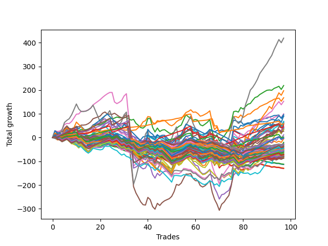

# Long Bulldog 005 
- Symbol: ES_Unlimited
- Date Range: 03/18/2022 - 07/15/2022
- Trading Period: 7:20-12:30
- Number of Trades: 97



| Name | Win Percent | Profit | Avg Profit / Trade | Avg Time / Trade |      | Name | Win Percent | Profit | Avg Profit / Trade | Avg Time / Trade |
| ---- | ----------- | ------ | ------------------ | ---------------- | ---- | ---- | ----------- | ------ | ------------------ | ---------------- |
| Sorted By <br> Profit | | | | | | Sorted By <br> Win Percentage ||||
| Seven | 70.10 | 209625.00 | 2161.08 | 130:03 |     | Eighty-One | 95.88 | 29125.00 | 300.26 | 17:40 |
| Two | 63.92 | 109750.00 | 1131.44 | 33:05 |     | Eighty-Two | 93.81 | 1250.00 | 12.89 | 29:18 |
| Sixty-Three | 40.21 | 98875.00 | 1019.33 | 54:15 |     | Eighty-Three | 91.75 | 22750.00 | 234.54 | 37:08 |
| One | 69.07 | 84000.00 | 865.98 | 19:00 |     | Eighty-Four | 89.69 | -1875.00 | -19.33 | 43:41 |
| Six | 76.29 | 76625.00 | 789.95 | 91:37 |     | Eighty-Five | 87.63 | 13625.00 | 140.46 | 48:43 |
| Fifty-Eight | 57.73 | 50125.00 | 516.75 | 19:46 |     | One Hundred Twenty-One | 79.38 | -34500.00 | -355.67 | 04:53 |
| Sixty-Two | 47.42 | 48500.00 | 500.00 | 36:20 |     | One Hundred Twenty-Six | 79.38 | -35875.00 | -369.85 | 05:34 |
| Seventy-Three | 46.39 | 45875.00 | 472.94 | 13:40 |     | Six | 76.29 | 76625.00 | 789.95 | 91:37 |
| Zero | 61.86 | 44250.00 | 456.19 | 13:18 |     | One Hundred Twenty-Seven | 74.23 | -34500.00 | -355.67 | 07:21 |
| Sixty-One | 47.42 | 34250.00 | 353.09 | 31:50 |     | One Hundred Twenty-Two | 74.23 | -38125.00 | -393.04 | 06:42 |
| Forty-Two | 38.14 | 33500.00 | 345.36 | 10:40 |     | Seven | 70.10 | 209625.00 | 2161.08 | 130:03 |
| Fifty-Seven | 64.95 | 31500.00 | 324.74 | 12:23 |     | One | 69.07 | 84000.00 | 865.98 | 19:00 |
| Three | 63.92 | 30625.00 | 315.72 | 31:30 |     | One Hundred Sixteen | 69.07 | -24375.00 | -251.29 | 03:05 |
| Fifty-Nine | 59.79 | 30375.00 | 313.14 | 16:49 |     | One Hundred Twenty-Three | 69.07 | -34000.00 | -350.52 | 08:34 |
| Forty-Seven | 22.68 | 30250.00 | 311.86 | 27:22 |     | One Hundred Twenty-Four | 67.01 | -22375.00 | -230.67 | 10:14 |
| Eighty-One | 95.88 | 29125.00 | 300.26 | 17:40 |     | One Hundred Twenty-Eight | 67.01 | -35625.00 | -367.27 | 09:03 |
| Forty-Five | 28.87 | 27000.00 | 278.35 | 17:18 |     | Five | 65.98 | 21375.00 | 220.36 | 69:55 |
| Eighty-Three | 91.75 | 22750.00 | 234.54 | 37:08 |     | One Hundred Eleven | 65.98 | -25125.00 | -259.02 | 02:50 |
| Sixty-Six | 50.52 | 21625.00 | 222.94 | 15:54 |     | Fifty-Seven | 64.95 | 31500.00 | 324.74 | 12:23 |
| Five | 65.98 | 21375.00 | 220.36 | 69:55 |     | One Hundred Twenty-Five | 64.95 | -750.00 | -7.73 | 13:31 |
| Forty-One | 45.36 | 19375.00 | 199.74 | 08:12 |     | Two | 63.92 | 109750.00 | 1131.44 | 33:05 |
| Sixty-Seven | 51.55 | 18000.00 | 185.57 | 15:04 |     | Three | 63.92 | 30625.00 | 315.72 | 31:30 |
| Sixty-Five | 58.76 | 17500.00 | 180.41 | 11:39 |     | One Hundred Twenty-Nine | 63.92 | -27125.00 | -279.64 | 10:25 |
| Seventy | 42.27 | 17000.00 | 175.26 | 23:34 |     | Zero | 61.86 | 44250.00 | 456.19 | 13:18 |
| Eighty-Five | 87.63 | 13625.00 | 140.46 | 48:43 |     | Fifty-Nine | 59.79 | 30375.00 | 313.14 | 16:49 |
| Forty-Six | 29.90 | 5750.00 | 59.28 | 19:07 |     | Four | 59.79 | -11875.00 | -122.42 | 54:39 |
| Eighty-Two | 93.81 | 1250.00 | 12.89 | 29:18 |     | Fifty-Six | 59.79 | -15250.00 | -157.22 | 09:30 |
| One Hundred Twenty-Five | 64.95 | -750.00 | -7.73 | 13:31 |     | Sixty-Five | 58.76 | 17500.00 | 180.41 | 11:39 |
| Eighty-Four | 89.69 | -1875.00 | -19.33 | 43:41 |     | One Hundred Thirty | 58.76 | -18625.00 | -192.01 | 12:31 |
| Forty-Three | 36.08 | -2750.00 | -28.35 | 10:52 |     | One Hundred Twelve | 58.76 | -29000.00 | -298.97 | 03:55 |
| Forty-Four | 29.90 | -10000.00 | -103.09 | 14:16 |     | One Hundred Seventeen | 58.76 | -31125.00 | -320.88 | 04:13 |
| Four | 59.79 | -11875.00 | -122.42 | 54:39 |     | Fifty-Eight | 57.73 | 50125.00 | 516.75 | 19:46 |
| Ninety-Two | 43.30 | -13250.00 | -136.60 | 01:51 |     | Sixty-Four | 56.70 | -24625.00 | -253.87 | 09:21 |
| Ninety-One | 49.48 | -14375.00 | -148.20 | 01:33 |     | One Hundred Six | 53.61 | -27750.00 | -286.08 | 02:06 |
| Ninety-Nine | 42.27 | -14625.00 | -150.77 | 02:09 |     | Ninety-Six | 52.58 | -16125.00 | -166.24 | 01:42 |
| Fifty-Six | 59.79 | -15250.00 | -157.22 | 09:30 |     | One Hundred One | 52.58 | -24250.00 | -250.00 | 01:54 |
| Ninety-Seven | 44.33 | -15500.00 | -159.79 | 01:53 |     | Sixty-Seven | 51.55 | 18000.00 | 185.57 | 15:04 |
| Seventy-One | 36.08 | -15750.00 | -162.37 | 27:31 |     | Sixty-Six | 50.52 | 21625.00 | 222.94 | 15:54 |
| Ninety-Six | 52.58 | -16125.00 | -166.24 | 01:42 |     | One Hundred Thirteen | 50.52 | -36625.00 | -377.58 | 05:14 |
| One Hundred | 42.27 | -18375.00 | -189.43 | 02:19 |     | Ninety-One | 49.48 | -14375.00 | -148.20 | 01:33 |
| One Hundred Thirty | 58.76 | -18625.00 | -192.01 | 12:31 |     | Sixty | 48.45 | -26875.00 | -277.06 | 25:02 |
| Ninety-Eight | 42.27 | -19750.00 | -203.61 | 02:05 |     | One Hundred Fourteen | 48.45 | -27125.00 | -279.64 | 06:02 |
| One Hundred Fifteen | 44.33 | -21750.00 | -224.23 | 07:39 |     | Sixty-Two | 47.42 | 48500.00 | 500.00 | 36:20 |
| Ninety-Four | 29.90 | -22125.00 | -228.09 | 02:39 |     | Sixty-One | 47.42 | 34250.00 | 353.09 | 31:50 |
| One Hundred Twenty-Four | 67.01 | -22375.00 | -230.67 | 10:14 |     | Seventy-Three | 46.39 | 45875.00 | 472.94 | 13:40 |
| Forty | 43.30 | -23625.00 | -243.56 | 06:21 |     | Forty-One | 45.36 | 19375.00 | 199.74 | 08:12 |
| Ninety-Three | 32.99 | -23750.00 | -244.85 | 02:28 |     | One Hundred Two | 45.36 | -26500.00 | -273.20 | 02:16 |
| One Hundred One | 52.58 | -24250.00 | -250.00 | 01:54 |     | One Hundred Eighteen | 45.36 | -43000.00 | -443.30 | 05:07 |
| One Hundred Sixteen | 69.07 | -24375.00 | -251.29 | 03:05 |     | Ninety-Seven | 44.33 | -15500.00 | -159.79 | 01:53 |
| Sixty-Four | 56.70 | -24625.00 | -253.87 | 09:21 |     | One Hundred Fifteen | 44.33 | -21750.00 | -224.23 | 07:39 |
| Sixty-Nine | 39.18 | -24625.00 | -253.87 | 23:14 |     | One Hundred Seven | 44.33 | -30750.00 | -317.01 | 02:25 |
| One Hundred Eleven | 65.98 | -25125.00 | -259.02 | 02:50 |     | Ninety-Two | 43.30 | -13250.00 | -136.60 | 01:51 |
| One Hundred Two | 45.36 | -26500.00 | -273.20 | 02:16 |     | Forty | 43.30 | -23625.00 | -243.56 | 06:21 |
| Sixty | 48.45 | -26875.00 | -277.06 | 25:02 |     | Seventy | 42.27 | 17000.00 | 175.26 | 23:34 |
| One Hundred Twenty-Nine | 63.92 | -27125.00 | -279.64 | 10:25 |     | Ninety-Nine | 42.27 | -14625.00 | -150.77 | 02:09 |
| One Hundred Fourteen | 48.45 | -27125.00 | -279.64 | 06:02 |     | One Hundred | 42.27 | -18375.00 | -189.43 | 02:19 |
| One Hundred Six | 53.61 | -27750.00 | -286.08 | 02:06 |     | Ninety-Eight | 42.27 | -19750.00 | -203.61 | 02:05 |
| Ninety-Five | 23.71 | -28750.00 | -296.39 | 03:10 |     | One Hundred Ninteen | 41.24 | -37500.00 | -386.60 | 05:27 |
| One Hundred Twelve | 58.76 | -29000.00 | -298.97 | 03:55 |     | Sixty-Three | 40.21 | 98875.00 | 1019.33 | 54:15 |
| One Hundred Seven | 44.33 | -30750.00 | -317.01 | 02:25 |     | Sixty-Eight | 40.21 | -33000.00 | -340.21 | 19:50 |
| One Hundred Seventeen | 58.76 | -31125.00 | -320.88 | 04:13 |     | Sixty-Nine | 39.18 | -24625.00 | -253.87 | 23:14 |
| Sixty-Eight | 40.21 | -33000.00 | -340.21 | 19:50 |     | Forty-Two | 38.14 | 33500.00 | 345.36 | 10:40 |
| One Hundred Twenty-Three | 69.07 | -34000.00 | -350.52 | 08:34 |     | Forty-Eight | 38.14 | -40125.00 | -413.66 | 05:25 |
| One Hundred Twenty-One | 79.38 | -34500.00 | -355.67 | 04:53 |     | Forty-Three | 36.08 | -2750.00 | -28.35 | 10:52 |
| One Hundred Twenty-Seven | 74.23 | -34500.00 | -355.67 | 07:21 |     | Seventy-One | 36.08 | -15750.00 | -162.37 | 27:31 |
| One Hundred Four | 32.99 | -35250.00 | -363.40 | 03:15 |     | Forty-Nine | 36.08 | -41250.00 | -425.26 | 06:20 |
| One Hundred Twenty-Eight | 67.01 | -35625.00 | -367.27 | 09:03 |     | One Hundred Three | 35.05 | -39875.00 | -411.08 | 03:02 |
| One Hundred Twenty-Six | 79.38 | -35875.00 | -369.85 | 05:34 |     | Ninety-Three | 32.99 | -23750.00 | -244.85 | 02:28 |
| One Hundred Thirteen | 50.52 | -36625.00 | -377.58 | 05:14 |     | One Hundred Four | 32.99 | -35250.00 | -363.40 | 03:15 |
| One Hundred Nine | 30.93 | -36875.00 | -380.15 | 02:55 |     | Fifty | 32.99 | -41375.00 | -426.55 | 07:10 |
| One Hundred Ninteen | 41.24 | -37500.00 | -386.60 | 05:27 |     | Fifty-One | 32.99 | -43875.00 | -452.32 | 07:04 |
| One Hundred Twenty-Two | 74.23 | -38125.00 | -393.04 | 06:42 |     | One Hundred Eight | 31.96 | -38875.00 | -400.77 | 02:48 |
| One Hundred Eight | 31.96 | -38875.00 | -400.77 | 02:48 |     | One Hundred Twenty | 31.96 | -43250.00 | -445.88 | 06:08 |
| One Hundred Five | 27.84 | -39375.00 | -405.93 | 03:57 |     | Fifty-Two | 31.96 | -56750.00 | -585.05 | 07:36 |
| One Hundred Ten | 30.93 | -39500.00 | -407.22 | 03:09 |     | One Hundred Nine | 30.93 | -36875.00 | -380.15 | 02:55 |
| One Hundred Three | 35.05 | -39875.00 | -411.08 | 03:02 |     | One Hundred Ten | 30.93 | -39500.00 | -407.22 | 03:09 |
| Forty-Eight | 38.14 | -40125.00 | -413.66 | 05:25 |     | Fifty-Four | 30.93 | -56000.00 | -577.32 | 07:43 |
| Forty-Nine | 36.08 | -41250.00 | -425.26 | 06:20 |     | Forty-Six | 29.90 | 5750.00 | 59.28 | 19:07 |
| Fifty | 32.99 | -41375.00 | -426.55 | 07:10 |     | Forty-Four | 29.90 | -10000.00 | -103.09 | 14:16 |
| One Hundred Eighteen | 45.36 | -43000.00 | -443.30 | 05:07 |     | Ninety-Four | 29.90 | -22125.00 | -228.09 | 02:39 |
| One Hundred Twenty | 31.96 | -43250.00 | -445.88 | 06:08 |     | Fifty-Three | 29.90 | -64250.00 | -662.37 | 07:56 |
| Fifty-One | 32.99 | -43875.00 | -452.32 | 07:04 |     | Fifty-Five | 29.90 | -65125.00 | -671.39 | 07:52 |
| Fifty-Four | 30.93 | -56000.00 | -577.32 | 07:43 |     | Forty-Five | 28.87 | 27000.00 | 278.35 | 17:18 |
| Fifty-Two | 31.96 | -56750.00 | -585.05 | 07:36 |     | One Hundred Five | 27.84 | -39375.00 | -405.93 | 03:57 |
| Fifty-Three | 29.90 | -64250.00 | -662.37 | 07:56 |     | Ninety-Five | 23.71 | -28750.00 | -296.39 | 03:10 |
| Fifty-Five | 29.90 | -65125.00 | -671.39 | 07:52 |     | Forty-Seven | 22.68 | 30250.00 | 311.86 | 27:22 |

## NO STOPLOSS

### Test Zero
* Sell when price hits the middle line of the 20p bollinger
* No Stoploss
* Results:
```
Total Trades: 97
Percent Up: 61.86
Percent Down: 38.14
Total Points Moved Up: 88.50
Potential Profit: 44250.00
Total Points Ups: 287.75 Count Ups: 60
Total Points Downs: -199.25 Count Downs: 37
```

<details><summary>Trades</summary>

<code>In: 2022-03-21 10:21:00		Out: 2022-03-21 10:26:15		Total Position Time: 05:15		Total Move Up: 5.75		Total to Date: 5.75</code> <br />
<code>In: 2022-03-23 10:23:00		Out: 2022-03-23 10:51:10		Total Position Time: 28:10		Total Move Up: -6.25		Total to Date: -0.50</code> <br />
<code>In: 2022-03-23 10:28:00		Out: 2022-03-23 10:51:10		Total Position Time: 23:10		Total Move Up: -1.50		Total to Date: -2.00</code> <br />
<code>In: 2022-03-25 08:14:00		Out: 2022-03-25 08:36:55		Total Position Time: 22:55		Total Move Up: -6.00		Total to Date: -8.00</code> <br />
<code>In: 2022-03-25 08:29:00		Out: 2022-03-25 08:36:55		Total Position Time: 07:55		Total Move Up: 8.00		Total to Date: 0.00</code> <br />
<code>In: 2022-03-28 07:39:00		Out: 2022-03-28 07:43:00		Total Position Time: 04:00		Total Move Up: 3.50		Total to Date: 3.50</code> <br />
<code>In: 2022-03-28 08:27:00		Out: 2022-03-28 09:02:00		Total Position Time: 35:00		Total Move Up: -13.75		Total to Date: -10.25</code> <br />
<code>In: 2022-03-28 08:38:00		Out: 2022-03-28 09:02:00		Total Position Time: 24:00		Total Move Up: -4.50		Total to Date: -14.75</code> <br />
<code>In: 2022-03-28 08:51:00		Out: 2022-03-28 09:02:00		Total Position Time: 11:00		Total Move Up: 1.75		Total to Date: -13.00</code> <br />
<code>In: 2022-03-28 08:55:00		Out: 2022-03-28 09:02:00		Total Position Time: 07:00		Total Move Up: 2.50		Total to Date: -10.50</code> <br />
<code>In: 2022-03-30 08:02:00		Out: 2022-03-30 08:19:25		Total Position Time: 17:25		Total Move Up: -4.75		Total to Date: -15.25</code> <br />
<code>In: 2022-03-30 08:13:00		Out: 2022-03-30 08:19:25		Total Position Time: 06:25		Total Move Up: 5.50		Total to Date: -9.75</code> <br />
<code>In: 2022-03-30 12:00:00		Out: 2022-03-30 12:28:50		Total Position Time: 28:50		Total Move Up: -6.50		Total to Date: -16.25</code> <br />
<code>In: 2022-03-30 12:06:00		Out: 2022-03-30 12:28:50		Total Position Time: 22:50		Total Move Up: -5.00		Total to Date: -21.25</code> <br />
<code>In: 2022-03-30 12:13:00		Out: 2022-03-30 12:28:50		Total Position Time: 15:50		Total Move Up: -1.75		Total to Date: -23.00</code> <br />
<code>In: 2022-03-30 12:20:00		Out: 2022-03-30 12:28:50		Total Position Time: 08:50		Total Move Up: 1.00		Total to Date: -22.00</code> <br />
<code>In: 2022-03-30 12:26:00		Out: 2022-03-30 12:28:50		Total Position Time: 02:50		Total Move Up: 6.50		Total to Date: -15.50</code> <br />
<code>In: 2022-03-31 10:00:00		Out: 2022-03-31 10:19:05		Total Position Time: 19:05		Total Move Up: -0.75		Total to Date: -16.25</code> <br />
<code>In: 2022-03-31 10:08:00		Out: 2022-03-31 10:19:05		Total Position Time: 11:05		Total Move Up: -1.00		Total to Date: -17.25</code> <br />
<code>In: 2022-03-31 10:11:00		Out: 2022-03-31 10:19:05		Total Position Time: 08:05		Total Move Up: -0.50		Total to Date: -17.75</code> <br />
<code>In: 2022-04-01 07:24:00		Out: 2022-04-01 07:35:05		Total Position Time: 11:05		Total Move Up: 3.75		Total to Date: -14.00</code> <br />
<code>In: 2022-04-06 09:22:00		Out: 2022-04-06 09:31:15		Total Position Time: 09:15		Total Move Up: 3.75		Total to Date: -10.25</code> <br />
<code>In: 2022-04-07 07:23:00		Out: 2022-04-07 07:25:15		Total Position Time: 02:15		Total Move Up: 4.25		Total to Date: -6.00</code> <br />
<code>In: 2022-04-07 07:43:00		Out: 2022-04-07 07:55:30		Total Position Time: 12:30		Total Move Up: 3.00		Total to Date: -3.00</code> <br />
<code>In: 2022-04-11 07:30:00		Out: 2022-04-11 07:51:45		Total Position Time: 21:45		Total Move Up: -3.50		Total to Date: -6.50</code> <br />
<code>In: 2022-04-12 09:28:00		Out: 2022-04-12 09:49:40		Total Position Time: 21:40		Total Move Up: -0.50		Total to Date: -7.00</code> <br />
<code>In: 2022-04-12 11:35:00		Out: 2022-04-12 11:36:10		Total Position Time: 01:10		Total Move Up: 1.50		Total to Date: -5.50</code> <br />
<code>In: 2022-04-18 08:26:00		Out: 2022-04-18 08:55:05		Total Position Time: 29:05		Total Move Up: -6.50		Total to Date: -12.00</code> <br />
<code>In: 2022-04-18 08:29:00		Out: 2022-04-18 08:55:05		Total Position Time: 26:05		Total Move Up: -4.50		Total to Date: -16.50</code> <br />
<code>In: 2022-04-18 09:17:00		Out: 2022-04-18 09:32:05		Total Position Time: 15:05		Total Move Up: -0.25		Total to Date: -16.75</code> <br />
<code>In: 2022-04-20 11:38:00		Out: 2022-04-20 11:48:20		Total Position Time: 10:20		Total Move Up: 1.00		Total to Date: -15.75</code> <br />
<code>In: 2022-04-21 07:22:00		Out: 2022-04-21 07:29:05		Total Position Time: 07:05		Total Move Up: 2.50		Total to Date: -13.25</code> <br />
<code>In: 2022-04-21 07:42:00		Out: 2022-04-21 08:01:15		Total Position Time: 19:15		Total Move Up: -6.75		Total to Date: -20.00</code> <br />
<code>In: 2022-04-21 07:50:00		Out: 2022-04-21 08:01:15		Total Position Time: 11:15		Total Move Up: 2.00		Total to Date: -18.00</code> <br />
<code>In: 2022-05-02 09:56:00		Out: 2022-05-02 10:08:15		Total Position Time: 12:15		Total Move Up: -2.25		Total to Date: -20.25</code> <br />
<code>In: 2022-05-02 10:01:00		Out: 2022-05-02 10:08:15		Total Position Time: 07:15		Total Move Up: 6.00		Total to Date: -14.25</code> <br />
<code>In: 2022-05-02 10:02:00		Out: 2022-05-02 10:08:15		Total Position Time: 06:15		Total Move Up: 5.00		Total to Date: -9.25</code> <br />
<code>In: 2022-05-02 10:05:00		Out: 2022-05-02 10:08:15		Total Position Time: 03:15		Total Move Up: 12.25		Total to Date: 3.00</code> <br />
<code>In: 2022-05-02 10:49:00		Out: 2022-05-02 10:59:50		Total Position Time: 10:50		Total Move Up: 2.50		Total to Date: 5.50</code> <br />
<code>In: 2022-05-04 11:36:00		Out: 2022-05-04 11:40:45		Total Position Time: 04:45		Total Move Up: 5.25		Total to Date: 10.75</code> <br />
<code>In: 2022-05-09 07:26:00		Out: 2022-05-09 07:42:30		Total Position Time: 16:30		Total Move Up: -5.75		Total to Date: 5.00</code> <br />
<code>In: 2022-05-11 09:32:00		Out: 2022-05-11 09:49:25		Total Position Time: 17:25		Total Move Up: -0.50		Total to Date: 4.50</code> <br />
<code>In: 2022-05-11 09:59:00		Out: 2022-05-11 10:15:25		Total Position Time: 16:25		Total Move Up: -3.75		Total to Date: 0.75</code> <br />
<code>In: 2022-05-11 11:00:00		Out: 2022-05-11 11:01:10		Total Position Time: 01:10		Total Move Up: 8.75		Total to Date: 9.50</code> <br />
<code>In: 2022-05-12 10:40:00		Out: 2022-05-12 10:57:50		Total Position Time: 17:50		Total Move Up: -4.00		Total to Date: 5.50</code> <br />
<code>In: 2022-05-12 11:34:00		Out: 2022-05-12 11:45:25		Total Position Time: 11:25		Total Move Up: 4.50		Total to Date: 10.00</code> <br />
<code>In: 2022-05-12 11:35:00		Out: 2022-05-12 11:45:25		Total Position Time: 10:25		Total Move Up: 0.00		Total to Date: 10.00</code> <br />
<code>In: 2022-05-17 07:31:00		Out: 2022-05-17 07:55:15		Total Position Time: 24:15		Total Move Up: -10.25		Total to Date: -0.25</code> <br />
<code>In: 2022-05-17 07:33:00		Out: 2022-05-17 07:55:15		Total Position Time: 22:15		Total Move Up: -10.50		Total to Date: -10.75</code> <br />
<code>In: 2022-05-17 07:38:00		Out: 2022-05-17 07:55:15		Total Position Time: 17:15		Total Move Up: -5.75		Total to Date: -16.50</code> <br />
<code>In: 2022-05-17 07:47:00		Out: 2022-05-17 07:55:15		Total Position Time: 08:15		Total Move Up: 5.00		Total to Date: -11.50</code> <br />
<code>In: 2022-05-17 11:24:00		Out: 2022-05-17 11:31:40		Total Position Time: 07:40		Total Move Up: 10.50		Total to Date: -1.00</code> <br />
<code>In: 2022-05-18 08:32:00		Out: 2022-05-18 08:37:35		Total Position Time: 05:35		Total Move Up: 4.75		Total to Date: 3.75</code> <br />
<code>In: 2022-05-25 09:29:00		Out: 2022-05-25 09:41:30		Total Position Time: 12:30		Total Move Up: 1.75		Total to Date: 5.50</code> <br />
<code>In: 2022-05-25 11:09:00		Out: 2022-05-25 11:10:20		Total Position Time: 01:20		Total Move Up: 13.00		Total to Date: 18.50</code> <br />
<code>In: 2022-05-25 11:10:00		Out: 2022-05-25 11:11:10		Total Position Time: 01:10		Total Move Up: 7.75		Total to Date: 26.25</code> <br />
<code>In: 2022-06-03 07:40:00		Out: 2022-06-03 07:49:00		Total Position Time: 09:00		Total Move Up: 6.50		Total to Date: 32.75</code> <br />
<code>In: 2022-06-03 07:42:00		Out: 2022-06-03 07:49:00		Total Position Time: 07:00		Total Move Up: 9.00		Total to Date: 41.75</code> <br />
<code>In: 2022-06-06 08:14:00		Out: 2022-06-06 08:33:05		Total Position Time: 19:05		Total Move Up: -9.25		Total to Date: 32.50</code> <br />
<code>In: 2022-06-06 08:19:00		Out: 2022-06-06 08:33:05		Total Position Time: 14:05		Total Move Up: 2.00		Total to Date: 34.50</code> <br />
<code>In: 2022-06-06 09:06:00		Out: 2022-06-06 09:34:45		Total Position Time: 28:45		Total Move Up: -8.75		Total to Date: 25.75</code> <br />
<code>In: 2022-06-08 09:29:00		Out: 2022-06-08 09:56:25		Total Position Time: 27:25		Total Move Up: -13.75		Total to Date: 12.00</code> <br />
<code>In: 2022-06-08 09:41:00		Out: 2022-06-08 09:56:25		Total Position Time: 15:25		Total Move Up: 0.50		Total to Date: 12.50</code> <br />
<code>In: 2022-06-08 10:35:00		Out: 2022-06-08 10:43:10		Total Position Time: 08:10		Total Move Up: 2.00		Total to Date: 14.50</code> <br />
<code>In: 2022-06-09 08:06:00		Out: 2022-06-09 08:11:10		Total Position Time: 05:10		Total Move Up: 4.25		Total to Date: 18.75</code> <br />
<code>In: 2022-06-09 08:09:00		Out: 2022-06-09 08:11:10		Total Position Time: 02:10		Total Move Up: 7.25		Total to Date: 26.00</code> <br />
<code>In: 2022-06-09 11:26:00		Out: 2022-06-09 11:28:40		Total Position Time: 02:40		Total Move Up: 4.25		Total to Date: 30.25</code> <br />
<code>In: 2022-06-09 12:03:00		Out: 2022-06-09 12:20:15		Total Position Time: 17:15		Total Move Up: -6.50		Total to Date: 23.75</code> <br />
<code>In: 2022-06-13 12:15:00		Out: 2022-06-13 12:17:05		Total Position Time: 02:05		Total Move Up: 6.25		Total to Date: 30.00</code> <br />
<code>In: 2022-06-13 12:17:00		Out: 2022-06-13 12:20:15		Total Position Time: 03:15		Total Move Up: -1.50		Total to Date: 28.50</code> <br />
<code>In: 2022-06-14 12:16:00		Out: 2022-06-14 12:26:30		Total Position Time: 10:30		Total Move Up: 4.25		Total to Date: 32.75</code> <br />
<code>In: 2022-06-15 07:57:00		Out: 2022-06-15 08:34:25		Total Position Time: 37:25		Total Move Up: -3.50		Total to Date: 29.25</code> <br />
<code>In: 2022-06-15 08:15:00		Out: 2022-06-15 08:34:25		Total Position Time: 19:25		Total Move Up: 2.25		Total to Date: 31.50</code> <br />
<code>In: 2022-06-15 08:16:00		Out: 2022-06-15 08:34:25		Total Position Time: 18:25		Total Move Up: 0.50		Total to Date: 32.00</code> <br />
<code>In: 2022-06-15 11:08:00		Out: 2022-06-15 11:16:50		Total Position Time: 08:50		Total Move Up: 15.75		Total to Date: 47.75</code> <br />
<code>In: 2022-06-15 11:34:00		Out: 2022-06-15 11:38:05		Total Position Time: 04:05		Total Move Up: 25.25		Total to Date: 73.00</code> <br />
<code>In: 2022-06-16 07:46:00		Out: 2022-06-16 08:01:55		Total Position Time: 15:55		Total Move Up: -1.75		Total to Date: 71.25</code> <br />
<code>In: 2022-06-16 11:02:00		Out: 2022-06-16 11:40:20		Total Position Time: 38:20		Total Move Up: -7.00		Total to Date: 64.25</code> <br />
<code>In: 2022-06-16 11:51:00		Out: 2022-06-16 12:00:35		Total Position Time: 09:35		Total Move Up: 5.50		Total to Date: 69.75</code> <br />
<code>In: 2022-06-17 07:24:00		Out: 2022-06-17 07:55:05		Total Position Time: 31:05		Total Move Up: -14.25		Total to Date: 55.50</code> <br />
<code>In: 2022-06-17 07:37:00		Out: 2022-06-17 07:55:05		Total Position Time: 18:05		Total Move Up: 2.75		Total to Date: 58.25</code> <br />
<code>In: 2022-06-23 09:06:00		Out: 2022-06-23 09:17:45		Total Position Time: 11:45		Total Move Up: 4.00		Total to Date: 62.25</code> <br />
<code>In: 2022-06-23 09:54:00		Out: 2022-06-23 09:55:50		Total Position Time: 01:50		Total Move Up: 0.00		Total to Date: 62.25</code> <br />
<code>In: 2022-06-27 12:07:00		Out: 2022-06-27 12:10:20		Total Position Time: 03:20		Total Move Up: 7.00		Total to Date: 69.25</code> <br />
<code>In: 2022-06-29 08:25:00		Out: 2022-06-29 08:32:10		Total Position Time: 07:10		Total Move Up: 4.75		Total to Date: 74.00</code> <br />
<code>In: 2022-06-29 09:15:00		Out: 2022-06-29 09:36:40		Total Position Time: 21:40		Total Move Up: -1.25		Total to Date: 72.75</code> <br />
<code>In: 2022-06-29 09:29:00		Out: 2022-06-29 09:36:40		Total Position Time: 07:40		Total Move Up: 4.50		Total to Date: 77.25</code> <br />
<code>In: 2022-07-05 08:02:00		Out: 2022-07-05 08:15:20		Total Position Time: 13:20		Total Move Up: 1.50		Total to Date: 78.75</code> <br />
<code>In: 2022-07-05 08:04:00		Out: 2022-07-05 08:15:20		Total Position Time: 11:20		Total Move Up: 1.75		Total to Date: 80.50</code> <br />
<code>In: 2022-07-05 08:07:00		Out: 2022-07-05 08:15:20		Total Position Time: 08:20		Total Move Up: 1.00		Total to Date: 81.50</code> <br />
<code>In: 2022-07-06 08:05:00		Out: 2022-07-06 08:15:05		Total Position Time: 10:05		Total Move Up: 5.00		Total to Date: 86.50</code> <br />
<code>In: 2022-07-06 08:06:00		Out: 2022-07-06 08:15:05		Total Position Time: 09:05		Total Move Up: 2.50		Total to Date: 89.00</code> <br />
<code>In: 2022-07-06 08:34:00		Out: 2022-07-06 08:46:30		Total Position Time: 12:30		Total Move Up: 4.25		Total to Date: 93.25</code> <br />
<code>In: 2022-07-06 08:35:00		Out: 2022-07-06 08:46:30		Total Position Time: 11:30		Total Move Up: 0.25		Total to Date: 93.50</code> <br />
<code>In: 2022-07-06 08:46:00		Out: 2022-07-06 08:47:10		Total Position Time: 01:10		Total Move Up: 2.00		Total to Date: 95.50</code> <br />
<code>In: 2022-07-12 12:06:00		Out: 2022-07-12 12:45:35		Total Position Time: 39:35		Total Move Up: -14.75		Total to Date: 80.75</code> <br />
<code>In: 2022-07-13 07:22:00		Out: 2022-07-13 07:26:25		Total Position Time: 04:25		Total Move Up: 7.75		Total to Date: 88.50</code> <br />


</details>

### Test One
* Sell when the price hits the upper line of the 20p 1std bollinger
* No Stoploss
* Results:
```
Total Trades: 97
Percent Up: 69.07
Percent Down: 30.93
Total Points Moved Up: 168.00
Potential Profit: 84000.00
Total Points Ups: 441.00 Count Ups: 67
Total Points Downs: -273.00 Count Downs: 30
```

<details><summary>Trades</summary>

<code>In: 2022-03-21 10:21:00		Out: 2022-03-21 10:32:05		Total Position Time: 11:05		Total Move Up: 7.75		Total to Date: 7.75</code> <br />
<code>In: 2022-03-23 10:23:00		Out: 2022-03-23 10:51:50		Total Position Time: 28:50		Total Move Up: -4.50		Total to Date: 3.25</code> <br />
<code>In: 2022-03-23 10:28:00		Out: 2022-03-23 10:51:50		Total Position Time: 23:50		Total Move Up: 0.25		Total to Date: 3.50</code> <br />
<code>In: 2022-03-25 08:14:00		Out: 2022-03-25 08:41:10		Total Position Time: 27:10		Total Move Up: -4.50		Total to Date: -1.00</code> <br />
<code>In: 2022-03-25 08:29:00		Out: 2022-03-25 08:41:10		Total Position Time: 12:10		Total Move Up: 9.50		Total to Date: 8.50</code> <br />
<code>In: 2022-03-28 07:39:00		Out: 2022-03-28 07:45:05		Total Position Time: 06:05		Total Move Up: 5.25		Total to Date: 13.75</code> <br />
<code>In: 2022-03-28 08:27:00		Out: 2022-03-28 09:05:25		Total Position Time: 38:25		Total Move Up: -11.75		Total to Date: 2.00</code> <br />
<code>In: 2022-03-28 08:38:00		Out: 2022-03-28 09:05:25		Total Position Time: 27:25		Total Move Up: -2.50		Total to Date: -0.50</code> <br />
<code>In: 2022-03-28 08:51:00		Out: 2022-03-28 09:05:25		Total Position Time: 14:25		Total Move Up: 3.75		Total to Date: 3.25</code> <br />
<code>In: 2022-03-28 08:55:00		Out: 2022-03-28 09:05:25		Total Position Time: 10:25		Total Move Up: 4.50		Total to Date: 7.75</code> <br />
<code>In: 2022-03-30 08:02:00		Out: 2022-03-30 08:34:45		Total Position Time: 32:45		Total Move Up: -5.50		Total to Date: 2.25</code> <br />
<code>In: 2022-03-30 08:13:00		Out: 2022-03-30 08:34:45		Total Position Time: 21:45		Total Move Up: 4.75		Total to Date: 7.00</code> <br />
<code>In: 2022-03-30 12:00:00		Out: 2022-03-30 12:32:20		Total Position Time: 32:20		Total Move Up: -4.50		Total to Date: 2.50</code> <br />
<code>In: 2022-03-30 12:06:00		Out: 2022-03-30 12:32:20		Total Position Time: 26:20		Total Move Up: -3.00		Total to Date: -0.50</code> <br />
<code>In: 2022-03-30 12:13:00		Out: 2022-03-30 12:32:20		Total Position Time: 19:20		Total Move Up: 0.25		Total to Date: -0.25</code> <br />
<code>In: 2022-03-30 12:20:00		Out: 2022-03-30 12:32:20		Total Position Time: 12:20		Total Move Up: 3.00		Total to Date: 2.75</code> <br />
<code>In: 2022-03-30 12:26:00		Out: 2022-03-30 12:32:20		Total Position Time: 06:20		Total Move Up: 8.50		Total to Date: 11.25</code> <br />
<code>In: 2022-03-31 10:00:00		Out: 2022-03-31 10:19:40		Total Position Time: 19:40		Total Move Up: 1.25		Total to Date: 12.50</code> <br />
<code>In: 2022-03-31 10:08:00		Out: 2022-03-31 10:19:40		Total Position Time: 11:40		Total Move Up: 1.00		Total to Date: 13.50</code> <br />
<code>In: 2022-03-31 10:11:00		Out: 2022-03-31 10:19:40		Total Position Time: 08:40		Total Move Up: 1.50		Total to Date: 15.00</code> <br />
<code>In: 2022-04-01 07:24:00		Out: 2022-04-01 07:45:15		Total Position Time: 21:15		Total Move Up: 2.75		Total to Date: 17.75</code> <br />
<code>In: 2022-04-06 09:22:00		Out: 2022-04-06 09:34:25		Total Position Time: 12:25		Total Move Up: 5.00		Total to Date: 22.75</code> <br />
<code>In: 2022-04-07 07:23:00		Out: 2022-04-07 07:31:15		Total Position Time: 08:15		Total Move Up: 5.25		Total to Date: 28.00</code> <br />
<code>In: 2022-04-07 07:43:00		Out: 2022-04-07 08:00:05		Total Position Time: 17:05		Total Move Up: 7.75		Total to Date: 35.75</code> <br />
<code>In: 2022-04-11 07:30:00		Out: 2022-04-11 07:54:05		Total Position Time: 24:05		Total Move Up: -2.50		Total to Date: 33.25</code> <br />
<code>In: 2022-04-12 09:28:00		Out: 2022-04-12 09:50:15		Total Position Time: 22:15		Total Move Up: 3.25		Total to Date: 36.50</code> <br />
<code>In: 2022-04-12 11:35:00		Out: 2022-04-12 11:37:30		Total Position Time: 02:30		Total Move Up: 3.75		Total to Date: 40.25</code> <br />
<code>In: 2022-04-18 08:26:00		Out: 2022-04-18 08:57:20		Total Position Time: 31:20		Total Move Up: -5.00		Total to Date: 35.25</code> <br />
<code>In: 2022-04-18 08:29:00		Out: 2022-04-18 08:57:20		Total Position Time: 28:20		Total Move Up: -3.00		Total to Date: 32.25</code> <br />
<code>In: 2022-04-18 09:17:00		Out: 2022-04-18 09:35:20		Total Position Time: 18:20		Total Move Up: 0.25		Total to Date: 32.50</code> <br />
<code>In: 2022-04-20 11:38:00		Out: 2022-04-20 12:04:20		Total Position Time: 26:20		Total Move Up: -1.00		Total to Date: 31.50</code> <br />
<code>In: 2022-04-21 07:22:00		Out: 2022-04-21 07:29:25		Total Position Time: 07:25		Total Move Up: 5.25		Total to Date: 36.75</code> <br />
<code>In: 2022-04-21 07:42:00		Out: 2022-04-21 08:11:25		Total Position Time: 29:25		Total Move Up: -7.00		Total to Date: 29.75</code> <br />
<code>In: 2022-04-21 07:50:00		Out: 2022-04-21 08:11:25		Total Position Time: 21:25		Total Move Up: 1.75		Total to Date: 31.50</code> <br />
<code>In: 2022-05-02 09:56:00		Out: 2022-05-02 10:10:55		Total Position Time: 14:55		Total Move Up: 1.25		Total to Date: 32.75</code> <br />
<code>In: 2022-05-02 10:01:00		Out: 2022-05-02 10:10:55		Total Position Time: 09:55		Total Move Up: 9.50		Total to Date: 42.25</code> <br />
<code>In: 2022-05-02 10:02:00		Out: 2022-05-02 10:10:55		Total Position Time: 08:55		Total Move Up: 8.50		Total to Date: 50.75</code> <br />
<code>In: 2022-05-02 10:05:00		Out: 2022-05-02 10:10:55		Total Position Time: 05:55		Total Move Up: 15.75		Total to Date: 66.50</code> <br />
<code>In: 2022-05-02 10:49:00		Out: 2022-05-02 11:02:45		Total Position Time: 13:45		Total Move Up: 5.00		Total to Date: 71.50</code> <br />
<code>In: 2022-05-04 11:36:00		Out: 2022-05-04 11:41:40		Total Position Time: 05:40		Total Move Up: 17.25		Total to Date: 88.75</code> <br />
<code>In: 2022-05-09 07:26:00		Out: 2022-05-09 07:46:10		Total Position Time: 20:10		Total Move Up: -2.25		Total to Date: 86.50</code> <br />
<code>In: 2022-05-11 09:32:00		Out: 2022-05-11 10:24:35		Total Position Time: 52:35		Total Move Up: -23.00		Total to Date: 63.50</code> <br />
<code>In: 2022-05-11 09:59:00		Out: 2022-05-11 10:24:35		Total Position Time: 25:35		Total Move Up: -4.75		Total to Date: 58.75</code> <br />
<code>In: 2022-05-11 11:00:00		Out: 2022-05-11 11:01:30		Total Position Time: 01:30		Total Move Up: 12.75		Total to Date: 71.50</code> <br />
<code>In: 2022-05-12 10:40:00		Out: 2022-05-12 11:03:45		Total Position Time: 23:45		Total Move Up: -2.50		Total to Date: 69.00</code> <br />
<code>In: 2022-05-12 11:34:00		Out: 2022-05-12 11:52:55		Total Position Time: 18:55		Total Move Up: 4.00		Total to Date: 73.00</code> <br />
<code>In: 2022-05-12 11:35:00		Out: 2022-05-12 11:52:55		Total Position Time: 17:55		Total Move Up: -0.50		Total to Date: 72.50</code> <br />
<code>In: 2022-05-17 07:31:00		Out: 2022-05-17 07:59:10		Total Position Time: 28:10		Total Move Up: -9.00		Total to Date: 63.50</code> <br />
<code>In: 2022-05-17 07:33:00		Out: 2022-05-17 07:59:10		Total Position Time: 26:10		Total Move Up: -9.25		Total to Date: 54.25</code> <br />
<code>In: 2022-05-17 07:38:00		Out: 2022-05-17 07:59:10		Total Position Time: 21:10		Total Move Up: -4.50		Total to Date: 49.75</code> <br />
<code>In: 2022-05-17 07:47:00		Out: 2022-05-17 07:59:10		Total Position Time: 12:10		Total Move Up: 6.25		Total to Date: 56.00</code> <br />
<code>In: 2022-05-17 11:24:00		Out: 2022-05-17 11:39:45		Total Position Time: 15:45		Total Move Up: 10.75		Total to Date: 66.75</code> <br />
<code>In: 2022-05-18 08:32:00		Out: 2022-05-18 08:41:20		Total Position Time: 09:20		Total Move Up: 7.00		Total to Date: 73.75</code> <br />
<code>In: 2022-05-25 09:29:00		Out: 2022-05-25 09:44:30		Total Position Time: 15:30		Total Move Up: 3.50		Total to Date: 77.25</code> <br />
<code>In: 2022-05-25 11:09:00		Out: 2022-05-25 11:10:25		Total Position Time: 01:25		Total Move Up: 15.75		Total to Date: 93.00</code> <br />
<code>In: 2022-05-25 11:10:00		Out: 2022-05-25 11:15:45		Total Position Time: 05:45		Total Move Up: 12.75		Total to Date: 105.75</code> <br />
<code>In: 2022-06-03 07:40:00		Out: 2022-06-03 07:58:10		Total Position Time: 18:10		Total Move Up: 4.50		Total to Date: 110.25</code> <br />
<code>In: 2022-06-03 07:42:00		Out: 2022-06-03 07:58:10		Total Position Time: 16:10		Total Move Up: 7.00		Total to Date: 117.25</code> <br />
<code>In: 2022-06-06 08:14:00		Out: 2022-06-06 08:39:15		Total Position Time: 25:15		Total Move Up: -10.25		Total to Date: 107.00</code> <br />
<code>In: 2022-06-06 08:19:00		Out: 2022-06-06 08:39:15		Total Position Time: 20:15		Total Move Up: 1.00		Total to Date: 108.00</code> <br />
<code>In: 2022-06-06 09:06:00		Out: 2022-06-06 09:37:35		Total Position Time: 31:35		Total Move Up: -6.50		Total to Date: 101.50</code> <br />
<code>In: 2022-06-08 09:29:00		Out: 2022-06-08 09:59:05		Total Position Time: 30:05		Total Move Up: -11.25		Total to Date: 90.25</code> <br />
<code>In: 2022-06-08 09:41:00		Out: 2022-06-08 09:59:05		Total Position Time: 18:05		Total Move Up: 3.00		Total to Date: 93.25</code> <br />
<code>In: 2022-06-08 10:35:00		Out: 2022-06-08 10:47:05		Total Position Time: 12:05		Total Move Up: 5.25		Total to Date: 98.50</code> <br />
<code>In: 2022-06-09 08:06:00		Out: 2022-06-09 08:21:10		Total Position Time: 15:10		Total Move Up: 5.75		Total to Date: 104.25</code> <br />
<code>In: 2022-06-09 08:09:00		Out: 2022-06-09 08:21:10		Total Position Time: 12:10		Total Move Up: 8.75		Total to Date: 113.00</code> <br />
<code>In: 2022-06-09 11:26:00		Out: 2022-06-09 12:47:00		Total Position Time: 81:00		Total Move Up: -48.75		Total to Date: 64.25</code> <br />
<code>In: 2022-06-09 12:03:00		Out: 2022-06-09 12:47:00		Total Position Time: 44:00		Total Move Up: -30.25		Total to Date: 34.00</code> <br />
<code>In: 2022-06-13 12:15:00		Out: 2022-06-13 12:17:10		Total Position Time: 02:10		Total Move Up: 11.00		Total to Date: 45.00</code> <br />
<code>In: 2022-06-13 12:17:00		Out: 2022-06-13 12:47:00		Total Position Time: 30:00		Total Move Up: -26.75		Total to Date: 18.25</code> <br />
<code>In: 2022-06-14 12:16:00		Out: 2022-06-14 12:27:20		Total Position Time: 11:20		Total Move Up: 8.25		Total to Date: 26.50</code> <br />
<code>In: 2022-06-15 07:57:00		Out: 2022-06-15 08:38:55		Total Position Time: 41:55		Total Move Up: -0.25		Total to Date: 26.25</code> <br />
<code>In: 2022-06-15 08:15:00		Out: 2022-06-15 08:38:55		Total Position Time: 23:55		Total Move Up: 5.50		Total to Date: 31.75</code> <br />
<code>In: 2022-06-15 08:16:00		Out: 2022-06-15 08:38:55		Total Position Time: 22:55		Total Move Up: 3.75		Total to Date: 35.50</code> <br />
<code>In: 2022-06-15 11:08:00		Out: 2022-06-15 11:38:10		Total Position Time: 30:10		Total Move Up: 18.25		Total to Date: 53.75</code> <br />
<code>In: 2022-06-15 11:34:00		Out: 2022-06-15 11:38:10		Total Position Time: 04:10		Total Move Up: 34.50		Total to Date: 88.25</code> <br />
<code>In: 2022-06-16 07:46:00		Out: 2022-06-16 08:11:30		Total Position Time: 25:30		Total Move Up: 0.25		Total to Date: 88.50</code> <br />
<code>In: 2022-06-16 11:02:00		Out: 2022-06-16 11:40:30		Total Position Time: 38:30		Total Move Up: -4.75		Total to Date: 83.75</code> <br />
<code>In: 2022-06-16 11:51:00		Out: 2022-06-16 12:01:55		Total Position Time: 10:55		Total Move Up: 11.75		Total to Date: 95.50</code> <br />
<code>In: 2022-06-17 07:24:00		Out: 2022-06-17 07:56:20		Total Position Time: 32:20		Total Move Up: -10.50		Total to Date: 85.00</code> <br />
<code>In: 2022-06-17 07:37:00		Out: 2022-06-17 07:56:20		Total Position Time: 19:20		Total Move Up: 6.50		Total to Date: 91.50</code> <br />
<code>In: 2022-06-23 09:06:00		Out: 2022-06-23 09:18:25		Total Position Time: 12:25		Total Move Up: 7.50		Total to Date: 99.00</code> <br />
<code>In: 2022-06-23 09:54:00		Out: 2022-06-23 09:56:15		Total Position Time: 02:15		Total Move Up: 1.00		Total to Date: 100.00</code> <br />
<code>In: 2022-06-27 12:07:00		Out: 2022-06-27 12:12:10		Total Position Time: 05:10		Total Move Up: 10.00		Total to Date: 110.00</code> <br />
<code>In: 2022-06-29 08:25:00		Out: 2022-06-29 08:33:05		Total Position Time: 08:05		Total Move Up: 7.75		Total to Date: 117.75</code> <br />
<code>In: 2022-06-29 09:15:00		Out: 2022-06-29 09:38:30		Total Position Time: 23:30		Total Move Up: 3.75		Total to Date: 121.50</code> <br />
<code>In: 2022-06-29 09:29:00		Out: 2022-06-29 09:38:30		Total Position Time: 09:30		Total Move Up: 9.50		Total to Date: 131.00</code> <br />
<code>In: 2022-07-05 08:02:00		Out: 2022-07-05 08:16:45		Total Position Time: 14:45		Total Move Up: 4.50		Total to Date: 135.50</code> <br />
<code>In: 2022-07-05 08:04:00		Out: 2022-07-05 08:16:45		Total Position Time: 12:45		Total Move Up: 4.75		Total to Date: 140.25</code> <br />
<code>In: 2022-07-05 08:07:00		Out: 2022-07-05 08:16:45		Total Position Time: 09:45		Total Move Up: 4.00		Total to Date: 144.25</code> <br />
<code>In: 2022-07-06 08:05:00		Out: 2022-07-06 08:21:05		Total Position Time: 16:05		Total Move Up: 7.00		Total to Date: 151.25</code> <br />
<code>In: 2022-07-06 08:06:00		Out: 2022-07-06 08:21:05		Total Position Time: 15:05		Total Move Up: 4.50		Total to Date: 155.75</code> <br />
<code>In: 2022-07-06 08:34:00		Out: 2022-07-06 08:48:25		Total Position Time: 14:25		Total Move Up: 6.00		Total to Date: 161.75</code> <br />
<code>In: 2022-07-06 08:35:00		Out: 2022-07-06 08:48:25		Total Position Time: 13:25		Total Move Up: 2.00		Total to Date: 163.75</code> <br />
<code>In: 2022-07-06 08:46:00		Out: 2022-07-06 08:48:25		Total Position Time: 02:25		Total Move Up: 2.75		Total to Date: 166.50</code> <br />
<code>In: 2022-07-12 12:06:00		Out: 2022-07-12 12:47:00		Total Position Time: 41:00		Total Move Up: -13.25		Total to Date: 153.25</code> <br />
<code>In: 2022-07-13 07:22:00		Out: 2022-07-13 07:31:20		Total Position Time: 09:20		Total Move Up: 14.75		Total to Date: 168.00</code> <br />


</details>

### Test Two
* Sell when the price hits the upper line of the 20p 2std bollinger
* No Stoploss
* Results:
```
Total Trades: 97
Percent Up: 63.92
Percent Down: 36.08
Total Points Moved Up: 219.50
Potential Profit: 109750.00
Total Points Ups: 563.00 Count Ups: 62
Total Points Downs: -343.50 Count Downs: 35
```

<details><summary>Trades</summary>

<code>In: 2022-03-21 10:21:00		Out: 2022-03-21 10:34:15		Total Position Time: 13:15		Total Move Up: 11.75		Total to Date: 11.75</code> <br />
<code>In: 2022-03-23 10:23:00		Out: 2022-03-23 10:54:30		Total Position Time: 31:30		Total Move Up: -2.00		Total to Date: 9.75</code> <br />
<code>In: 2022-03-23 10:28:00		Out: 2022-03-23 10:54:30		Total Position Time: 26:30		Total Move Up: 2.75		Total to Date: 12.50</code> <br />
<code>In: 2022-03-25 08:14:00		Out: 2022-03-25 08:41:55		Total Position Time: 27:55		Total Move Up: -0.50		Total to Date: 12.00</code> <br />
<code>In: 2022-03-25 08:29:00		Out: 2022-03-25 08:41:55		Total Position Time: 12:55		Total Move Up: 13.50		Total to Date: 25.50</code> <br />
<code>In: 2022-03-28 07:39:00		Out: 2022-03-28 07:47:50		Total Position Time: 08:50		Total Move Up: 7.75		Total to Date: 33.25</code> <br />
<code>In: 2022-03-28 08:27:00		Out: 2022-03-28 09:07:10		Total Position Time: 40:10		Total Move Up: -10.50		Total to Date: 22.75</code> <br />
<code>In: 2022-03-28 08:38:00		Out: 2022-03-28 09:07:10		Total Position Time: 29:10		Total Move Up: -1.25		Total to Date: 21.50</code> <br />
<code>In: 2022-03-28 08:51:00		Out: 2022-03-28 09:07:10		Total Position Time: 16:10		Total Move Up: 5.00		Total to Date: 26.50</code> <br />
<code>In: 2022-03-28 08:55:00		Out: 2022-03-28 09:07:10		Total Position Time: 12:10		Total Move Up: 5.75		Total to Date: 32.25</code> <br />
<code>In: 2022-03-30 08:02:00		Out: 2022-03-30 08:35:15		Total Position Time: 33:15		Total Move Up: -3.75		Total to Date: 28.50</code> <br />
<code>In: 2022-03-30 08:13:00		Out: 2022-03-30 08:35:15		Total Position Time: 22:15		Total Move Up: 6.50		Total to Date: 35.00</code> <br />
<code>In: 2022-03-30 12:00:00		Out: 2022-03-30 12:36:20		Total Position Time: 36:20		Total Move Up: -1.75		Total to Date: 33.25</code> <br />
<code>In: 2022-03-30 12:06:00		Out: 2022-03-30 12:36:20		Total Position Time: 30:20		Total Move Up: -0.25		Total to Date: 33.00</code> <br />
<code>In: 2022-03-30 12:13:00		Out: 2022-03-30 12:36:20		Total Position Time: 23:20		Total Move Up: 3.00		Total to Date: 36.00</code> <br />
<code>In: 2022-03-30 12:20:00		Out: 2022-03-30 12:36:20		Total Position Time: 16:20		Total Move Up: 5.75		Total to Date: 41.75</code> <br />
<code>In: 2022-03-30 12:26:00		Out: 2022-03-30 12:36:20		Total Position Time: 10:20		Total Move Up: 11.25		Total to Date: 53.00</code> <br />
<code>In: 2022-03-31 10:00:00		Out: 2022-03-31 10:27:50		Total Position Time: 27:50		Total Move Up: 0.50		Total to Date: 53.50</code> <br />
<code>In: 2022-03-31 10:08:00		Out: 2022-03-31 10:27:50		Total Position Time: 19:50		Total Move Up: 0.25		Total to Date: 53.75</code> <br />
<code>In: 2022-03-31 10:11:00		Out: 2022-03-31 10:27:50		Total Position Time: 16:50		Total Move Up: 0.75		Total to Date: 54.50</code> <br />
<code>In: 2022-04-01 07:24:00		Out: 2022-04-01 07:46:50		Total Position Time: 22:50		Total Move Up: 5.00		Total to Date: 59.50</code> <br />
<code>In: 2022-04-06 09:22:00		Out: 2022-04-06 09:41:10		Total Position Time: 19:10		Total Move Up: 5.25		Total to Date: 64.75</code> <br />
<code>In: 2022-04-07 07:23:00		Out: 2022-04-07 07:36:15		Total Position Time: 13:15		Total Move Up: 8.00		Total to Date: 72.75</code> <br />
<code>In: 2022-04-07 07:43:00		Out: 2022-04-07 08:00:05		Total Position Time: 17:05		Total Move Up: 7.75		Total to Date: 80.50</code> <br />
<code>In: 2022-04-11 07:30:00		Out: 2022-04-11 07:56:35		Total Position Time: 26:35		Total Move Up: -1.50		Total to Date: 79.00</code> <br />
<code>In: 2022-04-12 09:28:00		Out: 2022-04-12 09:50:15		Total Position Time: 22:15		Total Move Up: 3.25		Total to Date: 82.25</code> <br />
<code>In: 2022-04-12 11:35:00		Out: 2022-04-12 11:47:00		Total Position Time: 12:00		Total Move Up: 4.50		Total to Date: 86.75</code> <br />
<code>In: 2022-04-18 08:26:00		Out: 2022-04-18 08:59:35		Total Position Time: 33:35		Total Move Up: -2.75		Total to Date: 84.00</code> <br />
<code>In: 2022-04-18 08:29:00		Out: 2022-04-18 08:59:35		Total Position Time: 30:35		Total Move Up: -0.75		Total to Date: 83.25</code> <br />
<code>In: 2022-04-18 09:17:00		Out: 2022-04-18 09:42:50		Total Position Time: 25:50		Total Move Up: 1.00		Total to Date: 84.25</code> <br />
<code>In: 2022-04-20 11:38:00		Out: 2022-04-20 12:12:35		Total Position Time: 34:35		Total Move Up: 1.25		Total to Date: 85.50</code> <br />
<code>In: 2022-04-21 07:22:00		Out: 2022-04-21 08:11:45		Total Position Time: 49:45		Total Move Up: -6.25		Total to Date: 79.25</code> <br />
<code>In: 2022-04-21 07:42:00		Out: 2022-04-21 08:11:45		Total Position Time: 29:45		Total Move Up: -5.50		Total to Date: 73.75</code> <br />
<code>In: 2022-04-21 07:50:00		Out: 2022-04-21 08:11:45		Total Position Time: 21:45		Total Move Up: 3.25		Total to Date: 77.00</code> <br />
<code>In: 2022-05-02 09:56:00		Out: 2022-05-02 11:03:55		Total Position Time: 67:55		Total Move Up: -16.75		Total to Date: 60.25</code> <br />
<code>In: 2022-05-02 10:01:00		Out: 2022-05-02 11:03:55		Total Position Time: 62:55		Total Move Up: -8.50		Total to Date: 51.75</code> <br />
<code>In: 2022-05-02 10:02:00		Out: 2022-05-02 11:03:55		Total Position Time: 61:55		Total Move Up: -9.50		Total to Date: 42.25</code> <br />
<code>In: 2022-05-02 10:05:00		Out: 2022-05-02 11:03:55		Total Position Time: 58:55		Total Move Up: -2.25		Total to Date: 40.00</code> <br />
<code>In: 2022-05-02 10:49:00		Out: 2022-05-02 11:03:55		Total Position Time: 14:55		Total Move Up: 8.25		Total to Date: 48.25</code> <br />
<code>In: 2022-05-04 11:36:00		Out: 2022-05-04 11:43:55		Total Position Time: 07:55		Total Move Up: 32.25		Total to Date: 80.50</code> <br />
<code>In: 2022-05-09 07:26:00		Out: 2022-05-09 07:49:10		Total Position Time: 23:10		Total Move Up: 0.00		Total to Date: 80.50</code> <br />
<code>In: 2022-05-11 09:32:00		Out: 2022-05-11 11:04:55		Total Position Time: 92:55		Total Move Up: -37.50		Total to Date: 43.00</code> <br />
<code>In: 2022-05-11 09:59:00		Out: 2022-05-11 11:04:55		Total Position Time: 65:55		Total Move Up: -19.25		Total to Date: 23.75</code> <br />
<code>In: 2022-05-11 11:00:00		Out: 2022-05-11 11:04:55		Total Position Time: 04:55		Total Move Up: 16.50		Total to Date: 40.25</code> <br />
<code>In: 2022-05-12 10:40:00		Out: 2022-05-12 11:53:25		Total Position Time: 73:25		Total Move Up: -14.75		Total to Date: 25.50</code> <br />
<code>In: 2022-05-12 11:34:00		Out: 2022-05-12 11:53:25		Total Position Time: 19:25		Total Move Up: 6.25		Total to Date: 31.75</code> <br />
<code>In: 2022-05-12 11:35:00		Out: 2022-05-12 11:53:25		Total Position Time: 18:25		Total Move Up: 1.75		Total to Date: 33.50</code> <br />
<code>In: 2022-05-17 07:31:00		Out: 2022-05-17 08:00:05		Total Position Time: 29:05		Total Move Up: -7.25		Total to Date: 26.25</code> <br />
<code>In: 2022-05-17 07:33:00		Out: 2022-05-17 08:00:05		Total Position Time: 27:05		Total Move Up: -7.50		Total to Date: 18.75</code> <br />
<code>In: 2022-05-17 07:38:00		Out: 2022-05-17 08:00:05		Total Position Time: 22:05		Total Move Up: -2.75		Total to Date: 16.00</code> <br />
<code>In: 2022-05-17 07:47:00		Out: 2022-05-17 08:00:05		Total Position Time: 13:05		Total Move Up: 8.00		Total to Date: 24.00</code> <br />
<code>In: 2022-05-17 11:24:00		Out: 2022-05-17 11:40:05		Total Position Time: 16:05		Total Move Up: 14.50		Total to Date: 38.50</code> <br />
<code>In: 2022-05-18 08:32:00		Out: 2022-05-18 08:42:55		Total Position Time: 10:55		Total Move Up: 8.75		Total to Date: 47.25</code> <br />
<code>In: 2022-05-25 09:29:00		Out: 2022-05-25 09:45:20		Total Position Time: 16:20		Total Move Up: 5.25		Total to Date: 52.50</code> <br />
<code>In: 2022-05-25 11:09:00		Out: 2022-05-25 11:16:50		Total Position Time: 07:50		Total Move Up: 23.00		Total to Date: 75.50</code> <br />
<code>In: 2022-05-25 11:10:00		Out: 2022-05-25 11:16:50		Total Position Time: 06:50		Total Move Up: 21.00		Total to Date: 96.50</code> <br />
<code>In: 2022-06-03 07:40:00		Out: 2022-06-03 08:32:20		Total Position Time: 52:20		Total Move Up: -9.00		Total to Date: 87.50</code> <br />
<code>In: 2022-06-03 07:42:00		Out: 2022-06-03 08:32:20		Total Position Time: 50:20		Total Move Up: -6.50		Total to Date: 81.00</code> <br />
<code>In: 2022-06-06 08:14:00		Out: 2022-06-06 08:43:00		Total Position Time: 29:00		Total Move Up: -8.00		Total to Date: 73.00</code> <br />
<code>In: 2022-06-06 08:19:00		Out: 2022-06-06 08:43:00		Total Position Time: 24:00		Total Move Up: 3.25		Total to Date: 76.25</code> <br />
<code>In: 2022-06-06 09:06:00		Out: 2022-06-06 09:41:50		Total Position Time: 35:50		Total Move Up: -3.75		Total to Date: 72.50</code> <br />
<code>In: 2022-06-08 09:29:00		Out: 2022-06-08 11:03:45		Total Position Time: 94:45		Total Move Up: -18.50		Total to Date: 54.00</code> <br />
<code>In: 2022-06-08 09:41:00		Out: 2022-06-08 11:03:45		Total Position Time: 82:45		Total Move Up: -4.25		Total to Date: 49.75</code> <br />
<code>In: 2022-06-08 10:35:00		Out: 2022-06-08 11:03:45		Total Position Time: 28:45		Total Move Up: 7.00		Total to Date: 56.75</code> <br />
<code>In: 2022-06-09 08:06:00		Out: 2022-06-09 08:22:35		Total Position Time: 16:35		Total Move Up: 8.00		Total to Date: 64.75</code> <br />
<code>In: 2022-06-09 08:09:00		Out: 2022-06-09 08:22:35		Total Position Time: 13:35		Total Move Up: 11.00		Total to Date: 75.75</code> <br />
<code>In: 2022-06-09 11:26:00		Out: 2022-06-09 12:47:00		Total Position Time: 81:00		Total Move Up: -48.75		Total to Date: 27.00</code> <br />
<code>In: 2022-06-09 12:03:00		Out: 2022-06-09 12:47:00		Total Position Time: 44:00		Total Move Up: -30.25		Total to Date: -3.25</code> <br />
<code>In: 2022-06-13 12:15:00		Out: 2022-06-13 12:17:15		Total Position Time: 02:15		Total Move Up: 15.75		Total to Date: 12.50</code> <br />
<code>In: 2022-06-13 12:17:00		Out: 2022-06-13 12:47:00		Total Position Time: 30:00		Total Move Up: -26.75		Total to Date: -14.25</code> <br />
<code>In: 2022-06-14 12:16:00		Out: 2022-06-14 12:29:20		Total Position Time: 13:20		Total Move Up: 11.50		Total to Date: -2.75</code> <br />
<code>In: 2022-06-15 07:57:00		Out: 2022-06-15 10:58:15		Total Position Time: 181:15		Total Move Up: 9.00		Total to Date: 6.25</code> <br />
<code>In: 2022-06-15 08:15:00		Out: 2022-06-15 10:58:15		Total Position Time: 163:15		Total Move Up: 14.75		Total to Date: 21.00</code> <br />
<code>In: 2022-06-15 08:16:00		Out: 2022-06-15 10:58:15		Total Position Time: 162:15		Total Move Up: 13.00		Total to Date: 34.00</code> <br />
<code>In: 2022-06-15 11:08:00		Out: 2022-06-15 11:38:55		Total Position Time: 30:55		Total Move Up: 29.50		Total to Date: 63.50</code> <br />
<code>In: 2022-06-15 11:34:00		Out: 2022-06-15 11:38:55		Total Position Time: 04:55		Total Move Up: 45.75		Total to Date: 109.25</code> <br />
<code>In: 2022-06-16 07:46:00		Out: 2022-06-16 08:11:45		Total Position Time: 25:45		Total Move Up: 2.25		Total to Date: 111.50</code> <br />
<code>In: 2022-06-16 11:02:00		Out: 2022-06-16 11:41:05		Total Position Time: 39:05		Total Move Up: -4.00		Total to Date: 107.50</code> <br />
<code>In: 2022-06-16 11:51:00		Out: 2022-06-16 12:10:00		Total Position Time: 19:00		Total Move Up: 19.25		Total to Date: 126.75</code> <br />
<code>In: 2022-06-17 07:24:00		Out: 2022-06-17 08:02:25		Total Position Time: 38:25		Total Move Up: -6.50		Total to Date: 120.25</code> <br />
<code>In: 2022-06-17 07:37:00		Out: 2022-06-17 08:02:25		Total Position Time: 25:25		Total Move Up: 10.50		Total to Date: 130.75</code> <br />
<code>In: 2022-06-23 09:06:00		Out: 2022-06-23 09:19:10		Total Position Time: 13:10		Total Move Up: 10.00		Total to Date: 140.75</code> <br />
<code>In: 2022-06-23 09:54:00		Out: 2022-06-23 10:07:40		Total Position Time: 13:40		Total Move Up: 3.00		Total to Date: 143.75</code> <br />
<code>In: 2022-06-27 12:07:00		Out: 2022-06-27 12:45:40		Total Position Time: 38:40		Total Move Up: 13.50		Total to Date: 157.25</code> <br />
<code>In: 2022-06-29 08:25:00		Out: 2022-06-29 08:35:35		Total Position Time: 10:35		Total Move Up: 11.75		Total to Date: 169.00</code> <br />
<code>In: 2022-06-29 09:15:00		Out: 2022-06-29 10:01:45		Total Position Time: 46:45		Total Move Up: 3.50		Total to Date: 172.50</code> <br />
<code>In: 2022-06-29 09:29:00		Out: 2022-06-29 10:01:45		Total Position Time: 32:45		Total Move Up: 9.25		Total to Date: 181.75</code> <br />
<code>In: 2022-07-05 08:02:00		Out: 2022-07-05 08:20:35		Total Position Time: 18:35		Total Move Up: 6.00		Total to Date: 187.75</code> <br />
<code>In: 2022-07-05 08:04:00		Out: 2022-07-05 08:20:35		Total Position Time: 16:35		Total Move Up: 6.25		Total to Date: 194.00</code> <br />
<code>In: 2022-07-05 08:07:00		Out: 2022-07-05 08:20:35		Total Position Time: 13:35		Total Move Up: 5.50		Total to Date: 199.50</code> <br />
<code>In: 2022-07-06 08:05:00		Out: 2022-07-06 08:51:15		Total Position Time: 46:15		Total Move Up: 1.25		Total to Date: 200.75</code> <br />
<code>In: 2022-07-06 08:06:00		Out: 2022-07-06 08:51:15		Total Position Time: 45:15		Total Move Up: -1.25		Total to Date: 199.50</code> <br />
<code>In: 2022-07-06 08:34:00		Out: 2022-07-06 08:51:15		Total Position Time: 17:15		Total Move Up: 8.00		Total to Date: 207.50</code> <br />
<code>In: 2022-07-06 08:35:00		Out: 2022-07-06 08:51:15		Total Position Time: 16:15		Total Move Up: 4.00		Total to Date: 211.50</code> <br />
<code>In: 2022-07-06 08:46:00		Out: 2022-07-06 08:51:15		Total Position Time: 05:15		Total Move Up: 4.75		Total to Date: 216.25</code> <br />
<code>In: 2022-07-12 12:06:00		Out: 2022-07-12 12:47:00		Total Position Time: 41:00		Total Move Up: -13.25		Total to Date: 203.00</code> <br />
<code>In: 2022-07-13 07:22:00		Out: 2022-07-13 07:31:30		Total Position Time: 09:30		Total Move Up: 16.50		Total to Date: 219.50</code> <br />


</details>

### Test Three
* Sell when price hits the middle line of the 50p bollinger
* No Stoploss
* Results:
```
Total Trades: 97
Percent Up: 63.92
Percent Down: 36.08
Total Points Moved Up: 61.25
Potential Profit: 30625.00
Total Points Ups: 472.50 Count Ups: 62
Total Points Downs: -411.25 Count Downs: 35
```

<details><summary>Trades</summary>

<code>In: 2022-03-21 10:21:00		Out: 2022-03-21 10:34:30		Total Position Time: 13:30		Total Move Up: 12.25		Total to Date: 12.25</code> <br />
<code>In: 2022-03-23 10:23:00		Out: 2022-03-23 10:55:00		Total Position Time: 32:00		Total Move Up: -1.50		Total to Date: 10.75</code> <br />
<code>In: 2022-03-23 10:28:00		Out: 2022-03-23 10:55:00		Total Position Time: 27:00		Total Move Up: 3.25		Total to Date: 14.00</code> <br />
<code>In: 2022-03-25 08:14:00		Out: 2022-03-25 08:53:00		Total Position Time: 39:00		Total Move Up: -1.25		Total to Date: 12.75</code> <br />
<code>In: 2022-03-25 08:29:00		Out: 2022-03-25 08:53:00		Total Position Time: 24:00		Total Move Up: 12.75		Total to Date: 25.50</code> <br />
<code>In: 2022-03-28 07:39:00		Out: 2022-03-28 07:45:10		Total Position Time: 06:10		Total Move Up: 5.75		Total to Date: 31.25</code> <br />
<code>In: 2022-03-28 08:27:00		Out: 2022-03-28 09:25:20		Total Position Time: 58:20		Total Move Up: -14.00		Total to Date: 17.25</code> <br />
<code>In: 2022-03-28 08:38:00		Out: 2022-03-28 09:25:20		Total Position Time: 47:20		Total Move Up: -4.75		Total to Date: 12.50</code> <br />
<code>In: 2022-03-28 08:51:00		Out: 2022-03-28 09:25:20		Total Position Time: 34:20		Total Move Up: 1.50		Total to Date: 14.00</code> <br />
<code>In: 2022-03-28 08:55:00		Out: 2022-03-28 09:25:20		Total Position Time: 30:20		Total Move Up: 2.25		Total to Date: 16.25</code> <br />
<code>In: 2022-03-30 08:02:00		Out: 2022-03-30 08:35:20		Total Position Time: 33:20		Total Move Up: -3.25		Total to Date: 13.00</code> <br />
<code>In: 2022-03-30 08:13:00		Out: 2022-03-30 08:35:20		Total Position Time: 22:20		Total Move Up: 7.00		Total to Date: 20.00</code> <br />
<code>In: 2022-03-30 12:00:00		Out: 2022-03-30 12:33:40		Total Position Time: 33:40		Total Move Up: -2.75		Total to Date: 17.25</code> <br />
<code>In: 2022-03-30 12:06:00		Out: 2022-03-30 12:33:40		Total Position Time: 27:40		Total Move Up: -1.25		Total to Date: 16.00</code> <br />
<code>In: 2022-03-30 12:13:00		Out: 2022-03-30 12:33:40		Total Position Time: 20:40		Total Move Up: 2.00		Total to Date: 18.00</code> <br />
<code>In: 2022-03-30 12:20:00		Out: 2022-03-30 12:33:40		Total Position Time: 13:40		Total Move Up: 4.75		Total to Date: 22.75</code> <br />
<code>In: 2022-03-30 12:26:00		Out: 2022-03-30 12:33:40		Total Position Time: 07:40		Total Move Up: 10.25		Total to Date: 33.00</code> <br />
<code>In: 2022-03-31 10:00:00		Out: 2022-03-31 10:28:00		Total Position Time: 28:00		Total Move Up: 0.75		Total to Date: 33.75</code> <br />
<code>In: 2022-03-31 10:08:00		Out: 2022-03-31 10:28:00		Total Position Time: 20:00		Total Move Up: 0.50		Total to Date: 34.25</code> <br />
<code>In: 2022-03-31 10:11:00		Out: 2022-03-31 10:28:00		Total Position Time: 17:00		Total Move Up: 1.00		Total to Date: 35.25</code> <br />
<code>In: 2022-04-01 07:24:00		Out: 2022-04-01 07:46:55		Total Position Time: 22:55		Total Move Up: 5.00		Total to Date: 40.25</code> <br />
<code>In: 2022-04-06 09:22:00		Out: 2022-04-06 09:55:05		Total Position Time: 33:05		Total Move Up: 4.50		Total to Date: 44.75</code> <br />
<code>In: 2022-04-07 07:23:00		Out: 2022-04-07 07:35:20		Total Position Time: 12:20		Total Move Up: 6.25		Total to Date: 51.00</code> <br />
<code>In: 2022-04-07 07:43:00		Out: 2022-04-07 08:00:05		Total Position Time: 17:05		Total Move Up: 7.75		Total to Date: 58.75</code> <br />
<code>In: 2022-04-11 07:30:00		Out: 2022-04-11 08:31:05		Total Position Time: 61:05		Total Move Up: -6.00		Total to Date: 52.75</code> <br />
<code>In: 2022-04-12 09:28:00		Out: 2022-04-12 10:00:40		Total Position Time: 32:40		Total Move Up: 3.75		Total to Date: 56.50</code> <br />
<code>In: 2022-04-12 11:35:00		Out: 2022-04-12 11:47:05		Total Position Time: 12:05		Total Move Up: 6.00		Total to Date: 62.50</code> <br />
<code>In: 2022-04-18 08:26:00		Out: 2022-04-18 09:07:15		Total Position Time: 41:15		Total Move Up: -3.75		Total to Date: 58.75</code> <br />
<code>In: 2022-04-18 08:29:00		Out: 2022-04-18 09:07:15		Total Position Time: 38:15		Total Move Up: -1.75		Total to Date: 57.00</code> <br />
<code>In: 2022-04-18 09:17:00		Out: 2022-04-18 09:46:00		Total Position Time: 29:00		Total Move Up: 2.50		Total to Date: 59.50</code> <br />
<code>In: 2022-04-20 11:38:00		Out: 2022-04-20 12:10:10		Total Position Time: 32:10		Total Move Up: -0.25		Total to Date: 59.25</code> <br />
<code>In: 2022-04-21 07:22:00		Out: 2022-04-21 07:35:05		Total Position Time: 13:05		Total Move Up: 7.00		Total to Date: 66.25</code> <br />
<code>In: 2022-04-21 07:42:00		Out: 2022-04-21 10:22:35		Total Position Time: 160:35		Total Move Up: -51.00		Total to Date: 15.25</code> <br />
<code>In: 2022-04-21 07:50:00		Out: 2022-04-21 10:22:35		Total Position Time: 152:35		Total Move Up: -42.25		Total to Date: -27.00</code> <br />
<code>In: 2022-05-02 09:56:00		Out: 2022-05-02 11:05:00		Total Position Time: 69:00		Total Move Up: -14.25		Total to Date: -41.25</code> <br />
<code>In: 2022-05-02 10:01:00		Out: 2022-05-02 11:05:00		Total Position Time: 64:00		Total Move Up: -6.00		Total to Date: -47.25</code> <br />
<code>In: 2022-05-02 10:02:00		Out: 2022-05-02 11:05:00		Total Position Time: 63:00		Total Move Up: -7.00		Total to Date: -54.25</code> <br />
<code>In: 2022-05-02 10:05:00		Out: 2022-05-02 11:05:00		Total Position Time: 60:00		Total Move Up: 0.25		Total to Date: -54.00</code> <br />
<code>In: 2022-05-02 10:49:00		Out: 2022-05-02 11:05:00		Total Position Time: 16:00		Total Move Up: 10.75		Total to Date: -43.25</code> <br />
<code>In: 2022-05-04 11:36:00		Out: 2022-05-04 11:41:15		Total Position Time: 05:15		Total Move Up: 11.75		Total to Date: -31.50</code> <br />
<code>In: 2022-05-09 07:26:00		Out: 2022-05-09 08:39:00		Total Position Time: 73:00		Total Move Up: -20.00		Total to Date: -51.50</code> <br />
<code>In: 2022-05-11 09:32:00		Out: 2022-05-11 11:05:00		Total Position Time: 93:00		Total Move Up: -35.75		Total to Date: -87.25</code> <br />
<code>In: 2022-05-11 09:59:00		Out: 2022-05-11 11:05:00		Total Position Time: 66:00		Total Move Up: -17.50		Total to Date: -104.75</code> <br />
<code>In: 2022-05-11 11:00:00		Out: 2022-05-11 11:05:00		Total Position Time: 05:00		Total Move Up: 18.25		Total to Date: -86.50</code> <br />
<code>In: 2022-05-12 10:40:00		Out: 2022-05-12 11:20:25		Total Position Time: 40:25		Total Move Up: -4.50		Total to Date: -91.00</code> <br />
<code>In: 2022-05-12 11:34:00		Out: 2022-05-12 11:53:25		Total Position Time: 19:25		Total Move Up: 6.25		Total to Date: -84.75</code> <br />
<code>In: 2022-05-12 11:35:00		Out: 2022-05-12 11:53:25		Total Position Time: 18:25		Total Move Up: 1.75		Total to Date: -83.00</code> <br />
<code>In: 2022-05-17 07:31:00		Out: 2022-05-17 08:04:10		Total Position Time: 33:10		Total Move Up: -3.00		Total to Date: -86.00</code> <br />
<code>In: 2022-05-17 07:33:00		Out: 2022-05-17 08:04:10		Total Position Time: 31:10		Total Move Up: -3.25		Total to Date: -89.25</code> <br />
<code>In: 2022-05-17 07:38:00		Out: 2022-05-17 08:04:10		Total Position Time: 26:10		Total Move Up: 1.50		Total to Date: -87.75</code> <br />
<code>In: 2022-05-17 07:47:00		Out: 2022-05-17 08:04:10		Total Position Time: 17:10		Total Move Up: 12.25		Total to Date: -75.50</code> <br />
<code>In: 2022-05-17 11:24:00		Out: 2022-05-17 11:40:05		Total Position Time: 16:05		Total Move Up: 14.50		Total to Date: -61.00</code> <br />
<code>In: 2022-05-18 08:32:00		Out: 2022-05-18 09:36:20		Total Position Time: 64:20		Total Move Up: -8.75		Total to Date: -69.75</code> <br />
<code>In: 2022-05-25 09:29:00		Out: 2022-05-25 09:49:10		Total Position Time: 20:10		Total Move Up: 8.25		Total to Date: -61.50</code> <br />
<code>In: 2022-05-25 11:09:00		Out: 2022-05-25 11:10:20		Total Position Time: 01:20		Total Move Up: 13.00		Total to Date: -48.50</code> <br />
<code>In: 2022-05-25 11:10:00		Out: 2022-05-25 11:11:10		Total Position Time: 01:10		Total Move Up: 7.75		Total to Date: -40.75</code> <br />
<code>In: 2022-06-03 07:40:00		Out: 2022-06-03 08:35:05		Total Position Time: 55:05		Total Move Up: -5.25		Total to Date: -46.00</code> <br />
<code>In: 2022-06-03 07:42:00		Out: 2022-06-03 08:35:05		Total Position Time: 53:05		Total Move Up: -2.75		Total to Date: -48.75</code> <br />
<code>In: 2022-06-06 08:14:00		Out: 2022-06-06 08:55:30		Total Position Time: 41:30		Total Move Up: -6.00		Total to Date: -54.75</code> <br />
<code>In: 2022-06-06 08:19:00		Out: 2022-06-06 08:55:30		Total Position Time: 36:30		Total Move Up: 5.25		Total to Date: -49.50</code> <br />
<code>In: 2022-06-06 09:06:00		Out: 2022-06-06 09:43:15		Total Position Time: 37:15		Total Move Up: -2.75		Total to Date: -52.25</code> <br />
<code>In: 2022-06-08 09:29:00		Out: 2022-06-08 10:19:05		Total Position Time: 50:05		Total Move Up: -13.00		Total to Date: -65.25</code> <br />
<code>In: 2022-06-08 09:41:00		Out: 2022-06-08 10:19:05		Total Position Time: 38:05		Total Move Up: 1.25		Total to Date: -64.00</code> <br />
<code>In: 2022-06-08 10:35:00		Out: 2022-06-08 10:48:35		Total Position Time: 13:35		Total Move Up: 6.50		Total to Date: -57.50</code> <br />
<code>In: 2022-06-09 08:06:00		Out: 2022-06-09 08:25:35		Total Position Time: 19:35		Total Move Up: 8.25		Total to Date: -49.25</code> <br />
<code>In: 2022-06-09 08:09:00		Out: 2022-06-09 08:25:35		Total Position Time: 16:35		Total Move Up: 11.25		Total to Date: -38.00</code> <br />
<code>In: 2022-06-09 11:26:00		Out: 2022-06-09 12:47:00		Total Position Time: 81:00		Total Move Up: -48.75		Total to Date: -86.75</code> <br />
<code>In: 2022-06-09 12:03:00		Out: 2022-06-09 12:47:00		Total Position Time: 44:00		Total Move Up: -30.25		Total to Date: -117.00</code> <br />
<code>In: 2022-06-13 12:15:00		Out: 2022-06-13 12:17:15		Total Position Time: 02:15		Total Move Up: 15.75		Total to Date: -101.25</code> <br />
<code>In: 2022-06-13 12:17:00		Out: 2022-06-13 12:47:00		Total Position Time: 30:00		Total Move Up: -26.75		Total to Date: -128.00</code> <br />
<code>In: 2022-06-14 12:16:00		Out: 2022-06-14 12:29:10		Total Position Time: 13:10		Total Move Up: 11.25		Total to Date: -116.75</code> <br />
<code>In: 2022-06-15 07:57:00		Out: 2022-06-15 08:38:55		Total Position Time: 41:55		Total Move Up: -0.25		Total to Date: -117.00</code> <br />
<code>In: 2022-06-15 08:15:00		Out: 2022-06-15 08:38:55		Total Position Time: 23:55		Total Move Up: 5.50		Total to Date: -111.50</code> <br />
<code>In: 2022-06-15 08:16:00		Out: 2022-06-15 08:38:55		Total Position Time: 22:55		Total Move Up: 3.75		Total to Date: -107.75</code> <br />
<code>In: 2022-06-15 11:08:00		Out: 2022-06-15 11:17:05		Total Position Time: 09:05		Total Move Up: 21.25		Total to Date: -86.50</code> <br />
<code>In: 2022-06-15 11:34:00		Out: 2022-06-15 11:38:10		Total Position Time: 04:10		Total Move Up: 34.50		Total to Date: -52.00</code> <br />
<code>In: 2022-06-16 07:46:00		Out: 2022-06-16 08:13:55		Total Position Time: 27:55		Total Move Up: 5.50		Total to Date: -46.50</code> <br />
<code>In: 2022-06-16 11:02:00		Out: 2022-06-16 11:41:05		Total Position Time: 39:05		Total Move Up: -4.00		Total to Date: -50.50</code> <br />
<code>In: 2022-06-16 11:51:00		Out: 2022-06-16 12:01:35		Total Position Time: 10:35		Total Move Up: 8.25		Total to Date: -42.25</code> <br />
<code>In: 2022-06-17 07:24:00		Out: 2022-06-17 08:02:30		Total Position Time: 38:30		Total Move Up: -4.50		Total to Date: -46.75</code> <br />
<code>In: 2022-06-17 07:37:00		Out: 2022-06-17 08:02:30		Total Position Time: 25:30		Total Move Up: 12.50		Total to Date: -34.25</code> <br />
<code>In: 2022-06-23 09:06:00		Out: 2022-06-23 09:22:00		Total Position Time: 16:00		Total Move Up: 11.50		Total to Date: -22.75</code> <br />
<code>In: 2022-06-23 09:54:00		Out: 2022-06-23 10:07:40		Total Position Time: 13:40		Total Move Up: 3.00		Total to Date: -19.75</code> <br />
<code>In: 2022-06-27 12:07:00		Out: 2022-06-27 12:11:50		Total Position Time: 04:50		Total Move Up: 9.00		Total to Date: -10.75</code> <br />
<code>In: 2022-06-29 08:25:00		Out: 2022-06-29 08:35:35		Total Position Time: 10:35		Total Move Up: 11.75		Total to Date: 1.00</code> <br />
<code>In: 2022-06-29 09:15:00		Out: 2022-06-29 09:38:30		Total Position Time: 23:30		Total Move Up: 3.75		Total to Date: 4.75</code> <br />
<code>In: 2022-06-29 09:29:00		Out: 2022-06-29 09:38:30		Total Position Time: 09:30		Total Move Up: 9.50		Total to Date: 14.25</code> <br />
<code>In: 2022-07-05 08:02:00		Out: 2022-07-05 08:32:25		Total Position Time: 30:25		Total Move Up: 4.50		Total to Date: 18.75</code> <br />
<code>In: 2022-07-05 08:04:00		Out: 2022-07-05 08:32:25		Total Position Time: 28:25		Total Move Up: 4.75		Total to Date: 23.50</code> <br />
<code>In: 2022-07-05 08:07:00		Out: 2022-07-05 08:32:25		Total Position Time: 25:25		Total Move Up: 4.00		Total to Date: 27.50</code> <br />
<code>In: 2022-07-06 08:05:00		Out: 2022-07-06 08:21:40		Total Position Time: 16:40		Total Move Up: 9.00		Total to Date: 36.50</code> <br />
<code>In: 2022-07-06 08:06:00		Out: 2022-07-06 08:21:40		Total Position Time: 15:40		Total Move Up: 6.50		Total to Date: 43.00</code> <br />
<code>In: 2022-07-06 08:34:00		Out: 2022-07-06 08:51:15		Total Position Time: 17:15		Total Move Up: 8.00		Total to Date: 51.00</code> <br />
<code>In: 2022-07-06 08:35:00		Out: 2022-07-06 08:51:15		Total Position Time: 16:15		Total Move Up: 4.00		Total to Date: 55.00</code> <br />
<code>In: 2022-07-06 08:46:00		Out: 2022-07-06 08:51:15		Total Position Time: 05:15		Total Move Up: 4.75		Total to Date: 59.75</code> <br />
<code>In: 2022-07-12 12:06:00		Out: 2022-07-12 12:47:00		Total Position Time: 41:00		Total Move Up: -13.25		Total to Date: 46.50</code> <br />
<code>In: 2022-07-13 07:22:00		Out: 2022-07-13 07:31:20		Total Position Time: 09:20		Total Move Up: 14.75		Total to Date: 61.25</code> <br />


</details>

### Test Four
* Sell when the price hits the upper line of the 50p 1std bollinger
* No Stoploss
* Results:
```
Total Trades: 97
Percent Up: 59.79
Percent Down: 40.21
Total Points Moved Up: -23.75
Potential Profit: -11875.00
Total Points Ups: 528.75 Count Ups: 58
Total Points Downs: -552.50 Count Downs: 39
```

<details><summary>Trades</summary>

<code>In: 2022-03-21 10:21:00		Out: 2022-03-21 10:50:05		Total Position Time: 29:05		Total Move Up: 12.75		Total to Date: 12.75</code> <br />
<code>In: 2022-03-23 10:23:00		Out: 2022-03-23 11:27:00		Total Position Time: 64:00		Total Move Up: -2.50		Total to Date: 10.25</code> <br />
<code>In: 2022-03-23 10:28:00		Out: 2022-03-23 11:27:00		Total Position Time: 59:00		Total Move Up: 2.25		Total to Date: 12.50</code> <br />
<code>In: 2022-03-25 08:14:00		Out: 2022-03-25 09:08:25		Total Position Time: 54:25		Total Move Up: -2.00		Total to Date: 10.50</code> <br />
<code>In: 2022-03-25 08:29:00		Out: 2022-03-25 09:08:25		Total Position Time: 39:25		Total Move Up: 12.00		Total to Date: 22.50</code> <br />
<code>In: 2022-03-28 07:39:00		Out: 2022-03-28 07:48:05		Total Position Time: 09:05		Total Move Up: 9.00		Total to Date: 31.50</code> <br />
<code>In: 2022-03-28 08:27:00		Out: 2022-03-28 09:35:05		Total Position Time: 68:05		Total Move Up: -12.25		Total to Date: 19.25</code> <br />
<code>In: 2022-03-28 08:38:00		Out: 2022-03-28 09:35:05		Total Position Time: 57:05		Total Move Up: -3.00		Total to Date: 16.25</code> <br />
<code>In: 2022-03-28 08:51:00		Out: 2022-03-28 09:35:05		Total Position Time: 44:05		Total Move Up: 3.25		Total to Date: 19.50</code> <br />
<code>In: 2022-03-28 08:55:00		Out: 2022-03-28 09:35:05		Total Position Time: 40:05		Total Move Up: 4.00		Total to Date: 23.50</code> <br />
<code>In: 2022-03-30 08:02:00		Out: 2022-03-30 08:57:20		Total Position Time: 55:20		Total Move Up: -4.50		Total to Date: 19.00</code> <br />
<code>In: 2022-03-30 08:13:00		Out: 2022-03-30 08:57:20		Total Position Time: 44:20		Total Move Up: 5.75		Total to Date: 24.75</code> <br />
<code>In: 2022-03-30 12:00:00		Out: 2022-03-30 12:46:25		Total Position Time: 46:25		Total Move Up: 0.50		Total to Date: 25.25</code> <br />
<code>In: 2022-03-30 12:06:00		Out: 2022-03-30 12:46:25		Total Position Time: 40:25		Total Move Up: 2.00		Total to Date: 27.25</code> <br />
<code>In: 2022-03-30 12:13:00		Out: 2022-03-30 12:46:25		Total Position Time: 33:25		Total Move Up: 5.25		Total to Date: 32.50</code> <br />
<code>In: 2022-03-30 12:20:00		Out: 2022-03-30 12:46:25		Total Position Time: 26:25		Total Move Up: 8.00		Total to Date: 40.50</code> <br />
<code>In: 2022-03-30 12:26:00		Out: 2022-03-30 12:46:25		Total Position Time: 20:25		Total Move Up: 13.50		Total to Date: 54.00</code> <br />
<code>In: 2022-03-31 10:00:00		Out: 2022-03-31 10:29:50		Total Position Time: 29:50		Total Move Up: 3.25		Total to Date: 57.25</code> <br />
<code>In: 2022-03-31 10:08:00		Out: 2022-03-31 10:29:50		Total Position Time: 21:50		Total Move Up: 3.00		Total to Date: 60.25</code> <br />
<code>In: 2022-03-31 10:11:00		Out: 2022-03-31 10:29:50		Total Position Time: 18:50		Total Move Up: 3.50		Total to Date: 63.75</code> <br />
<code>In: 2022-04-01 07:24:00		Out: 2022-04-01 07:52:25		Total Position Time: 28:25		Total Move Up: 10.00		Total to Date: 73.75</code> <br />
<code>In: 2022-04-06 09:22:00		Out: 2022-04-06 10:00:20		Total Position Time: 38:20		Total Move Up: 5.75		Total to Date: 79.50</code> <br />
<code>In: 2022-04-07 07:23:00		Out: 2022-04-07 09:10:45		Total Position Time: 107:45		Total Move Up: -8.50		Total to Date: 71.00</code> <br />
<code>In: 2022-04-07 07:43:00		Out: 2022-04-07 09:10:45		Total Position Time: 87:45		Total Move Up: -0.50		Total to Date: 70.50</code> <br />
<code>In: 2022-04-11 07:30:00		Out: 2022-04-11 08:33:00		Total Position Time: 63:00		Total Move Up: -3.75		Total to Date: 66.75</code> <br />
<code>In: 2022-04-12 09:28:00		Out: 2022-04-12 10:13:30		Total Position Time: 45:30		Total Move Up: 4.50		Total to Date: 71.25</code> <br />
<code>In: 2022-04-12 11:35:00		Out: 2022-04-12 12:47:00		Total Position Time: 72:00		Total Move Up: -7.00		Total to Date: 64.25</code> <br />
<code>In: 2022-04-18 08:26:00		Out: 2022-04-18 09:53:35		Total Position Time: 87:35		Total Move Up: -9.00		Total to Date: 55.25</code> <br />
<code>In: 2022-04-18 08:29:00		Out: 2022-04-18 09:53:35		Total Position Time: 84:35		Total Move Up: -7.00		Total to Date: 48.25</code> <br />
<code>In: 2022-04-18 09:17:00		Out: 2022-04-18 09:53:35		Total Position Time: 36:35		Total Move Up: 4.50		Total to Date: 52.75</code> <br />
<code>In: 2022-04-20 11:38:00		Out: 2022-04-20 12:13:35		Total Position Time: 35:35		Total Move Up: 4.50		Total to Date: 57.25</code> <br />
<code>In: 2022-04-21 07:22:00		Out: 2022-04-21 10:31:15		Total Position Time: 189:15		Total Move Up: -47.75		Total to Date: 9.50</code> <br />
<code>In: 2022-04-21 07:42:00		Out: 2022-04-21 10:31:15		Total Position Time: 169:15		Total Move Up: -47.00		Total to Date: -37.50</code> <br />
<code>In: 2022-04-21 07:50:00		Out: 2022-04-21 10:31:15		Total Position Time: 161:15		Total Move Up: -38.25		Total to Date: -75.75</code> <br />
<code>In: 2022-05-02 09:56:00		Out: 2022-05-02 11:53:40		Total Position Time: 117:40		Total Move Up: -21.50		Total to Date: -97.25</code> <br />
<code>In: 2022-05-02 10:01:00		Out: 2022-05-02 11:53:40		Total Position Time: 112:40		Total Move Up: -13.25		Total to Date: -110.50</code> <br />
<code>In: 2022-05-02 10:02:00		Out: 2022-05-02 11:53:40		Total Position Time: 111:40		Total Move Up: -14.25		Total to Date: -124.75</code> <br />
<code>In: 2022-05-02 10:05:00		Out: 2022-05-02 11:53:40		Total Position Time: 108:40		Total Move Up: -7.00		Total to Date: -131.75</code> <br />
<code>In: 2022-05-02 10:49:00		Out: 2022-05-02 11:53:40		Total Position Time: 64:40		Total Move Up: 3.50		Total to Date: -128.25</code> <br />
<code>In: 2022-05-04 11:36:00		Out: 2022-05-04 11:42:00		Total Position Time: 06:00		Total Move Up: 21.25		Total to Date: -107.00</code> <br />
<code>In: 2022-05-09 07:26:00		Out: 2022-05-09 08:41:35		Total Position Time: 75:35		Total Move Up: -15.00		Total to Date: -122.00</code> <br />
<code>In: 2022-05-11 09:32:00		Out: 2022-05-11 11:18:20		Total Position Time: 106:20		Total Move Up: -33.50		Total to Date: -155.50</code> <br />
<code>In: 2022-05-11 09:59:00		Out: 2022-05-11 11:18:20		Total Position Time: 79:20		Total Move Up: -15.25		Total to Date: -170.75</code> <br />
<code>In: 2022-05-11 11:00:00		Out: 2022-05-11 11:18:20		Total Position Time: 18:20		Total Move Up: 20.50		Total to Date: -150.25</code> <br />
<code>In: 2022-05-12 10:40:00		Out: 2022-05-12 12:04:10		Total Position Time: 84:10		Total Move Up: -9.75		Total to Date: -160.00</code> <br />
<code>In: 2022-05-12 11:34:00		Out: 2022-05-12 12:04:10		Total Position Time: 30:10		Total Move Up: 11.25		Total to Date: -148.75</code> <br />
<code>In: 2022-05-12 11:35:00		Out: 2022-05-12 12:04:10		Total Position Time: 29:10		Total Move Up: 6.75		Total to Date: -142.00</code> <br />
<code>In: 2022-05-17 07:31:00		Out: 2022-05-17 08:18:30		Total Position Time: 47:30		Total Move Up: -0.25		Total to Date: -142.25</code> <br />
<code>In: 2022-05-17 07:33:00		Out: 2022-05-17 08:18:30		Total Position Time: 45:30		Total Move Up: -0.50		Total to Date: -142.75</code> <br />
<code>In: 2022-05-17 07:38:00		Out: 2022-05-17 08:18:30		Total Position Time: 40:30		Total Move Up: 4.25		Total to Date: -138.50</code> <br />
<code>In: 2022-05-17 07:47:00		Out: 2022-05-17 08:18:30		Total Position Time: 31:30		Total Move Up: 15.00		Total to Date: -123.50</code> <br />
<code>In: 2022-05-17 11:24:00		Out: 2022-05-17 11:45:50		Total Position Time: 21:50		Total Move Up: 23.00		Total to Date: -100.50</code> <br />
<code>In: 2022-05-18 08:32:00		Out: 2022-05-18 09:47:55		Total Position Time: 75:55		Total Move Up: -7.25		Total to Date: -107.75</code> <br />
<code>In: 2022-05-25 09:29:00		Out: 2022-05-25 10:10:05		Total Position Time: 41:05		Total Move Up: 6.50		Total to Date: -101.25</code> <br />
<code>In: 2022-05-25 11:09:00		Out: 2022-05-25 11:10:25		Total Position Time: 01:25		Total Move Up: 15.75		Total to Date: -85.50</code> <br />
<code>In: 2022-05-25 11:10:00		Out: 2022-05-25 11:14:05		Total Position Time: 04:05		Total Move Up: 12.00		Total to Date: -73.50</code> <br />
<code>In: 2022-06-03 07:40:00		Out: 2022-06-03 09:00:30		Total Position Time: 80:30		Total Move Up: -5.00		Total to Date: -78.50</code> <br />
<code>In: 2022-06-03 07:42:00		Out: 2022-06-03 09:00:30		Total Position Time: 78:30		Total Move Up: -2.50		Total to Date: -81.00</code> <br />
<code>In: 2022-06-06 08:14:00		Out: 2022-06-06 09:55:15		Total Position Time: 101:15		Total Move Up: -23.25		Total to Date: -104.25</code> <br />
<code>In: 2022-06-06 08:19:00		Out: 2022-06-06 09:55:15		Total Position Time: 96:15		Total Move Up: -12.00		Total to Date: -116.25</code> <br />
<code>In: 2022-06-06 09:06:00		Out: 2022-06-06 09:55:15		Total Position Time: 49:15		Total Move Up: -3.25		Total to Date: -119.50</code> <br />
<code>In: 2022-06-08 09:29:00		Out: 2022-06-08 12:12:35		Total Position Time: 163:35		Total Move Up: -23.75		Total to Date: -143.25</code> <br />
<code>In: 2022-06-08 09:41:00		Out: 2022-06-08 12:12:35		Total Position Time: 151:35		Total Move Up: -9.50		Total to Date: -152.75</code> <br />
<code>In: 2022-06-08 10:35:00		Out: 2022-06-08 12:12:35		Total Position Time: 97:35		Total Move Up: 1.75		Total to Date: -151.00</code> <br />
<code>In: 2022-06-09 08:06:00		Out: 2022-06-09 08:40:10		Total Position Time: 34:10		Total Move Up: 7.25		Total to Date: -143.75</code> <br />
<code>In: 2022-06-09 08:09:00		Out: 2022-06-09 08:40:10		Total Position Time: 31:10		Total Move Up: 10.25		Total to Date: -133.50</code> <br />
<code>In: 2022-06-09 11:26:00		Out: 2022-06-09 12:47:00		Total Position Time: 81:00		Total Move Up: -48.75		Total to Date: -182.25</code> <br />
<code>In: 2022-06-09 12:03:00		Out: 2022-06-09 12:47:00		Total Position Time: 44:00		Total Move Up: -30.25		Total to Date: -212.50</code> <br />
<code>In: 2022-06-13 12:15:00		Out: 2022-06-13 12:47:00		Total Position Time: 32:00		Total Move Up: -19.75		Total to Date: -232.25</code> <br />
<code>In: 2022-06-13 12:17:00		Out: 2022-06-13 12:47:00		Total Position Time: 30:00		Total Move Up: -26.75		Total to Date: -259.00</code> <br />
<code>In: 2022-06-14 12:16:00		Out: 2022-06-14 12:30:55		Total Position Time: 14:55		Total Move Up: 18.50		Total to Date: -240.50</code> <br />
<code>In: 2022-06-15 07:57:00		Out: 2022-06-15 08:57:35		Total Position Time: 60:35		Total Move Up: 2.75		Total to Date: -237.75</code> <br />
<code>In: 2022-06-15 08:15:00		Out: 2022-06-15 08:57:35		Total Position Time: 42:35		Total Move Up: 8.50		Total to Date: -229.25</code> <br />
<code>In: 2022-06-15 08:16:00		Out: 2022-06-15 08:57:35		Total Position Time: 41:35		Total Move Up: 6.75		Total to Date: -222.50</code> <br />
<code>In: 2022-06-15 11:08:00		Out: 2022-06-15 11:38:50		Total Position Time: 30:50		Total Move Up: 24.25		Total to Date: -198.25</code> <br />
<code>In: 2022-06-15 11:34:00		Out: 2022-06-15 11:38:50		Total Position Time: 04:50		Total Move Up: 40.50		Total to Date: -157.75</code> <br />
<code>In: 2022-06-16 07:46:00		Out: 2022-06-16 08:26:05		Total Position Time: 40:05		Total Move Up: 9.50		Total to Date: -148.25</code> <br />
<code>In: 2022-06-16 11:02:00		Out: 2022-06-16 12:04:10		Total Position Time: 62:10		Total Move Up: -3.50		Total to Date: -151.75</code> <br />
<code>In: 2022-06-16 11:51:00		Out: 2022-06-16 12:04:10		Total Position Time: 13:10		Total Move Up: 13.75		Total to Date: -138.00</code> <br />
<code>In: 2022-06-17 07:24:00		Out: 2022-06-17 08:06:05		Total Position Time: 42:05		Total Move Up: 3.25		Total to Date: -134.75</code> <br />
<code>In: 2022-06-17 07:37:00		Out: 2022-06-17 08:06:05		Total Position Time: 29:05		Total Move Up: 20.25		Total to Date: -114.50</code> <br />
<code>In: 2022-06-23 09:06:00		Out: 2022-06-23 10:18:10		Total Position Time: 72:10		Total Move Up: 0.25		Total to Date: -114.25</code> <br />
<code>In: 2022-06-23 09:54:00		Out: 2022-06-23 10:18:10		Total Position Time: 24:10		Total Move Up: 4.75		Total to Date: -109.50</code> <br />
<code>In: 2022-06-27 12:07:00		Out: 2022-06-27 12:15:30		Total Position Time: 08:30		Total Move Up: 12.50		Total to Date: -97.00</code> <br />
<code>In: 2022-06-29 08:25:00		Out: 2022-06-29 08:53:10		Total Position Time: 28:10		Total Move Up: 11.50		Total to Date: -85.50</code> <br />
<code>In: 2022-06-29 09:15:00		Out: 2022-06-29 09:59:30		Total Position Time: 44:30		Total Move Up: 3.25		Total to Date: -82.25</code> <br />
<code>In: 2022-06-29 09:29:00		Out: 2022-06-29 09:59:30		Total Position Time: 30:30		Total Move Up: 9.00		Total to Date: -73.25</code> <br />
<code>In: 2022-07-05 08:02:00		Out: 2022-07-05 08:33:10		Total Position Time: 31:10		Total Move Up: 7.75		Total to Date: -65.50</code> <br />
<code>In: 2022-07-05 08:04:00		Out: 2022-07-05 08:33:10		Total Position Time: 29:10		Total Move Up: 8.00		Total to Date: -57.50</code> <br />
<code>In: 2022-07-05 08:07:00		Out: 2022-07-05 08:33:10		Total Position Time: 26:10		Total Move Up: 7.25		Total to Date: -50.25</code> <br />
<code>In: 2022-07-06 08:05:00		Out: 2022-07-06 09:13:30		Total Position Time: 68:30		Total Move Up: 2.00		Total to Date: -48.25</code> <br />
<code>In: 2022-07-06 08:06:00		Out: 2022-07-06 09:13:30		Total Position Time: 67:30		Total Move Up: -0.50		Total to Date: -48.75</code> <br />
<code>In: 2022-07-06 08:34:00		Out: 2022-07-06 09:13:30		Total Position Time: 39:30		Total Move Up: 8.75		Total to Date: -40.00</code> <br />
<code>In: 2022-07-06 08:35:00		Out: 2022-07-06 09:13:30		Total Position Time: 38:30		Total Move Up: 4.75		Total to Date: -35.25</code> <br />
<code>In: 2022-07-06 08:46:00		Out: 2022-07-06 09:13:30		Total Position Time: 27:30		Total Move Up: 5.50		Total to Date: -29.75</code> <br />
<code>In: 2022-07-12 12:06:00		Out: 2022-07-12 12:47:00		Total Position Time: 41:00		Total Move Up: -13.25		Total to Date: -43.00</code> <br />
<code>In: 2022-07-13 07:22:00		Out: 2022-07-13 07:31:35		Total Position Time: 09:35		Total Move Up: 19.25		Total to Date: -23.75</code> <br />


</details>

### Test Five
* Sell when the price hits the upper line of the 50p 2std bollinger
* No Stoploss
* Results:
```
Total Trades: 97
Percent Up: 65.98
Percent Down: 34.02
Total Points Moved Up: 42.75
Potential Profit: 21375.00
Total Points Ups: 726.25 Count Ups: 64
Total Points Downs: -683.50 Count Downs: 33
```

<details><summary>Trades</summary>

<code>In: 2022-03-21 10:21:00		Out: 2022-03-21 11:00:20		Total Position Time: 39:20		Total Move Up: 17.50		Total to Date: 17.50</code> <br />
<code>In: 2022-03-23 10:23:00		Out: 2022-03-23 11:30:00		Total Position Time: 67:00		Total Move Up: 0.25		Total to Date: 17.75</code> <br />
<code>In: 2022-03-23 10:28:00		Out: 2022-03-23 11:30:00		Total Position Time: 62:00		Total Move Up: 5.00		Total to Date: 22.75</code> <br />
<code>In: 2022-03-25 08:14:00		Out: 2022-03-25 09:11:40		Total Position Time: 57:40		Total Move Up: 1.00		Total to Date: 23.75</code> <br />
<code>In: 2022-03-25 08:29:00		Out: 2022-03-25 09:11:40		Total Position Time: 42:40		Total Move Up: 15.00		Total to Date: 38.75</code> <br />
<code>In: 2022-03-28 07:39:00		Out: 2022-03-28 07:53:50		Total Position Time: 14:50		Total Move Up: 10.75		Total to Date: 49.50</code> <br />
<code>In: 2022-03-28 08:27:00		Out: 2022-03-28 09:39:55		Total Position Time: 72:55		Total Move Up: -10.75		Total to Date: 38.75</code> <br />
<code>In: 2022-03-28 08:38:00		Out: 2022-03-28 09:39:55		Total Position Time: 61:55		Total Move Up: -1.50		Total to Date: 37.25</code> <br />
<code>In: 2022-03-28 08:51:00		Out: 2022-03-28 09:39:55		Total Position Time: 48:55		Total Move Up: 4.75		Total to Date: 42.00</code> <br />
<code>In: 2022-03-28 08:55:00		Out: 2022-03-28 09:39:55		Total Position Time: 44:55		Total Move Up: 5.50		Total to Date: 47.50</code> <br />
<code>In: 2022-03-30 08:02:00		Out: 2022-03-30 09:00:25		Total Position Time: 58:25		Total Move Up: -2.50		Total to Date: 45.00</code> <br />
<code>In: 2022-03-30 08:13:00		Out: 2022-03-30 09:00:25		Total Position Time: 47:25		Total Move Up: 7.75		Total to Date: 52.75</code> <br />
<code>In: 2022-03-30 12:00:00		Out: 2022-03-30 12:47:00		Total Position Time: 47:00		Total Move Up: 0.00		Total to Date: 52.75</code> <br />
<code>In: 2022-03-30 12:06:00		Out: 2022-03-30 12:47:00		Total Position Time: 41:00		Total Move Up: 1.50		Total to Date: 54.25</code> <br />
<code>In: 2022-03-30 12:13:00		Out: 2022-03-30 12:47:00		Total Position Time: 34:00		Total Move Up: 4.75		Total to Date: 59.00</code> <br />
<code>In: 2022-03-30 12:20:00		Out: 2022-03-30 12:47:00		Total Position Time: 27:00		Total Move Up: 7.50		Total to Date: 66.50</code> <br />
<code>In: 2022-03-30 12:26:00		Out: 2022-03-30 12:47:00		Total Position Time: 21:00		Total Move Up: 13.00		Total to Date: 79.50</code> <br />
<code>In: 2022-03-31 10:00:00		Out: 2022-03-31 10:46:00		Total Position Time: 46:00		Total Move Up: 3.75		Total to Date: 83.25</code> <br />
<code>In: 2022-03-31 10:08:00		Out: 2022-03-31 10:46:00		Total Position Time: 38:00		Total Move Up: 3.50		Total to Date: 86.75</code> <br />
<code>In: 2022-03-31 10:11:00		Out: 2022-03-31 10:46:00		Total Position Time: 35:00		Total Move Up: 4.00		Total to Date: 90.75</code> <br />
<code>In: 2022-04-01 07:24:00		Out: 2022-04-01 08:09:15		Total Position Time: 45:15		Total Move Up: 12.00		Total to Date: 102.75</code> <br />
<code>In: 2022-04-06 09:22:00		Out: 2022-04-06 10:07:15		Total Position Time: 45:15		Total Move Up: 5.25		Total to Date: 108.00</code> <br />
<code>In: 2022-04-07 07:23:00		Out: 2022-04-07 09:22:05		Total Position Time: 119:05		Total Move Up: -8.50		Total to Date: 99.50</code> <br />
<code>In: 2022-04-07 07:43:00		Out: 2022-04-07 09:22:05		Total Position Time: 99:05		Total Move Up: -0.50		Total to Date: 99.00</code> <br />
<code>In: 2022-04-11 07:30:00		Out: 2022-04-11 08:36:10		Total Position Time: 66:10		Total Move Up: -0.75		Total to Date: 98.25</code> <br />
<code>In: 2022-04-12 09:28:00		Out: 2022-04-12 10:20:10		Total Position Time: 52:10		Total Move Up: 4.50		Total to Date: 102.75</code> <br />
<code>In: 2022-04-12 11:35:00		Out: 2022-04-12 12:47:00		Total Position Time: 72:00		Total Move Up: -7.00		Total to Date: 95.75</code> <br />
<code>In: 2022-04-18 08:26:00		Out: 2022-04-18 09:58:15		Total Position Time: 92:15		Total Move Up: -7.25		Total to Date: 88.50</code> <br />
<code>In: 2022-04-18 08:29:00		Out: 2022-04-18 09:58:15		Total Position Time: 89:15		Total Move Up: -5.25		Total to Date: 83.25</code> <br />
<code>In: 2022-04-18 09:17:00		Out: 2022-04-18 09:58:15		Total Position Time: 41:15		Total Move Up: 6.25		Total to Date: 89.50</code> <br />
<code>In: 2022-04-20 11:38:00		Out: 2022-04-20 12:25:45		Total Position Time: 47:45		Total Move Up: 7.75		Total to Date: 97.25</code> <br />
<code>In: 2022-04-21 07:22:00		Out: 2022-04-21 12:47:00		Total Position Time: 325:00		Total Move Up: -104.75		Total to Date: -7.50</code> <br />
<code>In: 2022-04-21 07:42:00		Out: 2022-04-21 12:47:00		Total Position Time: 305:00		Total Move Up: -104.00		Total to Date: -111.50</code> <br />
<code>In: 2022-04-21 07:50:00		Out: 2022-04-21 12:47:00		Total Position Time: 297:00		Total Move Up: -95.25		Total to Date: -206.75</code> <br />
<code>In: 2022-05-02 09:56:00		Out: 2022-05-02 12:03:30		Total Position Time: 127:30		Total Move Up: -26.50		Total to Date: -233.25</code> <br />
<code>In: 2022-05-02 10:01:00		Out: 2022-05-02 12:03:30		Total Position Time: 122:30		Total Move Up: -18.25		Total to Date: -251.50</code> <br />
<code>In: 2022-05-02 10:02:00		Out: 2022-05-02 12:03:30		Total Position Time: 121:30		Total Move Up: -19.25		Total to Date: -270.75</code> <br />
<code>In: 2022-05-02 10:05:00		Out: 2022-05-02 12:03:30		Total Position Time: 118:30		Total Move Up: -12.00		Total to Date: -282.75</code> <br />
<code>In: 2022-05-02 10:49:00		Out: 2022-05-02 12:03:30		Total Position Time: 74:30		Total Move Up: -1.50		Total to Date: -284.25</code> <br />
<code>In: 2022-05-04 11:36:00		Out: 2022-05-04 11:43:55		Total Position Time: 07:55		Total Move Up: 32.25		Total to Date: -252.00</code> <br />
<code>In: 2022-05-09 07:26:00		Out: 2022-05-09 08:43:15		Total Position Time: 77:15		Total Move Up: -9.50		Total to Date: -261.50</code> <br />
<code>In: 2022-05-11 09:32:00		Out: 2022-05-11 11:23:40		Total Position Time: 111:40		Total Move Up: -29.25		Total to Date: -290.75</code> <br />
<code>In: 2022-05-11 09:59:00		Out: 2022-05-11 11:23:40		Total Position Time: 84:40		Total Move Up: -11.00		Total to Date: -301.75</code> <br />
<code>In: 2022-05-11 11:00:00		Out: 2022-05-11 11:23:40		Total Position Time: 23:40		Total Move Up: 24.75		Total to Date: -277.00</code> <br />
<code>In: 2022-05-12 10:40:00		Out: 2022-05-12 12:17:40		Total Position Time: 97:40		Total Move Up: -9.00		Total to Date: -286.00</code> <br />
<code>In: 2022-05-12 11:34:00		Out: 2022-05-12 12:17:40		Total Position Time: 43:40		Total Move Up: 12.00		Total to Date: -274.00</code> <br />
<code>In: 2022-05-12 11:35:00		Out: 2022-05-12 12:17:40		Total Position Time: 42:40		Total Move Up: 7.50		Total to Date: -266.50</code> <br />
<code>In: 2022-05-17 07:31:00		Out: 2022-05-17 08:28:25		Total Position Time: 57:25		Total Move Up: 4.75		Total to Date: -261.75</code> <br />
<code>In: 2022-05-17 07:33:00		Out: 2022-05-17 08:28:25		Total Position Time: 55:25		Total Move Up: 4.50		Total to Date: -257.25</code> <br />
<code>In: 2022-05-17 07:38:00		Out: 2022-05-17 08:28:25		Total Position Time: 50:25		Total Move Up: 9.25		Total to Date: -248.00</code> <br />
<code>In: 2022-05-17 07:47:00		Out: 2022-05-17 08:28:25		Total Position Time: 41:25		Total Move Up: 20.00		Total to Date: -228.00</code> <br />
<code>In: 2022-05-17 11:24:00		Out: 2022-05-17 11:48:40		Total Position Time: 24:40		Total Move Up: 30.75		Total to Date: -197.25</code> <br />
<code>In: 2022-05-18 08:32:00		Out: 2022-05-18 09:50:35		Total Position Time: 78:35		Total Move Up: -3.75		Total to Date: -201.00</code> <br />
<code>In: 2022-05-25 09:29:00		Out: 2022-05-25 10:29:35		Total Position Time: 60:35		Total Move Up: 9.25		Total to Date: -191.75</code> <br />
<code>In: 2022-05-25 11:09:00		Out: 2022-05-25 11:16:25		Total Position Time: 07:25		Total Move Up: 20.00		Total to Date: -171.75</code> <br />
<code>In: 2022-05-25 11:10:00		Out: 2022-05-25 11:16:25		Total Position Time: 06:25		Total Move Up: 18.00		Total to Date: -153.75</code> <br />
<code>In: 2022-06-03 07:40:00		Out: 2022-06-03 09:01:55		Total Position Time: 81:55		Total Move Up: -0.25		Total to Date: -154.00</code> <br />
<code>In: 2022-06-03 07:42:00		Out: 2022-06-03 09:01:55		Total Position Time: 79:55		Total Move Up: 2.25		Total to Date: -151.75</code> <br />
<code>In: 2022-06-06 08:14:00		Out: 2022-06-06 09:56:20		Total Position Time: 102:20		Total Move Up: -20.50		Total to Date: -172.25</code> <br />
<code>In: 2022-06-06 08:19:00		Out: 2022-06-06 09:56:20		Total Position Time: 97:20		Total Move Up: -9.25		Total to Date: -181.50</code> <br />
<code>In: 2022-06-06 09:06:00		Out: 2022-06-06 09:56:20		Total Position Time: 50:20		Total Move Up: -0.50		Total to Date: -182.00</code> <br />
<code>In: 2022-06-08 09:29:00		Out: 2022-06-08 12:21:15		Total Position Time: 172:15		Total Move Up: -20.25		Total to Date: -202.25</code> <br />
<code>In: 2022-06-08 09:41:00		Out: 2022-06-08 12:21:15		Total Position Time: 160:15		Total Move Up: -6.00		Total to Date: -208.25</code> <br />
<code>In: 2022-06-08 10:35:00		Out: 2022-06-08 12:21:15		Total Position Time: 106:15		Total Move Up: 5.25		Total to Date: -203.00</code> <br />
<code>In: 2022-06-09 08:06:00		Out: 2022-06-09 08:41:45		Total Position Time: 35:45		Total Move Up: 9.50		Total to Date: -193.50</code> <br />
<code>In: 2022-06-09 08:09:00		Out: 2022-06-09 08:41:45		Total Position Time: 32:45		Total Move Up: 12.50		Total to Date: -181.00</code> <br />
<code>In: 2022-06-09 11:26:00		Out: 2022-06-09 12:47:00		Total Position Time: 81:00		Total Move Up: -48.75		Total to Date: -229.75</code> <br />
<code>In: 2022-06-09 12:03:00		Out: 2022-06-09 12:47:00		Total Position Time: 44:00		Total Move Up: -30.25		Total to Date: -260.00</code> <br />
<code>In: 2022-06-13 12:15:00		Out: 2022-06-13 12:47:00		Total Position Time: 32:00		Total Move Up: -19.75		Total to Date: -279.75</code> <br />
<code>In: 2022-06-13 12:17:00		Out: 2022-06-13 12:47:00		Total Position Time: 30:00		Total Move Up: -26.75		Total to Date: -306.50</code> <br />
<code>In: 2022-06-14 12:16:00		Out: 2022-06-14 12:37:50		Total Position Time: 21:50		Total Move Up: 25.75		Total to Date: -280.75</code> <br />
<code>In: 2022-06-15 07:57:00		Out: 2022-06-15 10:58:15		Total Position Time: 181:15		Total Move Up: 9.00		Total to Date: -271.75</code> <br />
<code>In: 2022-06-15 08:15:00		Out: 2022-06-15 10:58:15		Total Position Time: 163:15		Total Move Up: 14.75		Total to Date: -257.00</code> <br />
<code>In: 2022-06-15 08:16:00		Out: 2022-06-15 10:58:15		Total Position Time: 162:15		Total Move Up: 13.00		Total to Date: -244.00</code> <br />
<code>In: 2022-06-15 11:08:00		Out: 2022-06-15 11:41:00		Total Position Time: 33:00		Total Move Up: 41.00		Total to Date: -203.00</code> <br />
<code>In: 2022-06-15 11:34:00		Out: 2022-06-15 11:41:00		Total Position Time: 07:00		Total Move Up: 57.25		Total to Date: -145.75</code> <br />
<code>In: 2022-06-16 07:46:00		Out: 2022-06-16 08:27:40		Total Position Time: 41:40		Total Move Up: 16.50		Total to Date: -129.25</code> <br />
<code>In: 2022-06-16 11:02:00		Out: 2022-06-16 12:10:00		Total Position Time: 68:00		Total Move Up: 2.00		Total to Date: -127.25</code> <br />
<code>In: 2022-06-16 11:51:00		Out: 2022-06-16 12:10:00		Total Position Time: 19:00		Total Move Up: 19.25		Total to Date: -108.00</code> <br />
<code>In: 2022-06-17 07:24:00		Out: 2022-06-17 08:07:55		Total Position Time: 43:55		Total Move Up: 11.25		Total to Date: -96.75</code> <br />
<code>In: 2022-06-17 07:37:00		Out: 2022-06-17 08:07:55		Total Position Time: 30:55		Total Move Up: 28.25		Total to Date: -68.50</code> <br />
<code>In: 2022-06-23 09:06:00		Out: 2022-06-23 10:23:20		Total Position Time: 77:20		Total Move Up: 3.25		Total to Date: -65.25</code> <br />
<code>In: 2022-06-23 09:54:00		Out: 2022-06-23 10:23:20		Total Position Time: 29:20		Total Move Up: 7.75		Total to Date: -57.50</code> <br />
<code>In: 2022-06-27 12:07:00		Out: 2022-06-27 12:47:00		Total Position Time: 40:00		Total Move Up: 11.75		Total to Date: -45.75</code> <br />
<code>In: 2022-06-29 08:25:00		Out: 2022-06-29 10:09:35		Total Position Time: 104:35		Total Move Up: 3.50		Total to Date: -42.25</code> <br />
<code>In: 2022-06-29 09:15:00		Out: 2022-06-29 10:09:35		Total Position Time: 54:35		Total Move Up: 6.25		Total to Date: -36.00</code> <br />
<code>In: 2022-06-29 09:29:00		Out: 2022-06-29 10:09:35		Total Position Time: 40:35		Total Move Up: 12.00		Total to Date: -24.00</code> <br />
<code>In: 2022-07-05 08:02:00		Out: 2022-07-05 08:42:10		Total Position Time: 40:10		Total Move Up: 8.25		Total to Date: -15.75</code> <br />
<code>In: 2022-07-05 08:04:00		Out: 2022-07-05 08:42:10		Total Position Time: 38:10		Total Move Up: 8.50		Total to Date: -7.25</code> <br />
<code>In: 2022-07-05 08:07:00		Out: 2022-07-05 08:42:10		Total Position Time: 35:10		Total Move Up: 7.75		Total to Date: 0.50</code> <br />
<code>In: 2022-07-06 08:05:00		Out: 2022-07-06 09:35:55		Total Position Time: 90:55		Total Move Up: 3.75		Total to Date: 4.25</code> <br />
<code>In: 2022-07-06 08:06:00		Out: 2022-07-06 09:35:55		Total Position Time: 89:55		Total Move Up: 1.25		Total to Date: 5.50</code> <br />
<code>In: 2022-07-06 08:34:00		Out: 2022-07-06 09:35:55		Total Position Time: 61:55		Total Move Up: 10.50		Total to Date: 16.00</code> <br />
<code>In: 2022-07-06 08:35:00		Out: 2022-07-06 09:35:55		Total Position Time: 60:55		Total Move Up: 6.50		Total to Date: 22.50</code> <br />
<code>In: 2022-07-06 08:46:00		Out: 2022-07-06 09:35:55		Total Position Time: 49:55		Total Move Up: 7.25		Total to Date: 29.75</code> <br />
<code>In: 2022-07-12 12:06:00		Out: 2022-07-12 12:47:00		Total Position Time: 41:00		Total Move Up: -13.25		Total to Date: 16.50</code> <br />
<code>In: 2022-07-13 07:22:00		Out: 2022-07-13 07:32:50		Total Position Time: 10:50		Total Move Up: 26.25		Total to Date: 42.75</code> <br />


</details>

### Test Six
* Sell when the price hits the middle line of the 1std VWAP
* No Stoploss
* Results:
```
Total Trades: 97
Percent Up: 76.29
Percent Down: 23.71
Total Points Moved Up: 153.25
Potential Profit: 76625.00
Total Points Ups: 930.50 Count Ups: 74
Total Points Downs: -777.25 Count Downs: 23
```

<details><summary>Trades</summary>

<code>In: 2022-03-21 10:21:00		Out: 2022-03-21 11:46:15		Total Position Time: 85:15		Total Move Up: 28.75		Total to Date: 28.75</code> <br />
<code>In: 2022-03-23 10:23:00		Out: 2022-03-23 12:47:00		Total Position Time: 144:00		Total Move Up: -3.00		Total to Date: 25.75</code> <br />
<code>In: 2022-03-23 10:28:00		Out: 2022-03-23 12:47:00		Total Position Time: 139:00		Total Move Up: 1.75		Total to Date: 27.50</code> <br />
<code>In: 2022-03-25 08:14:00		Out: 2022-03-25 10:19:30		Total Position Time: 125:30		Total Move Up: 6.75		Total to Date: 34.25</code> <br />
<code>In: 2022-03-25 08:29:00		Out: 2022-03-25 10:19:30		Total Position Time: 110:30		Total Move Up: 20.75		Total to Date: 55.00</code> <br />
<code>In: 2022-03-28 07:39:00		Out: 2022-03-28 07:43:15		Total Position Time: 04:15		Total Move Up: 4.75		Total to Date: 59.75</code> <br />
<code>In: 2022-03-28 08:27:00		Out: 2022-03-28 10:24:25		Total Position Time: 117:25		Total Move Up: -0.50		Total to Date: 59.25</code> <br />
<code>In: 2022-03-28 08:38:00		Out: 2022-03-28 10:24:25		Total Position Time: 106:25		Total Move Up: 8.75		Total to Date: 68.00</code> <br />
<code>In: 2022-03-28 08:51:00		Out: 2022-03-28 10:24:25		Total Position Time: 93:25		Total Move Up: 15.00		Total to Date: 83.00</code> <br />
<code>In: 2022-03-28 08:55:00		Out: 2022-03-28 10:24:25		Total Position Time: 89:25		Total Move Up: 15.75		Total to Date: 98.75</code> <br />
<code>In: 2022-03-30 08:02:00		Out: 2022-03-30 09:03:05		Total Position Time: 61:05		Total Move Up: 1.00		Total to Date: 99.75</code> <br />
<code>In: 2022-03-30 08:13:00		Out: 2022-03-30 09:03:05		Total Position Time: 50:05		Total Move Up: 11.25		Total to Date: 111.00</code> <br />
<code>In: 2022-03-30 12:00:00		Out: 2022-03-30 12:47:00		Total Position Time: 47:00		Total Move Up: 0.00		Total to Date: 111.00</code> <br />
<code>In: 2022-03-30 12:06:00		Out: 2022-03-30 12:47:00		Total Position Time: 41:00		Total Move Up: 1.50		Total to Date: 112.50</code> <br />
<code>In: 2022-03-30 12:13:00		Out: 2022-03-30 12:47:00		Total Position Time: 34:00		Total Move Up: 4.75		Total to Date: 117.25</code> <br />
<code>In: 2022-03-30 12:20:00		Out: 2022-03-30 12:47:00		Total Position Time: 27:00		Total Move Up: 7.50		Total to Date: 124.75</code> <br />
<code>In: 2022-03-30 12:26:00		Out: 2022-03-30 12:47:00		Total Position Time: 21:00		Total Move Up: 13.00		Total to Date: 137.75</code> <br />
<code>In: 2022-03-31 10:00:00		Out: 2022-03-31 10:52:05		Total Position Time: 52:05		Total Move Up: 7.50		Total to Date: 145.25</code> <br />
<code>In: 2022-03-31 10:08:00		Out: 2022-03-31 10:52:05		Total Position Time: 44:05		Total Move Up: 7.25		Total to Date: 152.50</code> <br />
<code>In: 2022-03-31 10:11:00		Out: 2022-03-31 10:52:05		Total Position Time: 41:05		Total Move Up: 7.75		Total to Date: 160.25</code> <br />
<code>In: 2022-04-01 07:24:00		Out: 2022-04-01 07:51:50		Total Position Time: 27:50		Total Move Up: 9.25		Total to Date: 169.50</code> <br />
<code>In: 2022-04-06 09:22:00		Out: 2022-04-06 10:22:30		Total Position Time: 60:30		Total Move Up: 8.25		Total to Date: 177.75</code> <br />
<code>In: 2022-04-07 07:23:00		Out: 2022-04-07 07:35:40		Total Position Time: 12:40		Total Move Up: 7.00		Total to Date: 184.75</code> <br />
<code>In: 2022-04-07 07:43:00		Out: 2022-04-07 10:12:10		Total Position Time: 149:10		Total Move Up: 5.50		Total to Date: 190.25</code> <br />
<code>In: 2022-04-11 07:30:00		Out: 2022-04-11 11:52:05		Total Position Time: 262:05		Total Move Up: 0.00		Total to Date: 190.25</code> <br />
<code>In: 2022-04-12 09:28:00		Out: 2022-04-12 12:47:00		Total Position Time: 199:00		Total Move Up: -40.00		Total to Date: 150.25</code> <br />
<code>In: 2022-04-12 11:35:00		Out: 2022-04-12 12:47:00		Total Position Time: 72:00		Total Move Up: -7.00		Total to Date: 143.25</code> <br />
<code>In: 2022-04-18 08:26:00		Out: 2022-04-18 10:32:10		Total Position Time: 126:10		Total Move Up: 5.50		Total to Date: 148.75</code> <br />
<code>In: 2022-04-18 08:29:00		Out: 2022-04-18 10:32:10		Total Position Time: 123:10		Total Move Up: 7.50		Total to Date: 156.25</code> <br />
<code>In: 2022-04-18 09:17:00		Out: 2022-04-18 10:32:10		Total Position Time: 75:10		Total Move Up: 19.00		Total to Date: 175.25</code> <br />
<code>In: 2022-04-20 11:38:00		Out: 2022-04-20 12:26:10		Total Position Time: 48:10		Total Move Up: 9.75		Total to Date: 185.00</code> <br />
<code>In: 2022-04-21 07:22:00		Out: 2022-04-21 12:47:00		Total Position Time: 325:00		Total Move Up: -104.75		Total to Date: 80.25</code> <br />
<code>In: 2022-04-21 07:42:00		Out: 2022-04-21 12:47:00		Total Position Time: 305:00		Total Move Up: -104.00		Total to Date: -23.75</code> <br />
<code>In: 2022-04-21 07:50:00		Out: 2022-04-21 12:47:00		Total Position Time: 297:00		Total Move Up: -95.25		Total to Date: -119.00</code> <br />
<code>In: 2022-05-02 09:56:00		Out: 2022-05-02 12:16:15		Total Position Time: 140:15		Total Move Up: 8.00		Total to Date: -111.00</code> <br />
<code>In: 2022-05-02 10:01:00		Out: 2022-05-02 12:16:15		Total Position Time: 135:15		Total Move Up: 16.25		Total to Date: -94.75</code> <br />
<code>In: 2022-05-02 10:02:00		Out: 2022-05-02 12:16:15		Total Position Time: 134:15		Total Move Up: 15.25		Total to Date: -79.50</code> <br />
<code>In: 2022-05-02 10:05:00		Out: 2022-05-02 12:16:15		Total Position Time: 131:15		Total Move Up: 22.50		Total to Date: -57.00</code> <br />
<code>In: 2022-05-02 10:49:00		Out: 2022-05-02 12:16:15		Total Position Time: 87:15		Total Move Up: 33.00		Total to Date: -24.00</code> <br />
<code>In: 2022-05-04 11:36:00		Out: 2022-05-04 11:37:10		Total Position Time: 01:10		Total Move Up: 2.75		Total to Date: -21.25</code> <br />
<code>In: 2022-05-09 07:26:00		Out: 2022-05-09 09:07:50		Total Position Time: 101:50		Total Move Up: -1.25		Total to Date: -22.50</code> <br />
<code>In: 2022-05-11 09:32:00		Out: 2022-05-11 12:47:00		Total Position Time: 195:00		Total Move Up: -61.00		Total to Date: -83.50</code> <br />
<code>In: 2022-05-11 09:59:00		Out: 2022-05-11 12:47:00		Total Position Time: 168:00		Total Move Up: -42.75		Total to Date: -126.25</code> <br />
<code>In: 2022-05-11 11:00:00		Out: 2022-05-11 12:47:00		Total Position Time: 107:00		Total Move Up: -7.00		Total to Date: -133.25</code> <br />
<code>In: 2022-05-12 10:40:00		Out: 2022-05-12 12:23:20		Total Position Time: 103:20		Total Move Up: 19.75		Total to Date: -113.50</code> <br />
<code>In: 2022-05-12 11:34:00		Out: 2022-05-12 12:23:20		Total Position Time: 49:20		Total Move Up: 40.75		Total to Date: -72.75</code> <br />
<code>In: 2022-05-12 11:35:00		Out: 2022-05-12 12:23:20		Total Position Time: 48:20		Total Move Up: 36.25		Total to Date: -36.50</code> <br />
<code>In: 2022-05-17 07:31:00		Out: 2022-05-17 08:25:20		Total Position Time: 54:20		Total Move Up: 3.25		Total to Date: -33.25</code> <br />
<code>In: 2022-05-17 07:33:00		Out: 2022-05-17 08:25:20		Total Position Time: 52:20		Total Move Up: 3.00		Total to Date: -30.25</code> <br />
<code>In: 2022-05-17 07:38:00		Out: 2022-05-17 08:25:20		Total Position Time: 47:20		Total Move Up: 7.75		Total to Date: -22.50</code> <br />
<code>In: 2022-05-17 07:47:00		Out: 2022-05-17 08:25:20		Total Position Time: 38:20		Total Move Up: 18.50		Total to Date: -4.00</code> <br />
<code>In: 2022-05-17 11:24:00		Out: 2022-05-17 11:27:25		Total Position Time: 03:25		Total Move Up: 11.25		Total to Date: 7.25</code> <br />
<code>In: 2022-05-18 08:32:00		Out: 2022-05-18 12:47:00		Total Position Time: 255:00		Total Move Up: -61.00		Total to Date: -53.75</code> <br />
<code>In: 2022-05-25 09:29:00		Out: 2022-05-25 10:37:05		Total Position Time: 68:05		Total Move Up: 14.25		Total to Date: -39.50</code> <br />
<code>In: 2022-05-25 11:09:00		Out: 2022-05-25 11:10:20		Total Position Time: 01:20		Total Move Up: 13.00		Total to Date: -26.50</code> <br />
<code>In: 2022-05-25 11:10:00		Out: 2022-05-25 11:11:40		Total Position Time: 01:40		Total Move Up: 10.50		Total to Date: -16.00</code> <br />
<code>In: 2022-06-03 07:40:00		Out: 2022-06-03 09:55:25		Total Position Time: 135:25		Total Move Up: 6.00		Total to Date: -10.00</code> <br />
<code>In: 2022-06-03 07:42:00		Out: 2022-06-03 09:55:25		Total Position Time: 133:25		Total Move Up: 8.50		Total to Date: -1.50</code> <br />
<code>In: 2022-06-06 08:14:00		Out: 2022-06-06 12:47:00		Total Position Time: 273:00		Total Move Up: -32.00		Total to Date: -33.50</code> <br />
<code>In: 2022-06-06 08:19:00		Out: 2022-06-06 12:47:00		Total Position Time: 268:00		Total Move Up: -20.75		Total to Date: -54.25</code> <br />
<code>In: 2022-06-06 09:06:00		Out: 2022-06-06 12:47:00		Total Position Time: 221:00		Total Move Up: -12.00		Total to Date: -66.25</code> <br />
<code>In: 2022-06-08 09:29:00		Out: 2022-06-08 12:47:00		Total Position Time: 198:00		Total Move Up: -24.50		Total to Date: -90.75</code> <br />
<code>In: 2022-06-08 09:41:00		Out: 2022-06-08 12:47:00		Total Position Time: 186:00		Total Move Up: -10.25		Total to Date: -101.00</code> <br />
<code>In: 2022-06-08 10:35:00		Out: 2022-06-08 12:47:00		Total Position Time: 132:00		Total Move Up: 1.00		Total to Date: -100.00</code> <br />
<code>In: 2022-06-09 08:06:00		Out: 2022-06-09 08:42:55		Total Position Time: 36:55		Total Move Up: 13.50		Total to Date: -86.50</code> <br />
<code>In: 2022-06-09 08:09:00		Out: 2022-06-09 08:42:55		Total Position Time: 33:55		Total Move Up: 16.50		Total to Date: -70.00</code> <br />
<code>In: 2022-06-09 11:26:00		Out: 2022-06-09 12:47:00		Total Position Time: 81:00		Total Move Up: -48.75		Total to Date: -118.75</code> <br />
<code>In: 2022-06-09 12:03:00		Out: 2022-06-09 12:47:00		Total Position Time: 44:00		Total Move Up: -30.25		Total to Date: -149.00</code> <br />
<code>In: 2022-06-13 12:15:00		Out: 2022-06-13 12:47:00		Total Position Time: 32:00		Total Move Up: -19.75		Total to Date: -168.75</code> <br />
<code>In: 2022-06-13 12:17:00		Out: 2022-06-13 12:47:00		Total Position Time: 30:00		Total Move Up: -26.75		Total to Date: -195.50</code> <br />
<code>In: 2022-06-14 12:16:00		Out: 2022-06-14 12:42:00		Total Position Time: 26:00		Total Move Up: 35.00		Total to Date: -160.50</code> <br />
<code>In: 2022-06-15 07:57:00		Out: 2022-06-15 09:22:15		Total Position Time: 85:15		Total Move Up: 9.50		Total to Date: -151.00</code> <br />
<code>In: 2022-06-15 08:15:00		Out: 2022-06-15 09:22:15		Total Position Time: 67:15		Total Move Up: 15.25		Total to Date: -135.75</code> <br />
<code>In: 2022-06-15 08:16:00		Out: 2022-06-15 09:22:15		Total Position Time: 66:15		Total Move Up: 13.50		Total to Date: -122.25</code> <br />
<code>In: 2022-06-15 11:08:00		Out: 2022-06-15 11:38:45		Total Position Time: 30:45		Total Move Up: 22.50		Total to Date: -99.75</code> <br />
<code>In: 2022-06-15 11:34:00		Out: 2022-06-15 11:38:45		Total Position Time: 04:45		Total Move Up: 38.75		Total to Date: -61.00</code> <br />
<code>In: 2022-06-16 07:46:00		Out: 2022-06-16 08:27:25		Total Position Time: 41:25		Total Move Up: 14.75		Total to Date: -46.25</code> <br />
<code>In: 2022-06-16 11:02:00		Out: 2022-06-16 12:47:00		Total Position Time: 105:00		Total Move Up: -11.50		Total to Date: -57.75</code> <br />
<code>In: 2022-06-16 11:51:00		Out: 2022-06-16 12:47:00		Total Position Time: 56:00		Total Move Up: 5.75		Total to Date: -52.00</code> <br />
<code>In: 2022-06-17 07:24:00		Out: 2022-06-17 08:07:55		Total Position Time: 43:55		Total Move Up: 11.25		Total to Date: -40.75</code> <br />
<code>In: 2022-06-17 07:37:00		Out: 2022-06-17 08:07:55		Total Position Time: 30:55		Total Move Up: 28.25		Total to Date: -12.50</code> <br />
<code>In: 2022-06-23 09:06:00		Out: 2022-06-23 11:30:55		Total Position Time: 144:55		Total Move Up: 14.75		Total to Date: 2.25</code> <br />
<code>In: 2022-06-23 09:54:00		Out: 2022-06-23 11:30:55		Total Position Time: 96:55		Total Move Up: 19.25		Total to Date: 21.50</code> <br />
<code>In: 2022-06-27 12:07:00		Out: 2022-06-27 12:45:40		Total Position Time: 38:40		Total Move Up: 13.50		Total to Date: 35.00</code> <br />
<code>In: 2022-06-29 08:25:00		Out: 2022-06-29 08:35:35		Total Position Time: 10:35		Total Move Up: 11.75		Total to Date: 46.75</code> <br />
<code>In: 2022-06-29 09:15:00		Out: 2022-06-29 10:45:25		Total Position Time: 90:25		Total Move Up: 9.75		Total to Date: 56.50</code> <br />
<code>In: 2022-06-29 09:29:00		Out: 2022-06-29 10:45:25		Total Position Time: 76:25		Total Move Up: 15.50		Total to Date: 72.00</code> <br />
<code>In: 2022-07-05 08:02:00		Out: 2022-07-05 08:33:10		Total Position Time: 31:10		Total Move Up: 7.75		Total to Date: 79.75</code> <br />
<code>In: 2022-07-05 08:04:00		Out: 2022-07-05 08:33:10		Total Position Time: 29:10		Total Move Up: 8.00		Total to Date: 87.75</code> <br />
<code>In: 2022-07-05 08:07:00		Out: 2022-07-05 08:33:10		Total Position Time: 26:10		Total Move Up: 7.25		Total to Date: 95.00</code> <br />
<code>In: 2022-07-06 08:05:00		Out: 2022-07-06 10:03:05		Total Position Time: 118:05		Total Move Up: 9.25		Total to Date: 104.25</code> <br />
<code>In: 2022-07-06 08:06:00		Out: 2022-07-06 10:03:05		Total Position Time: 117:05		Total Move Up: 6.75		Total to Date: 111.00</code> <br />
<code>In: 2022-07-06 08:34:00		Out: 2022-07-06 10:03:05		Total Position Time: 89:05		Total Move Up: 16.00		Total to Date: 127.00</code> <br />
<code>In: 2022-07-06 08:35:00		Out: 2022-07-06 10:03:05		Total Position Time: 88:05		Total Move Up: 12.00		Total to Date: 139.00</code> <br />
<code>In: 2022-07-06 08:46:00		Out: 2022-07-06 10:03:05		Total Position Time: 77:05		Total Move Up: 12.75		Total to Date: 151.75</code> <br />
<code>In: 2022-07-12 12:06:00		Out: 2022-07-12 12:47:00		Total Position Time: 41:00		Total Move Up: -13.25		Total to Date: 138.50</code> <br />
<code>In: 2022-07-13 07:22:00		Out: 2022-07-13 07:31:20		Total Position Time: 09:20		Total Move Up: 14.75		Total to Date: 153.25</code> <br />


</details>

### Test Seven
* Sell when the price hits the upper line of the 1std VWAP
* No Stoploss
* Results:
```
Total Trades: 97
Percent Up: 70.10
Percent Down: 29.90
Total Points Moved Up: 419.25
Potential Profit: 209625.00
Total Points Ups: 1392.50 Count Ups: 68
Total Points Downs: -973.25 Count Downs: 29
```

<details><summary>Trades</summary>

<code>In: 2022-03-21 10:21:00		Out: 2022-03-21 12:47:00		Total Position Time: 146:00		Total Move Up: 19.00		Total to Date: 19.00</code> <br />
<code>In: 2022-03-23 10:23:00		Out: 2022-03-23 12:47:00		Total Position Time: 144:00		Total Move Up: -3.00		Total to Date: 16.00</code> <br />
<code>In: 2022-03-23 10:28:00		Out: 2022-03-23 12:47:00		Total Position Time: 139:00		Total Move Up: 1.75		Total to Date: 17.75</code> <br />
<code>In: 2022-03-25 08:14:00		Out: 2022-03-25 11:04:05		Total Position Time: 170:05		Total Move Up: 16.00		Total to Date: 33.75</code> <br />
<code>In: 2022-03-25 08:29:00		Out: 2022-03-25 11:04:05		Total Position Time: 155:05		Total Move Up: 30.00		Total to Date: 63.75</code> <br />
<code>In: 2022-03-28 07:39:00		Out: 2022-03-28 07:48:05		Total Position Time: 09:05		Total Move Up: 9.00		Total to Date: 72.75</code> <br />
<code>In: 2022-03-28 08:27:00		Out: 2022-03-28 11:29:05		Total Position Time: 182:05		Total Move Up: 7.00		Total to Date: 79.75</code> <br />
<code>In: 2022-03-28 08:38:00		Out: 2022-03-28 11:29:05		Total Position Time: 171:05		Total Move Up: 16.25		Total to Date: 96.00</code> <br />
<code>In: 2022-03-28 08:51:00		Out: 2022-03-28 11:29:05		Total Position Time: 158:05		Total Move Up: 22.50		Total to Date: 118.50</code> <br />
<code>In: 2022-03-28 08:55:00		Out: 2022-03-28 11:29:05		Total Position Time: 154:05		Total Move Up: 23.25		Total to Date: 141.75</code> <br />
<code>In: 2022-03-30 08:02:00		Out: 2022-03-30 12:47:00		Total Position Time: 285:00		Total Move Up: -21.00		Total to Date: 120.75</code> <br />
<code>In: 2022-03-30 08:13:00		Out: 2022-03-30 12:47:00		Total Position Time: 274:00		Total Move Up: -10.75		Total to Date: 110.00</code> <br />
<code>In: 2022-03-30 12:00:00		Out: 2022-03-30 12:47:00		Total Position Time: 47:00		Total Move Up: 0.00		Total to Date: 110.00</code> <br />
<code>In: 2022-03-30 12:06:00		Out: 2022-03-30 12:47:00		Total Position Time: 41:00		Total Move Up: 1.50		Total to Date: 111.50</code> <br />
<code>In: 2022-03-30 12:13:00		Out: 2022-03-30 12:47:00		Total Position Time: 34:00		Total Move Up: 4.75		Total to Date: 116.25</code> <br />
<code>In: 2022-03-30 12:20:00		Out: 2022-03-30 12:47:00		Total Position Time: 27:00		Total Move Up: 7.50		Total to Date: 123.75</code> <br />
<code>In: 2022-03-30 12:26:00		Out: 2022-03-30 12:47:00		Total Position Time: 21:00		Total Move Up: 13.00		Total to Date: 136.75</code> <br />
<code>In: 2022-03-31 10:00:00		Out: 2022-03-31 12:47:00		Total Position Time: 167:00		Total Move Up: -23.50		Total to Date: 113.25</code> <br />
<code>In: 2022-03-31 10:08:00		Out: 2022-03-31 12:47:00		Total Position Time: 159:00		Total Move Up: -23.75		Total to Date: 89.50</code> <br />
<code>In: 2022-03-31 10:11:00		Out: 2022-03-31 12:47:00		Total Position Time: 156:00		Total Move Up: -23.25		Total to Date: 66.25</code> <br />
<code>In: 2022-04-01 07:24:00		Out: 2022-04-01 11:30:30		Total Position Time: 246:30		Total Move Up: 11.75		Total to Date: 78.00</code> <br />
<code>In: 2022-04-06 09:22:00		Out: 2022-04-06 10:33:45		Total Position Time: 71:45		Total Move Up: 13.75		Total to Date: 91.75</code> <br />
<code>In: 2022-04-07 07:23:00		Out: 2022-04-07 10:20:30		Total Position Time: 177:30		Total Move Up: 7.00		Total to Date: 98.75</code> <br />
<code>In: 2022-04-07 07:43:00		Out: 2022-04-07 10:20:30		Total Position Time: 157:30		Total Move Up: 15.00		Total to Date: 113.75</code> <br />
<code>In: 2022-04-11 07:30:00		Out: 2022-04-11 12:47:00		Total Position Time: 317:00		Total Move Up: -26.75		Total to Date: 87.00</code> <br />
<code>In: 2022-04-12 09:28:00		Out: 2022-04-12 12:47:00		Total Position Time: 199:00		Total Move Up: -40.00		Total to Date: 47.00</code> <br />
<code>In: 2022-04-12 11:35:00		Out: 2022-04-12 12:47:00		Total Position Time: 72:00		Total Move Up: -7.00		Total to Date: 40.00</code> <br />
<code>In: 2022-04-18 08:26:00		Out: 2022-04-18 10:35:50		Total Position Time: 129:50		Total Move Up: 13.50		Total to Date: 53.50</code> <br />
<code>In: 2022-04-18 08:29:00		Out: 2022-04-18 10:35:50		Total Position Time: 126:50		Total Move Up: 15.50		Total to Date: 69.00</code> <br />
<code>In: 2022-04-18 09:17:00		Out: 2022-04-18 10:35:50		Total Position Time: 78:50		Total Move Up: 27.00		Total to Date: 96.00</code> <br />
<code>In: 2022-04-20 11:38:00		Out: 2022-04-20 12:47:00		Total Position Time: 69:00		Total Move Up: 11.50		Total to Date: 107.50</code> <br />
<code>In: 2022-04-21 07:22:00		Out: 2022-04-21 12:47:00		Total Position Time: 325:00		Total Move Up: -104.75		Total to Date: 2.75</code> <br />
<code>In: 2022-04-21 07:42:00		Out: 2022-04-21 12:47:00		Total Position Time: 305:00		Total Move Up: -104.00		Total to Date: -101.25</code> <br />
<code>In: 2022-04-21 07:50:00		Out: 2022-04-21 12:47:00		Total Position Time: 297:00		Total Move Up: -95.25		Total to Date: -196.50</code> <br />
<code>In: 2022-05-02 09:56:00		Out: 2022-05-02 12:30:30		Total Position Time: 154:30		Total Move Up: 31.25		Total to Date: -165.25</code> <br />
<code>In: 2022-05-02 10:01:00		Out: 2022-05-02 12:30:30		Total Position Time: 149:30		Total Move Up: 39.50		Total to Date: -125.75</code> <br />
<code>In: 2022-05-02 10:02:00		Out: 2022-05-02 12:30:30		Total Position Time: 148:30		Total Move Up: 38.50		Total to Date: -87.25</code> <br />
<code>In: 2022-05-02 10:05:00		Out: 2022-05-02 12:30:30		Total Position Time: 145:30		Total Move Up: 45.75		Total to Date: -41.50</code> <br />
<code>In: 2022-05-02 10:49:00		Out: 2022-05-02 12:30:30		Total Position Time: 101:30		Total Move Up: 56.25		Total to Date: 14.75</code> <br />
<code>In: 2022-05-04 11:36:00		Out: 2022-05-04 11:41:35		Total Position Time: 05:35		Total Move Up: 16.00		Total to Date: 30.75</code> <br />
<code>In: 2022-05-09 07:26:00		Out: 2022-05-09 12:47:00		Total Position Time: 321:00		Total Move Up: -51.50		Total to Date: -20.75</code> <br />
<code>In: 2022-05-11 09:32:00		Out: 2022-05-11 12:47:00		Total Position Time: 195:00		Total Move Up: -61.00		Total to Date: -81.75</code> <br />
<code>In: 2022-05-11 09:59:00		Out: 2022-05-11 12:47:00		Total Position Time: 168:00		Total Move Up: -42.75		Total to Date: -124.50</code> <br />
<code>In: 2022-05-11 11:00:00		Out: 2022-05-11 12:47:00		Total Position Time: 107:00		Total Move Up: -7.00		Total to Date: -131.50</code> <br />
<code>In: 2022-05-12 10:40:00		Out: 2022-05-12 12:47:00		Total Position Time: 127:00		Total Move Up: 16.25		Total to Date: -115.25</code> <br />
<code>In: 2022-05-12 11:34:00		Out: 2022-05-12 12:47:00		Total Position Time: 73:00		Total Move Up: 37.25		Total to Date: -78.00</code> <br />
<code>In: 2022-05-12 11:35:00		Out: 2022-05-12 12:47:00		Total Position Time: 72:00		Total Move Up: 32.75		Total to Date: -45.25</code> <br />
<code>In: 2022-05-17 07:31:00		Out: 2022-05-17 08:33:25		Total Position Time: 62:25		Total Move Up: 12.50		Total to Date: -32.75</code> <br />
<code>In: 2022-05-17 07:33:00		Out: 2022-05-17 08:33:25		Total Position Time: 60:25		Total Move Up: 12.25		Total to Date: -20.50</code> <br />
<code>In: 2022-05-17 07:38:00		Out: 2022-05-17 08:33:25		Total Position Time: 55:25		Total Move Up: 17.00		Total to Date: -3.50</code> <br />
<code>In: 2022-05-17 07:47:00		Out: 2022-05-17 08:33:25		Total Position Time: 46:25		Total Move Up: 27.75		Total to Date: 24.25</code> <br />
<code>In: 2022-05-17 11:24:00		Out: 2022-05-17 11:40:20		Total Position Time: 16:20		Total Move Up: 20.75		Total to Date: 45.00</code> <br />
<code>In: 2022-05-18 08:32:00		Out: 2022-05-18 12:47:00		Total Position Time: 255:00		Total Move Up: -61.00		Total to Date: -16.00</code> <br />
<code>In: 2022-05-25 09:29:00		Out: 2022-05-25 11:02:25		Total Position Time: 93:25		Total Move Up: 27.50		Total to Date: 11.50</code> <br />
<code>In: 2022-05-25 11:09:00		Out: 2022-05-25 11:16:30		Total Position Time: 07:30		Total Move Up: 21.50		Total to Date: 33.00</code> <br />
<code>In: 2022-05-25 11:10:00		Out: 2022-05-25 11:16:30		Total Position Time: 06:30		Total Move Up: 19.50		Total to Date: 52.50</code> <br />
<code>In: 2022-06-03 07:40:00		Out: 2022-06-03 10:03:50		Total Position Time: 143:50		Total Move Up: 17.75		Total to Date: 70.25</code> <br />
<code>In: 2022-06-03 07:42:00		Out: 2022-06-03 10:03:50		Total Position Time: 141:50		Total Move Up: 20.25		Total to Date: 90.50</code> <br />
<code>In: 2022-06-06 08:14:00		Out: 2022-06-06 12:47:00		Total Position Time: 273:00		Total Move Up: -32.00		Total to Date: 58.50</code> <br />
<code>In: 2022-06-06 08:19:00		Out: 2022-06-06 12:47:00		Total Position Time: 268:00		Total Move Up: -20.75		Total to Date: 37.75</code> <br />
<code>In: 2022-06-06 09:06:00		Out: 2022-06-06 12:47:00		Total Position Time: 221:00		Total Move Up: -12.00		Total to Date: 25.75</code> <br />
<code>In: 2022-06-08 09:29:00		Out: 2022-06-08 12:47:00		Total Position Time: 198:00		Total Move Up: -24.50		Total to Date: 1.25</code> <br />
<code>In: 2022-06-08 09:41:00		Out: 2022-06-08 12:47:00		Total Position Time: 186:00		Total Move Up: -10.25		Total to Date: -9.00</code> <br />
<code>In: 2022-06-08 10:35:00		Out: 2022-06-08 12:47:00		Total Position Time: 132:00		Total Move Up: 1.00		Total to Date: -8.00</code> <br />
<code>In: 2022-06-09 08:06:00		Out: 2022-06-09 09:59:40		Total Position Time: 113:40		Total Move Up: 19.50		Total to Date: 11.50</code> <br />
<code>In: 2022-06-09 08:09:00		Out: 2022-06-09 09:59:40		Total Position Time: 110:40		Total Move Up: 22.50		Total to Date: 34.00</code> <br />
<code>In: 2022-06-09 11:26:00		Out: 2022-06-09 12:47:00		Total Position Time: 81:00		Total Move Up: -48.75		Total to Date: -14.75</code> <br />
<code>In: 2022-06-09 12:03:00		Out: 2022-06-09 12:47:00		Total Position Time: 44:00		Total Move Up: -30.25		Total to Date: -45.00</code> <br />
<code>In: 2022-06-13 12:15:00		Out: 2022-06-13 12:47:00		Total Position Time: 32:00		Total Move Up: -19.75		Total to Date: -64.75</code> <br />
<code>In: 2022-06-13 12:17:00		Out: 2022-06-13 12:47:00		Total Position Time: 30:00		Total Move Up: -26.75		Total to Date: -91.50</code> <br />
<code>In: 2022-06-14 12:16:00		Out: 2022-06-14 12:47:00		Total Position Time: 31:00		Total Move Up: 32.25		Total to Date: -59.25</code> <br />
<code>In: 2022-06-15 07:57:00		Out: 2022-06-15 11:00:30		Total Position Time: 183:30		Total Move Up: 16.25		Total to Date: -43.00</code> <br />
<code>In: 2022-06-15 08:15:00		Out: 2022-06-15 11:00:30		Total Position Time: 165:30		Total Move Up: 22.00		Total to Date: -21.00</code> <br />
<code>In: 2022-06-15 08:16:00		Out: 2022-06-15 11:00:30		Total Position Time: 164:30		Total Move Up: 20.25		Total to Date: -0.75</code> <br />
<code>In: 2022-06-15 11:08:00		Out: 2022-06-15 11:40:55		Total Position Time: 32:55		Total Move Up: 36.50		Total to Date: 35.75</code> <br />
<code>In: 2022-06-15 11:34:00		Out: 2022-06-15 11:40:55		Total Position Time: 06:55		Total Move Up: 52.75		Total to Date: 88.50</code> <br />
<code>In: 2022-06-16 07:46:00		Out: 2022-06-16 12:47:00		Total Position Time: 301:00		Total Move Up: -17.25		Total to Date: 71.25</code> <br />
<code>In: 2022-06-16 11:02:00		Out: 2022-06-16 12:47:00		Total Position Time: 105:00		Total Move Up: -11.50		Total to Date: 59.75</code> <br />
<code>In: 2022-06-16 11:51:00		Out: 2022-06-16 12:47:00		Total Position Time: 56:00		Total Move Up: 5.75		Total to Date: 65.50</code> <br />
<code>In: 2022-06-17 07:24:00		Out: 2022-06-17 10:07:35		Total Position Time: 163:35		Total Move Up: 28.25		Total to Date: 93.75</code> <br />
<code>In: 2022-06-17 07:37:00		Out: 2022-06-17 10:07:35		Total Position Time: 150:35		Total Move Up: 45.25		Total to Date: 139.00</code> <br />
<code>In: 2022-06-23 09:06:00		Out: 2022-06-23 12:27:35		Total Position Time: 201:35		Total Move Up: 28.25		Total to Date: 167.25</code> <br />
<code>In: 2022-06-23 09:54:00		Out: 2022-06-23 12:27:35		Total Position Time: 153:35		Total Move Up: 32.75		Total to Date: 200.00</code> <br />
<code>In: 2022-06-27 12:07:00		Out: 2022-06-27 12:47:00		Total Position Time: 40:00		Total Move Up: 11.75		Total to Date: 211.75</code> <br />
<code>In: 2022-06-29 08:25:00		Out: 2022-06-29 11:02:00		Total Position Time: 157:00		Total Move Up: 15.75		Total to Date: 227.50</code> <br />
<code>In: 2022-06-29 09:15:00		Out: 2022-06-29 11:02:00		Total Position Time: 107:00		Total Move Up: 18.50		Total to Date: 246.00</code> <br />
<code>In: 2022-06-29 09:29:00		Out: 2022-06-29 11:02:00		Total Position Time: 93:00		Total Move Up: 24.25		Total to Date: 270.25</code> <br />
<code>In: 2022-07-05 08:02:00		Out: 2022-07-05 08:43:25		Total Position Time: 41:25		Total Move Up: 14.25		Total to Date: 284.50</code> <br />
<code>In: 2022-07-05 08:04:00		Out: 2022-07-05 08:43:25		Total Position Time: 39:25		Total Move Up: 14.50		Total to Date: 299.00</code> <br />
<code>In: 2022-07-05 08:07:00		Out: 2022-07-05 08:43:25		Total Position Time: 36:25		Total Move Up: 13.75		Total to Date: 312.75</code> <br />
<code>In: 2022-07-06 08:05:00		Out: 2022-07-06 11:00:25		Total Position Time: 175:25		Total Move Up: 18.00		Total to Date: 330.75</code> <br />
<code>In: 2022-07-06 08:06:00		Out: 2022-07-06 11:00:25		Total Position Time: 174:25		Total Move Up: 15.50		Total to Date: 346.25</code> <br />
<code>In: 2022-07-06 08:34:00		Out: 2022-07-06 11:00:25		Total Position Time: 146:25		Total Move Up: 24.75		Total to Date: 371.00</code> <br />
<code>In: 2022-07-06 08:35:00		Out: 2022-07-06 11:00:25		Total Position Time: 145:25		Total Move Up: 20.75		Total to Date: 391.75</code> <br />
<code>In: 2022-07-06 08:46:00		Out: 2022-07-06 11:00:25		Total Position Time: 134:25		Total Move Up: 21.50		Total to Date: 413.25</code> <br />
<code>In: 2022-07-12 12:06:00		Out: 2022-07-12 12:47:00		Total Position Time: 41:00		Total Move Up: -13.25		Total to Date: 400.00</code> <br />
<code>In: 2022-07-13 07:22:00		Out: 2022-07-13 07:31:35		Total Position Time: 09:35		Total Move Up: 19.25		Total to Date: 419.25</code> <br />


</details>

## STOPLOSS OF 5

### Test Forty
* Sell when price hits the middle line of the 20p bollinger
* Stoploss is 5 points
* Results:
```
Total Trades: 97
Percent Up: 43.30
Percent Down: 56.70
Total Points Moved Up: -47.25
Potential Profit: -23625.00
Total Points Ups: 223.75 Count Ups: 42
Total Points Downs: -271.00 Count Downs: 55
```

<details><summary>Trades</summary>

<code>In: 2022-03-21 10:21:00		Out: 2022-03-21 10:26:15		Total Position Time: 05:15		Total Move Up: 5.75		Total to Date: 5.75</code> <br />
<code>In: 2022-03-23 10:23:00		Out: 2022-03-23 10:25:30		Total Position Time: 02:30		Total Move Up: -5.25		Total to Date: 0.50</code> <br />
<code>In: 2022-03-23 10:28:00		Out: 2022-03-23 10:30:15		Total Position Time: 02:15		Total Move Up: -5.25		Total to Date: -4.75</code> <br />
<code>In: 2022-03-25 08:14:00		Out: 2022-03-25 08:24:25		Total Position Time: 10:25		Total Move Up: -4.75		Total to Date: -9.50</code> <br />
<code>In: 2022-03-25 08:29:00		Out: 2022-03-25 08:36:55		Total Position Time: 07:55		Total Move Up: 8.00		Total to Date: -1.50</code> <br />
<code>In: 2022-03-28 07:39:00		Out: 2022-03-28 07:43:00		Total Position Time: 04:00		Total Move Up: 3.50		Total to Date: 2.00</code> <br />
<code>In: 2022-03-28 08:27:00		Out: 2022-03-28 08:33:30		Total Position Time: 06:30		Total Move Up: -5.50		Total to Date: -3.50</code> <br />
<code>In: 2022-03-28 08:38:00		Out: 2022-03-28 08:49:00		Total Position Time: 11:00		Total Move Up: -5.00		Total to Date: -8.50</code> <br />
<code>In: 2022-03-28 08:51:00		Out: 2022-03-28 09:02:00		Total Position Time: 11:00		Total Move Up: 1.75		Total to Date: -6.75</code> <br />
<code>In: 2022-03-28 08:55:00		Out: 2022-03-28 09:02:00		Total Position Time: 07:00		Total Move Up: 2.50		Total to Date: -4.25</code> <br />
<code>In: 2022-03-30 08:02:00		Out: 2022-03-30 08:08:00		Total Position Time: 06:00		Total Move Up: -5.00		Total to Date: -9.25</code> <br />
<code>In: 2022-03-30 08:13:00		Out: 2022-03-30 08:19:25		Total Position Time: 06:25		Total Move Up: 5.50		Total to Date: -3.75</code> <br />
<code>In: 2022-03-30 12:00:00		Out: 2022-03-30 12:11:45		Total Position Time: 11:45		Total Move Up: -5.25		Total to Date: -9.00</code> <br />
<code>In: 2022-03-30 12:06:00		Out: 2022-03-30 12:17:40		Total Position Time: 11:40		Total Move Up: -4.75		Total to Date: -13.75</code> <br />
<code>In: 2022-03-30 12:13:00		Out: 2022-03-30 12:22:50		Total Position Time: 09:50		Total Move Up: -6.00		Total to Date: -19.75</code> <br />
<code>In: 2022-03-30 12:20:00		Out: 2022-03-30 12:23:15		Total Position Time: 03:15		Total Move Up: -5.00		Total to Date: -24.75</code> <br />
<code>In: 2022-03-30 12:26:00		Out: 2022-03-30 12:28:50		Total Position Time: 02:50		Total Move Up: 6.50		Total to Date: -18.25</code> <br />
<code>In: 2022-03-31 10:00:00		Out: 2022-03-31 10:19:05		Total Position Time: 19:05		Total Move Up: -0.75		Total to Date: -19.00</code> <br />
<code>In: 2022-03-31 10:08:00		Out: 2022-03-31 10:19:05		Total Position Time: 11:05		Total Move Up: -1.00		Total to Date: -20.00</code> <br />
<code>In: 2022-03-31 10:11:00		Out: 2022-03-31 10:19:05		Total Position Time: 08:05		Total Move Up: -0.50		Total to Date: -20.50</code> <br />
<code>In: 2022-04-01 07:24:00		Out: 2022-04-01 07:35:05		Total Position Time: 11:05		Total Move Up: 3.75		Total to Date: -16.75</code> <br />
<code>In: 2022-04-06 09:22:00		Out: 2022-04-06 09:31:15		Total Position Time: 09:15		Total Move Up: 3.75		Total to Date: -13.00</code> <br />
<code>In: 2022-04-07 07:23:00		Out: 2022-04-07 07:25:15		Total Position Time: 02:15		Total Move Up: 4.25		Total to Date: -8.75</code> <br />
<code>In: 2022-04-07 07:43:00		Out: 2022-04-07 07:49:15		Total Position Time: 06:15		Total Move Up: -5.25		Total to Date: -14.00</code> <br />
<code>In: 2022-04-11 07:30:00		Out: 2022-04-11 07:38:00		Total Position Time: 08:00		Total Move Up: -5.25		Total to Date: -19.25</code> <br />
<code>In: 2022-04-12 09:28:00		Out: 2022-04-12 09:47:05		Total Position Time: 19:05		Total Move Up: -5.25		Total to Date: -24.50</code> <br />
<code>In: 2022-04-12 11:35:00		Out: 2022-04-12 11:36:10		Total Position Time: 01:10		Total Move Up: 1.50		Total to Date: -23.00</code> <br />
<code>In: 2022-04-18 08:26:00		Out: 2022-04-18 08:33:50		Total Position Time: 07:50		Total Move Up: -4.75		Total to Date: -27.75</code> <br />
<code>In: 2022-04-18 08:29:00		Out: 2022-04-18 08:39:25		Total Position Time: 10:25		Total Move Up: -5.00		Total to Date: -32.75</code> <br />
<code>In: 2022-04-18 09:17:00		Out: 2022-04-18 09:32:05		Total Position Time: 15:05		Total Move Up: -0.25		Total to Date: -33.00</code> <br />
<code>In: 2022-04-20 11:38:00		Out: 2022-04-20 11:48:20		Total Position Time: 10:20		Total Move Up: 1.00		Total to Date: -32.00</code> <br />
<code>In: 2022-04-21 07:22:00		Out: 2022-04-21 07:29:05		Total Position Time: 07:05		Total Move Up: 2.50		Total to Date: -29.50</code> <br />
<code>In: 2022-04-21 07:42:00		Out: 2022-04-21 07:47:00		Total Position Time: 05:00		Total Move Up: -5.00		Total to Date: -34.50</code> <br />
<code>In: 2022-04-21 07:50:00		Out: 2022-04-21 08:01:15		Total Position Time: 11:15		Total Move Up: 2.00		Total to Date: -32.50</code> <br />
<code>In: 2022-05-02 09:56:00		Out: 2022-05-02 09:58:10		Total Position Time: 02:10		Total Move Up: -5.00		Total to Date: -37.50</code> <br />
<code>In: 2022-05-02 10:01:00		Out: 2022-05-02 10:03:20		Total Position Time: 02:20		Total Move Up: -5.25		Total to Date: -42.75</code> <br />
<code>In: 2022-05-02 10:02:00		Out: 2022-05-02 10:03:10		Total Position Time: 01:10		Total Move Up: -5.00		Total to Date: -47.75</code> <br />
<code>In: 2022-05-02 10:05:00		Out: 2022-05-02 10:08:15		Total Position Time: 03:15		Total Move Up: 12.25		Total to Date: -35.50</code> <br />
<code>In: 2022-05-02 10:49:00		Out: 2022-05-02 10:59:50		Total Position Time: 10:50		Total Move Up: 2.50		Total to Date: -33.00</code> <br />
<code>In: 2022-05-04 11:36:00		Out: 2022-05-04 11:40:45		Total Position Time: 04:45		Total Move Up: 5.25		Total to Date: -27.75</code> <br />
<code>In: 2022-05-09 07:26:00		Out: 2022-05-09 07:29:00		Total Position Time: 03:00		Total Move Up: -5.25		Total to Date: -33.00</code> <br />
<code>In: 2022-05-11 09:32:00		Out: 2022-05-11 09:43:45		Total Position Time: 11:45		Total Move Up: -6.00		Total to Date: -39.00</code> <br />
<code>In: 2022-05-11 09:59:00		Out: 2022-05-11 10:02:10		Total Position Time: 03:10		Total Move Up: -5.25		Total to Date: -44.25</code> <br />
<code>In: 2022-05-11 11:00:00		Out: 2022-05-11 11:01:10		Total Position Time: 01:10		Total Move Up: 8.75		Total to Date: -35.50</code> <br />
<code>In: 2022-05-12 10:40:00		Out: 2022-05-12 10:46:30		Total Position Time: 06:30		Total Move Up: -5.75		Total to Date: -41.25</code> <br />
<code>In: 2022-05-12 11:34:00		Out: 2022-05-12 11:43:25		Total Position Time: 09:25		Total Move Up: -5.50		Total to Date: -46.75</code> <br />
<code>In: 2022-05-12 11:35:00		Out: 2022-05-12 11:38:35		Total Position Time: 03:35		Total Move Up: -5.00		Total to Date: -51.75</code> <br />
<code>In: 2022-05-17 07:31:00		Out: 2022-05-17 07:36:45		Total Position Time: 05:45		Total Move Up: -5.50		Total to Date: -57.25</code> <br />
<code>In: 2022-05-17 07:33:00		Out: 2022-05-17 07:36:45		Total Position Time: 03:45		Total Move Up: -5.75		Total to Date: -63.00</code> <br />
<code>In: 2022-05-17 07:38:00		Out: 2022-05-17 07:40:20		Total Position Time: 02:20		Total Move Up: -6.00		Total to Date: -69.00</code> <br />
<code>In: 2022-05-17 07:47:00		Out: 2022-05-17 07:55:15		Total Position Time: 08:15		Total Move Up: 5.00		Total to Date: -64.00</code> <br />
<code>In: 2022-05-17 11:24:00		Out: 2022-05-17 11:31:40		Total Position Time: 07:40		Total Move Up: 10.50		Total to Date: -53.50</code> <br />
<code>In: 2022-05-18 08:32:00		Out: 2022-05-18 08:37:35		Total Position Time: 05:35		Total Move Up: 4.75		Total to Date: -48.75</code> <br />
<code>In: 2022-05-25 09:29:00		Out: 2022-05-25 09:41:30		Total Position Time: 12:30		Total Move Up: 1.75		Total to Date: -47.00</code> <br />
<code>In: 2022-05-25 11:09:00		Out: 2022-05-25 11:10:20		Total Position Time: 01:20		Total Move Up: 13.00		Total to Date: -34.00</code> <br />
<code>In: 2022-05-25 11:10:00		Out: 2022-05-25 11:11:10		Total Position Time: 01:10		Total Move Up: 7.75		Total to Date: -26.25</code> <br />
<code>In: 2022-06-03 07:40:00		Out: 2022-06-03 07:49:00		Total Position Time: 09:00		Total Move Up: 6.50		Total to Date: -19.75</code> <br />
<code>In: 2022-06-03 07:42:00		Out: 2022-06-03 07:49:00		Total Position Time: 07:00		Total Move Up: 9.00		Total to Date: -10.75</code> <br />
<code>In: 2022-06-06 08:14:00		Out: 2022-06-06 08:16:45		Total Position Time: 02:45		Total Move Up: -5.00		Total to Date: -15.75</code> <br />
<code>In: 2022-06-06 08:19:00		Out: 2022-06-06 08:20:20		Total Position Time: 01:20		Total Move Up: -5.25		Total to Date: -21.00</code> <br />
<code>In: 2022-06-06 09:06:00		Out: 2022-06-06 09:09:20		Total Position Time: 03:20		Total Move Up: -5.50		Total to Date: -26.50</code> <br />
<code>In: 2022-06-08 09:29:00		Out: 2022-06-08 09:33:00		Total Position Time: 04:00		Total Move Up: -5.50		Total to Date: -32.00</code> <br />
<code>In: 2022-06-08 09:41:00		Out: 2022-06-08 09:44:45		Total Position Time: 03:45		Total Move Up: -5.00		Total to Date: -37.00</code> <br />
<code>In: 2022-06-08 10:35:00		Out: 2022-06-08 10:38:15		Total Position Time: 03:15		Total Move Up: -5.00		Total to Date: -42.00</code> <br />
<code>In: 2022-06-09 08:06:00		Out: 2022-06-09 08:11:10		Total Position Time: 05:10		Total Move Up: 4.25		Total to Date: -37.75</code> <br />
<code>In: 2022-06-09 08:09:00		Out: 2022-06-09 08:11:10		Total Position Time: 02:10		Total Move Up: 7.25		Total to Date: -30.50</code> <br />
<code>In: 2022-06-09 11:26:00		Out: 2022-06-09 11:28:40		Total Position Time: 02:40		Total Move Up: 4.25		Total to Date: -26.25</code> <br />
<code>In: 2022-06-09 12:03:00		Out: 2022-06-09 12:04:35		Total Position Time: 01:35		Total Move Up: -5.25		Total to Date: -31.50</code> <br />
<code>In: 2022-06-13 12:15:00		Out: 2022-06-13 12:16:20		Total Position Time: 01:20		Total Move Up: -5.25		Total to Date: -36.75</code> <br />
<code>In: 2022-06-13 12:17:00		Out: 2022-06-13 12:18:25		Total Position Time: 01:25		Total Move Up: -5.25		Total to Date: -42.00</code> <br />
<code>In: 2022-06-14 12:16:00		Out: 2022-06-14 12:18:10		Total Position Time: 02:10		Total Move Up: -4.75		Total to Date: -46.75</code> <br />
<code>In: 2022-06-15 07:57:00		Out: 2022-06-15 08:10:15		Total Position Time: 13:15		Total Move Up: -4.75		Total to Date: -51.50</code> <br />
<code>In: 2022-06-15 08:15:00		Out: 2022-06-15 08:21:10		Total Position Time: 06:10		Total Move Up: -5.00		Total to Date: -56.50</code> <br />
<code>In: 2022-06-15 08:16:00		Out: 2022-06-15 08:17:25		Total Position Time: 01:25		Total Move Up: -5.50		Total to Date: -62.00</code> <br />
<code>In: 2022-06-15 11:08:00		Out: 2022-06-15 11:09:10		Total Position Time: 01:10		Total Move Up: -8.00		Total to Date: -70.00</code> <br />
<code>In: 2022-06-15 11:34:00		Out: 2022-06-15 11:38:05		Total Position Time: 04:05		Total Move Up: 25.25		Total to Date: -44.75</code> <br />
<code>In: 2022-06-16 07:46:00		Out: 2022-06-16 07:48:55		Total Position Time: 02:55		Total Move Up: -5.00		Total to Date: -49.75</code> <br />
<code>In: 2022-06-16 11:02:00		Out: 2022-06-16 11:05:50		Total Position Time: 03:50		Total Move Up: -5.50		Total to Date: -55.25</code> <br />
<code>In: 2022-06-16 11:51:00		Out: 2022-06-16 11:52:15		Total Position Time: 01:15		Total Move Up: -4.75		Total to Date: -60.00</code> <br />
<code>In: 2022-06-17 07:24:00		Out: 2022-06-17 07:29:50		Total Position Time: 05:50		Total Move Up: -5.25		Total to Date: -65.25</code> <br />
<code>In: 2022-06-17 07:37:00		Out: 2022-06-17 07:48:40		Total Position Time: 11:40		Total Move Up: -5.25		Total to Date: -70.50</code> <br />
<code>In: 2022-06-23 09:06:00		Out: 2022-06-23 09:17:45		Total Position Time: 11:45		Total Move Up: 4.00		Total to Date: -66.50</code> <br />
<code>In: 2022-06-23 09:54:00		Out: 2022-06-23 09:55:50		Total Position Time: 01:50		Total Move Up: 0.00		Total to Date: -66.50</code> <br />
<code>In: 2022-06-27 12:07:00		Out: 2022-06-27 12:10:20		Total Position Time: 03:20		Total Move Up: 7.00		Total to Date: -59.50</code> <br />
<code>In: 2022-06-29 08:25:00		Out: 2022-06-29 08:32:10		Total Position Time: 07:10		Total Move Up: 4.75		Total to Date: -54.75</code> <br />
<code>In: 2022-06-29 09:15:00		Out: 2022-06-29 09:24:25		Total Position Time: 09:25		Total Move Up: -5.00		Total to Date: -59.75</code> <br />
<code>In: 2022-06-29 09:29:00		Out: 2022-06-29 09:36:40		Total Position Time: 07:40		Total Move Up: 4.50		Total to Date: -55.25</code> <br />
<code>In: 2022-07-05 08:02:00		Out: 2022-07-05 08:15:20		Total Position Time: 13:20		Total Move Up: 1.50		Total to Date: -53.75</code> <br />
<code>In: 2022-07-05 08:04:00		Out: 2022-07-05 08:15:20		Total Position Time: 11:20		Total Move Up: 1.75		Total to Date: -52.00</code> <br />
<code>In: 2022-07-05 08:07:00		Out: 2022-07-05 08:15:20		Total Position Time: 08:20		Total Move Up: 1.00		Total to Date: -51.00</code> <br />
<code>In: 2022-07-06 08:05:00		Out: 2022-07-06 08:15:05		Total Position Time: 10:05		Total Move Up: 5.00		Total to Date: -46.00</code> <br />
<code>In: 2022-07-06 08:06:00		Out: 2022-07-06 08:10:20		Total Position Time: 04:20		Total Move Up: -5.00		Total to Date: -51.00</code> <br />
<code>In: 2022-07-06 08:34:00		Out: 2022-07-06 08:46:30		Total Position Time: 12:30		Total Move Up: 4.25		Total to Date: -46.75</code> <br />
<code>In: 2022-07-06 08:35:00		Out: 2022-07-06 08:45:15		Total Position Time: 10:15		Total Move Up: -5.25		Total to Date: -52.00</code> <br />
<code>In: 2022-07-06 08:46:00		Out: 2022-07-06 08:47:10		Total Position Time: 01:10		Total Move Up: 2.00		Total to Date: -50.00</code> <br />
<code>In: 2022-07-12 12:06:00		Out: 2022-07-12 12:09:30		Total Position Time: 03:30		Total Move Up: -5.00		Total to Date: -55.00</code> <br />
<code>In: 2022-07-13 07:22:00		Out: 2022-07-13 07:26:25		Total Position Time: 04:25		Total Move Up: 7.75		Total to Date: -47.25</code> <br />


</details>

### Test Forty-One
* Sell when the price hits the upper line of the 20p 1std bollinger
* Stoploss is 5 points
* Results:
```
Total Trades: 97
Percent Up: 45.36
Percent Down: 54.64
Total Points Moved Up: 38.75
Potential Profit: 19375.00
Total Points Ups: 318.50 Count Ups: 44
Total Points Downs: -279.75 Count Downs: 53
```

<details><summary>Trades</summary>

<code>In: 2022-03-21 10:21:00		Out: 2022-03-21 10:32:05		Total Position Time: 11:05		Total Move Up: 7.75		Total to Date: 7.75</code> <br />
<code>In: 2022-03-23 10:23:00		Out: 2022-03-23 10:25:30		Total Position Time: 02:30		Total Move Up: -5.25		Total to Date: 2.50</code> <br />
<code>In: 2022-03-23 10:28:00		Out: 2022-03-23 10:30:15		Total Position Time: 02:15		Total Move Up: -5.25		Total to Date: -2.75</code> <br />
<code>In: 2022-03-25 08:14:00		Out: 2022-03-25 08:24:25		Total Position Time: 10:25		Total Move Up: -4.75		Total to Date: -7.50</code> <br />
<code>In: 2022-03-25 08:29:00		Out: 2022-03-25 08:41:10		Total Position Time: 12:10		Total Move Up: 9.50		Total to Date: 2.00</code> <br />
<code>In: 2022-03-28 07:39:00		Out: 2022-03-28 07:45:05		Total Position Time: 06:05		Total Move Up: 5.25		Total to Date: 7.25</code> <br />
<code>In: 2022-03-28 08:27:00		Out: 2022-03-28 08:33:30		Total Position Time: 06:30		Total Move Up: -5.50		Total to Date: 1.75</code> <br />
<code>In: 2022-03-28 08:38:00		Out: 2022-03-28 08:49:00		Total Position Time: 11:00		Total Move Up: -5.00		Total to Date: -3.25</code> <br />
<code>In: 2022-03-28 08:51:00		Out: 2022-03-28 09:05:25		Total Position Time: 14:25		Total Move Up: 3.75		Total to Date: 0.50</code> <br />
<code>In: 2022-03-28 08:55:00		Out: 2022-03-28 09:05:25		Total Position Time: 10:25		Total Move Up: 4.50		Total to Date: 5.00</code> <br />
<code>In: 2022-03-30 08:02:00		Out: 2022-03-30 08:08:00		Total Position Time: 06:00		Total Move Up: -5.00		Total to Date: 0.00</code> <br />
<code>In: 2022-03-30 08:13:00		Out: 2022-03-30 08:34:45		Total Position Time: 21:45		Total Move Up: 4.75		Total to Date: 4.75</code> <br />
<code>In: 2022-03-30 12:00:00		Out: 2022-03-30 12:11:45		Total Position Time: 11:45		Total Move Up: -5.25		Total to Date: -0.50</code> <br />
<code>In: 2022-03-30 12:06:00		Out: 2022-03-30 12:17:40		Total Position Time: 11:40		Total Move Up: -4.75		Total to Date: -5.25</code> <br />
<code>In: 2022-03-30 12:13:00		Out: 2022-03-30 12:22:50		Total Position Time: 09:50		Total Move Up: -6.00		Total to Date: -11.25</code> <br />
<code>In: 2022-03-30 12:20:00		Out: 2022-03-30 12:23:15		Total Position Time: 03:15		Total Move Up: -5.00		Total to Date: -16.25</code> <br />
<code>In: 2022-03-30 12:26:00		Out: 2022-03-30 12:32:20		Total Position Time: 06:20		Total Move Up: 8.50		Total to Date: -7.75</code> <br />
<code>In: 2022-03-31 10:00:00		Out: 2022-03-31 10:19:40		Total Position Time: 19:40		Total Move Up: 1.25		Total to Date: -6.50</code> <br />
<code>In: 2022-03-31 10:08:00		Out: 2022-03-31 10:19:40		Total Position Time: 11:40		Total Move Up: 1.00		Total to Date: -5.50</code> <br />
<code>In: 2022-03-31 10:11:00		Out: 2022-03-31 10:19:40		Total Position Time: 08:40		Total Move Up: 1.50		Total to Date: -4.00</code> <br />
<code>In: 2022-04-01 07:24:00		Out: 2022-04-01 07:45:15		Total Position Time: 21:15		Total Move Up: 2.75		Total to Date: -1.25</code> <br />
<code>In: 2022-04-06 09:22:00		Out: 2022-04-06 09:34:25		Total Position Time: 12:25		Total Move Up: 5.00		Total to Date: 3.75</code> <br />
<code>In: 2022-04-07 07:23:00		Out: 2022-04-07 07:31:15		Total Position Time: 08:15		Total Move Up: 5.25		Total to Date: 9.00</code> <br />
<code>In: 2022-04-07 07:43:00		Out: 2022-04-07 07:49:15		Total Position Time: 06:15		Total Move Up: -5.25		Total to Date: 3.75</code> <br />
<code>In: 2022-04-11 07:30:00		Out: 2022-04-11 07:38:00		Total Position Time: 08:00		Total Move Up: -5.25		Total to Date: -1.50</code> <br />
<code>In: 2022-04-12 09:28:00		Out: 2022-04-12 09:47:05		Total Position Time: 19:05		Total Move Up: -5.25		Total to Date: -6.75</code> <br />
<code>In: 2022-04-12 11:35:00		Out: 2022-04-12 11:37:30		Total Position Time: 02:30		Total Move Up: 3.75		Total to Date: -3.00</code> <br />
<code>In: 2022-04-18 08:26:00		Out: 2022-04-18 08:33:50		Total Position Time: 07:50		Total Move Up: -4.75		Total to Date: -7.75</code> <br />
<code>In: 2022-04-18 08:29:00		Out: 2022-04-18 08:39:25		Total Position Time: 10:25		Total Move Up: -5.00		Total to Date: -12.75</code> <br />
<code>In: 2022-04-18 09:17:00		Out: 2022-04-18 09:35:20		Total Position Time: 18:20		Total Move Up: 0.25		Total to Date: -12.50</code> <br />
<code>In: 2022-04-20 11:38:00		Out: 2022-04-20 11:52:05		Total Position Time: 14:05		Total Move Up: -6.25		Total to Date: -18.75</code> <br />
<code>In: 2022-04-21 07:22:00		Out: 2022-04-21 07:29:25		Total Position Time: 07:25		Total Move Up: 5.25		Total to Date: -13.50</code> <br />
<code>In: 2022-04-21 07:42:00		Out: 2022-04-21 07:47:00		Total Position Time: 05:00		Total Move Up: -5.00		Total to Date: -18.50</code> <br />
<code>In: 2022-04-21 07:50:00		Out: 2022-04-21 08:11:25		Total Position Time: 21:25		Total Move Up: 1.75		Total to Date: -16.75</code> <br />
<code>In: 2022-05-02 09:56:00		Out: 2022-05-02 09:58:10		Total Position Time: 02:10		Total Move Up: -5.00		Total to Date: -21.75</code> <br />
<code>In: 2022-05-02 10:01:00		Out: 2022-05-02 10:03:20		Total Position Time: 02:20		Total Move Up: -5.25		Total to Date: -27.00</code> <br />
<code>In: 2022-05-02 10:02:00		Out: 2022-05-02 10:03:10		Total Position Time: 01:10		Total Move Up: -5.00		Total to Date: -32.00</code> <br />
<code>In: 2022-05-02 10:05:00		Out: 2022-05-02 10:10:55		Total Position Time: 05:55		Total Move Up: 15.75		Total to Date: -16.25</code> <br />
<code>In: 2022-05-02 10:49:00		Out: 2022-05-02 11:02:45		Total Position Time: 13:45		Total Move Up: 5.00		Total to Date: -11.25</code> <br />
<code>In: 2022-05-04 11:36:00		Out: 2022-05-04 11:41:40		Total Position Time: 05:40		Total Move Up: 17.25		Total to Date: 6.00</code> <br />
<code>In: 2022-05-09 07:26:00		Out: 2022-05-09 07:29:00		Total Position Time: 03:00		Total Move Up: -5.25		Total to Date: 0.75</code> <br />
<code>In: 2022-05-11 09:32:00		Out: 2022-05-11 09:43:45		Total Position Time: 11:45		Total Move Up: -6.00		Total to Date: -5.25</code> <br />
<code>In: 2022-05-11 09:59:00		Out: 2022-05-11 10:02:10		Total Position Time: 03:10		Total Move Up: -5.25		Total to Date: -10.50</code> <br />
<code>In: 2022-05-11 11:00:00		Out: 2022-05-11 11:01:30		Total Position Time: 01:30		Total Move Up: 12.75		Total to Date: 2.25</code> <br />
<code>In: 2022-05-12 10:40:00		Out: 2022-05-12 10:46:30		Total Position Time: 06:30		Total Move Up: -5.75		Total to Date: -3.50</code> <br />
<code>In: 2022-05-12 11:34:00		Out: 2022-05-12 11:43:25		Total Position Time: 09:25		Total Move Up: -5.50		Total to Date: -9.00</code> <br />
<code>In: 2022-05-12 11:35:00		Out: 2022-05-12 11:38:35		Total Position Time: 03:35		Total Move Up: -5.00		Total to Date: -14.00</code> <br />
<code>In: 2022-05-17 07:31:00		Out: 2022-05-17 07:36:45		Total Position Time: 05:45		Total Move Up: -5.50		Total to Date: -19.50</code> <br />
<code>In: 2022-05-17 07:33:00		Out: 2022-05-17 07:36:45		Total Position Time: 03:45		Total Move Up: -5.75		Total to Date: -25.25</code> <br />
<code>In: 2022-05-17 07:38:00		Out: 2022-05-17 07:40:20		Total Position Time: 02:20		Total Move Up: -6.00		Total to Date: -31.25</code> <br />
<code>In: 2022-05-17 07:47:00		Out: 2022-05-17 07:59:10		Total Position Time: 12:10		Total Move Up: 6.25		Total to Date: -25.00</code> <br />
<code>In: 2022-05-17 11:24:00		Out: 2022-05-17 11:39:45		Total Position Time: 15:45		Total Move Up: 10.75		Total to Date: -14.25</code> <br />
<code>In: 2022-05-18 08:32:00		Out: 2022-05-18 08:41:20		Total Position Time: 09:20		Total Move Up: 7.00		Total to Date: -7.25</code> <br />
<code>In: 2022-05-25 09:29:00		Out: 2022-05-25 09:44:30		Total Position Time: 15:30		Total Move Up: 3.50		Total to Date: -3.75</code> <br />
<code>In: 2022-05-25 11:09:00		Out: 2022-05-25 11:10:25		Total Position Time: 01:25		Total Move Up: 15.75		Total to Date: 12.00</code> <br />
<code>In: 2022-05-25 11:10:00		Out: 2022-05-25 11:15:45		Total Position Time: 05:45		Total Move Up: 12.75		Total to Date: 24.75</code> <br />
<code>In: 2022-06-03 07:40:00		Out: 2022-06-03 07:58:10		Total Position Time: 18:10		Total Move Up: 4.50		Total to Date: 29.25</code> <br />
<code>In: 2022-06-03 07:42:00		Out: 2022-06-03 07:58:10		Total Position Time: 16:10		Total Move Up: 7.00		Total to Date: 36.25</code> <br />
<code>In: 2022-06-06 08:14:00		Out: 2022-06-06 08:16:45		Total Position Time: 02:45		Total Move Up: -5.00		Total to Date: 31.25</code> <br />
<code>In: 2022-06-06 08:19:00		Out: 2022-06-06 08:20:20		Total Position Time: 01:20		Total Move Up: -5.25		Total to Date: 26.00</code> <br />
<code>In: 2022-06-06 09:06:00		Out: 2022-06-06 09:09:20		Total Position Time: 03:20		Total Move Up: -5.50		Total to Date: 20.50</code> <br />
<code>In: 2022-06-08 09:29:00		Out: 2022-06-08 09:33:00		Total Position Time: 04:00		Total Move Up: -5.50		Total to Date: 15.00</code> <br />
<code>In: 2022-06-08 09:41:00		Out: 2022-06-08 09:44:45		Total Position Time: 03:45		Total Move Up: -5.00		Total to Date: 10.00</code> <br />
<code>In: 2022-06-08 10:35:00		Out: 2022-06-08 10:38:15		Total Position Time: 03:15		Total Move Up: -5.00		Total to Date: 5.00</code> <br />
<code>In: 2022-06-09 08:06:00		Out: 2022-06-09 08:21:10		Total Position Time: 15:10		Total Move Up: 5.75		Total to Date: 10.75</code> <br />
<code>In: 2022-06-09 08:09:00		Out: 2022-06-09 08:21:10		Total Position Time: 12:10		Total Move Up: 8.75		Total to Date: 19.50</code> <br />
<code>In: 2022-06-09 11:26:00		Out: 2022-06-09 11:37:50		Total Position Time: 11:50		Total Move Up: -5.00		Total to Date: 14.50</code> <br />
<code>In: 2022-06-09 12:03:00		Out: 2022-06-09 12:04:35		Total Position Time: 01:35		Total Move Up: -5.25		Total to Date: 9.25</code> <br />
<code>In: 2022-06-13 12:15:00		Out: 2022-06-13 12:16:20		Total Position Time: 01:20		Total Move Up: -5.25		Total to Date: 4.00</code> <br />
<code>In: 2022-06-13 12:17:00		Out: 2022-06-13 12:18:25		Total Position Time: 01:25		Total Move Up: -5.25		Total to Date: -1.25</code> <br />
<code>In: 2022-06-14 12:16:00		Out: 2022-06-14 12:18:10		Total Position Time: 02:10		Total Move Up: -4.75		Total to Date: -6.00</code> <br />
<code>In: 2022-06-15 07:57:00		Out: 2022-06-15 08:10:15		Total Position Time: 13:15		Total Move Up: -4.75		Total to Date: -10.75</code> <br />
<code>In: 2022-06-15 08:15:00		Out: 2022-06-15 08:21:10		Total Position Time: 06:10		Total Move Up: -5.00		Total to Date: -15.75</code> <br />
<code>In: 2022-06-15 08:16:00		Out: 2022-06-15 08:17:25		Total Position Time: 01:25		Total Move Up: -5.50		Total to Date: -21.25</code> <br />
<code>In: 2022-06-15 11:08:00		Out: 2022-06-15 11:09:10		Total Position Time: 01:10		Total Move Up: -8.00		Total to Date: -29.25</code> <br />
<code>In: 2022-06-15 11:34:00		Out: 2022-06-15 11:38:10		Total Position Time: 04:10		Total Move Up: 34.50		Total to Date: 5.25</code> <br />
<code>In: 2022-06-16 07:46:00		Out: 2022-06-16 07:48:55		Total Position Time: 02:55		Total Move Up: -5.00		Total to Date: 0.25</code> <br />
<code>In: 2022-06-16 11:02:00		Out: 2022-06-16 11:05:50		Total Position Time: 03:50		Total Move Up: -5.50		Total to Date: -5.25</code> <br />
<code>In: 2022-06-16 11:51:00		Out: 2022-06-16 11:52:15		Total Position Time: 01:15		Total Move Up: -4.75		Total to Date: -10.00</code> <br />
<code>In: 2022-06-17 07:24:00		Out: 2022-06-17 07:29:50		Total Position Time: 05:50		Total Move Up: -5.25		Total to Date: -15.25</code> <br />
<code>In: 2022-06-17 07:37:00		Out: 2022-06-17 07:48:40		Total Position Time: 11:40		Total Move Up: -5.25		Total to Date: -20.50</code> <br />
<code>In: 2022-06-23 09:06:00		Out: 2022-06-23 09:18:25		Total Position Time: 12:25		Total Move Up: 7.50		Total to Date: -13.00</code> <br />
<code>In: 2022-06-23 09:54:00		Out: 2022-06-23 09:56:15		Total Position Time: 02:15		Total Move Up: 1.00		Total to Date: -12.00</code> <br />
<code>In: 2022-06-27 12:07:00		Out: 2022-06-27 12:12:10		Total Position Time: 05:10		Total Move Up: 10.00		Total to Date: -2.00</code> <br />
<code>In: 2022-06-29 08:25:00		Out: 2022-06-29 08:33:05		Total Position Time: 08:05		Total Move Up: 7.75		Total to Date: 5.75</code> <br />
<code>In: 2022-06-29 09:15:00		Out: 2022-06-29 09:24:25		Total Position Time: 09:25		Total Move Up: -5.00		Total to Date: 0.75</code> <br />
<code>In: 2022-06-29 09:29:00		Out: 2022-06-29 09:38:30		Total Position Time: 09:30		Total Move Up: 9.50		Total to Date: 10.25</code> <br />
<code>In: 2022-07-05 08:02:00		Out: 2022-07-05 08:16:45		Total Position Time: 14:45		Total Move Up: 4.50		Total to Date: 14.75</code> <br />
<code>In: 2022-07-05 08:04:00		Out: 2022-07-05 08:16:45		Total Position Time: 12:45		Total Move Up: 4.75		Total to Date: 19.50</code> <br />
<code>In: 2022-07-05 08:07:00		Out: 2022-07-05 08:16:45		Total Position Time: 09:45		Total Move Up: 4.00		Total to Date: 23.50</code> <br />
<code>In: 2022-07-06 08:05:00		Out: 2022-07-06 08:21:05		Total Position Time: 16:05		Total Move Up: 7.00		Total to Date: 30.50</code> <br />
<code>In: 2022-07-06 08:06:00		Out: 2022-07-06 08:10:20		Total Position Time: 04:20		Total Move Up: -5.00		Total to Date: 25.50</code> <br />
<code>In: 2022-07-06 08:34:00		Out: 2022-07-06 08:48:25		Total Position Time: 14:25		Total Move Up: 6.00		Total to Date: 31.50</code> <br />
<code>In: 2022-07-06 08:35:00		Out: 2022-07-06 08:45:15		Total Position Time: 10:15		Total Move Up: -5.25		Total to Date: 26.25</code> <br />
<code>In: 2022-07-06 08:46:00		Out: 2022-07-06 08:48:25		Total Position Time: 02:25		Total Move Up: 2.75		Total to Date: 29.00</code> <br />
<code>In: 2022-07-12 12:06:00		Out: 2022-07-12 12:09:30		Total Position Time: 03:30		Total Move Up: -5.00		Total to Date: 24.00</code> <br />
<code>In: 2022-07-13 07:22:00		Out: 2022-07-13 07:31:20		Total Position Time: 09:20		Total Move Up: 14.75		Total to Date: 38.75</code> <br />


</details>

### Test Forty-Two
* Sell when the price hits the upper line of the 20p 2std bollinger
* Stoploss is 5 points
* Results:
```
Total Trades: 97
Percent Up: 38.14
Percent Down: 61.86
Total Points Moved Up: 67.00
Potential Profit: 33500.00
Total Points Ups: 382.75 Count Ups: 37
Total Points Downs: -315.75 Count Downs: 60
```

<details><summary>Trades</summary>

<code>In: 2022-03-21 10:21:00		Out: 2022-03-21 10:34:15		Total Position Time: 13:15		Total Move Up: 11.75		Total to Date: 11.75</code> <br />
<code>In: 2022-03-23 10:23:00		Out: 2022-03-23 10:25:30		Total Position Time: 02:30		Total Move Up: -5.25		Total to Date: 6.50</code> <br />
<code>In: 2022-03-23 10:28:00		Out: 2022-03-23 10:30:15		Total Position Time: 02:15		Total Move Up: -5.25		Total to Date: 1.25</code> <br />
<code>In: 2022-03-25 08:14:00		Out: 2022-03-25 08:24:25		Total Position Time: 10:25		Total Move Up: -4.75		Total to Date: -3.50</code> <br />
<code>In: 2022-03-25 08:29:00		Out: 2022-03-25 08:41:55		Total Position Time: 12:55		Total Move Up: 13.50		Total to Date: 10.00</code> <br />
<code>In: 2022-03-28 07:39:00		Out: 2022-03-28 07:47:50		Total Position Time: 08:50		Total Move Up: 7.75		Total to Date: 17.75</code> <br />
<code>In: 2022-03-28 08:27:00		Out: 2022-03-28 08:33:30		Total Position Time: 06:30		Total Move Up: -5.50		Total to Date: 12.25</code> <br />
<code>In: 2022-03-28 08:38:00		Out: 2022-03-28 08:49:00		Total Position Time: 11:00		Total Move Up: -5.00		Total to Date: 7.25</code> <br />
<code>In: 2022-03-28 08:51:00		Out: 2022-03-28 09:07:10		Total Position Time: 16:10		Total Move Up: 5.00		Total to Date: 12.25</code> <br />
<code>In: 2022-03-28 08:55:00		Out: 2022-03-28 09:07:10		Total Position Time: 12:10		Total Move Up: 5.75		Total to Date: 18.00</code> <br />
<code>In: 2022-03-30 08:02:00		Out: 2022-03-30 08:08:00		Total Position Time: 06:00		Total Move Up: -5.00		Total to Date: 13.00</code> <br />
<code>In: 2022-03-30 08:13:00		Out: 2022-03-30 08:35:15		Total Position Time: 22:15		Total Move Up: 6.50		Total to Date: 19.50</code> <br />
<code>In: 2022-03-30 12:00:00		Out: 2022-03-30 12:11:45		Total Position Time: 11:45		Total Move Up: -5.25		Total to Date: 14.25</code> <br />
<code>In: 2022-03-30 12:06:00		Out: 2022-03-30 12:17:40		Total Position Time: 11:40		Total Move Up: -4.75		Total to Date: 9.50</code> <br />
<code>In: 2022-03-30 12:13:00		Out: 2022-03-30 12:22:50		Total Position Time: 09:50		Total Move Up: -6.00		Total to Date: 3.50</code> <br />
<code>In: 2022-03-30 12:20:00		Out: 2022-03-30 12:23:15		Total Position Time: 03:15		Total Move Up: -5.00		Total to Date: -1.50</code> <br />
<code>In: 2022-03-30 12:26:00		Out: 2022-03-30 12:36:20		Total Position Time: 10:20		Total Move Up: 11.25		Total to Date: 9.75</code> <br />
<code>In: 2022-03-31 10:00:00		Out: 2022-03-31 10:27:50		Total Position Time: 27:50		Total Move Up: 0.50		Total to Date: 10.25</code> <br />
<code>In: 2022-03-31 10:08:00		Out: 2022-03-31 10:27:50		Total Position Time: 19:50		Total Move Up: 0.25		Total to Date: 10.50</code> <br />
<code>In: 2022-03-31 10:11:00		Out: 2022-03-31 10:27:50		Total Position Time: 16:50		Total Move Up: 0.75		Total to Date: 11.25</code> <br />
<code>In: 2022-04-01 07:24:00		Out: 2022-04-01 07:46:50		Total Position Time: 22:50		Total Move Up: 5.00		Total to Date: 16.25</code> <br />
<code>In: 2022-04-06 09:22:00		Out: 2022-04-06 09:41:10		Total Position Time: 19:10		Total Move Up: 5.25		Total to Date: 21.50</code> <br />
<code>In: 2022-04-07 07:23:00		Out: 2022-04-07 07:36:15		Total Position Time: 13:15		Total Move Up: 8.00		Total to Date: 29.50</code> <br />
<code>In: 2022-04-07 07:43:00		Out: 2022-04-07 07:49:15		Total Position Time: 06:15		Total Move Up: -5.25		Total to Date: 24.25</code> <br />
<code>In: 2022-04-11 07:30:00		Out: 2022-04-11 07:38:00		Total Position Time: 08:00		Total Move Up: -5.25		Total to Date: 19.00</code> <br />
<code>In: 2022-04-12 09:28:00		Out: 2022-04-12 09:47:05		Total Position Time: 19:05		Total Move Up: -5.25		Total to Date: 13.75</code> <br />
<code>In: 2022-04-12 11:35:00		Out: 2022-04-12 11:47:00		Total Position Time: 12:00		Total Move Up: 4.50		Total to Date: 18.25</code> <br />
<code>In: 2022-04-18 08:26:00		Out: 2022-04-18 08:33:50		Total Position Time: 07:50		Total Move Up: -4.75		Total to Date: 13.50</code> <br />
<code>In: 2022-04-18 08:29:00		Out: 2022-04-18 08:39:25		Total Position Time: 10:25		Total Move Up: -5.00		Total to Date: 8.50</code> <br />
<code>In: 2022-04-18 09:17:00		Out: 2022-04-18 09:41:20		Total Position Time: 24:20		Total Move Up: -4.75		Total to Date: 3.75</code> <br />
<code>In: 2022-04-20 11:38:00		Out: 2022-04-20 11:52:05		Total Position Time: 14:05		Total Move Up: -6.25		Total to Date: -2.50</code> <br />
<code>In: 2022-04-21 07:22:00		Out: 2022-04-21 07:47:00		Total Position Time: 25:00		Total Move Up: -5.75		Total to Date: -8.25</code> <br />
<code>In: 2022-04-21 07:42:00		Out: 2022-04-21 07:47:00		Total Position Time: 05:00		Total Move Up: -5.00		Total to Date: -13.25</code> <br />
<code>In: 2022-04-21 07:50:00		Out: 2022-04-21 08:11:45		Total Position Time: 21:45		Total Move Up: 3.25		Total to Date: -10.00</code> <br />
<code>In: 2022-05-02 09:56:00		Out: 2022-05-02 09:58:10		Total Position Time: 02:10		Total Move Up: -5.00		Total to Date: -15.00</code> <br />
<code>In: 2022-05-02 10:01:00		Out: 2022-05-02 10:03:20		Total Position Time: 02:20		Total Move Up: -5.25		Total to Date: -20.25</code> <br />
<code>In: 2022-05-02 10:02:00		Out: 2022-05-02 10:03:10		Total Position Time: 01:10		Total Move Up: -5.00		Total to Date: -25.25</code> <br />
<code>In: 2022-05-02 10:05:00		Out: 2022-05-02 10:39:35		Total Position Time: 34:35		Total Move Up: -5.25		Total to Date: -30.50</code> <br />
<code>In: 2022-05-02 10:49:00		Out: 2022-05-02 11:03:55		Total Position Time: 14:55		Total Move Up: 8.25		Total to Date: -22.25</code> <br />
<code>In: 2022-05-04 11:36:00		Out: 2022-05-04 11:43:55		Total Position Time: 07:55		Total Move Up: 32.25		Total to Date: 10.00</code> <br />
<code>In: 2022-05-09 07:26:00		Out: 2022-05-09 07:29:00		Total Position Time: 03:00		Total Move Up: -5.25		Total to Date: 4.75</code> <br />
<code>In: 2022-05-11 09:32:00		Out: 2022-05-11 09:43:45		Total Position Time: 11:45		Total Move Up: -6.00		Total to Date: -1.25</code> <br />
<code>In: 2022-05-11 09:59:00		Out: 2022-05-11 10:02:10		Total Position Time: 03:10		Total Move Up: -5.25		Total to Date: -6.50</code> <br />
<code>In: 2022-05-11 11:00:00		Out: 2022-05-11 11:04:55		Total Position Time: 04:55		Total Move Up: 16.50		Total to Date: 10.00</code> <br />
<code>In: 2022-05-12 10:40:00		Out: 2022-05-12 10:46:30		Total Position Time: 06:30		Total Move Up: -5.75		Total to Date: 4.25</code> <br />
<code>In: 2022-05-12 11:34:00		Out: 2022-05-12 11:43:25		Total Position Time: 09:25		Total Move Up: -5.50		Total to Date: -1.25</code> <br />
<code>In: 2022-05-12 11:35:00		Out: 2022-05-12 11:38:35		Total Position Time: 03:35		Total Move Up: -5.00		Total to Date: -6.25</code> <br />
<code>In: 2022-05-17 07:31:00		Out: 2022-05-17 07:36:45		Total Position Time: 05:45		Total Move Up: -5.50		Total to Date: -11.75</code> <br />
<code>In: 2022-05-17 07:33:00		Out: 2022-05-17 07:36:45		Total Position Time: 03:45		Total Move Up: -5.75		Total to Date: -17.50</code> <br />
<code>In: 2022-05-17 07:38:00		Out: 2022-05-17 07:40:20		Total Position Time: 02:20		Total Move Up: -6.00		Total to Date: -23.50</code> <br />
<code>In: 2022-05-17 07:47:00		Out: 2022-05-17 08:00:05		Total Position Time: 13:05		Total Move Up: 8.00		Total to Date: -15.50</code> <br />
<code>In: 2022-05-17 11:24:00		Out: 2022-05-17 11:40:05		Total Position Time: 16:05		Total Move Up: 14.50		Total to Date: -1.00</code> <br />
<code>In: 2022-05-18 08:32:00		Out: 2022-05-18 08:42:55		Total Position Time: 10:55		Total Move Up: 8.75		Total to Date: 7.75</code> <br />
<code>In: 2022-05-25 09:29:00		Out: 2022-05-25 09:45:20		Total Position Time: 16:20		Total Move Up: 5.25		Total to Date: 13.00</code> <br />
<code>In: 2022-05-25 11:09:00		Out: 2022-05-25 11:16:50		Total Position Time: 07:50		Total Move Up: 23.00		Total to Date: 36.00</code> <br />
<code>In: 2022-05-25 11:10:00		Out: 2022-05-25 11:16:50		Total Position Time: 06:50		Total Move Up: 21.00		Total to Date: 57.00</code> <br />
<code>In: 2022-06-03 07:40:00		Out: 2022-06-03 08:04:00		Total Position Time: 24:00		Total Move Up: -5.25		Total to Date: 51.75</code> <br />
<code>In: 2022-06-03 07:42:00		Out: 2022-06-03 08:04:30		Total Position Time: 22:30		Total Move Up: -4.75		Total to Date: 47.00</code> <br />
<code>In: 2022-06-06 08:14:00		Out: 2022-06-06 08:16:45		Total Position Time: 02:45		Total Move Up: -5.00		Total to Date: 42.00</code> <br />
<code>In: 2022-06-06 08:19:00		Out: 2022-06-06 08:20:20		Total Position Time: 01:20		Total Move Up: -5.25		Total to Date: 36.75</code> <br />
<code>In: 2022-06-06 09:06:00		Out: 2022-06-06 09:09:20		Total Position Time: 03:20		Total Move Up: -5.50		Total to Date: 31.25</code> <br />
<code>In: 2022-06-08 09:29:00		Out: 2022-06-08 09:33:00		Total Position Time: 04:00		Total Move Up: -5.50		Total to Date: 25.75</code> <br />
<code>In: 2022-06-08 09:41:00		Out: 2022-06-08 09:44:45		Total Position Time: 03:45		Total Move Up: -5.00		Total to Date: 20.75</code> <br />
<code>In: 2022-06-08 10:35:00		Out: 2022-06-08 10:38:15		Total Position Time: 03:15		Total Move Up: -5.00		Total to Date: 15.75</code> <br />
<code>In: 2022-06-09 08:06:00		Out: 2022-06-09 08:22:35		Total Position Time: 16:35		Total Move Up: 8.00		Total to Date: 23.75</code> <br />
<code>In: 2022-06-09 08:09:00		Out: 2022-06-09 08:22:35		Total Position Time: 13:35		Total Move Up: 11.00		Total to Date: 34.75</code> <br />
<code>In: 2022-06-09 11:26:00		Out: 2022-06-09 11:37:50		Total Position Time: 11:50		Total Move Up: -5.00		Total to Date: 29.75</code> <br />
<code>In: 2022-06-09 12:03:00		Out: 2022-06-09 12:04:35		Total Position Time: 01:35		Total Move Up: -5.25		Total to Date: 24.50</code> <br />
<code>In: 2022-06-13 12:15:00		Out: 2022-06-13 12:16:20		Total Position Time: 01:20		Total Move Up: -5.25		Total to Date: 19.25</code> <br />
<code>In: 2022-06-13 12:17:00		Out: 2022-06-13 12:18:25		Total Position Time: 01:25		Total Move Up: -5.25		Total to Date: 14.00</code> <br />
<code>In: 2022-06-14 12:16:00		Out: 2022-06-14 12:18:10		Total Position Time: 02:10		Total Move Up: -4.75		Total to Date: 9.25</code> <br />
<code>In: 2022-06-15 07:57:00		Out: 2022-06-15 08:10:15		Total Position Time: 13:15		Total Move Up: -4.75		Total to Date: 4.50</code> <br />
<code>In: 2022-06-15 08:15:00		Out: 2022-06-15 08:21:10		Total Position Time: 06:10		Total Move Up: -5.00		Total to Date: -0.50</code> <br />
<code>In: 2022-06-15 08:16:00		Out: 2022-06-15 08:17:25		Total Position Time: 01:25		Total Move Up: -5.50		Total to Date: -6.00</code> <br />
<code>In: 2022-06-15 11:08:00		Out: 2022-06-15 11:09:10		Total Position Time: 01:10		Total Move Up: -8.00		Total to Date: -14.00</code> <br />
<code>In: 2022-06-15 11:34:00		Out: 2022-06-15 11:38:55		Total Position Time: 04:55		Total Move Up: 45.75		Total to Date: 31.75</code> <br />
<code>In: 2022-06-16 07:46:00		Out: 2022-06-16 07:48:55		Total Position Time: 02:55		Total Move Up: -5.00		Total to Date: 26.75</code> <br />
<code>In: 2022-06-16 11:02:00		Out: 2022-06-16 11:05:50		Total Position Time: 03:50		Total Move Up: -5.50		Total to Date: 21.25</code> <br />
<code>In: 2022-06-16 11:51:00		Out: 2022-06-16 11:52:15		Total Position Time: 01:15		Total Move Up: -4.75		Total to Date: 16.50</code> <br />
<code>In: 2022-06-17 07:24:00		Out: 2022-06-17 07:29:50		Total Position Time: 05:50		Total Move Up: -5.25		Total to Date: 11.25</code> <br />
<code>In: 2022-06-17 07:37:00		Out: 2022-06-17 07:48:40		Total Position Time: 11:40		Total Move Up: -5.25		Total to Date: 6.00</code> <br />
<code>In: 2022-06-23 09:06:00		Out: 2022-06-23 09:19:10		Total Position Time: 13:10		Total Move Up: 10.00		Total to Date: 16.00</code> <br />
<code>In: 2022-06-23 09:54:00		Out: 2022-06-23 10:00:30		Total Position Time: 06:30		Total Move Up: -5.25		Total to Date: 10.75</code> <br />
<code>In: 2022-06-27 12:07:00		Out: 2022-06-27 12:45:40		Total Position Time: 38:40		Total Move Up: 13.50		Total to Date: 24.25</code> <br />
<code>In: 2022-06-29 08:25:00		Out: 2022-06-29 08:35:35		Total Position Time: 10:35		Total Move Up: 11.75		Total to Date: 36.00</code> <br />
<code>In: 2022-06-29 09:15:00		Out: 2022-06-29 09:24:25		Total Position Time: 09:25		Total Move Up: -5.00		Total to Date: 31.00</code> <br />
<code>In: 2022-06-29 09:29:00		Out: 2022-06-29 10:01:45		Total Position Time: 32:45		Total Move Up: 9.25		Total to Date: 40.25</code> <br />
<code>In: 2022-07-05 08:02:00		Out: 2022-07-05 08:20:35		Total Position Time: 18:35		Total Move Up: 6.00		Total to Date: 46.25</code> <br />
<code>In: 2022-07-05 08:04:00		Out: 2022-07-05 08:20:35		Total Position Time: 16:35		Total Move Up: 6.25		Total to Date: 52.50</code> <br />
<code>In: 2022-07-05 08:07:00		Out: 2022-07-05 08:20:35		Total Position Time: 13:35		Total Move Up: 5.50		Total to Date: 58.00</code> <br />
<code>In: 2022-07-06 08:05:00		Out: 2022-07-06 08:32:30		Total Position Time: 27:30		Total Move Up: -5.00		Total to Date: 53.00</code> <br />
<code>In: 2022-07-06 08:06:00		Out: 2022-07-06 08:10:20		Total Position Time: 04:20		Total Move Up: -5.00		Total to Date: 48.00</code> <br />
<code>In: 2022-07-06 08:34:00		Out: 2022-07-06 08:51:15		Total Position Time: 17:15		Total Move Up: 8.00		Total to Date: 56.00</code> <br />
<code>In: 2022-07-06 08:35:00		Out: 2022-07-06 08:45:15		Total Position Time: 10:15		Total Move Up: -5.25		Total to Date: 50.75</code> <br />
<code>In: 2022-07-06 08:46:00		Out: 2022-07-06 08:51:15		Total Position Time: 05:15		Total Move Up: 4.75		Total to Date: 55.50</code> <br />
<code>In: 2022-07-12 12:06:00		Out: 2022-07-12 12:09:30		Total Position Time: 03:30		Total Move Up: -5.00		Total to Date: 50.50</code> <br />
<code>In: 2022-07-13 07:22:00		Out: 2022-07-13 07:31:30		Total Position Time: 09:30		Total Move Up: 16.50		Total to Date: 67.00</code> <br />


</details>

### Test Forty-Three
* Sell when price hits the middle line of the 50p bollinger
* Stoploss is 5 points
* Results:
```
Total Trades: 97
Percent Up: 36.08
Percent Down: 63.92
Total Points Moved Up: -5.50
Potential Profit: -2750.00
Total Points Ups: 321.00 Count Ups: 35
Total Points Downs: -326.50 Count Downs: 62
```

<details><summary>Trades</summary>

<code>In: 2022-03-21 10:21:00		Out: 2022-03-21 10:34:30		Total Position Time: 13:30		Total Move Up: 12.25		Total to Date: 12.25</code> <br />
<code>In: 2022-03-23 10:23:00		Out: 2022-03-23 10:25:30		Total Position Time: 02:30		Total Move Up: -5.25		Total to Date: 7.00</code> <br />
<code>In: 2022-03-23 10:28:00		Out: 2022-03-23 10:30:15		Total Position Time: 02:15		Total Move Up: -5.25		Total to Date: 1.75</code> <br />
<code>In: 2022-03-25 08:14:00		Out: 2022-03-25 08:24:25		Total Position Time: 10:25		Total Move Up: -4.75		Total to Date: -3.00</code> <br />
<code>In: 2022-03-25 08:29:00		Out: 2022-03-25 08:53:00		Total Position Time: 24:00		Total Move Up: 12.75		Total to Date: 9.75</code> <br />
<code>In: 2022-03-28 07:39:00		Out: 2022-03-28 07:45:10		Total Position Time: 06:10		Total Move Up: 5.75		Total to Date: 15.50</code> <br />
<code>In: 2022-03-28 08:27:00		Out: 2022-03-28 08:33:30		Total Position Time: 06:30		Total Move Up: -5.50		Total to Date: 10.00</code> <br />
<code>In: 2022-03-28 08:38:00		Out: 2022-03-28 08:49:00		Total Position Time: 11:00		Total Move Up: -5.00		Total to Date: 5.00</code> <br />
<code>In: 2022-03-28 08:51:00		Out: 2022-03-28 09:17:25		Total Position Time: 26:25		Total Move Up: -5.25		Total to Date: -0.25</code> <br />
<code>In: 2022-03-28 08:55:00		Out: 2022-03-28 09:17:30		Total Position Time: 22:30		Total Move Up: -5.50		Total to Date: -5.75</code> <br />
<code>In: 2022-03-30 08:02:00		Out: 2022-03-30 08:08:00		Total Position Time: 06:00		Total Move Up: -5.00		Total to Date: -10.75</code> <br />
<code>In: 2022-03-30 08:13:00		Out: 2022-03-30 08:35:20		Total Position Time: 22:20		Total Move Up: 7.00		Total to Date: -3.75</code> <br />
<code>In: 2022-03-30 12:00:00		Out: 2022-03-30 12:11:45		Total Position Time: 11:45		Total Move Up: -5.25		Total to Date: -9.00</code> <br />
<code>In: 2022-03-30 12:06:00		Out: 2022-03-30 12:17:40		Total Position Time: 11:40		Total Move Up: -4.75		Total to Date: -13.75</code> <br />
<code>In: 2022-03-30 12:13:00		Out: 2022-03-30 12:22:50		Total Position Time: 09:50		Total Move Up: -6.00		Total to Date: -19.75</code> <br />
<code>In: 2022-03-30 12:20:00		Out: 2022-03-30 12:23:15		Total Position Time: 03:15		Total Move Up: -5.00		Total to Date: -24.75</code> <br />
<code>In: 2022-03-30 12:26:00		Out: 2022-03-30 12:33:40		Total Position Time: 07:40		Total Move Up: 10.25		Total to Date: -14.50</code> <br />
<code>In: 2022-03-31 10:00:00		Out: 2022-03-31 10:28:00		Total Position Time: 28:00		Total Move Up: 0.75		Total to Date: -13.75</code> <br />
<code>In: 2022-03-31 10:08:00		Out: 2022-03-31 10:28:00		Total Position Time: 20:00		Total Move Up: 0.50		Total to Date: -13.25</code> <br />
<code>In: 2022-03-31 10:11:00		Out: 2022-03-31 10:28:00		Total Position Time: 17:00		Total Move Up: 1.00		Total to Date: -12.25</code> <br />
<code>In: 2022-04-01 07:24:00		Out: 2022-04-01 07:46:55		Total Position Time: 22:55		Total Move Up: 5.00		Total to Date: -7.25</code> <br />
<code>In: 2022-04-06 09:22:00		Out: 2022-04-06 09:55:05		Total Position Time: 33:05		Total Move Up: 4.50		Total to Date: -2.75</code> <br />
<code>In: 2022-04-07 07:23:00		Out: 2022-04-07 07:35:20		Total Position Time: 12:20		Total Move Up: 6.25		Total to Date: 3.50</code> <br />
<code>In: 2022-04-07 07:43:00		Out: 2022-04-07 07:49:15		Total Position Time: 06:15		Total Move Up: -5.25		Total to Date: -1.75</code> <br />
<code>In: 2022-04-11 07:30:00		Out: 2022-04-11 07:38:00		Total Position Time: 08:00		Total Move Up: -5.25		Total to Date: -7.00</code> <br />
<code>In: 2022-04-12 09:28:00		Out: 2022-04-12 09:47:05		Total Position Time: 19:05		Total Move Up: -5.25		Total to Date: -12.25</code> <br />
<code>In: 2022-04-12 11:35:00		Out: 2022-04-12 11:47:05		Total Position Time: 12:05		Total Move Up: 6.00		Total to Date: -6.25</code> <br />
<code>In: 2022-04-18 08:26:00		Out: 2022-04-18 08:33:50		Total Position Time: 07:50		Total Move Up: -4.75		Total to Date: -11.00</code> <br />
<code>In: 2022-04-18 08:29:00		Out: 2022-04-18 08:39:25		Total Position Time: 10:25		Total Move Up: -5.00		Total to Date: -16.00</code> <br />
<code>In: 2022-04-18 09:17:00		Out: 2022-04-18 09:41:20		Total Position Time: 24:20		Total Move Up: -4.75		Total to Date: -20.75</code> <br />
<code>In: 2022-04-20 11:38:00		Out: 2022-04-20 11:52:05		Total Position Time: 14:05		Total Move Up: -6.25		Total to Date: -27.00</code> <br />
<code>In: 2022-04-21 07:22:00		Out: 2022-04-21 07:35:05		Total Position Time: 13:05		Total Move Up: 7.00		Total to Date: -20.00</code> <br />
<code>In: 2022-04-21 07:42:00		Out: 2022-04-21 07:47:00		Total Position Time: 05:00		Total Move Up: -5.00		Total to Date: -25.00</code> <br />
<code>In: 2022-04-21 07:50:00		Out: 2022-04-21 08:21:05		Total Position Time: 31:05		Total Move Up: -5.75		Total to Date: -30.75</code> <br />
<code>In: 2022-05-02 09:56:00		Out: 2022-05-02 09:58:10		Total Position Time: 02:10		Total Move Up: -5.00		Total to Date: -35.75</code> <br />
<code>In: 2022-05-02 10:01:00		Out: 2022-05-02 10:03:20		Total Position Time: 02:20		Total Move Up: -5.25		Total to Date: -41.00</code> <br />
<code>In: 2022-05-02 10:02:00		Out: 2022-05-02 10:03:10		Total Position Time: 01:10		Total Move Up: -5.00		Total to Date: -46.00</code> <br />
<code>In: 2022-05-02 10:05:00		Out: 2022-05-02 10:39:35		Total Position Time: 34:35		Total Move Up: -5.25		Total to Date: -51.25</code> <br />
<code>In: 2022-05-02 10:49:00		Out: 2022-05-02 11:05:00		Total Position Time: 16:00		Total Move Up: 10.75		Total to Date: -40.50</code> <br />
<code>In: 2022-05-04 11:36:00		Out: 2022-05-04 11:41:15		Total Position Time: 05:15		Total Move Up: 11.75		Total to Date: -28.75</code> <br />
<code>In: 2022-05-09 07:26:00		Out: 2022-05-09 07:29:00		Total Position Time: 03:00		Total Move Up: -5.25		Total to Date: -34.00</code> <br />
<code>In: 2022-05-11 09:32:00		Out: 2022-05-11 09:43:45		Total Position Time: 11:45		Total Move Up: -6.00		Total to Date: -40.00</code> <br />
<code>In: 2022-05-11 09:59:00		Out: 2022-05-11 10:02:10		Total Position Time: 03:10		Total Move Up: -5.25		Total to Date: -45.25</code> <br />
<code>In: 2022-05-11 11:00:00		Out: 2022-05-11 11:05:00		Total Position Time: 05:00		Total Move Up: 18.25		Total to Date: -27.00</code> <br />
<code>In: 2022-05-12 10:40:00		Out: 2022-05-12 10:46:30		Total Position Time: 06:30		Total Move Up: -5.75		Total to Date: -32.75</code> <br />
<code>In: 2022-05-12 11:34:00		Out: 2022-05-12 11:43:25		Total Position Time: 09:25		Total Move Up: -5.50		Total to Date: -38.25</code> <br />
<code>In: 2022-05-12 11:35:00		Out: 2022-05-12 11:38:35		Total Position Time: 03:35		Total Move Up: -5.00		Total to Date: -43.25</code> <br />
<code>In: 2022-05-17 07:31:00		Out: 2022-05-17 07:36:45		Total Position Time: 05:45		Total Move Up: -5.50		Total to Date: -48.75</code> <br />
<code>In: 2022-05-17 07:33:00		Out: 2022-05-17 07:36:45		Total Position Time: 03:45		Total Move Up: -5.75		Total to Date: -54.50</code> <br />
<code>In: 2022-05-17 07:38:00		Out: 2022-05-17 07:40:20		Total Position Time: 02:20		Total Move Up: -6.00		Total to Date: -60.50</code> <br />
<code>In: 2022-05-17 07:47:00		Out: 2022-05-17 08:04:10		Total Position Time: 17:10		Total Move Up: 12.25		Total to Date: -48.25</code> <br />
<code>In: 2022-05-17 11:24:00		Out: 2022-05-17 11:40:05		Total Position Time: 16:05		Total Move Up: 14.50		Total to Date: -33.75</code> <br />
<code>In: 2022-05-18 08:32:00		Out: 2022-05-18 08:54:35		Total Position Time: 22:35		Total Move Up: -5.00		Total to Date: -38.75</code> <br />
<code>In: 2022-05-25 09:29:00		Out: 2022-05-25 09:49:10		Total Position Time: 20:10		Total Move Up: 8.25		Total to Date: -30.50</code> <br />
<code>In: 2022-05-25 11:09:00		Out: 2022-05-25 11:10:20		Total Position Time: 01:20		Total Move Up: 13.00		Total to Date: -17.50</code> <br />
<code>In: 2022-05-25 11:10:00		Out: 2022-05-25 11:11:10		Total Position Time: 01:10		Total Move Up: 7.75		Total to Date: -9.75</code> <br />
<code>In: 2022-06-03 07:40:00		Out: 2022-06-03 08:04:00		Total Position Time: 24:00		Total Move Up: -5.25		Total to Date: -15.00</code> <br />
<code>In: 2022-06-03 07:42:00		Out: 2022-06-03 08:04:30		Total Position Time: 22:30		Total Move Up: -4.75		Total to Date: -19.75</code> <br />
<code>In: 2022-06-06 08:14:00		Out: 2022-06-06 08:16:45		Total Position Time: 02:45		Total Move Up: -5.00		Total to Date: -24.75</code> <br />
<code>In: 2022-06-06 08:19:00		Out: 2022-06-06 08:20:20		Total Position Time: 01:20		Total Move Up: -5.25		Total to Date: -30.00</code> <br />
<code>In: 2022-06-06 09:06:00		Out: 2022-06-06 09:09:20		Total Position Time: 03:20		Total Move Up: -5.50		Total to Date: -35.50</code> <br />
<code>In: 2022-06-08 09:29:00		Out: 2022-06-08 09:33:00		Total Position Time: 04:00		Total Move Up: -5.50		Total to Date: -41.00</code> <br />
<code>In: 2022-06-08 09:41:00		Out: 2022-06-08 09:44:45		Total Position Time: 03:45		Total Move Up: -5.00		Total to Date: -46.00</code> <br />
<code>In: 2022-06-08 10:35:00		Out: 2022-06-08 10:38:15		Total Position Time: 03:15		Total Move Up: -5.00		Total to Date: -51.00</code> <br />
<code>In: 2022-06-09 08:06:00		Out: 2022-06-09 08:25:35		Total Position Time: 19:35		Total Move Up: 8.25		Total to Date: -42.75</code> <br />
<code>In: 2022-06-09 08:09:00		Out: 2022-06-09 08:25:35		Total Position Time: 16:35		Total Move Up: 11.25		Total to Date: -31.50</code> <br />
<code>In: 2022-06-09 11:26:00		Out: 2022-06-09 11:37:50		Total Position Time: 11:50		Total Move Up: -5.00		Total to Date: -36.50</code> <br />
<code>In: 2022-06-09 12:03:00		Out: 2022-06-09 12:04:35		Total Position Time: 01:35		Total Move Up: -5.25		Total to Date: -41.75</code> <br />
<code>In: 2022-06-13 12:15:00		Out: 2022-06-13 12:16:20		Total Position Time: 01:20		Total Move Up: -5.25		Total to Date: -47.00</code> <br />
<code>In: 2022-06-13 12:17:00		Out: 2022-06-13 12:18:25		Total Position Time: 01:25		Total Move Up: -5.25		Total to Date: -52.25</code> <br />
<code>In: 2022-06-14 12:16:00		Out: 2022-06-14 12:18:10		Total Position Time: 02:10		Total Move Up: -4.75		Total to Date: -57.00</code> <br />
<code>In: 2022-06-15 07:57:00		Out: 2022-06-15 08:10:15		Total Position Time: 13:15		Total Move Up: -4.75		Total to Date: -61.75</code> <br />
<code>In: 2022-06-15 08:15:00		Out: 2022-06-15 08:21:10		Total Position Time: 06:10		Total Move Up: -5.00		Total to Date: -66.75</code> <br />
<code>In: 2022-06-15 08:16:00		Out: 2022-06-15 08:17:25		Total Position Time: 01:25		Total Move Up: -5.50		Total to Date: -72.25</code> <br />
<code>In: 2022-06-15 11:08:00		Out: 2022-06-15 11:09:10		Total Position Time: 01:10		Total Move Up: -8.00		Total to Date: -80.25</code> <br />
<code>In: 2022-06-15 11:34:00		Out: 2022-06-15 11:38:10		Total Position Time: 04:10		Total Move Up: 34.50		Total to Date: -45.75</code> <br />
<code>In: 2022-06-16 07:46:00		Out: 2022-06-16 07:48:55		Total Position Time: 02:55		Total Move Up: -5.00		Total to Date: -50.75</code> <br />
<code>In: 2022-06-16 11:02:00		Out: 2022-06-16 11:05:50		Total Position Time: 03:50		Total Move Up: -5.50		Total to Date: -56.25</code> <br />
<code>In: 2022-06-16 11:51:00		Out: 2022-06-16 11:52:15		Total Position Time: 01:15		Total Move Up: -4.75		Total to Date: -61.00</code> <br />
<code>In: 2022-06-17 07:24:00		Out: 2022-06-17 07:29:50		Total Position Time: 05:50		Total Move Up: -5.25		Total to Date: -66.25</code> <br />
<code>In: 2022-06-17 07:37:00		Out: 2022-06-17 07:48:40		Total Position Time: 11:40		Total Move Up: -5.25		Total to Date: -71.50</code> <br />
<code>In: 2022-06-23 09:06:00		Out: 2022-06-23 09:22:00		Total Position Time: 16:00		Total Move Up: 11.50		Total to Date: -60.00</code> <br />
<code>In: 2022-06-23 09:54:00		Out: 2022-06-23 10:00:30		Total Position Time: 06:30		Total Move Up: -5.25		Total to Date: -65.25</code> <br />
<code>In: 2022-06-27 12:07:00		Out: 2022-06-27 12:11:50		Total Position Time: 04:50		Total Move Up: 9.00		Total to Date: -56.25</code> <br />
<code>In: 2022-06-29 08:25:00		Out: 2022-06-29 08:35:35		Total Position Time: 10:35		Total Move Up: 11.75		Total to Date: -44.50</code> <br />
<code>In: 2022-06-29 09:15:00		Out: 2022-06-29 09:24:25		Total Position Time: 09:25		Total Move Up: -5.00		Total to Date: -49.50</code> <br />
<code>In: 2022-06-29 09:29:00		Out: 2022-06-29 09:38:30		Total Position Time: 09:30		Total Move Up: 9.50		Total to Date: -40.00</code> <br />
<code>In: 2022-07-05 08:02:00		Out: 2022-07-05 08:32:25		Total Position Time: 30:25		Total Move Up: 4.50		Total to Date: -35.50</code> <br />
<code>In: 2022-07-05 08:04:00		Out: 2022-07-05 08:32:25		Total Position Time: 28:25		Total Move Up: 4.75		Total to Date: -30.75</code> <br />
<code>In: 2022-07-05 08:07:00		Out: 2022-07-05 08:32:25		Total Position Time: 25:25		Total Move Up: 4.00		Total to Date: -26.75</code> <br />
<code>In: 2022-07-06 08:05:00		Out: 2022-07-06 08:21:40		Total Position Time: 16:40		Total Move Up: 9.00		Total to Date: -17.75</code> <br />
<code>In: 2022-07-06 08:06:00		Out: 2022-07-06 08:10:20		Total Position Time: 04:20		Total Move Up: -5.00		Total to Date: -22.75</code> <br />
<code>In: 2022-07-06 08:34:00		Out: 2022-07-06 08:51:15		Total Position Time: 17:15		Total Move Up: 8.00		Total to Date: -14.75</code> <br />
<code>In: 2022-07-06 08:35:00		Out: 2022-07-06 08:45:15		Total Position Time: 10:15		Total Move Up: -5.25		Total to Date: -20.00</code> <br />
<code>In: 2022-07-06 08:46:00		Out: 2022-07-06 08:51:15		Total Position Time: 05:15		Total Move Up: 4.75		Total to Date: -15.25</code> <br />
<code>In: 2022-07-12 12:06:00		Out: 2022-07-12 12:09:30		Total Position Time: 03:30		Total Move Up: -5.00		Total to Date: -20.25</code> <br />
<code>In: 2022-07-13 07:22:00		Out: 2022-07-13 07:31:20		Total Position Time: 09:20		Total Move Up: 14.75		Total to Date: -5.50</code> <br />


</details>

### Test Forty-Four
* Sell when the price hits the upper line of the 50p 1std bollinger
* Stoploss is 5 points
* Results:
```
Total Trades: 97
Percent Up: 29.90
Percent Down: 70.10
Total Points Moved Up: -20.00
Potential Profit: -10000.00
Total Points Ups: 340.00 Count Ups: 29
Total Points Downs: -360.00 Count Downs: 68
```

<details><summary>Trades</summary>

<code>In: 2022-03-21 10:21:00		Out: 2022-03-21 10:50:05		Total Position Time: 29:05		Total Move Up: 12.75		Total to Date: 12.75</code> <br />
<code>In: 2022-03-23 10:23:00		Out: 2022-03-23 10:25:30		Total Position Time: 02:30		Total Move Up: -5.25		Total to Date: 7.50</code> <br />
<code>In: 2022-03-23 10:28:00		Out: 2022-03-23 10:30:15		Total Position Time: 02:15		Total Move Up: -5.25		Total to Date: 2.25</code> <br />
<code>In: 2022-03-25 08:14:00		Out: 2022-03-25 08:24:25		Total Position Time: 10:25		Total Move Up: -4.75		Total to Date: -2.50</code> <br />
<code>In: 2022-03-25 08:29:00		Out: 2022-03-25 09:08:25		Total Position Time: 39:25		Total Move Up: 12.00		Total to Date: 9.50</code> <br />
<code>In: 2022-03-28 07:39:00		Out: 2022-03-28 07:48:05		Total Position Time: 09:05		Total Move Up: 9.00		Total to Date: 18.50</code> <br />
<code>In: 2022-03-28 08:27:00		Out: 2022-03-28 08:33:30		Total Position Time: 06:30		Total Move Up: -5.50		Total to Date: 13.00</code> <br />
<code>In: 2022-03-28 08:38:00		Out: 2022-03-28 08:49:00		Total Position Time: 11:00		Total Move Up: -5.00		Total to Date: 8.00</code> <br />
<code>In: 2022-03-28 08:51:00		Out: 2022-03-28 09:17:25		Total Position Time: 26:25		Total Move Up: -5.25		Total to Date: 2.75</code> <br />
<code>In: 2022-03-28 08:55:00		Out: 2022-03-28 09:17:30		Total Position Time: 22:30		Total Move Up: -5.50		Total to Date: -2.75</code> <br />
<code>In: 2022-03-30 08:02:00		Out: 2022-03-30 08:08:00		Total Position Time: 06:00		Total Move Up: -5.00		Total to Date: -7.75</code> <br />
<code>In: 2022-03-30 08:13:00		Out: 2022-03-30 08:57:20		Total Position Time: 44:20		Total Move Up: 5.75		Total to Date: -2.00</code> <br />
<code>In: 2022-03-30 12:00:00		Out: 2022-03-30 12:11:45		Total Position Time: 11:45		Total Move Up: -5.25		Total to Date: -7.25</code> <br />
<code>In: 2022-03-30 12:06:00		Out: 2022-03-30 12:17:40		Total Position Time: 11:40		Total Move Up: -4.75		Total to Date: -12.00</code> <br />
<code>In: 2022-03-30 12:13:00		Out: 2022-03-30 12:22:50		Total Position Time: 09:50		Total Move Up: -6.00		Total to Date: -18.00</code> <br />
<code>In: 2022-03-30 12:20:00		Out: 2022-03-30 12:23:15		Total Position Time: 03:15		Total Move Up: -5.00		Total to Date: -23.00</code> <br />
<code>In: 2022-03-30 12:26:00		Out: 2022-03-30 12:46:25		Total Position Time: 20:25		Total Move Up: 13.50		Total to Date: -9.50</code> <br />
<code>In: 2022-03-31 10:00:00		Out: 2022-03-31 10:29:50		Total Position Time: 29:50		Total Move Up: 3.25		Total to Date: -6.25</code> <br />
<code>In: 2022-03-31 10:08:00		Out: 2022-03-31 10:29:50		Total Position Time: 21:50		Total Move Up: 3.00		Total to Date: -3.25</code> <br />
<code>In: 2022-03-31 10:11:00		Out: 2022-03-31 10:29:50		Total Position Time: 18:50		Total Move Up: 3.50		Total to Date: 0.25</code> <br />
<code>In: 2022-04-01 07:24:00		Out: 2022-04-01 07:52:25		Total Position Time: 28:25		Total Move Up: 10.00		Total to Date: 10.25</code> <br />
<code>In: 2022-04-06 09:22:00		Out: 2022-04-06 10:00:20		Total Position Time: 38:20		Total Move Up: 5.75		Total to Date: 16.00</code> <br />
<code>In: 2022-04-07 07:23:00		Out: 2022-04-07 07:40:15		Total Position Time: 17:15		Total Move Up: -5.25		Total to Date: 10.75</code> <br />
<code>In: 2022-04-07 07:43:00		Out: 2022-04-07 07:49:15		Total Position Time: 06:15		Total Move Up: -5.25		Total to Date: 5.50</code> <br />
<code>In: 2022-04-11 07:30:00		Out: 2022-04-11 07:38:00		Total Position Time: 08:00		Total Move Up: -5.25		Total to Date: 0.25</code> <br />
<code>In: 2022-04-12 09:28:00		Out: 2022-04-12 09:47:05		Total Position Time: 19:05		Total Move Up: -5.25		Total to Date: -5.00</code> <br />
<code>In: 2022-04-12 11:35:00		Out: 2022-04-12 12:03:05		Total Position Time: 28:05		Total Move Up: -5.25		Total to Date: -10.25</code> <br />
<code>In: 2022-04-18 08:26:00		Out: 2022-04-18 08:33:50		Total Position Time: 07:50		Total Move Up: -4.75		Total to Date: -15.00</code> <br />
<code>In: 2022-04-18 08:29:00		Out: 2022-04-18 08:39:25		Total Position Time: 10:25		Total Move Up: -5.00		Total to Date: -20.00</code> <br />
<code>In: 2022-04-18 09:17:00		Out: 2022-04-18 09:41:20		Total Position Time: 24:20		Total Move Up: -4.75		Total to Date: -24.75</code> <br />
<code>In: 2022-04-20 11:38:00		Out: 2022-04-20 11:52:05		Total Position Time: 14:05		Total Move Up: -6.25		Total to Date: -31.00</code> <br />
<code>In: 2022-04-21 07:22:00		Out: 2022-04-21 07:47:00		Total Position Time: 25:00		Total Move Up: -5.75		Total to Date: -36.75</code> <br />
<code>In: 2022-04-21 07:42:00		Out: 2022-04-21 07:47:00		Total Position Time: 05:00		Total Move Up: -5.00		Total to Date: -41.75</code> <br />
<code>In: 2022-04-21 07:50:00		Out: 2022-04-21 08:21:05		Total Position Time: 31:05		Total Move Up: -5.75		Total to Date: -47.50</code> <br />
<code>In: 2022-05-02 09:56:00		Out: 2022-05-02 09:58:10		Total Position Time: 02:10		Total Move Up: -5.00		Total to Date: -52.50</code> <br />
<code>In: 2022-05-02 10:01:00		Out: 2022-05-02 10:03:20		Total Position Time: 02:20		Total Move Up: -5.25		Total to Date: -57.75</code> <br />
<code>In: 2022-05-02 10:02:00		Out: 2022-05-02 10:03:10		Total Position Time: 01:10		Total Move Up: -5.00		Total to Date: -62.75</code> <br />
<code>In: 2022-05-02 10:05:00		Out: 2022-05-02 10:39:35		Total Position Time: 34:35		Total Move Up: -5.25		Total to Date: -68.00</code> <br />
<code>In: 2022-05-02 10:49:00		Out: 2022-05-02 11:12:30		Total Position Time: 23:30		Total Move Up: -6.50		Total to Date: -74.50</code> <br />
<code>In: 2022-05-04 11:36:00		Out: 2022-05-04 11:42:00		Total Position Time: 06:00		Total Move Up: 21.25		Total to Date: -53.25</code> <br />
<code>In: 2022-05-09 07:26:00		Out: 2022-05-09 07:29:00		Total Position Time: 03:00		Total Move Up: -5.25		Total to Date: -58.50</code> <br />
<code>In: 2022-05-11 09:32:00		Out: 2022-05-11 09:43:45		Total Position Time: 11:45		Total Move Up: -6.00		Total to Date: -64.50</code> <br />
<code>In: 2022-05-11 09:59:00		Out: 2022-05-11 10:02:10		Total Position Time: 03:10		Total Move Up: -5.25		Total to Date: -69.75</code> <br />
<code>In: 2022-05-11 11:00:00		Out: 2022-05-11 11:18:20		Total Position Time: 18:20		Total Move Up: 20.50		Total to Date: -49.25</code> <br />
<code>In: 2022-05-12 10:40:00		Out: 2022-05-12 10:46:30		Total Position Time: 06:30		Total Move Up: -5.75		Total to Date: -55.00</code> <br />
<code>In: 2022-05-12 11:34:00		Out: 2022-05-12 11:43:25		Total Position Time: 09:25		Total Move Up: -5.50		Total to Date: -60.50</code> <br />
<code>In: 2022-05-12 11:35:00		Out: 2022-05-12 11:38:35		Total Position Time: 03:35		Total Move Up: -5.00		Total to Date: -65.50</code> <br />
<code>In: 2022-05-17 07:31:00		Out: 2022-05-17 07:36:45		Total Position Time: 05:45		Total Move Up: -5.50		Total to Date: -71.00</code> <br />
<code>In: 2022-05-17 07:33:00		Out: 2022-05-17 07:36:45		Total Position Time: 03:45		Total Move Up: -5.75		Total to Date: -76.75</code> <br />
<code>In: 2022-05-17 07:38:00		Out: 2022-05-17 07:40:20		Total Position Time: 02:20		Total Move Up: -6.00		Total to Date: -82.75</code> <br />
<code>In: 2022-05-17 07:47:00		Out: 2022-05-17 08:18:30		Total Position Time: 31:30		Total Move Up: 15.00		Total to Date: -67.75</code> <br />
<code>In: 2022-05-17 11:24:00		Out: 2022-05-17 11:45:50		Total Position Time: 21:50		Total Move Up: 23.00		Total to Date: -44.75</code> <br />
<code>In: 2022-05-18 08:32:00		Out: 2022-05-18 08:54:35		Total Position Time: 22:35		Total Move Up: -5.00		Total to Date: -49.75</code> <br />
<code>In: 2022-05-25 09:29:00		Out: 2022-05-25 10:10:05		Total Position Time: 41:05		Total Move Up: 6.50		Total to Date: -43.25</code> <br />
<code>In: 2022-05-25 11:09:00		Out: 2022-05-25 11:10:25		Total Position Time: 01:25		Total Move Up: 15.75		Total to Date: -27.50</code> <br />
<code>In: 2022-05-25 11:10:00		Out: 2022-05-25 11:14:05		Total Position Time: 04:05		Total Move Up: 12.00		Total to Date: -15.50</code> <br />
<code>In: 2022-06-03 07:40:00		Out: 2022-06-03 08:04:00		Total Position Time: 24:00		Total Move Up: -5.25		Total to Date: -20.75</code> <br />
<code>In: 2022-06-03 07:42:00		Out: 2022-06-03 08:04:30		Total Position Time: 22:30		Total Move Up: -4.75		Total to Date: -25.50</code> <br />
<code>In: 2022-06-06 08:14:00		Out: 2022-06-06 08:16:45		Total Position Time: 02:45		Total Move Up: -5.00		Total to Date: -30.50</code> <br />
<code>In: 2022-06-06 08:19:00		Out: 2022-06-06 08:20:20		Total Position Time: 01:20		Total Move Up: -5.25		Total to Date: -35.75</code> <br />
<code>In: 2022-06-06 09:06:00		Out: 2022-06-06 09:09:20		Total Position Time: 03:20		Total Move Up: -5.50		Total to Date: -41.25</code> <br />
<code>In: 2022-06-08 09:29:00		Out: 2022-06-08 09:33:00		Total Position Time: 04:00		Total Move Up: -5.50		Total to Date: -46.75</code> <br />
<code>In: 2022-06-08 09:41:00		Out: 2022-06-08 09:44:45		Total Position Time: 03:45		Total Move Up: -5.00		Total to Date: -51.75</code> <br />
<code>In: 2022-06-08 10:35:00		Out: 2022-06-08 10:38:15		Total Position Time: 03:15		Total Move Up: -5.00		Total to Date: -56.75</code> <br />
<code>In: 2022-06-09 08:06:00		Out: 2022-06-09 08:40:10		Total Position Time: 34:10		Total Move Up: 7.25		Total to Date: -49.50</code> <br />
<code>In: 2022-06-09 08:09:00		Out: 2022-06-09 08:40:10		Total Position Time: 31:10		Total Move Up: 10.25		Total to Date: -39.25</code> <br />
<code>In: 2022-06-09 11:26:00		Out: 2022-06-09 11:37:50		Total Position Time: 11:50		Total Move Up: -5.00		Total to Date: -44.25</code> <br />
<code>In: 2022-06-09 12:03:00		Out: 2022-06-09 12:04:35		Total Position Time: 01:35		Total Move Up: -5.25		Total to Date: -49.50</code> <br />
<code>In: 2022-06-13 12:15:00		Out: 2022-06-13 12:16:20		Total Position Time: 01:20		Total Move Up: -5.25		Total to Date: -54.75</code> <br />
<code>In: 2022-06-13 12:17:00		Out: 2022-06-13 12:18:25		Total Position Time: 01:25		Total Move Up: -5.25		Total to Date: -60.00</code> <br />
<code>In: 2022-06-14 12:16:00		Out: 2022-06-14 12:18:10		Total Position Time: 02:10		Total Move Up: -4.75		Total to Date: -64.75</code> <br />
<code>In: 2022-06-15 07:57:00		Out: 2022-06-15 08:10:15		Total Position Time: 13:15		Total Move Up: -4.75		Total to Date: -69.50</code> <br />
<code>In: 2022-06-15 08:15:00		Out: 2022-06-15 08:21:10		Total Position Time: 06:10		Total Move Up: -5.00		Total to Date: -74.50</code> <br />
<code>In: 2022-06-15 08:16:00		Out: 2022-06-15 08:17:25		Total Position Time: 01:25		Total Move Up: -5.50		Total to Date: -80.00</code> <br />
<code>In: 2022-06-15 11:08:00		Out: 2022-06-15 11:09:10		Total Position Time: 01:10		Total Move Up: -8.00		Total to Date: -88.00</code> <br />
<code>In: 2022-06-15 11:34:00		Out: 2022-06-15 11:38:50		Total Position Time: 04:50		Total Move Up: 40.50		Total to Date: -47.50</code> <br />
<code>In: 2022-06-16 07:46:00		Out: 2022-06-16 07:48:55		Total Position Time: 02:55		Total Move Up: -5.00		Total to Date: -52.50</code> <br />
<code>In: 2022-06-16 11:02:00		Out: 2022-06-16 11:05:50		Total Position Time: 03:50		Total Move Up: -5.50		Total to Date: -58.00</code> <br />
<code>In: 2022-06-16 11:51:00		Out: 2022-06-16 11:52:15		Total Position Time: 01:15		Total Move Up: -4.75		Total to Date: -62.75</code> <br />
<code>In: 2022-06-17 07:24:00		Out: 2022-06-17 07:29:50		Total Position Time: 05:50		Total Move Up: -5.25		Total to Date: -68.00</code> <br />
<code>In: 2022-06-17 07:37:00		Out: 2022-06-17 07:48:40		Total Position Time: 11:40		Total Move Up: -5.25		Total to Date: -73.25</code> <br />
<code>In: 2022-06-23 09:06:00		Out: 2022-06-23 09:38:25		Total Position Time: 32:25		Total Move Up: -5.75		Total to Date: -79.00</code> <br />
<code>In: 2022-06-23 09:54:00		Out: 2022-06-23 10:00:30		Total Position Time: 06:30		Total Move Up: -5.25		Total to Date: -84.25</code> <br />
<code>In: 2022-06-27 12:07:00		Out: 2022-06-27 12:15:30		Total Position Time: 08:30		Total Move Up: 12.50		Total to Date: -71.75</code> <br />
<code>In: 2022-06-29 08:25:00		Out: 2022-06-29 08:53:10		Total Position Time: 28:10		Total Move Up: 11.50		Total to Date: -60.25</code> <br />
<code>In: 2022-06-29 09:15:00		Out: 2022-06-29 09:24:25		Total Position Time: 09:25		Total Move Up: -5.00		Total to Date: -65.25</code> <br />
<code>In: 2022-06-29 09:29:00		Out: 2022-06-29 09:59:30		Total Position Time: 30:30		Total Move Up: 9.00		Total to Date: -56.25</code> <br />
<code>In: 2022-07-05 08:02:00		Out: 2022-07-05 08:33:10		Total Position Time: 31:10		Total Move Up: 7.75		Total to Date: -48.50</code> <br />
<code>In: 2022-07-05 08:04:00		Out: 2022-07-05 08:33:10		Total Position Time: 29:10		Total Move Up: 8.00		Total to Date: -40.50</code> <br />
<code>In: 2022-07-05 08:07:00		Out: 2022-07-05 08:33:10		Total Position Time: 26:10		Total Move Up: 7.25		Total to Date: -33.25</code> <br />
<code>In: 2022-07-06 08:05:00		Out: 2022-07-06 08:32:30		Total Position Time: 27:30		Total Move Up: -5.00		Total to Date: -38.25</code> <br />
<code>In: 2022-07-06 08:06:00		Out: 2022-07-06 08:10:20		Total Position Time: 04:20		Total Move Up: -5.00		Total to Date: -43.25</code> <br />
<code>In: 2022-07-06 08:34:00		Out: 2022-07-06 09:13:30		Total Position Time: 39:30		Total Move Up: 8.75		Total to Date: -34.50</code> <br />
<code>In: 2022-07-06 08:35:00		Out: 2022-07-06 08:45:15		Total Position Time: 10:15		Total Move Up: -5.25		Total to Date: -39.75</code> <br />
<code>In: 2022-07-06 08:46:00		Out: 2022-07-06 09:13:30		Total Position Time: 27:30		Total Move Up: 5.50		Total to Date: -34.25</code> <br />
<code>In: 2022-07-12 12:06:00		Out: 2022-07-12 12:09:30		Total Position Time: 03:30		Total Move Up: -5.00		Total to Date: -39.25</code> <br />
<code>In: 2022-07-13 07:22:00		Out: 2022-07-13 07:31:35		Total Position Time: 09:35		Total Move Up: 19.25		Total to Date: -20.00</code> <br />


</details>

### Test Forty-Five
* Sell when the price hits the upper line of the 50p 2std bollinger
* Stoploss is 5 points
* Results:
```
Total Trades: 97
Percent Up: 28.87
Percent Down: 71.13
Total Points Moved Up: 54.00
Potential Profit: 27000.00
Total Points Ups: 419.00 Count Ups: 28
Total Points Downs: -365.00 Count Downs: 69
```

<details><summary>Trades</summary>

<code>In: 2022-03-21 10:21:00		Out: 2022-03-21 11:00:20		Total Position Time: 39:20		Total Move Up: 17.50		Total to Date: 17.50</code> <br />
<code>In: 2022-03-23 10:23:00		Out: 2022-03-23 10:25:30		Total Position Time: 02:30		Total Move Up: -5.25		Total to Date: 12.25</code> <br />
<code>In: 2022-03-23 10:28:00		Out: 2022-03-23 10:30:15		Total Position Time: 02:15		Total Move Up: -5.25		Total to Date: 7.00</code> <br />
<code>In: 2022-03-25 08:14:00		Out: 2022-03-25 08:24:25		Total Position Time: 10:25		Total Move Up: -4.75		Total to Date: 2.25</code> <br />
<code>In: 2022-03-25 08:29:00		Out: 2022-03-25 09:11:40		Total Position Time: 42:40		Total Move Up: 15.00		Total to Date: 17.25</code> <br />
<code>In: 2022-03-28 07:39:00		Out: 2022-03-28 07:53:50		Total Position Time: 14:50		Total Move Up: 10.75		Total to Date: 28.00</code> <br />
<code>In: 2022-03-28 08:27:00		Out: 2022-03-28 08:33:30		Total Position Time: 06:30		Total Move Up: -5.50		Total to Date: 22.50</code> <br />
<code>In: 2022-03-28 08:38:00		Out: 2022-03-28 08:49:00		Total Position Time: 11:00		Total Move Up: -5.00		Total to Date: 17.50</code> <br />
<code>In: 2022-03-28 08:51:00		Out: 2022-03-28 09:17:25		Total Position Time: 26:25		Total Move Up: -5.25		Total to Date: 12.25</code> <br />
<code>In: 2022-03-28 08:55:00		Out: 2022-03-28 09:17:30		Total Position Time: 22:30		Total Move Up: -5.50		Total to Date: 6.75</code> <br />
<code>In: 2022-03-30 08:02:00		Out: 2022-03-30 08:08:00		Total Position Time: 06:00		Total Move Up: -5.00		Total to Date: 1.75</code> <br />
<code>In: 2022-03-30 08:13:00		Out: 2022-03-30 09:00:25		Total Position Time: 47:25		Total Move Up: 7.75		Total to Date: 9.50</code> <br />
<code>In: 2022-03-30 12:00:00		Out: 2022-03-30 12:11:45		Total Position Time: 11:45		Total Move Up: -5.25		Total to Date: 4.25</code> <br />
<code>In: 2022-03-30 12:06:00		Out: 2022-03-30 12:17:40		Total Position Time: 11:40		Total Move Up: -4.75		Total to Date: -0.50</code> <br />
<code>In: 2022-03-30 12:13:00		Out: 2022-03-30 12:22:50		Total Position Time: 09:50		Total Move Up: -6.00		Total to Date: -6.50</code> <br />
<code>In: 2022-03-30 12:20:00		Out: 2022-03-30 12:23:15		Total Position Time: 03:15		Total Move Up: -5.00		Total to Date: -11.50</code> <br />
<code>In: 2022-03-30 12:26:00		Out: 2022-03-30 12:47:00		Total Position Time: 21:00		Total Move Up: 13.00		Total to Date: 1.50</code> <br />
<code>In: 2022-03-31 10:00:00		Out: 2022-03-31 10:46:00		Total Position Time: 46:00		Total Move Up: 3.75		Total to Date: 5.25</code> <br />
<code>In: 2022-03-31 10:08:00		Out: 2022-03-31 10:46:00		Total Position Time: 38:00		Total Move Up: 3.50		Total to Date: 8.75</code> <br />
<code>In: 2022-03-31 10:11:00		Out: 2022-03-31 10:46:00		Total Position Time: 35:00		Total Move Up: 4.00		Total to Date: 12.75</code> <br />
<code>In: 2022-04-01 07:24:00		Out: 2022-04-01 08:09:15		Total Position Time: 45:15		Total Move Up: 12.00		Total to Date: 24.75</code> <br />
<code>In: 2022-04-06 09:22:00		Out: 2022-04-06 10:07:15		Total Position Time: 45:15		Total Move Up: 5.25		Total to Date: 30.00</code> <br />
<code>In: 2022-04-07 07:23:00		Out: 2022-04-07 07:40:15		Total Position Time: 17:15		Total Move Up: -5.25		Total to Date: 24.75</code> <br />
<code>In: 2022-04-07 07:43:00		Out: 2022-04-07 07:49:15		Total Position Time: 06:15		Total Move Up: -5.25		Total to Date: 19.50</code> <br />
<code>In: 2022-04-11 07:30:00		Out: 2022-04-11 07:38:00		Total Position Time: 08:00		Total Move Up: -5.25		Total to Date: 14.25</code> <br />
<code>In: 2022-04-12 09:28:00		Out: 2022-04-12 09:47:05		Total Position Time: 19:05		Total Move Up: -5.25		Total to Date: 9.00</code> <br />
<code>In: 2022-04-12 11:35:00		Out: 2022-04-12 12:03:05		Total Position Time: 28:05		Total Move Up: -5.25		Total to Date: 3.75</code> <br />
<code>In: 2022-04-18 08:26:00		Out: 2022-04-18 08:33:50		Total Position Time: 07:50		Total Move Up: -4.75		Total to Date: -1.00</code> <br />
<code>In: 2022-04-18 08:29:00		Out: 2022-04-18 08:39:25		Total Position Time: 10:25		Total Move Up: -5.00		Total to Date: -6.00</code> <br />
<code>In: 2022-04-18 09:17:00		Out: 2022-04-18 09:41:20		Total Position Time: 24:20		Total Move Up: -4.75		Total to Date: -10.75</code> <br />
<code>In: 2022-04-20 11:38:00		Out: 2022-04-20 11:52:05		Total Position Time: 14:05		Total Move Up: -6.25		Total to Date: -17.00</code> <br />
<code>In: 2022-04-21 07:22:00		Out: 2022-04-21 07:47:00		Total Position Time: 25:00		Total Move Up: -5.75		Total to Date: -22.75</code> <br />
<code>In: 2022-04-21 07:42:00		Out: 2022-04-21 07:47:00		Total Position Time: 05:00		Total Move Up: -5.00		Total to Date: -27.75</code> <br />
<code>In: 2022-04-21 07:50:00		Out: 2022-04-21 08:21:05		Total Position Time: 31:05		Total Move Up: -5.75		Total to Date: -33.50</code> <br />
<code>In: 2022-05-02 09:56:00		Out: 2022-05-02 09:58:10		Total Position Time: 02:10		Total Move Up: -5.00		Total to Date: -38.50</code> <br />
<code>In: 2022-05-02 10:01:00		Out: 2022-05-02 10:03:20		Total Position Time: 02:20		Total Move Up: -5.25		Total to Date: -43.75</code> <br />
<code>In: 2022-05-02 10:02:00		Out: 2022-05-02 10:03:10		Total Position Time: 01:10		Total Move Up: -5.00		Total to Date: -48.75</code> <br />
<code>In: 2022-05-02 10:05:00		Out: 2022-05-02 10:39:35		Total Position Time: 34:35		Total Move Up: -5.25		Total to Date: -54.00</code> <br />
<code>In: 2022-05-02 10:49:00		Out: 2022-05-02 11:12:30		Total Position Time: 23:30		Total Move Up: -6.50		Total to Date: -60.50</code> <br />
<code>In: 2022-05-04 11:36:00		Out: 2022-05-04 11:43:55		Total Position Time: 07:55		Total Move Up: 32.25		Total to Date: -28.25</code> <br />
<code>In: 2022-05-09 07:26:00		Out: 2022-05-09 07:29:00		Total Position Time: 03:00		Total Move Up: -5.25		Total to Date: -33.50</code> <br />
<code>In: 2022-05-11 09:32:00		Out: 2022-05-11 09:43:45		Total Position Time: 11:45		Total Move Up: -6.00		Total to Date: -39.50</code> <br />
<code>In: 2022-05-11 09:59:00		Out: 2022-05-11 10:02:10		Total Position Time: 03:10		Total Move Up: -5.25		Total to Date: -44.75</code> <br />
<code>In: 2022-05-11 11:00:00		Out: 2022-05-11 11:23:40		Total Position Time: 23:40		Total Move Up: 24.75		Total to Date: -20.00</code> <br />
<code>In: 2022-05-12 10:40:00		Out: 2022-05-12 10:46:30		Total Position Time: 06:30		Total Move Up: -5.75		Total to Date: -25.75</code> <br />
<code>In: 2022-05-12 11:34:00		Out: 2022-05-12 11:43:25		Total Position Time: 09:25		Total Move Up: -5.50		Total to Date: -31.25</code> <br />
<code>In: 2022-05-12 11:35:00		Out: 2022-05-12 11:38:35		Total Position Time: 03:35		Total Move Up: -5.00		Total to Date: -36.25</code> <br />
<code>In: 2022-05-17 07:31:00		Out: 2022-05-17 07:36:45		Total Position Time: 05:45		Total Move Up: -5.50		Total to Date: -41.75</code> <br />
<code>In: 2022-05-17 07:33:00		Out: 2022-05-17 07:36:45		Total Position Time: 03:45		Total Move Up: -5.75		Total to Date: -47.50</code> <br />
<code>In: 2022-05-17 07:38:00		Out: 2022-05-17 07:40:20		Total Position Time: 02:20		Total Move Up: -6.00		Total to Date: -53.50</code> <br />
<code>In: 2022-05-17 07:47:00		Out: 2022-05-17 08:28:25		Total Position Time: 41:25		Total Move Up: 20.00		Total to Date: -33.50</code> <br />
<code>In: 2022-05-17 11:24:00		Out: 2022-05-17 11:48:40		Total Position Time: 24:40		Total Move Up: 30.75		Total to Date: -2.75</code> <br />
<code>In: 2022-05-18 08:32:00		Out: 2022-05-18 08:54:35		Total Position Time: 22:35		Total Move Up: -5.00		Total to Date: -7.75</code> <br />
<code>In: 2022-05-25 09:29:00		Out: 2022-05-25 10:29:35		Total Position Time: 60:35		Total Move Up: 9.25		Total to Date: 1.50</code> <br />
<code>In: 2022-05-25 11:09:00		Out: 2022-05-25 11:16:25		Total Position Time: 07:25		Total Move Up: 20.00		Total to Date: 21.50</code> <br />
<code>In: 2022-05-25 11:10:00		Out: 2022-05-25 11:16:25		Total Position Time: 06:25		Total Move Up: 18.00		Total to Date: 39.50</code> <br />
<code>In: 2022-06-03 07:40:00		Out: 2022-06-03 08:04:00		Total Position Time: 24:00		Total Move Up: -5.25		Total to Date: 34.25</code> <br />
<code>In: 2022-06-03 07:42:00		Out: 2022-06-03 08:04:30		Total Position Time: 22:30		Total Move Up: -4.75		Total to Date: 29.50</code> <br />
<code>In: 2022-06-06 08:14:00		Out: 2022-06-06 08:16:45		Total Position Time: 02:45		Total Move Up: -5.00		Total to Date: 24.50</code> <br />
<code>In: 2022-06-06 08:19:00		Out: 2022-06-06 08:20:20		Total Position Time: 01:20		Total Move Up: -5.25		Total to Date: 19.25</code> <br />
<code>In: 2022-06-06 09:06:00		Out: 2022-06-06 09:09:20		Total Position Time: 03:20		Total Move Up: -5.50		Total to Date: 13.75</code> <br />
<code>In: 2022-06-08 09:29:00		Out: 2022-06-08 09:33:00		Total Position Time: 04:00		Total Move Up: -5.50		Total to Date: 8.25</code> <br />
<code>In: 2022-06-08 09:41:00		Out: 2022-06-08 09:44:45		Total Position Time: 03:45		Total Move Up: -5.00		Total to Date: 3.25</code> <br />
<code>In: 2022-06-08 10:35:00		Out: 2022-06-08 10:38:15		Total Position Time: 03:15		Total Move Up: -5.00		Total to Date: -1.75</code> <br />
<code>In: 2022-06-09 08:06:00		Out: 2022-06-09 08:41:45		Total Position Time: 35:45		Total Move Up: 9.50		Total to Date: 7.75</code> <br />
<code>In: 2022-06-09 08:09:00		Out: 2022-06-09 08:41:45		Total Position Time: 32:45		Total Move Up: 12.50		Total to Date: 20.25</code> <br />
<code>In: 2022-06-09 11:26:00		Out: 2022-06-09 11:37:50		Total Position Time: 11:50		Total Move Up: -5.00		Total to Date: 15.25</code> <br />
<code>In: 2022-06-09 12:03:00		Out: 2022-06-09 12:04:35		Total Position Time: 01:35		Total Move Up: -5.25		Total to Date: 10.00</code> <br />
<code>In: 2022-06-13 12:15:00		Out: 2022-06-13 12:16:20		Total Position Time: 01:20		Total Move Up: -5.25		Total to Date: 4.75</code> <br />
<code>In: 2022-06-13 12:17:00		Out: 2022-06-13 12:18:25		Total Position Time: 01:25		Total Move Up: -5.25		Total to Date: -0.50</code> <br />
<code>In: 2022-06-14 12:16:00		Out: 2022-06-14 12:18:10		Total Position Time: 02:10		Total Move Up: -4.75		Total to Date: -5.25</code> <br />
<code>In: 2022-06-15 07:57:00		Out: 2022-06-15 08:10:15		Total Position Time: 13:15		Total Move Up: -4.75		Total to Date: -10.00</code> <br />
<code>In: 2022-06-15 08:15:00		Out: 2022-06-15 08:21:10		Total Position Time: 06:10		Total Move Up: -5.00		Total to Date: -15.00</code> <br />
<code>In: 2022-06-15 08:16:00		Out: 2022-06-15 08:17:25		Total Position Time: 01:25		Total Move Up: -5.50		Total to Date: -20.50</code> <br />
<code>In: 2022-06-15 11:08:00		Out: 2022-06-15 11:09:10		Total Position Time: 01:10		Total Move Up: -8.00		Total to Date: -28.50</code> <br />
<code>In: 2022-06-15 11:34:00		Out: 2022-06-15 11:41:00		Total Position Time: 07:00		Total Move Up: 57.25		Total to Date: 28.75</code> <br />
<code>In: 2022-06-16 07:46:00		Out: 2022-06-16 07:48:55		Total Position Time: 02:55		Total Move Up: -5.00		Total to Date: 23.75</code> <br />
<code>In: 2022-06-16 11:02:00		Out: 2022-06-16 11:05:50		Total Position Time: 03:50		Total Move Up: -5.50		Total to Date: 18.25</code> <br />
<code>In: 2022-06-16 11:51:00		Out: 2022-06-16 11:52:15		Total Position Time: 01:15		Total Move Up: -4.75		Total to Date: 13.50</code> <br />
<code>In: 2022-06-17 07:24:00		Out: 2022-06-17 07:29:50		Total Position Time: 05:50		Total Move Up: -5.25		Total to Date: 8.25</code> <br />
<code>In: 2022-06-17 07:37:00		Out: 2022-06-17 07:48:40		Total Position Time: 11:40		Total Move Up: -5.25		Total to Date: 3.00</code> <br />
<code>In: 2022-06-23 09:06:00		Out: 2022-06-23 09:38:25		Total Position Time: 32:25		Total Move Up: -5.75		Total to Date: -2.75</code> <br />
<code>In: 2022-06-23 09:54:00		Out: 2022-06-23 10:00:30		Total Position Time: 06:30		Total Move Up: -5.25		Total to Date: -8.00</code> <br />
<code>In: 2022-06-27 12:07:00		Out: 2022-06-27 12:47:00		Total Position Time: 40:00		Total Move Up: 11.75		Total to Date: 3.75</code> <br />
<code>In: 2022-06-29 08:25:00		Out: 2022-06-29 09:23:50		Total Position Time: 58:50		Total Move Up: -5.00		Total to Date: -1.25</code> <br />
<code>In: 2022-06-29 09:15:00		Out: 2022-06-29 09:24:25		Total Position Time: 09:25		Total Move Up: -5.00		Total to Date: -6.25</code> <br />
<code>In: 2022-06-29 09:29:00		Out: 2022-06-29 10:09:35		Total Position Time: 40:35		Total Move Up: 12.00		Total to Date: 5.75</code> <br />
<code>In: 2022-07-05 08:02:00		Out: 2022-07-05 08:42:10		Total Position Time: 40:10		Total Move Up: 8.25		Total to Date: 14.00</code> <br />
<code>In: 2022-07-05 08:04:00		Out: 2022-07-05 08:42:10		Total Position Time: 38:10		Total Move Up: 8.50		Total to Date: 22.50</code> <br />
<code>In: 2022-07-05 08:07:00		Out: 2022-07-05 08:42:10		Total Position Time: 35:10		Total Move Up: 7.75		Total to Date: 30.25</code> <br />
<code>In: 2022-07-06 08:05:00		Out: 2022-07-06 08:32:30		Total Position Time: 27:30		Total Move Up: -5.00		Total to Date: 25.25</code> <br />
<code>In: 2022-07-06 08:06:00		Out: 2022-07-06 08:10:20		Total Position Time: 04:20		Total Move Up: -5.00		Total to Date: 20.25</code> <br />
<code>In: 2022-07-06 08:34:00		Out: 2022-07-06 09:35:55		Total Position Time: 61:55		Total Move Up: 10.50		Total to Date: 30.75</code> <br />
<code>In: 2022-07-06 08:35:00		Out: 2022-07-06 08:45:15		Total Position Time: 10:15		Total Move Up: -5.25		Total to Date: 25.50</code> <br />
<code>In: 2022-07-06 08:46:00		Out: 2022-07-06 09:35:55		Total Position Time: 49:55		Total Move Up: 7.25		Total to Date: 32.75</code> <br />
<code>In: 2022-07-12 12:06:00		Out: 2022-07-12 12:09:30		Total Position Time: 03:30		Total Move Up: -5.00		Total to Date: 27.75</code> <br />
<code>In: 2022-07-13 07:22:00		Out: 2022-07-13 07:32:50		Total Position Time: 10:50		Total Move Up: 26.25		Total to Date: 54.00</code> <br />


</details>

### Test Forty-Six
* Sell when the price hits the middle line of the 1std VWAP
* Stoploss is 5 points
* Results:
```
Total Trades: 97
Percent Up: 29.90
Percent Down: 70.10
Total Points Moved Up: 11.50
Potential Profit: 5750.00
Total Points Ups: 371.75 Count Ups: 29
Total Points Downs: -360.25 Count Downs: 68
```

<details><summary>Trades</summary>

<code>In: 2022-03-21 10:21:00		Out: 2022-03-21 11:46:15		Total Position Time: 85:15		Total Move Up: 28.75		Total to Date: 28.75</code> <br />
<code>In: 2022-03-23 10:23:00		Out: 2022-03-23 10:25:30		Total Position Time: 02:30		Total Move Up: -5.25		Total to Date: 23.50</code> <br />
<code>In: 2022-03-23 10:28:00		Out: 2022-03-23 10:30:15		Total Position Time: 02:15		Total Move Up: -5.25		Total to Date: 18.25</code> <br />
<code>In: 2022-03-25 08:14:00		Out: 2022-03-25 08:24:25		Total Position Time: 10:25		Total Move Up: -4.75		Total to Date: 13.50</code> <br />
<code>In: 2022-03-25 08:29:00		Out: 2022-03-25 10:19:30		Total Position Time: 110:30		Total Move Up: 20.75		Total to Date: 34.25</code> <br />
<code>In: 2022-03-28 07:39:00		Out: 2022-03-28 07:43:15		Total Position Time: 04:15		Total Move Up: 4.75		Total to Date: 39.00</code> <br />
<code>In: 2022-03-28 08:27:00		Out: 2022-03-28 08:33:30		Total Position Time: 06:30		Total Move Up: -5.50		Total to Date: 33.50</code> <br />
<code>In: 2022-03-28 08:38:00		Out: 2022-03-28 08:49:00		Total Position Time: 11:00		Total Move Up: -5.00		Total to Date: 28.50</code> <br />
<code>In: 2022-03-28 08:51:00		Out: 2022-03-28 09:17:25		Total Position Time: 26:25		Total Move Up: -5.25		Total to Date: 23.25</code> <br />
<code>In: 2022-03-28 08:55:00		Out: 2022-03-28 09:17:30		Total Position Time: 22:30		Total Move Up: -5.50		Total to Date: 17.75</code> <br />
<code>In: 2022-03-30 08:02:00		Out: 2022-03-30 08:08:00		Total Position Time: 06:00		Total Move Up: -5.00		Total to Date: 12.75</code> <br />
<code>In: 2022-03-30 08:13:00		Out: 2022-03-30 09:03:05		Total Position Time: 50:05		Total Move Up: 11.25		Total to Date: 24.00</code> <br />
<code>In: 2022-03-30 12:00:00		Out: 2022-03-30 12:11:45		Total Position Time: 11:45		Total Move Up: -5.25		Total to Date: 18.75</code> <br />
<code>In: 2022-03-30 12:06:00		Out: 2022-03-30 12:17:40		Total Position Time: 11:40		Total Move Up: -4.75		Total to Date: 14.00</code> <br />
<code>In: 2022-03-30 12:13:00		Out: 2022-03-30 12:22:50		Total Position Time: 09:50		Total Move Up: -6.00		Total to Date: 8.00</code> <br />
<code>In: 2022-03-30 12:20:00		Out: 2022-03-30 12:23:15		Total Position Time: 03:15		Total Move Up: -5.00		Total to Date: 3.00</code> <br />
<code>In: 2022-03-30 12:26:00		Out: 2022-03-30 12:47:00		Total Position Time: 21:00		Total Move Up: 13.00		Total to Date: 16.00</code> <br />
<code>In: 2022-03-31 10:00:00		Out: 2022-03-31 10:52:05		Total Position Time: 52:05		Total Move Up: 7.50		Total to Date: 23.50</code> <br />
<code>In: 2022-03-31 10:08:00		Out: 2022-03-31 10:52:05		Total Position Time: 44:05		Total Move Up: 7.25		Total to Date: 30.75</code> <br />
<code>In: 2022-03-31 10:11:00		Out: 2022-03-31 10:52:05		Total Position Time: 41:05		Total Move Up: 7.75		Total to Date: 38.50</code> <br />
<code>In: 2022-04-01 07:24:00		Out: 2022-04-01 07:51:50		Total Position Time: 27:50		Total Move Up: 9.25		Total to Date: 47.75</code> <br />
<code>In: 2022-04-06 09:22:00		Out: 2022-04-06 10:22:30		Total Position Time: 60:30		Total Move Up: 8.25		Total to Date: 56.00</code> <br />
<code>In: 2022-04-07 07:23:00		Out: 2022-04-07 07:35:40		Total Position Time: 12:40		Total Move Up: 7.00		Total to Date: 63.00</code> <br />
<code>In: 2022-04-07 07:43:00		Out: 2022-04-07 07:49:15		Total Position Time: 06:15		Total Move Up: -5.25		Total to Date: 57.75</code> <br />
<code>In: 2022-04-11 07:30:00		Out: 2022-04-11 07:38:00		Total Position Time: 08:00		Total Move Up: -5.25		Total to Date: 52.50</code> <br />
<code>In: 2022-04-12 09:28:00		Out: 2022-04-12 09:47:05		Total Position Time: 19:05		Total Move Up: -5.25		Total to Date: 47.25</code> <br />
<code>In: 2022-04-12 11:35:00		Out: 2022-04-12 12:03:05		Total Position Time: 28:05		Total Move Up: -5.25		Total to Date: 42.00</code> <br />
<code>In: 2022-04-18 08:26:00		Out: 2022-04-18 08:33:50		Total Position Time: 07:50		Total Move Up: -4.75		Total to Date: 37.25</code> <br />
<code>In: 2022-04-18 08:29:00		Out: 2022-04-18 08:39:25		Total Position Time: 10:25		Total Move Up: -5.00		Total to Date: 32.25</code> <br />
<code>In: 2022-04-18 09:17:00		Out: 2022-04-18 09:41:20		Total Position Time: 24:20		Total Move Up: -4.75		Total to Date: 27.50</code> <br />
<code>In: 2022-04-20 11:38:00		Out: 2022-04-20 11:52:05		Total Position Time: 14:05		Total Move Up: -6.25		Total to Date: 21.25</code> <br />
<code>In: 2022-04-21 07:22:00		Out: 2022-04-21 07:47:00		Total Position Time: 25:00		Total Move Up: -5.75		Total to Date: 15.50</code> <br />
<code>In: 2022-04-21 07:42:00		Out: 2022-04-21 07:47:00		Total Position Time: 05:00		Total Move Up: -5.00		Total to Date: 10.50</code> <br />
<code>In: 2022-04-21 07:50:00		Out: 2022-04-21 08:21:05		Total Position Time: 31:05		Total Move Up: -5.75		Total to Date: 4.75</code> <br />
<code>In: 2022-05-02 09:56:00		Out: 2022-05-02 09:58:10		Total Position Time: 02:10		Total Move Up: -5.00		Total to Date: -0.25</code> <br />
<code>In: 2022-05-02 10:01:00		Out: 2022-05-02 10:03:20		Total Position Time: 02:20		Total Move Up: -5.25		Total to Date: -5.50</code> <br />
<code>In: 2022-05-02 10:02:00		Out: 2022-05-02 10:03:10		Total Position Time: 01:10		Total Move Up: -5.00		Total to Date: -10.50</code> <br />
<code>In: 2022-05-02 10:05:00		Out: 2022-05-02 10:39:35		Total Position Time: 34:35		Total Move Up: -5.25		Total to Date: -15.75</code> <br />
<code>In: 2022-05-02 10:49:00		Out: 2022-05-02 11:12:30		Total Position Time: 23:30		Total Move Up: -6.50		Total to Date: -22.25</code> <br />
<code>In: 2022-05-04 11:36:00		Out: 2022-05-04 11:37:10		Total Position Time: 01:10		Total Move Up: 2.75		Total to Date: -19.50</code> <br />
<code>In: 2022-05-09 07:26:00		Out: 2022-05-09 07:29:00		Total Position Time: 03:00		Total Move Up: -5.25		Total to Date: -24.75</code> <br />
<code>In: 2022-05-11 09:32:00		Out: 2022-05-11 09:43:45		Total Position Time: 11:45		Total Move Up: -6.00		Total to Date: -30.75</code> <br />
<code>In: 2022-05-11 09:59:00		Out: 2022-05-11 10:02:10		Total Position Time: 03:10		Total Move Up: -5.25		Total to Date: -36.00</code> <br />
<code>In: 2022-05-11 11:00:00		Out: 2022-05-11 12:45:20		Total Position Time: 105:20		Total Move Up: -5.50		Total to Date: -41.50</code> <br />
<code>In: 2022-05-12 10:40:00		Out: 2022-05-12 10:46:30		Total Position Time: 06:30		Total Move Up: -5.75		Total to Date: -47.25</code> <br />
<code>In: 2022-05-12 11:34:00		Out: 2022-05-12 11:43:25		Total Position Time: 09:25		Total Move Up: -5.50		Total to Date: -52.75</code> <br />
<code>In: 2022-05-12 11:35:00		Out: 2022-05-12 11:38:35		Total Position Time: 03:35		Total Move Up: -5.00		Total to Date: -57.75</code> <br />
<code>In: 2022-05-17 07:31:00		Out: 2022-05-17 07:36:45		Total Position Time: 05:45		Total Move Up: -5.50		Total to Date: -63.25</code> <br />
<code>In: 2022-05-17 07:33:00		Out: 2022-05-17 07:36:45		Total Position Time: 03:45		Total Move Up: -5.75		Total to Date: -69.00</code> <br />
<code>In: 2022-05-17 07:38:00		Out: 2022-05-17 07:40:20		Total Position Time: 02:20		Total Move Up: -6.00		Total to Date: -75.00</code> <br />
<code>In: 2022-05-17 07:47:00		Out: 2022-05-17 08:25:20		Total Position Time: 38:20		Total Move Up: 18.50		Total to Date: -56.50</code> <br />
<code>In: 2022-05-17 11:24:00		Out: 2022-05-17 11:27:25		Total Position Time: 03:25		Total Move Up: 11.25		Total to Date: -45.25</code> <br />
<code>In: 2022-05-18 08:32:00		Out: 2022-05-18 08:54:35		Total Position Time: 22:35		Total Move Up: -5.00		Total to Date: -50.25</code> <br />
<code>In: 2022-05-25 09:29:00		Out: 2022-05-25 10:37:05		Total Position Time: 68:05		Total Move Up: 14.25		Total to Date: -36.00</code> <br />
<code>In: 2022-05-25 11:09:00		Out: 2022-05-25 11:10:20		Total Position Time: 01:20		Total Move Up: 13.00		Total to Date: -23.00</code> <br />
<code>In: 2022-05-25 11:10:00		Out: 2022-05-25 11:11:40		Total Position Time: 01:40		Total Move Up: 10.50		Total to Date: -12.50</code> <br />
<code>In: 2022-06-03 07:40:00		Out: 2022-06-03 08:04:00		Total Position Time: 24:00		Total Move Up: -5.25		Total to Date: -17.75</code> <br />
<code>In: 2022-06-03 07:42:00		Out: 2022-06-03 08:04:30		Total Position Time: 22:30		Total Move Up: -4.75		Total to Date: -22.50</code> <br />
<code>In: 2022-06-06 08:14:00		Out: 2022-06-06 08:16:45		Total Position Time: 02:45		Total Move Up: -5.00		Total to Date: -27.50</code> <br />
<code>In: 2022-06-06 08:19:00		Out: 2022-06-06 08:20:20		Total Position Time: 01:20		Total Move Up: -5.25		Total to Date: -32.75</code> <br />
<code>In: 2022-06-06 09:06:00		Out: 2022-06-06 09:09:20		Total Position Time: 03:20		Total Move Up: -5.50		Total to Date: -38.25</code> <br />
<code>In: 2022-06-08 09:29:00		Out: 2022-06-08 09:33:00		Total Position Time: 04:00		Total Move Up: -5.50		Total to Date: -43.75</code> <br />
<code>In: 2022-06-08 09:41:00		Out: 2022-06-08 09:44:45		Total Position Time: 03:45		Total Move Up: -5.00		Total to Date: -48.75</code> <br />
<code>In: 2022-06-08 10:35:00		Out: 2022-06-08 10:38:15		Total Position Time: 03:15		Total Move Up: -5.00		Total to Date: -53.75</code> <br />
<code>In: 2022-06-09 08:06:00		Out: 2022-06-09 08:42:55		Total Position Time: 36:55		Total Move Up: 13.50		Total to Date: -40.25</code> <br />
<code>In: 2022-06-09 08:09:00		Out: 2022-06-09 08:42:55		Total Position Time: 33:55		Total Move Up: 16.50		Total to Date: -23.75</code> <br />
<code>In: 2022-06-09 11:26:00		Out: 2022-06-09 11:37:50		Total Position Time: 11:50		Total Move Up: -5.00		Total to Date: -28.75</code> <br />
<code>In: 2022-06-09 12:03:00		Out: 2022-06-09 12:04:35		Total Position Time: 01:35		Total Move Up: -5.25		Total to Date: -34.00</code> <br />
<code>In: 2022-06-13 12:15:00		Out: 2022-06-13 12:16:20		Total Position Time: 01:20		Total Move Up: -5.25		Total to Date: -39.25</code> <br />
<code>In: 2022-06-13 12:17:00		Out: 2022-06-13 12:18:25		Total Position Time: 01:25		Total Move Up: -5.25		Total to Date: -44.50</code> <br />
<code>In: 2022-06-14 12:16:00		Out: 2022-06-14 12:18:10		Total Position Time: 02:10		Total Move Up: -4.75		Total to Date: -49.25</code> <br />
<code>In: 2022-06-15 07:57:00		Out: 2022-06-15 08:10:15		Total Position Time: 13:15		Total Move Up: -4.75		Total to Date: -54.00</code> <br />
<code>In: 2022-06-15 08:15:00		Out: 2022-06-15 08:21:10		Total Position Time: 06:10		Total Move Up: -5.00		Total to Date: -59.00</code> <br />
<code>In: 2022-06-15 08:16:00		Out: 2022-06-15 08:17:25		Total Position Time: 01:25		Total Move Up: -5.50		Total to Date: -64.50</code> <br />
<code>In: 2022-06-15 11:08:00		Out: 2022-06-15 11:09:10		Total Position Time: 01:10		Total Move Up: -8.00		Total to Date: -72.50</code> <br />
<code>In: 2022-06-15 11:34:00		Out: 2022-06-15 11:38:45		Total Position Time: 04:45		Total Move Up: 38.75		Total to Date: -33.75</code> <br />
<code>In: 2022-06-16 07:46:00		Out: 2022-06-16 07:48:55		Total Position Time: 02:55		Total Move Up: -5.00		Total to Date: -38.75</code> <br />
<code>In: 2022-06-16 11:02:00		Out: 2022-06-16 11:05:50		Total Position Time: 03:50		Total Move Up: -5.50		Total to Date: -44.25</code> <br />
<code>In: 2022-06-16 11:51:00		Out: 2022-06-16 11:52:15		Total Position Time: 01:15		Total Move Up: -4.75		Total to Date: -49.00</code> <br />
<code>In: 2022-06-17 07:24:00		Out: 2022-06-17 07:29:50		Total Position Time: 05:50		Total Move Up: -5.25		Total to Date: -54.25</code> <br />
<code>In: 2022-06-17 07:37:00		Out: 2022-06-17 07:48:40		Total Position Time: 11:40		Total Move Up: -5.25		Total to Date: -59.50</code> <br />
<code>In: 2022-06-23 09:06:00		Out: 2022-06-23 09:38:25		Total Position Time: 32:25		Total Move Up: -5.75		Total to Date: -65.25</code> <br />
<code>In: 2022-06-23 09:54:00		Out: 2022-06-23 10:00:30		Total Position Time: 06:30		Total Move Up: -5.25		Total to Date: -70.50</code> <br />
<code>In: 2022-06-27 12:07:00		Out: 2022-06-27 12:45:40		Total Position Time: 38:40		Total Move Up: 13.50		Total to Date: -57.00</code> <br />
<code>In: 2022-06-29 08:25:00		Out: 2022-06-29 08:35:35		Total Position Time: 10:35		Total Move Up: 11.75		Total to Date: -45.25</code> <br />
<code>In: 2022-06-29 09:15:00		Out: 2022-06-29 09:24:25		Total Position Time: 09:25		Total Move Up: -5.00		Total to Date: -50.25</code> <br />
<code>In: 2022-06-29 09:29:00		Out: 2022-06-29 10:45:25		Total Position Time: 76:25		Total Move Up: 15.50		Total to Date: -34.75</code> <br />
<code>In: 2022-07-05 08:02:00		Out: 2022-07-05 08:33:10		Total Position Time: 31:10		Total Move Up: 7.75		Total to Date: -27.00</code> <br />
<code>In: 2022-07-05 08:04:00		Out: 2022-07-05 08:33:10		Total Position Time: 29:10		Total Move Up: 8.00		Total to Date: -19.00</code> <br />
<code>In: 2022-07-05 08:07:00		Out: 2022-07-05 08:33:10		Total Position Time: 26:10		Total Move Up: 7.25		Total to Date: -11.75</code> <br />
<code>In: 2022-07-06 08:05:00		Out: 2022-07-06 08:32:30		Total Position Time: 27:30		Total Move Up: -5.00		Total to Date: -16.75</code> <br />
<code>In: 2022-07-06 08:06:00		Out: 2022-07-06 08:10:20		Total Position Time: 04:20		Total Move Up: -5.00		Total to Date: -21.75</code> <br />
<code>In: 2022-07-06 08:34:00		Out: 2022-07-06 10:03:05		Total Position Time: 89:05		Total Move Up: 16.00		Total to Date: -5.75</code> <br />
<code>In: 2022-07-06 08:35:00		Out: 2022-07-06 08:45:15		Total Position Time: 10:15		Total Move Up: -5.25		Total to Date: -11.00</code> <br />
<code>In: 2022-07-06 08:46:00		Out: 2022-07-06 10:03:05		Total Position Time: 77:05		Total Move Up: 12.75		Total to Date: 1.75</code> <br />
<code>In: 2022-07-12 12:06:00		Out: 2022-07-12 12:09:30		Total Position Time: 03:30		Total Move Up: -5.00		Total to Date: -3.25</code> <br />
<code>In: 2022-07-13 07:22:00		Out: 2022-07-13 07:31:20		Total Position Time: 09:20		Total Move Up: 14.75		Total to Date: 11.50</code> <br />


</details>

### Test Forty-Seven
* Sell when the price hits the upper line of the 1std VWAP
* Stoploss is 5 points
* Results:
```
Total Trades: 97
Percent Up: 22.68
Percent Down: 77.32
Total Points Moved Up: 60.50
Potential Profit: 30250.00
Total Points Ups: 456.50 Count Ups: 22
Total Points Downs: -396.00 Count Downs: 75
```

<details><summary>Trades</summary>

<code>In: 2022-03-21 10:21:00		Out: 2022-03-21 12:47:00		Total Position Time: 146:00		Total Move Up: 19.00		Total to Date: 19.00</code> <br />
<code>In: 2022-03-23 10:23:00		Out: 2022-03-23 10:25:30		Total Position Time: 02:30		Total Move Up: -5.25		Total to Date: 13.75</code> <br />
<code>In: 2022-03-23 10:28:00		Out: 2022-03-23 10:30:15		Total Position Time: 02:15		Total Move Up: -5.25		Total to Date: 8.50</code> <br />
<code>In: 2022-03-25 08:14:00		Out: 2022-03-25 08:24:25		Total Position Time: 10:25		Total Move Up: -4.75		Total to Date: 3.75</code> <br />
<code>In: 2022-03-25 08:29:00		Out: 2022-03-25 11:04:05		Total Position Time: 155:05		Total Move Up: 30.00		Total to Date: 33.75</code> <br />
<code>In: 2022-03-28 07:39:00		Out: 2022-03-28 07:48:05		Total Position Time: 09:05		Total Move Up: 9.00		Total to Date: 42.75</code> <br />
<code>In: 2022-03-28 08:27:00		Out: 2022-03-28 08:33:30		Total Position Time: 06:30		Total Move Up: -5.50		Total to Date: 37.25</code> <br />
<code>In: 2022-03-28 08:38:00		Out: 2022-03-28 08:49:00		Total Position Time: 11:00		Total Move Up: -5.00		Total to Date: 32.25</code> <br />
<code>In: 2022-03-28 08:51:00		Out: 2022-03-28 09:17:25		Total Position Time: 26:25		Total Move Up: -5.25		Total to Date: 27.00</code> <br />
<code>In: 2022-03-28 08:55:00		Out: 2022-03-28 09:17:30		Total Position Time: 22:30		Total Move Up: -5.50		Total to Date: 21.50</code> <br />
<code>In: 2022-03-30 08:02:00		Out: 2022-03-30 08:08:00		Total Position Time: 06:00		Total Move Up: -5.00		Total to Date: 16.50</code> <br />
<code>In: 2022-03-30 08:13:00		Out: 2022-03-30 11:27:40		Total Position Time: 194:40		Total Move Up: -5.25		Total to Date: 11.25</code> <br />
<code>In: 2022-03-30 12:00:00		Out: 2022-03-30 12:11:45		Total Position Time: 11:45		Total Move Up: -5.25		Total to Date: 6.00</code> <br />
<code>In: 2022-03-30 12:06:00		Out: 2022-03-30 12:17:40		Total Position Time: 11:40		Total Move Up: -4.75		Total to Date: 1.25</code> <br />
<code>In: 2022-03-30 12:13:00		Out: 2022-03-30 12:22:50		Total Position Time: 09:50		Total Move Up: -6.00		Total to Date: -4.75</code> <br />
<code>In: 2022-03-30 12:20:00		Out: 2022-03-30 12:23:15		Total Position Time: 03:15		Total Move Up: -5.00		Total to Date: -9.75</code> <br />
<code>In: 2022-03-30 12:26:00		Out: 2022-03-30 12:47:00		Total Position Time: 21:00		Total Move Up: 13.00		Total to Date: 3.25</code> <br />
<code>In: 2022-03-31 10:00:00		Out: 2022-03-31 11:09:30		Total Position Time: 69:30		Total Move Up: -5.00		Total to Date: -1.75</code> <br />
<code>In: 2022-03-31 10:08:00		Out: 2022-03-31 11:09:30		Total Position Time: 61:30		Total Move Up: -5.25		Total to Date: -7.00</code> <br />
<code>In: 2022-03-31 10:11:00		Out: 2022-03-31 11:09:40		Total Position Time: 58:40		Total Move Up: -4.75		Total to Date: -11.75</code> <br />
<code>In: 2022-04-01 07:24:00		Out: 2022-04-01 08:40:20		Total Position Time: 76:20		Total Move Up: -5.25		Total to Date: -17.00</code> <br />
<code>In: 2022-04-06 09:22:00		Out: 2022-04-06 10:33:45		Total Position Time: 71:45		Total Move Up: 13.75		Total to Date: -3.25</code> <br />
<code>In: 2022-04-07 07:23:00		Out: 2022-04-07 07:40:15		Total Position Time: 17:15		Total Move Up: -5.25		Total to Date: -8.50</code> <br />
<code>In: 2022-04-07 07:43:00		Out: 2022-04-07 07:49:15		Total Position Time: 06:15		Total Move Up: -5.25		Total to Date: -13.75</code> <br />
<code>In: 2022-04-11 07:30:00		Out: 2022-04-11 07:38:00		Total Position Time: 08:00		Total Move Up: -5.25		Total to Date: -19.00</code> <br />
<code>In: 2022-04-12 09:28:00		Out: 2022-04-12 09:47:05		Total Position Time: 19:05		Total Move Up: -5.25		Total to Date: -24.25</code> <br />
<code>In: 2022-04-12 11:35:00		Out: 2022-04-12 12:03:05		Total Position Time: 28:05		Total Move Up: -5.25		Total to Date: -29.50</code> <br />
<code>In: 2022-04-18 08:26:00		Out: 2022-04-18 08:33:50		Total Position Time: 07:50		Total Move Up: -4.75		Total to Date: -34.25</code> <br />
<code>In: 2022-04-18 08:29:00		Out: 2022-04-18 08:39:25		Total Position Time: 10:25		Total Move Up: -5.00		Total to Date: -39.25</code> <br />
<code>In: 2022-04-18 09:17:00		Out: 2022-04-18 09:41:20		Total Position Time: 24:20		Total Move Up: -4.75		Total to Date: -44.00</code> <br />
<code>In: 2022-04-20 11:38:00		Out: 2022-04-20 11:52:05		Total Position Time: 14:05		Total Move Up: -6.25		Total to Date: -50.25</code> <br />
<code>In: 2022-04-21 07:22:00		Out: 2022-04-21 07:47:00		Total Position Time: 25:00		Total Move Up: -5.75		Total to Date: -56.00</code> <br />
<code>In: 2022-04-21 07:42:00		Out: 2022-04-21 07:47:00		Total Position Time: 05:00		Total Move Up: -5.00		Total to Date: -61.00</code> <br />
<code>In: 2022-04-21 07:50:00		Out: 2022-04-21 08:21:05		Total Position Time: 31:05		Total Move Up: -5.75		Total to Date: -66.75</code> <br />
<code>In: 2022-05-02 09:56:00		Out: 2022-05-02 09:58:10		Total Position Time: 02:10		Total Move Up: -5.00		Total to Date: -71.75</code> <br />
<code>In: 2022-05-02 10:01:00		Out: 2022-05-02 10:03:20		Total Position Time: 02:20		Total Move Up: -5.25		Total to Date: -77.00</code> <br />
<code>In: 2022-05-02 10:02:00		Out: 2022-05-02 10:03:10		Total Position Time: 01:10		Total Move Up: -5.00		Total to Date: -82.00</code> <br />
<code>In: 2022-05-02 10:05:00		Out: 2022-05-02 10:39:35		Total Position Time: 34:35		Total Move Up: -5.25		Total to Date: -87.25</code> <br />
<code>In: 2022-05-02 10:49:00		Out: 2022-05-02 11:12:30		Total Position Time: 23:30		Total Move Up: -6.50		Total to Date: -93.75</code> <br />
<code>In: 2022-05-04 11:36:00		Out: 2022-05-04 11:41:35		Total Position Time: 05:35		Total Move Up: 16.00		Total to Date: -77.75</code> <br />
<code>In: 2022-05-09 07:26:00		Out: 2022-05-09 07:29:00		Total Position Time: 03:00		Total Move Up: -5.25		Total to Date: -83.00</code> <br />
<code>In: 2022-05-11 09:32:00		Out: 2022-05-11 09:43:45		Total Position Time: 11:45		Total Move Up: -6.00		Total to Date: -89.00</code> <br />
<code>In: 2022-05-11 09:59:00		Out: 2022-05-11 10:02:10		Total Position Time: 03:10		Total Move Up: -5.25		Total to Date: -94.25</code> <br />
<code>In: 2022-05-11 11:00:00		Out: 2022-05-11 12:45:20		Total Position Time: 105:20		Total Move Up: -5.50		Total to Date: -99.75</code> <br />
<code>In: 2022-05-12 10:40:00		Out: 2022-05-12 10:46:30		Total Position Time: 06:30		Total Move Up: -5.75		Total to Date: -105.50</code> <br />
<code>In: 2022-05-12 11:34:00		Out: 2022-05-12 11:43:25		Total Position Time: 09:25		Total Move Up: -5.50		Total to Date: -111.00</code> <br />
<code>In: 2022-05-12 11:35:00		Out: 2022-05-12 11:38:35		Total Position Time: 03:35		Total Move Up: -5.00		Total to Date: -116.00</code> <br />
<code>In: 2022-05-17 07:31:00		Out: 2022-05-17 07:36:45		Total Position Time: 05:45		Total Move Up: -5.50		Total to Date: -121.50</code> <br />
<code>In: 2022-05-17 07:33:00		Out: 2022-05-17 07:36:45		Total Position Time: 03:45		Total Move Up: -5.75		Total to Date: -127.25</code> <br />
<code>In: 2022-05-17 07:38:00		Out: 2022-05-17 07:40:20		Total Position Time: 02:20		Total Move Up: -6.00		Total to Date: -133.25</code> <br />
<code>In: 2022-05-17 07:47:00		Out: 2022-05-17 08:33:25		Total Position Time: 46:25		Total Move Up: 27.75		Total to Date: -105.50</code> <br />
<code>In: 2022-05-17 11:24:00		Out: 2022-05-17 11:40:20		Total Position Time: 16:20		Total Move Up: 20.75		Total to Date: -84.75</code> <br />
<code>In: 2022-05-18 08:32:00		Out: 2022-05-18 08:54:35		Total Position Time: 22:35		Total Move Up: -5.00		Total to Date: -89.75</code> <br />
<code>In: 2022-05-25 09:29:00		Out: 2022-05-25 11:02:25		Total Position Time: 93:25		Total Move Up: 27.50		Total to Date: -62.25</code> <br />
<code>In: 2022-05-25 11:09:00		Out: 2022-05-25 11:16:30		Total Position Time: 07:30		Total Move Up: 21.50		Total to Date: -40.75</code> <br />
<code>In: 2022-05-25 11:10:00		Out: 2022-05-25 11:16:30		Total Position Time: 06:30		Total Move Up: 19.50		Total to Date: -21.25</code> <br />
<code>In: 2022-06-03 07:40:00		Out: 2022-06-03 08:04:00		Total Position Time: 24:00		Total Move Up: -5.25		Total to Date: -26.50</code> <br />
<code>In: 2022-06-03 07:42:00		Out: 2022-06-03 08:04:30		Total Position Time: 22:30		Total Move Up: -4.75		Total to Date: -31.25</code> <br />
<code>In: 2022-06-06 08:14:00		Out: 2022-06-06 08:16:45		Total Position Time: 02:45		Total Move Up: -5.00		Total to Date: -36.25</code> <br />
<code>In: 2022-06-06 08:19:00		Out: 2022-06-06 08:20:20		Total Position Time: 01:20		Total Move Up: -5.25		Total to Date: -41.50</code> <br />
<code>In: 2022-06-06 09:06:00		Out: 2022-06-06 09:09:20		Total Position Time: 03:20		Total Move Up: -5.50		Total to Date: -47.00</code> <br />
<code>In: 2022-06-08 09:29:00		Out: 2022-06-08 09:33:00		Total Position Time: 04:00		Total Move Up: -5.50		Total to Date: -52.50</code> <br />
<code>In: 2022-06-08 09:41:00		Out: 2022-06-08 09:44:45		Total Position Time: 03:45		Total Move Up: -5.00		Total to Date: -57.50</code> <br />
<code>In: 2022-06-08 10:35:00		Out: 2022-06-08 10:38:15		Total Position Time: 03:15		Total Move Up: -5.00		Total to Date: -62.50</code> <br />
<code>In: 2022-06-09 08:06:00		Out: 2022-06-09 09:59:40		Total Position Time: 113:40		Total Move Up: 19.50		Total to Date: -43.00</code> <br />
<code>In: 2022-06-09 08:09:00		Out: 2022-06-09 09:59:40		Total Position Time: 110:40		Total Move Up: 22.50		Total to Date: -20.50</code> <br />
<code>In: 2022-06-09 11:26:00		Out: 2022-06-09 11:37:50		Total Position Time: 11:50		Total Move Up: -5.00		Total to Date: -25.50</code> <br />
<code>In: 2022-06-09 12:03:00		Out: 2022-06-09 12:04:35		Total Position Time: 01:35		Total Move Up: -5.25		Total to Date: -30.75</code> <br />
<code>In: 2022-06-13 12:15:00		Out: 2022-06-13 12:16:20		Total Position Time: 01:20		Total Move Up: -5.25		Total to Date: -36.00</code> <br />
<code>In: 2022-06-13 12:17:00		Out: 2022-06-13 12:18:25		Total Position Time: 01:25		Total Move Up: -5.25		Total to Date: -41.25</code> <br />
<code>In: 2022-06-14 12:16:00		Out: 2022-06-14 12:18:10		Total Position Time: 02:10		Total Move Up: -4.75		Total to Date: -46.00</code> <br />
<code>In: 2022-06-15 07:57:00		Out: 2022-06-15 08:10:15		Total Position Time: 13:15		Total Move Up: -4.75		Total to Date: -50.75</code> <br />
<code>In: 2022-06-15 08:15:00		Out: 2022-06-15 08:21:10		Total Position Time: 06:10		Total Move Up: -5.00		Total to Date: -55.75</code> <br />
<code>In: 2022-06-15 08:16:00		Out: 2022-06-15 08:17:25		Total Position Time: 01:25		Total Move Up: -5.50		Total to Date: -61.25</code> <br />
<code>In: 2022-06-15 11:08:00		Out: 2022-06-15 11:09:10		Total Position Time: 01:10		Total Move Up: -8.00		Total to Date: -69.25</code> <br />
<code>In: 2022-06-15 11:34:00		Out: 2022-06-15 11:40:55		Total Position Time: 06:55		Total Move Up: 52.75		Total to Date: -16.50</code> <br />
<code>In: 2022-06-16 07:46:00		Out: 2022-06-16 07:48:55		Total Position Time: 02:55		Total Move Up: -5.00		Total to Date: -21.50</code> <br />
<code>In: 2022-06-16 11:02:00		Out: 2022-06-16 11:05:50		Total Position Time: 03:50		Total Move Up: -5.50		Total to Date: -27.00</code> <br />
<code>In: 2022-06-16 11:51:00		Out: 2022-06-16 11:52:15		Total Position Time: 01:15		Total Move Up: -4.75		Total to Date: -31.75</code> <br />
<code>In: 2022-06-17 07:24:00		Out: 2022-06-17 07:29:50		Total Position Time: 05:50		Total Move Up: -5.25		Total to Date: -37.00</code> <br />
<code>In: 2022-06-17 07:37:00		Out: 2022-06-17 07:48:40		Total Position Time: 11:40		Total Move Up: -5.25		Total to Date: -42.25</code> <br />
<code>In: 2022-06-23 09:06:00		Out: 2022-06-23 09:38:25		Total Position Time: 32:25		Total Move Up: -5.75		Total to Date: -48.00</code> <br />
<code>In: 2022-06-23 09:54:00		Out: 2022-06-23 10:00:30		Total Position Time: 06:30		Total Move Up: -5.25		Total to Date: -53.25</code> <br />
<code>In: 2022-06-27 12:07:00		Out: 2022-06-27 12:47:00		Total Position Time: 40:00		Total Move Up: 11.75		Total to Date: -41.50</code> <br />
<code>In: 2022-06-29 08:25:00		Out: 2022-06-29 09:23:50		Total Position Time: 58:50		Total Move Up: -5.00		Total to Date: -46.50</code> <br />
<code>In: 2022-06-29 09:15:00		Out: 2022-06-29 09:24:25		Total Position Time: 09:25		Total Move Up: -5.00		Total to Date: -51.50</code> <br />
<code>In: 2022-06-29 09:29:00		Out: 2022-06-29 11:02:00		Total Position Time: 93:00		Total Move Up: 24.25		Total to Date: -27.25</code> <br />
<code>In: 2022-07-05 08:02:00		Out: 2022-07-05 08:43:25		Total Position Time: 41:25		Total Move Up: 14.25		Total to Date: -13.00</code> <br />
<code>In: 2022-07-05 08:04:00		Out: 2022-07-05 08:43:25		Total Position Time: 39:25		Total Move Up: 14.50		Total to Date: 1.50</code> <br />
<code>In: 2022-07-05 08:07:00		Out: 2022-07-05 08:43:25		Total Position Time: 36:25		Total Move Up: 13.75		Total to Date: 15.25</code> <br />
<code>In: 2022-07-06 08:05:00		Out: 2022-07-06 08:32:30		Total Position Time: 27:30		Total Move Up: -5.00		Total to Date: 10.25</code> <br />
<code>In: 2022-07-06 08:06:00		Out: 2022-07-06 08:10:20		Total Position Time: 04:20		Total Move Up: -5.00		Total to Date: 5.25</code> <br />
<code>In: 2022-07-06 08:34:00		Out: 2022-07-06 11:00:25		Total Position Time: 146:25		Total Move Up: 24.75		Total to Date: 30.00</code> <br />
<code>In: 2022-07-06 08:35:00		Out: 2022-07-06 08:45:15		Total Position Time: 10:15		Total Move Up: -5.25		Total to Date: 24.75</code> <br />
<code>In: 2022-07-06 08:46:00		Out: 2022-07-06 11:00:25		Total Position Time: 134:25		Total Move Up: 21.50		Total to Date: 46.25</code> <br />
<code>In: 2022-07-12 12:06:00		Out: 2022-07-12 12:09:30		Total Position Time: 03:30		Total Move Up: -5.00		Total to Date: 41.25</code> <br />
<code>In: 2022-07-13 07:22:00		Out: 2022-07-13 07:31:35		Total Position Time: 09:35		Total Move Up: 19.25		Total to Date: 60.50</code> <br />


</details>

## TRAIL STOP OF 5

### Test Forty-Eight
* Sell when price hits the middle line of the 20p bollinger
* Trailing Stop is 5 points
* Results:
```
Total Trades: 97
Percent Up: 38.14
Percent Down: 61.86
Total Points Moved Up: -80.25
Potential Profit: -40125.00
Total Points Ups: 169.00 Count Ups: 37
Total Points Downs: -249.25 Count Downs: 60
```

<details><summary>Trades</summary>

<code>In: 2022-03-21 10:21:00		Out: 2022-03-21 10:26:15		Total Position Time: 05:15		Total Move Up: 5.75		Total to Date: 5.75</code> <br />
<code>In: 2022-03-23 10:23:00		Out: 2022-03-23 10:25:50		Total Position Time: 02:50		Total Move Up: -6.25		Total to Date: -0.50</code> <br />
<code>In: 2022-03-23 10:28:00		Out: 2022-03-23 10:44:25		Total Position Time: 16:25		Total Move Up: -3.50		Total to Date: -4.00</code> <br />
<code>In: 2022-03-25 08:14:00		Out: 2022-03-25 08:20:40		Total Position Time: 06:40		Total Move Up: -2.50		Total to Date: -6.50</code> <br />
<code>In: 2022-03-25 08:29:00		Out: 2022-03-25 08:32:20		Total Position Time: 03:20		Total Move Up: 1.75		Total to Date: -4.75</code> <br />
<code>In: 2022-03-28 07:39:00		Out: 2022-03-28 07:43:00		Total Position Time: 04:00		Total Move Up: 3.50		Total to Date: -1.25</code> <br />
<code>In: 2022-03-28 08:27:00		Out: 2022-03-28 08:32:10		Total Position Time: 05:10		Total Move Up: -4.00		Total to Date: -5.25</code> <br />
<code>In: 2022-03-28 08:38:00		Out: 2022-03-28 08:46:25		Total Position Time: 08:25		Total Move Up: -3.25		Total to Date: -8.50</code> <br />
<code>In: 2022-03-28 08:51:00		Out: 2022-03-28 09:02:00		Total Position Time: 11:00		Total Move Up: 1.75		Total to Date: -6.75</code> <br />
<code>In: 2022-03-28 08:55:00		Out: 2022-03-28 09:02:00		Total Position Time: 07:00		Total Move Up: 2.50		Total to Date: -4.25</code> <br />
<code>In: 2022-03-30 08:02:00		Out: 2022-03-30 08:07:05		Total Position Time: 05:05		Total Move Up: -4.75		Total to Date: -9.00</code> <br />
<code>In: 2022-03-30 08:13:00		Out: 2022-03-30 08:19:25		Total Position Time: 06:25		Total Move Up: 5.50		Total to Date: -3.50</code> <br />
<code>In: 2022-03-30 12:00:00		Out: 2022-03-30 12:11:45		Total Position Time: 11:45		Total Move Up: -5.25		Total to Date: -8.75</code> <br />
<code>In: 2022-03-30 12:06:00		Out: 2022-03-30 12:17:05		Total Position Time: 11:05		Total Move Up: -4.50		Total to Date: -13.25</code> <br />
<code>In: 2022-03-30 12:13:00		Out: 2022-03-30 12:17:40		Total Position Time: 04:40		Total Move Up: -1.50		Total to Date: -14.75</code> <br />
<code>In: 2022-03-30 12:20:00		Out: 2022-03-30 12:24:40		Total Position Time: 04:40		Total Move Up: -6.75		Total to Date: -21.50</code> <br />
<code>In: 2022-03-30 12:26:00		Out: 2022-03-30 12:28:50		Total Position Time: 02:50		Total Move Up: 6.50		Total to Date: -15.00</code> <br />
<code>In: 2022-03-31 10:00:00		Out: 2022-03-31 10:11:55		Total Position Time: 11:55		Total Move Up: -2.25		Total to Date: -17.25</code> <br />
<code>In: 2022-03-31 10:08:00		Out: 2022-03-31 10:19:05		Total Position Time: 11:05		Total Move Up: -1.00		Total to Date: -18.25</code> <br />
<code>In: 2022-03-31 10:11:00		Out: 2022-03-31 10:19:05		Total Position Time: 08:05		Total Move Up: -0.50		Total to Date: -18.75</code> <br />
<code>In: 2022-04-01 07:24:00		Out: 2022-04-01 07:35:05		Total Position Time: 11:05		Total Move Up: 3.75		Total to Date: -15.00</code> <br />
<code>In: 2022-04-06 09:22:00		Out: 2022-04-06 09:31:15		Total Position Time: 09:15		Total Move Up: 3.75		Total to Date: -11.25</code> <br />
<code>In: 2022-04-07 07:23:00		Out: 2022-04-07 07:25:15		Total Position Time: 02:15		Total Move Up: 4.25		Total to Date: -7.00</code> <br />
<code>In: 2022-04-07 07:43:00		Out: 2022-04-07 07:49:15		Total Position Time: 06:15		Total Move Up: -5.25		Total to Date: -12.25</code> <br />
<code>In: 2022-04-11 07:30:00		Out: 2022-04-11 07:37:05		Total Position Time: 07:05		Total Move Up: -4.25		Total to Date: -16.50</code> <br />
<code>In: 2022-04-12 09:28:00		Out: 2022-04-12 09:43:00		Total Position Time: 15:00		Total Move Up: -3.00		Total to Date: -19.50</code> <br />
<code>In: 2022-04-12 11:35:00		Out: 2022-04-12 11:36:10		Total Position Time: 01:10		Total Move Up: 1.50		Total to Date: -18.00</code> <br />
<code>In: 2022-04-18 08:26:00		Out: 2022-04-18 08:36:50		Total Position Time: 10:50		Total Move Up: -5.50		Total to Date: -23.50</code> <br />
<code>In: 2022-04-18 08:29:00		Out: 2022-04-18 08:38:10		Total Position Time: 09:10		Total Move Up: -4.50		Total to Date: -28.00</code> <br />
<code>In: 2022-04-18 09:17:00		Out: 2022-04-18 09:32:05		Total Position Time: 15:05		Total Move Up: -0.25		Total to Date: -28.25</code> <br />
<code>In: 2022-04-20 11:38:00		Out: 2022-04-20 11:48:20		Total Position Time: 10:20		Total Move Up: 1.00		Total to Date: -27.25</code> <br />
<code>In: 2022-04-21 07:22:00		Out: 2022-04-21 07:25:10		Total Position Time: 03:10		Total Move Up: -2.50		Total to Date: -29.75</code> <br />
<code>In: 2022-04-21 07:42:00		Out: 2022-04-21 07:47:00		Total Position Time: 05:00		Total Move Up: -5.00		Total to Date: -34.75</code> <br />
<code>In: 2022-04-21 07:50:00		Out: 2022-04-21 08:01:15		Total Position Time: 11:15		Total Move Up: 2.00		Total to Date: -32.75</code> <br />
<code>In: 2022-05-02 09:56:00		Out: 2022-05-02 09:58:15		Total Position Time: 02:15		Total Move Up: -7.25		Total to Date: -40.00</code> <br />
<code>In: 2022-05-02 10:01:00		Out: 2022-05-02 10:03:05		Total Position Time: 02:05		Total Move Up: -4.00		Total to Date: -44.00</code> <br />
<code>In: 2022-05-02 10:02:00		Out: 2022-05-02 10:04:00		Total Position Time: 02:00		Total Move Up: -9.75		Total to Date: -53.75</code> <br />
<code>In: 2022-05-02 10:05:00		Out: 2022-05-02 10:08:15		Total Position Time: 03:15		Total Move Up: 12.25		Total to Date: -41.50</code> <br />
<code>In: 2022-05-02 10:49:00		Out: 2022-05-02 10:53:45		Total Position Time: 04:45		Total Move Up: -4.00		Total to Date: -45.50</code> <br />
<code>In: 2022-05-04 11:36:00		Out: 2022-05-04 11:37:15		Total Position Time: 01:15		Total Move Up: -4.00		Total to Date: -49.50</code> <br />
<code>In: 2022-05-09 07:26:00		Out: 2022-05-09 07:28:25		Total Position Time: 02:25		Total Move Up: -4.25		Total to Date: -53.75</code> <br />
<code>In: 2022-05-11 09:32:00		Out: 2022-05-11 09:37:40		Total Position Time: 05:40		Total Move Up: 0.50		Total to Date: -53.25</code> <br />
<code>In: 2022-05-11 09:59:00		Out: 2022-05-11 10:04:05		Total Position Time: 05:05		Total Move Up: -6.00		Total to Date: -59.25</code> <br />
<code>In: 2022-05-11 11:00:00		Out: 2022-05-11 11:01:10		Total Position Time: 01:10		Total Move Up: 8.75		Total to Date: -50.50</code> <br />
<code>In: 2022-05-12 10:40:00		Out: 2022-05-12 10:46:10		Total Position Time: 06:10		Total Move Up: -3.25		Total to Date: -53.75</code> <br />
<code>In: 2022-05-12 11:34:00		Out: 2022-05-12 11:38:35		Total Position Time: 04:35		Total Move Up: -0.50		Total to Date: -54.25</code> <br />
<code>In: 2022-05-12 11:35:00		Out: 2022-05-12 11:39:15		Total Position Time: 04:15		Total Move Up: -7.00		Total to Date: -61.25</code> <br />
<code>In: 2022-05-17 07:31:00		Out: 2022-05-17 07:36:45		Total Position Time: 05:45		Total Move Up: -5.50		Total to Date: -66.75</code> <br />
<code>In: 2022-05-17 07:33:00		Out: 2022-05-17 07:36:45		Total Position Time: 03:45		Total Move Up: -5.75		Total to Date: -72.50</code> <br />
<code>In: 2022-05-17 07:38:00		Out: 2022-05-17 07:42:25		Total Position Time: 04:25		Total Move Up: -9.00		Total to Date: -81.50</code> <br />
<code>In: 2022-05-17 07:47:00		Out: 2022-05-17 07:55:15		Total Position Time: 08:15		Total Move Up: 5.00		Total to Date: -76.50</code> <br />
<code>In: 2022-05-17 11:24:00		Out: 2022-05-17 11:29:15		Total Position Time: 05:15		Total Move Up: 6.50		Total to Date: -70.00</code> <br />
<code>In: 2022-05-18 08:32:00		Out: 2022-05-18 08:37:35		Total Position Time: 05:35		Total Move Up: 4.75		Total to Date: -65.25</code> <br />
<code>In: 2022-05-25 09:29:00		Out: 2022-05-25 09:33:30		Total Position Time: 04:30		Total Move Up: 0.00		Total to Date: -65.25</code> <br />
<code>In: 2022-05-25 11:09:00		Out: 2022-05-25 11:10:20		Total Position Time: 01:20		Total Move Up: 13.00		Total to Date: -52.25</code> <br />
<code>In: 2022-05-25 11:10:00		Out: 2022-05-25 11:11:10		Total Position Time: 01:10		Total Move Up: 7.75		Total to Date: -44.50</code> <br />
<code>In: 2022-06-03 07:40:00		Out: 2022-06-03 07:49:00		Total Position Time: 09:00		Total Move Up: 6.50		Total to Date: -38.00</code> <br />
<code>In: 2022-06-03 07:42:00		Out: 2022-06-03 07:49:00		Total Position Time: 07:00		Total Move Up: 9.00		Total to Date: -29.00</code> <br />
<code>In: 2022-06-06 08:14:00		Out: 2022-06-06 08:16:45		Total Position Time: 02:45		Total Move Up: -5.00		Total to Date: -34.00</code> <br />
<code>In: 2022-06-06 08:19:00		Out: 2022-06-06 08:33:05		Total Position Time: 14:05		Total Move Up: 2.00		Total to Date: -32.00</code> <br />
<code>In: 2022-06-06 09:06:00		Out: 2022-06-06 09:09:10		Total Position Time: 03:10		Total Move Up: -4.00		Total to Date: -36.00</code> <br />
<code>In: 2022-06-08 09:29:00		Out: 2022-06-08 09:32:50		Total Position Time: 03:50		Total Move Up: -2.75		Total to Date: -38.75</code> <br />
<code>In: 2022-06-08 09:41:00		Out: 2022-06-08 09:44:45		Total Position Time: 03:45		Total Move Up: -5.00		Total to Date: -43.75</code> <br />
<code>In: 2022-06-08 10:35:00		Out: 2022-06-08 10:43:10		Total Position Time: 08:10		Total Move Up: 2.00		Total to Date: -41.75</code> <br />
<code>In: 2022-06-09 08:06:00		Out: 2022-06-09 08:08:20		Total Position Time: 02:20		Total Move Up: -4.50		Total to Date: -46.25</code> <br />
<code>In: 2022-06-09 08:09:00		Out: 2022-06-09 08:11:10		Total Position Time: 02:10		Total Move Up: 7.25		Total to Date: -39.00</code> <br />
<code>In: 2022-06-09 11:26:00		Out: 2022-06-09 11:28:40		Total Position Time: 02:40		Total Move Up: 4.25		Total to Date: -34.75</code> <br />
<code>In: 2022-06-09 12:03:00		Out: 2022-06-09 12:06:00		Total Position Time: 03:00		Total Move Up: -7.00		Total to Date: -41.75</code> <br />
<code>In: 2022-06-13 12:15:00		Out: 2022-06-13 12:17:05		Total Position Time: 02:05		Total Move Up: 6.25		Total to Date: -35.50</code> <br />
<code>In: 2022-06-13 12:17:00		Out: 2022-06-13 12:18:35		Total Position Time: 01:35		Total Move Up: -6.50		Total to Date: -42.00</code> <br />
<code>In: 2022-06-14 12:16:00		Out: 2022-06-14 12:18:10		Total Position Time: 02:10		Total Move Up: -4.75		Total to Date: -46.75</code> <br />
<code>In: 2022-06-15 07:57:00		Out: 2022-06-15 08:05:25		Total Position Time: 08:25		Total Move Up: -2.75		Total to Date: -49.50</code> <br />
<code>In: 2022-06-15 08:15:00		Out: 2022-06-15 08:17:25		Total Position Time: 02:25		Total Move Up: -3.75		Total to Date: -53.25</code> <br />
<code>In: 2022-06-15 08:16:00		Out: 2022-06-15 08:21:05		Total Position Time: 05:05		Total Move Up: -6.00		Total to Date: -59.25</code> <br />
<code>In: 2022-06-15 11:08:00		Out: 2022-06-15 11:09:10		Total Position Time: 01:10		Total Move Up: -8.00		Total to Date: -67.25</code> <br />
<code>In: 2022-06-15 11:34:00		Out: 2022-06-15 11:36:45		Total Position Time: 02:45		Total Move Up: 4.50		Total to Date: -62.75</code> <br />
<code>In: 2022-06-16 07:46:00		Out: 2022-06-16 07:49:05		Total Position Time: 03:05		Total Move Up: -5.75		Total to Date: -68.50</code> <br />
<code>In: 2022-06-16 11:02:00		Out: 2022-06-16 11:07:05		Total Position Time: 05:05		Total Move Up: -8.00		Total to Date: -76.50</code> <br />
<code>In: 2022-06-16 11:51:00		Out: 2022-06-16 11:53:40		Total Position Time: 02:40		Total Move Up: -6.75		Total to Date: -83.25</code> <br />
<code>In: 2022-06-17 07:24:00		Out: 2022-06-17 07:27:05		Total Position Time: 03:05		Total Move Up: -0.75		Total to Date: -84.00</code> <br />
<code>In: 2022-06-17 07:37:00		Out: 2022-06-17 07:40:05		Total Position Time: 03:05		Total Move Up: 5.50		Total to Date: -78.50</code> <br />
<code>In: 2022-06-23 09:06:00		Out: 2022-06-23 09:08:55		Total Position Time: 02:55		Total Move Up: -1.00		Total to Date: -79.50</code> <br />
<code>In: 2022-06-23 09:54:00		Out: 2022-06-23 09:55:50		Total Position Time: 01:50		Total Move Up: 0.00		Total to Date: -79.50</code> <br />
<code>In: 2022-06-27 12:07:00		Out: 2022-06-27 12:10:20		Total Position Time: 03:20		Total Move Up: 7.00		Total to Date: -72.50</code> <br />
<code>In: 2022-06-29 08:25:00		Out: 2022-06-29 08:32:10		Total Position Time: 07:10		Total Move Up: 4.75		Total to Date: -67.75</code> <br />
<code>In: 2022-06-29 09:15:00		Out: 2022-06-29 09:23:30		Total Position Time: 08:30		Total Move Up: -0.75		Total to Date: -68.50</code> <br />
<code>In: 2022-06-29 09:29:00		Out: 2022-06-29 09:36:40		Total Position Time: 07:40		Total Move Up: 4.50		Total to Date: -64.00</code> <br />
<code>In: 2022-07-05 08:02:00		Out: 2022-07-05 08:05:50		Total Position Time: 03:50		Total Move Up: -2.25		Total to Date: -66.25</code> <br />
<code>In: 2022-07-05 08:04:00		Out: 2022-07-05 08:06:20		Total Position Time: 02:20		Total Move Up: -3.75		Total to Date: -70.00</code> <br />
<code>In: 2022-07-05 08:07:00		Out: 2022-07-05 08:11:35		Total Position Time: 04:35		Total Move Up: -1.75		Total to Date: -71.75</code> <br />
<code>In: 2022-07-06 08:05:00		Out: 2022-07-06 08:10:15		Total Position Time: 05:15		Total Move Up: -1.50		Total to Date: -73.25</code> <br />
<code>In: 2022-07-06 08:06:00		Out: 2022-07-06 08:10:15		Total Position Time: 04:15		Total Move Up: -4.00		Total to Date: -77.25</code> <br />
<code>In: 2022-07-06 08:34:00		Out: 2022-07-06 08:41:35		Total Position Time: 07:35		Total Move Up: 1.50		Total to Date: -75.75</code> <br />
<code>In: 2022-07-06 08:35:00		Out: 2022-07-06 08:41:35		Total Position Time: 06:35		Total Move Up: -2.50		Total to Date: -78.25</code> <br />
<code>In: 2022-07-06 08:46:00		Out: 2022-07-06 08:47:10		Total Position Time: 01:10		Total Move Up: 2.00		Total to Date: -76.25</code> <br />
<code>In: 2022-07-12 12:06:00		Out: 2022-07-12 12:08:10		Total Position Time: 02:10		Total Move Up: -2.75		Total to Date: -79.00</code> <br />
<code>In: 2022-07-13 07:22:00		Out: 2022-07-13 07:24:40		Total Position Time: 02:40		Total Move Up: -1.25		Total to Date: -80.25</code> <br />


</details>

### Test Forty-Nine
* Sell when the price hits the upper line of the 20p 1std bollinger
* Trailing Stop is 5 points
* Results:
```
Total Trades: 97
Percent Up: 36.08
Percent Down: 63.92
Total Points Moved Up: -82.50
Potential Profit: -41250.00
Total Points Ups: 173.75 Count Ups: 35
Total Points Downs: -256.25 Count Downs: 62
```

<details><summary>Trades</summary>

<code>In: 2022-03-21 10:21:00		Out: 2022-03-21 10:29:55		Total Position Time: 08:55		Total Move Up: 2.50		Total to Date: 2.50</code> <br />
<code>In: 2022-03-23 10:23:00		Out: 2022-03-23 10:25:50		Total Position Time: 02:50		Total Move Up: -6.25		Total to Date: -3.75</code> <br />
<code>In: 2022-03-23 10:28:00		Out: 2022-03-23 10:44:25		Total Position Time: 16:25		Total Move Up: -3.50		Total to Date: -7.25</code> <br />
<code>In: 2022-03-25 08:14:00		Out: 2022-03-25 08:20:40		Total Position Time: 06:40		Total Move Up: -2.50		Total to Date: -9.75</code> <br />
<code>In: 2022-03-25 08:29:00		Out: 2022-03-25 08:32:20		Total Position Time: 03:20		Total Move Up: 1.75		Total to Date: -8.00</code> <br />
<code>In: 2022-03-28 07:39:00		Out: 2022-03-28 07:45:05		Total Position Time: 06:05		Total Move Up: 5.25		Total to Date: -2.75</code> <br />
<code>In: 2022-03-28 08:27:00		Out: 2022-03-28 08:32:10		Total Position Time: 05:10		Total Move Up: -4.00		Total to Date: -6.75</code> <br />
<code>In: 2022-03-28 08:38:00		Out: 2022-03-28 08:46:25		Total Position Time: 08:25		Total Move Up: -3.25		Total to Date: -10.00</code> <br />
<code>In: 2022-03-28 08:51:00		Out: 2022-03-28 09:05:25		Total Position Time: 14:25		Total Move Up: 3.75		Total to Date: -6.25</code> <br />
<code>In: 2022-03-28 08:55:00		Out: 2022-03-28 09:05:25		Total Position Time: 10:25		Total Move Up: 4.50		Total to Date: -1.75</code> <br />
<code>In: 2022-03-30 08:02:00		Out: 2022-03-30 08:07:05		Total Position Time: 05:05		Total Move Up: -4.75		Total to Date: -6.50</code> <br />
<code>In: 2022-03-30 08:13:00		Out: 2022-03-30 08:27:05		Total Position Time: 14:05		Total Move Up: 1.25		Total to Date: -5.25</code> <br />
<code>In: 2022-03-30 12:00:00		Out: 2022-03-30 12:11:45		Total Position Time: 11:45		Total Move Up: -5.25		Total to Date: -10.50</code> <br />
<code>In: 2022-03-30 12:06:00		Out: 2022-03-30 12:17:05		Total Position Time: 11:05		Total Move Up: -4.50		Total to Date: -15.00</code> <br />
<code>In: 2022-03-30 12:13:00		Out: 2022-03-30 12:17:40		Total Position Time: 04:40		Total Move Up: -1.50		Total to Date: -16.50</code> <br />
<code>In: 2022-03-30 12:20:00		Out: 2022-03-30 12:24:40		Total Position Time: 04:40		Total Move Up: -6.75		Total to Date: -23.25</code> <br />
<code>In: 2022-03-30 12:26:00		Out: 2022-03-30 12:32:20		Total Position Time: 06:20		Total Move Up: 8.50		Total to Date: -14.75</code> <br />
<code>In: 2022-03-31 10:00:00		Out: 2022-03-31 10:11:55		Total Position Time: 11:55		Total Move Up: -2.25		Total to Date: -17.00</code> <br />
<code>In: 2022-03-31 10:08:00		Out: 2022-03-31 10:19:40		Total Position Time: 11:40		Total Move Up: 1.00		Total to Date: -16.00</code> <br />
<code>In: 2022-03-31 10:11:00		Out: 2022-03-31 10:19:40		Total Position Time: 08:40		Total Move Up: 1.50		Total to Date: -14.50</code> <br />
<code>In: 2022-04-01 07:24:00		Out: 2022-04-01 07:39:35		Total Position Time: 15:35		Total Move Up: 0.25		Total to Date: -14.25</code> <br />
<code>In: 2022-04-06 09:22:00		Out: 2022-04-06 09:34:25		Total Position Time: 12:25		Total Move Up: 5.00		Total to Date: -9.25</code> <br />
<code>In: 2022-04-07 07:23:00		Out: 2022-04-07 07:28:05		Total Position Time: 05:05		Total Move Up: -0.50		Total to Date: -9.75</code> <br />
<code>In: 2022-04-07 07:43:00		Out: 2022-04-07 07:49:15		Total Position Time: 06:15		Total Move Up: -5.25		Total to Date: -15.00</code> <br />
<code>In: 2022-04-11 07:30:00		Out: 2022-04-11 07:37:05		Total Position Time: 07:05		Total Move Up: -4.25		Total to Date: -19.25</code> <br />
<code>In: 2022-04-12 09:28:00		Out: 2022-04-12 09:43:00		Total Position Time: 15:00		Total Move Up: -3.00		Total to Date: -22.25</code> <br />
<code>In: 2022-04-12 11:35:00		Out: 2022-04-12 11:37:30		Total Position Time: 02:30		Total Move Up: 3.75		Total to Date: -18.50</code> <br />
<code>In: 2022-04-18 08:26:00		Out: 2022-04-18 08:36:50		Total Position Time: 10:50		Total Move Up: -5.50		Total to Date: -24.00</code> <br />
<code>In: 2022-04-18 08:29:00		Out: 2022-04-18 08:38:10		Total Position Time: 09:10		Total Move Up: -4.50		Total to Date: -28.50</code> <br />
<code>In: 2022-04-18 09:17:00		Out: 2022-04-18 09:35:20		Total Position Time: 18:20		Total Move Up: 0.25		Total to Date: -28.25</code> <br />
<code>In: 2022-04-20 11:38:00		Out: 2022-04-20 11:51:45		Total Position Time: 13:45		Total Move Up: -3.50		Total to Date: -31.75</code> <br />
<code>In: 2022-04-21 07:22:00		Out: 2022-04-21 07:25:10		Total Position Time: 03:10		Total Move Up: -2.50		Total to Date: -34.25</code> <br />
<code>In: 2022-04-21 07:42:00		Out: 2022-04-21 07:47:00		Total Position Time: 05:00		Total Move Up: -5.00		Total to Date: -39.25</code> <br />
<code>In: 2022-04-21 07:50:00		Out: 2022-04-21 08:06:00		Total Position Time: 16:00		Total Move Up: -1.50		Total to Date: -40.75</code> <br />
<code>In: 2022-05-02 09:56:00		Out: 2022-05-02 09:58:15		Total Position Time: 02:15		Total Move Up: -7.25		Total to Date: -48.00</code> <br />
<code>In: 2022-05-02 10:01:00		Out: 2022-05-02 10:03:05		Total Position Time: 02:05		Total Move Up: -4.00		Total to Date: -52.00</code> <br />
<code>In: 2022-05-02 10:02:00		Out: 2022-05-02 10:04:00		Total Position Time: 02:00		Total Move Up: -9.75		Total to Date: -61.75</code> <br />
<code>In: 2022-05-02 10:05:00		Out: 2022-05-02 10:09:15		Total Position Time: 04:15		Total Move Up: 7.50		Total to Date: -54.25</code> <br />
<code>In: 2022-05-02 10:49:00		Out: 2022-05-02 10:53:45		Total Position Time: 04:45		Total Move Up: -4.00		Total to Date: -58.25</code> <br />
<code>In: 2022-05-04 11:36:00		Out: 2022-05-04 11:37:15		Total Position Time: 01:15		Total Move Up: -4.00		Total to Date: -62.25</code> <br />
<code>In: 2022-05-09 07:26:00		Out: 2022-05-09 07:28:25		Total Position Time: 02:25		Total Move Up: -4.25		Total to Date: -66.50</code> <br />
<code>In: 2022-05-11 09:32:00		Out: 2022-05-11 09:37:40		Total Position Time: 05:40		Total Move Up: 0.50		Total to Date: -66.00</code> <br />
<code>In: 2022-05-11 09:59:00		Out: 2022-05-11 10:04:05		Total Position Time: 05:05		Total Move Up: -6.00		Total to Date: -72.00</code> <br />
<code>In: 2022-05-11 11:00:00		Out: 2022-05-11 11:01:30		Total Position Time: 01:30		Total Move Up: 12.75		Total to Date: -59.25</code> <br />
<code>In: 2022-05-12 10:40:00		Out: 2022-05-12 10:46:10		Total Position Time: 06:10		Total Move Up: -3.25		Total to Date: -62.50</code> <br />
<code>In: 2022-05-12 11:34:00		Out: 2022-05-12 11:38:35		Total Position Time: 04:35		Total Move Up: -0.50		Total to Date: -63.00</code> <br />
<code>In: 2022-05-12 11:35:00		Out: 2022-05-12 11:39:15		Total Position Time: 04:15		Total Move Up: -7.00		Total to Date: -70.00</code> <br />
<code>In: 2022-05-17 07:31:00		Out: 2022-05-17 07:36:45		Total Position Time: 05:45		Total Move Up: -5.50		Total to Date: -75.50</code> <br />
<code>In: 2022-05-17 07:33:00		Out: 2022-05-17 07:36:45		Total Position Time: 03:45		Total Move Up: -5.75		Total to Date: -81.25</code> <br />
<code>In: 2022-05-17 07:38:00		Out: 2022-05-17 07:42:25		Total Position Time: 04:25		Total Move Up: -9.00		Total to Date: -90.25</code> <br />
<code>In: 2022-05-17 07:47:00		Out: 2022-05-17 07:59:10		Total Position Time: 12:10		Total Move Up: 6.25		Total to Date: -84.00</code> <br />
<code>In: 2022-05-17 11:24:00		Out: 2022-05-17 11:29:15		Total Position Time: 05:15		Total Move Up: 6.50		Total to Date: -77.50</code> <br />
<code>In: 2022-05-18 08:32:00		Out: 2022-05-18 08:41:20		Total Position Time: 09:20		Total Move Up: 7.00		Total to Date: -70.50</code> <br />
<code>In: 2022-05-25 09:29:00		Out: 2022-05-25 09:33:30		Total Position Time: 04:30		Total Move Up: 0.00		Total to Date: -70.50</code> <br />
<code>In: 2022-05-25 11:09:00		Out: 2022-05-25 11:10:25		Total Position Time: 01:25		Total Move Up: 15.75		Total to Date: -54.75</code> <br />
<code>In: 2022-05-25 11:10:00		Out: 2022-05-25 11:12:05		Total Position Time: 02:05		Total Move Up: 4.75		Total to Date: -50.00</code> <br />
<code>In: 2022-06-03 07:40:00		Out: 2022-06-03 07:52:20		Total Position Time: 12:20		Total Move Up: 1.75		Total to Date: -48.25</code> <br />
<code>In: 2022-06-03 07:42:00		Out: 2022-06-03 07:52:20		Total Position Time: 10:20		Total Move Up: 4.25		Total to Date: -44.00</code> <br />
<code>In: 2022-06-06 08:14:00		Out: 2022-06-06 08:16:45		Total Position Time: 02:45		Total Move Up: -5.00		Total to Date: -49.00</code> <br />
<code>In: 2022-06-06 08:19:00		Out: 2022-06-06 08:35:15		Total Position Time: 16:15		Total Move Up: -2.75		Total to Date: -51.75</code> <br />
<code>In: 2022-06-06 09:06:00		Out: 2022-06-06 09:09:10		Total Position Time: 03:10		Total Move Up: -4.00		Total to Date: -55.75</code> <br />
<code>In: 2022-06-08 09:29:00		Out: 2022-06-08 09:32:50		Total Position Time: 03:50		Total Move Up: -2.75		Total to Date: -58.50</code> <br />
<code>In: 2022-06-08 09:41:00		Out: 2022-06-08 09:44:45		Total Position Time: 03:45		Total Move Up: -5.00		Total to Date: -63.50</code> <br />
<code>In: 2022-06-08 10:35:00		Out: 2022-06-08 10:47:05		Total Position Time: 12:05		Total Move Up: 5.25		Total to Date: -58.25</code> <br />
<code>In: 2022-06-09 08:06:00		Out: 2022-06-09 08:08:20		Total Position Time: 02:20		Total Move Up: -4.50		Total to Date: -62.75</code> <br />
<code>In: 2022-06-09 08:09:00		Out: 2022-06-09 08:21:10		Total Position Time: 12:10		Total Move Up: 8.75		Total to Date: -54.00</code> <br />
<code>In: 2022-06-09 11:26:00		Out: 2022-06-09 11:30:35		Total Position Time: 04:35		Total Move Up: -0.50		Total to Date: -54.50</code> <br />
<code>In: 2022-06-09 12:03:00		Out: 2022-06-09 12:06:00		Total Position Time: 03:00		Total Move Up: -7.00		Total to Date: -61.50</code> <br />
<code>In: 2022-06-13 12:15:00		Out: 2022-06-13 12:17:10		Total Position Time: 02:10		Total Move Up: 11.00		Total to Date: -50.50</code> <br />
<code>In: 2022-06-13 12:17:00		Out: 2022-06-13 12:18:35		Total Position Time: 01:35		Total Move Up: -6.50		Total to Date: -57.00</code> <br />
<code>In: 2022-06-14 12:16:00		Out: 2022-06-14 12:18:10		Total Position Time: 02:10		Total Move Up: -4.75		Total to Date: -61.75</code> <br />
<code>In: 2022-06-15 07:57:00		Out: 2022-06-15 08:05:25		Total Position Time: 08:25		Total Move Up: -2.75		Total to Date: -64.50</code> <br />
<code>In: 2022-06-15 08:15:00		Out: 2022-06-15 08:17:25		Total Position Time: 02:25		Total Move Up: -3.75		Total to Date: -68.25</code> <br />
<code>In: 2022-06-15 08:16:00		Out: 2022-06-15 08:21:05		Total Position Time: 05:05		Total Move Up: -6.00		Total to Date: -74.25</code> <br />
<code>In: 2022-06-15 11:08:00		Out: 2022-06-15 11:09:10		Total Position Time: 01:10		Total Move Up: -8.00		Total to Date: -82.25</code> <br />
<code>In: 2022-06-15 11:34:00		Out: 2022-06-15 11:36:45		Total Position Time: 02:45		Total Move Up: 4.50		Total to Date: -77.75</code> <br />
<code>In: 2022-06-16 07:46:00		Out: 2022-06-16 07:49:05		Total Position Time: 03:05		Total Move Up: -5.75		Total to Date: -83.50</code> <br />
<code>In: 2022-06-16 11:02:00		Out: 2022-06-16 11:07:05		Total Position Time: 05:05		Total Move Up: -8.00		Total to Date: -91.50</code> <br />
<code>In: 2022-06-16 11:51:00		Out: 2022-06-16 11:53:40		Total Position Time: 02:40		Total Move Up: -6.75		Total to Date: -98.25</code> <br />
<code>In: 2022-06-17 07:24:00		Out: 2022-06-17 07:27:05		Total Position Time: 03:05		Total Move Up: -0.75		Total to Date: -99.00</code> <br />
<code>In: 2022-06-17 07:37:00		Out: 2022-06-17 07:40:05		Total Position Time: 03:05		Total Move Up: 5.50		Total to Date: -93.50</code> <br />
<code>In: 2022-06-23 09:06:00		Out: 2022-06-23 09:08:55		Total Position Time: 02:55		Total Move Up: -1.00		Total to Date: -94.50</code> <br />
<code>In: 2022-06-23 09:54:00		Out: 2022-06-23 09:56:15		Total Position Time: 02:15		Total Move Up: 1.00		Total to Date: -93.50</code> <br />
<code>In: 2022-06-27 12:07:00		Out: 2022-06-27 12:12:10		Total Position Time: 05:10		Total Move Up: 10.00		Total to Date: -83.50</code> <br />
<code>In: 2022-06-29 08:25:00		Out: 2022-06-29 08:33:05		Total Position Time: 08:05		Total Move Up: 7.75		Total to Date: -75.75</code> <br />
<code>In: 2022-06-29 09:15:00		Out: 2022-06-29 09:23:30		Total Position Time: 08:30		Total Move Up: -0.75		Total to Date: -76.50</code> <br />
<code>In: 2022-06-29 09:29:00		Out: 2022-06-29 09:38:30		Total Position Time: 09:30		Total Move Up: 9.50		Total to Date: -67.00</code> <br />
<code>In: 2022-07-05 08:02:00		Out: 2022-07-05 08:05:50		Total Position Time: 03:50		Total Move Up: -2.25		Total to Date: -69.25</code> <br />
<code>In: 2022-07-05 08:04:00		Out: 2022-07-05 08:06:20		Total Position Time: 02:20		Total Move Up: -3.75		Total to Date: -73.00</code> <br />
<code>In: 2022-07-05 08:07:00		Out: 2022-07-05 08:11:35		Total Position Time: 04:35		Total Move Up: -1.75		Total to Date: -74.75</code> <br />
<code>In: 2022-07-06 08:05:00		Out: 2022-07-06 08:10:15		Total Position Time: 05:15		Total Move Up: -1.50		Total to Date: -76.25</code> <br />
<code>In: 2022-07-06 08:06:00		Out: 2022-07-06 08:10:15		Total Position Time: 04:15		Total Move Up: -4.00		Total to Date: -80.25</code> <br />
<code>In: 2022-07-06 08:34:00		Out: 2022-07-06 08:41:35		Total Position Time: 07:35		Total Move Up: 1.50		Total to Date: -78.75</code> <br />
<code>In: 2022-07-06 08:35:00		Out: 2022-07-06 08:41:35		Total Position Time: 06:35		Total Move Up: -2.50		Total to Date: -81.25</code> <br />
<code>In: 2022-07-06 08:46:00		Out: 2022-07-06 08:48:25		Total Position Time: 02:25		Total Move Up: 2.75		Total to Date: -78.50</code> <br />
<code>In: 2022-07-12 12:06:00		Out: 2022-07-12 12:08:10		Total Position Time: 02:10		Total Move Up: -2.75		Total to Date: -81.25</code> <br />
<code>In: 2022-07-13 07:22:00		Out: 2022-07-13 07:24:40		Total Position Time: 02:40		Total Move Up: -1.25		Total to Date: -82.50</code> <br />


</details>

### Test Fifty
* Sell when the price hits the upper line of the 20p 2std bollinger
* Trailing Stop is 5 points
* Results:
```
Total Trades: 97
Percent Up: 32.99
Percent Down: 67.01
Total Points Moved Up: -82.75
Potential Profit: -41375.00
Total Points Ups: 181.25 Count Ups: 32
Total Points Downs: -264.00 Count Downs: 65
```

<details><summary>Trades</summary>

<code>In: 2022-03-21 10:21:00		Out: 2022-03-21 10:29:55		Total Position Time: 08:55		Total Move Up: 2.50		Total to Date: 2.50</code> <br />
<code>In: 2022-03-23 10:23:00		Out: 2022-03-23 10:25:50		Total Position Time: 02:50		Total Move Up: -6.25		Total to Date: -3.75</code> <br />
<code>In: 2022-03-23 10:28:00		Out: 2022-03-23 10:44:25		Total Position Time: 16:25		Total Move Up: -3.50		Total to Date: -7.25</code> <br />
<code>In: 2022-03-25 08:14:00		Out: 2022-03-25 08:20:40		Total Position Time: 06:40		Total Move Up: -2.50		Total to Date: -9.75</code> <br />
<code>In: 2022-03-25 08:29:00		Out: 2022-03-25 08:32:20		Total Position Time: 03:20		Total Move Up: 1.75		Total to Date: -8.00</code> <br />
<code>In: 2022-03-28 07:39:00		Out: 2022-03-28 07:47:50		Total Position Time: 08:50		Total Move Up: 7.75		Total to Date: -0.25</code> <br />
<code>In: 2022-03-28 08:27:00		Out: 2022-03-28 08:32:10		Total Position Time: 05:10		Total Move Up: -4.00		Total to Date: -4.25</code> <br />
<code>In: 2022-03-28 08:38:00		Out: 2022-03-28 08:46:25		Total Position Time: 08:25		Total Move Up: -3.25		Total to Date: -7.50</code> <br />
<code>In: 2022-03-28 08:51:00		Out: 2022-03-28 09:07:10		Total Position Time: 16:10		Total Move Up: 5.00		Total to Date: -2.50</code> <br />
<code>In: 2022-03-28 08:55:00		Out: 2022-03-28 09:07:10		Total Position Time: 12:10		Total Move Up: 5.75		Total to Date: 3.25</code> <br />
<code>In: 2022-03-30 08:02:00		Out: 2022-03-30 08:07:05		Total Position Time: 05:05		Total Move Up: -4.75		Total to Date: -1.50</code> <br />
<code>In: 2022-03-30 08:13:00		Out: 2022-03-30 08:27:05		Total Position Time: 14:05		Total Move Up: 1.25		Total to Date: -0.25</code> <br />
<code>In: 2022-03-30 12:00:00		Out: 2022-03-30 12:11:45		Total Position Time: 11:45		Total Move Up: -5.25		Total to Date: -5.50</code> <br />
<code>In: 2022-03-30 12:06:00		Out: 2022-03-30 12:17:05		Total Position Time: 11:05		Total Move Up: -4.50		Total to Date: -10.00</code> <br />
<code>In: 2022-03-30 12:13:00		Out: 2022-03-30 12:17:40		Total Position Time: 04:40		Total Move Up: -1.50		Total to Date: -11.50</code> <br />
<code>In: 2022-03-30 12:20:00		Out: 2022-03-30 12:24:40		Total Position Time: 04:40		Total Move Up: -6.75		Total to Date: -18.25</code> <br />
<code>In: 2022-03-30 12:26:00		Out: 2022-03-30 12:36:20		Total Position Time: 10:20		Total Move Up: 11.25		Total to Date: -7.00</code> <br />
<code>In: 2022-03-31 10:00:00		Out: 2022-03-31 10:11:55		Total Position Time: 11:55		Total Move Up: -2.25		Total to Date: -9.25</code> <br />
<code>In: 2022-03-31 10:08:00		Out: 2022-03-31 10:27:50		Total Position Time: 19:50		Total Move Up: 0.25		Total to Date: -9.00</code> <br />
<code>In: 2022-03-31 10:11:00		Out: 2022-03-31 10:27:50		Total Position Time: 16:50		Total Move Up: 0.75		Total to Date: -8.25</code> <br />
<code>In: 2022-04-01 07:24:00		Out: 2022-04-01 07:39:35		Total Position Time: 15:35		Total Move Up: 0.25		Total to Date: -8.00</code> <br />
<code>In: 2022-04-06 09:22:00		Out: 2022-04-06 09:41:10		Total Position Time: 19:10		Total Move Up: 5.25		Total to Date: -2.75</code> <br />
<code>In: 2022-04-07 07:23:00		Out: 2022-04-07 07:28:05		Total Position Time: 05:05		Total Move Up: -0.50		Total to Date: -3.25</code> <br />
<code>In: 2022-04-07 07:43:00		Out: 2022-04-07 07:49:15		Total Position Time: 06:15		Total Move Up: -5.25		Total to Date: -8.50</code> <br />
<code>In: 2022-04-11 07:30:00		Out: 2022-04-11 07:37:05		Total Position Time: 07:05		Total Move Up: -4.25		Total to Date: -12.75</code> <br />
<code>In: 2022-04-12 09:28:00		Out: 2022-04-12 09:43:00		Total Position Time: 15:00		Total Move Up: -3.00		Total to Date: -15.75</code> <br />
<code>In: 2022-04-12 11:35:00		Out: 2022-04-12 11:40:05		Total Position Time: 05:05		Total Move Up: -0.75		Total to Date: -16.50</code> <br />
<code>In: 2022-04-18 08:26:00		Out: 2022-04-18 08:36:50		Total Position Time: 10:50		Total Move Up: -5.50		Total to Date: -22.00</code> <br />
<code>In: 2022-04-18 08:29:00		Out: 2022-04-18 08:38:10		Total Position Time: 09:10		Total Move Up: -4.50		Total to Date: -26.50</code> <br />
<code>In: 2022-04-18 09:17:00		Out: 2022-04-18 09:41:05		Total Position Time: 24:05		Total Move Up: -4.50		Total to Date: -31.00</code> <br />
<code>In: 2022-04-20 11:38:00		Out: 2022-04-20 11:51:45		Total Position Time: 13:45		Total Move Up: -3.50		Total to Date: -34.50</code> <br />
<code>In: 2022-04-21 07:22:00		Out: 2022-04-21 07:25:10		Total Position Time: 03:10		Total Move Up: -2.50		Total to Date: -37.00</code> <br />
<code>In: 2022-04-21 07:42:00		Out: 2022-04-21 07:47:00		Total Position Time: 05:00		Total Move Up: -5.00		Total to Date: -42.00</code> <br />
<code>In: 2022-04-21 07:50:00		Out: 2022-04-21 08:06:00		Total Position Time: 16:00		Total Move Up: -1.50		Total to Date: -43.50</code> <br />
<code>In: 2022-05-02 09:56:00		Out: 2022-05-02 09:58:15		Total Position Time: 02:15		Total Move Up: -7.25		Total to Date: -50.75</code> <br />
<code>In: 2022-05-02 10:01:00		Out: 2022-05-02 10:03:05		Total Position Time: 02:05		Total Move Up: -4.00		Total to Date: -54.75</code> <br />
<code>In: 2022-05-02 10:02:00		Out: 2022-05-02 10:04:00		Total Position Time: 02:00		Total Move Up: -9.75		Total to Date: -64.50</code> <br />
<code>In: 2022-05-02 10:05:00		Out: 2022-05-02 10:09:15		Total Position Time: 04:15		Total Move Up: 7.50		Total to Date: -57.00</code> <br />
<code>In: 2022-05-02 10:49:00		Out: 2022-05-02 10:53:45		Total Position Time: 04:45		Total Move Up: -4.00		Total to Date: -61.00</code> <br />
<code>In: 2022-05-04 11:36:00		Out: 2022-05-04 11:37:15		Total Position Time: 01:15		Total Move Up: -4.00		Total to Date: -65.00</code> <br />
<code>In: 2022-05-09 07:26:00		Out: 2022-05-09 07:28:25		Total Position Time: 02:25		Total Move Up: -4.25		Total to Date: -69.25</code> <br />
<code>In: 2022-05-11 09:32:00		Out: 2022-05-11 09:37:40		Total Position Time: 05:40		Total Move Up: 0.50		Total to Date: -68.75</code> <br />
<code>In: 2022-05-11 09:59:00		Out: 2022-05-11 10:04:05		Total Position Time: 05:05		Total Move Up: -6.00		Total to Date: -74.75</code> <br />
<code>In: 2022-05-11 11:00:00		Out: 2022-05-11 11:04:55		Total Position Time: 04:55		Total Move Up: 16.50		Total to Date: -58.25</code> <br />
<code>In: 2022-05-12 10:40:00		Out: 2022-05-12 10:46:10		Total Position Time: 06:10		Total Move Up: -3.25		Total to Date: -61.50</code> <br />
<code>In: 2022-05-12 11:34:00		Out: 2022-05-12 11:38:35		Total Position Time: 04:35		Total Move Up: -0.50		Total to Date: -62.00</code> <br />
<code>In: 2022-05-12 11:35:00		Out: 2022-05-12 11:39:15		Total Position Time: 04:15		Total Move Up: -7.00		Total to Date: -69.00</code> <br />
<code>In: 2022-05-17 07:31:00		Out: 2022-05-17 07:36:45		Total Position Time: 05:45		Total Move Up: -5.50		Total to Date: -74.50</code> <br />
<code>In: 2022-05-17 07:33:00		Out: 2022-05-17 07:36:45		Total Position Time: 03:45		Total Move Up: -5.75		Total to Date: -80.25</code> <br />
<code>In: 2022-05-17 07:38:00		Out: 2022-05-17 07:42:25		Total Position Time: 04:25		Total Move Up: -9.00		Total to Date: -89.25</code> <br />
<code>In: 2022-05-17 07:47:00		Out: 2022-05-17 08:00:05		Total Position Time: 13:05		Total Move Up: 8.00		Total to Date: -81.25</code> <br />
<code>In: 2022-05-17 11:24:00		Out: 2022-05-17 11:29:15		Total Position Time: 05:15		Total Move Up: 6.50		Total to Date: -74.75</code> <br />
<code>In: 2022-05-18 08:32:00		Out: 2022-05-18 08:42:55		Total Position Time: 10:55		Total Move Up: 8.75		Total to Date: -66.00</code> <br />
<code>In: 2022-05-25 09:29:00		Out: 2022-05-25 09:33:30		Total Position Time: 04:30		Total Move Up: 0.00		Total to Date: -66.00</code> <br />
<code>In: 2022-05-25 11:09:00		Out: 2022-05-25 11:10:55		Total Position Time: 01:55		Total Move Up: 10.25		Total to Date: -55.75</code> <br />
<code>In: 2022-05-25 11:10:00		Out: 2022-05-25 11:12:05		Total Position Time: 02:05		Total Move Up: 4.75		Total to Date: -51.00</code> <br />
<code>In: 2022-06-03 07:40:00		Out: 2022-06-03 07:52:20		Total Position Time: 12:20		Total Move Up: 1.75		Total to Date: -49.25</code> <br />
<code>In: 2022-06-03 07:42:00		Out: 2022-06-03 07:52:20		Total Position Time: 10:20		Total Move Up: 4.25		Total to Date: -45.00</code> <br />
<code>In: 2022-06-06 08:14:00		Out: 2022-06-06 08:16:45		Total Position Time: 02:45		Total Move Up: -5.00		Total to Date: -50.00</code> <br />
<code>In: 2022-06-06 08:19:00		Out: 2022-06-06 08:35:15		Total Position Time: 16:15		Total Move Up: -2.75		Total to Date: -52.75</code> <br />
<code>In: 2022-06-06 09:06:00		Out: 2022-06-06 09:09:10		Total Position Time: 03:10		Total Move Up: -4.00		Total to Date: -56.75</code> <br />
<code>In: 2022-06-08 09:29:00		Out: 2022-06-08 09:32:50		Total Position Time: 03:50		Total Move Up: -2.75		Total to Date: -59.50</code> <br />
<code>In: 2022-06-08 09:41:00		Out: 2022-06-08 09:44:45		Total Position Time: 03:45		Total Move Up: -5.00		Total to Date: -64.50</code> <br />
<code>In: 2022-06-08 10:35:00		Out: 2022-06-08 10:52:05		Total Position Time: 17:05		Total Move Up: 1.75		Total to Date: -62.75</code> <br />
<code>In: 2022-06-09 08:06:00		Out: 2022-06-09 08:08:20		Total Position Time: 02:20		Total Move Up: -4.50		Total to Date: -67.25</code> <br />
<code>In: 2022-06-09 08:09:00		Out: 2022-06-09 08:22:35		Total Position Time: 13:35		Total Move Up: 11.00		Total to Date: -56.25</code> <br />
<code>In: 2022-06-09 11:26:00		Out: 2022-06-09 11:30:35		Total Position Time: 04:35		Total Move Up: -0.50		Total to Date: -56.75</code> <br />
<code>In: 2022-06-09 12:03:00		Out: 2022-06-09 12:06:00		Total Position Time: 03:00		Total Move Up: -7.00		Total to Date: -63.75</code> <br />
<code>In: 2022-06-13 12:15:00		Out: 2022-06-13 12:17:15		Total Position Time: 02:15		Total Move Up: 15.75		Total to Date: -48.00</code> <br />
<code>In: 2022-06-13 12:17:00		Out: 2022-06-13 12:18:35		Total Position Time: 01:35		Total Move Up: -6.50		Total to Date: -54.50</code> <br />
<code>In: 2022-06-14 12:16:00		Out: 2022-06-14 12:18:10		Total Position Time: 02:10		Total Move Up: -4.75		Total to Date: -59.25</code> <br />
<code>In: 2022-06-15 07:57:00		Out: 2022-06-15 08:05:25		Total Position Time: 08:25		Total Move Up: -2.75		Total to Date: -62.00</code> <br />
<code>In: 2022-06-15 08:15:00		Out: 2022-06-15 08:17:25		Total Position Time: 02:25		Total Move Up: -3.75		Total to Date: -65.75</code> <br />
<code>In: 2022-06-15 08:16:00		Out: 2022-06-15 08:21:05		Total Position Time: 05:05		Total Move Up: -6.00		Total to Date: -71.75</code> <br />
<code>In: 2022-06-15 11:08:00		Out: 2022-06-15 11:09:10		Total Position Time: 01:10		Total Move Up: -8.00		Total to Date: -79.75</code> <br />
<code>In: 2022-06-15 11:34:00		Out: 2022-06-15 11:36:45		Total Position Time: 02:45		Total Move Up: 4.50		Total to Date: -75.25</code> <br />
<code>In: 2022-06-16 07:46:00		Out: 2022-06-16 07:49:05		Total Position Time: 03:05		Total Move Up: -5.75		Total to Date: -81.00</code> <br />
<code>In: 2022-06-16 11:02:00		Out: 2022-06-16 11:07:05		Total Position Time: 05:05		Total Move Up: -8.00		Total to Date: -89.00</code> <br />
<code>In: 2022-06-16 11:51:00		Out: 2022-06-16 11:53:40		Total Position Time: 02:40		Total Move Up: -6.75		Total to Date: -95.75</code> <br />
<code>In: 2022-06-17 07:24:00		Out: 2022-06-17 07:27:05		Total Position Time: 03:05		Total Move Up: -0.75		Total to Date: -96.50</code> <br />
<code>In: 2022-06-17 07:37:00		Out: 2022-06-17 07:40:05		Total Position Time: 03:05		Total Move Up: 5.50		Total to Date: -91.00</code> <br />
<code>In: 2022-06-23 09:06:00		Out: 2022-06-23 09:08:55		Total Position Time: 02:55		Total Move Up: -1.00		Total to Date: -92.00</code> <br />
<code>In: 2022-06-23 09:54:00		Out: 2022-06-23 09:58:15		Total Position Time: 04:15		Total Move Up: -2.50		Total to Date: -94.50</code> <br />
<code>In: 2022-06-27 12:07:00		Out: 2022-06-27 12:21:40		Total Position Time: 14:40		Total Move Up: 8.75		Total to Date: -85.75</code> <br />
<code>In: 2022-06-29 08:25:00		Out: 2022-06-29 08:35:35		Total Position Time: 10:35		Total Move Up: 11.75		Total to Date: -74.00</code> <br />
<code>In: 2022-06-29 09:15:00		Out: 2022-06-29 09:23:30		Total Position Time: 08:30		Total Move Up: -0.75		Total to Date: -74.75</code> <br />
<code>In: 2022-06-29 09:29:00		Out: 2022-06-29 09:47:30		Total Position Time: 18:30		Total Move Up: 5.50		Total to Date: -69.25</code> <br />
<code>In: 2022-07-05 08:02:00		Out: 2022-07-05 08:05:50		Total Position Time: 03:50		Total Move Up: -2.25		Total to Date: -71.50</code> <br />
<code>In: 2022-07-05 08:04:00		Out: 2022-07-05 08:06:20		Total Position Time: 02:20		Total Move Up: -3.75		Total to Date: -75.25</code> <br />
<code>In: 2022-07-05 08:07:00		Out: 2022-07-05 08:11:35		Total Position Time: 04:35		Total Move Up: -1.75		Total to Date: -77.00</code> <br />
<code>In: 2022-07-06 08:05:00		Out: 2022-07-06 08:10:15		Total Position Time: 05:15		Total Move Up: -1.50		Total to Date: -78.50</code> <br />
<code>In: 2022-07-06 08:06:00		Out: 2022-07-06 08:10:15		Total Position Time: 04:15		Total Move Up: -4.00		Total to Date: -82.50</code> <br />
<code>In: 2022-07-06 08:34:00		Out: 2022-07-06 08:41:35		Total Position Time: 07:35		Total Move Up: 1.50		Total to Date: -81.00</code> <br />
<code>In: 2022-07-06 08:35:00		Out: 2022-07-06 08:41:35		Total Position Time: 06:35		Total Move Up: -2.50		Total to Date: -83.50</code> <br />
<code>In: 2022-07-06 08:46:00		Out: 2022-07-06 08:51:15		Total Position Time: 05:15		Total Move Up: 4.75		Total to Date: -78.75</code> <br />
<code>In: 2022-07-12 12:06:00		Out: 2022-07-12 12:08:10		Total Position Time: 02:10		Total Move Up: -2.75		Total to Date: -81.50</code> <br />
<code>In: 2022-07-13 07:22:00		Out: 2022-07-13 07:24:40		Total Position Time: 02:40		Total Move Up: -1.25		Total to Date: -82.75</code> <br />


</details>

### Test Fifty-One
* Sell when price hits the middle line of the 50p bollinger
* Trailing Stop is 5 points
* Results:
```
Total Trades: 97
Percent Up: 32.99
Percent Down: 67.01
Total Points Moved Up: -87.75
Potential Profit: -43875.00
Total Points Ups: 176.25 Count Ups: 32
Total Points Downs: -264.00 Count Downs: 65
```

<details><summary>Trades</summary>

<code>In: 2022-03-21 10:21:00		Out: 2022-03-21 10:29:55		Total Position Time: 08:55		Total Move Up: 2.50		Total to Date: 2.50</code> <br />
<code>In: 2022-03-23 10:23:00		Out: 2022-03-23 10:25:50		Total Position Time: 02:50		Total Move Up: -6.25		Total to Date: -3.75</code> <br />
<code>In: 2022-03-23 10:28:00		Out: 2022-03-23 10:44:25		Total Position Time: 16:25		Total Move Up: -3.50		Total to Date: -7.25</code> <br />
<code>In: 2022-03-25 08:14:00		Out: 2022-03-25 08:20:40		Total Position Time: 06:40		Total Move Up: -2.50		Total to Date: -9.75</code> <br />
<code>In: 2022-03-25 08:29:00		Out: 2022-03-25 08:32:20		Total Position Time: 03:20		Total Move Up: 1.75		Total to Date: -8.00</code> <br />
<code>In: 2022-03-28 07:39:00		Out: 2022-03-28 07:45:10		Total Position Time: 06:10		Total Move Up: 5.75		Total to Date: -2.25</code> <br />
<code>In: 2022-03-28 08:27:00		Out: 2022-03-28 08:32:10		Total Position Time: 05:10		Total Move Up: -4.00		Total to Date: -6.25</code> <br />
<code>In: 2022-03-28 08:38:00		Out: 2022-03-28 08:46:25		Total Position Time: 08:25		Total Move Up: -3.25		Total to Date: -9.50</code> <br />
<code>In: 2022-03-28 08:51:00		Out: 2022-03-28 09:10:10		Total Position Time: 19:10		Total Move Up: 0.25		Total to Date: -9.25</code> <br />
<code>In: 2022-03-28 08:55:00		Out: 2022-03-28 09:10:10		Total Position Time: 15:10		Total Move Up: 1.00		Total to Date: -8.25</code> <br />
<code>In: 2022-03-30 08:02:00		Out: 2022-03-30 08:07:05		Total Position Time: 05:05		Total Move Up: -4.75		Total to Date: -13.00</code> <br />
<code>In: 2022-03-30 08:13:00		Out: 2022-03-30 08:27:05		Total Position Time: 14:05		Total Move Up: 1.25		Total to Date: -11.75</code> <br />
<code>In: 2022-03-30 12:00:00		Out: 2022-03-30 12:11:45		Total Position Time: 11:45		Total Move Up: -5.25		Total to Date: -17.00</code> <br />
<code>In: 2022-03-30 12:06:00		Out: 2022-03-30 12:17:05		Total Position Time: 11:05		Total Move Up: -4.50		Total to Date: -21.50</code> <br />
<code>In: 2022-03-30 12:13:00		Out: 2022-03-30 12:17:40		Total Position Time: 04:40		Total Move Up: -1.50		Total to Date: -23.00</code> <br />
<code>In: 2022-03-30 12:20:00		Out: 2022-03-30 12:24:40		Total Position Time: 04:40		Total Move Up: -6.75		Total to Date: -29.75</code> <br />
<code>In: 2022-03-30 12:26:00		Out: 2022-03-30 12:33:40		Total Position Time: 07:40		Total Move Up: 10.25		Total to Date: -19.50</code> <br />
<code>In: 2022-03-31 10:00:00		Out: 2022-03-31 10:11:55		Total Position Time: 11:55		Total Move Up: -2.25		Total to Date: -21.75</code> <br />
<code>In: 2022-03-31 10:08:00		Out: 2022-03-31 10:28:00		Total Position Time: 20:00		Total Move Up: 0.50		Total to Date: -21.25</code> <br />
<code>In: 2022-03-31 10:11:00		Out: 2022-03-31 10:28:00		Total Position Time: 17:00		Total Move Up: 1.00		Total to Date: -20.25</code> <br />
<code>In: 2022-04-01 07:24:00		Out: 2022-04-01 07:39:35		Total Position Time: 15:35		Total Move Up: 0.25		Total to Date: -20.00</code> <br />
<code>In: 2022-04-06 09:22:00		Out: 2022-04-06 09:46:35		Total Position Time: 24:35		Total Move Up: 0.25		Total to Date: -19.75</code> <br />
<code>In: 2022-04-07 07:23:00		Out: 2022-04-07 07:28:05		Total Position Time: 05:05		Total Move Up: -0.50		Total to Date: -20.25</code> <br />
<code>In: 2022-04-07 07:43:00		Out: 2022-04-07 07:49:15		Total Position Time: 06:15		Total Move Up: -5.25		Total to Date: -25.50</code> <br />
<code>In: 2022-04-11 07:30:00		Out: 2022-04-11 07:37:05		Total Position Time: 07:05		Total Move Up: -4.25		Total to Date: -29.75</code> <br />
<code>In: 2022-04-12 09:28:00		Out: 2022-04-12 09:43:00		Total Position Time: 15:00		Total Move Up: -3.00		Total to Date: -32.75</code> <br />
<code>In: 2022-04-12 11:35:00		Out: 2022-04-12 11:40:05		Total Position Time: 05:05		Total Move Up: -0.75		Total to Date: -33.50</code> <br />
<code>In: 2022-04-18 08:26:00		Out: 2022-04-18 08:36:50		Total Position Time: 10:50		Total Move Up: -5.50		Total to Date: -39.00</code> <br />
<code>In: 2022-04-18 08:29:00		Out: 2022-04-18 08:38:10		Total Position Time: 09:10		Total Move Up: -4.50		Total to Date: -43.50</code> <br />
<code>In: 2022-04-18 09:17:00		Out: 2022-04-18 09:41:05		Total Position Time: 24:05		Total Move Up: -4.50		Total to Date: -48.00</code> <br />
<code>In: 2022-04-20 11:38:00		Out: 2022-04-20 11:51:45		Total Position Time: 13:45		Total Move Up: -3.50		Total to Date: -51.50</code> <br />
<code>In: 2022-04-21 07:22:00		Out: 2022-04-21 07:25:10		Total Position Time: 03:10		Total Move Up: -2.50		Total to Date: -54.00</code> <br />
<code>In: 2022-04-21 07:42:00		Out: 2022-04-21 07:47:00		Total Position Time: 05:00		Total Move Up: -5.00		Total to Date: -59.00</code> <br />
<code>In: 2022-04-21 07:50:00		Out: 2022-04-21 08:06:00		Total Position Time: 16:00		Total Move Up: -1.50		Total to Date: -60.50</code> <br />
<code>In: 2022-05-02 09:56:00		Out: 2022-05-02 09:58:15		Total Position Time: 02:15		Total Move Up: -7.25		Total to Date: -67.75</code> <br />
<code>In: 2022-05-02 10:01:00		Out: 2022-05-02 10:03:05		Total Position Time: 02:05		Total Move Up: -4.00		Total to Date: -71.75</code> <br />
<code>In: 2022-05-02 10:02:00		Out: 2022-05-02 10:04:00		Total Position Time: 02:00		Total Move Up: -9.75		Total to Date: -81.50</code> <br />
<code>In: 2022-05-02 10:05:00		Out: 2022-05-02 10:09:15		Total Position Time: 04:15		Total Move Up: 7.50		Total to Date: -74.00</code> <br />
<code>In: 2022-05-02 10:49:00		Out: 2022-05-02 10:53:45		Total Position Time: 04:45		Total Move Up: -4.00		Total to Date: -78.00</code> <br />
<code>In: 2022-05-04 11:36:00		Out: 2022-05-04 11:37:15		Total Position Time: 01:15		Total Move Up: -4.00		Total to Date: -82.00</code> <br />
<code>In: 2022-05-09 07:26:00		Out: 2022-05-09 07:28:25		Total Position Time: 02:25		Total Move Up: -4.25		Total to Date: -86.25</code> <br />
<code>In: 2022-05-11 09:32:00		Out: 2022-05-11 09:37:40		Total Position Time: 05:40		Total Move Up: 0.50		Total to Date: -85.75</code> <br />
<code>In: 2022-05-11 09:59:00		Out: 2022-05-11 10:04:05		Total Position Time: 05:05		Total Move Up: -6.00		Total to Date: -91.75</code> <br />
<code>In: 2022-05-11 11:00:00		Out: 2022-05-11 11:05:00		Total Position Time: 05:00		Total Move Up: 18.25		Total to Date: -73.50</code> <br />
<code>In: 2022-05-12 10:40:00		Out: 2022-05-12 10:46:10		Total Position Time: 06:10		Total Move Up: -3.25		Total to Date: -76.75</code> <br />
<code>In: 2022-05-12 11:34:00		Out: 2022-05-12 11:38:35		Total Position Time: 04:35		Total Move Up: -0.50		Total to Date: -77.25</code> <br />
<code>In: 2022-05-12 11:35:00		Out: 2022-05-12 11:39:15		Total Position Time: 04:15		Total Move Up: -7.00		Total to Date: -84.25</code> <br />
<code>In: 2022-05-17 07:31:00		Out: 2022-05-17 07:36:45		Total Position Time: 05:45		Total Move Up: -5.50		Total to Date: -89.75</code> <br />
<code>In: 2022-05-17 07:33:00		Out: 2022-05-17 07:36:45		Total Position Time: 03:45		Total Move Up: -5.75		Total to Date: -95.50</code> <br />
<code>In: 2022-05-17 07:38:00		Out: 2022-05-17 07:42:25		Total Position Time: 04:25		Total Move Up: -9.00		Total to Date: -104.50</code> <br />
<code>In: 2022-05-17 07:47:00		Out: 2022-05-17 08:04:10		Total Position Time: 17:10		Total Move Up: 12.25		Total to Date: -92.25</code> <br />
<code>In: 2022-05-17 11:24:00		Out: 2022-05-17 11:29:15		Total Position Time: 05:15		Total Move Up: 6.50		Total to Date: -85.75</code> <br />
<code>In: 2022-05-18 08:32:00		Out: 2022-05-18 08:45:55		Total Position Time: 13:55		Total Move Up: 4.25		Total to Date: -81.50</code> <br />
<code>In: 2022-05-25 09:29:00		Out: 2022-05-25 09:33:30		Total Position Time: 04:30		Total Move Up: 0.00		Total to Date: -81.50</code> <br />
<code>In: 2022-05-25 11:09:00		Out: 2022-05-25 11:10:20		Total Position Time: 01:20		Total Move Up: 13.00		Total to Date: -68.50</code> <br />
<code>In: 2022-05-25 11:10:00		Out: 2022-05-25 11:11:10		Total Position Time: 01:10		Total Move Up: 7.75		Total to Date: -60.75</code> <br />
<code>In: 2022-06-03 07:40:00		Out: 2022-06-03 07:52:20		Total Position Time: 12:20		Total Move Up: 1.75		Total to Date: -59.00</code> <br />
<code>In: 2022-06-03 07:42:00		Out: 2022-06-03 07:52:20		Total Position Time: 10:20		Total Move Up: 4.25		Total to Date: -54.75</code> <br />
<code>In: 2022-06-06 08:14:00		Out: 2022-06-06 08:16:45		Total Position Time: 02:45		Total Move Up: -5.00		Total to Date: -59.75</code> <br />
<code>In: 2022-06-06 08:19:00		Out: 2022-06-06 08:35:15		Total Position Time: 16:15		Total Move Up: -2.75		Total to Date: -62.50</code> <br />
<code>In: 2022-06-06 09:06:00		Out: 2022-06-06 09:09:10		Total Position Time: 03:10		Total Move Up: -4.00		Total to Date: -66.50</code> <br />
<code>In: 2022-06-08 09:29:00		Out: 2022-06-08 09:32:50		Total Position Time: 03:50		Total Move Up: -2.75		Total to Date: -69.25</code> <br />
<code>In: 2022-06-08 09:41:00		Out: 2022-06-08 09:44:45		Total Position Time: 03:45		Total Move Up: -5.00		Total to Date: -74.25</code> <br />
<code>In: 2022-06-08 10:35:00		Out: 2022-06-08 10:48:35		Total Position Time: 13:35		Total Move Up: 6.50		Total to Date: -67.75</code> <br />
<code>In: 2022-06-09 08:06:00		Out: 2022-06-09 08:08:20		Total Position Time: 02:20		Total Move Up: -4.50		Total to Date: -72.25</code> <br />
<code>In: 2022-06-09 08:09:00		Out: 2022-06-09 08:23:40		Total Position Time: 14:40		Total Move Up: 6.75		Total to Date: -65.50</code> <br />
<code>In: 2022-06-09 11:26:00		Out: 2022-06-09 11:30:35		Total Position Time: 04:35		Total Move Up: -0.50		Total to Date: -66.00</code> <br />
<code>In: 2022-06-09 12:03:00		Out: 2022-06-09 12:06:00		Total Position Time: 03:00		Total Move Up: -7.00		Total to Date: -73.00</code> <br />
<code>In: 2022-06-13 12:15:00		Out: 2022-06-13 12:17:15		Total Position Time: 02:15		Total Move Up: 15.75		Total to Date: -57.25</code> <br />
<code>In: 2022-06-13 12:17:00		Out: 2022-06-13 12:18:35		Total Position Time: 01:35		Total Move Up: -6.50		Total to Date: -63.75</code> <br />
<code>In: 2022-06-14 12:16:00		Out: 2022-06-14 12:18:10		Total Position Time: 02:10		Total Move Up: -4.75		Total to Date: -68.50</code> <br />
<code>In: 2022-06-15 07:57:00		Out: 2022-06-15 08:05:25		Total Position Time: 08:25		Total Move Up: -2.75		Total to Date: -71.25</code> <br />
<code>In: 2022-06-15 08:15:00		Out: 2022-06-15 08:17:25		Total Position Time: 02:25		Total Move Up: -3.75		Total to Date: -75.00</code> <br />
<code>In: 2022-06-15 08:16:00		Out: 2022-06-15 08:21:05		Total Position Time: 05:05		Total Move Up: -6.00		Total to Date: -81.00</code> <br />
<code>In: 2022-06-15 11:08:00		Out: 2022-06-15 11:09:10		Total Position Time: 01:10		Total Move Up: -8.00		Total to Date: -89.00</code> <br />
<code>In: 2022-06-15 11:34:00		Out: 2022-06-15 11:36:45		Total Position Time: 02:45		Total Move Up: 4.50		Total to Date: -84.50</code> <br />
<code>In: 2022-06-16 07:46:00		Out: 2022-06-16 07:49:05		Total Position Time: 03:05		Total Move Up: -5.75		Total to Date: -90.25</code> <br />
<code>In: 2022-06-16 11:02:00		Out: 2022-06-16 11:07:05		Total Position Time: 05:05		Total Move Up: -8.00		Total to Date: -98.25</code> <br />
<code>In: 2022-06-16 11:51:00		Out: 2022-06-16 11:53:40		Total Position Time: 02:40		Total Move Up: -6.75		Total to Date: -105.00</code> <br />
<code>In: 2022-06-17 07:24:00		Out: 2022-06-17 07:27:05		Total Position Time: 03:05		Total Move Up: -0.75		Total to Date: -105.75</code> <br />
<code>In: 2022-06-17 07:37:00		Out: 2022-06-17 07:40:05		Total Position Time: 03:05		Total Move Up: 5.50		Total to Date: -100.25</code> <br />
<code>In: 2022-06-23 09:06:00		Out: 2022-06-23 09:08:55		Total Position Time: 02:55		Total Move Up: -1.00		Total to Date: -101.25</code> <br />
<code>In: 2022-06-23 09:54:00		Out: 2022-06-23 09:58:15		Total Position Time: 04:15		Total Move Up: -2.50		Total to Date: -103.75</code> <br />
<code>In: 2022-06-27 12:07:00		Out: 2022-06-27 12:11:50		Total Position Time: 04:50		Total Move Up: 9.00		Total to Date: -94.75</code> <br />
<code>In: 2022-06-29 08:25:00		Out: 2022-06-29 08:35:35		Total Position Time: 10:35		Total Move Up: 11.75		Total to Date: -83.00</code> <br />
<code>In: 2022-06-29 09:15:00		Out: 2022-06-29 09:23:30		Total Position Time: 08:30		Total Move Up: -0.75		Total to Date: -83.75</code> <br />
<code>In: 2022-06-29 09:29:00		Out: 2022-06-29 09:38:30		Total Position Time: 09:30		Total Move Up: 9.50		Total to Date: -74.25</code> <br />
<code>In: 2022-07-05 08:02:00		Out: 2022-07-05 08:05:50		Total Position Time: 03:50		Total Move Up: -2.25		Total to Date: -76.50</code> <br />
<code>In: 2022-07-05 08:04:00		Out: 2022-07-05 08:06:20		Total Position Time: 02:20		Total Move Up: -3.75		Total to Date: -80.25</code> <br />
<code>In: 2022-07-05 08:07:00		Out: 2022-07-05 08:11:35		Total Position Time: 04:35		Total Move Up: -1.75		Total to Date: -82.00</code> <br />
<code>In: 2022-07-06 08:05:00		Out: 2022-07-06 08:10:15		Total Position Time: 05:15		Total Move Up: -1.50		Total to Date: -83.50</code> <br />
<code>In: 2022-07-06 08:06:00		Out: 2022-07-06 08:10:15		Total Position Time: 04:15		Total Move Up: -4.00		Total to Date: -87.50</code> <br />
<code>In: 2022-07-06 08:34:00		Out: 2022-07-06 08:41:35		Total Position Time: 07:35		Total Move Up: 1.50		Total to Date: -86.00</code> <br />
<code>In: 2022-07-06 08:35:00		Out: 2022-07-06 08:41:35		Total Position Time: 06:35		Total Move Up: -2.50		Total to Date: -88.50</code> <br />
<code>In: 2022-07-06 08:46:00		Out: 2022-07-06 08:51:15		Total Position Time: 05:15		Total Move Up: 4.75		Total to Date: -83.75</code> <br />
<code>In: 2022-07-12 12:06:00		Out: 2022-07-12 12:08:10		Total Position Time: 02:10		Total Move Up: -2.75		Total to Date: -86.50</code> <br />
<code>In: 2022-07-13 07:22:00		Out: 2022-07-13 07:24:40		Total Position Time: 02:40		Total Move Up: -1.25		Total to Date: -87.75</code> <br />


</details>

### Test Fifty-Two
* Sell when the price hits the upper line of the 50p 1std bollinger
* Trailing Stop is 5 points
* Results:
```
Total Trades: 97
Percent Up: 31.96
Percent Down: 68.04
Total Points Moved Up: -113.50
Potential Profit: -56750.00
Total Points Ups: 150.75 Count Ups: 31
Total Points Downs: -264.25 Count Downs: 66
```

<details><summary>Trades</summary>

<code>In: 2022-03-21 10:21:00		Out: 2022-03-21 10:29:55		Total Position Time: 08:55		Total Move Up: 2.50		Total to Date: 2.50</code> <br />
<code>In: 2022-03-23 10:23:00		Out: 2022-03-23 10:25:50		Total Position Time: 02:50		Total Move Up: -6.25		Total to Date: -3.75</code> <br />
<code>In: 2022-03-23 10:28:00		Out: 2022-03-23 10:44:25		Total Position Time: 16:25		Total Move Up: -3.50		Total to Date: -7.25</code> <br />
<code>In: 2022-03-25 08:14:00		Out: 2022-03-25 08:20:40		Total Position Time: 06:40		Total Move Up: -2.50		Total to Date: -9.75</code> <br />
<code>In: 2022-03-25 08:29:00		Out: 2022-03-25 08:32:20		Total Position Time: 03:20		Total Move Up: 1.75		Total to Date: -8.00</code> <br />
<code>In: 2022-03-28 07:39:00		Out: 2022-03-28 07:48:05		Total Position Time: 09:05		Total Move Up: 9.00		Total to Date: 1.00</code> <br />
<code>In: 2022-03-28 08:27:00		Out: 2022-03-28 08:32:10		Total Position Time: 05:10		Total Move Up: -4.00		Total to Date: -3.00</code> <br />
<code>In: 2022-03-28 08:38:00		Out: 2022-03-28 08:46:25		Total Position Time: 08:25		Total Move Up: -3.25		Total to Date: -6.25</code> <br />
<code>In: 2022-03-28 08:51:00		Out: 2022-03-28 09:10:10		Total Position Time: 19:10		Total Move Up: 0.25		Total to Date: -6.00</code> <br />
<code>In: 2022-03-28 08:55:00		Out: 2022-03-28 09:10:10		Total Position Time: 15:10		Total Move Up: 1.00		Total to Date: -5.00</code> <br />
<code>In: 2022-03-30 08:02:00		Out: 2022-03-30 08:07:05		Total Position Time: 05:05		Total Move Up: -4.75		Total to Date: -9.75</code> <br />
<code>In: 2022-03-30 08:13:00		Out: 2022-03-30 08:27:05		Total Position Time: 14:05		Total Move Up: 1.25		Total to Date: -8.50</code> <br />
<code>In: 2022-03-30 12:00:00		Out: 2022-03-30 12:11:45		Total Position Time: 11:45		Total Move Up: -5.25		Total to Date: -13.75</code> <br />
<code>In: 2022-03-30 12:06:00		Out: 2022-03-30 12:17:05		Total Position Time: 11:05		Total Move Up: -4.50		Total to Date: -18.25</code> <br />
<code>In: 2022-03-30 12:13:00		Out: 2022-03-30 12:17:40		Total Position Time: 04:40		Total Move Up: -1.50		Total to Date: -19.75</code> <br />
<code>In: 2022-03-30 12:20:00		Out: 2022-03-30 12:24:40		Total Position Time: 04:40		Total Move Up: -6.75		Total to Date: -26.50</code> <br />
<code>In: 2022-03-30 12:26:00		Out: 2022-03-30 12:38:50		Total Position Time: 12:50		Total Move Up: 7.50		Total to Date: -19.00</code> <br />
<code>In: 2022-03-31 10:00:00		Out: 2022-03-31 10:11:55		Total Position Time: 11:55		Total Move Up: -2.25		Total to Date: -21.25</code> <br />
<code>In: 2022-03-31 10:08:00		Out: 2022-03-31 10:29:50		Total Position Time: 21:50		Total Move Up: 3.00		Total to Date: -18.25</code> <br />
<code>In: 2022-03-31 10:11:00		Out: 2022-03-31 10:29:50		Total Position Time: 18:50		Total Move Up: 3.50		Total to Date: -14.75</code> <br />
<code>In: 2022-04-01 07:24:00		Out: 2022-04-01 07:39:35		Total Position Time: 15:35		Total Move Up: 0.25		Total to Date: -14.50</code> <br />
<code>In: 2022-04-06 09:22:00		Out: 2022-04-06 09:46:35		Total Position Time: 24:35		Total Move Up: 0.25		Total to Date: -14.25</code> <br />
<code>In: 2022-04-07 07:23:00		Out: 2022-04-07 07:28:05		Total Position Time: 05:05		Total Move Up: -0.50		Total to Date: -14.75</code> <br />
<code>In: 2022-04-07 07:43:00		Out: 2022-04-07 07:49:15		Total Position Time: 06:15		Total Move Up: -5.25		Total to Date: -20.00</code> <br />
<code>In: 2022-04-11 07:30:00		Out: 2022-04-11 07:37:05		Total Position Time: 07:05		Total Move Up: -4.25		Total to Date: -24.25</code> <br />
<code>In: 2022-04-12 09:28:00		Out: 2022-04-12 09:43:00		Total Position Time: 15:00		Total Move Up: -3.00		Total to Date: -27.25</code> <br />
<code>In: 2022-04-12 11:35:00		Out: 2022-04-12 11:40:05		Total Position Time: 05:05		Total Move Up: -0.75		Total to Date: -28.00</code> <br />
<code>In: 2022-04-18 08:26:00		Out: 2022-04-18 08:36:50		Total Position Time: 10:50		Total Move Up: -5.50		Total to Date: -33.50</code> <br />
<code>In: 2022-04-18 08:29:00		Out: 2022-04-18 08:38:10		Total Position Time: 09:10		Total Move Up: -4.50		Total to Date: -38.00</code> <br />
<code>In: 2022-04-18 09:17:00		Out: 2022-04-18 09:41:05		Total Position Time: 24:05		Total Move Up: -4.50		Total to Date: -42.50</code> <br />
<code>In: 2022-04-20 11:38:00		Out: 2022-04-20 11:51:45		Total Position Time: 13:45		Total Move Up: -3.50		Total to Date: -46.00</code> <br />
<code>In: 2022-04-21 07:22:00		Out: 2022-04-21 07:25:10		Total Position Time: 03:10		Total Move Up: -2.50		Total to Date: -48.50</code> <br />
<code>In: 2022-04-21 07:42:00		Out: 2022-04-21 07:47:00		Total Position Time: 05:00		Total Move Up: -5.00		Total to Date: -53.50</code> <br />
<code>In: 2022-04-21 07:50:00		Out: 2022-04-21 08:06:00		Total Position Time: 16:00		Total Move Up: -1.50		Total to Date: -55.00</code> <br />
<code>In: 2022-05-02 09:56:00		Out: 2022-05-02 09:58:15		Total Position Time: 02:15		Total Move Up: -7.25		Total to Date: -62.25</code> <br />
<code>In: 2022-05-02 10:01:00		Out: 2022-05-02 10:03:05		Total Position Time: 02:05		Total Move Up: -4.00		Total to Date: -66.25</code> <br />
<code>In: 2022-05-02 10:02:00		Out: 2022-05-02 10:04:00		Total Position Time: 02:00		Total Move Up: -9.75		Total to Date: -76.00</code> <br />
<code>In: 2022-05-02 10:05:00		Out: 2022-05-02 10:09:15		Total Position Time: 04:15		Total Move Up: 7.50		Total to Date: -68.50</code> <br />
<code>In: 2022-05-02 10:49:00		Out: 2022-05-02 10:53:45		Total Position Time: 04:45		Total Move Up: -4.00		Total to Date: -72.50</code> <br />
<code>In: 2022-05-04 11:36:00		Out: 2022-05-04 11:37:15		Total Position Time: 01:15		Total Move Up: -4.00		Total to Date: -76.50</code> <br />
<code>In: 2022-05-09 07:26:00		Out: 2022-05-09 07:28:25		Total Position Time: 02:25		Total Move Up: -4.25		Total to Date: -80.75</code> <br />
<code>In: 2022-05-11 09:32:00		Out: 2022-05-11 09:37:40		Total Position Time: 05:40		Total Move Up: 0.50		Total to Date: -80.25</code> <br />
<code>In: 2022-05-11 09:59:00		Out: 2022-05-11 10:04:05		Total Position Time: 05:05		Total Move Up: -6.00		Total to Date: -86.25</code> <br />
<code>In: 2022-05-11 11:00:00		Out: 2022-05-11 11:06:55		Total Position Time: 06:55		Total Move Up: 11.75		Total to Date: -74.50</code> <br />
<code>In: 2022-05-12 10:40:00		Out: 2022-05-12 10:46:10		Total Position Time: 06:10		Total Move Up: -3.25		Total to Date: -77.75</code> <br />
<code>In: 2022-05-12 11:34:00		Out: 2022-05-12 11:38:35		Total Position Time: 04:35		Total Move Up: -0.50		Total to Date: -78.25</code> <br />
<code>In: 2022-05-12 11:35:00		Out: 2022-05-12 11:39:15		Total Position Time: 04:15		Total Move Up: -7.00		Total to Date: -85.25</code> <br />
<code>In: 2022-05-17 07:31:00		Out: 2022-05-17 07:36:45		Total Position Time: 05:45		Total Move Up: -5.50		Total to Date: -90.75</code> <br />
<code>In: 2022-05-17 07:33:00		Out: 2022-05-17 07:36:45		Total Position Time: 03:45		Total Move Up: -5.75		Total to Date: -96.50</code> <br />
<code>In: 2022-05-17 07:38:00		Out: 2022-05-17 07:42:25		Total Position Time: 04:25		Total Move Up: -9.00		Total to Date: -105.50</code> <br />
<code>In: 2022-05-17 07:47:00		Out: 2022-05-17 08:16:00		Total Position Time: 29:00		Total Move Up: 9.25		Total to Date: -96.25</code> <br />
<code>In: 2022-05-17 11:24:00		Out: 2022-05-17 11:29:15		Total Position Time: 05:15		Total Move Up: 6.50		Total to Date: -89.75</code> <br />
<code>In: 2022-05-18 08:32:00		Out: 2022-05-18 08:45:55		Total Position Time: 13:55		Total Move Up: 4.25		Total to Date: -85.50</code> <br />
<code>In: 2022-05-25 09:29:00		Out: 2022-05-25 09:33:30		Total Position Time: 04:30		Total Move Up: 0.00		Total to Date: -85.50</code> <br />
<code>In: 2022-05-25 11:09:00		Out: 2022-05-25 11:10:25		Total Position Time: 01:25		Total Move Up: 15.75		Total to Date: -69.75</code> <br />
<code>In: 2022-05-25 11:10:00		Out: 2022-05-25 11:12:05		Total Position Time: 02:05		Total Move Up: 4.75		Total to Date: -65.00</code> <br />
<code>In: 2022-06-03 07:40:00		Out: 2022-06-03 07:52:20		Total Position Time: 12:20		Total Move Up: 1.75		Total to Date: -63.25</code> <br />
<code>In: 2022-06-03 07:42:00		Out: 2022-06-03 07:52:20		Total Position Time: 10:20		Total Move Up: 4.25		Total to Date: -59.00</code> <br />
<code>In: 2022-06-06 08:14:00		Out: 2022-06-06 08:16:45		Total Position Time: 02:45		Total Move Up: -5.00		Total to Date: -64.00</code> <br />
<code>In: 2022-06-06 08:19:00		Out: 2022-06-06 08:35:15		Total Position Time: 16:15		Total Move Up: -2.75		Total to Date: -66.75</code> <br />
<code>In: 2022-06-06 09:06:00		Out: 2022-06-06 09:09:10		Total Position Time: 03:10		Total Move Up: -4.00		Total to Date: -70.75</code> <br />
<code>In: 2022-06-08 09:29:00		Out: 2022-06-08 09:32:50		Total Position Time: 03:50		Total Move Up: -2.75		Total to Date: -73.50</code> <br />
<code>In: 2022-06-08 09:41:00		Out: 2022-06-08 09:44:45		Total Position Time: 03:45		Total Move Up: -5.00		Total to Date: -78.50</code> <br />
<code>In: 2022-06-08 10:35:00		Out: 2022-06-08 10:52:05		Total Position Time: 17:05		Total Move Up: 1.75		Total to Date: -76.75</code> <br />
<code>In: 2022-06-09 08:06:00		Out: 2022-06-09 08:08:20		Total Position Time: 02:20		Total Move Up: -4.50		Total to Date: -81.25</code> <br />
<code>In: 2022-06-09 08:09:00		Out: 2022-06-09 08:23:40		Total Position Time: 14:40		Total Move Up: 6.75		Total to Date: -74.50</code> <br />
<code>In: 2022-06-09 11:26:00		Out: 2022-06-09 11:30:35		Total Position Time: 04:35		Total Move Up: -0.50		Total to Date: -75.00</code> <br />
<code>In: 2022-06-09 12:03:00		Out: 2022-06-09 12:06:00		Total Position Time: 03:00		Total Move Up: -7.00		Total to Date: -82.00</code> <br />
<code>In: 2022-06-13 12:15:00		Out: 2022-06-13 12:17:30		Total Position Time: 02:30		Total Move Up: 7.00		Total to Date: -75.00</code> <br />
<code>In: 2022-06-13 12:17:00		Out: 2022-06-13 12:18:35		Total Position Time: 01:35		Total Move Up: -6.50		Total to Date: -81.50</code> <br />
<code>In: 2022-06-14 12:16:00		Out: 2022-06-14 12:18:10		Total Position Time: 02:10		Total Move Up: -4.75		Total to Date: -86.25</code> <br />
<code>In: 2022-06-15 07:57:00		Out: 2022-06-15 08:05:25		Total Position Time: 08:25		Total Move Up: -2.75		Total to Date: -89.00</code> <br />
<code>In: 2022-06-15 08:15:00		Out: 2022-06-15 08:17:25		Total Position Time: 02:25		Total Move Up: -3.75		Total to Date: -92.75</code> <br />
<code>In: 2022-06-15 08:16:00		Out: 2022-06-15 08:21:05		Total Position Time: 05:05		Total Move Up: -6.00		Total to Date: -98.75</code> <br />
<code>In: 2022-06-15 11:08:00		Out: 2022-06-15 11:09:10		Total Position Time: 01:10		Total Move Up: -8.00		Total to Date: -106.75</code> <br />
<code>In: 2022-06-15 11:34:00		Out: 2022-06-15 11:36:45		Total Position Time: 02:45		Total Move Up: 4.50		Total to Date: -102.25</code> <br />
<code>In: 2022-06-16 07:46:00		Out: 2022-06-16 07:49:05		Total Position Time: 03:05		Total Move Up: -5.75		Total to Date: -108.00</code> <br />
<code>In: 2022-06-16 11:02:00		Out: 2022-06-16 11:07:05		Total Position Time: 05:05		Total Move Up: -8.00		Total to Date: -116.00</code> <br />
<code>In: 2022-06-16 11:51:00		Out: 2022-06-16 11:53:40		Total Position Time: 02:40		Total Move Up: -6.75		Total to Date: -122.75</code> <br />
<code>In: 2022-06-17 07:24:00		Out: 2022-06-17 07:27:05		Total Position Time: 03:05		Total Move Up: -0.75		Total to Date: -123.50</code> <br />
<code>In: 2022-06-17 07:37:00		Out: 2022-06-17 07:40:05		Total Position Time: 03:05		Total Move Up: 5.50		Total to Date: -118.00</code> <br />
<code>In: 2022-06-23 09:06:00		Out: 2022-06-23 09:08:55		Total Position Time: 02:55		Total Move Up: -1.00		Total to Date: -119.00</code> <br />
<code>In: 2022-06-23 09:54:00		Out: 2022-06-23 09:58:15		Total Position Time: 04:15		Total Move Up: -2.50		Total to Date: -121.50</code> <br />
<code>In: 2022-06-27 12:07:00		Out: 2022-06-27 12:15:30		Total Position Time: 08:30		Total Move Up: 12.50		Total to Date: -109.00</code> <br />
<code>In: 2022-06-29 08:25:00		Out: 2022-06-29 08:42:30		Total Position Time: 17:30		Total Move Up: 9.25		Total to Date: -99.75</code> <br />
<code>In: 2022-06-29 09:15:00		Out: 2022-06-29 09:23:30		Total Position Time: 08:30		Total Move Up: -0.75		Total to Date: -100.50</code> <br />
<code>In: 2022-06-29 09:29:00		Out: 2022-06-29 09:47:30		Total Position Time: 18:30		Total Move Up: 5.50		Total to Date: -95.00</code> <br />
<code>In: 2022-07-05 08:02:00		Out: 2022-07-05 08:05:50		Total Position Time: 03:50		Total Move Up: -2.25		Total to Date: -97.25</code> <br />
<code>In: 2022-07-05 08:04:00		Out: 2022-07-05 08:06:20		Total Position Time: 02:20		Total Move Up: -3.75		Total to Date: -101.00</code> <br />
<code>In: 2022-07-05 08:07:00		Out: 2022-07-05 08:11:35		Total Position Time: 04:35		Total Move Up: -1.75		Total to Date: -102.75</code> <br />
<code>In: 2022-07-06 08:05:00		Out: 2022-07-06 08:10:15		Total Position Time: 05:15		Total Move Up: -1.50		Total to Date: -104.25</code> <br />
<code>In: 2022-07-06 08:06:00		Out: 2022-07-06 08:10:15		Total Position Time: 04:15		Total Move Up: -4.00		Total to Date: -108.25</code> <br />
<code>In: 2022-07-06 08:34:00		Out: 2022-07-06 08:41:35		Total Position Time: 07:35		Total Move Up: 1.50		Total to Date: -106.75</code> <br />
<code>In: 2022-07-06 08:35:00		Out: 2022-07-06 08:41:35		Total Position Time: 06:35		Total Move Up: -2.50		Total to Date: -109.25</code> <br />
<code>In: 2022-07-06 08:46:00		Out: 2022-07-06 08:53:15		Total Position Time: 07:15		Total Move Up: -0.25		Total to Date: -109.50</code> <br />
<code>In: 2022-07-12 12:06:00		Out: 2022-07-12 12:08:10		Total Position Time: 02:10		Total Move Up: -2.75		Total to Date: -112.25</code> <br />
<code>In: 2022-07-13 07:22:00		Out: 2022-07-13 07:24:40		Total Position Time: 02:40		Total Move Up: -1.25		Total to Date: -113.50</code> <br />


</details>

### Test Fifty-Three
* Sell when the price hits the upper line of the 50p 2std bollinger
* Trailing Stop is 5 points
* Results:
```
Total Trades: 97
Percent Up: 29.90
Percent Down: 70.10
Total Points Moved Up: -128.50
Potential Profit: -64250.00
Total Points Ups: 136.75 Count Ups: 29
Total Points Downs: -265.25 Count Downs: 68
```

<details><summary>Trades</summary>

<code>In: 2022-03-21 10:21:00		Out: 2022-03-21 10:29:55		Total Position Time: 08:55		Total Move Up: 2.50		Total to Date: 2.50</code> <br />
<code>In: 2022-03-23 10:23:00		Out: 2022-03-23 10:25:50		Total Position Time: 02:50		Total Move Up: -6.25		Total to Date: -3.75</code> <br />
<code>In: 2022-03-23 10:28:00		Out: 2022-03-23 10:44:25		Total Position Time: 16:25		Total Move Up: -3.50		Total to Date: -7.25</code> <br />
<code>In: 2022-03-25 08:14:00		Out: 2022-03-25 08:20:40		Total Position Time: 06:40		Total Move Up: -2.50		Total to Date: -9.75</code> <br />
<code>In: 2022-03-25 08:29:00		Out: 2022-03-25 08:32:20		Total Position Time: 03:20		Total Move Up: 1.75		Total to Date: -8.00</code> <br />
<code>In: 2022-03-28 07:39:00		Out: 2022-03-28 07:53:50		Total Position Time: 14:50		Total Move Up: 10.75		Total to Date: 2.75</code> <br />
<code>In: 2022-03-28 08:27:00		Out: 2022-03-28 08:32:10		Total Position Time: 05:10		Total Move Up: -4.00		Total to Date: -1.25</code> <br />
<code>In: 2022-03-28 08:38:00		Out: 2022-03-28 08:46:25		Total Position Time: 08:25		Total Move Up: -3.25		Total to Date: -4.50</code> <br />
<code>In: 2022-03-28 08:51:00		Out: 2022-03-28 09:10:10		Total Position Time: 19:10		Total Move Up: 0.25		Total to Date: -4.25</code> <br />
<code>In: 2022-03-28 08:55:00		Out: 2022-03-28 09:10:10		Total Position Time: 15:10		Total Move Up: 1.00		Total to Date: -3.25</code> <br />
<code>In: 2022-03-30 08:02:00		Out: 2022-03-30 08:07:05		Total Position Time: 05:05		Total Move Up: -4.75		Total to Date: -8.00</code> <br />
<code>In: 2022-03-30 08:13:00		Out: 2022-03-30 08:27:05		Total Position Time: 14:05		Total Move Up: 1.25		Total to Date: -6.75</code> <br />
<code>In: 2022-03-30 12:00:00		Out: 2022-03-30 12:11:45		Total Position Time: 11:45		Total Move Up: -5.25		Total to Date: -12.00</code> <br />
<code>In: 2022-03-30 12:06:00		Out: 2022-03-30 12:17:05		Total Position Time: 11:05		Total Move Up: -4.50		Total to Date: -16.50</code> <br />
<code>In: 2022-03-30 12:13:00		Out: 2022-03-30 12:17:40		Total Position Time: 04:40		Total Move Up: -1.50		Total to Date: -18.00</code> <br />
<code>In: 2022-03-30 12:20:00		Out: 2022-03-30 12:24:40		Total Position Time: 04:40		Total Move Up: -6.75		Total to Date: -24.75</code> <br />
<code>In: 2022-03-30 12:26:00		Out: 2022-03-30 12:38:50		Total Position Time: 12:50		Total Move Up: 7.50		Total to Date: -17.25</code> <br />
<code>In: 2022-03-31 10:00:00		Out: 2022-03-31 10:11:55		Total Position Time: 11:55		Total Move Up: -2.25		Total to Date: -19.50</code> <br />
<code>In: 2022-03-31 10:08:00		Out: 2022-03-31 10:39:20		Total Position Time: 31:20		Total Move Up: -0.75		Total to Date: -20.25</code> <br />
<code>In: 2022-03-31 10:11:00		Out: 2022-03-31 10:39:20		Total Position Time: 28:20		Total Move Up: -0.25		Total to Date: -20.50</code> <br />
<code>In: 2022-04-01 07:24:00		Out: 2022-04-01 07:39:35		Total Position Time: 15:35		Total Move Up: 0.25		Total to Date: -20.25</code> <br />
<code>In: 2022-04-06 09:22:00		Out: 2022-04-06 09:46:35		Total Position Time: 24:35		Total Move Up: 0.25		Total to Date: -20.00</code> <br />
<code>In: 2022-04-07 07:23:00		Out: 2022-04-07 07:28:05		Total Position Time: 05:05		Total Move Up: -0.50		Total to Date: -20.50</code> <br />
<code>In: 2022-04-07 07:43:00		Out: 2022-04-07 07:49:15		Total Position Time: 06:15		Total Move Up: -5.25		Total to Date: -25.75</code> <br />
<code>In: 2022-04-11 07:30:00		Out: 2022-04-11 07:37:05		Total Position Time: 07:05		Total Move Up: -4.25		Total to Date: -30.00</code> <br />
<code>In: 2022-04-12 09:28:00		Out: 2022-04-12 09:43:00		Total Position Time: 15:00		Total Move Up: -3.00		Total to Date: -33.00</code> <br />
<code>In: 2022-04-12 11:35:00		Out: 2022-04-12 11:40:05		Total Position Time: 05:05		Total Move Up: -0.75		Total to Date: -33.75</code> <br />
<code>In: 2022-04-18 08:26:00		Out: 2022-04-18 08:36:50		Total Position Time: 10:50		Total Move Up: -5.50		Total to Date: -39.25</code> <br />
<code>In: 2022-04-18 08:29:00		Out: 2022-04-18 08:38:10		Total Position Time: 09:10		Total Move Up: -4.50		Total to Date: -43.75</code> <br />
<code>In: 2022-04-18 09:17:00		Out: 2022-04-18 09:41:05		Total Position Time: 24:05		Total Move Up: -4.50		Total to Date: -48.25</code> <br />
<code>In: 2022-04-20 11:38:00		Out: 2022-04-20 11:51:45		Total Position Time: 13:45		Total Move Up: -3.50		Total to Date: -51.75</code> <br />
<code>In: 2022-04-21 07:22:00		Out: 2022-04-21 07:25:10		Total Position Time: 03:10		Total Move Up: -2.50		Total to Date: -54.25</code> <br />
<code>In: 2022-04-21 07:42:00		Out: 2022-04-21 07:47:00		Total Position Time: 05:00		Total Move Up: -5.00		Total to Date: -59.25</code> <br />
<code>In: 2022-04-21 07:50:00		Out: 2022-04-21 08:06:00		Total Position Time: 16:00		Total Move Up: -1.50		Total to Date: -60.75</code> <br />
<code>In: 2022-05-02 09:56:00		Out: 2022-05-02 09:58:15		Total Position Time: 02:15		Total Move Up: -7.25		Total to Date: -68.00</code> <br />
<code>In: 2022-05-02 10:01:00		Out: 2022-05-02 10:03:05		Total Position Time: 02:05		Total Move Up: -4.00		Total to Date: -72.00</code> <br />
<code>In: 2022-05-02 10:02:00		Out: 2022-05-02 10:04:00		Total Position Time: 02:00		Total Move Up: -9.75		Total to Date: -81.75</code> <br />
<code>In: 2022-05-02 10:05:00		Out: 2022-05-02 10:09:15		Total Position Time: 04:15		Total Move Up: 7.50		Total to Date: -74.25</code> <br />
<code>In: 2022-05-02 10:49:00		Out: 2022-05-02 10:53:45		Total Position Time: 04:45		Total Move Up: -4.00		Total to Date: -78.25</code> <br />
<code>In: 2022-05-04 11:36:00		Out: 2022-05-04 11:37:15		Total Position Time: 01:15		Total Move Up: -4.00		Total to Date: -82.25</code> <br />
<code>In: 2022-05-09 07:26:00		Out: 2022-05-09 07:28:25		Total Position Time: 02:25		Total Move Up: -4.25		Total to Date: -86.50</code> <br />
<code>In: 2022-05-11 09:32:00		Out: 2022-05-11 09:37:40		Total Position Time: 05:40		Total Move Up: 0.50		Total to Date: -86.00</code> <br />
<code>In: 2022-05-11 09:59:00		Out: 2022-05-11 10:04:05		Total Position Time: 05:05		Total Move Up: -6.00		Total to Date: -92.00</code> <br />
<code>In: 2022-05-11 11:00:00		Out: 2022-05-11 11:06:55		Total Position Time: 06:55		Total Move Up: 11.75		Total to Date: -80.25</code> <br />
<code>In: 2022-05-12 10:40:00		Out: 2022-05-12 10:46:10		Total Position Time: 06:10		Total Move Up: -3.25		Total to Date: -83.50</code> <br />
<code>In: 2022-05-12 11:34:00		Out: 2022-05-12 11:38:35		Total Position Time: 04:35		Total Move Up: -0.50		Total to Date: -84.00</code> <br />
<code>In: 2022-05-12 11:35:00		Out: 2022-05-12 11:39:15		Total Position Time: 04:15		Total Move Up: -7.00		Total to Date: -91.00</code> <br />
<code>In: 2022-05-17 07:31:00		Out: 2022-05-17 07:36:45		Total Position Time: 05:45		Total Move Up: -5.50		Total to Date: -96.50</code> <br />
<code>In: 2022-05-17 07:33:00		Out: 2022-05-17 07:36:45		Total Position Time: 03:45		Total Move Up: -5.75		Total to Date: -102.25</code> <br />
<code>In: 2022-05-17 07:38:00		Out: 2022-05-17 07:42:25		Total Position Time: 04:25		Total Move Up: -9.00		Total to Date: -111.25</code> <br />
<code>In: 2022-05-17 07:47:00		Out: 2022-05-17 08:16:00		Total Position Time: 29:00		Total Move Up: 9.25		Total to Date: -102.00</code> <br />
<code>In: 2022-05-17 11:24:00		Out: 2022-05-17 11:29:15		Total Position Time: 05:15		Total Move Up: 6.50		Total to Date: -95.50</code> <br />
<code>In: 2022-05-18 08:32:00		Out: 2022-05-18 08:45:55		Total Position Time: 13:55		Total Move Up: 4.25		Total to Date: -91.25</code> <br />
<code>In: 2022-05-25 09:29:00		Out: 2022-05-25 09:33:30		Total Position Time: 04:30		Total Move Up: 0.00		Total to Date: -91.25</code> <br />
<code>In: 2022-05-25 11:09:00		Out: 2022-05-25 11:10:55		Total Position Time: 01:55		Total Move Up: 10.25		Total to Date: -81.00</code> <br />
<code>In: 2022-05-25 11:10:00		Out: 2022-05-25 11:12:05		Total Position Time: 02:05		Total Move Up: 4.75		Total to Date: -76.25</code> <br />
<code>In: 2022-06-03 07:40:00		Out: 2022-06-03 07:52:20		Total Position Time: 12:20		Total Move Up: 1.75		Total to Date: -74.50</code> <br />
<code>In: 2022-06-03 07:42:00		Out: 2022-06-03 07:52:20		Total Position Time: 10:20		Total Move Up: 4.25		Total to Date: -70.25</code> <br />
<code>In: 2022-06-06 08:14:00		Out: 2022-06-06 08:16:45		Total Position Time: 02:45		Total Move Up: -5.00		Total to Date: -75.25</code> <br />
<code>In: 2022-06-06 08:19:00		Out: 2022-06-06 08:35:15		Total Position Time: 16:15		Total Move Up: -2.75		Total to Date: -78.00</code> <br />
<code>In: 2022-06-06 09:06:00		Out: 2022-06-06 09:09:10		Total Position Time: 03:10		Total Move Up: -4.00		Total to Date: -82.00</code> <br />
<code>In: 2022-06-08 09:29:00		Out: 2022-06-08 09:32:50		Total Position Time: 03:50		Total Move Up: -2.75		Total to Date: -84.75</code> <br />
<code>In: 2022-06-08 09:41:00		Out: 2022-06-08 09:44:45		Total Position Time: 03:45		Total Move Up: -5.00		Total to Date: -89.75</code> <br />
<code>In: 2022-06-08 10:35:00		Out: 2022-06-08 10:52:05		Total Position Time: 17:05		Total Move Up: 1.75		Total to Date: -88.00</code> <br />
<code>In: 2022-06-09 08:06:00		Out: 2022-06-09 08:08:20		Total Position Time: 02:20		Total Move Up: -4.50		Total to Date: -92.50</code> <br />
<code>In: 2022-06-09 08:09:00		Out: 2022-06-09 08:23:40		Total Position Time: 14:40		Total Move Up: 6.75		Total to Date: -85.75</code> <br />
<code>In: 2022-06-09 11:26:00		Out: 2022-06-09 11:30:35		Total Position Time: 04:35		Total Move Up: -0.50		Total to Date: -86.25</code> <br />
<code>In: 2022-06-09 12:03:00		Out: 2022-06-09 12:06:00		Total Position Time: 03:00		Total Move Up: -7.00		Total to Date: -93.25</code> <br />
<code>In: 2022-06-13 12:15:00		Out: 2022-06-13 12:17:30		Total Position Time: 02:30		Total Move Up: 7.00		Total to Date: -86.25</code> <br />
<code>In: 2022-06-13 12:17:00		Out: 2022-06-13 12:18:35		Total Position Time: 01:35		Total Move Up: -6.50		Total to Date: -92.75</code> <br />
<code>In: 2022-06-14 12:16:00		Out: 2022-06-14 12:18:10		Total Position Time: 02:10		Total Move Up: -4.75		Total to Date: -97.50</code> <br />
<code>In: 2022-06-15 07:57:00		Out: 2022-06-15 08:05:25		Total Position Time: 08:25		Total Move Up: -2.75		Total to Date: -100.25</code> <br />
<code>In: 2022-06-15 08:15:00		Out: 2022-06-15 08:17:25		Total Position Time: 02:25		Total Move Up: -3.75		Total to Date: -104.00</code> <br />
<code>In: 2022-06-15 08:16:00		Out: 2022-06-15 08:21:05		Total Position Time: 05:05		Total Move Up: -6.00		Total to Date: -110.00</code> <br />
<code>In: 2022-06-15 11:08:00		Out: 2022-06-15 11:09:10		Total Position Time: 01:10		Total Move Up: -8.00		Total to Date: -118.00</code> <br />
<code>In: 2022-06-15 11:34:00		Out: 2022-06-15 11:36:45		Total Position Time: 02:45		Total Move Up: 4.50		Total to Date: -113.50</code> <br />
<code>In: 2022-06-16 07:46:00		Out: 2022-06-16 07:49:05		Total Position Time: 03:05		Total Move Up: -5.75		Total to Date: -119.25</code> <br />
<code>In: 2022-06-16 11:02:00		Out: 2022-06-16 11:07:05		Total Position Time: 05:05		Total Move Up: -8.00		Total to Date: -127.25</code> <br />
<code>In: 2022-06-16 11:51:00		Out: 2022-06-16 11:53:40		Total Position Time: 02:40		Total Move Up: -6.75		Total to Date: -134.00</code> <br />
<code>In: 2022-06-17 07:24:00		Out: 2022-06-17 07:27:05		Total Position Time: 03:05		Total Move Up: -0.75		Total to Date: -134.75</code> <br />
<code>In: 2022-06-17 07:37:00		Out: 2022-06-17 07:40:05		Total Position Time: 03:05		Total Move Up: 5.50		Total to Date: -129.25</code> <br />
<code>In: 2022-06-23 09:06:00		Out: 2022-06-23 09:08:55		Total Position Time: 02:55		Total Move Up: -1.00		Total to Date: -130.25</code> <br />
<code>In: 2022-06-23 09:54:00		Out: 2022-06-23 09:58:15		Total Position Time: 04:15		Total Move Up: -2.50		Total to Date: -132.75</code> <br />
<code>In: 2022-06-27 12:07:00		Out: 2022-06-27 12:21:40		Total Position Time: 14:40		Total Move Up: 8.75		Total to Date: -124.00</code> <br />
<code>In: 2022-06-29 08:25:00		Out: 2022-06-29 08:42:30		Total Position Time: 17:30		Total Move Up: 9.25		Total to Date: -114.75</code> <br />
<code>In: 2022-06-29 09:15:00		Out: 2022-06-29 09:23:30		Total Position Time: 08:30		Total Move Up: -0.75		Total to Date: -115.50</code> <br />
<code>In: 2022-06-29 09:29:00		Out: 2022-06-29 09:47:30		Total Position Time: 18:30		Total Move Up: 5.50		Total to Date: -110.00</code> <br />
<code>In: 2022-07-05 08:02:00		Out: 2022-07-05 08:05:50		Total Position Time: 03:50		Total Move Up: -2.25		Total to Date: -112.25</code> <br />
<code>In: 2022-07-05 08:04:00		Out: 2022-07-05 08:06:20		Total Position Time: 02:20		Total Move Up: -3.75		Total to Date: -116.00</code> <br />
<code>In: 2022-07-05 08:07:00		Out: 2022-07-05 08:11:35		Total Position Time: 04:35		Total Move Up: -1.75		Total to Date: -117.75</code> <br />
<code>In: 2022-07-06 08:05:00		Out: 2022-07-06 08:10:15		Total Position Time: 05:15		Total Move Up: -1.50		Total to Date: -119.25</code> <br />
<code>In: 2022-07-06 08:06:00		Out: 2022-07-06 08:10:15		Total Position Time: 04:15		Total Move Up: -4.00		Total to Date: -123.25</code> <br />
<code>In: 2022-07-06 08:34:00		Out: 2022-07-06 08:41:35		Total Position Time: 07:35		Total Move Up: 1.50		Total to Date: -121.75</code> <br />
<code>In: 2022-07-06 08:35:00		Out: 2022-07-06 08:41:35		Total Position Time: 06:35		Total Move Up: -2.50		Total to Date: -124.25</code> <br />
<code>In: 2022-07-06 08:46:00		Out: 2022-07-06 08:53:15		Total Position Time: 07:15		Total Move Up: -0.25		Total to Date: -124.50</code> <br />
<code>In: 2022-07-12 12:06:00		Out: 2022-07-12 12:08:10		Total Position Time: 02:10		Total Move Up: -2.75		Total to Date: -127.25</code> <br />
<code>In: 2022-07-13 07:22:00		Out: 2022-07-13 07:24:40		Total Position Time: 02:40		Total Move Up: -1.25		Total to Date: -128.50</code> <br />


</details>

### Test Fifty-Four
* Sell when the price hits the middle line of the 1std VWAP
* Trailing Stop is 5 points
* Results:
```
Total Trades: 97
Percent Up: 30.93
Percent Down: 69.07
Total Points Moved Up: -112.00
Potential Profit: -56000.00
Total Points Ups: 149.25 Count Ups: 30
Total Points Downs: -261.25 Count Downs: 67
```

<details><summary>Trades</summary>

<code>In: 2022-03-21 10:21:00		Out: 2022-03-21 10:29:55		Total Position Time: 08:55		Total Move Up: 2.50		Total to Date: 2.50</code> <br />
<code>In: 2022-03-23 10:23:00		Out: 2022-03-23 10:25:50		Total Position Time: 02:50		Total Move Up: -6.25		Total to Date: -3.75</code> <br />
<code>In: 2022-03-23 10:28:00		Out: 2022-03-23 10:44:25		Total Position Time: 16:25		Total Move Up: -3.50		Total to Date: -7.25</code> <br />
<code>In: 2022-03-25 08:14:00		Out: 2022-03-25 08:20:40		Total Position Time: 06:40		Total Move Up: -2.50		Total to Date: -9.75</code> <br />
<code>In: 2022-03-25 08:29:00		Out: 2022-03-25 08:32:20		Total Position Time: 03:20		Total Move Up: 1.75		Total to Date: -8.00</code> <br />
<code>In: 2022-03-28 07:39:00		Out: 2022-03-28 07:43:15		Total Position Time: 04:15		Total Move Up: 4.75		Total to Date: -3.25</code> <br />
<code>In: 2022-03-28 08:27:00		Out: 2022-03-28 08:32:10		Total Position Time: 05:10		Total Move Up: -4.00		Total to Date: -7.25</code> <br />
<code>In: 2022-03-28 08:38:00		Out: 2022-03-28 08:46:25		Total Position Time: 08:25		Total Move Up: -3.25		Total to Date: -10.50</code> <br />
<code>In: 2022-03-28 08:51:00		Out: 2022-03-28 09:10:10		Total Position Time: 19:10		Total Move Up: 0.25		Total to Date: -10.25</code> <br />
<code>In: 2022-03-28 08:55:00		Out: 2022-03-28 09:10:10		Total Position Time: 15:10		Total Move Up: 1.00		Total to Date: -9.25</code> <br />
<code>In: 2022-03-30 08:02:00		Out: 2022-03-30 08:07:05		Total Position Time: 05:05		Total Move Up: -4.75		Total to Date: -14.00</code> <br />
<code>In: 2022-03-30 08:13:00		Out: 2022-03-30 08:27:05		Total Position Time: 14:05		Total Move Up: 1.25		Total to Date: -12.75</code> <br />
<code>In: 2022-03-30 12:00:00		Out: 2022-03-30 12:11:45		Total Position Time: 11:45		Total Move Up: -5.25		Total to Date: -18.00</code> <br />
<code>In: 2022-03-30 12:06:00		Out: 2022-03-30 12:17:05		Total Position Time: 11:05		Total Move Up: -4.50		Total to Date: -22.50</code> <br />
<code>In: 2022-03-30 12:13:00		Out: 2022-03-30 12:17:40		Total Position Time: 04:40		Total Move Up: -1.50		Total to Date: -24.00</code> <br />
<code>In: 2022-03-30 12:20:00		Out: 2022-03-30 12:24:40		Total Position Time: 04:40		Total Move Up: -6.75		Total to Date: -30.75</code> <br />
<code>In: 2022-03-30 12:26:00		Out: 2022-03-30 12:38:50		Total Position Time: 12:50		Total Move Up: 7.50		Total to Date: -23.25</code> <br />
<code>In: 2022-03-31 10:00:00		Out: 2022-03-31 10:11:55		Total Position Time: 11:55		Total Move Up: -2.25		Total to Date: -25.50</code> <br />
<code>In: 2022-03-31 10:08:00		Out: 2022-03-31 10:39:20		Total Position Time: 31:20		Total Move Up: -0.75		Total to Date: -26.25</code> <br />
<code>In: 2022-03-31 10:11:00		Out: 2022-03-31 10:39:20		Total Position Time: 28:20		Total Move Up: -0.25		Total to Date: -26.50</code> <br />
<code>In: 2022-04-01 07:24:00		Out: 2022-04-01 07:39:35		Total Position Time: 15:35		Total Move Up: 0.25		Total to Date: -26.25</code> <br />
<code>In: 2022-04-06 09:22:00		Out: 2022-04-06 09:46:35		Total Position Time: 24:35		Total Move Up: 0.25		Total to Date: -26.00</code> <br />
<code>In: 2022-04-07 07:23:00		Out: 2022-04-07 07:28:05		Total Position Time: 05:05		Total Move Up: -0.50		Total to Date: -26.50</code> <br />
<code>In: 2022-04-07 07:43:00		Out: 2022-04-07 07:49:15		Total Position Time: 06:15		Total Move Up: -5.25		Total to Date: -31.75</code> <br />
<code>In: 2022-04-11 07:30:00		Out: 2022-04-11 07:37:05		Total Position Time: 07:05		Total Move Up: -4.25		Total to Date: -36.00</code> <br />
<code>In: 2022-04-12 09:28:00		Out: 2022-04-12 09:43:00		Total Position Time: 15:00		Total Move Up: -3.00		Total to Date: -39.00</code> <br />
<code>In: 2022-04-12 11:35:00		Out: 2022-04-12 11:40:05		Total Position Time: 05:05		Total Move Up: -0.75		Total to Date: -39.75</code> <br />
<code>In: 2022-04-18 08:26:00		Out: 2022-04-18 08:36:50		Total Position Time: 10:50		Total Move Up: -5.50		Total to Date: -45.25</code> <br />
<code>In: 2022-04-18 08:29:00		Out: 2022-04-18 08:38:10		Total Position Time: 09:10		Total Move Up: -4.50		Total to Date: -49.75</code> <br />
<code>In: 2022-04-18 09:17:00		Out: 2022-04-18 09:41:05		Total Position Time: 24:05		Total Move Up: -4.50		Total to Date: -54.25</code> <br />
<code>In: 2022-04-20 11:38:00		Out: 2022-04-20 11:51:45		Total Position Time: 13:45		Total Move Up: -3.50		Total to Date: -57.75</code> <br />
<code>In: 2022-04-21 07:22:00		Out: 2022-04-21 07:25:10		Total Position Time: 03:10		Total Move Up: -2.50		Total to Date: -60.25</code> <br />
<code>In: 2022-04-21 07:42:00		Out: 2022-04-21 07:47:00		Total Position Time: 05:00		Total Move Up: -5.00		Total to Date: -65.25</code> <br />
<code>In: 2022-04-21 07:50:00		Out: 2022-04-21 08:06:00		Total Position Time: 16:00		Total Move Up: -1.50		Total to Date: -66.75</code> <br />
<code>In: 2022-05-02 09:56:00		Out: 2022-05-02 09:58:15		Total Position Time: 02:15		Total Move Up: -7.25		Total to Date: -74.00</code> <br />
<code>In: 2022-05-02 10:01:00		Out: 2022-05-02 10:03:05		Total Position Time: 02:05		Total Move Up: -4.00		Total to Date: -78.00</code> <br />
<code>In: 2022-05-02 10:02:00		Out: 2022-05-02 10:04:00		Total Position Time: 02:00		Total Move Up: -9.75		Total to Date: -87.75</code> <br />
<code>In: 2022-05-02 10:05:00		Out: 2022-05-02 10:09:15		Total Position Time: 04:15		Total Move Up: 7.50		Total to Date: -80.25</code> <br />
<code>In: 2022-05-02 10:49:00		Out: 2022-05-02 10:53:45		Total Position Time: 04:45		Total Move Up: -4.00		Total to Date: -84.25</code> <br />
<code>In: 2022-05-04 11:36:00		Out: 2022-05-04 11:37:10		Total Position Time: 01:10		Total Move Up: 2.75		Total to Date: -81.50</code> <br />
<code>In: 2022-05-09 07:26:00		Out: 2022-05-09 07:28:25		Total Position Time: 02:25		Total Move Up: -4.25		Total to Date: -85.75</code> <br />
<code>In: 2022-05-11 09:32:00		Out: 2022-05-11 09:37:40		Total Position Time: 05:40		Total Move Up: 0.50		Total to Date: -85.25</code> <br />
<code>In: 2022-05-11 09:59:00		Out: 2022-05-11 10:04:05		Total Position Time: 05:05		Total Move Up: -6.00		Total to Date: -91.25</code> <br />
<code>In: 2022-05-11 11:00:00		Out: 2022-05-11 11:06:55		Total Position Time: 06:55		Total Move Up: 11.75		Total to Date: -79.50</code> <br />
<code>In: 2022-05-12 10:40:00		Out: 2022-05-12 10:46:10		Total Position Time: 06:10		Total Move Up: -3.25		Total to Date: -82.75</code> <br />
<code>In: 2022-05-12 11:34:00		Out: 2022-05-12 11:38:35		Total Position Time: 04:35		Total Move Up: -0.50		Total to Date: -83.25</code> <br />
<code>In: 2022-05-12 11:35:00		Out: 2022-05-12 11:39:15		Total Position Time: 04:15		Total Move Up: -7.00		Total to Date: -90.25</code> <br />
<code>In: 2022-05-17 07:31:00		Out: 2022-05-17 07:36:45		Total Position Time: 05:45		Total Move Up: -5.50		Total to Date: -95.75</code> <br />
<code>In: 2022-05-17 07:33:00		Out: 2022-05-17 07:36:45		Total Position Time: 03:45		Total Move Up: -5.75		Total to Date: -101.50</code> <br />
<code>In: 2022-05-17 07:38:00		Out: 2022-05-17 07:42:25		Total Position Time: 04:25		Total Move Up: -9.00		Total to Date: -110.50</code> <br />
<code>In: 2022-05-17 07:47:00		Out: 2022-05-17 08:16:00		Total Position Time: 29:00		Total Move Up: 9.25		Total to Date: -101.25</code> <br />
<code>In: 2022-05-17 11:24:00		Out: 2022-05-17 11:27:25		Total Position Time: 03:25		Total Move Up: 11.25		Total to Date: -90.00</code> <br />
<code>In: 2022-05-18 08:32:00		Out: 2022-05-18 08:45:55		Total Position Time: 13:55		Total Move Up: 4.25		Total to Date: -85.75</code> <br />
<code>In: 2022-05-25 09:29:00		Out: 2022-05-25 09:33:30		Total Position Time: 04:30		Total Move Up: 0.00		Total to Date: -85.75</code> <br />
<code>In: 2022-05-25 11:09:00		Out: 2022-05-25 11:10:20		Total Position Time: 01:20		Total Move Up: 13.00		Total to Date: -72.75</code> <br />
<code>In: 2022-05-25 11:10:00		Out: 2022-05-25 11:11:40		Total Position Time: 01:40		Total Move Up: 10.50		Total to Date: -62.25</code> <br />
<code>In: 2022-06-03 07:40:00		Out: 2022-06-03 07:52:20		Total Position Time: 12:20		Total Move Up: 1.75		Total to Date: -60.50</code> <br />
<code>In: 2022-06-03 07:42:00		Out: 2022-06-03 07:52:20		Total Position Time: 10:20		Total Move Up: 4.25		Total to Date: -56.25</code> <br />
<code>In: 2022-06-06 08:14:00		Out: 2022-06-06 08:16:45		Total Position Time: 02:45		Total Move Up: -5.00		Total to Date: -61.25</code> <br />
<code>In: 2022-06-06 08:19:00		Out: 2022-06-06 08:35:15		Total Position Time: 16:15		Total Move Up: -2.75		Total to Date: -64.00</code> <br />
<code>In: 2022-06-06 09:06:00		Out: 2022-06-06 09:09:10		Total Position Time: 03:10		Total Move Up: -4.00		Total to Date: -68.00</code> <br />
<code>In: 2022-06-08 09:29:00		Out: 2022-06-08 09:32:50		Total Position Time: 03:50		Total Move Up: -2.75		Total to Date: -70.75</code> <br />
<code>In: 2022-06-08 09:41:00		Out: 2022-06-08 09:44:45		Total Position Time: 03:45		Total Move Up: -5.00		Total to Date: -75.75</code> <br />
<code>In: 2022-06-08 10:35:00		Out: 2022-06-08 10:52:05		Total Position Time: 17:05		Total Move Up: 1.75		Total to Date: -74.00</code> <br />
<code>In: 2022-06-09 08:06:00		Out: 2022-06-09 08:08:20		Total Position Time: 02:20		Total Move Up: -4.50		Total to Date: -78.50</code> <br />
<code>In: 2022-06-09 08:09:00		Out: 2022-06-09 08:23:40		Total Position Time: 14:40		Total Move Up: 6.75		Total to Date: -71.75</code> <br />
<code>In: 2022-06-09 11:26:00		Out: 2022-06-09 11:30:35		Total Position Time: 04:35		Total Move Up: -0.50		Total to Date: -72.25</code> <br />
<code>In: 2022-06-09 12:03:00		Out: 2022-06-09 12:06:00		Total Position Time: 03:00		Total Move Up: -7.00		Total to Date: -79.25</code> <br />
<code>In: 2022-06-13 12:15:00		Out: 2022-06-13 12:17:30		Total Position Time: 02:30		Total Move Up: 7.00		Total to Date: -72.25</code> <br />
<code>In: 2022-06-13 12:17:00		Out: 2022-06-13 12:18:35		Total Position Time: 01:35		Total Move Up: -6.50		Total to Date: -78.75</code> <br />
<code>In: 2022-06-14 12:16:00		Out: 2022-06-14 12:18:10		Total Position Time: 02:10		Total Move Up: -4.75		Total to Date: -83.50</code> <br />
<code>In: 2022-06-15 07:57:00		Out: 2022-06-15 08:05:25		Total Position Time: 08:25		Total Move Up: -2.75		Total to Date: -86.25</code> <br />
<code>In: 2022-06-15 08:15:00		Out: 2022-06-15 08:17:25		Total Position Time: 02:25		Total Move Up: -3.75		Total to Date: -90.00</code> <br />
<code>In: 2022-06-15 08:16:00		Out: 2022-06-15 08:21:05		Total Position Time: 05:05		Total Move Up: -6.00		Total to Date: -96.00</code> <br />
<code>In: 2022-06-15 11:08:00		Out: 2022-06-15 11:09:10		Total Position Time: 01:10		Total Move Up: -8.00		Total to Date: -104.00</code> <br />
<code>In: 2022-06-15 11:34:00		Out: 2022-06-15 11:36:45		Total Position Time: 02:45		Total Move Up: 4.50		Total to Date: -99.50</code> <br />
<code>In: 2022-06-16 07:46:00		Out: 2022-06-16 07:49:05		Total Position Time: 03:05		Total Move Up: -5.75		Total to Date: -105.25</code> <br />
<code>In: 2022-06-16 11:02:00		Out: 2022-06-16 11:07:05		Total Position Time: 05:05		Total Move Up: -8.00		Total to Date: -113.25</code> <br />
<code>In: 2022-06-16 11:51:00		Out: 2022-06-16 11:53:40		Total Position Time: 02:40		Total Move Up: -6.75		Total to Date: -120.00</code> <br />
<code>In: 2022-06-17 07:24:00		Out: 2022-06-17 07:27:05		Total Position Time: 03:05		Total Move Up: -0.75		Total to Date: -120.75</code> <br />
<code>In: 2022-06-17 07:37:00		Out: 2022-06-17 07:40:05		Total Position Time: 03:05		Total Move Up: 5.50		Total to Date: -115.25</code> <br />
<code>In: 2022-06-23 09:06:00		Out: 2022-06-23 09:08:55		Total Position Time: 02:55		Total Move Up: -1.00		Total to Date: -116.25</code> <br />
<code>In: 2022-06-23 09:54:00		Out: 2022-06-23 09:58:15		Total Position Time: 04:15		Total Move Up: -2.50		Total to Date: -118.75</code> <br />
<code>In: 2022-06-27 12:07:00		Out: 2022-06-27 12:21:40		Total Position Time: 14:40		Total Move Up: 8.75		Total to Date: -110.00</code> <br />
<code>In: 2022-06-29 08:25:00		Out: 2022-06-29 08:35:35		Total Position Time: 10:35		Total Move Up: 11.75		Total to Date: -98.25</code> <br />
<code>In: 2022-06-29 09:15:00		Out: 2022-06-29 09:23:30		Total Position Time: 08:30		Total Move Up: -0.75		Total to Date: -99.00</code> <br />
<code>In: 2022-06-29 09:29:00		Out: 2022-06-29 09:47:30		Total Position Time: 18:30		Total Move Up: 5.50		Total to Date: -93.50</code> <br />
<code>In: 2022-07-05 08:02:00		Out: 2022-07-05 08:05:50		Total Position Time: 03:50		Total Move Up: -2.25		Total to Date: -95.75</code> <br />
<code>In: 2022-07-05 08:04:00		Out: 2022-07-05 08:06:20		Total Position Time: 02:20		Total Move Up: -3.75		Total to Date: -99.50</code> <br />
<code>In: 2022-07-05 08:07:00		Out: 2022-07-05 08:11:35		Total Position Time: 04:35		Total Move Up: -1.75		Total to Date: -101.25</code> <br />
<code>In: 2022-07-06 08:05:00		Out: 2022-07-06 08:10:15		Total Position Time: 05:15		Total Move Up: -1.50		Total to Date: -102.75</code> <br />
<code>In: 2022-07-06 08:06:00		Out: 2022-07-06 08:10:15		Total Position Time: 04:15		Total Move Up: -4.00		Total to Date: -106.75</code> <br />
<code>In: 2022-07-06 08:34:00		Out: 2022-07-06 08:41:35		Total Position Time: 07:35		Total Move Up: 1.50		Total to Date: -105.25</code> <br />
<code>In: 2022-07-06 08:35:00		Out: 2022-07-06 08:41:35		Total Position Time: 06:35		Total Move Up: -2.50		Total to Date: -107.75</code> <br />
<code>In: 2022-07-06 08:46:00		Out: 2022-07-06 08:53:15		Total Position Time: 07:15		Total Move Up: -0.25		Total to Date: -108.00</code> <br />
<code>In: 2022-07-12 12:06:00		Out: 2022-07-12 12:08:10		Total Position Time: 02:10		Total Move Up: -2.75		Total to Date: -110.75</code> <br />
<code>In: 2022-07-13 07:22:00		Out: 2022-07-13 07:24:40		Total Position Time: 02:40		Total Move Up: -1.25		Total to Date: -112.00</code> <br />


</details>

### Test Fifty-Five
* Sell when the price hits the upper line of the 1std VWAP
* Trailing Stop is 5 points
* Results:
```
Total Trades: 97
Percent Up: 29.90
Percent Down: 70.10
Total Points Moved Up: -130.25
Potential Profit: -65125.00
Total Points Ups: 135.00 Count Ups: 29
Total Points Downs: -265.25 Count Downs: 68
```

<details><summary>Trades</summary>

<code>In: 2022-03-21 10:21:00		Out: 2022-03-21 10:29:55		Total Position Time: 08:55		Total Move Up: 2.50		Total to Date: 2.50</code> <br />
<code>In: 2022-03-23 10:23:00		Out: 2022-03-23 10:25:50		Total Position Time: 02:50		Total Move Up: -6.25		Total to Date: -3.75</code> <br />
<code>In: 2022-03-23 10:28:00		Out: 2022-03-23 10:44:25		Total Position Time: 16:25		Total Move Up: -3.50		Total to Date: -7.25</code> <br />
<code>In: 2022-03-25 08:14:00		Out: 2022-03-25 08:20:40		Total Position Time: 06:40		Total Move Up: -2.50		Total to Date: -9.75</code> <br />
<code>In: 2022-03-25 08:29:00		Out: 2022-03-25 08:32:20		Total Position Time: 03:20		Total Move Up: 1.75		Total to Date: -8.00</code> <br />
<code>In: 2022-03-28 07:39:00		Out: 2022-03-28 07:48:05		Total Position Time: 09:05		Total Move Up: 9.00		Total to Date: 1.00</code> <br />
<code>In: 2022-03-28 08:27:00		Out: 2022-03-28 08:32:10		Total Position Time: 05:10		Total Move Up: -4.00		Total to Date: -3.00</code> <br />
<code>In: 2022-03-28 08:38:00		Out: 2022-03-28 08:46:25		Total Position Time: 08:25		Total Move Up: -3.25		Total to Date: -6.25</code> <br />
<code>In: 2022-03-28 08:51:00		Out: 2022-03-28 09:10:10		Total Position Time: 19:10		Total Move Up: 0.25		Total to Date: -6.00</code> <br />
<code>In: 2022-03-28 08:55:00		Out: 2022-03-28 09:10:10		Total Position Time: 15:10		Total Move Up: 1.00		Total to Date: -5.00</code> <br />
<code>In: 2022-03-30 08:02:00		Out: 2022-03-30 08:07:05		Total Position Time: 05:05		Total Move Up: -4.75		Total to Date: -9.75</code> <br />
<code>In: 2022-03-30 08:13:00		Out: 2022-03-30 08:27:05		Total Position Time: 14:05		Total Move Up: 1.25		Total to Date: -8.50</code> <br />
<code>In: 2022-03-30 12:00:00		Out: 2022-03-30 12:11:45		Total Position Time: 11:45		Total Move Up: -5.25		Total to Date: -13.75</code> <br />
<code>In: 2022-03-30 12:06:00		Out: 2022-03-30 12:17:05		Total Position Time: 11:05		Total Move Up: -4.50		Total to Date: -18.25</code> <br />
<code>In: 2022-03-30 12:13:00		Out: 2022-03-30 12:17:40		Total Position Time: 04:40		Total Move Up: -1.50		Total to Date: -19.75</code> <br />
<code>In: 2022-03-30 12:20:00		Out: 2022-03-30 12:24:40		Total Position Time: 04:40		Total Move Up: -6.75		Total to Date: -26.50</code> <br />
<code>In: 2022-03-30 12:26:00		Out: 2022-03-30 12:38:50		Total Position Time: 12:50		Total Move Up: 7.50		Total to Date: -19.00</code> <br />
<code>In: 2022-03-31 10:00:00		Out: 2022-03-31 10:11:55		Total Position Time: 11:55		Total Move Up: -2.25		Total to Date: -21.25</code> <br />
<code>In: 2022-03-31 10:08:00		Out: 2022-03-31 10:39:20		Total Position Time: 31:20		Total Move Up: -0.75		Total to Date: -22.00</code> <br />
<code>In: 2022-03-31 10:11:00		Out: 2022-03-31 10:39:20		Total Position Time: 28:20		Total Move Up: -0.25		Total to Date: -22.25</code> <br />
<code>In: 2022-04-01 07:24:00		Out: 2022-04-01 07:39:35		Total Position Time: 15:35		Total Move Up: 0.25		Total to Date: -22.00</code> <br />
<code>In: 2022-04-06 09:22:00		Out: 2022-04-06 09:46:35		Total Position Time: 24:35		Total Move Up: 0.25		Total to Date: -21.75</code> <br />
<code>In: 2022-04-07 07:23:00		Out: 2022-04-07 07:28:05		Total Position Time: 05:05		Total Move Up: -0.50		Total to Date: -22.25</code> <br />
<code>In: 2022-04-07 07:43:00		Out: 2022-04-07 07:49:15		Total Position Time: 06:15		Total Move Up: -5.25		Total to Date: -27.50</code> <br />
<code>In: 2022-04-11 07:30:00		Out: 2022-04-11 07:37:05		Total Position Time: 07:05		Total Move Up: -4.25		Total to Date: -31.75</code> <br />
<code>In: 2022-04-12 09:28:00		Out: 2022-04-12 09:43:00		Total Position Time: 15:00		Total Move Up: -3.00		Total to Date: -34.75</code> <br />
<code>In: 2022-04-12 11:35:00		Out: 2022-04-12 11:40:05		Total Position Time: 05:05		Total Move Up: -0.75		Total to Date: -35.50</code> <br />
<code>In: 2022-04-18 08:26:00		Out: 2022-04-18 08:36:50		Total Position Time: 10:50		Total Move Up: -5.50		Total to Date: -41.00</code> <br />
<code>In: 2022-04-18 08:29:00		Out: 2022-04-18 08:38:10		Total Position Time: 09:10		Total Move Up: -4.50		Total to Date: -45.50</code> <br />
<code>In: 2022-04-18 09:17:00		Out: 2022-04-18 09:41:05		Total Position Time: 24:05		Total Move Up: -4.50		Total to Date: -50.00</code> <br />
<code>In: 2022-04-20 11:38:00		Out: 2022-04-20 11:51:45		Total Position Time: 13:45		Total Move Up: -3.50		Total to Date: -53.50</code> <br />
<code>In: 2022-04-21 07:22:00		Out: 2022-04-21 07:25:10		Total Position Time: 03:10		Total Move Up: -2.50		Total to Date: -56.00</code> <br />
<code>In: 2022-04-21 07:42:00		Out: 2022-04-21 07:47:00		Total Position Time: 05:00		Total Move Up: -5.00		Total to Date: -61.00</code> <br />
<code>In: 2022-04-21 07:50:00		Out: 2022-04-21 08:06:00		Total Position Time: 16:00		Total Move Up: -1.50		Total to Date: -62.50</code> <br />
<code>In: 2022-05-02 09:56:00		Out: 2022-05-02 09:58:15		Total Position Time: 02:15		Total Move Up: -7.25		Total to Date: -69.75</code> <br />
<code>In: 2022-05-02 10:01:00		Out: 2022-05-02 10:03:05		Total Position Time: 02:05		Total Move Up: -4.00		Total to Date: -73.75</code> <br />
<code>In: 2022-05-02 10:02:00		Out: 2022-05-02 10:04:00		Total Position Time: 02:00		Total Move Up: -9.75		Total to Date: -83.50</code> <br />
<code>In: 2022-05-02 10:05:00		Out: 2022-05-02 10:09:15		Total Position Time: 04:15		Total Move Up: 7.50		Total to Date: -76.00</code> <br />
<code>In: 2022-05-02 10:49:00		Out: 2022-05-02 10:53:45		Total Position Time: 04:45		Total Move Up: -4.00		Total to Date: -80.00</code> <br />
<code>In: 2022-05-04 11:36:00		Out: 2022-05-04 11:37:15		Total Position Time: 01:15		Total Move Up: -4.00		Total to Date: -84.00</code> <br />
<code>In: 2022-05-09 07:26:00		Out: 2022-05-09 07:28:25		Total Position Time: 02:25		Total Move Up: -4.25		Total to Date: -88.25</code> <br />
<code>In: 2022-05-11 09:32:00		Out: 2022-05-11 09:37:40		Total Position Time: 05:40		Total Move Up: 0.50		Total to Date: -87.75</code> <br />
<code>In: 2022-05-11 09:59:00		Out: 2022-05-11 10:04:05		Total Position Time: 05:05		Total Move Up: -6.00		Total to Date: -93.75</code> <br />
<code>In: 2022-05-11 11:00:00		Out: 2022-05-11 11:06:55		Total Position Time: 06:55		Total Move Up: 11.75		Total to Date: -82.00</code> <br />
<code>In: 2022-05-12 10:40:00		Out: 2022-05-12 10:46:10		Total Position Time: 06:10		Total Move Up: -3.25		Total to Date: -85.25</code> <br />
<code>In: 2022-05-12 11:34:00		Out: 2022-05-12 11:38:35		Total Position Time: 04:35		Total Move Up: -0.50		Total to Date: -85.75</code> <br />
<code>In: 2022-05-12 11:35:00		Out: 2022-05-12 11:39:15		Total Position Time: 04:15		Total Move Up: -7.00		Total to Date: -92.75</code> <br />
<code>In: 2022-05-17 07:31:00		Out: 2022-05-17 07:36:45		Total Position Time: 05:45		Total Move Up: -5.50		Total to Date: -98.25</code> <br />
<code>In: 2022-05-17 07:33:00		Out: 2022-05-17 07:36:45		Total Position Time: 03:45		Total Move Up: -5.75		Total to Date: -104.00</code> <br />
<code>In: 2022-05-17 07:38:00		Out: 2022-05-17 07:42:25		Total Position Time: 04:25		Total Move Up: -9.00		Total to Date: -113.00</code> <br />
<code>In: 2022-05-17 07:47:00		Out: 2022-05-17 08:16:00		Total Position Time: 29:00		Total Move Up: 9.25		Total to Date: -103.75</code> <br />
<code>In: 2022-05-17 11:24:00		Out: 2022-05-17 11:29:15		Total Position Time: 05:15		Total Move Up: 6.50		Total to Date: -97.25</code> <br />
<code>In: 2022-05-18 08:32:00		Out: 2022-05-18 08:45:55		Total Position Time: 13:55		Total Move Up: 4.25		Total to Date: -93.00</code> <br />
<code>In: 2022-05-25 09:29:00		Out: 2022-05-25 09:33:30		Total Position Time: 04:30		Total Move Up: 0.00		Total to Date: -93.00</code> <br />
<code>In: 2022-05-25 11:09:00		Out: 2022-05-25 11:10:55		Total Position Time: 01:55		Total Move Up: 10.25		Total to Date: -82.75</code> <br />
<code>In: 2022-05-25 11:10:00		Out: 2022-05-25 11:12:05		Total Position Time: 02:05		Total Move Up: 4.75		Total to Date: -78.00</code> <br />
<code>In: 2022-06-03 07:40:00		Out: 2022-06-03 07:52:20		Total Position Time: 12:20		Total Move Up: 1.75		Total to Date: -76.25</code> <br />
<code>In: 2022-06-03 07:42:00		Out: 2022-06-03 07:52:20		Total Position Time: 10:20		Total Move Up: 4.25		Total to Date: -72.00</code> <br />
<code>In: 2022-06-06 08:14:00		Out: 2022-06-06 08:16:45		Total Position Time: 02:45		Total Move Up: -5.00		Total to Date: -77.00</code> <br />
<code>In: 2022-06-06 08:19:00		Out: 2022-06-06 08:35:15		Total Position Time: 16:15		Total Move Up: -2.75		Total to Date: -79.75</code> <br />
<code>In: 2022-06-06 09:06:00		Out: 2022-06-06 09:09:10		Total Position Time: 03:10		Total Move Up: -4.00		Total to Date: -83.75</code> <br />
<code>In: 2022-06-08 09:29:00		Out: 2022-06-08 09:32:50		Total Position Time: 03:50		Total Move Up: -2.75		Total to Date: -86.50</code> <br />
<code>In: 2022-06-08 09:41:00		Out: 2022-06-08 09:44:45		Total Position Time: 03:45		Total Move Up: -5.00		Total to Date: -91.50</code> <br />
<code>In: 2022-06-08 10:35:00		Out: 2022-06-08 10:52:05		Total Position Time: 17:05		Total Move Up: 1.75		Total to Date: -89.75</code> <br />
<code>In: 2022-06-09 08:06:00		Out: 2022-06-09 08:08:20		Total Position Time: 02:20		Total Move Up: -4.50		Total to Date: -94.25</code> <br />
<code>In: 2022-06-09 08:09:00		Out: 2022-06-09 08:23:40		Total Position Time: 14:40		Total Move Up: 6.75		Total to Date: -87.50</code> <br />
<code>In: 2022-06-09 11:26:00		Out: 2022-06-09 11:30:35		Total Position Time: 04:35		Total Move Up: -0.50		Total to Date: -88.00</code> <br />
<code>In: 2022-06-09 12:03:00		Out: 2022-06-09 12:06:00		Total Position Time: 03:00		Total Move Up: -7.00		Total to Date: -95.00</code> <br />
<code>In: 2022-06-13 12:15:00		Out: 2022-06-13 12:17:30		Total Position Time: 02:30		Total Move Up: 7.00		Total to Date: -88.00</code> <br />
<code>In: 2022-06-13 12:17:00		Out: 2022-06-13 12:18:35		Total Position Time: 01:35		Total Move Up: -6.50		Total to Date: -94.50</code> <br />
<code>In: 2022-06-14 12:16:00		Out: 2022-06-14 12:18:10		Total Position Time: 02:10		Total Move Up: -4.75		Total to Date: -99.25</code> <br />
<code>In: 2022-06-15 07:57:00		Out: 2022-06-15 08:05:25		Total Position Time: 08:25		Total Move Up: -2.75		Total to Date: -102.00</code> <br />
<code>In: 2022-06-15 08:15:00		Out: 2022-06-15 08:17:25		Total Position Time: 02:25		Total Move Up: -3.75		Total to Date: -105.75</code> <br />
<code>In: 2022-06-15 08:16:00		Out: 2022-06-15 08:21:05		Total Position Time: 05:05		Total Move Up: -6.00		Total to Date: -111.75</code> <br />
<code>In: 2022-06-15 11:08:00		Out: 2022-06-15 11:09:10		Total Position Time: 01:10		Total Move Up: -8.00		Total to Date: -119.75</code> <br />
<code>In: 2022-06-15 11:34:00		Out: 2022-06-15 11:36:45		Total Position Time: 02:45		Total Move Up: 4.50		Total to Date: -115.25</code> <br />
<code>In: 2022-06-16 07:46:00		Out: 2022-06-16 07:49:05		Total Position Time: 03:05		Total Move Up: -5.75		Total to Date: -121.00</code> <br />
<code>In: 2022-06-16 11:02:00		Out: 2022-06-16 11:07:05		Total Position Time: 05:05		Total Move Up: -8.00		Total to Date: -129.00</code> <br />
<code>In: 2022-06-16 11:51:00		Out: 2022-06-16 11:53:40		Total Position Time: 02:40		Total Move Up: -6.75		Total to Date: -135.75</code> <br />
<code>In: 2022-06-17 07:24:00		Out: 2022-06-17 07:27:05		Total Position Time: 03:05		Total Move Up: -0.75		Total to Date: -136.50</code> <br />
<code>In: 2022-06-17 07:37:00		Out: 2022-06-17 07:40:05		Total Position Time: 03:05		Total Move Up: 5.50		Total to Date: -131.00</code> <br />
<code>In: 2022-06-23 09:06:00		Out: 2022-06-23 09:08:55		Total Position Time: 02:55		Total Move Up: -1.00		Total to Date: -132.00</code> <br />
<code>In: 2022-06-23 09:54:00		Out: 2022-06-23 09:58:15		Total Position Time: 04:15		Total Move Up: -2.50		Total to Date: -134.50</code> <br />
<code>In: 2022-06-27 12:07:00		Out: 2022-06-27 12:21:40		Total Position Time: 14:40		Total Move Up: 8.75		Total to Date: -125.75</code> <br />
<code>In: 2022-06-29 08:25:00		Out: 2022-06-29 08:42:30		Total Position Time: 17:30		Total Move Up: 9.25		Total to Date: -116.50</code> <br />
<code>In: 2022-06-29 09:15:00		Out: 2022-06-29 09:23:30		Total Position Time: 08:30		Total Move Up: -0.75		Total to Date: -117.25</code> <br />
<code>In: 2022-06-29 09:29:00		Out: 2022-06-29 09:47:30		Total Position Time: 18:30		Total Move Up: 5.50		Total to Date: -111.75</code> <br />
<code>In: 2022-07-05 08:02:00		Out: 2022-07-05 08:05:50		Total Position Time: 03:50		Total Move Up: -2.25		Total to Date: -114.00</code> <br />
<code>In: 2022-07-05 08:04:00		Out: 2022-07-05 08:06:20		Total Position Time: 02:20		Total Move Up: -3.75		Total to Date: -117.75</code> <br />
<code>In: 2022-07-05 08:07:00		Out: 2022-07-05 08:11:35		Total Position Time: 04:35		Total Move Up: -1.75		Total to Date: -119.50</code> <br />
<code>In: 2022-07-06 08:05:00		Out: 2022-07-06 08:10:15		Total Position Time: 05:15		Total Move Up: -1.50		Total to Date: -121.00</code> <br />
<code>In: 2022-07-06 08:06:00		Out: 2022-07-06 08:10:15		Total Position Time: 04:15		Total Move Up: -4.00		Total to Date: -125.00</code> <br />
<code>In: 2022-07-06 08:34:00		Out: 2022-07-06 08:41:35		Total Position Time: 07:35		Total Move Up: 1.50		Total to Date: -123.50</code> <br />
<code>In: 2022-07-06 08:35:00		Out: 2022-07-06 08:41:35		Total Position Time: 06:35		Total Move Up: -2.50		Total to Date: -126.00</code> <br />
<code>In: 2022-07-06 08:46:00		Out: 2022-07-06 08:53:15		Total Position Time: 07:15		Total Move Up: -0.25		Total to Date: -126.25</code> <br />
<code>In: 2022-07-12 12:06:00		Out: 2022-07-12 12:08:10		Total Position Time: 02:10		Total Move Up: -2.75		Total to Date: -129.00</code> <br />
<code>In: 2022-07-13 07:22:00		Out: 2022-07-13 07:24:40		Total Position Time: 02:40		Total Move Up: -1.25		Total to Date: -130.25</code> <br />


</details>

## STOPLOSS OF 10

### Test Fifty-Six
* Sell when price hits the middle line of the 20p bollinger
* Stoploss is 10 points
* Results:
```
Total Trades: 97
Percent Up: 59.79
Percent Down: 40.21
Total Points Moved Up: -30.50
Potential Profit: -15250.00
Total Points Ups: 282.75 Count Ups: 58
Total Points Downs: -313.25 Count Downs: 39
```

<details><summary>Trades</summary>

<code>In: 2022-03-21 10:21:00		Out: 2022-03-21 10:26:15		Total Position Time: 05:15		Total Move Up: 5.75		Total to Date: 5.75</code> <br />
<code>In: 2022-03-23 10:23:00		Out: 2022-03-23 10:30:15		Total Position Time: 07:15		Total Move Up: -10.00		Total to Date: -4.25</code> <br />
<code>In: 2022-03-23 10:28:00		Out: 2022-03-23 10:51:10		Total Position Time: 23:10		Total Move Up: -1.50		Total to Date: -5.75</code> <br />
<code>In: 2022-03-25 08:14:00		Out: 2022-03-25 08:26:25		Total Position Time: 12:25		Total Move Up: -9.75		Total to Date: -15.50</code> <br />
<code>In: 2022-03-25 08:29:00		Out: 2022-03-25 08:36:55		Total Position Time: 07:55		Total Move Up: 8.00		Total to Date: -7.50</code> <br />
<code>In: 2022-03-28 07:39:00		Out: 2022-03-28 07:43:00		Total Position Time: 04:00		Total Move Up: 3.50		Total to Date: -4.00</code> <br />
<code>In: 2022-03-28 08:27:00		Out: 2022-03-28 08:36:20		Total Position Time: 09:20		Total Move Up: -10.00		Total to Date: -14.00</code> <br />
<code>In: 2022-03-28 08:38:00		Out: 2022-03-28 08:50:15		Total Position Time: 12:15		Total Move Up: -10.25		Total to Date: -24.25</code> <br />
<code>In: 2022-03-28 08:51:00		Out: 2022-03-28 09:02:00		Total Position Time: 11:00		Total Move Up: 1.75		Total to Date: -22.50</code> <br />
<code>In: 2022-03-28 08:55:00		Out: 2022-03-28 09:02:00		Total Position Time: 07:00		Total Move Up: 2.50		Total to Date: -20.00</code> <br />
<code>In: 2022-03-30 08:02:00		Out: 2022-03-30 08:11:10		Total Position Time: 09:10		Total Move Up: -10.25		Total to Date: -30.25</code> <br />
<code>In: 2022-03-30 08:13:00		Out: 2022-03-30 08:19:25		Total Position Time: 06:25		Total Move Up: 5.50		Total to Date: -24.75</code> <br />
<code>In: 2022-03-30 12:00:00		Out: 2022-03-30 12:22:50		Total Position Time: 22:50		Total Move Up: -10.75		Total to Date: -35.50</code> <br />
<code>In: 2022-03-30 12:06:00		Out: 2022-03-30 12:23:10		Total Position Time: 17:10		Total Move Up: -10.25		Total to Date: -45.75</code> <br />
<code>In: 2022-03-30 12:13:00		Out: 2022-03-30 12:28:50		Total Position Time: 15:50		Total Move Up: -1.75		Total to Date: -47.50</code> <br />
<code>In: 2022-03-30 12:20:00		Out: 2022-03-30 12:28:50		Total Position Time: 08:50		Total Move Up: 1.00		Total to Date: -46.50</code> <br />
<code>In: 2022-03-30 12:26:00		Out: 2022-03-30 12:28:50		Total Position Time: 02:50		Total Move Up: 6.50		Total to Date: -40.00</code> <br />
<code>In: 2022-03-31 10:00:00		Out: 2022-03-31 10:19:05		Total Position Time: 19:05		Total Move Up: -0.75		Total to Date: -40.75</code> <br />
<code>In: 2022-03-31 10:08:00		Out: 2022-03-31 10:19:05		Total Position Time: 11:05		Total Move Up: -1.00		Total to Date: -41.75</code> <br />
<code>In: 2022-03-31 10:11:00		Out: 2022-03-31 10:19:05		Total Position Time: 08:05		Total Move Up: -0.50		Total to Date: -42.25</code> <br />
<code>In: 2022-04-01 07:24:00		Out: 2022-04-01 07:35:05		Total Position Time: 11:05		Total Move Up: 3.75		Total to Date: -38.50</code> <br />
<code>In: 2022-04-06 09:22:00		Out: 2022-04-06 09:31:15		Total Position Time: 09:15		Total Move Up: 3.75		Total to Date: -34.75</code> <br />
<code>In: 2022-04-07 07:23:00		Out: 2022-04-07 07:25:15		Total Position Time: 02:15		Total Move Up: 4.25		Total to Date: -30.50</code> <br />
<code>In: 2022-04-07 07:43:00		Out: 2022-04-07 07:55:30		Total Position Time: 12:30		Total Move Up: 3.00		Total to Date: -27.50</code> <br />
<code>In: 2022-04-11 07:30:00		Out: 2022-04-11 07:51:45		Total Position Time: 21:45		Total Move Up: -3.50		Total to Date: -31.00</code> <br />
<code>In: 2022-04-12 09:28:00		Out: 2022-04-12 09:49:40		Total Position Time: 21:40		Total Move Up: -0.50		Total to Date: -31.50</code> <br />
<code>In: 2022-04-12 11:35:00		Out: 2022-04-12 11:36:10		Total Position Time: 01:10		Total Move Up: 1.50		Total to Date: -30.00</code> <br />
<code>In: 2022-04-18 08:26:00		Out: 2022-04-18 08:48:20		Total Position Time: 22:20		Total Move Up: -10.25		Total to Date: -40.25</code> <br />
<code>In: 2022-04-18 08:29:00		Out: 2022-04-18 08:49:35		Total Position Time: 20:35		Total Move Up: -9.75		Total to Date: -50.00</code> <br />
<code>In: 2022-04-18 09:17:00		Out: 2022-04-18 09:32:05		Total Position Time: 15:05		Total Move Up: -0.25		Total to Date: -50.25</code> <br />
<code>In: 2022-04-20 11:38:00		Out: 2022-04-20 11:48:20		Total Position Time: 10:20		Total Move Up: 1.00		Total to Date: -49.25</code> <br />
<code>In: 2022-04-21 07:22:00		Out: 2022-04-21 07:29:05		Total Position Time: 07:05		Total Move Up: 2.50		Total to Date: -46.75</code> <br />
<code>In: 2022-04-21 07:42:00		Out: 2022-04-21 07:49:40		Total Position Time: 07:40		Total Move Up: -10.00		Total to Date: -56.75</code> <br />
<code>In: 2022-04-21 07:50:00		Out: 2022-04-21 08:01:15		Total Position Time: 11:15		Total Move Up: 2.00		Total to Date: -54.75</code> <br />
<code>In: 2022-05-02 09:56:00		Out: 2022-05-02 09:59:10		Total Position Time: 03:10		Total Move Up: -10.25		Total to Date: -65.00</code> <br />
<code>In: 2022-05-02 10:01:00		Out: 2022-05-02 10:08:15		Total Position Time: 07:15		Total Move Up: 6.00		Total to Date: -59.00</code> <br />
<code>In: 2022-05-02 10:02:00		Out: 2022-05-02 10:04:05		Total Position Time: 02:05		Total Move Up: -10.50		Total to Date: -69.50</code> <br />
<code>In: 2022-05-02 10:05:00		Out: 2022-05-02 10:08:15		Total Position Time: 03:15		Total Move Up: 12.25		Total to Date: -57.25</code> <br />
<code>In: 2022-05-02 10:49:00		Out: 2022-05-02 10:59:50		Total Position Time: 10:50		Total Move Up: 2.50		Total to Date: -54.75</code> <br />
<code>In: 2022-05-04 11:36:00		Out: 2022-05-04 11:40:45		Total Position Time: 04:45		Total Move Up: 5.25		Total to Date: -49.50</code> <br />
<code>In: 2022-05-09 07:26:00		Out: 2022-05-09 07:32:50		Total Position Time: 06:50		Total Move Up: -10.25		Total to Date: -59.75</code> <br />
<code>In: 2022-05-11 09:32:00		Out: 2022-05-11 09:49:25		Total Position Time: 17:25		Total Move Up: -0.50		Total to Date: -60.25</code> <br />
<code>In: 2022-05-11 09:59:00		Out: 2022-05-11 10:06:15		Total Position Time: 07:15		Total Move Up: -11.50		Total to Date: -71.75</code> <br />
<code>In: 2022-05-11 11:00:00		Out: 2022-05-11 11:01:10		Total Position Time: 01:10		Total Move Up: 8.75		Total to Date: -63.00</code> <br />
<code>In: 2022-05-12 10:40:00		Out: 2022-05-12 10:48:10		Total Position Time: 08:10		Total Move Up: -11.00		Total to Date: -74.00</code> <br />
<code>In: 2022-05-12 11:34:00		Out: 2022-05-12 11:45:25		Total Position Time: 11:25		Total Move Up: 4.50		Total to Date: -69.50</code> <br />
<code>In: 2022-05-12 11:35:00		Out: 2022-05-12 11:43:25		Total Position Time: 08:25		Total Move Up: -10.00		Total to Date: -79.50</code> <br />
<code>In: 2022-05-17 07:31:00		Out: 2022-05-17 07:40:20		Total Position Time: 09:20		Total Move Up: -10.50		Total to Date: -90.00</code> <br />
<code>In: 2022-05-17 07:33:00		Out: 2022-05-17 07:40:20		Total Position Time: 07:20		Total Move Up: -10.75		Total to Date: -100.75</code> <br />
<code>In: 2022-05-17 07:38:00		Out: 2022-05-17 07:45:15		Total Position Time: 07:15		Total Move Up: -10.50		Total to Date: -111.25</code> <br />
<code>In: 2022-05-17 07:47:00		Out: 2022-05-17 07:55:15		Total Position Time: 08:15		Total Move Up: 5.00		Total to Date: -106.25</code> <br />
<code>In: 2022-05-17 11:24:00		Out: 2022-05-17 11:31:40		Total Position Time: 07:40		Total Move Up: 10.50		Total to Date: -95.75</code> <br />
<code>In: 2022-05-18 08:32:00		Out: 2022-05-18 08:37:35		Total Position Time: 05:35		Total Move Up: 4.75		Total to Date: -91.00</code> <br />
<code>In: 2022-05-25 09:29:00		Out: 2022-05-25 09:41:30		Total Position Time: 12:30		Total Move Up: 1.75		Total to Date: -89.25</code> <br />
<code>In: 2022-05-25 11:09:00		Out: 2022-05-25 11:10:20		Total Position Time: 01:20		Total Move Up: 13.00		Total to Date: -76.25</code> <br />
<code>In: 2022-05-25 11:10:00		Out: 2022-05-25 11:11:10		Total Position Time: 01:10		Total Move Up: 7.75		Total to Date: -68.50</code> <br />
<code>In: 2022-06-03 07:40:00		Out: 2022-06-03 07:49:00		Total Position Time: 09:00		Total Move Up: 6.50		Total to Date: -62.00</code> <br />
<code>In: 2022-06-03 07:42:00		Out: 2022-06-03 07:49:00		Total Position Time: 07:00		Total Move Up: 9.00		Total to Date: -53.00</code> <br />
<code>In: 2022-06-06 08:14:00		Out: 2022-06-06 08:17:30		Total Position Time: 03:30		Total Move Up: -11.25		Total to Date: -64.25</code> <br />
<code>In: 2022-06-06 08:19:00		Out: 2022-06-06 08:33:05		Total Position Time: 14:05		Total Move Up: 2.00		Total to Date: -62.25</code> <br />
<code>In: 2022-06-06 09:06:00		Out: 2022-06-06 09:13:10		Total Position Time: 07:10		Total Move Up: -10.75		Total to Date: -73.00</code> <br />
<code>In: 2022-06-08 09:29:00		Out: 2022-06-08 09:39:10		Total Position Time: 10:10		Total Move Up: -10.25		Total to Date: -83.25</code> <br />
<code>In: 2022-06-08 09:41:00		Out: 2022-06-08 09:56:25		Total Position Time: 15:25		Total Move Up: 0.50		Total to Date: -82.75</code> <br />
<code>In: 2022-06-08 10:35:00		Out: 2022-06-08 10:43:10		Total Position Time: 08:10		Total Move Up: 2.00		Total to Date: -80.75</code> <br />
<code>In: 2022-06-09 08:06:00		Out: 2022-06-09 08:11:10		Total Position Time: 05:10		Total Move Up: 4.25		Total to Date: -76.50</code> <br />
<code>In: 2022-06-09 08:09:00		Out: 2022-06-09 08:11:10		Total Position Time: 02:10		Total Move Up: 7.25		Total to Date: -69.25</code> <br />
<code>In: 2022-06-09 11:26:00		Out: 2022-06-09 11:28:40		Total Position Time: 02:40		Total Move Up: 4.25		Total to Date: -65.00</code> <br />
<code>In: 2022-06-09 12:03:00		Out: 2022-06-09 12:08:35		Total Position Time: 05:35		Total Move Up: -10.50		Total to Date: -75.50</code> <br />
<code>In: 2022-06-13 12:15:00		Out: 2022-06-13 12:17:05		Total Position Time: 02:05		Total Move Up: 6.25		Total to Date: -69.25</code> <br />
<code>In: 2022-06-13 12:17:00		Out: 2022-06-13 12:19:25		Total Position Time: 02:25		Total Move Up: -10.50		Total to Date: -79.75</code> <br />
<code>In: 2022-06-14 12:16:00		Out: 2022-06-14 12:26:30		Total Position Time: 10:30		Total Move Up: 4.25		Total to Date: -75.50</code> <br />
<code>In: 2022-06-15 07:57:00		Out: 2022-06-15 08:15:20		Total Position Time: 18:20		Total Move Up: -10.00		Total to Date: -85.50</code> <br />
<code>In: 2022-06-15 08:15:00		Out: 2022-06-15 08:34:25		Total Position Time: 19:25		Total Move Up: 2.25		Total to Date: -83.25</code> <br />
<code>In: 2022-06-15 08:16:00		Out: 2022-06-15 08:34:25		Total Position Time: 18:25		Total Move Up: 0.50		Total to Date: -82.75</code> <br />
<code>In: 2022-06-15 11:08:00		Out: 2022-06-15 11:16:50		Total Position Time: 08:50		Total Move Up: 15.75		Total to Date: -67.00</code> <br />
<code>In: 2022-06-15 11:34:00		Out: 2022-06-15 11:38:05		Total Position Time: 04:05		Total Move Up: 25.25		Total to Date: -41.75</code> <br />
<code>In: 2022-06-16 07:46:00		Out: 2022-06-16 07:50:30		Total Position Time: 04:30		Total Move Up: -11.00		Total to Date: -52.75</code> <br />
<code>In: 2022-06-16 11:02:00		Out: 2022-06-16 11:08:05		Total Position Time: 06:05		Total Move Up: -10.00		Total to Date: -62.75</code> <br />
<code>In: 2022-06-16 11:51:00		Out: 2022-06-16 12:00:35		Total Position Time: 09:35		Total Move Up: 5.50		Total to Date: -57.25</code> <br />
<code>In: 2022-06-17 07:24:00		Out: 2022-06-17 07:34:00		Total Position Time: 10:00		Total Move Up: -10.75		Total to Date: -68.00</code> <br />
<code>In: 2022-06-17 07:37:00		Out: 2022-06-17 07:55:05		Total Position Time: 18:05		Total Move Up: 2.75		Total to Date: -65.25</code> <br />
<code>In: 2022-06-23 09:06:00		Out: 2022-06-23 09:17:45		Total Position Time: 11:45		Total Move Up: 4.00		Total to Date: -61.25</code> <br />
<code>In: 2022-06-23 09:54:00		Out: 2022-06-23 09:55:50		Total Position Time: 01:50		Total Move Up: 0.00		Total to Date: -61.25</code> <br />
<code>In: 2022-06-27 12:07:00		Out: 2022-06-27 12:10:20		Total Position Time: 03:20		Total Move Up: 7.00		Total to Date: -54.25</code> <br />
<code>In: 2022-06-29 08:25:00		Out: 2022-06-29 08:32:10		Total Position Time: 07:10		Total Move Up: 4.75		Total to Date: -49.50</code> <br />
<code>In: 2022-06-29 09:15:00		Out: 2022-06-29 09:36:40		Total Position Time: 21:40		Total Move Up: -1.25		Total to Date: -50.75</code> <br />
<code>In: 2022-06-29 09:29:00		Out: 2022-06-29 09:36:40		Total Position Time: 07:40		Total Move Up: 4.50		Total to Date: -46.25</code> <br />
<code>In: 2022-07-05 08:02:00		Out: 2022-07-05 08:15:20		Total Position Time: 13:20		Total Move Up: 1.50		Total to Date: -44.75</code> <br />
<code>In: 2022-07-05 08:04:00		Out: 2022-07-05 08:15:20		Total Position Time: 11:20		Total Move Up: 1.75		Total to Date: -43.00</code> <br />
<code>In: 2022-07-05 08:07:00		Out: 2022-07-05 08:15:20		Total Position Time: 08:20		Total Move Up: 1.00		Total to Date: -42.00</code> <br />
<code>In: 2022-07-06 08:05:00		Out: 2022-07-06 08:15:05		Total Position Time: 10:05		Total Move Up: 5.00		Total to Date: -37.00</code> <br />
<code>In: 2022-07-06 08:06:00		Out: 2022-07-06 08:15:05		Total Position Time: 09:05		Total Move Up: 2.50		Total to Date: -34.50</code> <br />
<code>In: 2022-07-06 08:34:00		Out: 2022-07-06 08:46:30		Total Position Time: 12:30		Total Move Up: 4.25		Total to Date: -30.25</code> <br />
<code>In: 2022-07-06 08:35:00		Out: 2022-07-06 08:46:30		Total Position Time: 11:30		Total Move Up: 0.25		Total to Date: -30.00</code> <br />
<code>In: 2022-07-06 08:46:00		Out: 2022-07-06 08:47:10		Total Position Time: 01:10		Total Move Up: 2.00		Total to Date: -28.00</code> <br />
<code>In: 2022-07-12 12:06:00		Out: 2022-07-12 12:24:00		Total Position Time: 18:00		Total Move Up: -10.25		Total to Date: -38.25</code> <br />
<code>In: 2022-07-13 07:22:00		Out: 2022-07-13 07:26:25		Total Position Time: 04:25		Total Move Up: 7.75		Total to Date: -30.50</code> <br />


</details>

### Test Fifty-Seven
* Sell when the price hits the upper line of the 20p 1std bollinger
* Stoploss is 10 points
* Results:
```
Total Trades: 97
Percent Up: 64.95
Percent Down: 35.05
Total Points Moved Up: 63.00
Potential Profit: 31500.00
Total Points Ups: 412.75 Count Ups: 63
Total Points Downs: -349.75 Count Downs: 34
```

<details><summary>Trades</summary>

<code>In: 2022-03-21 10:21:00		Out: 2022-03-21 10:32:05		Total Position Time: 11:05		Total Move Up: 7.75		Total to Date: 7.75</code> <br />
<code>In: 2022-03-23 10:23:00		Out: 2022-03-23 10:30:15		Total Position Time: 07:15		Total Move Up: -10.00		Total to Date: -2.25</code> <br />
<code>In: 2022-03-23 10:28:00		Out: 2022-03-23 10:51:50		Total Position Time: 23:50		Total Move Up: 0.25		Total to Date: -2.00</code> <br />
<code>In: 2022-03-25 08:14:00		Out: 2022-03-25 08:26:25		Total Position Time: 12:25		Total Move Up: -9.75		Total to Date: -11.75</code> <br />
<code>In: 2022-03-25 08:29:00		Out: 2022-03-25 08:41:10		Total Position Time: 12:10		Total Move Up: 9.50		Total to Date: -2.25</code> <br />
<code>In: 2022-03-28 07:39:00		Out: 2022-03-28 07:45:05		Total Position Time: 06:05		Total Move Up: 5.25		Total to Date: 3.00</code> <br />
<code>In: 2022-03-28 08:27:00		Out: 2022-03-28 08:36:20		Total Position Time: 09:20		Total Move Up: -10.00		Total to Date: -7.00</code> <br />
<code>In: 2022-03-28 08:38:00		Out: 2022-03-28 08:50:15		Total Position Time: 12:15		Total Move Up: -10.25		Total to Date: -17.25</code> <br />
<code>In: 2022-03-28 08:51:00		Out: 2022-03-28 09:05:25		Total Position Time: 14:25		Total Move Up: 3.75		Total to Date: -13.50</code> <br />
<code>In: 2022-03-28 08:55:00		Out: 2022-03-28 09:05:25		Total Position Time: 10:25		Total Move Up: 4.50		Total to Date: -9.00</code> <br />
<code>In: 2022-03-30 08:02:00		Out: 2022-03-30 08:11:10		Total Position Time: 09:10		Total Move Up: -10.25		Total to Date: -19.25</code> <br />
<code>In: 2022-03-30 08:13:00		Out: 2022-03-30 08:34:45		Total Position Time: 21:45		Total Move Up: 4.75		Total to Date: -14.50</code> <br />
<code>In: 2022-03-30 12:00:00		Out: 2022-03-30 12:22:50		Total Position Time: 22:50		Total Move Up: -10.75		Total to Date: -25.25</code> <br />
<code>In: 2022-03-30 12:06:00		Out: 2022-03-30 12:23:10		Total Position Time: 17:10		Total Move Up: -10.25		Total to Date: -35.50</code> <br />
<code>In: 2022-03-30 12:13:00		Out: 2022-03-30 12:32:20		Total Position Time: 19:20		Total Move Up: 0.25		Total to Date: -35.25</code> <br />
<code>In: 2022-03-30 12:20:00		Out: 2022-03-30 12:32:20		Total Position Time: 12:20		Total Move Up: 3.00		Total to Date: -32.25</code> <br />
<code>In: 2022-03-30 12:26:00		Out: 2022-03-30 12:32:20		Total Position Time: 06:20		Total Move Up: 8.50		Total to Date: -23.75</code> <br />
<code>In: 2022-03-31 10:00:00		Out: 2022-03-31 10:19:40		Total Position Time: 19:40		Total Move Up: 1.25		Total to Date: -22.50</code> <br />
<code>In: 2022-03-31 10:08:00		Out: 2022-03-31 10:19:40		Total Position Time: 11:40		Total Move Up: 1.00		Total to Date: -21.50</code> <br />
<code>In: 2022-03-31 10:11:00		Out: 2022-03-31 10:19:40		Total Position Time: 08:40		Total Move Up: 1.50		Total to Date: -20.00</code> <br />
<code>In: 2022-04-01 07:24:00		Out: 2022-04-01 07:45:15		Total Position Time: 21:15		Total Move Up: 2.75		Total to Date: -17.25</code> <br />
<code>In: 2022-04-06 09:22:00		Out: 2022-04-06 09:34:25		Total Position Time: 12:25		Total Move Up: 5.00		Total to Date: -12.25</code> <br />
<code>In: 2022-04-07 07:23:00		Out: 2022-04-07 07:31:15		Total Position Time: 08:15		Total Move Up: 5.25		Total to Date: -7.00</code> <br />
<code>In: 2022-04-07 07:43:00		Out: 2022-04-07 08:00:05		Total Position Time: 17:05		Total Move Up: 7.75		Total to Date: 0.75</code> <br />
<code>In: 2022-04-11 07:30:00		Out: 2022-04-11 07:54:05		Total Position Time: 24:05		Total Move Up: -2.50		Total to Date: -1.75</code> <br />
<code>In: 2022-04-12 09:28:00		Out: 2022-04-12 09:50:15		Total Position Time: 22:15		Total Move Up: 3.25		Total to Date: 1.50</code> <br />
<code>In: 2022-04-12 11:35:00		Out: 2022-04-12 11:37:30		Total Position Time: 02:30		Total Move Up: 3.75		Total to Date: 5.25</code> <br />
<code>In: 2022-04-18 08:26:00		Out: 2022-04-18 08:48:20		Total Position Time: 22:20		Total Move Up: -10.25		Total to Date: -5.00</code> <br />
<code>In: 2022-04-18 08:29:00		Out: 2022-04-18 08:49:35		Total Position Time: 20:35		Total Move Up: -9.75		Total to Date: -14.75</code> <br />
<code>In: 2022-04-18 09:17:00		Out: 2022-04-18 09:35:20		Total Position Time: 18:20		Total Move Up: 0.25		Total to Date: -14.50</code> <br />
<code>In: 2022-04-20 11:38:00		Out: 2022-04-20 11:54:40		Total Position Time: 16:40		Total Move Up: -10.25		Total to Date: -24.75</code> <br />
<code>In: 2022-04-21 07:22:00		Out: 2022-04-21 07:29:25		Total Position Time: 07:25		Total Move Up: 5.25		Total to Date: -19.50</code> <br />
<code>In: 2022-04-21 07:42:00		Out: 2022-04-21 07:49:40		Total Position Time: 07:40		Total Move Up: -10.00		Total to Date: -29.50</code> <br />
<code>In: 2022-04-21 07:50:00		Out: 2022-04-21 08:11:25		Total Position Time: 21:25		Total Move Up: 1.75		Total to Date: -27.75</code> <br />
<code>In: 2022-05-02 09:56:00		Out: 2022-05-02 09:59:10		Total Position Time: 03:10		Total Move Up: -10.25		Total to Date: -38.00</code> <br />
<code>In: 2022-05-02 10:01:00		Out: 2022-05-02 10:10:55		Total Position Time: 09:55		Total Move Up: 9.50		Total to Date: -28.50</code> <br />
<code>In: 2022-05-02 10:02:00		Out: 2022-05-02 10:04:05		Total Position Time: 02:05		Total Move Up: -10.50		Total to Date: -39.00</code> <br />
<code>In: 2022-05-02 10:05:00		Out: 2022-05-02 10:10:55		Total Position Time: 05:55		Total Move Up: 15.75		Total to Date: -23.25</code> <br />
<code>In: 2022-05-02 10:49:00		Out: 2022-05-02 11:02:45		Total Position Time: 13:45		Total Move Up: 5.00		Total to Date: -18.25</code> <br />
<code>In: 2022-05-04 11:36:00		Out: 2022-05-04 11:41:40		Total Position Time: 05:40		Total Move Up: 17.25		Total to Date: -1.00</code> <br />
<code>In: 2022-05-09 07:26:00		Out: 2022-05-09 07:32:50		Total Position Time: 06:50		Total Move Up: -10.25		Total to Date: -11.25</code> <br />
<code>In: 2022-05-11 09:32:00		Out: 2022-05-11 09:53:10		Total Position Time: 21:10		Total Move Up: -10.00		Total to Date: -21.25</code> <br />
<code>In: 2022-05-11 09:59:00		Out: 2022-05-11 10:06:15		Total Position Time: 07:15		Total Move Up: -11.50		Total to Date: -32.75</code> <br />
<code>In: 2022-05-11 11:00:00		Out: 2022-05-11 11:01:30		Total Position Time: 01:30		Total Move Up: 12.75		Total to Date: -20.00</code> <br />
<code>In: 2022-05-12 10:40:00		Out: 2022-05-12 10:48:10		Total Position Time: 08:10		Total Move Up: -11.00		Total to Date: -31.00</code> <br />
<code>In: 2022-05-12 11:34:00		Out: 2022-05-12 11:52:55		Total Position Time: 18:55		Total Move Up: 4.00		Total to Date: -27.00</code> <br />
<code>In: 2022-05-12 11:35:00		Out: 2022-05-12 11:43:25		Total Position Time: 08:25		Total Move Up: -10.00		Total to Date: -37.00</code> <br />
<code>In: 2022-05-17 07:31:00		Out: 2022-05-17 07:40:20		Total Position Time: 09:20		Total Move Up: -10.50		Total to Date: -47.50</code> <br />
<code>In: 2022-05-17 07:33:00		Out: 2022-05-17 07:40:20		Total Position Time: 07:20		Total Move Up: -10.75		Total to Date: -58.25</code> <br />
<code>In: 2022-05-17 07:38:00		Out: 2022-05-17 07:45:15		Total Position Time: 07:15		Total Move Up: -10.50		Total to Date: -68.75</code> <br />
<code>In: 2022-05-17 07:47:00		Out: 2022-05-17 07:59:10		Total Position Time: 12:10		Total Move Up: 6.25		Total to Date: -62.50</code> <br />
<code>In: 2022-05-17 11:24:00		Out: 2022-05-17 11:39:45		Total Position Time: 15:45		Total Move Up: 10.75		Total to Date: -51.75</code> <br />
<code>In: 2022-05-18 08:32:00		Out: 2022-05-18 08:41:20		Total Position Time: 09:20		Total Move Up: 7.00		Total to Date: -44.75</code> <br />
<code>In: 2022-05-25 09:29:00		Out: 2022-05-25 09:44:30		Total Position Time: 15:30		Total Move Up: 3.50		Total to Date: -41.25</code> <br />
<code>In: 2022-05-25 11:09:00		Out: 2022-05-25 11:10:25		Total Position Time: 01:25		Total Move Up: 15.75		Total to Date: -25.50</code> <br />
<code>In: 2022-05-25 11:10:00		Out: 2022-05-25 11:15:45		Total Position Time: 05:45		Total Move Up: 12.75		Total to Date: -12.75</code> <br />
<code>In: 2022-06-03 07:40:00		Out: 2022-06-03 07:58:10		Total Position Time: 18:10		Total Move Up: 4.50		Total to Date: -8.25</code> <br />
<code>In: 2022-06-03 07:42:00		Out: 2022-06-03 07:58:10		Total Position Time: 16:10		Total Move Up: 7.00		Total to Date: -1.25</code> <br />
<code>In: 2022-06-06 08:14:00		Out: 2022-06-06 08:17:30		Total Position Time: 03:30		Total Move Up: -11.25		Total to Date: -12.50</code> <br />
<code>In: 2022-06-06 08:19:00		Out: 2022-06-06 08:39:15		Total Position Time: 20:15		Total Move Up: 1.00		Total to Date: -11.50</code> <br />
<code>In: 2022-06-06 09:06:00		Out: 2022-06-06 09:13:10		Total Position Time: 07:10		Total Move Up: -10.75		Total to Date: -22.25</code> <br />
<code>In: 2022-06-08 09:29:00		Out: 2022-06-08 09:39:10		Total Position Time: 10:10		Total Move Up: -10.25		Total to Date: -32.50</code> <br />
<code>In: 2022-06-08 09:41:00		Out: 2022-06-08 09:59:05		Total Position Time: 18:05		Total Move Up: 3.00		Total to Date: -29.50</code> <br />
<code>In: 2022-06-08 10:35:00		Out: 2022-06-08 10:47:05		Total Position Time: 12:05		Total Move Up: 5.25		Total to Date: -24.25</code> <br />
<code>In: 2022-06-09 08:06:00		Out: 2022-06-09 08:21:10		Total Position Time: 15:10		Total Move Up: 5.75		Total to Date: -18.50</code> <br />
<code>In: 2022-06-09 08:09:00		Out: 2022-06-09 08:21:10		Total Position Time: 12:10		Total Move Up: 8.75		Total to Date: -9.75</code> <br />
<code>In: 2022-06-09 11:26:00		Out: 2022-06-09 11:55:55		Total Position Time: 29:55		Total Move Up: -10.25		Total to Date: -20.00</code> <br />
<code>In: 2022-06-09 12:03:00		Out: 2022-06-09 12:08:35		Total Position Time: 05:35		Total Move Up: -10.50		Total to Date: -30.50</code> <br />
<code>In: 2022-06-13 12:15:00		Out: 2022-06-13 12:17:10		Total Position Time: 02:10		Total Move Up: 11.00		Total to Date: -19.50</code> <br />
<code>In: 2022-06-13 12:17:00		Out: 2022-06-13 12:19:25		Total Position Time: 02:25		Total Move Up: -10.50		Total to Date: -30.00</code> <br />
<code>In: 2022-06-14 12:16:00		Out: 2022-06-14 12:27:20		Total Position Time: 11:20		Total Move Up: 8.25		Total to Date: -21.75</code> <br />
<code>In: 2022-06-15 07:57:00		Out: 2022-06-15 08:15:20		Total Position Time: 18:20		Total Move Up: -10.00		Total to Date: -31.75</code> <br />
<code>In: 2022-06-15 08:15:00		Out: 2022-06-15 08:38:55		Total Position Time: 23:55		Total Move Up: 5.50		Total to Date: -26.25</code> <br />
<code>In: 2022-06-15 08:16:00		Out: 2022-06-15 08:38:55		Total Position Time: 22:55		Total Move Up: 3.75		Total to Date: -22.50</code> <br />
<code>In: 2022-06-15 11:08:00		Out: 2022-06-15 11:31:30		Total Position Time: 23:30		Total Move Up: -15.00		Total to Date: -37.50</code> <br />
<code>In: 2022-06-15 11:34:00		Out: 2022-06-15 11:38:10		Total Position Time: 04:10		Total Move Up: 34.50		Total to Date: -3.00</code> <br />
<code>In: 2022-06-16 07:46:00		Out: 2022-06-16 07:50:30		Total Position Time: 04:30		Total Move Up: -11.00		Total to Date: -14.00</code> <br />
<code>In: 2022-06-16 11:02:00		Out: 2022-06-16 11:08:05		Total Position Time: 06:05		Total Move Up: -10.00		Total to Date: -24.00</code> <br />
<code>In: 2022-06-16 11:51:00		Out: 2022-06-16 12:01:55		Total Position Time: 10:55		Total Move Up: 11.75		Total to Date: -12.25</code> <br />
<code>In: 2022-06-17 07:24:00		Out: 2022-06-17 07:34:00		Total Position Time: 10:00		Total Move Up: -10.75		Total to Date: -23.00</code> <br />
<code>In: 2022-06-17 07:37:00		Out: 2022-06-17 07:56:20		Total Position Time: 19:20		Total Move Up: 6.50		Total to Date: -16.50</code> <br />
<code>In: 2022-06-23 09:06:00		Out: 2022-06-23 09:18:25		Total Position Time: 12:25		Total Move Up: 7.50		Total to Date: -9.00</code> <br />
<code>In: 2022-06-23 09:54:00		Out: 2022-06-23 09:56:15		Total Position Time: 02:15		Total Move Up: 1.00		Total to Date: -8.00</code> <br />
<code>In: 2022-06-27 12:07:00		Out: 2022-06-27 12:12:10		Total Position Time: 05:10		Total Move Up: 10.00		Total to Date: 2.00</code> <br />
<code>In: 2022-06-29 08:25:00		Out: 2022-06-29 08:33:05		Total Position Time: 08:05		Total Move Up: 7.75		Total to Date: 9.75</code> <br />
<code>In: 2022-06-29 09:15:00		Out: 2022-06-29 09:38:30		Total Position Time: 23:30		Total Move Up: 3.75		Total to Date: 13.50</code> <br />
<code>In: 2022-06-29 09:29:00		Out: 2022-06-29 09:38:30		Total Position Time: 09:30		Total Move Up: 9.50		Total to Date: 23.00</code> <br />
<code>In: 2022-07-05 08:02:00		Out: 2022-07-05 08:16:45		Total Position Time: 14:45		Total Move Up: 4.50		Total to Date: 27.50</code> <br />
<code>In: 2022-07-05 08:04:00		Out: 2022-07-05 08:16:45		Total Position Time: 12:45		Total Move Up: 4.75		Total to Date: 32.25</code> <br />
<code>In: 2022-07-05 08:07:00		Out: 2022-07-05 08:16:45		Total Position Time: 09:45		Total Move Up: 4.00		Total to Date: 36.25</code> <br />
<code>In: 2022-07-06 08:05:00		Out: 2022-07-06 08:21:05		Total Position Time: 16:05		Total Move Up: 7.00		Total to Date: 43.25</code> <br />
<code>In: 2022-07-06 08:06:00		Out: 2022-07-06 08:21:05		Total Position Time: 15:05		Total Move Up: 4.50		Total to Date: 47.75</code> <br />
<code>In: 2022-07-06 08:34:00		Out: 2022-07-06 08:48:25		Total Position Time: 14:25		Total Move Up: 6.00		Total to Date: 53.75</code> <br />
<code>In: 2022-07-06 08:35:00		Out: 2022-07-06 08:48:25		Total Position Time: 13:25		Total Move Up: 2.00		Total to Date: 55.75</code> <br />
<code>In: 2022-07-06 08:46:00		Out: 2022-07-06 08:48:25		Total Position Time: 02:25		Total Move Up: 2.75		Total to Date: 58.50</code> <br />
<code>In: 2022-07-12 12:06:00		Out: 2022-07-12 12:24:00		Total Position Time: 18:00		Total Move Up: -10.25		Total to Date: 48.25</code> <br />
<code>In: 2022-07-13 07:22:00		Out: 2022-07-13 07:31:20		Total Position Time: 09:20		Total Move Up: 14.75		Total to Date: 63.00</code> <br />


</details>

### Test Fifty-Eight
* Sell when the price hits the upper line of the 20p 2std bollinger
* Stoploss is 10 points
* Results:
```
Total Trades: 97
Percent Up: 57.73
Percent Down: 42.27
Total Points Moved Up: 100.25
Potential Profit: 50125.00
Total Points Ups: 519.25 Count Ups: 56
Total Points Downs: -419.00 Count Downs: 41
```

<details><summary>Trades</summary>

<code>In: 2022-03-21 10:21:00		Out: 2022-03-21 10:34:15		Total Position Time: 13:15		Total Move Up: 11.75		Total to Date: 11.75</code> <br />
<code>In: 2022-03-23 10:23:00		Out: 2022-03-23 10:30:15		Total Position Time: 07:15		Total Move Up: -10.00		Total to Date: 1.75</code> <br />
<code>In: 2022-03-23 10:28:00		Out: 2022-03-23 10:54:30		Total Position Time: 26:30		Total Move Up: 2.75		Total to Date: 4.50</code> <br />
<code>In: 2022-03-25 08:14:00		Out: 2022-03-25 08:26:25		Total Position Time: 12:25		Total Move Up: -9.75		Total to Date: -5.25</code> <br />
<code>In: 2022-03-25 08:29:00		Out: 2022-03-25 08:41:55		Total Position Time: 12:55		Total Move Up: 13.50		Total to Date: 8.25</code> <br />
<code>In: 2022-03-28 07:39:00		Out: 2022-03-28 07:47:50		Total Position Time: 08:50		Total Move Up: 7.75		Total to Date: 16.00</code> <br />
<code>In: 2022-03-28 08:27:00		Out: 2022-03-28 08:36:20		Total Position Time: 09:20		Total Move Up: -10.00		Total to Date: 6.00</code> <br />
<code>In: 2022-03-28 08:38:00		Out: 2022-03-28 08:50:15		Total Position Time: 12:15		Total Move Up: -10.25		Total to Date: -4.25</code> <br />
<code>In: 2022-03-28 08:51:00		Out: 2022-03-28 09:07:10		Total Position Time: 16:10		Total Move Up: 5.00		Total to Date: 0.75</code> <br />
<code>In: 2022-03-28 08:55:00		Out: 2022-03-28 09:07:10		Total Position Time: 12:10		Total Move Up: 5.75		Total to Date: 6.50</code> <br />
<code>In: 2022-03-30 08:02:00		Out: 2022-03-30 08:11:10		Total Position Time: 09:10		Total Move Up: -10.25		Total to Date: -3.75</code> <br />
<code>In: 2022-03-30 08:13:00		Out: 2022-03-30 08:35:15		Total Position Time: 22:15		Total Move Up: 6.50		Total to Date: 2.75</code> <br />
<code>In: 2022-03-30 12:00:00		Out: 2022-03-30 12:22:50		Total Position Time: 22:50		Total Move Up: -10.75		Total to Date: -8.00</code> <br />
<code>In: 2022-03-30 12:06:00		Out: 2022-03-30 12:23:10		Total Position Time: 17:10		Total Move Up: -10.25		Total to Date: -18.25</code> <br />
<code>In: 2022-03-30 12:13:00		Out: 2022-03-30 12:36:20		Total Position Time: 23:20		Total Move Up: 3.00		Total to Date: -15.25</code> <br />
<code>In: 2022-03-30 12:20:00		Out: 2022-03-30 12:36:20		Total Position Time: 16:20		Total Move Up: 5.75		Total to Date: -9.50</code> <br />
<code>In: 2022-03-30 12:26:00		Out: 2022-03-30 12:36:20		Total Position Time: 10:20		Total Move Up: 11.25		Total to Date: 1.75</code> <br />
<code>In: 2022-03-31 10:00:00		Out: 2022-03-31 10:27:50		Total Position Time: 27:50		Total Move Up: 0.50		Total to Date: 2.25</code> <br />
<code>In: 2022-03-31 10:08:00		Out: 2022-03-31 10:27:50		Total Position Time: 19:50		Total Move Up: 0.25		Total to Date: 2.50</code> <br />
<code>In: 2022-03-31 10:11:00		Out: 2022-03-31 10:27:50		Total Position Time: 16:50		Total Move Up: 0.75		Total to Date: 3.25</code> <br />
<code>In: 2022-04-01 07:24:00		Out: 2022-04-01 07:46:50		Total Position Time: 22:50		Total Move Up: 5.00		Total to Date: 8.25</code> <br />
<code>In: 2022-04-06 09:22:00		Out: 2022-04-06 09:41:10		Total Position Time: 19:10		Total Move Up: 5.25		Total to Date: 13.50</code> <br />
<code>In: 2022-04-07 07:23:00		Out: 2022-04-07 07:36:15		Total Position Time: 13:15		Total Move Up: 8.00		Total to Date: 21.50</code> <br />
<code>In: 2022-04-07 07:43:00		Out: 2022-04-07 08:00:05		Total Position Time: 17:05		Total Move Up: 7.75		Total to Date: 29.25</code> <br />
<code>In: 2022-04-11 07:30:00		Out: 2022-04-11 07:56:35		Total Position Time: 26:35		Total Move Up: -1.50		Total to Date: 27.75</code> <br />
<code>In: 2022-04-12 09:28:00		Out: 2022-04-12 09:50:15		Total Position Time: 22:15		Total Move Up: 3.25		Total to Date: 31.00</code> <br />
<code>In: 2022-04-12 11:35:00		Out: 2022-04-12 11:47:00		Total Position Time: 12:00		Total Move Up: 4.50		Total to Date: 35.50</code> <br />
<code>In: 2022-04-18 08:26:00		Out: 2022-04-18 08:48:20		Total Position Time: 22:20		Total Move Up: -10.25		Total to Date: 25.25</code> <br />
<code>In: 2022-04-18 08:29:00		Out: 2022-04-18 08:49:35		Total Position Time: 20:35		Total Move Up: -9.75		Total to Date: 15.50</code> <br />
<code>In: 2022-04-18 09:17:00		Out: 2022-04-18 09:42:50		Total Position Time: 25:50		Total Move Up: 1.00		Total to Date: 16.50</code> <br />
<code>In: 2022-04-20 11:38:00		Out: 2022-04-20 11:54:40		Total Position Time: 16:40		Total Move Up: -10.25		Total to Date: 6.25</code> <br />
<code>In: 2022-04-21 07:22:00		Out: 2022-04-21 07:48:45		Total Position Time: 26:45		Total Move Up: -10.00		Total to Date: -3.75</code> <br />
<code>In: 2022-04-21 07:42:00		Out: 2022-04-21 07:49:40		Total Position Time: 07:40		Total Move Up: -10.00		Total to Date: -13.75</code> <br />
<code>In: 2022-04-21 07:50:00		Out: 2022-04-21 08:11:45		Total Position Time: 21:45		Total Move Up: 3.25		Total to Date: -10.50</code> <br />
<code>In: 2022-05-02 09:56:00		Out: 2022-05-02 09:59:10		Total Position Time: 03:10		Total Move Up: -10.25		Total to Date: -20.75</code> <br />
<code>In: 2022-05-02 10:01:00		Out: 2022-05-02 10:39:15		Total Position Time: 38:15		Total Move Up: -10.00		Total to Date: -30.75</code> <br />
<code>In: 2022-05-02 10:02:00		Out: 2022-05-02 10:04:05		Total Position Time: 02:05		Total Move Up: -10.50		Total to Date: -41.25</code> <br />
<code>In: 2022-05-02 10:05:00		Out: 2022-05-02 10:46:10		Total Position Time: 41:10		Total Move Up: -10.00		Total to Date: -51.25</code> <br />
<code>In: 2022-05-02 10:49:00		Out: 2022-05-02 11:03:55		Total Position Time: 14:55		Total Move Up: 8.25		Total to Date: -43.00</code> <br />
<code>In: 2022-05-04 11:36:00		Out: 2022-05-04 11:43:55		Total Position Time: 07:55		Total Move Up: 32.25		Total to Date: -10.75</code> <br />
<code>In: 2022-05-09 07:26:00		Out: 2022-05-09 07:32:50		Total Position Time: 06:50		Total Move Up: -10.25		Total to Date: -21.00</code> <br />
<code>In: 2022-05-11 09:32:00		Out: 2022-05-11 09:53:10		Total Position Time: 21:10		Total Move Up: -10.00		Total to Date: -31.00</code> <br />
<code>In: 2022-05-11 09:59:00		Out: 2022-05-11 10:06:15		Total Position Time: 07:15		Total Move Up: -11.50		Total to Date: -42.50</code> <br />
<code>In: 2022-05-11 11:00:00		Out: 2022-05-11 11:04:55		Total Position Time: 04:55		Total Move Up: 16.50		Total to Date: -26.00</code> <br />
<code>In: 2022-05-12 10:40:00		Out: 2022-05-12 10:48:10		Total Position Time: 08:10		Total Move Up: -11.00		Total to Date: -37.00</code> <br />
<code>In: 2022-05-12 11:34:00		Out: 2022-05-12 11:53:25		Total Position Time: 19:25		Total Move Up: 6.25		Total to Date: -30.75</code> <br />
<code>In: 2022-05-12 11:35:00		Out: 2022-05-12 11:43:25		Total Position Time: 08:25		Total Move Up: -10.00		Total to Date: -40.75</code> <br />
<code>In: 2022-05-17 07:31:00		Out: 2022-05-17 07:40:20		Total Position Time: 09:20		Total Move Up: -10.50		Total to Date: -51.25</code> <br />
<code>In: 2022-05-17 07:33:00		Out: 2022-05-17 07:40:20		Total Position Time: 07:20		Total Move Up: -10.75		Total to Date: -62.00</code> <br />
<code>In: 2022-05-17 07:38:00		Out: 2022-05-17 07:45:15		Total Position Time: 07:15		Total Move Up: -10.50		Total to Date: -72.50</code> <br />
<code>In: 2022-05-17 07:47:00		Out: 2022-05-17 08:00:05		Total Position Time: 13:05		Total Move Up: 8.00		Total to Date: -64.50</code> <br />
<code>In: 2022-05-17 11:24:00		Out: 2022-05-17 11:40:05		Total Position Time: 16:05		Total Move Up: 14.50		Total to Date: -50.00</code> <br />
<code>In: 2022-05-18 08:32:00		Out: 2022-05-18 08:42:55		Total Position Time: 10:55		Total Move Up: 8.75		Total to Date: -41.25</code> <br />
<code>In: 2022-05-25 09:29:00		Out: 2022-05-25 09:45:20		Total Position Time: 16:20		Total Move Up: 5.25		Total to Date: -36.00</code> <br />
<code>In: 2022-05-25 11:09:00		Out: 2022-05-25 11:16:50		Total Position Time: 07:50		Total Move Up: 23.00		Total to Date: -13.00</code> <br />
<code>In: 2022-05-25 11:10:00		Out: 2022-05-25 11:16:50		Total Position Time: 06:50		Total Move Up: 21.00		Total to Date: 8.00</code> <br />
<code>In: 2022-06-03 07:40:00		Out: 2022-06-03 08:10:15		Total Position Time: 30:15		Total Move Up: -10.00		Total to Date: -2.00</code> <br />
<code>In: 2022-06-03 07:42:00		Out: 2022-06-03 08:11:55		Total Position Time: 29:55		Total Move Up: -10.00		Total to Date: -12.00</code> <br />
<code>In: 2022-06-06 08:14:00		Out: 2022-06-06 08:17:30		Total Position Time: 03:30		Total Move Up: -11.25		Total to Date: -23.25</code> <br />
<code>In: 2022-06-06 08:19:00		Out: 2022-06-06 08:43:00		Total Position Time: 24:00		Total Move Up: 3.25		Total to Date: -20.00</code> <br />
<code>In: 2022-06-06 09:06:00		Out: 2022-06-06 09:13:10		Total Position Time: 07:10		Total Move Up: -10.75		Total to Date: -30.75</code> <br />
<code>In: 2022-06-08 09:29:00		Out: 2022-06-08 09:39:10		Total Position Time: 10:10		Total Move Up: -10.25		Total to Date: -41.00</code> <br />
<code>In: 2022-06-08 09:41:00		Out: 2022-06-08 10:30:50		Total Position Time: 49:50		Total Move Up: -10.25		Total to Date: -51.25</code> <br />
<code>In: 2022-06-08 10:35:00		Out: 2022-06-08 11:03:45		Total Position Time: 28:45		Total Move Up: 7.00		Total to Date: -44.25</code> <br />
<code>In: 2022-06-09 08:06:00		Out: 2022-06-09 08:22:35		Total Position Time: 16:35		Total Move Up: 8.00		Total to Date: -36.25</code> <br />
<code>In: 2022-06-09 08:09:00		Out: 2022-06-09 08:22:35		Total Position Time: 13:35		Total Move Up: 11.00		Total to Date: -25.25</code> <br />
<code>In: 2022-06-09 11:26:00		Out: 2022-06-09 11:55:55		Total Position Time: 29:55		Total Move Up: -10.25		Total to Date: -35.50</code> <br />
<code>In: 2022-06-09 12:03:00		Out: 2022-06-09 12:08:35		Total Position Time: 05:35		Total Move Up: -10.50		Total to Date: -46.00</code> <br />
<code>In: 2022-06-13 12:15:00		Out: 2022-06-13 12:17:15		Total Position Time: 02:15		Total Move Up: 15.75		Total to Date: -30.25</code> <br />
<code>In: 2022-06-13 12:17:00		Out: 2022-06-13 12:19:25		Total Position Time: 02:25		Total Move Up: -10.50		Total to Date: -40.75</code> <br />
<code>In: 2022-06-14 12:16:00		Out: 2022-06-14 12:29:20		Total Position Time: 13:20		Total Move Up: 11.50		Total to Date: -29.25</code> <br />
<code>In: 2022-06-15 07:57:00		Out: 2022-06-15 08:15:20		Total Position Time: 18:20		Total Move Up: -10.00		Total to Date: -39.25</code> <br />
<code>In: 2022-06-15 08:15:00		Out: 2022-06-15 10:58:15		Total Position Time: 163:15		Total Move Up: 14.75		Total to Date: -24.50</code> <br />
<code>In: 2022-06-15 08:16:00		Out: 2022-06-15 10:58:15		Total Position Time: 162:15		Total Move Up: 13.00		Total to Date: -11.50</code> <br />
<code>In: 2022-06-15 11:08:00		Out: 2022-06-15 11:31:30		Total Position Time: 23:30		Total Move Up: -15.00		Total to Date: -26.50</code> <br />
<code>In: 2022-06-15 11:34:00		Out: 2022-06-15 11:38:55		Total Position Time: 04:55		Total Move Up: 45.75		Total to Date: 19.25</code> <br />
<code>In: 2022-06-16 07:46:00		Out: 2022-06-16 07:50:30		Total Position Time: 04:30		Total Move Up: -11.00		Total to Date: 8.25</code> <br />
<code>In: 2022-06-16 11:02:00		Out: 2022-06-16 11:08:05		Total Position Time: 06:05		Total Move Up: -10.00		Total to Date: -1.75</code> <br />
<code>In: 2022-06-16 11:51:00		Out: 2022-06-16 12:10:00		Total Position Time: 19:00		Total Move Up: 19.25		Total to Date: 17.50</code> <br />
<code>In: 2022-06-17 07:24:00		Out: 2022-06-17 07:34:00		Total Position Time: 10:00		Total Move Up: -10.75		Total to Date: 6.75</code> <br />
<code>In: 2022-06-17 07:37:00		Out: 2022-06-17 08:02:25		Total Position Time: 25:25		Total Move Up: 10.50		Total to Date: 17.25</code> <br />
<code>In: 2022-06-23 09:06:00		Out: 2022-06-23 09:19:10		Total Position Time: 13:10		Total Move Up: 10.00		Total to Date: 27.25</code> <br />
<code>In: 2022-06-23 09:54:00		Out: 2022-06-23 10:07:40		Total Position Time: 13:40		Total Move Up: 3.00		Total to Date: 30.25</code> <br />
<code>In: 2022-06-27 12:07:00		Out: 2022-06-27 12:45:40		Total Position Time: 38:40		Total Move Up: 13.50		Total to Date: 43.75</code> <br />
<code>In: 2022-06-29 08:25:00		Out: 2022-06-29 08:35:35		Total Position Time: 10:35		Total Move Up: 11.75		Total to Date: 55.50</code> <br />
<code>In: 2022-06-29 09:15:00		Out: 2022-06-29 10:01:45		Total Position Time: 46:45		Total Move Up: 3.50		Total to Date: 59.00</code> <br />
<code>In: 2022-06-29 09:29:00		Out: 2022-06-29 10:01:45		Total Position Time: 32:45		Total Move Up: 9.25		Total to Date: 68.25</code> <br />
<code>In: 2022-07-05 08:02:00		Out: 2022-07-05 08:20:35		Total Position Time: 18:35		Total Move Up: 6.00		Total to Date: 74.25</code> <br />
<code>In: 2022-07-05 08:04:00		Out: 2022-07-05 08:20:35		Total Position Time: 16:35		Total Move Up: 6.25		Total to Date: 80.50</code> <br />
<code>In: 2022-07-05 08:07:00		Out: 2022-07-05 08:20:35		Total Position Time: 13:35		Total Move Up: 5.50		Total to Date: 86.00</code> <br />
<code>In: 2022-07-06 08:05:00		Out: 2022-07-06 08:51:15		Total Position Time: 46:15		Total Move Up: 1.25		Total to Date: 87.25</code> <br />
<code>In: 2022-07-06 08:06:00		Out: 2022-07-06 08:32:50		Total Position Time: 26:50		Total Move Up: -10.00		Total to Date: 77.25</code> <br />
<code>In: 2022-07-06 08:34:00		Out: 2022-07-06 08:51:15		Total Position Time: 17:15		Total Move Up: 8.00		Total to Date: 85.25</code> <br />
<code>In: 2022-07-06 08:35:00		Out: 2022-07-06 08:51:15		Total Position Time: 16:15		Total Move Up: 4.00		Total to Date: 89.25</code> <br />
<code>In: 2022-07-06 08:46:00		Out: 2022-07-06 08:51:15		Total Position Time: 05:15		Total Move Up: 4.75		Total to Date: 94.00</code> <br />
<code>In: 2022-07-12 12:06:00		Out: 2022-07-12 12:24:00		Total Position Time: 18:00		Total Move Up: -10.25		Total to Date: 83.75</code> <br />
<code>In: 2022-07-13 07:22:00		Out: 2022-07-13 07:31:30		Total Position Time: 09:30		Total Move Up: 16.50		Total to Date: 100.25</code> <br />


</details>

### Test Fifty-Nine
* Sell when price hits the middle line of the 50p bollinger
* Stoploss is 10 points
* Results:
```
Total Trades: 97
Percent Up: 59.79
Percent Down: 40.21
Total Points Moved Up: 60.75
Potential Profit: 30375.00
Total Points Ups: 463.50 Count Ups: 58
Total Points Downs: -402.75 Count Downs: 39
```

<details><summary>Trades</summary>

<code>In: 2022-03-21 10:21:00		Out: 2022-03-21 10:34:30		Total Position Time: 13:30		Total Move Up: 12.25		Total to Date: 12.25</code> <br />
<code>In: 2022-03-23 10:23:00		Out: 2022-03-23 10:30:15		Total Position Time: 07:15		Total Move Up: -10.00		Total to Date: 2.25</code> <br />
<code>In: 2022-03-23 10:28:00		Out: 2022-03-23 10:55:00		Total Position Time: 27:00		Total Move Up: 3.25		Total to Date: 5.50</code> <br />
<code>In: 2022-03-25 08:14:00		Out: 2022-03-25 08:26:25		Total Position Time: 12:25		Total Move Up: -9.75		Total to Date: -4.25</code> <br />
<code>In: 2022-03-25 08:29:00		Out: 2022-03-25 08:53:00		Total Position Time: 24:00		Total Move Up: 12.75		Total to Date: 8.50</code> <br />
<code>In: 2022-03-28 07:39:00		Out: 2022-03-28 07:45:10		Total Position Time: 06:10		Total Move Up: 5.75		Total to Date: 14.25</code> <br />
<code>In: 2022-03-28 08:27:00		Out: 2022-03-28 08:36:20		Total Position Time: 09:20		Total Move Up: -10.00		Total to Date: 4.25</code> <br />
<code>In: 2022-03-28 08:38:00		Out: 2022-03-28 08:50:15		Total Position Time: 12:15		Total Move Up: -10.25		Total to Date: -6.00</code> <br />
<code>In: 2022-03-28 08:51:00		Out: 2022-03-28 09:25:20		Total Position Time: 34:20		Total Move Up: 1.50		Total to Date: -4.50</code> <br />
<code>In: 2022-03-28 08:55:00		Out: 2022-03-28 09:25:20		Total Position Time: 30:20		Total Move Up: 2.25		Total to Date: -2.25</code> <br />
<code>In: 2022-03-30 08:02:00		Out: 2022-03-30 08:11:10		Total Position Time: 09:10		Total Move Up: -10.25		Total to Date: -12.50</code> <br />
<code>In: 2022-03-30 08:13:00		Out: 2022-03-30 08:35:20		Total Position Time: 22:20		Total Move Up: 7.00		Total to Date: -5.50</code> <br />
<code>In: 2022-03-30 12:00:00		Out: 2022-03-30 12:22:50		Total Position Time: 22:50		Total Move Up: -10.75		Total to Date: -16.25</code> <br />
<code>In: 2022-03-30 12:06:00		Out: 2022-03-30 12:23:10		Total Position Time: 17:10		Total Move Up: -10.25		Total to Date: -26.50</code> <br />
<code>In: 2022-03-30 12:13:00		Out: 2022-03-30 12:33:40		Total Position Time: 20:40		Total Move Up: 2.00		Total to Date: -24.50</code> <br />
<code>In: 2022-03-30 12:20:00		Out: 2022-03-30 12:33:40		Total Position Time: 13:40		Total Move Up: 4.75		Total to Date: -19.75</code> <br />
<code>In: 2022-03-30 12:26:00		Out: 2022-03-30 12:33:40		Total Position Time: 07:40		Total Move Up: 10.25		Total to Date: -9.50</code> <br />
<code>In: 2022-03-31 10:00:00		Out: 2022-03-31 10:28:00		Total Position Time: 28:00		Total Move Up: 0.75		Total to Date: -8.75</code> <br />
<code>In: 2022-03-31 10:08:00		Out: 2022-03-31 10:28:00		Total Position Time: 20:00		Total Move Up: 0.50		Total to Date: -8.25</code> <br />
<code>In: 2022-03-31 10:11:00		Out: 2022-03-31 10:28:00		Total Position Time: 17:00		Total Move Up: 1.00		Total to Date: -7.25</code> <br />
<code>In: 2022-04-01 07:24:00		Out: 2022-04-01 07:46:55		Total Position Time: 22:55		Total Move Up: 5.00		Total to Date: -2.25</code> <br />
<code>In: 2022-04-06 09:22:00		Out: 2022-04-06 09:55:05		Total Position Time: 33:05		Total Move Up: 4.50		Total to Date: 2.25</code> <br />
<code>In: 2022-04-07 07:23:00		Out: 2022-04-07 07:35:20		Total Position Time: 12:20		Total Move Up: 6.25		Total to Date: 8.50</code> <br />
<code>In: 2022-04-07 07:43:00		Out: 2022-04-07 08:00:05		Total Position Time: 17:05		Total Move Up: 7.75		Total to Date: 16.25</code> <br />
<code>In: 2022-04-11 07:30:00		Out: 2022-04-11 08:14:30		Total Position Time: 44:30		Total Move Up: -10.00		Total to Date: 6.25</code> <br />
<code>In: 2022-04-12 09:28:00		Out: 2022-04-12 10:00:40		Total Position Time: 32:40		Total Move Up: 3.75		Total to Date: 10.00</code> <br />
<code>In: 2022-04-12 11:35:00		Out: 2022-04-12 11:47:05		Total Position Time: 12:05		Total Move Up: 6.00		Total to Date: 16.00</code> <br />
<code>In: 2022-04-18 08:26:00		Out: 2022-04-18 08:48:20		Total Position Time: 22:20		Total Move Up: -10.25		Total to Date: 5.75</code> <br />
<code>In: 2022-04-18 08:29:00		Out: 2022-04-18 08:49:35		Total Position Time: 20:35		Total Move Up: -9.75		Total to Date: -4.00</code> <br />
<code>In: 2022-04-18 09:17:00		Out: 2022-04-18 09:46:00		Total Position Time: 29:00		Total Move Up: 2.50		Total to Date: -1.50</code> <br />
<code>In: 2022-04-20 11:38:00		Out: 2022-04-20 11:54:40		Total Position Time: 16:40		Total Move Up: -10.25		Total to Date: -11.75</code> <br />
<code>In: 2022-04-21 07:22:00		Out: 2022-04-21 07:35:05		Total Position Time: 13:05		Total Move Up: 7.00		Total to Date: -4.75</code> <br />
<code>In: 2022-04-21 07:42:00		Out: 2022-04-21 07:49:40		Total Position Time: 07:40		Total Move Up: -10.00		Total to Date: -14.75</code> <br />
<code>In: 2022-04-21 07:50:00		Out: 2022-04-21 08:32:35		Total Position Time: 42:35		Total Move Up: -9.75		Total to Date: -24.50</code> <br />
<code>In: 2022-05-02 09:56:00		Out: 2022-05-02 09:59:10		Total Position Time: 03:10		Total Move Up: -10.25		Total to Date: -34.75</code> <br />
<code>In: 2022-05-02 10:01:00		Out: 2022-05-02 10:39:15		Total Position Time: 38:15		Total Move Up: -10.00		Total to Date: -44.75</code> <br />
<code>In: 2022-05-02 10:02:00		Out: 2022-05-02 10:04:05		Total Position Time: 02:05		Total Move Up: -10.50		Total to Date: -55.25</code> <br />
<code>In: 2022-05-02 10:05:00		Out: 2022-05-02 10:46:10		Total Position Time: 41:10		Total Move Up: -10.00		Total to Date: -65.25</code> <br />
<code>In: 2022-05-02 10:49:00		Out: 2022-05-02 11:05:00		Total Position Time: 16:00		Total Move Up: 10.75		Total to Date: -54.50</code> <br />
<code>In: 2022-05-04 11:36:00		Out: 2022-05-04 11:41:15		Total Position Time: 05:15		Total Move Up: 11.75		Total to Date: -42.75</code> <br />
<code>In: 2022-05-09 07:26:00		Out: 2022-05-09 07:32:50		Total Position Time: 06:50		Total Move Up: -10.25		Total to Date: -53.00</code> <br />
<code>In: 2022-05-11 09:32:00		Out: 2022-05-11 09:53:10		Total Position Time: 21:10		Total Move Up: -10.00		Total to Date: -63.00</code> <br />
<code>In: 2022-05-11 09:59:00		Out: 2022-05-11 10:06:15		Total Position Time: 07:15		Total Move Up: -11.50		Total to Date: -74.50</code> <br />
<code>In: 2022-05-11 11:00:00		Out: 2022-05-11 11:05:00		Total Position Time: 05:00		Total Move Up: 18.25		Total to Date: -56.25</code> <br />
<code>In: 2022-05-12 10:40:00		Out: 2022-05-12 10:48:10		Total Position Time: 08:10		Total Move Up: -11.00		Total to Date: -67.25</code> <br />
<code>In: 2022-05-12 11:34:00		Out: 2022-05-12 11:53:25		Total Position Time: 19:25		Total Move Up: 6.25		Total to Date: -61.00</code> <br />
<code>In: 2022-05-12 11:35:00		Out: 2022-05-12 11:43:25		Total Position Time: 08:25		Total Move Up: -10.00		Total to Date: -71.00</code> <br />
<code>In: 2022-05-17 07:31:00		Out: 2022-05-17 07:40:20		Total Position Time: 09:20		Total Move Up: -10.50		Total to Date: -81.50</code> <br />
<code>In: 2022-05-17 07:33:00		Out: 2022-05-17 07:40:20		Total Position Time: 07:20		Total Move Up: -10.75		Total to Date: -92.25</code> <br />
<code>In: 2022-05-17 07:38:00		Out: 2022-05-17 07:45:15		Total Position Time: 07:15		Total Move Up: -10.50		Total to Date: -102.75</code> <br />
<code>In: 2022-05-17 07:47:00		Out: 2022-05-17 08:04:10		Total Position Time: 17:10		Total Move Up: 12.25		Total to Date: -90.50</code> <br />
<code>In: 2022-05-17 11:24:00		Out: 2022-05-17 11:40:05		Total Position Time: 16:05		Total Move Up: 14.50		Total to Date: -76.00</code> <br />
<code>In: 2022-05-18 08:32:00		Out: 2022-05-18 09:05:35		Total Position Time: 33:35		Total Move Up: -10.75		Total to Date: -86.75</code> <br />
<code>In: 2022-05-25 09:29:00		Out: 2022-05-25 09:49:10		Total Position Time: 20:10		Total Move Up: 8.25		Total to Date: -78.50</code> <br />
<code>In: 2022-05-25 11:09:00		Out: 2022-05-25 11:10:20		Total Position Time: 01:20		Total Move Up: 13.00		Total to Date: -65.50</code> <br />
<code>In: 2022-05-25 11:10:00		Out: 2022-05-25 11:11:10		Total Position Time: 01:10		Total Move Up: 7.75		Total to Date: -57.75</code> <br />
<code>In: 2022-06-03 07:40:00		Out: 2022-06-03 08:10:15		Total Position Time: 30:15		Total Move Up: -10.00		Total to Date: -67.75</code> <br />
<code>In: 2022-06-03 07:42:00		Out: 2022-06-03 08:11:55		Total Position Time: 29:55		Total Move Up: -10.00		Total to Date: -77.75</code> <br />
<code>In: 2022-06-06 08:14:00		Out: 2022-06-06 08:17:30		Total Position Time: 03:30		Total Move Up: -11.25		Total to Date: -89.00</code> <br />
<code>In: 2022-06-06 08:19:00		Out: 2022-06-06 08:55:30		Total Position Time: 36:30		Total Move Up: 5.25		Total to Date: -83.75</code> <br />
<code>In: 2022-06-06 09:06:00		Out: 2022-06-06 09:13:10		Total Position Time: 07:10		Total Move Up: -10.75		Total to Date: -94.50</code> <br />
<code>In: 2022-06-08 09:29:00		Out: 2022-06-08 09:39:10		Total Position Time: 10:10		Total Move Up: -10.25		Total to Date: -104.75</code> <br />
<code>In: 2022-06-08 09:41:00		Out: 2022-06-08 10:19:05		Total Position Time: 38:05		Total Move Up: 1.25		Total to Date: -103.50</code> <br />
<code>In: 2022-06-08 10:35:00		Out: 2022-06-08 10:48:35		Total Position Time: 13:35		Total Move Up: 6.50		Total to Date: -97.00</code> <br />
<code>In: 2022-06-09 08:06:00		Out: 2022-06-09 08:25:35		Total Position Time: 19:35		Total Move Up: 8.25		Total to Date: -88.75</code> <br />
<code>In: 2022-06-09 08:09:00		Out: 2022-06-09 08:25:35		Total Position Time: 16:35		Total Move Up: 11.25		Total to Date: -77.50</code> <br />
<code>In: 2022-06-09 11:26:00		Out: 2022-06-09 11:55:55		Total Position Time: 29:55		Total Move Up: -10.25		Total to Date: -87.75</code> <br />
<code>In: 2022-06-09 12:03:00		Out: 2022-06-09 12:08:35		Total Position Time: 05:35		Total Move Up: -10.50		Total to Date: -98.25</code> <br />
<code>In: 2022-06-13 12:15:00		Out: 2022-06-13 12:17:15		Total Position Time: 02:15		Total Move Up: 15.75		Total to Date: -82.50</code> <br />
<code>In: 2022-06-13 12:17:00		Out: 2022-06-13 12:19:25		Total Position Time: 02:25		Total Move Up: -10.50		Total to Date: -93.00</code> <br />
<code>In: 2022-06-14 12:16:00		Out: 2022-06-14 12:29:10		Total Position Time: 13:10		Total Move Up: 11.25		Total to Date: -81.75</code> <br />
<code>In: 2022-06-15 07:57:00		Out: 2022-06-15 08:15:20		Total Position Time: 18:20		Total Move Up: -10.00		Total to Date: -91.75</code> <br />
<code>In: 2022-06-15 08:15:00		Out: 2022-06-15 08:38:55		Total Position Time: 23:55		Total Move Up: 5.50		Total to Date: -86.25</code> <br />
<code>In: 2022-06-15 08:16:00		Out: 2022-06-15 08:38:55		Total Position Time: 22:55		Total Move Up: 3.75		Total to Date: -82.50</code> <br />
<code>In: 2022-06-15 11:08:00		Out: 2022-06-15 11:17:05		Total Position Time: 09:05		Total Move Up: 21.25		Total to Date: -61.25</code> <br />
<code>In: 2022-06-15 11:34:00		Out: 2022-06-15 11:38:10		Total Position Time: 04:10		Total Move Up: 34.50		Total to Date: -26.75</code> <br />
<code>In: 2022-06-16 07:46:00		Out: 2022-06-16 07:50:30		Total Position Time: 04:30		Total Move Up: -11.00		Total to Date: -37.75</code> <br />
<code>In: 2022-06-16 11:02:00		Out: 2022-06-16 11:08:05		Total Position Time: 06:05		Total Move Up: -10.00		Total to Date: -47.75</code> <br />
<code>In: 2022-06-16 11:51:00		Out: 2022-06-16 12:01:35		Total Position Time: 10:35		Total Move Up: 8.25		Total to Date: -39.50</code> <br />
<code>In: 2022-06-17 07:24:00		Out: 2022-06-17 07:34:00		Total Position Time: 10:00		Total Move Up: -10.75		Total to Date: -50.25</code> <br />
<code>In: 2022-06-17 07:37:00		Out: 2022-06-17 08:02:30		Total Position Time: 25:30		Total Move Up: 12.50		Total to Date: -37.75</code> <br />
<code>In: 2022-06-23 09:06:00		Out: 2022-06-23 09:22:00		Total Position Time: 16:00		Total Move Up: 11.50		Total to Date: -26.25</code> <br />
<code>In: 2022-06-23 09:54:00		Out: 2022-06-23 10:07:40		Total Position Time: 13:40		Total Move Up: 3.00		Total to Date: -23.25</code> <br />
<code>In: 2022-06-27 12:07:00		Out: 2022-06-27 12:11:50		Total Position Time: 04:50		Total Move Up: 9.00		Total to Date: -14.25</code> <br />
<code>In: 2022-06-29 08:25:00		Out: 2022-06-29 08:35:35		Total Position Time: 10:35		Total Move Up: 11.75		Total to Date: -2.50</code> <br />
<code>In: 2022-06-29 09:15:00		Out: 2022-06-29 09:38:30		Total Position Time: 23:30		Total Move Up: 3.75		Total to Date: 1.25</code> <br />
<code>In: 2022-06-29 09:29:00		Out: 2022-06-29 09:38:30		Total Position Time: 09:30		Total Move Up: 9.50		Total to Date: 10.75</code> <br />
<code>In: 2022-07-05 08:02:00		Out: 2022-07-05 08:32:25		Total Position Time: 30:25		Total Move Up: 4.50		Total to Date: 15.25</code> <br />
<code>In: 2022-07-05 08:04:00		Out: 2022-07-05 08:32:25		Total Position Time: 28:25		Total Move Up: 4.75		Total to Date: 20.00</code> <br />
<code>In: 2022-07-05 08:07:00		Out: 2022-07-05 08:32:25		Total Position Time: 25:25		Total Move Up: 4.00		Total to Date: 24.00</code> <br />
<code>In: 2022-07-06 08:05:00		Out: 2022-07-06 08:21:40		Total Position Time: 16:40		Total Move Up: 9.00		Total to Date: 33.00</code> <br />
<code>In: 2022-07-06 08:06:00		Out: 2022-07-06 08:21:40		Total Position Time: 15:40		Total Move Up: 6.50		Total to Date: 39.50</code> <br />
<code>In: 2022-07-06 08:34:00		Out: 2022-07-06 08:51:15		Total Position Time: 17:15		Total Move Up: 8.00		Total to Date: 47.50</code> <br />
<code>In: 2022-07-06 08:35:00		Out: 2022-07-06 08:51:15		Total Position Time: 16:15		Total Move Up: 4.00		Total to Date: 51.50</code> <br />
<code>In: 2022-07-06 08:46:00		Out: 2022-07-06 08:51:15		Total Position Time: 05:15		Total Move Up: 4.75		Total to Date: 56.25</code> <br />
<code>In: 2022-07-12 12:06:00		Out: 2022-07-12 12:24:00		Total Position Time: 18:00		Total Move Up: -10.25		Total to Date: 46.00</code> <br />
<code>In: 2022-07-13 07:22:00		Out: 2022-07-13 07:31:20		Total Position Time: 09:20		Total Move Up: 14.75		Total to Date: 60.75</code> <br />


</details>

### Test Sixty
* Sell when the price hits the upper line of the 50p 1std bollinger
* Stoploss is 10 points
* Results:
```
Total Trades: 97
Percent Up: 48.45
Percent Down: 51.55
Total Points Moved Up: -53.75
Potential Profit: -26875.00
Total Points Ups: 467.25 Count Ups: 47
Total Points Downs: -521.00 Count Downs: 50
```

<details><summary>Trades</summary>

<code>In: 2022-03-21 10:21:00		Out: 2022-03-21 10:50:05		Total Position Time: 29:05		Total Move Up: 12.75		Total to Date: 12.75</code> <br />
<code>In: 2022-03-23 10:23:00		Out: 2022-03-23 10:30:15		Total Position Time: 07:15		Total Move Up: -10.00		Total to Date: 2.75</code> <br />
<code>In: 2022-03-23 10:28:00		Out: 2022-03-23 11:27:00		Total Position Time: 59:00		Total Move Up: 2.25		Total to Date: 5.00</code> <br />
<code>In: 2022-03-25 08:14:00		Out: 2022-03-25 08:26:25		Total Position Time: 12:25		Total Move Up: -9.75		Total to Date: -4.75</code> <br />
<code>In: 2022-03-25 08:29:00		Out: 2022-03-25 09:08:25		Total Position Time: 39:25		Total Move Up: 12.00		Total to Date: 7.25</code> <br />
<code>In: 2022-03-28 07:39:00		Out: 2022-03-28 07:48:05		Total Position Time: 09:05		Total Move Up: 9.00		Total to Date: 16.25</code> <br />
<code>In: 2022-03-28 08:27:00		Out: 2022-03-28 08:36:20		Total Position Time: 09:20		Total Move Up: -10.00		Total to Date: 6.25</code> <br />
<code>In: 2022-03-28 08:38:00		Out: 2022-03-28 08:50:15		Total Position Time: 12:15		Total Move Up: -10.25		Total to Date: -4.00</code> <br />
<code>In: 2022-03-28 08:51:00		Out: 2022-03-28 09:35:05		Total Position Time: 44:05		Total Move Up: 3.25		Total to Date: -0.75</code> <br />
<code>In: 2022-03-28 08:55:00		Out: 2022-03-28 09:35:05		Total Position Time: 40:05		Total Move Up: 4.00		Total to Date: 3.25</code> <br />
<code>In: 2022-03-30 08:02:00		Out: 2022-03-30 08:11:10		Total Position Time: 09:10		Total Move Up: -10.25		Total to Date: -7.00</code> <br />
<code>In: 2022-03-30 08:13:00		Out: 2022-03-30 08:57:20		Total Position Time: 44:20		Total Move Up: 5.75		Total to Date: -1.25</code> <br />
<code>In: 2022-03-30 12:00:00		Out: 2022-03-30 12:22:50		Total Position Time: 22:50		Total Move Up: -10.75		Total to Date: -12.00</code> <br />
<code>In: 2022-03-30 12:06:00		Out: 2022-03-30 12:23:10		Total Position Time: 17:10		Total Move Up: -10.25		Total to Date: -22.25</code> <br />
<code>In: 2022-03-30 12:13:00		Out: 2022-03-30 12:46:25		Total Position Time: 33:25		Total Move Up: 5.25		Total to Date: -17.00</code> <br />
<code>In: 2022-03-30 12:20:00		Out: 2022-03-30 12:46:25		Total Position Time: 26:25		Total Move Up: 8.00		Total to Date: -9.00</code> <br />
<code>In: 2022-03-30 12:26:00		Out: 2022-03-30 12:46:25		Total Position Time: 20:25		Total Move Up: 13.50		Total to Date: 4.50</code> <br />
<code>In: 2022-03-31 10:00:00		Out: 2022-03-31 10:29:50		Total Position Time: 29:50		Total Move Up: 3.25		Total to Date: 7.75</code> <br />
<code>In: 2022-03-31 10:08:00		Out: 2022-03-31 10:29:50		Total Position Time: 21:50		Total Move Up: 3.00		Total to Date: 10.75</code> <br />
<code>In: 2022-03-31 10:11:00		Out: 2022-03-31 10:29:50		Total Position Time: 18:50		Total Move Up: 3.50		Total to Date: 14.25</code> <br />
<code>In: 2022-04-01 07:24:00		Out: 2022-04-01 07:52:25		Total Position Time: 28:25		Total Move Up: 10.00		Total to Date: 24.25</code> <br />
<code>In: 2022-04-06 09:22:00		Out: 2022-04-06 10:00:20		Total Position Time: 38:20		Total Move Up: 5.75		Total to Date: 30.00</code> <br />
<code>In: 2022-04-07 07:23:00		Out: 2022-04-07 07:41:10		Total Position Time: 18:10		Total Move Up: -10.25		Total to Date: 19.75</code> <br />
<code>In: 2022-04-07 07:43:00		Out: 2022-04-07 08:54:40		Total Position Time: 71:40		Total Move Up: -10.00		Total to Date: 9.75</code> <br />
<code>In: 2022-04-11 07:30:00		Out: 2022-04-11 08:14:30		Total Position Time: 44:30		Total Move Up: -10.00		Total to Date: -0.25</code> <br />
<code>In: 2022-04-12 09:28:00		Out: 2022-04-12 10:13:30		Total Position Time: 45:30		Total Move Up: 4.50		Total to Date: 4.25</code> <br />
<code>In: 2022-04-12 11:35:00		Out: 2022-04-12 12:08:25		Total Position Time: 33:25		Total Move Up: -10.50		Total to Date: -6.25</code> <br />
<code>In: 2022-04-18 08:26:00		Out: 2022-04-18 08:48:20		Total Position Time: 22:20		Total Move Up: -10.25		Total to Date: -16.50</code> <br />
<code>In: 2022-04-18 08:29:00		Out: 2022-04-18 08:49:35		Total Position Time: 20:35		Total Move Up: -9.75		Total to Date: -26.25</code> <br />
<code>In: 2022-04-18 09:17:00		Out: 2022-04-18 09:53:35		Total Position Time: 36:35		Total Move Up: 4.50		Total to Date: -21.75</code> <br />
<code>In: 2022-04-20 11:38:00		Out: 2022-04-20 11:54:40		Total Position Time: 16:40		Total Move Up: -10.25		Total to Date: -32.00</code> <br />
<code>In: 2022-04-21 07:22:00		Out: 2022-04-21 07:48:45		Total Position Time: 26:45		Total Move Up: -10.00		Total to Date: -42.00</code> <br />
<code>In: 2022-04-21 07:42:00		Out: 2022-04-21 07:49:40		Total Position Time: 07:40		Total Move Up: -10.00		Total to Date: -52.00</code> <br />
<code>In: 2022-04-21 07:50:00		Out: 2022-04-21 08:32:35		Total Position Time: 42:35		Total Move Up: -9.75		Total to Date: -61.75</code> <br />
<code>In: 2022-05-02 09:56:00		Out: 2022-05-02 09:59:10		Total Position Time: 03:10		Total Move Up: -10.25		Total to Date: -72.00</code> <br />
<code>In: 2022-05-02 10:01:00		Out: 2022-05-02 10:39:15		Total Position Time: 38:15		Total Move Up: -10.00		Total to Date: -82.00</code> <br />
<code>In: 2022-05-02 10:02:00		Out: 2022-05-02 10:04:05		Total Position Time: 02:05		Total Move Up: -10.50		Total to Date: -92.50</code> <br />
<code>In: 2022-05-02 10:05:00		Out: 2022-05-02 10:46:10		Total Position Time: 41:10		Total Move Up: -10.00		Total to Date: -102.50</code> <br />
<code>In: 2022-05-02 10:49:00		Out: 2022-05-02 11:13:45		Total Position Time: 24:45		Total Move Up: -10.25		Total to Date: -112.75</code> <br />
<code>In: 2022-05-04 11:36:00		Out: 2022-05-04 11:42:00		Total Position Time: 06:00		Total Move Up: 21.25		Total to Date: -91.50</code> <br />
<code>In: 2022-05-09 07:26:00		Out: 2022-05-09 07:32:50		Total Position Time: 06:50		Total Move Up: -10.25		Total to Date: -101.75</code> <br />
<code>In: 2022-05-11 09:32:00		Out: 2022-05-11 09:53:10		Total Position Time: 21:10		Total Move Up: -10.00		Total to Date: -111.75</code> <br />
<code>In: 2022-05-11 09:59:00		Out: 2022-05-11 10:06:15		Total Position Time: 07:15		Total Move Up: -11.50		Total to Date: -123.25</code> <br />
<code>In: 2022-05-11 11:00:00		Out: 2022-05-11 11:18:20		Total Position Time: 18:20		Total Move Up: 20.50		Total to Date: -102.75</code> <br />
<code>In: 2022-05-12 10:40:00		Out: 2022-05-12 10:48:10		Total Position Time: 08:10		Total Move Up: -11.00		Total to Date: -113.75</code> <br />
<code>In: 2022-05-12 11:34:00		Out: 2022-05-12 12:04:10		Total Position Time: 30:10		Total Move Up: 11.25		Total to Date: -102.50</code> <br />
<code>In: 2022-05-12 11:35:00		Out: 2022-05-12 11:43:25		Total Position Time: 08:25		Total Move Up: -10.00		Total to Date: -112.50</code> <br />
<code>In: 2022-05-17 07:31:00		Out: 2022-05-17 07:40:20		Total Position Time: 09:20		Total Move Up: -10.50		Total to Date: -123.00</code> <br />
<code>In: 2022-05-17 07:33:00		Out: 2022-05-17 07:40:20		Total Position Time: 07:20		Total Move Up: -10.75		Total to Date: -133.75</code> <br />
<code>In: 2022-05-17 07:38:00		Out: 2022-05-17 07:45:15		Total Position Time: 07:15		Total Move Up: -10.50		Total to Date: -144.25</code> <br />
<code>In: 2022-05-17 07:47:00		Out: 2022-05-17 08:18:30		Total Position Time: 31:30		Total Move Up: 15.00		Total to Date: -129.25</code> <br />
<code>In: 2022-05-17 11:24:00		Out: 2022-05-17 11:45:50		Total Position Time: 21:50		Total Move Up: 23.00		Total to Date: -106.25</code> <br />
<code>In: 2022-05-18 08:32:00		Out: 2022-05-18 09:05:35		Total Position Time: 33:35		Total Move Up: -10.75		Total to Date: -117.00</code> <br />
<code>In: 2022-05-25 09:29:00		Out: 2022-05-25 10:10:05		Total Position Time: 41:05		Total Move Up: 6.50		Total to Date: -110.50</code> <br />
<code>In: 2022-05-25 11:09:00		Out: 2022-05-25 11:10:25		Total Position Time: 01:25		Total Move Up: 15.75		Total to Date: -94.75</code> <br />
<code>In: 2022-05-25 11:10:00		Out: 2022-05-25 11:14:05		Total Position Time: 04:05		Total Move Up: 12.00		Total to Date: -82.75</code> <br />
<code>In: 2022-06-03 07:40:00		Out: 2022-06-03 08:10:15		Total Position Time: 30:15		Total Move Up: -10.00		Total to Date: -92.75</code> <br />
<code>In: 2022-06-03 07:42:00		Out: 2022-06-03 08:11:55		Total Position Time: 29:55		Total Move Up: -10.00		Total to Date: -102.75</code> <br />
<code>In: 2022-06-06 08:14:00		Out: 2022-06-06 08:17:30		Total Position Time: 03:30		Total Move Up: -11.25		Total to Date: -114.00</code> <br />
<code>In: 2022-06-06 08:19:00		Out: 2022-06-06 09:04:05		Total Position Time: 45:05		Total Move Up: -10.50		Total to Date: -124.50</code> <br />
<code>In: 2022-06-06 09:06:00		Out: 2022-06-06 09:13:10		Total Position Time: 07:10		Total Move Up: -10.75		Total to Date: -135.25</code> <br />
<code>In: 2022-06-08 09:29:00		Out: 2022-06-08 09:39:10		Total Position Time: 10:10		Total Move Up: -10.25		Total to Date: -145.50</code> <br />
<code>In: 2022-06-08 09:41:00		Out: 2022-06-08 10:30:50		Total Position Time: 49:50		Total Move Up: -10.25		Total to Date: -155.75</code> <br />
<code>In: 2022-06-08 10:35:00		Out: 2022-06-08 12:12:35		Total Position Time: 97:35		Total Move Up: 1.75		Total to Date: -154.00</code> <br />
<code>In: 2022-06-09 08:06:00		Out: 2022-06-09 08:40:10		Total Position Time: 34:10		Total Move Up: 7.25		Total to Date: -146.75</code> <br />
<code>In: 2022-06-09 08:09:00		Out: 2022-06-09 08:40:10		Total Position Time: 31:10		Total Move Up: 10.25		Total to Date: -136.50</code> <br />
<code>In: 2022-06-09 11:26:00		Out: 2022-06-09 11:55:55		Total Position Time: 29:55		Total Move Up: -10.25		Total to Date: -146.75</code> <br />
<code>In: 2022-06-09 12:03:00		Out: 2022-06-09 12:08:35		Total Position Time: 05:35		Total Move Up: -10.50		Total to Date: -157.25</code> <br />
<code>In: 2022-06-13 12:15:00		Out: 2022-06-13 12:27:15		Total Position Time: 12:15		Total Move Up: -10.25		Total to Date: -167.50</code> <br />
<code>In: 2022-06-13 12:17:00		Out: 2022-06-13 12:19:25		Total Position Time: 02:25		Total Move Up: -10.50		Total to Date: -178.00</code> <br />
<code>In: 2022-06-14 12:16:00		Out: 2022-06-14 12:30:55		Total Position Time: 14:55		Total Move Up: 18.50		Total to Date: -159.50</code> <br />
<code>In: 2022-06-15 07:57:00		Out: 2022-06-15 08:15:20		Total Position Time: 18:20		Total Move Up: -10.00		Total to Date: -169.50</code> <br />
<code>In: 2022-06-15 08:15:00		Out: 2022-06-15 08:57:35		Total Position Time: 42:35		Total Move Up: 8.50		Total to Date: -161.00</code> <br />
<code>In: 2022-06-15 08:16:00		Out: 2022-06-15 08:57:35		Total Position Time: 41:35		Total Move Up: 6.75		Total to Date: -154.25</code> <br />
<code>In: 2022-06-15 11:08:00		Out: 2022-06-15 11:31:30		Total Position Time: 23:30		Total Move Up: -15.00		Total to Date: -169.25</code> <br />
<code>In: 2022-06-15 11:34:00		Out: 2022-06-15 11:38:50		Total Position Time: 04:50		Total Move Up: 40.50		Total to Date: -128.75</code> <br />
<code>In: 2022-06-16 07:46:00		Out: 2022-06-16 07:50:30		Total Position Time: 04:30		Total Move Up: -11.00		Total to Date: -139.75</code> <br />
<code>In: 2022-06-16 11:02:00		Out: 2022-06-16 11:08:05		Total Position Time: 06:05		Total Move Up: -10.00		Total to Date: -149.75</code> <br />
<code>In: 2022-06-16 11:51:00		Out: 2022-06-16 12:04:10		Total Position Time: 13:10		Total Move Up: 13.75		Total to Date: -136.00</code> <br />
<code>In: 2022-06-17 07:24:00		Out: 2022-06-17 07:34:00		Total Position Time: 10:00		Total Move Up: -10.75		Total to Date: -146.75</code> <br />
<code>In: 2022-06-17 07:37:00		Out: 2022-06-17 08:06:05		Total Position Time: 29:05		Total Move Up: 20.25		Total to Date: -126.50</code> <br />
<code>In: 2022-06-23 09:06:00		Out: 2022-06-23 09:53:35		Total Position Time: 47:35		Total Move Up: -11.25		Total to Date: -137.75</code> <br />
<code>In: 2022-06-23 09:54:00		Out: 2022-06-23 10:18:10		Total Position Time: 24:10		Total Move Up: 4.75		Total to Date: -133.00</code> <br />
<code>In: 2022-06-27 12:07:00		Out: 2022-06-27 12:15:30		Total Position Time: 08:30		Total Move Up: 12.50		Total to Date: -120.50</code> <br />
<code>In: 2022-06-29 08:25:00		Out: 2022-06-29 08:53:10		Total Position Time: 28:10		Total Move Up: 11.50		Total to Date: -109.00</code> <br />
<code>In: 2022-06-29 09:15:00		Out: 2022-06-29 09:59:30		Total Position Time: 44:30		Total Move Up: 3.25		Total to Date: -105.75</code> <br />
<code>In: 2022-06-29 09:29:00		Out: 2022-06-29 09:59:30		Total Position Time: 30:30		Total Move Up: 9.00		Total to Date: -96.75</code> <br />
<code>In: 2022-07-05 08:02:00		Out: 2022-07-05 08:33:10		Total Position Time: 31:10		Total Move Up: 7.75		Total to Date: -89.00</code> <br />
<code>In: 2022-07-05 08:04:00		Out: 2022-07-05 08:33:10		Total Position Time: 29:10		Total Move Up: 8.00		Total to Date: -81.00</code> <br />
<code>In: 2022-07-05 08:07:00		Out: 2022-07-05 08:33:10		Total Position Time: 26:10		Total Move Up: 7.25		Total to Date: -73.75</code> <br />
<code>In: 2022-07-06 08:05:00		Out: 2022-07-06 09:13:30		Total Position Time: 68:30		Total Move Up: 2.00		Total to Date: -71.75</code> <br />
<code>In: 2022-07-06 08:06:00		Out: 2022-07-06 08:32:50		Total Position Time: 26:50		Total Move Up: -10.00		Total to Date: -81.75</code> <br />
<code>In: 2022-07-06 08:34:00		Out: 2022-07-06 09:13:30		Total Position Time: 39:30		Total Move Up: 8.75		Total to Date: -73.00</code> <br />
<code>In: 2022-07-06 08:35:00		Out: 2022-07-06 09:13:30		Total Position Time: 38:30		Total Move Up: 4.75		Total to Date: -68.25</code> <br />
<code>In: 2022-07-06 08:46:00		Out: 2022-07-06 09:13:30		Total Position Time: 27:30		Total Move Up: 5.50		Total to Date: -62.75</code> <br />
<code>In: 2022-07-12 12:06:00		Out: 2022-07-12 12:24:00		Total Position Time: 18:00		Total Move Up: -10.25		Total to Date: -73.00</code> <br />
<code>In: 2022-07-13 07:22:00		Out: 2022-07-13 07:31:35		Total Position Time: 09:35		Total Move Up: 19.25		Total to Date: -53.75</code> <br />


</details>

### Test Sixty-One
* Sell when the price hits the upper line of the 50p 2std bollinger
* Stoploss is 10 points
* Results:
```
Total Trades: 97
Percent Up: 47.42
Percent Down: 52.58
Total Points Moved Up: 68.50
Potential Profit: 34250.00
Total Points Ups: 599.75 Count Ups: 46
Total Points Downs: -531.25 Count Downs: 51
```

<details><summary>Trades</summary>

<code>In: 2022-03-21 10:21:00		Out: 2022-03-21 11:00:20		Total Position Time: 39:20		Total Move Up: 17.50		Total to Date: 17.50</code> <br />
<code>In: 2022-03-23 10:23:00		Out: 2022-03-23 10:30:15		Total Position Time: 07:15		Total Move Up: -10.00		Total to Date: 7.50</code> <br />
<code>In: 2022-03-23 10:28:00		Out: 2022-03-23 11:30:00		Total Position Time: 62:00		Total Move Up: 5.00		Total to Date: 12.50</code> <br />
<code>In: 2022-03-25 08:14:00		Out: 2022-03-25 08:26:25		Total Position Time: 12:25		Total Move Up: -9.75		Total to Date: 2.75</code> <br />
<code>In: 2022-03-25 08:29:00		Out: 2022-03-25 09:11:40		Total Position Time: 42:40		Total Move Up: 15.00		Total to Date: 17.75</code> <br />
<code>In: 2022-03-28 07:39:00		Out: 2022-03-28 07:53:50		Total Position Time: 14:50		Total Move Up: 10.75		Total to Date: 28.50</code> <br />
<code>In: 2022-03-28 08:27:00		Out: 2022-03-28 08:36:20		Total Position Time: 09:20		Total Move Up: -10.00		Total to Date: 18.50</code> <br />
<code>In: 2022-03-28 08:38:00		Out: 2022-03-28 08:50:15		Total Position Time: 12:15		Total Move Up: -10.25		Total to Date: 8.25</code> <br />
<code>In: 2022-03-28 08:51:00		Out: 2022-03-28 09:39:55		Total Position Time: 48:55		Total Move Up: 4.75		Total to Date: 13.00</code> <br />
<code>In: 2022-03-28 08:55:00		Out: 2022-03-28 09:39:55		Total Position Time: 44:55		Total Move Up: 5.50		Total to Date: 18.50</code> <br />
<code>In: 2022-03-30 08:02:00		Out: 2022-03-30 08:11:10		Total Position Time: 09:10		Total Move Up: -10.25		Total to Date: 8.25</code> <br />
<code>In: 2022-03-30 08:13:00		Out: 2022-03-30 09:00:25		Total Position Time: 47:25		Total Move Up: 7.75		Total to Date: 16.00</code> <br />
<code>In: 2022-03-30 12:00:00		Out: 2022-03-30 12:22:50		Total Position Time: 22:50		Total Move Up: -10.75		Total to Date: 5.25</code> <br />
<code>In: 2022-03-30 12:06:00		Out: 2022-03-30 12:23:10		Total Position Time: 17:10		Total Move Up: -10.25		Total to Date: -5.00</code> <br />
<code>In: 2022-03-30 12:13:00		Out: 2022-03-30 12:47:00		Total Position Time: 34:00		Total Move Up: 4.75		Total to Date: -0.25</code> <br />
<code>In: 2022-03-30 12:20:00		Out: 2022-03-30 12:47:00		Total Position Time: 27:00		Total Move Up: 7.50		Total to Date: 7.25</code> <br />
<code>In: 2022-03-30 12:26:00		Out: 2022-03-30 12:47:00		Total Position Time: 21:00		Total Move Up: 13.00		Total to Date: 20.25</code> <br />
<code>In: 2022-03-31 10:00:00		Out: 2022-03-31 10:46:00		Total Position Time: 46:00		Total Move Up: 3.75		Total to Date: 24.00</code> <br />
<code>In: 2022-03-31 10:08:00		Out: 2022-03-31 10:46:00		Total Position Time: 38:00		Total Move Up: 3.50		Total to Date: 27.50</code> <br />
<code>In: 2022-03-31 10:11:00		Out: 2022-03-31 10:46:00		Total Position Time: 35:00		Total Move Up: 4.00		Total to Date: 31.50</code> <br />
<code>In: 2022-04-01 07:24:00		Out: 2022-04-01 08:09:15		Total Position Time: 45:15		Total Move Up: 12.00		Total to Date: 43.50</code> <br />
<code>In: 2022-04-06 09:22:00		Out: 2022-04-06 10:07:15		Total Position Time: 45:15		Total Move Up: 5.25		Total to Date: 48.75</code> <br />
<code>In: 2022-04-07 07:23:00		Out: 2022-04-07 07:41:10		Total Position Time: 18:10		Total Move Up: -10.25		Total to Date: 38.50</code> <br />
<code>In: 2022-04-07 07:43:00		Out: 2022-04-07 08:54:40		Total Position Time: 71:40		Total Move Up: -10.00		Total to Date: 28.50</code> <br />
<code>In: 2022-04-11 07:30:00		Out: 2022-04-11 08:14:30		Total Position Time: 44:30		Total Move Up: -10.00		Total to Date: 18.50</code> <br />
<code>In: 2022-04-12 09:28:00		Out: 2022-04-12 10:20:10		Total Position Time: 52:10		Total Move Up: 4.50		Total to Date: 23.00</code> <br />
<code>In: 2022-04-12 11:35:00		Out: 2022-04-12 12:08:25		Total Position Time: 33:25		Total Move Up: -10.50		Total to Date: 12.50</code> <br />
<code>In: 2022-04-18 08:26:00		Out: 2022-04-18 08:48:20		Total Position Time: 22:20		Total Move Up: -10.25		Total to Date: 2.25</code> <br />
<code>In: 2022-04-18 08:29:00		Out: 2022-04-18 08:49:35		Total Position Time: 20:35		Total Move Up: -9.75		Total to Date: -7.50</code> <br />
<code>In: 2022-04-18 09:17:00		Out: 2022-04-18 09:58:15		Total Position Time: 41:15		Total Move Up: 6.25		Total to Date: -1.25</code> <br />
<code>In: 2022-04-20 11:38:00		Out: 2022-04-20 11:54:40		Total Position Time: 16:40		Total Move Up: -10.25		Total to Date: -11.50</code> <br />
<code>In: 2022-04-21 07:22:00		Out: 2022-04-21 07:48:45		Total Position Time: 26:45		Total Move Up: -10.00		Total to Date: -21.50</code> <br />
<code>In: 2022-04-21 07:42:00		Out: 2022-04-21 07:49:40		Total Position Time: 07:40		Total Move Up: -10.00		Total to Date: -31.50</code> <br />
<code>In: 2022-04-21 07:50:00		Out: 2022-04-21 08:32:35		Total Position Time: 42:35		Total Move Up: -9.75		Total to Date: -41.25</code> <br />
<code>In: 2022-05-02 09:56:00		Out: 2022-05-02 09:59:10		Total Position Time: 03:10		Total Move Up: -10.25		Total to Date: -51.50</code> <br />
<code>In: 2022-05-02 10:01:00		Out: 2022-05-02 10:39:15		Total Position Time: 38:15		Total Move Up: -10.00		Total to Date: -61.50</code> <br />
<code>In: 2022-05-02 10:02:00		Out: 2022-05-02 10:04:05		Total Position Time: 02:05		Total Move Up: -10.50		Total to Date: -72.00</code> <br />
<code>In: 2022-05-02 10:05:00		Out: 2022-05-02 10:46:10		Total Position Time: 41:10		Total Move Up: -10.00		Total to Date: -82.00</code> <br />
<code>In: 2022-05-02 10:49:00		Out: 2022-05-02 11:13:45		Total Position Time: 24:45		Total Move Up: -10.25		Total to Date: -92.25</code> <br />
<code>In: 2022-05-04 11:36:00		Out: 2022-05-04 11:43:55		Total Position Time: 07:55		Total Move Up: 32.25		Total to Date: -60.00</code> <br />
<code>In: 2022-05-09 07:26:00		Out: 2022-05-09 07:32:50		Total Position Time: 06:50		Total Move Up: -10.25		Total to Date: -70.25</code> <br />
<code>In: 2022-05-11 09:32:00		Out: 2022-05-11 09:53:10		Total Position Time: 21:10		Total Move Up: -10.00		Total to Date: -80.25</code> <br />
<code>In: 2022-05-11 09:59:00		Out: 2022-05-11 10:06:15		Total Position Time: 07:15		Total Move Up: -11.50		Total to Date: -91.75</code> <br />
<code>In: 2022-05-11 11:00:00		Out: 2022-05-11 11:23:40		Total Position Time: 23:40		Total Move Up: 24.75		Total to Date: -67.00</code> <br />
<code>In: 2022-05-12 10:40:00		Out: 2022-05-12 10:48:10		Total Position Time: 08:10		Total Move Up: -11.00		Total to Date: -78.00</code> <br />
<code>In: 2022-05-12 11:34:00		Out: 2022-05-12 12:17:40		Total Position Time: 43:40		Total Move Up: 12.00		Total to Date: -66.00</code> <br />
<code>In: 2022-05-12 11:35:00		Out: 2022-05-12 11:43:25		Total Position Time: 08:25		Total Move Up: -10.00		Total to Date: -76.00</code> <br />
<code>In: 2022-05-17 07:31:00		Out: 2022-05-17 07:40:20		Total Position Time: 09:20		Total Move Up: -10.50		Total to Date: -86.50</code> <br />
<code>In: 2022-05-17 07:33:00		Out: 2022-05-17 07:40:20		Total Position Time: 07:20		Total Move Up: -10.75		Total to Date: -97.25</code> <br />
<code>In: 2022-05-17 07:38:00		Out: 2022-05-17 07:45:15		Total Position Time: 07:15		Total Move Up: -10.50		Total to Date: -107.75</code> <br />
<code>In: 2022-05-17 07:47:00		Out: 2022-05-17 08:28:25		Total Position Time: 41:25		Total Move Up: 20.00		Total to Date: -87.75</code> <br />
<code>In: 2022-05-17 11:24:00		Out: 2022-05-17 11:48:40		Total Position Time: 24:40		Total Move Up: 30.75		Total to Date: -57.00</code> <br />
<code>In: 2022-05-18 08:32:00		Out: 2022-05-18 09:05:35		Total Position Time: 33:35		Total Move Up: -10.75		Total to Date: -67.75</code> <br />
<code>In: 2022-05-25 09:29:00		Out: 2022-05-25 10:29:35		Total Position Time: 60:35		Total Move Up: 9.25		Total to Date: -58.50</code> <br />
<code>In: 2022-05-25 11:09:00		Out: 2022-05-25 11:16:25		Total Position Time: 07:25		Total Move Up: 20.00		Total to Date: -38.50</code> <br />
<code>In: 2022-05-25 11:10:00		Out: 2022-05-25 11:16:25		Total Position Time: 06:25		Total Move Up: 18.00		Total to Date: -20.50</code> <br />
<code>In: 2022-06-03 07:40:00		Out: 2022-06-03 08:10:15		Total Position Time: 30:15		Total Move Up: -10.00		Total to Date: -30.50</code> <br />
<code>In: 2022-06-03 07:42:00		Out: 2022-06-03 08:11:55		Total Position Time: 29:55		Total Move Up: -10.00		Total to Date: -40.50</code> <br />
<code>In: 2022-06-06 08:14:00		Out: 2022-06-06 08:17:30		Total Position Time: 03:30		Total Move Up: -11.25		Total to Date: -51.75</code> <br />
<code>In: 2022-06-06 08:19:00		Out: 2022-06-06 09:04:05		Total Position Time: 45:05		Total Move Up: -10.50		Total to Date: -62.25</code> <br />
<code>In: 2022-06-06 09:06:00		Out: 2022-06-06 09:13:10		Total Position Time: 07:10		Total Move Up: -10.75		Total to Date: -73.00</code> <br />
<code>In: 2022-06-08 09:29:00		Out: 2022-06-08 09:39:10		Total Position Time: 10:10		Total Move Up: -10.25		Total to Date: -83.25</code> <br />
<code>In: 2022-06-08 09:41:00		Out: 2022-06-08 10:30:50		Total Position Time: 49:50		Total Move Up: -10.25		Total to Date: -93.50</code> <br />
<code>In: 2022-06-08 10:35:00		Out: 2022-06-08 12:21:15		Total Position Time: 106:15		Total Move Up: 5.25		Total to Date: -88.25</code> <br />
<code>In: 2022-06-09 08:06:00		Out: 2022-06-09 08:41:45		Total Position Time: 35:45		Total Move Up: 9.50		Total to Date: -78.75</code> <br />
<code>In: 2022-06-09 08:09:00		Out: 2022-06-09 08:41:45		Total Position Time: 32:45		Total Move Up: 12.50		Total to Date: -66.25</code> <br />
<code>In: 2022-06-09 11:26:00		Out: 2022-06-09 11:55:55		Total Position Time: 29:55		Total Move Up: -10.25		Total to Date: -76.50</code> <br />
<code>In: 2022-06-09 12:03:00		Out: 2022-06-09 12:08:35		Total Position Time: 05:35		Total Move Up: -10.50		Total to Date: -87.00</code> <br />
<code>In: 2022-06-13 12:15:00		Out: 2022-06-13 12:27:15		Total Position Time: 12:15		Total Move Up: -10.25		Total to Date: -97.25</code> <br />
<code>In: 2022-06-13 12:17:00		Out: 2022-06-13 12:19:25		Total Position Time: 02:25		Total Move Up: -10.50		Total to Date: -107.75</code> <br />
<code>In: 2022-06-14 12:16:00		Out: 2022-06-14 12:37:50		Total Position Time: 21:50		Total Move Up: 25.75		Total to Date: -82.00</code> <br />
<code>In: 2022-06-15 07:57:00		Out: 2022-06-15 08:15:20		Total Position Time: 18:20		Total Move Up: -10.00		Total to Date: -92.00</code> <br />
<code>In: 2022-06-15 08:15:00		Out: 2022-06-15 10:58:15		Total Position Time: 163:15		Total Move Up: 14.75		Total to Date: -77.25</code> <br />
<code>In: 2022-06-15 08:16:00		Out: 2022-06-15 10:58:15		Total Position Time: 162:15		Total Move Up: 13.00		Total to Date: -64.25</code> <br />
<code>In: 2022-06-15 11:08:00		Out: 2022-06-15 11:31:30		Total Position Time: 23:30		Total Move Up: -15.00		Total to Date: -79.25</code> <br />
<code>In: 2022-06-15 11:34:00		Out: 2022-06-15 11:41:00		Total Position Time: 07:00		Total Move Up: 57.25		Total to Date: -22.00</code> <br />
<code>In: 2022-06-16 07:46:00		Out: 2022-06-16 07:50:30		Total Position Time: 04:30		Total Move Up: -11.00		Total to Date: -33.00</code> <br />
<code>In: 2022-06-16 11:02:00		Out: 2022-06-16 11:08:05		Total Position Time: 06:05		Total Move Up: -10.00		Total to Date: -43.00</code> <br />
<code>In: 2022-06-16 11:51:00		Out: 2022-06-16 12:10:00		Total Position Time: 19:00		Total Move Up: 19.25		Total to Date: -23.75</code> <br />
<code>In: 2022-06-17 07:24:00		Out: 2022-06-17 07:34:00		Total Position Time: 10:00		Total Move Up: -10.75		Total to Date: -34.50</code> <br />
<code>In: 2022-06-17 07:37:00		Out: 2022-06-17 08:07:55		Total Position Time: 30:55		Total Move Up: 28.25		Total to Date: -6.25</code> <br />
<code>In: 2022-06-23 09:06:00		Out: 2022-06-23 09:53:35		Total Position Time: 47:35		Total Move Up: -11.25		Total to Date: -17.50</code> <br />
<code>In: 2022-06-23 09:54:00		Out: 2022-06-23 10:23:20		Total Position Time: 29:20		Total Move Up: 7.75		Total to Date: -9.75</code> <br />
<code>In: 2022-06-27 12:07:00		Out: 2022-06-27 12:47:00		Total Position Time: 40:00		Total Move Up: 11.75		Total to Date: 2.00</code> <br />
<code>In: 2022-06-29 08:25:00		Out: 2022-06-29 09:27:40		Total Position Time: 62:40		Total Move Up: -10.25		Total to Date: -8.25</code> <br />
<code>In: 2022-06-29 09:15:00		Out: 2022-06-29 10:09:35		Total Position Time: 54:35		Total Move Up: 6.25		Total to Date: -2.00</code> <br />
<code>In: 2022-06-29 09:29:00		Out: 2022-06-29 10:09:35		Total Position Time: 40:35		Total Move Up: 12.00		Total to Date: 10.00</code> <br />
<code>In: 2022-07-05 08:02:00		Out: 2022-07-05 08:42:10		Total Position Time: 40:10		Total Move Up: 8.25		Total to Date: 18.25</code> <br />
<code>In: 2022-07-05 08:04:00		Out: 2022-07-05 08:42:10		Total Position Time: 38:10		Total Move Up: 8.50		Total to Date: 26.75</code> <br />
<code>In: 2022-07-05 08:07:00		Out: 2022-07-05 08:42:10		Total Position Time: 35:10		Total Move Up: 7.75		Total to Date: 34.50</code> <br />
<code>In: 2022-07-06 08:05:00		Out: 2022-07-06 09:35:55		Total Position Time: 90:55		Total Move Up: 3.75		Total to Date: 38.25</code> <br />
<code>In: 2022-07-06 08:06:00		Out: 2022-07-06 08:32:50		Total Position Time: 26:50		Total Move Up: -10.00		Total to Date: 28.25</code> <br />
<code>In: 2022-07-06 08:34:00		Out: 2022-07-06 09:35:55		Total Position Time: 61:55		Total Move Up: 10.50		Total to Date: 38.75</code> <br />
<code>In: 2022-07-06 08:35:00		Out: 2022-07-06 09:35:55		Total Position Time: 60:55		Total Move Up: 6.50		Total to Date: 45.25</code> <br />
<code>In: 2022-07-06 08:46:00		Out: 2022-07-06 09:35:55		Total Position Time: 49:55		Total Move Up: 7.25		Total to Date: 52.50</code> <br />
<code>In: 2022-07-12 12:06:00		Out: 2022-07-12 12:24:00		Total Position Time: 18:00		Total Move Up: -10.25		Total to Date: 42.25</code> <br />
<code>In: 2022-07-13 07:22:00		Out: 2022-07-13 07:32:50		Total Position Time: 10:50		Total Move Up: 26.25		Total to Date: 68.50</code> <br />


</details>

### Test Sixty-Two
* Sell when the price hits the middle line of the 1std VWAP
* Stoploss is 10 points
* Results:
```
Total Trades: 97
Percent Up: 47.42
Percent Down: 52.58
Total Points Moved Up: 97.00
Potential Profit: 48500.00
Total Points Ups: 625.25 Count Ups: 46
Total Points Downs: -528.25 Count Downs: 51
```

<details><summary>Trades</summary>

<code>In: 2022-03-21 10:21:00		Out: 2022-03-21 11:46:15		Total Position Time: 85:15		Total Move Up: 28.75		Total to Date: 28.75</code> <br />
<code>In: 2022-03-23 10:23:00		Out: 2022-03-23 10:30:15		Total Position Time: 07:15		Total Move Up: -10.00		Total to Date: 18.75</code> <br />
<code>In: 2022-03-23 10:28:00		Out: 2022-03-23 12:47:00		Total Position Time: 139:00		Total Move Up: 1.75		Total to Date: 20.50</code> <br />
<code>In: 2022-03-25 08:14:00		Out: 2022-03-25 08:26:25		Total Position Time: 12:25		Total Move Up: -9.75		Total to Date: 10.75</code> <br />
<code>In: 2022-03-25 08:29:00		Out: 2022-03-25 10:19:30		Total Position Time: 110:30		Total Move Up: 20.75		Total to Date: 31.50</code> <br />
<code>In: 2022-03-28 07:39:00		Out: 2022-03-28 07:43:15		Total Position Time: 04:15		Total Move Up: 4.75		Total to Date: 36.25</code> <br />
<code>In: 2022-03-28 08:27:00		Out: 2022-03-28 08:36:20		Total Position Time: 09:20		Total Move Up: -10.00		Total to Date: 26.25</code> <br />
<code>In: 2022-03-28 08:38:00		Out: 2022-03-28 08:50:15		Total Position Time: 12:15		Total Move Up: -10.25		Total to Date: 16.00</code> <br />
<code>In: 2022-03-28 08:51:00		Out: 2022-03-28 10:24:25		Total Position Time: 93:25		Total Move Up: 15.00		Total to Date: 31.00</code> <br />
<code>In: 2022-03-28 08:55:00		Out: 2022-03-28 10:24:25		Total Position Time: 89:25		Total Move Up: 15.75		Total to Date: 46.75</code> <br />
<code>In: 2022-03-30 08:02:00		Out: 2022-03-30 08:11:10		Total Position Time: 09:10		Total Move Up: -10.25		Total to Date: 36.50</code> <br />
<code>In: 2022-03-30 08:13:00		Out: 2022-03-30 09:03:05		Total Position Time: 50:05		Total Move Up: 11.25		Total to Date: 47.75</code> <br />
<code>In: 2022-03-30 12:00:00		Out: 2022-03-30 12:22:50		Total Position Time: 22:50		Total Move Up: -10.75		Total to Date: 37.00</code> <br />
<code>In: 2022-03-30 12:06:00		Out: 2022-03-30 12:23:10		Total Position Time: 17:10		Total Move Up: -10.25		Total to Date: 26.75</code> <br />
<code>In: 2022-03-30 12:13:00		Out: 2022-03-30 12:47:00		Total Position Time: 34:00		Total Move Up: 4.75		Total to Date: 31.50</code> <br />
<code>In: 2022-03-30 12:20:00		Out: 2022-03-30 12:47:00		Total Position Time: 27:00		Total Move Up: 7.50		Total to Date: 39.00</code> <br />
<code>In: 2022-03-30 12:26:00		Out: 2022-03-30 12:47:00		Total Position Time: 21:00		Total Move Up: 13.00		Total to Date: 52.00</code> <br />
<code>In: 2022-03-31 10:00:00		Out: 2022-03-31 10:52:05		Total Position Time: 52:05		Total Move Up: 7.50		Total to Date: 59.50</code> <br />
<code>In: 2022-03-31 10:08:00		Out: 2022-03-31 10:52:05		Total Position Time: 44:05		Total Move Up: 7.25		Total to Date: 66.75</code> <br />
<code>In: 2022-03-31 10:11:00		Out: 2022-03-31 10:52:05		Total Position Time: 41:05		Total Move Up: 7.75		Total to Date: 74.50</code> <br />
<code>In: 2022-04-01 07:24:00		Out: 2022-04-01 07:51:50		Total Position Time: 27:50		Total Move Up: 9.25		Total to Date: 83.75</code> <br />
<code>In: 2022-04-06 09:22:00		Out: 2022-04-06 10:22:30		Total Position Time: 60:30		Total Move Up: 8.25		Total to Date: 92.00</code> <br />
<code>In: 2022-04-07 07:23:00		Out: 2022-04-07 07:35:40		Total Position Time: 12:40		Total Move Up: 7.00		Total to Date: 99.00</code> <br />
<code>In: 2022-04-07 07:43:00		Out: 2022-04-07 08:54:40		Total Position Time: 71:40		Total Move Up: -10.00		Total to Date: 89.00</code> <br />
<code>In: 2022-04-11 07:30:00		Out: 2022-04-11 08:14:30		Total Position Time: 44:30		Total Move Up: -10.00		Total to Date: 79.00</code> <br />
<code>In: 2022-04-12 09:28:00		Out: 2022-04-12 10:43:25		Total Position Time: 75:25		Total Move Up: -10.50		Total to Date: 68.50</code> <br />
<code>In: 2022-04-12 11:35:00		Out: 2022-04-12 12:08:25		Total Position Time: 33:25		Total Move Up: -10.50		Total to Date: 58.00</code> <br />
<code>In: 2022-04-18 08:26:00		Out: 2022-04-18 08:48:20		Total Position Time: 22:20		Total Move Up: -10.25		Total to Date: 47.75</code> <br />
<code>In: 2022-04-18 08:29:00		Out: 2022-04-18 08:49:35		Total Position Time: 20:35		Total Move Up: -9.75		Total to Date: 38.00</code> <br />
<code>In: 2022-04-18 09:17:00		Out: 2022-04-18 10:32:10		Total Position Time: 75:10		Total Move Up: 19.00		Total to Date: 57.00</code> <br />
<code>In: 2022-04-20 11:38:00		Out: 2022-04-20 11:54:40		Total Position Time: 16:40		Total Move Up: -10.25		Total to Date: 46.75</code> <br />
<code>In: 2022-04-21 07:22:00		Out: 2022-04-21 07:48:45		Total Position Time: 26:45		Total Move Up: -10.00		Total to Date: 36.75</code> <br />
<code>In: 2022-04-21 07:42:00		Out: 2022-04-21 07:49:40		Total Position Time: 07:40		Total Move Up: -10.00		Total to Date: 26.75</code> <br />
<code>In: 2022-04-21 07:50:00		Out: 2022-04-21 08:32:35		Total Position Time: 42:35		Total Move Up: -9.75		Total to Date: 17.00</code> <br />
<code>In: 2022-05-02 09:56:00		Out: 2022-05-02 09:59:10		Total Position Time: 03:10		Total Move Up: -10.25		Total to Date: 6.75</code> <br />
<code>In: 2022-05-02 10:01:00		Out: 2022-05-02 10:39:15		Total Position Time: 38:15		Total Move Up: -10.00		Total to Date: -3.25</code> <br />
<code>In: 2022-05-02 10:02:00		Out: 2022-05-02 10:04:05		Total Position Time: 02:05		Total Move Up: -10.50		Total to Date: -13.75</code> <br />
<code>In: 2022-05-02 10:05:00		Out: 2022-05-02 10:46:10		Total Position Time: 41:10		Total Move Up: -10.00		Total to Date: -23.75</code> <br />
<code>In: 2022-05-02 10:49:00		Out: 2022-05-02 11:13:45		Total Position Time: 24:45		Total Move Up: -10.25		Total to Date: -34.00</code> <br />
<code>In: 2022-05-04 11:36:00		Out: 2022-05-04 11:37:10		Total Position Time: 01:10		Total Move Up: 2.75		Total to Date: -31.25</code> <br />
<code>In: 2022-05-09 07:26:00		Out: 2022-05-09 07:32:50		Total Position Time: 06:50		Total Move Up: -10.25		Total to Date: -41.50</code> <br />
<code>In: 2022-05-11 09:32:00		Out: 2022-05-11 09:53:10		Total Position Time: 21:10		Total Move Up: -10.00		Total to Date: -51.50</code> <br />
<code>In: 2022-05-11 09:59:00		Out: 2022-05-11 10:06:15		Total Position Time: 07:15		Total Move Up: -11.50		Total to Date: -63.00</code> <br />
<code>In: 2022-05-11 11:00:00		Out: 2022-05-11 12:47:00		Total Position Time: 107:00		Total Move Up: -7.00		Total to Date: -70.00</code> <br />
<code>In: 2022-05-12 10:40:00		Out: 2022-05-12 10:48:10		Total Position Time: 08:10		Total Move Up: -11.00		Total to Date: -81.00</code> <br />
<code>In: 2022-05-12 11:34:00		Out: 2022-05-12 12:23:20		Total Position Time: 49:20		Total Move Up: 40.75		Total to Date: -40.25</code> <br />
<code>In: 2022-05-12 11:35:00		Out: 2022-05-12 11:43:25		Total Position Time: 08:25		Total Move Up: -10.00		Total to Date: -50.25</code> <br />
<code>In: 2022-05-17 07:31:00		Out: 2022-05-17 07:40:20		Total Position Time: 09:20		Total Move Up: -10.50		Total to Date: -60.75</code> <br />
<code>In: 2022-05-17 07:33:00		Out: 2022-05-17 07:40:20		Total Position Time: 07:20		Total Move Up: -10.75		Total to Date: -71.50</code> <br />
<code>In: 2022-05-17 07:38:00		Out: 2022-05-17 07:45:15		Total Position Time: 07:15		Total Move Up: -10.50		Total to Date: -82.00</code> <br />
<code>In: 2022-05-17 07:47:00		Out: 2022-05-17 08:25:20		Total Position Time: 38:20		Total Move Up: 18.50		Total to Date: -63.50</code> <br />
<code>In: 2022-05-17 11:24:00		Out: 2022-05-17 11:27:25		Total Position Time: 03:25		Total Move Up: 11.25		Total to Date: -52.25</code> <br />
<code>In: 2022-05-18 08:32:00		Out: 2022-05-18 09:05:35		Total Position Time: 33:35		Total Move Up: -10.75		Total to Date: -63.00</code> <br />
<code>In: 2022-05-25 09:29:00		Out: 2022-05-25 10:37:05		Total Position Time: 68:05		Total Move Up: 14.25		Total to Date: -48.75</code> <br />
<code>In: 2022-05-25 11:09:00		Out: 2022-05-25 11:10:20		Total Position Time: 01:20		Total Move Up: 13.00		Total to Date: -35.75</code> <br />
<code>In: 2022-05-25 11:10:00		Out: 2022-05-25 11:11:40		Total Position Time: 01:40		Total Move Up: 10.50		Total to Date: -25.25</code> <br />
<code>In: 2022-06-03 07:40:00		Out: 2022-06-03 08:10:15		Total Position Time: 30:15		Total Move Up: -10.00		Total to Date: -35.25</code> <br />
<code>In: 2022-06-03 07:42:00		Out: 2022-06-03 08:11:55		Total Position Time: 29:55		Total Move Up: -10.00		Total to Date: -45.25</code> <br />
<code>In: 2022-06-06 08:14:00		Out: 2022-06-06 08:17:30		Total Position Time: 03:30		Total Move Up: -11.25		Total to Date: -56.50</code> <br />
<code>In: 2022-06-06 08:19:00		Out: 2022-06-06 09:04:05		Total Position Time: 45:05		Total Move Up: -10.50		Total to Date: -67.00</code> <br />
<code>In: 2022-06-06 09:06:00		Out: 2022-06-06 09:13:10		Total Position Time: 07:10		Total Move Up: -10.75		Total to Date: -77.75</code> <br />
<code>In: 2022-06-08 09:29:00		Out: 2022-06-08 09:39:10		Total Position Time: 10:10		Total Move Up: -10.25		Total to Date: -88.00</code> <br />
<code>In: 2022-06-08 09:41:00		Out: 2022-06-08 10:30:50		Total Position Time: 49:50		Total Move Up: -10.25		Total to Date: -98.25</code> <br />
<code>In: 2022-06-08 10:35:00		Out: 2022-06-08 12:47:00		Total Position Time: 132:00		Total Move Up: 1.00		Total to Date: -97.25</code> <br />
<code>In: 2022-06-09 08:06:00		Out: 2022-06-09 08:42:55		Total Position Time: 36:55		Total Move Up: 13.50		Total to Date: -83.75</code> <br />
<code>In: 2022-06-09 08:09:00		Out: 2022-06-09 08:42:55		Total Position Time: 33:55		Total Move Up: 16.50		Total to Date: -67.25</code> <br />
<code>In: 2022-06-09 11:26:00		Out: 2022-06-09 11:55:55		Total Position Time: 29:55		Total Move Up: -10.25		Total to Date: -77.50</code> <br />
<code>In: 2022-06-09 12:03:00		Out: 2022-06-09 12:08:35		Total Position Time: 05:35		Total Move Up: -10.50		Total to Date: -88.00</code> <br />
<code>In: 2022-06-13 12:15:00		Out: 2022-06-13 12:27:15		Total Position Time: 12:15		Total Move Up: -10.25		Total to Date: -98.25</code> <br />
<code>In: 2022-06-13 12:17:00		Out: 2022-06-13 12:19:25		Total Position Time: 02:25		Total Move Up: -10.50		Total to Date: -108.75</code> <br />
<code>In: 2022-06-14 12:16:00		Out: 2022-06-14 12:42:00		Total Position Time: 26:00		Total Move Up: 35.00		Total to Date: -73.75</code> <br />
<code>In: 2022-06-15 07:57:00		Out: 2022-06-15 08:15:20		Total Position Time: 18:20		Total Move Up: -10.00		Total to Date: -83.75</code> <br />
<code>In: 2022-06-15 08:15:00		Out: 2022-06-15 09:22:15		Total Position Time: 67:15		Total Move Up: 15.25		Total to Date: -68.50</code> <br />
<code>In: 2022-06-15 08:16:00		Out: 2022-06-15 09:22:15		Total Position Time: 66:15		Total Move Up: 13.50		Total to Date: -55.00</code> <br />
<code>In: 2022-06-15 11:08:00		Out: 2022-06-15 11:31:30		Total Position Time: 23:30		Total Move Up: -15.00		Total to Date: -70.00</code> <br />
<code>In: 2022-06-15 11:34:00		Out: 2022-06-15 11:38:45		Total Position Time: 04:45		Total Move Up: 38.75		Total to Date: -31.25</code> <br />
<code>In: 2022-06-16 07:46:00		Out: 2022-06-16 07:50:30		Total Position Time: 04:30		Total Move Up: -11.00		Total to Date: -42.25</code> <br />
<code>In: 2022-06-16 11:02:00		Out: 2022-06-16 11:08:05		Total Position Time: 06:05		Total Move Up: -10.00		Total to Date: -52.25</code> <br />
<code>In: 2022-06-16 11:51:00		Out: 2022-06-16 12:47:00		Total Position Time: 56:00		Total Move Up: 5.75		Total to Date: -46.50</code> <br />
<code>In: 2022-06-17 07:24:00		Out: 2022-06-17 07:34:00		Total Position Time: 10:00		Total Move Up: -10.75		Total to Date: -57.25</code> <br />
<code>In: 2022-06-17 07:37:00		Out: 2022-06-17 08:07:55		Total Position Time: 30:55		Total Move Up: 28.25		Total to Date: -29.00</code> <br />
<code>In: 2022-06-23 09:06:00		Out: 2022-06-23 09:53:35		Total Position Time: 47:35		Total Move Up: -11.25		Total to Date: -40.25</code> <br />
<code>In: 2022-06-23 09:54:00		Out: 2022-06-23 11:30:55		Total Position Time: 96:55		Total Move Up: 19.25		Total to Date: -21.00</code> <br />
<code>In: 2022-06-27 12:07:00		Out: 2022-06-27 12:45:40		Total Position Time: 38:40		Total Move Up: 13.50		Total to Date: -7.50</code> <br />
<code>In: 2022-06-29 08:25:00		Out: 2022-06-29 08:35:35		Total Position Time: 10:35		Total Move Up: 11.75		Total to Date: 4.25</code> <br />
<code>In: 2022-06-29 09:15:00		Out: 2022-06-29 10:45:25		Total Position Time: 90:25		Total Move Up: 9.75		Total to Date: 14.00</code> <br />
<code>In: 2022-06-29 09:29:00		Out: 2022-06-29 10:45:25		Total Position Time: 76:25		Total Move Up: 15.50		Total to Date: 29.50</code> <br />
<code>In: 2022-07-05 08:02:00		Out: 2022-07-05 08:33:10		Total Position Time: 31:10		Total Move Up: 7.75		Total to Date: 37.25</code> <br />
<code>In: 2022-07-05 08:04:00		Out: 2022-07-05 08:33:10		Total Position Time: 29:10		Total Move Up: 8.00		Total to Date: 45.25</code> <br />
<code>In: 2022-07-05 08:07:00		Out: 2022-07-05 08:33:10		Total Position Time: 26:10		Total Move Up: 7.25		Total to Date: 52.50</code> <br />
<code>In: 2022-07-06 08:05:00		Out: 2022-07-06 10:03:05		Total Position Time: 118:05		Total Move Up: 9.25		Total to Date: 61.75</code> <br />
<code>In: 2022-07-06 08:06:00		Out: 2022-07-06 08:32:50		Total Position Time: 26:50		Total Move Up: -10.00		Total to Date: 51.75</code> <br />
<code>In: 2022-07-06 08:34:00		Out: 2022-07-06 10:03:05		Total Position Time: 89:05		Total Move Up: 16.00		Total to Date: 67.75</code> <br />
<code>In: 2022-07-06 08:35:00		Out: 2022-07-06 10:03:05		Total Position Time: 88:05		Total Move Up: 12.00		Total to Date: 79.75</code> <br />
<code>In: 2022-07-06 08:46:00		Out: 2022-07-06 10:03:05		Total Position Time: 77:05		Total Move Up: 12.75		Total to Date: 92.50</code> <br />
<code>In: 2022-07-12 12:06:00		Out: 2022-07-12 12:24:00		Total Position Time: 18:00		Total Move Up: -10.25		Total to Date: 82.25</code> <br />
<code>In: 2022-07-13 07:22:00		Out: 2022-07-13 07:31:20		Total Position Time: 09:20		Total Move Up: 14.75		Total to Date: 97.00</code> <br />


</details>

### Test Sixty-Three
* Sell when the price hits the upper line of the 1std VWAP
* Stoploss is 10 points
* Results:
```
Total Trades: 97
Percent Up: 40.21
Percent Down: 59.79
Total Points Moved Up: 197.75
Potential Profit: 98875.00
Total Points Ups: 797.00 Count Ups: 39
Total Points Downs: -599.25 Count Downs: 58
```

<details><summary>Trades</summary>

<code>In: 2022-03-21 10:21:00		Out: 2022-03-21 12:47:00		Total Position Time: 146:00		Total Move Up: 19.00		Total to Date: 19.00</code> <br />
<code>In: 2022-03-23 10:23:00		Out: 2022-03-23 10:30:15		Total Position Time: 07:15		Total Move Up: -10.00		Total to Date: 9.00</code> <br />
<code>In: 2022-03-23 10:28:00		Out: 2022-03-23 12:47:00		Total Position Time: 139:00		Total Move Up: 1.75		Total to Date: 10.75</code> <br />
<code>In: 2022-03-25 08:14:00		Out: 2022-03-25 08:26:25		Total Position Time: 12:25		Total Move Up: -9.75		Total to Date: 1.00</code> <br />
<code>In: 2022-03-25 08:29:00		Out: 2022-03-25 11:04:05		Total Position Time: 155:05		Total Move Up: 30.00		Total to Date: 31.00</code> <br />
<code>In: 2022-03-28 07:39:00		Out: 2022-03-28 07:48:05		Total Position Time: 09:05		Total Move Up: 9.00		Total to Date: 40.00</code> <br />
<code>In: 2022-03-28 08:27:00		Out: 2022-03-28 08:36:20		Total Position Time: 09:20		Total Move Up: -10.00		Total to Date: 30.00</code> <br />
<code>In: 2022-03-28 08:38:00		Out: 2022-03-28 08:50:15		Total Position Time: 12:15		Total Move Up: -10.25		Total to Date: 19.75</code> <br />
<code>In: 2022-03-28 08:51:00		Out: 2022-03-28 11:29:05		Total Position Time: 158:05		Total Move Up: 22.50		Total to Date: 42.25</code> <br />
<code>In: 2022-03-28 08:55:00		Out: 2022-03-28 11:29:05		Total Position Time: 154:05		Total Move Up: 23.25		Total to Date: 65.50</code> <br />
<code>In: 2022-03-30 08:02:00		Out: 2022-03-30 08:11:10		Total Position Time: 09:10		Total Move Up: -10.25		Total to Date: 55.25</code> <br />
<code>In: 2022-03-30 08:13:00		Out: 2022-03-30 11:57:55		Total Position Time: 224:55		Total Move Up: -10.00		Total to Date: 45.25</code> <br />
<code>In: 2022-03-30 12:00:00		Out: 2022-03-30 12:22:50		Total Position Time: 22:50		Total Move Up: -10.75		Total to Date: 34.50</code> <br />
<code>In: 2022-03-30 12:06:00		Out: 2022-03-30 12:23:10		Total Position Time: 17:10		Total Move Up: -10.25		Total to Date: 24.25</code> <br />
<code>In: 2022-03-30 12:13:00		Out: 2022-03-30 12:47:00		Total Position Time: 34:00		Total Move Up: 4.75		Total to Date: 29.00</code> <br />
<code>In: 2022-03-30 12:20:00		Out: 2022-03-30 12:47:00		Total Position Time: 27:00		Total Move Up: 7.50		Total to Date: 36.50</code> <br />
<code>In: 2022-03-30 12:26:00		Out: 2022-03-30 12:47:00		Total Position Time: 21:00		Total Move Up: 13.00		Total to Date: 49.50</code> <br />
<code>In: 2022-03-31 10:00:00		Out: 2022-03-31 12:23:05		Total Position Time: 143:05		Total Move Up: -10.25		Total to Date: 39.25</code> <br />
<code>In: 2022-03-31 10:08:00		Out: 2022-03-31 12:21:50		Total Position Time: 133:50		Total Move Up: -9.75		Total to Date: 29.50</code> <br />
<code>In: 2022-03-31 10:11:00		Out: 2022-03-31 12:23:10		Total Position Time: 132:10		Total Move Up: -10.25		Total to Date: 19.25</code> <br />
<code>In: 2022-04-01 07:24:00		Out: 2022-04-01 08:57:45		Total Position Time: 93:45		Total Move Up: -10.25		Total to Date: 9.00</code> <br />
<code>In: 2022-04-06 09:22:00		Out: 2022-04-06 10:33:45		Total Position Time: 71:45		Total Move Up: 13.75		Total to Date: 22.75</code> <br />
<code>In: 2022-04-07 07:23:00		Out: 2022-04-07 07:41:10		Total Position Time: 18:10		Total Move Up: -10.25		Total to Date: 12.50</code> <br />
<code>In: 2022-04-07 07:43:00		Out: 2022-04-07 08:54:40		Total Position Time: 71:40		Total Move Up: -10.00		Total to Date: 2.50</code> <br />
<code>In: 2022-04-11 07:30:00		Out: 2022-04-11 08:14:30		Total Position Time: 44:30		Total Move Up: -10.00		Total to Date: -7.50</code> <br />
<code>In: 2022-04-12 09:28:00		Out: 2022-04-12 10:43:25		Total Position Time: 75:25		Total Move Up: -10.50		Total to Date: -18.00</code> <br />
<code>In: 2022-04-12 11:35:00		Out: 2022-04-12 12:08:25		Total Position Time: 33:25		Total Move Up: -10.50		Total to Date: -28.50</code> <br />
<code>In: 2022-04-18 08:26:00		Out: 2022-04-18 08:48:20		Total Position Time: 22:20		Total Move Up: -10.25		Total to Date: -38.75</code> <br />
<code>In: 2022-04-18 08:29:00		Out: 2022-04-18 08:49:35		Total Position Time: 20:35		Total Move Up: -9.75		Total to Date: -48.50</code> <br />
<code>In: 2022-04-18 09:17:00		Out: 2022-04-18 10:35:50		Total Position Time: 78:50		Total Move Up: 27.00		Total to Date: -21.50</code> <br />
<code>In: 2022-04-20 11:38:00		Out: 2022-04-20 11:54:40		Total Position Time: 16:40		Total Move Up: -10.25		Total to Date: -31.75</code> <br />
<code>In: 2022-04-21 07:22:00		Out: 2022-04-21 07:48:45		Total Position Time: 26:45		Total Move Up: -10.00		Total to Date: -41.75</code> <br />
<code>In: 2022-04-21 07:42:00		Out: 2022-04-21 07:49:40		Total Position Time: 07:40		Total Move Up: -10.00		Total to Date: -51.75</code> <br />
<code>In: 2022-04-21 07:50:00		Out: 2022-04-21 08:32:35		Total Position Time: 42:35		Total Move Up: -9.75		Total to Date: -61.50</code> <br />
<code>In: 2022-05-02 09:56:00		Out: 2022-05-02 09:59:10		Total Position Time: 03:10		Total Move Up: -10.25		Total to Date: -71.75</code> <br />
<code>In: 2022-05-02 10:01:00		Out: 2022-05-02 10:39:15		Total Position Time: 38:15		Total Move Up: -10.00		Total to Date: -81.75</code> <br />
<code>In: 2022-05-02 10:02:00		Out: 2022-05-02 10:04:05		Total Position Time: 02:05		Total Move Up: -10.50		Total to Date: -92.25</code> <br />
<code>In: 2022-05-02 10:05:00		Out: 2022-05-02 10:46:10		Total Position Time: 41:10		Total Move Up: -10.00		Total to Date: -102.25</code> <br />
<code>In: 2022-05-02 10:49:00		Out: 2022-05-02 11:13:45		Total Position Time: 24:45		Total Move Up: -10.25		Total to Date: -112.50</code> <br />
<code>In: 2022-05-04 11:36:00		Out: 2022-05-04 11:41:35		Total Position Time: 05:35		Total Move Up: 16.00		Total to Date: -96.50</code> <br />
<code>In: 2022-05-09 07:26:00		Out: 2022-05-09 07:32:50		Total Position Time: 06:50		Total Move Up: -10.25		Total to Date: -106.75</code> <br />
<code>In: 2022-05-11 09:32:00		Out: 2022-05-11 09:53:10		Total Position Time: 21:10		Total Move Up: -10.00		Total to Date: -116.75</code> <br />
<code>In: 2022-05-11 09:59:00		Out: 2022-05-11 10:06:15		Total Position Time: 07:15		Total Move Up: -11.50		Total to Date: -128.25</code> <br />
<code>In: 2022-05-11 11:00:00		Out: 2022-05-11 12:47:00		Total Position Time: 107:00		Total Move Up: -7.00		Total to Date: -135.25</code> <br />
<code>In: 2022-05-12 10:40:00		Out: 2022-05-12 10:48:10		Total Position Time: 08:10		Total Move Up: -11.00		Total to Date: -146.25</code> <br />
<code>In: 2022-05-12 11:34:00		Out: 2022-05-12 12:47:00		Total Position Time: 73:00		Total Move Up: 37.25		Total to Date: -109.00</code> <br />
<code>In: 2022-05-12 11:35:00		Out: 2022-05-12 11:43:25		Total Position Time: 08:25		Total Move Up: -10.00		Total to Date: -119.00</code> <br />
<code>In: 2022-05-17 07:31:00		Out: 2022-05-17 07:40:20		Total Position Time: 09:20		Total Move Up: -10.50		Total to Date: -129.50</code> <br />
<code>In: 2022-05-17 07:33:00		Out: 2022-05-17 07:40:20		Total Position Time: 07:20		Total Move Up: -10.75		Total to Date: -140.25</code> <br />
<code>In: 2022-05-17 07:38:00		Out: 2022-05-17 07:45:15		Total Position Time: 07:15		Total Move Up: -10.50		Total to Date: -150.75</code> <br />
<code>In: 2022-05-17 07:47:00		Out: 2022-05-17 08:33:25		Total Position Time: 46:25		Total Move Up: 27.75		Total to Date: -123.00</code> <br />
<code>In: 2022-05-17 11:24:00		Out: 2022-05-17 11:40:20		Total Position Time: 16:20		Total Move Up: 20.75		Total to Date: -102.25</code> <br />
<code>In: 2022-05-18 08:32:00		Out: 2022-05-18 09:05:35		Total Position Time: 33:35		Total Move Up: -10.75		Total to Date: -113.00</code> <br />
<code>In: 2022-05-25 09:29:00		Out: 2022-05-25 11:02:25		Total Position Time: 93:25		Total Move Up: 27.50		Total to Date: -85.50</code> <br />
<code>In: 2022-05-25 11:09:00		Out: 2022-05-25 11:16:30		Total Position Time: 07:30		Total Move Up: 21.50		Total to Date: -64.00</code> <br />
<code>In: 2022-05-25 11:10:00		Out: 2022-05-25 11:16:30		Total Position Time: 06:30		Total Move Up: 19.50		Total to Date: -44.50</code> <br />
<code>In: 2022-06-03 07:40:00		Out: 2022-06-03 08:10:15		Total Position Time: 30:15		Total Move Up: -10.00		Total to Date: -54.50</code> <br />
<code>In: 2022-06-03 07:42:00		Out: 2022-06-03 08:11:55		Total Position Time: 29:55		Total Move Up: -10.00		Total to Date: -64.50</code> <br />
<code>In: 2022-06-06 08:14:00		Out: 2022-06-06 08:17:30		Total Position Time: 03:30		Total Move Up: -11.25		Total to Date: -75.75</code> <br />
<code>In: 2022-06-06 08:19:00		Out: 2022-06-06 09:04:05		Total Position Time: 45:05		Total Move Up: -10.50		Total to Date: -86.25</code> <br />
<code>In: 2022-06-06 09:06:00		Out: 2022-06-06 09:13:10		Total Position Time: 07:10		Total Move Up: -10.75		Total to Date: -97.00</code> <br />
<code>In: 2022-06-08 09:29:00		Out: 2022-06-08 09:39:10		Total Position Time: 10:10		Total Move Up: -10.25		Total to Date: -107.25</code> <br />
<code>In: 2022-06-08 09:41:00		Out: 2022-06-08 10:30:50		Total Position Time: 49:50		Total Move Up: -10.25		Total to Date: -117.50</code> <br />
<code>In: 2022-06-08 10:35:00		Out: 2022-06-08 12:47:00		Total Position Time: 132:00		Total Move Up: 1.00		Total to Date: -116.50</code> <br />
<code>In: 2022-06-09 08:06:00		Out: 2022-06-09 09:59:40		Total Position Time: 113:40		Total Move Up: 19.50		Total to Date: -97.00</code> <br />
<code>In: 2022-06-09 08:09:00		Out: 2022-06-09 09:59:40		Total Position Time: 110:40		Total Move Up: 22.50		Total to Date: -74.50</code> <br />
<code>In: 2022-06-09 11:26:00		Out: 2022-06-09 11:55:55		Total Position Time: 29:55		Total Move Up: -10.25		Total to Date: -84.75</code> <br />
<code>In: 2022-06-09 12:03:00		Out: 2022-06-09 12:08:35		Total Position Time: 05:35		Total Move Up: -10.50		Total to Date: -95.25</code> <br />
<code>In: 2022-06-13 12:15:00		Out: 2022-06-13 12:27:15		Total Position Time: 12:15		Total Move Up: -10.25		Total to Date: -105.50</code> <br />
<code>In: 2022-06-13 12:17:00		Out: 2022-06-13 12:19:25		Total Position Time: 02:25		Total Move Up: -10.50		Total to Date: -116.00</code> <br />
<code>In: 2022-06-14 12:16:00		Out: 2022-06-14 12:47:00		Total Position Time: 31:00		Total Move Up: 32.25		Total to Date: -83.75</code> <br />
<code>In: 2022-06-15 07:57:00		Out: 2022-06-15 08:15:20		Total Position Time: 18:20		Total Move Up: -10.00		Total to Date: -93.75</code> <br />
<code>In: 2022-06-15 08:15:00		Out: 2022-06-15 11:00:30		Total Position Time: 165:30		Total Move Up: 22.00		Total to Date: -71.75</code> <br />
<code>In: 2022-06-15 08:16:00		Out: 2022-06-15 11:00:30		Total Position Time: 164:30		Total Move Up: 20.25		Total to Date: -51.50</code> <br />
<code>In: 2022-06-15 11:08:00		Out: 2022-06-15 11:31:30		Total Position Time: 23:30		Total Move Up: -15.00		Total to Date: -66.50</code> <br />
<code>In: 2022-06-15 11:34:00		Out: 2022-06-15 11:40:55		Total Position Time: 06:55		Total Move Up: 52.75		Total to Date: -13.75</code> <br />
<code>In: 2022-06-16 07:46:00		Out: 2022-06-16 07:50:30		Total Position Time: 04:30		Total Move Up: -11.00		Total to Date: -24.75</code> <br />
<code>In: 2022-06-16 11:02:00		Out: 2022-06-16 11:08:05		Total Position Time: 06:05		Total Move Up: -10.00		Total to Date: -34.75</code> <br />
<code>In: 2022-06-16 11:51:00		Out: 2022-06-16 12:47:00		Total Position Time: 56:00		Total Move Up: 5.75		Total to Date: -29.00</code> <br />
<code>In: 2022-06-17 07:24:00		Out: 2022-06-17 07:34:00		Total Position Time: 10:00		Total Move Up: -10.75		Total to Date: -39.75</code> <br />
<code>In: 2022-06-17 07:37:00		Out: 2022-06-17 10:07:35		Total Position Time: 150:35		Total Move Up: 45.25		Total to Date: 5.50</code> <br />
<code>In: 2022-06-23 09:06:00		Out: 2022-06-23 09:53:35		Total Position Time: 47:35		Total Move Up: -11.25		Total to Date: -5.75</code> <br />
<code>In: 2022-06-23 09:54:00		Out: 2022-06-23 12:27:35		Total Position Time: 153:35		Total Move Up: 32.75		Total to Date: 27.00</code> <br />
<code>In: 2022-06-27 12:07:00		Out: 2022-06-27 12:47:00		Total Position Time: 40:00		Total Move Up: 11.75		Total to Date: 38.75</code> <br />
<code>In: 2022-06-29 08:25:00		Out: 2022-06-29 09:27:40		Total Position Time: 62:40		Total Move Up: -10.25		Total to Date: 28.50</code> <br />
<code>In: 2022-06-29 09:15:00		Out: 2022-06-29 11:02:00		Total Position Time: 107:00		Total Move Up: 18.50		Total to Date: 47.00</code> <br />
<code>In: 2022-06-29 09:29:00		Out: 2022-06-29 11:02:00		Total Position Time: 93:00		Total Move Up: 24.25		Total to Date: 71.25</code> <br />
<code>In: 2022-07-05 08:02:00		Out: 2022-07-05 08:43:25		Total Position Time: 41:25		Total Move Up: 14.25		Total to Date: 85.50</code> <br />
<code>In: 2022-07-05 08:04:00		Out: 2022-07-05 08:43:25		Total Position Time: 39:25		Total Move Up: 14.50		Total to Date: 100.00</code> <br />
<code>In: 2022-07-05 08:07:00		Out: 2022-07-05 08:43:25		Total Position Time: 36:25		Total Move Up: 13.75		Total to Date: 113.75</code> <br />
<code>In: 2022-07-06 08:05:00		Out: 2022-07-06 11:00:25		Total Position Time: 175:25		Total Move Up: 18.00		Total to Date: 131.75</code> <br />
<code>In: 2022-07-06 08:06:00		Out: 2022-07-06 08:32:50		Total Position Time: 26:50		Total Move Up: -10.00		Total to Date: 121.75</code> <br />
<code>In: 2022-07-06 08:34:00		Out: 2022-07-06 11:00:25		Total Position Time: 146:25		Total Move Up: 24.75		Total to Date: 146.50</code> <br />
<code>In: 2022-07-06 08:35:00		Out: 2022-07-06 11:00:25		Total Position Time: 145:25		Total Move Up: 20.75		Total to Date: 167.25</code> <br />
<code>In: 2022-07-06 08:46:00		Out: 2022-07-06 11:00:25		Total Position Time: 134:25		Total Move Up: 21.50		Total to Date: 188.75</code> <br />
<code>In: 2022-07-12 12:06:00		Out: 2022-07-12 12:24:00		Total Position Time: 18:00		Total Move Up: -10.25		Total to Date: 178.50</code> <br />
<code>In: 2022-07-13 07:22:00		Out: 2022-07-13 07:31:35		Total Position Time: 09:35		Total Move Up: 19.25		Total to Date: 197.75</code> <br />


</details>

## TRAIL STOP OF 10

### Test Sixty-Four
* Sell when price hits the middle line of the 20p bollinger
* Trailing Stop is 10 points
* Results:
```
Total Trades: 97
Percent Up: 56.70
Percent Down: 43.30
Total Points Moved Up: -49.25
Potential Profit: -24625.00
Total Points Ups: 253.50 Count Ups: 55
Total Points Downs: -302.75 Count Downs: 42
```

<details><summary>Trades</summary>

<code>In: 2022-03-21 10:21:00		Out: 2022-03-21 10:26:15		Total Position Time: 05:15		Total Move Up: 5.75		Total to Date: 5.75</code> <br />
<code>In: 2022-03-23 10:23:00		Out: 2022-03-23 10:51:10		Total Position Time: 28:10		Total Move Up: -6.25		Total to Date: -0.50</code> <br />
<code>In: 2022-03-23 10:28:00		Out: 2022-03-23 10:51:10		Total Position Time: 23:10		Total Move Up: -1.50		Total to Date: -2.00</code> <br />
<code>In: 2022-03-25 08:14:00		Out: 2022-03-25 08:25:00		Total Position Time: 11:00		Total Move Up: -7.25		Total to Date: -9.25</code> <br />
<code>In: 2022-03-25 08:29:00		Out: 2022-03-25 08:36:55		Total Position Time: 07:55		Total Move Up: 8.00		Total to Date: -1.25</code> <br />
<code>In: 2022-03-28 07:39:00		Out: 2022-03-28 07:43:00		Total Position Time: 04:00		Total Move Up: 3.50		Total to Date: 2.25</code> <br />
<code>In: 2022-03-28 08:27:00		Out: 2022-03-28 08:35:45		Total Position Time: 08:45		Total Move Up: -8.25		Total to Date: -6.00</code> <br />
<code>In: 2022-03-28 08:38:00		Out: 2022-03-28 08:49:45		Total Position Time: 11:45		Total Move Up: -8.00		Total to Date: -14.00</code> <br />
<code>In: 2022-03-28 08:51:00		Out: 2022-03-28 09:02:00		Total Position Time: 11:00		Total Move Up: 1.75		Total to Date: -12.25</code> <br />
<code>In: 2022-03-28 08:55:00		Out: 2022-03-28 09:02:00		Total Position Time: 07:00		Total Move Up: 2.50		Total to Date: -9.75</code> <br />
<code>In: 2022-03-30 08:02:00		Out: 2022-03-30 08:11:10		Total Position Time: 09:10		Total Move Up: -10.25		Total to Date: -20.00</code> <br />
<code>In: 2022-03-30 08:13:00		Out: 2022-03-30 08:19:25		Total Position Time: 06:25		Total Move Up: 5.50		Total to Date: -14.50</code> <br />
<code>In: 2022-03-30 12:00:00		Out: 2022-03-30 12:22:50		Total Position Time: 22:50		Total Move Up: -10.75		Total to Date: -25.25</code> <br />
<code>In: 2022-03-30 12:06:00		Out: 2022-03-30 12:23:05		Total Position Time: 17:05		Total Move Up: -9.50		Total to Date: -34.75</code> <br />
<code>In: 2022-03-30 12:13:00		Out: 2022-03-30 12:23:10		Total Position Time: 10:10		Total Move Up: -7.00		Total to Date: -41.75</code> <br />
<code>In: 2022-03-30 12:20:00		Out: 2022-03-30 12:28:50		Total Position Time: 08:50		Total Move Up: 1.00		Total to Date: -40.75</code> <br />
<code>In: 2022-03-30 12:26:00		Out: 2022-03-30 12:28:50		Total Position Time: 02:50		Total Move Up: 6.50		Total to Date: -34.25</code> <br />
<code>In: 2022-03-31 10:00:00		Out: 2022-03-31 10:19:05		Total Position Time: 19:05		Total Move Up: -0.75		Total to Date: -35.00</code> <br />
<code>In: 2022-03-31 10:08:00		Out: 2022-03-31 10:19:05		Total Position Time: 11:05		Total Move Up: -1.00		Total to Date: -36.00</code> <br />
<code>In: 2022-03-31 10:11:00		Out: 2022-03-31 10:19:05		Total Position Time: 08:05		Total Move Up: -0.50		Total to Date: -36.50</code> <br />
<code>In: 2022-04-01 07:24:00		Out: 2022-04-01 07:35:05		Total Position Time: 11:05		Total Move Up: 3.75		Total to Date: -32.75</code> <br />
<code>In: 2022-04-06 09:22:00		Out: 2022-04-06 09:31:15		Total Position Time: 09:15		Total Move Up: 3.75		Total to Date: -29.00</code> <br />
<code>In: 2022-04-07 07:23:00		Out: 2022-04-07 07:25:15		Total Position Time: 02:15		Total Move Up: 4.25		Total to Date: -24.75</code> <br />
<code>In: 2022-04-07 07:43:00		Out: 2022-04-07 07:55:30		Total Position Time: 12:30		Total Move Up: 3.00		Total to Date: -21.75</code> <br />
<code>In: 2022-04-11 07:30:00		Out: 2022-04-11 07:51:45		Total Position Time: 21:45		Total Move Up: -3.50		Total to Date: -25.25</code> <br />
<code>In: 2022-04-12 09:28:00		Out: 2022-04-12 09:49:40		Total Position Time: 21:40		Total Move Up: -0.50		Total to Date: -25.75</code> <br />
<code>In: 2022-04-12 11:35:00		Out: 2022-04-12 11:36:10		Total Position Time: 01:10		Total Move Up: 1.50		Total to Date: -24.25</code> <br />
<code>In: 2022-04-18 08:26:00		Out: 2022-04-18 08:48:40		Total Position Time: 22:40		Total Move Up: -10.50		Total to Date: -34.75</code> <br />
<code>In: 2022-04-18 08:29:00		Out: 2022-04-18 08:48:40		Total Position Time: 19:40		Total Move Up: -8.50		Total to Date: -43.25</code> <br />
<code>In: 2022-04-18 09:17:00		Out: 2022-04-18 09:32:05		Total Position Time: 15:05		Total Move Up: -0.25		Total to Date: -43.50</code> <br />
<code>In: 2022-04-20 11:38:00		Out: 2022-04-20 11:48:20		Total Position Time: 10:20		Total Move Up: 1.00		Total to Date: -42.50</code> <br />
<code>In: 2022-04-21 07:22:00		Out: 2022-04-21 07:29:05		Total Position Time: 07:05		Total Move Up: 2.50		Total to Date: -40.00</code> <br />
<code>In: 2022-04-21 07:42:00		Out: 2022-04-21 07:48:25		Total Position Time: 06:25		Total Move Up: -8.75		Total to Date: -48.75</code> <br />
<code>In: 2022-04-21 07:50:00		Out: 2022-04-21 08:01:15		Total Position Time: 11:15		Total Move Up: 2.00		Total to Date: -46.75</code> <br />
<code>In: 2022-05-02 09:56:00		Out: 2022-05-02 09:59:15		Total Position Time: 03:15		Total Move Up: -11.50		Total to Date: -58.25</code> <br />
<code>In: 2022-05-02 10:01:00		Out: 2022-05-02 10:04:05		Total Position Time: 03:05		Total Move Up: -9.50		Total to Date: -67.75</code> <br />
<code>In: 2022-05-02 10:02:00		Out: 2022-05-02 10:08:15		Total Position Time: 06:15		Total Move Up: 5.00		Total to Date: -62.75</code> <br />
<code>In: 2022-05-02 10:05:00		Out: 2022-05-02 10:08:15		Total Position Time: 03:15		Total Move Up: 12.25		Total to Date: -50.50</code> <br />
<code>In: 2022-05-02 10:49:00		Out: 2022-05-02 10:59:50		Total Position Time: 10:50		Total Move Up: 2.50		Total to Date: -48.00</code> <br />
<code>In: 2022-05-04 11:36:00		Out: 2022-05-04 11:37:15		Total Position Time: 01:15		Total Move Up: -4.00		Total to Date: -52.00</code> <br />
<code>In: 2022-05-09 07:26:00		Out: 2022-05-09 07:30:20		Total Position Time: 04:20		Total Move Up: -9.75		Total to Date: -61.75</code> <br />
<code>In: 2022-05-11 09:32:00		Out: 2022-05-11 09:43:10		Total Position Time: 11:10		Total Move Up: -3.00		Total to Date: -64.75</code> <br />
<code>In: 2022-05-11 09:59:00		Out: 2022-05-11 10:06:15		Total Position Time: 07:15		Total Move Up: -11.50		Total to Date: -76.25</code> <br />
<code>In: 2022-05-11 11:00:00		Out: 2022-05-11 11:01:10		Total Position Time: 01:10		Total Move Up: 8.75		Total to Date: -67.50</code> <br />
<code>In: 2022-05-12 10:40:00		Out: 2022-05-12 10:47:40		Total Position Time: 07:40		Total Move Up: -8.50		Total to Date: -76.00</code> <br />
<code>In: 2022-05-12 11:34:00		Out: 2022-05-12 11:43:25		Total Position Time: 09:25		Total Move Up: -5.50		Total to Date: -81.50</code> <br />
<code>In: 2022-05-12 11:35:00		Out: 2022-05-12 11:45:25		Total Position Time: 10:25		Total Move Up: 0.00		Total to Date: -81.50</code> <br />
<code>In: 2022-05-17 07:31:00		Out: 2022-05-17 07:40:20		Total Position Time: 09:20		Total Move Up: -10.50		Total to Date: -92.00</code> <br />
<code>In: 2022-05-17 07:33:00		Out: 2022-05-17 07:40:20		Total Position Time: 07:20		Total Move Up: -10.75		Total to Date: -102.75</code> <br />
<code>In: 2022-05-17 07:38:00		Out: 2022-05-17 07:45:45		Total Position Time: 07:45		Total Move Up: -12.25		Total to Date: -115.00</code> <br />
<code>In: 2022-05-17 07:47:00		Out: 2022-05-17 07:55:15		Total Position Time: 08:15		Total Move Up: 5.00		Total to Date: -110.00</code> <br />
<code>In: 2022-05-17 11:24:00		Out: 2022-05-17 11:31:40		Total Position Time: 07:40		Total Move Up: 10.50		Total to Date: -99.50</code> <br />
<code>In: 2022-05-18 08:32:00		Out: 2022-05-18 08:37:35		Total Position Time: 05:35		Total Move Up: 4.75		Total to Date: -94.75</code> <br />
<code>In: 2022-05-25 09:29:00		Out: 2022-05-25 09:41:30		Total Position Time: 12:30		Total Move Up: 1.75		Total to Date: -93.00</code> <br />
<code>In: 2022-05-25 11:09:00		Out: 2022-05-25 11:10:20		Total Position Time: 01:20		Total Move Up: 13.00		Total to Date: -80.00</code> <br />
<code>In: 2022-05-25 11:10:00		Out: 2022-05-25 11:11:10		Total Position Time: 01:10		Total Move Up: 7.75		Total to Date: -72.25</code> <br />
<code>In: 2022-06-03 07:40:00		Out: 2022-06-03 07:49:00		Total Position Time: 09:00		Total Move Up: 6.50		Total to Date: -65.75</code> <br />
<code>In: 2022-06-03 07:42:00		Out: 2022-06-03 07:49:00		Total Position Time: 07:00		Total Move Up: 9.00		Total to Date: -56.75</code> <br />
<code>In: 2022-06-06 08:14:00		Out: 2022-06-06 08:17:25		Total Position Time: 03:25		Total Move Up: -9.75		Total to Date: -66.50</code> <br />
<code>In: 2022-06-06 08:19:00		Out: 2022-06-06 08:33:05		Total Position Time: 14:05		Total Move Up: 2.00		Total to Date: -64.50</code> <br />
<code>In: 2022-06-06 09:06:00		Out: 2022-06-06 09:12:50		Total Position Time: 06:50		Total Move Up: -9.25		Total to Date: -73.75</code> <br />
<code>In: 2022-06-08 09:29:00		Out: 2022-06-08 09:37:15		Total Position Time: 08:15		Total Move Up: -7.75		Total to Date: -81.50</code> <br />
<code>In: 2022-06-08 09:41:00		Out: 2022-06-08 09:56:25		Total Position Time: 15:25		Total Move Up: 0.50		Total to Date: -81.00</code> <br />
<code>In: 2022-06-08 10:35:00		Out: 2022-06-08 10:43:10		Total Position Time: 08:10		Total Move Up: 2.00		Total to Date: -79.00</code> <br />
<code>In: 2022-06-09 08:06:00		Out: 2022-06-09 08:11:10		Total Position Time: 05:10		Total Move Up: 4.25		Total to Date: -74.75</code> <br />
<code>In: 2022-06-09 08:09:00		Out: 2022-06-09 08:11:10		Total Position Time: 02:10		Total Move Up: 7.25		Total to Date: -67.50</code> <br />
<code>In: 2022-06-09 11:26:00		Out: 2022-06-09 11:28:40		Total Position Time: 02:40		Total Move Up: 4.25		Total to Date: -63.25</code> <br />
<code>In: 2022-06-09 12:03:00		Out: 2022-06-09 12:15:20		Total Position Time: 12:20		Total Move Up: -12.00		Total to Date: -75.25</code> <br />
<code>In: 2022-06-13 12:15:00		Out: 2022-06-13 12:17:05		Total Position Time: 02:05		Total Move Up: 6.25		Total to Date: -69.00</code> <br />
<code>In: 2022-06-13 12:17:00		Out: 2022-06-13 12:19:35		Total Position Time: 02:35		Total Move Up: -11.25		Total to Date: -80.25</code> <br />
<code>In: 2022-06-14 12:16:00		Out: 2022-06-14 12:26:30		Total Position Time: 10:30		Total Move Up: 4.25		Total to Date: -76.00</code> <br />
<code>In: 2022-06-15 07:57:00		Out: 2022-06-15 08:11:30		Total Position Time: 14:30		Total Move Up: -7.75		Total to Date: -83.75</code> <br />
<code>In: 2022-06-15 08:15:00		Out: 2022-06-15 08:34:25		Total Position Time: 19:25		Total Move Up: 2.25		Total to Date: -81.50</code> <br />
<code>In: 2022-06-15 08:16:00		Out: 2022-06-15 08:34:25		Total Position Time: 18:25		Total Move Up: 0.50		Total to Date: -81.00</code> <br />
<code>In: 2022-06-15 11:08:00		Out: 2022-06-15 11:10:15		Total Position Time: 02:15		Total Move Up: -2.25		Total to Date: -83.25</code> <br />
<code>In: 2022-06-15 11:34:00		Out: 2022-06-15 11:38:05		Total Position Time: 04:05		Total Move Up: 25.25		Total to Date: -58.00</code> <br />
<code>In: 2022-06-16 07:46:00		Out: 2022-06-16 07:50:30		Total Position Time: 04:30		Total Move Up: -11.00		Total to Date: -69.00</code> <br />
<code>In: 2022-06-16 11:02:00		Out: 2022-06-16 11:23:40		Total Position Time: 21:40		Total Move Up: -12.50		Total to Date: -81.50</code> <br />
<code>In: 2022-06-16 11:51:00		Out: 2022-06-16 12:00:35		Total Position Time: 09:35		Total Move Up: 5.50		Total to Date: -76.00</code> <br />
<code>In: 2022-06-17 07:24:00		Out: 2022-06-17 07:29:50		Total Position Time: 05:50		Total Move Up: -5.25		Total to Date: -81.25</code> <br />
<code>In: 2022-06-17 07:37:00		Out: 2022-06-17 07:47:40		Total Position Time: 10:40		Total Move Up: -0.25		Total to Date: -81.50</code> <br />
<code>In: 2022-06-23 09:06:00		Out: 2022-06-23 09:17:45		Total Position Time: 11:45		Total Move Up: 4.00		Total to Date: -77.50</code> <br />
<code>In: 2022-06-23 09:54:00		Out: 2022-06-23 09:55:50		Total Position Time: 01:50		Total Move Up: 0.00		Total to Date: -77.50</code> <br />
<code>In: 2022-06-27 12:07:00		Out: 2022-06-27 12:10:20		Total Position Time: 03:20		Total Move Up: 7.00		Total to Date: -70.50</code> <br />
<code>In: 2022-06-29 08:25:00		Out: 2022-06-29 08:32:10		Total Position Time: 07:10		Total Move Up: 4.75		Total to Date: -65.75</code> <br />
<code>In: 2022-06-29 09:15:00		Out: 2022-06-29 09:24:40		Total Position Time: 09:40		Total Move Up: -5.00		Total to Date: -70.75</code> <br />
<code>In: 2022-06-29 09:29:00		Out: 2022-06-29 09:36:40		Total Position Time: 07:40		Total Move Up: 4.50		Total to Date: -66.25</code> <br />
<code>In: 2022-07-05 08:02:00		Out: 2022-07-05 08:15:20		Total Position Time: 13:20		Total Move Up: 1.50		Total to Date: -64.75</code> <br />
<code>In: 2022-07-05 08:04:00		Out: 2022-07-05 08:15:20		Total Position Time: 11:20		Total Move Up: 1.75		Total to Date: -63.00</code> <br />
<code>In: 2022-07-05 08:07:00		Out: 2022-07-05 08:15:20		Total Position Time: 08:20		Total Move Up: 1.00		Total to Date: -62.00</code> <br />
<code>In: 2022-07-06 08:05:00		Out: 2022-07-06 08:15:05		Total Position Time: 10:05		Total Move Up: 5.00		Total to Date: -57.00</code> <br />
<code>In: 2022-07-06 08:06:00		Out: 2022-07-06 08:15:05		Total Position Time: 09:05		Total Move Up: 2.50		Total to Date: -54.50</code> <br />
<code>In: 2022-07-06 08:34:00		Out: 2022-07-06 08:46:30		Total Position Time: 12:30		Total Move Up: 4.25		Total to Date: -50.25</code> <br />
<code>In: 2022-07-06 08:35:00		Out: 2022-07-06 08:46:30		Total Position Time: 11:30		Total Move Up: 0.25		Total to Date: -50.00</code> <br />
<code>In: 2022-07-06 08:46:00		Out: 2022-07-06 08:47:10		Total Position Time: 01:10		Total Move Up: 2.00		Total to Date: -48.00</code> <br />
<code>In: 2022-07-12 12:06:00		Out: 2022-07-12 12:23:55		Total Position Time: 17:55		Total Move Up: -9.00		Total to Date: -57.00</code> <br />
<code>In: 2022-07-13 07:22:00		Out: 2022-07-13 07:26:25		Total Position Time: 04:25		Total Move Up: 7.75		Total to Date: -49.25</code> <br />


</details>

### Test Sixty-Five
* Sell when the price hits the upper line of the 20p 1std bollinger
* Trailing Stop is 10 points
* Results:
```
Total Trades: 97
Percent Up: 58.76
Percent Down: 41.24
Total Points Moved Up: 35.00
Potential Profit: 17500.00
Total Points Ups: 357.25 Count Ups: 57
Total Points Downs: -322.25 Count Downs: 40
```

<details><summary>Trades</summary>

<code>In: 2022-03-21 10:21:00		Out: 2022-03-21 10:32:05		Total Position Time: 11:05		Total Move Up: 7.75		Total to Date: 7.75</code> <br />
<code>In: 2022-03-23 10:23:00		Out: 2022-03-23 10:51:50		Total Position Time: 28:50		Total Move Up: -4.50		Total to Date: 3.25</code> <br />
<code>In: 2022-03-23 10:28:00		Out: 2022-03-23 10:51:50		Total Position Time: 23:50		Total Move Up: 0.25		Total to Date: 3.50</code> <br />
<code>In: 2022-03-25 08:14:00		Out: 2022-03-25 08:25:00		Total Position Time: 11:00		Total Move Up: -7.25		Total to Date: -3.75</code> <br />
<code>In: 2022-03-25 08:29:00		Out: 2022-03-25 08:41:10		Total Position Time: 12:10		Total Move Up: 9.50		Total to Date: 5.75</code> <br />
<code>In: 2022-03-28 07:39:00		Out: 2022-03-28 07:45:05		Total Position Time: 06:05		Total Move Up: 5.25		Total to Date: 11.00</code> <br />
<code>In: 2022-03-28 08:27:00		Out: 2022-03-28 08:35:45		Total Position Time: 08:45		Total Move Up: -8.25		Total to Date: 2.75</code> <br />
<code>In: 2022-03-28 08:38:00		Out: 2022-03-28 08:49:45		Total Position Time: 11:45		Total Move Up: -8.00		Total to Date: -5.25</code> <br />
<code>In: 2022-03-28 08:51:00		Out: 2022-03-28 09:05:25		Total Position Time: 14:25		Total Move Up: 3.75		Total to Date: -1.50</code> <br />
<code>In: 2022-03-28 08:55:00		Out: 2022-03-28 09:05:25		Total Position Time: 10:25		Total Move Up: 4.50		Total to Date: 3.00</code> <br />
<code>In: 2022-03-30 08:02:00		Out: 2022-03-30 08:11:10		Total Position Time: 09:10		Total Move Up: -10.25		Total to Date: -7.25</code> <br />
<code>In: 2022-03-30 08:13:00		Out: 2022-03-30 08:34:45		Total Position Time: 21:45		Total Move Up: 4.75		Total to Date: -2.50</code> <br />
<code>In: 2022-03-30 12:00:00		Out: 2022-03-30 12:22:50		Total Position Time: 22:50		Total Move Up: -10.75		Total to Date: -13.25</code> <br />
<code>In: 2022-03-30 12:06:00		Out: 2022-03-30 12:23:05		Total Position Time: 17:05		Total Move Up: -9.50		Total to Date: -22.75</code> <br />
<code>In: 2022-03-30 12:13:00		Out: 2022-03-30 12:23:10		Total Position Time: 10:10		Total Move Up: -7.00		Total to Date: -29.75</code> <br />
<code>In: 2022-03-30 12:20:00		Out: 2022-03-30 12:32:20		Total Position Time: 12:20		Total Move Up: 3.00		Total to Date: -26.75</code> <br />
<code>In: 2022-03-30 12:26:00		Out: 2022-03-30 12:32:20		Total Position Time: 06:20		Total Move Up: 8.50		Total to Date: -18.25</code> <br />
<code>In: 2022-03-31 10:00:00		Out: 2022-03-31 10:19:40		Total Position Time: 19:40		Total Move Up: 1.25		Total to Date: -17.00</code> <br />
<code>In: 2022-03-31 10:08:00		Out: 2022-03-31 10:19:40		Total Position Time: 11:40		Total Move Up: 1.00		Total to Date: -16.00</code> <br />
<code>In: 2022-03-31 10:11:00		Out: 2022-03-31 10:19:40		Total Position Time: 08:40		Total Move Up: 1.50		Total to Date: -14.50</code> <br />
<code>In: 2022-04-01 07:24:00		Out: 2022-04-01 07:45:15		Total Position Time: 21:15		Total Move Up: 2.75		Total to Date: -11.75</code> <br />
<code>In: 2022-04-06 09:22:00		Out: 2022-04-06 09:34:25		Total Position Time: 12:25		Total Move Up: 5.00		Total to Date: -6.75</code> <br />
<code>In: 2022-04-07 07:23:00		Out: 2022-04-07 07:31:15		Total Position Time: 08:15		Total Move Up: 5.25		Total to Date: -1.50</code> <br />
<code>In: 2022-04-07 07:43:00		Out: 2022-04-07 08:00:05		Total Position Time: 17:05		Total Move Up: 7.75		Total to Date: 6.25</code> <br />
<code>In: 2022-04-11 07:30:00		Out: 2022-04-11 07:54:05		Total Position Time: 24:05		Total Move Up: -2.50		Total to Date: 3.75</code> <br />
<code>In: 2022-04-12 09:28:00		Out: 2022-04-12 09:50:15		Total Position Time: 22:15		Total Move Up: 3.25		Total to Date: 7.00</code> <br />
<code>In: 2022-04-12 11:35:00		Out: 2022-04-12 11:37:30		Total Position Time: 02:30		Total Move Up: 3.75		Total to Date: 10.75</code> <br />
<code>In: 2022-04-18 08:26:00		Out: 2022-04-18 08:48:40		Total Position Time: 22:40		Total Move Up: -10.50		Total to Date: 0.25</code> <br />
<code>In: 2022-04-18 08:29:00		Out: 2022-04-18 08:48:40		Total Position Time: 19:40		Total Move Up: -8.50		Total to Date: -8.25</code> <br />
<code>In: 2022-04-18 09:17:00		Out: 2022-04-18 09:35:20		Total Position Time: 18:20		Total Move Up: 0.25		Total to Date: -8.00</code> <br />
<code>In: 2022-04-20 11:38:00		Out: 2022-04-20 11:54:35		Total Position Time: 16:35		Total Move Up: -10.00		Total to Date: -18.00</code> <br />
<code>In: 2022-04-21 07:22:00		Out: 2022-04-21 07:29:25		Total Position Time: 07:25		Total Move Up: 5.25		Total to Date: -12.75</code> <br />
<code>In: 2022-04-21 07:42:00		Out: 2022-04-21 07:48:25		Total Position Time: 06:25		Total Move Up: -8.75		Total to Date: -21.50</code> <br />
<code>In: 2022-04-21 07:50:00		Out: 2022-04-21 08:11:25		Total Position Time: 21:25		Total Move Up: 1.75		Total to Date: -19.75</code> <br />
<code>In: 2022-05-02 09:56:00		Out: 2022-05-02 09:59:15		Total Position Time: 03:15		Total Move Up: -11.50		Total to Date: -31.25</code> <br />
<code>In: 2022-05-02 10:01:00		Out: 2022-05-02 10:04:05		Total Position Time: 03:05		Total Move Up: -9.50		Total to Date: -40.75</code> <br />
<code>In: 2022-05-02 10:02:00		Out: 2022-05-02 10:10:55		Total Position Time: 08:55		Total Move Up: 8.50		Total to Date: -32.25</code> <br />
<code>In: 2022-05-02 10:05:00		Out: 2022-05-02 10:10:55		Total Position Time: 05:55		Total Move Up: 15.75		Total to Date: -16.50</code> <br />
<code>In: 2022-05-02 10:49:00		Out: 2022-05-02 11:02:45		Total Position Time: 13:45		Total Move Up: 5.00		Total to Date: -11.50</code> <br />
<code>In: 2022-05-04 11:36:00		Out: 2022-05-04 11:37:15		Total Position Time: 01:15		Total Move Up: -4.00		Total to Date: -15.50</code> <br />
<code>In: 2022-05-09 07:26:00		Out: 2022-05-09 07:30:20		Total Position Time: 04:20		Total Move Up: -9.75		Total to Date: -25.25</code> <br />
<code>In: 2022-05-11 09:32:00		Out: 2022-05-11 09:43:10		Total Position Time: 11:10		Total Move Up: -3.00		Total to Date: -28.25</code> <br />
<code>In: 2022-05-11 09:59:00		Out: 2022-05-11 10:06:15		Total Position Time: 07:15		Total Move Up: -11.50		Total to Date: -39.75</code> <br />
<code>In: 2022-05-11 11:00:00		Out: 2022-05-11 11:01:30		Total Position Time: 01:30		Total Move Up: 12.75		Total to Date: -27.00</code> <br />
<code>In: 2022-05-12 10:40:00		Out: 2022-05-12 10:47:40		Total Position Time: 07:40		Total Move Up: -8.50		Total to Date: -35.50</code> <br />
<code>In: 2022-05-12 11:34:00		Out: 2022-05-12 11:43:25		Total Position Time: 09:25		Total Move Up: -5.50		Total to Date: -41.00</code> <br />
<code>In: 2022-05-12 11:35:00		Out: 2022-05-12 11:50:15		Total Position Time: 15:15		Total Move Up: -10.25		Total to Date: -51.25</code> <br />
<code>In: 2022-05-17 07:31:00		Out: 2022-05-17 07:40:20		Total Position Time: 09:20		Total Move Up: -10.50		Total to Date: -61.75</code> <br />
<code>In: 2022-05-17 07:33:00		Out: 2022-05-17 07:40:20		Total Position Time: 07:20		Total Move Up: -10.75		Total to Date: -72.50</code> <br />
<code>In: 2022-05-17 07:38:00		Out: 2022-05-17 07:45:45		Total Position Time: 07:45		Total Move Up: -12.25		Total to Date: -84.75</code> <br />
<code>In: 2022-05-17 07:47:00		Out: 2022-05-17 07:59:10		Total Position Time: 12:10		Total Move Up: 6.25		Total to Date: -78.50</code> <br />
<code>In: 2022-05-17 11:24:00		Out: 2022-05-17 11:33:15		Total Position Time: 09:15		Total Move Up: 0.75		Total to Date: -77.75</code> <br />
<code>In: 2022-05-18 08:32:00		Out: 2022-05-18 08:41:20		Total Position Time: 09:20		Total Move Up: 7.00		Total to Date: -70.75</code> <br />
<code>In: 2022-05-25 09:29:00		Out: 2022-05-25 09:44:30		Total Position Time: 15:30		Total Move Up: 3.50		Total to Date: -67.25</code> <br />
<code>In: 2022-05-25 11:09:00		Out: 2022-05-25 11:10:25		Total Position Time: 01:25		Total Move Up: 15.75		Total to Date: -51.50</code> <br />
<code>In: 2022-05-25 11:10:00		Out: 2022-05-25 11:12:45		Total Position Time: 02:45		Total Move Up: -1.00		Total to Date: -52.50</code> <br />
<code>In: 2022-06-03 07:40:00		Out: 2022-06-03 07:58:10		Total Position Time: 18:10		Total Move Up: 4.50		Total to Date: -48.00</code> <br />
<code>In: 2022-06-03 07:42:00		Out: 2022-06-03 07:58:10		Total Position Time: 16:10		Total Move Up: 7.00		Total to Date: -41.00</code> <br />
<code>In: 2022-06-06 08:14:00		Out: 2022-06-06 08:17:25		Total Position Time: 03:25		Total Move Up: -9.75		Total to Date: -50.75</code> <br />
<code>In: 2022-06-06 08:19:00		Out: 2022-06-06 08:39:15		Total Position Time: 20:15		Total Move Up: 1.00		Total to Date: -49.75</code> <br />
<code>In: 2022-06-06 09:06:00		Out: 2022-06-06 09:12:50		Total Position Time: 06:50		Total Move Up: -9.25		Total to Date: -59.00</code> <br />
<code>In: 2022-06-08 09:29:00		Out: 2022-06-08 09:37:15		Total Position Time: 08:15		Total Move Up: -7.75		Total to Date: -66.75</code> <br />
<code>In: 2022-06-08 09:41:00		Out: 2022-06-08 09:59:05		Total Position Time: 18:05		Total Move Up: 3.00		Total to Date: -63.75</code> <br />
<code>In: 2022-06-08 10:35:00		Out: 2022-06-08 10:47:05		Total Position Time: 12:05		Total Move Up: 5.25		Total to Date: -58.50</code> <br />
<code>In: 2022-06-09 08:06:00		Out: 2022-06-09 08:21:10		Total Position Time: 15:10		Total Move Up: 5.75		Total to Date: -52.75</code> <br />
<code>In: 2022-06-09 08:09:00		Out: 2022-06-09 08:21:10		Total Position Time: 12:10		Total Move Up: 8.75		Total to Date: -44.00</code> <br />
<code>In: 2022-06-09 11:26:00		Out: 2022-06-09 11:38:00		Total Position Time: 12:00		Total Move Up: -5.50		Total to Date: -49.50</code> <br />
<code>In: 2022-06-09 12:03:00		Out: 2022-06-09 12:15:20		Total Position Time: 12:20		Total Move Up: -12.00		Total to Date: -61.50</code> <br />
<code>In: 2022-06-13 12:15:00		Out: 2022-06-13 12:17:10		Total Position Time: 02:10		Total Move Up: 11.00		Total to Date: -50.50</code> <br />
<code>In: 2022-06-13 12:17:00		Out: 2022-06-13 12:19:35		Total Position Time: 02:35		Total Move Up: -11.25		Total to Date: -61.75</code> <br />
<code>In: 2022-06-14 12:16:00		Out: 2022-06-14 12:27:20		Total Position Time: 11:20		Total Move Up: 8.25		Total to Date: -53.50</code> <br />
<code>In: 2022-06-15 07:57:00		Out: 2022-06-15 08:11:30		Total Position Time: 14:30		Total Move Up: -7.75		Total to Date: -61.25</code> <br />
<code>In: 2022-06-15 08:15:00		Out: 2022-06-15 08:38:55		Total Position Time: 23:55		Total Move Up: 5.50		Total to Date: -55.75</code> <br />
<code>In: 2022-06-15 08:16:00		Out: 2022-06-15 08:38:55		Total Position Time: 22:55		Total Move Up: 3.75		Total to Date: -52.00</code> <br />
<code>In: 2022-06-15 11:08:00		Out: 2022-06-15 11:10:15		Total Position Time: 02:15		Total Move Up: -2.25		Total to Date: -54.25</code> <br />
<code>In: 2022-06-15 11:34:00		Out: 2022-06-15 11:38:10		Total Position Time: 04:10		Total Move Up: 34.50		Total to Date: -19.75</code> <br />
<code>In: 2022-06-16 07:46:00		Out: 2022-06-16 07:50:30		Total Position Time: 04:30		Total Move Up: -11.00		Total to Date: -30.75</code> <br />
<code>In: 2022-06-16 11:02:00		Out: 2022-06-16 11:23:40		Total Position Time: 21:40		Total Move Up: -12.50		Total to Date: -43.25</code> <br />
<code>In: 2022-06-16 11:51:00		Out: 2022-06-16 12:01:55		Total Position Time: 10:55		Total Move Up: 11.75		Total to Date: -31.50</code> <br />
<code>In: 2022-06-17 07:24:00		Out: 2022-06-17 07:29:50		Total Position Time: 05:50		Total Move Up: -5.25		Total to Date: -36.75</code> <br />
<code>In: 2022-06-17 07:37:00		Out: 2022-06-17 07:47:40		Total Position Time: 10:40		Total Move Up: -0.25		Total to Date: -37.00</code> <br />
<code>In: 2022-06-23 09:06:00		Out: 2022-06-23 09:18:25		Total Position Time: 12:25		Total Move Up: 7.50		Total to Date: -29.50</code> <br />
<code>In: 2022-06-23 09:54:00		Out: 2022-06-23 09:56:15		Total Position Time: 02:15		Total Move Up: 1.00		Total to Date: -28.50</code> <br />
<code>In: 2022-06-27 12:07:00		Out: 2022-06-27 12:12:10		Total Position Time: 05:10		Total Move Up: 10.00		Total to Date: -18.50</code> <br />
<code>In: 2022-06-29 08:25:00		Out: 2022-06-29 08:33:05		Total Position Time: 08:05		Total Move Up: 7.75		Total to Date: -10.75</code> <br />
<code>In: 2022-06-29 09:15:00		Out: 2022-06-29 09:24:40		Total Position Time: 09:40		Total Move Up: -5.00		Total to Date: -15.75</code> <br />
<code>In: 2022-06-29 09:29:00		Out: 2022-06-29 09:38:30		Total Position Time: 09:30		Total Move Up: 9.50		Total to Date: -6.25</code> <br />
<code>In: 2022-07-05 08:02:00		Out: 2022-07-05 08:16:45		Total Position Time: 14:45		Total Move Up: 4.50		Total to Date: -1.75</code> <br />
<code>In: 2022-07-05 08:04:00		Out: 2022-07-05 08:16:45		Total Position Time: 12:45		Total Move Up: 4.75		Total to Date: 3.00</code> <br />
<code>In: 2022-07-05 08:07:00		Out: 2022-07-05 08:16:45		Total Position Time: 09:45		Total Move Up: 4.00		Total to Date: 7.00</code> <br />
<code>In: 2022-07-06 08:05:00		Out: 2022-07-06 08:21:05		Total Position Time: 16:05		Total Move Up: 7.00		Total to Date: 14.00</code> <br />
<code>In: 2022-07-06 08:06:00		Out: 2022-07-06 08:21:05		Total Position Time: 15:05		Total Move Up: 4.50		Total to Date: 18.50</code> <br />
<code>In: 2022-07-06 08:34:00		Out: 2022-07-06 08:48:25		Total Position Time: 14:25		Total Move Up: 6.00		Total to Date: 24.50</code> <br />
<code>In: 2022-07-06 08:35:00		Out: 2022-07-06 08:48:25		Total Position Time: 13:25		Total Move Up: 2.00		Total to Date: 26.50</code> <br />
<code>In: 2022-07-06 08:46:00		Out: 2022-07-06 08:48:25		Total Position Time: 02:25		Total Move Up: 2.75		Total to Date: 29.25</code> <br />
<code>In: 2022-07-12 12:06:00		Out: 2022-07-12 12:23:55		Total Position Time: 17:55		Total Move Up: -9.00		Total to Date: 20.25</code> <br />
<code>In: 2022-07-13 07:22:00		Out: 2022-07-13 07:31:20		Total Position Time: 09:20		Total Move Up: 14.75		Total to Date: 35.00</code> <br />


</details>

### Test Sixty-Six
* Sell when the price hits the upper line of the 20p 2std bollinger
* Trailing Stop is 10 points
* Results:
```
Total Trades: 97
Percent Up: 50.52
Percent Down: 49.48
Total Points Moved Up: 43.25
Potential Profit: 21625.00
Total Points Ups: 389.25 Count Ups: 49
Total Points Downs: -346.00 Count Downs: 48
```

<details><summary>Trades</summary>

<code>In: 2022-03-21 10:21:00		Out: 2022-03-21 10:34:15		Total Position Time: 13:15		Total Move Up: 11.75		Total to Date: 11.75</code> <br />
<code>In: 2022-03-23 10:23:00		Out: 2022-03-23 10:54:30		Total Position Time: 31:30		Total Move Up: -2.00		Total to Date: 9.75</code> <br />
<code>In: 2022-03-23 10:28:00		Out: 2022-03-23 10:54:30		Total Position Time: 26:30		Total Move Up: 2.75		Total to Date: 12.50</code> <br />
<code>In: 2022-03-25 08:14:00		Out: 2022-03-25 08:25:00		Total Position Time: 11:00		Total Move Up: -7.25		Total to Date: 5.25</code> <br />
<code>In: 2022-03-25 08:29:00		Out: 2022-03-25 08:41:55		Total Position Time: 12:55		Total Move Up: 13.50		Total to Date: 18.75</code> <br />
<code>In: 2022-03-28 07:39:00		Out: 2022-03-28 07:47:50		Total Position Time: 08:50		Total Move Up: 7.75		Total to Date: 26.50</code> <br />
<code>In: 2022-03-28 08:27:00		Out: 2022-03-28 08:35:45		Total Position Time: 08:45		Total Move Up: -8.25		Total to Date: 18.25</code> <br />
<code>In: 2022-03-28 08:38:00		Out: 2022-03-28 08:49:45		Total Position Time: 11:45		Total Move Up: -8.00		Total to Date: 10.25</code> <br />
<code>In: 2022-03-28 08:51:00		Out: 2022-03-28 09:07:10		Total Position Time: 16:10		Total Move Up: 5.00		Total to Date: 15.25</code> <br />
<code>In: 2022-03-28 08:55:00		Out: 2022-03-28 09:07:10		Total Position Time: 12:10		Total Move Up: 5.75		Total to Date: 21.00</code> <br />
<code>In: 2022-03-30 08:02:00		Out: 2022-03-30 08:11:10		Total Position Time: 09:10		Total Move Up: -10.25		Total to Date: 10.75</code> <br />
<code>In: 2022-03-30 08:13:00		Out: 2022-03-30 08:35:15		Total Position Time: 22:15		Total Move Up: 6.50		Total to Date: 17.25</code> <br />
<code>In: 2022-03-30 12:00:00		Out: 2022-03-30 12:22:50		Total Position Time: 22:50		Total Move Up: -10.75		Total to Date: 6.50</code> <br />
<code>In: 2022-03-30 12:06:00		Out: 2022-03-30 12:23:05		Total Position Time: 17:05		Total Move Up: -9.50		Total to Date: -3.00</code> <br />
<code>In: 2022-03-30 12:13:00		Out: 2022-03-30 12:23:10		Total Position Time: 10:10		Total Move Up: -7.00		Total to Date: -10.00</code> <br />
<code>In: 2022-03-30 12:20:00		Out: 2022-03-30 12:36:20		Total Position Time: 16:20		Total Move Up: 5.75		Total to Date: -4.25</code> <br />
<code>In: 2022-03-30 12:26:00		Out: 2022-03-30 12:36:20		Total Position Time: 10:20		Total Move Up: 11.25		Total to Date: 7.00</code> <br />
<code>In: 2022-03-31 10:00:00		Out: 2022-03-31 10:27:50		Total Position Time: 27:50		Total Move Up: 0.50		Total to Date: 7.50</code> <br />
<code>In: 2022-03-31 10:08:00		Out: 2022-03-31 10:27:50		Total Position Time: 19:50		Total Move Up: 0.25		Total to Date: 7.75</code> <br />
<code>In: 2022-03-31 10:11:00		Out: 2022-03-31 10:27:50		Total Position Time: 16:50		Total Move Up: 0.75		Total to Date: 8.50</code> <br />
<code>In: 2022-04-01 07:24:00		Out: 2022-04-01 07:46:50		Total Position Time: 22:50		Total Move Up: 5.00		Total to Date: 13.50</code> <br />
<code>In: 2022-04-06 09:22:00		Out: 2022-04-06 09:41:10		Total Position Time: 19:10		Total Move Up: 5.25		Total to Date: 18.75</code> <br />
<code>In: 2022-04-07 07:23:00		Out: 2022-04-07 07:36:15		Total Position Time: 13:15		Total Move Up: 8.00		Total to Date: 26.75</code> <br />
<code>In: 2022-04-07 07:43:00		Out: 2022-04-07 08:00:05		Total Position Time: 17:05		Total Move Up: 7.75		Total to Date: 34.50</code> <br />
<code>In: 2022-04-11 07:30:00		Out: 2022-04-11 07:56:35		Total Position Time: 26:35		Total Move Up: -1.50		Total to Date: 33.00</code> <br />
<code>In: 2022-04-12 09:28:00		Out: 2022-04-12 09:50:15		Total Position Time: 22:15		Total Move Up: 3.25		Total to Date: 36.25</code> <br />
<code>In: 2022-04-12 11:35:00		Out: 2022-04-12 11:47:00		Total Position Time: 12:00		Total Move Up: 4.50		Total to Date: 40.75</code> <br />
<code>In: 2022-04-18 08:26:00		Out: 2022-04-18 08:48:40		Total Position Time: 22:40		Total Move Up: -10.50		Total to Date: 30.25</code> <br />
<code>In: 2022-04-18 08:29:00		Out: 2022-04-18 08:48:40		Total Position Time: 19:40		Total Move Up: -8.50		Total to Date: 21.75</code> <br />
<code>In: 2022-04-18 09:17:00		Out: 2022-04-18 09:42:50		Total Position Time: 25:50		Total Move Up: 1.00		Total to Date: 22.75</code> <br />
<code>In: 2022-04-20 11:38:00		Out: 2022-04-20 11:54:35		Total Position Time: 16:35		Total Move Up: -10.00		Total to Date: 12.75</code> <br />
<code>In: 2022-04-21 07:22:00		Out: 2022-04-21 07:41:20		Total Position Time: 19:20		Total Move Up: -3.25		Total to Date: 9.50</code> <br />
<code>In: 2022-04-21 07:42:00		Out: 2022-04-21 07:48:25		Total Position Time: 06:25		Total Move Up: -8.75		Total to Date: 0.75</code> <br />
<code>In: 2022-04-21 07:50:00		Out: 2022-04-21 08:11:45		Total Position Time: 21:45		Total Move Up: 3.25		Total to Date: 4.00</code> <br />
<code>In: 2022-05-02 09:56:00		Out: 2022-05-02 09:59:15		Total Position Time: 03:15		Total Move Up: -11.50		Total to Date: -7.50</code> <br />
<code>In: 2022-05-02 10:01:00		Out: 2022-05-02 10:04:05		Total Position Time: 03:05		Total Move Up: -9.50		Total to Date: -17.00</code> <br />
<code>In: 2022-05-02 10:02:00		Out: 2022-05-02 10:18:05		Total Position Time: 16:05		Total Move Up: -1.00		Total to Date: -18.00</code> <br />
<code>In: 2022-05-02 10:05:00		Out: 2022-05-02 10:18:05		Total Position Time: 13:05		Total Move Up: 6.25		Total to Date: -11.75</code> <br />
<code>In: 2022-05-02 10:49:00		Out: 2022-05-02 11:03:55		Total Position Time: 14:55		Total Move Up: 8.25		Total to Date: -3.50</code> <br />
<code>In: 2022-05-04 11:36:00		Out: 2022-05-04 11:37:15		Total Position Time: 01:15		Total Move Up: -4.00		Total to Date: -7.50</code> <br />
<code>In: 2022-05-09 07:26:00		Out: 2022-05-09 07:30:20		Total Position Time: 04:20		Total Move Up: -9.75		Total to Date: -17.25</code> <br />
<code>In: 2022-05-11 09:32:00		Out: 2022-05-11 09:43:10		Total Position Time: 11:10		Total Move Up: -3.00		Total to Date: -20.25</code> <br />
<code>In: 2022-05-11 09:59:00		Out: 2022-05-11 10:06:15		Total Position Time: 07:15		Total Move Up: -11.50		Total to Date: -31.75</code> <br />
<code>In: 2022-05-11 11:00:00		Out: 2022-05-11 11:04:55		Total Position Time: 04:55		Total Move Up: 16.50		Total to Date: -15.25</code> <br />
<code>In: 2022-05-12 10:40:00		Out: 2022-05-12 10:47:40		Total Position Time: 07:40		Total Move Up: -8.50		Total to Date: -23.75</code> <br />
<code>In: 2022-05-12 11:34:00		Out: 2022-05-12 11:43:25		Total Position Time: 09:25		Total Move Up: -5.50		Total to Date: -29.25</code> <br />
<code>In: 2022-05-12 11:35:00		Out: 2022-05-12 11:50:15		Total Position Time: 15:15		Total Move Up: -10.25		Total to Date: -39.50</code> <br />
<code>In: 2022-05-17 07:31:00		Out: 2022-05-17 07:40:20		Total Position Time: 09:20		Total Move Up: -10.50		Total to Date: -50.00</code> <br />
<code>In: 2022-05-17 07:33:00		Out: 2022-05-17 07:40:20		Total Position Time: 07:20		Total Move Up: -10.75		Total to Date: -60.75</code> <br />
<code>In: 2022-05-17 07:38:00		Out: 2022-05-17 07:45:45		Total Position Time: 07:45		Total Move Up: -12.25		Total to Date: -73.00</code> <br />
<code>In: 2022-05-17 07:47:00		Out: 2022-05-17 08:00:05		Total Position Time: 13:05		Total Move Up: 8.00		Total to Date: -65.00</code> <br />
<code>In: 2022-05-17 11:24:00		Out: 2022-05-17 11:33:15		Total Position Time: 09:15		Total Move Up: 0.75		Total to Date: -64.25</code> <br />
<code>In: 2022-05-18 08:32:00		Out: 2022-05-18 08:42:55		Total Position Time: 10:55		Total Move Up: 8.75		Total to Date: -55.50</code> <br />
<code>In: 2022-05-25 09:29:00		Out: 2022-05-25 09:45:20		Total Position Time: 16:20		Total Move Up: 5.25		Total to Date: -50.25</code> <br />
<code>In: 2022-05-25 11:09:00		Out: 2022-05-25 11:12:10		Total Position Time: 03:10		Total Move Up: 5.75		Total to Date: -44.50</code> <br />
<code>In: 2022-05-25 11:10:00		Out: 2022-05-25 11:12:45		Total Position Time: 02:45		Total Move Up: -1.00		Total to Date: -45.50</code> <br />
<code>In: 2022-06-03 07:40:00		Out: 2022-06-03 08:03:40		Total Position Time: 23:40		Total Move Up: -3.25		Total to Date: -48.75</code> <br />
<code>In: 2022-06-03 07:42:00		Out: 2022-06-03 08:03:40		Total Position Time: 21:40		Total Move Up: -0.75		Total to Date: -49.50</code> <br />
<code>In: 2022-06-06 08:14:00		Out: 2022-06-06 08:17:25		Total Position Time: 03:25		Total Move Up: -9.75		Total to Date: -59.25</code> <br />
<code>In: 2022-06-06 08:19:00		Out: 2022-06-06 08:43:00		Total Position Time: 24:00		Total Move Up: 3.25		Total to Date: -56.00</code> <br />
<code>In: 2022-06-06 09:06:00		Out: 2022-06-06 09:12:50		Total Position Time: 06:50		Total Move Up: -9.25		Total to Date: -65.25</code> <br />
<code>In: 2022-06-08 09:29:00		Out: 2022-06-08 09:37:15		Total Position Time: 08:15		Total Move Up: -7.75		Total to Date: -73.00</code> <br />
<code>In: 2022-06-08 09:41:00		Out: 2022-06-08 10:30:05		Total Position Time: 49:05		Total Move Up: -6.50		Total to Date: -79.50</code> <br />
<code>In: 2022-06-08 10:35:00		Out: 2022-06-08 11:03:45		Total Position Time: 28:45		Total Move Up: 7.00		Total to Date: -72.50</code> <br />
<code>In: 2022-06-09 08:06:00		Out: 2022-06-09 08:22:35		Total Position Time: 16:35		Total Move Up: 8.00		Total to Date: -64.50</code> <br />
<code>In: 2022-06-09 08:09:00		Out: 2022-06-09 08:22:35		Total Position Time: 13:35		Total Move Up: 11.00		Total to Date: -53.50</code> <br />
<code>In: 2022-06-09 11:26:00		Out: 2022-06-09 11:38:00		Total Position Time: 12:00		Total Move Up: -5.50		Total to Date: -59.00</code> <br />
<code>In: 2022-06-09 12:03:00		Out: 2022-06-09 12:15:20		Total Position Time: 12:20		Total Move Up: -12.00		Total to Date: -71.00</code> <br />
<code>In: 2022-06-13 12:15:00		Out: 2022-06-13 12:17:15		Total Position Time: 02:15		Total Move Up: 15.75		Total to Date: -55.25</code> <br />
<code>In: 2022-06-13 12:17:00		Out: 2022-06-13 12:19:35		Total Position Time: 02:35		Total Move Up: -11.25		Total to Date: -66.50</code> <br />
<code>In: 2022-06-14 12:16:00		Out: 2022-06-14 12:29:20		Total Position Time: 13:20		Total Move Up: 11.50		Total to Date: -55.00</code> <br />
<code>In: 2022-06-15 07:57:00		Out: 2022-06-15 08:11:30		Total Position Time: 14:30		Total Move Up: -7.75		Total to Date: -62.75</code> <br />
<code>In: 2022-06-15 08:15:00		Out: 2022-06-15 09:41:40		Total Position Time: 86:40		Total Move Up: 7.25		Total to Date: -55.50</code> <br />
<code>In: 2022-06-15 08:16:00		Out: 2022-06-15 09:41:40		Total Position Time: 85:40		Total Move Up: 5.50		Total to Date: -50.00</code> <br />
<code>In: 2022-06-15 11:08:00		Out: 2022-06-15 11:10:15		Total Position Time: 02:15		Total Move Up: -2.25		Total to Date: -52.25</code> <br />
<code>In: 2022-06-15 11:34:00		Out: 2022-06-15 11:38:55		Total Position Time: 04:55		Total Move Up: 45.75		Total to Date: -6.50</code> <br />
<code>In: 2022-06-16 07:46:00		Out: 2022-06-16 07:50:30		Total Position Time: 04:30		Total Move Up: -11.00		Total to Date: -17.50</code> <br />
<code>In: 2022-06-16 11:02:00		Out: 2022-06-16 11:23:40		Total Position Time: 21:40		Total Move Up: -12.50		Total to Date: -30.00</code> <br />
<code>In: 2022-06-16 11:51:00		Out: 2022-06-16 12:10:00		Total Position Time: 19:00		Total Move Up: 19.25		Total to Date: -10.75</code> <br />
<code>In: 2022-06-17 07:24:00		Out: 2022-06-17 07:29:50		Total Position Time: 05:50		Total Move Up: -5.25		Total to Date: -16.00</code> <br />
<code>In: 2022-06-17 07:37:00		Out: 2022-06-17 07:47:40		Total Position Time: 10:40		Total Move Up: -0.25		Total to Date: -16.25</code> <br />
<code>In: 2022-06-23 09:06:00		Out: 2022-06-23 09:19:10		Total Position Time: 13:10		Total Move Up: 10.00		Total to Date: -6.25</code> <br />
<code>In: 2022-06-23 09:54:00		Out: 2022-06-23 10:01:15		Total Position Time: 07:15		Total Move Up: -7.50		Total to Date: -13.75</code> <br />
<code>In: 2022-06-27 12:07:00		Out: 2022-06-27 12:35:15		Total Position Time: 28:15		Total Move Up: 4.00		Total to Date: -9.75</code> <br />
<code>In: 2022-06-29 08:25:00		Out: 2022-06-29 08:35:35		Total Position Time: 10:35		Total Move Up: 11.75		Total to Date: 2.00</code> <br />
<code>In: 2022-06-29 09:15:00		Out: 2022-06-29 09:24:40		Total Position Time: 09:40		Total Move Up: -5.00		Total to Date: -3.00</code> <br />
<code>In: 2022-06-29 09:29:00		Out: 2022-06-29 10:01:45		Total Position Time: 32:45		Total Move Up: 9.25		Total to Date: 6.25</code> <br />
<code>In: 2022-07-05 08:02:00		Out: 2022-07-05 08:20:35		Total Position Time: 18:35		Total Move Up: 6.00		Total to Date: 12.25</code> <br />
<code>In: 2022-07-05 08:04:00		Out: 2022-07-05 08:20:35		Total Position Time: 16:35		Total Move Up: 6.25		Total to Date: 18.50</code> <br />
<code>In: 2022-07-05 08:07:00		Out: 2022-07-05 08:20:35		Total Position Time: 13:35		Total Move Up: 5.50		Total to Date: 24.00</code> <br />
<code>In: 2022-07-06 08:05:00		Out: 2022-07-06 08:30:45		Total Position Time: 25:45		Total Move Up: -1.25		Total to Date: 22.75</code> <br />
<code>In: 2022-07-06 08:06:00		Out: 2022-07-06 08:30:45		Total Position Time: 24:45		Total Move Up: -3.75		Total to Date: 19.00</code> <br />
<code>In: 2022-07-06 08:34:00		Out: 2022-07-06 08:51:15		Total Position Time: 17:15		Total Move Up: 8.00		Total to Date: 27.00</code> <br />
<code>In: 2022-07-06 08:35:00		Out: 2022-07-06 08:51:15		Total Position Time: 16:15		Total Move Up: 4.00		Total to Date: 31.00</code> <br />
<code>In: 2022-07-06 08:46:00		Out: 2022-07-06 08:51:15		Total Position Time: 05:15		Total Move Up: 4.75		Total to Date: 35.75</code> <br />
<code>In: 2022-07-12 12:06:00		Out: 2022-07-12 12:23:55		Total Position Time: 17:55		Total Move Up: -9.00		Total to Date: 26.75</code> <br />
<code>In: 2022-07-13 07:22:00		Out: 2022-07-13 07:31:30		Total Position Time: 09:30		Total Move Up: 16.50		Total to Date: 43.25</code> <br />


</details>

### Test Sixty-Seven
* Sell when price hits the middle line of the 50p bollinger
* Trailing Stop is 10 points
* Results:
```
Total Trades: 97
Percent Up: 51.55
Percent Down: 48.45
Total Points Moved Up: 36.00
Potential Profit: 18000.00
Total Points Ups: 391.75 Count Ups: 50
Total Points Downs: -355.75 Count Downs: 47
```

<details><summary>Trades</summary>

<code>In: 2022-03-21 10:21:00		Out: 2022-03-21 10:34:30		Total Position Time: 13:30		Total Move Up: 12.25		Total to Date: 12.25</code> <br />
<code>In: 2022-03-23 10:23:00		Out: 2022-03-23 10:55:00		Total Position Time: 32:00		Total Move Up: -1.50		Total to Date: 10.75</code> <br />
<code>In: 2022-03-23 10:28:00		Out: 2022-03-23 10:55:00		Total Position Time: 27:00		Total Move Up: 3.25		Total to Date: 14.00</code> <br />
<code>In: 2022-03-25 08:14:00		Out: 2022-03-25 08:25:00		Total Position Time: 11:00		Total Move Up: -7.25		Total to Date: 6.75</code> <br />
<code>In: 2022-03-25 08:29:00		Out: 2022-03-25 08:53:00		Total Position Time: 24:00		Total Move Up: 12.75		Total to Date: 19.50</code> <br />
<code>In: 2022-03-28 07:39:00		Out: 2022-03-28 07:45:10		Total Position Time: 06:10		Total Move Up: 5.75		Total to Date: 25.25</code> <br />
<code>In: 2022-03-28 08:27:00		Out: 2022-03-28 08:35:45		Total Position Time: 08:45		Total Move Up: -8.25		Total to Date: 17.00</code> <br />
<code>In: 2022-03-28 08:38:00		Out: 2022-03-28 08:49:45		Total Position Time: 11:45		Total Move Up: -8.00		Total to Date: 9.00</code> <br />
<code>In: 2022-03-28 08:51:00		Out: 2022-03-28 09:17:25		Total Position Time: 26:25		Total Move Up: -5.25		Total to Date: 3.75</code> <br />
<code>In: 2022-03-28 08:55:00		Out: 2022-03-28 09:17:25		Total Position Time: 22:25		Total Move Up: -4.50		Total to Date: -0.75</code> <br />
<code>In: 2022-03-30 08:02:00		Out: 2022-03-30 08:11:10		Total Position Time: 09:10		Total Move Up: -10.25		Total to Date: -11.00</code> <br />
<code>In: 2022-03-30 08:13:00		Out: 2022-03-30 08:35:20		Total Position Time: 22:20		Total Move Up: 7.00		Total to Date: -4.00</code> <br />
<code>In: 2022-03-30 12:00:00		Out: 2022-03-30 12:22:50		Total Position Time: 22:50		Total Move Up: -10.75		Total to Date: -14.75</code> <br />
<code>In: 2022-03-30 12:06:00		Out: 2022-03-30 12:23:05		Total Position Time: 17:05		Total Move Up: -9.50		Total to Date: -24.25</code> <br />
<code>In: 2022-03-30 12:13:00		Out: 2022-03-30 12:23:10		Total Position Time: 10:10		Total Move Up: -7.00		Total to Date: -31.25</code> <br />
<code>In: 2022-03-30 12:20:00		Out: 2022-03-30 12:33:40		Total Position Time: 13:40		Total Move Up: 4.75		Total to Date: -26.50</code> <br />
<code>In: 2022-03-30 12:26:00		Out: 2022-03-30 12:33:40		Total Position Time: 07:40		Total Move Up: 10.25		Total to Date: -16.25</code> <br />
<code>In: 2022-03-31 10:00:00		Out: 2022-03-31 10:28:00		Total Position Time: 28:00		Total Move Up: 0.75		Total to Date: -15.50</code> <br />
<code>In: 2022-03-31 10:08:00		Out: 2022-03-31 10:28:00		Total Position Time: 20:00		Total Move Up: 0.50		Total to Date: -15.00</code> <br />
<code>In: 2022-03-31 10:11:00		Out: 2022-03-31 10:28:00		Total Position Time: 17:00		Total Move Up: 1.00		Total to Date: -14.00</code> <br />
<code>In: 2022-04-01 07:24:00		Out: 2022-04-01 07:46:55		Total Position Time: 22:55		Total Move Up: 5.00		Total to Date: -9.00</code> <br />
<code>In: 2022-04-06 09:22:00		Out: 2022-04-06 09:55:05		Total Position Time: 33:05		Total Move Up: 4.50		Total to Date: -4.50</code> <br />
<code>In: 2022-04-07 07:23:00		Out: 2022-04-07 07:35:20		Total Position Time: 12:20		Total Move Up: 6.25		Total to Date: 1.75</code> <br />
<code>In: 2022-04-07 07:43:00		Out: 2022-04-07 08:00:05		Total Position Time: 17:05		Total Move Up: 7.75		Total to Date: 9.50</code> <br />
<code>In: 2022-04-11 07:30:00		Out: 2022-04-11 08:12:20		Total Position Time: 42:20		Total Move Up: -9.25		Total to Date: 0.25</code> <br />
<code>In: 2022-04-12 09:28:00		Out: 2022-04-12 10:00:40		Total Position Time: 32:40		Total Move Up: 3.75		Total to Date: 4.00</code> <br />
<code>In: 2022-04-12 11:35:00		Out: 2022-04-12 11:47:05		Total Position Time: 12:05		Total Move Up: 6.00		Total to Date: 10.00</code> <br />
<code>In: 2022-04-18 08:26:00		Out: 2022-04-18 08:48:40		Total Position Time: 22:40		Total Move Up: -10.50		Total to Date: -0.50</code> <br />
<code>In: 2022-04-18 08:29:00		Out: 2022-04-18 08:48:40		Total Position Time: 19:40		Total Move Up: -8.50		Total to Date: -9.00</code> <br />
<code>In: 2022-04-18 09:17:00		Out: 2022-04-18 09:46:00		Total Position Time: 29:00		Total Move Up: 2.50		Total to Date: -6.50</code> <br />
<code>In: 2022-04-20 11:38:00		Out: 2022-04-20 11:54:35		Total Position Time: 16:35		Total Move Up: -10.00		Total to Date: -16.50</code> <br />
<code>In: 2022-04-21 07:22:00		Out: 2022-04-21 07:35:05		Total Position Time: 13:05		Total Move Up: 7.00		Total to Date: -9.50</code> <br />
<code>In: 2022-04-21 07:42:00		Out: 2022-04-21 07:48:25		Total Position Time: 06:25		Total Move Up: -8.75		Total to Date: -18.25</code> <br />
<code>In: 2022-04-21 07:50:00		Out: 2022-04-21 08:21:15		Total Position Time: 31:15		Total Move Up: -6.75		Total to Date: -25.00</code> <br />
<code>In: 2022-05-02 09:56:00		Out: 2022-05-02 09:59:15		Total Position Time: 03:15		Total Move Up: -11.50		Total to Date: -36.50</code> <br />
<code>In: 2022-05-02 10:01:00		Out: 2022-05-02 10:04:05		Total Position Time: 03:05		Total Move Up: -9.50		Total to Date: -46.00</code> <br />
<code>In: 2022-05-02 10:02:00		Out: 2022-05-02 10:18:05		Total Position Time: 16:05		Total Move Up: -1.00		Total to Date: -47.00</code> <br />
<code>In: 2022-05-02 10:05:00		Out: 2022-05-02 10:18:05		Total Position Time: 13:05		Total Move Up: 6.25		Total to Date: -40.75</code> <br />
<code>In: 2022-05-02 10:49:00		Out: 2022-05-02 11:05:00		Total Position Time: 16:00		Total Move Up: 10.75		Total to Date: -30.00</code> <br />
<code>In: 2022-05-04 11:36:00		Out: 2022-05-04 11:37:15		Total Position Time: 01:15		Total Move Up: -4.00		Total to Date: -34.00</code> <br />
<code>In: 2022-05-09 07:26:00		Out: 2022-05-09 07:30:20		Total Position Time: 04:20		Total Move Up: -9.75		Total to Date: -43.75</code> <br />
<code>In: 2022-05-11 09:32:00		Out: 2022-05-11 09:43:10		Total Position Time: 11:10		Total Move Up: -3.00		Total to Date: -46.75</code> <br />
<code>In: 2022-05-11 09:59:00		Out: 2022-05-11 10:06:15		Total Position Time: 07:15		Total Move Up: -11.50		Total to Date: -58.25</code> <br />
<code>In: 2022-05-11 11:00:00		Out: 2022-05-11 11:05:00		Total Position Time: 05:00		Total Move Up: 18.25		Total to Date: -40.00</code> <br />
<code>In: 2022-05-12 10:40:00		Out: 2022-05-12 10:47:40		Total Position Time: 07:40		Total Move Up: -8.50		Total to Date: -48.50</code> <br />
<code>In: 2022-05-12 11:34:00		Out: 2022-05-12 11:43:25		Total Position Time: 09:25		Total Move Up: -5.50		Total to Date: -54.00</code> <br />
<code>In: 2022-05-12 11:35:00		Out: 2022-05-12 11:50:15		Total Position Time: 15:15		Total Move Up: -10.25		Total to Date: -64.25</code> <br />
<code>In: 2022-05-17 07:31:00		Out: 2022-05-17 07:40:20		Total Position Time: 09:20		Total Move Up: -10.50		Total to Date: -74.75</code> <br />
<code>In: 2022-05-17 07:33:00		Out: 2022-05-17 07:40:20		Total Position Time: 07:20		Total Move Up: -10.75		Total to Date: -85.50</code> <br />
<code>In: 2022-05-17 07:38:00		Out: 2022-05-17 07:45:45		Total Position Time: 07:45		Total Move Up: -12.25		Total to Date: -97.75</code> <br />
<code>In: 2022-05-17 07:47:00		Out: 2022-05-17 08:04:10		Total Position Time: 17:10		Total Move Up: 12.25		Total to Date: -85.50</code> <br />
<code>In: 2022-05-17 11:24:00		Out: 2022-05-17 11:33:15		Total Position Time: 09:15		Total Move Up: 0.75		Total to Date: -84.75</code> <br />
<code>In: 2022-05-18 08:32:00		Out: 2022-05-18 08:53:20		Total Position Time: 21:20		Total Move Up: -1.75		Total to Date: -86.50</code> <br />
<code>In: 2022-05-25 09:29:00		Out: 2022-05-25 09:49:10		Total Position Time: 20:10		Total Move Up: 8.25		Total to Date: -78.25</code> <br />
<code>In: 2022-05-25 11:09:00		Out: 2022-05-25 11:10:20		Total Position Time: 01:20		Total Move Up: 13.00		Total to Date: -65.25</code> <br />
<code>In: 2022-05-25 11:10:00		Out: 2022-05-25 11:11:10		Total Position Time: 01:10		Total Move Up: 7.75		Total to Date: -57.50</code> <br />
<code>In: 2022-06-03 07:40:00		Out: 2022-06-03 08:03:40		Total Position Time: 23:40		Total Move Up: -3.25		Total to Date: -60.75</code> <br />
<code>In: 2022-06-03 07:42:00		Out: 2022-06-03 08:03:40		Total Position Time: 21:40		Total Move Up: -0.75		Total to Date: -61.50</code> <br />
<code>In: 2022-06-06 08:14:00		Out: 2022-06-06 08:17:25		Total Position Time: 03:25		Total Move Up: -9.75		Total to Date: -71.25</code> <br />
<code>In: 2022-06-06 08:19:00		Out: 2022-06-06 08:55:30		Total Position Time: 36:30		Total Move Up: 5.25		Total to Date: -66.00</code> <br />
<code>In: 2022-06-06 09:06:00		Out: 2022-06-06 09:12:50		Total Position Time: 06:50		Total Move Up: -9.25		Total to Date: -75.25</code> <br />
<code>In: 2022-06-08 09:29:00		Out: 2022-06-08 09:37:15		Total Position Time: 08:15		Total Move Up: -7.75		Total to Date: -83.00</code> <br />
<code>In: 2022-06-08 09:41:00		Out: 2022-06-08 10:19:05		Total Position Time: 38:05		Total Move Up: 1.25		Total to Date: -81.75</code> <br />
<code>In: 2022-06-08 10:35:00		Out: 2022-06-08 10:48:35		Total Position Time: 13:35		Total Move Up: 6.50		Total to Date: -75.25</code> <br />
<code>In: 2022-06-09 08:06:00		Out: 2022-06-09 08:25:35		Total Position Time: 19:35		Total Move Up: 8.25		Total to Date: -67.00</code> <br />
<code>In: 2022-06-09 08:09:00		Out: 2022-06-09 08:25:35		Total Position Time: 16:35		Total Move Up: 11.25		Total to Date: -55.75</code> <br />
<code>In: 2022-06-09 11:26:00		Out: 2022-06-09 11:38:00		Total Position Time: 12:00		Total Move Up: -5.50		Total to Date: -61.25</code> <br />
<code>In: 2022-06-09 12:03:00		Out: 2022-06-09 12:15:20		Total Position Time: 12:20		Total Move Up: -12.00		Total to Date: -73.25</code> <br />
<code>In: 2022-06-13 12:15:00		Out: 2022-06-13 12:17:15		Total Position Time: 02:15		Total Move Up: 15.75		Total to Date: -57.50</code> <br />
<code>In: 2022-06-13 12:17:00		Out: 2022-06-13 12:19:35		Total Position Time: 02:35		Total Move Up: -11.25		Total to Date: -68.75</code> <br />
<code>In: 2022-06-14 12:16:00		Out: 2022-06-14 12:29:10		Total Position Time: 13:10		Total Move Up: 11.25		Total to Date: -57.50</code> <br />
<code>In: 2022-06-15 07:57:00		Out: 2022-06-15 08:11:30		Total Position Time: 14:30		Total Move Up: -7.75		Total to Date: -65.25</code> <br />
<code>In: 2022-06-15 08:15:00		Out: 2022-06-15 08:38:55		Total Position Time: 23:55		Total Move Up: 5.50		Total to Date: -59.75</code> <br />
<code>In: 2022-06-15 08:16:00		Out: 2022-06-15 08:38:55		Total Position Time: 22:55		Total Move Up: 3.75		Total to Date: -56.00</code> <br />
<code>In: 2022-06-15 11:08:00		Out: 2022-06-15 11:10:15		Total Position Time: 02:15		Total Move Up: -2.25		Total to Date: -58.25</code> <br />
<code>In: 2022-06-15 11:34:00		Out: 2022-06-15 11:38:10		Total Position Time: 04:10		Total Move Up: 34.50		Total to Date: -23.75</code> <br />
<code>In: 2022-06-16 07:46:00		Out: 2022-06-16 07:50:30		Total Position Time: 04:30		Total Move Up: -11.00		Total to Date: -34.75</code> <br />
<code>In: 2022-06-16 11:02:00		Out: 2022-06-16 11:23:40		Total Position Time: 21:40		Total Move Up: -12.50		Total to Date: -47.25</code> <br />
<code>In: 2022-06-16 11:51:00		Out: 2022-06-16 12:01:35		Total Position Time: 10:35		Total Move Up: 8.25		Total to Date: -39.00</code> <br />
<code>In: 2022-06-17 07:24:00		Out: 2022-06-17 07:29:50		Total Position Time: 05:50		Total Move Up: -5.25		Total to Date: -44.25</code> <br />
<code>In: 2022-06-17 07:37:00		Out: 2022-06-17 07:47:40		Total Position Time: 10:40		Total Move Up: -0.25		Total to Date: -44.50</code> <br />
<code>In: 2022-06-23 09:06:00		Out: 2022-06-23 09:22:00		Total Position Time: 16:00		Total Move Up: 11.50		Total to Date: -33.00</code> <br />
<code>In: 2022-06-23 09:54:00		Out: 2022-06-23 10:01:15		Total Position Time: 07:15		Total Move Up: -7.50		Total to Date: -40.50</code> <br />
<code>In: 2022-06-27 12:07:00		Out: 2022-06-27 12:11:50		Total Position Time: 04:50		Total Move Up: 9.00		Total to Date: -31.50</code> <br />
<code>In: 2022-06-29 08:25:00		Out: 2022-06-29 08:35:35		Total Position Time: 10:35		Total Move Up: 11.75		Total to Date: -19.75</code> <br />
<code>In: 2022-06-29 09:15:00		Out: 2022-06-29 09:24:40		Total Position Time: 09:40		Total Move Up: -5.00		Total to Date: -24.75</code> <br />
<code>In: 2022-06-29 09:29:00		Out: 2022-06-29 09:38:30		Total Position Time: 09:30		Total Move Up: 9.50		Total to Date: -15.25</code> <br />
<code>In: 2022-07-05 08:02:00		Out: 2022-07-05 08:32:25		Total Position Time: 30:25		Total Move Up: 4.50		Total to Date: -10.75</code> <br />
<code>In: 2022-07-05 08:04:00		Out: 2022-07-05 08:32:25		Total Position Time: 28:25		Total Move Up: 4.75		Total to Date: -6.00</code> <br />
<code>In: 2022-07-05 08:07:00		Out: 2022-07-05 08:32:25		Total Position Time: 25:25		Total Move Up: 4.00		Total to Date: -2.00</code> <br />
<code>In: 2022-07-06 08:05:00		Out: 2022-07-06 08:21:40		Total Position Time: 16:40		Total Move Up: 9.00		Total to Date: 7.00</code> <br />
<code>In: 2022-07-06 08:06:00		Out: 2022-07-06 08:21:40		Total Position Time: 15:40		Total Move Up: 6.50		Total to Date: 13.50</code> <br />
<code>In: 2022-07-06 08:34:00		Out: 2022-07-06 08:51:15		Total Position Time: 17:15		Total Move Up: 8.00		Total to Date: 21.50</code> <br />
<code>In: 2022-07-06 08:35:00		Out: 2022-07-06 08:51:15		Total Position Time: 16:15		Total Move Up: 4.00		Total to Date: 25.50</code> <br />
<code>In: 2022-07-06 08:46:00		Out: 2022-07-06 08:51:15		Total Position Time: 05:15		Total Move Up: 4.75		Total to Date: 30.25</code> <br />
<code>In: 2022-07-12 12:06:00		Out: 2022-07-12 12:23:55		Total Position Time: 17:55		Total Move Up: -9.00		Total to Date: 21.25</code> <br />
<code>In: 2022-07-13 07:22:00		Out: 2022-07-13 07:31:20		Total Position Time: 09:20		Total Move Up: 14.75		Total to Date: 36.00</code> <br />


</details>

### Test Sixty-Eight
* Sell when the price hits the upper line of the 50p 1std bollinger
* Trailing Stop is 10 points
* Results:
```
Total Trades: 97
Percent Up: 40.21
Percent Down: 59.79
Total Points Moved Up: -66.00
Potential Profit: -33000.00
Total Points Ups: 333.50 Count Ups: 39
Total Points Downs: -399.50 Count Downs: 58
```

<details><summary>Trades</summary>

<code>In: 2022-03-21 10:21:00		Out: 2022-03-21 10:44:10		Total Position Time: 23:10		Total Move Up: 6.25		Total to Date: 6.25</code> <br />
<code>In: 2022-03-23 10:23:00		Out: 2022-03-23 11:10:40		Total Position Time: 47:40		Total Move Up: -10.00		Total to Date: -3.75</code> <br />
<code>In: 2022-03-23 10:28:00		Out: 2022-03-23 11:10:40		Total Position Time: 42:40		Total Move Up: -5.25		Total to Date: -9.00</code> <br />
<code>In: 2022-03-25 08:14:00		Out: 2022-03-25 08:25:00		Total Position Time: 11:00		Total Move Up: -7.25		Total to Date: -16.25</code> <br />
<code>In: 2022-03-25 08:29:00		Out: 2022-03-25 08:57:05		Total Position Time: 28:05		Total Move Up: 4.00		Total to Date: -12.25</code> <br />
<code>In: 2022-03-28 07:39:00		Out: 2022-03-28 07:48:05		Total Position Time: 09:05		Total Move Up: 9.00		Total to Date: -3.25</code> <br />
<code>In: 2022-03-28 08:27:00		Out: 2022-03-28 08:35:45		Total Position Time: 08:45		Total Move Up: -8.25		Total to Date: -11.50</code> <br />
<code>In: 2022-03-28 08:38:00		Out: 2022-03-28 08:49:45		Total Position Time: 11:45		Total Move Up: -8.00		Total to Date: -19.50</code> <br />
<code>In: 2022-03-28 08:51:00		Out: 2022-03-28 09:17:25		Total Position Time: 26:25		Total Move Up: -5.25		Total to Date: -24.75</code> <br />
<code>In: 2022-03-28 08:55:00		Out: 2022-03-28 09:17:25		Total Position Time: 22:25		Total Move Up: -4.50		Total to Date: -29.25</code> <br />
<code>In: 2022-03-30 08:02:00		Out: 2022-03-30 08:11:10		Total Position Time: 09:10		Total Move Up: -10.25		Total to Date: -39.50</code> <br />
<code>In: 2022-03-30 08:13:00		Out: 2022-03-30 08:57:20		Total Position Time: 44:20		Total Move Up: 5.75		Total to Date: -33.75</code> <br />
<code>In: 2022-03-30 12:00:00		Out: 2022-03-30 12:22:50		Total Position Time: 22:50		Total Move Up: -10.75		Total to Date: -44.50</code> <br />
<code>In: 2022-03-30 12:06:00		Out: 2022-03-30 12:23:05		Total Position Time: 17:05		Total Move Up: -9.50		Total to Date: -54.00</code> <br />
<code>In: 2022-03-30 12:13:00		Out: 2022-03-30 12:23:10		Total Position Time: 10:10		Total Move Up: -7.00		Total to Date: -61.00</code> <br />
<code>In: 2022-03-30 12:20:00		Out: 2022-03-30 12:46:25		Total Position Time: 26:25		Total Move Up: 8.00		Total to Date: -53.00</code> <br />
<code>In: 2022-03-30 12:26:00		Out: 2022-03-30 12:46:25		Total Position Time: 20:25		Total Move Up: 13.50		Total to Date: -39.50</code> <br />
<code>In: 2022-03-31 10:00:00		Out: 2022-03-31 10:29:50		Total Position Time: 29:50		Total Move Up: 3.25		Total to Date: -36.25</code> <br />
<code>In: 2022-03-31 10:08:00		Out: 2022-03-31 10:29:50		Total Position Time: 21:50		Total Move Up: 3.00		Total to Date: -33.25</code> <br />
<code>In: 2022-03-31 10:11:00		Out: 2022-03-31 10:29:50		Total Position Time: 18:50		Total Move Up: 3.50		Total to Date: -29.75</code> <br />
<code>In: 2022-04-01 07:24:00		Out: 2022-04-01 07:52:25		Total Position Time: 28:25		Total Move Up: 10.00		Total to Date: -19.75</code> <br />
<code>In: 2022-04-06 09:22:00		Out: 2022-04-06 10:00:20		Total Position Time: 38:20		Total Move Up: 5.75		Total to Date: -14.00</code> <br />
<code>In: 2022-04-07 07:23:00		Out: 2022-04-07 07:40:05		Total Position Time: 17:05		Total Move Up: -1.75		Total to Date: -15.75</code> <br />
<code>In: 2022-04-07 07:43:00		Out: 2022-04-07 08:09:35		Total Position Time: 26:35		Total Move Up: 1.00		Total to Date: -14.75</code> <br />
<code>In: 2022-04-11 07:30:00		Out: 2022-04-11 08:12:20		Total Position Time: 42:20		Total Move Up: -9.25		Total to Date: -24.00</code> <br />
<code>In: 2022-04-12 09:28:00		Out: 2022-04-12 10:02:50		Total Position Time: 34:50		Total Move Up: -5.50		Total to Date: -29.50</code> <br />
<code>In: 2022-04-12 11:35:00		Out: 2022-04-12 12:02:50		Total Position Time: 27:50		Total Move Up: -3.75		Total to Date: -33.25</code> <br />
<code>In: 2022-04-18 08:26:00		Out: 2022-04-18 08:48:40		Total Position Time: 22:40		Total Move Up: -10.50		Total to Date: -43.75</code> <br />
<code>In: 2022-04-18 08:29:00		Out: 2022-04-18 08:48:40		Total Position Time: 19:40		Total Move Up: -8.50		Total to Date: -52.25</code> <br />
<code>In: 2022-04-18 09:17:00		Out: 2022-04-18 09:53:35		Total Position Time: 36:35		Total Move Up: 4.50		Total to Date: -47.75</code> <br />
<code>In: 2022-04-20 11:38:00		Out: 2022-04-20 11:54:35		Total Position Time: 16:35		Total Move Up: -10.00		Total to Date: -57.75</code> <br />
<code>In: 2022-04-21 07:22:00		Out: 2022-04-21 07:41:20		Total Position Time: 19:20		Total Move Up: -3.25		Total to Date: -61.00</code> <br />
<code>In: 2022-04-21 07:42:00		Out: 2022-04-21 07:48:25		Total Position Time: 06:25		Total Move Up: -8.75		Total to Date: -69.75</code> <br />
<code>In: 2022-04-21 07:50:00		Out: 2022-04-21 08:21:15		Total Position Time: 31:15		Total Move Up: -6.75		Total to Date: -76.50</code> <br />
<code>In: 2022-05-02 09:56:00		Out: 2022-05-02 09:59:15		Total Position Time: 03:15		Total Move Up: -11.50		Total to Date: -88.00</code> <br />
<code>In: 2022-05-02 10:01:00		Out: 2022-05-02 10:04:05		Total Position Time: 03:05		Total Move Up: -9.50		Total to Date: -97.50</code> <br />
<code>In: 2022-05-02 10:02:00		Out: 2022-05-02 10:18:05		Total Position Time: 16:05		Total Move Up: -1.00		Total to Date: -98.50</code> <br />
<code>In: 2022-05-02 10:05:00		Out: 2022-05-02 10:18:05		Total Position Time: 13:05		Total Move Up: 6.25		Total to Date: -92.25</code> <br />
<code>In: 2022-05-02 10:49:00		Out: 2022-05-02 11:09:25		Total Position Time: 20:25		Total Move Up: 3.75		Total to Date: -88.50</code> <br />
<code>In: 2022-05-04 11:36:00		Out: 2022-05-04 11:37:15		Total Position Time: 01:15		Total Move Up: -4.00		Total to Date: -92.50</code> <br />
<code>In: 2022-05-09 07:26:00		Out: 2022-05-09 07:30:20		Total Position Time: 04:20		Total Move Up: -9.75		Total to Date: -102.25</code> <br />
<code>In: 2022-05-11 09:32:00		Out: 2022-05-11 09:43:10		Total Position Time: 11:10		Total Move Up: -3.00		Total to Date: -105.25</code> <br />
<code>In: 2022-05-11 09:59:00		Out: 2022-05-11 10:06:15		Total Position Time: 07:15		Total Move Up: -11.50		Total to Date: -116.75</code> <br />
<code>In: 2022-05-11 11:00:00		Out: 2022-05-11 11:10:00		Total Position Time: 10:00		Total Move Up: 8.25		Total to Date: -108.50</code> <br />
<code>In: 2022-05-12 10:40:00		Out: 2022-05-12 10:47:40		Total Position Time: 07:40		Total Move Up: -8.50		Total to Date: -117.00</code> <br />
<code>In: 2022-05-12 11:34:00		Out: 2022-05-12 11:43:25		Total Position Time: 09:25		Total Move Up: -5.50		Total to Date: -122.50</code> <br />
<code>In: 2022-05-12 11:35:00		Out: 2022-05-12 11:50:15		Total Position Time: 15:15		Total Move Up: -10.25		Total to Date: -132.75</code> <br />
<code>In: 2022-05-17 07:31:00		Out: 2022-05-17 07:40:20		Total Position Time: 09:20		Total Move Up: -10.50		Total to Date: -143.25</code> <br />
<code>In: 2022-05-17 07:33:00		Out: 2022-05-17 07:40:20		Total Position Time: 07:20		Total Move Up: -10.75		Total to Date: -154.00</code> <br />
<code>In: 2022-05-17 07:38:00		Out: 2022-05-17 07:45:45		Total Position Time: 07:45		Total Move Up: -12.25		Total to Date: -166.25</code> <br />
<code>In: 2022-05-17 07:47:00		Out: 2022-05-17 08:18:30		Total Position Time: 31:30		Total Move Up: 15.00		Total to Date: -151.25</code> <br />
<code>In: 2022-05-17 11:24:00		Out: 2022-05-17 11:33:15		Total Position Time: 09:15		Total Move Up: 0.75		Total to Date: -150.50</code> <br />
<code>In: 2022-05-18 08:32:00		Out: 2022-05-18 08:53:20		Total Position Time: 21:20		Total Move Up: -1.75		Total to Date: -152.25</code> <br />
<code>In: 2022-05-25 09:29:00		Out: 2022-05-25 10:10:05		Total Position Time: 41:05		Total Move Up: 6.50		Total to Date: -145.75</code> <br />
<code>In: 2022-05-25 11:09:00		Out: 2022-05-25 11:10:25		Total Position Time: 01:25		Total Move Up: 15.75		Total to Date: -130.00</code> <br />
<code>In: 2022-05-25 11:10:00		Out: 2022-05-25 11:12:45		Total Position Time: 02:45		Total Move Up: -1.00		Total to Date: -131.00</code> <br />
<code>In: 2022-06-03 07:40:00		Out: 2022-06-03 08:03:40		Total Position Time: 23:40		Total Move Up: -3.25		Total to Date: -134.25</code> <br />
<code>In: 2022-06-03 07:42:00		Out: 2022-06-03 08:03:40		Total Position Time: 21:40		Total Move Up: -0.75		Total to Date: -135.00</code> <br />
<code>In: 2022-06-06 08:14:00		Out: 2022-06-06 08:17:25		Total Position Time: 03:25		Total Move Up: -9.75		Total to Date: -144.75</code> <br />
<code>In: 2022-06-06 08:19:00		Out: 2022-06-06 09:01:55		Total Position Time: 42:55		Total Move Up: -1.00		Total to Date: -145.75</code> <br />
<code>In: 2022-06-06 09:06:00		Out: 2022-06-06 09:12:50		Total Position Time: 06:50		Total Move Up: -9.25		Total to Date: -155.00</code> <br />
<code>In: 2022-06-08 09:29:00		Out: 2022-06-08 09:37:15		Total Position Time: 08:15		Total Move Up: -7.75		Total to Date: -162.75</code> <br />
<code>In: 2022-06-08 09:41:00		Out: 2022-06-08 10:30:05		Total Position Time: 49:05		Total Move Up: -6.50		Total to Date: -169.25</code> <br />
<code>In: 2022-06-08 10:35:00		Out: 2022-06-08 11:26:40		Total Position Time: 51:40		Total Move Up: -2.25		Total to Date: -171.50</code> <br />
<code>In: 2022-06-09 08:06:00		Out: 2022-06-09 08:40:10		Total Position Time: 34:10		Total Move Up: 7.25		Total to Date: -164.25</code> <br />
<code>In: 2022-06-09 08:09:00		Out: 2022-06-09 08:40:10		Total Position Time: 31:10		Total Move Up: 10.25		Total to Date: -154.00</code> <br />
<code>In: 2022-06-09 11:26:00		Out: 2022-06-09 11:38:00		Total Position Time: 12:00		Total Move Up: -5.50		Total to Date: -159.50</code> <br />
<code>In: 2022-06-09 12:03:00		Out: 2022-06-09 12:15:20		Total Position Time: 12:20		Total Move Up: -12.00		Total to Date: -171.50</code> <br />
<code>In: 2022-06-13 12:15:00		Out: 2022-06-13 12:17:40		Total Position Time: 02:40		Total Move Up: 5.00		Total to Date: -166.50</code> <br />
<code>In: 2022-06-13 12:17:00		Out: 2022-06-13 12:19:35		Total Position Time: 02:35		Total Move Up: -11.25		Total to Date: -177.75</code> <br />
<code>In: 2022-06-14 12:16:00		Out: 2022-06-14 12:30:55		Total Position Time: 14:55		Total Move Up: 18.50		Total to Date: -159.25</code> <br />
<code>In: 2022-06-15 07:57:00		Out: 2022-06-15 08:11:30		Total Position Time: 14:30		Total Move Up: -7.75		Total to Date: -167.00</code> <br />
<code>In: 2022-06-15 08:15:00		Out: 2022-06-15 08:57:35		Total Position Time: 42:35		Total Move Up: 8.50		Total to Date: -158.50</code> <br />
<code>In: 2022-06-15 08:16:00		Out: 2022-06-15 08:57:35		Total Position Time: 41:35		Total Move Up: 6.75		Total to Date: -151.75</code> <br />
<code>In: 2022-06-15 11:08:00		Out: 2022-06-15 11:10:15		Total Position Time: 02:15		Total Move Up: -2.25		Total to Date: -154.00</code> <br />
<code>In: 2022-06-15 11:34:00		Out: 2022-06-15 11:38:50		Total Position Time: 04:50		Total Move Up: 40.50		Total to Date: -113.50</code> <br />
<code>In: 2022-06-16 07:46:00		Out: 2022-06-16 07:50:30		Total Position Time: 04:30		Total Move Up: -11.00		Total to Date: -124.50</code> <br />
<code>In: 2022-06-16 11:02:00		Out: 2022-06-16 11:23:40		Total Position Time: 21:40		Total Move Up: -12.50		Total to Date: -137.00</code> <br />
<code>In: 2022-06-16 11:51:00		Out: 2022-06-16 12:04:10		Total Position Time: 13:10		Total Move Up: 13.75		Total to Date: -123.25</code> <br />
<code>In: 2022-06-17 07:24:00		Out: 2022-06-17 07:29:50		Total Position Time: 05:50		Total Move Up: -5.25		Total to Date: -128.50</code> <br />
<code>In: 2022-06-17 07:37:00		Out: 2022-06-17 07:47:40		Total Position Time: 10:40		Total Move Up: -0.25		Total to Date: -128.75</code> <br />
<code>In: 2022-06-23 09:06:00		Out: 2022-06-23 09:32:00		Total Position Time: 26:00		Total Move Up: 1.50		Total to Date: -127.25</code> <br />
<code>In: 2022-06-23 09:54:00		Out: 2022-06-23 10:01:15		Total Position Time: 07:15		Total Move Up: -7.50		Total to Date: -134.75</code> <br />
<code>In: 2022-06-27 12:07:00		Out: 2022-06-27 12:15:30		Total Position Time: 08:30		Total Move Up: 12.50		Total to Date: -122.25</code> <br />
<code>In: 2022-06-29 08:25:00		Out: 2022-06-29 08:44:20		Total Position Time: 19:20		Total Move Up: 5.00		Total to Date: -117.25</code> <br />
<code>In: 2022-06-29 09:15:00		Out: 2022-06-29 09:24:40		Total Position Time: 09:40		Total Move Up: -5.00		Total to Date: -122.25</code> <br />
<code>In: 2022-06-29 09:29:00		Out: 2022-06-29 09:59:30		Total Position Time: 30:30		Total Move Up: 9.00		Total to Date: -113.25</code> <br />
<code>In: 2022-07-05 08:02:00		Out: 2022-07-05 08:33:10		Total Position Time: 31:10		Total Move Up: 7.75		Total to Date: -105.50</code> <br />
<code>In: 2022-07-05 08:04:00		Out: 2022-07-05 08:33:10		Total Position Time: 29:10		Total Move Up: 8.00		Total to Date: -97.50</code> <br />
<code>In: 2022-07-05 08:07:00		Out: 2022-07-05 08:33:10		Total Position Time: 26:10		Total Move Up: 7.25		Total to Date: -90.25</code> <br />
<code>In: 2022-07-06 08:05:00		Out: 2022-07-06 08:30:45		Total Position Time: 25:45		Total Move Up: -1.25		Total to Date: -91.50</code> <br />
<code>In: 2022-07-06 08:06:00		Out: 2022-07-06 08:30:45		Total Position Time: 24:45		Total Move Up: -3.75		Total to Date: -95.25</code> <br />
<code>In: 2022-07-06 08:34:00		Out: 2022-07-06 09:13:30		Total Position Time: 39:30		Total Move Up: 8.75		Total to Date: -86.50</code> <br />
<code>In: 2022-07-06 08:35:00		Out: 2022-07-06 09:13:30		Total Position Time: 38:30		Total Move Up: 4.75		Total to Date: -81.75</code> <br />
<code>In: 2022-07-06 08:46:00		Out: 2022-07-06 09:13:30		Total Position Time: 27:30		Total Move Up: 5.50		Total to Date: -76.25</code> <br />
<code>In: 2022-07-12 12:06:00		Out: 2022-07-12 12:23:55		Total Position Time: 17:55		Total Move Up: -9.00		Total to Date: -85.25</code> <br />
<code>In: 2022-07-13 07:22:00		Out: 2022-07-13 07:31:35		Total Position Time: 09:35		Total Move Up: 19.25		Total to Date: -66.00</code> <br />


</details>

### Test Sixty-Nine
* Sell when the price hits the upper line of the 50p 2std bollinger
* Trailing Stop is 10 points
* Results:
```
Total Trades: 97
Percent Up: 39.18
Percent Down: 60.82
Total Points Moved Up: -49.25
Potential Profit: -24625.00
Total Points Ups: 351.50 Count Ups: 38
Total Points Downs: -400.75 Count Downs: 59
```

<details><summary>Trades</summary>

<code>In: 2022-03-21 10:21:00		Out: 2022-03-21 10:44:10		Total Position Time: 23:10		Total Move Up: 6.25		Total to Date: 6.25</code> <br />
<code>In: 2022-03-23 10:23:00		Out: 2022-03-23 11:10:40		Total Position Time: 47:40		Total Move Up: -10.00		Total to Date: -3.75</code> <br />
<code>In: 2022-03-23 10:28:00		Out: 2022-03-23 11:10:40		Total Position Time: 42:40		Total Move Up: -5.25		Total to Date: -9.00</code> <br />
<code>In: 2022-03-25 08:14:00		Out: 2022-03-25 08:25:00		Total Position Time: 11:00		Total Move Up: -7.25		Total to Date: -16.25</code> <br />
<code>In: 2022-03-25 08:29:00		Out: 2022-03-25 08:57:05		Total Position Time: 28:05		Total Move Up: 4.00		Total to Date: -12.25</code> <br />
<code>In: 2022-03-28 07:39:00		Out: 2022-03-28 07:53:50		Total Position Time: 14:50		Total Move Up: 10.75		Total to Date: -1.50</code> <br />
<code>In: 2022-03-28 08:27:00		Out: 2022-03-28 08:35:45		Total Position Time: 08:45		Total Move Up: -8.25		Total to Date: -9.75</code> <br />
<code>In: 2022-03-28 08:38:00		Out: 2022-03-28 08:49:45		Total Position Time: 11:45		Total Move Up: -8.00		Total to Date: -17.75</code> <br />
<code>In: 2022-03-28 08:51:00		Out: 2022-03-28 09:17:25		Total Position Time: 26:25		Total Move Up: -5.25		Total to Date: -23.00</code> <br />
<code>In: 2022-03-28 08:55:00		Out: 2022-03-28 09:17:25		Total Position Time: 22:25		Total Move Up: -4.50		Total to Date: -27.50</code> <br />
<code>In: 2022-03-30 08:02:00		Out: 2022-03-30 08:11:10		Total Position Time: 09:10		Total Move Up: -10.25		Total to Date: -37.75</code> <br />
<code>In: 2022-03-30 08:13:00		Out: 2022-03-30 09:00:25		Total Position Time: 47:25		Total Move Up: 7.75		Total to Date: -30.00</code> <br />
<code>In: 2022-03-30 12:00:00		Out: 2022-03-30 12:22:50		Total Position Time: 22:50		Total Move Up: -10.75		Total to Date: -40.75</code> <br />
<code>In: 2022-03-30 12:06:00		Out: 2022-03-30 12:23:05		Total Position Time: 17:05		Total Move Up: -9.50		Total to Date: -50.25</code> <br />
<code>In: 2022-03-30 12:13:00		Out: 2022-03-30 12:23:10		Total Position Time: 10:10		Total Move Up: -7.00		Total to Date: -57.25</code> <br />
<code>In: 2022-03-30 12:20:00		Out: 2022-03-30 12:47:00		Total Position Time: 27:00		Total Move Up: 7.50		Total to Date: -49.75</code> <br />
<code>In: 2022-03-30 12:26:00		Out: 2022-03-30 12:47:00		Total Position Time: 21:00		Total Move Up: 13.00		Total to Date: -36.75</code> <br />
<code>In: 2022-03-31 10:00:00		Out: 2022-03-31 10:46:00		Total Position Time: 46:00		Total Move Up: 3.75		Total to Date: -33.00</code> <br />
<code>In: 2022-03-31 10:08:00		Out: 2022-03-31 10:46:00		Total Position Time: 38:00		Total Move Up: 3.50		Total to Date: -29.50</code> <br />
<code>In: 2022-03-31 10:11:00		Out: 2022-03-31 10:46:00		Total Position Time: 35:00		Total Move Up: 4.00		Total to Date: -25.50</code> <br />
<code>In: 2022-04-01 07:24:00		Out: 2022-04-01 08:09:15		Total Position Time: 45:15		Total Move Up: 12.00		Total to Date: -13.50</code> <br />
<code>In: 2022-04-06 09:22:00		Out: 2022-04-06 10:07:15		Total Position Time: 45:15		Total Move Up: 5.25		Total to Date: -8.25</code> <br />
<code>In: 2022-04-07 07:23:00		Out: 2022-04-07 07:40:05		Total Position Time: 17:05		Total Move Up: -1.75		Total to Date: -10.00</code> <br />
<code>In: 2022-04-07 07:43:00		Out: 2022-04-07 08:09:35		Total Position Time: 26:35		Total Move Up: 1.00		Total to Date: -9.00</code> <br />
<code>In: 2022-04-11 07:30:00		Out: 2022-04-11 08:12:20		Total Position Time: 42:20		Total Move Up: -9.25		Total to Date: -18.25</code> <br />
<code>In: 2022-04-12 09:28:00		Out: 2022-04-12 10:02:50		Total Position Time: 34:50		Total Move Up: -5.50		Total to Date: -23.75</code> <br />
<code>In: 2022-04-12 11:35:00		Out: 2022-04-12 12:02:50		Total Position Time: 27:50		Total Move Up: -3.75		Total to Date: -27.50</code> <br />
<code>In: 2022-04-18 08:26:00		Out: 2022-04-18 08:48:40		Total Position Time: 22:40		Total Move Up: -10.50		Total to Date: -38.00</code> <br />
<code>In: 2022-04-18 08:29:00		Out: 2022-04-18 08:48:40		Total Position Time: 19:40		Total Move Up: -8.50		Total to Date: -46.50</code> <br />
<code>In: 2022-04-18 09:17:00		Out: 2022-04-18 09:58:15		Total Position Time: 41:15		Total Move Up: 6.25		Total to Date: -40.25</code> <br />
<code>In: 2022-04-20 11:38:00		Out: 2022-04-20 11:54:35		Total Position Time: 16:35		Total Move Up: -10.00		Total to Date: -50.25</code> <br />
<code>In: 2022-04-21 07:22:00		Out: 2022-04-21 07:41:20		Total Position Time: 19:20		Total Move Up: -3.25		Total to Date: -53.50</code> <br />
<code>In: 2022-04-21 07:42:00		Out: 2022-04-21 07:48:25		Total Position Time: 06:25		Total Move Up: -8.75		Total to Date: -62.25</code> <br />
<code>In: 2022-04-21 07:50:00		Out: 2022-04-21 08:21:15		Total Position Time: 31:15		Total Move Up: -6.75		Total to Date: -69.00</code> <br />
<code>In: 2022-05-02 09:56:00		Out: 2022-05-02 09:59:15		Total Position Time: 03:15		Total Move Up: -11.50		Total to Date: -80.50</code> <br />
<code>In: 2022-05-02 10:01:00		Out: 2022-05-02 10:04:05		Total Position Time: 03:05		Total Move Up: -9.50		Total to Date: -90.00</code> <br />
<code>In: 2022-05-02 10:02:00		Out: 2022-05-02 10:18:05		Total Position Time: 16:05		Total Move Up: -1.00		Total to Date: -91.00</code> <br />
<code>In: 2022-05-02 10:05:00		Out: 2022-05-02 10:18:05		Total Position Time: 13:05		Total Move Up: 6.25		Total to Date: -84.75</code> <br />
<code>In: 2022-05-02 10:49:00		Out: 2022-05-02 11:09:25		Total Position Time: 20:25		Total Move Up: 3.75		Total to Date: -81.00</code> <br />
<code>In: 2022-05-04 11:36:00		Out: 2022-05-04 11:37:15		Total Position Time: 01:15		Total Move Up: -4.00		Total to Date: -85.00</code> <br />
<code>In: 2022-05-09 07:26:00		Out: 2022-05-09 07:30:20		Total Position Time: 04:20		Total Move Up: -9.75		Total to Date: -94.75</code> <br />
<code>In: 2022-05-11 09:32:00		Out: 2022-05-11 09:43:10		Total Position Time: 11:10		Total Move Up: -3.00		Total to Date: -97.75</code> <br />
<code>In: 2022-05-11 09:59:00		Out: 2022-05-11 10:06:15		Total Position Time: 07:15		Total Move Up: -11.50		Total to Date: -109.25</code> <br />
<code>In: 2022-05-11 11:00:00		Out: 2022-05-11 11:10:00		Total Position Time: 10:00		Total Move Up: 8.25		Total to Date: -101.00</code> <br />
<code>In: 2022-05-12 10:40:00		Out: 2022-05-12 10:47:40		Total Position Time: 07:40		Total Move Up: -8.50		Total to Date: -109.50</code> <br />
<code>In: 2022-05-12 11:34:00		Out: 2022-05-12 11:43:25		Total Position Time: 09:25		Total Move Up: -5.50		Total to Date: -115.00</code> <br />
<code>In: 2022-05-12 11:35:00		Out: 2022-05-12 11:50:15		Total Position Time: 15:15		Total Move Up: -10.25		Total to Date: -125.25</code> <br />
<code>In: 2022-05-17 07:31:00		Out: 2022-05-17 07:40:20		Total Position Time: 09:20		Total Move Up: -10.50		Total to Date: -135.75</code> <br />
<code>In: 2022-05-17 07:33:00		Out: 2022-05-17 07:40:20		Total Position Time: 07:20		Total Move Up: -10.75		Total to Date: -146.50</code> <br />
<code>In: 2022-05-17 07:38:00		Out: 2022-05-17 07:45:45		Total Position Time: 07:45		Total Move Up: -12.25		Total to Date: -158.75</code> <br />
<code>In: 2022-05-17 07:47:00		Out: 2022-05-17 08:28:25		Total Position Time: 41:25		Total Move Up: 20.00		Total to Date: -138.75</code> <br />
<code>In: 2022-05-17 11:24:00		Out: 2022-05-17 11:33:15		Total Position Time: 09:15		Total Move Up: 0.75		Total to Date: -138.00</code> <br />
<code>In: 2022-05-18 08:32:00		Out: 2022-05-18 08:53:20		Total Position Time: 21:20		Total Move Up: -1.75		Total to Date: -139.75</code> <br />
<code>In: 2022-05-25 09:29:00		Out: 2022-05-25 10:12:10		Total Position Time: 43:10		Total Move Up: -1.25		Total to Date: -141.00</code> <br />
<code>In: 2022-05-25 11:09:00		Out: 2022-05-25 11:12:10		Total Position Time: 03:10		Total Move Up: 5.75		Total to Date: -135.25</code> <br />
<code>In: 2022-05-25 11:10:00		Out: 2022-05-25 11:12:45		Total Position Time: 02:45		Total Move Up: -1.00		Total to Date: -136.25</code> <br />
<code>In: 2022-06-03 07:40:00		Out: 2022-06-03 08:03:40		Total Position Time: 23:40		Total Move Up: -3.25		Total to Date: -139.50</code> <br />
<code>In: 2022-06-03 07:42:00		Out: 2022-06-03 08:03:40		Total Position Time: 21:40		Total Move Up: -0.75		Total to Date: -140.25</code> <br />
<code>In: 2022-06-06 08:14:00		Out: 2022-06-06 08:17:25		Total Position Time: 03:25		Total Move Up: -9.75		Total to Date: -150.00</code> <br />
<code>In: 2022-06-06 08:19:00		Out: 2022-06-06 09:01:55		Total Position Time: 42:55		Total Move Up: -1.00		Total to Date: -151.00</code> <br />
<code>In: 2022-06-06 09:06:00		Out: 2022-06-06 09:12:50		Total Position Time: 06:50		Total Move Up: -9.25		Total to Date: -160.25</code> <br />
<code>In: 2022-06-08 09:29:00		Out: 2022-06-08 09:37:15		Total Position Time: 08:15		Total Move Up: -7.75		Total to Date: -168.00</code> <br />
<code>In: 2022-06-08 09:41:00		Out: 2022-06-08 10:30:05		Total Position Time: 49:05		Total Move Up: -6.50		Total to Date: -174.50</code> <br />
<code>In: 2022-06-08 10:35:00		Out: 2022-06-08 11:26:40		Total Position Time: 51:40		Total Move Up: -2.25		Total to Date: -176.75</code> <br />
<code>In: 2022-06-09 08:06:00		Out: 2022-06-09 08:41:45		Total Position Time: 35:45		Total Move Up: 9.50		Total to Date: -167.25</code> <br />
<code>In: 2022-06-09 08:09:00		Out: 2022-06-09 08:41:45		Total Position Time: 32:45		Total Move Up: 12.50		Total to Date: -154.75</code> <br />
<code>In: 2022-06-09 11:26:00		Out: 2022-06-09 11:38:00		Total Position Time: 12:00		Total Move Up: -5.50		Total to Date: -160.25</code> <br />
<code>In: 2022-06-09 12:03:00		Out: 2022-06-09 12:15:20		Total Position Time: 12:20		Total Move Up: -12.00		Total to Date: -172.25</code> <br />
<code>In: 2022-06-13 12:15:00		Out: 2022-06-13 12:17:40		Total Position Time: 02:40		Total Move Up: 5.00		Total to Date: -167.25</code> <br />
<code>In: 2022-06-13 12:17:00		Out: 2022-06-13 12:19:35		Total Position Time: 02:35		Total Move Up: -11.25		Total to Date: -178.50</code> <br />
<code>In: 2022-06-14 12:16:00		Out: 2022-06-14 12:37:50		Total Position Time: 21:50		Total Move Up: 25.75		Total to Date: -152.75</code> <br />
<code>In: 2022-06-15 07:57:00		Out: 2022-06-15 08:11:30		Total Position Time: 14:30		Total Move Up: -7.75		Total to Date: -160.50</code> <br />
<code>In: 2022-06-15 08:15:00		Out: 2022-06-15 09:41:40		Total Position Time: 86:40		Total Move Up: 7.25		Total to Date: -153.25</code> <br />
<code>In: 2022-06-15 08:16:00		Out: 2022-06-15 09:41:40		Total Position Time: 85:40		Total Move Up: 5.50		Total to Date: -147.75</code> <br />
<code>In: 2022-06-15 11:08:00		Out: 2022-06-15 11:10:15		Total Position Time: 02:15		Total Move Up: -2.25		Total to Date: -150.00</code> <br />
<code>In: 2022-06-15 11:34:00		Out: 2022-06-15 11:39:20		Total Position Time: 05:20		Total Move Up: 39.50		Total to Date: -110.50</code> <br />
<code>In: 2022-06-16 07:46:00		Out: 2022-06-16 07:50:30		Total Position Time: 04:30		Total Move Up: -11.00		Total to Date: -121.50</code> <br />
<code>In: 2022-06-16 11:02:00		Out: 2022-06-16 11:23:40		Total Position Time: 21:40		Total Move Up: -12.50		Total to Date: -134.00</code> <br />
<code>In: 2022-06-16 11:51:00		Out: 2022-06-16 12:10:00		Total Position Time: 19:00		Total Move Up: 19.25		Total to Date: -114.75</code> <br />
<code>In: 2022-06-17 07:24:00		Out: 2022-06-17 07:29:50		Total Position Time: 05:50		Total Move Up: -5.25		Total to Date: -120.00</code> <br />
<code>In: 2022-06-17 07:37:00		Out: 2022-06-17 07:47:40		Total Position Time: 10:40		Total Move Up: -0.25		Total to Date: -120.25</code> <br />
<code>In: 2022-06-23 09:06:00		Out: 2022-06-23 09:32:00		Total Position Time: 26:00		Total Move Up: 1.50		Total to Date: -118.75</code> <br />
<code>In: 2022-06-23 09:54:00		Out: 2022-06-23 10:01:15		Total Position Time: 07:15		Total Move Up: -7.50		Total to Date: -126.25</code> <br />
<code>In: 2022-06-27 12:07:00		Out: 2022-06-27 12:35:15		Total Position Time: 28:15		Total Move Up: 4.00		Total to Date: -122.25</code> <br />
<code>In: 2022-06-29 08:25:00		Out: 2022-06-29 08:44:20		Total Position Time: 19:20		Total Move Up: 5.00		Total to Date: -117.25</code> <br />
<code>In: 2022-06-29 09:15:00		Out: 2022-06-29 09:24:40		Total Position Time: 09:40		Total Move Up: -5.00		Total to Date: -122.25</code> <br />
<code>In: 2022-06-29 09:29:00		Out: 2022-06-29 10:09:35		Total Position Time: 40:35		Total Move Up: 12.00		Total to Date: -110.25</code> <br />
<code>In: 2022-07-05 08:02:00		Out: 2022-07-05 08:42:10		Total Position Time: 40:10		Total Move Up: 8.25		Total to Date: -102.00</code> <br />
<code>In: 2022-07-05 08:04:00		Out: 2022-07-05 08:42:10		Total Position Time: 38:10		Total Move Up: 8.50		Total to Date: -93.50</code> <br />
<code>In: 2022-07-05 08:07:00		Out: 2022-07-05 08:42:10		Total Position Time: 35:10		Total Move Up: 7.75		Total to Date: -85.75</code> <br />
<code>In: 2022-07-06 08:05:00		Out: 2022-07-06 08:30:45		Total Position Time: 25:45		Total Move Up: -1.25		Total to Date: -87.00</code> <br />
<code>In: 2022-07-06 08:06:00		Out: 2022-07-06 08:30:45		Total Position Time: 24:45		Total Move Up: -3.75		Total to Date: -90.75</code> <br />
<code>In: 2022-07-06 08:34:00		Out: 2022-07-06 09:35:55		Total Position Time: 61:55		Total Move Up: 10.50		Total to Date: -80.25</code> <br />
<code>In: 2022-07-06 08:35:00		Out: 2022-07-06 09:35:55		Total Position Time: 60:55		Total Move Up: 6.50		Total to Date: -73.75</code> <br />
<code>In: 2022-07-06 08:46:00		Out: 2022-07-06 09:35:55		Total Position Time: 49:55		Total Move Up: 7.25		Total to Date: -66.50</code> <br />
<code>In: 2022-07-12 12:06:00		Out: 2022-07-12 12:23:55		Total Position Time: 17:55		Total Move Up: -9.00		Total to Date: -75.50</code> <br />
<code>In: 2022-07-13 07:22:00		Out: 2022-07-13 07:32:50		Total Position Time: 10:50		Total Move Up: 26.25		Total to Date: -49.25</code> <br />


</details>

### Test Seventy
* Sell when the price hits the middle line of the 1std VWAP
* Trailing Stop is 10 points
* Results:
```
Total Trades: 97
Percent Up: 42.27
Percent Down: 57.73
Total Points Moved Up: 34.00
Potential Profit: 17000.00
Total Points Ups: 428.00 Count Ups: 41
Total Points Downs: -394.00 Count Downs: 56
```

<details><summary>Trades</summary>

<code>In: 2022-03-21 10:21:00		Out: 2022-03-21 10:44:10		Total Position Time: 23:10		Total Move Up: 6.25		Total to Date: 6.25</code> <br />
<code>In: 2022-03-23 10:23:00		Out: 2022-03-23 11:10:40		Total Position Time: 47:40		Total Move Up: -10.00		Total to Date: -3.75</code> <br />
<code>In: 2022-03-23 10:28:00		Out: 2022-03-23 11:10:40		Total Position Time: 42:40		Total Move Up: -5.25		Total to Date: -9.00</code> <br />
<code>In: 2022-03-25 08:14:00		Out: 2022-03-25 08:25:00		Total Position Time: 11:00		Total Move Up: -7.25		Total to Date: -16.25</code> <br />
<code>In: 2022-03-25 08:29:00		Out: 2022-03-25 08:57:05		Total Position Time: 28:05		Total Move Up: 4.00		Total to Date: -12.25</code> <br />
<code>In: 2022-03-28 07:39:00		Out: 2022-03-28 07:43:15		Total Position Time: 04:15		Total Move Up: 4.75		Total to Date: -7.50</code> <br />
<code>In: 2022-03-28 08:27:00		Out: 2022-03-28 08:35:45		Total Position Time: 08:45		Total Move Up: -8.25		Total to Date: -15.75</code> <br />
<code>In: 2022-03-28 08:38:00		Out: 2022-03-28 08:49:45		Total Position Time: 11:45		Total Move Up: -8.00		Total to Date: -23.75</code> <br />
<code>In: 2022-03-28 08:51:00		Out: 2022-03-28 09:17:25		Total Position Time: 26:25		Total Move Up: -5.25		Total to Date: -29.00</code> <br />
<code>In: 2022-03-28 08:55:00		Out: 2022-03-28 09:17:25		Total Position Time: 22:25		Total Move Up: -4.50		Total to Date: -33.50</code> <br />
<code>In: 2022-03-30 08:02:00		Out: 2022-03-30 08:11:10		Total Position Time: 09:10		Total Move Up: -10.25		Total to Date: -43.75</code> <br />
<code>In: 2022-03-30 08:13:00		Out: 2022-03-30 09:03:05		Total Position Time: 50:05		Total Move Up: 11.25		Total to Date: -32.50</code> <br />
<code>In: 2022-03-30 12:00:00		Out: 2022-03-30 12:22:50		Total Position Time: 22:50		Total Move Up: -10.75		Total to Date: -43.25</code> <br />
<code>In: 2022-03-30 12:06:00		Out: 2022-03-30 12:23:05		Total Position Time: 17:05		Total Move Up: -9.50		Total to Date: -52.75</code> <br />
<code>In: 2022-03-30 12:13:00		Out: 2022-03-30 12:23:10		Total Position Time: 10:10		Total Move Up: -7.00		Total to Date: -59.75</code> <br />
<code>In: 2022-03-30 12:20:00		Out: 2022-03-30 12:47:00		Total Position Time: 27:00		Total Move Up: 7.50		Total to Date: -52.25</code> <br />
<code>In: 2022-03-30 12:26:00		Out: 2022-03-30 12:47:00		Total Position Time: 21:00		Total Move Up: 13.00		Total to Date: -39.25</code> <br />
<code>In: 2022-03-31 10:00:00		Out: 2022-03-31 10:52:05		Total Position Time: 52:05		Total Move Up: 7.50		Total to Date: -31.75</code> <br />
<code>In: 2022-03-31 10:08:00		Out: 2022-03-31 10:52:05		Total Position Time: 44:05		Total Move Up: 7.25		Total to Date: -24.50</code> <br />
<code>In: 2022-03-31 10:11:00		Out: 2022-03-31 10:52:05		Total Position Time: 41:05		Total Move Up: 7.75		Total to Date: -16.75</code> <br />
<code>In: 2022-04-01 07:24:00		Out: 2022-04-01 07:51:50		Total Position Time: 27:50		Total Move Up: 9.25		Total to Date: -7.50</code> <br />
<code>In: 2022-04-06 09:22:00		Out: 2022-04-06 10:22:30		Total Position Time: 60:30		Total Move Up: 8.25		Total to Date: 0.75</code> <br />
<code>In: 2022-04-07 07:23:00		Out: 2022-04-07 07:35:40		Total Position Time: 12:40		Total Move Up: 7.00		Total to Date: 7.75</code> <br />
<code>In: 2022-04-07 07:43:00		Out: 2022-04-07 08:09:35		Total Position Time: 26:35		Total Move Up: 1.00		Total to Date: 8.75</code> <br />
<code>In: 2022-04-11 07:30:00		Out: 2022-04-11 08:12:20		Total Position Time: 42:20		Total Move Up: -9.25		Total to Date: -0.50</code> <br />
<code>In: 2022-04-12 09:28:00		Out: 2022-04-12 10:02:50		Total Position Time: 34:50		Total Move Up: -5.50		Total to Date: -6.00</code> <br />
<code>In: 2022-04-12 11:35:00		Out: 2022-04-12 12:02:50		Total Position Time: 27:50		Total Move Up: -3.75		Total to Date: -9.75</code> <br />
<code>In: 2022-04-18 08:26:00		Out: 2022-04-18 08:48:40		Total Position Time: 22:40		Total Move Up: -10.50		Total to Date: -20.25</code> <br />
<code>In: 2022-04-18 08:29:00		Out: 2022-04-18 08:48:40		Total Position Time: 19:40		Total Move Up: -8.50		Total to Date: -28.75</code> <br />
<code>In: 2022-04-18 09:17:00		Out: 2022-04-18 10:19:40		Total Position Time: 62:40		Total Move Up: 4.50		Total to Date: -24.25</code> <br />
<code>In: 2022-04-20 11:38:00		Out: 2022-04-20 11:54:35		Total Position Time: 16:35		Total Move Up: -10.00		Total to Date: -34.25</code> <br />
<code>In: 2022-04-21 07:22:00		Out: 2022-04-21 07:41:20		Total Position Time: 19:20		Total Move Up: -3.25		Total to Date: -37.50</code> <br />
<code>In: 2022-04-21 07:42:00		Out: 2022-04-21 07:48:25		Total Position Time: 06:25		Total Move Up: -8.75		Total to Date: -46.25</code> <br />
<code>In: 2022-04-21 07:50:00		Out: 2022-04-21 08:21:15		Total Position Time: 31:15		Total Move Up: -6.75		Total to Date: -53.00</code> <br />
<code>In: 2022-05-02 09:56:00		Out: 2022-05-02 09:59:15		Total Position Time: 03:15		Total Move Up: -11.50		Total to Date: -64.50</code> <br />
<code>In: 2022-05-02 10:01:00		Out: 2022-05-02 10:04:05		Total Position Time: 03:05		Total Move Up: -9.50		Total to Date: -74.00</code> <br />
<code>In: 2022-05-02 10:02:00		Out: 2022-05-02 10:18:05		Total Position Time: 16:05		Total Move Up: -1.00		Total to Date: -75.00</code> <br />
<code>In: 2022-05-02 10:05:00		Out: 2022-05-02 10:18:05		Total Position Time: 13:05		Total Move Up: 6.25		Total to Date: -68.75</code> <br />
<code>In: 2022-05-02 10:49:00		Out: 2022-05-02 11:09:25		Total Position Time: 20:25		Total Move Up: 3.75		Total to Date: -65.00</code> <br />
<code>In: 2022-05-04 11:36:00		Out: 2022-05-04 11:37:10		Total Position Time: 01:10		Total Move Up: 2.75		Total to Date: -62.25</code> <br />
<code>In: 2022-05-09 07:26:00		Out: 2022-05-09 07:30:20		Total Position Time: 04:20		Total Move Up: -9.75		Total to Date: -72.00</code> <br />
<code>In: 2022-05-11 09:32:00		Out: 2022-05-11 09:43:10		Total Position Time: 11:10		Total Move Up: -3.00		Total to Date: -75.00</code> <br />
<code>In: 2022-05-11 09:59:00		Out: 2022-05-11 10:06:15		Total Position Time: 07:15		Total Move Up: -11.50		Total to Date: -86.50</code> <br />
<code>In: 2022-05-11 11:00:00		Out: 2022-05-11 11:10:00		Total Position Time: 10:00		Total Move Up: 8.25		Total to Date: -78.25</code> <br />
<code>In: 2022-05-12 10:40:00		Out: 2022-05-12 10:47:40		Total Position Time: 07:40		Total Move Up: -8.50		Total to Date: -86.75</code> <br />
<code>In: 2022-05-12 11:34:00		Out: 2022-05-12 11:43:25		Total Position Time: 09:25		Total Move Up: -5.50		Total to Date: -92.25</code> <br />
<code>In: 2022-05-12 11:35:00		Out: 2022-05-12 11:50:15		Total Position Time: 15:15		Total Move Up: -10.25		Total to Date: -102.50</code> <br />
<code>In: 2022-05-17 07:31:00		Out: 2022-05-17 07:40:20		Total Position Time: 09:20		Total Move Up: -10.50		Total to Date: -113.00</code> <br />
<code>In: 2022-05-17 07:33:00		Out: 2022-05-17 07:40:20		Total Position Time: 07:20		Total Move Up: -10.75		Total to Date: -123.75</code> <br />
<code>In: 2022-05-17 07:38:00		Out: 2022-05-17 07:45:45		Total Position Time: 07:45		Total Move Up: -12.25		Total to Date: -136.00</code> <br />
<code>In: 2022-05-17 07:47:00		Out: 2022-05-17 08:25:20		Total Position Time: 38:20		Total Move Up: 18.50		Total to Date: -117.50</code> <br />
<code>In: 2022-05-17 11:24:00		Out: 2022-05-17 11:27:25		Total Position Time: 03:25		Total Move Up: 11.25		Total to Date: -106.25</code> <br />
<code>In: 2022-05-18 08:32:00		Out: 2022-05-18 08:53:20		Total Position Time: 21:20		Total Move Up: -1.75		Total to Date: -108.00</code> <br />
<code>In: 2022-05-25 09:29:00		Out: 2022-05-25 10:12:10		Total Position Time: 43:10		Total Move Up: -1.25		Total to Date: -109.25</code> <br />
<code>In: 2022-05-25 11:09:00		Out: 2022-05-25 11:10:20		Total Position Time: 01:20		Total Move Up: 13.00		Total to Date: -96.25</code> <br />
<code>In: 2022-05-25 11:10:00		Out: 2022-05-25 11:11:40		Total Position Time: 01:40		Total Move Up: 10.50		Total to Date: -85.75</code> <br />
<code>In: 2022-06-03 07:40:00		Out: 2022-06-03 08:03:40		Total Position Time: 23:40		Total Move Up: -3.25		Total to Date: -89.00</code> <br />
<code>In: 2022-06-03 07:42:00		Out: 2022-06-03 08:03:40		Total Position Time: 21:40		Total Move Up: -0.75		Total to Date: -89.75</code> <br />
<code>In: 2022-06-06 08:14:00		Out: 2022-06-06 08:17:25		Total Position Time: 03:25		Total Move Up: -9.75		Total to Date: -99.50</code> <br />
<code>In: 2022-06-06 08:19:00		Out: 2022-06-06 09:01:55		Total Position Time: 42:55		Total Move Up: -1.00		Total to Date: -100.50</code> <br />
<code>In: 2022-06-06 09:06:00		Out: 2022-06-06 09:12:50		Total Position Time: 06:50		Total Move Up: -9.25		Total to Date: -109.75</code> <br />
<code>In: 2022-06-08 09:29:00		Out: 2022-06-08 09:37:15		Total Position Time: 08:15		Total Move Up: -7.75		Total to Date: -117.50</code> <br />
<code>In: 2022-06-08 09:41:00		Out: 2022-06-08 10:30:05		Total Position Time: 49:05		Total Move Up: -6.50		Total to Date: -124.00</code> <br />
<code>In: 2022-06-08 10:35:00		Out: 2022-06-08 11:26:40		Total Position Time: 51:40		Total Move Up: -2.25		Total to Date: -126.25</code> <br />
<code>In: 2022-06-09 08:06:00		Out: 2022-06-09 08:42:55		Total Position Time: 36:55		Total Move Up: 13.50		Total to Date: -112.75</code> <br />
<code>In: 2022-06-09 08:09:00		Out: 2022-06-09 08:42:55		Total Position Time: 33:55		Total Move Up: 16.50		Total to Date: -96.25</code> <br />
<code>In: 2022-06-09 11:26:00		Out: 2022-06-09 11:38:00		Total Position Time: 12:00		Total Move Up: -5.50		Total to Date: -101.75</code> <br />
<code>In: 2022-06-09 12:03:00		Out: 2022-06-09 12:15:20		Total Position Time: 12:20		Total Move Up: -12.00		Total to Date: -113.75</code> <br />
<code>In: 2022-06-13 12:15:00		Out: 2022-06-13 12:17:40		Total Position Time: 02:40		Total Move Up: 5.00		Total to Date: -108.75</code> <br />
<code>In: 2022-06-13 12:17:00		Out: 2022-06-13 12:19:35		Total Position Time: 02:35		Total Move Up: -11.25		Total to Date: -120.00</code> <br />
<code>In: 2022-06-14 12:16:00		Out: 2022-06-14 12:42:00		Total Position Time: 26:00		Total Move Up: 35.00		Total to Date: -85.00</code> <br />
<code>In: 2022-06-15 07:57:00		Out: 2022-06-15 08:11:30		Total Position Time: 14:30		Total Move Up: -7.75		Total to Date: -92.75</code> <br />
<code>In: 2022-06-15 08:15:00		Out: 2022-06-15 09:22:15		Total Position Time: 67:15		Total Move Up: 15.25		Total to Date: -77.50</code> <br />
<code>In: 2022-06-15 08:16:00		Out: 2022-06-15 09:22:15		Total Position Time: 66:15		Total Move Up: 13.50		Total to Date: -64.00</code> <br />
<code>In: 2022-06-15 11:08:00		Out: 2022-06-15 11:10:15		Total Position Time: 02:15		Total Move Up: -2.25		Total to Date: -66.25</code> <br />
<code>In: 2022-06-15 11:34:00		Out: 2022-06-15 11:38:45		Total Position Time: 04:45		Total Move Up: 38.75		Total to Date: -27.50</code> <br />
<code>In: 2022-06-16 07:46:00		Out: 2022-06-16 07:50:30		Total Position Time: 04:30		Total Move Up: -11.00		Total to Date: -38.50</code> <br />
<code>In: 2022-06-16 11:02:00		Out: 2022-06-16 11:23:40		Total Position Time: 21:40		Total Move Up: -12.50		Total to Date: -51.00</code> <br />
<code>In: 2022-06-16 11:51:00		Out: 2022-06-16 12:12:55		Total Position Time: 21:55		Total Move Up: 15.25		Total to Date: -35.75</code> <br />
<code>In: 2022-06-17 07:24:00		Out: 2022-06-17 07:29:50		Total Position Time: 05:50		Total Move Up: -5.25		Total to Date: -41.00</code> <br />
<code>In: 2022-06-17 07:37:00		Out: 2022-06-17 07:47:40		Total Position Time: 10:40		Total Move Up: -0.25		Total to Date: -41.25</code> <br />
<code>In: 2022-06-23 09:06:00		Out: 2022-06-23 09:32:00		Total Position Time: 26:00		Total Move Up: 1.50		Total to Date: -39.75</code> <br />
<code>In: 2022-06-23 09:54:00		Out: 2022-06-23 10:01:15		Total Position Time: 07:15		Total Move Up: -7.50		Total to Date: -47.25</code> <br />
<code>In: 2022-06-27 12:07:00		Out: 2022-06-27 12:35:15		Total Position Time: 28:15		Total Move Up: 4.00		Total to Date: -43.25</code> <br />
<code>In: 2022-06-29 08:25:00		Out: 2022-06-29 08:35:35		Total Position Time: 10:35		Total Move Up: 11.75		Total to Date: -31.50</code> <br />
<code>In: 2022-06-29 09:15:00		Out: 2022-06-29 09:24:40		Total Position Time: 09:40		Total Move Up: -5.00		Total to Date: -36.50</code> <br />
<code>In: 2022-06-29 09:29:00		Out: 2022-06-29 10:13:55		Total Position Time: 44:55		Total Move Up: 6.00		Total to Date: -30.50</code> <br />
<code>In: 2022-07-05 08:02:00		Out: 2022-07-05 08:33:10		Total Position Time: 31:10		Total Move Up: 7.75		Total to Date: -22.75</code> <br />
<code>In: 2022-07-05 08:04:00		Out: 2022-07-05 08:33:10		Total Position Time: 29:10		Total Move Up: 8.00		Total to Date: -14.75</code> <br />
<code>In: 2022-07-05 08:07:00		Out: 2022-07-05 08:33:10		Total Position Time: 26:10		Total Move Up: 7.25		Total to Date: -7.50</code> <br />
<code>In: 2022-07-06 08:05:00		Out: 2022-07-06 08:30:45		Total Position Time: 25:45		Total Move Up: -1.25		Total to Date: -8.75</code> <br />
<code>In: 2022-07-06 08:06:00		Out: 2022-07-06 08:30:45		Total Position Time: 24:45		Total Move Up: -3.75		Total to Date: -12.50</code> <br />
<code>In: 2022-07-06 08:34:00		Out: 2022-07-06 10:03:05		Total Position Time: 89:05		Total Move Up: 16.00		Total to Date: 3.50</code> <br />
<code>In: 2022-07-06 08:35:00		Out: 2022-07-06 10:03:05		Total Position Time: 88:05		Total Move Up: 12.00		Total to Date: 15.50</code> <br />
<code>In: 2022-07-06 08:46:00		Out: 2022-07-06 10:03:05		Total Position Time: 77:05		Total Move Up: 12.75		Total to Date: 28.25</code> <br />
<code>In: 2022-07-12 12:06:00		Out: 2022-07-12 12:23:55		Total Position Time: 17:55		Total Move Up: -9.00		Total to Date: 19.25</code> <br />
<code>In: 2022-07-13 07:22:00		Out: 2022-07-13 07:31:20		Total Position Time: 09:20		Total Move Up: 14.75		Total to Date: 34.00</code> <br />


</details>

### Test Seventy-One
* Sell when the price hits the upper line of the 1std VWAP
* Trailing Stop is 10 points
* Results:
```
Total Trades: 97
Percent Up: 36.08
Percent Down: 63.92
Total Points Moved Up: -31.50
Potential Profit: -15750.00
Total Points Ups: 376.00 Count Ups: 35
Total Points Downs: -407.50 Count Downs: 62
```

<details><summary>Trades</summary>

<code>In: 2022-03-21 10:21:00		Out: 2022-03-21 10:44:10		Total Position Time: 23:10		Total Move Up: 6.25		Total to Date: 6.25</code> <br />
<code>In: 2022-03-23 10:23:00		Out: 2022-03-23 11:10:40		Total Position Time: 47:40		Total Move Up: -10.00		Total to Date: -3.75</code> <br />
<code>In: 2022-03-23 10:28:00		Out: 2022-03-23 11:10:40		Total Position Time: 42:40		Total Move Up: -5.25		Total to Date: -9.00</code> <br />
<code>In: 2022-03-25 08:14:00		Out: 2022-03-25 08:25:00		Total Position Time: 11:00		Total Move Up: -7.25		Total to Date: -16.25</code> <br />
<code>In: 2022-03-25 08:29:00		Out: 2022-03-25 08:57:05		Total Position Time: 28:05		Total Move Up: 4.00		Total to Date: -12.25</code> <br />
<code>In: 2022-03-28 07:39:00		Out: 2022-03-28 07:48:05		Total Position Time: 09:05		Total Move Up: 9.00		Total to Date: -3.25</code> <br />
<code>In: 2022-03-28 08:27:00		Out: 2022-03-28 08:35:45		Total Position Time: 08:45		Total Move Up: -8.25		Total to Date: -11.50</code> <br />
<code>In: 2022-03-28 08:38:00		Out: 2022-03-28 08:49:45		Total Position Time: 11:45		Total Move Up: -8.00		Total to Date: -19.50</code> <br />
<code>In: 2022-03-28 08:51:00		Out: 2022-03-28 09:17:25		Total Position Time: 26:25		Total Move Up: -5.25		Total to Date: -24.75</code> <br />
<code>In: 2022-03-28 08:55:00		Out: 2022-03-28 09:17:25		Total Position Time: 22:25		Total Move Up: -4.50		Total to Date: -29.25</code> <br />
<code>In: 2022-03-30 08:02:00		Out: 2022-03-30 08:11:10		Total Position Time: 09:10		Total Move Up: -10.25		Total to Date: -39.50</code> <br />
<code>In: 2022-03-30 08:13:00		Out: 2022-03-30 09:12:45		Total Position Time: 59:45		Total Move Up: 1.25		Total to Date: -38.25</code> <br />
<code>In: 2022-03-30 12:00:00		Out: 2022-03-30 12:22:50		Total Position Time: 22:50		Total Move Up: -10.75		Total to Date: -49.00</code> <br />
<code>In: 2022-03-30 12:06:00		Out: 2022-03-30 12:23:05		Total Position Time: 17:05		Total Move Up: -9.50		Total to Date: -58.50</code> <br />
<code>In: 2022-03-30 12:13:00		Out: 2022-03-30 12:23:10		Total Position Time: 10:10		Total Move Up: -7.00		Total to Date: -65.50</code> <br />
<code>In: 2022-03-30 12:20:00		Out: 2022-03-30 12:47:00		Total Position Time: 27:00		Total Move Up: 7.50		Total to Date: -58.00</code> <br />
<code>In: 2022-03-30 12:26:00		Out: 2022-03-30 12:47:00		Total Position Time: 21:00		Total Move Up: 13.00		Total to Date: -45.00</code> <br />
<code>In: 2022-03-31 10:00:00		Out: 2022-03-31 11:03:20		Total Position Time: 63:20		Total Move Up: -2.25		Total to Date: -47.25</code> <br />
<code>In: 2022-03-31 10:08:00		Out: 2022-03-31 11:03:20		Total Position Time: 55:20		Total Move Up: -2.50		Total to Date: -49.75</code> <br />
<code>In: 2022-03-31 10:11:00		Out: 2022-03-31 11:03:20		Total Position Time: 52:20		Total Move Up: -2.00		Total to Date: -51.75</code> <br />
<code>In: 2022-04-01 07:24:00		Out: 2022-04-01 08:31:00		Total Position Time: 67:00		Total Move Up: 2.50		Total to Date: -49.25</code> <br />
<code>In: 2022-04-06 09:22:00		Out: 2022-04-06 10:33:45		Total Position Time: 71:45		Total Move Up: 13.75		Total to Date: -35.50</code> <br />
<code>In: 2022-04-07 07:23:00		Out: 2022-04-07 07:40:05		Total Position Time: 17:05		Total Move Up: -1.75		Total to Date: -37.25</code> <br />
<code>In: 2022-04-07 07:43:00		Out: 2022-04-07 08:09:35		Total Position Time: 26:35		Total Move Up: 1.00		Total to Date: -36.25</code> <br />
<code>In: 2022-04-11 07:30:00		Out: 2022-04-11 08:12:20		Total Position Time: 42:20		Total Move Up: -9.25		Total to Date: -45.50</code> <br />
<code>In: 2022-04-12 09:28:00		Out: 2022-04-12 10:02:50		Total Position Time: 34:50		Total Move Up: -5.50		Total to Date: -51.00</code> <br />
<code>In: 2022-04-12 11:35:00		Out: 2022-04-12 12:02:50		Total Position Time: 27:50		Total Move Up: -3.75		Total to Date: -54.75</code> <br />
<code>In: 2022-04-18 08:26:00		Out: 2022-04-18 08:48:40		Total Position Time: 22:40		Total Move Up: -10.50		Total to Date: -65.25</code> <br />
<code>In: 2022-04-18 08:29:00		Out: 2022-04-18 08:48:40		Total Position Time: 19:40		Total Move Up: -8.50		Total to Date: -73.75</code> <br />
<code>In: 2022-04-18 09:17:00		Out: 2022-04-18 10:19:40		Total Position Time: 62:40		Total Move Up: 4.50		Total to Date: -69.25</code> <br />
<code>In: 2022-04-20 11:38:00		Out: 2022-04-20 11:54:35		Total Position Time: 16:35		Total Move Up: -10.00		Total to Date: -79.25</code> <br />
<code>In: 2022-04-21 07:22:00		Out: 2022-04-21 07:41:20		Total Position Time: 19:20		Total Move Up: -3.25		Total to Date: -82.50</code> <br />
<code>In: 2022-04-21 07:42:00		Out: 2022-04-21 07:48:25		Total Position Time: 06:25		Total Move Up: -8.75		Total to Date: -91.25</code> <br />
<code>In: 2022-04-21 07:50:00		Out: 2022-04-21 08:21:15		Total Position Time: 31:15		Total Move Up: -6.75		Total to Date: -98.00</code> <br />
<code>In: 2022-05-02 09:56:00		Out: 2022-05-02 09:59:15		Total Position Time: 03:15		Total Move Up: -11.50		Total to Date: -109.50</code> <br />
<code>In: 2022-05-02 10:01:00		Out: 2022-05-02 10:04:05		Total Position Time: 03:05		Total Move Up: -9.50		Total to Date: -119.00</code> <br />
<code>In: 2022-05-02 10:02:00		Out: 2022-05-02 10:18:05		Total Position Time: 16:05		Total Move Up: -1.00		Total to Date: -120.00</code> <br />
<code>In: 2022-05-02 10:05:00		Out: 2022-05-02 10:18:05		Total Position Time: 13:05		Total Move Up: 6.25		Total to Date: -113.75</code> <br />
<code>In: 2022-05-02 10:49:00		Out: 2022-05-02 11:09:25		Total Position Time: 20:25		Total Move Up: 3.75		Total to Date: -110.00</code> <br />
<code>In: 2022-05-04 11:36:00		Out: 2022-05-04 11:37:15		Total Position Time: 01:15		Total Move Up: -4.00		Total to Date: -114.00</code> <br />
<code>In: 2022-05-09 07:26:00		Out: 2022-05-09 07:30:20		Total Position Time: 04:20		Total Move Up: -9.75		Total to Date: -123.75</code> <br />
<code>In: 2022-05-11 09:32:00		Out: 2022-05-11 09:43:10		Total Position Time: 11:10		Total Move Up: -3.00		Total to Date: -126.75</code> <br />
<code>In: 2022-05-11 09:59:00		Out: 2022-05-11 10:06:15		Total Position Time: 07:15		Total Move Up: -11.50		Total to Date: -138.25</code> <br />
<code>In: 2022-05-11 11:00:00		Out: 2022-05-11 11:10:00		Total Position Time: 10:00		Total Move Up: 8.25		Total to Date: -130.00</code> <br />
<code>In: 2022-05-12 10:40:00		Out: 2022-05-12 10:47:40		Total Position Time: 07:40		Total Move Up: -8.50		Total to Date: -138.50</code> <br />
<code>In: 2022-05-12 11:34:00		Out: 2022-05-12 11:43:25		Total Position Time: 09:25		Total Move Up: -5.50		Total to Date: -144.00</code> <br />
<code>In: 2022-05-12 11:35:00		Out: 2022-05-12 11:50:15		Total Position Time: 15:15		Total Move Up: -10.25		Total to Date: -154.25</code> <br />
<code>In: 2022-05-17 07:31:00		Out: 2022-05-17 07:40:20		Total Position Time: 09:20		Total Move Up: -10.50		Total to Date: -164.75</code> <br />
<code>In: 2022-05-17 07:33:00		Out: 2022-05-17 07:40:20		Total Position Time: 07:20		Total Move Up: -10.75		Total to Date: -175.50</code> <br />
<code>In: 2022-05-17 07:38:00		Out: 2022-05-17 07:45:45		Total Position Time: 07:45		Total Move Up: -12.25		Total to Date: -187.75</code> <br />
<code>In: 2022-05-17 07:47:00		Out: 2022-05-17 08:33:25		Total Position Time: 46:25		Total Move Up: 27.75		Total to Date: -160.00</code> <br />
<code>In: 2022-05-17 11:24:00		Out: 2022-05-17 11:33:15		Total Position Time: 09:15		Total Move Up: 0.75		Total to Date: -159.25</code> <br />
<code>In: 2022-05-18 08:32:00		Out: 2022-05-18 08:53:20		Total Position Time: 21:20		Total Move Up: -1.75		Total to Date: -161.00</code> <br />
<code>In: 2022-05-25 09:29:00		Out: 2022-05-25 10:12:10		Total Position Time: 43:10		Total Move Up: -1.25		Total to Date: -162.25</code> <br />
<code>In: 2022-05-25 11:09:00		Out: 2022-05-25 11:12:10		Total Position Time: 03:10		Total Move Up: 5.75		Total to Date: -156.50</code> <br />
<code>In: 2022-05-25 11:10:00		Out: 2022-05-25 11:12:45		Total Position Time: 02:45		Total Move Up: -1.00		Total to Date: -157.50</code> <br />
<code>In: 2022-06-03 07:40:00		Out: 2022-06-03 08:03:40		Total Position Time: 23:40		Total Move Up: -3.25		Total to Date: -160.75</code> <br />
<code>In: 2022-06-03 07:42:00		Out: 2022-06-03 08:03:40		Total Position Time: 21:40		Total Move Up: -0.75		Total to Date: -161.50</code> <br />
<code>In: 2022-06-06 08:14:00		Out: 2022-06-06 08:17:25		Total Position Time: 03:25		Total Move Up: -9.75		Total to Date: -171.25</code> <br />
<code>In: 2022-06-06 08:19:00		Out: 2022-06-06 09:01:55		Total Position Time: 42:55		Total Move Up: -1.00		Total to Date: -172.25</code> <br />
<code>In: 2022-06-06 09:06:00		Out: 2022-06-06 09:12:50		Total Position Time: 06:50		Total Move Up: -9.25		Total to Date: -181.50</code> <br />
<code>In: 2022-06-08 09:29:00		Out: 2022-06-08 09:37:15		Total Position Time: 08:15		Total Move Up: -7.75		Total to Date: -189.25</code> <br />
<code>In: 2022-06-08 09:41:00		Out: 2022-06-08 10:30:05		Total Position Time: 49:05		Total Move Up: -6.50		Total to Date: -195.75</code> <br />
<code>In: 2022-06-08 10:35:00		Out: 2022-06-08 11:26:40		Total Position Time: 51:40		Total Move Up: -2.25		Total to Date: -198.00</code> <br />
<code>In: 2022-06-09 08:06:00		Out: 2022-06-09 08:48:20		Total Position Time: 42:20		Total Move Up: 6.50		Total to Date: -191.50</code> <br />
<code>In: 2022-06-09 08:09:00		Out: 2022-06-09 08:48:20		Total Position Time: 39:20		Total Move Up: 9.50		Total to Date: -182.00</code> <br />
<code>In: 2022-06-09 11:26:00		Out: 2022-06-09 11:38:00		Total Position Time: 12:00		Total Move Up: -5.50		Total to Date: -187.50</code> <br />
<code>In: 2022-06-09 12:03:00		Out: 2022-06-09 12:15:20		Total Position Time: 12:20		Total Move Up: -12.00		Total to Date: -199.50</code> <br />
<code>In: 2022-06-13 12:15:00		Out: 2022-06-13 12:17:40		Total Position Time: 02:40		Total Move Up: 5.00		Total to Date: -194.50</code> <br />
<code>In: 2022-06-13 12:17:00		Out: 2022-06-13 12:19:35		Total Position Time: 02:35		Total Move Up: -11.25		Total to Date: -205.75</code> <br />
<code>In: 2022-06-14 12:16:00		Out: 2022-06-14 12:44:05		Total Position Time: 28:05		Total Move Up: 27.00		Total to Date: -178.75</code> <br />
<code>In: 2022-06-15 07:57:00		Out: 2022-06-15 08:11:30		Total Position Time: 14:30		Total Move Up: -7.75		Total to Date: -186.50</code> <br />
<code>In: 2022-06-15 08:15:00		Out: 2022-06-15 09:41:40		Total Position Time: 86:40		Total Move Up: 7.25		Total to Date: -179.25</code> <br />
<code>In: 2022-06-15 08:16:00		Out: 2022-06-15 09:41:40		Total Position Time: 85:40		Total Move Up: 5.50		Total to Date: -173.75</code> <br />
<code>In: 2022-06-15 11:08:00		Out: 2022-06-15 11:10:15		Total Position Time: 02:15		Total Move Up: -2.25		Total to Date: -176.00</code> <br />
<code>In: 2022-06-15 11:34:00		Out: 2022-06-15 11:39:20		Total Position Time: 05:20		Total Move Up: 39.50		Total to Date: -136.50</code> <br />
<code>In: 2022-06-16 07:46:00		Out: 2022-06-16 07:50:30		Total Position Time: 04:30		Total Move Up: -11.00		Total to Date: -147.50</code> <br />
<code>In: 2022-06-16 11:02:00		Out: 2022-06-16 11:23:40		Total Position Time: 21:40		Total Move Up: -12.50		Total to Date: -160.00</code> <br />
<code>In: 2022-06-16 11:51:00		Out: 2022-06-16 12:12:55		Total Position Time: 21:55		Total Move Up: 15.25		Total to Date: -144.75</code> <br />
<code>In: 2022-06-17 07:24:00		Out: 2022-06-17 07:29:50		Total Position Time: 05:50		Total Move Up: -5.25		Total to Date: -150.00</code> <br />
<code>In: 2022-06-17 07:37:00		Out: 2022-06-17 07:47:40		Total Position Time: 10:40		Total Move Up: -0.25		Total to Date: -150.25</code> <br />
<code>In: 2022-06-23 09:06:00		Out: 2022-06-23 09:32:00		Total Position Time: 26:00		Total Move Up: 1.50		Total to Date: -148.75</code> <br />
<code>In: 2022-06-23 09:54:00		Out: 2022-06-23 10:01:15		Total Position Time: 07:15		Total Move Up: -7.50		Total to Date: -156.25</code> <br />
<code>In: 2022-06-27 12:07:00		Out: 2022-06-27 12:35:15		Total Position Time: 28:15		Total Move Up: 4.00		Total to Date: -152.25</code> <br />
<code>In: 2022-06-29 08:25:00		Out: 2022-06-29 08:44:20		Total Position Time: 19:20		Total Move Up: 5.00		Total to Date: -147.25</code> <br />
<code>In: 2022-06-29 09:15:00		Out: 2022-06-29 09:24:40		Total Position Time: 09:40		Total Move Up: -5.00		Total to Date: -152.25</code> <br />
<code>In: 2022-06-29 09:29:00		Out: 2022-06-29 10:13:55		Total Position Time: 44:55		Total Move Up: 6.00		Total to Date: -146.25</code> <br />
<code>In: 2022-07-05 08:02:00		Out: 2022-07-05 08:43:25		Total Position Time: 41:25		Total Move Up: 14.25		Total to Date: -132.00</code> <br />
<code>In: 2022-07-05 08:04:00		Out: 2022-07-05 08:43:25		Total Position Time: 39:25		Total Move Up: 14.50		Total to Date: -117.50</code> <br />
<code>In: 2022-07-05 08:07:00		Out: 2022-07-05 08:43:25		Total Position Time: 36:25		Total Move Up: 13.75		Total to Date: -103.75</code> <br />
<code>In: 2022-07-06 08:05:00		Out: 2022-07-06 08:30:45		Total Position Time: 25:45		Total Move Up: -1.25		Total to Date: -105.00</code> <br />
<code>In: 2022-07-06 08:06:00		Out: 2022-07-06 08:30:45		Total Position Time: 24:45		Total Move Up: -3.75		Total to Date: -108.75</code> <br />
<code>In: 2022-07-06 08:34:00		Out: 2022-07-06 11:00:25		Total Position Time: 146:25		Total Move Up: 24.75		Total to Date: -84.00</code> <br />
<code>In: 2022-07-06 08:35:00		Out: 2022-07-06 11:00:25		Total Position Time: 145:25		Total Move Up: 20.75		Total to Date: -63.25</code> <br />
<code>In: 2022-07-06 08:46:00		Out: 2022-07-06 11:00:25		Total Position Time: 134:25		Total Move Up: 21.50		Total to Date: -41.75</code> <br />
<code>In: 2022-07-12 12:06:00		Out: 2022-07-12 12:23:55		Total Position Time: 17:55		Total Move Up: -9.00		Total to Date: -50.75</code> <br />
<code>In: 2022-07-13 07:22:00		Out: 2022-07-13 07:31:35		Total Position Time: 09:35		Total Move Up: 19.25		Total to Date: -31.50</code> <br />


</details>

## SPECIAL EXIT CONDITIONS 

### Test Seventy-Three
* Sell when the linear regression slope changes to negative
* No Stoploss
* Results:
```
Total Trades: 97
Percent Up: 46.39
Percent Down: 53.61
Total Points Moved Up: 91.75
Potential Profit: 45875.00
Total Points Ups: 387.00 Count Ups: 45
Total Points Downs: -295.25 Count Downs: 52
```

<details><summary>Trades</summary>

<code>In: 2022-03-21 10:21:00		Out: 2022-03-21 10:38:05		Total Position Time: 17:05		Total Move Up: 12.25		Total to Date: 12.25</code> <br />
<code>In: 2022-03-23 10:23:00		Out: 2022-03-23 10:43:05		Total Position Time: 20:05		Total Move Up: -7.00		Total to Date: 5.25</code> <br />
<code>In: 2022-03-23 10:28:00		Out: 2022-03-23 10:43:05		Total Position Time: 15:05		Total Move Up: -2.25		Total to Date: 3.00</code> <br />
<code>In: 2022-03-25 08:14:00		Out: 2022-03-25 08:26:05		Total Position Time: 12:05		Total Move Up: -8.00		Total to Date: -5.00</code> <br />
<code>In: 2022-03-25 08:29:00		Out: 2022-03-25 08:34:05		Total Position Time: 05:05		Total Move Up: 3.25		Total to Date: -1.75</code> <br />
<code>In: 2022-03-28 07:39:00		Out: 2022-03-28 07:59:05		Total Position Time: 20:05		Total Move Up: 10.75		Total to Date: 9.00</code> <br />
<code>In: 2022-03-28 08:27:00		Out: 2022-03-28 08:33:05		Total Position Time: 06:05		Total Move Up: -2.00		Total to Date: 7.00</code> <br />
<code>In: 2022-03-28 08:38:00		Out: 2022-03-28 08:49:05		Total Position Time: 11:05		Total Move Up: -4.50		Total to Date: 2.50</code> <br />
<code>In: 2022-03-28 08:51:00		Out: 2022-03-28 09:12:05		Total Position Time: 21:05		Total Move Up: -3.50		Total to Date: -1.00</code> <br />
<code>In: 2022-03-28 08:55:00		Out: 2022-03-28 09:12:05		Total Position Time: 17:05		Total Move Up: -2.75		Total to Date: -3.75</code> <br />
<code>In: 2022-03-30 08:02:00		Out: 2022-03-30 08:28:05		Total Position Time: 26:05		Total Move Up: -9.00		Total to Date: -12.75</code> <br />
<code>In: 2022-03-30 08:13:00		Out: 2022-03-30 08:28:05		Total Position Time: 15:05		Total Move Up: 1.25		Total to Date: -11.50</code> <br />
<code>In: 2022-03-30 12:00:00		Out: 2022-03-30 12:13:05		Total Position Time: 13:05		Total Move Up: -4.00		Total to Date: -15.50</code> <br />
<code>In: 2022-03-30 12:06:00		Out: 2022-03-30 12:13:05		Total Position Time: 07:05		Total Move Up: -2.50		Total to Date: -18.00</code> <br />
<code>In: 2022-03-30 12:13:00		Out: 2022-03-30 12:19:05		Total Position Time: 06:05		Total Move Up: -3.75		Total to Date: -21.75</code> <br />
<code>In: 2022-03-30 12:20:00		Out: 2022-03-30 12:41:05		Total Position Time: 21:05		Total Move Up: -0.50		Total to Date: -22.25</code> <br />
<code>In: 2022-03-30 12:26:00		Out: 2022-03-30 12:41:05		Total Position Time: 15:05		Total Move Up: 5.00		Total to Date: -17.25</code> <br />
<code>In: 2022-03-31 10:00:00		Out: 2022-03-31 10:07:05		Total Position Time: 07:05		Total Move Up: -0.75		Total to Date: -18.00</code> <br />
<code>In: 2022-03-31 10:08:00		Out: 2022-03-31 10:14:05		Total Position Time: 06:05		Total Move Up: -3.00		Total to Date: -21.00</code> <br />
<code>In: 2022-03-31 10:11:00		Out: 2022-03-31 10:14:05		Total Position Time: 03:05		Total Move Up: -2.50		Total to Date: -23.50</code> <br />
<code>In: 2022-04-01 07:24:00		Out: 2022-04-01 07:42:05		Total Position Time: 18:05		Total Move Up: -2.75		Total to Date: -26.25</code> <br />
<code>In: 2022-04-06 09:22:00		Out: 2022-04-06 09:26:05		Total Position Time: 04:05		Total Move Up: 2.25		Total to Date: -24.00</code> <br />
<code>In: 2022-04-07 07:23:00		Out: 2022-04-07 07:30:05		Total Position Time: 07:05		Total Move Up: -0.50		Total to Date: -24.50</code> <br />
<code>In: 2022-04-07 07:43:00		Out: 2022-04-07 08:06:05		Total Position Time: 23:05		Total Move Up: 4.00		Total to Date: -20.50</code> <br />
<code>In: 2022-04-11 07:30:00		Out: 2022-04-11 07:39:05		Total Position Time: 09:05		Total Move Up: -3.00		Total to Date: -23.50</code> <br />
<code>In: 2022-04-12 09:28:00		Out: 2022-04-12 09:37:05		Total Position Time: 09:05		Total Move Up: 0.75		Total to Date: -22.75</code> <br />
<code>In: 2022-04-12 11:35:00		Out: 2022-04-12 11:42:05		Total Position Time: 07:05		Total Move Up: 1.00		Total to Date: -21.75</code> <br />
<code>In: 2022-04-18 08:26:00		Out: 2022-04-18 08:39:05		Total Position Time: 13:05		Total Move Up: -5.25		Total to Date: -27.00</code> <br />
<code>In: 2022-04-18 08:29:00		Out: 2022-04-18 08:39:05		Total Position Time: 10:05		Total Move Up: -3.25		Total to Date: -30.25</code> <br />
<code>In: 2022-04-18 09:17:00		Out: 2022-04-18 09:28:05		Total Position Time: 11:05		Total Move Up: -1.75		Total to Date: -32.00</code> <br />
<code>In: 2022-04-20 11:38:00		Out: 2022-04-20 11:54:05		Total Position Time: 16:05		Total Move Up: -6.75		Total to Date: -38.75</code> <br />
<code>In: 2022-04-21 07:22:00		Out: 2022-04-21 07:39:05		Total Position Time: 17:05		Total Move Up: 2.75		Total to Date: -36.00</code> <br />
<code>In: 2022-04-21 07:42:00		Out: 2022-04-21 08:08:05		Total Position Time: 26:05		Total Move Up: -10.75		Total to Date: -46.75</code> <br />
<code>In: 2022-04-21 07:50:00		Out: 2022-04-21 08:08:05		Total Position Time: 18:05		Total Move Up: -2.00		Total to Date: -48.75</code> <br />
<code>In: 2022-05-02 09:56:00		Out: 2022-05-02 10:19:05		Total Position Time: 23:05		Total Move Up: -6.25		Total to Date: -55.00</code> <br />
<code>In: 2022-05-02 10:01:00		Out: 2022-05-02 10:19:05		Total Position Time: 18:05		Total Move Up: 2.00		Total to Date: -53.00</code> <br />
<code>In: 2022-05-02 10:02:00		Out: 2022-05-02 10:19:05		Total Position Time: 17:05		Total Move Up: 1.00		Total to Date: -52.00</code> <br />
<code>In: 2022-05-02 10:05:00		Out: 2022-05-02 10:19:05		Total Position Time: 14:05		Total Move Up: 8.25		Total to Date: -43.75</code> <br />
<code>In: 2022-05-02 10:49:00		Out: 2022-05-02 11:03:05		Total Position Time: 14:05		Total Move Up: 5.25		Total to Date: -38.50</code> <br />
<code>In: 2022-05-04 11:36:00		Out: 2022-05-04 12:00:05		Total Position Time: 24:05		Total Move Up: 73.25		Total to Date: 34.75</code> <br />
<code>In: 2022-05-09 07:26:00		Out: 2022-05-09 07:39:05		Total Position Time: 13:05		Total Move Up: -13.25		Total to Date: 21.50</code> <br />
<code>In: 2022-05-11 09:32:00		Out: 2022-05-11 09:46:05		Total Position Time: 14:05		Total Move Up: -7.25		Total to Date: 14.25</code> <br />
<code>In: 2022-05-11 09:59:00		Out: 2022-05-11 10:22:05		Total Position Time: 23:05		Total Move Up: -12.75		Total to Date: 1.50</code> <br />
<code>In: 2022-05-11 11:00:00		Out: 2022-05-11 11:12:05		Total Position Time: 12:05		Total Move Up: 11.25		Total to Date: 12.75</code> <br />
<code>In: 2022-05-12 10:40:00		Out: 2022-05-12 10:49:05		Total Position Time: 09:05		Total Move Up: -11.50		Total to Date: 1.25</code> <br />
<code>In: 2022-05-12 11:34:00		Out: 2022-05-12 11:38:05		Total Position Time: 04:05		Total Move Up: 3.25		Total to Date: 4.50</code> <br />
<code>In: 2022-05-12 11:35:00		Out: 2022-05-12 11:38:05		Total Position Time: 03:05		Total Move Up: -1.25		Total to Date: 3.25</code> <br />
<code>In: 2022-05-17 07:31:00		Out: 2022-05-17 07:53:05		Total Position Time: 22:05		Total Move Up: -12.50		Total to Date: -9.25</code> <br />
<code>In: 2022-05-17 07:33:00		Out: 2022-05-17 07:53:05		Total Position Time: 20:05		Total Move Up: -12.75		Total to Date: -22.00</code> <br />
<code>In: 2022-05-17 07:38:00		Out: 2022-05-17 07:53:05		Total Position Time: 15:05		Total Move Up: -8.00		Total to Date: -30.00</code> <br />
<code>In: 2022-05-17 07:47:00		Out: 2022-05-17 07:53:05		Total Position Time: 06:05		Total Move Up: 2.75		Total to Date: -27.25</code> <br />
<code>In: 2022-05-17 11:24:00		Out: 2022-05-17 11:37:05		Total Position Time: 13:05		Total Move Up: 6.00		Total to Date: -21.25</code> <br />
<code>In: 2022-05-18 08:32:00		Out: 2022-05-18 08:48:05		Total Position Time: 16:05		Total Move Up: 2.25		Total to Date: -19.00</code> <br />
<code>In: 2022-05-25 09:29:00		Out: 2022-05-25 09:38:05		Total Position Time: 09:05		Total Move Up: -1.50		Total to Date: -20.50</code> <br />
<code>In: 2022-05-25 11:09:00		Out: 2022-05-25 11:14:05		Total Position Time: 05:05		Total Move Up: 14.00		Total to Date: -6.50</code> <br />
<code>In: 2022-05-25 11:10:00		Out: 2022-05-25 11:14:05		Total Position Time: 04:05		Total Move Up: 12.00		Total to Date: 5.50</code> <br />
<code>In: 2022-06-03 07:40:00		Out: 2022-06-03 07:57:05		Total Position Time: 17:05		Total Move Up: 1.50		Total to Date: 7.00</code> <br />
<code>In: 2022-06-03 07:42:00		Out: 2022-06-03 07:57:05		Total Position Time: 15:05		Total Move Up: 4.00		Total to Date: 11.00</code> <br />
<code>In: 2022-06-06 08:14:00		Out: 2022-06-06 08:36:05		Total Position Time: 22:05		Total Move Up: -11.00		Total to Date: 0.00</code> <br />
<code>In: 2022-06-06 08:19:00		Out: 2022-06-06 08:36:05		Total Position Time: 17:05		Total Move Up: 0.25		Total to Date: 0.25</code> <br />
<code>In: 2022-06-06 09:06:00		Out: 2022-06-06 09:18:05		Total Position Time: 12:05		Total Move Up: -7.25		Total to Date: -7.00</code> <br />
<code>In: 2022-06-08 09:29:00		Out: 2022-06-08 10:01:05		Total Position Time: 32:05		Total Move Up: -14.00		Total to Date: -21.00</code> <br />
<code>In: 2022-06-08 09:41:00		Out: 2022-06-08 10:01:05		Total Position Time: 20:05		Total Move Up: 0.25		Total to Date: -20.75</code> <br />
<code>In: 2022-06-08 10:35:00		Out: 2022-06-08 10:54:05		Total Position Time: 19:05		Total Move Up: 3.75		Total to Date: -17.00</code> <br />
<code>In: 2022-06-09 08:06:00		Out: 2022-06-09 08:24:05		Total Position Time: 18:05		Total Move Up: 5.50		Total to Date: -11.50</code> <br />
<code>In: 2022-06-09 08:09:00		Out: 2022-06-09 08:24:05		Total Position Time: 15:05		Total Move Up: 8.50		Total to Date: -3.00</code> <br />
<code>In: 2022-06-09 11:26:00		Out: 2022-06-09 11:33:05		Total Position Time: 07:05		Total Move Up: -3.25		Total to Date: -6.25</code> <br />
<code>In: 2022-06-09 12:03:00		Out: 2022-06-09 12:16:05		Total Position Time: 13:05		Total Move Up: -9.25		Total to Date: -15.50</code> <br />
<code>In: 2022-06-13 12:15:00		Out: 2022-06-13 12:25:05		Total Position Time: 10:05		Total Move Up: -5.25		Total to Date: -20.75</code> <br />
<code>In: 2022-06-13 12:17:00		Out: 2022-06-13 12:25:05		Total Position Time: 08:05		Total Move Up: -12.25		Total to Date: -33.00</code> <br />
<code>In: 2022-06-14 12:16:00		Out: 2022-06-14 12:46:05		Total Position Time: 30:05		Total Move Up: 26.25		Total to Date: -6.75</code> <br />
<code>In: 2022-06-15 07:57:00		Out: 2022-06-15 08:10:05		Total Position Time: 13:05		Total Move Up: -4.25		Total to Date: -11.00</code> <br />
<code>In: 2022-06-15 08:15:00		Out: 2022-06-15 08:22:05		Total Position Time: 07:05		Total Move Up: -5.25		Total to Date: -16.25</code> <br />
<code>In: 2022-06-15 08:16:00		Out: 2022-06-15 08:22:05		Total Position Time: 06:05		Total Move Up: -7.00		Total to Date: -23.25</code> <br />
<code>In: 2022-06-15 11:08:00		Out: 2022-06-15 11:25:05		Total Position Time: 17:05		Total Move Up: 0.75		Total to Date: -22.50</code> <br />
<code>In: 2022-06-15 11:34:00		Out: 2022-06-15 11:50:05		Total Position Time: 16:05		Total Move Up: 71.00		Total to Date: 48.50</code> <br />
<code>In: 2022-06-16 07:46:00		Out: 2022-06-16 08:02:05		Total Position Time: 16:05		Total Move Up: -2.25		Total to Date: 46.25</code> <br />
<code>In: 2022-06-16 11:02:00		Out: 2022-06-16 11:07:05		Total Position Time: 05:05		Total Move Up: -8.00		Total to Date: 38.25</code> <br />
<code>In: 2022-06-16 11:51:00		Out: 2022-06-16 12:15:05		Total Position Time: 24:05		Total Move Up: 13.50		Total to Date: 51.75</code> <br />
<code>In: 2022-06-17 07:24:00		Out: 2022-06-17 07:30:05		Total Position Time: 06:05		Total Move Up: -3.00		Total to Date: 48.75</code> <br />
<code>In: 2022-06-17 07:37:00		Out: 2022-06-17 07:43:05		Total Position Time: 06:05		Total Move Up: 6.25		Total to Date: 55.00</code> <br />
<code>In: 2022-06-23 09:06:00		Out: 2022-06-23 09:14:05		Total Position Time: 08:05		Total Move Up: 3.75		Total to Date: 58.75</code> <br />
<code>In: 2022-06-23 09:54:00		Out: 2022-06-23 10:00:05		Total Position Time: 06:05		Total Move Up: -3.25		Total to Date: 55.50</code> <br />
<code>In: 2022-06-27 12:07:00		Out: 2022-06-27 12:23:05		Total Position Time: 16:05		Total Move Up: 9.50		Total to Date: 65.00</code> <br />
<code>In: 2022-06-29 08:25:00		Out: 2022-06-29 08:45:05		Total Position Time: 20:05		Total Move Up: 5.50		Total to Date: 70.50</code> <br />
<code>In: 2022-06-29 09:15:00		Out: 2022-06-29 09:25:05		Total Position Time: 10:05		Total Move Up: -5.50		Total to Date: 65.00</code> <br />
<code>In: 2022-06-29 09:29:00		Out: 2022-06-29 09:36:05		Total Position Time: 07:05		Total Move Up: 2.00		Total to Date: 67.00</code> <br />
<code>In: 2022-07-05 08:02:00		Out: 2022-07-05 08:13:05		Total Position Time: 11:05		Total Move Up: 0.00		Total to Date: 67.00</code> <br />
<code>In: 2022-07-05 08:04:00		Out: 2022-07-05 08:13:05		Total Position Time: 09:05		Total Move Up: 0.25		Total to Date: 67.25</code> <br />
<code>In: 2022-07-05 08:07:00		Out: 2022-07-05 08:13:05		Total Position Time: 06:05		Total Move Up: -0.50		Total to Date: 66.75</code> <br />
<code>In: 2022-07-06 08:05:00		Out: 2022-07-06 08:25:05		Total Position Time: 20:05		Total Move Up: 5.75		Total to Date: 72.50</code> <br />
<code>In: 2022-07-06 08:06:00		Out: 2022-07-06 08:25:05		Total Position Time: 19:05		Total Move Up: 3.25		Total to Date: 75.75</code> <br />
<code>In: 2022-07-06 08:34:00		Out: 2022-07-06 08:44:05		Total Position Time: 10:05		Total Move Up: 0.00		Total to Date: 75.75</code> <br />
<code>In: 2022-07-06 08:35:00		Out: 2022-07-06 08:44:05		Total Position Time: 09:05		Total Move Up: -4.00		Total to Date: 71.75</code> <br />
<code>In: 2022-07-06 08:46:00		Out: 2022-07-06 08:57:05		Total Position Time: 11:05		Total Move Up: 3.50		Total to Date: 75.25</code> <br />
<code>In: 2022-07-12 12:06:00		Out: 2022-07-12 12:24:05		Total Position Time: 18:05		Total Move Up: -11.00		Total to Date: 64.25</code> <br />
<code>In: 2022-07-13 07:22:00		Out: 2022-07-13 07:41:05		Total Position Time: 19:05		Total Move Up: 27.50		Total to Date: 91.75</code> <br />


</details>

## TAKE PROFIT

### Test Eighty-One
* Take Profit of 1 Point
* No Stoploss
* Results:
```
Total Trades: 97
Percent Up: 95.88
Percent Down: 4.12
Total Points Moved Up: 58.25
Potential Profit: 29125.00
Total Points Ups: 160.50 Count Ups: 93
Total Points Downs: -102.25 Count Downs: 4
```

<details><summary>Trades</summary>

<code>In: 2022-03-21 10:21:00		Out: 2022-03-21 10:23:45		Total Position Time: 02:45		Total Move Up: 0.75		Total to Date: 0.75</code> <br />
<code>In: 2022-03-23 10:23:00		Out: 2022-03-23 11:46:05		Total Position Time: 83:05		Total Move Up: 1.00		Total to Date: 1.75</code> <br />
<code>In: 2022-03-23 10:28:00		Out: 2022-03-23 10:34:30		Total Position Time: 06:30		Total Move Up: 0.75		Total to Date: 2.50</code> <br />
<code>In: 2022-03-25 08:14:00		Out: 2022-03-25 08:15:50		Total Position Time: 01:50		Total Move Up: 1.25		Total to Date: 3.75</code> <br />
<code>In: 2022-03-25 08:29:00		Out: 2022-03-25 08:30:10		Total Position Time: 01:10		Total Move Up: 4.50		Total to Date: 8.25</code> <br />
<code>In: 2022-03-28 07:39:00		Out: 2022-03-28 07:40:10		Total Position Time: 01:10		Total Move Up: 1.50		Total to Date: 9.75</code> <br />
<code>In: 2022-03-28 08:27:00		Out: 2022-03-28 08:28:10		Total Position Time: 01:10		Total Move Up: 2.00		Total to Date: 11.75</code> <br />
<code>In: 2022-03-28 08:38:00		Out: 2022-03-28 08:42:10		Total Position Time: 04:10		Total Move Up: 0.75		Total to Date: 12.50</code> <br />
<code>In: 2022-03-28 08:51:00		Out: 2022-03-28 09:01:40		Total Position Time: 10:40		Total Move Up: 1.00		Total to Date: 13.50</code> <br />
<code>In: 2022-03-28 08:55:00		Out: 2022-03-28 09:01:40		Total Position Time: 06:40		Total Move Up: 1.75		Total to Date: 15.25</code> <br />
<code>In: 2022-03-30 08:02:00		Out: 2022-03-30 09:03:05		Total Position Time: 61:05		Total Move Up: 1.00		Total to Date: 16.25</code> <br />
<code>In: 2022-03-30 08:13:00		Out: 2022-03-30 08:14:10		Total Position Time: 01:10		Total Move Up: 2.00		Total to Date: 18.25</code> <br />
<code>In: 2022-03-30 12:00:00		Out: 2022-03-30 12:47:00		Total Position Time: 47:00		Total Move Up: 0.00		Total to Date: 18.25</code> <br />
<code>In: 2022-03-30 12:06:00		Out: 2022-03-30 12:36:55		Total Position Time: 30:55		Total Move Up: 0.75		Total to Date: 19.00</code> <br />
<code>In: 2022-03-30 12:13:00		Out: 2022-03-30 12:14:15		Total Position Time: 01:15		Total Move Up: 1.00		Total to Date: 20.00</code> <br />
<code>In: 2022-03-30 12:20:00		Out: 2022-03-30 12:28:50		Total Position Time: 08:50		Total Move Up: 1.00		Total to Date: 21.00</code> <br />
<code>In: 2022-03-30 12:26:00		Out: 2022-03-30 12:27:10		Total Position Time: 01:10		Total Move Up: 3.75		Total to Date: 24.75</code> <br />
<code>In: 2022-03-31 10:00:00		Out: 2022-03-31 10:01:25		Total Position Time: 01:25		Total Move Up: 0.75		Total to Date: 25.50</code> <br />
<code>In: 2022-03-31 10:08:00		Out: 2022-03-31 10:19:40		Total Position Time: 11:40		Total Move Up: 1.00		Total to Date: 26.50</code> <br />
<code>In: 2022-03-31 10:11:00		Out: 2022-03-31 10:19:25		Total Position Time: 08:25		Total Move Up: 0.75		Total to Date: 27.25</code> <br />
<code>In: 2022-04-01 07:24:00		Out: 2022-04-01 07:30:50		Total Position Time: 06:50		Total Move Up: 0.75		Total to Date: 28.00</code> <br />
<code>In: 2022-04-06 09:22:00		Out: 2022-04-06 09:23:10		Total Position Time: 01:10		Total Move Up: 2.50		Total to Date: 30.50</code> <br />
<code>In: 2022-04-07 07:23:00		Out: 2022-04-07 07:24:25		Total Position Time: 01:25		Total Move Up: 1.00		Total to Date: 31.50</code> <br />
<code>In: 2022-04-07 07:43:00		Out: 2022-04-07 07:50:15		Total Position Time: 07:15		Total Move Up: 1.25		Total to Date: 32.75</code> <br />
<code>In: 2022-04-11 07:30:00		Out: 2022-04-11 12:02:05		Total Position Time: 272:05		Total Move Up: 1.75		Total to Date: 34.50</code> <br />
<code>In: 2022-04-12 09:28:00		Out: 2022-04-12 09:31:30		Total Position Time: 03:30		Total Move Up: 1.25		Total to Date: 35.75</code> <br />
<code>In: 2022-04-12 11:35:00		Out: 2022-04-12 11:36:10		Total Position Time: 01:10		Total Move Up: 1.50		Total to Date: 37.25</code> <br />
<code>In: 2022-04-18 08:26:00		Out: 2022-04-18 10:31:35		Total Position Time: 125:35		Total Move Up: 1.25		Total to Date: 38.50</code> <br />
<code>In: 2022-04-18 08:29:00		Out: 2022-04-18 08:30:15		Total Position Time: 01:15		Total Move Up: 1.00		Total to Date: 39.50</code> <br />
<code>In: 2022-04-18 09:17:00		Out: 2022-04-18 09:18:15		Total Position Time: 01:15		Total Move Up: 1.00		Total to Date: 40.50</code> <br />
<code>In: 2022-04-20 11:38:00		Out: 2022-04-20 11:48:20		Total Position Time: 10:20		Total Move Up: 1.00		Total to Date: 41.50</code> <br />
<code>In: 2022-04-21 07:22:00		Out: 2022-04-21 07:23:15		Total Position Time: 01:15		Total Move Up: 1.00		Total to Date: 42.50</code> <br />
<code>In: 2022-04-21 07:42:00		Out: 2022-04-21 07:43:10		Total Position Time: 01:10		Total Move Up: 1.25		Total to Date: 43.75</code> <br />
<code>In: 2022-04-21 07:50:00		Out: 2022-04-21 07:53:20		Total Position Time: 03:20		Total Move Up: 0.75		Total to Date: 44.50</code> <br />
<code>In: 2022-05-02 09:56:00		Out: 2022-05-02 10:10:55		Total Position Time: 14:55		Total Move Up: 1.25		Total to Date: 45.75</code> <br />
<code>In: 2022-05-02 10:01:00		Out: 2022-05-02 10:08:05		Total Position Time: 07:05		Total Move Up: 1.25		Total to Date: 47.00</code> <br />
<code>In: 2022-05-02 10:02:00		Out: 2022-05-02 10:08:10		Total Position Time: 06:10		Total Move Up: 1.00		Total to Date: 48.00</code> <br />
<code>In: 2022-05-02 10:05:00		Out: 2022-05-02 10:06:10		Total Position Time: 01:10		Total Move Up: 1.00		Total to Date: 49.00</code> <br />
<code>In: 2022-05-02 10:49:00		Out: 2022-05-02 10:50:55		Total Position Time: 01:55		Total Move Up: 1.00		Total to Date: 50.00</code> <br />
<code>In: 2022-05-04 11:36:00		Out: 2022-05-04 11:37:10		Total Position Time: 01:10		Total Move Up: 2.75		Total to Date: 52.75</code> <br />
<code>In: 2022-05-09 07:26:00		Out: 2022-05-09 09:13:05		Total Position Time: 107:05		Total Move Up: 2.25		Total to Date: 55.00</code> <br />
<code>In: 2022-05-11 09:32:00		Out: 2022-05-11 09:35:15		Total Position Time: 03:15		Total Move Up: 1.25		Total to Date: 56.25</code> <br />
<code>In: 2022-05-11 09:59:00		Out: 2022-05-11 11:26:30		Total Position Time: 87:30		Total Move Up: 1.50		Total to Date: 57.75</code> <br />
<code>In: 2022-05-11 11:00:00		Out: 2022-05-11 11:01:10		Total Position Time: 01:10		Total Move Up: 8.75		Total to Date: 66.50</code> <br />
<code>In: 2022-05-12 10:40:00		Out: 2022-05-12 10:41:50		Total Position Time: 01:50		Total Move Up: 0.75		Total to Date: 67.25</code> <br />
<code>In: 2022-05-12 11:34:00		Out: 2022-05-12 11:35:10		Total Position Time: 01:10		Total Move Up: 2.75		Total to Date: 70.00</code> <br />
<code>In: 2022-05-12 11:35:00		Out: 2022-05-12 11:53:25		Total Position Time: 18:25		Total Move Up: 1.75		Total to Date: 71.75</code> <br />
<code>In: 2022-05-17 07:31:00		Out: 2022-05-17 08:18:55		Total Position Time: 47:55		Total Move Up: 1.25		Total to Date: 73.00</code> <br />
<code>In: 2022-05-17 07:33:00		Out: 2022-05-17 08:18:55		Total Position Time: 45:55		Total Move Up: 1.00		Total to Date: 74.00</code> <br />
<code>In: 2022-05-17 07:38:00		Out: 2022-05-17 08:04:10		Total Position Time: 26:10		Total Move Up: 1.50		Total to Date: 75.50</code> <br />
<code>In: 2022-05-17 07:47:00		Out: 2022-05-17 07:48:10		Total Position Time: 01:10		Total Move Up: 2.25		Total to Date: 77.75</code> <br />
<code>In: 2022-05-17 11:24:00		Out: 2022-05-17 11:25:10		Total Position Time: 01:10		Total Move Up: 2.75		Total to Date: 80.50</code> <br />
<code>In: 2022-05-18 08:32:00		Out: 2022-05-18 08:33:20		Total Position Time: 01:20		Total Move Up: 1.25		Total to Date: 81.75</code> <br />
<code>In: 2022-05-25 09:29:00		Out: 2022-05-25 09:30:10		Total Position Time: 01:10		Total Move Up: 2.50		Total to Date: 84.25</code> <br />
<code>In: 2022-05-25 11:09:00		Out: 2022-05-25 11:10:10		Total Position Time: 01:10		Total Move Up: 4.50		Total to Date: 88.75</code> <br />
<code>In: 2022-05-25 11:10:00		Out: 2022-05-25 11:11:10		Total Position Time: 01:10		Total Move Up: 7.75		Total to Date: 96.50</code> <br />
<code>In: 2022-06-03 07:40:00		Out: 2022-06-03 07:44:45		Total Position Time: 04:45		Total Move Up: 1.50		Total to Date: 98.00</code> <br />
<code>In: 2022-06-03 07:42:00		Out: 2022-06-03 07:43:30		Total Position Time: 01:30		Total Move Up: 1.00		Total to Date: 99.00</code> <br />
<code>In: 2022-06-06 08:14:00		Out: 2022-06-06 12:47:00		Total Position Time: 273:00		Total Move Up: -32.00		Total to Date: 67.00</code> <br />
<code>In: 2022-06-06 08:19:00		Out: 2022-06-06 08:27:45		Total Position Time: 08:45		Total Move Up: 1.75		Total to Date: 68.75</code> <br />
<code>In: 2022-06-06 09:06:00		Out: 2022-06-06 09:08:00		Total Position Time: 02:00		Total Move Up: 1.00		Total to Date: 69.75</code> <br />
<code>In: 2022-06-08 09:29:00		Out: 2022-06-08 09:30:10		Total Position Time: 01:10		Total Move Up: 1.50		Total to Date: 71.25</code> <br />
<code>In: 2022-06-08 09:41:00		Out: 2022-06-08 09:52:20		Total Position Time: 11:20		Total Move Up: 0.75		Total to Date: 72.00</code> <br />
<code>In: 2022-06-08 10:35:00		Out: 2022-06-08 10:41:55		Total Position Time: 06:55		Total Move Up: 1.00		Total to Date: 73.00</code> <br />
<code>In: 2022-06-09 08:06:00		Out: 2022-06-09 08:09:25		Total Position Time: 03:25		Total Move Up: 1.25		Total to Date: 74.25</code> <br />
<code>In: 2022-06-09 08:09:00		Out: 2022-06-09 08:10:10		Total Position Time: 01:10		Total Move Up: 3.50		Total to Date: 77.75</code> <br />
<code>In: 2022-06-09 11:26:00		Out: 2022-06-09 11:27:10		Total Position Time: 01:10		Total Move Up: 1.50		Total to Date: 79.25</code> <br />
<code>In: 2022-06-09 12:03:00		Out: 2022-06-09 12:47:00		Total Position Time: 44:00		Total Move Up: -30.25		Total to Date: 49.00</code> <br />
<code>In: 2022-06-13 12:15:00		Out: 2022-06-13 12:16:35		Total Position Time: 01:35		Total Move Up: 0.75		Total to Date: 49.75</code> <br />
<code>In: 2022-06-13 12:17:00		Out: 2022-06-13 12:47:00		Total Position Time: 30:00		Total Move Up: -26.75		Total to Date: 23.00</code> <br />
<code>In: 2022-06-14 12:16:00		Out: 2022-06-14 12:22:05		Total Position Time: 06:05		Total Move Up: 1.00		Total to Date: 24.00</code> <br />
<code>In: 2022-06-15 07:57:00		Out: 2022-06-15 07:59:05		Total Position Time: 02:05		Total Move Up: 1.25		Total to Date: 25.25</code> <br />
<code>In: 2022-06-15 08:15:00		Out: 2022-06-15 08:29:25		Total Position Time: 14:25		Total Move Up: 1.25		Total to Date: 26.50</code> <br />
<code>In: 2022-06-15 08:16:00		Out: 2022-06-15 08:34:40		Total Position Time: 18:40		Total Move Up: 1.25		Total to Date: 27.75</code> <br />
<code>In: 2022-06-15 11:08:00		Out: 2022-06-15 11:09:25		Total Position Time: 01:25		Total Move Up: 2.50		Total to Date: 30.25</code> <br />
<code>In: 2022-06-15 11:34:00		Out: 2022-06-15 11:35:10		Total Position Time: 01:10		Total Move Up: 1.75		Total to Date: 32.00</code> <br />
<code>In: 2022-06-16 07:46:00		Out: 2022-06-16 08:11:40		Total Position Time: 25:40		Total Move Up: 2.00		Total to Date: 34.00</code> <br />
<code>In: 2022-06-16 11:02:00		Out: 2022-06-16 12:09:50		Total Position Time: 67:50		Total Move Up: 1.00		Total to Date: 35.00</code> <br />
<code>In: 2022-06-16 11:51:00		Out: 2022-06-16 12:00:20		Total Position Time: 09:20		Total Move Up: 2.75		Total to Date: 37.75</code> <br />
<code>In: 2022-06-17 07:24:00		Out: 2022-06-17 07:25:10		Total Position Time: 01:10		Total Move Up: 1.00		Total to Date: 38.75</code> <br />
<code>In: 2022-06-17 07:37:00		Out: 2022-06-17 07:38:10		Total Position Time: 01:10		Total Move Up: 7.50		Total to Date: 46.25</code> <br />
<code>In: 2022-06-23 09:06:00		Out: 2022-06-23 09:07:10		Total Position Time: 01:10		Total Move Up: 3.75		Total to Date: 50.00</code> <br />
<code>In: 2022-06-23 09:54:00		Out: 2022-06-23 09:56:15		Total Position Time: 02:15		Total Move Up: 1.00		Total to Date: 51.00</code> <br />
<code>In: 2022-06-27 12:07:00		Out: 2022-06-27 12:08:10		Total Position Time: 01:10		Total Move Up: 1.00		Total to Date: 52.00</code> <br />
<code>In: 2022-06-29 08:25:00		Out: 2022-06-29 08:26:10		Total Position Time: 01:10		Total Move Up: 1.75		Total to Date: 53.75</code> <br />
<code>In: 2022-06-29 09:15:00		Out: 2022-06-29 09:16:10		Total Position Time: 01:10		Total Move Up: 2.00		Total to Date: 55.75</code> <br />
<code>In: 2022-06-29 09:29:00		Out: 2022-06-29 09:32:00		Total Position Time: 03:00		Total Move Up: 1.00		Total to Date: 56.75</code> <br />
<code>In: 2022-07-05 08:02:00		Out: 2022-07-05 08:03:45		Total Position Time: 01:45		Total Move Up: 1.00		Total to Date: 57.75</code> <br />
<code>In: 2022-07-05 08:04:00		Out: 2022-07-05 08:05:20		Total Position Time: 01:20		Total Move Up: 0.75		Total to Date: 58.50</code> <br />
<code>In: 2022-07-05 08:07:00		Out: 2022-07-05 08:08:10		Total Position Time: 01:10		Total Move Up: 2.25		Total to Date: 60.75</code> <br />
<code>In: 2022-07-06 08:05:00		Out: 2022-07-06 08:06:10		Total Position Time: 01:10		Total Move Up: 1.00		Total to Date: 61.75</code> <br />
<code>In: 2022-07-06 08:06:00		Out: 2022-07-06 08:09:30		Total Position Time: 03:30		Total Move Up: 1.25		Total to Date: 63.00</code> <br />
<code>In: 2022-07-06 08:34:00		Out: 2022-07-06 08:35:10		Total Position Time: 01:10		Total Move Up: 2.75		Total to Date: 65.75</code> <br />
<code>In: 2022-07-06 08:35:00		Out: 2022-07-06 08:36:55		Total Position Time: 01:55		Total Move Up: 1.00		Total to Date: 66.75</code> <br />
<code>In: 2022-07-06 08:46:00		Out: 2022-07-06 08:47:10		Total Position Time: 01:10		Total Move Up: 2.00		Total to Date: 68.75</code> <br />
<code>In: 2022-07-12 12:06:00		Out: 2022-07-12 12:47:00		Total Position Time: 41:00		Total Move Up: -13.25		Total to Date: 55.50</code> <br />
<code>In: 2022-07-13 07:22:00		Out: 2022-07-13 07:23:10		Total Position Time: 01:10		Total Move Up: 2.75		Total to Date: 58.25</code> <br />


</details>

### Test Eighty-Two
* Take Profit of 2 Point
* No Stoploss
* Results:
```
Total Trades: 97
Percent Up: 93.81
Percent Down: 6.19
Total Points Moved Up: 2.50
Potential Profit: 1250.00
Total Points Ups: 229.75 Count Ups: 91
Total Points Downs: -227.25 Count Downs: 6
```

<details><summary>Trades</summary>

<code>In: 2022-03-21 10:21:00		Out: 2022-03-21 10:23:50		Total Position Time: 02:50		Total Move Up: 2.00		Total to Date: 2.00</code> <br />
<code>In: 2022-03-23 10:23:00		Out: 2022-03-23 11:48:35		Total Position Time: 85:35		Total Move Up: 2.25		Total to Date: 4.25</code> <br />
<code>In: 2022-03-23 10:28:00		Out: 2022-03-23 10:54:25		Total Position Time: 26:25		Total Move Up: 2.00		Total to Date: 6.25</code> <br />
<code>In: 2022-03-25 08:14:00		Out: 2022-03-25 08:16:05		Total Position Time: 02:05		Total Move Up: 2.25		Total to Date: 8.50</code> <br />
<code>In: 2022-03-25 08:29:00		Out: 2022-03-25 08:30:10		Total Position Time: 01:10		Total Move Up: 4.50		Total to Date: 13.00</code> <br />
<code>In: 2022-03-28 07:39:00		Out: 2022-03-28 07:41:00		Total Position Time: 02:00		Total Move Up: 2.00		Total to Date: 15.00</code> <br />
<code>In: 2022-03-28 08:27:00		Out: 2022-03-28 08:28:10		Total Position Time: 01:10		Total Move Up: 2.00		Total to Date: 17.00</code> <br />
<code>In: 2022-03-28 08:38:00		Out: 2022-03-28 08:44:40		Total Position Time: 06:40		Total Move Up: 2.25		Total to Date: 19.25</code> <br />
<code>In: 2022-03-28 08:51:00		Out: 2022-03-28 09:02:00		Total Position Time: 11:00		Total Move Up: 1.75		Total to Date: 21.00</code> <br />
<code>In: 2022-03-28 08:55:00		Out: 2022-03-28 09:01:50		Total Position Time: 06:50		Total Move Up: 2.50		Total to Date: 23.50</code> <br />
<code>In: 2022-03-30 08:02:00		Out: 2022-03-30 12:47:00		Total Position Time: 285:00		Total Move Up: -21.00		Total to Date: 2.50</code> <br />
<code>In: 2022-03-30 08:13:00		Out: 2022-03-30 08:14:10		Total Position Time: 01:10		Total Move Up: 2.00		Total to Date: 4.50</code> <br />
<code>In: 2022-03-30 12:00:00		Out: 2022-03-30 12:47:00		Total Position Time: 47:00		Total Move Up: 0.00		Total to Date: 4.50</code> <br />
<code>In: 2022-03-30 12:06:00		Out: 2022-03-30 12:46:25		Total Position Time: 40:25		Total Move Up: 2.00		Total to Date: 6.50</code> <br />
<code>In: 2022-03-30 12:13:00		Out: 2022-03-30 12:14:50		Total Position Time: 01:50		Total Move Up: 2.25		Total to Date: 8.75</code> <br />
<code>In: 2022-03-30 12:20:00		Out: 2022-03-30 12:32:05		Total Position Time: 12:05		Total Move Up: 2.00		Total to Date: 10.75</code> <br />
<code>In: 2022-03-30 12:26:00		Out: 2022-03-30 12:27:10		Total Position Time: 01:10		Total Move Up: 3.75		Total to Date: 14.50</code> <br />
<code>In: 2022-03-31 10:00:00		Out: 2022-03-31 10:03:55		Total Position Time: 03:55		Total Move Up: 2.25		Total to Date: 16.75</code> <br />
<code>In: 2022-03-31 10:08:00		Out: 2022-03-31 10:29:20		Total Position Time: 21:20		Total Move Up: 2.00		Total to Date: 18.75</code> <br />
<code>In: 2022-03-31 10:11:00		Out: 2022-03-31 10:29:20		Total Position Time: 18:20		Total Move Up: 2.50		Total to Date: 21.25</code> <br />
<code>In: 2022-04-01 07:24:00		Out: 2022-04-01 07:31:25		Total Position Time: 07:25		Total Move Up: 2.00		Total to Date: 23.25</code> <br />
<code>In: 2022-04-06 09:22:00		Out: 2022-04-06 09:23:10		Total Position Time: 01:10		Total Move Up: 2.50		Total to Date: 25.75</code> <br />
<code>In: 2022-04-07 07:23:00		Out: 2022-04-07 07:25:00		Total Position Time: 02:00		Total Move Up: 2.00		Total to Date: 27.75</code> <br />
<code>In: 2022-04-07 07:43:00		Out: 2022-04-07 07:50:30		Total Position Time: 07:30		Total Move Up: 1.75		Total to Date: 29.50</code> <br />
<code>In: 2022-04-11 07:30:00		Out: 2022-04-11 12:02:10		Total Position Time: 272:10		Total Move Up: 2.50		Total to Date: 32.00</code> <br />
<code>In: 2022-04-12 09:28:00		Out: 2022-04-12 09:33:30		Total Position Time: 05:30		Total Move Up: 2.25		Total to Date: 34.25</code> <br />
<code>In: 2022-04-12 11:35:00		Out: 2022-04-12 11:36:15		Total Position Time: 01:15		Total Move Up: 2.50		Total to Date: 36.75</code> <br />
<code>In: 2022-04-18 08:26:00		Out: 2022-04-18 10:31:40		Total Position Time: 125:40		Total Move Up: 2.00		Total to Date: 38.75</code> <br />
<code>In: 2022-04-18 08:29:00		Out: 2022-04-18 10:10:40		Total Position Time: 101:40		Total Move Up: 1.75		Total to Date: 40.50</code> <br />
<code>In: 2022-04-18 09:17:00		Out: 2022-04-18 09:45:55		Total Position Time: 28:55		Total Move Up: 2.25		Total to Date: 42.75</code> <br />
<code>In: 2022-04-20 11:38:00		Out: 2022-04-20 12:12:50		Total Position Time: 34:50		Total Move Up: 2.75		Total to Date: 45.50</code> <br />
<code>In: 2022-04-21 07:22:00		Out: 2022-04-21 07:23:25		Total Position Time: 01:25		Total Move Up: 2.25		Total to Date: 47.75</code> <br />
<code>In: 2022-04-21 07:42:00		Out: 2022-04-21 12:47:00		Total Position Time: 305:00		Total Move Up: -104.00		Total to Date: -56.25</code> <br />
<code>In: 2022-04-21 07:50:00		Out: 2022-04-21 08:01:10		Total Position Time: 11:10		Total Move Up: 2.00		Total to Date: -54.25</code> <br />
<code>In: 2022-05-02 09:56:00		Out: 2022-05-02 12:13:15		Total Position Time: 137:15		Total Move Up: 2.25		Total to Date: -52.00</code> <br />
<code>In: 2022-05-02 10:01:00		Out: 2022-05-02 10:08:10		Total Position Time: 07:10		Total Move Up: 2.00		Total to Date: -50.00</code> <br />
<code>In: 2022-05-02 10:02:00		Out: 2022-05-02 10:08:15		Total Position Time: 06:15		Total Move Up: 5.00		Total to Date: -45.00</code> <br />
<code>In: 2022-05-02 10:05:00		Out: 2022-05-02 10:07:25		Total Position Time: 02:25		Total Move Up: 2.75		Total to Date: -42.25</code> <br />
<code>In: 2022-05-02 10:49:00		Out: 2022-05-02 10:55:45		Total Position Time: 06:45		Total Move Up: 2.25		Total to Date: -40.00</code> <br />
<code>In: 2022-05-04 11:36:00		Out: 2022-05-04 11:37:10		Total Position Time: 01:10		Total Move Up: 2.75		Total to Date: -37.25</code> <br />
<code>In: 2022-05-09 07:26:00		Out: 2022-05-09 09:13:05		Total Position Time: 107:05		Total Move Up: 2.25		Total to Date: -35.00</code> <br />
<code>In: 2022-05-11 09:32:00		Out: 2022-05-11 09:35:20		Total Position Time: 03:20		Total Move Up: 2.00		Total to Date: -33.00</code> <br />
<code>In: 2022-05-11 09:59:00		Out: 2022-05-11 11:36:10		Total Position Time: 97:10		Total Move Up: 2.50		Total to Date: -30.50</code> <br />
<code>In: 2022-05-11 11:00:00		Out: 2022-05-11 11:01:10		Total Position Time: 01:10		Total Move Up: 8.75		Total to Date: -21.75</code> <br />
<code>In: 2022-05-12 10:40:00		Out: 2022-05-12 12:19:25		Total Position Time: 99:25		Total Move Up: 2.75		Total to Date: -19.00</code> <br />
<code>In: 2022-05-12 11:34:00		Out: 2022-05-12 11:35:10		Total Position Time: 01:10		Total Move Up: 2.75		Total to Date: -16.25</code> <br />
<code>In: 2022-05-12 11:35:00		Out: 2022-05-12 11:53:25		Total Position Time: 18:25		Total Move Up: 1.75		Total to Date: -14.50</code> <br />
<code>In: 2022-05-17 07:31:00		Out: 2022-05-17 08:24:00		Total Position Time: 53:00		Total Move Up: 3.00		Total to Date: -11.50</code> <br />
<code>In: 2022-05-17 07:33:00		Out: 2022-05-17 08:24:00		Total Position Time: 51:00		Total Move Up: 2.75		Total to Date: -8.75</code> <br />
<code>In: 2022-05-17 07:38:00		Out: 2022-05-17 08:04:20		Total Position Time: 26:20		Total Move Up: 1.75		Total to Date: -7.00</code> <br />
<code>In: 2022-05-17 07:47:00		Out: 2022-05-17 07:48:10		Total Position Time: 01:10		Total Move Up: 2.25		Total to Date: -4.75</code> <br />
<code>In: 2022-05-17 11:24:00		Out: 2022-05-17 11:25:10		Total Position Time: 01:10		Total Move Up: 2.75		Total to Date: -2.00</code> <br />
<code>In: 2022-05-18 08:32:00		Out: 2022-05-18 08:35:00		Total Position Time: 03:00		Total Move Up: 2.25		Total to Date: 0.25</code> <br />
<code>In: 2022-05-25 09:29:00		Out: 2022-05-25 09:30:10		Total Position Time: 01:10		Total Move Up: 2.50		Total to Date: 2.75</code> <br />
<code>In: 2022-05-25 11:09:00		Out: 2022-05-25 11:10:10		Total Position Time: 01:10		Total Move Up: 4.50		Total to Date: 7.25</code> <br />
<code>In: 2022-05-25 11:10:00		Out: 2022-05-25 11:11:10		Total Position Time: 01:10		Total Move Up: 7.75		Total to Date: 15.00</code> <br />
<code>In: 2022-06-03 07:40:00		Out: 2022-06-03 07:46:00		Total Position Time: 06:00		Total Move Up: 2.00		Total to Date: 17.00</code> <br />
<code>In: 2022-06-03 07:42:00		Out: 2022-06-03 07:43:40		Total Position Time: 01:40		Total Move Up: 1.75		Total to Date: 18.75</code> <br />
<code>In: 2022-06-06 08:14:00		Out: 2022-06-06 12:47:00		Total Position Time: 273:00		Total Move Up: -32.00		Total to Date: -13.25</code> <br />
<code>In: 2022-06-06 08:19:00		Out: 2022-06-06 08:29:05		Total Position Time: 10:05		Total Move Up: 1.75		Total to Date: -11.50</code> <br />
<code>In: 2022-06-06 09:06:00		Out: 2022-06-06 10:38:00		Total Position Time: 92:00		Total Move Up: 3.50		Total to Date: -8.00</code> <br />
<code>In: 2022-06-08 09:29:00		Out: 2022-06-08 09:30:20		Total Position Time: 01:20		Total Move Up: 2.00		Total to Date: -6.00</code> <br />
<code>In: 2022-06-08 09:41:00		Out: 2022-06-08 09:57:10		Total Position Time: 16:10		Total Move Up: 1.75		Total to Date: -4.25</code> <br />
<code>In: 2022-06-08 10:35:00		Out: 2022-06-08 10:42:15		Total Position Time: 07:15		Total Move Up: 2.25		Total to Date: -2.00</code> <br />
<code>In: 2022-06-09 08:06:00		Out: 2022-06-09 08:10:35		Total Position Time: 04:35		Total Move Up: 2.25		Total to Date: 0.25</code> <br />
<code>In: 2022-06-09 08:09:00		Out: 2022-06-09 08:10:10		Total Position Time: 01:10		Total Move Up: 3.50		Total to Date: 3.75</code> <br />
<code>In: 2022-06-09 11:26:00		Out: 2022-06-09 11:27:35		Total Position Time: 01:35		Total Move Up: 2.00		Total to Date: 5.75</code> <br />
<code>In: 2022-06-09 12:03:00		Out: 2022-06-09 12:47:00		Total Position Time: 44:00		Total Move Up: -30.25		Total to Date: -24.50</code> <br />
<code>In: 2022-06-13 12:15:00		Out: 2022-06-13 12:16:45		Total Position Time: 01:45		Total Move Up: 2.75		Total to Date: -21.75</code> <br />
<code>In: 2022-06-13 12:17:00		Out: 2022-06-13 12:47:00		Total Position Time: 30:00		Total Move Up: -26.75		Total to Date: -48.50</code> <br />
<code>In: 2022-06-14 12:16:00		Out: 2022-06-14 12:25:35		Total Position Time: 09:35		Total Move Up: 2.50		Total to Date: -46.00</code> <br />
<code>In: 2022-06-15 07:57:00		Out: 2022-06-15 08:00:20		Total Position Time: 03:20		Total Move Up: 1.75		Total to Date: -44.25</code> <br />
<code>In: 2022-06-15 08:15:00		Out: 2022-06-15 08:34:25		Total Position Time: 19:25		Total Move Up: 2.25		Total to Date: -42.00</code> <br />
<code>In: 2022-06-15 08:16:00		Out: 2022-06-15 08:38:25		Total Position Time: 22:25		Total Move Up: 1.75		Total to Date: -40.25</code> <br />
<code>In: 2022-06-15 11:08:00		Out: 2022-06-15 11:09:25		Total Position Time: 01:25		Total Move Up: 2.50		Total to Date: -37.75</code> <br />
<code>In: 2022-06-15 11:34:00		Out: 2022-06-15 11:35:10		Total Position Time: 01:10		Total Move Up: 1.75		Total to Date: -36.00</code> <br />
<code>In: 2022-06-16 07:46:00		Out: 2022-06-16 08:11:45		Total Position Time: 25:45		Total Move Up: 2.25		Total to Date: -33.75</code> <br />
<code>In: 2022-06-16 11:02:00		Out: 2022-06-16 12:10:00		Total Position Time: 68:00		Total Move Up: 2.00		Total to Date: -31.75</code> <br />
<code>In: 2022-06-16 11:51:00		Out: 2022-06-16 12:00:20		Total Position Time: 09:20		Total Move Up: 2.75		Total to Date: -29.00</code> <br />
<code>In: 2022-06-17 07:24:00		Out: 2022-06-17 07:25:35		Total Position Time: 01:35		Total Move Up: 3.00		Total to Date: -26.00</code> <br />
<code>In: 2022-06-17 07:37:00		Out: 2022-06-17 07:38:10		Total Position Time: 01:10		Total Move Up: 7.50		Total to Date: -18.50</code> <br />
<code>In: 2022-06-23 09:06:00		Out: 2022-06-23 09:07:10		Total Position Time: 01:10		Total Move Up: 3.75		Total to Date: -14.75</code> <br />
<code>In: 2022-06-23 09:54:00		Out: 2022-06-23 09:56:45		Total Position Time: 02:45		Total Move Up: 2.25		Total to Date: -12.50</code> <br />
<code>In: 2022-06-27 12:07:00		Out: 2022-06-27 12:08:30		Total Position Time: 01:30		Total Move Up: 1.75		Total to Date: -10.75</code> <br />
<code>In: 2022-06-29 08:25:00		Out: 2022-06-29 08:27:15		Total Position Time: 02:15		Total Move Up: 2.25		Total to Date: -8.50</code> <br />
<code>In: 2022-06-29 09:15:00		Out: 2022-06-29 09:16:15		Total Position Time: 01:15		Total Move Up: 1.75		Total to Date: -6.75</code> <br />
<code>In: 2022-06-29 09:29:00		Out: 2022-06-29 09:32:45		Total Position Time: 03:45		Total Move Up: 2.50		Total to Date: -4.25</code> <br />
<code>In: 2022-07-05 08:02:00		Out: 2022-07-05 08:04:40		Total Position Time: 02:40		Total Move Up: 2.00		Total to Date: -2.25</code> <br />
<code>In: 2022-07-05 08:04:00		Out: 2022-07-05 08:07:35		Total Position Time: 03:35		Total Move Up: 2.25		Total to Date: 0.00</code> <br />
<code>In: 2022-07-05 08:07:00		Out: 2022-07-05 08:08:10		Total Position Time: 01:10		Total Move Up: 2.25		Total to Date: 2.25</code> <br />
<code>In: 2022-07-06 08:05:00		Out: 2022-07-06 08:07:00		Total Position Time: 02:00		Total Move Up: 1.75		Total to Date: 4.00</code> <br />
<code>In: 2022-07-06 08:06:00		Out: 2022-07-06 08:14:25		Total Position Time: 08:25		Total Move Up: 2.00		Total to Date: 6.00</code> <br />
<code>In: 2022-07-06 08:34:00		Out: 2022-07-06 08:35:10		Total Position Time: 01:10		Total Move Up: 2.75		Total to Date: 8.75</code> <br />
<code>In: 2022-07-06 08:35:00		Out: 2022-07-06 08:37:05		Total Position Time: 02:05		Total Move Up: 2.25		Total to Date: 11.00</code> <br />
<code>In: 2022-07-06 08:46:00		Out: 2022-07-06 08:47:10		Total Position Time: 01:10		Total Move Up: 2.00		Total to Date: 13.00</code> <br />
<code>In: 2022-07-12 12:06:00		Out: 2022-07-12 12:47:00		Total Position Time: 41:00		Total Move Up: -13.25		Total to Date: -0.25</code> <br />
<code>In: 2022-07-13 07:22:00		Out: 2022-07-13 07:23:10		Total Position Time: 01:10		Total Move Up: 2.75		Total to Date: 2.50</code> <br />


</details>

### Test Eighty-Three
* Take Profit of 3 Point
* No Stoploss
* Results:
```
Total Trades: 97
Percent Up: 91.75
Percent Down: 8.25
Total Points Moved Up: 45.50
Potential Profit: 22750.00
Total Points Ups: 324.00 Count Ups: 89
Total Points Downs: -278.50 Count Downs: 8
```

<details><summary>Trades</summary>

<code>In: 2022-03-21 10:21:00		Out: 2022-03-21 10:23:55		Total Position Time: 02:55		Total Move Up: 2.75		Total to Date: 2.75</code> <br />
<code>In: 2022-03-23 10:23:00		Out: 2022-03-23 11:49:00		Total Position Time: 86:00		Total Move Up: 3.50		Total to Date: 6.25</code> <br />
<code>In: 2022-03-23 10:28:00		Out: 2022-03-23 10:54:50		Total Position Time: 26:50		Total Move Up: 3.00		Total to Date: 9.25</code> <br />
<code>In: 2022-03-25 08:14:00		Out: 2022-03-25 09:21:20		Total Position Time: 67:20		Total Move Up: 2.75		Total to Date: 12.00</code> <br />
<code>In: 2022-03-25 08:29:00		Out: 2022-03-25 08:30:10		Total Position Time: 01:10		Total Move Up: 4.50		Total to Date: 16.50</code> <br />
<code>In: 2022-03-28 07:39:00		Out: 2022-03-28 07:43:00		Total Position Time: 04:00		Total Move Up: 3.50		Total to Date: 20.00</code> <br />
<code>In: 2022-03-28 08:27:00		Out: 2022-03-28 11:03:05		Total Position Time: 156:05		Total Move Up: 4.75		Total to Date: 24.75</code> <br />
<code>In: 2022-03-28 08:38:00		Out: 2022-03-28 09:55:05		Total Position Time: 77:05		Total Move Up: 4.00		Total to Date: 28.75</code> <br />
<code>In: 2022-03-28 08:51:00		Out: 2022-03-28 09:02:25		Total Position Time: 11:25		Total Move Up: 2.75		Total to Date: 31.50</code> <br />
<code>In: 2022-03-28 08:55:00		Out: 2022-03-28 09:02:10		Total Position Time: 07:10		Total Move Up: 3.50		Total to Date: 35.00</code> <br />
<code>In: 2022-03-30 08:02:00		Out: 2022-03-30 12:47:00		Total Position Time: 285:00		Total Move Up: -21.00		Total to Date: 14.00</code> <br />
<code>In: 2022-03-30 08:13:00		Out: 2022-03-30 08:15:25		Total Position Time: 02:25		Total Move Up: 2.75		Total to Date: 16.75</code> <br />
<code>In: 2022-03-30 12:00:00		Out: 2022-03-30 12:47:00		Total Position Time: 47:00		Total Move Up: 0.00		Total to Date: 16.75</code> <br />
<code>In: 2022-03-30 12:06:00		Out: 2022-03-30 12:47:00		Total Position Time: 41:00		Total Move Up: 1.50		Total to Date: 18.25</code> <br />
<code>In: 2022-03-30 12:13:00		Out: 2022-03-30 12:15:20		Total Position Time: 02:20		Total Move Up: 3.00		Total to Date: 21.25</code> <br />
<code>In: 2022-03-30 12:20:00		Out: 2022-03-30 12:32:20		Total Position Time: 12:20		Total Move Up: 3.00		Total to Date: 24.25</code> <br />
<code>In: 2022-03-30 12:26:00		Out: 2022-03-30 12:27:10		Total Position Time: 01:10		Total Move Up: 3.75		Total to Date: 28.00</code> <br />
<code>In: 2022-03-31 10:00:00		Out: 2022-03-31 10:29:50		Total Position Time: 29:50		Total Move Up: 3.25		Total to Date: 31.25</code> <br />
<code>In: 2022-03-31 10:08:00		Out: 2022-03-31 10:29:50		Total Position Time: 21:50		Total Move Up: 3.00		Total to Date: 34.25</code> <br />
<code>In: 2022-03-31 10:11:00		Out: 2022-03-31 10:29:40		Total Position Time: 18:40		Total Move Up: 2.75		Total to Date: 37.00</code> <br />
<code>In: 2022-04-01 07:24:00		Out: 2022-04-01 07:34:30		Total Position Time: 10:30		Total Move Up: 3.25		Total to Date: 40.25</code> <br />
<code>In: 2022-04-06 09:22:00		Out: 2022-04-06 09:27:35		Total Position Time: 05:35		Total Move Up: 2.75		Total to Date: 43.00</code> <br />
<code>In: 2022-04-07 07:23:00		Out: 2022-04-07 07:25:05		Total Position Time: 02:05		Total Move Up: 3.25		Total to Date: 46.25</code> <br />
<code>In: 2022-04-07 07:43:00		Out: 2022-04-07 07:50:40		Total Position Time: 07:40		Total Move Up: 2.75		Total to Date: 49.00</code> <br />
<code>In: 2022-04-11 07:30:00		Out: 2022-04-11 12:47:00		Total Position Time: 317:00		Total Move Up: -26.75		Total to Date: 22.25</code> <br />
<code>In: 2022-04-12 09:28:00		Out: 2022-04-12 09:50:15		Total Position Time: 22:15		Total Move Up: 3.25		Total to Date: 25.50</code> <br />
<code>In: 2022-04-12 11:35:00		Out: 2022-04-12 11:37:20		Total Position Time: 02:20		Total Move Up: 3.50		Total to Date: 29.00</code> <br />
<code>In: 2022-04-18 08:26:00		Out: 2022-04-18 10:32:10		Total Position Time: 126:10		Total Move Up: 5.50		Total to Date: 34.50</code> <br />
<code>In: 2022-04-18 08:29:00		Out: 2022-04-18 10:31:35		Total Position Time: 122:35		Total Move Up: 3.25		Total to Date: 37.75</code> <br />
<code>In: 2022-04-18 09:17:00		Out: 2022-04-18 09:46:50		Total Position Time: 29:50		Total Move Up: 3.25		Total to Date: 41.00</code> <br />
<code>In: 2022-04-20 11:38:00		Out: 2022-04-20 12:12:55		Total Position Time: 34:55		Total Move Up: 3.25		Total to Date: 44.25</code> <br />
<code>In: 2022-04-21 07:22:00		Out: 2022-04-21 07:29:10		Total Position Time: 07:10		Total Move Up: 3.75		Total to Date: 48.00</code> <br />
<code>In: 2022-04-21 07:42:00		Out: 2022-04-21 12:47:00		Total Position Time: 305:00		Total Move Up: -104.00		Total to Date: -56.00</code> <br />
<code>In: 2022-04-21 07:50:00		Out: 2022-04-21 08:01:55		Total Position Time: 11:55		Total Move Up: 3.25		Total to Date: -52.75</code> <br />
<code>In: 2022-05-02 09:56:00		Out: 2022-05-02 12:13:20		Total Position Time: 137:20		Total Move Up: 4.00		Total to Date: -48.75</code> <br />
<code>In: 2022-05-02 10:01:00		Out: 2022-05-02 10:08:15		Total Position Time: 07:15		Total Move Up: 6.00		Total to Date: -42.75</code> <br />
<code>In: 2022-05-02 10:02:00		Out: 2022-05-02 10:08:15		Total Position Time: 06:15		Total Move Up: 5.00		Total to Date: -37.75</code> <br />
<code>In: 2022-05-02 10:05:00		Out: 2022-05-02 10:07:30		Total Position Time: 02:30		Total Move Up: 4.50		Total to Date: -33.25</code> <br />
<code>In: 2022-05-02 10:49:00		Out: 2022-05-02 10:56:00		Total Position Time: 07:00		Total Move Up: 3.00		Total to Date: -30.25</code> <br />
<code>In: 2022-05-04 11:36:00		Out: 2022-05-04 11:38:00		Total Position Time: 02:00		Total Move Up: 3.25		Total to Date: -27.00</code> <br />
<code>In: 2022-05-09 07:26:00		Out: 2022-05-09 09:13:25		Total Position Time: 107:25		Total Move Up: 3.75		Total to Date: -23.25</code> <br />
<code>In: 2022-05-11 09:32:00		Out: 2022-05-11 09:35:30		Total Position Time: 03:30		Total Move Up: 3.00		Total to Date: -20.25</code> <br />
<code>In: 2022-05-11 09:59:00		Out: 2022-05-11 11:36:20		Total Position Time: 97:20		Total Move Up: 3.25		Total to Date: -17.00</code> <br />
<code>In: 2022-05-11 11:00:00		Out: 2022-05-11 11:01:10		Total Position Time: 01:10		Total Move Up: 8.75		Total to Date: -8.25</code> <br />
<code>In: 2022-05-12 10:40:00		Out: 2022-05-12 12:21:00		Total Position Time: 101:00		Total Move Up: 7.25		Total to Date: -1.00</code> <br />
<code>In: 2022-05-12 11:34:00		Out: 2022-05-12 11:35:10		Total Position Time: 01:10		Total Move Up: 2.75		Total to Date: 1.75</code> <br />
<code>In: 2022-05-12 11:35:00		Out: 2022-05-12 12:00:50		Total Position Time: 25:50		Total Move Up: 3.25		Total to Date: 5.00</code> <br />
<code>In: 2022-05-17 07:31:00		Out: 2022-05-17 08:24:05		Total Position Time: 53:05		Total Move Up: 2.75		Total to Date: 7.75</code> <br />
<code>In: 2022-05-17 07:33:00		Out: 2022-05-17 08:25:20		Total Position Time: 52:20		Total Move Up: 3.00		Total to Date: 10.75</code> <br />
<code>In: 2022-05-17 07:38:00		Out: 2022-05-17 08:04:55		Total Position Time: 26:55		Total Move Up: 3.50		Total to Date: 14.25</code> <br />
<code>In: 2022-05-17 07:47:00		Out: 2022-05-17 07:52:35		Total Position Time: 05:35		Total Move Up: 3.75		Total to Date: 18.00</code> <br />
<code>In: 2022-05-17 11:24:00		Out: 2022-05-17 11:25:15		Total Position Time: 01:15		Total Move Up: 4.00		Total to Date: 22.00</code> <br />
<code>In: 2022-05-18 08:32:00		Out: 2022-05-18 08:35:30		Total Position Time: 03:30		Total Move Up: 3.75		Total to Date: 25.75</code> <br />
<code>In: 2022-05-25 09:29:00		Out: 2022-05-25 09:30:15		Total Position Time: 01:15		Total Move Up: 2.75		Total to Date: 28.50</code> <br />
<code>In: 2022-05-25 11:09:00		Out: 2022-05-25 11:10:10		Total Position Time: 01:10		Total Move Up: 4.50		Total to Date: 33.00</code> <br />
<code>In: 2022-05-25 11:10:00		Out: 2022-05-25 11:11:10		Total Position Time: 01:10		Total Move Up: 7.75		Total to Date: 40.75</code> <br />
<code>In: 2022-06-03 07:40:00		Out: 2022-06-03 07:46:05		Total Position Time: 06:05		Total Move Up: 3.50		Total to Date: 44.25</code> <br />
<code>In: 2022-06-03 07:42:00		Out: 2022-06-03 07:44:45		Total Position Time: 02:45		Total Move Up: 4.00		Total to Date: 48.25</code> <br />
<code>In: 2022-06-06 08:14:00		Out: 2022-06-06 12:47:00		Total Position Time: 273:00		Total Move Up: -32.00		Total to Date: 16.25</code> <br />
<code>In: 2022-06-06 08:19:00		Out: 2022-06-06 08:43:00		Total Position Time: 24:00		Total Move Up: 3.25		Total to Date: 19.50</code> <br />
<code>In: 2022-06-06 09:06:00		Out: 2022-06-06 10:38:00		Total Position Time: 92:00		Total Move Up: 3.50		Total to Date: 23.00</code> <br />
<code>In: 2022-06-08 09:29:00		Out: 2022-06-08 12:47:00		Total Position Time: 198:00		Total Move Up: -24.50		Total to Date: -1.50</code> <br />
<code>In: 2022-06-08 09:41:00		Out: 2022-06-08 09:59:05		Total Position Time: 18:05		Total Move Up: 3.00		Total to Date: 1.50</code> <br />
<code>In: 2022-06-08 10:35:00		Out: 2022-06-08 10:44:05		Total Position Time: 09:05		Total Move Up: 3.25		Total to Date: 4.75</code> <br />
<code>In: 2022-06-09 08:06:00		Out: 2022-06-09 08:10:45		Total Position Time: 04:45		Total Move Up: 3.00		Total to Date: 7.75</code> <br />
<code>In: 2022-06-09 08:09:00		Out: 2022-06-09 08:10:10		Total Position Time: 01:10		Total Move Up: 3.50		Total to Date: 11.25</code> <br />
<code>In: 2022-06-09 11:26:00		Out: 2022-06-09 11:27:50		Total Position Time: 01:50		Total Move Up: 3.50		Total to Date: 14.75</code> <br />
<code>In: 2022-06-09 12:03:00		Out: 2022-06-09 12:47:00		Total Position Time: 44:00		Total Move Up: -30.25		Total to Date: -15.50</code> <br />
<code>In: 2022-06-13 12:15:00		Out: 2022-06-13 12:16:50		Total Position Time: 01:50		Total Move Up: 6.00		Total to Date: -9.50</code> <br />
<code>In: 2022-06-13 12:17:00		Out: 2022-06-13 12:47:00		Total Position Time: 30:00		Total Move Up: -26.75		Total to Date: -36.25</code> <br />
<code>In: 2022-06-14 12:16:00		Out: 2022-06-14 12:25:40		Total Position Time: 09:40		Total Move Up: 3.25		Total to Date: -33.00</code> <br />
<code>In: 2022-06-15 07:57:00		Out: 2022-06-15 09:01:05		Total Position Time: 64:05		Total Move Up: 3.00		Total to Date: -30.00</code> <br />
<code>In: 2022-06-15 08:15:00		Out: 2022-06-15 08:34:40		Total Position Time: 19:40		Total Move Up: 3.00		Total to Date: -27.00</code> <br />
<code>In: 2022-06-15 08:16:00		Out: 2022-06-15 08:38:55		Total Position Time: 22:55		Total Move Up: 3.75		Total to Date: -23.25</code> <br />
<code>In: 2022-06-15 11:08:00		Out: 2022-06-15 11:09:40		Total Position Time: 01:40		Total Move Up: 4.50		Total to Date: -18.75</code> <br />
<code>In: 2022-06-15 11:34:00		Out: 2022-06-15 11:35:45		Total Position Time: 01:45		Total Move Up: 3.50		Total to Date: -15.25</code> <br />
<code>In: 2022-06-16 07:46:00		Out: 2022-06-16 08:12:35		Total Position Time: 26:35		Total Move Up: 5.50		Total to Date: -9.75</code> <br />
<code>In: 2022-06-16 11:02:00		Out: 2022-06-16 12:10:05		Total Position Time: 68:05		Total Move Up: 4.50		Total to Date: -5.25</code> <br />
<code>In: 2022-06-16 11:51:00		Out: 2022-06-16 12:00:25		Total Position Time: 09:25		Total Move Up: 4.50		Total to Date: -0.75</code> <br />
<code>In: 2022-06-17 07:24:00		Out: 2022-06-17 07:25:35		Total Position Time: 01:35		Total Move Up: 3.00		Total to Date: 2.25</code> <br />
<code>In: 2022-06-17 07:37:00		Out: 2022-06-17 07:38:10		Total Position Time: 01:10		Total Move Up: 7.50		Total to Date: 9.75</code> <br />
<code>In: 2022-06-23 09:06:00		Out: 2022-06-23 09:07:10		Total Position Time: 01:10		Total Move Up: 3.75		Total to Date: 13.50</code> <br />
<code>In: 2022-06-23 09:54:00		Out: 2022-06-23 10:07:40		Total Position Time: 13:40		Total Move Up: 3.00		Total to Date: 16.50</code> <br />
<code>In: 2022-06-27 12:07:00		Out: 2022-06-27 12:09:10		Total Position Time: 02:10		Total Move Up: 3.00		Total to Date: 19.50</code> <br />
<code>In: 2022-06-29 08:25:00		Out: 2022-06-29 08:28:05		Total Position Time: 03:05		Total Move Up: 3.25		Total to Date: 22.75</code> <br />
<code>In: 2022-06-29 09:15:00		Out: 2022-06-29 09:20:10		Total Position Time: 05:10		Total Move Up: 3.50		Total to Date: 26.25</code> <br />
<code>In: 2022-06-29 09:29:00		Out: 2022-06-29 09:36:40		Total Position Time: 07:40		Total Move Up: 4.50		Total to Date: 30.75</code> <br />
<code>In: 2022-07-05 08:02:00		Out: 2022-07-05 08:07:50		Total Position Time: 05:50		Total Move Up: 2.75		Total to Date: 33.50</code> <br />
<code>In: 2022-07-05 08:04:00		Out: 2022-07-05 08:07:50		Total Position Time: 03:50		Total Move Up: 3.00		Total to Date: 36.50</code> <br />
<code>In: 2022-07-05 08:07:00		Out: 2022-07-05 08:08:15		Total Position Time: 01:15		Total Move Up: 3.00		Total to Date: 39.50</code> <br />
<code>In: 2022-07-06 08:05:00		Out: 2022-07-06 08:09:25		Total Position Time: 04:25		Total Move Up: 2.75		Total to Date: 42.25</code> <br />
<code>In: 2022-07-06 08:06:00		Out: 2022-07-06 08:15:15		Total Position Time: 09:15		Total Move Up: 3.25		Total to Date: 45.50</code> <br />
<code>In: 2022-07-06 08:34:00		Out: 2022-07-06 08:35:15		Total Position Time: 01:15		Total Move Up: 4.00		Total to Date: 49.50</code> <br />
<code>In: 2022-07-06 08:35:00		Out: 2022-07-06 08:49:20		Total Position Time: 14:20		Total Move Up: 2.75		Total to Date: 52.25</code> <br />
<code>In: 2022-07-06 08:46:00		Out: 2022-07-06 08:48:25		Total Position Time: 02:25		Total Move Up: 2.75		Total to Date: 55.00</code> <br />
<code>In: 2022-07-12 12:06:00		Out: 2022-07-12 12:47:00		Total Position Time: 41:00		Total Move Up: -13.25		Total to Date: 41.75</code> <br />
<code>In: 2022-07-13 07:22:00		Out: 2022-07-13 07:23:15		Total Position Time: 01:15		Total Move Up: 3.75		Total to Date: 45.50</code> <br />


</details>

### Test Eighty-Four
* Take Profit of 4 Point
* No Stoploss
* Results:
```
Total Trades: 97
Percent Up: 89.69
Percent Down: 10.31
Total Points Moved Up: -3.75
Potential Profit: -1875.00
Total Points Ups: 380.25 Count Ups: 87
Total Points Downs: -384.00 Count Downs: 10
```

<details><summary>Trades</summary>

<code>In: 2022-03-21 10:21:00		Out: 2022-03-21 10:25:30		Total Position Time: 04:30		Total Move Up: 4.00		Total to Date: 4.00</code> <br />
<code>In: 2022-03-23 10:23:00		Out: 2022-03-23 11:49:35		Total Position Time: 86:35		Total Move Up: 4.00		Total to Date: 8.00</code> <br />
<code>In: 2022-03-23 10:28:00		Out: 2022-03-23 10:55:05		Total Position Time: 27:05		Total Move Up: 4.00		Total to Date: 12.00</code> <br />
<code>In: 2022-03-25 08:14:00		Out: 2022-03-25 10:18:40		Total Position Time: 124:40		Total Move Up: 4.25		Total to Date: 16.25</code> <br />
<code>In: 2022-03-25 08:29:00		Out: 2022-03-25 08:30:10		Total Position Time: 01:10		Total Move Up: 4.50		Total to Date: 20.75</code> <br />
<code>In: 2022-03-28 07:39:00		Out: 2022-03-28 07:43:10		Total Position Time: 04:10		Total Move Up: 4.25		Total to Date: 25.00</code> <br />
<code>In: 2022-03-28 08:27:00		Out: 2022-03-28 11:03:05		Total Position Time: 156:05		Total Move Up: 4.75		Total to Date: 29.75</code> <br />
<code>In: 2022-03-28 08:38:00		Out: 2022-03-28 09:55:05		Total Position Time: 77:05		Total Move Up: 4.00		Total to Date: 33.75</code> <br />
<code>In: 2022-03-28 08:51:00		Out: 2022-03-28 09:05:30		Total Position Time: 14:30		Total Move Up: 3.75		Total to Date: 37.50</code> <br />
<code>In: 2022-03-28 08:55:00		Out: 2022-03-28 09:02:50		Total Position Time: 07:50		Total Move Up: 4.25		Total to Date: 41.75</code> <br />
<code>In: 2022-03-30 08:02:00		Out: 2022-03-30 12:47:00		Total Position Time: 285:00		Total Move Up: -21.00		Total to Date: 20.75</code> <br />
<code>In: 2022-03-30 08:13:00		Out: 2022-03-30 08:15:40		Total Position Time: 02:40		Total Move Up: 4.00		Total to Date: 24.75</code> <br />
<code>In: 2022-03-30 12:00:00		Out: 2022-03-30 12:47:00		Total Position Time: 47:00		Total Move Up: 0.00		Total to Date: 24.75</code> <br />
<code>In: 2022-03-30 12:06:00		Out: 2022-03-30 12:47:00		Total Position Time: 41:00		Total Move Up: 1.50		Total to Date: 26.25</code> <br />
<code>In: 2022-03-30 12:13:00		Out: 2022-03-30 12:36:55		Total Position Time: 23:55		Total Move Up: 4.00		Total to Date: 30.25</code> <br />
<code>In: 2022-03-30 12:20:00		Out: 2022-03-30 12:32:30		Total Position Time: 12:30		Total Move Up: 3.75		Total to Date: 34.00</code> <br />
<code>In: 2022-03-30 12:26:00		Out: 2022-03-30 12:27:15		Total Position Time: 01:15		Total Move Up: 4.25		Total to Date: 38.25</code> <br />
<code>In: 2022-03-31 10:00:00		Out: 2022-03-31 10:31:20		Total Position Time: 31:20		Total Move Up: 4.00		Total to Date: 42.25</code> <br />
<code>In: 2022-03-31 10:08:00		Out: 2022-03-31 10:31:40		Total Position Time: 23:40		Total Move Up: 4.00		Total to Date: 46.25</code> <br />
<code>In: 2022-03-31 10:11:00		Out: 2022-03-31 10:31:20		Total Position Time: 20:20		Total Move Up: 4.25		Total to Date: 50.50</code> <br />
<code>In: 2022-04-01 07:24:00		Out: 2022-04-01 07:35:25		Total Position Time: 11:25		Total Move Up: 4.25		Total to Date: 54.75</code> <br />
<code>In: 2022-04-06 09:22:00		Out: 2022-04-06 09:31:25		Total Position Time: 09:25		Total Move Up: 4.50		Total to Date: 59.25</code> <br />
<code>In: 2022-04-07 07:23:00		Out: 2022-04-07 07:25:15		Total Position Time: 02:15		Total Move Up: 4.25		Total to Date: 63.50</code> <br />
<code>In: 2022-04-07 07:43:00		Out: 2022-04-07 07:55:55		Total Position Time: 12:55		Total Move Up: 4.00		Total to Date: 67.50</code> <br />
<code>In: 2022-04-11 07:30:00		Out: 2022-04-11 12:47:00		Total Position Time: 317:00		Total Move Up: -26.75		Total to Date: 40.75</code> <br />
<code>In: 2022-04-12 09:28:00		Out: 2022-04-12 09:50:35		Total Position Time: 22:35		Total Move Up: 4.25		Total to Date: 45.00</code> <br />
<code>In: 2022-04-12 11:35:00		Out: 2022-04-12 11:37:35		Total Position Time: 02:35		Total Move Up: 4.00		Total to Date: 49.00</code> <br />
<code>In: 2022-04-18 08:26:00		Out: 2022-04-18 10:32:10		Total Position Time: 126:10		Total Move Up: 5.50		Total to Date: 54.50</code> <br />
<code>In: 2022-04-18 08:29:00		Out: 2022-04-18 10:31:40		Total Position Time: 122:40		Total Move Up: 4.00		Total to Date: 58.50</code> <br />
<code>In: 2022-04-18 09:17:00		Out: 2022-04-18 09:53:30		Total Position Time: 36:30		Total Move Up: 4.00		Total to Date: 62.50</code> <br />
<code>In: 2022-04-20 11:38:00		Out: 2022-04-20 12:13:35		Total Position Time: 35:35		Total Move Up: 4.50		Total to Date: 67.00</code> <br />
<code>In: 2022-04-21 07:22:00		Out: 2022-04-21 07:29:10		Total Position Time: 07:10		Total Move Up: 3.75		Total to Date: 70.75</code> <br />
<code>In: 2022-04-21 07:42:00		Out: 2022-04-21 12:47:00		Total Position Time: 305:00		Total Move Up: -104.00		Total to Date: -33.25</code> <br />
<code>In: 2022-04-21 07:50:00		Out: 2022-04-21 12:47:00		Total Position Time: 297:00		Total Move Up: -95.25		Total to Date: -128.50</code> <br />
<code>In: 2022-05-02 09:56:00		Out: 2022-05-02 12:13:25		Total Position Time: 137:25		Total Move Up: 4.75		Total to Date: -123.75</code> <br />
<code>In: 2022-05-02 10:01:00		Out: 2022-05-02 10:08:15		Total Position Time: 07:15		Total Move Up: 6.00		Total to Date: -117.75</code> <br />
<code>In: 2022-05-02 10:02:00		Out: 2022-05-02 10:08:15		Total Position Time: 06:15		Total Move Up: 5.00		Total to Date: -112.75</code> <br />
<code>In: 2022-05-02 10:05:00		Out: 2022-05-02 10:07:30		Total Position Time: 02:30		Total Move Up: 4.50		Total to Date: -108.25</code> <br />
<code>In: 2022-05-02 10:49:00		Out: 2022-05-02 11:02:25		Total Position Time: 13:25		Total Move Up: 3.75		Total to Date: -104.50</code> <br />
<code>In: 2022-05-04 11:36:00		Out: 2022-05-04 11:38:40		Total Position Time: 02:40		Total Move Up: 4.50		Total to Date: -100.00</code> <br />
<code>In: 2022-05-09 07:26:00		Out: 2022-05-09 09:14:20		Total Position Time: 108:20		Total Move Up: 4.00		Total to Date: -96.00</code> <br />
<code>In: 2022-05-11 09:32:00		Out: 2022-05-11 09:35:50		Total Position Time: 03:50		Total Move Up: 4.75		Total to Date: -91.25</code> <br />
<code>In: 2022-05-11 09:59:00		Out: 2022-05-11 11:44:25		Total Position Time: 105:25		Total Move Up: 6.25		Total to Date: -85.00</code> <br />
<code>In: 2022-05-11 11:00:00		Out: 2022-05-11 11:01:10		Total Position Time: 01:10		Total Move Up: 8.75		Total to Date: -76.25</code> <br />
<code>In: 2022-05-12 10:40:00		Out: 2022-05-12 12:21:00		Total Position Time: 101:00		Total Move Up: 7.25		Total to Date: -69.00</code> <br />
<code>In: 2022-05-12 11:34:00		Out: 2022-05-12 11:35:15		Total Position Time: 01:15		Total Move Up: 4.00		Total to Date: -65.00</code> <br />
<code>In: 2022-05-12 11:35:00		Out: 2022-05-12 12:03:45		Total Position Time: 28:45		Total Move Up: 4.00		Total to Date: -61.00</code> <br />
<code>In: 2022-05-17 07:31:00		Out: 2022-05-17 08:28:15		Total Position Time: 57:15		Total Move Up: 4.25		Total to Date: -56.75</code> <br />
<code>In: 2022-05-17 07:33:00		Out: 2022-05-17 08:28:20		Total Position Time: 55:20		Total Move Up: 4.00		Total to Date: -52.75</code> <br />
<code>In: 2022-05-17 07:38:00		Out: 2022-05-17 08:06:25		Total Position Time: 28:25		Total Move Up: 4.00		Total to Date: -48.75</code> <br />
<code>In: 2022-05-17 07:47:00		Out: 2022-05-17 07:52:40		Total Position Time: 05:40		Total Move Up: 3.75		Total to Date: -45.00</code> <br />
<code>In: 2022-05-17 11:24:00		Out: 2022-05-17 11:25:15		Total Position Time: 01:15		Total Move Up: 4.00		Total to Date: -41.00</code> <br />
<code>In: 2022-05-18 08:32:00		Out: 2022-05-18 08:35:35		Total Position Time: 03:35		Total Move Up: 3.75		Total to Date: -37.25</code> <br />
<code>In: 2022-05-25 09:29:00		Out: 2022-05-25 09:30:30		Total Position Time: 01:30		Total Move Up: 4.00		Total to Date: -33.25</code> <br />
<code>In: 2022-05-25 11:09:00		Out: 2022-05-25 11:10:10		Total Position Time: 01:10		Total Move Up: 4.50		Total to Date: -28.75</code> <br />
<code>In: 2022-05-25 11:10:00		Out: 2022-05-25 11:11:10		Total Position Time: 01:10		Total Move Up: 7.75		Total to Date: -21.00</code> <br />
<code>In: 2022-06-03 07:40:00		Out: 2022-06-03 07:46:15		Total Position Time: 06:15		Total Move Up: 4.25		Total to Date: -16.75</code> <br />
<code>In: 2022-06-03 07:42:00		Out: 2022-06-03 07:44:45		Total Position Time: 02:45		Total Move Up: 4.00		Total to Date: -12.75</code> <br />
<code>In: 2022-06-06 08:14:00		Out: 2022-06-06 12:47:00		Total Position Time: 273:00		Total Move Up: -32.00		Total to Date: -44.75</code> <br />
<code>In: 2022-06-06 08:19:00		Out: 2022-06-06 08:44:15		Total Position Time: 25:15		Total Move Up: 3.75		Total to Date: -41.00</code> <br />
<code>In: 2022-06-06 09:06:00		Out: 2022-06-06 10:38:35		Total Position Time: 92:35		Total Move Up: 4.00		Total to Date: -37.00</code> <br />
<code>In: 2022-06-08 09:29:00		Out: 2022-06-08 12:47:00		Total Position Time: 198:00		Total Move Up: -24.50		Total to Date: -61.50</code> <br />
<code>In: 2022-06-08 09:41:00		Out: 2022-06-08 12:47:00		Total Position Time: 186:00		Total Move Up: -10.25		Total to Date: -71.75</code> <br />
<code>In: 2022-06-08 10:35:00		Out: 2022-06-08 10:45:20		Total Position Time: 10:20		Total Move Up: 4.50		Total to Date: -67.25</code> <br />
<code>In: 2022-06-09 08:06:00		Out: 2022-06-09 08:11:10		Total Position Time: 05:10		Total Move Up: 4.25		Total to Date: -63.00</code> <br />
<code>In: 2022-06-09 08:09:00		Out: 2022-06-09 08:10:30		Total Position Time: 01:30		Total Move Up: 4.75		Total to Date: -58.25</code> <br />
<code>In: 2022-06-09 11:26:00		Out: 2022-06-09 11:28:10		Total Position Time: 02:10		Total Move Up: 4.25		Total to Date: -54.00</code> <br />
<code>In: 2022-06-09 12:03:00		Out: 2022-06-09 12:47:00		Total Position Time: 44:00		Total Move Up: -30.25		Total to Date: -84.25</code> <br />
<code>In: 2022-06-13 12:15:00		Out: 2022-06-13 12:16:50		Total Position Time: 01:50		Total Move Up: 6.00		Total to Date: -78.25</code> <br />
<code>In: 2022-06-13 12:17:00		Out: 2022-06-13 12:47:00		Total Position Time: 30:00		Total Move Up: -26.75		Total to Date: -105.00</code> <br />
<code>In: 2022-06-14 12:16:00		Out: 2022-06-14 12:25:45		Total Position Time: 09:45		Total Move Up: 4.50		Total to Date: -100.50</code> <br />
<code>In: 2022-06-15 07:57:00		Out: 2022-06-15 09:02:35		Total Position Time: 65:35		Total Move Up: 3.75		Total to Date: -96.75</code> <br />
<code>In: 2022-06-15 08:15:00		Out: 2022-06-15 08:38:35		Total Position Time: 23:35		Total Move Up: 4.00		Total to Date: -92.75</code> <br />
<code>In: 2022-06-15 08:16:00		Out: 2022-06-15 08:39:10		Total Position Time: 23:10		Total Move Up: 3.75		Total to Date: -89.00</code> <br />
<code>In: 2022-06-15 11:08:00		Out: 2022-06-15 11:09:40		Total Position Time: 01:40		Total Move Up: 4.50		Total to Date: -84.50</code> <br />
<code>In: 2022-06-15 11:34:00		Out: 2022-06-15 11:36:00		Total Position Time: 02:00		Total Move Up: 3.75		Total to Date: -80.75</code> <br />
<code>In: 2022-06-16 07:46:00		Out: 2022-06-16 08:12:35		Total Position Time: 26:35		Total Move Up: 5.50		Total to Date: -75.25</code> <br />
<code>In: 2022-06-16 11:02:00		Out: 2022-06-16 12:10:05		Total Position Time: 68:05		Total Move Up: 4.50		Total to Date: -70.75</code> <br />
<code>In: 2022-06-16 11:51:00		Out: 2022-06-16 12:00:25		Total Position Time: 09:25		Total Move Up: 4.50		Total to Date: -66.25</code> <br />
<code>In: 2022-06-17 07:24:00		Out: 2022-06-17 07:25:40		Total Position Time: 01:40		Total Move Up: 4.00		Total to Date: -62.25</code> <br />
<code>In: 2022-06-17 07:37:00		Out: 2022-06-17 07:38:10		Total Position Time: 01:10		Total Move Up: 7.50		Total to Date: -54.75</code> <br />
<code>In: 2022-06-23 09:06:00		Out: 2022-06-23 09:07:25		Total Position Time: 01:25		Total Move Up: 4.00		Total to Date: -50.75</code> <br />
<code>In: 2022-06-23 09:54:00		Out: 2022-06-23 10:11:35		Total Position Time: 17:35		Total Move Up: 3.75		Total to Date: -47.00</code> <br />
<code>In: 2022-06-27 12:07:00		Out: 2022-06-27 12:09:30		Total Position Time: 02:30		Total Move Up: 4.75		Total to Date: -42.25</code> <br />
<code>In: 2022-06-29 08:25:00		Out: 2022-06-29 08:28:15		Total Position Time: 03:15		Total Move Up: 4.25		Total to Date: -38.00</code> <br />
<code>In: 2022-06-29 09:15:00		Out: 2022-06-29 09:20:20		Total Position Time: 05:20		Total Move Up: 4.75		Total to Date: -33.25</code> <br />
<code>In: 2022-06-29 09:29:00		Out: 2022-06-29 09:36:40		Total Position Time: 07:40		Total Move Up: 4.50		Total to Date: -28.75</code> <br />
<code>In: 2022-07-05 08:02:00		Out: 2022-07-05 08:16:45		Total Position Time: 14:45		Total Move Up: 4.50		Total to Date: -24.25</code> <br />
<code>In: 2022-07-05 08:04:00		Out: 2022-07-05 08:08:20		Total Position Time: 04:20		Total Move Up: 4.00		Total to Date: -20.25</code> <br />
<code>In: 2022-07-05 08:07:00		Out: 2022-07-05 08:16:45		Total Position Time: 09:45		Total Move Up: 4.00		Total to Date: -16.25</code> <br />
<code>In: 2022-07-06 08:05:00		Out: 2022-07-06 08:13:15		Total Position Time: 08:15		Total Move Up: 4.00		Total to Date: -12.25</code> <br />
<code>In: 2022-07-06 08:06:00		Out: 2022-07-06 08:16:50		Total Position Time: 10:50		Total Move Up: 4.00		Total to Date: -8.25</code> <br />
<code>In: 2022-07-06 08:34:00		Out: 2022-07-06 08:35:15		Total Position Time: 01:15		Total Move Up: 4.00		Total to Date: -4.25</code> <br />
<code>In: 2022-07-06 08:35:00		Out: 2022-07-06 08:51:15		Total Position Time: 16:15		Total Move Up: 4.00		Total to Date: -0.25</code> <br />
<code>In: 2022-07-06 08:46:00		Out: 2022-07-06 08:51:15		Total Position Time: 05:15		Total Move Up: 4.75		Total to Date: 4.50</code> <br />
<code>In: 2022-07-12 12:06:00		Out: 2022-07-12 12:47:00		Total Position Time: 41:00		Total Move Up: -13.25		Total to Date: -8.75</code> <br />
<code>In: 2022-07-13 07:22:00		Out: 2022-07-13 07:23:20		Total Position Time: 01:20		Total Move Up: 5.00		Total to Date: -3.75</code> <br />


</details>

### Test Eighty-Five
* Take Profit of 5 Point
* No Stoploss
* Results:
```
Total Trades: 97
Percent Up: 87.63
Percent Down: 12.37
Total Points Moved Up: 27.25
Potential Profit: 13625.00
Total Points Ups: 463.00 Count Ups: 85
Total Points Downs: -435.75 Count Downs: 12
```

<details><summary>Trades</summary>

<code>In: 2022-03-21 10:21:00		Out: 2022-03-21 10:25:55		Total Position Time: 04:55		Total Move Up: 5.00		Total to Date: 5.00</code> <br />
<code>In: 2022-03-23 10:23:00		Out: 2022-03-23 12:47:00		Total Position Time: 144:00		Total Move Up: -3.00		Total to Date: 2.00</code> <br />
<code>In: 2022-03-23 10:28:00		Out: 2022-03-23 11:30:00		Total Position Time: 62:00		Total Move Up: 5.00		Total to Date: 7.00</code> <br />
<code>In: 2022-03-25 08:14:00		Out: 2022-03-25 10:18:45		Total Position Time: 124:45		Total Move Up: 5.50		Total to Date: 12.50</code> <br />
<code>In: 2022-03-25 08:29:00		Out: 2022-03-25 08:30:20		Total Position Time: 01:20		Total Move Up: 5.50		Total to Date: 18.00</code> <br />
<code>In: 2022-03-28 07:39:00		Out: 2022-03-28 07:44:55		Total Position Time: 05:55		Total Move Up: 5.00		Total to Date: 23.00</code> <br />
<code>In: 2022-03-28 08:27:00		Out: 2022-03-28 11:10:25		Total Position Time: 163:25		Total Move Up: 6.25		Total to Date: 29.25</code> <br />
<code>In: 2022-03-28 08:38:00		Out: 2022-03-28 10:00:45		Total Position Time: 82:45		Total Move Up: 5.25		Total to Date: 34.50</code> <br />
<code>In: 2022-03-28 08:51:00		Out: 2022-03-28 09:07:10		Total Position Time: 16:10		Total Move Up: 5.00		Total to Date: 39.50</code> <br />
<code>In: 2022-03-28 08:55:00		Out: 2022-03-28 09:07:05		Total Position Time: 12:05		Total Move Up: 5.25		Total to Date: 44.75</code> <br />
<code>In: 2022-03-30 08:02:00		Out: 2022-03-30 12:47:00		Total Position Time: 285:00		Total Move Up: -21.00		Total to Date: 23.75</code> <br />
<code>In: 2022-03-30 08:13:00		Out: 2022-03-30 08:19:20		Total Position Time: 06:20		Total Move Up: 4.75		Total to Date: 28.50</code> <br />
<code>In: 2022-03-30 12:00:00		Out: 2022-03-30 12:47:00		Total Position Time: 47:00		Total Move Up: 0.00		Total to Date: 28.50</code> <br />
<code>In: 2022-03-30 12:06:00		Out: 2022-03-30 12:47:00		Total Position Time: 41:00		Total Move Up: 1.50		Total to Date: 30.00</code> <br />
<code>In: 2022-03-30 12:13:00		Out: 2022-03-30 12:46:25		Total Position Time: 33:25		Total Move Up: 5.25		Total to Date: 35.25</code> <br />
<code>In: 2022-03-30 12:20:00		Out: 2022-03-30 12:33:40		Total Position Time: 13:40		Total Move Up: 4.75		Total to Date: 40.00</code> <br />
<code>In: 2022-03-30 12:26:00		Out: 2022-03-30 12:27:45		Total Position Time: 01:45		Total Move Up: 5.00		Total to Date: 45.00</code> <br />
<code>In: 2022-03-31 10:00:00		Out: 2022-03-31 10:50:35		Total Position Time: 50:35		Total Move Up: 5.25		Total to Date: 50.25</code> <br />
<code>In: 2022-03-31 10:08:00		Out: 2022-03-31 10:50:45		Total Position Time: 42:45		Total Move Up: 5.25		Total to Date: 55.50</code> <br />
<code>In: 2022-03-31 10:11:00		Out: 2022-03-31 10:50:05		Total Position Time: 39:05		Total Move Up: 5.00		Total to Date: 60.50</code> <br />
<code>In: 2022-04-01 07:24:00		Out: 2022-04-01 07:36:05		Total Position Time: 12:05		Total Move Up: 4.75		Total to Date: 65.25</code> <br />
<code>In: 2022-04-06 09:22:00		Out: 2022-04-06 09:34:25		Total Position Time: 12:25		Total Move Up: 5.00		Total to Date: 70.25</code> <br />
<code>In: 2022-04-07 07:23:00		Out: 2022-04-07 07:31:10		Total Position Time: 08:10		Total Move Up: 5.50		Total to Date: 75.75</code> <br />
<code>In: 2022-04-07 07:43:00		Out: 2022-04-07 07:56:05		Total Position Time: 13:05		Total Move Up: 4.75		Total to Date: 80.50</code> <br />
<code>In: 2022-04-11 07:30:00		Out: 2022-04-11 12:47:00		Total Position Time: 317:00		Total Move Up: -26.75		Total to Date: 53.75</code> <br />
<code>In: 2022-04-12 09:28:00		Out: 2022-04-12 09:50:40		Total Position Time: 22:40		Total Move Up: 5.00		Total to Date: 58.75</code> <br />
<code>In: 2022-04-12 11:35:00		Out: 2022-04-12 11:47:05		Total Position Time: 12:05		Total Move Up: 6.00		Total to Date: 64.75</code> <br />
<code>In: 2022-04-18 08:26:00		Out: 2022-04-18 10:32:10		Total Position Time: 126:10		Total Move Up: 5.50		Total to Date: 70.25</code> <br />
<code>In: 2022-04-18 08:29:00		Out: 2022-04-18 10:32:10		Total Position Time: 123:10		Total Move Up: 7.50		Total to Date: 77.75</code> <br />
<code>In: 2022-04-18 09:17:00		Out: 2022-04-18 09:54:35		Total Position Time: 37:35		Total Move Up: 5.25		Total to Date: 83.00</code> <br />
<code>In: 2022-04-20 11:38:00		Out: 2022-04-20 12:13:50		Total Position Time: 35:50		Total Move Up: 5.25		Total to Date: 88.25</code> <br />
<code>In: 2022-04-21 07:22:00		Out: 2022-04-21 07:29:20		Total Position Time: 07:20		Total Move Up: 5.00		Total to Date: 93.25</code> <br />
<code>In: 2022-04-21 07:42:00		Out: 2022-04-21 12:47:00		Total Position Time: 305:00		Total Move Up: -104.00		Total to Date: -10.75</code> <br />
<code>In: 2022-04-21 07:50:00		Out: 2022-04-21 12:47:00		Total Position Time: 297:00		Total Move Up: -95.25		Total to Date: -106.00</code> <br />
<code>In: 2022-05-02 09:56:00		Out: 2022-05-02 12:13:30		Total Position Time: 137:30		Total Move Up: 5.00		Total to Date: -101.00</code> <br />
<code>In: 2022-05-02 10:01:00		Out: 2022-05-02 10:08:15		Total Position Time: 07:15		Total Move Up: 6.00		Total to Date: -95.00</code> <br />
<code>In: 2022-05-02 10:02:00		Out: 2022-05-02 10:08:15		Total Position Time: 06:15		Total Move Up: 5.00		Total to Date: -90.00</code> <br />
<code>In: 2022-05-02 10:05:00		Out: 2022-05-02 10:07:45		Total Position Time: 02:45		Total Move Up: 6.75		Total to Date: -83.25</code> <br />
<code>In: 2022-05-02 10:49:00		Out: 2022-05-02 11:02:45		Total Position Time: 13:45		Total Move Up: 5.00		Total to Date: -78.25</code> <br />
<code>In: 2022-05-04 11:36:00		Out: 2022-05-04 11:40:45		Total Position Time: 04:45		Total Move Up: 5.25		Total to Date: -73.00</code> <br />
<code>In: 2022-05-09 07:26:00		Out: 2022-05-09 09:15:35		Total Position Time: 109:35		Total Move Up: 5.00		Total to Date: -68.00</code> <br />
<code>In: 2022-05-11 09:32:00		Out: 2022-05-11 09:36:05		Total Position Time: 04:05		Total Move Up: 5.00		Total to Date: -63.00</code> <br />
<code>In: 2022-05-11 09:59:00		Out: 2022-05-11 11:44:25		Total Position Time: 105:25		Total Move Up: 6.25		Total to Date: -56.75</code> <br />
<code>In: 2022-05-11 11:00:00		Out: 2022-05-11 11:01:10		Total Position Time: 01:10		Total Move Up: 8.75		Total to Date: -48.00</code> <br />
<code>In: 2022-05-12 10:40:00		Out: 2022-05-12 12:21:00		Total Position Time: 101:00		Total Move Up: 7.25		Total to Date: -40.75</code> <br />
<code>In: 2022-05-12 11:34:00		Out: 2022-05-12 11:53:25		Total Position Time: 19:25		Total Move Up: 6.25		Total to Date: -34.50</code> <br />
<code>In: 2022-05-12 11:35:00		Out: 2022-05-12 12:04:05		Total Position Time: 29:05		Total Move Up: 4.75		Total to Date: -29.75</code> <br />
<code>In: 2022-05-17 07:31:00		Out: 2022-05-17 08:28:30		Total Position Time: 57:30		Total Move Up: 5.75		Total to Date: -24.00</code> <br />
<code>In: 2022-05-17 07:33:00		Out: 2022-05-17 08:28:30		Total Position Time: 55:30		Total Move Up: 5.50		Total to Date: -18.50</code> <br />
<code>In: 2022-05-17 07:38:00		Out: 2022-05-17 08:18:35		Total Position Time: 40:35		Total Move Up: 5.00		Total to Date: -13.50</code> <br />
<code>In: 2022-05-17 07:47:00		Out: 2022-05-17 07:55:15		Total Position Time: 08:15		Total Move Up: 5.00		Total to Date: -8.50</code> <br />
<code>In: 2022-05-17 11:24:00		Out: 2022-05-17 11:26:40		Total Position Time: 02:40		Total Move Up: 6.50		Total to Date: -2.00</code> <br />
<code>In: 2022-05-18 08:32:00		Out: 2022-05-18 08:37:40		Total Position Time: 05:40		Total Move Up: 5.50		Total to Date: 3.50</code> <br />
<code>In: 2022-05-25 09:29:00		Out: 2022-05-25 09:32:10		Total Position Time: 03:10		Total Move Up: 5.00		Total to Date: 8.50</code> <br />
<code>In: 2022-05-25 11:09:00		Out: 2022-05-25 11:10:15		Total Position Time: 01:15		Total Move Up: 7.50		Total to Date: 16.00</code> <br />
<code>In: 2022-05-25 11:10:00		Out: 2022-05-25 11:11:10		Total Position Time: 01:10		Total Move Up: 7.75		Total to Date: 23.75</code> <br />
<code>In: 2022-06-03 07:40:00		Out: 2022-06-03 07:46:25		Total Position Time: 06:25		Total Move Up: 6.25		Total to Date: 30.00</code> <br />
<code>In: 2022-06-03 07:42:00		Out: 2022-06-03 07:46:05		Total Position Time: 04:05		Total Move Up: 6.00		Total to Date: 36.00</code> <br />
<code>In: 2022-06-06 08:14:00		Out: 2022-06-06 12:47:00		Total Position Time: 273:00		Total Move Up: -32.00		Total to Date: 4.00</code> <br />
<code>In: 2022-06-06 08:19:00		Out: 2022-06-06 08:44:30		Total Position Time: 25:30		Total Move Up: 5.50		Total to Date: 9.50</code> <br />
<code>In: 2022-06-06 09:06:00		Out: 2022-06-06 10:38:50		Total Position Time: 92:50		Total Move Up: 5.00		Total to Date: 14.50</code> <br />
<code>In: 2022-06-08 09:29:00		Out: 2022-06-08 12:47:00		Total Position Time: 198:00		Total Move Up: -24.50		Total to Date: -10.00</code> <br />
<code>In: 2022-06-08 09:41:00		Out: 2022-06-08 12:47:00		Total Position Time: 186:00		Total Move Up: -10.25		Total to Date: -20.25</code> <br />
<code>In: 2022-06-08 10:35:00		Out: 2022-06-08 10:47:05		Total Position Time: 12:05		Total Move Up: 5.25		Total to Date: -15.00</code> <br />
<code>In: 2022-06-09 08:06:00		Out: 2022-06-09 08:11:30		Total Position Time: 05:30		Total Move Up: 5.00		Total to Date: -10.00</code> <br />
<code>In: 2022-06-09 08:09:00		Out: 2022-06-09 08:10:35		Total Position Time: 01:35		Total Move Up: 5.25		Total to Date: -4.75</code> <br />
<code>In: 2022-06-09 11:26:00		Out: 2022-06-09 12:47:00		Total Position Time: 81:00		Total Move Up: -48.75		Total to Date: -53.50</code> <br />
<code>In: 2022-06-09 12:03:00		Out: 2022-06-09 12:47:00		Total Position Time: 44:00		Total Move Up: -30.25		Total to Date: -83.75</code> <br />
<code>In: 2022-06-13 12:15:00		Out: 2022-06-13 12:16:50		Total Position Time: 01:50		Total Move Up: 6.00		Total to Date: -77.75</code> <br />
<code>In: 2022-06-13 12:17:00		Out: 2022-06-13 12:47:00		Total Position Time: 30:00		Total Move Up: -26.75		Total to Date: -104.50</code> <br />
<code>In: 2022-06-14 12:16:00		Out: 2022-06-14 12:27:05		Total Position Time: 11:05		Total Move Up: 5.75		Total to Date: -98.75</code> <br />
<code>In: 2022-06-15 07:57:00		Out: 2022-06-15 09:03:05		Total Position Time: 66:05		Total Move Up: 4.75		Total to Date: -94.00</code> <br />
<code>In: 2022-06-15 08:15:00		Out: 2022-06-15 08:38:55		Total Position Time: 23:55		Total Move Up: 5.50		Total to Date: -88.50</code> <br />
<code>In: 2022-06-15 08:16:00		Out: 2022-06-15 08:56:55		Total Position Time: 40:55		Total Move Up: 5.25		Total to Date: -83.25</code> <br />
<code>In: 2022-06-15 11:08:00		Out: 2022-06-15 11:09:55		Total Position Time: 01:55		Total Move Up: 8.00		Total to Date: -75.25</code> <br />
<code>In: 2022-06-15 11:34:00		Out: 2022-06-15 11:36:10		Total Position Time: 02:10		Total Move Up: 7.00		Total to Date: -68.25</code> <br />
<code>In: 2022-06-16 07:46:00		Out: 2022-06-16 08:12:35		Total Position Time: 26:35		Total Move Up: 5.50		Total to Date: -62.75</code> <br />
<code>In: 2022-06-16 11:02:00		Out: 2022-06-16 12:10:10		Total Position Time: 68:10		Total Move Up: 5.25		Total to Date: -57.50</code> <br />
<code>In: 2022-06-16 11:51:00		Out: 2022-06-16 12:00:35		Total Position Time: 09:35		Total Move Up: 5.50		Total to Date: -52.00</code> <br />
<code>In: 2022-06-17 07:24:00		Out: 2022-06-17 08:07:05		Total Position Time: 43:05		Total Move Up: 5.50		Total to Date: -46.50</code> <br />
<code>In: 2022-06-17 07:37:00		Out: 2022-06-17 07:38:10		Total Position Time: 01:10		Total Move Up: 7.50		Total to Date: -39.00</code> <br />
<code>In: 2022-06-23 09:06:00		Out: 2022-06-23 09:18:00		Total Position Time: 12:00		Total Move Up: 4.75		Total to Date: -34.25</code> <br />
<code>In: 2022-06-23 09:54:00		Out: 2022-06-23 10:18:15		Total Position Time: 24:15		Total Move Up: 5.00		Total to Date: -29.25</code> <br />
<code>In: 2022-06-27 12:07:00		Out: 2022-06-27 12:09:30		Total Position Time: 02:30		Total Move Up: 4.75		Total to Date: -24.50</code> <br />
<code>In: 2022-06-29 08:25:00		Out: 2022-06-29 08:32:15		Total Position Time: 07:15		Total Move Up: 5.75		Total to Date: -18.75</code> <br />
<code>In: 2022-06-29 09:15:00		Out: 2022-06-29 10:09:35		Total Position Time: 54:35		Total Move Up: 6.25		Total to Date: -12.50</code> <br />
<code>In: 2022-06-29 09:29:00		Out: 2022-06-29 09:36:45		Total Position Time: 07:45		Total Move Up: 5.25		Total to Date: -7.25</code> <br />
<code>In: 2022-07-05 08:02:00		Out: 2022-07-05 08:17:50		Total Position Time: 15:50		Total Move Up: 6.00		Total to Date: -1.25</code> <br />
<code>In: 2022-07-05 08:04:00		Out: 2022-07-05 08:17:50		Total Position Time: 13:50		Total Move Up: 6.25		Total to Date: 5.00</code> <br />
<code>In: 2022-07-05 08:07:00		Out: 2022-07-05 08:17:50		Total Position Time: 10:50		Total Move Up: 5.50		Total to Date: 10.50</code> <br />
<code>In: 2022-07-06 08:05:00		Out: 2022-07-06 08:15:10		Total Position Time: 10:10		Total Move Up: 5.00		Total to Date: 15.50</code> <br />
<code>In: 2022-07-06 08:06:00		Out: 2022-07-06 08:17:40		Total Position Time: 11:40		Total Move Up: 4.75		Total to Date: 20.25</code> <br />
<code>In: 2022-07-06 08:34:00		Out: 2022-07-06 08:36:55		Total Position Time: 02:55		Total Move Up: 5.00		Total to Date: 25.25</code> <br />
<code>In: 2022-07-06 08:35:00		Out: 2022-07-06 08:58:10		Total Position Time: 23:10		Total Move Up: 5.00		Total to Date: 30.25</code> <br />
<code>In: 2022-07-06 08:46:00		Out: 2022-07-06 08:51:20		Total Position Time: 05:20		Total Move Up: 5.25		Total to Date: 35.50</code> <br />
<code>In: 2022-07-12 12:06:00		Out: 2022-07-12 12:47:00		Total Position Time: 41:00		Total Move Up: -13.25		Total to Date: 22.25</code> <br />
<code>In: 2022-07-13 07:22:00		Out: 2022-07-13 07:23:20		Total Position Time: 01:20		Total Move Up: 5.00		Total to Date: 27.25</code> <br />


</details>

## TAKE PROFIT Stoploss of Two

### Test Ninety-One
* Take Profit of 1 Point
* Stoploss is 2 points
* Results:
```
Total Trades: 97
Percent Up: 49.48
Percent Down: 50.52
Total Points Moved Up: -28.75
Potential Profit: -14375.00
Total Points Ups: 105.75 Count Ups: 48
Total Points Downs: -134.50 Count Downs: 49
```

<details><summary>Trades</summary>

<code>In: 2022-03-21 10:21:00		Out: 2022-03-21 10:22:10		Total Position Time: 01:10		Total Move Up: -2.50		Total to Date: -2.50</code> <br />
<code>In: 2022-03-23 10:23:00		Out: 2022-03-23 10:24:10		Total Position Time: 01:10		Total Move Up: -3.25		Total to Date: -5.75</code> <br />
<code>In: 2022-03-23 10:28:00		Out: 2022-03-23 10:29:10		Total Position Time: 01:10		Total Move Up: -2.25		Total to Date: -8.00</code> <br />
<code>In: 2022-03-25 08:14:00		Out: 2022-03-25 08:15:50		Total Position Time: 01:50		Total Move Up: 1.25		Total to Date: -6.75</code> <br />
<code>In: 2022-03-25 08:29:00		Out: 2022-03-25 08:30:10		Total Position Time: 01:10		Total Move Up: 4.50		Total to Date: -2.25</code> <br />
<code>In: 2022-03-28 07:39:00		Out: 2022-03-28 07:40:10		Total Position Time: 01:10		Total Move Up: 1.50		Total to Date: -0.75</code> <br />
<code>In: 2022-03-28 08:27:00		Out: 2022-03-28 08:28:10		Total Position Time: 01:10		Total Move Up: 2.00		Total to Date: 1.25</code> <br />
<code>In: 2022-03-28 08:38:00		Out: 2022-03-28 08:42:10		Total Position Time: 04:10		Total Move Up: 0.75		Total to Date: 2.00</code> <br />
<code>In: 2022-03-28 08:51:00		Out: 2022-03-28 08:54:05		Total Position Time: 03:05		Total Move Up: -2.25		Total to Date: -0.25</code> <br />
<code>In: 2022-03-28 08:55:00		Out: 2022-03-28 08:59:45		Total Position Time: 04:45		Total Move Up: -2.25		Total to Date: -2.50</code> <br />
<code>In: 2022-03-30 08:02:00		Out: 2022-03-30 08:04:05		Total Position Time: 02:05		Total Move Up: -2.50		Total to Date: -5.00</code> <br />
<code>In: 2022-03-30 08:13:00		Out: 2022-03-30 08:14:10		Total Position Time: 01:10		Total Move Up: 2.00		Total to Date: -3.00</code> <br />
<code>In: 2022-03-30 12:00:00		Out: 2022-03-30 12:04:15		Total Position Time: 04:15		Total Move Up: -2.25		Total to Date: -5.25</code> <br />
<code>In: 2022-03-30 12:06:00		Out: 2022-03-30 12:09:10		Total Position Time: 03:10		Total Move Up: -2.00		Total to Date: -7.25</code> <br />
<code>In: 2022-03-30 12:13:00		Out: 2022-03-30 12:14:15		Total Position Time: 01:15		Total Move Up: 1.00		Total to Date: -6.25</code> <br />
<code>In: 2022-03-30 12:20:00		Out: 2022-03-30 12:22:45		Total Position Time: 02:45		Total Move Up: -2.00		Total to Date: -8.25</code> <br />
<code>In: 2022-03-30 12:26:00		Out: 2022-03-30 12:27:10		Total Position Time: 01:10		Total Move Up: 3.75		Total to Date: -4.50</code> <br />
<code>In: 2022-03-31 10:00:00		Out: 2022-03-31 10:01:25		Total Position Time: 01:25		Total Move Up: 0.75		Total to Date: -3.75</code> <br />
<code>In: 2022-03-31 10:08:00		Out: 2022-03-31 10:11:25		Total Position Time: 03:25		Total Move Up: -2.25		Total to Date: -6.00</code> <br />
<code>In: 2022-03-31 10:11:00		Out: 2022-03-31 10:12:10		Total Position Time: 01:10		Total Move Up: -2.00		Total to Date: -8.00</code> <br />
<code>In: 2022-04-01 07:24:00		Out: 2022-04-01 07:26:40		Total Position Time: 02:40		Total Move Up: -2.25		Total to Date: -10.25</code> <br />
<code>In: 2022-04-06 09:22:00		Out: 2022-04-06 09:23:10		Total Position Time: 01:10		Total Move Up: 2.50		Total to Date: -7.75</code> <br />
<code>In: 2022-04-07 07:23:00		Out: 2022-04-07 07:24:25		Total Position Time: 01:25		Total Move Up: 1.00		Total to Date: -6.75</code> <br />
<code>In: 2022-04-07 07:43:00		Out: 2022-04-07 07:44:10		Total Position Time: 01:10		Total Move Up: -3.00		Total to Date: -9.75</code> <br />
<code>In: 2022-04-11 07:30:00		Out: 2022-04-11 07:33:40		Total Position Time: 03:40		Total Move Up: -1.75		Total to Date: -11.50</code> <br />
<code>In: 2022-04-12 09:28:00		Out: 2022-04-12 09:31:30		Total Position Time: 03:30		Total Move Up: 1.25		Total to Date: -10.25</code> <br />
<code>In: 2022-04-12 11:35:00		Out: 2022-04-12 11:36:10		Total Position Time: 01:10		Total Move Up: 1.50		Total to Date: -8.75</code> <br />
<code>In: 2022-04-18 08:26:00		Out: 2022-04-18 08:27:15		Total Position Time: 01:15		Total Move Up: -2.25		Total to Date: -11.00</code> <br />
<code>In: 2022-04-18 08:29:00		Out: 2022-04-18 08:30:15		Total Position Time: 01:15		Total Move Up: 1.00		Total to Date: -10.00</code> <br />
<code>In: 2022-04-18 09:17:00		Out: 2022-04-18 09:18:15		Total Position Time: 01:15		Total Move Up: 1.00		Total to Date: -9.00</code> <br />
<code>In: 2022-04-20 11:38:00		Out: 2022-04-20 11:40:45		Total Position Time: 02:45		Total Move Up: -2.25		Total to Date: -11.25</code> <br />
<code>In: 2022-04-21 07:22:00		Out: 2022-04-21 07:23:15		Total Position Time: 01:15		Total Move Up: 1.00		Total to Date: -10.25</code> <br />
<code>In: 2022-04-21 07:42:00		Out: 2022-04-21 07:43:10		Total Position Time: 01:10		Total Move Up: 1.25		Total to Date: -9.00</code> <br />
<code>In: 2022-04-21 07:50:00		Out: 2022-04-21 07:51:20		Total Position Time: 01:20		Total Move Up: -2.25		Total to Date: -11.25</code> <br />
<code>In: 2022-05-02 09:56:00		Out: 2022-05-02 09:57:15		Total Position Time: 01:15		Total Move Up: -2.25		Total to Date: -13.50</code> <br />
<code>In: 2022-05-02 10:01:00		Out: 2022-05-02 10:02:55		Total Position Time: 01:55		Total Move Up: -2.75		Total to Date: -16.25</code> <br />
<code>In: 2022-05-02 10:02:00		Out: 2022-05-02 10:03:10		Total Position Time: 01:10		Total Move Up: -5.00		Total to Date: -21.25</code> <br />
<code>In: 2022-05-02 10:05:00		Out: 2022-05-02 10:06:10		Total Position Time: 01:10		Total Move Up: 1.00		Total to Date: -20.25</code> <br />
<code>In: 2022-05-02 10:49:00		Out: 2022-05-02 10:50:10		Total Position Time: 01:10		Total Move Up: -2.25		Total to Date: -22.50</code> <br />
<code>In: 2022-05-04 11:36:00		Out: 2022-05-04 11:37:10		Total Position Time: 01:10		Total Move Up: 2.75		Total to Date: -19.75</code> <br />
<code>In: 2022-05-09 07:26:00		Out: 2022-05-09 07:28:10		Total Position Time: 02:10		Total Move Up: -2.50		Total to Date: -22.25</code> <br />
<code>In: 2022-05-11 09:32:00		Out: 2022-05-11 09:33:15		Total Position Time: 01:15		Total Move Up: -2.00		Total to Date: -24.25</code> <br />
<code>In: 2022-05-11 09:59:00		Out: 2022-05-11 10:00:10		Total Position Time: 01:10		Total Move Up: -2.25		Total to Date: -26.50</code> <br />
<code>In: 2022-05-11 11:00:00		Out: 2022-05-11 11:01:10		Total Position Time: 01:10		Total Move Up: 8.75		Total to Date: -17.75</code> <br />
<code>In: 2022-05-12 10:40:00		Out: 2022-05-12 10:41:50		Total Position Time: 01:50		Total Move Up: 0.75		Total to Date: -17.00</code> <br />
<code>In: 2022-05-12 11:34:00		Out: 2022-05-12 11:35:10		Total Position Time: 01:10		Total Move Up: 2.75		Total to Date: -14.25</code> <br />
<code>In: 2022-05-12 11:35:00		Out: 2022-05-12 11:36:10		Total Position Time: 01:10		Total Move Up: -3.75		Total to Date: -18.00</code> <br />
<code>In: 2022-05-17 07:31:00		Out: 2022-05-17 07:32:10		Total Position Time: 01:10		Total Move Up: -3.00		Total to Date: -21.00</code> <br />
<code>In: 2022-05-17 07:33:00		Out: 2022-05-17 07:34:40		Total Position Time: 01:40		Total Move Up: -2.50		Total to Date: -23.50</code> <br />
<code>In: 2022-05-17 07:38:00		Out: 2022-05-17 07:39:10		Total Position Time: 01:10		Total Move Up: -3.00		Total to Date: -26.50</code> <br />
<code>In: 2022-05-17 07:47:00		Out: 2022-05-17 07:48:10		Total Position Time: 01:10		Total Move Up: 2.25		Total to Date: -24.25</code> <br />
<code>In: 2022-05-17 11:24:00		Out: 2022-05-17 11:25:10		Total Position Time: 01:10		Total Move Up: 2.75		Total to Date: -21.50</code> <br />
<code>In: 2022-05-18 08:32:00		Out: 2022-05-18 08:33:20		Total Position Time: 01:20		Total Move Up: 1.25		Total to Date: -20.25</code> <br />
<code>In: 2022-05-25 09:29:00		Out: 2022-05-25 09:30:10		Total Position Time: 01:10		Total Move Up: 2.50		Total to Date: -17.75</code> <br />
<code>In: 2022-05-25 11:09:00		Out: 2022-05-25 11:10:10		Total Position Time: 01:10		Total Move Up: 4.50		Total to Date: -13.25</code> <br />
<code>In: 2022-05-25 11:10:00		Out: 2022-05-25 11:11:10		Total Position Time: 01:10		Total Move Up: 7.75		Total to Date: -5.50</code> <br />
<code>In: 2022-06-03 07:40:00		Out: 2022-06-03 07:41:10		Total Position Time: 01:10		Total Move Up: -4.00		Total to Date: -9.50</code> <br />
<code>In: 2022-06-03 07:42:00		Out: 2022-06-03 07:43:30		Total Position Time: 01:30		Total Move Up: 1.00		Total to Date: -8.50</code> <br />
<code>In: 2022-06-06 08:14:00		Out: 2022-06-06 08:15:50		Total Position Time: 01:50		Total Move Up: -2.00		Total to Date: -10.50</code> <br />
<code>In: 2022-06-06 08:19:00		Out: 2022-06-06 08:20:10		Total Position Time: 01:10		Total Move Up: -4.25		Total to Date: -14.75</code> <br />
<code>In: 2022-06-06 09:06:00		Out: 2022-06-06 09:08:00		Total Position Time: 02:00		Total Move Up: 1.00		Total to Date: -13.75</code> <br />
<code>In: 2022-06-08 09:29:00		Out: 2022-06-08 09:30:10		Total Position Time: 01:10		Total Move Up: 1.50		Total to Date: -12.25</code> <br />
<code>In: 2022-06-08 09:41:00		Out: 2022-06-08 09:42:25		Total Position Time: 01:25		Total Move Up: -1.75		Total to Date: -14.00</code> <br />
<code>In: 2022-06-08 10:35:00		Out: 2022-06-08 10:36:10		Total Position Time: 01:10		Total Move Up: -2.25		Total to Date: -16.25</code> <br />
<code>In: 2022-06-09 08:06:00		Out: 2022-06-09 08:07:20		Total Position Time: 01:20		Total Move Up: -2.50		Total to Date: -18.75</code> <br />
<code>In: 2022-06-09 08:09:00		Out: 2022-06-09 08:10:10		Total Position Time: 01:10		Total Move Up: 3.50		Total to Date: -15.25</code> <br />
<code>In: 2022-06-09 11:26:00		Out: 2022-06-09 11:27:10		Total Position Time: 01:10		Total Move Up: 1.50		Total to Date: -13.75</code> <br />
<code>In: 2022-06-09 12:03:00		Out: 2022-06-09 12:04:15		Total Position Time: 01:15		Total Move Up: -2.25		Total to Date: -16.00</code> <br />
<code>In: 2022-06-13 12:15:00		Out: 2022-06-13 12:16:10		Total Position Time: 01:10		Total Move Up: -2.00		Total to Date: -18.00</code> <br />
<code>In: 2022-06-13 12:17:00		Out: 2022-06-13 12:18:20		Total Position Time: 01:20		Total Move Up: -3.25		Total to Date: -21.25</code> <br />
<code>In: 2022-06-14 12:16:00		Out: 2022-06-14 12:17:10		Total Position Time: 01:10		Total Move Up: -3.50		Total to Date: -24.75</code> <br />
<code>In: 2022-06-15 07:57:00		Out: 2022-06-15 07:58:10		Total Position Time: 01:10		Total Move Up: -2.75		Total to Date: -27.50</code> <br />
<code>In: 2022-06-15 08:15:00		Out: 2022-06-15 08:16:20		Total Position Time: 01:20		Total Move Up: -2.25		Total to Date: -29.75</code> <br />
<code>In: 2022-06-15 08:16:00		Out: 2022-06-15 08:17:10		Total Position Time: 01:10		Total Move Up: -4.00		Total to Date: -33.75</code> <br />
<code>In: 2022-06-15 11:08:00		Out: 2022-06-15 11:09:10		Total Position Time: 01:10		Total Move Up: -8.00		Total to Date: -41.75</code> <br />
<code>In: 2022-06-15 11:34:00		Out: 2022-06-15 11:35:10		Total Position Time: 01:10		Total Move Up: 1.75		Total to Date: -40.00</code> <br />
<code>In: 2022-06-16 07:46:00		Out: 2022-06-16 07:47:10		Total Position Time: 01:10		Total Move Up: -3.50		Total to Date: -43.50</code> <br />
<code>In: 2022-06-16 11:02:00		Out: 2022-06-16 11:03:10		Total Position Time: 01:10		Total Move Up: -3.00		Total to Date: -46.50</code> <br />
<code>In: 2022-06-16 11:51:00		Out: 2022-06-16 11:52:10		Total Position Time: 01:10		Total Move Up: -3.25		Total to Date: -49.75</code> <br />
<code>In: 2022-06-17 07:24:00		Out: 2022-06-17 07:25:10		Total Position Time: 01:10		Total Move Up: 1.00		Total to Date: -48.75</code> <br />
<code>In: 2022-06-17 07:37:00		Out: 2022-06-17 07:38:10		Total Position Time: 01:10		Total Move Up: 7.50		Total to Date: -41.25</code> <br />
<code>In: 2022-06-23 09:06:00		Out: 2022-06-23 09:07:10		Total Position Time: 01:10		Total Move Up: 3.75		Total to Date: -37.50</code> <br />
<code>In: 2022-06-23 09:54:00		Out: 2022-06-23 09:55:20		Total Position Time: 01:20		Total Move Up: -2.00		Total to Date: -39.50</code> <br />
<code>In: 2022-06-27 12:07:00		Out: 2022-06-27 12:08:10		Total Position Time: 01:10		Total Move Up: 1.00		Total to Date: -38.50</code> <br />
<code>In: 2022-06-29 08:25:00		Out: 2022-06-29 08:26:10		Total Position Time: 01:10		Total Move Up: 1.75		Total to Date: -36.75</code> <br />
<code>In: 2022-06-29 09:15:00		Out: 2022-06-29 09:16:10		Total Position Time: 01:10		Total Move Up: 2.00		Total to Date: -34.75</code> <br />
<code>In: 2022-06-29 09:29:00		Out: 2022-06-29 09:32:00		Total Position Time: 03:00		Total Move Up: 1.00		Total to Date: -33.75</code> <br />
<code>In: 2022-07-05 08:02:00		Out: 2022-07-05 08:03:10		Total Position Time: 01:10		Total Move Up: -3.00		Total to Date: -36.75</code> <br />
<code>In: 2022-07-05 08:04:00		Out: 2022-07-05 08:05:20		Total Position Time: 01:20		Total Move Up: 0.75		Total to Date: -36.00</code> <br />
<code>In: 2022-07-05 08:07:00		Out: 2022-07-05 08:08:10		Total Position Time: 01:10		Total Move Up: 2.25		Total to Date: -33.75</code> <br />
<code>In: 2022-07-06 08:05:00		Out: 2022-07-06 08:06:10		Total Position Time: 01:10		Total Move Up: 1.00		Total to Date: -32.75</code> <br />
<code>In: 2022-07-06 08:06:00		Out: 2022-07-06 08:07:10		Total Position Time: 01:10		Total Move Up: -2.25		Total to Date: -35.00</code> <br />
<code>In: 2022-07-06 08:34:00		Out: 2022-07-06 08:35:10		Total Position Time: 01:10		Total Move Up: 2.75		Total to Date: -32.25</code> <br />
<code>In: 2022-07-06 08:35:00		Out: 2022-07-06 08:36:55		Total Position Time: 01:55		Total Move Up: 1.00		Total to Date: -31.25</code> <br />
<code>In: 2022-07-06 08:46:00		Out: 2022-07-06 08:47:10		Total Position Time: 01:10		Total Move Up: 2.00		Total to Date: -29.25</code> <br />
<code>In: 2022-07-12 12:06:00		Out: 2022-07-12 12:07:40		Total Position Time: 01:40		Total Move Up: -2.25		Total to Date: -31.50</code> <br />
<code>In: 2022-07-13 07:22:00		Out: 2022-07-13 07:23:10		Total Position Time: 01:10		Total Move Up: 2.75		Total to Date: -28.75</code> <br />


</details>

### Test Ninety-Two
* Take Profit of 2 Point
* Stoploss is 2 points
* Results:
```
Total Trades: 97
Percent Up: 43.30
Percent Down: 56.70
Total Points Moved Up: -26.50
Potential Profit: -13250.00
Total Points Ups: 121.00 Count Ups: 42
Total Points Downs: -147.50 Count Downs: 55
```

<details><summary>Trades</summary>

<code>In: 2022-03-21 10:21:00		Out: 2022-03-21 10:22:10		Total Position Time: 01:10		Total Move Up: -2.50		Total to Date: -2.50</code> <br />
<code>In: 2022-03-23 10:23:00		Out: 2022-03-23 10:24:10		Total Position Time: 01:10		Total Move Up: -3.25		Total to Date: -5.75</code> <br />
<code>In: 2022-03-23 10:28:00		Out: 2022-03-23 10:29:10		Total Position Time: 01:10		Total Move Up: -2.25		Total to Date: -8.00</code> <br />
<code>In: 2022-03-25 08:14:00		Out: 2022-03-25 08:16:05		Total Position Time: 02:05		Total Move Up: 2.25		Total to Date: -5.75</code> <br />
<code>In: 2022-03-25 08:29:00		Out: 2022-03-25 08:30:10		Total Position Time: 01:10		Total Move Up: 4.50		Total to Date: -1.25</code> <br />
<code>In: 2022-03-28 07:39:00		Out: 2022-03-28 07:41:00		Total Position Time: 02:00		Total Move Up: 2.00		Total to Date: 0.75</code> <br />
<code>In: 2022-03-28 08:27:00		Out: 2022-03-28 08:28:10		Total Position Time: 01:10		Total Move Up: 2.00		Total to Date: 2.75</code> <br />
<code>In: 2022-03-28 08:38:00		Out: 2022-03-28 08:44:40		Total Position Time: 06:40		Total Move Up: 2.25		Total to Date: 5.00</code> <br />
<code>In: 2022-03-28 08:51:00		Out: 2022-03-28 08:54:05		Total Position Time: 03:05		Total Move Up: -2.25		Total to Date: 2.75</code> <br />
<code>In: 2022-03-28 08:55:00		Out: 2022-03-28 08:59:45		Total Position Time: 04:45		Total Move Up: -2.25		Total to Date: 0.50</code> <br />
<code>In: 2022-03-30 08:02:00		Out: 2022-03-30 08:04:05		Total Position Time: 02:05		Total Move Up: -2.50		Total to Date: -2.00</code> <br />
<code>In: 2022-03-30 08:13:00		Out: 2022-03-30 08:14:10		Total Position Time: 01:10		Total Move Up: 2.00		Total to Date: 0.00</code> <br />
<code>In: 2022-03-30 12:00:00		Out: 2022-03-30 12:04:15		Total Position Time: 04:15		Total Move Up: -2.25		Total to Date: -2.25</code> <br />
<code>In: 2022-03-30 12:06:00		Out: 2022-03-30 12:09:10		Total Position Time: 03:10		Total Move Up: -2.00		Total to Date: -4.25</code> <br />
<code>In: 2022-03-30 12:13:00		Out: 2022-03-30 12:14:50		Total Position Time: 01:50		Total Move Up: 2.25		Total to Date: -2.00</code> <br />
<code>In: 2022-03-30 12:20:00		Out: 2022-03-30 12:22:45		Total Position Time: 02:45		Total Move Up: -2.00		Total to Date: -4.00</code> <br />
<code>In: 2022-03-30 12:26:00		Out: 2022-03-30 12:27:10		Total Position Time: 01:10		Total Move Up: 3.75		Total to Date: -0.25</code> <br />
<code>In: 2022-03-31 10:00:00		Out: 2022-03-31 10:03:55		Total Position Time: 03:55		Total Move Up: 2.25		Total to Date: 2.00</code> <br />
<code>In: 2022-03-31 10:08:00		Out: 2022-03-31 10:11:25		Total Position Time: 03:25		Total Move Up: -2.25		Total to Date: -0.25</code> <br />
<code>In: 2022-03-31 10:11:00		Out: 2022-03-31 10:12:10		Total Position Time: 01:10		Total Move Up: -2.00		Total to Date: -2.25</code> <br />
<code>In: 2022-04-01 07:24:00		Out: 2022-04-01 07:26:40		Total Position Time: 02:40		Total Move Up: -2.25		Total to Date: -4.50</code> <br />
<code>In: 2022-04-06 09:22:00		Out: 2022-04-06 09:23:10		Total Position Time: 01:10		Total Move Up: 2.50		Total to Date: -2.00</code> <br />
<code>In: 2022-04-07 07:23:00		Out: 2022-04-07 07:25:00		Total Position Time: 02:00		Total Move Up: 2.00		Total to Date: 0.00</code> <br />
<code>In: 2022-04-07 07:43:00		Out: 2022-04-07 07:44:10		Total Position Time: 01:10		Total Move Up: -3.00		Total to Date: -3.00</code> <br />
<code>In: 2022-04-11 07:30:00		Out: 2022-04-11 07:33:40		Total Position Time: 03:40		Total Move Up: -1.75		Total to Date: -4.75</code> <br />
<code>In: 2022-04-12 09:28:00		Out: 2022-04-12 09:33:30		Total Position Time: 05:30		Total Move Up: 2.25		Total to Date: -2.50</code> <br />
<code>In: 2022-04-12 11:35:00		Out: 2022-04-12 11:36:15		Total Position Time: 01:15		Total Move Up: 2.50		Total to Date: 0.00</code> <br />
<code>In: 2022-04-18 08:26:00		Out: 2022-04-18 08:27:15		Total Position Time: 01:15		Total Move Up: -2.25		Total to Date: -2.25</code> <br />
<code>In: 2022-04-18 08:29:00		Out: 2022-04-18 08:33:05		Total Position Time: 04:05		Total Move Up: -1.75		Total to Date: -4.00</code> <br />
<code>In: 2022-04-18 09:17:00		Out: 2022-04-18 09:26:05		Total Position Time: 09:05		Total Move Up: -2.50		Total to Date: -6.50</code> <br />
<code>In: 2022-04-20 11:38:00		Out: 2022-04-20 11:40:45		Total Position Time: 02:45		Total Move Up: -2.25		Total to Date: -8.75</code> <br />
<code>In: 2022-04-21 07:22:00		Out: 2022-04-21 07:23:25		Total Position Time: 01:25		Total Move Up: 2.25		Total to Date: -6.50</code> <br />
<code>In: 2022-04-21 07:42:00		Out: 2022-04-21 07:43:50		Total Position Time: 01:50		Total Move Up: -2.25		Total to Date: -8.75</code> <br />
<code>In: 2022-04-21 07:50:00		Out: 2022-04-21 07:51:20		Total Position Time: 01:20		Total Move Up: -2.25		Total to Date: -11.00</code> <br />
<code>In: 2022-05-02 09:56:00		Out: 2022-05-02 09:57:15		Total Position Time: 01:15		Total Move Up: -2.25		Total to Date: -13.25</code> <br />
<code>In: 2022-05-02 10:01:00		Out: 2022-05-02 10:02:55		Total Position Time: 01:55		Total Move Up: -2.75		Total to Date: -16.00</code> <br />
<code>In: 2022-05-02 10:02:00		Out: 2022-05-02 10:03:10		Total Position Time: 01:10		Total Move Up: -5.00		Total to Date: -21.00</code> <br />
<code>In: 2022-05-02 10:05:00		Out: 2022-05-02 10:07:25		Total Position Time: 02:25		Total Move Up: 2.75		Total to Date: -18.25</code> <br />
<code>In: 2022-05-02 10:49:00		Out: 2022-05-02 10:50:10		Total Position Time: 01:10		Total Move Up: -2.25		Total to Date: -20.50</code> <br />
<code>In: 2022-05-04 11:36:00		Out: 2022-05-04 11:37:10		Total Position Time: 01:10		Total Move Up: 2.75		Total to Date: -17.75</code> <br />
<code>In: 2022-05-09 07:26:00		Out: 2022-05-09 07:28:10		Total Position Time: 02:10		Total Move Up: -2.50		Total to Date: -20.25</code> <br />
<code>In: 2022-05-11 09:32:00		Out: 2022-05-11 09:33:15		Total Position Time: 01:15		Total Move Up: -2.00		Total to Date: -22.25</code> <br />
<code>In: 2022-05-11 09:59:00		Out: 2022-05-11 10:00:10		Total Position Time: 01:10		Total Move Up: -2.25		Total to Date: -24.50</code> <br />
<code>In: 2022-05-11 11:00:00		Out: 2022-05-11 11:01:10		Total Position Time: 01:10		Total Move Up: 8.75		Total to Date: -15.75</code> <br />
<code>In: 2022-05-12 10:40:00		Out: 2022-05-12 10:42:00		Total Position Time: 02:00		Total Move Up: -2.00		Total to Date: -17.75</code> <br />
<code>In: 2022-05-12 11:34:00		Out: 2022-05-12 11:35:10		Total Position Time: 01:10		Total Move Up: 2.75		Total to Date: -15.00</code> <br />
<code>In: 2022-05-12 11:35:00		Out: 2022-05-12 11:36:10		Total Position Time: 01:10		Total Move Up: -3.75		Total to Date: -18.75</code> <br />
<code>In: 2022-05-17 07:31:00		Out: 2022-05-17 07:32:10		Total Position Time: 01:10		Total Move Up: -3.00		Total to Date: -21.75</code> <br />
<code>In: 2022-05-17 07:33:00		Out: 2022-05-17 07:34:40		Total Position Time: 01:40		Total Move Up: -2.50		Total to Date: -24.25</code> <br />
<code>In: 2022-05-17 07:38:00		Out: 2022-05-17 07:39:10		Total Position Time: 01:10		Total Move Up: -3.00		Total to Date: -27.25</code> <br />
<code>In: 2022-05-17 07:47:00		Out: 2022-05-17 07:48:10		Total Position Time: 01:10		Total Move Up: 2.25		Total to Date: -25.00</code> <br />
<code>In: 2022-05-17 11:24:00		Out: 2022-05-17 11:25:10		Total Position Time: 01:10		Total Move Up: 2.75		Total to Date: -22.25</code> <br />
<code>In: 2022-05-18 08:32:00		Out: 2022-05-18 08:35:00		Total Position Time: 03:00		Total Move Up: 2.25		Total to Date: -20.00</code> <br />
<code>In: 2022-05-25 09:29:00		Out: 2022-05-25 09:30:10		Total Position Time: 01:10		Total Move Up: 2.50		Total to Date: -17.50</code> <br />
<code>In: 2022-05-25 11:09:00		Out: 2022-05-25 11:10:10		Total Position Time: 01:10		Total Move Up: 4.50		Total to Date: -13.00</code> <br />
<code>In: 2022-05-25 11:10:00		Out: 2022-05-25 11:11:10		Total Position Time: 01:10		Total Move Up: 7.75		Total to Date: -5.25</code> <br />
<code>In: 2022-06-03 07:40:00		Out: 2022-06-03 07:41:10		Total Position Time: 01:10		Total Move Up: -4.00		Total to Date: -9.25</code> <br />
<code>In: 2022-06-03 07:42:00		Out: 2022-06-03 07:43:40		Total Position Time: 01:40		Total Move Up: 1.75		Total to Date: -7.50</code> <br />
<code>In: 2022-06-06 08:14:00		Out: 2022-06-06 08:15:50		Total Position Time: 01:50		Total Move Up: -2.00		Total to Date: -9.50</code> <br />
<code>In: 2022-06-06 08:19:00		Out: 2022-06-06 08:20:10		Total Position Time: 01:10		Total Move Up: -4.25		Total to Date: -13.75</code> <br />
<code>In: 2022-06-06 09:06:00		Out: 2022-06-06 09:08:40		Total Position Time: 02:40		Total Move Up: -2.50		Total to Date: -16.25</code> <br />
<code>In: 2022-06-08 09:29:00		Out: 2022-06-08 09:30:20		Total Position Time: 01:20		Total Move Up: 2.00		Total to Date: -14.25</code> <br />
<code>In: 2022-06-08 09:41:00		Out: 2022-06-08 09:42:25		Total Position Time: 01:25		Total Move Up: -1.75		Total to Date: -16.00</code> <br />
<code>In: 2022-06-08 10:35:00		Out: 2022-06-08 10:36:10		Total Position Time: 01:10		Total Move Up: -2.25		Total to Date: -18.25</code> <br />
<code>In: 2022-06-09 08:06:00		Out: 2022-06-09 08:07:20		Total Position Time: 01:20		Total Move Up: -2.50		Total to Date: -20.75</code> <br />
<code>In: 2022-06-09 08:09:00		Out: 2022-06-09 08:10:10		Total Position Time: 01:10		Total Move Up: 3.50		Total to Date: -17.25</code> <br />
<code>In: 2022-06-09 11:26:00		Out: 2022-06-09 11:27:35		Total Position Time: 01:35		Total Move Up: 2.00		Total to Date: -15.25</code> <br />
<code>In: 2022-06-09 12:03:00		Out: 2022-06-09 12:04:15		Total Position Time: 01:15		Total Move Up: -2.25		Total to Date: -17.50</code> <br />
<code>In: 2022-06-13 12:15:00		Out: 2022-06-13 12:16:10		Total Position Time: 01:10		Total Move Up: -2.00		Total to Date: -19.50</code> <br />
<code>In: 2022-06-13 12:17:00		Out: 2022-06-13 12:18:20		Total Position Time: 01:20		Total Move Up: -3.25		Total to Date: -22.75</code> <br />
<code>In: 2022-06-14 12:16:00		Out: 2022-06-14 12:17:10		Total Position Time: 01:10		Total Move Up: -3.50		Total to Date: -26.25</code> <br />
<code>In: 2022-06-15 07:57:00		Out: 2022-06-15 07:58:10		Total Position Time: 01:10		Total Move Up: -2.75		Total to Date: -29.00</code> <br />
<code>In: 2022-06-15 08:15:00		Out: 2022-06-15 08:16:20		Total Position Time: 01:20		Total Move Up: -2.25		Total to Date: -31.25</code> <br />
<code>In: 2022-06-15 08:16:00		Out: 2022-06-15 08:17:10		Total Position Time: 01:10		Total Move Up: -4.00		Total to Date: -35.25</code> <br />
<code>In: 2022-06-15 11:08:00		Out: 2022-06-15 11:09:10		Total Position Time: 01:10		Total Move Up: -8.00		Total to Date: -43.25</code> <br />
<code>In: 2022-06-15 11:34:00		Out: 2022-06-15 11:35:10		Total Position Time: 01:10		Total Move Up: 1.75		Total to Date: -41.50</code> <br />
<code>In: 2022-06-16 07:46:00		Out: 2022-06-16 07:47:10		Total Position Time: 01:10		Total Move Up: -3.50		Total to Date: -45.00</code> <br />
<code>In: 2022-06-16 11:02:00		Out: 2022-06-16 11:03:10		Total Position Time: 01:10		Total Move Up: -3.00		Total to Date: -48.00</code> <br />
<code>In: 2022-06-16 11:51:00		Out: 2022-06-16 11:52:10		Total Position Time: 01:10		Total Move Up: -3.25		Total to Date: -51.25</code> <br />
<code>In: 2022-06-17 07:24:00		Out: 2022-06-17 07:25:35		Total Position Time: 01:35		Total Move Up: 3.00		Total to Date: -48.25</code> <br />
<code>In: 2022-06-17 07:37:00		Out: 2022-06-17 07:38:10		Total Position Time: 01:10		Total Move Up: 7.50		Total to Date: -40.75</code> <br />
<code>In: 2022-06-23 09:06:00		Out: 2022-06-23 09:07:10		Total Position Time: 01:10		Total Move Up: 3.75		Total to Date: -37.00</code> <br />
<code>In: 2022-06-23 09:54:00		Out: 2022-06-23 09:55:20		Total Position Time: 01:20		Total Move Up: -2.00		Total to Date: -39.00</code> <br />
<code>In: 2022-06-27 12:07:00		Out: 2022-06-27 12:08:30		Total Position Time: 01:30		Total Move Up: 1.75		Total to Date: -37.25</code> <br />
<code>In: 2022-06-29 08:25:00		Out: 2022-06-29 08:27:15		Total Position Time: 02:15		Total Move Up: 2.25		Total to Date: -35.00</code> <br />
<code>In: 2022-06-29 09:15:00		Out: 2022-06-29 09:16:15		Total Position Time: 01:15		Total Move Up: 1.75		Total to Date: -33.25</code> <br />
<code>In: 2022-06-29 09:29:00		Out: 2022-06-29 09:32:45		Total Position Time: 03:45		Total Move Up: 2.50		Total to Date: -30.75</code> <br />
<code>In: 2022-07-05 08:02:00		Out: 2022-07-05 08:03:10		Total Position Time: 01:10		Total Move Up: -3.00		Total to Date: -33.75</code> <br />
<code>In: 2022-07-05 08:04:00		Out: 2022-07-05 08:05:50		Total Position Time: 01:50		Total Move Up: -2.00		Total to Date: -35.75</code> <br />
<code>In: 2022-07-05 08:07:00		Out: 2022-07-05 08:08:10		Total Position Time: 01:10		Total Move Up: 2.25		Total to Date: -33.50</code> <br />
<code>In: 2022-07-06 08:05:00		Out: 2022-07-06 08:07:00		Total Position Time: 02:00		Total Move Up: 1.75		Total to Date: -31.75</code> <br />
<code>In: 2022-07-06 08:06:00		Out: 2022-07-06 08:07:10		Total Position Time: 01:10		Total Move Up: -2.25		Total to Date: -34.00</code> <br />
<code>In: 2022-07-06 08:34:00		Out: 2022-07-06 08:35:10		Total Position Time: 01:10		Total Move Up: 2.75		Total to Date: -31.25</code> <br />
<code>In: 2022-07-06 08:35:00		Out: 2022-07-06 08:37:05		Total Position Time: 02:05		Total Move Up: 2.25		Total to Date: -29.00</code> <br />
<code>In: 2022-07-06 08:46:00		Out: 2022-07-06 08:47:10		Total Position Time: 01:10		Total Move Up: 2.00		Total to Date: -27.00</code> <br />
<code>In: 2022-07-12 12:06:00		Out: 2022-07-12 12:07:40		Total Position Time: 01:40		Total Move Up: -2.25		Total to Date: -29.25</code> <br />
<code>In: 2022-07-13 07:22:00		Out: 2022-07-13 07:23:10		Total Position Time: 01:10		Total Move Up: 2.75		Total to Date: -26.50</code> <br />


</details>

### Test Ninety-Three
* Take Profit of 3 Point
* Stoploss is 2 points
* Results:
```
Total Trades: 97
Percent Up: 32.99
Percent Down: 67.01
Total Points Moved Up: -47.50
Potential Profit: -23750.00
Total Points Ups: 124.25 Count Ups: 32
Total Points Downs: -171.75 Count Downs: 65
```

<details><summary>Trades</summary>

<code>In: 2022-03-21 10:21:00		Out: 2022-03-21 10:22:10		Total Position Time: 01:10		Total Move Up: -2.50		Total to Date: -2.50</code> <br />
<code>In: 2022-03-23 10:23:00		Out: 2022-03-23 10:24:10		Total Position Time: 01:10		Total Move Up: -3.25		Total to Date: -5.75</code> <br />
<code>In: 2022-03-23 10:28:00		Out: 2022-03-23 10:29:10		Total Position Time: 01:10		Total Move Up: -2.25		Total to Date: -8.00</code> <br />
<code>In: 2022-03-25 08:14:00		Out: 2022-03-25 08:20:40		Total Position Time: 06:40		Total Move Up: -2.50		Total to Date: -10.50</code> <br />
<code>In: 2022-03-25 08:29:00		Out: 2022-03-25 08:30:10		Total Position Time: 01:10		Total Move Up: 4.50		Total to Date: -6.00</code> <br />
<code>In: 2022-03-28 07:39:00		Out: 2022-03-28 07:43:00		Total Position Time: 04:00		Total Move Up: 3.50		Total to Date: -2.50</code> <br />
<code>In: 2022-03-28 08:27:00		Out: 2022-03-28 08:32:05		Total Position Time: 05:05		Total Move Up: -2.75		Total to Date: -5.25</code> <br />
<code>In: 2022-03-28 08:38:00		Out: 2022-03-28 08:46:10		Total Position Time: 08:10		Total Move Up: -1.75		Total to Date: -7.00</code> <br />
<code>In: 2022-03-28 08:51:00		Out: 2022-03-28 08:54:05		Total Position Time: 03:05		Total Move Up: -2.25		Total to Date: -9.25</code> <br />
<code>In: 2022-03-28 08:55:00		Out: 2022-03-28 08:59:45		Total Position Time: 04:45		Total Move Up: -2.25		Total to Date: -11.50</code> <br />
<code>In: 2022-03-30 08:02:00		Out: 2022-03-30 08:04:05		Total Position Time: 02:05		Total Move Up: -2.50		Total to Date: -14.00</code> <br />
<code>In: 2022-03-30 08:13:00		Out: 2022-03-30 08:15:25		Total Position Time: 02:25		Total Move Up: 2.75		Total to Date: -11.25</code> <br />
<code>In: 2022-03-30 12:00:00		Out: 2022-03-30 12:04:15		Total Position Time: 04:15		Total Move Up: -2.25		Total to Date: -13.50</code> <br />
<code>In: 2022-03-30 12:06:00		Out: 2022-03-30 12:09:10		Total Position Time: 03:10		Total Move Up: -2.00		Total to Date: -15.50</code> <br />
<code>In: 2022-03-30 12:13:00		Out: 2022-03-30 12:15:20		Total Position Time: 02:20		Total Move Up: 3.00		Total to Date: -12.50</code> <br />
<code>In: 2022-03-30 12:20:00		Out: 2022-03-30 12:22:45		Total Position Time: 02:45		Total Move Up: -2.00		Total to Date: -14.50</code> <br />
<code>In: 2022-03-30 12:26:00		Out: 2022-03-30 12:27:10		Total Position Time: 01:10		Total Move Up: 3.75		Total to Date: -10.75</code> <br />
<code>In: 2022-03-31 10:00:00		Out: 2022-03-31 10:11:25		Total Position Time: 11:25		Total Move Up: -2.00		Total to Date: -12.75</code> <br />
<code>In: 2022-03-31 10:08:00		Out: 2022-03-31 10:11:25		Total Position Time: 03:25		Total Move Up: -2.25		Total to Date: -15.00</code> <br />
<code>In: 2022-03-31 10:11:00		Out: 2022-03-31 10:12:10		Total Position Time: 01:10		Total Move Up: -2.00		Total to Date: -17.00</code> <br />
<code>In: 2022-04-01 07:24:00		Out: 2022-04-01 07:26:40		Total Position Time: 02:40		Total Move Up: -2.25		Total to Date: -19.25</code> <br />
<code>In: 2022-04-06 09:22:00		Out: 2022-04-06 09:27:35		Total Position Time: 05:35		Total Move Up: 2.75		Total to Date: -16.50</code> <br />
<code>In: 2022-04-07 07:23:00		Out: 2022-04-07 07:25:05		Total Position Time: 02:05		Total Move Up: 3.25		Total to Date: -13.25</code> <br />
<code>In: 2022-04-07 07:43:00		Out: 2022-04-07 07:44:10		Total Position Time: 01:10		Total Move Up: -3.00		Total to Date: -16.25</code> <br />
<code>In: 2022-04-11 07:30:00		Out: 2022-04-11 07:33:40		Total Position Time: 03:40		Total Move Up: -1.75		Total to Date: -18.00</code> <br />
<code>In: 2022-04-12 09:28:00		Out: 2022-04-12 09:40:40		Total Position Time: 12:40		Total Move Up: -2.00		Total to Date: -20.00</code> <br />
<code>In: 2022-04-12 11:35:00		Out: 2022-04-12 11:37:20		Total Position Time: 02:20		Total Move Up: 3.50		Total to Date: -16.50</code> <br />
<code>In: 2022-04-18 08:26:00		Out: 2022-04-18 08:27:15		Total Position Time: 01:15		Total Move Up: -2.25		Total to Date: -18.75</code> <br />
<code>In: 2022-04-18 08:29:00		Out: 2022-04-18 08:33:05		Total Position Time: 04:05		Total Move Up: -1.75		Total to Date: -20.50</code> <br />
<code>In: 2022-04-18 09:17:00		Out: 2022-04-18 09:26:05		Total Position Time: 09:05		Total Move Up: -2.50		Total to Date: -23.00</code> <br />
<code>In: 2022-04-20 11:38:00		Out: 2022-04-20 11:40:45		Total Position Time: 02:45		Total Move Up: -2.25		Total to Date: -25.25</code> <br />
<code>In: 2022-04-21 07:22:00		Out: 2022-04-21 07:25:10		Total Position Time: 03:10		Total Move Up: -2.50		Total to Date: -27.75</code> <br />
<code>In: 2022-04-21 07:42:00		Out: 2022-04-21 07:43:50		Total Position Time: 01:50		Total Move Up: -2.25		Total to Date: -30.00</code> <br />
<code>In: 2022-04-21 07:50:00		Out: 2022-04-21 07:51:20		Total Position Time: 01:20		Total Move Up: -2.25		Total to Date: -32.25</code> <br />
<code>In: 2022-05-02 09:56:00		Out: 2022-05-02 09:57:15		Total Position Time: 01:15		Total Move Up: -2.25		Total to Date: -34.50</code> <br />
<code>In: 2022-05-02 10:01:00		Out: 2022-05-02 10:02:55		Total Position Time: 01:55		Total Move Up: -2.75		Total to Date: -37.25</code> <br />
<code>In: 2022-05-02 10:02:00		Out: 2022-05-02 10:03:10		Total Position Time: 01:10		Total Move Up: -5.00		Total to Date: -42.25</code> <br />
<code>In: 2022-05-02 10:05:00		Out: 2022-05-02 10:07:30		Total Position Time: 02:30		Total Move Up: 4.50		Total to Date: -37.75</code> <br />
<code>In: 2022-05-02 10:49:00		Out: 2022-05-02 10:50:10		Total Position Time: 01:10		Total Move Up: -2.25		Total to Date: -40.00</code> <br />
<code>In: 2022-05-04 11:36:00		Out: 2022-05-04 11:37:15		Total Position Time: 01:15		Total Move Up: -4.00		Total to Date: -44.00</code> <br />
<code>In: 2022-05-09 07:26:00		Out: 2022-05-09 07:28:10		Total Position Time: 02:10		Total Move Up: -2.50		Total to Date: -46.50</code> <br />
<code>In: 2022-05-11 09:32:00		Out: 2022-05-11 09:33:15		Total Position Time: 01:15		Total Move Up: -2.00		Total to Date: -48.50</code> <br />
<code>In: 2022-05-11 09:59:00		Out: 2022-05-11 10:00:10		Total Position Time: 01:10		Total Move Up: -2.25		Total to Date: -50.75</code> <br />
<code>In: 2022-05-11 11:00:00		Out: 2022-05-11 11:01:10		Total Position Time: 01:10		Total Move Up: 8.75		Total to Date: -42.00</code> <br />
<code>In: 2022-05-12 10:40:00		Out: 2022-05-12 10:42:00		Total Position Time: 02:00		Total Move Up: -2.00		Total to Date: -44.00</code> <br />
<code>In: 2022-05-12 11:34:00		Out: 2022-05-12 11:35:10		Total Position Time: 01:10		Total Move Up: 2.75		Total to Date: -41.25</code> <br />
<code>In: 2022-05-12 11:35:00		Out: 2022-05-12 11:36:10		Total Position Time: 01:10		Total Move Up: -3.75		Total to Date: -45.00</code> <br />
<code>In: 2022-05-17 07:31:00		Out: 2022-05-17 07:32:10		Total Position Time: 01:10		Total Move Up: -3.00		Total to Date: -48.00</code> <br />
<code>In: 2022-05-17 07:33:00		Out: 2022-05-17 07:34:40		Total Position Time: 01:40		Total Move Up: -2.50		Total to Date: -50.50</code> <br />
<code>In: 2022-05-17 07:38:00		Out: 2022-05-17 07:39:10		Total Position Time: 01:10		Total Move Up: -3.00		Total to Date: -53.50</code> <br />
<code>In: 2022-05-17 07:47:00		Out: 2022-05-17 07:52:35		Total Position Time: 05:35		Total Move Up: 3.75		Total to Date: -49.75</code> <br />
<code>In: 2022-05-17 11:24:00		Out: 2022-05-17 11:25:15		Total Position Time: 01:15		Total Move Up: 4.00		Total to Date: -45.75</code> <br />
<code>In: 2022-05-18 08:32:00		Out: 2022-05-18 08:35:30		Total Position Time: 03:30		Total Move Up: 3.75		Total to Date: -42.00</code> <br />
<code>In: 2022-05-25 09:29:00		Out: 2022-05-25 09:30:15		Total Position Time: 01:15		Total Move Up: 2.75		Total to Date: -39.25</code> <br />
<code>In: 2022-05-25 11:09:00		Out: 2022-05-25 11:10:10		Total Position Time: 01:10		Total Move Up: 4.50		Total to Date: -34.75</code> <br />
<code>In: 2022-05-25 11:10:00		Out: 2022-05-25 11:11:10		Total Position Time: 01:10		Total Move Up: 7.75		Total to Date: -27.00</code> <br />
<code>In: 2022-06-03 07:40:00		Out: 2022-06-03 07:41:10		Total Position Time: 01:10		Total Move Up: -4.00		Total to Date: -31.00</code> <br />
<code>In: 2022-06-03 07:42:00		Out: 2022-06-03 07:44:45		Total Position Time: 02:45		Total Move Up: 4.00		Total to Date: -27.00</code> <br />
<code>In: 2022-06-06 08:14:00		Out: 2022-06-06 08:15:50		Total Position Time: 01:50		Total Move Up: -2.00		Total to Date: -29.00</code> <br />
<code>In: 2022-06-06 08:19:00		Out: 2022-06-06 08:20:10		Total Position Time: 01:10		Total Move Up: -4.25		Total to Date: -33.25</code> <br />
<code>In: 2022-06-06 09:06:00		Out: 2022-06-06 09:08:40		Total Position Time: 02:40		Total Move Up: -2.50		Total to Date: -35.75</code> <br />
<code>In: 2022-06-08 09:29:00		Out: 2022-06-08 09:32:25		Total Position Time: 03:25		Total Move Up: -2.25		Total to Date: -38.00</code> <br />
<code>In: 2022-06-08 09:41:00		Out: 2022-06-08 09:42:25		Total Position Time: 01:25		Total Move Up: -1.75		Total to Date: -39.75</code> <br />
<code>In: 2022-06-08 10:35:00		Out: 2022-06-08 10:36:10		Total Position Time: 01:10		Total Move Up: -2.25		Total to Date: -42.00</code> <br />
<code>In: 2022-06-09 08:06:00		Out: 2022-06-09 08:07:20		Total Position Time: 01:20		Total Move Up: -2.50		Total to Date: -44.50</code> <br />
<code>In: 2022-06-09 08:09:00		Out: 2022-06-09 08:10:10		Total Position Time: 01:10		Total Move Up: 3.50		Total to Date: -41.00</code> <br />
<code>In: 2022-06-09 11:26:00		Out: 2022-06-09 11:27:50		Total Position Time: 01:50		Total Move Up: 3.50		Total to Date: -37.50</code> <br />
<code>In: 2022-06-09 12:03:00		Out: 2022-06-09 12:04:15		Total Position Time: 01:15		Total Move Up: -2.25		Total to Date: -39.75</code> <br />
<code>In: 2022-06-13 12:15:00		Out: 2022-06-13 12:16:10		Total Position Time: 01:10		Total Move Up: -2.00		Total to Date: -41.75</code> <br />
<code>In: 2022-06-13 12:17:00		Out: 2022-06-13 12:18:20		Total Position Time: 01:20		Total Move Up: -3.25		Total to Date: -45.00</code> <br />
<code>In: 2022-06-14 12:16:00		Out: 2022-06-14 12:17:10		Total Position Time: 01:10		Total Move Up: -3.50		Total to Date: -48.50</code> <br />
<code>In: 2022-06-15 07:57:00		Out: 2022-06-15 07:58:10		Total Position Time: 01:10		Total Move Up: -2.75		Total to Date: -51.25</code> <br />
<code>In: 2022-06-15 08:15:00		Out: 2022-06-15 08:16:20		Total Position Time: 01:20		Total Move Up: -2.25		Total to Date: -53.50</code> <br />
<code>In: 2022-06-15 08:16:00		Out: 2022-06-15 08:17:10		Total Position Time: 01:10		Total Move Up: -4.00		Total to Date: -57.50</code> <br />
<code>In: 2022-06-15 11:08:00		Out: 2022-06-15 11:09:10		Total Position Time: 01:10		Total Move Up: -8.00		Total to Date: -65.50</code> <br />
<code>In: 2022-06-15 11:34:00		Out: 2022-06-15 11:35:45		Total Position Time: 01:45		Total Move Up: 3.50		Total to Date: -62.00</code> <br />
<code>In: 2022-06-16 07:46:00		Out: 2022-06-16 07:47:10		Total Position Time: 01:10		Total Move Up: -3.50		Total to Date: -65.50</code> <br />
<code>In: 2022-06-16 11:02:00		Out: 2022-06-16 11:03:10		Total Position Time: 01:10		Total Move Up: -3.00		Total to Date: -68.50</code> <br />
<code>In: 2022-06-16 11:51:00		Out: 2022-06-16 11:52:10		Total Position Time: 01:10		Total Move Up: -3.25		Total to Date: -71.75</code> <br />
<code>In: 2022-06-17 07:24:00		Out: 2022-06-17 07:25:35		Total Position Time: 01:35		Total Move Up: 3.00		Total to Date: -68.75</code> <br />
<code>In: 2022-06-17 07:37:00		Out: 2022-06-17 07:38:10		Total Position Time: 01:10		Total Move Up: 7.50		Total to Date: -61.25</code> <br />
<code>In: 2022-06-23 09:06:00		Out: 2022-06-23 09:07:10		Total Position Time: 01:10		Total Move Up: 3.75		Total to Date: -57.50</code> <br />
<code>In: 2022-06-23 09:54:00		Out: 2022-06-23 09:55:20		Total Position Time: 01:20		Total Move Up: -2.00		Total to Date: -59.50</code> <br />
<code>In: 2022-06-27 12:07:00		Out: 2022-06-27 12:09:10		Total Position Time: 02:10		Total Move Up: 3.00		Total to Date: -56.50</code> <br />
<code>In: 2022-06-29 08:25:00		Out: 2022-06-29 08:28:05		Total Position Time: 03:05		Total Move Up: 3.25		Total to Date: -53.25</code> <br />
<code>In: 2022-06-29 09:15:00		Out: 2022-06-29 09:20:10		Total Position Time: 05:10		Total Move Up: 3.50		Total to Date: -49.75</code> <br />
<code>In: 2022-06-29 09:29:00		Out: 2022-06-29 09:34:15		Total Position Time: 05:15		Total Move Up: -2.00		Total to Date: -51.75</code> <br />
<code>In: 2022-07-05 08:02:00		Out: 2022-07-05 08:03:10		Total Position Time: 01:10		Total Move Up: -3.00		Total to Date: -54.75</code> <br />
<code>In: 2022-07-05 08:04:00		Out: 2022-07-05 08:05:50		Total Position Time: 01:50		Total Move Up: -2.00		Total to Date: -56.75</code> <br />
<code>In: 2022-07-05 08:07:00		Out: 2022-07-05 08:08:15		Total Position Time: 01:15		Total Move Up: 3.00		Total to Date: -53.75</code> <br />
<code>In: 2022-07-06 08:05:00		Out: 2022-07-06 08:09:25		Total Position Time: 04:25		Total Move Up: 2.75		Total to Date: -51.00</code> <br />
<code>In: 2022-07-06 08:06:00		Out: 2022-07-06 08:07:10		Total Position Time: 01:10		Total Move Up: -2.25		Total to Date: -53.25</code> <br />
<code>In: 2022-07-06 08:34:00		Out: 2022-07-06 08:35:15		Total Position Time: 01:15		Total Move Up: 4.00		Total to Date: -49.25</code> <br />
<code>In: 2022-07-06 08:35:00		Out: 2022-07-06 08:41:35		Total Position Time: 06:35		Total Move Up: -2.50		Total to Date: -51.75</code> <br />
<code>In: 2022-07-06 08:46:00		Out: 2022-07-06 08:48:25		Total Position Time: 02:25		Total Move Up: 2.75		Total to Date: -49.00</code> <br />
<code>In: 2022-07-12 12:06:00		Out: 2022-07-12 12:07:40		Total Position Time: 01:40		Total Move Up: -2.25		Total to Date: -51.25</code> <br />
<code>In: 2022-07-13 07:22:00		Out: 2022-07-13 07:23:15		Total Position Time: 01:15		Total Move Up: 3.75		Total to Date: -47.50</code> <br />


</details>

### Test Ninety-Four
* Take Profit of 4 Point
* Stoploss is 2 points
* Results:
```
Total Trades: 97
Percent Up: 29.90
Percent Down: 70.10
Total Points Moved Up: -44.25
Potential Profit: -22125.00
Total Points Ups: 134.50 Count Ups: 29
Total Points Downs: -178.75 Count Downs: 68
```

<details><summary>Trades</summary>

<code>In: 2022-03-21 10:21:00		Out: 2022-03-21 10:22:10		Total Position Time: 01:10		Total Move Up: -2.50		Total to Date: -2.50</code> <br />
<code>In: 2022-03-23 10:23:00		Out: 2022-03-23 10:24:10		Total Position Time: 01:10		Total Move Up: -3.25		Total to Date: -5.75</code> <br />
<code>In: 2022-03-23 10:28:00		Out: 2022-03-23 10:29:10		Total Position Time: 01:10		Total Move Up: -2.25		Total to Date: -8.00</code> <br />
<code>In: 2022-03-25 08:14:00		Out: 2022-03-25 08:20:40		Total Position Time: 06:40		Total Move Up: -2.50		Total to Date: -10.50</code> <br />
<code>In: 2022-03-25 08:29:00		Out: 2022-03-25 08:30:10		Total Position Time: 01:10		Total Move Up: 4.50		Total to Date: -6.00</code> <br />
<code>In: 2022-03-28 07:39:00		Out: 2022-03-28 07:43:10		Total Position Time: 04:10		Total Move Up: 4.25		Total to Date: -1.75</code> <br />
<code>In: 2022-03-28 08:27:00		Out: 2022-03-28 08:32:05		Total Position Time: 05:05		Total Move Up: -2.75		Total to Date: -4.50</code> <br />
<code>In: 2022-03-28 08:38:00		Out: 2022-03-28 08:46:10		Total Position Time: 08:10		Total Move Up: -1.75		Total to Date: -6.25</code> <br />
<code>In: 2022-03-28 08:51:00		Out: 2022-03-28 08:54:05		Total Position Time: 03:05		Total Move Up: -2.25		Total to Date: -8.50</code> <br />
<code>In: 2022-03-28 08:55:00		Out: 2022-03-28 08:59:45		Total Position Time: 04:45		Total Move Up: -2.25		Total to Date: -10.75</code> <br />
<code>In: 2022-03-30 08:02:00		Out: 2022-03-30 08:04:05		Total Position Time: 02:05		Total Move Up: -2.50		Total to Date: -13.25</code> <br />
<code>In: 2022-03-30 08:13:00		Out: 2022-03-30 08:15:40		Total Position Time: 02:40		Total Move Up: 4.00		Total to Date: -9.25</code> <br />
<code>In: 2022-03-30 12:00:00		Out: 2022-03-30 12:04:15		Total Position Time: 04:15		Total Move Up: -2.25		Total to Date: -11.50</code> <br />
<code>In: 2022-03-30 12:06:00		Out: 2022-03-30 12:09:10		Total Position Time: 03:10		Total Move Up: -2.00		Total to Date: -13.50</code> <br />
<code>In: 2022-03-30 12:13:00		Out: 2022-03-30 12:18:00		Total Position Time: 05:00		Total Move Up: -2.00		Total to Date: -15.50</code> <br />
<code>In: 2022-03-30 12:20:00		Out: 2022-03-30 12:22:45		Total Position Time: 02:45		Total Move Up: -2.00		Total to Date: -17.50</code> <br />
<code>In: 2022-03-30 12:26:00		Out: 2022-03-30 12:27:15		Total Position Time: 01:15		Total Move Up: 4.25		Total to Date: -13.25</code> <br />
<code>In: 2022-03-31 10:00:00		Out: 2022-03-31 10:11:25		Total Position Time: 11:25		Total Move Up: -2.00		Total to Date: -15.25</code> <br />
<code>In: 2022-03-31 10:08:00		Out: 2022-03-31 10:11:25		Total Position Time: 03:25		Total Move Up: -2.25		Total to Date: -17.50</code> <br />
<code>In: 2022-03-31 10:11:00		Out: 2022-03-31 10:12:10		Total Position Time: 01:10		Total Move Up: -2.00		Total to Date: -19.50</code> <br />
<code>In: 2022-04-01 07:24:00		Out: 2022-04-01 07:26:40		Total Position Time: 02:40		Total Move Up: -2.25		Total to Date: -21.75</code> <br />
<code>In: 2022-04-06 09:22:00		Out: 2022-04-06 09:31:25		Total Position Time: 09:25		Total Move Up: 4.50		Total to Date: -17.25</code> <br />
<code>In: 2022-04-07 07:23:00		Out: 2022-04-07 07:25:15		Total Position Time: 02:15		Total Move Up: 4.25		Total to Date: -13.00</code> <br />
<code>In: 2022-04-07 07:43:00		Out: 2022-04-07 07:44:10		Total Position Time: 01:10		Total Move Up: -3.00		Total to Date: -16.00</code> <br />
<code>In: 2022-04-11 07:30:00		Out: 2022-04-11 07:33:40		Total Position Time: 03:40		Total Move Up: -1.75		Total to Date: -17.75</code> <br />
<code>In: 2022-04-12 09:28:00		Out: 2022-04-12 09:40:40		Total Position Time: 12:40		Total Move Up: -2.00		Total to Date: -19.75</code> <br />
<code>In: 2022-04-12 11:35:00		Out: 2022-04-12 11:37:35		Total Position Time: 02:35		Total Move Up: 4.00		Total to Date: -15.75</code> <br />
<code>In: 2022-04-18 08:26:00		Out: 2022-04-18 08:27:15		Total Position Time: 01:15		Total Move Up: -2.25		Total to Date: -18.00</code> <br />
<code>In: 2022-04-18 08:29:00		Out: 2022-04-18 08:33:05		Total Position Time: 04:05		Total Move Up: -1.75		Total to Date: -19.75</code> <br />
<code>In: 2022-04-18 09:17:00		Out: 2022-04-18 09:26:05		Total Position Time: 09:05		Total Move Up: -2.50		Total to Date: -22.25</code> <br />
<code>In: 2022-04-20 11:38:00		Out: 2022-04-20 11:40:45		Total Position Time: 02:45		Total Move Up: -2.25		Total to Date: -24.50</code> <br />
<code>In: 2022-04-21 07:22:00		Out: 2022-04-21 07:25:10		Total Position Time: 03:10		Total Move Up: -2.50		Total to Date: -27.00</code> <br />
<code>In: 2022-04-21 07:42:00		Out: 2022-04-21 07:43:50		Total Position Time: 01:50		Total Move Up: -2.25		Total to Date: -29.25</code> <br />
<code>In: 2022-04-21 07:50:00		Out: 2022-04-21 07:51:20		Total Position Time: 01:20		Total Move Up: -2.25		Total to Date: -31.50</code> <br />
<code>In: 2022-05-02 09:56:00		Out: 2022-05-02 09:57:15		Total Position Time: 01:15		Total Move Up: -2.25		Total to Date: -33.75</code> <br />
<code>In: 2022-05-02 10:01:00		Out: 2022-05-02 10:02:55		Total Position Time: 01:55		Total Move Up: -2.75		Total to Date: -36.50</code> <br />
<code>In: 2022-05-02 10:02:00		Out: 2022-05-02 10:03:10		Total Position Time: 01:10		Total Move Up: -5.00		Total to Date: -41.50</code> <br />
<code>In: 2022-05-02 10:05:00		Out: 2022-05-02 10:07:30		Total Position Time: 02:30		Total Move Up: 4.50		Total to Date: -37.00</code> <br />
<code>In: 2022-05-02 10:49:00		Out: 2022-05-02 10:50:10		Total Position Time: 01:10		Total Move Up: -2.25		Total to Date: -39.25</code> <br />
<code>In: 2022-05-04 11:36:00		Out: 2022-05-04 11:37:15		Total Position Time: 01:15		Total Move Up: -4.00		Total to Date: -43.25</code> <br />
<code>In: 2022-05-09 07:26:00		Out: 2022-05-09 07:28:10		Total Position Time: 02:10		Total Move Up: -2.50		Total to Date: -45.75</code> <br />
<code>In: 2022-05-11 09:32:00		Out: 2022-05-11 09:33:15		Total Position Time: 01:15		Total Move Up: -2.00		Total to Date: -47.75</code> <br />
<code>In: 2022-05-11 09:59:00		Out: 2022-05-11 10:00:10		Total Position Time: 01:10		Total Move Up: -2.25		Total to Date: -50.00</code> <br />
<code>In: 2022-05-11 11:00:00		Out: 2022-05-11 11:01:10		Total Position Time: 01:10		Total Move Up: 8.75		Total to Date: -41.25</code> <br />
<code>In: 2022-05-12 10:40:00		Out: 2022-05-12 10:42:00		Total Position Time: 02:00		Total Move Up: -2.00		Total to Date: -43.25</code> <br />
<code>In: 2022-05-12 11:34:00		Out: 2022-05-12 11:35:15		Total Position Time: 01:15		Total Move Up: 4.00		Total to Date: -39.25</code> <br />
<code>In: 2022-05-12 11:35:00		Out: 2022-05-12 11:36:10		Total Position Time: 01:10		Total Move Up: -3.75		Total to Date: -43.00</code> <br />
<code>In: 2022-05-17 07:31:00		Out: 2022-05-17 07:32:10		Total Position Time: 01:10		Total Move Up: -3.00		Total to Date: -46.00</code> <br />
<code>In: 2022-05-17 07:33:00		Out: 2022-05-17 07:34:40		Total Position Time: 01:40		Total Move Up: -2.50		Total to Date: -48.50</code> <br />
<code>In: 2022-05-17 07:38:00		Out: 2022-05-17 07:39:10		Total Position Time: 01:10		Total Move Up: -3.00		Total to Date: -51.50</code> <br />
<code>In: 2022-05-17 07:47:00		Out: 2022-05-17 07:52:40		Total Position Time: 05:40		Total Move Up: 3.75		Total to Date: -47.75</code> <br />
<code>In: 2022-05-17 11:24:00		Out: 2022-05-17 11:25:15		Total Position Time: 01:15		Total Move Up: 4.00		Total to Date: -43.75</code> <br />
<code>In: 2022-05-18 08:32:00		Out: 2022-05-18 08:35:35		Total Position Time: 03:35		Total Move Up: 3.75		Total to Date: -40.00</code> <br />
<code>In: 2022-05-25 09:29:00		Out: 2022-05-25 09:30:30		Total Position Time: 01:30		Total Move Up: 4.00		Total to Date: -36.00</code> <br />
<code>In: 2022-05-25 11:09:00		Out: 2022-05-25 11:10:10		Total Position Time: 01:10		Total Move Up: 4.50		Total to Date: -31.50</code> <br />
<code>In: 2022-05-25 11:10:00		Out: 2022-05-25 11:11:10		Total Position Time: 01:10		Total Move Up: 7.75		Total to Date: -23.75</code> <br />
<code>In: 2022-06-03 07:40:00		Out: 2022-06-03 07:41:10		Total Position Time: 01:10		Total Move Up: -4.00		Total to Date: -27.75</code> <br />
<code>In: 2022-06-03 07:42:00		Out: 2022-06-03 07:44:45		Total Position Time: 02:45		Total Move Up: 4.00		Total to Date: -23.75</code> <br />
<code>In: 2022-06-06 08:14:00		Out: 2022-06-06 08:15:50		Total Position Time: 01:50		Total Move Up: -2.00		Total to Date: -25.75</code> <br />
<code>In: 2022-06-06 08:19:00		Out: 2022-06-06 08:20:10		Total Position Time: 01:10		Total Move Up: -4.25		Total to Date: -30.00</code> <br />
<code>In: 2022-06-06 09:06:00		Out: 2022-06-06 09:08:40		Total Position Time: 02:40		Total Move Up: -2.50		Total to Date: -32.50</code> <br />
<code>In: 2022-06-08 09:29:00		Out: 2022-06-08 09:32:25		Total Position Time: 03:25		Total Move Up: -2.25		Total to Date: -34.75</code> <br />
<code>In: 2022-06-08 09:41:00		Out: 2022-06-08 09:42:25		Total Position Time: 01:25		Total Move Up: -1.75		Total to Date: -36.50</code> <br />
<code>In: 2022-06-08 10:35:00		Out: 2022-06-08 10:36:10		Total Position Time: 01:10		Total Move Up: -2.25		Total to Date: -38.75</code> <br />
<code>In: 2022-06-09 08:06:00		Out: 2022-06-09 08:07:20		Total Position Time: 01:20		Total Move Up: -2.50		Total to Date: -41.25</code> <br />
<code>In: 2022-06-09 08:09:00		Out: 2022-06-09 08:10:30		Total Position Time: 01:30		Total Move Up: 4.75		Total to Date: -36.50</code> <br />
<code>In: 2022-06-09 11:26:00		Out: 2022-06-09 11:28:10		Total Position Time: 02:10		Total Move Up: 4.25		Total to Date: -32.25</code> <br />
<code>In: 2022-06-09 12:03:00		Out: 2022-06-09 12:04:15		Total Position Time: 01:15		Total Move Up: -2.25		Total to Date: -34.50</code> <br />
<code>In: 2022-06-13 12:15:00		Out: 2022-06-13 12:16:10		Total Position Time: 01:10		Total Move Up: -2.00		Total to Date: -36.50</code> <br />
<code>In: 2022-06-13 12:17:00		Out: 2022-06-13 12:18:20		Total Position Time: 01:20		Total Move Up: -3.25		Total to Date: -39.75</code> <br />
<code>In: 2022-06-14 12:16:00		Out: 2022-06-14 12:17:10		Total Position Time: 01:10		Total Move Up: -3.50		Total to Date: -43.25</code> <br />
<code>In: 2022-06-15 07:57:00		Out: 2022-06-15 07:58:10		Total Position Time: 01:10		Total Move Up: -2.75		Total to Date: -46.00</code> <br />
<code>In: 2022-06-15 08:15:00		Out: 2022-06-15 08:16:20		Total Position Time: 01:20		Total Move Up: -2.25		Total to Date: -48.25</code> <br />
<code>In: 2022-06-15 08:16:00		Out: 2022-06-15 08:17:10		Total Position Time: 01:10		Total Move Up: -4.00		Total to Date: -52.25</code> <br />
<code>In: 2022-06-15 11:08:00		Out: 2022-06-15 11:09:10		Total Position Time: 01:10		Total Move Up: -8.00		Total to Date: -60.25</code> <br />
<code>In: 2022-06-15 11:34:00		Out: 2022-06-15 11:36:00		Total Position Time: 02:00		Total Move Up: 3.75		Total to Date: -56.50</code> <br />
<code>In: 2022-06-16 07:46:00		Out: 2022-06-16 07:47:10		Total Position Time: 01:10		Total Move Up: -3.50		Total to Date: -60.00</code> <br />
<code>In: 2022-06-16 11:02:00		Out: 2022-06-16 11:03:10		Total Position Time: 01:10		Total Move Up: -3.00		Total to Date: -63.00</code> <br />
<code>In: 2022-06-16 11:51:00		Out: 2022-06-16 11:52:10		Total Position Time: 01:10		Total Move Up: -3.25		Total to Date: -66.25</code> <br />
<code>In: 2022-06-17 07:24:00		Out: 2022-06-17 07:25:40		Total Position Time: 01:40		Total Move Up: 4.00		Total to Date: -62.25</code> <br />
<code>In: 2022-06-17 07:37:00		Out: 2022-06-17 07:38:10		Total Position Time: 01:10		Total Move Up: 7.50		Total to Date: -54.75</code> <br />
<code>In: 2022-06-23 09:06:00		Out: 2022-06-23 09:07:25		Total Position Time: 01:25		Total Move Up: 4.00		Total to Date: -50.75</code> <br />
<code>In: 2022-06-23 09:54:00		Out: 2022-06-23 09:55:20		Total Position Time: 01:20		Total Move Up: -2.00		Total to Date: -52.75</code> <br />
<code>In: 2022-06-27 12:07:00		Out: 2022-06-27 12:09:30		Total Position Time: 02:30		Total Move Up: 4.75		Total to Date: -48.00</code> <br />
<code>In: 2022-06-29 08:25:00		Out: 2022-06-29 08:28:15		Total Position Time: 03:15		Total Move Up: 4.25		Total to Date: -43.75</code> <br />
<code>In: 2022-06-29 09:15:00		Out: 2022-06-29 09:20:20		Total Position Time: 05:20		Total Move Up: 4.75		Total to Date: -39.00</code> <br />
<code>In: 2022-06-29 09:29:00		Out: 2022-06-29 09:34:15		Total Position Time: 05:15		Total Move Up: -2.00		Total to Date: -41.00</code> <br />
<code>In: 2022-07-05 08:02:00		Out: 2022-07-05 08:03:10		Total Position Time: 01:10		Total Move Up: -3.00		Total to Date: -44.00</code> <br />
<code>In: 2022-07-05 08:04:00		Out: 2022-07-05 08:05:50		Total Position Time: 01:50		Total Move Up: -2.00		Total to Date: -46.00</code> <br />
<code>In: 2022-07-05 08:07:00		Out: 2022-07-05 08:11:50		Total Position Time: 04:50		Total Move Up: -2.50		Total to Date: -48.50</code> <br />
<code>In: 2022-07-06 08:05:00		Out: 2022-07-06 08:10:20		Total Position Time: 05:20		Total Move Up: -2.50		Total to Date: -51.00</code> <br />
<code>In: 2022-07-06 08:06:00		Out: 2022-07-06 08:07:10		Total Position Time: 01:10		Total Move Up: -2.25		Total to Date: -53.25</code> <br />
<code>In: 2022-07-06 08:34:00		Out: 2022-07-06 08:35:15		Total Position Time: 01:15		Total Move Up: 4.00		Total to Date: -49.25</code> <br />
<code>In: 2022-07-06 08:35:00		Out: 2022-07-06 08:41:35		Total Position Time: 06:35		Total Move Up: -2.50		Total to Date: -51.75</code> <br />
<code>In: 2022-07-06 08:46:00		Out: 2022-07-06 08:51:15		Total Position Time: 05:15		Total Move Up: 4.75		Total to Date: -47.00</code> <br />
<code>In: 2022-07-12 12:06:00		Out: 2022-07-12 12:07:40		Total Position Time: 01:40		Total Move Up: -2.25		Total to Date: -49.25</code> <br />
<code>In: 2022-07-13 07:22:00		Out: 2022-07-13 07:23:20		Total Position Time: 01:20		Total Move Up: 5.00		Total to Date: -44.25</code> <br />


</details>

### Test Ninety-Five
* Take Profit of 5 Point
* Stoploss is 2 points
* Results:
```
Total Trades: 97
Percent Up: 23.71
Percent Down: 76.29
Total Points Moved Up: -57.50
Potential Profit: -28750.00
Total Points Ups: 135.00 Count Ups: 23
Total Points Downs: -192.50 Count Downs: 74
```

<details><summary>Trades</summary>

<code>In: 2022-03-21 10:21:00		Out: 2022-03-21 10:22:10		Total Position Time: 01:10		Total Move Up: -2.50		Total to Date: -2.50</code> <br />
<code>In: 2022-03-23 10:23:00		Out: 2022-03-23 10:24:10		Total Position Time: 01:10		Total Move Up: -3.25		Total to Date: -5.75</code> <br />
<code>In: 2022-03-23 10:28:00		Out: 2022-03-23 10:29:10		Total Position Time: 01:10		Total Move Up: -2.25		Total to Date: -8.00</code> <br />
<code>In: 2022-03-25 08:14:00		Out: 2022-03-25 08:20:40		Total Position Time: 06:40		Total Move Up: -2.50		Total to Date: -10.50</code> <br />
<code>In: 2022-03-25 08:29:00		Out: 2022-03-25 08:30:20		Total Position Time: 01:20		Total Move Up: 5.50		Total to Date: -5.00</code> <br />
<code>In: 2022-03-28 07:39:00		Out: 2022-03-28 07:44:55		Total Position Time: 05:55		Total Move Up: 5.00		Total to Date: 0.00</code> <br />
<code>In: 2022-03-28 08:27:00		Out: 2022-03-28 08:32:05		Total Position Time: 05:05		Total Move Up: -2.75		Total to Date: -2.75</code> <br />
<code>In: 2022-03-28 08:38:00		Out: 2022-03-28 08:46:10		Total Position Time: 08:10		Total Move Up: -1.75		Total to Date: -4.50</code> <br />
<code>In: 2022-03-28 08:51:00		Out: 2022-03-28 08:54:05		Total Position Time: 03:05		Total Move Up: -2.25		Total to Date: -6.75</code> <br />
<code>In: 2022-03-28 08:55:00		Out: 2022-03-28 08:59:45		Total Position Time: 04:45		Total Move Up: -2.25		Total to Date: -9.00</code> <br />
<code>In: 2022-03-30 08:02:00		Out: 2022-03-30 08:04:05		Total Position Time: 02:05		Total Move Up: -2.50		Total to Date: -11.50</code> <br />
<code>In: 2022-03-30 08:13:00		Out: 2022-03-30 08:19:20		Total Position Time: 06:20		Total Move Up: 4.75		Total to Date: -6.75</code> <br />
<code>In: 2022-03-30 12:00:00		Out: 2022-03-30 12:04:15		Total Position Time: 04:15		Total Move Up: -2.25		Total to Date: -9.00</code> <br />
<code>In: 2022-03-30 12:06:00		Out: 2022-03-30 12:09:10		Total Position Time: 03:10		Total Move Up: -2.00		Total to Date: -11.00</code> <br />
<code>In: 2022-03-30 12:13:00		Out: 2022-03-30 12:18:00		Total Position Time: 05:00		Total Move Up: -2.00		Total to Date: -13.00</code> <br />
<code>In: 2022-03-30 12:20:00		Out: 2022-03-30 12:22:45		Total Position Time: 02:45		Total Move Up: -2.00		Total to Date: -15.00</code> <br />
<code>In: 2022-03-30 12:26:00		Out: 2022-03-30 12:27:45		Total Position Time: 01:45		Total Move Up: 5.00		Total to Date: -10.00</code> <br />
<code>In: 2022-03-31 10:00:00		Out: 2022-03-31 10:11:25		Total Position Time: 11:25		Total Move Up: -2.00		Total to Date: -12.00</code> <br />
<code>In: 2022-03-31 10:08:00		Out: 2022-03-31 10:11:25		Total Position Time: 03:25		Total Move Up: -2.25		Total to Date: -14.25</code> <br />
<code>In: 2022-03-31 10:11:00		Out: 2022-03-31 10:12:10		Total Position Time: 01:10		Total Move Up: -2.00		Total to Date: -16.25</code> <br />
<code>In: 2022-04-01 07:24:00		Out: 2022-04-01 07:26:40		Total Position Time: 02:40		Total Move Up: -2.25		Total to Date: -18.50</code> <br />
<code>In: 2022-04-06 09:22:00		Out: 2022-04-06 09:34:25		Total Position Time: 12:25		Total Move Up: 5.00		Total to Date: -13.50</code> <br />
<code>In: 2022-04-07 07:23:00		Out: 2022-04-07 07:31:10		Total Position Time: 08:10		Total Move Up: 5.50		Total to Date: -8.00</code> <br />
<code>In: 2022-04-07 07:43:00		Out: 2022-04-07 07:44:10		Total Position Time: 01:10		Total Move Up: -3.00		Total to Date: -11.00</code> <br />
<code>In: 2022-04-11 07:30:00		Out: 2022-04-11 07:33:40		Total Position Time: 03:40		Total Move Up: -1.75		Total to Date: -12.75</code> <br />
<code>In: 2022-04-12 09:28:00		Out: 2022-04-12 09:40:40		Total Position Time: 12:40		Total Move Up: -2.00		Total to Date: -14.75</code> <br />
<code>In: 2022-04-12 11:35:00		Out: 2022-04-12 11:41:00		Total Position Time: 06:00		Total Move Up: -2.00		Total to Date: -16.75</code> <br />
<code>In: 2022-04-18 08:26:00		Out: 2022-04-18 08:27:15		Total Position Time: 01:15		Total Move Up: -2.25		Total to Date: -19.00</code> <br />
<code>In: 2022-04-18 08:29:00		Out: 2022-04-18 08:33:05		Total Position Time: 04:05		Total Move Up: -1.75		Total to Date: -20.75</code> <br />
<code>In: 2022-04-18 09:17:00		Out: 2022-04-18 09:26:05		Total Position Time: 09:05		Total Move Up: -2.50		Total to Date: -23.25</code> <br />
<code>In: 2022-04-20 11:38:00		Out: 2022-04-20 11:40:45		Total Position Time: 02:45		Total Move Up: -2.25		Total to Date: -25.50</code> <br />
<code>In: 2022-04-21 07:22:00		Out: 2022-04-21 07:25:10		Total Position Time: 03:10		Total Move Up: -2.50		Total to Date: -28.00</code> <br />
<code>In: 2022-04-21 07:42:00		Out: 2022-04-21 07:43:50		Total Position Time: 01:50		Total Move Up: -2.25		Total to Date: -30.25</code> <br />
<code>In: 2022-04-21 07:50:00		Out: 2022-04-21 07:51:20		Total Position Time: 01:20		Total Move Up: -2.25		Total to Date: -32.50</code> <br />
<code>In: 2022-05-02 09:56:00		Out: 2022-05-02 09:57:15		Total Position Time: 01:15		Total Move Up: -2.25		Total to Date: -34.75</code> <br />
<code>In: 2022-05-02 10:01:00		Out: 2022-05-02 10:02:55		Total Position Time: 01:55		Total Move Up: -2.75		Total to Date: -37.50</code> <br />
<code>In: 2022-05-02 10:02:00		Out: 2022-05-02 10:03:10		Total Position Time: 01:10		Total Move Up: -5.00		Total to Date: -42.50</code> <br />
<code>In: 2022-05-02 10:05:00		Out: 2022-05-02 10:07:45		Total Position Time: 02:45		Total Move Up: 6.75		Total to Date: -35.75</code> <br />
<code>In: 2022-05-02 10:49:00		Out: 2022-05-02 10:50:10		Total Position Time: 01:10		Total Move Up: -2.25		Total to Date: -38.00</code> <br />
<code>In: 2022-05-04 11:36:00		Out: 2022-05-04 11:37:15		Total Position Time: 01:15		Total Move Up: -4.00		Total to Date: -42.00</code> <br />
<code>In: 2022-05-09 07:26:00		Out: 2022-05-09 07:28:10		Total Position Time: 02:10		Total Move Up: -2.50		Total to Date: -44.50</code> <br />
<code>In: 2022-05-11 09:32:00		Out: 2022-05-11 09:33:15		Total Position Time: 01:15		Total Move Up: -2.00		Total to Date: -46.50</code> <br />
<code>In: 2022-05-11 09:59:00		Out: 2022-05-11 10:00:10		Total Position Time: 01:10		Total Move Up: -2.25		Total to Date: -48.75</code> <br />
<code>In: 2022-05-11 11:00:00		Out: 2022-05-11 11:01:10		Total Position Time: 01:10		Total Move Up: 8.75		Total to Date: -40.00</code> <br />
<code>In: 2022-05-12 10:40:00		Out: 2022-05-12 10:42:00		Total Position Time: 02:00		Total Move Up: -2.00		Total to Date: -42.00</code> <br />
<code>In: 2022-05-12 11:34:00		Out: 2022-05-12 11:39:15		Total Position Time: 05:15		Total Move Up: -2.50		Total to Date: -44.50</code> <br />
<code>In: 2022-05-12 11:35:00		Out: 2022-05-12 11:36:10		Total Position Time: 01:10		Total Move Up: -3.75		Total to Date: -48.25</code> <br />
<code>In: 2022-05-17 07:31:00		Out: 2022-05-17 07:32:10		Total Position Time: 01:10		Total Move Up: -3.00		Total to Date: -51.25</code> <br />
<code>In: 2022-05-17 07:33:00		Out: 2022-05-17 07:34:40		Total Position Time: 01:40		Total Move Up: -2.50		Total to Date: -53.75</code> <br />
<code>In: 2022-05-17 07:38:00		Out: 2022-05-17 07:39:10		Total Position Time: 01:10		Total Move Up: -3.00		Total to Date: -56.75</code> <br />
<code>In: 2022-05-17 07:47:00		Out: 2022-05-17 07:55:15		Total Position Time: 08:15		Total Move Up: 5.00		Total to Date: -51.75</code> <br />
<code>In: 2022-05-17 11:24:00		Out: 2022-05-17 11:26:40		Total Position Time: 02:40		Total Move Up: 6.50		Total to Date: -45.25</code> <br />
<code>In: 2022-05-18 08:32:00		Out: 2022-05-18 08:37:40		Total Position Time: 05:40		Total Move Up: 5.50		Total to Date: -39.75</code> <br />
<code>In: 2022-05-25 09:29:00		Out: 2022-05-25 09:32:10		Total Position Time: 03:10		Total Move Up: 5.00		Total to Date: -34.75</code> <br />
<code>In: 2022-05-25 11:09:00		Out: 2022-05-25 11:10:15		Total Position Time: 01:15		Total Move Up: 7.50		Total to Date: -27.25</code> <br />
<code>In: 2022-05-25 11:10:00		Out: 2022-05-25 11:11:10		Total Position Time: 01:10		Total Move Up: 7.75		Total to Date: -19.50</code> <br />
<code>In: 2022-06-03 07:40:00		Out: 2022-06-03 07:41:10		Total Position Time: 01:10		Total Move Up: -4.00		Total to Date: -23.50</code> <br />
<code>In: 2022-06-03 07:42:00		Out: 2022-06-03 07:46:05		Total Position Time: 04:05		Total Move Up: 6.00		Total to Date: -17.50</code> <br />
<code>In: 2022-06-06 08:14:00		Out: 2022-06-06 08:15:50		Total Position Time: 01:50		Total Move Up: -2.00		Total to Date: -19.50</code> <br />
<code>In: 2022-06-06 08:19:00		Out: 2022-06-06 08:20:10		Total Position Time: 01:10		Total Move Up: -4.25		Total to Date: -23.75</code> <br />
<code>In: 2022-06-06 09:06:00		Out: 2022-06-06 09:08:40		Total Position Time: 02:40		Total Move Up: -2.50		Total to Date: -26.25</code> <br />
<code>In: 2022-06-08 09:29:00		Out: 2022-06-08 09:32:25		Total Position Time: 03:25		Total Move Up: -2.25		Total to Date: -28.50</code> <br />
<code>In: 2022-06-08 09:41:00		Out: 2022-06-08 09:42:25		Total Position Time: 01:25		Total Move Up: -1.75		Total to Date: -30.25</code> <br />
<code>In: 2022-06-08 10:35:00		Out: 2022-06-08 10:36:10		Total Position Time: 01:10		Total Move Up: -2.25		Total to Date: -32.50</code> <br />
<code>In: 2022-06-09 08:06:00		Out: 2022-06-09 08:07:20		Total Position Time: 01:20		Total Move Up: -2.50		Total to Date: -35.00</code> <br />
<code>In: 2022-06-09 08:09:00		Out: 2022-06-09 08:10:35		Total Position Time: 01:35		Total Move Up: 5.25		Total to Date: -29.75</code> <br />
<code>In: 2022-06-09 11:26:00		Out: 2022-06-09 11:32:20		Total Position Time: 06:20		Total Move Up: -2.00		Total to Date: -31.75</code> <br />
<code>In: 2022-06-09 12:03:00		Out: 2022-06-09 12:04:15		Total Position Time: 01:15		Total Move Up: -2.25		Total to Date: -34.00</code> <br />
<code>In: 2022-06-13 12:15:00		Out: 2022-06-13 12:16:10		Total Position Time: 01:10		Total Move Up: -2.00		Total to Date: -36.00</code> <br />
<code>In: 2022-06-13 12:17:00		Out: 2022-06-13 12:18:20		Total Position Time: 01:20		Total Move Up: -3.25		Total to Date: -39.25</code> <br />
<code>In: 2022-06-14 12:16:00		Out: 2022-06-14 12:17:10		Total Position Time: 01:10		Total Move Up: -3.50		Total to Date: -42.75</code> <br />
<code>In: 2022-06-15 07:57:00		Out: 2022-06-15 07:58:10		Total Position Time: 01:10		Total Move Up: -2.75		Total to Date: -45.50</code> <br />
<code>In: 2022-06-15 08:15:00		Out: 2022-06-15 08:16:20		Total Position Time: 01:20		Total Move Up: -2.25		Total to Date: -47.75</code> <br />
<code>In: 2022-06-15 08:16:00		Out: 2022-06-15 08:17:10		Total Position Time: 01:10		Total Move Up: -4.00		Total to Date: -51.75</code> <br />
<code>In: 2022-06-15 11:08:00		Out: 2022-06-15 11:09:10		Total Position Time: 01:10		Total Move Up: -8.00		Total to Date: -59.75</code> <br />
<code>In: 2022-06-15 11:34:00		Out: 2022-06-15 11:36:10		Total Position Time: 02:10		Total Move Up: 7.00		Total to Date: -52.75</code> <br />
<code>In: 2022-06-16 07:46:00		Out: 2022-06-16 07:47:10		Total Position Time: 01:10		Total Move Up: -3.50		Total to Date: -56.25</code> <br />
<code>In: 2022-06-16 11:02:00		Out: 2022-06-16 11:03:10		Total Position Time: 01:10		Total Move Up: -3.00		Total to Date: -59.25</code> <br />
<code>In: 2022-06-16 11:51:00		Out: 2022-06-16 11:52:10		Total Position Time: 01:10		Total Move Up: -3.25		Total to Date: -62.50</code> <br />
<code>In: 2022-06-17 07:24:00		Out: 2022-06-17 07:28:05		Total Position Time: 04:05		Total Move Up: -3.25		Total to Date: -65.75</code> <br />
<code>In: 2022-06-17 07:37:00		Out: 2022-06-17 07:38:10		Total Position Time: 01:10		Total Move Up: 7.50		Total to Date: -58.25</code> <br />
<code>In: 2022-06-23 09:06:00		Out: 2022-06-23 09:09:30		Total Position Time: 03:30		Total Move Up: -1.75		Total to Date: -60.00</code> <br />
<code>In: 2022-06-23 09:54:00		Out: 2022-06-23 09:55:20		Total Position Time: 01:20		Total Move Up: -2.00		Total to Date: -62.00</code> <br />
<code>In: 2022-06-27 12:07:00		Out: 2022-06-27 12:09:30		Total Position Time: 02:30		Total Move Up: 4.75		Total to Date: -57.25</code> <br />
<code>In: 2022-06-29 08:25:00		Out: 2022-06-29 08:32:15		Total Position Time: 07:15		Total Move Up: 5.75		Total to Date: -51.50</code> <br />
<code>In: 2022-06-29 09:15:00		Out: 2022-06-29 09:23:45		Total Position Time: 08:45		Total Move Up: -2.25		Total to Date: -53.75</code> <br />
<code>In: 2022-06-29 09:29:00		Out: 2022-06-29 09:34:15		Total Position Time: 05:15		Total Move Up: -2.00		Total to Date: -55.75</code> <br />
<code>In: 2022-07-05 08:02:00		Out: 2022-07-05 08:03:10		Total Position Time: 01:10		Total Move Up: -3.00		Total to Date: -58.75</code> <br />
<code>In: 2022-07-05 08:04:00		Out: 2022-07-05 08:05:50		Total Position Time: 01:50		Total Move Up: -2.00		Total to Date: -60.75</code> <br />
<code>In: 2022-07-05 08:07:00		Out: 2022-07-05 08:11:50		Total Position Time: 04:50		Total Move Up: -2.50		Total to Date: -63.25</code> <br />
<code>In: 2022-07-06 08:05:00		Out: 2022-07-06 08:10:20		Total Position Time: 05:20		Total Move Up: -2.50		Total to Date: -65.75</code> <br />
<code>In: 2022-07-06 08:06:00		Out: 2022-07-06 08:07:10		Total Position Time: 01:10		Total Move Up: -2.25		Total to Date: -68.00</code> <br />
<code>In: 2022-07-06 08:34:00		Out: 2022-07-06 08:36:55		Total Position Time: 02:55		Total Move Up: 5.00		Total to Date: -63.00</code> <br />
<code>In: 2022-07-06 08:35:00		Out: 2022-07-06 08:41:35		Total Position Time: 06:35		Total Move Up: -2.50		Total to Date: -65.50</code> <br />
<code>In: 2022-07-06 08:46:00		Out: 2022-07-06 08:51:20		Total Position Time: 05:20		Total Move Up: 5.25		Total to Date: -60.25</code> <br />
<code>In: 2022-07-12 12:06:00		Out: 2022-07-12 12:07:40		Total Position Time: 01:40		Total Move Up: -2.25		Total to Date: -62.50</code> <br />
<code>In: 2022-07-13 07:22:00		Out: 2022-07-13 07:23:20		Total Position Time: 01:20		Total Move Up: 5.00		Total to Date: -57.50</code> <br />


</details>

## TAKE PROFIT Trailstop of Two

### Test Ninety-Six
* Take Profit of 1 Point
* Trailing stop is 2 points
* Results:
```
Total Trades: 97
Percent Up: 52.58
Percent Down: 47.42
Total Points Moved Up: -32.25
Potential Profit: -16125.00
Total Points Ups: 107.50 Count Ups: 51
Total Points Downs: -139.75 Count Downs: 46
```

<details><summary>Trades</summary>

<code>In: 2022-03-21 10:21:00		Out: 2022-03-21 10:23:45		Total Position Time: 02:45		Total Move Up: 0.75		Total to Date: 0.75</code> <br />
<code>In: 2022-03-23 10:23:00		Out: 2022-03-23 10:24:40		Total Position Time: 01:40		Total Move Up: -2.50		Total to Date: -1.75</code> <br />
<code>In: 2022-03-23 10:28:00		Out: 2022-03-23 10:29:35		Total Position Time: 01:35		Total Move Up: -3.50		Total to Date: -5.25</code> <br />
<code>In: 2022-03-25 08:14:00		Out: 2022-03-25 08:15:50		Total Position Time: 01:50		Total Move Up: 1.25		Total to Date: -4.00</code> <br />
<code>In: 2022-03-25 08:29:00		Out: 2022-03-25 08:30:10		Total Position Time: 01:10		Total Move Up: 4.50		Total to Date: 0.50</code> <br />
<code>In: 2022-03-28 07:39:00		Out: 2022-03-28 07:40:10		Total Position Time: 01:10		Total Move Up: 1.50		Total to Date: 2.00</code> <br />
<code>In: 2022-03-28 08:27:00		Out: 2022-03-28 08:28:10		Total Position Time: 01:10		Total Move Up: 2.00		Total to Date: 4.00</code> <br />
<code>In: 2022-03-28 08:38:00		Out: 2022-03-28 08:39:30		Total Position Time: 01:30		Total Move Up: -1.00		Total to Date: 3.00</code> <br />
<code>In: 2022-03-28 08:51:00		Out: 2022-03-28 08:53:45		Total Position Time: 02:45		Total Move Up: -1.50		Total to Date: 1.50</code> <br />
<code>In: 2022-03-28 08:55:00		Out: 2022-03-28 08:57:00		Total Position Time: 02:00		Total Move Up: -1.25		Total to Date: 0.25</code> <br />
<code>In: 2022-03-30 08:02:00		Out: 2022-03-30 08:04:05		Total Position Time: 02:05		Total Move Up: -2.50		Total to Date: -2.25</code> <br />
<code>In: 2022-03-30 08:13:00		Out: 2022-03-30 08:14:10		Total Position Time: 01:10		Total Move Up: 2.00		Total to Date: -0.25</code> <br />
<code>In: 2022-03-30 12:00:00		Out: 2022-03-30 12:04:15		Total Position Time: 04:15		Total Move Up: -2.25		Total to Date: -2.50</code> <br />
<code>In: 2022-03-30 12:06:00		Out: 2022-03-30 12:08:55		Total Position Time: 02:55		Total Move Up: -1.25		Total to Date: -3.75</code> <br />
<code>In: 2022-03-30 12:13:00		Out: 2022-03-30 12:14:15		Total Position Time: 01:15		Total Move Up: 1.00		Total to Date: -2.75</code> <br />
<code>In: 2022-03-30 12:20:00		Out: 2022-03-30 12:23:05		Total Position Time: 03:05		Total Move Up: -3.50		Total to Date: -6.25</code> <br />
<code>In: 2022-03-30 12:26:00		Out: 2022-03-30 12:27:10		Total Position Time: 01:10		Total Move Up: 3.75		Total to Date: -2.50</code> <br />
<code>In: 2022-03-31 10:00:00		Out: 2022-03-31 10:01:25		Total Position Time: 01:25		Total Move Up: 0.75		Total to Date: -1.75</code> <br />
<code>In: 2022-03-31 10:08:00		Out: 2022-03-31 10:11:25		Total Position Time: 03:25		Total Move Up: -2.25		Total to Date: -4.00</code> <br />
<code>In: 2022-03-31 10:11:00		Out: 2022-03-31 10:15:25		Total Position Time: 04:25		Total Move Up: -3.25		Total to Date: -7.25</code> <br />
<code>In: 2022-04-01 07:24:00		Out: 2022-04-01 07:26:40		Total Position Time: 02:40		Total Move Up: -2.25		Total to Date: -9.50</code> <br />
<code>In: 2022-04-06 09:22:00		Out: 2022-04-06 09:23:10		Total Position Time: 01:10		Total Move Up: 2.50		Total to Date: -7.00</code> <br />
<code>In: 2022-04-07 07:23:00		Out: 2022-04-07 07:24:25		Total Position Time: 01:25		Total Move Up: 1.00		Total to Date: -6.00</code> <br />
<code>In: 2022-04-07 07:43:00		Out: 2022-04-07 07:45:50		Total Position Time: 02:50		Total Move Up: -2.50		Total to Date: -8.50</code> <br />
<code>In: 2022-04-11 07:30:00		Out: 2022-04-11 07:33:35		Total Position Time: 03:35		Total Move Up: -1.50		Total to Date: -10.00</code> <br />
<code>In: 2022-04-12 09:28:00		Out: 2022-04-12 09:30:25		Total Position Time: 02:25		Total Move Up: -1.50		Total to Date: -11.50</code> <br />
<code>In: 2022-04-12 11:35:00		Out: 2022-04-12 11:36:10		Total Position Time: 01:10		Total Move Up: 1.50		Total to Date: -10.00</code> <br />
<code>In: 2022-04-18 08:26:00		Out: 2022-04-18 08:27:50		Total Position Time: 01:50		Total Move Up: -3.50		Total to Date: -13.50</code> <br />
<code>In: 2022-04-18 08:29:00		Out: 2022-04-18 08:30:15		Total Position Time: 01:15		Total Move Up: 1.00		Total to Date: -12.50</code> <br />
<code>In: 2022-04-18 09:17:00		Out: 2022-04-18 09:18:15		Total Position Time: 01:15		Total Move Up: 1.00		Total to Date: -11.50</code> <br />
<code>In: 2022-04-20 11:38:00		Out: 2022-04-20 11:42:30		Total Position Time: 04:30		Total Move Up: -2.00		Total to Date: -13.50</code> <br />
<code>In: 2022-04-21 07:22:00		Out: 2022-04-21 07:23:15		Total Position Time: 01:15		Total Move Up: 1.00		Total to Date: -12.50</code> <br />
<code>In: 2022-04-21 07:42:00		Out: 2022-04-21 07:43:10		Total Position Time: 01:10		Total Move Up: 1.25		Total to Date: -11.25</code> <br />
<code>In: 2022-04-21 07:50:00		Out: 2022-04-21 07:51:15		Total Position Time: 01:15		Total Move Up: -1.00		Total to Date: -12.25</code> <br />
<code>In: 2022-05-02 09:56:00		Out: 2022-05-02 09:58:00		Total Position Time: 02:00		Total Move Up: -3.75		Total to Date: -16.00</code> <br />
<code>In: 2022-05-02 10:01:00		Out: 2022-05-02 10:02:35		Total Position Time: 01:35		Total Move Up: -1.00		Total to Date: -17.00</code> <br />
<code>In: 2022-05-02 10:02:00		Out: 2022-05-02 10:03:25		Total Position Time: 01:25		Total Move Up: -7.00		Total to Date: -24.00</code> <br />
<code>In: 2022-05-02 10:05:00		Out: 2022-05-02 10:06:10		Total Position Time: 01:10		Total Move Up: 1.00		Total to Date: -23.00</code> <br />
<code>In: 2022-05-02 10:49:00		Out: 2022-05-02 10:50:55		Total Position Time: 01:55		Total Move Up: 1.00		Total to Date: -22.00</code> <br />
<code>In: 2022-05-04 11:36:00		Out: 2022-05-04 11:37:10		Total Position Time: 01:10		Total Move Up: 2.75		Total to Date: -19.25</code> <br />
<code>In: 2022-05-09 07:26:00		Out: 2022-05-09 07:27:15		Total Position Time: 01:15		Total Move Up: -1.25		Total to Date: -20.50</code> <br />
<code>In: 2022-05-11 09:32:00		Out: 2022-05-11 09:33:25		Total Position Time: 01:25		Total Move Up: -3.25		Total to Date: -23.75</code> <br />
<code>In: 2022-05-11 09:59:00		Out: 2022-05-11 10:00:30		Total Position Time: 01:30		Total Move Up: -3.25		Total to Date: -27.00</code> <br />
<code>In: 2022-05-11 11:00:00		Out: 2022-05-11 11:01:10		Total Position Time: 01:10		Total Move Up: 8.75		Total to Date: -18.25</code> <br />
<code>In: 2022-05-12 10:40:00		Out: 2022-05-12 10:41:50		Total Position Time: 01:50		Total Move Up: 0.75		Total to Date: -17.50</code> <br />
<code>In: 2022-05-12 11:34:00		Out: 2022-05-12 11:35:10		Total Position Time: 01:10		Total Move Up: 2.75		Total to Date: -14.75</code> <br />
<code>In: 2022-05-12 11:35:00		Out: 2022-05-12 11:36:30		Total Position Time: 01:30		Total Move Up: -4.50		Total to Date: -19.25</code> <br />
<code>In: 2022-05-17 07:31:00		Out: 2022-05-17 07:33:55		Total Position Time: 02:55		Total Move Up: -1.50		Total to Date: -20.75</code> <br />
<code>In: 2022-05-17 07:33:00		Out: 2022-05-17 07:34:40		Total Position Time: 01:40		Total Move Up: -2.50		Total to Date: -23.25</code> <br />
<code>In: 2022-05-17 07:38:00		Out: 2022-05-17 07:40:20		Total Position Time: 02:20		Total Move Up: -6.00		Total to Date: -29.25</code> <br />
<code>In: 2022-05-17 07:47:00		Out: 2022-05-17 07:48:10		Total Position Time: 01:10		Total Move Up: 2.25		Total to Date: -27.00</code> <br />
<code>In: 2022-05-17 11:24:00		Out: 2022-05-17 11:25:10		Total Position Time: 01:10		Total Move Up: 2.75		Total to Date: -24.25</code> <br />
<code>In: 2022-05-18 08:32:00		Out: 2022-05-18 08:33:20		Total Position Time: 01:20		Total Move Up: 1.25		Total to Date: -23.00</code> <br />
<code>In: 2022-05-25 09:29:00		Out: 2022-05-25 09:30:10		Total Position Time: 01:10		Total Move Up: 2.50		Total to Date: -20.50</code> <br />
<code>In: 2022-05-25 11:09:00		Out: 2022-05-25 11:10:10		Total Position Time: 01:10		Total Move Up: 4.50		Total to Date: -16.00</code> <br />
<code>In: 2022-05-25 11:10:00		Out: 2022-05-25 11:11:10		Total Position Time: 01:10		Total Move Up: 7.75		Total to Date: -8.25</code> <br />
<code>In: 2022-06-03 07:40:00		Out: 2022-06-03 07:41:55		Total Position Time: 01:55		Total Move Up: -2.75		Total to Date: -11.00</code> <br />
<code>In: 2022-06-03 07:42:00		Out: 2022-06-03 07:43:30		Total Position Time: 01:30		Total Move Up: 1.00		Total to Date: -10.00</code> <br />
<code>In: 2022-06-06 08:14:00		Out: 2022-06-06 08:15:50		Total Position Time: 01:50		Total Move Up: -2.00		Total to Date: -12.00</code> <br />
<code>In: 2022-06-06 08:19:00		Out: 2022-06-06 08:22:35		Total Position Time: 03:35		Total Move Up: -3.00		Total to Date: -15.00</code> <br />
<code>In: 2022-06-06 09:06:00		Out: 2022-06-06 09:08:00		Total Position Time: 02:00		Total Move Up: 1.00		Total to Date: -14.00</code> <br />
<code>In: 2022-06-08 09:29:00		Out: 2022-06-08 09:30:10		Total Position Time: 01:10		Total Move Up: 1.50		Total to Date: -12.50</code> <br />
<code>In: 2022-06-08 09:41:00		Out: 2022-06-08 09:42:25		Total Position Time: 01:25		Total Move Up: -1.75		Total to Date: -14.25</code> <br />
<code>In: 2022-06-08 10:35:00		Out: 2022-06-08 10:37:35		Total Position Time: 02:35		Total Move Up: -4.00		Total to Date: -18.25</code> <br />
<code>In: 2022-06-09 08:06:00		Out: 2022-06-09 08:07:20		Total Position Time: 01:20		Total Move Up: -2.50		Total to Date: -20.75</code> <br />
<code>In: 2022-06-09 08:09:00		Out: 2022-06-09 08:10:10		Total Position Time: 01:10		Total Move Up: 3.50		Total to Date: -17.25</code> <br />
<code>In: 2022-06-09 11:26:00		Out: 2022-06-09 11:27:10		Total Position Time: 01:10		Total Move Up: 1.50		Total to Date: -15.75</code> <br />
<code>In: 2022-06-09 12:03:00		Out: 2022-06-09 12:04:35		Total Position Time: 01:35		Total Move Up: -5.25		Total to Date: -21.00</code> <br />
<code>In: 2022-06-13 12:15:00		Out: 2022-06-13 12:16:20		Total Position Time: 01:20		Total Move Up: -5.25		Total to Date: -26.25</code> <br />
<code>In: 2022-06-13 12:17:00		Out: 2022-06-13 12:18:25		Total Position Time: 01:25		Total Move Up: -5.25		Total to Date: -31.50</code> <br />
<code>In: 2022-06-14 12:16:00		Out: 2022-06-14 12:17:10		Total Position Time: 01:10		Total Move Up: -3.50		Total to Date: -35.00</code> <br />
<code>In: 2022-06-15 07:57:00		Out: 2022-06-15 07:58:10		Total Position Time: 01:10		Total Move Up: -2.75		Total to Date: -37.75</code> <br />
<code>In: 2022-06-15 08:15:00		Out: 2022-06-15 08:16:10		Total Position Time: 01:10		Total Move Up: -1.00		Total to Date: -38.75</code> <br />
<code>In: 2022-06-15 08:16:00		Out: 2022-06-15 08:17:10		Total Position Time: 01:10		Total Move Up: -4.00		Total to Date: -42.75</code> <br />
<code>In: 2022-06-15 11:08:00		Out: 2022-06-15 11:09:10		Total Position Time: 01:10		Total Move Up: -8.00		Total to Date: -50.75</code> <br />
<code>In: 2022-06-15 11:34:00		Out: 2022-06-15 11:35:10		Total Position Time: 01:10		Total Move Up: 1.75		Total to Date: -49.00</code> <br />
<code>In: 2022-06-16 07:46:00		Out: 2022-06-16 07:47:10		Total Position Time: 01:10		Total Move Up: -3.50		Total to Date: -52.50</code> <br />
<code>In: 2022-06-16 11:02:00		Out: 2022-06-16 11:05:00		Total Position Time: 03:00		Total Move Up: -4.75		Total to Date: -57.25</code> <br />
<code>In: 2022-06-16 11:51:00		Out: 2022-06-16 11:52:15		Total Position Time: 01:15		Total Move Up: -4.75		Total to Date: -62.00</code> <br />
<code>In: 2022-06-17 07:24:00		Out: 2022-06-17 07:25:10		Total Position Time: 01:10		Total Move Up: 1.00		Total to Date: -61.00</code> <br />
<code>In: 2022-06-17 07:37:00		Out: 2022-06-17 07:38:10		Total Position Time: 01:10		Total Move Up: 7.50		Total to Date: -53.50</code> <br />
<code>In: 2022-06-23 09:06:00		Out: 2022-06-23 09:07:10		Total Position Time: 01:10		Total Move Up: 3.75		Total to Date: -49.75</code> <br />
<code>In: 2022-06-23 09:54:00		Out: 2022-06-23 09:56:15		Total Position Time: 02:15		Total Move Up: 1.00		Total to Date: -48.75</code> <br />
<code>In: 2022-06-27 12:07:00		Out: 2022-06-27 12:08:10		Total Position Time: 01:10		Total Move Up: 1.00		Total to Date: -47.75</code> <br />
<code>In: 2022-06-29 08:25:00		Out: 2022-06-29 08:26:10		Total Position Time: 01:10		Total Move Up: 1.75		Total to Date: -46.00</code> <br />
<code>In: 2022-06-29 09:15:00		Out: 2022-06-29 09:16:10		Total Position Time: 01:10		Total Move Up: 2.00		Total to Date: -44.00</code> <br />
<code>In: 2022-06-29 09:29:00		Out: 2022-06-29 09:32:00		Total Position Time: 03:00		Total Move Up: 1.00		Total to Date: -43.00</code> <br />
<code>In: 2022-07-05 08:02:00		Out: 2022-07-05 08:03:45		Total Position Time: 01:45		Total Move Up: 1.00		Total to Date: -42.00</code> <br />
<code>In: 2022-07-05 08:04:00		Out: 2022-07-05 08:05:20		Total Position Time: 01:20		Total Move Up: 0.75		Total to Date: -41.25</code> <br />
<code>In: 2022-07-05 08:07:00		Out: 2022-07-05 08:08:10		Total Position Time: 01:10		Total Move Up: 2.25		Total to Date: -39.00</code> <br />
<code>In: 2022-07-06 08:05:00		Out: 2022-07-06 08:06:10		Total Position Time: 01:10		Total Move Up: 1.00		Total to Date: -38.00</code> <br />
<code>In: 2022-07-06 08:06:00		Out: 2022-07-06 08:07:25		Total Position Time: 01:25		Total Move Up: -2.75		Total to Date: -40.75</code> <br />
<code>In: 2022-07-06 08:34:00		Out: 2022-07-06 08:35:10		Total Position Time: 01:10		Total Move Up: 2.75		Total to Date: -38.00</code> <br />
<code>In: 2022-07-06 08:35:00		Out: 2022-07-06 08:36:55		Total Position Time: 01:55		Total Move Up: 1.00		Total to Date: -37.00</code> <br />
<code>In: 2022-07-06 08:46:00		Out: 2022-07-06 08:47:10		Total Position Time: 01:10		Total Move Up: 2.00		Total to Date: -35.00</code> <br />
<code>In: 2022-07-12 12:06:00		Out: 2022-07-12 12:07:20		Total Position Time: 01:20		Total Move Up: 0.00		Total to Date: -35.00</code> <br />
<code>In: 2022-07-13 07:22:00		Out: 2022-07-13 07:23:10		Total Position Time: 01:10		Total Move Up: 2.75		Total to Date: -32.25</code> <br />


</details>

### Test Ninety-Seven
* Take Profit of 2 Point
* Trailing stop is 2 points
* Results:
```
Total Trades: 97
Percent Up: 44.33
Percent Down: 55.67
Total Points Moved Up: -31.00
Potential Profit: -15500.00
Total Points Ups: 119.25 Count Ups: 43
Total Points Downs: -150.25 Count Downs: 54
```

<details><summary>Trades</summary>

<code>In: 2022-03-21 10:21:00		Out: 2022-03-21 10:23:50		Total Position Time: 02:50		Total Move Up: 2.00		Total to Date: 2.00</code> <br />
<code>In: 2022-03-23 10:23:00		Out: 2022-03-23 10:24:40		Total Position Time: 01:40		Total Move Up: -2.50		Total to Date: -0.50</code> <br />
<code>In: 2022-03-23 10:28:00		Out: 2022-03-23 10:29:35		Total Position Time: 01:35		Total Move Up: -3.50		Total to Date: -4.00</code> <br />
<code>In: 2022-03-25 08:14:00		Out: 2022-03-25 08:16:05		Total Position Time: 02:05		Total Move Up: 2.25		Total to Date: -1.75</code> <br />
<code>In: 2022-03-25 08:29:00		Out: 2022-03-25 08:30:10		Total Position Time: 01:10		Total Move Up: 4.50		Total to Date: 2.75</code> <br />
<code>In: 2022-03-28 07:39:00		Out: 2022-03-28 07:41:00		Total Position Time: 02:00		Total Move Up: 2.00		Total to Date: 4.75</code> <br />
<code>In: 2022-03-28 08:27:00		Out: 2022-03-28 08:28:10		Total Position Time: 01:10		Total Move Up: 2.00		Total to Date: 6.75</code> <br />
<code>In: 2022-03-28 08:38:00		Out: 2022-03-28 08:39:30		Total Position Time: 01:30		Total Move Up: -1.00		Total to Date: 5.75</code> <br />
<code>In: 2022-03-28 08:51:00		Out: 2022-03-28 08:53:45		Total Position Time: 02:45		Total Move Up: -1.50		Total to Date: 4.25</code> <br />
<code>In: 2022-03-28 08:55:00		Out: 2022-03-28 08:57:00		Total Position Time: 02:00		Total Move Up: -1.25		Total to Date: 3.00</code> <br />
<code>In: 2022-03-30 08:02:00		Out: 2022-03-30 08:04:05		Total Position Time: 02:05		Total Move Up: -2.50		Total to Date: 0.50</code> <br />
<code>In: 2022-03-30 08:13:00		Out: 2022-03-30 08:14:10		Total Position Time: 01:10		Total Move Up: 2.00		Total to Date: 2.50</code> <br />
<code>In: 2022-03-30 12:00:00		Out: 2022-03-30 12:04:15		Total Position Time: 04:15		Total Move Up: -2.25		Total to Date: 0.25</code> <br />
<code>In: 2022-03-30 12:06:00		Out: 2022-03-30 12:08:55		Total Position Time: 02:55		Total Move Up: -1.25		Total to Date: -1.00</code> <br />
<code>In: 2022-03-30 12:13:00		Out: 2022-03-30 12:14:50		Total Position Time: 01:50		Total Move Up: 2.25		Total to Date: 1.25</code> <br />
<code>In: 2022-03-30 12:20:00		Out: 2022-03-30 12:23:05		Total Position Time: 03:05		Total Move Up: -3.50		Total to Date: -2.25</code> <br />
<code>In: 2022-03-30 12:26:00		Out: 2022-03-30 12:27:10		Total Position Time: 01:10		Total Move Up: 3.75		Total to Date: 1.50</code> <br />
<code>In: 2022-03-31 10:00:00		Out: 2022-03-31 10:03:55		Total Position Time: 03:55		Total Move Up: 2.25		Total to Date: 3.75</code> <br />
<code>In: 2022-03-31 10:08:00		Out: 2022-03-31 10:11:25		Total Position Time: 03:25		Total Move Up: -2.25		Total to Date: 1.50</code> <br />
<code>In: 2022-03-31 10:11:00		Out: 2022-03-31 10:15:25		Total Position Time: 04:25		Total Move Up: -3.25		Total to Date: -1.75</code> <br />
<code>In: 2022-04-01 07:24:00		Out: 2022-04-01 07:26:40		Total Position Time: 02:40		Total Move Up: -2.25		Total to Date: -4.00</code> <br />
<code>In: 2022-04-06 09:22:00		Out: 2022-04-06 09:23:10		Total Position Time: 01:10		Total Move Up: 2.50		Total to Date: -1.50</code> <br />
<code>In: 2022-04-07 07:23:00		Out: 2022-04-07 07:25:00		Total Position Time: 02:00		Total Move Up: 2.00		Total to Date: 0.50</code> <br />
<code>In: 2022-04-07 07:43:00		Out: 2022-04-07 07:45:50		Total Position Time: 02:50		Total Move Up: -2.50		Total to Date: -2.00</code> <br />
<code>In: 2022-04-11 07:30:00		Out: 2022-04-11 07:33:35		Total Position Time: 03:35		Total Move Up: -1.50		Total to Date: -3.50</code> <br />
<code>In: 2022-04-12 09:28:00		Out: 2022-04-12 09:30:25		Total Position Time: 02:25		Total Move Up: -1.50		Total to Date: -5.00</code> <br />
<code>In: 2022-04-12 11:35:00		Out: 2022-04-12 11:36:15		Total Position Time: 01:15		Total Move Up: 2.50		Total to Date: -2.50</code> <br />
<code>In: 2022-04-18 08:26:00		Out: 2022-04-18 08:27:50		Total Position Time: 01:50		Total Move Up: -3.50		Total to Date: -6.00</code> <br />
<code>In: 2022-04-18 08:29:00		Out: 2022-04-18 08:32:50		Total Position Time: 03:50		Total Move Up: -0.75		Total to Date: -6.75</code> <br />
<code>In: 2022-04-18 09:17:00		Out: 2022-04-18 09:18:50		Total Position Time: 01:50		Total Move Up: -1.00		Total to Date: -7.75</code> <br />
<code>In: 2022-04-20 11:38:00		Out: 2022-04-20 11:42:30		Total Position Time: 04:30		Total Move Up: -2.00		Total to Date: -9.75</code> <br />
<code>In: 2022-04-21 07:22:00		Out: 2022-04-21 07:23:25		Total Position Time: 01:25		Total Move Up: 2.25		Total to Date: -7.50</code> <br />
<code>In: 2022-04-21 07:42:00		Out: 2022-04-21 07:43:45		Total Position Time: 01:45		Total Move Up: -1.50		Total to Date: -9.00</code> <br />
<code>In: 2022-04-21 07:50:00		Out: 2022-04-21 07:51:15		Total Position Time: 01:15		Total Move Up: -1.00		Total to Date: -10.00</code> <br />
<code>In: 2022-05-02 09:56:00		Out: 2022-05-02 09:58:00		Total Position Time: 02:00		Total Move Up: -3.75		Total to Date: -13.75</code> <br />
<code>In: 2022-05-02 10:01:00		Out: 2022-05-02 10:02:35		Total Position Time: 01:35		Total Move Up: -1.00		Total to Date: -14.75</code> <br />
<code>In: 2022-05-02 10:02:00		Out: 2022-05-02 10:03:25		Total Position Time: 01:25		Total Move Up: -7.00		Total to Date: -21.75</code> <br />
<code>In: 2022-05-02 10:05:00		Out: 2022-05-02 10:07:25		Total Position Time: 02:25		Total Move Up: 2.75		Total to Date: -19.00</code> <br />
<code>In: 2022-05-02 10:49:00		Out: 2022-05-02 10:51:10		Total Position Time: 02:10		Total Move Up: -1.25		Total to Date: -20.25</code> <br />
<code>In: 2022-05-04 11:36:00		Out: 2022-05-04 11:37:10		Total Position Time: 01:10		Total Move Up: 2.75		Total to Date: -17.50</code> <br />
<code>In: 2022-05-09 07:26:00		Out: 2022-05-09 07:27:15		Total Position Time: 01:15		Total Move Up: -1.25		Total to Date: -18.75</code> <br />
<code>In: 2022-05-11 09:32:00		Out: 2022-05-11 09:33:25		Total Position Time: 01:25		Total Move Up: -3.25		Total to Date: -22.00</code> <br />
<code>In: 2022-05-11 09:59:00		Out: 2022-05-11 10:00:30		Total Position Time: 01:30		Total Move Up: -3.25		Total to Date: -25.25</code> <br />
<code>In: 2022-05-11 11:00:00		Out: 2022-05-11 11:01:10		Total Position Time: 01:10		Total Move Up: 8.75		Total to Date: -16.50</code> <br />
<code>In: 2022-05-12 10:40:00		Out: 2022-05-12 10:42:00		Total Position Time: 02:00		Total Move Up: -2.00		Total to Date: -18.50</code> <br />
<code>In: 2022-05-12 11:34:00		Out: 2022-05-12 11:35:10		Total Position Time: 01:10		Total Move Up: 2.75		Total to Date: -15.75</code> <br />
<code>In: 2022-05-12 11:35:00		Out: 2022-05-12 11:36:30		Total Position Time: 01:30		Total Move Up: -4.50		Total to Date: -20.25</code> <br />
<code>In: 2022-05-17 07:31:00		Out: 2022-05-17 07:33:55		Total Position Time: 02:55		Total Move Up: -1.50		Total to Date: -21.75</code> <br />
<code>In: 2022-05-17 07:33:00		Out: 2022-05-17 07:34:40		Total Position Time: 01:40		Total Move Up: -2.50		Total to Date: -24.25</code> <br />
<code>In: 2022-05-17 07:38:00		Out: 2022-05-17 07:40:20		Total Position Time: 02:20		Total Move Up: -6.00		Total to Date: -30.25</code> <br />
<code>In: 2022-05-17 07:47:00		Out: 2022-05-17 07:48:10		Total Position Time: 01:10		Total Move Up: 2.25		Total to Date: -28.00</code> <br />
<code>In: 2022-05-17 11:24:00		Out: 2022-05-17 11:25:10		Total Position Time: 01:10		Total Move Up: 2.75		Total to Date: -25.25</code> <br />
<code>In: 2022-05-18 08:32:00		Out: 2022-05-18 08:34:05		Total Position Time: 02:05		Total Move Up: -1.00		Total to Date: -26.25</code> <br />
<code>In: 2022-05-25 09:29:00		Out: 2022-05-25 09:30:10		Total Position Time: 01:10		Total Move Up: 2.50		Total to Date: -23.75</code> <br />
<code>In: 2022-05-25 11:09:00		Out: 2022-05-25 11:10:10		Total Position Time: 01:10		Total Move Up: 4.50		Total to Date: -19.25</code> <br />
<code>In: 2022-05-25 11:10:00		Out: 2022-05-25 11:11:10		Total Position Time: 01:10		Total Move Up: 7.75		Total to Date: -11.50</code> <br />
<code>In: 2022-06-03 07:40:00		Out: 2022-06-03 07:41:55		Total Position Time: 01:55		Total Move Up: -2.75		Total to Date: -14.25</code> <br />
<code>In: 2022-06-03 07:42:00		Out: 2022-06-03 07:43:40		Total Position Time: 01:40		Total Move Up: 1.75		Total to Date: -12.50</code> <br />
<code>In: 2022-06-06 08:14:00		Out: 2022-06-06 08:15:50		Total Position Time: 01:50		Total Move Up: -2.00		Total to Date: -14.50</code> <br />
<code>In: 2022-06-06 08:19:00		Out: 2022-06-06 08:22:35		Total Position Time: 03:35		Total Move Up: -3.00		Total to Date: -17.50</code> <br />
<code>In: 2022-06-06 09:06:00		Out: 2022-06-06 09:08:25		Total Position Time: 02:25		Total Move Up: -1.00		Total to Date: -18.50</code> <br />
<code>In: 2022-06-08 09:29:00		Out: 2022-06-08 09:30:20		Total Position Time: 01:20		Total Move Up: 2.00		Total to Date: -16.50</code> <br />
<code>In: 2022-06-08 09:41:00		Out: 2022-06-08 09:42:25		Total Position Time: 01:25		Total Move Up: -1.75		Total to Date: -18.25</code> <br />
<code>In: 2022-06-08 10:35:00		Out: 2022-06-08 10:37:35		Total Position Time: 02:35		Total Move Up: -4.00		Total to Date: -22.25</code> <br />
<code>In: 2022-06-09 08:06:00		Out: 2022-06-09 08:07:20		Total Position Time: 01:20		Total Move Up: -2.50		Total to Date: -24.75</code> <br />
<code>In: 2022-06-09 08:09:00		Out: 2022-06-09 08:10:10		Total Position Time: 01:10		Total Move Up: 3.50		Total to Date: -21.25</code> <br />
<code>In: 2022-06-09 11:26:00		Out: 2022-06-09 11:27:35		Total Position Time: 01:35		Total Move Up: 2.00		Total to Date: -19.25</code> <br />
<code>In: 2022-06-09 12:03:00		Out: 2022-06-09 12:04:35		Total Position Time: 01:35		Total Move Up: -5.25		Total to Date: -24.50</code> <br />
<code>In: 2022-06-13 12:15:00		Out: 2022-06-13 12:16:20		Total Position Time: 01:20		Total Move Up: -5.25		Total to Date: -29.75</code> <br />
<code>In: 2022-06-13 12:17:00		Out: 2022-06-13 12:18:25		Total Position Time: 01:25		Total Move Up: -5.25		Total to Date: -35.00</code> <br />
<code>In: 2022-06-14 12:16:00		Out: 2022-06-14 12:17:10		Total Position Time: 01:10		Total Move Up: -3.50		Total to Date: -38.50</code> <br />
<code>In: 2022-06-15 07:57:00		Out: 2022-06-15 07:58:10		Total Position Time: 01:10		Total Move Up: -2.75		Total to Date: -41.25</code> <br />
<code>In: 2022-06-15 08:15:00		Out: 2022-06-15 08:16:10		Total Position Time: 01:10		Total Move Up: -1.00		Total to Date: -42.25</code> <br />
<code>In: 2022-06-15 08:16:00		Out: 2022-06-15 08:17:10		Total Position Time: 01:10		Total Move Up: -4.00		Total to Date: -46.25</code> <br />
<code>In: 2022-06-15 11:08:00		Out: 2022-06-15 11:09:10		Total Position Time: 01:10		Total Move Up: -8.00		Total to Date: -54.25</code> <br />
<code>In: 2022-06-15 11:34:00		Out: 2022-06-15 11:35:10		Total Position Time: 01:10		Total Move Up: 1.75		Total to Date: -52.50</code> <br />
<code>In: 2022-06-16 07:46:00		Out: 2022-06-16 07:47:10		Total Position Time: 01:10		Total Move Up: -3.50		Total to Date: -56.00</code> <br />
<code>In: 2022-06-16 11:02:00		Out: 2022-06-16 11:05:00		Total Position Time: 03:00		Total Move Up: -4.75		Total to Date: -60.75</code> <br />
<code>In: 2022-06-16 11:51:00		Out: 2022-06-16 11:52:15		Total Position Time: 01:15		Total Move Up: -4.75		Total to Date: -65.50</code> <br />
<code>In: 2022-06-17 07:24:00		Out: 2022-06-17 07:25:35		Total Position Time: 01:35		Total Move Up: 3.00		Total to Date: -62.50</code> <br />
<code>In: 2022-06-17 07:37:00		Out: 2022-06-17 07:38:10		Total Position Time: 01:10		Total Move Up: 7.50		Total to Date: -55.00</code> <br />
<code>In: 2022-06-23 09:06:00		Out: 2022-06-23 09:07:10		Total Position Time: 01:10		Total Move Up: 3.75		Total to Date: -51.25</code> <br />
<code>In: 2022-06-23 09:54:00		Out: 2022-06-23 09:56:45		Total Position Time: 02:45		Total Move Up: 2.25		Total to Date: -49.00</code> <br />
<code>In: 2022-06-27 12:07:00		Out: 2022-06-27 12:08:30		Total Position Time: 01:30		Total Move Up: 1.75		Total to Date: -47.25</code> <br />
<code>In: 2022-06-29 08:25:00		Out: 2022-06-29 08:27:15		Total Position Time: 02:15		Total Move Up: 2.25		Total to Date: -45.00</code> <br />
<code>In: 2022-06-29 09:15:00		Out: 2022-06-29 09:16:15		Total Position Time: 01:15		Total Move Up: 1.75		Total to Date: -43.25</code> <br />
<code>In: 2022-06-29 09:29:00		Out: 2022-06-29 09:32:45		Total Position Time: 03:45		Total Move Up: 2.50		Total to Date: -40.75</code> <br />
<code>In: 2022-07-05 08:02:00		Out: 2022-07-05 08:04:40		Total Position Time: 02:40		Total Move Up: 2.00		Total to Date: -38.75</code> <br />
<code>In: 2022-07-05 08:04:00		Out: 2022-07-05 08:05:50		Total Position Time: 01:50		Total Move Up: -2.00		Total to Date: -40.75</code> <br />
<code>In: 2022-07-05 08:07:00		Out: 2022-07-05 08:08:10		Total Position Time: 01:10		Total Move Up: 2.25		Total to Date: -38.50</code> <br />
<code>In: 2022-07-06 08:05:00		Out: 2022-07-06 08:06:20		Total Position Time: 01:20		Total Move Up: 0.50		Total to Date: -38.00</code> <br />
<code>In: 2022-07-06 08:06:00		Out: 2022-07-06 08:07:25		Total Position Time: 01:25		Total Move Up: -2.75		Total to Date: -40.75</code> <br />
<code>In: 2022-07-06 08:34:00		Out: 2022-07-06 08:35:10		Total Position Time: 01:10		Total Move Up: 2.75		Total to Date: -38.00</code> <br />
<code>In: 2022-07-06 08:35:00		Out: 2022-07-06 08:37:05		Total Position Time: 02:05		Total Move Up: 2.25		Total to Date: -35.75</code> <br />
<code>In: 2022-07-06 08:46:00		Out: 2022-07-06 08:47:10		Total Position Time: 01:10		Total Move Up: 2.00		Total to Date: -33.75</code> <br />
<code>In: 2022-07-12 12:06:00		Out: 2022-07-12 12:07:20		Total Position Time: 01:20		Total Move Up: 0.00		Total to Date: -33.75</code> <br />
<code>In: 2022-07-13 07:22:00		Out: 2022-07-13 07:23:10		Total Position Time: 01:10		Total Move Up: 2.75		Total to Date: -31.00</code> <br />


</details>

### Test Ninety-Eight
* Take Profit of 3 Point
* Trailing stop is 2 points
* Results:
```
Total Trades: 97
Percent Up: 42.27
Percent Down: 57.73
Total Points Moved Up: -39.50
Potential Profit: -19750.00
Total Points Ups: 111.25 Count Ups: 41
Total Points Downs: -150.75 Count Downs: 56
```

<details><summary>Trades</summary>

<code>In: 2022-03-21 10:21:00		Out: 2022-03-21 10:23:55		Total Position Time: 02:55		Total Move Up: 2.75		Total to Date: 2.75</code> <br />
<code>In: 2022-03-23 10:23:00		Out: 2022-03-23 10:24:40		Total Position Time: 01:40		Total Move Up: -2.50		Total to Date: 0.25</code> <br />
<code>In: 2022-03-23 10:28:00		Out: 2022-03-23 10:29:35		Total Position Time: 01:35		Total Move Up: -3.50		Total to Date: -3.25</code> <br />
<code>In: 2022-03-25 08:14:00		Out: 2022-03-25 08:17:20		Total Position Time: 03:20		Total Move Up: 0.75		Total to Date: -2.50</code> <br />
<code>In: 2022-03-25 08:29:00		Out: 2022-03-25 08:30:10		Total Position Time: 01:10		Total Move Up: 4.50		Total to Date: 2.00</code> <br />
<code>In: 2022-03-28 07:39:00		Out: 2022-03-28 07:43:00		Total Position Time: 04:00		Total Move Up: 3.50		Total to Date: 5.50</code> <br />
<code>In: 2022-03-28 08:27:00		Out: 2022-03-28 08:29:05		Total Position Time: 02:05		Total Move Up: -0.25		Total to Date: 5.25</code> <br />
<code>In: 2022-03-28 08:38:00		Out: 2022-03-28 08:39:30		Total Position Time: 01:30		Total Move Up: -1.00		Total to Date: 4.25</code> <br />
<code>In: 2022-03-28 08:51:00		Out: 2022-03-28 08:53:45		Total Position Time: 02:45		Total Move Up: -1.50		Total to Date: 2.75</code> <br />
<code>In: 2022-03-28 08:55:00		Out: 2022-03-28 08:57:00		Total Position Time: 02:00		Total Move Up: -1.25		Total to Date: 1.50</code> <br />
<code>In: 2022-03-30 08:02:00		Out: 2022-03-30 08:04:05		Total Position Time: 02:05		Total Move Up: -2.50		Total to Date: -1.00</code> <br />
<code>In: 2022-03-30 08:13:00		Out: 2022-03-30 08:15:25		Total Position Time: 02:25		Total Move Up: 2.75		Total to Date: 1.75</code> <br />
<code>In: 2022-03-30 12:00:00		Out: 2022-03-30 12:04:15		Total Position Time: 04:15		Total Move Up: -2.25		Total to Date: -0.50</code> <br />
<code>In: 2022-03-30 12:06:00		Out: 2022-03-30 12:08:55		Total Position Time: 02:55		Total Move Up: -1.25		Total to Date: -1.75</code> <br />
<code>In: 2022-03-30 12:13:00		Out: 2022-03-30 12:15:20		Total Position Time: 02:20		Total Move Up: 3.00		Total to Date: 1.25</code> <br />
<code>In: 2022-03-30 12:20:00		Out: 2022-03-30 12:23:05		Total Position Time: 03:05		Total Move Up: -3.50		Total to Date: -2.25</code> <br />
<code>In: 2022-03-30 12:26:00		Out: 2022-03-30 12:27:10		Total Position Time: 01:10		Total Move Up: 3.75		Total to Date: 1.50</code> <br />
<code>In: 2022-03-31 10:00:00		Out: 2022-03-31 10:04:35		Total Position Time: 04:35		Total Move Up: 0.50		Total to Date: 2.00</code> <br />
<code>In: 2022-03-31 10:08:00		Out: 2022-03-31 10:11:25		Total Position Time: 03:25		Total Move Up: -2.25		Total to Date: -0.25</code> <br />
<code>In: 2022-03-31 10:11:00		Out: 2022-03-31 10:15:25		Total Position Time: 04:25		Total Move Up: -3.25		Total to Date: -3.50</code> <br />
<code>In: 2022-04-01 07:24:00		Out: 2022-04-01 07:26:40		Total Position Time: 02:40		Total Move Up: -2.25		Total to Date: -5.75</code> <br />
<code>In: 2022-04-06 09:22:00		Out: 2022-04-06 09:26:50		Total Position Time: 04:50		Total Move Up: 0.75		Total to Date: -5.00</code> <br />
<code>In: 2022-04-07 07:23:00		Out: 2022-04-07 07:25:05		Total Position Time: 02:05		Total Move Up: 3.25		Total to Date: -1.75</code> <br />
<code>In: 2022-04-07 07:43:00		Out: 2022-04-07 07:45:50		Total Position Time: 02:50		Total Move Up: -2.50		Total to Date: -4.25</code> <br />
<code>In: 2022-04-11 07:30:00		Out: 2022-04-11 07:33:35		Total Position Time: 03:35		Total Move Up: -1.50		Total to Date: -5.75</code> <br />
<code>In: 2022-04-12 09:28:00		Out: 2022-04-12 09:30:25		Total Position Time: 02:25		Total Move Up: -1.50		Total to Date: -7.25</code> <br />
<code>In: 2022-04-12 11:35:00		Out: 2022-04-12 11:37:20		Total Position Time: 02:20		Total Move Up: 3.50		Total to Date: -3.75</code> <br />
<code>In: 2022-04-18 08:26:00		Out: 2022-04-18 08:27:50		Total Position Time: 01:50		Total Move Up: -3.50		Total to Date: -7.25</code> <br />
<code>In: 2022-04-18 08:29:00		Out: 2022-04-18 08:32:50		Total Position Time: 03:50		Total Move Up: -0.75		Total to Date: -8.00</code> <br />
<code>In: 2022-04-18 09:17:00		Out: 2022-04-18 09:18:50		Total Position Time: 01:50		Total Move Up: -1.00		Total to Date: -9.00</code> <br />
<code>In: 2022-04-20 11:38:00		Out: 2022-04-20 11:42:30		Total Position Time: 04:30		Total Move Up: -2.00		Total to Date: -11.00</code> <br />
<code>In: 2022-04-21 07:22:00		Out: 2022-04-21 07:23:55		Total Position Time: 01:55		Total Move Up: 0.50		Total to Date: -10.50</code> <br />
<code>In: 2022-04-21 07:42:00		Out: 2022-04-21 07:43:45		Total Position Time: 01:45		Total Move Up: -1.50		Total to Date: -12.00</code> <br />
<code>In: 2022-04-21 07:50:00		Out: 2022-04-21 07:51:15		Total Position Time: 01:15		Total Move Up: -1.00		Total to Date: -13.00</code> <br />
<code>In: 2022-05-02 09:56:00		Out: 2022-05-02 09:58:00		Total Position Time: 02:00		Total Move Up: -3.75		Total to Date: -16.75</code> <br />
<code>In: 2022-05-02 10:01:00		Out: 2022-05-02 10:02:35		Total Position Time: 01:35		Total Move Up: -1.00		Total to Date: -17.75</code> <br />
<code>In: 2022-05-02 10:02:00		Out: 2022-05-02 10:03:25		Total Position Time: 01:25		Total Move Up: -7.00		Total to Date: -24.75</code> <br />
<code>In: 2022-05-02 10:05:00		Out: 2022-05-02 10:07:30		Total Position Time: 02:30		Total Move Up: 4.50		Total to Date: -20.25</code> <br />
<code>In: 2022-05-02 10:49:00		Out: 2022-05-02 10:51:10		Total Position Time: 02:10		Total Move Up: -1.25		Total to Date: -21.50</code> <br />
<code>In: 2022-05-04 11:36:00		Out: 2022-05-04 11:37:10		Total Position Time: 01:10		Total Move Up: 2.75		Total to Date: -18.75</code> <br />
<code>In: 2022-05-09 07:26:00		Out: 2022-05-09 07:27:15		Total Position Time: 01:15		Total Move Up: -1.25		Total to Date: -20.00</code> <br />
<code>In: 2022-05-11 09:32:00		Out: 2022-05-11 09:33:25		Total Position Time: 01:25		Total Move Up: -3.25		Total to Date: -23.25</code> <br />
<code>In: 2022-05-11 09:59:00		Out: 2022-05-11 10:00:30		Total Position Time: 01:30		Total Move Up: -3.25		Total to Date: -26.50</code> <br />
<code>In: 2022-05-11 11:00:00		Out: 2022-05-11 11:01:10		Total Position Time: 01:10		Total Move Up: 8.75		Total to Date: -17.75</code> <br />
<code>In: 2022-05-12 10:40:00		Out: 2022-05-12 10:42:00		Total Position Time: 02:00		Total Move Up: -2.00		Total to Date: -19.75</code> <br />
<code>In: 2022-05-12 11:34:00		Out: 2022-05-12 11:35:10		Total Position Time: 01:10		Total Move Up: 2.75		Total to Date: -17.00</code> <br />
<code>In: 2022-05-12 11:35:00		Out: 2022-05-12 11:36:30		Total Position Time: 01:30		Total Move Up: -4.50		Total to Date: -21.50</code> <br />
<code>In: 2022-05-17 07:31:00		Out: 2022-05-17 07:33:55		Total Position Time: 02:55		Total Move Up: -1.50		Total to Date: -23.00</code> <br />
<code>In: 2022-05-17 07:33:00		Out: 2022-05-17 07:34:40		Total Position Time: 01:40		Total Move Up: -2.50		Total to Date: -25.50</code> <br />
<code>In: 2022-05-17 07:38:00		Out: 2022-05-17 07:40:20		Total Position Time: 02:20		Total Move Up: -6.00		Total to Date: -31.50</code> <br />
<code>In: 2022-05-17 07:47:00		Out: 2022-05-17 07:48:15		Total Position Time: 01:15		Total Move Up: 0.25		Total to Date: -31.25</code> <br />
<code>In: 2022-05-17 11:24:00		Out: 2022-05-17 11:25:15		Total Position Time: 01:15		Total Move Up: 4.00		Total to Date: -27.25</code> <br />
<code>In: 2022-05-18 08:32:00		Out: 2022-05-18 08:34:05		Total Position Time: 02:05		Total Move Up: -1.00		Total to Date: -28.25</code> <br />
<code>In: 2022-05-25 09:29:00		Out: 2022-05-25 09:30:15		Total Position Time: 01:15		Total Move Up: 2.75		Total to Date: -25.50</code> <br />
<code>In: 2022-05-25 11:09:00		Out: 2022-05-25 11:10:10		Total Position Time: 01:10		Total Move Up: 4.50		Total to Date: -21.00</code> <br />
<code>In: 2022-05-25 11:10:00		Out: 2022-05-25 11:11:10		Total Position Time: 01:10		Total Move Up: 7.75		Total to Date: -13.25</code> <br />
<code>In: 2022-06-03 07:40:00		Out: 2022-06-03 07:41:55		Total Position Time: 01:55		Total Move Up: -2.75		Total to Date: -16.00</code> <br />
<code>In: 2022-06-03 07:42:00		Out: 2022-06-03 07:43:50		Total Position Time: 01:50		Total Move Up: -0.25		Total to Date: -16.25</code> <br />
<code>In: 2022-06-06 08:14:00		Out: 2022-06-06 08:15:50		Total Position Time: 01:50		Total Move Up: -2.00		Total to Date: -18.25</code> <br />
<code>In: 2022-06-06 08:19:00		Out: 2022-06-06 08:22:35		Total Position Time: 03:35		Total Move Up: -3.00		Total to Date: -21.25</code> <br />
<code>In: 2022-06-06 09:06:00		Out: 2022-06-06 09:08:25		Total Position Time: 02:25		Total Move Up: -1.00		Total to Date: -22.25</code> <br />
<code>In: 2022-06-08 09:29:00		Out: 2022-06-08 09:31:10		Total Position Time: 02:10		Total Move Up: 0.25		Total to Date: -22.00</code> <br />
<code>In: 2022-06-08 09:41:00		Out: 2022-06-08 09:42:25		Total Position Time: 01:25		Total Move Up: -1.75		Total to Date: -23.75</code> <br />
<code>In: 2022-06-08 10:35:00		Out: 2022-06-08 10:37:35		Total Position Time: 02:35		Total Move Up: -4.00		Total to Date: -27.75</code> <br />
<code>In: 2022-06-09 08:06:00		Out: 2022-06-09 08:07:20		Total Position Time: 01:20		Total Move Up: -2.50		Total to Date: -30.25</code> <br />
<code>In: 2022-06-09 08:09:00		Out: 2022-06-09 08:10:10		Total Position Time: 01:10		Total Move Up: 3.50		Total to Date: -26.75</code> <br />
<code>In: 2022-06-09 11:26:00		Out: 2022-06-09 11:27:50		Total Position Time: 01:50		Total Move Up: 3.50		Total to Date: -23.25</code> <br />
<code>In: 2022-06-09 12:03:00		Out: 2022-06-09 12:04:35		Total Position Time: 01:35		Total Move Up: -5.25		Total to Date: -28.50</code> <br />
<code>In: 2022-06-13 12:15:00		Out: 2022-06-13 12:16:20		Total Position Time: 01:20		Total Move Up: -5.25		Total to Date: -33.75</code> <br />
<code>In: 2022-06-13 12:17:00		Out: 2022-06-13 12:18:25		Total Position Time: 01:25		Total Move Up: -5.25		Total to Date: -39.00</code> <br />
<code>In: 2022-06-14 12:16:00		Out: 2022-06-14 12:17:10		Total Position Time: 01:10		Total Move Up: -3.50		Total to Date: -42.50</code> <br />
<code>In: 2022-06-15 07:57:00		Out: 2022-06-15 07:58:10		Total Position Time: 01:10		Total Move Up: -2.75		Total to Date: -45.25</code> <br />
<code>In: 2022-06-15 08:15:00		Out: 2022-06-15 08:16:10		Total Position Time: 01:10		Total Move Up: -1.00		Total to Date: -46.25</code> <br />
<code>In: 2022-06-15 08:16:00		Out: 2022-06-15 08:17:10		Total Position Time: 01:10		Total Move Up: -4.00		Total to Date: -50.25</code> <br />
<code>In: 2022-06-15 11:08:00		Out: 2022-06-15 11:09:10		Total Position Time: 01:10		Total Move Up: -8.00		Total to Date: -58.25</code> <br />
<code>In: 2022-06-15 11:34:00		Out: 2022-06-15 11:35:20		Total Position Time: 01:20		Total Move Up: 0.75		Total to Date: -57.50</code> <br />
<code>In: 2022-06-16 07:46:00		Out: 2022-06-16 07:47:10		Total Position Time: 01:10		Total Move Up: -3.50		Total to Date: -61.00</code> <br />
<code>In: 2022-06-16 11:02:00		Out: 2022-06-16 11:05:00		Total Position Time: 03:00		Total Move Up: -4.75		Total to Date: -65.75</code> <br />
<code>In: 2022-06-16 11:51:00		Out: 2022-06-16 11:52:15		Total Position Time: 01:15		Total Move Up: -4.75		Total to Date: -70.50</code> <br />
<code>In: 2022-06-17 07:24:00		Out: 2022-06-17 07:25:35		Total Position Time: 01:35		Total Move Up: 3.00		Total to Date: -67.50</code> <br />
<code>In: 2022-06-17 07:37:00		Out: 2022-06-17 07:38:10		Total Position Time: 01:10		Total Move Up: 7.50		Total to Date: -60.00</code> <br />
<code>In: 2022-06-23 09:06:00		Out: 2022-06-23 09:07:10		Total Position Time: 01:10		Total Move Up: 3.75		Total to Date: -56.25</code> <br />
<code>In: 2022-06-23 09:54:00		Out: 2022-06-23 09:57:10		Total Position Time: 03:10		Total Move Up: 0.50		Total to Date: -55.75</code> <br />
<code>In: 2022-06-27 12:07:00		Out: 2022-06-27 12:09:10		Total Position Time: 02:10		Total Move Up: 3.00		Total to Date: -52.75</code> <br />
<code>In: 2022-06-29 08:25:00		Out: 2022-06-29 08:28:05		Total Position Time: 03:05		Total Move Up: 3.25		Total to Date: -49.50</code> <br />
<code>In: 2022-06-29 09:15:00		Out: 2022-06-29 09:16:35		Total Position Time: 01:35		Total Move Up: 0.00		Total to Date: -49.50</code> <br />
<code>In: 2022-06-29 09:29:00		Out: 2022-06-29 09:33:05		Total Position Time: 04:05		Total Move Up: 0.00		Total to Date: -49.50</code> <br />
<code>In: 2022-07-05 08:02:00		Out: 2022-07-05 08:05:10		Total Position Time: 03:10		Total Move Up: 0.25		Total to Date: -49.25</code> <br />
<code>In: 2022-07-05 08:04:00		Out: 2022-07-05 08:05:50		Total Position Time: 01:50		Total Move Up: -2.00		Total to Date: -51.25</code> <br />
<code>In: 2022-07-05 08:07:00		Out: 2022-07-05 08:08:15		Total Position Time: 01:15		Total Move Up: 3.00		Total to Date: -48.25</code> <br />
<code>In: 2022-07-06 08:05:00		Out: 2022-07-06 08:06:20		Total Position Time: 01:20		Total Move Up: 0.50		Total to Date: -47.75</code> <br />
<code>In: 2022-07-06 08:06:00		Out: 2022-07-06 08:07:25		Total Position Time: 01:25		Total Move Up: -2.75		Total to Date: -50.50</code> <br />
<code>In: 2022-07-06 08:34:00		Out: 2022-07-06 08:35:15		Total Position Time: 01:15		Total Move Up: 4.00		Total to Date: -46.50</code> <br />
<code>In: 2022-07-06 08:35:00		Out: 2022-07-06 08:37:40		Total Position Time: 02:40		Total Move Up: 0.50		Total to Date: -46.00</code> <br />
<code>In: 2022-07-06 08:46:00		Out: 2022-07-06 08:48:25		Total Position Time: 02:25		Total Move Up: 2.75		Total to Date: -43.25</code> <br />
<code>In: 2022-07-12 12:06:00		Out: 2022-07-12 12:07:20		Total Position Time: 01:20		Total Move Up: 0.00		Total to Date: -43.25</code> <br />
<code>In: 2022-07-13 07:22:00		Out: 2022-07-13 07:23:15		Total Position Time: 01:15		Total Move Up: 3.75		Total to Date: -39.50</code> <br />


</details>

### Test Ninety-Nine
* Take Profit of 4 Point
* Trailing stop is 2 points
* Results:
```
Total Trades: 97
Percent Up: 42.27
Percent Down: 57.73
Total Points Moved Up: -29.25
Potential Profit: -14625.00
Total Points Ups: 121.50 Count Ups: 41
Total Points Downs: -150.75 Count Downs: 56
```

<details><summary>Trades</summary>

<code>In: 2022-03-21 10:21:00		Out: 2022-03-21 10:25:30		Total Position Time: 04:30		Total Move Up: 4.00		Total to Date: 4.00</code> <br />
<code>In: 2022-03-23 10:23:00		Out: 2022-03-23 10:24:40		Total Position Time: 01:40		Total Move Up: -2.50		Total to Date: 1.50</code> <br />
<code>In: 2022-03-23 10:28:00		Out: 2022-03-23 10:29:35		Total Position Time: 01:35		Total Move Up: -3.50		Total to Date: -2.00</code> <br />
<code>In: 2022-03-25 08:14:00		Out: 2022-03-25 08:17:20		Total Position Time: 03:20		Total Move Up: 0.75		Total to Date: -1.25</code> <br />
<code>In: 2022-03-25 08:29:00		Out: 2022-03-25 08:30:10		Total Position Time: 01:10		Total Move Up: 4.50		Total to Date: 3.25</code> <br />
<code>In: 2022-03-28 07:39:00		Out: 2022-03-28 07:43:10		Total Position Time: 04:10		Total Move Up: 4.25		Total to Date: 7.50</code> <br />
<code>In: 2022-03-28 08:27:00		Out: 2022-03-28 08:29:05		Total Position Time: 02:05		Total Move Up: -0.25		Total to Date: 7.25</code> <br />
<code>In: 2022-03-28 08:38:00		Out: 2022-03-28 08:39:30		Total Position Time: 01:30		Total Move Up: -1.00		Total to Date: 6.25</code> <br />
<code>In: 2022-03-28 08:51:00		Out: 2022-03-28 08:53:45		Total Position Time: 02:45		Total Move Up: -1.50		Total to Date: 4.75</code> <br />
<code>In: 2022-03-28 08:55:00		Out: 2022-03-28 08:57:00		Total Position Time: 02:00		Total Move Up: -1.25		Total to Date: 3.50</code> <br />
<code>In: 2022-03-30 08:02:00		Out: 2022-03-30 08:04:05		Total Position Time: 02:05		Total Move Up: -2.50		Total to Date: 1.00</code> <br />
<code>In: 2022-03-30 08:13:00		Out: 2022-03-30 08:15:40		Total Position Time: 02:40		Total Move Up: 4.00		Total to Date: 5.00</code> <br />
<code>In: 2022-03-30 12:00:00		Out: 2022-03-30 12:04:15		Total Position Time: 04:15		Total Move Up: -2.25		Total to Date: 2.75</code> <br />
<code>In: 2022-03-30 12:06:00		Out: 2022-03-30 12:08:55		Total Position Time: 02:55		Total Move Up: -1.25		Total to Date: 1.50</code> <br />
<code>In: 2022-03-30 12:13:00		Out: 2022-03-30 12:15:55		Total Position Time: 02:55		Total Move Up: 1.50		Total to Date: 3.00</code> <br />
<code>In: 2022-03-30 12:20:00		Out: 2022-03-30 12:23:05		Total Position Time: 03:05		Total Move Up: -3.50		Total to Date: -0.50</code> <br />
<code>In: 2022-03-30 12:26:00		Out: 2022-03-30 12:27:15		Total Position Time: 01:15		Total Move Up: 4.25		Total to Date: 3.75</code> <br />
<code>In: 2022-03-31 10:00:00		Out: 2022-03-31 10:04:35		Total Position Time: 04:35		Total Move Up: 0.50		Total to Date: 4.25</code> <br />
<code>In: 2022-03-31 10:08:00		Out: 2022-03-31 10:11:25		Total Position Time: 03:25		Total Move Up: -2.25		Total to Date: 2.00</code> <br />
<code>In: 2022-03-31 10:11:00		Out: 2022-03-31 10:15:25		Total Position Time: 04:25		Total Move Up: -3.25		Total to Date: -1.25</code> <br />
<code>In: 2022-04-01 07:24:00		Out: 2022-04-01 07:26:40		Total Position Time: 02:40		Total Move Up: -2.25		Total to Date: -3.50</code> <br />
<code>In: 2022-04-06 09:22:00		Out: 2022-04-06 09:26:50		Total Position Time: 04:50		Total Move Up: 0.75		Total to Date: -2.75</code> <br />
<code>In: 2022-04-07 07:23:00		Out: 2022-04-07 07:25:15		Total Position Time: 02:15		Total Move Up: 4.25		Total to Date: 1.50</code> <br />
<code>In: 2022-04-07 07:43:00		Out: 2022-04-07 07:45:50		Total Position Time: 02:50		Total Move Up: -2.50		Total to Date: -1.00</code> <br />
<code>In: 2022-04-11 07:30:00		Out: 2022-04-11 07:33:35		Total Position Time: 03:35		Total Move Up: -1.50		Total to Date: -2.50</code> <br />
<code>In: 2022-04-12 09:28:00		Out: 2022-04-12 09:30:25		Total Position Time: 02:25		Total Move Up: -1.50		Total to Date: -4.00</code> <br />
<code>In: 2022-04-12 11:35:00		Out: 2022-04-12 11:37:35		Total Position Time: 02:35		Total Move Up: 4.00		Total to Date: 0.00</code> <br />
<code>In: 2022-04-18 08:26:00		Out: 2022-04-18 08:27:50		Total Position Time: 01:50		Total Move Up: -3.50		Total to Date: -3.50</code> <br />
<code>In: 2022-04-18 08:29:00		Out: 2022-04-18 08:32:50		Total Position Time: 03:50		Total Move Up: -0.75		Total to Date: -4.25</code> <br />
<code>In: 2022-04-18 09:17:00		Out: 2022-04-18 09:18:50		Total Position Time: 01:50		Total Move Up: -1.00		Total to Date: -5.25</code> <br />
<code>In: 2022-04-20 11:38:00		Out: 2022-04-20 11:42:30		Total Position Time: 04:30		Total Move Up: -2.00		Total to Date: -7.25</code> <br />
<code>In: 2022-04-21 07:22:00		Out: 2022-04-21 07:23:55		Total Position Time: 01:55		Total Move Up: 0.50		Total to Date: -6.75</code> <br />
<code>In: 2022-04-21 07:42:00		Out: 2022-04-21 07:43:45		Total Position Time: 01:45		Total Move Up: -1.50		Total to Date: -8.25</code> <br />
<code>In: 2022-04-21 07:50:00		Out: 2022-04-21 07:51:15		Total Position Time: 01:15		Total Move Up: -1.00		Total to Date: -9.25</code> <br />
<code>In: 2022-05-02 09:56:00		Out: 2022-05-02 09:58:00		Total Position Time: 02:00		Total Move Up: -3.75		Total to Date: -13.00</code> <br />
<code>In: 2022-05-02 10:01:00		Out: 2022-05-02 10:02:35		Total Position Time: 01:35		Total Move Up: -1.00		Total to Date: -14.00</code> <br />
<code>In: 2022-05-02 10:02:00		Out: 2022-05-02 10:03:25		Total Position Time: 01:25		Total Move Up: -7.00		Total to Date: -21.00</code> <br />
<code>In: 2022-05-02 10:05:00		Out: 2022-05-02 10:07:30		Total Position Time: 02:30		Total Move Up: 4.50		Total to Date: -16.50</code> <br />
<code>In: 2022-05-02 10:49:00		Out: 2022-05-02 10:51:10		Total Position Time: 02:10		Total Move Up: -1.25		Total to Date: -17.75</code> <br />
<code>In: 2022-05-04 11:36:00		Out: 2022-05-04 11:37:10		Total Position Time: 01:10		Total Move Up: 2.75		Total to Date: -15.00</code> <br />
<code>In: 2022-05-09 07:26:00		Out: 2022-05-09 07:27:15		Total Position Time: 01:15		Total Move Up: -1.25		Total to Date: -16.25</code> <br />
<code>In: 2022-05-11 09:32:00		Out: 2022-05-11 09:33:25		Total Position Time: 01:25		Total Move Up: -3.25		Total to Date: -19.50</code> <br />
<code>In: 2022-05-11 09:59:00		Out: 2022-05-11 10:00:30		Total Position Time: 01:30		Total Move Up: -3.25		Total to Date: -22.75</code> <br />
<code>In: 2022-05-11 11:00:00		Out: 2022-05-11 11:01:10		Total Position Time: 01:10		Total Move Up: 8.75		Total to Date: -14.00</code> <br />
<code>In: 2022-05-12 10:40:00		Out: 2022-05-12 10:42:00		Total Position Time: 02:00		Total Move Up: -2.00		Total to Date: -16.00</code> <br />
<code>In: 2022-05-12 11:34:00		Out: 2022-05-12 11:35:15		Total Position Time: 01:15		Total Move Up: 4.00		Total to Date: -12.00</code> <br />
<code>In: 2022-05-12 11:35:00		Out: 2022-05-12 11:36:30		Total Position Time: 01:30		Total Move Up: -4.50		Total to Date: -16.50</code> <br />
<code>In: 2022-05-17 07:31:00		Out: 2022-05-17 07:33:55		Total Position Time: 02:55		Total Move Up: -1.50		Total to Date: -18.00</code> <br />
<code>In: 2022-05-17 07:33:00		Out: 2022-05-17 07:34:40		Total Position Time: 01:40		Total Move Up: -2.50		Total to Date: -20.50</code> <br />
<code>In: 2022-05-17 07:38:00		Out: 2022-05-17 07:40:20		Total Position Time: 02:20		Total Move Up: -6.00		Total to Date: -26.50</code> <br />
<code>In: 2022-05-17 07:47:00		Out: 2022-05-17 07:48:15		Total Position Time: 01:15		Total Move Up: 0.25		Total to Date: -26.25</code> <br />
<code>In: 2022-05-17 11:24:00		Out: 2022-05-17 11:25:15		Total Position Time: 01:15		Total Move Up: 4.00		Total to Date: -22.25</code> <br />
<code>In: 2022-05-18 08:32:00		Out: 2022-05-18 08:34:05		Total Position Time: 02:05		Total Move Up: -1.00		Total to Date: -23.25</code> <br />
<code>In: 2022-05-25 09:29:00		Out: 2022-05-25 09:30:30		Total Position Time: 01:30		Total Move Up: 4.00		Total to Date: -19.25</code> <br />
<code>In: 2022-05-25 11:09:00		Out: 2022-05-25 11:10:10		Total Position Time: 01:10		Total Move Up: 4.50		Total to Date: -14.75</code> <br />
<code>In: 2022-05-25 11:10:00		Out: 2022-05-25 11:11:10		Total Position Time: 01:10		Total Move Up: 7.75		Total to Date: -7.00</code> <br />
<code>In: 2022-06-03 07:40:00		Out: 2022-06-03 07:41:55		Total Position Time: 01:55		Total Move Up: -2.75		Total to Date: -9.75</code> <br />
<code>In: 2022-06-03 07:42:00		Out: 2022-06-03 07:43:50		Total Position Time: 01:50		Total Move Up: -0.25		Total to Date: -10.00</code> <br />
<code>In: 2022-06-06 08:14:00		Out: 2022-06-06 08:15:50		Total Position Time: 01:50		Total Move Up: -2.00		Total to Date: -12.00</code> <br />
<code>In: 2022-06-06 08:19:00		Out: 2022-06-06 08:22:35		Total Position Time: 03:35		Total Move Up: -3.00		Total to Date: -15.00</code> <br />
<code>In: 2022-06-06 09:06:00		Out: 2022-06-06 09:08:25		Total Position Time: 02:25		Total Move Up: -1.00		Total to Date: -16.00</code> <br />
<code>In: 2022-06-08 09:29:00		Out: 2022-06-08 09:31:10		Total Position Time: 02:10		Total Move Up: 0.25		Total to Date: -15.75</code> <br />
<code>In: 2022-06-08 09:41:00		Out: 2022-06-08 09:42:25		Total Position Time: 01:25		Total Move Up: -1.75		Total to Date: -17.50</code> <br />
<code>In: 2022-06-08 10:35:00		Out: 2022-06-08 10:37:35		Total Position Time: 02:35		Total Move Up: -4.00		Total to Date: -21.50</code> <br />
<code>In: 2022-06-09 08:06:00		Out: 2022-06-09 08:07:20		Total Position Time: 01:20		Total Move Up: -2.50		Total to Date: -24.00</code> <br />
<code>In: 2022-06-09 08:09:00		Out: 2022-06-09 08:10:30		Total Position Time: 01:30		Total Move Up: 4.75		Total to Date: -19.25</code> <br />
<code>In: 2022-06-09 11:26:00		Out: 2022-06-09 11:28:10		Total Position Time: 02:10		Total Move Up: 4.25		Total to Date: -15.00</code> <br />
<code>In: 2022-06-09 12:03:00		Out: 2022-06-09 12:04:35		Total Position Time: 01:35		Total Move Up: -5.25		Total to Date: -20.25</code> <br />
<code>In: 2022-06-13 12:15:00		Out: 2022-06-13 12:16:20		Total Position Time: 01:20		Total Move Up: -5.25		Total to Date: -25.50</code> <br />
<code>In: 2022-06-13 12:17:00		Out: 2022-06-13 12:18:25		Total Position Time: 01:25		Total Move Up: -5.25		Total to Date: -30.75</code> <br />
<code>In: 2022-06-14 12:16:00		Out: 2022-06-14 12:17:10		Total Position Time: 01:10		Total Move Up: -3.50		Total to Date: -34.25</code> <br />
<code>In: 2022-06-15 07:57:00		Out: 2022-06-15 07:58:10		Total Position Time: 01:10		Total Move Up: -2.75		Total to Date: -37.00</code> <br />
<code>In: 2022-06-15 08:15:00		Out: 2022-06-15 08:16:10		Total Position Time: 01:10		Total Move Up: -1.00		Total to Date: -38.00</code> <br />
<code>In: 2022-06-15 08:16:00		Out: 2022-06-15 08:17:10		Total Position Time: 01:10		Total Move Up: -4.00		Total to Date: -42.00</code> <br />
<code>In: 2022-06-15 11:08:00		Out: 2022-06-15 11:09:10		Total Position Time: 01:10		Total Move Up: -8.00		Total to Date: -50.00</code> <br />
<code>In: 2022-06-15 11:34:00		Out: 2022-06-15 11:35:20		Total Position Time: 01:20		Total Move Up: 0.75		Total to Date: -49.25</code> <br />
<code>In: 2022-06-16 07:46:00		Out: 2022-06-16 07:47:10		Total Position Time: 01:10		Total Move Up: -3.50		Total to Date: -52.75</code> <br />
<code>In: 2022-06-16 11:02:00		Out: 2022-06-16 11:05:00		Total Position Time: 03:00		Total Move Up: -4.75		Total to Date: -57.50</code> <br />
<code>In: 2022-06-16 11:51:00		Out: 2022-06-16 11:52:15		Total Position Time: 01:15		Total Move Up: -4.75		Total to Date: -62.25</code> <br />
<code>In: 2022-06-17 07:24:00		Out: 2022-06-17 07:25:40		Total Position Time: 01:40		Total Move Up: 4.00		Total to Date: -58.25</code> <br />
<code>In: 2022-06-17 07:37:00		Out: 2022-06-17 07:38:10		Total Position Time: 01:10		Total Move Up: 7.50		Total to Date: -50.75</code> <br />
<code>In: 2022-06-23 09:06:00		Out: 2022-06-23 09:07:25		Total Position Time: 01:25		Total Move Up: 4.00		Total to Date: -46.75</code> <br />
<code>In: 2022-06-23 09:54:00		Out: 2022-06-23 09:57:10		Total Position Time: 03:10		Total Move Up: 0.50		Total to Date: -46.25</code> <br />
<code>In: 2022-06-27 12:07:00		Out: 2022-06-27 12:09:30		Total Position Time: 02:30		Total Move Up: 4.75		Total to Date: -41.50</code> <br />
<code>In: 2022-06-29 08:25:00		Out: 2022-06-29 08:28:15		Total Position Time: 03:15		Total Move Up: 4.25		Total to Date: -37.25</code> <br />
<code>In: 2022-06-29 09:15:00		Out: 2022-06-29 09:16:35		Total Position Time: 01:35		Total Move Up: 0.00		Total to Date: -37.25</code> <br />
<code>In: 2022-06-29 09:29:00		Out: 2022-06-29 09:33:05		Total Position Time: 04:05		Total Move Up: 0.00		Total to Date: -37.25</code> <br />
<code>In: 2022-07-05 08:02:00		Out: 2022-07-05 08:05:10		Total Position Time: 03:10		Total Move Up: 0.25		Total to Date: -37.00</code> <br />
<code>In: 2022-07-05 08:04:00		Out: 2022-07-05 08:05:50		Total Position Time: 01:50		Total Move Up: -2.00		Total to Date: -39.00</code> <br />
<code>In: 2022-07-05 08:07:00		Out: 2022-07-05 08:08:35		Total Position Time: 01:35		Total Move Up: 0.50		Total to Date: -38.50</code> <br />
<code>In: 2022-07-06 08:05:00		Out: 2022-07-06 08:06:20		Total Position Time: 01:20		Total Move Up: 0.50		Total to Date: -38.00</code> <br />
<code>In: 2022-07-06 08:06:00		Out: 2022-07-06 08:07:25		Total Position Time: 01:25		Total Move Up: -2.75		Total to Date: -40.75</code> <br />
<code>In: 2022-07-06 08:34:00		Out: 2022-07-06 08:35:15		Total Position Time: 01:15		Total Move Up: 4.00		Total to Date: -36.75</code> <br />
<code>In: 2022-07-06 08:35:00		Out: 2022-07-06 08:37:40		Total Position Time: 02:40		Total Move Up: 0.50		Total to Date: -36.25</code> <br />
<code>In: 2022-07-06 08:46:00		Out: 2022-07-06 08:49:50		Total Position Time: 03:50		Total Move Up: 2.00		Total to Date: -34.25</code> <br />
<code>In: 2022-07-12 12:06:00		Out: 2022-07-12 12:07:20		Total Position Time: 01:20		Total Move Up: 0.00		Total to Date: -34.25</code> <br />
<code>In: 2022-07-13 07:22:00		Out: 2022-07-13 07:23:20		Total Position Time: 01:20		Total Move Up: 5.00		Total to Date: -29.25</code> <br />


</details>

### Test One Hundred
* Take Profit of 5 Point
* Trailing stop is 2 points
* Results:
```
Total Trades: 97
Percent Up: 42.27
Percent Down: 57.73
Total Points Moved Up: -36.75
Potential Profit: -18375.00
Total Points Ups: 114.00 Count Ups: 41
Total Points Downs: -150.75 Count Downs: 56
```

<details><summary>Trades</summary>

<code>In: 2022-03-21 10:21:00		Out: 2022-03-21 10:25:55		Total Position Time: 04:55		Total Move Up: 5.00		Total to Date: 5.00</code> <br />
<code>In: 2022-03-23 10:23:00		Out: 2022-03-23 10:24:40		Total Position Time: 01:40		Total Move Up: -2.50		Total to Date: 2.50</code> <br />
<code>In: 2022-03-23 10:28:00		Out: 2022-03-23 10:29:35		Total Position Time: 01:35		Total Move Up: -3.50		Total to Date: -1.00</code> <br />
<code>In: 2022-03-25 08:14:00		Out: 2022-03-25 08:17:20		Total Position Time: 03:20		Total Move Up: 0.75		Total to Date: -0.25</code> <br />
<code>In: 2022-03-25 08:29:00		Out: 2022-03-25 08:30:20		Total Position Time: 01:20		Total Move Up: 5.50		Total to Date: 5.25</code> <br />
<code>In: 2022-03-28 07:39:00		Out: 2022-03-28 07:43:40		Total Position Time: 04:40		Total Move Up: 2.50		Total to Date: 7.75</code> <br />
<code>In: 2022-03-28 08:27:00		Out: 2022-03-28 08:29:05		Total Position Time: 02:05		Total Move Up: -0.25		Total to Date: 7.50</code> <br />
<code>In: 2022-03-28 08:38:00		Out: 2022-03-28 08:39:30		Total Position Time: 01:30		Total Move Up: -1.00		Total to Date: 6.50</code> <br />
<code>In: 2022-03-28 08:51:00		Out: 2022-03-28 08:53:45		Total Position Time: 02:45		Total Move Up: -1.50		Total to Date: 5.00</code> <br />
<code>In: 2022-03-28 08:55:00		Out: 2022-03-28 08:57:00		Total Position Time: 02:00		Total Move Up: -1.25		Total to Date: 3.75</code> <br />
<code>In: 2022-03-30 08:02:00		Out: 2022-03-30 08:04:05		Total Position Time: 02:05		Total Move Up: -2.50		Total to Date: 1.25</code> <br />
<code>In: 2022-03-30 08:13:00		Out: 2022-03-30 08:19:20		Total Position Time: 06:20		Total Move Up: 4.75		Total to Date: 6.00</code> <br />
<code>In: 2022-03-30 12:00:00		Out: 2022-03-30 12:04:15		Total Position Time: 04:15		Total Move Up: -2.25		Total to Date: 3.75</code> <br />
<code>In: 2022-03-30 12:06:00		Out: 2022-03-30 12:08:55		Total Position Time: 02:55		Total Move Up: -1.25		Total to Date: 2.50</code> <br />
<code>In: 2022-03-30 12:13:00		Out: 2022-03-30 12:15:55		Total Position Time: 02:55		Total Move Up: 1.50		Total to Date: 4.00</code> <br />
<code>In: 2022-03-30 12:20:00		Out: 2022-03-30 12:23:05		Total Position Time: 03:05		Total Move Up: -3.50		Total to Date: 0.50</code> <br />
<code>In: 2022-03-30 12:26:00		Out: 2022-03-30 12:27:45		Total Position Time: 01:45		Total Move Up: 5.00		Total to Date: 5.50</code> <br />
<code>In: 2022-03-31 10:00:00		Out: 2022-03-31 10:04:35		Total Position Time: 04:35		Total Move Up: 0.50		Total to Date: 6.00</code> <br />
<code>In: 2022-03-31 10:08:00		Out: 2022-03-31 10:11:25		Total Position Time: 03:25		Total Move Up: -2.25		Total to Date: 3.75</code> <br />
<code>In: 2022-03-31 10:11:00		Out: 2022-03-31 10:15:25		Total Position Time: 04:25		Total Move Up: -3.25		Total to Date: 0.50</code> <br />
<code>In: 2022-04-01 07:24:00		Out: 2022-04-01 07:26:40		Total Position Time: 02:40		Total Move Up: -2.25		Total to Date: -1.75</code> <br />
<code>In: 2022-04-06 09:22:00		Out: 2022-04-06 09:26:50		Total Position Time: 04:50		Total Move Up: 0.75		Total to Date: -1.00</code> <br />
<code>In: 2022-04-07 07:23:00		Out: 2022-04-07 07:26:50		Total Position Time: 03:50		Total Move Up: 2.50		Total to Date: 1.50</code> <br />
<code>In: 2022-04-07 07:43:00		Out: 2022-04-07 07:45:50		Total Position Time: 02:50		Total Move Up: -2.50		Total to Date: -1.00</code> <br />
<code>In: 2022-04-11 07:30:00		Out: 2022-04-11 07:33:35		Total Position Time: 03:35		Total Move Up: -1.50		Total to Date: -2.50</code> <br />
<code>In: 2022-04-12 09:28:00		Out: 2022-04-12 09:30:25		Total Position Time: 02:25		Total Move Up: -1.50		Total to Date: -4.00</code> <br />
<code>In: 2022-04-12 11:35:00		Out: 2022-04-12 11:37:50		Total Position Time: 02:50		Total Move Up: 1.75		Total to Date: -2.25</code> <br />
<code>In: 2022-04-18 08:26:00		Out: 2022-04-18 08:27:50		Total Position Time: 01:50		Total Move Up: -3.50		Total to Date: -5.75</code> <br />
<code>In: 2022-04-18 08:29:00		Out: 2022-04-18 08:32:50		Total Position Time: 03:50		Total Move Up: -0.75		Total to Date: -6.50</code> <br />
<code>In: 2022-04-18 09:17:00		Out: 2022-04-18 09:18:50		Total Position Time: 01:50		Total Move Up: -1.00		Total to Date: -7.50</code> <br />
<code>In: 2022-04-20 11:38:00		Out: 2022-04-20 11:42:30		Total Position Time: 04:30		Total Move Up: -2.00		Total to Date: -9.50</code> <br />
<code>In: 2022-04-21 07:22:00		Out: 2022-04-21 07:23:55		Total Position Time: 01:55		Total Move Up: 0.50		Total to Date: -9.00</code> <br />
<code>In: 2022-04-21 07:42:00		Out: 2022-04-21 07:43:45		Total Position Time: 01:45		Total Move Up: -1.50		Total to Date: -10.50</code> <br />
<code>In: 2022-04-21 07:50:00		Out: 2022-04-21 07:51:15		Total Position Time: 01:15		Total Move Up: -1.00		Total to Date: -11.50</code> <br />
<code>In: 2022-05-02 09:56:00		Out: 2022-05-02 09:58:00		Total Position Time: 02:00		Total Move Up: -3.75		Total to Date: -15.25</code> <br />
<code>In: 2022-05-02 10:01:00		Out: 2022-05-02 10:02:35		Total Position Time: 01:35		Total Move Up: -1.00		Total to Date: -16.25</code> <br />
<code>In: 2022-05-02 10:02:00		Out: 2022-05-02 10:03:25		Total Position Time: 01:25		Total Move Up: -7.00		Total to Date: -23.25</code> <br />
<code>In: 2022-05-02 10:05:00		Out: 2022-05-02 10:07:45		Total Position Time: 02:45		Total Move Up: 6.75		Total to Date: -16.50</code> <br />
<code>In: 2022-05-02 10:49:00		Out: 2022-05-02 10:51:10		Total Position Time: 02:10		Total Move Up: -1.25		Total to Date: -17.75</code> <br />
<code>In: 2022-05-04 11:36:00		Out: 2022-05-04 11:37:10		Total Position Time: 01:10		Total Move Up: 2.75		Total to Date: -15.00</code> <br />
<code>In: 2022-05-09 07:26:00		Out: 2022-05-09 07:27:15		Total Position Time: 01:15		Total Move Up: -1.25		Total to Date: -16.25</code> <br />
<code>In: 2022-05-11 09:32:00		Out: 2022-05-11 09:33:25		Total Position Time: 01:25		Total Move Up: -3.25		Total to Date: -19.50</code> <br />
<code>In: 2022-05-11 09:59:00		Out: 2022-05-11 10:00:30		Total Position Time: 01:30		Total Move Up: -3.25		Total to Date: -22.75</code> <br />
<code>In: 2022-05-11 11:00:00		Out: 2022-05-11 11:01:10		Total Position Time: 01:10		Total Move Up: 8.75		Total to Date: -14.00</code> <br />
<code>In: 2022-05-12 10:40:00		Out: 2022-05-12 10:42:00		Total Position Time: 02:00		Total Move Up: -2.00		Total to Date: -16.00</code> <br />
<code>In: 2022-05-12 11:34:00		Out: 2022-05-12 11:35:25		Total Position Time: 01:25		Total Move Up: 1.50		Total to Date: -14.50</code> <br />
<code>In: 2022-05-12 11:35:00		Out: 2022-05-12 11:36:30		Total Position Time: 01:30		Total Move Up: -4.50		Total to Date: -19.00</code> <br />
<code>In: 2022-05-17 07:31:00		Out: 2022-05-17 07:33:55		Total Position Time: 02:55		Total Move Up: -1.50		Total to Date: -20.50</code> <br />
<code>In: 2022-05-17 07:33:00		Out: 2022-05-17 07:34:40		Total Position Time: 01:40		Total Move Up: -2.50		Total to Date: -23.00</code> <br />
<code>In: 2022-05-17 07:38:00		Out: 2022-05-17 07:40:20		Total Position Time: 02:20		Total Move Up: -6.00		Total to Date: -29.00</code> <br />
<code>In: 2022-05-17 07:47:00		Out: 2022-05-17 07:48:15		Total Position Time: 01:15		Total Move Up: 0.25		Total to Date: -28.75</code> <br />
<code>In: 2022-05-17 11:24:00		Out: 2022-05-17 11:25:30		Total Position Time: 01:30		Total Move Up: 1.50		Total to Date: -27.25</code> <br />
<code>In: 2022-05-18 08:32:00		Out: 2022-05-18 08:34:05		Total Position Time: 02:05		Total Move Up: -1.00		Total to Date: -28.25</code> <br />
<code>In: 2022-05-25 09:29:00		Out: 2022-05-25 09:32:10		Total Position Time: 03:10		Total Move Up: 5.00		Total to Date: -23.25</code> <br />
<code>In: 2022-05-25 11:09:00		Out: 2022-05-25 11:10:15		Total Position Time: 01:15		Total Move Up: 7.50		Total to Date: -15.75</code> <br />
<code>In: 2022-05-25 11:10:00		Out: 2022-05-25 11:11:10		Total Position Time: 01:10		Total Move Up: 7.75		Total to Date: -8.00</code> <br />
<code>In: 2022-06-03 07:40:00		Out: 2022-06-03 07:41:55		Total Position Time: 01:55		Total Move Up: -2.75		Total to Date: -10.75</code> <br />
<code>In: 2022-06-03 07:42:00		Out: 2022-06-03 07:43:50		Total Position Time: 01:50		Total Move Up: -0.25		Total to Date: -11.00</code> <br />
<code>In: 2022-06-06 08:14:00		Out: 2022-06-06 08:15:50		Total Position Time: 01:50		Total Move Up: -2.00		Total to Date: -13.00</code> <br />
<code>In: 2022-06-06 08:19:00		Out: 2022-06-06 08:22:35		Total Position Time: 03:35		Total Move Up: -3.00		Total to Date: -16.00</code> <br />
<code>In: 2022-06-06 09:06:00		Out: 2022-06-06 09:08:25		Total Position Time: 02:25		Total Move Up: -1.00		Total to Date: -17.00</code> <br />
<code>In: 2022-06-08 09:29:00		Out: 2022-06-08 09:31:10		Total Position Time: 02:10		Total Move Up: 0.25		Total to Date: -16.75</code> <br />
<code>In: 2022-06-08 09:41:00		Out: 2022-06-08 09:42:25		Total Position Time: 01:25		Total Move Up: -1.75		Total to Date: -18.50</code> <br />
<code>In: 2022-06-08 10:35:00		Out: 2022-06-08 10:37:35		Total Position Time: 02:35		Total Move Up: -4.00		Total to Date: -22.50</code> <br />
<code>In: 2022-06-09 08:06:00		Out: 2022-06-09 08:07:20		Total Position Time: 01:20		Total Move Up: -2.50		Total to Date: -25.00</code> <br />
<code>In: 2022-06-09 08:09:00		Out: 2022-06-09 08:10:35		Total Position Time: 01:35		Total Move Up: 5.25		Total to Date: -19.75</code> <br />
<code>In: 2022-06-09 11:26:00		Out: 2022-06-09 11:29:45		Total Position Time: 03:45		Total Move Up: 2.50		Total to Date: -17.25</code> <br />
<code>In: 2022-06-09 12:03:00		Out: 2022-06-09 12:04:35		Total Position Time: 01:35		Total Move Up: -5.25		Total to Date: -22.50</code> <br />
<code>In: 2022-06-13 12:15:00		Out: 2022-06-13 12:16:20		Total Position Time: 01:20		Total Move Up: -5.25		Total to Date: -27.75</code> <br />
<code>In: 2022-06-13 12:17:00		Out: 2022-06-13 12:18:25		Total Position Time: 01:25		Total Move Up: -5.25		Total to Date: -33.00</code> <br />
<code>In: 2022-06-14 12:16:00		Out: 2022-06-14 12:17:10		Total Position Time: 01:10		Total Move Up: -3.50		Total to Date: -36.50</code> <br />
<code>In: 2022-06-15 07:57:00		Out: 2022-06-15 07:58:10		Total Position Time: 01:10		Total Move Up: -2.75		Total to Date: -39.25</code> <br />
<code>In: 2022-06-15 08:15:00		Out: 2022-06-15 08:16:10		Total Position Time: 01:10		Total Move Up: -1.00		Total to Date: -40.25</code> <br />
<code>In: 2022-06-15 08:16:00		Out: 2022-06-15 08:17:10		Total Position Time: 01:10		Total Move Up: -4.00		Total to Date: -44.25</code> <br />
<code>In: 2022-06-15 11:08:00		Out: 2022-06-15 11:09:10		Total Position Time: 01:10		Total Move Up: -8.00		Total to Date: -52.25</code> <br />
<code>In: 2022-06-15 11:34:00		Out: 2022-06-15 11:35:20		Total Position Time: 01:20		Total Move Up: 0.75		Total to Date: -51.50</code> <br />
<code>In: 2022-06-16 07:46:00		Out: 2022-06-16 07:47:10		Total Position Time: 01:10		Total Move Up: -3.50		Total to Date: -55.00</code> <br />
<code>In: 2022-06-16 11:02:00		Out: 2022-06-16 11:05:00		Total Position Time: 03:00		Total Move Up: -4.75		Total to Date: -59.75</code> <br />
<code>In: 2022-06-16 11:51:00		Out: 2022-06-16 11:52:15		Total Position Time: 01:15		Total Move Up: -4.75		Total to Date: -64.50</code> <br />
<code>In: 2022-06-17 07:24:00		Out: 2022-06-17 07:26:50		Total Position Time: 02:50		Total Move Up: 2.00		Total to Date: -62.50</code> <br />
<code>In: 2022-06-17 07:37:00		Out: 2022-06-17 07:38:10		Total Position Time: 01:10		Total Move Up: 7.50		Total to Date: -55.00</code> <br />
<code>In: 2022-06-23 09:06:00		Out: 2022-06-23 09:07:55		Total Position Time: 01:55		Total Move Up: 1.75		Total to Date: -53.25</code> <br />
<code>In: 2022-06-23 09:54:00		Out: 2022-06-23 09:57:10		Total Position Time: 03:10		Total Move Up: 0.50		Total to Date: -52.75</code> <br />
<code>In: 2022-06-27 12:07:00		Out: 2022-06-27 12:09:30		Total Position Time: 02:30		Total Move Up: 4.75		Total to Date: -48.00</code> <br />
<code>In: 2022-06-29 08:25:00		Out: 2022-06-29 08:30:15		Total Position Time: 05:15		Total Move Up: 2.25		Total to Date: -45.75</code> <br />
<code>In: 2022-06-29 09:15:00		Out: 2022-06-29 09:16:35		Total Position Time: 01:35		Total Move Up: 0.00		Total to Date: -45.75</code> <br />
<code>In: 2022-06-29 09:29:00		Out: 2022-06-29 09:33:05		Total Position Time: 04:05		Total Move Up: 0.00		Total to Date: -45.75</code> <br />
<code>In: 2022-07-05 08:02:00		Out: 2022-07-05 08:05:10		Total Position Time: 03:10		Total Move Up: 0.25		Total to Date: -45.50</code> <br />
<code>In: 2022-07-05 08:04:00		Out: 2022-07-05 08:05:50		Total Position Time: 01:50		Total Move Up: -2.00		Total to Date: -47.50</code> <br />
<code>In: 2022-07-05 08:07:00		Out: 2022-07-05 08:08:35		Total Position Time: 01:35		Total Move Up: 0.50		Total to Date: -47.00</code> <br />
<code>In: 2022-07-06 08:05:00		Out: 2022-07-06 08:06:20		Total Position Time: 01:20		Total Move Up: 0.50		Total to Date: -46.50</code> <br />
<code>In: 2022-07-06 08:06:00		Out: 2022-07-06 08:07:25		Total Position Time: 01:25		Total Move Up: -2.75		Total to Date: -49.25</code> <br />
<code>In: 2022-07-06 08:34:00		Out: 2022-07-06 08:36:55		Total Position Time: 02:55		Total Move Up: 5.00		Total to Date: -44.25</code> <br />
<code>In: 2022-07-06 08:35:00		Out: 2022-07-06 08:37:40		Total Position Time: 02:40		Total Move Up: 0.50		Total to Date: -43.75</code> <br />
<code>In: 2022-07-06 08:46:00		Out: 2022-07-06 08:49:50		Total Position Time: 03:50		Total Move Up: 2.00		Total to Date: -41.75</code> <br />
<code>In: 2022-07-12 12:06:00		Out: 2022-07-12 12:07:20		Total Position Time: 01:20		Total Move Up: 0.00		Total to Date: -41.75</code> <br />
<code>In: 2022-07-13 07:22:00		Out: 2022-07-13 07:23:20		Total Position Time: 01:20		Total Move Up: 5.00		Total to Date: -36.75</code> <br />


</details>

## TAKE PROFIT Stoploss of Three

### Test One Hundred One
* Take Profit of 1 Point
* Stoploss is 3 points
* Results:
```
Total Trades: 97
Percent Up: 52.58
Percent Down: 47.42
Total Points Moved Up: -48.50
Potential Profit: -24250.00
Total Points Ups: 109.50 Count Ups: 51
Total Points Downs: -158.00 Count Downs: 46
```

<details><summary>Trades</summary>

<code>In: 2022-03-21 10:21:00		Out: 2022-03-21 10:22:45		Total Position Time: 01:45		Total Move Up: -3.00		Total to Date: -3.00</code> <br />
<code>In: 2022-03-23 10:23:00		Out: 2022-03-23 10:24:10		Total Position Time: 01:10		Total Move Up: -3.25		Total to Date: -6.25</code> <br />
<code>In: 2022-03-23 10:28:00		Out: 2022-03-23 10:29:35		Total Position Time: 01:35		Total Move Up: -3.50		Total to Date: -9.75</code> <br />
<code>In: 2022-03-25 08:14:00		Out: 2022-03-25 08:15:50		Total Position Time: 01:50		Total Move Up: 1.25		Total to Date: -8.50</code> <br />
<code>In: 2022-03-25 08:29:00		Out: 2022-03-25 08:30:10		Total Position Time: 01:10		Total Move Up: 4.50		Total to Date: -4.00</code> <br />
<code>In: 2022-03-28 07:39:00		Out: 2022-03-28 07:40:10		Total Position Time: 01:10		Total Move Up: 1.50		Total to Date: -2.50</code> <br />
<code>In: 2022-03-28 08:27:00		Out: 2022-03-28 08:28:10		Total Position Time: 01:10		Total Move Up: 2.00		Total to Date: -0.50</code> <br />
<code>In: 2022-03-28 08:38:00		Out: 2022-03-28 08:42:10		Total Position Time: 04:10		Total Move Up: 0.75		Total to Date: 0.25</code> <br />
<code>In: 2022-03-28 08:51:00		Out: 2022-03-28 08:54:20		Total Position Time: 03:20		Total Move Up: -3.75		Total to Date: -3.50</code> <br />
<code>In: 2022-03-28 08:55:00		Out: 2022-03-28 09:01:40		Total Position Time: 06:40		Total Move Up: 1.75		Total to Date: -1.75</code> <br />
<code>In: 2022-03-30 08:02:00		Out: 2022-03-30 08:06:00		Total Position Time: 04:00		Total Move Up: -3.00		Total to Date: -4.75</code> <br />
<code>In: 2022-03-30 08:13:00		Out: 2022-03-30 08:14:10		Total Position Time: 01:10		Total Move Up: 2.00		Total to Date: -2.75</code> <br />
<code>In: 2022-03-30 12:00:00		Out: 2022-03-30 12:08:55		Total Position Time: 08:55		Total Move Up: -2.75		Total to Date: -5.50</code> <br />
<code>In: 2022-03-30 12:06:00		Out: 2022-03-30 12:11:35		Total Position Time: 05:35		Total Move Up: -3.25		Total to Date: -8.75</code> <br />
<code>In: 2022-03-30 12:13:00		Out: 2022-03-30 12:14:15		Total Position Time: 01:15		Total Move Up: 1.00		Total to Date: -7.75</code> <br />
<code>In: 2022-03-30 12:20:00		Out: 2022-03-30 12:22:50		Total Position Time: 02:50		Total Move Up: -3.25		Total to Date: -11.00</code> <br />
<code>In: 2022-03-30 12:26:00		Out: 2022-03-30 12:27:10		Total Position Time: 01:10		Total Move Up: 3.75		Total to Date: -7.25</code> <br />
<code>In: 2022-03-31 10:00:00		Out: 2022-03-31 10:01:25		Total Position Time: 01:25		Total Move Up: 0.75		Total to Date: -6.50</code> <br />
<code>In: 2022-03-31 10:08:00		Out: 2022-03-31 10:12:30		Total Position Time: 04:30		Total Move Up: -3.00		Total to Date: -9.50</code> <br />
<code>In: 2022-03-31 10:11:00		Out: 2022-03-31 10:15:15		Total Position Time: 04:15		Total Move Up: -3.00		Total to Date: -12.50</code> <br />
<code>In: 2022-04-01 07:24:00		Out: 2022-04-01 07:27:00		Total Position Time: 03:00		Total Move Up: -3.25		Total to Date: -15.75</code> <br />
<code>In: 2022-04-06 09:22:00		Out: 2022-04-06 09:23:10		Total Position Time: 01:10		Total Move Up: 2.50		Total to Date: -13.25</code> <br />
<code>In: 2022-04-07 07:23:00		Out: 2022-04-07 07:24:25		Total Position Time: 01:25		Total Move Up: 1.00		Total to Date: -12.25</code> <br />
<code>In: 2022-04-07 07:43:00		Out: 2022-04-07 07:44:10		Total Position Time: 01:10		Total Move Up: -3.00		Total to Date: -15.25</code> <br />
<code>In: 2022-04-11 07:30:00		Out: 2022-04-11 07:36:15		Total Position Time: 06:15		Total Move Up: -2.75		Total to Date: -18.00</code> <br />
<code>In: 2022-04-12 09:28:00		Out: 2022-04-12 09:31:30		Total Position Time: 03:30		Total Move Up: 1.25		Total to Date: -16.75</code> <br />
<code>In: 2022-04-12 11:35:00		Out: 2022-04-12 11:36:10		Total Position Time: 01:10		Total Move Up: 1.50		Total to Date: -15.25</code> <br />
<code>In: 2022-04-18 08:26:00		Out: 2022-04-18 08:27:50		Total Position Time: 01:50		Total Move Up: -3.50		Total to Date: -18.75</code> <br />
<code>In: 2022-04-18 08:29:00		Out: 2022-04-18 08:30:15		Total Position Time: 01:15		Total Move Up: 1.00		Total to Date: -17.75</code> <br />
<code>In: 2022-04-18 09:17:00		Out: 2022-04-18 09:18:15		Total Position Time: 01:15		Total Move Up: 1.00		Total to Date: -16.75</code> <br />
<code>In: 2022-04-20 11:38:00		Out: 2022-04-20 11:45:20		Total Position Time: 07:20		Total Move Up: -2.75		Total to Date: -19.50</code> <br />
<code>In: 2022-04-21 07:22:00		Out: 2022-04-21 07:23:15		Total Position Time: 01:15		Total Move Up: 1.00		Total to Date: -18.50</code> <br />
<code>In: 2022-04-21 07:42:00		Out: 2022-04-21 07:43:10		Total Position Time: 01:10		Total Move Up: 1.25		Total to Date: -17.25</code> <br />
<code>In: 2022-04-21 07:50:00		Out: 2022-04-21 07:51:35		Total Position Time: 01:35		Total Move Up: -3.00		Total to Date: -20.25</code> <br />
<code>In: 2022-05-02 09:56:00		Out: 2022-05-02 09:58:00		Total Position Time: 02:00		Total Move Up: -3.75		Total to Date: -24.00</code> <br />
<code>In: 2022-05-02 10:01:00		Out: 2022-05-02 10:03:00		Total Position Time: 02:00		Total Move Up: -3.50		Total to Date: -27.50</code> <br />
<code>In: 2022-05-02 10:02:00		Out: 2022-05-02 10:03:10		Total Position Time: 01:10		Total Move Up: -5.00		Total to Date: -32.50</code> <br />
<code>In: 2022-05-02 10:05:00		Out: 2022-05-02 10:06:10		Total Position Time: 01:10		Total Move Up: 1.00		Total to Date: -31.50</code> <br />
<code>In: 2022-05-02 10:49:00		Out: 2022-05-02 10:50:55		Total Position Time: 01:55		Total Move Up: 1.00		Total to Date: -30.50</code> <br />
<code>In: 2022-05-04 11:36:00		Out: 2022-05-04 11:37:10		Total Position Time: 01:10		Total Move Up: 2.75		Total to Date: -27.75</code> <br />
<code>In: 2022-05-09 07:26:00		Out: 2022-05-09 07:28:15		Total Position Time: 02:15		Total Move Up: -3.25		Total to Date: -31.00</code> <br />
<code>In: 2022-05-11 09:32:00		Out: 2022-05-11 09:33:25		Total Position Time: 01:25		Total Move Up: -3.25		Total to Date: -34.25</code> <br />
<code>In: 2022-05-11 09:59:00		Out: 2022-05-11 10:00:30		Total Position Time: 01:30		Total Move Up: -3.25		Total to Date: -37.50</code> <br />
<code>In: 2022-05-11 11:00:00		Out: 2022-05-11 11:01:10		Total Position Time: 01:10		Total Move Up: 8.75		Total to Date: -28.75</code> <br />
<code>In: 2022-05-12 10:40:00		Out: 2022-05-12 10:41:50		Total Position Time: 01:50		Total Move Up: 0.75		Total to Date: -28.00</code> <br />
<code>In: 2022-05-12 11:34:00		Out: 2022-05-12 11:35:10		Total Position Time: 01:10		Total Move Up: 2.75		Total to Date: -25.25</code> <br />
<code>In: 2022-05-12 11:35:00		Out: 2022-05-12 11:36:10		Total Position Time: 01:10		Total Move Up: -3.75		Total to Date: -29.00</code> <br />
<code>In: 2022-05-17 07:31:00		Out: 2022-05-17 07:32:10		Total Position Time: 01:10		Total Move Up: -3.00		Total to Date: -32.00</code> <br />
<code>In: 2022-05-17 07:33:00		Out: 2022-05-17 07:35:10		Total Position Time: 02:10		Total Move Up: -3.00		Total to Date: -35.00</code> <br />
<code>In: 2022-05-17 07:38:00		Out: 2022-05-17 07:39:10		Total Position Time: 01:10		Total Move Up: -3.00		Total to Date: -38.00</code> <br />
<code>In: 2022-05-17 07:47:00		Out: 2022-05-17 07:48:10		Total Position Time: 01:10		Total Move Up: 2.25		Total to Date: -35.75</code> <br />
<code>In: 2022-05-17 11:24:00		Out: 2022-05-17 11:25:10		Total Position Time: 01:10		Total Move Up: 2.75		Total to Date: -33.00</code> <br />
<code>In: 2022-05-18 08:32:00		Out: 2022-05-18 08:33:20		Total Position Time: 01:20		Total Move Up: 1.25		Total to Date: -31.75</code> <br />
<code>In: 2022-05-25 09:29:00		Out: 2022-05-25 09:30:10		Total Position Time: 01:10		Total Move Up: 2.50		Total to Date: -29.25</code> <br />
<code>In: 2022-05-25 11:09:00		Out: 2022-05-25 11:10:10		Total Position Time: 01:10		Total Move Up: 4.50		Total to Date: -24.75</code> <br />
<code>In: 2022-05-25 11:10:00		Out: 2022-05-25 11:11:10		Total Position Time: 01:10		Total Move Up: 7.75		Total to Date: -17.00</code> <br />
<code>In: 2022-06-03 07:40:00		Out: 2022-06-03 07:41:10		Total Position Time: 01:10		Total Move Up: -4.00		Total to Date: -21.00</code> <br />
<code>In: 2022-06-03 07:42:00		Out: 2022-06-03 07:43:30		Total Position Time: 01:30		Total Move Up: 1.00		Total to Date: -20.00</code> <br />
<code>In: 2022-06-06 08:14:00		Out: 2022-06-06 08:16:15		Total Position Time: 02:15		Total Move Up: -3.25		Total to Date: -23.25</code> <br />
<code>In: 2022-06-06 08:19:00		Out: 2022-06-06 08:20:10		Total Position Time: 01:10		Total Move Up: -4.25		Total to Date: -27.50</code> <br />
<code>In: 2022-06-06 09:06:00		Out: 2022-06-06 09:08:00		Total Position Time: 02:00		Total Move Up: 1.00		Total to Date: -26.50</code> <br />
<code>In: 2022-06-08 09:29:00		Out: 2022-06-08 09:30:10		Total Position Time: 01:10		Total Move Up: 1.50		Total to Date: -25.00</code> <br />
<code>In: 2022-06-08 09:41:00		Out: 2022-06-08 09:43:10		Total Position Time: 02:10		Total Move Up: -3.00		Total to Date: -28.00</code> <br />
<code>In: 2022-06-08 10:35:00		Out: 2022-06-08 10:37:30		Total Position Time: 02:30		Total Move Up: -3.00		Total to Date: -31.00</code> <br />
<code>In: 2022-06-09 08:06:00		Out: 2022-06-09 08:07:25		Total Position Time: 01:25		Total Move Up: -3.50		Total to Date: -34.50</code> <br />
<code>In: 2022-06-09 08:09:00		Out: 2022-06-09 08:10:10		Total Position Time: 01:10		Total Move Up: 3.50		Total to Date: -31.00</code> <br />
<code>In: 2022-06-09 11:26:00		Out: 2022-06-09 11:27:10		Total Position Time: 01:10		Total Move Up: 1.50		Total to Date: -29.50</code> <br />
<code>In: 2022-06-09 12:03:00		Out: 2022-06-09 12:04:25		Total Position Time: 01:25		Total Move Up: -3.00		Total to Date: -32.50</code> <br />
<code>In: 2022-06-13 12:15:00		Out: 2022-06-13 12:16:20		Total Position Time: 01:20		Total Move Up: -5.25		Total to Date: -37.75</code> <br />
<code>In: 2022-06-13 12:17:00		Out: 2022-06-13 12:18:20		Total Position Time: 01:20		Total Move Up: -3.25		Total to Date: -41.00</code> <br />
<code>In: 2022-06-14 12:16:00		Out: 2022-06-14 12:17:10		Total Position Time: 01:10		Total Move Up: -3.50		Total to Date: -44.50</code> <br />
<code>In: 2022-06-15 07:57:00		Out: 2022-06-15 07:58:10		Total Position Time: 01:10		Total Move Up: -2.75		Total to Date: -47.25</code> <br />
<code>In: 2022-06-15 08:15:00		Out: 2022-06-15 08:17:25		Total Position Time: 02:25		Total Move Up: -3.75		Total to Date: -51.00</code> <br />
<code>In: 2022-06-15 08:16:00		Out: 2022-06-15 08:17:10		Total Position Time: 01:10		Total Move Up: -4.00		Total to Date: -55.00</code> <br />
<code>In: 2022-06-15 11:08:00		Out: 2022-06-15 11:09:10		Total Position Time: 01:10		Total Move Up: -8.00		Total to Date: -63.00</code> <br />
<code>In: 2022-06-15 11:34:00		Out: 2022-06-15 11:35:10		Total Position Time: 01:10		Total Move Up: 1.75		Total to Date: -61.25</code> <br />
<code>In: 2022-06-16 07:46:00		Out: 2022-06-16 07:47:10		Total Position Time: 01:10		Total Move Up: -3.50		Total to Date: -64.75</code> <br />
<code>In: 2022-06-16 11:02:00		Out: 2022-06-16 11:03:10		Total Position Time: 01:10		Total Move Up: -3.00		Total to Date: -67.75</code> <br />
<code>In: 2022-06-16 11:51:00		Out: 2022-06-16 11:52:10		Total Position Time: 01:10		Total Move Up: -3.25		Total to Date: -71.00</code> <br />
<code>In: 2022-06-17 07:24:00		Out: 2022-06-17 07:25:10		Total Position Time: 01:10		Total Move Up: 1.00		Total to Date: -70.00</code> <br />
<code>In: 2022-06-17 07:37:00		Out: 2022-06-17 07:38:10		Total Position Time: 01:10		Total Move Up: 7.50		Total to Date: -62.50</code> <br />
<code>In: 2022-06-23 09:06:00		Out: 2022-06-23 09:07:10		Total Position Time: 01:10		Total Move Up: 3.75		Total to Date: -58.75</code> <br />
<code>In: 2022-06-23 09:54:00		Out: 2022-06-23 09:56:15		Total Position Time: 02:15		Total Move Up: 1.00		Total to Date: -57.75</code> <br />
<code>In: 2022-06-27 12:07:00		Out: 2022-06-27 12:08:10		Total Position Time: 01:10		Total Move Up: 1.00		Total to Date: -56.75</code> <br />
<code>In: 2022-06-29 08:25:00		Out: 2022-06-29 08:26:10		Total Position Time: 01:10		Total Move Up: 1.75		Total to Date: -55.00</code> <br />
<code>In: 2022-06-29 09:15:00		Out: 2022-06-29 09:16:10		Total Position Time: 01:10		Total Move Up: 2.00		Total to Date: -53.00</code> <br />
<code>In: 2022-06-29 09:29:00		Out: 2022-06-29 09:32:00		Total Position Time: 03:00		Total Move Up: 1.00		Total to Date: -52.00</code> <br />
<code>In: 2022-07-05 08:02:00		Out: 2022-07-05 08:03:10		Total Position Time: 01:10		Total Move Up: -3.00		Total to Date: -55.00</code> <br />
<code>In: 2022-07-05 08:04:00		Out: 2022-07-05 08:05:20		Total Position Time: 01:20		Total Move Up: 0.75		Total to Date: -54.25</code> <br />
<code>In: 2022-07-05 08:07:00		Out: 2022-07-05 08:08:10		Total Position Time: 01:10		Total Move Up: 2.25		Total to Date: -52.00</code> <br />
<code>In: 2022-07-06 08:05:00		Out: 2022-07-06 08:06:10		Total Position Time: 01:10		Total Move Up: 1.00		Total to Date: -51.00</code> <br />
<code>In: 2022-07-06 08:06:00		Out: 2022-07-06 08:08:20		Total Position Time: 02:20		Total Move Up: -3.25		Total to Date: -54.25</code> <br />
<code>In: 2022-07-06 08:34:00		Out: 2022-07-06 08:35:10		Total Position Time: 01:10		Total Move Up: 2.75		Total to Date: -51.50</code> <br />
<code>In: 2022-07-06 08:35:00		Out: 2022-07-06 08:36:55		Total Position Time: 01:55		Total Move Up: 1.00		Total to Date: -50.50</code> <br />
<code>In: 2022-07-06 08:46:00		Out: 2022-07-06 08:47:10		Total Position Time: 01:10		Total Move Up: 2.00		Total to Date: -48.50</code> <br />
<code>In: 2022-07-12 12:06:00		Out: 2022-07-12 12:08:10		Total Position Time: 02:10		Total Move Up: -2.75		Total to Date: -51.25</code> <br />
<code>In: 2022-07-13 07:22:00		Out: 2022-07-13 07:23:10		Total Position Time: 01:10		Total Move Up: 2.75		Total to Date: -48.50</code> <br />


</details>

### Test One Hundred Two
* Take Profit of 2 Point
* Stoploss is 3 points
* Results:
```
Total Trades: 97
Percent Up: 45.36
Percent Down: 54.64
Total Points Moved Up: -53.00
Potential Profit: -26500.00
Total Points Ups: 125.75 Count Ups: 44
Total Points Downs: -178.75 Count Downs: 53
```

<details><summary>Trades</summary>

<code>In: 2022-03-21 10:21:00		Out: 2022-03-21 10:22:45		Total Position Time: 01:45		Total Move Up: -3.00		Total to Date: -3.00</code> <br />
<code>In: 2022-03-23 10:23:00		Out: 2022-03-23 10:24:10		Total Position Time: 01:10		Total Move Up: -3.25		Total to Date: -6.25</code> <br />
<code>In: 2022-03-23 10:28:00		Out: 2022-03-23 10:29:35		Total Position Time: 01:35		Total Move Up: -3.50		Total to Date: -9.75</code> <br />
<code>In: 2022-03-25 08:14:00		Out: 2022-03-25 08:16:05		Total Position Time: 02:05		Total Move Up: 2.25		Total to Date: -7.50</code> <br />
<code>In: 2022-03-25 08:29:00		Out: 2022-03-25 08:30:10		Total Position Time: 01:10		Total Move Up: 4.50		Total to Date: -3.00</code> <br />
<code>In: 2022-03-28 07:39:00		Out: 2022-03-28 07:41:00		Total Position Time: 02:00		Total Move Up: 2.00		Total to Date: -1.00</code> <br />
<code>In: 2022-03-28 08:27:00		Out: 2022-03-28 08:28:10		Total Position Time: 01:10		Total Move Up: 2.00		Total to Date: 1.00</code> <br />
<code>In: 2022-03-28 08:38:00		Out: 2022-03-28 08:44:40		Total Position Time: 06:40		Total Move Up: 2.25		Total to Date: 3.25</code> <br />
<code>In: 2022-03-28 08:51:00		Out: 2022-03-28 08:54:20		Total Position Time: 03:20		Total Move Up: -3.75		Total to Date: -0.50</code> <br />
<code>In: 2022-03-28 08:55:00		Out: 2022-03-28 09:01:50		Total Position Time: 06:50		Total Move Up: 2.50		Total to Date: 2.00</code> <br />
<code>In: 2022-03-30 08:02:00		Out: 2022-03-30 08:06:00		Total Position Time: 04:00		Total Move Up: -3.00		Total to Date: -1.00</code> <br />
<code>In: 2022-03-30 08:13:00		Out: 2022-03-30 08:14:10		Total Position Time: 01:10		Total Move Up: 2.00		Total to Date: 1.00</code> <br />
<code>In: 2022-03-30 12:00:00		Out: 2022-03-30 12:08:55		Total Position Time: 08:55		Total Move Up: -2.75		Total to Date: -1.75</code> <br />
<code>In: 2022-03-30 12:06:00		Out: 2022-03-30 12:11:35		Total Position Time: 05:35		Total Move Up: -3.25		Total to Date: -5.00</code> <br />
<code>In: 2022-03-30 12:13:00		Out: 2022-03-30 12:14:50		Total Position Time: 01:50		Total Move Up: 2.25		Total to Date: -2.75</code> <br />
<code>In: 2022-03-30 12:20:00		Out: 2022-03-30 12:22:50		Total Position Time: 02:50		Total Move Up: -3.25		Total to Date: -6.00</code> <br />
<code>In: 2022-03-30 12:26:00		Out: 2022-03-30 12:27:10		Total Position Time: 01:10		Total Move Up: 3.75		Total to Date: -2.25</code> <br />
<code>In: 2022-03-31 10:00:00		Out: 2022-03-31 10:03:55		Total Position Time: 03:55		Total Move Up: 2.25		Total to Date: 0.00</code> <br />
<code>In: 2022-03-31 10:08:00		Out: 2022-03-31 10:12:30		Total Position Time: 04:30		Total Move Up: -3.00		Total to Date: -3.00</code> <br />
<code>In: 2022-03-31 10:11:00		Out: 2022-03-31 10:15:15		Total Position Time: 04:15		Total Move Up: -3.00		Total to Date: -6.00</code> <br />
<code>In: 2022-04-01 07:24:00		Out: 2022-04-01 07:27:00		Total Position Time: 03:00		Total Move Up: -3.25		Total to Date: -9.25</code> <br />
<code>In: 2022-04-06 09:22:00		Out: 2022-04-06 09:23:10		Total Position Time: 01:10		Total Move Up: 2.50		Total to Date: -6.75</code> <br />
<code>In: 2022-04-07 07:23:00		Out: 2022-04-07 07:25:00		Total Position Time: 02:00		Total Move Up: 2.00		Total to Date: -4.75</code> <br />
<code>In: 2022-04-07 07:43:00		Out: 2022-04-07 07:44:10		Total Position Time: 01:10		Total Move Up: -3.00		Total to Date: -7.75</code> <br />
<code>In: 2022-04-11 07:30:00		Out: 2022-04-11 07:36:15		Total Position Time: 06:15		Total Move Up: -2.75		Total to Date: -10.50</code> <br />
<code>In: 2022-04-12 09:28:00		Out: 2022-04-12 09:33:30		Total Position Time: 05:30		Total Move Up: 2.25		Total to Date: -8.25</code> <br />
<code>In: 2022-04-12 11:35:00		Out: 2022-04-12 11:36:15		Total Position Time: 01:15		Total Move Up: 2.50		Total to Date: -5.75</code> <br />
<code>In: 2022-04-18 08:26:00		Out: 2022-04-18 08:27:50		Total Position Time: 01:50		Total Move Up: -3.50		Total to Date: -9.25</code> <br />
<code>In: 2022-04-18 08:29:00		Out: 2022-04-18 08:33:50		Total Position Time: 04:50		Total Move Up: -2.75		Total to Date: -12.00</code> <br />
<code>In: 2022-04-18 09:17:00		Out: 2022-04-18 09:26:40		Total Position Time: 09:40		Total Move Up: -3.00		Total to Date: -15.00</code> <br />
<code>In: 2022-04-20 11:38:00		Out: 2022-04-20 11:45:20		Total Position Time: 07:20		Total Move Up: -2.75		Total to Date: -17.75</code> <br />
<code>In: 2022-04-21 07:22:00		Out: 2022-04-21 07:23:25		Total Position Time: 01:25		Total Move Up: 2.25		Total to Date: -15.50</code> <br />
<code>In: 2022-04-21 07:42:00		Out: 2022-04-21 07:46:00		Total Position Time: 04:00		Total Move Up: -3.25		Total to Date: -18.75</code> <br />
<code>In: 2022-04-21 07:50:00		Out: 2022-04-21 07:51:35		Total Position Time: 01:35		Total Move Up: -3.00		Total to Date: -21.75</code> <br />
<code>In: 2022-05-02 09:56:00		Out: 2022-05-02 09:58:00		Total Position Time: 02:00		Total Move Up: -3.75		Total to Date: -25.50</code> <br />
<code>In: 2022-05-02 10:01:00		Out: 2022-05-02 10:03:00		Total Position Time: 02:00		Total Move Up: -3.50		Total to Date: -29.00</code> <br />
<code>In: 2022-05-02 10:02:00		Out: 2022-05-02 10:03:10		Total Position Time: 01:10		Total Move Up: -5.00		Total to Date: -34.00</code> <br />
<code>In: 2022-05-02 10:05:00		Out: 2022-05-02 10:07:25		Total Position Time: 02:25		Total Move Up: 2.75		Total to Date: -31.25</code> <br />
<code>In: 2022-05-02 10:49:00		Out: 2022-05-02 10:53:15		Total Position Time: 04:15		Total Move Up: -3.25		Total to Date: -34.50</code> <br />
<code>In: 2022-05-04 11:36:00		Out: 2022-05-04 11:37:10		Total Position Time: 01:10		Total Move Up: 2.75		Total to Date: -31.75</code> <br />
<code>In: 2022-05-09 07:26:00		Out: 2022-05-09 07:28:15		Total Position Time: 02:15		Total Move Up: -3.25		Total to Date: -35.00</code> <br />
<code>In: 2022-05-11 09:32:00		Out: 2022-05-11 09:33:25		Total Position Time: 01:25		Total Move Up: -3.25		Total to Date: -38.25</code> <br />
<code>In: 2022-05-11 09:59:00		Out: 2022-05-11 10:00:30		Total Position Time: 01:30		Total Move Up: -3.25		Total to Date: -41.50</code> <br />
<code>In: 2022-05-11 11:00:00		Out: 2022-05-11 11:01:10		Total Position Time: 01:10		Total Move Up: 8.75		Total to Date: -32.75</code> <br />
<code>In: 2022-05-12 10:40:00		Out: 2022-05-12 10:42:25		Total Position Time: 02:25		Total Move Up: -3.00		Total to Date: -35.75</code> <br />
<code>In: 2022-05-12 11:34:00		Out: 2022-05-12 11:35:10		Total Position Time: 01:10		Total Move Up: 2.75		Total to Date: -33.00</code> <br />
<code>In: 2022-05-12 11:35:00		Out: 2022-05-12 11:36:10		Total Position Time: 01:10		Total Move Up: -3.75		Total to Date: -36.75</code> <br />
<code>In: 2022-05-17 07:31:00		Out: 2022-05-17 07:32:10		Total Position Time: 01:10		Total Move Up: -3.00		Total to Date: -39.75</code> <br />
<code>In: 2022-05-17 07:33:00		Out: 2022-05-17 07:35:10		Total Position Time: 02:10		Total Move Up: -3.00		Total to Date: -42.75</code> <br />
<code>In: 2022-05-17 07:38:00		Out: 2022-05-17 07:39:10		Total Position Time: 01:10		Total Move Up: -3.00		Total to Date: -45.75</code> <br />
<code>In: 2022-05-17 07:47:00		Out: 2022-05-17 07:48:10		Total Position Time: 01:10		Total Move Up: 2.25		Total to Date: -43.50</code> <br />
<code>In: 2022-05-17 11:24:00		Out: 2022-05-17 11:25:10		Total Position Time: 01:10		Total Move Up: 2.75		Total to Date: -40.75</code> <br />
<code>In: 2022-05-18 08:32:00		Out: 2022-05-18 08:35:00		Total Position Time: 03:00		Total Move Up: 2.25		Total to Date: -38.50</code> <br />
<code>In: 2022-05-25 09:29:00		Out: 2022-05-25 09:30:10		Total Position Time: 01:10		Total Move Up: 2.50		Total to Date: -36.00</code> <br />
<code>In: 2022-05-25 11:09:00		Out: 2022-05-25 11:10:10		Total Position Time: 01:10		Total Move Up: 4.50		Total to Date: -31.50</code> <br />
<code>In: 2022-05-25 11:10:00		Out: 2022-05-25 11:11:10		Total Position Time: 01:10		Total Move Up: 7.75		Total to Date: -23.75</code> <br />
<code>In: 2022-06-03 07:40:00		Out: 2022-06-03 07:41:10		Total Position Time: 01:10		Total Move Up: -4.00		Total to Date: -27.75</code> <br />
<code>In: 2022-06-03 07:42:00		Out: 2022-06-03 07:43:40		Total Position Time: 01:40		Total Move Up: 1.75		Total to Date: -26.00</code> <br />
<code>In: 2022-06-06 08:14:00		Out: 2022-06-06 08:16:15		Total Position Time: 02:15		Total Move Up: -3.25		Total to Date: -29.25</code> <br />
<code>In: 2022-06-06 08:19:00		Out: 2022-06-06 08:20:10		Total Position Time: 01:10		Total Move Up: -4.25		Total to Date: -33.50</code> <br />
<code>In: 2022-06-06 09:06:00		Out: 2022-06-06 09:08:55		Total Position Time: 02:55		Total Move Up: -2.75		Total to Date: -36.25</code> <br />
<code>In: 2022-06-08 09:29:00		Out: 2022-06-08 09:30:20		Total Position Time: 01:20		Total Move Up: 2.00		Total to Date: -34.25</code> <br />
<code>In: 2022-06-08 09:41:00		Out: 2022-06-08 09:43:10		Total Position Time: 02:10		Total Move Up: -3.00		Total to Date: -37.25</code> <br />
<code>In: 2022-06-08 10:35:00		Out: 2022-06-08 10:37:30		Total Position Time: 02:30		Total Move Up: -3.00		Total to Date: -40.25</code> <br />
<code>In: 2022-06-09 08:06:00		Out: 2022-06-09 08:07:25		Total Position Time: 01:25		Total Move Up: -3.50		Total to Date: -43.75</code> <br />
<code>In: 2022-06-09 08:09:00		Out: 2022-06-09 08:10:10		Total Position Time: 01:10		Total Move Up: 3.50		Total to Date: -40.25</code> <br />
<code>In: 2022-06-09 11:26:00		Out: 2022-06-09 11:27:35		Total Position Time: 01:35		Total Move Up: 2.00		Total to Date: -38.25</code> <br />
<code>In: 2022-06-09 12:03:00		Out: 2022-06-09 12:04:25		Total Position Time: 01:25		Total Move Up: -3.00		Total to Date: -41.25</code> <br />
<code>In: 2022-06-13 12:15:00		Out: 2022-06-13 12:16:20		Total Position Time: 01:20		Total Move Up: -5.25		Total to Date: -46.50</code> <br />
<code>In: 2022-06-13 12:17:00		Out: 2022-06-13 12:18:20		Total Position Time: 01:20		Total Move Up: -3.25		Total to Date: -49.75</code> <br />
<code>In: 2022-06-14 12:16:00		Out: 2022-06-14 12:17:10		Total Position Time: 01:10		Total Move Up: -3.50		Total to Date: -53.25</code> <br />
<code>In: 2022-06-15 07:57:00		Out: 2022-06-15 07:58:10		Total Position Time: 01:10		Total Move Up: -2.75		Total to Date: -56.00</code> <br />
<code>In: 2022-06-15 08:15:00		Out: 2022-06-15 08:17:25		Total Position Time: 02:25		Total Move Up: -3.75		Total to Date: -59.75</code> <br />
<code>In: 2022-06-15 08:16:00		Out: 2022-06-15 08:17:10		Total Position Time: 01:10		Total Move Up: -4.00		Total to Date: -63.75</code> <br />
<code>In: 2022-06-15 11:08:00		Out: 2022-06-15 11:09:10		Total Position Time: 01:10		Total Move Up: -8.00		Total to Date: -71.75</code> <br />
<code>In: 2022-06-15 11:34:00		Out: 2022-06-15 11:35:10		Total Position Time: 01:10		Total Move Up: 1.75		Total to Date: -70.00</code> <br />
<code>In: 2022-06-16 07:46:00		Out: 2022-06-16 07:47:10		Total Position Time: 01:10		Total Move Up: -3.50		Total to Date: -73.50</code> <br />
<code>In: 2022-06-16 11:02:00		Out: 2022-06-16 11:03:10		Total Position Time: 01:10		Total Move Up: -3.00		Total to Date: -76.50</code> <br />
<code>In: 2022-06-16 11:51:00		Out: 2022-06-16 11:52:10		Total Position Time: 01:10		Total Move Up: -3.25		Total to Date: -79.75</code> <br />
<code>In: 2022-06-17 07:24:00		Out: 2022-06-17 07:25:35		Total Position Time: 01:35		Total Move Up: 3.00		Total to Date: -76.75</code> <br />
<code>In: 2022-06-17 07:37:00		Out: 2022-06-17 07:38:10		Total Position Time: 01:10		Total Move Up: 7.50		Total to Date: -69.25</code> <br />
<code>In: 2022-06-23 09:06:00		Out: 2022-06-23 09:07:10		Total Position Time: 01:10		Total Move Up: 3.75		Total to Date: -65.50</code> <br />
<code>In: 2022-06-23 09:54:00		Out: 2022-06-23 09:56:45		Total Position Time: 02:45		Total Move Up: 2.25		Total to Date: -63.25</code> <br />
<code>In: 2022-06-27 12:07:00		Out: 2022-06-27 12:08:30		Total Position Time: 01:30		Total Move Up: 1.75		Total to Date: -61.50</code> <br />
<code>In: 2022-06-29 08:25:00		Out: 2022-06-29 08:27:15		Total Position Time: 02:15		Total Move Up: 2.25		Total to Date: -59.25</code> <br />
<code>In: 2022-06-29 09:15:00		Out: 2022-06-29 09:16:15		Total Position Time: 01:15		Total Move Up: 1.75		Total to Date: -57.50</code> <br />
<code>In: 2022-06-29 09:29:00		Out: 2022-06-29 09:32:45		Total Position Time: 03:45		Total Move Up: 2.50		Total to Date: -55.00</code> <br />
<code>In: 2022-07-05 08:02:00		Out: 2022-07-05 08:03:10		Total Position Time: 01:10		Total Move Up: -3.00		Total to Date: -58.00</code> <br />
<code>In: 2022-07-05 08:04:00		Out: 2022-07-05 08:05:55		Total Position Time: 01:55		Total Move Up: -2.75		Total to Date: -60.75</code> <br />
<code>In: 2022-07-05 08:07:00		Out: 2022-07-05 08:08:10		Total Position Time: 01:10		Total Move Up: 2.25		Total to Date: -58.50</code> <br />
<code>In: 2022-07-06 08:05:00		Out: 2022-07-06 08:07:00		Total Position Time: 02:00		Total Move Up: 1.75		Total to Date: -56.75</code> <br />
<code>In: 2022-07-06 08:06:00		Out: 2022-07-06 08:08:20		Total Position Time: 02:20		Total Move Up: -3.25		Total to Date: -60.00</code> <br />
<code>In: 2022-07-06 08:34:00		Out: 2022-07-06 08:35:10		Total Position Time: 01:10		Total Move Up: 2.75		Total to Date: -57.25</code> <br />
<code>In: 2022-07-06 08:35:00		Out: 2022-07-06 08:37:05		Total Position Time: 02:05		Total Move Up: 2.25		Total to Date: -55.00</code> <br />
<code>In: 2022-07-06 08:46:00		Out: 2022-07-06 08:47:10		Total Position Time: 01:10		Total Move Up: 2.00		Total to Date: -53.00</code> <br />
<code>In: 2022-07-12 12:06:00		Out: 2022-07-12 12:08:10		Total Position Time: 02:10		Total Move Up: -2.75		Total to Date: -55.75</code> <br />
<code>In: 2022-07-13 07:22:00		Out: 2022-07-13 07:23:10		Total Position Time: 01:10		Total Move Up: 2.75		Total to Date: -53.00</code> <br />


</details>

### Test One Hundred Three
* Take Profit of 3 Point
* Stoploss is 3 points
* Results:
```
Total Trades: 97
Percent Up: 35.05
Percent Down: 64.95
Total Points Moved Up: -79.75
Potential Profit: -39875.00
Total Points Ups: 132.25 Count Ups: 34
Total Points Downs: -212.00 Count Downs: 63
```

<details><summary>Trades</summary>

<code>In: 2022-03-21 10:21:00		Out: 2022-03-21 10:22:45		Total Position Time: 01:45		Total Move Up: -3.00		Total to Date: -3.00</code> <br />
<code>In: 2022-03-23 10:23:00		Out: 2022-03-23 10:24:10		Total Position Time: 01:10		Total Move Up: -3.25		Total to Date: -6.25</code> <br />
<code>In: 2022-03-23 10:28:00		Out: 2022-03-23 10:29:35		Total Position Time: 01:35		Total Move Up: -3.50		Total to Date: -9.75</code> <br />
<code>In: 2022-03-25 08:14:00		Out: 2022-03-25 08:20:45		Total Position Time: 06:45		Total Move Up: -3.00		Total to Date: -12.75</code> <br />
<code>In: 2022-03-25 08:29:00		Out: 2022-03-25 08:30:10		Total Position Time: 01:10		Total Move Up: 4.50		Total to Date: -8.25</code> <br />
<code>In: 2022-03-28 07:39:00		Out: 2022-03-28 07:43:00		Total Position Time: 04:00		Total Move Up: 3.50		Total to Date: -4.75</code> <br />
<code>In: 2022-03-28 08:27:00		Out: 2022-03-28 08:32:10		Total Position Time: 05:10		Total Move Up: -4.00		Total to Date: -8.75</code> <br />
<code>In: 2022-03-28 08:38:00		Out: 2022-03-28 08:46:25		Total Position Time: 08:25		Total Move Up: -3.25		Total to Date: -12.00</code> <br />
<code>In: 2022-03-28 08:51:00		Out: 2022-03-28 08:54:20		Total Position Time: 03:20		Total Move Up: -3.75		Total to Date: -15.75</code> <br />
<code>In: 2022-03-28 08:55:00		Out: 2022-03-28 09:02:10		Total Position Time: 07:10		Total Move Up: 3.50		Total to Date: -12.25</code> <br />
<code>In: 2022-03-30 08:02:00		Out: 2022-03-30 08:06:00		Total Position Time: 04:00		Total Move Up: -3.00		Total to Date: -15.25</code> <br />
<code>In: 2022-03-30 08:13:00		Out: 2022-03-30 08:15:25		Total Position Time: 02:25		Total Move Up: 2.75		Total to Date: -12.50</code> <br />
<code>In: 2022-03-30 12:00:00		Out: 2022-03-30 12:08:55		Total Position Time: 08:55		Total Move Up: -2.75		Total to Date: -15.25</code> <br />
<code>In: 2022-03-30 12:06:00		Out: 2022-03-30 12:11:35		Total Position Time: 05:35		Total Move Up: -3.25		Total to Date: -18.50</code> <br />
<code>In: 2022-03-30 12:13:00		Out: 2022-03-30 12:15:20		Total Position Time: 02:20		Total Move Up: 3.00		Total to Date: -15.50</code> <br />
<code>In: 2022-03-30 12:20:00		Out: 2022-03-30 12:22:50		Total Position Time: 02:50		Total Move Up: -3.25		Total to Date: -18.75</code> <br />
<code>In: 2022-03-30 12:26:00		Out: 2022-03-30 12:27:10		Total Position Time: 01:10		Total Move Up: 3.75		Total to Date: -15.00</code> <br />
<code>In: 2022-03-31 10:00:00		Out: 2022-03-31 10:14:40		Total Position Time: 14:40		Total Move Up: -3.00		Total to Date: -18.00</code> <br />
<code>In: 2022-03-31 10:08:00		Out: 2022-03-31 10:12:30		Total Position Time: 04:30		Total Move Up: -3.00		Total to Date: -21.00</code> <br />
<code>In: 2022-03-31 10:11:00		Out: 2022-03-31 10:15:15		Total Position Time: 04:15		Total Move Up: -3.00		Total to Date: -24.00</code> <br />
<code>In: 2022-04-01 07:24:00		Out: 2022-04-01 07:27:00		Total Position Time: 03:00		Total Move Up: -3.25		Total to Date: -27.25</code> <br />
<code>In: 2022-04-06 09:22:00		Out: 2022-04-06 09:27:35		Total Position Time: 05:35		Total Move Up: 2.75		Total to Date: -24.50</code> <br />
<code>In: 2022-04-07 07:23:00		Out: 2022-04-07 07:25:05		Total Position Time: 02:05		Total Move Up: 3.25		Total to Date: -21.25</code> <br />
<code>In: 2022-04-07 07:43:00		Out: 2022-04-07 07:44:10		Total Position Time: 01:10		Total Move Up: -3.00		Total to Date: -24.25</code> <br />
<code>In: 2022-04-11 07:30:00		Out: 2022-04-11 07:36:15		Total Position Time: 06:15		Total Move Up: -2.75		Total to Date: -27.00</code> <br />
<code>In: 2022-04-12 09:28:00		Out: 2022-04-12 09:43:00		Total Position Time: 15:00		Total Move Up: -3.00		Total to Date: -30.00</code> <br />
<code>In: 2022-04-12 11:35:00		Out: 2022-04-12 11:37:20		Total Position Time: 02:20		Total Move Up: 3.50		Total to Date: -26.50</code> <br />
<code>In: 2022-04-18 08:26:00		Out: 2022-04-18 08:27:50		Total Position Time: 01:50		Total Move Up: -3.50		Total to Date: -30.00</code> <br />
<code>In: 2022-04-18 08:29:00		Out: 2022-04-18 08:33:50		Total Position Time: 04:50		Total Move Up: -2.75		Total to Date: -32.75</code> <br />
<code>In: 2022-04-18 09:17:00		Out: 2022-04-18 09:26:40		Total Position Time: 09:40		Total Move Up: -3.00		Total to Date: -35.75</code> <br />
<code>In: 2022-04-20 11:38:00		Out: 2022-04-20 11:45:20		Total Position Time: 07:20		Total Move Up: -2.75		Total to Date: -38.50</code> <br />
<code>In: 2022-04-21 07:22:00		Out: 2022-04-21 07:25:20		Total Position Time: 03:20		Total Move Up: -3.00		Total to Date: -41.50</code> <br />
<code>In: 2022-04-21 07:42:00		Out: 2022-04-21 07:46:00		Total Position Time: 04:00		Total Move Up: -3.25		Total to Date: -44.75</code> <br />
<code>In: 2022-04-21 07:50:00		Out: 2022-04-21 07:51:35		Total Position Time: 01:35		Total Move Up: -3.00		Total to Date: -47.75</code> <br />
<code>In: 2022-05-02 09:56:00		Out: 2022-05-02 09:58:00		Total Position Time: 02:00		Total Move Up: -3.75		Total to Date: -51.50</code> <br />
<code>In: 2022-05-02 10:01:00		Out: 2022-05-02 10:03:00		Total Position Time: 02:00		Total Move Up: -3.50		Total to Date: -55.00</code> <br />
<code>In: 2022-05-02 10:02:00		Out: 2022-05-02 10:03:10		Total Position Time: 01:10		Total Move Up: -5.00		Total to Date: -60.00</code> <br />
<code>In: 2022-05-02 10:05:00		Out: 2022-05-02 10:07:30		Total Position Time: 02:30		Total Move Up: 4.50		Total to Date: -55.50</code> <br />
<code>In: 2022-05-02 10:49:00		Out: 2022-05-02 10:53:15		Total Position Time: 04:15		Total Move Up: -3.25		Total to Date: -58.75</code> <br />
<code>In: 2022-05-04 11:36:00		Out: 2022-05-04 11:37:15		Total Position Time: 01:15		Total Move Up: -4.00		Total to Date: -62.75</code> <br />
<code>In: 2022-05-09 07:26:00		Out: 2022-05-09 07:28:15		Total Position Time: 02:15		Total Move Up: -3.25		Total to Date: -66.00</code> <br />
<code>In: 2022-05-11 09:32:00		Out: 2022-05-11 09:33:25		Total Position Time: 01:25		Total Move Up: -3.25		Total to Date: -69.25</code> <br />
<code>In: 2022-05-11 09:59:00		Out: 2022-05-11 10:00:30		Total Position Time: 01:30		Total Move Up: -3.25		Total to Date: -72.50</code> <br />
<code>In: 2022-05-11 11:00:00		Out: 2022-05-11 11:01:10		Total Position Time: 01:10		Total Move Up: 8.75		Total to Date: -63.75</code> <br />
<code>In: 2022-05-12 10:40:00		Out: 2022-05-12 10:42:25		Total Position Time: 02:25		Total Move Up: -3.00		Total to Date: -66.75</code> <br />
<code>In: 2022-05-12 11:34:00		Out: 2022-05-12 11:35:10		Total Position Time: 01:10		Total Move Up: 2.75		Total to Date: -64.00</code> <br />
<code>In: 2022-05-12 11:35:00		Out: 2022-05-12 11:36:10		Total Position Time: 01:10		Total Move Up: -3.75		Total to Date: -67.75</code> <br />
<code>In: 2022-05-17 07:31:00		Out: 2022-05-17 07:32:10		Total Position Time: 01:10		Total Move Up: -3.00		Total to Date: -70.75</code> <br />
<code>In: 2022-05-17 07:33:00		Out: 2022-05-17 07:35:10		Total Position Time: 02:10		Total Move Up: -3.00		Total to Date: -73.75</code> <br />
<code>In: 2022-05-17 07:38:00		Out: 2022-05-17 07:39:10		Total Position Time: 01:10		Total Move Up: -3.00		Total to Date: -76.75</code> <br />
<code>In: 2022-05-17 07:47:00		Out: 2022-05-17 07:52:35		Total Position Time: 05:35		Total Move Up: 3.75		Total to Date: -73.00</code> <br />
<code>In: 2022-05-17 11:24:00		Out: 2022-05-17 11:25:15		Total Position Time: 01:15		Total Move Up: 4.00		Total to Date: -69.00</code> <br />
<code>In: 2022-05-18 08:32:00		Out: 2022-05-18 08:35:30		Total Position Time: 03:30		Total Move Up: 3.75		Total to Date: -65.25</code> <br />
<code>In: 2022-05-25 09:29:00		Out: 2022-05-25 09:30:15		Total Position Time: 01:15		Total Move Up: 2.75		Total to Date: -62.50</code> <br />
<code>In: 2022-05-25 11:09:00		Out: 2022-05-25 11:10:10		Total Position Time: 01:10		Total Move Up: 4.50		Total to Date: -58.00</code> <br />
<code>In: 2022-05-25 11:10:00		Out: 2022-05-25 11:11:10		Total Position Time: 01:10		Total Move Up: 7.75		Total to Date: -50.25</code> <br />
<code>In: 2022-06-03 07:40:00		Out: 2022-06-03 07:41:10		Total Position Time: 01:10		Total Move Up: -4.00		Total to Date: -54.25</code> <br />
<code>In: 2022-06-03 07:42:00		Out: 2022-06-03 07:44:45		Total Position Time: 02:45		Total Move Up: 4.00		Total to Date: -50.25</code> <br />
<code>In: 2022-06-06 08:14:00		Out: 2022-06-06 08:16:15		Total Position Time: 02:15		Total Move Up: -3.25		Total to Date: -53.50</code> <br />
<code>In: 2022-06-06 08:19:00		Out: 2022-06-06 08:20:10		Total Position Time: 01:10		Total Move Up: -4.25		Total to Date: -57.75</code> <br />
<code>In: 2022-06-06 09:06:00		Out: 2022-06-06 09:08:55		Total Position Time: 02:55		Total Move Up: -2.75		Total to Date: -60.50</code> <br />
<code>In: 2022-06-08 09:29:00		Out: 2022-06-08 09:32:55		Total Position Time: 03:55		Total Move Up: -3.75		Total to Date: -64.25</code> <br />
<code>In: 2022-06-08 09:41:00		Out: 2022-06-08 09:43:10		Total Position Time: 02:10		Total Move Up: -3.00		Total to Date: -67.25</code> <br />
<code>In: 2022-06-08 10:35:00		Out: 2022-06-08 10:37:30		Total Position Time: 02:30		Total Move Up: -3.00		Total to Date: -70.25</code> <br />
<code>In: 2022-06-09 08:06:00		Out: 2022-06-09 08:07:25		Total Position Time: 01:25		Total Move Up: -3.50		Total to Date: -73.75</code> <br />
<code>In: 2022-06-09 08:09:00		Out: 2022-06-09 08:10:10		Total Position Time: 01:10		Total Move Up: 3.50		Total to Date: -70.25</code> <br />
<code>In: 2022-06-09 11:26:00		Out: 2022-06-09 11:27:50		Total Position Time: 01:50		Total Move Up: 3.50		Total to Date: -66.75</code> <br />
<code>In: 2022-06-09 12:03:00		Out: 2022-06-09 12:04:25		Total Position Time: 01:25		Total Move Up: -3.00		Total to Date: -69.75</code> <br />
<code>In: 2022-06-13 12:15:00		Out: 2022-06-13 12:16:20		Total Position Time: 01:20		Total Move Up: -5.25		Total to Date: -75.00</code> <br />
<code>In: 2022-06-13 12:17:00		Out: 2022-06-13 12:18:20		Total Position Time: 01:20		Total Move Up: -3.25		Total to Date: -78.25</code> <br />
<code>In: 2022-06-14 12:16:00		Out: 2022-06-14 12:17:10		Total Position Time: 01:10		Total Move Up: -3.50		Total to Date: -81.75</code> <br />
<code>In: 2022-06-15 07:57:00		Out: 2022-06-15 07:58:10		Total Position Time: 01:10		Total Move Up: -2.75		Total to Date: -84.50</code> <br />
<code>In: 2022-06-15 08:15:00		Out: 2022-06-15 08:17:25		Total Position Time: 02:25		Total Move Up: -3.75		Total to Date: -88.25</code> <br />
<code>In: 2022-06-15 08:16:00		Out: 2022-06-15 08:17:10		Total Position Time: 01:10		Total Move Up: -4.00		Total to Date: -92.25</code> <br />
<code>In: 2022-06-15 11:08:00		Out: 2022-06-15 11:09:10		Total Position Time: 01:10		Total Move Up: -8.00		Total to Date: -100.25</code> <br />
<code>In: 2022-06-15 11:34:00		Out: 2022-06-15 11:35:45		Total Position Time: 01:45		Total Move Up: 3.50		Total to Date: -96.75</code> <br />
<code>In: 2022-06-16 07:46:00		Out: 2022-06-16 07:47:10		Total Position Time: 01:10		Total Move Up: -3.50		Total to Date: -100.25</code> <br />
<code>In: 2022-06-16 11:02:00		Out: 2022-06-16 11:03:10		Total Position Time: 01:10		Total Move Up: -3.00		Total to Date: -103.25</code> <br />
<code>In: 2022-06-16 11:51:00		Out: 2022-06-16 11:52:10		Total Position Time: 01:10		Total Move Up: -3.25		Total to Date: -106.50</code> <br />
<code>In: 2022-06-17 07:24:00		Out: 2022-06-17 07:25:35		Total Position Time: 01:35		Total Move Up: 3.00		Total to Date: -103.50</code> <br />
<code>In: 2022-06-17 07:37:00		Out: 2022-06-17 07:38:10		Total Position Time: 01:10		Total Move Up: 7.50		Total to Date: -96.00</code> <br />
<code>In: 2022-06-23 09:06:00		Out: 2022-06-23 09:07:10		Total Position Time: 01:10		Total Move Up: 3.75		Total to Date: -92.25</code> <br />
<code>In: 2022-06-23 09:54:00		Out: 2022-06-23 09:59:15		Total Position Time: 05:15		Total Move Up: -3.25		Total to Date: -95.50</code> <br />
<code>In: 2022-06-27 12:07:00		Out: 2022-06-27 12:09:10		Total Position Time: 02:10		Total Move Up: 3.00		Total to Date: -92.50</code> <br />
<code>In: 2022-06-29 08:25:00		Out: 2022-06-29 08:28:05		Total Position Time: 03:05		Total Move Up: 3.25		Total to Date: -89.25</code> <br />
<code>In: 2022-06-29 09:15:00		Out: 2022-06-29 09:20:10		Total Position Time: 05:10		Total Move Up: 3.50		Total to Date: -85.75</code> <br />
<code>In: 2022-06-29 09:29:00		Out: 2022-06-29 09:36:40		Total Position Time: 07:40		Total Move Up: 4.50		Total to Date: -81.25</code> <br />
<code>In: 2022-07-05 08:02:00		Out: 2022-07-05 08:03:10		Total Position Time: 01:10		Total Move Up: -3.00		Total to Date: -84.25</code> <br />
<code>In: 2022-07-05 08:04:00		Out: 2022-07-05 08:05:55		Total Position Time: 01:55		Total Move Up: -2.75		Total to Date: -87.00</code> <br />
<code>In: 2022-07-05 08:07:00		Out: 2022-07-05 08:08:15		Total Position Time: 01:15		Total Move Up: 3.00		Total to Date: -84.00</code> <br />
<code>In: 2022-07-06 08:05:00		Out: 2022-07-06 08:09:25		Total Position Time: 04:25		Total Move Up: 2.75		Total to Date: -81.25</code> <br />
<code>In: 2022-07-06 08:06:00		Out: 2022-07-06 08:08:20		Total Position Time: 02:20		Total Move Up: -3.25		Total to Date: -84.50</code> <br />
<code>In: 2022-07-06 08:34:00		Out: 2022-07-06 08:35:15		Total Position Time: 01:15		Total Move Up: 4.00		Total to Date: -80.50</code> <br />
<code>In: 2022-07-06 08:35:00		Out: 2022-07-06 08:42:20		Total Position Time: 07:20		Total Move Up: -3.00		Total to Date: -83.50</code> <br />
<code>In: 2022-07-06 08:46:00		Out: 2022-07-06 08:48:25		Total Position Time: 02:25		Total Move Up: 2.75		Total to Date: -80.75</code> <br />
<code>In: 2022-07-12 12:06:00		Out: 2022-07-12 12:08:10		Total Position Time: 02:10		Total Move Up: -2.75		Total to Date: -83.50</code> <br />
<code>In: 2022-07-13 07:22:00		Out: 2022-07-13 07:23:15		Total Position Time: 01:15		Total Move Up: 3.75		Total to Date: -79.75</code> <br />


</details>

### Test One Hundred Four
* Take Profit of 4 Point
* Stoploss is 3 points
* Results:
```
Total Trades: 97
Percent Up: 32.99
Percent Down: 67.01
Total Points Moved Up: -70.50
Potential Profit: -35250.00
Total Points Ups: 147.25 Count Ups: 32
Total Points Downs: -217.75 Count Downs: 65
```

<details><summary>Trades</summary>

<code>In: 2022-03-21 10:21:00		Out: 2022-03-21 10:22:45		Total Position Time: 01:45		Total Move Up: -3.00		Total to Date: -3.00</code> <br />
<code>In: 2022-03-23 10:23:00		Out: 2022-03-23 10:24:10		Total Position Time: 01:10		Total Move Up: -3.25		Total to Date: -6.25</code> <br />
<code>In: 2022-03-23 10:28:00		Out: 2022-03-23 10:29:35		Total Position Time: 01:35		Total Move Up: -3.50		Total to Date: -9.75</code> <br />
<code>In: 2022-03-25 08:14:00		Out: 2022-03-25 08:20:45		Total Position Time: 06:45		Total Move Up: -3.00		Total to Date: -12.75</code> <br />
<code>In: 2022-03-25 08:29:00		Out: 2022-03-25 08:30:10		Total Position Time: 01:10		Total Move Up: 4.50		Total to Date: -8.25</code> <br />
<code>In: 2022-03-28 07:39:00		Out: 2022-03-28 07:43:10		Total Position Time: 04:10		Total Move Up: 4.25		Total to Date: -4.00</code> <br />
<code>In: 2022-03-28 08:27:00		Out: 2022-03-28 08:32:10		Total Position Time: 05:10		Total Move Up: -4.00		Total to Date: -8.00</code> <br />
<code>In: 2022-03-28 08:38:00		Out: 2022-03-28 08:46:25		Total Position Time: 08:25		Total Move Up: -3.25		Total to Date: -11.25</code> <br />
<code>In: 2022-03-28 08:51:00		Out: 2022-03-28 08:54:20		Total Position Time: 03:20		Total Move Up: -3.75		Total to Date: -15.00</code> <br />
<code>In: 2022-03-28 08:55:00		Out: 2022-03-28 09:02:50		Total Position Time: 07:50		Total Move Up: 4.25		Total to Date: -10.75</code> <br />
<code>In: 2022-03-30 08:02:00		Out: 2022-03-30 08:06:00		Total Position Time: 04:00		Total Move Up: -3.00		Total to Date: -13.75</code> <br />
<code>In: 2022-03-30 08:13:00		Out: 2022-03-30 08:15:40		Total Position Time: 02:40		Total Move Up: 4.00		Total to Date: -9.75</code> <br />
<code>In: 2022-03-30 12:00:00		Out: 2022-03-30 12:08:55		Total Position Time: 08:55		Total Move Up: -2.75		Total to Date: -12.50</code> <br />
<code>In: 2022-03-30 12:06:00		Out: 2022-03-30 12:11:35		Total Position Time: 05:35		Total Move Up: -3.25		Total to Date: -15.75</code> <br />
<code>In: 2022-03-30 12:13:00		Out: 2022-03-30 12:18:15		Total Position Time: 05:15		Total Move Up: -3.00		Total to Date: -18.75</code> <br />
<code>In: 2022-03-30 12:20:00		Out: 2022-03-30 12:22:50		Total Position Time: 02:50		Total Move Up: -3.25		Total to Date: -22.00</code> <br />
<code>In: 2022-03-30 12:26:00		Out: 2022-03-30 12:27:15		Total Position Time: 01:15		Total Move Up: 4.25		Total to Date: -17.75</code> <br />
<code>In: 2022-03-31 10:00:00		Out: 2022-03-31 10:14:40		Total Position Time: 14:40		Total Move Up: -3.00		Total to Date: -20.75</code> <br />
<code>In: 2022-03-31 10:08:00		Out: 2022-03-31 10:12:30		Total Position Time: 04:30		Total Move Up: -3.00		Total to Date: -23.75</code> <br />
<code>In: 2022-03-31 10:11:00		Out: 2022-03-31 10:15:15		Total Position Time: 04:15		Total Move Up: -3.00		Total to Date: -26.75</code> <br />
<code>In: 2022-04-01 07:24:00		Out: 2022-04-01 07:27:00		Total Position Time: 03:00		Total Move Up: -3.25		Total to Date: -30.00</code> <br />
<code>In: 2022-04-06 09:22:00		Out: 2022-04-06 09:31:25		Total Position Time: 09:25		Total Move Up: 4.50		Total to Date: -25.50</code> <br />
<code>In: 2022-04-07 07:23:00		Out: 2022-04-07 07:25:15		Total Position Time: 02:15		Total Move Up: 4.25		Total to Date: -21.25</code> <br />
<code>In: 2022-04-07 07:43:00		Out: 2022-04-07 07:44:10		Total Position Time: 01:10		Total Move Up: -3.00		Total to Date: -24.25</code> <br />
<code>In: 2022-04-11 07:30:00		Out: 2022-04-11 07:36:15		Total Position Time: 06:15		Total Move Up: -2.75		Total to Date: -27.00</code> <br />
<code>In: 2022-04-12 09:28:00		Out: 2022-04-12 09:43:00		Total Position Time: 15:00		Total Move Up: -3.00		Total to Date: -30.00</code> <br />
<code>In: 2022-04-12 11:35:00		Out: 2022-04-12 11:37:35		Total Position Time: 02:35		Total Move Up: 4.00		Total to Date: -26.00</code> <br />
<code>In: 2022-04-18 08:26:00		Out: 2022-04-18 08:27:50		Total Position Time: 01:50		Total Move Up: -3.50		Total to Date: -29.50</code> <br />
<code>In: 2022-04-18 08:29:00		Out: 2022-04-18 08:33:50		Total Position Time: 04:50		Total Move Up: -2.75		Total to Date: -32.25</code> <br />
<code>In: 2022-04-18 09:17:00		Out: 2022-04-18 09:26:40		Total Position Time: 09:40		Total Move Up: -3.00		Total to Date: -35.25</code> <br />
<code>In: 2022-04-20 11:38:00		Out: 2022-04-20 11:45:20		Total Position Time: 07:20		Total Move Up: -2.75		Total to Date: -38.00</code> <br />
<code>In: 2022-04-21 07:22:00		Out: 2022-04-21 07:25:20		Total Position Time: 03:20		Total Move Up: -3.00		Total to Date: -41.00</code> <br />
<code>In: 2022-04-21 07:42:00		Out: 2022-04-21 07:46:00		Total Position Time: 04:00		Total Move Up: -3.25		Total to Date: -44.25</code> <br />
<code>In: 2022-04-21 07:50:00		Out: 2022-04-21 07:51:35		Total Position Time: 01:35		Total Move Up: -3.00		Total to Date: -47.25</code> <br />
<code>In: 2022-05-02 09:56:00		Out: 2022-05-02 09:58:00		Total Position Time: 02:00		Total Move Up: -3.75		Total to Date: -51.00</code> <br />
<code>In: 2022-05-02 10:01:00		Out: 2022-05-02 10:03:00		Total Position Time: 02:00		Total Move Up: -3.50		Total to Date: -54.50</code> <br />
<code>In: 2022-05-02 10:02:00		Out: 2022-05-02 10:03:10		Total Position Time: 01:10		Total Move Up: -5.00		Total to Date: -59.50</code> <br />
<code>In: 2022-05-02 10:05:00		Out: 2022-05-02 10:07:30		Total Position Time: 02:30		Total Move Up: 4.50		Total to Date: -55.00</code> <br />
<code>In: 2022-05-02 10:49:00		Out: 2022-05-02 10:53:15		Total Position Time: 04:15		Total Move Up: -3.25		Total to Date: -58.25</code> <br />
<code>In: 2022-05-04 11:36:00		Out: 2022-05-04 11:37:15		Total Position Time: 01:15		Total Move Up: -4.00		Total to Date: -62.25</code> <br />
<code>In: 2022-05-09 07:26:00		Out: 2022-05-09 07:28:15		Total Position Time: 02:15		Total Move Up: -3.25		Total to Date: -65.50</code> <br />
<code>In: 2022-05-11 09:32:00		Out: 2022-05-11 09:33:25		Total Position Time: 01:25		Total Move Up: -3.25		Total to Date: -68.75</code> <br />
<code>In: 2022-05-11 09:59:00		Out: 2022-05-11 10:00:30		Total Position Time: 01:30		Total Move Up: -3.25		Total to Date: -72.00</code> <br />
<code>In: 2022-05-11 11:00:00		Out: 2022-05-11 11:01:10		Total Position Time: 01:10		Total Move Up: 8.75		Total to Date: -63.25</code> <br />
<code>In: 2022-05-12 10:40:00		Out: 2022-05-12 10:42:25		Total Position Time: 02:25		Total Move Up: -3.00		Total to Date: -66.25</code> <br />
<code>In: 2022-05-12 11:34:00		Out: 2022-05-12 11:35:15		Total Position Time: 01:15		Total Move Up: 4.00		Total to Date: -62.25</code> <br />
<code>In: 2022-05-12 11:35:00		Out: 2022-05-12 11:36:10		Total Position Time: 01:10		Total Move Up: -3.75		Total to Date: -66.00</code> <br />
<code>In: 2022-05-17 07:31:00		Out: 2022-05-17 07:32:10		Total Position Time: 01:10		Total Move Up: -3.00		Total to Date: -69.00</code> <br />
<code>In: 2022-05-17 07:33:00		Out: 2022-05-17 07:35:10		Total Position Time: 02:10		Total Move Up: -3.00		Total to Date: -72.00</code> <br />
<code>In: 2022-05-17 07:38:00		Out: 2022-05-17 07:39:10		Total Position Time: 01:10		Total Move Up: -3.00		Total to Date: -75.00</code> <br />
<code>In: 2022-05-17 07:47:00		Out: 2022-05-17 07:52:40		Total Position Time: 05:40		Total Move Up: 3.75		Total to Date: -71.25</code> <br />
<code>In: 2022-05-17 11:24:00		Out: 2022-05-17 11:25:15		Total Position Time: 01:15		Total Move Up: 4.00		Total to Date: -67.25</code> <br />
<code>In: 2022-05-18 08:32:00		Out: 2022-05-18 08:35:35		Total Position Time: 03:35		Total Move Up: 3.75		Total to Date: -63.50</code> <br />
<code>In: 2022-05-25 09:29:00		Out: 2022-05-25 09:30:30		Total Position Time: 01:30		Total Move Up: 4.00		Total to Date: -59.50</code> <br />
<code>In: 2022-05-25 11:09:00		Out: 2022-05-25 11:10:10		Total Position Time: 01:10		Total Move Up: 4.50		Total to Date: -55.00</code> <br />
<code>In: 2022-05-25 11:10:00		Out: 2022-05-25 11:11:10		Total Position Time: 01:10		Total Move Up: 7.75		Total to Date: -47.25</code> <br />
<code>In: 2022-06-03 07:40:00		Out: 2022-06-03 07:41:10		Total Position Time: 01:10		Total Move Up: -4.00		Total to Date: -51.25</code> <br />
<code>In: 2022-06-03 07:42:00		Out: 2022-06-03 07:44:45		Total Position Time: 02:45		Total Move Up: 4.00		Total to Date: -47.25</code> <br />
<code>In: 2022-06-06 08:14:00		Out: 2022-06-06 08:16:15		Total Position Time: 02:15		Total Move Up: -3.25		Total to Date: -50.50</code> <br />
<code>In: 2022-06-06 08:19:00		Out: 2022-06-06 08:20:10		Total Position Time: 01:10		Total Move Up: -4.25		Total to Date: -54.75</code> <br />
<code>In: 2022-06-06 09:06:00		Out: 2022-06-06 09:08:55		Total Position Time: 02:55		Total Move Up: -2.75		Total to Date: -57.50</code> <br />
<code>In: 2022-06-08 09:29:00		Out: 2022-06-08 09:32:55		Total Position Time: 03:55		Total Move Up: -3.75		Total to Date: -61.25</code> <br />
<code>In: 2022-06-08 09:41:00		Out: 2022-06-08 09:43:10		Total Position Time: 02:10		Total Move Up: -3.00		Total to Date: -64.25</code> <br />
<code>In: 2022-06-08 10:35:00		Out: 2022-06-08 10:37:30		Total Position Time: 02:30		Total Move Up: -3.00		Total to Date: -67.25</code> <br />
<code>In: 2022-06-09 08:06:00		Out: 2022-06-09 08:07:25		Total Position Time: 01:25		Total Move Up: -3.50		Total to Date: -70.75</code> <br />
<code>In: 2022-06-09 08:09:00		Out: 2022-06-09 08:10:30		Total Position Time: 01:30		Total Move Up: 4.75		Total to Date: -66.00</code> <br />
<code>In: 2022-06-09 11:26:00		Out: 2022-06-09 11:28:10		Total Position Time: 02:10		Total Move Up: 4.25		Total to Date: -61.75</code> <br />
<code>In: 2022-06-09 12:03:00		Out: 2022-06-09 12:04:25		Total Position Time: 01:25		Total Move Up: -3.00		Total to Date: -64.75</code> <br />
<code>In: 2022-06-13 12:15:00		Out: 2022-06-13 12:16:20		Total Position Time: 01:20		Total Move Up: -5.25		Total to Date: -70.00</code> <br />
<code>In: 2022-06-13 12:17:00		Out: 2022-06-13 12:18:20		Total Position Time: 01:20		Total Move Up: -3.25		Total to Date: -73.25</code> <br />
<code>In: 2022-06-14 12:16:00		Out: 2022-06-14 12:17:10		Total Position Time: 01:10		Total Move Up: -3.50		Total to Date: -76.75</code> <br />
<code>In: 2022-06-15 07:57:00		Out: 2022-06-15 07:58:10		Total Position Time: 01:10		Total Move Up: -2.75		Total to Date: -79.50</code> <br />
<code>In: 2022-06-15 08:15:00		Out: 2022-06-15 08:17:25		Total Position Time: 02:25		Total Move Up: -3.75		Total to Date: -83.25</code> <br />
<code>In: 2022-06-15 08:16:00		Out: 2022-06-15 08:17:10		Total Position Time: 01:10		Total Move Up: -4.00		Total to Date: -87.25</code> <br />
<code>In: 2022-06-15 11:08:00		Out: 2022-06-15 11:09:10		Total Position Time: 01:10		Total Move Up: -8.00		Total to Date: -95.25</code> <br />
<code>In: 2022-06-15 11:34:00		Out: 2022-06-15 11:36:00		Total Position Time: 02:00		Total Move Up: 3.75		Total to Date: -91.50</code> <br />
<code>In: 2022-06-16 07:46:00		Out: 2022-06-16 07:47:10		Total Position Time: 01:10		Total Move Up: -3.50		Total to Date: -95.00</code> <br />
<code>In: 2022-06-16 11:02:00		Out: 2022-06-16 11:03:10		Total Position Time: 01:10		Total Move Up: -3.00		Total to Date: -98.00</code> <br />
<code>In: 2022-06-16 11:51:00		Out: 2022-06-16 11:52:10		Total Position Time: 01:10		Total Move Up: -3.25		Total to Date: -101.25</code> <br />
<code>In: 2022-06-17 07:24:00		Out: 2022-06-17 07:25:40		Total Position Time: 01:40		Total Move Up: 4.00		Total to Date: -97.25</code> <br />
<code>In: 2022-06-17 07:37:00		Out: 2022-06-17 07:38:10		Total Position Time: 01:10		Total Move Up: 7.50		Total to Date: -89.75</code> <br />
<code>In: 2022-06-23 09:06:00		Out: 2022-06-23 09:07:25		Total Position Time: 01:25		Total Move Up: 4.00		Total to Date: -85.75</code> <br />
<code>In: 2022-06-23 09:54:00		Out: 2022-06-23 09:59:15		Total Position Time: 05:15		Total Move Up: -3.25		Total to Date: -89.00</code> <br />
<code>In: 2022-06-27 12:07:00		Out: 2022-06-27 12:09:30		Total Position Time: 02:30		Total Move Up: 4.75		Total to Date: -84.25</code> <br />
<code>In: 2022-06-29 08:25:00		Out: 2022-06-29 08:28:15		Total Position Time: 03:15		Total Move Up: 4.25		Total to Date: -80.00</code> <br />
<code>In: 2022-06-29 09:15:00		Out: 2022-06-29 09:20:20		Total Position Time: 05:20		Total Move Up: 4.75		Total to Date: -75.25</code> <br />
<code>In: 2022-06-29 09:29:00		Out: 2022-06-29 09:36:40		Total Position Time: 07:40		Total Move Up: 4.50		Total to Date: -70.75</code> <br />
<code>In: 2022-07-05 08:02:00		Out: 2022-07-05 08:03:10		Total Position Time: 01:10		Total Move Up: -3.00		Total to Date: -73.75</code> <br />
<code>In: 2022-07-05 08:04:00		Out: 2022-07-05 08:05:55		Total Position Time: 01:55		Total Move Up: -2.75		Total to Date: -76.50</code> <br />
<code>In: 2022-07-05 08:07:00		Out: 2022-07-05 08:12:00		Total Position Time: 05:00		Total Move Up: -2.75		Total to Date: -79.25</code> <br />
<code>In: 2022-07-06 08:05:00		Out: 2022-07-06 08:13:15		Total Position Time: 08:15		Total Move Up: 4.00		Total to Date: -75.25</code> <br />
<code>In: 2022-07-06 08:06:00		Out: 2022-07-06 08:08:20		Total Position Time: 02:20		Total Move Up: -3.25		Total to Date: -78.50</code> <br />
<code>In: 2022-07-06 08:34:00		Out: 2022-07-06 08:35:15		Total Position Time: 01:15		Total Move Up: 4.00		Total to Date: -74.50</code> <br />
<code>In: 2022-07-06 08:35:00		Out: 2022-07-06 08:42:20		Total Position Time: 07:20		Total Move Up: -3.00		Total to Date: -77.50</code> <br />
<code>In: 2022-07-06 08:46:00		Out: 2022-07-06 08:51:15		Total Position Time: 05:15		Total Move Up: 4.75		Total to Date: -72.75</code> <br />
<code>In: 2022-07-12 12:06:00		Out: 2022-07-12 12:08:10		Total Position Time: 02:10		Total Move Up: -2.75		Total to Date: -75.50</code> <br />
<code>In: 2022-07-13 07:22:00		Out: 2022-07-13 07:23:20		Total Position Time: 01:20		Total Move Up: 5.00		Total to Date: -70.50</code> <br />


</details>

### Test One Hundred Five
* Take Profit of 5 Point
* Stoploss is 3 points
* Results:
```
Total Trades: 97
Percent Up: 27.84
Percent Down: 72.16
Total Points Moved Up: -78.75
Potential Profit: -39375.00
Total Points Ups: 155.25 Count Ups: 27
Total Points Downs: -234.00 Count Downs: 70
```

<details><summary>Trades</summary>

<code>In: 2022-03-21 10:21:00		Out: 2022-03-21 10:22:45		Total Position Time: 01:45		Total Move Up: -3.00		Total to Date: -3.00</code> <br />
<code>In: 2022-03-23 10:23:00		Out: 2022-03-23 10:24:10		Total Position Time: 01:10		Total Move Up: -3.25		Total to Date: -6.25</code> <br />
<code>In: 2022-03-23 10:28:00		Out: 2022-03-23 10:29:35		Total Position Time: 01:35		Total Move Up: -3.50		Total to Date: -9.75</code> <br />
<code>In: 2022-03-25 08:14:00		Out: 2022-03-25 08:20:45		Total Position Time: 06:45		Total Move Up: -3.00		Total to Date: -12.75</code> <br />
<code>In: 2022-03-25 08:29:00		Out: 2022-03-25 08:30:20		Total Position Time: 01:20		Total Move Up: 5.50		Total to Date: -7.25</code> <br />
<code>In: 2022-03-28 07:39:00		Out: 2022-03-28 07:44:55		Total Position Time: 05:55		Total Move Up: 5.00		Total to Date: -2.25</code> <br />
<code>In: 2022-03-28 08:27:00		Out: 2022-03-28 08:32:10		Total Position Time: 05:10		Total Move Up: -4.00		Total to Date: -6.25</code> <br />
<code>In: 2022-03-28 08:38:00		Out: 2022-03-28 08:46:25		Total Position Time: 08:25		Total Move Up: -3.25		Total to Date: -9.50</code> <br />
<code>In: 2022-03-28 08:51:00		Out: 2022-03-28 08:54:20		Total Position Time: 03:20		Total Move Up: -3.75		Total to Date: -13.25</code> <br />
<code>In: 2022-03-28 08:55:00		Out: 2022-03-28 09:07:05		Total Position Time: 12:05		Total Move Up: 5.25		Total to Date: -8.00</code> <br />
<code>In: 2022-03-30 08:02:00		Out: 2022-03-30 08:06:00		Total Position Time: 04:00		Total Move Up: -3.00		Total to Date: -11.00</code> <br />
<code>In: 2022-03-30 08:13:00		Out: 2022-03-30 08:19:20		Total Position Time: 06:20		Total Move Up: 4.75		Total to Date: -6.25</code> <br />
<code>In: 2022-03-30 12:00:00		Out: 2022-03-30 12:08:55		Total Position Time: 08:55		Total Move Up: -2.75		Total to Date: -9.00</code> <br />
<code>In: 2022-03-30 12:06:00		Out: 2022-03-30 12:11:35		Total Position Time: 05:35		Total Move Up: -3.25		Total to Date: -12.25</code> <br />
<code>In: 2022-03-30 12:13:00		Out: 2022-03-30 12:18:15		Total Position Time: 05:15		Total Move Up: -3.00		Total to Date: -15.25</code> <br />
<code>In: 2022-03-30 12:20:00		Out: 2022-03-30 12:22:50		Total Position Time: 02:50		Total Move Up: -3.25		Total to Date: -18.50</code> <br />
<code>In: 2022-03-30 12:26:00		Out: 2022-03-30 12:27:45		Total Position Time: 01:45		Total Move Up: 5.00		Total to Date: -13.50</code> <br />
<code>In: 2022-03-31 10:00:00		Out: 2022-03-31 10:14:40		Total Position Time: 14:40		Total Move Up: -3.00		Total to Date: -16.50</code> <br />
<code>In: 2022-03-31 10:08:00		Out: 2022-03-31 10:12:30		Total Position Time: 04:30		Total Move Up: -3.00		Total to Date: -19.50</code> <br />
<code>In: 2022-03-31 10:11:00		Out: 2022-03-31 10:15:15		Total Position Time: 04:15		Total Move Up: -3.00		Total to Date: -22.50</code> <br />
<code>In: 2022-04-01 07:24:00		Out: 2022-04-01 07:27:00		Total Position Time: 03:00		Total Move Up: -3.25		Total to Date: -25.75</code> <br />
<code>In: 2022-04-06 09:22:00		Out: 2022-04-06 09:34:25		Total Position Time: 12:25		Total Move Up: 5.00		Total to Date: -20.75</code> <br />
<code>In: 2022-04-07 07:23:00		Out: 2022-04-07 07:31:10		Total Position Time: 08:10		Total Move Up: 5.50		Total to Date: -15.25</code> <br />
<code>In: 2022-04-07 07:43:00		Out: 2022-04-07 07:44:10		Total Position Time: 01:10		Total Move Up: -3.00		Total to Date: -18.25</code> <br />
<code>In: 2022-04-11 07:30:00		Out: 2022-04-11 07:36:15		Total Position Time: 06:15		Total Move Up: -2.75		Total to Date: -21.00</code> <br />
<code>In: 2022-04-12 09:28:00		Out: 2022-04-12 09:43:00		Total Position Time: 15:00		Total Move Up: -3.00		Total to Date: -24.00</code> <br />
<code>In: 2022-04-12 11:35:00		Out: 2022-04-12 11:43:20		Total Position Time: 08:20		Total Move Up: -3.50		Total to Date: -27.50</code> <br />
<code>In: 2022-04-18 08:26:00		Out: 2022-04-18 08:27:50		Total Position Time: 01:50		Total Move Up: -3.50		Total to Date: -31.00</code> <br />
<code>In: 2022-04-18 08:29:00		Out: 2022-04-18 08:33:50		Total Position Time: 04:50		Total Move Up: -2.75		Total to Date: -33.75</code> <br />
<code>In: 2022-04-18 09:17:00		Out: 2022-04-18 09:26:40		Total Position Time: 09:40		Total Move Up: -3.00		Total to Date: -36.75</code> <br />
<code>In: 2022-04-20 11:38:00		Out: 2022-04-20 11:45:20		Total Position Time: 07:20		Total Move Up: -2.75		Total to Date: -39.50</code> <br />
<code>In: 2022-04-21 07:22:00		Out: 2022-04-21 07:25:20		Total Position Time: 03:20		Total Move Up: -3.00		Total to Date: -42.50</code> <br />
<code>In: 2022-04-21 07:42:00		Out: 2022-04-21 07:46:00		Total Position Time: 04:00		Total Move Up: -3.25		Total to Date: -45.75</code> <br />
<code>In: 2022-04-21 07:50:00		Out: 2022-04-21 07:51:35		Total Position Time: 01:35		Total Move Up: -3.00		Total to Date: -48.75</code> <br />
<code>In: 2022-05-02 09:56:00		Out: 2022-05-02 09:58:00		Total Position Time: 02:00		Total Move Up: -3.75		Total to Date: -52.50</code> <br />
<code>In: 2022-05-02 10:01:00		Out: 2022-05-02 10:03:00		Total Position Time: 02:00		Total Move Up: -3.50		Total to Date: -56.00</code> <br />
<code>In: 2022-05-02 10:02:00		Out: 2022-05-02 10:03:10		Total Position Time: 01:10		Total Move Up: -5.00		Total to Date: -61.00</code> <br />
<code>In: 2022-05-02 10:05:00		Out: 2022-05-02 10:07:45		Total Position Time: 02:45		Total Move Up: 6.75		Total to Date: -54.25</code> <br />
<code>In: 2022-05-02 10:49:00		Out: 2022-05-02 10:53:15		Total Position Time: 04:15		Total Move Up: -3.25		Total to Date: -57.50</code> <br />
<code>In: 2022-05-04 11:36:00		Out: 2022-05-04 11:37:15		Total Position Time: 01:15		Total Move Up: -4.00		Total to Date: -61.50</code> <br />
<code>In: 2022-05-09 07:26:00		Out: 2022-05-09 07:28:15		Total Position Time: 02:15		Total Move Up: -3.25		Total to Date: -64.75</code> <br />
<code>In: 2022-05-11 09:32:00		Out: 2022-05-11 09:33:25		Total Position Time: 01:25		Total Move Up: -3.25		Total to Date: -68.00</code> <br />
<code>In: 2022-05-11 09:59:00		Out: 2022-05-11 10:00:30		Total Position Time: 01:30		Total Move Up: -3.25		Total to Date: -71.25</code> <br />
<code>In: 2022-05-11 11:00:00		Out: 2022-05-11 11:01:10		Total Position Time: 01:10		Total Move Up: 8.75		Total to Date: -62.50</code> <br />
<code>In: 2022-05-12 10:40:00		Out: 2022-05-12 10:42:25		Total Position Time: 02:25		Total Move Up: -3.00		Total to Date: -65.50</code> <br />
<code>In: 2022-05-12 11:34:00		Out: 2022-05-12 11:39:50		Total Position Time: 05:50		Total Move Up: -2.75		Total to Date: -68.25</code> <br />
<code>In: 2022-05-12 11:35:00		Out: 2022-05-12 11:36:10		Total Position Time: 01:10		Total Move Up: -3.75		Total to Date: -72.00</code> <br />
<code>In: 2022-05-17 07:31:00		Out: 2022-05-17 07:32:10		Total Position Time: 01:10		Total Move Up: -3.00		Total to Date: -75.00</code> <br />
<code>In: 2022-05-17 07:33:00		Out: 2022-05-17 07:35:10		Total Position Time: 02:10		Total Move Up: -3.00		Total to Date: -78.00</code> <br />
<code>In: 2022-05-17 07:38:00		Out: 2022-05-17 07:39:10		Total Position Time: 01:10		Total Move Up: -3.00		Total to Date: -81.00</code> <br />
<code>In: 2022-05-17 07:47:00		Out: 2022-05-17 07:55:15		Total Position Time: 08:15		Total Move Up: 5.00		Total to Date: -76.00</code> <br />
<code>In: 2022-05-17 11:24:00		Out: 2022-05-17 11:26:40		Total Position Time: 02:40		Total Move Up: 6.50		Total to Date: -69.50</code> <br />
<code>In: 2022-05-18 08:32:00		Out: 2022-05-18 08:37:40		Total Position Time: 05:40		Total Move Up: 5.50		Total to Date: -64.00</code> <br />
<code>In: 2022-05-25 09:29:00		Out: 2022-05-25 09:32:10		Total Position Time: 03:10		Total Move Up: 5.00		Total to Date: -59.00</code> <br />
<code>In: 2022-05-25 11:09:00		Out: 2022-05-25 11:10:15		Total Position Time: 01:15		Total Move Up: 7.50		Total to Date: -51.50</code> <br />
<code>In: 2022-05-25 11:10:00		Out: 2022-05-25 11:11:10		Total Position Time: 01:10		Total Move Up: 7.75		Total to Date: -43.75</code> <br />
<code>In: 2022-06-03 07:40:00		Out: 2022-06-03 07:41:10		Total Position Time: 01:10		Total Move Up: -4.00		Total to Date: -47.75</code> <br />
<code>In: 2022-06-03 07:42:00		Out: 2022-06-03 07:46:05		Total Position Time: 04:05		Total Move Up: 6.00		Total to Date: -41.75</code> <br />
<code>In: 2022-06-06 08:14:00		Out: 2022-06-06 08:16:15		Total Position Time: 02:15		Total Move Up: -3.25		Total to Date: -45.00</code> <br />
<code>In: 2022-06-06 08:19:00		Out: 2022-06-06 08:20:10		Total Position Time: 01:10		Total Move Up: -4.25		Total to Date: -49.25</code> <br />
<code>In: 2022-06-06 09:06:00		Out: 2022-06-06 09:08:55		Total Position Time: 02:55		Total Move Up: -2.75		Total to Date: -52.00</code> <br />
<code>In: 2022-06-08 09:29:00		Out: 2022-06-08 09:32:55		Total Position Time: 03:55		Total Move Up: -3.75		Total to Date: -55.75</code> <br />
<code>In: 2022-06-08 09:41:00		Out: 2022-06-08 09:43:10		Total Position Time: 02:10		Total Move Up: -3.00		Total to Date: -58.75</code> <br />
<code>In: 2022-06-08 10:35:00		Out: 2022-06-08 10:37:30		Total Position Time: 02:30		Total Move Up: -3.00		Total to Date: -61.75</code> <br />
<code>In: 2022-06-09 08:06:00		Out: 2022-06-09 08:07:25		Total Position Time: 01:25		Total Move Up: -3.50		Total to Date: -65.25</code> <br />
<code>In: 2022-06-09 08:09:00		Out: 2022-06-09 08:10:35		Total Position Time: 01:35		Total Move Up: 5.25		Total to Date: -60.00</code> <br />
<code>In: 2022-06-09 11:26:00		Out: 2022-06-09 11:33:00		Total Position Time: 07:00		Total Move Up: -3.50		Total to Date: -63.50</code> <br />
<code>In: 2022-06-09 12:03:00		Out: 2022-06-09 12:04:25		Total Position Time: 01:25		Total Move Up: -3.00		Total to Date: -66.50</code> <br />
<code>In: 2022-06-13 12:15:00		Out: 2022-06-13 12:16:20		Total Position Time: 01:20		Total Move Up: -5.25		Total to Date: -71.75</code> <br />
<code>In: 2022-06-13 12:17:00		Out: 2022-06-13 12:18:20		Total Position Time: 01:20		Total Move Up: -3.25		Total to Date: -75.00</code> <br />
<code>In: 2022-06-14 12:16:00		Out: 2022-06-14 12:17:10		Total Position Time: 01:10		Total Move Up: -3.50		Total to Date: -78.50</code> <br />
<code>In: 2022-06-15 07:57:00		Out: 2022-06-15 07:58:10		Total Position Time: 01:10		Total Move Up: -2.75		Total to Date: -81.25</code> <br />
<code>In: 2022-06-15 08:15:00		Out: 2022-06-15 08:17:25		Total Position Time: 02:25		Total Move Up: -3.75		Total to Date: -85.00</code> <br />
<code>In: 2022-06-15 08:16:00		Out: 2022-06-15 08:17:10		Total Position Time: 01:10		Total Move Up: -4.00		Total to Date: -89.00</code> <br />
<code>In: 2022-06-15 11:08:00		Out: 2022-06-15 11:09:10		Total Position Time: 01:10		Total Move Up: -8.00		Total to Date: -97.00</code> <br />
<code>In: 2022-06-15 11:34:00		Out: 2022-06-15 11:36:10		Total Position Time: 02:10		Total Move Up: 7.00		Total to Date: -90.00</code> <br />
<code>In: 2022-06-16 07:46:00		Out: 2022-06-16 07:47:10		Total Position Time: 01:10		Total Move Up: -3.50		Total to Date: -93.50</code> <br />
<code>In: 2022-06-16 11:02:00		Out: 2022-06-16 11:03:10		Total Position Time: 01:10		Total Move Up: -3.00		Total to Date: -96.50</code> <br />
<code>In: 2022-06-16 11:51:00		Out: 2022-06-16 11:52:10		Total Position Time: 01:10		Total Move Up: -3.25		Total to Date: -99.75</code> <br />
<code>In: 2022-06-17 07:24:00		Out: 2022-06-17 07:28:05		Total Position Time: 04:05		Total Move Up: -3.25		Total to Date: -103.00</code> <br />
<code>In: 2022-06-17 07:37:00		Out: 2022-06-17 07:38:10		Total Position Time: 01:10		Total Move Up: 7.50		Total to Date: -95.50</code> <br />
<code>In: 2022-06-23 09:06:00		Out: 2022-06-23 09:18:00		Total Position Time: 12:00		Total Move Up: 4.75		Total to Date: -90.75</code> <br />
<code>In: 2022-06-23 09:54:00		Out: 2022-06-23 09:59:15		Total Position Time: 05:15		Total Move Up: -3.25		Total to Date: -94.00</code> <br />
<code>In: 2022-06-27 12:07:00		Out: 2022-06-27 12:09:30		Total Position Time: 02:30		Total Move Up: 4.75		Total to Date: -89.25</code> <br />
<code>In: 2022-06-29 08:25:00		Out: 2022-06-29 08:32:15		Total Position Time: 07:15		Total Move Up: 5.75		Total to Date: -83.50</code> <br />
<code>In: 2022-06-29 09:15:00		Out: 2022-06-29 09:24:00		Total Position Time: 09:00		Total Move Up: -3.25		Total to Date: -86.75</code> <br />
<code>In: 2022-06-29 09:29:00		Out: 2022-06-29 09:36:45		Total Position Time: 07:45		Total Move Up: 5.25		Total to Date: -81.50</code> <br />
<code>In: 2022-07-05 08:02:00		Out: 2022-07-05 08:03:10		Total Position Time: 01:10		Total Move Up: -3.00		Total to Date: -84.50</code> <br />
<code>In: 2022-07-05 08:04:00		Out: 2022-07-05 08:05:55		Total Position Time: 01:55		Total Move Up: -2.75		Total to Date: -87.25</code> <br />
<code>In: 2022-07-05 08:07:00		Out: 2022-07-05 08:12:00		Total Position Time: 05:00		Total Move Up: -2.75		Total to Date: -90.00</code> <br />
<code>In: 2022-07-06 08:05:00		Out: 2022-07-06 08:15:10		Total Position Time: 10:10		Total Move Up: 5.00		Total to Date: -85.00</code> <br />
<code>In: 2022-07-06 08:06:00		Out: 2022-07-06 08:08:20		Total Position Time: 02:20		Total Move Up: -3.25		Total to Date: -88.25</code> <br />
<code>In: 2022-07-06 08:34:00		Out: 2022-07-06 08:36:55		Total Position Time: 02:55		Total Move Up: 5.00		Total to Date: -83.25</code> <br />
<code>In: 2022-07-06 08:35:00		Out: 2022-07-06 08:42:20		Total Position Time: 07:20		Total Move Up: -3.00		Total to Date: -86.25</code> <br />
<code>In: 2022-07-06 08:46:00		Out: 2022-07-06 08:51:20		Total Position Time: 05:20		Total Move Up: 5.25		Total to Date: -81.00</code> <br />
<code>In: 2022-07-12 12:06:00		Out: 2022-07-12 12:08:10		Total Position Time: 02:10		Total Move Up: -2.75		Total to Date: -83.75</code> <br />
<code>In: 2022-07-13 07:22:00		Out: 2022-07-13 07:23:20		Total Position Time: 01:20		Total Move Up: 5.00		Total to Date: -78.75</code> <br />


</details>

## TAKE PROFIT Trailstop of Three

### Test One Hundred Six
* Take Profit of 1 Point
* Trailing stop is 3 points
* Results:
```
Total Trades: 97
Percent Up: 53.61
Percent Down: 46.39
Total Points Moved Up: -55.50
Potential Profit: -27750.00
Total Points Ups: 109.50 Count Ups: 52
Total Points Downs: -165.00 Count Downs: 45
```

<details><summary>Trades</summary>

<code>In: 2022-03-21 10:21:00		Out: 2022-03-21 10:23:45		Total Position Time: 02:45		Total Move Up: 0.75		Total to Date: 0.75</code> <br />
<code>In: 2022-03-23 10:23:00		Out: 2022-03-23 10:25:05		Total Position Time: 02:05		Total Move Up: -4.00		Total to Date: -3.25</code> <br />
<code>In: 2022-03-23 10:28:00		Out: 2022-03-23 10:29:40		Total Position Time: 01:40		Total Move Up: -4.25		Total to Date: -7.50</code> <br />
<code>In: 2022-03-25 08:14:00		Out: 2022-03-25 08:15:50		Total Position Time: 01:50		Total Move Up: 1.25		Total to Date: -6.25</code> <br />
<code>In: 2022-03-25 08:29:00		Out: 2022-03-25 08:30:10		Total Position Time: 01:10		Total Move Up: 4.50		Total to Date: -1.75</code> <br />
<code>In: 2022-03-28 07:39:00		Out: 2022-03-28 07:40:10		Total Position Time: 01:10		Total Move Up: 1.50		Total to Date: -0.25</code> <br />
<code>In: 2022-03-28 08:27:00		Out: 2022-03-28 08:28:10		Total Position Time: 01:10		Total Move Up: 2.00		Total to Date: 1.75</code> <br />
<code>In: 2022-03-28 08:38:00		Out: 2022-03-28 08:41:25		Total Position Time: 03:25		Total Move Up: -1.50		Total to Date: 0.25</code> <br />
<code>In: 2022-03-28 08:51:00		Out: 2022-03-28 08:54:10		Total Position Time: 03:10		Total Move Up: -2.25		Total to Date: -2.00</code> <br />
<code>In: 2022-03-28 08:55:00		Out: 2022-03-28 08:59:45		Total Position Time: 04:45		Total Move Up: -2.25		Total to Date: -4.25</code> <br />
<code>In: 2022-03-30 08:02:00		Out: 2022-03-30 08:04:35		Total Position Time: 02:35		Total Move Up: -2.75		Total to Date: -7.00</code> <br />
<code>In: 2022-03-30 08:13:00		Out: 2022-03-30 08:14:10		Total Position Time: 01:10		Total Move Up: 2.00		Total to Date: -5.00</code> <br />
<code>In: 2022-03-30 12:00:00		Out: 2022-03-30 12:09:10		Total Position Time: 09:10		Total Move Up: -3.50		Total to Date: -8.50</code> <br />
<code>In: 2022-03-30 12:06:00		Out: 2022-03-30 12:10:30		Total Position Time: 04:30		Total Move Up: -2.50		Total to Date: -11.00</code> <br />
<code>In: 2022-03-30 12:13:00		Out: 2022-03-30 12:14:15		Total Position Time: 01:15		Total Move Up: 1.00		Total to Date: -10.00</code> <br />
<code>In: 2022-03-30 12:20:00		Out: 2022-03-30 12:23:10		Total Position Time: 03:10		Total Move Up: -4.25		Total to Date: -14.25</code> <br />
<code>In: 2022-03-30 12:26:00		Out: 2022-03-30 12:27:10		Total Position Time: 01:10		Total Move Up: 3.75		Total to Date: -10.50</code> <br />
<code>In: 2022-03-31 10:00:00		Out: 2022-03-31 10:01:25		Total Position Time: 01:25		Total Move Up: 0.75		Total to Date: -9.75</code> <br />
<code>In: 2022-03-31 10:08:00		Out: 2022-03-31 10:14:40		Total Position Time: 06:40		Total Move Up: -3.25		Total to Date: -13.00</code> <br />
<code>In: 2022-03-31 10:11:00		Out: 2022-03-31 10:19:25		Total Position Time: 08:25		Total Move Up: 0.75		Total to Date: -12.25</code> <br />
<code>In: 2022-04-01 07:24:00		Out: 2022-04-01 07:27:00		Total Position Time: 03:00		Total Move Up: -3.25		Total to Date: -15.50</code> <br />
<code>In: 2022-04-06 09:22:00		Out: 2022-04-06 09:23:10		Total Position Time: 01:10		Total Move Up: 2.50		Total to Date: -13.00</code> <br />
<code>In: 2022-04-07 07:23:00		Out: 2022-04-07 07:24:25		Total Position Time: 01:25		Total Move Up: 1.00		Total to Date: -12.00</code> <br />
<code>In: 2022-04-07 07:43:00		Out: 2022-04-07 07:45:55		Total Position Time: 02:55		Total Move Up: -3.00		Total to Date: -15.00</code> <br />
<code>In: 2022-04-11 07:30:00		Out: 2022-04-11 07:33:45		Total Position Time: 03:45		Total Move Up: -2.75		Total to Date: -17.75</code> <br />
<code>In: 2022-04-12 09:28:00		Out: 2022-04-12 09:31:30		Total Position Time: 03:30		Total Move Up: 1.25		Total to Date: -16.50</code> <br />
<code>In: 2022-04-12 11:35:00		Out: 2022-04-12 11:36:10		Total Position Time: 01:10		Total Move Up: 1.50		Total to Date: -15.00</code> <br />
<code>In: 2022-04-18 08:26:00		Out: 2022-04-18 08:33:05		Total Position Time: 07:05		Total Move Up: -3.75		Total to Date: -18.75</code> <br />
<code>In: 2022-04-18 08:29:00		Out: 2022-04-18 08:30:15		Total Position Time: 01:15		Total Move Up: 1.00		Total to Date: -17.75</code> <br />
<code>In: 2022-04-18 09:17:00		Out: 2022-04-18 09:18:15		Total Position Time: 01:15		Total Move Up: 1.00		Total to Date: -16.75</code> <br />
<code>In: 2022-04-20 11:38:00		Out: 2022-04-20 11:43:40		Total Position Time: 05:40		Total Move Up: -2.75		Total to Date: -19.50</code> <br />
<code>In: 2022-04-21 07:22:00		Out: 2022-04-21 07:23:15		Total Position Time: 01:15		Total Move Up: 1.00		Total to Date: -18.50</code> <br />
<code>In: 2022-04-21 07:42:00		Out: 2022-04-21 07:43:10		Total Position Time: 01:10		Total Move Up: 1.25		Total to Date: -17.25</code> <br />
<code>In: 2022-04-21 07:50:00		Out: 2022-04-21 07:51:20		Total Position Time: 01:20		Total Move Up: -2.25		Total to Date: -19.50</code> <br />
<code>In: 2022-05-02 09:56:00		Out: 2022-05-02 09:58:05		Total Position Time: 02:05		Total Move Up: -5.00		Total to Date: -24.50</code> <br />
<code>In: 2022-05-02 10:01:00		Out: 2022-05-02 10:02:55		Total Position Time: 01:55		Total Move Up: -2.75		Total to Date: -27.25</code> <br />
<code>In: 2022-05-02 10:02:00		Out: 2022-05-02 10:03:30		Total Position Time: 01:30		Total Move Up: -8.25		Total to Date: -35.50</code> <br />
<code>In: 2022-05-02 10:05:00		Out: 2022-05-02 10:06:10		Total Position Time: 01:10		Total Move Up: 1.00		Total to Date: -34.50</code> <br />
<code>In: 2022-05-02 10:49:00		Out: 2022-05-02 10:50:55		Total Position Time: 01:55		Total Move Up: 1.00		Total to Date: -33.50</code> <br />
<code>In: 2022-05-04 11:36:00		Out: 2022-05-04 11:37:10		Total Position Time: 01:10		Total Move Up: 2.75		Total to Date: -30.75</code> <br />
<code>In: 2022-05-09 07:26:00		Out: 2022-05-09 07:28:10		Total Position Time: 02:10		Total Move Up: -2.50		Total to Date: -33.25</code> <br />
<code>In: 2022-05-11 09:32:00		Out: 2022-05-11 09:34:05		Total Position Time: 02:05		Total Move Up: -4.25		Total to Date: -37.50</code> <br />
<code>In: 2022-05-11 09:59:00		Out: 2022-05-11 10:01:15		Total Position Time: 02:15		Total Move Up: -4.25		Total to Date: -41.75</code> <br />
<code>In: 2022-05-11 11:00:00		Out: 2022-05-11 11:01:10		Total Position Time: 01:10		Total Move Up: 8.75		Total to Date: -33.00</code> <br />
<code>In: 2022-05-12 10:40:00		Out: 2022-05-12 10:41:50		Total Position Time: 01:50		Total Move Up: 0.75		Total to Date: -32.25</code> <br />
<code>In: 2022-05-12 11:34:00		Out: 2022-05-12 11:35:10		Total Position Time: 01:10		Total Move Up: 2.75		Total to Date: -29.50</code> <br />
<code>In: 2022-05-12 11:35:00		Out: 2022-05-12 11:38:25		Total Position Time: 03:25		Total Move Up: -3.75		Total to Date: -33.25</code> <br />
<code>In: 2022-05-17 07:31:00		Out: 2022-05-17 07:34:40		Total Position Time: 03:40		Total Move Up: -2.25		Total to Date: -35.50</code> <br />
<code>In: 2022-05-17 07:33:00		Out: 2022-05-17 07:34:40		Total Position Time: 01:40		Total Move Up: -2.50		Total to Date: -38.00</code> <br />
<code>In: 2022-05-17 07:38:00		Out: 2022-05-17 07:40:20		Total Position Time: 02:20		Total Move Up: -6.00		Total to Date: -44.00</code> <br />
<code>In: 2022-05-17 07:47:00		Out: 2022-05-17 07:48:10		Total Position Time: 01:10		Total Move Up: 2.25		Total to Date: -41.75</code> <br />
<code>In: 2022-05-17 11:24:00		Out: 2022-05-17 11:25:10		Total Position Time: 01:10		Total Move Up: 2.75		Total to Date: -39.00</code> <br />
<code>In: 2022-05-18 08:32:00		Out: 2022-05-18 08:33:20		Total Position Time: 01:20		Total Move Up: 1.25		Total to Date: -37.75</code> <br />
<code>In: 2022-05-25 09:29:00		Out: 2022-05-25 09:30:10		Total Position Time: 01:10		Total Move Up: 2.50		Total to Date: -35.25</code> <br />
<code>In: 2022-05-25 11:09:00		Out: 2022-05-25 11:10:10		Total Position Time: 01:10		Total Move Up: 4.50		Total to Date: -30.75</code> <br />
<code>In: 2022-05-25 11:10:00		Out: 2022-05-25 11:11:10		Total Position Time: 01:10		Total Move Up: 7.75		Total to Date: -23.00</code> <br />
<code>In: 2022-06-03 07:40:00		Out: 2022-06-03 07:43:05		Total Position Time: 03:05		Total Move Up: -3.75		Total to Date: -26.75</code> <br />
<code>In: 2022-06-03 07:42:00		Out: 2022-06-03 07:43:30		Total Position Time: 01:30		Total Move Up: 1.00		Total to Date: -25.75</code> <br />
<code>In: 2022-06-06 08:14:00		Out: 2022-06-06 08:16:15		Total Position Time: 02:15		Total Move Up: -3.25		Total to Date: -29.00</code> <br />
<code>In: 2022-06-06 08:19:00		Out: 2022-06-06 08:23:00		Total Position Time: 04:00		Total Move Up: -3.75		Total to Date: -32.75</code> <br />
<code>In: 2022-06-06 09:06:00		Out: 2022-06-06 09:08:00		Total Position Time: 02:00		Total Move Up: 1.00		Total to Date: -31.75</code> <br />
<code>In: 2022-06-08 09:29:00		Out: 2022-06-08 09:30:10		Total Position Time: 01:10		Total Move Up: 1.50		Total to Date: -30.25</code> <br />
<code>In: 2022-06-08 09:41:00		Out: 2022-06-08 09:43:10		Total Position Time: 02:10		Total Move Up: -3.00		Total to Date: -33.25</code> <br />
<code>In: 2022-06-08 10:35:00		Out: 2022-06-08 10:38:15		Total Position Time: 03:15		Total Move Up: -5.00		Total to Date: -38.25</code> <br />
<code>In: 2022-06-09 08:06:00		Out: 2022-06-09 08:07:20		Total Position Time: 01:20		Total Move Up: -2.50		Total to Date: -40.75</code> <br />
<code>In: 2022-06-09 08:09:00		Out: 2022-06-09 08:10:10		Total Position Time: 01:10		Total Move Up: 3.50		Total to Date: -37.25</code> <br />
<code>In: 2022-06-09 11:26:00		Out: 2022-06-09 11:27:10		Total Position Time: 01:10		Total Move Up: 1.50		Total to Date: -35.75</code> <br />
<code>In: 2022-06-09 12:03:00		Out: 2022-06-09 12:04:35		Total Position Time: 01:35		Total Move Up: -5.25		Total to Date: -41.00</code> <br />
<code>In: 2022-06-13 12:15:00		Out: 2022-06-13 12:16:20		Total Position Time: 01:20		Total Move Up: -5.25		Total to Date: -46.25</code> <br />
<code>In: 2022-06-13 12:17:00		Out: 2022-06-13 12:18:25		Total Position Time: 01:25		Total Move Up: -5.25		Total to Date: -51.50</code> <br />
<code>In: 2022-06-14 12:16:00		Out: 2022-06-14 12:17:10		Total Position Time: 01:10		Total Move Up: -3.50		Total to Date: -55.00</code> <br />
<code>In: 2022-06-15 07:57:00		Out: 2022-06-15 07:58:10		Total Position Time: 01:10		Total Move Up: -2.75		Total to Date: -57.75</code> <br />
<code>In: 2022-06-15 08:15:00		Out: 2022-06-15 08:16:10		Total Position Time: 01:10		Total Move Up: -1.00		Total to Date: -58.75</code> <br />
<code>In: 2022-06-15 08:16:00		Out: 2022-06-15 08:17:15		Total Position Time: 01:15		Total Move Up: -4.50		Total to Date: -63.25</code> <br />
<code>In: 2022-06-15 11:08:00		Out: 2022-06-15 11:09:10		Total Position Time: 01:10		Total Move Up: -8.00		Total to Date: -71.25</code> <br />
<code>In: 2022-06-15 11:34:00		Out: 2022-06-15 11:35:10		Total Position Time: 01:10		Total Move Up: 1.75		Total to Date: -69.50</code> <br />
<code>In: 2022-06-16 07:46:00		Out: 2022-06-16 07:47:10		Total Position Time: 01:10		Total Move Up: -3.50		Total to Date: -73.00</code> <br />
<code>In: 2022-06-16 11:02:00		Out: 2022-06-16 11:05:50		Total Position Time: 03:50		Total Move Up: -5.50		Total to Date: -78.50</code> <br />
<code>In: 2022-06-16 11:51:00		Out: 2022-06-16 11:52:15		Total Position Time: 01:15		Total Move Up: -4.75		Total to Date: -83.25</code> <br />
<code>In: 2022-06-17 07:24:00		Out: 2022-06-17 07:25:10		Total Position Time: 01:10		Total Move Up: 1.00		Total to Date: -82.25</code> <br />
<code>In: 2022-06-17 07:37:00		Out: 2022-06-17 07:38:10		Total Position Time: 01:10		Total Move Up: 7.50		Total to Date: -74.75</code> <br />
<code>In: 2022-06-23 09:06:00		Out: 2022-06-23 09:07:10		Total Position Time: 01:10		Total Move Up: 3.75		Total to Date: -71.00</code> <br />
<code>In: 2022-06-23 09:54:00		Out: 2022-06-23 09:56:15		Total Position Time: 02:15		Total Move Up: 1.00		Total to Date: -70.00</code> <br />
<code>In: 2022-06-27 12:07:00		Out: 2022-06-27 12:08:10		Total Position Time: 01:10		Total Move Up: 1.00		Total to Date: -69.00</code> <br />
<code>In: 2022-06-29 08:25:00		Out: 2022-06-29 08:26:10		Total Position Time: 01:10		Total Move Up: 1.75		Total to Date: -67.25</code> <br />
<code>In: 2022-06-29 09:15:00		Out: 2022-06-29 09:16:10		Total Position Time: 01:10		Total Move Up: 2.00		Total to Date: -65.25</code> <br />
<code>In: 2022-06-29 09:29:00		Out: 2022-06-29 09:32:00		Total Position Time: 03:00		Total Move Up: 1.00		Total to Date: -64.25</code> <br />
<code>In: 2022-07-05 08:02:00		Out: 2022-07-05 08:03:45		Total Position Time: 01:45		Total Move Up: 1.00		Total to Date: -63.25</code> <br />
<code>In: 2022-07-05 08:04:00		Out: 2022-07-05 08:05:20		Total Position Time: 01:20		Total Move Up: 0.75		Total to Date: -62.50</code> <br />
<code>In: 2022-07-05 08:07:00		Out: 2022-07-05 08:08:10		Total Position Time: 01:10		Total Move Up: 2.25		Total to Date: -60.25</code> <br />
<code>In: 2022-07-06 08:05:00		Out: 2022-07-06 08:06:10		Total Position Time: 01:10		Total Move Up: 1.00		Total to Date: -59.25</code> <br />
<code>In: 2022-07-06 08:06:00		Out: 2022-07-06 08:08:20		Total Position Time: 02:20		Total Move Up: -3.25		Total to Date: -62.50</code> <br />
<code>In: 2022-07-06 08:34:00		Out: 2022-07-06 08:35:10		Total Position Time: 01:10		Total Move Up: 2.75		Total to Date: -59.75</code> <br />
<code>In: 2022-07-06 08:35:00		Out: 2022-07-06 08:36:55		Total Position Time: 01:55		Total Move Up: 1.00		Total to Date: -58.75</code> <br />
<code>In: 2022-07-06 08:46:00		Out: 2022-07-06 08:47:10		Total Position Time: 01:10		Total Move Up: 2.00		Total to Date: -56.75</code> <br />
<code>In: 2022-07-12 12:06:00		Out: 2022-07-12 12:07:25		Total Position Time: 01:25		Total Move Up: -1.50		Total to Date: -58.25</code> <br />
<code>In: 2022-07-13 07:22:00		Out: 2022-07-13 07:23:10		Total Position Time: 01:10		Total Move Up: 2.75		Total to Date: -55.50</code> <br />


</details>

### Test One Hundred Seven
* Take Profit of 2 Point
* Trailing stop is 3 points
* Results:
```
Total Trades: 97
Percent Up: 44.33
Percent Down: 55.67
Total Points Moved Up: -61.50
Potential Profit: -30750.00
Total Points Ups: 122.75 Count Ups: 43
Total Points Downs: -184.25 Count Downs: 54
```

<details><summary>Trades</summary>

<code>In: 2022-03-21 10:21:00		Out: 2022-03-21 10:23:50		Total Position Time: 02:50		Total Move Up: 2.00		Total to Date: 2.00</code> <br />
<code>In: 2022-03-23 10:23:00		Out: 2022-03-23 10:25:05		Total Position Time: 02:05		Total Move Up: -4.00		Total to Date: -2.00</code> <br />
<code>In: 2022-03-23 10:28:00		Out: 2022-03-23 10:29:40		Total Position Time: 01:40		Total Move Up: -4.25		Total to Date: -6.25</code> <br />
<code>In: 2022-03-25 08:14:00		Out: 2022-03-25 08:16:05		Total Position Time: 02:05		Total Move Up: 2.25		Total to Date: -4.00</code> <br />
<code>In: 2022-03-25 08:29:00		Out: 2022-03-25 08:30:10		Total Position Time: 01:10		Total Move Up: 4.50		Total to Date: 0.50</code> <br />
<code>In: 2022-03-28 07:39:00		Out: 2022-03-28 07:41:00		Total Position Time: 02:00		Total Move Up: 2.00		Total to Date: 2.50</code> <br />
<code>In: 2022-03-28 08:27:00		Out: 2022-03-28 08:28:10		Total Position Time: 01:10		Total Move Up: 2.00		Total to Date: 4.50</code> <br />
<code>In: 2022-03-28 08:38:00		Out: 2022-03-28 08:41:25		Total Position Time: 03:25		Total Move Up: -1.50		Total to Date: 3.00</code> <br />
<code>In: 2022-03-28 08:51:00		Out: 2022-03-28 08:54:10		Total Position Time: 03:10		Total Move Up: -2.25		Total to Date: 0.75</code> <br />
<code>In: 2022-03-28 08:55:00		Out: 2022-03-28 08:59:45		Total Position Time: 04:45		Total Move Up: -2.25		Total to Date: -1.50</code> <br />
<code>In: 2022-03-30 08:02:00		Out: 2022-03-30 08:04:35		Total Position Time: 02:35		Total Move Up: -2.75		Total to Date: -4.25</code> <br />
<code>In: 2022-03-30 08:13:00		Out: 2022-03-30 08:14:10		Total Position Time: 01:10		Total Move Up: 2.00		Total to Date: -2.25</code> <br />
<code>In: 2022-03-30 12:00:00		Out: 2022-03-30 12:09:10		Total Position Time: 09:10		Total Move Up: -3.50		Total to Date: -5.75</code> <br />
<code>In: 2022-03-30 12:06:00		Out: 2022-03-30 12:10:30		Total Position Time: 04:30		Total Move Up: -2.50		Total to Date: -8.25</code> <br />
<code>In: 2022-03-30 12:13:00		Out: 2022-03-30 12:14:50		Total Position Time: 01:50		Total Move Up: 2.25		Total to Date: -6.00</code> <br />
<code>In: 2022-03-30 12:20:00		Out: 2022-03-30 12:23:10		Total Position Time: 03:10		Total Move Up: -4.25		Total to Date: -10.25</code> <br />
<code>In: 2022-03-30 12:26:00		Out: 2022-03-30 12:27:10		Total Position Time: 01:10		Total Move Up: 3.75		Total to Date: -6.50</code> <br />
<code>In: 2022-03-31 10:00:00		Out: 2022-03-31 10:03:55		Total Position Time: 03:55		Total Move Up: 2.25		Total to Date: -4.25</code> <br />
<code>In: 2022-03-31 10:08:00		Out: 2022-03-31 10:14:40		Total Position Time: 06:40		Total Move Up: -3.25		Total to Date: -7.50</code> <br />
<code>In: 2022-03-31 10:11:00		Out: 2022-03-31 10:21:55		Total Position Time: 10:55		Total Move Up: -1.75		Total to Date: -9.25</code> <br />
<code>In: 2022-04-01 07:24:00		Out: 2022-04-01 07:27:00		Total Position Time: 03:00		Total Move Up: -3.25		Total to Date: -12.50</code> <br />
<code>In: 2022-04-06 09:22:00		Out: 2022-04-06 09:23:10		Total Position Time: 01:10		Total Move Up: 2.50		Total to Date: -10.00</code> <br />
<code>In: 2022-04-07 07:23:00		Out: 2022-04-07 07:25:00		Total Position Time: 02:00		Total Move Up: 2.00		Total to Date: -8.00</code> <br />
<code>In: 2022-04-07 07:43:00		Out: 2022-04-07 07:45:55		Total Position Time: 02:55		Total Move Up: -3.00		Total to Date: -11.00</code> <br />
<code>In: 2022-04-11 07:30:00		Out: 2022-04-11 07:33:45		Total Position Time: 03:45		Total Move Up: -2.75		Total to Date: -13.75</code> <br />
<code>In: 2022-04-12 09:28:00		Out: 2022-04-12 09:32:25		Total Position Time: 04:25		Total Move Up: -1.75		Total to Date: -15.50</code> <br />
<code>In: 2022-04-12 11:35:00		Out: 2022-04-12 11:36:15		Total Position Time: 01:15		Total Move Up: 2.50		Total to Date: -13.00</code> <br />
<code>In: 2022-04-18 08:26:00		Out: 2022-04-18 08:33:05		Total Position Time: 07:05		Total Move Up: -3.75		Total to Date: -16.75</code> <br />
<code>In: 2022-04-18 08:29:00		Out: 2022-04-18 08:33:05		Total Position Time: 04:05		Total Move Up: -1.75		Total to Date: -18.50</code> <br />
<code>In: 2022-04-18 09:17:00		Out: 2022-04-18 09:26:05		Total Position Time: 09:05		Total Move Up: -2.50		Total to Date: -21.00</code> <br />
<code>In: 2022-04-20 11:38:00		Out: 2022-04-20 11:43:40		Total Position Time: 05:40		Total Move Up: -2.75		Total to Date: -23.75</code> <br />
<code>In: 2022-04-21 07:22:00		Out: 2022-04-21 07:23:25		Total Position Time: 01:25		Total Move Up: 2.25		Total to Date: -21.50</code> <br />
<code>In: 2022-04-21 07:42:00		Out: 2022-04-21 07:43:50		Total Position Time: 01:50		Total Move Up: -2.25		Total to Date: -23.75</code> <br />
<code>In: 2022-04-21 07:50:00		Out: 2022-04-21 07:51:20		Total Position Time: 01:20		Total Move Up: -2.25		Total to Date: -26.00</code> <br />
<code>In: 2022-05-02 09:56:00		Out: 2022-05-02 09:58:05		Total Position Time: 02:05		Total Move Up: -5.00		Total to Date: -31.00</code> <br />
<code>In: 2022-05-02 10:01:00		Out: 2022-05-02 10:02:55		Total Position Time: 01:55		Total Move Up: -2.75		Total to Date: -33.75</code> <br />
<code>In: 2022-05-02 10:02:00		Out: 2022-05-02 10:03:30		Total Position Time: 01:30		Total Move Up: -8.25		Total to Date: -42.00</code> <br />
<code>In: 2022-05-02 10:05:00		Out: 2022-05-02 10:07:25		Total Position Time: 02:25		Total Move Up: 2.75		Total to Date: -39.25</code> <br />
<code>In: 2022-05-02 10:49:00		Out: 2022-05-02 10:51:15		Total Position Time: 02:15		Total Move Up: -2.75		Total to Date: -42.00</code> <br />
<code>In: 2022-05-04 11:36:00		Out: 2022-05-04 11:37:10		Total Position Time: 01:10		Total Move Up: 2.75		Total to Date: -39.25</code> <br />
<code>In: 2022-05-09 07:26:00		Out: 2022-05-09 07:28:10		Total Position Time: 02:10		Total Move Up: -2.50		Total to Date: -41.75</code> <br />
<code>In: 2022-05-11 09:32:00		Out: 2022-05-11 09:34:05		Total Position Time: 02:05		Total Move Up: -4.25		Total to Date: -46.00</code> <br />
<code>In: 2022-05-11 09:59:00		Out: 2022-05-11 10:01:15		Total Position Time: 02:15		Total Move Up: -4.25		Total to Date: -50.25</code> <br />
<code>In: 2022-05-11 11:00:00		Out: 2022-05-11 11:01:10		Total Position Time: 01:10		Total Move Up: 8.75		Total to Date: -41.50</code> <br />
<code>In: 2022-05-12 10:40:00		Out: 2022-05-12 10:42:00		Total Position Time: 02:00		Total Move Up: -2.00		Total to Date: -43.50</code> <br />
<code>In: 2022-05-12 11:34:00		Out: 2022-05-12 11:35:10		Total Position Time: 01:10		Total Move Up: 2.75		Total to Date: -40.75</code> <br />
<code>In: 2022-05-12 11:35:00		Out: 2022-05-12 11:38:25		Total Position Time: 03:25		Total Move Up: -3.75		Total to Date: -44.50</code> <br />
<code>In: 2022-05-17 07:31:00		Out: 2022-05-17 07:34:40		Total Position Time: 03:40		Total Move Up: -2.25		Total to Date: -46.75</code> <br />
<code>In: 2022-05-17 07:33:00		Out: 2022-05-17 07:34:40		Total Position Time: 01:40		Total Move Up: -2.50		Total to Date: -49.25</code> <br />
<code>In: 2022-05-17 07:38:00		Out: 2022-05-17 07:40:20		Total Position Time: 02:20		Total Move Up: -6.00		Total to Date: -55.25</code> <br />
<code>In: 2022-05-17 07:47:00		Out: 2022-05-17 07:48:10		Total Position Time: 01:10		Total Move Up: 2.25		Total to Date: -53.00</code> <br />
<code>In: 2022-05-17 11:24:00		Out: 2022-05-17 11:25:10		Total Position Time: 01:10		Total Move Up: 2.75		Total to Date: -50.25</code> <br />
<code>In: 2022-05-18 08:32:00		Out: 2022-05-18 08:35:00		Total Position Time: 03:00		Total Move Up: 2.25		Total to Date: -48.00</code> <br />
<code>In: 2022-05-25 09:29:00		Out: 2022-05-25 09:30:10		Total Position Time: 01:10		Total Move Up: 2.50		Total to Date: -45.50</code> <br />
<code>In: 2022-05-25 11:09:00		Out: 2022-05-25 11:10:10		Total Position Time: 01:10		Total Move Up: 4.50		Total to Date: -41.00</code> <br />
<code>In: 2022-05-25 11:10:00		Out: 2022-05-25 11:11:10		Total Position Time: 01:10		Total Move Up: 7.75		Total to Date: -33.25</code> <br />
<code>In: 2022-06-03 07:40:00		Out: 2022-06-03 07:43:05		Total Position Time: 03:05		Total Move Up: -3.75		Total to Date: -37.00</code> <br />
<code>In: 2022-06-03 07:42:00		Out: 2022-06-03 07:43:40		Total Position Time: 01:40		Total Move Up: 1.75		Total to Date: -35.25</code> <br />
<code>In: 2022-06-06 08:14:00		Out: 2022-06-06 08:16:15		Total Position Time: 02:15		Total Move Up: -3.25		Total to Date: -38.50</code> <br />
<code>In: 2022-06-06 08:19:00		Out: 2022-06-06 08:23:00		Total Position Time: 04:00		Total Move Up: -3.75		Total to Date: -42.25</code> <br />
<code>In: 2022-06-06 09:06:00		Out: 2022-06-06 09:08:40		Total Position Time: 02:40		Total Move Up: -2.50		Total to Date: -44.75</code> <br />
<code>In: 2022-06-08 09:29:00		Out: 2022-06-08 09:30:20		Total Position Time: 01:20		Total Move Up: 2.00		Total to Date: -42.75</code> <br />
<code>In: 2022-06-08 09:41:00		Out: 2022-06-08 09:43:10		Total Position Time: 02:10		Total Move Up: -3.00		Total to Date: -45.75</code> <br />
<code>In: 2022-06-08 10:35:00		Out: 2022-06-08 10:38:15		Total Position Time: 03:15		Total Move Up: -5.00		Total to Date: -50.75</code> <br />
<code>In: 2022-06-09 08:06:00		Out: 2022-06-09 08:07:20		Total Position Time: 01:20		Total Move Up: -2.50		Total to Date: -53.25</code> <br />
<code>In: 2022-06-09 08:09:00		Out: 2022-06-09 08:10:10		Total Position Time: 01:10		Total Move Up: 3.50		Total to Date: -49.75</code> <br />
<code>In: 2022-06-09 11:26:00		Out: 2022-06-09 11:27:35		Total Position Time: 01:35		Total Move Up: 2.00		Total to Date: -47.75</code> <br />
<code>In: 2022-06-09 12:03:00		Out: 2022-06-09 12:04:35		Total Position Time: 01:35		Total Move Up: -5.25		Total to Date: -53.00</code> <br />
<code>In: 2022-06-13 12:15:00		Out: 2022-06-13 12:16:20		Total Position Time: 01:20		Total Move Up: -5.25		Total to Date: -58.25</code> <br />
<code>In: 2022-06-13 12:17:00		Out: 2022-06-13 12:18:25		Total Position Time: 01:25		Total Move Up: -5.25		Total to Date: -63.50</code> <br />
<code>In: 2022-06-14 12:16:00		Out: 2022-06-14 12:17:10		Total Position Time: 01:10		Total Move Up: -3.50		Total to Date: -67.00</code> <br />
<code>In: 2022-06-15 07:57:00		Out: 2022-06-15 07:58:10		Total Position Time: 01:10		Total Move Up: -2.75		Total to Date: -69.75</code> <br />
<code>In: 2022-06-15 08:15:00		Out: 2022-06-15 08:16:10		Total Position Time: 01:10		Total Move Up: -1.00		Total to Date: -70.75</code> <br />
<code>In: 2022-06-15 08:16:00		Out: 2022-06-15 08:17:15		Total Position Time: 01:15		Total Move Up: -4.50		Total to Date: -75.25</code> <br />
<code>In: 2022-06-15 11:08:00		Out: 2022-06-15 11:09:10		Total Position Time: 01:10		Total Move Up: -8.00		Total to Date: -83.25</code> <br />
<code>In: 2022-06-15 11:34:00		Out: 2022-06-15 11:35:10		Total Position Time: 01:10		Total Move Up: 1.75		Total to Date: -81.50</code> <br />
<code>In: 2022-06-16 07:46:00		Out: 2022-06-16 07:47:10		Total Position Time: 01:10		Total Move Up: -3.50		Total to Date: -85.00</code> <br />
<code>In: 2022-06-16 11:02:00		Out: 2022-06-16 11:05:50		Total Position Time: 03:50		Total Move Up: -5.50		Total to Date: -90.50</code> <br />
<code>In: 2022-06-16 11:51:00		Out: 2022-06-16 11:52:15		Total Position Time: 01:15		Total Move Up: -4.75		Total to Date: -95.25</code> <br />
<code>In: 2022-06-17 07:24:00		Out: 2022-06-17 07:25:35		Total Position Time: 01:35		Total Move Up: 3.00		Total to Date: -92.25</code> <br />
<code>In: 2022-06-17 07:37:00		Out: 2022-06-17 07:38:10		Total Position Time: 01:10		Total Move Up: 7.50		Total to Date: -84.75</code> <br />
<code>In: 2022-06-23 09:06:00		Out: 2022-06-23 09:07:10		Total Position Time: 01:10		Total Move Up: 3.75		Total to Date: -81.00</code> <br />
<code>In: 2022-06-23 09:54:00		Out: 2022-06-23 09:56:45		Total Position Time: 02:45		Total Move Up: 2.25		Total to Date: -78.75</code> <br />
<code>In: 2022-06-27 12:07:00		Out: 2022-06-27 12:08:30		Total Position Time: 01:30		Total Move Up: 1.75		Total to Date: -77.00</code> <br />
<code>In: 2022-06-29 08:25:00		Out: 2022-06-29 08:27:15		Total Position Time: 02:15		Total Move Up: 2.25		Total to Date: -74.75</code> <br />
<code>In: 2022-06-29 09:15:00		Out: 2022-06-29 09:16:15		Total Position Time: 01:15		Total Move Up: 1.75		Total to Date: -73.00</code> <br />
<code>In: 2022-06-29 09:29:00		Out: 2022-06-29 09:32:45		Total Position Time: 03:45		Total Move Up: 2.50		Total to Date: -70.50</code> <br />
<code>In: 2022-07-05 08:02:00		Out: 2022-07-05 08:04:40		Total Position Time: 02:40		Total Move Up: 2.00		Total to Date: -68.50</code> <br />
<code>In: 2022-07-05 08:04:00		Out: 2022-07-05 08:05:50		Total Position Time: 01:50		Total Move Up: -2.00		Total to Date: -70.50</code> <br />
<code>In: 2022-07-05 08:07:00		Out: 2022-07-05 08:08:10		Total Position Time: 01:10		Total Move Up: 2.25		Total to Date: -68.25</code> <br />
<code>In: 2022-07-06 08:05:00		Out: 2022-07-06 08:07:00		Total Position Time: 02:00		Total Move Up: 1.75		Total to Date: -66.50</code> <br />
<code>In: 2022-07-06 08:06:00		Out: 2022-07-06 08:08:20		Total Position Time: 02:20		Total Move Up: -3.25		Total to Date: -69.75</code> <br />
<code>In: 2022-07-06 08:34:00		Out: 2022-07-06 08:35:10		Total Position Time: 01:10		Total Move Up: 2.75		Total to Date: -67.00</code> <br />
<code>In: 2022-07-06 08:35:00		Out: 2022-07-06 08:37:05		Total Position Time: 02:05		Total Move Up: 2.25		Total to Date: -64.75</code> <br />
<code>In: 2022-07-06 08:46:00		Out: 2022-07-06 08:47:10		Total Position Time: 01:10		Total Move Up: 2.00		Total to Date: -62.75</code> <br />
<code>In: 2022-07-12 12:06:00		Out: 2022-07-12 12:07:25		Total Position Time: 01:25		Total Move Up: -1.50		Total to Date: -64.25</code> <br />
<code>In: 2022-07-13 07:22:00		Out: 2022-07-13 07:23:10		Total Position Time: 01:10		Total Move Up: 2.75		Total to Date: -61.50</code> <br />


</details>

### Test One Hundred Eight
* Take Profit of 3 Point
* Trailing stop is 3 points
* Results:
```
Total Trades: 97
Percent Up: 31.96
Percent Down: 68.04
Total Points Moved Up: -77.75
Potential Profit: -38875.00
Total Points Ups: 116.25 Count Ups: 31
Total Points Downs: -194.00 Count Downs: 66
```

<details><summary>Trades</summary>

<code>In: 2022-03-21 10:21:00		Out: 2022-03-21 10:23:55		Total Position Time: 02:55		Total Move Up: 2.75		Total to Date: 2.75</code> <br />
<code>In: 2022-03-23 10:23:00		Out: 2022-03-23 10:25:05		Total Position Time: 02:05		Total Move Up: -4.00		Total to Date: -1.25</code> <br />
<code>In: 2022-03-23 10:28:00		Out: 2022-03-23 10:29:40		Total Position Time: 01:40		Total Move Up: -4.25		Total to Date: -5.50</code> <br />
<code>In: 2022-03-25 08:14:00		Out: 2022-03-25 08:19:35		Total Position Time: 05:35		Total Move Up: -0.75		Total to Date: -6.25</code> <br />
<code>In: 2022-03-25 08:29:00		Out: 2022-03-25 08:30:10		Total Position Time: 01:10		Total Move Up: 4.50		Total to Date: -1.75</code> <br />
<code>In: 2022-03-28 07:39:00		Out: 2022-03-28 07:43:00		Total Position Time: 04:00		Total Move Up: 3.50		Total to Date: 1.75</code> <br />
<code>In: 2022-03-28 08:27:00		Out: 2022-03-28 08:31:35		Total Position Time: 04:35		Total Move Up: -1.50		Total to Date: 0.25</code> <br />
<code>In: 2022-03-28 08:38:00		Out: 2022-03-28 08:41:25		Total Position Time: 03:25		Total Move Up: -1.50		Total to Date: -1.25</code> <br />
<code>In: 2022-03-28 08:51:00		Out: 2022-03-28 08:54:10		Total Position Time: 03:10		Total Move Up: -2.25		Total to Date: -3.50</code> <br />
<code>In: 2022-03-28 08:55:00		Out: 2022-03-28 08:59:45		Total Position Time: 04:45		Total Move Up: -2.25		Total to Date: -5.75</code> <br />
<code>In: 2022-03-30 08:02:00		Out: 2022-03-30 08:04:35		Total Position Time: 02:35		Total Move Up: -2.75		Total to Date: -8.50</code> <br />
<code>In: 2022-03-30 08:13:00		Out: 2022-03-30 08:15:25		Total Position Time: 02:25		Total Move Up: 2.75		Total to Date: -5.75</code> <br />
<code>In: 2022-03-30 12:00:00		Out: 2022-03-30 12:09:10		Total Position Time: 09:10		Total Move Up: -3.50		Total to Date: -9.25</code> <br />
<code>In: 2022-03-30 12:06:00		Out: 2022-03-30 12:10:30		Total Position Time: 04:30		Total Move Up: -2.50		Total to Date: -11.75</code> <br />
<code>In: 2022-03-30 12:13:00		Out: 2022-03-30 12:15:20		Total Position Time: 02:20		Total Move Up: 3.00		Total to Date: -8.75</code> <br />
<code>In: 2022-03-30 12:20:00		Out: 2022-03-30 12:23:10		Total Position Time: 03:10		Total Move Up: -4.25		Total to Date: -13.00</code> <br />
<code>In: 2022-03-30 12:26:00		Out: 2022-03-30 12:27:10		Total Position Time: 01:10		Total Move Up: 3.75		Total to Date: -9.25</code> <br />
<code>In: 2022-03-31 10:00:00		Out: 2022-03-31 10:06:35		Total Position Time: 06:35		Total Move Up: -1.00		Total to Date: -10.25</code> <br />
<code>In: 2022-03-31 10:08:00		Out: 2022-03-31 10:14:40		Total Position Time: 06:40		Total Move Up: -3.25		Total to Date: -13.50</code> <br />
<code>In: 2022-03-31 10:11:00		Out: 2022-03-31 10:21:55		Total Position Time: 10:55		Total Move Up: -1.75		Total to Date: -15.25</code> <br />
<code>In: 2022-04-01 07:24:00		Out: 2022-04-01 07:27:00		Total Position Time: 03:00		Total Move Up: -3.25		Total to Date: -18.50</code> <br />
<code>In: 2022-04-06 09:22:00		Out: 2022-04-06 09:27:35		Total Position Time: 05:35		Total Move Up: 2.75		Total to Date: -15.75</code> <br />
<code>In: 2022-04-07 07:23:00		Out: 2022-04-07 07:25:05		Total Position Time: 02:05		Total Move Up: 3.25		Total to Date: -12.50</code> <br />
<code>In: 2022-04-07 07:43:00		Out: 2022-04-07 07:45:55		Total Position Time: 02:55		Total Move Up: -3.00		Total to Date: -15.50</code> <br />
<code>In: 2022-04-11 07:30:00		Out: 2022-04-11 07:33:45		Total Position Time: 03:45		Total Move Up: -2.75		Total to Date: -18.25</code> <br />
<code>In: 2022-04-12 09:28:00		Out: 2022-04-12 09:32:25		Total Position Time: 04:25		Total Move Up: -1.75		Total to Date: -20.00</code> <br />
<code>In: 2022-04-12 11:35:00		Out: 2022-04-12 11:37:20		Total Position Time: 02:20		Total Move Up: 3.50		Total to Date: -16.50</code> <br />
<code>In: 2022-04-18 08:26:00		Out: 2022-04-18 08:33:05		Total Position Time: 07:05		Total Move Up: -3.75		Total to Date: -20.25</code> <br />
<code>In: 2022-04-18 08:29:00		Out: 2022-04-18 08:33:05		Total Position Time: 04:05		Total Move Up: -1.75		Total to Date: -22.00</code> <br />
<code>In: 2022-04-18 09:17:00		Out: 2022-04-18 09:26:05		Total Position Time: 09:05		Total Move Up: -2.50		Total to Date: -24.50</code> <br />
<code>In: 2022-04-20 11:38:00		Out: 2022-04-20 11:43:40		Total Position Time: 05:40		Total Move Up: -2.75		Total to Date: -27.25</code> <br />
<code>In: 2022-04-21 07:22:00		Out: 2022-04-21 07:24:15		Total Position Time: 02:15		Total Move Up: -0.25		Total to Date: -27.50</code> <br />
<code>In: 2022-04-21 07:42:00		Out: 2022-04-21 07:43:50		Total Position Time: 01:50		Total Move Up: -2.25		Total to Date: -29.75</code> <br />
<code>In: 2022-04-21 07:50:00		Out: 2022-04-21 07:51:20		Total Position Time: 01:20		Total Move Up: -2.25		Total to Date: -32.00</code> <br />
<code>In: 2022-05-02 09:56:00		Out: 2022-05-02 09:58:05		Total Position Time: 02:05		Total Move Up: -5.00		Total to Date: -37.00</code> <br />
<code>In: 2022-05-02 10:01:00		Out: 2022-05-02 10:02:55		Total Position Time: 01:55		Total Move Up: -2.75		Total to Date: -39.75</code> <br />
<code>In: 2022-05-02 10:02:00		Out: 2022-05-02 10:03:30		Total Position Time: 01:30		Total Move Up: -8.25		Total to Date: -48.00</code> <br />
<code>In: 2022-05-02 10:05:00		Out: 2022-05-02 10:07:30		Total Position Time: 02:30		Total Move Up: 4.50		Total to Date: -43.50</code> <br />
<code>In: 2022-05-02 10:49:00		Out: 2022-05-02 10:51:15		Total Position Time: 02:15		Total Move Up: -2.75		Total to Date: -46.25</code> <br />
<code>In: 2022-05-04 11:36:00		Out: 2022-05-04 11:37:10		Total Position Time: 01:10		Total Move Up: 2.75		Total to Date: -43.50</code> <br />
<code>In: 2022-05-09 07:26:00		Out: 2022-05-09 07:28:10		Total Position Time: 02:10		Total Move Up: -2.50		Total to Date: -46.00</code> <br />
<code>In: 2022-05-11 09:32:00		Out: 2022-05-11 09:34:05		Total Position Time: 02:05		Total Move Up: -4.25		Total to Date: -50.25</code> <br />
<code>In: 2022-05-11 09:59:00		Out: 2022-05-11 10:01:15		Total Position Time: 02:15		Total Move Up: -4.25		Total to Date: -54.50</code> <br />
<code>In: 2022-05-11 11:00:00		Out: 2022-05-11 11:01:10		Total Position Time: 01:10		Total Move Up: 8.75		Total to Date: -45.75</code> <br />
<code>In: 2022-05-12 10:40:00		Out: 2022-05-12 10:42:00		Total Position Time: 02:00		Total Move Up: -2.00		Total to Date: -47.75</code> <br />
<code>In: 2022-05-12 11:34:00		Out: 2022-05-12 11:35:10		Total Position Time: 01:10		Total Move Up: 2.75		Total to Date: -45.00</code> <br />
<code>In: 2022-05-12 11:35:00		Out: 2022-05-12 11:38:25		Total Position Time: 03:25		Total Move Up: -3.75		Total to Date: -48.75</code> <br />
<code>In: 2022-05-17 07:31:00		Out: 2022-05-17 07:34:40		Total Position Time: 03:40		Total Move Up: -2.25		Total to Date: -51.00</code> <br />
<code>In: 2022-05-17 07:33:00		Out: 2022-05-17 07:34:40		Total Position Time: 01:40		Total Move Up: -2.50		Total to Date: -53.50</code> <br />
<code>In: 2022-05-17 07:38:00		Out: 2022-05-17 07:40:20		Total Position Time: 02:20		Total Move Up: -6.00		Total to Date: -59.50</code> <br />
<code>In: 2022-05-17 07:47:00		Out: 2022-05-17 07:51:00		Total Position Time: 04:00		Total Move Up: -1.00		Total to Date: -60.50</code> <br />
<code>In: 2022-05-17 11:24:00		Out: 2022-05-17 11:25:15		Total Position Time: 01:15		Total Move Up: 4.00		Total to Date: -56.50</code> <br />
<code>In: 2022-05-18 08:32:00		Out: 2022-05-18 08:35:30		Total Position Time: 03:30		Total Move Up: 3.75		Total to Date: -52.75</code> <br />
<code>In: 2022-05-25 09:29:00		Out: 2022-05-25 09:30:15		Total Position Time: 01:15		Total Move Up: 2.75		Total to Date: -50.00</code> <br />
<code>In: 2022-05-25 11:09:00		Out: 2022-05-25 11:10:10		Total Position Time: 01:10		Total Move Up: 4.50		Total to Date: -45.50</code> <br />
<code>In: 2022-05-25 11:10:00		Out: 2022-05-25 11:11:10		Total Position Time: 01:10		Total Move Up: 7.75		Total to Date: -37.75</code> <br />
<code>In: 2022-06-03 07:40:00		Out: 2022-06-03 07:43:05		Total Position Time: 03:05		Total Move Up: -3.75		Total to Date: -41.50</code> <br />
<code>In: 2022-06-03 07:42:00		Out: 2022-06-03 07:44:45		Total Position Time: 02:45		Total Move Up: 4.00		Total to Date: -37.50</code> <br />
<code>In: 2022-06-06 08:14:00		Out: 2022-06-06 08:16:15		Total Position Time: 02:15		Total Move Up: -3.25		Total to Date: -40.75</code> <br />
<code>In: 2022-06-06 08:19:00		Out: 2022-06-06 08:23:00		Total Position Time: 04:00		Total Move Up: -3.75		Total to Date: -44.50</code> <br />
<code>In: 2022-06-06 09:06:00		Out: 2022-06-06 09:08:40		Total Position Time: 02:40		Total Move Up: -2.50		Total to Date: -47.00</code> <br />
<code>In: 2022-06-08 09:29:00		Out: 2022-06-08 09:31:55		Total Position Time: 02:55		Total Move Up: -0.50		Total to Date: -47.50</code> <br />
<code>In: 2022-06-08 09:41:00		Out: 2022-06-08 09:43:10		Total Position Time: 02:10		Total Move Up: -3.00		Total to Date: -50.50</code> <br />
<code>In: 2022-06-08 10:35:00		Out: 2022-06-08 10:38:15		Total Position Time: 03:15		Total Move Up: -5.00		Total to Date: -55.50</code> <br />
<code>In: 2022-06-09 08:06:00		Out: 2022-06-09 08:07:20		Total Position Time: 01:20		Total Move Up: -2.50		Total to Date: -58.00</code> <br />
<code>In: 2022-06-09 08:09:00		Out: 2022-06-09 08:10:10		Total Position Time: 01:10		Total Move Up: 3.50		Total to Date: -54.50</code> <br />
<code>In: 2022-06-09 11:26:00		Out: 2022-06-09 11:27:50		Total Position Time: 01:50		Total Move Up: 3.50		Total to Date: -51.00</code> <br />
<code>In: 2022-06-09 12:03:00		Out: 2022-06-09 12:04:35		Total Position Time: 01:35		Total Move Up: -5.25		Total to Date: -56.25</code> <br />
<code>In: 2022-06-13 12:15:00		Out: 2022-06-13 12:16:20		Total Position Time: 01:20		Total Move Up: -5.25		Total to Date: -61.50</code> <br />
<code>In: 2022-06-13 12:17:00		Out: 2022-06-13 12:18:25		Total Position Time: 01:25		Total Move Up: -5.25		Total to Date: -66.75</code> <br />
<code>In: 2022-06-14 12:16:00		Out: 2022-06-14 12:17:10		Total Position Time: 01:10		Total Move Up: -3.50		Total to Date: -70.25</code> <br />
<code>In: 2022-06-15 07:57:00		Out: 2022-06-15 07:58:10		Total Position Time: 01:10		Total Move Up: -2.75		Total to Date: -73.00</code> <br />
<code>In: 2022-06-15 08:15:00		Out: 2022-06-15 08:16:10		Total Position Time: 01:10		Total Move Up: -1.00		Total to Date: -74.00</code> <br />
<code>In: 2022-06-15 08:16:00		Out: 2022-06-15 08:17:15		Total Position Time: 01:15		Total Move Up: -4.50		Total to Date: -78.50</code> <br />
<code>In: 2022-06-15 11:08:00		Out: 2022-06-15 11:09:10		Total Position Time: 01:10		Total Move Up: -8.00		Total to Date: -86.50</code> <br />
<code>In: 2022-06-15 11:34:00		Out: 2022-06-15 11:35:30		Total Position Time: 01:30		Total Move Up: -1.25		Total to Date: -87.75</code> <br />
<code>In: 2022-06-16 07:46:00		Out: 2022-06-16 07:47:10		Total Position Time: 01:10		Total Move Up: -3.50		Total to Date: -91.25</code> <br />
<code>In: 2022-06-16 11:02:00		Out: 2022-06-16 11:05:50		Total Position Time: 03:50		Total Move Up: -5.50		Total to Date: -96.75</code> <br />
<code>In: 2022-06-16 11:51:00		Out: 2022-06-16 11:52:15		Total Position Time: 01:15		Total Move Up: -4.75		Total to Date: -101.50</code> <br />
<code>In: 2022-06-17 07:24:00		Out: 2022-06-17 07:25:35		Total Position Time: 01:35		Total Move Up: 3.00		Total to Date: -98.50</code> <br />
<code>In: 2022-06-17 07:37:00		Out: 2022-06-17 07:38:10		Total Position Time: 01:10		Total Move Up: 7.50		Total to Date: -91.00</code> <br />
<code>In: 2022-06-23 09:06:00		Out: 2022-06-23 09:07:10		Total Position Time: 01:10		Total Move Up: 3.75		Total to Date: -87.25</code> <br />
<code>In: 2022-06-23 09:54:00		Out: 2022-06-23 09:57:35		Total Position Time: 03:35		Total Move Up: -0.50		Total to Date: -87.75</code> <br />
<code>In: 2022-06-27 12:07:00		Out: 2022-06-27 12:09:10		Total Position Time: 02:10		Total Move Up: 3.00		Total to Date: -84.75</code> <br />
<code>In: 2022-06-29 08:25:00		Out: 2022-06-29 08:28:05		Total Position Time: 03:05		Total Move Up: 3.25		Total to Date: -81.50</code> <br />
<code>In: 2022-06-29 09:15:00		Out: 2022-06-29 09:16:35		Total Position Time: 01:35		Total Move Up: 0.00		Total to Date: -81.50</code> <br />
<code>In: 2022-06-29 09:29:00		Out: 2022-06-29 09:34:00		Total Position Time: 05:00		Total Move Up: -1.50		Total to Date: -83.00</code> <br />
<code>In: 2022-07-05 08:02:00		Out: 2022-07-05 08:05:35		Total Position Time: 03:35		Total Move Up: -0.25		Total to Date: -83.25</code> <br />
<code>In: 2022-07-05 08:04:00		Out: 2022-07-05 08:05:50		Total Position Time: 01:50		Total Move Up: -2.00		Total to Date: -85.25</code> <br />
<code>In: 2022-07-05 08:07:00		Out: 2022-07-05 08:08:15		Total Position Time: 01:15		Total Move Up: 3.00		Total to Date: -82.25</code> <br />
<code>In: 2022-07-06 08:05:00		Out: 2022-07-06 08:08:20		Total Position Time: 03:20		Total Move Up: -0.75		Total to Date: -83.00</code> <br />
<code>In: 2022-07-06 08:06:00		Out: 2022-07-06 08:08:20		Total Position Time: 02:20		Total Move Up: -3.25		Total to Date: -86.25</code> <br />
<code>In: 2022-07-06 08:34:00		Out: 2022-07-06 08:35:15		Total Position Time: 01:15		Total Move Up: 4.00		Total to Date: -82.25</code> <br />
<code>In: 2022-07-06 08:35:00		Out: 2022-07-06 08:40:10		Total Position Time: 05:10		Total Move Up: -0.50		Total to Date: -82.75</code> <br />
<code>In: 2022-07-06 08:46:00		Out: 2022-07-06 08:48:25		Total Position Time: 02:25		Total Move Up: 2.75		Total to Date: -80.00</code> <br />
<code>In: 2022-07-12 12:06:00		Out: 2022-07-12 12:07:25		Total Position Time: 01:25		Total Move Up: -1.50		Total to Date: -81.50</code> <br />
<code>In: 2022-07-13 07:22:00		Out: 2022-07-13 07:23:15		Total Position Time: 01:15		Total Move Up: 3.75		Total to Date: -77.75</code> <br />


</details>

### Test One Hundred Nine
* Take Profit of 4 Point
* Trailing stop is 3 points
* Results:
```
Total Trades: 97
Percent Up: 30.93
Percent Down: 69.07
Total Points Moved Up: -73.75
Potential Profit: -36875.00
Total Points Ups: 120.50 Count Ups: 30
Total Points Downs: -194.25 Count Downs: 67
```

<details><summary>Trades</summary>

<code>In: 2022-03-21 10:21:00		Out: 2022-03-21 10:25:30		Total Position Time: 04:30		Total Move Up: 4.00		Total to Date: 4.00</code> <br />
<code>In: 2022-03-23 10:23:00		Out: 2022-03-23 10:25:05		Total Position Time: 02:05		Total Move Up: -4.00		Total to Date: 0.00</code> <br />
<code>In: 2022-03-23 10:28:00		Out: 2022-03-23 10:29:40		Total Position Time: 01:40		Total Move Up: -4.25		Total to Date: -4.25</code> <br />
<code>In: 2022-03-25 08:14:00		Out: 2022-03-25 08:19:35		Total Position Time: 05:35		Total Move Up: -0.75		Total to Date: -5.00</code> <br />
<code>In: 2022-03-25 08:29:00		Out: 2022-03-25 08:30:10		Total Position Time: 01:10		Total Move Up: 4.50		Total to Date: -0.50</code> <br />
<code>In: 2022-03-28 07:39:00		Out: 2022-03-28 07:43:10		Total Position Time: 04:10		Total Move Up: 4.25		Total to Date: 3.75</code> <br />
<code>In: 2022-03-28 08:27:00		Out: 2022-03-28 08:31:35		Total Position Time: 04:35		Total Move Up: -1.50		Total to Date: 2.25</code> <br />
<code>In: 2022-03-28 08:38:00		Out: 2022-03-28 08:41:25		Total Position Time: 03:25		Total Move Up: -1.50		Total to Date: 0.75</code> <br />
<code>In: 2022-03-28 08:51:00		Out: 2022-03-28 08:54:10		Total Position Time: 03:10		Total Move Up: -2.25		Total to Date: -1.50</code> <br />
<code>In: 2022-03-28 08:55:00		Out: 2022-03-28 08:59:45		Total Position Time: 04:45		Total Move Up: -2.25		Total to Date: -3.75</code> <br />
<code>In: 2022-03-30 08:02:00		Out: 2022-03-30 08:04:35		Total Position Time: 02:35		Total Move Up: -2.75		Total to Date: -6.50</code> <br />
<code>In: 2022-03-30 08:13:00		Out: 2022-03-30 08:15:40		Total Position Time: 02:40		Total Move Up: 4.00		Total to Date: -2.50</code> <br />
<code>In: 2022-03-30 12:00:00		Out: 2022-03-30 12:09:10		Total Position Time: 09:10		Total Move Up: -3.50		Total to Date: -6.00</code> <br />
<code>In: 2022-03-30 12:06:00		Out: 2022-03-30 12:10:30		Total Position Time: 04:30		Total Move Up: -2.50		Total to Date: -8.50</code> <br />
<code>In: 2022-03-30 12:13:00		Out: 2022-03-30 12:16:30		Total Position Time: 03:30		Total Move Up: 0.25		Total to Date: -8.25</code> <br />
<code>In: 2022-03-30 12:20:00		Out: 2022-03-30 12:23:10		Total Position Time: 03:10		Total Move Up: -4.25		Total to Date: -12.50</code> <br />
<code>In: 2022-03-30 12:26:00		Out: 2022-03-30 12:27:15		Total Position Time: 01:15		Total Move Up: 4.25		Total to Date: -8.25</code> <br />
<code>In: 2022-03-31 10:00:00		Out: 2022-03-31 10:06:35		Total Position Time: 06:35		Total Move Up: -1.00		Total to Date: -9.25</code> <br />
<code>In: 2022-03-31 10:08:00		Out: 2022-03-31 10:14:40		Total Position Time: 06:40		Total Move Up: -3.25		Total to Date: -12.50</code> <br />
<code>In: 2022-03-31 10:11:00		Out: 2022-03-31 10:21:55		Total Position Time: 10:55		Total Move Up: -1.75		Total to Date: -14.25</code> <br />
<code>In: 2022-04-01 07:24:00		Out: 2022-04-01 07:27:00		Total Position Time: 03:00		Total Move Up: -3.25		Total to Date: -17.50</code> <br />
<code>In: 2022-04-06 09:22:00		Out: 2022-04-06 09:30:20		Total Position Time: 08:20		Total Move Up: 0.00		Total to Date: -17.50</code> <br />
<code>In: 2022-04-07 07:23:00		Out: 2022-04-07 07:25:15		Total Position Time: 02:15		Total Move Up: 4.25		Total to Date: -13.25</code> <br />
<code>In: 2022-04-07 07:43:00		Out: 2022-04-07 07:45:55		Total Position Time: 02:55		Total Move Up: -3.00		Total to Date: -16.25</code> <br />
<code>In: 2022-04-11 07:30:00		Out: 2022-04-11 07:33:45		Total Position Time: 03:45		Total Move Up: -2.75		Total to Date: -19.00</code> <br />
<code>In: 2022-04-12 09:28:00		Out: 2022-04-12 09:32:25		Total Position Time: 04:25		Total Move Up: -1.75		Total to Date: -20.75</code> <br />
<code>In: 2022-04-12 11:35:00		Out: 2022-04-12 11:37:35		Total Position Time: 02:35		Total Move Up: 4.00		Total to Date: -16.75</code> <br />
<code>In: 2022-04-18 08:26:00		Out: 2022-04-18 08:33:05		Total Position Time: 07:05		Total Move Up: -3.75		Total to Date: -20.50</code> <br />
<code>In: 2022-04-18 08:29:00		Out: 2022-04-18 08:33:05		Total Position Time: 04:05		Total Move Up: -1.75		Total to Date: -22.25</code> <br />
<code>In: 2022-04-18 09:17:00		Out: 2022-04-18 09:26:05		Total Position Time: 09:05		Total Move Up: -2.50		Total to Date: -24.75</code> <br />
<code>In: 2022-04-20 11:38:00		Out: 2022-04-20 11:43:40		Total Position Time: 05:40		Total Move Up: -2.75		Total to Date: -27.50</code> <br />
<code>In: 2022-04-21 07:22:00		Out: 2022-04-21 07:24:15		Total Position Time: 02:15		Total Move Up: -0.25		Total to Date: -27.75</code> <br />
<code>In: 2022-04-21 07:42:00		Out: 2022-04-21 07:43:50		Total Position Time: 01:50		Total Move Up: -2.25		Total to Date: -30.00</code> <br />
<code>In: 2022-04-21 07:50:00		Out: 2022-04-21 07:51:20		Total Position Time: 01:20		Total Move Up: -2.25		Total to Date: -32.25</code> <br />
<code>In: 2022-05-02 09:56:00		Out: 2022-05-02 09:58:05		Total Position Time: 02:05		Total Move Up: -5.00		Total to Date: -37.25</code> <br />
<code>In: 2022-05-02 10:01:00		Out: 2022-05-02 10:02:55		Total Position Time: 01:55		Total Move Up: -2.75		Total to Date: -40.00</code> <br />
<code>In: 2022-05-02 10:02:00		Out: 2022-05-02 10:03:30		Total Position Time: 01:30		Total Move Up: -8.25		Total to Date: -48.25</code> <br />
<code>In: 2022-05-02 10:05:00		Out: 2022-05-02 10:07:30		Total Position Time: 02:30		Total Move Up: 4.50		Total to Date: -43.75</code> <br />
<code>In: 2022-05-02 10:49:00		Out: 2022-05-02 10:51:15		Total Position Time: 02:15		Total Move Up: -2.75		Total to Date: -46.50</code> <br />
<code>In: 2022-05-04 11:36:00		Out: 2022-05-04 11:37:10		Total Position Time: 01:10		Total Move Up: 2.75		Total to Date: -43.75</code> <br />
<code>In: 2022-05-09 07:26:00		Out: 2022-05-09 07:28:10		Total Position Time: 02:10		Total Move Up: -2.50		Total to Date: -46.25</code> <br />
<code>In: 2022-05-11 09:32:00		Out: 2022-05-11 09:34:05		Total Position Time: 02:05		Total Move Up: -4.25		Total to Date: -50.50</code> <br />
<code>In: 2022-05-11 09:59:00		Out: 2022-05-11 10:01:15		Total Position Time: 02:15		Total Move Up: -4.25		Total to Date: -54.75</code> <br />
<code>In: 2022-05-11 11:00:00		Out: 2022-05-11 11:01:10		Total Position Time: 01:10		Total Move Up: 8.75		Total to Date: -46.00</code> <br />
<code>In: 2022-05-12 10:40:00		Out: 2022-05-12 10:42:00		Total Position Time: 02:00		Total Move Up: -2.00		Total to Date: -48.00</code> <br />
<code>In: 2022-05-12 11:34:00		Out: 2022-05-12 11:35:15		Total Position Time: 01:15		Total Move Up: 4.00		Total to Date: -44.00</code> <br />
<code>In: 2022-05-12 11:35:00		Out: 2022-05-12 11:38:25		Total Position Time: 03:25		Total Move Up: -3.75		Total to Date: -47.75</code> <br />
<code>In: 2022-05-17 07:31:00		Out: 2022-05-17 07:34:40		Total Position Time: 03:40		Total Move Up: -2.25		Total to Date: -50.00</code> <br />
<code>In: 2022-05-17 07:33:00		Out: 2022-05-17 07:34:40		Total Position Time: 01:40		Total Move Up: -2.50		Total to Date: -52.50</code> <br />
<code>In: 2022-05-17 07:38:00		Out: 2022-05-17 07:40:20		Total Position Time: 02:20		Total Move Up: -6.00		Total to Date: -58.50</code> <br />
<code>In: 2022-05-17 07:47:00		Out: 2022-05-17 07:51:00		Total Position Time: 04:00		Total Move Up: -1.00		Total to Date: -59.50</code> <br />
<code>In: 2022-05-17 11:24:00		Out: 2022-05-17 11:25:15		Total Position Time: 01:15		Total Move Up: 4.00		Total to Date: -55.50</code> <br />
<code>In: 2022-05-18 08:32:00		Out: 2022-05-18 08:35:35		Total Position Time: 03:35		Total Move Up: 3.75		Total to Date: -51.75</code> <br />
<code>In: 2022-05-25 09:29:00		Out: 2022-05-25 09:30:30		Total Position Time: 01:30		Total Move Up: 4.00		Total to Date: -47.75</code> <br />
<code>In: 2022-05-25 11:09:00		Out: 2022-05-25 11:10:10		Total Position Time: 01:10		Total Move Up: 4.50		Total to Date: -43.25</code> <br />
<code>In: 2022-05-25 11:10:00		Out: 2022-05-25 11:11:10		Total Position Time: 01:10		Total Move Up: 7.75		Total to Date: -35.50</code> <br />
<code>In: 2022-06-03 07:40:00		Out: 2022-06-03 07:43:05		Total Position Time: 03:05		Total Move Up: -3.75		Total to Date: -39.25</code> <br />
<code>In: 2022-06-03 07:42:00		Out: 2022-06-03 07:44:45		Total Position Time: 02:45		Total Move Up: 4.00		Total to Date: -35.25</code> <br />
<code>In: 2022-06-06 08:14:00		Out: 2022-06-06 08:16:15		Total Position Time: 02:15		Total Move Up: -3.25		Total to Date: -38.50</code> <br />
<code>In: 2022-06-06 08:19:00		Out: 2022-06-06 08:23:00		Total Position Time: 04:00		Total Move Up: -3.75		Total to Date: -42.25</code> <br />
<code>In: 2022-06-06 09:06:00		Out: 2022-06-06 09:08:40		Total Position Time: 02:40		Total Move Up: -2.50		Total to Date: -44.75</code> <br />
<code>In: 2022-06-08 09:29:00		Out: 2022-06-08 09:31:55		Total Position Time: 02:55		Total Move Up: -0.50		Total to Date: -45.25</code> <br />
<code>In: 2022-06-08 09:41:00		Out: 2022-06-08 09:43:10		Total Position Time: 02:10		Total Move Up: -3.00		Total to Date: -48.25</code> <br />
<code>In: 2022-06-08 10:35:00		Out: 2022-06-08 10:38:15		Total Position Time: 03:15		Total Move Up: -5.00		Total to Date: -53.25</code> <br />
<code>In: 2022-06-09 08:06:00		Out: 2022-06-09 08:07:20		Total Position Time: 01:20		Total Move Up: -2.50		Total to Date: -55.75</code> <br />
<code>In: 2022-06-09 08:09:00		Out: 2022-06-09 08:10:30		Total Position Time: 01:30		Total Move Up: 4.75		Total to Date: -51.00</code> <br />
<code>In: 2022-06-09 11:26:00		Out: 2022-06-09 11:28:10		Total Position Time: 02:10		Total Move Up: 4.25		Total to Date: -46.75</code> <br />
<code>In: 2022-06-09 12:03:00		Out: 2022-06-09 12:04:35		Total Position Time: 01:35		Total Move Up: -5.25		Total to Date: -52.00</code> <br />
<code>In: 2022-06-13 12:15:00		Out: 2022-06-13 12:16:20		Total Position Time: 01:20		Total Move Up: -5.25		Total to Date: -57.25</code> <br />
<code>In: 2022-06-13 12:17:00		Out: 2022-06-13 12:18:25		Total Position Time: 01:25		Total Move Up: -5.25		Total to Date: -62.50</code> <br />
<code>In: 2022-06-14 12:16:00		Out: 2022-06-14 12:17:10		Total Position Time: 01:10		Total Move Up: -3.50		Total to Date: -66.00</code> <br />
<code>In: 2022-06-15 07:57:00		Out: 2022-06-15 07:58:10		Total Position Time: 01:10		Total Move Up: -2.75		Total to Date: -68.75</code> <br />
<code>In: 2022-06-15 08:15:00		Out: 2022-06-15 08:16:10		Total Position Time: 01:10		Total Move Up: -1.00		Total to Date: -69.75</code> <br />
<code>In: 2022-06-15 08:16:00		Out: 2022-06-15 08:17:15		Total Position Time: 01:15		Total Move Up: -4.50		Total to Date: -74.25</code> <br />
<code>In: 2022-06-15 11:08:00		Out: 2022-06-15 11:09:10		Total Position Time: 01:10		Total Move Up: -8.00		Total to Date: -82.25</code> <br />
<code>In: 2022-06-15 11:34:00		Out: 2022-06-15 11:35:30		Total Position Time: 01:30		Total Move Up: -1.25		Total to Date: -83.50</code> <br />
<code>In: 2022-06-16 07:46:00		Out: 2022-06-16 07:47:10		Total Position Time: 01:10		Total Move Up: -3.50		Total to Date: -87.00</code> <br />
<code>In: 2022-06-16 11:02:00		Out: 2022-06-16 11:05:50		Total Position Time: 03:50		Total Move Up: -5.50		Total to Date: -92.50</code> <br />
<code>In: 2022-06-16 11:51:00		Out: 2022-06-16 11:52:15		Total Position Time: 01:15		Total Move Up: -4.75		Total to Date: -97.25</code> <br />
<code>In: 2022-06-17 07:24:00		Out: 2022-06-17 07:25:40		Total Position Time: 01:40		Total Move Up: 4.00		Total to Date: -93.25</code> <br />
<code>In: 2022-06-17 07:37:00		Out: 2022-06-17 07:38:10		Total Position Time: 01:10		Total Move Up: 7.50		Total to Date: -85.75</code> <br />
<code>In: 2022-06-23 09:06:00		Out: 2022-06-23 09:07:25		Total Position Time: 01:25		Total Move Up: 4.00		Total to Date: -81.75</code> <br />
<code>In: 2022-06-23 09:54:00		Out: 2022-06-23 09:57:35		Total Position Time: 03:35		Total Move Up: -0.50		Total to Date: -82.25</code> <br />
<code>In: 2022-06-27 12:07:00		Out: 2022-06-27 12:09:30		Total Position Time: 02:30		Total Move Up: 4.75		Total to Date: -77.50</code> <br />
<code>In: 2022-06-29 08:25:00		Out: 2022-06-29 08:28:15		Total Position Time: 03:15		Total Move Up: 4.25		Total to Date: -73.25</code> <br />
<code>In: 2022-06-29 09:15:00		Out: 2022-06-29 09:16:35		Total Position Time: 01:35		Total Move Up: 0.00		Total to Date: -73.25</code> <br />
<code>In: 2022-06-29 09:29:00		Out: 2022-06-29 09:34:00		Total Position Time: 05:00		Total Move Up: -1.50		Total to Date: -74.75</code> <br />
<code>In: 2022-07-05 08:02:00		Out: 2022-07-05 08:05:35		Total Position Time: 03:35		Total Move Up: -0.25		Total to Date: -75.00</code> <br />
<code>In: 2022-07-05 08:04:00		Out: 2022-07-05 08:05:50		Total Position Time: 01:50		Total Move Up: -2.00		Total to Date: -77.00</code> <br />
<code>In: 2022-07-05 08:07:00		Out: 2022-07-05 08:08:35		Total Position Time: 01:35		Total Move Up: 0.50		Total to Date: -76.50</code> <br />
<code>In: 2022-07-06 08:05:00		Out: 2022-07-06 08:08:20		Total Position Time: 03:20		Total Move Up: -0.75		Total to Date: -77.25</code> <br />
<code>In: 2022-07-06 08:06:00		Out: 2022-07-06 08:08:20		Total Position Time: 02:20		Total Move Up: -3.25		Total to Date: -80.50</code> <br />
<code>In: 2022-07-06 08:34:00		Out: 2022-07-06 08:35:15		Total Position Time: 01:15		Total Move Up: 4.00		Total to Date: -76.50</code> <br />
<code>In: 2022-07-06 08:35:00		Out: 2022-07-06 08:40:10		Total Position Time: 05:10		Total Move Up: -0.50		Total to Date: -77.00</code> <br />
<code>In: 2022-07-06 08:46:00		Out: 2022-07-06 08:50:25		Total Position Time: 04:25		Total Move Up: -0.25		Total to Date: -77.25</code> <br />
<code>In: 2022-07-12 12:06:00		Out: 2022-07-12 12:07:25		Total Position Time: 01:25		Total Move Up: -1.50		Total to Date: -78.75</code> <br />
<code>In: 2022-07-13 07:22:00		Out: 2022-07-13 07:23:20		Total Position Time: 01:20		Total Move Up: 5.00		Total to Date: -73.75</code> <br />


</details>

### Test One Hundred Ten
* Take Profit of 5 Point
* Trailing stop is 3 points
* Results:
```
Total Trades: 97
Percent Up: 30.93
Percent Down: 69.07
Total Points Moved Up: -79.00
Potential Profit: -39500.00
Total Points Ups: 115.25 Count Ups: 30
Total Points Downs: -194.25 Count Downs: 67
```

<details><summary>Trades</summary>

<code>In: 2022-03-21 10:21:00		Out: 2022-03-21 10:25:55		Total Position Time: 04:55		Total Move Up: 5.00		Total to Date: 5.00</code> <br />
<code>In: 2022-03-23 10:23:00		Out: 2022-03-23 10:25:05		Total Position Time: 02:05		Total Move Up: -4.00		Total to Date: 1.00</code> <br />
<code>In: 2022-03-23 10:28:00		Out: 2022-03-23 10:29:40		Total Position Time: 01:40		Total Move Up: -4.25		Total to Date: -3.25</code> <br />
<code>In: 2022-03-25 08:14:00		Out: 2022-03-25 08:19:35		Total Position Time: 05:35		Total Move Up: -0.75		Total to Date: -4.00</code> <br />
<code>In: 2022-03-25 08:29:00		Out: 2022-03-25 08:30:20		Total Position Time: 01:20		Total Move Up: 5.50		Total to Date: 1.50</code> <br />
<code>In: 2022-03-28 07:39:00		Out: 2022-03-28 07:44:55		Total Position Time: 05:55		Total Move Up: 5.00		Total to Date: 6.50</code> <br />
<code>In: 2022-03-28 08:27:00		Out: 2022-03-28 08:31:35		Total Position Time: 04:35		Total Move Up: -1.50		Total to Date: 5.00</code> <br />
<code>In: 2022-03-28 08:38:00		Out: 2022-03-28 08:41:25		Total Position Time: 03:25		Total Move Up: -1.50		Total to Date: 3.50</code> <br />
<code>In: 2022-03-28 08:51:00		Out: 2022-03-28 08:54:10		Total Position Time: 03:10		Total Move Up: -2.25		Total to Date: 1.25</code> <br />
<code>In: 2022-03-28 08:55:00		Out: 2022-03-28 08:59:45		Total Position Time: 04:45		Total Move Up: -2.25		Total to Date: -1.00</code> <br />
<code>In: 2022-03-30 08:02:00		Out: 2022-03-30 08:04:35		Total Position Time: 02:35		Total Move Up: -2.75		Total to Date: -3.75</code> <br />
<code>In: 2022-03-30 08:13:00		Out: 2022-03-30 08:19:20		Total Position Time: 06:20		Total Move Up: 4.75		Total to Date: 1.00</code> <br />
<code>In: 2022-03-30 12:00:00		Out: 2022-03-30 12:09:10		Total Position Time: 09:10		Total Move Up: -3.50		Total to Date: -2.50</code> <br />
<code>In: 2022-03-30 12:06:00		Out: 2022-03-30 12:10:30		Total Position Time: 04:30		Total Move Up: -2.50		Total to Date: -5.00</code> <br />
<code>In: 2022-03-30 12:13:00		Out: 2022-03-30 12:16:30		Total Position Time: 03:30		Total Move Up: 0.25		Total to Date: -4.75</code> <br />
<code>In: 2022-03-30 12:20:00		Out: 2022-03-30 12:23:10		Total Position Time: 03:10		Total Move Up: -4.25		Total to Date: -9.00</code> <br />
<code>In: 2022-03-30 12:26:00		Out: 2022-03-30 12:27:45		Total Position Time: 01:45		Total Move Up: 5.00		Total to Date: -4.00</code> <br />
<code>In: 2022-03-31 10:00:00		Out: 2022-03-31 10:06:35		Total Position Time: 06:35		Total Move Up: -1.00		Total to Date: -5.00</code> <br />
<code>In: 2022-03-31 10:08:00		Out: 2022-03-31 10:14:40		Total Position Time: 06:40		Total Move Up: -3.25		Total to Date: -8.25</code> <br />
<code>In: 2022-03-31 10:11:00		Out: 2022-03-31 10:21:55		Total Position Time: 10:55		Total Move Up: -1.75		Total to Date: -10.00</code> <br />
<code>In: 2022-04-01 07:24:00		Out: 2022-04-01 07:27:00		Total Position Time: 03:00		Total Move Up: -3.25		Total to Date: -13.25</code> <br />
<code>In: 2022-04-06 09:22:00		Out: 2022-04-06 09:30:20		Total Position Time: 08:20		Total Move Up: 0.00		Total to Date: -13.25</code> <br />
<code>In: 2022-04-07 07:23:00		Out: 2022-04-07 07:27:15		Total Position Time: 04:15		Total Move Up: 1.50		Total to Date: -11.75</code> <br />
<code>In: 2022-04-07 07:43:00		Out: 2022-04-07 07:45:55		Total Position Time: 02:55		Total Move Up: -3.00		Total to Date: -14.75</code> <br />
<code>In: 2022-04-11 07:30:00		Out: 2022-04-11 07:33:45		Total Position Time: 03:45		Total Move Up: -2.75		Total to Date: -17.50</code> <br />
<code>In: 2022-04-12 09:28:00		Out: 2022-04-12 09:32:25		Total Position Time: 04:25		Total Move Up: -1.75		Total to Date: -19.25</code> <br />
<code>In: 2022-04-12 11:35:00		Out: 2022-04-12 11:38:15		Total Position Time: 03:15		Total Move Up: 1.00		Total to Date: -18.25</code> <br />
<code>In: 2022-04-18 08:26:00		Out: 2022-04-18 08:33:05		Total Position Time: 07:05		Total Move Up: -3.75		Total to Date: -22.00</code> <br />
<code>In: 2022-04-18 08:29:00		Out: 2022-04-18 08:33:05		Total Position Time: 04:05		Total Move Up: -1.75		Total to Date: -23.75</code> <br />
<code>In: 2022-04-18 09:17:00		Out: 2022-04-18 09:26:05		Total Position Time: 09:05		Total Move Up: -2.50		Total to Date: -26.25</code> <br />
<code>In: 2022-04-20 11:38:00		Out: 2022-04-20 11:43:40		Total Position Time: 05:40		Total Move Up: -2.75		Total to Date: -29.00</code> <br />
<code>In: 2022-04-21 07:22:00		Out: 2022-04-21 07:24:15		Total Position Time: 02:15		Total Move Up: -0.25		Total to Date: -29.25</code> <br />
<code>In: 2022-04-21 07:42:00		Out: 2022-04-21 07:43:50		Total Position Time: 01:50		Total Move Up: -2.25		Total to Date: -31.50</code> <br />
<code>In: 2022-04-21 07:50:00		Out: 2022-04-21 07:51:20		Total Position Time: 01:20		Total Move Up: -2.25		Total to Date: -33.75</code> <br />
<code>In: 2022-05-02 09:56:00		Out: 2022-05-02 09:58:05		Total Position Time: 02:05		Total Move Up: -5.00		Total to Date: -38.75</code> <br />
<code>In: 2022-05-02 10:01:00		Out: 2022-05-02 10:02:55		Total Position Time: 01:55		Total Move Up: -2.75		Total to Date: -41.50</code> <br />
<code>In: 2022-05-02 10:02:00		Out: 2022-05-02 10:03:30		Total Position Time: 01:30		Total Move Up: -8.25		Total to Date: -49.75</code> <br />
<code>In: 2022-05-02 10:05:00		Out: 2022-05-02 10:07:45		Total Position Time: 02:45		Total Move Up: 6.75		Total to Date: -43.00</code> <br />
<code>In: 2022-05-02 10:49:00		Out: 2022-05-02 10:51:15		Total Position Time: 02:15		Total Move Up: -2.75		Total to Date: -45.75</code> <br />
<code>In: 2022-05-04 11:36:00		Out: 2022-05-04 11:37:10		Total Position Time: 01:10		Total Move Up: 2.75		Total to Date: -43.00</code> <br />
<code>In: 2022-05-09 07:26:00		Out: 2022-05-09 07:28:10		Total Position Time: 02:10		Total Move Up: -2.50		Total to Date: -45.50</code> <br />
<code>In: 2022-05-11 09:32:00		Out: 2022-05-11 09:34:05		Total Position Time: 02:05		Total Move Up: -4.25		Total to Date: -49.75</code> <br />
<code>In: 2022-05-11 09:59:00		Out: 2022-05-11 10:01:15		Total Position Time: 02:15		Total Move Up: -4.25		Total to Date: -54.00</code> <br />
<code>In: 2022-05-11 11:00:00		Out: 2022-05-11 11:01:10		Total Position Time: 01:10		Total Move Up: 8.75		Total to Date: -45.25</code> <br />
<code>In: 2022-05-12 10:40:00		Out: 2022-05-12 10:42:00		Total Position Time: 02:00		Total Move Up: -2.00		Total to Date: -47.25</code> <br />
<code>In: 2022-05-12 11:34:00		Out: 2022-05-12 11:35:25		Total Position Time: 01:25		Total Move Up: 1.50		Total to Date: -45.75</code> <br />
<code>In: 2022-05-12 11:35:00		Out: 2022-05-12 11:38:25		Total Position Time: 03:25		Total Move Up: -3.75		Total to Date: -49.50</code> <br />
<code>In: 2022-05-17 07:31:00		Out: 2022-05-17 07:34:40		Total Position Time: 03:40		Total Move Up: -2.25		Total to Date: -51.75</code> <br />
<code>In: 2022-05-17 07:33:00		Out: 2022-05-17 07:34:40		Total Position Time: 01:40		Total Move Up: -2.50		Total to Date: -54.25</code> <br />
<code>In: 2022-05-17 07:38:00		Out: 2022-05-17 07:40:20		Total Position Time: 02:20		Total Move Up: -6.00		Total to Date: -60.25</code> <br />
<code>In: 2022-05-17 07:47:00		Out: 2022-05-17 07:51:00		Total Position Time: 04:00		Total Move Up: -1.00		Total to Date: -61.25</code> <br />
<code>In: 2022-05-17 11:24:00		Out: 2022-05-17 11:26:40		Total Position Time: 02:40		Total Move Up: 6.50		Total to Date: -54.75</code> <br />
<code>In: 2022-05-18 08:32:00		Out: 2022-05-18 08:36:05		Total Position Time: 04:05		Total Move Up: 1.25		Total to Date: -53.50</code> <br />
<code>In: 2022-05-25 09:29:00		Out: 2022-05-25 09:32:10		Total Position Time: 03:10		Total Move Up: 5.00		Total to Date: -48.50</code> <br />
<code>In: 2022-05-25 11:09:00		Out: 2022-05-25 11:10:15		Total Position Time: 01:15		Total Move Up: 7.50		Total to Date: -41.00</code> <br />
<code>In: 2022-05-25 11:10:00		Out: 2022-05-25 11:11:10		Total Position Time: 01:10		Total Move Up: 7.75		Total to Date: -33.25</code> <br />
<code>In: 2022-06-03 07:40:00		Out: 2022-06-03 07:43:05		Total Position Time: 03:05		Total Move Up: -3.75		Total to Date: -37.00</code> <br />
<code>In: 2022-06-03 07:42:00		Out: 2022-06-03 07:46:05		Total Position Time: 04:05		Total Move Up: 6.00		Total to Date: -31.00</code> <br />
<code>In: 2022-06-06 08:14:00		Out: 2022-06-06 08:16:15		Total Position Time: 02:15		Total Move Up: -3.25		Total to Date: -34.25</code> <br />
<code>In: 2022-06-06 08:19:00		Out: 2022-06-06 08:23:00		Total Position Time: 04:00		Total Move Up: -3.75		Total to Date: -38.00</code> <br />
<code>In: 2022-06-06 09:06:00		Out: 2022-06-06 09:08:40		Total Position Time: 02:40		Total Move Up: -2.50		Total to Date: -40.50</code> <br />
<code>In: 2022-06-08 09:29:00		Out: 2022-06-08 09:31:55		Total Position Time: 02:55		Total Move Up: -0.50		Total to Date: -41.00</code> <br />
<code>In: 2022-06-08 09:41:00		Out: 2022-06-08 09:43:10		Total Position Time: 02:10		Total Move Up: -3.00		Total to Date: -44.00</code> <br />
<code>In: 2022-06-08 10:35:00		Out: 2022-06-08 10:38:15		Total Position Time: 03:15		Total Move Up: -5.00		Total to Date: -49.00</code> <br />
<code>In: 2022-06-09 08:06:00		Out: 2022-06-09 08:07:20		Total Position Time: 01:20		Total Move Up: -2.50		Total to Date: -51.50</code> <br />
<code>In: 2022-06-09 08:09:00		Out: 2022-06-09 08:10:35		Total Position Time: 01:35		Total Move Up: 5.25		Total to Date: -46.25</code> <br />
<code>In: 2022-06-09 11:26:00		Out: 2022-06-09 11:30:10		Total Position Time: 04:10		Total Move Up: 1.00		Total to Date: -45.25</code> <br />
<code>In: 2022-06-09 12:03:00		Out: 2022-06-09 12:04:35		Total Position Time: 01:35		Total Move Up: -5.25		Total to Date: -50.50</code> <br />
<code>In: 2022-06-13 12:15:00		Out: 2022-06-13 12:16:20		Total Position Time: 01:20		Total Move Up: -5.25		Total to Date: -55.75</code> <br />
<code>In: 2022-06-13 12:17:00		Out: 2022-06-13 12:18:25		Total Position Time: 01:25		Total Move Up: -5.25		Total to Date: -61.00</code> <br />
<code>In: 2022-06-14 12:16:00		Out: 2022-06-14 12:17:10		Total Position Time: 01:10		Total Move Up: -3.50		Total to Date: -64.50</code> <br />
<code>In: 2022-06-15 07:57:00		Out: 2022-06-15 07:58:10		Total Position Time: 01:10		Total Move Up: -2.75		Total to Date: -67.25</code> <br />
<code>In: 2022-06-15 08:15:00		Out: 2022-06-15 08:16:10		Total Position Time: 01:10		Total Move Up: -1.00		Total to Date: -68.25</code> <br />
<code>In: 2022-06-15 08:16:00		Out: 2022-06-15 08:17:15		Total Position Time: 01:15		Total Move Up: -4.50		Total to Date: -72.75</code> <br />
<code>In: 2022-06-15 11:08:00		Out: 2022-06-15 11:09:10		Total Position Time: 01:10		Total Move Up: -8.00		Total to Date: -80.75</code> <br />
<code>In: 2022-06-15 11:34:00		Out: 2022-06-15 11:35:30		Total Position Time: 01:30		Total Move Up: -1.25		Total to Date: -82.00</code> <br />
<code>In: 2022-06-16 07:46:00		Out: 2022-06-16 07:47:10		Total Position Time: 01:10		Total Move Up: -3.50		Total to Date: -85.50</code> <br />
<code>In: 2022-06-16 11:02:00		Out: 2022-06-16 11:05:50		Total Position Time: 03:50		Total Move Up: -5.50		Total to Date: -91.00</code> <br />
<code>In: 2022-06-16 11:51:00		Out: 2022-06-16 11:52:15		Total Position Time: 01:15		Total Move Up: -4.75		Total to Date: -95.75</code> <br />
<code>In: 2022-06-17 07:24:00		Out: 2022-06-17 07:26:55		Total Position Time: 02:55		Total Move Up: 1.50		Total to Date: -94.25</code> <br />
<code>In: 2022-06-17 07:37:00		Out: 2022-06-17 07:38:10		Total Position Time: 01:10		Total Move Up: 7.50		Total to Date: -86.75</code> <br />
<code>In: 2022-06-23 09:06:00		Out: 2022-06-23 09:08:15		Total Position Time: 02:15		Total Move Up: 1.00		Total to Date: -85.75</code> <br />
<code>In: 2022-06-23 09:54:00		Out: 2022-06-23 09:57:35		Total Position Time: 03:35		Total Move Up: -0.50		Total to Date: -86.25</code> <br />
<code>In: 2022-06-27 12:07:00		Out: 2022-06-27 12:09:30		Total Position Time: 02:30		Total Move Up: 4.75		Total to Date: -81.50</code> <br />
<code>In: 2022-06-29 08:25:00		Out: 2022-06-29 08:30:20		Total Position Time: 05:20		Total Move Up: 2.00		Total to Date: -79.50</code> <br />
<code>In: 2022-06-29 09:15:00		Out: 2022-06-29 09:16:35		Total Position Time: 01:35		Total Move Up: 0.00		Total to Date: -79.50</code> <br />
<code>In: 2022-06-29 09:29:00		Out: 2022-06-29 09:34:00		Total Position Time: 05:00		Total Move Up: -1.50		Total to Date: -81.00</code> <br />
<code>In: 2022-07-05 08:02:00		Out: 2022-07-05 08:05:35		Total Position Time: 03:35		Total Move Up: -0.25		Total to Date: -81.25</code> <br />
<code>In: 2022-07-05 08:04:00		Out: 2022-07-05 08:05:50		Total Position Time: 01:50		Total Move Up: -2.00		Total to Date: -83.25</code> <br />
<code>In: 2022-07-05 08:07:00		Out: 2022-07-05 08:08:35		Total Position Time: 01:35		Total Move Up: 0.50		Total to Date: -82.75</code> <br />
<code>In: 2022-07-06 08:05:00		Out: 2022-07-06 08:08:20		Total Position Time: 03:20		Total Move Up: -0.75		Total to Date: -83.50</code> <br />
<code>In: 2022-07-06 08:06:00		Out: 2022-07-06 08:08:20		Total Position Time: 02:20		Total Move Up: -3.25		Total to Date: -86.75</code> <br />
<code>In: 2022-07-06 08:34:00		Out: 2022-07-06 08:36:55		Total Position Time: 02:55		Total Move Up: 5.00		Total to Date: -81.75</code> <br />
<code>In: 2022-07-06 08:35:00		Out: 2022-07-06 08:40:10		Total Position Time: 05:10		Total Move Up: -0.50		Total to Date: -82.25</code> <br />
<code>In: 2022-07-06 08:46:00		Out: 2022-07-06 08:50:25		Total Position Time: 04:25		Total Move Up: -0.25		Total to Date: -82.50</code> <br />
<code>In: 2022-07-12 12:06:00		Out: 2022-07-12 12:07:25		Total Position Time: 01:25		Total Move Up: -1.50		Total to Date: -84.00</code> <br />
<code>In: 2022-07-13 07:22:00		Out: 2022-07-13 07:23:20		Total Position Time: 01:20		Total Move Up: 5.00		Total to Date: -79.00</code> <br />


</details>

## TAKE PROFIT Stoploss of Five

### Test One Hundred Eleven
* Take Profit of 1 Point
* Stoploss is 5 points
* Results:
```
Total Trades: 97
Percent Up: 65.98
Percent Down: 34.02
Total Points Moved Up: -50.25
Potential Profit: -25125.00
Total Points Ups: 123.00 Count Ups: 64
Total Points Downs: -173.25 Count Downs: 33
```

<details><summary>Trades</summary>

<code>In: 2022-03-21 10:21:00		Out: 2022-03-21 10:23:45		Total Position Time: 02:45		Total Move Up: 0.75		Total to Date: 0.75</code> <br />
<code>In: 2022-03-23 10:23:00		Out: 2022-03-23 10:25:30		Total Position Time: 02:30		Total Move Up: -5.25		Total to Date: -4.50</code> <br />
<code>In: 2022-03-23 10:28:00		Out: 2022-03-23 10:30:15		Total Position Time: 02:15		Total Move Up: -5.25		Total to Date: -9.75</code> <br />
<code>In: 2022-03-25 08:14:00		Out: 2022-03-25 08:15:50		Total Position Time: 01:50		Total Move Up: 1.25		Total to Date: -8.50</code> <br />
<code>In: 2022-03-25 08:29:00		Out: 2022-03-25 08:30:10		Total Position Time: 01:10		Total Move Up: 4.50		Total to Date: -4.00</code> <br />
<code>In: 2022-03-28 07:39:00		Out: 2022-03-28 07:40:10		Total Position Time: 01:10		Total Move Up: 1.50		Total to Date: -2.50</code> <br />
<code>In: 2022-03-28 08:27:00		Out: 2022-03-28 08:28:10		Total Position Time: 01:10		Total Move Up: 2.00		Total to Date: -0.50</code> <br />
<code>In: 2022-03-28 08:38:00		Out: 2022-03-28 08:42:10		Total Position Time: 04:10		Total Move Up: 0.75		Total to Date: 0.25</code> <br />
<code>In: 2022-03-28 08:51:00		Out: 2022-03-28 09:01:40		Total Position Time: 10:40		Total Move Up: 1.00		Total to Date: 1.25</code> <br />
<code>In: 2022-03-28 08:55:00		Out: 2022-03-28 09:01:40		Total Position Time: 06:40		Total Move Up: 1.75		Total to Date: 3.00</code> <br />
<code>In: 2022-03-30 08:02:00		Out: 2022-03-30 08:08:00		Total Position Time: 06:00		Total Move Up: -5.00		Total to Date: -2.00</code> <br />
<code>In: 2022-03-30 08:13:00		Out: 2022-03-30 08:14:10		Total Position Time: 01:10		Total Move Up: 2.00		Total to Date: 0.00</code> <br />
<code>In: 2022-03-30 12:00:00		Out: 2022-03-30 12:11:45		Total Position Time: 11:45		Total Move Up: -5.25		Total to Date: -5.25</code> <br />
<code>In: 2022-03-30 12:06:00		Out: 2022-03-30 12:17:40		Total Position Time: 11:40		Total Move Up: -4.75		Total to Date: -10.00</code> <br />
<code>In: 2022-03-30 12:13:00		Out: 2022-03-30 12:14:15		Total Position Time: 01:15		Total Move Up: 1.00		Total to Date: -9.00</code> <br />
<code>In: 2022-03-30 12:20:00		Out: 2022-03-30 12:23:15		Total Position Time: 03:15		Total Move Up: -5.00		Total to Date: -14.00</code> <br />
<code>In: 2022-03-30 12:26:00		Out: 2022-03-30 12:27:10		Total Position Time: 01:10		Total Move Up: 3.75		Total to Date: -10.25</code> <br />
<code>In: 2022-03-31 10:00:00		Out: 2022-03-31 10:01:25		Total Position Time: 01:25		Total Move Up: 0.75		Total to Date: -9.50</code> <br />
<code>In: 2022-03-31 10:08:00		Out: 2022-03-31 10:19:40		Total Position Time: 11:40		Total Move Up: 1.00		Total to Date: -8.50</code> <br />
<code>In: 2022-03-31 10:11:00		Out: 2022-03-31 10:19:25		Total Position Time: 08:25		Total Move Up: 0.75		Total to Date: -7.75</code> <br />
<code>In: 2022-04-01 07:24:00		Out: 2022-04-01 07:30:50		Total Position Time: 06:50		Total Move Up: 0.75		Total to Date: -7.00</code> <br />
<code>In: 2022-04-06 09:22:00		Out: 2022-04-06 09:23:10		Total Position Time: 01:10		Total Move Up: 2.50		Total to Date: -4.50</code> <br />
<code>In: 2022-04-07 07:23:00		Out: 2022-04-07 07:24:25		Total Position Time: 01:25		Total Move Up: 1.00		Total to Date: -3.50</code> <br />
<code>In: 2022-04-07 07:43:00		Out: 2022-04-07 07:49:15		Total Position Time: 06:15		Total Move Up: -5.25		Total to Date: -8.75</code> <br />
<code>In: 2022-04-11 07:30:00		Out: 2022-04-11 07:38:00		Total Position Time: 08:00		Total Move Up: -5.25		Total to Date: -14.00</code> <br />
<code>In: 2022-04-12 09:28:00		Out: 2022-04-12 09:31:30		Total Position Time: 03:30		Total Move Up: 1.25		Total to Date: -12.75</code> <br />
<code>In: 2022-04-12 11:35:00		Out: 2022-04-12 11:36:10		Total Position Time: 01:10		Total Move Up: 1.50		Total to Date: -11.25</code> <br />
<code>In: 2022-04-18 08:26:00		Out: 2022-04-18 08:33:50		Total Position Time: 07:50		Total Move Up: -4.75		Total to Date: -16.00</code> <br />
<code>In: 2022-04-18 08:29:00		Out: 2022-04-18 08:30:15		Total Position Time: 01:15		Total Move Up: 1.00		Total to Date: -15.00</code> <br />
<code>In: 2022-04-18 09:17:00		Out: 2022-04-18 09:18:15		Total Position Time: 01:15		Total Move Up: 1.00		Total to Date: -14.00</code> <br />
<code>In: 2022-04-20 11:38:00		Out: 2022-04-20 11:48:20		Total Position Time: 10:20		Total Move Up: 1.00		Total to Date: -13.00</code> <br />
<code>In: 2022-04-21 07:22:00		Out: 2022-04-21 07:23:15		Total Position Time: 01:15		Total Move Up: 1.00		Total to Date: -12.00</code> <br />
<code>In: 2022-04-21 07:42:00		Out: 2022-04-21 07:43:10		Total Position Time: 01:10		Total Move Up: 1.25		Total to Date: -10.75</code> <br />
<code>In: 2022-04-21 07:50:00		Out: 2022-04-21 07:53:20		Total Position Time: 03:20		Total Move Up: 0.75		Total to Date: -10.00</code> <br />
<code>In: 2022-05-02 09:56:00		Out: 2022-05-02 09:58:10		Total Position Time: 02:10		Total Move Up: -5.00		Total to Date: -15.00</code> <br />
<code>In: 2022-05-02 10:01:00		Out: 2022-05-02 10:03:20		Total Position Time: 02:20		Total Move Up: -5.25		Total to Date: -20.25</code> <br />
<code>In: 2022-05-02 10:02:00		Out: 2022-05-02 10:03:10		Total Position Time: 01:10		Total Move Up: -5.00		Total to Date: -25.25</code> <br />
<code>In: 2022-05-02 10:05:00		Out: 2022-05-02 10:06:10		Total Position Time: 01:10		Total Move Up: 1.00		Total to Date: -24.25</code> <br />
<code>In: 2022-05-02 10:49:00		Out: 2022-05-02 10:50:55		Total Position Time: 01:55		Total Move Up: 1.00		Total to Date: -23.25</code> <br />
<code>In: 2022-05-04 11:36:00		Out: 2022-05-04 11:37:10		Total Position Time: 01:10		Total Move Up: 2.75		Total to Date: -20.50</code> <br />
<code>In: 2022-05-09 07:26:00		Out: 2022-05-09 07:29:00		Total Position Time: 03:00		Total Move Up: -5.25		Total to Date: -25.75</code> <br />
<code>In: 2022-05-11 09:32:00		Out: 2022-05-11 09:35:15		Total Position Time: 03:15		Total Move Up: 1.25		Total to Date: -24.50</code> <br />
<code>In: 2022-05-11 09:59:00		Out: 2022-05-11 10:02:10		Total Position Time: 03:10		Total Move Up: -5.25		Total to Date: -29.75</code> <br />
<code>In: 2022-05-11 11:00:00		Out: 2022-05-11 11:01:10		Total Position Time: 01:10		Total Move Up: 8.75		Total to Date: -21.00</code> <br />
<code>In: 2022-05-12 10:40:00		Out: 2022-05-12 10:41:50		Total Position Time: 01:50		Total Move Up: 0.75		Total to Date: -20.25</code> <br />
<code>In: 2022-05-12 11:34:00		Out: 2022-05-12 11:35:10		Total Position Time: 01:10		Total Move Up: 2.75		Total to Date: -17.50</code> <br />
<code>In: 2022-05-12 11:35:00		Out: 2022-05-12 11:38:35		Total Position Time: 03:35		Total Move Up: -5.00		Total to Date: -22.50</code> <br />
<code>In: 2022-05-17 07:31:00		Out: 2022-05-17 07:36:45		Total Position Time: 05:45		Total Move Up: -5.50		Total to Date: -28.00</code> <br />
<code>In: 2022-05-17 07:33:00		Out: 2022-05-17 07:36:45		Total Position Time: 03:45		Total Move Up: -5.75		Total to Date: -33.75</code> <br />
<code>In: 2022-05-17 07:38:00		Out: 2022-05-17 07:40:20		Total Position Time: 02:20		Total Move Up: -6.00		Total to Date: -39.75</code> <br />
<code>In: 2022-05-17 07:47:00		Out: 2022-05-17 07:48:10		Total Position Time: 01:10		Total Move Up: 2.25		Total to Date: -37.50</code> <br />
<code>In: 2022-05-17 11:24:00		Out: 2022-05-17 11:25:10		Total Position Time: 01:10		Total Move Up: 2.75		Total to Date: -34.75</code> <br />
<code>In: 2022-05-18 08:32:00		Out: 2022-05-18 08:33:20		Total Position Time: 01:20		Total Move Up: 1.25		Total to Date: -33.50</code> <br />
<code>In: 2022-05-25 09:29:00		Out: 2022-05-25 09:30:10		Total Position Time: 01:10		Total Move Up: 2.50		Total to Date: -31.00</code> <br />
<code>In: 2022-05-25 11:09:00		Out: 2022-05-25 11:10:10		Total Position Time: 01:10		Total Move Up: 4.50		Total to Date: -26.50</code> <br />
<code>In: 2022-05-25 11:10:00		Out: 2022-05-25 11:11:10		Total Position Time: 01:10		Total Move Up: 7.75		Total to Date: -18.75</code> <br />
<code>In: 2022-06-03 07:40:00		Out: 2022-06-03 07:44:45		Total Position Time: 04:45		Total Move Up: 1.50		Total to Date: -17.25</code> <br />
<code>In: 2022-06-03 07:42:00		Out: 2022-06-03 07:43:30		Total Position Time: 01:30		Total Move Up: 1.00		Total to Date: -16.25</code> <br />
<code>In: 2022-06-06 08:14:00		Out: 2022-06-06 08:16:45		Total Position Time: 02:45		Total Move Up: -5.00		Total to Date: -21.25</code> <br />
<code>In: 2022-06-06 08:19:00		Out: 2022-06-06 08:20:20		Total Position Time: 01:20		Total Move Up: -5.25		Total to Date: -26.50</code> <br />
<code>In: 2022-06-06 09:06:00		Out: 2022-06-06 09:08:00		Total Position Time: 02:00		Total Move Up: 1.00		Total to Date: -25.50</code> <br />
<code>In: 2022-06-08 09:29:00		Out: 2022-06-08 09:30:10		Total Position Time: 01:10		Total Move Up: 1.50		Total to Date: -24.00</code> <br />
<code>In: 2022-06-08 09:41:00		Out: 2022-06-08 09:44:45		Total Position Time: 03:45		Total Move Up: -5.00		Total to Date: -29.00</code> <br />
<code>In: 2022-06-08 10:35:00		Out: 2022-06-08 10:38:15		Total Position Time: 03:15		Total Move Up: -5.00		Total to Date: -34.00</code> <br />
<code>In: 2022-06-09 08:06:00		Out: 2022-06-09 08:09:25		Total Position Time: 03:25		Total Move Up: 1.25		Total to Date: -32.75</code> <br />
<code>In: 2022-06-09 08:09:00		Out: 2022-06-09 08:10:10		Total Position Time: 01:10		Total Move Up: 3.50		Total to Date: -29.25</code> <br />
<code>In: 2022-06-09 11:26:00		Out: 2022-06-09 11:27:10		Total Position Time: 01:10		Total Move Up: 1.50		Total to Date: -27.75</code> <br />
<code>In: 2022-06-09 12:03:00		Out: 2022-06-09 12:04:35		Total Position Time: 01:35		Total Move Up: -5.25		Total to Date: -33.00</code> <br />
<code>In: 2022-06-13 12:15:00		Out: 2022-06-13 12:16:20		Total Position Time: 01:20		Total Move Up: -5.25		Total to Date: -38.25</code> <br />
<code>In: 2022-06-13 12:17:00		Out: 2022-06-13 12:18:25		Total Position Time: 01:25		Total Move Up: -5.25		Total to Date: -43.50</code> <br />
<code>In: 2022-06-14 12:16:00		Out: 2022-06-14 12:18:10		Total Position Time: 02:10		Total Move Up: -4.75		Total to Date: -48.25</code> <br />
<code>In: 2022-06-15 07:57:00		Out: 2022-06-15 07:59:05		Total Position Time: 02:05		Total Move Up: 1.25		Total to Date: -47.00</code> <br />
<code>In: 2022-06-15 08:15:00		Out: 2022-06-15 08:21:10		Total Position Time: 06:10		Total Move Up: -5.00		Total to Date: -52.00</code> <br />
<code>In: 2022-06-15 08:16:00		Out: 2022-06-15 08:17:25		Total Position Time: 01:25		Total Move Up: -5.50		Total to Date: -57.50</code> <br />
<code>In: 2022-06-15 11:08:00		Out: 2022-06-15 11:09:10		Total Position Time: 01:10		Total Move Up: -8.00		Total to Date: -65.50</code> <br />
<code>In: 2022-06-15 11:34:00		Out: 2022-06-15 11:35:10		Total Position Time: 01:10		Total Move Up: 1.75		Total to Date: -63.75</code> <br />
<code>In: 2022-06-16 07:46:00		Out: 2022-06-16 07:48:55		Total Position Time: 02:55		Total Move Up: -5.00		Total to Date: -68.75</code> <br />
<code>In: 2022-06-16 11:02:00		Out: 2022-06-16 11:05:50		Total Position Time: 03:50		Total Move Up: -5.50		Total to Date: -74.25</code> <br />
<code>In: 2022-06-16 11:51:00		Out: 2022-06-16 11:52:15		Total Position Time: 01:15		Total Move Up: -4.75		Total to Date: -79.00</code> <br />
<code>In: 2022-06-17 07:24:00		Out: 2022-06-17 07:25:10		Total Position Time: 01:10		Total Move Up: 1.00		Total to Date: -78.00</code> <br />
<code>In: 2022-06-17 07:37:00		Out: 2022-06-17 07:38:10		Total Position Time: 01:10		Total Move Up: 7.50		Total to Date: -70.50</code> <br />
<code>In: 2022-06-23 09:06:00		Out: 2022-06-23 09:07:10		Total Position Time: 01:10		Total Move Up: 3.75		Total to Date: -66.75</code> <br />
<code>In: 2022-06-23 09:54:00		Out: 2022-06-23 09:56:15		Total Position Time: 02:15		Total Move Up: 1.00		Total to Date: -65.75</code> <br />
<code>In: 2022-06-27 12:07:00		Out: 2022-06-27 12:08:10		Total Position Time: 01:10		Total Move Up: 1.00		Total to Date: -64.75</code> <br />
<code>In: 2022-06-29 08:25:00		Out: 2022-06-29 08:26:10		Total Position Time: 01:10		Total Move Up: 1.75		Total to Date: -63.00</code> <br />
<code>In: 2022-06-29 09:15:00		Out: 2022-06-29 09:16:10		Total Position Time: 01:10		Total Move Up: 2.00		Total to Date: -61.00</code> <br />
<code>In: 2022-06-29 09:29:00		Out: 2022-06-29 09:32:00		Total Position Time: 03:00		Total Move Up: 1.00		Total to Date: -60.00</code> <br />
<code>In: 2022-07-05 08:02:00		Out: 2022-07-05 08:03:45		Total Position Time: 01:45		Total Move Up: 1.00		Total to Date: -59.00</code> <br />
<code>In: 2022-07-05 08:04:00		Out: 2022-07-05 08:05:20		Total Position Time: 01:20		Total Move Up: 0.75		Total to Date: -58.25</code> <br />
<code>In: 2022-07-05 08:07:00		Out: 2022-07-05 08:08:10		Total Position Time: 01:10		Total Move Up: 2.25		Total to Date: -56.00</code> <br />
<code>In: 2022-07-06 08:05:00		Out: 2022-07-06 08:06:10		Total Position Time: 01:10		Total Move Up: 1.00		Total to Date: -55.00</code> <br />
<code>In: 2022-07-06 08:06:00		Out: 2022-07-06 08:09:30		Total Position Time: 03:30		Total Move Up: 1.25		Total to Date: -53.75</code> <br />
<code>In: 2022-07-06 08:34:00		Out: 2022-07-06 08:35:10		Total Position Time: 01:10		Total Move Up: 2.75		Total to Date: -51.00</code> <br />
<code>In: 2022-07-06 08:35:00		Out: 2022-07-06 08:36:55		Total Position Time: 01:55		Total Move Up: 1.00		Total to Date: -50.00</code> <br />
<code>In: 2022-07-06 08:46:00		Out: 2022-07-06 08:47:10		Total Position Time: 01:10		Total Move Up: 2.00		Total to Date: -48.00</code> <br />
<code>In: 2022-07-12 12:06:00		Out: 2022-07-12 12:09:30		Total Position Time: 03:30		Total Move Up: -5.00		Total to Date: -53.00</code> <br />
<code>In: 2022-07-13 07:22:00		Out: 2022-07-13 07:23:10		Total Position Time: 01:10		Total Move Up: 2.75		Total to Date: -50.25</code> <br />


</details>

### Test One Hundred Twelve
* Take Profit of 2 Point
* Stoploss is 5 points
* Results:
```
Total Trades: 97
Percent Up: 58.76
Percent Down: 41.24
Total Points Moved Up: -58.00
Potential Profit: -29000.00
Total Points Ups: 152.50 Count Ups: 57
Total Points Downs: -210.50 Count Downs: 40
```

<details><summary>Trades</summary>

<code>In: 2022-03-21 10:21:00		Out: 2022-03-21 10:23:50		Total Position Time: 02:50		Total Move Up: 2.00		Total to Date: 2.00</code> <br />
<code>In: 2022-03-23 10:23:00		Out: 2022-03-23 10:25:30		Total Position Time: 02:30		Total Move Up: -5.25		Total to Date: -3.25</code> <br />
<code>In: 2022-03-23 10:28:00		Out: 2022-03-23 10:30:15		Total Position Time: 02:15		Total Move Up: -5.25		Total to Date: -8.50</code> <br />
<code>In: 2022-03-25 08:14:00		Out: 2022-03-25 08:16:05		Total Position Time: 02:05		Total Move Up: 2.25		Total to Date: -6.25</code> <br />
<code>In: 2022-03-25 08:29:00		Out: 2022-03-25 08:30:10		Total Position Time: 01:10		Total Move Up: 4.50		Total to Date: -1.75</code> <br />
<code>In: 2022-03-28 07:39:00		Out: 2022-03-28 07:41:00		Total Position Time: 02:00		Total Move Up: 2.00		Total to Date: 0.25</code> <br />
<code>In: 2022-03-28 08:27:00		Out: 2022-03-28 08:28:10		Total Position Time: 01:10		Total Move Up: 2.00		Total to Date: 2.25</code> <br />
<code>In: 2022-03-28 08:38:00		Out: 2022-03-28 08:44:40		Total Position Time: 06:40		Total Move Up: 2.25		Total to Date: 4.50</code> <br />
<code>In: 2022-03-28 08:51:00		Out: 2022-03-28 09:02:00		Total Position Time: 11:00		Total Move Up: 1.75		Total to Date: 6.25</code> <br />
<code>In: 2022-03-28 08:55:00		Out: 2022-03-28 09:01:50		Total Position Time: 06:50		Total Move Up: 2.50		Total to Date: 8.75</code> <br />
<code>In: 2022-03-30 08:02:00		Out: 2022-03-30 08:08:00		Total Position Time: 06:00		Total Move Up: -5.00		Total to Date: 3.75</code> <br />
<code>In: 2022-03-30 08:13:00		Out: 2022-03-30 08:14:10		Total Position Time: 01:10		Total Move Up: 2.00		Total to Date: 5.75</code> <br />
<code>In: 2022-03-30 12:00:00		Out: 2022-03-30 12:11:45		Total Position Time: 11:45		Total Move Up: -5.25		Total to Date: 0.50</code> <br />
<code>In: 2022-03-30 12:06:00		Out: 2022-03-30 12:17:40		Total Position Time: 11:40		Total Move Up: -4.75		Total to Date: -4.25</code> <br />
<code>In: 2022-03-30 12:13:00		Out: 2022-03-30 12:14:50		Total Position Time: 01:50		Total Move Up: 2.25		Total to Date: -2.00</code> <br />
<code>In: 2022-03-30 12:20:00		Out: 2022-03-30 12:23:15		Total Position Time: 03:15		Total Move Up: -5.00		Total to Date: -7.00</code> <br />
<code>In: 2022-03-30 12:26:00		Out: 2022-03-30 12:27:10		Total Position Time: 01:10		Total Move Up: 3.75		Total to Date: -3.25</code> <br />
<code>In: 2022-03-31 10:00:00		Out: 2022-03-31 10:03:55		Total Position Time: 03:55		Total Move Up: 2.25		Total to Date: -1.00</code> <br />
<code>In: 2022-03-31 10:08:00		Out: 2022-03-31 10:29:20		Total Position Time: 21:20		Total Move Up: 2.00		Total to Date: 1.00</code> <br />
<code>In: 2022-03-31 10:11:00		Out: 2022-03-31 10:29:20		Total Position Time: 18:20		Total Move Up: 2.50		Total to Date: 3.50</code> <br />
<code>In: 2022-04-01 07:24:00		Out: 2022-04-01 07:31:25		Total Position Time: 07:25		Total Move Up: 2.00		Total to Date: 5.50</code> <br />
<code>In: 2022-04-06 09:22:00		Out: 2022-04-06 09:23:10		Total Position Time: 01:10		Total Move Up: 2.50		Total to Date: 8.00</code> <br />
<code>In: 2022-04-07 07:23:00		Out: 2022-04-07 07:25:00		Total Position Time: 02:00		Total Move Up: 2.00		Total to Date: 10.00</code> <br />
<code>In: 2022-04-07 07:43:00		Out: 2022-04-07 07:49:15		Total Position Time: 06:15		Total Move Up: -5.25		Total to Date: 4.75</code> <br />
<code>In: 2022-04-11 07:30:00		Out: 2022-04-11 07:38:00		Total Position Time: 08:00		Total Move Up: -5.25		Total to Date: -0.50</code> <br />
<code>In: 2022-04-12 09:28:00		Out: 2022-04-12 09:33:30		Total Position Time: 05:30		Total Move Up: 2.25		Total to Date: 1.75</code> <br />
<code>In: 2022-04-12 11:35:00		Out: 2022-04-12 11:36:15		Total Position Time: 01:15		Total Move Up: 2.50		Total to Date: 4.25</code> <br />
<code>In: 2022-04-18 08:26:00		Out: 2022-04-18 08:33:50		Total Position Time: 07:50		Total Move Up: -4.75		Total to Date: -0.50</code> <br />
<code>In: 2022-04-18 08:29:00		Out: 2022-04-18 08:39:25		Total Position Time: 10:25		Total Move Up: -5.00		Total to Date: -5.50</code> <br />
<code>In: 2022-04-18 09:17:00		Out: 2022-04-18 09:41:20		Total Position Time: 24:20		Total Move Up: -4.75		Total to Date: -10.25</code> <br />
<code>In: 2022-04-20 11:38:00		Out: 2022-04-20 11:52:05		Total Position Time: 14:05		Total Move Up: -6.25		Total to Date: -16.50</code> <br />
<code>In: 2022-04-21 07:22:00		Out: 2022-04-21 07:23:25		Total Position Time: 01:25		Total Move Up: 2.25		Total to Date: -14.25</code> <br />
<code>In: 2022-04-21 07:42:00		Out: 2022-04-21 07:47:00		Total Position Time: 05:00		Total Move Up: -5.00		Total to Date: -19.25</code> <br />
<code>In: 2022-04-21 07:50:00		Out: 2022-04-21 08:01:10		Total Position Time: 11:10		Total Move Up: 2.00		Total to Date: -17.25</code> <br />
<code>In: 2022-05-02 09:56:00		Out: 2022-05-02 09:58:10		Total Position Time: 02:10		Total Move Up: -5.00		Total to Date: -22.25</code> <br />
<code>In: 2022-05-02 10:01:00		Out: 2022-05-02 10:03:20		Total Position Time: 02:20		Total Move Up: -5.25		Total to Date: -27.50</code> <br />
<code>In: 2022-05-02 10:02:00		Out: 2022-05-02 10:03:10		Total Position Time: 01:10		Total Move Up: -5.00		Total to Date: -32.50</code> <br />
<code>In: 2022-05-02 10:05:00		Out: 2022-05-02 10:07:25		Total Position Time: 02:25		Total Move Up: 2.75		Total to Date: -29.75</code> <br />
<code>In: 2022-05-02 10:49:00		Out: 2022-05-02 10:55:45		Total Position Time: 06:45		Total Move Up: 2.25		Total to Date: -27.50</code> <br />
<code>In: 2022-05-04 11:36:00		Out: 2022-05-04 11:37:10		Total Position Time: 01:10		Total Move Up: 2.75		Total to Date: -24.75</code> <br />
<code>In: 2022-05-09 07:26:00		Out: 2022-05-09 07:29:00		Total Position Time: 03:00		Total Move Up: -5.25		Total to Date: -30.00</code> <br />
<code>In: 2022-05-11 09:32:00		Out: 2022-05-11 09:35:20		Total Position Time: 03:20		Total Move Up: 2.00		Total to Date: -28.00</code> <br />
<code>In: 2022-05-11 09:59:00		Out: 2022-05-11 10:02:10		Total Position Time: 03:10		Total Move Up: -5.25		Total to Date: -33.25</code> <br />
<code>In: 2022-05-11 11:00:00		Out: 2022-05-11 11:01:10		Total Position Time: 01:10		Total Move Up: 8.75		Total to Date: -24.50</code> <br />
<code>In: 2022-05-12 10:40:00		Out: 2022-05-12 10:46:30		Total Position Time: 06:30		Total Move Up: -5.75		Total to Date: -30.25</code> <br />
<code>In: 2022-05-12 11:34:00		Out: 2022-05-12 11:35:10		Total Position Time: 01:10		Total Move Up: 2.75		Total to Date: -27.50</code> <br />
<code>In: 2022-05-12 11:35:00		Out: 2022-05-12 11:38:35		Total Position Time: 03:35		Total Move Up: -5.00		Total to Date: -32.50</code> <br />
<code>In: 2022-05-17 07:31:00		Out: 2022-05-17 07:36:45		Total Position Time: 05:45		Total Move Up: -5.50		Total to Date: -38.00</code> <br />
<code>In: 2022-05-17 07:33:00		Out: 2022-05-17 07:36:45		Total Position Time: 03:45		Total Move Up: -5.75		Total to Date: -43.75</code> <br />
<code>In: 2022-05-17 07:38:00		Out: 2022-05-17 07:40:20		Total Position Time: 02:20		Total Move Up: -6.00		Total to Date: -49.75</code> <br />
<code>In: 2022-05-17 07:47:00		Out: 2022-05-17 07:48:10		Total Position Time: 01:10		Total Move Up: 2.25		Total to Date: -47.50</code> <br />
<code>In: 2022-05-17 11:24:00		Out: 2022-05-17 11:25:10		Total Position Time: 01:10		Total Move Up: 2.75		Total to Date: -44.75</code> <br />
<code>In: 2022-05-18 08:32:00		Out: 2022-05-18 08:35:00		Total Position Time: 03:00		Total Move Up: 2.25		Total to Date: -42.50</code> <br />
<code>In: 2022-05-25 09:29:00		Out: 2022-05-25 09:30:10		Total Position Time: 01:10		Total Move Up: 2.50		Total to Date: -40.00</code> <br />
<code>In: 2022-05-25 11:09:00		Out: 2022-05-25 11:10:10		Total Position Time: 01:10		Total Move Up: 4.50		Total to Date: -35.50</code> <br />
<code>In: 2022-05-25 11:10:00		Out: 2022-05-25 11:11:10		Total Position Time: 01:10		Total Move Up: 7.75		Total to Date: -27.75</code> <br />
<code>In: 2022-06-03 07:40:00		Out: 2022-06-03 07:46:00		Total Position Time: 06:00		Total Move Up: 2.00		Total to Date: -25.75</code> <br />
<code>In: 2022-06-03 07:42:00		Out: 2022-06-03 07:43:40		Total Position Time: 01:40		Total Move Up: 1.75		Total to Date: -24.00</code> <br />
<code>In: 2022-06-06 08:14:00		Out: 2022-06-06 08:16:45		Total Position Time: 02:45		Total Move Up: -5.00		Total to Date: -29.00</code> <br />
<code>In: 2022-06-06 08:19:00		Out: 2022-06-06 08:20:20		Total Position Time: 01:20		Total Move Up: -5.25		Total to Date: -34.25</code> <br />
<code>In: 2022-06-06 09:06:00		Out: 2022-06-06 09:09:20		Total Position Time: 03:20		Total Move Up: -5.50		Total to Date: -39.75</code> <br />
<code>In: 2022-06-08 09:29:00		Out: 2022-06-08 09:30:20		Total Position Time: 01:20		Total Move Up: 2.00		Total to Date: -37.75</code> <br />
<code>In: 2022-06-08 09:41:00		Out: 2022-06-08 09:44:45		Total Position Time: 03:45		Total Move Up: -5.00		Total to Date: -42.75</code> <br />
<code>In: 2022-06-08 10:35:00		Out: 2022-06-08 10:38:15		Total Position Time: 03:15		Total Move Up: -5.00		Total to Date: -47.75</code> <br />
<code>In: 2022-06-09 08:06:00		Out: 2022-06-09 08:10:35		Total Position Time: 04:35		Total Move Up: 2.25		Total to Date: -45.50</code> <br />
<code>In: 2022-06-09 08:09:00		Out: 2022-06-09 08:10:10		Total Position Time: 01:10		Total Move Up: 3.50		Total to Date: -42.00</code> <br />
<code>In: 2022-06-09 11:26:00		Out: 2022-06-09 11:27:35		Total Position Time: 01:35		Total Move Up: 2.00		Total to Date: -40.00</code> <br />
<code>In: 2022-06-09 12:03:00		Out: 2022-06-09 12:04:35		Total Position Time: 01:35		Total Move Up: -5.25		Total to Date: -45.25</code> <br />
<code>In: 2022-06-13 12:15:00		Out: 2022-06-13 12:16:20		Total Position Time: 01:20		Total Move Up: -5.25		Total to Date: -50.50</code> <br />
<code>In: 2022-06-13 12:17:00		Out: 2022-06-13 12:18:25		Total Position Time: 01:25		Total Move Up: -5.25		Total to Date: -55.75</code> <br />
<code>In: 2022-06-14 12:16:00		Out: 2022-06-14 12:18:10		Total Position Time: 02:10		Total Move Up: -4.75		Total to Date: -60.50</code> <br />
<code>In: 2022-06-15 07:57:00		Out: 2022-06-15 08:00:20		Total Position Time: 03:20		Total Move Up: 1.75		Total to Date: -58.75</code> <br />
<code>In: 2022-06-15 08:15:00		Out: 2022-06-15 08:21:10		Total Position Time: 06:10		Total Move Up: -5.00		Total to Date: -63.75</code> <br />
<code>In: 2022-06-15 08:16:00		Out: 2022-06-15 08:17:25		Total Position Time: 01:25		Total Move Up: -5.50		Total to Date: -69.25</code> <br />
<code>In: 2022-06-15 11:08:00		Out: 2022-06-15 11:09:10		Total Position Time: 01:10		Total Move Up: -8.00		Total to Date: -77.25</code> <br />
<code>In: 2022-06-15 11:34:00		Out: 2022-06-15 11:35:10		Total Position Time: 01:10		Total Move Up: 1.75		Total to Date: -75.50</code> <br />
<code>In: 2022-06-16 07:46:00		Out: 2022-06-16 07:48:55		Total Position Time: 02:55		Total Move Up: -5.00		Total to Date: -80.50</code> <br />
<code>In: 2022-06-16 11:02:00		Out: 2022-06-16 11:05:50		Total Position Time: 03:50		Total Move Up: -5.50		Total to Date: -86.00</code> <br />
<code>In: 2022-06-16 11:51:00		Out: 2022-06-16 11:52:15		Total Position Time: 01:15		Total Move Up: -4.75		Total to Date: -90.75</code> <br />
<code>In: 2022-06-17 07:24:00		Out: 2022-06-17 07:25:35		Total Position Time: 01:35		Total Move Up: 3.00		Total to Date: -87.75</code> <br />
<code>In: 2022-06-17 07:37:00		Out: 2022-06-17 07:38:10		Total Position Time: 01:10		Total Move Up: 7.50		Total to Date: -80.25</code> <br />
<code>In: 2022-06-23 09:06:00		Out: 2022-06-23 09:07:10		Total Position Time: 01:10		Total Move Up: 3.75		Total to Date: -76.50</code> <br />
<code>In: 2022-06-23 09:54:00		Out: 2022-06-23 09:56:45		Total Position Time: 02:45		Total Move Up: 2.25		Total to Date: -74.25</code> <br />
<code>In: 2022-06-27 12:07:00		Out: 2022-06-27 12:08:30		Total Position Time: 01:30		Total Move Up: 1.75		Total to Date: -72.50</code> <br />
<code>In: 2022-06-29 08:25:00		Out: 2022-06-29 08:27:15		Total Position Time: 02:15		Total Move Up: 2.25		Total to Date: -70.25</code> <br />
<code>In: 2022-06-29 09:15:00		Out: 2022-06-29 09:16:15		Total Position Time: 01:15		Total Move Up: 1.75		Total to Date: -68.50</code> <br />
<code>In: 2022-06-29 09:29:00		Out: 2022-06-29 09:32:45		Total Position Time: 03:45		Total Move Up: 2.50		Total to Date: -66.00</code> <br />
<code>In: 2022-07-05 08:02:00		Out: 2022-07-05 08:04:40		Total Position Time: 02:40		Total Move Up: 2.00		Total to Date: -64.00</code> <br />
<code>In: 2022-07-05 08:04:00		Out: 2022-07-05 08:07:35		Total Position Time: 03:35		Total Move Up: 2.25		Total to Date: -61.75</code> <br />
<code>In: 2022-07-05 08:07:00		Out: 2022-07-05 08:08:10		Total Position Time: 01:10		Total Move Up: 2.25		Total to Date: -59.50</code> <br />
<code>In: 2022-07-06 08:05:00		Out: 2022-07-06 08:07:00		Total Position Time: 02:00		Total Move Up: 1.75		Total to Date: -57.75</code> <br />
<code>In: 2022-07-06 08:06:00		Out: 2022-07-06 08:10:20		Total Position Time: 04:20		Total Move Up: -5.00		Total to Date: -62.75</code> <br />
<code>In: 2022-07-06 08:34:00		Out: 2022-07-06 08:35:10		Total Position Time: 01:10		Total Move Up: 2.75		Total to Date: -60.00</code> <br />
<code>In: 2022-07-06 08:35:00		Out: 2022-07-06 08:37:05		Total Position Time: 02:05		Total Move Up: 2.25		Total to Date: -57.75</code> <br />
<code>In: 2022-07-06 08:46:00		Out: 2022-07-06 08:47:10		Total Position Time: 01:10		Total Move Up: 2.00		Total to Date: -55.75</code> <br />
<code>In: 2022-07-12 12:06:00		Out: 2022-07-12 12:09:30		Total Position Time: 03:30		Total Move Up: -5.00		Total to Date: -60.75</code> <br />
<code>In: 2022-07-13 07:22:00		Out: 2022-07-13 07:23:10		Total Position Time: 01:10		Total Move Up: 2.75		Total to Date: -58.00</code> <br />


</details>

### Test One Hundred Thirteen
* Take Profit of 3 Point
* Stoploss is 5 points
* Results:
```
Total Trades: 97
Percent Up: 50.52
Percent Down: 49.48
Total Points Moved Up: -73.25
Potential Profit: -36625.00
Total Points Ups: 178.50 Count Ups: 49
Total Points Downs: -251.75 Count Downs: 48
```

<details><summary>Trades</summary>

<code>In: 2022-03-21 10:21:00		Out: 2022-03-21 10:23:55		Total Position Time: 02:55		Total Move Up: 2.75		Total to Date: 2.75</code> <br />
<code>In: 2022-03-23 10:23:00		Out: 2022-03-23 10:25:30		Total Position Time: 02:30		Total Move Up: -5.25		Total to Date: -2.50</code> <br />
<code>In: 2022-03-23 10:28:00		Out: 2022-03-23 10:30:15		Total Position Time: 02:15		Total Move Up: -5.25		Total to Date: -7.75</code> <br />
<code>In: 2022-03-25 08:14:00		Out: 2022-03-25 08:24:25		Total Position Time: 10:25		Total Move Up: -4.75		Total to Date: -12.50</code> <br />
<code>In: 2022-03-25 08:29:00		Out: 2022-03-25 08:30:10		Total Position Time: 01:10		Total Move Up: 4.50		Total to Date: -8.00</code> <br />
<code>In: 2022-03-28 07:39:00		Out: 2022-03-28 07:43:00		Total Position Time: 04:00		Total Move Up: 3.50		Total to Date: -4.50</code> <br />
<code>In: 2022-03-28 08:27:00		Out: 2022-03-28 08:33:30		Total Position Time: 06:30		Total Move Up: -5.50		Total to Date: -10.00</code> <br />
<code>In: 2022-03-28 08:38:00		Out: 2022-03-28 08:49:00		Total Position Time: 11:00		Total Move Up: -5.00		Total to Date: -15.00</code> <br />
<code>In: 2022-03-28 08:51:00		Out: 2022-03-28 09:02:25		Total Position Time: 11:25		Total Move Up: 2.75		Total to Date: -12.25</code> <br />
<code>In: 2022-03-28 08:55:00		Out: 2022-03-28 09:02:10		Total Position Time: 07:10		Total Move Up: 3.50		Total to Date: -8.75</code> <br />
<code>In: 2022-03-30 08:02:00		Out: 2022-03-30 08:08:00		Total Position Time: 06:00		Total Move Up: -5.00		Total to Date: -13.75</code> <br />
<code>In: 2022-03-30 08:13:00		Out: 2022-03-30 08:15:25		Total Position Time: 02:25		Total Move Up: 2.75		Total to Date: -11.00</code> <br />
<code>In: 2022-03-30 12:00:00		Out: 2022-03-30 12:11:45		Total Position Time: 11:45		Total Move Up: -5.25		Total to Date: -16.25</code> <br />
<code>In: 2022-03-30 12:06:00		Out: 2022-03-30 12:17:40		Total Position Time: 11:40		Total Move Up: -4.75		Total to Date: -21.00</code> <br />
<code>In: 2022-03-30 12:13:00		Out: 2022-03-30 12:15:20		Total Position Time: 02:20		Total Move Up: 3.00		Total to Date: -18.00</code> <br />
<code>In: 2022-03-30 12:20:00		Out: 2022-03-30 12:23:15		Total Position Time: 03:15		Total Move Up: -5.00		Total to Date: -23.00</code> <br />
<code>In: 2022-03-30 12:26:00		Out: 2022-03-30 12:27:10		Total Position Time: 01:10		Total Move Up: 3.75		Total to Date: -19.25</code> <br />
<code>In: 2022-03-31 10:00:00		Out: 2022-03-31 10:29:50		Total Position Time: 29:50		Total Move Up: 3.25		Total to Date: -16.00</code> <br />
<code>In: 2022-03-31 10:08:00		Out: 2022-03-31 10:29:50		Total Position Time: 21:50		Total Move Up: 3.00		Total to Date: -13.00</code> <br />
<code>In: 2022-03-31 10:11:00		Out: 2022-03-31 10:29:40		Total Position Time: 18:40		Total Move Up: 2.75		Total to Date: -10.25</code> <br />
<code>In: 2022-04-01 07:24:00		Out: 2022-04-01 07:34:30		Total Position Time: 10:30		Total Move Up: 3.25		Total to Date: -7.00</code> <br />
<code>In: 2022-04-06 09:22:00		Out: 2022-04-06 09:27:35		Total Position Time: 05:35		Total Move Up: 2.75		Total to Date: -4.25</code> <br />
<code>In: 2022-04-07 07:23:00		Out: 2022-04-07 07:25:05		Total Position Time: 02:05		Total Move Up: 3.25		Total to Date: -1.00</code> <br />
<code>In: 2022-04-07 07:43:00		Out: 2022-04-07 07:49:15		Total Position Time: 06:15		Total Move Up: -5.25		Total to Date: -6.25</code> <br />
<code>In: 2022-04-11 07:30:00		Out: 2022-04-11 07:38:00		Total Position Time: 08:00		Total Move Up: -5.25		Total to Date: -11.50</code> <br />
<code>In: 2022-04-12 09:28:00		Out: 2022-04-12 09:47:05		Total Position Time: 19:05		Total Move Up: -5.25		Total to Date: -16.75</code> <br />
<code>In: 2022-04-12 11:35:00		Out: 2022-04-12 11:37:20		Total Position Time: 02:20		Total Move Up: 3.50		Total to Date: -13.25</code> <br />
<code>In: 2022-04-18 08:26:00		Out: 2022-04-18 08:33:50		Total Position Time: 07:50		Total Move Up: -4.75		Total to Date: -18.00</code> <br />
<code>In: 2022-04-18 08:29:00		Out: 2022-04-18 08:39:25		Total Position Time: 10:25		Total Move Up: -5.00		Total to Date: -23.00</code> <br />
<code>In: 2022-04-18 09:17:00		Out: 2022-04-18 09:41:20		Total Position Time: 24:20		Total Move Up: -4.75		Total to Date: -27.75</code> <br />
<code>In: 2022-04-20 11:38:00		Out: 2022-04-20 11:52:05		Total Position Time: 14:05		Total Move Up: -6.25		Total to Date: -34.00</code> <br />
<code>In: 2022-04-21 07:22:00		Out: 2022-04-21 07:29:10		Total Position Time: 07:10		Total Move Up: 3.75		Total to Date: -30.25</code> <br />
<code>In: 2022-04-21 07:42:00		Out: 2022-04-21 07:47:00		Total Position Time: 05:00		Total Move Up: -5.00		Total to Date: -35.25</code> <br />
<code>In: 2022-04-21 07:50:00		Out: 2022-04-21 08:01:55		Total Position Time: 11:55		Total Move Up: 3.25		Total to Date: -32.00</code> <br />
<code>In: 2022-05-02 09:56:00		Out: 2022-05-02 09:58:10		Total Position Time: 02:10		Total Move Up: -5.00		Total to Date: -37.00</code> <br />
<code>In: 2022-05-02 10:01:00		Out: 2022-05-02 10:03:20		Total Position Time: 02:20		Total Move Up: -5.25		Total to Date: -42.25</code> <br />
<code>In: 2022-05-02 10:02:00		Out: 2022-05-02 10:03:10		Total Position Time: 01:10		Total Move Up: -5.00		Total to Date: -47.25</code> <br />
<code>In: 2022-05-02 10:05:00		Out: 2022-05-02 10:07:30		Total Position Time: 02:30		Total Move Up: 4.50		Total to Date: -42.75</code> <br />
<code>In: 2022-05-02 10:49:00		Out: 2022-05-02 10:56:00		Total Position Time: 07:00		Total Move Up: 3.00		Total to Date: -39.75</code> <br />
<code>In: 2022-05-04 11:36:00		Out: 2022-05-04 11:38:00		Total Position Time: 02:00		Total Move Up: 3.25		Total to Date: -36.50</code> <br />
<code>In: 2022-05-09 07:26:00		Out: 2022-05-09 07:29:00		Total Position Time: 03:00		Total Move Up: -5.25		Total to Date: -41.75</code> <br />
<code>In: 2022-05-11 09:32:00		Out: 2022-05-11 09:35:30		Total Position Time: 03:30		Total Move Up: 3.00		Total to Date: -38.75</code> <br />
<code>In: 2022-05-11 09:59:00		Out: 2022-05-11 10:02:10		Total Position Time: 03:10		Total Move Up: -5.25		Total to Date: -44.00</code> <br />
<code>In: 2022-05-11 11:00:00		Out: 2022-05-11 11:01:10		Total Position Time: 01:10		Total Move Up: 8.75		Total to Date: -35.25</code> <br />
<code>In: 2022-05-12 10:40:00		Out: 2022-05-12 10:46:30		Total Position Time: 06:30		Total Move Up: -5.75		Total to Date: -41.00</code> <br />
<code>In: 2022-05-12 11:34:00		Out: 2022-05-12 11:35:10		Total Position Time: 01:10		Total Move Up: 2.75		Total to Date: -38.25</code> <br />
<code>In: 2022-05-12 11:35:00		Out: 2022-05-12 11:38:35		Total Position Time: 03:35		Total Move Up: -5.00		Total to Date: -43.25</code> <br />
<code>In: 2022-05-17 07:31:00		Out: 2022-05-17 07:36:45		Total Position Time: 05:45		Total Move Up: -5.50		Total to Date: -48.75</code> <br />
<code>In: 2022-05-17 07:33:00		Out: 2022-05-17 07:36:45		Total Position Time: 03:45		Total Move Up: -5.75		Total to Date: -54.50</code> <br />
<code>In: 2022-05-17 07:38:00		Out: 2022-05-17 07:40:20		Total Position Time: 02:20		Total Move Up: -6.00		Total to Date: -60.50</code> <br />
<code>In: 2022-05-17 07:47:00		Out: 2022-05-17 07:52:35		Total Position Time: 05:35		Total Move Up: 3.75		Total to Date: -56.75</code> <br />
<code>In: 2022-05-17 11:24:00		Out: 2022-05-17 11:25:15		Total Position Time: 01:15		Total Move Up: 4.00		Total to Date: -52.75</code> <br />
<code>In: 2022-05-18 08:32:00		Out: 2022-05-18 08:35:30		Total Position Time: 03:30		Total Move Up: 3.75		Total to Date: -49.00</code> <br />
<code>In: 2022-05-25 09:29:00		Out: 2022-05-25 09:30:15		Total Position Time: 01:15		Total Move Up: 2.75		Total to Date: -46.25</code> <br />
<code>In: 2022-05-25 11:09:00		Out: 2022-05-25 11:10:10		Total Position Time: 01:10		Total Move Up: 4.50		Total to Date: -41.75</code> <br />
<code>In: 2022-05-25 11:10:00		Out: 2022-05-25 11:11:10		Total Position Time: 01:10		Total Move Up: 7.75		Total to Date: -34.00</code> <br />
<code>In: 2022-06-03 07:40:00		Out: 2022-06-03 07:46:05		Total Position Time: 06:05		Total Move Up: 3.50		Total to Date: -30.50</code> <br />
<code>In: 2022-06-03 07:42:00		Out: 2022-06-03 07:44:45		Total Position Time: 02:45		Total Move Up: 4.00		Total to Date: -26.50</code> <br />
<code>In: 2022-06-06 08:14:00		Out: 2022-06-06 08:16:45		Total Position Time: 02:45		Total Move Up: -5.00		Total to Date: -31.50</code> <br />
<code>In: 2022-06-06 08:19:00		Out: 2022-06-06 08:20:20		Total Position Time: 01:20		Total Move Up: -5.25		Total to Date: -36.75</code> <br />
<code>In: 2022-06-06 09:06:00		Out: 2022-06-06 09:09:20		Total Position Time: 03:20		Total Move Up: -5.50		Total to Date: -42.25</code> <br />
<code>In: 2022-06-08 09:29:00		Out: 2022-06-08 09:33:00		Total Position Time: 04:00		Total Move Up: -5.50		Total to Date: -47.75</code> <br />
<code>In: 2022-06-08 09:41:00		Out: 2022-06-08 09:44:45		Total Position Time: 03:45		Total Move Up: -5.00		Total to Date: -52.75</code> <br />
<code>In: 2022-06-08 10:35:00		Out: 2022-06-08 10:38:15		Total Position Time: 03:15		Total Move Up: -5.00		Total to Date: -57.75</code> <br />
<code>In: 2022-06-09 08:06:00		Out: 2022-06-09 08:10:45		Total Position Time: 04:45		Total Move Up: 3.00		Total to Date: -54.75</code> <br />
<code>In: 2022-06-09 08:09:00		Out: 2022-06-09 08:10:10		Total Position Time: 01:10		Total Move Up: 3.50		Total to Date: -51.25</code> <br />
<code>In: 2022-06-09 11:26:00		Out: 2022-06-09 11:27:50		Total Position Time: 01:50		Total Move Up: 3.50		Total to Date: -47.75</code> <br />
<code>In: 2022-06-09 12:03:00		Out: 2022-06-09 12:04:35		Total Position Time: 01:35		Total Move Up: -5.25		Total to Date: -53.00</code> <br />
<code>In: 2022-06-13 12:15:00		Out: 2022-06-13 12:16:20		Total Position Time: 01:20		Total Move Up: -5.25		Total to Date: -58.25</code> <br />
<code>In: 2022-06-13 12:17:00		Out: 2022-06-13 12:18:25		Total Position Time: 01:25		Total Move Up: -5.25		Total to Date: -63.50</code> <br />
<code>In: 2022-06-14 12:16:00		Out: 2022-06-14 12:18:10		Total Position Time: 02:10		Total Move Up: -4.75		Total to Date: -68.25</code> <br />
<code>In: 2022-06-15 07:57:00		Out: 2022-06-15 08:10:15		Total Position Time: 13:15		Total Move Up: -4.75		Total to Date: -73.00</code> <br />
<code>In: 2022-06-15 08:15:00		Out: 2022-06-15 08:21:10		Total Position Time: 06:10		Total Move Up: -5.00		Total to Date: -78.00</code> <br />
<code>In: 2022-06-15 08:16:00		Out: 2022-06-15 08:17:25		Total Position Time: 01:25		Total Move Up: -5.50		Total to Date: -83.50</code> <br />
<code>In: 2022-06-15 11:08:00		Out: 2022-06-15 11:09:10		Total Position Time: 01:10		Total Move Up: -8.00		Total to Date: -91.50</code> <br />
<code>In: 2022-06-15 11:34:00		Out: 2022-06-15 11:35:45		Total Position Time: 01:45		Total Move Up: 3.50		Total to Date: -88.00</code> <br />
<code>In: 2022-06-16 07:46:00		Out: 2022-06-16 07:48:55		Total Position Time: 02:55		Total Move Up: -5.00		Total to Date: -93.00</code> <br />
<code>In: 2022-06-16 11:02:00		Out: 2022-06-16 11:05:50		Total Position Time: 03:50		Total Move Up: -5.50		Total to Date: -98.50</code> <br />
<code>In: 2022-06-16 11:51:00		Out: 2022-06-16 11:52:15		Total Position Time: 01:15		Total Move Up: -4.75		Total to Date: -103.25</code> <br />
<code>In: 2022-06-17 07:24:00		Out: 2022-06-17 07:25:35		Total Position Time: 01:35		Total Move Up: 3.00		Total to Date: -100.25</code> <br />
<code>In: 2022-06-17 07:37:00		Out: 2022-06-17 07:38:10		Total Position Time: 01:10		Total Move Up: 7.50		Total to Date: -92.75</code> <br />
<code>In: 2022-06-23 09:06:00		Out: 2022-06-23 09:07:10		Total Position Time: 01:10		Total Move Up: 3.75		Total to Date: -89.00</code> <br />
<code>In: 2022-06-23 09:54:00		Out: 2022-06-23 10:00:30		Total Position Time: 06:30		Total Move Up: -5.25		Total to Date: -94.25</code> <br />
<code>In: 2022-06-27 12:07:00		Out: 2022-06-27 12:09:10		Total Position Time: 02:10		Total Move Up: 3.00		Total to Date: -91.25</code> <br />
<code>In: 2022-06-29 08:25:00		Out: 2022-06-29 08:28:05		Total Position Time: 03:05		Total Move Up: 3.25		Total to Date: -88.00</code> <br />
<code>In: 2022-06-29 09:15:00		Out: 2022-06-29 09:20:10		Total Position Time: 05:10		Total Move Up: 3.50		Total to Date: -84.50</code> <br />
<code>In: 2022-06-29 09:29:00		Out: 2022-06-29 09:36:40		Total Position Time: 07:40		Total Move Up: 4.50		Total to Date: -80.00</code> <br />
<code>In: 2022-07-05 08:02:00		Out: 2022-07-05 08:07:50		Total Position Time: 05:50		Total Move Up: 2.75		Total to Date: -77.25</code> <br />
<code>In: 2022-07-05 08:04:00		Out: 2022-07-05 08:07:50		Total Position Time: 03:50		Total Move Up: 3.00		Total to Date: -74.25</code> <br />
<code>In: 2022-07-05 08:07:00		Out: 2022-07-05 08:08:15		Total Position Time: 01:15		Total Move Up: 3.00		Total to Date: -71.25</code> <br />
<code>In: 2022-07-06 08:05:00		Out: 2022-07-06 08:09:25		Total Position Time: 04:25		Total Move Up: 2.75		Total to Date: -68.50</code> <br />
<code>In: 2022-07-06 08:06:00		Out: 2022-07-06 08:10:20		Total Position Time: 04:20		Total Move Up: -5.00		Total to Date: -73.50</code> <br />
<code>In: 2022-07-06 08:34:00		Out: 2022-07-06 08:35:15		Total Position Time: 01:15		Total Move Up: 4.00		Total to Date: -69.50</code> <br />
<code>In: 2022-07-06 08:35:00		Out: 2022-07-06 08:45:15		Total Position Time: 10:15		Total Move Up: -5.25		Total to Date: -74.75</code> <br />
<code>In: 2022-07-06 08:46:00		Out: 2022-07-06 08:48:25		Total Position Time: 02:25		Total Move Up: 2.75		Total to Date: -72.00</code> <br />
<code>In: 2022-07-12 12:06:00		Out: 2022-07-12 12:09:30		Total Position Time: 03:30		Total Move Up: -5.00		Total to Date: -77.00</code> <br />
<code>In: 2022-07-13 07:22:00		Out: 2022-07-13 07:23:15		Total Position Time: 01:15		Total Move Up: 3.75		Total to Date: -73.25</code> <br />


</details>

### Test One Hundred Fourteen
* Take Profit of 4 Point
* Stoploss is 5 points
* Results:
```
Total Trades: 97
Percent Up: 48.45
Percent Down: 51.55
Total Points Moved Up: -54.25
Potential Profit: -27125.00
Total Points Ups: 209.25 Count Ups: 47
Total Points Downs: -263.50 Count Downs: 50
```

<details><summary>Trades</summary>

<code>In: 2022-03-21 10:21:00		Out: 2022-03-21 10:25:30		Total Position Time: 04:30		Total Move Up: 4.00		Total to Date: 4.00</code> <br />
<code>In: 2022-03-23 10:23:00		Out: 2022-03-23 10:25:30		Total Position Time: 02:30		Total Move Up: -5.25		Total to Date: -1.25</code> <br />
<code>In: 2022-03-23 10:28:00		Out: 2022-03-23 10:30:15		Total Position Time: 02:15		Total Move Up: -5.25		Total to Date: -6.50</code> <br />
<code>In: 2022-03-25 08:14:00		Out: 2022-03-25 08:24:25		Total Position Time: 10:25		Total Move Up: -4.75		Total to Date: -11.25</code> <br />
<code>In: 2022-03-25 08:29:00		Out: 2022-03-25 08:30:10		Total Position Time: 01:10		Total Move Up: 4.50		Total to Date: -6.75</code> <br />
<code>In: 2022-03-28 07:39:00		Out: 2022-03-28 07:43:10		Total Position Time: 04:10		Total Move Up: 4.25		Total to Date: -2.50</code> <br />
<code>In: 2022-03-28 08:27:00		Out: 2022-03-28 08:33:30		Total Position Time: 06:30		Total Move Up: -5.50		Total to Date: -8.00</code> <br />
<code>In: 2022-03-28 08:38:00		Out: 2022-03-28 08:49:00		Total Position Time: 11:00		Total Move Up: -5.00		Total to Date: -13.00</code> <br />
<code>In: 2022-03-28 08:51:00		Out: 2022-03-28 09:05:30		Total Position Time: 14:30		Total Move Up: 3.75		Total to Date: -9.25</code> <br />
<code>In: 2022-03-28 08:55:00		Out: 2022-03-28 09:02:50		Total Position Time: 07:50		Total Move Up: 4.25		Total to Date: -5.00</code> <br />
<code>In: 2022-03-30 08:02:00		Out: 2022-03-30 08:08:00		Total Position Time: 06:00		Total Move Up: -5.00		Total to Date: -10.00</code> <br />
<code>In: 2022-03-30 08:13:00		Out: 2022-03-30 08:15:40		Total Position Time: 02:40		Total Move Up: 4.00		Total to Date: -6.00</code> <br />
<code>In: 2022-03-30 12:00:00		Out: 2022-03-30 12:11:45		Total Position Time: 11:45		Total Move Up: -5.25		Total to Date: -11.25</code> <br />
<code>In: 2022-03-30 12:06:00		Out: 2022-03-30 12:17:40		Total Position Time: 11:40		Total Move Up: -4.75		Total to Date: -16.00</code> <br />
<code>In: 2022-03-30 12:13:00		Out: 2022-03-30 12:22:50		Total Position Time: 09:50		Total Move Up: -6.00		Total to Date: -22.00</code> <br />
<code>In: 2022-03-30 12:20:00		Out: 2022-03-30 12:23:15		Total Position Time: 03:15		Total Move Up: -5.00		Total to Date: -27.00</code> <br />
<code>In: 2022-03-30 12:26:00		Out: 2022-03-30 12:27:15		Total Position Time: 01:15		Total Move Up: 4.25		Total to Date: -22.75</code> <br />
<code>In: 2022-03-31 10:00:00		Out: 2022-03-31 10:31:20		Total Position Time: 31:20		Total Move Up: 4.00		Total to Date: -18.75</code> <br />
<code>In: 2022-03-31 10:08:00		Out: 2022-03-31 10:31:40		Total Position Time: 23:40		Total Move Up: 4.00		Total to Date: -14.75</code> <br />
<code>In: 2022-03-31 10:11:00		Out: 2022-03-31 10:31:20		Total Position Time: 20:20		Total Move Up: 4.25		Total to Date: -10.50</code> <br />
<code>In: 2022-04-01 07:24:00		Out: 2022-04-01 07:35:25		Total Position Time: 11:25		Total Move Up: 4.25		Total to Date: -6.25</code> <br />
<code>In: 2022-04-06 09:22:00		Out: 2022-04-06 09:31:25		Total Position Time: 09:25		Total Move Up: 4.50		Total to Date: -1.75</code> <br />
<code>In: 2022-04-07 07:23:00		Out: 2022-04-07 07:25:15		Total Position Time: 02:15		Total Move Up: 4.25		Total to Date: 2.50</code> <br />
<code>In: 2022-04-07 07:43:00		Out: 2022-04-07 07:49:15		Total Position Time: 06:15		Total Move Up: -5.25		Total to Date: -2.75</code> <br />
<code>In: 2022-04-11 07:30:00		Out: 2022-04-11 07:38:00		Total Position Time: 08:00		Total Move Up: -5.25		Total to Date: -8.00</code> <br />
<code>In: 2022-04-12 09:28:00		Out: 2022-04-12 09:47:05		Total Position Time: 19:05		Total Move Up: -5.25		Total to Date: -13.25</code> <br />
<code>In: 2022-04-12 11:35:00		Out: 2022-04-12 11:37:35		Total Position Time: 02:35		Total Move Up: 4.00		Total to Date: -9.25</code> <br />
<code>In: 2022-04-18 08:26:00		Out: 2022-04-18 08:33:50		Total Position Time: 07:50		Total Move Up: -4.75		Total to Date: -14.00</code> <br />
<code>In: 2022-04-18 08:29:00		Out: 2022-04-18 08:39:25		Total Position Time: 10:25		Total Move Up: -5.00		Total to Date: -19.00</code> <br />
<code>In: 2022-04-18 09:17:00		Out: 2022-04-18 09:41:20		Total Position Time: 24:20		Total Move Up: -4.75		Total to Date: -23.75</code> <br />
<code>In: 2022-04-20 11:38:00		Out: 2022-04-20 11:52:05		Total Position Time: 14:05		Total Move Up: -6.25		Total to Date: -30.00</code> <br />
<code>In: 2022-04-21 07:22:00		Out: 2022-04-21 07:29:10		Total Position Time: 07:10		Total Move Up: 3.75		Total to Date: -26.25</code> <br />
<code>In: 2022-04-21 07:42:00		Out: 2022-04-21 07:47:00		Total Position Time: 05:00		Total Move Up: -5.00		Total to Date: -31.25</code> <br />
<code>In: 2022-04-21 07:50:00		Out: 2022-04-21 08:21:05		Total Position Time: 31:05		Total Move Up: -5.75		Total to Date: -37.00</code> <br />
<code>In: 2022-05-02 09:56:00		Out: 2022-05-02 09:58:10		Total Position Time: 02:10		Total Move Up: -5.00		Total to Date: -42.00</code> <br />
<code>In: 2022-05-02 10:01:00		Out: 2022-05-02 10:03:20		Total Position Time: 02:20		Total Move Up: -5.25		Total to Date: -47.25</code> <br />
<code>In: 2022-05-02 10:02:00		Out: 2022-05-02 10:03:10		Total Position Time: 01:10		Total Move Up: -5.00		Total to Date: -52.25</code> <br />
<code>In: 2022-05-02 10:05:00		Out: 2022-05-02 10:07:30		Total Position Time: 02:30		Total Move Up: 4.50		Total to Date: -47.75</code> <br />
<code>In: 2022-05-02 10:49:00		Out: 2022-05-02 11:02:25		Total Position Time: 13:25		Total Move Up: 3.75		Total to Date: -44.00</code> <br />
<code>In: 2022-05-04 11:36:00		Out: 2022-05-04 11:38:40		Total Position Time: 02:40		Total Move Up: 4.50		Total to Date: -39.50</code> <br />
<code>In: 2022-05-09 07:26:00		Out: 2022-05-09 07:29:00		Total Position Time: 03:00		Total Move Up: -5.25		Total to Date: -44.75</code> <br />
<code>In: 2022-05-11 09:32:00		Out: 2022-05-11 09:35:50		Total Position Time: 03:50		Total Move Up: 4.75		Total to Date: -40.00</code> <br />
<code>In: 2022-05-11 09:59:00		Out: 2022-05-11 10:02:10		Total Position Time: 03:10		Total Move Up: -5.25		Total to Date: -45.25</code> <br />
<code>In: 2022-05-11 11:00:00		Out: 2022-05-11 11:01:10		Total Position Time: 01:10		Total Move Up: 8.75		Total to Date: -36.50</code> <br />
<code>In: 2022-05-12 10:40:00		Out: 2022-05-12 10:46:30		Total Position Time: 06:30		Total Move Up: -5.75		Total to Date: -42.25</code> <br />
<code>In: 2022-05-12 11:34:00		Out: 2022-05-12 11:35:15		Total Position Time: 01:15		Total Move Up: 4.00		Total to Date: -38.25</code> <br />
<code>In: 2022-05-12 11:35:00		Out: 2022-05-12 11:38:35		Total Position Time: 03:35		Total Move Up: -5.00		Total to Date: -43.25</code> <br />
<code>In: 2022-05-17 07:31:00		Out: 2022-05-17 07:36:45		Total Position Time: 05:45		Total Move Up: -5.50		Total to Date: -48.75</code> <br />
<code>In: 2022-05-17 07:33:00		Out: 2022-05-17 07:36:45		Total Position Time: 03:45		Total Move Up: -5.75		Total to Date: -54.50</code> <br />
<code>In: 2022-05-17 07:38:00		Out: 2022-05-17 07:40:20		Total Position Time: 02:20		Total Move Up: -6.00		Total to Date: -60.50</code> <br />
<code>In: 2022-05-17 07:47:00		Out: 2022-05-17 07:52:40		Total Position Time: 05:40		Total Move Up: 3.75		Total to Date: -56.75</code> <br />
<code>In: 2022-05-17 11:24:00		Out: 2022-05-17 11:25:15		Total Position Time: 01:15		Total Move Up: 4.00		Total to Date: -52.75</code> <br />
<code>In: 2022-05-18 08:32:00		Out: 2022-05-18 08:35:35		Total Position Time: 03:35		Total Move Up: 3.75		Total to Date: -49.00</code> <br />
<code>In: 2022-05-25 09:29:00		Out: 2022-05-25 09:30:30		Total Position Time: 01:30		Total Move Up: 4.00		Total to Date: -45.00</code> <br />
<code>In: 2022-05-25 11:09:00		Out: 2022-05-25 11:10:10		Total Position Time: 01:10		Total Move Up: 4.50		Total to Date: -40.50</code> <br />
<code>In: 2022-05-25 11:10:00		Out: 2022-05-25 11:11:10		Total Position Time: 01:10		Total Move Up: 7.75		Total to Date: -32.75</code> <br />
<code>In: 2022-06-03 07:40:00		Out: 2022-06-03 07:46:15		Total Position Time: 06:15		Total Move Up: 4.25		Total to Date: -28.50</code> <br />
<code>In: 2022-06-03 07:42:00		Out: 2022-06-03 07:44:45		Total Position Time: 02:45		Total Move Up: 4.00		Total to Date: -24.50</code> <br />
<code>In: 2022-06-06 08:14:00		Out: 2022-06-06 08:16:45		Total Position Time: 02:45		Total Move Up: -5.00		Total to Date: -29.50</code> <br />
<code>In: 2022-06-06 08:19:00		Out: 2022-06-06 08:20:20		Total Position Time: 01:20		Total Move Up: -5.25		Total to Date: -34.75</code> <br />
<code>In: 2022-06-06 09:06:00		Out: 2022-06-06 09:09:20		Total Position Time: 03:20		Total Move Up: -5.50		Total to Date: -40.25</code> <br />
<code>In: 2022-06-08 09:29:00		Out: 2022-06-08 09:33:00		Total Position Time: 04:00		Total Move Up: -5.50		Total to Date: -45.75</code> <br />
<code>In: 2022-06-08 09:41:00		Out: 2022-06-08 09:44:45		Total Position Time: 03:45		Total Move Up: -5.00		Total to Date: -50.75</code> <br />
<code>In: 2022-06-08 10:35:00		Out: 2022-06-08 10:38:15		Total Position Time: 03:15		Total Move Up: -5.00		Total to Date: -55.75</code> <br />
<code>In: 2022-06-09 08:06:00		Out: 2022-06-09 08:11:10		Total Position Time: 05:10		Total Move Up: 4.25		Total to Date: -51.50</code> <br />
<code>In: 2022-06-09 08:09:00		Out: 2022-06-09 08:10:30		Total Position Time: 01:30		Total Move Up: 4.75		Total to Date: -46.75</code> <br />
<code>In: 2022-06-09 11:26:00		Out: 2022-06-09 11:28:10		Total Position Time: 02:10		Total Move Up: 4.25		Total to Date: -42.50</code> <br />
<code>In: 2022-06-09 12:03:00		Out: 2022-06-09 12:04:35		Total Position Time: 01:35		Total Move Up: -5.25		Total to Date: -47.75</code> <br />
<code>In: 2022-06-13 12:15:00		Out: 2022-06-13 12:16:20		Total Position Time: 01:20		Total Move Up: -5.25		Total to Date: -53.00</code> <br />
<code>In: 2022-06-13 12:17:00		Out: 2022-06-13 12:18:25		Total Position Time: 01:25		Total Move Up: -5.25		Total to Date: -58.25</code> <br />
<code>In: 2022-06-14 12:16:00		Out: 2022-06-14 12:18:10		Total Position Time: 02:10		Total Move Up: -4.75		Total to Date: -63.00</code> <br />
<code>In: 2022-06-15 07:57:00		Out: 2022-06-15 08:10:15		Total Position Time: 13:15		Total Move Up: -4.75		Total to Date: -67.75</code> <br />
<code>In: 2022-06-15 08:15:00		Out: 2022-06-15 08:21:10		Total Position Time: 06:10		Total Move Up: -5.00		Total to Date: -72.75</code> <br />
<code>In: 2022-06-15 08:16:00		Out: 2022-06-15 08:17:25		Total Position Time: 01:25		Total Move Up: -5.50		Total to Date: -78.25</code> <br />
<code>In: 2022-06-15 11:08:00		Out: 2022-06-15 11:09:10		Total Position Time: 01:10		Total Move Up: -8.00		Total to Date: -86.25</code> <br />
<code>In: 2022-06-15 11:34:00		Out: 2022-06-15 11:36:00		Total Position Time: 02:00		Total Move Up: 3.75		Total to Date: -82.50</code> <br />
<code>In: 2022-06-16 07:46:00		Out: 2022-06-16 07:48:55		Total Position Time: 02:55		Total Move Up: -5.00		Total to Date: -87.50</code> <br />
<code>In: 2022-06-16 11:02:00		Out: 2022-06-16 11:05:50		Total Position Time: 03:50		Total Move Up: -5.50		Total to Date: -93.00</code> <br />
<code>In: 2022-06-16 11:51:00		Out: 2022-06-16 11:52:15		Total Position Time: 01:15		Total Move Up: -4.75		Total to Date: -97.75</code> <br />
<code>In: 2022-06-17 07:24:00		Out: 2022-06-17 07:25:40		Total Position Time: 01:40		Total Move Up: 4.00		Total to Date: -93.75</code> <br />
<code>In: 2022-06-17 07:37:00		Out: 2022-06-17 07:38:10		Total Position Time: 01:10		Total Move Up: 7.50		Total to Date: -86.25</code> <br />
<code>In: 2022-06-23 09:06:00		Out: 2022-06-23 09:07:25		Total Position Time: 01:25		Total Move Up: 4.00		Total to Date: -82.25</code> <br />
<code>In: 2022-06-23 09:54:00		Out: 2022-06-23 10:00:30		Total Position Time: 06:30		Total Move Up: -5.25		Total to Date: -87.50</code> <br />
<code>In: 2022-06-27 12:07:00		Out: 2022-06-27 12:09:30		Total Position Time: 02:30		Total Move Up: 4.75		Total to Date: -82.75</code> <br />
<code>In: 2022-06-29 08:25:00		Out: 2022-06-29 08:28:15		Total Position Time: 03:15		Total Move Up: 4.25		Total to Date: -78.50</code> <br />
<code>In: 2022-06-29 09:15:00		Out: 2022-06-29 09:20:20		Total Position Time: 05:20		Total Move Up: 4.75		Total to Date: -73.75</code> <br />
<code>In: 2022-06-29 09:29:00		Out: 2022-06-29 09:36:40		Total Position Time: 07:40		Total Move Up: 4.50		Total to Date: -69.25</code> <br />
<code>In: 2022-07-05 08:02:00		Out: 2022-07-05 08:16:45		Total Position Time: 14:45		Total Move Up: 4.50		Total to Date: -64.75</code> <br />
<code>In: 2022-07-05 08:04:00		Out: 2022-07-05 08:08:20		Total Position Time: 04:20		Total Move Up: 4.00		Total to Date: -60.75</code> <br />
<code>In: 2022-07-05 08:07:00		Out: 2022-07-05 08:16:45		Total Position Time: 09:45		Total Move Up: 4.00		Total to Date: -56.75</code> <br />
<code>In: 2022-07-06 08:05:00		Out: 2022-07-06 08:13:15		Total Position Time: 08:15		Total Move Up: 4.00		Total to Date: -52.75</code> <br />
<code>In: 2022-07-06 08:06:00		Out: 2022-07-06 08:10:20		Total Position Time: 04:20		Total Move Up: -5.00		Total to Date: -57.75</code> <br />
<code>In: 2022-07-06 08:34:00		Out: 2022-07-06 08:35:15		Total Position Time: 01:15		Total Move Up: 4.00		Total to Date: -53.75</code> <br />
<code>In: 2022-07-06 08:35:00		Out: 2022-07-06 08:45:15		Total Position Time: 10:15		Total Move Up: -5.25		Total to Date: -59.00</code> <br />
<code>In: 2022-07-06 08:46:00		Out: 2022-07-06 08:51:15		Total Position Time: 05:15		Total Move Up: 4.75		Total to Date: -54.25</code> <br />
<code>In: 2022-07-12 12:06:00		Out: 2022-07-12 12:09:30		Total Position Time: 03:30		Total Move Up: -5.00		Total to Date: -59.25</code> <br />
<code>In: 2022-07-13 07:22:00		Out: 2022-07-13 07:23:20		Total Position Time: 01:20		Total Move Up: 5.00		Total to Date: -54.25</code> <br />


</details>

### Test One Hundred Fifteen
* Take Profit of 5 Point
* Stoploss is 5 points
* Results:
```
Total Trades: 97
Percent Up: 44.33
Percent Down: 55.67
Total Points Moved Up: -43.50
Potential Profit: -21750.00
Total Points Ups: 240.75 Count Ups: 43
Total Points Downs: -284.25 Count Downs: 54
```

<details><summary>Trades</summary>

<code>In: 2022-03-21 10:21:00		Out: 2022-03-21 10:25:55		Total Position Time: 04:55		Total Move Up: 5.00		Total to Date: 5.00</code> <br />
<code>In: 2022-03-23 10:23:00		Out: 2022-03-23 10:25:30		Total Position Time: 02:30		Total Move Up: -5.25		Total to Date: -0.25</code> <br />
<code>In: 2022-03-23 10:28:00		Out: 2022-03-23 10:30:15		Total Position Time: 02:15		Total Move Up: -5.25		Total to Date: -5.50</code> <br />
<code>In: 2022-03-25 08:14:00		Out: 2022-03-25 08:24:25		Total Position Time: 10:25		Total Move Up: -4.75		Total to Date: -10.25</code> <br />
<code>In: 2022-03-25 08:29:00		Out: 2022-03-25 08:30:20		Total Position Time: 01:20		Total Move Up: 5.50		Total to Date: -4.75</code> <br />
<code>In: 2022-03-28 07:39:00		Out: 2022-03-28 07:44:55		Total Position Time: 05:55		Total Move Up: 5.00		Total to Date: 0.25</code> <br />
<code>In: 2022-03-28 08:27:00		Out: 2022-03-28 08:33:30		Total Position Time: 06:30		Total Move Up: -5.50		Total to Date: -5.25</code> <br />
<code>In: 2022-03-28 08:38:00		Out: 2022-03-28 08:49:00		Total Position Time: 11:00		Total Move Up: -5.00		Total to Date: -10.25</code> <br />
<code>In: 2022-03-28 08:51:00		Out: 2022-03-28 09:07:10		Total Position Time: 16:10		Total Move Up: 5.00		Total to Date: -5.25</code> <br />
<code>In: 2022-03-28 08:55:00		Out: 2022-03-28 09:07:05		Total Position Time: 12:05		Total Move Up: 5.25		Total to Date: 0.00</code> <br />
<code>In: 2022-03-30 08:02:00		Out: 2022-03-30 08:08:00		Total Position Time: 06:00		Total Move Up: -5.00		Total to Date: -5.00</code> <br />
<code>In: 2022-03-30 08:13:00		Out: 2022-03-30 08:19:20		Total Position Time: 06:20		Total Move Up: 4.75		Total to Date: -0.25</code> <br />
<code>In: 2022-03-30 12:00:00		Out: 2022-03-30 12:11:45		Total Position Time: 11:45		Total Move Up: -5.25		Total to Date: -5.50</code> <br />
<code>In: 2022-03-30 12:06:00		Out: 2022-03-30 12:17:40		Total Position Time: 11:40		Total Move Up: -4.75		Total to Date: -10.25</code> <br />
<code>In: 2022-03-30 12:13:00		Out: 2022-03-30 12:22:50		Total Position Time: 09:50		Total Move Up: -6.00		Total to Date: -16.25</code> <br />
<code>In: 2022-03-30 12:20:00		Out: 2022-03-30 12:23:15		Total Position Time: 03:15		Total Move Up: -5.00		Total to Date: -21.25</code> <br />
<code>In: 2022-03-30 12:26:00		Out: 2022-03-30 12:27:45		Total Position Time: 01:45		Total Move Up: 5.00		Total to Date: -16.25</code> <br />
<code>In: 2022-03-31 10:00:00		Out: 2022-03-31 10:50:35		Total Position Time: 50:35		Total Move Up: 5.25		Total to Date: -11.00</code> <br />
<code>In: 2022-03-31 10:08:00		Out: 2022-03-31 10:50:45		Total Position Time: 42:45		Total Move Up: 5.25		Total to Date: -5.75</code> <br />
<code>In: 2022-03-31 10:11:00		Out: 2022-03-31 10:50:05		Total Position Time: 39:05		Total Move Up: 5.00		Total to Date: -0.75</code> <br />
<code>In: 2022-04-01 07:24:00		Out: 2022-04-01 07:36:05		Total Position Time: 12:05		Total Move Up: 4.75		Total to Date: 4.00</code> <br />
<code>In: 2022-04-06 09:22:00		Out: 2022-04-06 09:34:25		Total Position Time: 12:25		Total Move Up: 5.00		Total to Date: 9.00</code> <br />
<code>In: 2022-04-07 07:23:00		Out: 2022-04-07 07:31:10		Total Position Time: 08:10		Total Move Up: 5.50		Total to Date: 14.50</code> <br />
<code>In: 2022-04-07 07:43:00		Out: 2022-04-07 07:49:15		Total Position Time: 06:15		Total Move Up: -5.25		Total to Date: 9.25</code> <br />
<code>In: 2022-04-11 07:30:00		Out: 2022-04-11 07:38:00		Total Position Time: 08:00		Total Move Up: -5.25		Total to Date: 4.00</code> <br />
<code>In: 2022-04-12 09:28:00		Out: 2022-04-12 09:47:05		Total Position Time: 19:05		Total Move Up: -5.25		Total to Date: -1.25</code> <br />
<code>In: 2022-04-12 11:35:00		Out: 2022-04-12 11:47:05		Total Position Time: 12:05		Total Move Up: 6.00		Total to Date: 4.75</code> <br />
<code>In: 2022-04-18 08:26:00		Out: 2022-04-18 08:33:50		Total Position Time: 07:50		Total Move Up: -4.75		Total to Date: 0.00</code> <br />
<code>In: 2022-04-18 08:29:00		Out: 2022-04-18 08:39:25		Total Position Time: 10:25		Total Move Up: -5.00		Total to Date: -5.00</code> <br />
<code>In: 2022-04-18 09:17:00		Out: 2022-04-18 09:41:20		Total Position Time: 24:20		Total Move Up: -4.75		Total to Date: -9.75</code> <br />
<code>In: 2022-04-20 11:38:00		Out: 2022-04-20 11:52:05		Total Position Time: 14:05		Total Move Up: -6.25		Total to Date: -16.00</code> <br />
<code>In: 2022-04-21 07:22:00		Out: 2022-04-21 07:29:20		Total Position Time: 07:20		Total Move Up: 5.00		Total to Date: -11.00</code> <br />
<code>In: 2022-04-21 07:42:00		Out: 2022-04-21 07:47:00		Total Position Time: 05:00		Total Move Up: -5.00		Total to Date: -16.00</code> <br />
<code>In: 2022-04-21 07:50:00		Out: 2022-04-21 08:21:05		Total Position Time: 31:05		Total Move Up: -5.75		Total to Date: -21.75</code> <br />
<code>In: 2022-05-02 09:56:00		Out: 2022-05-02 09:58:10		Total Position Time: 02:10		Total Move Up: -5.00		Total to Date: -26.75</code> <br />
<code>In: 2022-05-02 10:01:00		Out: 2022-05-02 10:03:20		Total Position Time: 02:20		Total Move Up: -5.25		Total to Date: -32.00</code> <br />
<code>In: 2022-05-02 10:02:00		Out: 2022-05-02 10:03:10		Total Position Time: 01:10		Total Move Up: -5.00		Total to Date: -37.00</code> <br />
<code>In: 2022-05-02 10:05:00		Out: 2022-05-02 10:07:45		Total Position Time: 02:45		Total Move Up: 6.75		Total to Date: -30.25</code> <br />
<code>In: 2022-05-02 10:49:00		Out: 2022-05-02 11:02:45		Total Position Time: 13:45		Total Move Up: 5.00		Total to Date: -25.25</code> <br />
<code>In: 2022-05-04 11:36:00		Out: 2022-05-04 11:40:45		Total Position Time: 04:45		Total Move Up: 5.25		Total to Date: -20.00</code> <br />
<code>In: 2022-05-09 07:26:00		Out: 2022-05-09 07:29:00		Total Position Time: 03:00		Total Move Up: -5.25		Total to Date: -25.25</code> <br />
<code>In: 2022-05-11 09:32:00		Out: 2022-05-11 09:36:05		Total Position Time: 04:05		Total Move Up: 5.00		Total to Date: -20.25</code> <br />
<code>In: 2022-05-11 09:59:00		Out: 2022-05-11 10:02:10		Total Position Time: 03:10		Total Move Up: -5.25		Total to Date: -25.50</code> <br />
<code>In: 2022-05-11 11:00:00		Out: 2022-05-11 11:01:10		Total Position Time: 01:10		Total Move Up: 8.75		Total to Date: -16.75</code> <br />
<code>In: 2022-05-12 10:40:00		Out: 2022-05-12 10:46:30		Total Position Time: 06:30		Total Move Up: -5.75		Total to Date: -22.50</code> <br />
<code>In: 2022-05-12 11:34:00		Out: 2022-05-12 11:43:25		Total Position Time: 09:25		Total Move Up: -5.50		Total to Date: -28.00</code> <br />
<code>In: 2022-05-12 11:35:00		Out: 2022-05-12 11:38:35		Total Position Time: 03:35		Total Move Up: -5.00		Total to Date: -33.00</code> <br />
<code>In: 2022-05-17 07:31:00		Out: 2022-05-17 07:36:45		Total Position Time: 05:45		Total Move Up: -5.50		Total to Date: -38.50</code> <br />
<code>In: 2022-05-17 07:33:00		Out: 2022-05-17 07:36:45		Total Position Time: 03:45		Total Move Up: -5.75		Total to Date: -44.25</code> <br />
<code>In: 2022-05-17 07:38:00		Out: 2022-05-17 07:40:20		Total Position Time: 02:20		Total Move Up: -6.00		Total to Date: -50.25</code> <br />
<code>In: 2022-05-17 07:47:00		Out: 2022-05-17 07:55:15		Total Position Time: 08:15		Total Move Up: 5.00		Total to Date: -45.25</code> <br />
<code>In: 2022-05-17 11:24:00		Out: 2022-05-17 11:26:40		Total Position Time: 02:40		Total Move Up: 6.50		Total to Date: -38.75</code> <br />
<code>In: 2022-05-18 08:32:00		Out: 2022-05-18 08:37:40		Total Position Time: 05:40		Total Move Up: 5.50		Total to Date: -33.25</code> <br />
<code>In: 2022-05-25 09:29:00		Out: 2022-05-25 09:32:10		Total Position Time: 03:10		Total Move Up: 5.00		Total to Date: -28.25</code> <br />
<code>In: 2022-05-25 11:09:00		Out: 2022-05-25 11:10:15		Total Position Time: 01:15		Total Move Up: 7.50		Total to Date: -20.75</code> <br />
<code>In: 2022-05-25 11:10:00		Out: 2022-05-25 11:11:10		Total Position Time: 01:10		Total Move Up: 7.75		Total to Date: -13.00</code> <br />
<code>In: 2022-06-03 07:40:00		Out: 2022-06-03 07:46:25		Total Position Time: 06:25		Total Move Up: 6.25		Total to Date: -6.75</code> <br />
<code>In: 2022-06-03 07:42:00		Out: 2022-06-03 07:46:05		Total Position Time: 04:05		Total Move Up: 6.00		Total to Date: -0.75</code> <br />
<code>In: 2022-06-06 08:14:00		Out: 2022-06-06 08:16:45		Total Position Time: 02:45		Total Move Up: -5.00		Total to Date: -5.75</code> <br />
<code>In: 2022-06-06 08:19:00		Out: 2022-06-06 08:20:20		Total Position Time: 01:20		Total Move Up: -5.25		Total to Date: -11.00</code> <br />
<code>In: 2022-06-06 09:06:00		Out: 2022-06-06 09:09:20		Total Position Time: 03:20		Total Move Up: -5.50		Total to Date: -16.50</code> <br />
<code>In: 2022-06-08 09:29:00		Out: 2022-06-08 09:33:00		Total Position Time: 04:00		Total Move Up: -5.50		Total to Date: -22.00</code> <br />
<code>In: 2022-06-08 09:41:00		Out: 2022-06-08 09:44:45		Total Position Time: 03:45		Total Move Up: -5.00		Total to Date: -27.00</code> <br />
<code>In: 2022-06-08 10:35:00		Out: 2022-06-08 10:38:15		Total Position Time: 03:15		Total Move Up: -5.00		Total to Date: -32.00</code> <br />
<code>In: 2022-06-09 08:06:00		Out: 2022-06-09 08:11:30		Total Position Time: 05:30		Total Move Up: 5.00		Total to Date: -27.00</code> <br />
<code>In: 2022-06-09 08:09:00		Out: 2022-06-09 08:10:35		Total Position Time: 01:35		Total Move Up: 5.25		Total to Date: -21.75</code> <br />
<code>In: 2022-06-09 11:26:00		Out: 2022-06-09 11:37:50		Total Position Time: 11:50		Total Move Up: -5.00		Total to Date: -26.75</code> <br />
<code>In: 2022-06-09 12:03:00		Out: 2022-06-09 12:04:35		Total Position Time: 01:35		Total Move Up: -5.25		Total to Date: -32.00</code> <br />
<code>In: 2022-06-13 12:15:00		Out: 2022-06-13 12:16:20		Total Position Time: 01:20		Total Move Up: -5.25		Total to Date: -37.25</code> <br />
<code>In: 2022-06-13 12:17:00		Out: 2022-06-13 12:18:25		Total Position Time: 01:25		Total Move Up: -5.25		Total to Date: -42.50</code> <br />
<code>In: 2022-06-14 12:16:00		Out: 2022-06-14 12:18:10		Total Position Time: 02:10		Total Move Up: -4.75		Total to Date: -47.25</code> <br />
<code>In: 2022-06-15 07:57:00		Out: 2022-06-15 08:10:15		Total Position Time: 13:15		Total Move Up: -4.75		Total to Date: -52.00</code> <br />
<code>In: 2022-06-15 08:15:00		Out: 2022-06-15 08:21:10		Total Position Time: 06:10		Total Move Up: -5.00		Total to Date: -57.00</code> <br />
<code>In: 2022-06-15 08:16:00		Out: 2022-06-15 08:17:25		Total Position Time: 01:25		Total Move Up: -5.50		Total to Date: -62.50</code> <br />
<code>In: 2022-06-15 11:08:00		Out: 2022-06-15 11:09:10		Total Position Time: 01:10		Total Move Up: -8.00		Total to Date: -70.50</code> <br />
<code>In: 2022-06-15 11:34:00		Out: 2022-06-15 11:36:10		Total Position Time: 02:10		Total Move Up: 7.00		Total to Date: -63.50</code> <br />
<code>In: 2022-06-16 07:46:00		Out: 2022-06-16 07:48:55		Total Position Time: 02:55		Total Move Up: -5.00		Total to Date: -68.50</code> <br />
<code>In: 2022-06-16 11:02:00		Out: 2022-06-16 11:05:50		Total Position Time: 03:50		Total Move Up: -5.50		Total to Date: -74.00</code> <br />
<code>In: 2022-06-16 11:51:00		Out: 2022-06-16 11:52:15		Total Position Time: 01:15		Total Move Up: -4.75		Total to Date: -78.75</code> <br />
<code>In: 2022-06-17 07:24:00		Out: 2022-06-17 07:29:50		Total Position Time: 05:50		Total Move Up: -5.25		Total to Date: -84.00</code> <br />
<code>In: 2022-06-17 07:37:00		Out: 2022-06-17 07:38:10		Total Position Time: 01:10		Total Move Up: 7.50		Total to Date: -76.50</code> <br />
<code>In: 2022-06-23 09:06:00		Out: 2022-06-23 09:18:00		Total Position Time: 12:00		Total Move Up: 4.75		Total to Date: -71.75</code> <br />
<code>In: 2022-06-23 09:54:00		Out: 2022-06-23 10:00:30		Total Position Time: 06:30		Total Move Up: -5.25		Total to Date: -77.00</code> <br />
<code>In: 2022-06-27 12:07:00		Out: 2022-06-27 12:09:30		Total Position Time: 02:30		Total Move Up: 4.75		Total to Date: -72.25</code> <br />
<code>In: 2022-06-29 08:25:00		Out: 2022-06-29 08:32:15		Total Position Time: 07:15		Total Move Up: 5.75		Total to Date: -66.50</code> <br />
<code>In: 2022-06-29 09:15:00		Out: 2022-06-29 09:24:25		Total Position Time: 09:25		Total Move Up: -5.00		Total to Date: -71.50</code> <br />
<code>In: 2022-06-29 09:29:00		Out: 2022-06-29 09:36:45		Total Position Time: 07:45		Total Move Up: 5.25		Total to Date: -66.25</code> <br />
<code>In: 2022-07-05 08:02:00		Out: 2022-07-05 08:17:50		Total Position Time: 15:50		Total Move Up: 6.00		Total to Date: -60.25</code> <br />
<code>In: 2022-07-05 08:04:00		Out: 2022-07-05 08:17:50		Total Position Time: 13:50		Total Move Up: 6.25		Total to Date: -54.00</code> <br />
<code>In: 2022-07-05 08:07:00		Out: 2022-07-05 08:17:50		Total Position Time: 10:50		Total Move Up: 5.50		Total to Date: -48.50</code> <br />
<code>In: 2022-07-06 08:05:00		Out: 2022-07-06 08:15:10		Total Position Time: 10:10		Total Move Up: 5.00		Total to Date: -43.50</code> <br />
<code>In: 2022-07-06 08:06:00		Out: 2022-07-06 08:10:20		Total Position Time: 04:20		Total Move Up: -5.00		Total to Date: -48.50</code> <br />
<code>In: 2022-07-06 08:34:00		Out: 2022-07-06 08:36:55		Total Position Time: 02:55		Total Move Up: 5.00		Total to Date: -43.50</code> <br />
<code>In: 2022-07-06 08:35:00		Out: 2022-07-06 08:45:15		Total Position Time: 10:15		Total Move Up: -5.25		Total to Date: -48.75</code> <br />
<code>In: 2022-07-06 08:46:00		Out: 2022-07-06 08:51:20		Total Position Time: 05:20		Total Move Up: 5.25		Total to Date: -43.50</code> <br />
<code>In: 2022-07-12 12:06:00		Out: 2022-07-12 12:09:30		Total Position Time: 03:30		Total Move Up: -5.00		Total to Date: -48.50</code> <br />
<code>In: 2022-07-13 07:22:00		Out: 2022-07-13 07:23:20		Total Position Time: 01:20		Total Move Up: 5.00		Total to Date: -43.50</code> <br />


</details>

## TAKE PROFIT Trailstop of Five

### Test One Hundred Sixteen
* Take Profit of 1 Point
* Trailing stop is 5 points
* Results:
```
Total Trades: 97
Percent Up: 69.07
Percent Down: 30.93
Total Points Moved Up: -48.75
Potential Profit: -24375.00
Total Points Ups: 126.00 Count Ups: 67
Total Points Downs: -174.75 Count Downs: 30
```

<details><summary>Trades</summary>

<code>In: 2022-03-21 10:21:00		Out: 2022-03-21 10:23:45		Total Position Time: 02:45		Total Move Up: 0.75		Total to Date: 0.75</code> <br />
<code>In: 2022-03-23 10:23:00		Out: 2022-03-23 10:25:50		Total Position Time: 02:50		Total Move Up: -6.25		Total to Date: -5.50</code> <br />
<code>In: 2022-03-23 10:28:00		Out: 2022-03-23 10:34:30		Total Position Time: 06:30		Total Move Up: 0.75		Total to Date: -4.75</code> <br />
<code>In: 2022-03-25 08:14:00		Out: 2022-03-25 08:15:50		Total Position Time: 01:50		Total Move Up: 1.25		Total to Date: -3.50</code> <br />
<code>In: 2022-03-25 08:29:00		Out: 2022-03-25 08:30:10		Total Position Time: 01:10		Total Move Up: 4.50		Total to Date: 1.00</code> <br />
<code>In: 2022-03-28 07:39:00		Out: 2022-03-28 07:40:10		Total Position Time: 01:10		Total Move Up: 1.50		Total to Date: 2.50</code> <br />
<code>In: 2022-03-28 08:27:00		Out: 2022-03-28 08:28:10		Total Position Time: 01:10		Total Move Up: 2.00		Total to Date: 4.50</code> <br />
<code>In: 2022-03-28 08:38:00		Out: 2022-03-28 08:42:10		Total Position Time: 04:10		Total Move Up: 0.75		Total to Date: 5.25</code> <br />
<code>In: 2022-03-28 08:51:00		Out: 2022-03-28 09:01:40		Total Position Time: 10:40		Total Move Up: 1.00		Total to Date: 6.25</code> <br />
<code>In: 2022-03-28 08:55:00		Out: 2022-03-28 09:01:40		Total Position Time: 06:40		Total Move Up: 1.75		Total to Date: 8.00</code> <br />
<code>In: 2022-03-30 08:02:00		Out: 2022-03-30 08:07:05		Total Position Time: 05:05		Total Move Up: -4.75		Total to Date: 3.25</code> <br />
<code>In: 2022-03-30 08:13:00		Out: 2022-03-30 08:14:10		Total Position Time: 01:10		Total Move Up: 2.00		Total to Date: 5.25</code> <br />
<code>In: 2022-03-30 12:00:00		Out: 2022-03-30 12:11:45		Total Position Time: 11:45		Total Move Up: -5.25		Total to Date: 0.00</code> <br />
<code>In: 2022-03-30 12:06:00		Out: 2022-03-30 12:17:05		Total Position Time: 11:05		Total Move Up: -4.50		Total to Date: -4.50</code> <br />
<code>In: 2022-03-30 12:13:00		Out: 2022-03-30 12:14:15		Total Position Time: 01:15		Total Move Up: 1.00		Total to Date: -3.50</code> <br />
<code>In: 2022-03-30 12:20:00		Out: 2022-03-30 12:24:40		Total Position Time: 04:40		Total Move Up: -6.75		Total to Date: -10.25</code> <br />
<code>In: 2022-03-30 12:26:00		Out: 2022-03-30 12:27:10		Total Position Time: 01:10		Total Move Up: 3.75		Total to Date: -6.50</code> <br />
<code>In: 2022-03-31 10:00:00		Out: 2022-03-31 10:01:25		Total Position Time: 01:25		Total Move Up: 0.75		Total to Date: -5.75</code> <br />
<code>In: 2022-03-31 10:08:00		Out: 2022-03-31 10:19:40		Total Position Time: 11:40		Total Move Up: 1.00		Total to Date: -4.75</code> <br />
<code>In: 2022-03-31 10:11:00		Out: 2022-03-31 10:19:25		Total Position Time: 08:25		Total Move Up: 0.75		Total to Date: -4.00</code> <br />
<code>In: 2022-04-01 07:24:00		Out: 2022-04-01 07:30:50		Total Position Time: 06:50		Total Move Up: 0.75		Total to Date: -3.25</code> <br />
<code>In: 2022-04-06 09:22:00		Out: 2022-04-06 09:23:10		Total Position Time: 01:10		Total Move Up: 2.50		Total to Date: -0.75</code> <br />
<code>In: 2022-04-07 07:23:00		Out: 2022-04-07 07:24:25		Total Position Time: 01:25		Total Move Up: 1.00		Total to Date: 0.25</code> <br />
<code>In: 2022-04-07 07:43:00		Out: 2022-04-07 07:49:15		Total Position Time: 06:15		Total Move Up: -5.25		Total to Date: -5.00</code> <br />
<code>In: 2022-04-11 07:30:00		Out: 2022-04-11 07:37:05		Total Position Time: 07:05		Total Move Up: -4.25		Total to Date: -9.25</code> <br />
<code>In: 2022-04-12 09:28:00		Out: 2022-04-12 09:31:30		Total Position Time: 03:30		Total Move Up: 1.25		Total to Date: -8.00</code> <br />
<code>In: 2022-04-12 11:35:00		Out: 2022-04-12 11:36:10		Total Position Time: 01:10		Total Move Up: 1.50		Total to Date: -6.50</code> <br />
<code>In: 2022-04-18 08:26:00		Out: 2022-04-18 08:36:50		Total Position Time: 10:50		Total Move Up: -5.50		Total to Date: -12.00</code> <br />
<code>In: 2022-04-18 08:29:00		Out: 2022-04-18 08:30:15		Total Position Time: 01:15		Total Move Up: 1.00		Total to Date: -11.00</code> <br />
<code>In: 2022-04-18 09:17:00		Out: 2022-04-18 09:18:15		Total Position Time: 01:15		Total Move Up: 1.00		Total to Date: -10.00</code> <br />
<code>In: 2022-04-20 11:38:00		Out: 2022-04-20 11:48:20		Total Position Time: 10:20		Total Move Up: 1.00		Total to Date: -9.00</code> <br />
<code>In: 2022-04-21 07:22:00		Out: 2022-04-21 07:23:15		Total Position Time: 01:15		Total Move Up: 1.00		Total to Date: -8.00</code> <br />
<code>In: 2022-04-21 07:42:00		Out: 2022-04-21 07:43:10		Total Position Time: 01:10		Total Move Up: 1.25		Total to Date: -6.75</code> <br />
<code>In: 2022-04-21 07:50:00		Out: 2022-04-21 07:53:20		Total Position Time: 03:20		Total Move Up: 0.75		Total to Date: -6.00</code> <br />
<code>In: 2022-05-02 09:56:00		Out: 2022-05-02 09:58:15		Total Position Time: 02:15		Total Move Up: -7.25		Total to Date: -13.25</code> <br />
<code>In: 2022-05-02 10:01:00		Out: 2022-05-02 10:03:05		Total Position Time: 02:05		Total Move Up: -4.00		Total to Date: -17.25</code> <br />
<code>In: 2022-05-02 10:02:00		Out: 2022-05-02 10:04:00		Total Position Time: 02:00		Total Move Up: -9.75		Total to Date: -27.00</code> <br />
<code>In: 2022-05-02 10:05:00		Out: 2022-05-02 10:06:10		Total Position Time: 01:10		Total Move Up: 1.00		Total to Date: -26.00</code> <br />
<code>In: 2022-05-02 10:49:00		Out: 2022-05-02 10:50:55		Total Position Time: 01:55		Total Move Up: 1.00		Total to Date: -25.00</code> <br />
<code>In: 2022-05-04 11:36:00		Out: 2022-05-04 11:37:10		Total Position Time: 01:10		Total Move Up: 2.75		Total to Date: -22.25</code> <br />
<code>In: 2022-05-09 07:26:00		Out: 2022-05-09 07:28:25		Total Position Time: 02:25		Total Move Up: -4.25		Total to Date: -26.50</code> <br />
<code>In: 2022-05-11 09:32:00		Out: 2022-05-11 09:35:15		Total Position Time: 03:15		Total Move Up: 1.25		Total to Date: -25.25</code> <br />
<code>In: 2022-05-11 09:59:00		Out: 2022-05-11 10:04:05		Total Position Time: 05:05		Total Move Up: -6.00		Total to Date: -31.25</code> <br />
<code>In: 2022-05-11 11:00:00		Out: 2022-05-11 11:01:10		Total Position Time: 01:10		Total Move Up: 8.75		Total to Date: -22.50</code> <br />
<code>In: 2022-05-12 10:40:00		Out: 2022-05-12 10:41:50		Total Position Time: 01:50		Total Move Up: 0.75		Total to Date: -21.75</code> <br />
<code>In: 2022-05-12 11:34:00		Out: 2022-05-12 11:35:10		Total Position Time: 01:10		Total Move Up: 2.75		Total to Date: -19.00</code> <br />
<code>In: 2022-05-12 11:35:00		Out: 2022-05-12 11:39:15		Total Position Time: 04:15		Total Move Up: -7.00		Total to Date: -26.00</code> <br />
<code>In: 2022-05-17 07:31:00		Out: 2022-05-17 07:36:45		Total Position Time: 05:45		Total Move Up: -5.50		Total to Date: -31.50</code> <br />
<code>In: 2022-05-17 07:33:00		Out: 2022-05-17 07:36:45		Total Position Time: 03:45		Total Move Up: -5.75		Total to Date: -37.25</code> <br />
<code>In: 2022-05-17 07:38:00		Out: 2022-05-17 07:42:25		Total Position Time: 04:25		Total Move Up: -9.00		Total to Date: -46.25</code> <br />
<code>In: 2022-05-17 07:47:00		Out: 2022-05-17 07:48:10		Total Position Time: 01:10		Total Move Up: 2.25		Total to Date: -44.00</code> <br />
<code>In: 2022-05-17 11:24:00		Out: 2022-05-17 11:25:10		Total Position Time: 01:10		Total Move Up: 2.75		Total to Date: -41.25</code> <br />
<code>In: 2022-05-18 08:32:00		Out: 2022-05-18 08:33:20		Total Position Time: 01:20		Total Move Up: 1.25		Total to Date: -40.00</code> <br />
<code>In: 2022-05-25 09:29:00		Out: 2022-05-25 09:30:10		Total Position Time: 01:10		Total Move Up: 2.50		Total to Date: -37.50</code> <br />
<code>In: 2022-05-25 11:09:00		Out: 2022-05-25 11:10:10		Total Position Time: 01:10		Total Move Up: 4.50		Total to Date: -33.00</code> <br />
<code>In: 2022-05-25 11:10:00		Out: 2022-05-25 11:11:10		Total Position Time: 01:10		Total Move Up: 7.75		Total to Date: -25.25</code> <br />
<code>In: 2022-06-03 07:40:00		Out: 2022-06-03 07:44:45		Total Position Time: 04:45		Total Move Up: 1.50		Total to Date: -23.75</code> <br />
<code>In: 2022-06-03 07:42:00		Out: 2022-06-03 07:43:30		Total Position Time: 01:30		Total Move Up: 1.00		Total to Date: -22.75</code> <br />
<code>In: 2022-06-06 08:14:00		Out: 2022-06-06 08:16:45		Total Position Time: 02:45		Total Move Up: -5.00		Total to Date: -27.75</code> <br />
<code>In: 2022-06-06 08:19:00		Out: 2022-06-06 08:27:45		Total Position Time: 08:45		Total Move Up: 1.75		Total to Date: -26.00</code> <br />
<code>In: 2022-06-06 09:06:00		Out: 2022-06-06 09:08:00		Total Position Time: 02:00		Total Move Up: 1.00		Total to Date: -25.00</code> <br />
<code>In: 2022-06-08 09:29:00		Out: 2022-06-08 09:30:10		Total Position Time: 01:10		Total Move Up: 1.50		Total to Date: -23.50</code> <br />
<code>In: 2022-06-08 09:41:00		Out: 2022-06-08 09:44:45		Total Position Time: 03:45		Total Move Up: -5.00		Total to Date: -28.50</code> <br />
<code>In: 2022-06-08 10:35:00		Out: 2022-06-08 10:41:55		Total Position Time: 06:55		Total Move Up: 1.00		Total to Date: -27.50</code> <br />
<code>In: 2022-06-09 08:06:00		Out: 2022-06-09 08:08:20		Total Position Time: 02:20		Total Move Up: -4.50		Total to Date: -32.00</code> <br />
<code>In: 2022-06-09 08:09:00		Out: 2022-06-09 08:10:10		Total Position Time: 01:10		Total Move Up: 3.50		Total to Date: -28.50</code> <br />
<code>In: 2022-06-09 11:26:00		Out: 2022-06-09 11:27:10		Total Position Time: 01:10		Total Move Up: 1.50		Total to Date: -27.00</code> <br />
<code>In: 2022-06-09 12:03:00		Out: 2022-06-09 12:06:00		Total Position Time: 03:00		Total Move Up: -7.00		Total to Date: -34.00</code> <br />
<code>In: 2022-06-13 12:15:00		Out: 2022-06-13 12:16:35		Total Position Time: 01:35		Total Move Up: 0.75		Total to Date: -33.25</code> <br />
<code>In: 2022-06-13 12:17:00		Out: 2022-06-13 12:18:35		Total Position Time: 01:35		Total Move Up: -6.50		Total to Date: -39.75</code> <br />
<code>In: 2022-06-14 12:16:00		Out: 2022-06-14 12:18:10		Total Position Time: 02:10		Total Move Up: -4.75		Total to Date: -44.50</code> <br />
<code>In: 2022-06-15 07:57:00		Out: 2022-06-15 07:59:05		Total Position Time: 02:05		Total Move Up: 1.25		Total to Date: -43.25</code> <br />
<code>In: 2022-06-15 08:15:00		Out: 2022-06-15 08:17:25		Total Position Time: 02:25		Total Move Up: -3.75		Total to Date: -47.00</code> <br />
<code>In: 2022-06-15 08:16:00		Out: 2022-06-15 08:21:05		Total Position Time: 05:05		Total Move Up: -6.00		Total to Date: -53.00</code> <br />
<code>In: 2022-06-15 11:08:00		Out: 2022-06-15 11:09:10		Total Position Time: 01:10		Total Move Up: -8.00		Total to Date: -61.00</code> <br />
<code>In: 2022-06-15 11:34:00		Out: 2022-06-15 11:35:10		Total Position Time: 01:10		Total Move Up: 1.75		Total to Date: -59.25</code> <br />
<code>In: 2022-06-16 07:46:00		Out: 2022-06-16 07:49:05		Total Position Time: 03:05		Total Move Up: -5.75		Total to Date: -65.00</code> <br />
<code>In: 2022-06-16 11:02:00		Out: 2022-06-16 11:07:05		Total Position Time: 05:05		Total Move Up: -8.00		Total to Date: -73.00</code> <br />
<code>In: 2022-06-16 11:51:00		Out: 2022-06-16 11:53:40		Total Position Time: 02:40		Total Move Up: -6.75		Total to Date: -79.75</code> <br />
<code>In: 2022-06-17 07:24:00		Out: 2022-06-17 07:25:10		Total Position Time: 01:10		Total Move Up: 1.00		Total to Date: -78.75</code> <br />
<code>In: 2022-06-17 07:37:00		Out: 2022-06-17 07:38:10		Total Position Time: 01:10		Total Move Up: 7.50		Total to Date: -71.25</code> <br />
<code>In: 2022-06-23 09:06:00		Out: 2022-06-23 09:07:10		Total Position Time: 01:10		Total Move Up: 3.75		Total to Date: -67.50</code> <br />
<code>In: 2022-06-23 09:54:00		Out: 2022-06-23 09:56:15		Total Position Time: 02:15		Total Move Up: 1.00		Total to Date: -66.50</code> <br />
<code>In: 2022-06-27 12:07:00		Out: 2022-06-27 12:08:10		Total Position Time: 01:10		Total Move Up: 1.00		Total to Date: -65.50</code> <br />
<code>In: 2022-06-29 08:25:00		Out: 2022-06-29 08:26:10		Total Position Time: 01:10		Total Move Up: 1.75		Total to Date: -63.75</code> <br />
<code>In: 2022-06-29 09:15:00		Out: 2022-06-29 09:16:10		Total Position Time: 01:10		Total Move Up: 2.00		Total to Date: -61.75</code> <br />
<code>In: 2022-06-29 09:29:00		Out: 2022-06-29 09:32:00		Total Position Time: 03:00		Total Move Up: 1.00		Total to Date: -60.75</code> <br />
<code>In: 2022-07-05 08:02:00		Out: 2022-07-05 08:03:45		Total Position Time: 01:45		Total Move Up: 1.00		Total to Date: -59.75</code> <br />
<code>In: 2022-07-05 08:04:00		Out: 2022-07-05 08:05:20		Total Position Time: 01:20		Total Move Up: 0.75		Total to Date: -59.00</code> <br />
<code>In: 2022-07-05 08:07:00		Out: 2022-07-05 08:08:10		Total Position Time: 01:10		Total Move Up: 2.25		Total to Date: -56.75</code> <br />
<code>In: 2022-07-06 08:05:00		Out: 2022-07-06 08:06:10		Total Position Time: 01:10		Total Move Up: 1.00		Total to Date: -55.75</code> <br />
<code>In: 2022-07-06 08:06:00		Out: 2022-07-06 08:09:30		Total Position Time: 03:30		Total Move Up: 1.25		Total to Date: -54.50</code> <br />
<code>In: 2022-07-06 08:34:00		Out: 2022-07-06 08:35:10		Total Position Time: 01:10		Total Move Up: 2.75		Total to Date: -51.75</code> <br />
<code>In: 2022-07-06 08:35:00		Out: 2022-07-06 08:36:55		Total Position Time: 01:55		Total Move Up: 1.00		Total to Date: -50.75</code> <br />
<code>In: 2022-07-06 08:46:00		Out: 2022-07-06 08:47:10		Total Position Time: 01:10		Total Move Up: 2.00		Total to Date: -48.75</code> <br />
<code>In: 2022-07-12 12:06:00		Out: 2022-07-12 12:08:10		Total Position Time: 02:10		Total Move Up: -2.75		Total to Date: -51.50</code> <br />
<code>In: 2022-07-13 07:22:00		Out: 2022-07-13 07:23:10		Total Position Time: 01:10		Total Move Up: 2.75		Total to Date: -48.75</code> <br />


</details>

### Test One Hundred Seventeen
* Take Profit of 2 Point
* Trailing stop is 5 points
* Results:
```
Total Trades: 97
Percent Up: 58.76
Percent Down: 41.24
Total Points Moved Up: -62.25
Potential Profit: -31125.00
Total Points Ups: 152.50 Count Ups: 57
Total Points Downs: -214.75 Count Downs: 40
```

<details><summary>Trades</summary>

<code>In: 2022-03-21 10:21:00		Out: 2022-03-21 10:23:50		Total Position Time: 02:50		Total Move Up: 2.00		Total to Date: 2.00</code> <br />
<code>In: 2022-03-23 10:23:00		Out: 2022-03-23 10:25:50		Total Position Time: 02:50		Total Move Up: -6.25		Total to Date: -4.25</code> <br />
<code>In: 2022-03-23 10:28:00		Out: 2022-03-23 10:44:25		Total Position Time: 16:25		Total Move Up: -3.50		Total to Date: -7.75</code> <br />
<code>In: 2022-03-25 08:14:00		Out: 2022-03-25 08:16:05		Total Position Time: 02:05		Total Move Up: 2.25		Total to Date: -5.50</code> <br />
<code>In: 2022-03-25 08:29:00		Out: 2022-03-25 08:30:10		Total Position Time: 01:10		Total Move Up: 4.50		Total to Date: -1.00</code> <br />
<code>In: 2022-03-28 07:39:00		Out: 2022-03-28 07:41:00		Total Position Time: 02:00		Total Move Up: 2.00		Total to Date: 1.00</code> <br />
<code>In: 2022-03-28 08:27:00		Out: 2022-03-28 08:28:10		Total Position Time: 01:10		Total Move Up: 2.00		Total to Date: 3.00</code> <br />
<code>In: 2022-03-28 08:38:00		Out: 2022-03-28 08:44:40		Total Position Time: 06:40		Total Move Up: 2.25		Total to Date: 5.25</code> <br />
<code>In: 2022-03-28 08:51:00		Out: 2022-03-28 09:02:00		Total Position Time: 11:00		Total Move Up: 1.75		Total to Date: 7.00</code> <br />
<code>In: 2022-03-28 08:55:00		Out: 2022-03-28 09:01:50		Total Position Time: 06:50		Total Move Up: 2.50		Total to Date: 9.50</code> <br />
<code>In: 2022-03-30 08:02:00		Out: 2022-03-30 08:07:05		Total Position Time: 05:05		Total Move Up: -4.75		Total to Date: 4.75</code> <br />
<code>In: 2022-03-30 08:13:00		Out: 2022-03-30 08:14:10		Total Position Time: 01:10		Total Move Up: 2.00		Total to Date: 6.75</code> <br />
<code>In: 2022-03-30 12:00:00		Out: 2022-03-30 12:11:45		Total Position Time: 11:45		Total Move Up: -5.25		Total to Date: 1.50</code> <br />
<code>In: 2022-03-30 12:06:00		Out: 2022-03-30 12:17:05		Total Position Time: 11:05		Total Move Up: -4.50		Total to Date: -3.00</code> <br />
<code>In: 2022-03-30 12:13:00		Out: 2022-03-30 12:14:50		Total Position Time: 01:50		Total Move Up: 2.25		Total to Date: -0.75</code> <br />
<code>In: 2022-03-30 12:20:00		Out: 2022-03-30 12:24:40		Total Position Time: 04:40		Total Move Up: -6.75		Total to Date: -7.50</code> <br />
<code>In: 2022-03-30 12:26:00		Out: 2022-03-30 12:27:10		Total Position Time: 01:10		Total Move Up: 3.75		Total to Date: -3.75</code> <br />
<code>In: 2022-03-31 10:00:00		Out: 2022-03-31 10:03:55		Total Position Time: 03:55		Total Move Up: 2.25		Total to Date: -1.50</code> <br />
<code>In: 2022-03-31 10:08:00		Out: 2022-03-31 10:29:20		Total Position Time: 21:20		Total Move Up: 2.00		Total to Date: 0.50</code> <br />
<code>In: 2022-03-31 10:11:00		Out: 2022-03-31 10:29:20		Total Position Time: 18:20		Total Move Up: 2.50		Total to Date: 3.00</code> <br />
<code>In: 2022-04-01 07:24:00		Out: 2022-04-01 07:31:25		Total Position Time: 07:25		Total Move Up: 2.00		Total to Date: 5.00</code> <br />
<code>In: 2022-04-06 09:22:00		Out: 2022-04-06 09:23:10		Total Position Time: 01:10		Total Move Up: 2.50		Total to Date: 7.50</code> <br />
<code>In: 2022-04-07 07:23:00		Out: 2022-04-07 07:25:00		Total Position Time: 02:00		Total Move Up: 2.00		Total to Date: 9.50</code> <br />
<code>In: 2022-04-07 07:43:00		Out: 2022-04-07 07:49:15		Total Position Time: 06:15		Total Move Up: -5.25		Total to Date: 4.25</code> <br />
<code>In: 2022-04-11 07:30:00		Out: 2022-04-11 07:37:05		Total Position Time: 07:05		Total Move Up: -4.25		Total to Date: 0.00</code> <br />
<code>In: 2022-04-12 09:28:00		Out: 2022-04-12 09:33:30		Total Position Time: 05:30		Total Move Up: 2.25		Total to Date: 2.25</code> <br />
<code>In: 2022-04-12 11:35:00		Out: 2022-04-12 11:36:15		Total Position Time: 01:15		Total Move Up: 2.50		Total to Date: 4.75</code> <br />
<code>In: 2022-04-18 08:26:00		Out: 2022-04-18 08:36:50		Total Position Time: 10:50		Total Move Up: -5.50		Total to Date: -0.75</code> <br />
<code>In: 2022-04-18 08:29:00		Out: 2022-04-18 08:38:10		Total Position Time: 09:10		Total Move Up: -4.50		Total to Date: -5.25</code> <br />
<code>In: 2022-04-18 09:17:00		Out: 2022-04-18 09:41:05		Total Position Time: 24:05		Total Move Up: -4.50		Total to Date: -9.75</code> <br />
<code>In: 2022-04-20 11:38:00		Out: 2022-04-20 11:51:45		Total Position Time: 13:45		Total Move Up: -3.50		Total to Date: -13.25</code> <br />
<code>In: 2022-04-21 07:22:00		Out: 2022-04-21 07:23:25		Total Position Time: 01:25		Total Move Up: 2.25		Total to Date: -11.00</code> <br />
<code>In: 2022-04-21 07:42:00		Out: 2022-04-21 07:47:00		Total Position Time: 05:00		Total Move Up: -5.00		Total to Date: -16.00</code> <br />
<code>In: 2022-04-21 07:50:00		Out: 2022-04-21 08:01:10		Total Position Time: 11:10		Total Move Up: 2.00		Total to Date: -14.00</code> <br />
<code>In: 2022-05-02 09:56:00		Out: 2022-05-02 09:58:15		Total Position Time: 02:15		Total Move Up: -7.25		Total to Date: -21.25</code> <br />
<code>In: 2022-05-02 10:01:00		Out: 2022-05-02 10:03:05		Total Position Time: 02:05		Total Move Up: -4.00		Total to Date: -25.25</code> <br />
<code>In: 2022-05-02 10:02:00		Out: 2022-05-02 10:04:00		Total Position Time: 02:00		Total Move Up: -9.75		Total to Date: -35.00</code> <br />
<code>In: 2022-05-02 10:05:00		Out: 2022-05-02 10:07:25		Total Position Time: 02:25		Total Move Up: 2.75		Total to Date: -32.25</code> <br />
<code>In: 2022-05-02 10:49:00		Out: 2022-05-02 10:53:45		Total Position Time: 04:45		Total Move Up: -4.00		Total to Date: -36.25</code> <br />
<code>In: 2022-05-04 11:36:00		Out: 2022-05-04 11:37:10		Total Position Time: 01:10		Total Move Up: 2.75		Total to Date: -33.50</code> <br />
<code>In: 2022-05-09 07:26:00		Out: 2022-05-09 07:28:25		Total Position Time: 02:25		Total Move Up: -4.25		Total to Date: -37.75</code> <br />
<code>In: 2022-05-11 09:32:00		Out: 2022-05-11 09:35:20		Total Position Time: 03:20		Total Move Up: 2.00		Total to Date: -35.75</code> <br />
<code>In: 2022-05-11 09:59:00		Out: 2022-05-11 10:04:05		Total Position Time: 05:05		Total Move Up: -6.00		Total to Date: -41.75</code> <br />
<code>In: 2022-05-11 11:00:00		Out: 2022-05-11 11:01:10		Total Position Time: 01:10		Total Move Up: 8.75		Total to Date: -33.00</code> <br />
<code>In: 2022-05-12 10:40:00		Out: 2022-05-12 10:46:10		Total Position Time: 06:10		Total Move Up: -3.25		Total to Date: -36.25</code> <br />
<code>In: 2022-05-12 11:34:00		Out: 2022-05-12 11:35:10		Total Position Time: 01:10		Total Move Up: 2.75		Total to Date: -33.50</code> <br />
<code>In: 2022-05-12 11:35:00		Out: 2022-05-12 11:39:15		Total Position Time: 04:15		Total Move Up: -7.00		Total to Date: -40.50</code> <br />
<code>In: 2022-05-17 07:31:00		Out: 2022-05-17 07:36:45		Total Position Time: 05:45		Total Move Up: -5.50		Total to Date: -46.00</code> <br />
<code>In: 2022-05-17 07:33:00		Out: 2022-05-17 07:36:45		Total Position Time: 03:45		Total Move Up: -5.75		Total to Date: -51.75</code> <br />
<code>In: 2022-05-17 07:38:00		Out: 2022-05-17 07:42:25		Total Position Time: 04:25		Total Move Up: -9.00		Total to Date: -60.75</code> <br />
<code>In: 2022-05-17 07:47:00		Out: 2022-05-17 07:48:10		Total Position Time: 01:10		Total Move Up: 2.25		Total to Date: -58.50</code> <br />
<code>In: 2022-05-17 11:24:00		Out: 2022-05-17 11:25:10		Total Position Time: 01:10		Total Move Up: 2.75		Total to Date: -55.75</code> <br />
<code>In: 2022-05-18 08:32:00		Out: 2022-05-18 08:35:00		Total Position Time: 03:00		Total Move Up: 2.25		Total to Date: -53.50</code> <br />
<code>In: 2022-05-25 09:29:00		Out: 2022-05-25 09:30:10		Total Position Time: 01:10		Total Move Up: 2.50		Total to Date: -51.00</code> <br />
<code>In: 2022-05-25 11:09:00		Out: 2022-05-25 11:10:10		Total Position Time: 01:10		Total Move Up: 4.50		Total to Date: -46.50</code> <br />
<code>In: 2022-05-25 11:10:00		Out: 2022-05-25 11:11:10		Total Position Time: 01:10		Total Move Up: 7.75		Total to Date: -38.75</code> <br />
<code>In: 2022-06-03 07:40:00		Out: 2022-06-03 07:46:00		Total Position Time: 06:00		Total Move Up: 2.00		Total to Date: -36.75</code> <br />
<code>In: 2022-06-03 07:42:00		Out: 2022-06-03 07:43:40		Total Position Time: 01:40		Total Move Up: 1.75		Total to Date: -35.00</code> <br />
<code>In: 2022-06-06 08:14:00		Out: 2022-06-06 08:16:45		Total Position Time: 02:45		Total Move Up: -5.00		Total to Date: -40.00</code> <br />
<code>In: 2022-06-06 08:19:00		Out: 2022-06-06 08:29:05		Total Position Time: 10:05		Total Move Up: 1.75		Total to Date: -38.25</code> <br />
<code>In: 2022-06-06 09:06:00		Out: 2022-06-06 09:09:10		Total Position Time: 03:10		Total Move Up: -4.00		Total to Date: -42.25</code> <br />
<code>In: 2022-06-08 09:29:00		Out: 2022-06-08 09:30:20		Total Position Time: 01:20		Total Move Up: 2.00		Total to Date: -40.25</code> <br />
<code>In: 2022-06-08 09:41:00		Out: 2022-06-08 09:44:45		Total Position Time: 03:45		Total Move Up: -5.00		Total to Date: -45.25</code> <br />
<code>In: 2022-06-08 10:35:00		Out: 2022-06-08 10:42:15		Total Position Time: 07:15		Total Move Up: 2.25		Total to Date: -43.00</code> <br />
<code>In: 2022-06-09 08:06:00		Out: 2022-06-09 08:08:20		Total Position Time: 02:20		Total Move Up: -4.50		Total to Date: -47.50</code> <br />
<code>In: 2022-06-09 08:09:00		Out: 2022-06-09 08:10:10		Total Position Time: 01:10		Total Move Up: 3.50		Total to Date: -44.00</code> <br />
<code>In: 2022-06-09 11:26:00		Out: 2022-06-09 11:27:35		Total Position Time: 01:35		Total Move Up: 2.00		Total to Date: -42.00</code> <br />
<code>In: 2022-06-09 12:03:00		Out: 2022-06-09 12:06:00		Total Position Time: 03:00		Total Move Up: -7.00		Total to Date: -49.00</code> <br />
<code>In: 2022-06-13 12:15:00		Out: 2022-06-13 12:16:45		Total Position Time: 01:45		Total Move Up: 2.75		Total to Date: -46.25</code> <br />
<code>In: 2022-06-13 12:17:00		Out: 2022-06-13 12:18:35		Total Position Time: 01:35		Total Move Up: -6.50		Total to Date: -52.75</code> <br />
<code>In: 2022-06-14 12:16:00		Out: 2022-06-14 12:18:10		Total Position Time: 02:10		Total Move Up: -4.75		Total to Date: -57.50</code> <br />
<code>In: 2022-06-15 07:57:00		Out: 2022-06-15 08:00:20		Total Position Time: 03:20		Total Move Up: 1.75		Total to Date: -55.75</code> <br />
<code>In: 2022-06-15 08:15:00		Out: 2022-06-15 08:17:25		Total Position Time: 02:25		Total Move Up: -3.75		Total to Date: -59.50</code> <br />
<code>In: 2022-06-15 08:16:00		Out: 2022-06-15 08:21:05		Total Position Time: 05:05		Total Move Up: -6.00		Total to Date: -65.50</code> <br />
<code>In: 2022-06-15 11:08:00		Out: 2022-06-15 11:09:10		Total Position Time: 01:10		Total Move Up: -8.00		Total to Date: -73.50</code> <br />
<code>In: 2022-06-15 11:34:00		Out: 2022-06-15 11:35:10		Total Position Time: 01:10		Total Move Up: 1.75		Total to Date: -71.75</code> <br />
<code>In: 2022-06-16 07:46:00		Out: 2022-06-16 07:49:05		Total Position Time: 03:05		Total Move Up: -5.75		Total to Date: -77.50</code> <br />
<code>In: 2022-06-16 11:02:00		Out: 2022-06-16 11:07:05		Total Position Time: 05:05		Total Move Up: -8.00		Total to Date: -85.50</code> <br />
<code>In: 2022-06-16 11:51:00		Out: 2022-06-16 11:53:40		Total Position Time: 02:40		Total Move Up: -6.75		Total to Date: -92.25</code> <br />
<code>In: 2022-06-17 07:24:00		Out: 2022-06-17 07:25:35		Total Position Time: 01:35		Total Move Up: 3.00		Total to Date: -89.25</code> <br />
<code>In: 2022-06-17 07:37:00		Out: 2022-06-17 07:38:10		Total Position Time: 01:10		Total Move Up: 7.50		Total to Date: -81.75</code> <br />
<code>In: 2022-06-23 09:06:00		Out: 2022-06-23 09:07:10		Total Position Time: 01:10		Total Move Up: 3.75		Total to Date: -78.00</code> <br />
<code>In: 2022-06-23 09:54:00		Out: 2022-06-23 09:56:45		Total Position Time: 02:45		Total Move Up: 2.25		Total to Date: -75.75</code> <br />
<code>In: 2022-06-27 12:07:00		Out: 2022-06-27 12:08:30		Total Position Time: 01:30		Total Move Up: 1.75		Total to Date: -74.00</code> <br />
<code>In: 2022-06-29 08:25:00		Out: 2022-06-29 08:27:15		Total Position Time: 02:15		Total Move Up: 2.25		Total to Date: -71.75</code> <br />
<code>In: 2022-06-29 09:15:00		Out: 2022-06-29 09:16:15		Total Position Time: 01:15		Total Move Up: 1.75		Total to Date: -70.00</code> <br />
<code>In: 2022-06-29 09:29:00		Out: 2022-06-29 09:32:45		Total Position Time: 03:45		Total Move Up: 2.50		Total to Date: -67.50</code> <br />
<code>In: 2022-07-05 08:02:00		Out: 2022-07-05 08:04:40		Total Position Time: 02:40		Total Move Up: 2.00		Total to Date: -65.50</code> <br />
<code>In: 2022-07-05 08:04:00		Out: 2022-07-05 08:06:20		Total Position Time: 02:20		Total Move Up: -3.75		Total to Date: -69.25</code> <br />
<code>In: 2022-07-05 08:07:00		Out: 2022-07-05 08:08:10		Total Position Time: 01:10		Total Move Up: 2.25		Total to Date: -67.00</code> <br />
<code>In: 2022-07-06 08:05:00		Out: 2022-07-06 08:07:00		Total Position Time: 02:00		Total Move Up: 1.75		Total to Date: -65.25</code> <br />
<code>In: 2022-07-06 08:06:00		Out: 2022-07-06 08:10:15		Total Position Time: 04:15		Total Move Up: -4.00		Total to Date: -69.25</code> <br />
<code>In: 2022-07-06 08:34:00		Out: 2022-07-06 08:35:10		Total Position Time: 01:10		Total Move Up: 2.75		Total to Date: -66.50</code> <br />
<code>In: 2022-07-06 08:35:00		Out: 2022-07-06 08:37:05		Total Position Time: 02:05		Total Move Up: 2.25		Total to Date: -64.25</code> <br />
<code>In: 2022-07-06 08:46:00		Out: 2022-07-06 08:47:10		Total Position Time: 01:10		Total Move Up: 2.00		Total to Date: -62.25</code> <br />
<code>In: 2022-07-12 12:06:00		Out: 2022-07-12 12:08:10		Total Position Time: 02:10		Total Move Up: -2.75		Total to Date: -65.00</code> <br />
<code>In: 2022-07-13 07:22:00		Out: 2022-07-13 07:23:10		Total Position Time: 01:10		Total Move Up: 2.75		Total to Date: -62.25</code> <br />


</details>

### Test One Hundred Eighteen
* Take Profit of 3 Point
* Trailing stop is 5 points
* Results:
```
Total Trades: 97
Percent Up: 45.36
Percent Down: 54.64
Total Points Moved Up: -86.00
Potential Profit: -43000.00
Total Points Ups: 165.75 Count Ups: 44
Total Points Downs: -251.75 Count Downs: 53
```

<details><summary>Trades</summary>

<code>In: 2022-03-21 10:21:00		Out: 2022-03-21 10:23:55		Total Position Time: 02:55		Total Move Up: 2.75		Total to Date: 2.75</code> <br />
<code>In: 2022-03-23 10:23:00		Out: 2022-03-23 10:25:50		Total Position Time: 02:50		Total Move Up: -6.25		Total to Date: -3.50</code> <br />
<code>In: 2022-03-23 10:28:00		Out: 2022-03-23 10:44:25		Total Position Time: 16:25		Total Move Up: -3.50		Total to Date: -7.00</code> <br />
<code>In: 2022-03-25 08:14:00		Out: 2022-03-25 08:20:40		Total Position Time: 06:40		Total Move Up: -2.50		Total to Date: -9.50</code> <br />
<code>In: 2022-03-25 08:29:00		Out: 2022-03-25 08:30:10		Total Position Time: 01:10		Total Move Up: 4.50		Total to Date: -5.00</code> <br />
<code>In: 2022-03-28 07:39:00		Out: 2022-03-28 07:43:00		Total Position Time: 04:00		Total Move Up: 3.50		Total to Date: -1.50</code> <br />
<code>In: 2022-03-28 08:27:00		Out: 2022-03-28 08:32:10		Total Position Time: 05:10		Total Move Up: -4.00		Total to Date: -5.50</code> <br />
<code>In: 2022-03-28 08:38:00		Out: 2022-03-28 08:46:25		Total Position Time: 08:25		Total Move Up: -3.25		Total to Date: -8.75</code> <br />
<code>In: 2022-03-28 08:51:00		Out: 2022-03-28 09:02:25		Total Position Time: 11:25		Total Move Up: 2.75		Total to Date: -6.00</code> <br />
<code>In: 2022-03-28 08:55:00		Out: 2022-03-28 09:02:10		Total Position Time: 07:10		Total Move Up: 3.50		Total to Date: -2.50</code> <br />
<code>In: 2022-03-30 08:02:00		Out: 2022-03-30 08:07:05		Total Position Time: 05:05		Total Move Up: -4.75		Total to Date: -7.25</code> <br />
<code>In: 2022-03-30 08:13:00		Out: 2022-03-30 08:15:25		Total Position Time: 02:25		Total Move Up: 2.75		Total to Date: -4.50</code> <br />
<code>In: 2022-03-30 12:00:00		Out: 2022-03-30 12:11:45		Total Position Time: 11:45		Total Move Up: -5.25		Total to Date: -9.75</code> <br />
<code>In: 2022-03-30 12:06:00		Out: 2022-03-30 12:17:05		Total Position Time: 11:05		Total Move Up: -4.50		Total to Date: -14.25</code> <br />
<code>In: 2022-03-30 12:13:00		Out: 2022-03-30 12:15:20		Total Position Time: 02:20		Total Move Up: 3.00		Total to Date: -11.25</code> <br />
<code>In: 2022-03-30 12:20:00		Out: 2022-03-30 12:24:40		Total Position Time: 04:40		Total Move Up: -6.75		Total to Date: -18.00</code> <br />
<code>In: 2022-03-30 12:26:00		Out: 2022-03-30 12:27:10		Total Position Time: 01:10		Total Move Up: 3.75		Total to Date: -14.25</code> <br />
<code>In: 2022-03-31 10:00:00		Out: 2022-03-31 10:11:55		Total Position Time: 11:55		Total Move Up: -2.25		Total to Date: -16.50</code> <br />
<code>In: 2022-03-31 10:08:00		Out: 2022-03-31 10:29:50		Total Position Time: 21:50		Total Move Up: 3.00		Total to Date: -13.50</code> <br />
<code>In: 2022-03-31 10:11:00		Out: 2022-03-31 10:29:40		Total Position Time: 18:40		Total Move Up: 2.75		Total to Date: -10.75</code> <br />
<code>In: 2022-04-01 07:24:00		Out: 2022-04-01 07:34:30		Total Position Time: 10:30		Total Move Up: 3.25		Total to Date: -7.50</code> <br />
<code>In: 2022-04-06 09:22:00		Out: 2022-04-06 09:27:35		Total Position Time: 05:35		Total Move Up: 2.75		Total to Date: -4.75</code> <br />
<code>In: 2022-04-07 07:23:00		Out: 2022-04-07 07:25:05		Total Position Time: 02:05		Total Move Up: 3.25		Total to Date: -1.50</code> <br />
<code>In: 2022-04-07 07:43:00		Out: 2022-04-07 07:49:15		Total Position Time: 06:15		Total Move Up: -5.25		Total to Date: -6.75</code> <br />
<code>In: 2022-04-11 07:30:00		Out: 2022-04-11 07:37:05		Total Position Time: 07:05		Total Move Up: -4.25		Total to Date: -11.00</code> <br />
<code>In: 2022-04-12 09:28:00		Out: 2022-04-12 09:43:00		Total Position Time: 15:00		Total Move Up: -3.00		Total to Date: -14.00</code> <br />
<code>In: 2022-04-12 11:35:00		Out: 2022-04-12 11:37:20		Total Position Time: 02:20		Total Move Up: 3.50		Total to Date: -10.50</code> <br />
<code>In: 2022-04-18 08:26:00		Out: 2022-04-18 08:36:50		Total Position Time: 10:50		Total Move Up: -5.50		Total to Date: -16.00</code> <br />
<code>In: 2022-04-18 08:29:00		Out: 2022-04-18 08:38:10		Total Position Time: 09:10		Total Move Up: -4.50		Total to Date: -20.50</code> <br />
<code>In: 2022-04-18 09:17:00		Out: 2022-04-18 09:41:05		Total Position Time: 24:05		Total Move Up: -4.50		Total to Date: -25.00</code> <br />
<code>In: 2022-04-20 11:38:00		Out: 2022-04-20 11:51:45		Total Position Time: 13:45		Total Move Up: -3.50		Total to Date: -28.50</code> <br />
<code>In: 2022-04-21 07:22:00		Out: 2022-04-21 07:25:10		Total Position Time: 03:10		Total Move Up: -2.50		Total to Date: -31.00</code> <br />
<code>In: 2022-04-21 07:42:00		Out: 2022-04-21 07:47:00		Total Position Time: 05:00		Total Move Up: -5.00		Total to Date: -36.00</code> <br />
<code>In: 2022-04-21 07:50:00		Out: 2022-04-21 08:01:55		Total Position Time: 11:55		Total Move Up: 3.25		Total to Date: -32.75</code> <br />
<code>In: 2022-05-02 09:56:00		Out: 2022-05-02 09:58:15		Total Position Time: 02:15		Total Move Up: -7.25		Total to Date: -40.00</code> <br />
<code>In: 2022-05-02 10:01:00		Out: 2022-05-02 10:03:05		Total Position Time: 02:05		Total Move Up: -4.00		Total to Date: -44.00</code> <br />
<code>In: 2022-05-02 10:02:00		Out: 2022-05-02 10:04:00		Total Position Time: 02:00		Total Move Up: -9.75		Total to Date: -53.75</code> <br />
<code>In: 2022-05-02 10:05:00		Out: 2022-05-02 10:07:30		Total Position Time: 02:30		Total Move Up: 4.50		Total to Date: -49.25</code> <br />
<code>In: 2022-05-02 10:49:00		Out: 2022-05-02 10:53:45		Total Position Time: 04:45		Total Move Up: -4.00		Total to Date: -53.25</code> <br />
<code>In: 2022-05-04 11:36:00		Out: 2022-05-04 11:37:15		Total Position Time: 01:15		Total Move Up: -4.00		Total to Date: -57.25</code> <br />
<code>In: 2022-05-09 07:26:00		Out: 2022-05-09 07:28:25		Total Position Time: 02:25		Total Move Up: -4.25		Total to Date: -61.50</code> <br />
<code>In: 2022-05-11 09:32:00		Out: 2022-05-11 09:35:30		Total Position Time: 03:30		Total Move Up: 3.00		Total to Date: -58.50</code> <br />
<code>In: 2022-05-11 09:59:00		Out: 2022-05-11 10:04:05		Total Position Time: 05:05		Total Move Up: -6.00		Total to Date: -64.50</code> <br />
<code>In: 2022-05-11 11:00:00		Out: 2022-05-11 11:01:10		Total Position Time: 01:10		Total Move Up: 8.75		Total to Date: -55.75</code> <br />
<code>In: 2022-05-12 10:40:00		Out: 2022-05-12 10:46:10		Total Position Time: 06:10		Total Move Up: -3.25		Total to Date: -59.00</code> <br />
<code>In: 2022-05-12 11:34:00		Out: 2022-05-12 11:35:10		Total Position Time: 01:10		Total Move Up: 2.75		Total to Date: -56.25</code> <br />
<code>In: 2022-05-12 11:35:00		Out: 2022-05-12 11:39:15		Total Position Time: 04:15		Total Move Up: -7.00		Total to Date: -63.25</code> <br />
<code>In: 2022-05-17 07:31:00		Out: 2022-05-17 07:36:45		Total Position Time: 05:45		Total Move Up: -5.50		Total to Date: -68.75</code> <br />
<code>In: 2022-05-17 07:33:00		Out: 2022-05-17 07:36:45		Total Position Time: 03:45		Total Move Up: -5.75		Total to Date: -74.50</code> <br />
<code>In: 2022-05-17 07:38:00		Out: 2022-05-17 07:42:25		Total Position Time: 04:25		Total Move Up: -9.00		Total to Date: -83.50</code> <br />
<code>In: 2022-05-17 07:47:00		Out: 2022-05-17 07:52:35		Total Position Time: 05:35		Total Move Up: 3.75		Total to Date: -79.75</code> <br />
<code>In: 2022-05-17 11:24:00		Out: 2022-05-17 11:25:15		Total Position Time: 01:15		Total Move Up: 4.00		Total to Date: -75.75</code> <br />
<code>In: 2022-05-18 08:32:00		Out: 2022-05-18 08:35:30		Total Position Time: 03:30		Total Move Up: 3.75		Total to Date: -72.00</code> <br />
<code>In: 2022-05-25 09:29:00		Out: 2022-05-25 09:30:15		Total Position Time: 01:15		Total Move Up: 2.75		Total to Date: -69.25</code> <br />
<code>In: 2022-05-25 11:09:00		Out: 2022-05-25 11:10:10		Total Position Time: 01:10		Total Move Up: 4.50		Total to Date: -64.75</code> <br />
<code>In: 2022-05-25 11:10:00		Out: 2022-05-25 11:11:10		Total Position Time: 01:10		Total Move Up: 7.75		Total to Date: -57.00</code> <br />
<code>In: 2022-06-03 07:40:00		Out: 2022-06-03 07:46:05		Total Position Time: 06:05		Total Move Up: 3.50		Total to Date: -53.50</code> <br />
<code>In: 2022-06-03 07:42:00		Out: 2022-06-03 07:44:45		Total Position Time: 02:45		Total Move Up: 4.00		Total to Date: -49.50</code> <br />
<code>In: 2022-06-06 08:14:00		Out: 2022-06-06 08:16:45		Total Position Time: 02:45		Total Move Up: -5.00		Total to Date: -54.50</code> <br />
<code>In: 2022-06-06 08:19:00		Out: 2022-06-06 08:35:15		Total Position Time: 16:15		Total Move Up: -2.75		Total to Date: -57.25</code> <br />
<code>In: 2022-06-06 09:06:00		Out: 2022-06-06 09:09:10		Total Position Time: 03:10		Total Move Up: -4.00		Total to Date: -61.25</code> <br />
<code>In: 2022-06-08 09:29:00		Out: 2022-06-08 09:32:50		Total Position Time: 03:50		Total Move Up: -2.75		Total to Date: -64.00</code> <br />
<code>In: 2022-06-08 09:41:00		Out: 2022-06-08 09:44:45		Total Position Time: 03:45		Total Move Up: -5.00		Total to Date: -69.00</code> <br />
<code>In: 2022-06-08 10:35:00		Out: 2022-06-08 10:44:05		Total Position Time: 09:05		Total Move Up: 3.25		Total to Date: -65.75</code> <br />
<code>In: 2022-06-09 08:06:00		Out: 2022-06-09 08:08:20		Total Position Time: 02:20		Total Move Up: -4.50		Total to Date: -70.25</code> <br />
<code>In: 2022-06-09 08:09:00		Out: 2022-06-09 08:10:10		Total Position Time: 01:10		Total Move Up: 3.50		Total to Date: -66.75</code> <br />
<code>In: 2022-06-09 11:26:00		Out: 2022-06-09 11:27:50		Total Position Time: 01:50		Total Move Up: 3.50		Total to Date: -63.25</code> <br />
<code>In: 2022-06-09 12:03:00		Out: 2022-06-09 12:06:00		Total Position Time: 03:00		Total Move Up: -7.00		Total to Date: -70.25</code> <br />
<code>In: 2022-06-13 12:15:00		Out: 2022-06-13 12:16:50		Total Position Time: 01:50		Total Move Up: 6.00		Total to Date: -64.25</code> <br />
<code>In: 2022-06-13 12:17:00		Out: 2022-06-13 12:18:35		Total Position Time: 01:35		Total Move Up: -6.50		Total to Date: -70.75</code> <br />
<code>In: 2022-06-14 12:16:00		Out: 2022-06-14 12:18:10		Total Position Time: 02:10		Total Move Up: -4.75		Total to Date: -75.50</code> <br />
<code>In: 2022-06-15 07:57:00		Out: 2022-06-15 08:05:25		Total Position Time: 08:25		Total Move Up: -2.75		Total to Date: -78.25</code> <br />
<code>In: 2022-06-15 08:15:00		Out: 2022-06-15 08:17:25		Total Position Time: 02:25		Total Move Up: -3.75		Total to Date: -82.00</code> <br />
<code>In: 2022-06-15 08:16:00		Out: 2022-06-15 08:21:05		Total Position Time: 05:05		Total Move Up: -6.00		Total to Date: -88.00</code> <br />
<code>In: 2022-06-15 11:08:00		Out: 2022-06-15 11:09:10		Total Position Time: 01:10		Total Move Up: -8.00		Total to Date: -96.00</code> <br />
<code>In: 2022-06-15 11:34:00		Out: 2022-06-15 11:35:45		Total Position Time: 01:45		Total Move Up: 3.50		Total to Date: -92.50</code> <br />
<code>In: 2022-06-16 07:46:00		Out: 2022-06-16 07:49:05		Total Position Time: 03:05		Total Move Up: -5.75		Total to Date: -98.25</code> <br />
<code>In: 2022-06-16 11:02:00		Out: 2022-06-16 11:07:05		Total Position Time: 05:05		Total Move Up: -8.00		Total to Date: -106.25</code> <br />
<code>In: 2022-06-16 11:51:00		Out: 2022-06-16 11:53:40		Total Position Time: 02:40		Total Move Up: -6.75		Total to Date: -113.00</code> <br />
<code>In: 2022-06-17 07:24:00		Out: 2022-06-17 07:25:35		Total Position Time: 01:35		Total Move Up: 3.00		Total to Date: -110.00</code> <br />
<code>In: 2022-06-17 07:37:00		Out: 2022-06-17 07:38:10		Total Position Time: 01:10		Total Move Up: 7.50		Total to Date: -102.50</code> <br />
<code>In: 2022-06-23 09:06:00		Out: 2022-06-23 09:07:10		Total Position Time: 01:10		Total Move Up: 3.75		Total to Date: -98.75</code> <br />
<code>In: 2022-06-23 09:54:00		Out: 2022-06-23 09:58:15		Total Position Time: 04:15		Total Move Up: -2.50		Total to Date: -101.25</code> <br />
<code>In: 2022-06-27 12:07:00		Out: 2022-06-27 12:09:10		Total Position Time: 02:10		Total Move Up: 3.00		Total to Date: -98.25</code> <br />
<code>In: 2022-06-29 08:25:00		Out: 2022-06-29 08:28:05		Total Position Time: 03:05		Total Move Up: 3.25		Total to Date: -95.00</code> <br />
<code>In: 2022-06-29 09:15:00		Out: 2022-06-29 09:20:10		Total Position Time: 05:10		Total Move Up: 3.50		Total to Date: -91.50</code> <br />
<code>In: 2022-06-29 09:29:00		Out: 2022-06-29 09:36:40		Total Position Time: 07:40		Total Move Up: 4.50		Total to Date: -87.00</code> <br />
<code>In: 2022-07-05 08:02:00		Out: 2022-07-05 08:05:50		Total Position Time: 03:50		Total Move Up: -2.25		Total to Date: -89.25</code> <br />
<code>In: 2022-07-05 08:04:00		Out: 2022-07-05 08:06:20		Total Position Time: 02:20		Total Move Up: -3.75		Total to Date: -93.00</code> <br />
<code>In: 2022-07-05 08:07:00		Out: 2022-07-05 08:08:15		Total Position Time: 01:15		Total Move Up: 3.00		Total to Date: -90.00</code> <br />
<code>In: 2022-07-06 08:05:00		Out: 2022-07-06 08:09:25		Total Position Time: 04:25		Total Move Up: 2.75		Total to Date: -87.25</code> <br />
<code>In: 2022-07-06 08:06:00		Out: 2022-07-06 08:10:15		Total Position Time: 04:15		Total Move Up: -4.00		Total to Date: -91.25</code> <br />
<code>In: 2022-07-06 08:34:00		Out: 2022-07-06 08:35:15		Total Position Time: 01:15		Total Move Up: 4.00		Total to Date: -87.25</code> <br />
<code>In: 2022-07-06 08:35:00		Out: 2022-07-06 08:41:35		Total Position Time: 06:35		Total Move Up: -2.50		Total to Date: -89.75</code> <br />
<code>In: 2022-07-06 08:46:00		Out: 2022-07-06 08:48:25		Total Position Time: 02:25		Total Move Up: 2.75		Total to Date: -87.00</code> <br />
<code>In: 2022-07-12 12:06:00		Out: 2022-07-12 12:08:10		Total Position Time: 02:10		Total Move Up: -2.75		Total to Date: -89.75</code> <br />
<code>In: 2022-07-13 07:22:00		Out: 2022-07-13 07:23:15		Total Position Time: 01:15		Total Move Up: 3.75		Total to Date: -86.00</code> <br />


</details>

### Test One Hundred Ninteen
* Take Profit of 4 Point
* Trailing stop is 5 points
* Results:
```
Total Trades: 97
Percent Up: 41.24
Percent Down: 58.76
Total Points Moved Up: -75.00
Potential Profit: -37500.00
Total Points Ups: 183.00 Count Ups: 40
Total Points Downs: -258.00 Count Downs: 57
```

<details><summary>Trades</summary>

<code>In: 2022-03-21 10:21:00		Out: 2022-03-21 10:25:30		Total Position Time: 04:30		Total Move Up: 4.00		Total to Date: 4.00</code> <br />
<code>In: 2022-03-23 10:23:00		Out: 2022-03-23 10:25:50		Total Position Time: 02:50		Total Move Up: -6.25		Total to Date: -2.25</code> <br />
<code>In: 2022-03-23 10:28:00		Out: 2022-03-23 10:44:25		Total Position Time: 16:25		Total Move Up: -3.50		Total to Date: -5.75</code> <br />
<code>In: 2022-03-25 08:14:00		Out: 2022-03-25 08:20:40		Total Position Time: 06:40		Total Move Up: -2.50		Total to Date: -8.25</code> <br />
<code>In: 2022-03-25 08:29:00		Out: 2022-03-25 08:30:10		Total Position Time: 01:10		Total Move Up: 4.50		Total to Date: -3.75</code> <br />
<code>In: 2022-03-28 07:39:00		Out: 2022-03-28 07:43:10		Total Position Time: 04:10		Total Move Up: 4.25		Total to Date: 0.50</code> <br />
<code>In: 2022-03-28 08:27:00		Out: 2022-03-28 08:32:10		Total Position Time: 05:10		Total Move Up: -4.00		Total to Date: -3.50</code> <br />
<code>In: 2022-03-28 08:38:00		Out: 2022-03-28 08:46:25		Total Position Time: 08:25		Total Move Up: -3.25		Total to Date: -6.75</code> <br />
<code>In: 2022-03-28 08:51:00		Out: 2022-03-28 09:05:30		Total Position Time: 14:30		Total Move Up: 3.75		Total to Date: -3.00</code> <br />
<code>In: 2022-03-28 08:55:00		Out: 2022-03-28 09:02:50		Total Position Time: 07:50		Total Move Up: 4.25		Total to Date: 1.25</code> <br />
<code>In: 2022-03-30 08:02:00		Out: 2022-03-30 08:07:05		Total Position Time: 05:05		Total Move Up: -4.75		Total to Date: -3.50</code> <br />
<code>In: 2022-03-30 08:13:00		Out: 2022-03-30 08:15:40		Total Position Time: 02:40		Total Move Up: 4.00		Total to Date: 0.50</code> <br />
<code>In: 2022-03-30 12:00:00		Out: 2022-03-30 12:11:45		Total Position Time: 11:45		Total Move Up: -5.25		Total to Date: -4.75</code> <br />
<code>In: 2022-03-30 12:06:00		Out: 2022-03-30 12:17:05		Total Position Time: 11:05		Total Move Up: -4.50		Total to Date: -9.25</code> <br />
<code>In: 2022-03-30 12:13:00		Out: 2022-03-30 12:17:40		Total Position Time: 04:40		Total Move Up: -1.50		Total to Date: -10.75</code> <br />
<code>In: 2022-03-30 12:20:00		Out: 2022-03-30 12:24:40		Total Position Time: 04:40		Total Move Up: -6.75		Total to Date: -17.50</code> <br />
<code>In: 2022-03-30 12:26:00		Out: 2022-03-30 12:27:15		Total Position Time: 01:15		Total Move Up: 4.25		Total to Date: -13.25</code> <br />
<code>In: 2022-03-31 10:00:00		Out: 2022-03-31 10:11:55		Total Position Time: 11:55		Total Move Up: -2.25		Total to Date: -15.50</code> <br />
<code>In: 2022-03-31 10:08:00		Out: 2022-03-31 10:31:40		Total Position Time: 23:40		Total Move Up: 4.00		Total to Date: -11.50</code> <br />
<code>In: 2022-03-31 10:11:00		Out: 2022-03-31 10:31:20		Total Position Time: 20:20		Total Move Up: 4.25		Total to Date: -7.25</code> <br />
<code>In: 2022-04-01 07:24:00		Out: 2022-04-01 07:35:25		Total Position Time: 11:25		Total Move Up: 4.25		Total to Date: -3.00</code> <br />
<code>In: 2022-04-06 09:22:00		Out: 2022-04-06 09:31:25		Total Position Time: 09:25		Total Move Up: 4.50		Total to Date: 1.50</code> <br />
<code>In: 2022-04-07 07:23:00		Out: 2022-04-07 07:25:15		Total Position Time: 02:15		Total Move Up: 4.25		Total to Date: 5.75</code> <br />
<code>In: 2022-04-07 07:43:00		Out: 2022-04-07 07:49:15		Total Position Time: 06:15		Total Move Up: -5.25		Total to Date: 0.50</code> <br />
<code>In: 2022-04-11 07:30:00		Out: 2022-04-11 07:37:05		Total Position Time: 07:05		Total Move Up: -4.25		Total to Date: -3.75</code> <br />
<code>In: 2022-04-12 09:28:00		Out: 2022-04-12 09:43:00		Total Position Time: 15:00		Total Move Up: -3.00		Total to Date: -6.75</code> <br />
<code>In: 2022-04-12 11:35:00		Out: 2022-04-12 11:37:35		Total Position Time: 02:35		Total Move Up: 4.00		Total to Date: -2.75</code> <br />
<code>In: 2022-04-18 08:26:00		Out: 2022-04-18 08:36:50		Total Position Time: 10:50		Total Move Up: -5.50		Total to Date: -8.25</code> <br />
<code>In: 2022-04-18 08:29:00		Out: 2022-04-18 08:38:10		Total Position Time: 09:10		Total Move Up: -4.50		Total to Date: -12.75</code> <br />
<code>In: 2022-04-18 09:17:00		Out: 2022-04-18 09:41:05		Total Position Time: 24:05		Total Move Up: -4.50		Total to Date: -17.25</code> <br />
<code>In: 2022-04-20 11:38:00		Out: 2022-04-20 11:51:45		Total Position Time: 13:45		Total Move Up: -3.50		Total to Date: -20.75</code> <br />
<code>In: 2022-04-21 07:22:00		Out: 2022-04-21 07:25:10		Total Position Time: 03:10		Total Move Up: -2.50		Total to Date: -23.25</code> <br />
<code>In: 2022-04-21 07:42:00		Out: 2022-04-21 07:47:00		Total Position Time: 05:00		Total Move Up: -5.00		Total to Date: -28.25</code> <br />
<code>In: 2022-04-21 07:50:00		Out: 2022-04-21 08:06:00		Total Position Time: 16:00		Total Move Up: -1.50		Total to Date: -29.75</code> <br />
<code>In: 2022-05-02 09:56:00		Out: 2022-05-02 09:58:15		Total Position Time: 02:15		Total Move Up: -7.25		Total to Date: -37.00</code> <br />
<code>In: 2022-05-02 10:01:00		Out: 2022-05-02 10:03:05		Total Position Time: 02:05		Total Move Up: -4.00		Total to Date: -41.00</code> <br />
<code>In: 2022-05-02 10:02:00		Out: 2022-05-02 10:04:00		Total Position Time: 02:00		Total Move Up: -9.75		Total to Date: -50.75</code> <br />
<code>In: 2022-05-02 10:05:00		Out: 2022-05-02 10:07:30		Total Position Time: 02:30		Total Move Up: 4.50		Total to Date: -46.25</code> <br />
<code>In: 2022-05-02 10:49:00		Out: 2022-05-02 10:53:45		Total Position Time: 04:45		Total Move Up: -4.00		Total to Date: -50.25</code> <br />
<code>In: 2022-05-04 11:36:00		Out: 2022-05-04 11:37:15		Total Position Time: 01:15		Total Move Up: -4.00		Total to Date: -54.25</code> <br />
<code>In: 2022-05-09 07:26:00		Out: 2022-05-09 07:28:25		Total Position Time: 02:25		Total Move Up: -4.25		Total to Date: -58.50</code> <br />
<code>In: 2022-05-11 09:32:00		Out: 2022-05-11 09:35:50		Total Position Time: 03:50		Total Move Up: 4.75		Total to Date: -53.75</code> <br />
<code>In: 2022-05-11 09:59:00		Out: 2022-05-11 10:04:05		Total Position Time: 05:05		Total Move Up: -6.00		Total to Date: -59.75</code> <br />
<code>In: 2022-05-11 11:00:00		Out: 2022-05-11 11:01:10		Total Position Time: 01:10		Total Move Up: 8.75		Total to Date: -51.00</code> <br />
<code>In: 2022-05-12 10:40:00		Out: 2022-05-12 10:46:10		Total Position Time: 06:10		Total Move Up: -3.25		Total to Date: -54.25</code> <br />
<code>In: 2022-05-12 11:34:00		Out: 2022-05-12 11:35:15		Total Position Time: 01:15		Total Move Up: 4.00		Total to Date: -50.25</code> <br />
<code>In: 2022-05-12 11:35:00		Out: 2022-05-12 11:39:15		Total Position Time: 04:15		Total Move Up: -7.00		Total to Date: -57.25</code> <br />
<code>In: 2022-05-17 07:31:00		Out: 2022-05-17 07:36:45		Total Position Time: 05:45		Total Move Up: -5.50		Total to Date: -62.75</code> <br />
<code>In: 2022-05-17 07:33:00		Out: 2022-05-17 07:36:45		Total Position Time: 03:45		Total Move Up: -5.75		Total to Date: -68.50</code> <br />
<code>In: 2022-05-17 07:38:00		Out: 2022-05-17 07:42:25		Total Position Time: 04:25		Total Move Up: -9.00		Total to Date: -77.50</code> <br />
<code>In: 2022-05-17 07:47:00		Out: 2022-05-17 07:52:40		Total Position Time: 05:40		Total Move Up: 3.75		Total to Date: -73.75</code> <br />
<code>In: 2022-05-17 11:24:00		Out: 2022-05-17 11:25:15		Total Position Time: 01:15		Total Move Up: 4.00		Total to Date: -69.75</code> <br />
<code>In: 2022-05-18 08:32:00		Out: 2022-05-18 08:35:35		Total Position Time: 03:35		Total Move Up: 3.75		Total to Date: -66.00</code> <br />
<code>In: 2022-05-25 09:29:00		Out: 2022-05-25 09:30:30		Total Position Time: 01:30		Total Move Up: 4.00		Total to Date: -62.00</code> <br />
<code>In: 2022-05-25 11:09:00		Out: 2022-05-25 11:10:10		Total Position Time: 01:10		Total Move Up: 4.50		Total to Date: -57.50</code> <br />
<code>In: 2022-05-25 11:10:00		Out: 2022-05-25 11:11:10		Total Position Time: 01:10		Total Move Up: 7.75		Total to Date: -49.75</code> <br />
<code>In: 2022-06-03 07:40:00		Out: 2022-06-03 07:46:15		Total Position Time: 06:15		Total Move Up: 4.25		Total to Date: -45.50</code> <br />
<code>In: 2022-06-03 07:42:00		Out: 2022-06-03 07:44:45		Total Position Time: 02:45		Total Move Up: 4.00		Total to Date: -41.50</code> <br />
<code>In: 2022-06-06 08:14:00		Out: 2022-06-06 08:16:45		Total Position Time: 02:45		Total Move Up: -5.00		Total to Date: -46.50</code> <br />
<code>In: 2022-06-06 08:19:00		Out: 2022-06-06 08:35:15		Total Position Time: 16:15		Total Move Up: -2.75		Total to Date: -49.25</code> <br />
<code>In: 2022-06-06 09:06:00		Out: 2022-06-06 09:09:10		Total Position Time: 03:10		Total Move Up: -4.00		Total to Date: -53.25</code> <br />
<code>In: 2022-06-08 09:29:00		Out: 2022-06-08 09:32:50		Total Position Time: 03:50		Total Move Up: -2.75		Total to Date: -56.00</code> <br />
<code>In: 2022-06-08 09:41:00		Out: 2022-06-08 09:44:45		Total Position Time: 03:45		Total Move Up: -5.00		Total to Date: -61.00</code> <br />
<code>In: 2022-06-08 10:35:00		Out: 2022-06-08 10:45:20		Total Position Time: 10:20		Total Move Up: 4.50		Total to Date: -56.50</code> <br />
<code>In: 2022-06-09 08:06:00		Out: 2022-06-09 08:08:20		Total Position Time: 02:20		Total Move Up: -4.50		Total to Date: -61.00</code> <br />
<code>In: 2022-06-09 08:09:00		Out: 2022-06-09 08:10:30		Total Position Time: 01:30		Total Move Up: 4.75		Total to Date: -56.25</code> <br />
<code>In: 2022-06-09 11:26:00		Out: 2022-06-09 11:28:10		Total Position Time: 02:10		Total Move Up: 4.25		Total to Date: -52.00</code> <br />
<code>In: 2022-06-09 12:03:00		Out: 2022-06-09 12:06:00		Total Position Time: 03:00		Total Move Up: -7.00		Total to Date: -59.00</code> <br />
<code>In: 2022-06-13 12:15:00		Out: 2022-06-13 12:16:50		Total Position Time: 01:50		Total Move Up: 6.00		Total to Date: -53.00</code> <br />
<code>In: 2022-06-13 12:17:00		Out: 2022-06-13 12:18:35		Total Position Time: 01:35		Total Move Up: -6.50		Total to Date: -59.50</code> <br />
<code>In: 2022-06-14 12:16:00		Out: 2022-06-14 12:18:10		Total Position Time: 02:10		Total Move Up: -4.75		Total to Date: -64.25</code> <br />
<code>In: 2022-06-15 07:57:00		Out: 2022-06-15 08:05:25		Total Position Time: 08:25		Total Move Up: -2.75		Total to Date: -67.00</code> <br />
<code>In: 2022-06-15 08:15:00		Out: 2022-06-15 08:17:25		Total Position Time: 02:25		Total Move Up: -3.75		Total to Date: -70.75</code> <br />
<code>In: 2022-06-15 08:16:00		Out: 2022-06-15 08:21:05		Total Position Time: 05:05		Total Move Up: -6.00		Total to Date: -76.75</code> <br />
<code>In: 2022-06-15 11:08:00		Out: 2022-06-15 11:09:10		Total Position Time: 01:10		Total Move Up: -8.00		Total to Date: -84.75</code> <br />
<code>In: 2022-06-15 11:34:00		Out: 2022-06-15 11:36:00		Total Position Time: 02:00		Total Move Up: 3.75		Total to Date: -81.00</code> <br />
<code>In: 2022-06-16 07:46:00		Out: 2022-06-16 07:49:05		Total Position Time: 03:05		Total Move Up: -5.75		Total to Date: -86.75</code> <br />
<code>In: 2022-06-16 11:02:00		Out: 2022-06-16 11:07:05		Total Position Time: 05:05		Total Move Up: -8.00		Total to Date: -94.75</code> <br />
<code>In: 2022-06-16 11:51:00		Out: 2022-06-16 11:53:40		Total Position Time: 02:40		Total Move Up: -6.75		Total to Date: -101.50</code> <br />
<code>In: 2022-06-17 07:24:00		Out: 2022-06-17 07:25:40		Total Position Time: 01:40		Total Move Up: 4.00		Total to Date: -97.50</code> <br />
<code>In: 2022-06-17 07:37:00		Out: 2022-06-17 07:38:10		Total Position Time: 01:10		Total Move Up: 7.50		Total to Date: -90.00</code> <br />
<code>In: 2022-06-23 09:06:00		Out: 2022-06-23 09:07:25		Total Position Time: 01:25		Total Move Up: 4.00		Total to Date: -86.00</code> <br />
<code>In: 2022-06-23 09:54:00		Out: 2022-06-23 09:58:15		Total Position Time: 04:15		Total Move Up: -2.50		Total to Date: -88.50</code> <br />
<code>In: 2022-06-27 12:07:00		Out: 2022-06-27 12:09:30		Total Position Time: 02:30		Total Move Up: 4.75		Total to Date: -83.75</code> <br />
<code>In: 2022-06-29 08:25:00		Out: 2022-06-29 08:28:15		Total Position Time: 03:15		Total Move Up: 4.25		Total to Date: -79.50</code> <br />
<code>In: 2022-06-29 09:15:00		Out: 2022-06-29 09:20:20		Total Position Time: 05:20		Total Move Up: 4.75		Total to Date: -74.75</code> <br />
<code>In: 2022-06-29 09:29:00		Out: 2022-06-29 09:36:40		Total Position Time: 07:40		Total Move Up: 4.50		Total to Date: -70.25</code> <br />
<code>In: 2022-07-05 08:02:00		Out: 2022-07-05 08:05:50		Total Position Time: 03:50		Total Move Up: -2.25		Total to Date: -72.50</code> <br />
<code>In: 2022-07-05 08:04:00		Out: 2022-07-05 08:06:20		Total Position Time: 02:20		Total Move Up: -3.75		Total to Date: -76.25</code> <br />
<code>In: 2022-07-05 08:07:00		Out: 2022-07-05 08:11:35		Total Position Time: 04:35		Total Move Up: -1.75		Total to Date: -78.00</code> <br />
<code>In: 2022-07-06 08:05:00		Out: 2022-07-06 08:10:15		Total Position Time: 05:15		Total Move Up: -1.50		Total to Date: -79.50</code> <br />
<code>In: 2022-07-06 08:06:00		Out: 2022-07-06 08:10:15		Total Position Time: 04:15		Total Move Up: -4.00		Total to Date: -83.50</code> <br />
<code>In: 2022-07-06 08:34:00		Out: 2022-07-06 08:35:15		Total Position Time: 01:15		Total Move Up: 4.00		Total to Date: -79.50</code> <br />
<code>In: 2022-07-06 08:35:00		Out: 2022-07-06 08:41:35		Total Position Time: 06:35		Total Move Up: -2.50		Total to Date: -82.00</code> <br />
<code>In: 2022-07-06 08:46:00		Out: 2022-07-06 08:51:15		Total Position Time: 05:15		Total Move Up: 4.75		Total to Date: -77.25</code> <br />
<code>In: 2022-07-12 12:06:00		Out: 2022-07-12 12:08:10		Total Position Time: 02:10		Total Move Up: -2.75		Total to Date: -80.00</code> <br />
<code>In: 2022-07-13 07:22:00		Out: 2022-07-13 07:23:20		Total Position Time: 01:20		Total Move Up: 5.00		Total to Date: -75.00</code> <br />


</details>

### Test One Hundred Twenty
* Take Profit of 5 Point
* Trailing stop is 5 points
* Results:
```
Total Trades: 97
Percent Up: 31.96
Percent Down: 68.04
Total Points Moved Up: -86.50
Potential Profit: -43250.00
Total Points Ups: 177.25 Count Ups: 31
Total Points Downs: -263.75 Count Downs: 66
```

<details><summary>Trades</summary>

<code>In: 2022-03-21 10:21:00		Out: 2022-03-21 10:25:55		Total Position Time: 04:55		Total Move Up: 5.00		Total to Date: 5.00</code> <br />
<code>In: 2022-03-23 10:23:00		Out: 2022-03-23 10:25:50		Total Position Time: 02:50		Total Move Up: -6.25		Total to Date: -1.25</code> <br />
<code>In: 2022-03-23 10:28:00		Out: 2022-03-23 10:44:25		Total Position Time: 16:25		Total Move Up: -3.50		Total to Date: -4.75</code> <br />
<code>In: 2022-03-25 08:14:00		Out: 2022-03-25 08:20:40		Total Position Time: 06:40		Total Move Up: -2.50		Total to Date: -7.25</code> <br />
<code>In: 2022-03-25 08:29:00		Out: 2022-03-25 08:30:20		Total Position Time: 01:20		Total Move Up: 5.50		Total to Date: -1.75</code> <br />
<code>In: 2022-03-28 07:39:00		Out: 2022-03-28 07:44:55		Total Position Time: 05:55		Total Move Up: 5.00		Total to Date: 3.25</code> <br />
<code>In: 2022-03-28 08:27:00		Out: 2022-03-28 08:32:10		Total Position Time: 05:10		Total Move Up: -4.00		Total to Date: -0.75</code> <br />
<code>In: 2022-03-28 08:38:00		Out: 2022-03-28 08:46:25		Total Position Time: 08:25		Total Move Up: -3.25		Total to Date: -4.00</code> <br />
<code>In: 2022-03-28 08:51:00		Out: 2022-03-28 09:07:10		Total Position Time: 16:10		Total Move Up: 5.00		Total to Date: 1.00</code> <br />
<code>In: 2022-03-28 08:55:00		Out: 2022-03-28 09:07:05		Total Position Time: 12:05		Total Move Up: 5.25		Total to Date: 6.25</code> <br />
<code>In: 2022-03-30 08:02:00		Out: 2022-03-30 08:07:05		Total Position Time: 05:05		Total Move Up: -4.75		Total to Date: 1.50</code> <br />
<code>In: 2022-03-30 08:13:00		Out: 2022-03-30 08:19:20		Total Position Time: 06:20		Total Move Up: 4.75		Total to Date: 6.25</code> <br />
<code>In: 2022-03-30 12:00:00		Out: 2022-03-30 12:11:45		Total Position Time: 11:45		Total Move Up: -5.25		Total to Date: 1.00</code> <br />
<code>In: 2022-03-30 12:06:00		Out: 2022-03-30 12:17:05		Total Position Time: 11:05		Total Move Up: -4.50		Total to Date: -3.50</code> <br />
<code>In: 2022-03-30 12:13:00		Out: 2022-03-30 12:17:40		Total Position Time: 04:40		Total Move Up: -1.50		Total to Date: -5.00</code> <br />
<code>In: 2022-03-30 12:20:00		Out: 2022-03-30 12:24:40		Total Position Time: 04:40		Total Move Up: -6.75		Total to Date: -11.75</code> <br />
<code>In: 2022-03-30 12:26:00		Out: 2022-03-30 12:27:45		Total Position Time: 01:45		Total Move Up: 5.00		Total to Date: -6.75</code> <br />
<code>In: 2022-03-31 10:00:00		Out: 2022-03-31 10:11:55		Total Position Time: 11:55		Total Move Up: -2.25		Total to Date: -9.00</code> <br />
<code>In: 2022-03-31 10:08:00		Out: 2022-03-31 10:39:20		Total Position Time: 31:20		Total Move Up: -0.75		Total to Date: -9.75</code> <br />
<code>In: 2022-03-31 10:11:00		Out: 2022-03-31 10:39:20		Total Position Time: 28:20		Total Move Up: -0.25		Total to Date: -10.00</code> <br />
<code>In: 2022-04-01 07:24:00		Out: 2022-04-01 07:36:05		Total Position Time: 12:05		Total Move Up: 4.75		Total to Date: -5.25</code> <br />
<code>In: 2022-04-06 09:22:00		Out: 2022-04-06 09:34:25		Total Position Time: 12:25		Total Move Up: 5.00		Total to Date: -0.25</code> <br />
<code>In: 2022-04-07 07:23:00		Out: 2022-04-07 07:28:05		Total Position Time: 05:05		Total Move Up: -0.50		Total to Date: -0.75</code> <br />
<code>In: 2022-04-07 07:43:00		Out: 2022-04-07 07:49:15		Total Position Time: 06:15		Total Move Up: -5.25		Total to Date: -6.00</code> <br />
<code>In: 2022-04-11 07:30:00		Out: 2022-04-11 07:37:05		Total Position Time: 07:05		Total Move Up: -4.25		Total to Date: -10.25</code> <br />
<code>In: 2022-04-12 09:28:00		Out: 2022-04-12 09:43:00		Total Position Time: 15:00		Total Move Up: -3.00		Total to Date: -13.25</code> <br />
<code>In: 2022-04-12 11:35:00		Out: 2022-04-12 11:40:05		Total Position Time: 05:05		Total Move Up: -0.75		Total to Date: -14.00</code> <br />
<code>In: 2022-04-18 08:26:00		Out: 2022-04-18 08:36:50		Total Position Time: 10:50		Total Move Up: -5.50		Total to Date: -19.50</code> <br />
<code>In: 2022-04-18 08:29:00		Out: 2022-04-18 08:38:10		Total Position Time: 09:10		Total Move Up: -4.50		Total to Date: -24.00</code> <br />
<code>In: 2022-04-18 09:17:00		Out: 2022-04-18 09:41:05		Total Position Time: 24:05		Total Move Up: -4.50		Total to Date: -28.50</code> <br />
<code>In: 2022-04-20 11:38:00		Out: 2022-04-20 11:51:45		Total Position Time: 13:45		Total Move Up: -3.50		Total to Date: -32.00</code> <br />
<code>In: 2022-04-21 07:22:00		Out: 2022-04-21 07:25:10		Total Position Time: 03:10		Total Move Up: -2.50		Total to Date: -34.50</code> <br />
<code>In: 2022-04-21 07:42:00		Out: 2022-04-21 07:47:00		Total Position Time: 05:00		Total Move Up: -5.00		Total to Date: -39.50</code> <br />
<code>In: 2022-04-21 07:50:00		Out: 2022-04-21 08:06:00		Total Position Time: 16:00		Total Move Up: -1.50		Total to Date: -41.00</code> <br />
<code>In: 2022-05-02 09:56:00		Out: 2022-05-02 09:58:15		Total Position Time: 02:15		Total Move Up: -7.25		Total to Date: -48.25</code> <br />
<code>In: 2022-05-02 10:01:00		Out: 2022-05-02 10:03:05		Total Position Time: 02:05		Total Move Up: -4.00		Total to Date: -52.25</code> <br />
<code>In: 2022-05-02 10:02:00		Out: 2022-05-02 10:04:00		Total Position Time: 02:00		Total Move Up: -9.75		Total to Date: -62.00</code> <br />
<code>In: 2022-05-02 10:05:00		Out: 2022-05-02 10:07:45		Total Position Time: 02:45		Total Move Up: 6.75		Total to Date: -55.25</code> <br />
<code>In: 2022-05-02 10:49:00		Out: 2022-05-02 10:53:45		Total Position Time: 04:45		Total Move Up: -4.00		Total to Date: -59.25</code> <br />
<code>In: 2022-05-04 11:36:00		Out: 2022-05-04 11:37:15		Total Position Time: 01:15		Total Move Up: -4.00		Total to Date: -63.25</code> <br />
<code>In: 2022-05-09 07:26:00		Out: 2022-05-09 07:28:25		Total Position Time: 02:25		Total Move Up: -4.25		Total to Date: -67.50</code> <br />
<code>In: 2022-05-11 09:32:00		Out: 2022-05-11 09:36:05		Total Position Time: 04:05		Total Move Up: 5.00		Total to Date: -62.50</code> <br />
<code>In: 2022-05-11 09:59:00		Out: 2022-05-11 10:04:05		Total Position Time: 05:05		Total Move Up: -6.00		Total to Date: -68.50</code> <br />
<code>In: 2022-05-11 11:00:00		Out: 2022-05-11 11:01:10		Total Position Time: 01:10		Total Move Up: 8.75		Total to Date: -59.75</code> <br />
<code>In: 2022-05-12 10:40:00		Out: 2022-05-12 10:46:10		Total Position Time: 06:10		Total Move Up: -3.25		Total to Date: -63.00</code> <br />
<code>In: 2022-05-12 11:34:00		Out: 2022-05-12 11:38:35		Total Position Time: 04:35		Total Move Up: -0.50		Total to Date: -63.50</code> <br />
<code>In: 2022-05-12 11:35:00		Out: 2022-05-12 11:39:15		Total Position Time: 04:15		Total Move Up: -7.00		Total to Date: -70.50</code> <br />
<code>In: 2022-05-17 07:31:00		Out: 2022-05-17 07:36:45		Total Position Time: 05:45		Total Move Up: -5.50		Total to Date: -76.00</code> <br />
<code>In: 2022-05-17 07:33:00		Out: 2022-05-17 07:36:45		Total Position Time: 03:45		Total Move Up: -5.75		Total to Date: -81.75</code> <br />
<code>In: 2022-05-17 07:38:00		Out: 2022-05-17 07:42:25		Total Position Time: 04:25		Total Move Up: -9.00		Total to Date: -90.75</code> <br />
<code>In: 2022-05-17 07:47:00		Out: 2022-05-17 07:55:15		Total Position Time: 08:15		Total Move Up: 5.00		Total to Date: -85.75</code> <br />
<code>In: 2022-05-17 11:24:00		Out: 2022-05-17 11:26:40		Total Position Time: 02:40		Total Move Up: 6.50		Total to Date: -79.25</code> <br />
<code>In: 2022-05-18 08:32:00		Out: 2022-05-18 08:37:40		Total Position Time: 05:40		Total Move Up: 5.50		Total to Date: -73.75</code> <br />
<code>In: 2022-05-25 09:29:00		Out: 2022-05-25 09:32:10		Total Position Time: 03:10		Total Move Up: 5.00		Total to Date: -68.75</code> <br />
<code>In: 2022-05-25 11:09:00		Out: 2022-05-25 11:10:15		Total Position Time: 01:15		Total Move Up: 7.50		Total to Date: -61.25</code> <br />
<code>In: 2022-05-25 11:10:00		Out: 2022-05-25 11:11:10		Total Position Time: 01:10		Total Move Up: 7.75		Total to Date: -53.50</code> <br />
<code>In: 2022-06-03 07:40:00		Out: 2022-06-03 07:46:25		Total Position Time: 06:25		Total Move Up: 6.25		Total to Date: -47.25</code> <br />
<code>In: 2022-06-03 07:42:00		Out: 2022-06-03 07:46:05		Total Position Time: 04:05		Total Move Up: 6.00		Total to Date: -41.25</code> <br />
<code>In: 2022-06-06 08:14:00		Out: 2022-06-06 08:16:45		Total Position Time: 02:45		Total Move Up: -5.00		Total to Date: -46.25</code> <br />
<code>In: 2022-06-06 08:19:00		Out: 2022-06-06 08:35:15		Total Position Time: 16:15		Total Move Up: -2.75		Total to Date: -49.00</code> <br />
<code>In: 2022-06-06 09:06:00		Out: 2022-06-06 09:09:10		Total Position Time: 03:10		Total Move Up: -4.00		Total to Date: -53.00</code> <br />
<code>In: 2022-06-08 09:29:00		Out: 2022-06-08 09:32:50		Total Position Time: 03:50		Total Move Up: -2.75		Total to Date: -55.75</code> <br />
<code>In: 2022-06-08 09:41:00		Out: 2022-06-08 09:44:45		Total Position Time: 03:45		Total Move Up: -5.00		Total to Date: -60.75</code> <br />
<code>In: 2022-06-08 10:35:00		Out: 2022-06-08 10:47:05		Total Position Time: 12:05		Total Move Up: 5.25		Total to Date: -55.50</code> <br />
<code>In: 2022-06-09 08:06:00		Out: 2022-06-09 08:08:20		Total Position Time: 02:20		Total Move Up: -4.50		Total to Date: -60.00</code> <br />
<code>In: 2022-06-09 08:09:00		Out: 2022-06-09 08:10:35		Total Position Time: 01:35		Total Move Up: 5.25		Total to Date: -54.75</code> <br />
<code>In: 2022-06-09 11:26:00		Out: 2022-06-09 11:30:35		Total Position Time: 04:35		Total Move Up: -0.50		Total to Date: -55.25</code> <br />
<code>In: 2022-06-09 12:03:00		Out: 2022-06-09 12:06:00		Total Position Time: 03:00		Total Move Up: -7.00		Total to Date: -62.25</code> <br />
<code>In: 2022-06-13 12:15:00		Out: 2022-06-13 12:16:50		Total Position Time: 01:50		Total Move Up: 6.00		Total to Date: -56.25</code> <br />
<code>In: 2022-06-13 12:17:00		Out: 2022-06-13 12:18:35		Total Position Time: 01:35		Total Move Up: -6.50		Total to Date: -62.75</code> <br />
<code>In: 2022-06-14 12:16:00		Out: 2022-06-14 12:18:10		Total Position Time: 02:10		Total Move Up: -4.75		Total to Date: -67.50</code> <br />
<code>In: 2022-06-15 07:57:00		Out: 2022-06-15 08:05:25		Total Position Time: 08:25		Total Move Up: -2.75		Total to Date: -70.25</code> <br />
<code>In: 2022-06-15 08:15:00		Out: 2022-06-15 08:17:25		Total Position Time: 02:25		Total Move Up: -3.75		Total to Date: -74.00</code> <br />
<code>In: 2022-06-15 08:16:00		Out: 2022-06-15 08:21:05		Total Position Time: 05:05		Total Move Up: -6.00		Total to Date: -80.00</code> <br />
<code>In: 2022-06-15 11:08:00		Out: 2022-06-15 11:09:10		Total Position Time: 01:10		Total Move Up: -8.00		Total to Date: -88.00</code> <br />
<code>In: 2022-06-15 11:34:00		Out: 2022-06-15 11:36:10		Total Position Time: 02:10		Total Move Up: 7.00		Total to Date: -81.00</code> <br />
<code>In: 2022-06-16 07:46:00		Out: 2022-06-16 07:49:05		Total Position Time: 03:05		Total Move Up: -5.75		Total to Date: -86.75</code> <br />
<code>In: 2022-06-16 11:02:00		Out: 2022-06-16 11:07:05		Total Position Time: 05:05		Total Move Up: -8.00		Total to Date: -94.75</code> <br />
<code>In: 2022-06-16 11:51:00		Out: 2022-06-16 11:53:40		Total Position Time: 02:40		Total Move Up: -6.75		Total to Date: -101.50</code> <br />
<code>In: 2022-06-17 07:24:00		Out: 2022-06-17 07:27:05		Total Position Time: 03:05		Total Move Up: -0.75		Total to Date: -102.25</code> <br />
<code>In: 2022-06-17 07:37:00		Out: 2022-06-17 07:38:10		Total Position Time: 01:10		Total Move Up: 7.50		Total to Date: -94.75</code> <br />
<code>In: 2022-06-23 09:06:00		Out: 2022-06-23 09:08:55		Total Position Time: 02:55		Total Move Up: -1.00		Total to Date: -95.75</code> <br />
<code>In: 2022-06-23 09:54:00		Out: 2022-06-23 09:58:15		Total Position Time: 04:15		Total Move Up: -2.50		Total to Date: -98.25</code> <br />
<code>In: 2022-06-27 12:07:00		Out: 2022-06-27 12:09:30		Total Position Time: 02:30		Total Move Up: 4.75		Total to Date: -93.50</code> <br />
<code>In: 2022-06-29 08:25:00		Out: 2022-06-29 08:32:15		Total Position Time: 07:15		Total Move Up: 5.75		Total to Date: -87.75</code> <br />
<code>In: 2022-06-29 09:15:00		Out: 2022-06-29 09:23:30		Total Position Time: 08:30		Total Move Up: -0.75		Total to Date: -88.50</code> <br />
<code>In: 2022-06-29 09:29:00		Out: 2022-06-29 09:36:45		Total Position Time: 07:45		Total Move Up: 5.25		Total to Date: -83.25</code> <br />
<code>In: 2022-07-05 08:02:00		Out: 2022-07-05 08:05:50		Total Position Time: 03:50		Total Move Up: -2.25		Total to Date: -85.50</code> <br />
<code>In: 2022-07-05 08:04:00		Out: 2022-07-05 08:06:20		Total Position Time: 02:20		Total Move Up: -3.75		Total to Date: -89.25</code> <br />
<code>In: 2022-07-05 08:07:00		Out: 2022-07-05 08:11:35		Total Position Time: 04:35		Total Move Up: -1.75		Total to Date: -91.00</code> <br />
<code>In: 2022-07-06 08:05:00		Out: 2022-07-06 08:10:15		Total Position Time: 05:15		Total Move Up: -1.50		Total to Date: -92.50</code> <br />
<code>In: 2022-07-06 08:06:00		Out: 2022-07-06 08:10:15		Total Position Time: 04:15		Total Move Up: -4.00		Total to Date: -96.50</code> <br />
<code>In: 2022-07-06 08:34:00		Out: 2022-07-06 08:36:55		Total Position Time: 02:55		Total Move Up: 5.00		Total to Date: -91.50</code> <br />
<code>In: 2022-07-06 08:35:00		Out: 2022-07-06 08:41:35		Total Position Time: 06:35		Total Move Up: -2.50		Total to Date: -94.00</code> <br />
<code>In: 2022-07-06 08:46:00		Out: 2022-07-06 08:51:20		Total Position Time: 05:20		Total Move Up: 5.25		Total to Date: -88.75</code> <br />
<code>In: 2022-07-12 12:06:00		Out: 2022-07-12 12:08:10		Total Position Time: 02:10		Total Move Up: -2.75		Total to Date: -91.50</code> <br />
<code>In: 2022-07-13 07:22:00		Out: 2022-07-13 07:23:20		Total Position Time: 01:20		Total Move Up: 5.00		Total to Date: -86.50</code> <br />


</details>

## TAKE PROFIT Stoploss of Ten

### Test One Hundred Twenty-One
* Take Profit of 1 Point
* Stoploss is 10 points
* Results:
```
Total Trades: 97
Percent Up: 79.38
Percent Down: 20.62
Total Points Moved Up: -69.00
Potential Profit: -34500.00
Total Points Ups: 140.25 Count Ups: 77
Total Points Downs: -209.25 Count Downs: 20
```

<details><summary>Trades</summary>

<code>In: 2022-03-21 10:21:00		Out: 2022-03-21 10:23:45		Total Position Time: 02:45		Total Move Up: 0.75		Total to Date: 0.75</code> <br />
<code>In: 2022-03-23 10:23:00		Out: 2022-03-23 10:30:15		Total Position Time: 07:15		Total Move Up: -10.00		Total to Date: -9.25</code> <br />
<code>In: 2022-03-23 10:28:00		Out: 2022-03-23 10:34:30		Total Position Time: 06:30		Total Move Up: 0.75		Total to Date: -8.50</code> <br />
<code>In: 2022-03-25 08:14:00		Out: 2022-03-25 08:15:50		Total Position Time: 01:50		Total Move Up: 1.25		Total to Date: -7.25</code> <br />
<code>In: 2022-03-25 08:29:00		Out: 2022-03-25 08:30:10		Total Position Time: 01:10		Total Move Up: 4.50		Total to Date: -2.75</code> <br />
<code>In: 2022-03-28 07:39:00		Out: 2022-03-28 07:40:10		Total Position Time: 01:10		Total Move Up: 1.50		Total to Date: -1.25</code> <br />
<code>In: 2022-03-28 08:27:00		Out: 2022-03-28 08:28:10		Total Position Time: 01:10		Total Move Up: 2.00		Total to Date: 0.75</code> <br />
<code>In: 2022-03-28 08:38:00		Out: 2022-03-28 08:42:10		Total Position Time: 04:10		Total Move Up: 0.75		Total to Date: 1.50</code> <br />
<code>In: 2022-03-28 08:51:00		Out: 2022-03-28 09:01:40		Total Position Time: 10:40		Total Move Up: 1.00		Total to Date: 2.50</code> <br />
<code>In: 2022-03-28 08:55:00		Out: 2022-03-28 09:01:40		Total Position Time: 06:40		Total Move Up: 1.75		Total to Date: 4.25</code> <br />
<code>In: 2022-03-30 08:02:00		Out: 2022-03-30 08:11:10		Total Position Time: 09:10		Total Move Up: -10.25		Total to Date: -6.00</code> <br />
<code>In: 2022-03-30 08:13:00		Out: 2022-03-30 08:14:10		Total Position Time: 01:10		Total Move Up: 2.00		Total to Date: -4.00</code> <br />
<code>In: 2022-03-30 12:00:00		Out: 2022-03-30 12:22:50		Total Position Time: 22:50		Total Move Up: -10.75		Total to Date: -14.75</code> <br />
<code>In: 2022-03-30 12:06:00		Out: 2022-03-30 12:23:10		Total Position Time: 17:10		Total Move Up: -10.25		Total to Date: -25.00</code> <br />
<code>In: 2022-03-30 12:13:00		Out: 2022-03-30 12:14:15		Total Position Time: 01:15		Total Move Up: 1.00		Total to Date: -24.00</code> <br />
<code>In: 2022-03-30 12:20:00		Out: 2022-03-30 12:28:50		Total Position Time: 08:50		Total Move Up: 1.00		Total to Date: -23.00</code> <br />
<code>In: 2022-03-30 12:26:00		Out: 2022-03-30 12:27:10		Total Position Time: 01:10		Total Move Up: 3.75		Total to Date: -19.25</code> <br />
<code>In: 2022-03-31 10:00:00		Out: 2022-03-31 10:01:25		Total Position Time: 01:25		Total Move Up: 0.75		Total to Date: -18.50</code> <br />
<code>In: 2022-03-31 10:08:00		Out: 2022-03-31 10:19:40		Total Position Time: 11:40		Total Move Up: 1.00		Total to Date: -17.50</code> <br />
<code>In: 2022-03-31 10:11:00		Out: 2022-03-31 10:19:25		Total Position Time: 08:25		Total Move Up: 0.75		Total to Date: -16.75</code> <br />
<code>In: 2022-04-01 07:24:00		Out: 2022-04-01 07:30:50		Total Position Time: 06:50		Total Move Up: 0.75		Total to Date: -16.00</code> <br />
<code>In: 2022-04-06 09:22:00		Out: 2022-04-06 09:23:10		Total Position Time: 01:10		Total Move Up: 2.50		Total to Date: -13.50</code> <br />
<code>In: 2022-04-07 07:23:00		Out: 2022-04-07 07:24:25		Total Position Time: 01:25		Total Move Up: 1.00		Total to Date: -12.50</code> <br />
<code>In: 2022-04-07 07:43:00		Out: 2022-04-07 07:50:15		Total Position Time: 07:15		Total Move Up: 1.25		Total to Date: -11.25</code> <br />
<code>In: 2022-04-11 07:30:00		Out: 2022-04-11 08:14:30		Total Position Time: 44:30		Total Move Up: -10.00		Total to Date: -21.25</code> <br />
<code>In: 2022-04-12 09:28:00		Out: 2022-04-12 09:31:30		Total Position Time: 03:30		Total Move Up: 1.25		Total to Date: -20.00</code> <br />
<code>In: 2022-04-12 11:35:00		Out: 2022-04-12 11:36:10		Total Position Time: 01:10		Total Move Up: 1.50		Total to Date: -18.50</code> <br />
<code>In: 2022-04-18 08:26:00		Out: 2022-04-18 08:48:20		Total Position Time: 22:20		Total Move Up: -10.25		Total to Date: -28.75</code> <br />
<code>In: 2022-04-18 08:29:00		Out: 2022-04-18 08:30:15		Total Position Time: 01:15		Total Move Up: 1.00		Total to Date: -27.75</code> <br />
<code>In: 2022-04-18 09:17:00		Out: 2022-04-18 09:18:15		Total Position Time: 01:15		Total Move Up: 1.00		Total to Date: -26.75</code> <br />
<code>In: 2022-04-20 11:38:00		Out: 2022-04-20 11:48:20		Total Position Time: 10:20		Total Move Up: 1.00		Total to Date: -25.75</code> <br />
<code>In: 2022-04-21 07:22:00		Out: 2022-04-21 07:23:15		Total Position Time: 01:15		Total Move Up: 1.00		Total to Date: -24.75</code> <br />
<code>In: 2022-04-21 07:42:00		Out: 2022-04-21 07:43:10		Total Position Time: 01:10		Total Move Up: 1.25		Total to Date: -23.50</code> <br />
<code>In: 2022-04-21 07:50:00		Out: 2022-04-21 07:53:20		Total Position Time: 03:20		Total Move Up: 0.75		Total to Date: -22.75</code> <br />
<code>In: 2022-05-02 09:56:00		Out: 2022-05-02 09:59:10		Total Position Time: 03:10		Total Move Up: -10.25		Total to Date: -33.00</code> <br />
<code>In: 2022-05-02 10:01:00		Out: 2022-05-02 10:08:05		Total Position Time: 07:05		Total Move Up: 1.25		Total to Date: -31.75</code> <br />
<code>In: 2022-05-02 10:02:00		Out: 2022-05-02 10:04:05		Total Position Time: 02:05		Total Move Up: -10.50		Total to Date: -42.25</code> <br />
<code>In: 2022-05-02 10:05:00		Out: 2022-05-02 10:06:10		Total Position Time: 01:10		Total Move Up: 1.00		Total to Date: -41.25</code> <br />
<code>In: 2022-05-02 10:49:00		Out: 2022-05-02 10:50:55		Total Position Time: 01:55		Total Move Up: 1.00		Total to Date: -40.25</code> <br />
<code>In: 2022-05-04 11:36:00		Out: 2022-05-04 11:37:10		Total Position Time: 01:10		Total Move Up: 2.75		Total to Date: -37.50</code> <br />
<code>In: 2022-05-09 07:26:00		Out: 2022-05-09 07:32:50		Total Position Time: 06:50		Total Move Up: -10.25		Total to Date: -47.75</code> <br />
<code>In: 2022-05-11 09:32:00		Out: 2022-05-11 09:35:15		Total Position Time: 03:15		Total Move Up: 1.25		Total to Date: -46.50</code> <br />
<code>In: 2022-05-11 09:59:00		Out: 2022-05-11 10:06:15		Total Position Time: 07:15		Total Move Up: -11.50		Total to Date: -58.00</code> <br />
<code>In: 2022-05-11 11:00:00		Out: 2022-05-11 11:01:10		Total Position Time: 01:10		Total Move Up: 8.75		Total to Date: -49.25</code> <br />
<code>In: 2022-05-12 10:40:00		Out: 2022-05-12 10:41:50		Total Position Time: 01:50		Total Move Up: 0.75		Total to Date: -48.50</code> <br />
<code>In: 2022-05-12 11:34:00		Out: 2022-05-12 11:35:10		Total Position Time: 01:10		Total Move Up: 2.75		Total to Date: -45.75</code> <br />
<code>In: 2022-05-12 11:35:00		Out: 2022-05-12 11:43:25		Total Position Time: 08:25		Total Move Up: -10.00		Total to Date: -55.75</code> <br />
<code>In: 2022-05-17 07:31:00		Out: 2022-05-17 07:40:20		Total Position Time: 09:20		Total Move Up: -10.50		Total to Date: -66.25</code> <br />
<code>In: 2022-05-17 07:33:00		Out: 2022-05-17 07:40:20		Total Position Time: 07:20		Total Move Up: -10.75		Total to Date: -77.00</code> <br />
<code>In: 2022-05-17 07:38:00		Out: 2022-05-17 07:45:15		Total Position Time: 07:15		Total Move Up: -10.50		Total to Date: -87.50</code> <br />
<code>In: 2022-05-17 07:47:00		Out: 2022-05-17 07:48:10		Total Position Time: 01:10		Total Move Up: 2.25		Total to Date: -85.25</code> <br />
<code>In: 2022-05-17 11:24:00		Out: 2022-05-17 11:25:10		Total Position Time: 01:10		Total Move Up: 2.75		Total to Date: -82.50</code> <br />
<code>In: 2022-05-18 08:32:00		Out: 2022-05-18 08:33:20		Total Position Time: 01:20		Total Move Up: 1.25		Total to Date: -81.25</code> <br />
<code>In: 2022-05-25 09:29:00		Out: 2022-05-25 09:30:10		Total Position Time: 01:10		Total Move Up: 2.50		Total to Date: -78.75</code> <br />
<code>In: 2022-05-25 11:09:00		Out: 2022-05-25 11:10:10		Total Position Time: 01:10		Total Move Up: 4.50		Total to Date: -74.25</code> <br />
<code>In: 2022-05-25 11:10:00		Out: 2022-05-25 11:11:10		Total Position Time: 01:10		Total Move Up: 7.75		Total to Date: -66.50</code> <br />
<code>In: 2022-06-03 07:40:00		Out: 2022-06-03 07:44:45		Total Position Time: 04:45		Total Move Up: 1.50		Total to Date: -65.00</code> <br />
<code>In: 2022-06-03 07:42:00		Out: 2022-06-03 07:43:30		Total Position Time: 01:30		Total Move Up: 1.00		Total to Date: -64.00</code> <br />
<code>In: 2022-06-06 08:14:00		Out: 2022-06-06 08:17:30		Total Position Time: 03:30		Total Move Up: -11.25		Total to Date: -75.25</code> <br />
<code>In: 2022-06-06 08:19:00		Out: 2022-06-06 08:27:45		Total Position Time: 08:45		Total Move Up: 1.75		Total to Date: -73.50</code> <br />
<code>In: 2022-06-06 09:06:00		Out: 2022-06-06 09:08:00		Total Position Time: 02:00		Total Move Up: 1.00		Total to Date: -72.50</code> <br />
<code>In: 2022-06-08 09:29:00		Out: 2022-06-08 09:30:10		Total Position Time: 01:10		Total Move Up: 1.50		Total to Date: -71.00</code> <br />
<code>In: 2022-06-08 09:41:00		Out: 2022-06-08 09:52:20		Total Position Time: 11:20		Total Move Up: 0.75		Total to Date: -70.25</code> <br />
<code>In: 2022-06-08 10:35:00		Out: 2022-06-08 10:41:55		Total Position Time: 06:55		Total Move Up: 1.00		Total to Date: -69.25</code> <br />
<code>In: 2022-06-09 08:06:00		Out: 2022-06-09 08:09:25		Total Position Time: 03:25		Total Move Up: 1.25		Total to Date: -68.00</code> <br />
<code>In: 2022-06-09 08:09:00		Out: 2022-06-09 08:10:10		Total Position Time: 01:10		Total Move Up: 3.50		Total to Date: -64.50</code> <br />
<code>In: 2022-06-09 11:26:00		Out: 2022-06-09 11:27:10		Total Position Time: 01:10		Total Move Up: 1.50		Total to Date: -63.00</code> <br />
<code>In: 2022-06-09 12:03:00		Out: 2022-06-09 12:08:35		Total Position Time: 05:35		Total Move Up: -10.50		Total to Date: -73.50</code> <br />
<code>In: 2022-06-13 12:15:00		Out: 2022-06-13 12:16:35		Total Position Time: 01:35		Total Move Up: 0.75		Total to Date: -72.75</code> <br />
<code>In: 2022-06-13 12:17:00		Out: 2022-06-13 12:19:25		Total Position Time: 02:25		Total Move Up: -10.50		Total to Date: -83.25</code> <br />
<code>In: 2022-06-14 12:16:00		Out: 2022-06-14 12:22:05		Total Position Time: 06:05		Total Move Up: 1.00		Total to Date: -82.25</code> <br />
<code>In: 2022-06-15 07:57:00		Out: 2022-06-15 07:59:05		Total Position Time: 02:05		Total Move Up: 1.25		Total to Date: -81.00</code> <br />
<code>In: 2022-06-15 08:15:00		Out: 2022-06-15 08:29:25		Total Position Time: 14:25		Total Move Up: 1.25		Total to Date: -79.75</code> <br />
<code>In: 2022-06-15 08:16:00		Out: 2022-06-15 08:34:40		Total Position Time: 18:40		Total Move Up: 1.25		Total to Date: -78.50</code> <br />
<code>In: 2022-06-15 11:08:00		Out: 2022-06-15 11:09:25		Total Position Time: 01:25		Total Move Up: 2.50		Total to Date: -76.00</code> <br />
<code>In: 2022-06-15 11:34:00		Out: 2022-06-15 11:35:10		Total Position Time: 01:10		Total Move Up: 1.75		Total to Date: -74.25</code> <br />
<code>In: 2022-06-16 07:46:00		Out: 2022-06-16 07:50:30		Total Position Time: 04:30		Total Move Up: -11.00		Total to Date: -85.25</code> <br />
<code>In: 2022-06-16 11:02:00		Out: 2022-06-16 11:08:05		Total Position Time: 06:05		Total Move Up: -10.00		Total to Date: -95.25</code> <br />
<code>In: 2022-06-16 11:51:00		Out: 2022-06-16 12:00:20		Total Position Time: 09:20		Total Move Up: 2.75		Total to Date: -92.50</code> <br />
<code>In: 2022-06-17 07:24:00		Out: 2022-06-17 07:25:10		Total Position Time: 01:10		Total Move Up: 1.00		Total to Date: -91.50</code> <br />
<code>In: 2022-06-17 07:37:00		Out: 2022-06-17 07:38:10		Total Position Time: 01:10		Total Move Up: 7.50		Total to Date: -84.00</code> <br />
<code>In: 2022-06-23 09:06:00		Out: 2022-06-23 09:07:10		Total Position Time: 01:10		Total Move Up: 3.75		Total to Date: -80.25</code> <br />
<code>In: 2022-06-23 09:54:00		Out: 2022-06-23 09:56:15		Total Position Time: 02:15		Total Move Up: 1.00		Total to Date: -79.25</code> <br />
<code>In: 2022-06-27 12:07:00		Out: 2022-06-27 12:08:10		Total Position Time: 01:10		Total Move Up: 1.00		Total to Date: -78.25</code> <br />
<code>In: 2022-06-29 08:25:00		Out: 2022-06-29 08:26:10		Total Position Time: 01:10		Total Move Up: 1.75		Total to Date: -76.50</code> <br />
<code>In: 2022-06-29 09:15:00		Out: 2022-06-29 09:16:10		Total Position Time: 01:10		Total Move Up: 2.00		Total to Date: -74.50</code> <br />
<code>In: 2022-06-29 09:29:00		Out: 2022-06-29 09:32:00		Total Position Time: 03:00		Total Move Up: 1.00		Total to Date: -73.50</code> <br />
<code>In: 2022-07-05 08:02:00		Out: 2022-07-05 08:03:45		Total Position Time: 01:45		Total Move Up: 1.00		Total to Date: -72.50</code> <br />
<code>In: 2022-07-05 08:04:00		Out: 2022-07-05 08:05:20		Total Position Time: 01:20		Total Move Up: 0.75		Total to Date: -71.75</code> <br />
<code>In: 2022-07-05 08:07:00		Out: 2022-07-05 08:08:10		Total Position Time: 01:10		Total Move Up: 2.25		Total to Date: -69.50</code> <br />
<code>In: 2022-07-06 08:05:00		Out: 2022-07-06 08:06:10		Total Position Time: 01:10		Total Move Up: 1.00		Total to Date: -68.50</code> <br />
<code>In: 2022-07-06 08:06:00		Out: 2022-07-06 08:09:30		Total Position Time: 03:30		Total Move Up: 1.25		Total to Date: -67.25</code> <br />
<code>In: 2022-07-06 08:34:00		Out: 2022-07-06 08:35:10		Total Position Time: 01:10		Total Move Up: 2.75		Total to Date: -64.50</code> <br />
<code>In: 2022-07-06 08:35:00		Out: 2022-07-06 08:36:55		Total Position Time: 01:55		Total Move Up: 1.00		Total to Date: -63.50</code> <br />
<code>In: 2022-07-06 08:46:00		Out: 2022-07-06 08:47:10		Total Position Time: 01:10		Total Move Up: 2.00		Total to Date: -61.50</code> <br />
<code>In: 2022-07-12 12:06:00		Out: 2022-07-12 12:24:00		Total Position Time: 18:00		Total Move Up: -10.25		Total to Date: -71.75</code> <br />
<code>In: 2022-07-13 07:22:00		Out: 2022-07-13 07:23:10		Total Position Time: 01:10		Total Move Up: 2.75		Total to Date: -69.00</code> <br />


</details>

### Test One Hundred Twenty-Two
* Take Profit of 2 Point
* Stoploss is 10 points
* Results:
```
Total Trades: 97
Percent Up: 74.23
Percent Down: 25.77
Total Points Moved Up: -76.25
Potential Profit: -38125.00
Total Points Ups: 184.75 Count Ups: 72
Total Points Downs: -261.00 Count Downs: 25
```

<details><summary>Trades</summary>

<code>In: 2022-03-21 10:21:00		Out: 2022-03-21 10:23:50		Total Position Time: 02:50		Total Move Up: 2.00		Total to Date: 2.00</code> <br />
<code>In: 2022-03-23 10:23:00		Out: 2022-03-23 10:30:15		Total Position Time: 07:15		Total Move Up: -10.00		Total to Date: -8.00</code> <br />
<code>In: 2022-03-23 10:28:00		Out: 2022-03-23 10:54:25		Total Position Time: 26:25		Total Move Up: 2.00		Total to Date: -6.00</code> <br />
<code>In: 2022-03-25 08:14:00		Out: 2022-03-25 08:16:05		Total Position Time: 02:05		Total Move Up: 2.25		Total to Date: -3.75</code> <br />
<code>In: 2022-03-25 08:29:00		Out: 2022-03-25 08:30:10		Total Position Time: 01:10		Total Move Up: 4.50		Total to Date: 0.75</code> <br />
<code>In: 2022-03-28 07:39:00		Out: 2022-03-28 07:41:00		Total Position Time: 02:00		Total Move Up: 2.00		Total to Date: 2.75</code> <br />
<code>In: 2022-03-28 08:27:00		Out: 2022-03-28 08:28:10		Total Position Time: 01:10		Total Move Up: 2.00		Total to Date: 4.75</code> <br />
<code>In: 2022-03-28 08:38:00		Out: 2022-03-28 08:44:40		Total Position Time: 06:40		Total Move Up: 2.25		Total to Date: 7.00</code> <br />
<code>In: 2022-03-28 08:51:00		Out: 2022-03-28 09:02:00		Total Position Time: 11:00		Total Move Up: 1.75		Total to Date: 8.75</code> <br />
<code>In: 2022-03-28 08:55:00		Out: 2022-03-28 09:01:50		Total Position Time: 06:50		Total Move Up: 2.50		Total to Date: 11.25</code> <br />
<code>In: 2022-03-30 08:02:00		Out: 2022-03-30 08:11:10		Total Position Time: 09:10		Total Move Up: -10.25		Total to Date: 1.00</code> <br />
<code>In: 2022-03-30 08:13:00		Out: 2022-03-30 08:14:10		Total Position Time: 01:10		Total Move Up: 2.00		Total to Date: 3.00</code> <br />
<code>In: 2022-03-30 12:00:00		Out: 2022-03-30 12:22:50		Total Position Time: 22:50		Total Move Up: -10.75		Total to Date: -7.75</code> <br />
<code>In: 2022-03-30 12:06:00		Out: 2022-03-30 12:23:10		Total Position Time: 17:10		Total Move Up: -10.25		Total to Date: -18.00</code> <br />
<code>In: 2022-03-30 12:13:00		Out: 2022-03-30 12:14:50		Total Position Time: 01:50		Total Move Up: 2.25		Total to Date: -15.75</code> <br />
<code>In: 2022-03-30 12:20:00		Out: 2022-03-30 12:32:05		Total Position Time: 12:05		Total Move Up: 2.00		Total to Date: -13.75</code> <br />
<code>In: 2022-03-30 12:26:00		Out: 2022-03-30 12:27:10		Total Position Time: 01:10		Total Move Up: 3.75		Total to Date: -10.00</code> <br />
<code>In: 2022-03-31 10:00:00		Out: 2022-03-31 10:03:55		Total Position Time: 03:55		Total Move Up: 2.25		Total to Date: -7.75</code> <br />
<code>In: 2022-03-31 10:08:00		Out: 2022-03-31 10:29:20		Total Position Time: 21:20		Total Move Up: 2.00		Total to Date: -5.75</code> <br />
<code>In: 2022-03-31 10:11:00		Out: 2022-03-31 10:29:20		Total Position Time: 18:20		Total Move Up: 2.50		Total to Date: -3.25</code> <br />
<code>In: 2022-04-01 07:24:00		Out: 2022-04-01 07:31:25		Total Position Time: 07:25		Total Move Up: 2.00		Total to Date: -1.25</code> <br />
<code>In: 2022-04-06 09:22:00		Out: 2022-04-06 09:23:10		Total Position Time: 01:10		Total Move Up: 2.50		Total to Date: 1.25</code> <br />
<code>In: 2022-04-07 07:23:00		Out: 2022-04-07 07:25:00		Total Position Time: 02:00		Total Move Up: 2.00		Total to Date: 3.25</code> <br />
<code>In: 2022-04-07 07:43:00		Out: 2022-04-07 07:50:30		Total Position Time: 07:30		Total Move Up: 1.75		Total to Date: 5.00</code> <br />
<code>In: 2022-04-11 07:30:00		Out: 2022-04-11 08:14:30		Total Position Time: 44:30		Total Move Up: -10.00		Total to Date: -5.00</code> <br />
<code>In: 2022-04-12 09:28:00		Out: 2022-04-12 09:33:30		Total Position Time: 05:30		Total Move Up: 2.25		Total to Date: -2.75</code> <br />
<code>In: 2022-04-12 11:35:00		Out: 2022-04-12 11:36:15		Total Position Time: 01:15		Total Move Up: 2.50		Total to Date: -0.25</code> <br />
<code>In: 2022-04-18 08:26:00		Out: 2022-04-18 08:48:20		Total Position Time: 22:20		Total Move Up: -10.25		Total to Date: -10.50</code> <br />
<code>In: 2022-04-18 08:29:00		Out: 2022-04-18 08:49:35		Total Position Time: 20:35		Total Move Up: -9.75		Total to Date: -20.25</code> <br />
<code>In: 2022-04-18 09:17:00		Out: 2022-04-18 09:45:55		Total Position Time: 28:55		Total Move Up: 2.25		Total to Date: -18.00</code> <br />
<code>In: 2022-04-20 11:38:00		Out: 2022-04-20 11:54:40		Total Position Time: 16:40		Total Move Up: -10.25		Total to Date: -28.25</code> <br />
<code>In: 2022-04-21 07:22:00		Out: 2022-04-21 07:23:25		Total Position Time: 01:25		Total Move Up: 2.25		Total to Date: -26.00</code> <br />
<code>In: 2022-04-21 07:42:00		Out: 2022-04-21 07:49:40		Total Position Time: 07:40		Total Move Up: -10.00		Total to Date: -36.00</code> <br />
<code>In: 2022-04-21 07:50:00		Out: 2022-04-21 08:01:10		Total Position Time: 11:10		Total Move Up: 2.00		Total to Date: -34.00</code> <br />
<code>In: 2022-05-02 09:56:00		Out: 2022-05-02 09:59:10		Total Position Time: 03:10		Total Move Up: -10.25		Total to Date: -44.25</code> <br />
<code>In: 2022-05-02 10:01:00		Out: 2022-05-02 10:08:10		Total Position Time: 07:10		Total Move Up: 2.00		Total to Date: -42.25</code> <br />
<code>In: 2022-05-02 10:02:00		Out: 2022-05-02 10:04:05		Total Position Time: 02:05		Total Move Up: -10.50		Total to Date: -52.75</code> <br />
<code>In: 2022-05-02 10:05:00		Out: 2022-05-02 10:07:25		Total Position Time: 02:25		Total Move Up: 2.75		Total to Date: -50.00</code> <br />
<code>In: 2022-05-02 10:49:00		Out: 2022-05-02 10:55:45		Total Position Time: 06:45		Total Move Up: 2.25		Total to Date: -47.75</code> <br />
<code>In: 2022-05-04 11:36:00		Out: 2022-05-04 11:37:10		Total Position Time: 01:10		Total Move Up: 2.75		Total to Date: -45.00</code> <br />
<code>In: 2022-05-09 07:26:00		Out: 2022-05-09 07:32:50		Total Position Time: 06:50		Total Move Up: -10.25		Total to Date: -55.25</code> <br />
<code>In: 2022-05-11 09:32:00		Out: 2022-05-11 09:35:20		Total Position Time: 03:20		Total Move Up: 2.00		Total to Date: -53.25</code> <br />
<code>In: 2022-05-11 09:59:00		Out: 2022-05-11 10:06:15		Total Position Time: 07:15		Total Move Up: -11.50		Total to Date: -64.75</code> <br />
<code>In: 2022-05-11 11:00:00		Out: 2022-05-11 11:01:10		Total Position Time: 01:10		Total Move Up: 8.75		Total to Date: -56.00</code> <br />
<code>In: 2022-05-12 10:40:00		Out: 2022-05-12 10:48:10		Total Position Time: 08:10		Total Move Up: -11.00		Total to Date: -67.00</code> <br />
<code>In: 2022-05-12 11:34:00		Out: 2022-05-12 11:35:10		Total Position Time: 01:10		Total Move Up: 2.75		Total to Date: -64.25</code> <br />
<code>In: 2022-05-12 11:35:00		Out: 2022-05-12 11:43:25		Total Position Time: 08:25		Total Move Up: -10.00		Total to Date: -74.25</code> <br />
<code>In: 2022-05-17 07:31:00		Out: 2022-05-17 07:40:20		Total Position Time: 09:20		Total Move Up: -10.50		Total to Date: -84.75</code> <br />
<code>In: 2022-05-17 07:33:00		Out: 2022-05-17 07:40:20		Total Position Time: 07:20		Total Move Up: -10.75		Total to Date: -95.50</code> <br />
<code>In: 2022-05-17 07:38:00		Out: 2022-05-17 07:45:15		Total Position Time: 07:15		Total Move Up: -10.50		Total to Date: -106.00</code> <br />
<code>In: 2022-05-17 07:47:00		Out: 2022-05-17 07:48:10		Total Position Time: 01:10		Total Move Up: 2.25		Total to Date: -103.75</code> <br />
<code>In: 2022-05-17 11:24:00		Out: 2022-05-17 11:25:10		Total Position Time: 01:10		Total Move Up: 2.75		Total to Date: -101.00</code> <br />
<code>In: 2022-05-18 08:32:00		Out: 2022-05-18 08:35:00		Total Position Time: 03:00		Total Move Up: 2.25		Total to Date: -98.75</code> <br />
<code>In: 2022-05-25 09:29:00		Out: 2022-05-25 09:30:10		Total Position Time: 01:10		Total Move Up: 2.50		Total to Date: -96.25</code> <br />
<code>In: 2022-05-25 11:09:00		Out: 2022-05-25 11:10:10		Total Position Time: 01:10		Total Move Up: 4.50		Total to Date: -91.75</code> <br />
<code>In: 2022-05-25 11:10:00		Out: 2022-05-25 11:11:10		Total Position Time: 01:10		Total Move Up: 7.75		Total to Date: -84.00</code> <br />
<code>In: 2022-06-03 07:40:00		Out: 2022-06-03 07:46:00		Total Position Time: 06:00		Total Move Up: 2.00		Total to Date: -82.00</code> <br />
<code>In: 2022-06-03 07:42:00		Out: 2022-06-03 07:43:40		Total Position Time: 01:40		Total Move Up: 1.75		Total to Date: -80.25</code> <br />
<code>In: 2022-06-06 08:14:00		Out: 2022-06-06 08:17:30		Total Position Time: 03:30		Total Move Up: -11.25		Total to Date: -91.50</code> <br />
<code>In: 2022-06-06 08:19:00		Out: 2022-06-06 08:29:05		Total Position Time: 10:05		Total Move Up: 1.75		Total to Date: -89.75</code> <br />
<code>In: 2022-06-06 09:06:00		Out: 2022-06-06 09:13:10		Total Position Time: 07:10		Total Move Up: -10.75		Total to Date: -100.50</code> <br />
<code>In: 2022-06-08 09:29:00		Out: 2022-06-08 09:30:20		Total Position Time: 01:20		Total Move Up: 2.00		Total to Date: -98.50</code> <br />
<code>In: 2022-06-08 09:41:00		Out: 2022-06-08 09:57:10		Total Position Time: 16:10		Total Move Up: 1.75		Total to Date: -96.75</code> <br />
<code>In: 2022-06-08 10:35:00		Out: 2022-06-08 10:42:15		Total Position Time: 07:15		Total Move Up: 2.25		Total to Date: -94.50</code> <br />
<code>In: 2022-06-09 08:06:00		Out: 2022-06-09 08:10:35		Total Position Time: 04:35		Total Move Up: 2.25		Total to Date: -92.25</code> <br />
<code>In: 2022-06-09 08:09:00		Out: 2022-06-09 08:10:10		Total Position Time: 01:10		Total Move Up: 3.50		Total to Date: -88.75</code> <br />
<code>In: 2022-06-09 11:26:00		Out: 2022-06-09 11:27:35		Total Position Time: 01:35		Total Move Up: 2.00		Total to Date: -86.75</code> <br />
<code>In: 2022-06-09 12:03:00		Out: 2022-06-09 12:08:35		Total Position Time: 05:35		Total Move Up: -10.50		Total to Date: -97.25</code> <br />
<code>In: 2022-06-13 12:15:00		Out: 2022-06-13 12:16:45		Total Position Time: 01:45		Total Move Up: 2.75		Total to Date: -94.50</code> <br />
<code>In: 2022-06-13 12:17:00		Out: 2022-06-13 12:19:25		Total Position Time: 02:25		Total Move Up: -10.50		Total to Date: -105.00</code> <br />
<code>In: 2022-06-14 12:16:00		Out: 2022-06-14 12:25:35		Total Position Time: 09:35		Total Move Up: 2.50		Total to Date: -102.50</code> <br />
<code>In: 2022-06-15 07:57:00		Out: 2022-06-15 08:00:20		Total Position Time: 03:20		Total Move Up: 1.75		Total to Date: -100.75</code> <br />
<code>In: 2022-06-15 08:15:00		Out: 2022-06-15 08:34:25		Total Position Time: 19:25		Total Move Up: 2.25		Total to Date: -98.50</code> <br />
<code>In: 2022-06-15 08:16:00		Out: 2022-06-15 08:38:25		Total Position Time: 22:25		Total Move Up: 1.75		Total to Date: -96.75</code> <br />
<code>In: 2022-06-15 11:08:00		Out: 2022-06-15 11:09:25		Total Position Time: 01:25		Total Move Up: 2.50		Total to Date: -94.25</code> <br />
<code>In: 2022-06-15 11:34:00		Out: 2022-06-15 11:35:10		Total Position Time: 01:10		Total Move Up: 1.75		Total to Date: -92.50</code> <br />
<code>In: 2022-06-16 07:46:00		Out: 2022-06-16 07:50:30		Total Position Time: 04:30		Total Move Up: -11.00		Total to Date: -103.50</code> <br />
<code>In: 2022-06-16 11:02:00		Out: 2022-06-16 11:08:05		Total Position Time: 06:05		Total Move Up: -10.00		Total to Date: -113.50</code> <br />
<code>In: 2022-06-16 11:51:00		Out: 2022-06-16 12:00:20		Total Position Time: 09:20		Total Move Up: 2.75		Total to Date: -110.75</code> <br />
<code>In: 2022-06-17 07:24:00		Out: 2022-06-17 07:25:35		Total Position Time: 01:35		Total Move Up: 3.00		Total to Date: -107.75</code> <br />
<code>In: 2022-06-17 07:37:00		Out: 2022-06-17 07:38:10		Total Position Time: 01:10		Total Move Up: 7.50		Total to Date: -100.25</code> <br />
<code>In: 2022-06-23 09:06:00		Out: 2022-06-23 09:07:10		Total Position Time: 01:10		Total Move Up: 3.75		Total to Date: -96.50</code> <br />
<code>In: 2022-06-23 09:54:00		Out: 2022-06-23 09:56:45		Total Position Time: 02:45		Total Move Up: 2.25		Total to Date: -94.25</code> <br />
<code>In: 2022-06-27 12:07:00		Out: 2022-06-27 12:08:30		Total Position Time: 01:30		Total Move Up: 1.75		Total to Date: -92.50</code> <br />
<code>In: 2022-06-29 08:25:00		Out: 2022-06-29 08:27:15		Total Position Time: 02:15		Total Move Up: 2.25		Total to Date: -90.25</code> <br />
<code>In: 2022-06-29 09:15:00		Out: 2022-06-29 09:16:15		Total Position Time: 01:15		Total Move Up: 1.75		Total to Date: -88.50</code> <br />
<code>In: 2022-06-29 09:29:00		Out: 2022-06-29 09:32:45		Total Position Time: 03:45		Total Move Up: 2.50		Total to Date: -86.00</code> <br />
<code>In: 2022-07-05 08:02:00		Out: 2022-07-05 08:04:40		Total Position Time: 02:40		Total Move Up: 2.00		Total to Date: -84.00</code> <br />
<code>In: 2022-07-05 08:04:00		Out: 2022-07-05 08:07:35		Total Position Time: 03:35		Total Move Up: 2.25		Total to Date: -81.75</code> <br />
<code>In: 2022-07-05 08:07:00		Out: 2022-07-05 08:08:10		Total Position Time: 01:10		Total Move Up: 2.25		Total to Date: -79.50</code> <br />
<code>In: 2022-07-06 08:05:00		Out: 2022-07-06 08:07:00		Total Position Time: 02:00		Total Move Up: 1.75		Total to Date: -77.75</code> <br />
<code>In: 2022-07-06 08:06:00		Out: 2022-07-06 08:14:25		Total Position Time: 08:25		Total Move Up: 2.00		Total to Date: -75.75</code> <br />
<code>In: 2022-07-06 08:34:00		Out: 2022-07-06 08:35:10		Total Position Time: 01:10		Total Move Up: 2.75		Total to Date: -73.00</code> <br />
<code>In: 2022-07-06 08:35:00		Out: 2022-07-06 08:37:05		Total Position Time: 02:05		Total Move Up: 2.25		Total to Date: -70.75</code> <br />
<code>In: 2022-07-06 08:46:00		Out: 2022-07-06 08:47:10		Total Position Time: 01:10		Total Move Up: 2.00		Total to Date: -68.75</code> <br />
<code>In: 2022-07-12 12:06:00		Out: 2022-07-12 12:24:00		Total Position Time: 18:00		Total Move Up: -10.25		Total to Date: -79.00</code> <br />
<code>In: 2022-07-13 07:22:00		Out: 2022-07-13 07:23:10		Total Position Time: 01:10		Total Move Up: 2.75		Total to Date: -76.25</code> <br />


</details>

### Test One Hundred Twenty-Three
* Take Profit of 3 Point
* Stoploss is 10 points
* Results:
```
Total Trades: 97
Percent Up: 69.07
Percent Down: 30.93
Total Points Moved Up: -68.00
Potential Profit: -34000.00
Total Points Ups: 243.25 Count Ups: 67
Total Points Downs: -311.25 Count Downs: 30
```

<details><summary>Trades</summary>

<code>In: 2022-03-21 10:21:00		Out: 2022-03-21 10:23:55		Total Position Time: 02:55		Total Move Up: 2.75		Total to Date: 2.75</code> <br />
<code>In: 2022-03-23 10:23:00		Out: 2022-03-23 10:30:15		Total Position Time: 07:15		Total Move Up: -10.00		Total to Date: -7.25</code> <br />
<code>In: 2022-03-23 10:28:00		Out: 2022-03-23 10:54:50		Total Position Time: 26:50		Total Move Up: 3.00		Total to Date: -4.25</code> <br />
<code>In: 2022-03-25 08:14:00		Out: 2022-03-25 08:26:25		Total Position Time: 12:25		Total Move Up: -9.75		Total to Date: -14.00</code> <br />
<code>In: 2022-03-25 08:29:00		Out: 2022-03-25 08:30:10		Total Position Time: 01:10		Total Move Up: 4.50		Total to Date: -9.50</code> <br />
<code>In: 2022-03-28 07:39:00		Out: 2022-03-28 07:43:00		Total Position Time: 04:00		Total Move Up: 3.50		Total to Date: -6.00</code> <br />
<code>In: 2022-03-28 08:27:00		Out: 2022-03-28 08:36:20		Total Position Time: 09:20		Total Move Up: -10.00		Total to Date: -16.00</code> <br />
<code>In: 2022-03-28 08:38:00		Out: 2022-03-28 08:50:15		Total Position Time: 12:15		Total Move Up: -10.25		Total to Date: -26.25</code> <br />
<code>In: 2022-03-28 08:51:00		Out: 2022-03-28 09:02:25		Total Position Time: 11:25		Total Move Up: 2.75		Total to Date: -23.50</code> <br />
<code>In: 2022-03-28 08:55:00		Out: 2022-03-28 09:02:10		Total Position Time: 07:10		Total Move Up: 3.50		Total to Date: -20.00</code> <br />
<code>In: 2022-03-30 08:02:00		Out: 2022-03-30 08:11:10		Total Position Time: 09:10		Total Move Up: -10.25		Total to Date: -30.25</code> <br />
<code>In: 2022-03-30 08:13:00		Out: 2022-03-30 08:15:25		Total Position Time: 02:25		Total Move Up: 2.75		Total to Date: -27.50</code> <br />
<code>In: 2022-03-30 12:00:00		Out: 2022-03-30 12:22:50		Total Position Time: 22:50		Total Move Up: -10.75		Total to Date: -38.25</code> <br />
<code>In: 2022-03-30 12:06:00		Out: 2022-03-30 12:23:10		Total Position Time: 17:10		Total Move Up: -10.25		Total to Date: -48.50</code> <br />
<code>In: 2022-03-30 12:13:00		Out: 2022-03-30 12:15:20		Total Position Time: 02:20		Total Move Up: 3.00		Total to Date: -45.50</code> <br />
<code>In: 2022-03-30 12:20:00		Out: 2022-03-30 12:32:20		Total Position Time: 12:20		Total Move Up: 3.00		Total to Date: -42.50</code> <br />
<code>In: 2022-03-30 12:26:00		Out: 2022-03-30 12:27:10		Total Position Time: 01:10		Total Move Up: 3.75		Total to Date: -38.75</code> <br />
<code>In: 2022-03-31 10:00:00		Out: 2022-03-31 10:29:50		Total Position Time: 29:50		Total Move Up: 3.25		Total to Date: -35.50</code> <br />
<code>In: 2022-03-31 10:08:00		Out: 2022-03-31 10:29:50		Total Position Time: 21:50		Total Move Up: 3.00		Total to Date: -32.50</code> <br />
<code>In: 2022-03-31 10:11:00		Out: 2022-03-31 10:29:40		Total Position Time: 18:40		Total Move Up: 2.75		Total to Date: -29.75</code> <br />
<code>In: 2022-04-01 07:24:00		Out: 2022-04-01 07:34:30		Total Position Time: 10:30		Total Move Up: 3.25		Total to Date: -26.50</code> <br />
<code>In: 2022-04-06 09:22:00		Out: 2022-04-06 09:27:35		Total Position Time: 05:35		Total Move Up: 2.75		Total to Date: -23.75</code> <br />
<code>In: 2022-04-07 07:23:00		Out: 2022-04-07 07:25:05		Total Position Time: 02:05		Total Move Up: 3.25		Total to Date: -20.50</code> <br />
<code>In: 2022-04-07 07:43:00		Out: 2022-04-07 07:50:40		Total Position Time: 07:40		Total Move Up: 2.75		Total to Date: -17.75</code> <br />
<code>In: 2022-04-11 07:30:00		Out: 2022-04-11 08:14:30		Total Position Time: 44:30		Total Move Up: -10.00		Total to Date: -27.75</code> <br />
<code>In: 2022-04-12 09:28:00		Out: 2022-04-12 09:50:15		Total Position Time: 22:15		Total Move Up: 3.25		Total to Date: -24.50</code> <br />
<code>In: 2022-04-12 11:35:00		Out: 2022-04-12 11:37:20		Total Position Time: 02:20		Total Move Up: 3.50		Total to Date: -21.00</code> <br />
<code>In: 2022-04-18 08:26:00		Out: 2022-04-18 08:48:20		Total Position Time: 22:20		Total Move Up: -10.25		Total to Date: -31.25</code> <br />
<code>In: 2022-04-18 08:29:00		Out: 2022-04-18 08:49:35		Total Position Time: 20:35		Total Move Up: -9.75		Total to Date: -41.00</code> <br />
<code>In: 2022-04-18 09:17:00		Out: 2022-04-18 09:46:50		Total Position Time: 29:50		Total Move Up: 3.25		Total to Date: -37.75</code> <br />
<code>In: 2022-04-20 11:38:00		Out: 2022-04-20 11:54:40		Total Position Time: 16:40		Total Move Up: -10.25		Total to Date: -48.00</code> <br />
<code>In: 2022-04-21 07:22:00		Out: 2022-04-21 07:29:10		Total Position Time: 07:10		Total Move Up: 3.75		Total to Date: -44.25</code> <br />
<code>In: 2022-04-21 07:42:00		Out: 2022-04-21 07:49:40		Total Position Time: 07:40		Total Move Up: -10.00		Total to Date: -54.25</code> <br />
<code>In: 2022-04-21 07:50:00		Out: 2022-04-21 08:01:55		Total Position Time: 11:55		Total Move Up: 3.25		Total to Date: -51.00</code> <br />
<code>In: 2022-05-02 09:56:00		Out: 2022-05-02 09:59:10		Total Position Time: 03:10		Total Move Up: -10.25		Total to Date: -61.25</code> <br />
<code>In: 2022-05-02 10:01:00		Out: 2022-05-02 10:08:15		Total Position Time: 07:15		Total Move Up: 6.00		Total to Date: -55.25</code> <br />
<code>In: 2022-05-02 10:02:00		Out: 2022-05-02 10:04:05		Total Position Time: 02:05		Total Move Up: -10.50		Total to Date: -65.75</code> <br />
<code>In: 2022-05-02 10:05:00		Out: 2022-05-02 10:07:30		Total Position Time: 02:30		Total Move Up: 4.50		Total to Date: -61.25</code> <br />
<code>In: 2022-05-02 10:49:00		Out: 2022-05-02 10:56:00		Total Position Time: 07:00		Total Move Up: 3.00		Total to Date: -58.25</code> <br />
<code>In: 2022-05-04 11:36:00		Out: 2022-05-04 11:38:00		Total Position Time: 02:00		Total Move Up: 3.25		Total to Date: -55.00</code> <br />
<code>In: 2022-05-09 07:26:00		Out: 2022-05-09 07:32:50		Total Position Time: 06:50		Total Move Up: -10.25		Total to Date: -65.25</code> <br />
<code>In: 2022-05-11 09:32:00		Out: 2022-05-11 09:35:30		Total Position Time: 03:30		Total Move Up: 3.00		Total to Date: -62.25</code> <br />
<code>In: 2022-05-11 09:59:00		Out: 2022-05-11 10:06:15		Total Position Time: 07:15		Total Move Up: -11.50		Total to Date: -73.75</code> <br />
<code>In: 2022-05-11 11:00:00		Out: 2022-05-11 11:01:10		Total Position Time: 01:10		Total Move Up: 8.75		Total to Date: -65.00</code> <br />
<code>In: 2022-05-12 10:40:00		Out: 2022-05-12 10:48:10		Total Position Time: 08:10		Total Move Up: -11.00		Total to Date: -76.00</code> <br />
<code>In: 2022-05-12 11:34:00		Out: 2022-05-12 11:35:10		Total Position Time: 01:10		Total Move Up: 2.75		Total to Date: -73.25</code> <br />
<code>In: 2022-05-12 11:35:00		Out: 2022-05-12 11:43:25		Total Position Time: 08:25		Total Move Up: -10.00		Total to Date: -83.25</code> <br />
<code>In: 2022-05-17 07:31:00		Out: 2022-05-17 07:40:20		Total Position Time: 09:20		Total Move Up: -10.50		Total to Date: -93.75</code> <br />
<code>In: 2022-05-17 07:33:00		Out: 2022-05-17 07:40:20		Total Position Time: 07:20		Total Move Up: -10.75		Total to Date: -104.50</code> <br />
<code>In: 2022-05-17 07:38:00		Out: 2022-05-17 07:45:15		Total Position Time: 07:15		Total Move Up: -10.50		Total to Date: -115.00</code> <br />
<code>In: 2022-05-17 07:47:00		Out: 2022-05-17 07:52:35		Total Position Time: 05:35		Total Move Up: 3.75		Total to Date: -111.25</code> <br />
<code>In: 2022-05-17 11:24:00		Out: 2022-05-17 11:25:15		Total Position Time: 01:15		Total Move Up: 4.00		Total to Date: -107.25</code> <br />
<code>In: 2022-05-18 08:32:00		Out: 2022-05-18 08:35:30		Total Position Time: 03:30		Total Move Up: 3.75		Total to Date: -103.50</code> <br />
<code>In: 2022-05-25 09:29:00		Out: 2022-05-25 09:30:15		Total Position Time: 01:15		Total Move Up: 2.75		Total to Date: -100.75</code> <br />
<code>In: 2022-05-25 11:09:00		Out: 2022-05-25 11:10:10		Total Position Time: 01:10		Total Move Up: 4.50		Total to Date: -96.25</code> <br />
<code>In: 2022-05-25 11:10:00		Out: 2022-05-25 11:11:10		Total Position Time: 01:10		Total Move Up: 7.75		Total to Date: -88.50</code> <br />
<code>In: 2022-06-03 07:40:00		Out: 2022-06-03 07:46:05		Total Position Time: 06:05		Total Move Up: 3.50		Total to Date: -85.00</code> <br />
<code>In: 2022-06-03 07:42:00		Out: 2022-06-03 07:44:45		Total Position Time: 02:45		Total Move Up: 4.00		Total to Date: -81.00</code> <br />
<code>In: 2022-06-06 08:14:00		Out: 2022-06-06 08:17:30		Total Position Time: 03:30		Total Move Up: -11.25		Total to Date: -92.25</code> <br />
<code>In: 2022-06-06 08:19:00		Out: 2022-06-06 08:43:00		Total Position Time: 24:00		Total Move Up: 3.25		Total to Date: -89.00</code> <br />
<code>In: 2022-06-06 09:06:00		Out: 2022-06-06 09:13:10		Total Position Time: 07:10		Total Move Up: -10.75		Total to Date: -99.75</code> <br />
<code>In: 2022-06-08 09:29:00		Out: 2022-06-08 09:39:10		Total Position Time: 10:10		Total Move Up: -10.25		Total to Date: -110.00</code> <br />
<code>In: 2022-06-08 09:41:00		Out: 2022-06-08 09:59:05		Total Position Time: 18:05		Total Move Up: 3.00		Total to Date: -107.00</code> <br />
<code>In: 2022-06-08 10:35:00		Out: 2022-06-08 10:44:05		Total Position Time: 09:05		Total Move Up: 3.25		Total to Date: -103.75</code> <br />
<code>In: 2022-06-09 08:06:00		Out: 2022-06-09 08:10:45		Total Position Time: 04:45		Total Move Up: 3.00		Total to Date: -100.75</code> <br />
<code>In: 2022-06-09 08:09:00		Out: 2022-06-09 08:10:10		Total Position Time: 01:10		Total Move Up: 3.50		Total to Date: -97.25</code> <br />
<code>In: 2022-06-09 11:26:00		Out: 2022-06-09 11:27:50		Total Position Time: 01:50		Total Move Up: 3.50		Total to Date: -93.75</code> <br />
<code>In: 2022-06-09 12:03:00		Out: 2022-06-09 12:08:35		Total Position Time: 05:35		Total Move Up: -10.50		Total to Date: -104.25</code> <br />
<code>In: 2022-06-13 12:15:00		Out: 2022-06-13 12:16:50		Total Position Time: 01:50		Total Move Up: 6.00		Total to Date: -98.25</code> <br />
<code>In: 2022-06-13 12:17:00		Out: 2022-06-13 12:19:25		Total Position Time: 02:25		Total Move Up: -10.50		Total to Date: -108.75</code> <br />
<code>In: 2022-06-14 12:16:00		Out: 2022-06-14 12:25:40		Total Position Time: 09:40		Total Move Up: 3.25		Total to Date: -105.50</code> <br />
<code>In: 2022-06-15 07:57:00		Out: 2022-06-15 08:15:20		Total Position Time: 18:20		Total Move Up: -10.00		Total to Date: -115.50</code> <br />
<code>In: 2022-06-15 08:15:00		Out: 2022-06-15 08:34:40		Total Position Time: 19:40		Total Move Up: 3.00		Total to Date: -112.50</code> <br />
<code>In: 2022-06-15 08:16:00		Out: 2022-06-15 08:38:55		Total Position Time: 22:55		Total Move Up: 3.75		Total to Date: -108.75</code> <br />
<code>In: 2022-06-15 11:08:00		Out: 2022-06-15 11:09:40		Total Position Time: 01:40		Total Move Up: 4.50		Total to Date: -104.25</code> <br />
<code>In: 2022-06-15 11:34:00		Out: 2022-06-15 11:35:45		Total Position Time: 01:45		Total Move Up: 3.50		Total to Date: -100.75</code> <br />
<code>In: 2022-06-16 07:46:00		Out: 2022-06-16 07:50:30		Total Position Time: 04:30		Total Move Up: -11.00		Total to Date: -111.75</code> <br />
<code>In: 2022-06-16 11:02:00		Out: 2022-06-16 11:08:05		Total Position Time: 06:05		Total Move Up: -10.00		Total to Date: -121.75</code> <br />
<code>In: 2022-06-16 11:51:00		Out: 2022-06-16 12:00:25		Total Position Time: 09:25		Total Move Up: 4.50		Total to Date: -117.25</code> <br />
<code>In: 2022-06-17 07:24:00		Out: 2022-06-17 07:25:35		Total Position Time: 01:35		Total Move Up: 3.00		Total to Date: -114.25</code> <br />
<code>In: 2022-06-17 07:37:00		Out: 2022-06-17 07:38:10		Total Position Time: 01:10		Total Move Up: 7.50		Total to Date: -106.75</code> <br />
<code>In: 2022-06-23 09:06:00		Out: 2022-06-23 09:07:10		Total Position Time: 01:10		Total Move Up: 3.75		Total to Date: -103.00</code> <br />
<code>In: 2022-06-23 09:54:00		Out: 2022-06-23 10:07:40		Total Position Time: 13:40		Total Move Up: 3.00		Total to Date: -100.00</code> <br />
<code>In: 2022-06-27 12:07:00		Out: 2022-06-27 12:09:10		Total Position Time: 02:10		Total Move Up: 3.00		Total to Date: -97.00</code> <br />
<code>In: 2022-06-29 08:25:00		Out: 2022-06-29 08:28:05		Total Position Time: 03:05		Total Move Up: 3.25		Total to Date: -93.75</code> <br />
<code>In: 2022-06-29 09:15:00		Out: 2022-06-29 09:20:10		Total Position Time: 05:10		Total Move Up: 3.50		Total to Date: -90.25</code> <br />
<code>In: 2022-06-29 09:29:00		Out: 2022-06-29 09:36:40		Total Position Time: 07:40		Total Move Up: 4.50		Total to Date: -85.75</code> <br />
<code>In: 2022-07-05 08:02:00		Out: 2022-07-05 08:07:50		Total Position Time: 05:50		Total Move Up: 2.75		Total to Date: -83.00</code> <br />
<code>In: 2022-07-05 08:04:00		Out: 2022-07-05 08:07:50		Total Position Time: 03:50		Total Move Up: 3.00		Total to Date: -80.00</code> <br />
<code>In: 2022-07-05 08:07:00		Out: 2022-07-05 08:08:15		Total Position Time: 01:15		Total Move Up: 3.00		Total to Date: -77.00</code> <br />
<code>In: 2022-07-06 08:05:00		Out: 2022-07-06 08:09:25		Total Position Time: 04:25		Total Move Up: 2.75		Total to Date: -74.25</code> <br />
<code>In: 2022-07-06 08:06:00		Out: 2022-07-06 08:15:15		Total Position Time: 09:15		Total Move Up: 3.25		Total to Date: -71.00</code> <br />
<code>In: 2022-07-06 08:34:00		Out: 2022-07-06 08:35:15		Total Position Time: 01:15		Total Move Up: 4.00		Total to Date: -67.00</code> <br />
<code>In: 2022-07-06 08:35:00		Out: 2022-07-06 08:49:20		Total Position Time: 14:20		Total Move Up: 2.75		Total to Date: -64.25</code> <br />
<code>In: 2022-07-06 08:46:00		Out: 2022-07-06 08:48:25		Total Position Time: 02:25		Total Move Up: 2.75		Total to Date: -61.50</code> <br />
<code>In: 2022-07-12 12:06:00		Out: 2022-07-12 12:24:00		Total Position Time: 18:00		Total Move Up: -10.25		Total to Date: -71.75</code> <br />
<code>In: 2022-07-13 07:22:00		Out: 2022-07-13 07:23:15		Total Position Time: 01:15		Total Move Up: 3.75		Total to Date: -68.00</code> <br />


</details>

### Test One Hundred Twenty-Four
* Take Profit of 4 Point
* Stoploss is 10 points
* Results:
```
Total Trades: 97
Percent Up: 67.01
Percent Down: 32.99
Total Points Moved Up: -44.75
Potential Profit: -22375.00
Total Points Ups: 286.50 Count Ups: 65
Total Points Downs: -331.25 Count Downs: 32
```

<details><summary>Trades</summary>

<code>In: 2022-03-21 10:21:00		Out: 2022-03-21 10:25:30		Total Position Time: 04:30		Total Move Up: 4.00		Total to Date: 4.00</code> <br />
<code>In: 2022-03-23 10:23:00		Out: 2022-03-23 10:30:15		Total Position Time: 07:15		Total Move Up: -10.00		Total to Date: -6.00</code> <br />
<code>In: 2022-03-23 10:28:00		Out: 2022-03-23 10:55:05		Total Position Time: 27:05		Total Move Up: 4.00		Total to Date: -2.00</code> <br />
<code>In: 2022-03-25 08:14:00		Out: 2022-03-25 08:26:25		Total Position Time: 12:25		Total Move Up: -9.75		Total to Date: -11.75</code> <br />
<code>In: 2022-03-25 08:29:00		Out: 2022-03-25 08:30:10		Total Position Time: 01:10		Total Move Up: 4.50		Total to Date: -7.25</code> <br />
<code>In: 2022-03-28 07:39:00		Out: 2022-03-28 07:43:10		Total Position Time: 04:10		Total Move Up: 4.25		Total to Date: -3.00</code> <br />
<code>In: 2022-03-28 08:27:00		Out: 2022-03-28 08:36:20		Total Position Time: 09:20		Total Move Up: -10.00		Total to Date: -13.00</code> <br />
<code>In: 2022-03-28 08:38:00		Out: 2022-03-28 08:50:15		Total Position Time: 12:15		Total Move Up: -10.25		Total to Date: -23.25</code> <br />
<code>In: 2022-03-28 08:51:00		Out: 2022-03-28 09:05:30		Total Position Time: 14:30		Total Move Up: 3.75		Total to Date: -19.50</code> <br />
<code>In: 2022-03-28 08:55:00		Out: 2022-03-28 09:02:50		Total Position Time: 07:50		Total Move Up: 4.25		Total to Date: -15.25</code> <br />
<code>In: 2022-03-30 08:02:00		Out: 2022-03-30 08:11:10		Total Position Time: 09:10		Total Move Up: -10.25		Total to Date: -25.50</code> <br />
<code>In: 2022-03-30 08:13:00		Out: 2022-03-30 08:15:40		Total Position Time: 02:40		Total Move Up: 4.00		Total to Date: -21.50</code> <br />
<code>In: 2022-03-30 12:00:00		Out: 2022-03-30 12:22:50		Total Position Time: 22:50		Total Move Up: -10.75		Total to Date: -32.25</code> <br />
<code>In: 2022-03-30 12:06:00		Out: 2022-03-30 12:23:10		Total Position Time: 17:10		Total Move Up: -10.25		Total to Date: -42.50</code> <br />
<code>In: 2022-03-30 12:13:00		Out: 2022-03-30 12:36:55		Total Position Time: 23:55		Total Move Up: 4.00		Total to Date: -38.50</code> <br />
<code>In: 2022-03-30 12:20:00		Out: 2022-03-30 12:32:30		Total Position Time: 12:30		Total Move Up: 3.75		Total to Date: -34.75</code> <br />
<code>In: 2022-03-30 12:26:00		Out: 2022-03-30 12:27:15		Total Position Time: 01:15		Total Move Up: 4.25		Total to Date: -30.50</code> <br />
<code>In: 2022-03-31 10:00:00		Out: 2022-03-31 10:31:20		Total Position Time: 31:20		Total Move Up: 4.00		Total to Date: -26.50</code> <br />
<code>In: 2022-03-31 10:08:00		Out: 2022-03-31 10:31:40		Total Position Time: 23:40		Total Move Up: 4.00		Total to Date: -22.50</code> <br />
<code>In: 2022-03-31 10:11:00		Out: 2022-03-31 10:31:20		Total Position Time: 20:20		Total Move Up: 4.25		Total to Date: -18.25</code> <br />
<code>In: 2022-04-01 07:24:00		Out: 2022-04-01 07:35:25		Total Position Time: 11:25		Total Move Up: 4.25		Total to Date: -14.00</code> <br />
<code>In: 2022-04-06 09:22:00		Out: 2022-04-06 09:31:25		Total Position Time: 09:25		Total Move Up: 4.50		Total to Date: -9.50</code> <br />
<code>In: 2022-04-07 07:23:00		Out: 2022-04-07 07:25:15		Total Position Time: 02:15		Total Move Up: 4.25		Total to Date: -5.25</code> <br />
<code>In: 2022-04-07 07:43:00		Out: 2022-04-07 07:55:55		Total Position Time: 12:55		Total Move Up: 4.00		Total to Date: -1.25</code> <br />
<code>In: 2022-04-11 07:30:00		Out: 2022-04-11 08:14:30		Total Position Time: 44:30		Total Move Up: -10.00		Total to Date: -11.25</code> <br />
<code>In: 2022-04-12 09:28:00		Out: 2022-04-12 09:50:35		Total Position Time: 22:35		Total Move Up: 4.25		Total to Date: -7.00</code> <br />
<code>In: 2022-04-12 11:35:00		Out: 2022-04-12 11:37:35		Total Position Time: 02:35		Total Move Up: 4.00		Total to Date: -3.00</code> <br />
<code>In: 2022-04-18 08:26:00		Out: 2022-04-18 08:48:20		Total Position Time: 22:20		Total Move Up: -10.25		Total to Date: -13.25</code> <br />
<code>In: 2022-04-18 08:29:00		Out: 2022-04-18 08:49:35		Total Position Time: 20:35		Total Move Up: -9.75		Total to Date: -23.00</code> <br />
<code>In: 2022-04-18 09:17:00		Out: 2022-04-18 09:53:30		Total Position Time: 36:30		Total Move Up: 4.00		Total to Date: -19.00</code> <br />
<code>In: 2022-04-20 11:38:00		Out: 2022-04-20 11:54:40		Total Position Time: 16:40		Total Move Up: -10.25		Total to Date: -29.25</code> <br />
<code>In: 2022-04-21 07:22:00		Out: 2022-04-21 07:29:10		Total Position Time: 07:10		Total Move Up: 3.75		Total to Date: -25.50</code> <br />
<code>In: 2022-04-21 07:42:00		Out: 2022-04-21 07:49:40		Total Position Time: 07:40		Total Move Up: -10.00		Total to Date: -35.50</code> <br />
<code>In: 2022-04-21 07:50:00		Out: 2022-04-21 08:32:35		Total Position Time: 42:35		Total Move Up: -9.75		Total to Date: -45.25</code> <br />
<code>In: 2022-05-02 09:56:00		Out: 2022-05-02 09:59:10		Total Position Time: 03:10		Total Move Up: -10.25		Total to Date: -55.50</code> <br />
<code>In: 2022-05-02 10:01:00		Out: 2022-05-02 10:08:15		Total Position Time: 07:15		Total Move Up: 6.00		Total to Date: -49.50</code> <br />
<code>In: 2022-05-02 10:02:00		Out: 2022-05-02 10:04:05		Total Position Time: 02:05		Total Move Up: -10.50		Total to Date: -60.00</code> <br />
<code>In: 2022-05-02 10:05:00		Out: 2022-05-02 10:07:30		Total Position Time: 02:30		Total Move Up: 4.50		Total to Date: -55.50</code> <br />
<code>In: 2022-05-02 10:49:00		Out: 2022-05-02 11:02:25		Total Position Time: 13:25		Total Move Up: 3.75		Total to Date: -51.75</code> <br />
<code>In: 2022-05-04 11:36:00		Out: 2022-05-04 11:38:40		Total Position Time: 02:40		Total Move Up: 4.50		Total to Date: -47.25</code> <br />
<code>In: 2022-05-09 07:26:00		Out: 2022-05-09 07:32:50		Total Position Time: 06:50		Total Move Up: -10.25		Total to Date: -57.50</code> <br />
<code>In: 2022-05-11 09:32:00		Out: 2022-05-11 09:35:50		Total Position Time: 03:50		Total Move Up: 4.75		Total to Date: -52.75</code> <br />
<code>In: 2022-05-11 09:59:00		Out: 2022-05-11 10:06:15		Total Position Time: 07:15		Total Move Up: -11.50		Total to Date: -64.25</code> <br />
<code>In: 2022-05-11 11:00:00		Out: 2022-05-11 11:01:10		Total Position Time: 01:10		Total Move Up: 8.75		Total to Date: -55.50</code> <br />
<code>In: 2022-05-12 10:40:00		Out: 2022-05-12 10:48:10		Total Position Time: 08:10		Total Move Up: -11.00		Total to Date: -66.50</code> <br />
<code>In: 2022-05-12 11:34:00		Out: 2022-05-12 11:35:15		Total Position Time: 01:15		Total Move Up: 4.00		Total to Date: -62.50</code> <br />
<code>In: 2022-05-12 11:35:00		Out: 2022-05-12 11:43:25		Total Position Time: 08:25		Total Move Up: -10.00		Total to Date: -72.50</code> <br />
<code>In: 2022-05-17 07:31:00		Out: 2022-05-17 07:40:20		Total Position Time: 09:20		Total Move Up: -10.50		Total to Date: -83.00</code> <br />
<code>In: 2022-05-17 07:33:00		Out: 2022-05-17 07:40:20		Total Position Time: 07:20		Total Move Up: -10.75		Total to Date: -93.75</code> <br />
<code>In: 2022-05-17 07:38:00		Out: 2022-05-17 07:45:15		Total Position Time: 07:15		Total Move Up: -10.50		Total to Date: -104.25</code> <br />
<code>In: 2022-05-17 07:47:00		Out: 2022-05-17 07:52:40		Total Position Time: 05:40		Total Move Up: 3.75		Total to Date: -100.50</code> <br />
<code>In: 2022-05-17 11:24:00		Out: 2022-05-17 11:25:15		Total Position Time: 01:15		Total Move Up: 4.00		Total to Date: -96.50</code> <br />
<code>In: 2022-05-18 08:32:00		Out: 2022-05-18 08:35:35		Total Position Time: 03:35		Total Move Up: 3.75		Total to Date: -92.75</code> <br />
<code>In: 2022-05-25 09:29:00		Out: 2022-05-25 09:30:30		Total Position Time: 01:30		Total Move Up: 4.00		Total to Date: -88.75</code> <br />
<code>In: 2022-05-25 11:09:00		Out: 2022-05-25 11:10:10		Total Position Time: 01:10		Total Move Up: 4.50		Total to Date: -84.25</code> <br />
<code>In: 2022-05-25 11:10:00		Out: 2022-05-25 11:11:10		Total Position Time: 01:10		Total Move Up: 7.75		Total to Date: -76.50</code> <br />
<code>In: 2022-06-03 07:40:00		Out: 2022-06-03 07:46:15		Total Position Time: 06:15		Total Move Up: 4.25		Total to Date: -72.25</code> <br />
<code>In: 2022-06-03 07:42:00		Out: 2022-06-03 07:44:45		Total Position Time: 02:45		Total Move Up: 4.00		Total to Date: -68.25</code> <br />
<code>In: 2022-06-06 08:14:00		Out: 2022-06-06 08:17:30		Total Position Time: 03:30		Total Move Up: -11.25		Total to Date: -79.50</code> <br />
<code>In: 2022-06-06 08:19:00		Out: 2022-06-06 08:44:15		Total Position Time: 25:15		Total Move Up: 3.75		Total to Date: -75.75</code> <br />
<code>In: 2022-06-06 09:06:00		Out: 2022-06-06 09:13:10		Total Position Time: 07:10		Total Move Up: -10.75		Total to Date: -86.50</code> <br />
<code>In: 2022-06-08 09:29:00		Out: 2022-06-08 09:39:10		Total Position Time: 10:10		Total Move Up: -10.25		Total to Date: -96.75</code> <br />
<code>In: 2022-06-08 09:41:00		Out: 2022-06-08 10:30:50		Total Position Time: 49:50		Total Move Up: -10.25		Total to Date: -107.00</code> <br />
<code>In: 2022-06-08 10:35:00		Out: 2022-06-08 10:45:20		Total Position Time: 10:20		Total Move Up: 4.50		Total to Date: -102.50</code> <br />
<code>In: 2022-06-09 08:06:00		Out: 2022-06-09 08:11:10		Total Position Time: 05:10		Total Move Up: 4.25		Total to Date: -98.25</code> <br />
<code>In: 2022-06-09 08:09:00		Out: 2022-06-09 08:10:30		Total Position Time: 01:30		Total Move Up: 4.75		Total to Date: -93.50</code> <br />
<code>In: 2022-06-09 11:26:00		Out: 2022-06-09 11:28:10		Total Position Time: 02:10		Total Move Up: 4.25		Total to Date: -89.25</code> <br />
<code>In: 2022-06-09 12:03:00		Out: 2022-06-09 12:08:35		Total Position Time: 05:35		Total Move Up: -10.50		Total to Date: -99.75</code> <br />
<code>In: 2022-06-13 12:15:00		Out: 2022-06-13 12:16:50		Total Position Time: 01:50		Total Move Up: 6.00		Total to Date: -93.75</code> <br />
<code>In: 2022-06-13 12:17:00		Out: 2022-06-13 12:19:25		Total Position Time: 02:25		Total Move Up: -10.50		Total to Date: -104.25</code> <br />
<code>In: 2022-06-14 12:16:00		Out: 2022-06-14 12:25:45		Total Position Time: 09:45		Total Move Up: 4.50		Total to Date: -99.75</code> <br />
<code>In: 2022-06-15 07:57:00		Out: 2022-06-15 08:15:20		Total Position Time: 18:20		Total Move Up: -10.00		Total to Date: -109.75</code> <br />
<code>In: 2022-06-15 08:15:00		Out: 2022-06-15 08:38:35		Total Position Time: 23:35		Total Move Up: 4.00		Total to Date: -105.75</code> <br />
<code>In: 2022-06-15 08:16:00		Out: 2022-06-15 08:39:10		Total Position Time: 23:10		Total Move Up: 3.75		Total to Date: -102.00</code> <br />
<code>In: 2022-06-15 11:08:00		Out: 2022-06-15 11:09:40		Total Position Time: 01:40		Total Move Up: 4.50		Total to Date: -97.50</code> <br />
<code>In: 2022-06-15 11:34:00		Out: 2022-06-15 11:36:00		Total Position Time: 02:00		Total Move Up: 3.75		Total to Date: -93.75</code> <br />
<code>In: 2022-06-16 07:46:00		Out: 2022-06-16 07:50:30		Total Position Time: 04:30		Total Move Up: -11.00		Total to Date: -104.75</code> <br />
<code>In: 2022-06-16 11:02:00		Out: 2022-06-16 11:08:05		Total Position Time: 06:05		Total Move Up: -10.00		Total to Date: -114.75</code> <br />
<code>In: 2022-06-16 11:51:00		Out: 2022-06-16 12:00:25		Total Position Time: 09:25		Total Move Up: 4.50		Total to Date: -110.25</code> <br />
<code>In: 2022-06-17 07:24:00		Out: 2022-06-17 07:25:40		Total Position Time: 01:40		Total Move Up: 4.00		Total to Date: -106.25</code> <br />
<code>In: 2022-06-17 07:37:00		Out: 2022-06-17 07:38:10		Total Position Time: 01:10		Total Move Up: 7.50		Total to Date: -98.75</code> <br />
<code>In: 2022-06-23 09:06:00		Out: 2022-06-23 09:07:25		Total Position Time: 01:25		Total Move Up: 4.00		Total to Date: -94.75</code> <br />
<code>In: 2022-06-23 09:54:00		Out: 2022-06-23 10:11:35		Total Position Time: 17:35		Total Move Up: 3.75		Total to Date: -91.00</code> <br />
<code>In: 2022-06-27 12:07:00		Out: 2022-06-27 12:09:30		Total Position Time: 02:30		Total Move Up: 4.75		Total to Date: -86.25</code> <br />
<code>In: 2022-06-29 08:25:00		Out: 2022-06-29 08:28:15		Total Position Time: 03:15		Total Move Up: 4.25		Total to Date: -82.00</code> <br />
<code>In: 2022-06-29 09:15:00		Out: 2022-06-29 09:20:20		Total Position Time: 05:20		Total Move Up: 4.75		Total to Date: -77.25</code> <br />
<code>In: 2022-06-29 09:29:00		Out: 2022-06-29 09:36:40		Total Position Time: 07:40		Total Move Up: 4.50		Total to Date: -72.75</code> <br />
<code>In: 2022-07-05 08:02:00		Out: 2022-07-05 08:16:45		Total Position Time: 14:45		Total Move Up: 4.50		Total to Date: -68.25</code> <br />
<code>In: 2022-07-05 08:04:00		Out: 2022-07-05 08:08:20		Total Position Time: 04:20		Total Move Up: 4.00		Total to Date: -64.25</code> <br />
<code>In: 2022-07-05 08:07:00		Out: 2022-07-05 08:16:45		Total Position Time: 09:45		Total Move Up: 4.00		Total to Date: -60.25</code> <br />
<code>In: 2022-07-06 08:05:00		Out: 2022-07-06 08:13:15		Total Position Time: 08:15		Total Move Up: 4.00		Total to Date: -56.25</code> <br />
<code>In: 2022-07-06 08:06:00		Out: 2022-07-06 08:16:50		Total Position Time: 10:50		Total Move Up: 4.00		Total to Date: -52.25</code> <br />
<code>In: 2022-07-06 08:34:00		Out: 2022-07-06 08:35:15		Total Position Time: 01:15		Total Move Up: 4.00		Total to Date: -48.25</code> <br />
<code>In: 2022-07-06 08:35:00		Out: 2022-07-06 08:51:15		Total Position Time: 16:15		Total Move Up: 4.00		Total to Date: -44.25</code> <br />
<code>In: 2022-07-06 08:46:00		Out: 2022-07-06 08:51:15		Total Position Time: 05:15		Total Move Up: 4.75		Total to Date: -39.50</code> <br />
<code>In: 2022-07-12 12:06:00		Out: 2022-07-12 12:24:00		Total Position Time: 18:00		Total Move Up: -10.25		Total to Date: -49.75</code> <br />
<code>In: 2022-07-13 07:22:00		Out: 2022-07-13 07:23:20		Total Position Time: 01:20		Total Move Up: 5.00		Total to Date: -44.75</code> <br />


</details>

### Test One Hundred Twenty-Five
* Take Profit of 5 Point
* Stoploss is 10 points
* Results:
```
Total Trades: 97
Percent Up: 64.95
Percent Down: 35.05
Total Points Moved Up: -1.50
Potential Profit: -750.00
Total Points Ups: 350.75 Count Ups: 63
Total Points Downs: -352.25 Count Downs: 34
```

<details><summary>Trades</summary>

<code>In: 2022-03-21 10:21:00		Out: 2022-03-21 10:25:55		Total Position Time: 04:55		Total Move Up: 5.00		Total to Date: 5.00</code> <br />
<code>In: 2022-03-23 10:23:00		Out: 2022-03-23 10:30:15		Total Position Time: 07:15		Total Move Up: -10.00		Total to Date: -5.00</code> <br />
<code>In: 2022-03-23 10:28:00		Out: 2022-03-23 11:30:00		Total Position Time: 62:00		Total Move Up: 5.00		Total to Date: 0.00</code> <br />
<code>In: 2022-03-25 08:14:00		Out: 2022-03-25 08:26:25		Total Position Time: 12:25		Total Move Up: -9.75		Total to Date: -9.75</code> <br />
<code>In: 2022-03-25 08:29:00		Out: 2022-03-25 08:30:20		Total Position Time: 01:20		Total Move Up: 5.50		Total to Date: -4.25</code> <br />
<code>In: 2022-03-28 07:39:00		Out: 2022-03-28 07:44:55		Total Position Time: 05:55		Total Move Up: 5.00		Total to Date: 0.75</code> <br />
<code>In: 2022-03-28 08:27:00		Out: 2022-03-28 08:36:20		Total Position Time: 09:20		Total Move Up: -10.00		Total to Date: -9.25</code> <br />
<code>In: 2022-03-28 08:38:00		Out: 2022-03-28 08:50:15		Total Position Time: 12:15		Total Move Up: -10.25		Total to Date: -19.50</code> <br />
<code>In: 2022-03-28 08:51:00		Out: 2022-03-28 09:07:10		Total Position Time: 16:10		Total Move Up: 5.00		Total to Date: -14.50</code> <br />
<code>In: 2022-03-28 08:55:00		Out: 2022-03-28 09:07:05		Total Position Time: 12:05		Total Move Up: 5.25		Total to Date: -9.25</code> <br />
<code>In: 2022-03-30 08:02:00		Out: 2022-03-30 08:11:10		Total Position Time: 09:10		Total Move Up: -10.25		Total to Date: -19.50</code> <br />
<code>In: 2022-03-30 08:13:00		Out: 2022-03-30 08:19:20		Total Position Time: 06:20		Total Move Up: 4.75		Total to Date: -14.75</code> <br />
<code>In: 2022-03-30 12:00:00		Out: 2022-03-30 12:22:50		Total Position Time: 22:50		Total Move Up: -10.75		Total to Date: -25.50</code> <br />
<code>In: 2022-03-30 12:06:00		Out: 2022-03-30 12:23:10		Total Position Time: 17:10		Total Move Up: -10.25		Total to Date: -35.75</code> <br />
<code>In: 2022-03-30 12:13:00		Out: 2022-03-30 12:46:25		Total Position Time: 33:25		Total Move Up: 5.25		Total to Date: -30.50</code> <br />
<code>In: 2022-03-30 12:20:00		Out: 2022-03-30 12:33:40		Total Position Time: 13:40		Total Move Up: 4.75		Total to Date: -25.75</code> <br />
<code>In: 2022-03-30 12:26:00		Out: 2022-03-30 12:27:45		Total Position Time: 01:45		Total Move Up: 5.00		Total to Date: -20.75</code> <br />
<code>In: 2022-03-31 10:00:00		Out: 2022-03-31 10:50:35		Total Position Time: 50:35		Total Move Up: 5.25		Total to Date: -15.50</code> <br />
<code>In: 2022-03-31 10:08:00		Out: 2022-03-31 10:50:45		Total Position Time: 42:45		Total Move Up: 5.25		Total to Date: -10.25</code> <br />
<code>In: 2022-03-31 10:11:00		Out: 2022-03-31 10:50:05		Total Position Time: 39:05		Total Move Up: 5.00		Total to Date: -5.25</code> <br />
<code>In: 2022-04-01 07:24:00		Out: 2022-04-01 07:36:05		Total Position Time: 12:05		Total Move Up: 4.75		Total to Date: -0.50</code> <br />
<code>In: 2022-04-06 09:22:00		Out: 2022-04-06 09:34:25		Total Position Time: 12:25		Total Move Up: 5.00		Total to Date: 4.50</code> <br />
<code>In: 2022-04-07 07:23:00		Out: 2022-04-07 07:31:10		Total Position Time: 08:10		Total Move Up: 5.50		Total to Date: 10.00</code> <br />
<code>In: 2022-04-07 07:43:00		Out: 2022-04-07 07:56:05		Total Position Time: 13:05		Total Move Up: 4.75		Total to Date: 14.75</code> <br />
<code>In: 2022-04-11 07:30:00		Out: 2022-04-11 08:14:30		Total Position Time: 44:30		Total Move Up: -10.00		Total to Date: 4.75</code> <br />
<code>In: 2022-04-12 09:28:00		Out: 2022-04-12 09:50:40		Total Position Time: 22:40		Total Move Up: 5.00		Total to Date: 9.75</code> <br />
<code>In: 2022-04-12 11:35:00		Out: 2022-04-12 11:47:05		Total Position Time: 12:05		Total Move Up: 6.00		Total to Date: 15.75</code> <br />
<code>In: 2022-04-18 08:26:00		Out: 2022-04-18 08:48:20		Total Position Time: 22:20		Total Move Up: -10.25		Total to Date: 5.50</code> <br />
<code>In: 2022-04-18 08:29:00		Out: 2022-04-18 08:49:35		Total Position Time: 20:35		Total Move Up: -9.75		Total to Date: -4.25</code> <br />
<code>In: 2022-04-18 09:17:00		Out: 2022-04-18 09:54:35		Total Position Time: 37:35		Total Move Up: 5.25		Total to Date: 1.00</code> <br />
<code>In: 2022-04-20 11:38:00		Out: 2022-04-20 11:54:40		Total Position Time: 16:40		Total Move Up: -10.25		Total to Date: -9.25</code> <br />
<code>In: 2022-04-21 07:22:00		Out: 2022-04-21 07:29:20		Total Position Time: 07:20		Total Move Up: 5.00		Total to Date: -4.25</code> <br />
<code>In: 2022-04-21 07:42:00		Out: 2022-04-21 07:49:40		Total Position Time: 07:40		Total Move Up: -10.00		Total to Date: -14.25</code> <br />
<code>In: 2022-04-21 07:50:00		Out: 2022-04-21 08:32:35		Total Position Time: 42:35		Total Move Up: -9.75		Total to Date: -24.00</code> <br />
<code>In: 2022-05-02 09:56:00		Out: 2022-05-02 09:59:10		Total Position Time: 03:10		Total Move Up: -10.25		Total to Date: -34.25</code> <br />
<code>In: 2022-05-02 10:01:00		Out: 2022-05-02 10:08:15		Total Position Time: 07:15		Total Move Up: 6.00		Total to Date: -28.25</code> <br />
<code>In: 2022-05-02 10:02:00		Out: 2022-05-02 10:04:05		Total Position Time: 02:05		Total Move Up: -10.50		Total to Date: -38.75</code> <br />
<code>In: 2022-05-02 10:05:00		Out: 2022-05-02 10:07:45		Total Position Time: 02:45		Total Move Up: 6.75		Total to Date: -32.00</code> <br />
<code>In: 2022-05-02 10:49:00		Out: 2022-05-02 11:02:45		Total Position Time: 13:45		Total Move Up: 5.00		Total to Date: -27.00</code> <br />
<code>In: 2022-05-04 11:36:00		Out: 2022-05-04 11:40:45		Total Position Time: 04:45		Total Move Up: 5.25		Total to Date: -21.75</code> <br />
<code>In: 2022-05-09 07:26:00		Out: 2022-05-09 07:32:50		Total Position Time: 06:50		Total Move Up: -10.25		Total to Date: -32.00</code> <br />
<code>In: 2022-05-11 09:32:00		Out: 2022-05-11 09:36:05		Total Position Time: 04:05		Total Move Up: 5.00		Total to Date: -27.00</code> <br />
<code>In: 2022-05-11 09:59:00		Out: 2022-05-11 10:06:15		Total Position Time: 07:15		Total Move Up: -11.50		Total to Date: -38.50</code> <br />
<code>In: 2022-05-11 11:00:00		Out: 2022-05-11 11:01:10		Total Position Time: 01:10		Total Move Up: 8.75		Total to Date: -29.75</code> <br />
<code>In: 2022-05-12 10:40:00		Out: 2022-05-12 10:48:10		Total Position Time: 08:10		Total Move Up: -11.00		Total to Date: -40.75</code> <br />
<code>In: 2022-05-12 11:34:00		Out: 2022-05-12 11:53:25		Total Position Time: 19:25		Total Move Up: 6.25		Total to Date: -34.50</code> <br />
<code>In: 2022-05-12 11:35:00		Out: 2022-05-12 11:43:25		Total Position Time: 08:25		Total Move Up: -10.00		Total to Date: -44.50</code> <br />
<code>In: 2022-05-17 07:31:00		Out: 2022-05-17 07:40:20		Total Position Time: 09:20		Total Move Up: -10.50		Total to Date: -55.00</code> <br />
<code>In: 2022-05-17 07:33:00		Out: 2022-05-17 07:40:20		Total Position Time: 07:20		Total Move Up: -10.75		Total to Date: -65.75</code> <br />
<code>In: 2022-05-17 07:38:00		Out: 2022-05-17 07:45:15		Total Position Time: 07:15		Total Move Up: -10.50		Total to Date: -76.25</code> <br />
<code>In: 2022-05-17 07:47:00		Out: 2022-05-17 07:55:15		Total Position Time: 08:15		Total Move Up: 5.00		Total to Date: -71.25</code> <br />
<code>In: 2022-05-17 11:24:00		Out: 2022-05-17 11:26:40		Total Position Time: 02:40		Total Move Up: 6.50		Total to Date: -64.75</code> <br />
<code>In: 2022-05-18 08:32:00		Out: 2022-05-18 08:37:40		Total Position Time: 05:40		Total Move Up: 5.50		Total to Date: -59.25</code> <br />
<code>In: 2022-05-25 09:29:00		Out: 2022-05-25 09:32:10		Total Position Time: 03:10		Total Move Up: 5.00		Total to Date: -54.25</code> <br />
<code>In: 2022-05-25 11:09:00		Out: 2022-05-25 11:10:15		Total Position Time: 01:15		Total Move Up: 7.50		Total to Date: -46.75</code> <br />
<code>In: 2022-05-25 11:10:00		Out: 2022-05-25 11:11:10		Total Position Time: 01:10		Total Move Up: 7.75		Total to Date: -39.00</code> <br />
<code>In: 2022-06-03 07:40:00		Out: 2022-06-03 07:46:25		Total Position Time: 06:25		Total Move Up: 6.25		Total to Date: -32.75</code> <br />
<code>In: 2022-06-03 07:42:00		Out: 2022-06-03 07:46:05		Total Position Time: 04:05		Total Move Up: 6.00		Total to Date: -26.75</code> <br />
<code>In: 2022-06-06 08:14:00		Out: 2022-06-06 08:17:30		Total Position Time: 03:30		Total Move Up: -11.25		Total to Date: -38.00</code> <br />
<code>In: 2022-06-06 08:19:00		Out: 2022-06-06 08:44:30		Total Position Time: 25:30		Total Move Up: 5.50		Total to Date: -32.50</code> <br />
<code>In: 2022-06-06 09:06:00		Out: 2022-06-06 09:13:10		Total Position Time: 07:10		Total Move Up: -10.75		Total to Date: -43.25</code> <br />
<code>In: 2022-06-08 09:29:00		Out: 2022-06-08 09:39:10		Total Position Time: 10:10		Total Move Up: -10.25		Total to Date: -53.50</code> <br />
<code>In: 2022-06-08 09:41:00		Out: 2022-06-08 10:30:50		Total Position Time: 49:50		Total Move Up: -10.25		Total to Date: -63.75</code> <br />
<code>In: 2022-06-08 10:35:00		Out: 2022-06-08 10:47:05		Total Position Time: 12:05		Total Move Up: 5.25		Total to Date: -58.50</code> <br />
<code>In: 2022-06-09 08:06:00		Out: 2022-06-09 08:11:30		Total Position Time: 05:30		Total Move Up: 5.00		Total to Date: -53.50</code> <br />
<code>In: 2022-06-09 08:09:00		Out: 2022-06-09 08:10:35		Total Position Time: 01:35		Total Move Up: 5.25		Total to Date: -48.25</code> <br />
<code>In: 2022-06-09 11:26:00		Out: 2022-06-09 11:55:55		Total Position Time: 29:55		Total Move Up: -10.25		Total to Date: -58.50</code> <br />
<code>In: 2022-06-09 12:03:00		Out: 2022-06-09 12:08:35		Total Position Time: 05:35		Total Move Up: -10.50		Total to Date: -69.00</code> <br />
<code>In: 2022-06-13 12:15:00		Out: 2022-06-13 12:16:50		Total Position Time: 01:50		Total Move Up: 6.00		Total to Date: -63.00</code> <br />
<code>In: 2022-06-13 12:17:00		Out: 2022-06-13 12:19:25		Total Position Time: 02:25		Total Move Up: -10.50		Total to Date: -73.50</code> <br />
<code>In: 2022-06-14 12:16:00		Out: 2022-06-14 12:27:05		Total Position Time: 11:05		Total Move Up: 5.75		Total to Date: -67.75</code> <br />
<code>In: 2022-06-15 07:57:00		Out: 2022-06-15 08:15:20		Total Position Time: 18:20		Total Move Up: -10.00		Total to Date: -77.75</code> <br />
<code>In: 2022-06-15 08:15:00		Out: 2022-06-15 08:38:55		Total Position Time: 23:55		Total Move Up: 5.50		Total to Date: -72.25</code> <br />
<code>In: 2022-06-15 08:16:00		Out: 2022-06-15 08:56:55		Total Position Time: 40:55		Total Move Up: 5.25		Total to Date: -67.00</code> <br />
<code>In: 2022-06-15 11:08:00		Out: 2022-06-15 11:09:55		Total Position Time: 01:55		Total Move Up: 8.00		Total to Date: -59.00</code> <br />
<code>In: 2022-06-15 11:34:00		Out: 2022-06-15 11:36:10		Total Position Time: 02:10		Total Move Up: 7.00		Total to Date: -52.00</code> <br />
<code>In: 2022-06-16 07:46:00		Out: 2022-06-16 07:50:30		Total Position Time: 04:30		Total Move Up: -11.00		Total to Date: -63.00</code> <br />
<code>In: 2022-06-16 11:02:00		Out: 2022-06-16 11:08:05		Total Position Time: 06:05		Total Move Up: -10.00		Total to Date: -73.00</code> <br />
<code>In: 2022-06-16 11:51:00		Out: 2022-06-16 12:00:35		Total Position Time: 09:35		Total Move Up: 5.50		Total to Date: -67.50</code> <br />
<code>In: 2022-06-17 07:24:00		Out: 2022-06-17 07:34:00		Total Position Time: 10:00		Total Move Up: -10.75		Total to Date: -78.25</code> <br />
<code>In: 2022-06-17 07:37:00		Out: 2022-06-17 07:38:10		Total Position Time: 01:10		Total Move Up: 7.50		Total to Date: -70.75</code> <br />
<code>In: 2022-06-23 09:06:00		Out: 2022-06-23 09:18:00		Total Position Time: 12:00		Total Move Up: 4.75		Total to Date: -66.00</code> <br />
<code>In: 2022-06-23 09:54:00		Out: 2022-06-23 10:18:15		Total Position Time: 24:15		Total Move Up: 5.00		Total to Date: -61.00</code> <br />
<code>In: 2022-06-27 12:07:00		Out: 2022-06-27 12:09:30		Total Position Time: 02:30		Total Move Up: 4.75		Total to Date: -56.25</code> <br />
<code>In: 2022-06-29 08:25:00		Out: 2022-06-29 08:32:15		Total Position Time: 07:15		Total Move Up: 5.75		Total to Date: -50.50</code> <br />
<code>In: 2022-06-29 09:15:00		Out: 2022-06-29 10:09:35		Total Position Time: 54:35		Total Move Up: 6.25		Total to Date: -44.25</code> <br />
<code>In: 2022-06-29 09:29:00		Out: 2022-06-29 09:36:45		Total Position Time: 07:45		Total Move Up: 5.25		Total to Date: -39.00</code> <br />
<code>In: 2022-07-05 08:02:00		Out: 2022-07-05 08:17:50		Total Position Time: 15:50		Total Move Up: 6.00		Total to Date: -33.00</code> <br />
<code>In: 2022-07-05 08:04:00		Out: 2022-07-05 08:17:50		Total Position Time: 13:50		Total Move Up: 6.25		Total to Date: -26.75</code> <br />
<code>In: 2022-07-05 08:07:00		Out: 2022-07-05 08:17:50		Total Position Time: 10:50		Total Move Up: 5.50		Total to Date: -21.25</code> <br />
<code>In: 2022-07-06 08:05:00		Out: 2022-07-06 08:15:10		Total Position Time: 10:10		Total Move Up: 5.00		Total to Date: -16.25</code> <br />
<code>In: 2022-07-06 08:06:00		Out: 2022-07-06 08:17:40		Total Position Time: 11:40		Total Move Up: 4.75		Total to Date: -11.50</code> <br />
<code>In: 2022-07-06 08:34:00		Out: 2022-07-06 08:36:55		Total Position Time: 02:55		Total Move Up: 5.00		Total to Date: -6.50</code> <br />
<code>In: 2022-07-06 08:35:00		Out: 2022-07-06 08:58:10		Total Position Time: 23:10		Total Move Up: 5.00		Total to Date: -1.50</code> <br />
<code>In: 2022-07-06 08:46:00		Out: 2022-07-06 08:51:20		Total Position Time: 05:20		Total Move Up: 5.25		Total to Date: 3.75</code> <br />
<code>In: 2022-07-12 12:06:00		Out: 2022-07-12 12:24:00		Total Position Time: 18:00		Total Move Up: -10.25		Total to Date: -6.50</code> <br />
<code>In: 2022-07-13 07:22:00		Out: 2022-07-13 07:23:20		Total Position Time: 01:20		Total Move Up: 5.00		Total to Date: -1.50</code> <br />


</details>

## TAKE PROFIT Trailstop of Ten

### Test One Hundred Twenty-Six
* Take Profit of 1 Point
* Trailing stop is 10 points
* Results:
```
Total Trades: 97
Percent Up: 79.38
Percent Down: 20.62
Total Points Moved Up: -71.75
Potential Profit: -35875.00
Total Points Ups: 140.00 Count Ups: 77
Total Points Downs: -211.75 Count Downs: 20
```

<details><summary>Trades</summary>

<code>In: 2022-03-21 10:21:00		Out: 2022-03-21 10:23:45		Total Position Time: 02:45		Total Move Up: 0.75		Total to Date: 0.75</code> <br />
<code>In: 2022-03-23 10:23:00		Out: 2022-03-23 11:10:40		Total Position Time: 47:40		Total Move Up: -10.00		Total to Date: -9.25</code> <br />
<code>In: 2022-03-23 10:28:00		Out: 2022-03-23 10:34:30		Total Position Time: 06:30		Total Move Up: 0.75		Total to Date: -8.50</code> <br />
<code>In: 2022-03-25 08:14:00		Out: 2022-03-25 08:15:50		Total Position Time: 01:50		Total Move Up: 1.25		Total to Date: -7.25</code> <br />
<code>In: 2022-03-25 08:29:00		Out: 2022-03-25 08:30:10		Total Position Time: 01:10		Total Move Up: 4.50		Total to Date: -2.75</code> <br />
<code>In: 2022-03-28 07:39:00		Out: 2022-03-28 07:40:10		Total Position Time: 01:10		Total Move Up: 1.50		Total to Date: -1.25</code> <br />
<code>In: 2022-03-28 08:27:00		Out: 2022-03-28 08:28:10		Total Position Time: 01:10		Total Move Up: 2.00		Total to Date: 0.75</code> <br />
<code>In: 2022-03-28 08:38:00		Out: 2022-03-28 08:42:10		Total Position Time: 04:10		Total Move Up: 0.75		Total to Date: 1.50</code> <br />
<code>In: 2022-03-28 08:51:00		Out: 2022-03-28 09:01:40		Total Position Time: 10:40		Total Move Up: 1.00		Total to Date: 2.50</code> <br />
<code>In: 2022-03-28 08:55:00		Out: 2022-03-28 09:01:40		Total Position Time: 06:40		Total Move Up: 1.75		Total to Date: 4.25</code> <br />
<code>In: 2022-03-30 08:02:00		Out: 2022-03-30 08:11:10		Total Position Time: 09:10		Total Move Up: -10.25		Total to Date: -6.00</code> <br />
<code>In: 2022-03-30 08:13:00		Out: 2022-03-30 08:14:10		Total Position Time: 01:10		Total Move Up: 2.00		Total to Date: -4.00</code> <br />
<code>In: 2022-03-30 12:00:00		Out: 2022-03-30 12:22:50		Total Position Time: 22:50		Total Move Up: -10.75		Total to Date: -14.75</code> <br />
<code>In: 2022-03-30 12:06:00		Out: 2022-03-30 12:23:05		Total Position Time: 17:05		Total Move Up: -9.50		Total to Date: -24.25</code> <br />
<code>In: 2022-03-30 12:13:00		Out: 2022-03-30 12:14:15		Total Position Time: 01:15		Total Move Up: 1.00		Total to Date: -23.25</code> <br />
<code>In: 2022-03-30 12:20:00		Out: 2022-03-30 12:28:50		Total Position Time: 08:50		Total Move Up: 1.00		Total to Date: -22.25</code> <br />
<code>In: 2022-03-30 12:26:00		Out: 2022-03-30 12:27:10		Total Position Time: 01:10		Total Move Up: 3.75		Total to Date: -18.50</code> <br />
<code>In: 2022-03-31 10:00:00		Out: 2022-03-31 10:01:25		Total Position Time: 01:25		Total Move Up: 0.75		Total to Date: -17.75</code> <br />
<code>In: 2022-03-31 10:08:00		Out: 2022-03-31 10:19:40		Total Position Time: 11:40		Total Move Up: 1.00		Total to Date: -16.75</code> <br />
<code>In: 2022-03-31 10:11:00		Out: 2022-03-31 10:19:25		Total Position Time: 08:25		Total Move Up: 0.75		Total to Date: -16.00</code> <br />
<code>In: 2022-04-01 07:24:00		Out: 2022-04-01 07:30:50		Total Position Time: 06:50		Total Move Up: 0.75		Total to Date: -15.25</code> <br />
<code>In: 2022-04-06 09:22:00		Out: 2022-04-06 09:23:10		Total Position Time: 01:10		Total Move Up: 2.50		Total to Date: -12.75</code> <br />
<code>In: 2022-04-07 07:23:00		Out: 2022-04-07 07:24:25		Total Position Time: 01:25		Total Move Up: 1.00		Total to Date: -11.75</code> <br />
<code>In: 2022-04-07 07:43:00		Out: 2022-04-07 07:50:15		Total Position Time: 07:15		Total Move Up: 1.25		Total to Date: -10.50</code> <br />
<code>In: 2022-04-11 07:30:00		Out: 2022-04-11 08:12:20		Total Position Time: 42:20		Total Move Up: -9.25		Total to Date: -19.75</code> <br />
<code>In: 2022-04-12 09:28:00		Out: 2022-04-12 09:31:30		Total Position Time: 03:30		Total Move Up: 1.25		Total to Date: -18.50</code> <br />
<code>In: 2022-04-12 11:35:00		Out: 2022-04-12 11:36:10		Total Position Time: 01:10		Total Move Up: 1.50		Total to Date: -17.00</code> <br />
<code>In: 2022-04-18 08:26:00		Out: 2022-04-18 08:48:40		Total Position Time: 22:40		Total Move Up: -10.50		Total to Date: -27.50</code> <br />
<code>In: 2022-04-18 08:29:00		Out: 2022-04-18 08:30:15		Total Position Time: 01:15		Total Move Up: 1.00		Total to Date: -26.50</code> <br />
<code>In: 2022-04-18 09:17:00		Out: 2022-04-18 09:18:15		Total Position Time: 01:15		Total Move Up: 1.00		Total to Date: -25.50</code> <br />
<code>In: 2022-04-20 11:38:00		Out: 2022-04-20 11:48:20		Total Position Time: 10:20		Total Move Up: 1.00		Total to Date: -24.50</code> <br />
<code>In: 2022-04-21 07:22:00		Out: 2022-04-21 07:23:15		Total Position Time: 01:15		Total Move Up: 1.00		Total to Date: -23.50</code> <br />
<code>In: 2022-04-21 07:42:00		Out: 2022-04-21 07:43:10		Total Position Time: 01:10		Total Move Up: 1.25		Total to Date: -22.25</code> <br />
<code>In: 2022-04-21 07:50:00		Out: 2022-04-21 07:53:20		Total Position Time: 03:20		Total Move Up: 0.75		Total to Date: -21.50</code> <br />
<code>In: 2022-05-02 09:56:00		Out: 2022-05-02 09:59:15		Total Position Time: 03:15		Total Move Up: -11.50		Total to Date: -33.00</code> <br />
<code>In: 2022-05-02 10:01:00		Out: 2022-05-02 10:04:05		Total Position Time: 03:05		Total Move Up: -9.50		Total to Date: -42.50</code> <br />
<code>In: 2022-05-02 10:02:00		Out: 2022-05-02 10:08:10		Total Position Time: 06:10		Total Move Up: 1.00		Total to Date: -41.50</code> <br />
<code>In: 2022-05-02 10:05:00		Out: 2022-05-02 10:06:10		Total Position Time: 01:10		Total Move Up: 1.00		Total to Date: -40.50</code> <br />
<code>In: 2022-05-02 10:49:00		Out: 2022-05-02 10:50:55		Total Position Time: 01:55		Total Move Up: 1.00		Total to Date: -39.50</code> <br />
<code>In: 2022-05-04 11:36:00		Out: 2022-05-04 11:37:10		Total Position Time: 01:10		Total Move Up: 2.75		Total to Date: -36.75</code> <br />
<code>In: 2022-05-09 07:26:00		Out: 2022-05-09 07:30:20		Total Position Time: 04:20		Total Move Up: -9.75		Total to Date: -46.50</code> <br />
<code>In: 2022-05-11 09:32:00		Out: 2022-05-11 09:35:15		Total Position Time: 03:15		Total Move Up: 1.25		Total to Date: -45.25</code> <br />
<code>In: 2022-05-11 09:59:00		Out: 2022-05-11 10:06:15		Total Position Time: 07:15		Total Move Up: -11.50		Total to Date: -56.75</code> <br />
<code>In: 2022-05-11 11:00:00		Out: 2022-05-11 11:01:10		Total Position Time: 01:10		Total Move Up: 8.75		Total to Date: -48.00</code> <br />
<code>In: 2022-05-12 10:40:00		Out: 2022-05-12 10:41:50		Total Position Time: 01:50		Total Move Up: 0.75		Total to Date: -47.25</code> <br />
<code>In: 2022-05-12 11:34:00		Out: 2022-05-12 11:35:10		Total Position Time: 01:10		Total Move Up: 2.75		Total to Date: -44.50</code> <br />
<code>In: 2022-05-12 11:35:00		Out: 2022-05-12 11:50:15		Total Position Time: 15:15		Total Move Up: -10.25		Total to Date: -54.75</code> <br />
<code>In: 2022-05-17 07:31:00		Out: 2022-05-17 07:40:20		Total Position Time: 09:20		Total Move Up: -10.50		Total to Date: -65.25</code> <br />
<code>In: 2022-05-17 07:33:00		Out: 2022-05-17 07:40:20		Total Position Time: 07:20		Total Move Up: -10.75		Total to Date: -76.00</code> <br />
<code>In: 2022-05-17 07:38:00		Out: 2022-05-17 07:45:45		Total Position Time: 07:45		Total Move Up: -12.25		Total to Date: -88.25</code> <br />
<code>In: 2022-05-17 07:47:00		Out: 2022-05-17 07:48:10		Total Position Time: 01:10		Total Move Up: 2.25		Total to Date: -86.00</code> <br />
<code>In: 2022-05-17 11:24:00		Out: 2022-05-17 11:25:10		Total Position Time: 01:10		Total Move Up: 2.75		Total to Date: -83.25</code> <br />
<code>In: 2022-05-18 08:32:00		Out: 2022-05-18 08:33:20		Total Position Time: 01:20		Total Move Up: 1.25		Total to Date: -82.00</code> <br />
<code>In: 2022-05-25 09:29:00		Out: 2022-05-25 09:30:10		Total Position Time: 01:10		Total Move Up: 2.50		Total to Date: -79.50</code> <br />
<code>In: 2022-05-25 11:09:00		Out: 2022-05-25 11:10:10		Total Position Time: 01:10		Total Move Up: 4.50		Total to Date: -75.00</code> <br />
<code>In: 2022-05-25 11:10:00		Out: 2022-05-25 11:11:10		Total Position Time: 01:10		Total Move Up: 7.75		Total to Date: -67.25</code> <br />
<code>In: 2022-06-03 07:40:00		Out: 2022-06-03 07:44:45		Total Position Time: 04:45		Total Move Up: 1.50		Total to Date: -65.75</code> <br />
<code>In: 2022-06-03 07:42:00		Out: 2022-06-03 07:43:30		Total Position Time: 01:30		Total Move Up: 1.00		Total to Date: -64.75</code> <br />
<code>In: 2022-06-06 08:14:00		Out: 2022-06-06 08:17:25		Total Position Time: 03:25		Total Move Up: -9.75		Total to Date: -74.50</code> <br />
<code>In: 2022-06-06 08:19:00		Out: 2022-06-06 08:27:45		Total Position Time: 08:45		Total Move Up: 1.75		Total to Date: -72.75</code> <br />
<code>In: 2022-06-06 09:06:00		Out: 2022-06-06 09:08:00		Total Position Time: 02:00		Total Move Up: 1.00		Total to Date: -71.75</code> <br />
<code>In: 2022-06-08 09:29:00		Out: 2022-06-08 09:30:10		Total Position Time: 01:10		Total Move Up: 1.50		Total to Date: -70.25</code> <br />
<code>In: 2022-06-08 09:41:00		Out: 2022-06-08 09:52:20		Total Position Time: 11:20		Total Move Up: 0.75		Total to Date: -69.50</code> <br />
<code>In: 2022-06-08 10:35:00		Out: 2022-06-08 10:41:55		Total Position Time: 06:55		Total Move Up: 1.00		Total to Date: -68.50</code> <br />
<code>In: 2022-06-09 08:06:00		Out: 2022-06-09 08:09:25		Total Position Time: 03:25		Total Move Up: 1.25		Total to Date: -67.25</code> <br />
<code>In: 2022-06-09 08:09:00		Out: 2022-06-09 08:10:10		Total Position Time: 01:10		Total Move Up: 3.50		Total to Date: -63.75</code> <br />
<code>In: 2022-06-09 11:26:00		Out: 2022-06-09 11:27:10		Total Position Time: 01:10		Total Move Up: 1.50		Total to Date: -62.25</code> <br />
<code>In: 2022-06-09 12:03:00		Out: 2022-06-09 12:15:20		Total Position Time: 12:20		Total Move Up: -12.00		Total to Date: -74.25</code> <br />
<code>In: 2022-06-13 12:15:00		Out: 2022-06-13 12:16:35		Total Position Time: 01:35		Total Move Up: 0.75		Total to Date: -73.50</code> <br />
<code>In: 2022-06-13 12:17:00		Out: 2022-06-13 12:19:35		Total Position Time: 02:35		Total Move Up: -11.25		Total to Date: -84.75</code> <br />
<code>In: 2022-06-14 12:16:00		Out: 2022-06-14 12:22:05		Total Position Time: 06:05		Total Move Up: 1.00		Total to Date: -83.75</code> <br />
<code>In: 2022-06-15 07:57:00		Out: 2022-06-15 07:59:05		Total Position Time: 02:05		Total Move Up: 1.25		Total to Date: -82.50</code> <br />
<code>In: 2022-06-15 08:15:00		Out: 2022-06-15 08:29:25		Total Position Time: 14:25		Total Move Up: 1.25		Total to Date: -81.25</code> <br />
<code>In: 2022-06-15 08:16:00		Out: 2022-06-15 08:34:40		Total Position Time: 18:40		Total Move Up: 1.25		Total to Date: -80.00</code> <br />
<code>In: 2022-06-15 11:08:00		Out: 2022-06-15 11:09:25		Total Position Time: 01:25		Total Move Up: 2.50		Total to Date: -77.50</code> <br />
<code>In: 2022-06-15 11:34:00		Out: 2022-06-15 11:35:10		Total Position Time: 01:10		Total Move Up: 1.75		Total to Date: -75.75</code> <br />
<code>In: 2022-06-16 07:46:00		Out: 2022-06-16 07:50:30		Total Position Time: 04:30		Total Move Up: -11.00		Total to Date: -86.75</code> <br />
<code>In: 2022-06-16 11:02:00		Out: 2022-06-16 11:23:40		Total Position Time: 21:40		Total Move Up: -12.50		Total to Date: -99.25</code> <br />
<code>In: 2022-06-16 11:51:00		Out: 2022-06-16 12:00:20		Total Position Time: 09:20		Total Move Up: 2.75		Total to Date: -96.50</code> <br />
<code>In: 2022-06-17 07:24:00		Out: 2022-06-17 07:25:10		Total Position Time: 01:10		Total Move Up: 1.00		Total to Date: -95.50</code> <br />
<code>In: 2022-06-17 07:37:00		Out: 2022-06-17 07:38:10		Total Position Time: 01:10		Total Move Up: 7.50		Total to Date: -88.00</code> <br />
<code>In: 2022-06-23 09:06:00		Out: 2022-06-23 09:07:10		Total Position Time: 01:10		Total Move Up: 3.75		Total to Date: -84.25</code> <br />
<code>In: 2022-06-23 09:54:00		Out: 2022-06-23 09:56:15		Total Position Time: 02:15		Total Move Up: 1.00		Total to Date: -83.25</code> <br />
<code>In: 2022-06-27 12:07:00		Out: 2022-06-27 12:08:10		Total Position Time: 01:10		Total Move Up: 1.00		Total to Date: -82.25</code> <br />
<code>In: 2022-06-29 08:25:00		Out: 2022-06-29 08:26:10		Total Position Time: 01:10		Total Move Up: 1.75		Total to Date: -80.50</code> <br />
<code>In: 2022-06-29 09:15:00		Out: 2022-06-29 09:16:10		Total Position Time: 01:10		Total Move Up: 2.00		Total to Date: -78.50</code> <br />
<code>In: 2022-06-29 09:29:00		Out: 2022-06-29 09:32:00		Total Position Time: 03:00		Total Move Up: 1.00		Total to Date: -77.50</code> <br />
<code>In: 2022-07-05 08:02:00		Out: 2022-07-05 08:03:45		Total Position Time: 01:45		Total Move Up: 1.00		Total to Date: -76.50</code> <br />
<code>In: 2022-07-05 08:04:00		Out: 2022-07-05 08:05:20		Total Position Time: 01:20		Total Move Up: 0.75		Total to Date: -75.75</code> <br />
<code>In: 2022-07-05 08:07:00		Out: 2022-07-05 08:08:10		Total Position Time: 01:10		Total Move Up: 2.25		Total to Date: -73.50</code> <br />
<code>In: 2022-07-06 08:05:00		Out: 2022-07-06 08:06:10		Total Position Time: 01:10		Total Move Up: 1.00		Total to Date: -72.50</code> <br />
<code>In: 2022-07-06 08:06:00		Out: 2022-07-06 08:09:30		Total Position Time: 03:30		Total Move Up: 1.25		Total to Date: -71.25</code> <br />
<code>In: 2022-07-06 08:34:00		Out: 2022-07-06 08:35:10		Total Position Time: 01:10		Total Move Up: 2.75		Total to Date: -68.50</code> <br />
<code>In: 2022-07-06 08:35:00		Out: 2022-07-06 08:36:55		Total Position Time: 01:55		Total Move Up: 1.00		Total to Date: -67.50</code> <br />
<code>In: 2022-07-06 08:46:00		Out: 2022-07-06 08:47:10		Total Position Time: 01:10		Total Move Up: 2.00		Total to Date: -65.50</code> <br />
<code>In: 2022-07-12 12:06:00		Out: 2022-07-12 12:23:55		Total Position Time: 17:55		Total Move Up: -9.00		Total to Date: -74.50</code> <br />
<code>In: 2022-07-13 07:22:00		Out: 2022-07-13 07:23:10		Total Position Time: 01:10		Total Move Up: 2.75		Total to Date: -71.75</code> <br />


</details>

### Test One Hundred Twenty-Seven
* Take Profit of 2 Point
* Trailing stop is 10 points
* Results:
```
Total Trades: 97
Percent Up: 74.23
Percent Down: 25.77
Total Points Moved Up: -69.00
Potential Profit: -34500.00
Total Points Ups: 187.75 Count Ups: 72
Total Points Downs: -256.75 Count Downs: 25
```

<details><summary>Trades</summary>

<code>In: 2022-03-21 10:21:00		Out: 2022-03-21 10:23:50		Total Position Time: 02:50		Total Move Up: 2.00		Total to Date: 2.00</code> <br />
<code>In: 2022-03-23 10:23:00		Out: 2022-03-23 11:10:40		Total Position Time: 47:40		Total Move Up: -10.00		Total to Date: -8.00</code> <br />
<code>In: 2022-03-23 10:28:00		Out: 2022-03-23 10:54:25		Total Position Time: 26:25		Total Move Up: 2.00		Total to Date: -6.00</code> <br />
<code>In: 2022-03-25 08:14:00		Out: 2022-03-25 08:16:05		Total Position Time: 02:05		Total Move Up: 2.25		Total to Date: -3.75</code> <br />
<code>In: 2022-03-25 08:29:00		Out: 2022-03-25 08:30:10		Total Position Time: 01:10		Total Move Up: 4.50		Total to Date: 0.75</code> <br />
<code>In: 2022-03-28 07:39:00		Out: 2022-03-28 07:41:00		Total Position Time: 02:00		Total Move Up: 2.00		Total to Date: 2.75</code> <br />
<code>In: 2022-03-28 08:27:00		Out: 2022-03-28 08:28:10		Total Position Time: 01:10		Total Move Up: 2.00		Total to Date: 4.75</code> <br />
<code>In: 2022-03-28 08:38:00		Out: 2022-03-28 08:44:40		Total Position Time: 06:40		Total Move Up: 2.25		Total to Date: 7.00</code> <br />
<code>In: 2022-03-28 08:51:00		Out: 2022-03-28 09:02:00		Total Position Time: 11:00		Total Move Up: 1.75		Total to Date: 8.75</code> <br />
<code>In: 2022-03-28 08:55:00		Out: 2022-03-28 09:01:50		Total Position Time: 06:50		Total Move Up: 2.50		Total to Date: 11.25</code> <br />
<code>In: 2022-03-30 08:02:00		Out: 2022-03-30 08:11:10		Total Position Time: 09:10		Total Move Up: -10.25		Total to Date: 1.00</code> <br />
<code>In: 2022-03-30 08:13:00		Out: 2022-03-30 08:14:10		Total Position Time: 01:10		Total Move Up: 2.00		Total to Date: 3.00</code> <br />
<code>In: 2022-03-30 12:00:00		Out: 2022-03-30 12:22:50		Total Position Time: 22:50		Total Move Up: -10.75		Total to Date: -7.75</code> <br />
<code>In: 2022-03-30 12:06:00		Out: 2022-03-30 12:23:05		Total Position Time: 17:05		Total Move Up: -9.50		Total to Date: -17.25</code> <br />
<code>In: 2022-03-30 12:13:00		Out: 2022-03-30 12:14:50		Total Position Time: 01:50		Total Move Up: 2.25		Total to Date: -15.00</code> <br />
<code>In: 2022-03-30 12:20:00		Out: 2022-03-30 12:32:05		Total Position Time: 12:05		Total Move Up: 2.00		Total to Date: -13.00</code> <br />
<code>In: 2022-03-30 12:26:00		Out: 2022-03-30 12:27:10		Total Position Time: 01:10		Total Move Up: 3.75		Total to Date: -9.25</code> <br />
<code>In: 2022-03-31 10:00:00		Out: 2022-03-31 10:03:55		Total Position Time: 03:55		Total Move Up: 2.25		Total to Date: -7.00</code> <br />
<code>In: 2022-03-31 10:08:00		Out: 2022-03-31 10:29:20		Total Position Time: 21:20		Total Move Up: 2.00		Total to Date: -5.00</code> <br />
<code>In: 2022-03-31 10:11:00		Out: 2022-03-31 10:29:20		Total Position Time: 18:20		Total Move Up: 2.50		Total to Date: -2.50</code> <br />
<code>In: 2022-04-01 07:24:00		Out: 2022-04-01 07:31:25		Total Position Time: 07:25		Total Move Up: 2.00		Total to Date: -0.50</code> <br />
<code>In: 2022-04-06 09:22:00		Out: 2022-04-06 09:23:10		Total Position Time: 01:10		Total Move Up: 2.50		Total to Date: 2.00</code> <br />
<code>In: 2022-04-07 07:23:00		Out: 2022-04-07 07:25:00		Total Position Time: 02:00		Total Move Up: 2.00		Total to Date: 4.00</code> <br />
<code>In: 2022-04-07 07:43:00		Out: 2022-04-07 07:50:30		Total Position Time: 07:30		Total Move Up: 1.75		Total to Date: 5.75</code> <br />
<code>In: 2022-04-11 07:30:00		Out: 2022-04-11 08:12:20		Total Position Time: 42:20		Total Move Up: -9.25		Total to Date: -3.50</code> <br />
<code>In: 2022-04-12 09:28:00		Out: 2022-04-12 09:33:30		Total Position Time: 05:30		Total Move Up: 2.25		Total to Date: -1.25</code> <br />
<code>In: 2022-04-12 11:35:00		Out: 2022-04-12 11:36:15		Total Position Time: 01:15		Total Move Up: 2.50		Total to Date: 1.25</code> <br />
<code>In: 2022-04-18 08:26:00		Out: 2022-04-18 08:48:40		Total Position Time: 22:40		Total Move Up: -10.50		Total to Date: -9.25</code> <br />
<code>In: 2022-04-18 08:29:00		Out: 2022-04-18 08:48:40		Total Position Time: 19:40		Total Move Up: -8.50		Total to Date: -17.75</code> <br />
<code>In: 2022-04-18 09:17:00		Out: 2022-04-18 09:45:55		Total Position Time: 28:55		Total Move Up: 2.25		Total to Date: -15.50</code> <br />
<code>In: 2022-04-20 11:38:00		Out: 2022-04-20 11:54:35		Total Position Time: 16:35		Total Move Up: -10.00		Total to Date: -25.50</code> <br />
<code>In: 2022-04-21 07:22:00		Out: 2022-04-21 07:23:25		Total Position Time: 01:25		Total Move Up: 2.25		Total to Date: -23.25</code> <br />
<code>In: 2022-04-21 07:42:00		Out: 2022-04-21 07:48:25		Total Position Time: 06:25		Total Move Up: -8.75		Total to Date: -32.00</code> <br />
<code>In: 2022-04-21 07:50:00		Out: 2022-04-21 08:01:10		Total Position Time: 11:10		Total Move Up: 2.00		Total to Date: -30.00</code> <br />
<code>In: 2022-05-02 09:56:00		Out: 2022-05-02 09:59:15		Total Position Time: 03:15		Total Move Up: -11.50		Total to Date: -41.50</code> <br />
<code>In: 2022-05-02 10:01:00		Out: 2022-05-02 10:04:05		Total Position Time: 03:05		Total Move Up: -9.50		Total to Date: -51.00</code> <br />
<code>In: 2022-05-02 10:02:00		Out: 2022-05-02 10:08:15		Total Position Time: 06:15		Total Move Up: 5.00		Total to Date: -46.00</code> <br />
<code>In: 2022-05-02 10:05:00		Out: 2022-05-02 10:07:25		Total Position Time: 02:25		Total Move Up: 2.75		Total to Date: -43.25</code> <br />
<code>In: 2022-05-02 10:49:00		Out: 2022-05-02 10:55:45		Total Position Time: 06:45		Total Move Up: 2.25		Total to Date: -41.00</code> <br />
<code>In: 2022-05-04 11:36:00		Out: 2022-05-04 11:37:10		Total Position Time: 01:10		Total Move Up: 2.75		Total to Date: -38.25</code> <br />
<code>In: 2022-05-09 07:26:00		Out: 2022-05-09 07:30:20		Total Position Time: 04:20		Total Move Up: -9.75		Total to Date: -48.00</code> <br />
<code>In: 2022-05-11 09:32:00		Out: 2022-05-11 09:35:20		Total Position Time: 03:20		Total Move Up: 2.00		Total to Date: -46.00</code> <br />
<code>In: 2022-05-11 09:59:00		Out: 2022-05-11 10:06:15		Total Position Time: 07:15		Total Move Up: -11.50		Total to Date: -57.50</code> <br />
<code>In: 2022-05-11 11:00:00		Out: 2022-05-11 11:01:10		Total Position Time: 01:10		Total Move Up: 8.75		Total to Date: -48.75</code> <br />
<code>In: 2022-05-12 10:40:00		Out: 2022-05-12 10:47:40		Total Position Time: 07:40		Total Move Up: -8.50		Total to Date: -57.25</code> <br />
<code>In: 2022-05-12 11:34:00		Out: 2022-05-12 11:35:10		Total Position Time: 01:10		Total Move Up: 2.75		Total to Date: -54.50</code> <br />
<code>In: 2022-05-12 11:35:00		Out: 2022-05-12 11:50:15		Total Position Time: 15:15		Total Move Up: -10.25		Total to Date: -64.75</code> <br />
<code>In: 2022-05-17 07:31:00		Out: 2022-05-17 07:40:20		Total Position Time: 09:20		Total Move Up: -10.50		Total to Date: -75.25</code> <br />
<code>In: 2022-05-17 07:33:00		Out: 2022-05-17 07:40:20		Total Position Time: 07:20		Total Move Up: -10.75		Total to Date: -86.00</code> <br />
<code>In: 2022-05-17 07:38:00		Out: 2022-05-17 07:45:45		Total Position Time: 07:45		Total Move Up: -12.25		Total to Date: -98.25</code> <br />
<code>In: 2022-05-17 07:47:00		Out: 2022-05-17 07:48:10		Total Position Time: 01:10		Total Move Up: 2.25		Total to Date: -96.00</code> <br />
<code>In: 2022-05-17 11:24:00		Out: 2022-05-17 11:25:10		Total Position Time: 01:10		Total Move Up: 2.75		Total to Date: -93.25</code> <br />
<code>In: 2022-05-18 08:32:00		Out: 2022-05-18 08:35:00		Total Position Time: 03:00		Total Move Up: 2.25		Total to Date: -91.00</code> <br />
<code>In: 2022-05-25 09:29:00		Out: 2022-05-25 09:30:10		Total Position Time: 01:10		Total Move Up: 2.50		Total to Date: -88.50</code> <br />
<code>In: 2022-05-25 11:09:00		Out: 2022-05-25 11:10:10		Total Position Time: 01:10		Total Move Up: 4.50		Total to Date: -84.00</code> <br />
<code>In: 2022-05-25 11:10:00		Out: 2022-05-25 11:11:10		Total Position Time: 01:10		Total Move Up: 7.75		Total to Date: -76.25</code> <br />
<code>In: 2022-06-03 07:40:00		Out: 2022-06-03 07:46:00		Total Position Time: 06:00		Total Move Up: 2.00		Total to Date: -74.25</code> <br />
<code>In: 2022-06-03 07:42:00		Out: 2022-06-03 07:43:40		Total Position Time: 01:40		Total Move Up: 1.75		Total to Date: -72.50</code> <br />
<code>In: 2022-06-06 08:14:00		Out: 2022-06-06 08:17:25		Total Position Time: 03:25		Total Move Up: -9.75		Total to Date: -82.25</code> <br />
<code>In: 2022-06-06 08:19:00		Out: 2022-06-06 08:29:05		Total Position Time: 10:05		Total Move Up: 1.75		Total to Date: -80.50</code> <br />
<code>In: 2022-06-06 09:06:00		Out: 2022-06-06 09:12:50		Total Position Time: 06:50		Total Move Up: -9.25		Total to Date: -89.75</code> <br />
<code>In: 2022-06-08 09:29:00		Out: 2022-06-08 09:30:20		Total Position Time: 01:20		Total Move Up: 2.00		Total to Date: -87.75</code> <br />
<code>In: 2022-06-08 09:41:00		Out: 2022-06-08 09:57:10		Total Position Time: 16:10		Total Move Up: 1.75		Total to Date: -86.00</code> <br />
<code>In: 2022-06-08 10:35:00		Out: 2022-06-08 10:42:15		Total Position Time: 07:15		Total Move Up: 2.25		Total to Date: -83.75</code> <br />
<code>In: 2022-06-09 08:06:00		Out: 2022-06-09 08:10:35		Total Position Time: 04:35		Total Move Up: 2.25		Total to Date: -81.50</code> <br />
<code>In: 2022-06-09 08:09:00		Out: 2022-06-09 08:10:10		Total Position Time: 01:10		Total Move Up: 3.50		Total to Date: -78.00</code> <br />
<code>In: 2022-06-09 11:26:00		Out: 2022-06-09 11:27:35		Total Position Time: 01:35		Total Move Up: 2.00		Total to Date: -76.00</code> <br />
<code>In: 2022-06-09 12:03:00		Out: 2022-06-09 12:15:20		Total Position Time: 12:20		Total Move Up: -12.00		Total to Date: -88.00</code> <br />
<code>In: 2022-06-13 12:15:00		Out: 2022-06-13 12:16:45		Total Position Time: 01:45		Total Move Up: 2.75		Total to Date: -85.25</code> <br />
<code>In: 2022-06-13 12:17:00		Out: 2022-06-13 12:19:35		Total Position Time: 02:35		Total Move Up: -11.25		Total to Date: -96.50</code> <br />
<code>In: 2022-06-14 12:16:00		Out: 2022-06-14 12:25:35		Total Position Time: 09:35		Total Move Up: 2.50		Total to Date: -94.00</code> <br />
<code>In: 2022-06-15 07:57:00		Out: 2022-06-15 08:00:20		Total Position Time: 03:20		Total Move Up: 1.75		Total to Date: -92.25</code> <br />
<code>In: 2022-06-15 08:15:00		Out: 2022-06-15 08:34:25		Total Position Time: 19:25		Total Move Up: 2.25		Total to Date: -90.00</code> <br />
<code>In: 2022-06-15 08:16:00		Out: 2022-06-15 08:38:25		Total Position Time: 22:25		Total Move Up: 1.75		Total to Date: -88.25</code> <br />
<code>In: 2022-06-15 11:08:00		Out: 2022-06-15 11:09:25		Total Position Time: 01:25		Total Move Up: 2.50		Total to Date: -85.75</code> <br />
<code>In: 2022-06-15 11:34:00		Out: 2022-06-15 11:35:10		Total Position Time: 01:10		Total Move Up: 1.75		Total to Date: -84.00</code> <br />
<code>In: 2022-06-16 07:46:00		Out: 2022-06-16 07:50:30		Total Position Time: 04:30		Total Move Up: -11.00		Total to Date: -95.00</code> <br />
<code>In: 2022-06-16 11:02:00		Out: 2022-06-16 11:23:40		Total Position Time: 21:40		Total Move Up: -12.50		Total to Date: -107.50</code> <br />
<code>In: 2022-06-16 11:51:00		Out: 2022-06-16 12:00:20		Total Position Time: 09:20		Total Move Up: 2.75		Total to Date: -104.75</code> <br />
<code>In: 2022-06-17 07:24:00		Out: 2022-06-17 07:25:35		Total Position Time: 01:35		Total Move Up: 3.00		Total to Date: -101.75</code> <br />
<code>In: 2022-06-17 07:37:00		Out: 2022-06-17 07:38:10		Total Position Time: 01:10		Total Move Up: 7.50		Total to Date: -94.25</code> <br />
<code>In: 2022-06-23 09:06:00		Out: 2022-06-23 09:07:10		Total Position Time: 01:10		Total Move Up: 3.75		Total to Date: -90.50</code> <br />
<code>In: 2022-06-23 09:54:00		Out: 2022-06-23 09:56:45		Total Position Time: 02:45		Total Move Up: 2.25		Total to Date: -88.25</code> <br />
<code>In: 2022-06-27 12:07:00		Out: 2022-06-27 12:08:30		Total Position Time: 01:30		Total Move Up: 1.75		Total to Date: -86.50</code> <br />
<code>In: 2022-06-29 08:25:00		Out: 2022-06-29 08:27:15		Total Position Time: 02:15		Total Move Up: 2.25		Total to Date: -84.25</code> <br />
<code>In: 2022-06-29 09:15:00		Out: 2022-06-29 09:16:15		Total Position Time: 01:15		Total Move Up: 1.75		Total to Date: -82.50</code> <br />
<code>In: 2022-06-29 09:29:00		Out: 2022-06-29 09:32:45		Total Position Time: 03:45		Total Move Up: 2.50		Total to Date: -80.00</code> <br />
<code>In: 2022-07-05 08:02:00		Out: 2022-07-05 08:04:40		Total Position Time: 02:40		Total Move Up: 2.00		Total to Date: -78.00</code> <br />
<code>In: 2022-07-05 08:04:00		Out: 2022-07-05 08:07:35		Total Position Time: 03:35		Total Move Up: 2.25		Total to Date: -75.75</code> <br />
<code>In: 2022-07-05 08:07:00		Out: 2022-07-05 08:08:10		Total Position Time: 01:10		Total Move Up: 2.25		Total to Date: -73.50</code> <br />
<code>In: 2022-07-06 08:05:00		Out: 2022-07-06 08:07:00		Total Position Time: 02:00		Total Move Up: 1.75		Total to Date: -71.75</code> <br />
<code>In: 2022-07-06 08:06:00		Out: 2022-07-06 08:14:25		Total Position Time: 08:25		Total Move Up: 2.00		Total to Date: -69.75</code> <br />
<code>In: 2022-07-06 08:34:00		Out: 2022-07-06 08:35:10		Total Position Time: 01:10		Total Move Up: 2.75		Total to Date: -67.00</code> <br />
<code>In: 2022-07-06 08:35:00		Out: 2022-07-06 08:37:05		Total Position Time: 02:05		Total Move Up: 2.25		Total to Date: -64.75</code> <br />
<code>In: 2022-07-06 08:46:00		Out: 2022-07-06 08:47:10		Total Position Time: 01:10		Total Move Up: 2.00		Total to Date: -62.75</code> <br />
<code>In: 2022-07-12 12:06:00		Out: 2022-07-12 12:23:55		Total Position Time: 17:55		Total Move Up: -9.00		Total to Date: -71.75</code> <br />
<code>In: 2022-07-13 07:22:00		Out: 2022-07-13 07:23:10		Total Position Time: 01:10		Total Move Up: 2.75		Total to Date: -69.00</code> <br />


</details>

### Test One Hundred Twenty-Eight
* Take Profit of 3 Point
* Trailing stop is 10 points
* Results:
```
Total Trades: 97
Percent Up: 67.01
Percent Down: 32.99
Total Points Moved Up: -71.25
Potential Profit: -35625.00
Total Points Ups: 236.00 Count Ups: 65
Total Points Downs: -307.25 Count Downs: 32
```

<details><summary>Trades</summary>

<code>In: 2022-03-21 10:21:00		Out: 2022-03-21 10:23:55		Total Position Time: 02:55		Total Move Up: 2.75		Total to Date: 2.75</code> <br />
<code>In: 2022-03-23 10:23:00		Out: 2022-03-23 11:10:40		Total Position Time: 47:40		Total Move Up: -10.00		Total to Date: -7.25</code> <br />
<code>In: 2022-03-23 10:28:00		Out: 2022-03-23 10:54:50		Total Position Time: 26:50		Total Move Up: 3.00		Total to Date: -4.25</code> <br />
<code>In: 2022-03-25 08:14:00		Out: 2022-03-25 08:25:00		Total Position Time: 11:00		Total Move Up: -7.25		Total to Date: -11.50</code> <br />
<code>In: 2022-03-25 08:29:00		Out: 2022-03-25 08:30:10		Total Position Time: 01:10		Total Move Up: 4.50		Total to Date: -7.00</code> <br />
<code>In: 2022-03-28 07:39:00		Out: 2022-03-28 07:43:00		Total Position Time: 04:00		Total Move Up: 3.50		Total to Date: -3.50</code> <br />
<code>In: 2022-03-28 08:27:00		Out: 2022-03-28 08:35:45		Total Position Time: 08:45		Total Move Up: -8.25		Total to Date: -11.75</code> <br />
<code>In: 2022-03-28 08:38:00		Out: 2022-03-28 08:49:45		Total Position Time: 11:45		Total Move Up: -8.00		Total to Date: -19.75</code> <br />
<code>In: 2022-03-28 08:51:00		Out: 2022-03-28 09:02:25		Total Position Time: 11:25		Total Move Up: 2.75		Total to Date: -17.00</code> <br />
<code>In: 2022-03-28 08:55:00		Out: 2022-03-28 09:02:10		Total Position Time: 07:10		Total Move Up: 3.50		Total to Date: -13.50</code> <br />
<code>In: 2022-03-30 08:02:00		Out: 2022-03-30 08:11:10		Total Position Time: 09:10		Total Move Up: -10.25		Total to Date: -23.75</code> <br />
<code>In: 2022-03-30 08:13:00		Out: 2022-03-30 08:15:25		Total Position Time: 02:25		Total Move Up: 2.75		Total to Date: -21.00</code> <br />
<code>In: 2022-03-30 12:00:00		Out: 2022-03-30 12:22:50		Total Position Time: 22:50		Total Move Up: -10.75		Total to Date: -31.75</code> <br />
<code>In: 2022-03-30 12:06:00		Out: 2022-03-30 12:23:05		Total Position Time: 17:05		Total Move Up: -9.50		Total to Date: -41.25</code> <br />
<code>In: 2022-03-30 12:13:00		Out: 2022-03-30 12:15:20		Total Position Time: 02:20		Total Move Up: 3.00		Total to Date: -38.25</code> <br />
<code>In: 2022-03-30 12:20:00		Out: 2022-03-30 12:32:20		Total Position Time: 12:20		Total Move Up: 3.00		Total to Date: -35.25</code> <br />
<code>In: 2022-03-30 12:26:00		Out: 2022-03-30 12:27:10		Total Position Time: 01:10		Total Move Up: 3.75		Total to Date: -31.50</code> <br />
<code>In: 2022-03-31 10:00:00		Out: 2022-03-31 10:29:50		Total Position Time: 29:50		Total Move Up: 3.25		Total to Date: -28.25</code> <br />
<code>In: 2022-03-31 10:08:00		Out: 2022-03-31 10:29:50		Total Position Time: 21:50		Total Move Up: 3.00		Total to Date: -25.25</code> <br />
<code>In: 2022-03-31 10:11:00		Out: 2022-03-31 10:29:40		Total Position Time: 18:40		Total Move Up: 2.75		Total to Date: -22.50</code> <br />
<code>In: 2022-04-01 07:24:00		Out: 2022-04-01 07:34:30		Total Position Time: 10:30		Total Move Up: 3.25		Total to Date: -19.25</code> <br />
<code>In: 2022-04-06 09:22:00		Out: 2022-04-06 09:27:35		Total Position Time: 05:35		Total Move Up: 2.75		Total to Date: -16.50</code> <br />
<code>In: 2022-04-07 07:23:00		Out: 2022-04-07 07:25:05		Total Position Time: 02:05		Total Move Up: 3.25		Total to Date: -13.25</code> <br />
<code>In: 2022-04-07 07:43:00		Out: 2022-04-07 07:50:40		Total Position Time: 07:40		Total Move Up: 2.75		Total to Date: -10.50</code> <br />
<code>In: 2022-04-11 07:30:00		Out: 2022-04-11 08:12:20		Total Position Time: 42:20		Total Move Up: -9.25		Total to Date: -19.75</code> <br />
<code>In: 2022-04-12 09:28:00		Out: 2022-04-12 09:50:15		Total Position Time: 22:15		Total Move Up: 3.25		Total to Date: -16.50</code> <br />
<code>In: 2022-04-12 11:35:00		Out: 2022-04-12 11:37:20		Total Position Time: 02:20		Total Move Up: 3.50		Total to Date: -13.00</code> <br />
<code>In: 2022-04-18 08:26:00		Out: 2022-04-18 08:48:40		Total Position Time: 22:40		Total Move Up: -10.50		Total to Date: -23.50</code> <br />
<code>In: 2022-04-18 08:29:00		Out: 2022-04-18 08:48:40		Total Position Time: 19:40		Total Move Up: -8.50		Total to Date: -32.00</code> <br />
<code>In: 2022-04-18 09:17:00		Out: 2022-04-18 09:46:50		Total Position Time: 29:50		Total Move Up: 3.25		Total to Date: -28.75</code> <br />
<code>In: 2022-04-20 11:38:00		Out: 2022-04-20 11:54:35		Total Position Time: 16:35		Total Move Up: -10.00		Total to Date: -38.75</code> <br />
<code>In: 2022-04-21 07:22:00		Out: 2022-04-21 07:29:10		Total Position Time: 07:10		Total Move Up: 3.75		Total to Date: -35.00</code> <br />
<code>In: 2022-04-21 07:42:00		Out: 2022-04-21 07:48:25		Total Position Time: 06:25		Total Move Up: -8.75		Total to Date: -43.75</code> <br />
<code>In: 2022-04-21 07:50:00		Out: 2022-04-21 08:01:55		Total Position Time: 11:55		Total Move Up: 3.25		Total to Date: -40.50</code> <br />
<code>In: 2022-05-02 09:56:00		Out: 2022-05-02 09:59:15		Total Position Time: 03:15		Total Move Up: -11.50		Total to Date: -52.00</code> <br />
<code>In: 2022-05-02 10:01:00		Out: 2022-05-02 10:04:05		Total Position Time: 03:05		Total Move Up: -9.50		Total to Date: -61.50</code> <br />
<code>In: 2022-05-02 10:02:00		Out: 2022-05-02 10:08:15		Total Position Time: 06:15		Total Move Up: 5.00		Total to Date: -56.50</code> <br />
<code>In: 2022-05-02 10:05:00		Out: 2022-05-02 10:07:30		Total Position Time: 02:30		Total Move Up: 4.50		Total to Date: -52.00</code> <br />
<code>In: 2022-05-02 10:49:00		Out: 2022-05-02 10:56:00		Total Position Time: 07:00		Total Move Up: 3.00		Total to Date: -49.00</code> <br />
<code>In: 2022-05-04 11:36:00		Out: 2022-05-04 11:37:15		Total Position Time: 01:15		Total Move Up: -4.00		Total to Date: -53.00</code> <br />
<code>In: 2022-05-09 07:26:00		Out: 2022-05-09 07:30:20		Total Position Time: 04:20		Total Move Up: -9.75		Total to Date: -62.75</code> <br />
<code>In: 2022-05-11 09:32:00		Out: 2022-05-11 09:35:30		Total Position Time: 03:30		Total Move Up: 3.00		Total to Date: -59.75</code> <br />
<code>In: 2022-05-11 09:59:00		Out: 2022-05-11 10:06:15		Total Position Time: 07:15		Total Move Up: -11.50		Total to Date: -71.25</code> <br />
<code>In: 2022-05-11 11:00:00		Out: 2022-05-11 11:01:10		Total Position Time: 01:10		Total Move Up: 8.75		Total to Date: -62.50</code> <br />
<code>In: 2022-05-12 10:40:00		Out: 2022-05-12 10:47:40		Total Position Time: 07:40		Total Move Up: -8.50		Total to Date: -71.00</code> <br />
<code>In: 2022-05-12 11:34:00		Out: 2022-05-12 11:35:10		Total Position Time: 01:10		Total Move Up: 2.75		Total to Date: -68.25</code> <br />
<code>In: 2022-05-12 11:35:00		Out: 2022-05-12 11:50:15		Total Position Time: 15:15		Total Move Up: -10.25		Total to Date: -78.50</code> <br />
<code>In: 2022-05-17 07:31:00		Out: 2022-05-17 07:40:20		Total Position Time: 09:20		Total Move Up: -10.50		Total to Date: -89.00</code> <br />
<code>In: 2022-05-17 07:33:00		Out: 2022-05-17 07:40:20		Total Position Time: 07:20		Total Move Up: -10.75		Total to Date: -99.75</code> <br />
<code>In: 2022-05-17 07:38:00		Out: 2022-05-17 07:45:45		Total Position Time: 07:45		Total Move Up: -12.25		Total to Date: -112.00</code> <br />
<code>In: 2022-05-17 07:47:00		Out: 2022-05-17 07:52:35		Total Position Time: 05:35		Total Move Up: 3.75		Total to Date: -108.25</code> <br />
<code>In: 2022-05-17 11:24:00		Out: 2022-05-17 11:25:15		Total Position Time: 01:15		Total Move Up: 4.00		Total to Date: -104.25</code> <br />
<code>In: 2022-05-18 08:32:00		Out: 2022-05-18 08:35:30		Total Position Time: 03:30		Total Move Up: 3.75		Total to Date: -100.50</code> <br />
<code>In: 2022-05-25 09:29:00		Out: 2022-05-25 09:30:15		Total Position Time: 01:15		Total Move Up: 2.75		Total to Date: -97.75</code> <br />
<code>In: 2022-05-25 11:09:00		Out: 2022-05-25 11:10:10		Total Position Time: 01:10		Total Move Up: 4.50		Total to Date: -93.25</code> <br />
<code>In: 2022-05-25 11:10:00		Out: 2022-05-25 11:11:10		Total Position Time: 01:10		Total Move Up: 7.75		Total to Date: -85.50</code> <br />
<code>In: 2022-06-03 07:40:00		Out: 2022-06-03 07:46:05		Total Position Time: 06:05		Total Move Up: 3.50		Total to Date: -82.00</code> <br />
<code>In: 2022-06-03 07:42:00		Out: 2022-06-03 07:44:45		Total Position Time: 02:45		Total Move Up: 4.00		Total to Date: -78.00</code> <br />
<code>In: 2022-06-06 08:14:00		Out: 2022-06-06 08:17:25		Total Position Time: 03:25		Total Move Up: -9.75		Total to Date: -87.75</code> <br />
<code>In: 2022-06-06 08:19:00		Out: 2022-06-06 08:43:00		Total Position Time: 24:00		Total Move Up: 3.25		Total to Date: -84.50</code> <br />
<code>In: 2022-06-06 09:06:00		Out: 2022-06-06 09:12:50		Total Position Time: 06:50		Total Move Up: -9.25		Total to Date: -93.75</code> <br />
<code>In: 2022-06-08 09:29:00		Out: 2022-06-08 09:37:15		Total Position Time: 08:15		Total Move Up: -7.75		Total to Date: -101.50</code> <br />
<code>In: 2022-06-08 09:41:00		Out: 2022-06-08 09:59:05		Total Position Time: 18:05		Total Move Up: 3.00		Total to Date: -98.50</code> <br />
<code>In: 2022-06-08 10:35:00		Out: 2022-06-08 10:44:05		Total Position Time: 09:05		Total Move Up: 3.25		Total to Date: -95.25</code> <br />
<code>In: 2022-06-09 08:06:00		Out: 2022-06-09 08:10:45		Total Position Time: 04:45		Total Move Up: 3.00		Total to Date: -92.25</code> <br />
<code>In: 2022-06-09 08:09:00		Out: 2022-06-09 08:10:10		Total Position Time: 01:10		Total Move Up: 3.50		Total to Date: -88.75</code> <br />
<code>In: 2022-06-09 11:26:00		Out: 2022-06-09 11:27:50		Total Position Time: 01:50		Total Move Up: 3.50		Total to Date: -85.25</code> <br />
<code>In: 2022-06-09 12:03:00		Out: 2022-06-09 12:15:20		Total Position Time: 12:20		Total Move Up: -12.00		Total to Date: -97.25</code> <br />
<code>In: 2022-06-13 12:15:00		Out: 2022-06-13 12:16:50		Total Position Time: 01:50		Total Move Up: 6.00		Total to Date: -91.25</code> <br />
<code>In: 2022-06-13 12:17:00		Out: 2022-06-13 12:19:35		Total Position Time: 02:35		Total Move Up: -11.25		Total to Date: -102.50</code> <br />
<code>In: 2022-06-14 12:16:00		Out: 2022-06-14 12:25:40		Total Position Time: 09:40		Total Move Up: 3.25		Total to Date: -99.25</code> <br />
<code>In: 2022-06-15 07:57:00		Out: 2022-06-15 08:11:30		Total Position Time: 14:30		Total Move Up: -7.75		Total to Date: -107.00</code> <br />
<code>In: 2022-06-15 08:15:00		Out: 2022-06-15 08:34:40		Total Position Time: 19:40		Total Move Up: 3.00		Total to Date: -104.00</code> <br />
<code>In: 2022-06-15 08:16:00		Out: 2022-06-15 08:38:55		Total Position Time: 22:55		Total Move Up: 3.75		Total to Date: -100.25</code> <br />
<code>In: 2022-06-15 11:08:00		Out: 2022-06-15 11:09:40		Total Position Time: 01:40		Total Move Up: 4.50		Total to Date: -95.75</code> <br />
<code>In: 2022-06-15 11:34:00		Out: 2022-06-15 11:35:45		Total Position Time: 01:45		Total Move Up: 3.50		Total to Date: -92.25</code> <br />
<code>In: 2022-06-16 07:46:00		Out: 2022-06-16 07:50:30		Total Position Time: 04:30		Total Move Up: -11.00		Total to Date: -103.25</code> <br />
<code>In: 2022-06-16 11:02:00		Out: 2022-06-16 11:23:40		Total Position Time: 21:40		Total Move Up: -12.50		Total to Date: -115.75</code> <br />
<code>In: 2022-06-16 11:51:00		Out: 2022-06-16 12:00:25		Total Position Time: 09:25		Total Move Up: 4.50		Total to Date: -111.25</code> <br />
<code>In: 2022-06-17 07:24:00		Out: 2022-06-17 07:25:35		Total Position Time: 01:35		Total Move Up: 3.00		Total to Date: -108.25</code> <br />
<code>In: 2022-06-17 07:37:00		Out: 2022-06-17 07:38:10		Total Position Time: 01:10		Total Move Up: 7.50		Total to Date: -100.75</code> <br />
<code>In: 2022-06-23 09:06:00		Out: 2022-06-23 09:07:10		Total Position Time: 01:10		Total Move Up: 3.75		Total to Date: -97.00</code> <br />
<code>In: 2022-06-23 09:54:00		Out: 2022-06-23 10:01:15		Total Position Time: 07:15		Total Move Up: -7.50		Total to Date: -104.50</code> <br />
<code>In: 2022-06-27 12:07:00		Out: 2022-06-27 12:09:10		Total Position Time: 02:10		Total Move Up: 3.00		Total to Date: -101.50</code> <br />
<code>In: 2022-06-29 08:25:00		Out: 2022-06-29 08:28:05		Total Position Time: 03:05		Total Move Up: 3.25		Total to Date: -98.25</code> <br />
<code>In: 2022-06-29 09:15:00		Out: 2022-06-29 09:20:10		Total Position Time: 05:10		Total Move Up: 3.50		Total to Date: -94.75</code> <br />
<code>In: 2022-06-29 09:29:00		Out: 2022-06-29 09:36:40		Total Position Time: 07:40		Total Move Up: 4.50		Total to Date: -90.25</code> <br />
<code>In: 2022-07-05 08:02:00		Out: 2022-07-05 08:07:50		Total Position Time: 05:50		Total Move Up: 2.75		Total to Date: -87.50</code> <br />
<code>In: 2022-07-05 08:04:00		Out: 2022-07-05 08:07:50		Total Position Time: 03:50		Total Move Up: 3.00		Total to Date: -84.50</code> <br />
<code>In: 2022-07-05 08:07:00		Out: 2022-07-05 08:08:15		Total Position Time: 01:15		Total Move Up: 3.00		Total to Date: -81.50</code> <br />
<code>In: 2022-07-06 08:05:00		Out: 2022-07-06 08:09:25		Total Position Time: 04:25		Total Move Up: 2.75		Total to Date: -78.75</code> <br />
<code>In: 2022-07-06 08:06:00		Out: 2022-07-06 08:15:15		Total Position Time: 09:15		Total Move Up: 3.25		Total to Date: -75.50</code> <br />
<code>In: 2022-07-06 08:34:00		Out: 2022-07-06 08:35:15		Total Position Time: 01:15		Total Move Up: 4.00		Total to Date: -71.50</code> <br />
<code>In: 2022-07-06 08:35:00		Out: 2022-07-06 08:49:20		Total Position Time: 14:20		Total Move Up: 2.75		Total to Date: -68.75</code> <br />
<code>In: 2022-07-06 08:46:00		Out: 2022-07-06 08:48:25		Total Position Time: 02:25		Total Move Up: 2.75		Total to Date: -66.00</code> <br />
<code>In: 2022-07-12 12:06:00		Out: 2022-07-12 12:23:55		Total Position Time: 17:55		Total Move Up: -9.00		Total to Date: -75.00</code> <br />
<code>In: 2022-07-13 07:22:00		Out: 2022-07-13 07:23:15		Total Position Time: 01:15		Total Move Up: 3.75		Total to Date: -71.25</code> <br />


</details>

### Test One Hundred Twenty-Nine
* Take Profit of 4 Point
* Trailing stop is 10 points
* Results:
```
Total Trades: 97
Percent Up: 63.92
Percent Down: 36.08
Total Points Moved Up: -54.25
Potential Profit: -27125.00
Total Points Ups: 273.25 Count Ups: 62
Total Points Downs: -327.50 Count Downs: 35
```

<details><summary>Trades</summary>

<code>In: 2022-03-21 10:21:00		Out: 2022-03-21 10:25:30		Total Position Time: 04:30		Total Move Up: 4.00		Total to Date: 4.00</code> <br />
<code>In: 2022-03-23 10:23:00		Out: 2022-03-23 11:10:40		Total Position Time: 47:40		Total Move Up: -10.00		Total to Date: -6.00</code> <br />
<code>In: 2022-03-23 10:28:00		Out: 2022-03-23 10:55:05		Total Position Time: 27:05		Total Move Up: 4.00		Total to Date: -2.00</code> <br />
<code>In: 2022-03-25 08:14:00		Out: 2022-03-25 08:25:00		Total Position Time: 11:00		Total Move Up: -7.25		Total to Date: -9.25</code> <br />
<code>In: 2022-03-25 08:29:00		Out: 2022-03-25 08:30:10		Total Position Time: 01:10		Total Move Up: 4.50		Total to Date: -4.75</code> <br />
<code>In: 2022-03-28 07:39:00		Out: 2022-03-28 07:43:10		Total Position Time: 04:10		Total Move Up: 4.25		Total to Date: -0.50</code> <br />
<code>In: 2022-03-28 08:27:00		Out: 2022-03-28 08:35:45		Total Position Time: 08:45		Total Move Up: -8.25		Total to Date: -8.75</code> <br />
<code>In: 2022-03-28 08:38:00		Out: 2022-03-28 08:49:45		Total Position Time: 11:45		Total Move Up: -8.00		Total to Date: -16.75</code> <br />
<code>In: 2022-03-28 08:51:00		Out: 2022-03-28 09:05:30		Total Position Time: 14:30		Total Move Up: 3.75		Total to Date: -13.00</code> <br />
<code>In: 2022-03-28 08:55:00		Out: 2022-03-28 09:02:50		Total Position Time: 07:50		Total Move Up: 4.25		Total to Date: -8.75</code> <br />
<code>In: 2022-03-30 08:02:00		Out: 2022-03-30 08:11:10		Total Position Time: 09:10		Total Move Up: -10.25		Total to Date: -19.00</code> <br />
<code>In: 2022-03-30 08:13:00		Out: 2022-03-30 08:15:40		Total Position Time: 02:40		Total Move Up: 4.00		Total to Date: -15.00</code> <br />
<code>In: 2022-03-30 12:00:00		Out: 2022-03-30 12:22:50		Total Position Time: 22:50		Total Move Up: -10.75		Total to Date: -25.75</code> <br />
<code>In: 2022-03-30 12:06:00		Out: 2022-03-30 12:23:05		Total Position Time: 17:05		Total Move Up: -9.50		Total to Date: -35.25</code> <br />
<code>In: 2022-03-30 12:13:00		Out: 2022-03-30 12:23:10		Total Position Time: 10:10		Total Move Up: -7.00		Total to Date: -42.25</code> <br />
<code>In: 2022-03-30 12:20:00		Out: 2022-03-30 12:32:30		Total Position Time: 12:30		Total Move Up: 3.75		Total to Date: -38.50</code> <br />
<code>In: 2022-03-30 12:26:00		Out: 2022-03-30 12:27:15		Total Position Time: 01:15		Total Move Up: 4.25		Total to Date: -34.25</code> <br />
<code>In: 2022-03-31 10:00:00		Out: 2022-03-31 10:31:20		Total Position Time: 31:20		Total Move Up: 4.00		Total to Date: -30.25</code> <br />
<code>In: 2022-03-31 10:08:00		Out: 2022-03-31 10:31:40		Total Position Time: 23:40		Total Move Up: 4.00		Total to Date: -26.25</code> <br />
<code>In: 2022-03-31 10:11:00		Out: 2022-03-31 10:31:20		Total Position Time: 20:20		Total Move Up: 4.25		Total to Date: -22.00</code> <br />
<code>In: 2022-04-01 07:24:00		Out: 2022-04-01 07:35:25		Total Position Time: 11:25		Total Move Up: 4.25		Total to Date: -17.75</code> <br />
<code>In: 2022-04-06 09:22:00		Out: 2022-04-06 09:31:25		Total Position Time: 09:25		Total Move Up: 4.50		Total to Date: -13.25</code> <br />
<code>In: 2022-04-07 07:23:00		Out: 2022-04-07 07:25:15		Total Position Time: 02:15		Total Move Up: 4.25		Total to Date: -9.00</code> <br />
<code>In: 2022-04-07 07:43:00		Out: 2022-04-07 07:55:55		Total Position Time: 12:55		Total Move Up: 4.00		Total to Date: -5.00</code> <br />
<code>In: 2022-04-11 07:30:00		Out: 2022-04-11 08:12:20		Total Position Time: 42:20		Total Move Up: -9.25		Total to Date: -14.25</code> <br />
<code>In: 2022-04-12 09:28:00		Out: 2022-04-12 09:50:35		Total Position Time: 22:35		Total Move Up: 4.25		Total to Date: -10.00</code> <br />
<code>In: 2022-04-12 11:35:00		Out: 2022-04-12 11:37:35		Total Position Time: 02:35		Total Move Up: 4.00		Total to Date: -6.00</code> <br />
<code>In: 2022-04-18 08:26:00		Out: 2022-04-18 08:48:40		Total Position Time: 22:40		Total Move Up: -10.50		Total to Date: -16.50</code> <br />
<code>In: 2022-04-18 08:29:00		Out: 2022-04-18 08:48:40		Total Position Time: 19:40		Total Move Up: -8.50		Total to Date: -25.00</code> <br />
<code>In: 2022-04-18 09:17:00		Out: 2022-04-18 09:53:30		Total Position Time: 36:30		Total Move Up: 4.00		Total to Date: -21.00</code> <br />
<code>In: 2022-04-20 11:38:00		Out: 2022-04-20 11:54:35		Total Position Time: 16:35		Total Move Up: -10.00		Total to Date: -31.00</code> <br />
<code>In: 2022-04-21 07:22:00		Out: 2022-04-21 07:29:10		Total Position Time: 07:10		Total Move Up: 3.75		Total to Date: -27.25</code> <br />
<code>In: 2022-04-21 07:42:00		Out: 2022-04-21 07:48:25		Total Position Time: 06:25		Total Move Up: -8.75		Total to Date: -36.00</code> <br />
<code>In: 2022-04-21 07:50:00		Out: 2022-04-21 08:21:15		Total Position Time: 31:15		Total Move Up: -6.75		Total to Date: -42.75</code> <br />
<code>In: 2022-05-02 09:56:00		Out: 2022-05-02 09:59:15		Total Position Time: 03:15		Total Move Up: -11.50		Total to Date: -54.25</code> <br />
<code>In: 2022-05-02 10:01:00		Out: 2022-05-02 10:04:05		Total Position Time: 03:05		Total Move Up: -9.50		Total to Date: -63.75</code> <br />
<code>In: 2022-05-02 10:02:00		Out: 2022-05-02 10:08:15		Total Position Time: 06:15		Total Move Up: 5.00		Total to Date: -58.75</code> <br />
<code>In: 2022-05-02 10:05:00		Out: 2022-05-02 10:07:30		Total Position Time: 02:30		Total Move Up: 4.50		Total to Date: -54.25</code> <br />
<code>In: 2022-05-02 10:49:00		Out: 2022-05-02 11:02:25		Total Position Time: 13:25		Total Move Up: 3.75		Total to Date: -50.50</code> <br />
<code>In: 2022-05-04 11:36:00		Out: 2022-05-04 11:37:15		Total Position Time: 01:15		Total Move Up: -4.00		Total to Date: -54.50</code> <br />
<code>In: 2022-05-09 07:26:00		Out: 2022-05-09 07:30:20		Total Position Time: 04:20		Total Move Up: -9.75		Total to Date: -64.25</code> <br />
<code>In: 2022-05-11 09:32:00		Out: 2022-05-11 09:35:50		Total Position Time: 03:50		Total Move Up: 4.75		Total to Date: -59.50</code> <br />
<code>In: 2022-05-11 09:59:00		Out: 2022-05-11 10:06:15		Total Position Time: 07:15		Total Move Up: -11.50		Total to Date: -71.00</code> <br />
<code>In: 2022-05-11 11:00:00		Out: 2022-05-11 11:01:10		Total Position Time: 01:10		Total Move Up: 8.75		Total to Date: -62.25</code> <br />
<code>In: 2022-05-12 10:40:00		Out: 2022-05-12 10:47:40		Total Position Time: 07:40		Total Move Up: -8.50		Total to Date: -70.75</code> <br />
<code>In: 2022-05-12 11:34:00		Out: 2022-05-12 11:35:15		Total Position Time: 01:15		Total Move Up: 4.00		Total to Date: -66.75</code> <br />
<code>In: 2022-05-12 11:35:00		Out: 2022-05-12 11:50:15		Total Position Time: 15:15		Total Move Up: -10.25		Total to Date: -77.00</code> <br />
<code>In: 2022-05-17 07:31:00		Out: 2022-05-17 07:40:20		Total Position Time: 09:20		Total Move Up: -10.50		Total to Date: -87.50</code> <br />
<code>In: 2022-05-17 07:33:00		Out: 2022-05-17 07:40:20		Total Position Time: 07:20		Total Move Up: -10.75		Total to Date: -98.25</code> <br />
<code>In: 2022-05-17 07:38:00		Out: 2022-05-17 07:45:45		Total Position Time: 07:45		Total Move Up: -12.25		Total to Date: -110.50</code> <br />
<code>In: 2022-05-17 07:47:00		Out: 2022-05-17 07:52:40		Total Position Time: 05:40		Total Move Up: 3.75		Total to Date: -106.75</code> <br />
<code>In: 2022-05-17 11:24:00		Out: 2022-05-17 11:25:15		Total Position Time: 01:15		Total Move Up: 4.00		Total to Date: -102.75</code> <br />
<code>In: 2022-05-18 08:32:00		Out: 2022-05-18 08:35:35		Total Position Time: 03:35		Total Move Up: 3.75		Total to Date: -99.00</code> <br />
<code>In: 2022-05-25 09:29:00		Out: 2022-05-25 09:30:30		Total Position Time: 01:30		Total Move Up: 4.00		Total to Date: -95.00</code> <br />
<code>In: 2022-05-25 11:09:00		Out: 2022-05-25 11:10:10		Total Position Time: 01:10		Total Move Up: 4.50		Total to Date: -90.50</code> <br />
<code>In: 2022-05-25 11:10:00		Out: 2022-05-25 11:11:10		Total Position Time: 01:10		Total Move Up: 7.75		Total to Date: -82.75</code> <br />
<code>In: 2022-06-03 07:40:00		Out: 2022-06-03 07:46:15		Total Position Time: 06:15		Total Move Up: 4.25		Total to Date: -78.50</code> <br />
<code>In: 2022-06-03 07:42:00		Out: 2022-06-03 07:44:45		Total Position Time: 02:45		Total Move Up: 4.00		Total to Date: -74.50</code> <br />
<code>In: 2022-06-06 08:14:00		Out: 2022-06-06 08:17:25		Total Position Time: 03:25		Total Move Up: -9.75		Total to Date: -84.25</code> <br />
<code>In: 2022-06-06 08:19:00		Out: 2022-06-06 08:44:15		Total Position Time: 25:15		Total Move Up: 3.75		Total to Date: -80.50</code> <br />
<code>In: 2022-06-06 09:06:00		Out: 2022-06-06 09:12:50		Total Position Time: 06:50		Total Move Up: -9.25		Total to Date: -89.75</code> <br />
<code>In: 2022-06-08 09:29:00		Out: 2022-06-08 09:37:15		Total Position Time: 08:15		Total Move Up: -7.75		Total to Date: -97.50</code> <br />
<code>In: 2022-06-08 09:41:00		Out: 2022-06-08 10:30:05		Total Position Time: 49:05		Total Move Up: -6.50		Total to Date: -104.00</code> <br />
<code>In: 2022-06-08 10:35:00		Out: 2022-06-08 10:45:20		Total Position Time: 10:20		Total Move Up: 4.50		Total to Date: -99.50</code> <br />
<code>In: 2022-06-09 08:06:00		Out: 2022-06-09 08:11:10		Total Position Time: 05:10		Total Move Up: 4.25		Total to Date: -95.25</code> <br />
<code>In: 2022-06-09 08:09:00		Out: 2022-06-09 08:10:30		Total Position Time: 01:30		Total Move Up: 4.75		Total to Date: -90.50</code> <br />
<code>In: 2022-06-09 11:26:00		Out: 2022-06-09 11:28:10		Total Position Time: 02:10		Total Move Up: 4.25		Total to Date: -86.25</code> <br />
<code>In: 2022-06-09 12:03:00		Out: 2022-06-09 12:15:20		Total Position Time: 12:20		Total Move Up: -12.00		Total to Date: -98.25</code> <br />
<code>In: 2022-06-13 12:15:00		Out: 2022-06-13 12:16:50		Total Position Time: 01:50		Total Move Up: 6.00		Total to Date: -92.25</code> <br />
<code>In: 2022-06-13 12:17:00		Out: 2022-06-13 12:19:35		Total Position Time: 02:35		Total Move Up: -11.25		Total to Date: -103.50</code> <br />
<code>In: 2022-06-14 12:16:00		Out: 2022-06-14 12:25:45		Total Position Time: 09:45		Total Move Up: 4.50		Total to Date: -99.00</code> <br />
<code>In: 2022-06-15 07:57:00		Out: 2022-06-15 08:11:30		Total Position Time: 14:30		Total Move Up: -7.75		Total to Date: -106.75</code> <br />
<code>In: 2022-06-15 08:15:00		Out: 2022-06-15 08:38:35		Total Position Time: 23:35		Total Move Up: 4.00		Total to Date: -102.75</code> <br />
<code>In: 2022-06-15 08:16:00		Out: 2022-06-15 08:39:10		Total Position Time: 23:10		Total Move Up: 3.75		Total to Date: -99.00</code> <br />
<code>In: 2022-06-15 11:08:00		Out: 2022-06-15 11:09:40		Total Position Time: 01:40		Total Move Up: 4.50		Total to Date: -94.50</code> <br />
<code>In: 2022-06-15 11:34:00		Out: 2022-06-15 11:36:00		Total Position Time: 02:00		Total Move Up: 3.75		Total to Date: -90.75</code> <br />
<code>In: 2022-06-16 07:46:00		Out: 2022-06-16 07:50:30		Total Position Time: 04:30		Total Move Up: -11.00		Total to Date: -101.75</code> <br />
<code>In: 2022-06-16 11:02:00		Out: 2022-06-16 11:23:40		Total Position Time: 21:40		Total Move Up: -12.50		Total to Date: -114.25</code> <br />
<code>In: 2022-06-16 11:51:00		Out: 2022-06-16 12:00:25		Total Position Time: 09:25		Total Move Up: 4.50		Total to Date: -109.75</code> <br />
<code>In: 2022-06-17 07:24:00		Out: 2022-06-17 07:25:40		Total Position Time: 01:40		Total Move Up: 4.00		Total to Date: -105.75</code> <br />
<code>In: 2022-06-17 07:37:00		Out: 2022-06-17 07:38:10		Total Position Time: 01:10		Total Move Up: 7.50		Total to Date: -98.25</code> <br />
<code>In: 2022-06-23 09:06:00		Out: 2022-06-23 09:07:25		Total Position Time: 01:25		Total Move Up: 4.00		Total to Date: -94.25</code> <br />
<code>In: 2022-06-23 09:54:00		Out: 2022-06-23 10:01:15		Total Position Time: 07:15		Total Move Up: -7.50		Total to Date: -101.75</code> <br />
<code>In: 2022-06-27 12:07:00		Out: 2022-06-27 12:09:30		Total Position Time: 02:30		Total Move Up: 4.75		Total to Date: -97.00</code> <br />
<code>In: 2022-06-29 08:25:00		Out: 2022-06-29 08:28:15		Total Position Time: 03:15		Total Move Up: 4.25		Total to Date: -92.75</code> <br />
<code>In: 2022-06-29 09:15:00		Out: 2022-06-29 09:20:20		Total Position Time: 05:20		Total Move Up: 4.75		Total to Date: -88.00</code> <br />
<code>In: 2022-06-29 09:29:00		Out: 2022-06-29 09:36:40		Total Position Time: 07:40		Total Move Up: 4.50		Total to Date: -83.50</code> <br />
<code>In: 2022-07-05 08:02:00		Out: 2022-07-05 08:16:45		Total Position Time: 14:45		Total Move Up: 4.50		Total to Date: -79.00</code> <br />
<code>In: 2022-07-05 08:04:00		Out: 2022-07-05 08:08:20		Total Position Time: 04:20		Total Move Up: 4.00		Total to Date: -75.00</code> <br />
<code>In: 2022-07-05 08:07:00		Out: 2022-07-05 08:16:45		Total Position Time: 09:45		Total Move Up: 4.00		Total to Date: -71.00</code> <br />
<code>In: 2022-07-06 08:05:00		Out: 2022-07-06 08:13:15		Total Position Time: 08:15		Total Move Up: 4.00		Total to Date: -67.00</code> <br />
<code>In: 2022-07-06 08:06:00		Out: 2022-07-06 08:16:50		Total Position Time: 10:50		Total Move Up: 4.00		Total to Date: -63.00</code> <br />
<code>In: 2022-07-06 08:34:00		Out: 2022-07-06 08:35:15		Total Position Time: 01:15		Total Move Up: 4.00		Total to Date: -59.00</code> <br />
<code>In: 2022-07-06 08:35:00		Out: 2022-07-06 08:51:15		Total Position Time: 16:15		Total Move Up: 4.00		Total to Date: -55.00</code> <br />
<code>In: 2022-07-06 08:46:00		Out: 2022-07-06 08:51:15		Total Position Time: 05:15		Total Move Up: 4.75		Total to Date: -50.25</code> <br />
<code>In: 2022-07-12 12:06:00		Out: 2022-07-12 12:23:55		Total Position Time: 17:55		Total Move Up: -9.00		Total to Date: -59.25</code> <br />
<code>In: 2022-07-13 07:22:00		Out: 2022-07-13 07:23:20		Total Position Time: 01:20		Total Move Up: 5.00		Total to Date: -54.25</code> <br />


</details>

### Test One Hundred Thirty
* Take Profit of 5 Point
* Trailing stop is 10 points
* Results:
```
Total Trades: 97
Percent Up: 58.76
Percent Down: 41.24
Total Points Moved Up: -37.25
Potential Profit: -18625.00
Total Points Ups: 316.75 Count Ups: 57
Total Points Downs: -354.00 Count Downs: 40
```

<details><summary>Trades</summary>

<code>In: 2022-03-21 10:21:00		Out: 2022-03-21 10:25:55		Total Position Time: 04:55		Total Move Up: 5.00		Total to Date: 5.00</code> <br />
<code>In: 2022-03-23 10:23:00		Out: 2022-03-23 11:10:40		Total Position Time: 47:40		Total Move Up: -10.00		Total to Date: -5.00</code> <br />
<code>In: 2022-03-23 10:28:00		Out: 2022-03-23 11:10:40		Total Position Time: 42:40		Total Move Up: -5.25		Total to Date: -10.25</code> <br />
<code>In: 2022-03-25 08:14:00		Out: 2022-03-25 08:25:00		Total Position Time: 11:00		Total Move Up: -7.25		Total to Date: -17.50</code> <br />
<code>In: 2022-03-25 08:29:00		Out: 2022-03-25 08:30:20		Total Position Time: 01:20		Total Move Up: 5.50		Total to Date: -12.00</code> <br />
<code>In: 2022-03-28 07:39:00		Out: 2022-03-28 07:44:55		Total Position Time: 05:55		Total Move Up: 5.00		Total to Date: -7.00</code> <br />
<code>In: 2022-03-28 08:27:00		Out: 2022-03-28 08:35:45		Total Position Time: 08:45		Total Move Up: -8.25		Total to Date: -15.25</code> <br />
<code>In: 2022-03-28 08:38:00		Out: 2022-03-28 08:49:45		Total Position Time: 11:45		Total Move Up: -8.00		Total to Date: -23.25</code> <br />
<code>In: 2022-03-28 08:51:00		Out: 2022-03-28 09:07:10		Total Position Time: 16:10		Total Move Up: 5.00		Total to Date: -18.25</code> <br />
<code>In: 2022-03-28 08:55:00		Out: 2022-03-28 09:07:05		Total Position Time: 12:05		Total Move Up: 5.25		Total to Date: -13.00</code> <br />
<code>In: 2022-03-30 08:02:00		Out: 2022-03-30 08:11:10		Total Position Time: 09:10		Total Move Up: -10.25		Total to Date: -23.25</code> <br />
<code>In: 2022-03-30 08:13:00		Out: 2022-03-30 08:19:20		Total Position Time: 06:20		Total Move Up: 4.75		Total to Date: -18.50</code> <br />
<code>In: 2022-03-30 12:00:00		Out: 2022-03-30 12:22:50		Total Position Time: 22:50		Total Move Up: -10.75		Total to Date: -29.25</code> <br />
<code>In: 2022-03-30 12:06:00		Out: 2022-03-30 12:23:05		Total Position Time: 17:05		Total Move Up: -9.50		Total to Date: -38.75</code> <br />
<code>In: 2022-03-30 12:13:00		Out: 2022-03-30 12:23:10		Total Position Time: 10:10		Total Move Up: -7.00		Total to Date: -45.75</code> <br />
<code>In: 2022-03-30 12:20:00		Out: 2022-03-30 12:33:40		Total Position Time: 13:40		Total Move Up: 4.75		Total to Date: -41.00</code> <br />
<code>In: 2022-03-30 12:26:00		Out: 2022-03-30 12:27:45		Total Position Time: 01:45		Total Move Up: 5.00		Total to Date: -36.00</code> <br />
<code>In: 2022-03-31 10:00:00		Out: 2022-03-31 10:50:35		Total Position Time: 50:35		Total Move Up: 5.25		Total to Date: -30.75</code> <br />
<code>In: 2022-03-31 10:08:00		Out: 2022-03-31 10:50:45		Total Position Time: 42:45		Total Move Up: 5.25		Total to Date: -25.50</code> <br />
<code>In: 2022-03-31 10:11:00		Out: 2022-03-31 10:50:05		Total Position Time: 39:05		Total Move Up: 5.00		Total to Date: -20.50</code> <br />
<code>In: 2022-04-01 07:24:00		Out: 2022-04-01 07:36:05		Total Position Time: 12:05		Total Move Up: 4.75		Total to Date: -15.75</code> <br />
<code>In: 2022-04-06 09:22:00		Out: 2022-04-06 09:34:25		Total Position Time: 12:25		Total Move Up: 5.00		Total to Date: -10.75</code> <br />
<code>In: 2022-04-07 07:23:00		Out: 2022-04-07 07:31:10		Total Position Time: 08:10		Total Move Up: 5.50		Total to Date: -5.25</code> <br />
<code>In: 2022-04-07 07:43:00		Out: 2022-04-07 07:56:05		Total Position Time: 13:05		Total Move Up: 4.75		Total to Date: -0.50</code> <br />
<code>In: 2022-04-11 07:30:00		Out: 2022-04-11 08:12:20		Total Position Time: 42:20		Total Move Up: -9.25		Total to Date: -9.75</code> <br />
<code>In: 2022-04-12 09:28:00		Out: 2022-04-12 09:50:40		Total Position Time: 22:40		Total Move Up: 5.00		Total to Date: -4.75</code> <br />
<code>In: 2022-04-12 11:35:00		Out: 2022-04-12 11:47:05		Total Position Time: 12:05		Total Move Up: 6.00		Total to Date: 1.25</code> <br />
<code>In: 2022-04-18 08:26:00		Out: 2022-04-18 08:48:40		Total Position Time: 22:40		Total Move Up: -10.50		Total to Date: -9.25</code> <br />
<code>In: 2022-04-18 08:29:00		Out: 2022-04-18 08:48:40		Total Position Time: 19:40		Total Move Up: -8.50		Total to Date: -17.75</code> <br />
<code>In: 2022-04-18 09:17:00		Out: 2022-04-18 09:54:35		Total Position Time: 37:35		Total Move Up: 5.25		Total to Date: -12.50</code> <br />
<code>In: 2022-04-20 11:38:00		Out: 2022-04-20 11:54:35		Total Position Time: 16:35		Total Move Up: -10.00		Total to Date: -22.50</code> <br />
<code>In: 2022-04-21 07:22:00		Out: 2022-04-21 07:29:20		Total Position Time: 07:20		Total Move Up: 5.00		Total to Date: -17.50</code> <br />
<code>In: 2022-04-21 07:42:00		Out: 2022-04-21 07:48:25		Total Position Time: 06:25		Total Move Up: -8.75		Total to Date: -26.25</code> <br />
<code>In: 2022-04-21 07:50:00		Out: 2022-04-21 08:21:15		Total Position Time: 31:15		Total Move Up: -6.75		Total to Date: -33.00</code> <br />
<code>In: 2022-05-02 09:56:00		Out: 2022-05-02 09:59:15		Total Position Time: 03:15		Total Move Up: -11.50		Total to Date: -44.50</code> <br />
<code>In: 2022-05-02 10:01:00		Out: 2022-05-02 10:04:05		Total Position Time: 03:05		Total Move Up: -9.50		Total to Date: -54.00</code> <br />
<code>In: 2022-05-02 10:02:00		Out: 2022-05-02 10:08:15		Total Position Time: 06:15		Total Move Up: 5.00		Total to Date: -49.00</code> <br />
<code>In: 2022-05-02 10:05:00		Out: 2022-05-02 10:07:45		Total Position Time: 02:45		Total Move Up: 6.75		Total to Date: -42.25</code> <br />
<code>In: 2022-05-02 10:49:00		Out: 2022-05-02 11:02:45		Total Position Time: 13:45		Total Move Up: 5.00		Total to Date: -37.25</code> <br />
<code>In: 2022-05-04 11:36:00		Out: 2022-05-04 11:37:15		Total Position Time: 01:15		Total Move Up: -4.00		Total to Date: -41.25</code> <br />
<code>In: 2022-05-09 07:26:00		Out: 2022-05-09 07:30:20		Total Position Time: 04:20		Total Move Up: -9.75		Total to Date: -51.00</code> <br />
<code>In: 2022-05-11 09:32:00		Out: 2022-05-11 09:36:05		Total Position Time: 04:05		Total Move Up: 5.00		Total to Date: -46.00</code> <br />
<code>In: 2022-05-11 09:59:00		Out: 2022-05-11 10:06:15		Total Position Time: 07:15		Total Move Up: -11.50		Total to Date: -57.50</code> <br />
<code>In: 2022-05-11 11:00:00		Out: 2022-05-11 11:01:10		Total Position Time: 01:10		Total Move Up: 8.75		Total to Date: -48.75</code> <br />
<code>In: 2022-05-12 10:40:00		Out: 2022-05-12 10:47:40		Total Position Time: 07:40		Total Move Up: -8.50		Total to Date: -57.25</code> <br />
<code>In: 2022-05-12 11:34:00		Out: 2022-05-12 11:43:25		Total Position Time: 09:25		Total Move Up: -5.50		Total to Date: -62.75</code> <br />
<code>In: 2022-05-12 11:35:00		Out: 2022-05-12 11:50:15		Total Position Time: 15:15		Total Move Up: -10.25		Total to Date: -73.00</code> <br />
<code>In: 2022-05-17 07:31:00		Out: 2022-05-17 07:40:20		Total Position Time: 09:20		Total Move Up: -10.50		Total to Date: -83.50</code> <br />
<code>In: 2022-05-17 07:33:00		Out: 2022-05-17 07:40:20		Total Position Time: 07:20		Total Move Up: -10.75		Total to Date: -94.25</code> <br />
<code>In: 2022-05-17 07:38:00		Out: 2022-05-17 07:45:45		Total Position Time: 07:45		Total Move Up: -12.25		Total to Date: -106.50</code> <br />
<code>In: 2022-05-17 07:47:00		Out: 2022-05-17 07:55:15		Total Position Time: 08:15		Total Move Up: 5.00		Total to Date: -101.50</code> <br />
<code>In: 2022-05-17 11:24:00		Out: 2022-05-17 11:26:40		Total Position Time: 02:40		Total Move Up: 6.50		Total to Date: -95.00</code> <br />
<code>In: 2022-05-18 08:32:00		Out: 2022-05-18 08:37:40		Total Position Time: 05:40		Total Move Up: 5.50		Total to Date: -89.50</code> <br />
<code>In: 2022-05-25 09:29:00		Out: 2022-05-25 09:32:10		Total Position Time: 03:10		Total Move Up: 5.00		Total to Date: -84.50</code> <br />
<code>In: 2022-05-25 11:09:00		Out: 2022-05-25 11:10:15		Total Position Time: 01:15		Total Move Up: 7.50		Total to Date: -77.00</code> <br />
<code>In: 2022-05-25 11:10:00		Out: 2022-05-25 11:11:10		Total Position Time: 01:10		Total Move Up: 7.75		Total to Date: -69.25</code> <br />
<code>In: 2022-06-03 07:40:00		Out: 2022-06-03 07:46:25		Total Position Time: 06:25		Total Move Up: 6.25		Total to Date: -63.00</code> <br />
<code>In: 2022-06-03 07:42:00		Out: 2022-06-03 07:46:05		Total Position Time: 04:05		Total Move Up: 6.00		Total to Date: -57.00</code> <br />
<code>In: 2022-06-06 08:14:00		Out: 2022-06-06 08:17:25		Total Position Time: 03:25		Total Move Up: -9.75		Total to Date: -66.75</code> <br />
<code>In: 2022-06-06 08:19:00		Out: 2022-06-06 08:44:30		Total Position Time: 25:30		Total Move Up: 5.50		Total to Date: -61.25</code> <br />
<code>In: 2022-06-06 09:06:00		Out: 2022-06-06 09:12:50		Total Position Time: 06:50		Total Move Up: -9.25		Total to Date: -70.50</code> <br />
<code>In: 2022-06-08 09:29:00		Out: 2022-06-08 09:37:15		Total Position Time: 08:15		Total Move Up: -7.75		Total to Date: -78.25</code> <br />
<code>In: 2022-06-08 09:41:00		Out: 2022-06-08 10:30:05		Total Position Time: 49:05		Total Move Up: -6.50		Total to Date: -84.75</code> <br />
<code>In: 2022-06-08 10:35:00		Out: 2022-06-08 10:47:05		Total Position Time: 12:05		Total Move Up: 5.25		Total to Date: -79.50</code> <br />
<code>In: 2022-06-09 08:06:00		Out: 2022-06-09 08:11:30		Total Position Time: 05:30		Total Move Up: 5.00		Total to Date: -74.50</code> <br />
<code>In: 2022-06-09 08:09:00		Out: 2022-06-09 08:10:35		Total Position Time: 01:35		Total Move Up: 5.25		Total to Date: -69.25</code> <br />
<code>In: 2022-06-09 11:26:00		Out: 2022-06-09 11:38:00		Total Position Time: 12:00		Total Move Up: -5.50		Total to Date: -74.75</code> <br />
<code>In: 2022-06-09 12:03:00		Out: 2022-06-09 12:15:20		Total Position Time: 12:20		Total Move Up: -12.00		Total to Date: -86.75</code> <br />
<code>In: 2022-06-13 12:15:00		Out: 2022-06-13 12:16:50		Total Position Time: 01:50		Total Move Up: 6.00		Total to Date: -80.75</code> <br />
<code>In: 2022-06-13 12:17:00		Out: 2022-06-13 12:19:35		Total Position Time: 02:35		Total Move Up: -11.25		Total to Date: -92.00</code> <br />
<code>In: 2022-06-14 12:16:00		Out: 2022-06-14 12:27:05		Total Position Time: 11:05		Total Move Up: 5.75		Total to Date: -86.25</code> <br />
<code>In: 2022-06-15 07:57:00		Out: 2022-06-15 08:11:30		Total Position Time: 14:30		Total Move Up: -7.75		Total to Date: -94.00</code> <br />
<code>In: 2022-06-15 08:15:00		Out: 2022-06-15 08:38:55		Total Position Time: 23:55		Total Move Up: 5.50		Total to Date: -88.50</code> <br />
<code>In: 2022-06-15 08:16:00		Out: 2022-06-15 08:56:55		Total Position Time: 40:55		Total Move Up: 5.25		Total to Date: -83.25</code> <br />
<code>In: 2022-06-15 11:08:00		Out: 2022-06-15 11:09:55		Total Position Time: 01:55		Total Move Up: 8.00		Total to Date: -75.25</code> <br />
<code>In: 2022-06-15 11:34:00		Out: 2022-06-15 11:36:10		Total Position Time: 02:10		Total Move Up: 7.00		Total to Date: -68.25</code> <br />
<code>In: 2022-06-16 07:46:00		Out: 2022-06-16 07:50:30		Total Position Time: 04:30		Total Move Up: -11.00		Total to Date: -79.25</code> <br />
<code>In: 2022-06-16 11:02:00		Out: 2022-06-16 11:23:40		Total Position Time: 21:40		Total Move Up: -12.50		Total to Date: -91.75</code> <br />
<code>In: 2022-06-16 11:51:00		Out: 2022-06-16 12:00:35		Total Position Time: 09:35		Total Move Up: 5.50		Total to Date: -86.25</code> <br />
<code>In: 2022-06-17 07:24:00		Out: 2022-06-17 07:29:50		Total Position Time: 05:50		Total Move Up: -5.25		Total to Date: -91.50</code> <br />
<code>In: 2022-06-17 07:37:00		Out: 2022-06-17 07:38:10		Total Position Time: 01:10		Total Move Up: 7.50		Total to Date: -84.00</code> <br />
<code>In: 2022-06-23 09:06:00		Out: 2022-06-23 09:18:00		Total Position Time: 12:00		Total Move Up: 4.75		Total to Date: -79.25</code> <br />
<code>In: 2022-06-23 09:54:00		Out: 2022-06-23 10:01:15		Total Position Time: 07:15		Total Move Up: -7.50		Total to Date: -86.75</code> <br />
<code>In: 2022-06-27 12:07:00		Out: 2022-06-27 12:09:30		Total Position Time: 02:30		Total Move Up: 4.75		Total to Date: -82.00</code> <br />
<code>In: 2022-06-29 08:25:00		Out: 2022-06-29 08:32:15		Total Position Time: 07:15		Total Move Up: 5.75		Total to Date: -76.25</code> <br />
<code>In: 2022-06-29 09:15:00		Out: 2022-06-29 09:24:40		Total Position Time: 09:40		Total Move Up: -5.00		Total to Date: -81.25</code> <br />
<code>In: 2022-06-29 09:29:00		Out: 2022-06-29 09:36:45		Total Position Time: 07:45		Total Move Up: 5.25		Total to Date: -76.00</code> <br />
<code>In: 2022-07-05 08:02:00		Out: 2022-07-05 08:17:50		Total Position Time: 15:50		Total Move Up: 6.00		Total to Date: -70.00</code> <br />
<code>In: 2022-07-05 08:04:00		Out: 2022-07-05 08:17:50		Total Position Time: 13:50		Total Move Up: 6.25		Total to Date: -63.75</code> <br />
<code>In: 2022-07-05 08:07:00		Out: 2022-07-05 08:17:50		Total Position Time: 10:50		Total Move Up: 5.50		Total to Date: -58.25</code> <br />
<code>In: 2022-07-06 08:05:00		Out: 2022-07-06 08:15:10		Total Position Time: 10:10		Total Move Up: 5.00		Total to Date: -53.25</code> <br />
<code>In: 2022-07-06 08:06:00		Out: 2022-07-06 08:17:40		Total Position Time: 11:40		Total Move Up: 4.75		Total to Date: -48.50</code> <br />
<code>In: 2022-07-06 08:34:00		Out: 2022-07-06 08:36:55		Total Position Time: 02:55		Total Move Up: 5.00		Total to Date: -43.50</code> <br />
<code>In: 2022-07-06 08:35:00		Out: 2022-07-06 08:58:10		Total Position Time: 23:10		Total Move Up: 5.00		Total to Date: -38.50</code> <br />
<code>In: 2022-07-06 08:46:00		Out: 2022-07-06 08:51:20		Total Position Time: 05:20		Total Move Up: 5.25		Total to Date: -33.25</code> <br />
<code>In: 2022-07-12 12:06:00		Out: 2022-07-12 12:23:55		Total Position Time: 17:55		Total Move Up: -9.00		Total to Date: -42.25</code> <br />
<code>In: 2022-07-13 07:22:00		Out: 2022-07-13 07:23:20		Total Position Time: 01:20		Total Move Up: 5.00		Total to Date: -37.25</code> <br />


</details>