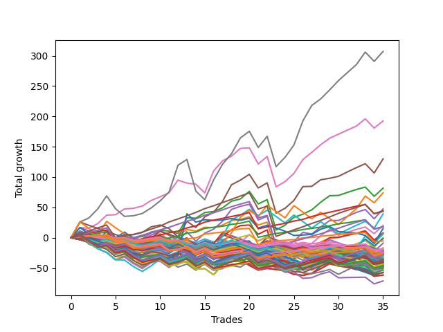

# Long Bulldog 006 
- Symbol: ES_Unlimited
- Date Range: 03/18/2022 - 07/15/2022
- Trading Period: 7:20-12:30
- Number of Trades: 35



| Name | Win Percent | Profit | Avg Profit / Trade | Avg Time / Trade |      | Name | Win Percent | Profit | Avg Profit / Trade | Avg Time / Trade |
| ---- | ----------- | ------ | ------------------ | ---------------- | ---- | ---- | ----------- | ------ | ------------------ | ---------------- |
| Sorted By <br> Profit | | | | | | Sorted By <br> Win Percentage ||||
| Seven | 80.00 | 153500.00 | 4385.71 | 113:21 |     | Eighty-Three | 91.43 | 21750.00 | 621.43 | 38:12 |
| Six | 80.00 | 96250.00 | 2750.00 | 64:41 |     | Eighty-Two | 91.43 | 9125.00 | 260.71 | 34:14 |
| Five | 74.29 | 65000.00 | 1857.14 | 58:46 |     | Eighty-One | 91.43 | -2625.00 | -75.00 | 25:09 |
| Two | 71.43 | 40875.00 | 1167.86 | 33:18 |     | Eighty-Five | 88.57 | 22250.00 | 635.71 | 47:39 |
| Sixty-Three | 45.71 | 37000.00 | 1057.14 | 49:12 |     | Eighty-Four | 88.57 | 9125.00 | 260.71 | 42:54 |
| Four | 71.43 | 23750.00 | 678.57 | 43:50 |     | Seven | 80.00 | 153500.00 | 4385.71 | 113:21 |
| Eighty-Five | 88.57 | 22250.00 | 635.71 | 47:39 |     | Six | 80.00 | 96250.00 | 2750.00 | 64:41 |
| Eighty-Three | 91.43 | 21750.00 | 621.43 | 38:12 |     | One Hundred Twenty-One | 80.00 | -10000.00 | -285.71 | 04:59 |
| Sixty-One | 51.43 | 19625.00 | 560.71 | 29:31 |     | One Hundred Twenty-Six | 80.00 | -13500.00 | -385.71 | 05:18 |
| Fifty-Eight | 57.14 | 10125.00 | 289.29 | 17:49 |     | Five | 74.29 | 65000.00 | 1857.14 | 58:46 |
| Eighty-Two | 91.43 | 9125.00 | 260.71 | 34:14 |     | Two | 71.43 | 40875.00 | 1167.86 | 33:18 |
| Eighty-Four | 88.57 | 9125.00 | 260.71 | 42:54 |     | Four | 71.43 | 23750.00 | 678.57 | 43:50 |
| Seventy-Three | 40.00 | 7625.00 | 217.86 | 11:06 |     | One Hundred Sixteen | 71.43 | -14250.00 | -407.14 | 03:21 |
| Three | 68.57 | 4000.00 | 114.29 | 27:03 |     | Three | 68.57 | 4000.00 | 114.29 | 27:03 |
| Seventy-One | 45.71 | 3375.00 | 96.43 | 26:04 |     | One Hundred Twenty-Seven | 68.57 | -23125.00 | -660.71 | 06:34 |
| One | 65.71 | 2875.00 | 82.14 | 18:36 |     | One Hundred Twenty-Two | 68.57 | -23750.00 | -678.57 | 06:24 |
| Sixty | 54.29 | 125.00 | 3.57 | 21:18 |     | One | 65.71 | 2875.00 | 82.14 | 18:36 |
| Sixty-Two | 48.57 | -750.00 | -21.43 | 30:54 |     | One Hundred Eleven | 65.71 | -9125.00 | -260.71 | 02:50 |
| Eighty-One | 91.43 | -2625.00 | -75.00 | 25:09 |     | One Hundred Twenty-Eight | 65.71 | -19875.00 | -567.86 | 08:12 |
| Sixty-Six | 57.14 | -4500.00 | -128.57 | 14:17 |     | One Hundred Twenty-Three | 65.71 | -21750.00 | -621.43 | 08:05 |
| Seventy | 48.57 | -8250.00 | -235.71 | 21:41 |     | Zero | 62.86 | -13000.00 | -371.43 | 12:35 |
| Forty-Six | 28.57 | -8375.00 | -239.29 | 17:52 |     | One Hundred Twenty-Nine | 62.86 | -14250.00 | -407.14 | 10:25 |
| One Hundred Eleven | 65.71 | -9125.00 | -260.71 | 02:50 |     | One Hundred Twenty-Four | 62.86 | -17875.00 | -510.71 | 10:26 |
| One Hundred Twenty-One | 80.00 | -10000.00 | -285.71 | 04:59 |     | Sixty-Four | 62.86 | -26750.00 | -764.29 | 08:09 |
| Sixty-Seven | 54.29 | -10000.00 | -285.71 | 13:41 |     | Fifty-Seven | 60.00 | -13750.00 | -392.86 | 10:50 |
| Ninety-Seven | 45.71 | -10625.00 | -303.57 | 02:00 |     | One Hundred Twenty-Five | 60.00 | -18125.00 | -517.86 | 13:34 |
| Ninety-Six | 54.29 | -10875.00 | -310.71 | 01:52 |     | Fifty-Six | 60.00 | -35625.00 | -1017.86 | 08:12 |
| Sixty-Eight | 51.43 | -11000.00 | -314.29 | 18:24 |     | Fifty-Eight | 57.14 | 10125.00 | 289.29 | 17:49 |
| Ninety-One | 45.71 | -11000.00 | -314.29 | 01:32 |     | Sixty-Six | 57.14 | -4500.00 | -128.57 | 14:17 |
| Ninety-Nine | 45.71 | -11125.00 | -317.86 | 02:24 |     | Fifty-Nine | 57.14 | -12500.00 | -357.14 | 14:55 |
| Ninety-Eight | 45.71 | -11625.00 | -332.14 | 02:13 |     | Sixty-Five | 57.14 | -13250.00 | -378.57 | 10:36 |
| One Hundred One | 51.43 | -12125.00 | -346.43 | 01:52 |     | One Hundred Six | 57.14 | -13875.00 | -396.43 | 02:12 |
| Fifty-Nine | 57.14 | -12500.00 | -357.14 | 14:55 |     | One Hundred Thirty | 57.14 | -18125.00 | -517.86 | 12:48 |
| Zero | 62.86 | -13000.00 | -371.43 | 12:35 |     | Sixty | 54.29 | 125.00 | 3.57 | 21:18 |
| Sixty-Five | 57.14 | -13250.00 | -378.57 | 10:36 |     | Sixty-Seven | 54.29 | -10000.00 | -285.71 | 13:41 |
| One Hundred Twenty-Six | 80.00 | -13500.00 | -385.71 | 05:18 |     | Ninety-Six | 54.29 | -10875.00 | -310.71 | 01:52 |
| One Hundred | 45.71 | -13625.00 | -389.29 | 02:30 |     | One Hundred Seventeen | 54.29 | -22375.00 | -639.29 | 03:46 |
| Fifty-Seven | 60.00 | -13750.00 | -392.86 | 10:50 |     | Sixty-One | 51.43 | 19625.00 | 560.71 | 29:31 |
| Forty-Five | 25.71 | -13750.00 | -392.86 | 14:48 |     | Sixty-Eight | 51.43 | -11000.00 | -314.29 | 18:24 |
| One Hundred Six | 57.14 | -13875.00 | -396.43 | 02:12 |     | One Hundred One | 51.43 | -12125.00 | -346.43 | 01:52 |
| Ninety-Two | 37.14 | -13875.00 | -396.43 | 01:42 |     | One Hundred Twelve | 51.43 | -19125.00 | -546.43 | 03:37 |
| Forty-Seven | 20.00 | -13875.00 | -396.43 | 26:10 |     | Sixty-Two | 48.57 | -750.00 | -21.43 | 30:54 |
| One Hundred Sixteen | 71.43 | -14250.00 | -407.14 | 03:21 |     | Seventy | 48.57 | -8250.00 | -235.71 | 21:41 |
| One Hundred Twenty-Nine | 62.86 | -14250.00 | -407.14 | 10:25 |     | Sixty-Nine | 48.57 | -14250.00 | -407.14 | 22:12 |
| Sixty-Nine | 48.57 | -14250.00 | -407.14 | 22:12 |     | Sixty-Three | 45.71 | 37000.00 | 1057.14 | 49:12 |
| Ninety-Three | 31.43 | -15500.00 | -442.86 | 02:07 |     | Seventy-One | 45.71 | 3375.00 | 96.43 | 26:04 |
| Ninety-Four | 25.71 | -15750.00 | -450.00 | 02:30 |     | Ninety-Seven | 45.71 | -10625.00 | -303.57 | 02:00 |
| Fifty | 34.29 | -16875.00 | -482.14 | 06:43 |     | Ninety-One | 45.71 | -11000.00 | -314.29 | 01:32 |
| Forty-Four | 28.57 | -16875.00 | -482.14 | 12:24 |     | Ninety-Nine | 45.71 | -11125.00 | -317.86 | 02:24 |
| One Hundred Two | 40.00 | -17125.00 | -489.29 | 02:06 |     | Ninety-Eight | 45.71 | -11625.00 | -332.14 | 02:13 |
| One Hundred Twenty-Four | 62.86 | -17875.00 | -510.71 | 10:26 |     | One Hundred | 45.71 | -13625.00 | -389.29 | 02:30 |
| One Hundred Twenty-Five | 60.00 | -18125.00 | -517.86 | 13:34 |     | One Hundred Thirteen | 45.71 | -22125.00 | -632.14 | 04:38 |
| One Hundred Thirty | 57.14 | -18125.00 | -517.86 | 12:48 |     | One Hundred Eighteen | 45.71 | -23250.00 | -664.29 | 04:52 |
| One Hundred Seven | 42.86 | -18125.00 | -517.86 | 02:27 |     | One Hundred Seven | 42.86 | -18125.00 | -517.86 | 02:27 |
| Forty-Two | 31.43 | -18375.00 | -525.00 | 08:59 |     | Seventy-Three | 40.00 | 7625.00 | 217.86 | 11:06 |
| One Hundred Eight | 37.14 | -18875.00 | -539.29 | 02:49 |     | One Hundred Two | 40.00 | -17125.00 | -489.29 | 02:06 |
| One Hundred Nine | 34.29 | -18875.00 | -539.29 | 03:02 |     | One Hundred Fourteen | 40.00 | -22875.00 | -653.57 | 06:14 |
| One Hundred Three | 34.29 | -19000.00 | -542.86 | 02:51 |     | Forty | 40.00 | -24125.00 | -689.29 | 04:55 |
| One Hundred Twelve | 51.43 | -19125.00 | -546.43 | 03:37 |     | Forty-Eight | 40.00 | -25625.00 | -732.14 | 04:43 |
| One Hundred Four | 28.57 | -19750.00 | -564.29 | 04:15 |     | Ninety-Two | 37.14 | -13875.00 | -396.43 | 01:42 |
| One Hundred Twenty-Eight | 65.71 | -19875.00 | -567.86 | 08:12 |     | One Hundred Eight | 37.14 | -18875.00 | -539.29 | 02:49 |
| Ninety-Five | 20.00 | -20250.00 | -578.57 | 03:07 |     | One Hundred Ninteen | 37.14 | -24125.00 | -689.29 | 05:22 |
| Fifty-One | 28.57 | -20500.00 | -585.71 | 06:50 |     | Fifty | 34.29 | -16875.00 | -482.14 | 06:43 |
| One Hundred Five | 25.71 | -20750.00 | -592.86 | 05:03 |     | One Hundred Nine | 34.29 | -18875.00 | -539.29 | 03:02 |
| One Hundred Twenty-Three | 65.71 | -21750.00 | -621.43 | 08:05 |     | One Hundred Three | 34.29 | -19000.00 | -542.86 | 02:51 |
| One Hundred Ten | 34.29 | -21875.00 | -625.00 | 03:11 |     | One Hundred Ten | 34.29 | -21875.00 | -625.00 | 03:11 |
| Forty-One | 34.29 | -22000.00 | -628.57 | 06:42 |     | Forty-One | 34.29 | -22000.00 | -628.57 | 06:42 |
| One Hundred Thirteen | 45.71 | -22125.00 | -632.14 | 04:38 |     | Forty-Nine | 34.29 | -25125.00 | -717.86 | 05:51 |
| One Hundred Seventeen | 54.29 | -22375.00 | -639.29 | 03:46 |     | One Hundred Fifteen | 34.29 | -28500.00 | -814.29 | 07:33 |
| One Hundred Fourteen | 40.00 | -22875.00 | -653.57 | 06:14 |     | Ninety-Three | 31.43 | -15500.00 | -442.86 | 02:07 |
| One Hundred Twenty-Seven | 68.57 | -23125.00 | -660.71 | 06:34 |     | Forty-Two | 31.43 | -18375.00 | -525.00 | 08:59 |
| One Hundred Eighteen | 45.71 | -23250.00 | -664.29 | 04:52 |     | Forty-Six | 28.57 | -8375.00 | -239.29 | 17:52 |
| One Hundred Twenty-Two | 68.57 | -23750.00 | -678.57 | 06:24 |     | Forty-Four | 28.57 | -16875.00 | -482.14 | 12:24 |
| Forty-Three | 28.57 | -24000.00 | -685.71 | 09:00 |     | One Hundred Four | 28.57 | -19750.00 | -564.29 | 04:15 |
| Forty | 40.00 | -24125.00 | -689.29 | 04:55 |     | Fifty-One | 28.57 | -20500.00 | -585.71 | 06:50 |
| One Hundred Ninteen | 37.14 | -24125.00 | -689.29 | 05:22 |     | Forty-Three | 28.57 | -24000.00 | -685.71 | 09:00 |
| Fifty-Four | 28.57 | -25000.00 | -714.29 | 07:38 |     | Fifty-Four | 28.57 | -25000.00 | -714.29 | 07:38 |
| Forty-Nine | 34.29 | -25125.00 | -717.86 | 05:51 |     | One Hundred Twenty | 28.57 | -28500.00 | -814.29 | 06:07 |
| Forty-Eight | 40.00 | -25625.00 | -732.14 | 04:43 |     | Fifty-Two | 28.57 | -28875.00 | -825.00 | 07:44 |
| Sixty-Four | 62.86 | -26750.00 | -764.29 | 08:09 |     | Fifty-Five | 28.57 | -30750.00 | -878.57 | 07:54 |
| One Hundred Fifteen | 34.29 | -28500.00 | -814.29 | 07:33 |     | Fifty-Three | 28.57 | -30750.00 | -878.57 | 07:54 |
| One Hundred Twenty | 28.57 | -28500.00 | -814.29 | 06:07 |     | Forty-Five | 25.71 | -13750.00 | -392.86 | 14:48 |
| Fifty-Two | 28.57 | -28875.00 | -825.00 | 07:44 |     | Ninety-Four | 25.71 | -15750.00 | -450.00 | 02:30 |
| Fifty-Five | 28.57 | -30750.00 | -878.57 | 07:54 |     | One Hundred Five | 25.71 | -20750.00 | -592.86 | 05:03 |
| Fifty-Three | 28.57 | -30750.00 | -878.57 | 07:54 |     | Forty-Seven | 20.00 | -13875.00 | -396.43 | 26:10 |
| Fifty-Six | 60.00 | -35625.00 | -1017.86 | 08:12 |     | Ninety-Five | 20.00 | -20250.00 | -578.57 | 03:07 |

## NO STOPLOSS

### Test Zero
* Sell when price hits the middle line of the 20p bollinger
* No Stoploss
* Results:
```
Total Trades: 35
Percent Up: 62.86
Percent Down: 37.14
Total Points Moved Up: -26.00
Potential Profit: -13000.00
Total Points Ups: 64.25 Count Ups: 22
Total Points Downs: -90.25 Count Downs: 13
```

<details><summary>Trades</summary>

<code>In: 2022-03-25 08:30:00		Out: 2022-03-25 08:36:55		Total Position Time: 06:55		Total Move Up: 4.00		Total to Date: 4.00</code> <br />
<code>In: 2022-03-28 08:28:00		Out: 2022-03-28 09:02:00		Total Position Time: 34:00		Total Move Up: -14.25		Total to Date: -10.25</code> <br />
<code>In: 2022-03-28 08:39:00		Out: 2022-03-28 09:02:00		Total Position Time: 23:00		Total Move Up: -5.75		Total to Date: -16.00</code> <br />
<code>In: 2022-03-28 08:52:00		Out: 2022-03-28 09:02:00		Total Position Time: 10:00		Total Move Up: 0.75		Total to Date: -15.25</code> <br />
<code>In: 2022-03-30 08:03:00		Out: 2022-03-30 08:19:25		Total Position Time: 16:25		Total Move Up: -5.00		Total to Date: -20.25</code> <br />
<code>In: 2022-03-30 08:14:00		Out: 2022-03-30 08:19:25		Total Position Time: 05:25		Total Move Up: 3.75		Total to Date: -16.50</code> <br />
<code>In: 2022-03-30 12:07:00		Out: 2022-03-30 12:28:50		Total Position Time: 21:50		Total Move Up: -5.50		Total to Date: -22.00</code> <br />
<code>In: 2022-03-30 12:14:00		Out: 2022-03-30 12:28:50		Total Position Time: 14:50		Total Move Up: -2.75		Total to Date: -24.75</code> <br />
<code>In: 2022-03-30 12:27:00		Out: 2022-03-30 12:28:50		Total Position Time: 01:50		Total Move Up: 2.75		Total to Date: -22.00</code> <br />
<code>In: 2022-04-06 09:23:00		Out: 2022-04-06 09:31:15		Total Position Time: 08:15		Total Move Up: 1.50		Total to Date: -20.50</code> <br />
<code>In: 2022-04-18 08:30:00		Out: 2022-04-18 08:55:05		Total Position Time: 25:05		Total Move Up: -5.25		Total to Date: -25.75</code> <br />
<code>In: 2022-05-02 10:06:00		Out: 2022-05-02 10:08:15		Total Position Time: 02:15		Total Move Up: 10.50		Total to Date: -15.25</code> <br />
<code>In: 2022-05-04 11:37:00		Out: 2022-05-04 11:40:45		Total Position Time: 03:45		Total Move Up: -1.25		Total to Date: -16.50</code> <br />
<code>In: 2022-05-09 07:27:00		Out: 2022-05-09 07:42:30		Total Position Time: 15:30		Total Move Up: -6.25		Total to Date: -22.75</code> <br />
<code>In: 2022-05-11 11:01:00		Out: 2022-05-11 11:02:10		Total Position Time: 01:10		Total Move Up: 6.25		Total to Date: -16.50</code> <br />
<code>In: 2022-05-12 11:35:00		Out: 2022-05-12 11:45:25		Total Position Time: 10:25		Total Move Up: 0.00		Total to Date: -16.50</code> <br />
<code>In: 2022-05-17 07:48:00		Out: 2022-05-17 07:55:15		Total Position Time: 07:15		Total Move Up: 3.00		Total to Date: -13.50</code> <br />
<code>In: 2022-05-17 11:25:00		Out: 2022-05-17 11:31:40		Total Position Time: 06:40		Total Move Up: 7.00		Total to Date: -6.50</code> <br />
<code>In: 2022-05-25 09:30:00		Out: 2022-05-25 09:41:30		Total Position Time: 11:30		Total Move Up: 0.25		Total to Date: -6.25</code> <br />
<code>In: 2022-05-25 11:11:00		Out: 2022-05-25 11:13:30		Total Position Time: 02:30		Total Move Up: 1.00		Total to Date: -5.25</code> <br />
<code>In: 2022-06-08 09:30:00		Out: 2022-06-08 09:56:25		Total Position Time: 26:25		Total Move Up: -16.00		Total to Date: -21.25</code> <br />
<code>In: 2022-06-09 08:10:00		Out: 2022-06-09 08:11:10		Total Position Time: 01:10		Total Move Up: 3.25		Total to Date: -18.00</code> <br />
<code>In: 2022-06-09 11:27:00		Out: 2022-06-09 11:28:40		Total Position Time: 01:40		Total Move Up: 3.00		Total to Date: -15.00</code> <br />
<code>In: 2022-06-15 07:58:00		Out: 2022-06-15 08:34:25		Total Position Time: 36:25		Total Move Up: -4.50		Total to Date: -19.50</code> <br />
<code>In: 2022-06-15 08:16:00		Out: 2022-06-15 08:34:25		Total Position Time: 18:25		Total Move Up: 0.50		Total to Date: -19.00</code> <br />
<code>In: 2022-06-17 07:38:00		Out: 2022-06-17 07:55:05		Total Position Time: 17:05		Total Move Up: -2.75		Total to Date: -21.75</code> <br />
<code>In: 2022-06-23 09:07:00		Out: 2022-06-23 09:17:45		Total Position Time: 10:45		Total Move Up: 1.25		Total to Date: -20.50</code> <br />
<code>In: 2022-06-27 12:08:00		Out: 2022-06-27 12:10:20		Total Position Time: 02:20		Total Move Up: 6.00		Total to Date: -14.50</code> <br />
<code>In: 2022-06-29 08:26:00		Out: 2022-06-29 08:32:10		Total Position Time: 06:10		Total Move Up: 3.75		Total to Date: -10.75</code> <br />
<code>In: 2022-06-29 09:16:00		Out: 2022-06-29 09:36:40		Total Position Time: 20:40		Total Move Up: -4.25		Total to Date: -15.00</code> <br />
<code>In: 2022-07-05 08:05:00		Out: 2022-07-05 08:15:20		Total Position Time: 10:20		Total Move Up: 0.50		Total to Date: -14.50</code> <br />
<code>In: 2022-07-05 08:08:00		Out: 2022-07-05 08:15:20		Total Position Time: 07:20		Total Move Up: 0.25		Total to Date: -14.25</code> <br />
<code>In: 2022-07-06 08:35:00		Out: 2022-07-06 08:46:30		Total Position Time: 11:30		Total Move Up: 0.25		Total to Date: -14.00</code> <br />
<code>In: 2022-07-12 12:07:00		Out: 2022-07-12 12:45:35		Total Position Time: 38:35		Total Move Up: -16.75		Total to Date: -30.75</code> <br />
<code>In: 2022-07-13 07:23:00		Out: 2022-07-13 07:26:25		Total Position Time: 03:25		Total Move Up: 4.75		Total to Date: -26.00</code> <br />


</details>

### Test One
* Sell when the price hits the upper line of the 20p 1std bollinger
* No Stoploss
* Results:
```
Total Trades: 35
Percent Up: 65.71
Percent Down: 34.29
Total Points Moved Up: 5.75
Potential Profit: 2875.00
Total Points Ups: 118.75 Count Ups: 23
Total Points Downs: -113.00 Count Downs: 12
```

<details><summary>Trades</summary>

<code>In: 2022-03-25 08:30:00		Out: 2022-03-25 08:41:10		Total Position Time: 11:10		Total Move Up: 5.50		Total to Date: 5.50</code> <br />
<code>In: 2022-03-28 08:28:00		Out: 2022-03-28 09:05:25		Total Position Time: 37:25		Total Move Up: -12.25		Total to Date: -6.75</code> <br />
<code>In: 2022-03-28 08:39:00		Out: 2022-03-28 09:05:25		Total Position Time: 26:25		Total Move Up: -3.75		Total to Date: -10.50</code> <br />
<code>In: 2022-03-28 08:52:00		Out: 2022-03-28 09:05:25		Total Position Time: 13:25		Total Move Up: 2.75		Total to Date: -7.75</code> <br />
<code>In: 2022-03-30 08:03:00		Out: 2022-03-30 08:34:45		Total Position Time: 31:45		Total Move Up: -5.75		Total to Date: -13.50</code> <br />
<code>In: 2022-03-30 08:14:00		Out: 2022-03-30 08:34:45		Total Position Time: 20:45		Total Move Up: 3.00		Total to Date: -10.50</code> <br />
<code>In: 2022-03-30 12:07:00		Out: 2022-03-30 12:32:20		Total Position Time: 25:20		Total Move Up: -3.50		Total to Date: -14.00</code> <br />
<code>In: 2022-03-30 12:14:00		Out: 2022-03-30 12:32:20		Total Position Time: 18:20		Total Move Up: -0.75		Total to Date: -14.75</code> <br />
<code>In: 2022-03-30 12:27:00		Out: 2022-03-30 12:32:20		Total Position Time: 05:20		Total Move Up: 4.75		Total to Date: -10.00</code> <br />
<code>In: 2022-04-06 09:23:00		Out: 2022-04-06 09:34:25		Total Position Time: 11:25		Total Move Up: 2.75		Total to Date: -7.25</code> <br />
<code>In: 2022-04-18 08:30:00		Out: 2022-04-18 08:57:20		Total Position Time: 27:20		Total Move Up: -3.75		Total to Date: -11.00</code> <br />
<code>In: 2022-05-02 10:06:00		Out: 2022-05-02 10:10:55		Total Position Time: 04:55		Total Move Up: 14.00		Total to Date: 3.00</code> <br />
<code>In: 2022-05-04 11:37:00		Out: 2022-05-04 11:41:40		Total Position Time: 04:40		Total Move Up: 10.75		Total to Date: 13.75</code> <br />
<code>In: 2022-05-09 07:27:00		Out: 2022-05-09 07:46:10		Total Position Time: 19:10		Total Move Up: -2.75		Total to Date: 11.00</code> <br />
<code>In: 2022-05-11 11:01:00		Out: 2022-05-11 11:02:10		Total Position Time: 01:10		Total Move Up: 6.25		Total to Date: 17.25</code> <br />
<code>In: 2022-05-12 11:35:00		Out: 2022-05-12 11:52:55		Total Position Time: 17:55		Total Move Up: -0.50		Total to Date: 16.75</code> <br />
<code>In: 2022-05-17 07:48:00		Out: 2022-05-17 07:59:10		Total Position Time: 11:10		Total Move Up: 4.25		Total to Date: 21.00</code> <br />
<code>In: 2022-05-17 11:25:00		Out: 2022-05-17 11:39:45		Total Position Time: 14:45		Total Move Up: 7.25		Total to Date: 28.25</code> <br />
<code>In: 2022-05-25 09:30:00		Out: 2022-05-25 09:44:30		Total Position Time: 14:30		Total Move Up: 2.00		Total to Date: 30.25</code> <br />
<code>In: 2022-05-25 11:11:00		Out: 2022-05-25 11:15:45		Total Position Time: 04:45		Total Move Up: 4.25		Total to Date: 34.50</code> <br />
<code>In: 2022-06-08 09:30:00		Out: 2022-06-08 09:59:05		Total Position Time: 29:05		Total Move Up: -13.50		Total to Date: 21.00</code> <br />
<code>In: 2022-06-09 08:10:00		Out: 2022-06-09 08:21:10		Total Position Time: 11:10		Total Move Up: 4.75		Total to Date: 25.75</code> <br />
<code>In: 2022-06-09 11:27:00		Out: 2022-06-09 12:47:00		Total Position Time: 80:00		Total Move Up: -50.00		Total to Date: -24.25</code> <br />
<code>In: 2022-06-15 07:58:00		Out: 2022-06-15 08:38:55		Total Position Time: 40:55		Total Move Up: -1.25		Total to Date: -25.50</code> <br />
<code>In: 2022-06-15 08:16:00		Out: 2022-06-15 08:38:55		Total Position Time: 22:55		Total Move Up: 3.75		Total to Date: -21.75</code> <br />
<code>In: 2022-06-17 07:38:00		Out: 2022-06-17 07:56:20		Total Position Time: 18:20		Total Move Up: 1.00		Total to Date: -20.75</code> <br />
<code>In: 2022-06-23 09:07:00		Out: 2022-06-23 09:18:25		Total Position Time: 11:25		Total Move Up: 4.75		Total to Date: -16.00</code> <br />
<code>In: 2022-06-27 12:08:00		Out: 2022-06-27 12:12:10		Total Position Time: 04:10		Total Move Up: 9.00		Total to Date: -7.00</code> <br />
<code>In: 2022-06-29 08:26:00		Out: 2022-06-29 08:33:05		Total Position Time: 07:05		Total Move Up: 6.75		Total to Date: -0.25</code> <br />
<code>In: 2022-06-29 09:16:00		Out: 2022-06-29 09:38:30		Total Position Time: 22:30		Total Move Up: 0.75		Total to Date: 0.50</code> <br />
<code>In: 2022-07-05 08:05:00		Out: 2022-07-05 08:16:45		Total Position Time: 11:45		Total Move Up: 3.50		Total to Date: 4.00</code> <br />
<code>In: 2022-07-05 08:08:00		Out: 2022-07-05 08:16:45		Total Position Time: 08:45		Total Move Up: 3.25		Total to Date: 7.25</code> <br />
<code>In: 2022-07-06 08:35:00		Out: 2022-07-06 08:48:25		Total Position Time: 13:25		Total Move Up: 2.00		Total to Date: 9.25</code> <br />
<code>In: 2022-07-12 12:07:00		Out: 2022-07-12 12:47:00		Total Position Time: 40:00		Total Move Up: -15.25		Total to Date: -6.00</code> <br />
<code>In: 2022-07-13 07:23:00		Out: 2022-07-13 07:31:20		Total Position Time: 08:20		Total Move Up: 11.75		Total to Date: 5.75</code> <br />


</details>

### Test Two
* Sell when the price hits the upper line of the 20p 2std bollinger
* No Stoploss
* Results:
```
Total Trades: 35
Percent Up: 71.43
Percent Down: 28.57
Total Points Moved Up: 81.75
Potential Profit: 40875.00
Total Points Ups: 192.00 Count Ups: 25
Total Points Downs: -110.25 Count Downs: 10
```

<details><summary>Trades</summary>

<code>In: 2022-03-25 08:30:00		Out: 2022-03-25 08:41:55		Total Position Time: 11:55		Total Move Up: 9.50		Total to Date: 9.50</code> <br />
<code>In: 2022-03-28 08:28:00		Out: 2022-03-28 09:07:10		Total Position Time: 39:10		Total Move Up: -11.00		Total to Date: -1.50</code> <br />
<code>In: 2022-03-28 08:39:00		Out: 2022-03-28 09:07:10		Total Position Time: 28:10		Total Move Up: -2.50		Total to Date: -4.00</code> <br />
<code>In: 2022-03-28 08:52:00		Out: 2022-03-28 09:07:10		Total Position Time: 15:10		Total Move Up: 4.00		Total to Date: 0.00</code> <br />
<code>In: 2022-03-30 08:03:00		Out: 2022-03-30 08:35:15		Total Position Time: 32:15		Total Move Up: -4.00		Total to Date: -4.00</code> <br />
<code>In: 2022-03-30 08:14:00		Out: 2022-03-30 08:35:15		Total Position Time: 21:15		Total Move Up: 4.75		Total to Date: 0.75</code> <br />
<code>In: 2022-03-30 12:07:00		Out: 2022-03-30 12:36:20		Total Position Time: 29:20		Total Move Up: -0.75		Total to Date: 0.00</code> <br />
<code>In: 2022-03-30 12:14:00		Out: 2022-03-30 12:36:20		Total Position Time: 22:20		Total Move Up: 2.00		Total to Date: 2.00</code> <br />
<code>In: 2022-03-30 12:27:00		Out: 2022-03-30 12:36:20		Total Position Time: 09:20		Total Move Up: 7.50		Total to Date: 9.50</code> <br />
<code>In: 2022-04-06 09:23:00		Out: 2022-04-06 09:41:10		Total Position Time: 18:10		Total Move Up: 3.00		Total to Date: 12.50</code> <br />
<code>In: 2022-04-18 08:30:00		Out: 2022-04-18 08:59:35		Total Position Time: 29:35		Total Move Up: -1.50		Total to Date: 11.00</code> <br />
<code>In: 2022-05-02 10:06:00		Out: 2022-05-02 11:03:55		Total Position Time: 57:55		Total Move Up: -4.00		Total to Date: 7.00</code> <br />
<code>In: 2022-05-04 11:37:00		Out: 2022-05-04 11:43:55		Total Position Time: 06:55		Total Move Up: 25.75		Total to Date: 32.75</code> <br />
<code>In: 2022-05-09 07:27:00		Out: 2022-05-09 07:49:10		Total Position Time: 22:10		Total Move Up: -0.50		Total to Date: 32.25</code> <br />
<code>In: 2022-05-11 11:01:00		Out: 2022-05-11 11:04:55		Total Position Time: 03:55		Total Move Up: 9.25		Total to Date: 41.50</code> <br />
<code>In: 2022-05-12 11:35:00		Out: 2022-05-12 11:53:25		Total Position Time: 18:25		Total Move Up: 1.75		Total to Date: 43.25</code> <br />
<code>In: 2022-05-17 07:48:00		Out: 2022-05-17 08:00:05		Total Position Time: 12:05		Total Move Up: 6.00		Total to Date: 49.25</code> <br />
<code>In: 2022-05-17 11:25:00		Out: 2022-05-17 11:40:05		Total Position Time: 15:05		Total Move Up: 11.00		Total to Date: 60.25</code> <br />
<code>In: 2022-05-25 09:30:00		Out: 2022-05-25 09:45:20		Total Position Time: 15:20		Total Move Up: 3.75		Total to Date: 64.00</code> <br />
<code>In: 2022-05-25 11:11:00		Out: 2022-05-25 11:16:50		Total Position Time: 05:50		Total Move Up: 12.50		Total to Date: 76.50</code> <br />
<code>In: 2022-06-08 09:30:00		Out: 2022-06-08 11:03:45		Total Position Time: 93:45		Total Move Up: -20.75		Total to Date: 55.75</code> <br />
<code>In: 2022-06-09 08:10:00		Out: 2022-06-09 08:22:35		Total Position Time: 12:35		Total Move Up: 7.00		Total to Date: 62.75</code> <br />
<code>In: 2022-06-09 11:27:00		Out: 2022-06-09 12:47:00		Total Position Time: 80:00		Total Move Up: -50.00		Total to Date: 12.75</code> <br />
<code>In: 2022-06-15 07:58:00		Out: 2022-06-15 10:58:15		Total Position Time: 180:15		Total Move Up: 8.00		Total to Date: 20.75</code> <br />
<code>In: 2022-06-15 08:16:00		Out: 2022-06-15 10:58:15		Total Position Time: 162:15		Total Move Up: 13.00		Total to Date: 33.75</code> <br />
<code>In: 2022-06-17 07:38:00		Out: 2022-06-17 08:02:25		Total Position Time: 24:25		Total Move Up: 5.00		Total to Date: 38.75</code> <br />
<code>In: 2022-06-23 09:07:00		Out: 2022-06-23 09:19:10		Total Position Time: 12:10		Total Move Up: 7.25		Total to Date: 46.00</code> <br />
<code>In: 2022-06-27 12:08:00		Out: 2022-06-27 12:45:40		Total Position Time: 37:40		Total Move Up: 12.50		Total to Date: 58.50</code> <br />
<code>In: 2022-06-29 08:26:00		Out: 2022-06-29 08:35:35		Total Position Time: 09:35		Total Move Up: 10.75		Total to Date: 69.25</code> <br />
<code>In: 2022-06-29 09:16:00		Out: 2022-06-29 10:01:45		Total Position Time: 45:45		Total Move Up: 0.50		Total to Date: 69.75</code> <br />
<code>In: 2022-07-05 08:05:00		Out: 2022-07-05 08:20:35		Total Position Time: 15:35		Total Move Up: 5.00		Total to Date: 74.75</code> <br />
<code>In: 2022-07-05 08:08:00		Out: 2022-07-05 08:20:35		Total Position Time: 12:35		Total Move Up: 4.75		Total to Date: 79.50</code> <br />
<code>In: 2022-07-06 08:35:00		Out: 2022-07-06 08:51:15		Total Position Time: 16:15		Total Move Up: 4.00		Total to Date: 83.50</code> <br />
<code>In: 2022-07-12 12:07:00		Out: 2022-07-12 12:47:00		Total Position Time: 40:00		Total Move Up: -15.25		Total to Date: 68.25</code> <br />
<code>In: 2022-07-13 07:23:00		Out: 2022-07-13 07:31:30		Total Position Time: 08:30		Total Move Up: 13.50		Total to Date: 81.75</code> <br />


</details>

### Test Three
* Sell when price hits the middle line of the 50p bollinger
* No Stoploss
* Results:
```
Total Trades: 35
Percent Up: 68.57
Percent Down: 31.43
Total Points Moved Up: 8.00
Potential Profit: 4000.00
Total Points Ups: 140.00 Count Ups: 24
Total Points Downs: -132.00 Count Downs: 11
```

<details><summary>Trades</summary>

<code>In: 2022-03-25 08:30:00		Out: 2022-03-25 08:53:00		Total Position Time: 23:00		Total Move Up: 8.75		Total to Date: 8.75</code> <br />
<code>In: 2022-03-28 08:28:00		Out: 2022-03-28 09:25:20		Total Position Time: 57:20		Total Move Up: -14.50		Total to Date: -5.75</code> <br />
<code>In: 2022-03-28 08:39:00		Out: 2022-03-28 09:25:20		Total Position Time: 46:20		Total Move Up: -6.00		Total to Date: -11.75</code> <br />
<code>In: 2022-03-28 08:52:00		Out: 2022-03-28 09:25:20		Total Position Time: 33:20		Total Move Up: 0.50		Total to Date: -11.25</code> <br />
<code>In: 2022-03-30 08:03:00		Out: 2022-03-30 08:35:20		Total Position Time: 32:20		Total Move Up: -3.50		Total to Date: -14.75</code> <br />
<code>In: 2022-03-30 08:14:00		Out: 2022-03-30 08:35:20		Total Position Time: 21:20		Total Move Up: 5.25		Total to Date: -9.50</code> <br />
<code>In: 2022-03-30 12:07:00		Out: 2022-03-30 12:33:40		Total Position Time: 26:40		Total Move Up: -1.75		Total to Date: -11.25</code> <br />
<code>In: 2022-03-30 12:14:00		Out: 2022-03-30 12:33:40		Total Position Time: 19:40		Total Move Up: 1.00		Total to Date: -10.25</code> <br />
<code>In: 2022-03-30 12:27:00		Out: 2022-03-30 12:33:40		Total Position Time: 06:40		Total Move Up: 6.50		Total to Date: -3.75</code> <br />
<code>In: 2022-04-06 09:23:00		Out: 2022-04-06 09:55:05		Total Position Time: 32:05		Total Move Up: 2.25		Total to Date: -1.50</code> <br />
<code>In: 2022-04-18 08:30:00		Out: 2022-04-18 09:07:15		Total Position Time: 37:15		Total Move Up: -2.50		Total to Date: -4.00</code> <br />
<code>In: 2022-05-02 10:06:00		Out: 2022-05-02 11:05:00		Total Position Time: 59:00		Total Move Up: -1.50		Total to Date: -5.50</code> <br />
<code>In: 2022-05-04 11:37:00		Out: 2022-05-04 11:41:15		Total Position Time: 04:15		Total Move Up: 5.25		Total to Date: -0.25</code> <br />
<code>In: 2022-05-09 07:27:00		Out: 2022-05-09 08:39:00		Total Position Time: 72:00		Total Move Up: -20.50		Total to Date: -20.75</code> <br />
<code>In: 2022-05-11 11:01:00		Out: 2022-05-11 11:05:00		Total Position Time: 04:00		Total Move Up: 11.00		Total to Date: -9.75</code> <br />
<code>In: 2022-05-12 11:35:00		Out: 2022-05-12 11:53:25		Total Position Time: 18:25		Total Move Up: 1.75		Total to Date: -8.00</code> <br />
<code>In: 2022-05-17 07:48:00		Out: 2022-05-17 08:04:10		Total Position Time: 16:10		Total Move Up: 10.25		Total to Date: 2.25</code> <br />
<code>In: 2022-05-17 11:25:00		Out: 2022-05-17 11:40:05		Total Position Time: 15:05		Total Move Up: 11.00		Total to Date: 13.25</code> <br />
<code>In: 2022-05-25 09:30:00		Out: 2022-05-25 09:49:10		Total Position Time: 19:10		Total Move Up: 6.75		Total to Date: 20.00</code> <br />
<code>In: 2022-05-25 11:11:00		Out: 2022-05-25 11:13:30		Total Position Time: 02:30		Total Move Up: 1.00		Total to Date: 21.00</code> <br />
<code>In: 2022-06-08 09:30:00		Out: 2022-06-08 10:19:05		Total Position Time: 49:05		Total Move Up: -15.25		Total to Date: 5.75</code> <br />
<code>In: 2022-06-09 08:10:00		Out: 2022-06-09 08:25:35		Total Position Time: 15:35		Total Move Up: 7.25		Total to Date: 13.00</code> <br />
<code>In: 2022-06-09 11:27:00		Out: 2022-06-09 12:47:00		Total Position Time: 80:00		Total Move Up: -50.00		Total to Date: -37.00</code> <br />
<code>In: 2022-06-15 07:58:00		Out: 2022-06-15 08:38:55		Total Position Time: 40:55		Total Move Up: -1.25		Total to Date: -38.25</code> <br />
<code>In: 2022-06-15 08:16:00		Out: 2022-06-15 08:38:55		Total Position Time: 22:55		Total Move Up: 3.75		Total to Date: -34.50</code> <br />
<code>In: 2022-06-17 07:38:00		Out: 2022-06-17 08:02:30		Total Position Time: 24:30		Total Move Up: 7.00		Total to Date: -27.50</code> <br />
<code>In: 2022-06-23 09:07:00		Out: 2022-06-23 09:22:00		Total Position Time: 15:00		Total Move Up: 8.75		Total to Date: -18.75</code> <br />
<code>In: 2022-06-27 12:08:00		Out: 2022-06-27 12:11:50		Total Position Time: 03:50		Total Move Up: 8.00		Total to Date: -10.75</code> <br />
<code>In: 2022-06-29 08:26:00		Out: 2022-06-29 08:35:35		Total Position Time: 09:35		Total Move Up: 10.75		Total to Date: 0.00</code> <br />
<code>In: 2022-06-29 09:16:00		Out: 2022-06-29 09:38:30		Total Position Time: 22:30		Total Move Up: 0.75		Total to Date: 0.75</code> <br />
<code>In: 2022-07-05 08:05:00		Out: 2022-07-05 08:32:25		Total Position Time: 27:25		Total Move Up: 3.50		Total to Date: 4.25</code> <br />
<code>In: 2022-07-05 08:08:00		Out: 2022-07-05 08:32:25		Total Position Time: 24:25		Total Move Up: 3.25		Total to Date: 7.50</code> <br />
<code>In: 2022-07-06 08:35:00		Out: 2022-07-06 08:51:15		Total Position Time: 16:15		Total Move Up: 4.00		Total to Date: 11.50</code> <br />
<code>In: 2022-07-12 12:07:00		Out: 2022-07-12 12:47:00		Total Position Time: 40:00		Total Move Up: -15.25		Total to Date: -3.75</code> <br />
<code>In: 2022-07-13 07:23:00		Out: 2022-07-13 07:31:20		Total Position Time: 08:20		Total Move Up: 11.75		Total to Date: 8.00</code> <br />


</details>

### Test Four
* Sell when the price hits the upper line of the 50p 1std bollinger
* No Stoploss
* Results:
```
Total Trades: 35
Percent Up: 71.43
Percent Down: 28.57
Total Points Moved Up: 47.50
Potential Profit: 23750.00
Total Points Ups: 195.00 Count Ups: 25
Total Points Downs: -147.50 Count Downs: 10
```

<details><summary>Trades</summary>

<code>In: 2022-03-25 08:30:00		Out: 2022-03-25 09:08:25		Total Position Time: 38:25		Total Move Up: 8.00		Total to Date: 8.00</code> <br />
<code>In: 2022-03-28 08:28:00		Out: 2022-03-28 09:35:05		Total Position Time: 67:05		Total Move Up: -12.75		Total to Date: -4.75</code> <br />
<code>In: 2022-03-28 08:39:00		Out: 2022-03-28 09:35:05		Total Position Time: 56:05		Total Move Up: -4.25		Total to Date: -9.00</code> <br />
<code>In: 2022-03-28 08:52:00		Out: 2022-03-28 09:35:05		Total Position Time: 43:05		Total Move Up: 2.25		Total to Date: -6.75</code> <br />
<code>In: 2022-03-30 08:03:00		Out: 2022-03-30 08:57:20		Total Position Time: 54:20		Total Move Up: -4.75		Total to Date: -11.50</code> <br />
<code>In: 2022-03-30 08:14:00		Out: 2022-03-30 08:57:20		Total Position Time: 43:20		Total Move Up: 4.00		Total to Date: -7.50</code> <br />
<code>In: 2022-03-30 12:07:00		Out: 2022-03-30 12:46:25		Total Position Time: 39:25		Total Move Up: 1.50		Total to Date: -6.00</code> <br />
<code>In: 2022-03-30 12:14:00		Out: 2022-03-30 12:46:25		Total Position Time: 32:25		Total Move Up: 4.25		Total to Date: -1.75</code> <br />
<code>In: 2022-03-30 12:27:00		Out: 2022-03-30 12:46:25		Total Position Time: 19:25		Total Move Up: 9.75		Total to Date: 8.00</code> <br />
<code>In: 2022-04-06 09:23:00		Out: 2022-04-06 10:00:20		Total Position Time: 37:20		Total Move Up: 3.50		Total to Date: 11.50</code> <br />
<code>In: 2022-04-18 08:30:00		Out: 2022-04-18 09:53:35		Total Position Time: 83:35		Total Move Up: -7.75		Total to Date: 3.75</code> <br />
<code>In: 2022-05-02 10:06:00		Out: 2022-05-02 11:53:40		Total Position Time: 107:40		Total Move Up: -8.75		Total to Date: -5.00</code> <br />
<code>In: 2022-05-04 11:37:00		Out: 2022-05-04 11:42:00		Total Position Time: 05:00		Total Move Up: 14.75		Total to Date: 9.75</code> <br />
<code>In: 2022-05-09 07:27:00		Out: 2022-05-09 08:41:35		Total Position Time: 74:35		Total Move Up: -15.50		Total to Date: -5.75</code> <br />
<code>In: 2022-05-11 11:01:00		Out: 2022-05-11 11:18:20		Total Position Time: 17:20		Total Move Up: 13.25		Total to Date: 7.50</code> <br />
<code>In: 2022-05-12 11:35:00		Out: 2022-05-12 12:04:10		Total Position Time: 29:10		Total Move Up: 6.75		Total to Date: 14.25</code> <br />
<code>In: 2022-05-17 07:48:00		Out: 2022-05-17 08:18:30		Total Position Time: 30:30		Total Move Up: 13.00		Total to Date: 27.25</code> <br />
<code>In: 2022-05-17 11:25:00		Out: 2022-05-17 11:45:50		Total Position Time: 20:50		Total Move Up: 19.50		Total to Date: 46.75</code> <br />
<code>In: 2022-05-25 09:30:00		Out: 2022-05-25 10:10:05		Total Position Time: 40:05		Total Move Up: 5.00		Total to Date: 51.75</code> <br />
<code>In: 2022-05-25 11:11:00		Out: 2022-05-25 11:14:05		Total Position Time: 03:05		Total Move Up: 3.50		Total to Date: 55.25</code> <br />
<code>In: 2022-06-08 09:30:00		Out: 2022-06-08 12:12:35		Total Position Time: 162:35		Total Move Up: -26.00		Total to Date: 29.25</code> <br />
<code>In: 2022-06-09 08:10:00		Out: 2022-06-09 08:40:10		Total Position Time: 30:10		Total Move Up: 6.25		Total to Date: 35.50</code> <br />
<code>In: 2022-06-09 11:27:00		Out: 2022-06-09 12:47:00		Total Position Time: 80:00		Total Move Up: -50.00		Total to Date: -14.50</code> <br />
<code>In: 2022-06-15 07:58:00		Out: 2022-06-15 08:57:35		Total Position Time: 59:35		Total Move Up: 1.75		Total to Date: -12.75</code> <br />
<code>In: 2022-06-15 08:16:00		Out: 2022-06-15 08:57:35		Total Position Time: 41:35		Total Move Up: 6.75		Total to Date: -6.00</code> <br />
<code>In: 2022-06-17 07:38:00		Out: 2022-06-17 08:06:05		Total Position Time: 28:05		Total Move Up: 14.75		Total to Date: 8.75</code> <br />
<code>In: 2022-06-23 09:07:00		Out: 2022-06-23 10:18:10		Total Position Time: 71:10		Total Move Up: -2.50		Total to Date: 6.25</code> <br />
<code>In: 2022-06-27 12:08:00		Out: 2022-06-27 12:15:30		Total Position Time: 07:30		Total Move Up: 11.50		Total to Date: 17.75</code> <br />
<code>In: 2022-06-29 08:26:00		Out: 2022-06-29 08:53:10		Total Position Time: 27:10		Total Move Up: 10.50		Total to Date: 28.25</code> <br />
<code>In: 2022-06-29 09:16:00		Out: 2022-06-29 09:59:30		Total Position Time: 43:30		Total Move Up: 0.25		Total to Date: 28.50</code> <br />
<code>In: 2022-07-05 08:05:00		Out: 2022-07-05 08:33:10		Total Position Time: 28:10		Total Move Up: 6.75		Total to Date: 35.25</code> <br />
<code>In: 2022-07-05 08:08:00		Out: 2022-07-05 08:33:10		Total Position Time: 25:10		Total Move Up: 6.50		Total to Date: 41.75</code> <br />
<code>In: 2022-07-06 08:35:00		Out: 2022-07-06 09:13:30		Total Position Time: 38:30		Total Move Up: 4.75		Total to Date: 46.50</code> <br />
<code>In: 2022-07-12 12:07:00		Out: 2022-07-12 12:47:00		Total Position Time: 40:00		Total Move Up: -15.25		Total to Date: 31.25</code> <br />
<code>In: 2022-07-13 07:23:00		Out: 2022-07-13 07:31:35		Total Position Time: 08:35		Total Move Up: 16.25		Total to Date: 47.50</code> <br />


</details>

### Test Five
* Sell when the price hits the upper line of the 50p 2std bollinger
* No Stoploss
* Results:
```
Total Trades: 35
Percent Up: 74.29
Percent Down: 25.71
Total Points Moved Up: 130.00
Potential Profit: 65000.00
Total Points Ups: 264.25 Count Ups: 26
Total Points Downs: -134.25 Count Downs: 9
```

<details><summary>Trades</summary>

<code>In: 2022-03-25 08:30:00		Out: 2022-03-25 09:11:40		Total Position Time: 41:40		Total Move Up: 11.00		Total to Date: 11.00</code> <br />
<code>In: 2022-03-28 08:28:00		Out: 2022-03-28 09:39:55		Total Position Time: 71:55		Total Move Up: -11.25		Total to Date: -0.25</code> <br />
<code>In: 2022-03-28 08:39:00		Out: 2022-03-28 09:39:55		Total Position Time: 60:55		Total Move Up: -2.75		Total to Date: -3.00</code> <br />
<code>In: 2022-03-28 08:52:00		Out: 2022-03-28 09:39:55		Total Position Time: 47:55		Total Move Up: 3.75		Total to Date: 0.75</code> <br />
<code>In: 2022-03-30 08:03:00		Out: 2022-03-30 09:00:25		Total Position Time: 57:25		Total Move Up: -2.75		Total to Date: -2.00</code> <br />
<code>In: 2022-03-30 08:14:00		Out: 2022-03-30 09:00:25		Total Position Time: 46:25		Total Move Up: 6.00		Total to Date: 4.00</code> <br />
<code>In: 2022-03-30 12:07:00		Out: 2022-03-30 12:47:00		Total Position Time: 40:00		Total Move Up: 1.00		Total to Date: 5.00</code> <br />
<code>In: 2022-03-30 12:14:00		Out: 2022-03-30 12:47:00		Total Position Time: 33:00		Total Move Up: 3.75		Total to Date: 8.75</code> <br />
<code>In: 2022-03-30 12:27:00		Out: 2022-03-30 12:47:00		Total Position Time: 20:00		Total Move Up: 9.25		Total to Date: 18.00</code> <br />
<code>In: 2022-04-06 09:23:00		Out: 2022-04-06 10:07:15		Total Position Time: 44:15		Total Move Up: 3.00		Total to Date: 21.00</code> <br />
<code>In: 2022-04-18 08:30:00		Out: 2022-04-18 09:58:15		Total Position Time: 88:15		Total Move Up: -6.00		Total to Date: 15.00</code> <br />
<code>In: 2022-05-02 10:06:00		Out: 2022-05-02 12:03:30		Total Position Time: 117:30		Total Move Up: -13.75		Total to Date: 1.25</code> <br />
<code>In: 2022-05-04 11:37:00		Out: 2022-05-04 11:43:55		Total Position Time: 06:55		Total Move Up: 25.75		Total to Date: 27.00</code> <br />
<code>In: 2022-05-09 07:27:00		Out: 2022-05-09 08:43:15		Total Position Time: 76:15		Total Move Up: -10.00		Total to Date: 17.00</code> <br />
<code>In: 2022-05-11 11:01:00		Out: 2022-05-11 11:23:40		Total Position Time: 22:40		Total Move Up: 17.50		Total to Date: 34.50</code> <br />
<code>In: 2022-05-12 11:35:00		Out: 2022-05-12 12:17:40		Total Position Time: 42:40		Total Move Up: 7.50		Total to Date: 42.00</code> <br />
<code>In: 2022-05-17 07:48:00		Out: 2022-05-17 08:28:25		Total Position Time: 40:25		Total Move Up: 18.00		Total to Date: 60.00</code> <br />
<code>In: 2022-05-17 11:25:00		Out: 2022-05-17 11:48:40		Total Position Time: 23:40		Total Move Up: 27.25		Total to Date: 87.25</code> <br />
<code>In: 2022-05-25 09:30:00		Out: 2022-05-25 10:29:35		Total Position Time: 59:35		Total Move Up: 7.75		Total to Date: 95.00</code> <br />
<code>In: 2022-05-25 11:11:00		Out: 2022-05-25 11:16:25		Total Position Time: 05:25		Total Move Up: 9.50		Total to Date: 104.50</code> <br />
<code>In: 2022-06-08 09:30:00		Out: 2022-06-08 12:21:15		Total Position Time: 171:15		Total Move Up: -22.50		Total to Date: 82.00</code> <br />
<code>In: 2022-06-09 08:10:00		Out: 2022-06-09 08:41:45		Total Position Time: 31:45		Total Move Up: 8.50		Total to Date: 90.50</code> <br />
<code>In: 2022-06-09 11:27:00		Out: 2022-06-09 12:47:00		Total Position Time: 80:00		Total Move Up: -50.00		Total to Date: 40.50</code> <br />
<code>In: 2022-06-15 07:58:00		Out: 2022-06-15 10:58:15		Total Position Time: 180:15		Total Move Up: 8.00		Total to Date: 48.50</code> <br />
<code>In: 2022-06-15 08:16:00		Out: 2022-06-15 10:58:15		Total Position Time: 162:15		Total Move Up: 13.00		Total to Date: 61.50</code> <br />
<code>In: 2022-06-17 07:38:00		Out: 2022-06-17 08:07:55		Total Position Time: 29:55		Total Move Up: 22.75		Total to Date: 84.25</code> <br />
<code>In: 2022-06-23 09:07:00		Out: 2022-06-23 10:23:20		Total Position Time: 76:20		Total Move Up: 0.50		Total to Date: 84.75</code> <br />
<code>In: 2022-06-27 12:08:00		Out: 2022-06-27 12:47:00		Total Position Time: 39:00		Total Move Up: 10.75		Total to Date: 95.50</code> <br />
<code>In: 2022-06-29 08:26:00		Out: 2022-06-29 10:09:35		Total Position Time: 103:35		Total Move Up: 2.50		Total to Date: 98.00</code> <br />
<code>In: 2022-06-29 09:16:00		Out: 2022-06-29 10:09:35		Total Position Time: 53:35		Total Move Up: 3.25		Total to Date: 101.25</code> <br />
<code>In: 2022-07-05 08:05:00		Out: 2022-07-05 08:42:10		Total Position Time: 37:10		Total Move Up: 7.25		Total to Date: 108.50</code> <br />
<code>In: 2022-07-05 08:08:00		Out: 2022-07-05 08:42:10		Total Position Time: 34:10		Total Move Up: 7.00		Total to Date: 115.50</code> <br />
<code>In: 2022-07-06 08:35:00		Out: 2022-07-06 09:35:55		Total Position Time: 60:55		Total Move Up: 6.50		Total to Date: 122.00</code> <br />
<code>In: 2022-07-12 12:07:00		Out: 2022-07-12 12:47:00		Total Position Time: 40:00		Total Move Up: -15.25		Total to Date: 106.75</code> <br />
<code>In: 2022-07-13 07:23:00		Out: 2022-07-13 07:32:50		Total Position Time: 09:50		Total Move Up: 23.25		Total to Date: 130.00</code> <br />


</details>

### Test Six
* Sell when the price hits the middle line of the 1std VWAP
* No Stoploss
* Results:
```
Total Trades: 35
Percent Up: 80.00
Percent Down: 20.00
Total Points Moved Up: 192.50
Potential Profit: 96250.00
Total Points Ups: 306.50 Count Ups: 28
Total Points Downs: -114.00 Count Downs: 7
```

<details><summary>Trades</summary>

<code>In: 2022-03-25 08:30:00		Out: 2022-03-25 10:19:30		Total Position Time: 109:30		Total Move Up: 16.75		Total to Date: 16.75</code> <br />
<code>In: 2022-03-28 08:28:00		Out: 2022-03-28 10:24:25		Total Position Time: 116:25		Total Move Up: -1.00		Total to Date: 15.75</code> <br />
<code>In: 2022-03-28 08:39:00		Out: 2022-03-28 10:24:25		Total Position Time: 105:25		Total Move Up: 7.50		Total to Date: 23.25</code> <br />
<code>In: 2022-03-28 08:52:00		Out: 2022-03-28 10:24:25		Total Position Time: 92:25		Total Move Up: 14.00		Total to Date: 37.25</code> <br />
<code>In: 2022-03-30 08:03:00		Out: 2022-03-30 09:03:05		Total Position Time: 60:05		Total Move Up: 0.75		Total to Date: 38.00</code> <br />
<code>In: 2022-03-30 08:14:00		Out: 2022-03-30 09:03:05		Total Position Time: 49:05		Total Move Up: 9.50		Total to Date: 47.50</code> <br />
<code>In: 2022-03-30 12:07:00		Out: 2022-03-30 12:47:00		Total Position Time: 40:00		Total Move Up: 1.00		Total to Date: 48.50</code> <br />
<code>In: 2022-03-30 12:14:00		Out: 2022-03-30 12:47:00		Total Position Time: 33:00		Total Move Up: 3.75		Total to Date: 52.25</code> <br />
<code>In: 2022-03-30 12:27:00		Out: 2022-03-30 12:47:00		Total Position Time: 20:00		Total Move Up: 9.25		Total to Date: 61.50</code> <br />
<code>In: 2022-04-06 09:23:00		Out: 2022-04-06 10:22:30		Total Position Time: 59:30		Total Move Up: 6.00		Total to Date: 67.50</code> <br />
<code>In: 2022-04-18 08:30:00		Out: 2022-04-18 10:32:10		Total Position Time: 122:10		Total Move Up: 6.75		Total to Date: 74.25</code> <br />
<code>In: 2022-05-02 10:06:00		Out: 2022-05-02 12:16:15		Total Position Time: 130:15		Total Move Up: 20.75		Total to Date: 95.00</code> <br />
<code>In: 2022-05-04 11:37:00		Out: 2022-05-04 11:38:10		Total Position Time: 01:10		Total Move Up: -5.00		Total to Date: 90.00</code> <br />
<code>In: 2022-05-09 07:27:00		Out: 2022-05-09 09:07:50		Total Position Time: 100:50		Total Move Up: -1.75		Total to Date: 88.25</code> <br />
<code>In: 2022-05-11 11:01:00		Out: 2022-05-11 12:47:00		Total Position Time: 106:00		Total Move Up: -14.25		Total to Date: 74.00</code> <br />
<code>In: 2022-05-12 11:35:00		Out: 2022-05-12 12:23:20		Total Position Time: 48:20		Total Move Up: 36.25		Total to Date: 110.25</code> <br />
<code>In: 2022-05-17 07:48:00		Out: 2022-05-17 08:25:20		Total Position Time: 37:20		Total Move Up: 16.50		Total to Date: 126.75</code> <br />
<code>In: 2022-05-17 11:25:00		Out: 2022-05-17 11:27:25		Total Position Time: 02:25		Total Move Up: 7.75		Total to Date: 134.50</code> <br />
<code>In: 2022-05-25 09:30:00		Out: 2022-05-25 10:37:05		Total Position Time: 67:05		Total Move Up: 12.75		Total to Date: 147.25</code> <br />
<code>In: 2022-05-25 11:11:00		Out: 2022-05-25 11:13:30		Total Position Time: 02:30		Total Move Up: 1.00		Total to Date: 148.25</code> <br />
<code>In: 2022-06-08 09:30:00		Out: 2022-06-08 12:47:00		Total Position Time: 197:00		Total Move Up: -26.75		Total to Date: 121.50</code> <br />
<code>In: 2022-06-09 08:10:00		Out: 2022-06-09 08:42:55		Total Position Time: 32:55		Total Move Up: 12.50		Total to Date: 134.00</code> <br />
<code>In: 2022-06-09 11:27:00		Out: 2022-06-09 12:47:00		Total Position Time: 80:00		Total Move Up: -50.00		Total to Date: 84.00</code> <br />
<code>In: 2022-06-15 07:58:00		Out: 2022-06-15 09:22:15		Total Position Time: 84:15		Total Move Up: 8.50		Total to Date: 92.50</code> <br />
<code>In: 2022-06-15 08:16:00		Out: 2022-06-15 09:22:15		Total Position Time: 66:15		Total Move Up: 13.50		Total to Date: 106.00</code> <br />
<code>In: 2022-06-17 07:38:00		Out: 2022-06-17 08:07:55		Total Position Time: 29:55		Total Move Up: 22.75		Total to Date: 128.75</code> <br />
<code>In: 2022-06-23 09:07:00		Out: 2022-06-23 11:30:55		Total Position Time: 143:55		Total Move Up: 12.00		Total to Date: 140.75</code> <br />
<code>In: 2022-06-27 12:08:00		Out: 2022-06-27 12:45:40		Total Position Time: 37:40		Total Move Up: 12.50		Total to Date: 153.25</code> <br />
<code>In: 2022-06-29 08:26:00		Out: 2022-06-29 08:35:35		Total Position Time: 09:35		Total Move Up: 10.75		Total to Date: 164.00</code> <br />
<code>In: 2022-06-29 09:16:00		Out: 2022-06-29 10:45:25		Total Position Time: 89:25		Total Move Up: 6.75		Total to Date: 170.75</code> <br />
<code>In: 2022-07-05 08:05:00		Out: 2022-07-05 08:33:10		Total Position Time: 28:10		Total Move Up: 6.75		Total to Date: 177.50</code> <br />
<code>In: 2022-07-05 08:08:00		Out: 2022-07-05 08:33:10		Total Position Time: 25:10		Total Move Up: 6.50		Total to Date: 184.00</code> <br />
<code>In: 2022-07-06 08:35:00		Out: 2022-07-06 10:03:05		Total Position Time: 88:05		Total Move Up: 12.00		Total to Date: 196.00</code> <br />
<code>In: 2022-07-12 12:07:00		Out: 2022-07-12 12:47:00		Total Position Time: 40:00		Total Move Up: -15.25		Total to Date: 180.75</code> <br />
<code>In: 2022-07-13 07:23:00		Out: 2022-07-13 07:31:20		Total Position Time: 08:20		Total Move Up: 11.75		Total to Date: 192.50</code> <br />


</details>

### Test Seven
* Sell when the price hits the upper line of the 1std VWAP
* No Stoploss
* Results:
```
Total Trades: 35
Percent Up: 80.00
Percent Down: 20.00
Total Points Moved Up: 307.00
Potential Profit: 153500.00
Total Points Ups: 499.00 Count Ups: 28
Total Points Downs: -192.00 Count Downs: 7
```

<details><summary>Trades</summary>

<code>In: 2022-03-25 08:30:00		Out: 2022-03-25 11:04:05		Total Position Time: 154:05		Total Move Up: 26.00		Total to Date: 26.00</code> <br />
<code>In: 2022-03-28 08:28:00		Out: 2022-03-28 11:29:05		Total Position Time: 181:05		Total Move Up: 6.50		Total to Date: 32.50</code> <br />
<code>In: 2022-03-28 08:39:00		Out: 2022-03-28 11:29:05		Total Position Time: 170:05		Total Move Up: 15.00		Total to Date: 47.50</code> <br />
<code>In: 2022-03-28 08:52:00		Out: 2022-03-28 11:29:05		Total Position Time: 157:05		Total Move Up: 21.50		Total to Date: 69.00</code> <br />
<code>In: 2022-03-30 08:03:00		Out: 2022-03-30 12:47:00		Total Position Time: 284:00		Total Move Up: -21.25		Total to Date: 47.75</code> <br />
<code>In: 2022-03-30 08:14:00		Out: 2022-03-30 12:47:00		Total Position Time: 273:00		Total Move Up: -12.50		Total to Date: 35.25</code> <br />
<code>In: 2022-03-30 12:07:00		Out: 2022-03-30 12:47:00		Total Position Time: 40:00		Total Move Up: 1.00		Total to Date: 36.25</code> <br />
<code>In: 2022-03-30 12:14:00		Out: 2022-03-30 12:47:00		Total Position Time: 33:00		Total Move Up: 3.75		Total to Date: 40.00</code> <br />
<code>In: 2022-03-30 12:27:00		Out: 2022-03-30 12:47:00		Total Position Time: 20:00		Total Move Up: 9.25		Total to Date: 49.25</code> <br />
<code>In: 2022-04-06 09:23:00		Out: 2022-04-06 10:33:45		Total Position Time: 70:45		Total Move Up: 11.50		Total to Date: 60.75</code> <br />
<code>In: 2022-04-18 08:30:00		Out: 2022-04-18 10:35:50		Total Position Time: 125:50		Total Move Up: 14.75		Total to Date: 75.50</code> <br />
<code>In: 2022-05-02 10:06:00		Out: 2022-05-02 12:30:30		Total Position Time: 144:30		Total Move Up: 44.00		Total to Date: 119.50</code> <br />
<code>In: 2022-05-04 11:37:00		Out: 2022-05-04 11:41:35		Total Position Time: 04:35		Total Move Up: 9.50		Total to Date: 129.00</code> <br />
<code>In: 2022-05-09 07:27:00		Out: 2022-05-09 12:47:00		Total Position Time: 320:00		Total Move Up: -52.00		Total to Date: 77.00</code> <br />
<code>In: 2022-05-11 11:01:00		Out: 2022-05-11 12:47:00		Total Position Time: 106:00		Total Move Up: -14.25		Total to Date: 62.75</code> <br />
<code>In: 2022-05-12 11:35:00		Out: 2022-05-12 12:47:00		Total Position Time: 72:00		Total Move Up: 32.75		Total to Date: 95.50</code> <br />
<code>In: 2022-05-17 07:48:00		Out: 2022-05-17 08:33:25		Total Position Time: 45:25		Total Move Up: 25.75		Total to Date: 121.25</code> <br />
<code>In: 2022-05-17 11:25:00		Out: 2022-05-17 11:40:20		Total Position Time: 15:20		Total Move Up: 17.25		Total to Date: 138.50</code> <br />
<code>In: 2022-05-25 09:30:00		Out: 2022-05-25 11:02:25		Total Position Time: 92:25		Total Move Up: 26.00		Total to Date: 164.50</code> <br />
<code>In: 2022-05-25 11:11:00		Out: 2022-05-25 11:16:30		Total Position Time: 05:30		Total Move Up: 11.00		Total to Date: 175.50</code> <br />
<code>In: 2022-06-08 09:30:00		Out: 2022-06-08 12:47:00		Total Position Time: 197:00		Total Move Up: -26.75		Total to Date: 148.75</code> <br />
<code>In: 2022-06-09 08:10:00		Out: 2022-06-09 09:59:40		Total Position Time: 109:40		Total Move Up: 18.50		Total to Date: 167.25</code> <br />
<code>In: 2022-06-09 11:27:00		Out: 2022-06-09 12:47:00		Total Position Time: 80:00		Total Move Up: -50.00		Total to Date: 117.25</code> <br />
<code>In: 2022-06-15 07:58:00		Out: 2022-06-15 11:00:30		Total Position Time: 182:30		Total Move Up: 15.25		Total to Date: 132.50</code> <br />
<code>In: 2022-06-15 08:16:00		Out: 2022-06-15 11:00:30		Total Position Time: 164:30		Total Move Up: 20.25		Total to Date: 152.75</code> <br />
<code>In: 2022-06-17 07:38:00		Out: 2022-06-17 10:07:35		Total Position Time: 149:35		Total Move Up: 39.75		Total to Date: 192.50</code> <br />
<code>In: 2022-06-23 09:07:00		Out: 2022-06-23 12:27:35		Total Position Time: 200:35		Total Move Up: 25.50		Total to Date: 218.00</code> <br />
<code>In: 2022-06-27 12:08:00		Out: 2022-06-27 12:47:00		Total Position Time: 39:00		Total Move Up: 10.75		Total to Date: 228.75</code> <br />
<code>In: 2022-06-29 08:26:00		Out: 2022-06-29 11:02:00		Total Position Time: 156:00		Total Move Up: 14.75		Total to Date: 243.50</code> <br />
<code>In: 2022-06-29 09:16:00		Out: 2022-06-29 11:02:00		Total Position Time: 106:00		Total Move Up: 15.50		Total to Date: 259.00</code> <br />
<code>In: 2022-07-05 08:05:00		Out: 2022-07-05 08:43:25		Total Position Time: 38:25		Total Move Up: 13.25		Total to Date: 272.25</code> <br />
<code>In: 2022-07-05 08:08:00		Out: 2022-07-05 08:43:25		Total Position Time: 35:25		Total Move Up: 13.00		Total to Date: 285.25</code> <br />
<code>In: 2022-07-06 08:35:00		Out: 2022-07-06 11:00:25		Total Position Time: 145:25		Total Move Up: 20.75		Total to Date: 306.00</code> <br />
<code>In: 2022-07-12 12:07:00		Out: 2022-07-12 12:47:00		Total Position Time: 40:00		Total Move Up: -15.25		Total to Date: 290.75</code> <br />
<code>In: 2022-07-13 07:23:00		Out: 2022-07-13 07:31:35		Total Position Time: 08:35		Total Move Up: 16.25		Total to Date: 307.00</code> <br />


</details>

## STOPLOSS OF 5

### Test Forty
* Sell when price hits the middle line of the 20p bollinger
* Stoploss is 5 points
* Results:
```
Total Trades: 35
Percent Up: 40.00
Percent Down: 60.00
Total Points Moved Up: -48.25
Potential Profit: -24125.00
Total Points Ups: 60.25 Count Ups: 14
Total Points Downs: -108.50 Count Downs: 21
```

<details><summary>Trades</summary>

<code>In: 2022-03-25 08:30:00		Out: 2022-03-25 08:36:55		Total Position Time: 06:55		Total Move Up: 4.00		Total to Date: 4.00</code> <br />
<code>In: 2022-03-28 08:28:00		Out: 2022-03-28 08:33:25		Total Position Time: 05:25		Total Move Up: -5.50		Total to Date: -1.50</code> <br />
<code>In: 2022-03-28 08:39:00		Out: 2022-03-28 08:46:30		Total Position Time: 07:30		Total Move Up: -5.00		Total to Date: -6.50</code> <br />
<code>In: 2022-03-28 08:52:00		Out: 2022-03-28 09:02:00		Total Position Time: 10:00		Total Move Up: 0.75		Total to Date: -5.75</code> <br />
<code>In: 2022-03-30 08:03:00		Out: 2022-03-30 08:07:05		Total Position Time: 04:05		Total Move Up: -5.00		Total to Date: -10.75</code> <br />
<code>In: 2022-03-30 08:14:00		Out: 2022-03-30 08:19:25		Total Position Time: 05:25		Total Move Up: 3.75		Total to Date: -7.00</code> <br />
<code>In: 2022-03-30 12:07:00		Out: 2022-03-30 12:17:05		Total Position Time: 10:05		Total Move Up: -5.00		Total to Date: -12.00</code> <br />
<code>In: 2022-03-30 12:14:00		Out: 2022-03-30 12:19:15		Total Position Time: 05:15		Total Move Up: -5.25		Total to Date: -17.25</code> <br />
<code>In: 2022-03-30 12:27:00		Out: 2022-03-30 12:28:50		Total Position Time: 01:50		Total Move Up: 2.75		Total to Date: -14.50</code> <br />
<code>In: 2022-04-06 09:23:00		Out: 2022-04-06 09:31:15		Total Position Time: 08:15		Total Move Up: 1.50		Total to Date: -13.00</code> <br />
<code>In: 2022-04-18 08:30:00		Out: 2022-04-18 08:38:10		Total Position Time: 08:10		Total Move Up: -5.25		Total to Date: -18.25</code> <br />
<code>In: 2022-05-02 10:06:00		Out: 2022-05-02 10:08:15		Total Position Time: 02:15		Total Move Up: 10.50		Total to Date: -7.75</code> <br />
<code>In: 2022-05-04 11:37:00		Out: 2022-05-04 11:38:10		Total Position Time: 01:10		Total Move Up: -5.00		Total to Date: -12.75</code> <br />
<code>In: 2022-05-09 07:27:00		Out: 2022-05-09 07:28:45		Total Position Time: 01:45		Total Move Up: -5.00		Total to Date: -17.75</code> <br />
<code>In: 2022-05-11 11:01:00		Out: 2022-05-11 11:02:10		Total Position Time: 01:10		Total Move Up: 6.25		Total to Date: -11.50</code> <br />
<code>In: 2022-05-12 11:35:00		Out: 2022-05-12 11:38:35		Total Position Time: 03:35		Total Move Up: -5.00		Total to Date: -16.50</code> <br />
<code>In: 2022-05-17 07:48:00		Out: 2022-05-17 07:55:15		Total Position Time: 07:15		Total Move Up: 3.00		Total to Date: -13.50</code> <br />
<code>In: 2022-05-17 11:25:00		Out: 2022-05-17 11:31:40		Total Position Time: 06:40		Total Move Up: 7.00		Total to Date: -6.50</code> <br />
<code>In: 2022-05-25 09:30:00		Out: 2022-05-25 09:36:15		Total Position Time: 06:15		Total Move Up: -5.25		Total to Date: -11.75</code> <br />
<code>In: 2022-05-25 11:11:00		Out: 2022-05-25 11:12:15		Total Position Time: 01:15		Total Move Up: -6.00		Total to Date: -17.75</code> <br />
<code>In: 2022-06-08 09:30:00		Out: 2022-06-08 09:32:50		Total Position Time: 02:50		Total Move Up: -5.00		Total to Date: -22.75</code> <br />
<code>In: 2022-06-09 08:10:00		Out: 2022-06-09 08:11:10		Total Position Time: 01:10		Total Move Up: 3.25		Total to Date: -19.50</code> <br />
<code>In: 2022-06-09 11:27:00		Out: 2022-06-09 11:28:40		Total Position Time: 01:40		Total Move Up: 3.00		Total to Date: -16.50</code> <br />
<code>In: 2022-06-15 07:58:00		Out: 2022-06-15 08:10:05		Total Position Time: 12:05		Total Move Up: -5.25		Total to Date: -21.75</code> <br />
<code>In: 2022-06-15 08:16:00		Out: 2022-06-15 08:17:25		Total Position Time: 01:25		Total Move Up: -5.50		Total to Date: -27.25</code> <br />
<code>In: 2022-06-17 07:38:00		Out: 2022-06-17 07:47:40		Total Position Time: 09:40		Total Move Up: -5.75		Total to Date: -33.00</code> <br />
<code>In: 2022-06-23 09:07:00		Out: 2022-06-23 09:09:30		Total Position Time: 02:30		Total Move Up: -4.50		Total to Date: -37.50</code> <br />
<code>In: 2022-06-27 12:08:00		Out: 2022-06-27 12:10:20		Total Position Time: 02:20		Total Move Up: 6.00		Total to Date: -31.50</code> <br />
<code>In: 2022-06-29 08:26:00		Out: 2022-06-29 08:32:10		Total Position Time: 06:10		Total Move Up: 3.75		Total to Date: -27.75</code> <br />
<code>In: 2022-06-29 09:16:00		Out: 2022-06-29 09:23:45		Total Position Time: 07:45		Total Move Up: -5.25		Total to Date: -33.00</code> <br />
<code>In: 2022-07-05 08:05:00		Out: 2022-07-05 08:06:20		Total Position Time: 01:20		Total Move Up: -5.00		Total to Date: -38.00</code> <br />
<code>In: 2022-07-05 08:08:00		Out: 2022-07-05 08:12:10		Total Position Time: 04:10		Total Move Up: -5.00		Total to Date: -43.00</code> <br />
<code>In: 2022-07-06 08:35:00		Out: 2022-07-06 08:45:15		Total Position Time: 10:15		Total Move Up: -5.25		Total to Date: -48.25</code> <br />
<code>In: 2022-07-12 12:07:00		Out: 2022-07-12 12:08:10		Total Position Time: 01:10		Total Move Up: -4.75		Total to Date: -53.00</code> <br />
<code>In: 2022-07-13 07:23:00		Out: 2022-07-13 07:26:25		Total Position Time: 03:25		Total Move Up: 4.75		Total to Date: -48.25</code> <br />


</details>

### Test Forty-One
* Sell when the price hits the upper line of the 20p 1std bollinger
* Stoploss is 5 points
* Results:
```
Total Trades: 35
Percent Up: 34.29
Percent Down: 65.71
Total Points Moved Up: -44.00
Potential Profit: -22000.00
Total Points Ups: 75.50 Count Ups: 12
Total Points Downs: -119.50 Count Downs: 23
```

<details><summary>Trades</summary>

<code>In: 2022-03-25 08:30:00		Out: 2022-03-25 08:41:10		Total Position Time: 11:10		Total Move Up: 5.50		Total to Date: 5.50</code> <br />
<code>In: 2022-03-28 08:28:00		Out: 2022-03-28 08:33:25		Total Position Time: 05:25		Total Move Up: -5.50		Total to Date: 0.00</code> <br />
<code>In: 2022-03-28 08:39:00		Out: 2022-03-28 08:46:30		Total Position Time: 07:30		Total Move Up: -5.00		Total to Date: -5.00</code> <br />
<code>In: 2022-03-28 08:52:00		Out: 2022-03-28 09:05:25		Total Position Time: 13:25		Total Move Up: 2.75		Total to Date: -2.25</code> <br />
<code>In: 2022-03-30 08:03:00		Out: 2022-03-30 08:07:05		Total Position Time: 04:05		Total Move Up: -5.00		Total to Date: -7.25</code> <br />
<code>In: 2022-03-30 08:14:00		Out: 2022-03-30 08:34:45		Total Position Time: 20:45		Total Move Up: 3.00		Total to Date: -4.25</code> <br />
<code>In: 2022-03-30 12:07:00		Out: 2022-03-30 12:17:05		Total Position Time: 10:05		Total Move Up: -5.00		Total to Date: -9.25</code> <br />
<code>In: 2022-03-30 12:14:00		Out: 2022-03-30 12:19:15		Total Position Time: 05:15		Total Move Up: -5.25		Total to Date: -14.50</code> <br />
<code>In: 2022-03-30 12:27:00		Out: 2022-03-30 12:32:20		Total Position Time: 05:20		Total Move Up: 4.75		Total to Date: -9.75</code> <br />
<code>In: 2022-04-06 09:23:00		Out: 2022-04-06 09:34:25		Total Position Time: 11:25		Total Move Up: 2.75		Total to Date: -7.00</code> <br />
<code>In: 2022-04-18 08:30:00		Out: 2022-04-18 08:38:10		Total Position Time: 08:10		Total Move Up: -5.25		Total to Date: -12.25</code> <br />
<code>In: 2022-05-02 10:06:00		Out: 2022-05-02 10:10:55		Total Position Time: 04:55		Total Move Up: 14.00		Total to Date: 1.75</code> <br />
<code>In: 2022-05-04 11:37:00		Out: 2022-05-04 11:38:10		Total Position Time: 01:10		Total Move Up: -5.00		Total to Date: -3.25</code> <br />
<code>In: 2022-05-09 07:27:00		Out: 2022-05-09 07:28:45		Total Position Time: 01:45		Total Move Up: -5.00		Total to Date: -8.25</code> <br />
<code>In: 2022-05-11 11:01:00		Out: 2022-05-11 11:02:10		Total Position Time: 01:10		Total Move Up: 6.25		Total to Date: -2.00</code> <br />
<code>In: 2022-05-12 11:35:00		Out: 2022-05-12 11:38:35		Total Position Time: 03:35		Total Move Up: -5.00		Total to Date: -7.00</code> <br />
<code>In: 2022-05-17 07:48:00		Out: 2022-05-17 07:59:10		Total Position Time: 11:10		Total Move Up: 4.25		Total to Date: -2.75</code> <br />
<code>In: 2022-05-17 11:25:00		Out: 2022-05-17 11:35:05		Total Position Time: 10:05		Total Move Up: -5.75		Total to Date: -8.50</code> <br />
<code>In: 2022-05-25 09:30:00		Out: 2022-05-25 09:36:15		Total Position Time: 06:15		Total Move Up: -5.25		Total to Date: -13.75</code> <br />
<code>In: 2022-05-25 11:11:00		Out: 2022-05-25 11:12:15		Total Position Time: 01:15		Total Move Up: -6.00		Total to Date: -19.75</code> <br />
<code>In: 2022-06-08 09:30:00		Out: 2022-06-08 09:32:50		Total Position Time: 02:50		Total Move Up: -5.00		Total to Date: -24.75</code> <br />
<code>In: 2022-06-09 08:10:00		Out: 2022-06-09 08:21:10		Total Position Time: 11:10		Total Move Up: 4.75		Total to Date: -20.00</code> <br />
<code>In: 2022-06-09 11:27:00		Out: 2022-06-09 11:34:05		Total Position Time: 07:05		Total Move Up: -5.25		Total to Date: -25.25</code> <br />
<code>In: 2022-06-15 07:58:00		Out: 2022-06-15 08:10:05		Total Position Time: 12:05		Total Move Up: -5.25		Total to Date: -30.50</code> <br />
<code>In: 2022-06-15 08:16:00		Out: 2022-06-15 08:17:25		Total Position Time: 01:25		Total Move Up: -5.50		Total to Date: -36.00</code> <br />
<code>In: 2022-06-17 07:38:00		Out: 2022-06-17 07:47:40		Total Position Time: 09:40		Total Move Up: -5.75		Total to Date: -41.75</code> <br />
<code>In: 2022-06-23 09:07:00		Out: 2022-06-23 09:09:30		Total Position Time: 02:30		Total Move Up: -4.50		Total to Date: -46.25</code> <br />
<code>In: 2022-06-27 12:08:00		Out: 2022-06-27 12:12:10		Total Position Time: 04:10		Total Move Up: 9.00		Total to Date: -37.25</code> <br />
<code>In: 2022-06-29 08:26:00		Out: 2022-06-29 08:33:05		Total Position Time: 07:05		Total Move Up: 6.75		Total to Date: -30.50</code> <br />
<code>In: 2022-06-29 09:16:00		Out: 2022-06-29 09:23:45		Total Position Time: 07:45		Total Move Up: -5.25		Total to Date: -35.75</code> <br />
<code>In: 2022-07-05 08:05:00		Out: 2022-07-05 08:06:20		Total Position Time: 01:20		Total Move Up: -5.00		Total to Date: -40.75</code> <br />
<code>In: 2022-07-05 08:08:00		Out: 2022-07-05 08:12:10		Total Position Time: 04:10		Total Move Up: -5.00		Total to Date: -45.75</code> <br />
<code>In: 2022-07-06 08:35:00		Out: 2022-07-06 08:45:15		Total Position Time: 10:15		Total Move Up: -5.25		Total to Date: -51.00</code> <br />
<code>In: 2022-07-12 12:07:00		Out: 2022-07-12 12:08:10		Total Position Time: 01:10		Total Move Up: -4.75		Total to Date: -55.75</code> <br />
<code>In: 2022-07-13 07:23:00		Out: 2022-07-13 07:31:20		Total Position Time: 08:20		Total Move Up: 11.75		Total to Date: -44.00</code> <br />


</details>

### Test Forty-Two
* Sell when the price hits the upper line of the 20p 2std bollinger
* Stoploss is 5 points
* Results:
```
Total Trades: 35
Percent Up: 31.43
Percent Down: 68.57
Total Points Moved Up: -36.75
Potential Profit: -18375.00
Total Points Ups: 87.75 Count Ups: 11
Total Points Downs: -124.50 Count Downs: 24
```

<details><summary>Trades</summary>

<code>In: 2022-03-25 08:30:00		Out: 2022-03-25 08:41:55		Total Position Time: 11:55		Total Move Up: 9.50		Total to Date: 9.50</code> <br />
<code>In: 2022-03-28 08:28:00		Out: 2022-03-28 08:33:25		Total Position Time: 05:25		Total Move Up: -5.50		Total to Date: 4.00</code> <br />
<code>In: 2022-03-28 08:39:00		Out: 2022-03-28 08:46:30		Total Position Time: 07:30		Total Move Up: -5.00		Total to Date: -1.00</code> <br />
<code>In: 2022-03-28 08:52:00		Out: 2022-03-28 09:07:10		Total Position Time: 15:10		Total Move Up: 4.00		Total to Date: 3.00</code> <br />
<code>In: 2022-03-30 08:03:00		Out: 2022-03-30 08:07:05		Total Position Time: 04:05		Total Move Up: -5.00		Total to Date: -2.00</code> <br />
<code>In: 2022-03-30 08:14:00		Out: 2022-03-30 08:35:15		Total Position Time: 21:15		Total Move Up: 4.75		Total to Date: 2.75</code> <br />
<code>In: 2022-03-30 12:07:00		Out: 2022-03-30 12:17:05		Total Position Time: 10:05		Total Move Up: -5.00		Total to Date: -2.25</code> <br />
<code>In: 2022-03-30 12:14:00		Out: 2022-03-30 12:19:15		Total Position Time: 05:15		Total Move Up: -5.25		Total to Date: -7.50</code> <br />
<code>In: 2022-03-30 12:27:00		Out: 2022-03-30 12:36:20		Total Position Time: 09:20		Total Move Up: 7.50		Total to Date: 0.00</code> <br />
<code>In: 2022-04-06 09:23:00		Out: 2022-04-06 09:41:10		Total Position Time: 18:10		Total Move Up: 3.00		Total to Date: 3.00</code> <br />
<code>In: 2022-04-18 08:30:00		Out: 2022-04-18 08:38:10		Total Position Time: 08:10		Total Move Up: -5.25		Total to Date: -2.25</code> <br />
<code>In: 2022-05-02 10:06:00		Out: 2022-05-02 10:35:35		Total Position Time: 29:35		Total Move Up: -5.00		Total to Date: -7.25</code> <br />
<code>In: 2022-05-04 11:37:00		Out: 2022-05-04 11:38:10		Total Position Time: 01:10		Total Move Up: -5.00		Total to Date: -12.25</code> <br />
<code>In: 2022-05-09 07:27:00		Out: 2022-05-09 07:28:45		Total Position Time: 01:45		Total Move Up: -5.00		Total to Date: -17.25</code> <br />
<code>In: 2022-05-11 11:01:00		Out: 2022-05-11 11:04:55		Total Position Time: 03:55		Total Move Up: 9.25		Total to Date: -8.00</code> <br />
<code>In: 2022-05-12 11:35:00		Out: 2022-05-12 11:38:35		Total Position Time: 03:35		Total Move Up: -5.00		Total to Date: -13.00</code> <br />
<code>In: 2022-05-17 07:48:00		Out: 2022-05-17 08:00:05		Total Position Time: 12:05		Total Move Up: 6.00		Total to Date: -7.00</code> <br />
<code>In: 2022-05-17 11:25:00		Out: 2022-05-17 11:35:05		Total Position Time: 10:05		Total Move Up: -5.75		Total to Date: -12.75</code> <br />
<code>In: 2022-05-25 09:30:00		Out: 2022-05-25 09:36:15		Total Position Time: 06:15		Total Move Up: -5.25		Total to Date: -18.00</code> <br />
<code>In: 2022-05-25 11:11:00		Out: 2022-05-25 11:12:15		Total Position Time: 01:15		Total Move Up: -6.00		Total to Date: -24.00</code> <br />
<code>In: 2022-06-08 09:30:00		Out: 2022-06-08 09:32:50		Total Position Time: 02:50		Total Move Up: -5.00		Total to Date: -29.00</code> <br />
<code>In: 2022-06-09 08:10:00		Out: 2022-06-09 08:22:35		Total Position Time: 12:35		Total Move Up: 7.00		Total to Date: -22.00</code> <br />
<code>In: 2022-06-09 11:27:00		Out: 2022-06-09 11:34:05		Total Position Time: 07:05		Total Move Up: -5.25		Total to Date: -27.25</code> <br />
<code>In: 2022-06-15 07:58:00		Out: 2022-06-15 08:10:05		Total Position Time: 12:05		Total Move Up: -5.25		Total to Date: -32.50</code> <br />
<code>In: 2022-06-15 08:16:00		Out: 2022-06-15 08:17:25		Total Position Time: 01:25		Total Move Up: -5.50		Total to Date: -38.00</code> <br />
<code>In: 2022-06-17 07:38:00		Out: 2022-06-17 07:47:40		Total Position Time: 09:40		Total Move Up: -5.75		Total to Date: -43.75</code> <br />
<code>In: 2022-06-23 09:07:00		Out: 2022-06-23 09:09:30		Total Position Time: 02:30		Total Move Up: -4.50		Total to Date: -48.25</code> <br />
<code>In: 2022-06-27 12:08:00		Out: 2022-06-27 12:45:40		Total Position Time: 37:40		Total Move Up: 12.50		Total to Date: -35.75</code> <br />
<code>In: 2022-06-29 08:26:00		Out: 2022-06-29 08:35:35		Total Position Time: 09:35		Total Move Up: 10.75		Total to Date: -25.00</code> <br />
<code>In: 2022-06-29 09:16:00		Out: 2022-06-29 09:23:45		Total Position Time: 07:45		Total Move Up: -5.25		Total to Date: -30.25</code> <br />
<code>In: 2022-07-05 08:05:00		Out: 2022-07-05 08:06:20		Total Position Time: 01:20		Total Move Up: -5.00		Total to Date: -35.25</code> <br />
<code>In: 2022-07-05 08:08:00		Out: 2022-07-05 08:12:10		Total Position Time: 04:10		Total Move Up: -5.00		Total to Date: -40.25</code> <br />
<code>In: 2022-07-06 08:35:00		Out: 2022-07-06 08:45:15		Total Position Time: 10:15		Total Move Up: -5.25		Total to Date: -45.50</code> <br />
<code>In: 2022-07-12 12:07:00		Out: 2022-07-12 12:08:10		Total Position Time: 01:10		Total Move Up: -4.75		Total to Date: -50.25</code> <br />
<code>In: 2022-07-13 07:23:00		Out: 2022-07-13 07:31:30		Total Position Time: 08:30		Total Move Up: 13.50		Total to Date: -36.75</code> <br />


</details>

### Test Forty-Three
* Sell when price hits the middle line of the 50p bollinger
* Stoploss is 5 points
* Results:
```
Total Trades: 35
Percent Up: 28.57
Percent Down: 71.43
Total Points Moved Up: -48.00
Potential Profit: -24000.00
Total Points Ups: 81.75 Count Ups: 10
Total Points Downs: -129.75 Count Downs: 25
```

<details><summary>Trades</summary>

<code>In: 2022-03-25 08:30:00		Out: 2022-03-25 08:53:00		Total Position Time: 23:00		Total Move Up: 8.75		Total to Date: 8.75</code> <br />
<code>In: 2022-03-28 08:28:00		Out: 2022-03-28 08:33:25		Total Position Time: 05:25		Total Move Up: -5.50		Total to Date: 3.25</code> <br />
<code>In: 2022-03-28 08:39:00		Out: 2022-03-28 08:46:30		Total Position Time: 07:30		Total Move Up: -5.00		Total to Date: -1.75</code> <br />
<code>In: 2022-03-28 08:52:00		Out: 2022-03-28 09:12:20		Total Position Time: 20:20		Total Move Up: -5.25		Total to Date: -7.00</code> <br />
<code>In: 2022-03-30 08:03:00		Out: 2022-03-30 08:07:05		Total Position Time: 04:05		Total Move Up: -5.00		Total to Date: -12.00</code> <br />
<code>In: 2022-03-30 08:14:00		Out: 2022-03-30 08:35:20		Total Position Time: 21:20		Total Move Up: 5.25		Total to Date: -6.75</code> <br />
<code>In: 2022-03-30 12:07:00		Out: 2022-03-30 12:17:05		Total Position Time: 10:05		Total Move Up: -5.00		Total to Date: -11.75</code> <br />
<code>In: 2022-03-30 12:14:00		Out: 2022-03-30 12:19:15		Total Position Time: 05:15		Total Move Up: -5.25		Total to Date: -17.00</code> <br />
<code>In: 2022-03-30 12:27:00		Out: 2022-03-30 12:33:40		Total Position Time: 06:40		Total Move Up: 6.50		Total to Date: -10.50</code> <br />
<code>In: 2022-04-06 09:23:00		Out: 2022-04-06 09:55:05		Total Position Time: 32:05		Total Move Up: 2.25		Total to Date: -8.25</code> <br />
<code>In: 2022-04-18 08:30:00		Out: 2022-04-18 08:38:10		Total Position Time: 08:10		Total Move Up: -5.25		Total to Date: -13.50</code> <br />
<code>In: 2022-05-02 10:06:00		Out: 2022-05-02 10:35:35		Total Position Time: 29:35		Total Move Up: -5.00		Total to Date: -18.50</code> <br />
<code>In: 2022-05-04 11:37:00		Out: 2022-05-04 11:38:10		Total Position Time: 01:10		Total Move Up: -5.00		Total to Date: -23.50</code> <br />
<code>In: 2022-05-09 07:27:00		Out: 2022-05-09 07:28:45		Total Position Time: 01:45		Total Move Up: -5.00		Total to Date: -28.50</code> <br />
<code>In: 2022-05-11 11:01:00		Out: 2022-05-11 11:05:00		Total Position Time: 04:00		Total Move Up: 11.00		Total to Date: -17.50</code> <br />
<code>In: 2022-05-12 11:35:00		Out: 2022-05-12 11:38:35		Total Position Time: 03:35		Total Move Up: -5.00		Total to Date: -22.50</code> <br />
<code>In: 2022-05-17 07:48:00		Out: 2022-05-17 08:04:10		Total Position Time: 16:10		Total Move Up: 10.25		Total to Date: -12.25</code> <br />
<code>In: 2022-05-17 11:25:00		Out: 2022-05-17 11:35:05		Total Position Time: 10:05		Total Move Up: -5.75		Total to Date: -18.00</code> <br />
<code>In: 2022-05-25 09:30:00		Out: 2022-05-25 09:36:15		Total Position Time: 06:15		Total Move Up: -5.25		Total to Date: -23.25</code> <br />
<code>In: 2022-05-25 11:11:00		Out: 2022-05-25 11:12:15		Total Position Time: 01:15		Total Move Up: -6.00		Total to Date: -29.25</code> <br />
<code>In: 2022-06-08 09:30:00		Out: 2022-06-08 09:32:50		Total Position Time: 02:50		Total Move Up: -5.00		Total to Date: -34.25</code> <br />
<code>In: 2022-06-09 08:10:00		Out: 2022-06-09 08:25:35		Total Position Time: 15:35		Total Move Up: 7.25		Total to Date: -27.00</code> <br />
<code>In: 2022-06-09 11:27:00		Out: 2022-06-09 11:34:05		Total Position Time: 07:05		Total Move Up: -5.25		Total to Date: -32.25</code> <br />
<code>In: 2022-06-15 07:58:00		Out: 2022-06-15 08:10:05		Total Position Time: 12:05		Total Move Up: -5.25		Total to Date: -37.50</code> <br />
<code>In: 2022-06-15 08:16:00		Out: 2022-06-15 08:17:25		Total Position Time: 01:25		Total Move Up: -5.50		Total to Date: -43.00</code> <br />
<code>In: 2022-06-17 07:38:00		Out: 2022-06-17 07:47:40		Total Position Time: 09:40		Total Move Up: -5.75		Total to Date: -48.75</code> <br />
<code>In: 2022-06-23 09:07:00		Out: 2022-06-23 09:09:30		Total Position Time: 02:30		Total Move Up: -4.50		Total to Date: -53.25</code> <br />
<code>In: 2022-06-27 12:08:00		Out: 2022-06-27 12:11:50		Total Position Time: 03:50		Total Move Up: 8.00		Total to Date: -45.25</code> <br />
<code>In: 2022-06-29 08:26:00		Out: 2022-06-29 08:35:35		Total Position Time: 09:35		Total Move Up: 10.75		Total to Date: -34.50</code> <br />
<code>In: 2022-06-29 09:16:00		Out: 2022-06-29 09:23:45		Total Position Time: 07:45		Total Move Up: -5.25		Total to Date: -39.75</code> <br />
<code>In: 2022-07-05 08:05:00		Out: 2022-07-05 08:06:20		Total Position Time: 01:20		Total Move Up: -5.00		Total to Date: -44.75</code> <br />
<code>In: 2022-07-05 08:08:00		Out: 2022-07-05 08:12:10		Total Position Time: 04:10		Total Move Up: -5.00		Total to Date: -49.75</code> <br />
<code>In: 2022-07-06 08:35:00		Out: 2022-07-06 08:45:15		Total Position Time: 10:15		Total Move Up: -5.25		Total to Date: -55.00</code> <br />
<code>In: 2022-07-12 12:07:00		Out: 2022-07-12 12:08:10		Total Position Time: 01:10		Total Move Up: -4.75		Total to Date: -59.75</code> <br />
<code>In: 2022-07-13 07:23:00		Out: 2022-07-13 07:31:20		Total Position Time: 08:20		Total Move Up: 11.75		Total to Date: -48.00</code> <br />


</details>

### Test Forty-Four
* Sell when the price hits the upper line of the 50p 1std bollinger
* Stoploss is 5 points
* Results:
```
Total Trades: 35
Percent Up: 28.57
Percent Down: 71.43
Total Points Moved Up: -33.75
Potential Profit: -16875.00
Total Points Ups: 96.00 Count Ups: 10
Total Points Downs: -129.75 Count Downs: 25
```

<details><summary>Trades</summary>

<code>In: 2022-03-25 08:30:00		Out: 2022-03-25 09:08:25		Total Position Time: 38:25		Total Move Up: 8.00		Total to Date: 8.00</code> <br />
<code>In: 2022-03-28 08:28:00		Out: 2022-03-28 08:33:25		Total Position Time: 05:25		Total Move Up: -5.50		Total to Date: 2.50</code> <br />
<code>In: 2022-03-28 08:39:00		Out: 2022-03-28 08:46:30		Total Position Time: 07:30		Total Move Up: -5.00		Total to Date: -2.50</code> <br />
<code>In: 2022-03-28 08:52:00		Out: 2022-03-28 09:12:20		Total Position Time: 20:20		Total Move Up: -5.25		Total to Date: -7.75</code> <br />
<code>In: 2022-03-30 08:03:00		Out: 2022-03-30 08:07:05		Total Position Time: 04:05		Total Move Up: -5.00		Total to Date: -12.75</code> <br />
<code>In: 2022-03-30 08:14:00		Out: 2022-03-30 08:57:20		Total Position Time: 43:20		Total Move Up: 4.00		Total to Date: -8.75</code> <br />
<code>In: 2022-03-30 12:07:00		Out: 2022-03-30 12:17:05		Total Position Time: 10:05		Total Move Up: -5.00		Total to Date: -13.75</code> <br />
<code>In: 2022-03-30 12:14:00		Out: 2022-03-30 12:19:15		Total Position Time: 05:15		Total Move Up: -5.25		Total to Date: -19.00</code> <br />
<code>In: 2022-03-30 12:27:00		Out: 2022-03-30 12:46:25		Total Position Time: 19:25		Total Move Up: 9.75		Total to Date: -9.25</code> <br />
<code>In: 2022-04-06 09:23:00		Out: 2022-04-06 10:00:20		Total Position Time: 37:20		Total Move Up: 3.50		Total to Date: -5.75</code> <br />
<code>In: 2022-04-18 08:30:00		Out: 2022-04-18 08:38:10		Total Position Time: 08:10		Total Move Up: -5.25		Total to Date: -11.00</code> <br />
<code>In: 2022-05-02 10:06:00		Out: 2022-05-02 10:35:35		Total Position Time: 29:35		Total Move Up: -5.00		Total to Date: -16.00</code> <br />
<code>In: 2022-05-04 11:37:00		Out: 2022-05-04 11:38:10		Total Position Time: 01:10		Total Move Up: -5.00		Total to Date: -21.00</code> <br />
<code>In: 2022-05-09 07:27:00		Out: 2022-05-09 07:28:45		Total Position Time: 01:45		Total Move Up: -5.00		Total to Date: -26.00</code> <br />
<code>In: 2022-05-11 11:01:00		Out: 2022-05-11 11:18:20		Total Position Time: 17:20		Total Move Up: 13.25		Total to Date: -12.75</code> <br />
<code>In: 2022-05-12 11:35:00		Out: 2022-05-12 11:38:35		Total Position Time: 03:35		Total Move Up: -5.00		Total to Date: -17.75</code> <br />
<code>In: 2022-05-17 07:48:00		Out: 2022-05-17 08:18:30		Total Position Time: 30:30		Total Move Up: 13.00		Total to Date: -4.75</code> <br />
<code>In: 2022-05-17 11:25:00		Out: 2022-05-17 11:35:05		Total Position Time: 10:05		Total Move Up: -5.75		Total to Date: -10.50</code> <br />
<code>In: 2022-05-25 09:30:00		Out: 2022-05-25 09:36:15		Total Position Time: 06:15		Total Move Up: -5.25		Total to Date: -15.75</code> <br />
<code>In: 2022-05-25 11:11:00		Out: 2022-05-25 11:12:15		Total Position Time: 01:15		Total Move Up: -6.00		Total to Date: -21.75</code> <br />
<code>In: 2022-06-08 09:30:00		Out: 2022-06-08 09:32:50		Total Position Time: 02:50		Total Move Up: -5.00		Total to Date: -26.75</code> <br />
<code>In: 2022-06-09 08:10:00		Out: 2022-06-09 08:40:10		Total Position Time: 30:10		Total Move Up: 6.25		Total to Date: -20.50</code> <br />
<code>In: 2022-06-09 11:27:00		Out: 2022-06-09 11:34:05		Total Position Time: 07:05		Total Move Up: -5.25		Total to Date: -25.75</code> <br />
<code>In: 2022-06-15 07:58:00		Out: 2022-06-15 08:10:05		Total Position Time: 12:05		Total Move Up: -5.25		Total to Date: -31.00</code> <br />
<code>In: 2022-06-15 08:16:00		Out: 2022-06-15 08:17:25		Total Position Time: 01:25		Total Move Up: -5.50		Total to Date: -36.50</code> <br />
<code>In: 2022-06-17 07:38:00		Out: 2022-06-17 07:47:40		Total Position Time: 09:40		Total Move Up: -5.75		Total to Date: -42.25</code> <br />
<code>In: 2022-06-23 09:07:00		Out: 2022-06-23 09:09:30		Total Position Time: 02:30		Total Move Up: -4.50		Total to Date: -46.75</code> <br />
<code>In: 2022-06-27 12:08:00		Out: 2022-06-27 12:15:30		Total Position Time: 07:30		Total Move Up: 11.50		Total to Date: -35.25</code> <br />
<code>In: 2022-06-29 08:26:00		Out: 2022-06-29 08:53:10		Total Position Time: 27:10		Total Move Up: 10.50		Total to Date: -24.75</code> <br />
<code>In: 2022-06-29 09:16:00		Out: 2022-06-29 09:23:45		Total Position Time: 07:45		Total Move Up: -5.25		Total to Date: -30.00</code> <br />
<code>In: 2022-07-05 08:05:00		Out: 2022-07-05 08:06:20		Total Position Time: 01:20		Total Move Up: -5.00		Total to Date: -35.00</code> <br />
<code>In: 2022-07-05 08:08:00		Out: 2022-07-05 08:12:10		Total Position Time: 04:10		Total Move Up: -5.00		Total to Date: -40.00</code> <br />
<code>In: 2022-07-06 08:35:00		Out: 2022-07-06 08:45:15		Total Position Time: 10:15		Total Move Up: -5.25		Total to Date: -45.25</code> <br />
<code>In: 2022-07-12 12:07:00		Out: 2022-07-12 12:08:10		Total Position Time: 01:10		Total Move Up: -4.75		Total to Date: -50.00</code> <br />
<code>In: 2022-07-13 07:23:00		Out: 2022-07-13 07:31:35		Total Position Time: 08:35		Total Move Up: 16.25		Total to Date: -33.75</code> <br />


</details>

### Test Forty-Five
* Sell when the price hits the upper line of the 50p 2std bollinger
* Stoploss is 5 points
* Results:
```
Total Trades: 35
Percent Up: 25.71
Percent Down: 74.29
Total Points Moved Up: -27.50
Potential Profit: -13750.00
Total Points Ups: 107.25 Count Ups: 9
Total Points Downs: -134.75 Count Downs: 26
```

<details><summary>Trades</summary>

<code>In: 2022-03-25 08:30:00		Out: 2022-03-25 09:11:40		Total Position Time: 41:40		Total Move Up: 11.00		Total to Date: 11.00</code> <br />
<code>In: 2022-03-28 08:28:00		Out: 2022-03-28 08:33:25		Total Position Time: 05:25		Total Move Up: -5.50		Total to Date: 5.50</code> <br />
<code>In: 2022-03-28 08:39:00		Out: 2022-03-28 08:46:30		Total Position Time: 07:30		Total Move Up: -5.00		Total to Date: 0.50</code> <br />
<code>In: 2022-03-28 08:52:00		Out: 2022-03-28 09:12:20		Total Position Time: 20:20		Total Move Up: -5.25		Total to Date: -4.75</code> <br />
<code>In: 2022-03-30 08:03:00		Out: 2022-03-30 08:07:05		Total Position Time: 04:05		Total Move Up: -5.00		Total to Date: -9.75</code> <br />
<code>In: 2022-03-30 08:14:00		Out: 2022-03-30 09:00:25		Total Position Time: 46:25		Total Move Up: 6.00		Total to Date: -3.75</code> <br />
<code>In: 2022-03-30 12:07:00		Out: 2022-03-30 12:17:05		Total Position Time: 10:05		Total Move Up: -5.00		Total to Date: -8.75</code> <br />
<code>In: 2022-03-30 12:14:00		Out: 2022-03-30 12:19:15		Total Position Time: 05:15		Total Move Up: -5.25		Total to Date: -14.00</code> <br />
<code>In: 2022-03-30 12:27:00		Out: 2022-03-30 12:47:00		Total Position Time: 20:00		Total Move Up: 9.25		Total to Date: -4.75</code> <br />
<code>In: 2022-04-06 09:23:00		Out: 2022-04-06 10:07:15		Total Position Time: 44:15		Total Move Up: 3.00		Total to Date: -1.75</code> <br />
<code>In: 2022-04-18 08:30:00		Out: 2022-04-18 08:38:10		Total Position Time: 08:10		Total Move Up: -5.25		Total to Date: -7.00</code> <br />
<code>In: 2022-05-02 10:06:00		Out: 2022-05-02 10:35:35		Total Position Time: 29:35		Total Move Up: -5.00		Total to Date: -12.00</code> <br />
<code>In: 2022-05-04 11:37:00		Out: 2022-05-04 11:38:10		Total Position Time: 01:10		Total Move Up: -5.00		Total to Date: -17.00</code> <br />
<code>In: 2022-05-09 07:27:00		Out: 2022-05-09 07:28:45		Total Position Time: 01:45		Total Move Up: -5.00		Total to Date: -22.00</code> <br />
<code>In: 2022-05-11 11:01:00		Out: 2022-05-11 11:23:40		Total Position Time: 22:40		Total Move Up: 17.50		Total to Date: -4.50</code> <br />
<code>In: 2022-05-12 11:35:00		Out: 2022-05-12 11:38:35		Total Position Time: 03:35		Total Move Up: -5.00		Total to Date: -9.50</code> <br />
<code>In: 2022-05-17 07:48:00		Out: 2022-05-17 08:28:25		Total Position Time: 40:25		Total Move Up: 18.00		Total to Date: 8.50</code> <br />
<code>In: 2022-05-17 11:25:00		Out: 2022-05-17 11:35:05		Total Position Time: 10:05		Total Move Up: -5.75		Total to Date: 2.75</code> <br />
<code>In: 2022-05-25 09:30:00		Out: 2022-05-25 09:36:15		Total Position Time: 06:15		Total Move Up: -5.25		Total to Date: -2.50</code> <br />
<code>In: 2022-05-25 11:11:00		Out: 2022-05-25 11:12:15		Total Position Time: 01:15		Total Move Up: -6.00		Total to Date: -8.50</code> <br />
<code>In: 2022-06-08 09:30:00		Out: 2022-06-08 09:32:50		Total Position Time: 02:50		Total Move Up: -5.00		Total to Date: -13.50</code> <br />
<code>In: 2022-06-09 08:10:00		Out: 2022-06-09 08:41:45		Total Position Time: 31:45		Total Move Up: 8.50		Total to Date: -5.00</code> <br />
<code>In: 2022-06-09 11:27:00		Out: 2022-06-09 11:34:05		Total Position Time: 07:05		Total Move Up: -5.25		Total to Date: -10.25</code> <br />
<code>In: 2022-06-15 07:58:00		Out: 2022-06-15 08:10:05		Total Position Time: 12:05		Total Move Up: -5.25		Total to Date: -15.50</code> <br />
<code>In: 2022-06-15 08:16:00		Out: 2022-06-15 08:17:25		Total Position Time: 01:25		Total Move Up: -5.50		Total to Date: -21.00</code> <br />
<code>In: 2022-06-17 07:38:00		Out: 2022-06-17 07:47:40		Total Position Time: 09:40		Total Move Up: -5.75		Total to Date: -26.75</code> <br />
<code>In: 2022-06-23 09:07:00		Out: 2022-06-23 09:09:30		Total Position Time: 02:30		Total Move Up: -4.50		Total to Date: -31.25</code> <br />
<code>In: 2022-06-27 12:08:00		Out: 2022-06-27 12:47:00		Total Position Time: 39:00		Total Move Up: 10.75		Total to Date: -20.50</code> <br />
<code>In: 2022-06-29 08:26:00		Out: 2022-06-29 09:13:40		Total Position Time: 47:40		Total Move Up: -5.00		Total to Date: -25.50</code> <br />
<code>In: 2022-06-29 09:16:00		Out: 2022-06-29 09:23:45		Total Position Time: 07:45		Total Move Up: -5.25		Total to Date: -30.75</code> <br />
<code>In: 2022-07-05 08:05:00		Out: 2022-07-05 08:06:20		Total Position Time: 01:20		Total Move Up: -5.00		Total to Date: -35.75</code> <br />
<code>In: 2022-07-05 08:08:00		Out: 2022-07-05 08:12:10		Total Position Time: 04:10		Total Move Up: -5.00		Total to Date: -40.75</code> <br />
<code>In: 2022-07-06 08:35:00		Out: 2022-07-06 08:45:15		Total Position Time: 10:15		Total Move Up: -5.25		Total to Date: -46.00</code> <br />
<code>In: 2022-07-12 12:07:00		Out: 2022-07-12 12:08:10		Total Position Time: 01:10		Total Move Up: -4.75		Total to Date: -50.75</code> <br />
<code>In: 2022-07-13 07:23:00		Out: 2022-07-13 07:32:50		Total Position Time: 09:50		Total Move Up: 23.25		Total to Date: -27.50</code> <br />


</details>

### Test Forty-Six
* Sell when the price hits the middle line of the 1std VWAP
* Stoploss is 5 points
* Results:
```
Total Trades: 35
Percent Up: 28.57
Percent Down: 71.43
Total Points Moved Up: -16.75
Potential Profit: -8375.00
Total Points Ups: 113.25 Count Ups: 10
Total Points Downs: -130.00 Count Downs: 25
```

<details><summary>Trades</summary>

<code>In: 2022-03-25 08:30:00		Out: 2022-03-25 10:19:30		Total Position Time: 109:30		Total Move Up: 16.75		Total to Date: 16.75</code> <br />
<code>In: 2022-03-28 08:28:00		Out: 2022-03-28 08:33:25		Total Position Time: 05:25		Total Move Up: -5.50		Total to Date: 11.25</code> <br />
<code>In: 2022-03-28 08:39:00		Out: 2022-03-28 08:46:30		Total Position Time: 07:30		Total Move Up: -5.00		Total to Date: 6.25</code> <br />
<code>In: 2022-03-28 08:52:00		Out: 2022-03-28 09:12:20		Total Position Time: 20:20		Total Move Up: -5.25		Total to Date: 1.00</code> <br />
<code>In: 2022-03-30 08:03:00		Out: 2022-03-30 08:07:05		Total Position Time: 04:05		Total Move Up: -5.00		Total to Date: -4.00</code> <br />
<code>In: 2022-03-30 08:14:00		Out: 2022-03-30 09:03:05		Total Position Time: 49:05		Total Move Up: 9.50		Total to Date: 5.50</code> <br />
<code>In: 2022-03-30 12:07:00		Out: 2022-03-30 12:17:05		Total Position Time: 10:05		Total Move Up: -5.00		Total to Date: 0.50</code> <br />
<code>In: 2022-03-30 12:14:00		Out: 2022-03-30 12:19:15		Total Position Time: 05:15		Total Move Up: -5.25		Total to Date: -4.75</code> <br />
<code>In: 2022-03-30 12:27:00		Out: 2022-03-30 12:47:00		Total Position Time: 20:00		Total Move Up: 9.25		Total to Date: 4.50</code> <br />
<code>In: 2022-04-06 09:23:00		Out: 2022-04-06 10:22:30		Total Position Time: 59:30		Total Move Up: 6.00		Total to Date: 10.50</code> <br />
<code>In: 2022-04-18 08:30:00		Out: 2022-04-18 08:38:10		Total Position Time: 08:10		Total Move Up: -5.25		Total to Date: 5.25</code> <br />
<code>In: 2022-05-02 10:06:00		Out: 2022-05-02 10:35:35		Total Position Time: 29:35		Total Move Up: -5.00		Total to Date: 0.25</code> <br />
<code>In: 2022-05-04 11:37:00		Out: 2022-05-04 11:38:10		Total Position Time: 01:10		Total Move Up: -5.00		Total to Date: -4.75</code> <br />
<code>In: 2022-05-09 07:27:00		Out: 2022-05-09 07:28:45		Total Position Time: 01:45		Total Move Up: -5.00		Total to Date: -9.75</code> <br />
<code>In: 2022-05-11 11:01:00		Out: 2022-05-11 12:35:50		Total Position Time: 94:50		Total Move Up: -6.00		Total to Date: -15.75</code> <br />
<code>In: 2022-05-12 11:35:00		Out: 2022-05-12 11:38:35		Total Position Time: 03:35		Total Move Up: -5.00		Total to Date: -20.75</code> <br />
<code>In: 2022-05-17 07:48:00		Out: 2022-05-17 08:25:20		Total Position Time: 37:20		Total Move Up: 16.50		Total to Date: -4.25</code> <br />
<code>In: 2022-05-17 11:25:00		Out: 2022-05-17 11:27:25		Total Position Time: 02:25		Total Move Up: 7.75		Total to Date: 3.50</code> <br />
<code>In: 2022-05-25 09:30:00		Out: 2022-05-25 09:36:15		Total Position Time: 06:15		Total Move Up: -5.25		Total to Date: -1.75</code> <br />
<code>In: 2022-05-25 11:11:00		Out: 2022-05-25 11:12:15		Total Position Time: 01:15		Total Move Up: -6.00		Total to Date: -7.75</code> <br />
<code>In: 2022-06-08 09:30:00		Out: 2022-06-08 09:32:50		Total Position Time: 02:50		Total Move Up: -5.00		Total to Date: -12.75</code> <br />
<code>In: 2022-06-09 08:10:00		Out: 2022-06-09 08:42:55		Total Position Time: 32:55		Total Move Up: 12.50		Total to Date: -0.25</code> <br />
<code>In: 2022-06-09 11:27:00		Out: 2022-06-09 11:34:05		Total Position Time: 07:05		Total Move Up: -5.25		Total to Date: -5.50</code> <br />
<code>In: 2022-06-15 07:58:00		Out: 2022-06-15 08:10:05		Total Position Time: 12:05		Total Move Up: -5.25		Total to Date: -10.75</code> <br />
<code>In: 2022-06-15 08:16:00		Out: 2022-06-15 08:17:25		Total Position Time: 01:25		Total Move Up: -5.50		Total to Date: -16.25</code> <br />
<code>In: 2022-06-17 07:38:00		Out: 2022-06-17 07:47:40		Total Position Time: 09:40		Total Move Up: -5.75		Total to Date: -22.00</code> <br />
<code>In: 2022-06-23 09:07:00		Out: 2022-06-23 09:09:30		Total Position Time: 02:30		Total Move Up: -4.50		Total to Date: -26.50</code> <br />
<code>In: 2022-06-27 12:08:00		Out: 2022-06-27 12:45:40		Total Position Time: 37:40		Total Move Up: 12.50		Total to Date: -14.00</code> <br />
<code>In: 2022-06-29 08:26:00		Out: 2022-06-29 08:35:35		Total Position Time: 09:35		Total Move Up: 10.75		Total to Date: -3.25</code> <br />
<code>In: 2022-06-29 09:16:00		Out: 2022-06-29 09:23:45		Total Position Time: 07:45		Total Move Up: -5.25		Total to Date: -8.50</code> <br />
<code>In: 2022-07-05 08:05:00		Out: 2022-07-05 08:06:20		Total Position Time: 01:20		Total Move Up: -5.00		Total to Date: -13.50</code> <br />
<code>In: 2022-07-05 08:08:00		Out: 2022-07-05 08:12:10		Total Position Time: 04:10		Total Move Up: -5.00		Total to Date: -18.50</code> <br />
<code>In: 2022-07-06 08:35:00		Out: 2022-07-06 08:45:15		Total Position Time: 10:15		Total Move Up: -5.25		Total to Date: -23.75</code> <br />
<code>In: 2022-07-12 12:07:00		Out: 2022-07-12 12:08:10		Total Position Time: 01:10		Total Move Up: -4.75		Total to Date: -28.50</code> <br />
<code>In: 2022-07-13 07:23:00		Out: 2022-07-13 07:31:20		Total Position Time: 08:20		Total Move Up: 11.75		Total to Date: -16.75</code> <br />


</details>

### Test Forty-Seven
* Sell when the price hits the upper line of the 1std VWAP
* Stoploss is 5 points
* Results:
```
Total Trades: 35
Percent Up: 20.00
Percent Down: 80.00
Total Points Moved Up: -27.75
Potential Profit: -13875.00
Total Points Ups: 118.00 Count Ups: 7
Total Points Downs: -145.75 Count Downs: 28
```

<details><summary>Trades</summary>

<code>In: 2022-03-25 08:30:00		Out: 2022-03-25 11:04:05		Total Position Time: 154:05		Total Move Up: 26.00		Total to Date: 26.00</code> <br />
<code>In: 2022-03-28 08:28:00		Out: 2022-03-28 08:33:25		Total Position Time: 05:25		Total Move Up: -5.50		Total to Date: 20.50</code> <br />
<code>In: 2022-03-28 08:39:00		Out: 2022-03-28 08:46:30		Total Position Time: 07:30		Total Move Up: -5.00		Total to Date: 15.50</code> <br />
<code>In: 2022-03-28 08:52:00		Out: 2022-03-28 09:12:20		Total Position Time: 20:20		Total Move Up: -5.25		Total to Date: 10.25</code> <br />
<code>In: 2022-03-30 08:03:00		Out: 2022-03-30 08:07:05		Total Position Time: 04:05		Total Move Up: -5.00		Total to Date: 5.25</code> <br />
<code>In: 2022-03-30 08:14:00		Out: 2022-03-30 10:45:30		Total Position Time: 151:30		Total Move Up: -5.00		Total to Date: 0.25</code> <br />
<code>In: 2022-03-30 12:07:00		Out: 2022-03-30 12:17:05		Total Position Time: 10:05		Total Move Up: -5.00		Total to Date: -4.75</code> <br />
<code>In: 2022-03-30 12:14:00		Out: 2022-03-30 12:19:15		Total Position Time: 05:15		Total Move Up: -5.25		Total to Date: -10.00</code> <br />
<code>In: 2022-03-30 12:27:00		Out: 2022-03-30 12:47:00		Total Position Time: 20:00		Total Move Up: 9.25		Total to Date: -0.75</code> <br />
<code>In: 2022-04-06 09:23:00		Out: 2022-04-06 10:33:45		Total Position Time: 70:45		Total Move Up: 11.50		Total to Date: 10.75</code> <br />
<code>In: 2022-04-18 08:30:00		Out: 2022-04-18 08:38:10		Total Position Time: 08:10		Total Move Up: -5.25		Total to Date: 5.50</code> <br />
<code>In: 2022-05-02 10:06:00		Out: 2022-05-02 10:35:35		Total Position Time: 29:35		Total Move Up: -5.00		Total to Date: 0.50</code> <br />
<code>In: 2022-05-04 11:37:00		Out: 2022-05-04 11:38:10		Total Position Time: 01:10		Total Move Up: -5.00		Total to Date: -4.50</code> <br />
<code>In: 2022-05-09 07:27:00		Out: 2022-05-09 07:28:45		Total Position Time: 01:45		Total Move Up: -5.00		Total to Date: -9.50</code> <br />
<code>In: 2022-05-11 11:01:00		Out: 2022-05-11 12:35:50		Total Position Time: 94:50		Total Move Up: -6.00		Total to Date: -15.50</code> <br />
<code>In: 2022-05-12 11:35:00		Out: 2022-05-12 11:38:35		Total Position Time: 03:35		Total Move Up: -5.00		Total to Date: -20.50</code> <br />
<code>In: 2022-05-17 07:48:00		Out: 2022-05-17 08:33:25		Total Position Time: 45:25		Total Move Up: 25.75		Total to Date: 5.25</code> <br />
<code>In: 2022-05-17 11:25:00		Out: 2022-05-17 11:35:05		Total Position Time: 10:05		Total Move Up: -5.75		Total to Date: -0.50</code> <br />
<code>In: 2022-05-25 09:30:00		Out: 2022-05-25 09:36:15		Total Position Time: 06:15		Total Move Up: -5.25		Total to Date: -5.75</code> <br />
<code>In: 2022-05-25 11:11:00		Out: 2022-05-25 11:12:15		Total Position Time: 01:15		Total Move Up: -6.00		Total to Date: -11.75</code> <br />
<code>In: 2022-06-08 09:30:00		Out: 2022-06-08 09:32:50		Total Position Time: 02:50		Total Move Up: -5.00		Total to Date: -16.75</code> <br />
<code>In: 2022-06-09 08:10:00		Out: 2022-06-09 09:59:40		Total Position Time: 109:40		Total Move Up: 18.50		Total to Date: 1.75</code> <br />
<code>In: 2022-06-09 11:27:00		Out: 2022-06-09 11:34:05		Total Position Time: 07:05		Total Move Up: -5.25		Total to Date: -3.50</code> <br />
<code>In: 2022-06-15 07:58:00		Out: 2022-06-15 08:10:05		Total Position Time: 12:05		Total Move Up: -5.25		Total to Date: -8.75</code> <br />
<code>In: 2022-06-15 08:16:00		Out: 2022-06-15 08:17:25		Total Position Time: 01:25		Total Move Up: -5.50		Total to Date: -14.25</code> <br />
<code>In: 2022-06-17 07:38:00		Out: 2022-06-17 07:47:40		Total Position Time: 09:40		Total Move Up: -5.75		Total to Date: -20.00</code> <br />
<code>In: 2022-06-23 09:07:00		Out: 2022-06-23 09:09:30		Total Position Time: 02:30		Total Move Up: -4.50		Total to Date: -24.50</code> <br />
<code>In: 2022-06-27 12:08:00		Out: 2022-06-27 12:47:00		Total Position Time: 39:00		Total Move Up: 10.75		Total to Date: -13.75</code> <br />
<code>In: 2022-06-29 08:26:00		Out: 2022-06-29 09:13:40		Total Position Time: 47:40		Total Move Up: -5.00		Total to Date: -18.75</code> <br />
<code>In: 2022-06-29 09:16:00		Out: 2022-06-29 09:23:45		Total Position Time: 07:45		Total Move Up: -5.25		Total to Date: -24.00</code> <br />
<code>In: 2022-07-05 08:05:00		Out: 2022-07-05 08:06:20		Total Position Time: 01:20		Total Move Up: -5.00		Total to Date: -29.00</code> <br />
<code>In: 2022-07-05 08:08:00		Out: 2022-07-05 08:12:10		Total Position Time: 04:10		Total Move Up: -5.00		Total to Date: -34.00</code> <br />
<code>In: 2022-07-06 08:35:00		Out: 2022-07-06 08:45:15		Total Position Time: 10:15		Total Move Up: -5.25		Total to Date: -39.25</code> <br />
<code>In: 2022-07-12 12:07:00		Out: 2022-07-12 12:08:10		Total Position Time: 01:10		Total Move Up: -4.75		Total to Date: -44.00</code> <br />
<code>In: 2022-07-13 07:23:00		Out: 2022-07-13 07:31:35		Total Position Time: 08:35		Total Move Up: 16.25		Total to Date: -27.75</code> <br />


</details>

## TRAIL STOP OF 5

### Test Forty-Eight
* Sell when price hits the middle line of the 20p bollinger
* Trailing Stop is 5 points
* Results:
```
Total Trades: 35
Percent Up: 40.00
Percent Down: 60.00
Total Points Moved Up: -51.25
Potential Profit: -25625.00
Total Points Ups: 53.50 Count Ups: 14
Total Points Downs: -104.75 Count Downs: 21
```

<details><summary>Trades</summary>

<code>In: 2022-03-25 08:30:00		Out: 2022-03-25 08:32:30		Total Position Time: 02:30		Total Move Up: -3.00		Total to Date: -3.00</code> <br />
<code>In: 2022-03-28 08:28:00		Out: 2022-03-28 08:32:10		Total Position Time: 04:10		Total Move Up: -4.50		Total to Date: -7.50</code> <br />
<code>In: 2022-03-28 08:39:00		Out: 2022-03-28 08:46:25		Total Position Time: 07:25		Total Move Up: -4.50		Total to Date: -12.00</code> <br />
<code>In: 2022-03-28 08:52:00		Out: 2022-03-28 09:02:00		Total Position Time: 10:00		Total Move Up: 0.75		Total to Date: -11.25</code> <br />
<code>In: 2022-03-30 08:03:00		Out: 2022-03-30 08:08:25		Total Position Time: 05:25		Total Move Up: -7.00		Total to Date: -18.25</code> <br />
<code>In: 2022-03-30 08:14:00		Out: 2022-03-30 08:19:25		Total Position Time: 05:25		Total Move Up: 3.75		Total to Date: -14.50</code> <br />
<code>In: 2022-03-30 12:07:00		Out: 2022-03-30 12:17:40		Total Position Time: 10:40		Total Move Up: -5.25		Total to Date: -19.75</code> <br />
<code>In: 2022-03-30 12:14:00		Out: 2022-03-30 12:17:40		Total Position Time: 03:40		Total Move Up: -2.50		Total to Date: -22.25</code> <br />
<code>In: 2022-03-30 12:27:00		Out: 2022-03-30 12:28:50		Total Position Time: 01:50		Total Move Up: 2.75		Total to Date: -19.50</code> <br />
<code>In: 2022-04-06 09:23:00		Out: 2022-04-06 09:31:15		Total Position Time: 08:15		Total Move Up: 1.50		Total to Date: -18.00</code> <br />
<code>In: 2022-04-18 08:30:00		Out: 2022-04-18 08:38:10		Total Position Time: 08:10		Total Move Up: -5.25		Total to Date: -23.25</code> <br />
<code>In: 2022-05-02 10:06:00		Out: 2022-05-02 10:08:15		Total Position Time: 02:15		Total Move Up: 10.50		Total to Date: -12.75</code> <br />
<code>In: 2022-05-04 11:37:00		Out: 2022-05-04 11:38:55		Total Position Time: 01:55		Total Move Up: -9.25		Total to Date: -22.00</code> <br />
<code>In: 2022-05-09 07:27:00		Out: 2022-05-09 07:29:05		Total Position Time: 02:05		Total Move Up: -7.25		Total to Date: -29.25</code> <br />
<code>In: 2022-05-11 11:01:00		Out: 2022-05-11 11:02:10		Total Position Time: 01:10		Total Move Up: 6.25		Total to Date: -23.00</code> <br />
<code>In: 2022-05-12 11:35:00		Out: 2022-05-12 11:39:15		Total Position Time: 04:15		Total Move Up: -7.00		Total to Date: -30.00</code> <br />
<code>In: 2022-05-17 07:48:00		Out: 2022-05-17 07:55:15		Total Position Time: 07:15		Total Move Up: 3.00		Total to Date: -27.00</code> <br />
<code>In: 2022-05-17 11:25:00		Out: 2022-05-17 11:29:15		Total Position Time: 04:15		Total Move Up: 3.00		Total to Date: -24.00</code> <br />
<code>In: 2022-05-25 09:30:00		Out: 2022-05-25 09:33:30		Total Position Time: 03:30		Total Move Up: -1.50		Total to Date: -25.50</code> <br />
<code>In: 2022-05-25 11:11:00		Out: 2022-05-25 11:12:45		Total Position Time: 01:45		Total Move Up: -9.50		Total to Date: -35.00</code> <br />
<code>In: 2022-06-08 09:30:00		Out: 2022-06-08 09:33:00		Total Position Time: 03:00		Total Move Up: -7.75		Total to Date: -42.75</code> <br />
<code>In: 2022-06-09 08:10:00		Out: 2022-06-09 08:11:10		Total Position Time: 01:10		Total Move Up: 3.25		Total to Date: -39.50</code> <br />
<code>In: 2022-06-09 11:27:00		Out: 2022-06-09 11:28:40		Total Position Time: 01:40		Total Move Up: 3.00		Total to Date: -36.50</code> <br />
<code>In: 2022-06-15 07:58:00		Out: 2022-06-15 08:01:25		Total Position Time: 03:25		Total Move Up: -2.00		Total to Date: -38.50</code> <br />
<code>In: 2022-06-15 08:16:00		Out: 2022-06-15 08:21:05		Total Position Time: 05:05		Total Move Up: -6.00		Total to Date: -44.50</code> <br />
<code>In: 2022-06-17 07:38:00		Out: 2022-06-17 07:40:50		Total Position Time: 02:50		Total Move Up: -1.75		Total to Date: -46.25</code> <br />
<code>In: 2022-06-23 09:07:00		Out: 2022-06-23 09:17:45		Total Position Time: 10:45		Total Move Up: 1.25		Total to Date: -45.00</code> <br />
<code>In: 2022-06-27 12:08:00		Out: 2022-06-27 12:10:20		Total Position Time: 02:20		Total Move Up: 6.00		Total to Date: -39.00</code> <br />
<code>In: 2022-06-29 08:26:00		Out: 2022-06-29 08:32:10		Total Position Time: 06:10		Total Move Up: 3.75		Total to Date: -35.25</code> <br />
<code>In: 2022-06-29 09:16:00		Out: 2022-06-29 09:23:30		Total Position Time: 07:30		Total Move Up: -3.75		Total to Date: -39.00</code> <br />
<code>In: 2022-07-05 08:05:00		Out: 2022-07-05 08:11:35		Total Position Time: 06:35		Total Move Up: -2.25		Total to Date: -41.25</code> <br />
<code>In: 2022-07-05 08:08:00		Out: 2022-07-05 08:12:00		Total Position Time: 04:00		Total Move Up: -3.50		Total to Date: -44.75</code> <br />
<code>In: 2022-07-06 08:35:00		Out: 2022-07-06 08:41:35		Total Position Time: 06:35		Total Move Up: -2.50		Total to Date: -47.25</code> <br />
<code>In: 2022-07-12 12:07:00		Out: 2022-07-12 12:12:10		Total Position Time: 05:10		Total Move Up: -8.75		Total to Date: -56.00</code> <br />
<code>In: 2022-07-13 07:23:00		Out: 2022-07-13 07:26:25		Total Position Time: 03:25		Total Move Up: 4.75		Total to Date: -51.25</code> <br />


</details>

### Test Forty-Nine
* Sell when the price hits the upper line of the 20p 1std bollinger
* Trailing Stop is 5 points
* Results:
```
Total Trades: 35
Percent Up: 34.29
Percent Down: 65.71
Total Points Moved Up: -50.25
Potential Profit: -25125.00
Total Points Ups: 56.75 Count Ups: 12
Total Points Downs: -107.00 Count Downs: 23
```

<details><summary>Trades</summary>

<code>In: 2022-03-25 08:30:00		Out: 2022-03-25 08:32:30		Total Position Time: 02:30		Total Move Up: -3.00		Total to Date: -3.00</code> <br />
<code>In: 2022-03-28 08:28:00		Out: 2022-03-28 08:32:10		Total Position Time: 04:10		Total Move Up: -4.50		Total to Date: -7.50</code> <br />
<code>In: 2022-03-28 08:39:00		Out: 2022-03-28 08:46:25		Total Position Time: 07:25		Total Move Up: -4.50		Total to Date: -12.00</code> <br />
<code>In: 2022-03-28 08:52:00		Out: 2022-03-28 09:05:25		Total Position Time: 13:25		Total Move Up: 2.75		Total to Date: -9.25</code> <br />
<code>In: 2022-03-30 08:03:00		Out: 2022-03-30 08:08:25		Total Position Time: 05:25		Total Move Up: -7.00		Total to Date: -16.25</code> <br />
<code>In: 2022-03-30 08:14:00		Out: 2022-03-30 08:27:05		Total Position Time: 13:05		Total Move Up: -0.50		Total to Date: -16.75</code> <br />
<code>In: 2022-03-30 12:07:00		Out: 2022-03-30 12:17:40		Total Position Time: 10:40		Total Move Up: -5.25		Total to Date: -22.00</code> <br />
<code>In: 2022-03-30 12:14:00		Out: 2022-03-30 12:17:40		Total Position Time: 03:40		Total Move Up: -2.50		Total to Date: -24.50</code> <br />
<code>In: 2022-03-30 12:27:00		Out: 2022-03-30 12:32:20		Total Position Time: 05:20		Total Move Up: 4.75		Total to Date: -19.75</code> <br />
<code>In: 2022-04-06 09:23:00		Out: 2022-04-06 09:34:25		Total Position Time: 11:25		Total Move Up: 2.75		Total to Date: -17.00</code> <br />
<code>In: 2022-04-18 08:30:00		Out: 2022-04-18 08:38:10		Total Position Time: 08:10		Total Move Up: -5.25		Total to Date: -22.25</code> <br />
<code>In: 2022-05-02 10:06:00		Out: 2022-05-02 10:09:15		Total Position Time: 03:15		Total Move Up: 5.75		Total to Date: -16.50</code> <br />
<code>In: 2022-05-04 11:37:00		Out: 2022-05-04 11:38:55		Total Position Time: 01:55		Total Move Up: -9.25		Total to Date: -25.75</code> <br />
<code>In: 2022-05-09 07:27:00		Out: 2022-05-09 07:29:05		Total Position Time: 02:05		Total Move Up: -7.25		Total to Date: -33.00</code> <br />
<code>In: 2022-05-11 11:01:00		Out: 2022-05-11 11:02:10		Total Position Time: 01:10		Total Move Up: 6.25		Total to Date: -26.75</code> <br />
<code>In: 2022-05-12 11:35:00		Out: 2022-05-12 11:39:15		Total Position Time: 04:15		Total Move Up: -7.00		Total to Date: -33.75</code> <br />
<code>In: 2022-05-17 07:48:00		Out: 2022-05-17 07:59:10		Total Position Time: 11:10		Total Move Up: 4.25		Total to Date: -29.50</code> <br />
<code>In: 2022-05-17 11:25:00		Out: 2022-05-17 11:29:15		Total Position Time: 04:15		Total Move Up: 3.00		Total to Date: -26.50</code> <br />
<code>In: 2022-05-25 09:30:00		Out: 2022-05-25 09:33:30		Total Position Time: 03:30		Total Move Up: -1.50		Total to Date: -28.00</code> <br />
<code>In: 2022-05-25 11:11:00		Out: 2022-05-25 11:12:45		Total Position Time: 01:45		Total Move Up: -9.50		Total to Date: -37.50</code> <br />
<code>In: 2022-06-08 09:30:00		Out: 2022-06-08 09:33:00		Total Position Time: 03:00		Total Move Up: -7.75		Total to Date: -45.25</code> <br />
<code>In: 2022-06-09 08:10:00		Out: 2022-06-09 08:21:10		Total Position Time: 11:10		Total Move Up: 4.75		Total to Date: -40.50</code> <br />
<code>In: 2022-06-09 11:27:00		Out: 2022-06-09 11:30:35		Total Position Time: 03:35		Total Move Up: -1.75		Total to Date: -42.25</code> <br />
<code>In: 2022-06-15 07:58:00		Out: 2022-06-15 08:01:25		Total Position Time: 03:25		Total Move Up: -2.00		Total to Date: -44.25</code> <br />
<code>In: 2022-06-15 08:16:00		Out: 2022-06-15 08:21:05		Total Position Time: 05:05		Total Move Up: -6.00		Total to Date: -50.25</code> <br />
<code>In: 2022-06-17 07:38:00		Out: 2022-06-17 07:40:50		Total Position Time: 02:50		Total Move Up: -1.75		Total to Date: -52.00</code> <br />
<code>In: 2022-06-23 09:07:00		Out: 2022-06-23 09:18:25		Total Position Time: 11:25		Total Move Up: 4.75		Total to Date: -47.25</code> <br />
<code>In: 2022-06-27 12:08:00		Out: 2022-06-27 12:12:10		Total Position Time: 04:10		Total Move Up: 9.00		Total to Date: -38.25</code> <br />
<code>In: 2022-06-29 08:26:00		Out: 2022-06-29 08:33:05		Total Position Time: 07:05		Total Move Up: 6.75		Total to Date: -31.50</code> <br />
<code>In: 2022-06-29 09:16:00		Out: 2022-06-29 09:23:30		Total Position Time: 07:30		Total Move Up: -3.75		Total to Date: -35.25</code> <br />
<code>In: 2022-07-05 08:05:00		Out: 2022-07-05 08:11:35		Total Position Time: 06:35		Total Move Up: -2.25		Total to Date: -37.50</code> <br />
<code>In: 2022-07-05 08:08:00		Out: 2022-07-05 08:12:00		Total Position Time: 04:00		Total Move Up: -3.50		Total to Date: -41.00</code> <br />
<code>In: 2022-07-06 08:35:00		Out: 2022-07-06 08:41:35		Total Position Time: 06:35		Total Move Up: -2.50		Total to Date: -43.50</code> <br />
<code>In: 2022-07-12 12:07:00		Out: 2022-07-12 12:12:10		Total Position Time: 05:10		Total Move Up: -8.75		Total to Date: -52.25</code> <br />
<code>In: 2022-07-13 07:23:00		Out: 2022-07-13 07:27:45		Total Position Time: 04:45		Total Move Up: 2.00		Total to Date: -50.25</code> <br />


</details>

### Test Fifty
* Sell when the price hits the upper line of the 20p 2std bollinger
* Trailing Stop is 5 points
* Results:
```
Total Trades: 35
Percent Up: 34.29
Percent Down: 65.71
Total Points Moved Up: -33.75
Potential Profit: -16875.00
Total Points Ups: 73.25 Count Ups: 12
Total Points Downs: -107.00 Count Downs: 23
```

<details><summary>Trades</summary>

<code>In: 2022-03-25 08:30:00		Out: 2022-03-25 08:32:30		Total Position Time: 02:30		Total Move Up: -3.00		Total to Date: -3.00</code> <br />
<code>In: 2022-03-28 08:28:00		Out: 2022-03-28 08:32:10		Total Position Time: 04:10		Total Move Up: -4.50		Total to Date: -7.50</code> <br />
<code>In: 2022-03-28 08:39:00		Out: 2022-03-28 08:46:25		Total Position Time: 07:25		Total Move Up: -4.50		Total to Date: -12.00</code> <br />
<code>In: 2022-03-28 08:52:00		Out: 2022-03-28 09:07:10		Total Position Time: 15:10		Total Move Up: 4.00		Total to Date: -8.00</code> <br />
<code>In: 2022-03-30 08:03:00		Out: 2022-03-30 08:08:25		Total Position Time: 05:25		Total Move Up: -7.00		Total to Date: -15.00</code> <br />
<code>In: 2022-03-30 08:14:00		Out: 2022-03-30 08:27:05		Total Position Time: 13:05		Total Move Up: -0.50		Total to Date: -15.50</code> <br />
<code>In: 2022-03-30 12:07:00		Out: 2022-03-30 12:17:40		Total Position Time: 10:40		Total Move Up: -5.25		Total to Date: -20.75</code> <br />
<code>In: 2022-03-30 12:14:00		Out: 2022-03-30 12:17:40		Total Position Time: 03:40		Total Move Up: -2.50		Total to Date: -23.25</code> <br />
<code>In: 2022-03-30 12:27:00		Out: 2022-03-30 12:36:20		Total Position Time: 09:20		Total Move Up: 7.50		Total to Date: -15.75</code> <br />
<code>In: 2022-04-06 09:23:00		Out: 2022-04-06 09:41:10		Total Position Time: 18:10		Total Move Up: 3.00		Total to Date: -12.75</code> <br />
<code>In: 2022-04-18 08:30:00		Out: 2022-04-18 08:38:10		Total Position Time: 08:10		Total Move Up: -5.25		Total to Date: -18.00</code> <br />
<code>In: 2022-05-02 10:06:00		Out: 2022-05-02 10:09:15		Total Position Time: 03:15		Total Move Up: 5.75		Total to Date: -12.25</code> <br />
<code>In: 2022-05-04 11:37:00		Out: 2022-05-04 11:38:55		Total Position Time: 01:55		Total Move Up: -9.25		Total to Date: -21.50</code> <br />
<code>In: 2022-05-09 07:27:00		Out: 2022-05-09 07:29:05		Total Position Time: 02:05		Total Move Up: -7.25		Total to Date: -28.75</code> <br />
<code>In: 2022-05-11 11:01:00		Out: 2022-05-11 11:04:55		Total Position Time: 03:55		Total Move Up: 9.25		Total to Date: -19.50</code> <br />
<code>In: 2022-05-12 11:35:00		Out: 2022-05-12 11:39:15		Total Position Time: 04:15		Total Move Up: -7.00		Total to Date: -26.50</code> <br />
<code>In: 2022-05-17 07:48:00		Out: 2022-05-17 08:00:05		Total Position Time: 12:05		Total Move Up: 6.00		Total to Date: -20.50</code> <br />
<code>In: 2022-05-17 11:25:00		Out: 2022-05-17 11:29:15		Total Position Time: 04:15		Total Move Up: 3.00		Total to Date: -17.50</code> <br />
<code>In: 2022-05-25 09:30:00		Out: 2022-05-25 09:33:30		Total Position Time: 03:30		Total Move Up: -1.50		Total to Date: -19.00</code> <br />
<code>In: 2022-05-25 11:11:00		Out: 2022-05-25 11:12:45		Total Position Time: 01:45		Total Move Up: -9.50		Total to Date: -28.50</code> <br />
<code>In: 2022-06-08 09:30:00		Out: 2022-06-08 09:33:00		Total Position Time: 03:00		Total Move Up: -7.75		Total to Date: -36.25</code> <br />
<code>In: 2022-06-09 08:10:00		Out: 2022-06-09 08:22:35		Total Position Time: 12:35		Total Move Up: 7.00		Total to Date: -29.25</code> <br />
<code>In: 2022-06-09 11:27:00		Out: 2022-06-09 11:30:35		Total Position Time: 03:35		Total Move Up: -1.75		Total to Date: -31.00</code> <br />
<code>In: 2022-06-15 07:58:00		Out: 2022-06-15 08:01:25		Total Position Time: 03:25		Total Move Up: -2.00		Total to Date: -33.00</code> <br />
<code>In: 2022-06-15 08:16:00		Out: 2022-06-15 08:21:05		Total Position Time: 05:05		Total Move Up: -6.00		Total to Date: -39.00</code> <br />
<code>In: 2022-06-17 07:38:00		Out: 2022-06-17 07:40:50		Total Position Time: 02:50		Total Move Up: -1.75		Total to Date: -40.75</code> <br />
<code>In: 2022-06-23 09:07:00		Out: 2022-06-23 09:19:10		Total Position Time: 12:10		Total Move Up: 7.25		Total to Date: -33.50</code> <br />
<code>In: 2022-06-27 12:08:00		Out: 2022-06-27 12:21:40		Total Position Time: 13:40		Total Move Up: 7.75		Total to Date: -25.75</code> <br />
<code>In: 2022-06-29 08:26:00		Out: 2022-06-29 08:35:35		Total Position Time: 09:35		Total Move Up: 10.75		Total to Date: -15.00</code> <br />
<code>In: 2022-06-29 09:16:00		Out: 2022-06-29 09:23:30		Total Position Time: 07:30		Total Move Up: -3.75		Total to Date: -18.75</code> <br />
<code>In: 2022-07-05 08:05:00		Out: 2022-07-05 08:11:35		Total Position Time: 06:35		Total Move Up: -2.25		Total to Date: -21.00</code> <br />
<code>In: 2022-07-05 08:08:00		Out: 2022-07-05 08:12:00		Total Position Time: 04:00		Total Move Up: -3.50		Total to Date: -24.50</code> <br />
<code>In: 2022-07-06 08:35:00		Out: 2022-07-06 08:41:35		Total Position Time: 06:35		Total Move Up: -2.50		Total to Date: -27.00</code> <br />
<code>In: 2022-07-12 12:07:00		Out: 2022-07-12 12:12:10		Total Position Time: 05:10		Total Move Up: -8.75		Total to Date: -35.75</code> <br />
<code>In: 2022-07-13 07:23:00		Out: 2022-07-13 07:27:45		Total Position Time: 04:45		Total Move Up: 2.00		Total to Date: -33.75</code> <br />


</details>

### Test Fifty-One
* Sell when price hits the middle line of the 50p bollinger
* Trailing Stop is 5 points
* Results:
```
Total Trades: 35
Percent Up: 28.57
Percent Down: 71.43
Total Points Moved Up: -41.00
Potential Profit: -20500.00
Total Points Ups: 68.75 Count Ups: 10
Total Points Downs: -109.75 Count Downs: 25
```

<details><summary>Trades</summary>

<code>In: 2022-03-25 08:30:00		Out: 2022-03-25 08:32:30		Total Position Time: 02:30		Total Move Up: -3.00		Total to Date: -3.00</code> <br />
<code>In: 2022-03-28 08:28:00		Out: 2022-03-28 08:32:10		Total Position Time: 04:10		Total Move Up: -4.50		Total to Date: -7.50</code> <br />
<code>In: 2022-03-28 08:39:00		Out: 2022-03-28 08:46:25		Total Position Time: 07:25		Total Move Up: -4.50		Total to Date: -12.00</code> <br />
<code>In: 2022-03-28 08:52:00		Out: 2022-03-28 09:10:10		Total Position Time: 18:10		Total Move Up: -0.75		Total to Date: -12.75</code> <br />
<code>In: 2022-03-30 08:03:00		Out: 2022-03-30 08:08:25		Total Position Time: 05:25		Total Move Up: -7.00		Total to Date: -19.75</code> <br />
<code>In: 2022-03-30 08:14:00		Out: 2022-03-30 08:27:05		Total Position Time: 13:05		Total Move Up: -0.50		Total to Date: -20.25</code> <br />
<code>In: 2022-03-30 12:07:00		Out: 2022-03-30 12:17:40		Total Position Time: 10:40		Total Move Up: -5.25		Total to Date: -25.50</code> <br />
<code>In: 2022-03-30 12:14:00		Out: 2022-03-30 12:17:40		Total Position Time: 03:40		Total Move Up: -2.50		Total to Date: -28.00</code> <br />
<code>In: 2022-03-30 12:27:00		Out: 2022-03-30 12:33:40		Total Position Time: 06:40		Total Move Up: 6.50		Total to Date: -21.50</code> <br />
<code>In: 2022-04-06 09:23:00		Out: 2022-04-06 09:46:35		Total Position Time: 23:35		Total Move Up: -2.00		Total to Date: -23.50</code> <br />
<code>In: 2022-04-18 08:30:00		Out: 2022-04-18 08:38:10		Total Position Time: 08:10		Total Move Up: -5.25		Total to Date: -28.75</code> <br />
<code>In: 2022-05-02 10:06:00		Out: 2022-05-02 10:09:15		Total Position Time: 03:15		Total Move Up: 5.75		Total to Date: -23.00</code> <br />
<code>In: 2022-05-04 11:37:00		Out: 2022-05-04 11:38:55		Total Position Time: 01:55		Total Move Up: -9.25		Total to Date: -32.25</code> <br />
<code>In: 2022-05-09 07:27:00		Out: 2022-05-09 07:29:05		Total Position Time: 02:05		Total Move Up: -7.25		Total to Date: -39.50</code> <br />
<code>In: 2022-05-11 11:01:00		Out: 2022-05-11 11:05:00		Total Position Time: 04:00		Total Move Up: 11.00		Total to Date: -28.50</code> <br />
<code>In: 2022-05-12 11:35:00		Out: 2022-05-12 11:39:15		Total Position Time: 04:15		Total Move Up: -7.00		Total to Date: -35.50</code> <br />
<code>In: 2022-05-17 07:48:00		Out: 2022-05-17 08:04:10		Total Position Time: 16:10		Total Move Up: 10.25		Total to Date: -25.25</code> <br />
<code>In: 2022-05-17 11:25:00		Out: 2022-05-17 11:29:15		Total Position Time: 04:15		Total Move Up: 3.00		Total to Date: -22.25</code> <br />
<code>In: 2022-05-25 09:30:00		Out: 2022-05-25 09:33:30		Total Position Time: 03:30		Total Move Up: -1.50		Total to Date: -23.75</code> <br />
<code>In: 2022-05-25 11:11:00		Out: 2022-05-25 11:12:45		Total Position Time: 01:45		Total Move Up: -9.50		Total to Date: -33.25</code> <br />
<code>In: 2022-06-08 09:30:00		Out: 2022-06-08 09:33:00		Total Position Time: 03:00		Total Move Up: -7.75		Total to Date: -41.00</code> <br />
<code>In: 2022-06-09 08:10:00		Out: 2022-06-09 08:23:40		Total Position Time: 13:40		Total Move Up: 2.75		Total to Date: -38.25</code> <br />
<code>In: 2022-06-09 11:27:00		Out: 2022-06-09 11:30:35		Total Position Time: 03:35		Total Move Up: -1.75		Total to Date: -40.00</code> <br />
<code>In: 2022-06-15 07:58:00		Out: 2022-06-15 08:01:25		Total Position Time: 03:25		Total Move Up: -2.00		Total to Date: -42.00</code> <br />
<code>In: 2022-06-15 08:16:00		Out: 2022-06-15 08:21:05		Total Position Time: 05:05		Total Move Up: -6.00		Total to Date: -48.00</code> <br />
<code>In: 2022-06-17 07:38:00		Out: 2022-06-17 07:40:50		Total Position Time: 02:50		Total Move Up: -1.75		Total to Date: -49.75</code> <br />
<code>In: 2022-06-23 09:07:00		Out: 2022-06-23 09:22:00		Total Position Time: 15:00		Total Move Up: 8.75		Total to Date: -41.00</code> <br />
<code>In: 2022-06-27 12:08:00		Out: 2022-06-27 12:11:50		Total Position Time: 03:50		Total Move Up: 8.00		Total to Date: -33.00</code> <br />
<code>In: 2022-06-29 08:26:00		Out: 2022-06-29 08:35:35		Total Position Time: 09:35		Total Move Up: 10.75		Total to Date: -22.25</code> <br />
<code>In: 2022-06-29 09:16:00		Out: 2022-06-29 09:23:30		Total Position Time: 07:30		Total Move Up: -3.75		Total to Date: -26.00</code> <br />
<code>In: 2022-07-05 08:05:00		Out: 2022-07-05 08:11:35		Total Position Time: 06:35		Total Move Up: -2.25		Total to Date: -28.25</code> <br />
<code>In: 2022-07-05 08:08:00		Out: 2022-07-05 08:12:00		Total Position Time: 04:00		Total Move Up: -3.50		Total to Date: -31.75</code> <br />
<code>In: 2022-07-06 08:35:00		Out: 2022-07-06 08:41:35		Total Position Time: 06:35		Total Move Up: -2.50		Total to Date: -34.25</code> <br />
<code>In: 2022-07-12 12:07:00		Out: 2022-07-12 12:12:10		Total Position Time: 05:10		Total Move Up: -8.75		Total to Date: -43.00</code> <br />
<code>In: 2022-07-13 07:23:00		Out: 2022-07-13 07:27:45		Total Position Time: 04:45		Total Move Up: 2.00		Total to Date: -41.00</code> <br />


</details>

### Test Fifty-Two
* Sell when the price hits the upper line of the 50p 1std bollinger
* Trailing Stop is 5 points
* Results:
```
Total Trades: 35
Percent Up: 28.57
Percent Down: 71.43
Total Points Moved Up: -57.75
Potential Profit: -28875.00
Total Points Ups: 52.00 Count Ups: 10
Total Points Downs: -109.75 Count Downs: 25
```

<details><summary>Trades</summary>

<code>In: 2022-03-25 08:30:00		Out: 2022-03-25 08:32:30		Total Position Time: 02:30		Total Move Up: -3.00		Total to Date: -3.00</code> <br />
<code>In: 2022-03-28 08:28:00		Out: 2022-03-28 08:32:10		Total Position Time: 04:10		Total Move Up: -4.50		Total to Date: -7.50</code> <br />
<code>In: 2022-03-28 08:39:00		Out: 2022-03-28 08:46:25		Total Position Time: 07:25		Total Move Up: -4.50		Total to Date: -12.00</code> <br />
<code>In: 2022-03-28 08:52:00		Out: 2022-03-28 09:10:10		Total Position Time: 18:10		Total Move Up: -0.75		Total to Date: -12.75</code> <br />
<code>In: 2022-03-30 08:03:00		Out: 2022-03-30 08:08:25		Total Position Time: 05:25		Total Move Up: -7.00		Total to Date: -19.75</code> <br />
<code>In: 2022-03-30 08:14:00		Out: 2022-03-30 08:27:05		Total Position Time: 13:05		Total Move Up: -0.50		Total to Date: -20.25</code> <br />
<code>In: 2022-03-30 12:07:00		Out: 2022-03-30 12:17:40		Total Position Time: 10:40		Total Move Up: -5.25		Total to Date: -25.50</code> <br />
<code>In: 2022-03-30 12:14:00		Out: 2022-03-30 12:17:40		Total Position Time: 03:40		Total Move Up: -2.50		Total to Date: -28.00</code> <br />
<code>In: 2022-03-30 12:27:00		Out: 2022-03-30 12:38:50		Total Position Time: 11:50		Total Move Up: 3.75		Total to Date: -24.25</code> <br />
<code>In: 2022-04-06 09:23:00		Out: 2022-04-06 09:46:35		Total Position Time: 23:35		Total Move Up: -2.00		Total to Date: -26.25</code> <br />
<code>In: 2022-04-18 08:30:00		Out: 2022-04-18 08:38:10		Total Position Time: 08:10		Total Move Up: -5.25		Total to Date: -31.50</code> <br />
<code>In: 2022-05-02 10:06:00		Out: 2022-05-02 10:09:15		Total Position Time: 03:15		Total Move Up: 5.75		Total to Date: -25.75</code> <br />
<code>In: 2022-05-04 11:37:00		Out: 2022-05-04 11:38:55		Total Position Time: 01:55		Total Move Up: -9.25		Total to Date: -35.00</code> <br />
<code>In: 2022-05-09 07:27:00		Out: 2022-05-09 07:29:05		Total Position Time: 02:05		Total Move Up: -7.25		Total to Date: -42.25</code> <br />
<code>In: 2022-05-11 11:01:00		Out: 2022-05-11 11:06:55		Total Position Time: 05:55		Total Move Up: 4.50		Total to Date: -37.75</code> <br />
<code>In: 2022-05-12 11:35:00		Out: 2022-05-12 11:39:15		Total Position Time: 04:15		Total Move Up: -7.00		Total to Date: -44.75</code> <br />
<code>In: 2022-05-17 07:48:00		Out: 2022-05-17 08:16:00		Total Position Time: 28:00		Total Move Up: 7.25		Total to Date: -37.50</code> <br />
<code>In: 2022-05-17 11:25:00		Out: 2022-05-17 11:29:15		Total Position Time: 04:15		Total Move Up: 3.00		Total to Date: -34.50</code> <br />
<code>In: 2022-05-25 09:30:00		Out: 2022-05-25 09:33:30		Total Position Time: 03:30		Total Move Up: -1.50		Total to Date: -36.00</code> <br />
<code>In: 2022-05-25 11:11:00		Out: 2022-05-25 11:12:45		Total Position Time: 01:45		Total Move Up: -9.50		Total to Date: -45.50</code> <br />
<code>In: 2022-06-08 09:30:00		Out: 2022-06-08 09:33:00		Total Position Time: 03:00		Total Move Up: -7.75		Total to Date: -53.25</code> <br />
<code>In: 2022-06-09 08:10:00		Out: 2022-06-09 08:23:40		Total Position Time: 13:40		Total Move Up: 2.75		Total to Date: -50.50</code> <br />
<code>In: 2022-06-09 11:27:00		Out: 2022-06-09 11:30:35		Total Position Time: 03:35		Total Move Up: -1.75		Total to Date: -52.25</code> <br />
<code>In: 2022-06-15 07:58:00		Out: 2022-06-15 08:01:25		Total Position Time: 03:25		Total Move Up: -2.00		Total to Date: -54.25</code> <br />
<code>In: 2022-06-15 08:16:00		Out: 2022-06-15 08:21:05		Total Position Time: 05:05		Total Move Up: -6.00		Total to Date: -60.25</code> <br />
<code>In: 2022-06-17 07:38:00		Out: 2022-06-17 07:40:50		Total Position Time: 02:50		Total Move Up: -1.75		Total to Date: -62.00</code> <br />
<code>In: 2022-06-23 09:07:00		Out: 2022-06-23 09:23:55		Total Position Time: 16:55		Total Move Up: 3.25		Total to Date: -58.75</code> <br />
<code>In: 2022-06-27 12:08:00		Out: 2022-06-27 12:15:30		Total Position Time: 07:30		Total Move Up: 11.50		Total to Date: -47.25</code> <br />
<code>In: 2022-06-29 08:26:00		Out: 2022-06-29 08:42:30		Total Position Time: 16:30		Total Move Up: 8.25		Total to Date: -39.00</code> <br />
<code>In: 2022-06-29 09:16:00		Out: 2022-06-29 09:23:30		Total Position Time: 07:30		Total Move Up: -3.75		Total to Date: -42.75</code> <br />
<code>In: 2022-07-05 08:05:00		Out: 2022-07-05 08:11:35		Total Position Time: 06:35		Total Move Up: -2.25		Total to Date: -45.00</code> <br />
<code>In: 2022-07-05 08:08:00		Out: 2022-07-05 08:12:00		Total Position Time: 04:00		Total Move Up: -3.50		Total to Date: -48.50</code> <br />
<code>In: 2022-07-06 08:35:00		Out: 2022-07-06 08:41:35		Total Position Time: 06:35		Total Move Up: -2.50		Total to Date: -51.00</code> <br />
<code>In: 2022-07-12 12:07:00		Out: 2022-07-12 12:12:10		Total Position Time: 05:10		Total Move Up: -8.75		Total to Date: -59.75</code> <br />
<code>In: 2022-07-13 07:23:00		Out: 2022-07-13 07:27:45		Total Position Time: 04:45		Total Move Up: 2.00		Total to Date: -57.75</code> <br />


</details>

### Test Fifty-Three
* Sell when the price hits the upper line of the 50p 2std bollinger
* Trailing Stop is 5 points
* Results:
```
Total Trades: 35
Percent Up: 28.57
Percent Down: 71.43
Total Points Moved Up: -61.50
Potential Profit: -30750.00
Total Points Ups: 48.25 Count Ups: 10
Total Points Downs: -109.75 Count Downs: 25
```

<details><summary>Trades</summary>

<code>In: 2022-03-25 08:30:00		Out: 2022-03-25 08:32:30		Total Position Time: 02:30		Total Move Up: -3.00		Total to Date: -3.00</code> <br />
<code>In: 2022-03-28 08:28:00		Out: 2022-03-28 08:32:10		Total Position Time: 04:10		Total Move Up: -4.50		Total to Date: -7.50</code> <br />
<code>In: 2022-03-28 08:39:00		Out: 2022-03-28 08:46:25		Total Position Time: 07:25		Total Move Up: -4.50		Total to Date: -12.00</code> <br />
<code>In: 2022-03-28 08:52:00		Out: 2022-03-28 09:10:10		Total Position Time: 18:10		Total Move Up: -0.75		Total to Date: -12.75</code> <br />
<code>In: 2022-03-30 08:03:00		Out: 2022-03-30 08:08:25		Total Position Time: 05:25		Total Move Up: -7.00		Total to Date: -19.75</code> <br />
<code>In: 2022-03-30 08:14:00		Out: 2022-03-30 08:27:05		Total Position Time: 13:05		Total Move Up: -0.50		Total to Date: -20.25</code> <br />
<code>In: 2022-03-30 12:07:00		Out: 2022-03-30 12:17:40		Total Position Time: 10:40		Total Move Up: -5.25		Total to Date: -25.50</code> <br />
<code>In: 2022-03-30 12:14:00		Out: 2022-03-30 12:17:40		Total Position Time: 03:40		Total Move Up: -2.50		Total to Date: -28.00</code> <br />
<code>In: 2022-03-30 12:27:00		Out: 2022-03-30 12:38:50		Total Position Time: 11:50		Total Move Up: 3.75		Total to Date: -24.25</code> <br />
<code>In: 2022-04-06 09:23:00		Out: 2022-04-06 09:46:35		Total Position Time: 23:35		Total Move Up: -2.00		Total to Date: -26.25</code> <br />
<code>In: 2022-04-18 08:30:00		Out: 2022-04-18 08:38:10		Total Position Time: 08:10		Total Move Up: -5.25		Total to Date: -31.50</code> <br />
<code>In: 2022-05-02 10:06:00		Out: 2022-05-02 10:09:15		Total Position Time: 03:15		Total Move Up: 5.75		Total to Date: -25.75</code> <br />
<code>In: 2022-05-04 11:37:00		Out: 2022-05-04 11:38:55		Total Position Time: 01:55		Total Move Up: -9.25		Total to Date: -35.00</code> <br />
<code>In: 2022-05-09 07:27:00		Out: 2022-05-09 07:29:05		Total Position Time: 02:05		Total Move Up: -7.25		Total to Date: -42.25</code> <br />
<code>In: 2022-05-11 11:01:00		Out: 2022-05-11 11:06:55		Total Position Time: 05:55		Total Move Up: 4.50		Total to Date: -37.75</code> <br />
<code>In: 2022-05-12 11:35:00		Out: 2022-05-12 11:39:15		Total Position Time: 04:15		Total Move Up: -7.00		Total to Date: -44.75</code> <br />
<code>In: 2022-05-17 07:48:00		Out: 2022-05-17 08:16:00		Total Position Time: 28:00		Total Move Up: 7.25		Total to Date: -37.50</code> <br />
<code>In: 2022-05-17 11:25:00		Out: 2022-05-17 11:29:15		Total Position Time: 04:15		Total Move Up: 3.00		Total to Date: -34.50</code> <br />
<code>In: 2022-05-25 09:30:00		Out: 2022-05-25 09:33:30		Total Position Time: 03:30		Total Move Up: -1.50		Total to Date: -36.00</code> <br />
<code>In: 2022-05-25 11:11:00		Out: 2022-05-25 11:12:45		Total Position Time: 01:45		Total Move Up: -9.50		Total to Date: -45.50</code> <br />
<code>In: 2022-06-08 09:30:00		Out: 2022-06-08 09:33:00		Total Position Time: 03:00		Total Move Up: -7.75		Total to Date: -53.25</code> <br />
<code>In: 2022-06-09 08:10:00		Out: 2022-06-09 08:23:40		Total Position Time: 13:40		Total Move Up: 2.75		Total to Date: -50.50</code> <br />
<code>In: 2022-06-09 11:27:00		Out: 2022-06-09 11:30:35		Total Position Time: 03:35		Total Move Up: -1.75		Total to Date: -52.25</code> <br />
<code>In: 2022-06-15 07:58:00		Out: 2022-06-15 08:01:25		Total Position Time: 03:25		Total Move Up: -2.00		Total to Date: -54.25</code> <br />
<code>In: 2022-06-15 08:16:00		Out: 2022-06-15 08:21:05		Total Position Time: 05:05		Total Move Up: -6.00		Total to Date: -60.25</code> <br />
<code>In: 2022-06-17 07:38:00		Out: 2022-06-17 07:40:50		Total Position Time: 02:50		Total Move Up: -1.75		Total to Date: -62.00</code> <br />
<code>In: 2022-06-23 09:07:00		Out: 2022-06-23 09:23:55		Total Position Time: 16:55		Total Move Up: 3.25		Total to Date: -58.75</code> <br />
<code>In: 2022-06-27 12:08:00		Out: 2022-06-27 12:21:40		Total Position Time: 13:40		Total Move Up: 7.75		Total to Date: -51.00</code> <br />
<code>In: 2022-06-29 08:26:00		Out: 2022-06-29 08:42:30		Total Position Time: 16:30		Total Move Up: 8.25		Total to Date: -42.75</code> <br />
<code>In: 2022-06-29 09:16:00		Out: 2022-06-29 09:23:30		Total Position Time: 07:30		Total Move Up: -3.75		Total to Date: -46.50</code> <br />
<code>In: 2022-07-05 08:05:00		Out: 2022-07-05 08:11:35		Total Position Time: 06:35		Total Move Up: -2.25		Total to Date: -48.75</code> <br />
<code>In: 2022-07-05 08:08:00		Out: 2022-07-05 08:12:00		Total Position Time: 04:00		Total Move Up: -3.50		Total to Date: -52.25</code> <br />
<code>In: 2022-07-06 08:35:00		Out: 2022-07-06 08:41:35		Total Position Time: 06:35		Total Move Up: -2.50		Total to Date: -54.75</code> <br />
<code>In: 2022-07-12 12:07:00		Out: 2022-07-12 12:12:10		Total Position Time: 05:10		Total Move Up: -8.75		Total to Date: -63.50</code> <br />
<code>In: 2022-07-13 07:23:00		Out: 2022-07-13 07:27:45		Total Position Time: 04:45		Total Move Up: 2.00		Total to Date: -61.50</code> <br />


</details>

### Test Fifty-Four
* Sell when the price hits the middle line of the 1std VWAP
* Trailing Stop is 5 points
* Results:
```
Total Trades: 35
Percent Up: 28.57
Percent Down: 71.43
Total Points Moved Up: -50.00
Potential Profit: -25000.00
Total Points Ups: 55.50 Count Ups: 10
Total Points Downs: -105.50 Count Downs: 25
```

<details><summary>Trades</summary>

<code>In: 2022-03-25 08:30:00		Out: 2022-03-25 08:32:30		Total Position Time: 02:30		Total Move Up: -3.00		Total to Date: -3.00</code> <br />
<code>In: 2022-03-28 08:28:00		Out: 2022-03-28 08:32:10		Total Position Time: 04:10		Total Move Up: -4.50		Total to Date: -7.50</code> <br />
<code>In: 2022-03-28 08:39:00		Out: 2022-03-28 08:46:25		Total Position Time: 07:25		Total Move Up: -4.50		Total to Date: -12.00</code> <br />
<code>In: 2022-03-28 08:52:00		Out: 2022-03-28 09:10:10		Total Position Time: 18:10		Total Move Up: -0.75		Total to Date: -12.75</code> <br />
<code>In: 2022-03-30 08:03:00		Out: 2022-03-30 08:08:25		Total Position Time: 05:25		Total Move Up: -7.00		Total to Date: -19.75</code> <br />
<code>In: 2022-03-30 08:14:00		Out: 2022-03-30 08:27:05		Total Position Time: 13:05		Total Move Up: -0.50		Total to Date: -20.25</code> <br />
<code>In: 2022-03-30 12:07:00		Out: 2022-03-30 12:17:40		Total Position Time: 10:40		Total Move Up: -5.25		Total to Date: -25.50</code> <br />
<code>In: 2022-03-30 12:14:00		Out: 2022-03-30 12:17:40		Total Position Time: 03:40		Total Move Up: -2.50		Total to Date: -28.00</code> <br />
<code>In: 2022-03-30 12:27:00		Out: 2022-03-30 12:38:50		Total Position Time: 11:50		Total Move Up: 3.75		Total to Date: -24.25</code> <br />
<code>In: 2022-04-06 09:23:00		Out: 2022-04-06 09:46:35		Total Position Time: 23:35		Total Move Up: -2.00		Total to Date: -26.25</code> <br />
<code>In: 2022-04-18 08:30:00		Out: 2022-04-18 08:38:10		Total Position Time: 08:10		Total Move Up: -5.25		Total to Date: -31.50</code> <br />
<code>In: 2022-05-02 10:06:00		Out: 2022-05-02 10:09:15		Total Position Time: 03:15		Total Move Up: 5.75		Total to Date: -25.75</code> <br />
<code>In: 2022-05-04 11:37:00		Out: 2022-05-04 11:38:10		Total Position Time: 01:10		Total Move Up: -5.00		Total to Date: -30.75</code> <br />
<code>In: 2022-05-09 07:27:00		Out: 2022-05-09 07:29:05		Total Position Time: 02:05		Total Move Up: -7.25		Total to Date: -38.00</code> <br />
<code>In: 2022-05-11 11:01:00		Out: 2022-05-11 11:06:55		Total Position Time: 05:55		Total Move Up: 4.50		Total to Date: -33.50</code> <br />
<code>In: 2022-05-12 11:35:00		Out: 2022-05-12 11:39:15		Total Position Time: 04:15		Total Move Up: -7.00		Total to Date: -40.50</code> <br />
<code>In: 2022-05-17 07:48:00		Out: 2022-05-17 08:16:00		Total Position Time: 28:00		Total Move Up: 7.25		Total to Date: -33.25</code> <br />
<code>In: 2022-05-17 11:25:00		Out: 2022-05-17 11:27:25		Total Position Time: 02:25		Total Move Up: 7.75		Total to Date: -25.50</code> <br />
<code>In: 2022-05-25 09:30:00		Out: 2022-05-25 09:33:30		Total Position Time: 03:30		Total Move Up: -1.50		Total to Date: -27.00</code> <br />
<code>In: 2022-05-25 11:11:00		Out: 2022-05-25 11:12:45		Total Position Time: 01:45		Total Move Up: -9.50		Total to Date: -36.50</code> <br />
<code>In: 2022-06-08 09:30:00		Out: 2022-06-08 09:33:00		Total Position Time: 03:00		Total Move Up: -7.75		Total to Date: -44.25</code> <br />
<code>In: 2022-06-09 08:10:00		Out: 2022-06-09 08:23:40		Total Position Time: 13:40		Total Move Up: 2.75		Total to Date: -41.50</code> <br />
<code>In: 2022-06-09 11:27:00		Out: 2022-06-09 11:30:35		Total Position Time: 03:35		Total Move Up: -1.75		Total to Date: -43.25</code> <br />
<code>In: 2022-06-15 07:58:00		Out: 2022-06-15 08:01:25		Total Position Time: 03:25		Total Move Up: -2.00		Total to Date: -45.25</code> <br />
<code>In: 2022-06-15 08:16:00		Out: 2022-06-15 08:21:05		Total Position Time: 05:05		Total Move Up: -6.00		Total to Date: -51.25</code> <br />
<code>In: 2022-06-17 07:38:00		Out: 2022-06-17 07:40:50		Total Position Time: 02:50		Total Move Up: -1.75		Total to Date: -53.00</code> <br />
<code>In: 2022-06-23 09:07:00		Out: 2022-06-23 09:23:55		Total Position Time: 16:55		Total Move Up: 3.25		Total to Date: -49.75</code> <br />
<code>In: 2022-06-27 12:08:00		Out: 2022-06-27 12:21:40		Total Position Time: 13:40		Total Move Up: 7.75		Total to Date: -42.00</code> <br />
<code>In: 2022-06-29 08:26:00		Out: 2022-06-29 08:35:35		Total Position Time: 09:35		Total Move Up: 10.75		Total to Date: -31.25</code> <br />
<code>In: 2022-06-29 09:16:00		Out: 2022-06-29 09:23:30		Total Position Time: 07:30		Total Move Up: -3.75		Total to Date: -35.00</code> <br />
<code>In: 2022-07-05 08:05:00		Out: 2022-07-05 08:11:35		Total Position Time: 06:35		Total Move Up: -2.25		Total to Date: -37.25</code> <br />
<code>In: 2022-07-05 08:08:00		Out: 2022-07-05 08:12:00		Total Position Time: 04:00		Total Move Up: -3.50		Total to Date: -40.75</code> <br />
<code>In: 2022-07-06 08:35:00		Out: 2022-07-06 08:41:35		Total Position Time: 06:35		Total Move Up: -2.50		Total to Date: -43.25</code> <br />
<code>In: 2022-07-12 12:07:00		Out: 2022-07-12 12:12:10		Total Position Time: 05:10		Total Move Up: -8.75		Total to Date: -52.00</code> <br />
<code>In: 2022-07-13 07:23:00		Out: 2022-07-13 07:27:45		Total Position Time: 04:45		Total Move Up: 2.00		Total to Date: -50.00</code> <br />


</details>

### Test Fifty-Five
* Sell when the price hits the upper line of the 1std VWAP
* Trailing Stop is 5 points
* Results:
```
Total Trades: 35
Percent Up: 28.57
Percent Down: 71.43
Total Points Moved Up: -61.50
Potential Profit: -30750.00
Total Points Ups: 48.25 Count Ups: 10
Total Points Downs: -109.75 Count Downs: 25
```

<details><summary>Trades</summary>

<code>In: 2022-03-25 08:30:00		Out: 2022-03-25 08:32:30		Total Position Time: 02:30		Total Move Up: -3.00		Total to Date: -3.00</code> <br />
<code>In: 2022-03-28 08:28:00		Out: 2022-03-28 08:32:10		Total Position Time: 04:10		Total Move Up: -4.50		Total to Date: -7.50</code> <br />
<code>In: 2022-03-28 08:39:00		Out: 2022-03-28 08:46:25		Total Position Time: 07:25		Total Move Up: -4.50		Total to Date: -12.00</code> <br />
<code>In: 2022-03-28 08:52:00		Out: 2022-03-28 09:10:10		Total Position Time: 18:10		Total Move Up: -0.75		Total to Date: -12.75</code> <br />
<code>In: 2022-03-30 08:03:00		Out: 2022-03-30 08:08:25		Total Position Time: 05:25		Total Move Up: -7.00		Total to Date: -19.75</code> <br />
<code>In: 2022-03-30 08:14:00		Out: 2022-03-30 08:27:05		Total Position Time: 13:05		Total Move Up: -0.50		Total to Date: -20.25</code> <br />
<code>In: 2022-03-30 12:07:00		Out: 2022-03-30 12:17:40		Total Position Time: 10:40		Total Move Up: -5.25		Total to Date: -25.50</code> <br />
<code>In: 2022-03-30 12:14:00		Out: 2022-03-30 12:17:40		Total Position Time: 03:40		Total Move Up: -2.50		Total to Date: -28.00</code> <br />
<code>In: 2022-03-30 12:27:00		Out: 2022-03-30 12:38:50		Total Position Time: 11:50		Total Move Up: 3.75		Total to Date: -24.25</code> <br />
<code>In: 2022-04-06 09:23:00		Out: 2022-04-06 09:46:35		Total Position Time: 23:35		Total Move Up: -2.00		Total to Date: -26.25</code> <br />
<code>In: 2022-04-18 08:30:00		Out: 2022-04-18 08:38:10		Total Position Time: 08:10		Total Move Up: -5.25		Total to Date: -31.50</code> <br />
<code>In: 2022-05-02 10:06:00		Out: 2022-05-02 10:09:15		Total Position Time: 03:15		Total Move Up: 5.75		Total to Date: -25.75</code> <br />
<code>In: 2022-05-04 11:37:00		Out: 2022-05-04 11:38:55		Total Position Time: 01:55		Total Move Up: -9.25		Total to Date: -35.00</code> <br />
<code>In: 2022-05-09 07:27:00		Out: 2022-05-09 07:29:05		Total Position Time: 02:05		Total Move Up: -7.25		Total to Date: -42.25</code> <br />
<code>In: 2022-05-11 11:01:00		Out: 2022-05-11 11:06:55		Total Position Time: 05:55		Total Move Up: 4.50		Total to Date: -37.75</code> <br />
<code>In: 2022-05-12 11:35:00		Out: 2022-05-12 11:39:15		Total Position Time: 04:15		Total Move Up: -7.00		Total to Date: -44.75</code> <br />
<code>In: 2022-05-17 07:48:00		Out: 2022-05-17 08:16:00		Total Position Time: 28:00		Total Move Up: 7.25		Total to Date: -37.50</code> <br />
<code>In: 2022-05-17 11:25:00		Out: 2022-05-17 11:29:15		Total Position Time: 04:15		Total Move Up: 3.00		Total to Date: -34.50</code> <br />
<code>In: 2022-05-25 09:30:00		Out: 2022-05-25 09:33:30		Total Position Time: 03:30		Total Move Up: -1.50		Total to Date: -36.00</code> <br />
<code>In: 2022-05-25 11:11:00		Out: 2022-05-25 11:12:45		Total Position Time: 01:45		Total Move Up: -9.50		Total to Date: -45.50</code> <br />
<code>In: 2022-06-08 09:30:00		Out: 2022-06-08 09:33:00		Total Position Time: 03:00		Total Move Up: -7.75		Total to Date: -53.25</code> <br />
<code>In: 2022-06-09 08:10:00		Out: 2022-06-09 08:23:40		Total Position Time: 13:40		Total Move Up: 2.75		Total to Date: -50.50</code> <br />
<code>In: 2022-06-09 11:27:00		Out: 2022-06-09 11:30:35		Total Position Time: 03:35		Total Move Up: -1.75		Total to Date: -52.25</code> <br />
<code>In: 2022-06-15 07:58:00		Out: 2022-06-15 08:01:25		Total Position Time: 03:25		Total Move Up: -2.00		Total to Date: -54.25</code> <br />
<code>In: 2022-06-15 08:16:00		Out: 2022-06-15 08:21:05		Total Position Time: 05:05		Total Move Up: -6.00		Total to Date: -60.25</code> <br />
<code>In: 2022-06-17 07:38:00		Out: 2022-06-17 07:40:50		Total Position Time: 02:50		Total Move Up: -1.75		Total to Date: -62.00</code> <br />
<code>In: 2022-06-23 09:07:00		Out: 2022-06-23 09:23:55		Total Position Time: 16:55		Total Move Up: 3.25		Total to Date: -58.75</code> <br />
<code>In: 2022-06-27 12:08:00		Out: 2022-06-27 12:21:40		Total Position Time: 13:40		Total Move Up: 7.75		Total to Date: -51.00</code> <br />
<code>In: 2022-06-29 08:26:00		Out: 2022-06-29 08:42:30		Total Position Time: 16:30		Total Move Up: 8.25		Total to Date: -42.75</code> <br />
<code>In: 2022-06-29 09:16:00		Out: 2022-06-29 09:23:30		Total Position Time: 07:30		Total Move Up: -3.75		Total to Date: -46.50</code> <br />
<code>In: 2022-07-05 08:05:00		Out: 2022-07-05 08:11:35		Total Position Time: 06:35		Total Move Up: -2.25		Total to Date: -48.75</code> <br />
<code>In: 2022-07-05 08:08:00		Out: 2022-07-05 08:12:00		Total Position Time: 04:00		Total Move Up: -3.50		Total to Date: -52.25</code> <br />
<code>In: 2022-07-06 08:35:00		Out: 2022-07-06 08:41:35		Total Position Time: 06:35		Total Move Up: -2.50		Total to Date: -54.75</code> <br />
<code>In: 2022-07-12 12:07:00		Out: 2022-07-12 12:12:10		Total Position Time: 05:10		Total Move Up: -8.75		Total to Date: -63.50</code> <br />
<code>In: 2022-07-13 07:23:00		Out: 2022-07-13 07:27:45		Total Position Time: 04:45		Total Move Up: 2.00		Total to Date: -61.50</code> <br />


</details>

## STOPLOSS OF 10

### Test Fifty-Six
* Sell when price hits the middle line of the 20p bollinger
* Stoploss is 10 points
* Results:
```
Total Trades: 35
Percent Up: 60.00
Percent Down: 40.00
Total Points Moved Up: -71.25
Potential Profit: -35625.00
Total Points Ups: 64.25 Count Ups: 21
Total Points Downs: -135.50 Count Downs: 14
```

<details><summary>Trades</summary>

<code>In: 2022-03-25 08:30:00		Out: 2022-03-25 08:36:55		Total Position Time: 06:55		Total Move Up: 4.00		Total to Date: 4.00</code> <br />
<code>In: 2022-03-28 08:28:00		Out: 2022-03-28 08:36:20		Total Position Time: 08:20		Total Move Up: -10.50		Total to Date: -6.50</code> <br />
<code>In: 2022-03-28 08:39:00		Out: 2022-03-28 08:50:00		Total Position Time: 11:00		Total Move Up: -10.00		Total to Date: -16.50</code> <br />
<code>In: 2022-03-28 08:52:00		Out: 2022-03-28 09:02:00		Total Position Time: 10:00		Total Move Up: 0.75		Total to Date: -15.75</code> <br />
<code>In: 2022-03-30 08:03:00		Out: 2022-03-30 08:11:10		Total Position Time: 08:10		Total Move Up: -10.50		Total to Date: -26.25</code> <br />
<code>In: 2022-03-30 08:14:00		Out: 2022-03-30 08:19:25		Total Position Time: 05:25		Total Move Up: 3.75		Total to Date: -22.50</code> <br />
<code>In: 2022-03-30 12:07:00		Out: 2022-03-30 12:23:05		Total Position Time: 16:05		Total Move Up: -10.00		Total to Date: -32.50</code> <br />
<code>In: 2022-03-30 12:14:00		Out: 2022-03-30 12:24:40		Total Position Time: 10:40		Total Move Up: -10.50		Total to Date: -43.00</code> <br />
<code>In: 2022-03-30 12:27:00		Out: 2022-03-30 12:28:50		Total Position Time: 01:50		Total Move Up: 2.75		Total to Date: -40.25</code> <br />
<code>In: 2022-04-06 09:23:00		Out: 2022-04-06 09:31:15		Total Position Time: 08:15		Total Move Up: 1.50		Total to Date: -38.75</code> <br />
<code>In: 2022-04-18 08:30:00		Out: 2022-04-18 08:49:10		Total Position Time: 19:10		Total Move Up: -10.25		Total to Date: -49.00</code> <br />
<code>In: 2022-05-02 10:06:00		Out: 2022-05-02 10:08:15		Total Position Time: 02:15		Total Move Up: 10.50		Total to Date: -38.50</code> <br />
<code>In: 2022-05-04 11:37:00		Out: 2022-05-04 11:40:45		Total Position Time: 03:45		Total Move Up: -1.25		Total to Date: -39.75</code> <br />
<code>In: 2022-05-09 07:27:00		Out: 2022-05-09 07:30:20		Total Position Time: 03:20		Total Move Up: -10.25		Total to Date: -50.00</code> <br />
<code>In: 2022-05-11 11:01:00		Out: 2022-05-11 11:02:10		Total Position Time: 01:10		Total Move Up: 6.25		Total to Date: -43.75</code> <br />
<code>In: 2022-05-12 11:35:00		Out: 2022-05-12 11:43:25		Total Position Time: 08:25		Total Move Up: -10.00		Total to Date: -53.75</code> <br />
<code>In: 2022-05-17 07:48:00		Out: 2022-05-17 07:55:15		Total Position Time: 07:15		Total Move Up: 3.00		Total to Date: -50.75</code> <br />
<code>In: 2022-05-17 11:25:00		Out: 2022-05-17 11:31:40		Total Position Time: 06:40		Total Move Up: 7.00		Total to Date: -43.75</code> <br />
<code>In: 2022-05-25 09:30:00		Out: 2022-05-25 09:41:30		Total Position Time: 11:30		Total Move Up: 0.25		Total to Date: -43.50</code> <br />
<code>In: 2022-05-25 11:11:00		Out: 2022-05-25 11:13:30		Total Position Time: 02:30		Total Move Up: 1.00		Total to Date: -42.50</code> <br />
<code>In: 2022-06-08 09:30:00		Out: 2022-06-08 09:37:15		Total Position Time: 07:15		Total Move Up: -10.00		Total to Date: -52.50</code> <br />
<code>In: 2022-06-09 08:10:00		Out: 2022-06-09 08:11:10		Total Position Time: 01:10		Total Move Up: 3.25		Total to Date: -49.25</code> <br />
<code>In: 2022-06-09 11:27:00		Out: 2022-06-09 11:28:40		Total Position Time: 01:40		Total Move Up: 3.00		Total to Date: -46.25</code> <br />
<code>In: 2022-06-15 07:58:00		Out: 2022-06-15 08:13:05		Total Position Time: 15:05		Total Move Up: -10.50		Total to Date: -56.75</code> <br />
<code>In: 2022-06-15 08:16:00		Out: 2022-06-15 08:34:25		Total Position Time: 18:25		Total Move Up: 0.50		Total to Date: -56.25</code> <br />
<code>In: 2022-06-17 07:38:00		Out: 2022-06-17 07:48:40		Total Position Time: 10:40		Total Move Up: -10.75		Total to Date: -67.00</code> <br />
<code>In: 2022-06-23 09:07:00		Out: 2022-06-23 09:17:45		Total Position Time: 10:45		Total Move Up: 1.25		Total to Date: -65.75</code> <br />
<code>In: 2022-06-27 12:08:00		Out: 2022-06-27 12:10:20		Total Position Time: 02:20		Total Move Up: 6.00		Total to Date: -59.75</code> <br />
<code>In: 2022-06-29 08:26:00		Out: 2022-06-29 08:32:10		Total Position Time: 06:10		Total Move Up: 3.75		Total to Date: -56.00</code> <br />
<code>In: 2022-06-29 09:16:00		Out: 2022-06-29 09:27:25		Total Position Time: 11:25		Total Move Up: -10.00		Total to Date: -66.00</code> <br />
<code>In: 2022-07-05 08:05:00		Out: 2022-07-05 08:15:20		Total Position Time: 10:20		Total Move Up: 0.50		Total to Date: -65.50</code> <br />
<code>In: 2022-07-05 08:08:00		Out: 2022-07-05 08:15:20		Total Position Time: 07:20		Total Move Up: 0.25		Total to Date: -65.25</code> <br />
<code>In: 2022-07-06 08:35:00		Out: 2022-07-06 08:46:30		Total Position Time: 11:30		Total Move Up: 0.25		Total to Date: -65.00</code> <br />
<code>In: 2022-07-12 12:07:00		Out: 2022-07-12 12:23:55		Total Position Time: 16:55		Total Move Up: -11.00		Total to Date: -76.00</code> <br />
<code>In: 2022-07-13 07:23:00		Out: 2022-07-13 07:26:25		Total Position Time: 03:25		Total Move Up: 4.75		Total to Date: -71.25</code> <br />


</details>

### Test Fifty-Seven
* Sell when the price hits the upper line of the 20p 1std bollinger
* Stoploss is 10 points
* Results:
```
Total Trades: 35
Percent Up: 60.00
Percent Down: 40.00
Total Points Moved Up: -27.50
Potential Profit: -13750.00
Total Points Ups: 117.00 Count Ups: 21
Total Points Downs: -144.50 Count Downs: 14
```

<details><summary>Trades</summary>

<code>In: 2022-03-25 08:30:00		Out: 2022-03-25 08:41:10		Total Position Time: 11:10		Total Move Up: 5.50		Total to Date: 5.50</code> <br />
<code>In: 2022-03-28 08:28:00		Out: 2022-03-28 08:36:20		Total Position Time: 08:20		Total Move Up: -10.50		Total to Date: -5.00</code> <br />
<code>In: 2022-03-28 08:39:00		Out: 2022-03-28 08:50:00		Total Position Time: 11:00		Total Move Up: -10.00		Total to Date: -15.00</code> <br />
<code>In: 2022-03-28 08:52:00		Out: 2022-03-28 09:05:25		Total Position Time: 13:25		Total Move Up: 2.75		Total to Date: -12.25</code> <br />
<code>In: 2022-03-30 08:03:00		Out: 2022-03-30 08:11:10		Total Position Time: 08:10		Total Move Up: -10.50		Total to Date: -22.75</code> <br />
<code>In: 2022-03-30 08:14:00		Out: 2022-03-30 08:34:45		Total Position Time: 20:45		Total Move Up: 3.00		Total to Date: -19.75</code> <br />
<code>In: 2022-03-30 12:07:00		Out: 2022-03-30 12:23:05		Total Position Time: 16:05		Total Move Up: -10.00		Total to Date: -29.75</code> <br />
<code>In: 2022-03-30 12:14:00		Out: 2022-03-30 12:24:40		Total Position Time: 10:40		Total Move Up: -10.50		Total to Date: -40.25</code> <br />
<code>In: 2022-03-30 12:27:00		Out: 2022-03-30 12:32:20		Total Position Time: 05:20		Total Move Up: 4.75		Total to Date: -35.50</code> <br />
<code>In: 2022-04-06 09:23:00		Out: 2022-04-06 09:34:25		Total Position Time: 11:25		Total Move Up: 2.75		Total to Date: -32.75</code> <br />
<code>In: 2022-04-18 08:30:00		Out: 2022-04-18 08:49:10		Total Position Time: 19:10		Total Move Up: -10.25		Total to Date: -43.00</code> <br />
<code>In: 2022-05-02 10:06:00		Out: 2022-05-02 10:10:55		Total Position Time: 04:55		Total Move Up: 14.00		Total to Date: -29.00</code> <br />
<code>In: 2022-05-04 11:37:00		Out: 2022-05-04 11:41:40		Total Position Time: 04:40		Total Move Up: 10.75		Total to Date: -18.25</code> <br />
<code>In: 2022-05-09 07:27:00		Out: 2022-05-09 07:30:20		Total Position Time: 03:20		Total Move Up: -10.25		Total to Date: -28.50</code> <br />
<code>In: 2022-05-11 11:01:00		Out: 2022-05-11 11:02:10		Total Position Time: 01:10		Total Move Up: 6.25		Total to Date: -22.25</code> <br />
<code>In: 2022-05-12 11:35:00		Out: 2022-05-12 11:43:25		Total Position Time: 08:25		Total Move Up: -10.00		Total to Date: -32.25</code> <br />
<code>In: 2022-05-17 07:48:00		Out: 2022-05-17 07:59:10		Total Position Time: 11:10		Total Move Up: 4.25		Total to Date: -28.00</code> <br />
<code>In: 2022-05-17 11:25:00		Out: 2022-05-17 11:39:45		Total Position Time: 14:45		Total Move Up: 7.25		Total to Date: -20.75</code> <br />
<code>In: 2022-05-25 09:30:00		Out: 2022-05-25 09:44:30		Total Position Time: 14:30		Total Move Up: 2.00		Total to Date: -18.75</code> <br />
<code>In: 2022-05-25 11:11:00		Out: 2022-05-25 11:15:45		Total Position Time: 04:45		Total Move Up: 4.25		Total to Date: -14.50</code> <br />
<code>In: 2022-06-08 09:30:00		Out: 2022-06-08 09:37:15		Total Position Time: 07:15		Total Move Up: -10.00		Total to Date: -24.50</code> <br />
<code>In: 2022-06-09 08:10:00		Out: 2022-06-09 08:21:10		Total Position Time: 11:10		Total Move Up: 4.75		Total to Date: -19.75</code> <br />
<code>In: 2022-06-09 11:27:00		Out: 2022-06-09 11:43:10		Total Position Time: 16:10		Total Move Up: -10.25		Total to Date: -30.00</code> <br />
<code>In: 2022-06-15 07:58:00		Out: 2022-06-15 08:13:05		Total Position Time: 15:05		Total Move Up: -10.50		Total to Date: -40.50</code> <br />
<code>In: 2022-06-15 08:16:00		Out: 2022-06-15 08:38:55		Total Position Time: 22:55		Total Move Up: 3.75		Total to Date: -36.75</code> <br />
<code>In: 2022-06-17 07:38:00		Out: 2022-06-17 07:48:40		Total Position Time: 10:40		Total Move Up: -10.75		Total to Date: -47.50</code> <br />
<code>In: 2022-06-23 09:07:00		Out: 2022-06-23 09:18:25		Total Position Time: 11:25		Total Move Up: 4.75		Total to Date: -42.75</code> <br />
<code>In: 2022-06-27 12:08:00		Out: 2022-06-27 12:12:10		Total Position Time: 04:10		Total Move Up: 9.00		Total to Date: -33.75</code> <br />
<code>In: 2022-06-29 08:26:00		Out: 2022-06-29 08:33:05		Total Position Time: 07:05		Total Move Up: 6.75		Total to Date: -27.00</code> <br />
<code>In: 2022-06-29 09:16:00		Out: 2022-06-29 09:27:25		Total Position Time: 11:25		Total Move Up: -10.00		Total to Date: -37.00</code> <br />
<code>In: 2022-07-05 08:05:00		Out: 2022-07-05 08:16:45		Total Position Time: 11:45		Total Move Up: 3.50		Total to Date: -33.50</code> <br />
<code>In: 2022-07-05 08:08:00		Out: 2022-07-05 08:16:45		Total Position Time: 08:45		Total Move Up: 3.25		Total to Date: -30.25</code> <br />
<code>In: 2022-07-06 08:35:00		Out: 2022-07-06 08:48:25		Total Position Time: 13:25		Total Move Up: 2.00		Total to Date: -28.25</code> <br />
<code>In: 2022-07-12 12:07:00		Out: 2022-07-12 12:23:55		Total Position Time: 16:55		Total Move Up: -11.00		Total to Date: -39.25</code> <br />
<code>In: 2022-07-13 07:23:00		Out: 2022-07-13 07:31:20		Total Position Time: 08:20		Total Move Up: 11.75		Total to Date: -27.50</code> <br />


</details>

### Test Fifty-Eight
* Sell when the price hits the upper line of the 20p 2std bollinger
* Stoploss is 10 points
* Results:
```
Total Trades: 35
Percent Up: 57.14
Percent Down: 42.86
Total Points Moved Up: 20.25
Potential Profit: 10125.00
Total Points Ups: 174.75 Count Ups: 20
Total Points Downs: -154.50 Count Downs: 15
```

<details><summary>Trades</summary>

<code>In: 2022-03-25 08:30:00		Out: 2022-03-25 08:41:55		Total Position Time: 11:55		Total Move Up: 9.50		Total to Date: 9.50</code> <br />
<code>In: 2022-03-28 08:28:00		Out: 2022-03-28 08:36:20		Total Position Time: 08:20		Total Move Up: -10.50		Total to Date: -1.00</code> <br />
<code>In: 2022-03-28 08:39:00		Out: 2022-03-28 08:50:00		Total Position Time: 11:00		Total Move Up: -10.00		Total to Date: -11.00</code> <br />
<code>In: 2022-03-28 08:52:00		Out: 2022-03-28 09:07:10		Total Position Time: 15:10		Total Move Up: 4.00		Total to Date: -7.00</code> <br />
<code>In: 2022-03-30 08:03:00		Out: 2022-03-30 08:11:10		Total Position Time: 08:10		Total Move Up: -10.50		Total to Date: -17.50</code> <br />
<code>In: 2022-03-30 08:14:00		Out: 2022-03-30 08:35:15		Total Position Time: 21:15		Total Move Up: 4.75		Total to Date: -12.75</code> <br />
<code>In: 2022-03-30 12:07:00		Out: 2022-03-30 12:23:05		Total Position Time: 16:05		Total Move Up: -10.00		Total to Date: -22.75</code> <br />
<code>In: 2022-03-30 12:14:00		Out: 2022-03-30 12:24:40		Total Position Time: 10:40		Total Move Up: -10.50		Total to Date: -33.25</code> <br />
<code>In: 2022-03-30 12:27:00		Out: 2022-03-30 12:36:20		Total Position Time: 09:20		Total Move Up: 7.50		Total to Date: -25.75</code> <br />
<code>In: 2022-04-06 09:23:00		Out: 2022-04-06 09:41:10		Total Position Time: 18:10		Total Move Up: 3.00		Total to Date: -22.75</code> <br />
<code>In: 2022-04-18 08:30:00		Out: 2022-04-18 08:49:10		Total Position Time: 19:10		Total Move Up: -10.25		Total to Date: -33.00</code> <br />
<code>In: 2022-05-02 10:06:00		Out: 2022-05-02 10:45:00		Total Position Time: 39:00		Total Move Up: -10.00		Total to Date: -43.00</code> <br />
<code>In: 2022-05-04 11:37:00		Out: 2022-05-04 11:43:55		Total Position Time: 06:55		Total Move Up: 25.75		Total to Date: -17.25</code> <br />
<code>In: 2022-05-09 07:27:00		Out: 2022-05-09 07:30:20		Total Position Time: 03:20		Total Move Up: -10.25		Total to Date: -27.50</code> <br />
<code>In: 2022-05-11 11:01:00		Out: 2022-05-11 11:04:55		Total Position Time: 03:55		Total Move Up: 9.25		Total to Date: -18.25</code> <br />
<code>In: 2022-05-12 11:35:00		Out: 2022-05-12 11:43:25		Total Position Time: 08:25		Total Move Up: -10.00		Total to Date: -28.25</code> <br />
<code>In: 2022-05-17 07:48:00		Out: 2022-05-17 08:00:05		Total Position Time: 12:05		Total Move Up: 6.00		Total to Date: -22.25</code> <br />
<code>In: 2022-05-17 11:25:00		Out: 2022-05-17 11:40:05		Total Position Time: 15:05		Total Move Up: 11.00		Total to Date: -11.25</code> <br />
<code>In: 2022-05-25 09:30:00		Out: 2022-05-25 09:45:20		Total Position Time: 15:20		Total Move Up: 3.75		Total to Date: -7.50</code> <br />
<code>In: 2022-05-25 11:11:00		Out: 2022-05-25 11:16:50		Total Position Time: 05:50		Total Move Up: 12.50		Total to Date: 5.00</code> <br />
<code>In: 2022-06-08 09:30:00		Out: 2022-06-08 09:37:15		Total Position Time: 07:15		Total Move Up: -10.00		Total to Date: -5.00</code> <br />
<code>In: 2022-06-09 08:10:00		Out: 2022-06-09 08:22:35		Total Position Time: 12:35		Total Move Up: 7.00		Total to Date: 2.00</code> <br />
<code>In: 2022-06-09 11:27:00		Out: 2022-06-09 11:43:10		Total Position Time: 16:10		Total Move Up: -10.25		Total to Date: -8.25</code> <br />
<code>In: 2022-06-15 07:58:00		Out: 2022-06-15 08:13:05		Total Position Time: 15:05		Total Move Up: -10.50		Total to Date: -18.75</code> <br />
<code>In: 2022-06-15 08:16:00		Out: 2022-06-15 10:58:15		Total Position Time: 162:15		Total Move Up: 13.00		Total to Date: -5.75</code> <br />
<code>In: 2022-06-17 07:38:00		Out: 2022-06-17 07:48:40		Total Position Time: 10:40		Total Move Up: -10.75		Total to Date: -16.50</code> <br />
<code>In: 2022-06-23 09:07:00		Out: 2022-06-23 09:19:10		Total Position Time: 12:10		Total Move Up: 7.25		Total to Date: -9.25</code> <br />
<code>In: 2022-06-27 12:08:00		Out: 2022-06-27 12:45:40		Total Position Time: 37:40		Total Move Up: 12.50		Total to Date: 3.25</code> <br />
<code>In: 2022-06-29 08:26:00		Out: 2022-06-29 08:35:35		Total Position Time: 09:35		Total Move Up: 10.75		Total to Date: 14.00</code> <br />
<code>In: 2022-06-29 09:16:00		Out: 2022-06-29 09:27:25		Total Position Time: 11:25		Total Move Up: -10.00		Total to Date: 4.00</code> <br />
<code>In: 2022-07-05 08:05:00		Out: 2022-07-05 08:20:35		Total Position Time: 15:35		Total Move Up: 5.00		Total to Date: 9.00</code> <br />
<code>In: 2022-07-05 08:08:00		Out: 2022-07-05 08:20:35		Total Position Time: 12:35		Total Move Up: 4.75		Total to Date: 13.75</code> <br />
<code>In: 2022-07-06 08:35:00		Out: 2022-07-06 08:51:15		Total Position Time: 16:15		Total Move Up: 4.00		Total to Date: 17.75</code> <br />
<code>In: 2022-07-12 12:07:00		Out: 2022-07-12 12:23:55		Total Position Time: 16:55		Total Move Up: -11.00		Total to Date: 6.75</code> <br />
<code>In: 2022-07-13 07:23:00		Out: 2022-07-13 07:31:30		Total Position Time: 08:30		Total Move Up: 13.50		Total to Date: 20.25</code> <br />


</details>

### Test Fifty-Nine
* Sell when price hits the middle line of the 50p bollinger
* Stoploss is 10 points
* Results:
```
Total Trades: 35
Percent Up: 57.14
Percent Down: 42.86
Total Points Moved Up: -25.00
Potential Profit: -12500.00
Total Points Ups: 129.50 Count Ups: 20
Total Points Downs: -154.50 Count Downs: 15
```

<details><summary>Trades</summary>

<code>In: 2022-03-25 08:30:00		Out: 2022-03-25 08:53:00		Total Position Time: 23:00		Total Move Up: 8.75		Total to Date: 8.75</code> <br />
<code>In: 2022-03-28 08:28:00		Out: 2022-03-28 08:36:20		Total Position Time: 08:20		Total Move Up: -10.50		Total to Date: -1.75</code> <br />
<code>In: 2022-03-28 08:39:00		Out: 2022-03-28 08:50:00		Total Position Time: 11:00		Total Move Up: -10.00		Total to Date: -11.75</code> <br />
<code>In: 2022-03-28 08:52:00		Out: 2022-03-28 09:25:20		Total Position Time: 33:20		Total Move Up: 0.50		Total to Date: -11.25</code> <br />
<code>In: 2022-03-30 08:03:00		Out: 2022-03-30 08:11:10		Total Position Time: 08:10		Total Move Up: -10.50		Total to Date: -21.75</code> <br />
<code>In: 2022-03-30 08:14:00		Out: 2022-03-30 08:35:20		Total Position Time: 21:20		Total Move Up: 5.25		Total to Date: -16.50</code> <br />
<code>In: 2022-03-30 12:07:00		Out: 2022-03-30 12:23:05		Total Position Time: 16:05		Total Move Up: -10.00		Total to Date: -26.50</code> <br />
<code>In: 2022-03-30 12:14:00		Out: 2022-03-30 12:24:40		Total Position Time: 10:40		Total Move Up: -10.50		Total to Date: -37.00</code> <br />
<code>In: 2022-03-30 12:27:00		Out: 2022-03-30 12:33:40		Total Position Time: 06:40		Total Move Up: 6.50		Total to Date: -30.50</code> <br />
<code>In: 2022-04-06 09:23:00		Out: 2022-04-06 09:55:05		Total Position Time: 32:05		Total Move Up: 2.25		Total to Date: -28.25</code> <br />
<code>In: 2022-04-18 08:30:00		Out: 2022-04-18 08:49:10		Total Position Time: 19:10		Total Move Up: -10.25		Total to Date: -38.50</code> <br />
<code>In: 2022-05-02 10:06:00		Out: 2022-05-02 10:45:00		Total Position Time: 39:00		Total Move Up: -10.00		Total to Date: -48.50</code> <br />
<code>In: 2022-05-04 11:37:00		Out: 2022-05-04 11:41:15		Total Position Time: 04:15		Total Move Up: 5.25		Total to Date: -43.25</code> <br />
<code>In: 2022-05-09 07:27:00		Out: 2022-05-09 07:30:20		Total Position Time: 03:20		Total Move Up: -10.25		Total to Date: -53.50</code> <br />
<code>In: 2022-05-11 11:01:00		Out: 2022-05-11 11:05:00		Total Position Time: 04:00		Total Move Up: 11.00		Total to Date: -42.50</code> <br />
<code>In: 2022-05-12 11:35:00		Out: 2022-05-12 11:43:25		Total Position Time: 08:25		Total Move Up: -10.00		Total to Date: -52.50</code> <br />
<code>In: 2022-05-17 07:48:00		Out: 2022-05-17 08:04:10		Total Position Time: 16:10		Total Move Up: 10.25		Total to Date: -42.25</code> <br />
<code>In: 2022-05-17 11:25:00		Out: 2022-05-17 11:40:05		Total Position Time: 15:05		Total Move Up: 11.00		Total to Date: -31.25</code> <br />
<code>In: 2022-05-25 09:30:00		Out: 2022-05-25 09:49:10		Total Position Time: 19:10		Total Move Up: 6.75		Total to Date: -24.50</code> <br />
<code>In: 2022-05-25 11:11:00		Out: 2022-05-25 11:13:30		Total Position Time: 02:30		Total Move Up: 1.00		Total to Date: -23.50</code> <br />
<code>In: 2022-06-08 09:30:00		Out: 2022-06-08 09:37:15		Total Position Time: 07:15		Total Move Up: -10.00		Total to Date: -33.50</code> <br />
<code>In: 2022-06-09 08:10:00		Out: 2022-06-09 08:25:35		Total Position Time: 15:35		Total Move Up: 7.25		Total to Date: -26.25</code> <br />
<code>In: 2022-06-09 11:27:00		Out: 2022-06-09 11:43:10		Total Position Time: 16:10		Total Move Up: -10.25		Total to Date: -36.50</code> <br />
<code>In: 2022-06-15 07:58:00		Out: 2022-06-15 08:13:05		Total Position Time: 15:05		Total Move Up: -10.50		Total to Date: -47.00</code> <br />
<code>In: 2022-06-15 08:16:00		Out: 2022-06-15 08:38:55		Total Position Time: 22:55		Total Move Up: 3.75		Total to Date: -43.25</code> <br />
<code>In: 2022-06-17 07:38:00		Out: 2022-06-17 07:48:40		Total Position Time: 10:40		Total Move Up: -10.75		Total to Date: -54.00</code> <br />
<code>In: 2022-06-23 09:07:00		Out: 2022-06-23 09:22:00		Total Position Time: 15:00		Total Move Up: 8.75		Total to Date: -45.25</code> <br />
<code>In: 2022-06-27 12:08:00		Out: 2022-06-27 12:11:50		Total Position Time: 03:50		Total Move Up: 8.00		Total to Date: -37.25</code> <br />
<code>In: 2022-06-29 08:26:00		Out: 2022-06-29 08:35:35		Total Position Time: 09:35		Total Move Up: 10.75		Total to Date: -26.50</code> <br />
<code>In: 2022-06-29 09:16:00		Out: 2022-06-29 09:27:25		Total Position Time: 11:25		Total Move Up: -10.00		Total to Date: -36.50</code> <br />
<code>In: 2022-07-05 08:05:00		Out: 2022-07-05 08:32:25		Total Position Time: 27:25		Total Move Up: 3.50		Total to Date: -33.00</code> <br />
<code>In: 2022-07-05 08:08:00		Out: 2022-07-05 08:32:25		Total Position Time: 24:25		Total Move Up: 3.25		Total to Date: -29.75</code> <br />
<code>In: 2022-07-06 08:35:00		Out: 2022-07-06 08:51:15		Total Position Time: 16:15		Total Move Up: 4.00		Total to Date: -25.75</code> <br />
<code>In: 2022-07-12 12:07:00		Out: 2022-07-12 12:23:55		Total Position Time: 16:55		Total Move Up: -11.00		Total to Date: -36.75</code> <br />
<code>In: 2022-07-13 07:23:00		Out: 2022-07-13 07:31:20		Total Position Time: 08:20		Total Move Up: 11.75		Total to Date: -25.00</code> <br />


</details>

### Test Sixty
* Sell when the price hits the upper line of the 50p 1std bollinger
* Stoploss is 10 points
* Results:
```
Total Trades: 35
Percent Up: 54.29
Percent Down: 45.71
Total Points Moved Up: 0.25
Potential Profit: 125.00
Total Points Ups: 165.75 Count Ups: 19
Total Points Downs: -165.50 Count Downs: 16
```

<details><summary>Trades</summary>

<code>In: 2022-03-25 08:30:00		Out: 2022-03-25 09:08:25		Total Position Time: 38:25		Total Move Up: 8.00		Total to Date: 8.00</code> <br />
<code>In: 2022-03-28 08:28:00		Out: 2022-03-28 08:36:20		Total Position Time: 08:20		Total Move Up: -10.50		Total to Date: -2.50</code> <br />
<code>In: 2022-03-28 08:39:00		Out: 2022-03-28 08:50:00		Total Position Time: 11:00		Total Move Up: -10.00		Total to Date: -12.50</code> <br />
<code>In: 2022-03-28 08:52:00		Out: 2022-03-28 09:35:05		Total Position Time: 43:05		Total Move Up: 2.25		Total to Date: -10.25</code> <br />
<code>In: 2022-03-30 08:03:00		Out: 2022-03-30 08:11:10		Total Position Time: 08:10		Total Move Up: -10.50		Total to Date: -20.75</code> <br />
<code>In: 2022-03-30 08:14:00		Out: 2022-03-30 08:57:20		Total Position Time: 43:20		Total Move Up: 4.00		Total to Date: -16.75</code> <br />
<code>In: 2022-03-30 12:07:00		Out: 2022-03-30 12:23:05		Total Position Time: 16:05		Total Move Up: -10.00		Total to Date: -26.75</code> <br />
<code>In: 2022-03-30 12:14:00		Out: 2022-03-30 12:24:40		Total Position Time: 10:40		Total Move Up: -10.50		Total to Date: -37.25</code> <br />
<code>In: 2022-03-30 12:27:00		Out: 2022-03-30 12:46:25		Total Position Time: 19:25		Total Move Up: 9.75		Total to Date: -27.50</code> <br />
<code>In: 2022-04-06 09:23:00		Out: 2022-04-06 10:00:20		Total Position Time: 37:20		Total Move Up: 3.50		Total to Date: -24.00</code> <br />
<code>In: 2022-04-18 08:30:00		Out: 2022-04-18 08:49:10		Total Position Time: 19:10		Total Move Up: -10.25		Total to Date: -34.25</code> <br />
<code>In: 2022-05-02 10:06:00		Out: 2022-05-02 10:45:00		Total Position Time: 39:00		Total Move Up: -10.00		Total to Date: -44.25</code> <br />
<code>In: 2022-05-04 11:37:00		Out: 2022-05-04 11:42:00		Total Position Time: 05:00		Total Move Up: 14.75		Total to Date: -29.50</code> <br />
<code>In: 2022-05-09 07:27:00		Out: 2022-05-09 07:30:20		Total Position Time: 03:20		Total Move Up: -10.25		Total to Date: -39.75</code> <br />
<code>In: 2022-05-11 11:01:00		Out: 2022-05-11 11:18:20		Total Position Time: 17:20		Total Move Up: 13.25		Total to Date: -26.50</code> <br />
<code>In: 2022-05-12 11:35:00		Out: 2022-05-12 11:43:25		Total Position Time: 08:25		Total Move Up: -10.00		Total to Date: -36.50</code> <br />
<code>In: 2022-05-17 07:48:00		Out: 2022-05-17 08:18:30		Total Position Time: 30:30		Total Move Up: 13.00		Total to Date: -23.50</code> <br />
<code>In: 2022-05-17 11:25:00		Out: 2022-05-17 11:45:50		Total Position Time: 20:50		Total Move Up: 19.50		Total to Date: -4.00</code> <br />
<code>In: 2022-05-25 09:30:00		Out: 2022-05-25 10:10:05		Total Position Time: 40:05		Total Move Up: 5.00		Total to Date: 1.00</code> <br />
<code>In: 2022-05-25 11:11:00		Out: 2022-05-25 11:14:05		Total Position Time: 03:05		Total Move Up: 3.50		Total to Date: 4.50</code> <br />
<code>In: 2022-06-08 09:30:00		Out: 2022-06-08 09:37:15		Total Position Time: 07:15		Total Move Up: -10.00		Total to Date: -5.50</code> <br />
<code>In: 2022-06-09 08:10:00		Out: 2022-06-09 08:40:10		Total Position Time: 30:10		Total Move Up: 6.25		Total to Date: 0.75</code> <br />
<code>In: 2022-06-09 11:27:00		Out: 2022-06-09 11:43:10		Total Position Time: 16:10		Total Move Up: -10.25		Total to Date: -9.50</code> <br />
<code>In: 2022-06-15 07:58:00		Out: 2022-06-15 08:13:05		Total Position Time: 15:05		Total Move Up: -10.50		Total to Date: -20.00</code> <br />
<code>In: 2022-06-15 08:16:00		Out: 2022-06-15 08:57:35		Total Position Time: 41:35		Total Move Up: 6.75		Total to Date: -13.25</code> <br />
<code>In: 2022-06-17 07:38:00		Out: 2022-06-17 07:48:40		Total Position Time: 10:40		Total Move Up: -10.75		Total to Date: -24.00</code> <br />
<code>In: 2022-06-23 09:07:00		Out: 2022-06-23 09:45:45		Total Position Time: 38:45		Total Move Up: -11.00		Total to Date: -35.00</code> <br />
<code>In: 2022-06-27 12:08:00		Out: 2022-06-27 12:15:30		Total Position Time: 07:30		Total Move Up: 11.50		Total to Date: -23.50</code> <br />
<code>In: 2022-06-29 08:26:00		Out: 2022-06-29 08:53:10		Total Position Time: 27:10		Total Move Up: 10.50		Total to Date: -13.00</code> <br />
<code>In: 2022-06-29 09:16:00		Out: 2022-06-29 09:27:25		Total Position Time: 11:25		Total Move Up: -10.00		Total to Date: -23.00</code> <br />
<code>In: 2022-07-05 08:05:00		Out: 2022-07-05 08:33:10		Total Position Time: 28:10		Total Move Up: 6.75		Total to Date: -16.25</code> <br />
<code>In: 2022-07-05 08:08:00		Out: 2022-07-05 08:33:10		Total Position Time: 25:10		Total Move Up: 6.50		Total to Date: -9.75</code> <br />
<code>In: 2022-07-06 08:35:00		Out: 2022-07-06 09:13:30		Total Position Time: 38:30		Total Move Up: 4.75		Total to Date: -5.00</code> <br />
<code>In: 2022-07-12 12:07:00		Out: 2022-07-12 12:23:55		Total Position Time: 16:55		Total Move Up: -11.00		Total to Date: -16.00</code> <br />
<code>In: 2022-07-13 07:23:00		Out: 2022-07-13 07:31:35		Total Position Time: 08:35		Total Move Up: 16.25		Total to Date: 0.25</code> <br />


</details>

### Test Sixty-One
* Sell when the price hits the upper line of the 50p 2std bollinger
* Stoploss is 10 points
* Results:
```
Total Trades: 35
Percent Up: 51.43
Percent Down: 48.57
Total Points Moved Up: 39.25
Potential Profit: 19625.00
Total Points Ups: 215.00 Count Ups: 18
Total Points Downs: -175.75 Count Downs: 17
```

<details><summary>Trades</summary>

<code>In: 2022-03-25 08:30:00		Out: 2022-03-25 09:11:40		Total Position Time: 41:40		Total Move Up: 11.00		Total to Date: 11.00</code> <br />
<code>In: 2022-03-28 08:28:00		Out: 2022-03-28 08:36:20		Total Position Time: 08:20		Total Move Up: -10.50		Total to Date: 0.50</code> <br />
<code>In: 2022-03-28 08:39:00		Out: 2022-03-28 08:50:00		Total Position Time: 11:00		Total Move Up: -10.00		Total to Date: -9.50</code> <br />
<code>In: 2022-03-28 08:52:00		Out: 2022-03-28 09:39:55		Total Position Time: 47:55		Total Move Up: 3.75		Total to Date: -5.75</code> <br />
<code>In: 2022-03-30 08:03:00		Out: 2022-03-30 08:11:10		Total Position Time: 08:10		Total Move Up: -10.50		Total to Date: -16.25</code> <br />
<code>In: 2022-03-30 08:14:00		Out: 2022-03-30 09:00:25		Total Position Time: 46:25		Total Move Up: 6.00		Total to Date: -10.25</code> <br />
<code>In: 2022-03-30 12:07:00		Out: 2022-03-30 12:23:05		Total Position Time: 16:05		Total Move Up: -10.00		Total to Date: -20.25</code> <br />
<code>In: 2022-03-30 12:14:00		Out: 2022-03-30 12:24:40		Total Position Time: 10:40		Total Move Up: -10.50		Total to Date: -30.75</code> <br />
<code>In: 2022-03-30 12:27:00		Out: 2022-03-30 12:47:00		Total Position Time: 20:00		Total Move Up: 9.25		Total to Date: -21.50</code> <br />
<code>In: 2022-04-06 09:23:00		Out: 2022-04-06 10:07:15		Total Position Time: 44:15		Total Move Up: 3.00		Total to Date: -18.50</code> <br />
<code>In: 2022-04-18 08:30:00		Out: 2022-04-18 08:49:10		Total Position Time: 19:10		Total Move Up: -10.25		Total to Date: -28.75</code> <br />
<code>In: 2022-05-02 10:06:00		Out: 2022-05-02 10:45:00		Total Position Time: 39:00		Total Move Up: -10.00		Total to Date: -38.75</code> <br />
<code>In: 2022-05-04 11:37:00		Out: 2022-05-04 11:43:55		Total Position Time: 06:55		Total Move Up: 25.75		Total to Date: -13.00</code> <br />
<code>In: 2022-05-09 07:27:00		Out: 2022-05-09 07:30:20		Total Position Time: 03:20		Total Move Up: -10.25		Total to Date: -23.25</code> <br />
<code>In: 2022-05-11 11:01:00		Out: 2022-05-11 11:23:40		Total Position Time: 22:40		Total Move Up: 17.50		Total to Date: -5.75</code> <br />
<code>In: 2022-05-12 11:35:00		Out: 2022-05-12 11:43:25		Total Position Time: 08:25		Total Move Up: -10.00		Total to Date: -15.75</code> <br />
<code>In: 2022-05-17 07:48:00		Out: 2022-05-17 08:28:25		Total Position Time: 40:25		Total Move Up: 18.00		Total to Date: 2.25</code> <br />
<code>In: 2022-05-17 11:25:00		Out: 2022-05-17 11:48:40		Total Position Time: 23:40		Total Move Up: 27.25		Total to Date: 29.50</code> <br />
<code>In: 2022-05-25 09:30:00		Out: 2022-05-25 10:29:35		Total Position Time: 59:35		Total Move Up: 7.75		Total to Date: 37.25</code> <br />
<code>In: 2022-05-25 11:11:00		Out: 2022-05-25 11:16:25		Total Position Time: 05:25		Total Move Up: 9.50		Total to Date: 46.75</code> <br />
<code>In: 2022-06-08 09:30:00		Out: 2022-06-08 09:37:15		Total Position Time: 07:15		Total Move Up: -10.00		Total to Date: 36.75</code> <br />
<code>In: 2022-06-09 08:10:00		Out: 2022-06-09 08:41:45		Total Position Time: 31:45		Total Move Up: 8.50		Total to Date: 45.25</code> <br />
<code>In: 2022-06-09 11:27:00		Out: 2022-06-09 11:43:10		Total Position Time: 16:10		Total Move Up: -10.25		Total to Date: 35.00</code> <br />
<code>In: 2022-06-15 07:58:00		Out: 2022-06-15 08:13:05		Total Position Time: 15:05		Total Move Up: -10.50		Total to Date: 24.50</code> <br />
<code>In: 2022-06-15 08:16:00		Out: 2022-06-15 10:58:15		Total Position Time: 162:15		Total Move Up: 13.00		Total to Date: 37.50</code> <br />
<code>In: 2022-06-17 07:38:00		Out: 2022-06-17 07:48:40		Total Position Time: 10:40		Total Move Up: -10.75		Total to Date: 26.75</code> <br />
<code>In: 2022-06-23 09:07:00		Out: 2022-06-23 09:45:45		Total Position Time: 38:45		Total Move Up: -11.00		Total to Date: 15.75</code> <br />
<code>In: 2022-06-27 12:08:00		Out: 2022-06-27 12:47:00		Total Position Time: 39:00		Total Move Up: 10.75		Total to Date: 26.50</code> <br />
<code>In: 2022-06-29 08:26:00		Out: 2022-06-29 09:25:10		Total Position Time: 59:10		Total Move Up: -10.25		Total to Date: 16.25</code> <br />
<code>In: 2022-06-29 09:16:00		Out: 2022-06-29 09:27:25		Total Position Time: 11:25		Total Move Up: -10.00		Total to Date: 6.25</code> <br />
<code>In: 2022-07-05 08:05:00		Out: 2022-07-05 08:42:10		Total Position Time: 37:10		Total Move Up: 7.25		Total to Date: 13.50</code> <br />
<code>In: 2022-07-05 08:08:00		Out: 2022-07-05 08:42:10		Total Position Time: 34:10		Total Move Up: 7.00		Total to Date: 20.50</code> <br />
<code>In: 2022-07-06 08:35:00		Out: 2022-07-06 09:35:55		Total Position Time: 60:55		Total Move Up: 6.50		Total to Date: 27.00</code> <br />
<code>In: 2022-07-12 12:07:00		Out: 2022-07-12 12:23:55		Total Position Time: 16:55		Total Move Up: -11.00		Total to Date: 16.00</code> <br />
<code>In: 2022-07-13 07:23:00		Out: 2022-07-13 07:32:50		Total Position Time: 09:50		Total Move Up: 23.25		Total to Date: 39.25</code> <br />


</details>

### Test Sixty-Two
* Sell when the price hits the middle line of the 1std VWAP
* Stoploss is 10 points
* Results:
```
Total Trades: 35
Percent Up: 48.57
Percent Down: 51.43
Total Points Moved Up: -1.50
Potential Profit: -750.00
Total Points Ups: 179.75 Count Ups: 17
Total Points Downs: -181.25 Count Downs: 18
```

<details><summary>Trades</summary>

<code>In: 2022-03-25 08:30:00		Out: 2022-03-25 10:19:30		Total Position Time: 109:30		Total Move Up: 16.75		Total to Date: 16.75</code> <br />
<code>In: 2022-03-28 08:28:00		Out: 2022-03-28 08:36:20		Total Position Time: 08:20		Total Move Up: -10.50		Total to Date: 6.25</code> <br />
<code>In: 2022-03-28 08:39:00		Out: 2022-03-28 08:50:00		Total Position Time: 11:00		Total Move Up: -10.00		Total to Date: -3.75</code> <br />
<code>In: 2022-03-28 08:52:00		Out: 2022-03-28 10:24:25		Total Position Time: 92:25		Total Move Up: 14.00		Total to Date: 10.25</code> <br />
<code>In: 2022-03-30 08:03:00		Out: 2022-03-30 08:11:10		Total Position Time: 08:10		Total Move Up: -10.50		Total to Date: -0.25</code> <br />
<code>In: 2022-03-30 08:14:00		Out: 2022-03-30 09:03:05		Total Position Time: 49:05		Total Move Up: 9.50		Total to Date: 9.25</code> <br />
<code>In: 2022-03-30 12:07:00		Out: 2022-03-30 12:23:05		Total Position Time: 16:05		Total Move Up: -10.00		Total to Date: -0.75</code> <br />
<code>In: 2022-03-30 12:14:00		Out: 2022-03-30 12:24:40		Total Position Time: 10:40		Total Move Up: -10.50		Total to Date: -11.25</code> <br />
<code>In: 2022-03-30 12:27:00		Out: 2022-03-30 12:47:00		Total Position Time: 20:00		Total Move Up: 9.25		Total to Date: -2.00</code> <br />
<code>In: 2022-04-06 09:23:00		Out: 2022-04-06 10:22:30		Total Position Time: 59:30		Total Move Up: 6.00		Total to Date: 4.00</code> <br />
<code>In: 2022-04-18 08:30:00		Out: 2022-04-18 08:49:10		Total Position Time: 19:10		Total Move Up: -10.25		Total to Date: -6.25</code> <br />
<code>In: 2022-05-02 10:06:00		Out: 2022-05-02 10:45:00		Total Position Time: 39:00		Total Move Up: -10.00		Total to Date: -16.25</code> <br />
<code>In: 2022-05-04 11:37:00		Out: 2022-05-04 11:38:10		Total Position Time: 01:10		Total Move Up: -5.00		Total to Date: -21.25</code> <br />
<code>In: 2022-05-09 07:27:00		Out: 2022-05-09 07:30:20		Total Position Time: 03:20		Total Move Up: -10.25		Total to Date: -31.50</code> <br />
<code>In: 2022-05-11 11:01:00		Out: 2022-05-11 12:45:05		Total Position Time: 104:05		Total Move Up: -10.75		Total to Date: -42.25</code> <br />
<code>In: 2022-05-12 11:35:00		Out: 2022-05-12 11:43:25		Total Position Time: 08:25		Total Move Up: -10.00		Total to Date: -52.25</code> <br />
<code>In: 2022-05-17 07:48:00		Out: 2022-05-17 08:25:20		Total Position Time: 37:20		Total Move Up: 16.50		Total to Date: -35.75</code> <br />
<code>In: 2022-05-17 11:25:00		Out: 2022-05-17 11:27:25		Total Position Time: 02:25		Total Move Up: 7.75		Total to Date: -28.00</code> <br />
<code>In: 2022-05-25 09:30:00		Out: 2022-05-25 10:37:05		Total Position Time: 67:05		Total Move Up: 12.75		Total to Date: -15.25</code> <br />
<code>In: 2022-05-25 11:11:00		Out: 2022-05-25 11:13:30		Total Position Time: 02:30		Total Move Up: 1.00		Total to Date: -14.25</code> <br />
<code>In: 2022-06-08 09:30:00		Out: 2022-06-08 09:37:15		Total Position Time: 07:15		Total Move Up: -10.00		Total to Date: -24.25</code> <br />
<code>In: 2022-06-09 08:10:00		Out: 2022-06-09 08:42:55		Total Position Time: 32:55		Total Move Up: 12.50		Total to Date: -11.75</code> <br />
<code>In: 2022-06-09 11:27:00		Out: 2022-06-09 11:43:10		Total Position Time: 16:10		Total Move Up: -10.25		Total to Date: -22.00</code> <br />
<code>In: 2022-06-15 07:58:00		Out: 2022-06-15 08:13:05		Total Position Time: 15:05		Total Move Up: -10.50		Total to Date: -32.50</code> <br />
<code>In: 2022-06-15 08:16:00		Out: 2022-06-15 09:22:15		Total Position Time: 66:15		Total Move Up: 13.50		Total to Date: -19.00</code> <br />
<code>In: 2022-06-17 07:38:00		Out: 2022-06-17 07:48:40		Total Position Time: 10:40		Total Move Up: -10.75		Total to Date: -29.75</code> <br />
<code>In: 2022-06-23 09:07:00		Out: 2022-06-23 09:45:45		Total Position Time: 38:45		Total Move Up: -11.00		Total to Date: -40.75</code> <br />
<code>In: 2022-06-27 12:08:00		Out: 2022-06-27 12:45:40		Total Position Time: 37:40		Total Move Up: 12.50		Total to Date: -28.25</code> <br />
<code>In: 2022-06-29 08:26:00		Out: 2022-06-29 08:35:35		Total Position Time: 09:35		Total Move Up: 10.75		Total to Date: -17.50</code> <br />
<code>In: 2022-06-29 09:16:00		Out: 2022-06-29 09:27:25		Total Position Time: 11:25		Total Move Up: -10.00		Total to Date: -27.50</code> <br />
<code>In: 2022-07-05 08:05:00		Out: 2022-07-05 08:33:10		Total Position Time: 28:10		Total Move Up: 6.75		Total to Date: -20.75</code> <br />
<code>In: 2022-07-05 08:08:00		Out: 2022-07-05 08:33:10		Total Position Time: 25:10		Total Move Up: 6.50		Total to Date: -14.25</code> <br />
<code>In: 2022-07-06 08:35:00		Out: 2022-07-06 10:03:05		Total Position Time: 88:05		Total Move Up: 12.00		Total to Date: -2.25</code> <br />
<code>In: 2022-07-12 12:07:00		Out: 2022-07-12 12:23:55		Total Position Time: 16:55		Total Move Up: -11.00		Total to Date: -13.25</code> <br />
<code>In: 2022-07-13 07:23:00		Out: 2022-07-13 07:31:20		Total Position Time: 08:20		Total Move Up: 11.75		Total to Date: -1.50</code> <br />


</details>

### Test Sixty-Three
* Sell when the price hits the upper line of the 1std VWAP
* Stoploss is 10 points
* Results:
```
Total Trades: 35
Percent Up: 45.71
Percent Down: 54.29
Total Points Moved Up: 74.00
Potential Profit: 37000.00
Total Points Ups: 270.50 Count Ups: 16
Total Points Downs: -196.50 Count Downs: 19
```

<details><summary>Trades</summary>

<code>In: 2022-03-25 08:30:00		Out: 2022-03-25 11:04:05		Total Position Time: 154:05		Total Move Up: 26.00		Total to Date: 26.00</code> <br />
<code>In: 2022-03-28 08:28:00		Out: 2022-03-28 08:36:20		Total Position Time: 08:20		Total Move Up: -10.50		Total to Date: 15.50</code> <br />
<code>In: 2022-03-28 08:39:00		Out: 2022-03-28 08:50:00		Total Position Time: 11:00		Total Move Up: -10.00		Total to Date: 5.50</code> <br />
<code>In: 2022-03-28 08:52:00		Out: 2022-03-28 11:29:05		Total Position Time: 157:05		Total Move Up: 21.50		Total to Date: 27.00</code> <br />
<code>In: 2022-03-30 08:03:00		Out: 2022-03-30 08:11:10		Total Position Time: 08:10		Total Move Up: -10.50		Total to Date: 16.50</code> <br />
<code>In: 2022-03-30 08:14:00		Out: 2022-03-30 11:46:15		Total Position Time: 212:15		Total Move Up: -10.00		Total to Date: 6.50</code> <br />
<code>In: 2022-03-30 12:07:00		Out: 2022-03-30 12:23:05		Total Position Time: 16:05		Total Move Up: -10.00		Total to Date: -3.50</code> <br />
<code>In: 2022-03-30 12:14:00		Out: 2022-03-30 12:24:40		Total Position Time: 10:40		Total Move Up: -10.50		Total to Date: -14.00</code> <br />
<code>In: 2022-03-30 12:27:00		Out: 2022-03-30 12:47:00		Total Position Time: 20:00		Total Move Up: 9.25		Total to Date: -4.75</code> <br />
<code>In: 2022-04-06 09:23:00		Out: 2022-04-06 10:33:45		Total Position Time: 70:45		Total Move Up: 11.50		Total to Date: 6.75</code> <br />
<code>In: 2022-04-18 08:30:00		Out: 2022-04-18 08:49:10		Total Position Time: 19:10		Total Move Up: -10.25		Total to Date: -3.50</code> <br />
<code>In: 2022-05-02 10:06:00		Out: 2022-05-02 10:45:00		Total Position Time: 39:00		Total Move Up: -10.00		Total to Date: -13.50</code> <br />
<code>In: 2022-05-04 11:37:00		Out: 2022-05-04 11:41:35		Total Position Time: 04:35		Total Move Up: 9.50		Total to Date: -4.00</code> <br />
<code>In: 2022-05-09 07:27:00		Out: 2022-05-09 07:30:20		Total Position Time: 03:20		Total Move Up: -10.25		Total to Date: -14.25</code> <br />
<code>In: 2022-05-11 11:01:00		Out: 2022-05-11 12:45:05		Total Position Time: 104:05		Total Move Up: -10.75		Total to Date: -25.00</code> <br />
<code>In: 2022-05-12 11:35:00		Out: 2022-05-12 11:43:25		Total Position Time: 08:25		Total Move Up: -10.00		Total to Date: -35.00</code> <br />
<code>In: 2022-05-17 07:48:00		Out: 2022-05-17 08:33:25		Total Position Time: 45:25		Total Move Up: 25.75		Total to Date: -9.25</code> <br />
<code>In: 2022-05-17 11:25:00		Out: 2022-05-17 11:40:20		Total Position Time: 15:20		Total Move Up: 17.25		Total to Date: 8.00</code> <br />
<code>In: 2022-05-25 09:30:00		Out: 2022-05-25 11:02:25		Total Position Time: 92:25		Total Move Up: 26.00		Total to Date: 34.00</code> <br />
<code>In: 2022-05-25 11:11:00		Out: 2022-05-25 11:16:30		Total Position Time: 05:30		Total Move Up: 11.00		Total to Date: 45.00</code> <br />
<code>In: 2022-06-08 09:30:00		Out: 2022-06-08 09:37:15		Total Position Time: 07:15		Total Move Up: -10.00		Total to Date: 35.00</code> <br />
<code>In: 2022-06-09 08:10:00		Out: 2022-06-09 09:59:40		Total Position Time: 109:40		Total Move Up: 18.50		Total to Date: 53.50</code> <br />
<code>In: 2022-06-09 11:27:00		Out: 2022-06-09 11:43:10		Total Position Time: 16:10		Total Move Up: -10.25		Total to Date: 43.25</code> <br />
<code>In: 2022-06-15 07:58:00		Out: 2022-06-15 08:13:05		Total Position Time: 15:05		Total Move Up: -10.50		Total to Date: 32.75</code> <br />
<code>In: 2022-06-15 08:16:00		Out: 2022-06-15 11:00:30		Total Position Time: 164:30		Total Move Up: 20.25		Total to Date: 53.00</code> <br />
<code>In: 2022-06-17 07:38:00		Out: 2022-06-17 07:48:40		Total Position Time: 10:40		Total Move Up: -10.75		Total to Date: 42.25</code> <br />
<code>In: 2022-06-23 09:07:00		Out: 2022-06-23 09:45:45		Total Position Time: 38:45		Total Move Up: -11.00		Total to Date: 31.25</code> <br />
<code>In: 2022-06-27 12:08:00		Out: 2022-06-27 12:47:00		Total Position Time: 39:00		Total Move Up: 10.75		Total to Date: 42.00</code> <br />
<code>In: 2022-06-29 08:26:00		Out: 2022-06-29 09:25:10		Total Position Time: 59:10		Total Move Up: -10.25		Total to Date: 31.75</code> <br />
<code>In: 2022-06-29 09:16:00		Out: 2022-06-29 09:27:25		Total Position Time: 11:25		Total Move Up: -10.00		Total to Date: 21.75</code> <br />
<code>In: 2022-07-05 08:05:00		Out: 2022-07-05 08:43:25		Total Position Time: 38:25		Total Move Up: 13.25		Total to Date: 35.00</code> <br />
<code>In: 2022-07-05 08:08:00		Out: 2022-07-05 08:43:25		Total Position Time: 35:25		Total Move Up: 13.00		Total to Date: 48.00</code> <br />
<code>In: 2022-07-06 08:35:00		Out: 2022-07-06 11:00:25		Total Position Time: 145:25		Total Move Up: 20.75		Total to Date: 68.75</code> <br />
<code>In: 2022-07-12 12:07:00		Out: 2022-07-12 12:23:55		Total Position Time: 16:55		Total Move Up: -11.00		Total to Date: 57.75</code> <br />
<code>In: 2022-07-13 07:23:00		Out: 2022-07-13 07:31:35		Total Position Time: 08:35		Total Move Up: 16.25		Total to Date: 74.00</code> <br />


</details>

## TRAIL STOP OF 10

### Test Sixty-Four
* Sell when price hits the middle line of the 20p bollinger
* Trailing Stop is 10 points
* Results:
```
Total Trades: 35
Percent Up: 62.86
Percent Down: 37.14
Total Points Moved Up: -53.50
Potential Profit: -26750.00
Total Points Ups: 64.25 Count Ups: 22
Total Points Downs: -117.75 Count Downs: 13
```

<details><summary>Trades</summary>

<code>In: 2022-03-25 08:30:00		Out: 2022-03-25 08:36:55		Total Position Time: 06:55		Total Move Up: 4.00		Total to Date: 4.00</code> <br />
<code>In: 2022-03-28 08:28:00		Out: 2022-03-28 08:35:45		Total Position Time: 07:45		Total Move Up: -8.75		Total to Date: -4.75</code> <br />
<code>In: 2022-03-28 08:39:00		Out: 2022-03-28 08:49:45		Total Position Time: 10:45		Total Move Up: -9.25		Total to Date: -14.00</code> <br />
<code>In: 2022-03-28 08:52:00		Out: 2022-03-28 09:02:00		Total Position Time: 10:00		Total Move Up: 0.75		Total to Date: -13.25</code> <br />
<code>In: 2022-03-30 08:03:00		Out: 2022-03-30 08:11:15		Total Position Time: 08:15		Total Move Up: -12.00		Total to Date: -25.25</code> <br />
<code>In: 2022-03-30 08:14:00		Out: 2022-03-30 08:19:25		Total Position Time: 05:25		Total Move Up: 3.75		Total to Date: -21.50</code> <br />
<code>In: 2022-03-30 12:07:00		Out: 2022-03-30 12:23:10		Total Position Time: 16:10		Total Move Up: -10.75		Total to Date: -32.25</code> <br />
<code>In: 2022-03-30 12:14:00		Out: 2022-03-30 12:23:10		Total Position Time: 09:10		Total Move Up: -8.00		Total to Date: -40.25</code> <br />
<code>In: 2022-03-30 12:27:00		Out: 2022-03-30 12:28:50		Total Position Time: 01:50		Total Move Up: 2.75		Total to Date: -37.50</code> <br />
<code>In: 2022-04-06 09:23:00		Out: 2022-04-06 09:31:15		Total Position Time: 08:15		Total Move Up: 1.50		Total to Date: -36.00</code> <br />
<code>In: 2022-04-18 08:30:00		Out: 2022-04-18 08:48:40		Total Position Time: 18:40		Total Move Up: -9.25		Total to Date: -45.25</code> <br />
<code>In: 2022-05-02 10:06:00		Out: 2022-05-02 10:08:15		Total Position Time: 02:15		Total Move Up: 10.50		Total to Date: -34.75</code> <br />
<code>In: 2022-05-04 11:37:00		Out: 2022-05-04 11:40:45		Total Position Time: 03:45		Total Move Up: -1.25		Total to Date: -36.00</code> <br />
<code>In: 2022-05-09 07:27:00		Out: 2022-05-09 07:33:05		Total Position Time: 06:05		Total Move Up: -12.00		Total to Date: -48.00</code> <br />
<code>In: 2022-05-11 11:01:00		Out: 2022-05-11 11:02:10		Total Position Time: 01:10		Total Move Up: 6.25		Total to Date: -41.75</code> <br />
<code>In: 2022-05-12 11:35:00		Out: 2022-05-12 11:45:25		Total Position Time: 10:25		Total Move Up: 0.00		Total to Date: -41.75</code> <br />
<code>In: 2022-05-17 07:48:00		Out: 2022-05-17 07:55:15		Total Position Time: 07:15		Total Move Up: 3.00		Total to Date: -38.75</code> <br />
<code>In: 2022-05-17 11:25:00		Out: 2022-05-17 11:31:40		Total Position Time: 06:40		Total Move Up: 7.00		Total to Date: -31.75</code> <br />
<code>In: 2022-05-25 09:30:00		Out: 2022-05-25 09:41:30		Total Position Time: 11:30		Total Move Up: 0.25		Total to Date: -31.50</code> <br />
<code>In: 2022-05-25 11:11:00		Out: 2022-05-25 11:13:30		Total Position Time: 02:30		Total Move Up: 1.00		Total to Date: -30.50</code> <br />
<code>In: 2022-06-08 09:30:00		Out: 2022-06-08 09:39:10		Total Position Time: 09:10		Total Move Up: -12.50		Total to Date: -43.00</code> <br />
<code>In: 2022-06-09 08:10:00		Out: 2022-06-09 08:11:10		Total Position Time: 01:10		Total Move Up: 3.25		Total to Date: -39.75</code> <br />
<code>In: 2022-06-09 11:27:00		Out: 2022-06-09 11:28:40		Total Position Time: 01:40		Total Move Up: 3.00		Total to Date: -36.75</code> <br />
<code>In: 2022-06-15 07:58:00		Out: 2022-06-15 08:11:15		Total Position Time: 13:15		Total Move Up: -6.75		Total to Date: -43.50</code> <br />
<code>In: 2022-06-15 08:16:00		Out: 2022-06-15 08:34:25		Total Position Time: 18:25		Total Move Up: 0.50		Total to Date: -43.00</code> <br />
<code>In: 2022-06-17 07:38:00		Out: 2022-06-17 07:47:45		Total Position Time: 09:45		Total Move Up: -7.00		Total to Date: -50.00</code> <br />
<code>In: 2022-06-23 09:07:00		Out: 2022-06-23 09:17:45		Total Position Time: 10:45		Total Move Up: 1.25		Total to Date: -48.75</code> <br />
<code>In: 2022-06-27 12:08:00		Out: 2022-06-27 12:10:20		Total Position Time: 02:20		Total Move Up: 6.00		Total to Date: -42.75</code> <br />
<code>In: 2022-06-29 08:26:00		Out: 2022-06-29 08:32:10		Total Position Time: 06:10		Total Move Up: 3.75		Total to Date: -39.00</code> <br />
<code>In: 2022-06-29 09:16:00		Out: 2022-06-29 09:24:40		Total Position Time: 08:40		Total Move Up: -8.00		Total to Date: -47.00</code> <br />
<code>In: 2022-07-05 08:05:00		Out: 2022-07-05 08:15:20		Total Position Time: 10:20		Total Move Up: 0.50		Total to Date: -46.50</code> <br />
<code>In: 2022-07-05 08:08:00		Out: 2022-07-05 08:15:20		Total Position Time: 07:20		Total Move Up: 0.25		Total to Date: -46.25</code> <br />
<code>In: 2022-07-06 08:35:00		Out: 2022-07-06 08:46:30		Total Position Time: 11:30		Total Move Up: 0.25		Total to Date: -46.00</code> <br />
<code>In: 2022-07-12 12:07:00		Out: 2022-07-12 12:24:00		Total Position Time: 17:00		Total Move Up: -12.25		Total to Date: -58.25</code> <br />
<code>In: 2022-07-13 07:23:00		Out: 2022-07-13 07:26:25		Total Position Time: 03:25		Total Move Up: 4.75		Total to Date: -53.50</code> <br />


</details>

### Test Sixty-Five
* Sell when the price hits the upper line of the 20p 1std bollinger
* Trailing Stop is 10 points
* Results:
```
Total Trades: 35
Percent Up: 57.14
Percent Down: 42.86
Total Points Moved Up: -26.50
Potential Profit: -13250.00
Total Points Ups: 109.75 Count Ups: 20
Total Points Downs: -136.25 Count Downs: 15
```

<details><summary>Trades</summary>

<code>In: 2022-03-25 08:30:00		Out: 2022-03-25 08:41:10		Total Position Time: 11:10		Total Move Up: 5.50		Total to Date: 5.50</code> <br />
<code>In: 2022-03-28 08:28:00		Out: 2022-03-28 08:35:45		Total Position Time: 07:45		Total Move Up: -8.75		Total to Date: -3.25</code> <br />
<code>In: 2022-03-28 08:39:00		Out: 2022-03-28 08:49:45		Total Position Time: 10:45		Total Move Up: -9.25		Total to Date: -12.50</code> <br />
<code>In: 2022-03-28 08:52:00		Out: 2022-03-28 09:05:25		Total Position Time: 13:25		Total Move Up: 2.75		Total to Date: -9.75</code> <br />
<code>In: 2022-03-30 08:03:00		Out: 2022-03-30 08:11:15		Total Position Time: 08:15		Total Move Up: -12.00		Total to Date: -21.75</code> <br />
<code>In: 2022-03-30 08:14:00		Out: 2022-03-30 08:34:45		Total Position Time: 20:45		Total Move Up: 3.00		Total to Date: -18.75</code> <br />
<code>In: 2022-03-30 12:07:00		Out: 2022-03-30 12:23:10		Total Position Time: 16:10		Total Move Up: -10.75		Total to Date: -29.50</code> <br />
<code>In: 2022-03-30 12:14:00		Out: 2022-03-30 12:23:10		Total Position Time: 09:10		Total Move Up: -8.00		Total to Date: -37.50</code> <br />
<code>In: 2022-03-30 12:27:00		Out: 2022-03-30 12:32:20		Total Position Time: 05:20		Total Move Up: 4.75		Total to Date: -32.75</code> <br />
<code>In: 2022-04-06 09:23:00		Out: 2022-04-06 09:34:25		Total Position Time: 11:25		Total Move Up: 2.75		Total to Date: -30.00</code> <br />
<code>In: 2022-04-18 08:30:00		Out: 2022-04-18 08:48:40		Total Position Time: 18:40		Total Move Up: -9.25		Total to Date: -39.25</code> <br />
<code>In: 2022-05-02 10:06:00		Out: 2022-05-02 10:10:55		Total Position Time: 04:55		Total Move Up: 14.00		Total to Date: -25.25</code> <br />
<code>In: 2022-05-04 11:37:00		Out: 2022-05-04 11:41:40		Total Position Time: 04:40		Total Move Up: 10.75		Total to Date: -14.50</code> <br />
<code>In: 2022-05-09 07:27:00		Out: 2022-05-09 07:33:05		Total Position Time: 06:05		Total Move Up: -12.00		Total to Date: -26.50</code> <br />
<code>In: 2022-05-11 11:01:00		Out: 2022-05-11 11:02:10		Total Position Time: 01:10		Total Move Up: 6.25		Total to Date: -20.25</code> <br />
<code>In: 2022-05-12 11:35:00		Out: 2022-05-12 11:50:15		Total Position Time: 15:15		Total Move Up: -10.25		Total to Date: -30.50</code> <br />
<code>In: 2022-05-17 07:48:00		Out: 2022-05-17 07:59:10		Total Position Time: 11:10		Total Move Up: 4.25		Total to Date: -26.25</code> <br />
<code>In: 2022-05-17 11:25:00		Out: 2022-05-17 11:33:15		Total Position Time: 08:15		Total Move Up: -2.75		Total to Date: -29.00</code> <br />
<code>In: 2022-05-25 09:30:00		Out: 2022-05-25 09:44:30		Total Position Time: 14:30		Total Move Up: 2.00		Total to Date: -27.00</code> <br />
<code>In: 2022-05-25 11:11:00		Out: 2022-05-25 11:15:45		Total Position Time: 04:45		Total Move Up: 4.25		Total to Date: -22.75</code> <br />
<code>In: 2022-06-08 09:30:00		Out: 2022-06-08 09:39:10		Total Position Time: 09:10		Total Move Up: -12.50		Total to Date: -35.25</code> <br />
<code>In: 2022-06-09 08:10:00		Out: 2022-06-09 08:21:10		Total Position Time: 11:10		Total Move Up: 4.75		Total to Date: -30.50</code> <br />
<code>In: 2022-06-09 11:27:00		Out: 2022-06-09 11:38:00		Total Position Time: 11:00		Total Move Up: -6.75		Total to Date: -37.25</code> <br />
<code>In: 2022-06-15 07:58:00		Out: 2022-06-15 08:11:15		Total Position Time: 13:15		Total Move Up: -6.75		Total to Date: -44.00</code> <br />
<code>In: 2022-06-15 08:16:00		Out: 2022-06-15 08:38:55		Total Position Time: 22:55		Total Move Up: 3.75		Total to Date: -40.25</code> <br />
<code>In: 2022-06-17 07:38:00		Out: 2022-06-17 07:47:45		Total Position Time: 09:45		Total Move Up: -7.00		Total to Date: -47.25</code> <br />
<code>In: 2022-06-23 09:07:00		Out: 2022-06-23 09:18:25		Total Position Time: 11:25		Total Move Up: 4.75		Total to Date: -42.50</code> <br />
<code>In: 2022-06-27 12:08:00		Out: 2022-06-27 12:12:10		Total Position Time: 04:10		Total Move Up: 9.00		Total to Date: -33.50</code> <br />
<code>In: 2022-06-29 08:26:00		Out: 2022-06-29 08:33:05		Total Position Time: 07:05		Total Move Up: 6.75		Total to Date: -26.75</code> <br />
<code>In: 2022-06-29 09:16:00		Out: 2022-06-29 09:24:40		Total Position Time: 08:40		Total Move Up: -8.00		Total to Date: -34.75</code> <br />
<code>In: 2022-07-05 08:05:00		Out: 2022-07-05 08:16:45		Total Position Time: 11:45		Total Move Up: 3.50		Total to Date: -31.25</code> <br />
<code>In: 2022-07-05 08:08:00		Out: 2022-07-05 08:16:45		Total Position Time: 08:45		Total Move Up: 3.25		Total to Date: -28.00</code> <br />
<code>In: 2022-07-06 08:35:00		Out: 2022-07-06 08:48:25		Total Position Time: 13:25		Total Move Up: 2.00		Total to Date: -26.00</code> <br />
<code>In: 2022-07-12 12:07:00		Out: 2022-07-12 12:24:00		Total Position Time: 17:00		Total Move Up: -12.25		Total to Date: -38.25</code> <br />
<code>In: 2022-07-13 07:23:00		Out: 2022-07-13 07:31:20		Total Position Time: 08:20		Total Move Up: 11.75		Total to Date: -26.50</code> <br />


</details>

### Test Sixty-Six
* Sell when the price hits the upper line of the 20p 2std bollinger
* Trailing Stop is 10 points
* Results:
```
Total Trades: 35
Percent Up: 57.14
Percent Down: 42.86
Total Points Moved Up: -9.00
Potential Profit: -4500.00
Total Points Ups: 127.25 Count Ups: 20
Total Points Downs: -136.25 Count Downs: 15
```

<details><summary>Trades</summary>

<code>In: 2022-03-25 08:30:00		Out: 2022-03-25 08:41:55		Total Position Time: 11:55		Total Move Up: 9.50		Total to Date: 9.50</code> <br />
<code>In: 2022-03-28 08:28:00		Out: 2022-03-28 08:35:45		Total Position Time: 07:45		Total Move Up: -8.75		Total to Date: 0.75</code> <br />
<code>In: 2022-03-28 08:39:00		Out: 2022-03-28 08:49:45		Total Position Time: 10:45		Total Move Up: -9.25		Total to Date: -8.50</code> <br />
<code>In: 2022-03-28 08:52:00		Out: 2022-03-28 09:07:10		Total Position Time: 15:10		Total Move Up: 4.00		Total to Date: -4.50</code> <br />
<code>In: 2022-03-30 08:03:00		Out: 2022-03-30 08:11:15		Total Position Time: 08:15		Total Move Up: -12.00		Total to Date: -16.50</code> <br />
<code>In: 2022-03-30 08:14:00		Out: 2022-03-30 08:35:15		Total Position Time: 21:15		Total Move Up: 4.75		Total to Date: -11.75</code> <br />
<code>In: 2022-03-30 12:07:00		Out: 2022-03-30 12:23:10		Total Position Time: 16:10		Total Move Up: -10.75		Total to Date: -22.50</code> <br />
<code>In: 2022-03-30 12:14:00		Out: 2022-03-30 12:23:10		Total Position Time: 09:10		Total Move Up: -8.00		Total to Date: -30.50</code> <br />
<code>In: 2022-03-30 12:27:00		Out: 2022-03-30 12:36:20		Total Position Time: 09:20		Total Move Up: 7.50		Total to Date: -23.00</code> <br />
<code>In: 2022-04-06 09:23:00		Out: 2022-04-06 09:41:10		Total Position Time: 18:10		Total Move Up: 3.00		Total to Date: -20.00</code> <br />
<code>In: 2022-04-18 08:30:00		Out: 2022-04-18 08:48:40		Total Position Time: 18:40		Total Move Up: -9.25		Total to Date: -29.25</code> <br />
<code>In: 2022-05-02 10:06:00		Out: 2022-05-02 10:18:05		Total Position Time: 12:05		Total Move Up: 4.50		Total to Date: -24.75</code> <br />
<code>In: 2022-05-04 11:37:00		Out: 2022-05-04 11:42:45		Total Position Time: 05:45		Total Move Up: 1.75		Total to Date: -23.00</code> <br />
<code>In: 2022-05-09 07:27:00		Out: 2022-05-09 07:33:05		Total Position Time: 06:05		Total Move Up: -12.00		Total to Date: -35.00</code> <br />
<code>In: 2022-05-11 11:01:00		Out: 2022-05-11 11:04:55		Total Position Time: 03:55		Total Move Up: 9.25		Total to Date: -25.75</code> <br />
<code>In: 2022-05-12 11:35:00		Out: 2022-05-12 11:50:15		Total Position Time: 15:15		Total Move Up: -10.25		Total to Date: -36.00</code> <br />
<code>In: 2022-05-17 07:48:00		Out: 2022-05-17 08:00:05		Total Position Time: 12:05		Total Move Up: 6.00		Total to Date: -30.00</code> <br />
<code>In: 2022-05-17 11:25:00		Out: 2022-05-17 11:33:15		Total Position Time: 08:15		Total Move Up: -2.75		Total to Date: -32.75</code> <br />
<code>In: 2022-05-25 09:30:00		Out: 2022-05-25 09:45:20		Total Position Time: 15:20		Total Move Up: 3.75		Total to Date: -29.00</code> <br />
<code>In: 2022-05-25 11:11:00		Out: 2022-05-25 11:16:50		Total Position Time: 05:50		Total Move Up: 12.50		Total to Date: -16.50</code> <br />
<code>In: 2022-06-08 09:30:00		Out: 2022-06-08 09:39:10		Total Position Time: 09:10		Total Move Up: -12.50		Total to Date: -29.00</code> <br />
<code>In: 2022-06-09 08:10:00		Out: 2022-06-09 08:22:35		Total Position Time: 12:35		Total Move Up: 7.00		Total to Date: -22.00</code> <br />
<code>In: 2022-06-09 11:27:00		Out: 2022-06-09 11:38:00		Total Position Time: 11:00		Total Move Up: -6.75		Total to Date: -28.75</code> <br />
<code>In: 2022-06-15 07:58:00		Out: 2022-06-15 08:11:15		Total Position Time: 13:15		Total Move Up: -6.75		Total to Date: -35.50</code> <br />
<code>In: 2022-06-15 08:16:00		Out: 2022-06-15 09:41:40		Total Position Time: 85:40		Total Move Up: 5.50		Total to Date: -30.00</code> <br />
<code>In: 2022-06-17 07:38:00		Out: 2022-06-17 07:47:45		Total Position Time: 09:45		Total Move Up: -7.00		Total to Date: -37.00</code> <br />
<code>In: 2022-06-23 09:07:00		Out: 2022-06-23 09:19:10		Total Position Time: 12:10		Total Move Up: 7.25		Total to Date: -29.75</code> <br />
<code>In: 2022-06-27 12:08:00		Out: 2022-06-27 12:35:15		Total Position Time: 27:15		Total Move Up: 3.00		Total to Date: -26.75</code> <br />
<code>In: 2022-06-29 08:26:00		Out: 2022-06-29 08:35:35		Total Position Time: 09:35		Total Move Up: 10.75		Total to Date: -16.00</code> <br />
<code>In: 2022-06-29 09:16:00		Out: 2022-06-29 09:24:40		Total Position Time: 08:40		Total Move Up: -8.00		Total to Date: -24.00</code> <br />
<code>In: 2022-07-05 08:05:00		Out: 2022-07-05 08:20:35		Total Position Time: 15:35		Total Move Up: 5.00		Total to Date: -19.00</code> <br />
<code>In: 2022-07-05 08:08:00		Out: 2022-07-05 08:20:35		Total Position Time: 12:35		Total Move Up: 4.75		Total to Date: -14.25</code> <br />
<code>In: 2022-07-06 08:35:00		Out: 2022-07-06 08:51:15		Total Position Time: 16:15		Total Move Up: 4.00		Total to Date: -10.25</code> <br />
<code>In: 2022-07-12 12:07:00		Out: 2022-07-12 12:24:00		Total Position Time: 17:00		Total Move Up: -12.25		Total to Date: -22.50</code> <br />
<code>In: 2022-07-13 07:23:00		Out: 2022-07-13 07:31:30		Total Position Time: 08:30		Total Move Up: 13.50		Total to Date: -9.00</code> <br />


</details>

### Test Sixty-Seven
* Sell when price hits the middle line of the 50p bollinger
* Trailing Stop is 10 points
* Results:
```
Total Trades: 35
Percent Up: 54.29
Percent Down: 45.71
Total Points Moved Up: -20.00
Potential Profit: -10000.00
Total Points Ups: 122.50 Count Ups: 19
Total Points Downs: -142.50 Count Downs: 16
```

<details><summary>Trades</summary>

<code>In: 2022-03-25 08:30:00		Out: 2022-03-25 08:53:00		Total Position Time: 23:00		Total Move Up: 8.75		Total to Date: 8.75</code> <br />
<code>In: 2022-03-28 08:28:00		Out: 2022-03-28 08:35:45		Total Position Time: 07:45		Total Move Up: -8.75		Total to Date: 0.00</code> <br />
<code>In: 2022-03-28 08:39:00		Out: 2022-03-28 08:49:45		Total Position Time: 10:45		Total Move Up: -9.25		Total to Date: -9.25</code> <br />
<code>In: 2022-03-28 08:52:00		Out: 2022-03-28 09:17:25		Total Position Time: 25:25		Total Move Up: -6.25		Total to Date: -15.50</code> <br />
<code>In: 2022-03-30 08:03:00		Out: 2022-03-30 08:11:15		Total Position Time: 08:15		Total Move Up: -12.00		Total to Date: -27.50</code> <br />
<code>In: 2022-03-30 08:14:00		Out: 2022-03-30 08:35:20		Total Position Time: 21:20		Total Move Up: 5.25		Total to Date: -22.25</code> <br />
<code>In: 2022-03-30 12:07:00		Out: 2022-03-30 12:23:10		Total Position Time: 16:10		Total Move Up: -10.75		Total to Date: -33.00</code> <br />
<code>In: 2022-03-30 12:14:00		Out: 2022-03-30 12:23:10		Total Position Time: 09:10		Total Move Up: -8.00		Total to Date: -41.00</code> <br />
<code>In: 2022-03-30 12:27:00		Out: 2022-03-30 12:33:40		Total Position Time: 06:40		Total Move Up: 6.50		Total to Date: -34.50</code> <br />
<code>In: 2022-04-06 09:23:00		Out: 2022-04-06 09:55:05		Total Position Time: 32:05		Total Move Up: 2.25		Total to Date: -32.25</code> <br />
<code>In: 2022-04-18 08:30:00		Out: 2022-04-18 08:48:40		Total Position Time: 18:40		Total Move Up: -9.25		Total to Date: -41.50</code> <br />
<code>In: 2022-05-02 10:06:00		Out: 2022-05-02 10:18:05		Total Position Time: 12:05		Total Move Up: 4.50		Total to Date: -37.00</code> <br />
<code>In: 2022-05-04 11:37:00		Out: 2022-05-04 11:41:15		Total Position Time: 04:15		Total Move Up: 5.25		Total to Date: -31.75</code> <br />
<code>In: 2022-05-09 07:27:00		Out: 2022-05-09 07:33:05		Total Position Time: 06:05		Total Move Up: -12.00		Total to Date: -43.75</code> <br />
<code>In: 2022-05-11 11:01:00		Out: 2022-05-11 11:05:00		Total Position Time: 04:00		Total Move Up: 11.00		Total to Date: -32.75</code> <br />
<code>In: 2022-05-12 11:35:00		Out: 2022-05-12 11:50:15		Total Position Time: 15:15		Total Move Up: -10.25		Total to Date: -43.00</code> <br />
<code>In: 2022-05-17 07:48:00		Out: 2022-05-17 08:04:10		Total Position Time: 16:10		Total Move Up: 10.25		Total to Date: -32.75</code> <br />
<code>In: 2022-05-17 11:25:00		Out: 2022-05-17 11:33:15		Total Position Time: 08:15		Total Move Up: -2.75		Total to Date: -35.50</code> <br />
<code>In: 2022-05-25 09:30:00		Out: 2022-05-25 09:49:10		Total Position Time: 19:10		Total Move Up: 6.75		Total to Date: -28.75</code> <br />
<code>In: 2022-05-25 11:11:00		Out: 2022-05-25 11:13:30		Total Position Time: 02:30		Total Move Up: 1.00		Total to Date: -27.75</code> <br />
<code>In: 2022-06-08 09:30:00		Out: 2022-06-08 09:39:10		Total Position Time: 09:10		Total Move Up: -12.50		Total to Date: -40.25</code> <br />
<code>In: 2022-06-09 08:10:00		Out: 2022-06-09 08:25:35		Total Position Time: 15:35		Total Move Up: 7.25		Total to Date: -33.00</code> <br />
<code>In: 2022-06-09 11:27:00		Out: 2022-06-09 11:38:00		Total Position Time: 11:00		Total Move Up: -6.75		Total to Date: -39.75</code> <br />
<code>In: 2022-06-15 07:58:00		Out: 2022-06-15 08:11:15		Total Position Time: 13:15		Total Move Up: -6.75		Total to Date: -46.50</code> <br />
<code>In: 2022-06-15 08:16:00		Out: 2022-06-15 08:38:55		Total Position Time: 22:55		Total Move Up: 3.75		Total to Date: -42.75</code> <br />
<code>In: 2022-06-17 07:38:00		Out: 2022-06-17 07:47:45		Total Position Time: 09:45		Total Move Up: -7.00		Total to Date: -49.75</code> <br />
<code>In: 2022-06-23 09:07:00		Out: 2022-06-23 09:22:00		Total Position Time: 15:00		Total Move Up: 8.75		Total to Date: -41.00</code> <br />
<code>In: 2022-06-27 12:08:00		Out: 2022-06-27 12:11:50		Total Position Time: 03:50		Total Move Up: 8.00		Total to Date: -33.00</code> <br />
<code>In: 2022-06-29 08:26:00		Out: 2022-06-29 08:35:35		Total Position Time: 09:35		Total Move Up: 10.75		Total to Date: -22.25</code> <br />
<code>In: 2022-06-29 09:16:00		Out: 2022-06-29 09:24:40		Total Position Time: 08:40		Total Move Up: -8.00		Total to Date: -30.25</code> <br />
<code>In: 2022-07-05 08:05:00		Out: 2022-07-05 08:32:25		Total Position Time: 27:25		Total Move Up: 3.50		Total to Date: -26.75</code> <br />
<code>In: 2022-07-05 08:08:00		Out: 2022-07-05 08:32:25		Total Position Time: 24:25		Total Move Up: 3.25		Total to Date: -23.50</code> <br />
<code>In: 2022-07-06 08:35:00		Out: 2022-07-06 08:51:15		Total Position Time: 16:15		Total Move Up: 4.00		Total to Date: -19.50</code> <br />
<code>In: 2022-07-12 12:07:00		Out: 2022-07-12 12:24:00		Total Position Time: 17:00		Total Move Up: -12.25		Total to Date: -31.75</code> <br />
<code>In: 2022-07-13 07:23:00		Out: 2022-07-13 07:31:20		Total Position Time: 08:20		Total Move Up: 11.75		Total to Date: -20.00</code> <br />


</details>

### Test Sixty-Eight
* Sell when the price hits the upper line of the 50p 1std bollinger
* Trailing Stop is 10 points
* Results:
```
Total Trades: 35
Percent Up: 51.43
Percent Down: 48.57
Total Points Moved Up: -22.00
Potential Profit: -11000.00
Total Points Ups: 121.75 Count Ups: 18
Total Points Downs: -143.75 Count Downs: 17
```

<details><summary>Trades</summary>

<code>In: 2022-03-25 08:30:00		Out: 2022-03-25 08:57:05		Total Position Time: 27:05		Total Move Up: 0.00		Total to Date: 0.00</code> <br />
<code>In: 2022-03-28 08:28:00		Out: 2022-03-28 08:35:45		Total Position Time: 07:45		Total Move Up: -8.75		Total to Date: -8.75</code> <br />
<code>In: 2022-03-28 08:39:00		Out: 2022-03-28 08:49:45		Total Position Time: 10:45		Total Move Up: -9.25		Total to Date: -18.00</code> <br />
<code>In: 2022-03-28 08:52:00		Out: 2022-03-28 09:17:25		Total Position Time: 25:25		Total Move Up: -6.25		Total to Date: -24.25</code> <br />
<code>In: 2022-03-30 08:03:00		Out: 2022-03-30 08:11:15		Total Position Time: 08:15		Total Move Up: -12.00		Total to Date: -36.25</code> <br />
<code>In: 2022-03-30 08:14:00		Out: 2022-03-30 08:57:20		Total Position Time: 43:20		Total Move Up: 4.00		Total to Date: -32.25</code> <br />
<code>In: 2022-03-30 12:07:00		Out: 2022-03-30 12:23:10		Total Position Time: 16:10		Total Move Up: -10.75		Total to Date: -43.00</code> <br />
<code>In: 2022-03-30 12:14:00		Out: 2022-03-30 12:23:10		Total Position Time: 09:10		Total Move Up: -8.00		Total to Date: -51.00</code> <br />
<code>In: 2022-03-30 12:27:00		Out: 2022-03-30 12:46:25		Total Position Time: 19:25		Total Move Up: 9.75		Total to Date: -41.25</code> <br />
<code>In: 2022-04-06 09:23:00		Out: 2022-04-06 10:00:20		Total Position Time: 37:20		Total Move Up: 3.50		Total to Date: -37.75</code> <br />
<code>In: 2022-04-18 08:30:00		Out: 2022-04-18 08:48:40		Total Position Time: 18:40		Total Move Up: -9.25		Total to Date: -47.00</code> <br />
<code>In: 2022-05-02 10:06:00		Out: 2022-05-02 10:18:05		Total Position Time: 12:05		Total Move Up: 4.50		Total to Date: -42.50</code> <br />
<code>In: 2022-05-04 11:37:00		Out: 2022-05-04 11:42:00		Total Position Time: 05:00		Total Move Up: 14.75		Total to Date: -27.75</code> <br />
<code>In: 2022-05-09 07:27:00		Out: 2022-05-09 07:33:05		Total Position Time: 06:05		Total Move Up: -12.00		Total to Date: -39.75</code> <br />
<code>In: 2022-05-11 11:01:00		Out: 2022-05-11 11:10:00		Total Position Time: 09:00		Total Move Up: 1.00		Total to Date: -38.75</code> <br />
<code>In: 2022-05-12 11:35:00		Out: 2022-05-12 11:50:15		Total Position Time: 15:15		Total Move Up: -10.25		Total to Date: -49.00</code> <br />
<code>In: 2022-05-17 07:48:00		Out: 2022-05-17 08:18:30		Total Position Time: 30:30		Total Move Up: 13.00		Total to Date: -36.00</code> <br />
<code>In: 2022-05-17 11:25:00		Out: 2022-05-17 11:33:15		Total Position Time: 08:15		Total Move Up: -2.75		Total to Date: -38.75</code> <br />
<code>In: 2022-05-25 09:30:00		Out: 2022-05-25 10:10:05		Total Position Time: 40:05		Total Move Up: 5.00		Total to Date: -33.75</code> <br />
<code>In: 2022-05-25 11:11:00		Out: 2022-05-25 11:14:05		Total Position Time: 03:05		Total Move Up: 3.50		Total to Date: -30.25</code> <br />
<code>In: 2022-06-08 09:30:00		Out: 2022-06-08 09:39:10		Total Position Time: 09:10		Total Move Up: -12.50		Total to Date: -42.75</code> <br />
<code>In: 2022-06-09 08:10:00		Out: 2022-06-09 08:40:10		Total Position Time: 30:10		Total Move Up: 6.25		Total to Date: -36.50</code> <br />
<code>In: 2022-06-09 11:27:00		Out: 2022-06-09 11:38:00		Total Position Time: 11:00		Total Move Up: -6.75		Total to Date: -43.25</code> <br />
<code>In: 2022-06-15 07:58:00		Out: 2022-06-15 08:11:15		Total Position Time: 13:15		Total Move Up: -6.75		Total to Date: -50.00</code> <br />
<code>In: 2022-06-15 08:16:00		Out: 2022-06-15 08:57:35		Total Position Time: 41:35		Total Move Up: 6.75		Total to Date: -43.25</code> <br />
<code>In: 2022-06-17 07:38:00		Out: 2022-06-17 07:47:45		Total Position Time: 09:45		Total Move Up: -7.00		Total to Date: -50.25</code> <br />
<code>In: 2022-06-23 09:07:00		Out: 2022-06-23 09:32:00		Total Position Time: 25:00		Total Move Up: -1.25		Total to Date: -51.50</code> <br />
<code>In: 2022-06-27 12:08:00		Out: 2022-06-27 12:15:30		Total Position Time: 07:30		Total Move Up: 11.50		Total to Date: -40.00</code> <br />
<code>In: 2022-06-29 08:26:00		Out: 2022-06-29 08:44:20		Total Position Time: 18:20		Total Move Up: 4.00		Total to Date: -36.00</code> <br />
<code>In: 2022-06-29 09:16:00		Out: 2022-06-29 09:24:40		Total Position Time: 08:40		Total Move Up: -8.00		Total to Date: -44.00</code> <br />
<code>In: 2022-07-05 08:05:00		Out: 2022-07-05 08:33:10		Total Position Time: 28:10		Total Move Up: 6.75		Total to Date: -37.25</code> <br />
<code>In: 2022-07-05 08:08:00		Out: 2022-07-05 08:33:10		Total Position Time: 25:10		Total Move Up: 6.50		Total to Date: -30.75</code> <br />
<code>In: 2022-07-06 08:35:00		Out: 2022-07-06 09:13:30		Total Position Time: 38:30		Total Move Up: 4.75		Total to Date: -26.00</code> <br />
<code>In: 2022-07-12 12:07:00		Out: 2022-07-12 12:24:00		Total Position Time: 17:00		Total Move Up: -12.25		Total to Date: -38.25</code> <br />
<code>In: 2022-07-13 07:23:00		Out: 2022-07-13 07:31:35		Total Position Time: 08:35		Total Move Up: 16.25		Total to Date: -22.00</code> <br />


</details>

### Test Sixty-Nine
* Sell when the price hits the upper line of the 50p 2std bollinger
* Trailing Stop is 10 points
* Results:
```
Total Trades: 35
Percent Up: 48.57
Percent Down: 51.43
Total Points Moved Up: -28.50
Potential Profit: -14250.00
Total Points Ups: 118.00 Count Ups: 17
Total Points Downs: -146.50 Count Downs: 18
```

<details><summary>Trades</summary>

<code>In: 2022-03-25 08:30:00		Out: 2022-03-25 08:57:05		Total Position Time: 27:05		Total Move Up: 0.00		Total to Date: 0.00</code> <br />
<code>In: 2022-03-28 08:28:00		Out: 2022-03-28 08:35:45		Total Position Time: 07:45		Total Move Up: -8.75		Total to Date: -8.75</code> <br />
<code>In: 2022-03-28 08:39:00		Out: 2022-03-28 08:49:45		Total Position Time: 10:45		Total Move Up: -9.25		Total to Date: -18.00</code> <br />
<code>In: 2022-03-28 08:52:00		Out: 2022-03-28 09:17:25		Total Position Time: 25:25		Total Move Up: -6.25		Total to Date: -24.25</code> <br />
<code>In: 2022-03-30 08:03:00		Out: 2022-03-30 08:11:15		Total Position Time: 08:15		Total Move Up: -12.00		Total to Date: -36.25</code> <br />
<code>In: 2022-03-30 08:14:00		Out: 2022-03-30 09:00:25		Total Position Time: 46:25		Total Move Up: 6.00		Total to Date: -30.25</code> <br />
<code>In: 2022-03-30 12:07:00		Out: 2022-03-30 12:23:10		Total Position Time: 16:10		Total Move Up: -10.75		Total to Date: -41.00</code> <br />
<code>In: 2022-03-30 12:14:00		Out: 2022-03-30 12:23:10		Total Position Time: 09:10		Total Move Up: -8.00		Total to Date: -49.00</code> <br />
<code>In: 2022-03-30 12:27:00		Out: 2022-03-30 12:47:00		Total Position Time: 20:00		Total Move Up: 9.25		Total to Date: -39.75</code> <br />
<code>In: 2022-04-06 09:23:00		Out: 2022-04-06 10:07:15		Total Position Time: 44:15		Total Move Up: 3.00		Total to Date: -36.75</code> <br />
<code>In: 2022-04-18 08:30:00		Out: 2022-04-18 08:48:40		Total Position Time: 18:40		Total Move Up: -9.25		Total to Date: -46.00</code> <br />
<code>In: 2022-05-02 10:06:00		Out: 2022-05-02 10:18:05		Total Position Time: 12:05		Total Move Up: 4.50		Total to Date: -41.50</code> <br />
<code>In: 2022-05-04 11:37:00		Out: 2022-05-04 11:42:45		Total Position Time: 05:45		Total Move Up: 1.75		Total to Date: -39.75</code> <br />
<code>In: 2022-05-09 07:27:00		Out: 2022-05-09 07:33:05		Total Position Time: 06:05		Total Move Up: -12.00		Total to Date: -51.75</code> <br />
<code>In: 2022-05-11 11:01:00		Out: 2022-05-11 11:10:00		Total Position Time: 09:00		Total Move Up: 1.00		Total to Date: -50.75</code> <br />
<code>In: 2022-05-12 11:35:00		Out: 2022-05-12 11:50:15		Total Position Time: 15:15		Total Move Up: -10.25		Total to Date: -61.00</code> <br />
<code>In: 2022-05-17 07:48:00		Out: 2022-05-17 08:28:25		Total Position Time: 40:25		Total Move Up: 18.00		Total to Date: -43.00</code> <br />
<code>In: 2022-05-17 11:25:00		Out: 2022-05-17 11:33:15		Total Position Time: 08:15		Total Move Up: -2.75		Total to Date: -45.75</code> <br />
<code>In: 2022-05-25 09:30:00		Out: 2022-05-25 10:12:10		Total Position Time: 42:10		Total Move Up: -2.75		Total to Date: -48.50</code> <br />
<code>In: 2022-05-25 11:11:00		Out: 2022-05-25 11:16:25		Total Position Time: 05:25		Total Move Up: 9.50		Total to Date: -39.00</code> <br />
<code>In: 2022-06-08 09:30:00		Out: 2022-06-08 09:39:10		Total Position Time: 09:10		Total Move Up: -12.50		Total to Date: -51.50</code> <br />
<code>In: 2022-06-09 08:10:00		Out: 2022-06-09 08:41:45		Total Position Time: 31:45		Total Move Up: 8.50		Total to Date: -43.00</code> <br />
<code>In: 2022-06-09 11:27:00		Out: 2022-06-09 11:38:00		Total Position Time: 11:00		Total Move Up: -6.75		Total to Date: -49.75</code> <br />
<code>In: 2022-06-15 07:58:00		Out: 2022-06-15 08:11:15		Total Position Time: 13:15		Total Move Up: -6.75		Total to Date: -56.50</code> <br />
<code>In: 2022-06-15 08:16:00		Out: 2022-06-15 09:41:40		Total Position Time: 85:40		Total Move Up: 5.50		Total to Date: -51.00</code> <br />
<code>In: 2022-06-17 07:38:00		Out: 2022-06-17 07:47:45		Total Position Time: 09:45		Total Move Up: -7.00		Total to Date: -58.00</code> <br />
<code>In: 2022-06-23 09:07:00		Out: 2022-06-23 09:32:00		Total Position Time: 25:00		Total Move Up: -1.25		Total to Date: -59.25</code> <br />
<code>In: 2022-06-27 12:08:00		Out: 2022-06-27 12:35:15		Total Position Time: 27:15		Total Move Up: 3.00		Total to Date: -56.25</code> <br />
<code>In: 2022-06-29 08:26:00		Out: 2022-06-29 08:44:20		Total Position Time: 18:20		Total Move Up: 4.00		Total to Date: -52.25</code> <br />
<code>In: 2022-06-29 09:16:00		Out: 2022-06-29 09:24:40		Total Position Time: 08:40		Total Move Up: -8.00		Total to Date: -60.25</code> <br />
<code>In: 2022-07-05 08:05:00		Out: 2022-07-05 08:42:10		Total Position Time: 37:10		Total Move Up: 7.25		Total to Date: -53.00</code> <br />
<code>In: 2022-07-05 08:08:00		Out: 2022-07-05 08:42:10		Total Position Time: 34:10		Total Move Up: 7.00		Total to Date: -46.00</code> <br />
<code>In: 2022-07-06 08:35:00		Out: 2022-07-06 09:35:55		Total Position Time: 60:55		Total Move Up: 6.50		Total to Date: -39.50</code> <br />
<code>In: 2022-07-12 12:07:00		Out: 2022-07-12 12:24:00		Total Position Time: 17:00		Total Move Up: -12.25		Total to Date: -51.75</code> <br />
<code>In: 2022-07-13 07:23:00		Out: 2022-07-13 07:32:50		Total Position Time: 09:50		Total Move Up: 23.25		Total to Date: -28.50</code> <br />


</details>

### Test Seventy
* Sell when the price hits the middle line of the 1std VWAP
* Trailing Stop is 10 points
* Results:
```
Total Trades: 35
Percent Up: 48.57
Percent Down: 51.43
Total Points Moved Up: -16.50
Potential Profit: -8250.00
Total Points Ups: 132.25 Count Ups: 17
Total Points Downs: -148.75 Count Downs: 18
```

<details><summary>Trades</summary>

<code>In: 2022-03-25 08:30:00		Out: 2022-03-25 08:57:05		Total Position Time: 27:05		Total Move Up: 0.00		Total to Date: 0.00</code> <br />
<code>In: 2022-03-28 08:28:00		Out: 2022-03-28 08:35:45		Total Position Time: 07:45		Total Move Up: -8.75		Total to Date: -8.75</code> <br />
<code>In: 2022-03-28 08:39:00		Out: 2022-03-28 08:49:45		Total Position Time: 10:45		Total Move Up: -9.25		Total to Date: -18.00</code> <br />
<code>In: 2022-03-28 08:52:00		Out: 2022-03-28 09:17:25		Total Position Time: 25:25		Total Move Up: -6.25		Total to Date: -24.25</code> <br />
<code>In: 2022-03-30 08:03:00		Out: 2022-03-30 08:11:15		Total Position Time: 08:15		Total Move Up: -12.00		Total to Date: -36.25</code> <br />
<code>In: 2022-03-30 08:14:00		Out: 2022-03-30 09:03:05		Total Position Time: 49:05		Total Move Up: 9.50		Total to Date: -26.75</code> <br />
<code>In: 2022-03-30 12:07:00		Out: 2022-03-30 12:23:10		Total Position Time: 16:10		Total Move Up: -10.75		Total to Date: -37.50</code> <br />
<code>In: 2022-03-30 12:14:00		Out: 2022-03-30 12:23:10		Total Position Time: 09:10		Total Move Up: -8.00		Total to Date: -45.50</code> <br />
<code>In: 2022-03-30 12:27:00		Out: 2022-03-30 12:47:00		Total Position Time: 20:00		Total Move Up: 9.25		Total to Date: -36.25</code> <br />
<code>In: 2022-04-06 09:23:00		Out: 2022-04-06 10:22:30		Total Position Time: 59:30		Total Move Up: 6.00		Total to Date: -30.25</code> <br />
<code>In: 2022-04-18 08:30:00		Out: 2022-04-18 08:48:40		Total Position Time: 18:40		Total Move Up: -9.25		Total to Date: -39.50</code> <br />
<code>In: 2022-05-02 10:06:00		Out: 2022-05-02 10:18:05		Total Position Time: 12:05		Total Move Up: 4.50		Total to Date: -35.00</code> <br />
<code>In: 2022-05-04 11:37:00		Out: 2022-05-04 11:38:10		Total Position Time: 01:10		Total Move Up: -5.00		Total to Date: -40.00</code> <br />
<code>In: 2022-05-09 07:27:00		Out: 2022-05-09 07:33:05		Total Position Time: 06:05		Total Move Up: -12.00		Total to Date: -52.00</code> <br />
<code>In: 2022-05-11 11:01:00		Out: 2022-05-11 11:10:00		Total Position Time: 09:00		Total Move Up: 1.00		Total to Date: -51.00</code> <br />
<code>In: 2022-05-12 11:35:00		Out: 2022-05-12 11:50:15		Total Position Time: 15:15		Total Move Up: -10.25		Total to Date: -61.25</code> <br />
<code>In: 2022-05-17 07:48:00		Out: 2022-05-17 08:25:20		Total Position Time: 37:20		Total Move Up: 16.50		Total to Date: -44.75</code> <br />
<code>In: 2022-05-17 11:25:00		Out: 2022-05-17 11:27:25		Total Position Time: 02:25		Total Move Up: 7.75		Total to Date: -37.00</code> <br />
<code>In: 2022-05-25 09:30:00		Out: 2022-05-25 10:12:10		Total Position Time: 42:10		Total Move Up: -2.75		Total to Date: -39.75</code> <br />
<code>In: 2022-05-25 11:11:00		Out: 2022-05-25 11:13:30		Total Position Time: 02:30		Total Move Up: 1.00		Total to Date: -38.75</code> <br />
<code>In: 2022-06-08 09:30:00		Out: 2022-06-08 09:39:10		Total Position Time: 09:10		Total Move Up: -12.50		Total to Date: -51.25</code> <br />
<code>In: 2022-06-09 08:10:00		Out: 2022-06-09 08:42:55		Total Position Time: 32:55		Total Move Up: 12.50		Total to Date: -38.75</code> <br />
<code>In: 2022-06-09 11:27:00		Out: 2022-06-09 11:38:00		Total Position Time: 11:00		Total Move Up: -6.75		Total to Date: -45.50</code> <br />
<code>In: 2022-06-15 07:58:00		Out: 2022-06-15 08:11:15		Total Position Time: 13:15		Total Move Up: -6.75		Total to Date: -52.25</code> <br />
<code>In: 2022-06-15 08:16:00		Out: 2022-06-15 09:22:15		Total Position Time: 66:15		Total Move Up: 13.50		Total to Date: -38.75</code> <br />
<code>In: 2022-06-17 07:38:00		Out: 2022-06-17 07:47:45		Total Position Time: 09:45		Total Move Up: -7.00		Total to Date: -45.75</code> <br />
<code>In: 2022-06-23 09:07:00		Out: 2022-06-23 09:32:00		Total Position Time: 25:00		Total Move Up: -1.25		Total to Date: -47.00</code> <br />
<code>In: 2022-06-27 12:08:00		Out: 2022-06-27 12:35:15		Total Position Time: 27:15		Total Move Up: 3.00		Total to Date: -44.00</code> <br />
<code>In: 2022-06-29 08:26:00		Out: 2022-06-29 08:35:35		Total Position Time: 09:35		Total Move Up: 10.75		Total to Date: -33.25</code> <br />
<code>In: 2022-06-29 09:16:00		Out: 2022-06-29 09:24:40		Total Position Time: 08:40		Total Move Up: -8.00		Total to Date: -41.25</code> <br />
<code>In: 2022-07-05 08:05:00		Out: 2022-07-05 08:33:10		Total Position Time: 28:10		Total Move Up: 6.75		Total to Date: -34.50</code> <br />
<code>In: 2022-07-05 08:08:00		Out: 2022-07-05 08:33:10		Total Position Time: 25:10		Total Move Up: 6.50		Total to Date: -28.00</code> <br />
<code>In: 2022-07-06 08:35:00		Out: 2022-07-06 10:03:05		Total Position Time: 88:05		Total Move Up: 12.00		Total to Date: -16.00</code> <br />
<code>In: 2022-07-12 12:07:00		Out: 2022-07-12 12:24:00		Total Position Time: 17:00		Total Move Up: -12.25		Total to Date: -28.25</code> <br />
<code>In: 2022-07-13 07:23:00		Out: 2022-07-13 07:31:20		Total Position Time: 08:20		Total Move Up: 11.75		Total to Date: -16.50</code> <br />


</details>

### Test Seventy-One
* Sell when the price hits the upper line of the 1std VWAP
* Trailing Stop is 10 points
* Results:
```
Total Trades: 35
Percent Up: 45.71
Percent Down: 54.29
Total Points Moved Up: 6.75
Potential Profit: 3375.00
Total Points Ups: 153.75 Count Ups: 16
Total Points Downs: -147.00 Count Downs: 19
```

<details><summary>Trades</summary>

<code>In: 2022-03-25 08:30:00		Out: 2022-03-25 08:57:05		Total Position Time: 27:05		Total Move Up: 0.00		Total to Date: 0.00</code> <br />
<code>In: 2022-03-28 08:28:00		Out: 2022-03-28 08:35:45		Total Position Time: 07:45		Total Move Up: -8.75		Total to Date: -8.75</code> <br />
<code>In: 2022-03-28 08:39:00		Out: 2022-03-28 08:49:45		Total Position Time: 10:45		Total Move Up: -9.25		Total to Date: -18.00</code> <br />
<code>In: 2022-03-28 08:52:00		Out: 2022-03-28 09:17:25		Total Position Time: 25:25		Total Move Up: -6.25		Total to Date: -24.25</code> <br />
<code>In: 2022-03-30 08:03:00		Out: 2022-03-30 08:11:15		Total Position Time: 08:15		Total Move Up: -12.00		Total to Date: -36.25</code> <br />
<code>In: 2022-03-30 08:14:00		Out: 2022-03-30 09:12:45		Total Position Time: 58:45		Total Move Up: -0.50		Total to Date: -36.75</code> <br />
<code>In: 2022-03-30 12:07:00		Out: 2022-03-30 12:23:10		Total Position Time: 16:10		Total Move Up: -10.75		Total to Date: -47.50</code> <br />
<code>In: 2022-03-30 12:14:00		Out: 2022-03-30 12:23:10		Total Position Time: 09:10		Total Move Up: -8.00		Total to Date: -55.50</code> <br />
<code>In: 2022-03-30 12:27:00		Out: 2022-03-30 12:47:00		Total Position Time: 20:00		Total Move Up: 9.25		Total to Date: -46.25</code> <br />
<code>In: 2022-04-06 09:23:00		Out: 2022-04-06 10:33:45		Total Position Time: 70:45		Total Move Up: 11.50		Total to Date: -34.75</code> <br />
<code>In: 2022-04-18 08:30:00		Out: 2022-04-18 08:48:40		Total Position Time: 18:40		Total Move Up: -9.25		Total to Date: -44.00</code> <br />
<code>In: 2022-05-02 10:06:00		Out: 2022-05-02 10:18:05		Total Position Time: 12:05		Total Move Up: 4.50		Total to Date: -39.50</code> <br />
<code>In: 2022-05-04 11:37:00		Out: 2022-05-04 11:41:35		Total Position Time: 04:35		Total Move Up: 9.50		Total to Date: -30.00</code> <br />
<code>In: 2022-05-09 07:27:00		Out: 2022-05-09 07:33:05		Total Position Time: 06:05		Total Move Up: -12.00		Total to Date: -42.00</code> <br />
<code>In: 2022-05-11 11:01:00		Out: 2022-05-11 11:10:00		Total Position Time: 09:00		Total Move Up: 1.00		Total to Date: -41.00</code> <br />
<code>In: 2022-05-12 11:35:00		Out: 2022-05-12 11:50:15		Total Position Time: 15:15		Total Move Up: -10.25		Total to Date: -51.25</code> <br />
<code>In: 2022-05-17 07:48:00		Out: 2022-05-17 08:33:25		Total Position Time: 45:25		Total Move Up: 25.75		Total to Date: -25.50</code> <br />
<code>In: 2022-05-17 11:25:00		Out: 2022-05-17 11:33:15		Total Position Time: 08:15		Total Move Up: -2.75		Total to Date: -28.25</code> <br />
<code>In: 2022-05-25 09:30:00		Out: 2022-05-25 10:12:10		Total Position Time: 42:10		Total Move Up: -2.75		Total to Date: -31.00</code> <br />
<code>In: 2022-05-25 11:11:00		Out: 2022-05-25 11:16:30		Total Position Time: 05:30		Total Move Up: 11.00		Total to Date: -20.00</code> <br />
<code>In: 2022-06-08 09:30:00		Out: 2022-06-08 09:39:10		Total Position Time: 09:10		Total Move Up: -12.50		Total to Date: -32.50</code> <br />
<code>In: 2022-06-09 08:10:00		Out: 2022-06-09 08:48:20		Total Position Time: 38:20		Total Move Up: 5.50		Total to Date: -27.00</code> <br />
<code>In: 2022-06-09 11:27:00		Out: 2022-06-09 11:38:00		Total Position Time: 11:00		Total Move Up: -6.75		Total to Date: -33.75</code> <br />
<code>In: 2022-06-15 07:58:00		Out: 2022-06-15 08:11:15		Total Position Time: 13:15		Total Move Up: -6.75		Total to Date: -40.50</code> <br />
<code>In: 2022-06-15 08:16:00		Out: 2022-06-15 09:41:40		Total Position Time: 85:40		Total Move Up: 5.50		Total to Date: -35.00</code> <br />
<code>In: 2022-06-17 07:38:00		Out: 2022-06-17 07:47:45		Total Position Time: 09:45		Total Move Up: -7.00		Total to Date: -42.00</code> <br />
<code>In: 2022-06-23 09:07:00		Out: 2022-06-23 09:32:00		Total Position Time: 25:00		Total Move Up: -1.25		Total to Date: -43.25</code> <br />
<code>In: 2022-06-27 12:08:00		Out: 2022-06-27 12:35:15		Total Position Time: 27:15		Total Move Up: 3.00		Total to Date: -40.25</code> <br />
<code>In: 2022-06-29 08:26:00		Out: 2022-06-29 08:44:20		Total Position Time: 18:20		Total Move Up: 4.00		Total to Date: -36.25</code> <br />
<code>In: 2022-06-29 09:16:00		Out: 2022-06-29 09:24:40		Total Position Time: 08:40		Total Move Up: -8.00		Total to Date: -44.25</code> <br />
<code>In: 2022-07-05 08:05:00		Out: 2022-07-05 08:43:25		Total Position Time: 38:25		Total Move Up: 13.25		Total to Date: -31.00</code> <br />
<code>In: 2022-07-05 08:08:00		Out: 2022-07-05 08:43:25		Total Position Time: 35:25		Total Move Up: 13.00		Total to Date: -18.00</code> <br />
<code>In: 2022-07-06 08:35:00		Out: 2022-07-06 11:00:25		Total Position Time: 145:25		Total Move Up: 20.75		Total to Date: 2.75</code> <br />
<code>In: 2022-07-12 12:07:00		Out: 2022-07-12 12:24:00		Total Position Time: 17:00		Total Move Up: -12.25		Total to Date: -9.50</code> <br />
<code>In: 2022-07-13 07:23:00		Out: 2022-07-13 07:31:35		Total Position Time: 08:35		Total Move Up: 16.25		Total to Date: 6.75</code> <br />


</details>

## SPECIAL EXIT CONDITIONS 

### Test Seventy-Three
* Sell when the linear regression slope changes to negative
* No Stoploss
* Results:
```
Total Trades: 35
Percent Up: 40.00
Percent Down: 60.00
Total Points Moved Up: 15.25
Potential Profit: 7625.00
Total Points Ups: 129.00 Count Ups: 14
Total Points Downs: -113.75 Count Downs: 21
```

<details><summary>Trades</summary>

<code>In: 2022-03-25 08:30:00		Out: 2022-03-25 08:34:05		Total Position Time: 04:05		Total Move Up: -0.75		Total to Date: -0.75</code> <br />
<code>In: 2022-03-28 08:28:00		Out: 2022-03-28 08:33:05		Total Position Time: 05:05		Total Move Up: -2.50		Total to Date: -3.25</code> <br />
<code>In: 2022-03-28 08:39:00		Out: 2022-03-28 08:49:05		Total Position Time: 10:05		Total Move Up: -5.75		Total to Date: -9.00</code> <br />
<code>In: 2022-03-28 08:52:00		Out: 2022-03-28 09:12:05		Total Position Time: 20:05		Total Move Up: -4.50		Total to Date: -13.50</code> <br />
<code>In: 2022-03-30 08:03:00		Out: 2022-03-30 08:28:05		Total Position Time: 25:05		Total Move Up: -9.25		Total to Date: -22.75</code> <br />
<code>In: 2022-03-30 08:14:00		Out: 2022-03-30 08:28:05		Total Position Time: 14:05		Total Move Up: -0.50		Total to Date: -23.25</code> <br />
<code>In: 2022-03-30 12:07:00		Out: 2022-03-30 12:13:05		Total Position Time: 06:05		Total Move Up: -3.00		Total to Date: -26.25</code> <br />
<code>In: 2022-03-30 12:14:00		Out: 2022-03-30 12:19:05		Total Position Time: 05:05		Total Move Up: -4.75		Total to Date: -31.00</code> <br />
<code>In: 2022-03-30 12:27:00		Out: 2022-03-30 12:41:05		Total Position Time: 14:05		Total Move Up: 1.25		Total to Date: -29.75</code> <br />
<code>In: 2022-04-06 09:23:00		Out: 2022-04-06 09:26:05		Total Position Time: 03:05		Total Move Up: 0.00		Total to Date: -29.75</code> <br />
<code>In: 2022-04-18 08:30:00		Out: 2022-04-18 08:39:05		Total Position Time: 09:05		Total Move Up: -4.00		Total to Date: -33.75</code> <br />
<code>In: 2022-05-02 10:06:00		Out: 2022-05-02 10:19:05		Total Position Time: 13:05		Total Move Up: 6.50		Total to Date: -27.25</code> <br />
<code>In: 2022-05-04 11:37:00		Out: 2022-05-04 12:00:05		Total Position Time: 23:05		Total Move Up: 66.75		Total to Date: 39.50</code> <br />
<code>In: 2022-05-09 07:27:00		Out: 2022-05-09 07:39:05		Total Position Time: 12:05		Total Move Up: -13.75		Total to Date: 25.75</code> <br />
<code>In: 2022-05-11 11:01:00		Out: 2022-05-11 11:12:05		Total Position Time: 11:05		Total Move Up: 4.00		Total to Date: 29.75</code> <br />
<code>In: 2022-05-12 11:35:00		Out: 2022-05-12 11:38:05		Total Position Time: 03:05		Total Move Up: -1.25		Total to Date: 28.50</code> <br />
<code>In: 2022-05-17 07:48:00		Out: 2022-05-17 07:53:05		Total Position Time: 05:05		Total Move Up: 0.75		Total to Date: 29.25</code> <br />
<code>In: 2022-05-17 11:25:00		Out: 2022-05-17 11:37:05		Total Position Time: 12:05		Total Move Up: 2.50		Total to Date: 31.75</code> <br />
<code>In: 2022-05-25 09:30:00		Out: 2022-05-25 09:38:05		Total Position Time: 08:05		Total Move Up: -3.00		Total to Date: 28.75</code> <br />
<code>In: 2022-05-25 11:11:00		Out: 2022-05-25 11:14:05		Total Position Time: 03:05		Total Move Up: 3.50		Total to Date: 32.25</code> <br />
<code>In: 2022-06-08 09:30:00		Out: 2022-06-08 10:01:05		Total Position Time: 31:05		Total Move Up: -16.25		Total to Date: 16.00</code> <br />
<code>In: 2022-06-09 08:10:00		Out: 2022-06-09 08:24:05		Total Position Time: 14:05		Total Move Up: 4.50		Total to Date: 20.50</code> <br />
<code>In: 2022-06-09 11:27:00		Out: 2022-06-09 11:33:05		Total Position Time: 06:05		Total Move Up: -4.50		Total to Date: 16.00</code> <br />
<code>In: 2022-06-15 07:58:00		Out: 2022-06-15 08:10:05		Total Position Time: 12:05		Total Move Up: -5.25		Total to Date: 10.75</code> <br />
<code>In: 2022-06-15 08:16:00		Out: 2022-06-15 08:22:05		Total Position Time: 06:05		Total Move Up: -7.00		Total to Date: 3.75</code> <br />
<code>In: 2022-06-17 07:38:00		Out: 2022-06-17 07:43:05		Total Position Time: 05:05		Total Move Up: 0.75		Total to Date: 4.50</code> <br />
<code>In: 2022-06-23 09:07:00		Out: 2022-06-23 09:14:05		Total Position Time: 07:05		Total Move Up: 1.00		Total to Date: 5.50</code> <br />
<code>In: 2022-06-27 12:08:00		Out: 2022-06-27 12:23:05		Total Position Time: 15:05		Total Move Up: 8.50		Total to Date: 14.00</code> <br />
<code>In: 2022-06-29 08:26:00		Out: 2022-06-29 08:45:05		Total Position Time: 19:05		Total Move Up: 4.50		Total to Date: 18.50</code> <br />
<code>In: 2022-06-29 09:16:00		Out: 2022-06-29 09:25:05		Total Position Time: 09:05		Total Move Up: -8.50		Total to Date: 10.00</code> <br />
<code>In: 2022-07-05 08:05:00		Out: 2022-07-05 08:13:05		Total Position Time: 08:05		Total Move Up: -1.00		Total to Date: 9.00</code> <br />
<code>In: 2022-07-05 08:08:00		Out: 2022-07-05 08:13:05		Total Position Time: 05:05		Total Move Up: -1.25		Total to Date: 7.75</code> <br />
<code>In: 2022-07-06 08:35:00		Out: 2022-07-06 08:44:05		Total Position Time: 09:05		Total Move Up: -4.00		Total to Date: 3.75</code> <br />
<code>In: 2022-07-12 12:07:00		Out: 2022-07-12 12:24:05		Total Position Time: 17:05		Total Move Up: -13.00		Total to Date: -9.25</code> <br />
<code>In: 2022-07-13 07:23:00		Out: 2022-07-13 07:41:05		Total Position Time: 18:05		Total Move Up: 24.50		Total to Date: 15.25</code> <br />


</details>

## TAKE PROFIT

### Test Eighty-One
* Take Profit of 1 Point
* No Stoploss
* Results:
```
Total Trades: 35
Percent Up: 91.43
Percent Down: 8.57
Total Points Moved Up: -5.25
Potential Profit: -2625.00
Total Points Ups: 58.00 Count Ups: 32
Total Points Downs: -63.25 Count Downs: 3
```

<details><summary>Trades</summary>

<code>In: 2022-03-25 08:30:00		Out: 2022-03-25 08:31:10		Total Position Time: 01:10		Total Move Up: 1.75		Total to Date: 1.75</code> <br />
<code>In: 2022-03-28 08:28:00		Out: 2022-03-28 08:29:55		Total Position Time: 01:55		Total Move Up: 1.00		Total to Date: 2.75</code> <br />
<code>In: 2022-03-28 08:39:00		Out: 2022-03-28 08:44:40		Total Position Time: 05:40		Total Move Up: 1.00		Total to Date: 3.75</code> <br />
<code>In: 2022-03-28 08:52:00		Out: 2022-03-28 09:02:00		Total Position Time: 10:00		Total Move Up: 0.75		Total to Date: 4.50</code> <br />
<code>In: 2022-03-30 08:03:00		Out: 2022-03-30 12:47:00		Total Position Time: 284:00		Total Move Up: -21.25		Total to Date: -16.75</code> <br />
<code>In: 2022-03-30 08:14:00		Out: 2022-03-30 08:15:25		Total Position Time: 01:25		Total Move Up: 1.00		Total to Date: -15.75</code> <br />
<code>In: 2022-03-30 12:07:00		Out: 2022-03-30 12:46:25		Total Position Time: 39:25		Total Move Up: 1.50		Total to Date: -14.25</code> <br />
<code>In: 2022-03-30 12:14:00		Out: 2022-03-30 12:15:10		Total Position Time: 01:10		Total Move Up: 1.25		Total to Date: -13.00</code> <br />
<code>In: 2022-03-30 12:27:00		Out: 2022-03-30 12:28:10		Total Position Time: 01:10		Total Move Up: 2.25		Total to Date: -10.75</code> <br />
<code>In: 2022-04-06 09:23:00		Out: 2022-04-06 09:31:15		Total Position Time: 08:15		Total Move Up: 1.50		Total to Date: -9.25</code> <br />
<code>In: 2022-04-18 08:30:00		Out: 2022-04-18 10:10:35		Total Position Time: 100:35		Total Move Up: 1.00		Total to Date: -8.25</code> <br />
<code>In: 2022-05-02 10:06:00		Out: 2022-05-02 10:07:25		Total Position Time: 01:25		Total Move Up: 1.00		Total to Date: -7.25</code> <br />
<code>In: 2022-05-04 11:37:00		Out: 2022-05-04 11:41:15		Total Position Time: 04:15		Total Move Up: 5.25		Total to Date: -2.00</code> <br />
<code>In: 2022-05-09 07:27:00		Out: 2022-05-09 09:13:05		Total Position Time: 106:05		Total Move Up: 1.75		Total to Date: -0.25</code> <br />
<code>In: 2022-05-11 11:01:00		Out: 2022-05-11 11:02:10		Total Position Time: 01:10		Total Move Up: 6.25		Total to Date: 6.00</code> <br />
<code>In: 2022-05-12 11:35:00		Out: 2022-05-12 11:53:25		Total Position Time: 18:25		Total Move Up: 1.75		Total to Date: 7.75</code> <br />
<code>In: 2022-05-17 07:48:00		Out: 2022-05-17 07:52:35		Total Position Time: 04:35		Total Move Up: 1.75		Total to Date: 9.50</code> <br />
<code>In: 2022-05-17 11:25:00		Out: 2022-05-17 11:26:40		Total Position Time: 01:40		Total Move Up: 3.00		Total to Date: 12.50</code> <br />
<code>In: 2022-05-25 09:30:00		Out: 2022-05-25 09:31:10		Total Position Time: 01:10		Total Move Up: 2.00		Total to Date: 14.50</code> <br />
<code>In: 2022-05-25 11:11:00		Out: 2022-05-25 11:13:30		Total Position Time: 02:30		Total Move Up: 1.00		Total to Date: 15.50</code> <br />
<code>In: 2022-06-08 09:30:00		Out: 2022-06-08 12:47:00		Total Position Time: 197:00		Total Move Up: -26.75		Total to Date: -11.25</code> <br />
<code>In: 2022-06-09 08:10:00		Out: 2022-06-09 08:11:10		Total Position Time: 01:10		Total Move Up: 3.25		Total to Date: -8.00</code> <br />
<code>In: 2022-06-09 11:27:00		Out: 2022-06-09 11:28:10		Total Position Time: 01:10		Total Move Up: 3.00		Total to Date: -5.00</code> <br />
<code>In: 2022-06-15 07:58:00		Out: 2022-06-15 08:00:20		Total Position Time: 02:20		Total Move Up: 0.75		Total to Date: -4.25</code> <br />
<code>In: 2022-06-15 08:16:00		Out: 2022-06-15 08:34:40		Total Position Time: 18:40		Total Move Up: 1.25		Total to Date: -3.00</code> <br />
<code>In: 2022-06-17 07:38:00		Out: 2022-06-17 07:39:10		Total Position Time: 01:10		Total Move Up: 2.75		Total to Date: -0.25</code> <br />
<code>In: 2022-06-23 09:07:00		Out: 2022-06-23 09:13:50		Total Position Time: 06:50		Total Move Up: 0.75		Total to Date: 0.50</code> <br />
<code>In: 2022-06-27 12:08:00		Out: 2022-06-27 12:09:10		Total Position Time: 01:10		Total Move Up: 2.00		Total to Date: 2.50</code> <br />
<code>In: 2022-06-29 08:26:00		Out: 2022-06-29 08:27:15		Total Position Time: 01:15		Total Move Up: 1.25		Total to Date: 3.75</code> <br />
<code>In: 2022-06-29 09:16:00		Out: 2022-06-29 09:20:20		Total Position Time: 04:20		Total Move Up: 1.75		Total to Date: 5.50</code> <br />
<code>In: 2022-07-05 08:05:00		Out: 2022-07-05 08:07:35		Total Position Time: 02:35		Total Move Up: 1.00		Total to Date: 6.50</code> <br />
<code>In: 2022-07-05 08:08:00		Out: 2022-07-05 08:09:55		Total Position Time: 01:55		Total Move Up: 1.00		Total to Date: 7.50</code> <br />
<code>In: 2022-07-06 08:35:00		Out: 2022-07-06 08:36:55		Total Position Time: 01:55		Total Move Up: 1.00		Total to Date: 8.50</code> <br />
<code>In: 2022-07-12 12:07:00		Out: 2022-07-12 12:47:00		Total Position Time: 40:00		Total Move Up: -15.25		Total to Date: -6.75</code> <br />
<code>In: 2022-07-13 07:23:00		Out: 2022-07-13 07:26:10		Total Position Time: 03:10		Total Move Up: 1.50		Total to Date: -5.25</code> <br />


</details>

### Test Eighty-Two
* Take Profit of 2 Point
* No Stoploss
* Results:
```
Total Trades: 35
Percent Up: 91.43
Percent Down: 8.57
Total Points Moved Up: 18.25
Potential Profit: 9125.00
Total Points Ups: 81.50 Count Ups: 32
Total Points Downs: -63.25 Count Downs: 3
```

<details><summary>Trades</summary>

<code>In: 2022-03-25 08:30:00		Out: 2022-03-25 08:35:05		Total Position Time: 05:05		Total Move Up: 3.00		Total to Date: 3.00</code> <br />
<code>In: 2022-03-28 08:28:00		Out: 2022-03-28 10:27:45		Total Position Time: 119:45		Total Move Up: 1.75		Total to Date: 4.75</code> <br />
<code>In: 2022-03-28 08:39:00		Out: 2022-03-28 09:55:05		Total Position Time: 76:05		Total Move Up: 2.75		Total to Date: 7.50</code> <br />
<code>In: 2022-03-28 08:52:00		Out: 2022-03-28 09:02:25		Total Position Time: 10:25		Total Move Up: 1.75		Total to Date: 9.25</code> <br />
<code>In: 2022-03-30 08:03:00		Out: 2022-03-30 12:47:00		Total Position Time: 284:00		Total Move Up: -21.25		Total to Date: -12.00</code> <br />
<code>In: 2022-03-30 08:14:00		Out: 2022-03-30 08:15:40		Total Position Time: 01:40		Total Move Up: 2.25		Total to Date: -9.75</code> <br />
<code>In: 2022-03-30 12:07:00		Out: 2022-03-30 12:47:00		Total Position Time: 40:00		Total Move Up: 1.00		Total to Date: -8.75</code> <br />
<code>In: 2022-03-30 12:14:00		Out: 2022-03-30 12:15:20		Total Position Time: 01:20		Total Move Up: 2.00		Total to Date: -6.75</code> <br />
<code>In: 2022-03-30 12:27:00		Out: 2022-03-30 12:28:10		Total Position Time: 01:10		Total Move Up: 2.25		Total to Date: -4.50</code> <br />
<code>In: 2022-04-06 09:23:00		Out: 2022-04-06 09:31:25		Total Position Time: 08:25		Total Move Up: 2.25		Total to Date: -2.25</code> <br />
<code>In: 2022-04-18 08:30:00		Out: 2022-04-18 10:11:15		Total Position Time: 101:15		Total Move Up: 1.75		Total to Date: -0.50</code> <br />
<code>In: 2022-05-02 10:06:00		Out: 2022-05-02 10:07:30		Total Position Time: 01:30		Total Move Up: 2.75		Total to Date: 2.25</code> <br />
<code>In: 2022-05-04 11:37:00		Out: 2022-05-04 11:41:15		Total Position Time: 04:15		Total Move Up: 5.25		Total to Date: 7.50</code> <br />
<code>In: 2022-05-09 07:27:00		Out: 2022-05-09 09:13:05		Total Position Time: 106:05		Total Move Up: 1.75		Total to Date: 9.25</code> <br />
<code>In: 2022-05-11 11:01:00		Out: 2022-05-11 11:02:10		Total Position Time: 01:10		Total Move Up: 6.25		Total to Date: 15.50</code> <br />
<code>In: 2022-05-12 11:35:00		Out: 2022-05-12 11:53:25		Total Position Time: 18:25		Total Move Up: 1.75		Total to Date: 17.25</code> <br />
<code>In: 2022-05-17 07:48:00		Out: 2022-05-17 07:52:40		Total Position Time: 04:40		Total Move Up: 1.75		Total to Date: 19.00</code> <br />
<code>In: 2022-05-17 11:25:00		Out: 2022-05-17 11:26:40		Total Position Time: 01:40		Total Move Up: 3.00		Total to Date: 22.00</code> <br />
<code>In: 2022-05-25 09:30:00		Out: 2022-05-25 09:31:10		Total Position Time: 01:10		Total Move Up: 2.00		Total to Date: 24.00</code> <br />
<code>In: 2022-05-25 11:11:00		Out: 2022-05-25 11:14:05		Total Position Time: 03:05		Total Move Up: 3.50		Total to Date: 27.50</code> <br />
<code>In: 2022-06-08 09:30:00		Out: 2022-06-08 12:47:00		Total Position Time: 197:00		Total Move Up: -26.75		Total to Date: 0.75</code> <br />
<code>In: 2022-06-09 08:10:00		Out: 2022-06-09 08:11:10		Total Position Time: 01:10		Total Move Up: 3.25		Total to Date: 4.00</code> <br />
<code>In: 2022-06-09 11:27:00		Out: 2022-06-09 11:28:10		Total Position Time: 01:10		Total Move Up: 3.00		Total to Date: 7.00</code> <br />
<code>In: 2022-06-15 07:58:00		Out: 2022-06-15 09:01:05		Total Position Time: 63:05		Total Move Up: 2.00		Total to Date: 9.00</code> <br />
<code>In: 2022-06-15 08:16:00		Out: 2022-06-15 08:38:25		Total Position Time: 22:25		Total Move Up: 1.75		Total to Date: 10.75</code> <br />
<code>In: 2022-06-17 07:38:00		Out: 2022-06-17 07:39:10		Total Position Time: 01:10		Total Move Up: 2.75		Total to Date: 13.50</code> <br />
<code>In: 2022-06-23 09:07:00		Out: 2022-06-23 09:14:30		Total Position Time: 07:30		Total Move Up: 2.00		Total to Date: 15.50</code> <br />
<code>In: 2022-06-27 12:08:00		Out: 2022-06-27 12:09:10		Total Position Time: 01:10		Total Move Up: 2.00		Total to Date: 17.50</code> <br />
<code>In: 2022-06-29 08:26:00		Out: 2022-06-29 08:28:05		Total Position Time: 02:05		Total Move Up: 2.25		Total to Date: 19.75</code> <br />
<code>In: 2022-06-29 09:16:00		Out: 2022-06-29 10:09:35		Total Position Time: 53:35		Total Move Up: 3.25		Total to Date: 23.00</code> <br />
<code>In: 2022-07-05 08:05:00		Out: 2022-07-05 08:07:50		Total Position Time: 02:50		Total Move Up: 1.75		Total to Date: 24.75</code> <br />
<code>In: 2022-07-05 08:08:00		Out: 2022-07-05 08:16:40		Total Position Time: 08:40		Total Move Up: 2.50		Total to Date: 27.25</code> <br />
<code>In: 2022-07-06 08:35:00		Out: 2022-07-06 08:37:05		Total Position Time: 02:05		Total Move Up: 2.25		Total to Date: 29.50</code> <br />
<code>In: 2022-07-12 12:07:00		Out: 2022-07-12 12:47:00		Total Position Time: 40:00		Total Move Up: -15.25		Total to Date: 14.25</code> <br />
<code>In: 2022-07-13 07:23:00		Out: 2022-07-13 07:26:20		Total Position Time: 03:20		Total Move Up: 4.00		Total to Date: 18.25</code> <br />


</details>

### Test Eighty-Three
* Take Profit of 3 Point
* No Stoploss
* Results:
```
Total Trades: 35
Percent Up: 91.43
Percent Down: 8.57
Total Points Moved Up: 43.50
Potential Profit: 21750.00
Total Points Ups: 106.75 Count Ups: 32
Total Points Downs: -63.25 Count Downs: 3
```

<details><summary>Trades</summary>

<code>In: 2022-03-25 08:30:00		Out: 2022-03-25 08:35:05		Total Position Time: 05:05		Total Move Up: 3.00		Total to Date: 3.00</code> <br />
<code>In: 2022-03-28 08:28:00		Out: 2022-03-28 11:03:05		Total Position Time: 155:05		Total Move Up: 4.25		Total to Date: 7.25</code> <br />
<code>In: 2022-03-28 08:39:00		Out: 2022-03-28 09:58:10		Total Position Time: 79:10		Total Move Up: 2.75		Total to Date: 10.00</code> <br />
<code>In: 2022-03-28 08:52:00		Out: 2022-03-28 09:05:30		Total Position Time: 13:30		Total Move Up: 2.75		Total to Date: 12.75</code> <br />
<code>In: 2022-03-30 08:03:00		Out: 2022-03-30 12:47:00		Total Position Time: 284:00		Total Move Up: -21.25		Total to Date: -8.50</code> <br />
<code>In: 2022-03-30 08:14:00		Out: 2022-03-30 08:19:15		Total Position Time: 05:15		Total Move Up: 2.75		Total to Date: -5.75</code> <br />
<code>In: 2022-03-30 12:07:00		Out: 2022-03-30 12:47:00		Total Position Time: 40:00		Total Move Up: 1.00		Total to Date: -4.75</code> <br />
<code>In: 2022-03-30 12:14:00		Out: 2022-03-30 12:36:55		Total Position Time: 22:55		Total Move Up: 3.00		Total to Date: -1.75</code> <br />
<code>In: 2022-03-30 12:27:00		Out: 2022-03-30 12:31:35		Total Position Time: 04:35		Total Move Up: 3.50		Total to Date: 1.75</code> <br />
<code>In: 2022-04-06 09:23:00		Out: 2022-04-06 09:41:10		Total Position Time: 18:10		Total Move Up: 3.00		Total to Date: 4.75</code> <br />
<code>In: 2022-04-18 08:30:00		Out: 2022-04-18 10:31:40		Total Position Time: 121:40		Total Move Up: 3.25		Total to Date: 8.00</code> <br />
<code>In: 2022-05-02 10:06:00		Out: 2022-05-02 10:07:40		Total Position Time: 01:40		Total Move Up: 3.00		Total to Date: 11.00</code> <br />
<code>In: 2022-05-04 11:37:00		Out: 2022-05-04 11:41:15		Total Position Time: 04:15		Total Move Up: 5.25		Total to Date: 16.25</code> <br />
<code>In: 2022-05-09 07:27:00		Out: 2022-05-09 09:13:25		Total Position Time: 106:25		Total Move Up: 3.25		Total to Date: 19.50</code> <br />
<code>In: 2022-05-11 11:01:00		Out: 2022-05-11 11:02:10		Total Position Time: 01:10		Total Move Up: 6.25		Total to Date: 25.75</code> <br />
<code>In: 2022-05-12 11:35:00		Out: 2022-05-12 12:00:50		Total Position Time: 25:50		Total Move Up: 3.25		Total to Date: 29.00</code> <br />
<code>In: 2022-05-17 07:48:00		Out: 2022-05-17 07:55:15		Total Position Time: 07:15		Total Move Up: 3.00		Total to Date: 32.00</code> <br />
<code>In: 2022-05-17 11:25:00		Out: 2022-05-17 11:26:40		Total Position Time: 01:40		Total Move Up: 3.00		Total to Date: 35.00</code> <br />
<code>In: 2022-05-25 09:30:00		Out: 2022-05-25 09:31:45		Total Position Time: 01:45		Total Move Up: 3.00		Total to Date: 38.00</code> <br />
<code>In: 2022-05-25 11:11:00		Out: 2022-05-25 11:14:05		Total Position Time: 03:05		Total Move Up: 3.50		Total to Date: 41.50</code> <br />
<code>In: 2022-06-08 09:30:00		Out: 2022-06-08 12:47:00		Total Position Time: 197:00		Total Move Up: -26.75		Total to Date: 14.75</code> <br />
<code>In: 2022-06-09 08:10:00		Out: 2022-06-09 08:11:10		Total Position Time: 01:10		Total Move Up: 3.25		Total to Date: 18.00</code> <br />
<code>In: 2022-06-09 11:27:00		Out: 2022-06-09 11:28:10		Total Position Time: 01:10		Total Move Up: 3.00		Total to Date: 21.00</code> <br />
<code>In: 2022-06-15 07:58:00		Out: 2022-06-15 09:02:35		Total Position Time: 64:35		Total Move Up: 2.75		Total to Date: 23.75</code> <br />
<code>In: 2022-06-15 08:16:00		Out: 2022-06-15 08:38:55		Total Position Time: 22:55		Total Move Up: 3.75		Total to Date: 27.50</code> <br />
<code>In: 2022-06-17 07:38:00		Out: 2022-06-17 07:39:10		Total Position Time: 01:10		Total Move Up: 2.75		Total to Date: 30.25</code> <br />
<code>In: 2022-06-23 09:07:00		Out: 2022-06-23 09:18:25		Total Position Time: 11:25		Total Move Up: 4.75		Total to Date: 35.00</code> <br />
<code>In: 2022-06-27 12:08:00		Out: 2022-06-27 12:09:30		Total Position Time: 01:30		Total Move Up: 3.75		Total to Date: 38.75</code> <br />
<code>In: 2022-06-29 08:26:00		Out: 2022-06-29 08:28:15		Total Position Time: 02:15		Total Move Up: 3.25		Total to Date: 42.00</code> <br />
<code>In: 2022-06-29 09:16:00		Out: 2022-06-29 10:09:35		Total Position Time: 53:35		Total Move Up: 3.25		Total to Date: 45.25</code> <br />
<code>In: 2022-07-05 08:05:00		Out: 2022-07-05 08:16:45		Total Position Time: 11:45		Total Move Up: 3.50		Total to Date: 48.75</code> <br />
<code>In: 2022-07-05 08:08:00		Out: 2022-07-05 08:16:45		Total Position Time: 08:45		Total Move Up: 3.25		Total to Date: 52.00</code> <br />
<code>In: 2022-07-06 08:35:00		Out: 2022-07-06 08:49:20		Total Position Time: 14:20		Total Move Up: 2.75		Total to Date: 54.75</code> <br />
<code>In: 2022-07-12 12:07:00		Out: 2022-07-12 12:47:00		Total Position Time: 40:00		Total Move Up: -15.25		Total to Date: 39.50</code> <br />
<code>In: 2022-07-13 07:23:00		Out: 2022-07-13 07:26:20		Total Position Time: 03:20		Total Move Up: 4.00		Total to Date: 43.50</code> <br />


</details>

### Test Eighty-Four
* Take Profit of 4 Point
* No Stoploss
* Results:
```
Total Trades: 35
Percent Up: 88.57
Percent Down: 11.43
Total Points Moved Up: 18.25
Potential Profit: 9125.00
Total Points Ups: 131.50 Count Ups: 31
Total Points Downs: -113.25 Count Downs: 4
```

<details><summary>Trades</summary>

<code>In: 2022-03-25 08:30:00		Out: 2022-03-25 08:36:55		Total Position Time: 06:55		Total Move Up: 4.00		Total to Date: 4.00</code> <br />
<code>In: 2022-03-28 08:28:00		Out: 2022-03-28 11:03:05		Total Position Time: 155:05		Total Move Up: 4.25		Total to Date: 8.25</code> <br />
<code>In: 2022-03-28 08:39:00		Out: 2022-03-28 10:00:45		Total Position Time: 81:45		Total Move Up: 4.00		Total to Date: 12.25</code> <br />
<code>In: 2022-03-28 08:52:00		Out: 2022-03-28 09:07:10		Total Position Time: 15:10		Total Move Up: 4.00		Total to Date: 16.25</code> <br />
<code>In: 2022-03-30 08:03:00		Out: 2022-03-30 12:47:00		Total Position Time: 284:00		Total Move Up: -21.25		Total to Date: -5.00</code> <br />
<code>In: 2022-03-30 08:14:00		Out: 2022-03-30 08:19:30		Total Position Time: 05:30		Total Move Up: 4.00		Total to Date: -1.00</code> <br />
<code>In: 2022-03-30 12:07:00		Out: 2022-03-30 12:47:00		Total Position Time: 40:00		Total Move Up: 1.00		Total to Date: 0.00</code> <br />
<code>In: 2022-03-30 12:14:00		Out: 2022-03-30 12:46:25		Total Position Time: 32:25		Total Move Up: 4.25		Total to Date: 4.25</code> <br />
<code>In: 2022-03-30 12:27:00		Out: 2022-03-30 12:32:15		Total Position Time: 05:15		Total Move Up: 4.25		Total to Date: 8.50</code> <br />
<code>In: 2022-04-06 09:23:00		Out: 2022-04-06 10:16:15		Total Position Time: 53:15		Total Move Up: 4.50		Total to Date: 13.00</code> <br />
<code>In: 2022-04-18 08:30:00		Out: 2022-04-18 10:32:05		Total Position Time: 122:05		Total Move Up: 4.25		Total to Date: 17.25</code> <br />
<code>In: 2022-05-02 10:06:00		Out: 2022-05-02 10:07:45		Total Position Time: 01:45		Total Move Up: 5.00		Total to Date: 22.25</code> <br />
<code>In: 2022-05-04 11:37:00		Out: 2022-05-04 11:41:15		Total Position Time: 04:15		Total Move Up: 5.25		Total to Date: 27.50</code> <br />
<code>In: 2022-05-09 07:27:00		Out: 2022-05-09 09:15:10		Total Position Time: 108:10		Total Move Up: 3.50		Total to Date: 31.00</code> <br />
<code>In: 2022-05-11 11:01:00		Out: 2022-05-11 11:02:10		Total Position Time: 01:10		Total Move Up: 6.25		Total to Date: 37.25</code> <br />
<code>In: 2022-05-12 11:35:00		Out: 2022-05-12 12:03:45		Total Position Time: 28:45		Total Move Up: 4.00		Total to Date: 41.25</code> <br />
<code>In: 2022-05-17 07:48:00		Out: 2022-05-17 07:56:10		Total Position Time: 08:10		Total Move Up: 4.75		Total to Date: 46.00</code> <br />
<code>In: 2022-05-17 11:25:00		Out: 2022-05-17 11:27:05		Total Position Time: 02:05		Total Move Up: 5.25		Total to Date: 51.25</code> <br />
<code>In: 2022-05-25 09:30:00		Out: 2022-05-25 09:48:10		Total Position Time: 18:10		Total Move Up: 4.25		Total to Date: 55.50</code> <br />
<code>In: 2022-05-25 11:11:00		Out: 2022-05-25 11:15:40		Total Position Time: 04:40		Total Move Up: 4.00		Total to Date: 59.50</code> <br />
<code>In: 2022-06-08 09:30:00		Out: 2022-06-08 12:47:00		Total Position Time: 197:00		Total Move Up: -26.75		Total to Date: 32.75</code> <br />
<code>In: 2022-06-09 08:10:00		Out: 2022-06-09 08:11:30		Total Position Time: 01:30		Total Move Up: 4.00		Total to Date: 36.75</code> <br />
<code>In: 2022-06-09 11:27:00		Out: 2022-06-09 12:47:00		Total Position Time: 80:00		Total Move Up: -50.00		Total to Date: -13.25</code> <br />
<code>In: 2022-06-15 07:58:00		Out: 2022-06-15 09:03:05		Total Position Time: 65:05		Total Move Up: 3.75		Total to Date: -9.50</code> <br />
<code>In: 2022-06-15 08:16:00		Out: 2022-06-15 08:39:10		Total Position Time: 23:10		Total Move Up: 3.75		Total to Date: -5.75</code> <br />
<code>In: 2022-06-17 07:38:00		Out: 2022-06-17 07:39:15		Total Position Time: 01:15		Total Move Up: 3.75		Total to Date: -2.00</code> <br />
<code>In: 2022-06-23 09:07:00		Out: 2022-06-23 09:18:25		Total Position Time: 11:25		Total Move Up: 4.75		Total to Date: 2.75</code> <br />
<code>In: 2022-06-27 12:08:00		Out: 2022-06-27 12:09:30		Total Position Time: 01:30		Total Move Up: 3.75		Total to Date: 6.50</code> <br />
<code>In: 2022-06-29 08:26:00		Out: 2022-06-29 08:32:15		Total Position Time: 06:15		Total Move Up: 4.75		Total to Date: 11.25</code> <br />
<code>In: 2022-06-29 09:16:00		Out: 2022-06-29 10:09:45		Total Position Time: 53:45		Total Move Up: 4.50		Total to Date: 15.75</code> <br />
<code>In: 2022-07-05 08:05:00		Out: 2022-07-05 08:17:50		Total Position Time: 12:50		Total Move Up: 5.00		Total to Date: 20.75</code> <br />
<code>In: 2022-07-05 08:08:00		Out: 2022-07-05 08:17:50		Total Position Time: 09:50		Total Move Up: 4.75		Total to Date: 25.50</code> <br />
<code>In: 2022-07-06 08:35:00		Out: 2022-07-06 08:51:15		Total Position Time: 16:15		Total Move Up: 4.00		Total to Date: 29.50</code> <br />
<code>In: 2022-07-12 12:07:00		Out: 2022-07-12 12:47:00		Total Position Time: 40:00		Total Move Up: -15.25		Total to Date: 14.25</code> <br />
<code>In: 2022-07-13 07:23:00		Out: 2022-07-13 07:26:20		Total Position Time: 03:20		Total Move Up: 4.00		Total to Date: 18.25</code> <br />


</details>

### Test Eighty-Five
* Take Profit of 5 Point
* No Stoploss
* Results:
```
Total Trades: 35
Percent Up: 88.57
Percent Down: 11.43
Total Points Moved Up: 44.50
Potential Profit: 22250.00
Total Points Ups: 157.75 Count Ups: 31
Total Points Downs: -113.25 Count Downs: 4
```

<details><summary>Trades</summary>

<code>In: 2022-03-25 08:30:00		Out: 2022-03-25 08:40:40		Total Position Time: 10:40		Total Move Up: 5.00		Total to Date: 5.00</code> <br />
<code>In: 2022-03-28 08:28:00		Out: 2022-03-28 11:10:25		Total Position Time: 162:25		Total Move Up: 5.75		Total to Date: 10.75</code> <br />
<code>In: 2022-03-28 08:39:00		Out: 2022-03-28 10:21:55		Total Position Time: 102:55		Total Move Up: 5.50		Total to Date: 16.25</code> <br />
<code>In: 2022-03-28 08:52:00		Out: 2022-03-28 09:42:55		Total Position Time: 50:55		Total Move Up: 4.75		Total to Date: 21.00</code> <br />
<code>In: 2022-03-30 08:03:00		Out: 2022-03-30 12:47:00		Total Position Time: 284:00		Total Move Up: -21.25		Total to Date: -0.25</code> <br />
<code>In: 2022-03-30 08:14:00		Out: 2022-03-30 08:35:15		Total Position Time: 21:15		Total Move Up: 4.75		Total to Date: 4.50</code> <br />
<code>In: 2022-03-30 12:07:00		Out: 2022-03-30 12:47:00		Total Position Time: 40:00		Total Move Up: 1.00		Total to Date: 5.50</code> <br />
<code>In: 2022-03-30 12:14:00		Out: 2022-03-30 12:47:00		Total Position Time: 33:00		Total Move Up: 3.75		Total to Date: 9.25</code> <br />
<code>In: 2022-03-30 12:27:00		Out: 2022-03-30 12:32:25		Total Position Time: 05:25		Total Move Up: 5.00		Total to Date: 14.25</code> <br />
<code>In: 2022-04-06 09:23:00		Out: 2022-04-06 10:16:20		Total Position Time: 53:20		Total Move Up: 5.00		Total to Date: 19.25</code> <br />
<code>In: 2022-04-18 08:30:00		Out: 2022-04-18 10:32:10		Total Position Time: 122:10		Total Move Up: 6.75		Total to Date: 26.00</code> <br />
<code>In: 2022-05-02 10:06:00		Out: 2022-05-02 10:07:45		Total Position Time: 01:45		Total Move Up: 5.00		Total to Date: 31.00</code> <br />
<code>In: 2022-05-04 11:37:00		Out: 2022-05-04 11:41:15		Total Position Time: 04:15		Total Move Up: 5.25		Total to Date: 36.25</code> <br />
<code>In: 2022-05-09 07:27:00		Out: 2022-05-09 09:15:50		Total Position Time: 108:50		Total Move Up: 5.50		Total to Date: 41.75</code> <br />
<code>In: 2022-05-11 11:01:00		Out: 2022-05-11 11:02:10		Total Position Time: 01:10		Total Move Up: 6.25		Total to Date: 48.00</code> <br />
<code>In: 2022-05-12 11:35:00		Out: 2022-05-12 12:04:05		Total Position Time: 29:05		Total Move Up: 4.75		Total to Date: 52.75</code> <br />
<code>In: 2022-05-17 07:48:00		Out: 2022-05-17 07:59:15		Total Position Time: 11:15		Total Move Up: 5.25		Total to Date: 58.00</code> <br />
<code>In: 2022-05-17 11:25:00		Out: 2022-05-17 11:27:05		Total Position Time: 02:05		Total Move Up: 5.25		Total to Date: 63.25</code> <br />
<code>In: 2022-05-25 09:30:00		Out: 2022-05-25 09:48:50		Total Position Time: 18:50		Total Move Up: 5.50		Total to Date: 68.75</code> <br />
<code>In: 2022-05-25 11:11:00		Out: 2022-05-25 11:15:55		Total Position Time: 04:55		Total Move Up: 5.25		Total to Date: 74.00</code> <br />
<code>In: 2022-06-08 09:30:00		Out: 2022-06-08 12:47:00		Total Position Time: 197:00		Total Move Up: -26.75		Total to Date: 47.25</code> <br />
<code>In: 2022-06-09 08:10:00		Out: 2022-06-09 08:21:15		Total Position Time: 11:15		Total Move Up: 5.00		Total to Date: 52.25</code> <br />
<code>In: 2022-06-09 11:27:00		Out: 2022-06-09 12:47:00		Total Position Time: 80:00		Total Move Up: -50.00		Total to Date: 2.25</code> <br />
<code>In: 2022-06-15 07:58:00		Out: 2022-06-15 09:15:05		Total Position Time: 77:05		Total Move Up: 5.50		Total to Date: 7.75</code> <br />
<code>In: 2022-06-15 08:16:00		Out: 2022-06-15 08:56:55		Total Position Time: 40:55		Total Move Up: 5.25		Total to Date: 13.00</code> <br />
<code>In: 2022-06-17 07:38:00		Out: 2022-06-17 08:02:25		Total Position Time: 24:25		Total Move Up: 5.00		Total to Date: 18.00</code> <br />
<code>In: 2022-06-23 09:07:00		Out: 2022-06-23 09:18:40		Total Position Time: 11:40		Total Move Up: 5.50		Total to Date: 23.50</code> <br />
<code>In: 2022-06-27 12:08:00		Out: 2022-06-27 12:09:45		Total Position Time: 01:45		Total Move Up: 5.00		Total to Date: 28.50</code> <br />
<code>In: 2022-06-29 08:26:00		Out: 2022-06-29 08:32:20		Total Position Time: 06:20		Total Move Up: 5.75		Total to Date: 34.25</code> <br />
<code>In: 2022-06-29 09:16:00		Out: 2022-06-29 10:10:10		Total Position Time: 54:10		Total Move Up: 6.00		Total to Date: 40.25</code> <br />
<code>In: 2022-07-05 08:05:00		Out: 2022-07-05 08:20:35		Total Position Time: 15:35		Total Move Up: 5.00		Total to Date: 45.25</code> <br />
<code>In: 2022-07-05 08:08:00		Out: 2022-07-05 08:20:45		Total Position Time: 12:45		Total Move Up: 4.75		Total to Date: 50.00</code> <br />
<code>In: 2022-07-06 08:35:00		Out: 2022-07-06 08:58:10		Total Position Time: 23:10		Total Move Up: 5.00		Total to Date: 55.00</code> <br />
<code>In: 2022-07-12 12:07:00		Out: 2022-07-12 12:47:00		Total Position Time: 40:00		Total Move Up: -15.25		Total to Date: 39.75</code> <br />
<code>In: 2022-07-13 07:23:00		Out: 2022-07-13 07:26:25		Total Position Time: 03:25		Total Move Up: 4.75		Total to Date: 44.50</code> <br />


</details>

## TAKE PROFIT Stoploss of Two

### Test Ninety-One
* Take Profit of 1 Point
* Stoploss is 2 points
* Results:
```
Total Trades: 35
Percent Up: 45.71
Percent Down: 54.29
Total Points Moved Up: -22.00
Potential Profit: -11000.00
Total Points Ups: 33.50 Count Ups: 16
Total Points Downs: -55.50 Count Downs: 19
```

<details><summary>Trades</summary>

<code>In: 2022-03-25 08:30:00		Out: 2022-03-25 08:31:10		Total Position Time: 01:10		Total Move Up: 1.75		Total to Date: 1.75</code> <br />
<code>In: 2022-03-28 08:28:00		Out: 2022-03-28 08:29:55		Total Position Time: 01:55		Total Move Up: 1.00		Total to Date: 2.75</code> <br />
<code>In: 2022-03-28 08:39:00		Out: 2022-03-28 08:40:10		Total Position Time: 01:10		Total Move Up: -2.00		Total to Date: 0.75</code> <br />
<code>In: 2022-03-28 08:52:00		Out: 2022-03-28 08:53:20		Total Position Time: 01:20		Total Move Up: -2.00		Total to Date: -1.25</code> <br />
<code>In: 2022-03-30 08:03:00		Out: 2022-03-30 08:04:10		Total Position Time: 01:10		Total Move Up: -2.50		Total to Date: -3.75</code> <br />
<code>In: 2022-03-30 08:14:00		Out: 2022-03-30 08:15:25		Total Position Time: 01:25		Total Move Up: 1.00		Total to Date: -2.75</code> <br />
<code>In: 2022-03-30 12:07:00		Out: 2022-03-30 12:08:55		Total Position Time: 01:55		Total Move Up: -1.75		Total to Date: -4.50</code> <br />
<code>In: 2022-03-30 12:14:00		Out: 2022-03-30 12:15:10		Total Position Time: 01:10		Total Move Up: 1.25		Total to Date: -3.25</code> <br />
<code>In: 2022-03-30 12:27:00		Out: 2022-03-30 12:28:10		Total Position Time: 01:10		Total Move Up: 2.25		Total to Date: -1.00</code> <br />
<code>In: 2022-04-06 09:23:00		Out: 2022-04-06 09:30:15		Total Position Time: 07:15		Total Move Up: -2.00		Total to Date: -3.00</code> <br />
<code>In: 2022-04-18 08:30:00		Out: 2022-04-18 08:33:00		Total Position Time: 03:00		Total Move Up: -2.25		Total to Date: -5.25</code> <br />
<code>In: 2022-05-02 10:06:00		Out: 2022-05-02 10:07:25		Total Position Time: 01:25		Total Move Up: 1.00		Total to Date: -4.25</code> <br />
<code>In: 2022-05-04 11:37:00		Out: 2022-05-04 11:38:10		Total Position Time: 01:10		Total Move Up: -5.00		Total to Date: -9.25</code> <br />
<code>In: 2022-05-09 07:27:00		Out: 2022-05-09 07:28:10		Total Position Time: 01:10		Total Move Up: -3.00		Total to Date: -12.25</code> <br />
<code>In: 2022-05-11 11:01:00		Out: 2022-05-11 11:02:10		Total Position Time: 01:10		Total Move Up: 6.25		Total to Date: -6.00</code> <br />
<code>In: 2022-05-12 11:35:00		Out: 2022-05-12 11:36:10		Total Position Time: 01:10		Total Move Up: -3.75		Total to Date: -9.75</code> <br />
<code>In: 2022-05-17 07:48:00		Out: 2022-05-17 07:49:10		Total Position Time: 01:10		Total Move Up: -2.00		Total to Date: -11.75</code> <br />
<code>In: 2022-05-17 11:25:00		Out: 2022-05-17 11:26:40		Total Position Time: 01:40		Total Move Up: 3.00		Total to Date: -8.75</code> <br />
<code>In: 2022-05-25 09:30:00		Out: 2022-05-25 09:31:10		Total Position Time: 01:10		Total Move Up: 2.00		Total to Date: -6.75</code> <br />
<code>In: 2022-05-25 11:11:00		Out: 2022-05-25 11:12:10		Total Position Time: 01:10		Total Move Up: -4.75		Total to Date: -11.50</code> <br />
<code>In: 2022-06-08 09:30:00		Out: 2022-06-08 09:31:10		Total Position Time: 01:10		Total Move Up: -2.00		Total to Date: -13.50</code> <br />
<code>In: 2022-06-09 08:10:00		Out: 2022-06-09 08:11:10		Total Position Time: 01:10		Total Move Up: 3.25		Total to Date: -10.25</code> <br />
<code>In: 2022-06-09 11:27:00		Out: 2022-06-09 11:28:10		Total Position Time: 01:10		Total Move Up: 3.00		Total to Date: -7.25</code> <br />
<code>In: 2022-06-15 07:58:00		Out: 2022-06-15 08:00:20		Total Position Time: 02:20		Total Move Up: 0.75		Total to Date: -6.50</code> <br />
<code>In: 2022-06-15 08:16:00		Out: 2022-06-15 08:17:10		Total Position Time: 01:10		Total Move Up: -4.00		Total to Date: -10.50</code> <br />
<code>In: 2022-06-17 07:38:00		Out: 2022-06-17 07:39:10		Total Position Time: 01:10		Total Move Up: 2.75		Total to Date: -7.75</code> <br />
<code>In: 2022-06-23 09:07:00		Out: 2022-06-23 09:08:30		Total Position Time: 01:30		Total Move Up: -2.25		Total to Date: -10.00</code> <br />
<code>In: 2022-06-27 12:08:00		Out: 2022-06-27 12:09:10		Total Position Time: 01:10		Total Move Up: 2.00		Total to Date: -8.00</code> <br />
<code>In: 2022-06-29 08:26:00		Out: 2022-06-29 08:27:15		Total Position Time: 01:15		Total Move Up: 1.25		Total to Date: -6.75</code> <br />
<code>In: 2022-06-29 09:16:00		Out: 2022-06-29 09:17:20		Total Position Time: 01:20		Total Move Up: -2.50		Total to Date: -9.25</code> <br />
<code>In: 2022-07-05 08:05:00		Out: 2022-07-05 08:06:10		Total Position Time: 01:10		Total Move Up: -4.50		Total to Date: -13.75</code> <br />
<code>In: 2022-07-05 08:08:00		Out: 2022-07-05 08:09:10		Total Position Time: 01:10		Total Move Up: -2.50		Total to Date: -16.25</code> <br />
<code>In: 2022-07-06 08:35:00		Out: 2022-07-06 08:36:55		Total Position Time: 01:55		Total Move Up: 1.00		Total to Date: -15.25</code> <br />
<code>In: 2022-07-12 12:07:00		Out: 2022-07-12 12:08:10		Total Position Time: 01:10		Total Move Up: -4.75		Total to Date: -20.00</code> <br />
<code>In: 2022-07-13 07:23:00		Out: 2022-07-13 07:24:10		Total Position Time: 01:10		Total Move Up: -2.00		Total to Date: -22.00</code> <br />


</details>

### Test Ninety-Two
* Take Profit of 2 Point
* Stoploss is 2 points
* Results:
```
Total Trades: 35
Percent Up: 37.14
Percent Down: 62.86
Total Points Moved Up: -27.75
Potential Profit: -13875.00
Total Points Ups: 36.00 Count Ups: 13
Total Points Downs: -63.75 Count Downs: 22
```

<details><summary>Trades</summary>

<code>In: 2022-03-25 08:30:00		Out: 2022-03-25 08:32:20		Total Position Time: 02:20		Total Move Up: -2.25		Total to Date: -2.25</code> <br />
<code>In: 2022-03-28 08:28:00		Out: 2022-03-28 08:32:05		Total Position Time: 04:05		Total Move Up: -3.25		Total to Date: -5.50</code> <br />
<code>In: 2022-03-28 08:39:00		Out: 2022-03-28 08:40:10		Total Position Time: 01:10		Total Move Up: -2.00		Total to Date: -7.50</code> <br />
<code>In: 2022-03-28 08:52:00		Out: 2022-03-28 08:53:20		Total Position Time: 01:20		Total Move Up: -2.00		Total to Date: -9.50</code> <br />
<code>In: 2022-03-30 08:03:00		Out: 2022-03-30 08:04:10		Total Position Time: 01:10		Total Move Up: -2.50		Total to Date: -12.00</code> <br />
<code>In: 2022-03-30 08:14:00		Out: 2022-03-30 08:15:40		Total Position Time: 01:40		Total Move Up: 2.25		Total to Date: -9.75</code> <br />
<code>In: 2022-03-30 12:07:00		Out: 2022-03-30 12:08:55		Total Position Time: 01:55		Total Move Up: -1.75		Total to Date: -11.50</code> <br />
<code>In: 2022-03-30 12:14:00		Out: 2022-03-30 12:15:20		Total Position Time: 01:20		Total Move Up: 2.00		Total to Date: -9.50</code> <br />
<code>In: 2022-03-30 12:27:00		Out: 2022-03-30 12:28:10		Total Position Time: 01:10		Total Move Up: 2.25		Total to Date: -7.25</code> <br />
<code>In: 2022-04-06 09:23:00		Out: 2022-04-06 09:30:15		Total Position Time: 07:15		Total Move Up: -2.00		Total to Date: -9.25</code> <br />
<code>In: 2022-04-18 08:30:00		Out: 2022-04-18 08:33:00		Total Position Time: 03:00		Total Move Up: -2.25		Total to Date: -11.50</code> <br />
<code>In: 2022-05-02 10:06:00		Out: 2022-05-02 10:07:30		Total Position Time: 01:30		Total Move Up: 2.75		Total to Date: -8.75</code> <br />
<code>In: 2022-05-04 11:37:00		Out: 2022-05-04 11:38:10		Total Position Time: 01:10		Total Move Up: -5.00		Total to Date: -13.75</code> <br />
<code>In: 2022-05-09 07:27:00		Out: 2022-05-09 07:28:10		Total Position Time: 01:10		Total Move Up: -3.00		Total to Date: -16.75</code> <br />
<code>In: 2022-05-11 11:01:00		Out: 2022-05-11 11:02:10		Total Position Time: 01:10		Total Move Up: 6.25		Total to Date: -10.50</code> <br />
<code>In: 2022-05-12 11:35:00		Out: 2022-05-12 11:36:10		Total Position Time: 01:10		Total Move Up: -3.75		Total to Date: -14.25</code> <br />
<code>In: 2022-05-17 07:48:00		Out: 2022-05-17 07:49:10		Total Position Time: 01:10		Total Move Up: -2.00		Total to Date: -16.25</code> <br />
<code>In: 2022-05-17 11:25:00		Out: 2022-05-17 11:26:40		Total Position Time: 01:40		Total Move Up: 3.00		Total to Date: -13.25</code> <br />
<code>In: 2022-05-25 09:30:00		Out: 2022-05-25 09:31:10		Total Position Time: 01:10		Total Move Up: 2.00		Total to Date: -11.25</code> <br />
<code>In: 2022-05-25 11:11:00		Out: 2022-05-25 11:12:10		Total Position Time: 01:10		Total Move Up: -4.75		Total to Date: -16.00</code> <br />
<code>In: 2022-06-08 09:30:00		Out: 2022-06-08 09:31:10		Total Position Time: 01:10		Total Move Up: -2.00		Total to Date: -18.00</code> <br />
<code>In: 2022-06-09 08:10:00		Out: 2022-06-09 08:11:10		Total Position Time: 01:10		Total Move Up: 3.25		Total to Date: -14.75</code> <br />
<code>In: 2022-06-09 11:27:00		Out: 2022-06-09 11:28:10		Total Position Time: 01:10		Total Move Up: 3.00		Total to Date: -11.75</code> <br />
<code>In: 2022-06-15 07:58:00		Out: 2022-06-15 08:01:30		Total Position Time: 03:30		Total Move Up: -2.75		Total to Date: -14.50</code> <br />
<code>In: 2022-06-15 08:16:00		Out: 2022-06-15 08:17:10		Total Position Time: 01:10		Total Move Up: -4.00		Total to Date: -18.50</code> <br />
<code>In: 2022-06-17 07:38:00		Out: 2022-06-17 07:39:10		Total Position Time: 01:10		Total Move Up: 2.75		Total to Date: -15.75</code> <br />
<code>In: 2022-06-23 09:07:00		Out: 2022-06-23 09:08:30		Total Position Time: 01:30		Total Move Up: -2.25		Total to Date: -18.00</code> <br />
<code>In: 2022-06-27 12:08:00		Out: 2022-06-27 12:09:10		Total Position Time: 01:10		Total Move Up: 2.00		Total to Date: -16.00</code> <br />
<code>In: 2022-06-29 08:26:00		Out: 2022-06-29 08:28:05		Total Position Time: 02:05		Total Move Up: 2.25		Total to Date: -13.75</code> <br />
<code>In: 2022-06-29 09:16:00		Out: 2022-06-29 09:17:20		Total Position Time: 01:20		Total Move Up: -2.50		Total to Date: -16.25</code> <br />
<code>In: 2022-07-05 08:05:00		Out: 2022-07-05 08:06:10		Total Position Time: 01:10		Total Move Up: -4.50		Total to Date: -20.75</code> <br />
<code>In: 2022-07-05 08:08:00		Out: 2022-07-05 08:09:10		Total Position Time: 01:10		Total Move Up: -2.50		Total to Date: -23.25</code> <br />
<code>In: 2022-07-06 08:35:00		Out: 2022-07-06 08:37:05		Total Position Time: 02:05		Total Move Up: 2.25		Total to Date: -21.00</code> <br />
<code>In: 2022-07-12 12:07:00		Out: 2022-07-12 12:08:10		Total Position Time: 01:10		Total Move Up: -4.75		Total to Date: -25.75</code> <br />
<code>In: 2022-07-13 07:23:00		Out: 2022-07-13 07:24:10		Total Position Time: 01:10		Total Move Up: -2.00		Total to Date: -27.75</code> <br />


</details>

### Test Ninety-Three
* Take Profit of 3 Point
* Stoploss is 2 points
* Results:
```
Total Trades: 35
Percent Up: 31.43
Percent Down: 68.57
Total Points Moved Up: -31.00
Potential Profit: -15500.00
Total Points Ups: 37.50 Count Ups: 11
Total Points Downs: -68.50 Count Downs: 24
```

<details><summary>Trades</summary>

<code>In: 2022-03-25 08:30:00		Out: 2022-03-25 08:32:20		Total Position Time: 02:20		Total Move Up: -2.25		Total to Date: -2.25</code> <br />
<code>In: 2022-03-28 08:28:00		Out: 2022-03-28 08:32:05		Total Position Time: 04:05		Total Move Up: -3.25		Total to Date: -5.50</code> <br />
<code>In: 2022-03-28 08:39:00		Out: 2022-03-28 08:40:10		Total Position Time: 01:10		Total Move Up: -2.00		Total to Date: -7.50</code> <br />
<code>In: 2022-03-28 08:52:00		Out: 2022-03-28 08:53:20		Total Position Time: 01:20		Total Move Up: -2.00		Total to Date: -9.50</code> <br />
<code>In: 2022-03-30 08:03:00		Out: 2022-03-30 08:04:10		Total Position Time: 01:10		Total Move Up: -2.50		Total to Date: -12.00</code> <br />
<code>In: 2022-03-30 08:14:00		Out: 2022-03-30 08:19:15		Total Position Time: 05:15		Total Move Up: 2.75		Total to Date: -9.25</code> <br />
<code>In: 2022-03-30 12:07:00		Out: 2022-03-30 12:08:55		Total Position Time: 01:55		Total Move Up: -1.75		Total to Date: -11.00</code> <br />
<code>In: 2022-03-30 12:14:00		Out: 2022-03-30 12:17:05		Total Position Time: 03:05		Total Move Up: -2.25		Total to Date: -13.25</code> <br />
<code>In: 2022-03-30 12:27:00		Out: 2022-03-30 12:31:35		Total Position Time: 04:35		Total Move Up: 3.50		Total to Date: -9.75</code> <br />
<code>In: 2022-04-06 09:23:00		Out: 2022-04-06 09:30:15		Total Position Time: 07:15		Total Move Up: -2.00		Total to Date: -11.75</code> <br />
<code>In: 2022-04-18 08:30:00		Out: 2022-04-18 08:33:00		Total Position Time: 03:00		Total Move Up: -2.25		Total to Date: -14.00</code> <br />
<code>In: 2022-05-02 10:06:00		Out: 2022-05-02 10:07:40		Total Position Time: 01:40		Total Move Up: 3.00		Total to Date: -11.00</code> <br />
<code>In: 2022-05-04 11:37:00		Out: 2022-05-04 11:38:10		Total Position Time: 01:10		Total Move Up: -5.00		Total to Date: -16.00</code> <br />
<code>In: 2022-05-09 07:27:00		Out: 2022-05-09 07:28:10		Total Position Time: 01:10		Total Move Up: -3.00		Total to Date: -19.00</code> <br />
<code>In: 2022-05-11 11:01:00		Out: 2022-05-11 11:02:10		Total Position Time: 01:10		Total Move Up: 6.25		Total to Date: -12.75</code> <br />
<code>In: 2022-05-12 11:35:00		Out: 2022-05-12 11:36:10		Total Position Time: 01:10		Total Move Up: -3.75		Total to Date: -16.50</code> <br />
<code>In: 2022-05-17 07:48:00		Out: 2022-05-17 07:49:10		Total Position Time: 01:10		Total Move Up: -2.00		Total to Date: -18.50</code> <br />
<code>In: 2022-05-17 11:25:00		Out: 2022-05-17 11:26:40		Total Position Time: 01:40		Total Move Up: 3.00		Total to Date: -15.50</code> <br />
<code>In: 2022-05-25 09:30:00		Out: 2022-05-25 09:31:45		Total Position Time: 01:45		Total Move Up: 3.00		Total to Date: -12.50</code> <br />
<code>In: 2022-05-25 11:11:00		Out: 2022-05-25 11:12:10		Total Position Time: 01:10		Total Move Up: -4.75		Total to Date: -17.25</code> <br />
<code>In: 2022-06-08 09:30:00		Out: 2022-06-08 09:31:10		Total Position Time: 01:10		Total Move Up: -2.00		Total to Date: -19.25</code> <br />
<code>In: 2022-06-09 08:10:00		Out: 2022-06-09 08:11:10		Total Position Time: 01:10		Total Move Up: 3.25		Total to Date: -16.00</code> <br />
<code>In: 2022-06-09 11:27:00		Out: 2022-06-09 11:28:10		Total Position Time: 01:10		Total Move Up: 3.00		Total to Date: -13.00</code> <br />
<code>In: 2022-06-15 07:58:00		Out: 2022-06-15 08:01:30		Total Position Time: 03:30		Total Move Up: -2.75		Total to Date: -15.75</code> <br />
<code>In: 2022-06-15 08:16:00		Out: 2022-06-15 08:17:10		Total Position Time: 01:10		Total Move Up: -4.00		Total to Date: -19.75</code> <br />
<code>In: 2022-06-17 07:38:00		Out: 2022-06-17 07:39:10		Total Position Time: 01:10		Total Move Up: 2.75		Total to Date: -17.00</code> <br />
<code>In: 2022-06-23 09:07:00		Out: 2022-06-23 09:08:30		Total Position Time: 01:30		Total Move Up: -2.25		Total to Date: -19.25</code> <br />
<code>In: 2022-06-27 12:08:00		Out: 2022-06-27 12:09:30		Total Position Time: 01:30		Total Move Up: 3.75		Total to Date: -15.50</code> <br />
<code>In: 2022-06-29 08:26:00		Out: 2022-06-29 08:28:15		Total Position Time: 02:15		Total Move Up: 3.25		Total to Date: -12.25</code> <br />
<code>In: 2022-06-29 09:16:00		Out: 2022-06-29 09:17:20		Total Position Time: 01:20		Total Move Up: -2.50		Total to Date: -14.75</code> <br />
<code>In: 2022-07-05 08:05:00		Out: 2022-07-05 08:06:10		Total Position Time: 01:10		Total Move Up: -4.50		Total to Date: -19.25</code> <br />
<code>In: 2022-07-05 08:08:00		Out: 2022-07-05 08:09:10		Total Position Time: 01:10		Total Move Up: -2.50		Total to Date: -21.75</code> <br />
<code>In: 2022-07-06 08:35:00		Out: 2022-07-06 08:41:35		Total Position Time: 06:35		Total Move Up: -2.50		Total to Date: -24.25</code> <br />
<code>In: 2022-07-12 12:07:00		Out: 2022-07-12 12:08:10		Total Position Time: 01:10		Total Move Up: -4.75		Total to Date: -29.00</code> <br />
<code>In: 2022-07-13 07:23:00		Out: 2022-07-13 07:24:10		Total Position Time: 01:10		Total Move Up: -2.00		Total to Date: -31.00</code> <br />


</details>

### Test Ninety-Four
* Take Profit of 4 Point
* Stoploss is 2 points
* Results:
```
Total Trades: 35
Percent Up: 25.71
Percent Down: 74.29
Total Points Moved Up: -31.50
Potential Profit: -15750.00
Total Points Ups: 41.00 Count Ups: 9
Total Points Downs: -72.50 Count Downs: 26
```

<details><summary>Trades</summary>

<code>In: 2022-03-25 08:30:00		Out: 2022-03-25 08:32:20		Total Position Time: 02:20		Total Move Up: -2.25		Total to Date: -2.25</code> <br />
<code>In: 2022-03-28 08:28:00		Out: 2022-03-28 08:32:05		Total Position Time: 04:05		Total Move Up: -3.25		Total to Date: -5.50</code> <br />
<code>In: 2022-03-28 08:39:00		Out: 2022-03-28 08:40:10		Total Position Time: 01:10		Total Move Up: -2.00		Total to Date: -7.50</code> <br />
<code>In: 2022-03-28 08:52:00		Out: 2022-03-28 08:53:20		Total Position Time: 01:20		Total Move Up: -2.00		Total to Date: -9.50</code> <br />
<code>In: 2022-03-30 08:03:00		Out: 2022-03-30 08:04:10		Total Position Time: 01:10		Total Move Up: -2.50		Total to Date: -12.00</code> <br />
<code>In: 2022-03-30 08:14:00		Out: 2022-03-30 08:19:30		Total Position Time: 05:30		Total Move Up: 4.00		Total to Date: -8.00</code> <br />
<code>In: 2022-03-30 12:07:00		Out: 2022-03-30 12:08:55		Total Position Time: 01:55		Total Move Up: -1.75		Total to Date: -9.75</code> <br />
<code>In: 2022-03-30 12:14:00		Out: 2022-03-30 12:17:05		Total Position Time: 03:05		Total Move Up: -2.25		Total to Date: -12.00</code> <br />
<code>In: 2022-03-30 12:27:00		Out: 2022-03-30 12:32:15		Total Position Time: 05:15		Total Move Up: 4.25		Total to Date: -7.75</code> <br />
<code>In: 2022-04-06 09:23:00		Out: 2022-04-06 09:30:15		Total Position Time: 07:15		Total Move Up: -2.00		Total to Date: -9.75</code> <br />
<code>In: 2022-04-18 08:30:00		Out: 2022-04-18 08:33:00		Total Position Time: 03:00		Total Move Up: -2.25		Total to Date: -12.00</code> <br />
<code>In: 2022-05-02 10:06:00		Out: 2022-05-02 10:07:45		Total Position Time: 01:45		Total Move Up: 5.00		Total to Date: -7.00</code> <br />
<code>In: 2022-05-04 11:37:00		Out: 2022-05-04 11:38:10		Total Position Time: 01:10		Total Move Up: -5.00		Total to Date: -12.00</code> <br />
<code>In: 2022-05-09 07:27:00		Out: 2022-05-09 07:28:10		Total Position Time: 01:10		Total Move Up: -3.00		Total to Date: -15.00</code> <br />
<code>In: 2022-05-11 11:01:00		Out: 2022-05-11 11:02:10		Total Position Time: 01:10		Total Move Up: 6.25		Total to Date: -8.75</code> <br />
<code>In: 2022-05-12 11:35:00		Out: 2022-05-12 11:36:10		Total Position Time: 01:10		Total Move Up: -3.75		Total to Date: -12.50</code> <br />
<code>In: 2022-05-17 07:48:00		Out: 2022-05-17 07:49:10		Total Position Time: 01:10		Total Move Up: -2.00		Total to Date: -14.50</code> <br />
<code>In: 2022-05-17 11:25:00		Out: 2022-05-17 11:27:05		Total Position Time: 02:05		Total Move Up: 5.25		Total to Date: -9.25</code> <br />
<code>In: 2022-05-25 09:30:00		Out: 2022-05-25 09:35:55		Total Position Time: 05:55		Total Move Up: -2.00		Total to Date: -11.25</code> <br />
<code>In: 2022-05-25 11:11:00		Out: 2022-05-25 11:12:10		Total Position Time: 01:10		Total Move Up: -4.75		Total to Date: -16.00</code> <br />
<code>In: 2022-06-08 09:30:00		Out: 2022-06-08 09:31:10		Total Position Time: 01:10		Total Move Up: -2.00		Total to Date: -18.00</code> <br />
<code>In: 2022-06-09 08:10:00		Out: 2022-06-09 08:11:30		Total Position Time: 01:30		Total Move Up: 4.00		Total to Date: -14.00</code> <br />
<code>In: 2022-06-09 11:27:00		Out: 2022-06-09 11:31:40		Total Position Time: 04:40		Total Move Up: -2.00		Total to Date: -16.00</code> <br />
<code>In: 2022-06-15 07:58:00		Out: 2022-06-15 08:01:30		Total Position Time: 03:30		Total Move Up: -2.75		Total to Date: -18.75</code> <br />
<code>In: 2022-06-15 08:16:00		Out: 2022-06-15 08:17:10		Total Position Time: 01:10		Total Move Up: -4.00		Total to Date: -22.75</code> <br />
<code>In: 2022-06-17 07:38:00		Out: 2022-06-17 07:39:15		Total Position Time: 01:15		Total Move Up: 3.75		Total to Date: -19.00</code> <br />
<code>In: 2022-06-23 09:07:00		Out: 2022-06-23 09:08:30		Total Position Time: 01:30		Total Move Up: -2.25		Total to Date: -21.25</code> <br />
<code>In: 2022-06-27 12:08:00		Out: 2022-06-27 12:09:30		Total Position Time: 01:30		Total Move Up: 3.75		Total to Date: -17.50</code> <br />
<code>In: 2022-06-29 08:26:00		Out: 2022-06-29 08:32:15		Total Position Time: 06:15		Total Move Up: 4.75		Total to Date: -12.75</code> <br />
<code>In: 2022-06-29 09:16:00		Out: 2022-06-29 09:17:20		Total Position Time: 01:20		Total Move Up: -2.50		Total to Date: -15.25</code> <br />
<code>In: 2022-07-05 08:05:00		Out: 2022-07-05 08:06:10		Total Position Time: 01:10		Total Move Up: -4.50		Total to Date: -19.75</code> <br />
<code>In: 2022-07-05 08:08:00		Out: 2022-07-05 08:09:10		Total Position Time: 01:10		Total Move Up: -2.50		Total to Date: -22.25</code> <br />
<code>In: 2022-07-06 08:35:00		Out: 2022-07-06 08:41:35		Total Position Time: 06:35		Total Move Up: -2.50		Total to Date: -24.75</code> <br />
<code>In: 2022-07-12 12:07:00		Out: 2022-07-12 12:08:10		Total Position Time: 01:10		Total Move Up: -4.75		Total to Date: -29.50</code> <br />
<code>In: 2022-07-13 07:23:00		Out: 2022-07-13 07:24:10		Total Position Time: 01:10		Total Move Up: -2.00		Total to Date: -31.50</code> <br />


</details>

### Test Ninety-Five
* Take Profit of 5 Point
* Stoploss is 2 points
* Results:
```
Total Trades: 35
Percent Up: 20.00
Percent Down: 80.00
Total Points Moved Up: -40.50
Potential Profit: -20250.00
Total Points Ups: 37.25 Count Ups: 7
Total Points Downs: -77.75 Count Downs: 28
```

<details><summary>Trades</summary>

<code>In: 2022-03-25 08:30:00		Out: 2022-03-25 08:32:20		Total Position Time: 02:20		Total Move Up: -2.25		Total to Date: -2.25</code> <br />
<code>In: 2022-03-28 08:28:00		Out: 2022-03-28 08:32:05		Total Position Time: 04:05		Total Move Up: -3.25		Total to Date: -5.50</code> <br />
<code>In: 2022-03-28 08:39:00		Out: 2022-03-28 08:40:10		Total Position Time: 01:10		Total Move Up: -2.00		Total to Date: -7.50</code> <br />
<code>In: 2022-03-28 08:52:00		Out: 2022-03-28 08:53:20		Total Position Time: 01:20		Total Move Up: -2.00		Total to Date: -9.50</code> <br />
<code>In: 2022-03-30 08:03:00		Out: 2022-03-30 08:04:10		Total Position Time: 01:10		Total Move Up: -2.50		Total to Date: -12.00</code> <br />
<code>In: 2022-03-30 08:14:00		Out: 2022-03-30 08:28:50		Total Position Time: 14:50		Total Move Up: -2.50		Total to Date: -14.50</code> <br />
<code>In: 2022-03-30 12:07:00		Out: 2022-03-30 12:08:55		Total Position Time: 01:55		Total Move Up: -1.75		Total to Date: -16.25</code> <br />
<code>In: 2022-03-30 12:14:00		Out: 2022-03-30 12:17:05		Total Position Time: 03:05		Total Move Up: -2.25		Total to Date: -18.50</code> <br />
<code>In: 2022-03-30 12:27:00		Out: 2022-03-30 12:32:25		Total Position Time: 05:25		Total Move Up: 5.00		Total to Date: -13.50</code> <br />
<code>In: 2022-04-06 09:23:00		Out: 2022-04-06 09:30:15		Total Position Time: 07:15		Total Move Up: -2.00		Total to Date: -15.50</code> <br />
<code>In: 2022-04-18 08:30:00		Out: 2022-04-18 08:33:00		Total Position Time: 03:00		Total Move Up: -2.25		Total to Date: -17.75</code> <br />
<code>In: 2022-05-02 10:06:00		Out: 2022-05-02 10:07:45		Total Position Time: 01:45		Total Move Up: 5.00		Total to Date: -12.75</code> <br />
<code>In: 2022-05-04 11:37:00		Out: 2022-05-04 11:38:10		Total Position Time: 01:10		Total Move Up: -5.00		Total to Date: -17.75</code> <br />
<code>In: 2022-05-09 07:27:00		Out: 2022-05-09 07:28:10		Total Position Time: 01:10		Total Move Up: -3.00		Total to Date: -20.75</code> <br />
<code>In: 2022-05-11 11:01:00		Out: 2022-05-11 11:02:10		Total Position Time: 01:10		Total Move Up: 6.25		Total to Date: -14.50</code> <br />
<code>In: 2022-05-12 11:35:00		Out: 2022-05-12 11:36:10		Total Position Time: 01:10		Total Move Up: -3.75		Total to Date: -18.25</code> <br />
<code>In: 2022-05-17 07:48:00		Out: 2022-05-17 07:49:10		Total Position Time: 01:10		Total Move Up: -2.00		Total to Date: -20.25</code> <br />
<code>In: 2022-05-17 11:25:00		Out: 2022-05-17 11:27:05		Total Position Time: 02:05		Total Move Up: 5.25		Total to Date: -15.00</code> <br />
<code>In: 2022-05-25 09:30:00		Out: 2022-05-25 09:35:55		Total Position Time: 05:55		Total Move Up: -2.00		Total to Date: -17.00</code> <br />
<code>In: 2022-05-25 11:11:00		Out: 2022-05-25 11:12:10		Total Position Time: 01:10		Total Move Up: -4.75		Total to Date: -21.75</code> <br />
<code>In: 2022-06-08 09:30:00		Out: 2022-06-08 09:31:10		Total Position Time: 01:10		Total Move Up: -2.00		Total to Date: -23.75</code> <br />
<code>In: 2022-06-09 08:10:00		Out: 2022-06-09 08:21:15		Total Position Time: 11:15		Total Move Up: 5.00		Total to Date: -18.75</code> <br />
<code>In: 2022-06-09 11:27:00		Out: 2022-06-09 11:31:40		Total Position Time: 04:40		Total Move Up: -2.00		Total to Date: -20.75</code> <br />
<code>In: 2022-06-15 07:58:00		Out: 2022-06-15 08:01:30		Total Position Time: 03:30		Total Move Up: -2.75		Total to Date: -23.50</code> <br />
<code>In: 2022-06-15 08:16:00		Out: 2022-06-15 08:17:10		Total Position Time: 01:10		Total Move Up: -4.00		Total to Date: -27.50</code> <br />
<code>In: 2022-06-17 07:38:00		Out: 2022-06-17 07:41:00		Total Position Time: 03:00		Total Move Up: -2.75		Total to Date: -30.25</code> <br />
<code>In: 2022-06-23 09:07:00		Out: 2022-06-23 09:08:30		Total Position Time: 01:30		Total Move Up: -2.25		Total to Date: -32.50</code> <br />
<code>In: 2022-06-27 12:08:00		Out: 2022-06-27 12:09:45		Total Position Time: 01:45		Total Move Up: 5.00		Total to Date: -27.50</code> <br />
<code>In: 2022-06-29 08:26:00		Out: 2022-06-29 08:32:20		Total Position Time: 06:20		Total Move Up: 5.75		Total to Date: -21.75</code> <br />
<code>In: 2022-06-29 09:16:00		Out: 2022-06-29 09:17:20		Total Position Time: 01:20		Total Move Up: -2.50		Total to Date: -24.25</code> <br />
<code>In: 2022-07-05 08:05:00		Out: 2022-07-05 08:06:10		Total Position Time: 01:10		Total Move Up: -4.50		Total to Date: -28.75</code> <br />
<code>In: 2022-07-05 08:08:00		Out: 2022-07-05 08:09:10		Total Position Time: 01:10		Total Move Up: -2.50		Total to Date: -31.25</code> <br />
<code>In: 2022-07-06 08:35:00		Out: 2022-07-06 08:41:35		Total Position Time: 06:35		Total Move Up: -2.50		Total to Date: -33.75</code> <br />
<code>In: 2022-07-12 12:07:00		Out: 2022-07-12 12:08:10		Total Position Time: 01:10		Total Move Up: -4.75		Total to Date: -38.50</code> <br />
<code>In: 2022-07-13 07:23:00		Out: 2022-07-13 07:24:10		Total Position Time: 01:10		Total Move Up: -2.00		Total to Date: -40.50</code> <br />


</details>

## TAKE PROFIT Trailstop of Two

### Test Ninety-Six
* Take Profit of 1 Point
* Trailing stop is 2 points
* Results:
```
Total Trades: 35
Percent Up: 54.29
Percent Down: 45.71
Total Points Moved Up: -21.75
Potential Profit: -10875.00
Total Points Ups: 35.75 Count Ups: 19
Total Points Downs: -57.50 Count Downs: 16
```

<details><summary>Trades</summary>

<code>In: 2022-03-25 08:30:00		Out: 2022-03-25 08:31:10		Total Position Time: 01:10		Total Move Up: 1.75		Total to Date: 1.75</code> <br />
<code>In: 2022-03-28 08:28:00		Out: 2022-03-28 08:29:55		Total Position Time: 01:55		Total Move Up: 1.00		Total to Date: 2.75</code> <br />
<code>In: 2022-03-28 08:39:00		Out: 2022-03-28 08:44:40		Total Position Time: 05:40		Total Move Up: 1.00		Total to Date: 3.75</code> <br />
<code>In: 2022-03-28 08:52:00		Out: 2022-03-28 08:53:50		Total Position Time: 01:50		Total Move Up: -2.75		Total to Date: 1.00</code> <br />
<code>In: 2022-03-30 08:03:00		Out: 2022-03-30 08:06:10		Total Position Time: 03:10		Total Move Up: -4.00		Total to Date: -3.00</code> <br />
<code>In: 2022-03-30 08:14:00		Out: 2022-03-30 08:15:25		Total Position Time: 01:25		Total Move Up: 1.00		Total to Date: -2.00</code> <br />
<code>In: 2022-03-30 12:07:00		Out: 2022-03-30 12:10:30		Total Position Time: 03:30		Total Move Up: -3.00		Total to Date: -5.00</code> <br />
<code>In: 2022-03-30 12:14:00		Out: 2022-03-30 12:15:10		Total Position Time: 01:10		Total Move Up: 1.25		Total to Date: -3.75</code> <br />
<code>In: 2022-03-30 12:27:00		Out: 2022-03-30 12:28:10		Total Position Time: 01:10		Total Move Up: 2.25		Total to Date: -1.50</code> <br />
<code>In: 2022-04-06 09:23:00		Out: 2022-04-06 09:26:50		Total Position Time: 03:50		Total Move Up: -1.50		Total to Date: -3.00</code> <br />
<code>In: 2022-04-18 08:30:00		Out: 2022-04-18 08:32:50		Total Position Time: 02:50		Total Move Up: -1.50		Total to Date: -4.50</code> <br />
<code>In: 2022-05-02 10:06:00		Out: 2022-05-02 10:07:25		Total Position Time: 01:25		Total Move Up: 1.00		Total to Date: -3.50</code> <br />
<code>In: 2022-05-04 11:37:00		Out: 2022-05-04 11:38:10		Total Position Time: 01:10		Total Move Up: -5.00		Total to Date: -8.50</code> <br />
<code>In: 2022-05-09 07:27:00		Out: 2022-05-09 07:28:10		Total Position Time: 01:10		Total Move Up: -3.00		Total to Date: -11.50</code> <br />
<code>In: 2022-05-11 11:01:00		Out: 2022-05-11 11:02:10		Total Position Time: 01:10		Total Move Up: 6.25		Total to Date: -5.25</code> <br />
<code>In: 2022-05-12 11:35:00		Out: 2022-05-12 11:36:30		Total Position Time: 01:30		Total Move Up: -4.50		Total to Date: -9.75</code> <br />
<code>In: 2022-05-17 07:48:00		Out: 2022-05-17 07:51:00		Total Position Time: 03:00		Total Move Up: -3.00		Total to Date: -12.75</code> <br />
<code>In: 2022-05-17 11:25:00		Out: 2022-05-17 11:26:40		Total Position Time: 01:40		Total Move Up: 3.00		Total to Date: -9.75</code> <br />
<code>In: 2022-05-25 09:30:00		Out: 2022-05-25 09:31:10		Total Position Time: 01:10		Total Move Up: 2.00		Total to Date: -7.75</code> <br />
<code>In: 2022-05-25 11:11:00		Out: 2022-05-25 11:12:15		Total Position Time: 01:15		Total Move Up: -6.00		Total to Date: -13.75</code> <br />
<code>In: 2022-06-08 09:30:00		Out: 2022-06-08 09:32:05		Total Position Time: 02:05		Total Move Up: -4.00		Total to Date: -17.75</code> <br />
<code>In: 2022-06-09 08:10:00		Out: 2022-06-09 08:11:10		Total Position Time: 01:10		Total Move Up: 3.25		Total to Date: -14.50</code> <br />
<code>In: 2022-06-09 11:27:00		Out: 2022-06-09 11:28:10		Total Position Time: 01:10		Total Move Up: 3.00		Total to Date: -11.50</code> <br />
<code>In: 2022-06-15 07:58:00		Out: 2022-06-15 07:59:10		Total Position Time: 01:10		Total Move Up: 0.00		Total to Date: -11.50</code> <br />
<code>In: 2022-06-15 08:16:00		Out: 2022-06-15 08:17:10		Total Position Time: 01:10		Total Move Up: -4.00		Total to Date: -15.50</code> <br />
<code>In: 2022-06-17 07:38:00		Out: 2022-06-17 07:39:10		Total Position Time: 01:10		Total Move Up: 2.75		Total to Date: -12.75</code> <br />
<code>In: 2022-06-23 09:07:00		Out: 2022-06-23 09:08:40		Total Position Time: 01:40		Total Move Up: -2.75		Total to Date: -15.50</code> <br />
<code>In: 2022-06-27 12:08:00		Out: 2022-06-27 12:09:10		Total Position Time: 01:10		Total Move Up: 2.00		Total to Date: -13.50</code> <br />
<code>In: 2022-06-29 08:26:00		Out: 2022-06-29 08:27:15		Total Position Time: 01:15		Total Move Up: 1.25		Total to Date: -12.25</code> <br />
<code>In: 2022-06-29 09:16:00		Out: 2022-06-29 09:18:25		Total Position Time: 02:25		Total Move Up: -2.75		Total to Date: -15.00</code> <br />
<code>In: 2022-07-05 08:05:00		Out: 2022-07-05 08:07:35		Total Position Time: 02:35		Total Move Up: 1.00		Total to Date: -14.00</code> <br />
<code>In: 2022-07-05 08:08:00		Out: 2022-07-05 08:09:55		Total Position Time: 01:55		Total Move Up: 1.00		Total to Date: -13.00</code> <br />
<code>In: 2022-07-06 08:35:00		Out: 2022-07-06 08:36:55		Total Position Time: 01:55		Total Move Up: 1.00		Total to Date: -12.00</code> <br />
<code>In: 2022-07-12 12:07:00		Out: 2022-07-12 12:09:10		Total Position Time: 02:10		Total Move Up: -5.50		Total to Date: -17.50</code> <br />
<code>In: 2022-07-13 07:23:00		Out: 2022-07-13 07:24:40		Total Position Time: 01:40		Total Move Up: -4.25		Total to Date: -21.75</code> <br />


</details>

### Test Ninety-Seven
* Take Profit of 2 Point
* Trailing stop is 2 points
* Results:
```
Total Trades: 35
Percent Up: 45.71
Percent Down: 54.29
Total Points Moved Up: -21.25
Potential Profit: -10625.00
Total Points Ups: 38.00 Count Ups: 16
Total Points Downs: -59.25 Count Downs: 19
```

<details><summary>Trades</summary>

<code>In: 2022-03-25 08:30:00		Out: 2022-03-25 08:31:30		Total Position Time: 01:30		Total Move Up: 0.25		Total to Date: 0.25</code> <br />
<code>In: 2022-03-28 08:28:00		Out: 2022-03-28 08:31:10		Total Position Time: 03:10		Total Move Up: -0.50		Total to Date: -0.25</code> <br />
<code>In: 2022-03-28 08:39:00		Out: 2022-03-28 08:45:25		Total Position Time: 06:25		Total Move Up: -1.00		Total to Date: -1.25</code> <br />
<code>In: 2022-03-28 08:52:00		Out: 2022-03-28 08:53:50		Total Position Time: 01:50		Total Move Up: -2.75		Total to Date: -4.00</code> <br />
<code>In: 2022-03-30 08:03:00		Out: 2022-03-30 08:06:10		Total Position Time: 03:10		Total Move Up: -4.00		Total to Date: -8.00</code> <br />
<code>In: 2022-03-30 08:14:00		Out: 2022-03-30 08:15:40		Total Position Time: 01:40		Total Move Up: 2.25		Total to Date: -5.75</code> <br />
<code>In: 2022-03-30 12:07:00		Out: 2022-03-30 12:10:30		Total Position Time: 03:30		Total Move Up: -3.00		Total to Date: -8.75</code> <br />
<code>In: 2022-03-30 12:14:00		Out: 2022-03-30 12:15:20		Total Position Time: 01:20		Total Move Up: 2.00		Total to Date: -6.75</code> <br />
<code>In: 2022-03-30 12:27:00		Out: 2022-03-30 12:28:10		Total Position Time: 01:10		Total Move Up: 2.25		Total to Date: -4.50</code> <br />
<code>In: 2022-04-06 09:23:00		Out: 2022-04-06 09:26:50		Total Position Time: 03:50		Total Move Up: -1.50		Total to Date: -6.00</code> <br />
<code>In: 2022-04-18 08:30:00		Out: 2022-04-18 08:32:50		Total Position Time: 02:50		Total Move Up: -1.50		Total to Date: -7.50</code> <br />
<code>In: 2022-05-02 10:06:00		Out: 2022-05-02 10:07:30		Total Position Time: 01:30		Total Move Up: 2.75		Total to Date: -4.75</code> <br />
<code>In: 2022-05-04 11:37:00		Out: 2022-05-04 11:38:10		Total Position Time: 01:10		Total Move Up: -5.00		Total to Date: -9.75</code> <br />
<code>In: 2022-05-09 07:27:00		Out: 2022-05-09 07:28:10		Total Position Time: 01:10		Total Move Up: -3.00		Total to Date: -12.75</code> <br />
<code>In: 2022-05-11 11:01:00		Out: 2022-05-11 11:02:10		Total Position Time: 01:10		Total Move Up: 6.25		Total to Date: -6.50</code> <br />
<code>In: 2022-05-12 11:35:00		Out: 2022-05-12 11:36:30		Total Position Time: 01:30		Total Move Up: -4.50		Total to Date: -11.00</code> <br />
<code>In: 2022-05-17 07:48:00		Out: 2022-05-17 07:51:00		Total Position Time: 03:00		Total Move Up: -3.00		Total to Date: -14.00</code> <br />
<code>In: 2022-05-17 11:25:00		Out: 2022-05-17 11:26:40		Total Position Time: 01:40		Total Move Up: 3.00		Total to Date: -11.00</code> <br />
<code>In: 2022-05-25 09:30:00		Out: 2022-05-25 09:31:10		Total Position Time: 01:10		Total Move Up: 2.00		Total to Date: -9.00</code> <br />
<code>In: 2022-05-25 11:11:00		Out: 2022-05-25 11:12:15		Total Position Time: 01:15		Total Move Up: -6.00		Total to Date: -15.00</code> <br />
<code>In: 2022-06-08 09:30:00		Out: 2022-06-08 09:32:05		Total Position Time: 02:05		Total Move Up: -4.00		Total to Date: -19.00</code> <br />
<code>In: 2022-06-09 08:10:00		Out: 2022-06-09 08:11:10		Total Position Time: 01:10		Total Move Up: 3.25		Total to Date: -15.75</code> <br />
<code>In: 2022-06-09 11:27:00		Out: 2022-06-09 11:28:10		Total Position Time: 01:10		Total Move Up: 3.00		Total to Date: -12.75</code> <br />
<code>In: 2022-06-15 07:58:00		Out: 2022-06-15 07:59:10		Total Position Time: 01:10		Total Move Up: 0.00		Total to Date: -12.75</code> <br />
<code>In: 2022-06-15 08:16:00		Out: 2022-06-15 08:17:10		Total Position Time: 01:10		Total Move Up: -4.00		Total to Date: -16.75</code> <br />
<code>In: 2022-06-17 07:38:00		Out: 2022-06-17 07:39:10		Total Position Time: 01:10		Total Move Up: 2.75		Total to Date: -14.00</code> <br />
<code>In: 2022-06-23 09:07:00		Out: 2022-06-23 09:08:40		Total Position Time: 01:40		Total Move Up: -2.75		Total to Date: -16.75</code> <br />
<code>In: 2022-06-27 12:08:00		Out: 2022-06-27 12:09:10		Total Position Time: 01:10		Total Move Up: 2.00		Total to Date: -14.75</code> <br />
<code>In: 2022-06-29 08:26:00		Out: 2022-06-29 08:28:05		Total Position Time: 02:05		Total Move Up: 2.25		Total to Date: -12.50</code> <br />
<code>In: 2022-06-29 09:16:00		Out: 2022-06-29 09:18:25		Total Position Time: 02:25		Total Move Up: -2.75		Total to Date: -15.25</code> <br />
<code>In: 2022-07-05 08:05:00		Out: 2022-07-05 08:07:50		Total Position Time: 02:50		Total Move Up: 1.75		Total to Date: -13.50</code> <br />
<code>In: 2022-07-05 08:08:00		Out: 2022-07-05 08:10:25		Total Position Time: 02:25		Total Move Up: -0.25		Total to Date: -13.75</code> <br />
<code>In: 2022-07-06 08:35:00		Out: 2022-07-06 08:37:05		Total Position Time: 02:05		Total Move Up: 2.25		Total to Date: -11.50</code> <br />
<code>In: 2022-07-12 12:07:00		Out: 2022-07-12 12:09:10		Total Position Time: 02:10		Total Move Up: -5.50		Total to Date: -17.00</code> <br />
<code>In: 2022-07-13 07:23:00		Out: 2022-07-13 07:24:40		Total Position Time: 01:40		Total Move Up: -4.25		Total to Date: -21.25</code> <br />


</details>

### Test Ninety-Eight
* Take Profit of 3 Point
* Trailing stop is 2 points
* Results:
```
Total Trades: 35
Percent Up: 45.71
Percent Down: 54.29
Total Points Moved Up: -23.25
Potential Profit: -11625.00
Total Points Ups: 36.00 Count Ups: 16
Total Points Downs: -59.25 Count Downs: 19
```

<details><summary>Trades</summary>

<code>In: 2022-03-25 08:30:00		Out: 2022-03-25 08:31:30		Total Position Time: 01:30		Total Move Up: 0.25		Total to Date: 0.25</code> <br />
<code>In: 2022-03-28 08:28:00		Out: 2022-03-28 08:31:10		Total Position Time: 03:10		Total Move Up: -0.50		Total to Date: -0.25</code> <br />
<code>In: 2022-03-28 08:39:00		Out: 2022-03-28 08:45:25		Total Position Time: 06:25		Total Move Up: -1.00		Total to Date: -1.25</code> <br />
<code>In: 2022-03-28 08:52:00		Out: 2022-03-28 08:53:50		Total Position Time: 01:50		Total Move Up: -2.75		Total to Date: -4.00</code> <br />
<code>In: 2022-03-30 08:03:00		Out: 2022-03-30 08:06:10		Total Position Time: 03:10		Total Move Up: -4.00		Total to Date: -8.00</code> <br />
<code>In: 2022-03-30 08:14:00		Out: 2022-03-30 08:19:15		Total Position Time: 05:15		Total Move Up: 2.75		Total to Date: -5.25</code> <br />
<code>In: 2022-03-30 12:07:00		Out: 2022-03-30 12:10:30		Total Position Time: 03:30		Total Move Up: -3.00		Total to Date: -8.25</code> <br />
<code>In: 2022-03-30 12:14:00		Out: 2022-03-30 12:15:55		Total Position Time: 01:55		Total Move Up: 0.50		Total to Date: -7.75</code> <br />
<code>In: 2022-03-30 12:27:00		Out: 2022-03-30 12:29:05		Total Position Time: 02:05		Total Move Up: 0.75		Total to Date: -7.00</code> <br />
<code>In: 2022-04-06 09:23:00		Out: 2022-04-06 09:26:50		Total Position Time: 03:50		Total Move Up: -1.50		Total to Date: -8.50</code> <br />
<code>In: 2022-04-18 08:30:00		Out: 2022-04-18 08:32:50		Total Position Time: 02:50		Total Move Up: -1.50		Total to Date: -10.00</code> <br />
<code>In: 2022-05-02 10:06:00		Out: 2022-05-02 10:07:40		Total Position Time: 01:40		Total Move Up: 3.00		Total to Date: -7.00</code> <br />
<code>In: 2022-05-04 11:37:00		Out: 2022-05-04 11:38:10		Total Position Time: 01:10		Total Move Up: -5.00		Total to Date: -12.00</code> <br />
<code>In: 2022-05-09 07:27:00		Out: 2022-05-09 07:28:10		Total Position Time: 01:10		Total Move Up: -3.00		Total to Date: -15.00</code> <br />
<code>In: 2022-05-11 11:01:00		Out: 2022-05-11 11:02:10		Total Position Time: 01:10		Total Move Up: 6.25		Total to Date: -8.75</code> <br />
<code>In: 2022-05-12 11:35:00		Out: 2022-05-12 11:36:30		Total Position Time: 01:30		Total Move Up: -4.50		Total to Date: -13.25</code> <br />
<code>In: 2022-05-17 07:48:00		Out: 2022-05-17 07:51:00		Total Position Time: 03:00		Total Move Up: -3.00		Total to Date: -16.25</code> <br />
<code>In: 2022-05-17 11:25:00		Out: 2022-05-17 11:26:40		Total Position Time: 01:40		Total Move Up: 3.00		Total to Date: -13.25</code> <br />
<code>In: 2022-05-25 09:30:00		Out: 2022-05-25 09:31:45		Total Position Time: 01:45		Total Move Up: 3.00		Total to Date: -10.25</code> <br />
<code>In: 2022-05-25 11:11:00		Out: 2022-05-25 11:12:15		Total Position Time: 01:15		Total Move Up: -6.00		Total to Date: -16.25</code> <br />
<code>In: 2022-06-08 09:30:00		Out: 2022-06-08 09:32:05		Total Position Time: 02:05		Total Move Up: -4.00		Total to Date: -20.25</code> <br />
<code>In: 2022-06-09 08:10:00		Out: 2022-06-09 08:11:10		Total Position Time: 01:10		Total Move Up: 3.25		Total to Date: -17.00</code> <br />
<code>In: 2022-06-09 11:27:00		Out: 2022-06-09 11:28:10		Total Position Time: 01:10		Total Move Up: 3.00		Total to Date: -14.00</code> <br />
<code>In: 2022-06-15 07:58:00		Out: 2022-06-15 07:59:10		Total Position Time: 01:10		Total Move Up: 0.00		Total to Date: -14.00</code> <br />
<code>In: 2022-06-15 08:16:00		Out: 2022-06-15 08:17:10		Total Position Time: 01:10		Total Move Up: -4.00		Total to Date: -18.00</code> <br />
<code>In: 2022-06-17 07:38:00		Out: 2022-06-17 07:39:10		Total Position Time: 01:10		Total Move Up: 2.75		Total to Date: -15.25</code> <br />
<code>In: 2022-06-23 09:07:00		Out: 2022-06-23 09:08:40		Total Position Time: 01:40		Total Move Up: -2.75		Total to Date: -18.00</code> <br />
<code>In: 2022-06-27 12:08:00		Out: 2022-06-27 12:09:30		Total Position Time: 01:30		Total Move Up: 3.75		Total to Date: -14.25</code> <br />
<code>In: 2022-06-29 08:26:00		Out: 2022-06-29 08:28:15		Total Position Time: 02:15		Total Move Up: 3.25		Total to Date: -11.00</code> <br />
<code>In: 2022-06-29 09:16:00		Out: 2022-06-29 09:18:25		Total Position Time: 02:25		Total Move Up: -2.75		Total to Date: -13.75</code> <br />
<code>In: 2022-07-05 08:05:00		Out: 2022-07-05 08:08:35		Total Position Time: 03:35		Total Move Up: 0.00		Total to Date: -13.75</code> <br />
<code>In: 2022-07-05 08:08:00		Out: 2022-07-05 08:10:25		Total Position Time: 02:25		Total Move Up: -0.25		Total to Date: -14.00</code> <br />
<code>In: 2022-07-06 08:35:00		Out: 2022-07-06 08:37:40		Total Position Time: 02:40		Total Move Up: 0.50		Total to Date: -13.50</code> <br />
<code>In: 2022-07-12 12:07:00		Out: 2022-07-12 12:09:10		Total Position Time: 02:10		Total Move Up: -5.50		Total to Date: -19.00</code> <br />
<code>In: 2022-07-13 07:23:00		Out: 2022-07-13 07:24:40		Total Position Time: 01:40		Total Move Up: -4.25		Total to Date: -23.25</code> <br />


</details>

### Test Ninety-Nine
* Take Profit of 4 Point
* Trailing stop is 2 points
* Results:
```
Total Trades: 35
Percent Up: 45.71
Percent Down: 54.29
Total Points Moved Up: -22.25
Potential Profit: -11125.00
Total Points Ups: 37.00 Count Ups: 16
Total Points Downs: -59.25 Count Downs: 19
```

<details><summary>Trades</summary>

<code>In: 2022-03-25 08:30:00		Out: 2022-03-25 08:31:30		Total Position Time: 01:30		Total Move Up: 0.25		Total to Date: 0.25</code> <br />
<code>In: 2022-03-28 08:28:00		Out: 2022-03-28 08:31:10		Total Position Time: 03:10		Total Move Up: -0.50		Total to Date: -0.25</code> <br />
<code>In: 2022-03-28 08:39:00		Out: 2022-03-28 08:45:25		Total Position Time: 06:25		Total Move Up: -1.00		Total to Date: -1.25</code> <br />
<code>In: 2022-03-28 08:52:00		Out: 2022-03-28 08:53:50		Total Position Time: 01:50		Total Move Up: -2.75		Total to Date: -4.00</code> <br />
<code>In: 2022-03-30 08:03:00		Out: 2022-03-30 08:06:10		Total Position Time: 03:10		Total Move Up: -4.00		Total to Date: -8.00</code> <br />
<code>In: 2022-03-30 08:14:00		Out: 2022-03-30 08:19:30		Total Position Time: 05:30		Total Move Up: 4.00		Total to Date: -4.00</code> <br />
<code>In: 2022-03-30 12:07:00		Out: 2022-03-30 12:10:30		Total Position Time: 03:30		Total Move Up: -3.00		Total to Date: -7.00</code> <br />
<code>In: 2022-03-30 12:14:00		Out: 2022-03-30 12:15:55		Total Position Time: 01:55		Total Move Up: 0.50		Total to Date: -6.50</code> <br />
<code>In: 2022-03-30 12:27:00		Out: 2022-03-30 12:29:05		Total Position Time: 02:05		Total Move Up: 0.75		Total to Date: -5.75</code> <br />
<code>In: 2022-04-06 09:23:00		Out: 2022-04-06 09:26:50		Total Position Time: 03:50		Total Move Up: -1.50		Total to Date: -7.25</code> <br />
<code>In: 2022-04-18 08:30:00		Out: 2022-04-18 08:32:50		Total Position Time: 02:50		Total Move Up: -1.50		Total to Date: -8.75</code> <br />
<code>In: 2022-05-02 10:06:00		Out: 2022-05-02 10:07:45		Total Position Time: 01:45		Total Move Up: 5.00		Total to Date: -3.75</code> <br />
<code>In: 2022-05-04 11:37:00		Out: 2022-05-04 11:38:10		Total Position Time: 01:10		Total Move Up: -5.00		Total to Date: -8.75</code> <br />
<code>In: 2022-05-09 07:27:00		Out: 2022-05-09 07:28:10		Total Position Time: 01:10		Total Move Up: -3.00		Total to Date: -11.75</code> <br />
<code>In: 2022-05-11 11:01:00		Out: 2022-05-11 11:02:10		Total Position Time: 01:10		Total Move Up: 6.25		Total to Date: -5.50</code> <br />
<code>In: 2022-05-12 11:35:00		Out: 2022-05-12 11:36:30		Total Position Time: 01:30		Total Move Up: -4.50		Total to Date: -10.00</code> <br />
<code>In: 2022-05-17 07:48:00		Out: 2022-05-17 07:51:00		Total Position Time: 03:00		Total Move Up: -3.00		Total to Date: -13.00</code> <br />
<code>In: 2022-05-17 11:25:00		Out: 2022-05-17 11:27:05		Total Position Time: 02:05		Total Move Up: 5.25		Total to Date: -7.75</code> <br />
<code>In: 2022-05-25 09:30:00		Out: 2022-05-25 09:33:05		Total Position Time: 03:05		Total Move Up: 0.50		Total to Date: -7.25</code> <br />
<code>In: 2022-05-25 11:11:00		Out: 2022-05-25 11:12:15		Total Position Time: 01:15		Total Move Up: -6.00		Total to Date: -13.25</code> <br />
<code>In: 2022-06-08 09:30:00		Out: 2022-06-08 09:32:05		Total Position Time: 02:05		Total Move Up: -4.00		Total to Date: -17.25</code> <br />
<code>In: 2022-06-09 08:10:00		Out: 2022-06-09 08:11:30		Total Position Time: 01:30		Total Move Up: 4.00		Total to Date: -13.25</code> <br />
<code>In: 2022-06-09 11:27:00		Out: 2022-06-09 11:29:45		Total Position Time: 02:45		Total Move Up: 1.25		Total to Date: -12.00</code> <br />
<code>In: 2022-06-15 07:58:00		Out: 2022-06-15 07:59:10		Total Position Time: 01:10		Total Move Up: 0.00		Total to Date: -12.00</code> <br />
<code>In: 2022-06-15 08:16:00		Out: 2022-06-15 08:17:10		Total Position Time: 01:10		Total Move Up: -4.00		Total to Date: -16.00</code> <br />
<code>In: 2022-06-17 07:38:00		Out: 2022-06-17 07:39:15		Total Position Time: 01:15		Total Move Up: 3.75		Total to Date: -12.25</code> <br />
<code>In: 2022-06-23 09:07:00		Out: 2022-06-23 09:08:40		Total Position Time: 01:40		Total Move Up: -2.75		Total to Date: -15.00</code> <br />
<code>In: 2022-06-27 12:08:00		Out: 2022-06-27 12:09:30		Total Position Time: 01:30		Total Move Up: 3.75		Total to Date: -11.25</code> <br />
<code>In: 2022-06-29 08:26:00		Out: 2022-06-29 08:30:15		Total Position Time: 04:15		Total Move Up: 1.25		Total to Date: -10.00</code> <br />
<code>In: 2022-06-29 09:16:00		Out: 2022-06-29 09:18:25		Total Position Time: 02:25		Total Move Up: -2.75		Total to Date: -12.75</code> <br />
<code>In: 2022-07-05 08:05:00		Out: 2022-07-05 08:08:35		Total Position Time: 03:35		Total Move Up: 0.00		Total to Date: -12.75</code> <br />
<code>In: 2022-07-05 08:08:00		Out: 2022-07-05 08:10:25		Total Position Time: 02:25		Total Move Up: -0.25		Total to Date: -13.00</code> <br />
<code>In: 2022-07-06 08:35:00		Out: 2022-07-06 08:37:40		Total Position Time: 02:40		Total Move Up: 0.50		Total to Date: -12.50</code> <br />
<code>In: 2022-07-12 12:07:00		Out: 2022-07-12 12:09:10		Total Position Time: 02:10		Total Move Up: -5.50		Total to Date: -18.00</code> <br />
<code>In: 2022-07-13 07:23:00		Out: 2022-07-13 07:24:40		Total Position Time: 01:40		Total Move Up: -4.25		Total to Date: -22.25</code> <br />


</details>

### Test One Hundred
* Take Profit of 5 Point
* Trailing stop is 2 points
* Results:
```
Total Trades: 35
Percent Up: 45.71
Percent Down: 54.29
Total Points Moved Up: -27.25
Potential Profit: -13625.00
Total Points Ups: 32.00 Count Ups: 16
Total Points Downs: -59.25 Count Downs: 19
```

<details><summary>Trades</summary>

<code>In: 2022-03-25 08:30:00		Out: 2022-03-25 08:31:30		Total Position Time: 01:30		Total Move Up: 0.25		Total to Date: 0.25</code> <br />
<code>In: 2022-03-28 08:28:00		Out: 2022-03-28 08:31:10		Total Position Time: 03:10		Total Move Up: -0.50		Total to Date: -0.25</code> <br />
<code>In: 2022-03-28 08:39:00		Out: 2022-03-28 08:45:25		Total Position Time: 06:25		Total Move Up: -1.00		Total to Date: -1.25</code> <br />
<code>In: 2022-03-28 08:52:00		Out: 2022-03-28 08:53:50		Total Position Time: 01:50		Total Move Up: -2.75		Total to Date: -4.00</code> <br />
<code>In: 2022-03-30 08:03:00		Out: 2022-03-30 08:06:10		Total Position Time: 03:10		Total Move Up: -4.00		Total to Date: -8.00</code> <br />
<code>In: 2022-03-30 08:14:00		Out: 2022-03-30 08:21:20		Total Position Time: 07:20		Total Move Up: 2.00		Total to Date: -6.00</code> <br />
<code>In: 2022-03-30 12:07:00		Out: 2022-03-30 12:10:30		Total Position Time: 03:30		Total Move Up: -3.00		Total to Date: -9.00</code> <br />
<code>In: 2022-03-30 12:14:00		Out: 2022-03-30 12:15:55		Total Position Time: 01:55		Total Move Up: 0.50		Total to Date: -8.50</code> <br />
<code>In: 2022-03-30 12:27:00		Out: 2022-03-30 12:29:05		Total Position Time: 02:05		Total Move Up: 0.75		Total to Date: -7.75</code> <br />
<code>In: 2022-04-06 09:23:00		Out: 2022-04-06 09:26:50		Total Position Time: 03:50		Total Move Up: -1.50		Total to Date: -9.25</code> <br />
<code>In: 2022-04-18 08:30:00		Out: 2022-04-18 08:32:50		Total Position Time: 02:50		Total Move Up: -1.50		Total to Date: -10.75</code> <br />
<code>In: 2022-05-02 10:06:00		Out: 2022-05-02 10:07:45		Total Position Time: 01:45		Total Move Up: 5.00		Total to Date: -5.75</code> <br />
<code>In: 2022-05-04 11:37:00		Out: 2022-05-04 11:38:10		Total Position Time: 01:10		Total Move Up: -5.00		Total to Date: -10.75</code> <br />
<code>In: 2022-05-09 07:27:00		Out: 2022-05-09 07:28:10		Total Position Time: 01:10		Total Move Up: -3.00		Total to Date: -13.75</code> <br />
<code>In: 2022-05-11 11:01:00		Out: 2022-05-11 11:02:10		Total Position Time: 01:10		Total Move Up: 6.25		Total to Date: -7.50</code> <br />
<code>In: 2022-05-12 11:35:00		Out: 2022-05-12 11:36:30		Total Position Time: 01:30		Total Move Up: -4.50		Total to Date: -12.00</code> <br />
<code>In: 2022-05-17 07:48:00		Out: 2022-05-17 07:51:00		Total Position Time: 03:00		Total Move Up: -3.00		Total to Date: -15.00</code> <br />
<code>In: 2022-05-17 11:25:00		Out: 2022-05-17 11:27:05		Total Position Time: 02:05		Total Move Up: 5.25		Total to Date: -9.75</code> <br />
<code>In: 2022-05-25 09:30:00		Out: 2022-05-25 09:33:05		Total Position Time: 03:05		Total Move Up: 0.50		Total to Date: -9.25</code> <br />
<code>In: 2022-05-25 11:11:00		Out: 2022-05-25 11:12:15		Total Position Time: 01:15		Total Move Up: -6.00		Total to Date: -15.25</code> <br />
<code>In: 2022-06-08 09:30:00		Out: 2022-06-08 09:32:05		Total Position Time: 02:05		Total Move Up: -4.00		Total to Date: -19.25</code> <br />
<code>In: 2022-06-09 08:10:00		Out: 2022-06-09 08:12:50		Total Position Time: 02:50		Total Move Up: 2.00		Total to Date: -17.25</code> <br />
<code>In: 2022-06-09 11:27:00		Out: 2022-06-09 11:29:45		Total Position Time: 02:45		Total Move Up: 1.25		Total to Date: -16.00</code> <br />
<code>In: 2022-06-15 07:58:00		Out: 2022-06-15 07:59:10		Total Position Time: 01:10		Total Move Up: 0.00		Total to Date: -16.00</code> <br />
<code>In: 2022-06-15 08:16:00		Out: 2022-06-15 08:17:10		Total Position Time: 01:10		Total Move Up: -4.00		Total to Date: -20.00</code> <br />
<code>In: 2022-06-17 07:38:00		Out: 2022-06-17 07:39:25		Total Position Time: 01:25		Total Move Up: 1.50		Total to Date: -18.50</code> <br />
<code>In: 2022-06-23 09:07:00		Out: 2022-06-23 09:08:40		Total Position Time: 01:40		Total Move Up: -2.75		Total to Date: -21.25</code> <br />
<code>In: 2022-06-27 12:08:00		Out: 2022-06-27 12:09:45		Total Position Time: 01:45		Total Move Up: 5.00		Total to Date: -16.25</code> <br />
<code>In: 2022-06-29 08:26:00		Out: 2022-06-29 08:30:15		Total Position Time: 04:15		Total Move Up: 1.25		Total to Date: -15.00</code> <br />
<code>In: 2022-06-29 09:16:00		Out: 2022-06-29 09:18:25		Total Position Time: 02:25		Total Move Up: -2.75		Total to Date: -17.75</code> <br />
<code>In: 2022-07-05 08:05:00		Out: 2022-07-05 08:08:35		Total Position Time: 03:35		Total Move Up: 0.00		Total to Date: -17.75</code> <br />
<code>In: 2022-07-05 08:08:00		Out: 2022-07-05 08:10:25		Total Position Time: 02:25		Total Move Up: -0.25		Total to Date: -18.00</code> <br />
<code>In: 2022-07-06 08:35:00		Out: 2022-07-06 08:37:40		Total Position Time: 02:40		Total Move Up: 0.50		Total to Date: -17.50</code> <br />
<code>In: 2022-07-12 12:07:00		Out: 2022-07-12 12:09:10		Total Position Time: 02:10		Total Move Up: -5.50		Total to Date: -23.00</code> <br />
<code>In: 2022-07-13 07:23:00		Out: 2022-07-13 07:24:40		Total Position Time: 01:40		Total Move Up: -4.25		Total to Date: -27.25</code> <br />


</details>

## TAKE PROFIT Stoploss of Three

### Test One Hundred One
* Take Profit of 1 Point
* Stoploss is 3 points
* Results:
```
Total Trades: 35
Percent Up: 51.43
Percent Down: 48.57
Total Points Moved Up: -24.25
Potential Profit: -12125.00
Total Points Ups: 36.00 Count Ups: 18
Total Points Downs: -60.25 Count Downs: 17
```

<details><summary>Trades</summary>

<code>In: 2022-03-25 08:30:00		Out: 2022-03-25 08:31:10		Total Position Time: 01:10		Total Move Up: 1.75		Total to Date: 1.75</code> <br />
<code>In: 2022-03-28 08:28:00		Out: 2022-03-28 08:29:55		Total Position Time: 01:55		Total Move Up: 1.00		Total to Date: 2.75</code> <br />
<code>In: 2022-03-28 08:39:00		Out: 2022-03-28 08:41:25		Total Position Time: 02:25		Total Move Up: -2.75		Total to Date: 0.00</code> <br />
<code>In: 2022-03-28 08:52:00		Out: 2022-03-28 08:54:05		Total Position Time: 02:05		Total Move Up: -3.25		Total to Date: -3.25</code> <br />
<code>In: 2022-03-30 08:03:00		Out: 2022-03-30 08:04:35		Total Position Time: 01:35		Total Move Up: -3.00		Total to Date: -6.25</code> <br />
<code>In: 2022-03-30 08:14:00		Out: 2022-03-30 08:15:25		Total Position Time: 01:25		Total Move Up: 1.00		Total to Date: -5.25</code> <br />
<code>In: 2022-03-30 12:07:00		Out: 2022-03-30 12:10:30		Total Position Time: 03:30		Total Move Up: -3.00		Total to Date: -8.25</code> <br />
<code>In: 2022-03-30 12:14:00		Out: 2022-03-30 12:15:10		Total Position Time: 01:10		Total Move Up: 1.25		Total to Date: -7.00</code> <br />
<code>In: 2022-03-30 12:27:00		Out: 2022-03-30 12:28:10		Total Position Time: 01:10		Total Move Up: 2.25		Total to Date: -4.75</code> <br />
<code>In: 2022-04-06 09:23:00		Out: 2022-04-06 09:31:15		Total Position Time: 08:15		Total Move Up: 1.50		Total to Date: -3.25</code> <br />
<code>In: 2022-04-18 08:30:00		Out: 2022-04-18 08:33:15		Total Position Time: 03:15		Total Move Up: -2.75		Total to Date: -6.00</code> <br />
<code>In: 2022-05-02 10:06:00		Out: 2022-05-02 10:07:25		Total Position Time: 01:25		Total Move Up: 1.00		Total to Date: -5.00</code> <br />
<code>In: 2022-05-04 11:37:00		Out: 2022-05-04 11:38:10		Total Position Time: 01:10		Total Move Up: -5.00		Total to Date: -10.00</code> <br />
<code>In: 2022-05-09 07:27:00		Out: 2022-05-09 07:28:10		Total Position Time: 01:10		Total Move Up: -3.00		Total to Date: -13.00</code> <br />
<code>In: 2022-05-11 11:01:00		Out: 2022-05-11 11:02:10		Total Position Time: 01:10		Total Move Up: 6.25		Total to Date: -6.75</code> <br />
<code>In: 2022-05-12 11:35:00		Out: 2022-05-12 11:36:10		Total Position Time: 01:10		Total Move Up: -3.75		Total to Date: -10.50</code> <br />
<code>In: 2022-05-17 07:48:00		Out: 2022-05-17 07:51:00		Total Position Time: 03:00		Total Move Up: -3.00		Total to Date: -13.50</code> <br />
<code>In: 2022-05-17 11:25:00		Out: 2022-05-17 11:26:40		Total Position Time: 01:40		Total Move Up: 3.00		Total to Date: -10.50</code> <br />
<code>In: 2022-05-25 09:30:00		Out: 2022-05-25 09:31:10		Total Position Time: 01:10		Total Move Up: 2.00		Total to Date: -8.50</code> <br />
<code>In: 2022-05-25 11:11:00		Out: 2022-05-25 11:12:10		Total Position Time: 01:10		Total Move Up: -4.75		Total to Date: -13.25</code> <br />
<code>In: 2022-06-08 09:30:00		Out: 2022-06-08 09:31:55		Total Position Time: 01:55		Total Move Up: -2.75		Total to Date: -16.00</code> <br />
<code>In: 2022-06-09 08:10:00		Out: 2022-06-09 08:11:10		Total Position Time: 01:10		Total Move Up: 3.25		Total to Date: -12.75</code> <br />
<code>In: 2022-06-09 11:27:00		Out: 2022-06-09 11:28:10		Total Position Time: 01:10		Total Move Up: 3.00		Total to Date: -9.75</code> <br />
<code>In: 2022-06-15 07:58:00		Out: 2022-06-15 08:00:20		Total Position Time: 02:20		Total Move Up: 0.75		Total to Date: -9.00</code> <br />
<code>In: 2022-06-15 08:16:00		Out: 2022-06-15 08:17:10		Total Position Time: 01:10		Total Move Up: -4.00		Total to Date: -13.00</code> <br />
<code>In: 2022-06-17 07:38:00		Out: 2022-06-17 07:39:10		Total Position Time: 01:10		Total Move Up: 2.75		Total to Date: -10.25</code> <br />
<code>In: 2022-06-23 09:07:00		Out: 2022-06-23 09:08:50		Total Position Time: 01:50		Total Move Up: -2.75		Total to Date: -13.00</code> <br />
<code>In: 2022-06-27 12:08:00		Out: 2022-06-27 12:09:10		Total Position Time: 01:10		Total Move Up: 2.00		Total to Date: -11.00</code> <br />
<code>In: 2022-06-29 08:26:00		Out: 2022-06-29 08:27:15		Total Position Time: 01:15		Total Move Up: 1.25		Total to Date: -9.75</code> <br />
<code>In: 2022-06-29 09:16:00		Out: 2022-06-29 09:19:40		Total Position Time: 03:40		Total Move Up: -3.00		Total to Date: -12.75</code> <br />
<code>In: 2022-07-05 08:05:00		Out: 2022-07-05 08:06:10		Total Position Time: 01:10		Total Move Up: -4.50		Total to Date: -17.25</code> <br />
<code>In: 2022-07-05 08:08:00		Out: 2022-07-05 08:09:55		Total Position Time: 01:55		Total Move Up: 1.00		Total to Date: -16.25</code> <br />
<code>In: 2022-07-06 08:35:00		Out: 2022-07-06 08:36:55		Total Position Time: 01:55		Total Move Up: 1.00		Total to Date: -15.25</code> <br />
<code>In: 2022-07-12 12:07:00		Out: 2022-07-12 12:08:10		Total Position Time: 01:10		Total Move Up: -4.75		Total to Date: -20.00</code> <br />
<code>In: 2022-07-13 07:23:00		Out: 2022-07-13 07:24:40		Total Position Time: 01:40		Total Move Up: -4.25		Total to Date: -24.25</code> <br />


</details>

### Test One Hundred Two
* Take Profit of 2 Point
* Stoploss is 3 points
* Results:
```
Total Trades: 35
Percent Up: 40.00
Percent Down: 60.00
Total Points Moved Up: -34.25
Potential Profit: -17125.00
Total Points Ups: 38.25 Count Ups: 14
Total Points Downs: -72.50 Count Downs: 21
```

<details><summary>Trades</summary>

<code>In: 2022-03-25 08:30:00		Out: 2022-03-25 08:32:30		Total Position Time: 02:30		Total Move Up: -3.00		Total to Date: -3.00</code> <br />
<code>In: 2022-03-28 08:28:00		Out: 2022-03-28 08:32:05		Total Position Time: 04:05		Total Move Up: -3.25		Total to Date: -6.25</code> <br />
<code>In: 2022-03-28 08:39:00		Out: 2022-03-28 08:41:25		Total Position Time: 02:25		Total Move Up: -2.75		Total to Date: -9.00</code> <br />
<code>In: 2022-03-28 08:52:00		Out: 2022-03-28 08:54:05		Total Position Time: 02:05		Total Move Up: -3.25		Total to Date: -12.25</code> <br />
<code>In: 2022-03-30 08:03:00		Out: 2022-03-30 08:04:35		Total Position Time: 01:35		Total Move Up: -3.00		Total to Date: -15.25</code> <br />
<code>In: 2022-03-30 08:14:00		Out: 2022-03-30 08:15:40		Total Position Time: 01:40		Total Move Up: 2.25		Total to Date: -13.00</code> <br />
<code>In: 2022-03-30 12:07:00		Out: 2022-03-30 12:10:30		Total Position Time: 03:30		Total Move Up: -3.00		Total to Date: -16.00</code> <br />
<code>In: 2022-03-30 12:14:00		Out: 2022-03-30 12:15:20		Total Position Time: 01:20		Total Move Up: 2.00		Total to Date: -14.00</code> <br />
<code>In: 2022-03-30 12:27:00		Out: 2022-03-30 12:28:10		Total Position Time: 01:10		Total Move Up: 2.25		Total to Date: -11.75</code> <br />
<code>In: 2022-04-06 09:23:00		Out: 2022-04-06 09:31:25		Total Position Time: 08:25		Total Move Up: 2.25		Total to Date: -9.50</code> <br />
<code>In: 2022-04-18 08:30:00		Out: 2022-04-18 08:33:15		Total Position Time: 03:15		Total Move Up: -2.75		Total to Date: -12.25</code> <br />
<code>In: 2022-05-02 10:06:00		Out: 2022-05-02 10:07:30		Total Position Time: 01:30		Total Move Up: 2.75		Total to Date: -9.50</code> <br />
<code>In: 2022-05-04 11:37:00		Out: 2022-05-04 11:38:10		Total Position Time: 01:10		Total Move Up: -5.00		Total to Date: -14.50</code> <br />
<code>In: 2022-05-09 07:27:00		Out: 2022-05-09 07:28:10		Total Position Time: 01:10		Total Move Up: -3.00		Total to Date: -17.50</code> <br />
<code>In: 2022-05-11 11:01:00		Out: 2022-05-11 11:02:10		Total Position Time: 01:10		Total Move Up: 6.25		Total to Date: -11.25</code> <br />
<code>In: 2022-05-12 11:35:00		Out: 2022-05-12 11:36:10		Total Position Time: 01:10		Total Move Up: -3.75		Total to Date: -15.00</code> <br />
<code>In: 2022-05-17 07:48:00		Out: 2022-05-17 07:51:00		Total Position Time: 03:00		Total Move Up: -3.00		Total to Date: -18.00</code> <br />
<code>In: 2022-05-17 11:25:00		Out: 2022-05-17 11:26:40		Total Position Time: 01:40		Total Move Up: 3.00		Total to Date: -15.00</code> <br />
<code>In: 2022-05-25 09:30:00		Out: 2022-05-25 09:31:10		Total Position Time: 01:10		Total Move Up: 2.00		Total to Date: -13.00</code> <br />
<code>In: 2022-05-25 11:11:00		Out: 2022-05-25 11:12:10		Total Position Time: 01:10		Total Move Up: -4.75		Total to Date: -17.75</code> <br />
<code>In: 2022-06-08 09:30:00		Out: 2022-06-08 09:31:55		Total Position Time: 01:55		Total Move Up: -2.75		Total to Date: -20.50</code> <br />
<code>In: 2022-06-09 08:10:00		Out: 2022-06-09 08:11:10		Total Position Time: 01:10		Total Move Up: 3.25		Total to Date: -17.25</code> <br />
<code>In: 2022-06-09 11:27:00		Out: 2022-06-09 11:28:10		Total Position Time: 01:10		Total Move Up: 3.00		Total to Date: -14.25</code> <br />
<code>In: 2022-06-15 07:58:00		Out: 2022-06-15 08:01:30		Total Position Time: 03:30		Total Move Up: -2.75		Total to Date: -17.00</code> <br />
<code>In: 2022-06-15 08:16:00		Out: 2022-06-15 08:17:10		Total Position Time: 01:10		Total Move Up: -4.00		Total to Date: -21.00</code> <br />
<code>In: 2022-06-17 07:38:00		Out: 2022-06-17 07:39:10		Total Position Time: 01:10		Total Move Up: 2.75		Total to Date: -18.25</code> <br />
<code>In: 2022-06-23 09:07:00		Out: 2022-06-23 09:08:50		Total Position Time: 01:50		Total Move Up: -2.75		Total to Date: -21.00</code> <br />
<code>In: 2022-06-27 12:08:00		Out: 2022-06-27 12:09:10		Total Position Time: 01:10		Total Move Up: 2.00		Total to Date: -19.00</code> <br />
<code>In: 2022-06-29 08:26:00		Out: 2022-06-29 08:28:05		Total Position Time: 02:05		Total Move Up: 2.25		Total to Date: -16.75</code> <br />
<code>In: 2022-06-29 09:16:00		Out: 2022-06-29 09:19:40		Total Position Time: 03:40		Total Move Up: -3.00		Total to Date: -19.75</code> <br />
<code>In: 2022-07-05 08:05:00		Out: 2022-07-05 08:06:10		Total Position Time: 01:10		Total Move Up: -4.50		Total to Date: -24.25</code> <br />
<code>In: 2022-07-05 08:08:00		Out: 2022-07-05 08:11:50		Total Position Time: 03:50		Total Move Up: -3.25		Total to Date: -27.50</code> <br />
<code>In: 2022-07-06 08:35:00		Out: 2022-07-06 08:37:05		Total Position Time: 02:05		Total Move Up: 2.25		Total to Date: -25.25</code> <br />
<code>In: 2022-07-12 12:07:00		Out: 2022-07-12 12:08:10		Total Position Time: 01:10		Total Move Up: -4.75		Total to Date: -30.00</code> <br />
<code>In: 2022-07-13 07:23:00		Out: 2022-07-13 07:24:40		Total Position Time: 01:40		Total Move Up: -4.25		Total to Date: -34.25</code> <br />


</details>

### Test One Hundred Three
* Take Profit of 3 Point
* Stoploss is 3 points
* Results:
```
Total Trades: 35
Percent Up: 34.29
Percent Down: 65.71
Total Points Moved Up: -38.00
Potential Profit: -19000.00
Total Points Ups: 40.50 Count Ups: 12
Total Points Downs: -78.50 Count Downs: 23
```

<details><summary>Trades</summary>

<code>In: 2022-03-25 08:30:00		Out: 2022-03-25 08:32:30		Total Position Time: 02:30		Total Move Up: -3.00		Total to Date: -3.00</code> <br />
<code>In: 2022-03-28 08:28:00		Out: 2022-03-28 08:32:05		Total Position Time: 04:05		Total Move Up: -3.25		Total to Date: -6.25</code> <br />
<code>In: 2022-03-28 08:39:00		Out: 2022-03-28 08:41:25		Total Position Time: 02:25		Total Move Up: -2.75		Total to Date: -9.00</code> <br />
<code>In: 2022-03-28 08:52:00		Out: 2022-03-28 08:54:05		Total Position Time: 02:05		Total Move Up: -3.25		Total to Date: -12.25</code> <br />
<code>In: 2022-03-30 08:03:00		Out: 2022-03-30 08:04:35		Total Position Time: 01:35		Total Move Up: -3.00		Total to Date: -15.25</code> <br />
<code>In: 2022-03-30 08:14:00		Out: 2022-03-30 08:19:15		Total Position Time: 05:15		Total Move Up: 2.75		Total to Date: -12.50</code> <br />
<code>In: 2022-03-30 12:07:00		Out: 2022-03-30 12:10:30		Total Position Time: 03:30		Total Move Up: -3.00		Total to Date: -15.50</code> <br />
<code>In: 2022-03-30 12:14:00		Out: 2022-03-30 12:18:00		Total Position Time: 04:00		Total Move Up: -3.00		Total to Date: -18.50</code> <br />
<code>In: 2022-03-30 12:27:00		Out: 2022-03-30 12:31:35		Total Position Time: 04:35		Total Move Up: 3.50		Total to Date: -15.00</code> <br />
<code>In: 2022-04-06 09:23:00		Out: 2022-04-06 09:41:10		Total Position Time: 18:10		Total Move Up: 3.00		Total to Date: -12.00</code> <br />
<code>In: 2022-04-18 08:30:00		Out: 2022-04-18 08:33:15		Total Position Time: 03:15		Total Move Up: -2.75		Total to Date: -14.75</code> <br />
<code>In: 2022-05-02 10:06:00		Out: 2022-05-02 10:07:40		Total Position Time: 01:40		Total Move Up: 3.00		Total to Date: -11.75</code> <br />
<code>In: 2022-05-04 11:37:00		Out: 2022-05-04 11:38:10		Total Position Time: 01:10		Total Move Up: -5.00		Total to Date: -16.75</code> <br />
<code>In: 2022-05-09 07:27:00		Out: 2022-05-09 07:28:10		Total Position Time: 01:10		Total Move Up: -3.00		Total to Date: -19.75</code> <br />
<code>In: 2022-05-11 11:01:00		Out: 2022-05-11 11:02:10		Total Position Time: 01:10		Total Move Up: 6.25		Total to Date: -13.50</code> <br />
<code>In: 2022-05-12 11:35:00		Out: 2022-05-12 11:36:10		Total Position Time: 01:10		Total Move Up: -3.75		Total to Date: -17.25</code> <br />
<code>In: 2022-05-17 07:48:00		Out: 2022-05-17 07:51:00		Total Position Time: 03:00		Total Move Up: -3.00		Total to Date: -20.25</code> <br />
<code>In: 2022-05-17 11:25:00		Out: 2022-05-17 11:26:40		Total Position Time: 01:40		Total Move Up: 3.00		Total to Date: -17.25</code> <br />
<code>In: 2022-05-25 09:30:00		Out: 2022-05-25 09:31:45		Total Position Time: 01:45		Total Move Up: 3.00		Total to Date: -14.25</code> <br />
<code>In: 2022-05-25 11:11:00		Out: 2022-05-25 11:12:10		Total Position Time: 01:10		Total Move Up: -4.75		Total to Date: -19.00</code> <br />
<code>In: 2022-06-08 09:30:00		Out: 2022-06-08 09:31:55		Total Position Time: 01:55		Total Move Up: -2.75		Total to Date: -21.75</code> <br />
<code>In: 2022-06-09 08:10:00		Out: 2022-06-09 08:11:10		Total Position Time: 01:10		Total Move Up: 3.25		Total to Date: -18.50</code> <br />
<code>In: 2022-06-09 11:27:00		Out: 2022-06-09 11:28:10		Total Position Time: 01:10		Total Move Up: 3.00		Total to Date: -15.50</code> <br />
<code>In: 2022-06-15 07:58:00		Out: 2022-06-15 08:01:30		Total Position Time: 03:30		Total Move Up: -2.75		Total to Date: -18.25</code> <br />
<code>In: 2022-06-15 08:16:00		Out: 2022-06-15 08:17:10		Total Position Time: 01:10		Total Move Up: -4.00		Total to Date: -22.25</code> <br />
<code>In: 2022-06-17 07:38:00		Out: 2022-06-17 07:39:10		Total Position Time: 01:10		Total Move Up: 2.75		Total to Date: -19.50</code> <br />
<code>In: 2022-06-23 09:07:00		Out: 2022-06-23 09:08:50		Total Position Time: 01:50		Total Move Up: -2.75		Total to Date: -22.25</code> <br />
<code>In: 2022-06-27 12:08:00		Out: 2022-06-27 12:09:30		Total Position Time: 01:30		Total Move Up: 3.75		Total to Date: -18.50</code> <br />
<code>In: 2022-06-29 08:26:00		Out: 2022-06-29 08:28:15		Total Position Time: 02:15		Total Move Up: 3.25		Total to Date: -15.25</code> <br />
<code>In: 2022-06-29 09:16:00		Out: 2022-06-29 09:19:40		Total Position Time: 03:40		Total Move Up: -3.00		Total to Date: -18.25</code> <br />
<code>In: 2022-07-05 08:05:00		Out: 2022-07-05 08:06:10		Total Position Time: 01:10		Total Move Up: -4.50		Total to Date: -22.75</code> <br />
<code>In: 2022-07-05 08:08:00		Out: 2022-07-05 08:11:50		Total Position Time: 03:50		Total Move Up: -3.25		Total to Date: -26.00</code> <br />
<code>In: 2022-07-06 08:35:00		Out: 2022-07-06 08:42:20		Total Position Time: 07:20		Total Move Up: -3.00		Total to Date: -29.00</code> <br />
<code>In: 2022-07-12 12:07:00		Out: 2022-07-12 12:08:10		Total Position Time: 01:10		Total Move Up: -4.75		Total to Date: -33.75</code> <br />
<code>In: 2022-07-13 07:23:00		Out: 2022-07-13 07:24:40		Total Position Time: 01:40		Total Move Up: -4.25		Total to Date: -38.00</code> <br />


</details>

### Test One Hundred Four
* Take Profit of 4 Point
* Stoploss is 3 points
* Results:
```
Total Trades: 35
Percent Up: 28.57
Percent Down: 71.43
Total Points Moved Up: -39.50
Potential Profit: -19750.00
Total Points Ups: 45.50 Count Ups: 10
Total Points Downs: -85.00 Count Downs: 25
```

<details><summary>Trades</summary>

<code>In: 2022-03-25 08:30:00		Out: 2022-03-25 08:32:30		Total Position Time: 02:30		Total Move Up: -3.00		Total to Date: -3.00</code> <br />
<code>In: 2022-03-28 08:28:00		Out: 2022-03-28 08:32:05		Total Position Time: 04:05		Total Move Up: -3.25		Total to Date: -6.25</code> <br />
<code>In: 2022-03-28 08:39:00		Out: 2022-03-28 08:41:25		Total Position Time: 02:25		Total Move Up: -2.75		Total to Date: -9.00</code> <br />
<code>In: 2022-03-28 08:52:00		Out: 2022-03-28 08:54:05		Total Position Time: 02:05		Total Move Up: -3.25		Total to Date: -12.25</code> <br />
<code>In: 2022-03-30 08:03:00		Out: 2022-03-30 08:04:35		Total Position Time: 01:35		Total Move Up: -3.00		Total to Date: -15.25</code> <br />
<code>In: 2022-03-30 08:14:00		Out: 2022-03-30 08:19:30		Total Position Time: 05:30		Total Move Up: 4.00		Total to Date: -11.25</code> <br />
<code>In: 2022-03-30 12:07:00		Out: 2022-03-30 12:10:30		Total Position Time: 03:30		Total Move Up: -3.00		Total to Date: -14.25</code> <br />
<code>In: 2022-03-30 12:14:00		Out: 2022-03-30 12:18:00		Total Position Time: 04:00		Total Move Up: -3.00		Total to Date: -17.25</code> <br />
<code>In: 2022-03-30 12:27:00		Out: 2022-03-30 12:32:15		Total Position Time: 05:15		Total Move Up: 4.25		Total to Date: -13.00</code> <br />
<code>In: 2022-04-06 09:23:00		Out: 2022-04-06 10:16:15		Total Position Time: 53:15		Total Move Up: 4.50		Total to Date: -8.50</code> <br />
<code>In: 2022-04-18 08:30:00		Out: 2022-04-18 08:33:15		Total Position Time: 03:15		Total Move Up: -2.75		Total to Date: -11.25</code> <br />
<code>In: 2022-05-02 10:06:00		Out: 2022-05-02 10:07:45		Total Position Time: 01:45		Total Move Up: 5.00		Total to Date: -6.25</code> <br />
<code>In: 2022-05-04 11:37:00		Out: 2022-05-04 11:38:10		Total Position Time: 01:10		Total Move Up: -5.00		Total to Date: -11.25</code> <br />
<code>In: 2022-05-09 07:27:00		Out: 2022-05-09 07:28:10		Total Position Time: 01:10		Total Move Up: -3.00		Total to Date: -14.25</code> <br />
<code>In: 2022-05-11 11:01:00		Out: 2022-05-11 11:02:10		Total Position Time: 01:10		Total Move Up: 6.25		Total to Date: -8.00</code> <br />
<code>In: 2022-05-12 11:35:00		Out: 2022-05-12 11:36:10		Total Position Time: 01:10		Total Move Up: -3.75		Total to Date: -11.75</code> <br />
<code>In: 2022-05-17 07:48:00		Out: 2022-05-17 07:51:00		Total Position Time: 03:00		Total Move Up: -3.00		Total to Date: -14.75</code> <br />
<code>In: 2022-05-17 11:25:00		Out: 2022-05-17 11:27:05		Total Position Time: 02:05		Total Move Up: 5.25		Total to Date: -9.50</code> <br />
<code>In: 2022-05-25 09:30:00		Out: 2022-05-25 09:36:05		Total Position Time: 06:05		Total Move Up: -3.75		Total to Date: -13.25</code> <br />
<code>In: 2022-05-25 11:11:00		Out: 2022-05-25 11:12:10		Total Position Time: 01:10		Total Move Up: -4.75		Total to Date: -18.00</code> <br />
<code>In: 2022-06-08 09:30:00		Out: 2022-06-08 09:31:55		Total Position Time: 01:55		Total Move Up: -2.75		Total to Date: -20.75</code> <br />
<code>In: 2022-06-09 08:10:00		Out: 2022-06-09 08:11:30		Total Position Time: 01:30		Total Move Up: 4.00		Total to Date: -16.75</code> <br />
<code>In: 2022-06-09 11:27:00		Out: 2022-06-09 11:32:10		Total Position Time: 05:10		Total Move Up: -2.75		Total to Date: -19.50</code> <br />
<code>In: 2022-06-15 07:58:00		Out: 2022-06-15 08:01:30		Total Position Time: 03:30		Total Move Up: -2.75		Total to Date: -22.25</code> <br />
<code>In: 2022-06-15 08:16:00		Out: 2022-06-15 08:17:10		Total Position Time: 01:10		Total Move Up: -4.00		Total to Date: -26.25</code> <br />
<code>In: 2022-06-17 07:38:00		Out: 2022-06-17 07:39:15		Total Position Time: 01:15		Total Move Up: 3.75		Total to Date: -22.50</code> <br />
<code>In: 2022-06-23 09:07:00		Out: 2022-06-23 09:08:50		Total Position Time: 01:50		Total Move Up: -2.75		Total to Date: -25.25</code> <br />
<code>In: 2022-06-27 12:08:00		Out: 2022-06-27 12:09:30		Total Position Time: 01:30		Total Move Up: 3.75		Total to Date: -21.50</code> <br />
<code>In: 2022-06-29 08:26:00		Out: 2022-06-29 08:32:15		Total Position Time: 06:15		Total Move Up: 4.75		Total to Date: -16.75</code> <br />
<code>In: 2022-06-29 09:16:00		Out: 2022-06-29 09:19:40		Total Position Time: 03:40		Total Move Up: -3.00		Total to Date: -19.75</code> <br />
<code>In: 2022-07-05 08:05:00		Out: 2022-07-05 08:06:10		Total Position Time: 01:10		Total Move Up: -4.50		Total to Date: -24.25</code> <br />
<code>In: 2022-07-05 08:08:00		Out: 2022-07-05 08:11:50		Total Position Time: 03:50		Total Move Up: -3.25		Total to Date: -27.50</code> <br />
<code>In: 2022-07-06 08:35:00		Out: 2022-07-06 08:42:20		Total Position Time: 07:20		Total Move Up: -3.00		Total to Date: -30.50</code> <br />
<code>In: 2022-07-12 12:07:00		Out: 2022-07-12 12:08:10		Total Position Time: 01:10		Total Move Up: -4.75		Total to Date: -35.25</code> <br />
<code>In: 2022-07-13 07:23:00		Out: 2022-07-13 07:24:40		Total Position Time: 01:40		Total Move Up: -4.25		Total to Date: -39.50</code> <br />


</details>

### Test One Hundred Five
* Take Profit of 5 Point
* Stoploss is 3 points
* Results:
```
Total Trades: 35
Percent Up: 25.71
Percent Down: 74.29
Total Points Moved Up: -41.50
Potential Profit: -20750.00
Total Points Ups: 47.00 Count Ups: 9
Total Points Downs: -88.50 Count Downs: 26
```

<details><summary>Trades</summary>

<code>In: 2022-03-25 08:30:00		Out: 2022-03-25 08:32:30		Total Position Time: 02:30		Total Move Up: -3.00		Total to Date: -3.00</code> <br />
<code>In: 2022-03-28 08:28:00		Out: 2022-03-28 08:32:05		Total Position Time: 04:05		Total Move Up: -3.25		Total to Date: -6.25</code> <br />
<code>In: 2022-03-28 08:39:00		Out: 2022-03-28 08:41:25		Total Position Time: 02:25		Total Move Up: -2.75		Total to Date: -9.00</code> <br />
<code>In: 2022-03-28 08:52:00		Out: 2022-03-28 08:54:05		Total Position Time: 02:05		Total Move Up: -3.25		Total to Date: -12.25</code> <br />
<code>In: 2022-03-30 08:03:00		Out: 2022-03-30 08:04:35		Total Position Time: 01:35		Total Move Up: -3.00		Total to Date: -15.25</code> <br />
<code>In: 2022-03-30 08:14:00		Out: 2022-03-30 08:35:15		Total Position Time: 21:15		Total Move Up: 4.75		Total to Date: -10.50</code> <br />
<code>In: 2022-03-30 12:07:00		Out: 2022-03-30 12:10:30		Total Position Time: 03:30		Total Move Up: -3.00		Total to Date: -13.50</code> <br />
<code>In: 2022-03-30 12:14:00		Out: 2022-03-30 12:18:00		Total Position Time: 04:00		Total Move Up: -3.00		Total to Date: -16.50</code> <br />
<code>In: 2022-03-30 12:27:00		Out: 2022-03-30 12:32:25		Total Position Time: 05:25		Total Move Up: 5.00		Total to Date: -11.50</code> <br />
<code>In: 2022-04-06 09:23:00		Out: 2022-04-06 10:16:20		Total Position Time: 53:20		Total Move Up: 5.00		Total to Date: -6.50</code> <br />
<code>In: 2022-04-18 08:30:00		Out: 2022-04-18 08:33:15		Total Position Time: 03:15		Total Move Up: -2.75		Total to Date: -9.25</code> <br />
<code>In: 2022-05-02 10:06:00		Out: 2022-05-02 10:07:45		Total Position Time: 01:45		Total Move Up: 5.00		Total to Date: -4.25</code> <br />
<code>In: 2022-05-04 11:37:00		Out: 2022-05-04 11:38:10		Total Position Time: 01:10		Total Move Up: -5.00		Total to Date: -9.25</code> <br />
<code>In: 2022-05-09 07:27:00		Out: 2022-05-09 07:28:10		Total Position Time: 01:10		Total Move Up: -3.00		Total to Date: -12.25</code> <br />
<code>In: 2022-05-11 11:01:00		Out: 2022-05-11 11:02:10		Total Position Time: 01:10		Total Move Up: 6.25		Total to Date: -6.00</code> <br />
<code>In: 2022-05-12 11:35:00		Out: 2022-05-12 11:36:10		Total Position Time: 01:10		Total Move Up: -3.75		Total to Date: -9.75</code> <br />
<code>In: 2022-05-17 07:48:00		Out: 2022-05-17 07:51:00		Total Position Time: 03:00		Total Move Up: -3.00		Total to Date: -12.75</code> <br />
<code>In: 2022-05-17 11:25:00		Out: 2022-05-17 11:27:05		Total Position Time: 02:05		Total Move Up: 5.25		Total to Date: -7.50</code> <br />
<code>In: 2022-05-25 09:30:00		Out: 2022-05-25 09:36:05		Total Position Time: 06:05		Total Move Up: -3.75		Total to Date: -11.25</code> <br />
<code>In: 2022-05-25 11:11:00		Out: 2022-05-25 11:12:10		Total Position Time: 01:10		Total Move Up: -4.75		Total to Date: -16.00</code> <br />
<code>In: 2022-06-08 09:30:00		Out: 2022-06-08 09:31:55		Total Position Time: 01:55		Total Move Up: -2.75		Total to Date: -18.75</code> <br />
<code>In: 2022-06-09 08:10:00		Out: 2022-06-09 08:21:15		Total Position Time: 11:15		Total Move Up: 5.00		Total to Date: -13.75</code> <br />
<code>In: 2022-06-09 11:27:00		Out: 2022-06-09 11:32:10		Total Position Time: 05:10		Total Move Up: -2.75		Total to Date: -16.50</code> <br />
<code>In: 2022-06-15 07:58:00		Out: 2022-06-15 08:01:30		Total Position Time: 03:30		Total Move Up: -2.75		Total to Date: -19.25</code> <br />
<code>In: 2022-06-15 08:16:00		Out: 2022-06-15 08:17:10		Total Position Time: 01:10		Total Move Up: -4.00		Total to Date: -23.25</code> <br />
<code>In: 2022-06-17 07:38:00		Out: 2022-06-17 07:41:05		Total Position Time: 03:05		Total Move Up: -3.50		Total to Date: -26.75</code> <br />
<code>In: 2022-06-23 09:07:00		Out: 2022-06-23 09:08:50		Total Position Time: 01:50		Total Move Up: -2.75		Total to Date: -29.50</code> <br />
<code>In: 2022-06-27 12:08:00		Out: 2022-06-27 12:09:45		Total Position Time: 01:45		Total Move Up: 5.00		Total to Date: -24.50</code> <br />
<code>In: 2022-06-29 08:26:00		Out: 2022-06-29 08:32:20		Total Position Time: 06:20		Total Move Up: 5.75		Total to Date: -18.75</code> <br />
<code>In: 2022-06-29 09:16:00		Out: 2022-06-29 09:19:40		Total Position Time: 03:40		Total Move Up: -3.00		Total to Date: -21.75</code> <br />
<code>In: 2022-07-05 08:05:00		Out: 2022-07-05 08:06:10		Total Position Time: 01:10		Total Move Up: -4.50		Total to Date: -26.25</code> <br />
<code>In: 2022-07-05 08:08:00		Out: 2022-07-05 08:11:50		Total Position Time: 03:50		Total Move Up: -3.25		Total to Date: -29.50</code> <br />
<code>In: 2022-07-06 08:35:00		Out: 2022-07-06 08:42:20		Total Position Time: 07:20		Total Move Up: -3.00		Total to Date: -32.50</code> <br />
<code>In: 2022-07-12 12:07:00		Out: 2022-07-12 12:08:10		Total Position Time: 01:10		Total Move Up: -4.75		Total to Date: -37.25</code> <br />
<code>In: 2022-07-13 07:23:00		Out: 2022-07-13 07:24:40		Total Position Time: 01:40		Total Move Up: -4.25		Total to Date: -41.50</code> <br />


</details>

## TAKE PROFIT Trailstop of Three

### Test One Hundred Six
* Take Profit of 1 Point
* Trailing stop is 3 points
* Results:
```
Total Trades: 35
Percent Up: 57.14
Percent Down: 42.86
Total Points Moved Up: -27.75
Potential Profit: -13875.00
Total Points Ups: 37.50 Count Ups: 20
Total Points Downs: -65.25 Count Downs: 15
```

<details><summary>Trades</summary>

<code>In: 2022-03-25 08:30:00		Out: 2022-03-25 08:31:10		Total Position Time: 01:10		Total Move Up: 1.75		Total to Date: 1.75</code> <br />
<code>In: 2022-03-28 08:28:00		Out: 2022-03-28 08:29:55		Total Position Time: 01:55		Total Move Up: 1.00		Total to Date: 2.75</code> <br />
<code>In: 2022-03-28 08:39:00		Out: 2022-03-28 08:44:40		Total Position Time: 05:40		Total Move Up: 1.00		Total to Date: 3.75</code> <br />
<code>In: 2022-03-28 08:52:00		Out: 2022-03-28 08:54:10		Total Position Time: 02:10		Total Move Up: -3.25		Total to Date: 0.50</code> <br />
<code>In: 2022-03-30 08:03:00		Out: 2022-03-30 08:07:00		Total Position Time: 04:00		Total Move Up: -4.75		Total to Date: -4.25</code> <br />
<code>In: 2022-03-30 08:14:00		Out: 2022-03-30 08:15:25		Total Position Time: 01:25		Total Move Up: 1.00		Total to Date: -3.25</code> <br />
<code>In: 2022-03-30 12:07:00		Out: 2022-03-30 12:11:45		Total Position Time: 04:45		Total Move Up: -4.25		Total to Date: -7.50</code> <br />
<code>In: 2022-03-30 12:14:00		Out: 2022-03-30 12:15:10		Total Position Time: 01:10		Total Move Up: 1.25		Total to Date: -6.25</code> <br />
<code>In: 2022-03-30 12:27:00		Out: 2022-03-30 12:28:10		Total Position Time: 01:10		Total Move Up: 2.25		Total to Date: -4.00</code> <br />
<code>In: 2022-04-06 09:23:00		Out: 2022-04-06 09:30:20		Total Position Time: 07:20		Total Move Up: -2.25		Total to Date: -6.25</code> <br />
<code>In: 2022-04-18 08:30:00		Out: 2022-04-18 08:33:05		Total Position Time: 03:05		Total Move Up: -2.50		Total to Date: -8.75</code> <br />
<code>In: 2022-05-02 10:06:00		Out: 2022-05-02 10:07:25		Total Position Time: 01:25		Total Move Up: 1.00		Total to Date: -7.75</code> <br />
<code>In: 2022-05-04 11:37:00		Out: 2022-05-04 11:38:20		Total Position Time: 01:20		Total Move Up: -7.25		Total to Date: -15.00</code> <br />
<code>In: 2022-05-09 07:27:00		Out: 2022-05-09 07:28:15		Total Position Time: 01:15		Total Move Up: -3.75		Total to Date: -18.75</code> <br />
<code>In: 2022-05-11 11:01:00		Out: 2022-05-11 11:02:10		Total Position Time: 01:10		Total Move Up: 6.25		Total to Date: -12.50</code> <br />
<code>In: 2022-05-12 11:35:00		Out: 2022-05-12 11:38:25		Total Position Time: 03:25		Total Move Up: -3.75		Total to Date: -16.25</code> <br />
<code>In: 2022-05-17 07:48:00		Out: 2022-05-17 07:51:00		Total Position Time: 03:00		Total Move Up: -3.00		Total to Date: -19.25</code> <br />
<code>In: 2022-05-17 11:25:00		Out: 2022-05-17 11:26:40		Total Position Time: 01:40		Total Move Up: 3.00		Total to Date: -16.25</code> <br />
<code>In: 2022-05-25 09:30:00		Out: 2022-05-25 09:31:10		Total Position Time: 01:10		Total Move Up: 2.00		Total to Date: -14.25</code> <br />
<code>In: 2022-05-25 11:11:00		Out: 2022-05-25 11:12:15		Total Position Time: 01:15		Total Move Up: -6.00		Total to Date: -20.25</code> <br />
<code>In: 2022-06-08 09:30:00		Out: 2022-06-08 09:32:50		Total Position Time: 02:50		Total Move Up: -5.00		Total to Date: -25.25</code> <br />
<code>In: 2022-06-09 08:10:00		Out: 2022-06-09 08:11:10		Total Position Time: 01:10		Total Move Up: 3.25		Total to Date: -22.00</code> <br />
<code>In: 2022-06-09 11:27:00		Out: 2022-06-09 11:28:10		Total Position Time: 01:10		Total Move Up: 3.00		Total to Date: -19.00</code> <br />
<code>In: 2022-06-15 07:58:00		Out: 2022-06-15 07:59:10		Total Position Time: 01:10		Total Move Up: 0.00		Total to Date: -19.00</code> <br />
<code>In: 2022-06-15 08:16:00		Out: 2022-06-15 08:17:15		Total Position Time: 01:15		Total Move Up: -4.50		Total to Date: -23.50</code> <br />
<code>In: 2022-06-17 07:38:00		Out: 2022-06-17 07:39:10		Total Position Time: 01:10		Total Move Up: 2.75		Total to Date: -20.75</code> <br />
<code>In: 2022-06-23 09:07:00		Out: 2022-06-23 09:08:55		Total Position Time: 01:55		Total Move Up: -3.75		Total to Date: -24.50</code> <br />
<code>In: 2022-06-27 12:08:00		Out: 2022-06-27 12:09:10		Total Position Time: 01:10		Total Move Up: 2.00		Total to Date: -22.50</code> <br />
<code>In: 2022-06-29 08:26:00		Out: 2022-06-29 08:27:15		Total Position Time: 01:15		Total Move Up: 1.25		Total to Date: -21.25</code> <br />
<code>In: 2022-06-29 09:16:00		Out: 2022-06-29 09:20:20		Total Position Time: 04:20		Total Move Up: 1.75		Total to Date: -19.50</code> <br />
<code>In: 2022-07-05 08:05:00		Out: 2022-07-05 08:07:35		Total Position Time: 02:35		Total Move Up: 1.00		Total to Date: -18.50</code> <br />
<code>In: 2022-07-05 08:08:00		Out: 2022-07-05 08:09:55		Total Position Time: 01:55		Total Move Up: 1.00		Total to Date: -17.50</code> <br />
<code>In: 2022-07-06 08:35:00		Out: 2022-07-06 08:36:55		Total Position Time: 01:55		Total Move Up: 1.00		Total to Date: -16.50</code> <br />
<code>In: 2022-07-12 12:07:00		Out: 2022-07-12 12:09:30		Total Position Time: 02:30		Total Move Up: -7.00		Total to Date: -23.50</code> <br />
<code>In: 2022-07-13 07:23:00		Out: 2022-07-13 07:24:40		Total Position Time: 01:40		Total Move Up: -4.25		Total to Date: -27.75</code> <br />


</details>

### Test One Hundred Seven
* Take Profit of 2 Point
* Trailing stop is 3 points
* Results:
```
Total Trades: 35
Percent Up: 42.86
Percent Down: 57.14
Total Points Moved Up: -36.25
Potential Profit: -18125.00
Total Points Ups: 37.75 Count Ups: 15
Total Points Downs: -74.00 Count Downs: 20
```

<details><summary>Trades</summary>

<code>In: 2022-03-25 08:30:00		Out: 2022-03-25 08:31:50		Total Position Time: 01:50		Total Move Up: -1.25		Total to Date: -1.25</code> <br />
<code>In: 2022-03-28 08:28:00		Out: 2022-03-28 08:31:35		Total Position Time: 03:35		Total Move Up: -2.00		Total to Date: -3.25</code> <br />
<code>In: 2022-03-28 08:39:00		Out: 2022-03-28 08:45:40		Total Position Time: 06:40		Total Move Up: -1.75		Total to Date: -5.00</code> <br />
<code>In: 2022-03-28 08:52:00		Out: 2022-03-28 08:54:10		Total Position Time: 02:10		Total Move Up: -3.25		Total to Date: -8.25</code> <br />
<code>In: 2022-03-30 08:03:00		Out: 2022-03-30 08:07:00		Total Position Time: 04:00		Total Move Up: -4.75		Total to Date: -13.00</code> <br />
<code>In: 2022-03-30 08:14:00		Out: 2022-03-30 08:15:40		Total Position Time: 01:40		Total Move Up: 2.25		Total to Date: -10.75</code> <br />
<code>In: 2022-03-30 12:07:00		Out: 2022-03-30 12:11:45		Total Position Time: 04:45		Total Move Up: -4.25		Total to Date: -15.00</code> <br />
<code>In: 2022-03-30 12:14:00		Out: 2022-03-30 12:15:20		Total Position Time: 01:20		Total Move Up: 2.00		Total to Date: -13.00</code> <br />
<code>In: 2022-03-30 12:27:00		Out: 2022-03-30 12:28:10		Total Position Time: 01:10		Total Move Up: 2.25		Total to Date: -10.75</code> <br />
<code>In: 2022-04-06 09:23:00		Out: 2022-04-06 09:30:20		Total Position Time: 07:20		Total Move Up: -2.25		Total to Date: -13.00</code> <br />
<code>In: 2022-04-18 08:30:00		Out: 2022-04-18 08:33:05		Total Position Time: 03:05		Total Move Up: -2.50		Total to Date: -15.50</code> <br />
<code>In: 2022-05-02 10:06:00		Out: 2022-05-02 10:07:30		Total Position Time: 01:30		Total Move Up: 2.75		Total to Date: -12.75</code> <br />
<code>In: 2022-05-04 11:37:00		Out: 2022-05-04 11:38:20		Total Position Time: 01:20		Total Move Up: -7.25		Total to Date: -20.00</code> <br />
<code>In: 2022-05-09 07:27:00		Out: 2022-05-09 07:28:15		Total Position Time: 01:15		Total Move Up: -3.75		Total to Date: -23.75</code> <br />
<code>In: 2022-05-11 11:01:00		Out: 2022-05-11 11:02:10		Total Position Time: 01:10		Total Move Up: 6.25		Total to Date: -17.50</code> <br />
<code>In: 2022-05-12 11:35:00		Out: 2022-05-12 11:38:25		Total Position Time: 03:25		Total Move Up: -3.75		Total to Date: -21.25</code> <br />
<code>In: 2022-05-17 07:48:00		Out: 2022-05-17 07:51:00		Total Position Time: 03:00		Total Move Up: -3.00		Total to Date: -24.25</code> <br />
<code>In: 2022-05-17 11:25:00		Out: 2022-05-17 11:26:40		Total Position Time: 01:40		Total Move Up: 3.00		Total to Date: -21.25</code> <br />
<code>In: 2022-05-25 09:30:00		Out: 2022-05-25 09:31:10		Total Position Time: 01:10		Total Move Up: 2.00		Total to Date: -19.25</code> <br />
<code>In: 2022-05-25 11:11:00		Out: 2022-05-25 11:12:15		Total Position Time: 01:15		Total Move Up: -6.00		Total to Date: -25.25</code> <br />
<code>In: 2022-06-08 09:30:00		Out: 2022-06-08 09:32:50		Total Position Time: 02:50		Total Move Up: -5.00		Total to Date: -30.25</code> <br />
<code>In: 2022-06-09 08:10:00		Out: 2022-06-09 08:11:10		Total Position Time: 01:10		Total Move Up: 3.25		Total to Date: -27.00</code> <br />
<code>In: 2022-06-09 11:27:00		Out: 2022-06-09 11:28:10		Total Position Time: 01:10		Total Move Up: 3.00		Total to Date: -24.00</code> <br />
<code>In: 2022-06-15 07:58:00		Out: 2022-06-15 07:59:10		Total Position Time: 01:10		Total Move Up: 0.00		Total to Date: -24.00</code> <br />
<code>In: 2022-06-15 08:16:00		Out: 2022-06-15 08:17:15		Total Position Time: 01:15		Total Move Up: -4.50		Total to Date: -28.50</code> <br />
<code>In: 2022-06-17 07:38:00		Out: 2022-06-17 07:39:10		Total Position Time: 01:10		Total Move Up: 2.75		Total to Date: -25.75</code> <br />
<code>In: 2022-06-23 09:07:00		Out: 2022-06-23 09:08:55		Total Position Time: 01:55		Total Move Up: -3.75		Total to Date: -29.50</code> <br />
<code>In: 2022-06-27 12:08:00		Out: 2022-06-27 12:09:10		Total Position Time: 01:10		Total Move Up: 2.00		Total to Date: -27.50</code> <br />
<code>In: 2022-06-29 08:26:00		Out: 2022-06-29 08:28:05		Total Position Time: 02:05		Total Move Up: 2.25		Total to Date: -25.25</code> <br />
<code>In: 2022-06-29 09:16:00		Out: 2022-06-29 09:22:20		Total Position Time: 06:20		Total Move Up: -1.75		Total to Date: -27.00</code> <br />
<code>In: 2022-07-05 08:05:00		Out: 2022-07-05 08:07:50		Total Position Time: 02:50		Total Move Up: 1.75		Total to Date: -25.25</code> <br />
<code>In: 2022-07-05 08:08:00		Out: 2022-07-05 08:11:10		Total Position Time: 03:10		Total Move Up: -2.00		Total to Date: -27.25</code> <br />
<code>In: 2022-07-06 08:35:00		Out: 2022-07-06 08:37:05		Total Position Time: 02:05		Total Move Up: 2.25		Total to Date: -25.00</code> <br />
<code>In: 2022-07-12 12:07:00		Out: 2022-07-12 12:09:30		Total Position Time: 02:30		Total Move Up: -7.00		Total to Date: -32.00</code> <br />
<code>In: 2022-07-13 07:23:00		Out: 2022-07-13 07:24:40		Total Position Time: 01:40		Total Move Up: -4.25		Total to Date: -36.25</code> <br />


</details>

### Test One Hundred Eight
* Take Profit of 3 Point
* Trailing stop is 3 points
* Results:
```
Total Trades: 35
Percent Up: 37.14
Percent Down: 62.86
Total Points Moved Up: -37.75
Potential Profit: -18875.00
Total Points Ups: 37.50 Count Ups: 13
Total Points Downs: -75.25 Count Downs: 22
```

<details><summary>Trades</summary>

<code>In: 2022-03-25 08:30:00		Out: 2022-03-25 08:31:50		Total Position Time: 01:50		Total Move Up: -1.25		Total to Date: -1.25</code> <br />
<code>In: 2022-03-28 08:28:00		Out: 2022-03-28 08:31:35		Total Position Time: 03:35		Total Move Up: -2.00		Total to Date: -3.25</code> <br />
<code>In: 2022-03-28 08:39:00		Out: 2022-03-28 08:45:40		Total Position Time: 06:40		Total Move Up: -1.75		Total to Date: -5.00</code> <br />
<code>In: 2022-03-28 08:52:00		Out: 2022-03-28 08:54:10		Total Position Time: 02:10		Total Move Up: -3.25		Total to Date: -8.25</code> <br />
<code>In: 2022-03-30 08:03:00		Out: 2022-03-30 08:07:00		Total Position Time: 04:00		Total Move Up: -4.75		Total to Date: -13.00</code> <br />
<code>In: 2022-03-30 08:14:00		Out: 2022-03-30 08:19:15		Total Position Time: 05:15		Total Move Up: 2.75		Total to Date: -10.25</code> <br />
<code>In: 2022-03-30 12:07:00		Out: 2022-03-30 12:11:45		Total Position Time: 04:45		Total Move Up: -4.25		Total to Date: -14.50</code> <br />
<code>In: 2022-03-30 12:14:00		Out: 2022-03-30 12:16:30		Total Position Time: 02:30		Total Move Up: -0.75		Total to Date: -15.25</code> <br />
<code>In: 2022-03-30 12:27:00		Out: 2022-03-30 12:31:35		Total Position Time: 04:35		Total Move Up: 3.50		Total to Date: -11.75</code> <br />
<code>In: 2022-04-06 09:23:00		Out: 2022-04-06 09:30:20		Total Position Time: 07:20		Total Move Up: -2.25		Total to Date: -14.00</code> <br />
<code>In: 2022-04-18 08:30:00		Out: 2022-04-18 08:33:05		Total Position Time: 03:05		Total Move Up: -2.50		Total to Date: -16.50</code> <br />
<code>In: 2022-05-02 10:06:00		Out: 2022-05-02 10:07:40		Total Position Time: 01:40		Total Move Up: 3.00		Total to Date: -13.50</code> <br />
<code>In: 2022-05-04 11:37:00		Out: 2022-05-04 11:38:20		Total Position Time: 01:20		Total Move Up: -7.25		Total to Date: -20.75</code> <br />
<code>In: 2022-05-09 07:27:00		Out: 2022-05-09 07:28:15		Total Position Time: 01:15		Total Move Up: -3.75		Total to Date: -24.50</code> <br />
<code>In: 2022-05-11 11:01:00		Out: 2022-05-11 11:02:10		Total Position Time: 01:10		Total Move Up: 6.25		Total to Date: -18.25</code> <br />
<code>In: 2022-05-12 11:35:00		Out: 2022-05-12 11:38:25		Total Position Time: 03:25		Total Move Up: -3.75		Total to Date: -22.00</code> <br />
<code>In: 2022-05-17 07:48:00		Out: 2022-05-17 07:51:00		Total Position Time: 03:00		Total Move Up: -3.00		Total to Date: -25.00</code> <br />
<code>In: 2022-05-17 11:25:00		Out: 2022-05-17 11:26:40		Total Position Time: 01:40		Total Move Up: 3.00		Total to Date: -22.00</code> <br />
<code>In: 2022-05-25 09:30:00		Out: 2022-05-25 09:31:45		Total Position Time: 01:45		Total Move Up: 3.00		Total to Date: -19.00</code> <br />
<code>In: 2022-05-25 11:11:00		Out: 2022-05-25 11:12:15		Total Position Time: 01:15		Total Move Up: -6.00		Total to Date: -25.00</code> <br />
<code>In: 2022-06-08 09:30:00		Out: 2022-06-08 09:32:50		Total Position Time: 02:50		Total Move Up: -5.00		Total to Date: -30.00</code> <br />
<code>In: 2022-06-09 08:10:00		Out: 2022-06-09 08:11:10		Total Position Time: 01:10		Total Move Up: 3.25		Total to Date: -26.75</code> <br />
<code>In: 2022-06-09 11:27:00		Out: 2022-06-09 11:28:10		Total Position Time: 01:10		Total Move Up: 3.00		Total to Date: -23.75</code> <br />
<code>In: 2022-06-15 07:58:00		Out: 2022-06-15 07:59:10		Total Position Time: 01:10		Total Move Up: 0.00		Total to Date: -23.75</code> <br />
<code>In: 2022-06-15 08:16:00		Out: 2022-06-15 08:17:15		Total Position Time: 01:15		Total Move Up: -4.50		Total to Date: -28.25</code> <br />
<code>In: 2022-06-17 07:38:00		Out: 2022-06-17 07:39:10		Total Position Time: 01:10		Total Move Up: 2.75		Total to Date: -25.50</code> <br />
<code>In: 2022-06-23 09:07:00		Out: 2022-06-23 09:08:55		Total Position Time: 01:55		Total Move Up: -3.75		Total to Date: -29.25</code> <br />
<code>In: 2022-06-27 12:08:00		Out: 2022-06-27 12:09:30		Total Position Time: 01:30		Total Move Up: 3.75		Total to Date: -25.50</code> <br />
<code>In: 2022-06-29 08:26:00		Out: 2022-06-29 08:28:15		Total Position Time: 02:15		Total Move Up: 3.25		Total to Date: -22.25</code> <br />
<code>In: 2022-06-29 09:16:00		Out: 2022-06-29 09:22:20		Total Position Time: 06:20		Total Move Up: -1.75		Total to Date: -24.00</code> <br />
<code>In: 2022-07-05 08:05:00		Out: 2022-07-05 08:08:35		Total Position Time: 03:35		Total Move Up: 0.00		Total to Date: -24.00</code> <br />
<code>In: 2022-07-05 08:08:00		Out: 2022-07-05 08:11:10		Total Position Time: 03:10		Total Move Up: -2.00		Total to Date: -26.00</code> <br />
<code>In: 2022-07-06 08:35:00		Out: 2022-07-06 08:40:10		Total Position Time: 05:10		Total Move Up: -0.50		Total to Date: -26.50</code> <br />
<code>In: 2022-07-12 12:07:00		Out: 2022-07-12 12:09:30		Total Position Time: 02:30		Total Move Up: -7.00		Total to Date: -33.50</code> <br />
<code>In: 2022-07-13 07:23:00		Out: 2022-07-13 07:24:40		Total Position Time: 01:40		Total Move Up: -4.25		Total to Date: -37.75</code> <br />


</details>

### Test One Hundred Nine
* Take Profit of 4 Point
* Trailing stop is 3 points
* Results:
```
Total Trades: 35
Percent Up: 34.29
Percent Down: 65.71
Total Points Moved Up: -37.75
Potential Profit: -18875.00
Total Points Ups: 37.75 Count Ups: 12
Total Points Downs: -75.50 Count Downs: 23
```

<details><summary>Trades</summary>

<code>In: 2022-03-25 08:30:00		Out: 2022-03-25 08:31:50		Total Position Time: 01:50		Total Move Up: -1.25		Total to Date: -1.25</code> <br />
<code>In: 2022-03-28 08:28:00		Out: 2022-03-28 08:31:35		Total Position Time: 03:35		Total Move Up: -2.00		Total to Date: -3.25</code> <br />
<code>In: 2022-03-28 08:39:00		Out: 2022-03-28 08:45:40		Total Position Time: 06:40		Total Move Up: -1.75		Total to Date: -5.00</code> <br />
<code>In: 2022-03-28 08:52:00		Out: 2022-03-28 08:54:10		Total Position Time: 02:10		Total Move Up: -3.25		Total to Date: -8.25</code> <br />
<code>In: 2022-03-30 08:03:00		Out: 2022-03-30 08:07:00		Total Position Time: 04:00		Total Move Up: -4.75		Total to Date: -13.00</code> <br />
<code>In: 2022-03-30 08:14:00		Out: 2022-03-30 08:19:30		Total Position Time: 05:30		Total Move Up: 4.00		Total to Date: -9.00</code> <br />
<code>In: 2022-03-30 12:07:00		Out: 2022-03-30 12:11:45		Total Position Time: 04:45		Total Move Up: -4.25		Total to Date: -13.25</code> <br />
<code>In: 2022-03-30 12:14:00		Out: 2022-03-30 12:16:30		Total Position Time: 02:30		Total Move Up: -0.75		Total to Date: -14.00</code> <br />
<code>In: 2022-03-30 12:27:00		Out: 2022-03-30 12:32:15		Total Position Time: 05:15		Total Move Up: 4.25		Total to Date: -9.75</code> <br />
<code>In: 2022-04-06 09:23:00		Out: 2022-04-06 09:30:20		Total Position Time: 07:20		Total Move Up: -2.25		Total to Date: -12.00</code> <br />
<code>In: 2022-04-18 08:30:00		Out: 2022-04-18 08:33:05		Total Position Time: 03:05		Total Move Up: -2.50		Total to Date: -14.50</code> <br />
<code>In: 2022-05-02 10:06:00		Out: 2022-05-02 10:07:45		Total Position Time: 01:45		Total Move Up: 5.00		Total to Date: -9.50</code> <br />
<code>In: 2022-05-04 11:37:00		Out: 2022-05-04 11:38:20		Total Position Time: 01:20		Total Move Up: -7.25		Total to Date: -16.75</code> <br />
<code>In: 2022-05-09 07:27:00		Out: 2022-05-09 07:28:15		Total Position Time: 01:15		Total Move Up: -3.75		Total to Date: -20.50</code> <br />
<code>In: 2022-05-11 11:01:00		Out: 2022-05-11 11:02:10		Total Position Time: 01:10		Total Move Up: 6.25		Total to Date: -14.25</code> <br />
<code>In: 2022-05-12 11:35:00		Out: 2022-05-12 11:38:25		Total Position Time: 03:25		Total Move Up: -3.75		Total to Date: -18.00</code> <br />
<code>In: 2022-05-17 07:48:00		Out: 2022-05-17 07:51:00		Total Position Time: 03:00		Total Move Up: -3.00		Total to Date: -21.00</code> <br />
<code>In: 2022-05-17 11:25:00		Out: 2022-05-17 11:27:05		Total Position Time: 02:05		Total Move Up: 5.25		Total to Date: -15.75</code> <br />
<code>In: 2022-05-25 09:30:00		Out: 2022-05-25 09:33:05		Total Position Time: 03:05		Total Move Up: 0.50		Total to Date: -15.25</code> <br />
<code>In: 2022-05-25 11:11:00		Out: 2022-05-25 11:12:15		Total Position Time: 01:15		Total Move Up: -6.00		Total to Date: -21.25</code> <br />
<code>In: 2022-06-08 09:30:00		Out: 2022-06-08 09:32:50		Total Position Time: 02:50		Total Move Up: -5.00		Total to Date: -26.25</code> <br />
<code>In: 2022-06-09 08:10:00		Out: 2022-06-09 08:11:30		Total Position Time: 01:30		Total Move Up: 4.00		Total to Date: -22.25</code> <br />
<code>In: 2022-06-09 11:27:00		Out: 2022-06-09 11:30:10		Total Position Time: 03:10		Total Move Up: -0.25		Total to Date: -22.50</code> <br />
<code>In: 2022-06-15 07:58:00		Out: 2022-06-15 07:59:10		Total Position Time: 01:10		Total Move Up: 0.00		Total to Date: -22.50</code> <br />
<code>In: 2022-06-15 08:16:00		Out: 2022-06-15 08:17:15		Total Position Time: 01:15		Total Move Up: -4.50		Total to Date: -27.00</code> <br />
<code>In: 2022-06-17 07:38:00		Out: 2022-06-17 07:39:15		Total Position Time: 01:15		Total Move Up: 3.75		Total to Date: -23.25</code> <br />
<code>In: 2022-06-23 09:07:00		Out: 2022-06-23 09:08:55		Total Position Time: 01:55		Total Move Up: -3.75		Total to Date: -27.00</code> <br />
<code>In: 2022-06-27 12:08:00		Out: 2022-06-27 12:09:30		Total Position Time: 01:30		Total Move Up: 3.75		Total to Date: -23.25</code> <br />
<code>In: 2022-06-29 08:26:00		Out: 2022-06-29 08:30:20		Total Position Time: 04:20		Total Move Up: 1.00		Total to Date: -22.25</code> <br />
<code>In: 2022-06-29 09:16:00		Out: 2022-06-29 09:22:20		Total Position Time: 06:20		Total Move Up: -1.75		Total to Date: -24.00</code> <br />
<code>In: 2022-07-05 08:05:00		Out: 2022-07-05 08:08:35		Total Position Time: 03:35		Total Move Up: 0.00		Total to Date: -24.00</code> <br />
<code>In: 2022-07-05 08:08:00		Out: 2022-07-05 08:11:10		Total Position Time: 03:10		Total Move Up: -2.00		Total to Date: -26.00</code> <br />
<code>In: 2022-07-06 08:35:00		Out: 2022-07-06 08:40:10		Total Position Time: 05:10		Total Move Up: -0.50		Total to Date: -26.50</code> <br />
<code>In: 2022-07-12 12:07:00		Out: 2022-07-12 12:09:30		Total Position Time: 02:30		Total Move Up: -7.00		Total to Date: -33.50</code> <br />
<code>In: 2022-07-13 07:23:00		Out: 2022-07-13 07:24:40		Total Position Time: 01:40		Total Move Up: -4.25		Total to Date: -37.75</code> <br />


</details>

### Test One Hundred Ten
* Take Profit of 5 Point
* Trailing stop is 3 points
* Results:
```
Total Trades: 35
Percent Up: 34.29
Percent Down: 65.71
Total Points Moved Up: -43.75
Potential Profit: -21875.00
Total Points Ups: 31.75 Count Ups: 12
Total Points Downs: -75.50 Count Downs: 23
```

<details><summary>Trades</summary>

<code>In: 2022-03-25 08:30:00		Out: 2022-03-25 08:31:50		Total Position Time: 01:50		Total Move Up: -1.25		Total to Date: -1.25</code> <br />
<code>In: 2022-03-28 08:28:00		Out: 2022-03-28 08:31:35		Total Position Time: 03:35		Total Move Up: -2.00		Total to Date: -3.25</code> <br />
<code>In: 2022-03-28 08:39:00		Out: 2022-03-28 08:45:40		Total Position Time: 06:40		Total Move Up: -1.75		Total to Date: -5.00</code> <br />
<code>In: 2022-03-28 08:52:00		Out: 2022-03-28 08:54:10		Total Position Time: 02:10		Total Move Up: -3.25		Total to Date: -8.25</code> <br />
<code>In: 2022-03-30 08:03:00		Out: 2022-03-30 08:07:00		Total Position Time: 04:00		Total Move Up: -4.75		Total to Date: -13.00</code> <br />
<code>In: 2022-03-30 08:14:00		Out: 2022-03-30 08:22:45		Total Position Time: 08:45		Total Move Up: 1.50		Total to Date: -11.50</code> <br />
<code>In: 2022-03-30 12:07:00		Out: 2022-03-30 12:11:45		Total Position Time: 04:45		Total Move Up: -4.25		Total to Date: -15.75</code> <br />
<code>In: 2022-03-30 12:14:00		Out: 2022-03-30 12:16:30		Total Position Time: 02:30		Total Move Up: -0.75		Total to Date: -16.50</code> <br />
<code>In: 2022-03-30 12:27:00		Out: 2022-03-30 12:32:25		Total Position Time: 05:25		Total Move Up: 5.00		Total to Date: -11.50</code> <br />
<code>In: 2022-04-06 09:23:00		Out: 2022-04-06 09:30:20		Total Position Time: 07:20		Total Move Up: -2.25		Total to Date: -13.75</code> <br />
<code>In: 2022-04-18 08:30:00		Out: 2022-04-18 08:33:05		Total Position Time: 03:05		Total Move Up: -2.50		Total to Date: -16.25</code> <br />
<code>In: 2022-05-02 10:06:00		Out: 2022-05-02 10:07:45		Total Position Time: 01:45		Total Move Up: 5.00		Total to Date: -11.25</code> <br />
<code>In: 2022-05-04 11:37:00		Out: 2022-05-04 11:38:20		Total Position Time: 01:20		Total Move Up: -7.25		Total to Date: -18.50</code> <br />
<code>In: 2022-05-09 07:27:00		Out: 2022-05-09 07:28:15		Total Position Time: 01:15		Total Move Up: -3.75		Total to Date: -22.25</code> <br />
<code>In: 2022-05-11 11:01:00		Out: 2022-05-11 11:02:10		Total Position Time: 01:10		Total Move Up: 6.25		Total to Date: -16.00</code> <br />
<code>In: 2022-05-12 11:35:00		Out: 2022-05-12 11:38:25		Total Position Time: 03:25		Total Move Up: -3.75		Total to Date: -19.75</code> <br />
<code>In: 2022-05-17 07:48:00		Out: 2022-05-17 07:51:00		Total Position Time: 03:00		Total Move Up: -3.00		Total to Date: -22.75</code> <br />
<code>In: 2022-05-17 11:25:00		Out: 2022-05-17 11:27:05		Total Position Time: 02:05		Total Move Up: 5.25		Total to Date: -17.50</code> <br />
<code>In: 2022-05-25 09:30:00		Out: 2022-05-25 09:33:05		Total Position Time: 03:05		Total Move Up: 0.50		Total to Date: -17.00</code> <br />
<code>In: 2022-05-25 11:11:00		Out: 2022-05-25 11:12:15		Total Position Time: 01:15		Total Move Up: -6.00		Total to Date: -23.00</code> <br />
<code>In: 2022-06-08 09:30:00		Out: 2022-06-08 09:32:50		Total Position Time: 02:50		Total Move Up: -5.00		Total to Date: -28.00</code> <br />
<code>In: 2022-06-09 08:10:00		Out: 2022-06-09 08:13:00		Total Position Time: 03:00		Total Move Up: 1.00		Total to Date: -27.00</code> <br />
<code>In: 2022-06-09 11:27:00		Out: 2022-06-09 11:30:10		Total Position Time: 03:10		Total Move Up: -0.25		Total to Date: -27.25</code> <br />
<code>In: 2022-06-15 07:58:00		Out: 2022-06-15 07:59:10		Total Position Time: 01:10		Total Move Up: 0.00		Total to Date: -27.25</code> <br />
<code>In: 2022-06-15 08:16:00		Out: 2022-06-15 08:17:15		Total Position Time: 01:15		Total Move Up: -4.50		Total to Date: -31.75</code> <br />
<code>In: 2022-06-17 07:38:00		Out: 2022-06-17 07:39:35		Total Position Time: 01:35		Total Move Up: 1.25		Total to Date: -30.50</code> <br />
<code>In: 2022-06-23 09:07:00		Out: 2022-06-23 09:08:55		Total Position Time: 01:55		Total Move Up: -3.75		Total to Date: -34.25</code> <br />
<code>In: 2022-06-27 12:08:00		Out: 2022-06-27 12:09:45		Total Position Time: 01:45		Total Move Up: 5.00		Total to Date: -29.25</code> <br />
<code>In: 2022-06-29 08:26:00		Out: 2022-06-29 08:30:20		Total Position Time: 04:20		Total Move Up: 1.00		Total to Date: -28.25</code> <br />
<code>In: 2022-06-29 09:16:00		Out: 2022-06-29 09:22:20		Total Position Time: 06:20		Total Move Up: -1.75		Total to Date: -30.00</code> <br />
<code>In: 2022-07-05 08:05:00		Out: 2022-07-05 08:08:35		Total Position Time: 03:35		Total Move Up: 0.00		Total to Date: -30.00</code> <br />
<code>In: 2022-07-05 08:08:00		Out: 2022-07-05 08:11:10		Total Position Time: 03:10		Total Move Up: -2.00		Total to Date: -32.00</code> <br />
<code>In: 2022-07-06 08:35:00		Out: 2022-07-06 08:40:10		Total Position Time: 05:10		Total Move Up: -0.50		Total to Date: -32.50</code> <br />
<code>In: 2022-07-12 12:07:00		Out: 2022-07-12 12:09:30		Total Position Time: 02:30		Total Move Up: -7.00		Total to Date: -39.50</code> <br />
<code>In: 2022-07-13 07:23:00		Out: 2022-07-13 07:24:40		Total Position Time: 01:40		Total Move Up: -4.25		Total to Date: -43.75</code> <br />


</details>

## TAKE PROFIT Stoploss of Five

### Test One Hundred Eleven
* Take Profit of 1 Point
* Stoploss is 5 points
* Results:
```
Total Trades: 35
Percent Up: 65.71
Percent Down: 34.29
Total Points Moved Up: -18.25
Potential Profit: -9125.00
Total Points Ups: 42.75 Count Ups: 23
Total Points Downs: -61.00 Count Downs: 12
```

<details><summary>Trades</summary>

<code>In: 2022-03-25 08:30:00		Out: 2022-03-25 08:31:10		Total Position Time: 01:10		Total Move Up: 1.75		Total to Date: 1.75</code> <br />
<code>In: 2022-03-28 08:28:00		Out: 2022-03-28 08:29:55		Total Position Time: 01:55		Total Move Up: 1.00		Total to Date: 2.75</code> <br />
<code>In: 2022-03-28 08:39:00		Out: 2022-03-28 08:44:40		Total Position Time: 05:40		Total Move Up: 1.00		Total to Date: 3.75</code> <br />
<code>In: 2022-03-28 08:52:00		Out: 2022-03-28 09:02:00		Total Position Time: 10:00		Total Move Up: 0.75		Total to Date: 4.50</code> <br />
<code>In: 2022-03-30 08:03:00		Out: 2022-03-30 08:07:05		Total Position Time: 04:05		Total Move Up: -5.00		Total to Date: -0.50</code> <br />
<code>In: 2022-03-30 08:14:00		Out: 2022-03-30 08:15:25		Total Position Time: 01:25		Total Move Up: 1.00		Total to Date: 0.50</code> <br />
<code>In: 2022-03-30 12:07:00		Out: 2022-03-30 12:17:05		Total Position Time: 10:05		Total Move Up: -5.00		Total to Date: -4.50</code> <br />
<code>In: 2022-03-30 12:14:00		Out: 2022-03-30 12:15:10		Total Position Time: 01:10		Total Move Up: 1.25		Total to Date: -3.25</code> <br />
<code>In: 2022-03-30 12:27:00		Out: 2022-03-30 12:28:10		Total Position Time: 01:10		Total Move Up: 2.25		Total to Date: -1.00</code> <br />
<code>In: 2022-04-06 09:23:00		Out: 2022-04-06 09:31:15		Total Position Time: 08:15		Total Move Up: 1.50		Total to Date: 0.50</code> <br />
<code>In: 2022-04-18 08:30:00		Out: 2022-04-18 08:38:10		Total Position Time: 08:10		Total Move Up: -5.25		Total to Date: -4.75</code> <br />
<code>In: 2022-05-02 10:06:00		Out: 2022-05-02 10:07:25		Total Position Time: 01:25		Total Move Up: 1.00		Total to Date: -3.75</code> <br />
<code>In: 2022-05-04 11:37:00		Out: 2022-05-04 11:38:10		Total Position Time: 01:10		Total Move Up: -5.00		Total to Date: -8.75</code> <br />
<code>In: 2022-05-09 07:27:00		Out: 2022-05-09 07:28:45		Total Position Time: 01:45		Total Move Up: -5.00		Total to Date: -13.75</code> <br />
<code>In: 2022-05-11 11:01:00		Out: 2022-05-11 11:02:10		Total Position Time: 01:10		Total Move Up: 6.25		Total to Date: -7.50</code> <br />
<code>In: 2022-05-12 11:35:00		Out: 2022-05-12 11:38:35		Total Position Time: 03:35		Total Move Up: -5.00		Total to Date: -12.50</code> <br />
<code>In: 2022-05-17 07:48:00		Out: 2022-05-17 07:52:35		Total Position Time: 04:35		Total Move Up: 1.75		Total to Date: -10.75</code> <br />
<code>In: 2022-05-17 11:25:00		Out: 2022-05-17 11:26:40		Total Position Time: 01:40		Total Move Up: 3.00		Total to Date: -7.75</code> <br />
<code>In: 2022-05-25 09:30:00		Out: 2022-05-25 09:31:10		Total Position Time: 01:10		Total Move Up: 2.00		Total to Date: -5.75</code> <br />
<code>In: 2022-05-25 11:11:00		Out: 2022-05-25 11:12:15		Total Position Time: 01:15		Total Move Up: -6.00		Total to Date: -11.75</code> <br />
<code>In: 2022-06-08 09:30:00		Out: 2022-06-08 09:32:50		Total Position Time: 02:50		Total Move Up: -5.00		Total to Date: -16.75</code> <br />
<code>In: 2022-06-09 08:10:00		Out: 2022-06-09 08:11:10		Total Position Time: 01:10		Total Move Up: 3.25		Total to Date: -13.50</code> <br />
<code>In: 2022-06-09 11:27:00		Out: 2022-06-09 11:28:10		Total Position Time: 01:10		Total Move Up: 3.00		Total to Date: -10.50</code> <br />
<code>In: 2022-06-15 07:58:00		Out: 2022-06-15 08:00:20		Total Position Time: 02:20		Total Move Up: 0.75		Total to Date: -9.75</code> <br />
<code>In: 2022-06-15 08:16:00		Out: 2022-06-15 08:17:25		Total Position Time: 01:25		Total Move Up: -5.50		Total to Date: -15.25</code> <br />
<code>In: 2022-06-17 07:38:00		Out: 2022-06-17 07:39:10		Total Position Time: 01:10		Total Move Up: 2.75		Total to Date: -12.50</code> <br />
<code>In: 2022-06-23 09:07:00		Out: 2022-06-23 09:09:30		Total Position Time: 02:30		Total Move Up: -4.50		Total to Date: -17.00</code> <br />
<code>In: 2022-06-27 12:08:00		Out: 2022-06-27 12:09:10		Total Position Time: 01:10		Total Move Up: 2.00		Total to Date: -15.00</code> <br />
<code>In: 2022-06-29 08:26:00		Out: 2022-06-29 08:27:15		Total Position Time: 01:15		Total Move Up: 1.25		Total to Date: -13.75</code> <br />
<code>In: 2022-06-29 09:16:00		Out: 2022-06-29 09:20:20		Total Position Time: 04:20		Total Move Up: 1.75		Total to Date: -12.00</code> <br />
<code>In: 2022-07-05 08:05:00		Out: 2022-07-05 08:06:20		Total Position Time: 01:20		Total Move Up: -5.00		Total to Date: -17.00</code> <br />
<code>In: 2022-07-05 08:08:00		Out: 2022-07-05 08:09:55		Total Position Time: 01:55		Total Move Up: 1.00		Total to Date: -16.00</code> <br />
<code>In: 2022-07-06 08:35:00		Out: 2022-07-06 08:36:55		Total Position Time: 01:55		Total Move Up: 1.00		Total to Date: -15.00</code> <br />
<code>In: 2022-07-12 12:07:00		Out: 2022-07-12 12:08:10		Total Position Time: 01:10		Total Move Up: -4.75		Total to Date: -19.75</code> <br />
<code>In: 2022-07-13 07:23:00		Out: 2022-07-13 07:26:10		Total Position Time: 03:10		Total Move Up: 1.50		Total to Date: -18.25</code> <br />


</details>

### Test One Hundred Twelve
* Take Profit of 2 Point
* Stoploss is 5 points
* Results:
```
Total Trades: 35
Percent Up: 51.43
Percent Down: 48.57
Total Points Moved Up: -38.25
Potential Profit: -19125.00
Total Points Ups: 48.75 Count Ups: 18
Total Points Downs: -87.00 Count Downs: 17
```

<details><summary>Trades</summary>

<code>In: 2022-03-25 08:30:00		Out: 2022-03-25 08:35:05		Total Position Time: 05:05		Total Move Up: 3.00		Total to Date: 3.00</code> <br />
<code>In: 2022-03-28 08:28:00		Out: 2022-03-28 08:33:25		Total Position Time: 05:25		Total Move Up: -5.50		Total to Date: -2.50</code> <br />
<code>In: 2022-03-28 08:39:00		Out: 2022-03-28 08:46:30		Total Position Time: 07:30		Total Move Up: -5.00		Total to Date: -7.50</code> <br />
<code>In: 2022-03-28 08:52:00		Out: 2022-03-28 09:02:25		Total Position Time: 10:25		Total Move Up: 1.75		Total to Date: -5.75</code> <br />
<code>In: 2022-03-30 08:03:00		Out: 2022-03-30 08:07:05		Total Position Time: 04:05		Total Move Up: -5.00		Total to Date: -10.75</code> <br />
<code>In: 2022-03-30 08:14:00		Out: 2022-03-30 08:15:40		Total Position Time: 01:40		Total Move Up: 2.25		Total to Date: -8.50</code> <br />
<code>In: 2022-03-30 12:07:00		Out: 2022-03-30 12:17:05		Total Position Time: 10:05		Total Move Up: -5.00		Total to Date: -13.50</code> <br />
<code>In: 2022-03-30 12:14:00		Out: 2022-03-30 12:15:20		Total Position Time: 01:20		Total Move Up: 2.00		Total to Date: -11.50</code> <br />
<code>In: 2022-03-30 12:27:00		Out: 2022-03-30 12:28:10		Total Position Time: 01:10		Total Move Up: 2.25		Total to Date: -9.25</code> <br />
<code>In: 2022-04-06 09:23:00		Out: 2022-04-06 09:31:25		Total Position Time: 08:25		Total Move Up: 2.25		Total to Date: -7.00</code> <br />
<code>In: 2022-04-18 08:30:00		Out: 2022-04-18 08:38:10		Total Position Time: 08:10		Total Move Up: -5.25		Total to Date: -12.25</code> <br />
<code>In: 2022-05-02 10:06:00		Out: 2022-05-02 10:07:30		Total Position Time: 01:30		Total Move Up: 2.75		Total to Date: -9.50</code> <br />
<code>In: 2022-05-04 11:37:00		Out: 2022-05-04 11:38:10		Total Position Time: 01:10		Total Move Up: -5.00		Total to Date: -14.50</code> <br />
<code>In: 2022-05-09 07:27:00		Out: 2022-05-09 07:28:45		Total Position Time: 01:45		Total Move Up: -5.00		Total to Date: -19.50</code> <br />
<code>In: 2022-05-11 11:01:00		Out: 2022-05-11 11:02:10		Total Position Time: 01:10		Total Move Up: 6.25		Total to Date: -13.25</code> <br />
<code>In: 2022-05-12 11:35:00		Out: 2022-05-12 11:38:35		Total Position Time: 03:35		Total Move Up: -5.00		Total to Date: -18.25</code> <br />
<code>In: 2022-05-17 07:48:00		Out: 2022-05-17 07:52:40		Total Position Time: 04:40		Total Move Up: 1.75		Total to Date: -16.50</code> <br />
<code>In: 2022-05-17 11:25:00		Out: 2022-05-17 11:26:40		Total Position Time: 01:40		Total Move Up: 3.00		Total to Date: -13.50</code> <br />
<code>In: 2022-05-25 09:30:00		Out: 2022-05-25 09:31:10		Total Position Time: 01:10		Total Move Up: 2.00		Total to Date: -11.50</code> <br />
<code>In: 2022-05-25 11:11:00		Out: 2022-05-25 11:12:15		Total Position Time: 01:15		Total Move Up: -6.00		Total to Date: -17.50</code> <br />
<code>In: 2022-06-08 09:30:00		Out: 2022-06-08 09:32:50		Total Position Time: 02:50		Total Move Up: -5.00		Total to Date: -22.50</code> <br />
<code>In: 2022-06-09 08:10:00		Out: 2022-06-09 08:11:10		Total Position Time: 01:10		Total Move Up: 3.25		Total to Date: -19.25</code> <br />
<code>In: 2022-06-09 11:27:00		Out: 2022-06-09 11:28:10		Total Position Time: 01:10		Total Move Up: 3.00		Total to Date: -16.25</code> <br />
<code>In: 2022-06-15 07:58:00		Out: 2022-06-15 08:10:05		Total Position Time: 12:05		Total Move Up: -5.25		Total to Date: -21.50</code> <br />
<code>In: 2022-06-15 08:16:00		Out: 2022-06-15 08:17:25		Total Position Time: 01:25		Total Move Up: -5.50		Total to Date: -27.00</code> <br />
<code>In: 2022-06-17 07:38:00		Out: 2022-06-17 07:39:10		Total Position Time: 01:10		Total Move Up: 2.75		Total to Date: -24.25</code> <br />
<code>In: 2022-06-23 09:07:00		Out: 2022-06-23 09:09:30		Total Position Time: 02:30		Total Move Up: -4.50		Total to Date: -28.75</code> <br />
<code>In: 2022-06-27 12:08:00		Out: 2022-06-27 12:09:10		Total Position Time: 01:10		Total Move Up: 2.00		Total to Date: -26.75</code> <br />
<code>In: 2022-06-29 08:26:00		Out: 2022-06-29 08:28:05		Total Position Time: 02:05		Total Move Up: 2.25		Total to Date: -24.50</code> <br />
<code>In: 2022-06-29 09:16:00		Out: 2022-06-29 09:23:45		Total Position Time: 07:45		Total Move Up: -5.25		Total to Date: -29.75</code> <br />
<code>In: 2022-07-05 08:05:00		Out: 2022-07-05 08:06:20		Total Position Time: 01:20		Total Move Up: -5.00		Total to Date: -34.75</code> <br />
<code>In: 2022-07-05 08:08:00		Out: 2022-07-05 08:12:10		Total Position Time: 04:10		Total Move Up: -5.00		Total to Date: -39.75</code> <br />
<code>In: 2022-07-06 08:35:00		Out: 2022-07-06 08:37:05		Total Position Time: 02:05		Total Move Up: 2.25		Total to Date: -37.50</code> <br />
<code>In: 2022-07-12 12:07:00		Out: 2022-07-12 12:08:10		Total Position Time: 01:10		Total Move Up: -4.75		Total to Date: -42.25</code> <br />
<code>In: 2022-07-13 07:23:00		Out: 2022-07-13 07:26:20		Total Position Time: 03:20		Total Move Up: 4.00		Total to Date: -38.25</code> <br />


</details>

### Test One Hundred Thirteen
* Take Profit of 3 Point
* Stoploss is 5 points
* Results:
```
Total Trades: 35
Percent Up: 45.71
Percent Down: 54.29
Total Points Moved Up: -44.25
Potential Profit: -22125.00
Total Points Ups: 53.25 Count Ups: 16
Total Points Downs: -97.50 Count Downs: 19
```

<details><summary>Trades</summary>

<code>In: 2022-03-25 08:30:00		Out: 2022-03-25 08:35:05		Total Position Time: 05:05		Total Move Up: 3.00		Total to Date: 3.00</code> <br />
<code>In: 2022-03-28 08:28:00		Out: 2022-03-28 08:33:25		Total Position Time: 05:25		Total Move Up: -5.50		Total to Date: -2.50</code> <br />
<code>In: 2022-03-28 08:39:00		Out: 2022-03-28 08:46:30		Total Position Time: 07:30		Total Move Up: -5.00		Total to Date: -7.50</code> <br />
<code>In: 2022-03-28 08:52:00		Out: 2022-03-28 09:05:30		Total Position Time: 13:30		Total Move Up: 2.75		Total to Date: -4.75</code> <br />
<code>In: 2022-03-30 08:03:00		Out: 2022-03-30 08:07:05		Total Position Time: 04:05		Total Move Up: -5.00		Total to Date: -9.75</code> <br />
<code>In: 2022-03-30 08:14:00		Out: 2022-03-30 08:19:15		Total Position Time: 05:15		Total Move Up: 2.75		Total to Date: -7.00</code> <br />
<code>In: 2022-03-30 12:07:00		Out: 2022-03-30 12:17:05		Total Position Time: 10:05		Total Move Up: -5.00		Total to Date: -12.00</code> <br />
<code>In: 2022-03-30 12:14:00		Out: 2022-03-30 12:19:15		Total Position Time: 05:15		Total Move Up: -5.25		Total to Date: -17.25</code> <br />
<code>In: 2022-03-30 12:27:00		Out: 2022-03-30 12:31:35		Total Position Time: 04:35		Total Move Up: 3.50		Total to Date: -13.75</code> <br />
<code>In: 2022-04-06 09:23:00		Out: 2022-04-06 09:41:10		Total Position Time: 18:10		Total Move Up: 3.00		Total to Date: -10.75</code> <br />
<code>In: 2022-04-18 08:30:00		Out: 2022-04-18 08:38:10		Total Position Time: 08:10		Total Move Up: -5.25		Total to Date: -16.00</code> <br />
<code>In: 2022-05-02 10:06:00		Out: 2022-05-02 10:07:40		Total Position Time: 01:40		Total Move Up: 3.00		Total to Date: -13.00</code> <br />
<code>In: 2022-05-04 11:37:00		Out: 2022-05-04 11:38:10		Total Position Time: 01:10		Total Move Up: -5.00		Total to Date: -18.00</code> <br />
<code>In: 2022-05-09 07:27:00		Out: 2022-05-09 07:28:45		Total Position Time: 01:45		Total Move Up: -5.00		Total to Date: -23.00</code> <br />
<code>In: 2022-05-11 11:01:00		Out: 2022-05-11 11:02:10		Total Position Time: 01:10		Total Move Up: 6.25		Total to Date: -16.75</code> <br />
<code>In: 2022-05-12 11:35:00		Out: 2022-05-12 11:38:35		Total Position Time: 03:35		Total Move Up: -5.00		Total to Date: -21.75</code> <br />
<code>In: 2022-05-17 07:48:00		Out: 2022-05-17 07:55:15		Total Position Time: 07:15		Total Move Up: 3.00		Total to Date: -18.75</code> <br />
<code>In: 2022-05-17 11:25:00		Out: 2022-05-17 11:26:40		Total Position Time: 01:40		Total Move Up: 3.00		Total to Date: -15.75</code> <br />
<code>In: 2022-05-25 09:30:00		Out: 2022-05-25 09:31:45		Total Position Time: 01:45		Total Move Up: 3.00		Total to Date: -12.75</code> <br />
<code>In: 2022-05-25 11:11:00		Out: 2022-05-25 11:12:15		Total Position Time: 01:15		Total Move Up: -6.00		Total to Date: -18.75</code> <br />
<code>In: 2022-06-08 09:30:00		Out: 2022-06-08 09:32:50		Total Position Time: 02:50		Total Move Up: -5.00		Total to Date: -23.75</code> <br />
<code>In: 2022-06-09 08:10:00		Out: 2022-06-09 08:11:10		Total Position Time: 01:10		Total Move Up: 3.25		Total to Date: -20.50</code> <br />
<code>In: 2022-06-09 11:27:00		Out: 2022-06-09 11:28:10		Total Position Time: 01:10		Total Move Up: 3.00		Total to Date: -17.50</code> <br />
<code>In: 2022-06-15 07:58:00		Out: 2022-06-15 08:10:05		Total Position Time: 12:05		Total Move Up: -5.25		Total to Date: -22.75</code> <br />
<code>In: 2022-06-15 08:16:00		Out: 2022-06-15 08:17:25		Total Position Time: 01:25		Total Move Up: -5.50		Total to Date: -28.25</code> <br />
<code>In: 2022-06-17 07:38:00		Out: 2022-06-17 07:39:10		Total Position Time: 01:10		Total Move Up: 2.75		Total to Date: -25.50</code> <br />
<code>In: 2022-06-23 09:07:00		Out: 2022-06-23 09:09:30		Total Position Time: 02:30		Total Move Up: -4.50		Total to Date: -30.00</code> <br />
<code>In: 2022-06-27 12:08:00		Out: 2022-06-27 12:09:30		Total Position Time: 01:30		Total Move Up: 3.75		Total to Date: -26.25</code> <br />
<code>In: 2022-06-29 08:26:00		Out: 2022-06-29 08:28:15		Total Position Time: 02:15		Total Move Up: 3.25		Total to Date: -23.00</code> <br />
<code>In: 2022-06-29 09:16:00		Out: 2022-06-29 09:23:45		Total Position Time: 07:45		Total Move Up: -5.25		Total to Date: -28.25</code> <br />
<code>In: 2022-07-05 08:05:00		Out: 2022-07-05 08:06:20		Total Position Time: 01:20		Total Move Up: -5.00		Total to Date: -33.25</code> <br />
<code>In: 2022-07-05 08:08:00		Out: 2022-07-05 08:12:10		Total Position Time: 04:10		Total Move Up: -5.00		Total to Date: -38.25</code> <br />
<code>In: 2022-07-06 08:35:00		Out: 2022-07-06 08:45:15		Total Position Time: 10:15		Total Move Up: -5.25		Total to Date: -43.50</code> <br />
<code>In: 2022-07-12 12:07:00		Out: 2022-07-12 12:08:10		Total Position Time: 01:10		Total Move Up: -4.75		Total to Date: -48.25</code> <br />
<code>In: 2022-07-13 07:23:00		Out: 2022-07-13 07:26:20		Total Position Time: 03:20		Total Move Up: 4.00		Total to Date: -44.25</code> <br />


</details>

### Test One Hundred Fourteen
* Take Profit of 4 Point
* Stoploss is 5 points
* Results:
```
Total Trades: 35
Percent Up: 40.00
Percent Down: 60.00
Total Points Moved Up: -45.75
Potential Profit: -22875.00
Total Points Ups: 62.25 Count Ups: 14
Total Points Downs: -108.00 Count Downs: 21
```

<details><summary>Trades</summary>

<code>In: 2022-03-25 08:30:00		Out: 2022-03-25 08:36:55		Total Position Time: 06:55		Total Move Up: 4.00		Total to Date: 4.00</code> <br />
<code>In: 2022-03-28 08:28:00		Out: 2022-03-28 08:33:25		Total Position Time: 05:25		Total Move Up: -5.50		Total to Date: -1.50</code> <br />
<code>In: 2022-03-28 08:39:00		Out: 2022-03-28 08:46:30		Total Position Time: 07:30		Total Move Up: -5.00		Total to Date: -6.50</code> <br />
<code>In: 2022-03-28 08:52:00		Out: 2022-03-28 09:07:10		Total Position Time: 15:10		Total Move Up: 4.00		Total to Date: -2.50</code> <br />
<code>In: 2022-03-30 08:03:00		Out: 2022-03-30 08:07:05		Total Position Time: 04:05		Total Move Up: -5.00		Total to Date: -7.50</code> <br />
<code>In: 2022-03-30 08:14:00		Out: 2022-03-30 08:19:30		Total Position Time: 05:30		Total Move Up: 4.00		Total to Date: -3.50</code> <br />
<code>In: 2022-03-30 12:07:00		Out: 2022-03-30 12:17:05		Total Position Time: 10:05		Total Move Up: -5.00		Total to Date: -8.50</code> <br />
<code>In: 2022-03-30 12:14:00		Out: 2022-03-30 12:19:15		Total Position Time: 05:15		Total Move Up: -5.25		Total to Date: -13.75</code> <br />
<code>In: 2022-03-30 12:27:00		Out: 2022-03-30 12:32:15		Total Position Time: 05:15		Total Move Up: 4.25		Total to Date: -9.50</code> <br />
<code>In: 2022-04-06 09:23:00		Out: 2022-04-06 10:16:15		Total Position Time: 53:15		Total Move Up: 4.50		Total to Date: -5.00</code> <br />
<code>In: 2022-04-18 08:30:00		Out: 2022-04-18 08:38:10		Total Position Time: 08:10		Total Move Up: -5.25		Total to Date: -10.25</code> <br />
<code>In: 2022-05-02 10:06:00		Out: 2022-05-02 10:07:45		Total Position Time: 01:45		Total Move Up: 5.00		Total to Date: -5.25</code> <br />
<code>In: 2022-05-04 11:37:00		Out: 2022-05-04 11:38:10		Total Position Time: 01:10		Total Move Up: -5.00		Total to Date: -10.25</code> <br />
<code>In: 2022-05-09 07:27:00		Out: 2022-05-09 07:28:45		Total Position Time: 01:45		Total Move Up: -5.00		Total to Date: -15.25</code> <br />
<code>In: 2022-05-11 11:01:00		Out: 2022-05-11 11:02:10		Total Position Time: 01:10		Total Move Up: 6.25		Total to Date: -9.00</code> <br />
<code>In: 2022-05-12 11:35:00		Out: 2022-05-12 11:38:35		Total Position Time: 03:35		Total Move Up: -5.00		Total to Date: -14.00</code> <br />
<code>In: 2022-05-17 07:48:00		Out: 2022-05-17 07:56:10		Total Position Time: 08:10		Total Move Up: 4.75		Total to Date: -9.25</code> <br />
<code>In: 2022-05-17 11:25:00		Out: 2022-05-17 11:27:05		Total Position Time: 02:05		Total Move Up: 5.25		Total to Date: -4.00</code> <br />
<code>In: 2022-05-25 09:30:00		Out: 2022-05-25 09:36:15		Total Position Time: 06:15		Total Move Up: -5.25		Total to Date: -9.25</code> <br />
<code>In: 2022-05-25 11:11:00		Out: 2022-05-25 11:12:15		Total Position Time: 01:15		Total Move Up: -6.00		Total to Date: -15.25</code> <br />
<code>In: 2022-06-08 09:30:00		Out: 2022-06-08 09:32:50		Total Position Time: 02:50		Total Move Up: -5.00		Total to Date: -20.25</code> <br />
<code>In: 2022-06-09 08:10:00		Out: 2022-06-09 08:11:30		Total Position Time: 01:30		Total Move Up: 4.00		Total to Date: -16.25</code> <br />
<code>In: 2022-06-09 11:27:00		Out: 2022-06-09 11:34:05		Total Position Time: 07:05		Total Move Up: -5.25		Total to Date: -21.50</code> <br />
<code>In: 2022-06-15 07:58:00		Out: 2022-06-15 08:10:05		Total Position Time: 12:05		Total Move Up: -5.25		Total to Date: -26.75</code> <br />
<code>In: 2022-06-15 08:16:00		Out: 2022-06-15 08:17:25		Total Position Time: 01:25		Total Move Up: -5.50		Total to Date: -32.25</code> <br />
<code>In: 2022-06-17 07:38:00		Out: 2022-06-17 07:39:15		Total Position Time: 01:15		Total Move Up: 3.75		Total to Date: -28.50</code> <br />
<code>In: 2022-06-23 09:07:00		Out: 2022-06-23 09:09:30		Total Position Time: 02:30		Total Move Up: -4.50		Total to Date: -33.00</code> <br />
<code>In: 2022-06-27 12:08:00		Out: 2022-06-27 12:09:30		Total Position Time: 01:30		Total Move Up: 3.75		Total to Date: -29.25</code> <br />
<code>In: 2022-06-29 08:26:00		Out: 2022-06-29 08:32:15		Total Position Time: 06:15		Total Move Up: 4.75		Total to Date: -24.50</code> <br />
<code>In: 2022-06-29 09:16:00		Out: 2022-06-29 09:23:45		Total Position Time: 07:45		Total Move Up: -5.25		Total to Date: -29.75</code> <br />
<code>In: 2022-07-05 08:05:00		Out: 2022-07-05 08:06:20		Total Position Time: 01:20		Total Move Up: -5.00		Total to Date: -34.75</code> <br />
<code>In: 2022-07-05 08:08:00		Out: 2022-07-05 08:12:10		Total Position Time: 04:10		Total Move Up: -5.00		Total to Date: -39.75</code> <br />
<code>In: 2022-07-06 08:35:00		Out: 2022-07-06 08:45:15		Total Position Time: 10:15		Total Move Up: -5.25		Total to Date: -45.00</code> <br />
<code>In: 2022-07-12 12:07:00		Out: 2022-07-12 12:08:10		Total Position Time: 01:10		Total Move Up: -4.75		Total to Date: -49.75</code> <br />
<code>In: 2022-07-13 07:23:00		Out: 2022-07-13 07:26:20		Total Position Time: 03:20		Total Move Up: 4.00		Total to Date: -45.75</code> <br />


</details>

### Test One Hundred Fifteen
* Take Profit of 5 Point
* Stoploss is 5 points
* Results:
```
Total Trades: 35
Percent Up: 34.29
Percent Down: 65.71
Total Points Moved Up: -57.00
Potential Profit: -28500.00
Total Points Ups: 62.00 Count Ups: 12
Total Points Downs: -119.00 Count Downs: 23
```

<details><summary>Trades</summary>

<code>In: 2022-03-25 08:30:00		Out: 2022-03-25 08:40:40		Total Position Time: 10:40		Total Move Up: 5.00		Total to Date: 5.00</code> <br />
<code>In: 2022-03-28 08:28:00		Out: 2022-03-28 08:33:25		Total Position Time: 05:25		Total Move Up: -5.50		Total to Date: -0.50</code> <br />
<code>In: 2022-03-28 08:39:00		Out: 2022-03-28 08:46:30		Total Position Time: 07:30		Total Move Up: -5.00		Total to Date: -5.50</code> <br />
<code>In: 2022-03-28 08:52:00		Out: 2022-03-28 09:12:20		Total Position Time: 20:20		Total Move Up: -5.25		Total to Date: -10.75</code> <br />
<code>In: 2022-03-30 08:03:00		Out: 2022-03-30 08:07:05		Total Position Time: 04:05		Total Move Up: -5.00		Total to Date: -15.75</code> <br />
<code>In: 2022-03-30 08:14:00		Out: 2022-03-30 08:35:15		Total Position Time: 21:15		Total Move Up: 4.75		Total to Date: -11.00</code> <br />
<code>In: 2022-03-30 12:07:00		Out: 2022-03-30 12:17:05		Total Position Time: 10:05		Total Move Up: -5.00		Total to Date: -16.00</code> <br />
<code>In: 2022-03-30 12:14:00		Out: 2022-03-30 12:19:15		Total Position Time: 05:15		Total Move Up: -5.25		Total to Date: -21.25</code> <br />
<code>In: 2022-03-30 12:27:00		Out: 2022-03-30 12:32:25		Total Position Time: 05:25		Total Move Up: 5.00		Total to Date: -16.25</code> <br />
<code>In: 2022-04-06 09:23:00		Out: 2022-04-06 10:16:20		Total Position Time: 53:20		Total Move Up: 5.00		Total to Date: -11.25</code> <br />
<code>In: 2022-04-18 08:30:00		Out: 2022-04-18 08:38:10		Total Position Time: 08:10		Total Move Up: -5.25		Total to Date: -16.50</code> <br />
<code>In: 2022-05-02 10:06:00		Out: 2022-05-02 10:07:45		Total Position Time: 01:45		Total Move Up: 5.00		Total to Date: -11.50</code> <br />
<code>In: 2022-05-04 11:37:00		Out: 2022-05-04 11:38:10		Total Position Time: 01:10		Total Move Up: -5.00		Total to Date: -16.50</code> <br />
<code>In: 2022-05-09 07:27:00		Out: 2022-05-09 07:28:45		Total Position Time: 01:45		Total Move Up: -5.00		Total to Date: -21.50</code> <br />
<code>In: 2022-05-11 11:01:00		Out: 2022-05-11 11:02:10		Total Position Time: 01:10		Total Move Up: 6.25		Total to Date: -15.25</code> <br />
<code>In: 2022-05-12 11:35:00		Out: 2022-05-12 11:38:35		Total Position Time: 03:35		Total Move Up: -5.00		Total to Date: -20.25</code> <br />
<code>In: 2022-05-17 07:48:00		Out: 2022-05-17 07:59:15		Total Position Time: 11:15		Total Move Up: 5.25		Total to Date: -15.00</code> <br />
<code>In: 2022-05-17 11:25:00		Out: 2022-05-17 11:27:05		Total Position Time: 02:05		Total Move Up: 5.25		Total to Date: -9.75</code> <br />
<code>In: 2022-05-25 09:30:00		Out: 2022-05-25 09:36:15		Total Position Time: 06:15		Total Move Up: -5.25		Total to Date: -15.00</code> <br />
<code>In: 2022-05-25 11:11:00		Out: 2022-05-25 11:12:15		Total Position Time: 01:15		Total Move Up: -6.00		Total to Date: -21.00</code> <br />
<code>In: 2022-06-08 09:30:00		Out: 2022-06-08 09:32:50		Total Position Time: 02:50		Total Move Up: -5.00		Total to Date: -26.00</code> <br />
<code>In: 2022-06-09 08:10:00		Out: 2022-06-09 08:21:15		Total Position Time: 11:15		Total Move Up: 5.00		Total to Date: -21.00</code> <br />
<code>In: 2022-06-09 11:27:00		Out: 2022-06-09 11:34:05		Total Position Time: 07:05		Total Move Up: -5.25		Total to Date: -26.25</code> <br />
<code>In: 2022-06-15 07:58:00		Out: 2022-06-15 08:10:05		Total Position Time: 12:05		Total Move Up: -5.25		Total to Date: -31.50</code> <br />
<code>In: 2022-06-15 08:16:00		Out: 2022-06-15 08:17:25		Total Position Time: 01:25		Total Move Up: -5.50		Total to Date: -37.00</code> <br />
<code>In: 2022-06-17 07:38:00		Out: 2022-06-17 07:47:40		Total Position Time: 09:40		Total Move Up: -5.75		Total to Date: -42.75</code> <br />
<code>In: 2022-06-23 09:07:00		Out: 2022-06-23 09:09:30		Total Position Time: 02:30		Total Move Up: -4.50		Total to Date: -47.25</code> <br />
<code>In: 2022-06-27 12:08:00		Out: 2022-06-27 12:09:45		Total Position Time: 01:45		Total Move Up: 5.00		Total to Date: -42.25</code> <br />
<code>In: 2022-06-29 08:26:00		Out: 2022-06-29 08:32:20		Total Position Time: 06:20		Total Move Up: 5.75		Total to Date: -36.50</code> <br />
<code>In: 2022-06-29 09:16:00		Out: 2022-06-29 09:23:45		Total Position Time: 07:45		Total Move Up: -5.25		Total to Date: -41.75</code> <br />
<code>In: 2022-07-05 08:05:00		Out: 2022-07-05 08:06:20		Total Position Time: 01:20		Total Move Up: -5.00		Total to Date: -46.75</code> <br />
<code>In: 2022-07-05 08:08:00		Out: 2022-07-05 08:12:10		Total Position Time: 04:10		Total Move Up: -5.00		Total to Date: -51.75</code> <br />
<code>In: 2022-07-06 08:35:00		Out: 2022-07-06 08:45:15		Total Position Time: 10:15		Total Move Up: -5.25		Total to Date: -57.00</code> <br />
<code>In: 2022-07-12 12:07:00		Out: 2022-07-12 12:08:10		Total Position Time: 01:10		Total Move Up: -4.75		Total to Date: -61.75</code> <br />
<code>In: 2022-07-13 07:23:00		Out: 2022-07-13 07:26:25		Total Position Time: 03:25		Total Move Up: 4.75		Total to Date: -57.00</code> <br />


</details>

## TAKE PROFIT Trailstop of Five

### Test One Hundred Sixteen
* Take Profit of 1 Point
* Trailing stop is 5 points
* Results:
```
Total Trades: 35
Percent Up: 71.43
Percent Down: 28.57
Total Points Moved Up: -28.50
Potential Profit: -14250.00
Total Points Ups: 44.50 Count Ups: 25
Total Points Downs: -73.00 Count Downs: 10
```

<details><summary>Trades</summary>

<code>In: 2022-03-25 08:30:00		Out: 2022-03-25 08:31:10		Total Position Time: 01:10		Total Move Up: 1.75		Total to Date: 1.75</code> <br />
<code>In: 2022-03-28 08:28:00		Out: 2022-03-28 08:29:55		Total Position Time: 01:55		Total Move Up: 1.00		Total to Date: 2.75</code> <br />
<code>In: 2022-03-28 08:39:00		Out: 2022-03-28 08:44:40		Total Position Time: 05:40		Total Move Up: 1.00		Total to Date: 3.75</code> <br />
<code>In: 2022-03-28 08:52:00		Out: 2022-03-28 09:02:00		Total Position Time: 10:00		Total Move Up: 0.75		Total to Date: 4.50</code> <br />
<code>In: 2022-03-30 08:03:00		Out: 2022-03-30 08:08:25		Total Position Time: 05:25		Total Move Up: -7.00		Total to Date: -2.50</code> <br />
<code>In: 2022-03-30 08:14:00		Out: 2022-03-30 08:15:25		Total Position Time: 01:25		Total Move Up: 1.00		Total to Date: -1.50</code> <br />
<code>In: 2022-03-30 12:07:00		Out: 2022-03-30 12:17:40		Total Position Time: 10:40		Total Move Up: -5.25		Total to Date: -6.75</code> <br />
<code>In: 2022-03-30 12:14:00		Out: 2022-03-30 12:15:10		Total Position Time: 01:10		Total Move Up: 1.25		Total to Date: -5.50</code> <br />
<code>In: 2022-03-30 12:27:00		Out: 2022-03-30 12:28:10		Total Position Time: 01:10		Total Move Up: 2.25		Total to Date: -3.25</code> <br />
<code>In: 2022-04-06 09:23:00		Out: 2022-04-06 09:31:15		Total Position Time: 08:15		Total Move Up: 1.50		Total to Date: -1.75</code> <br />
<code>In: 2022-04-18 08:30:00		Out: 2022-04-18 08:38:10		Total Position Time: 08:10		Total Move Up: -5.25		Total to Date: -7.00</code> <br />
<code>In: 2022-05-02 10:06:00		Out: 2022-05-02 10:07:25		Total Position Time: 01:25		Total Move Up: 1.00		Total to Date: -6.00</code> <br />
<code>In: 2022-05-04 11:37:00		Out: 2022-05-04 11:38:55		Total Position Time: 01:55		Total Move Up: -9.25		Total to Date: -15.25</code> <br />
<code>In: 2022-05-09 07:27:00		Out: 2022-05-09 07:29:05		Total Position Time: 02:05		Total Move Up: -7.25		Total to Date: -22.50</code> <br />
<code>In: 2022-05-11 11:01:00		Out: 2022-05-11 11:02:10		Total Position Time: 01:10		Total Move Up: 6.25		Total to Date: -16.25</code> <br />
<code>In: 2022-05-12 11:35:00		Out: 2022-05-12 11:39:15		Total Position Time: 04:15		Total Move Up: -7.00		Total to Date: -23.25</code> <br />
<code>In: 2022-05-17 07:48:00		Out: 2022-05-17 07:52:35		Total Position Time: 04:35		Total Move Up: 1.75		Total to Date: -21.50</code> <br />
<code>In: 2022-05-17 11:25:00		Out: 2022-05-17 11:26:40		Total Position Time: 01:40		Total Move Up: 3.00		Total to Date: -18.50</code> <br />
<code>In: 2022-05-25 09:30:00		Out: 2022-05-25 09:31:10		Total Position Time: 01:10		Total Move Up: 2.00		Total to Date: -16.50</code> <br />
<code>In: 2022-05-25 11:11:00		Out: 2022-05-25 11:12:45		Total Position Time: 01:45		Total Move Up: -9.50		Total to Date: -26.00</code> <br />
<code>In: 2022-06-08 09:30:00		Out: 2022-06-08 09:33:00		Total Position Time: 03:00		Total Move Up: -7.75		Total to Date: -33.75</code> <br />
<code>In: 2022-06-09 08:10:00		Out: 2022-06-09 08:11:10		Total Position Time: 01:10		Total Move Up: 3.25		Total to Date: -30.50</code> <br />
<code>In: 2022-06-09 11:27:00		Out: 2022-06-09 11:28:10		Total Position Time: 01:10		Total Move Up: 3.00		Total to Date: -27.50</code> <br />
<code>In: 2022-06-15 07:58:00		Out: 2022-06-15 08:00:20		Total Position Time: 02:20		Total Move Up: 0.75		Total to Date: -26.75</code> <br />
<code>In: 2022-06-15 08:16:00		Out: 2022-06-15 08:21:05		Total Position Time: 05:05		Total Move Up: -6.00		Total to Date: -32.75</code> <br />
<code>In: 2022-06-17 07:38:00		Out: 2022-06-17 07:39:10		Total Position Time: 01:10		Total Move Up: 2.75		Total to Date: -30.00</code> <br />
<code>In: 2022-06-23 09:07:00		Out: 2022-06-23 09:13:50		Total Position Time: 06:50		Total Move Up: 0.75		Total to Date: -29.25</code> <br />
<code>In: 2022-06-27 12:08:00		Out: 2022-06-27 12:09:10		Total Position Time: 01:10		Total Move Up: 2.00		Total to Date: -27.25</code> <br />
<code>In: 2022-06-29 08:26:00		Out: 2022-06-29 08:27:15		Total Position Time: 01:15		Total Move Up: 1.25		Total to Date: -26.00</code> <br />
<code>In: 2022-06-29 09:16:00		Out: 2022-06-29 09:20:20		Total Position Time: 04:20		Total Move Up: 1.75		Total to Date: -24.25</code> <br />
<code>In: 2022-07-05 08:05:00		Out: 2022-07-05 08:07:35		Total Position Time: 02:35		Total Move Up: 1.00		Total to Date: -23.25</code> <br />
<code>In: 2022-07-05 08:08:00		Out: 2022-07-05 08:09:55		Total Position Time: 01:55		Total Move Up: 1.00		Total to Date: -22.25</code> <br />
<code>In: 2022-07-06 08:35:00		Out: 2022-07-06 08:36:55		Total Position Time: 01:55		Total Move Up: 1.00		Total to Date: -21.25</code> <br />
<code>In: 2022-07-12 12:07:00		Out: 2022-07-12 12:12:10		Total Position Time: 05:10		Total Move Up: -8.75		Total to Date: -30.00</code> <br />
<code>In: 2022-07-13 07:23:00		Out: 2022-07-13 07:26:10		Total Position Time: 03:10		Total Move Up: 1.50		Total to Date: -28.50</code> <br />


</details>

### Test One Hundred Seventeen
* Take Profit of 2 Point
* Trailing stop is 5 points
* Results:
```
Total Trades: 35
Percent Up: 54.29
Percent Down: 45.71
Total Points Moved Up: -44.75
Potential Profit: -22375.00
Total Points Ups: 49.50 Count Ups: 19
Total Points Downs: -94.25 Count Downs: 16
```

<details><summary>Trades</summary>

<code>In: 2022-03-25 08:30:00		Out: 2022-03-25 08:32:30		Total Position Time: 02:30		Total Move Up: -3.00		Total to Date: -3.00</code> <br />
<code>In: 2022-03-28 08:28:00		Out: 2022-03-28 08:32:10		Total Position Time: 04:10		Total Move Up: -4.50		Total to Date: -7.50</code> <br />
<code>In: 2022-03-28 08:39:00		Out: 2022-03-28 08:46:25		Total Position Time: 07:25		Total Move Up: -4.50		Total to Date: -12.00</code> <br />
<code>In: 2022-03-28 08:52:00		Out: 2022-03-28 09:02:25		Total Position Time: 10:25		Total Move Up: 1.75		Total to Date: -10.25</code> <br />
<code>In: 2022-03-30 08:03:00		Out: 2022-03-30 08:08:25		Total Position Time: 05:25		Total Move Up: -7.00		Total to Date: -17.25</code> <br />
<code>In: 2022-03-30 08:14:00		Out: 2022-03-30 08:15:40		Total Position Time: 01:40		Total Move Up: 2.25		Total to Date: -15.00</code> <br />
<code>In: 2022-03-30 12:07:00		Out: 2022-03-30 12:17:40		Total Position Time: 10:40		Total Move Up: -5.25		Total to Date: -20.25</code> <br />
<code>In: 2022-03-30 12:14:00		Out: 2022-03-30 12:15:20		Total Position Time: 01:20		Total Move Up: 2.00		Total to Date: -18.25</code> <br />
<code>In: 2022-03-30 12:27:00		Out: 2022-03-30 12:28:10		Total Position Time: 01:10		Total Move Up: 2.25		Total to Date: -16.00</code> <br />
<code>In: 2022-04-06 09:23:00		Out: 2022-04-06 09:31:25		Total Position Time: 08:25		Total Move Up: 2.25		Total to Date: -13.75</code> <br />
<code>In: 2022-04-18 08:30:00		Out: 2022-04-18 08:38:10		Total Position Time: 08:10		Total Move Up: -5.25		Total to Date: -19.00</code> <br />
<code>In: 2022-05-02 10:06:00		Out: 2022-05-02 10:07:30		Total Position Time: 01:30		Total Move Up: 2.75		Total to Date: -16.25</code> <br />
<code>In: 2022-05-04 11:37:00		Out: 2022-05-04 11:38:55		Total Position Time: 01:55		Total Move Up: -9.25		Total to Date: -25.50</code> <br />
<code>In: 2022-05-09 07:27:00		Out: 2022-05-09 07:29:05		Total Position Time: 02:05		Total Move Up: -7.25		Total to Date: -32.75</code> <br />
<code>In: 2022-05-11 11:01:00		Out: 2022-05-11 11:02:10		Total Position Time: 01:10		Total Move Up: 6.25		Total to Date: -26.50</code> <br />
<code>In: 2022-05-12 11:35:00		Out: 2022-05-12 11:39:15		Total Position Time: 04:15		Total Move Up: -7.00		Total to Date: -33.50</code> <br />
<code>In: 2022-05-17 07:48:00		Out: 2022-05-17 07:52:40		Total Position Time: 04:40		Total Move Up: 1.75		Total to Date: -31.75</code> <br />
<code>In: 2022-05-17 11:25:00		Out: 2022-05-17 11:26:40		Total Position Time: 01:40		Total Move Up: 3.00		Total to Date: -28.75</code> <br />
<code>In: 2022-05-25 09:30:00		Out: 2022-05-25 09:31:10		Total Position Time: 01:10		Total Move Up: 2.00		Total to Date: -26.75</code> <br />
<code>In: 2022-05-25 11:11:00		Out: 2022-05-25 11:12:45		Total Position Time: 01:45		Total Move Up: -9.50		Total to Date: -36.25</code> <br />
<code>In: 2022-06-08 09:30:00		Out: 2022-06-08 09:33:00		Total Position Time: 03:00		Total Move Up: -7.75		Total to Date: -44.00</code> <br />
<code>In: 2022-06-09 08:10:00		Out: 2022-06-09 08:11:10		Total Position Time: 01:10		Total Move Up: 3.25		Total to Date: -40.75</code> <br />
<code>In: 2022-06-09 11:27:00		Out: 2022-06-09 11:28:10		Total Position Time: 01:10		Total Move Up: 3.00		Total to Date: -37.75</code> <br />
<code>In: 2022-06-15 07:58:00		Out: 2022-06-15 08:01:25		Total Position Time: 03:25		Total Move Up: -2.00		Total to Date: -39.75</code> <br />
<code>In: 2022-06-15 08:16:00		Out: 2022-06-15 08:21:05		Total Position Time: 05:05		Total Move Up: -6.00		Total to Date: -45.75</code> <br />
<code>In: 2022-06-17 07:38:00		Out: 2022-06-17 07:39:10		Total Position Time: 01:10		Total Move Up: 2.75		Total to Date: -43.00</code> <br />
<code>In: 2022-06-23 09:07:00		Out: 2022-06-23 09:14:30		Total Position Time: 07:30		Total Move Up: 2.00		Total to Date: -41.00</code> <br />
<code>In: 2022-06-27 12:08:00		Out: 2022-06-27 12:09:10		Total Position Time: 01:10		Total Move Up: 2.00		Total to Date: -39.00</code> <br />
<code>In: 2022-06-29 08:26:00		Out: 2022-06-29 08:28:05		Total Position Time: 02:05		Total Move Up: 2.25		Total to Date: -36.75</code> <br />
<code>In: 2022-06-29 09:16:00		Out: 2022-06-29 09:23:30		Total Position Time: 07:30		Total Move Up: -3.75		Total to Date: -40.50</code> <br />
<code>In: 2022-07-05 08:05:00		Out: 2022-07-05 08:07:50		Total Position Time: 02:50		Total Move Up: 1.75		Total to Date: -38.75</code> <br />
<code>In: 2022-07-05 08:08:00		Out: 2022-07-05 08:12:00		Total Position Time: 04:00		Total Move Up: -3.50		Total to Date: -42.25</code> <br />
<code>In: 2022-07-06 08:35:00		Out: 2022-07-06 08:37:05		Total Position Time: 02:05		Total Move Up: 2.25		Total to Date: -40.00</code> <br />
<code>In: 2022-07-12 12:07:00		Out: 2022-07-12 12:12:10		Total Position Time: 05:10		Total Move Up: -8.75		Total to Date: -48.75</code> <br />
<code>In: 2022-07-13 07:23:00		Out: 2022-07-13 07:26:20		Total Position Time: 03:20		Total Move Up: 4.00		Total to Date: -44.75</code> <br />


</details>

### Test One Hundred Eighteen
* Take Profit of 3 Point
* Trailing stop is 5 points
* Results:
```
Total Trades: 35
Percent Up: 45.71
Percent Down: 54.29
Total Points Moved Up: -46.50
Potential Profit: -23250.00
Total Points Ups: 55.00 Count Ups: 16
Total Points Downs: -101.50 Count Downs: 19
```

<details><summary>Trades</summary>

<code>In: 2022-03-25 08:30:00		Out: 2022-03-25 08:32:30		Total Position Time: 02:30		Total Move Up: -3.00		Total to Date: -3.00</code> <br />
<code>In: 2022-03-28 08:28:00		Out: 2022-03-28 08:32:10		Total Position Time: 04:10		Total Move Up: -4.50		Total to Date: -7.50</code> <br />
<code>In: 2022-03-28 08:39:00		Out: 2022-03-28 08:46:25		Total Position Time: 07:25		Total Move Up: -4.50		Total to Date: -12.00</code> <br />
<code>In: 2022-03-28 08:52:00		Out: 2022-03-28 09:05:30		Total Position Time: 13:30		Total Move Up: 2.75		Total to Date: -9.25</code> <br />
<code>In: 2022-03-30 08:03:00		Out: 2022-03-30 08:08:25		Total Position Time: 05:25		Total Move Up: -7.00		Total to Date: -16.25</code> <br />
<code>In: 2022-03-30 08:14:00		Out: 2022-03-30 08:19:15		Total Position Time: 05:15		Total Move Up: 2.75		Total to Date: -13.50</code> <br />
<code>In: 2022-03-30 12:07:00		Out: 2022-03-30 12:17:40		Total Position Time: 10:40		Total Move Up: -5.25		Total to Date: -18.75</code> <br />
<code>In: 2022-03-30 12:14:00		Out: 2022-03-30 12:17:40		Total Position Time: 03:40		Total Move Up: -2.50		Total to Date: -21.25</code> <br />
<code>In: 2022-03-30 12:27:00		Out: 2022-03-30 12:31:35		Total Position Time: 04:35		Total Move Up: 3.50		Total to Date: -17.75</code> <br />
<code>In: 2022-04-06 09:23:00		Out: 2022-04-06 09:41:10		Total Position Time: 18:10		Total Move Up: 3.00		Total to Date: -14.75</code> <br />
<code>In: 2022-04-18 08:30:00		Out: 2022-04-18 08:38:10		Total Position Time: 08:10		Total Move Up: -5.25		Total to Date: -20.00</code> <br />
<code>In: 2022-05-02 10:06:00		Out: 2022-05-02 10:07:40		Total Position Time: 01:40		Total Move Up: 3.00		Total to Date: -17.00</code> <br />
<code>In: 2022-05-04 11:37:00		Out: 2022-05-04 11:38:55		Total Position Time: 01:55		Total Move Up: -9.25		Total to Date: -26.25</code> <br />
<code>In: 2022-05-09 07:27:00		Out: 2022-05-09 07:29:05		Total Position Time: 02:05		Total Move Up: -7.25		Total to Date: -33.50</code> <br />
<code>In: 2022-05-11 11:01:00		Out: 2022-05-11 11:02:10		Total Position Time: 01:10		Total Move Up: 6.25		Total to Date: -27.25</code> <br />
<code>In: 2022-05-12 11:35:00		Out: 2022-05-12 11:39:15		Total Position Time: 04:15		Total Move Up: -7.00		Total to Date: -34.25</code> <br />
<code>In: 2022-05-17 07:48:00		Out: 2022-05-17 07:55:15		Total Position Time: 07:15		Total Move Up: 3.00		Total to Date: -31.25</code> <br />
<code>In: 2022-05-17 11:25:00		Out: 2022-05-17 11:26:40		Total Position Time: 01:40		Total Move Up: 3.00		Total to Date: -28.25</code> <br />
<code>In: 2022-05-25 09:30:00		Out: 2022-05-25 09:31:45		Total Position Time: 01:45		Total Move Up: 3.00		Total to Date: -25.25</code> <br />
<code>In: 2022-05-25 11:11:00		Out: 2022-05-25 11:12:45		Total Position Time: 01:45		Total Move Up: -9.50		Total to Date: -34.75</code> <br />
<code>In: 2022-06-08 09:30:00		Out: 2022-06-08 09:33:00		Total Position Time: 03:00		Total Move Up: -7.75		Total to Date: -42.50</code> <br />
<code>In: 2022-06-09 08:10:00		Out: 2022-06-09 08:11:10		Total Position Time: 01:10		Total Move Up: 3.25		Total to Date: -39.25</code> <br />
<code>In: 2022-06-09 11:27:00		Out: 2022-06-09 11:28:10		Total Position Time: 01:10		Total Move Up: 3.00		Total to Date: -36.25</code> <br />
<code>In: 2022-06-15 07:58:00		Out: 2022-06-15 08:01:25		Total Position Time: 03:25		Total Move Up: -2.00		Total to Date: -38.25</code> <br />
<code>In: 2022-06-15 08:16:00		Out: 2022-06-15 08:21:05		Total Position Time: 05:05		Total Move Up: -6.00		Total to Date: -44.25</code> <br />
<code>In: 2022-06-17 07:38:00		Out: 2022-06-17 07:39:10		Total Position Time: 01:10		Total Move Up: 2.75		Total to Date: -41.50</code> <br />
<code>In: 2022-06-23 09:07:00		Out: 2022-06-23 09:18:25		Total Position Time: 11:25		Total Move Up: 4.75		Total to Date: -36.75</code> <br />
<code>In: 2022-06-27 12:08:00		Out: 2022-06-27 12:09:30		Total Position Time: 01:30		Total Move Up: 3.75		Total to Date: -33.00</code> <br />
<code>In: 2022-06-29 08:26:00		Out: 2022-06-29 08:28:15		Total Position Time: 02:15		Total Move Up: 3.25		Total to Date: -29.75</code> <br />
<code>In: 2022-06-29 09:16:00		Out: 2022-06-29 09:23:30		Total Position Time: 07:30		Total Move Up: -3.75		Total to Date: -33.50</code> <br />
<code>In: 2022-07-05 08:05:00		Out: 2022-07-05 08:11:35		Total Position Time: 06:35		Total Move Up: -2.25		Total to Date: -35.75</code> <br />
<code>In: 2022-07-05 08:08:00		Out: 2022-07-05 08:12:00		Total Position Time: 04:00		Total Move Up: -3.50		Total to Date: -39.25</code> <br />
<code>In: 2022-07-06 08:35:00		Out: 2022-07-06 08:41:35		Total Position Time: 06:35		Total Move Up: -2.50		Total to Date: -41.75</code> <br />
<code>In: 2022-07-12 12:07:00		Out: 2022-07-12 12:12:10		Total Position Time: 05:10		Total Move Up: -8.75		Total to Date: -50.50</code> <br />
<code>In: 2022-07-13 07:23:00		Out: 2022-07-13 07:26:20		Total Position Time: 03:20		Total Move Up: 4.00		Total to Date: -46.50</code> <br />


</details>

### Test One Hundred Ninteen
* Take Profit of 4 Point
* Trailing stop is 5 points
* Results:
```
Total Trades: 35
Percent Up: 37.14
Percent Down: 62.86
Total Points Moved Up: -48.25
Potential Profit: -24125.00
Total Points Ups: 58.50 Count Ups: 13
Total Points Downs: -106.75 Count Downs: 22
```

<details><summary>Trades</summary>

<code>In: 2022-03-25 08:30:00		Out: 2022-03-25 08:32:30		Total Position Time: 02:30		Total Move Up: -3.00		Total to Date: -3.00</code> <br />
<code>In: 2022-03-28 08:28:00		Out: 2022-03-28 08:32:10		Total Position Time: 04:10		Total Move Up: -4.50		Total to Date: -7.50</code> <br />
<code>In: 2022-03-28 08:39:00		Out: 2022-03-28 08:46:25		Total Position Time: 07:25		Total Move Up: -4.50		Total to Date: -12.00</code> <br />
<code>In: 2022-03-28 08:52:00		Out: 2022-03-28 09:07:10		Total Position Time: 15:10		Total Move Up: 4.00		Total to Date: -8.00</code> <br />
<code>In: 2022-03-30 08:03:00		Out: 2022-03-30 08:08:25		Total Position Time: 05:25		Total Move Up: -7.00		Total to Date: -15.00</code> <br />
<code>In: 2022-03-30 08:14:00		Out: 2022-03-30 08:19:30		Total Position Time: 05:30		Total Move Up: 4.00		Total to Date: -11.00</code> <br />
<code>In: 2022-03-30 12:07:00		Out: 2022-03-30 12:17:40		Total Position Time: 10:40		Total Move Up: -5.25		Total to Date: -16.25</code> <br />
<code>In: 2022-03-30 12:14:00		Out: 2022-03-30 12:17:40		Total Position Time: 03:40		Total Move Up: -2.50		Total to Date: -18.75</code> <br />
<code>In: 2022-03-30 12:27:00		Out: 2022-03-30 12:32:15		Total Position Time: 05:15		Total Move Up: 4.25		Total to Date: -14.50</code> <br />
<code>In: 2022-04-06 09:23:00		Out: 2022-04-06 09:46:35		Total Position Time: 23:35		Total Move Up: -2.00		Total to Date: -16.50</code> <br />
<code>In: 2022-04-18 08:30:00		Out: 2022-04-18 08:38:10		Total Position Time: 08:10		Total Move Up: -5.25		Total to Date: -21.75</code> <br />
<code>In: 2022-05-02 10:06:00		Out: 2022-05-02 10:07:45		Total Position Time: 01:45		Total Move Up: 5.00		Total to Date: -16.75</code> <br />
<code>In: 2022-05-04 11:37:00		Out: 2022-05-04 11:38:55		Total Position Time: 01:55		Total Move Up: -9.25		Total to Date: -26.00</code> <br />
<code>In: 2022-05-09 07:27:00		Out: 2022-05-09 07:29:05		Total Position Time: 02:05		Total Move Up: -7.25		Total to Date: -33.25</code> <br />
<code>In: 2022-05-11 11:01:00		Out: 2022-05-11 11:02:10		Total Position Time: 01:10		Total Move Up: 6.25		Total to Date: -27.00</code> <br />
<code>In: 2022-05-12 11:35:00		Out: 2022-05-12 11:39:15		Total Position Time: 04:15		Total Move Up: -7.00		Total to Date: -34.00</code> <br />
<code>In: 2022-05-17 07:48:00		Out: 2022-05-17 07:56:10		Total Position Time: 08:10		Total Move Up: 4.75		Total to Date: -29.25</code> <br />
<code>In: 2022-05-17 11:25:00		Out: 2022-05-17 11:27:05		Total Position Time: 02:05		Total Move Up: 5.25		Total to Date: -24.00</code> <br />
<code>In: 2022-05-25 09:30:00		Out: 2022-05-25 09:33:30		Total Position Time: 03:30		Total Move Up: -1.50		Total to Date: -25.50</code> <br />
<code>In: 2022-05-25 11:11:00		Out: 2022-05-25 11:12:45		Total Position Time: 01:45		Total Move Up: -9.50		Total to Date: -35.00</code> <br />
<code>In: 2022-06-08 09:30:00		Out: 2022-06-08 09:33:00		Total Position Time: 03:00		Total Move Up: -7.75		Total to Date: -42.75</code> <br />
<code>In: 2022-06-09 08:10:00		Out: 2022-06-09 08:11:30		Total Position Time: 01:30		Total Move Up: 4.00		Total to Date: -38.75</code> <br />
<code>In: 2022-06-09 11:27:00		Out: 2022-06-09 11:30:35		Total Position Time: 03:35		Total Move Up: -1.75		Total to Date: -40.50</code> <br />
<code>In: 2022-06-15 07:58:00		Out: 2022-06-15 08:01:25		Total Position Time: 03:25		Total Move Up: -2.00		Total to Date: -42.50</code> <br />
<code>In: 2022-06-15 08:16:00		Out: 2022-06-15 08:21:05		Total Position Time: 05:05		Total Move Up: -6.00		Total to Date: -48.50</code> <br />
<code>In: 2022-06-17 07:38:00		Out: 2022-06-17 07:39:15		Total Position Time: 01:15		Total Move Up: 3.75		Total to Date: -44.75</code> <br />
<code>In: 2022-06-23 09:07:00		Out: 2022-06-23 09:18:25		Total Position Time: 11:25		Total Move Up: 4.75		Total to Date: -40.00</code> <br />
<code>In: 2022-06-27 12:08:00		Out: 2022-06-27 12:09:30		Total Position Time: 01:30		Total Move Up: 3.75		Total to Date: -36.25</code> <br />
<code>In: 2022-06-29 08:26:00		Out: 2022-06-29 08:32:15		Total Position Time: 06:15		Total Move Up: 4.75		Total to Date: -31.50</code> <br />
<code>In: 2022-06-29 09:16:00		Out: 2022-06-29 09:23:30		Total Position Time: 07:30		Total Move Up: -3.75		Total to Date: -35.25</code> <br />
<code>In: 2022-07-05 08:05:00		Out: 2022-07-05 08:11:35		Total Position Time: 06:35		Total Move Up: -2.25		Total to Date: -37.50</code> <br />
<code>In: 2022-07-05 08:08:00		Out: 2022-07-05 08:12:00		Total Position Time: 04:00		Total Move Up: -3.50		Total to Date: -41.00</code> <br />
<code>In: 2022-07-06 08:35:00		Out: 2022-07-06 08:41:35		Total Position Time: 06:35		Total Move Up: -2.50		Total to Date: -43.50</code> <br />
<code>In: 2022-07-12 12:07:00		Out: 2022-07-12 12:12:10		Total Position Time: 05:10		Total Move Up: -8.75		Total to Date: -52.25</code> <br />
<code>In: 2022-07-13 07:23:00		Out: 2022-07-13 07:26:20		Total Position Time: 03:20		Total Move Up: 4.00		Total to Date: -48.25</code> <br />


</details>

### Test One Hundred Twenty
* Take Profit of 5 Point
* Trailing stop is 5 points
* Results:
```
Total Trades: 35
Percent Up: 28.57
Percent Down: 71.43
Total Points Moved Up: -57.00
Potential Profit: -28500.00
Total Points Ups: 52.75 Count Ups: 10
Total Points Downs: -109.75 Count Downs: 25
```

<details><summary>Trades</summary>

<code>In: 2022-03-25 08:30:00		Out: 2022-03-25 08:32:30		Total Position Time: 02:30		Total Move Up: -3.00		Total to Date: -3.00</code> <br />
<code>In: 2022-03-28 08:28:00		Out: 2022-03-28 08:32:10		Total Position Time: 04:10		Total Move Up: -4.50		Total to Date: -7.50</code> <br />
<code>In: 2022-03-28 08:39:00		Out: 2022-03-28 08:46:25		Total Position Time: 07:25		Total Move Up: -4.50		Total to Date: -12.00</code> <br />
<code>In: 2022-03-28 08:52:00		Out: 2022-03-28 09:10:10		Total Position Time: 18:10		Total Move Up: -0.75		Total to Date: -12.75</code> <br />
<code>In: 2022-03-30 08:03:00		Out: 2022-03-30 08:08:25		Total Position Time: 05:25		Total Move Up: -7.00		Total to Date: -19.75</code> <br />
<code>In: 2022-03-30 08:14:00		Out: 2022-03-30 08:27:05		Total Position Time: 13:05		Total Move Up: -0.50		Total to Date: -20.25</code> <br />
<code>In: 2022-03-30 12:07:00		Out: 2022-03-30 12:17:40		Total Position Time: 10:40		Total Move Up: -5.25		Total to Date: -25.50</code> <br />
<code>In: 2022-03-30 12:14:00		Out: 2022-03-30 12:17:40		Total Position Time: 03:40		Total Move Up: -2.50		Total to Date: -28.00</code> <br />
<code>In: 2022-03-30 12:27:00		Out: 2022-03-30 12:32:25		Total Position Time: 05:25		Total Move Up: 5.00		Total to Date: -23.00</code> <br />
<code>In: 2022-04-06 09:23:00		Out: 2022-04-06 09:46:35		Total Position Time: 23:35		Total Move Up: -2.00		Total to Date: -25.00</code> <br />
<code>In: 2022-04-18 08:30:00		Out: 2022-04-18 08:38:10		Total Position Time: 08:10		Total Move Up: -5.25		Total to Date: -30.25</code> <br />
<code>In: 2022-05-02 10:06:00		Out: 2022-05-02 10:07:45		Total Position Time: 01:45		Total Move Up: 5.00		Total to Date: -25.25</code> <br />
<code>In: 2022-05-04 11:37:00		Out: 2022-05-04 11:38:55		Total Position Time: 01:55		Total Move Up: -9.25		Total to Date: -34.50</code> <br />
<code>In: 2022-05-09 07:27:00		Out: 2022-05-09 07:29:05		Total Position Time: 02:05		Total Move Up: -7.25		Total to Date: -41.75</code> <br />
<code>In: 2022-05-11 11:01:00		Out: 2022-05-11 11:02:10		Total Position Time: 01:10		Total Move Up: 6.25		Total to Date: -35.50</code> <br />
<code>In: 2022-05-12 11:35:00		Out: 2022-05-12 11:39:15		Total Position Time: 04:15		Total Move Up: -7.00		Total to Date: -42.50</code> <br />
<code>In: 2022-05-17 07:48:00		Out: 2022-05-17 07:59:15		Total Position Time: 11:15		Total Move Up: 5.25		Total to Date: -37.25</code> <br />
<code>In: 2022-05-17 11:25:00		Out: 2022-05-17 11:27:05		Total Position Time: 02:05		Total Move Up: 5.25		Total to Date: -32.00</code> <br />
<code>In: 2022-05-25 09:30:00		Out: 2022-05-25 09:33:30		Total Position Time: 03:30		Total Move Up: -1.50		Total to Date: -33.50</code> <br />
<code>In: 2022-05-25 11:11:00		Out: 2022-05-25 11:12:45		Total Position Time: 01:45		Total Move Up: -9.50		Total to Date: -43.00</code> <br />
<code>In: 2022-06-08 09:30:00		Out: 2022-06-08 09:33:00		Total Position Time: 03:00		Total Move Up: -7.75		Total to Date: -50.75</code> <br />
<code>In: 2022-06-09 08:10:00		Out: 2022-06-09 08:21:15		Total Position Time: 11:15		Total Move Up: 5.00		Total to Date: -45.75</code> <br />
<code>In: 2022-06-09 11:27:00		Out: 2022-06-09 11:30:35		Total Position Time: 03:35		Total Move Up: -1.75		Total to Date: -47.50</code> <br />
<code>In: 2022-06-15 07:58:00		Out: 2022-06-15 08:01:25		Total Position Time: 03:25		Total Move Up: -2.00		Total to Date: -49.50</code> <br />
<code>In: 2022-06-15 08:16:00		Out: 2022-06-15 08:21:05		Total Position Time: 05:05		Total Move Up: -6.00		Total to Date: -55.50</code> <br />
<code>In: 2022-06-17 07:38:00		Out: 2022-06-17 07:40:50		Total Position Time: 02:50		Total Move Up: -1.75		Total to Date: -57.25</code> <br />
<code>In: 2022-06-23 09:07:00		Out: 2022-06-23 09:18:40		Total Position Time: 11:40		Total Move Up: 5.50		Total to Date: -51.75</code> <br />
<code>In: 2022-06-27 12:08:00		Out: 2022-06-27 12:09:45		Total Position Time: 01:45		Total Move Up: 5.00		Total to Date: -46.75</code> <br />
<code>In: 2022-06-29 08:26:00		Out: 2022-06-29 08:32:20		Total Position Time: 06:20		Total Move Up: 5.75		Total to Date: -41.00</code> <br />
<code>In: 2022-06-29 09:16:00		Out: 2022-06-29 09:23:30		Total Position Time: 07:30		Total Move Up: -3.75		Total to Date: -44.75</code> <br />
<code>In: 2022-07-05 08:05:00		Out: 2022-07-05 08:11:35		Total Position Time: 06:35		Total Move Up: -2.25		Total to Date: -47.00</code> <br />
<code>In: 2022-07-05 08:08:00		Out: 2022-07-05 08:12:00		Total Position Time: 04:00		Total Move Up: -3.50		Total to Date: -50.50</code> <br />
<code>In: 2022-07-06 08:35:00		Out: 2022-07-06 08:41:35		Total Position Time: 06:35		Total Move Up: -2.50		Total to Date: -53.00</code> <br />
<code>In: 2022-07-12 12:07:00		Out: 2022-07-12 12:12:10		Total Position Time: 05:10		Total Move Up: -8.75		Total to Date: -61.75</code> <br />
<code>In: 2022-07-13 07:23:00		Out: 2022-07-13 07:26:25		Total Position Time: 03:25		Total Move Up: 4.75		Total to Date: -57.00</code> <br />


</details>

## TAKE PROFIT Stoploss of Ten

### Test One Hundred Twenty-One
* Take Profit of 1 Point
* Stoploss is 10 points
* Results:
```
Total Trades: 35
Percent Up: 80.00
Percent Down: 20.00
Total Points Moved Up: -20.00
Potential Profit: -10000.00
Total Points Ups: 52.00 Count Ups: 28
Total Points Downs: -72.00 Count Downs: 7
```

<details><summary>Trades</summary>

<code>In: 2022-03-25 08:30:00		Out: 2022-03-25 08:31:10		Total Position Time: 01:10		Total Move Up: 1.75		Total to Date: 1.75</code> <br />
<code>In: 2022-03-28 08:28:00		Out: 2022-03-28 08:29:55		Total Position Time: 01:55		Total Move Up: 1.00		Total to Date: 2.75</code> <br />
<code>In: 2022-03-28 08:39:00		Out: 2022-03-28 08:44:40		Total Position Time: 05:40		Total Move Up: 1.00		Total to Date: 3.75</code> <br />
<code>In: 2022-03-28 08:52:00		Out: 2022-03-28 09:02:00		Total Position Time: 10:00		Total Move Up: 0.75		Total to Date: 4.50</code> <br />
<code>In: 2022-03-30 08:03:00		Out: 2022-03-30 08:11:10		Total Position Time: 08:10		Total Move Up: -10.50		Total to Date: -6.00</code> <br />
<code>In: 2022-03-30 08:14:00		Out: 2022-03-30 08:15:25		Total Position Time: 01:25		Total Move Up: 1.00		Total to Date: -5.00</code> <br />
<code>In: 2022-03-30 12:07:00		Out: 2022-03-30 12:23:05		Total Position Time: 16:05		Total Move Up: -10.00		Total to Date: -15.00</code> <br />
<code>In: 2022-03-30 12:14:00		Out: 2022-03-30 12:15:10		Total Position Time: 01:10		Total Move Up: 1.25		Total to Date: -13.75</code> <br />
<code>In: 2022-03-30 12:27:00		Out: 2022-03-30 12:28:10		Total Position Time: 01:10		Total Move Up: 2.25		Total to Date: -11.50</code> <br />
<code>In: 2022-04-06 09:23:00		Out: 2022-04-06 09:31:15		Total Position Time: 08:15		Total Move Up: 1.50		Total to Date: -10.00</code> <br />
<code>In: 2022-04-18 08:30:00		Out: 2022-04-18 08:49:10		Total Position Time: 19:10		Total Move Up: -10.25		Total to Date: -20.25</code> <br />
<code>In: 2022-05-02 10:06:00		Out: 2022-05-02 10:07:25		Total Position Time: 01:25		Total Move Up: 1.00		Total to Date: -19.25</code> <br />
<code>In: 2022-05-04 11:37:00		Out: 2022-05-04 11:41:15		Total Position Time: 04:15		Total Move Up: 5.25		Total to Date: -14.00</code> <br />
<code>In: 2022-05-09 07:27:00		Out: 2022-05-09 07:30:20		Total Position Time: 03:20		Total Move Up: -10.25		Total to Date: -24.25</code> <br />
<code>In: 2022-05-11 11:01:00		Out: 2022-05-11 11:02:10		Total Position Time: 01:10		Total Move Up: 6.25		Total to Date: -18.00</code> <br />
<code>In: 2022-05-12 11:35:00		Out: 2022-05-12 11:43:25		Total Position Time: 08:25		Total Move Up: -10.00		Total to Date: -28.00</code> <br />
<code>In: 2022-05-17 07:48:00		Out: 2022-05-17 07:52:35		Total Position Time: 04:35		Total Move Up: 1.75		Total to Date: -26.25</code> <br />
<code>In: 2022-05-17 11:25:00		Out: 2022-05-17 11:26:40		Total Position Time: 01:40		Total Move Up: 3.00		Total to Date: -23.25</code> <br />
<code>In: 2022-05-25 09:30:00		Out: 2022-05-25 09:31:10		Total Position Time: 01:10		Total Move Up: 2.00		Total to Date: -21.25</code> <br />
<code>In: 2022-05-25 11:11:00		Out: 2022-05-25 11:13:30		Total Position Time: 02:30		Total Move Up: 1.00		Total to Date: -20.25</code> <br />
<code>In: 2022-06-08 09:30:00		Out: 2022-06-08 09:37:15		Total Position Time: 07:15		Total Move Up: -10.00		Total to Date: -30.25</code> <br />
<code>In: 2022-06-09 08:10:00		Out: 2022-06-09 08:11:10		Total Position Time: 01:10		Total Move Up: 3.25		Total to Date: -27.00</code> <br />
<code>In: 2022-06-09 11:27:00		Out: 2022-06-09 11:28:10		Total Position Time: 01:10		Total Move Up: 3.00		Total to Date: -24.00</code> <br />
<code>In: 2022-06-15 07:58:00		Out: 2022-06-15 08:00:20		Total Position Time: 02:20		Total Move Up: 0.75		Total to Date: -23.25</code> <br />
<code>In: 2022-06-15 08:16:00		Out: 2022-06-15 08:34:40		Total Position Time: 18:40		Total Move Up: 1.25		Total to Date: -22.00</code> <br />
<code>In: 2022-06-17 07:38:00		Out: 2022-06-17 07:39:10		Total Position Time: 01:10		Total Move Up: 2.75		Total to Date: -19.25</code> <br />
<code>In: 2022-06-23 09:07:00		Out: 2022-06-23 09:13:50		Total Position Time: 06:50		Total Move Up: 0.75		Total to Date: -18.50</code> <br />
<code>In: 2022-06-27 12:08:00		Out: 2022-06-27 12:09:10		Total Position Time: 01:10		Total Move Up: 2.00		Total to Date: -16.50</code> <br />
<code>In: 2022-06-29 08:26:00		Out: 2022-06-29 08:27:15		Total Position Time: 01:15		Total Move Up: 1.25		Total to Date: -15.25</code> <br />
<code>In: 2022-06-29 09:16:00		Out: 2022-06-29 09:20:20		Total Position Time: 04:20		Total Move Up: 1.75		Total to Date: -13.50</code> <br />
<code>In: 2022-07-05 08:05:00		Out: 2022-07-05 08:07:35		Total Position Time: 02:35		Total Move Up: 1.00		Total to Date: -12.50</code> <br />
<code>In: 2022-07-05 08:08:00		Out: 2022-07-05 08:09:55		Total Position Time: 01:55		Total Move Up: 1.00		Total to Date: -11.50</code> <br />
<code>In: 2022-07-06 08:35:00		Out: 2022-07-06 08:36:55		Total Position Time: 01:55		Total Move Up: 1.00		Total to Date: -10.50</code> <br />
<code>In: 2022-07-12 12:07:00		Out: 2022-07-12 12:23:55		Total Position Time: 16:55		Total Move Up: -11.00		Total to Date: -21.50</code> <br />
<code>In: 2022-07-13 07:23:00		Out: 2022-07-13 07:26:10		Total Position Time: 03:10		Total Move Up: 1.50		Total to Date: -20.00</code> <br />


</details>

### Test One Hundred Twenty-Two
* Take Profit of 2 Point
* Stoploss is 10 points
* Results:
```
Total Trades: 35
Percent Up: 68.57
Percent Down: 31.43
Total Points Moved Up: -47.50
Potential Profit: -23750.00
Total Points Ups: 65.50 Count Ups: 24
Total Points Downs: -113.00 Count Downs: 11
```

<details><summary>Trades</summary>

<code>In: 2022-03-25 08:30:00		Out: 2022-03-25 08:35:05		Total Position Time: 05:05		Total Move Up: 3.00		Total to Date: 3.00</code> <br />
<code>In: 2022-03-28 08:28:00		Out: 2022-03-28 08:36:20		Total Position Time: 08:20		Total Move Up: -10.50		Total to Date: -7.50</code> <br />
<code>In: 2022-03-28 08:39:00		Out: 2022-03-28 08:50:00		Total Position Time: 11:00		Total Move Up: -10.00		Total to Date: -17.50</code> <br />
<code>In: 2022-03-28 08:52:00		Out: 2022-03-28 09:02:25		Total Position Time: 10:25		Total Move Up: 1.75		Total to Date: -15.75</code> <br />
<code>In: 2022-03-30 08:03:00		Out: 2022-03-30 08:11:10		Total Position Time: 08:10		Total Move Up: -10.50		Total to Date: -26.25</code> <br />
<code>In: 2022-03-30 08:14:00		Out: 2022-03-30 08:15:40		Total Position Time: 01:40		Total Move Up: 2.25		Total to Date: -24.00</code> <br />
<code>In: 2022-03-30 12:07:00		Out: 2022-03-30 12:23:05		Total Position Time: 16:05		Total Move Up: -10.00		Total to Date: -34.00</code> <br />
<code>In: 2022-03-30 12:14:00		Out: 2022-03-30 12:15:20		Total Position Time: 01:20		Total Move Up: 2.00		Total to Date: -32.00</code> <br />
<code>In: 2022-03-30 12:27:00		Out: 2022-03-30 12:28:10		Total Position Time: 01:10		Total Move Up: 2.25		Total to Date: -29.75</code> <br />
<code>In: 2022-04-06 09:23:00		Out: 2022-04-06 09:31:25		Total Position Time: 08:25		Total Move Up: 2.25		Total to Date: -27.50</code> <br />
<code>In: 2022-04-18 08:30:00		Out: 2022-04-18 08:49:10		Total Position Time: 19:10		Total Move Up: -10.25		Total to Date: -37.75</code> <br />
<code>In: 2022-05-02 10:06:00		Out: 2022-05-02 10:07:30		Total Position Time: 01:30		Total Move Up: 2.75		Total to Date: -35.00</code> <br />
<code>In: 2022-05-04 11:37:00		Out: 2022-05-04 11:41:15		Total Position Time: 04:15		Total Move Up: 5.25		Total to Date: -29.75</code> <br />
<code>In: 2022-05-09 07:27:00		Out: 2022-05-09 07:30:20		Total Position Time: 03:20		Total Move Up: -10.25		Total to Date: -40.00</code> <br />
<code>In: 2022-05-11 11:01:00		Out: 2022-05-11 11:02:10		Total Position Time: 01:10		Total Move Up: 6.25		Total to Date: -33.75</code> <br />
<code>In: 2022-05-12 11:35:00		Out: 2022-05-12 11:43:25		Total Position Time: 08:25		Total Move Up: -10.00		Total to Date: -43.75</code> <br />
<code>In: 2022-05-17 07:48:00		Out: 2022-05-17 07:52:40		Total Position Time: 04:40		Total Move Up: 1.75		Total to Date: -42.00</code> <br />
<code>In: 2022-05-17 11:25:00		Out: 2022-05-17 11:26:40		Total Position Time: 01:40		Total Move Up: 3.00		Total to Date: -39.00</code> <br />
<code>In: 2022-05-25 09:30:00		Out: 2022-05-25 09:31:10		Total Position Time: 01:10		Total Move Up: 2.00		Total to Date: -37.00</code> <br />
<code>In: 2022-05-25 11:11:00		Out: 2022-05-25 11:14:05		Total Position Time: 03:05		Total Move Up: 3.50		Total to Date: -33.50</code> <br />
<code>In: 2022-06-08 09:30:00		Out: 2022-06-08 09:37:15		Total Position Time: 07:15		Total Move Up: -10.00		Total to Date: -43.50</code> <br />
<code>In: 2022-06-09 08:10:00		Out: 2022-06-09 08:11:10		Total Position Time: 01:10		Total Move Up: 3.25		Total to Date: -40.25</code> <br />
<code>In: 2022-06-09 11:27:00		Out: 2022-06-09 11:28:10		Total Position Time: 01:10		Total Move Up: 3.00		Total to Date: -37.25</code> <br />
<code>In: 2022-06-15 07:58:00		Out: 2022-06-15 08:13:05		Total Position Time: 15:05		Total Move Up: -10.50		Total to Date: -47.75</code> <br />
<code>In: 2022-06-15 08:16:00		Out: 2022-06-15 08:38:25		Total Position Time: 22:25		Total Move Up: 1.75		Total to Date: -46.00</code> <br />
<code>In: 2022-06-17 07:38:00		Out: 2022-06-17 07:39:10		Total Position Time: 01:10		Total Move Up: 2.75		Total to Date: -43.25</code> <br />
<code>In: 2022-06-23 09:07:00		Out: 2022-06-23 09:14:30		Total Position Time: 07:30		Total Move Up: 2.00		Total to Date: -41.25</code> <br />
<code>In: 2022-06-27 12:08:00		Out: 2022-06-27 12:09:10		Total Position Time: 01:10		Total Move Up: 2.00		Total to Date: -39.25</code> <br />
<code>In: 2022-06-29 08:26:00		Out: 2022-06-29 08:28:05		Total Position Time: 02:05		Total Move Up: 2.25		Total to Date: -37.00</code> <br />
<code>In: 2022-06-29 09:16:00		Out: 2022-06-29 09:27:25		Total Position Time: 11:25		Total Move Up: -10.00		Total to Date: -47.00</code> <br />
<code>In: 2022-07-05 08:05:00		Out: 2022-07-05 08:07:50		Total Position Time: 02:50		Total Move Up: 1.75		Total to Date: -45.25</code> <br />
<code>In: 2022-07-05 08:08:00		Out: 2022-07-05 08:16:40		Total Position Time: 08:40		Total Move Up: 2.50		Total to Date: -42.75</code> <br />
<code>In: 2022-07-06 08:35:00		Out: 2022-07-06 08:37:05		Total Position Time: 02:05		Total Move Up: 2.25		Total to Date: -40.50</code> <br />
<code>In: 2022-07-12 12:07:00		Out: 2022-07-12 12:23:55		Total Position Time: 16:55		Total Move Up: -11.00		Total to Date: -51.50</code> <br />
<code>In: 2022-07-13 07:23:00		Out: 2022-07-13 07:26:20		Total Position Time: 03:20		Total Move Up: 4.00		Total to Date: -47.50</code> <br />


</details>

### Test One Hundred Twenty-Three
* Take Profit of 3 Point
* Stoploss is 10 points
* Results:
```
Total Trades: 35
Percent Up: 65.71
Percent Down: 34.29
Total Points Moved Up: -43.50
Potential Profit: -21750.00
Total Points Ups: 80.00 Count Ups: 23
Total Points Downs: -123.50 Count Downs: 12
```

<details><summary>Trades</summary>

<code>In: 2022-03-25 08:30:00		Out: 2022-03-25 08:35:05		Total Position Time: 05:05		Total Move Up: 3.00		Total to Date: 3.00</code> <br />
<code>In: 2022-03-28 08:28:00		Out: 2022-03-28 08:36:20		Total Position Time: 08:20		Total Move Up: -10.50		Total to Date: -7.50</code> <br />
<code>In: 2022-03-28 08:39:00		Out: 2022-03-28 08:50:00		Total Position Time: 11:00		Total Move Up: -10.00		Total to Date: -17.50</code> <br />
<code>In: 2022-03-28 08:52:00		Out: 2022-03-28 09:05:30		Total Position Time: 13:30		Total Move Up: 2.75		Total to Date: -14.75</code> <br />
<code>In: 2022-03-30 08:03:00		Out: 2022-03-30 08:11:10		Total Position Time: 08:10		Total Move Up: -10.50		Total to Date: -25.25</code> <br />
<code>In: 2022-03-30 08:14:00		Out: 2022-03-30 08:19:15		Total Position Time: 05:15		Total Move Up: 2.75		Total to Date: -22.50</code> <br />
<code>In: 2022-03-30 12:07:00		Out: 2022-03-30 12:23:05		Total Position Time: 16:05		Total Move Up: -10.00		Total to Date: -32.50</code> <br />
<code>In: 2022-03-30 12:14:00		Out: 2022-03-30 12:24:40		Total Position Time: 10:40		Total Move Up: -10.50		Total to Date: -43.00</code> <br />
<code>In: 2022-03-30 12:27:00		Out: 2022-03-30 12:31:35		Total Position Time: 04:35		Total Move Up: 3.50		Total to Date: -39.50</code> <br />
<code>In: 2022-04-06 09:23:00		Out: 2022-04-06 09:41:10		Total Position Time: 18:10		Total Move Up: 3.00		Total to Date: -36.50</code> <br />
<code>In: 2022-04-18 08:30:00		Out: 2022-04-18 08:49:10		Total Position Time: 19:10		Total Move Up: -10.25		Total to Date: -46.75</code> <br />
<code>In: 2022-05-02 10:06:00		Out: 2022-05-02 10:07:40		Total Position Time: 01:40		Total Move Up: 3.00		Total to Date: -43.75</code> <br />
<code>In: 2022-05-04 11:37:00		Out: 2022-05-04 11:41:15		Total Position Time: 04:15		Total Move Up: 5.25		Total to Date: -38.50</code> <br />
<code>In: 2022-05-09 07:27:00		Out: 2022-05-09 07:30:20		Total Position Time: 03:20		Total Move Up: -10.25		Total to Date: -48.75</code> <br />
<code>In: 2022-05-11 11:01:00		Out: 2022-05-11 11:02:10		Total Position Time: 01:10		Total Move Up: 6.25		Total to Date: -42.50</code> <br />
<code>In: 2022-05-12 11:35:00		Out: 2022-05-12 11:43:25		Total Position Time: 08:25		Total Move Up: -10.00		Total to Date: -52.50</code> <br />
<code>In: 2022-05-17 07:48:00		Out: 2022-05-17 07:55:15		Total Position Time: 07:15		Total Move Up: 3.00		Total to Date: -49.50</code> <br />
<code>In: 2022-05-17 11:25:00		Out: 2022-05-17 11:26:40		Total Position Time: 01:40		Total Move Up: 3.00		Total to Date: -46.50</code> <br />
<code>In: 2022-05-25 09:30:00		Out: 2022-05-25 09:31:45		Total Position Time: 01:45		Total Move Up: 3.00		Total to Date: -43.50</code> <br />
<code>In: 2022-05-25 11:11:00		Out: 2022-05-25 11:14:05		Total Position Time: 03:05		Total Move Up: 3.50		Total to Date: -40.00</code> <br />
<code>In: 2022-06-08 09:30:00		Out: 2022-06-08 09:37:15		Total Position Time: 07:15		Total Move Up: -10.00		Total to Date: -50.00</code> <br />
<code>In: 2022-06-09 08:10:00		Out: 2022-06-09 08:11:10		Total Position Time: 01:10		Total Move Up: 3.25		Total to Date: -46.75</code> <br />
<code>In: 2022-06-09 11:27:00		Out: 2022-06-09 11:28:10		Total Position Time: 01:10		Total Move Up: 3.00		Total to Date: -43.75</code> <br />
<code>In: 2022-06-15 07:58:00		Out: 2022-06-15 08:13:05		Total Position Time: 15:05		Total Move Up: -10.50		Total to Date: -54.25</code> <br />
<code>In: 2022-06-15 08:16:00		Out: 2022-06-15 08:38:55		Total Position Time: 22:55		Total Move Up: 3.75		Total to Date: -50.50</code> <br />
<code>In: 2022-06-17 07:38:00		Out: 2022-06-17 07:39:10		Total Position Time: 01:10		Total Move Up: 2.75		Total to Date: -47.75</code> <br />
<code>In: 2022-06-23 09:07:00		Out: 2022-06-23 09:18:25		Total Position Time: 11:25		Total Move Up: 4.75		Total to Date: -43.00</code> <br />
<code>In: 2022-06-27 12:08:00		Out: 2022-06-27 12:09:30		Total Position Time: 01:30		Total Move Up: 3.75		Total to Date: -39.25</code> <br />
<code>In: 2022-06-29 08:26:00		Out: 2022-06-29 08:28:15		Total Position Time: 02:15		Total Move Up: 3.25		Total to Date: -36.00</code> <br />
<code>In: 2022-06-29 09:16:00		Out: 2022-06-29 09:27:25		Total Position Time: 11:25		Total Move Up: -10.00		Total to Date: -46.00</code> <br />
<code>In: 2022-07-05 08:05:00		Out: 2022-07-05 08:16:45		Total Position Time: 11:45		Total Move Up: 3.50		Total to Date: -42.50</code> <br />
<code>In: 2022-07-05 08:08:00		Out: 2022-07-05 08:16:45		Total Position Time: 08:45		Total Move Up: 3.25		Total to Date: -39.25</code> <br />
<code>In: 2022-07-06 08:35:00		Out: 2022-07-06 08:49:20		Total Position Time: 14:20		Total Move Up: 2.75		Total to Date: -36.50</code> <br />
<code>In: 2022-07-12 12:07:00		Out: 2022-07-12 12:23:55		Total Position Time: 16:55		Total Move Up: -11.00		Total to Date: -47.50</code> <br />
<code>In: 2022-07-13 07:23:00		Out: 2022-07-13 07:26:20		Total Position Time: 03:20		Total Move Up: 4.00		Total to Date: -43.50</code> <br />


</details>

### Test One Hundred Twenty-Four
* Take Profit of 4 Point
* Stoploss is 10 points
* Results:
```
Total Trades: 35
Percent Up: 62.86
Percent Down: 37.14
Total Points Moved Up: -35.75
Potential Profit: -17875.00
Total Points Ups: 98.00 Count Ups: 22
Total Points Downs: -133.75 Count Downs: 13
```

<details><summary>Trades</summary>

<code>In: 2022-03-25 08:30:00		Out: 2022-03-25 08:36:55		Total Position Time: 06:55		Total Move Up: 4.00		Total to Date: 4.00</code> <br />
<code>In: 2022-03-28 08:28:00		Out: 2022-03-28 08:36:20		Total Position Time: 08:20		Total Move Up: -10.50		Total to Date: -6.50</code> <br />
<code>In: 2022-03-28 08:39:00		Out: 2022-03-28 08:50:00		Total Position Time: 11:00		Total Move Up: -10.00		Total to Date: -16.50</code> <br />
<code>In: 2022-03-28 08:52:00		Out: 2022-03-28 09:07:10		Total Position Time: 15:10		Total Move Up: 4.00		Total to Date: -12.50</code> <br />
<code>In: 2022-03-30 08:03:00		Out: 2022-03-30 08:11:10		Total Position Time: 08:10		Total Move Up: -10.50		Total to Date: -23.00</code> <br />
<code>In: 2022-03-30 08:14:00		Out: 2022-03-30 08:19:30		Total Position Time: 05:30		Total Move Up: 4.00		Total to Date: -19.00</code> <br />
<code>In: 2022-03-30 12:07:00		Out: 2022-03-30 12:23:05		Total Position Time: 16:05		Total Move Up: -10.00		Total to Date: -29.00</code> <br />
<code>In: 2022-03-30 12:14:00		Out: 2022-03-30 12:24:40		Total Position Time: 10:40		Total Move Up: -10.50		Total to Date: -39.50</code> <br />
<code>In: 2022-03-30 12:27:00		Out: 2022-03-30 12:32:15		Total Position Time: 05:15		Total Move Up: 4.25		Total to Date: -35.25</code> <br />
<code>In: 2022-04-06 09:23:00		Out: 2022-04-06 10:16:15		Total Position Time: 53:15		Total Move Up: 4.50		Total to Date: -30.75</code> <br />
<code>In: 2022-04-18 08:30:00		Out: 2022-04-18 08:49:10		Total Position Time: 19:10		Total Move Up: -10.25		Total to Date: -41.00</code> <br />
<code>In: 2022-05-02 10:06:00		Out: 2022-05-02 10:07:45		Total Position Time: 01:45		Total Move Up: 5.00		Total to Date: -36.00</code> <br />
<code>In: 2022-05-04 11:37:00		Out: 2022-05-04 11:41:15		Total Position Time: 04:15		Total Move Up: 5.25		Total to Date: -30.75</code> <br />
<code>In: 2022-05-09 07:27:00		Out: 2022-05-09 07:30:20		Total Position Time: 03:20		Total Move Up: -10.25		Total to Date: -41.00</code> <br />
<code>In: 2022-05-11 11:01:00		Out: 2022-05-11 11:02:10		Total Position Time: 01:10		Total Move Up: 6.25		Total to Date: -34.75</code> <br />
<code>In: 2022-05-12 11:35:00		Out: 2022-05-12 11:43:25		Total Position Time: 08:25		Total Move Up: -10.00		Total to Date: -44.75</code> <br />
<code>In: 2022-05-17 07:48:00		Out: 2022-05-17 07:56:10		Total Position Time: 08:10		Total Move Up: 4.75		Total to Date: -40.00</code> <br />
<code>In: 2022-05-17 11:25:00		Out: 2022-05-17 11:27:05		Total Position Time: 02:05		Total Move Up: 5.25		Total to Date: -34.75</code> <br />
<code>In: 2022-05-25 09:30:00		Out: 2022-05-25 09:48:10		Total Position Time: 18:10		Total Move Up: 4.25		Total to Date: -30.50</code> <br />
<code>In: 2022-05-25 11:11:00		Out: 2022-05-25 11:15:40		Total Position Time: 04:40		Total Move Up: 4.00		Total to Date: -26.50</code> <br />
<code>In: 2022-06-08 09:30:00		Out: 2022-06-08 09:37:15		Total Position Time: 07:15		Total Move Up: -10.00		Total to Date: -36.50</code> <br />
<code>In: 2022-06-09 08:10:00		Out: 2022-06-09 08:11:30		Total Position Time: 01:30		Total Move Up: 4.00		Total to Date: -32.50</code> <br />
<code>In: 2022-06-09 11:27:00		Out: 2022-06-09 11:43:10		Total Position Time: 16:10		Total Move Up: -10.25		Total to Date: -42.75</code> <br />
<code>In: 2022-06-15 07:58:00		Out: 2022-06-15 08:13:05		Total Position Time: 15:05		Total Move Up: -10.50		Total to Date: -53.25</code> <br />
<code>In: 2022-06-15 08:16:00		Out: 2022-06-15 08:39:10		Total Position Time: 23:10		Total Move Up: 3.75		Total to Date: -49.50</code> <br />
<code>In: 2022-06-17 07:38:00		Out: 2022-06-17 07:39:15		Total Position Time: 01:15		Total Move Up: 3.75		Total to Date: -45.75</code> <br />
<code>In: 2022-06-23 09:07:00		Out: 2022-06-23 09:18:25		Total Position Time: 11:25		Total Move Up: 4.75		Total to Date: -41.00</code> <br />
<code>In: 2022-06-27 12:08:00		Out: 2022-06-27 12:09:30		Total Position Time: 01:30		Total Move Up: 3.75		Total to Date: -37.25</code> <br />
<code>In: 2022-06-29 08:26:00		Out: 2022-06-29 08:32:15		Total Position Time: 06:15		Total Move Up: 4.75		Total to Date: -32.50</code> <br />
<code>In: 2022-06-29 09:16:00		Out: 2022-06-29 09:27:25		Total Position Time: 11:25		Total Move Up: -10.00		Total to Date: -42.50</code> <br />
<code>In: 2022-07-05 08:05:00		Out: 2022-07-05 08:17:50		Total Position Time: 12:50		Total Move Up: 5.00		Total to Date: -37.50</code> <br />
<code>In: 2022-07-05 08:08:00		Out: 2022-07-05 08:17:50		Total Position Time: 09:50		Total Move Up: 4.75		Total to Date: -32.75</code> <br />
<code>In: 2022-07-06 08:35:00		Out: 2022-07-06 08:51:15		Total Position Time: 16:15		Total Move Up: 4.00		Total to Date: -28.75</code> <br />
<code>In: 2022-07-12 12:07:00		Out: 2022-07-12 12:23:55		Total Position Time: 16:55		Total Move Up: -11.00		Total to Date: -39.75</code> <br />
<code>In: 2022-07-13 07:23:00		Out: 2022-07-13 07:26:20		Total Position Time: 03:20		Total Move Up: 4.00		Total to Date: -35.75</code> <br />


</details>

### Test One Hundred Twenty-Five
* Take Profit of 5 Point
* Stoploss is 10 points
* Results:
```
Total Trades: 35
Percent Up: 60.00
Percent Down: 40.00
Total Points Moved Up: -36.25
Potential Profit: -18125.00
Total Points Ups: 108.25 Count Ups: 21
Total Points Downs: -144.50 Count Downs: 14
```

<details><summary>Trades</summary>

<code>In: 2022-03-25 08:30:00		Out: 2022-03-25 08:40:40		Total Position Time: 10:40		Total Move Up: 5.00		Total to Date: 5.00</code> <br />
<code>In: 2022-03-28 08:28:00		Out: 2022-03-28 08:36:20		Total Position Time: 08:20		Total Move Up: -10.50		Total to Date: -5.50</code> <br />
<code>In: 2022-03-28 08:39:00		Out: 2022-03-28 08:50:00		Total Position Time: 11:00		Total Move Up: -10.00		Total to Date: -15.50</code> <br />
<code>In: 2022-03-28 08:52:00		Out: 2022-03-28 09:42:55		Total Position Time: 50:55		Total Move Up: 4.75		Total to Date: -10.75</code> <br />
<code>In: 2022-03-30 08:03:00		Out: 2022-03-30 08:11:10		Total Position Time: 08:10		Total Move Up: -10.50		Total to Date: -21.25</code> <br />
<code>In: 2022-03-30 08:14:00		Out: 2022-03-30 08:35:15		Total Position Time: 21:15		Total Move Up: 4.75		Total to Date: -16.50</code> <br />
<code>In: 2022-03-30 12:07:00		Out: 2022-03-30 12:23:05		Total Position Time: 16:05		Total Move Up: -10.00		Total to Date: -26.50</code> <br />
<code>In: 2022-03-30 12:14:00		Out: 2022-03-30 12:24:40		Total Position Time: 10:40		Total Move Up: -10.50		Total to Date: -37.00</code> <br />
<code>In: 2022-03-30 12:27:00		Out: 2022-03-30 12:32:25		Total Position Time: 05:25		Total Move Up: 5.00		Total to Date: -32.00</code> <br />
<code>In: 2022-04-06 09:23:00		Out: 2022-04-06 10:16:20		Total Position Time: 53:20		Total Move Up: 5.00		Total to Date: -27.00</code> <br />
<code>In: 2022-04-18 08:30:00		Out: 2022-04-18 08:49:10		Total Position Time: 19:10		Total Move Up: -10.25		Total to Date: -37.25</code> <br />
<code>In: 2022-05-02 10:06:00		Out: 2022-05-02 10:07:45		Total Position Time: 01:45		Total Move Up: 5.00		Total to Date: -32.25</code> <br />
<code>In: 2022-05-04 11:37:00		Out: 2022-05-04 11:41:15		Total Position Time: 04:15		Total Move Up: 5.25		Total to Date: -27.00</code> <br />
<code>In: 2022-05-09 07:27:00		Out: 2022-05-09 07:30:20		Total Position Time: 03:20		Total Move Up: -10.25		Total to Date: -37.25</code> <br />
<code>In: 2022-05-11 11:01:00		Out: 2022-05-11 11:02:10		Total Position Time: 01:10		Total Move Up: 6.25		Total to Date: -31.00</code> <br />
<code>In: 2022-05-12 11:35:00		Out: 2022-05-12 11:43:25		Total Position Time: 08:25		Total Move Up: -10.00		Total to Date: -41.00</code> <br />
<code>In: 2022-05-17 07:48:00		Out: 2022-05-17 07:59:15		Total Position Time: 11:15		Total Move Up: 5.25		Total to Date: -35.75</code> <br />
<code>In: 2022-05-17 11:25:00		Out: 2022-05-17 11:27:05		Total Position Time: 02:05		Total Move Up: 5.25		Total to Date: -30.50</code> <br />
<code>In: 2022-05-25 09:30:00		Out: 2022-05-25 09:48:50		Total Position Time: 18:50		Total Move Up: 5.50		Total to Date: -25.00</code> <br />
<code>In: 2022-05-25 11:11:00		Out: 2022-05-25 11:15:55		Total Position Time: 04:55		Total Move Up: 5.25		Total to Date: -19.75</code> <br />
<code>In: 2022-06-08 09:30:00		Out: 2022-06-08 09:37:15		Total Position Time: 07:15		Total Move Up: -10.00		Total to Date: -29.75</code> <br />
<code>In: 2022-06-09 08:10:00		Out: 2022-06-09 08:21:15		Total Position Time: 11:15		Total Move Up: 5.00		Total to Date: -24.75</code> <br />
<code>In: 2022-06-09 11:27:00		Out: 2022-06-09 11:43:10		Total Position Time: 16:10		Total Move Up: -10.25		Total to Date: -35.00</code> <br />
<code>In: 2022-06-15 07:58:00		Out: 2022-06-15 08:13:05		Total Position Time: 15:05		Total Move Up: -10.50		Total to Date: -45.50</code> <br />
<code>In: 2022-06-15 08:16:00		Out: 2022-06-15 08:56:55		Total Position Time: 40:55		Total Move Up: 5.25		Total to Date: -40.25</code> <br />
<code>In: 2022-06-17 07:38:00		Out: 2022-06-17 07:48:40		Total Position Time: 10:40		Total Move Up: -10.75		Total to Date: -51.00</code> <br />
<code>In: 2022-06-23 09:07:00		Out: 2022-06-23 09:18:40		Total Position Time: 11:40		Total Move Up: 5.50		Total to Date: -45.50</code> <br />
<code>In: 2022-06-27 12:08:00		Out: 2022-06-27 12:09:45		Total Position Time: 01:45		Total Move Up: 5.00		Total to Date: -40.50</code> <br />
<code>In: 2022-06-29 08:26:00		Out: 2022-06-29 08:32:20		Total Position Time: 06:20		Total Move Up: 5.75		Total to Date: -34.75</code> <br />
<code>In: 2022-06-29 09:16:00		Out: 2022-06-29 09:27:25		Total Position Time: 11:25		Total Move Up: -10.00		Total to Date: -44.75</code> <br />
<code>In: 2022-07-05 08:05:00		Out: 2022-07-05 08:20:35		Total Position Time: 15:35		Total Move Up: 5.00		Total to Date: -39.75</code> <br />
<code>In: 2022-07-05 08:08:00		Out: 2022-07-05 08:20:45		Total Position Time: 12:45		Total Move Up: 4.75		Total to Date: -35.00</code> <br />
<code>In: 2022-07-06 08:35:00		Out: 2022-07-06 08:58:10		Total Position Time: 23:10		Total Move Up: 5.00		Total to Date: -30.00</code> <br />
<code>In: 2022-07-12 12:07:00		Out: 2022-07-12 12:23:55		Total Position Time: 16:55		Total Move Up: -11.00		Total to Date: -41.00</code> <br />
<code>In: 2022-07-13 07:23:00		Out: 2022-07-13 07:26:25		Total Position Time: 03:25		Total Move Up: 4.75		Total to Date: -36.25</code> <br />


</details>

## TAKE PROFIT Trailstop of Ten

### Test One Hundred Twenty-Six
* Take Profit of 1 Point
* Trailing stop is 10 points
* Results:
```
Total Trades: 35
Percent Up: 80.00
Percent Down: 20.00
Total Points Moved Up: -27.00
Potential Profit: -13500.00
Total Points Ups: 52.00 Count Ups: 28
Total Points Downs: -79.00 Count Downs: 7
```

<details><summary>Trades</summary>

<code>In: 2022-03-25 08:30:00		Out: 2022-03-25 08:31:10		Total Position Time: 01:10		Total Move Up: 1.75		Total to Date: 1.75</code> <br />
<code>In: 2022-03-28 08:28:00		Out: 2022-03-28 08:29:55		Total Position Time: 01:55		Total Move Up: 1.00		Total to Date: 2.75</code> <br />
<code>In: 2022-03-28 08:39:00		Out: 2022-03-28 08:44:40		Total Position Time: 05:40		Total Move Up: 1.00		Total to Date: 3.75</code> <br />
<code>In: 2022-03-28 08:52:00		Out: 2022-03-28 09:02:00		Total Position Time: 10:00		Total Move Up: 0.75		Total to Date: 4.50</code> <br />
<code>In: 2022-03-30 08:03:00		Out: 2022-03-30 08:11:15		Total Position Time: 08:15		Total Move Up: -12.00		Total to Date: -7.50</code> <br />
<code>In: 2022-03-30 08:14:00		Out: 2022-03-30 08:15:25		Total Position Time: 01:25		Total Move Up: 1.00		Total to Date: -6.50</code> <br />
<code>In: 2022-03-30 12:07:00		Out: 2022-03-30 12:23:10		Total Position Time: 16:10		Total Move Up: -10.75		Total to Date: -17.25</code> <br />
<code>In: 2022-03-30 12:14:00		Out: 2022-03-30 12:15:10		Total Position Time: 01:10		Total Move Up: 1.25		Total to Date: -16.00</code> <br />
<code>In: 2022-03-30 12:27:00		Out: 2022-03-30 12:28:10		Total Position Time: 01:10		Total Move Up: 2.25		Total to Date: -13.75</code> <br />
<code>In: 2022-04-06 09:23:00		Out: 2022-04-06 09:31:15		Total Position Time: 08:15		Total Move Up: 1.50		Total to Date: -12.25</code> <br />
<code>In: 2022-04-18 08:30:00		Out: 2022-04-18 08:48:40		Total Position Time: 18:40		Total Move Up: -9.25		Total to Date: -21.50</code> <br />
<code>In: 2022-05-02 10:06:00		Out: 2022-05-02 10:07:25		Total Position Time: 01:25		Total Move Up: 1.00		Total to Date: -20.50</code> <br />
<code>In: 2022-05-04 11:37:00		Out: 2022-05-04 11:41:15		Total Position Time: 04:15		Total Move Up: 5.25		Total to Date: -15.25</code> <br />
<code>In: 2022-05-09 07:27:00		Out: 2022-05-09 07:33:05		Total Position Time: 06:05		Total Move Up: -12.00		Total to Date: -27.25</code> <br />
<code>In: 2022-05-11 11:01:00		Out: 2022-05-11 11:02:10		Total Position Time: 01:10		Total Move Up: 6.25		Total to Date: -21.00</code> <br />
<code>In: 2022-05-12 11:35:00		Out: 2022-05-12 11:50:15		Total Position Time: 15:15		Total Move Up: -10.25		Total to Date: -31.25</code> <br />
<code>In: 2022-05-17 07:48:00		Out: 2022-05-17 07:52:35		Total Position Time: 04:35		Total Move Up: 1.75		Total to Date: -29.50</code> <br />
<code>In: 2022-05-17 11:25:00		Out: 2022-05-17 11:26:40		Total Position Time: 01:40		Total Move Up: 3.00		Total to Date: -26.50</code> <br />
<code>In: 2022-05-25 09:30:00		Out: 2022-05-25 09:31:10		Total Position Time: 01:10		Total Move Up: 2.00		Total to Date: -24.50</code> <br />
<code>In: 2022-05-25 11:11:00		Out: 2022-05-25 11:13:30		Total Position Time: 02:30		Total Move Up: 1.00		Total to Date: -23.50</code> <br />
<code>In: 2022-06-08 09:30:00		Out: 2022-06-08 09:39:10		Total Position Time: 09:10		Total Move Up: -12.50		Total to Date: -36.00</code> <br />
<code>In: 2022-06-09 08:10:00		Out: 2022-06-09 08:11:10		Total Position Time: 01:10		Total Move Up: 3.25		Total to Date: -32.75</code> <br />
<code>In: 2022-06-09 11:27:00		Out: 2022-06-09 11:28:10		Total Position Time: 01:10		Total Move Up: 3.00		Total to Date: -29.75</code> <br />
<code>In: 2022-06-15 07:58:00		Out: 2022-06-15 08:00:20		Total Position Time: 02:20		Total Move Up: 0.75		Total to Date: -29.00</code> <br />
<code>In: 2022-06-15 08:16:00		Out: 2022-06-15 08:34:40		Total Position Time: 18:40		Total Move Up: 1.25		Total to Date: -27.75</code> <br />
<code>In: 2022-06-17 07:38:00		Out: 2022-06-17 07:39:10		Total Position Time: 01:10		Total Move Up: 2.75		Total to Date: -25.00</code> <br />
<code>In: 2022-06-23 09:07:00		Out: 2022-06-23 09:13:50		Total Position Time: 06:50		Total Move Up: 0.75		Total to Date: -24.25</code> <br />
<code>In: 2022-06-27 12:08:00		Out: 2022-06-27 12:09:10		Total Position Time: 01:10		Total Move Up: 2.00		Total to Date: -22.25</code> <br />
<code>In: 2022-06-29 08:26:00		Out: 2022-06-29 08:27:15		Total Position Time: 01:15		Total Move Up: 1.25		Total to Date: -21.00</code> <br />
<code>In: 2022-06-29 09:16:00		Out: 2022-06-29 09:20:20		Total Position Time: 04:20		Total Move Up: 1.75		Total to Date: -19.25</code> <br />
<code>In: 2022-07-05 08:05:00		Out: 2022-07-05 08:07:35		Total Position Time: 02:35		Total Move Up: 1.00		Total to Date: -18.25</code> <br />
<code>In: 2022-07-05 08:08:00		Out: 2022-07-05 08:09:55		Total Position Time: 01:55		Total Move Up: 1.00		Total to Date: -17.25</code> <br />
<code>In: 2022-07-06 08:35:00		Out: 2022-07-06 08:36:55		Total Position Time: 01:55		Total Move Up: 1.00		Total to Date: -16.25</code> <br />
<code>In: 2022-07-12 12:07:00		Out: 2022-07-12 12:24:00		Total Position Time: 17:00		Total Move Up: -12.25		Total to Date: -28.50</code> <br />
<code>In: 2022-07-13 07:23:00		Out: 2022-07-13 07:26:10		Total Position Time: 03:10		Total Move Up: 1.50		Total to Date: -27.00</code> <br />


</details>

### Test One Hundred Twenty-Seven
* Take Profit of 2 Point
* Trailing stop is 10 points
* Results:
```
Total Trades: 35
Percent Up: 68.57
Percent Down: 31.43
Total Points Moved Up: -46.25
Potential Profit: -23125.00
Total Points Ups: 65.50 Count Ups: 24
Total Points Downs: -111.75 Count Downs: 11
```

<details><summary>Trades</summary>

<code>In: 2022-03-25 08:30:00		Out: 2022-03-25 08:35:05		Total Position Time: 05:05		Total Move Up: 3.00		Total to Date: 3.00</code> <br />
<code>In: 2022-03-28 08:28:00		Out: 2022-03-28 08:35:45		Total Position Time: 07:45		Total Move Up: -8.75		Total to Date: -5.75</code> <br />
<code>In: 2022-03-28 08:39:00		Out: 2022-03-28 08:49:45		Total Position Time: 10:45		Total Move Up: -9.25		Total to Date: -15.00</code> <br />
<code>In: 2022-03-28 08:52:00		Out: 2022-03-28 09:02:25		Total Position Time: 10:25		Total Move Up: 1.75		Total to Date: -13.25</code> <br />
<code>In: 2022-03-30 08:03:00		Out: 2022-03-30 08:11:15		Total Position Time: 08:15		Total Move Up: -12.00		Total to Date: -25.25</code> <br />
<code>In: 2022-03-30 08:14:00		Out: 2022-03-30 08:15:40		Total Position Time: 01:40		Total Move Up: 2.25		Total to Date: -23.00</code> <br />
<code>In: 2022-03-30 12:07:00		Out: 2022-03-30 12:23:10		Total Position Time: 16:10		Total Move Up: -10.75		Total to Date: -33.75</code> <br />
<code>In: 2022-03-30 12:14:00		Out: 2022-03-30 12:15:20		Total Position Time: 01:20		Total Move Up: 2.00		Total to Date: -31.75</code> <br />
<code>In: 2022-03-30 12:27:00		Out: 2022-03-30 12:28:10		Total Position Time: 01:10		Total Move Up: 2.25		Total to Date: -29.50</code> <br />
<code>In: 2022-04-06 09:23:00		Out: 2022-04-06 09:31:25		Total Position Time: 08:25		Total Move Up: 2.25		Total to Date: -27.25</code> <br />
<code>In: 2022-04-18 08:30:00		Out: 2022-04-18 08:48:40		Total Position Time: 18:40		Total Move Up: -9.25		Total to Date: -36.50</code> <br />
<code>In: 2022-05-02 10:06:00		Out: 2022-05-02 10:07:30		Total Position Time: 01:30		Total Move Up: 2.75		Total to Date: -33.75</code> <br />
<code>In: 2022-05-04 11:37:00		Out: 2022-05-04 11:41:15		Total Position Time: 04:15		Total Move Up: 5.25		Total to Date: -28.50</code> <br />
<code>In: 2022-05-09 07:27:00		Out: 2022-05-09 07:33:05		Total Position Time: 06:05		Total Move Up: -12.00		Total to Date: -40.50</code> <br />
<code>In: 2022-05-11 11:01:00		Out: 2022-05-11 11:02:10		Total Position Time: 01:10		Total Move Up: 6.25		Total to Date: -34.25</code> <br />
<code>In: 2022-05-12 11:35:00		Out: 2022-05-12 11:50:15		Total Position Time: 15:15		Total Move Up: -10.25		Total to Date: -44.50</code> <br />
<code>In: 2022-05-17 07:48:00		Out: 2022-05-17 07:52:40		Total Position Time: 04:40		Total Move Up: 1.75		Total to Date: -42.75</code> <br />
<code>In: 2022-05-17 11:25:00		Out: 2022-05-17 11:26:40		Total Position Time: 01:40		Total Move Up: 3.00		Total to Date: -39.75</code> <br />
<code>In: 2022-05-25 09:30:00		Out: 2022-05-25 09:31:10		Total Position Time: 01:10		Total Move Up: 2.00		Total to Date: -37.75</code> <br />
<code>In: 2022-05-25 11:11:00		Out: 2022-05-25 11:14:05		Total Position Time: 03:05		Total Move Up: 3.50		Total to Date: -34.25</code> <br />
<code>In: 2022-06-08 09:30:00		Out: 2022-06-08 09:39:10		Total Position Time: 09:10		Total Move Up: -12.50		Total to Date: -46.75</code> <br />
<code>In: 2022-06-09 08:10:00		Out: 2022-06-09 08:11:10		Total Position Time: 01:10		Total Move Up: 3.25		Total to Date: -43.50</code> <br />
<code>In: 2022-06-09 11:27:00		Out: 2022-06-09 11:28:10		Total Position Time: 01:10		Total Move Up: 3.00		Total to Date: -40.50</code> <br />
<code>In: 2022-06-15 07:58:00		Out: 2022-06-15 08:11:15		Total Position Time: 13:15		Total Move Up: -6.75		Total to Date: -47.25</code> <br />
<code>In: 2022-06-15 08:16:00		Out: 2022-06-15 08:38:25		Total Position Time: 22:25		Total Move Up: 1.75		Total to Date: -45.50</code> <br />
<code>In: 2022-06-17 07:38:00		Out: 2022-06-17 07:39:10		Total Position Time: 01:10		Total Move Up: 2.75		Total to Date: -42.75</code> <br />
<code>In: 2022-06-23 09:07:00		Out: 2022-06-23 09:14:30		Total Position Time: 07:30		Total Move Up: 2.00		Total to Date: -40.75</code> <br />
<code>In: 2022-06-27 12:08:00		Out: 2022-06-27 12:09:10		Total Position Time: 01:10		Total Move Up: 2.00		Total to Date: -38.75</code> <br />
<code>In: 2022-06-29 08:26:00		Out: 2022-06-29 08:28:05		Total Position Time: 02:05		Total Move Up: 2.25		Total to Date: -36.50</code> <br />
<code>In: 2022-06-29 09:16:00		Out: 2022-06-29 09:24:40		Total Position Time: 08:40		Total Move Up: -8.00		Total to Date: -44.50</code> <br />
<code>In: 2022-07-05 08:05:00		Out: 2022-07-05 08:07:50		Total Position Time: 02:50		Total Move Up: 1.75		Total to Date: -42.75</code> <br />
<code>In: 2022-07-05 08:08:00		Out: 2022-07-05 08:16:40		Total Position Time: 08:40		Total Move Up: 2.50		Total to Date: -40.25</code> <br />
<code>In: 2022-07-06 08:35:00		Out: 2022-07-06 08:37:05		Total Position Time: 02:05		Total Move Up: 2.25		Total to Date: -38.00</code> <br />
<code>In: 2022-07-12 12:07:00		Out: 2022-07-12 12:24:00		Total Position Time: 17:00		Total Move Up: -12.25		Total to Date: -50.25</code> <br />
<code>In: 2022-07-13 07:23:00		Out: 2022-07-13 07:26:20		Total Position Time: 03:20		Total Move Up: 4.00		Total to Date: -46.25</code> <br />


</details>

### Test One Hundred Twenty-Eight
* Take Profit of 3 Point
* Trailing stop is 10 points
* Results:
```
Total Trades: 35
Percent Up: 65.71
Percent Down: 34.29
Total Points Moved Up: -39.75
Potential Profit: -19875.00
Total Points Ups: 80.00 Count Ups: 23
Total Points Downs: -119.75 Count Downs: 12
```

<details><summary>Trades</summary>

<code>In: 2022-03-25 08:30:00		Out: 2022-03-25 08:35:05		Total Position Time: 05:05		Total Move Up: 3.00		Total to Date: 3.00</code> <br />
<code>In: 2022-03-28 08:28:00		Out: 2022-03-28 08:35:45		Total Position Time: 07:45		Total Move Up: -8.75		Total to Date: -5.75</code> <br />
<code>In: 2022-03-28 08:39:00		Out: 2022-03-28 08:49:45		Total Position Time: 10:45		Total Move Up: -9.25		Total to Date: -15.00</code> <br />
<code>In: 2022-03-28 08:52:00		Out: 2022-03-28 09:05:30		Total Position Time: 13:30		Total Move Up: 2.75		Total to Date: -12.25</code> <br />
<code>In: 2022-03-30 08:03:00		Out: 2022-03-30 08:11:15		Total Position Time: 08:15		Total Move Up: -12.00		Total to Date: -24.25</code> <br />
<code>In: 2022-03-30 08:14:00		Out: 2022-03-30 08:19:15		Total Position Time: 05:15		Total Move Up: 2.75		Total to Date: -21.50</code> <br />
<code>In: 2022-03-30 12:07:00		Out: 2022-03-30 12:23:10		Total Position Time: 16:10		Total Move Up: -10.75		Total to Date: -32.25</code> <br />
<code>In: 2022-03-30 12:14:00		Out: 2022-03-30 12:23:10		Total Position Time: 09:10		Total Move Up: -8.00		Total to Date: -40.25</code> <br />
<code>In: 2022-03-30 12:27:00		Out: 2022-03-30 12:31:35		Total Position Time: 04:35		Total Move Up: 3.50		Total to Date: -36.75</code> <br />
<code>In: 2022-04-06 09:23:00		Out: 2022-04-06 09:41:10		Total Position Time: 18:10		Total Move Up: 3.00		Total to Date: -33.75</code> <br />
<code>In: 2022-04-18 08:30:00		Out: 2022-04-18 08:48:40		Total Position Time: 18:40		Total Move Up: -9.25		Total to Date: -43.00</code> <br />
<code>In: 2022-05-02 10:06:00		Out: 2022-05-02 10:07:40		Total Position Time: 01:40		Total Move Up: 3.00		Total to Date: -40.00</code> <br />
<code>In: 2022-05-04 11:37:00		Out: 2022-05-04 11:41:15		Total Position Time: 04:15		Total Move Up: 5.25		Total to Date: -34.75</code> <br />
<code>In: 2022-05-09 07:27:00		Out: 2022-05-09 07:33:05		Total Position Time: 06:05		Total Move Up: -12.00		Total to Date: -46.75</code> <br />
<code>In: 2022-05-11 11:01:00		Out: 2022-05-11 11:02:10		Total Position Time: 01:10		Total Move Up: 6.25		Total to Date: -40.50</code> <br />
<code>In: 2022-05-12 11:35:00		Out: 2022-05-12 11:50:15		Total Position Time: 15:15		Total Move Up: -10.25		Total to Date: -50.75</code> <br />
<code>In: 2022-05-17 07:48:00		Out: 2022-05-17 07:55:15		Total Position Time: 07:15		Total Move Up: 3.00		Total to Date: -47.75</code> <br />
<code>In: 2022-05-17 11:25:00		Out: 2022-05-17 11:26:40		Total Position Time: 01:40		Total Move Up: 3.00		Total to Date: -44.75</code> <br />
<code>In: 2022-05-25 09:30:00		Out: 2022-05-25 09:31:45		Total Position Time: 01:45		Total Move Up: 3.00		Total to Date: -41.75</code> <br />
<code>In: 2022-05-25 11:11:00		Out: 2022-05-25 11:14:05		Total Position Time: 03:05		Total Move Up: 3.50		Total to Date: -38.25</code> <br />
<code>In: 2022-06-08 09:30:00		Out: 2022-06-08 09:39:10		Total Position Time: 09:10		Total Move Up: -12.50		Total to Date: -50.75</code> <br />
<code>In: 2022-06-09 08:10:00		Out: 2022-06-09 08:11:10		Total Position Time: 01:10		Total Move Up: 3.25		Total to Date: -47.50</code> <br />
<code>In: 2022-06-09 11:27:00		Out: 2022-06-09 11:28:10		Total Position Time: 01:10		Total Move Up: 3.00		Total to Date: -44.50</code> <br />
<code>In: 2022-06-15 07:58:00		Out: 2022-06-15 08:11:15		Total Position Time: 13:15		Total Move Up: -6.75		Total to Date: -51.25</code> <br />
<code>In: 2022-06-15 08:16:00		Out: 2022-06-15 08:38:55		Total Position Time: 22:55		Total Move Up: 3.75		Total to Date: -47.50</code> <br />
<code>In: 2022-06-17 07:38:00		Out: 2022-06-17 07:39:10		Total Position Time: 01:10		Total Move Up: 2.75		Total to Date: -44.75</code> <br />
<code>In: 2022-06-23 09:07:00		Out: 2022-06-23 09:18:25		Total Position Time: 11:25		Total Move Up: 4.75		Total to Date: -40.00</code> <br />
<code>In: 2022-06-27 12:08:00		Out: 2022-06-27 12:09:30		Total Position Time: 01:30		Total Move Up: 3.75		Total to Date: -36.25</code> <br />
<code>In: 2022-06-29 08:26:00		Out: 2022-06-29 08:28:15		Total Position Time: 02:15		Total Move Up: 3.25		Total to Date: -33.00</code> <br />
<code>In: 2022-06-29 09:16:00		Out: 2022-06-29 09:24:40		Total Position Time: 08:40		Total Move Up: -8.00		Total to Date: -41.00</code> <br />
<code>In: 2022-07-05 08:05:00		Out: 2022-07-05 08:16:45		Total Position Time: 11:45		Total Move Up: 3.50		Total to Date: -37.50</code> <br />
<code>In: 2022-07-05 08:08:00		Out: 2022-07-05 08:16:45		Total Position Time: 08:45		Total Move Up: 3.25		Total to Date: -34.25</code> <br />
<code>In: 2022-07-06 08:35:00		Out: 2022-07-06 08:49:20		Total Position Time: 14:20		Total Move Up: 2.75		Total to Date: -31.50</code> <br />
<code>In: 2022-07-12 12:07:00		Out: 2022-07-12 12:24:00		Total Position Time: 17:00		Total Move Up: -12.25		Total to Date: -43.75</code> <br />
<code>In: 2022-07-13 07:23:00		Out: 2022-07-13 07:26:20		Total Position Time: 03:20		Total Move Up: 4.00		Total to Date: -39.75</code> <br />


</details>

### Test One Hundred Twenty-Nine
* Take Profit of 4 Point
* Trailing stop is 10 points
* Results:
```
Total Trades: 35
Percent Up: 62.86
Percent Down: 37.14
Total Points Moved Up: -28.50
Potential Profit: -14250.00
Total Points Ups: 98.00 Count Ups: 22
Total Points Downs: -126.50 Count Downs: 13
```

<details><summary>Trades</summary>

<code>In: 2022-03-25 08:30:00		Out: 2022-03-25 08:36:55		Total Position Time: 06:55		Total Move Up: 4.00		Total to Date: 4.00</code> <br />
<code>In: 2022-03-28 08:28:00		Out: 2022-03-28 08:35:45		Total Position Time: 07:45		Total Move Up: -8.75		Total to Date: -4.75</code> <br />
<code>In: 2022-03-28 08:39:00		Out: 2022-03-28 08:49:45		Total Position Time: 10:45		Total Move Up: -9.25		Total to Date: -14.00</code> <br />
<code>In: 2022-03-28 08:52:00		Out: 2022-03-28 09:07:10		Total Position Time: 15:10		Total Move Up: 4.00		Total to Date: -10.00</code> <br />
<code>In: 2022-03-30 08:03:00		Out: 2022-03-30 08:11:15		Total Position Time: 08:15		Total Move Up: -12.00		Total to Date: -22.00</code> <br />
<code>In: 2022-03-30 08:14:00		Out: 2022-03-30 08:19:30		Total Position Time: 05:30		Total Move Up: 4.00		Total to Date: -18.00</code> <br />
<code>In: 2022-03-30 12:07:00		Out: 2022-03-30 12:23:10		Total Position Time: 16:10		Total Move Up: -10.75		Total to Date: -28.75</code> <br />
<code>In: 2022-03-30 12:14:00		Out: 2022-03-30 12:23:10		Total Position Time: 09:10		Total Move Up: -8.00		Total to Date: -36.75</code> <br />
<code>In: 2022-03-30 12:27:00		Out: 2022-03-30 12:32:15		Total Position Time: 05:15		Total Move Up: 4.25		Total to Date: -32.50</code> <br />
<code>In: 2022-04-06 09:23:00		Out: 2022-04-06 10:16:15		Total Position Time: 53:15		Total Move Up: 4.50		Total to Date: -28.00</code> <br />
<code>In: 2022-04-18 08:30:00		Out: 2022-04-18 08:48:40		Total Position Time: 18:40		Total Move Up: -9.25		Total to Date: -37.25</code> <br />
<code>In: 2022-05-02 10:06:00		Out: 2022-05-02 10:07:45		Total Position Time: 01:45		Total Move Up: 5.00		Total to Date: -32.25</code> <br />
<code>In: 2022-05-04 11:37:00		Out: 2022-05-04 11:41:15		Total Position Time: 04:15		Total Move Up: 5.25		Total to Date: -27.00</code> <br />
<code>In: 2022-05-09 07:27:00		Out: 2022-05-09 07:33:05		Total Position Time: 06:05		Total Move Up: -12.00		Total to Date: -39.00</code> <br />
<code>In: 2022-05-11 11:01:00		Out: 2022-05-11 11:02:10		Total Position Time: 01:10		Total Move Up: 6.25		Total to Date: -32.75</code> <br />
<code>In: 2022-05-12 11:35:00		Out: 2022-05-12 11:50:15		Total Position Time: 15:15		Total Move Up: -10.25		Total to Date: -43.00</code> <br />
<code>In: 2022-05-17 07:48:00		Out: 2022-05-17 07:56:10		Total Position Time: 08:10		Total Move Up: 4.75		Total to Date: -38.25</code> <br />
<code>In: 2022-05-17 11:25:00		Out: 2022-05-17 11:27:05		Total Position Time: 02:05		Total Move Up: 5.25		Total to Date: -33.00</code> <br />
<code>In: 2022-05-25 09:30:00		Out: 2022-05-25 09:48:10		Total Position Time: 18:10		Total Move Up: 4.25		Total to Date: -28.75</code> <br />
<code>In: 2022-05-25 11:11:00		Out: 2022-05-25 11:15:40		Total Position Time: 04:40		Total Move Up: 4.00		Total to Date: -24.75</code> <br />
<code>In: 2022-06-08 09:30:00		Out: 2022-06-08 09:39:10		Total Position Time: 09:10		Total Move Up: -12.50		Total to Date: -37.25</code> <br />
<code>In: 2022-06-09 08:10:00		Out: 2022-06-09 08:11:30		Total Position Time: 01:30		Total Move Up: 4.00		Total to Date: -33.25</code> <br />
<code>In: 2022-06-09 11:27:00		Out: 2022-06-09 11:38:00		Total Position Time: 11:00		Total Move Up: -6.75		Total to Date: -40.00</code> <br />
<code>In: 2022-06-15 07:58:00		Out: 2022-06-15 08:11:15		Total Position Time: 13:15		Total Move Up: -6.75		Total to Date: -46.75</code> <br />
<code>In: 2022-06-15 08:16:00		Out: 2022-06-15 08:39:10		Total Position Time: 23:10		Total Move Up: 3.75		Total to Date: -43.00</code> <br />
<code>In: 2022-06-17 07:38:00		Out: 2022-06-17 07:39:15		Total Position Time: 01:15		Total Move Up: 3.75		Total to Date: -39.25</code> <br />
<code>In: 2022-06-23 09:07:00		Out: 2022-06-23 09:18:25		Total Position Time: 11:25		Total Move Up: 4.75		Total to Date: -34.50</code> <br />
<code>In: 2022-06-27 12:08:00		Out: 2022-06-27 12:09:30		Total Position Time: 01:30		Total Move Up: 3.75		Total to Date: -30.75</code> <br />
<code>In: 2022-06-29 08:26:00		Out: 2022-06-29 08:32:15		Total Position Time: 06:15		Total Move Up: 4.75		Total to Date: -26.00</code> <br />
<code>In: 2022-06-29 09:16:00		Out: 2022-06-29 09:24:40		Total Position Time: 08:40		Total Move Up: -8.00		Total to Date: -34.00</code> <br />
<code>In: 2022-07-05 08:05:00		Out: 2022-07-05 08:17:50		Total Position Time: 12:50		Total Move Up: 5.00		Total to Date: -29.00</code> <br />
<code>In: 2022-07-05 08:08:00		Out: 2022-07-05 08:17:50		Total Position Time: 09:50		Total Move Up: 4.75		Total to Date: -24.25</code> <br />
<code>In: 2022-07-06 08:35:00		Out: 2022-07-06 08:51:15		Total Position Time: 16:15		Total Move Up: 4.00		Total to Date: -20.25</code> <br />
<code>In: 2022-07-12 12:07:00		Out: 2022-07-12 12:24:00		Total Position Time: 17:00		Total Move Up: -12.25		Total to Date: -32.50</code> <br />
<code>In: 2022-07-13 07:23:00		Out: 2022-07-13 07:26:20		Total Position Time: 03:20		Total Move Up: 4.00		Total to Date: -28.50</code> <br />


</details>

### Test One Hundred Thirty
* Take Profit of 5 Point
* Trailing stop is 10 points
* Results:
```
Total Trades: 35
Percent Up: 57.14
Percent Down: 42.86
Total Points Moved Up: -36.25
Potential Profit: -18125.00
Total Points Ups: 103.50 Count Ups: 20
Total Points Downs: -139.75 Count Downs: 15
```

<details><summary>Trades</summary>

<code>In: 2022-03-25 08:30:00		Out: 2022-03-25 08:40:40		Total Position Time: 10:40		Total Move Up: 5.00		Total to Date: 5.00</code> <br />
<code>In: 2022-03-28 08:28:00		Out: 2022-03-28 08:35:45		Total Position Time: 07:45		Total Move Up: -8.75		Total to Date: -3.75</code> <br />
<code>In: 2022-03-28 08:39:00		Out: 2022-03-28 08:49:45		Total Position Time: 10:45		Total Move Up: -9.25		Total to Date: -13.00</code> <br />
<code>In: 2022-03-28 08:52:00		Out: 2022-03-28 09:17:25		Total Position Time: 25:25		Total Move Up: -6.25		Total to Date: -19.25</code> <br />
<code>In: 2022-03-30 08:03:00		Out: 2022-03-30 08:11:15		Total Position Time: 08:15		Total Move Up: -12.00		Total to Date: -31.25</code> <br />
<code>In: 2022-03-30 08:14:00		Out: 2022-03-30 08:35:15		Total Position Time: 21:15		Total Move Up: 4.75		Total to Date: -26.50</code> <br />
<code>In: 2022-03-30 12:07:00		Out: 2022-03-30 12:23:10		Total Position Time: 16:10		Total Move Up: -10.75		Total to Date: -37.25</code> <br />
<code>In: 2022-03-30 12:14:00		Out: 2022-03-30 12:23:10		Total Position Time: 09:10		Total Move Up: -8.00		Total to Date: -45.25</code> <br />
<code>In: 2022-03-30 12:27:00		Out: 2022-03-30 12:32:25		Total Position Time: 05:25		Total Move Up: 5.00		Total to Date: -40.25</code> <br />
<code>In: 2022-04-06 09:23:00		Out: 2022-04-06 10:16:20		Total Position Time: 53:20		Total Move Up: 5.00		Total to Date: -35.25</code> <br />
<code>In: 2022-04-18 08:30:00		Out: 2022-04-18 08:48:40		Total Position Time: 18:40		Total Move Up: -9.25		Total to Date: -44.50</code> <br />
<code>In: 2022-05-02 10:06:00		Out: 2022-05-02 10:07:45		Total Position Time: 01:45		Total Move Up: 5.00		Total to Date: -39.50</code> <br />
<code>In: 2022-05-04 11:37:00		Out: 2022-05-04 11:41:15		Total Position Time: 04:15		Total Move Up: 5.25		Total to Date: -34.25</code> <br />
<code>In: 2022-05-09 07:27:00		Out: 2022-05-09 07:33:05		Total Position Time: 06:05		Total Move Up: -12.00		Total to Date: -46.25</code> <br />
<code>In: 2022-05-11 11:01:00		Out: 2022-05-11 11:02:10		Total Position Time: 01:10		Total Move Up: 6.25		Total to Date: -40.00</code> <br />
<code>In: 2022-05-12 11:35:00		Out: 2022-05-12 11:50:15		Total Position Time: 15:15		Total Move Up: -10.25		Total to Date: -50.25</code> <br />
<code>In: 2022-05-17 07:48:00		Out: 2022-05-17 07:59:15		Total Position Time: 11:15		Total Move Up: 5.25		Total to Date: -45.00</code> <br />
<code>In: 2022-05-17 11:25:00		Out: 2022-05-17 11:27:05		Total Position Time: 02:05		Total Move Up: 5.25		Total to Date: -39.75</code> <br />
<code>In: 2022-05-25 09:30:00		Out: 2022-05-25 09:48:50		Total Position Time: 18:50		Total Move Up: 5.50		Total to Date: -34.25</code> <br />
<code>In: 2022-05-25 11:11:00		Out: 2022-05-25 11:15:55		Total Position Time: 04:55		Total Move Up: 5.25		Total to Date: -29.00</code> <br />
<code>In: 2022-06-08 09:30:00		Out: 2022-06-08 09:39:10		Total Position Time: 09:10		Total Move Up: -12.50		Total to Date: -41.50</code> <br />
<code>In: 2022-06-09 08:10:00		Out: 2022-06-09 08:21:15		Total Position Time: 11:15		Total Move Up: 5.00		Total to Date: -36.50</code> <br />
<code>In: 2022-06-09 11:27:00		Out: 2022-06-09 11:38:00		Total Position Time: 11:00		Total Move Up: -6.75		Total to Date: -43.25</code> <br />
<code>In: 2022-06-15 07:58:00		Out: 2022-06-15 08:11:15		Total Position Time: 13:15		Total Move Up: -6.75		Total to Date: -50.00</code> <br />
<code>In: 2022-06-15 08:16:00		Out: 2022-06-15 08:56:55		Total Position Time: 40:55		Total Move Up: 5.25		Total to Date: -44.75</code> <br />
<code>In: 2022-06-17 07:38:00		Out: 2022-06-17 07:47:45		Total Position Time: 09:45		Total Move Up: -7.00		Total to Date: -51.75</code> <br />
<code>In: 2022-06-23 09:07:00		Out: 2022-06-23 09:18:40		Total Position Time: 11:40		Total Move Up: 5.50		Total to Date: -46.25</code> <br />
<code>In: 2022-06-27 12:08:00		Out: 2022-06-27 12:09:45		Total Position Time: 01:45		Total Move Up: 5.00		Total to Date: -41.25</code> <br />
<code>In: 2022-06-29 08:26:00		Out: 2022-06-29 08:32:20		Total Position Time: 06:20		Total Move Up: 5.75		Total to Date: -35.50</code> <br />
<code>In: 2022-06-29 09:16:00		Out: 2022-06-29 09:24:40		Total Position Time: 08:40		Total Move Up: -8.00		Total to Date: -43.50</code> <br />
<code>In: 2022-07-05 08:05:00		Out: 2022-07-05 08:20:35		Total Position Time: 15:35		Total Move Up: 5.00		Total to Date: -38.50</code> <br />
<code>In: 2022-07-05 08:08:00		Out: 2022-07-05 08:20:45		Total Position Time: 12:45		Total Move Up: 4.75		Total to Date: -33.75</code> <br />
<code>In: 2022-07-06 08:35:00		Out: 2022-07-06 08:58:10		Total Position Time: 23:10		Total Move Up: 5.00		Total to Date: -28.75</code> <br />
<code>In: 2022-07-12 12:07:00		Out: 2022-07-12 12:24:00		Total Position Time: 17:00		Total Move Up: -12.25		Total to Date: -41.00</code> <br />
<code>In: 2022-07-13 07:23:00		Out: 2022-07-13 07:26:25		Total Position Time: 03:25		Total Move Up: 4.75		Total to Date: -36.25</code> <br />


</details>