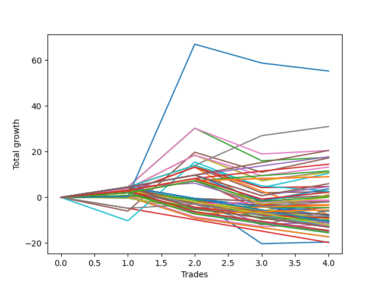

# Long Bulldog 004 
- Symbol: ES_Unlimited
- Date Range: 03/18/2022 - 07/15/2022
- Trading Period: 7:20-12:30
- Number of Trades: 4



| Name | Win Percent | Profit | Avg Profit / Trade | Avg Time / Trade |      | Name | Win Percent | Profit | Avg Profit / Trade | Avg Time / Trade |
| ---- | ----------- | ------ | ------------------ | ---------------- | ---- | ---- | ----------- | ------ | ------------------ | ---------------- |
| Sorted By <br> Profit | | | | | | Sorted By <br> Win Percentage ||||
| Seventy-Three | 50.00 | 27625.00 | 6906.25 | 13:05 |     | Seven | 100.00 | 15500.00 | 3875.00 | 52:06 |
| Seven | 100.00 | 15500.00 | 3875.00 | 52:06 |     | Eighty-Five | 100.00 | 10250.00 | 2562.50 | 27:06 |
| Eighty-Five | 100.00 | 10250.00 | 2562.50 | 27:06 |     | Eighty-Four | 100.00 | 8875.00 | 2218.75 | 26:36 |
| Fifty-Eight | 75.00 | 10250.00 | 2562.50 | 09:52 |     | Eighty-Three | 100.00 | 7250.00 | 1812.50 | 25:57 |
| Eighty-Four | 100.00 | 8875.00 | 2218.75 | 26:36 |     | Eighty-Two | 100.00 | 5750.00 | 1437.50 | 23:53 |
| Two | 75.00 | 8750.00 | 2187.50 | 18:30 |     | One Hundred Twenty-Six | 100.00 | 4500.00 | 1125.00 | 02:46 |
| Five | 50.00 | 8625.00 | 2156.25 | 60:53 |     | One Hundred Twenty-One | 100.00 | 4500.00 | 1125.00 | 02:46 |
| Eighty-Three | 100.00 | 7250.00 | 1812.50 | 25:57 |     | Eighty-One | 100.00 | 4500.00 | 1125.00 | 02:46 |
| Sixty-Eight | 75.00 | 6625.00 | 1656.25 | 15:21 |     | Fifty-Eight | 75.00 | 10250.00 | 2562.50 | 09:52 |
| Eighty-Two | 100.00 | 5750.00 | 1437.50 | 23:53 |     | Two | 75.00 | 8750.00 | 2187.50 | 18:30 |
| Four | 75.00 | 5625.00 | 1406.25 | 27:03 |     | Sixty-Eight | 75.00 | 6625.00 | 1656.25 | 15:21 |
| Sixty | 75.00 | 5500.00 | 1375.00 | 15:28 |     | Four | 75.00 | 5625.00 | 1406.25 | 27:03 |
| Sixty-One | 50.00 | 5250.00 | 1312.50 | 29:35 |     | Sixty | 75.00 | 5500.00 | 1375.00 | 15:28 |
| One Hundred Twenty-Six | 100.00 | 4500.00 | 1125.00 | 02:46 |     | One Hundred Thirty | 75.00 | 3000.00 | 750.00 | 10:53 |
| One Hundred Twenty-One | 100.00 | 4500.00 | 1125.00 | 02:46 |     | One Hundred Twenty-Nine | 75.00 | 2375.00 | 593.75 | 10:25 |
| Eighty-One | 100.00 | 4500.00 | 1125.00 | 02:46 |     | Sixty-Five | 75.00 | 2375.00 | 593.75 | 06:28 |
| One Hundred Thirty | 75.00 | 3000.00 | 750.00 | 10:53 |     | One Hundred Twenty-Five | 75.00 | 1875.00 | 468.75 | 11:01 |
| One Hundred Twenty-Nine | 75.00 | 2375.00 | 593.75 | 10:25 |     | One Hundred Twenty-Four | 75.00 | 1250.00 | 312.50 | 10:32 |
| Sixty-Five | 75.00 | 2375.00 | 593.75 | 06:28 |     | Fifty-Seven | 75.00 | 1250.00 | 312.50 | 06:36 |
| One Hundred Twenty-Five | 75.00 | 1875.00 | 468.75 | 11:01 |     | One Hundred Twenty-Eight | 75.00 | 1125.00 | 281.25 | 09:53 |
| Seventy-One | 50.00 | 1375.00 | 343.75 | 21:08 |     | Sixty-Seven | 75.00 | 375.00 | 93.75 | 09:03 |
| One Hundred Twenty-Four | 75.00 | 1250.00 | 312.50 | 10:32 |     | One Hundred Twenty-Seven | 75.00 | 125.00 | 31.25 | 09:13 |
| Fifty-Seven | 75.00 | 1250.00 | 312.50 | 06:36 |     | One Hundred Twenty-Three | 75.00 | 0.00 | 0.00 | 10:01 |
| One Hundred Twenty-Eight | 75.00 | 1125.00 | 281.25 | 09:53 |     | One Hundred Eleven | 75.00 | -625.00 | -156.25 | 02:00 |
| Seventy | 25.00 | 625.00 | 156.25 | 13:03 |     | One Hundred One | 75.00 | -625.00 | -156.25 | 02:00 |
| Sixty-Two | 25.00 | 625.00 | 156.25 | 13:03 |     | Ninety-Six | 75.00 | -625.00 | -156.25 | 02:00 |
| Six | 25.00 | 625.00 | 156.25 | 13:03 |     | Ninety-One | 75.00 | -625.00 | -156.25 | 02:00 |
| Sixty-Seven | 75.00 | 375.00 | 93.75 | 09:03 |     | Sixty-Six | 75.00 | -625.00 | -156.25 | 09:27 |
| One Hundred Twenty-Seven | 75.00 | 125.00 | 31.25 | 09:13 |     | Fifty-Nine | 75.00 | -750.00 | -187.50 | 09:11 |
| One Hundred Twenty-Three | 75.00 | 0.00 | 0.00 | 10:01 |     | One Hundred Twenty-Two | 75.00 | -1000.00 | -250.00 | 09:21 |
| One Hundred Eleven | 75.00 | -625.00 | -156.25 | 02:00 |     | One | 75.00 | -1625.00 | -406.25 | 15:07 |
| One Hundred One | 75.00 | -625.00 | -156.25 | 02:00 |     | One Hundred Six | 75.00 | -1750.00 | -437.50 | 02:02 |
| Ninety-Six | 75.00 | -625.00 | -156.25 | 02:00 |     | Three | 75.00 | -2250.00 | -562.50 | 17:48 |
| Ninety-One | 75.00 | -625.00 | -156.25 | 02:00 |     | One Hundred Sixteen | 75.00 | -2750.00 | -687.50 | 02:11 |
| Sixty-Six | 75.00 | -625.00 | -156.25 | 09:27 |     | Seventy-Three | 50.00 | 27625.00 | 6906.25 | 13:05 |
| Fifty-Nine | 75.00 | -750.00 | -187.50 | 09:11 |     | Five | 50.00 | 8625.00 | 2156.25 | 60:53 |
| One Hundred Twenty-Two | 75.00 | -1000.00 | -250.00 | 09:21 |     | Sixty-One | 50.00 | 5250.00 | 1312.50 | 29:35 |
| One Hundred | 25.00 | -1000.00 | -250.00 | 02:58 |     | Seventy-One | 50.00 | 1375.00 | 343.75 | 21:08 |
| Ninety-Nine | 25.00 | -1000.00 | -250.00 | 02:32 |     | Sixty-Nine | 50.00 | -2875.00 | -718.75 | 24:07 |
| One | 75.00 | -1625.00 | -406.25 | 15:07 |     | Sixty-Three | 50.00 | -3750.00 | -937.50 | 22:18 |
| One Hundred Six | 75.00 | -1750.00 | -437.50 | 02:02 |     | Forty | 50.00 | -4250.00 | -1062.50 | 02:31 |
| Ninety-Eight | 25.00 | -1750.00 | -437.50 | 02:31 |     | Sixty-Four | 50.00 | -4375.00 | -1093.75 | 03:45 |
| Three | 75.00 | -2250.00 | -562.50 | 17:48 |     | Fifty-Six | 50.00 | -5500.00 | -1375.00 | 03:52 |
| Ninety-Seven | 25.00 | -2250.00 | -562.50 | 02:23 |     | Forty-Eight | 50.00 | -6000.00 | -1500.00 | 02:31 |
| One Hundred Sixteen | 75.00 | -2750.00 | -687.50 | 02:11 |     | Zero | 50.00 | -9750.00 | -2437.50 | 09:28 |
| Sixty-Nine | 50.00 | -2875.00 | -718.75 | 24:07 |     | Seventy | 25.00 | 625.00 | 156.25 | 13:03 |
| Ninety-Five | 25.00 | -3000.00 | -750.00 | 04:22 |     | Sixty-Two | 25.00 | 625.00 | 156.25 | 13:03 |
| Ninety-Four | 25.00 | -3000.00 | -750.00 | 03:56 |     | Six | 25.00 | 625.00 | 156.25 | 13:03 |
| Sixty-Three | 50.00 | -3750.00 | -937.50 | 22:18 |     | One Hundred | 25.00 | -1000.00 | -250.00 | 02:58 |
| One Hundred Ten | 25.00 | -3750.00 | -937.50 | 03:43 |     | Ninety-Nine | 25.00 | -1000.00 | -250.00 | 02:32 |
| One Hundred Nine | 25.00 | -3750.00 | -937.50 | 03:17 |     | Ninety-Eight | 25.00 | -1750.00 | -437.50 | 02:31 |
| Ninety-Three | 25.00 | -3750.00 | -937.50 | 03:55 |     | Ninety-Seven | 25.00 | -2250.00 | -562.50 | 02:23 |
| One Hundred Five | 25.00 | -4000.00 | -1000.00 | 04:26 |     | Ninety-Five | 25.00 | -3000.00 | -750.00 | 04:22 |
| One Hundred Four | 25.00 | -4000.00 | -1000.00 | 04:00 |     | Ninety-Four | 25.00 | -3000.00 | -750.00 | 03:56 |
| Forty | 50.00 | -4250.00 | -1062.50 | 02:31 |     | One Hundred Ten | 25.00 | -3750.00 | -937.50 | 03:43 |
| Ninety-Two | 25.00 | -4250.00 | -1062.50 | 03:47 |     | One Hundred Nine | 25.00 | -3750.00 | -937.50 | 03:17 |
| Sixty-Four | 50.00 | -4375.00 | -1093.75 | 03:45 |     | Ninety-Three | 25.00 | -3750.00 | -937.50 | 03:55 |
| One Hundred Eight | 25.00 | -4500.00 | -1125.00 | 03:16 |     | One Hundred Five | 25.00 | -4000.00 | -1000.00 | 04:26 |
| One Hundred Three | 25.00 | -4750.00 | -1187.50 | 03:58 |     | One Hundred Four | 25.00 | -4000.00 | -1000.00 | 04:00 |
| One Hundred Seven | 25.00 | -5000.00 | -1250.00 | 03:08 |     | Ninety-Two | 25.00 | -4250.00 | -1062.50 | 03:47 |
| Fifty-Four | 0.00 | -5125.00 | -1281.25 | 03:27 |     | One Hundred Eight | 25.00 | -4500.00 | -1125.00 | 03:16 |
| One Hundred Fifteen | 25.00 | -5250.00 | -1312.50 | 05:01 |     | One Hundred Three | 25.00 | -4750.00 | -1187.50 | 03:58 |
| One Hundred Fourteen | 25.00 | -5250.00 | -1312.50 | 04:35 |     | One Hundred Seven | 25.00 | -5000.00 | -1250.00 | 03:08 |
| One Hundred Two | 25.00 | -5250.00 | -1312.50 | 03:51 |     | One Hundred Fifteen | 25.00 | -5250.00 | -1312.50 | 05:01 |
| Forty-Seven | 25.00 | -5250.00 | -1312.50 | 04:35 |     | One Hundred Fourteen | 25.00 | -5250.00 | -1312.50 | 04:35 |
| Forty-Two | 25.00 | -5250.00 | -1312.50 | 04:35 |     | One Hundred Two | 25.00 | -5250.00 | -1312.50 | 03:51 |
| Fifty-Six | 50.00 | -5500.00 | -1375.00 | 03:52 |     | Forty-Seven | 25.00 | -5250.00 | -1312.50 | 04:35 |
| Forty-Four | 25.00 | -5625.00 | -1406.25 | 09:27 |     | Forty-Two | 25.00 | -5250.00 | -1312.50 | 04:35 |
| Forty-Six | 0.00 | -5625.00 | -1406.25 | 03:36 |     | Forty-Four | 25.00 | -5625.00 | -1406.25 | 09:27 |
| Forty-Eight | 50.00 | -6000.00 | -1500.00 | 02:31 |     | One Hundred Thirteen | 25.00 | -6000.00 | -1500.00 | 04:33 |
| One Hundred Thirteen | 25.00 | -6000.00 | -1500.00 | 04:33 |     | Forty-Three | 25.00 | -6000.00 | -1500.00 | 04:33 |
| Forty-Three | 25.00 | -6000.00 | -1500.00 | 04:33 |     | Forty-One | 25.00 | -6250.00 | -1562.50 | 04:27 |
| Forty-One | 25.00 | -6250.00 | -1562.50 | 04:27 |     | One Hundred Twenty | 25.00 | -6500.00 | -1625.00 | 04:52 |
| One Hundred Twenty | 25.00 | -6500.00 | -1625.00 | 04:52 |     | One Hundred Ninteen | 25.00 | -6500.00 | -1625.00 | 04:26 |
| One Hundred Ninteen | 25.00 | -6500.00 | -1625.00 | 04:26 |     | One Hundred Twelve | 25.00 | -6500.00 | -1625.00 | 04:26 |
| One Hundred Twelve | 25.00 | -6500.00 | -1625.00 | 04:26 |     | Fifty-Five | 25.00 | -6500.00 | -1625.00 | 04:26 |
| Fifty-Five | 25.00 | -6500.00 | -1625.00 | 04:26 |     | Fifty | 25.00 | -6500.00 | -1625.00 | 04:26 |
| Fifty | 25.00 | -6500.00 | -1625.00 | 04:26 |     | One Hundred Eighteen | 25.00 | -7250.00 | -1812.50 | 04:25 |
| One Hundred Eighteen | 25.00 | -7250.00 | -1812.50 | 04:25 |     | Fifty-One | 25.00 | -7250.00 | -1812.50 | 04:25 |
| Fifty-One | 25.00 | -7250.00 | -1812.50 | 04:25 |     | Forty-Nine | 25.00 | -7500.00 | -1875.00 | 04:18 |
| Forty-Nine | 25.00 | -7500.00 | -1875.00 | 04:18 |     | One Hundred Seventeen | 25.00 | -7750.00 | -1937.50 | 04:17 |
| One Hundred Seventeen | 25.00 | -7750.00 | -1937.50 | 04:17 |     | Fifty-Three | 25.00 | -8625.00 | -2156.25 | 05:58 |
| Fifty-Three | 25.00 | -8625.00 | -2156.25 | 05:58 |     | Fifty-Two | 25.00 | -8625.00 | -2156.25 | 05:58 |
| Fifty-Two | 25.00 | -8625.00 | -2156.25 | 05:58 |     | Fifty-Four | 0.00 | -5125.00 | -1281.25 | 03:27 |
| Zero | 50.00 | -9750.00 | -2437.50 | 09:28 |     | Forty-Six | 0.00 | -5625.00 | -1406.25 | 03:36 |
| Forty-Five | 0.00 | -9875.00 | -2468.75 | 13:05 |     | Forty-Five | 0.00 | -9875.00 | -2468.75 | 13:05 |

## NO STOPLOSS

### Test Zero
* Sell when price hits the middle line of the 20p bollinger
* No Stoploss
* Results:
```
Total Trades: 4
Percent Up: 50.00
Percent Down: 50.00
Total Points Moved Up: -19.50
Potential Profit: -9750.00
Total Points Ups: 1.50 Count Ups: 2
Total Points Downs: -21.00 Count Downs: 2
```

<details><summary>Trades</summary>

<code>In: 2022-03-31 08:38:00		Out: 2022-03-31 08:40:25		Total Position Time: 02:25		Total Move Up: 0.75		Total to Date: 0.75</code> <br />
<code>In: 2022-05-04 11:37:00		Out: 2022-05-04 11:40:45		Total Position Time: 03:45		Total Move Up: -1.25		Total to Date: -0.50</code> <br />
<code>In: 2022-05-13 10:50:00		Out: 2022-05-13 11:19:15		Total Position Time: 29:15		Total Move Up: -19.75		Total to Date: -20.25</code> <br />
<code>In: 2022-06-27 10:51:00		Out: 2022-06-27 10:53:30		Total Position Time: 02:30		Total Move Up: 0.75		Total to Date: -19.50</code> <br />


</details>

### Test One
* Sell when the price hits the upper line of the 20p 1std bollinger
* No Stoploss
* Results:
```
Total Trades: 4
Percent Up: 75.00
Percent Down: 25.00
Total Points Moved Up: -3.25
Potential Profit: -1625.00
Total Points Ups: 13.75 Count Ups: 3
Total Points Downs: -17.00 Count Downs: 1
```

<details><summary>Trades</summary>

<code>In: 2022-03-31 08:38:00		Out: 2022-03-31 08:40:40		Total Position Time: 02:40		Total Move Up: 2.50		Total to Date: 2.50</code> <br />
<code>In: 2022-05-04 11:37:00		Out: 2022-05-04 11:41:40		Total Position Time: 04:40		Total Move Up: 10.75		Total to Date: 13.25</code> <br />
<code>In: 2022-05-13 10:50:00		Out: 2022-05-13 11:30:55		Total Position Time: 40:55		Total Move Up: -17.00		Total to Date: -3.75</code> <br />
<code>In: 2022-06-27 10:51:00		Out: 2022-06-27 11:03:15		Total Position Time: 12:15		Total Move Up: 0.50		Total to Date: -3.25</code> <br />


</details>

### Test Two
* Sell when the price hits the upper line of the 20p 2std bollinger
* No Stoploss
* Results:
```
Total Trades: 4
Percent Up: 75.00
Percent Down: 25.00
Total Points Moved Up: 17.50
Potential Profit: 8750.00
Total Points Ups: 31.75 Count Ups: 3
Total Points Downs: -14.25 Count Downs: 1
```

<details><summary>Trades</summary>

<code>In: 2022-03-31 08:38:00		Out: 2022-03-31 08:41:10		Total Position Time: 03:10		Total Move Up: 4.50		Total to Date: 4.50</code> <br />
<code>In: 2022-05-04 11:37:00		Out: 2022-05-04 11:43:55		Total Position Time: 06:55		Total Move Up: 25.75		Total to Date: 30.25</code> <br />
<code>In: 2022-05-13 10:50:00		Out: 2022-05-13 11:31:20		Total Position Time: 41:20		Total Move Up: -14.25		Total to Date: 16.00</code> <br />
<code>In: 2022-06-27 10:51:00		Out: 2022-06-27 11:13:35		Total Position Time: 22:35		Total Move Up: 1.50		Total to Date: 17.50</code> <br />


</details>

### Test Three
* Sell when price hits the middle line of the 50p bollinger
* No Stoploss
* Results:
```
Total Trades: 4
Percent Up: 75.00
Percent Down: 25.00
Total Points Moved Up: -4.50
Potential Profit: -2250.00
Total Points Ups: 9.75 Count Ups: 3
Total Points Downs: -14.25 Count Downs: 1
```

<details><summary>Trades</summary>

<code>In: 2022-03-31 08:38:00		Out: 2022-03-31 08:41:05		Total Position Time: 03:05		Total Move Up: 3.00		Total to Date: 3.00</code> <br />
<code>In: 2022-05-04 11:37:00		Out: 2022-05-04 11:41:15		Total Position Time: 04:15		Total Move Up: 5.25		Total to Date: 8.25</code> <br />
<code>In: 2022-05-13 10:50:00		Out: 2022-05-13 11:31:20		Total Position Time: 41:20		Total Move Up: -14.25		Total to Date: -6.00</code> <br />
<code>In: 2022-06-27 10:51:00		Out: 2022-06-27 11:13:35		Total Position Time: 22:35		Total Move Up: 1.50		Total to Date: -4.50</code> <br />


</details>

### Test Four
* Sell when the price hits the upper line of the 50p 1std bollinger
* No Stoploss
* Results:
```
Total Trades: 4
Percent Up: 75.00
Percent Down: 25.00
Total Points Moved Up: 11.25
Potential Profit: 5625.00
Total Points Ups: 22.25 Count Ups: 3
Total Points Downs: -11.00 Count Downs: 1
```

<details><summary>Trades</summary>

<code>In: 2022-03-31 08:38:00		Out: 2022-03-31 09:00:40		Total Position Time: 22:40		Total Move Up: 3.75		Total to Date: 3.75</code> <br />
<code>In: 2022-05-04 11:37:00		Out: 2022-05-04 11:42:00		Total Position Time: 05:00		Total Move Up: 14.75		Total to Date: 18.50</code> <br />
<code>In: 2022-05-13 10:50:00		Out: 2022-05-13 11:43:10		Total Position Time: 53:10		Total Move Up: -11.00		Total to Date: 7.50</code> <br />
<code>In: 2022-06-27 10:51:00		Out: 2022-06-27 11:18:25		Total Position Time: 27:25		Total Move Up: 3.75		Total to Date: 11.25</code> <br />


</details>

### Test Five
* Sell when the price hits the upper line of the 50p 2std bollinger
* No Stoploss
* Results:
```
Total Trades: 4
Percent Up: 50.00
Percent Down: 50.00
Total Points Moved Up: 17.25
Potential Profit: 8625.00
Total Points Ups: 32.00 Count Ups: 2
Total Points Downs: -14.75 Count Downs: 2
```

<details><summary>Trades</summary>

<code>In: 2022-03-31 08:38:00		Out: 2022-03-31 10:46:00		Total Position Time: 128:00		Total Move Up: -6.00		Total to Date: -6.00</code> <br />
<code>In: 2022-05-04 11:37:00		Out: 2022-05-04 11:43:55		Total Position Time: 06:55		Total Move Up: 25.75		Total to Date: 19.75</code> <br />
<code>In: 2022-05-13 10:50:00		Out: 2022-05-13 11:51:25		Total Position Time: 61:25		Total Move Up: -8.75		Total to Date: 11.00</code> <br />
<code>In: 2022-06-27 10:51:00		Out: 2022-06-27 11:38:15		Total Position Time: 47:15		Total Move Up: 6.25		Total to Date: 17.25</code> <br />


</details>

### Test Six
* Sell when the price hits the middle line of the 1std VWAP
* No Stoploss
* Results:
```
Total Trades: 4
Percent Up: 25.00
Percent Down: 75.00
Total Points Moved Up: 1.25
Potential Profit: 625.00
Total Points Ups: 7.50 Count Ups: 1
Total Points Downs: -6.25 Count Downs: 3
```

<details><summary>Trades</summary>

<code>In: 2022-03-31 08:38:00		Out: 2022-03-31 08:40:05		Total Position Time: 02:05		Total Move Up: -0.25		Total to Date: -0.25</code> <br />
<code>In: 2022-05-04 11:37:00		Out: 2022-05-04 11:38:10		Total Position Time: 01:10		Total Move Up: -5.00		Total to Date: -5.25</code> <br />
<code>In: 2022-05-13 10:50:00		Out: 2022-05-13 10:51:10		Total Position Time: 01:10		Total Move Up: -1.00		Total to Date: -6.25</code> <br />
<code>In: 2022-06-27 10:51:00		Out: 2022-06-27 11:38:50		Total Position Time: 47:50		Total Move Up: 7.50		Total to Date: 1.25</code> <br />


</details>

### Test Seven
* Sell when the price hits the upper line of the 1std VWAP
* No Stoploss
* Results:
```
Total Trades: 4
Percent Up: 100.00
Percent Down: 0.00
Total Points Moved Up: 31.00
Potential Profit: 15500.00
Total Points Ups: 31.00 Count Ups: 4
Total Points Downs: 0.00 Count Downs: 0
```

<details><summary>Trades</summary>

<code>In: 2022-03-31 08:38:00		Out: 2022-03-31 08:41:10		Total Position Time: 03:10		Total Move Up: 4.50		Total to Date: 4.50</code> <br />
<code>In: 2022-05-04 11:37:00		Out: 2022-05-04 11:41:35		Total Position Time: 04:35		Total Move Up: 9.50		Total to Date: 14.00</code> <br />
<code>In: 2022-05-13 10:50:00		Out: 2022-05-13 12:14:40		Total Position Time: 84:40		Total Move Up: 13.00		Total to Date: 27.00</code> <br />
<code>In: 2022-06-27 10:51:00		Out: 2022-06-27 12:47:00		Total Position Time: 116:00		Total Move Up: 4.00		Total to Date: 31.00</code> <br />


</details>

## STOPLOSS OF 5

### Test Forty
* Sell when price hits the middle line of the 20p bollinger
* Stoploss is 5 points
* Results:
```
Total Trades: 4
Percent Up: 50.00
Percent Down: 50.00
Total Points Moved Up: -8.50
Potential Profit: -4250.00
Total Points Ups: 1.50 Count Ups: 2
Total Points Downs: -10.00 Count Downs: 2
```

<details><summary>Trades</summary>

<code>In: 2022-03-31 08:38:00		Out: 2022-03-31 08:40:25		Total Position Time: 02:25		Total Move Up: 0.75		Total to Date: 0.75</code> <br />
<code>In: 2022-05-04 11:37:00		Out: 2022-05-04 11:38:10		Total Position Time: 01:10		Total Move Up: -5.00		Total to Date: -4.25</code> <br />
<code>In: 2022-05-13 10:50:00		Out: 2022-05-13 10:54:00		Total Position Time: 04:00		Total Move Up: -5.00		Total to Date: -9.25</code> <br />
<code>In: 2022-06-27 10:51:00		Out: 2022-06-27 10:53:30		Total Position Time: 02:30		Total Move Up: 0.75		Total to Date: -8.50</code> <br />


</details>

### Test Forty-One
* Sell when the price hits the upper line of the 20p 1std bollinger
* Stoploss is 5 points
* Results:
```
Total Trades: 4
Percent Up: 25.00
Percent Down: 75.00
Total Points Moved Up: -12.50
Potential Profit: -6250.00
Total Points Ups: 2.50 Count Ups: 1
Total Points Downs: -15.00 Count Downs: 3
```

<details><summary>Trades</summary>

<code>In: 2022-03-31 08:38:00		Out: 2022-03-31 08:40:40		Total Position Time: 02:40		Total Move Up: 2.50		Total to Date: 2.50</code> <br />
<code>In: 2022-05-04 11:37:00		Out: 2022-05-04 11:38:10		Total Position Time: 01:10		Total Move Up: -5.00		Total to Date: -2.50</code> <br />
<code>In: 2022-05-13 10:50:00		Out: 2022-05-13 10:54:00		Total Position Time: 04:00		Total Move Up: -5.00		Total to Date: -7.50</code> <br />
<code>In: 2022-06-27 10:51:00		Out: 2022-06-27 11:01:00		Total Position Time: 10:00		Total Move Up: -5.00		Total to Date: -12.50</code> <br />


</details>

### Test Forty-Two
* Sell when the price hits the upper line of the 20p 2std bollinger
* Stoploss is 5 points
* Results:
```
Total Trades: 4
Percent Up: 25.00
Percent Down: 75.00
Total Points Moved Up: -10.50
Potential Profit: -5250.00
Total Points Ups: 4.50 Count Ups: 1
Total Points Downs: -15.00 Count Downs: 3
```

<details><summary>Trades</summary>

<code>In: 2022-03-31 08:38:00		Out: 2022-03-31 08:41:10		Total Position Time: 03:10		Total Move Up: 4.50		Total to Date: 4.50</code> <br />
<code>In: 2022-05-04 11:37:00		Out: 2022-05-04 11:38:10		Total Position Time: 01:10		Total Move Up: -5.00		Total to Date: -0.50</code> <br />
<code>In: 2022-05-13 10:50:00		Out: 2022-05-13 10:54:00		Total Position Time: 04:00		Total Move Up: -5.00		Total to Date: -5.50</code> <br />
<code>In: 2022-06-27 10:51:00		Out: 2022-06-27 11:01:00		Total Position Time: 10:00		Total Move Up: -5.00		Total to Date: -10.50</code> <br />


</details>

### Test Forty-Three
* Sell when price hits the middle line of the 50p bollinger
* Stoploss is 5 points
* Results:
```
Total Trades: 4
Percent Up: 25.00
Percent Down: 75.00
Total Points Moved Up: -12.00
Potential Profit: -6000.00
Total Points Ups: 3.00 Count Ups: 1
Total Points Downs: -15.00 Count Downs: 3
```

<details><summary>Trades</summary>

<code>In: 2022-03-31 08:38:00		Out: 2022-03-31 08:41:05		Total Position Time: 03:05		Total Move Up: 3.00		Total to Date: 3.00</code> <br />
<code>In: 2022-05-04 11:37:00		Out: 2022-05-04 11:38:10		Total Position Time: 01:10		Total Move Up: -5.00		Total to Date: -2.00</code> <br />
<code>In: 2022-05-13 10:50:00		Out: 2022-05-13 10:54:00		Total Position Time: 04:00		Total Move Up: -5.00		Total to Date: -7.00</code> <br />
<code>In: 2022-06-27 10:51:00		Out: 2022-06-27 11:01:00		Total Position Time: 10:00		Total Move Up: -5.00		Total to Date: -12.00</code> <br />


</details>

### Test Forty-Four
* Sell when the price hits the upper line of the 50p 1std bollinger
* Stoploss is 5 points
* Results:
```
Total Trades: 4
Percent Up: 25.00
Percent Down: 75.00
Total Points Moved Up: -11.25
Potential Profit: -5625.00
Total Points Ups: 3.75 Count Ups: 1
Total Points Downs: -15.00 Count Downs: 3
```

<details><summary>Trades</summary>

<code>In: 2022-03-31 08:38:00		Out: 2022-03-31 09:00:40		Total Position Time: 22:40		Total Move Up: 3.75		Total to Date: 3.75</code> <br />
<code>In: 2022-05-04 11:37:00		Out: 2022-05-04 11:38:10		Total Position Time: 01:10		Total Move Up: -5.00		Total to Date: -1.25</code> <br />
<code>In: 2022-05-13 10:50:00		Out: 2022-05-13 10:54:00		Total Position Time: 04:00		Total Move Up: -5.00		Total to Date: -6.25</code> <br />
<code>In: 2022-06-27 10:51:00		Out: 2022-06-27 11:01:00		Total Position Time: 10:00		Total Move Up: -5.00		Total to Date: -11.25</code> <br />


</details>

### Test Forty-Five
* Sell when the price hits the upper line of the 50p 2std bollinger
* Stoploss is 5 points
* Results:
```
Total Trades: 4
Percent Up: 0.00
Percent Down: 100.00
Total Points Moved Up: -19.75
Potential Profit: -9875.00
Total Points Ups: 0.00 Count Ups: 0
Total Points Downs: -19.75 Count Downs: 4
```

<details><summary>Trades</summary>

<code>In: 2022-03-31 08:38:00		Out: 2022-03-31 09:15:10		Total Position Time: 37:10		Total Move Up: -4.75		Total to Date: -4.75</code> <br />
<code>In: 2022-05-04 11:37:00		Out: 2022-05-04 11:38:10		Total Position Time: 01:10		Total Move Up: -5.00		Total to Date: -9.75</code> <br />
<code>In: 2022-05-13 10:50:00		Out: 2022-05-13 10:54:00		Total Position Time: 04:00		Total Move Up: -5.00		Total to Date: -14.75</code> <br />
<code>In: 2022-06-27 10:51:00		Out: 2022-06-27 11:01:00		Total Position Time: 10:00		Total Move Up: -5.00		Total to Date: -19.75</code> <br />


</details>

### Test Forty-Six
* Sell when the price hits the middle line of the 1std VWAP
* Stoploss is 5 points
* Results:
```
Total Trades: 4
Percent Up: 0.00
Percent Down: 100.00
Total Points Moved Up: -11.25
Potential Profit: -5625.00
Total Points Ups: 0.00 Count Ups: 0
Total Points Downs: -11.25 Count Downs: 4
```

<details><summary>Trades</summary>

<code>In: 2022-03-31 08:38:00		Out: 2022-03-31 08:40:05		Total Position Time: 02:05		Total Move Up: -0.25		Total to Date: -0.25</code> <br />
<code>In: 2022-05-04 11:37:00		Out: 2022-05-04 11:38:10		Total Position Time: 01:10		Total Move Up: -5.00		Total to Date: -5.25</code> <br />
<code>In: 2022-05-13 10:50:00		Out: 2022-05-13 10:51:10		Total Position Time: 01:10		Total Move Up: -1.00		Total to Date: -6.25</code> <br />
<code>In: 2022-06-27 10:51:00		Out: 2022-06-27 11:01:00		Total Position Time: 10:00		Total Move Up: -5.00		Total to Date: -11.25</code> <br />


</details>

### Test Forty-Seven
* Sell when the price hits the upper line of the 1std VWAP
* Stoploss is 5 points
* Results:
```
Total Trades: 4
Percent Up: 25.00
Percent Down: 75.00
Total Points Moved Up: -10.50
Potential Profit: -5250.00
Total Points Ups: 4.50 Count Ups: 1
Total Points Downs: -15.00 Count Downs: 3
```

<details><summary>Trades</summary>

<code>In: 2022-03-31 08:38:00		Out: 2022-03-31 08:41:10		Total Position Time: 03:10		Total Move Up: 4.50		Total to Date: 4.50</code> <br />
<code>In: 2022-05-04 11:37:00		Out: 2022-05-04 11:38:10		Total Position Time: 01:10		Total Move Up: -5.00		Total to Date: -0.50</code> <br />
<code>In: 2022-05-13 10:50:00		Out: 2022-05-13 10:54:00		Total Position Time: 04:00		Total Move Up: -5.00		Total to Date: -5.50</code> <br />
<code>In: 2022-06-27 10:51:00		Out: 2022-06-27 11:01:00		Total Position Time: 10:00		Total Move Up: -5.00		Total to Date: -10.50</code> <br />


</details>

## TRAIL STOP OF 5

### Test Forty-Eight
* Sell when price hits the middle line of the 20p bollinger
* Trailing Stop is 5 points
* Results:
```
Total Trades: 4
Percent Up: 50.00
Percent Down: 50.00
Total Points Moved Up: -12.00
Potential Profit: -6000.00
Total Points Ups: 1.50 Count Ups: 2
Total Points Downs: -13.50 Count Downs: 2
```

<details><summary>Trades</summary>

<code>In: 2022-03-31 08:38:00		Out: 2022-03-31 08:40:25		Total Position Time: 02:25		Total Move Up: 0.75		Total to Date: 0.75</code> <br />
<code>In: 2022-05-04 11:37:00		Out: 2022-05-04 11:38:55		Total Position Time: 01:55		Total Move Up: -9.25		Total to Date: -8.50</code> <br />
<code>In: 2022-05-13 10:50:00		Out: 2022-05-13 10:53:15		Total Position Time: 03:15		Total Move Up: -4.25		Total to Date: -12.75</code> <br />
<code>In: 2022-06-27 10:51:00		Out: 2022-06-27 10:53:30		Total Position Time: 02:30		Total Move Up: 0.75		Total to Date: -12.00</code> <br />


</details>

### Test Forty-Nine
* Sell when the price hits the upper line of the 20p 1std bollinger
* Trailing Stop is 5 points
* Results:
```
Total Trades: 4
Percent Up: 25.00
Percent Down: 75.00
Total Points Moved Up: -15.00
Potential Profit: -7500.00
Total Points Ups: 2.50 Count Ups: 1
Total Points Downs: -17.50 Count Downs: 3
```

<details><summary>Trades</summary>

<code>In: 2022-03-31 08:38:00		Out: 2022-03-31 08:40:40		Total Position Time: 02:40		Total Move Up: 2.50		Total to Date: 2.50</code> <br />
<code>In: 2022-05-04 11:37:00		Out: 2022-05-04 11:38:55		Total Position Time: 01:55		Total Move Up: -9.25		Total to Date: -6.75</code> <br />
<code>In: 2022-05-13 10:50:00		Out: 2022-05-13 10:53:15		Total Position Time: 03:15		Total Move Up: -4.25		Total to Date: -11.00</code> <br />
<code>In: 2022-06-27 10:51:00		Out: 2022-06-27 11:00:25		Total Position Time: 09:25		Total Move Up: -4.00		Total to Date: -15.00</code> <br />


</details>

### Test Fifty
* Sell when the price hits the upper line of the 20p 2std bollinger
* Trailing Stop is 5 points
* Results:
```
Total Trades: 4
Percent Up: 25.00
Percent Down: 75.00
Total Points Moved Up: -13.00
Potential Profit: -6500.00
Total Points Ups: 4.50 Count Ups: 1
Total Points Downs: -17.50 Count Downs: 3
```

<details><summary>Trades</summary>

<code>In: 2022-03-31 08:38:00		Out: 2022-03-31 08:41:10		Total Position Time: 03:10		Total Move Up: 4.50		Total to Date: 4.50</code> <br />
<code>In: 2022-05-04 11:37:00		Out: 2022-05-04 11:38:55		Total Position Time: 01:55		Total Move Up: -9.25		Total to Date: -4.75</code> <br />
<code>In: 2022-05-13 10:50:00		Out: 2022-05-13 10:53:15		Total Position Time: 03:15		Total Move Up: -4.25		Total to Date: -9.00</code> <br />
<code>In: 2022-06-27 10:51:00		Out: 2022-06-27 11:00:25		Total Position Time: 09:25		Total Move Up: -4.00		Total to Date: -13.00</code> <br />


</details>

### Test Fifty-One
* Sell when price hits the middle line of the 50p bollinger
* Trailing Stop is 5 points
* Results:
```
Total Trades: 4
Percent Up: 25.00
Percent Down: 75.00
Total Points Moved Up: -14.50
Potential Profit: -7250.00
Total Points Ups: 3.00 Count Ups: 1
Total Points Downs: -17.50 Count Downs: 3
```

<details><summary>Trades</summary>

<code>In: 2022-03-31 08:38:00		Out: 2022-03-31 08:41:05		Total Position Time: 03:05		Total Move Up: 3.00		Total to Date: 3.00</code> <br />
<code>In: 2022-05-04 11:37:00		Out: 2022-05-04 11:38:55		Total Position Time: 01:55		Total Move Up: -9.25		Total to Date: -6.25</code> <br />
<code>In: 2022-05-13 10:50:00		Out: 2022-05-13 10:53:15		Total Position Time: 03:15		Total Move Up: -4.25		Total to Date: -10.50</code> <br />
<code>In: 2022-06-27 10:51:00		Out: 2022-06-27 11:00:25		Total Position Time: 09:25		Total Move Up: -4.00		Total to Date: -14.50</code> <br />


</details>

### Test Fifty-Two
* Sell when the price hits the upper line of the 50p 1std bollinger
* Trailing Stop is 5 points
* Results:
```
Total Trades: 4
Percent Up: 25.00
Percent Down: 75.00
Total Points Moved Up: -17.25
Potential Profit: -8625.00
Total Points Ups: 0.25 Count Ups: 1
Total Points Downs: -17.50 Count Downs: 3
```

<details><summary>Trades</summary>

<code>In: 2022-03-31 08:38:00		Out: 2022-03-31 08:47:20		Total Position Time: 09:20		Total Move Up: 0.25		Total to Date: 0.25</code> <br />
<code>In: 2022-05-04 11:37:00		Out: 2022-05-04 11:38:55		Total Position Time: 01:55		Total Move Up: -9.25		Total to Date: -9.00</code> <br />
<code>In: 2022-05-13 10:50:00		Out: 2022-05-13 10:53:15		Total Position Time: 03:15		Total Move Up: -4.25		Total to Date: -13.25</code> <br />
<code>In: 2022-06-27 10:51:00		Out: 2022-06-27 11:00:25		Total Position Time: 09:25		Total Move Up: -4.00		Total to Date: -17.25</code> <br />


</details>

### Test Fifty-Three
* Sell when the price hits the upper line of the 50p 2std bollinger
* Trailing Stop is 5 points
* Results:
```
Total Trades: 4
Percent Up: 25.00
Percent Down: 75.00
Total Points Moved Up: -17.25
Potential Profit: -8625.00
Total Points Ups: 0.25 Count Ups: 1
Total Points Downs: -17.50 Count Downs: 3
```

<details><summary>Trades</summary>

<code>In: 2022-03-31 08:38:00		Out: 2022-03-31 08:47:20		Total Position Time: 09:20		Total Move Up: 0.25		Total to Date: 0.25</code> <br />
<code>In: 2022-05-04 11:37:00		Out: 2022-05-04 11:38:55		Total Position Time: 01:55		Total Move Up: -9.25		Total to Date: -9.00</code> <br />
<code>In: 2022-05-13 10:50:00		Out: 2022-05-13 10:53:15		Total Position Time: 03:15		Total Move Up: -4.25		Total to Date: -13.25</code> <br />
<code>In: 2022-06-27 10:51:00		Out: 2022-06-27 11:00:25		Total Position Time: 09:25		Total Move Up: -4.00		Total to Date: -17.25</code> <br />


</details>

### Test Fifty-Four
* Sell when the price hits the middle line of the 1std VWAP
* Trailing Stop is 5 points
* Results:
```
Total Trades: 4
Percent Up: 0.00
Percent Down: 100.00
Total Points Moved Up: -10.25
Potential Profit: -5125.00
Total Points Ups: 0.00 Count Ups: 0
Total Points Downs: -10.25 Count Downs: 4
```

<details><summary>Trades</summary>

<code>In: 2022-03-31 08:38:00		Out: 2022-03-31 08:40:05		Total Position Time: 02:05		Total Move Up: -0.25		Total to Date: -0.25</code> <br />
<code>In: 2022-05-04 11:37:00		Out: 2022-05-04 11:38:10		Total Position Time: 01:10		Total Move Up: -5.00		Total to Date: -5.25</code> <br />
<code>In: 2022-05-13 10:50:00		Out: 2022-05-13 10:51:10		Total Position Time: 01:10		Total Move Up: -1.00		Total to Date: -6.25</code> <br />
<code>In: 2022-06-27 10:51:00		Out: 2022-06-27 11:00:25		Total Position Time: 09:25		Total Move Up: -4.00		Total to Date: -10.25</code> <br />


</details>

### Test Fifty-Five
* Sell when the price hits the upper line of the 1std VWAP
* Trailing Stop is 5 points
* Results:
```
Total Trades: 4
Percent Up: 25.00
Percent Down: 75.00
Total Points Moved Up: -13.00
Potential Profit: -6500.00
Total Points Ups: 4.50 Count Ups: 1
Total Points Downs: -17.50 Count Downs: 3
```

<details><summary>Trades</summary>

<code>In: 2022-03-31 08:38:00		Out: 2022-03-31 08:41:10		Total Position Time: 03:10		Total Move Up: 4.50		Total to Date: 4.50</code> <br />
<code>In: 2022-05-04 11:37:00		Out: 2022-05-04 11:38:55		Total Position Time: 01:55		Total Move Up: -9.25		Total to Date: -4.75</code> <br />
<code>In: 2022-05-13 10:50:00		Out: 2022-05-13 10:53:15		Total Position Time: 03:15		Total Move Up: -4.25		Total to Date: -9.00</code> <br />
<code>In: 2022-06-27 10:51:00		Out: 2022-06-27 11:00:25		Total Position Time: 09:25		Total Move Up: -4.00		Total to Date: -13.00</code> <br />


</details>

## STOPLOSS OF 10

### Test Fifty-Six
* Sell when price hits the middle line of the 20p bollinger
* Stoploss is 10 points
* Results:
```
Total Trades: 4
Percent Up: 50.00
Percent Down: 50.00
Total Points Moved Up: -11.00
Potential Profit: -5500.00
Total Points Ups: 1.50 Count Ups: 2
Total Points Downs: -12.50 Count Downs: 2
```

<details><summary>Trades</summary>

<code>In: 2022-03-31 08:38:00		Out: 2022-03-31 08:40:25		Total Position Time: 02:25		Total Move Up: 0.75		Total to Date: 0.75</code> <br />
<code>In: 2022-05-04 11:37:00		Out: 2022-05-04 11:40:45		Total Position Time: 03:45		Total Move Up: -1.25		Total to Date: -0.50</code> <br />
<code>In: 2022-05-13 10:50:00		Out: 2022-05-13 10:56:50		Total Position Time: 06:50		Total Move Up: -11.25		Total to Date: -11.75</code> <br />
<code>In: 2022-06-27 10:51:00		Out: 2022-06-27 10:53:30		Total Position Time: 02:30		Total Move Up: 0.75		Total to Date: -11.00</code> <br />


</details>

### Test Fifty-Seven
* Sell when the price hits the upper line of the 20p 1std bollinger
* Stoploss is 10 points
* Results:
```
Total Trades: 4
Percent Up: 75.00
Percent Down: 25.00
Total Points Moved Up: 2.50
Potential Profit: 1250.00
Total Points Ups: 13.75 Count Ups: 3
Total Points Downs: -11.25 Count Downs: 1
```

<details><summary>Trades</summary>

<code>In: 2022-03-31 08:38:00		Out: 2022-03-31 08:40:40		Total Position Time: 02:40		Total Move Up: 2.50		Total to Date: 2.50</code> <br />
<code>In: 2022-05-04 11:37:00		Out: 2022-05-04 11:41:40		Total Position Time: 04:40		Total Move Up: 10.75		Total to Date: 13.25</code> <br />
<code>In: 2022-05-13 10:50:00		Out: 2022-05-13 10:56:50		Total Position Time: 06:50		Total Move Up: -11.25		Total to Date: 2.00</code> <br />
<code>In: 2022-06-27 10:51:00		Out: 2022-06-27 11:03:15		Total Position Time: 12:15		Total Move Up: 0.50		Total to Date: 2.50</code> <br />


</details>

### Test Fifty-Eight
* Sell when the price hits the upper line of the 20p 2std bollinger
* Stoploss is 10 points
* Results:
```
Total Trades: 4
Percent Up: 75.00
Percent Down: 25.00
Total Points Moved Up: 20.50
Potential Profit: 10250.00
Total Points Ups: 31.75 Count Ups: 3
Total Points Downs: -11.25 Count Downs: 1
```

<details><summary>Trades</summary>

<code>In: 2022-03-31 08:38:00		Out: 2022-03-31 08:41:10		Total Position Time: 03:10		Total Move Up: 4.50		Total to Date: 4.50</code> <br />
<code>In: 2022-05-04 11:37:00		Out: 2022-05-04 11:43:55		Total Position Time: 06:55		Total Move Up: 25.75		Total to Date: 30.25</code> <br />
<code>In: 2022-05-13 10:50:00		Out: 2022-05-13 10:56:50		Total Position Time: 06:50		Total Move Up: -11.25		Total to Date: 19.00</code> <br />
<code>In: 2022-06-27 10:51:00		Out: 2022-06-27 11:13:35		Total Position Time: 22:35		Total Move Up: 1.50		Total to Date: 20.50</code> <br />


</details>

### Test Fifty-Nine
* Sell when price hits the middle line of the 50p bollinger
* Stoploss is 10 points
* Results:
```
Total Trades: 4
Percent Up: 75.00
Percent Down: 25.00
Total Points Moved Up: -1.50
Potential Profit: -750.00
Total Points Ups: 9.75 Count Ups: 3
Total Points Downs: -11.25 Count Downs: 1
```

<details><summary>Trades</summary>

<code>In: 2022-03-31 08:38:00		Out: 2022-03-31 08:41:05		Total Position Time: 03:05		Total Move Up: 3.00		Total to Date: 3.00</code> <br />
<code>In: 2022-05-04 11:37:00		Out: 2022-05-04 11:41:15		Total Position Time: 04:15		Total Move Up: 5.25		Total to Date: 8.25</code> <br />
<code>In: 2022-05-13 10:50:00		Out: 2022-05-13 10:56:50		Total Position Time: 06:50		Total Move Up: -11.25		Total to Date: -3.00</code> <br />
<code>In: 2022-06-27 10:51:00		Out: 2022-06-27 11:13:35		Total Position Time: 22:35		Total Move Up: 1.50		Total to Date: -1.50</code> <br />


</details>

### Test Sixty
* Sell when the price hits the upper line of the 50p 1std bollinger
* Stoploss is 10 points
* Results:
```
Total Trades: 4
Percent Up: 75.00
Percent Down: 25.00
Total Points Moved Up: 11.00
Potential Profit: 5500.00
Total Points Ups: 22.25 Count Ups: 3
Total Points Downs: -11.25 Count Downs: 1
```

<details><summary>Trades</summary>

<code>In: 2022-03-31 08:38:00		Out: 2022-03-31 09:00:40		Total Position Time: 22:40		Total Move Up: 3.75		Total to Date: 3.75</code> <br />
<code>In: 2022-05-04 11:37:00		Out: 2022-05-04 11:42:00		Total Position Time: 05:00		Total Move Up: 14.75		Total to Date: 18.50</code> <br />
<code>In: 2022-05-13 10:50:00		Out: 2022-05-13 10:56:50		Total Position Time: 06:50		Total Move Up: -11.25		Total to Date: 7.25</code> <br />
<code>In: 2022-06-27 10:51:00		Out: 2022-06-27 11:18:25		Total Position Time: 27:25		Total Move Up: 3.75		Total to Date: 11.00</code> <br />


</details>

### Test Sixty-One
* Sell when the price hits the upper line of the 50p 2std bollinger
* Stoploss is 10 points
* Results:
```
Total Trades: 4
Percent Up: 50.00
Percent Down: 50.00
Total Points Moved Up: 10.50
Potential Profit: 5250.00
Total Points Ups: 32.00 Count Ups: 2
Total Points Downs: -21.50 Count Downs: 2
```

<details><summary>Trades</summary>

<code>In: 2022-03-31 08:38:00		Out: 2022-03-31 09:35:20		Total Position Time: 57:20		Total Move Up: -10.25		Total to Date: -10.25</code> <br />
<code>In: 2022-05-04 11:37:00		Out: 2022-05-04 11:43:55		Total Position Time: 06:55		Total Move Up: 25.75		Total to Date: 15.50</code> <br />
<code>In: 2022-05-13 10:50:00		Out: 2022-05-13 10:56:50		Total Position Time: 06:50		Total Move Up: -11.25		Total to Date: 4.25</code> <br />
<code>In: 2022-06-27 10:51:00		Out: 2022-06-27 11:38:15		Total Position Time: 47:15		Total Move Up: 6.25		Total to Date: 10.50</code> <br />


</details>

### Test Sixty-Two
* Sell when the price hits the middle line of the 1std VWAP
* Stoploss is 10 points
* Results:
```
Total Trades: 4
Percent Up: 25.00
Percent Down: 75.00
Total Points Moved Up: 1.25
Potential Profit: 625.00
Total Points Ups: 7.50 Count Ups: 1
Total Points Downs: -6.25 Count Downs: 3
```

<details><summary>Trades</summary>

<code>In: 2022-03-31 08:38:00		Out: 2022-03-31 08:40:05		Total Position Time: 02:05		Total Move Up: -0.25		Total to Date: -0.25</code> <br />
<code>In: 2022-05-04 11:37:00		Out: 2022-05-04 11:38:10		Total Position Time: 01:10		Total Move Up: -5.00		Total to Date: -5.25</code> <br />
<code>In: 2022-05-13 10:50:00		Out: 2022-05-13 10:51:10		Total Position Time: 01:10		Total Move Up: -1.00		Total to Date: -6.25</code> <br />
<code>In: 2022-06-27 10:51:00		Out: 2022-06-27 11:38:50		Total Position Time: 47:50		Total Move Up: 7.50		Total to Date: 1.25</code> <br />


</details>

### Test Sixty-Three
* Sell when the price hits the upper line of the 1std VWAP
* Stoploss is 10 points
* Results:
```
Total Trades: 4
Percent Up: 50.00
Percent Down: 50.00
Total Points Moved Up: -7.50
Potential Profit: -3750.00
Total Points Ups: 14.00 Count Ups: 2
Total Points Downs: -21.50 Count Downs: 2
```

<details><summary>Trades</summary>

<code>In: 2022-03-31 08:38:00		Out: 2022-03-31 08:41:10		Total Position Time: 03:10		Total Move Up: 4.50		Total to Date: 4.50</code> <br />
<code>In: 2022-05-04 11:37:00		Out: 2022-05-04 11:41:35		Total Position Time: 04:35		Total Move Up: 9.50		Total to Date: 14.00</code> <br />
<code>In: 2022-05-13 10:50:00		Out: 2022-05-13 10:56:50		Total Position Time: 06:50		Total Move Up: -11.25		Total to Date: 2.75</code> <br />
<code>In: 2022-06-27 10:51:00		Out: 2022-06-27 12:05:40		Total Position Time: 74:40		Total Move Up: -10.25		Total to Date: -7.50</code> <br />


</details>

## TRAIL STOP OF 10

### Test Sixty-Four
* Sell when price hits the middle line of the 20p bollinger
* Trailing Stop is 10 points
* Results:
```
Total Trades: 4
Percent Up: 50.00
Percent Down: 50.00
Total Points Moved Up: -8.75
Potential Profit: -4375.00
Total Points Ups: 1.50 Count Ups: 2
Total Points Downs: -10.25 Count Downs: 2
```

<details><summary>Trades</summary>

<code>In: 2022-03-31 08:38:00		Out: 2022-03-31 08:40:25		Total Position Time: 02:25		Total Move Up: 0.75		Total to Date: 0.75</code> <br />
<code>In: 2022-05-04 11:37:00		Out: 2022-05-04 11:40:45		Total Position Time: 03:45		Total Move Up: -1.25		Total to Date: -0.50</code> <br />
<code>In: 2022-05-13 10:50:00		Out: 2022-05-13 10:56:20		Total Position Time: 06:20		Total Move Up: -9.00		Total to Date: -9.50</code> <br />
<code>In: 2022-06-27 10:51:00		Out: 2022-06-27 10:53:30		Total Position Time: 02:30		Total Move Up: 0.75		Total to Date: -8.75</code> <br />


</details>

### Test Sixty-Five
* Sell when the price hits the upper line of the 20p 1std bollinger
* Trailing Stop is 10 points
* Results:
```
Total Trades: 4
Percent Up: 75.00
Percent Down: 25.00
Total Points Moved Up: 4.75
Potential Profit: 2375.00
Total Points Ups: 13.75 Count Ups: 3
Total Points Downs: -9.00 Count Downs: 1
```

<details><summary>Trades</summary>

<code>In: 2022-03-31 08:38:00		Out: 2022-03-31 08:40:40		Total Position Time: 02:40		Total Move Up: 2.50		Total to Date: 2.50</code> <br />
<code>In: 2022-05-04 11:37:00		Out: 2022-05-04 11:41:40		Total Position Time: 04:40		Total Move Up: 10.75		Total to Date: 13.25</code> <br />
<code>In: 2022-05-13 10:50:00		Out: 2022-05-13 10:56:20		Total Position Time: 06:20		Total Move Up: -9.00		Total to Date: 4.25</code> <br />
<code>In: 2022-06-27 10:51:00		Out: 2022-06-27 11:03:15		Total Position Time: 12:15		Total Move Up: 0.50		Total to Date: 4.75</code> <br />


</details>

### Test Sixty-Six
* Sell when the price hits the upper line of the 20p 2std bollinger
* Trailing Stop is 10 points
* Results:
```
Total Trades: 4
Percent Up: 75.00
Percent Down: 25.00
Total Points Moved Up: -1.25
Potential Profit: -625.00
Total Points Ups: 7.75 Count Ups: 3
Total Points Downs: -9.00 Count Downs: 1
```

<details><summary>Trades</summary>

<code>In: 2022-03-31 08:38:00		Out: 2022-03-31 08:41:10		Total Position Time: 03:10		Total Move Up: 4.50		Total to Date: 4.50</code> <br />
<code>In: 2022-05-04 11:37:00		Out: 2022-05-04 11:42:45		Total Position Time: 05:45		Total Move Up: 1.75		Total to Date: 6.25</code> <br />
<code>In: 2022-05-13 10:50:00		Out: 2022-05-13 10:56:20		Total Position Time: 06:20		Total Move Up: -9.00		Total to Date: -2.75</code> <br />
<code>In: 2022-06-27 10:51:00		Out: 2022-06-27 11:13:35		Total Position Time: 22:35		Total Move Up: 1.50		Total to Date: -1.25</code> <br />


</details>

### Test Sixty-Seven
* Sell when price hits the middle line of the 50p bollinger
* Trailing Stop is 10 points
* Results:
```
Total Trades: 4
Percent Up: 75.00
Percent Down: 25.00
Total Points Moved Up: 0.75
Potential Profit: 375.00
Total Points Ups: 9.75 Count Ups: 3
Total Points Downs: -9.00 Count Downs: 1
```

<details><summary>Trades</summary>

<code>In: 2022-03-31 08:38:00		Out: 2022-03-31 08:41:05		Total Position Time: 03:05		Total Move Up: 3.00		Total to Date: 3.00</code> <br />
<code>In: 2022-05-04 11:37:00		Out: 2022-05-04 11:41:15		Total Position Time: 04:15		Total Move Up: 5.25		Total to Date: 8.25</code> <br />
<code>In: 2022-05-13 10:50:00		Out: 2022-05-13 10:56:20		Total Position Time: 06:20		Total Move Up: -9.00		Total to Date: -0.75</code> <br />
<code>In: 2022-06-27 10:51:00		Out: 2022-06-27 11:13:35		Total Position Time: 22:35		Total Move Up: 1.50		Total to Date: 0.75</code> <br />


</details>

### Test Sixty-Eight
* Sell when the price hits the upper line of the 50p 1std bollinger
* Trailing Stop is 10 points
* Results:
```
Total Trades: 4
Percent Up: 75.00
Percent Down: 25.00
Total Points Moved Up: 13.25
Potential Profit: 6625.00
Total Points Ups: 22.25 Count Ups: 3
Total Points Downs: -9.00 Count Downs: 1
```

<details><summary>Trades</summary>

<code>In: 2022-03-31 08:38:00		Out: 2022-03-31 09:00:40		Total Position Time: 22:40		Total Move Up: 3.75		Total to Date: 3.75</code> <br />
<code>In: 2022-05-04 11:37:00		Out: 2022-05-04 11:42:00		Total Position Time: 05:00		Total Move Up: 14.75		Total to Date: 18.50</code> <br />
<code>In: 2022-05-13 10:50:00		Out: 2022-05-13 10:56:20		Total Position Time: 06:20		Total Move Up: -9.00		Total to Date: 9.50</code> <br />
<code>In: 2022-06-27 10:51:00		Out: 2022-06-27 11:18:25		Total Position Time: 27:25		Total Move Up: 3.75		Total to Date: 13.25</code> <br />


</details>

### Test Sixty-Nine
* Sell when the price hits the upper line of the 50p 2std bollinger
* Trailing Stop is 10 points
* Results:
```
Total Trades: 4
Percent Up: 50.00
Percent Down: 50.00
Total Points Moved Up: -5.75
Potential Profit: -2875.00
Total Points Ups: 8.00 Count Ups: 2
Total Points Downs: -13.75 Count Downs: 2
```

<details><summary>Trades</summary>

<code>In: 2022-03-31 08:38:00		Out: 2022-03-31 09:15:10		Total Position Time: 37:10		Total Move Up: -4.75		Total to Date: -4.75</code> <br />
<code>In: 2022-05-04 11:37:00		Out: 2022-05-04 11:42:45		Total Position Time: 05:45		Total Move Up: 1.75		Total to Date: -3.00</code> <br />
<code>In: 2022-05-13 10:50:00		Out: 2022-05-13 10:56:20		Total Position Time: 06:20		Total Move Up: -9.00		Total to Date: -12.00</code> <br />
<code>In: 2022-06-27 10:51:00		Out: 2022-06-27 11:38:15		Total Position Time: 47:15		Total Move Up: 6.25		Total to Date: -5.75</code> <br />


</details>

### Test Seventy
* Sell when the price hits the middle line of the 1std VWAP
* Trailing Stop is 10 points
* Results:
```
Total Trades: 4
Percent Up: 25.00
Percent Down: 75.00
Total Points Moved Up: 1.25
Potential Profit: 625.00
Total Points Ups: 7.50 Count Ups: 1
Total Points Downs: -6.25 Count Downs: 3
```

<details><summary>Trades</summary>

<code>In: 2022-03-31 08:38:00		Out: 2022-03-31 08:40:05		Total Position Time: 02:05		Total Move Up: -0.25		Total to Date: -0.25</code> <br />
<code>In: 2022-05-04 11:37:00		Out: 2022-05-04 11:38:10		Total Position Time: 01:10		Total Move Up: -5.00		Total to Date: -5.25</code> <br />
<code>In: 2022-05-13 10:50:00		Out: 2022-05-13 10:51:10		Total Position Time: 01:10		Total Move Up: -1.00		Total to Date: -6.25</code> <br />
<code>In: 2022-06-27 10:51:00		Out: 2022-06-27 11:38:50		Total Position Time: 47:50		Total Move Up: 7.50		Total to Date: 1.25</code> <br />


</details>

### Test Seventy-One
* Sell when the price hits the upper line of the 1std VWAP
* Trailing Stop is 10 points
* Results:
```
Total Trades: 4
Percent Up: 50.00
Percent Down: 50.00
Total Points Moved Up: 2.75
Potential Profit: 1375.00
Total Points Ups: 14.00 Count Ups: 2
Total Points Downs: -11.25 Count Downs: 2
```

<details><summary>Trades</summary>

<code>In: 2022-03-31 08:38:00		Out: 2022-03-31 08:41:10		Total Position Time: 03:10		Total Move Up: 4.50		Total to Date: 4.50</code> <br />
<code>In: 2022-05-04 11:37:00		Out: 2022-05-04 11:41:35		Total Position Time: 04:35		Total Move Up: 9.50		Total to Date: 14.00</code> <br />
<code>In: 2022-05-13 10:50:00		Out: 2022-05-13 10:56:20		Total Position Time: 06:20		Total Move Up: -9.00		Total to Date: 5.00</code> <br />
<code>In: 2022-06-27 10:51:00		Out: 2022-06-27 12:01:30		Total Position Time: 70:30		Total Move Up: -2.25		Total to Date: 2.75</code> <br />


</details>

## SPECIAL EXIT CONDITIONS 

### Test Seventy-Three
* Sell when the linear regression slope changes to negative
* No Stoploss
* Results:
```
Total Trades: 4
Percent Up: 50.00
Percent Down: 50.00
Total Points Moved Up: 55.25
Potential Profit: 27625.00
Total Points Ups: 67.00 Count Ups: 2
Total Points Downs: -11.75 Count Downs: 2
```

<details><summary>Trades</summary>

<code>In: 2022-03-31 08:38:00		Out: 2022-03-31 08:50:05		Total Position Time: 12:05		Total Move Up: 0.25		Total to Date: 0.25</code> <br />
<code>In: 2022-05-04 11:37:00		Out: 2022-05-04 12:00:05		Total Position Time: 23:05		Total Move Up: 66.75		Total to Date: 67.00</code> <br />
<code>In: 2022-05-13 10:50:00		Out: 2022-05-13 10:56:05		Total Position Time: 06:05		Total Move Up: -8.25		Total to Date: 58.75</code> <br />
<code>In: 2022-06-27 10:51:00		Out: 2022-06-27 11:02:05		Total Position Time: 11:05		Total Move Up: -3.50		Total to Date: 55.25</code> <br />


</details>

## TAKE PROFIT

### Test Eighty-One
* Take Profit of 1 Point
* No Stoploss
* Results:
```
Total Trades: 4
Percent Up: 100.00
Percent Down: 0.00
Total Points Moved Up: 9.00
Potential Profit: 4500.00
Total Points Ups: 9.00 Count Ups: 4
Total Points Downs: 0.00 Count Downs: 0
```

<details><summary>Trades</summary>

<code>In: 2022-03-31 08:38:00		Out: 2022-03-31 08:40:35		Total Position Time: 02:35		Total Move Up: 2.00		Total to Date: 2.00</code> <br />
<code>In: 2022-05-04 11:37:00		Out: 2022-05-04 11:41:15		Total Position Time: 04:15		Total Move Up: 5.25		Total to Date: 7.25</code> <br />
<code>In: 2022-05-13 10:50:00		Out: 2022-05-13 10:51:45		Total Position Time: 01:45		Total Move Up: 1.00		Total to Date: 8.25</code> <br />
<code>In: 2022-06-27 10:51:00		Out: 2022-06-27 10:53:30		Total Position Time: 02:30		Total Move Up: 0.75		Total to Date: 9.00</code> <br />


</details>

### Test Eighty-Two
* Take Profit of 2 Point
* No Stoploss
* Results:
```
Total Trades: 4
Percent Up: 100.00
Percent Down: 0.00
Total Points Moved Up: 11.50
Potential Profit: 5750.00
Total Points Ups: 11.50 Count Ups: 4
Total Points Downs: 0.00 Count Downs: 0
```

<details><summary>Trades</summary>

<code>In: 2022-03-31 08:38:00		Out: 2022-03-31 08:40:35		Total Position Time: 02:35		Total Move Up: 2.00		Total to Date: 2.00</code> <br />
<code>In: 2022-05-04 11:37:00		Out: 2022-05-04 11:41:15		Total Position Time: 04:15		Total Move Up: 5.25		Total to Date: 7.25</code> <br />
<code>In: 2022-05-13 10:50:00		Out: 2022-05-13 11:55:00		Total Position Time: 65:00		Total Move Up: 2.25		Total to Date: 9.50</code> <br />
<code>In: 2022-06-27 10:51:00		Out: 2022-06-27 11:14:45		Total Position Time: 23:45		Total Move Up: 2.00		Total to Date: 11.50</code> <br />


</details>

### Test Eighty-Three
* Take Profit of 3 Point
* No Stoploss
* Results:
```
Total Trades: 4
Percent Up: 100.00
Percent Down: 0.00
Total Points Moved Up: 14.50
Potential Profit: 7250.00
Total Points Ups: 14.50 Count Ups: 4
Total Points Downs: 0.00 Count Downs: 0
```

<details><summary>Trades</summary>

<code>In: 2022-03-31 08:38:00		Out: 2022-03-31 08:41:05		Total Position Time: 03:05		Total Move Up: 3.00		Total to Date: 3.00</code> <br />
<code>In: 2022-05-04 11:37:00		Out: 2022-05-04 11:41:15		Total Position Time: 04:15		Total Move Up: 5.25		Total to Date: 8.25</code> <br />
<code>In: 2022-05-13 10:50:00		Out: 2022-05-13 12:00:35		Total Position Time: 70:35		Total Move Up: 3.25		Total to Date: 11.50</code> <br />
<code>In: 2022-06-27 10:51:00		Out: 2022-06-27 11:16:55		Total Position Time: 25:55		Total Move Up: 3.00		Total to Date: 14.50</code> <br />


</details>

### Test Eighty-Four
* Take Profit of 4 Point
* No Stoploss
* Results:
```
Total Trades: 4
Percent Up: 100.00
Percent Down: 0.00
Total Points Moved Up: 17.75
Potential Profit: 8875.00
Total Points Ups: 17.75 Count Ups: 4
Total Points Downs: 0.00 Count Downs: 0
```

<details><summary>Trades</summary>

<code>In: 2022-03-31 08:38:00		Out: 2022-03-31 08:41:10		Total Position Time: 03:10		Total Move Up: 4.50		Total to Date: 4.50</code> <br />
<code>In: 2022-05-04 11:37:00		Out: 2022-05-04 11:41:15		Total Position Time: 04:15		Total Move Up: 5.25		Total to Date: 9.75</code> <br />
<code>In: 2022-05-13 10:50:00		Out: 2022-05-13 12:01:05		Total Position Time: 71:05		Total Move Up: 4.00		Total to Date: 13.75</code> <br />
<code>In: 2022-06-27 10:51:00		Out: 2022-06-27 11:18:55		Total Position Time: 27:55		Total Move Up: 4.00		Total to Date: 17.75</code> <br />


</details>

### Test Eighty-Five
* Take Profit of 5 Point
* No Stoploss
* Results:
```
Total Trades: 4
Percent Up: 100.00
Percent Down: 0.00
Total Points Moved Up: 20.50
Potential Profit: 10250.00
Total Points Ups: 20.50 Count Ups: 4
Total Points Downs: 0.00 Count Downs: 0
```

<details><summary>Trades</summary>

<code>In: 2022-03-31 08:38:00		Out: 2022-03-31 08:42:55		Total Position Time: 04:55		Total Move Up: 4.50		Total to Date: 4.50</code> <br />
<code>In: 2022-05-04 11:37:00		Out: 2022-05-04 11:41:15		Total Position Time: 04:15		Total Move Up: 5.25		Total to Date: 9.75</code> <br />
<code>In: 2022-05-13 10:50:00		Out: 2022-05-13 12:01:10		Total Position Time: 71:10		Total Move Up: 5.50		Total to Date: 15.25</code> <br />
<code>In: 2022-06-27 10:51:00		Out: 2022-06-27 11:19:05		Total Position Time: 28:05		Total Move Up: 5.25		Total to Date: 20.50</code> <br />


</details>

## TAKE PROFIT Stoploss of Two

### Test Ninety-One
* Take Profit of 1 Point
* Stoploss is 2 points
* Results:
```
Total Trades: 4
Percent Up: 75.00
Percent Down: 25.00
Total Points Moved Up: -1.25
Potential Profit: -625.00
Total Points Ups: 3.75 Count Ups: 3
Total Points Downs: -5.00 Count Downs: 1
```

<details><summary>Trades</summary>

<code>In: 2022-03-31 08:38:00		Out: 2022-03-31 08:40:35		Total Position Time: 02:35		Total Move Up: 2.00		Total to Date: 2.00</code> <br />
<code>In: 2022-05-04 11:37:00		Out: 2022-05-04 11:38:10		Total Position Time: 01:10		Total Move Up: -5.00		Total to Date: -3.00</code> <br />
<code>In: 2022-05-13 10:50:00		Out: 2022-05-13 10:51:45		Total Position Time: 01:45		Total Move Up: 1.00		Total to Date: -2.00</code> <br />
<code>In: 2022-06-27 10:51:00		Out: 2022-06-27 10:53:30		Total Position Time: 02:30		Total Move Up: 0.75		Total to Date: -1.25</code> <br />


</details>

### Test Ninety-Two
* Take Profit of 2 Point
* Stoploss is 2 points
* Results:
```
Total Trades: 4
Percent Up: 25.00
Percent Down: 75.00
Total Points Moved Up: -8.50
Potential Profit: -4250.00
Total Points Ups: 2.00 Count Ups: 1
Total Points Downs: -10.50 Count Downs: 3
```

<details><summary>Trades</summary>

<code>In: 2022-03-31 08:38:00		Out: 2022-03-31 08:40:35		Total Position Time: 02:35		Total Move Up: 2.00		Total to Date: 2.00</code> <br />
<code>In: 2022-05-04 11:37:00		Out: 2022-05-04 11:38:10		Total Position Time: 01:10		Total Move Up: -5.00		Total to Date: -3.00</code> <br />
<code>In: 2022-05-13 10:50:00		Out: 2022-05-13 10:52:15		Total Position Time: 02:15		Total Move Up: -3.50		Total to Date: -6.50</code> <br />
<code>In: 2022-06-27 10:51:00		Out: 2022-06-27 11:00:10		Total Position Time: 09:10		Total Move Up: -2.00		Total to Date: -8.50</code> <br />


</details>

### Test Ninety-Three
* Take Profit of 3 Point
* Stoploss is 2 points
* Results:
```
Total Trades: 4
Percent Up: 25.00
Percent Down: 75.00
Total Points Moved Up: -7.50
Potential Profit: -3750.00
Total Points Ups: 3.00 Count Ups: 1
Total Points Downs: -10.50 Count Downs: 3
```

<details><summary>Trades</summary>

<code>In: 2022-03-31 08:38:00		Out: 2022-03-31 08:41:05		Total Position Time: 03:05		Total Move Up: 3.00		Total to Date: 3.00</code> <br />
<code>In: 2022-05-04 11:37:00		Out: 2022-05-04 11:38:10		Total Position Time: 01:10		Total Move Up: -5.00		Total to Date: -2.00</code> <br />
<code>In: 2022-05-13 10:50:00		Out: 2022-05-13 10:52:15		Total Position Time: 02:15		Total Move Up: -3.50		Total to Date: -5.50</code> <br />
<code>In: 2022-06-27 10:51:00		Out: 2022-06-27 11:00:10		Total Position Time: 09:10		Total Move Up: -2.00		Total to Date: -7.50</code> <br />


</details>

### Test Ninety-Four
* Take Profit of 4 Point
* Stoploss is 2 points
* Results:
```
Total Trades: 4
Percent Up: 25.00
Percent Down: 75.00
Total Points Moved Up: -6.00
Potential Profit: -3000.00
Total Points Ups: 4.50 Count Ups: 1
Total Points Downs: -10.50 Count Downs: 3
```

<details><summary>Trades</summary>

<code>In: 2022-03-31 08:38:00		Out: 2022-03-31 08:41:10		Total Position Time: 03:10		Total Move Up: 4.50		Total to Date: 4.50</code> <br />
<code>In: 2022-05-04 11:37:00		Out: 2022-05-04 11:38:10		Total Position Time: 01:10		Total Move Up: -5.00		Total to Date: -0.50</code> <br />
<code>In: 2022-05-13 10:50:00		Out: 2022-05-13 10:52:15		Total Position Time: 02:15		Total Move Up: -3.50		Total to Date: -4.00</code> <br />
<code>In: 2022-06-27 10:51:00		Out: 2022-06-27 11:00:10		Total Position Time: 09:10		Total Move Up: -2.00		Total to Date: -6.00</code> <br />


</details>

### Test Ninety-Five
* Take Profit of 5 Point
* Stoploss is 2 points
* Results:
```
Total Trades: 4
Percent Up: 25.00
Percent Down: 75.00
Total Points Moved Up: -6.00
Potential Profit: -3000.00
Total Points Ups: 4.50 Count Ups: 1
Total Points Downs: -10.50 Count Downs: 3
```

<details><summary>Trades</summary>

<code>In: 2022-03-31 08:38:00		Out: 2022-03-31 08:42:55		Total Position Time: 04:55		Total Move Up: 4.50		Total to Date: 4.50</code> <br />
<code>In: 2022-05-04 11:37:00		Out: 2022-05-04 11:38:10		Total Position Time: 01:10		Total Move Up: -5.00		Total to Date: -0.50</code> <br />
<code>In: 2022-05-13 10:50:00		Out: 2022-05-13 10:52:15		Total Position Time: 02:15		Total Move Up: -3.50		Total to Date: -4.00</code> <br />
<code>In: 2022-06-27 10:51:00		Out: 2022-06-27 11:00:10		Total Position Time: 09:10		Total Move Up: -2.00		Total to Date: -6.00</code> <br />


</details>

## TAKE PROFIT Trailstop of Two

### Test Ninety-Six
* Take Profit of 1 Point
* Trailing stop is 2 points
* Results:
```
Total Trades: 4
Percent Up: 75.00
Percent Down: 25.00
Total Points Moved Up: -1.25
Potential Profit: -625.00
Total Points Ups: 3.75 Count Ups: 3
Total Points Downs: -5.00 Count Downs: 1
```

<details><summary>Trades</summary>

<code>In: 2022-03-31 08:38:00		Out: 2022-03-31 08:40:35		Total Position Time: 02:35		Total Move Up: 2.00		Total to Date: 2.00</code> <br />
<code>In: 2022-05-04 11:37:00		Out: 2022-05-04 11:38:10		Total Position Time: 01:10		Total Move Up: -5.00		Total to Date: -3.00</code> <br />
<code>In: 2022-05-13 10:50:00		Out: 2022-05-13 10:51:45		Total Position Time: 01:45		Total Move Up: 1.00		Total to Date: -2.00</code> <br />
<code>In: 2022-06-27 10:51:00		Out: 2022-06-27 10:53:30		Total Position Time: 02:30		Total Move Up: 0.75		Total to Date: -1.25</code> <br />


</details>

### Test Ninety-Seven
* Take Profit of 2 Point
* Trailing stop is 2 points
* Results:
```
Total Trades: 4
Percent Up: 25.00
Percent Down: 75.00
Total Points Moved Up: -4.50
Potential Profit: -2250.00
Total Points Ups: 2.00 Count Ups: 1
Total Points Downs: -6.50 Count Downs: 3
```

<details><summary>Trades</summary>

<code>In: 2022-03-31 08:38:00		Out: 2022-03-31 08:40:35		Total Position Time: 02:35		Total Move Up: 2.00		Total to Date: 2.00</code> <br />
<code>In: 2022-05-04 11:37:00		Out: 2022-05-04 11:38:10		Total Position Time: 01:10		Total Move Up: -5.00		Total to Date: -3.00</code> <br />
<code>In: 2022-05-13 10:50:00		Out: 2022-05-13 10:51:55		Total Position Time: 01:55		Total Move Up: -1.25		Total to Date: -4.25</code> <br />
<code>In: 2022-06-27 10:51:00		Out: 2022-06-27 10:54:55		Total Position Time: 03:55		Total Move Up: -0.25		Total to Date: -4.50</code> <br />


</details>

### Test Ninety-Eight
* Take Profit of 3 Point
* Trailing stop is 2 points
* Results:
```
Total Trades: 4
Percent Up: 25.00
Percent Down: 75.00
Total Points Moved Up: -3.50
Potential Profit: -1750.00
Total Points Ups: 3.00 Count Ups: 1
Total Points Downs: -6.50 Count Downs: 3
```

<details><summary>Trades</summary>

<code>In: 2022-03-31 08:38:00		Out: 2022-03-31 08:41:05		Total Position Time: 03:05		Total Move Up: 3.00		Total to Date: 3.00</code> <br />
<code>In: 2022-05-04 11:37:00		Out: 2022-05-04 11:38:10		Total Position Time: 01:10		Total Move Up: -5.00		Total to Date: -2.00</code> <br />
<code>In: 2022-05-13 10:50:00		Out: 2022-05-13 10:51:55		Total Position Time: 01:55		Total Move Up: -1.25		Total to Date: -3.25</code> <br />
<code>In: 2022-06-27 10:51:00		Out: 2022-06-27 10:54:55		Total Position Time: 03:55		Total Move Up: -0.25		Total to Date: -3.50</code> <br />


</details>

### Test Ninety-Nine
* Take Profit of 4 Point
* Trailing stop is 2 points
* Results:
```
Total Trades: 4
Percent Up: 25.00
Percent Down: 75.00
Total Points Moved Up: -2.00
Potential Profit: -1000.00
Total Points Ups: 4.50 Count Ups: 1
Total Points Downs: -6.50 Count Downs: 3
```

<details><summary>Trades</summary>

<code>In: 2022-03-31 08:38:00		Out: 2022-03-31 08:41:10		Total Position Time: 03:10		Total Move Up: 4.50		Total to Date: 4.50</code> <br />
<code>In: 2022-05-04 11:37:00		Out: 2022-05-04 11:38:10		Total Position Time: 01:10		Total Move Up: -5.00		Total to Date: -0.50</code> <br />
<code>In: 2022-05-13 10:50:00		Out: 2022-05-13 10:51:55		Total Position Time: 01:55		Total Move Up: -1.25		Total to Date: -1.75</code> <br />
<code>In: 2022-06-27 10:51:00		Out: 2022-06-27 10:54:55		Total Position Time: 03:55		Total Move Up: -0.25		Total to Date: -2.00</code> <br />


</details>

### Test One Hundred
* Take Profit of 5 Point
* Trailing stop is 2 points
* Results:
```
Total Trades: 4
Percent Up: 25.00
Percent Down: 75.00
Total Points Moved Up: -2.00
Potential Profit: -1000.00
Total Points Ups: 4.50 Count Ups: 1
Total Points Downs: -6.50 Count Downs: 3
```

<details><summary>Trades</summary>

<code>In: 2022-03-31 08:38:00		Out: 2022-03-31 08:42:55		Total Position Time: 04:55		Total Move Up: 4.50		Total to Date: 4.50</code> <br />
<code>In: 2022-05-04 11:37:00		Out: 2022-05-04 11:38:10		Total Position Time: 01:10		Total Move Up: -5.00		Total to Date: -0.50</code> <br />
<code>In: 2022-05-13 10:50:00		Out: 2022-05-13 10:51:55		Total Position Time: 01:55		Total Move Up: -1.25		Total to Date: -1.75</code> <br />
<code>In: 2022-06-27 10:51:00		Out: 2022-06-27 10:54:55		Total Position Time: 03:55		Total Move Up: -0.25		Total to Date: -2.00</code> <br />


</details>

## TAKE PROFIT Stoploss of Three

### Test One Hundred One
* Take Profit of 1 Point
* Stoploss is 3 points
* Results:
```
Total Trades: 4
Percent Up: 75.00
Percent Down: 25.00
Total Points Moved Up: -1.25
Potential Profit: -625.00
Total Points Ups: 3.75 Count Ups: 3
Total Points Downs: -5.00 Count Downs: 1
```

<details><summary>Trades</summary>

<code>In: 2022-03-31 08:38:00		Out: 2022-03-31 08:40:35		Total Position Time: 02:35		Total Move Up: 2.00		Total to Date: 2.00</code> <br />
<code>In: 2022-05-04 11:37:00		Out: 2022-05-04 11:38:10		Total Position Time: 01:10		Total Move Up: -5.00		Total to Date: -3.00</code> <br />
<code>In: 2022-05-13 10:50:00		Out: 2022-05-13 10:51:45		Total Position Time: 01:45		Total Move Up: 1.00		Total to Date: -2.00</code> <br />
<code>In: 2022-06-27 10:51:00		Out: 2022-06-27 10:53:30		Total Position Time: 02:30		Total Move Up: 0.75		Total to Date: -1.25</code> <br />


</details>

### Test One Hundred Two
* Take Profit of 2 Point
* Stoploss is 3 points
* Results:
```
Total Trades: 4
Percent Up: 25.00
Percent Down: 75.00
Total Points Moved Up: -10.50
Potential Profit: -5250.00
Total Points Ups: 2.00 Count Ups: 1
Total Points Downs: -12.50 Count Downs: 3
```

<details><summary>Trades</summary>

<code>In: 2022-03-31 08:38:00		Out: 2022-03-31 08:40:35		Total Position Time: 02:35		Total Move Up: 2.00		Total to Date: 2.00</code> <br />
<code>In: 2022-05-04 11:37:00		Out: 2022-05-04 11:38:10		Total Position Time: 01:10		Total Move Up: -5.00		Total to Date: -3.00</code> <br />
<code>In: 2022-05-13 10:50:00		Out: 2022-05-13 10:52:15		Total Position Time: 02:15		Total Move Up: -3.50		Total to Date: -6.50</code> <br />
<code>In: 2022-06-27 10:51:00		Out: 2022-06-27 11:00:25		Total Position Time: 09:25		Total Move Up: -4.00		Total to Date: -10.50</code> <br />


</details>

### Test One Hundred Three
* Take Profit of 3 Point
* Stoploss is 3 points
* Results:
```
Total Trades: 4
Percent Up: 25.00
Percent Down: 75.00
Total Points Moved Up: -9.50
Potential Profit: -4750.00
Total Points Ups: 3.00 Count Ups: 1
Total Points Downs: -12.50 Count Downs: 3
```

<details><summary>Trades</summary>

<code>In: 2022-03-31 08:38:00		Out: 2022-03-31 08:41:05		Total Position Time: 03:05		Total Move Up: 3.00		Total to Date: 3.00</code> <br />
<code>In: 2022-05-04 11:37:00		Out: 2022-05-04 11:38:10		Total Position Time: 01:10		Total Move Up: -5.00		Total to Date: -2.00</code> <br />
<code>In: 2022-05-13 10:50:00		Out: 2022-05-13 10:52:15		Total Position Time: 02:15		Total Move Up: -3.50		Total to Date: -5.50</code> <br />
<code>In: 2022-06-27 10:51:00		Out: 2022-06-27 11:00:25		Total Position Time: 09:25		Total Move Up: -4.00		Total to Date: -9.50</code> <br />


</details>

### Test One Hundred Four
* Take Profit of 4 Point
* Stoploss is 3 points
* Results:
```
Total Trades: 4
Percent Up: 25.00
Percent Down: 75.00
Total Points Moved Up: -8.00
Potential Profit: -4000.00
Total Points Ups: 4.50 Count Ups: 1
Total Points Downs: -12.50 Count Downs: 3
```

<details><summary>Trades</summary>

<code>In: 2022-03-31 08:38:00		Out: 2022-03-31 08:41:10		Total Position Time: 03:10		Total Move Up: 4.50		Total to Date: 4.50</code> <br />
<code>In: 2022-05-04 11:37:00		Out: 2022-05-04 11:38:10		Total Position Time: 01:10		Total Move Up: -5.00		Total to Date: -0.50</code> <br />
<code>In: 2022-05-13 10:50:00		Out: 2022-05-13 10:52:15		Total Position Time: 02:15		Total Move Up: -3.50		Total to Date: -4.00</code> <br />
<code>In: 2022-06-27 10:51:00		Out: 2022-06-27 11:00:25		Total Position Time: 09:25		Total Move Up: -4.00		Total to Date: -8.00</code> <br />


</details>

### Test One Hundred Five
* Take Profit of 5 Point
* Stoploss is 3 points
* Results:
```
Total Trades: 4
Percent Up: 25.00
Percent Down: 75.00
Total Points Moved Up: -8.00
Potential Profit: -4000.00
Total Points Ups: 4.50 Count Ups: 1
Total Points Downs: -12.50 Count Downs: 3
```

<details><summary>Trades</summary>

<code>In: 2022-03-31 08:38:00		Out: 2022-03-31 08:42:55		Total Position Time: 04:55		Total Move Up: 4.50		Total to Date: 4.50</code> <br />
<code>In: 2022-05-04 11:37:00		Out: 2022-05-04 11:38:10		Total Position Time: 01:10		Total Move Up: -5.00		Total to Date: -0.50</code> <br />
<code>In: 2022-05-13 10:50:00		Out: 2022-05-13 10:52:15		Total Position Time: 02:15		Total Move Up: -3.50		Total to Date: -4.00</code> <br />
<code>In: 2022-06-27 10:51:00		Out: 2022-06-27 11:00:25		Total Position Time: 09:25		Total Move Up: -4.00		Total to Date: -8.00</code> <br />


</details>

## TAKE PROFIT Trailstop of Three

### Test One Hundred Six
* Take Profit of 1 Point
* Trailing stop is 3 points
* Results:
```
Total Trades: 4
Percent Up: 75.00
Percent Down: 25.00
Total Points Moved Up: -3.50
Potential Profit: -1750.00
Total Points Ups: 3.75 Count Ups: 3
Total Points Downs: -7.25 Count Downs: 1
```

<details><summary>Trades</summary>

<code>In: 2022-03-31 08:38:00		Out: 2022-03-31 08:40:35		Total Position Time: 02:35		Total Move Up: 2.00		Total to Date: 2.00</code> <br />
<code>In: 2022-05-04 11:37:00		Out: 2022-05-04 11:38:20		Total Position Time: 01:20		Total Move Up: -7.25		Total to Date: -5.25</code> <br />
<code>In: 2022-05-13 10:50:00		Out: 2022-05-13 10:51:45		Total Position Time: 01:45		Total Move Up: 1.00		Total to Date: -4.25</code> <br />
<code>In: 2022-06-27 10:51:00		Out: 2022-06-27 10:53:30		Total Position Time: 02:30		Total Move Up: 0.75		Total to Date: -3.50</code> <br />


</details>

### Test One Hundred Seven
* Take Profit of 2 Point
* Trailing stop is 3 points
* Results:
```
Total Trades: 4
Percent Up: 25.00
Percent Down: 75.00
Total Points Moved Up: -10.00
Potential Profit: -5000.00
Total Points Ups: 2.00 Count Ups: 1
Total Points Downs: -12.00 Count Downs: 3
```

<details><summary>Trades</summary>

<code>In: 2022-03-31 08:38:00		Out: 2022-03-31 08:40:35		Total Position Time: 02:35		Total Move Up: 2.00		Total to Date: 2.00</code> <br />
<code>In: 2022-05-04 11:37:00		Out: 2022-05-04 11:38:20		Total Position Time: 01:20		Total Move Up: -7.25		Total to Date: -5.25</code> <br />
<code>In: 2022-05-13 10:50:00		Out: 2022-05-13 10:52:15		Total Position Time: 02:15		Total Move Up: -3.50		Total to Date: -8.75</code> <br />
<code>In: 2022-06-27 10:51:00		Out: 2022-06-27 10:57:25		Total Position Time: 06:25		Total Move Up: -1.25		Total to Date: -10.00</code> <br />


</details>

### Test One Hundred Eight
* Take Profit of 3 Point
* Trailing stop is 3 points
* Results:
```
Total Trades: 4
Percent Up: 25.00
Percent Down: 75.00
Total Points Moved Up: -9.00
Potential Profit: -4500.00
Total Points Ups: 3.00 Count Ups: 1
Total Points Downs: -12.00 Count Downs: 3
```

<details><summary>Trades</summary>

<code>In: 2022-03-31 08:38:00		Out: 2022-03-31 08:41:05		Total Position Time: 03:05		Total Move Up: 3.00		Total to Date: 3.00</code> <br />
<code>In: 2022-05-04 11:37:00		Out: 2022-05-04 11:38:20		Total Position Time: 01:20		Total Move Up: -7.25		Total to Date: -4.25</code> <br />
<code>In: 2022-05-13 10:50:00		Out: 2022-05-13 10:52:15		Total Position Time: 02:15		Total Move Up: -3.50		Total to Date: -7.75</code> <br />
<code>In: 2022-06-27 10:51:00		Out: 2022-06-27 10:57:25		Total Position Time: 06:25		Total Move Up: -1.25		Total to Date: -9.00</code> <br />


</details>

### Test One Hundred Nine
* Take Profit of 4 Point
* Trailing stop is 3 points
* Results:
```
Total Trades: 4
Percent Up: 25.00
Percent Down: 75.00
Total Points Moved Up: -7.50
Potential Profit: -3750.00
Total Points Ups: 4.50 Count Ups: 1
Total Points Downs: -12.00 Count Downs: 3
```

<details><summary>Trades</summary>

<code>In: 2022-03-31 08:38:00		Out: 2022-03-31 08:41:10		Total Position Time: 03:10		Total Move Up: 4.50		Total to Date: 4.50</code> <br />
<code>In: 2022-05-04 11:37:00		Out: 2022-05-04 11:38:20		Total Position Time: 01:20		Total Move Up: -7.25		Total to Date: -2.75</code> <br />
<code>In: 2022-05-13 10:50:00		Out: 2022-05-13 10:52:15		Total Position Time: 02:15		Total Move Up: -3.50		Total to Date: -6.25</code> <br />
<code>In: 2022-06-27 10:51:00		Out: 2022-06-27 10:57:25		Total Position Time: 06:25		Total Move Up: -1.25		Total to Date: -7.50</code> <br />


</details>

### Test One Hundred Ten
* Take Profit of 5 Point
* Trailing stop is 3 points
* Results:
```
Total Trades: 4
Percent Up: 25.00
Percent Down: 75.00
Total Points Moved Up: -7.50
Potential Profit: -3750.00
Total Points Ups: 4.50 Count Ups: 1
Total Points Downs: -12.00 Count Downs: 3
```

<details><summary>Trades</summary>

<code>In: 2022-03-31 08:38:00		Out: 2022-03-31 08:42:55		Total Position Time: 04:55		Total Move Up: 4.50		Total to Date: 4.50</code> <br />
<code>In: 2022-05-04 11:37:00		Out: 2022-05-04 11:38:20		Total Position Time: 01:20		Total Move Up: -7.25		Total to Date: -2.75</code> <br />
<code>In: 2022-05-13 10:50:00		Out: 2022-05-13 10:52:15		Total Position Time: 02:15		Total Move Up: -3.50		Total to Date: -6.25</code> <br />
<code>In: 2022-06-27 10:51:00		Out: 2022-06-27 10:57:25		Total Position Time: 06:25		Total Move Up: -1.25		Total to Date: -7.50</code> <br />


</details>

## TAKE PROFIT Stoploss of Five

### Test One Hundred Eleven
* Take Profit of 1 Point
* Stoploss is 5 points
* Results:
```
Total Trades: 4
Percent Up: 75.00
Percent Down: 25.00
Total Points Moved Up: -1.25
Potential Profit: -625.00
Total Points Ups: 3.75 Count Ups: 3
Total Points Downs: -5.00 Count Downs: 1
```

<details><summary>Trades</summary>

<code>In: 2022-03-31 08:38:00		Out: 2022-03-31 08:40:35		Total Position Time: 02:35		Total Move Up: 2.00		Total to Date: 2.00</code> <br />
<code>In: 2022-05-04 11:37:00		Out: 2022-05-04 11:38:10		Total Position Time: 01:10		Total Move Up: -5.00		Total to Date: -3.00</code> <br />
<code>In: 2022-05-13 10:50:00		Out: 2022-05-13 10:51:45		Total Position Time: 01:45		Total Move Up: 1.00		Total to Date: -2.00</code> <br />
<code>In: 2022-06-27 10:51:00		Out: 2022-06-27 10:53:30		Total Position Time: 02:30		Total Move Up: 0.75		Total to Date: -1.25</code> <br />


</details>

### Test One Hundred Twelve
* Take Profit of 2 Point
* Stoploss is 5 points
* Results:
```
Total Trades: 4
Percent Up: 25.00
Percent Down: 75.00
Total Points Moved Up: -13.00
Potential Profit: -6500.00
Total Points Ups: 2.00 Count Ups: 1
Total Points Downs: -15.00 Count Downs: 3
```

<details><summary>Trades</summary>

<code>In: 2022-03-31 08:38:00		Out: 2022-03-31 08:40:35		Total Position Time: 02:35		Total Move Up: 2.00		Total to Date: 2.00</code> <br />
<code>In: 2022-05-04 11:37:00		Out: 2022-05-04 11:38:10		Total Position Time: 01:10		Total Move Up: -5.00		Total to Date: -3.00</code> <br />
<code>In: 2022-05-13 10:50:00		Out: 2022-05-13 10:54:00		Total Position Time: 04:00		Total Move Up: -5.00		Total to Date: -8.00</code> <br />
<code>In: 2022-06-27 10:51:00		Out: 2022-06-27 11:01:00		Total Position Time: 10:00		Total Move Up: -5.00		Total to Date: -13.00</code> <br />


</details>

### Test One Hundred Thirteen
* Take Profit of 3 Point
* Stoploss is 5 points
* Results:
```
Total Trades: 4
Percent Up: 25.00
Percent Down: 75.00
Total Points Moved Up: -12.00
Potential Profit: -6000.00
Total Points Ups: 3.00 Count Ups: 1
Total Points Downs: -15.00 Count Downs: 3
```

<details><summary>Trades</summary>

<code>In: 2022-03-31 08:38:00		Out: 2022-03-31 08:41:05		Total Position Time: 03:05		Total Move Up: 3.00		Total to Date: 3.00</code> <br />
<code>In: 2022-05-04 11:37:00		Out: 2022-05-04 11:38:10		Total Position Time: 01:10		Total Move Up: -5.00		Total to Date: -2.00</code> <br />
<code>In: 2022-05-13 10:50:00		Out: 2022-05-13 10:54:00		Total Position Time: 04:00		Total Move Up: -5.00		Total to Date: -7.00</code> <br />
<code>In: 2022-06-27 10:51:00		Out: 2022-06-27 11:01:00		Total Position Time: 10:00		Total Move Up: -5.00		Total to Date: -12.00</code> <br />


</details>

### Test One Hundred Fourteen
* Take Profit of 4 Point
* Stoploss is 5 points
* Results:
```
Total Trades: 4
Percent Up: 25.00
Percent Down: 75.00
Total Points Moved Up: -10.50
Potential Profit: -5250.00
Total Points Ups: 4.50 Count Ups: 1
Total Points Downs: -15.00 Count Downs: 3
```

<details><summary>Trades</summary>

<code>In: 2022-03-31 08:38:00		Out: 2022-03-31 08:41:10		Total Position Time: 03:10		Total Move Up: 4.50		Total to Date: 4.50</code> <br />
<code>In: 2022-05-04 11:37:00		Out: 2022-05-04 11:38:10		Total Position Time: 01:10		Total Move Up: -5.00		Total to Date: -0.50</code> <br />
<code>In: 2022-05-13 10:50:00		Out: 2022-05-13 10:54:00		Total Position Time: 04:00		Total Move Up: -5.00		Total to Date: -5.50</code> <br />
<code>In: 2022-06-27 10:51:00		Out: 2022-06-27 11:01:00		Total Position Time: 10:00		Total Move Up: -5.00		Total to Date: -10.50</code> <br />


</details>

### Test One Hundred Fifteen
* Take Profit of 5 Point
* Stoploss is 5 points
* Results:
```
Total Trades: 4
Percent Up: 25.00
Percent Down: 75.00
Total Points Moved Up: -10.50
Potential Profit: -5250.00
Total Points Ups: 4.50 Count Ups: 1
Total Points Downs: -15.00 Count Downs: 3
```

<details><summary>Trades</summary>

<code>In: 2022-03-31 08:38:00		Out: 2022-03-31 08:42:55		Total Position Time: 04:55		Total Move Up: 4.50		Total to Date: 4.50</code> <br />
<code>In: 2022-05-04 11:37:00		Out: 2022-05-04 11:38:10		Total Position Time: 01:10		Total Move Up: -5.00		Total to Date: -0.50</code> <br />
<code>In: 2022-05-13 10:50:00		Out: 2022-05-13 10:54:00		Total Position Time: 04:00		Total Move Up: -5.00		Total to Date: -5.50</code> <br />
<code>In: 2022-06-27 10:51:00		Out: 2022-06-27 11:01:00		Total Position Time: 10:00		Total Move Up: -5.00		Total to Date: -10.50</code> <br />


</details>

## TAKE PROFIT Trailstop of Five

### Test One Hundred Sixteen
* Take Profit of 1 Point
* Trailing stop is 5 points
* Results:
```
Total Trades: 4
Percent Up: 75.00
Percent Down: 25.00
Total Points Moved Up: -5.50
Potential Profit: -2750.00
Total Points Ups: 3.75 Count Ups: 3
Total Points Downs: -9.25 Count Downs: 1
```

<details><summary>Trades</summary>

<code>In: 2022-03-31 08:38:00		Out: 2022-03-31 08:40:35		Total Position Time: 02:35		Total Move Up: 2.00		Total to Date: 2.00</code> <br />
<code>In: 2022-05-04 11:37:00		Out: 2022-05-04 11:38:55		Total Position Time: 01:55		Total Move Up: -9.25		Total to Date: -7.25</code> <br />
<code>In: 2022-05-13 10:50:00		Out: 2022-05-13 10:51:45		Total Position Time: 01:45		Total Move Up: 1.00		Total to Date: -6.25</code> <br />
<code>In: 2022-06-27 10:51:00		Out: 2022-06-27 10:53:30		Total Position Time: 02:30		Total Move Up: 0.75		Total to Date: -5.50</code> <br />


</details>

### Test One Hundred Seventeen
* Take Profit of 2 Point
* Trailing stop is 5 points
* Results:
```
Total Trades: 4
Percent Up: 25.00
Percent Down: 75.00
Total Points Moved Up: -15.50
Potential Profit: -7750.00
Total Points Ups: 2.00 Count Ups: 1
Total Points Downs: -17.50 Count Downs: 3
```

<details><summary>Trades</summary>

<code>In: 2022-03-31 08:38:00		Out: 2022-03-31 08:40:35		Total Position Time: 02:35		Total Move Up: 2.00		Total to Date: 2.00</code> <br />
<code>In: 2022-05-04 11:37:00		Out: 2022-05-04 11:38:55		Total Position Time: 01:55		Total Move Up: -9.25		Total to Date: -7.25</code> <br />
<code>In: 2022-05-13 10:50:00		Out: 2022-05-13 10:53:15		Total Position Time: 03:15		Total Move Up: -4.25		Total to Date: -11.50</code> <br />
<code>In: 2022-06-27 10:51:00		Out: 2022-06-27 11:00:25		Total Position Time: 09:25		Total Move Up: -4.00		Total to Date: -15.50</code> <br />


</details>

### Test One Hundred Eighteen
* Take Profit of 3 Point
* Trailing stop is 5 points
* Results:
```
Total Trades: 4
Percent Up: 25.00
Percent Down: 75.00
Total Points Moved Up: -14.50
Potential Profit: -7250.00
Total Points Ups: 3.00 Count Ups: 1
Total Points Downs: -17.50 Count Downs: 3
```

<details><summary>Trades</summary>

<code>In: 2022-03-31 08:38:00		Out: 2022-03-31 08:41:05		Total Position Time: 03:05		Total Move Up: 3.00		Total to Date: 3.00</code> <br />
<code>In: 2022-05-04 11:37:00		Out: 2022-05-04 11:38:55		Total Position Time: 01:55		Total Move Up: -9.25		Total to Date: -6.25</code> <br />
<code>In: 2022-05-13 10:50:00		Out: 2022-05-13 10:53:15		Total Position Time: 03:15		Total Move Up: -4.25		Total to Date: -10.50</code> <br />
<code>In: 2022-06-27 10:51:00		Out: 2022-06-27 11:00:25		Total Position Time: 09:25		Total Move Up: -4.00		Total to Date: -14.50</code> <br />


</details>

### Test One Hundred Ninteen
* Take Profit of 4 Point
* Trailing stop is 5 points
* Results:
```
Total Trades: 4
Percent Up: 25.00
Percent Down: 75.00
Total Points Moved Up: -13.00
Potential Profit: -6500.00
Total Points Ups: 4.50 Count Ups: 1
Total Points Downs: -17.50 Count Downs: 3
```

<details><summary>Trades</summary>

<code>In: 2022-03-31 08:38:00		Out: 2022-03-31 08:41:10		Total Position Time: 03:10		Total Move Up: 4.50		Total to Date: 4.50</code> <br />
<code>In: 2022-05-04 11:37:00		Out: 2022-05-04 11:38:55		Total Position Time: 01:55		Total Move Up: -9.25		Total to Date: -4.75</code> <br />
<code>In: 2022-05-13 10:50:00		Out: 2022-05-13 10:53:15		Total Position Time: 03:15		Total Move Up: -4.25		Total to Date: -9.00</code> <br />
<code>In: 2022-06-27 10:51:00		Out: 2022-06-27 11:00:25		Total Position Time: 09:25		Total Move Up: -4.00		Total to Date: -13.00</code> <br />


</details>

### Test One Hundred Twenty
* Take Profit of 5 Point
* Trailing stop is 5 points
* Results:
```
Total Trades: 4
Percent Up: 25.00
Percent Down: 75.00
Total Points Moved Up: -13.00
Potential Profit: -6500.00
Total Points Ups: 4.50 Count Ups: 1
Total Points Downs: -17.50 Count Downs: 3
```

<details><summary>Trades</summary>

<code>In: 2022-03-31 08:38:00		Out: 2022-03-31 08:42:55		Total Position Time: 04:55		Total Move Up: 4.50		Total to Date: 4.50</code> <br />
<code>In: 2022-05-04 11:37:00		Out: 2022-05-04 11:38:55		Total Position Time: 01:55		Total Move Up: -9.25		Total to Date: -4.75</code> <br />
<code>In: 2022-05-13 10:50:00		Out: 2022-05-13 10:53:15		Total Position Time: 03:15		Total Move Up: -4.25		Total to Date: -9.00</code> <br />
<code>In: 2022-06-27 10:51:00		Out: 2022-06-27 11:00:25		Total Position Time: 09:25		Total Move Up: -4.00		Total to Date: -13.00</code> <br />


</details>

## TAKE PROFIT Stoploss of Ten

### Test One Hundred Twenty-One
* Take Profit of 1 Point
* Stoploss is 10 points
* Results:
```
Total Trades: 4
Percent Up: 100.00
Percent Down: 0.00
Total Points Moved Up: 9.00
Potential Profit: 4500.00
Total Points Ups: 9.00 Count Ups: 4
Total Points Downs: 0.00 Count Downs: 0
```

<details><summary>Trades</summary>

<code>In: 2022-03-31 08:38:00		Out: 2022-03-31 08:40:35		Total Position Time: 02:35		Total Move Up: 2.00		Total to Date: 2.00</code> <br />
<code>In: 2022-05-04 11:37:00		Out: 2022-05-04 11:41:15		Total Position Time: 04:15		Total Move Up: 5.25		Total to Date: 7.25</code> <br />
<code>In: 2022-05-13 10:50:00		Out: 2022-05-13 10:51:45		Total Position Time: 01:45		Total Move Up: 1.00		Total to Date: 8.25</code> <br />
<code>In: 2022-06-27 10:51:00		Out: 2022-06-27 10:53:30		Total Position Time: 02:30		Total Move Up: 0.75		Total to Date: 9.00</code> <br />


</details>

### Test One Hundred Twenty-Two
* Take Profit of 2 Point
* Stoploss is 10 points
* Results:
```
Total Trades: 4
Percent Up: 75.00
Percent Down: 25.00
Total Points Moved Up: -2.00
Potential Profit: -1000.00
Total Points Ups: 9.25 Count Ups: 3
Total Points Downs: -11.25 Count Downs: 1
```

<details><summary>Trades</summary>

<code>In: 2022-03-31 08:38:00		Out: 2022-03-31 08:40:35		Total Position Time: 02:35		Total Move Up: 2.00		Total to Date: 2.00</code> <br />
<code>In: 2022-05-04 11:37:00		Out: 2022-05-04 11:41:15		Total Position Time: 04:15		Total Move Up: 5.25		Total to Date: 7.25</code> <br />
<code>In: 2022-05-13 10:50:00		Out: 2022-05-13 10:56:50		Total Position Time: 06:50		Total Move Up: -11.25		Total to Date: -4.00</code> <br />
<code>In: 2022-06-27 10:51:00		Out: 2022-06-27 11:14:45		Total Position Time: 23:45		Total Move Up: 2.00		Total to Date: -2.00</code> <br />


</details>

### Test One Hundred Twenty-Three
* Take Profit of 3 Point
* Stoploss is 10 points
* Results:
```
Total Trades: 4
Percent Up: 75.00
Percent Down: 25.00
Total Points Moved Up: 0.00
Potential Profit: 0.00
Total Points Ups: 11.25 Count Ups: 3
Total Points Downs: -11.25 Count Downs: 1
```

<details><summary>Trades</summary>

<code>In: 2022-03-31 08:38:00		Out: 2022-03-31 08:41:05		Total Position Time: 03:05		Total Move Up: 3.00		Total to Date: 3.00</code> <br />
<code>In: 2022-05-04 11:37:00		Out: 2022-05-04 11:41:15		Total Position Time: 04:15		Total Move Up: 5.25		Total to Date: 8.25</code> <br />
<code>In: 2022-05-13 10:50:00		Out: 2022-05-13 10:56:50		Total Position Time: 06:50		Total Move Up: -11.25		Total to Date: -3.00</code> <br />
<code>In: 2022-06-27 10:51:00		Out: 2022-06-27 11:16:55		Total Position Time: 25:55		Total Move Up: 3.00		Total to Date: 0.00</code> <br />


</details>

### Test One Hundred Twenty-Four
* Take Profit of 4 Point
* Stoploss is 10 points
* Results:
```
Total Trades: 4
Percent Up: 75.00
Percent Down: 25.00
Total Points Moved Up: 2.50
Potential Profit: 1250.00
Total Points Ups: 13.75 Count Ups: 3
Total Points Downs: -11.25 Count Downs: 1
```

<details><summary>Trades</summary>

<code>In: 2022-03-31 08:38:00		Out: 2022-03-31 08:41:10		Total Position Time: 03:10		Total Move Up: 4.50		Total to Date: 4.50</code> <br />
<code>In: 2022-05-04 11:37:00		Out: 2022-05-04 11:41:15		Total Position Time: 04:15		Total Move Up: 5.25		Total to Date: 9.75</code> <br />
<code>In: 2022-05-13 10:50:00		Out: 2022-05-13 10:56:50		Total Position Time: 06:50		Total Move Up: -11.25		Total to Date: -1.50</code> <br />
<code>In: 2022-06-27 10:51:00		Out: 2022-06-27 11:18:55		Total Position Time: 27:55		Total Move Up: 4.00		Total to Date: 2.50</code> <br />


</details>

### Test One Hundred Twenty-Five
* Take Profit of 5 Point
* Stoploss is 10 points
* Results:
```
Total Trades: 4
Percent Up: 75.00
Percent Down: 25.00
Total Points Moved Up: 3.75
Potential Profit: 1875.00
Total Points Ups: 15.00 Count Ups: 3
Total Points Downs: -11.25 Count Downs: 1
```

<details><summary>Trades</summary>

<code>In: 2022-03-31 08:38:00		Out: 2022-03-31 08:42:55		Total Position Time: 04:55		Total Move Up: 4.50		Total to Date: 4.50</code> <br />
<code>In: 2022-05-04 11:37:00		Out: 2022-05-04 11:41:15		Total Position Time: 04:15		Total Move Up: 5.25		Total to Date: 9.75</code> <br />
<code>In: 2022-05-13 10:50:00		Out: 2022-05-13 10:56:50		Total Position Time: 06:50		Total Move Up: -11.25		Total to Date: -1.50</code> <br />
<code>In: 2022-06-27 10:51:00		Out: 2022-06-27 11:19:05		Total Position Time: 28:05		Total Move Up: 5.25		Total to Date: 3.75</code> <br />


</details>

## TAKE PROFIT Trailstop of Ten

### Test One Hundred Twenty-Six
* Take Profit of 1 Point
* Trailing stop is 10 points
* Results:
```
Total Trades: 4
Percent Up: 100.00
Percent Down: 0.00
Total Points Moved Up: 9.00
Potential Profit: 4500.00
Total Points Ups: 9.00 Count Ups: 4
Total Points Downs: 0.00 Count Downs: 0
```

<details><summary>Trades</summary>

<code>In: 2022-03-31 08:38:00		Out: 2022-03-31 08:40:35		Total Position Time: 02:35		Total Move Up: 2.00		Total to Date: 2.00</code> <br />
<code>In: 2022-05-04 11:37:00		Out: 2022-05-04 11:41:15		Total Position Time: 04:15		Total Move Up: 5.25		Total to Date: 7.25</code> <br />
<code>In: 2022-05-13 10:50:00		Out: 2022-05-13 10:51:45		Total Position Time: 01:45		Total Move Up: 1.00		Total to Date: 8.25</code> <br />
<code>In: 2022-06-27 10:51:00		Out: 2022-06-27 10:53:30		Total Position Time: 02:30		Total Move Up: 0.75		Total to Date: 9.00</code> <br />


</details>

### Test One Hundred Twenty-Seven
* Take Profit of 2 Point
* Trailing stop is 10 points
* Results:
```
Total Trades: 4
Percent Up: 75.00
Percent Down: 25.00
Total Points Moved Up: 0.25
Potential Profit: 125.00
Total Points Ups: 9.25 Count Ups: 3
Total Points Downs: -9.00 Count Downs: 1
```

<details><summary>Trades</summary>

<code>In: 2022-03-31 08:38:00		Out: 2022-03-31 08:40:35		Total Position Time: 02:35		Total Move Up: 2.00		Total to Date: 2.00</code> <br />
<code>In: 2022-05-04 11:37:00		Out: 2022-05-04 11:41:15		Total Position Time: 04:15		Total Move Up: 5.25		Total to Date: 7.25</code> <br />
<code>In: 2022-05-13 10:50:00		Out: 2022-05-13 10:56:20		Total Position Time: 06:20		Total Move Up: -9.00		Total to Date: -1.75</code> <br />
<code>In: 2022-06-27 10:51:00		Out: 2022-06-27 11:14:45		Total Position Time: 23:45		Total Move Up: 2.00		Total to Date: 0.25</code> <br />


</details>

### Test One Hundred Twenty-Eight
* Take Profit of 3 Point
* Trailing stop is 10 points
* Results:
```
Total Trades: 4
Percent Up: 75.00
Percent Down: 25.00
Total Points Moved Up: 2.25
Potential Profit: 1125.00
Total Points Ups: 11.25 Count Ups: 3
Total Points Downs: -9.00 Count Downs: 1
```

<details><summary>Trades</summary>

<code>In: 2022-03-31 08:38:00		Out: 2022-03-31 08:41:05		Total Position Time: 03:05		Total Move Up: 3.00		Total to Date: 3.00</code> <br />
<code>In: 2022-05-04 11:37:00		Out: 2022-05-04 11:41:15		Total Position Time: 04:15		Total Move Up: 5.25		Total to Date: 8.25</code> <br />
<code>In: 2022-05-13 10:50:00		Out: 2022-05-13 10:56:20		Total Position Time: 06:20		Total Move Up: -9.00		Total to Date: -0.75</code> <br />
<code>In: 2022-06-27 10:51:00		Out: 2022-06-27 11:16:55		Total Position Time: 25:55		Total Move Up: 3.00		Total to Date: 2.25</code> <br />


</details>

### Test One Hundred Twenty-Nine
* Take Profit of 4 Point
* Trailing stop is 10 points
* Results:
```
Total Trades: 4
Percent Up: 75.00
Percent Down: 25.00
Total Points Moved Up: 4.75
Potential Profit: 2375.00
Total Points Ups: 13.75 Count Ups: 3
Total Points Downs: -9.00 Count Downs: 1
```

<details><summary>Trades</summary>

<code>In: 2022-03-31 08:38:00		Out: 2022-03-31 08:41:10		Total Position Time: 03:10		Total Move Up: 4.50		Total to Date: 4.50</code> <br />
<code>In: 2022-05-04 11:37:00		Out: 2022-05-04 11:41:15		Total Position Time: 04:15		Total Move Up: 5.25		Total to Date: 9.75</code> <br />
<code>In: 2022-05-13 10:50:00		Out: 2022-05-13 10:56:20		Total Position Time: 06:20		Total Move Up: -9.00		Total to Date: 0.75</code> <br />
<code>In: 2022-06-27 10:51:00		Out: 2022-06-27 11:18:55		Total Position Time: 27:55		Total Move Up: 4.00		Total to Date: 4.75</code> <br />


</details>

### Test One Hundred Thirty
* Take Profit of 5 Point
* Trailing stop is 10 points
* Results:
```
Total Trades: 4
Percent Up: 75.00
Percent Down: 25.00
Total Points Moved Up: 6.00
Potential Profit: 3000.00
Total Points Ups: 15.00 Count Ups: 3
Total Points Downs: -9.00 Count Downs: 1
```

<details><summary>Trades</summary>

<code>In: 2022-03-31 08:38:00		Out: 2022-03-31 08:42:55		Total Position Time: 04:55		Total Move Up: 4.50		Total to Date: 4.50</code> <br />
<code>In: 2022-05-04 11:37:00		Out: 2022-05-04 11:41:15		Total Position Time: 04:15		Total Move Up: 5.25		Total to Date: 9.75</code> <br />
<code>In: 2022-05-13 10:50:00		Out: 2022-05-13 10:56:20		Total Position Time: 06:20		Total Move Up: -9.00		Total to Date: 0.75</code> <br />
<code>In: 2022-06-27 10:51:00		Out: 2022-06-27 11:19:05		Total Position Time: 28:05		Total Move Up: 5.25		Total to Date: 6.00</code> <br />


</details>