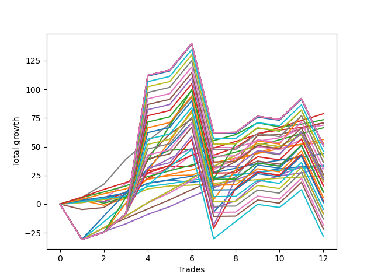

# Long Pointer 001 DB 
- Symbol: ES
- Date Range: 03/18/2022 - 07/15/2022
- Trading Period: 7:20-12:30
- Number of Trades: 12



| Name | Win Percent | Profit | Avg Profit / Trade | Avg Time / Trade |      | Name | Win Percent | Profit | Avg Profit / Trade | Avg Time / Trade |
| ---- | ----------- | ------ | ------------------ | ---------------- | ---- | ---- | ----------- | ------ | ------------------ | ---------------- |
| Sorted By <br> Profit | | | | | | Sorted By <br> Win Percentage ||||
| Eighty-Six | 100.00 | 39375.00 | 3281.25 | 17:04 |     | Eighty-Six | 100.00 | 39375.00 | 3281.25 | 17:04 |
| Two | 83.33 | 36750.00 | 3062.50 | 18:27 |     | Six | 100.00 | 34375.00 | 2864.58 | 14:57 |
| Three | 91.67 | 35375.00 | 2947.92 | 11:52 |     | Eighty-Five | 100.00 | 33250.00 | 2770.83 | 10:15 |
| Five | 83.33 | 35375.00 | 2947.92 | 51:52 |     | Eighty-Four | 100.00 | 28125.00 | 2343.75 | 07:42 |
| Six | 100.00 | 34375.00 | 2864.58 | 14:57 |     | Eighty-Three | 100.00 | 22000.00 | 1833.33 | 06:31 |
| Eighty-Five | 100.00 | 33250.00 | 2770.83 | 10:15 |     | Eighty-Two | 100.00 | 16500.00 | 1375.00 | 03:14 |
| Eighty-Four | 100.00 | 28125.00 | 2343.75 | 07:42 |     | Eighty-One | 100.00 | 12375.00 | 1031.25 | 01:19 |
| One | 91.67 | 26875.00 | 2239.58 | 09:42 |     | Three | 91.67 | 35375.00 | 2947.92 | 11:52 |
| Two Hundred Fifteen | 66.67 | 25625.00 | 2135.42 | 172:20 |     | One | 91.67 | 26875.00 | 2239.58 | 09:42 |
| Two Hundred Fourteen.Five | 66.67 | 25625.00 | 2135.42 | 172:20 |     | Zero | 91.67 | 16875.00 | 1406.25 | 03:15 |
| Two Hundred Fourteen | 66.67 | 25625.00 | 2135.42 | 172:20 |     | Two | 83.33 | 36750.00 | 3062.50 | 18:27 |
| Two Hundred Thirteen.Five | 66.67 | 25625.00 | 2135.42 | 172:20 |     | Five | 83.33 | 35375.00 | 2947.92 | 51:52 |
| Two Hundred Thirteen | 66.67 | 25625.00 | 2135.42 | 172:20 |     | Four | 83.33 | 15500.00 | 1291.67 | 32:29 |
| Two Hundred Twelve.Five | 66.67 | 25625.00 | 2135.42 | 172:20 |     | Seven | 75.00 | 11375.00 | 947.92 | 104:22 |
| Two Hundred Twelve | 66.67 | 25250.00 | 2104.17 | 171:22 |     | Two Hundred One | 75.00 | 9875.00 | 822.92 | 79:15 |
| Two Hundred Eleven.Five | 66.67 | 22875.00 | 1906.25 | 171:12 |     | Ninety | 75.00 | 9875.00 | 822.92 | 79:15 |
| Eighty-Three | 100.00 | 22000.00 | 1833.33 | 06:31 |     | Eighty-Nine | 75.00 | 7750.00 | 645.83 | 79:06 |
| Two Hundred Eleven | 66.67 | 20625.00 | 1718.75 | 171:08 |     | Eighty-Eight | 75.00 | 1000.00 | 83.33 | 76:55 |
| Two Hundred Three | 66.67 | 20500.00 | 1708.33 | 143:30 |     | Eighty-Seven | 75.00 | -4125.00 | -343.75 | 59:31 |
| Two Hundred Two.Five | 66.67 | 18250.00 | 1520.83 | 133:02 |     | Two Hundred Fifteen | 66.67 | 25625.00 | 2135.42 | 172:20 |
| Two Hundred Ten.Five | 66.67 | 18125.00 | 1510.42 | 170:56 |     | Two Hundred Fourteen.Five | 66.67 | 25625.00 | 2135.42 | 172:20 |
| Zero | 91.67 | 16875.00 | 1406.25 | 03:15 |     | Two Hundred Fourteen | 66.67 | 25625.00 | 2135.42 | 172:20 |
| Eighty-Two | 100.00 | 16500.00 | 1375.00 | 03:14 |     | Two Hundred Thirteen.Five | 66.67 | 25625.00 | 2135.42 | 172:20 |
| Four | 83.33 | 15500.00 | 1291.67 | 32:29 |     | Two Hundred Thirteen | 66.67 | 25625.00 | 2135.42 | 172:20 |
| Two Hundred Ten | 66.67 | 15375.00 | 1281.25 | 169:51 |     | Two Hundred Twelve.Five | 66.67 | 25625.00 | 2135.42 | 172:20 |
| Two Hundred Nine.Five | 66.67 | 12875.00 | 1072.92 | 169:40 |     | Two Hundred Twelve | 66.67 | 25250.00 | 2104.17 | 171:22 |
| Eighty-One | 100.00 | 12375.00 | 1031.25 | 01:19 |     | Two Hundred Eleven.Five | 66.67 | 22875.00 | 1906.25 | 171:12 |
| Seven | 75.00 | 11375.00 | 947.92 | 104:22 |     | Two Hundred Eleven | 66.67 | 20625.00 | 1718.75 | 171:08 |
| Two Hundred Nine | 66.67 | 10625.00 | 885.42 | 169:31 |     | Two Hundred Three | 66.67 | 20500.00 | 1708.33 | 143:30 |
| Two Hundred One | 75.00 | 9875.00 | 822.92 | 79:15 |     | Two Hundred Two.Five | 66.67 | 18250.00 | 1520.83 | 133:02 |
| Ninety | 75.00 | 9875.00 | 822.92 | 79:15 |     | Two Hundred Ten.Five | 66.67 | 18125.00 | 1510.42 | 170:56 |
| Two Hundred Eight.Five | 66.67 | 8000.00 | 666.67 | 169:20 |     | Two Hundred Ten | 66.67 | 15375.00 | 1281.25 | 169:51 |
| Eighty-Nine | 75.00 | 7750.00 | 645.83 | 79:06 |     | Two Hundred Nine.Five | 66.67 | 12875.00 | 1072.92 | 169:40 |
| Two Hundred Four | 66.67 | 5375.00 | 447.92 | 161:09 |     | Two Hundred Nine | 66.67 | 10625.00 | 885.42 | 169:31 |
| Two Hundred Eight | 66.67 | 5250.00 | 437.50 | 168:38 |     | Two Hundred Eight.Five | 66.67 | 8000.00 | 666.67 | 169:20 |
| Two Hundred Two | 66.67 | 5125.00 | 427.08 | 125:57 |     | Two Hundred Four | 66.67 | 5375.00 | 447.92 | 161:09 |
| Two Hundred Seven.Five | 66.67 | 2750.00 | 229.17 | 168:08 |     | Two Hundred Eight | 66.67 | 5250.00 | 437.50 | 168:38 |
| Two Hundred Three.Five | 66.67 | 1250.00 | 104.17 | 160:40 |     | Two Hundred Two | 66.67 | 5125.00 | 427.08 | 125:57 |
| Eighty-Eight | 75.00 | 1000.00 | 83.33 | 76:55 |     | Two Hundred Seven.Five | 66.67 | 2750.00 | 229.17 | 168:08 |
| Two Hundred Seven | 66.67 | 625.00 | 52.08 | 167:57 |     | Two Hundred Three.Five | 66.67 | 1250.00 | 104.17 | 160:40 |
| Two Hundred Six.Five | 66.67 | -2250.00 | -187.50 | 167:55 |     | Two Hundred Seven | 66.67 | 625.00 | 52.08 | 167:57 |
| Eighty-Seven | 75.00 | -4125.00 | -343.75 | 59:31 |     | Two Hundred Six.Five | 66.67 | -2250.00 | -187.50 | 167:55 |
| Two Hundred Six | 66.67 | -4500.00 | -375.00 | 167:27 |     | Two Hundred Six | 66.67 | -4500.00 | -375.00 | 167:27 |
| Two Hundred Five.Five | 66.67 | -6500.00 | -541.67 | 167:25 |     | Two Hundred Five.Five | 66.67 | -6500.00 | -541.67 | 167:25 |
| Two Hundred Five | 66.67 | -9125.00 | -760.42 | 167:24 |     | Two Hundred Five | 66.67 | -9125.00 | -760.42 | 167:24 |
| Two Hundred Four.Five | 66.67 | -10875.00 | -906.25 | 167:24 |     | Two Hundred Four.Five | 66.67 | -10875.00 | -906.25 | 167:24 |
| Two Hundred One.Five | 66.67 | -14125.00 | -1177.08 | 101:20 |     | Two Hundred One.Five | 66.67 | -14125.00 | -1177.08 | 101:20 |

## NO STOPLOSS

### Test Zero
* Sell when price hits the middle line of the 20p bollinger
* No Stoploss
* Results:
```
Total Trades: 12
Percent Up: 91.67
Percent Down: 8.33
Total Points Moved Up: 33.75
Potential Profit: 16875.00
Total Points Ups: 35.50 Count Ups: 11
Total Points Downs: -1.75 Count Downs: 1
```

<details><summary>Trades</summary>

<code>In: 2022-03-31 08:37:00		Out: 2022-03-31 08:38:15		Total Position Time: 01:15		Total Move Up: 2.00		Total to Date: 2.00</code> <br />
<code>In: 2022-05-02 08:07:00		Out: 2022-05-02 08:13:20		Total Position Time: 06:20		Total Move Up: 2.75		Total to Date: 4.75</code> <br />
<code>In: 2022-05-02 08:22:00		Out: 2022-05-02 08:26:10		Total Position Time: 04:10		Total Move Up: 5.25		Total to Date: 10.00</code> <br />
<code>In: 2022-05-04 11:36:00		Out: 2022-05-04 11:36:40		Total Position Time: 00:40		Total Move Up: 8.25		Total to Date: 18.25</code> <br />
<code>In: 2022-05-06 09:03:00		Out: 2022-05-06 09:03:15		Total Position Time: 00:15		Total Move Up: 2.50		Total to Date: 20.75</code> <br />
<code>In: 2022-05-06 11:28:00		Out: 2022-05-06 11:40:25		Total Position Time: 12:25		Total Move Up: -1.75		Total to Date: 19.00</code> <br />
<code>In: 2022-05-11 09:14:00		Out: 2022-05-11 09:21:05		Total Position Time: 07:05		Total Move Up: 2.50		Total to Date: 21.50</code> <br />
<code>In: 2022-05-16 09:47:00		Out: 2022-05-16 09:48:15		Total Position Time: 01:15		Total Move Up: 4.00		Total to Date: 25.50</code> <br />
<code>In: 2022-05-31 12:05:00		Out: 2022-05-31 12:07:20		Total Position Time: 02:20		Total Move Up: 2.25		Total to Date: 27.75</code> <br />
<code>In: 2022-06-27 10:10:00		Out: 2022-06-27 10:11:25		Total Position Time: 01:25		Total Move Up: 3.00		Total to Date: 30.75</code> <br />
<code>In: 2022-07-08 09:48:00		Out: 2022-07-08 09:49:00		Total Position Time: 01:00		Total Move Up: 1.75		Total to Date: 32.50</code> <br />
<code>In: 2022-07-12 10:28:00		Out: 2022-07-12 10:28:50		Total Position Time: 00:50		Total Move Up: 1.25		Total to Date: 33.75</code> <br />


</details>

### Test One
* Sell when the price hits the upper line of the 20p 1std bollinger
* No Stoploss
* Results:
```
Total Trades: 12
Percent Up: 91.67
Percent Down: 8.33
Total Points Moved Up: 53.75
Potential Profit: 26875.00
Total Points Ups: 58.00 Count Ups: 11
Total Points Downs: -4.25 Count Downs: 1
```

<details><summary>Trades</summary>

<code>In: 2022-03-31 08:37:00		Out: 2022-03-31 08:40:35		Total Position Time: 03:35		Total Move Up: 3.25		Total to Date: 3.25</code> <br />
<code>In: 2022-05-02 08:07:00		Out: 2022-05-02 08:34:10		Total Position Time: 27:10		Total Move Up: -4.25		Total to Date: -1.00</code> <br />
<code>In: 2022-05-02 08:22:00		Out: 2022-05-02 08:34:10		Total Position Time: 12:10		Total Move Up: 6.00		Total to Date: 5.00</code> <br />
<code>In: 2022-05-04 11:36:00		Out: 2022-05-04 11:41:40		Total Position Time: 05:40		Total Move Up: 17.25		Total to Date: 22.25</code> <br />
<code>In: 2022-05-06 09:03:00		Out: 2022-05-06 09:03:15		Total Position Time: 00:15		Total Move Up: 2.50		Total to Date: 24.75</code> <br />
<code>In: 2022-05-06 11:28:00		Out: 2022-05-06 11:49:10		Total Position Time: 21:10		Total Move Up: 0.50		Total to Date: 25.25</code> <br />
<code>In: 2022-05-11 09:14:00		Out: 2022-05-11 09:23:15		Total Position Time: 09:15		Total Move Up: 6.25		Total to Date: 31.50</code> <br />
<code>In: 2022-05-16 09:47:00		Out: 2022-05-16 09:50:05		Total Position Time: 03:05		Total Move Up: 6.75		Total to Date: 38.25</code> <br />
<code>In: 2022-05-31 12:05:00		Out: 2022-05-31 12:09:20		Total Position Time: 04:20		Total Move Up: 6.25		Total to Date: 44.50</code> <br />
<code>In: 2022-06-27 10:10:00		Out: 2022-06-27 10:15:55		Total Position Time: 05:55		Total Move Up: 6.00		Total to Date: 50.50</code> <br />
<code>In: 2022-07-08 09:48:00		Out: 2022-07-08 10:09:40		Total Position Time: 21:40		Total Move Up: 1.25		Total to Date: 51.75</code> <br />
<code>In: 2022-07-12 10:28:00		Out: 2022-07-12 10:30:15		Total Position Time: 02:15		Total Move Up: 2.00		Total to Date: 53.75</code> <br />


</details>

### Test Two
* Sell when the price hits the upper line of the 20p 2std bollinger
* No Stoploss
* Results:
```
Total Trades: 12
Percent Up: 83.33
Percent Down: 16.67
Total Points Moved Up: 73.50
Potential Profit: 36750.00
Total Points Ups: 82.00 Count Ups: 10
Total Points Downs: -8.50 Count Downs: 2
```

<details><summary>Trades</summary>

<code>In: 2022-03-31 08:37:00		Out: 2022-03-31 08:41:10		Total Position Time: 04:10		Total Move Up: 5.75		Total to Date: 5.75</code> <br />
<code>In: 2022-05-02 08:07:00		Out: 2022-05-02 08:36:30		Total Position Time: 29:30		Total Move Up: -5.00		Total to Date: 0.75</code> <br />
<code>In: 2022-05-02 08:22:00		Out: 2022-05-02 08:36:30		Total Position Time: 14:30		Total Move Up: 5.25		Total to Date: 6.00</code> <br />
<code>In: 2022-05-04 11:36:00		Out: 2022-05-04 11:43:55		Total Position Time: 07:55		Total Move Up: 32.25		Total to Date: 38.25</code> <br />
<code>In: 2022-05-06 09:03:00		Out: 2022-05-06 09:06:00		Total Position Time: 03:00		Total Move Up: 8.75		Total to Date: 47.00</code> <br />
<code>In: 2022-05-06 11:28:00		Out: 2022-05-06 11:49:10		Total Position Time: 21:10		Total Move Up: 0.50		Total to Date: 47.50</code> <br />
<code>In: 2022-05-11 09:14:00		Out: 2022-05-11 09:23:40		Total Position Time: 09:40		Total Move Up: 7.75		Total to Date: 55.25</code> <br />
<code>In: 2022-05-16 09:47:00		Out: 2022-05-16 10:07:00		Total Position Time: 20:00		Total Move Up: 5.25		Total to Date: 60.50</code> <br />
<code>In: 2022-05-31 12:05:00		Out: 2022-05-31 12:15:05		Total Position Time: 10:05		Total Move Up: 10.25		Total to Date: 70.75</code> <br />
<code>In: 2022-06-27 10:10:00		Out: 2022-06-27 11:14:45		Total Position Time: 64:45		Total Move Up: -3.50		Total to Date: 67.25</code> <br />
<code>In: 2022-07-08 09:48:00		Out: 2022-07-08 10:11:05		Total Position Time: 23:05		Total Move Up: 2.25		Total to Date: 69.50</code> <br />
<code>In: 2022-07-12 10:28:00		Out: 2022-07-12 10:41:40		Total Position Time: 13:40		Total Move Up: 4.00		Total to Date: 73.50</code> <br />


</details>

### Test Three
* Sell when price hits the middle line of the 50p bollinger
* No Stoploss
* Results:
```
Total Trades: 12
Percent Up: 91.67
Percent Down: 8.33
Total Points Moved Up: 70.75
Potential Profit: 35375.00
Total Points Ups: 72.75 Count Ups: 11
Total Points Downs: -2.00 Count Downs: 1
```

<details><summary>Trades</summary>

<code>In: 2022-03-31 08:37:00		Out: 2022-03-31 08:41:05		Total Position Time: 04:05		Total Move Up: 4.25		Total to Date: 4.25</code> <br />
<code>In: 2022-05-02 08:07:00		Out: 2022-05-02 08:38:10		Total Position Time: 31:10		Total Move Up: -2.00		Total to Date: 2.25</code> <br />
<code>In: 2022-05-02 08:22:00		Out: 2022-05-02 08:38:10		Total Position Time: 16:10		Total Move Up: 8.25		Total to Date: 10.50</code> <br />
<code>In: 2022-05-04 11:36:00		Out: 2022-05-04 11:41:15		Total Position Time: 05:15		Total Move Up: 11.75		Total to Date: 22.25</code> <br />
<code>In: 2022-05-06 09:03:00		Out: 2022-05-06 09:06:05		Total Position Time: 03:05		Total Move Up: 10.25		Total to Date: 32.50</code> <br />
<code>In: 2022-05-06 11:28:00		Out: 2022-05-06 11:49:10		Total Position Time: 21:10		Total Move Up: 0.50		Total to Date: 33.00</code> <br />
<code>In: 2022-05-11 09:14:00		Out: 2022-05-11 09:24:05		Total Position Time: 10:05		Total Move Up: 9.50		Total to Date: 42.50</code> <br />
<code>In: 2022-05-16 09:47:00		Out: 2022-05-16 09:50:05		Total Position Time: 03:05		Total Move Up: 6.75		Total to Date: 49.25</code> <br />
<code>In: 2022-05-31 12:05:00		Out: 2022-05-31 12:15:15		Total Position Time: 10:15		Total Move Up: 12.25		Total to Date: 61.50</code> <br />
<code>In: 2022-06-27 10:10:00		Out: 2022-06-27 10:11:25		Total Position Time: 01:25		Total Move Up: 3.00		Total to Date: 64.50</code> <br />
<code>In: 2022-07-08 09:48:00		Out: 2022-07-08 10:11:10		Total Position Time: 23:10		Total Move Up: 2.25		Total to Date: 66.75</code> <br />
<code>In: 2022-07-12 10:28:00		Out: 2022-07-12 10:41:40		Total Position Time: 13:40		Total Move Up: 4.00		Total to Date: 70.75</code> <br />


</details>

### Test Four
* Sell when the price hits the upper line of the 50p 1std bollinger
* No Stoploss
* Results:
```
Total Trades: 12
Percent Up: 83.33
Percent Down: 16.67
Total Points Moved Up: 31.00
Potential Profit: 15500.00
Total Points Ups: 86.25 Count Ups: 10
Total Points Downs: -55.25 Count Downs: 2
```

<details><summary>Trades</summary>

<code>In: 2022-03-31 08:37:00		Out: 2022-03-31 09:00:40		Total Position Time: 23:40		Total Move Up: 5.00		Total to Date: 5.00</code> <br />
<code>In: 2022-05-02 08:07:00		Out: 2022-05-02 08:55:55		Total Position Time: 48:55		Total Move Up: -3.25		Total to Date: 1.75</code> <br />
<code>In: 2022-05-02 08:22:00		Out: 2022-05-02 08:55:55		Total Position Time: 33:55		Total Move Up: 7.00		Total to Date: 8.75</code> <br />
<code>In: 2022-05-04 11:36:00		Out: 2022-05-04 11:42:00		Total Position Time: 06:00		Total Move Up: 21.25		Total to Date: 30.00</code> <br />
<code>In: 2022-05-06 09:03:00		Out: 2022-05-06 09:23:00		Total Position Time: 20:00		Total Move Up: 9.75		Total to Date: 39.75</code> <br />
<code>In: 2022-05-06 11:28:00		Out: 2022-05-06 11:50:10		Total Position Time: 22:10		Total Move Up: 8.75		Total to Date: 48.50</code> <br />
<code>In: 2022-05-11 09:14:00		Out: 2022-05-11 11:18:15		Total Position Time: 124:15		Total Move Up: -52.00		Total to Date: -3.50</code> <br />
<code>In: 2022-05-16 09:47:00		Out: 2022-05-16 10:07:25		Total Position Time: 20:25		Total Move Up: 6.25		Total to Date: 2.75</code> <br />
<code>In: 2022-05-31 12:05:00		Out: 2022-05-31 12:28:20		Total Position Time: 23:20		Total Move Up: 16.50		Total to Date: 19.25</code> <br />
<code>In: 2022-06-27 10:10:00		Out: 2022-06-27 10:14:20		Total Position Time: 04:20		Total Move Up: 5.25		Total to Date: 24.50</code> <br />
<code>In: 2022-07-08 09:48:00		Out: 2022-07-08 10:26:30		Total Position Time: 38:30		Total Move Up: 2.75		Total to Date: 27.25</code> <br />
<code>In: 2022-07-12 10:28:00		Out: 2022-07-12 10:52:25		Total Position Time: 24:25		Total Move Up: 3.75		Total to Date: 31.00</code> <br />


</details>

### Test Five
* Sell when the price hits the upper line of the 50p 2std bollinger
* No Stoploss
* Results:
```
Total Trades: 12
Percent Up: 83.33
Percent Down: 16.67
Total Points Moved Up: 70.75
Potential Profit: 35375.00
Total Points Ups: 122.25 Count Ups: 10
Total Points Downs: -51.50 Count Downs: 2
```

<details><summary>Trades</summary>

<code>In: 2022-03-31 08:37:00		Out: 2022-03-31 10:46:00		Total Position Time: 129:00		Total Move Up: -4.75		Total to Date: -4.75</code> <br />
<code>In: 2022-05-02 08:07:00		Out: 2022-05-02 09:00:45		Total Position Time: 53:45		Total Move Up: 1.75		Total to Date: -3.00</code> <br />
<code>In: 2022-05-02 08:22:00		Out: 2022-05-02 09:00:45		Total Position Time: 38:45		Total Move Up: 12.00		Total to Date: 9.00</code> <br />
<code>In: 2022-05-04 11:36:00		Out: 2022-05-04 11:43:55		Total Position Time: 07:55		Total Move Up: 32.25		Total to Date: 41.25</code> <br />
<code>In: 2022-05-06 09:03:00		Out: 2022-05-06 09:36:15		Total Position Time: 33:15		Total Move Up: 19.75		Total to Date: 61.00</code> <br />
<code>In: 2022-05-06 11:28:00		Out: 2022-05-06 11:54:15		Total Position Time: 26:15		Total Move Up: 13.00		Total to Date: 74.00</code> <br />
<code>In: 2022-05-11 09:14:00		Out: 2022-05-11 11:23:40		Total Position Time: 129:40		Total Move Up: -46.75		Total to Date: 27.25</code> <br />
<code>In: 2022-05-16 09:47:00		Out: 2022-05-16 10:11:25		Total Position Time: 24:25		Total Move Up: 9.75		Total to Date: 37.00</code> <br />
<code>In: 2022-05-31 12:05:00		Out: 2022-05-31 12:31:05		Total Position Time: 26:05		Total Move Up: 22.75		Total to Date: 59.75</code> <br />
<code>In: 2022-06-27 10:10:00		Out: 2022-06-27 11:38:15		Total Position Time: 88:15		Total Move Up: 0.75		Total to Date: 60.50</code> <br />
<code>In: 2022-07-08 09:48:00		Out: 2022-07-08 10:27:00		Total Position Time: 39:00		Total Move Up: 5.00		Total to Date: 65.50</code> <br />
<code>In: 2022-07-12 10:28:00		Out: 2022-07-12 10:54:15		Total Position Time: 26:15		Total Move Up: 5.25		Total to Date: 70.75</code> <br />


</details>

### Test Six
* Sell when the price hits the middle line of the 1std VWAP
* No Stoploss
* Results:
```
Total Trades: 12
Percent Up: 100.00
Percent Down: 0.00
Total Points Moved Up: 68.75
Potential Profit: 34375.00
Total Points Ups: 68.75 Count Ups: 12
Total Points Downs: 0.00 Count Downs: 0
```

<details><summary>Trades</summary>

<code>In: 2022-03-31 08:37:00		Out: 2022-03-31 08:37:40		Total Position Time: 00:40		Total Move Up: 1.25		Total to Date: 1.25</code> <br />
<code>In: 2022-05-02 08:07:00		Out: 2022-05-02 09:00:50		Total Position Time: 53:50		Total Move Up: 3.25		Total to Date: 4.50</code> <br />
<code>In: 2022-05-02 08:22:00		Out: 2022-05-02 09:00:50		Total Position Time: 38:50		Total Move Up: 13.50		Total to Date: 18.00</code> <br />
<code>In: 2022-05-04 11:36:00		Out: 2022-05-04 11:36:40		Total Position Time: 00:40		Total Move Up: 8.25		Total to Date: 26.25</code> <br />
<code>In: 2022-05-06 09:03:00		Out: 2022-05-06 09:03:15		Total Position Time: 00:15		Total Move Up: 2.50		Total to Date: 28.75</code> <br />
<code>In: 2022-05-06 11:28:00		Out: 2022-05-06 11:55:05		Total Position Time: 27:05		Total Move Up: 14.25		Total to Date: 43.00</code> <br />
<code>In: 2022-05-11 09:14:00		Out: 2022-05-11 09:23:15		Total Position Time: 09:15		Total Move Up: 6.25		Total to Date: 49.25</code> <br />
<code>In: 2022-05-16 09:47:00		Out: 2022-05-16 09:47:15		Total Position Time: 00:15		Total Move Up: 0.00		Total to Date: 49.25</code> <br />
<code>In: 2022-05-31 12:05:00		Out: 2022-05-31 12:07:55		Total Position Time: 02:55		Total Move Up: 5.50		Total to Date: 54.75</code> <br />
<code>In: 2022-06-27 10:10:00		Out: 2022-06-27 10:11:25		Total Position Time: 01:25		Total Move Up: 3.00		Total to Date: 57.75</code> <br />
<code>In: 2022-07-08 09:48:00		Out: 2022-07-08 10:29:10		Total Position Time: 41:10		Total Move Up: 8.00		Total to Date: 65.75</code> <br />
<code>In: 2022-07-12 10:28:00		Out: 2022-07-12 10:31:15		Total Position Time: 03:15		Total Move Up: 3.00		Total to Date: 68.75</code> <br />


</details>

### Test Seven
* Sell when the price hits the upper line of the 1std VWAP
* No Stoploss
* Results:
```
Total Trades: 12
Percent Up: 75.00
Percent Down: 25.00
Total Points Moved Up: 22.75
Potential Profit: 11375.00
Total Points Ups: 144.00 Count Ups: 9
Total Points Downs: -121.25 Count Downs: 3
```

<details><summary>Trades</summary>

<code>In: 2022-03-31 08:37:00		Out: 2022-03-31 08:41:10		Total Position Time: 04:10		Total Move Up: 5.75		Total to Date: 5.75</code> <br />
<code>In: 2022-05-02 08:07:00		Out: 2022-05-02 12:30:30		Total Position Time: 263:30		Total Move Up: 11.50		Total to Date: 17.25</code> <br />
<code>In: 2022-05-02 08:22:00		Out: 2022-05-02 12:30:30		Total Position Time: 248:30		Total Move Up: 21.75		Total to Date: 39.00</code> <br />
<code>In: 2022-05-04 11:36:00		Out: 2022-05-04 11:41:35		Total Position Time: 05:35		Total Move Up: 16.00		Total to Date: 55.00</code> <br />
<code>In: 2022-05-06 09:03:00		Out: 2022-05-06 09:06:45		Total Position Time: 03:45		Total Move Up: 14.75		Total to Date: 69.75</code> <br />
<code>In: 2022-05-06 11:28:00		Out: 2022-05-06 12:46:05		Total Position Time: 78:05		Total Move Up: 23.25		Total to Date: 93.00</code> <br />
<code>In: 2022-05-11 09:14:00		Out: 2022-05-11 12:46:05		Total Position Time: 212:05		Total Move Up: -77.75		Total to Date: 15.25</code> <br />
<code>In: 2022-05-16 09:47:00		Out: 2022-05-16 10:07:35		Total Position Time: 20:35		Total Move Up: 8.50		Total to Date: 23.75</code> <br />
<code>In: 2022-05-31 12:05:00		Out: 2022-05-31 12:31:00		Total Position Time: 26:00		Total Move Up: 22.00		Total to Date: 45.75</code> <br />
<code>In: 2022-06-27 10:10:00		Out: 2022-06-27 12:46:05		Total Position Time: 156:05		Total Move Up: -2.75		Total to Date: 43.00</code> <br />
<code>In: 2022-07-08 09:48:00		Out: 2022-07-08 11:24:00		Total Position Time: 96:00		Total Move Up: 20.50		Total to Date: 63.50</code> <br />
<code>In: 2022-07-12 10:28:00		Out: 2022-07-12 12:46:05		Total Position Time: 138:05		Total Move Up: -40.75		Total to Date: 22.75</code> <br />


</details>

## TAKE PROFIT

### Test Eighty-One
* Take Profit of 1 Point
* No Stoploss
* Results:
```
Total Trades: 12
Percent Up: 100.00
Percent Down: 0.00
Total Points Moved Up: 24.75
Potential Profit: 12375.00
Total Points Ups: 24.75 Count Ups: 12
Total Points Downs: 0.00 Count Downs: 0
```

<details><summary>Trades</summary>

<code>In: 2022-03-31 08:37:00		Out: 2022-03-31 08:37:40		Total Position Time: 00:40		Total Move Up: 1.25		Total to Date: 1.25</code> <br />
<code>In: 2022-05-02 08:07:00		Out: 2022-05-02 08:13:20		Total Position Time: 06:20		Total Move Up: 2.75		Total to Date: 4.00</code> <br />
<code>In: 2022-05-02 08:22:00		Out: 2022-05-02 08:22:30		Total Position Time: 00:30		Total Move Up: 1.00		Total to Date: 5.00</code> <br />
<code>In: 2022-05-04 11:36:00		Out: 2022-05-04 11:36:40		Total Position Time: 00:40		Total Move Up: 8.25		Total to Date: 13.25</code> <br />
<code>In: 2022-05-06 09:03:00		Out: 2022-05-06 09:03:15		Total Position Time: 00:15		Total Move Up: 2.50		Total to Date: 15.75</code> <br />
<code>In: 2022-05-06 11:28:00		Out: 2022-05-06 11:30:35		Total Position Time: 02:35		Total Move Up: 0.75		Total to Date: 16.50</code> <br />
<code>In: 2022-05-11 09:14:00		Out: 2022-05-11 09:14:25		Total Position Time: 00:25		Total Move Up: 1.50		Total to Date: 18.00</code> <br />
<code>In: 2022-05-16 09:47:00		Out: 2022-05-16 09:47:50		Total Position Time: 00:50		Total Move Up: 2.00		Total to Date: 20.00</code> <br />
<code>In: 2022-05-31 12:05:00		Out: 2022-05-31 12:07:05		Total Position Time: 02:05		Total Move Up: 1.25		Total to Date: 21.25</code> <br />
<code>In: 2022-06-27 10:10:00		Out: 2022-06-27 10:10:25		Total Position Time: 00:25		Total Move Up: 1.25		Total to Date: 22.50</code> <br />
<code>In: 2022-07-08 09:48:00		Out: 2022-07-08 09:48:20		Total Position Time: 00:20		Total Move Up: 1.00		Total to Date: 23.50</code> <br />
<code>In: 2022-07-12 10:28:00		Out: 2022-07-12 10:28:50		Total Position Time: 00:50		Total Move Up: 1.25		Total to Date: 24.75</code> <br />


</details>

### Test Eighty-Two
* Take Profit of 2 Point
* No Stoploss
* Results:
```
Total Trades: 12
Percent Up: 100.00
Percent Down: 0.00
Total Points Moved Up: 33.00
Potential Profit: 16500.00
Total Points Ups: 33.00 Count Ups: 12
Total Points Downs: 0.00 Count Downs: 0
```

<details><summary>Trades</summary>

<code>In: 2022-03-31 08:37:00		Out: 2022-03-31 08:38:15		Total Position Time: 01:15		Total Move Up: 2.00		Total to Date: 2.00</code> <br />
<code>In: 2022-05-02 08:07:00		Out: 2022-05-02 08:13:20		Total Position Time: 06:20		Total Move Up: 2.75		Total to Date: 4.75</code> <br />
<code>In: 2022-05-02 08:22:00		Out: 2022-05-02 08:22:55		Total Position Time: 00:55		Total Move Up: 2.25		Total to Date: 7.00</code> <br />
<code>In: 2022-05-04 11:36:00		Out: 2022-05-04 11:36:40		Total Position Time: 00:40		Total Move Up: 8.25		Total to Date: 15.25</code> <br />
<code>In: 2022-05-06 09:03:00		Out: 2022-05-06 09:03:15		Total Position Time: 00:15		Total Move Up: 2.50		Total to Date: 17.75</code> <br />
<code>In: 2022-05-06 11:28:00		Out: 2022-05-06 11:49:25		Total Position Time: 21:25		Total Move Up: 3.00		Total to Date: 20.75</code> <br />
<code>In: 2022-05-11 09:14:00		Out: 2022-05-11 09:14:30		Total Position Time: 00:30		Total Move Up: 2.25		Total to Date: 23.00</code> <br />
<code>In: 2022-05-16 09:47:00		Out: 2022-05-16 09:47:55		Total Position Time: 00:55		Total Move Up: 2.25		Total to Date: 25.25</code> <br />
<code>In: 2022-05-31 12:05:00		Out: 2022-05-31 12:07:20		Total Position Time: 02:20		Total Move Up: 2.25		Total to Date: 27.50</code> <br />
<code>In: 2022-06-27 10:10:00		Out: 2022-06-27 10:11:10		Total Position Time: 01:10		Total Move Up: 2.00		Total to Date: 29.50</code> <br />
<code>In: 2022-07-08 09:48:00		Out: 2022-07-08 09:49:00		Total Position Time: 01:00		Total Move Up: 1.75		Total to Date: 31.25</code> <br />
<code>In: 2022-07-12 10:28:00		Out: 2022-07-12 10:30:05		Total Position Time: 02:05		Total Move Up: 1.75		Total to Date: 33.00</code> <br />


</details>

### Test Eighty-Three
* Take Profit of 3 Point
* No Stoploss
* Results:
```
Total Trades: 12
Percent Up: 100.00
Percent Down: 0.00
Total Points Moved Up: 44.00
Potential Profit: 22000.00
Total Points Ups: 44.00 Count Ups: 12
Total Points Downs: 0.00 Count Downs: 0
```

<details><summary>Trades</summary>

<code>In: 2022-03-31 08:37:00		Out: 2022-03-31 08:40:35		Total Position Time: 03:35		Total Move Up: 3.25		Total to Date: 3.25</code> <br />
<code>In: 2022-05-02 08:07:00		Out: 2022-05-02 08:14:55		Total Position Time: 07:55		Total Move Up: 2.75		Total to Date: 6.00</code> <br />
<code>In: 2022-05-02 08:22:00		Out: 2022-05-02 08:26:00		Total Position Time: 04:00		Total Move Up: 3.75		Total to Date: 9.75</code> <br />
<code>In: 2022-05-04 11:36:00		Out: 2022-05-04 11:36:40		Total Position Time: 00:40		Total Move Up: 8.25		Total to Date: 18.00</code> <br />
<code>In: 2022-05-06 09:03:00		Out: 2022-05-06 09:03:40		Total Position Time: 00:40		Total Move Up: 3.25		Total to Date: 21.25</code> <br />
<code>In: 2022-05-06 11:28:00		Out: 2022-05-06 11:49:25		Total Position Time: 21:25		Total Move Up: 3.00		Total to Date: 24.25</code> <br />
<code>In: 2022-05-11 09:14:00		Out: 2022-05-11 09:22:05		Total Position Time: 08:05		Total Move Up: 3.00		Total to Date: 27.25</code> <br />
<code>In: 2022-05-16 09:47:00		Out: 2022-05-16 09:48:15		Total Position Time: 01:15		Total Move Up: 4.00		Total to Date: 31.25</code> <br />
<code>In: 2022-05-31 12:05:00		Out: 2022-05-31 12:07:45		Total Position Time: 02:45		Total Move Up: 4.00		Total to Date: 35.25</code> <br />
<code>In: 2022-06-27 10:10:00		Out: 2022-06-27 10:11:25		Total Position Time: 01:25		Total Move Up: 3.00		Total to Date: 38.25</code> <br />
<code>In: 2022-07-08 09:48:00		Out: 2022-07-08 10:11:20		Total Position Time: 23:20		Total Move Up: 2.75		Total to Date: 41.00</code> <br />
<code>In: 2022-07-12 10:28:00		Out: 2022-07-12 10:31:15		Total Position Time: 03:15		Total Move Up: 3.00		Total to Date: 44.00</code> <br />


</details>

### Test Eighty-Four
* Take Profit of 4 Point
* No Stoploss
* Results:
```
Total Trades: 12
Percent Up: 100.00
Percent Down: 0.00
Total Points Moved Up: 56.25
Potential Profit: 28125.00
Total Points Ups: 56.25 Count Ups: 12
Total Points Downs: 0.00 Count Downs: 0
```

<details><summary>Trades</summary>

<code>In: 2022-03-31 08:37:00		Out: 2022-03-31 08:41:05		Total Position Time: 04:05		Total Move Up: 4.25		Total to Date: 4.25</code> <br />
<code>In: 2022-05-02 08:07:00		Out: 2022-05-02 08:15:00		Total Position Time: 08:00		Total Move Up: 4.75		Total to Date: 9.00</code> <br />
<code>In: 2022-05-02 08:22:00		Out: 2022-05-02 08:26:05		Total Position Time: 04:05		Total Move Up: 4.25		Total to Date: 13.25</code> <br />
<code>In: 2022-05-04 11:36:00		Out: 2022-05-04 11:36:40		Total Position Time: 00:40		Total Move Up: 8.25		Total to Date: 21.50</code> <br />
<code>In: 2022-05-06 09:03:00		Out: 2022-05-06 09:03:45		Total Position Time: 00:45		Total Move Up: 4.25		Total to Date: 25.75</code> <br />
<code>In: 2022-05-06 11:28:00		Out: 2022-05-06 11:49:30		Total Position Time: 21:30		Total Move Up: 4.00		Total to Date: 29.75</code> <br />
<code>In: 2022-05-11 09:14:00		Out: 2022-05-11 09:23:15		Total Position Time: 09:15		Total Move Up: 6.25		Total to Date: 36.00</code> <br />
<code>In: 2022-05-16 09:47:00		Out: 2022-05-16 09:48:15		Total Position Time: 01:15		Total Move Up: 4.00		Total to Date: 40.00</code> <br />
<code>In: 2022-05-31 12:05:00		Out: 2022-05-31 12:07:45		Total Position Time: 02:45		Total Move Up: 4.00		Total to Date: 44.00</code> <br />
<code>In: 2022-06-27 10:10:00		Out: 2022-06-27 10:12:00		Total Position Time: 02:00		Total Move Up: 4.25		Total to Date: 48.25</code> <br />
<code>In: 2022-07-08 09:48:00		Out: 2022-07-08 10:12:25		Total Position Time: 24:25		Total Move Up: 4.00		Total to Date: 52.25</code> <br />
<code>In: 2022-07-12 10:28:00		Out: 2022-07-12 10:41:40		Total Position Time: 13:40		Total Move Up: 4.00		Total to Date: 56.25</code> <br />


</details>

### Test Eighty-Five
* Take Profit of 5 Point
* No Stoploss
* Results:
```
Total Trades: 12
Percent Up: 100.00
Percent Down: 0.00
Total Points Moved Up: 66.50
Potential Profit: 33250.00
Total Points Ups: 66.50 Count Ups: 12
Total Points Downs: 0.00 Count Downs: 0
```

<details><summary>Trades</summary>

<code>In: 2022-03-31 08:37:00		Out: 2022-03-31 08:41:10		Total Position Time: 04:10		Total Move Up: 5.75		Total to Date: 5.75</code> <br />
<code>In: 2022-05-02 08:07:00		Out: 2022-05-02 08:15:00		Total Position Time: 08:00		Total Move Up: 4.75		Total to Date: 10.50</code> <br />
<code>In: 2022-05-02 08:22:00		Out: 2022-05-02 08:26:10		Total Position Time: 04:10		Total Move Up: 5.25		Total to Date: 15.75</code> <br />
<code>In: 2022-05-04 11:36:00		Out: 2022-05-04 11:36:40		Total Position Time: 00:40		Total Move Up: 8.25		Total to Date: 24.00</code> <br />
<code>In: 2022-05-06 09:03:00		Out: 2022-05-06 09:03:50		Total Position Time: 00:50		Total Move Up: 5.00		Total to Date: 29.00</code> <br />
<code>In: 2022-05-06 11:28:00		Out: 2022-05-06 11:50:05		Total Position Time: 22:05		Total Move Up: 5.00		Total to Date: 34.00</code> <br />
<code>In: 2022-05-11 09:14:00		Out: 2022-05-11 09:23:15		Total Position Time: 09:15		Total Move Up: 6.25		Total to Date: 40.25</code> <br />
<code>In: 2022-05-16 09:47:00		Out: 2022-05-16 09:48:45		Total Position Time: 01:45		Total Move Up: 5.00		Total to Date: 45.25</code> <br />
<code>In: 2022-05-31 12:05:00		Out: 2022-05-31 12:07:55		Total Position Time: 02:55		Total Move Up: 5.50		Total to Date: 50.75</code> <br />
<code>In: 2022-06-27 10:10:00		Out: 2022-06-27 10:12:55		Total Position Time: 02:55		Total Move Up: 5.25		Total to Date: 56.00</code> <br />
<code>In: 2022-07-08 09:48:00		Out: 2022-07-08 10:28:05		Total Position Time: 40:05		Total Move Up: 5.25		Total to Date: 61.25</code> <br />
<code>In: 2022-07-12 10:28:00		Out: 2022-07-12 10:54:15		Total Position Time: 26:15		Total Move Up: 5.25		Total to Date: 66.50</code> <br />


</details>

### Test Eighty-Six
* Take Profit of 6 Point
* No Stoploss
* Results:
```
Total Trades: 12
Percent Up: 100.00
Percent Down: 0.00
Total Points Moved Up: 78.75
Potential Profit: 39375.00
Total Points Ups: 78.75 Count Ups: 12
Total Points Downs: 0.00 Count Downs: 0
```

<details><summary>Trades</summary>

<code>In: 2022-03-31 08:37:00		Out: 2022-03-31 08:41:50		Total Position Time: 04:50		Total Move Up: 6.00		Total to Date: 6.00</code> <br />
<code>In: 2022-05-02 08:07:00		Out: 2022-05-02 09:21:20		Total Position Time: 74:20		Total Move Up: 6.75		Total to Date: 12.75</code> <br />
<code>In: 2022-05-02 08:22:00		Out: 2022-05-02 08:34:10		Total Position Time: 12:10		Total Move Up: 6.00		Total to Date: 18.75</code> <br />
<code>In: 2022-05-04 11:36:00		Out: 2022-05-04 11:36:40		Total Position Time: 00:40		Total Move Up: 8.25		Total to Date: 27.00</code> <br />
<code>In: 2022-05-06 09:03:00		Out: 2022-05-06 09:03:55		Total Position Time: 00:55		Total Move Up: 6.75		Total to Date: 33.75</code> <br />
<code>In: 2022-05-06 11:28:00		Out: 2022-05-06 11:50:10		Total Position Time: 22:10		Total Move Up: 8.75		Total to Date: 42.50</code> <br />
<code>In: 2022-05-11 09:14:00		Out: 2022-05-11 09:23:15		Total Position Time: 09:15		Total Move Up: 6.25		Total to Date: 48.75</code> <br />
<code>In: 2022-05-16 09:47:00		Out: 2022-05-16 09:50:00		Total Position Time: 03:00		Total Move Up: 5.75		Total to Date: 54.50</code> <br />
<code>In: 2022-05-31 12:05:00		Out: 2022-05-31 12:09:20		Total Position Time: 04:20		Total Move Up: 6.25		Total to Date: 60.75</code> <br />
<code>In: 2022-06-27 10:10:00		Out: 2022-06-27 10:15:55		Total Position Time: 05:55		Total Move Up: 6.00		Total to Date: 66.75</code> <br />
<code>In: 2022-07-08 09:48:00		Out: 2022-07-08 10:28:15		Total Position Time: 40:15		Total Move Up: 6.00		Total to Date: 72.75</code> <br />
<code>In: 2022-07-12 10:28:00		Out: 2022-07-12 10:55:00		Total Position Time: 27:00		Total Move Up: 6.00		Total to Date: 78.75</code> <br />


</details>

### Test Eighty-Seven
* Take Profit of 7 Point
* No Stoploss
* Results:
```
Total Trades: 12
Percent Up: 75.00
Percent Down: 25.00
Total Points Moved Up: -8.25
Potential Profit: -4125.00
Total Points Ups: 66.00 Count Ups: 9
Total Points Downs: -74.25 Count Downs: 3
```

<details><summary>Trades</summary>

<code>In: 2022-03-31 08:37:00		Out: 2022-03-31 12:46:05		Total Position Time: 249:05		Total Move Up: -30.75		Total to Date: -30.75</code> <br />
<code>In: 2022-05-02 08:07:00		Out: 2022-05-02 09:21:20		Total Position Time: 74:20		Total Move Up: 6.75		Total to Date: -24.00</code> <br />
<code>In: 2022-05-02 08:22:00		Out: 2022-05-02 08:36:35		Total Position Time: 14:35		Total Move Up: 6.75		Total to Date: -17.25</code> <br />
<code>In: 2022-05-04 11:36:00		Out: 2022-05-04 11:36:40		Total Position Time: 00:40		Total Move Up: 8.25		Total to Date: -9.00</code> <br />
<code>In: 2022-05-06 09:03:00		Out: 2022-05-06 09:03:55		Total Position Time: 00:55		Total Move Up: 6.75		Total to Date: -2.25</code> <br />
<code>In: 2022-05-06 11:28:00		Out: 2022-05-06 11:50:10		Total Position Time: 22:10		Total Move Up: 8.75		Total to Date: 6.50</code> <br />
<code>In: 2022-05-11 09:14:00		Out: 2022-05-11 09:23:40		Total Position Time: 09:40		Total Move Up: 7.75		Total to Date: 14.25</code> <br />
<code>In: 2022-05-16 09:47:00		Out: 2022-05-16 09:50:05		Total Position Time: 03:05		Total Move Up: 6.75		Total to Date: 21.00</code> <br />
<code>In: 2022-05-31 12:05:00		Out: 2022-05-31 12:09:40		Total Position Time: 04:40		Total Move Up: 7.00		Total to Date: 28.00</code> <br />
<code>In: 2022-06-27 10:10:00		Out: 2022-06-27 12:46:05		Total Position Time: 156:05		Total Move Up: -2.75		Total to Date: 25.25</code> <br />
<code>In: 2022-07-08 09:48:00		Out: 2022-07-08 10:28:55		Total Position Time: 40:55		Total Move Up: 7.25		Total to Date: 32.50</code> <br />
<code>In: 2022-07-12 10:28:00		Out: 2022-07-12 12:46:05		Total Position Time: 138:05		Total Move Up: -40.75		Total to Date: -8.25</code> <br />


</details>

### Test Eighty-Eight
* Take Profit of 8 Point
* No Stoploss
* Results:
```
Total Trades: 12
Percent Up: 75.00
Percent Down: 25.00
Total Points Moved Up: 2.00
Potential Profit: 1000.00
Total Points Ups: 76.25 Count Ups: 9
Total Points Downs: -74.25 Count Downs: 3
```

<details><summary>Trades</summary>

<code>In: 2022-03-31 08:37:00		Out: 2022-03-31 12:46:05		Total Position Time: 249:05		Total Move Up: -30.75		Total to Date: -30.75</code> <br />
<code>In: 2022-05-02 08:07:00		Out: 2022-05-02 12:30:20		Total Position Time: 263:20		Total Move Up: 10.00		Total to Date: -20.75</code> <br />
<code>In: 2022-05-02 08:22:00		Out: 2022-05-02 08:36:45		Total Position Time: 14:45		Total Move Up: 8.25		Total to Date: -12.50</code> <br />
<code>In: 2022-05-04 11:36:00		Out: 2022-05-04 11:36:40		Total Position Time: 00:40		Total Move Up: 8.25		Total to Date: -4.25</code> <br />
<code>In: 2022-05-06 09:03:00		Out: 2022-05-06 09:05:30		Total Position Time: 02:30		Total Move Up: 8.00		Total to Date: 3.75</code> <br />
<code>In: 2022-05-06 11:28:00		Out: 2022-05-06 11:50:10		Total Position Time: 22:10		Total Move Up: 8.75		Total to Date: 12.50</code> <br />
<code>In: 2022-05-11 09:14:00		Out: 2022-05-11 09:23:45		Total Position Time: 09:45		Total Move Up: 8.25		Total to Date: 20.75</code> <br />
<code>In: 2022-05-16 09:47:00		Out: 2022-05-16 10:07:35		Total Position Time: 20:35		Total Move Up: 8.50		Total to Date: 29.25</code> <br />
<code>In: 2022-05-31 12:05:00		Out: 2022-05-31 12:09:55		Total Position Time: 04:55		Total Move Up: 8.25		Total to Date: 37.50</code> <br />
<code>In: 2022-06-27 10:10:00		Out: 2022-06-27 12:46:05		Total Position Time: 156:05		Total Move Up: -2.75		Total to Date: 34.75</code> <br />
<code>In: 2022-07-08 09:48:00		Out: 2022-07-08 10:29:10		Total Position Time: 41:10		Total Move Up: 8.00		Total to Date: 42.75</code> <br />
<code>In: 2022-07-12 10:28:00		Out: 2022-07-12 12:46:05		Total Position Time: 138:05		Total Move Up: -40.75		Total to Date: 2.00</code> <br />


</details>

### Test Eighty-Nine
* Take Profit of 9 Point
* No Stoploss
* Results:
```
Total Trades: 12
Percent Up: 75.00
Percent Down: 25.00
Total Points Moved Up: 15.50
Potential Profit: 7750.00
Total Points Ups: 89.75 Count Ups: 9
Total Points Downs: -74.25 Count Downs: 3
```

<details><summary>Trades</summary>

<code>In: 2022-03-31 08:37:00		Out: 2022-03-31 12:46:05		Total Position Time: 249:05		Total Move Up: -30.75		Total to Date: -30.75</code> <br />
<code>In: 2022-05-02 08:07:00		Out: 2022-05-02 12:30:20		Total Position Time: 263:20		Total Move Up: 10.00		Total to Date: -20.75</code> <br />
<code>In: 2022-05-02 08:22:00		Out: 2022-05-02 08:38:15		Total Position Time: 16:15		Total Move Up: 10.00		Total to Date: -10.75</code> <br />
<code>In: 2022-05-04 11:36:00		Out: 2022-05-04 11:41:15		Total Position Time: 05:15		Total Move Up: 11.75		Total to Date: 1.00</code> <br />
<code>In: 2022-05-06 09:03:00		Out: 2022-05-06 09:06:00		Total Position Time: 03:00		Total Move Up: 8.75		Total to Date: 9.75</code> <br />
<code>In: 2022-05-06 11:28:00		Out: 2022-05-06 11:50:15		Total Position Time: 22:15		Total Move Up: 10.75		Total to Date: 20.50</code> <br />
<code>In: 2022-05-11 09:14:00		Out: 2022-05-11 09:24:05		Total Position Time: 10:05		Total Move Up: 9.50		Total to Date: 30.00</code> <br />
<code>In: 2022-05-16 09:47:00		Out: 2022-05-16 10:11:25		Total Position Time: 24:25		Total Move Up: 9.75		Total to Date: 39.75</code> <br />
<code>In: 2022-05-31 12:05:00		Out: 2022-05-31 12:15:05		Total Position Time: 10:05		Total Move Up: 10.25		Total to Date: 50.00</code> <br />
<code>In: 2022-06-27 10:10:00		Out: 2022-06-27 12:46:05		Total Position Time: 156:05		Total Move Up: -2.75		Total to Date: 47.25</code> <br />
<code>In: 2022-07-08 09:48:00		Out: 2022-07-08 10:39:20		Total Position Time: 51:20		Total Move Up: 9.00		Total to Date: 56.25</code> <br />
<code>In: 2022-07-12 10:28:00		Out: 2022-07-12 12:46:05		Total Position Time: 138:05		Total Move Up: -40.75		Total to Date: 15.50</code> <br />


</details>

### Test Ninety
* Take Profit of 10 Point
* No Stoploss
* Results:
```
Total Trades: 12
Percent Up: 75.00
Percent Down: 25.00
Total Points Moved Up: 19.75
Potential Profit: 9875.00
Total Points Ups: 94.00 Count Ups: 9
Total Points Downs: -74.25 Count Downs: 3
```

<details><summary>Trades</summary>

<code>In: 2022-03-31 08:37:00		Out: 2022-03-31 12:46:05		Total Position Time: 249:05		Total Move Up: -30.75		Total to Date: -30.75</code> <br />
<code>In: 2022-05-02 08:07:00		Out: 2022-05-02 12:30:25		Total Position Time: 263:25		Total Move Up: 10.25		Total to Date: -20.50</code> <br />
<code>In: 2022-05-02 08:22:00		Out: 2022-05-02 08:38:15		Total Position Time: 16:15		Total Move Up: 10.00		Total to Date: -10.50</code> <br />
<code>In: 2022-05-04 11:36:00		Out: 2022-05-04 11:41:15		Total Position Time: 05:15		Total Move Up: 11.75		Total to Date: 1.25</code> <br />
<code>In: 2022-05-06 09:03:00		Out: 2022-05-06 09:06:05		Total Position Time: 03:05		Total Move Up: 10.25		Total to Date: 11.50</code> <br />
<code>In: 2022-05-06 11:28:00		Out: 2022-05-06 11:50:15		Total Position Time: 22:15		Total Move Up: 10.75		Total to Date: 22.25</code> <br />
<code>In: 2022-05-11 09:14:00		Out: 2022-05-11 09:24:10		Total Position Time: 10:10		Total Move Up: 10.50		Total to Date: 32.75</code> <br />
<code>In: 2022-05-16 09:47:00		Out: 2022-05-16 10:11:30		Total Position Time: 24:30		Total Move Up: 9.75		Total to Date: 42.50</code> <br />
<code>In: 2022-05-31 12:05:00		Out: 2022-05-31 12:15:05		Total Position Time: 10:05		Total Move Up: 10.25		Total to Date: 52.75</code> <br />
<code>In: 2022-06-27 10:10:00		Out: 2022-06-27 12:46:05		Total Position Time: 156:05		Total Move Up: -2.75		Total to Date: 50.00</code> <br />
<code>In: 2022-07-08 09:48:00		Out: 2022-07-08 10:40:55		Total Position Time: 52:55		Total Move Up: 10.50		Total to Date: 60.50</code> <br />
<code>In: 2022-07-12 10:28:00		Out: 2022-07-12 12:46:05		Total Position Time: 138:05		Total Move Up: -40.75		Total to Date: 19.75</code> <br />


</details>

## DAILY TAKE PROFITS

### Test Two Hundred One
* Take Profit of 10 Point
* No Stoploss
* Results:
```
Total Trades: 12
Percent Up: 75.00
Percent Down: 25.00
Total Points Moved Up: 19.75
Potential Profit: 9875.00
Total Points Ups: 94.00 Count Ups: 9
Total Points Downs: -74.25 Count Downs: 3
```

<details><summary>Trades</summary>

<code>In: 2022-03-31 08:37:00		Out: 2022-03-31 12:46:05		Total Position Time: 249:05		Total Move Up: -30.75		Total to Date: -30.75</code> <br />
<code>In: 2022-05-02 08:07:00		Out: 2022-05-02 12:30:25		Total Position Time: 263:25		Total Move Up: 10.25		Total to Date: -20.50</code> <br />
<code>In: 2022-05-02 08:22:00		Out: 2022-05-02 08:38:15		Total Position Time: 16:15		Total Move Up: 10.00		Total to Date: -10.50</code> <br />
<code>In: 2022-05-04 11:36:00		Out: 2022-05-04 11:41:15		Total Position Time: 05:15		Total Move Up: 11.75		Total to Date: 1.25</code> <br />
<code>In: 2022-05-06 09:03:00		Out: 2022-05-06 09:06:05		Total Position Time: 03:05		Total Move Up: 10.25		Total to Date: 11.50</code> <br />
<code>In: 2022-05-06 11:28:00		Out: 2022-05-06 11:50:15		Total Position Time: 22:15		Total Move Up: 10.75		Total to Date: 22.25</code> <br />
<code>In: 2022-05-11 09:14:00		Out: 2022-05-11 09:24:10		Total Position Time: 10:10		Total Move Up: 10.50		Total to Date: 32.75</code> <br />
<code>In: 2022-05-16 09:47:00		Out: 2022-05-16 10:11:30		Total Position Time: 24:30		Total Move Up: 9.75		Total to Date: 42.50</code> <br />
<code>In: 2022-05-31 12:05:00		Out: 2022-05-31 12:15:05		Total Position Time: 10:05		Total Move Up: 10.25		Total to Date: 52.75</code> <br />
<code>In: 2022-06-27 10:10:00		Out: 2022-06-27 12:46:05		Total Position Time: 156:05		Total Move Up: -2.75		Total to Date: 50.00</code> <br />
<code>In: 2022-07-08 09:48:00		Out: 2022-07-08 10:40:55		Total Position Time: 52:55		Total Move Up: 10.50		Total to Date: 60.50</code> <br />
<code>In: 2022-07-12 10:28:00		Out: 2022-07-12 12:46:05		Total Position Time: 138:05		Total Move Up: -40.75		Total to Date: 19.75</code> <br />


</details>

### Test Two Hundred One.Five
* Take Profit of 15 Point
* No Stoploss
* Results:
```
Total Trades: 12
Percent Up: 66.67
Percent Down: 33.33
Total Points Moved Up: -28.25
Potential Profit: -14125.00
Total Points Ups: 123.75 Count Ups: 8
Total Points Downs: -152.00 Count Downs: 4
```

<details><summary>Trades</summary>

<code>In: 2022-03-31 08:37:00		Out: 2022-03-31 12:46:05		Total Position Time: 249:05		Total Move Up: -30.75		Total to Date: -30.75</code> <br />
<code>In: 2022-05-02 08:07:00		Out: 2022-05-02 12:31:10		Total Position Time: 264:10		Total Move Up: 15.25		Total to Date: -15.50</code> <br />
<code>In: 2022-05-02 08:22:00		Out: 2022-05-02 09:20:25		Total Position Time: 58:25		Total Move Up: 16.00		Total to Date: 0.50</code> <br />
<code>In: 2022-05-04 11:36:00		Out: 2022-05-04 11:41:35		Total Position Time: 05:35		Total Move Up: 16.00		Total to Date: 16.50</code> <br />
<code>In: 2022-05-06 09:03:00		Out: 2022-05-06 09:06:55		Total Position Time: 03:55		Total Move Up: 16.00		Total to Date: 32.50</code> <br />
<code>In: 2022-05-06 11:28:00		Out: 2022-05-06 11:55:15		Total Position Time: 27:15		Total Move Up: 15.00		Total to Date: 47.50</code> <br />
<code>In: 2022-05-11 09:14:00		Out: 2022-05-11 12:46:05		Total Position Time: 212:05		Total Move Up: -77.75		Total to Date: -30.25</code> <br />
<code>In: 2022-05-16 09:47:00		Out: 2022-05-16 10:12:05		Total Position Time: 25:05		Total Move Up: 15.00		Total to Date: -15.25</code> <br />
<code>In: 2022-05-31 12:05:00		Out: 2022-05-31 12:16:10		Total Position Time: 11:10		Total Move Up: 15.00		Total to Date: -0.25</code> <br />
<code>In: 2022-06-27 10:10:00		Out: 2022-06-27 12:46:05		Total Position Time: 156:05		Total Move Up: -2.75		Total to Date: -3.00</code> <br />
<code>In: 2022-07-08 09:48:00		Out: 2022-07-08 10:53:05		Total Position Time: 65:05		Total Move Up: 15.50		Total to Date: 12.50</code> <br />
<code>In: 2022-07-12 10:28:00		Out: 2022-07-12 12:46:05		Total Position Time: 138:05		Total Move Up: -40.75		Total to Date: -28.25</code> <br />


</details>

### Test Two Hundred Two
* Take Profit of 20 Point
* No Stoploss
* Results:
```
Total Trades: 12
Percent Up: 66.67
Percent Down: 33.33
Total Points Moved Up: 10.25
Potential Profit: 5125.00
Total Points Ups: 162.25 Count Ups: 8
Total Points Downs: -152.00 Count Downs: 4
```

<details><summary>Trades</summary>

<code>In: 2022-03-31 08:37:00		Out: 2022-03-31 12:46:05		Total Position Time: 249:05		Total Move Up: -30.75		Total to Date: -30.75</code> <br />
<code>In: 2022-05-02 08:07:00		Out: 2022-05-02 12:35:20		Total Position Time: 268:20		Total Move Up: 20.25		Total to Date: -10.50</code> <br />
<code>In: 2022-05-02 08:22:00		Out: 2022-05-02 12:30:20		Total Position Time: 248:20		Total Move Up: 20.25		Total to Date: 9.75</code> <br />
<code>In: 2022-05-04 11:36:00		Out: 2022-05-04 11:42:00		Total Position Time: 06:00		Total Move Up: 21.25		Total to Date: 31.00</code> <br />
<code>In: 2022-05-06 09:03:00		Out: 2022-05-06 09:07:15		Total Position Time: 04:15		Total Move Up: 19.75		Total to Date: 50.75</code> <br />
<code>In: 2022-05-06 11:28:00		Out: 2022-05-06 12:38:10		Total Position Time: 70:10		Total Move Up: 20.00		Total to Date: 70.75</code> <br />
<code>In: 2022-05-11 09:14:00		Out: 2022-05-11 12:46:05		Total Position Time: 212:05		Total Move Up: -77.75		Total to Date: -7.00</code> <br />
<code>In: 2022-05-16 09:47:00		Out: 2022-05-16 10:24:20		Total Position Time: 37:20		Total Move Up: 20.25		Total to Date: 13.25</code> <br />
<code>In: 2022-05-31 12:05:00		Out: 2022-05-31 12:30:50		Total Position Time: 25:50		Total Move Up: 20.75		Total to Date: 34.00</code> <br />
<code>In: 2022-06-27 10:10:00		Out: 2022-06-27 12:46:05		Total Position Time: 156:05		Total Move Up: -2.75		Total to Date: 31.25</code> <br />
<code>In: 2022-07-08 09:48:00		Out: 2022-07-08 11:23:55		Total Position Time: 95:55		Total Move Up: 19.75		Total to Date: 51.00</code> <br />
<code>In: 2022-07-12 10:28:00		Out: 2022-07-12 12:46:05		Total Position Time: 138:05		Total Move Up: -40.75		Total to Date: 10.25</code> <br />


</details>

### Test Two Hundred Two.Five
* Take Profit of 25 Point
* No Stoploss
* Results:
```
Total Trades: 12
Percent Up: 66.67
Percent Down: 33.33
Total Points Moved Up: 36.50
Potential Profit: 18250.00
Total Points Ups: 188.50 Count Ups: 8
Total Points Downs: -152.00 Count Downs: 4
```

<details><summary>Trades</summary>

<code>In: 2022-03-31 08:37:00		Out: 2022-03-31 12:46:05		Total Position Time: 249:05		Total Move Up: -30.75		Total to Date: -30.75</code> <br />
<code>In: 2022-05-02 08:07:00		Out: 2022-05-02 12:46:05		Total Position Time: 279:05		Total Move Up: 6.00		Total to Date: -24.75</code> <br />
<code>In: 2022-05-02 08:22:00		Out: 2022-05-02 12:31:10		Total Position Time: 249:10		Total Move Up: 25.50		Total to Date: 0.75</code> <br />
<code>In: 2022-05-04 11:36:00		Out: 2022-05-04 11:43:40		Total Position Time: 07:40		Total Move Up: 28.00		Total to Date: 28.75</code> <br />
<code>In: 2022-05-06 09:03:00		Out: 2022-05-06 09:56:15		Total Position Time: 53:15		Total Move Up: 26.00		Total to Date: 54.75</code> <br />
<code>In: 2022-05-06 11:28:00		Out: 2022-05-06 12:38:35		Total Position Time: 70:35		Total Move Up: 26.75		Total to Date: 81.50</code> <br />
<code>In: 2022-05-11 09:14:00		Out: 2022-05-11 12:46:05		Total Position Time: 212:05		Total Move Up: -77.75		Total to Date: 3.75</code> <br />
<code>In: 2022-05-16 09:47:00		Out: 2022-05-16 10:30:30		Total Position Time: 43:30		Total Move Up: 26.00		Total to Date: 29.75</code> <br />
<code>In: 2022-05-31 12:05:00		Out: 2022-05-31 12:33:50		Total Position Time: 28:50		Total Move Up: 25.25		Total to Date: 55.00</code> <br />
<code>In: 2022-06-27 10:10:00		Out: 2022-06-27 12:46:05		Total Position Time: 156:05		Total Move Up: -2.75		Total to Date: 52.25</code> <br />
<code>In: 2022-07-08 09:48:00		Out: 2022-07-08 11:37:10		Total Position Time: 109:10		Total Move Up: 25.00		Total to Date: 77.25</code> <br />
<code>In: 2022-07-12 10:28:00		Out: 2022-07-12 12:46:05		Total Position Time: 138:05		Total Move Up: -40.75		Total to Date: 36.50</code> <br />


</details>

### Test Two Hundred Three
* Take Profit of 30 Point
* No Stoploss
* Results:
```
Total Trades: 12
Percent Up: 66.67
Percent Down: 33.33
Total Points Moved Up: 41.00
Potential Profit: 20500.00
Total Points Ups: 193.00 Count Ups: 8
Total Points Downs: -152.00 Count Downs: 4
```

<details><summary>Trades</summary>

<code>In: 2022-03-31 08:37:00		Out: 2022-03-31 12:46:05		Total Position Time: 249:05		Total Move Up: -30.75		Total to Date: -30.75</code> <br />
<code>In: 2022-05-02 08:07:00		Out: 2022-05-02 12:46:05		Total Position Time: 279:05		Total Move Up: 6.00		Total to Date: -24.75</code> <br />
<code>In: 2022-05-02 08:22:00		Out: 2022-05-02 12:35:20		Total Position Time: 253:20		Total Move Up: 30.50		Total to Date: 5.75</code> <br />
<code>In: 2022-05-04 11:36:00		Out: 2022-05-04 11:43:55		Total Position Time: 07:55		Total Move Up: 32.25		Total to Date: 38.00</code> <br />
<code>In: 2022-05-06 09:03:00		Out: 2022-05-06 09:58:35		Total Position Time: 55:35		Total Move Up: 30.25		Total to Date: 68.25</code> <br />
<code>In: 2022-05-06 11:28:00		Out: 2022-05-06 12:40:40		Total Position Time: 72:40		Total Move Up: 31.50		Total to Date: 99.75</code> <br />
<code>In: 2022-05-11 09:14:00		Out: 2022-05-11 12:46:05		Total Position Time: 212:05		Total Move Up: -77.75		Total to Date: 22.00</code> <br />
<code>In: 2022-05-16 09:47:00		Out: 2022-05-16 11:06:00		Total Position Time: 79:00		Total Move Up: 30.25		Total to Date: 52.25</code> <br />
<code>In: 2022-05-31 12:05:00		Out: 2022-05-31 12:46:05		Total Position Time: 41:05		Total Move Up: 14.00		Total to Date: 66.25</code> <br />
<code>In: 2022-06-27 10:10:00		Out: 2022-06-27 12:46:05		Total Position Time: 156:05		Total Move Up: -2.75		Total to Date: 63.50</code> <br />
<code>In: 2022-07-08 09:48:00		Out: 2022-07-08 12:46:05		Total Position Time: 178:05		Total Move Up: 18.25		Total to Date: 81.75</code> <br />
<code>In: 2022-07-12 10:28:00		Out: 2022-07-12 12:46:05		Total Position Time: 138:05		Total Move Up: -40.75		Total to Date: 41.00</code> <br />


</details>

### Test Two Hundred Three.Five
* Take Profit of 35 Point
* No Stoploss
* Results:
```
Total Trades: 12
Percent Up: 66.67
Percent Down: 33.33
Total Points Moved Up: 2.50
Potential Profit: 1250.00
Total Points Ups: 154.50 Count Ups: 8
Total Points Downs: -152.00 Count Downs: 4
```

<details><summary>Trades</summary>

<code>In: 2022-03-31 08:37:00		Out: 2022-03-31 12:46:05		Total Position Time: 249:05		Total Move Up: -30.75		Total to Date: -30.75</code> <br />
<code>In: 2022-05-02 08:07:00		Out: 2022-05-02 12:46:05		Total Position Time: 279:05		Total Move Up: 6.00		Total to Date: -24.75</code> <br />
<code>In: 2022-05-02 08:22:00		Out: 2022-05-02 12:46:05		Total Position Time: 264:05		Total Move Up: 16.25		Total to Date: -8.50</code> <br />
<code>In: 2022-05-04 11:36:00		Out: 2022-05-04 11:44:15		Total Position Time: 08:15		Total Move Up: 37.25		Total to Date: 28.75</code> <br />
<code>In: 2022-05-06 09:03:00		Out: 2022-05-06 12:46:05		Total Position Time: 223:05		Total Move Up: 4.50		Total to Date: 33.25</code> <br />
<code>In: 2022-05-06 11:28:00		Out: 2022-05-06 12:46:05		Total Position Time: 78:05		Total Move Up: 23.25		Total to Date: 56.50</code> <br />
<code>In: 2022-05-11 09:14:00		Out: 2022-05-11 12:46:05		Total Position Time: 212:05		Total Move Up: -77.75		Total to Date: -21.25</code> <br />
<code>In: 2022-05-16 09:47:00		Out: 2022-05-16 11:28:05		Total Position Time: 101:05		Total Move Up: 35.00		Total to Date: 13.75</code> <br />
<code>In: 2022-05-31 12:05:00		Out: 2022-05-31 12:46:05		Total Position Time: 41:05		Total Move Up: 14.00		Total to Date: 27.75</code> <br />
<code>In: 2022-06-27 10:10:00		Out: 2022-06-27 12:46:05		Total Position Time: 156:05		Total Move Up: -2.75		Total to Date: 25.00</code> <br />
<code>In: 2022-07-08 09:48:00		Out: 2022-07-08 12:46:05		Total Position Time: 178:05		Total Move Up: 18.25		Total to Date: 43.25</code> <br />
<code>In: 2022-07-12 10:28:00		Out: 2022-07-12 12:46:05		Total Position Time: 138:05		Total Move Up: -40.75		Total to Date: 2.50</code> <br />


</details>

### Test Two Hundred Four
* Take Profit of 40 Point
* No Stoploss
* Results:
```
Total Trades: 12
Percent Up: 66.67
Percent Down: 33.33
Total Points Moved Up: 10.75
Potential Profit: 5375.00
Total Points Ups: 162.75 Count Ups: 8
Total Points Downs: -152.00 Count Downs: 4
```

<details><summary>Trades</summary>

<code>In: 2022-03-31 08:37:00		Out: 2022-03-31 12:46:05		Total Position Time: 249:05		Total Move Up: -30.75		Total to Date: -30.75</code> <br />
<code>In: 2022-05-02 08:07:00		Out: 2022-05-02 12:46:05		Total Position Time: 279:05		Total Move Up: 6.00		Total to Date: -24.75</code> <br />
<code>In: 2022-05-02 08:22:00		Out: 2022-05-02 12:46:05		Total Position Time: 264:05		Total Move Up: 16.25		Total to Date: -8.50</code> <br />
<code>In: 2022-05-04 11:36:00		Out: 2022-05-04 11:45:25		Total Position Time: 09:25		Total Move Up: 40.00		Total to Date: 31.50</code> <br />
<code>In: 2022-05-06 09:03:00		Out: 2022-05-06 12:46:05		Total Position Time: 223:05		Total Move Up: 4.50		Total to Date: 36.00</code> <br />
<code>In: 2022-05-06 11:28:00		Out: 2022-05-06 12:46:05		Total Position Time: 78:05		Total Move Up: 23.25		Total to Date: 59.25</code> <br />
<code>In: 2022-05-11 09:14:00		Out: 2022-05-11 12:46:05		Total Position Time: 212:05		Total Move Up: -77.75		Total to Date: -18.50</code> <br />
<code>In: 2022-05-16 09:47:00		Out: 2022-05-16 11:32:40		Total Position Time: 105:40		Total Move Up: 40.50		Total to Date: 22.00</code> <br />
<code>In: 2022-05-31 12:05:00		Out: 2022-05-31 12:46:05		Total Position Time: 41:05		Total Move Up: 14.00		Total to Date: 36.00</code> <br />
<code>In: 2022-06-27 10:10:00		Out: 2022-06-27 12:46:05		Total Position Time: 156:05		Total Move Up: -2.75		Total to Date: 33.25</code> <br />
<code>In: 2022-07-08 09:48:00		Out: 2022-07-08 12:46:05		Total Position Time: 178:05		Total Move Up: 18.25		Total to Date: 51.50</code> <br />
<code>In: 2022-07-12 10:28:00		Out: 2022-07-12 12:46:05		Total Position Time: 138:05		Total Move Up: -40.75		Total to Date: 10.75</code> <br />


</details>

### Test Two Hundred Four.Five
* Take Profit of 45 Point
* No Stoploss
* Results:
```
Total Trades: 12
Percent Up: 66.67
Percent Down: 33.33
Total Points Moved Up: -21.75
Potential Profit: -10875.00
Total Points Ups: 130.25 Count Ups: 8
Total Points Downs: -152.00 Count Downs: 4
```

<details><summary>Trades</summary>

<code>In: 2022-03-31 08:37:00		Out: 2022-03-31 12:46:05		Total Position Time: 249:05		Total Move Up: -30.75		Total to Date: -30.75</code> <br />
<code>In: 2022-05-02 08:07:00		Out: 2022-05-02 12:46:05		Total Position Time: 279:05		Total Move Up: 6.00		Total to Date: -24.75</code> <br />
<code>In: 2022-05-02 08:22:00		Out: 2022-05-02 12:46:05		Total Position Time: 264:05		Total Move Up: 16.25		Total to Date: -8.50</code> <br />
<code>In: 2022-05-04 11:36:00		Out: 2022-05-04 11:46:55		Total Position Time: 10:55		Total Move Up: 47.75		Total to Date: 39.25</code> <br />
<code>In: 2022-05-06 09:03:00		Out: 2022-05-06 12:46:05		Total Position Time: 223:05		Total Move Up: 4.50		Total to Date: 43.75</code> <br />
<code>In: 2022-05-06 11:28:00		Out: 2022-05-06 12:46:05		Total Position Time: 78:05		Total Move Up: 23.25		Total to Date: 67.00</code> <br />
<code>In: 2022-05-11 09:14:00		Out: 2022-05-11 12:46:05		Total Position Time: 212:05		Total Move Up: -77.75		Total to Date: -10.75</code> <br />
<code>In: 2022-05-16 09:47:00		Out: 2022-05-16 12:46:05		Total Position Time: 179:05		Total Move Up: 0.25		Total to Date: -10.50</code> <br />
<code>In: 2022-05-31 12:05:00		Out: 2022-05-31 12:46:05		Total Position Time: 41:05		Total Move Up: 14.00		Total to Date: 3.50</code> <br />
<code>In: 2022-06-27 10:10:00		Out: 2022-06-27 12:46:05		Total Position Time: 156:05		Total Move Up: -2.75		Total to Date: 0.75</code> <br />
<code>In: 2022-07-08 09:48:00		Out: 2022-07-08 12:46:05		Total Position Time: 178:05		Total Move Up: 18.25		Total to Date: 19.00</code> <br />
<code>In: 2022-07-12 10:28:00		Out: 2022-07-12 12:46:05		Total Position Time: 138:05		Total Move Up: -40.75		Total to Date: -21.75</code> <br />


</details>

### Test Two Hundred Five
* Take Profit of 50 Point
* No Stoploss
* Results:
```
Total Trades: 12
Percent Up: 66.67
Percent Down: 33.33
Total Points Moved Up: -18.25
Potential Profit: -9125.00
Total Points Ups: 133.75 Count Ups: 8
Total Points Downs: -152.00 Count Downs: 4
```

<details><summary>Trades</summary>

<code>In: 2022-03-31 08:37:00		Out: 2022-03-31 12:46:05		Total Position Time: 249:05		Total Move Up: -30.75		Total to Date: -30.75</code> <br />
<code>In: 2022-05-02 08:07:00		Out: 2022-05-02 12:46:05		Total Position Time: 279:05		Total Move Up: 6.00		Total to Date: -24.75</code> <br />
<code>In: 2022-05-02 08:22:00		Out: 2022-05-02 12:46:05		Total Position Time: 264:05		Total Move Up: 16.25		Total to Date: -8.50</code> <br />
<code>In: 2022-05-04 11:36:00		Out: 2022-05-04 11:47:00		Total Position Time: 11:00		Total Move Up: 51.25		Total to Date: 42.75</code> <br />
<code>In: 2022-05-06 09:03:00		Out: 2022-05-06 12:46:05		Total Position Time: 223:05		Total Move Up: 4.50		Total to Date: 47.25</code> <br />
<code>In: 2022-05-06 11:28:00		Out: 2022-05-06 12:46:05		Total Position Time: 78:05		Total Move Up: 23.25		Total to Date: 70.50</code> <br />
<code>In: 2022-05-11 09:14:00		Out: 2022-05-11 12:46:05		Total Position Time: 212:05		Total Move Up: -77.75		Total to Date: -7.25</code> <br />
<code>In: 2022-05-16 09:47:00		Out: 2022-05-16 12:46:05		Total Position Time: 179:05		Total Move Up: 0.25		Total to Date: -7.00</code> <br />
<code>In: 2022-05-31 12:05:00		Out: 2022-05-31 12:46:05		Total Position Time: 41:05		Total Move Up: 14.00		Total to Date: 7.00</code> <br />
<code>In: 2022-06-27 10:10:00		Out: 2022-06-27 12:46:05		Total Position Time: 156:05		Total Move Up: -2.75		Total to Date: 4.25</code> <br />
<code>In: 2022-07-08 09:48:00		Out: 2022-07-08 12:46:05		Total Position Time: 178:05		Total Move Up: 18.25		Total to Date: 22.50</code> <br />
<code>In: 2022-07-12 10:28:00		Out: 2022-07-12 12:46:05		Total Position Time: 138:05		Total Move Up: -40.75		Total to Date: -18.25</code> <br />


</details>

### Test Two Hundred Five.Five
* Take Profit of 55 Point
* No Stoploss
* Results:
```
Total Trades: 12
Percent Up: 66.67
Percent Down: 33.33
Total Points Moved Up: -13.00
Potential Profit: -6500.00
Total Points Ups: 139.00 Count Ups: 8
Total Points Downs: -152.00 Count Downs: 4
```

<details><summary>Trades</summary>

<code>In: 2022-03-31 08:37:00		Out: 2022-03-31 12:46:05		Total Position Time: 249:05		Total Move Up: -30.75		Total to Date: -30.75</code> <br />
<code>In: 2022-05-02 08:07:00		Out: 2022-05-02 12:46:05		Total Position Time: 279:05		Total Move Up: 6.00		Total to Date: -24.75</code> <br />
<code>In: 2022-05-02 08:22:00		Out: 2022-05-02 12:46:05		Total Position Time: 264:05		Total Move Up: 16.25		Total to Date: -8.50</code> <br />
<code>In: 2022-05-04 11:36:00		Out: 2022-05-04 11:47:10		Total Position Time: 11:10		Total Move Up: 56.50		Total to Date: 48.00</code> <br />
<code>In: 2022-05-06 09:03:00		Out: 2022-05-06 12:46:05		Total Position Time: 223:05		Total Move Up: 4.50		Total to Date: 52.50</code> <br />
<code>In: 2022-05-06 11:28:00		Out: 2022-05-06 12:46:05		Total Position Time: 78:05		Total Move Up: 23.25		Total to Date: 75.75</code> <br />
<code>In: 2022-05-11 09:14:00		Out: 2022-05-11 12:46:05		Total Position Time: 212:05		Total Move Up: -77.75		Total to Date: -2.00</code> <br />
<code>In: 2022-05-16 09:47:00		Out: 2022-05-16 12:46:05		Total Position Time: 179:05		Total Move Up: 0.25		Total to Date: -1.75</code> <br />
<code>In: 2022-05-31 12:05:00		Out: 2022-05-31 12:46:05		Total Position Time: 41:05		Total Move Up: 14.00		Total to Date: 12.25</code> <br />
<code>In: 2022-06-27 10:10:00		Out: 2022-06-27 12:46:05		Total Position Time: 156:05		Total Move Up: -2.75		Total to Date: 9.50</code> <br />
<code>In: 2022-07-08 09:48:00		Out: 2022-07-08 12:46:05		Total Position Time: 178:05		Total Move Up: 18.25		Total to Date: 27.75</code> <br />
<code>In: 2022-07-12 10:28:00		Out: 2022-07-12 12:46:05		Total Position Time: 138:05		Total Move Up: -40.75		Total to Date: -13.00</code> <br />


</details>

### Test Two Hundred Six
* Take Profit of 60 Point
* No Stoploss
* Results:
```
Total Trades: 12
Percent Up: 66.67
Percent Down: 33.33
Total Points Moved Up: -9.00
Potential Profit: -4500.00
Total Points Ups: 143.00 Count Ups: 8
Total Points Downs: -152.00 Count Downs: 4
```

<details><summary>Trades</summary>

<code>In: 2022-03-31 08:37:00		Out: 2022-03-31 12:46:05		Total Position Time: 249:05		Total Move Up: -30.75		Total to Date: -30.75</code> <br />
<code>In: 2022-05-02 08:07:00		Out: 2022-05-02 12:46:05		Total Position Time: 279:05		Total Move Up: 6.00		Total to Date: -24.75</code> <br />
<code>In: 2022-05-02 08:22:00		Out: 2022-05-02 12:46:05		Total Position Time: 264:05		Total Move Up: 16.25		Total to Date: -8.50</code> <br />
<code>In: 2022-05-04 11:36:00		Out: 2022-05-04 11:47:35		Total Position Time: 11:35		Total Move Up: 60.50		Total to Date: 52.00</code> <br />
<code>In: 2022-05-06 09:03:00		Out: 2022-05-06 12:46:05		Total Position Time: 223:05		Total Move Up: 4.50		Total to Date: 56.50</code> <br />
<code>In: 2022-05-06 11:28:00		Out: 2022-05-06 12:46:05		Total Position Time: 78:05		Total Move Up: 23.25		Total to Date: 79.75</code> <br />
<code>In: 2022-05-11 09:14:00		Out: 2022-05-11 12:46:05		Total Position Time: 212:05		Total Move Up: -77.75		Total to Date: 2.00</code> <br />
<code>In: 2022-05-16 09:47:00		Out: 2022-05-16 12:46:05		Total Position Time: 179:05		Total Move Up: 0.25		Total to Date: 2.25</code> <br />
<code>In: 2022-05-31 12:05:00		Out: 2022-05-31 12:46:05		Total Position Time: 41:05		Total Move Up: 14.00		Total to Date: 16.25</code> <br />
<code>In: 2022-06-27 10:10:00		Out: 2022-06-27 12:46:05		Total Position Time: 156:05		Total Move Up: -2.75		Total to Date: 13.50</code> <br />
<code>In: 2022-07-08 09:48:00		Out: 2022-07-08 12:46:05		Total Position Time: 178:05		Total Move Up: 18.25		Total to Date: 31.75</code> <br />
<code>In: 2022-07-12 10:28:00		Out: 2022-07-12 12:46:05		Total Position Time: 138:05		Total Move Up: -40.75		Total to Date: -9.00</code> <br />


</details>

### Test Two Hundred Six.Five
* Take Profit of 65 Point
* No Stoploss
* Results:
```
Total Trades: 12
Percent Up: 66.67
Percent Down: 33.33
Total Points Moved Up: -4.50
Potential Profit: -2250.00
Total Points Ups: 147.50 Count Ups: 8
Total Points Downs: -152.00 Count Downs: 4
```

<details><summary>Trades</summary>

<code>In: 2022-03-31 08:37:00		Out: 2022-03-31 12:46:05		Total Position Time: 249:05		Total Move Up: -30.75		Total to Date: -30.75</code> <br />
<code>In: 2022-05-02 08:07:00		Out: 2022-05-02 12:46:05		Total Position Time: 279:05		Total Move Up: 6.00		Total to Date: -24.75</code> <br />
<code>In: 2022-05-02 08:22:00		Out: 2022-05-02 12:46:05		Total Position Time: 264:05		Total Move Up: 16.25		Total to Date: -8.50</code> <br />
<code>In: 2022-05-04 11:36:00		Out: 2022-05-04 11:53:10		Total Position Time: 17:10		Total Move Up: 65.00		Total to Date: 56.50</code> <br />
<code>In: 2022-05-06 09:03:00		Out: 2022-05-06 12:46:05		Total Position Time: 223:05		Total Move Up: 4.50		Total to Date: 61.00</code> <br />
<code>In: 2022-05-06 11:28:00		Out: 2022-05-06 12:46:05		Total Position Time: 78:05		Total Move Up: 23.25		Total to Date: 84.25</code> <br />
<code>In: 2022-05-11 09:14:00		Out: 2022-05-11 12:46:05		Total Position Time: 212:05		Total Move Up: -77.75		Total to Date: 6.50</code> <br />
<code>In: 2022-05-16 09:47:00		Out: 2022-05-16 12:46:05		Total Position Time: 179:05		Total Move Up: 0.25		Total to Date: 6.75</code> <br />
<code>In: 2022-05-31 12:05:00		Out: 2022-05-31 12:46:05		Total Position Time: 41:05		Total Move Up: 14.00		Total to Date: 20.75</code> <br />
<code>In: 2022-06-27 10:10:00		Out: 2022-06-27 12:46:05		Total Position Time: 156:05		Total Move Up: -2.75		Total to Date: 18.00</code> <br />
<code>In: 2022-07-08 09:48:00		Out: 2022-07-08 12:46:05		Total Position Time: 178:05		Total Move Up: 18.25		Total to Date: 36.25</code> <br />
<code>In: 2022-07-12 10:28:00		Out: 2022-07-12 12:46:05		Total Position Time: 138:05		Total Move Up: -40.75		Total to Date: -4.50</code> <br />


</details>

### Test Two Hundred Seven
* Take Profit of 70 Point
* No Stoploss
* Results:
```
Total Trades: 12
Percent Up: 66.67
Percent Down: 33.33
Total Points Moved Up: 1.25
Potential Profit: 625.00
Total Points Ups: 153.25 Count Ups: 8
Total Points Downs: -152.00 Count Downs: 4
```

<details><summary>Trades</summary>

<code>In: 2022-03-31 08:37:00		Out: 2022-03-31 12:46:05		Total Position Time: 249:05		Total Move Up: -30.75		Total to Date: -30.75</code> <br />
<code>In: 2022-05-02 08:07:00		Out: 2022-05-02 12:46:05		Total Position Time: 279:05		Total Move Up: 6.00		Total to Date: -24.75</code> <br />
<code>In: 2022-05-02 08:22:00		Out: 2022-05-02 12:46:05		Total Position Time: 264:05		Total Move Up: 16.25		Total to Date: -8.50</code> <br />
<code>In: 2022-05-04 11:36:00		Out: 2022-05-04 11:53:40		Total Position Time: 17:40		Total Move Up: 70.75		Total to Date: 62.25</code> <br />
<code>In: 2022-05-06 09:03:00		Out: 2022-05-06 12:46:05		Total Position Time: 223:05		Total Move Up: 4.50		Total to Date: 66.75</code> <br />
<code>In: 2022-05-06 11:28:00		Out: 2022-05-06 12:46:05		Total Position Time: 78:05		Total Move Up: 23.25		Total to Date: 90.00</code> <br />
<code>In: 2022-05-11 09:14:00		Out: 2022-05-11 12:46:05		Total Position Time: 212:05		Total Move Up: -77.75		Total to Date: 12.25</code> <br />
<code>In: 2022-05-16 09:47:00		Out: 2022-05-16 12:46:05		Total Position Time: 179:05		Total Move Up: 0.25		Total to Date: 12.50</code> <br />
<code>In: 2022-05-31 12:05:00		Out: 2022-05-31 12:46:05		Total Position Time: 41:05		Total Move Up: 14.00		Total to Date: 26.50</code> <br />
<code>In: 2022-06-27 10:10:00		Out: 2022-06-27 12:46:05		Total Position Time: 156:05		Total Move Up: -2.75		Total to Date: 23.75</code> <br />
<code>In: 2022-07-08 09:48:00		Out: 2022-07-08 12:46:05		Total Position Time: 178:05		Total Move Up: 18.25		Total to Date: 42.00</code> <br />
<code>In: 2022-07-12 10:28:00		Out: 2022-07-12 12:46:05		Total Position Time: 138:05		Total Move Up: -40.75		Total to Date: 1.25</code> <br />


</details>

### Test Two Hundred Seven.Five
* Take Profit of 75 Point
* No Stoploss
* Results:
```
Total Trades: 12
Percent Up: 66.67
Percent Down: 33.33
Total Points Moved Up: 5.50
Potential Profit: 2750.00
Total Points Ups: 157.50 Count Ups: 8
Total Points Downs: -152.00 Count Downs: 4
```

<details><summary>Trades</summary>

<code>In: 2022-03-31 08:37:00		Out: 2022-03-31 12:46:05		Total Position Time: 249:05		Total Move Up: -30.75		Total to Date: -30.75</code> <br />
<code>In: 2022-05-02 08:07:00		Out: 2022-05-02 12:46:05		Total Position Time: 279:05		Total Move Up: 6.00		Total to Date: -24.75</code> <br />
<code>In: 2022-05-02 08:22:00		Out: 2022-05-02 12:46:05		Total Position Time: 264:05		Total Move Up: 16.25		Total to Date: -8.50</code> <br />
<code>In: 2022-05-04 11:36:00		Out: 2022-05-04 11:55:50		Total Position Time: 19:50		Total Move Up: 75.00		Total to Date: 66.50</code> <br />
<code>In: 2022-05-06 09:03:00		Out: 2022-05-06 12:46:05		Total Position Time: 223:05		Total Move Up: 4.50		Total to Date: 71.00</code> <br />
<code>In: 2022-05-06 11:28:00		Out: 2022-05-06 12:46:05		Total Position Time: 78:05		Total Move Up: 23.25		Total to Date: 94.25</code> <br />
<code>In: 2022-05-11 09:14:00		Out: 2022-05-11 12:46:05		Total Position Time: 212:05		Total Move Up: -77.75		Total to Date: 16.50</code> <br />
<code>In: 2022-05-16 09:47:00		Out: 2022-05-16 12:46:05		Total Position Time: 179:05		Total Move Up: 0.25		Total to Date: 16.75</code> <br />
<code>In: 2022-05-31 12:05:00		Out: 2022-05-31 12:46:05		Total Position Time: 41:05		Total Move Up: 14.00		Total to Date: 30.75</code> <br />
<code>In: 2022-06-27 10:10:00		Out: 2022-06-27 12:46:05		Total Position Time: 156:05		Total Move Up: -2.75		Total to Date: 28.00</code> <br />
<code>In: 2022-07-08 09:48:00		Out: 2022-07-08 12:46:05		Total Position Time: 178:05		Total Move Up: 18.25		Total to Date: 46.25</code> <br />
<code>In: 2022-07-12 10:28:00		Out: 2022-07-12 12:46:05		Total Position Time: 138:05		Total Move Up: -40.75		Total to Date: 5.50</code> <br />


</details>

### Test Two Hundred Eight
* Take Profit of 80 Point
* No Stoploss
* Results:
```
Total Trades: 12
Percent Up: 66.67
Percent Down: 33.33
Total Points Moved Up: 10.50
Potential Profit: 5250.00
Total Points Ups: 162.50 Count Ups: 8
Total Points Downs: -152.00 Count Downs: 4
```

<details><summary>Trades</summary>

<code>In: 2022-03-31 08:37:00		Out: 2022-03-31 12:46:05		Total Position Time: 249:05		Total Move Up: -30.75		Total to Date: -30.75</code> <br />
<code>In: 2022-05-02 08:07:00		Out: 2022-05-02 12:46:05		Total Position Time: 279:05		Total Move Up: 6.00		Total to Date: -24.75</code> <br />
<code>In: 2022-05-02 08:22:00		Out: 2022-05-02 12:46:05		Total Position Time: 264:05		Total Move Up: 16.25		Total to Date: -8.50</code> <br />
<code>In: 2022-05-04 11:36:00		Out: 2022-05-04 12:01:45		Total Position Time: 25:45		Total Move Up: 80.00		Total to Date: 71.50</code> <br />
<code>In: 2022-05-06 09:03:00		Out: 2022-05-06 12:46:05		Total Position Time: 223:05		Total Move Up: 4.50		Total to Date: 76.00</code> <br />
<code>In: 2022-05-06 11:28:00		Out: 2022-05-06 12:46:05		Total Position Time: 78:05		Total Move Up: 23.25		Total to Date: 99.25</code> <br />
<code>In: 2022-05-11 09:14:00		Out: 2022-05-11 12:46:05		Total Position Time: 212:05		Total Move Up: -77.75		Total to Date: 21.50</code> <br />
<code>In: 2022-05-16 09:47:00		Out: 2022-05-16 12:46:05		Total Position Time: 179:05		Total Move Up: 0.25		Total to Date: 21.75</code> <br />
<code>In: 2022-05-31 12:05:00		Out: 2022-05-31 12:46:05		Total Position Time: 41:05		Total Move Up: 14.00		Total to Date: 35.75</code> <br />
<code>In: 2022-06-27 10:10:00		Out: 2022-06-27 12:46:05		Total Position Time: 156:05		Total Move Up: -2.75		Total to Date: 33.00</code> <br />
<code>In: 2022-07-08 09:48:00		Out: 2022-07-08 12:46:05		Total Position Time: 178:05		Total Move Up: 18.25		Total to Date: 51.25</code> <br />
<code>In: 2022-07-12 10:28:00		Out: 2022-07-12 12:46:05		Total Position Time: 138:05		Total Move Up: -40.75		Total to Date: 10.50</code> <br />


</details>

### Test Two Hundred Eight.Five
* Take Profit of 85 Point
* No Stoploss
* Results:
```
Total Trades: 12
Percent Up: 66.67
Percent Down: 33.33
Total Points Moved Up: 16.00
Potential Profit: 8000.00
Total Points Ups: 168.00 Count Ups: 8
Total Points Downs: -152.00 Count Downs: 4
```

<details><summary>Trades</summary>

<code>In: 2022-03-31 08:37:00		Out: 2022-03-31 12:46:05		Total Position Time: 249:05		Total Move Up: -30.75		Total to Date: -30.75</code> <br />
<code>In: 2022-05-02 08:07:00		Out: 2022-05-02 12:46:05		Total Position Time: 279:05		Total Move Up: 6.00		Total to Date: -24.75</code> <br />
<code>In: 2022-05-02 08:22:00		Out: 2022-05-02 12:46:05		Total Position Time: 264:05		Total Move Up: 16.25		Total to Date: -8.50</code> <br />
<code>In: 2022-05-04 11:36:00		Out: 2022-05-04 12:10:10		Total Position Time: 34:10		Total Move Up: 85.50		Total to Date: 77.00</code> <br />
<code>In: 2022-05-06 09:03:00		Out: 2022-05-06 12:46:05		Total Position Time: 223:05		Total Move Up: 4.50		Total to Date: 81.50</code> <br />
<code>In: 2022-05-06 11:28:00		Out: 2022-05-06 12:46:05		Total Position Time: 78:05		Total Move Up: 23.25		Total to Date: 104.75</code> <br />
<code>In: 2022-05-11 09:14:00		Out: 2022-05-11 12:46:05		Total Position Time: 212:05		Total Move Up: -77.75		Total to Date: 27.00</code> <br />
<code>In: 2022-05-16 09:47:00		Out: 2022-05-16 12:46:05		Total Position Time: 179:05		Total Move Up: 0.25		Total to Date: 27.25</code> <br />
<code>In: 2022-05-31 12:05:00		Out: 2022-05-31 12:46:05		Total Position Time: 41:05		Total Move Up: 14.00		Total to Date: 41.25</code> <br />
<code>In: 2022-06-27 10:10:00		Out: 2022-06-27 12:46:05		Total Position Time: 156:05		Total Move Up: -2.75		Total to Date: 38.50</code> <br />
<code>In: 2022-07-08 09:48:00		Out: 2022-07-08 12:46:05		Total Position Time: 178:05		Total Move Up: 18.25		Total to Date: 56.75</code> <br />
<code>In: 2022-07-12 10:28:00		Out: 2022-07-12 12:46:05		Total Position Time: 138:05		Total Move Up: -40.75		Total to Date: 16.00</code> <br />


</details>

### Test Two Hundred Nine
* Take Profit of 90 Point
* No Stoploss
* Results:
```
Total Trades: 12
Percent Up: 66.67
Percent Down: 33.33
Total Points Moved Up: 21.25
Potential Profit: 10625.00
Total Points Ups: 173.25 Count Ups: 8
Total Points Downs: -152.00 Count Downs: 4
```

<details><summary>Trades</summary>

<code>In: 2022-03-31 08:37:00		Out: 2022-03-31 12:46:05		Total Position Time: 249:05		Total Move Up: -30.75		Total to Date: -30.75</code> <br />
<code>In: 2022-05-02 08:07:00		Out: 2022-05-02 12:46:05		Total Position Time: 279:05		Total Move Up: 6.00		Total to Date: -24.75</code> <br />
<code>In: 2022-05-02 08:22:00		Out: 2022-05-02 12:46:05		Total Position Time: 264:05		Total Move Up: 16.25		Total to Date: -8.50</code> <br />
<code>In: 2022-05-04 11:36:00		Out: 2022-05-04 12:12:25		Total Position Time: 36:25		Total Move Up: 90.75		Total to Date: 82.25</code> <br />
<code>In: 2022-05-06 09:03:00		Out: 2022-05-06 12:46:05		Total Position Time: 223:05		Total Move Up: 4.50		Total to Date: 86.75</code> <br />
<code>In: 2022-05-06 11:28:00		Out: 2022-05-06 12:46:05		Total Position Time: 78:05		Total Move Up: 23.25		Total to Date: 110.00</code> <br />
<code>In: 2022-05-11 09:14:00		Out: 2022-05-11 12:46:05		Total Position Time: 212:05		Total Move Up: -77.75		Total to Date: 32.25</code> <br />
<code>In: 2022-05-16 09:47:00		Out: 2022-05-16 12:46:05		Total Position Time: 179:05		Total Move Up: 0.25		Total to Date: 32.50</code> <br />
<code>In: 2022-05-31 12:05:00		Out: 2022-05-31 12:46:05		Total Position Time: 41:05		Total Move Up: 14.00		Total to Date: 46.50</code> <br />
<code>In: 2022-06-27 10:10:00		Out: 2022-06-27 12:46:05		Total Position Time: 156:05		Total Move Up: -2.75		Total to Date: 43.75</code> <br />
<code>In: 2022-07-08 09:48:00		Out: 2022-07-08 12:46:05		Total Position Time: 178:05		Total Move Up: 18.25		Total to Date: 62.00</code> <br />
<code>In: 2022-07-12 10:28:00		Out: 2022-07-12 12:46:05		Total Position Time: 138:05		Total Move Up: -40.75		Total to Date: 21.25</code> <br />


</details>

### Test Two Hundred Nine.Five
* Take Profit of 95 Point
* No Stoploss
* Results:
```
Total Trades: 12
Percent Up: 66.67
Percent Down: 33.33
Total Points Moved Up: 25.75
Potential Profit: 12875.00
Total Points Ups: 177.75 Count Ups: 8
Total Points Downs: -152.00 Count Downs: 4
```

<details><summary>Trades</summary>

<code>In: 2022-03-31 08:37:00		Out: 2022-03-31 12:46:05		Total Position Time: 249:05		Total Move Up: -30.75		Total to Date: -30.75</code> <br />
<code>In: 2022-05-02 08:07:00		Out: 2022-05-02 12:46:05		Total Position Time: 279:05		Total Move Up: 6.00		Total to Date: -24.75</code> <br />
<code>In: 2022-05-02 08:22:00		Out: 2022-05-02 12:46:05		Total Position Time: 264:05		Total Move Up: 16.25		Total to Date: -8.50</code> <br />
<code>In: 2022-05-04 11:36:00		Out: 2022-05-04 12:14:15		Total Position Time: 38:15		Total Move Up: 95.25		Total to Date: 86.75</code> <br />
<code>In: 2022-05-06 09:03:00		Out: 2022-05-06 12:46:05		Total Position Time: 223:05		Total Move Up: 4.50		Total to Date: 91.25</code> <br />
<code>In: 2022-05-06 11:28:00		Out: 2022-05-06 12:46:05		Total Position Time: 78:05		Total Move Up: 23.25		Total to Date: 114.50</code> <br />
<code>In: 2022-05-11 09:14:00		Out: 2022-05-11 12:46:05		Total Position Time: 212:05		Total Move Up: -77.75		Total to Date: 36.75</code> <br />
<code>In: 2022-05-16 09:47:00		Out: 2022-05-16 12:46:05		Total Position Time: 179:05		Total Move Up: 0.25		Total to Date: 37.00</code> <br />
<code>In: 2022-05-31 12:05:00		Out: 2022-05-31 12:46:05		Total Position Time: 41:05		Total Move Up: 14.00		Total to Date: 51.00</code> <br />
<code>In: 2022-06-27 10:10:00		Out: 2022-06-27 12:46:05		Total Position Time: 156:05		Total Move Up: -2.75		Total to Date: 48.25</code> <br />
<code>In: 2022-07-08 09:48:00		Out: 2022-07-08 12:46:05		Total Position Time: 178:05		Total Move Up: 18.25		Total to Date: 66.50</code> <br />
<code>In: 2022-07-12 10:28:00		Out: 2022-07-12 12:46:05		Total Position Time: 138:05		Total Move Up: -40.75		Total to Date: 25.75</code> <br />


</details>

### Test Two Hundred Ten
* Take Profit of 100 Point
* No Stoploss
* Results:
```
Total Trades: 12
Percent Up: 66.67
Percent Down: 33.33
Total Points Moved Up: 30.75
Potential Profit: 15375.00
Total Points Ups: 182.75 Count Ups: 8
Total Points Downs: -152.00 Count Downs: 4
```

<details><summary>Trades</summary>

<code>In: 2022-03-31 08:37:00		Out: 2022-03-31 12:46:05		Total Position Time: 249:05		Total Move Up: -30.75		Total to Date: -30.75</code> <br />
<code>In: 2022-05-02 08:07:00		Out: 2022-05-02 12:46:05		Total Position Time: 279:05		Total Move Up: 6.00		Total to Date: -24.75</code> <br />
<code>In: 2022-05-02 08:22:00		Out: 2022-05-02 12:46:05		Total Position Time: 264:05		Total Move Up: 16.25		Total to Date: -8.50</code> <br />
<code>In: 2022-05-04 11:36:00		Out: 2022-05-04 12:16:25		Total Position Time: 40:25		Total Move Up: 100.25		Total to Date: 91.75</code> <br />
<code>In: 2022-05-06 09:03:00		Out: 2022-05-06 12:46:05		Total Position Time: 223:05		Total Move Up: 4.50		Total to Date: 96.25</code> <br />
<code>In: 2022-05-06 11:28:00		Out: 2022-05-06 12:46:05		Total Position Time: 78:05		Total Move Up: 23.25		Total to Date: 119.50</code> <br />
<code>In: 2022-05-11 09:14:00		Out: 2022-05-11 12:46:05		Total Position Time: 212:05		Total Move Up: -77.75		Total to Date: 41.75</code> <br />
<code>In: 2022-05-16 09:47:00		Out: 2022-05-16 12:46:05		Total Position Time: 179:05		Total Move Up: 0.25		Total to Date: 42.00</code> <br />
<code>In: 2022-05-31 12:05:00		Out: 2022-05-31 12:46:05		Total Position Time: 41:05		Total Move Up: 14.00		Total to Date: 56.00</code> <br />
<code>In: 2022-06-27 10:10:00		Out: 2022-06-27 12:46:05		Total Position Time: 156:05		Total Move Up: -2.75		Total to Date: 53.25</code> <br />
<code>In: 2022-07-08 09:48:00		Out: 2022-07-08 12:46:05		Total Position Time: 178:05		Total Move Up: 18.25		Total to Date: 71.50</code> <br />
<code>In: 2022-07-12 10:28:00		Out: 2022-07-12 12:46:05		Total Position Time: 138:05		Total Move Up: -40.75		Total to Date: 30.75</code> <br />


</details>

### Test Two Hundred Ten.Five
* Take Profit of 105 Point
* No Stoploss
* Results:
```
Total Trades: 12
Percent Up: 66.67
Percent Down: 33.33
Total Points Moved Up: 36.25
Potential Profit: 18125.00
Total Points Ups: 188.25 Count Ups: 8
Total Points Downs: -152.00 Count Downs: 4
```

<details><summary>Trades</summary>

<code>In: 2022-03-31 08:37:00		Out: 2022-03-31 12:46:05		Total Position Time: 249:05		Total Move Up: -30.75		Total to Date: -30.75</code> <br />
<code>In: 2022-05-02 08:07:00		Out: 2022-05-02 12:46:05		Total Position Time: 279:05		Total Move Up: 6.00		Total to Date: -24.75</code> <br />
<code>In: 2022-05-02 08:22:00		Out: 2022-05-02 12:46:05		Total Position Time: 264:05		Total Move Up: 16.25		Total to Date: -8.50</code> <br />
<code>In: 2022-05-04 11:36:00		Out: 2022-05-04 12:29:20		Total Position Time: 53:20		Total Move Up: 105.75		Total to Date: 97.25</code> <br />
<code>In: 2022-05-06 09:03:00		Out: 2022-05-06 12:46:05		Total Position Time: 223:05		Total Move Up: 4.50		Total to Date: 101.75</code> <br />
<code>In: 2022-05-06 11:28:00		Out: 2022-05-06 12:46:05		Total Position Time: 78:05		Total Move Up: 23.25		Total to Date: 125.00</code> <br />
<code>In: 2022-05-11 09:14:00		Out: 2022-05-11 12:46:05		Total Position Time: 212:05		Total Move Up: -77.75		Total to Date: 47.25</code> <br />
<code>In: 2022-05-16 09:47:00		Out: 2022-05-16 12:46:05		Total Position Time: 179:05		Total Move Up: 0.25		Total to Date: 47.50</code> <br />
<code>In: 2022-05-31 12:05:00		Out: 2022-05-31 12:46:05		Total Position Time: 41:05		Total Move Up: 14.00		Total to Date: 61.50</code> <br />
<code>In: 2022-06-27 10:10:00		Out: 2022-06-27 12:46:05		Total Position Time: 156:05		Total Move Up: -2.75		Total to Date: 58.75</code> <br />
<code>In: 2022-07-08 09:48:00		Out: 2022-07-08 12:46:05		Total Position Time: 178:05		Total Move Up: 18.25		Total to Date: 77.00</code> <br />
<code>In: 2022-07-12 10:28:00		Out: 2022-07-12 12:46:05		Total Position Time: 138:05		Total Move Up: -40.75		Total to Date: 36.25</code> <br />


</details>

### Test Two Hundred Eleven
* Take Profit of 110 Point
* No Stoploss
* Results:
```
Total Trades: 12
Percent Up: 66.67
Percent Down: 33.33
Total Points Moved Up: 41.25
Potential Profit: 20625.00
Total Points Ups: 193.25 Count Ups: 8
Total Points Downs: -152.00 Count Downs: 4
```

<details><summary>Trades</summary>

<code>In: 2022-03-31 08:37:00		Out: 2022-03-31 12:46:05		Total Position Time: 249:05		Total Move Up: -30.75		Total to Date: -30.75</code> <br />
<code>In: 2022-05-02 08:07:00		Out: 2022-05-02 12:46:05		Total Position Time: 279:05		Total Move Up: 6.00		Total to Date: -24.75</code> <br />
<code>In: 2022-05-02 08:22:00		Out: 2022-05-02 12:46:05		Total Position Time: 264:05		Total Move Up: 16.25		Total to Date: -8.50</code> <br />
<code>In: 2022-05-04 11:36:00		Out: 2022-05-04 12:31:45		Total Position Time: 55:45		Total Move Up: 110.75		Total to Date: 102.25</code> <br />
<code>In: 2022-05-06 09:03:00		Out: 2022-05-06 12:46:05		Total Position Time: 223:05		Total Move Up: 4.50		Total to Date: 106.75</code> <br />
<code>In: 2022-05-06 11:28:00		Out: 2022-05-06 12:46:05		Total Position Time: 78:05		Total Move Up: 23.25		Total to Date: 130.00</code> <br />
<code>In: 2022-05-11 09:14:00		Out: 2022-05-11 12:46:05		Total Position Time: 212:05		Total Move Up: -77.75		Total to Date: 52.25</code> <br />
<code>In: 2022-05-16 09:47:00		Out: 2022-05-16 12:46:05		Total Position Time: 179:05		Total Move Up: 0.25		Total to Date: 52.50</code> <br />
<code>In: 2022-05-31 12:05:00		Out: 2022-05-31 12:46:05		Total Position Time: 41:05		Total Move Up: 14.00		Total to Date: 66.50</code> <br />
<code>In: 2022-06-27 10:10:00		Out: 2022-06-27 12:46:05		Total Position Time: 156:05		Total Move Up: -2.75		Total to Date: 63.75</code> <br />
<code>In: 2022-07-08 09:48:00		Out: 2022-07-08 12:46:05		Total Position Time: 178:05		Total Move Up: 18.25		Total to Date: 82.00</code> <br />
<code>In: 2022-07-12 10:28:00		Out: 2022-07-12 12:46:05		Total Position Time: 138:05		Total Move Up: -40.75		Total to Date: 41.25</code> <br />


</details>

### Test Two Hundred Eleven.Five
* Take Profit of 115 Point
* No Stoploss
* Results:
```
Total Trades: 12
Percent Up: 66.67
Percent Down: 33.33
Total Points Moved Up: 45.75
Potential Profit: 22875.00
Total Points Ups: 197.75 Count Ups: 8
Total Points Downs: -152.00 Count Downs: 4
```

<details><summary>Trades</summary>

<code>In: 2022-03-31 08:37:00		Out: 2022-03-31 12:46:05		Total Position Time: 249:05		Total Move Up: -30.75		Total to Date: -30.75</code> <br />
<code>In: 2022-05-02 08:07:00		Out: 2022-05-02 12:46:05		Total Position Time: 279:05		Total Move Up: 6.00		Total to Date: -24.75</code> <br />
<code>In: 2022-05-02 08:22:00		Out: 2022-05-02 12:46:05		Total Position Time: 264:05		Total Move Up: 16.25		Total to Date: -8.50</code> <br />
<code>In: 2022-05-04 11:36:00		Out: 2022-05-04 12:32:30		Total Position Time: 56:30		Total Move Up: 115.25		Total to Date: 106.75</code> <br />
<code>In: 2022-05-06 09:03:00		Out: 2022-05-06 12:46:05		Total Position Time: 223:05		Total Move Up: 4.50		Total to Date: 111.25</code> <br />
<code>In: 2022-05-06 11:28:00		Out: 2022-05-06 12:46:05		Total Position Time: 78:05		Total Move Up: 23.25		Total to Date: 134.50</code> <br />
<code>In: 2022-05-11 09:14:00		Out: 2022-05-11 12:46:05		Total Position Time: 212:05		Total Move Up: -77.75		Total to Date: 56.75</code> <br />
<code>In: 2022-05-16 09:47:00		Out: 2022-05-16 12:46:05		Total Position Time: 179:05		Total Move Up: 0.25		Total to Date: 57.00</code> <br />
<code>In: 2022-05-31 12:05:00		Out: 2022-05-31 12:46:05		Total Position Time: 41:05		Total Move Up: 14.00		Total to Date: 71.00</code> <br />
<code>In: 2022-06-27 10:10:00		Out: 2022-06-27 12:46:05		Total Position Time: 156:05		Total Move Up: -2.75		Total to Date: 68.25</code> <br />
<code>In: 2022-07-08 09:48:00		Out: 2022-07-08 12:46:05		Total Position Time: 178:05		Total Move Up: 18.25		Total to Date: 86.50</code> <br />
<code>In: 2022-07-12 10:28:00		Out: 2022-07-12 12:46:05		Total Position Time: 138:05		Total Move Up: -40.75		Total to Date: 45.75</code> <br />


</details>

### Test Two Hundred Twelve
* Take Profit of 120 Point
* No Stoploss
* Results:
```
Total Trades: 12
Percent Up: 66.67
Percent Down: 33.33
Total Points Moved Up: 50.50
Potential Profit: 25250.00
Total Points Ups: 202.50 Count Ups: 8
Total Points Downs: -152.00 Count Downs: 4
```

<details><summary>Trades</summary>

<code>In: 2022-03-31 08:37:00		Out: 2022-03-31 12:46:05		Total Position Time: 249:05		Total Move Up: -30.75		Total to Date: -30.75</code> <br />
<code>In: 2022-05-02 08:07:00		Out: 2022-05-02 12:46:05		Total Position Time: 279:05		Total Move Up: 6.00		Total to Date: -24.75</code> <br />
<code>In: 2022-05-02 08:22:00		Out: 2022-05-02 12:46:05		Total Position Time: 264:05		Total Move Up: 16.25		Total to Date: -8.50</code> <br />
<code>In: 2022-05-04 11:36:00		Out: 2022-05-04 12:34:35		Total Position Time: 58:35		Total Move Up: 120.00		Total to Date: 111.50</code> <br />
<code>In: 2022-05-06 09:03:00		Out: 2022-05-06 12:46:05		Total Position Time: 223:05		Total Move Up: 4.50		Total to Date: 116.00</code> <br />
<code>In: 2022-05-06 11:28:00		Out: 2022-05-06 12:46:05		Total Position Time: 78:05		Total Move Up: 23.25		Total to Date: 139.25</code> <br />
<code>In: 2022-05-11 09:14:00		Out: 2022-05-11 12:46:05		Total Position Time: 212:05		Total Move Up: -77.75		Total to Date: 61.50</code> <br />
<code>In: 2022-05-16 09:47:00		Out: 2022-05-16 12:46:05		Total Position Time: 179:05		Total Move Up: 0.25		Total to Date: 61.75</code> <br />
<code>In: 2022-05-31 12:05:00		Out: 2022-05-31 12:46:05		Total Position Time: 41:05		Total Move Up: 14.00		Total to Date: 75.75</code> <br />
<code>In: 2022-06-27 10:10:00		Out: 2022-06-27 12:46:05		Total Position Time: 156:05		Total Move Up: -2.75		Total to Date: 73.00</code> <br />
<code>In: 2022-07-08 09:48:00		Out: 2022-07-08 12:46:05		Total Position Time: 178:05		Total Move Up: 18.25		Total to Date: 91.25</code> <br />
<code>In: 2022-07-12 10:28:00		Out: 2022-07-12 12:46:05		Total Position Time: 138:05		Total Move Up: -40.75		Total to Date: 50.50</code> <br />


</details>

### Test Two Hundred Twelve.Five
* Take Profit of 125 Point
* No Stoploss
* Results:
```
Total Trades: 12
Percent Up: 66.67
Percent Down: 33.33
Total Points Moved Up: 51.25
Potential Profit: 25625.00
Total Points Ups: 203.25 Count Ups: 8
Total Points Downs: -152.00 Count Downs: 4
```

<details><summary>Trades</summary>

<code>In: 2022-03-31 08:37:00		Out: 2022-03-31 12:46:05		Total Position Time: 249:05		Total Move Up: -30.75		Total to Date: -30.75</code> <br />
<code>In: 2022-05-02 08:07:00		Out: 2022-05-02 12:46:05		Total Position Time: 279:05		Total Move Up: 6.00		Total to Date: -24.75</code> <br />
<code>In: 2022-05-02 08:22:00		Out: 2022-05-02 12:46:05		Total Position Time: 264:05		Total Move Up: 16.25		Total to Date: -8.50</code> <br />
<code>In: 2022-05-04 11:36:00		Out: 2022-05-04 12:46:05		Total Position Time: 70:05		Total Move Up: 120.75		Total to Date: 112.25</code> <br />
<code>In: 2022-05-06 09:03:00		Out: 2022-05-06 12:46:05		Total Position Time: 223:05		Total Move Up: 4.50		Total to Date: 116.75</code> <br />
<code>In: 2022-05-06 11:28:00		Out: 2022-05-06 12:46:05		Total Position Time: 78:05		Total Move Up: 23.25		Total to Date: 140.00</code> <br />
<code>In: 2022-05-11 09:14:00		Out: 2022-05-11 12:46:05		Total Position Time: 212:05		Total Move Up: -77.75		Total to Date: 62.25</code> <br />
<code>In: 2022-05-16 09:47:00		Out: 2022-05-16 12:46:05		Total Position Time: 179:05		Total Move Up: 0.25		Total to Date: 62.50</code> <br />
<code>In: 2022-05-31 12:05:00		Out: 2022-05-31 12:46:05		Total Position Time: 41:05		Total Move Up: 14.00		Total to Date: 76.50</code> <br />
<code>In: 2022-06-27 10:10:00		Out: 2022-06-27 12:46:05		Total Position Time: 156:05		Total Move Up: -2.75		Total to Date: 73.75</code> <br />
<code>In: 2022-07-08 09:48:00		Out: 2022-07-08 12:46:05		Total Position Time: 178:05		Total Move Up: 18.25		Total to Date: 92.00</code> <br />
<code>In: 2022-07-12 10:28:00		Out: 2022-07-12 12:46:05		Total Position Time: 138:05		Total Move Up: -40.75		Total to Date: 51.25</code> <br />


</details>

### Test Two Hundred Thirteen
* Take Profit of 130 Point
* No Stoploss
* Results:
```
Total Trades: 12
Percent Up: 66.67
Percent Down: 33.33
Total Points Moved Up: 51.25
Potential Profit: 25625.00
Total Points Ups: 203.25 Count Ups: 8
Total Points Downs: -152.00 Count Downs: 4
```

<details><summary>Trades</summary>

<code>In: 2022-03-31 08:37:00		Out: 2022-03-31 12:46:05		Total Position Time: 249:05		Total Move Up: -30.75		Total to Date: -30.75</code> <br />
<code>In: 2022-05-02 08:07:00		Out: 2022-05-02 12:46:05		Total Position Time: 279:05		Total Move Up: 6.00		Total to Date: -24.75</code> <br />
<code>In: 2022-05-02 08:22:00		Out: 2022-05-02 12:46:05		Total Position Time: 264:05		Total Move Up: 16.25		Total to Date: -8.50</code> <br />
<code>In: 2022-05-04 11:36:00		Out: 2022-05-04 12:46:05		Total Position Time: 70:05		Total Move Up: 120.75		Total to Date: 112.25</code> <br />
<code>In: 2022-05-06 09:03:00		Out: 2022-05-06 12:46:05		Total Position Time: 223:05		Total Move Up: 4.50		Total to Date: 116.75</code> <br />
<code>In: 2022-05-06 11:28:00		Out: 2022-05-06 12:46:05		Total Position Time: 78:05		Total Move Up: 23.25		Total to Date: 140.00</code> <br />
<code>In: 2022-05-11 09:14:00		Out: 2022-05-11 12:46:05		Total Position Time: 212:05		Total Move Up: -77.75		Total to Date: 62.25</code> <br />
<code>In: 2022-05-16 09:47:00		Out: 2022-05-16 12:46:05		Total Position Time: 179:05		Total Move Up: 0.25		Total to Date: 62.50</code> <br />
<code>In: 2022-05-31 12:05:00		Out: 2022-05-31 12:46:05		Total Position Time: 41:05		Total Move Up: 14.00		Total to Date: 76.50</code> <br />
<code>In: 2022-06-27 10:10:00		Out: 2022-06-27 12:46:05		Total Position Time: 156:05		Total Move Up: -2.75		Total to Date: 73.75</code> <br />
<code>In: 2022-07-08 09:48:00		Out: 2022-07-08 12:46:05		Total Position Time: 178:05		Total Move Up: 18.25		Total to Date: 92.00</code> <br />
<code>In: 2022-07-12 10:28:00		Out: 2022-07-12 12:46:05		Total Position Time: 138:05		Total Move Up: -40.75		Total to Date: 51.25</code> <br />


</details>

### Test Two Hundred Thirteen.Five
* Take Profit of 135 Point
* No Stoploss
* Results:
```
Total Trades: 12
Percent Up: 66.67
Percent Down: 33.33
Total Points Moved Up: 51.25
Potential Profit: 25625.00
Total Points Ups: 203.25 Count Ups: 8
Total Points Downs: -152.00 Count Downs: 4
```

<details><summary>Trades</summary>

<code>In: 2022-03-31 08:37:00		Out: 2022-03-31 12:46:05		Total Position Time: 249:05		Total Move Up: -30.75		Total to Date: -30.75</code> <br />
<code>In: 2022-05-02 08:07:00		Out: 2022-05-02 12:46:05		Total Position Time: 279:05		Total Move Up: 6.00		Total to Date: -24.75</code> <br />
<code>In: 2022-05-02 08:22:00		Out: 2022-05-02 12:46:05		Total Position Time: 264:05		Total Move Up: 16.25		Total to Date: -8.50</code> <br />
<code>In: 2022-05-04 11:36:00		Out: 2022-05-04 12:46:05		Total Position Time: 70:05		Total Move Up: 120.75		Total to Date: 112.25</code> <br />
<code>In: 2022-05-06 09:03:00		Out: 2022-05-06 12:46:05		Total Position Time: 223:05		Total Move Up: 4.50		Total to Date: 116.75</code> <br />
<code>In: 2022-05-06 11:28:00		Out: 2022-05-06 12:46:05		Total Position Time: 78:05		Total Move Up: 23.25		Total to Date: 140.00</code> <br />
<code>In: 2022-05-11 09:14:00		Out: 2022-05-11 12:46:05		Total Position Time: 212:05		Total Move Up: -77.75		Total to Date: 62.25</code> <br />
<code>In: 2022-05-16 09:47:00		Out: 2022-05-16 12:46:05		Total Position Time: 179:05		Total Move Up: 0.25		Total to Date: 62.50</code> <br />
<code>In: 2022-05-31 12:05:00		Out: 2022-05-31 12:46:05		Total Position Time: 41:05		Total Move Up: 14.00		Total to Date: 76.50</code> <br />
<code>In: 2022-06-27 10:10:00		Out: 2022-06-27 12:46:05		Total Position Time: 156:05		Total Move Up: -2.75		Total to Date: 73.75</code> <br />
<code>In: 2022-07-08 09:48:00		Out: 2022-07-08 12:46:05		Total Position Time: 178:05		Total Move Up: 18.25		Total to Date: 92.00</code> <br />
<code>In: 2022-07-12 10:28:00		Out: 2022-07-12 12:46:05		Total Position Time: 138:05		Total Move Up: -40.75		Total to Date: 51.25</code> <br />


</details>

### Test Two Hundred Fourteen
* Take Profit of 140 Point
* No Stoploss
* Results:
```
Total Trades: 12
Percent Up: 66.67
Percent Down: 33.33
Total Points Moved Up: 51.25
Potential Profit: 25625.00
Total Points Ups: 203.25 Count Ups: 8
Total Points Downs: -152.00 Count Downs: 4
```

<details><summary>Trades</summary>

<code>In: 2022-03-31 08:37:00		Out: 2022-03-31 12:46:05		Total Position Time: 249:05		Total Move Up: -30.75		Total to Date: -30.75</code> <br />
<code>In: 2022-05-02 08:07:00		Out: 2022-05-02 12:46:05		Total Position Time: 279:05		Total Move Up: 6.00		Total to Date: -24.75</code> <br />
<code>In: 2022-05-02 08:22:00		Out: 2022-05-02 12:46:05		Total Position Time: 264:05		Total Move Up: 16.25		Total to Date: -8.50</code> <br />
<code>In: 2022-05-04 11:36:00		Out: 2022-05-04 12:46:05		Total Position Time: 70:05		Total Move Up: 120.75		Total to Date: 112.25</code> <br />
<code>In: 2022-05-06 09:03:00		Out: 2022-05-06 12:46:05		Total Position Time: 223:05		Total Move Up: 4.50		Total to Date: 116.75</code> <br />
<code>In: 2022-05-06 11:28:00		Out: 2022-05-06 12:46:05		Total Position Time: 78:05		Total Move Up: 23.25		Total to Date: 140.00</code> <br />
<code>In: 2022-05-11 09:14:00		Out: 2022-05-11 12:46:05		Total Position Time: 212:05		Total Move Up: -77.75		Total to Date: 62.25</code> <br />
<code>In: 2022-05-16 09:47:00		Out: 2022-05-16 12:46:05		Total Position Time: 179:05		Total Move Up: 0.25		Total to Date: 62.50</code> <br />
<code>In: 2022-05-31 12:05:00		Out: 2022-05-31 12:46:05		Total Position Time: 41:05		Total Move Up: 14.00		Total to Date: 76.50</code> <br />
<code>In: 2022-06-27 10:10:00		Out: 2022-06-27 12:46:05		Total Position Time: 156:05		Total Move Up: -2.75		Total to Date: 73.75</code> <br />
<code>In: 2022-07-08 09:48:00		Out: 2022-07-08 12:46:05		Total Position Time: 178:05		Total Move Up: 18.25		Total to Date: 92.00</code> <br />
<code>In: 2022-07-12 10:28:00		Out: 2022-07-12 12:46:05		Total Position Time: 138:05		Total Move Up: -40.75		Total to Date: 51.25</code> <br />


</details>

### Test Two Hundred Fourteen.Five
* Take Profit of 145 Point
* No Stoploss
* Results:
```
Total Trades: 12
Percent Up: 66.67
Percent Down: 33.33
Total Points Moved Up: 51.25
Potential Profit: 25625.00
Total Points Ups: 203.25 Count Ups: 8
Total Points Downs: -152.00 Count Downs: 4
```

<details><summary>Trades</summary>

<code>In: 2022-03-31 08:37:00		Out: 2022-03-31 12:46:05		Total Position Time: 249:05		Total Move Up: -30.75		Total to Date: -30.75</code> <br />
<code>In: 2022-05-02 08:07:00		Out: 2022-05-02 12:46:05		Total Position Time: 279:05		Total Move Up: 6.00		Total to Date: -24.75</code> <br />
<code>In: 2022-05-02 08:22:00		Out: 2022-05-02 12:46:05		Total Position Time: 264:05		Total Move Up: 16.25		Total to Date: -8.50</code> <br />
<code>In: 2022-05-04 11:36:00		Out: 2022-05-04 12:46:05		Total Position Time: 70:05		Total Move Up: 120.75		Total to Date: 112.25</code> <br />
<code>In: 2022-05-06 09:03:00		Out: 2022-05-06 12:46:05		Total Position Time: 223:05		Total Move Up: 4.50		Total to Date: 116.75</code> <br />
<code>In: 2022-05-06 11:28:00		Out: 2022-05-06 12:46:05		Total Position Time: 78:05		Total Move Up: 23.25		Total to Date: 140.00</code> <br />
<code>In: 2022-05-11 09:14:00		Out: 2022-05-11 12:46:05		Total Position Time: 212:05		Total Move Up: -77.75		Total to Date: 62.25</code> <br />
<code>In: 2022-05-16 09:47:00		Out: 2022-05-16 12:46:05		Total Position Time: 179:05		Total Move Up: 0.25		Total to Date: 62.50</code> <br />
<code>In: 2022-05-31 12:05:00		Out: 2022-05-31 12:46:05		Total Position Time: 41:05		Total Move Up: 14.00		Total to Date: 76.50</code> <br />
<code>In: 2022-06-27 10:10:00		Out: 2022-06-27 12:46:05		Total Position Time: 156:05		Total Move Up: -2.75		Total to Date: 73.75</code> <br />
<code>In: 2022-07-08 09:48:00		Out: 2022-07-08 12:46:05		Total Position Time: 178:05		Total Move Up: 18.25		Total to Date: 92.00</code> <br />
<code>In: 2022-07-12 10:28:00		Out: 2022-07-12 12:46:05		Total Position Time: 138:05		Total Move Up: -40.75		Total to Date: 51.25</code> <br />


</details>

### Test Two Hundred Fifteen
* Take Profit of 150 Point
* No Stoploss
* Results:
```
Total Trades: 12
Percent Up: 66.67
Percent Down: 33.33
Total Points Moved Up: 51.25
Potential Profit: 25625.00
Total Points Ups: 203.25 Count Ups: 8
Total Points Downs: -152.00 Count Downs: 4
```

<details><summary>Trades</summary>

<code>In: 2022-03-31 08:37:00		Out: 2022-03-31 12:46:05		Total Position Time: 249:05		Total Move Up: -30.75		Total to Date: -30.75</code> <br />
<code>In: 2022-05-02 08:07:00		Out: 2022-05-02 12:46:05		Total Position Time: 279:05		Total Move Up: 6.00		Total to Date: -24.75</code> <br />
<code>In: 2022-05-02 08:22:00		Out: 2022-05-02 12:46:05		Total Position Time: 264:05		Total Move Up: 16.25		Total to Date: -8.50</code> <br />
<code>In: 2022-05-04 11:36:00		Out: 2022-05-04 12:46:05		Total Position Time: 70:05		Total Move Up: 120.75		Total to Date: 112.25</code> <br />
<code>In: 2022-05-06 09:03:00		Out: 2022-05-06 12:46:05		Total Position Time: 223:05		Total Move Up: 4.50		Total to Date: 116.75</code> <br />
<code>In: 2022-05-06 11:28:00		Out: 2022-05-06 12:46:05		Total Position Time: 78:05		Total Move Up: 23.25		Total to Date: 140.00</code> <br />
<code>In: 2022-05-11 09:14:00		Out: 2022-05-11 12:46:05		Total Position Time: 212:05		Total Move Up: -77.75		Total to Date: 62.25</code> <br />
<code>In: 2022-05-16 09:47:00		Out: 2022-05-16 12:46:05		Total Position Time: 179:05		Total Move Up: 0.25		Total to Date: 62.50</code> <br />
<code>In: 2022-05-31 12:05:00		Out: 2022-05-31 12:46:05		Total Position Time: 41:05		Total Move Up: 14.00		Total to Date: 76.50</code> <br />
<code>In: 2022-06-27 10:10:00		Out: 2022-06-27 12:46:05		Total Position Time: 156:05		Total Move Up: -2.75		Total to Date: 73.75</code> <br />
<code>In: 2022-07-08 09:48:00		Out: 2022-07-08 12:46:05		Total Position Time: 178:05		Total Move Up: 18.25		Total to Date: 92.00</code> <br />
<code>In: 2022-07-12 10:28:00		Out: 2022-07-12 12:46:05		Total Position Time: 138:05		Total Move Up: -40.75		Total to Date: 51.25</code> <br />


</details>