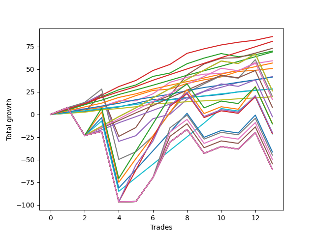

# Long Pointer 002 DB 
- Symbol: ES
- Date Range: 03/18/2022 - 07/15/2022
- Trading Period: 7:20-12:30
- Number of Trades: 13



| Name | Win Percent | Profit | Avg Profit / Trade | Avg Time / Trade |      | Name | Win Percent | Profit | Avg Profit / Trade | Avg Time / Trade |
| ---- | ----------- | ------ | ------------------ | ---------------- | ---- | ---- | ----------- | ------ | ------------------ | ---------------- |
| Sorted By <br> Profit | | | | | | Sorted By <br> Win Percentage ||||
| Three | 100.00 | 43000.00 | 3307.69 | 09:34 |     | Three | 100.00 | 43000.00 | 3307.69 | 09:34 |
| Eighty-Six | 100.00 | 40375.00 | 3105.77 | 12:20 |     | Eighty-Six | 100.00 | 40375.00 | 3105.77 | 12:20 |
| Five | 84.62 | 36500.00 | 2807.69 | 48:28 |     | Eighty-Five | 100.00 | 34500.00 | 2653.85 | 10:02 |
| Two | 92.31 | 35000.00 | 2692.31 | 15:35 |     | Six | 100.00 | 29625.00 | 2278.85 | 11:08 |
| Eighty-Five | 100.00 | 34500.00 | 2653.85 | 10:02 |     | Eighty-Four | 100.00 | 28375.00 | 2182.69 | 07:35 |
| Six | 100.00 | 29625.00 | 2278.85 | 11:08 |     | One | 100.00 | 25375.00 | 1951.92 | 07:25 |
| Eighty-Four | 100.00 | 28375.00 | 2182.69 | 07:35 |     | Eighty-Three | 100.00 | 20625.00 | 1586.54 | 05:03 |
| One | 100.00 | 25375.00 | 1951.92 | 07:25 |     | Eighty-Two | 100.00 | 14125.00 | 1086.54 | 01:54 |
| Four | 92.31 | 20875.00 | 1605.77 | 29:46 |     | Zero | 100.00 | 14000.00 | 1076.92 | 03:32 |
| Eighty-Three | 100.00 | 20625.00 | 1586.54 | 05:03 |     | Eighty-One | 100.00 | 9750.00 | 750.00 | 01:13 |
| Eighty-Two | 100.00 | 14125.00 | 1086.54 | 01:54 |     | Two | 92.31 | 35000.00 | 2692.31 | 15:35 |
| Zero | 100.00 | 14000.00 | 1076.92 | 03:32 |     | Four | 92.31 | 20875.00 | 1605.77 | 29:46 |
| Two Hundred One | 76.92 | 13000.00 | 1000.00 | 61:23 |     | Five | 84.62 | 36500.00 | 2807.69 | 48:28 |
| Ninety | 76.92 | 13000.00 | 1000.00 | 61:23 |     | Two Hundred One | 76.92 | 13000.00 | 1000.00 | 61:23 |
| Seven | 76.92 | 9875.00 | 759.62 | 64:20 |     | Ninety | 76.92 | 13000.00 | 1000.00 | 61:23 |
| Eighty-One | 100.00 | 9750.00 | 750.00 | 01:13 |     | Seven | 76.92 | 9875.00 | 759.62 | 64:20 |
| Eighty-Nine | 76.92 | 8250.00 | 634.62 | 60:45 |     | Eighty-Nine | 76.92 | 8250.00 | 634.62 | 60:45 |
| Eighty-Eight | 76.92 | 3875.00 | 298.08 | 57:48 |     | Eighty-Eight | 76.92 | 3875.00 | 298.08 | 57:48 |
| Eighty-Seven | 76.92 | -1250.00 | -96.15 | 53:05 |     | Eighty-Seven | 76.92 | -1250.00 | -96.15 | 53:05 |
| Two Hundred Two.Five | 61.54 | -5000.00 | -384.62 | 115:28 |     | Two Hundred One.Five | 69.23 | -10750.00 | -826.92 | 82:22 |
| Two Hundred Three | 61.54 | -5250.00 | -403.85 | 126:38 |     | Two Hundred Two.Five | 61.54 | -5000.00 | -384.62 | 115:28 |
| Two Hundred Four | 61.54 | -10000.00 | -769.23 | 147:59 |     | Two Hundred Three | 61.54 | -5250.00 | -403.85 | 126:38 |
| Two Hundred Three.Five | 61.54 | -10625.00 | -817.31 | 142:51 |     | Two Hundred Four | 61.54 | -10000.00 | -769.23 | 147:59 |
| Two Hundred One.Five | 69.23 | -10750.00 | -826.92 | 82:22 |     | Two Hundred Three.Five | 61.54 | -10625.00 | -817.31 | 142:51 |
| Two Hundred Two | 61.54 | -20750.00 | -1596.15 | 109:44 |     | Two Hundred Two | 61.54 | -20750.00 | -1596.15 | 109:44 |
| Two Hundred Five.Five | 61.54 | -22500.00 | -1730.77 | 154:45 |     | Two Hundred Five.Five | 61.54 | -22500.00 | -1730.77 | 154:45 |
| Two Hundred Five | 61.54 | -24875.00 | -1913.46 | 154:17 |     | Two Hundred Five | 61.54 | -24875.00 | -1913.46 | 154:17 |
| Two Hundred Four.Five | 61.54 | -27250.00 | -2096.15 | 154:11 |     | Two Hundred Four.Five | 61.54 | -27250.00 | -2096.15 | 154:11 |
| Two Hundred Fifteen | 61.54 | -30375.00 | -2336.54 | 157:37 |     | Two Hundred Fifteen | 61.54 | -30375.00 | -2336.54 | 157:37 |
| Two Hundred Fourteen.Five | 61.54 | -30375.00 | -2336.54 | 157:37 |     | Two Hundred Fourteen.Five | 61.54 | -30375.00 | -2336.54 | 157:37 |
| Two Hundred Fourteen | 61.54 | -30375.00 | -2336.54 | 157:37 |     | Two Hundred Fourteen | 61.54 | -30375.00 | -2336.54 | 157:37 |
| Two Hundred Thirteen.Five | 61.54 | -30375.00 | -2336.54 | 157:37 |     | Two Hundred Thirteen.Five | 61.54 | -30375.00 | -2336.54 | 157:37 |
| Two Hundred Thirteen | 61.54 | -30375.00 | -2336.54 | 157:37 |     | Two Hundred Thirteen | 61.54 | -30375.00 | -2336.54 | 157:37 |
| Two Hundred Twelve.Five | 61.54 | -30375.00 | -2336.54 | 157:37 |     | Two Hundred Twelve.Five | 61.54 | -30375.00 | -2336.54 | 157:37 |
| Two Hundred Twelve | 61.54 | -30375.00 | -2336.54 | 157:37 |     | Two Hundred Twelve | 61.54 | -30375.00 | -2336.54 | 157:37 |
| Two Hundred Eleven.Five | 61.54 | -30375.00 | -2336.54 | 157:37 |     | Two Hundred Eleven.Five | 61.54 | -30375.00 | -2336.54 | 157:37 |
| Two Hundred Eleven | 61.54 | -30375.00 | -2336.54 | 157:37 |     | Two Hundred Eleven | 61.54 | -30375.00 | -2336.54 | 157:37 |
| Two Hundred Ten.Five | 61.54 | -30375.00 | -2336.54 | 157:37 |     | Two Hundred Ten.Five | 61.54 | -30375.00 | -2336.54 | 157:37 |
| Two Hundred Ten | 61.54 | -30375.00 | -2336.54 | 157:37 |     | Two Hundred Ten | 61.54 | -30375.00 | -2336.54 | 157:37 |
| Two Hundred Nine.Five | 61.54 | -30375.00 | -2336.54 | 157:37 |     | Two Hundred Nine.Five | 61.54 | -30375.00 | -2336.54 | 157:37 |
| Two Hundred Nine | 61.54 | -30375.00 | -2336.54 | 157:37 |     | Two Hundred Nine | 61.54 | -30375.00 | -2336.54 | 157:37 |
| Two Hundred Eight.Five | 61.54 | -30375.00 | -2336.54 | 157:37 |     | Two Hundred Eight.Five | 61.54 | -30375.00 | -2336.54 | 157:37 |
| Two Hundred Eight | 61.54 | -30375.00 | -2336.54 | 157:37 |     | Two Hundred Eight | 61.54 | -30375.00 | -2336.54 | 157:37 |
| Two Hundred Seven.Five | 61.54 | -30375.00 | -2336.54 | 157:37 |     | Two Hundred Seven.Five | 61.54 | -30375.00 | -2336.54 | 157:37 |
| Two Hundred Seven | 61.54 | -30375.00 | -2336.54 | 157:37 |     | Two Hundred Seven | 61.54 | -30375.00 | -2336.54 | 157:37 |
| Two Hundred Six.Five | 61.54 | -30375.00 | -2336.54 | 157:37 |     | Two Hundred Six.Five | 61.54 | -30375.00 | -2336.54 | 157:37 |
| Two Hundred Six | 61.54 | -30375.00 | -2336.54 | 157:37 |     | Two Hundred Six | 61.54 | -30375.00 | -2336.54 | 157:37 |

## NO STOPLOSS

### Test Zero
* Sell when price hits the middle line of the 20p bollinger
* No Stoploss
* Results:
```
Total Trades: 13
Percent Up: 100.00
Percent Down: 0.00
Total Points Moved Up: 28.00
Potential Profit: 14000.00
Total Points Ups: 28.00 Count Ups: 13
Total Points Downs: 0.00 Count Downs: 0
```

<details><summary>Trades</summary>

<code>In: 2022-03-25 12:31:00		Out: 2022-03-25 12:37:10		Total Position Time: 06:10		Total Move Up: 1.25		Total to Date: 1.25</code> <br />
<code>In: 2022-03-31 08:37:00		Out: 2022-03-31 08:38:15		Total Position Time: 01:15		Total Move Up: 2.00		Total to Date: 3.25</code> <br />
<code>In: 2022-05-06 09:03:00		Out: 2022-05-06 09:03:15		Total Position Time: 00:15		Total Move Up: 2.50		Total to Date: 5.75</code> <br />
<code>In: 2022-05-11 09:14:00		Out: 2022-05-11 09:21:05		Total Position Time: 07:05		Total Move Up: 2.50		Total to Date: 8.25</code> <br />
<code>In: 2022-05-16 09:47:00		Out: 2022-05-16 09:48:15		Total Position Time: 01:15		Total Move Up: 4.00		Total to Date: 12.25</code> <br />
<code>In: 2022-05-17 11:25:00		Out: 2022-05-17 11:31:30		Total Position Time: 06:30		Total Move Up: 4.25		Total to Date: 16.50</code> <br />
<code>In: 2022-05-25 09:30:00		Out: 2022-05-25 09:41:25		Total Position Time: 11:25		Total Move Up: 0.00		Total to Date: 16.50</code> <br />
<code>In: 2022-05-31 12:05:00		Out: 2022-05-31 12:07:20		Total Position Time: 02:20		Total Move Up: 2.25		Total to Date: 18.75</code> <br />
<code>In: 2022-06-08 08:06:00		Out: 2022-06-08 08:10:40		Total Position Time: 04:40		Total Move Up: 1.50		Total to Date: 20.25</code> <br />
<code>In: 2022-06-21 11:06:00		Out: 2022-06-21 11:07:50		Total Position Time: 01:50		Total Move Up: 1.75		Total to Date: 22.00</code> <br />
<code>In: 2022-06-27 10:10:00		Out: 2022-06-27 10:11:25		Total Position Time: 01:25		Total Move Up: 3.00		Total to Date: 25.00</code> <br />
<code>In: 2022-07-08 09:48:00		Out: 2022-07-08 09:49:00		Total Position Time: 01:00		Total Move Up: 1.75		Total to Date: 26.75</code> <br />
<code>In: 2022-07-12 10:28:00		Out: 2022-07-12 10:28:50		Total Position Time: 00:50		Total Move Up: 1.25		Total to Date: 28.00</code> <br />


</details>

### Test One
* Sell when the price hits the upper line of the 20p 1std bollinger
* No Stoploss
* Results:
```
Total Trades: 13
Percent Up: 100.00
Percent Down: 0.00
Total Points Moved Up: 50.75
Potential Profit: 25375.00
Total Points Ups: 50.75 Count Ups: 13
Total Points Downs: 0.00 Count Downs: 0
```

<details><summary>Trades</summary>

<code>In: 2022-03-25 12:31:00		Out: 2022-03-25 12:40:50		Total Position Time: 09:50		Total Move Up: 2.00		Total to Date: 2.00</code> <br />
<code>In: 2022-03-31 08:37:00		Out: 2022-03-31 08:40:35		Total Position Time: 03:35		Total Move Up: 3.25		Total to Date: 5.25</code> <br />
<code>In: 2022-05-06 09:03:00		Out: 2022-05-06 09:03:15		Total Position Time: 00:15		Total Move Up: 2.50		Total to Date: 7.75</code> <br />
<code>In: 2022-05-11 09:14:00		Out: 2022-05-11 09:23:15		Total Position Time: 09:15		Total Move Up: 6.25		Total to Date: 14.00</code> <br />
<code>In: 2022-05-16 09:47:00		Out: 2022-05-16 09:50:05		Total Position Time: 03:05		Total Move Up: 6.75		Total to Date: 20.75</code> <br />
<code>In: 2022-05-17 11:25:00		Out: 2022-05-17 11:37:35		Total Position Time: 12:35		Total Move Up: 5.75		Total to Date: 26.50</code> <br />
<code>In: 2022-05-25 09:30:00		Out: 2022-05-25 09:44:25		Total Position Time: 14:25		Total Move Up: 1.50		Total to Date: 28.00</code> <br />
<code>In: 2022-05-31 12:05:00		Out: 2022-05-31 12:09:20		Total Position Time: 04:20		Total Move Up: 6.25		Total to Date: 34.25</code> <br />
<code>In: 2022-06-08 08:06:00		Out: 2022-06-08 08:11:15		Total Position Time: 05:15		Total Move Up: 4.00		Total to Date: 38.25</code> <br />
<code>In: 2022-06-21 11:06:00		Out: 2022-06-21 11:10:05		Total Position Time: 04:05		Total Move Up: 3.25		Total to Date: 41.50</code> <br />
<code>In: 2022-06-27 10:10:00		Out: 2022-06-27 10:15:55		Total Position Time: 05:55		Total Move Up: 6.00		Total to Date: 47.50</code> <br />
<code>In: 2022-07-08 09:48:00		Out: 2022-07-08 10:09:40		Total Position Time: 21:40		Total Move Up: 1.25		Total to Date: 48.75</code> <br />
<code>In: 2022-07-12 10:28:00		Out: 2022-07-12 10:30:15		Total Position Time: 02:15		Total Move Up: 2.00		Total to Date: 50.75</code> <br />


</details>

### Test Two
* Sell when the price hits the upper line of the 20p 2std bollinger
* No Stoploss
* Results:
```
Total Trades: 13
Percent Up: 92.31
Percent Down: 7.69
Total Points Moved Up: 70.00
Potential Profit: 35000.00
Total Points Ups: 73.50 Count Ups: 12
Total Points Downs: -3.50 Count Downs: 1
```

<details><summary>Trades</summary>

<code>In: 2022-03-25 12:31:00		Out: 2022-03-25 12:41:55		Total Position Time: 10:55		Total Move Up: 5.00		Total to Date: 5.00</code> <br />
<code>In: 2022-03-31 08:37:00		Out: 2022-03-31 08:41:10		Total Position Time: 04:10		Total Move Up: 5.75		Total to Date: 10.75</code> <br />
<code>In: 2022-05-06 09:03:00		Out: 2022-05-06 09:06:00		Total Position Time: 03:00		Total Move Up: 8.75		Total to Date: 19.50</code> <br />
<code>In: 2022-05-11 09:14:00		Out: 2022-05-11 09:23:40		Total Position Time: 09:40		Total Move Up: 7.75		Total to Date: 27.25</code> <br />
<code>In: 2022-05-16 09:47:00		Out: 2022-05-16 10:07:00		Total Position Time: 20:00		Total Move Up: 5.25		Total to Date: 32.50</code> <br />
<code>In: 2022-05-17 11:25:00		Out: 2022-05-17 11:40:00		Total Position Time: 15:00		Total Move Up: 9.50		Total to Date: 42.00</code> <br />
<code>In: 2022-05-25 09:30:00		Out: 2022-05-25 09:45:20		Total Position Time: 15:20		Total Move Up: 3.75		Total to Date: 45.75</code> <br />
<code>In: 2022-05-31 12:05:00		Out: 2022-05-31 12:15:05		Total Position Time: 10:05		Total Move Up: 10.25		Total to Date: 56.00</code> <br />
<code>In: 2022-06-08 08:06:00		Out: 2022-06-08 08:14:00		Total Position Time: 08:00		Total Move Up: 6.25		Total to Date: 62.25</code> <br />
<code>In: 2022-06-21 11:06:00		Out: 2022-06-21 11:11:00		Total Position Time: 05:00		Total Move Up: 5.00		Total to Date: 67.25</code> <br />
<code>In: 2022-06-27 10:10:00		Out: 2022-06-27 11:14:45		Total Position Time: 64:45		Total Move Up: -3.50		Total to Date: 63.75</code> <br />
<code>In: 2022-07-08 09:48:00		Out: 2022-07-08 10:11:05		Total Position Time: 23:05		Total Move Up: 2.25		Total to Date: 66.00</code> <br />
<code>In: 2022-07-12 10:28:00		Out: 2022-07-12 10:41:40		Total Position Time: 13:40		Total Move Up: 4.00		Total to Date: 70.00</code> <br />


</details>

### Test Three
* Sell when price hits the middle line of the 50p bollinger
* No Stoploss
* Results:
```
Total Trades: 13
Percent Up: 100.00
Percent Down: 0.00
Total Points Moved Up: 86.00
Potential Profit: 43000.00
Total Points Ups: 86.00 Count Ups: 13
Total Points Downs: 0.00 Count Downs: 0
```

<details><summary>Trades</summary>

<code>In: 2022-03-25 12:31:00		Out: 2022-03-25 12:42:40		Total Position Time: 11:40		Total Move Up: 6.75		Total to Date: 6.75</code> <br />
<code>In: 2022-03-31 08:37:00		Out: 2022-03-31 08:41:05		Total Position Time: 04:05		Total Move Up: 4.25		Total to Date: 11.00</code> <br />
<code>In: 2022-05-06 09:03:00		Out: 2022-05-06 09:06:05		Total Position Time: 03:05		Total Move Up: 10.25		Total to Date: 21.25</code> <br />
<code>In: 2022-05-11 09:14:00		Out: 2022-05-11 09:24:05		Total Position Time: 10:05		Total Move Up: 9.50		Total to Date: 30.75</code> <br />
<code>In: 2022-05-16 09:47:00		Out: 2022-05-16 09:50:05		Total Position Time: 03:05		Total Move Up: 6.75		Total to Date: 37.50</code> <br />
<code>In: 2022-05-17 11:25:00		Out: 2022-05-17 11:40:05		Total Position Time: 15:05		Total Move Up: 11.00		Total to Date: 48.50</code> <br />
<code>In: 2022-05-25 09:30:00		Out: 2022-05-25 09:49:10		Total Position Time: 19:10		Total Move Up: 6.75		Total to Date: 55.25</code> <br />
<code>In: 2022-05-31 12:05:00		Out: 2022-05-31 12:15:15		Total Position Time: 10:15		Total Move Up: 12.25		Total to Date: 67.50</code> <br />
<code>In: 2022-06-08 08:06:00		Out: 2022-06-08 08:11:20		Total Position Time: 05:20		Total Move Up: 5.00		Total to Date: 72.50</code> <br />
<code>In: 2022-06-21 11:06:00		Out: 2022-06-21 11:10:20		Total Position Time: 04:20		Total Move Up: 4.25		Total to Date: 76.75</code> <br />
<code>In: 2022-06-27 10:10:00		Out: 2022-06-27 10:11:25		Total Position Time: 01:25		Total Move Up: 3.00		Total to Date: 79.75</code> <br />
<code>In: 2022-07-08 09:48:00		Out: 2022-07-08 10:11:10		Total Position Time: 23:10		Total Move Up: 2.25		Total to Date: 82.00</code> <br />
<code>In: 2022-07-12 10:28:00		Out: 2022-07-12 10:41:40		Total Position Time: 13:40		Total Move Up: 4.00		Total to Date: 86.00</code> <br />


</details>

### Test Four
* Sell when the price hits the upper line of the 50p 1std bollinger
* No Stoploss
* Results:
```
Total Trades: 13
Percent Up: 92.31
Percent Down: 7.69
Total Points Moved Up: 41.75
Potential Profit: 20875.00
Total Points Ups: 93.75 Count Ups: 12
Total Points Downs: -52.00 Count Downs: 1
```

<details><summary>Trades</summary>

<code>In: 2022-03-25 12:31:00		Out: 2022-03-25 12:46:05		Total Position Time: 15:05		Total Move Up: 7.50		Total to Date: 7.50</code> <br />
<code>In: 2022-03-31 08:37:00		Out: 2022-03-31 09:00:40		Total Position Time: 23:40		Total Move Up: 5.00		Total to Date: 12.50</code> <br />
<code>In: 2022-05-06 09:03:00		Out: 2022-05-06 09:23:00		Total Position Time: 20:00		Total Move Up: 9.75		Total to Date: 22.25</code> <br />
<code>In: 2022-05-11 09:14:00		Out: 2022-05-11 11:18:15		Total Position Time: 124:15		Total Move Up: -52.00		Total to Date: -29.75</code> <br />
<code>In: 2022-05-16 09:47:00		Out: 2022-05-16 10:07:25		Total Position Time: 20:25		Total Move Up: 6.25		Total to Date: -23.50</code> <br />
<code>In: 2022-05-17 11:25:00		Out: 2022-05-17 11:45:45		Total Position Time: 20:45		Total Move Up: 18.75		Total to Date: -4.75</code> <br />
<code>In: 2022-05-25 09:30:00		Out: 2022-05-25 10:10:05		Total Position Time: 40:05		Total Move Up: 5.00		Total to Date: 0.25</code> <br />
<code>In: 2022-05-31 12:05:00		Out: 2022-05-31 12:28:20		Total Position Time: 23:20		Total Move Up: 16.50		Total to Date: 16.75</code> <br />
<code>In: 2022-06-08 08:06:00		Out: 2022-06-08 08:15:05		Total Position Time: 09:05		Total Move Up: 8.50		Total to Date: 25.25</code> <br />
<code>In: 2022-06-21 11:06:00		Out: 2022-06-21 11:29:15		Total Position Time: 23:15		Total Move Up: 4.75		Total to Date: 30.00</code> <br />
<code>In: 2022-06-27 10:10:00		Out: 2022-06-27 10:14:20		Total Position Time: 04:20		Total Move Up: 5.25		Total to Date: 35.25</code> <br />
<code>In: 2022-07-08 09:48:00		Out: 2022-07-08 10:26:30		Total Position Time: 38:30		Total Move Up: 2.75		Total to Date: 38.00</code> <br />
<code>In: 2022-07-12 10:28:00		Out: 2022-07-12 10:52:25		Total Position Time: 24:25		Total Move Up: 3.75		Total to Date: 41.75</code> <br />


</details>

### Test Five
* Sell when the price hits the upper line of the 50p 2std bollinger
* No Stoploss
* Results:
```
Total Trades: 13
Percent Up: 84.62
Percent Down: 15.38
Total Points Moved Up: 73.00
Potential Profit: 36500.00
Total Points Ups: 124.50 Count Ups: 11
Total Points Downs: -51.50 Count Downs: 2
```

<details><summary>Trades</summary>

<code>In: 2022-03-25 12:31:00		Out: 2022-03-25 12:46:05		Total Position Time: 15:05		Total Move Up: 7.50		Total to Date: 7.50</code> <br />
<code>In: 2022-03-31 08:37:00		Out: 2022-03-31 10:46:00		Total Position Time: 129:00		Total Move Up: -4.75		Total to Date: 2.75</code> <br />
<code>In: 2022-05-06 09:03:00		Out: 2022-05-06 09:36:15		Total Position Time: 33:15		Total Move Up: 19.75		Total to Date: 22.50</code> <br />
<code>In: 2022-05-11 09:14:00		Out: 2022-05-11 11:23:40		Total Position Time: 129:40		Total Move Up: -46.75		Total to Date: -24.25</code> <br />
<code>In: 2022-05-16 09:47:00		Out: 2022-05-16 10:11:25		Total Position Time: 24:25		Total Move Up: 9.75		Total to Date: -14.50</code> <br />
<code>In: 2022-05-17 11:25:00		Out: 2022-05-17 11:48:45		Total Position Time: 23:45		Total Move Up: 27.75		Total to Date: 13.25</code> <br />
<code>In: 2022-05-25 09:30:00		Out: 2022-05-25 10:29:35		Total Position Time: 59:35		Total Move Up: 7.75		Total to Date: 21.00</code> <br />
<code>In: 2022-05-31 12:05:00		Out: 2022-05-31 12:31:05		Total Position Time: 26:05		Total Move Up: 22.75		Total to Date: 43.75</code> <br />
<code>In: 2022-06-08 08:06:00		Out: 2022-06-08 08:17:35		Total Position Time: 11:35		Total Move Up: 12.00		Total to Date: 55.75</code> <br />
<code>In: 2022-06-21 11:06:00		Out: 2022-06-21 11:30:15		Total Position Time: 24:15		Total Move Up: 6.25		Total to Date: 62.00</code> <br />
<code>In: 2022-06-27 10:10:00		Out: 2022-06-27 11:38:15		Total Position Time: 88:15		Total Move Up: 0.75		Total to Date: 62.75</code> <br />
<code>In: 2022-07-08 09:48:00		Out: 2022-07-08 10:27:00		Total Position Time: 39:00		Total Move Up: 5.00		Total to Date: 67.75</code> <br />
<code>In: 2022-07-12 10:28:00		Out: 2022-07-12 10:54:15		Total Position Time: 26:15		Total Move Up: 5.25		Total to Date: 73.00</code> <br />


</details>

### Test Six
* Sell when the price hits the middle line of the 1std VWAP
* No Stoploss
* Results:
```
Total Trades: 13
Percent Up: 100.00
Percent Down: 0.00
Total Points Moved Up: 59.25
Potential Profit: 29625.00
Total Points Ups: 59.25 Count Ups: 13
Total Points Downs: 0.00 Count Downs: 0
```

<details><summary>Trades</summary>

<code>In: 2022-03-25 12:31:00		Out: 2022-03-25 12:41:55		Total Position Time: 10:55		Total Move Up: 5.00		Total to Date: 5.00</code> <br />
<code>In: 2022-03-31 08:37:00		Out: 2022-03-31 08:37:40		Total Position Time: 00:40		Total Move Up: 1.25		Total to Date: 6.25</code> <br />
<code>In: 2022-05-06 09:03:00		Out: 2022-05-06 09:03:15		Total Position Time: 00:15		Total Move Up: 2.50		Total to Date: 8.75</code> <br />
<code>In: 2022-05-11 09:14:00		Out: 2022-05-11 09:23:15		Total Position Time: 09:15		Total Move Up: 6.25		Total to Date: 15.00</code> <br />
<code>In: 2022-05-16 09:47:00		Out: 2022-05-16 09:47:15		Total Position Time: 00:15		Total Move Up: 0.00		Total to Date: 15.00</code> <br />
<code>In: 2022-05-17 11:25:00		Out: 2022-05-17 11:27:25		Total Position Time: 02:25		Total Move Up: 7.75		Total to Date: 22.75</code> <br />
<code>In: 2022-05-25 09:30:00		Out: 2022-05-25 10:37:05		Total Position Time: 67:05		Total Move Up: 12.75		Total to Date: 35.50</code> <br />
<code>In: 2022-05-31 12:05:00		Out: 2022-05-31 12:07:55		Total Position Time: 02:55		Total Move Up: 5.50		Total to Date: 41.00</code> <br />
<code>In: 2022-06-08 08:06:00		Out: 2022-06-08 08:11:05		Total Position Time: 05:05		Total Move Up: 3.50		Total to Date: 44.50</code> <br />
<code>In: 2022-06-21 11:06:00		Out: 2022-06-21 11:06:15		Total Position Time: 00:15		Total Move Up: 0.75		Total to Date: 45.25</code> <br />
<code>In: 2022-06-27 10:10:00		Out: 2022-06-27 10:11:25		Total Position Time: 01:25		Total Move Up: 3.00		Total to Date: 48.25</code> <br />
<code>In: 2022-07-08 09:48:00		Out: 2022-07-08 10:29:10		Total Position Time: 41:10		Total Move Up: 8.00		Total to Date: 56.25</code> <br />
<code>In: 2022-07-12 10:28:00		Out: 2022-07-12 10:31:15		Total Position Time: 03:15		Total Move Up: 3.00		Total to Date: 59.25</code> <br />


</details>

### Test Seven
* Sell when the price hits the upper line of the 1std VWAP
* No Stoploss
* Results:
```
Total Trades: 13
Percent Up: 76.92
Percent Down: 23.08
Total Points Moved Up: 19.75
Potential Profit: 9875.00
Total Points Ups: 141.00 Count Ups: 10
Total Points Downs: -121.25 Count Downs: 3
```

<details><summary>Trades</summary>

<code>In: 2022-03-25 12:31:00		Out: 2022-03-25 12:46:05		Total Position Time: 15:05		Total Move Up: 7.50		Total to Date: 7.50</code> <br />
<code>In: 2022-03-31 08:37:00		Out: 2022-03-31 08:41:10		Total Position Time: 04:10		Total Move Up: 5.75		Total to Date: 13.25</code> <br />
<code>In: 2022-05-06 09:03:00		Out: 2022-05-06 09:06:45		Total Position Time: 03:45		Total Move Up: 14.75		Total to Date: 28.00</code> <br />
<code>In: 2022-05-11 09:14:00		Out: 2022-05-11 12:46:05		Total Position Time: 212:05		Total Move Up: -77.75		Total to Date: -49.75</code> <br />
<code>In: 2022-05-16 09:47:00		Out: 2022-05-16 10:07:35		Total Position Time: 20:35		Total Move Up: 8.50		Total to Date: -41.25</code> <br />
<code>In: 2022-05-17 11:25:00		Out: 2022-05-17 11:40:20		Total Position Time: 15:20		Total Move Up: 17.25		Total to Date: -24.00</code> <br />
<code>In: 2022-05-25 09:30:00		Out: 2022-05-25 11:02:25		Total Position Time: 92:25		Total Move Up: 26.00		Total to Date: 2.00</code> <br />
<code>In: 2022-05-31 12:05:00		Out: 2022-05-31 12:31:00		Total Position Time: 26:00		Total Move Up: 22.00		Total to Date: 24.00</code> <br />
<code>In: 2022-06-08 08:06:00		Out: 2022-06-08 08:16:30		Total Position Time: 10:30		Total Move Up: 9.75		Total to Date: 33.75</code> <br />
<code>In: 2022-06-21 11:06:00		Out: 2022-06-21 11:52:25		Total Position Time: 46:25		Total Move Up: 9.00		Total to Date: 42.75</code> <br />
<code>In: 2022-06-27 10:10:00		Out: 2022-06-27 12:46:05		Total Position Time: 156:05		Total Move Up: -2.75		Total to Date: 40.00</code> <br />
<code>In: 2022-07-08 09:48:00		Out: 2022-07-08 11:24:00		Total Position Time: 96:00		Total Move Up: 20.50		Total to Date: 60.50</code> <br />
<code>In: 2022-07-12 10:28:00		Out: 2022-07-12 12:46:05		Total Position Time: 138:05		Total Move Up: -40.75		Total to Date: 19.75</code> <br />


</details>

## TAKE PROFIT

### Test Eighty-One
* Take Profit of 1 Point
* No Stoploss
* Results:
```
Total Trades: 13
Percent Up: 100.00
Percent Down: 0.00
Total Points Moved Up: 19.50
Potential Profit: 9750.00
Total Points Ups: 19.50 Count Ups: 13
Total Points Downs: 0.00 Count Downs: 0
```

<details><summary>Trades</summary>

<code>In: 2022-03-25 12:31:00		Out: 2022-03-25 12:37:10		Total Position Time: 06:10		Total Move Up: 1.25		Total to Date: 1.25</code> <br />
<code>In: 2022-03-31 08:37:00		Out: 2022-03-31 08:37:40		Total Position Time: 00:40		Total Move Up: 1.25		Total to Date: 2.50</code> <br />
<code>In: 2022-05-06 09:03:00		Out: 2022-05-06 09:03:15		Total Position Time: 00:15		Total Move Up: 2.50		Total to Date: 5.00</code> <br />
<code>In: 2022-05-11 09:14:00		Out: 2022-05-11 09:14:25		Total Position Time: 00:25		Total Move Up: 1.50		Total to Date: 6.50</code> <br />
<code>In: 2022-05-16 09:47:00		Out: 2022-05-16 09:47:50		Total Position Time: 00:50		Total Move Up: 2.00		Total to Date: 8.50</code> <br />
<code>In: 2022-05-17 11:25:00		Out: 2022-05-17 11:26:40		Total Position Time: 01:40		Total Move Up: 3.00		Total to Date: 11.50</code> <br />
<code>In: 2022-05-25 09:30:00		Out: 2022-05-25 09:30:15		Total Position Time: 00:15		Total Move Up: 1.25		Total to Date: 12.75</code> <br />
<code>In: 2022-05-31 12:05:00		Out: 2022-05-31 12:07:05		Total Position Time: 02:05		Total Move Up: 1.25		Total to Date: 14.00</code> <br />
<code>In: 2022-06-08 08:06:00		Out: 2022-06-08 08:06:15		Total Position Time: 00:15		Total Move Up: 1.00		Total to Date: 15.00</code> <br />
<code>In: 2022-06-21 11:06:00		Out: 2022-06-21 11:07:45		Total Position Time: 01:45		Total Move Up: 1.00		Total to Date: 16.00</code> <br />
<code>In: 2022-06-27 10:10:00		Out: 2022-06-27 10:10:25		Total Position Time: 00:25		Total Move Up: 1.25		Total to Date: 17.25</code> <br />
<code>In: 2022-07-08 09:48:00		Out: 2022-07-08 09:48:20		Total Position Time: 00:20		Total Move Up: 1.00		Total to Date: 18.25</code> <br />
<code>In: 2022-07-12 10:28:00		Out: 2022-07-12 10:28:50		Total Position Time: 00:50		Total Move Up: 1.25		Total to Date: 19.50</code> <br />


</details>

### Test Eighty-Two
* Take Profit of 2 Point
* No Stoploss
* Results:
```
Total Trades: 13
Percent Up: 100.00
Percent Down: 0.00
Total Points Moved Up: 28.25
Potential Profit: 14125.00
Total Points Ups: 28.25 Count Ups: 13
Total Points Downs: 0.00 Count Downs: 0
```

<details><summary>Trades</summary>

<code>In: 2022-03-25 12:31:00		Out: 2022-03-25 12:37:15		Total Position Time: 06:15		Total Move Up: 2.00		Total to Date: 2.00</code> <br />
<code>In: 2022-03-31 08:37:00		Out: 2022-03-31 08:38:15		Total Position Time: 01:15		Total Move Up: 2.00		Total to Date: 4.00</code> <br />
<code>In: 2022-05-06 09:03:00		Out: 2022-05-06 09:03:15		Total Position Time: 00:15		Total Move Up: 2.50		Total to Date: 6.50</code> <br />
<code>In: 2022-05-11 09:14:00		Out: 2022-05-11 09:14:30		Total Position Time: 00:30		Total Move Up: 2.25		Total to Date: 8.75</code> <br />
<code>In: 2022-05-16 09:47:00		Out: 2022-05-16 09:47:55		Total Position Time: 00:55		Total Move Up: 2.25		Total to Date: 11.00</code> <br />
<code>In: 2022-05-17 11:25:00		Out: 2022-05-17 11:26:40		Total Position Time: 01:40		Total Move Up: 3.00		Total to Date: 14.00</code> <br />
<code>In: 2022-05-25 09:30:00		Out: 2022-05-25 09:30:25		Total Position Time: 00:25		Total Move Up: 2.00		Total to Date: 16.00</code> <br />
<code>In: 2022-05-31 12:05:00		Out: 2022-05-31 12:07:20		Total Position Time: 02:20		Total Move Up: 2.25		Total to Date: 18.25</code> <br />
<code>In: 2022-06-08 08:06:00		Out: 2022-06-08 08:10:45		Total Position Time: 04:45		Total Move Up: 2.25		Total to Date: 20.50</code> <br />
<code>In: 2022-06-21 11:06:00		Out: 2022-06-21 11:08:15		Total Position Time: 02:15		Total Move Up: 2.25		Total to Date: 22.75</code> <br />
<code>In: 2022-06-27 10:10:00		Out: 2022-06-27 10:11:10		Total Position Time: 01:10		Total Move Up: 2.00		Total to Date: 24.75</code> <br />
<code>In: 2022-07-08 09:48:00		Out: 2022-07-08 09:49:00		Total Position Time: 01:00		Total Move Up: 1.75		Total to Date: 26.50</code> <br />
<code>In: 2022-07-12 10:28:00		Out: 2022-07-12 10:30:05		Total Position Time: 02:05		Total Move Up: 1.75		Total to Date: 28.25</code> <br />


</details>

### Test Eighty-Three
* Take Profit of 3 Point
* No Stoploss
* Results:
```
Total Trades: 13
Percent Up: 100.00
Percent Down: 0.00
Total Points Moved Up: 41.25
Potential Profit: 20625.00
Total Points Ups: 41.25 Count Ups: 13
Total Points Downs: 0.00 Count Downs: 0
```

<details><summary>Trades</summary>

<code>In: 2022-03-25 12:31:00		Out: 2022-03-25 12:41:20		Total Position Time: 10:20		Total Move Up: 2.75		Total to Date: 2.75</code> <br />
<code>In: 2022-03-31 08:37:00		Out: 2022-03-31 08:40:35		Total Position Time: 03:35		Total Move Up: 3.25		Total to Date: 6.00</code> <br />
<code>In: 2022-05-06 09:03:00		Out: 2022-05-06 09:03:40		Total Position Time: 00:40		Total Move Up: 3.25		Total to Date: 9.25</code> <br />
<code>In: 2022-05-11 09:14:00		Out: 2022-05-11 09:22:05		Total Position Time: 08:05		Total Move Up: 3.00		Total to Date: 12.25</code> <br />
<code>In: 2022-05-16 09:47:00		Out: 2022-05-16 09:48:15		Total Position Time: 01:15		Total Move Up: 4.00		Total to Date: 16.25</code> <br />
<code>In: 2022-05-17 11:25:00		Out: 2022-05-17 11:26:40		Total Position Time: 01:40		Total Move Up: 3.00		Total to Date: 19.25</code> <br />
<code>In: 2022-05-25 09:30:00		Out: 2022-05-25 09:31:45		Total Position Time: 01:45		Total Move Up: 3.00		Total to Date: 22.25</code> <br />
<code>In: 2022-05-31 12:05:00		Out: 2022-05-31 12:07:45		Total Position Time: 02:45		Total Move Up: 4.00		Total to Date: 26.25</code> <br />
<code>In: 2022-06-08 08:06:00		Out: 2022-06-08 08:11:05		Total Position Time: 05:05		Total Move Up: 3.50		Total to Date: 29.75</code> <br />
<code>In: 2022-06-21 11:06:00		Out: 2022-06-21 11:08:30		Total Position Time: 02:30		Total Move Up: 2.75		Total to Date: 32.50</code> <br />
<code>In: 2022-06-27 10:10:00		Out: 2022-06-27 10:11:25		Total Position Time: 01:25		Total Move Up: 3.00		Total to Date: 35.50</code> <br />
<code>In: 2022-07-08 09:48:00		Out: 2022-07-08 10:11:20		Total Position Time: 23:20		Total Move Up: 2.75		Total to Date: 38.25</code> <br />
<code>In: 2022-07-12 10:28:00		Out: 2022-07-12 10:31:15		Total Position Time: 03:15		Total Move Up: 3.00		Total to Date: 41.25</code> <br />


</details>

### Test Eighty-Four
* Take Profit of 4 Point
* No Stoploss
* Results:
```
Total Trades: 13
Percent Up: 100.00
Percent Down: 0.00
Total Points Moved Up: 56.75
Potential Profit: 28375.00
Total Points Ups: 56.75 Count Ups: 13
Total Points Downs: 0.00 Count Downs: 0
```

<details><summary>Trades</summary>

<code>In: 2022-03-25 12:31:00		Out: 2022-03-25 12:41:40		Total Position Time: 10:40		Total Move Up: 4.00		Total to Date: 4.00</code> <br />
<code>In: 2022-03-31 08:37:00		Out: 2022-03-31 08:41:05		Total Position Time: 04:05		Total Move Up: 4.25		Total to Date: 8.25</code> <br />
<code>In: 2022-05-06 09:03:00		Out: 2022-05-06 09:03:45		Total Position Time: 00:45		Total Move Up: 4.25		Total to Date: 12.50</code> <br />
<code>In: 2022-05-11 09:14:00		Out: 2022-05-11 09:23:15		Total Position Time: 09:15		Total Move Up: 6.25		Total to Date: 18.75</code> <br />
<code>In: 2022-05-16 09:47:00		Out: 2022-05-16 09:48:15		Total Position Time: 01:15		Total Move Up: 4.00		Total to Date: 22.75</code> <br />
<code>In: 2022-05-17 11:25:00		Out: 2022-05-17 11:27:05		Total Position Time: 02:05		Total Move Up: 5.25		Total to Date: 28.00</code> <br />
<code>In: 2022-05-25 09:30:00		Out: 2022-05-25 09:48:10		Total Position Time: 18:10		Total Move Up: 4.25		Total to Date: 32.25</code> <br />
<code>In: 2022-05-31 12:05:00		Out: 2022-05-31 12:07:45		Total Position Time: 02:45		Total Move Up: 4.00		Total to Date: 36.25</code> <br />
<code>In: 2022-06-08 08:06:00		Out: 2022-06-08 08:11:15		Total Position Time: 05:15		Total Move Up: 4.00		Total to Date: 40.25</code> <br />
<code>In: 2022-06-21 11:06:00		Out: 2022-06-21 11:10:20		Total Position Time: 04:20		Total Move Up: 4.25		Total to Date: 44.50</code> <br />
<code>In: 2022-06-27 10:10:00		Out: 2022-06-27 10:12:00		Total Position Time: 02:00		Total Move Up: 4.25		Total to Date: 48.75</code> <br />
<code>In: 2022-07-08 09:48:00		Out: 2022-07-08 10:12:25		Total Position Time: 24:25		Total Move Up: 4.00		Total to Date: 52.75</code> <br />
<code>In: 2022-07-12 10:28:00		Out: 2022-07-12 10:41:40		Total Position Time: 13:40		Total Move Up: 4.00		Total to Date: 56.75</code> <br />


</details>

### Test Eighty-Five
* Take Profit of 5 Point
* No Stoploss
* Results:
```
Total Trades: 13
Percent Up: 100.00
Percent Down: 0.00
Total Points Moved Up: 69.00
Potential Profit: 34500.00
Total Points Ups: 69.00 Count Ups: 13
Total Points Downs: 0.00 Count Downs: 0
```

<details><summary>Trades</summary>

<code>In: 2022-03-25 12:31:00		Out: 2022-03-25 12:41:55		Total Position Time: 10:55		Total Move Up: 5.00		Total to Date: 5.00</code> <br />
<code>In: 2022-03-31 08:37:00		Out: 2022-03-31 08:41:10		Total Position Time: 04:10		Total Move Up: 5.75		Total to Date: 10.75</code> <br />
<code>In: 2022-05-06 09:03:00		Out: 2022-05-06 09:03:50		Total Position Time: 00:50		Total Move Up: 5.00		Total to Date: 15.75</code> <br />
<code>In: 2022-05-11 09:14:00		Out: 2022-05-11 09:23:15		Total Position Time: 09:15		Total Move Up: 6.25		Total to Date: 22.00</code> <br />
<code>In: 2022-05-16 09:47:00		Out: 2022-05-16 09:48:45		Total Position Time: 01:45		Total Move Up: 5.00		Total to Date: 27.00</code> <br />
<code>In: 2022-05-17 11:25:00		Out: 2022-05-17 11:27:05		Total Position Time: 02:05		Total Move Up: 5.25		Total to Date: 32.25</code> <br />
<code>In: 2022-05-25 09:30:00		Out: 2022-05-25 09:48:50		Total Position Time: 18:50		Total Move Up: 5.50		Total to Date: 37.75</code> <br />
<code>In: 2022-05-31 12:05:00		Out: 2022-05-31 12:07:55		Total Position Time: 02:55		Total Move Up: 5.50		Total to Date: 43.25</code> <br />
<code>In: 2022-06-08 08:06:00		Out: 2022-06-08 08:11:30		Total Position Time: 05:30		Total Move Up: 5.00		Total to Date: 48.25</code> <br />
<code>In: 2022-06-21 11:06:00		Out: 2022-06-21 11:11:00		Total Position Time: 05:00		Total Move Up: 5.00		Total to Date: 53.25</code> <br />
<code>In: 2022-06-27 10:10:00		Out: 2022-06-27 10:12:55		Total Position Time: 02:55		Total Move Up: 5.25		Total to Date: 58.50</code> <br />
<code>In: 2022-07-08 09:48:00		Out: 2022-07-08 10:28:05		Total Position Time: 40:05		Total Move Up: 5.25		Total to Date: 63.75</code> <br />
<code>In: 2022-07-12 10:28:00		Out: 2022-07-12 10:54:15		Total Position Time: 26:15		Total Move Up: 5.25		Total to Date: 69.00</code> <br />


</details>

### Test Eighty-Six
* Take Profit of 6 Point
* No Stoploss
* Results:
```
Total Trades: 13
Percent Up: 100.00
Percent Down: 0.00
Total Points Moved Up: 80.75
Potential Profit: 40375.00
Total Points Ups: 80.75 Count Ups: 13
Total Points Downs: 0.00 Count Downs: 0
```

<details><summary>Trades</summary>

<code>In: 2022-03-25 12:31:00		Out: 2022-03-25 12:42:10		Total Position Time: 11:10		Total Move Up: 6.00		Total to Date: 6.00</code> <br />
<code>In: 2022-03-31 08:37:00		Out: 2022-03-31 08:41:50		Total Position Time: 04:50		Total Move Up: 6.00		Total to Date: 12.00</code> <br />
<code>In: 2022-05-06 09:03:00		Out: 2022-05-06 09:03:55		Total Position Time: 00:55		Total Move Up: 6.75		Total to Date: 18.75</code> <br />
<code>In: 2022-05-11 09:14:00		Out: 2022-05-11 09:23:15		Total Position Time: 09:15		Total Move Up: 6.25		Total to Date: 25.00</code> <br />
<code>In: 2022-05-16 09:47:00		Out: 2022-05-16 09:50:00		Total Position Time: 03:00		Total Move Up: 5.75		Total to Date: 30.75</code> <br />
<code>In: 2022-05-17 11:25:00		Out: 2022-05-17 11:27:20		Total Position Time: 02:20		Total Move Up: 7.00		Total to Date: 37.75</code> <br />
<code>In: 2022-05-25 09:30:00		Out: 2022-05-25 09:49:05		Total Position Time: 19:05		Total Move Up: 6.25		Total to Date: 44.00</code> <br />
<code>In: 2022-05-31 12:05:00		Out: 2022-05-31 12:09:20		Total Position Time: 04:20		Total Move Up: 6.25		Total to Date: 50.25</code> <br />
<code>In: 2022-06-08 08:06:00		Out: 2022-06-08 08:14:00		Total Position Time: 08:00		Total Move Up: 6.25		Total to Date: 56.50</code> <br />
<code>In: 2022-06-21 11:06:00		Out: 2022-06-21 11:30:15		Total Position Time: 24:15		Total Move Up: 6.25		Total to Date: 62.75</code> <br />
<code>In: 2022-06-27 10:10:00		Out: 2022-06-27 10:15:55		Total Position Time: 05:55		Total Move Up: 6.00		Total to Date: 68.75</code> <br />
<code>In: 2022-07-08 09:48:00		Out: 2022-07-08 10:28:15		Total Position Time: 40:15		Total Move Up: 6.00		Total to Date: 74.75</code> <br />
<code>In: 2022-07-12 10:28:00		Out: 2022-07-12 10:55:00		Total Position Time: 27:00		Total Move Up: 6.00		Total to Date: 80.75</code> <br />


</details>

### Test Eighty-Seven
* Take Profit of 7 Point
* No Stoploss
* Results:
```
Total Trades: 13
Percent Up: 76.92
Percent Down: 23.08
Total Points Moved Up: -2.50
Potential Profit: -1250.00
Total Points Ups: 71.75 Count Ups: 10
Total Points Downs: -74.25 Count Downs: 3
```

<details><summary>Trades</summary>

<code>In: 2022-03-25 12:31:00		Out: 2022-03-25 12:42:55		Total Position Time: 11:55		Total Move Up: 7.00		Total to Date: 7.00</code> <br />
<code>In: 2022-03-31 08:37:00		Out: 2022-03-31 12:46:05		Total Position Time: 249:05		Total Move Up: -30.75		Total to Date: -23.75</code> <br />
<code>In: 2022-05-06 09:03:00		Out: 2022-05-06 09:03:55		Total Position Time: 00:55		Total Move Up: 6.75		Total to Date: -17.00</code> <br />
<code>In: 2022-05-11 09:14:00		Out: 2022-05-11 09:23:40		Total Position Time: 09:40		Total Move Up: 7.75		Total to Date: -9.25</code> <br />
<code>In: 2022-05-16 09:47:00		Out: 2022-05-16 09:50:05		Total Position Time: 03:05		Total Move Up: 6.75		Total to Date: -2.50</code> <br />
<code>In: 2022-05-17 11:25:00		Out: 2022-05-17 11:27:20		Total Position Time: 02:20		Total Move Up: 7.00		Total to Date: 4.50</code> <br />
<code>In: 2022-05-25 09:30:00		Out: 2022-05-25 09:49:25		Total Position Time: 19:25		Total Move Up: 7.00		Total to Date: 11.50</code> <br />
<code>In: 2022-05-31 12:05:00		Out: 2022-05-31 12:09:40		Total Position Time: 04:40		Total Move Up: 7.00		Total to Date: 18.50</code> <br />
<code>In: 2022-06-08 08:06:00		Out: 2022-06-08 08:14:35		Total Position Time: 08:35		Total Move Up: 7.25		Total to Date: 25.75</code> <br />
<code>In: 2022-06-21 11:06:00		Out: 2022-06-21 11:51:25		Total Position Time: 45:25		Total Move Up: 8.00		Total to Date: 33.75</code> <br />
<code>In: 2022-06-27 10:10:00		Out: 2022-06-27 12:46:05		Total Position Time: 156:05		Total Move Up: -2.75		Total to Date: 31.00</code> <br />
<code>In: 2022-07-08 09:48:00		Out: 2022-07-08 10:28:55		Total Position Time: 40:55		Total Move Up: 7.25		Total to Date: 38.25</code> <br />
<code>In: 2022-07-12 10:28:00		Out: 2022-07-12 12:46:05		Total Position Time: 138:05		Total Move Up: -40.75		Total to Date: -2.50</code> <br />


</details>

### Test Eighty-Eight
* Take Profit of 8 Point
* No Stoploss
* Results:
```
Total Trades: 13
Percent Up: 76.92
Percent Down: 23.08
Total Points Moved Up: 7.75
Potential Profit: 3875.00
Total Points Ups: 82.00 Count Ups: 10
Total Points Downs: -74.25 Count Downs: 3
```

<details><summary>Trades</summary>

<code>In: 2022-03-25 12:31:00		Out: 2022-03-25 12:43:25		Total Position Time: 12:25		Total Move Up: 7.75		Total to Date: 7.75</code> <br />
<code>In: 2022-03-31 08:37:00		Out: 2022-03-31 12:46:05		Total Position Time: 249:05		Total Move Up: -30.75		Total to Date: -23.00</code> <br />
<code>In: 2022-05-06 09:03:00		Out: 2022-05-06 09:05:30		Total Position Time: 02:30		Total Move Up: 8.00		Total to Date: -15.00</code> <br />
<code>In: 2022-05-11 09:14:00		Out: 2022-05-11 09:23:45		Total Position Time: 09:45		Total Move Up: 8.25		Total to Date: -6.75</code> <br />
<code>In: 2022-05-16 09:47:00		Out: 2022-05-16 10:07:35		Total Position Time: 20:35		Total Move Up: 8.50		Total to Date: 1.75</code> <br />
<code>In: 2022-05-17 11:25:00		Out: 2022-05-17 11:27:30		Total Position Time: 02:30		Total Move Up: 8.00		Total to Date: 9.75</code> <br />
<code>In: 2022-05-25 09:30:00		Out: 2022-05-25 10:29:45		Total Position Time: 59:45		Total Move Up: 8.75		Total to Date: 18.50</code> <br />
<code>In: 2022-05-31 12:05:00		Out: 2022-05-31 12:09:55		Total Position Time: 04:55		Total Move Up: 8.25		Total to Date: 26.75</code> <br />
<code>In: 2022-06-08 08:06:00		Out: 2022-06-08 08:15:05		Total Position Time: 09:05		Total Move Up: 8.50		Total to Date: 35.25</code> <br />
<code>In: 2022-06-21 11:06:00		Out: 2022-06-21 11:51:30		Total Position Time: 45:30		Total Move Up: 8.00		Total to Date: 43.25</code> <br />
<code>In: 2022-06-27 10:10:00		Out: 2022-06-27 12:46:05		Total Position Time: 156:05		Total Move Up: -2.75		Total to Date: 40.50</code> <br />
<code>In: 2022-07-08 09:48:00		Out: 2022-07-08 10:29:10		Total Position Time: 41:10		Total Move Up: 8.00		Total to Date: 48.50</code> <br />
<code>In: 2022-07-12 10:28:00		Out: 2022-07-12 12:46:05		Total Position Time: 138:05		Total Move Up: -40.75		Total to Date: 7.75</code> <br />


</details>

### Test Eighty-Nine
* Take Profit of 9 Point
* No Stoploss
* Results:
```
Total Trades: 13
Percent Up: 76.92
Percent Down: 23.08
Total Points Moved Up: 16.50
Potential Profit: 8250.00
Total Points Ups: 90.75 Count Ups: 10
Total Points Downs: -74.25 Count Downs: 3
```

<details><summary>Trades</summary>

<code>In: 2022-03-25 12:31:00		Out: 2022-03-25 12:46:05		Total Position Time: 15:05		Total Move Up: 7.50		Total to Date: 7.50</code> <br />
<code>In: 2022-03-31 08:37:00		Out: 2022-03-31 12:46:05		Total Position Time: 249:05		Total Move Up: -30.75		Total to Date: -23.25</code> <br />
<code>In: 2022-05-06 09:03:00		Out: 2022-05-06 09:06:00		Total Position Time: 03:00		Total Move Up: 8.75		Total to Date: -14.50</code> <br />
<code>In: 2022-05-11 09:14:00		Out: 2022-05-11 09:24:05		Total Position Time: 10:05		Total Move Up: 9.50		Total to Date: -5.00</code> <br />
<code>In: 2022-05-16 09:47:00		Out: 2022-05-16 10:11:25		Total Position Time: 24:25		Total Move Up: 9.75		Total to Date: 4.75</code> <br />
<code>In: 2022-05-17 11:25:00		Out: 2022-05-17 11:40:00		Total Position Time: 15:00		Total Move Up: 9.50		Total to Date: 14.25</code> <br />
<code>In: 2022-05-25 09:30:00		Out: 2022-05-25 10:30:40		Total Position Time: 60:40		Total Move Up: 8.75		Total to Date: 23.00</code> <br />
<code>In: 2022-05-31 12:05:00		Out: 2022-05-31 12:15:05		Total Position Time: 10:05		Total Move Up: 10.25		Total to Date: 33.25</code> <br />
<code>In: 2022-06-08 08:06:00		Out: 2022-06-08 08:16:20		Total Position Time: 10:20		Total Move Up: 8.75		Total to Date: 42.00</code> <br />
<code>In: 2022-06-21 11:06:00		Out: 2022-06-21 11:52:30		Total Position Time: 46:30		Total Move Up: 9.00		Total to Date: 51.00</code> <br />
<code>In: 2022-06-27 10:10:00		Out: 2022-06-27 12:46:05		Total Position Time: 156:05		Total Move Up: -2.75		Total to Date: 48.25</code> <br />
<code>In: 2022-07-08 09:48:00		Out: 2022-07-08 10:39:20		Total Position Time: 51:20		Total Move Up: 9.00		Total to Date: 57.25</code> <br />
<code>In: 2022-07-12 10:28:00		Out: 2022-07-12 12:46:05		Total Position Time: 138:05		Total Move Up: -40.75		Total to Date: 16.50</code> <br />


</details>

### Test Ninety
* Take Profit of 10 Point
* No Stoploss
* Results:
```
Total Trades: 13
Percent Up: 76.92
Percent Down: 23.08
Total Points Moved Up: 26.00
Potential Profit: 13000.00
Total Points Ups: 100.25 Count Ups: 10
Total Points Downs: -74.25 Count Downs: 3
```

<details><summary>Trades</summary>

<code>In: 2022-03-25 12:31:00		Out: 2022-03-25 12:46:05		Total Position Time: 15:05		Total Move Up: 7.50		Total to Date: 7.50</code> <br />
<code>In: 2022-03-31 08:37:00		Out: 2022-03-31 12:46:05		Total Position Time: 249:05		Total Move Up: -30.75		Total to Date: -23.25</code> <br />
<code>In: 2022-05-06 09:03:00		Out: 2022-05-06 09:06:05		Total Position Time: 03:05		Total Move Up: 10.25		Total to Date: -13.00</code> <br />
<code>In: 2022-05-11 09:14:00		Out: 2022-05-11 09:24:10		Total Position Time: 10:10		Total Move Up: 10.50		Total to Date: -2.50</code> <br />
<code>In: 2022-05-16 09:47:00		Out: 2022-05-16 10:11:30		Total Position Time: 24:30		Total Move Up: 9.75		Total to Date: 7.25</code> <br />
<code>In: 2022-05-17 11:25:00		Out: 2022-05-17 11:40:05		Total Position Time: 15:05		Total Move Up: 11.00		Total to Date: 18.25</code> <br />
<code>In: 2022-05-25 09:30:00		Out: 2022-05-25 10:35:50		Total Position Time: 65:50		Total Move Up: 10.25		Total to Date: 28.50</code> <br />
<code>In: 2022-05-31 12:05:00		Out: 2022-05-31 12:15:05		Total Position Time: 10:05		Total Move Up: 10.25		Total to Date: 38.75</code> <br />
<code>In: 2022-06-08 08:06:00		Out: 2022-06-08 08:17:05		Total Position Time: 11:05		Total Move Up: 10.25		Total to Date: 49.00</code> <br />
<code>In: 2022-06-21 11:06:00		Out: 2022-06-21 11:53:00		Total Position Time: 47:00		Total Move Up: 10.00		Total to Date: 59.00</code> <br />
<code>In: 2022-06-27 10:10:00		Out: 2022-06-27 12:46:05		Total Position Time: 156:05		Total Move Up: -2.75		Total to Date: 56.25</code> <br />
<code>In: 2022-07-08 09:48:00		Out: 2022-07-08 10:40:55		Total Position Time: 52:55		Total Move Up: 10.50		Total to Date: 66.75</code> <br />
<code>In: 2022-07-12 10:28:00		Out: 2022-07-12 12:46:05		Total Position Time: 138:05		Total Move Up: -40.75		Total to Date: 26.00</code> <br />


</details>

## DAILY TAKE PROFITS

### Test Two Hundred One
* Take Profit of 10 Point
* No Stoploss
* Results:
```
Total Trades: 13
Percent Up: 76.92
Percent Down: 23.08
Total Points Moved Up: 26.00
Potential Profit: 13000.00
Total Points Ups: 100.25 Count Ups: 10
Total Points Downs: -74.25 Count Downs: 3
```

<details><summary>Trades</summary>

<code>In: 2022-03-25 12:31:00		Out: 2022-03-25 12:46:05		Total Position Time: 15:05		Total Move Up: 7.50		Total to Date: 7.50</code> <br />
<code>In: 2022-03-31 08:37:00		Out: 2022-03-31 12:46:05		Total Position Time: 249:05		Total Move Up: -30.75		Total to Date: -23.25</code> <br />
<code>In: 2022-05-06 09:03:00		Out: 2022-05-06 09:06:05		Total Position Time: 03:05		Total Move Up: 10.25		Total to Date: -13.00</code> <br />
<code>In: 2022-05-11 09:14:00		Out: 2022-05-11 09:24:10		Total Position Time: 10:10		Total Move Up: 10.50		Total to Date: -2.50</code> <br />
<code>In: 2022-05-16 09:47:00		Out: 2022-05-16 10:11:30		Total Position Time: 24:30		Total Move Up: 9.75		Total to Date: 7.25</code> <br />
<code>In: 2022-05-17 11:25:00		Out: 2022-05-17 11:40:05		Total Position Time: 15:05		Total Move Up: 11.00		Total to Date: 18.25</code> <br />
<code>In: 2022-05-25 09:30:00		Out: 2022-05-25 10:35:50		Total Position Time: 65:50		Total Move Up: 10.25		Total to Date: 28.50</code> <br />
<code>In: 2022-05-31 12:05:00		Out: 2022-05-31 12:15:05		Total Position Time: 10:05		Total Move Up: 10.25		Total to Date: 38.75</code> <br />
<code>In: 2022-06-08 08:06:00		Out: 2022-06-08 08:17:05		Total Position Time: 11:05		Total Move Up: 10.25		Total to Date: 49.00</code> <br />
<code>In: 2022-06-21 11:06:00		Out: 2022-06-21 11:53:00		Total Position Time: 47:00		Total Move Up: 10.00		Total to Date: 59.00</code> <br />
<code>In: 2022-06-27 10:10:00		Out: 2022-06-27 12:46:05		Total Position Time: 156:05		Total Move Up: -2.75		Total to Date: 56.25</code> <br />
<code>In: 2022-07-08 09:48:00		Out: 2022-07-08 10:40:55		Total Position Time: 52:55		Total Move Up: 10.50		Total to Date: 66.75</code> <br />
<code>In: 2022-07-12 10:28:00		Out: 2022-07-12 12:46:05		Total Position Time: 138:05		Total Move Up: -40.75		Total to Date: 26.00</code> <br />


</details>

### Test Two Hundred One.Five
* Take Profit of 15 Point
* No Stoploss
* Results:
```
Total Trades: 13
Percent Up: 69.23
Percent Down: 30.77
Total Points Moved Up: -21.50
Potential Profit: -10750.00
Total Points Ups: 130.50 Count Ups: 9
Total Points Downs: -152.00 Count Downs: 4
```

<details><summary>Trades</summary>

<code>In: 2022-03-25 12:31:00		Out: 2022-03-25 12:46:05		Total Position Time: 15:05		Total Move Up: 7.50		Total to Date: 7.50</code> <br />
<code>In: 2022-03-31 08:37:00		Out: 2022-03-31 12:46:05		Total Position Time: 249:05		Total Move Up: -30.75		Total to Date: -23.25</code> <br />
<code>In: 2022-05-06 09:03:00		Out: 2022-05-06 09:06:55		Total Position Time: 03:55		Total Move Up: 16.00		Total to Date: -7.25</code> <br />
<code>In: 2022-05-11 09:14:00		Out: 2022-05-11 12:46:05		Total Position Time: 212:05		Total Move Up: -77.75		Total to Date: -85.00</code> <br />
<code>In: 2022-05-16 09:47:00		Out: 2022-05-16 10:12:05		Total Position Time: 25:05		Total Move Up: 15.00		Total to Date: -70.00</code> <br />
<code>In: 2022-05-17 11:25:00		Out: 2022-05-17 11:40:15		Total Position Time: 15:15		Total Move Up: 15.00		Total to Date: -55.00</code> <br />
<code>In: 2022-05-25 09:30:00		Out: 2022-05-25 11:00:25		Total Position Time: 90:25		Total Move Up: 15.25		Total to Date: -39.75</code> <br />
<code>In: 2022-05-31 12:05:00		Out: 2022-05-31 12:16:10		Total Position Time: 11:10		Total Move Up: 15.00		Total to Date: -24.75</code> <br />
<code>In: 2022-06-08 08:06:00		Out: 2022-06-08 08:40:20		Total Position Time: 34:20		Total Move Up: 15.25		Total to Date: -9.50</code> <br />
<code>In: 2022-06-21 11:06:00		Out: 2022-06-21 12:01:15		Total Position Time: 55:15		Total Move Up: 16.00		Total to Date: 6.50</code> <br />
<code>In: 2022-06-27 10:10:00		Out: 2022-06-27 12:46:05		Total Position Time: 156:05		Total Move Up: -2.75		Total to Date: 3.75</code> <br />
<code>In: 2022-07-08 09:48:00		Out: 2022-07-08 10:53:05		Total Position Time: 65:05		Total Move Up: 15.50		Total to Date: 19.25</code> <br />
<code>In: 2022-07-12 10:28:00		Out: 2022-07-12 12:46:05		Total Position Time: 138:05		Total Move Up: -40.75		Total to Date: -21.50</code> <br />


</details>

### Test Two Hundred Two
* Take Profit of 20 Point
* No Stoploss
* Results:
```
Total Trades: 13
Percent Up: 61.54
Percent Down: 38.46
Total Points Moved Up: -41.50
Potential Profit: -20750.00
Total Points Ups: 137.00 Count Ups: 8
Total Points Downs: -178.50 Count Downs: 5
```

<details><summary>Trades</summary>

<code>In: 2022-03-25 12:31:00		Out: 2022-03-25 12:46:05		Total Position Time: 15:05		Total Move Up: 7.50		Total to Date: 7.50</code> <br />
<code>In: 2022-03-31 08:37:00		Out: 2022-03-31 12:46:05		Total Position Time: 249:05		Total Move Up: -30.75		Total to Date: -23.25</code> <br />
<code>In: 2022-05-06 09:03:00		Out: 2022-05-06 09:07:15		Total Position Time: 04:15		Total Move Up: 19.75		Total to Date: -3.50</code> <br />
<code>In: 2022-05-11 09:14:00		Out: 2022-05-11 12:46:05		Total Position Time: 212:05		Total Move Up: -77.75		Total to Date: -81.25</code> <br />
<code>In: 2022-05-16 09:47:00		Out: 2022-05-16 10:24:20		Total Position Time: 37:20		Total Move Up: 20.25		Total to Date: -61.00</code> <br />
<code>In: 2022-05-17 11:25:00		Out: 2022-05-17 11:47:10		Total Position Time: 22:10		Total Move Up: 20.75		Total to Date: -40.25</code> <br />
<code>In: 2022-05-25 09:30:00		Out: 2022-05-25 11:00:35		Total Position Time: 90:35		Total Move Up: 20.75		Total to Date: -19.50</code> <br />
<code>In: 2022-05-31 12:05:00		Out: 2022-05-31 12:30:50		Total Position Time: 25:50		Total Move Up: 20.75		Total to Date: 1.25</code> <br />
<code>In: 2022-06-08 08:06:00		Out: 2022-06-08 12:46:05		Total Position Time: 280:05		Total Move Up: -26.50		Total to Date: -25.25</code> <br />
<code>In: 2022-06-21 11:06:00		Out: 2022-06-21 12:46:05		Total Position Time: 100:05		Total Move Up: 7.50		Total to Date: -17.75</code> <br />
<code>In: 2022-06-27 10:10:00		Out: 2022-06-27 12:46:05		Total Position Time: 156:05		Total Move Up: -2.75		Total to Date: -20.50</code> <br />
<code>In: 2022-07-08 09:48:00		Out: 2022-07-08 11:23:55		Total Position Time: 95:55		Total Move Up: 19.75		Total to Date: -0.75</code> <br />
<code>In: 2022-07-12 10:28:00		Out: 2022-07-12 12:46:05		Total Position Time: 138:05		Total Move Up: -40.75		Total to Date: -41.50</code> <br />


</details>

### Test Two Hundred Two.Five
* Take Profit of 25 Point
* No Stoploss
* Results:
```
Total Trades: 13
Percent Up: 61.54
Percent Down: 38.46
Total Points Moved Up: -10.00
Potential Profit: -5000.00
Total Points Ups: 168.50 Count Ups: 8
Total Points Downs: -178.50 Count Downs: 5
```

<details><summary>Trades</summary>

<code>In: 2022-03-25 12:31:00		Out: 2022-03-25 12:46:05		Total Position Time: 15:05		Total Move Up: 7.50		Total to Date: 7.50</code> <br />
<code>In: 2022-03-31 08:37:00		Out: 2022-03-31 12:46:05		Total Position Time: 249:05		Total Move Up: -30.75		Total to Date: -23.25</code> <br />
<code>In: 2022-05-06 09:03:00		Out: 2022-05-06 09:56:15		Total Position Time: 53:15		Total Move Up: 26.00		Total to Date: 2.75</code> <br />
<code>In: 2022-05-11 09:14:00		Out: 2022-05-11 12:46:05		Total Position Time: 212:05		Total Move Up: -77.75		Total to Date: -75.00</code> <br />
<code>In: 2022-05-16 09:47:00		Out: 2022-05-16 10:30:30		Total Position Time: 43:30		Total Move Up: 26.00		Total to Date: -49.00</code> <br />
<code>In: 2022-05-17 11:25:00		Out: 2022-05-17 11:48:25		Total Position Time: 23:25		Total Move Up: 25.25		Total to Date: -23.75</code> <br />
<code>In: 2022-05-25 09:30:00		Out: 2022-05-25 11:02:25		Total Position Time: 92:25		Total Move Up: 26.00		Total to Date: 2.25</code> <br />
<code>In: 2022-05-31 12:05:00		Out: 2022-05-31 12:33:50		Total Position Time: 28:50		Total Move Up: 25.25		Total to Date: 27.50</code> <br />
<code>In: 2022-06-08 08:06:00		Out: 2022-06-08 12:46:05		Total Position Time: 280:05		Total Move Up: -26.50		Total to Date: 1.00</code> <br />
<code>In: 2022-06-21 11:06:00		Out: 2022-06-21 12:46:05		Total Position Time: 100:05		Total Move Up: 7.50		Total to Date: 8.50</code> <br />
<code>In: 2022-06-27 10:10:00		Out: 2022-06-27 12:46:05		Total Position Time: 156:05		Total Move Up: -2.75		Total to Date: 5.75</code> <br />
<code>In: 2022-07-08 09:48:00		Out: 2022-07-08 11:37:10		Total Position Time: 109:10		Total Move Up: 25.00		Total to Date: 30.75</code> <br />
<code>In: 2022-07-12 10:28:00		Out: 2022-07-12 12:46:05		Total Position Time: 138:05		Total Move Up: -40.75		Total to Date: -10.00</code> <br />


</details>

### Test Two Hundred Three
* Take Profit of 30 Point
* No Stoploss
* Results:
```
Total Trades: 13
Percent Up: 61.54
Percent Down: 38.46
Total Points Moved Up: -10.50
Potential Profit: -5250.00
Total Points Ups: 168.00 Count Ups: 8
Total Points Downs: -178.50 Count Downs: 5
```

<details><summary>Trades</summary>

<code>In: 2022-03-25 12:31:00		Out: 2022-03-25 12:46:05		Total Position Time: 15:05		Total Move Up: 7.50		Total to Date: 7.50</code> <br />
<code>In: 2022-03-31 08:37:00		Out: 2022-03-31 12:46:05		Total Position Time: 249:05		Total Move Up: -30.75		Total to Date: -23.25</code> <br />
<code>In: 2022-05-06 09:03:00		Out: 2022-05-06 09:58:35		Total Position Time: 55:35		Total Move Up: 30.25		Total to Date: 7.00</code> <br />
<code>In: 2022-05-11 09:14:00		Out: 2022-05-11 12:46:05		Total Position Time: 212:05		Total Move Up: -77.75		Total to Date: -70.75</code> <br />
<code>In: 2022-05-16 09:47:00		Out: 2022-05-16 11:06:00		Total Position Time: 79:00		Total Move Up: 30.25		Total to Date: -40.50</code> <br />
<code>In: 2022-05-17 11:25:00		Out: 2022-05-17 11:49:45		Total Position Time: 24:45		Total Move Up: 30.00		Total to Date: -10.50</code> <br />
<code>In: 2022-05-25 09:30:00		Out: 2022-05-25 11:27:15		Total Position Time: 117:15		Total Move Up: 30.25		Total to Date: 19.75</code> <br />
<code>In: 2022-05-31 12:05:00		Out: 2022-05-31 12:46:05		Total Position Time: 41:05		Total Move Up: 14.00		Total to Date: 33.75</code> <br />
<code>In: 2022-06-08 08:06:00		Out: 2022-06-08 12:46:05		Total Position Time: 280:05		Total Move Up: -26.50		Total to Date: 7.25</code> <br />
<code>In: 2022-06-21 11:06:00		Out: 2022-06-21 12:46:05		Total Position Time: 100:05		Total Move Up: 7.50		Total to Date: 14.75</code> <br />
<code>In: 2022-06-27 10:10:00		Out: 2022-06-27 12:46:05		Total Position Time: 156:05		Total Move Up: -2.75		Total to Date: 12.00</code> <br />
<code>In: 2022-07-08 09:48:00		Out: 2022-07-08 12:46:05		Total Position Time: 178:05		Total Move Up: 18.25		Total to Date: 30.25</code> <br />
<code>In: 2022-07-12 10:28:00		Out: 2022-07-12 12:46:05		Total Position Time: 138:05		Total Move Up: -40.75		Total to Date: -10.50</code> <br />


</details>

### Test Two Hundred Three.Five
* Take Profit of 35 Point
* No Stoploss
* Results:
```
Total Trades: 13
Percent Up: 61.54
Percent Down: 38.46
Total Points Moved Up: -21.25
Potential Profit: -10625.00
Total Points Ups: 157.25 Count Ups: 8
Total Points Downs: -178.50 Count Downs: 5
```

<details><summary>Trades</summary>

<code>In: 2022-03-25 12:31:00		Out: 2022-03-25 12:46:05		Total Position Time: 15:05		Total Move Up: 7.50		Total to Date: 7.50</code> <br />
<code>In: 2022-03-31 08:37:00		Out: 2022-03-31 12:46:05		Total Position Time: 249:05		Total Move Up: -30.75		Total to Date: -23.25</code> <br />
<code>In: 2022-05-06 09:03:00		Out: 2022-05-06 12:46:05		Total Position Time: 223:05		Total Move Up: 4.50		Total to Date: -18.75</code> <br />
<code>In: 2022-05-11 09:14:00		Out: 2022-05-11 12:46:05		Total Position Time: 212:05		Total Move Up: -77.75		Total to Date: -96.50</code> <br />
<code>In: 2022-05-16 09:47:00		Out: 2022-05-16 11:28:05		Total Position Time: 101:05		Total Move Up: 35.00		Total to Date: -61.50</code> <br />
<code>In: 2022-05-17 11:25:00		Out: 2022-05-17 12:06:50		Total Position Time: 41:50		Total Move Up: 35.25		Total to Date: -26.25</code> <br />
<code>In: 2022-05-25 09:30:00		Out: 2022-05-25 11:31:25		Total Position Time: 121:25		Total Move Up: 35.25		Total to Date: 9.00</code> <br />
<code>In: 2022-05-31 12:05:00		Out: 2022-05-31 12:46:05		Total Position Time: 41:05		Total Move Up: 14.00		Total to Date: 23.00</code> <br />
<code>In: 2022-06-08 08:06:00		Out: 2022-06-08 12:46:05		Total Position Time: 280:05		Total Move Up: -26.50		Total to Date: -3.50</code> <br />
<code>In: 2022-06-21 11:06:00		Out: 2022-06-21 12:46:05		Total Position Time: 100:05		Total Move Up: 7.50		Total to Date: 4.00</code> <br />
<code>In: 2022-06-27 10:10:00		Out: 2022-06-27 12:46:05		Total Position Time: 156:05		Total Move Up: -2.75		Total to Date: 1.25</code> <br />
<code>In: 2022-07-08 09:48:00		Out: 2022-07-08 12:46:05		Total Position Time: 178:05		Total Move Up: 18.25		Total to Date: 19.50</code> <br />
<code>In: 2022-07-12 10:28:00		Out: 2022-07-12 12:46:05		Total Position Time: 138:05		Total Move Up: -40.75		Total to Date: -21.25</code> <br />


</details>

### Test Two Hundred Four
* Take Profit of 40 Point
* No Stoploss
* Results:
```
Total Trades: 13
Percent Up: 61.54
Percent Down: 38.46
Total Points Moved Up: -20.00
Potential Profit: -10000.00
Total Points Ups: 158.50 Count Ups: 8
Total Points Downs: -178.50 Count Downs: 5
```

<details><summary>Trades</summary>

<code>In: 2022-03-25 12:31:00		Out: 2022-03-25 12:46:05		Total Position Time: 15:05		Total Move Up: 7.50		Total to Date: 7.50</code> <br />
<code>In: 2022-03-31 08:37:00		Out: 2022-03-31 12:46:05		Total Position Time: 249:05		Total Move Up: -30.75		Total to Date: -23.25</code> <br />
<code>In: 2022-05-06 09:03:00		Out: 2022-05-06 12:46:05		Total Position Time: 223:05		Total Move Up: 4.50		Total to Date: -18.75</code> <br />
<code>In: 2022-05-11 09:14:00		Out: 2022-05-11 12:46:05		Total Position Time: 212:05		Total Move Up: -77.75		Total to Date: -96.50</code> <br />
<code>In: 2022-05-16 09:47:00		Out: 2022-05-16 11:32:40		Total Position Time: 105:40		Total Move Up: 40.50		Total to Date: -56.00</code> <br />
<code>In: 2022-05-17 11:25:00		Out: 2022-05-17 12:46:05		Total Position Time: 81:05		Total Move Up: 26.50		Total to Date: -29.50</code> <br />
<code>In: 2022-05-25 09:30:00		Out: 2022-05-25 11:54:20		Total Position Time: 144:20		Total Move Up: 39.75		Total to Date: 10.25</code> <br />
<code>In: 2022-05-31 12:05:00		Out: 2022-05-31 12:46:05		Total Position Time: 41:05		Total Move Up: 14.00		Total to Date: 24.25</code> <br />
<code>In: 2022-06-08 08:06:00		Out: 2022-06-08 12:46:05		Total Position Time: 280:05		Total Move Up: -26.50		Total to Date: -2.25</code> <br />
<code>In: 2022-06-21 11:06:00		Out: 2022-06-21 12:46:05		Total Position Time: 100:05		Total Move Up: 7.50		Total to Date: 5.25</code> <br />
<code>In: 2022-06-27 10:10:00		Out: 2022-06-27 12:46:05		Total Position Time: 156:05		Total Move Up: -2.75		Total to Date: 2.50</code> <br />
<code>In: 2022-07-08 09:48:00		Out: 2022-07-08 12:46:05		Total Position Time: 178:05		Total Move Up: 18.25		Total to Date: 20.75</code> <br />
<code>In: 2022-07-12 10:28:00		Out: 2022-07-12 12:46:05		Total Position Time: 138:05		Total Move Up: -40.75		Total to Date: -20.00</code> <br />


</details>

### Test Two Hundred Four.Five
* Take Profit of 45 Point
* No Stoploss
* Results:
```
Total Trades: 13
Percent Up: 61.54
Percent Down: 38.46
Total Points Moved Up: -54.50
Potential Profit: -27250.00
Total Points Ups: 124.00 Count Ups: 8
Total Points Downs: -178.50 Count Downs: 5
```

<details><summary>Trades</summary>

<code>In: 2022-03-25 12:31:00		Out: 2022-03-25 12:46:05		Total Position Time: 15:05		Total Move Up: 7.50		Total to Date: 7.50</code> <br />
<code>In: 2022-03-31 08:37:00		Out: 2022-03-31 12:46:05		Total Position Time: 249:05		Total Move Up: -30.75		Total to Date: -23.25</code> <br />
<code>In: 2022-05-06 09:03:00		Out: 2022-05-06 12:46:05		Total Position Time: 223:05		Total Move Up: 4.50		Total to Date: -18.75</code> <br />
<code>In: 2022-05-11 09:14:00		Out: 2022-05-11 12:46:05		Total Position Time: 212:05		Total Move Up: -77.75		Total to Date: -96.50</code> <br />
<code>In: 2022-05-16 09:47:00		Out: 2022-05-16 12:46:05		Total Position Time: 179:05		Total Move Up: 0.25		Total to Date: -96.25</code> <br />
<code>In: 2022-05-17 11:25:00		Out: 2022-05-17 12:46:05		Total Position Time: 81:05		Total Move Up: 26.50		Total to Date: -69.75</code> <br />
<code>In: 2022-05-25 09:30:00		Out: 2022-05-25 12:01:35		Total Position Time: 151:35		Total Move Up: 45.50		Total to Date: -24.25</code> <br />
<code>In: 2022-05-31 12:05:00		Out: 2022-05-31 12:46:05		Total Position Time: 41:05		Total Move Up: 14.00		Total to Date: -10.25</code> <br />
<code>In: 2022-06-08 08:06:00		Out: 2022-06-08 12:46:05		Total Position Time: 280:05		Total Move Up: -26.50		Total to Date: -36.75</code> <br />
<code>In: 2022-06-21 11:06:00		Out: 2022-06-21 12:46:05		Total Position Time: 100:05		Total Move Up: 7.50		Total to Date: -29.25</code> <br />
<code>In: 2022-06-27 10:10:00		Out: 2022-06-27 12:46:05		Total Position Time: 156:05		Total Move Up: -2.75		Total to Date: -32.00</code> <br />
<code>In: 2022-07-08 09:48:00		Out: 2022-07-08 12:46:05		Total Position Time: 178:05		Total Move Up: 18.25		Total to Date: -13.75</code> <br />
<code>In: 2022-07-12 10:28:00		Out: 2022-07-12 12:46:05		Total Position Time: 138:05		Total Move Up: -40.75		Total to Date: -54.50</code> <br />


</details>

### Test Two Hundred Five
* Take Profit of 50 Point
* No Stoploss
* Results:
```
Total Trades: 13
Percent Up: 61.54
Percent Down: 38.46
Total Points Moved Up: -49.75
Potential Profit: -24875.00
Total Points Ups: 128.75 Count Ups: 8
Total Points Downs: -178.50 Count Downs: 5
```

<details><summary>Trades</summary>

<code>In: 2022-03-25 12:31:00		Out: 2022-03-25 12:46:05		Total Position Time: 15:05		Total Move Up: 7.50		Total to Date: 7.50</code> <br />
<code>In: 2022-03-31 08:37:00		Out: 2022-03-31 12:46:05		Total Position Time: 249:05		Total Move Up: -30.75		Total to Date: -23.25</code> <br />
<code>In: 2022-05-06 09:03:00		Out: 2022-05-06 12:46:05		Total Position Time: 223:05		Total Move Up: 4.50		Total to Date: -18.75</code> <br />
<code>In: 2022-05-11 09:14:00		Out: 2022-05-11 12:46:05		Total Position Time: 212:05		Total Move Up: -77.75		Total to Date: -96.50</code> <br />
<code>In: 2022-05-16 09:47:00		Out: 2022-05-16 12:46:05		Total Position Time: 179:05		Total Move Up: 0.25		Total to Date: -96.25</code> <br />
<code>In: 2022-05-17 11:25:00		Out: 2022-05-17 12:46:05		Total Position Time: 81:05		Total Move Up: 26.50		Total to Date: -69.75</code> <br />
<code>In: 2022-05-25 09:30:00		Out: 2022-05-25 12:02:45		Total Position Time: 152:45		Total Move Up: 50.25		Total to Date: -19.50</code> <br />
<code>In: 2022-05-31 12:05:00		Out: 2022-05-31 12:46:05		Total Position Time: 41:05		Total Move Up: 14.00		Total to Date: -5.50</code> <br />
<code>In: 2022-06-08 08:06:00		Out: 2022-06-08 12:46:05		Total Position Time: 280:05		Total Move Up: -26.50		Total to Date: -32.00</code> <br />
<code>In: 2022-06-21 11:06:00		Out: 2022-06-21 12:46:05		Total Position Time: 100:05		Total Move Up: 7.50		Total to Date: -24.50</code> <br />
<code>In: 2022-06-27 10:10:00		Out: 2022-06-27 12:46:05		Total Position Time: 156:05		Total Move Up: -2.75		Total to Date: -27.25</code> <br />
<code>In: 2022-07-08 09:48:00		Out: 2022-07-08 12:46:05		Total Position Time: 178:05		Total Move Up: 18.25		Total to Date: -9.00</code> <br />
<code>In: 2022-07-12 10:28:00		Out: 2022-07-12 12:46:05		Total Position Time: 138:05		Total Move Up: -40.75		Total to Date: -49.75</code> <br />


</details>

### Test Two Hundred Five.Five
* Take Profit of 55 Point
* No Stoploss
* Results:
```
Total Trades: 13
Percent Up: 61.54
Percent Down: 38.46
Total Points Moved Up: -45.00
Potential Profit: -22500.00
Total Points Ups: 133.50 Count Ups: 8
Total Points Downs: -178.50 Count Downs: 5
```

<details><summary>Trades</summary>

<code>In: 2022-03-25 12:31:00		Out: 2022-03-25 12:46:05		Total Position Time: 15:05		Total Move Up: 7.50		Total to Date: 7.50</code> <br />
<code>In: 2022-03-31 08:37:00		Out: 2022-03-31 12:46:05		Total Position Time: 249:05		Total Move Up: -30.75		Total to Date: -23.25</code> <br />
<code>In: 2022-05-06 09:03:00		Out: 2022-05-06 12:46:05		Total Position Time: 223:05		Total Move Up: 4.50		Total to Date: -18.75</code> <br />
<code>In: 2022-05-11 09:14:00		Out: 2022-05-11 12:46:05		Total Position Time: 212:05		Total Move Up: -77.75		Total to Date: -96.50</code> <br />
<code>In: 2022-05-16 09:47:00		Out: 2022-05-16 12:46:05		Total Position Time: 179:05		Total Move Up: 0.25		Total to Date: -96.25</code> <br />
<code>In: 2022-05-17 11:25:00		Out: 2022-05-17 12:46:05		Total Position Time: 81:05		Total Move Up: 26.50		Total to Date: -69.75</code> <br />
<code>In: 2022-05-25 09:30:00		Out: 2022-05-25 12:08:50		Total Position Time: 158:50		Total Move Up: 55.00		Total to Date: -14.75</code> <br />
<code>In: 2022-05-31 12:05:00		Out: 2022-05-31 12:46:05		Total Position Time: 41:05		Total Move Up: 14.00		Total to Date: -0.75</code> <br />
<code>In: 2022-06-08 08:06:00		Out: 2022-06-08 12:46:05		Total Position Time: 280:05		Total Move Up: -26.50		Total to Date: -27.25</code> <br />
<code>In: 2022-06-21 11:06:00		Out: 2022-06-21 12:46:05		Total Position Time: 100:05		Total Move Up: 7.50		Total to Date: -19.75</code> <br />
<code>In: 2022-06-27 10:10:00		Out: 2022-06-27 12:46:05		Total Position Time: 156:05		Total Move Up: -2.75		Total to Date: -22.50</code> <br />
<code>In: 2022-07-08 09:48:00		Out: 2022-07-08 12:46:05		Total Position Time: 178:05		Total Move Up: 18.25		Total to Date: -4.25</code> <br />
<code>In: 2022-07-12 10:28:00		Out: 2022-07-12 12:46:05		Total Position Time: 138:05		Total Move Up: -40.75		Total to Date: -45.00</code> <br />


</details>

### Test Two Hundred Six
* Take Profit of 60 Point
* No Stoploss
* Results:
```
Total Trades: 13
Percent Up: 61.54
Percent Down: 38.46
Total Points Moved Up: -60.75
Potential Profit: -30375.00
Total Points Ups: 117.75 Count Ups: 8
Total Points Downs: -178.50 Count Downs: 5
```

<details><summary>Trades</summary>

<code>In: 2022-03-25 12:31:00		Out: 2022-03-25 12:46:05		Total Position Time: 15:05		Total Move Up: 7.50		Total to Date: 7.50</code> <br />
<code>In: 2022-03-31 08:37:00		Out: 2022-03-31 12:46:05		Total Position Time: 249:05		Total Move Up: -30.75		Total to Date: -23.25</code> <br />
<code>In: 2022-05-06 09:03:00		Out: 2022-05-06 12:46:05		Total Position Time: 223:05		Total Move Up: 4.50		Total to Date: -18.75</code> <br />
<code>In: 2022-05-11 09:14:00		Out: 2022-05-11 12:46:05		Total Position Time: 212:05		Total Move Up: -77.75		Total to Date: -96.50</code> <br />
<code>In: 2022-05-16 09:47:00		Out: 2022-05-16 12:46:05		Total Position Time: 179:05		Total Move Up: 0.25		Total to Date: -96.25</code> <br />
<code>In: 2022-05-17 11:25:00		Out: 2022-05-17 12:46:05		Total Position Time: 81:05		Total Move Up: 26.50		Total to Date: -69.75</code> <br />
<code>In: 2022-05-25 09:30:00		Out: 2022-05-25 12:46:05		Total Position Time: 196:05		Total Move Up: 39.25		Total to Date: -30.50</code> <br />
<code>In: 2022-05-31 12:05:00		Out: 2022-05-31 12:46:05		Total Position Time: 41:05		Total Move Up: 14.00		Total to Date: -16.50</code> <br />
<code>In: 2022-06-08 08:06:00		Out: 2022-06-08 12:46:05		Total Position Time: 280:05		Total Move Up: -26.50		Total to Date: -43.00</code> <br />
<code>In: 2022-06-21 11:06:00		Out: 2022-06-21 12:46:05		Total Position Time: 100:05		Total Move Up: 7.50		Total to Date: -35.50</code> <br />
<code>In: 2022-06-27 10:10:00		Out: 2022-06-27 12:46:05		Total Position Time: 156:05		Total Move Up: -2.75		Total to Date: -38.25</code> <br />
<code>In: 2022-07-08 09:48:00		Out: 2022-07-08 12:46:05		Total Position Time: 178:05		Total Move Up: 18.25		Total to Date: -20.00</code> <br />
<code>In: 2022-07-12 10:28:00		Out: 2022-07-12 12:46:05		Total Position Time: 138:05		Total Move Up: -40.75		Total to Date: -60.75</code> <br />


</details>

### Test Two Hundred Six.Five
* Take Profit of 65 Point
* No Stoploss
* Results:
```
Total Trades: 13
Percent Up: 61.54
Percent Down: 38.46
Total Points Moved Up: -60.75
Potential Profit: -30375.00
Total Points Ups: 117.75 Count Ups: 8
Total Points Downs: -178.50 Count Downs: 5
```

<details><summary>Trades</summary>

<code>In: 2022-03-25 12:31:00		Out: 2022-03-25 12:46:05		Total Position Time: 15:05		Total Move Up: 7.50		Total to Date: 7.50</code> <br />
<code>In: 2022-03-31 08:37:00		Out: 2022-03-31 12:46:05		Total Position Time: 249:05		Total Move Up: -30.75		Total to Date: -23.25</code> <br />
<code>In: 2022-05-06 09:03:00		Out: 2022-05-06 12:46:05		Total Position Time: 223:05		Total Move Up: 4.50		Total to Date: -18.75</code> <br />
<code>In: 2022-05-11 09:14:00		Out: 2022-05-11 12:46:05		Total Position Time: 212:05		Total Move Up: -77.75		Total to Date: -96.50</code> <br />
<code>In: 2022-05-16 09:47:00		Out: 2022-05-16 12:46:05		Total Position Time: 179:05		Total Move Up: 0.25		Total to Date: -96.25</code> <br />
<code>In: 2022-05-17 11:25:00		Out: 2022-05-17 12:46:05		Total Position Time: 81:05		Total Move Up: 26.50		Total to Date: -69.75</code> <br />
<code>In: 2022-05-25 09:30:00		Out: 2022-05-25 12:46:05		Total Position Time: 196:05		Total Move Up: 39.25		Total to Date: -30.50</code> <br />
<code>In: 2022-05-31 12:05:00		Out: 2022-05-31 12:46:05		Total Position Time: 41:05		Total Move Up: 14.00		Total to Date: -16.50</code> <br />
<code>In: 2022-06-08 08:06:00		Out: 2022-06-08 12:46:05		Total Position Time: 280:05		Total Move Up: -26.50		Total to Date: -43.00</code> <br />
<code>In: 2022-06-21 11:06:00		Out: 2022-06-21 12:46:05		Total Position Time: 100:05		Total Move Up: 7.50		Total to Date: -35.50</code> <br />
<code>In: 2022-06-27 10:10:00		Out: 2022-06-27 12:46:05		Total Position Time: 156:05		Total Move Up: -2.75		Total to Date: -38.25</code> <br />
<code>In: 2022-07-08 09:48:00		Out: 2022-07-08 12:46:05		Total Position Time: 178:05		Total Move Up: 18.25		Total to Date: -20.00</code> <br />
<code>In: 2022-07-12 10:28:00		Out: 2022-07-12 12:46:05		Total Position Time: 138:05		Total Move Up: -40.75		Total to Date: -60.75</code> <br />


</details>

### Test Two Hundred Seven
* Take Profit of 70 Point
* No Stoploss
* Results:
```
Total Trades: 13
Percent Up: 61.54
Percent Down: 38.46
Total Points Moved Up: -60.75
Potential Profit: -30375.00
Total Points Ups: 117.75 Count Ups: 8
Total Points Downs: -178.50 Count Downs: 5
```

<details><summary>Trades</summary>

<code>In: 2022-03-25 12:31:00		Out: 2022-03-25 12:46:05		Total Position Time: 15:05		Total Move Up: 7.50		Total to Date: 7.50</code> <br />
<code>In: 2022-03-31 08:37:00		Out: 2022-03-31 12:46:05		Total Position Time: 249:05		Total Move Up: -30.75		Total to Date: -23.25</code> <br />
<code>In: 2022-05-06 09:03:00		Out: 2022-05-06 12:46:05		Total Position Time: 223:05		Total Move Up: 4.50		Total to Date: -18.75</code> <br />
<code>In: 2022-05-11 09:14:00		Out: 2022-05-11 12:46:05		Total Position Time: 212:05		Total Move Up: -77.75		Total to Date: -96.50</code> <br />
<code>In: 2022-05-16 09:47:00		Out: 2022-05-16 12:46:05		Total Position Time: 179:05		Total Move Up: 0.25		Total to Date: -96.25</code> <br />
<code>In: 2022-05-17 11:25:00		Out: 2022-05-17 12:46:05		Total Position Time: 81:05		Total Move Up: 26.50		Total to Date: -69.75</code> <br />
<code>In: 2022-05-25 09:30:00		Out: 2022-05-25 12:46:05		Total Position Time: 196:05		Total Move Up: 39.25		Total to Date: -30.50</code> <br />
<code>In: 2022-05-31 12:05:00		Out: 2022-05-31 12:46:05		Total Position Time: 41:05		Total Move Up: 14.00		Total to Date: -16.50</code> <br />
<code>In: 2022-06-08 08:06:00		Out: 2022-06-08 12:46:05		Total Position Time: 280:05		Total Move Up: -26.50		Total to Date: -43.00</code> <br />
<code>In: 2022-06-21 11:06:00		Out: 2022-06-21 12:46:05		Total Position Time: 100:05		Total Move Up: 7.50		Total to Date: -35.50</code> <br />
<code>In: 2022-06-27 10:10:00		Out: 2022-06-27 12:46:05		Total Position Time: 156:05		Total Move Up: -2.75		Total to Date: -38.25</code> <br />
<code>In: 2022-07-08 09:48:00		Out: 2022-07-08 12:46:05		Total Position Time: 178:05		Total Move Up: 18.25		Total to Date: -20.00</code> <br />
<code>In: 2022-07-12 10:28:00		Out: 2022-07-12 12:46:05		Total Position Time: 138:05		Total Move Up: -40.75		Total to Date: -60.75</code> <br />


</details>

### Test Two Hundred Seven.Five
* Take Profit of 75 Point
* No Stoploss
* Results:
```
Total Trades: 13
Percent Up: 61.54
Percent Down: 38.46
Total Points Moved Up: -60.75
Potential Profit: -30375.00
Total Points Ups: 117.75 Count Ups: 8
Total Points Downs: -178.50 Count Downs: 5
```

<details><summary>Trades</summary>

<code>In: 2022-03-25 12:31:00		Out: 2022-03-25 12:46:05		Total Position Time: 15:05		Total Move Up: 7.50		Total to Date: 7.50</code> <br />
<code>In: 2022-03-31 08:37:00		Out: 2022-03-31 12:46:05		Total Position Time: 249:05		Total Move Up: -30.75		Total to Date: -23.25</code> <br />
<code>In: 2022-05-06 09:03:00		Out: 2022-05-06 12:46:05		Total Position Time: 223:05		Total Move Up: 4.50		Total to Date: -18.75</code> <br />
<code>In: 2022-05-11 09:14:00		Out: 2022-05-11 12:46:05		Total Position Time: 212:05		Total Move Up: -77.75		Total to Date: -96.50</code> <br />
<code>In: 2022-05-16 09:47:00		Out: 2022-05-16 12:46:05		Total Position Time: 179:05		Total Move Up: 0.25		Total to Date: -96.25</code> <br />
<code>In: 2022-05-17 11:25:00		Out: 2022-05-17 12:46:05		Total Position Time: 81:05		Total Move Up: 26.50		Total to Date: -69.75</code> <br />
<code>In: 2022-05-25 09:30:00		Out: 2022-05-25 12:46:05		Total Position Time: 196:05		Total Move Up: 39.25		Total to Date: -30.50</code> <br />
<code>In: 2022-05-31 12:05:00		Out: 2022-05-31 12:46:05		Total Position Time: 41:05		Total Move Up: 14.00		Total to Date: -16.50</code> <br />
<code>In: 2022-06-08 08:06:00		Out: 2022-06-08 12:46:05		Total Position Time: 280:05		Total Move Up: -26.50		Total to Date: -43.00</code> <br />
<code>In: 2022-06-21 11:06:00		Out: 2022-06-21 12:46:05		Total Position Time: 100:05		Total Move Up: 7.50		Total to Date: -35.50</code> <br />
<code>In: 2022-06-27 10:10:00		Out: 2022-06-27 12:46:05		Total Position Time: 156:05		Total Move Up: -2.75		Total to Date: -38.25</code> <br />
<code>In: 2022-07-08 09:48:00		Out: 2022-07-08 12:46:05		Total Position Time: 178:05		Total Move Up: 18.25		Total to Date: -20.00</code> <br />
<code>In: 2022-07-12 10:28:00		Out: 2022-07-12 12:46:05		Total Position Time: 138:05		Total Move Up: -40.75		Total to Date: -60.75</code> <br />


</details>

### Test Two Hundred Eight
* Take Profit of 80 Point
* No Stoploss
* Results:
```
Total Trades: 13
Percent Up: 61.54
Percent Down: 38.46
Total Points Moved Up: -60.75
Potential Profit: -30375.00
Total Points Ups: 117.75 Count Ups: 8
Total Points Downs: -178.50 Count Downs: 5
```

<details><summary>Trades</summary>

<code>In: 2022-03-25 12:31:00		Out: 2022-03-25 12:46:05		Total Position Time: 15:05		Total Move Up: 7.50		Total to Date: 7.50</code> <br />
<code>In: 2022-03-31 08:37:00		Out: 2022-03-31 12:46:05		Total Position Time: 249:05		Total Move Up: -30.75		Total to Date: -23.25</code> <br />
<code>In: 2022-05-06 09:03:00		Out: 2022-05-06 12:46:05		Total Position Time: 223:05		Total Move Up: 4.50		Total to Date: -18.75</code> <br />
<code>In: 2022-05-11 09:14:00		Out: 2022-05-11 12:46:05		Total Position Time: 212:05		Total Move Up: -77.75		Total to Date: -96.50</code> <br />
<code>In: 2022-05-16 09:47:00		Out: 2022-05-16 12:46:05		Total Position Time: 179:05		Total Move Up: 0.25		Total to Date: -96.25</code> <br />
<code>In: 2022-05-17 11:25:00		Out: 2022-05-17 12:46:05		Total Position Time: 81:05		Total Move Up: 26.50		Total to Date: -69.75</code> <br />
<code>In: 2022-05-25 09:30:00		Out: 2022-05-25 12:46:05		Total Position Time: 196:05		Total Move Up: 39.25		Total to Date: -30.50</code> <br />
<code>In: 2022-05-31 12:05:00		Out: 2022-05-31 12:46:05		Total Position Time: 41:05		Total Move Up: 14.00		Total to Date: -16.50</code> <br />
<code>In: 2022-06-08 08:06:00		Out: 2022-06-08 12:46:05		Total Position Time: 280:05		Total Move Up: -26.50		Total to Date: -43.00</code> <br />
<code>In: 2022-06-21 11:06:00		Out: 2022-06-21 12:46:05		Total Position Time: 100:05		Total Move Up: 7.50		Total to Date: -35.50</code> <br />
<code>In: 2022-06-27 10:10:00		Out: 2022-06-27 12:46:05		Total Position Time: 156:05		Total Move Up: -2.75		Total to Date: -38.25</code> <br />
<code>In: 2022-07-08 09:48:00		Out: 2022-07-08 12:46:05		Total Position Time: 178:05		Total Move Up: 18.25		Total to Date: -20.00</code> <br />
<code>In: 2022-07-12 10:28:00		Out: 2022-07-12 12:46:05		Total Position Time: 138:05		Total Move Up: -40.75		Total to Date: -60.75</code> <br />


</details>

### Test Two Hundred Eight.Five
* Take Profit of 85 Point
* No Stoploss
* Results:
```
Total Trades: 13
Percent Up: 61.54
Percent Down: 38.46
Total Points Moved Up: -60.75
Potential Profit: -30375.00
Total Points Ups: 117.75 Count Ups: 8
Total Points Downs: -178.50 Count Downs: 5
```

<details><summary>Trades</summary>

<code>In: 2022-03-25 12:31:00		Out: 2022-03-25 12:46:05		Total Position Time: 15:05		Total Move Up: 7.50		Total to Date: 7.50</code> <br />
<code>In: 2022-03-31 08:37:00		Out: 2022-03-31 12:46:05		Total Position Time: 249:05		Total Move Up: -30.75		Total to Date: -23.25</code> <br />
<code>In: 2022-05-06 09:03:00		Out: 2022-05-06 12:46:05		Total Position Time: 223:05		Total Move Up: 4.50		Total to Date: -18.75</code> <br />
<code>In: 2022-05-11 09:14:00		Out: 2022-05-11 12:46:05		Total Position Time: 212:05		Total Move Up: -77.75		Total to Date: -96.50</code> <br />
<code>In: 2022-05-16 09:47:00		Out: 2022-05-16 12:46:05		Total Position Time: 179:05		Total Move Up: 0.25		Total to Date: -96.25</code> <br />
<code>In: 2022-05-17 11:25:00		Out: 2022-05-17 12:46:05		Total Position Time: 81:05		Total Move Up: 26.50		Total to Date: -69.75</code> <br />
<code>In: 2022-05-25 09:30:00		Out: 2022-05-25 12:46:05		Total Position Time: 196:05		Total Move Up: 39.25		Total to Date: -30.50</code> <br />
<code>In: 2022-05-31 12:05:00		Out: 2022-05-31 12:46:05		Total Position Time: 41:05		Total Move Up: 14.00		Total to Date: -16.50</code> <br />
<code>In: 2022-06-08 08:06:00		Out: 2022-06-08 12:46:05		Total Position Time: 280:05		Total Move Up: -26.50		Total to Date: -43.00</code> <br />
<code>In: 2022-06-21 11:06:00		Out: 2022-06-21 12:46:05		Total Position Time: 100:05		Total Move Up: 7.50		Total to Date: -35.50</code> <br />
<code>In: 2022-06-27 10:10:00		Out: 2022-06-27 12:46:05		Total Position Time: 156:05		Total Move Up: -2.75		Total to Date: -38.25</code> <br />
<code>In: 2022-07-08 09:48:00		Out: 2022-07-08 12:46:05		Total Position Time: 178:05		Total Move Up: 18.25		Total to Date: -20.00</code> <br />
<code>In: 2022-07-12 10:28:00		Out: 2022-07-12 12:46:05		Total Position Time: 138:05		Total Move Up: -40.75		Total to Date: -60.75</code> <br />


</details>

### Test Two Hundred Nine
* Take Profit of 90 Point
* No Stoploss
* Results:
```
Total Trades: 13
Percent Up: 61.54
Percent Down: 38.46
Total Points Moved Up: -60.75
Potential Profit: -30375.00
Total Points Ups: 117.75 Count Ups: 8
Total Points Downs: -178.50 Count Downs: 5
```

<details><summary>Trades</summary>

<code>In: 2022-03-25 12:31:00		Out: 2022-03-25 12:46:05		Total Position Time: 15:05		Total Move Up: 7.50		Total to Date: 7.50</code> <br />
<code>In: 2022-03-31 08:37:00		Out: 2022-03-31 12:46:05		Total Position Time: 249:05		Total Move Up: -30.75		Total to Date: -23.25</code> <br />
<code>In: 2022-05-06 09:03:00		Out: 2022-05-06 12:46:05		Total Position Time: 223:05		Total Move Up: 4.50		Total to Date: -18.75</code> <br />
<code>In: 2022-05-11 09:14:00		Out: 2022-05-11 12:46:05		Total Position Time: 212:05		Total Move Up: -77.75		Total to Date: -96.50</code> <br />
<code>In: 2022-05-16 09:47:00		Out: 2022-05-16 12:46:05		Total Position Time: 179:05		Total Move Up: 0.25		Total to Date: -96.25</code> <br />
<code>In: 2022-05-17 11:25:00		Out: 2022-05-17 12:46:05		Total Position Time: 81:05		Total Move Up: 26.50		Total to Date: -69.75</code> <br />
<code>In: 2022-05-25 09:30:00		Out: 2022-05-25 12:46:05		Total Position Time: 196:05		Total Move Up: 39.25		Total to Date: -30.50</code> <br />
<code>In: 2022-05-31 12:05:00		Out: 2022-05-31 12:46:05		Total Position Time: 41:05		Total Move Up: 14.00		Total to Date: -16.50</code> <br />
<code>In: 2022-06-08 08:06:00		Out: 2022-06-08 12:46:05		Total Position Time: 280:05		Total Move Up: -26.50		Total to Date: -43.00</code> <br />
<code>In: 2022-06-21 11:06:00		Out: 2022-06-21 12:46:05		Total Position Time: 100:05		Total Move Up: 7.50		Total to Date: -35.50</code> <br />
<code>In: 2022-06-27 10:10:00		Out: 2022-06-27 12:46:05		Total Position Time: 156:05		Total Move Up: -2.75		Total to Date: -38.25</code> <br />
<code>In: 2022-07-08 09:48:00		Out: 2022-07-08 12:46:05		Total Position Time: 178:05		Total Move Up: 18.25		Total to Date: -20.00</code> <br />
<code>In: 2022-07-12 10:28:00		Out: 2022-07-12 12:46:05		Total Position Time: 138:05		Total Move Up: -40.75		Total to Date: -60.75</code> <br />


</details>

### Test Two Hundred Nine.Five
* Take Profit of 95 Point
* No Stoploss
* Results:
```
Total Trades: 13
Percent Up: 61.54
Percent Down: 38.46
Total Points Moved Up: -60.75
Potential Profit: -30375.00
Total Points Ups: 117.75 Count Ups: 8
Total Points Downs: -178.50 Count Downs: 5
```

<details><summary>Trades</summary>

<code>In: 2022-03-25 12:31:00		Out: 2022-03-25 12:46:05		Total Position Time: 15:05		Total Move Up: 7.50		Total to Date: 7.50</code> <br />
<code>In: 2022-03-31 08:37:00		Out: 2022-03-31 12:46:05		Total Position Time: 249:05		Total Move Up: -30.75		Total to Date: -23.25</code> <br />
<code>In: 2022-05-06 09:03:00		Out: 2022-05-06 12:46:05		Total Position Time: 223:05		Total Move Up: 4.50		Total to Date: -18.75</code> <br />
<code>In: 2022-05-11 09:14:00		Out: 2022-05-11 12:46:05		Total Position Time: 212:05		Total Move Up: -77.75		Total to Date: -96.50</code> <br />
<code>In: 2022-05-16 09:47:00		Out: 2022-05-16 12:46:05		Total Position Time: 179:05		Total Move Up: 0.25		Total to Date: -96.25</code> <br />
<code>In: 2022-05-17 11:25:00		Out: 2022-05-17 12:46:05		Total Position Time: 81:05		Total Move Up: 26.50		Total to Date: -69.75</code> <br />
<code>In: 2022-05-25 09:30:00		Out: 2022-05-25 12:46:05		Total Position Time: 196:05		Total Move Up: 39.25		Total to Date: -30.50</code> <br />
<code>In: 2022-05-31 12:05:00		Out: 2022-05-31 12:46:05		Total Position Time: 41:05		Total Move Up: 14.00		Total to Date: -16.50</code> <br />
<code>In: 2022-06-08 08:06:00		Out: 2022-06-08 12:46:05		Total Position Time: 280:05		Total Move Up: -26.50		Total to Date: -43.00</code> <br />
<code>In: 2022-06-21 11:06:00		Out: 2022-06-21 12:46:05		Total Position Time: 100:05		Total Move Up: 7.50		Total to Date: -35.50</code> <br />
<code>In: 2022-06-27 10:10:00		Out: 2022-06-27 12:46:05		Total Position Time: 156:05		Total Move Up: -2.75		Total to Date: -38.25</code> <br />
<code>In: 2022-07-08 09:48:00		Out: 2022-07-08 12:46:05		Total Position Time: 178:05		Total Move Up: 18.25		Total to Date: -20.00</code> <br />
<code>In: 2022-07-12 10:28:00		Out: 2022-07-12 12:46:05		Total Position Time: 138:05		Total Move Up: -40.75		Total to Date: -60.75</code> <br />


</details>

### Test Two Hundred Ten
* Take Profit of 100 Point
* No Stoploss
* Results:
```
Total Trades: 13
Percent Up: 61.54
Percent Down: 38.46
Total Points Moved Up: -60.75
Potential Profit: -30375.00
Total Points Ups: 117.75 Count Ups: 8
Total Points Downs: -178.50 Count Downs: 5
```

<details><summary>Trades</summary>

<code>In: 2022-03-25 12:31:00		Out: 2022-03-25 12:46:05		Total Position Time: 15:05		Total Move Up: 7.50		Total to Date: 7.50</code> <br />
<code>In: 2022-03-31 08:37:00		Out: 2022-03-31 12:46:05		Total Position Time: 249:05		Total Move Up: -30.75		Total to Date: -23.25</code> <br />
<code>In: 2022-05-06 09:03:00		Out: 2022-05-06 12:46:05		Total Position Time: 223:05		Total Move Up: 4.50		Total to Date: -18.75</code> <br />
<code>In: 2022-05-11 09:14:00		Out: 2022-05-11 12:46:05		Total Position Time: 212:05		Total Move Up: -77.75		Total to Date: -96.50</code> <br />
<code>In: 2022-05-16 09:47:00		Out: 2022-05-16 12:46:05		Total Position Time: 179:05		Total Move Up: 0.25		Total to Date: -96.25</code> <br />
<code>In: 2022-05-17 11:25:00		Out: 2022-05-17 12:46:05		Total Position Time: 81:05		Total Move Up: 26.50		Total to Date: -69.75</code> <br />
<code>In: 2022-05-25 09:30:00		Out: 2022-05-25 12:46:05		Total Position Time: 196:05		Total Move Up: 39.25		Total to Date: -30.50</code> <br />
<code>In: 2022-05-31 12:05:00		Out: 2022-05-31 12:46:05		Total Position Time: 41:05		Total Move Up: 14.00		Total to Date: -16.50</code> <br />
<code>In: 2022-06-08 08:06:00		Out: 2022-06-08 12:46:05		Total Position Time: 280:05		Total Move Up: -26.50		Total to Date: -43.00</code> <br />
<code>In: 2022-06-21 11:06:00		Out: 2022-06-21 12:46:05		Total Position Time: 100:05		Total Move Up: 7.50		Total to Date: -35.50</code> <br />
<code>In: 2022-06-27 10:10:00		Out: 2022-06-27 12:46:05		Total Position Time: 156:05		Total Move Up: -2.75		Total to Date: -38.25</code> <br />
<code>In: 2022-07-08 09:48:00		Out: 2022-07-08 12:46:05		Total Position Time: 178:05		Total Move Up: 18.25		Total to Date: -20.00</code> <br />
<code>In: 2022-07-12 10:28:00		Out: 2022-07-12 12:46:05		Total Position Time: 138:05		Total Move Up: -40.75		Total to Date: -60.75</code> <br />


</details>

### Test Two Hundred Ten.Five
* Take Profit of 105 Point
* No Stoploss
* Results:
```
Total Trades: 13
Percent Up: 61.54
Percent Down: 38.46
Total Points Moved Up: -60.75
Potential Profit: -30375.00
Total Points Ups: 117.75 Count Ups: 8
Total Points Downs: -178.50 Count Downs: 5
```

<details><summary>Trades</summary>

<code>In: 2022-03-25 12:31:00		Out: 2022-03-25 12:46:05		Total Position Time: 15:05		Total Move Up: 7.50		Total to Date: 7.50</code> <br />
<code>In: 2022-03-31 08:37:00		Out: 2022-03-31 12:46:05		Total Position Time: 249:05		Total Move Up: -30.75		Total to Date: -23.25</code> <br />
<code>In: 2022-05-06 09:03:00		Out: 2022-05-06 12:46:05		Total Position Time: 223:05		Total Move Up: 4.50		Total to Date: -18.75</code> <br />
<code>In: 2022-05-11 09:14:00		Out: 2022-05-11 12:46:05		Total Position Time: 212:05		Total Move Up: -77.75		Total to Date: -96.50</code> <br />
<code>In: 2022-05-16 09:47:00		Out: 2022-05-16 12:46:05		Total Position Time: 179:05		Total Move Up: 0.25		Total to Date: -96.25</code> <br />
<code>In: 2022-05-17 11:25:00		Out: 2022-05-17 12:46:05		Total Position Time: 81:05		Total Move Up: 26.50		Total to Date: -69.75</code> <br />
<code>In: 2022-05-25 09:30:00		Out: 2022-05-25 12:46:05		Total Position Time: 196:05		Total Move Up: 39.25		Total to Date: -30.50</code> <br />
<code>In: 2022-05-31 12:05:00		Out: 2022-05-31 12:46:05		Total Position Time: 41:05		Total Move Up: 14.00		Total to Date: -16.50</code> <br />
<code>In: 2022-06-08 08:06:00		Out: 2022-06-08 12:46:05		Total Position Time: 280:05		Total Move Up: -26.50		Total to Date: -43.00</code> <br />
<code>In: 2022-06-21 11:06:00		Out: 2022-06-21 12:46:05		Total Position Time: 100:05		Total Move Up: 7.50		Total to Date: -35.50</code> <br />
<code>In: 2022-06-27 10:10:00		Out: 2022-06-27 12:46:05		Total Position Time: 156:05		Total Move Up: -2.75		Total to Date: -38.25</code> <br />
<code>In: 2022-07-08 09:48:00		Out: 2022-07-08 12:46:05		Total Position Time: 178:05		Total Move Up: 18.25		Total to Date: -20.00</code> <br />
<code>In: 2022-07-12 10:28:00		Out: 2022-07-12 12:46:05		Total Position Time: 138:05		Total Move Up: -40.75		Total to Date: -60.75</code> <br />


</details>

### Test Two Hundred Eleven
* Take Profit of 110 Point
* No Stoploss
* Results:
```
Total Trades: 13
Percent Up: 61.54
Percent Down: 38.46
Total Points Moved Up: -60.75
Potential Profit: -30375.00
Total Points Ups: 117.75 Count Ups: 8
Total Points Downs: -178.50 Count Downs: 5
```

<details><summary>Trades</summary>

<code>In: 2022-03-25 12:31:00		Out: 2022-03-25 12:46:05		Total Position Time: 15:05		Total Move Up: 7.50		Total to Date: 7.50</code> <br />
<code>In: 2022-03-31 08:37:00		Out: 2022-03-31 12:46:05		Total Position Time: 249:05		Total Move Up: -30.75		Total to Date: -23.25</code> <br />
<code>In: 2022-05-06 09:03:00		Out: 2022-05-06 12:46:05		Total Position Time: 223:05		Total Move Up: 4.50		Total to Date: -18.75</code> <br />
<code>In: 2022-05-11 09:14:00		Out: 2022-05-11 12:46:05		Total Position Time: 212:05		Total Move Up: -77.75		Total to Date: -96.50</code> <br />
<code>In: 2022-05-16 09:47:00		Out: 2022-05-16 12:46:05		Total Position Time: 179:05		Total Move Up: 0.25		Total to Date: -96.25</code> <br />
<code>In: 2022-05-17 11:25:00		Out: 2022-05-17 12:46:05		Total Position Time: 81:05		Total Move Up: 26.50		Total to Date: -69.75</code> <br />
<code>In: 2022-05-25 09:30:00		Out: 2022-05-25 12:46:05		Total Position Time: 196:05		Total Move Up: 39.25		Total to Date: -30.50</code> <br />
<code>In: 2022-05-31 12:05:00		Out: 2022-05-31 12:46:05		Total Position Time: 41:05		Total Move Up: 14.00		Total to Date: -16.50</code> <br />
<code>In: 2022-06-08 08:06:00		Out: 2022-06-08 12:46:05		Total Position Time: 280:05		Total Move Up: -26.50		Total to Date: -43.00</code> <br />
<code>In: 2022-06-21 11:06:00		Out: 2022-06-21 12:46:05		Total Position Time: 100:05		Total Move Up: 7.50		Total to Date: -35.50</code> <br />
<code>In: 2022-06-27 10:10:00		Out: 2022-06-27 12:46:05		Total Position Time: 156:05		Total Move Up: -2.75		Total to Date: -38.25</code> <br />
<code>In: 2022-07-08 09:48:00		Out: 2022-07-08 12:46:05		Total Position Time: 178:05		Total Move Up: 18.25		Total to Date: -20.00</code> <br />
<code>In: 2022-07-12 10:28:00		Out: 2022-07-12 12:46:05		Total Position Time: 138:05		Total Move Up: -40.75		Total to Date: -60.75</code> <br />


</details>

### Test Two Hundred Eleven.Five
* Take Profit of 115 Point
* No Stoploss
* Results:
```
Total Trades: 13
Percent Up: 61.54
Percent Down: 38.46
Total Points Moved Up: -60.75
Potential Profit: -30375.00
Total Points Ups: 117.75 Count Ups: 8
Total Points Downs: -178.50 Count Downs: 5
```

<details><summary>Trades</summary>

<code>In: 2022-03-25 12:31:00		Out: 2022-03-25 12:46:05		Total Position Time: 15:05		Total Move Up: 7.50		Total to Date: 7.50</code> <br />
<code>In: 2022-03-31 08:37:00		Out: 2022-03-31 12:46:05		Total Position Time: 249:05		Total Move Up: -30.75		Total to Date: -23.25</code> <br />
<code>In: 2022-05-06 09:03:00		Out: 2022-05-06 12:46:05		Total Position Time: 223:05		Total Move Up: 4.50		Total to Date: -18.75</code> <br />
<code>In: 2022-05-11 09:14:00		Out: 2022-05-11 12:46:05		Total Position Time: 212:05		Total Move Up: -77.75		Total to Date: -96.50</code> <br />
<code>In: 2022-05-16 09:47:00		Out: 2022-05-16 12:46:05		Total Position Time: 179:05		Total Move Up: 0.25		Total to Date: -96.25</code> <br />
<code>In: 2022-05-17 11:25:00		Out: 2022-05-17 12:46:05		Total Position Time: 81:05		Total Move Up: 26.50		Total to Date: -69.75</code> <br />
<code>In: 2022-05-25 09:30:00		Out: 2022-05-25 12:46:05		Total Position Time: 196:05		Total Move Up: 39.25		Total to Date: -30.50</code> <br />
<code>In: 2022-05-31 12:05:00		Out: 2022-05-31 12:46:05		Total Position Time: 41:05		Total Move Up: 14.00		Total to Date: -16.50</code> <br />
<code>In: 2022-06-08 08:06:00		Out: 2022-06-08 12:46:05		Total Position Time: 280:05		Total Move Up: -26.50		Total to Date: -43.00</code> <br />
<code>In: 2022-06-21 11:06:00		Out: 2022-06-21 12:46:05		Total Position Time: 100:05		Total Move Up: 7.50		Total to Date: -35.50</code> <br />
<code>In: 2022-06-27 10:10:00		Out: 2022-06-27 12:46:05		Total Position Time: 156:05		Total Move Up: -2.75		Total to Date: -38.25</code> <br />
<code>In: 2022-07-08 09:48:00		Out: 2022-07-08 12:46:05		Total Position Time: 178:05		Total Move Up: 18.25		Total to Date: -20.00</code> <br />
<code>In: 2022-07-12 10:28:00		Out: 2022-07-12 12:46:05		Total Position Time: 138:05		Total Move Up: -40.75		Total to Date: -60.75</code> <br />


</details>

### Test Two Hundred Twelve
* Take Profit of 120 Point
* No Stoploss
* Results:
```
Total Trades: 13
Percent Up: 61.54
Percent Down: 38.46
Total Points Moved Up: -60.75
Potential Profit: -30375.00
Total Points Ups: 117.75 Count Ups: 8
Total Points Downs: -178.50 Count Downs: 5
```

<details><summary>Trades</summary>

<code>In: 2022-03-25 12:31:00		Out: 2022-03-25 12:46:05		Total Position Time: 15:05		Total Move Up: 7.50		Total to Date: 7.50</code> <br />
<code>In: 2022-03-31 08:37:00		Out: 2022-03-31 12:46:05		Total Position Time: 249:05		Total Move Up: -30.75		Total to Date: -23.25</code> <br />
<code>In: 2022-05-06 09:03:00		Out: 2022-05-06 12:46:05		Total Position Time: 223:05		Total Move Up: 4.50		Total to Date: -18.75</code> <br />
<code>In: 2022-05-11 09:14:00		Out: 2022-05-11 12:46:05		Total Position Time: 212:05		Total Move Up: -77.75		Total to Date: -96.50</code> <br />
<code>In: 2022-05-16 09:47:00		Out: 2022-05-16 12:46:05		Total Position Time: 179:05		Total Move Up: 0.25		Total to Date: -96.25</code> <br />
<code>In: 2022-05-17 11:25:00		Out: 2022-05-17 12:46:05		Total Position Time: 81:05		Total Move Up: 26.50		Total to Date: -69.75</code> <br />
<code>In: 2022-05-25 09:30:00		Out: 2022-05-25 12:46:05		Total Position Time: 196:05		Total Move Up: 39.25		Total to Date: -30.50</code> <br />
<code>In: 2022-05-31 12:05:00		Out: 2022-05-31 12:46:05		Total Position Time: 41:05		Total Move Up: 14.00		Total to Date: -16.50</code> <br />
<code>In: 2022-06-08 08:06:00		Out: 2022-06-08 12:46:05		Total Position Time: 280:05		Total Move Up: -26.50		Total to Date: -43.00</code> <br />
<code>In: 2022-06-21 11:06:00		Out: 2022-06-21 12:46:05		Total Position Time: 100:05		Total Move Up: 7.50		Total to Date: -35.50</code> <br />
<code>In: 2022-06-27 10:10:00		Out: 2022-06-27 12:46:05		Total Position Time: 156:05		Total Move Up: -2.75		Total to Date: -38.25</code> <br />
<code>In: 2022-07-08 09:48:00		Out: 2022-07-08 12:46:05		Total Position Time: 178:05		Total Move Up: 18.25		Total to Date: -20.00</code> <br />
<code>In: 2022-07-12 10:28:00		Out: 2022-07-12 12:46:05		Total Position Time: 138:05		Total Move Up: -40.75		Total to Date: -60.75</code> <br />


</details>

### Test Two Hundred Twelve.Five
* Take Profit of 125 Point
* No Stoploss
* Results:
```
Total Trades: 13
Percent Up: 61.54
Percent Down: 38.46
Total Points Moved Up: -60.75
Potential Profit: -30375.00
Total Points Ups: 117.75 Count Ups: 8
Total Points Downs: -178.50 Count Downs: 5
```

<details><summary>Trades</summary>

<code>In: 2022-03-25 12:31:00		Out: 2022-03-25 12:46:05		Total Position Time: 15:05		Total Move Up: 7.50		Total to Date: 7.50</code> <br />
<code>In: 2022-03-31 08:37:00		Out: 2022-03-31 12:46:05		Total Position Time: 249:05		Total Move Up: -30.75		Total to Date: -23.25</code> <br />
<code>In: 2022-05-06 09:03:00		Out: 2022-05-06 12:46:05		Total Position Time: 223:05		Total Move Up: 4.50		Total to Date: -18.75</code> <br />
<code>In: 2022-05-11 09:14:00		Out: 2022-05-11 12:46:05		Total Position Time: 212:05		Total Move Up: -77.75		Total to Date: -96.50</code> <br />
<code>In: 2022-05-16 09:47:00		Out: 2022-05-16 12:46:05		Total Position Time: 179:05		Total Move Up: 0.25		Total to Date: -96.25</code> <br />
<code>In: 2022-05-17 11:25:00		Out: 2022-05-17 12:46:05		Total Position Time: 81:05		Total Move Up: 26.50		Total to Date: -69.75</code> <br />
<code>In: 2022-05-25 09:30:00		Out: 2022-05-25 12:46:05		Total Position Time: 196:05		Total Move Up: 39.25		Total to Date: -30.50</code> <br />
<code>In: 2022-05-31 12:05:00		Out: 2022-05-31 12:46:05		Total Position Time: 41:05		Total Move Up: 14.00		Total to Date: -16.50</code> <br />
<code>In: 2022-06-08 08:06:00		Out: 2022-06-08 12:46:05		Total Position Time: 280:05		Total Move Up: -26.50		Total to Date: -43.00</code> <br />
<code>In: 2022-06-21 11:06:00		Out: 2022-06-21 12:46:05		Total Position Time: 100:05		Total Move Up: 7.50		Total to Date: -35.50</code> <br />
<code>In: 2022-06-27 10:10:00		Out: 2022-06-27 12:46:05		Total Position Time: 156:05		Total Move Up: -2.75		Total to Date: -38.25</code> <br />
<code>In: 2022-07-08 09:48:00		Out: 2022-07-08 12:46:05		Total Position Time: 178:05		Total Move Up: 18.25		Total to Date: -20.00</code> <br />
<code>In: 2022-07-12 10:28:00		Out: 2022-07-12 12:46:05		Total Position Time: 138:05		Total Move Up: -40.75		Total to Date: -60.75</code> <br />


</details>

### Test Two Hundred Thirteen
* Take Profit of 130 Point
* No Stoploss
* Results:
```
Total Trades: 13
Percent Up: 61.54
Percent Down: 38.46
Total Points Moved Up: -60.75
Potential Profit: -30375.00
Total Points Ups: 117.75 Count Ups: 8
Total Points Downs: -178.50 Count Downs: 5
```

<details><summary>Trades</summary>

<code>In: 2022-03-25 12:31:00		Out: 2022-03-25 12:46:05		Total Position Time: 15:05		Total Move Up: 7.50		Total to Date: 7.50</code> <br />
<code>In: 2022-03-31 08:37:00		Out: 2022-03-31 12:46:05		Total Position Time: 249:05		Total Move Up: -30.75		Total to Date: -23.25</code> <br />
<code>In: 2022-05-06 09:03:00		Out: 2022-05-06 12:46:05		Total Position Time: 223:05		Total Move Up: 4.50		Total to Date: -18.75</code> <br />
<code>In: 2022-05-11 09:14:00		Out: 2022-05-11 12:46:05		Total Position Time: 212:05		Total Move Up: -77.75		Total to Date: -96.50</code> <br />
<code>In: 2022-05-16 09:47:00		Out: 2022-05-16 12:46:05		Total Position Time: 179:05		Total Move Up: 0.25		Total to Date: -96.25</code> <br />
<code>In: 2022-05-17 11:25:00		Out: 2022-05-17 12:46:05		Total Position Time: 81:05		Total Move Up: 26.50		Total to Date: -69.75</code> <br />
<code>In: 2022-05-25 09:30:00		Out: 2022-05-25 12:46:05		Total Position Time: 196:05		Total Move Up: 39.25		Total to Date: -30.50</code> <br />
<code>In: 2022-05-31 12:05:00		Out: 2022-05-31 12:46:05		Total Position Time: 41:05		Total Move Up: 14.00		Total to Date: -16.50</code> <br />
<code>In: 2022-06-08 08:06:00		Out: 2022-06-08 12:46:05		Total Position Time: 280:05		Total Move Up: -26.50		Total to Date: -43.00</code> <br />
<code>In: 2022-06-21 11:06:00		Out: 2022-06-21 12:46:05		Total Position Time: 100:05		Total Move Up: 7.50		Total to Date: -35.50</code> <br />
<code>In: 2022-06-27 10:10:00		Out: 2022-06-27 12:46:05		Total Position Time: 156:05		Total Move Up: -2.75		Total to Date: -38.25</code> <br />
<code>In: 2022-07-08 09:48:00		Out: 2022-07-08 12:46:05		Total Position Time: 178:05		Total Move Up: 18.25		Total to Date: -20.00</code> <br />
<code>In: 2022-07-12 10:28:00		Out: 2022-07-12 12:46:05		Total Position Time: 138:05		Total Move Up: -40.75		Total to Date: -60.75</code> <br />


</details>

### Test Two Hundred Thirteen.Five
* Take Profit of 135 Point
* No Stoploss
* Results:
```
Total Trades: 13
Percent Up: 61.54
Percent Down: 38.46
Total Points Moved Up: -60.75
Potential Profit: -30375.00
Total Points Ups: 117.75 Count Ups: 8
Total Points Downs: -178.50 Count Downs: 5
```

<details><summary>Trades</summary>

<code>In: 2022-03-25 12:31:00		Out: 2022-03-25 12:46:05		Total Position Time: 15:05		Total Move Up: 7.50		Total to Date: 7.50</code> <br />
<code>In: 2022-03-31 08:37:00		Out: 2022-03-31 12:46:05		Total Position Time: 249:05		Total Move Up: -30.75		Total to Date: -23.25</code> <br />
<code>In: 2022-05-06 09:03:00		Out: 2022-05-06 12:46:05		Total Position Time: 223:05		Total Move Up: 4.50		Total to Date: -18.75</code> <br />
<code>In: 2022-05-11 09:14:00		Out: 2022-05-11 12:46:05		Total Position Time: 212:05		Total Move Up: -77.75		Total to Date: -96.50</code> <br />
<code>In: 2022-05-16 09:47:00		Out: 2022-05-16 12:46:05		Total Position Time: 179:05		Total Move Up: 0.25		Total to Date: -96.25</code> <br />
<code>In: 2022-05-17 11:25:00		Out: 2022-05-17 12:46:05		Total Position Time: 81:05		Total Move Up: 26.50		Total to Date: -69.75</code> <br />
<code>In: 2022-05-25 09:30:00		Out: 2022-05-25 12:46:05		Total Position Time: 196:05		Total Move Up: 39.25		Total to Date: -30.50</code> <br />
<code>In: 2022-05-31 12:05:00		Out: 2022-05-31 12:46:05		Total Position Time: 41:05		Total Move Up: 14.00		Total to Date: -16.50</code> <br />
<code>In: 2022-06-08 08:06:00		Out: 2022-06-08 12:46:05		Total Position Time: 280:05		Total Move Up: -26.50		Total to Date: -43.00</code> <br />
<code>In: 2022-06-21 11:06:00		Out: 2022-06-21 12:46:05		Total Position Time: 100:05		Total Move Up: 7.50		Total to Date: -35.50</code> <br />
<code>In: 2022-06-27 10:10:00		Out: 2022-06-27 12:46:05		Total Position Time: 156:05		Total Move Up: -2.75		Total to Date: -38.25</code> <br />
<code>In: 2022-07-08 09:48:00		Out: 2022-07-08 12:46:05		Total Position Time: 178:05		Total Move Up: 18.25		Total to Date: -20.00</code> <br />
<code>In: 2022-07-12 10:28:00		Out: 2022-07-12 12:46:05		Total Position Time: 138:05		Total Move Up: -40.75		Total to Date: -60.75</code> <br />


</details>

### Test Two Hundred Fourteen
* Take Profit of 140 Point
* No Stoploss
* Results:
```
Total Trades: 13
Percent Up: 61.54
Percent Down: 38.46
Total Points Moved Up: -60.75
Potential Profit: -30375.00
Total Points Ups: 117.75 Count Ups: 8
Total Points Downs: -178.50 Count Downs: 5
```

<details><summary>Trades</summary>

<code>In: 2022-03-25 12:31:00		Out: 2022-03-25 12:46:05		Total Position Time: 15:05		Total Move Up: 7.50		Total to Date: 7.50</code> <br />
<code>In: 2022-03-31 08:37:00		Out: 2022-03-31 12:46:05		Total Position Time: 249:05		Total Move Up: -30.75		Total to Date: -23.25</code> <br />
<code>In: 2022-05-06 09:03:00		Out: 2022-05-06 12:46:05		Total Position Time: 223:05		Total Move Up: 4.50		Total to Date: -18.75</code> <br />
<code>In: 2022-05-11 09:14:00		Out: 2022-05-11 12:46:05		Total Position Time: 212:05		Total Move Up: -77.75		Total to Date: -96.50</code> <br />
<code>In: 2022-05-16 09:47:00		Out: 2022-05-16 12:46:05		Total Position Time: 179:05		Total Move Up: 0.25		Total to Date: -96.25</code> <br />
<code>In: 2022-05-17 11:25:00		Out: 2022-05-17 12:46:05		Total Position Time: 81:05		Total Move Up: 26.50		Total to Date: -69.75</code> <br />
<code>In: 2022-05-25 09:30:00		Out: 2022-05-25 12:46:05		Total Position Time: 196:05		Total Move Up: 39.25		Total to Date: -30.50</code> <br />
<code>In: 2022-05-31 12:05:00		Out: 2022-05-31 12:46:05		Total Position Time: 41:05		Total Move Up: 14.00		Total to Date: -16.50</code> <br />
<code>In: 2022-06-08 08:06:00		Out: 2022-06-08 12:46:05		Total Position Time: 280:05		Total Move Up: -26.50		Total to Date: -43.00</code> <br />
<code>In: 2022-06-21 11:06:00		Out: 2022-06-21 12:46:05		Total Position Time: 100:05		Total Move Up: 7.50		Total to Date: -35.50</code> <br />
<code>In: 2022-06-27 10:10:00		Out: 2022-06-27 12:46:05		Total Position Time: 156:05		Total Move Up: -2.75		Total to Date: -38.25</code> <br />
<code>In: 2022-07-08 09:48:00		Out: 2022-07-08 12:46:05		Total Position Time: 178:05		Total Move Up: 18.25		Total to Date: -20.00</code> <br />
<code>In: 2022-07-12 10:28:00		Out: 2022-07-12 12:46:05		Total Position Time: 138:05		Total Move Up: -40.75		Total to Date: -60.75</code> <br />


</details>

### Test Two Hundred Fourteen.Five
* Take Profit of 145 Point
* No Stoploss
* Results:
```
Total Trades: 13
Percent Up: 61.54
Percent Down: 38.46
Total Points Moved Up: -60.75
Potential Profit: -30375.00
Total Points Ups: 117.75 Count Ups: 8
Total Points Downs: -178.50 Count Downs: 5
```

<details><summary>Trades</summary>

<code>In: 2022-03-25 12:31:00		Out: 2022-03-25 12:46:05		Total Position Time: 15:05		Total Move Up: 7.50		Total to Date: 7.50</code> <br />
<code>In: 2022-03-31 08:37:00		Out: 2022-03-31 12:46:05		Total Position Time: 249:05		Total Move Up: -30.75		Total to Date: -23.25</code> <br />
<code>In: 2022-05-06 09:03:00		Out: 2022-05-06 12:46:05		Total Position Time: 223:05		Total Move Up: 4.50		Total to Date: -18.75</code> <br />
<code>In: 2022-05-11 09:14:00		Out: 2022-05-11 12:46:05		Total Position Time: 212:05		Total Move Up: -77.75		Total to Date: -96.50</code> <br />
<code>In: 2022-05-16 09:47:00		Out: 2022-05-16 12:46:05		Total Position Time: 179:05		Total Move Up: 0.25		Total to Date: -96.25</code> <br />
<code>In: 2022-05-17 11:25:00		Out: 2022-05-17 12:46:05		Total Position Time: 81:05		Total Move Up: 26.50		Total to Date: -69.75</code> <br />
<code>In: 2022-05-25 09:30:00		Out: 2022-05-25 12:46:05		Total Position Time: 196:05		Total Move Up: 39.25		Total to Date: -30.50</code> <br />
<code>In: 2022-05-31 12:05:00		Out: 2022-05-31 12:46:05		Total Position Time: 41:05		Total Move Up: 14.00		Total to Date: -16.50</code> <br />
<code>In: 2022-06-08 08:06:00		Out: 2022-06-08 12:46:05		Total Position Time: 280:05		Total Move Up: -26.50		Total to Date: -43.00</code> <br />
<code>In: 2022-06-21 11:06:00		Out: 2022-06-21 12:46:05		Total Position Time: 100:05		Total Move Up: 7.50		Total to Date: -35.50</code> <br />
<code>In: 2022-06-27 10:10:00		Out: 2022-06-27 12:46:05		Total Position Time: 156:05		Total Move Up: -2.75		Total to Date: -38.25</code> <br />
<code>In: 2022-07-08 09:48:00		Out: 2022-07-08 12:46:05		Total Position Time: 178:05		Total Move Up: 18.25		Total to Date: -20.00</code> <br />
<code>In: 2022-07-12 10:28:00		Out: 2022-07-12 12:46:05		Total Position Time: 138:05		Total Move Up: -40.75		Total to Date: -60.75</code> <br />


</details>

### Test Two Hundred Fifteen
* Take Profit of 150 Point
* No Stoploss
* Results:
```
Total Trades: 13
Percent Up: 61.54
Percent Down: 38.46
Total Points Moved Up: -60.75
Potential Profit: -30375.00
Total Points Ups: 117.75 Count Ups: 8
Total Points Downs: -178.50 Count Downs: 5
```

<details><summary>Trades</summary>

<code>In: 2022-03-25 12:31:00		Out: 2022-03-25 12:46:05		Total Position Time: 15:05		Total Move Up: 7.50		Total to Date: 7.50</code> <br />
<code>In: 2022-03-31 08:37:00		Out: 2022-03-31 12:46:05		Total Position Time: 249:05		Total Move Up: -30.75		Total to Date: -23.25</code> <br />
<code>In: 2022-05-06 09:03:00		Out: 2022-05-06 12:46:05		Total Position Time: 223:05		Total Move Up: 4.50		Total to Date: -18.75</code> <br />
<code>In: 2022-05-11 09:14:00		Out: 2022-05-11 12:46:05		Total Position Time: 212:05		Total Move Up: -77.75		Total to Date: -96.50</code> <br />
<code>In: 2022-05-16 09:47:00		Out: 2022-05-16 12:46:05		Total Position Time: 179:05		Total Move Up: 0.25		Total to Date: -96.25</code> <br />
<code>In: 2022-05-17 11:25:00		Out: 2022-05-17 12:46:05		Total Position Time: 81:05		Total Move Up: 26.50		Total to Date: -69.75</code> <br />
<code>In: 2022-05-25 09:30:00		Out: 2022-05-25 12:46:05		Total Position Time: 196:05		Total Move Up: 39.25		Total to Date: -30.50</code> <br />
<code>In: 2022-05-31 12:05:00		Out: 2022-05-31 12:46:05		Total Position Time: 41:05		Total Move Up: 14.00		Total to Date: -16.50</code> <br />
<code>In: 2022-06-08 08:06:00		Out: 2022-06-08 12:46:05		Total Position Time: 280:05		Total Move Up: -26.50		Total to Date: -43.00</code> <br />
<code>In: 2022-06-21 11:06:00		Out: 2022-06-21 12:46:05		Total Position Time: 100:05		Total Move Up: 7.50		Total to Date: -35.50</code> <br />
<code>In: 2022-06-27 10:10:00		Out: 2022-06-27 12:46:05		Total Position Time: 156:05		Total Move Up: -2.75		Total to Date: -38.25</code> <br />
<code>In: 2022-07-08 09:48:00		Out: 2022-07-08 12:46:05		Total Position Time: 178:05		Total Move Up: 18.25		Total to Date: -20.00</code> <br />
<code>In: 2022-07-12 10:28:00		Out: 2022-07-12 12:46:05		Total Position Time: 138:05		Total Move Up: -40.75		Total to Date: -60.75</code> <br />


</details>