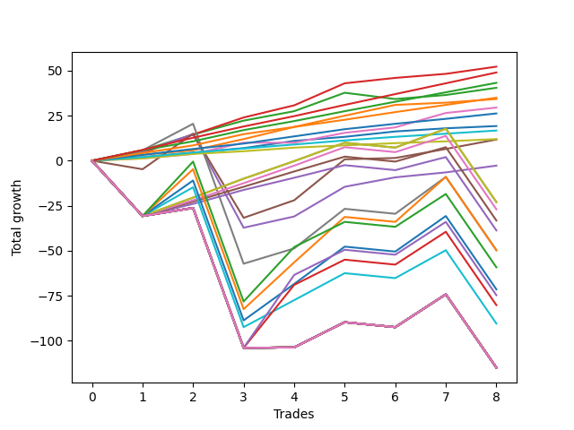

# Long Pointer 009 DB 
- Symbol: ES
- Date Range: 03/18/2022 - 07/15/2022
- Trading Period: 7:20-12:30
- Number of Trades: 8



| Name | Win Percent | Profit | Avg Profit / Trade | Avg Time / Trade |      | Name | Win Percent | Profit | Avg Profit / Trade | Avg Time / Trade |
| ---- | ----------- | ------ | ------------------ | ---------------- | ---- | ---- | ----------- | ------ | ------------------ | ---------------- |
| Sorted By <br> Profit | | | | | | Sorted By <br> Win Percentage ||||
| Three | 100.00 | 26125.00 | 3265.62 | 08:36 |     | Three | 100.00 | 26125.00 | 3265.62 | 08:36 |
| Eighty-Six | 100.00 | 24500.00 | 3062.50 | 11:56 |     | Eighty-Six | 100.00 | 24500.00 | 3062.50 | 11:56 |
| Eighty-Five | 100.00 | 21625.00 | 2703.12 | 11:01 |     | Eighty-Five | 100.00 | 21625.00 | 2703.12 | 11:01 |
| Two | 87.50 | 20250.00 | 2531.25 | 18:33 |     | Eighty-Four | 100.00 | 17500.00 | 2187.50 | 07:16 |
| Eighty-Four | 100.00 | 17500.00 | 2187.50 | 07:16 |     | One | 100.00 | 17125.00 | 2140.62 | 06:17 |
| One | 100.00 | 17125.00 | 2140.62 | 06:17 |     | Six | 100.00 | 14750.00 | 1843.75 | 07:23 |
| Six | 100.00 | 14750.00 | 1843.75 | 07:23 |     | Eighty-Three | 100.00 | 13125.00 | 1640.62 | 05:32 |
| Eighty-Three | 100.00 | 13125.00 | 1640.62 | 05:32 |     | Zero | 100.00 | 9625.00 | 1203.12 | 01:55 |
| Zero | 100.00 | 9625.00 | 1203.12 | 01:55 |     | Eighty-Two | 100.00 | 8375.00 | 1046.88 | 01:11 |
| Eighty-Two | 100.00 | 8375.00 | 1046.88 | 01:11 |     | Eighty-One | 100.00 | 6000.00 | 750.00 | 00:43 |
| Eighty-One | 100.00 | 6000.00 | 750.00 | 00:43 |     | Two | 87.50 | 20250.00 | 2531.25 | 18:33 |
| Five | 75.00 | 5875.00 | 734.38 | 61:59 |     | Four | 87.50 | -1375.00 | -171.88 | 34:51 |
| Four | 87.50 | -1375.00 | -171.88 | 34:51 |     | Five | 75.00 | 5875.00 | 734.38 | 61:59 |
| Two Hundred One | 62.50 | -11500.00 | -1437.50 | 80:30 |     | Two Hundred One | 62.50 | -11500.00 | -1437.50 | 80:30 |
| Ninety | 62.50 | -11500.00 | -1437.50 | 80:30 |     | Ninety | 62.50 | -11500.00 | -1437.50 | 80:30 |
| Eighty-Nine | 62.50 | -13500.00 | -1687.50 | 80:16 |     | Eighty-Nine | 62.50 | -13500.00 | -1687.50 | 80:16 |
| Eighty-Eight | 62.50 | -16625.00 | -2078.12 | 77:46 |     | Eighty-Eight | 62.50 | -16625.00 | -2078.12 | 77:46 |
| Eighty-Seven | 62.50 | -19375.00 | -2421.88 | 75:18 |     | Eighty-Seven | 62.50 | -19375.00 | -2421.88 | 75:18 |
| Seven | 62.50 | -24875.00 | -3109.38 | 82:05 |     | Seven | 62.50 | -24875.00 | -3109.38 | 82:05 |
| Two Hundred Two.Five | 50.00 | -24875.00 | -3109.38 | 123:45 |     | Two Hundred Two.Five | 50.00 | -24875.00 | -3109.38 | 123:45 |
| Two Hundred Three | 50.00 | -29625.00 | -3703.12 | 138:38 |     | Two Hundred Three | 50.00 | -29625.00 | -3703.12 | 138:38 |
| Two Hundred Two | 50.00 | -35750.00 | -4468.75 | 114:50 |     | Two Hundred Two | 50.00 | -35750.00 | -4468.75 | 114:50 |
| Two Hundred Four | 50.00 | -37375.00 | -4671.88 | 162:54 |     | Two Hundred Four | 50.00 | -37375.00 | -4671.88 | 162:54 |
| Two Hundred Three.Five | 50.00 | -40125.00 | -5015.62 | 162:20 |     | Two Hundred Three.Five | 50.00 | -40125.00 | -5015.62 | 162:20 |
| Two Hundred One.Five | 50.00 | -45250.00 | -5656.25 | 107:34 |     | Two Hundred One.Five | 50.00 | -45250.00 | -5656.25 | 107:34 |
| Two Hundred Fifteen | 50.00 | -57500.00 | -7187.50 | 172:05 |     | Two Hundred Fifteen | 50.00 | -57500.00 | -7187.50 | 172:05 |
| Two Hundred Fourteen.Five | 50.00 | -57500.00 | -7187.50 | 172:05 |     | Two Hundred Fourteen.Five | 50.00 | -57500.00 | -7187.50 | 172:05 |
| Two Hundred Fourteen | 50.00 | -57500.00 | -7187.50 | 172:05 |     | Two Hundred Fourteen | 50.00 | -57500.00 | -7187.50 | 172:05 |
| Two Hundred Thirteen.Five | 50.00 | -57500.00 | -7187.50 | 172:05 |     | Two Hundred Thirteen.Five | 50.00 | -57500.00 | -7187.50 | 172:05 |
| Two Hundred Thirteen | 50.00 | -57500.00 | -7187.50 | 172:05 |     | Two Hundred Thirteen | 50.00 | -57500.00 | -7187.50 | 172:05 |
| Two Hundred Twelve.Five | 50.00 | -57500.00 | -7187.50 | 172:05 |     | Two Hundred Twelve.Five | 50.00 | -57500.00 | -7187.50 | 172:05 |
| Two Hundred Twelve | 50.00 | -57500.00 | -7187.50 | 172:05 |     | Two Hundred Twelve | 50.00 | -57500.00 | -7187.50 | 172:05 |
| Two Hundred Eleven.Five | 50.00 | -57500.00 | -7187.50 | 172:05 |     | Two Hundred Eleven.Five | 50.00 | -57500.00 | -7187.50 | 172:05 |
| Two Hundred Eleven | 50.00 | -57500.00 | -7187.50 | 172:05 |     | Two Hundred Eleven | 50.00 | -57500.00 | -7187.50 | 172:05 |
| Two Hundred Ten.Five | 50.00 | -57500.00 | -7187.50 | 172:05 |     | Two Hundred Ten.Five | 50.00 | -57500.00 | -7187.50 | 172:05 |
| Two Hundred Ten | 50.00 | -57500.00 | -7187.50 | 172:05 |     | Two Hundred Ten | 50.00 | -57500.00 | -7187.50 | 172:05 |
| Two Hundred Nine.Five | 50.00 | -57500.00 | -7187.50 | 172:05 |     | Two Hundred Nine.Five | 50.00 | -57500.00 | -7187.50 | 172:05 |
| Two Hundred Nine | 50.00 | -57500.00 | -7187.50 | 172:05 |     | Two Hundred Nine | 50.00 | -57500.00 | -7187.50 | 172:05 |
| Two Hundred Eight.Five | 50.00 | -57500.00 | -7187.50 | 172:05 |     | Two Hundred Eight.Five | 50.00 | -57500.00 | -7187.50 | 172:05 |
| Two Hundred Eight | 50.00 | -57500.00 | -7187.50 | 172:05 |     | Two Hundred Eight | 50.00 | -57500.00 | -7187.50 | 172:05 |
| Two Hundred Seven.Five | 50.00 | -57500.00 | -7187.50 | 172:05 |     | Two Hundred Seven.Five | 50.00 | -57500.00 | -7187.50 | 172:05 |
| Two Hundred Seven | 50.00 | -57500.00 | -7187.50 | 172:05 |     | Two Hundred Seven | 50.00 | -57500.00 | -7187.50 | 172:05 |
| Two Hundred Six.Five | 50.00 | -57500.00 | -7187.50 | 172:05 |     | Two Hundred Six.Five | 50.00 | -57500.00 | -7187.50 | 172:05 |
| Two Hundred Six | 50.00 | -57500.00 | -7187.50 | 172:05 |     | Two Hundred Six | 50.00 | -57500.00 | -7187.50 | 172:05 |
| Two Hundred Five.Five | 50.00 | -57500.00 | -7187.50 | 172:05 |     | Two Hundred Five.Five | 50.00 | -57500.00 | -7187.50 | 172:05 |
| Two Hundred Five | 50.00 | -57500.00 | -7187.50 | 172:05 |     | Two Hundred Five | 50.00 | -57500.00 | -7187.50 | 172:05 |
| Two Hundred Four.Five | 50.00 | -57500.00 | -7187.50 | 172:05 |     | Two Hundred Four.Five | 50.00 | -57500.00 | -7187.50 | 172:05 |

## NO STOPLOSS

### Test Zero
* Sell when price hits the middle line of the 20p bollinger
* No Stoploss
* Results:
```
Total Trades: 8
Percent Up: 100.00
Percent Down: 0.00
Total Points Moved Up: 19.25
Potential Profit: 9625.00
Total Points Ups: 19.25 Count Ups: 8
Total Points Downs: 0.00 Count Downs: 0
```

<details><summary>Trades</summary>

<code>In: 2022-03-31 08:37:00		Out: 2022-03-31 08:38:15		Total Position Time: 01:15		Total Move Up: 2.00		Total to Date: 2.00</code> <br />
<code>In: 2022-05-06 09:03:00		Out: 2022-05-06 09:03:15		Total Position Time: 00:15		Total Move Up: 2.50		Total to Date: 4.50</code> <br />
<code>In: 2022-05-11 09:14:00		Out: 2022-05-11 09:21:05		Total Position Time: 07:05		Total Move Up: 2.50		Total to Date: 7.00</code> <br />
<code>In: 2022-05-16 09:47:00		Out: 2022-05-16 09:48:15		Total Position Time: 01:15		Total Move Up: 4.00		Total to Date: 11.00</code> <br />
<code>In: 2022-05-31 12:05:00		Out: 2022-05-31 12:07:20		Total Position Time: 02:20		Total Move Up: 2.25		Total to Date: 13.25</code> <br />
<code>In: 2022-06-27 10:10:00		Out: 2022-06-27 10:11:25		Total Position Time: 01:25		Total Move Up: 3.00		Total to Date: 16.25</code> <br />
<code>In: 2022-07-08 09:48:00		Out: 2022-07-08 09:49:00		Total Position Time: 01:00		Total Move Up: 1.75		Total to Date: 18.00</code> <br />
<code>In: 2022-07-12 10:28:00		Out: 2022-07-12 10:28:50		Total Position Time: 00:50		Total Move Up: 1.25		Total to Date: 19.25</code> <br />


</details>

### Test One
* Sell when the price hits the upper line of the 20p 1std bollinger
* No Stoploss
* Results:
```
Total Trades: 8
Percent Up: 100.00
Percent Down: 0.00
Total Points Moved Up: 34.25
Potential Profit: 17125.00
Total Points Ups: 34.25 Count Ups: 8
Total Points Downs: 0.00 Count Downs: 0
```

<details><summary>Trades</summary>

<code>In: 2022-03-31 08:37:00		Out: 2022-03-31 08:40:35		Total Position Time: 03:35		Total Move Up: 3.25		Total to Date: 3.25</code> <br />
<code>In: 2022-05-06 09:03:00		Out: 2022-05-06 09:03:15		Total Position Time: 00:15		Total Move Up: 2.50		Total to Date: 5.75</code> <br />
<code>In: 2022-05-11 09:14:00		Out: 2022-05-11 09:23:15		Total Position Time: 09:15		Total Move Up: 6.25		Total to Date: 12.00</code> <br />
<code>In: 2022-05-16 09:47:00		Out: 2022-05-16 09:50:05		Total Position Time: 03:05		Total Move Up: 6.75		Total to Date: 18.75</code> <br />
<code>In: 2022-05-31 12:05:00		Out: 2022-05-31 12:09:20		Total Position Time: 04:20		Total Move Up: 6.25		Total to Date: 25.00</code> <br />
<code>In: 2022-06-27 10:10:00		Out: 2022-06-27 10:15:55		Total Position Time: 05:55		Total Move Up: 6.00		Total to Date: 31.00</code> <br />
<code>In: 2022-07-08 09:48:00		Out: 2022-07-08 10:09:40		Total Position Time: 21:40		Total Move Up: 1.25		Total to Date: 32.25</code> <br />
<code>In: 2022-07-12 10:28:00		Out: 2022-07-12 10:30:15		Total Position Time: 02:15		Total Move Up: 2.00		Total to Date: 34.25</code> <br />


</details>

### Test Two
* Sell when the price hits the upper line of the 20p 2std bollinger
* No Stoploss
* Results:
```
Total Trades: 8
Percent Up: 87.50
Percent Down: 12.50
Total Points Moved Up: 40.50
Potential Profit: 20250.00
Total Points Ups: 44.00 Count Ups: 7
Total Points Downs: -3.50 Count Downs: 1
```

<details><summary>Trades</summary>

<code>In: 2022-03-31 08:37:00		Out: 2022-03-31 08:41:10		Total Position Time: 04:10		Total Move Up: 5.75		Total to Date: 5.75</code> <br />
<code>In: 2022-05-06 09:03:00		Out: 2022-05-06 09:06:00		Total Position Time: 03:00		Total Move Up: 8.75		Total to Date: 14.50</code> <br />
<code>In: 2022-05-11 09:14:00		Out: 2022-05-11 09:23:40		Total Position Time: 09:40		Total Move Up: 7.75		Total to Date: 22.25</code> <br />
<code>In: 2022-05-16 09:47:00		Out: 2022-05-16 10:07:00		Total Position Time: 20:00		Total Move Up: 5.25		Total to Date: 27.50</code> <br />
<code>In: 2022-05-31 12:05:00		Out: 2022-05-31 12:15:05		Total Position Time: 10:05		Total Move Up: 10.25		Total to Date: 37.75</code> <br />
<code>In: 2022-06-27 10:10:00		Out: 2022-06-27 11:14:45		Total Position Time: 64:45		Total Move Up: -3.50		Total to Date: 34.25</code> <br />
<code>In: 2022-07-08 09:48:00		Out: 2022-07-08 10:11:05		Total Position Time: 23:05		Total Move Up: 2.25		Total to Date: 36.50</code> <br />
<code>In: 2022-07-12 10:28:00		Out: 2022-07-12 10:41:40		Total Position Time: 13:40		Total Move Up: 4.00		Total to Date: 40.50</code> <br />


</details>

### Test Three
* Sell when price hits the middle line of the 50p bollinger
* No Stoploss
* Results:
```
Total Trades: 8
Percent Up: 100.00
Percent Down: 0.00
Total Points Moved Up: 52.25
Potential Profit: 26125.00
Total Points Ups: 52.25 Count Ups: 8
Total Points Downs: 0.00 Count Downs: 0
```

<details><summary>Trades</summary>

<code>In: 2022-03-31 08:37:00		Out: 2022-03-31 08:41:05		Total Position Time: 04:05		Total Move Up: 4.25		Total to Date: 4.25</code> <br />
<code>In: 2022-05-06 09:03:00		Out: 2022-05-06 09:06:05		Total Position Time: 03:05		Total Move Up: 10.25		Total to Date: 14.50</code> <br />
<code>In: 2022-05-11 09:14:00		Out: 2022-05-11 09:24:05		Total Position Time: 10:05		Total Move Up: 9.50		Total to Date: 24.00</code> <br />
<code>In: 2022-05-16 09:47:00		Out: 2022-05-16 09:50:05		Total Position Time: 03:05		Total Move Up: 6.75		Total to Date: 30.75</code> <br />
<code>In: 2022-05-31 12:05:00		Out: 2022-05-31 12:15:15		Total Position Time: 10:15		Total Move Up: 12.25		Total to Date: 43.00</code> <br />
<code>In: 2022-06-27 10:10:00		Out: 2022-06-27 10:11:25		Total Position Time: 01:25		Total Move Up: 3.00		Total to Date: 46.00</code> <br />
<code>In: 2022-07-08 09:48:00		Out: 2022-07-08 10:11:10		Total Position Time: 23:10		Total Move Up: 2.25		Total to Date: 48.25</code> <br />
<code>In: 2022-07-12 10:28:00		Out: 2022-07-12 10:41:40		Total Position Time: 13:40		Total Move Up: 4.00		Total to Date: 52.25</code> <br />


</details>

### Test Four
* Sell when the price hits the upper line of the 50p 1std bollinger
* No Stoploss
* Results:
```
Total Trades: 8
Percent Up: 87.50
Percent Down: 12.50
Total Points Moved Up: -2.75
Potential Profit: -1375.00
Total Points Ups: 49.25 Count Ups: 7
Total Points Downs: -52.00 Count Downs: 1
```

<details><summary>Trades</summary>

<code>In: 2022-03-31 08:37:00		Out: 2022-03-31 09:00:40		Total Position Time: 23:40		Total Move Up: 5.00		Total to Date: 5.00</code> <br />
<code>In: 2022-05-06 09:03:00		Out: 2022-05-06 09:23:00		Total Position Time: 20:00		Total Move Up: 9.75		Total to Date: 14.75</code> <br />
<code>In: 2022-05-11 09:14:00		Out: 2022-05-11 11:18:15		Total Position Time: 124:15		Total Move Up: -52.00		Total to Date: -37.25</code> <br />
<code>In: 2022-05-16 09:47:00		Out: 2022-05-16 10:07:25		Total Position Time: 20:25		Total Move Up: 6.25		Total to Date: -31.00</code> <br />
<code>In: 2022-05-31 12:05:00		Out: 2022-05-31 12:28:20		Total Position Time: 23:20		Total Move Up: 16.50		Total to Date: -14.50</code> <br />
<code>In: 2022-06-27 10:10:00		Out: 2022-06-27 10:14:20		Total Position Time: 04:20		Total Move Up: 5.25		Total to Date: -9.25</code> <br />
<code>In: 2022-07-08 09:48:00		Out: 2022-07-08 10:26:30		Total Position Time: 38:30		Total Move Up: 2.75		Total to Date: -6.50</code> <br />
<code>In: 2022-07-12 10:28:00		Out: 2022-07-12 10:52:25		Total Position Time: 24:25		Total Move Up: 3.75		Total to Date: -2.75</code> <br />


</details>

### Test Five
* Sell when the price hits the upper line of the 50p 2std bollinger
* No Stoploss
* Results:
```
Total Trades: 8
Percent Up: 75.00
Percent Down: 25.00
Total Points Moved Up: 11.75
Potential Profit: 5875.00
Total Points Ups: 63.25 Count Ups: 6
Total Points Downs: -51.50 Count Downs: 2
```

<details><summary>Trades</summary>

<code>In: 2022-03-31 08:37:00		Out: 2022-03-31 10:46:00		Total Position Time: 129:00		Total Move Up: -4.75		Total to Date: -4.75</code> <br />
<code>In: 2022-05-06 09:03:00		Out: 2022-05-06 09:36:15		Total Position Time: 33:15		Total Move Up: 19.75		Total to Date: 15.00</code> <br />
<code>In: 2022-05-11 09:14:00		Out: 2022-05-11 11:23:40		Total Position Time: 129:40		Total Move Up: -46.75		Total to Date: -31.75</code> <br />
<code>In: 2022-05-16 09:47:00		Out: 2022-05-16 10:11:25		Total Position Time: 24:25		Total Move Up: 9.75		Total to Date: -22.00</code> <br />
<code>In: 2022-05-31 12:05:00		Out: 2022-05-31 12:31:05		Total Position Time: 26:05		Total Move Up: 22.75		Total to Date: 0.75</code> <br />
<code>In: 2022-06-27 10:10:00		Out: 2022-06-27 11:38:15		Total Position Time: 88:15		Total Move Up: 0.75		Total to Date: 1.50</code> <br />
<code>In: 2022-07-08 09:48:00		Out: 2022-07-08 10:27:00		Total Position Time: 39:00		Total Move Up: 5.00		Total to Date: 6.50</code> <br />
<code>In: 2022-07-12 10:28:00		Out: 2022-07-12 10:54:15		Total Position Time: 26:15		Total Move Up: 5.25		Total to Date: 11.75</code> <br />


</details>

### Test Six
* Sell when the price hits the middle line of the 1std VWAP
* No Stoploss
* Results:
```
Total Trades: 8
Percent Up: 100.00
Percent Down: 0.00
Total Points Moved Up: 29.50
Potential Profit: 14750.00
Total Points Ups: 29.50 Count Ups: 8
Total Points Downs: 0.00 Count Downs: 0
```

<details><summary>Trades</summary>

<code>In: 2022-03-31 08:37:00		Out: 2022-03-31 08:37:40		Total Position Time: 00:40		Total Move Up: 1.25		Total to Date: 1.25</code> <br />
<code>In: 2022-05-06 09:03:00		Out: 2022-05-06 09:03:15		Total Position Time: 00:15		Total Move Up: 2.50		Total to Date: 3.75</code> <br />
<code>In: 2022-05-11 09:14:00		Out: 2022-05-11 09:23:15		Total Position Time: 09:15		Total Move Up: 6.25		Total to Date: 10.00</code> <br />
<code>In: 2022-05-16 09:47:00		Out: 2022-05-16 09:47:15		Total Position Time: 00:15		Total Move Up: 0.00		Total to Date: 10.00</code> <br />
<code>In: 2022-05-31 12:05:00		Out: 2022-05-31 12:07:55		Total Position Time: 02:55		Total Move Up: 5.50		Total to Date: 15.50</code> <br />
<code>In: 2022-06-27 10:10:00		Out: 2022-06-27 10:11:25		Total Position Time: 01:25		Total Move Up: 3.00		Total to Date: 18.50</code> <br />
<code>In: 2022-07-08 09:48:00		Out: 2022-07-08 10:29:10		Total Position Time: 41:10		Total Move Up: 8.00		Total to Date: 26.50</code> <br />
<code>In: 2022-07-12 10:28:00		Out: 2022-07-12 10:31:15		Total Position Time: 03:15		Total Move Up: 3.00		Total to Date: 29.50</code> <br />


</details>

### Test Seven
* Sell when the price hits the upper line of the 1std VWAP
* No Stoploss
* Results:
```
Total Trades: 8
Percent Up: 62.50
Percent Down: 37.50
Total Points Moved Up: -49.75
Potential Profit: -24875.00
Total Points Ups: 71.50 Count Ups: 5
Total Points Downs: -121.25 Count Downs: 3
```

<details><summary>Trades</summary>

<code>In: 2022-03-31 08:37:00		Out: 2022-03-31 08:41:10		Total Position Time: 04:10		Total Move Up: 5.75		Total to Date: 5.75</code> <br />
<code>In: 2022-05-06 09:03:00		Out: 2022-05-06 09:06:45		Total Position Time: 03:45		Total Move Up: 14.75		Total to Date: 20.50</code> <br />
<code>In: 2022-05-11 09:14:00		Out: 2022-05-11 12:46:05		Total Position Time: 212:05		Total Move Up: -77.75		Total to Date: -57.25</code> <br />
<code>In: 2022-05-16 09:47:00		Out: 2022-05-16 10:07:35		Total Position Time: 20:35		Total Move Up: 8.50		Total to Date: -48.75</code> <br />
<code>In: 2022-05-31 12:05:00		Out: 2022-05-31 12:31:00		Total Position Time: 26:00		Total Move Up: 22.00		Total to Date: -26.75</code> <br />
<code>In: 2022-06-27 10:10:00		Out: 2022-06-27 12:46:05		Total Position Time: 156:05		Total Move Up: -2.75		Total to Date: -29.50</code> <br />
<code>In: 2022-07-08 09:48:00		Out: 2022-07-08 11:24:00		Total Position Time: 96:00		Total Move Up: 20.50		Total to Date: -9.00</code> <br />
<code>In: 2022-07-12 10:28:00		Out: 2022-07-12 12:46:05		Total Position Time: 138:05		Total Move Up: -40.75		Total to Date: -49.75</code> <br />


</details>

## TAKE PROFIT

### Test Eighty-One
* Take Profit of 1 Point
* No Stoploss
* Results:
```
Total Trades: 8
Percent Up: 100.00
Percent Down: 0.00
Total Points Moved Up: 12.00
Potential Profit: 6000.00
Total Points Ups: 12.00 Count Ups: 8
Total Points Downs: 0.00 Count Downs: 0
```

<details><summary>Trades</summary>

<code>In: 2022-03-31 08:37:00		Out: 2022-03-31 08:37:40		Total Position Time: 00:40		Total Move Up: 1.25		Total to Date: 1.25</code> <br />
<code>In: 2022-05-06 09:03:00		Out: 2022-05-06 09:03:15		Total Position Time: 00:15		Total Move Up: 2.50		Total to Date: 3.75</code> <br />
<code>In: 2022-05-11 09:14:00		Out: 2022-05-11 09:14:25		Total Position Time: 00:25		Total Move Up: 1.50		Total to Date: 5.25</code> <br />
<code>In: 2022-05-16 09:47:00		Out: 2022-05-16 09:47:50		Total Position Time: 00:50		Total Move Up: 2.00		Total to Date: 7.25</code> <br />
<code>In: 2022-05-31 12:05:00		Out: 2022-05-31 12:07:05		Total Position Time: 02:05		Total Move Up: 1.25		Total to Date: 8.50</code> <br />
<code>In: 2022-06-27 10:10:00		Out: 2022-06-27 10:10:25		Total Position Time: 00:25		Total Move Up: 1.25		Total to Date: 9.75</code> <br />
<code>In: 2022-07-08 09:48:00		Out: 2022-07-08 09:48:20		Total Position Time: 00:20		Total Move Up: 1.00		Total to Date: 10.75</code> <br />
<code>In: 2022-07-12 10:28:00		Out: 2022-07-12 10:28:50		Total Position Time: 00:50		Total Move Up: 1.25		Total to Date: 12.00</code> <br />


</details>

### Test Eighty-Two
* Take Profit of 2 Point
* No Stoploss
* Results:
```
Total Trades: 8
Percent Up: 100.00
Percent Down: 0.00
Total Points Moved Up: 16.75
Potential Profit: 8375.00
Total Points Ups: 16.75 Count Ups: 8
Total Points Downs: 0.00 Count Downs: 0
```

<details><summary>Trades</summary>

<code>In: 2022-03-31 08:37:00		Out: 2022-03-31 08:38:15		Total Position Time: 01:15		Total Move Up: 2.00		Total to Date: 2.00</code> <br />
<code>In: 2022-05-06 09:03:00		Out: 2022-05-06 09:03:15		Total Position Time: 00:15		Total Move Up: 2.50		Total to Date: 4.50</code> <br />
<code>In: 2022-05-11 09:14:00		Out: 2022-05-11 09:14:30		Total Position Time: 00:30		Total Move Up: 2.25		Total to Date: 6.75</code> <br />
<code>In: 2022-05-16 09:47:00		Out: 2022-05-16 09:47:55		Total Position Time: 00:55		Total Move Up: 2.25		Total to Date: 9.00</code> <br />
<code>In: 2022-05-31 12:05:00		Out: 2022-05-31 12:07:20		Total Position Time: 02:20		Total Move Up: 2.25		Total to Date: 11.25</code> <br />
<code>In: 2022-06-27 10:10:00		Out: 2022-06-27 10:11:10		Total Position Time: 01:10		Total Move Up: 2.00		Total to Date: 13.25</code> <br />
<code>In: 2022-07-08 09:48:00		Out: 2022-07-08 09:49:00		Total Position Time: 01:00		Total Move Up: 1.75		Total to Date: 15.00</code> <br />
<code>In: 2022-07-12 10:28:00		Out: 2022-07-12 10:30:05		Total Position Time: 02:05		Total Move Up: 1.75		Total to Date: 16.75</code> <br />


</details>

### Test Eighty-Three
* Take Profit of 3 Point
* No Stoploss
* Results:
```
Total Trades: 8
Percent Up: 100.00
Percent Down: 0.00
Total Points Moved Up: 26.25
Potential Profit: 13125.00
Total Points Ups: 26.25 Count Ups: 8
Total Points Downs: 0.00 Count Downs: 0
```

<details><summary>Trades</summary>

<code>In: 2022-03-31 08:37:00		Out: 2022-03-31 08:40:35		Total Position Time: 03:35		Total Move Up: 3.25		Total to Date: 3.25</code> <br />
<code>In: 2022-05-06 09:03:00		Out: 2022-05-06 09:03:40		Total Position Time: 00:40		Total Move Up: 3.25		Total to Date: 6.50</code> <br />
<code>In: 2022-05-11 09:14:00		Out: 2022-05-11 09:22:05		Total Position Time: 08:05		Total Move Up: 3.00		Total to Date: 9.50</code> <br />
<code>In: 2022-05-16 09:47:00		Out: 2022-05-16 09:48:15		Total Position Time: 01:15		Total Move Up: 4.00		Total to Date: 13.50</code> <br />
<code>In: 2022-05-31 12:05:00		Out: 2022-05-31 12:07:45		Total Position Time: 02:45		Total Move Up: 4.00		Total to Date: 17.50</code> <br />
<code>In: 2022-06-27 10:10:00		Out: 2022-06-27 10:11:25		Total Position Time: 01:25		Total Move Up: 3.00		Total to Date: 20.50</code> <br />
<code>In: 2022-07-08 09:48:00		Out: 2022-07-08 10:11:20		Total Position Time: 23:20		Total Move Up: 2.75		Total to Date: 23.25</code> <br />
<code>In: 2022-07-12 10:28:00		Out: 2022-07-12 10:31:15		Total Position Time: 03:15		Total Move Up: 3.00		Total to Date: 26.25</code> <br />


</details>

### Test Eighty-Four
* Take Profit of 4 Point
* No Stoploss
* Results:
```
Total Trades: 8
Percent Up: 100.00
Percent Down: 0.00
Total Points Moved Up: 35.00
Potential Profit: 17500.00
Total Points Ups: 35.00 Count Ups: 8
Total Points Downs: 0.00 Count Downs: 0
```

<details><summary>Trades</summary>

<code>In: 2022-03-31 08:37:00		Out: 2022-03-31 08:41:05		Total Position Time: 04:05		Total Move Up: 4.25		Total to Date: 4.25</code> <br />
<code>In: 2022-05-06 09:03:00		Out: 2022-05-06 09:03:45		Total Position Time: 00:45		Total Move Up: 4.25		Total to Date: 8.50</code> <br />
<code>In: 2022-05-11 09:14:00		Out: 2022-05-11 09:23:15		Total Position Time: 09:15		Total Move Up: 6.25		Total to Date: 14.75</code> <br />
<code>In: 2022-05-16 09:47:00		Out: 2022-05-16 09:48:15		Total Position Time: 01:15		Total Move Up: 4.00		Total to Date: 18.75</code> <br />
<code>In: 2022-05-31 12:05:00		Out: 2022-05-31 12:07:45		Total Position Time: 02:45		Total Move Up: 4.00		Total to Date: 22.75</code> <br />
<code>In: 2022-06-27 10:10:00		Out: 2022-06-27 10:12:00		Total Position Time: 02:00		Total Move Up: 4.25		Total to Date: 27.00</code> <br />
<code>In: 2022-07-08 09:48:00		Out: 2022-07-08 10:12:25		Total Position Time: 24:25		Total Move Up: 4.00		Total to Date: 31.00</code> <br />
<code>In: 2022-07-12 10:28:00		Out: 2022-07-12 10:41:40		Total Position Time: 13:40		Total Move Up: 4.00		Total to Date: 35.00</code> <br />


</details>

### Test Eighty-Five
* Take Profit of 5 Point
* No Stoploss
* Results:
```
Total Trades: 8
Percent Up: 100.00
Percent Down: 0.00
Total Points Moved Up: 43.25
Potential Profit: 21625.00
Total Points Ups: 43.25 Count Ups: 8
Total Points Downs: 0.00 Count Downs: 0
```

<details><summary>Trades</summary>

<code>In: 2022-03-31 08:37:00		Out: 2022-03-31 08:41:10		Total Position Time: 04:10		Total Move Up: 5.75		Total to Date: 5.75</code> <br />
<code>In: 2022-05-06 09:03:00		Out: 2022-05-06 09:03:50		Total Position Time: 00:50		Total Move Up: 5.00		Total to Date: 10.75</code> <br />
<code>In: 2022-05-11 09:14:00		Out: 2022-05-11 09:23:15		Total Position Time: 09:15		Total Move Up: 6.25		Total to Date: 17.00</code> <br />
<code>In: 2022-05-16 09:47:00		Out: 2022-05-16 09:48:45		Total Position Time: 01:45		Total Move Up: 5.00		Total to Date: 22.00</code> <br />
<code>In: 2022-05-31 12:05:00		Out: 2022-05-31 12:07:55		Total Position Time: 02:55		Total Move Up: 5.50		Total to Date: 27.50</code> <br />
<code>In: 2022-06-27 10:10:00		Out: 2022-06-27 10:12:55		Total Position Time: 02:55		Total Move Up: 5.25		Total to Date: 32.75</code> <br />
<code>In: 2022-07-08 09:48:00		Out: 2022-07-08 10:28:05		Total Position Time: 40:05		Total Move Up: 5.25		Total to Date: 38.00</code> <br />
<code>In: 2022-07-12 10:28:00		Out: 2022-07-12 10:54:15		Total Position Time: 26:15		Total Move Up: 5.25		Total to Date: 43.25</code> <br />


</details>

### Test Eighty-Six
* Take Profit of 6 Point
* No Stoploss
* Results:
```
Total Trades: 8
Percent Up: 100.00
Percent Down: 0.00
Total Points Moved Up: 49.00
Potential Profit: 24500.00
Total Points Ups: 49.00 Count Ups: 8
Total Points Downs: 0.00 Count Downs: 0
```

<details><summary>Trades</summary>

<code>In: 2022-03-31 08:37:00		Out: 2022-03-31 08:41:50		Total Position Time: 04:50		Total Move Up: 6.00		Total to Date: 6.00</code> <br />
<code>In: 2022-05-06 09:03:00		Out: 2022-05-06 09:03:55		Total Position Time: 00:55		Total Move Up: 6.75		Total to Date: 12.75</code> <br />
<code>In: 2022-05-11 09:14:00		Out: 2022-05-11 09:23:15		Total Position Time: 09:15		Total Move Up: 6.25		Total to Date: 19.00</code> <br />
<code>In: 2022-05-16 09:47:00		Out: 2022-05-16 09:50:00		Total Position Time: 03:00		Total Move Up: 5.75		Total to Date: 24.75</code> <br />
<code>In: 2022-05-31 12:05:00		Out: 2022-05-31 12:09:20		Total Position Time: 04:20		Total Move Up: 6.25		Total to Date: 31.00</code> <br />
<code>In: 2022-06-27 10:10:00		Out: 2022-06-27 10:15:55		Total Position Time: 05:55		Total Move Up: 6.00		Total to Date: 37.00</code> <br />
<code>In: 2022-07-08 09:48:00		Out: 2022-07-08 10:28:15		Total Position Time: 40:15		Total Move Up: 6.00		Total to Date: 43.00</code> <br />
<code>In: 2022-07-12 10:28:00		Out: 2022-07-12 10:55:00		Total Position Time: 27:00		Total Move Up: 6.00		Total to Date: 49.00</code> <br />


</details>

### Test Eighty-Seven
* Take Profit of 7 Point
* No Stoploss
* Results:
```
Total Trades: 8
Percent Up: 62.50
Percent Down: 37.50
Total Points Moved Up: -38.75
Potential Profit: -19375.00
Total Points Ups: 35.50 Count Ups: 5
Total Points Downs: -74.25 Count Downs: 3
```

<details><summary>Trades</summary>

<code>In: 2022-03-31 08:37:00		Out: 2022-03-31 12:46:05		Total Position Time: 249:05		Total Move Up: -30.75		Total to Date: -30.75</code> <br />
<code>In: 2022-05-06 09:03:00		Out: 2022-05-06 09:03:55		Total Position Time: 00:55		Total Move Up: 6.75		Total to Date: -24.00</code> <br />
<code>In: 2022-05-11 09:14:00		Out: 2022-05-11 09:23:40		Total Position Time: 09:40		Total Move Up: 7.75		Total to Date: -16.25</code> <br />
<code>In: 2022-05-16 09:47:00		Out: 2022-05-16 09:50:05		Total Position Time: 03:05		Total Move Up: 6.75		Total to Date: -9.50</code> <br />
<code>In: 2022-05-31 12:05:00		Out: 2022-05-31 12:09:40		Total Position Time: 04:40		Total Move Up: 7.00		Total to Date: -2.50</code> <br />
<code>In: 2022-06-27 10:10:00		Out: 2022-06-27 12:46:05		Total Position Time: 156:05		Total Move Up: -2.75		Total to Date: -5.25</code> <br />
<code>In: 2022-07-08 09:48:00		Out: 2022-07-08 10:28:55		Total Position Time: 40:55		Total Move Up: 7.25		Total to Date: 2.00</code> <br />
<code>In: 2022-07-12 10:28:00		Out: 2022-07-12 12:46:05		Total Position Time: 138:05		Total Move Up: -40.75		Total to Date: -38.75</code> <br />


</details>

### Test Eighty-Eight
* Take Profit of 8 Point
* No Stoploss
* Results:
```
Total Trades: 8
Percent Up: 62.50
Percent Down: 37.50
Total Points Moved Up: -33.25
Potential Profit: -16625.00
Total Points Ups: 41.00 Count Ups: 5
Total Points Downs: -74.25 Count Downs: 3
```

<details><summary>Trades</summary>

<code>In: 2022-03-31 08:37:00		Out: 2022-03-31 12:46:05		Total Position Time: 249:05		Total Move Up: -30.75		Total to Date: -30.75</code> <br />
<code>In: 2022-05-06 09:03:00		Out: 2022-05-06 09:05:30		Total Position Time: 02:30		Total Move Up: 8.00		Total to Date: -22.75</code> <br />
<code>In: 2022-05-11 09:14:00		Out: 2022-05-11 09:23:45		Total Position Time: 09:45		Total Move Up: 8.25		Total to Date: -14.50</code> <br />
<code>In: 2022-05-16 09:47:00		Out: 2022-05-16 10:07:35		Total Position Time: 20:35		Total Move Up: 8.50		Total to Date: -6.00</code> <br />
<code>In: 2022-05-31 12:05:00		Out: 2022-05-31 12:09:55		Total Position Time: 04:55		Total Move Up: 8.25		Total to Date: 2.25</code> <br />
<code>In: 2022-06-27 10:10:00		Out: 2022-06-27 12:46:05		Total Position Time: 156:05		Total Move Up: -2.75		Total to Date: -0.50</code> <br />
<code>In: 2022-07-08 09:48:00		Out: 2022-07-08 10:29:10		Total Position Time: 41:10		Total Move Up: 8.00		Total to Date: 7.50</code> <br />
<code>In: 2022-07-12 10:28:00		Out: 2022-07-12 12:46:05		Total Position Time: 138:05		Total Move Up: -40.75		Total to Date: -33.25</code> <br />


</details>

### Test Eighty-Nine
* Take Profit of 9 Point
* No Stoploss
* Results:
```
Total Trades: 8
Percent Up: 62.50
Percent Down: 37.50
Total Points Moved Up: -27.00
Potential Profit: -13500.00
Total Points Ups: 47.25 Count Ups: 5
Total Points Downs: -74.25 Count Downs: 3
```

<details><summary>Trades</summary>

<code>In: 2022-03-31 08:37:00		Out: 2022-03-31 12:46:05		Total Position Time: 249:05		Total Move Up: -30.75		Total to Date: -30.75</code> <br />
<code>In: 2022-05-06 09:03:00		Out: 2022-05-06 09:06:00		Total Position Time: 03:00		Total Move Up: 8.75		Total to Date: -22.00</code> <br />
<code>In: 2022-05-11 09:14:00		Out: 2022-05-11 09:24:05		Total Position Time: 10:05		Total Move Up: 9.50		Total to Date: -12.50</code> <br />
<code>In: 2022-05-16 09:47:00		Out: 2022-05-16 10:11:25		Total Position Time: 24:25		Total Move Up: 9.75		Total to Date: -2.75</code> <br />
<code>In: 2022-05-31 12:05:00		Out: 2022-05-31 12:15:05		Total Position Time: 10:05		Total Move Up: 10.25		Total to Date: 7.50</code> <br />
<code>In: 2022-06-27 10:10:00		Out: 2022-06-27 12:46:05		Total Position Time: 156:05		Total Move Up: -2.75		Total to Date: 4.75</code> <br />
<code>In: 2022-07-08 09:48:00		Out: 2022-07-08 10:39:20		Total Position Time: 51:20		Total Move Up: 9.00		Total to Date: 13.75</code> <br />
<code>In: 2022-07-12 10:28:00		Out: 2022-07-12 12:46:05		Total Position Time: 138:05		Total Move Up: -40.75		Total to Date: -27.00</code> <br />


</details>

### Test Ninety
* Take Profit of 10 Point
* No Stoploss
* Results:
```
Total Trades: 8
Percent Up: 62.50
Percent Down: 37.50
Total Points Moved Up: -23.00
Potential Profit: -11500.00
Total Points Ups: 51.25 Count Ups: 5
Total Points Downs: -74.25 Count Downs: 3
```

<details><summary>Trades</summary>

<code>In: 2022-03-31 08:37:00		Out: 2022-03-31 12:46:05		Total Position Time: 249:05		Total Move Up: -30.75		Total to Date: -30.75</code> <br />
<code>In: 2022-05-06 09:03:00		Out: 2022-05-06 09:06:05		Total Position Time: 03:05		Total Move Up: 10.25		Total to Date: -20.50</code> <br />
<code>In: 2022-05-11 09:14:00		Out: 2022-05-11 09:24:10		Total Position Time: 10:10		Total Move Up: 10.50		Total to Date: -10.00</code> <br />
<code>In: 2022-05-16 09:47:00		Out: 2022-05-16 10:11:30		Total Position Time: 24:30		Total Move Up: 9.75		Total to Date: -0.25</code> <br />
<code>In: 2022-05-31 12:05:00		Out: 2022-05-31 12:15:05		Total Position Time: 10:05		Total Move Up: 10.25		Total to Date: 10.00</code> <br />
<code>In: 2022-06-27 10:10:00		Out: 2022-06-27 12:46:05		Total Position Time: 156:05		Total Move Up: -2.75		Total to Date: 7.25</code> <br />
<code>In: 2022-07-08 09:48:00		Out: 2022-07-08 10:40:55		Total Position Time: 52:55		Total Move Up: 10.50		Total to Date: 17.75</code> <br />
<code>In: 2022-07-12 10:28:00		Out: 2022-07-12 12:46:05		Total Position Time: 138:05		Total Move Up: -40.75		Total to Date: -23.00</code> <br />


</details>

## DAILY TAKE PROFITS

### Test Two Hundred One
* Take Profit of 10 Point
* No Stoploss
* Results:
```
Total Trades: 8
Percent Up: 62.50
Percent Down: 37.50
Total Points Moved Up: -23.00
Potential Profit: -11500.00
Total Points Ups: 51.25 Count Ups: 5
Total Points Downs: -74.25 Count Downs: 3
```

<details><summary>Trades</summary>

<code>In: 2022-03-31 08:37:00		Out: 2022-03-31 12:46:05		Total Position Time: 249:05		Total Move Up: -30.75		Total to Date: -30.75</code> <br />
<code>In: 2022-05-06 09:03:00		Out: 2022-05-06 09:06:05		Total Position Time: 03:05		Total Move Up: 10.25		Total to Date: -20.50</code> <br />
<code>In: 2022-05-11 09:14:00		Out: 2022-05-11 09:24:10		Total Position Time: 10:10		Total Move Up: 10.50		Total to Date: -10.00</code> <br />
<code>In: 2022-05-16 09:47:00		Out: 2022-05-16 10:11:30		Total Position Time: 24:30		Total Move Up: 9.75		Total to Date: -0.25</code> <br />
<code>In: 2022-05-31 12:05:00		Out: 2022-05-31 12:15:05		Total Position Time: 10:05		Total Move Up: 10.25		Total to Date: 10.00</code> <br />
<code>In: 2022-06-27 10:10:00		Out: 2022-06-27 12:46:05		Total Position Time: 156:05		Total Move Up: -2.75		Total to Date: 7.25</code> <br />
<code>In: 2022-07-08 09:48:00		Out: 2022-07-08 10:40:55		Total Position Time: 52:55		Total Move Up: 10.50		Total to Date: 17.75</code> <br />
<code>In: 2022-07-12 10:28:00		Out: 2022-07-12 12:46:05		Total Position Time: 138:05		Total Move Up: -40.75		Total to Date: -23.00</code> <br />


</details>

### Test Two Hundred One.Five
* Take Profit of 15 Point
* No Stoploss
* Results:
```
Total Trades: 8
Percent Up: 50.00
Percent Down: 50.00
Total Points Moved Up: -90.50
Potential Profit: -45250.00
Total Points Ups: 61.50 Count Ups: 4
Total Points Downs: -152.00 Count Downs: 4
```

<details><summary>Trades</summary>

<code>In: 2022-03-31 08:37:00		Out: 2022-03-31 12:46:05		Total Position Time: 249:05		Total Move Up: -30.75		Total to Date: -30.75</code> <br />
<code>In: 2022-05-06 09:03:00		Out: 2022-05-06 09:06:55		Total Position Time: 03:55		Total Move Up: 16.00		Total to Date: -14.75</code> <br />
<code>In: 2022-05-11 09:14:00		Out: 2022-05-11 12:46:05		Total Position Time: 212:05		Total Move Up: -77.75		Total to Date: -92.50</code> <br />
<code>In: 2022-05-16 09:47:00		Out: 2022-05-16 10:12:05		Total Position Time: 25:05		Total Move Up: 15.00		Total to Date: -77.50</code> <br />
<code>In: 2022-05-31 12:05:00		Out: 2022-05-31 12:16:10		Total Position Time: 11:10		Total Move Up: 15.00		Total to Date: -62.50</code> <br />
<code>In: 2022-06-27 10:10:00		Out: 2022-06-27 12:46:05		Total Position Time: 156:05		Total Move Up: -2.75		Total to Date: -65.25</code> <br />
<code>In: 2022-07-08 09:48:00		Out: 2022-07-08 10:53:05		Total Position Time: 65:05		Total Move Up: 15.50		Total to Date: -49.75</code> <br />
<code>In: 2022-07-12 10:28:00		Out: 2022-07-12 12:46:05		Total Position Time: 138:05		Total Move Up: -40.75		Total to Date: -90.50</code> <br />


</details>

### Test Two Hundred Two
* Take Profit of 20 Point
* No Stoploss
* Results:
```
Total Trades: 8
Percent Up: 50.00
Percent Down: 50.00
Total Points Moved Up: -71.50
Potential Profit: -35750.00
Total Points Ups: 80.50 Count Ups: 4
Total Points Downs: -152.00 Count Downs: 4
```

<details><summary>Trades</summary>

<code>In: 2022-03-31 08:37:00		Out: 2022-03-31 12:46:05		Total Position Time: 249:05		Total Move Up: -30.75		Total to Date: -30.75</code> <br />
<code>In: 2022-05-06 09:03:00		Out: 2022-05-06 09:07:15		Total Position Time: 04:15		Total Move Up: 19.75		Total to Date: -11.00</code> <br />
<code>In: 2022-05-11 09:14:00		Out: 2022-05-11 12:46:05		Total Position Time: 212:05		Total Move Up: -77.75		Total to Date: -88.75</code> <br />
<code>In: 2022-05-16 09:47:00		Out: 2022-05-16 10:24:20		Total Position Time: 37:20		Total Move Up: 20.25		Total to Date: -68.50</code> <br />
<code>In: 2022-05-31 12:05:00		Out: 2022-05-31 12:30:50		Total Position Time: 25:50		Total Move Up: 20.75		Total to Date: -47.75</code> <br />
<code>In: 2022-06-27 10:10:00		Out: 2022-06-27 12:46:05		Total Position Time: 156:05		Total Move Up: -2.75		Total to Date: -50.50</code> <br />
<code>In: 2022-07-08 09:48:00		Out: 2022-07-08 11:23:55		Total Position Time: 95:55		Total Move Up: 19.75		Total to Date: -30.75</code> <br />
<code>In: 2022-07-12 10:28:00		Out: 2022-07-12 12:46:05		Total Position Time: 138:05		Total Move Up: -40.75		Total to Date: -71.50</code> <br />


</details>

### Test Two Hundred Two.Five
* Take Profit of 25 Point
* No Stoploss
* Results:
```
Total Trades: 8
Percent Up: 50.00
Percent Down: 50.00
Total Points Moved Up: -49.75
Potential Profit: -24875.00
Total Points Ups: 102.25 Count Ups: 4
Total Points Downs: -152.00 Count Downs: 4
```

<details><summary>Trades</summary>

<code>In: 2022-03-31 08:37:00		Out: 2022-03-31 12:46:05		Total Position Time: 249:05		Total Move Up: -30.75		Total to Date: -30.75</code> <br />
<code>In: 2022-05-06 09:03:00		Out: 2022-05-06 09:56:15		Total Position Time: 53:15		Total Move Up: 26.00		Total to Date: -4.75</code> <br />
<code>In: 2022-05-11 09:14:00		Out: 2022-05-11 12:46:05		Total Position Time: 212:05		Total Move Up: -77.75		Total to Date: -82.50</code> <br />
<code>In: 2022-05-16 09:47:00		Out: 2022-05-16 10:30:30		Total Position Time: 43:30		Total Move Up: 26.00		Total to Date: -56.50</code> <br />
<code>In: 2022-05-31 12:05:00		Out: 2022-05-31 12:33:50		Total Position Time: 28:50		Total Move Up: 25.25		Total to Date: -31.25</code> <br />
<code>In: 2022-06-27 10:10:00		Out: 2022-06-27 12:46:05		Total Position Time: 156:05		Total Move Up: -2.75		Total to Date: -34.00</code> <br />
<code>In: 2022-07-08 09:48:00		Out: 2022-07-08 11:37:10		Total Position Time: 109:10		Total Move Up: 25.00		Total to Date: -9.00</code> <br />
<code>In: 2022-07-12 10:28:00		Out: 2022-07-12 12:46:05		Total Position Time: 138:05		Total Move Up: -40.75		Total to Date: -49.75</code> <br />


</details>

### Test Two Hundred Three
* Take Profit of 30 Point
* No Stoploss
* Results:
```
Total Trades: 8
Percent Up: 50.00
Percent Down: 50.00
Total Points Moved Up: -59.25
Potential Profit: -29625.00
Total Points Ups: 92.75 Count Ups: 4
Total Points Downs: -152.00 Count Downs: 4
```

<details><summary>Trades</summary>

<code>In: 2022-03-31 08:37:00		Out: 2022-03-31 12:46:05		Total Position Time: 249:05		Total Move Up: -30.75		Total to Date: -30.75</code> <br />
<code>In: 2022-05-06 09:03:00		Out: 2022-05-06 09:58:35		Total Position Time: 55:35		Total Move Up: 30.25		Total to Date: -0.50</code> <br />
<code>In: 2022-05-11 09:14:00		Out: 2022-05-11 12:46:05		Total Position Time: 212:05		Total Move Up: -77.75		Total to Date: -78.25</code> <br />
<code>In: 2022-05-16 09:47:00		Out: 2022-05-16 11:06:00		Total Position Time: 79:00		Total Move Up: 30.25		Total to Date: -48.00</code> <br />
<code>In: 2022-05-31 12:05:00		Out: 2022-05-31 12:46:05		Total Position Time: 41:05		Total Move Up: 14.00		Total to Date: -34.00</code> <br />
<code>In: 2022-06-27 10:10:00		Out: 2022-06-27 12:46:05		Total Position Time: 156:05		Total Move Up: -2.75		Total to Date: -36.75</code> <br />
<code>In: 2022-07-08 09:48:00		Out: 2022-07-08 12:46:05		Total Position Time: 178:05		Total Move Up: 18.25		Total to Date: -18.50</code> <br />
<code>In: 2022-07-12 10:28:00		Out: 2022-07-12 12:46:05		Total Position Time: 138:05		Total Move Up: -40.75		Total to Date: -59.25</code> <br />


</details>

### Test Two Hundred Three.Five
* Take Profit of 35 Point
* No Stoploss
* Results:
```
Total Trades: 8
Percent Up: 50.00
Percent Down: 50.00
Total Points Moved Up: -80.25
Potential Profit: -40125.00
Total Points Ups: 71.75 Count Ups: 4
Total Points Downs: -152.00 Count Downs: 4
```

<details><summary>Trades</summary>

<code>In: 2022-03-31 08:37:00		Out: 2022-03-31 12:46:05		Total Position Time: 249:05		Total Move Up: -30.75		Total to Date: -30.75</code> <br />
<code>In: 2022-05-06 09:03:00		Out: 2022-05-06 12:46:05		Total Position Time: 223:05		Total Move Up: 4.50		Total to Date: -26.25</code> <br />
<code>In: 2022-05-11 09:14:00		Out: 2022-05-11 12:46:05		Total Position Time: 212:05		Total Move Up: -77.75		Total to Date: -104.00</code> <br />
<code>In: 2022-05-16 09:47:00		Out: 2022-05-16 11:28:05		Total Position Time: 101:05		Total Move Up: 35.00		Total to Date: -69.00</code> <br />
<code>In: 2022-05-31 12:05:00		Out: 2022-05-31 12:46:05		Total Position Time: 41:05		Total Move Up: 14.00		Total to Date: -55.00</code> <br />
<code>In: 2022-06-27 10:10:00		Out: 2022-06-27 12:46:05		Total Position Time: 156:05		Total Move Up: -2.75		Total to Date: -57.75</code> <br />
<code>In: 2022-07-08 09:48:00		Out: 2022-07-08 12:46:05		Total Position Time: 178:05		Total Move Up: 18.25		Total to Date: -39.50</code> <br />
<code>In: 2022-07-12 10:28:00		Out: 2022-07-12 12:46:05		Total Position Time: 138:05		Total Move Up: -40.75		Total to Date: -80.25</code> <br />


</details>

### Test Two Hundred Four
* Take Profit of 40 Point
* No Stoploss
* Results:
```
Total Trades: 8
Percent Up: 50.00
Percent Down: 50.00
Total Points Moved Up: -74.75
Potential Profit: -37375.00
Total Points Ups: 77.25 Count Ups: 4
Total Points Downs: -152.00 Count Downs: 4
```

<details><summary>Trades</summary>

<code>In: 2022-03-31 08:37:00		Out: 2022-03-31 12:46:05		Total Position Time: 249:05		Total Move Up: -30.75		Total to Date: -30.75</code> <br />
<code>In: 2022-05-06 09:03:00		Out: 2022-05-06 12:46:05		Total Position Time: 223:05		Total Move Up: 4.50		Total to Date: -26.25</code> <br />
<code>In: 2022-05-11 09:14:00		Out: 2022-05-11 12:46:05		Total Position Time: 212:05		Total Move Up: -77.75		Total to Date: -104.00</code> <br />
<code>In: 2022-05-16 09:47:00		Out: 2022-05-16 11:32:40		Total Position Time: 105:40		Total Move Up: 40.50		Total to Date: -63.50</code> <br />
<code>In: 2022-05-31 12:05:00		Out: 2022-05-31 12:46:05		Total Position Time: 41:05		Total Move Up: 14.00		Total to Date: -49.50</code> <br />
<code>In: 2022-06-27 10:10:00		Out: 2022-06-27 12:46:05		Total Position Time: 156:05		Total Move Up: -2.75		Total to Date: -52.25</code> <br />
<code>In: 2022-07-08 09:48:00		Out: 2022-07-08 12:46:05		Total Position Time: 178:05		Total Move Up: 18.25		Total to Date: -34.00</code> <br />
<code>In: 2022-07-12 10:28:00		Out: 2022-07-12 12:46:05		Total Position Time: 138:05		Total Move Up: -40.75		Total to Date: -74.75</code> <br />


</details>

### Test Two Hundred Four.Five
* Take Profit of 45 Point
* No Stoploss
* Results:
```
Total Trades: 8
Percent Up: 50.00
Percent Down: 50.00
Total Points Moved Up: -115.00
Potential Profit: -57500.00
Total Points Ups: 37.00 Count Ups: 4
Total Points Downs: -152.00 Count Downs: 4
```

<details><summary>Trades</summary>

<code>In: 2022-03-31 08:37:00		Out: 2022-03-31 12:46:05		Total Position Time: 249:05		Total Move Up: -30.75		Total to Date: -30.75</code> <br />
<code>In: 2022-05-06 09:03:00		Out: 2022-05-06 12:46:05		Total Position Time: 223:05		Total Move Up: 4.50		Total to Date: -26.25</code> <br />
<code>In: 2022-05-11 09:14:00		Out: 2022-05-11 12:46:05		Total Position Time: 212:05		Total Move Up: -77.75		Total to Date: -104.00</code> <br />
<code>In: 2022-05-16 09:47:00		Out: 2022-05-16 12:46:05		Total Position Time: 179:05		Total Move Up: 0.25		Total to Date: -103.75</code> <br />
<code>In: 2022-05-31 12:05:00		Out: 2022-05-31 12:46:05		Total Position Time: 41:05		Total Move Up: 14.00		Total to Date: -89.75</code> <br />
<code>In: 2022-06-27 10:10:00		Out: 2022-06-27 12:46:05		Total Position Time: 156:05		Total Move Up: -2.75		Total to Date: -92.50</code> <br />
<code>In: 2022-07-08 09:48:00		Out: 2022-07-08 12:46:05		Total Position Time: 178:05		Total Move Up: 18.25		Total to Date: -74.25</code> <br />
<code>In: 2022-07-12 10:28:00		Out: 2022-07-12 12:46:05		Total Position Time: 138:05		Total Move Up: -40.75		Total to Date: -115.00</code> <br />


</details>

### Test Two Hundred Five
* Take Profit of 50 Point
* No Stoploss
* Results:
```
Total Trades: 8
Percent Up: 50.00
Percent Down: 50.00
Total Points Moved Up: -115.00
Potential Profit: -57500.00
Total Points Ups: 37.00 Count Ups: 4
Total Points Downs: -152.00 Count Downs: 4
```

<details><summary>Trades</summary>

<code>In: 2022-03-31 08:37:00		Out: 2022-03-31 12:46:05		Total Position Time: 249:05		Total Move Up: -30.75		Total to Date: -30.75</code> <br />
<code>In: 2022-05-06 09:03:00		Out: 2022-05-06 12:46:05		Total Position Time: 223:05		Total Move Up: 4.50		Total to Date: -26.25</code> <br />
<code>In: 2022-05-11 09:14:00		Out: 2022-05-11 12:46:05		Total Position Time: 212:05		Total Move Up: -77.75		Total to Date: -104.00</code> <br />
<code>In: 2022-05-16 09:47:00		Out: 2022-05-16 12:46:05		Total Position Time: 179:05		Total Move Up: 0.25		Total to Date: -103.75</code> <br />
<code>In: 2022-05-31 12:05:00		Out: 2022-05-31 12:46:05		Total Position Time: 41:05		Total Move Up: 14.00		Total to Date: -89.75</code> <br />
<code>In: 2022-06-27 10:10:00		Out: 2022-06-27 12:46:05		Total Position Time: 156:05		Total Move Up: -2.75		Total to Date: -92.50</code> <br />
<code>In: 2022-07-08 09:48:00		Out: 2022-07-08 12:46:05		Total Position Time: 178:05		Total Move Up: 18.25		Total to Date: -74.25</code> <br />
<code>In: 2022-07-12 10:28:00		Out: 2022-07-12 12:46:05		Total Position Time: 138:05		Total Move Up: -40.75		Total to Date: -115.00</code> <br />


</details>

### Test Two Hundred Five.Five
* Take Profit of 55 Point
* No Stoploss
* Results:
```
Total Trades: 8
Percent Up: 50.00
Percent Down: 50.00
Total Points Moved Up: -115.00
Potential Profit: -57500.00
Total Points Ups: 37.00 Count Ups: 4
Total Points Downs: -152.00 Count Downs: 4
```

<details><summary>Trades</summary>

<code>In: 2022-03-31 08:37:00		Out: 2022-03-31 12:46:05		Total Position Time: 249:05		Total Move Up: -30.75		Total to Date: -30.75</code> <br />
<code>In: 2022-05-06 09:03:00		Out: 2022-05-06 12:46:05		Total Position Time: 223:05		Total Move Up: 4.50		Total to Date: -26.25</code> <br />
<code>In: 2022-05-11 09:14:00		Out: 2022-05-11 12:46:05		Total Position Time: 212:05		Total Move Up: -77.75		Total to Date: -104.00</code> <br />
<code>In: 2022-05-16 09:47:00		Out: 2022-05-16 12:46:05		Total Position Time: 179:05		Total Move Up: 0.25		Total to Date: -103.75</code> <br />
<code>In: 2022-05-31 12:05:00		Out: 2022-05-31 12:46:05		Total Position Time: 41:05		Total Move Up: 14.00		Total to Date: -89.75</code> <br />
<code>In: 2022-06-27 10:10:00		Out: 2022-06-27 12:46:05		Total Position Time: 156:05		Total Move Up: -2.75		Total to Date: -92.50</code> <br />
<code>In: 2022-07-08 09:48:00		Out: 2022-07-08 12:46:05		Total Position Time: 178:05		Total Move Up: 18.25		Total to Date: -74.25</code> <br />
<code>In: 2022-07-12 10:28:00		Out: 2022-07-12 12:46:05		Total Position Time: 138:05		Total Move Up: -40.75		Total to Date: -115.00</code> <br />


</details>

### Test Two Hundred Six
* Take Profit of 60 Point
* No Stoploss
* Results:
```
Total Trades: 8
Percent Up: 50.00
Percent Down: 50.00
Total Points Moved Up: -115.00
Potential Profit: -57500.00
Total Points Ups: 37.00 Count Ups: 4
Total Points Downs: -152.00 Count Downs: 4
```

<details><summary>Trades</summary>

<code>In: 2022-03-31 08:37:00		Out: 2022-03-31 12:46:05		Total Position Time: 249:05		Total Move Up: -30.75		Total to Date: -30.75</code> <br />
<code>In: 2022-05-06 09:03:00		Out: 2022-05-06 12:46:05		Total Position Time: 223:05		Total Move Up: 4.50		Total to Date: -26.25</code> <br />
<code>In: 2022-05-11 09:14:00		Out: 2022-05-11 12:46:05		Total Position Time: 212:05		Total Move Up: -77.75		Total to Date: -104.00</code> <br />
<code>In: 2022-05-16 09:47:00		Out: 2022-05-16 12:46:05		Total Position Time: 179:05		Total Move Up: 0.25		Total to Date: -103.75</code> <br />
<code>In: 2022-05-31 12:05:00		Out: 2022-05-31 12:46:05		Total Position Time: 41:05		Total Move Up: 14.00		Total to Date: -89.75</code> <br />
<code>In: 2022-06-27 10:10:00		Out: 2022-06-27 12:46:05		Total Position Time: 156:05		Total Move Up: -2.75		Total to Date: -92.50</code> <br />
<code>In: 2022-07-08 09:48:00		Out: 2022-07-08 12:46:05		Total Position Time: 178:05		Total Move Up: 18.25		Total to Date: -74.25</code> <br />
<code>In: 2022-07-12 10:28:00		Out: 2022-07-12 12:46:05		Total Position Time: 138:05		Total Move Up: -40.75		Total to Date: -115.00</code> <br />


</details>

### Test Two Hundred Six.Five
* Take Profit of 65 Point
* No Stoploss
* Results:
```
Total Trades: 8
Percent Up: 50.00
Percent Down: 50.00
Total Points Moved Up: -115.00
Potential Profit: -57500.00
Total Points Ups: 37.00 Count Ups: 4
Total Points Downs: -152.00 Count Downs: 4
```

<details><summary>Trades</summary>

<code>In: 2022-03-31 08:37:00		Out: 2022-03-31 12:46:05		Total Position Time: 249:05		Total Move Up: -30.75		Total to Date: -30.75</code> <br />
<code>In: 2022-05-06 09:03:00		Out: 2022-05-06 12:46:05		Total Position Time: 223:05		Total Move Up: 4.50		Total to Date: -26.25</code> <br />
<code>In: 2022-05-11 09:14:00		Out: 2022-05-11 12:46:05		Total Position Time: 212:05		Total Move Up: -77.75		Total to Date: -104.00</code> <br />
<code>In: 2022-05-16 09:47:00		Out: 2022-05-16 12:46:05		Total Position Time: 179:05		Total Move Up: 0.25		Total to Date: -103.75</code> <br />
<code>In: 2022-05-31 12:05:00		Out: 2022-05-31 12:46:05		Total Position Time: 41:05		Total Move Up: 14.00		Total to Date: -89.75</code> <br />
<code>In: 2022-06-27 10:10:00		Out: 2022-06-27 12:46:05		Total Position Time: 156:05		Total Move Up: -2.75		Total to Date: -92.50</code> <br />
<code>In: 2022-07-08 09:48:00		Out: 2022-07-08 12:46:05		Total Position Time: 178:05		Total Move Up: 18.25		Total to Date: -74.25</code> <br />
<code>In: 2022-07-12 10:28:00		Out: 2022-07-12 12:46:05		Total Position Time: 138:05		Total Move Up: -40.75		Total to Date: -115.00</code> <br />


</details>

### Test Two Hundred Seven
* Take Profit of 70 Point
* No Stoploss
* Results:
```
Total Trades: 8
Percent Up: 50.00
Percent Down: 50.00
Total Points Moved Up: -115.00
Potential Profit: -57500.00
Total Points Ups: 37.00 Count Ups: 4
Total Points Downs: -152.00 Count Downs: 4
```

<details><summary>Trades</summary>

<code>In: 2022-03-31 08:37:00		Out: 2022-03-31 12:46:05		Total Position Time: 249:05		Total Move Up: -30.75		Total to Date: -30.75</code> <br />
<code>In: 2022-05-06 09:03:00		Out: 2022-05-06 12:46:05		Total Position Time: 223:05		Total Move Up: 4.50		Total to Date: -26.25</code> <br />
<code>In: 2022-05-11 09:14:00		Out: 2022-05-11 12:46:05		Total Position Time: 212:05		Total Move Up: -77.75		Total to Date: -104.00</code> <br />
<code>In: 2022-05-16 09:47:00		Out: 2022-05-16 12:46:05		Total Position Time: 179:05		Total Move Up: 0.25		Total to Date: -103.75</code> <br />
<code>In: 2022-05-31 12:05:00		Out: 2022-05-31 12:46:05		Total Position Time: 41:05		Total Move Up: 14.00		Total to Date: -89.75</code> <br />
<code>In: 2022-06-27 10:10:00		Out: 2022-06-27 12:46:05		Total Position Time: 156:05		Total Move Up: -2.75		Total to Date: -92.50</code> <br />
<code>In: 2022-07-08 09:48:00		Out: 2022-07-08 12:46:05		Total Position Time: 178:05		Total Move Up: 18.25		Total to Date: -74.25</code> <br />
<code>In: 2022-07-12 10:28:00		Out: 2022-07-12 12:46:05		Total Position Time: 138:05		Total Move Up: -40.75		Total to Date: -115.00</code> <br />


</details>

### Test Two Hundred Seven.Five
* Take Profit of 75 Point
* No Stoploss
* Results:
```
Total Trades: 8
Percent Up: 50.00
Percent Down: 50.00
Total Points Moved Up: -115.00
Potential Profit: -57500.00
Total Points Ups: 37.00 Count Ups: 4
Total Points Downs: -152.00 Count Downs: 4
```

<details><summary>Trades</summary>

<code>In: 2022-03-31 08:37:00		Out: 2022-03-31 12:46:05		Total Position Time: 249:05		Total Move Up: -30.75		Total to Date: -30.75</code> <br />
<code>In: 2022-05-06 09:03:00		Out: 2022-05-06 12:46:05		Total Position Time: 223:05		Total Move Up: 4.50		Total to Date: -26.25</code> <br />
<code>In: 2022-05-11 09:14:00		Out: 2022-05-11 12:46:05		Total Position Time: 212:05		Total Move Up: -77.75		Total to Date: -104.00</code> <br />
<code>In: 2022-05-16 09:47:00		Out: 2022-05-16 12:46:05		Total Position Time: 179:05		Total Move Up: 0.25		Total to Date: -103.75</code> <br />
<code>In: 2022-05-31 12:05:00		Out: 2022-05-31 12:46:05		Total Position Time: 41:05		Total Move Up: 14.00		Total to Date: -89.75</code> <br />
<code>In: 2022-06-27 10:10:00		Out: 2022-06-27 12:46:05		Total Position Time: 156:05		Total Move Up: -2.75		Total to Date: -92.50</code> <br />
<code>In: 2022-07-08 09:48:00		Out: 2022-07-08 12:46:05		Total Position Time: 178:05		Total Move Up: 18.25		Total to Date: -74.25</code> <br />
<code>In: 2022-07-12 10:28:00		Out: 2022-07-12 12:46:05		Total Position Time: 138:05		Total Move Up: -40.75		Total to Date: -115.00</code> <br />


</details>

### Test Two Hundred Eight
* Take Profit of 80 Point
* No Stoploss
* Results:
```
Total Trades: 8
Percent Up: 50.00
Percent Down: 50.00
Total Points Moved Up: -115.00
Potential Profit: -57500.00
Total Points Ups: 37.00 Count Ups: 4
Total Points Downs: -152.00 Count Downs: 4
```

<details><summary>Trades</summary>

<code>In: 2022-03-31 08:37:00		Out: 2022-03-31 12:46:05		Total Position Time: 249:05		Total Move Up: -30.75		Total to Date: -30.75</code> <br />
<code>In: 2022-05-06 09:03:00		Out: 2022-05-06 12:46:05		Total Position Time: 223:05		Total Move Up: 4.50		Total to Date: -26.25</code> <br />
<code>In: 2022-05-11 09:14:00		Out: 2022-05-11 12:46:05		Total Position Time: 212:05		Total Move Up: -77.75		Total to Date: -104.00</code> <br />
<code>In: 2022-05-16 09:47:00		Out: 2022-05-16 12:46:05		Total Position Time: 179:05		Total Move Up: 0.25		Total to Date: -103.75</code> <br />
<code>In: 2022-05-31 12:05:00		Out: 2022-05-31 12:46:05		Total Position Time: 41:05		Total Move Up: 14.00		Total to Date: -89.75</code> <br />
<code>In: 2022-06-27 10:10:00		Out: 2022-06-27 12:46:05		Total Position Time: 156:05		Total Move Up: -2.75		Total to Date: -92.50</code> <br />
<code>In: 2022-07-08 09:48:00		Out: 2022-07-08 12:46:05		Total Position Time: 178:05		Total Move Up: 18.25		Total to Date: -74.25</code> <br />
<code>In: 2022-07-12 10:28:00		Out: 2022-07-12 12:46:05		Total Position Time: 138:05		Total Move Up: -40.75		Total to Date: -115.00</code> <br />


</details>

### Test Two Hundred Eight.Five
* Take Profit of 85 Point
* No Stoploss
* Results:
```
Total Trades: 8
Percent Up: 50.00
Percent Down: 50.00
Total Points Moved Up: -115.00
Potential Profit: -57500.00
Total Points Ups: 37.00 Count Ups: 4
Total Points Downs: -152.00 Count Downs: 4
```

<details><summary>Trades</summary>

<code>In: 2022-03-31 08:37:00		Out: 2022-03-31 12:46:05		Total Position Time: 249:05		Total Move Up: -30.75		Total to Date: -30.75</code> <br />
<code>In: 2022-05-06 09:03:00		Out: 2022-05-06 12:46:05		Total Position Time: 223:05		Total Move Up: 4.50		Total to Date: -26.25</code> <br />
<code>In: 2022-05-11 09:14:00		Out: 2022-05-11 12:46:05		Total Position Time: 212:05		Total Move Up: -77.75		Total to Date: -104.00</code> <br />
<code>In: 2022-05-16 09:47:00		Out: 2022-05-16 12:46:05		Total Position Time: 179:05		Total Move Up: 0.25		Total to Date: -103.75</code> <br />
<code>In: 2022-05-31 12:05:00		Out: 2022-05-31 12:46:05		Total Position Time: 41:05		Total Move Up: 14.00		Total to Date: -89.75</code> <br />
<code>In: 2022-06-27 10:10:00		Out: 2022-06-27 12:46:05		Total Position Time: 156:05		Total Move Up: -2.75		Total to Date: -92.50</code> <br />
<code>In: 2022-07-08 09:48:00		Out: 2022-07-08 12:46:05		Total Position Time: 178:05		Total Move Up: 18.25		Total to Date: -74.25</code> <br />
<code>In: 2022-07-12 10:28:00		Out: 2022-07-12 12:46:05		Total Position Time: 138:05		Total Move Up: -40.75		Total to Date: -115.00</code> <br />


</details>

### Test Two Hundred Nine
* Take Profit of 90 Point
* No Stoploss
* Results:
```
Total Trades: 8
Percent Up: 50.00
Percent Down: 50.00
Total Points Moved Up: -115.00
Potential Profit: -57500.00
Total Points Ups: 37.00 Count Ups: 4
Total Points Downs: -152.00 Count Downs: 4
```

<details><summary>Trades</summary>

<code>In: 2022-03-31 08:37:00		Out: 2022-03-31 12:46:05		Total Position Time: 249:05		Total Move Up: -30.75		Total to Date: -30.75</code> <br />
<code>In: 2022-05-06 09:03:00		Out: 2022-05-06 12:46:05		Total Position Time: 223:05		Total Move Up: 4.50		Total to Date: -26.25</code> <br />
<code>In: 2022-05-11 09:14:00		Out: 2022-05-11 12:46:05		Total Position Time: 212:05		Total Move Up: -77.75		Total to Date: -104.00</code> <br />
<code>In: 2022-05-16 09:47:00		Out: 2022-05-16 12:46:05		Total Position Time: 179:05		Total Move Up: 0.25		Total to Date: -103.75</code> <br />
<code>In: 2022-05-31 12:05:00		Out: 2022-05-31 12:46:05		Total Position Time: 41:05		Total Move Up: 14.00		Total to Date: -89.75</code> <br />
<code>In: 2022-06-27 10:10:00		Out: 2022-06-27 12:46:05		Total Position Time: 156:05		Total Move Up: -2.75		Total to Date: -92.50</code> <br />
<code>In: 2022-07-08 09:48:00		Out: 2022-07-08 12:46:05		Total Position Time: 178:05		Total Move Up: 18.25		Total to Date: -74.25</code> <br />
<code>In: 2022-07-12 10:28:00		Out: 2022-07-12 12:46:05		Total Position Time: 138:05		Total Move Up: -40.75		Total to Date: -115.00</code> <br />


</details>

### Test Two Hundred Nine.Five
* Take Profit of 95 Point
* No Stoploss
* Results:
```
Total Trades: 8
Percent Up: 50.00
Percent Down: 50.00
Total Points Moved Up: -115.00
Potential Profit: -57500.00
Total Points Ups: 37.00 Count Ups: 4
Total Points Downs: -152.00 Count Downs: 4
```

<details><summary>Trades</summary>

<code>In: 2022-03-31 08:37:00		Out: 2022-03-31 12:46:05		Total Position Time: 249:05		Total Move Up: -30.75		Total to Date: -30.75</code> <br />
<code>In: 2022-05-06 09:03:00		Out: 2022-05-06 12:46:05		Total Position Time: 223:05		Total Move Up: 4.50		Total to Date: -26.25</code> <br />
<code>In: 2022-05-11 09:14:00		Out: 2022-05-11 12:46:05		Total Position Time: 212:05		Total Move Up: -77.75		Total to Date: -104.00</code> <br />
<code>In: 2022-05-16 09:47:00		Out: 2022-05-16 12:46:05		Total Position Time: 179:05		Total Move Up: 0.25		Total to Date: -103.75</code> <br />
<code>In: 2022-05-31 12:05:00		Out: 2022-05-31 12:46:05		Total Position Time: 41:05		Total Move Up: 14.00		Total to Date: -89.75</code> <br />
<code>In: 2022-06-27 10:10:00		Out: 2022-06-27 12:46:05		Total Position Time: 156:05		Total Move Up: -2.75		Total to Date: -92.50</code> <br />
<code>In: 2022-07-08 09:48:00		Out: 2022-07-08 12:46:05		Total Position Time: 178:05		Total Move Up: 18.25		Total to Date: -74.25</code> <br />
<code>In: 2022-07-12 10:28:00		Out: 2022-07-12 12:46:05		Total Position Time: 138:05		Total Move Up: -40.75		Total to Date: -115.00</code> <br />


</details>

### Test Two Hundred Ten
* Take Profit of 100 Point
* No Stoploss
* Results:
```
Total Trades: 8
Percent Up: 50.00
Percent Down: 50.00
Total Points Moved Up: -115.00
Potential Profit: -57500.00
Total Points Ups: 37.00 Count Ups: 4
Total Points Downs: -152.00 Count Downs: 4
```

<details><summary>Trades</summary>

<code>In: 2022-03-31 08:37:00		Out: 2022-03-31 12:46:05		Total Position Time: 249:05		Total Move Up: -30.75		Total to Date: -30.75</code> <br />
<code>In: 2022-05-06 09:03:00		Out: 2022-05-06 12:46:05		Total Position Time: 223:05		Total Move Up: 4.50		Total to Date: -26.25</code> <br />
<code>In: 2022-05-11 09:14:00		Out: 2022-05-11 12:46:05		Total Position Time: 212:05		Total Move Up: -77.75		Total to Date: -104.00</code> <br />
<code>In: 2022-05-16 09:47:00		Out: 2022-05-16 12:46:05		Total Position Time: 179:05		Total Move Up: 0.25		Total to Date: -103.75</code> <br />
<code>In: 2022-05-31 12:05:00		Out: 2022-05-31 12:46:05		Total Position Time: 41:05		Total Move Up: 14.00		Total to Date: -89.75</code> <br />
<code>In: 2022-06-27 10:10:00		Out: 2022-06-27 12:46:05		Total Position Time: 156:05		Total Move Up: -2.75		Total to Date: -92.50</code> <br />
<code>In: 2022-07-08 09:48:00		Out: 2022-07-08 12:46:05		Total Position Time: 178:05		Total Move Up: 18.25		Total to Date: -74.25</code> <br />
<code>In: 2022-07-12 10:28:00		Out: 2022-07-12 12:46:05		Total Position Time: 138:05		Total Move Up: -40.75		Total to Date: -115.00</code> <br />


</details>

### Test Two Hundred Ten.Five
* Take Profit of 105 Point
* No Stoploss
* Results:
```
Total Trades: 8
Percent Up: 50.00
Percent Down: 50.00
Total Points Moved Up: -115.00
Potential Profit: -57500.00
Total Points Ups: 37.00 Count Ups: 4
Total Points Downs: -152.00 Count Downs: 4
```

<details><summary>Trades</summary>

<code>In: 2022-03-31 08:37:00		Out: 2022-03-31 12:46:05		Total Position Time: 249:05		Total Move Up: -30.75		Total to Date: -30.75</code> <br />
<code>In: 2022-05-06 09:03:00		Out: 2022-05-06 12:46:05		Total Position Time: 223:05		Total Move Up: 4.50		Total to Date: -26.25</code> <br />
<code>In: 2022-05-11 09:14:00		Out: 2022-05-11 12:46:05		Total Position Time: 212:05		Total Move Up: -77.75		Total to Date: -104.00</code> <br />
<code>In: 2022-05-16 09:47:00		Out: 2022-05-16 12:46:05		Total Position Time: 179:05		Total Move Up: 0.25		Total to Date: -103.75</code> <br />
<code>In: 2022-05-31 12:05:00		Out: 2022-05-31 12:46:05		Total Position Time: 41:05		Total Move Up: 14.00		Total to Date: -89.75</code> <br />
<code>In: 2022-06-27 10:10:00		Out: 2022-06-27 12:46:05		Total Position Time: 156:05		Total Move Up: -2.75		Total to Date: -92.50</code> <br />
<code>In: 2022-07-08 09:48:00		Out: 2022-07-08 12:46:05		Total Position Time: 178:05		Total Move Up: 18.25		Total to Date: -74.25</code> <br />
<code>In: 2022-07-12 10:28:00		Out: 2022-07-12 12:46:05		Total Position Time: 138:05		Total Move Up: -40.75		Total to Date: -115.00</code> <br />


</details>

### Test Two Hundred Eleven
* Take Profit of 110 Point
* No Stoploss
* Results:
```
Total Trades: 8
Percent Up: 50.00
Percent Down: 50.00
Total Points Moved Up: -115.00
Potential Profit: -57500.00
Total Points Ups: 37.00 Count Ups: 4
Total Points Downs: -152.00 Count Downs: 4
```

<details><summary>Trades</summary>

<code>In: 2022-03-31 08:37:00		Out: 2022-03-31 12:46:05		Total Position Time: 249:05		Total Move Up: -30.75		Total to Date: -30.75</code> <br />
<code>In: 2022-05-06 09:03:00		Out: 2022-05-06 12:46:05		Total Position Time: 223:05		Total Move Up: 4.50		Total to Date: -26.25</code> <br />
<code>In: 2022-05-11 09:14:00		Out: 2022-05-11 12:46:05		Total Position Time: 212:05		Total Move Up: -77.75		Total to Date: -104.00</code> <br />
<code>In: 2022-05-16 09:47:00		Out: 2022-05-16 12:46:05		Total Position Time: 179:05		Total Move Up: 0.25		Total to Date: -103.75</code> <br />
<code>In: 2022-05-31 12:05:00		Out: 2022-05-31 12:46:05		Total Position Time: 41:05		Total Move Up: 14.00		Total to Date: -89.75</code> <br />
<code>In: 2022-06-27 10:10:00		Out: 2022-06-27 12:46:05		Total Position Time: 156:05		Total Move Up: -2.75		Total to Date: -92.50</code> <br />
<code>In: 2022-07-08 09:48:00		Out: 2022-07-08 12:46:05		Total Position Time: 178:05		Total Move Up: 18.25		Total to Date: -74.25</code> <br />
<code>In: 2022-07-12 10:28:00		Out: 2022-07-12 12:46:05		Total Position Time: 138:05		Total Move Up: -40.75		Total to Date: -115.00</code> <br />


</details>

### Test Two Hundred Eleven.Five
* Take Profit of 115 Point
* No Stoploss
* Results:
```
Total Trades: 8
Percent Up: 50.00
Percent Down: 50.00
Total Points Moved Up: -115.00
Potential Profit: -57500.00
Total Points Ups: 37.00 Count Ups: 4
Total Points Downs: -152.00 Count Downs: 4
```

<details><summary>Trades</summary>

<code>In: 2022-03-31 08:37:00		Out: 2022-03-31 12:46:05		Total Position Time: 249:05		Total Move Up: -30.75		Total to Date: -30.75</code> <br />
<code>In: 2022-05-06 09:03:00		Out: 2022-05-06 12:46:05		Total Position Time: 223:05		Total Move Up: 4.50		Total to Date: -26.25</code> <br />
<code>In: 2022-05-11 09:14:00		Out: 2022-05-11 12:46:05		Total Position Time: 212:05		Total Move Up: -77.75		Total to Date: -104.00</code> <br />
<code>In: 2022-05-16 09:47:00		Out: 2022-05-16 12:46:05		Total Position Time: 179:05		Total Move Up: 0.25		Total to Date: -103.75</code> <br />
<code>In: 2022-05-31 12:05:00		Out: 2022-05-31 12:46:05		Total Position Time: 41:05		Total Move Up: 14.00		Total to Date: -89.75</code> <br />
<code>In: 2022-06-27 10:10:00		Out: 2022-06-27 12:46:05		Total Position Time: 156:05		Total Move Up: -2.75		Total to Date: -92.50</code> <br />
<code>In: 2022-07-08 09:48:00		Out: 2022-07-08 12:46:05		Total Position Time: 178:05		Total Move Up: 18.25		Total to Date: -74.25</code> <br />
<code>In: 2022-07-12 10:28:00		Out: 2022-07-12 12:46:05		Total Position Time: 138:05		Total Move Up: -40.75		Total to Date: -115.00</code> <br />


</details>

### Test Two Hundred Twelve
* Take Profit of 120 Point
* No Stoploss
* Results:
```
Total Trades: 8
Percent Up: 50.00
Percent Down: 50.00
Total Points Moved Up: -115.00
Potential Profit: -57500.00
Total Points Ups: 37.00 Count Ups: 4
Total Points Downs: -152.00 Count Downs: 4
```

<details><summary>Trades</summary>

<code>In: 2022-03-31 08:37:00		Out: 2022-03-31 12:46:05		Total Position Time: 249:05		Total Move Up: -30.75		Total to Date: -30.75</code> <br />
<code>In: 2022-05-06 09:03:00		Out: 2022-05-06 12:46:05		Total Position Time: 223:05		Total Move Up: 4.50		Total to Date: -26.25</code> <br />
<code>In: 2022-05-11 09:14:00		Out: 2022-05-11 12:46:05		Total Position Time: 212:05		Total Move Up: -77.75		Total to Date: -104.00</code> <br />
<code>In: 2022-05-16 09:47:00		Out: 2022-05-16 12:46:05		Total Position Time: 179:05		Total Move Up: 0.25		Total to Date: -103.75</code> <br />
<code>In: 2022-05-31 12:05:00		Out: 2022-05-31 12:46:05		Total Position Time: 41:05		Total Move Up: 14.00		Total to Date: -89.75</code> <br />
<code>In: 2022-06-27 10:10:00		Out: 2022-06-27 12:46:05		Total Position Time: 156:05		Total Move Up: -2.75		Total to Date: -92.50</code> <br />
<code>In: 2022-07-08 09:48:00		Out: 2022-07-08 12:46:05		Total Position Time: 178:05		Total Move Up: 18.25		Total to Date: -74.25</code> <br />
<code>In: 2022-07-12 10:28:00		Out: 2022-07-12 12:46:05		Total Position Time: 138:05		Total Move Up: -40.75		Total to Date: -115.00</code> <br />


</details>

### Test Two Hundred Twelve.Five
* Take Profit of 125 Point
* No Stoploss
* Results:
```
Total Trades: 8
Percent Up: 50.00
Percent Down: 50.00
Total Points Moved Up: -115.00
Potential Profit: -57500.00
Total Points Ups: 37.00 Count Ups: 4
Total Points Downs: -152.00 Count Downs: 4
```

<details><summary>Trades</summary>

<code>In: 2022-03-31 08:37:00		Out: 2022-03-31 12:46:05		Total Position Time: 249:05		Total Move Up: -30.75		Total to Date: -30.75</code> <br />
<code>In: 2022-05-06 09:03:00		Out: 2022-05-06 12:46:05		Total Position Time: 223:05		Total Move Up: 4.50		Total to Date: -26.25</code> <br />
<code>In: 2022-05-11 09:14:00		Out: 2022-05-11 12:46:05		Total Position Time: 212:05		Total Move Up: -77.75		Total to Date: -104.00</code> <br />
<code>In: 2022-05-16 09:47:00		Out: 2022-05-16 12:46:05		Total Position Time: 179:05		Total Move Up: 0.25		Total to Date: -103.75</code> <br />
<code>In: 2022-05-31 12:05:00		Out: 2022-05-31 12:46:05		Total Position Time: 41:05		Total Move Up: 14.00		Total to Date: -89.75</code> <br />
<code>In: 2022-06-27 10:10:00		Out: 2022-06-27 12:46:05		Total Position Time: 156:05		Total Move Up: -2.75		Total to Date: -92.50</code> <br />
<code>In: 2022-07-08 09:48:00		Out: 2022-07-08 12:46:05		Total Position Time: 178:05		Total Move Up: 18.25		Total to Date: -74.25</code> <br />
<code>In: 2022-07-12 10:28:00		Out: 2022-07-12 12:46:05		Total Position Time: 138:05		Total Move Up: -40.75		Total to Date: -115.00</code> <br />


</details>

### Test Two Hundred Thirteen
* Take Profit of 130 Point
* No Stoploss
* Results:
```
Total Trades: 8
Percent Up: 50.00
Percent Down: 50.00
Total Points Moved Up: -115.00
Potential Profit: -57500.00
Total Points Ups: 37.00 Count Ups: 4
Total Points Downs: -152.00 Count Downs: 4
```

<details><summary>Trades</summary>

<code>In: 2022-03-31 08:37:00		Out: 2022-03-31 12:46:05		Total Position Time: 249:05		Total Move Up: -30.75		Total to Date: -30.75</code> <br />
<code>In: 2022-05-06 09:03:00		Out: 2022-05-06 12:46:05		Total Position Time: 223:05		Total Move Up: 4.50		Total to Date: -26.25</code> <br />
<code>In: 2022-05-11 09:14:00		Out: 2022-05-11 12:46:05		Total Position Time: 212:05		Total Move Up: -77.75		Total to Date: -104.00</code> <br />
<code>In: 2022-05-16 09:47:00		Out: 2022-05-16 12:46:05		Total Position Time: 179:05		Total Move Up: 0.25		Total to Date: -103.75</code> <br />
<code>In: 2022-05-31 12:05:00		Out: 2022-05-31 12:46:05		Total Position Time: 41:05		Total Move Up: 14.00		Total to Date: -89.75</code> <br />
<code>In: 2022-06-27 10:10:00		Out: 2022-06-27 12:46:05		Total Position Time: 156:05		Total Move Up: -2.75		Total to Date: -92.50</code> <br />
<code>In: 2022-07-08 09:48:00		Out: 2022-07-08 12:46:05		Total Position Time: 178:05		Total Move Up: 18.25		Total to Date: -74.25</code> <br />
<code>In: 2022-07-12 10:28:00		Out: 2022-07-12 12:46:05		Total Position Time: 138:05		Total Move Up: -40.75		Total to Date: -115.00</code> <br />


</details>

### Test Two Hundred Thirteen.Five
* Take Profit of 135 Point
* No Stoploss
* Results:
```
Total Trades: 8
Percent Up: 50.00
Percent Down: 50.00
Total Points Moved Up: -115.00
Potential Profit: -57500.00
Total Points Ups: 37.00 Count Ups: 4
Total Points Downs: -152.00 Count Downs: 4
```

<details><summary>Trades</summary>

<code>In: 2022-03-31 08:37:00		Out: 2022-03-31 12:46:05		Total Position Time: 249:05		Total Move Up: -30.75		Total to Date: -30.75</code> <br />
<code>In: 2022-05-06 09:03:00		Out: 2022-05-06 12:46:05		Total Position Time: 223:05		Total Move Up: 4.50		Total to Date: -26.25</code> <br />
<code>In: 2022-05-11 09:14:00		Out: 2022-05-11 12:46:05		Total Position Time: 212:05		Total Move Up: -77.75		Total to Date: -104.00</code> <br />
<code>In: 2022-05-16 09:47:00		Out: 2022-05-16 12:46:05		Total Position Time: 179:05		Total Move Up: 0.25		Total to Date: -103.75</code> <br />
<code>In: 2022-05-31 12:05:00		Out: 2022-05-31 12:46:05		Total Position Time: 41:05		Total Move Up: 14.00		Total to Date: -89.75</code> <br />
<code>In: 2022-06-27 10:10:00		Out: 2022-06-27 12:46:05		Total Position Time: 156:05		Total Move Up: -2.75		Total to Date: -92.50</code> <br />
<code>In: 2022-07-08 09:48:00		Out: 2022-07-08 12:46:05		Total Position Time: 178:05		Total Move Up: 18.25		Total to Date: -74.25</code> <br />
<code>In: 2022-07-12 10:28:00		Out: 2022-07-12 12:46:05		Total Position Time: 138:05		Total Move Up: -40.75		Total to Date: -115.00</code> <br />


</details>

### Test Two Hundred Fourteen
* Take Profit of 140 Point
* No Stoploss
* Results:
```
Total Trades: 8
Percent Up: 50.00
Percent Down: 50.00
Total Points Moved Up: -115.00
Potential Profit: -57500.00
Total Points Ups: 37.00 Count Ups: 4
Total Points Downs: -152.00 Count Downs: 4
```

<details><summary>Trades</summary>

<code>In: 2022-03-31 08:37:00		Out: 2022-03-31 12:46:05		Total Position Time: 249:05		Total Move Up: -30.75		Total to Date: -30.75</code> <br />
<code>In: 2022-05-06 09:03:00		Out: 2022-05-06 12:46:05		Total Position Time: 223:05		Total Move Up: 4.50		Total to Date: -26.25</code> <br />
<code>In: 2022-05-11 09:14:00		Out: 2022-05-11 12:46:05		Total Position Time: 212:05		Total Move Up: -77.75		Total to Date: -104.00</code> <br />
<code>In: 2022-05-16 09:47:00		Out: 2022-05-16 12:46:05		Total Position Time: 179:05		Total Move Up: 0.25		Total to Date: -103.75</code> <br />
<code>In: 2022-05-31 12:05:00		Out: 2022-05-31 12:46:05		Total Position Time: 41:05		Total Move Up: 14.00		Total to Date: -89.75</code> <br />
<code>In: 2022-06-27 10:10:00		Out: 2022-06-27 12:46:05		Total Position Time: 156:05		Total Move Up: -2.75		Total to Date: -92.50</code> <br />
<code>In: 2022-07-08 09:48:00		Out: 2022-07-08 12:46:05		Total Position Time: 178:05		Total Move Up: 18.25		Total to Date: -74.25</code> <br />
<code>In: 2022-07-12 10:28:00		Out: 2022-07-12 12:46:05		Total Position Time: 138:05		Total Move Up: -40.75		Total to Date: -115.00</code> <br />


</details>

### Test Two Hundred Fourteen.Five
* Take Profit of 145 Point
* No Stoploss
* Results:
```
Total Trades: 8
Percent Up: 50.00
Percent Down: 50.00
Total Points Moved Up: -115.00
Potential Profit: -57500.00
Total Points Ups: 37.00 Count Ups: 4
Total Points Downs: -152.00 Count Downs: 4
```

<details><summary>Trades</summary>

<code>In: 2022-03-31 08:37:00		Out: 2022-03-31 12:46:05		Total Position Time: 249:05		Total Move Up: -30.75		Total to Date: -30.75</code> <br />
<code>In: 2022-05-06 09:03:00		Out: 2022-05-06 12:46:05		Total Position Time: 223:05		Total Move Up: 4.50		Total to Date: -26.25</code> <br />
<code>In: 2022-05-11 09:14:00		Out: 2022-05-11 12:46:05		Total Position Time: 212:05		Total Move Up: -77.75		Total to Date: -104.00</code> <br />
<code>In: 2022-05-16 09:47:00		Out: 2022-05-16 12:46:05		Total Position Time: 179:05		Total Move Up: 0.25		Total to Date: -103.75</code> <br />
<code>In: 2022-05-31 12:05:00		Out: 2022-05-31 12:46:05		Total Position Time: 41:05		Total Move Up: 14.00		Total to Date: -89.75</code> <br />
<code>In: 2022-06-27 10:10:00		Out: 2022-06-27 12:46:05		Total Position Time: 156:05		Total Move Up: -2.75		Total to Date: -92.50</code> <br />
<code>In: 2022-07-08 09:48:00		Out: 2022-07-08 12:46:05		Total Position Time: 178:05		Total Move Up: 18.25		Total to Date: -74.25</code> <br />
<code>In: 2022-07-12 10:28:00		Out: 2022-07-12 12:46:05		Total Position Time: 138:05		Total Move Up: -40.75		Total to Date: -115.00</code> <br />


</details>

### Test Two Hundred Fifteen
* Take Profit of 150 Point
* No Stoploss
* Results:
```
Total Trades: 8
Percent Up: 50.00
Percent Down: 50.00
Total Points Moved Up: -115.00
Potential Profit: -57500.00
Total Points Ups: 37.00 Count Ups: 4
Total Points Downs: -152.00 Count Downs: 4
```

<details><summary>Trades</summary>

<code>In: 2022-03-31 08:37:00		Out: 2022-03-31 12:46:05		Total Position Time: 249:05		Total Move Up: -30.75		Total to Date: -30.75</code> <br />
<code>In: 2022-05-06 09:03:00		Out: 2022-05-06 12:46:05		Total Position Time: 223:05		Total Move Up: 4.50		Total to Date: -26.25</code> <br />
<code>In: 2022-05-11 09:14:00		Out: 2022-05-11 12:46:05		Total Position Time: 212:05		Total Move Up: -77.75		Total to Date: -104.00</code> <br />
<code>In: 2022-05-16 09:47:00		Out: 2022-05-16 12:46:05		Total Position Time: 179:05		Total Move Up: 0.25		Total to Date: -103.75</code> <br />
<code>In: 2022-05-31 12:05:00		Out: 2022-05-31 12:46:05		Total Position Time: 41:05		Total Move Up: 14.00		Total to Date: -89.75</code> <br />
<code>In: 2022-06-27 10:10:00		Out: 2022-06-27 12:46:05		Total Position Time: 156:05		Total Move Up: -2.75		Total to Date: -92.50</code> <br />
<code>In: 2022-07-08 09:48:00		Out: 2022-07-08 12:46:05		Total Position Time: 178:05		Total Move Up: 18.25		Total to Date: -74.25</code> <br />
<code>In: 2022-07-12 10:28:00		Out: 2022-07-12 12:46:05		Total Position Time: 138:05		Total Move Up: -40.75		Total to Date: -115.00</code> <br />


</details>