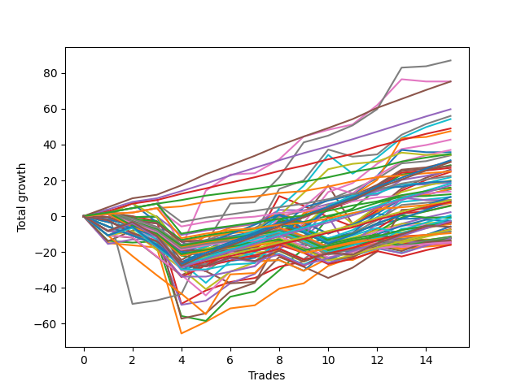

# Long Pointer Five (1226 1230 NC) 
- Symbol: ES_Unlimited
- Date Range: 03/18/2022 - 07/15/2022
- Trading Period: 7:20-12:30
- Number of Trades: 15



| Name | Win Percent | Profit | Avg Profit / Trade | Avg Time / Trade |      | Name | Win Percent | Profit | Avg Profit / Trade | Avg Time / Trade |
| ---- | ----------- | ------ | ------------------ | ---------------- | ---- | ---- | ----------- | ------ | ------------------ | ---------------- |
| Sorted By <br> Profit | | | | | | Sorted By <br> Win Percentage ||||
| Seven | 93.33 | 43500.00 | 2900.00 | 83:26 |     | Eighty-Five | 100.00 | 37625.00 | 2508.33 | 42:30 |
| Eighty-Five | 100.00 | 37625.00 | 2508.33 | 42:30 |     | Eighty-Four | 100.00 | 29875.00 | 1991.67 | 39:05 |
| Six | 86.67 | 37625.00 | 2508.33 | 37:38 |     | Eighty-Three | 100.00 | 24500.00 | 1633.33 | 35:21 |
| Eighty-Four | 100.00 | 29875.00 | 1991.67 | 39:05 |     | Eighty-Two | 100.00 | 17375.00 | 1158.33 | 19:45 |
| Sixty-Nine | 73.33 | 28000.00 | 1866.67 | 27:07 |     | Eighty-One | 100.00 | 12500.00 | 833.33 | 18:52 |
| Sixty-One | 66.67 | 27125.00 | 1808.33 | 35:23 |     | Seven | 93.33 | 43500.00 | 2900.00 | 83:26 |
| Eighty-Three | 100.00 | 24500.00 | 1633.33 | 35:21 |     | One Hundred Twenty-Two | 93.33 | 11250.00 | 750.00 | 06:07 |
| Sixty-Three | 66.67 | 23750.00 | 1583.33 | 38:27 |     | One Hundred Twenty-Seven | 93.33 | 8000.00 | 533.33 | 06:25 |
| Fifty-Eight | 66.67 | 21375.00 | 1425.00 | 27:20 |     | One Hundred Twenty-One | 93.33 | 6875.00 | 458.33 | 05:22 |
| Sixty-Eight | 73.33 | 18500.00 | 1233.33 | 17:54 |     | One Hundred Twenty-Six | 93.33 | 3625.00 | 241.67 | 05:40 |
| Sixty-Two | 73.33 | 17875.00 | 1191.67 | 20:54 |     | Six | 86.67 | 37625.00 | 2508.33 | 37:38 |
| Eighty-Two | 100.00 | 17375.00 | 1158.33 | 19:45 |     | Seventy | 80.00 | 17125.00 | 1141.67 | 14:44 |
| Seventy | 80.00 | 17125.00 | 1141.67 | 14:44 |     | Fifty-Nine | 80.00 | 17000.00 | 1133.33 | 09:13 |
| Fifty-Nine | 80.00 | 17000.00 | 1133.33 | 09:13 |     | One Hundred Twenty-Five | 80.00 | 15625.00 | 1041.67 | 14:40 |
| One Hundred Twenty-Five | 80.00 | 15625.00 | 1041.67 | 14:40 |     | Sixty-Seven | 80.00 | 15250.00 | 1016.67 | 09:14 |
| Sixty-Seven | 80.00 | 15250.00 | 1016.67 | 09:14 |     | One Hundred Thirty | 80.00 | 15125.00 | 1008.33 | 14:35 |
| One Hundred Thirty | 80.00 | 15125.00 | 1008.33 | 14:35 |     | Five | 80.00 | 13000.00 | 866.67 | 55:15 |
| Two | 73.33 | 14250.00 | 950.00 | 35:26 |     | Seventy-One | 80.00 | 10875.00 | 725.00 | 22:13 |
| Fifty-Seven | 73.33 | 14000.00 | 933.33 | 08:57 |     | Fifty-Six | 80.00 | 9375.00 | 625.00 | 04:29 |
| Sixty-Five | 73.33 | 13500.00 | 900.00 | 08:52 |     | One Hundred Twenty-Four | 80.00 | 9125.00 | 608.33 | 12:02 |
| Five | 80.00 | 13000.00 | 866.67 | 55:15 |     | One Hundred Twenty-Nine | 80.00 | 8625.00 | 575.00 | 11:56 |
| Sixty-Six | 73.33 | 12750.00 | 850.00 | 19:56 |     | Sixty-Four | 80.00 | 6125.00 | 408.33 | 04:47 |
| Eighty-One | 100.00 | 12500.00 | 833.33 | 18:52 |     | One Hundred Twenty-Three | 80.00 | 4500.00 | 300.00 | 09:34 |
| Forty-Five | 46.67 | 12375.00 | 825.00 | 19:44 |     | One Hundred Twenty-Eight | 80.00 | 4000.00 | 266.67 | 09:28 |
| One Hundred Twenty-Two | 93.33 | 11250.00 | 750.00 | 06:07 |     | Three | 80.00 | 3000.00 | 200.00 | 15:05 |
| Seventy-One | 80.00 | 10875.00 | 725.00 | 22:13 |     | Four | 80.00 | 1125.00 | 75.00 | 33:17 |
| Sixty | 66.67 | 10000.00 | 666.67 | 20:17 |     | Zero | 80.00 | -125.00 | -8.33 | 06:21 |
| Seventy-Three | 66.67 | 9750.00 | 650.00 | 09:21 |     | Sixty-Nine | 73.33 | 28000.00 | 1866.67 | 27:07 |
| Fifty-Six | 80.00 | 9375.00 | 625.00 | 04:29 |     | Sixty-Eight | 73.33 | 18500.00 | 1233.33 | 17:54 |
| One Hundred Twenty-Four | 80.00 | 9125.00 | 608.33 | 12:02 |     | Sixty-Two | 73.33 | 17875.00 | 1191.67 | 20:54 |
| One Hundred Twenty-Nine | 80.00 | 8625.00 | 575.00 | 11:56 |     | Two | 73.33 | 14250.00 | 950.00 | 35:26 |
| One Hundred Twenty-Seven | 93.33 | 8000.00 | 533.33 | 06:25 |     | Fifty-Seven | 73.33 | 14000.00 | 933.33 | 08:57 |
| Forty-Three | 66.67 | 7625.00 | 508.33 | 05:05 |     | Sixty-Five | 73.33 | 13500.00 | 900.00 | 08:52 |
| Forty-Two | 53.33 | 7500.00 | 500.00 | 12:19 |     | Sixty-Six | 73.33 | 12750.00 | 850.00 | 19:56 |
| One Hundred Twenty-One | 93.33 | 6875.00 | 458.33 | 05:22 |     | One Hundred Seventeen | 73.33 | -1750.00 | -116.67 | 02:43 |
| Sixty-Four | 80.00 | 6125.00 | 408.33 | 04:47 |     | Forty-Eight | 73.33 | -2000.00 | -133.33 | 02:25 |
| One Hundred Fifteen | 60.00 | 5375.00 | 358.33 | 08:26 |     | One | 73.33 | -2250.00 | -150.00 | 15:36 |
| Forty-One | 60.00 | 5375.00 | 358.33 | 05:06 |     | One Hundred Sixteen | 73.33 | -4750.00 | -316.67 | 02:13 |
| One Hundred Twenty-Three | 80.00 | 4500.00 | 300.00 | 09:34 |     | Sixty-One | 66.67 | 27125.00 | 1808.33 | 35:23 |
| Forty-Nine | 60.00 | 4500.00 | 300.00 | 04:56 |     | Sixty-Three | 66.67 | 23750.00 | 1583.33 | 38:27 |
| Forty-Six | 53.33 | 4500.00 | 300.00 | 09:55 |     | Fifty-Eight | 66.67 | 21375.00 | 1425.00 | 27:20 |
| One Hundred Five | 53.33 | 4125.00 | 275.00 | 08:11 |     | Sixty | 66.67 | 10000.00 | 666.67 | 20:17 |
| One Hundred Twenty-Eight | 80.00 | 4000.00 | 266.67 | 09:28 |     | Seventy-Three | 66.67 | 9750.00 | 650.00 | 09:21 |
| Forty-Seven | 46.67 | 3750.00 | 250.00 | 15:45 |     | Forty-Three | 66.67 | 7625.00 | 508.33 | 05:05 |
| One Hundred Twenty-Six | 93.33 | 3625.00 | 241.67 | 05:40 |     | Forty | 66.67 | -1500.00 | -100.00 | 02:02 |
| Three | 80.00 | 3000.00 | 200.00 | 15:05 |     | One Hundred Twelve | 66.67 | -4250.00 | -283.33 | 02:12 |
| Forty-Four | 46.67 | 2875.00 | 191.67 | 13:17 |     | One Hundred Eleven | 66.67 | -7250.00 | -483.33 | 01:42 |
| Four | 80.00 | 1125.00 | 75.00 | 33:17 |     | One Hundred Fifteen | 60.00 | 5375.00 | 358.33 | 08:26 |
| One Hundred Fourteen | 60.00 | 250.00 | 16.67 | 05:52 |     | Forty-One | 60.00 | 5375.00 | 358.33 | 05:06 |
| Zero | 80.00 | -125.00 | -8.33 | 06:21 |     | Forty-Nine | 60.00 | 4500.00 | 300.00 | 04:56 |
| Fifty-Four | 60.00 | -375.00 | -25.00 | 04:08 |     | One Hundred Fourteen | 60.00 | 250.00 | 16.67 | 05:52 |
| One Hundred Four | 53.33 | -625.00 | -41.67 | 05:38 |     | Fifty-Four | 60.00 | -375.00 | -25.00 | 04:08 |
| Fifty-One | 53.33 | -1250.00 | -83.33 | 05:00 |     | One Hundred Eighteen | 60.00 | -1750.00 | -116.67 | 04:57 |
| One Hundred Ninteen | 53.33 | -1375.00 | -91.67 | 06:03 |     | One Hundred Thirteen | 60.00 | -3750.00 | -250.00 | 04:36 |
| Fifty-Two | 40.00 | -1375.00 | -91.67 | 08:10 |     | Ninety-Two | 60.00 | -5750.00 | -383.33 | 01:58 |
| Forty | 66.67 | -1500.00 | -100.00 | 02:02 |     | One Hundred Two | 60.00 | -6000.00 | -400.00 | 01:59 |
| One Hundred Seventeen | 73.33 | -1750.00 | -116.67 | 02:43 |     | Ninety-Six | 60.00 | -6125.00 | -408.33 | 01:30 |
| One Hundred Eighteen | 60.00 | -1750.00 | -116.67 | 04:57 |     | One Hundred Seven | 60.00 | -6250.00 | -416.67 | 02:07 |
| Fifty | 53.33 | -1875.00 | -125.00 | 07:19 |     | Ninety-One | 60.00 | -7500.00 | -500.00 | 01:30 |
| Forty-Eight | 73.33 | -2000.00 | -133.33 | 02:25 |     | One Hundred One | 60.00 | -7750.00 | -516.67 | 01:31 |
| One | 73.33 | -2250.00 | -150.00 | 15:36 |     | One Hundred Six | 60.00 | -8000.00 | -533.33 | 01:39 |
| Ninety-Five | 40.00 | -2875.00 | -191.67 | 07:38 |     | Forty-Two | 53.33 | 7500.00 | 500.00 | 12:19 |
| One Hundred Twenty | 40.00 | -3000.00 | -200.00 | 07:07 |     | Forty-Six | 53.33 | 4500.00 | 300.00 | 09:55 |
| Fifty-Five | 53.33 | -3625.00 | -241.67 | 05:58 |     | One Hundred Five | 53.33 | 4125.00 | 275.00 | 08:11 |
| One Hundred Thirteen | 60.00 | -3750.00 | -250.00 | 04:36 |     | One Hundred Four | 53.33 | -625.00 | -41.67 | 05:38 |
| One Hundred Twelve | 66.67 | -4250.00 | -283.33 | 02:12 |     | Fifty-One | 53.33 | -1250.00 | -83.33 | 05:00 |
| One Hundred Three | 53.33 | -4250.00 | -283.33 | 04:22 |     | One Hundred Ninteen | 53.33 | -1375.00 | -91.67 | 06:03 |
| One Hundred Sixteen | 73.33 | -4750.00 | -316.67 | 02:13 |     | Fifty | 53.33 | -1875.00 | -125.00 | 07:19 |
| Ninety-Two | 60.00 | -5750.00 | -383.33 | 01:58 |     | Fifty-Five | 53.33 | -3625.00 | -241.67 | 05:58 |
| Ninety-Seven | 53.33 | -5750.00 | -383.33 | 01:42 |     | One Hundred Three | 53.33 | -4250.00 | -283.33 | 04:22 |
| One Hundred Two | 60.00 | -6000.00 | -400.00 | 01:59 |     | Ninety-Seven | 53.33 | -5750.00 | -383.33 | 01:42 |
| Ninety-Three | 46.67 | -6000.00 | -400.00 | 04:06 |     | One Hundred | 53.33 | -7000.00 | -466.67 | 02:17 |
| Ninety-Six | 60.00 | -6125.00 | -408.33 | 01:30 |     | Ninety-Nine | 53.33 | -7375.00 | -491.67 | 02:14 |
| Ninety-Four | 40.00 | -6125.00 | -408.33 | 05:11 |     | Ninety-Eight | 53.33 | -7875.00 | -525.00 | 02:14 |
| One Hundred Seven | 60.00 | -6250.00 | -416.67 | 02:07 |     | Forty-Five | 46.67 | 12375.00 | 825.00 | 19:44 |
| One Hundred Nine | 40.00 | -6250.00 | -416.67 | 03:42 |     | Forty-Seven | 46.67 | 3750.00 | 250.00 | 15:45 |
| One Hundred Ten | 40.00 | -6750.00 | -450.00 | 04:18 |     | Forty-Four | 46.67 | 2875.00 | 191.67 | 13:17 |
| Fifty-Three | 40.00 | -6875.00 | -458.33 | 09:13 |     | Ninety-Three | 46.67 | -6000.00 | -400.00 | 04:06 |
| One Hundred | 53.33 | -7000.00 | -466.67 | 02:17 |     | Fifty-Two | 40.00 | -1375.00 | -91.67 | 08:10 |
| One Hundred Eleven | 66.67 | -7250.00 | -483.33 | 01:42 |     | Ninety-Five | 40.00 | -2875.00 | -191.67 | 07:38 |
| Ninety-Nine | 53.33 | -7375.00 | -491.67 | 02:14 |     | One Hundred Twenty | 40.00 | -3000.00 | -200.00 | 07:07 |
| Ninety-One | 60.00 | -7500.00 | -500.00 | 01:30 |     | Ninety-Four | 40.00 | -6125.00 | -408.33 | 05:11 |
| One Hundred One | 60.00 | -7750.00 | -516.67 | 01:31 |     | One Hundred Nine | 40.00 | -6250.00 | -416.67 | 03:42 |
| Ninety-Eight | 53.33 | -7875.00 | -525.00 | 02:14 |     | One Hundred Ten | 40.00 | -6750.00 | -450.00 | 04:18 |
| One Hundred Six | 60.00 | -8000.00 | -533.33 | 01:39 |     | Fifty-Three | 40.00 | -6875.00 | -458.33 | 09:13 |
| One Hundred Eight | 40.00 | -8000.00 | -533.33 | 03:09 |     | One Hundred Eight | 40.00 | -8000.00 | -533.33 | 03:09 |

## NO STOPLOSS

### Test Zero
* Sell when price hits the middle line of the 20p bollinger
* No Stoploss
* Results:
```
Total Trades: 15
Percent Up: 80.00
Percent Down: 20.00
Total Points Moved Up: -0.25
Potential Profit: -125.00
Total Points Ups: 32.50 Count Ups: 12
Total Points Downs: -32.75 Count Downs: 3
```

<details><summary>Trades</summary>

<code>In: 2022-03-28 08:11:00		Out: 2022-03-28 08:13:30		Total Position Time: 02:30		Total Move Up: 2.75		Total to Date: 2.75</code> <br />
<code>In: 2022-04-12 07:47:00		Out: 2022-04-12 08:02:05		Total Position Time: 15:05		Total Move Up: -3.25		Total to Date: -0.50</code> <br />
<code>In: 2022-04-27 12:07:00		Out: 2022-04-27 12:15:05		Total Position Time: 08:05		Total Move Up: 0.25		Total to Date: -0.25</code> <br />
<code>In: 2022-05-10 07:33:00		Out: 2022-05-10 08:02:25		Total Position Time: 29:25		Total Move Up: -29.25		Total to Date: -29.50</code> <br />
<code>In: 2022-05-12 11:15:00		Out: 2022-05-12 11:16:10		Total Position Time: 01:10		Total Move Up: 2.50		Total to Date: -27.00</code> <br />
<code>In: 2022-05-19 10:19:00		Out: 2022-05-19 10:20:10		Total Position Time: 01:10		Total Move Up: 2.00		Total to Date: -25.00</code> <br />
<code>In: 2022-05-26 10:32:00		Out: 2022-05-26 10:34:05		Total Position Time: 02:05		Total Move Up: 1.75		Total to Date: -23.25</code> <br />
<code>In: 2022-06-02 07:30:00		Out: 2022-06-02 07:34:25		Total Position Time: 04:25		Total Move Up: 7.75		Total to Date: -15.50</code> <br />
<code>In: 2022-06-15 08:19:00		Out: 2022-06-15 08:34:25		Total Position Time: 15:25		Total Move Up: -0.25		Total to Date: -15.75</code> <br />
<code>In: 2022-06-16 11:57:00		Out: 2022-06-16 12:00:35		Total Position Time: 03:35		Total Move Up: 3.50		Total to Date: -12.25</code> <br />
<code>In: 2022-06-22 11:55:00		Out: 2022-06-22 11:56:10		Total Position Time: 01:10		Total Move Up: 3.00		Total to Date: -9.25</code> <br />
<code>In: 2022-06-27 12:09:00		Out: 2022-06-27 12:10:20		Total Position Time: 01:20		Total Move Up: 4.25		Total to Date: -5.00</code> <br />
<code>In: 2022-06-29 09:32:00		Out: 2022-06-29 09:36:40		Total Position Time: 04:40		Total Move Up: 3.50		Total to Date: -1.50</code> <br />
<code>In: 2022-07-07 08:35:00		Out: 2022-07-07 08:38:05		Total Position Time: 03:05		Total Move Up: 0.25		Total to Date: -1.25</code> <br />
<code>In: 2022-07-15 11:08:00		Out: 2022-07-15 11:10:05		Total Position Time: 02:05		Total Move Up: 1.00		Total to Date: -0.25</code> <br />


</details>

### Test One
* Sell when the price hits the upper line of the 20p 1std bollinger
* No Stoploss
* Results:
```
Total Trades: 15
Percent Up: 73.33
Percent Down: 26.67
Total Points Moved Up: -4.50
Potential Profit: -2250.00
Total Points Ups: 61.00 Count Ups: 11
Total Points Downs: -65.50 Count Downs: 4
```

<details><summary>Trades</summary>

<code>In: 2022-03-28 08:11:00		Out: 2022-03-28 09:05:25		Total Position Time: 54:25		Total Move Up: -15.00		Total to Date: -15.00</code> <br />
<code>In: 2022-04-12 07:47:00		Out: 2022-04-12 08:02:35		Total Position Time: 15:35		Total Move Up: -1.25		Total to Date: -16.25</code> <br />
<code>In: 2022-04-27 12:07:00		Out: 2022-04-27 12:27:15		Total Position Time: 20:15		Total Move Up: -1.25		Total to Date: -17.50</code> <br />
<code>In: 2022-05-10 07:33:00		Out: 2022-05-10 08:37:10		Total Position Time: 64:10		Total Move Up: -48.00		Total to Date: -65.50</code> <br />
<code>In: 2022-05-12 11:15:00		Out: 2022-05-12 11:20:20		Total Position Time: 05:20		Total Move Up: 6.50		Total to Date: -59.00</code> <br />
<code>In: 2022-05-19 10:19:00		Out: 2022-05-19 10:22:50		Total Position Time: 03:50		Total Move Up: 7.50		Total to Date: -51.50</code> <br />
<code>In: 2022-05-26 10:32:00		Out: 2022-05-26 10:44:45		Total Position Time: 12:45		Total Move Up: 1.75		Total to Date: -49.75</code> <br />
<code>In: 2022-06-02 07:30:00		Out: 2022-06-02 07:39:50		Total Position Time: 09:50		Total Move Up: 9.25		Total to Date: -40.50</code> <br />
<code>In: 2022-06-15 08:19:00		Out: 2022-06-15 08:38:55		Total Position Time: 19:55		Total Move Up: 3.00		Total to Date: -37.50</code> <br />
<code>In: 2022-06-16 11:57:00		Out: 2022-06-16 12:01:55		Total Position Time: 04:55		Total Move Up: 9.75		Total to Date: -27.75</code> <br />
<code>In: 2022-06-22 11:55:00		Out: 2022-06-22 11:57:35		Total Position Time: 02:35		Total Move Up: 4.75		Total to Date: -23.00</code> <br />
<code>In: 2022-06-27 12:09:00		Out: 2022-06-27 12:12:10		Total Position Time: 03:10		Total Move Up: 7.25		Total to Date: -15.75</code> <br />
<code>In: 2022-06-29 09:32:00		Out: 2022-06-29 09:38:30		Total Position Time: 06:30		Total Move Up: 8.50		Total to Date: -7.25</code> <br />
<code>In: 2022-07-07 08:35:00		Out: 2022-07-07 08:39:05		Total Position Time: 04:05		Total Move Up: 1.25		Total to Date: -6.00</code> <br />
<code>In: 2022-07-15 11:08:00		Out: 2022-07-15 11:14:40		Total Position Time: 06:40		Total Move Up: 1.50		Total to Date: -4.50</code> <br />


</details>

### Test Two
* Sell when the price hits the upper line of the 20p 2std bollinger
* No Stoploss
* Results:
```
Total Trades: 15
Percent Up: 73.33
Percent Down: 26.67
Total Points Moved Up: 28.50
Potential Profit: 14250.00
Total Points Ups: 87.75 Count Ups: 11
Total Points Downs: -59.25 Count Downs: 4
```

<details><summary>Trades</summary>

<code>In: 2022-03-28 08:11:00		Out: 2022-03-28 09:07:10		Total Position Time: 56:10		Total Move Up: -13.75		Total to Date: -13.75</code> <br />
<code>In: 2022-04-12 07:47:00		Out: 2022-04-12 08:15:40		Total Position Time: 28:40		Total Move Up: -1.00		Total to Date: -14.75</code> <br />
<code>In: 2022-04-27 12:07:00		Out: 2022-04-27 12:31:20		Total Position Time: 24:20		Total Move Up: 0.75		Total to Date: -14.00</code> <br />
<code>In: 2022-05-10 07:33:00		Out: 2022-05-10 08:39:10		Total Position Time: 66:10		Total Move Up: -41.75		Total to Date: -55.75</code> <br />
<code>In: 2022-05-12 11:15:00		Out: 2022-05-12 11:53:25		Total Position Time: 38:25		Total Move Up: -2.75		Total to Date: -58.50</code> <br />
<code>In: 2022-05-19 10:19:00		Out: 2022-05-19 10:44:05		Total Position Time: 25:05		Total Move Up: 13.50		Total to Date: -45.00</code> <br />
<code>In: 2022-05-26 10:32:00		Out: 2022-05-26 10:48:40		Total Position Time: 16:40		Total Move Up: 3.00		Total to Date: -42.00</code> <br />
<code>In: 2022-06-02 07:30:00		Out: 2022-06-02 07:42:35		Total Position Time: 12:35		Total Move Up: 11.75		Total to Date: -30.25</code> <br />
<code>In: 2022-06-15 08:19:00		Out: 2022-06-15 10:58:15		Total Position Time: 159:15		Total Move Up: 12.25		Total to Date: -18.00</code> <br />
<code>In: 2022-06-16 11:57:00		Out: 2022-06-16 12:10:00		Total Position Time: 13:00		Total Move Up: 17.25		Total to Date: -0.75</code> <br />
<code>In: 2022-06-22 11:55:00		Out: 2022-06-22 12:04:10		Total Position Time: 09:10		Total Move Up: 5.00		Total to Date: 4.25</code> <br />
<code>In: 2022-06-27 12:09:00		Out: 2022-06-27 12:45:40		Total Position Time: 36:40		Total Move Up: 10.75		Total to Date: 15.00</code> <br />
<code>In: 2022-06-29 09:32:00		Out: 2022-06-29 10:01:45		Total Position Time: 29:45		Total Move Up: 8.25		Total to Date: 23.25</code> <br />
<code>In: 2022-07-07 08:35:00		Out: 2022-07-07 08:43:45		Total Position Time: 08:45		Total Move Up: 2.25		Total to Date: 25.50</code> <br />
<code>In: 2022-07-15 11:08:00		Out: 2022-07-15 11:15:00		Total Position Time: 07:00		Total Move Up: 3.00		Total to Date: 28.50</code> <br />


</details>

### Test Three
* Sell when price hits the middle line of the 50p bollinger
* No Stoploss
* Results:
```
Total Trades: 15
Percent Up: 80.00
Percent Down: 20.00
Total Points Moved Up: 6.00
Potential Profit: 3000.00
Total Points Ups: 56.25 Count Ups: 12
Total Points Downs: -50.25 Count Downs: 3
```

<details><summary>Trades</summary>

<code>In: 2022-03-28 08:11:00		Out: 2022-03-28 08:12:10		Total Position Time: 01:10		Total Move Up: 1.25		Total to Date: 1.25</code> <br />
<code>In: 2022-04-12 07:47:00		Out: 2022-04-12 08:16:15		Total Position Time: 29:15		Total Move Up: -1.25		Total to Date: 0.00</code> <br />
<code>In: 2022-04-27 12:07:00		Out: 2022-04-27 12:44:20		Total Position Time: 37:20		Total Move Up: -2.75		Total to Date: -2.75</code> <br />
<code>In: 2022-05-10 07:33:00		Out: 2022-05-10 08:38:55		Total Position Time: 65:55		Total Move Up: -46.25		Total to Date: -49.00</code> <br />
<code>In: 2022-05-12 11:15:00		Out: 2022-05-12 11:20:25		Total Position Time: 05:25		Total Move Up: 7.50		Total to Date: -41.50</code> <br />
<code>In: 2022-05-19 10:19:00		Out: 2022-05-19 10:21:25		Total Position Time: 02:25		Total Move Up: 4.75		Total to Date: -36.75</code> <br />
<code>In: 2022-05-26 10:32:00		Out: 2022-05-26 10:58:05		Total Position Time: 26:05		Total Move Up: 2.25		Total to Date: -34.50</code> <br />
<code>In: 2022-06-02 07:30:00		Out: 2022-06-02 07:34:10		Total Position Time: 04:10		Total Move Up: 6.25		Total to Date: -28.25</code> <br />
<code>In: 2022-06-15 08:19:00		Out: 2022-06-15 08:38:55		Total Position Time: 19:55		Total Move Up: 3.00		Total to Date: -25.25</code> <br />
<code>In: 2022-06-16 11:57:00		Out: 2022-06-16 12:01:35		Total Position Time: 04:35		Total Move Up: 6.25		Total to Date: -19.00</code> <br />
<code>In: 2022-06-22 11:55:00		Out: 2022-06-22 12:04:20		Total Position Time: 09:20		Total Move Up: 5.75		Total to Date: -13.25</code> <br />
<code>In: 2022-06-27 12:09:00		Out: 2022-06-27 12:11:50		Total Position Time: 02:50		Total Move Up: 6.25		Total to Date: -7.00</code> <br />
<code>In: 2022-06-29 09:32:00		Out: 2022-06-29 09:38:30		Total Position Time: 06:30		Total Move Up: 8.50		Total to Date: 1.50</code> <br />
<code>In: 2022-07-07 08:35:00		Out: 2022-07-07 08:39:05		Total Position Time: 04:05		Total Move Up: 1.25		Total to Date: 2.75</code> <br />
<code>In: 2022-07-15 11:08:00		Out: 2022-07-15 11:15:20		Total Position Time: 07:20		Total Move Up: 3.25		Total to Date: 6.00</code> <br />


</details>

### Test Four
* Sell when the price hits the upper line of the 50p 1std bollinger
* No Stoploss
* Results:
```
Total Trades: 15
Percent Up: 80.00
Percent Down: 20.00
Total Points Moved Up: 2.25
Potential Profit: 1125.00
Total Points Ups: 76.25 Count Ups: 12
Total Points Downs: -74.00 Count Downs: 3
```

<details><summary>Trades</summary>

<code>In: 2022-03-28 08:11:00		Out: 2022-03-28 09:35:05		Total Position Time: 84:05		Total Move Up: -15.50		Total to Date: -15.50</code> <br />
<code>In: 2022-04-12 07:47:00		Out: 2022-04-12 08:19:50		Total Position Time: 32:50		Total Move Up: 2.50		Total to Date: -13.00</code> <br />
<code>In: 2022-04-27 12:07:00		Out: 2022-04-27 12:46:10		Total Position Time: 39:10		Total Move Up: 0.25		Total to Date: -12.75</code> <br />
<code>In: 2022-05-10 07:33:00		Out: 2022-05-10 08:40:30		Total Position Time: 67:30		Total Move Up: -36.75		Total to Date: -49.50</code> <br />
<code>In: 2022-05-12 11:15:00		Out: 2022-05-12 12:04:10		Total Position Time: 49:10		Total Move Up: 2.25		Total to Date: -47.25</code> <br />
<code>In: 2022-05-19 10:19:00		Out: 2022-05-19 10:25:50		Total Position Time: 06:50		Total Move Up: 9.75		Total to Date: -37.50</code> <br />
<code>In: 2022-05-26 10:32:00		Out: 2022-05-26 10:59:20		Total Position Time: 27:20		Total Move Up: 5.25		Total to Date: -32.25</code> <br />
<code>In: 2022-06-02 07:30:00		Out: 2022-06-02 07:48:10		Total Position Time: 18:10		Total Move Up: 14.25		Total to Date: -18.00</code> <br />
<code>In: 2022-06-15 08:19:00		Out: 2022-06-15 08:57:35		Total Position Time: 38:35		Total Move Up: 6.00		Total to Date: -12.00</code> <br />
<code>In: 2022-06-16 11:57:00		Out: 2022-06-16 12:04:10		Total Position Time: 07:10		Total Move Up: 11.75		Total to Date: -0.25</code> <br />
<code>In: 2022-06-22 11:55:00		Out: 2022-06-22 12:47:00		Total Position Time: 52:00		Total Move Up: -21.75		Total to Date: -22.00</code> <br />
<code>In: 2022-06-27 12:09:00		Out: 2022-06-27 12:15:30		Total Position Time: 06:30		Total Move Up: 9.75		Total to Date: -12.25</code> <br />
<code>In: 2022-06-29 09:32:00		Out: 2022-06-29 09:59:30		Total Position Time: 27:30		Total Move Up: 8.00		Total to Date: -4.25</code> <br />
<code>In: 2022-07-07 08:35:00		Out: 2022-07-07 08:44:25		Total Position Time: 09:25		Total Move Up: 3.50		Total to Date: -0.75</code> <br />
<code>In: 2022-07-15 11:08:00		Out: 2022-07-15 11:41:10		Total Position Time: 33:10		Total Move Up: 3.00		Total to Date: 2.25</code> <br />


</details>

### Test Five
* Sell when the price hits the upper line of the 50p 2std bollinger
* No Stoploss
* Results:
```
Total Trades: 15
Percent Up: 80.00
Percent Down: 20.00
Total Points Moved Up: 26.00
Potential Profit: 13000.00
Total Points Ups: 113.00 Count Ups: 12
Total Points Downs: -87.00 Count Downs: 3
```

<details><summary>Trades</summary>

<code>In: 2022-03-28 08:11:00		Out: 2022-03-28 09:39:55		Total Position Time: 88:55		Total Move Up: -14.00		Total to Date: -14.00</code> <br />
<code>In: 2022-04-12 07:47:00		Out: 2022-04-12 08:23:15		Total Position Time: 36:15		Total Move Up: 6.00		Total to Date: -8.00</code> <br />
<code>In: 2022-04-27 12:07:00		Out: 2022-04-27 12:47:00		Total Position Time: 40:00		Total Move Up: 2.00		Total to Date: -6.00</code> <br />
<code>In: 2022-05-10 07:33:00		Out: 2022-05-10 10:04:15		Total Position Time: 151:15		Total Move Up: -51.25		Total to Date: -57.25</code> <br />
<code>In: 2022-05-12 11:15:00		Out: 2022-05-12 12:17:40		Total Position Time: 62:40		Total Move Up: 3.00		Total to Date: -54.25</code> <br />
<code>In: 2022-05-19 10:19:00		Out: 2022-05-19 10:31:30		Total Position Time: 12:30		Total Move Up: 12.25		Total to Date: -42.00</code> <br />
<code>In: 2022-05-26 10:32:00		Out: 2022-05-26 11:15:45		Total Position Time: 43:45		Total Move Up: 4.75		Total to Date: -37.25</code> <br />
<code>In: 2022-06-02 07:30:00		Out: 2022-06-02 08:02:20		Total Position Time: 32:20		Total Move Up: 25.00		Total to Date: -12.25</code> <br />
<code>In: 2022-06-15 08:19:00		Out: 2022-06-15 10:58:15		Total Position Time: 159:15		Total Move Up: 12.25		Total to Date: 0.00</code> <br />
<code>In: 2022-06-16 11:57:00		Out: 2022-06-16 12:10:00		Total Position Time: 13:00		Total Move Up: 17.25		Total to Date: 17.25</code> <br />
<code>In: 2022-06-22 11:55:00		Out: 2022-06-22 12:47:00		Total Position Time: 52:00		Total Move Up: -21.75		Total to Date: -4.50</code> <br />
<code>In: 2022-06-27 12:09:00		Out: 2022-06-27 12:47:00		Total Position Time: 38:00		Total Move Up: 9.00		Total to Date: 4.50</code> <br />
<code>In: 2022-06-29 09:32:00		Out: 2022-06-29 10:09:35		Total Position Time: 37:35		Total Move Up: 11.00		Total to Date: 15.50</code> <br />
<code>In: 2022-07-07 08:35:00		Out: 2022-07-07 09:02:00		Total Position Time: 27:00		Total Move Up: 6.00		Total to Date: 21.50</code> <br />
<code>In: 2022-07-15 11:08:00		Out: 2022-07-15 11:42:25		Total Position Time: 34:25		Total Move Up: 4.50		Total to Date: 26.00</code> <br />


</details>

### Test Six
* Sell when the price hits the middle line of the 1std VWAP
* No Stoploss
* Results:
```
Total Trades: 15
Percent Up: 86.67
Percent Down: 13.33
Total Points Moved Up: 75.25
Potential Profit: 37625.00
Total Points Ups: 103.25 Count Ups: 13
Total Points Downs: -28.00 Count Downs: 2
```

<details><summary>Trades</summary>

<code>In: 2022-03-28 08:11:00		Out: 2022-03-28 08:12:10		Total Position Time: 01:10		Total Move Up: 1.25		Total to Date: 1.25</code> <br />
<code>In: 2022-04-12 07:47:00		Out: 2022-04-12 08:23:15		Total Position Time: 36:15		Total Move Up: 6.00		Total to Date: 7.25</code> <br />
<code>In: 2022-04-27 12:07:00		Out: 2022-04-27 12:47:00		Total Position Time: 40:00		Total Move Up: 2.00		Total to Date: 9.25</code> <br />
<code>In: 2022-05-10 07:33:00		Out: 2022-05-10 10:35:05		Total Position Time: 182:05		Total Move Up: -26.75		Total to Date: -17.50</code> <br />
<code>In: 2022-05-12 11:15:00		Out: 2022-05-12 12:23:20		Total Position Time: 68:20		Total Move Up: 31.75		Total to Date: 14.25</code> <br />
<code>In: 2022-05-19 10:19:00		Out: 2022-05-19 10:23:20		Total Position Time: 04:20		Total Move Up: 9.00		Total to Date: 23.25</code> <br />
<code>In: 2022-05-26 10:32:00		Out: 2022-05-26 10:33:10		Total Position Time: 01:10		Total Move Up: 0.75		Total to Date: 24.00</code> <br />
<code>In: 2022-06-02 07:30:00		Out: 2022-06-02 07:34:25		Total Position Time: 04:25		Total Move Up: 7.75		Total to Date: 31.75</code> <br />
<code>In: 2022-06-15 08:19:00		Out: 2022-06-15 09:22:15		Total Position Time: 63:15		Total Move Up: 12.75		Total to Date: 44.50</code> <br />
<code>In: 2022-06-16 11:57:00		Out: 2022-06-16 12:47:00		Total Position Time: 50:00		Total Move Up: 3.75		Total to Date: 48.25</code> <br />
<code>In: 2022-06-22 11:55:00		Out: 2022-06-22 11:56:10		Total Position Time: 01:10		Total Move Up: 3.00		Total to Date: 51.25</code> <br />
<code>In: 2022-06-27 12:09:00		Out: 2022-06-27 12:45:40		Total Position Time: 36:40		Total Move Up: 10.75		Total to Date: 62.00</code> <br />
<code>In: 2022-06-29 09:32:00		Out: 2022-06-29 10:45:25		Total Position Time: 73:25		Total Move Up: 14.50		Total to Date: 76.50</code> <br />
<code>In: 2022-07-07 08:35:00		Out: 2022-07-07 08:36:10		Total Position Time: 01:10		Total Move Up: -1.25		Total to Date: 75.25</code> <br />
<code>In: 2022-07-15 11:08:00		Out: 2022-07-15 11:09:10		Total Position Time: 01:10		Total Move Up: 0.00		Total to Date: 75.25</code> <br />


</details>

### Test Seven
* Sell when the price hits the upper line of the 1std VWAP
* No Stoploss
* Results:
```
Total Trades: 15
Percent Up: 93.33
Percent Down: 6.67
Total Points Moved Up: 87.00
Potential Profit: 43500.00
Total Points Ups: 139.75 Count Ups: 14
Total Points Downs: -52.75 Count Downs: 1
```

<details><summary>Trades</summary>

<code>In: 2022-03-28 08:11:00		Out: 2022-03-28 11:29:05		Total Position Time: 198:05		Total Move Up: 3.75		Total to Date: 3.75</code> <br />
<code>In: 2022-04-12 07:47:00		Out: 2022-04-12 12:47:00		Total Position Time: 300:00		Total Move Up: -52.75		Total to Date: -49.00</code> <br />
<code>In: 2022-04-27 12:07:00		Out: 2022-04-27 12:47:00		Total Position Time: 40:00		Total Move Up: 2.00		Total to Date: -47.00</code> <br />
<code>In: 2022-05-10 07:33:00		Out: 2022-05-10 10:59:35		Total Position Time: 206:35		Total Move Up: 3.50		Total to Date: -43.50</code> <br />
<code>In: 2022-05-12 11:15:00		Out: 2022-05-12 12:47:00		Total Position Time: 92:00		Total Move Up: 28.25		Total to Date: -15.25</code> <br />
<code>In: 2022-05-19 10:19:00		Out: 2022-05-19 10:56:05		Total Position Time: 37:05		Total Move Up: 22.25		Total to Date: 7.00</code> <br />
<code>In: 2022-05-26 10:32:00		Out: 2022-05-26 10:33:10		Total Position Time: 01:10		Total Move Up: 0.75		Total to Date: 7.75</code> <br />
<code>In: 2022-06-02 07:30:00		Out: 2022-06-02 07:47:05		Total Position Time: 17:05		Total Move Up: 14.00		Total to Date: 21.75</code> <br />
<code>In: 2022-06-15 08:19:00		Out: 2022-06-15 11:00:30		Total Position Time: 161:30		Total Move Up: 19.50		Total to Date: 41.25</code> <br />
<code>In: 2022-06-16 11:57:00		Out: 2022-06-16 12:47:00		Total Position Time: 50:00		Total Move Up: 3.75		Total to Date: 45.00</code> <br />
<code>In: 2022-06-22 11:55:00		Out: 2022-06-22 12:04:20		Total Position Time: 09:20		Total Move Up: 5.75		Total to Date: 50.75</code> <br />
<code>In: 2022-06-27 12:09:00		Out: 2022-06-27 12:47:00		Total Position Time: 38:00		Total Move Up: 9.00		Total to Date: 59.75</code> <br />
<code>In: 2022-06-29 09:32:00		Out: 2022-06-29 11:02:00		Total Position Time: 90:00		Total Move Up: 23.25		Total to Date: 83.00</code> <br />
<code>In: 2022-07-07 08:35:00		Out: 2022-07-07 08:38:30		Total Position Time: 03:30		Total Move Up: 0.75		Total to Date: 83.75</code> <br />
<code>In: 2022-07-15 11:08:00		Out: 2022-07-15 11:15:20		Total Position Time: 07:20		Total Move Up: 3.25		Total to Date: 87.00</code> <br />


</details>

## STOPLOSS OF 5

### Test Forty
* Sell when price hits the middle line of the 20p bollinger
* Stoploss is 5 points
* Results:
```
Total Trades: 15
Percent Up: 66.67
Percent Down: 33.33
Total Points Moved Up: -3.00
Potential Profit: -1500.00
Total Points Ups: 28.75 Count Ups: 10
Total Points Downs: -31.75 Count Downs: 5
```

<details><summary>Trades</summary>

<code>In: 2022-03-28 08:11:00		Out: 2022-03-28 08:13:30		Total Position Time: 02:30		Total Move Up: 2.75		Total to Date: 2.75</code> <br />
<code>In: 2022-04-12 07:47:00		Out: 2022-04-12 07:48:20		Total Position Time: 01:20		Total Move Up: -5.00		Total to Date: -2.25</code> <br />
<code>In: 2022-04-27 12:07:00		Out: 2022-04-27 12:08:40		Total Position Time: 01:40		Total Move Up: -5.00		Total to Date: -7.25</code> <br />
<code>In: 2022-05-10 07:33:00		Out: 2022-05-10 07:34:10		Total Position Time: 01:10		Total Move Up: -10.00		Total to Date: -17.25</code> <br />
<code>In: 2022-05-12 11:15:00		Out: 2022-05-12 11:16:10		Total Position Time: 01:10		Total Move Up: 2.50		Total to Date: -14.75</code> <br />
<code>In: 2022-05-19 10:19:00		Out: 2022-05-19 10:20:10		Total Position Time: 01:10		Total Move Up: 2.00		Total to Date: -12.75</code> <br />
<code>In: 2022-05-26 10:32:00		Out: 2022-05-26 10:34:05		Total Position Time: 02:05		Total Move Up: 1.75		Total to Date: -11.00</code> <br />
<code>In: 2022-06-02 07:30:00		Out: 2022-06-02 07:34:25		Total Position Time: 04:25		Total Move Up: 7.75		Total to Date: -3.25</code> <br />
<code>In: 2022-06-15 08:19:00		Out: 2022-06-15 08:20:40		Total Position Time: 01:40		Total Move Up: -5.50		Total to Date: -8.75</code> <br />
<code>In: 2022-06-16 11:57:00		Out: 2022-06-16 11:58:10		Total Position Time: 01:10		Total Move Up: -6.25		Total to Date: -15.00</code> <br />
<code>In: 2022-06-22 11:55:00		Out: 2022-06-22 11:56:10		Total Position Time: 01:10		Total Move Up: 3.00		Total to Date: -12.00</code> <br />
<code>In: 2022-06-27 12:09:00		Out: 2022-06-27 12:10:20		Total Position Time: 01:20		Total Move Up: 4.25		Total to Date: -7.75</code> <br />
<code>In: 2022-06-29 09:32:00		Out: 2022-06-29 09:36:40		Total Position Time: 04:40		Total Move Up: 3.50		Total to Date: -4.25</code> <br />
<code>In: 2022-07-07 08:35:00		Out: 2022-07-07 08:38:05		Total Position Time: 03:05		Total Move Up: 0.25		Total to Date: -4.00</code> <br />
<code>In: 2022-07-15 11:08:00		Out: 2022-07-15 11:10:05		Total Position Time: 02:05		Total Move Up: 1.00		Total to Date: -3.00</code> <br />


</details>

### Test Forty-One
* Sell when the price hits the upper line of the 20p 1std bollinger
* Stoploss is 5 points
* Results:
```
Total Trades: 15
Percent Up: 60.00
Percent Down: 40.00
Total Points Moved Up: 10.75
Potential Profit: 5375.00
Total Points Ups: 48.25 Count Ups: 9
Total Points Downs: -37.50 Count Downs: 6
```

<details><summary>Trades</summary>

<code>In: 2022-03-28 08:11:00		Out: 2022-03-28 08:25:50		Total Position Time: 14:50		Total Move Up: -5.75		Total to Date: -5.75</code> <br />
<code>In: 2022-04-12 07:47:00		Out: 2022-04-12 07:48:20		Total Position Time: 01:20		Total Move Up: -5.00		Total to Date: -10.75</code> <br />
<code>In: 2022-04-27 12:07:00		Out: 2022-04-27 12:08:40		Total Position Time: 01:40		Total Move Up: -5.00		Total to Date: -15.75</code> <br />
<code>In: 2022-05-10 07:33:00		Out: 2022-05-10 07:34:10		Total Position Time: 01:10		Total Move Up: -10.00		Total to Date: -25.75</code> <br />
<code>In: 2022-05-12 11:15:00		Out: 2022-05-12 11:20:20		Total Position Time: 05:20		Total Move Up: 6.50		Total to Date: -19.25</code> <br />
<code>In: 2022-05-19 10:19:00		Out: 2022-05-19 10:22:50		Total Position Time: 03:50		Total Move Up: 7.50		Total to Date: -11.75</code> <br />
<code>In: 2022-05-26 10:32:00		Out: 2022-05-26 10:44:45		Total Position Time: 12:45		Total Move Up: 1.75		Total to Date: -10.00</code> <br />
<code>In: 2022-06-02 07:30:00		Out: 2022-06-02 07:39:50		Total Position Time: 09:50		Total Move Up: 9.25		Total to Date: -0.75</code> <br />
<code>In: 2022-06-15 08:19:00		Out: 2022-06-15 08:20:40		Total Position Time: 01:40		Total Move Up: -5.50		Total to Date: -6.25</code> <br />
<code>In: 2022-06-16 11:57:00		Out: 2022-06-16 11:58:10		Total Position Time: 01:10		Total Move Up: -6.25		Total to Date: -12.50</code> <br />
<code>In: 2022-06-22 11:55:00		Out: 2022-06-22 11:57:35		Total Position Time: 02:35		Total Move Up: 4.75		Total to Date: -7.75</code> <br />
<code>In: 2022-06-27 12:09:00		Out: 2022-06-27 12:12:10		Total Position Time: 03:10		Total Move Up: 7.25		Total to Date: -0.50</code> <br />
<code>In: 2022-06-29 09:32:00		Out: 2022-06-29 09:38:30		Total Position Time: 06:30		Total Move Up: 8.50		Total to Date: 8.00</code> <br />
<code>In: 2022-07-07 08:35:00		Out: 2022-07-07 08:39:05		Total Position Time: 04:05		Total Move Up: 1.25		Total to Date: 9.25</code> <br />
<code>In: 2022-07-15 11:08:00		Out: 2022-07-15 11:14:40		Total Position Time: 06:40		Total Move Up: 1.50		Total to Date: 10.75</code> <br />


</details>

### Test Forty-Two
* Sell when the price hits the upper line of the 20p 2std bollinger
* Stoploss is 5 points
* Results:
```
Total Trades: 15
Percent Up: 53.33
Percent Down: 46.67
Total Points Moved Up: 15.00
Potential Profit: 7500.00
Total Points Ups: 57.50 Count Ups: 8
Total Points Downs: -42.50 Count Downs: 7
```

<details><summary>Trades</summary>

<code>In: 2022-03-28 08:11:00		Out: 2022-03-28 08:25:50		Total Position Time: 14:50		Total Move Up: -5.75		Total to Date: -5.75</code> <br />
<code>In: 2022-04-12 07:47:00		Out: 2022-04-12 07:48:20		Total Position Time: 01:20		Total Move Up: -5.00		Total to Date: -10.75</code> <br />
<code>In: 2022-04-27 12:07:00		Out: 2022-04-27 12:08:40		Total Position Time: 01:40		Total Move Up: -5.00		Total to Date: -15.75</code> <br />
<code>In: 2022-05-10 07:33:00		Out: 2022-05-10 07:34:10		Total Position Time: 01:10		Total Move Up: -10.00		Total to Date: -25.75</code> <br />
<code>In: 2022-05-12 11:15:00		Out: 2022-05-12 11:32:15		Total Position Time: 17:15		Total Move Up: -5.00		Total to Date: -30.75</code> <br />
<code>In: 2022-05-19 10:19:00		Out: 2022-05-19 10:44:05		Total Position Time: 25:05		Total Move Up: 13.50		Total to Date: -17.25</code> <br />
<code>In: 2022-05-26 10:32:00		Out: 2022-05-26 10:48:40		Total Position Time: 16:40		Total Move Up: 3.00		Total to Date: -14.25</code> <br />
<code>In: 2022-06-02 07:30:00		Out: 2022-06-02 07:42:35		Total Position Time: 12:35		Total Move Up: 11.75		Total to Date: -2.50</code> <br />
<code>In: 2022-06-15 08:19:00		Out: 2022-06-15 08:20:40		Total Position Time: 01:40		Total Move Up: -5.50		Total to Date: -8.00</code> <br />
<code>In: 2022-06-16 11:57:00		Out: 2022-06-16 11:58:10		Total Position Time: 01:10		Total Move Up: -6.25		Total to Date: -14.25</code> <br />
<code>In: 2022-06-22 11:55:00		Out: 2022-06-22 12:04:10		Total Position Time: 09:10		Total Move Up: 5.00		Total to Date: -9.25</code> <br />
<code>In: 2022-06-27 12:09:00		Out: 2022-06-27 12:45:40		Total Position Time: 36:40		Total Move Up: 10.75		Total to Date: 1.50</code> <br />
<code>In: 2022-06-29 09:32:00		Out: 2022-06-29 10:01:45		Total Position Time: 29:45		Total Move Up: 8.25		Total to Date: 9.75</code> <br />
<code>In: 2022-07-07 08:35:00		Out: 2022-07-07 08:43:45		Total Position Time: 08:45		Total Move Up: 2.25		Total to Date: 12.00</code> <br />
<code>In: 2022-07-15 11:08:00		Out: 2022-07-15 11:15:00		Total Position Time: 07:00		Total Move Up: 3.00		Total to Date: 15.00</code> <br />


</details>

### Test Forty-Three
* Sell when price hits the middle line of the 50p bollinger
* Stoploss is 5 points
* Results:
```
Total Trades: 15
Percent Up: 66.67
Percent Down: 33.33
Total Points Moved Up: 15.25
Potential Profit: 7625.00
Total Points Ups: 47.00 Count Ups: 10
Total Points Downs: -31.75 Count Downs: 5
```

<details><summary>Trades</summary>

<code>In: 2022-03-28 08:11:00		Out: 2022-03-28 08:12:10		Total Position Time: 01:10		Total Move Up: 1.25		Total to Date: 1.25</code> <br />
<code>In: 2022-04-12 07:47:00		Out: 2022-04-12 07:48:20		Total Position Time: 01:20		Total Move Up: -5.00		Total to Date: -3.75</code> <br />
<code>In: 2022-04-27 12:07:00		Out: 2022-04-27 12:08:40		Total Position Time: 01:40		Total Move Up: -5.00		Total to Date: -8.75</code> <br />
<code>In: 2022-05-10 07:33:00		Out: 2022-05-10 07:34:10		Total Position Time: 01:10		Total Move Up: -10.00		Total to Date: -18.75</code> <br />
<code>In: 2022-05-12 11:15:00		Out: 2022-05-12 11:20:25		Total Position Time: 05:25		Total Move Up: 7.50		Total to Date: -11.25</code> <br />
<code>In: 2022-05-19 10:19:00		Out: 2022-05-19 10:21:25		Total Position Time: 02:25		Total Move Up: 4.75		Total to Date: -6.50</code> <br />
<code>In: 2022-05-26 10:32:00		Out: 2022-05-26 10:58:05		Total Position Time: 26:05		Total Move Up: 2.25		Total to Date: -4.25</code> <br />
<code>In: 2022-06-02 07:30:00		Out: 2022-06-02 07:34:10		Total Position Time: 04:10		Total Move Up: 6.25		Total to Date: 2.00</code> <br />
<code>In: 2022-06-15 08:19:00		Out: 2022-06-15 08:20:40		Total Position Time: 01:40		Total Move Up: -5.50		Total to Date: -3.50</code> <br />
<code>In: 2022-06-16 11:57:00		Out: 2022-06-16 11:58:10		Total Position Time: 01:10		Total Move Up: -6.25		Total to Date: -9.75</code> <br />
<code>In: 2022-06-22 11:55:00		Out: 2022-06-22 12:04:20		Total Position Time: 09:20		Total Move Up: 5.75		Total to Date: -4.00</code> <br />
<code>In: 2022-06-27 12:09:00		Out: 2022-06-27 12:11:50		Total Position Time: 02:50		Total Move Up: 6.25		Total to Date: 2.25</code> <br />
<code>In: 2022-06-29 09:32:00		Out: 2022-06-29 09:38:30		Total Position Time: 06:30		Total Move Up: 8.50		Total to Date: 10.75</code> <br />
<code>In: 2022-07-07 08:35:00		Out: 2022-07-07 08:39:05		Total Position Time: 04:05		Total Move Up: 1.25		Total to Date: 12.00</code> <br />
<code>In: 2022-07-15 11:08:00		Out: 2022-07-15 11:15:20		Total Position Time: 07:20		Total Move Up: 3.25		Total to Date: 15.25</code> <br />


</details>

### Test Forty-Four
* Sell when the price hits the upper line of the 50p 1std bollinger
* Stoploss is 5 points
* Results:
```
Total Trades: 15
Percent Up: 46.67
Percent Down: 53.33
Total Points Moved Up: 5.75
Potential Profit: 2875.00
Total Points Ups: 53.50 Count Ups: 7
Total Points Downs: -47.75 Count Downs: 8
```

<details><summary>Trades</summary>

<code>In: 2022-03-28 08:11:00		Out: 2022-03-28 08:25:50		Total Position Time: 14:50		Total Move Up: -5.75		Total to Date: -5.75</code> <br />
<code>In: 2022-04-12 07:47:00		Out: 2022-04-12 07:48:20		Total Position Time: 01:20		Total Move Up: -5.00		Total to Date: -10.75</code> <br />
<code>In: 2022-04-27 12:07:00		Out: 2022-04-27 12:08:40		Total Position Time: 01:40		Total Move Up: -5.00		Total to Date: -15.75</code> <br />
<code>In: 2022-05-10 07:33:00		Out: 2022-05-10 07:34:10		Total Position Time: 01:10		Total Move Up: -10.00		Total to Date: -25.75</code> <br />
<code>In: 2022-05-12 11:15:00		Out: 2022-05-12 11:32:15		Total Position Time: 17:15		Total Move Up: -5.00		Total to Date: -30.75</code> <br />
<code>In: 2022-05-19 10:19:00		Out: 2022-05-19 10:25:50		Total Position Time: 06:50		Total Move Up: 9.75		Total to Date: -21.00</code> <br />
<code>In: 2022-05-26 10:32:00		Out: 2022-05-26 10:59:20		Total Position Time: 27:20		Total Move Up: 5.25		Total to Date: -15.75</code> <br />
<code>In: 2022-06-02 07:30:00		Out: 2022-06-02 07:48:10		Total Position Time: 18:10		Total Move Up: 14.25		Total to Date: -1.50</code> <br />
<code>In: 2022-06-15 08:19:00		Out: 2022-06-15 08:20:40		Total Position Time: 01:40		Total Move Up: -5.50		Total to Date: -7.00</code> <br />
<code>In: 2022-06-16 11:57:00		Out: 2022-06-16 11:58:10		Total Position Time: 01:10		Total Move Up: -6.25		Total to Date: -13.25</code> <br />
<code>In: 2022-06-22 11:55:00		Out: 2022-06-22 12:26:20		Total Position Time: 31:20		Total Move Up: -5.25		Total to Date: -18.50</code> <br />
<code>In: 2022-06-27 12:09:00		Out: 2022-06-27 12:15:30		Total Position Time: 06:30		Total Move Up: 9.75		Total to Date: -8.75</code> <br />
<code>In: 2022-06-29 09:32:00		Out: 2022-06-29 09:59:30		Total Position Time: 27:30		Total Move Up: 8.00		Total to Date: -0.75</code> <br />
<code>In: 2022-07-07 08:35:00		Out: 2022-07-07 08:44:25		Total Position Time: 09:25		Total Move Up: 3.50		Total to Date: 2.75</code> <br />
<code>In: 2022-07-15 11:08:00		Out: 2022-07-15 11:41:10		Total Position Time: 33:10		Total Move Up: 3.00		Total to Date: 5.75</code> <br />


</details>

### Test Forty-Five
* Sell when the price hits the upper line of the 50p 2std bollinger
* Stoploss is 5 points
* Results:
```
Total Trades: 15
Percent Up: 46.67
Percent Down: 53.33
Total Points Moved Up: 24.75
Potential Profit: 12375.00
Total Points Ups: 72.50 Count Ups: 7
Total Points Downs: -47.75 Count Downs: 8
```

<details><summary>Trades</summary>

<code>In: 2022-03-28 08:11:00		Out: 2022-03-28 08:25:50		Total Position Time: 14:50		Total Move Up: -5.75		Total to Date: -5.75</code> <br />
<code>In: 2022-04-12 07:47:00		Out: 2022-04-12 07:48:20		Total Position Time: 01:20		Total Move Up: -5.00		Total to Date: -10.75</code> <br />
<code>In: 2022-04-27 12:07:00		Out: 2022-04-27 12:08:40		Total Position Time: 01:40		Total Move Up: -5.00		Total to Date: -15.75</code> <br />
<code>In: 2022-05-10 07:33:00		Out: 2022-05-10 07:34:10		Total Position Time: 01:10		Total Move Up: -10.00		Total to Date: -25.75</code> <br />
<code>In: 2022-05-12 11:15:00		Out: 2022-05-12 11:32:15		Total Position Time: 17:15		Total Move Up: -5.00		Total to Date: -30.75</code> <br />
<code>In: 2022-05-19 10:19:00		Out: 2022-05-19 10:31:30		Total Position Time: 12:30		Total Move Up: 12.25		Total to Date: -18.50</code> <br />
<code>In: 2022-05-26 10:32:00		Out: 2022-05-26 11:15:45		Total Position Time: 43:45		Total Move Up: 4.75		Total to Date: -13.75</code> <br />
<code>In: 2022-06-02 07:30:00		Out: 2022-06-02 08:02:20		Total Position Time: 32:20		Total Move Up: 25.00		Total to Date: 11.25</code> <br />
<code>In: 2022-06-15 08:19:00		Out: 2022-06-15 08:20:40		Total Position Time: 01:40		Total Move Up: -5.50		Total to Date: 5.75</code> <br />
<code>In: 2022-06-16 11:57:00		Out: 2022-06-16 11:58:10		Total Position Time: 01:10		Total Move Up: -6.25		Total to Date: -0.50</code> <br />
<code>In: 2022-06-22 11:55:00		Out: 2022-06-22 12:26:20		Total Position Time: 31:20		Total Move Up: -5.25		Total to Date: -5.75</code> <br />
<code>In: 2022-06-27 12:09:00		Out: 2022-06-27 12:47:00		Total Position Time: 38:00		Total Move Up: 9.00		Total to Date: 3.25</code> <br />
<code>In: 2022-06-29 09:32:00		Out: 2022-06-29 10:09:35		Total Position Time: 37:35		Total Move Up: 11.00		Total to Date: 14.25</code> <br />
<code>In: 2022-07-07 08:35:00		Out: 2022-07-07 09:02:00		Total Position Time: 27:00		Total Move Up: 6.00		Total to Date: 20.25</code> <br />
<code>In: 2022-07-15 11:08:00		Out: 2022-07-15 11:42:25		Total Position Time: 34:25		Total Move Up: 4.50		Total to Date: 24.75</code> <br />


</details>

### Test Forty-Six
* Sell when the price hits the middle line of the 1std VWAP
* Stoploss is 5 points
* Results:
```
Total Trades: 15
Percent Up: 53.33
Percent Down: 46.67
Total Points Moved Up: 9.00
Potential Profit: 4500.00
Total Points Ups: 47.00 Count Ups: 8
Total Points Downs: -38.00 Count Downs: 7
```

<details><summary>Trades</summary>

<code>In: 2022-03-28 08:11:00		Out: 2022-03-28 08:12:10		Total Position Time: 01:10		Total Move Up: 1.25		Total to Date: 1.25</code> <br />
<code>In: 2022-04-12 07:47:00		Out: 2022-04-12 07:48:20		Total Position Time: 01:20		Total Move Up: -5.00		Total to Date: -3.75</code> <br />
<code>In: 2022-04-27 12:07:00		Out: 2022-04-27 12:08:40		Total Position Time: 01:40		Total Move Up: -5.00		Total to Date: -8.75</code> <br />
<code>In: 2022-05-10 07:33:00		Out: 2022-05-10 07:34:10		Total Position Time: 01:10		Total Move Up: -10.00		Total to Date: -18.75</code> <br />
<code>In: 2022-05-12 11:15:00		Out: 2022-05-12 11:32:15		Total Position Time: 17:15		Total Move Up: -5.00		Total to Date: -23.75</code> <br />
<code>In: 2022-05-19 10:19:00		Out: 2022-05-19 10:23:20		Total Position Time: 04:20		Total Move Up: 9.00		Total to Date: -14.75</code> <br />
<code>In: 2022-05-26 10:32:00		Out: 2022-05-26 10:33:10		Total Position Time: 01:10		Total Move Up: 0.75		Total to Date: -14.00</code> <br />
<code>In: 2022-06-02 07:30:00		Out: 2022-06-02 07:34:25		Total Position Time: 04:25		Total Move Up: 7.75		Total to Date: -6.25</code> <br />
<code>In: 2022-06-15 08:19:00		Out: 2022-06-15 08:20:40		Total Position Time: 01:40		Total Move Up: -5.50		Total to Date: -11.75</code> <br />
<code>In: 2022-06-16 11:57:00		Out: 2022-06-16 11:58:10		Total Position Time: 01:10		Total Move Up: -6.25		Total to Date: -18.00</code> <br />
<code>In: 2022-06-22 11:55:00		Out: 2022-06-22 11:56:10		Total Position Time: 01:10		Total Move Up: 3.00		Total to Date: -15.00</code> <br />
<code>In: 2022-06-27 12:09:00		Out: 2022-06-27 12:45:40		Total Position Time: 36:40		Total Move Up: 10.75		Total to Date: -4.25</code> <br />
<code>In: 2022-06-29 09:32:00		Out: 2022-06-29 10:45:25		Total Position Time: 73:25		Total Move Up: 14.50		Total to Date: 10.25</code> <br />
<code>In: 2022-07-07 08:35:00		Out: 2022-07-07 08:36:10		Total Position Time: 01:10		Total Move Up: -1.25		Total to Date: 9.00</code> <br />
<code>In: 2022-07-15 11:08:00		Out: 2022-07-15 11:09:10		Total Position Time: 01:10		Total Move Up: 0.00		Total to Date: 9.00</code> <br />


</details>

### Test Forty-Seven
* Sell when the price hits the upper line of the 1std VWAP
* Stoploss is 5 points
* Results:
```
Total Trades: 15
Percent Up: 46.67
Percent Down: 53.33
Total Points Moved Up: 7.50
Potential Profit: 3750.00
Total Points Ups: 56.75 Count Ups: 7
Total Points Downs: -49.25 Count Downs: 8
```

<details><summary>Trades</summary>

<code>In: 2022-03-28 08:11:00		Out: 2022-03-28 08:25:50		Total Position Time: 14:50		Total Move Up: -5.75		Total to Date: -5.75</code> <br />
<code>In: 2022-04-12 07:47:00		Out: 2022-04-12 07:48:20		Total Position Time: 01:20		Total Move Up: -5.00		Total to Date: -10.75</code> <br />
<code>In: 2022-04-27 12:07:00		Out: 2022-04-27 12:08:40		Total Position Time: 01:40		Total Move Up: -5.00		Total to Date: -15.75</code> <br />
<code>In: 2022-05-10 07:33:00		Out: 2022-05-10 07:34:10		Total Position Time: 01:10		Total Move Up: -10.00		Total to Date: -25.75</code> <br />
<code>In: 2022-05-12 11:15:00		Out: 2022-05-12 11:32:15		Total Position Time: 17:15		Total Move Up: -5.00		Total to Date: -30.75</code> <br />
<code>In: 2022-05-19 10:19:00		Out: 2022-05-19 10:49:45		Total Position Time: 30:45		Total Move Up: -6.75		Total to Date: -37.50</code> <br />
<code>In: 2022-05-26 10:32:00		Out: 2022-05-26 10:33:10		Total Position Time: 01:10		Total Move Up: 0.75		Total to Date: -36.75</code> <br />
<code>In: 2022-06-02 07:30:00		Out: 2022-06-02 07:47:05		Total Position Time: 17:05		Total Move Up: 14.00		Total to Date: -22.75</code> <br />
<code>In: 2022-06-15 08:19:00		Out: 2022-06-15 08:20:40		Total Position Time: 01:40		Total Move Up: -5.50		Total to Date: -28.25</code> <br />
<code>In: 2022-06-16 11:57:00		Out: 2022-06-16 11:58:10		Total Position Time: 01:10		Total Move Up: -6.25		Total to Date: -34.50</code> <br />
<code>In: 2022-06-22 11:55:00		Out: 2022-06-22 12:04:20		Total Position Time: 09:20		Total Move Up: 5.75		Total to Date: -28.75</code> <br />
<code>In: 2022-06-27 12:09:00		Out: 2022-06-27 12:47:00		Total Position Time: 38:00		Total Move Up: 9.00		Total to Date: -19.75</code> <br />
<code>In: 2022-06-29 09:32:00		Out: 2022-06-29 11:02:00		Total Position Time: 90:00		Total Move Up: 23.25		Total to Date: 3.50</code> <br />
<code>In: 2022-07-07 08:35:00		Out: 2022-07-07 08:38:30		Total Position Time: 03:30		Total Move Up: 0.75		Total to Date: 4.25</code> <br />
<code>In: 2022-07-15 11:08:00		Out: 2022-07-15 11:15:20		Total Position Time: 07:20		Total Move Up: 3.25		Total to Date: 7.50</code> <br />


</details>

## TRAIL STOP OF 5

### Test Forty-Eight
* Sell when price hits the middle line of the 20p bollinger
* Trailing Stop is 5 points
* Results:
```
Total Trades: 15
Percent Up: 73.33
Percent Down: 26.67
Total Points Moved Up: -4.00
Potential Profit: -2000.00
Total Points Ups: 25.25 Count Ups: 11
Total Points Downs: -29.25 Count Downs: 4
```

<details><summary>Trades</summary>

<code>In: 2022-03-28 08:11:00		Out: 2022-03-28 08:13:30		Total Position Time: 02:30		Total Move Up: 2.75		Total to Date: 2.75</code> <br />
<code>In: 2022-04-12 07:47:00		Out: 2022-04-12 07:50:35		Total Position Time: 03:35		Total Move Up: -7.25		Total to Date: -4.50</code> <br />
<code>In: 2022-04-27 12:07:00		Out: 2022-04-27 12:08:35		Total Position Time: 01:35		Total Move Up: -4.50		Total to Date: -9.00</code> <br />
<code>In: 2022-05-10 07:33:00		Out: 2022-05-10 07:37:25		Total Position Time: 04:25		Total Move Up: -11.50		Total to Date: -20.50</code> <br />
<code>In: 2022-05-12 11:15:00		Out: 2022-05-12 11:16:10		Total Position Time: 01:10		Total Move Up: 2.50		Total to Date: -18.00</code> <br />
<code>In: 2022-05-19 10:19:00		Out: 2022-05-19 10:20:10		Total Position Time: 01:10		Total Move Up: 2.00		Total to Date: -16.00</code> <br />
<code>In: 2022-05-26 10:32:00		Out: 2022-05-26 10:34:05		Total Position Time: 02:05		Total Move Up: 1.75		Total to Date: -14.25</code> <br />
<code>In: 2022-06-02 07:30:00		Out: 2022-06-02 07:32:10		Total Position Time: 02:10		Total Move Up: 0.75		Total to Date: -13.50</code> <br />
<code>In: 2022-06-15 08:19:00		Out: 2022-06-15 08:20:50		Total Position Time: 01:50		Total Move Up: -6.00		Total to Date: -19.50</code> <br />
<code>In: 2022-06-16 11:57:00		Out: 2022-06-16 12:00:35		Total Position Time: 03:35		Total Move Up: 3.50		Total to Date: -16.00</code> <br />
<code>In: 2022-06-22 11:55:00		Out: 2022-06-22 11:56:10		Total Position Time: 01:10		Total Move Up: 3.00		Total to Date: -13.00</code> <br />
<code>In: 2022-06-27 12:09:00		Out: 2022-06-27 12:10:20		Total Position Time: 01:20		Total Move Up: 4.25		Total to Date: -8.75</code> <br />
<code>In: 2022-06-29 09:32:00		Out: 2022-06-29 09:36:40		Total Position Time: 04:40		Total Move Up: 3.50		Total to Date: -5.25</code> <br />
<code>In: 2022-07-07 08:35:00		Out: 2022-07-07 08:38:05		Total Position Time: 03:05		Total Move Up: 0.25		Total to Date: -5.00</code> <br />
<code>In: 2022-07-15 11:08:00		Out: 2022-07-15 11:10:05		Total Position Time: 02:05		Total Move Up: 1.00		Total to Date: -4.00</code> <br />


</details>

### Test Forty-Nine
* Sell when the price hits the upper line of the 20p 1std bollinger
* Trailing Stop is 5 points
* Results:
```
Total Trades: 15
Percent Up: 60.00
Percent Down: 40.00
Total Points Moved Up: 9.00
Potential Profit: 4500.00
Total Points Ups: 43.00 Count Ups: 9
Total Points Downs: -34.00 Count Downs: 6
```

<details><summary>Trades</summary>

<code>In: 2022-03-28 08:11:00		Out: 2022-03-28 08:24:45		Total Position Time: 13:45		Total Move Up: -2.25		Total to Date: -2.25</code> <br />
<code>In: 2022-04-12 07:47:00		Out: 2022-04-12 07:50:35		Total Position Time: 03:35		Total Move Up: -7.25		Total to Date: -9.50</code> <br />
<code>In: 2022-04-27 12:07:00		Out: 2022-04-27 12:08:35		Total Position Time: 01:35		Total Move Up: -4.50		Total to Date: -14.00</code> <br />
<code>In: 2022-05-10 07:33:00		Out: 2022-05-10 07:37:25		Total Position Time: 04:25		Total Move Up: -11.50		Total to Date: -25.50</code> <br />
<code>In: 2022-05-12 11:15:00		Out: 2022-05-12 11:17:10		Total Position Time: 02:10		Total Move Up: -2.50		Total to Date: -28.00</code> <br />
<code>In: 2022-05-19 10:19:00		Out: 2022-05-19 10:22:50		Total Position Time: 03:50		Total Move Up: 7.50		Total to Date: -20.50</code> <br />
<code>In: 2022-05-26 10:32:00		Out: 2022-05-26 10:44:45		Total Position Time: 12:45		Total Move Up: 1.75		Total to Date: -18.75</code> <br />
<code>In: 2022-06-02 07:30:00		Out: 2022-06-02 07:32:10		Total Position Time: 02:10		Total Move Up: 0.75		Total to Date: -18.00</code> <br />
<code>In: 2022-06-15 08:19:00		Out: 2022-06-15 08:20:50		Total Position Time: 01:50		Total Move Up: -6.00		Total to Date: -24.00</code> <br />
<code>In: 2022-06-16 11:57:00		Out: 2022-06-16 12:01:55		Total Position Time: 04:55		Total Move Up: 9.75		Total to Date: -14.25</code> <br />
<code>In: 2022-06-22 11:55:00		Out: 2022-06-22 11:57:35		Total Position Time: 02:35		Total Move Up: 4.75		Total to Date: -9.50</code> <br />
<code>In: 2022-06-27 12:09:00		Out: 2022-06-27 12:12:10		Total Position Time: 03:10		Total Move Up: 7.25		Total to Date: -2.25</code> <br />
<code>In: 2022-06-29 09:32:00		Out: 2022-06-29 09:38:30		Total Position Time: 06:30		Total Move Up: 8.50		Total to Date: 6.25</code> <br />
<code>In: 2022-07-07 08:35:00		Out: 2022-07-07 08:39:05		Total Position Time: 04:05		Total Move Up: 1.25		Total to Date: 7.50</code> <br />
<code>In: 2022-07-15 11:08:00		Out: 2022-07-15 11:14:40		Total Position Time: 06:40		Total Move Up: 1.50		Total to Date: 9.00</code> <br />


</details>

### Test Fifty
* Sell when the price hits the upper line of the 20p 2std bollinger
* Trailing Stop is 5 points
* Results:
```
Total Trades: 15
Percent Up: 53.33
Percent Down: 46.67
Total Points Moved Up: -3.75
Potential Profit: -1875.00
Total Points Ups: 31.25 Count Ups: 8
Total Points Downs: -35.00 Count Downs: 7
```

<details><summary>Trades</summary>

<code>In: 2022-03-28 08:11:00		Out: 2022-03-28 08:24:45		Total Position Time: 13:45		Total Move Up: -2.25		Total to Date: -2.25</code> <br />
<code>In: 2022-04-12 07:47:00		Out: 2022-04-12 07:50:35		Total Position Time: 03:35		Total Move Up: -7.25		Total to Date: -9.50</code> <br />
<code>In: 2022-04-27 12:07:00		Out: 2022-04-27 12:08:35		Total Position Time: 01:35		Total Move Up: -4.50		Total to Date: -14.00</code> <br />
<code>In: 2022-05-10 07:33:00		Out: 2022-05-10 07:37:25		Total Position Time: 04:25		Total Move Up: -11.50		Total to Date: -25.50</code> <br />
<code>In: 2022-05-12 11:15:00		Out: 2022-05-12 11:17:10		Total Position Time: 02:10		Total Move Up: -2.50		Total to Date: -28.00</code> <br />
<code>In: 2022-05-19 10:19:00		Out: 2022-05-19 10:24:40		Total Position Time: 05:40		Total Move Up: 4.75		Total to Date: -23.25</code> <br />
<code>In: 2022-05-26 10:32:00		Out: 2022-05-26 10:48:40		Total Position Time: 16:40		Total Move Up: 3.00		Total to Date: -20.25</code> <br />
<code>In: 2022-06-02 07:30:00		Out: 2022-06-02 07:32:10		Total Position Time: 02:10		Total Move Up: 0.75		Total to Date: -19.50</code> <br />
<code>In: 2022-06-15 08:19:00		Out: 2022-06-15 08:20:50		Total Position Time: 01:50		Total Move Up: -6.00		Total to Date: -25.50</code> <br />
<code>In: 2022-06-16 11:57:00		Out: 2022-06-16 12:05:05		Total Position Time: 08:05		Total Move Up: 7.00		Total to Date: -18.50</code> <br />
<code>In: 2022-06-22 11:55:00		Out: 2022-06-22 12:01:05		Total Position Time: 06:05		Total Move Up: -1.00		Total to Date: -19.50</code> <br />
<code>In: 2022-06-27 12:09:00		Out: 2022-06-27 12:21:40		Total Position Time: 12:40		Total Move Up: 6.00		Total to Date: -13.50</code> <br />
<code>In: 2022-06-29 09:32:00		Out: 2022-06-29 09:47:30		Total Position Time: 15:30		Total Move Up: 4.50		Total to Date: -9.00</code> <br />
<code>In: 2022-07-07 08:35:00		Out: 2022-07-07 08:43:45		Total Position Time: 08:45		Total Move Up: 2.25		Total to Date: -6.75</code> <br />
<code>In: 2022-07-15 11:08:00		Out: 2022-07-15 11:15:00		Total Position Time: 07:00		Total Move Up: 3.00		Total to Date: -3.75</code> <br />


</details>

### Test Fifty-One
* Sell when price hits the middle line of the 50p bollinger
* Trailing Stop is 5 points
* Results:
```
Total Trades: 15
Percent Up: 53.33
Percent Down: 46.67
Total Points Moved Up: -2.50
Potential Profit: -1250.00
Total Points Ups: 32.25 Count Ups: 8
Total Points Downs: -34.75 Count Downs: 7
```

<details><summary>Trades</summary>

<code>In: 2022-03-28 08:11:00		Out: 2022-03-28 08:12:10		Total Position Time: 01:10		Total Move Up: 1.25		Total to Date: 1.25</code> <br />
<code>In: 2022-04-12 07:47:00		Out: 2022-04-12 07:50:35		Total Position Time: 03:35		Total Move Up: -7.25		Total to Date: -6.00</code> <br />
<code>In: 2022-04-27 12:07:00		Out: 2022-04-27 12:08:35		Total Position Time: 01:35		Total Move Up: -4.50		Total to Date: -10.50</code> <br />
<code>In: 2022-05-10 07:33:00		Out: 2022-05-10 07:37:25		Total Position Time: 04:25		Total Move Up: -11.50		Total to Date: -22.00</code> <br />
<code>In: 2022-05-12 11:15:00		Out: 2022-05-12 11:17:10		Total Position Time: 02:10		Total Move Up: -2.50		Total to Date: -24.50</code> <br />
<code>In: 2022-05-19 10:19:00		Out: 2022-05-19 10:21:25		Total Position Time: 02:25		Total Move Up: 4.75		Total to Date: -19.75</code> <br />
<code>In: 2022-05-26 10:32:00		Out: 2022-05-26 10:56:20		Total Position Time: 24:20		Total Move Up: -2.00		Total to Date: -21.75</code> <br />
<code>In: 2022-06-02 07:30:00		Out: 2022-06-02 07:32:10		Total Position Time: 02:10		Total Move Up: 0.75		Total to Date: -21.00</code> <br />
<code>In: 2022-06-15 08:19:00		Out: 2022-06-15 08:20:50		Total Position Time: 01:50		Total Move Up: -6.00		Total to Date: -27.00</code> <br />
<code>In: 2022-06-16 11:57:00		Out: 2022-06-16 12:01:35		Total Position Time: 04:35		Total Move Up: 6.25		Total to Date: -20.75</code> <br />
<code>In: 2022-06-22 11:55:00		Out: 2022-06-22 12:01:05		Total Position Time: 06:05		Total Move Up: -1.00		Total to Date: -21.75</code> <br />
<code>In: 2022-06-27 12:09:00		Out: 2022-06-27 12:11:50		Total Position Time: 02:50		Total Move Up: 6.25		Total to Date: -15.50</code> <br />
<code>In: 2022-06-29 09:32:00		Out: 2022-06-29 09:38:30		Total Position Time: 06:30		Total Move Up: 8.50		Total to Date: -7.00</code> <br />
<code>In: 2022-07-07 08:35:00		Out: 2022-07-07 08:39:05		Total Position Time: 04:05		Total Move Up: 1.25		Total to Date: -5.75</code> <br />
<code>In: 2022-07-15 11:08:00		Out: 2022-07-15 11:15:20		Total Position Time: 07:20		Total Move Up: 3.25		Total to Date: -2.50</code> <br />


</details>

### Test Fifty-Two
* Sell when the price hits the upper line of the 50p 1std bollinger
* Trailing Stop is 5 points
* Results:
```
Total Trades: 15
Percent Up: 40.00
Percent Down: 60.00
Total Points Moved Up: -2.75
Potential Profit: -1375.00
Total Points Ups: 35.00 Count Ups: 6
Total Points Downs: -37.75 Count Downs: 9
```

<details><summary>Trades</summary>

<code>In: 2022-03-28 08:11:00		Out: 2022-03-28 08:24:45		Total Position Time: 13:45		Total Move Up: -2.25		Total to Date: -2.25</code> <br />
<code>In: 2022-04-12 07:47:00		Out: 2022-04-12 07:50:35		Total Position Time: 03:35		Total Move Up: -7.25		Total to Date: -9.50</code> <br />
<code>In: 2022-04-27 12:07:00		Out: 2022-04-27 12:08:35		Total Position Time: 01:35		Total Move Up: -4.50		Total to Date: -14.00</code> <br />
<code>In: 2022-05-10 07:33:00		Out: 2022-05-10 07:37:25		Total Position Time: 04:25		Total Move Up: -11.50		Total to Date: -25.50</code> <br />
<code>In: 2022-05-12 11:15:00		Out: 2022-05-12 11:17:10		Total Position Time: 02:10		Total Move Up: -2.50		Total to Date: -28.00</code> <br />
<code>In: 2022-05-19 10:19:00		Out: 2022-05-19 10:24:40		Total Position Time: 05:40		Total Move Up: 4.75		Total to Date: -23.25</code> <br />
<code>In: 2022-05-26 10:32:00		Out: 2022-05-26 10:56:20		Total Position Time: 24:20		Total Move Up: -2.00		Total to Date: -25.25</code> <br />
<code>In: 2022-06-02 07:30:00		Out: 2022-06-02 07:32:10		Total Position Time: 02:10		Total Move Up: 0.75		Total to Date: -24.50</code> <br />
<code>In: 2022-06-15 08:19:00		Out: 2022-06-15 08:20:50		Total Position Time: 01:50		Total Move Up: -6.00		Total to Date: -30.50</code> <br />
<code>In: 2022-06-16 11:57:00		Out: 2022-06-16 12:04:10		Total Position Time: 07:10		Total Move Up: 11.75		Total to Date: -18.75</code> <br />
<code>In: 2022-06-22 11:55:00		Out: 2022-06-22 12:01:05		Total Position Time: 06:05		Total Move Up: -1.00		Total to Date: -19.75</code> <br />
<code>In: 2022-06-27 12:09:00		Out: 2022-06-27 12:15:30		Total Position Time: 06:30		Total Move Up: 9.75		Total to Date: -10.00</code> <br />
<code>In: 2022-06-29 09:32:00		Out: 2022-06-29 09:47:30		Total Position Time: 15:30		Total Move Up: 4.50		Total to Date: -5.50</code> <br />
<code>In: 2022-07-07 08:35:00		Out: 2022-07-07 08:44:25		Total Position Time: 09:25		Total Move Up: 3.50		Total to Date: -2.00</code> <br />
<code>In: 2022-07-15 11:08:00		Out: 2022-07-15 11:26:30		Total Position Time: 18:30		Total Move Up: -0.75		Total to Date: -2.75</code> <br />


</details>

### Test Fifty-Three
* Sell when the price hits the upper line of the 50p 2std bollinger
* Trailing Stop is 5 points
* Results:
```
Total Trades: 15
Percent Up: 40.00
Percent Down: 60.00
Total Points Moved Up: -13.75
Potential Profit: -6875.00
Total Points Ups: 24.00 Count Ups: 6
Total Points Downs: -37.75 Count Downs: 9
```

<details><summary>Trades</summary>

<code>In: 2022-03-28 08:11:00		Out: 2022-03-28 08:24:45		Total Position Time: 13:45		Total Move Up: -2.25		Total to Date: -2.25</code> <br />
<code>In: 2022-04-12 07:47:00		Out: 2022-04-12 07:50:35		Total Position Time: 03:35		Total Move Up: -7.25		Total to Date: -9.50</code> <br />
<code>In: 2022-04-27 12:07:00		Out: 2022-04-27 12:08:35		Total Position Time: 01:35		Total Move Up: -4.50		Total to Date: -14.00</code> <br />
<code>In: 2022-05-10 07:33:00		Out: 2022-05-10 07:37:25		Total Position Time: 04:25		Total Move Up: -11.50		Total to Date: -25.50</code> <br />
<code>In: 2022-05-12 11:15:00		Out: 2022-05-12 11:17:10		Total Position Time: 02:10		Total Move Up: -2.50		Total to Date: -28.00</code> <br />
<code>In: 2022-05-19 10:19:00		Out: 2022-05-19 10:24:40		Total Position Time: 05:40		Total Move Up: 4.75		Total to Date: -23.25</code> <br />
<code>In: 2022-05-26 10:32:00		Out: 2022-05-26 10:56:20		Total Position Time: 24:20		Total Move Up: -2.00		Total to Date: -25.25</code> <br />
<code>In: 2022-06-02 07:30:00		Out: 2022-06-02 07:32:10		Total Position Time: 02:10		Total Move Up: 0.75		Total to Date: -24.50</code> <br />
<code>In: 2022-06-15 08:19:00		Out: 2022-06-15 08:20:50		Total Position Time: 01:50		Total Move Up: -6.00		Total to Date: -30.50</code> <br />
<code>In: 2022-06-16 11:57:00		Out: 2022-06-16 12:05:05		Total Position Time: 08:05		Total Move Up: 7.00		Total to Date: -23.50</code> <br />
<code>In: 2022-06-22 11:55:00		Out: 2022-06-22 12:01:05		Total Position Time: 06:05		Total Move Up: -1.00		Total to Date: -24.50</code> <br />
<code>In: 2022-06-27 12:09:00		Out: 2022-06-27 12:21:40		Total Position Time: 12:40		Total Move Up: 6.00		Total to Date: -18.50</code> <br />
<code>In: 2022-06-29 09:32:00		Out: 2022-06-29 09:47:30		Total Position Time: 15:30		Total Move Up: 4.50		Total to Date: -14.00</code> <br />
<code>In: 2022-07-07 08:35:00		Out: 2022-07-07 08:53:05		Total Position Time: 18:05		Total Move Up: 1.00		Total to Date: -13.00</code> <br />
<code>In: 2022-07-15 11:08:00		Out: 2022-07-15 11:26:30		Total Position Time: 18:30		Total Move Up: -0.75		Total to Date: -13.75</code> <br />


</details>

### Test Fifty-Four
* Sell when the price hits the middle line of the 1std VWAP
* Trailing Stop is 5 points
* Results:
```
Total Trades: 15
Percent Up: 60.00
Percent Down: 40.00
Total Points Moved Up: -0.75
Potential Profit: -375.00
Total Points Ups: 32.25 Count Ups: 9
Total Points Downs: -33.00 Count Downs: 6
```

<details><summary>Trades</summary>

<code>In: 2022-03-28 08:11:00		Out: 2022-03-28 08:12:10		Total Position Time: 01:10		Total Move Up: 1.25		Total to Date: 1.25</code> <br />
<code>In: 2022-04-12 07:47:00		Out: 2022-04-12 07:50:35		Total Position Time: 03:35		Total Move Up: -7.25		Total to Date: -6.00</code> <br />
<code>In: 2022-04-27 12:07:00		Out: 2022-04-27 12:08:35		Total Position Time: 01:35		Total Move Up: -4.50		Total to Date: -10.50</code> <br />
<code>In: 2022-05-10 07:33:00		Out: 2022-05-10 07:37:25		Total Position Time: 04:25		Total Move Up: -11.50		Total to Date: -22.00</code> <br />
<code>In: 2022-05-12 11:15:00		Out: 2022-05-12 11:17:10		Total Position Time: 02:10		Total Move Up: -2.50		Total to Date: -24.50</code> <br />
<code>In: 2022-05-19 10:19:00		Out: 2022-05-19 10:23:20		Total Position Time: 04:20		Total Move Up: 9.00		Total to Date: -15.50</code> <br />
<code>In: 2022-05-26 10:32:00		Out: 2022-05-26 10:33:10		Total Position Time: 01:10		Total Move Up: 0.75		Total to Date: -14.75</code> <br />
<code>In: 2022-06-02 07:30:00		Out: 2022-06-02 07:32:10		Total Position Time: 02:10		Total Move Up: 0.75		Total to Date: -14.00</code> <br />
<code>In: 2022-06-15 08:19:00		Out: 2022-06-15 08:20:50		Total Position Time: 01:50		Total Move Up: -6.00		Total to Date: -20.00</code> <br />
<code>In: 2022-06-16 11:57:00		Out: 2022-06-16 12:05:05		Total Position Time: 08:05		Total Move Up: 7.00		Total to Date: -13.00</code> <br />
<code>In: 2022-06-22 11:55:00		Out: 2022-06-22 11:56:10		Total Position Time: 01:10		Total Move Up: 3.00		Total to Date: -10.00</code> <br />
<code>In: 2022-06-27 12:09:00		Out: 2022-06-27 12:21:40		Total Position Time: 12:40		Total Move Up: 6.00		Total to Date: -4.00</code> <br />
<code>In: 2022-06-29 09:32:00		Out: 2022-06-29 09:47:30		Total Position Time: 15:30		Total Move Up: 4.50		Total to Date: 0.50</code> <br />
<code>In: 2022-07-07 08:35:00		Out: 2022-07-07 08:36:10		Total Position Time: 01:10		Total Move Up: -1.25		Total to Date: -0.75</code> <br />
<code>In: 2022-07-15 11:08:00		Out: 2022-07-15 11:09:10		Total Position Time: 01:10		Total Move Up: 0.00		Total to Date: -0.75</code> <br />


</details>

### Test Fifty-Five
* Sell when the price hits the upper line of the 1std VWAP
* Trailing Stop is 5 points
* Results:
```
Total Trades: 15
Percent Up: 53.33
Percent Down: 46.67
Total Points Moved Up: -7.25
Potential Profit: -3625.00
Total Points Ups: 27.75 Count Ups: 8
Total Points Downs: -35.00 Count Downs: 7
```

<details><summary>Trades</summary>

<code>In: 2022-03-28 08:11:00		Out: 2022-03-28 08:24:45		Total Position Time: 13:45		Total Move Up: -2.25		Total to Date: -2.25</code> <br />
<code>In: 2022-04-12 07:47:00		Out: 2022-04-12 07:50:35		Total Position Time: 03:35		Total Move Up: -7.25		Total to Date: -9.50</code> <br />
<code>In: 2022-04-27 12:07:00		Out: 2022-04-27 12:08:35		Total Position Time: 01:35		Total Move Up: -4.50		Total to Date: -14.00</code> <br />
<code>In: 2022-05-10 07:33:00		Out: 2022-05-10 07:37:25		Total Position Time: 04:25		Total Move Up: -11.50		Total to Date: -25.50</code> <br />
<code>In: 2022-05-12 11:15:00		Out: 2022-05-12 11:17:10		Total Position Time: 02:10		Total Move Up: -2.50		Total to Date: -28.00</code> <br />
<code>In: 2022-05-19 10:19:00		Out: 2022-05-19 10:24:40		Total Position Time: 05:40		Total Move Up: 4.75		Total to Date: -23.25</code> <br />
<code>In: 2022-05-26 10:32:00		Out: 2022-05-26 10:33:10		Total Position Time: 01:10		Total Move Up: 0.75		Total to Date: -22.50</code> <br />
<code>In: 2022-06-02 07:30:00		Out: 2022-06-02 07:32:10		Total Position Time: 02:10		Total Move Up: 0.75		Total to Date: -21.75</code> <br />
<code>In: 2022-06-15 08:19:00		Out: 2022-06-15 08:20:50		Total Position Time: 01:50		Total Move Up: -6.00		Total to Date: -27.75</code> <br />
<code>In: 2022-06-16 11:57:00		Out: 2022-06-16 12:05:05		Total Position Time: 08:05		Total Move Up: 7.00		Total to Date: -20.75</code> <br />
<code>In: 2022-06-22 11:55:00		Out: 2022-06-22 12:01:05		Total Position Time: 06:05		Total Move Up: -1.00		Total to Date: -21.75</code> <br />
<code>In: 2022-06-27 12:09:00		Out: 2022-06-27 12:21:40		Total Position Time: 12:40		Total Move Up: 6.00		Total to Date: -15.75</code> <br />
<code>In: 2022-06-29 09:32:00		Out: 2022-06-29 09:47:30		Total Position Time: 15:30		Total Move Up: 4.50		Total to Date: -11.25</code> <br />
<code>In: 2022-07-07 08:35:00		Out: 2022-07-07 08:38:30		Total Position Time: 03:30		Total Move Up: 0.75		Total to Date: -10.50</code> <br />
<code>In: 2022-07-15 11:08:00		Out: 2022-07-15 11:15:20		Total Position Time: 07:20		Total Move Up: 3.25		Total to Date: -7.25</code> <br />


</details>

## STOPLOSS OF 10

### Test Fifty-Six
* Sell when price hits the middle line of the 20p bollinger
* Stoploss is 10 points
* Results:
```
Total Trades: 15
Percent Up: 80.00
Percent Down: 20.00
Total Points Moved Up: 18.75
Potential Profit: 9375.00
Total Points Ups: 32.50 Count Ups: 12
Total Points Downs: -13.75 Count Downs: 3
```

<details><summary>Trades</summary>

<code>In: 2022-03-28 08:11:00		Out: 2022-03-28 08:13:30		Total Position Time: 02:30		Total Move Up: 2.75		Total to Date: 2.75</code> <br />
<code>In: 2022-04-12 07:47:00		Out: 2022-04-12 08:02:05		Total Position Time: 15:05		Total Move Up: -3.25		Total to Date: -0.50</code> <br />
<code>In: 2022-04-27 12:07:00		Out: 2022-04-27 12:15:05		Total Position Time: 08:05		Total Move Up: 0.25		Total to Date: -0.25</code> <br />
<code>In: 2022-05-10 07:33:00		Out: 2022-05-10 07:34:25		Total Position Time: 01:25		Total Move Up: -10.25		Total to Date: -10.50</code> <br />
<code>In: 2022-05-12 11:15:00		Out: 2022-05-12 11:16:10		Total Position Time: 01:10		Total Move Up: 2.50		Total to Date: -8.00</code> <br />
<code>In: 2022-05-19 10:19:00		Out: 2022-05-19 10:20:10		Total Position Time: 01:10		Total Move Up: 2.00		Total to Date: -6.00</code> <br />
<code>In: 2022-05-26 10:32:00		Out: 2022-05-26 10:34:05		Total Position Time: 02:05		Total Move Up: 1.75		Total to Date: -4.25</code> <br />
<code>In: 2022-06-02 07:30:00		Out: 2022-06-02 07:34:25		Total Position Time: 04:25		Total Move Up: 7.75		Total to Date: 3.50</code> <br />
<code>In: 2022-06-15 08:19:00		Out: 2022-06-15 08:34:25		Total Position Time: 15:25		Total Move Up: -0.25		Total to Date: 3.25</code> <br />
<code>In: 2022-06-16 11:57:00		Out: 2022-06-16 12:00:35		Total Position Time: 03:35		Total Move Up: 3.50		Total to Date: 6.75</code> <br />
<code>In: 2022-06-22 11:55:00		Out: 2022-06-22 11:56:10		Total Position Time: 01:10		Total Move Up: 3.00		Total to Date: 9.75</code> <br />
<code>In: 2022-06-27 12:09:00		Out: 2022-06-27 12:10:20		Total Position Time: 01:20		Total Move Up: 4.25		Total to Date: 14.00</code> <br />
<code>In: 2022-06-29 09:32:00		Out: 2022-06-29 09:36:40		Total Position Time: 04:40		Total Move Up: 3.50		Total to Date: 17.50</code> <br />
<code>In: 2022-07-07 08:35:00		Out: 2022-07-07 08:38:05		Total Position Time: 03:05		Total Move Up: 0.25		Total to Date: 17.75</code> <br />
<code>In: 2022-07-15 11:08:00		Out: 2022-07-15 11:10:05		Total Position Time: 02:05		Total Move Up: 1.00		Total to Date: 18.75</code> <br />


</details>

### Test Fifty-Seven
* Sell when the price hits the upper line of the 20p 1std bollinger
* Stoploss is 10 points
* Results:
```
Total Trades: 15
Percent Up: 73.33
Percent Down: 26.67
Total Points Moved Up: 28.00
Potential Profit: 14000.00
Total Points Ups: 61.00 Count Ups: 11
Total Points Downs: -33.00 Count Downs: 4
```

<details><summary>Trades</summary>

<code>In: 2022-03-28 08:11:00		Out: 2022-03-28 08:35:05		Total Position Time: 24:05		Total Move Up: -10.75		Total to Date: -10.75</code> <br />
<code>In: 2022-04-12 07:47:00		Out: 2022-04-12 08:02:35		Total Position Time: 15:35		Total Move Up: -1.25		Total to Date: -12.00</code> <br />
<code>In: 2022-04-27 12:07:00		Out: 2022-04-27 12:20:45		Total Position Time: 13:45		Total Move Up: -10.75		Total to Date: -22.75</code> <br />
<code>In: 2022-05-10 07:33:00		Out: 2022-05-10 07:34:25		Total Position Time: 01:25		Total Move Up: -10.25		Total to Date: -33.00</code> <br />
<code>In: 2022-05-12 11:15:00		Out: 2022-05-12 11:20:20		Total Position Time: 05:20		Total Move Up: 6.50		Total to Date: -26.50</code> <br />
<code>In: 2022-05-19 10:19:00		Out: 2022-05-19 10:22:50		Total Position Time: 03:50		Total Move Up: 7.50		Total to Date: -19.00</code> <br />
<code>In: 2022-05-26 10:32:00		Out: 2022-05-26 10:44:45		Total Position Time: 12:45		Total Move Up: 1.75		Total to Date: -17.25</code> <br />
<code>In: 2022-06-02 07:30:00		Out: 2022-06-02 07:39:50		Total Position Time: 09:50		Total Move Up: 9.25		Total to Date: -8.00</code> <br />
<code>In: 2022-06-15 08:19:00		Out: 2022-06-15 08:38:55		Total Position Time: 19:55		Total Move Up: 3.00		Total to Date: -5.00</code> <br />
<code>In: 2022-06-16 11:57:00		Out: 2022-06-16 12:01:55		Total Position Time: 04:55		Total Move Up: 9.75		Total to Date: 4.75</code> <br />
<code>In: 2022-06-22 11:55:00		Out: 2022-06-22 11:57:35		Total Position Time: 02:35		Total Move Up: 4.75		Total to Date: 9.50</code> <br />
<code>In: 2022-06-27 12:09:00		Out: 2022-06-27 12:12:10		Total Position Time: 03:10		Total Move Up: 7.25		Total to Date: 16.75</code> <br />
<code>In: 2022-06-29 09:32:00		Out: 2022-06-29 09:38:30		Total Position Time: 06:30		Total Move Up: 8.50		Total to Date: 25.25</code> <br />
<code>In: 2022-07-07 08:35:00		Out: 2022-07-07 08:39:05		Total Position Time: 04:05		Total Move Up: 1.25		Total to Date: 26.50</code> <br />
<code>In: 2022-07-15 11:08:00		Out: 2022-07-15 11:14:40		Total Position Time: 06:40		Total Move Up: 1.50		Total to Date: 28.00</code> <br />


</details>

### Test Fifty-Eight
* Sell when the price hits the upper line of the 20p 2std bollinger
* Stoploss is 10 points
* Results:
```
Total Trades: 15
Percent Up: 66.67
Percent Down: 33.33
Total Points Moved Up: 42.75
Potential Profit: 21375.00
Total Points Ups: 87.00 Count Ups: 10
Total Points Downs: -44.25 Count Downs: 5
```

<details><summary>Trades</summary>

<code>In: 2022-03-28 08:11:00		Out: 2022-03-28 08:35:05		Total Position Time: 24:05		Total Move Up: -10.75		Total to Date: -10.75</code> <br />
<code>In: 2022-04-12 07:47:00		Out: 2022-04-12 08:15:40		Total Position Time: 28:40		Total Move Up: -1.00		Total to Date: -11.75</code> <br />
<code>In: 2022-04-27 12:07:00		Out: 2022-04-27 12:20:45		Total Position Time: 13:45		Total Move Up: -10.75		Total to Date: -22.50</code> <br />
<code>In: 2022-05-10 07:33:00		Out: 2022-05-10 07:34:25		Total Position Time: 01:25		Total Move Up: -10.25		Total to Date: -32.75</code> <br />
<code>In: 2022-05-12 11:15:00		Out: 2022-05-12 11:39:15		Total Position Time: 24:15		Total Move Up: -11.50		Total to Date: -44.25</code> <br />
<code>In: 2022-05-19 10:19:00		Out: 2022-05-19 10:44:05		Total Position Time: 25:05		Total Move Up: 13.50		Total to Date: -30.75</code> <br />
<code>In: 2022-05-26 10:32:00		Out: 2022-05-26 10:48:40		Total Position Time: 16:40		Total Move Up: 3.00		Total to Date: -27.75</code> <br />
<code>In: 2022-06-02 07:30:00		Out: 2022-06-02 07:42:35		Total Position Time: 12:35		Total Move Up: 11.75		Total to Date: -16.00</code> <br />
<code>In: 2022-06-15 08:19:00		Out: 2022-06-15 10:58:15		Total Position Time: 159:15		Total Move Up: 12.25		Total to Date: -3.75</code> <br />
<code>In: 2022-06-16 11:57:00		Out: 2022-06-16 12:10:00		Total Position Time: 13:00		Total Move Up: 17.25		Total to Date: 13.50</code> <br />
<code>In: 2022-06-22 11:55:00		Out: 2022-06-22 12:04:10		Total Position Time: 09:10		Total Move Up: 5.00		Total to Date: 18.50</code> <br />
<code>In: 2022-06-27 12:09:00		Out: 2022-06-27 12:45:40		Total Position Time: 36:40		Total Move Up: 10.75		Total to Date: 29.25</code> <br />
<code>In: 2022-06-29 09:32:00		Out: 2022-06-29 10:01:45		Total Position Time: 29:45		Total Move Up: 8.25		Total to Date: 37.50</code> <br />
<code>In: 2022-07-07 08:35:00		Out: 2022-07-07 08:43:45		Total Position Time: 08:45		Total Move Up: 2.25		Total to Date: 39.75</code> <br />
<code>In: 2022-07-15 11:08:00		Out: 2022-07-15 11:15:00		Total Position Time: 07:00		Total Move Up: 3.00		Total to Date: 42.75</code> <br />


</details>

### Test Fifty-Nine
* Sell when price hits the middle line of the 50p bollinger
* Stoploss is 10 points
* Results:
```
Total Trades: 15
Percent Up: 80.00
Percent Down: 20.00
Total Points Moved Up: 34.00
Potential Profit: 17000.00
Total Points Ups: 56.25 Count Ups: 12
Total Points Downs: -22.25 Count Downs: 3
```

<details><summary>Trades</summary>

<code>In: 2022-03-28 08:11:00		Out: 2022-03-28 08:12:10		Total Position Time: 01:10		Total Move Up: 1.25		Total to Date: 1.25</code> <br />
<code>In: 2022-04-12 07:47:00		Out: 2022-04-12 08:16:15		Total Position Time: 29:15		Total Move Up: -1.25		Total to Date: 0.00</code> <br />
<code>In: 2022-04-27 12:07:00		Out: 2022-04-27 12:20:45		Total Position Time: 13:45		Total Move Up: -10.75		Total to Date: -10.75</code> <br />
<code>In: 2022-05-10 07:33:00		Out: 2022-05-10 07:34:25		Total Position Time: 01:25		Total Move Up: -10.25		Total to Date: -21.00</code> <br />
<code>In: 2022-05-12 11:15:00		Out: 2022-05-12 11:20:25		Total Position Time: 05:25		Total Move Up: 7.50		Total to Date: -13.50</code> <br />
<code>In: 2022-05-19 10:19:00		Out: 2022-05-19 10:21:25		Total Position Time: 02:25		Total Move Up: 4.75		Total to Date: -8.75</code> <br />
<code>In: 2022-05-26 10:32:00		Out: 2022-05-26 10:58:05		Total Position Time: 26:05		Total Move Up: 2.25		Total to Date: -6.50</code> <br />
<code>In: 2022-06-02 07:30:00		Out: 2022-06-02 07:34:10		Total Position Time: 04:10		Total Move Up: 6.25		Total to Date: -0.25</code> <br />
<code>In: 2022-06-15 08:19:00		Out: 2022-06-15 08:38:55		Total Position Time: 19:55		Total Move Up: 3.00		Total to Date: 2.75</code> <br />
<code>In: 2022-06-16 11:57:00		Out: 2022-06-16 12:01:35		Total Position Time: 04:35		Total Move Up: 6.25		Total to Date: 9.00</code> <br />
<code>In: 2022-06-22 11:55:00		Out: 2022-06-22 12:04:20		Total Position Time: 09:20		Total Move Up: 5.75		Total to Date: 14.75</code> <br />
<code>In: 2022-06-27 12:09:00		Out: 2022-06-27 12:11:50		Total Position Time: 02:50		Total Move Up: 6.25		Total to Date: 21.00</code> <br />
<code>In: 2022-06-29 09:32:00		Out: 2022-06-29 09:38:30		Total Position Time: 06:30		Total Move Up: 8.50		Total to Date: 29.50</code> <br />
<code>In: 2022-07-07 08:35:00		Out: 2022-07-07 08:39:05		Total Position Time: 04:05		Total Move Up: 1.25		Total to Date: 30.75</code> <br />
<code>In: 2022-07-15 11:08:00		Out: 2022-07-15 11:15:20		Total Position Time: 07:20		Total Move Up: 3.25		Total to Date: 34.00</code> <br />


</details>

### Test Sixty
* Sell when the price hits the upper line of the 50p 1std bollinger
* Stoploss is 10 points
* Results:
```
Total Trades: 15
Percent Up: 66.67
Percent Down: 33.33
Total Points Moved Up: 20.00
Potential Profit: 10000.00
Total Points Ups: 73.75 Count Ups: 10
Total Points Downs: -53.75 Count Downs: 5
```

<details><summary>Trades</summary>

<code>In: 2022-03-28 08:11:00		Out: 2022-03-28 08:35:05		Total Position Time: 24:05		Total Move Up: -10.75		Total to Date: -10.75</code> <br />
<code>In: 2022-04-12 07:47:00		Out: 2022-04-12 08:19:50		Total Position Time: 32:50		Total Move Up: 2.50		Total to Date: -8.25</code> <br />
<code>In: 2022-04-27 12:07:00		Out: 2022-04-27 12:20:45		Total Position Time: 13:45		Total Move Up: -10.75		Total to Date: -19.00</code> <br />
<code>In: 2022-05-10 07:33:00		Out: 2022-05-10 07:34:25		Total Position Time: 01:25		Total Move Up: -10.25		Total to Date: -29.25</code> <br />
<code>In: 2022-05-12 11:15:00		Out: 2022-05-12 11:39:15		Total Position Time: 24:15		Total Move Up: -11.50		Total to Date: -40.75</code> <br />
<code>In: 2022-05-19 10:19:00		Out: 2022-05-19 10:25:50		Total Position Time: 06:50		Total Move Up: 9.75		Total to Date: -31.00</code> <br />
<code>In: 2022-05-26 10:32:00		Out: 2022-05-26 10:59:20		Total Position Time: 27:20		Total Move Up: 5.25		Total to Date: -25.75</code> <br />
<code>In: 2022-06-02 07:30:00		Out: 2022-06-02 07:48:10		Total Position Time: 18:10		Total Move Up: 14.25		Total to Date: -11.50</code> <br />
<code>In: 2022-06-15 08:19:00		Out: 2022-06-15 08:57:35		Total Position Time: 38:35		Total Move Up: 6.00		Total to Date: -5.50</code> <br />
<code>In: 2022-06-16 11:57:00		Out: 2022-06-16 12:04:10		Total Position Time: 07:10		Total Move Up: 11.75		Total to Date: 6.25</code> <br />
<code>In: 2022-06-22 11:55:00		Out: 2022-06-22 12:28:15		Total Position Time: 33:15		Total Move Up: -10.50		Total to Date: -4.25</code> <br />
<code>In: 2022-06-27 12:09:00		Out: 2022-06-27 12:15:30		Total Position Time: 06:30		Total Move Up: 9.75		Total to Date: 5.50</code> <br />
<code>In: 2022-06-29 09:32:00		Out: 2022-06-29 09:59:30		Total Position Time: 27:30		Total Move Up: 8.00		Total to Date: 13.50</code> <br />
<code>In: 2022-07-07 08:35:00		Out: 2022-07-07 08:44:25		Total Position Time: 09:25		Total Move Up: 3.50		Total to Date: 17.00</code> <br />
<code>In: 2022-07-15 11:08:00		Out: 2022-07-15 11:41:10		Total Position Time: 33:10		Total Move Up: 3.00		Total to Date: 20.00</code> <br />


</details>

### Test Sixty-One
* Sell when the price hits the upper line of the 50p 2std bollinger
* Stoploss is 10 points
* Results:
```
Total Trades: 15
Percent Up: 66.67
Percent Down: 33.33
Total Points Moved Up: 54.25
Potential Profit: 27125.00
Total Points Ups: 108.00 Count Ups: 10
Total Points Downs: -53.75 Count Downs: 5
```

<details><summary>Trades</summary>

<code>In: 2022-03-28 08:11:00		Out: 2022-03-28 08:35:05		Total Position Time: 24:05		Total Move Up: -10.75		Total to Date: -10.75</code> <br />
<code>In: 2022-04-12 07:47:00		Out: 2022-04-12 08:23:15		Total Position Time: 36:15		Total Move Up: 6.00		Total to Date: -4.75</code> <br />
<code>In: 2022-04-27 12:07:00		Out: 2022-04-27 12:20:45		Total Position Time: 13:45		Total Move Up: -10.75		Total to Date: -15.50</code> <br />
<code>In: 2022-05-10 07:33:00		Out: 2022-05-10 07:34:25		Total Position Time: 01:25		Total Move Up: -10.25		Total to Date: -25.75</code> <br />
<code>In: 2022-05-12 11:15:00		Out: 2022-05-12 11:39:15		Total Position Time: 24:15		Total Move Up: -11.50		Total to Date: -37.25</code> <br />
<code>In: 2022-05-19 10:19:00		Out: 2022-05-19 10:31:30		Total Position Time: 12:30		Total Move Up: 12.25		Total to Date: -25.00</code> <br />
<code>In: 2022-05-26 10:32:00		Out: 2022-05-26 11:15:45		Total Position Time: 43:45		Total Move Up: 4.75		Total to Date: -20.25</code> <br />
<code>In: 2022-06-02 07:30:00		Out: 2022-06-02 08:02:20		Total Position Time: 32:20		Total Move Up: 25.00		Total to Date: 4.75</code> <br />
<code>In: 2022-06-15 08:19:00		Out: 2022-06-15 10:58:15		Total Position Time: 159:15		Total Move Up: 12.25		Total to Date: 17.00</code> <br />
<code>In: 2022-06-16 11:57:00		Out: 2022-06-16 12:10:00		Total Position Time: 13:00		Total Move Up: 17.25		Total to Date: 34.25</code> <br />
<code>In: 2022-06-22 11:55:00		Out: 2022-06-22 12:28:15		Total Position Time: 33:15		Total Move Up: -10.50		Total to Date: 23.75</code> <br />
<code>In: 2022-06-27 12:09:00		Out: 2022-06-27 12:47:00		Total Position Time: 38:00		Total Move Up: 9.00		Total to Date: 32.75</code> <br />
<code>In: 2022-06-29 09:32:00		Out: 2022-06-29 10:09:35		Total Position Time: 37:35		Total Move Up: 11.00		Total to Date: 43.75</code> <br />
<code>In: 2022-07-07 08:35:00		Out: 2022-07-07 09:02:00		Total Position Time: 27:00		Total Move Up: 6.00		Total to Date: 49.75</code> <br />
<code>In: 2022-07-15 11:08:00		Out: 2022-07-15 11:42:25		Total Position Time: 34:25		Total Move Up: 4.50		Total to Date: 54.25</code> <br />


</details>

### Test Sixty-Two
* Sell when the price hits the middle line of the 1std VWAP
* Stoploss is 10 points
* Results:
```
Total Trades: 15
Percent Up: 73.33
Percent Down: 26.67
Total Points Moved Up: 35.75
Potential Profit: 17875.00
Total Points Ups: 69.50 Count Ups: 11
Total Points Downs: -33.75 Count Downs: 4
```

<details><summary>Trades</summary>

<code>In: 2022-03-28 08:11:00		Out: 2022-03-28 08:12:10		Total Position Time: 01:10		Total Move Up: 1.25		Total to Date: 1.25</code> <br />
<code>In: 2022-04-12 07:47:00		Out: 2022-04-12 08:23:15		Total Position Time: 36:15		Total Move Up: 6.00		Total to Date: 7.25</code> <br />
<code>In: 2022-04-27 12:07:00		Out: 2022-04-27 12:20:45		Total Position Time: 13:45		Total Move Up: -10.75		Total to Date: -3.50</code> <br />
<code>In: 2022-05-10 07:33:00		Out: 2022-05-10 07:34:25		Total Position Time: 01:25		Total Move Up: -10.25		Total to Date: -13.75</code> <br />
<code>In: 2022-05-12 11:15:00		Out: 2022-05-12 11:39:15		Total Position Time: 24:15		Total Move Up: -11.50		Total to Date: -25.25</code> <br />
<code>In: 2022-05-19 10:19:00		Out: 2022-05-19 10:23:20		Total Position Time: 04:20		Total Move Up: 9.00		Total to Date: -16.25</code> <br />
<code>In: 2022-05-26 10:32:00		Out: 2022-05-26 10:33:10		Total Position Time: 01:10		Total Move Up: 0.75		Total to Date: -15.50</code> <br />
<code>In: 2022-06-02 07:30:00		Out: 2022-06-02 07:34:25		Total Position Time: 04:25		Total Move Up: 7.75		Total to Date: -7.75</code> <br />
<code>In: 2022-06-15 08:19:00		Out: 2022-06-15 09:22:15		Total Position Time: 63:15		Total Move Up: 12.75		Total to Date: 5.00</code> <br />
<code>In: 2022-06-16 11:57:00		Out: 2022-06-16 12:47:00		Total Position Time: 50:00		Total Move Up: 3.75		Total to Date: 8.75</code> <br />
<code>In: 2022-06-22 11:55:00		Out: 2022-06-22 11:56:10		Total Position Time: 01:10		Total Move Up: 3.00		Total to Date: 11.75</code> <br />
<code>In: 2022-06-27 12:09:00		Out: 2022-06-27 12:45:40		Total Position Time: 36:40		Total Move Up: 10.75		Total to Date: 22.50</code> <br />
<code>In: 2022-06-29 09:32:00		Out: 2022-06-29 10:45:25		Total Position Time: 73:25		Total Move Up: 14.50		Total to Date: 37.00</code> <br />
<code>In: 2022-07-07 08:35:00		Out: 2022-07-07 08:36:10		Total Position Time: 01:10		Total Move Up: -1.25		Total to Date: 35.75</code> <br />
<code>In: 2022-07-15 11:08:00		Out: 2022-07-15 11:09:10		Total Position Time: 01:10		Total Move Up: 0.00		Total to Date: 35.75</code> <br />


</details>

### Test Sixty-Three
* Sell when the price hits the upper line of the 1std VWAP
* Stoploss is 10 points
* Results:
```
Total Trades: 15
Percent Up: 66.67
Percent Down: 33.33
Total Points Moved Up: 47.50
Potential Profit: 23750.00
Total Points Ups: 102.25 Count Ups: 10
Total Points Downs: -54.75 Count Downs: 5
```

<details><summary>Trades</summary>

<code>In: 2022-03-28 08:11:00		Out: 2022-03-28 08:35:05		Total Position Time: 24:05		Total Move Up: -10.75		Total to Date: -10.75</code> <br />
<code>In: 2022-04-12 07:47:00		Out: 2022-04-12 09:25:20		Total Position Time: 98:20		Total Move Up: -11.50		Total to Date: -22.25</code> <br />
<code>In: 2022-04-27 12:07:00		Out: 2022-04-27 12:20:45		Total Position Time: 13:45		Total Move Up: -10.75		Total to Date: -33.00</code> <br />
<code>In: 2022-05-10 07:33:00		Out: 2022-05-10 07:34:25		Total Position Time: 01:25		Total Move Up: -10.25		Total to Date: -43.25</code> <br />
<code>In: 2022-05-12 11:15:00		Out: 2022-05-12 11:39:15		Total Position Time: 24:15		Total Move Up: -11.50		Total to Date: -54.75</code> <br />
<code>In: 2022-05-19 10:19:00		Out: 2022-05-19 10:56:05		Total Position Time: 37:05		Total Move Up: 22.25		Total to Date: -32.50</code> <br />
<code>In: 2022-05-26 10:32:00		Out: 2022-05-26 10:33:10		Total Position Time: 01:10		Total Move Up: 0.75		Total to Date: -31.75</code> <br />
<code>In: 2022-06-02 07:30:00		Out: 2022-06-02 07:47:05		Total Position Time: 17:05		Total Move Up: 14.00		Total to Date: -17.75</code> <br />
<code>In: 2022-06-15 08:19:00		Out: 2022-06-15 11:00:30		Total Position Time: 161:30		Total Move Up: 19.50		Total to Date: 1.75</code> <br />
<code>In: 2022-06-16 11:57:00		Out: 2022-06-16 12:47:00		Total Position Time: 50:00		Total Move Up: 3.75		Total to Date: 5.50</code> <br />
<code>In: 2022-06-22 11:55:00		Out: 2022-06-22 12:04:20		Total Position Time: 09:20		Total Move Up: 5.75		Total to Date: 11.25</code> <br />
<code>In: 2022-06-27 12:09:00		Out: 2022-06-27 12:47:00		Total Position Time: 38:00		Total Move Up: 9.00		Total to Date: 20.25</code> <br />
<code>In: 2022-06-29 09:32:00		Out: 2022-06-29 11:02:00		Total Position Time: 90:00		Total Move Up: 23.25		Total to Date: 43.50</code> <br />
<code>In: 2022-07-07 08:35:00		Out: 2022-07-07 08:38:30		Total Position Time: 03:30		Total Move Up: 0.75		Total to Date: 44.25</code> <br />
<code>In: 2022-07-15 11:08:00		Out: 2022-07-15 11:15:20		Total Position Time: 07:20		Total Move Up: 3.25		Total to Date: 47.50</code> <br />


</details>

## TRAIL STOP OF 10

### Test Sixty-Four
* Sell when price hits the middle line of the 20p bollinger
* Trailing Stop is 10 points
* Results:
```
Total Trades: 15
Percent Up: 80.00
Percent Down: 20.00
Total Points Moved Up: 12.25
Potential Profit: 6125.00
Total Points Ups: 32.50 Count Ups: 12
Total Points Downs: -20.25 Count Downs: 3
```

<details><summary>Trades</summary>

<code>In: 2022-03-28 08:11:00		Out: 2022-03-28 08:13:30		Total Position Time: 02:30		Total Move Up: 2.75		Total to Date: 2.75</code> <br />
<code>In: 2022-04-12 07:47:00		Out: 2022-04-12 08:02:05		Total Position Time: 15:05		Total Move Up: -3.25		Total to Date: -0.50</code> <br />
<code>In: 2022-04-27 12:07:00		Out: 2022-04-27 12:15:05		Total Position Time: 08:05		Total Move Up: 0.25		Total to Date: -0.25</code> <br />
<code>In: 2022-05-10 07:33:00		Out: 2022-05-10 07:38:55		Total Position Time: 05:55		Total Move Up: -16.75		Total to Date: -17.00</code> <br />
<code>In: 2022-05-12 11:15:00		Out: 2022-05-12 11:16:10		Total Position Time: 01:10		Total Move Up: 2.50		Total to Date: -14.50</code> <br />
<code>In: 2022-05-19 10:19:00		Out: 2022-05-19 10:20:10		Total Position Time: 01:10		Total Move Up: 2.00		Total to Date: -12.50</code> <br />
<code>In: 2022-05-26 10:32:00		Out: 2022-05-26 10:34:05		Total Position Time: 02:05		Total Move Up: 1.75		Total to Date: -10.75</code> <br />
<code>In: 2022-06-02 07:30:00		Out: 2022-06-02 07:34:25		Total Position Time: 04:25		Total Move Up: 7.75		Total to Date: -3.00</code> <br />
<code>In: 2022-06-15 08:19:00		Out: 2022-06-15 08:34:25		Total Position Time: 15:25		Total Move Up: -0.25		Total to Date: -3.25</code> <br />
<code>In: 2022-06-16 11:57:00		Out: 2022-06-16 12:00:35		Total Position Time: 03:35		Total Move Up: 3.50		Total to Date: 0.25</code> <br />
<code>In: 2022-06-22 11:55:00		Out: 2022-06-22 11:56:10		Total Position Time: 01:10		Total Move Up: 3.00		Total to Date: 3.25</code> <br />
<code>In: 2022-06-27 12:09:00		Out: 2022-06-27 12:10:20		Total Position Time: 01:20		Total Move Up: 4.25		Total to Date: 7.50</code> <br />
<code>In: 2022-06-29 09:32:00		Out: 2022-06-29 09:36:40		Total Position Time: 04:40		Total Move Up: 3.50		Total to Date: 11.00</code> <br />
<code>In: 2022-07-07 08:35:00		Out: 2022-07-07 08:38:05		Total Position Time: 03:05		Total Move Up: 0.25		Total to Date: 11.25</code> <br />
<code>In: 2022-07-15 11:08:00		Out: 2022-07-15 11:10:05		Total Position Time: 02:05		Total Move Up: 1.00		Total to Date: 12.25</code> <br />


</details>

### Test Sixty-Five
* Sell when the price hits the upper line of the 20p 1std bollinger
* Trailing Stop is 10 points
* Results:
```
Total Trades: 15
Percent Up: 73.33
Percent Down: 26.67
Total Points Moved Up: 27.00
Potential Profit: 13500.00
Total Points Ups: 61.00 Count Ups: 11
Total Points Downs: -34.00 Count Downs: 4
```

<details><summary>Trades</summary>

<code>In: 2022-03-28 08:11:00		Out: 2022-03-28 08:33:25		Total Position Time: 22:25		Total Move Up: -8.25		Total to Date: -8.25</code> <br />
<code>In: 2022-04-12 07:47:00		Out: 2022-04-12 08:02:35		Total Position Time: 15:35		Total Move Up: -1.25		Total to Date: -9.50</code> <br />
<code>In: 2022-04-27 12:07:00		Out: 2022-04-27 12:16:30		Total Position Time: 09:30		Total Move Up: -7.75		Total to Date: -17.25</code> <br />
<code>In: 2022-05-10 07:33:00		Out: 2022-05-10 07:38:55		Total Position Time: 05:55		Total Move Up: -16.75		Total to Date: -34.00</code> <br />
<code>In: 2022-05-12 11:15:00		Out: 2022-05-12 11:20:20		Total Position Time: 05:20		Total Move Up: 6.50		Total to Date: -27.50</code> <br />
<code>In: 2022-05-19 10:19:00		Out: 2022-05-19 10:22:50		Total Position Time: 03:50		Total Move Up: 7.50		Total to Date: -20.00</code> <br />
<code>In: 2022-05-26 10:32:00		Out: 2022-05-26 10:44:45		Total Position Time: 12:45		Total Move Up: 1.75		Total to Date: -18.25</code> <br />
<code>In: 2022-06-02 07:30:00		Out: 2022-06-02 07:39:50		Total Position Time: 09:50		Total Move Up: 9.25		Total to Date: -9.00</code> <br />
<code>In: 2022-06-15 08:19:00		Out: 2022-06-15 08:38:55		Total Position Time: 19:55		Total Move Up: 3.00		Total to Date: -6.00</code> <br />
<code>In: 2022-06-16 11:57:00		Out: 2022-06-16 12:01:55		Total Position Time: 04:55		Total Move Up: 9.75		Total to Date: 3.75</code> <br />
<code>In: 2022-06-22 11:55:00		Out: 2022-06-22 11:57:35		Total Position Time: 02:35		Total Move Up: 4.75		Total to Date: 8.50</code> <br />
<code>In: 2022-06-27 12:09:00		Out: 2022-06-27 12:12:10		Total Position Time: 03:10		Total Move Up: 7.25		Total to Date: 15.75</code> <br />
<code>In: 2022-06-29 09:32:00		Out: 2022-06-29 09:38:30		Total Position Time: 06:30		Total Move Up: 8.50		Total to Date: 24.25</code> <br />
<code>In: 2022-07-07 08:35:00		Out: 2022-07-07 08:39:05		Total Position Time: 04:05		Total Move Up: 1.25		Total to Date: 25.50</code> <br />
<code>In: 2022-07-15 11:08:00		Out: 2022-07-15 11:14:40		Total Position Time: 06:40		Total Move Up: 1.50		Total to Date: 27.00</code> <br />


</details>

### Test Sixty-Six
* Sell when the price hits the upper line of the 20p 2std bollinger
* Trailing Stop is 10 points
* Results:
```
Total Trades: 15
Percent Up: 73.33
Percent Down: 26.67
Total Points Moved Up: 25.50
Potential Profit: 12750.00
Total Points Ups: 59.25 Count Ups: 11
Total Points Downs: -33.75 Count Downs: 4
```

<details><summary>Trades</summary>

<code>In: 2022-03-28 08:11:00		Out: 2022-03-28 08:33:25		Total Position Time: 22:25		Total Move Up: -8.25		Total to Date: -8.25</code> <br />
<code>In: 2022-04-12 07:47:00		Out: 2022-04-12 08:15:40		Total Position Time: 28:40		Total Move Up: -1.00		Total to Date: -9.25</code> <br />
<code>In: 2022-04-27 12:07:00		Out: 2022-04-27 12:16:30		Total Position Time: 09:30		Total Move Up: -7.75		Total to Date: -17.00</code> <br />
<code>In: 2022-05-10 07:33:00		Out: 2022-05-10 07:38:55		Total Position Time: 05:55		Total Move Up: -16.75		Total to Date: -33.75</code> <br />
<code>In: 2022-05-12 11:15:00		Out: 2022-05-12 11:22:25		Total Position Time: 07:25		Total Move Up: 0.00		Total to Date: -33.75</code> <br />
<code>In: 2022-05-19 10:19:00		Out: 2022-05-19 10:38:20		Total Position Time: 19:20		Total Move Up: 2.75		Total to Date: -31.00</code> <br />
<code>In: 2022-05-26 10:32:00		Out: 2022-05-26 10:48:40		Total Position Time: 16:40		Total Move Up: 3.00		Total to Date: -28.00</code> <br />
<code>In: 2022-06-02 07:30:00		Out: 2022-06-02 07:42:35		Total Position Time: 12:35		Total Move Up: 11.75		Total to Date: -16.25</code> <br />
<code>In: 2022-06-15 08:19:00		Out: 2022-06-15 09:41:40		Total Position Time: 82:40		Total Move Up: 4.75		Total to Date: -11.50</code> <br />
<code>In: 2022-06-16 11:57:00		Out: 2022-06-16 12:10:00		Total Position Time: 13:00		Total Move Up: 17.25		Total to Date: 5.75</code> <br />
<code>In: 2022-06-22 11:55:00		Out: 2022-06-22 12:04:10		Total Position Time: 09:10		Total Move Up: 5.00		Total to Date: 10.75</code> <br />
<code>In: 2022-06-27 12:09:00		Out: 2022-06-27 12:35:15		Total Position Time: 26:15		Total Move Up: 1.25		Total to Date: 12.00</code> <br />
<code>In: 2022-06-29 09:32:00		Out: 2022-06-29 10:01:45		Total Position Time: 29:45		Total Move Up: 8.25		Total to Date: 20.25</code> <br />
<code>In: 2022-07-07 08:35:00		Out: 2022-07-07 08:43:45		Total Position Time: 08:45		Total Move Up: 2.25		Total to Date: 22.50</code> <br />
<code>In: 2022-07-15 11:08:00		Out: 2022-07-15 11:15:00		Total Position Time: 07:00		Total Move Up: 3.00		Total to Date: 25.50</code> <br />


</details>

### Test Sixty-Seven
* Sell when price hits the middle line of the 50p bollinger
* Trailing Stop is 10 points
* Results:
```
Total Trades: 15
Percent Up: 80.00
Percent Down: 20.00
Total Points Moved Up: 30.50
Potential Profit: 15250.00
Total Points Ups: 56.25 Count Ups: 12
Total Points Downs: -25.75 Count Downs: 3
```

<details><summary>Trades</summary>

<code>In: 2022-03-28 08:11:00		Out: 2022-03-28 08:12:10		Total Position Time: 01:10		Total Move Up: 1.25		Total to Date: 1.25</code> <br />
<code>In: 2022-04-12 07:47:00		Out: 2022-04-12 08:16:15		Total Position Time: 29:15		Total Move Up: -1.25		Total to Date: 0.00</code> <br />
<code>In: 2022-04-27 12:07:00		Out: 2022-04-27 12:16:30		Total Position Time: 09:30		Total Move Up: -7.75		Total to Date: -7.75</code> <br />
<code>In: 2022-05-10 07:33:00		Out: 2022-05-10 07:38:55		Total Position Time: 05:55		Total Move Up: -16.75		Total to Date: -24.50</code> <br />
<code>In: 2022-05-12 11:15:00		Out: 2022-05-12 11:20:25		Total Position Time: 05:25		Total Move Up: 7.50		Total to Date: -17.00</code> <br />
<code>In: 2022-05-19 10:19:00		Out: 2022-05-19 10:21:25		Total Position Time: 02:25		Total Move Up: 4.75		Total to Date: -12.25</code> <br />
<code>In: 2022-05-26 10:32:00		Out: 2022-05-26 10:58:05		Total Position Time: 26:05		Total Move Up: 2.25		Total to Date: -10.00</code> <br />
<code>In: 2022-06-02 07:30:00		Out: 2022-06-02 07:34:10		Total Position Time: 04:10		Total Move Up: 6.25		Total to Date: -3.75</code> <br />
<code>In: 2022-06-15 08:19:00		Out: 2022-06-15 08:38:55		Total Position Time: 19:55		Total Move Up: 3.00		Total to Date: -0.75</code> <br />
<code>In: 2022-06-16 11:57:00		Out: 2022-06-16 12:01:35		Total Position Time: 04:35		Total Move Up: 6.25		Total to Date: 5.50</code> <br />
<code>In: 2022-06-22 11:55:00		Out: 2022-06-22 12:04:20		Total Position Time: 09:20		Total Move Up: 5.75		Total to Date: 11.25</code> <br />
<code>In: 2022-06-27 12:09:00		Out: 2022-06-27 12:11:50		Total Position Time: 02:50		Total Move Up: 6.25		Total to Date: 17.50</code> <br />
<code>In: 2022-06-29 09:32:00		Out: 2022-06-29 09:38:30		Total Position Time: 06:30		Total Move Up: 8.50		Total to Date: 26.00</code> <br />
<code>In: 2022-07-07 08:35:00		Out: 2022-07-07 08:39:05		Total Position Time: 04:05		Total Move Up: 1.25		Total to Date: 27.25</code> <br />
<code>In: 2022-07-15 11:08:00		Out: 2022-07-15 11:15:20		Total Position Time: 07:20		Total Move Up: 3.25		Total to Date: 30.50</code> <br />


</details>

### Test Sixty-Eight
* Sell when the price hits the upper line of the 50p 1std bollinger
* Trailing Stop is 10 points
* Results:
```
Total Trades: 15
Percent Up: 73.33
Percent Down: 26.67
Total Points Moved Up: 37.00
Potential Profit: 18500.00
Total Points Ups: 73.75 Count Ups: 11
Total Points Downs: -36.75 Count Downs: 4
```

<details><summary>Trades</summary>

<code>In: 2022-03-28 08:11:00		Out: 2022-03-28 08:33:25		Total Position Time: 22:25		Total Move Up: -8.25		Total to Date: -8.25</code> <br />
<code>In: 2022-04-12 07:47:00		Out: 2022-04-12 08:19:50		Total Position Time: 32:50		Total Move Up: 2.50		Total to Date: -5.75</code> <br />
<code>In: 2022-04-27 12:07:00		Out: 2022-04-27 12:16:30		Total Position Time: 09:30		Total Move Up: -7.75		Total to Date: -13.50</code> <br />
<code>In: 2022-05-10 07:33:00		Out: 2022-05-10 07:38:55		Total Position Time: 05:55		Total Move Up: -16.75		Total to Date: -30.25</code> <br />
<code>In: 2022-05-12 11:15:00		Out: 2022-05-12 11:22:25		Total Position Time: 07:25		Total Move Up: 0.00		Total to Date: -30.25</code> <br />
<code>In: 2022-05-19 10:19:00		Out: 2022-05-19 10:25:50		Total Position Time: 06:50		Total Move Up: 9.75		Total to Date: -20.50</code> <br />
<code>In: 2022-05-26 10:32:00		Out: 2022-05-26 10:59:20		Total Position Time: 27:20		Total Move Up: 5.25		Total to Date: -15.25</code> <br />
<code>In: 2022-06-02 07:30:00		Out: 2022-06-02 07:48:10		Total Position Time: 18:10		Total Move Up: 14.25		Total to Date: -1.00</code> <br />
<code>In: 2022-06-15 08:19:00		Out: 2022-06-15 08:57:35		Total Position Time: 38:35		Total Move Up: 6.00		Total to Date: 5.00</code> <br />
<code>In: 2022-06-16 11:57:00		Out: 2022-06-16 12:04:10		Total Position Time: 07:10		Total Move Up: 11.75		Total to Date: 16.75</code> <br />
<code>In: 2022-06-22 11:55:00		Out: 2022-06-22 12:10:50		Total Position Time: 15:50		Total Move Up: -4.00		Total to Date: 12.75</code> <br />
<code>In: 2022-06-27 12:09:00		Out: 2022-06-27 12:15:30		Total Position Time: 06:30		Total Move Up: 9.75		Total to Date: 22.50</code> <br />
<code>In: 2022-06-29 09:32:00		Out: 2022-06-29 09:59:30		Total Position Time: 27:30		Total Move Up: 8.00		Total to Date: 30.50</code> <br />
<code>In: 2022-07-07 08:35:00		Out: 2022-07-07 08:44:25		Total Position Time: 09:25		Total Move Up: 3.50		Total to Date: 34.00</code> <br />
<code>In: 2022-07-15 11:08:00		Out: 2022-07-15 11:41:10		Total Position Time: 33:10		Total Move Up: 3.00		Total to Date: 37.00</code> <br />


</details>

### Test Sixty-Nine
* Sell when the price hits the upper line of the 50p 2std bollinger
* Trailing Stop is 10 points
* Results:
```
Total Trades: 15
Percent Up: 73.33
Percent Down: 26.67
Total Points Moved Up: 56.00
Potential Profit: 28000.00
Total Points Ups: 92.75 Count Ups: 11
Total Points Downs: -36.75 Count Downs: 4
```

<details><summary>Trades</summary>

<code>In: 2022-03-28 08:11:00		Out: 2022-03-28 08:33:25		Total Position Time: 22:25		Total Move Up: -8.25		Total to Date: -8.25</code> <br />
<code>In: 2022-04-12 07:47:00		Out: 2022-04-12 08:23:15		Total Position Time: 36:15		Total Move Up: 6.00		Total to Date: -2.25</code> <br />
<code>In: 2022-04-27 12:07:00		Out: 2022-04-27 12:16:30		Total Position Time: 09:30		Total Move Up: -7.75		Total to Date: -10.00</code> <br />
<code>In: 2022-05-10 07:33:00		Out: 2022-05-10 07:38:55		Total Position Time: 05:55		Total Move Up: -16.75		Total to Date: -26.75</code> <br />
<code>In: 2022-05-12 11:15:00		Out: 2022-05-12 11:22:25		Total Position Time: 07:25		Total Move Up: 0.00		Total to Date: -26.75</code> <br />
<code>In: 2022-05-19 10:19:00		Out: 2022-05-19 10:31:30		Total Position Time: 12:30		Total Move Up: 12.25		Total to Date: -14.50</code> <br />
<code>In: 2022-05-26 10:32:00		Out: 2022-05-26 11:15:45		Total Position Time: 43:45		Total Move Up: 4.75		Total to Date: -9.75</code> <br />
<code>In: 2022-06-02 07:30:00		Out: 2022-06-02 08:02:20		Total Position Time: 32:20		Total Move Up: 25.00		Total to Date: 15.25</code> <br />
<code>In: 2022-06-15 08:19:00		Out: 2022-06-15 09:41:40		Total Position Time: 82:40		Total Move Up: 4.75		Total to Date: 20.00</code> <br />
<code>In: 2022-06-16 11:57:00		Out: 2022-06-16 12:10:00		Total Position Time: 13:00		Total Move Up: 17.25		Total to Date: 37.25</code> <br />
<code>In: 2022-06-22 11:55:00		Out: 2022-06-22 12:10:50		Total Position Time: 15:50		Total Move Up: -4.00		Total to Date: 33.25</code> <br />
<code>In: 2022-06-27 12:09:00		Out: 2022-06-27 12:35:15		Total Position Time: 26:15		Total Move Up: 1.25		Total to Date: 34.50</code> <br />
<code>In: 2022-06-29 09:32:00		Out: 2022-06-29 10:09:35		Total Position Time: 37:35		Total Move Up: 11.00		Total to Date: 45.50</code> <br />
<code>In: 2022-07-07 08:35:00		Out: 2022-07-07 09:02:00		Total Position Time: 27:00		Total Move Up: 6.00		Total to Date: 51.50</code> <br />
<code>In: 2022-07-15 11:08:00		Out: 2022-07-15 11:42:25		Total Position Time: 34:25		Total Move Up: 4.50		Total to Date: 56.00</code> <br />


</details>

### Test Seventy
* Sell when the price hits the middle line of the 1std VWAP
* Trailing Stop is 10 points
* Results:
```
Total Trades: 15
Percent Up: 80.00
Percent Down: 20.00
Total Points Moved Up: 34.25
Potential Profit: 17125.00
Total Points Ups: 60.00 Count Ups: 12
Total Points Downs: -25.75 Count Downs: 3
```

<details><summary>Trades</summary>

<code>In: 2022-03-28 08:11:00		Out: 2022-03-28 08:12:10		Total Position Time: 01:10		Total Move Up: 1.25		Total to Date: 1.25</code> <br />
<code>In: 2022-04-12 07:47:00		Out: 2022-04-12 08:23:15		Total Position Time: 36:15		Total Move Up: 6.00		Total to Date: 7.25</code> <br />
<code>In: 2022-04-27 12:07:00		Out: 2022-04-27 12:16:30		Total Position Time: 09:30		Total Move Up: -7.75		Total to Date: -0.50</code> <br />
<code>In: 2022-05-10 07:33:00		Out: 2022-05-10 07:38:55		Total Position Time: 05:55		Total Move Up: -16.75		Total to Date: -17.25</code> <br />
<code>In: 2022-05-12 11:15:00		Out: 2022-05-12 11:22:25		Total Position Time: 07:25		Total Move Up: 0.00		Total to Date: -17.25</code> <br />
<code>In: 2022-05-19 10:19:00		Out: 2022-05-19 10:23:20		Total Position Time: 04:20		Total Move Up: 9.00		Total to Date: -8.25</code> <br />
<code>In: 2022-05-26 10:32:00		Out: 2022-05-26 10:33:10		Total Position Time: 01:10		Total Move Up: 0.75		Total to Date: -7.50</code> <br />
<code>In: 2022-06-02 07:30:00		Out: 2022-06-02 07:34:25		Total Position Time: 04:25		Total Move Up: 7.75		Total to Date: 0.25</code> <br />
<code>In: 2022-06-15 08:19:00		Out: 2022-06-15 09:22:15		Total Position Time: 63:15		Total Move Up: 12.75		Total to Date: 13.00</code> <br />
<code>In: 2022-06-16 11:57:00		Out: 2022-06-16 12:12:55		Total Position Time: 15:55		Total Move Up: 13.25		Total to Date: 26.25</code> <br />
<code>In: 2022-06-22 11:55:00		Out: 2022-06-22 11:56:10		Total Position Time: 01:10		Total Move Up: 3.00		Total to Date: 29.25</code> <br />
<code>In: 2022-06-27 12:09:00		Out: 2022-06-27 12:35:15		Total Position Time: 26:15		Total Move Up: 1.25		Total to Date: 30.50</code> <br />
<code>In: 2022-06-29 09:32:00		Out: 2022-06-29 10:13:55		Total Position Time: 41:55		Total Move Up: 5.00		Total to Date: 35.50</code> <br />
<code>In: 2022-07-07 08:35:00		Out: 2022-07-07 08:36:10		Total Position Time: 01:10		Total Move Up: -1.25		Total to Date: 34.25</code> <br />
<code>In: 2022-07-15 11:08:00		Out: 2022-07-15 11:09:10		Total Position Time: 01:10		Total Move Up: 0.00		Total to Date: 34.25</code> <br />


</details>

### Test Seventy-One
* Sell when the price hits the upper line of the 1std VWAP
* Trailing Stop is 10 points
* Results:
```
Total Trades: 15
Percent Up: 80.00
Percent Down: 20.00
Total Points Moved Up: 21.75
Potential Profit: 10875.00
Total Points Ups: 54.50 Count Ups: 12
Total Points Downs: -32.75 Count Downs: 3
```

<details><summary>Trades</summary>

<code>In: 2022-03-28 08:11:00		Out: 2022-03-28 08:33:25		Total Position Time: 22:25		Total Move Up: -8.25		Total to Date: -8.25</code> <br />
<code>In: 2022-04-12 07:47:00		Out: 2022-04-12 08:50:30		Total Position Time: 63:30		Total Move Up: 3.00		Total to Date: -5.25</code> <br />
<code>In: 2022-04-27 12:07:00		Out: 2022-04-27 12:16:30		Total Position Time: 09:30		Total Move Up: -7.75		Total to Date: -13.00</code> <br />
<code>In: 2022-05-10 07:33:00		Out: 2022-05-10 07:38:55		Total Position Time: 05:55		Total Move Up: -16.75		Total to Date: -29.75</code> <br />
<code>In: 2022-05-12 11:15:00		Out: 2022-05-12 11:22:25		Total Position Time: 07:25		Total Move Up: 0.00		Total to Date: -29.75</code> <br />
<code>In: 2022-05-19 10:19:00		Out: 2022-05-19 10:38:20		Total Position Time: 19:20		Total Move Up: 2.75		Total to Date: -27.00</code> <br />
<code>In: 2022-05-26 10:32:00		Out: 2022-05-26 10:33:10		Total Position Time: 01:10		Total Move Up: 0.75		Total to Date: -26.25</code> <br />
<code>In: 2022-06-02 07:30:00		Out: 2022-06-02 07:47:05		Total Position Time: 17:05		Total Move Up: 14.00		Total to Date: -12.25</code> <br />
<code>In: 2022-06-15 08:19:00		Out: 2022-06-15 09:41:40		Total Position Time: 82:40		Total Move Up: 4.75		Total to Date: -7.50</code> <br />
<code>In: 2022-06-16 11:57:00		Out: 2022-06-16 12:12:55		Total Position Time: 15:55		Total Move Up: 13.25		Total to Date: 5.75</code> <br />
<code>In: 2022-06-22 11:55:00		Out: 2022-06-22 12:04:20		Total Position Time: 09:20		Total Move Up: 5.75		Total to Date: 11.50</code> <br />
<code>In: 2022-06-27 12:09:00		Out: 2022-06-27 12:35:15		Total Position Time: 26:15		Total Move Up: 1.25		Total to Date: 12.75</code> <br />
<code>In: 2022-06-29 09:32:00		Out: 2022-06-29 10:13:55		Total Position Time: 41:55		Total Move Up: 5.00		Total to Date: 17.75</code> <br />
<code>In: 2022-07-07 08:35:00		Out: 2022-07-07 08:38:30		Total Position Time: 03:30		Total Move Up: 0.75		Total to Date: 18.50</code> <br />
<code>In: 2022-07-15 11:08:00		Out: 2022-07-15 11:15:20		Total Position Time: 07:20		Total Move Up: 3.25		Total to Date: 21.75</code> <br />


</details>

## SPECIAL EXIT CONDITIONS 

### Test Seventy-Three
* Sell when the linear regression slope changes to negative
* No Stoploss
* Results:
```
Total Trades: 15
Percent Up: 66.67
Percent Down: 33.33
Total Points Moved Up: 19.50
Potential Profit: 9750.00
Total Points Ups: 48.00 Count Ups: 10
Total Points Downs: -28.50 Count Downs: 5
```

<details><summary>Trades</summary>

<code>In: 2022-03-28 08:11:00		Out: 2022-03-28 08:22:05		Total Position Time: 11:05		Total Move Up: 1.25		Total to Date: 1.25</code> <br />
<code>In: 2022-04-12 07:47:00		Out: 2022-04-12 07:51:05		Total Position Time: 04:05		Total Move Up: -7.50		Total to Date: -6.25</code> <br />
<code>In: 2022-04-27 12:07:00		Out: 2022-04-27 12:11:05		Total Position Time: 04:05		Total Move Up: -3.25		Total to Date: -9.50</code> <br />
<code>In: 2022-05-10 07:33:00		Out: 2022-05-10 07:36:05		Total Position Time: 03:05		Total Move Up: -9.50		Total to Date: -19.00</code> <br />
<code>In: 2022-05-12 11:15:00		Out: 2022-05-12 11:26:05		Total Position Time: 11:05		Total Move Up: -0.50		Total to Date: -19.50</code> <br />
<code>In: 2022-05-19 10:19:00		Out: 2022-05-19 10:31:05		Total Position Time: 12:05		Total Move Up: 8.25		Total to Date: -11.25</code> <br />
<code>In: 2022-05-26 10:32:00		Out: 2022-05-26 10:41:05		Total Position Time: 09:05		Total Move Up: 2.50		Total to Date: -8.75</code> <br />
<code>In: 2022-06-02 07:30:00		Out: 2022-06-02 07:44:05		Total Position Time: 14:05		Total Move Up: 9.50		Total to Date: 0.75</code> <br />
<code>In: 2022-06-15 08:19:00		Out: 2022-06-15 08:22:05		Total Position Time: 03:05		Total Move Up: -7.75		Total to Date: -7.00</code> <br />
<code>In: 2022-06-16 11:57:00		Out: 2022-06-16 12:15:05		Total Position Time: 18:05		Total Move Up: 11.50		Total to Date: 4.50</code> <br />
<code>In: 2022-06-22 11:55:00		Out: 2022-06-22 12:04:05		Total Position Time: 09:05		Total Move Up: 4.25		Total to Date: 8.75</code> <br />
<code>In: 2022-06-27 12:09:00		Out: 2022-06-27 12:23:05		Total Position Time: 14:05		Total Move Up: 6.75		Total to Date: 15.50</code> <br />
<code>In: 2022-06-29 09:32:00		Out: 2022-06-29 09:36:05		Total Position Time: 04:05		Total Move Up: 1.00		Total to Date: 16.50</code> <br />
<code>In: 2022-07-07 08:35:00		Out: 2022-07-07 08:55:05		Total Position Time: 20:05		Total Move Up: 2.25		Total to Date: 18.75</code> <br />
<code>In: 2022-07-15 11:08:00		Out: 2022-07-15 11:11:05		Total Position Time: 03:05		Total Move Up: 0.75		Total to Date: 19.50</code> <br />


</details>

## TAKE PROFIT

### Test Eighty-One
* Take Profit of 1 Point
* No Stoploss
* Results:
```
Total Trades: 15
Percent Up: 100.00
Percent Down: 0.00
Total Points Moved Up: 25.00
Potential Profit: 12500.00
Total Points Ups: 25.00 Count Ups: 15
Total Points Downs: 0.00 Count Downs: 0
```

<details><summary>Trades</summary>

<code>In: 2022-03-28 08:11:00		Out: 2022-03-28 08:12:10		Total Position Time: 01:10		Total Move Up: 1.25		Total to Date: 1.25</code> <br />
<code>In: 2022-04-12 07:47:00		Out: 2022-04-12 08:19:00		Total Position Time: 32:00		Total Move Up: 0.75		Total to Date: 2.00</code> <br />
<code>In: 2022-04-27 12:07:00		Out: 2022-04-27 12:15:20		Total Position Time: 08:20		Total Move Up: 2.50		Total to Date: 4.50</code> <br />
<code>In: 2022-05-10 07:33:00		Out: 2022-05-10 10:56:50		Total Position Time: 203:50		Total Move Up: 1.00		Total to Date: 5.50</code> <br />
<code>In: 2022-05-12 11:15:00		Out: 2022-05-12 11:16:10		Total Position Time: 01:10		Total Move Up: 2.50		Total to Date: 8.00</code> <br />
<code>In: 2022-05-19 10:19:00		Out: 2022-05-19 10:20:10		Total Position Time: 01:10		Total Move Up: 2.00		Total to Date: 10.00</code> <br />
<code>In: 2022-05-26 10:32:00		Out: 2022-05-26 10:33:15		Total Position Time: 01:15		Total Move Up: 1.00		Total to Date: 11.00</code> <br />
<code>In: 2022-06-02 07:30:00		Out: 2022-06-02 07:31:10		Total Position Time: 01:10		Total Move Up: 2.00		Total to Date: 13.00</code> <br />
<code>In: 2022-06-15 08:19:00		Out: 2022-06-15 08:36:00		Total Position Time: 17:00		Total Move Up: 1.00		Total to Date: 14.00</code> <br />
<code>In: 2022-06-16 11:57:00		Out: 2022-06-16 12:00:25		Total Position Time: 03:25		Total Move Up: 2.50		Total to Date: 16.50</code> <br />
<code>In: 2022-06-22 11:55:00		Out: 2022-06-22 11:56:10		Total Position Time: 01:10		Total Move Up: 3.00		Total to Date: 19.50</code> <br />
<code>In: 2022-06-27 12:09:00		Out: 2022-06-27 12:10:10		Total Position Time: 01:10		Total Move Up: 2.25		Total to Date: 21.75</code> <br />
<code>In: 2022-06-29 09:32:00		Out: 2022-06-29 09:36:05		Total Position Time: 04:05		Total Move Up: 1.00		Total to Date: 22.75</code> <br />
<code>In: 2022-07-07 08:35:00		Out: 2022-07-07 08:39:05		Total Position Time: 04:05		Total Move Up: 1.25		Total to Date: 24.00</code> <br />
<code>In: 2022-07-15 11:08:00		Out: 2022-07-15 11:10:05		Total Position Time: 02:05		Total Move Up: 1.00		Total to Date: 25.00</code> <br />


</details>

### Test Eighty-Two
* Take Profit of 2 Point
* No Stoploss
* Results:
```
Total Trades: 15
Percent Up: 100.00
Percent Down: 0.00
Total Points Moved Up: 34.75
Potential Profit: 17375.00
Total Points Ups: 34.75 Count Ups: 15
Total Points Downs: 0.00 Count Downs: 0
```

<details><summary>Trades</summary>

<code>In: 2022-03-28 08:11:00		Out: 2022-03-28 08:13:15		Total Position Time: 02:15		Total Move Up: 2.00		Total to Date: 2.00</code> <br />
<code>In: 2022-04-12 07:47:00		Out: 2022-04-12 08:19:50		Total Position Time: 32:50		Total Move Up: 2.50		Total to Date: 4.50</code> <br />
<code>In: 2022-04-27 12:07:00		Out: 2022-04-27 12:15:20		Total Position Time: 08:20		Total Move Up: 2.50		Total to Date: 7.00</code> <br />
<code>In: 2022-05-10 07:33:00		Out: 2022-05-10 10:58:55		Total Position Time: 205:55		Total Move Up: 2.00		Total to Date: 9.00</code> <br />
<code>In: 2022-05-12 11:15:00		Out: 2022-05-12 11:16:10		Total Position Time: 01:10		Total Move Up: 2.50		Total to Date: 11.50</code> <br />
<code>In: 2022-05-19 10:19:00		Out: 2022-05-19 10:20:20		Total Position Time: 01:20		Total Move Up: 1.75		Total to Date: 13.25</code> <br />
<code>In: 2022-05-26 10:32:00		Out: 2022-05-26 10:34:00		Total Position Time: 02:00		Total Move Up: 2.00		Total to Date: 15.25</code> <br />
<code>In: 2022-06-02 07:30:00		Out: 2022-06-02 07:31:10		Total Position Time: 01:10		Total Move Up: 2.00		Total to Date: 17.25</code> <br />
<code>In: 2022-06-15 08:19:00		Out: 2022-06-15 08:38:50		Total Position Time: 19:50		Total Move Up: 2.00		Total to Date: 19.25</code> <br />
<code>In: 2022-06-16 11:57:00		Out: 2022-06-16 12:00:25		Total Position Time: 03:25		Total Move Up: 2.50		Total to Date: 21.75</code> <br />
<code>In: 2022-06-22 11:55:00		Out: 2022-06-22 11:56:10		Total Position Time: 01:10		Total Move Up: 3.00		Total to Date: 24.75</code> <br />
<code>In: 2022-06-27 12:09:00		Out: 2022-06-27 12:10:10		Total Position Time: 01:10		Total Move Up: 2.25		Total to Date: 27.00</code> <br />
<code>In: 2022-06-29 09:32:00		Out: 2022-06-29 09:36:40		Total Position Time: 04:40		Total Move Up: 3.50		Total to Date: 30.50</code> <br />
<code>In: 2022-07-07 08:35:00		Out: 2022-07-07 08:43:45		Total Position Time: 08:45		Total Move Up: 2.25		Total to Date: 32.75</code> <br />
<code>In: 2022-07-15 11:08:00		Out: 2022-07-15 11:10:25		Total Position Time: 02:25		Total Move Up: 2.00		Total to Date: 34.75</code> <br />


</details>

### Test Eighty-Three
* Take Profit of 3 Point
* No Stoploss
* Results:
```
Total Trades: 15
Percent Up: 100.00
Percent Down: 0.00
Total Points Moved Up: 49.00
Potential Profit: 24500.00
Total Points Ups: 49.00 Count Ups: 15
Total Points Downs: 0.00 Count Downs: 0
```

<details><summary>Trades</summary>

<code>In: 2022-03-28 08:11:00		Out: 2022-03-28 11:10:35		Total Position Time: 179:35		Total Move Up: 2.75		Total to Date: 2.75</code> <br />
<code>In: 2022-04-12 07:47:00		Out: 2022-04-12 08:20:35		Total Position Time: 33:35		Total Move Up: 4.25		Total to Date: 7.00</code> <br />
<code>In: 2022-04-27 12:07:00		Out: 2022-04-27 12:47:00		Total Position Time: 40:00		Total Move Up: 2.00		Total to Date: 9.00</code> <br />
<code>In: 2022-05-10 07:33:00		Out: 2022-05-10 10:59:35		Total Position Time: 206:35		Total Move Up: 3.50		Total to Date: 12.50</code> <br />
<code>In: 2022-05-12 11:15:00		Out: 2022-05-12 11:18:50		Total Position Time: 03:50		Total Move Up: 3.00		Total to Date: 15.50</code> <br />
<code>In: 2022-05-19 10:19:00		Out: 2022-05-19 10:20:55		Total Position Time: 01:55		Total Move Up: 3.25		Total to Date: 18.75</code> <br />
<code>In: 2022-05-26 10:32:00		Out: 2022-05-26 10:48:40		Total Position Time: 16:40		Total Move Up: 3.00		Total to Date: 21.75</code> <br />
<code>In: 2022-06-02 07:30:00		Out: 2022-06-02 07:31:15		Total Position Time: 01:15		Total Move Up: 3.50		Total to Date: 25.25</code> <br />
<code>In: 2022-06-15 08:19:00		Out: 2022-06-15 08:38:55		Total Position Time: 19:55		Total Move Up: 3.00		Total to Date: 28.25</code> <br />
<code>In: 2022-06-16 11:57:00		Out: 2022-06-16 12:00:35		Total Position Time: 03:35		Total Move Up: 3.50		Total to Date: 31.75</code> <br />
<code>In: 2022-06-22 11:55:00		Out: 2022-06-22 11:56:10		Total Position Time: 01:10		Total Move Up: 3.00		Total to Date: 34.75</code> <br />
<code>In: 2022-06-27 12:09:00		Out: 2022-06-27 12:10:20		Total Position Time: 01:20		Total Move Up: 4.25		Total to Date: 39.00</code> <br />
<code>In: 2022-06-29 09:32:00		Out: 2022-06-29 09:36:40		Total Position Time: 04:40		Total Move Up: 3.50		Total to Date: 42.50</code> <br />
<code>In: 2022-07-07 08:35:00		Out: 2022-07-07 08:44:05		Total Position Time: 09:05		Total Move Up: 3.50		Total to Date: 46.00</code> <br />
<code>In: 2022-07-15 11:08:00		Out: 2022-07-15 11:15:15		Total Position Time: 07:15		Total Move Up: 3.00		Total to Date: 49.00</code> <br />


</details>

### Test Eighty-Four
* Take Profit of 4 Point
* No Stoploss
* Results:
```
Total Trades: 15
Percent Up: 100.00
Percent Down: 0.00
Total Points Moved Up: 59.75
Potential Profit: 29875.00
Total Points Ups: 59.75 Count Ups: 15
Total Points Downs: 0.00 Count Downs: 0
```

<details><summary>Trades</summary>

<code>In: 2022-03-28 08:11:00		Out: 2022-03-28 11:29:10		Total Position Time: 198:10		Total Move Up: 3.75		Total to Date: 3.75</code> <br />
<code>In: 2022-04-12 07:47:00		Out: 2022-04-12 08:20:35		Total Position Time: 33:35		Total Move Up: 4.25		Total to Date: 8.00</code> <br />
<code>In: 2022-04-27 12:07:00		Out: 2022-04-27 12:47:00		Total Position Time: 40:00		Total Move Up: 2.00		Total to Date: 10.00</code> <br />
<code>In: 2022-05-10 07:33:00		Out: 2022-05-10 10:59:45		Total Position Time: 206:45		Total Move Up: 4.00		Total to Date: 14.00</code> <br />
<code>In: 2022-05-12 11:15:00		Out: 2022-05-12 11:19:30		Total Position Time: 04:30		Total Move Up: 4.25		Total to Date: 18.25</code> <br />
<code>In: 2022-05-19 10:19:00		Out: 2022-05-19 10:21:15		Total Position Time: 02:15		Total Move Up: 4.50		Total to Date: 22.75</code> <br />
<code>In: 2022-05-26 10:32:00		Out: 2022-05-26 10:58:25		Total Position Time: 26:25		Total Move Up: 4.25		Total to Date: 27.00</code> <br />
<code>In: 2022-06-02 07:30:00		Out: 2022-06-02 07:31:20		Total Position Time: 01:20		Total Move Up: 4.25		Total to Date: 31.25</code> <br />
<code>In: 2022-06-15 08:19:00		Out: 2022-06-15 08:56:45		Total Position Time: 37:45		Total Move Up: 4.00		Total to Date: 35.25</code> <br />
<code>In: 2022-06-16 11:57:00		Out: 2022-06-16 12:00:40		Total Position Time: 03:40		Total Move Up: 3.75		Total to Date: 39.00</code> <br />
<code>In: 2022-06-22 11:55:00		Out: 2022-06-22 11:56:20		Total Position Time: 01:20		Total Move Up: 4.00		Total to Date: 43.00</code> <br />
<code>In: 2022-06-27 12:09:00		Out: 2022-06-27 12:10:20		Total Position Time: 01:20		Total Move Up: 4.25		Total to Date: 47.25</code> <br />
<code>In: 2022-06-29 09:32:00		Out: 2022-06-29 09:36:45		Total Position Time: 04:45		Total Move Up: 4.25		Total to Date: 51.50</code> <br />
<code>In: 2022-07-07 08:35:00		Out: 2022-07-07 08:48:15		Total Position Time: 13:15		Total Move Up: 4.25		Total to Date: 55.75</code> <br />
<code>In: 2022-07-15 11:08:00		Out: 2022-07-15 11:19:10		Total Position Time: 11:10		Total Move Up: 4.00		Total to Date: 59.75</code> <br />


</details>

### Test Eighty-Five
* Take Profit of 5 Point
* No Stoploss
* Results:
```
Total Trades: 15
Percent Up: 100.00
Percent Down: 0.00
Total Points Moved Up: 75.25
Potential Profit: 37625.00
Total Points Ups: 75.25 Count Ups: 15
Total Points Downs: 0.00 Count Downs: 0
```

<details><summary>Trades</summary>

<code>In: 2022-03-28 08:11:00		Out: 2022-03-28 11:40:50		Total Position Time: 209:50		Total Move Up: 5.00		Total to Date: 5.00</code> <br />
<code>In: 2022-04-12 07:47:00		Out: 2022-04-12 08:21:05		Total Position Time: 34:05		Total Move Up: 5.00		Total to Date: 10.00</code> <br />
<code>In: 2022-04-27 12:07:00		Out: 2022-04-27 12:47:00		Total Position Time: 40:00		Total Move Up: 2.00		Total to Date: 12.00</code> <br />
<code>In: 2022-05-10 07:33:00		Out: 2022-05-10 10:59:50		Total Position Time: 206:50		Total Move Up: 5.25		Total to Date: 17.25</code> <br />
<code>In: 2022-05-12 11:15:00		Out: 2022-05-12 11:19:55		Total Position Time: 04:55		Total Move Up: 6.25		Total to Date: 23.50</code> <br />
<code>In: 2022-05-19 10:19:00		Out: 2022-05-19 10:21:35		Total Position Time: 02:35		Total Move Up: 5.00		Total to Date: 28.50</code> <br />
<code>In: 2022-05-26 10:32:00		Out: 2022-05-26 10:59:20		Total Position Time: 27:20		Total Move Up: 5.25		Total to Date: 33.75</code> <br />
<code>In: 2022-06-02 07:30:00		Out: 2022-06-02 07:31:30		Total Position Time: 01:30		Total Move Up: 5.75		Total to Date: 39.50</code> <br />
<code>In: 2022-06-15 08:19:00		Out: 2022-06-15 08:57:00		Total Position Time: 38:00		Total Move Up: 5.00		Total to Date: 44.50</code> <br />
<code>In: 2022-06-16 11:57:00		Out: 2022-06-16 12:01:00		Total Position Time: 04:00		Total Move Up: 4.75		Total to Date: 49.25</code> <br />
<code>In: 2022-06-22 11:55:00		Out: 2022-06-22 12:04:10		Total Position Time: 09:10		Total Move Up: 5.00		Total to Date: 54.25</code> <br />
<code>In: 2022-06-27 12:09:00		Out: 2022-06-27 12:10:30		Total Position Time: 01:30		Total Move Up: 6.25		Total to Date: 60.50</code> <br />
<code>In: 2022-06-29 09:32:00		Out: 2022-06-29 09:37:05		Total Position Time: 05:05		Total Move Up: 5.00		Total to Date: 65.50</code> <br />
<code>In: 2022-07-07 08:35:00		Out: 2022-07-07 08:51:00		Total Position Time: 16:00		Total Move Up: 5.00		Total to Date: 70.50</code> <br />
<code>In: 2022-07-15 11:08:00		Out: 2022-07-15 11:44:45		Total Position Time: 36:45		Total Move Up: 4.75		Total to Date: 75.25</code> <br />


</details>

## TAKE PROFIT Stoploss of Two

### Test Ninety-One
* Take Profit of 1 Point
* Stoploss is 2 points
* Results:
```
Total Trades: 15
Percent Up: 60.00
Percent Down: 40.00
Total Points Moved Up: -15.00
Potential Profit: -7500.00
Total Points Ups: 16.25 Count Ups: 9
Total Points Downs: -31.25 Count Downs: 6
```

<details><summary>Trades</summary>

<code>In: 2022-03-28 08:11:00		Out: 2022-03-28 08:12:10		Total Position Time: 01:10		Total Move Up: 1.25		Total to Date: 1.25</code> <br />
<code>In: 2022-04-12 07:47:00		Out: 2022-04-12 07:48:10		Total Position Time: 01:10		Total Move Up: -3.50		Total to Date: -2.25</code> <br />
<code>In: 2022-04-27 12:07:00		Out: 2022-04-27 12:08:35		Total Position Time: 01:35		Total Move Up: -4.50		Total to Date: -6.75</code> <br />
<code>In: 2022-05-10 07:33:00		Out: 2022-05-10 07:34:10		Total Position Time: 01:10		Total Move Up: -10.00		Total to Date: -16.75</code> <br />
<code>In: 2022-05-12 11:15:00		Out: 2022-05-12 11:16:10		Total Position Time: 01:10		Total Move Up: 2.50		Total to Date: -14.25</code> <br />
<code>In: 2022-05-19 10:19:00		Out: 2022-05-19 10:20:10		Total Position Time: 01:10		Total Move Up: 2.00		Total to Date: -12.25</code> <br />
<code>In: 2022-05-26 10:32:00		Out: 2022-05-26 10:33:15		Total Position Time: 01:15		Total Move Up: 1.00		Total to Date: -11.25</code> <br />
<code>In: 2022-06-02 07:30:00		Out: 2022-06-02 07:31:10		Total Position Time: 01:10		Total Move Up: 2.00		Total to Date: -9.25</code> <br />
<code>In: 2022-06-15 08:19:00		Out: 2022-06-15 08:20:10		Total Position Time: 01:10		Total Move Up: -4.50		Total to Date: -13.75</code> <br />
<code>In: 2022-06-16 11:57:00		Out: 2022-06-16 11:58:10		Total Position Time: 01:10		Total Move Up: -6.25		Total to Date: -20.00</code> <br />
<code>In: 2022-06-22 11:55:00		Out: 2022-06-22 11:56:10		Total Position Time: 01:10		Total Move Up: 3.00		Total to Date: -17.00</code> <br />
<code>In: 2022-06-27 12:09:00		Out: 2022-06-27 12:10:10		Total Position Time: 01:10		Total Move Up: 2.25		Total to Date: -14.75</code> <br />
<code>In: 2022-06-29 09:32:00		Out: 2022-06-29 09:34:00		Total Position Time: 02:00		Total Move Up: -2.50		Total to Date: -17.25</code> <br />
<code>In: 2022-07-07 08:35:00		Out: 2022-07-07 08:39:05		Total Position Time: 04:05		Total Move Up: 1.25		Total to Date: -16.00</code> <br />
<code>In: 2022-07-15 11:08:00		Out: 2022-07-15 11:10:05		Total Position Time: 02:05		Total Move Up: 1.00		Total to Date: -15.00</code> <br />


</details>

### Test Ninety-Two
* Take Profit of 2 Point
* Stoploss is 2 points
* Results:
```
Total Trades: 15
Percent Up: 60.00
Percent Down: 40.00
Total Points Moved Up: -11.50
Potential Profit: -5750.00
Total Points Ups: 19.75 Count Ups: 9
Total Points Downs: -31.25 Count Downs: 6
```

<details><summary>Trades</summary>

<code>In: 2022-03-28 08:11:00		Out: 2022-03-28 08:13:15		Total Position Time: 02:15		Total Move Up: 2.00		Total to Date: 2.00</code> <br />
<code>In: 2022-04-12 07:47:00		Out: 2022-04-12 07:48:10		Total Position Time: 01:10		Total Move Up: -3.50		Total to Date: -1.50</code> <br />
<code>In: 2022-04-27 12:07:00		Out: 2022-04-27 12:08:35		Total Position Time: 01:35		Total Move Up: -4.50		Total to Date: -6.00</code> <br />
<code>In: 2022-05-10 07:33:00		Out: 2022-05-10 07:34:10		Total Position Time: 01:10		Total Move Up: -10.00		Total to Date: -16.00</code> <br />
<code>In: 2022-05-12 11:15:00		Out: 2022-05-12 11:16:10		Total Position Time: 01:10		Total Move Up: 2.50		Total to Date: -13.50</code> <br />
<code>In: 2022-05-19 10:19:00		Out: 2022-05-19 10:20:20		Total Position Time: 01:20		Total Move Up: 1.75		Total to Date: -11.75</code> <br />
<code>In: 2022-05-26 10:32:00		Out: 2022-05-26 10:34:00		Total Position Time: 02:00		Total Move Up: 2.00		Total to Date: -9.75</code> <br />
<code>In: 2022-06-02 07:30:00		Out: 2022-06-02 07:31:10		Total Position Time: 01:10		Total Move Up: 2.00		Total to Date: -7.75</code> <br />
<code>In: 2022-06-15 08:19:00		Out: 2022-06-15 08:20:10		Total Position Time: 01:10		Total Move Up: -4.50		Total to Date: -12.25</code> <br />
<code>In: 2022-06-16 11:57:00		Out: 2022-06-16 11:58:10		Total Position Time: 01:10		Total Move Up: -6.25		Total to Date: -18.50</code> <br />
<code>In: 2022-06-22 11:55:00		Out: 2022-06-22 11:56:10		Total Position Time: 01:10		Total Move Up: 3.00		Total to Date: -15.50</code> <br />
<code>In: 2022-06-27 12:09:00		Out: 2022-06-27 12:10:10		Total Position Time: 01:10		Total Move Up: 2.25		Total to Date: -13.25</code> <br />
<code>In: 2022-06-29 09:32:00		Out: 2022-06-29 09:34:00		Total Position Time: 02:00		Total Move Up: -2.50		Total to Date: -15.75</code> <br />
<code>In: 2022-07-07 08:35:00		Out: 2022-07-07 08:43:45		Total Position Time: 08:45		Total Move Up: 2.25		Total to Date: -13.50</code> <br />
<code>In: 2022-07-15 11:08:00		Out: 2022-07-15 11:10:25		Total Position Time: 02:25		Total Move Up: 2.00		Total to Date: -11.50</code> <br />


</details>

### Test Ninety-Three
* Take Profit of 3 Point
* Stoploss is 2 points
* Results:
```
Total Trades: 15
Percent Up: 46.67
Percent Down: 53.33
Total Points Moved Up: -12.00
Potential Profit: -6000.00
Total Points Ups: 23.50 Count Ups: 7
Total Points Downs: -35.50 Count Downs: 8
```

<details><summary>Trades</summary>

<code>In: 2022-03-28 08:11:00		Out: 2022-03-28 08:23:25		Total Position Time: 12:25		Total Move Up: -1.75		Total to Date: -1.75</code> <br />
<code>In: 2022-04-12 07:47:00		Out: 2022-04-12 07:48:10		Total Position Time: 01:10		Total Move Up: -3.50		Total to Date: -5.25</code> <br />
<code>In: 2022-04-27 12:07:00		Out: 2022-04-27 12:08:35		Total Position Time: 01:35		Total Move Up: -4.50		Total to Date: -9.75</code> <br />
<code>In: 2022-05-10 07:33:00		Out: 2022-05-10 07:34:10		Total Position Time: 01:10		Total Move Up: -10.00		Total to Date: -19.75</code> <br />
<code>In: 2022-05-12 11:15:00		Out: 2022-05-12 11:17:10		Total Position Time: 02:10		Total Move Up: -2.50		Total to Date: -22.25</code> <br />
<code>In: 2022-05-19 10:19:00		Out: 2022-05-19 10:20:55		Total Position Time: 01:55		Total Move Up: 3.25		Total to Date: -19.00</code> <br />
<code>In: 2022-05-26 10:32:00		Out: 2022-05-26 10:48:40		Total Position Time: 16:40		Total Move Up: 3.00		Total to Date: -16.00</code> <br />
<code>In: 2022-06-02 07:30:00		Out: 2022-06-02 07:31:15		Total Position Time: 01:15		Total Move Up: 3.50		Total to Date: -12.50</code> <br />
<code>In: 2022-06-15 08:19:00		Out: 2022-06-15 08:20:10		Total Position Time: 01:10		Total Move Up: -4.50		Total to Date: -17.00</code> <br />
<code>In: 2022-06-16 11:57:00		Out: 2022-06-16 11:58:10		Total Position Time: 01:10		Total Move Up: -6.25		Total to Date: -23.25</code> <br />
<code>In: 2022-06-22 11:55:00		Out: 2022-06-22 11:56:10		Total Position Time: 01:10		Total Move Up: 3.00		Total to Date: -20.25</code> <br />
<code>In: 2022-06-27 12:09:00		Out: 2022-06-27 12:10:20		Total Position Time: 01:20		Total Move Up: 4.25		Total to Date: -16.00</code> <br />
<code>In: 2022-06-29 09:32:00		Out: 2022-06-29 09:34:00		Total Position Time: 02:00		Total Move Up: -2.50		Total to Date: -18.50</code> <br />
<code>In: 2022-07-07 08:35:00		Out: 2022-07-07 08:44:05		Total Position Time: 09:05		Total Move Up: 3.50		Total to Date: -15.00</code> <br />
<code>In: 2022-07-15 11:08:00		Out: 2022-07-15 11:15:15		Total Position Time: 07:15		Total Move Up: 3.00		Total to Date: -12.00</code> <br />


</details>

### Test Ninety-Four
* Take Profit of 4 Point
* Stoploss is 2 points
* Results:
```
Total Trades: 15
Percent Up: 40.00
Percent Down: 60.00
Total Points Moved Up: -12.25
Potential Profit: -6125.00
Total Points Ups: 25.25 Count Ups: 6
Total Points Downs: -37.50 Count Downs: 9
```

<details><summary>Trades</summary>

<code>In: 2022-03-28 08:11:00		Out: 2022-03-28 08:23:25		Total Position Time: 12:25		Total Move Up: -1.75		Total to Date: -1.75</code> <br />
<code>In: 2022-04-12 07:47:00		Out: 2022-04-12 07:48:10		Total Position Time: 01:10		Total Move Up: -3.50		Total to Date: -5.25</code> <br />
<code>In: 2022-04-27 12:07:00		Out: 2022-04-27 12:08:35		Total Position Time: 01:35		Total Move Up: -4.50		Total to Date: -9.75</code> <br />
<code>In: 2022-05-10 07:33:00		Out: 2022-05-10 07:34:10		Total Position Time: 01:10		Total Move Up: -10.00		Total to Date: -19.75</code> <br />
<code>In: 2022-05-12 11:15:00		Out: 2022-05-12 11:17:10		Total Position Time: 02:10		Total Move Up: -2.50		Total to Date: -22.25</code> <br />
<code>In: 2022-05-19 10:19:00		Out: 2022-05-19 10:21:15		Total Position Time: 02:15		Total Move Up: 4.50		Total to Date: -17.75</code> <br />
<code>In: 2022-05-26 10:32:00		Out: 2022-05-26 10:56:20		Total Position Time: 24:20		Total Move Up: -2.00		Total to Date: -19.75</code> <br />
<code>In: 2022-06-02 07:30:00		Out: 2022-06-02 07:31:20		Total Position Time: 01:20		Total Move Up: 4.25		Total to Date: -15.50</code> <br />
<code>In: 2022-06-15 08:19:00		Out: 2022-06-15 08:20:10		Total Position Time: 01:10		Total Move Up: -4.50		Total to Date: -20.00</code> <br />
<code>In: 2022-06-16 11:57:00		Out: 2022-06-16 11:58:10		Total Position Time: 01:10		Total Move Up: -6.25		Total to Date: -26.25</code> <br />
<code>In: 2022-06-22 11:55:00		Out: 2022-06-22 11:56:20		Total Position Time: 01:20		Total Move Up: 4.00		Total to Date: -22.25</code> <br />
<code>In: 2022-06-27 12:09:00		Out: 2022-06-27 12:10:20		Total Position Time: 01:20		Total Move Up: 4.25		Total to Date: -18.00</code> <br />
<code>In: 2022-06-29 09:32:00		Out: 2022-06-29 09:34:00		Total Position Time: 02:00		Total Move Up: -2.50		Total to Date: -20.50</code> <br />
<code>In: 2022-07-07 08:35:00		Out: 2022-07-07 08:48:15		Total Position Time: 13:15		Total Move Up: 4.25		Total to Date: -16.25</code> <br />
<code>In: 2022-07-15 11:08:00		Out: 2022-07-15 11:19:10		Total Position Time: 11:10		Total Move Up: 4.00		Total to Date: -12.25</code> <br />


</details>

### Test Ninety-Five
* Take Profit of 5 Point
* Stoploss is 2 points
* Results:
```
Total Trades: 15
Percent Up: 40.00
Percent Down: 60.00
Total Points Moved Up: -5.75
Potential Profit: -2875.00
Total Points Ups: 31.75 Count Ups: 6
Total Points Downs: -37.50 Count Downs: 9
```

<details><summary>Trades</summary>

<code>In: 2022-03-28 08:11:00		Out: 2022-03-28 08:23:25		Total Position Time: 12:25		Total Move Up: -1.75		Total to Date: -1.75</code> <br />
<code>In: 2022-04-12 07:47:00		Out: 2022-04-12 07:48:10		Total Position Time: 01:10		Total Move Up: -3.50		Total to Date: -5.25</code> <br />
<code>In: 2022-04-27 12:07:00		Out: 2022-04-27 12:08:35		Total Position Time: 01:35		Total Move Up: -4.50		Total to Date: -9.75</code> <br />
<code>In: 2022-05-10 07:33:00		Out: 2022-05-10 07:34:10		Total Position Time: 01:10		Total Move Up: -10.00		Total to Date: -19.75</code> <br />
<code>In: 2022-05-12 11:15:00		Out: 2022-05-12 11:17:10		Total Position Time: 02:10		Total Move Up: -2.50		Total to Date: -22.25</code> <br />
<code>In: 2022-05-19 10:19:00		Out: 2022-05-19 10:21:35		Total Position Time: 02:35		Total Move Up: 5.00		Total to Date: -17.25</code> <br />
<code>In: 2022-05-26 10:32:00		Out: 2022-05-26 10:56:20		Total Position Time: 24:20		Total Move Up: -2.00		Total to Date: -19.25</code> <br />
<code>In: 2022-06-02 07:30:00		Out: 2022-06-02 07:31:30		Total Position Time: 01:30		Total Move Up: 5.75		Total to Date: -13.50</code> <br />
<code>In: 2022-06-15 08:19:00		Out: 2022-06-15 08:20:10		Total Position Time: 01:10		Total Move Up: -4.50		Total to Date: -18.00</code> <br />
<code>In: 2022-06-16 11:57:00		Out: 2022-06-16 11:58:10		Total Position Time: 01:10		Total Move Up: -6.25		Total to Date: -24.25</code> <br />
<code>In: 2022-06-22 11:55:00		Out: 2022-06-22 12:04:10		Total Position Time: 09:10		Total Move Up: 5.00		Total to Date: -19.25</code> <br />
<code>In: 2022-06-27 12:09:00		Out: 2022-06-27 12:10:30		Total Position Time: 01:30		Total Move Up: 6.25		Total to Date: -13.00</code> <br />
<code>In: 2022-06-29 09:32:00		Out: 2022-06-29 09:34:00		Total Position Time: 02:00		Total Move Up: -2.50		Total to Date: -15.50</code> <br />
<code>In: 2022-07-07 08:35:00		Out: 2022-07-07 08:51:00		Total Position Time: 16:00		Total Move Up: 5.00		Total to Date: -10.50</code> <br />
<code>In: 2022-07-15 11:08:00		Out: 2022-07-15 11:44:45		Total Position Time: 36:45		Total Move Up: 4.75		Total to Date: -5.75</code> <br />


</details>

## TAKE PROFIT Trailstop of Two

### Test Ninety-Six
* Take Profit of 1 Point
* Trailing stop is 2 points
* Results:
```
Total Trades: 15
Percent Up: 60.00
Percent Down: 40.00
Total Points Moved Up: -12.25
Potential Profit: -6125.00
Total Points Ups: 16.25 Count Ups: 9
Total Points Downs: -28.50 Count Downs: 6
```

<details><summary>Trades</summary>

<code>In: 2022-03-28 08:11:00		Out: 2022-03-28 08:12:10		Total Position Time: 01:10		Total Move Up: 1.25		Total to Date: 1.25</code> <br />
<code>In: 2022-04-12 07:47:00		Out: 2022-04-12 07:48:10		Total Position Time: 01:10		Total Move Up: -3.50		Total to Date: -2.25</code> <br />
<code>In: 2022-04-27 12:07:00		Out: 2022-04-27 12:08:15		Total Position Time: 01:15		Total Move Up: -1.50		Total to Date: -3.75</code> <br />
<code>In: 2022-05-10 07:33:00		Out: 2022-05-10 07:34:25		Total Position Time: 01:25		Total Move Up: -10.25		Total to Date: -14.00</code> <br />
<code>In: 2022-05-12 11:15:00		Out: 2022-05-12 11:16:10		Total Position Time: 01:10		Total Move Up: 2.50		Total to Date: -11.50</code> <br />
<code>In: 2022-05-19 10:19:00		Out: 2022-05-19 10:20:10		Total Position Time: 01:10		Total Move Up: 2.00		Total to Date: -9.50</code> <br />
<code>In: 2022-05-26 10:32:00		Out: 2022-05-26 10:33:15		Total Position Time: 01:15		Total Move Up: 1.00		Total to Date: -8.50</code> <br />
<code>In: 2022-06-02 07:30:00		Out: 2022-06-02 07:31:10		Total Position Time: 01:10		Total Move Up: 2.00		Total to Date: -6.50</code> <br />
<code>In: 2022-06-15 08:19:00		Out: 2022-06-15 08:20:10		Total Position Time: 01:10		Total Move Up: -4.50		Total to Date: -11.00</code> <br />
<code>In: 2022-06-16 11:57:00		Out: 2022-06-16 11:58:10		Total Position Time: 01:10		Total Move Up: -6.25		Total to Date: -17.25</code> <br />
<code>In: 2022-06-22 11:55:00		Out: 2022-06-22 11:56:10		Total Position Time: 01:10		Total Move Up: 3.00		Total to Date: -14.25</code> <br />
<code>In: 2022-06-27 12:09:00		Out: 2022-06-27 12:10:10		Total Position Time: 01:10		Total Move Up: 2.25		Total to Date: -12.00</code> <br />
<code>In: 2022-06-29 09:32:00		Out: 2022-06-29 09:34:00		Total Position Time: 02:00		Total Move Up: -2.50		Total to Date: -14.50</code> <br />
<code>In: 2022-07-07 08:35:00		Out: 2022-07-07 08:39:05		Total Position Time: 04:05		Total Move Up: 1.25		Total to Date: -13.25</code> <br />
<code>In: 2022-07-15 11:08:00		Out: 2022-07-15 11:10:05		Total Position Time: 02:05		Total Move Up: 1.00		Total to Date: -12.25</code> <br />


</details>

### Test Ninety-Seven
* Take Profit of 2 Point
* Trailing stop is 2 points
* Results:
```
Total Trades: 15
Percent Up: 53.33
Percent Down: 46.67
Total Points Moved Up: -11.50
Potential Profit: -5750.00
Total Points Ups: 17.75 Count Ups: 8
Total Points Downs: -29.25 Count Downs: 7
```

<details><summary>Trades</summary>

<code>In: 2022-03-28 08:11:00		Out: 2022-03-28 08:13:15		Total Position Time: 02:15		Total Move Up: 2.00		Total to Date: 2.00</code> <br />
<code>In: 2022-04-12 07:47:00		Out: 2022-04-12 07:48:10		Total Position Time: 01:10		Total Move Up: -3.50		Total to Date: -1.50</code> <br />
<code>In: 2022-04-27 12:07:00		Out: 2022-04-27 12:08:15		Total Position Time: 01:15		Total Move Up: -1.50		Total to Date: -3.00</code> <br />
<code>In: 2022-05-10 07:33:00		Out: 2022-05-10 07:34:25		Total Position Time: 01:25		Total Move Up: -10.25		Total to Date: -13.25</code> <br />
<code>In: 2022-05-12 11:15:00		Out: 2022-05-12 11:16:10		Total Position Time: 01:10		Total Move Up: 2.50		Total to Date: -10.75</code> <br />
<code>In: 2022-05-19 10:19:00		Out: 2022-05-19 10:20:10		Total Position Time: 01:10		Total Move Up: 2.00		Total to Date: -8.75</code> <br />
<code>In: 2022-05-26 10:32:00		Out: 2022-05-26 10:34:00		Total Position Time: 02:00		Total Move Up: 2.00		Total to Date: -6.75</code> <br />
<code>In: 2022-06-02 07:30:00		Out: 2022-06-02 07:31:10		Total Position Time: 01:10		Total Move Up: 2.00		Total to Date: -4.75</code> <br />
<code>In: 2022-06-15 08:19:00		Out: 2022-06-15 08:20:10		Total Position Time: 01:10		Total Move Up: -4.50		Total to Date: -9.25</code> <br />
<code>In: 2022-06-16 11:57:00		Out: 2022-06-16 11:58:10		Total Position Time: 01:10		Total Move Up: -6.25		Total to Date: -15.50</code> <br />
<code>In: 2022-06-22 11:55:00		Out: 2022-06-22 11:56:10		Total Position Time: 01:10		Total Move Up: 3.00		Total to Date: -12.50</code> <br />
<code>In: 2022-06-27 12:09:00		Out: 2022-06-27 12:10:10		Total Position Time: 01:10		Total Move Up: 2.25		Total to Date: -10.25</code> <br />
<code>In: 2022-06-29 09:32:00		Out: 2022-06-29 09:34:00		Total Position Time: 02:00		Total Move Up: -2.50		Total to Date: -12.75</code> <br />
<code>In: 2022-07-07 08:35:00		Out: 2022-07-07 08:40:00		Total Position Time: 05:00		Total Move Up: -0.75		Total to Date: -13.50</code> <br />
<code>In: 2022-07-15 11:08:00		Out: 2022-07-15 11:10:25		Total Position Time: 02:25		Total Move Up: 2.00		Total to Date: -11.50</code> <br />


</details>

### Test Ninety-Eight
* Take Profit of 3 Point
* Trailing stop is 2 points
* Results:
```
Total Trades: 15
Percent Up: 53.33
Percent Down: 46.67
Total Points Moved Up: -15.75
Potential Profit: -7875.00
Total Points Ups: 13.50 Count Ups: 8
Total Points Downs: -29.25 Count Downs: 7
```

<details><summary>Trades</summary>

<code>In: 2022-03-28 08:11:00		Out: 2022-03-28 08:16:45		Total Position Time: 05:45		Total Move Up: 1.00		Total to Date: 1.00</code> <br />
<code>In: 2022-04-12 07:47:00		Out: 2022-04-12 07:48:10		Total Position Time: 01:10		Total Move Up: -3.50		Total to Date: -2.50</code> <br />
<code>In: 2022-04-27 12:07:00		Out: 2022-04-27 12:08:15		Total Position Time: 01:15		Total Move Up: -1.50		Total to Date: -4.00</code> <br />
<code>In: 2022-05-10 07:33:00		Out: 2022-05-10 07:34:25		Total Position Time: 01:25		Total Move Up: -10.25		Total to Date: -14.25</code> <br />
<code>In: 2022-05-12 11:15:00		Out: 2022-05-12 11:16:25		Total Position Time: 01:25		Total Move Up: 0.75		Total to Date: -13.50</code> <br />
<code>In: 2022-05-19 10:19:00		Out: 2022-05-19 10:20:10		Total Position Time: 01:10		Total Move Up: 2.00		Total to Date: -11.50</code> <br />
<code>In: 2022-05-26 10:32:00		Out: 2022-05-26 10:35:30		Total Position Time: 03:30		Total Move Up: 0.50		Total to Date: -11.00</code> <br />
<code>In: 2022-06-02 07:30:00		Out: 2022-06-02 07:31:10		Total Position Time: 01:10		Total Move Up: 2.00		Total to Date: -9.00</code> <br />
<code>In: 2022-06-15 08:19:00		Out: 2022-06-15 08:20:10		Total Position Time: 01:10		Total Move Up: -4.50		Total to Date: -13.50</code> <br />
<code>In: 2022-06-16 11:57:00		Out: 2022-06-16 11:58:10		Total Position Time: 01:10		Total Move Up: -6.25		Total to Date: -19.75</code> <br />
<code>In: 2022-06-22 11:55:00		Out: 2022-06-22 11:56:10		Total Position Time: 01:10		Total Move Up: 3.00		Total to Date: -16.75</code> <br />
<code>In: 2022-06-27 12:09:00		Out: 2022-06-27 12:10:20		Total Position Time: 01:20		Total Move Up: 4.25		Total to Date: -12.50</code> <br />
<code>In: 2022-06-29 09:32:00		Out: 2022-06-29 09:34:00		Total Position Time: 02:00		Total Move Up: -2.50		Total to Date: -15.00</code> <br />
<code>In: 2022-07-07 08:35:00		Out: 2022-07-07 08:40:00		Total Position Time: 05:00		Total Move Up: -0.75		Total to Date: -15.75</code> <br />
<code>In: 2022-07-15 11:08:00		Out: 2022-07-15 11:12:50		Total Position Time: 04:50		Total Move Up: 0.00		Total to Date: -15.75</code> <br />


</details>

### Test Ninety-Nine
* Take Profit of 4 Point
* Trailing stop is 2 points
* Results:
```
Total Trades: 15
Percent Up: 53.33
Percent Down: 46.67
Total Points Moved Up: -14.75
Potential Profit: -7375.00
Total Points Ups: 14.50 Count Ups: 8
Total Points Downs: -29.25 Count Downs: 7
```

<details><summary>Trades</summary>

<code>In: 2022-03-28 08:11:00		Out: 2022-03-28 08:16:45		Total Position Time: 05:45		Total Move Up: 1.00		Total to Date: 1.00</code> <br />
<code>In: 2022-04-12 07:47:00		Out: 2022-04-12 07:48:10		Total Position Time: 01:10		Total Move Up: -3.50		Total to Date: -2.50</code> <br />
<code>In: 2022-04-27 12:07:00		Out: 2022-04-27 12:08:15		Total Position Time: 01:15		Total Move Up: -1.50		Total to Date: -4.00</code> <br />
<code>In: 2022-05-10 07:33:00		Out: 2022-05-10 07:34:25		Total Position Time: 01:25		Total Move Up: -10.25		Total to Date: -14.25</code> <br />
<code>In: 2022-05-12 11:15:00		Out: 2022-05-12 11:16:25		Total Position Time: 01:25		Total Move Up: 0.75		Total to Date: -13.50</code> <br />
<code>In: 2022-05-19 10:19:00		Out: 2022-05-19 10:20:10		Total Position Time: 01:10		Total Move Up: 2.00		Total to Date: -11.50</code> <br />
<code>In: 2022-05-26 10:32:00		Out: 2022-05-26 10:35:30		Total Position Time: 03:30		Total Move Up: 0.50		Total to Date: -11.00</code> <br />
<code>In: 2022-06-02 07:30:00		Out: 2022-06-02 07:31:10		Total Position Time: 01:10		Total Move Up: 2.00		Total to Date: -9.00</code> <br />
<code>In: 2022-06-15 08:19:00		Out: 2022-06-15 08:20:10		Total Position Time: 01:10		Total Move Up: -4.50		Total to Date: -13.50</code> <br />
<code>In: 2022-06-16 11:57:00		Out: 2022-06-16 11:58:10		Total Position Time: 01:10		Total Move Up: -6.25		Total to Date: -19.75</code> <br />
<code>In: 2022-06-22 11:55:00		Out: 2022-06-22 11:56:20		Total Position Time: 01:20		Total Move Up: 4.00		Total to Date: -15.75</code> <br />
<code>In: 2022-06-27 12:09:00		Out: 2022-06-27 12:10:20		Total Position Time: 01:20		Total Move Up: 4.25		Total to Date: -11.50</code> <br />
<code>In: 2022-06-29 09:32:00		Out: 2022-06-29 09:34:00		Total Position Time: 02:00		Total Move Up: -2.50		Total to Date: -14.00</code> <br />
<code>In: 2022-07-07 08:35:00		Out: 2022-07-07 08:40:00		Total Position Time: 05:00		Total Move Up: -0.75		Total to Date: -14.75</code> <br />
<code>In: 2022-07-15 11:08:00		Out: 2022-07-15 11:12:50		Total Position Time: 04:50		Total Move Up: 0.00		Total to Date: -14.75</code> <br />


</details>

### Test One Hundred
* Take Profit of 5 Point
* Trailing stop is 2 points
* Results:
```
Total Trades: 15
Percent Up: 53.33
Percent Down: 46.67
Total Points Moved Up: -14.00
Potential Profit: -7000.00
Total Points Ups: 15.25 Count Ups: 8
Total Points Downs: -29.25 Count Downs: 7
```

<details><summary>Trades</summary>

<code>In: 2022-03-28 08:11:00		Out: 2022-03-28 08:16:45		Total Position Time: 05:45		Total Move Up: 1.00		Total to Date: 1.00</code> <br />
<code>In: 2022-04-12 07:47:00		Out: 2022-04-12 07:48:10		Total Position Time: 01:10		Total Move Up: -3.50		Total to Date: -2.50</code> <br />
<code>In: 2022-04-27 12:07:00		Out: 2022-04-27 12:08:15		Total Position Time: 01:15		Total Move Up: -1.50		Total to Date: -4.00</code> <br />
<code>In: 2022-05-10 07:33:00		Out: 2022-05-10 07:34:25		Total Position Time: 01:25		Total Move Up: -10.25		Total to Date: -14.25</code> <br />
<code>In: 2022-05-12 11:15:00		Out: 2022-05-12 11:16:25		Total Position Time: 01:25		Total Move Up: 0.75		Total to Date: -13.50</code> <br />
<code>In: 2022-05-19 10:19:00		Out: 2022-05-19 10:20:10		Total Position Time: 01:10		Total Move Up: 2.00		Total to Date: -11.50</code> <br />
<code>In: 2022-05-26 10:32:00		Out: 2022-05-26 10:35:30		Total Position Time: 03:30		Total Move Up: 0.50		Total to Date: -11.00</code> <br />
<code>In: 2022-06-02 07:30:00		Out: 2022-06-02 07:31:10		Total Position Time: 01:10		Total Move Up: 2.00		Total to Date: -9.00</code> <br />
<code>In: 2022-06-15 08:19:00		Out: 2022-06-15 08:20:10		Total Position Time: 01:10		Total Move Up: -4.50		Total to Date: -13.50</code> <br />
<code>In: 2022-06-16 11:57:00		Out: 2022-06-16 11:58:10		Total Position Time: 01:10		Total Move Up: -6.25		Total to Date: -19.75</code> <br />
<code>In: 2022-06-22 11:55:00		Out: 2022-06-22 11:56:50		Total Position Time: 01:50		Total Move Up: 2.75		Total to Date: -17.00</code> <br />
<code>In: 2022-06-27 12:09:00		Out: 2022-06-27 12:10:30		Total Position Time: 01:30		Total Move Up: 6.25		Total to Date: -10.75</code> <br />
<code>In: 2022-06-29 09:32:00		Out: 2022-06-29 09:34:00		Total Position Time: 02:00		Total Move Up: -2.50		Total to Date: -13.25</code> <br />
<code>In: 2022-07-07 08:35:00		Out: 2022-07-07 08:40:00		Total Position Time: 05:00		Total Move Up: -0.75		Total to Date: -14.00</code> <br />
<code>In: 2022-07-15 11:08:00		Out: 2022-07-15 11:12:50		Total Position Time: 04:50		Total Move Up: 0.00		Total to Date: -14.00</code> <br />


</details>

## TAKE PROFIT Stoploss of Three

### Test One Hundred One
* Take Profit of 1 Point
* Stoploss is 3 points
* Results:
```
Total Trades: 15
Percent Up: 60.00
Percent Down: 40.00
Total Points Moved Up: -15.50
Potential Profit: -7750.00
Total Points Ups: 16.25 Count Ups: 9
Total Points Downs: -31.75 Count Downs: 6
```

<details><summary>Trades</summary>

<code>In: 2022-03-28 08:11:00		Out: 2022-03-28 08:12:10		Total Position Time: 01:10		Total Move Up: 1.25		Total to Date: 1.25</code> <br />
<code>In: 2022-04-12 07:47:00		Out: 2022-04-12 07:48:10		Total Position Time: 01:10		Total Move Up: -3.50		Total to Date: -2.25</code> <br />
<code>In: 2022-04-27 12:07:00		Out: 2022-04-27 12:08:35		Total Position Time: 01:35		Total Move Up: -4.50		Total to Date: -6.75</code> <br />
<code>In: 2022-05-10 07:33:00		Out: 2022-05-10 07:34:10		Total Position Time: 01:10		Total Move Up: -10.00		Total to Date: -16.75</code> <br />
<code>In: 2022-05-12 11:15:00		Out: 2022-05-12 11:16:10		Total Position Time: 01:10		Total Move Up: 2.50		Total to Date: -14.25</code> <br />
<code>In: 2022-05-19 10:19:00		Out: 2022-05-19 10:20:10		Total Position Time: 01:10		Total Move Up: 2.00		Total to Date: -12.25</code> <br />
<code>In: 2022-05-26 10:32:00		Out: 2022-05-26 10:33:15		Total Position Time: 01:15		Total Move Up: 1.00		Total to Date: -11.25</code> <br />
<code>In: 2022-06-02 07:30:00		Out: 2022-06-02 07:31:10		Total Position Time: 01:10		Total Move Up: 2.00		Total to Date: -9.25</code> <br />
<code>In: 2022-06-15 08:19:00		Out: 2022-06-15 08:20:10		Total Position Time: 01:10		Total Move Up: -4.50		Total to Date: -13.75</code> <br />
<code>In: 2022-06-16 11:57:00		Out: 2022-06-16 11:58:10		Total Position Time: 01:10		Total Move Up: -6.25		Total to Date: -20.00</code> <br />
<code>In: 2022-06-22 11:55:00		Out: 2022-06-22 11:56:10		Total Position Time: 01:10		Total Move Up: 3.00		Total to Date: -17.00</code> <br />
<code>In: 2022-06-27 12:09:00		Out: 2022-06-27 12:10:10		Total Position Time: 01:10		Total Move Up: 2.25		Total to Date: -14.75</code> <br />
<code>In: 2022-06-29 09:32:00		Out: 2022-06-29 09:34:15		Total Position Time: 02:15		Total Move Up: -3.00		Total to Date: -17.75</code> <br />
<code>In: 2022-07-07 08:35:00		Out: 2022-07-07 08:39:05		Total Position Time: 04:05		Total Move Up: 1.25		Total to Date: -16.50</code> <br />
<code>In: 2022-07-15 11:08:00		Out: 2022-07-15 11:10:05		Total Position Time: 02:05		Total Move Up: 1.00		Total to Date: -15.50</code> <br />


</details>

### Test One Hundred Two
* Take Profit of 2 Point
* Stoploss is 3 points
* Results:
```
Total Trades: 15
Percent Up: 60.00
Percent Down: 40.00
Total Points Moved Up: -12.00
Potential Profit: -6000.00
Total Points Ups: 19.75 Count Ups: 9
Total Points Downs: -31.75 Count Downs: 6
```

<details><summary>Trades</summary>

<code>In: 2022-03-28 08:11:00		Out: 2022-03-28 08:13:15		Total Position Time: 02:15		Total Move Up: 2.00		Total to Date: 2.00</code> <br />
<code>In: 2022-04-12 07:47:00		Out: 2022-04-12 07:48:10		Total Position Time: 01:10		Total Move Up: -3.50		Total to Date: -1.50</code> <br />
<code>In: 2022-04-27 12:07:00		Out: 2022-04-27 12:08:35		Total Position Time: 01:35		Total Move Up: -4.50		Total to Date: -6.00</code> <br />
<code>In: 2022-05-10 07:33:00		Out: 2022-05-10 07:34:10		Total Position Time: 01:10		Total Move Up: -10.00		Total to Date: -16.00</code> <br />
<code>In: 2022-05-12 11:15:00		Out: 2022-05-12 11:16:10		Total Position Time: 01:10		Total Move Up: 2.50		Total to Date: -13.50</code> <br />
<code>In: 2022-05-19 10:19:00		Out: 2022-05-19 10:20:20		Total Position Time: 01:20		Total Move Up: 1.75		Total to Date: -11.75</code> <br />
<code>In: 2022-05-26 10:32:00		Out: 2022-05-26 10:34:00		Total Position Time: 02:00		Total Move Up: 2.00		Total to Date: -9.75</code> <br />
<code>In: 2022-06-02 07:30:00		Out: 2022-06-02 07:31:10		Total Position Time: 01:10		Total Move Up: 2.00		Total to Date: -7.75</code> <br />
<code>In: 2022-06-15 08:19:00		Out: 2022-06-15 08:20:10		Total Position Time: 01:10		Total Move Up: -4.50		Total to Date: -12.25</code> <br />
<code>In: 2022-06-16 11:57:00		Out: 2022-06-16 11:58:10		Total Position Time: 01:10		Total Move Up: -6.25		Total to Date: -18.50</code> <br />
<code>In: 2022-06-22 11:55:00		Out: 2022-06-22 11:56:10		Total Position Time: 01:10		Total Move Up: 3.00		Total to Date: -15.50</code> <br />
<code>In: 2022-06-27 12:09:00		Out: 2022-06-27 12:10:10		Total Position Time: 01:10		Total Move Up: 2.25		Total to Date: -13.25</code> <br />
<code>In: 2022-06-29 09:32:00		Out: 2022-06-29 09:34:15		Total Position Time: 02:15		Total Move Up: -3.00		Total to Date: -16.25</code> <br />
<code>In: 2022-07-07 08:35:00		Out: 2022-07-07 08:43:45		Total Position Time: 08:45		Total Move Up: 2.25		Total to Date: -14.00</code> <br />
<code>In: 2022-07-15 11:08:00		Out: 2022-07-15 11:10:25		Total Position Time: 02:25		Total Move Up: 2.00		Total to Date: -12.00</code> <br />


</details>

### Test One Hundred Three
* Take Profit of 3 Point
* Stoploss is 3 points
* Results:
```
Total Trades: 15
Percent Up: 53.33
Percent Down: 46.67
Total Points Moved Up: -8.50
Potential Profit: -4250.00
Total Points Ups: 26.50 Count Ups: 8
Total Points Downs: -35.00 Count Downs: 7
```

<details><summary>Trades</summary>

<code>In: 2022-03-28 08:11:00		Out: 2022-03-28 08:25:35		Total Position Time: 14:35		Total Move Up: -3.25		Total to Date: -3.25</code> <br />
<code>In: 2022-04-12 07:47:00		Out: 2022-04-12 07:48:10		Total Position Time: 01:10		Total Move Up: -3.50		Total to Date: -6.75</code> <br />
<code>In: 2022-04-27 12:07:00		Out: 2022-04-27 12:08:35		Total Position Time: 01:35		Total Move Up: -4.50		Total to Date: -11.25</code> <br />
<code>In: 2022-05-10 07:33:00		Out: 2022-05-10 07:34:10		Total Position Time: 01:10		Total Move Up: -10.00		Total to Date: -21.25</code> <br />
<code>In: 2022-05-12 11:15:00		Out: 2022-05-12 11:18:50		Total Position Time: 03:50		Total Move Up: 3.00		Total to Date: -18.25</code> <br />
<code>In: 2022-05-19 10:19:00		Out: 2022-05-19 10:20:55		Total Position Time: 01:55		Total Move Up: 3.25		Total to Date: -15.00</code> <br />
<code>In: 2022-05-26 10:32:00		Out: 2022-05-26 10:48:40		Total Position Time: 16:40		Total Move Up: 3.00		Total to Date: -12.00</code> <br />
<code>In: 2022-06-02 07:30:00		Out: 2022-06-02 07:31:15		Total Position Time: 01:15		Total Move Up: 3.50		Total to Date: -8.50</code> <br />
<code>In: 2022-06-15 08:19:00		Out: 2022-06-15 08:20:10		Total Position Time: 01:10		Total Move Up: -4.50		Total to Date: -13.00</code> <br />
<code>In: 2022-06-16 11:57:00		Out: 2022-06-16 11:58:10		Total Position Time: 01:10		Total Move Up: -6.25		Total to Date: -19.25</code> <br />
<code>In: 2022-06-22 11:55:00		Out: 2022-06-22 11:56:10		Total Position Time: 01:10		Total Move Up: 3.00		Total to Date: -16.25</code> <br />
<code>In: 2022-06-27 12:09:00		Out: 2022-06-27 12:10:20		Total Position Time: 01:20		Total Move Up: 4.25		Total to Date: -12.00</code> <br />
<code>In: 2022-06-29 09:32:00		Out: 2022-06-29 09:34:15		Total Position Time: 02:15		Total Move Up: -3.00		Total to Date: -15.00</code> <br />
<code>In: 2022-07-07 08:35:00		Out: 2022-07-07 08:44:05		Total Position Time: 09:05		Total Move Up: 3.50		Total to Date: -11.50</code> <br />
<code>In: 2022-07-15 11:08:00		Out: 2022-07-15 11:15:15		Total Position Time: 07:15		Total Move Up: 3.00		Total to Date: -8.50</code> <br />


</details>

### Test One Hundred Four
* Take Profit of 4 Point
* Stoploss is 3 points
* Results:
```
Total Trades: 15
Percent Up: 53.33
Percent Down: 46.67
Total Points Moved Up: -1.25
Potential Profit: -625.00
Total Points Ups: 33.75 Count Ups: 8
Total Points Downs: -35.00 Count Downs: 7
```

<details><summary>Trades</summary>

<code>In: 2022-03-28 08:11:00		Out: 2022-03-28 08:25:35		Total Position Time: 14:35		Total Move Up: -3.25		Total to Date: -3.25</code> <br />
<code>In: 2022-04-12 07:47:00		Out: 2022-04-12 07:48:10		Total Position Time: 01:10		Total Move Up: -3.50		Total to Date: -6.75</code> <br />
<code>In: 2022-04-27 12:07:00		Out: 2022-04-27 12:08:35		Total Position Time: 01:35		Total Move Up: -4.50		Total to Date: -11.25</code> <br />
<code>In: 2022-05-10 07:33:00		Out: 2022-05-10 07:34:10		Total Position Time: 01:10		Total Move Up: -10.00		Total to Date: -21.25</code> <br />
<code>In: 2022-05-12 11:15:00		Out: 2022-05-12 11:19:30		Total Position Time: 04:30		Total Move Up: 4.25		Total to Date: -17.00</code> <br />
<code>In: 2022-05-19 10:19:00		Out: 2022-05-19 10:21:15		Total Position Time: 02:15		Total Move Up: 4.50		Total to Date: -12.50</code> <br />
<code>In: 2022-05-26 10:32:00		Out: 2022-05-26 10:58:25		Total Position Time: 26:25		Total Move Up: 4.25		Total to Date: -8.25</code> <br />
<code>In: 2022-06-02 07:30:00		Out: 2022-06-02 07:31:20		Total Position Time: 01:20		Total Move Up: 4.25		Total to Date: -4.00</code> <br />
<code>In: 2022-06-15 08:19:00		Out: 2022-06-15 08:20:10		Total Position Time: 01:10		Total Move Up: -4.50		Total to Date: -8.50</code> <br />
<code>In: 2022-06-16 11:57:00		Out: 2022-06-16 11:58:10		Total Position Time: 01:10		Total Move Up: -6.25		Total to Date: -14.75</code> <br />
<code>In: 2022-06-22 11:55:00		Out: 2022-06-22 11:56:20		Total Position Time: 01:20		Total Move Up: 4.00		Total to Date: -10.75</code> <br />
<code>In: 2022-06-27 12:09:00		Out: 2022-06-27 12:10:20		Total Position Time: 01:20		Total Move Up: 4.25		Total to Date: -6.50</code> <br />
<code>In: 2022-06-29 09:32:00		Out: 2022-06-29 09:34:15		Total Position Time: 02:15		Total Move Up: -3.00		Total to Date: -9.50</code> <br />
<code>In: 2022-07-07 08:35:00		Out: 2022-07-07 08:48:15		Total Position Time: 13:15		Total Move Up: 4.25		Total to Date: -5.25</code> <br />
<code>In: 2022-07-15 11:08:00		Out: 2022-07-15 11:19:10		Total Position Time: 11:10		Total Move Up: 4.00		Total to Date: -1.25</code> <br />


</details>

### Test One Hundred Five
* Take Profit of 5 Point
* Stoploss is 3 points
* Results:
```
Total Trades: 15
Percent Up: 53.33
Percent Down: 46.67
Total Points Moved Up: 8.25
Potential Profit: 4125.00
Total Points Ups: 43.25 Count Ups: 8
Total Points Downs: -35.00 Count Downs: 7
```

<details><summary>Trades</summary>

<code>In: 2022-03-28 08:11:00		Out: 2022-03-28 08:25:35		Total Position Time: 14:35		Total Move Up: -3.25		Total to Date: -3.25</code> <br />
<code>In: 2022-04-12 07:47:00		Out: 2022-04-12 07:48:10		Total Position Time: 01:10		Total Move Up: -3.50		Total to Date: -6.75</code> <br />
<code>In: 2022-04-27 12:07:00		Out: 2022-04-27 12:08:35		Total Position Time: 01:35		Total Move Up: -4.50		Total to Date: -11.25</code> <br />
<code>In: 2022-05-10 07:33:00		Out: 2022-05-10 07:34:10		Total Position Time: 01:10		Total Move Up: -10.00		Total to Date: -21.25</code> <br />
<code>In: 2022-05-12 11:15:00		Out: 2022-05-12 11:19:55		Total Position Time: 04:55		Total Move Up: 6.25		Total to Date: -15.00</code> <br />
<code>In: 2022-05-19 10:19:00		Out: 2022-05-19 10:21:35		Total Position Time: 02:35		Total Move Up: 5.00		Total to Date: -10.00</code> <br />
<code>In: 2022-05-26 10:32:00		Out: 2022-05-26 10:59:20		Total Position Time: 27:20		Total Move Up: 5.25		Total to Date: -4.75</code> <br />
<code>In: 2022-06-02 07:30:00		Out: 2022-06-02 07:31:30		Total Position Time: 01:30		Total Move Up: 5.75		Total to Date: 1.00</code> <br />
<code>In: 2022-06-15 08:19:00		Out: 2022-06-15 08:20:10		Total Position Time: 01:10		Total Move Up: -4.50		Total to Date: -3.50</code> <br />
<code>In: 2022-06-16 11:57:00		Out: 2022-06-16 11:58:10		Total Position Time: 01:10		Total Move Up: -6.25		Total to Date: -9.75</code> <br />
<code>In: 2022-06-22 11:55:00		Out: 2022-06-22 12:04:10		Total Position Time: 09:10		Total Move Up: 5.00		Total to Date: -4.75</code> <br />
<code>In: 2022-06-27 12:09:00		Out: 2022-06-27 12:10:30		Total Position Time: 01:30		Total Move Up: 6.25		Total to Date: 1.50</code> <br />
<code>In: 2022-06-29 09:32:00		Out: 2022-06-29 09:34:15		Total Position Time: 02:15		Total Move Up: -3.00		Total to Date: -1.50</code> <br />
<code>In: 2022-07-07 08:35:00		Out: 2022-07-07 08:51:00		Total Position Time: 16:00		Total Move Up: 5.00		Total to Date: 3.50</code> <br />
<code>In: 2022-07-15 11:08:00		Out: 2022-07-15 11:44:45		Total Position Time: 36:45		Total Move Up: 4.75		Total to Date: 8.25</code> <br />


</details>

## TAKE PROFIT Trailstop of Three

### Test One Hundred Six
* Take Profit of 1 Point
* Trailing stop is 3 points
* Results:
```
Total Trades: 15
Percent Up: 60.00
Percent Down: 40.00
Total Points Moved Up: -16.00
Potential Profit: -8000.00
Total Points Ups: 16.25 Count Ups: 9
Total Points Downs: -32.25 Count Downs: 6
```

<details><summary>Trades</summary>

<code>In: 2022-03-28 08:11:00		Out: 2022-03-28 08:12:10		Total Position Time: 01:10		Total Move Up: 1.25		Total to Date: 1.25</code> <br />
<code>In: 2022-04-12 07:47:00		Out: 2022-04-12 07:48:15		Total Position Time: 01:15		Total Move Up: -4.75		Total to Date: -3.50</code> <br />
<code>In: 2022-04-27 12:07:00		Out: 2022-04-27 12:08:35		Total Position Time: 01:35		Total Move Up: -4.50		Total to Date: -8.00</code> <br />
<code>In: 2022-05-10 07:33:00		Out: 2022-05-10 07:35:55		Total Position Time: 02:55		Total Move Up: -9.25		Total to Date: -17.25</code> <br />
<code>In: 2022-05-12 11:15:00		Out: 2022-05-12 11:16:10		Total Position Time: 01:10		Total Move Up: 2.50		Total to Date: -14.75</code> <br />
<code>In: 2022-05-19 10:19:00		Out: 2022-05-19 10:20:10		Total Position Time: 01:10		Total Move Up: 2.00		Total to Date: -12.75</code> <br />
<code>In: 2022-05-26 10:32:00		Out: 2022-05-26 10:33:15		Total Position Time: 01:15		Total Move Up: 1.00		Total to Date: -11.75</code> <br />
<code>In: 2022-06-02 07:30:00		Out: 2022-06-02 07:31:10		Total Position Time: 01:10		Total Move Up: 2.00		Total to Date: -9.75</code> <br />
<code>In: 2022-06-15 08:19:00		Out: 2022-06-15 08:20:10		Total Position Time: 01:10		Total Move Up: -4.50		Total to Date: -14.25</code> <br />
<code>In: 2022-06-16 11:57:00		Out: 2022-06-16 11:58:10		Total Position Time: 01:10		Total Move Up: -6.25		Total to Date: -20.50</code> <br />
<code>In: 2022-06-22 11:55:00		Out: 2022-06-22 11:56:10		Total Position Time: 01:10		Total Move Up: 3.00		Total to Date: -17.50</code> <br />
<code>In: 2022-06-27 12:09:00		Out: 2022-06-27 12:10:10		Total Position Time: 01:10		Total Move Up: 2.25		Total to Date: -15.25</code> <br />
<code>In: 2022-06-29 09:32:00		Out: 2022-06-29 09:34:15		Total Position Time: 02:15		Total Move Up: -3.00		Total to Date: -18.25</code> <br />
<code>In: 2022-07-07 08:35:00		Out: 2022-07-07 08:39:05		Total Position Time: 04:05		Total Move Up: 1.25		Total to Date: -17.00</code> <br />
<code>In: 2022-07-15 11:08:00		Out: 2022-07-15 11:10:05		Total Position Time: 02:05		Total Move Up: 1.00		Total to Date: -16.00</code> <br />


</details>

### Test One Hundred Seven
* Take Profit of 2 Point
* Trailing stop is 3 points
* Results:
```
Total Trades: 15
Percent Up: 60.00
Percent Down: 40.00
Total Points Moved Up: -12.50
Potential Profit: -6250.00
Total Points Ups: 19.75 Count Ups: 9
Total Points Downs: -32.25 Count Downs: 6
```

<details><summary>Trades</summary>

<code>In: 2022-03-28 08:11:00		Out: 2022-03-28 08:13:15		Total Position Time: 02:15		Total Move Up: 2.00		Total to Date: 2.00</code> <br />
<code>In: 2022-04-12 07:47:00		Out: 2022-04-12 07:48:15		Total Position Time: 01:15		Total Move Up: -4.75		Total to Date: -2.75</code> <br />
<code>In: 2022-04-27 12:07:00		Out: 2022-04-27 12:08:35		Total Position Time: 01:35		Total Move Up: -4.50		Total to Date: -7.25</code> <br />
<code>In: 2022-05-10 07:33:00		Out: 2022-05-10 07:35:55		Total Position Time: 02:55		Total Move Up: -9.25		Total to Date: -16.50</code> <br />
<code>In: 2022-05-12 11:15:00		Out: 2022-05-12 11:16:10		Total Position Time: 01:10		Total Move Up: 2.50		Total to Date: -14.00</code> <br />
<code>In: 2022-05-19 10:19:00		Out: 2022-05-19 10:20:20		Total Position Time: 01:20		Total Move Up: 1.75		Total to Date: -12.25</code> <br />
<code>In: 2022-05-26 10:32:00		Out: 2022-05-26 10:34:00		Total Position Time: 02:00		Total Move Up: 2.00		Total to Date: -10.25</code> <br />
<code>In: 2022-06-02 07:30:00		Out: 2022-06-02 07:31:10		Total Position Time: 01:10		Total Move Up: 2.00		Total to Date: -8.25</code> <br />
<code>In: 2022-06-15 08:19:00		Out: 2022-06-15 08:20:10		Total Position Time: 01:10		Total Move Up: -4.50		Total to Date: -12.75</code> <br />
<code>In: 2022-06-16 11:57:00		Out: 2022-06-16 11:58:10		Total Position Time: 01:10		Total Move Up: -6.25		Total to Date: -19.00</code> <br />
<code>In: 2022-06-22 11:55:00		Out: 2022-06-22 11:56:10		Total Position Time: 01:10		Total Move Up: 3.00		Total to Date: -16.00</code> <br />
<code>In: 2022-06-27 12:09:00		Out: 2022-06-27 12:10:10		Total Position Time: 01:10		Total Move Up: 2.25		Total to Date: -13.75</code> <br />
<code>In: 2022-06-29 09:32:00		Out: 2022-06-29 09:34:15		Total Position Time: 02:15		Total Move Up: -3.00		Total to Date: -16.75</code> <br />
<code>In: 2022-07-07 08:35:00		Out: 2022-07-07 08:43:45		Total Position Time: 08:45		Total Move Up: 2.25		Total to Date: -14.50</code> <br />
<code>In: 2022-07-15 11:08:00		Out: 2022-07-15 11:10:25		Total Position Time: 02:25		Total Move Up: 2.00		Total to Date: -12.50</code> <br />


</details>

### Test One Hundred Eight
* Take Profit of 3 Point
* Trailing stop is 3 points
* Results:
```
Total Trades: 15
Percent Up: 40.00
Percent Down: 60.00
Total Points Moved Up: -16.00
Potential Profit: -8000.00
Total Points Ups: 17.25 Count Ups: 6
Total Points Downs: -33.25 Count Downs: 9
```

<details><summary>Trades</summary>

<code>In: 2022-03-28 08:11:00		Out: 2022-03-28 08:17:05		Total Position Time: 06:05		Total Move Up: -0.50		Total to Date: -0.50</code> <br />
<code>In: 2022-04-12 07:47:00		Out: 2022-04-12 07:48:15		Total Position Time: 01:15		Total Move Up: -4.75		Total to Date: -5.25</code> <br />
<code>In: 2022-04-27 12:07:00		Out: 2022-04-27 12:08:35		Total Position Time: 01:35		Total Move Up: -4.50		Total to Date: -9.75</code> <br />
<code>In: 2022-05-10 07:33:00		Out: 2022-05-10 07:35:55		Total Position Time: 02:55		Total Move Up: -9.25		Total to Date: -19.00</code> <br />
<code>In: 2022-05-12 11:15:00		Out: 2022-05-12 11:16:55		Total Position Time: 01:55		Total Move Up: -0.25		Total to Date: -19.25</code> <br />
<code>In: 2022-05-19 10:19:00		Out: 2022-05-19 10:20:30		Total Position Time: 01:30		Total Move Up: 0.00		Total to Date: -19.25</code> <br />
<code>In: 2022-05-26 10:32:00		Out: 2022-05-26 10:39:20		Total Position Time: 07:20		Total Move Up: -0.25		Total to Date: -19.50</code> <br />
<code>In: 2022-06-02 07:30:00		Out: 2022-06-02 07:31:15		Total Position Time: 01:15		Total Move Up: 3.50		Total to Date: -16.00</code> <br />
<code>In: 2022-06-15 08:19:00		Out: 2022-06-15 08:20:10		Total Position Time: 01:10		Total Move Up: -4.50		Total to Date: -20.50</code> <br />
<code>In: 2022-06-16 11:57:00		Out: 2022-06-16 11:58:10		Total Position Time: 01:10		Total Move Up: -6.25		Total to Date: -26.75</code> <br />
<code>In: 2022-06-22 11:55:00		Out: 2022-06-22 11:56:10		Total Position Time: 01:10		Total Move Up: 3.00		Total to Date: -23.75</code> <br />
<code>In: 2022-06-27 12:09:00		Out: 2022-06-27 12:10:20		Total Position Time: 01:20		Total Move Up: 4.25		Total to Date: -19.50</code> <br />
<code>In: 2022-06-29 09:32:00		Out: 2022-06-29 09:34:15		Total Position Time: 02:15		Total Move Up: -3.00		Total to Date: -22.50</code> <br />
<code>In: 2022-07-07 08:35:00		Out: 2022-07-07 08:44:05		Total Position Time: 09:05		Total Move Up: 3.50		Total to Date: -19.00</code> <br />
<code>In: 2022-07-15 11:08:00		Out: 2022-07-15 11:15:15		Total Position Time: 07:15		Total Move Up: 3.00		Total to Date: -16.00</code> <br />


</details>

### Test One Hundred Nine
* Take Profit of 4 Point
* Trailing stop is 3 points
* Results:
```
Total Trades: 15
Percent Up: 40.00
Percent Down: 60.00
Total Points Moved Up: -12.50
Potential Profit: -6250.00
Total Points Ups: 20.75 Count Ups: 6
Total Points Downs: -33.25 Count Downs: 9
```

<details><summary>Trades</summary>

<code>In: 2022-03-28 08:11:00		Out: 2022-03-28 08:17:05		Total Position Time: 06:05		Total Move Up: -0.50		Total to Date: -0.50</code> <br />
<code>In: 2022-04-12 07:47:00		Out: 2022-04-12 07:48:15		Total Position Time: 01:15		Total Move Up: -4.75		Total to Date: -5.25</code> <br />
<code>In: 2022-04-27 12:07:00		Out: 2022-04-27 12:08:35		Total Position Time: 01:35		Total Move Up: -4.50		Total to Date: -9.75</code> <br />
<code>In: 2022-05-10 07:33:00		Out: 2022-05-10 07:35:55		Total Position Time: 02:55		Total Move Up: -9.25		Total to Date: -19.00</code> <br />
<code>In: 2022-05-12 11:15:00		Out: 2022-05-12 11:16:55		Total Position Time: 01:55		Total Move Up: -0.25		Total to Date: -19.25</code> <br />
<code>In: 2022-05-19 10:19:00		Out: 2022-05-19 10:20:30		Total Position Time: 01:30		Total Move Up: 0.00		Total to Date: -19.25</code> <br />
<code>In: 2022-05-26 10:32:00		Out: 2022-05-26 10:39:20		Total Position Time: 07:20		Total Move Up: -0.25		Total to Date: -19.50</code> <br />
<code>In: 2022-06-02 07:30:00		Out: 2022-06-02 07:31:20		Total Position Time: 01:20		Total Move Up: 4.25		Total to Date: -15.25</code> <br />
<code>In: 2022-06-15 08:19:00		Out: 2022-06-15 08:20:10		Total Position Time: 01:10		Total Move Up: -4.50		Total to Date: -19.75</code> <br />
<code>In: 2022-06-16 11:57:00		Out: 2022-06-16 11:58:10		Total Position Time: 01:10		Total Move Up: -6.25		Total to Date: -26.00</code> <br />
<code>In: 2022-06-22 11:55:00		Out: 2022-06-22 11:56:20		Total Position Time: 01:20		Total Move Up: 4.00		Total to Date: -22.00</code> <br />
<code>In: 2022-06-27 12:09:00		Out: 2022-06-27 12:10:20		Total Position Time: 01:20		Total Move Up: 4.25		Total to Date: -17.75</code> <br />
<code>In: 2022-06-29 09:32:00		Out: 2022-06-29 09:34:15		Total Position Time: 02:15		Total Move Up: -3.00		Total to Date: -20.75</code> <br />
<code>In: 2022-07-07 08:35:00		Out: 2022-07-07 08:48:15		Total Position Time: 13:15		Total Move Up: 4.25		Total to Date: -16.50</code> <br />
<code>In: 2022-07-15 11:08:00		Out: 2022-07-15 11:19:10		Total Position Time: 11:10		Total Move Up: 4.00		Total to Date: -12.50</code> <br />


</details>

### Test One Hundred Ten
* Take Profit of 5 Point
* Trailing stop is 3 points
* Results:
```
Total Trades: 15
Percent Up: 40.00
Percent Down: 60.00
Total Points Moved Up: -13.50
Potential Profit: -6750.00
Total Points Ups: 19.75 Count Ups: 6
Total Points Downs: -33.25 Count Downs: 9
```

<details><summary>Trades</summary>

<code>In: 2022-03-28 08:11:00		Out: 2022-03-28 08:17:05		Total Position Time: 06:05		Total Move Up: -0.50		Total to Date: -0.50</code> <br />
<code>In: 2022-04-12 07:47:00		Out: 2022-04-12 07:48:15		Total Position Time: 01:15		Total Move Up: -4.75		Total to Date: -5.25</code> <br />
<code>In: 2022-04-27 12:07:00		Out: 2022-04-27 12:08:35		Total Position Time: 01:35		Total Move Up: -4.50		Total to Date: -9.75</code> <br />
<code>In: 2022-05-10 07:33:00		Out: 2022-05-10 07:35:55		Total Position Time: 02:55		Total Move Up: -9.25		Total to Date: -19.00</code> <br />
<code>In: 2022-05-12 11:15:00		Out: 2022-05-12 11:16:55		Total Position Time: 01:55		Total Move Up: -0.25		Total to Date: -19.25</code> <br />
<code>In: 2022-05-19 10:19:00		Out: 2022-05-19 10:20:30		Total Position Time: 01:30		Total Move Up: 0.00		Total to Date: -19.25</code> <br />
<code>In: 2022-05-26 10:32:00		Out: 2022-05-26 10:39:20		Total Position Time: 07:20		Total Move Up: -0.25		Total to Date: -19.50</code> <br />
<code>In: 2022-06-02 07:30:00		Out: 2022-06-02 07:31:30		Total Position Time: 01:30		Total Move Up: 5.75		Total to Date: -13.75</code> <br />
<code>In: 2022-06-15 08:19:00		Out: 2022-06-15 08:20:10		Total Position Time: 01:10		Total Move Up: -4.50		Total to Date: -18.25</code> <br />
<code>In: 2022-06-16 11:57:00		Out: 2022-06-16 11:58:10		Total Position Time: 01:10		Total Move Up: -6.25		Total to Date: -24.50</code> <br />
<code>In: 2022-06-22 11:55:00		Out: 2022-06-22 12:00:50		Total Position Time: 05:50		Total Move Up: 1.75		Total to Date: -22.75</code> <br />
<code>In: 2022-06-27 12:09:00		Out: 2022-06-27 12:10:30		Total Position Time: 01:30		Total Move Up: 6.25		Total to Date: -16.50</code> <br />
<code>In: 2022-06-29 09:32:00		Out: 2022-06-29 09:34:15		Total Position Time: 02:15		Total Move Up: -3.00		Total to Date: -19.50</code> <br />
<code>In: 2022-07-07 08:35:00		Out: 2022-07-07 08:51:00		Total Position Time: 16:00		Total Move Up: 5.00		Total to Date: -14.50</code> <br />
<code>In: 2022-07-15 11:08:00		Out: 2022-07-15 11:20:35		Total Position Time: 12:35		Total Move Up: 1.00		Total to Date: -13.50</code> <br />


</details>

## TAKE PROFIT Stoploss of Five

### Test One Hundred Eleven
* Take Profit of 1 Point
* Stoploss is 5 points
* Results:
```
Total Trades: 15
Percent Up: 66.67
Percent Down: 33.33
Total Points Moved Up: -14.50
Potential Profit: -7250.00
Total Points Ups: 17.25 Count Ups: 10
Total Points Downs: -31.75 Count Downs: 5
```

<details><summary>Trades</summary>

<code>In: 2022-03-28 08:11:00		Out: 2022-03-28 08:12:10		Total Position Time: 01:10		Total Move Up: 1.25		Total to Date: 1.25</code> <br />
<code>In: 2022-04-12 07:47:00		Out: 2022-04-12 07:48:20		Total Position Time: 01:20		Total Move Up: -5.00		Total to Date: -3.75</code> <br />
<code>In: 2022-04-27 12:07:00		Out: 2022-04-27 12:08:40		Total Position Time: 01:40		Total Move Up: -5.00		Total to Date: -8.75</code> <br />
<code>In: 2022-05-10 07:33:00		Out: 2022-05-10 07:34:10		Total Position Time: 01:10		Total Move Up: -10.00		Total to Date: -18.75</code> <br />
<code>In: 2022-05-12 11:15:00		Out: 2022-05-12 11:16:10		Total Position Time: 01:10		Total Move Up: 2.50		Total to Date: -16.25</code> <br />
<code>In: 2022-05-19 10:19:00		Out: 2022-05-19 10:20:10		Total Position Time: 01:10		Total Move Up: 2.00		Total to Date: -14.25</code> <br />
<code>In: 2022-05-26 10:32:00		Out: 2022-05-26 10:33:15		Total Position Time: 01:15		Total Move Up: 1.00		Total to Date: -13.25</code> <br />
<code>In: 2022-06-02 07:30:00		Out: 2022-06-02 07:31:10		Total Position Time: 01:10		Total Move Up: 2.00		Total to Date: -11.25</code> <br />
<code>In: 2022-06-15 08:19:00		Out: 2022-06-15 08:20:40		Total Position Time: 01:40		Total Move Up: -5.50		Total to Date: -16.75</code> <br />
<code>In: 2022-06-16 11:57:00		Out: 2022-06-16 11:58:10		Total Position Time: 01:10		Total Move Up: -6.25		Total to Date: -23.00</code> <br />
<code>In: 2022-06-22 11:55:00		Out: 2022-06-22 11:56:10		Total Position Time: 01:10		Total Move Up: 3.00		Total to Date: -20.00</code> <br />
<code>In: 2022-06-27 12:09:00		Out: 2022-06-27 12:10:10		Total Position Time: 01:10		Total Move Up: 2.25		Total to Date: -17.75</code> <br />
<code>In: 2022-06-29 09:32:00		Out: 2022-06-29 09:36:05		Total Position Time: 04:05		Total Move Up: 1.00		Total to Date: -16.75</code> <br />
<code>In: 2022-07-07 08:35:00		Out: 2022-07-07 08:39:05		Total Position Time: 04:05		Total Move Up: 1.25		Total to Date: -15.50</code> <br />
<code>In: 2022-07-15 11:08:00		Out: 2022-07-15 11:10:05		Total Position Time: 02:05		Total Move Up: 1.00		Total to Date: -14.50</code> <br />


</details>

### Test One Hundred Twelve
* Take Profit of 2 Point
* Stoploss is 5 points
* Results:
```
Total Trades: 15
Percent Up: 66.67
Percent Down: 33.33
Total Points Moved Up: -8.50
Potential Profit: -4250.00
Total Points Ups: 23.25 Count Ups: 10
Total Points Downs: -31.75 Count Downs: 5
```

<details><summary>Trades</summary>

<code>In: 2022-03-28 08:11:00		Out: 2022-03-28 08:13:15		Total Position Time: 02:15		Total Move Up: 2.00		Total to Date: 2.00</code> <br />
<code>In: 2022-04-12 07:47:00		Out: 2022-04-12 07:48:20		Total Position Time: 01:20		Total Move Up: -5.00		Total to Date: -3.00</code> <br />
<code>In: 2022-04-27 12:07:00		Out: 2022-04-27 12:08:40		Total Position Time: 01:40		Total Move Up: -5.00		Total to Date: -8.00</code> <br />
<code>In: 2022-05-10 07:33:00		Out: 2022-05-10 07:34:10		Total Position Time: 01:10		Total Move Up: -10.00		Total to Date: -18.00</code> <br />
<code>In: 2022-05-12 11:15:00		Out: 2022-05-12 11:16:10		Total Position Time: 01:10		Total Move Up: 2.50		Total to Date: -15.50</code> <br />
<code>In: 2022-05-19 10:19:00		Out: 2022-05-19 10:20:20		Total Position Time: 01:20		Total Move Up: 1.75		Total to Date: -13.75</code> <br />
<code>In: 2022-05-26 10:32:00		Out: 2022-05-26 10:34:00		Total Position Time: 02:00		Total Move Up: 2.00		Total to Date: -11.75</code> <br />
<code>In: 2022-06-02 07:30:00		Out: 2022-06-02 07:31:10		Total Position Time: 01:10		Total Move Up: 2.00		Total to Date: -9.75</code> <br />
<code>In: 2022-06-15 08:19:00		Out: 2022-06-15 08:20:40		Total Position Time: 01:40		Total Move Up: -5.50		Total to Date: -15.25</code> <br />
<code>In: 2022-06-16 11:57:00		Out: 2022-06-16 11:58:10		Total Position Time: 01:10		Total Move Up: -6.25		Total to Date: -21.50</code> <br />
<code>In: 2022-06-22 11:55:00		Out: 2022-06-22 11:56:10		Total Position Time: 01:10		Total Move Up: 3.00		Total to Date: -18.50</code> <br />
<code>In: 2022-06-27 12:09:00		Out: 2022-06-27 12:10:10		Total Position Time: 01:10		Total Move Up: 2.25		Total to Date: -16.25</code> <br />
<code>In: 2022-06-29 09:32:00		Out: 2022-06-29 09:36:40		Total Position Time: 04:40		Total Move Up: 3.50		Total to Date: -12.75</code> <br />
<code>In: 2022-07-07 08:35:00		Out: 2022-07-07 08:43:45		Total Position Time: 08:45		Total Move Up: 2.25		Total to Date: -10.50</code> <br />
<code>In: 2022-07-15 11:08:00		Out: 2022-07-15 11:10:25		Total Position Time: 02:25		Total Move Up: 2.00		Total to Date: -8.50</code> <br />


</details>

### Test One Hundred Thirteen
* Take Profit of 3 Point
* Stoploss is 5 points
* Results:
```
Total Trades: 15
Percent Up: 60.00
Percent Down: 40.00
Total Points Moved Up: -7.50
Potential Profit: -3750.00
Total Points Ups: 30.00 Count Ups: 9
Total Points Downs: -37.50 Count Downs: 6
```

<details><summary>Trades</summary>

<code>In: 2022-03-28 08:11:00		Out: 2022-03-28 08:25:50		Total Position Time: 14:50		Total Move Up: -5.75		Total to Date: -5.75</code> <br />
<code>In: 2022-04-12 07:47:00		Out: 2022-04-12 07:48:20		Total Position Time: 01:20		Total Move Up: -5.00		Total to Date: -10.75</code> <br />
<code>In: 2022-04-27 12:07:00		Out: 2022-04-27 12:08:40		Total Position Time: 01:40		Total Move Up: -5.00		Total to Date: -15.75</code> <br />
<code>In: 2022-05-10 07:33:00		Out: 2022-05-10 07:34:10		Total Position Time: 01:10		Total Move Up: -10.00		Total to Date: -25.75</code> <br />
<code>In: 2022-05-12 11:15:00		Out: 2022-05-12 11:18:50		Total Position Time: 03:50		Total Move Up: 3.00		Total to Date: -22.75</code> <br />
<code>In: 2022-05-19 10:19:00		Out: 2022-05-19 10:20:55		Total Position Time: 01:55		Total Move Up: 3.25		Total to Date: -19.50</code> <br />
<code>In: 2022-05-26 10:32:00		Out: 2022-05-26 10:48:40		Total Position Time: 16:40		Total Move Up: 3.00		Total to Date: -16.50</code> <br />
<code>In: 2022-06-02 07:30:00		Out: 2022-06-02 07:31:15		Total Position Time: 01:15		Total Move Up: 3.50		Total to Date: -13.00</code> <br />
<code>In: 2022-06-15 08:19:00		Out: 2022-06-15 08:20:40		Total Position Time: 01:40		Total Move Up: -5.50		Total to Date: -18.50</code> <br />
<code>In: 2022-06-16 11:57:00		Out: 2022-06-16 11:58:10		Total Position Time: 01:10		Total Move Up: -6.25		Total to Date: -24.75</code> <br />
<code>In: 2022-06-22 11:55:00		Out: 2022-06-22 11:56:10		Total Position Time: 01:10		Total Move Up: 3.00		Total to Date: -21.75</code> <br />
<code>In: 2022-06-27 12:09:00		Out: 2022-06-27 12:10:20		Total Position Time: 01:20		Total Move Up: 4.25		Total to Date: -17.50</code> <br />
<code>In: 2022-06-29 09:32:00		Out: 2022-06-29 09:36:40		Total Position Time: 04:40		Total Move Up: 3.50		Total to Date: -14.00</code> <br />
<code>In: 2022-07-07 08:35:00		Out: 2022-07-07 08:44:05		Total Position Time: 09:05		Total Move Up: 3.50		Total to Date: -10.50</code> <br />
<code>In: 2022-07-15 11:08:00		Out: 2022-07-15 11:15:15		Total Position Time: 07:15		Total Move Up: 3.00		Total to Date: -7.50</code> <br />


</details>

### Test One Hundred Fourteen
* Take Profit of 4 Point
* Stoploss is 5 points
* Results:
```
Total Trades: 15
Percent Up: 60.00
Percent Down: 40.00
Total Points Moved Up: 0.50
Potential Profit: 250.00
Total Points Ups: 38.00 Count Ups: 9
Total Points Downs: -37.50 Count Downs: 6
```

<details><summary>Trades</summary>

<code>In: 2022-03-28 08:11:00		Out: 2022-03-28 08:25:50		Total Position Time: 14:50		Total Move Up: -5.75		Total to Date: -5.75</code> <br />
<code>In: 2022-04-12 07:47:00		Out: 2022-04-12 07:48:20		Total Position Time: 01:20		Total Move Up: -5.00		Total to Date: -10.75</code> <br />
<code>In: 2022-04-27 12:07:00		Out: 2022-04-27 12:08:40		Total Position Time: 01:40		Total Move Up: -5.00		Total to Date: -15.75</code> <br />
<code>In: 2022-05-10 07:33:00		Out: 2022-05-10 07:34:10		Total Position Time: 01:10		Total Move Up: -10.00		Total to Date: -25.75</code> <br />
<code>In: 2022-05-12 11:15:00		Out: 2022-05-12 11:19:30		Total Position Time: 04:30		Total Move Up: 4.25		Total to Date: -21.50</code> <br />
<code>In: 2022-05-19 10:19:00		Out: 2022-05-19 10:21:15		Total Position Time: 02:15		Total Move Up: 4.50		Total to Date: -17.00</code> <br />
<code>In: 2022-05-26 10:32:00		Out: 2022-05-26 10:58:25		Total Position Time: 26:25		Total Move Up: 4.25		Total to Date: -12.75</code> <br />
<code>In: 2022-06-02 07:30:00		Out: 2022-06-02 07:31:20		Total Position Time: 01:20		Total Move Up: 4.25		Total to Date: -8.50</code> <br />
<code>In: 2022-06-15 08:19:00		Out: 2022-06-15 08:20:40		Total Position Time: 01:40		Total Move Up: -5.50		Total to Date: -14.00</code> <br />
<code>In: 2022-06-16 11:57:00		Out: 2022-06-16 11:58:10		Total Position Time: 01:10		Total Move Up: -6.25		Total to Date: -20.25</code> <br />
<code>In: 2022-06-22 11:55:00		Out: 2022-06-22 11:56:20		Total Position Time: 01:20		Total Move Up: 4.00		Total to Date: -16.25</code> <br />
<code>In: 2022-06-27 12:09:00		Out: 2022-06-27 12:10:20		Total Position Time: 01:20		Total Move Up: 4.25		Total to Date: -12.00</code> <br />
<code>In: 2022-06-29 09:32:00		Out: 2022-06-29 09:36:45		Total Position Time: 04:45		Total Move Up: 4.25		Total to Date: -7.75</code> <br />
<code>In: 2022-07-07 08:35:00		Out: 2022-07-07 08:48:15		Total Position Time: 13:15		Total Move Up: 4.25		Total to Date: -3.50</code> <br />
<code>In: 2022-07-15 11:08:00		Out: 2022-07-15 11:19:10		Total Position Time: 11:10		Total Move Up: 4.00		Total to Date: 0.50</code> <br />


</details>

### Test One Hundred Fifteen
* Take Profit of 5 Point
* Stoploss is 5 points
* Results:
```
Total Trades: 15
Percent Up: 60.00
Percent Down: 40.00
Total Points Moved Up: 10.75
Potential Profit: 5375.00
Total Points Ups: 48.25 Count Ups: 9
Total Points Downs: -37.50 Count Downs: 6
```

<details><summary>Trades</summary>

<code>In: 2022-03-28 08:11:00		Out: 2022-03-28 08:25:50		Total Position Time: 14:50		Total Move Up: -5.75		Total to Date: -5.75</code> <br />
<code>In: 2022-04-12 07:47:00		Out: 2022-04-12 07:48:20		Total Position Time: 01:20		Total Move Up: -5.00		Total to Date: -10.75</code> <br />
<code>In: 2022-04-27 12:07:00		Out: 2022-04-27 12:08:40		Total Position Time: 01:40		Total Move Up: -5.00		Total to Date: -15.75</code> <br />
<code>In: 2022-05-10 07:33:00		Out: 2022-05-10 07:34:10		Total Position Time: 01:10		Total Move Up: -10.00		Total to Date: -25.75</code> <br />
<code>In: 2022-05-12 11:15:00		Out: 2022-05-12 11:19:55		Total Position Time: 04:55		Total Move Up: 6.25		Total to Date: -19.50</code> <br />
<code>In: 2022-05-19 10:19:00		Out: 2022-05-19 10:21:35		Total Position Time: 02:35		Total Move Up: 5.00		Total to Date: -14.50</code> <br />
<code>In: 2022-05-26 10:32:00		Out: 2022-05-26 10:59:20		Total Position Time: 27:20		Total Move Up: 5.25		Total to Date: -9.25</code> <br />
<code>In: 2022-06-02 07:30:00		Out: 2022-06-02 07:31:30		Total Position Time: 01:30		Total Move Up: 5.75		Total to Date: -3.50</code> <br />
<code>In: 2022-06-15 08:19:00		Out: 2022-06-15 08:20:40		Total Position Time: 01:40		Total Move Up: -5.50		Total to Date: -9.00</code> <br />
<code>In: 2022-06-16 11:57:00		Out: 2022-06-16 11:58:10		Total Position Time: 01:10		Total Move Up: -6.25		Total to Date: -15.25</code> <br />
<code>In: 2022-06-22 11:55:00		Out: 2022-06-22 12:04:10		Total Position Time: 09:10		Total Move Up: 5.00		Total to Date: -10.25</code> <br />
<code>In: 2022-06-27 12:09:00		Out: 2022-06-27 12:10:30		Total Position Time: 01:30		Total Move Up: 6.25		Total to Date: -4.00</code> <br />
<code>In: 2022-06-29 09:32:00		Out: 2022-06-29 09:37:05		Total Position Time: 05:05		Total Move Up: 5.00		Total to Date: 1.00</code> <br />
<code>In: 2022-07-07 08:35:00		Out: 2022-07-07 08:51:00		Total Position Time: 16:00		Total Move Up: 5.00		Total to Date: 6.00</code> <br />
<code>In: 2022-07-15 11:08:00		Out: 2022-07-15 11:44:45		Total Position Time: 36:45		Total Move Up: 4.75		Total to Date: 10.75</code> <br />


</details>

## TAKE PROFIT Trailstop of Five

### Test One Hundred Sixteen
* Take Profit of 1 Point
* Trailing stop is 5 points
* Results:
```
Total Trades: 15
Percent Up: 73.33
Percent Down: 26.67
Total Points Moved Up: -9.50
Potential Profit: -4750.00
Total Points Ups: 19.75 Count Ups: 11
Total Points Downs: -29.25 Count Downs: 4
```

<details><summary>Trades</summary>

<code>In: 2022-03-28 08:11:00		Out: 2022-03-28 08:12:10		Total Position Time: 01:10		Total Move Up: 1.25		Total to Date: 1.25</code> <br />
<code>In: 2022-04-12 07:47:00		Out: 2022-04-12 07:50:35		Total Position Time: 03:35		Total Move Up: -7.25		Total to Date: -6.00</code> <br />
<code>In: 2022-04-27 12:07:00		Out: 2022-04-27 12:08:35		Total Position Time: 01:35		Total Move Up: -4.50		Total to Date: -10.50</code> <br />
<code>In: 2022-05-10 07:33:00		Out: 2022-05-10 07:37:25		Total Position Time: 04:25		Total Move Up: -11.50		Total to Date: -22.00</code> <br />
<code>In: 2022-05-12 11:15:00		Out: 2022-05-12 11:16:10		Total Position Time: 01:10		Total Move Up: 2.50		Total to Date: -19.50</code> <br />
<code>In: 2022-05-19 10:19:00		Out: 2022-05-19 10:20:10		Total Position Time: 01:10		Total Move Up: 2.00		Total to Date: -17.50</code> <br />
<code>In: 2022-05-26 10:32:00		Out: 2022-05-26 10:33:15		Total Position Time: 01:15		Total Move Up: 1.00		Total to Date: -16.50</code> <br />
<code>In: 2022-06-02 07:30:00		Out: 2022-06-02 07:31:10		Total Position Time: 01:10		Total Move Up: 2.00		Total to Date: -14.50</code> <br />
<code>In: 2022-06-15 08:19:00		Out: 2022-06-15 08:20:50		Total Position Time: 01:50		Total Move Up: -6.00		Total to Date: -20.50</code> <br />
<code>In: 2022-06-16 11:57:00		Out: 2022-06-16 12:00:25		Total Position Time: 03:25		Total Move Up: 2.50		Total to Date: -18.00</code> <br />
<code>In: 2022-06-22 11:55:00		Out: 2022-06-22 11:56:10		Total Position Time: 01:10		Total Move Up: 3.00		Total to Date: -15.00</code> <br />
<code>In: 2022-06-27 12:09:00		Out: 2022-06-27 12:10:10		Total Position Time: 01:10		Total Move Up: 2.25		Total to Date: -12.75</code> <br />
<code>In: 2022-06-29 09:32:00		Out: 2022-06-29 09:36:05		Total Position Time: 04:05		Total Move Up: 1.00		Total to Date: -11.75</code> <br />
<code>In: 2022-07-07 08:35:00		Out: 2022-07-07 08:39:05		Total Position Time: 04:05		Total Move Up: 1.25		Total to Date: -10.50</code> <br />
<code>In: 2022-07-15 11:08:00		Out: 2022-07-15 11:10:05		Total Position Time: 02:05		Total Move Up: 1.00		Total to Date: -9.50</code> <br />


</details>

### Test One Hundred Seventeen
* Take Profit of 2 Point
* Trailing stop is 5 points
* Results:
```
Total Trades: 15
Percent Up: 73.33
Percent Down: 26.67
Total Points Moved Up: -3.50
Potential Profit: -1750.00
Total Points Ups: 25.75 Count Ups: 11
Total Points Downs: -29.25 Count Downs: 4
```

<details><summary>Trades</summary>

<code>In: 2022-03-28 08:11:00		Out: 2022-03-28 08:13:15		Total Position Time: 02:15		Total Move Up: 2.00		Total to Date: 2.00</code> <br />
<code>In: 2022-04-12 07:47:00		Out: 2022-04-12 07:50:35		Total Position Time: 03:35		Total Move Up: -7.25		Total to Date: -5.25</code> <br />
<code>In: 2022-04-27 12:07:00		Out: 2022-04-27 12:08:35		Total Position Time: 01:35		Total Move Up: -4.50		Total to Date: -9.75</code> <br />
<code>In: 2022-05-10 07:33:00		Out: 2022-05-10 07:37:25		Total Position Time: 04:25		Total Move Up: -11.50		Total to Date: -21.25</code> <br />
<code>In: 2022-05-12 11:15:00		Out: 2022-05-12 11:16:10		Total Position Time: 01:10		Total Move Up: 2.50		Total to Date: -18.75</code> <br />
<code>In: 2022-05-19 10:19:00		Out: 2022-05-19 10:20:20		Total Position Time: 01:20		Total Move Up: 1.75		Total to Date: -17.00</code> <br />
<code>In: 2022-05-26 10:32:00		Out: 2022-05-26 10:34:00		Total Position Time: 02:00		Total Move Up: 2.00		Total to Date: -15.00</code> <br />
<code>In: 2022-06-02 07:30:00		Out: 2022-06-02 07:31:10		Total Position Time: 01:10		Total Move Up: 2.00		Total to Date: -13.00</code> <br />
<code>In: 2022-06-15 08:19:00		Out: 2022-06-15 08:20:50		Total Position Time: 01:50		Total Move Up: -6.00		Total to Date: -19.00</code> <br />
<code>In: 2022-06-16 11:57:00		Out: 2022-06-16 12:00:25		Total Position Time: 03:25		Total Move Up: 2.50		Total to Date: -16.50</code> <br />
<code>In: 2022-06-22 11:55:00		Out: 2022-06-22 11:56:10		Total Position Time: 01:10		Total Move Up: 3.00		Total to Date: -13.50</code> <br />
<code>In: 2022-06-27 12:09:00		Out: 2022-06-27 12:10:10		Total Position Time: 01:10		Total Move Up: 2.25		Total to Date: -11.25</code> <br />
<code>In: 2022-06-29 09:32:00		Out: 2022-06-29 09:36:40		Total Position Time: 04:40		Total Move Up: 3.50		Total to Date: -7.75</code> <br />
<code>In: 2022-07-07 08:35:00		Out: 2022-07-07 08:43:45		Total Position Time: 08:45		Total Move Up: 2.25		Total to Date: -5.50</code> <br />
<code>In: 2022-07-15 11:08:00		Out: 2022-07-15 11:10:25		Total Position Time: 02:25		Total Move Up: 2.00		Total to Date: -3.50</code> <br />


</details>

### Test One Hundred Eighteen
* Take Profit of 3 Point
* Trailing stop is 5 points
* Results:
```
Total Trades: 15
Percent Up: 60.00
Percent Down: 40.00
Total Points Moved Up: -3.50
Potential Profit: -1750.00
Total Points Ups: 30.50 Count Ups: 9
Total Points Downs: -34.00 Count Downs: 6
```

<details><summary>Trades</summary>

<code>In: 2022-03-28 08:11:00		Out: 2022-03-28 08:24:45		Total Position Time: 13:45		Total Move Up: -2.25		Total to Date: -2.25</code> <br />
<code>In: 2022-04-12 07:47:00		Out: 2022-04-12 07:50:35		Total Position Time: 03:35		Total Move Up: -7.25		Total to Date: -9.50</code> <br />
<code>In: 2022-04-27 12:07:00		Out: 2022-04-27 12:08:35		Total Position Time: 01:35		Total Move Up: -4.50		Total to Date: -14.00</code> <br />
<code>In: 2022-05-10 07:33:00		Out: 2022-05-10 07:37:25		Total Position Time: 04:25		Total Move Up: -11.50		Total to Date: -25.50</code> <br />
<code>In: 2022-05-12 11:15:00		Out: 2022-05-12 11:17:10		Total Position Time: 02:10		Total Move Up: -2.50		Total to Date: -28.00</code> <br />
<code>In: 2022-05-19 10:19:00		Out: 2022-05-19 10:20:55		Total Position Time: 01:55		Total Move Up: 3.25		Total to Date: -24.75</code> <br />
<code>In: 2022-05-26 10:32:00		Out: 2022-05-26 10:48:40		Total Position Time: 16:40		Total Move Up: 3.00		Total to Date: -21.75</code> <br />
<code>In: 2022-06-02 07:30:00		Out: 2022-06-02 07:31:15		Total Position Time: 01:15		Total Move Up: 3.50		Total to Date: -18.25</code> <br />
<code>In: 2022-06-15 08:19:00		Out: 2022-06-15 08:20:50		Total Position Time: 01:50		Total Move Up: -6.00		Total to Date: -24.25</code> <br />
<code>In: 2022-06-16 11:57:00		Out: 2022-06-16 12:00:35		Total Position Time: 03:35		Total Move Up: 3.50		Total to Date: -20.75</code> <br />
<code>In: 2022-06-22 11:55:00		Out: 2022-06-22 11:56:10		Total Position Time: 01:10		Total Move Up: 3.00		Total to Date: -17.75</code> <br />
<code>In: 2022-06-27 12:09:00		Out: 2022-06-27 12:10:20		Total Position Time: 01:20		Total Move Up: 4.25		Total to Date: -13.50</code> <br />
<code>In: 2022-06-29 09:32:00		Out: 2022-06-29 09:36:40		Total Position Time: 04:40		Total Move Up: 3.50		Total to Date: -10.00</code> <br />
<code>In: 2022-07-07 08:35:00		Out: 2022-07-07 08:44:05		Total Position Time: 09:05		Total Move Up: 3.50		Total to Date: -6.50</code> <br />
<code>In: 2022-07-15 11:08:00		Out: 2022-07-15 11:15:15		Total Position Time: 07:15		Total Move Up: 3.00		Total to Date: -3.50</code> <br />


</details>

### Test One Hundred Ninteen
* Take Profit of 4 Point
* Trailing stop is 5 points
* Results:
```
Total Trades: 15
Percent Up: 53.33
Percent Down: 46.67
Total Points Moved Up: -2.75
Potential Profit: -1375.00
Total Points Ups: 33.25 Count Ups: 8
Total Points Downs: -36.00 Count Downs: 7
```

<details><summary>Trades</summary>

<code>In: 2022-03-28 08:11:00		Out: 2022-03-28 08:24:45		Total Position Time: 13:45		Total Move Up: -2.25		Total to Date: -2.25</code> <br />
<code>In: 2022-04-12 07:47:00		Out: 2022-04-12 07:50:35		Total Position Time: 03:35		Total Move Up: -7.25		Total to Date: -9.50</code> <br />
<code>In: 2022-04-27 12:07:00		Out: 2022-04-27 12:08:35		Total Position Time: 01:35		Total Move Up: -4.50		Total to Date: -14.00</code> <br />
<code>In: 2022-05-10 07:33:00		Out: 2022-05-10 07:37:25		Total Position Time: 04:25		Total Move Up: -11.50		Total to Date: -25.50</code> <br />
<code>In: 2022-05-12 11:15:00		Out: 2022-05-12 11:17:10		Total Position Time: 02:10		Total Move Up: -2.50		Total to Date: -28.00</code> <br />
<code>In: 2022-05-19 10:19:00		Out: 2022-05-19 10:21:15		Total Position Time: 02:15		Total Move Up: 4.50		Total to Date: -23.50</code> <br />
<code>In: 2022-05-26 10:32:00		Out: 2022-05-26 10:56:20		Total Position Time: 24:20		Total Move Up: -2.00		Total to Date: -25.50</code> <br />
<code>In: 2022-06-02 07:30:00		Out: 2022-06-02 07:31:20		Total Position Time: 01:20		Total Move Up: 4.25		Total to Date: -21.25</code> <br />
<code>In: 2022-06-15 08:19:00		Out: 2022-06-15 08:20:50		Total Position Time: 01:50		Total Move Up: -6.00		Total to Date: -27.25</code> <br />
<code>In: 2022-06-16 11:57:00		Out: 2022-06-16 12:00:40		Total Position Time: 03:40		Total Move Up: 3.75		Total to Date: -23.50</code> <br />
<code>In: 2022-06-22 11:55:00		Out: 2022-06-22 11:56:20		Total Position Time: 01:20		Total Move Up: 4.00		Total to Date: -19.50</code> <br />
<code>In: 2022-06-27 12:09:00		Out: 2022-06-27 12:10:20		Total Position Time: 01:20		Total Move Up: 4.25		Total to Date: -15.25</code> <br />
<code>In: 2022-06-29 09:32:00		Out: 2022-06-29 09:36:45		Total Position Time: 04:45		Total Move Up: 4.25		Total to Date: -11.00</code> <br />
<code>In: 2022-07-07 08:35:00		Out: 2022-07-07 08:48:15		Total Position Time: 13:15		Total Move Up: 4.25		Total to Date: -6.75</code> <br />
<code>In: 2022-07-15 11:08:00		Out: 2022-07-15 11:19:10		Total Position Time: 11:10		Total Move Up: 4.00		Total to Date: -2.75</code> <br />


</details>

### Test One Hundred Twenty
* Take Profit of 5 Point
* Trailing stop is 5 points
* Results:
```
Total Trades: 15
Percent Up: 40.00
Percent Down: 60.00
Total Points Moved Up: -6.00
Potential Profit: -3000.00
Total Points Ups: 31.75 Count Ups: 6
Total Points Downs: -37.75 Count Downs: 9
```

<details><summary>Trades</summary>

<code>In: 2022-03-28 08:11:00		Out: 2022-03-28 08:24:45		Total Position Time: 13:45		Total Move Up: -2.25		Total to Date: -2.25</code> <br />
<code>In: 2022-04-12 07:47:00		Out: 2022-04-12 07:50:35		Total Position Time: 03:35		Total Move Up: -7.25		Total to Date: -9.50</code> <br />
<code>In: 2022-04-27 12:07:00		Out: 2022-04-27 12:08:35		Total Position Time: 01:35		Total Move Up: -4.50		Total to Date: -14.00</code> <br />
<code>In: 2022-05-10 07:33:00		Out: 2022-05-10 07:37:25		Total Position Time: 04:25		Total Move Up: -11.50		Total to Date: -25.50</code> <br />
<code>In: 2022-05-12 11:15:00		Out: 2022-05-12 11:17:10		Total Position Time: 02:10		Total Move Up: -2.50		Total to Date: -28.00</code> <br />
<code>In: 2022-05-19 10:19:00		Out: 2022-05-19 10:21:35		Total Position Time: 02:35		Total Move Up: 5.00		Total to Date: -23.00</code> <br />
<code>In: 2022-05-26 10:32:00		Out: 2022-05-26 10:56:20		Total Position Time: 24:20		Total Move Up: -2.00		Total to Date: -25.00</code> <br />
<code>In: 2022-06-02 07:30:00		Out: 2022-06-02 07:31:30		Total Position Time: 01:30		Total Move Up: 5.75		Total to Date: -19.25</code> <br />
<code>In: 2022-06-15 08:19:00		Out: 2022-06-15 08:20:50		Total Position Time: 01:50		Total Move Up: -6.00		Total to Date: -25.25</code> <br />
<code>In: 2022-06-16 11:57:00		Out: 2022-06-16 12:01:00		Total Position Time: 04:00		Total Move Up: 4.75		Total to Date: -20.50</code> <br />
<code>In: 2022-06-22 11:55:00		Out: 2022-06-22 12:01:05		Total Position Time: 06:05		Total Move Up: -1.00		Total to Date: -21.50</code> <br />
<code>In: 2022-06-27 12:09:00		Out: 2022-06-27 12:10:30		Total Position Time: 01:30		Total Move Up: 6.25		Total to Date: -15.25</code> <br />
<code>In: 2022-06-29 09:32:00		Out: 2022-06-29 09:37:05		Total Position Time: 05:05		Total Move Up: 5.00		Total to Date: -10.25</code> <br />
<code>In: 2022-07-07 08:35:00		Out: 2022-07-07 08:51:00		Total Position Time: 16:00		Total Move Up: 5.00		Total to Date: -5.25</code> <br />
<code>In: 2022-07-15 11:08:00		Out: 2022-07-15 11:26:30		Total Position Time: 18:30		Total Move Up: -0.75		Total to Date: -6.00</code> <br />


</details>

## TAKE PROFIT Stoploss of Ten

### Test One Hundred Twenty-One
* Take Profit of 1 Point
* Stoploss is 10 points
* Results:
```
Total Trades: 15
Percent Up: 93.33
Percent Down: 6.67
Total Points Moved Up: 13.75
Potential Profit: 6875.00
Total Points Ups: 24.00 Count Ups: 14
Total Points Downs: -10.25 Count Downs: 1
```

<details><summary>Trades</summary>

<code>In: 2022-03-28 08:11:00		Out: 2022-03-28 08:12:10		Total Position Time: 01:10		Total Move Up: 1.25		Total to Date: 1.25</code> <br />
<code>In: 2022-04-12 07:47:00		Out: 2022-04-12 08:19:00		Total Position Time: 32:00		Total Move Up: 0.75		Total to Date: 2.00</code> <br />
<code>In: 2022-04-27 12:07:00		Out: 2022-04-27 12:15:20		Total Position Time: 08:20		Total Move Up: 2.50		Total to Date: 4.50</code> <br />
<code>In: 2022-05-10 07:33:00		Out: 2022-05-10 07:34:25		Total Position Time: 01:25		Total Move Up: -10.25		Total to Date: -5.75</code> <br />
<code>In: 2022-05-12 11:15:00		Out: 2022-05-12 11:16:10		Total Position Time: 01:10		Total Move Up: 2.50		Total to Date: -3.25</code> <br />
<code>In: 2022-05-19 10:19:00		Out: 2022-05-19 10:20:10		Total Position Time: 01:10		Total Move Up: 2.00		Total to Date: -1.25</code> <br />
<code>In: 2022-05-26 10:32:00		Out: 2022-05-26 10:33:15		Total Position Time: 01:15		Total Move Up: 1.00		Total to Date: -0.25</code> <br />
<code>In: 2022-06-02 07:30:00		Out: 2022-06-02 07:31:10		Total Position Time: 01:10		Total Move Up: 2.00		Total to Date: 1.75</code> <br />
<code>In: 2022-06-15 08:19:00		Out: 2022-06-15 08:36:00		Total Position Time: 17:00		Total Move Up: 1.00		Total to Date: 2.75</code> <br />
<code>In: 2022-06-16 11:57:00		Out: 2022-06-16 12:00:25		Total Position Time: 03:25		Total Move Up: 2.50		Total to Date: 5.25</code> <br />
<code>In: 2022-06-22 11:55:00		Out: 2022-06-22 11:56:10		Total Position Time: 01:10		Total Move Up: 3.00		Total to Date: 8.25</code> <br />
<code>In: 2022-06-27 12:09:00		Out: 2022-06-27 12:10:10		Total Position Time: 01:10		Total Move Up: 2.25		Total to Date: 10.50</code> <br />
<code>In: 2022-06-29 09:32:00		Out: 2022-06-29 09:36:05		Total Position Time: 04:05		Total Move Up: 1.00		Total to Date: 11.50</code> <br />
<code>In: 2022-07-07 08:35:00		Out: 2022-07-07 08:39:05		Total Position Time: 04:05		Total Move Up: 1.25		Total to Date: 12.75</code> <br />
<code>In: 2022-07-15 11:08:00		Out: 2022-07-15 11:10:05		Total Position Time: 02:05		Total Move Up: 1.00		Total to Date: 13.75</code> <br />


</details>

### Test One Hundred Twenty-Two
* Take Profit of 2 Point
* Stoploss is 10 points
* Results:
```
Total Trades: 15
Percent Up: 93.33
Percent Down: 6.67
Total Points Moved Up: 22.50
Potential Profit: 11250.00
Total Points Ups: 32.75 Count Ups: 14
Total Points Downs: -10.25 Count Downs: 1
```

<details><summary>Trades</summary>

<code>In: 2022-03-28 08:11:00		Out: 2022-03-28 08:13:15		Total Position Time: 02:15		Total Move Up: 2.00		Total to Date: 2.00</code> <br />
<code>In: 2022-04-12 07:47:00		Out: 2022-04-12 08:19:50		Total Position Time: 32:50		Total Move Up: 2.50		Total to Date: 4.50</code> <br />
<code>In: 2022-04-27 12:07:00		Out: 2022-04-27 12:15:20		Total Position Time: 08:20		Total Move Up: 2.50		Total to Date: 7.00</code> <br />
<code>In: 2022-05-10 07:33:00		Out: 2022-05-10 07:34:25		Total Position Time: 01:25		Total Move Up: -10.25		Total to Date: -3.25</code> <br />
<code>In: 2022-05-12 11:15:00		Out: 2022-05-12 11:16:10		Total Position Time: 01:10		Total Move Up: 2.50		Total to Date: -0.75</code> <br />
<code>In: 2022-05-19 10:19:00		Out: 2022-05-19 10:20:20		Total Position Time: 01:20		Total Move Up: 1.75		Total to Date: 1.00</code> <br />
<code>In: 2022-05-26 10:32:00		Out: 2022-05-26 10:34:00		Total Position Time: 02:00		Total Move Up: 2.00		Total to Date: 3.00</code> <br />
<code>In: 2022-06-02 07:30:00		Out: 2022-06-02 07:31:10		Total Position Time: 01:10		Total Move Up: 2.00		Total to Date: 5.00</code> <br />
<code>In: 2022-06-15 08:19:00		Out: 2022-06-15 08:38:50		Total Position Time: 19:50		Total Move Up: 2.00		Total to Date: 7.00</code> <br />
<code>In: 2022-06-16 11:57:00		Out: 2022-06-16 12:00:25		Total Position Time: 03:25		Total Move Up: 2.50		Total to Date: 9.50</code> <br />
<code>In: 2022-06-22 11:55:00		Out: 2022-06-22 11:56:10		Total Position Time: 01:10		Total Move Up: 3.00		Total to Date: 12.50</code> <br />
<code>In: 2022-06-27 12:09:00		Out: 2022-06-27 12:10:10		Total Position Time: 01:10		Total Move Up: 2.25		Total to Date: 14.75</code> <br />
<code>In: 2022-06-29 09:32:00		Out: 2022-06-29 09:36:40		Total Position Time: 04:40		Total Move Up: 3.50		Total to Date: 18.25</code> <br />
<code>In: 2022-07-07 08:35:00		Out: 2022-07-07 08:43:45		Total Position Time: 08:45		Total Move Up: 2.25		Total to Date: 20.50</code> <br />
<code>In: 2022-07-15 11:08:00		Out: 2022-07-15 11:10:25		Total Position Time: 02:25		Total Move Up: 2.00		Total to Date: 22.50</code> <br />


</details>

### Test One Hundred Twenty-Three
* Take Profit of 3 Point
* Stoploss is 10 points
* Results:
```
Total Trades: 15
Percent Up: 80.00
Percent Down: 20.00
Total Points Moved Up: 9.00
Potential Profit: 4500.00
Total Points Ups: 40.75 Count Ups: 12
Total Points Downs: -31.75 Count Downs: 3
```

<details><summary>Trades</summary>

<code>In: 2022-03-28 08:11:00		Out: 2022-03-28 08:35:05		Total Position Time: 24:05		Total Move Up: -10.75		Total to Date: -10.75</code> <br />
<code>In: 2022-04-12 07:47:00		Out: 2022-04-12 08:20:35		Total Position Time: 33:35		Total Move Up: 4.25		Total to Date: -6.50</code> <br />
<code>In: 2022-04-27 12:07:00		Out: 2022-04-27 12:20:45		Total Position Time: 13:45		Total Move Up: -10.75		Total to Date: -17.25</code> <br />
<code>In: 2022-05-10 07:33:00		Out: 2022-05-10 07:34:25		Total Position Time: 01:25		Total Move Up: -10.25		Total to Date: -27.50</code> <br />
<code>In: 2022-05-12 11:15:00		Out: 2022-05-12 11:18:50		Total Position Time: 03:50		Total Move Up: 3.00		Total to Date: -24.50</code> <br />
<code>In: 2022-05-19 10:19:00		Out: 2022-05-19 10:20:55		Total Position Time: 01:55		Total Move Up: 3.25		Total to Date: -21.25</code> <br />
<code>In: 2022-05-26 10:32:00		Out: 2022-05-26 10:48:40		Total Position Time: 16:40		Total Move Up: 3.00		Total to Date: -18.25</code> <br />
<code>In: 2022-06-02 07:30:00		Out: 2022-06-02 07:31:15		Total Position Time: 01:15		Total Move Up: 3.50		Total to Date: -14.75</code> <br />
<code>In: 2022-06-15 08:19:00		Out: 2022-06-15 08:38:55		Total Position Time: 19:55		Total Move Up: 3.00		Total to Date: -11.75</code> <br />
<code>In: 2022-06-16 11:57:00		Out: 2022-06-16 12:00:35		Total Position Time: 03:35		Total Move Up: 3.50		Total to Date: -8.25</code> <br />
<code>In: 2022-06-22 11:55:00		Out: 2022-06-22 11:56:10		Total Position Time: 01:10		Total Move Up: 3.00		Total to Date: -5.25</code> <br />
<code>In: 2022-06-27 12:09:00		Out: 2022-06-27 12:10:20		Total Position Time: 01:20		Total Move Up: 4.25		Total to Date: -1.00</code> <br />
<code>In: 2022-06-29 09:32:00		Out: 2022-06-29 09:36:40		Total Position Time: 04:40		Total Move Up: 3.50		Total to Date: 2.50</code> <br />
<code>In: 2022-07-07 08:35:00		Out: 2022-07-07 08:44:05		Total Position Time: 09:05		Total Move Up: 3.50		Total to Date: 6.00</code> <br />
<code>In: 2022-07-15 11:08:00		Out: 2022-07-15 11:15:15		Total Position Time: 07:15		Total Move Up: 3.00		Total to Date: 9.00</code> <br />


</details>

### Test One Hundred Twenty-Four
* Take Profit of 4 Point
* Stoploss is 10 points
* Results:
```
Total Trades: 15
Percent Up: 80.00
Percent Down: 20.00
Total Points Moved Up: 18.25
Potential Profit: 9125.00
Total Points Ups: 50.00 Count Ups: 12
Total Points Downs: -31.75 Count Downs: 3
```

<details><summary>Trades</summary>

<code>In: 2022-03-28 08:11:00		Out: 2022-03-28 08:35:05		Total Position Time: 24:05		Total Move Up: -10.75		Total to Date: -10.75</code> <br />
<code>In: 2022-04-12 07:47:00		Out: 2022-04-12 08:20:35		Total Position Time: 33:35		Total Move Up: 4.25		Total to Date: -6.50</code> <br />
<code>In: 2022-04-27 12:07:00		Out: 2022-04-27 12:20:45		Total Position Time: 13:45		Total Move Up: -10.75		Total to Date: -17.25</code> <br />
<code>In: 2022-05-10 07:33:00		Out: 2022-05-10 07:34:25		Total Position Time: 01:25		Total Move Up: -10.25		Total to Date: -27.50</code> <br />
<code>In: 2022-05-12 11:15:00		Out: 2022-05-12 11:19:30		Total Position Time: 04:30		Total Move Up: 4.25		Total to Date: -23.25</code> <br />
<code>In: 2022-05-19 10:19:00		Out: 2022-05-19 10:21:15		Total Position Time: 02:15		Total Move Up: 4.50		Total to Date: -18.75</code> <br />
<code>In: 2022-05-26 10:32:00		Out: 2022-05-26 10:58:25		Total Position Time: 26:25		Total Move Up: 4.25		Total to Date: -14.50</code> <br />
<code>In: 2022-06-02 07:30:00		Out: 2022-06-02 07:31:20		Total Position Time: 01:20		Total Move Up: 4.25		Total to Date: -10.25</code> <br />
<code>In: 2022-06-15 08:19:00		Out: 2022-06-15 08:56:45		Total Position Time: 37:45		Total Move Up: 4.00		Total to Date: -6.25</code> <br />
<code>In: 2022-06-16 11:57:00		Out: 2022-06-16 12:00:40		Total Position Time: 03:40		Total Move Up: 3.75		Total to Date: -2.50</code> <br />
<code>In: 2022-06-22 11:55:00		Out: 2022-06-22 11:56:20		Total Position Time: 01:20		Total Move Up: 4.00		Total to Date: 1.50</code> <br />
<code>In: 2022-06-27 12:09:00		Out: 2022-06-27 12:10:20		Total Position Time: 01:20		Total Move Up: 4.25		Total to Date: 5.75</code> <br />
<code>In: 2022-06-29 09:32:00		Out: 2022-06-29 09:36:45		Total Position Time: 04:45		Total Move Up: 4.25		Total to Date: 10.00</code> <br />
<code>In: 2022-07-07 08:35:00		Out: 2022-07-07 08:48:15		Total Position Time: 13:15		Total Move Up: 4.25		Total to Date: 14.25</code> <br />
<code>In: 2022-07-15 11:08:00		Out: 2022-07-15 11:19:10		Total Position Time: 11:10		Total Move Up: 4.00		Total to Date: 18.25</code> <br />


</details>

### Test One Hundred Twenty-Five
* Take Profit of 5 Point
* Stoploss is 10 points
* Results:
```
Total Trades: 15
Percent Up: 80.00
Percent Down: 20.00
Total Points Moved Up: 31.25
Potential Profit: 15625.00
Total Points Ups: 63.00 Count Ups: 12
Total Points Downs: -31.75 Count Downs: 3
```

<details><summary>Trades</summary>

<code>In: 2022-03-28 08:11:00		Out: 2022-03-28 08:35:05		Total Position Time: 24:05		Total Move Up: -10.75		Total to Date: -10.75</code> <br />
<code>In: 2022-04-12 07:47:00		Out: 2022-04-12 08:21:05		Total Position Time: 34:05		Total Move Up: 5.00		Total to Date: -5.75</code> <br />
<code>In: 2022-04-27 12:07:00		Out: 2022-04-27 12:20:45		Total Position Time: 13:45		Total Move Up: -10.75		Total to Date: -16.50</code> <br />
<code>In: 2022-05-10 07:33:00		Out: 2022-05-10 07:34:25		Total Position Time: 01:25		Total Move Up: -10.25		Total to Date: -26.75</code> <br />
<code>In: 2022-05-12 11:15:00		Out: 2022-05-12 11:19:55		Total Position Time: 04:55		Total Move Up: 6.25		Total to Date: -20.50</code> <br />
<code>In: 2022-05-19 10:19:00		Out: 2022-05-19 10:21:35		Total Position Time: 02:35		Total Move Up: 5.00		Total to Date: -15.50</code> <br />
<code>In: 2022-05-26 10:32:00		Out: 2022-05-26 10:59:20		Total Position Time: 27:20		Total Move Up: 5.25		Total to Date: -10.25</code> <br />
<code>In: 2022-06-02 07:30:00		Out: 2022-06-02 07:31:30		Total Position Time: 01:30		Total Move Up: 5.75		Total to Date: -4.50</code> <br />
<code>In: 2022-06-15 08:19:00		Out: 2022-06-15 08:57:00		Total Position Time: 38:00		Total Move Up: 5.00		Total to Date: 0.50</code> <br />
<code>In: 2022-06-16 11:57:00		Out: 2022-06-16 12:01:00		Total Position Time: 04:00		Total Move Up: 4.75		Total to Date: 5.25</code> <br />
<code>In: 2022-06-22 11:55:00		Out: 2022-06-22 12:04:10		Total Position Time: 09:10		Total Move Up: 5.00		Total to Date: 10.25</code> <br />
<code>In: 2022-06-27 12:09:00		Out: 2022-06-27 12:10:30		Total Position Time: 01:30		Total Move Up: 6.25		Total to Date: 16.50</code> <br />
<code>In: 2022-06-29 09:32:00		Out: 2022-06-29 09:37:05		Total Position Time: 05:05		Total Move Up: 5.00		Total to Date: 21.50</code> <br />
<code>In: 2022-07-07 08:35:00		Out: 2022-07-07 08:51:00		Total Position Time: 16:00		Total Move Up: 5.00		Total to Date: 26.50</code> <br />
<code>In: 2022-07-15 11:08:00		Out: 2022-07-15 11:44:45		Total Position Time: 36:45		Total Move Up: 4.75		Total to Date: 31.25</code> <br />


</details>

## TAKE PROFIT Trailstop of Ten

### Test One Hundred Twenty-Six
* Take Profit of 1 Point
* Trailing stop is 10 points
* Results:
```
Total Trades: 15
Percent Up: 93.33
Percent Down: 6.67
Total Points Moved Up: 7.25
Potential Profit: 3625.00
Total Points Ups: 24.00 Count Ups: 14
Total Points Downs: -16.75 Count Downs: 1
```

<details><summary>Trades</summary>

<code>In: 2022-03-28 08:11:00		Out: 2022-03-28 08:12:10		Total Position Time: 01:10		Total Move Up: 1.25		Total to Date: 1.25</code> <br />
<code>In: 2022-04-12 07:47:00		Out: 2022-04-12 08:19:00		Total Position Time: 32:00		Total Move Up: 0.75		Total to Date: 2.00</code> <br />
<code>In: 2022-04-27 12:07:00		Out: 2022-04-27 12:15:20		Total Position Time: 08:20		Total Move Up: 2.50		Total to Date: 4.50</code> <br />
<code>In: 2022-05-10 07:33:00		Out: 2022-05-10 07:38:55		Total Position Time: 05:55		Total Move Up: -16.75		Total to Date: -12.25</code> <br />
<code>In: 2022-05-12 11:15:00		Out: 2022-05-12 11:16:10		Total Position Time: 01:10		Total Move Up: 2.50		Total to Date: -9.75</code> <br />
<code>In: 2022-05-19 10:19:00		Out: 2022-05-19 10:20:10		Total Position Time: 01:10		Total Move Up: 2.00		Total to Date: -7.75</code> <br />
<code>In: 2022-05-26 10:32:00		Out: 2022-05-26 10:33:15		Total Position Time: 01:15		Total Move Up: 1.00		Total to Date: -6.75</code> <br />
<code>In: 2022-06-02 07:30:00		Out: 2022-06-02 07:31:10		Total Position Time: 01:10		Total Move Up: 2.00		Total to Date: -4.75</code> <br />
<code>In: 2022-06-15 08:19:00		Out: 2022-06-15 08:36:00		Total Position Time: 17:00		Total Move Up: 1.00		Total to Date: -3.75</code> <br />
<code>In: 2022-06-16 11:57:00		Out: 2022-06-16 12:00:25		Total Position Time: 03:25		Total Move Up: 2.50		Total to Date: -1.25</code> <br />
<code>In: 2022-06-22 11:55:00		Out: 2022-06-22 11:56:10		Total Position Time: 01:10		Total Move Up: 3.00		Total to Date: 1.75</code> <br />
<code>In: 2022-06-27 12:09:00		Out: 2022-06-27 12:10:10		Total Position Time: 01:10		Total Move Up: 2.25		Total to Date: 4.00</code> <br />
<code>In: 2022-06-29 09:32:00		Out: 2022-06-29 09:36:05		Total Position Time: 04:05		Total Move Up: 1.00		Total to Date: 5.00</code> <br />
<code>In: 2022-07-07 08:35:00		Out: 2022-07-07 08:39:05		Total Position Time: 04:05		Total Move Up: 1.25		Total to Date: 6.25</code> <br />
<code>In: 2022-07-15 11:08:00		Out: 2022-07-15 11:10:05		Total Position Time: 02:05		Total Move Up: 1.00		Total to Date: 7.25</code> <br />


</details>

### Test One Hundred Twenty-Seven
* Take Profit of 2 Point
* Trailing stop is 10 points
* Results:
```
Total Trades: 15
Percent Up: 93.33
Percent Down: 6.67
Total Points Moved Up: 16.00
Potential Profit: 8000.00
Total Points Ups: 32.75 Count Ups: 14
Total Points Downs: -16.75 Count Downs: 1
```

<details><summary>Trades</summary>

<code>In: 2022-03-28 08:11:00		Out: 2022-03-28 08:13:15		Total Position Time: 02:15		Total Move Up: 2.00		Total to Date: 2.00</code> <br />
<code>In: 2022-04-12 07:47:00		Out: 2022-04-12 08:19:50		Total Position Time: 32:50		Total Move Up: 2.50		Total to Date: 4.50</code> <br />
<code>In: 2022-04-27 12:07:00		Out: 2022-04-27 12:15:20		Total Position Time: 08:20		Total Move Up: 2.50		Total to Date: 7.00</code> <br />
<code>In: 2022-05-10 07:33:00		Out: 2022-05-10 07:38:55		Total Position Time: 05:55		Total Move Up: -16.75		Total to Date: -9.75</code> <br />
<code>In: 2022-05-12 11:15:00		Out: 2022-05-12 11:16:10		Total Position Time: 01:10		Total Move Up: 2.50		Total to Date: -7.25</code> <br />
<code>In: 2022-05-19 10:19:00		Out: 2022-05-19 10:20:20		Total Position Time: 01:20		Total Move Up: 1.75		Total to Date: -5.50</code> <br />
<code>In: 2022-05-26 10:32:00		Out: 2022-05-26 10:34:00		Total Position Time: 02:00		Total Move Up: 2.00		Total to Date: -3.50</code> <br />
<code>In: 2022-06-02 07:30:00		Out: 2022-06-02 07:31:10		Total Position Time: 01:10		Total Move Up: 2.00		Total to Date: -1.50</code> <br />
<code>In: 2022-06-15 08:19:00		Out: 2022-06-15 08:38:50		Total Position Time: 19:50		Total Move Up: 2.00		Total to Date: 0.50</code> <br />
<code>In: 2022-06-16 11:57:00		Out: 2022-06-16 12:00:25		Total Position Time: 03:25		Total Move Up: 2.50		Total to Date: 3.00</code> <br />
<code>In: 2022-06-22 11:55:00		Out: 2022-06-22 11:56:10		Total Position Time: 01:10		Total Move Up: 3.00		Total to Date: 6.00</code> <br />
<code>In: 2022-06-27 12:09:00		Out: 2022-06-27 12:10:10		Total Position Time: 01:10		Total Move Up: 2.25		Total to Date: 8.25</code> <br />
<code>In: 2022-06-29 09:32:00		Out: 2022-06-29 09:36:40		Total Position Time: 04:40		Total Move Up: 3.50		Total to Date: 11.75</code> <br />
<code>In: 2022-07-07 08:35:00		Out: 2022-07-07 08:43:45		Total Position Time: 08:45		Total Move Up: 2.25		Total to Date: 14.00</code> <br />
<code>In: 2022-07-15 11:08:00		Out: 2022-07-15 11:10:25		Total Position Time: 02:25		Total Move Up: 2.00		Total to Date: 16.00</code> <br />


</details>

### Test One Hundred Twenty-Eight
* Take Profit of 3 Point
* Trailing stop is 10 points
* Results:
```
Total Trades: 15
Percent Up: 80.00
Percent Down: 20.00
Total Points Moved Up: 8.00
Potential Profit: 4000.00
Total Points Ups: 40.75 Count Ups: 12
Total Points Downs: -32.75 Count Downs: 3
```

<details><summary>Trades</summary>

<code>In: 2022-03-28 08:11:00		Out: 2022-03-28 08:33:25		Total Position Time: 22:25		Total Move Up: -8.25		Total to Date: -8.25</code> <br />
<code>In: 2022-04-12 07:47:00		Out: 2022-04-12 08:20:35		Total Position Time: 33:35		Total Move Up: 4.25		Total to Date: -4.00</code> <br />
<code>In: 2022-04-27 12:07:00		Out: 2022-04-27 12:16:30		Total Position Time: 09:30		Total Move Up: -7.75		Total to Date: -11.75</code> <br />
<code>In: 2022-05-10 07:33:00		Out: 2022-05-10 07:38:55		Total Position Time: 05:55		Total Move Up: -16.75		Total to Date: -28.50</code> <br />
<code>In: 2022-05-12 11:15:00		Out: 2022-05-12 11:18:50		Total Position Time: 03:50		Total Move Up: 3.00		Total to Date: -25.50</code> <br />
<code>In: 2022-05-19 10:19:00		Out: 2022-05-19 10:20:55		Total Position Time: 01:55		Total Move Up: 3.25		Total to Date: -22.25</code> <br />
<code>In: 2022-05-26 10:32:00		Out: 2022-05-26 10:48:40		Total Position Time: 16:40		Total Move Up: 3.00		Total to Date: -19.25</code> <br />
<code>In: 2022-06-02 07:30:00		Out: 2022-06-02 07:31:15		Total Position Time: 01:15		Total Move Up: 3.50		Total to Date: -15.75</code> <br />
<code>In: 2022-06-15 08:19:00		Out: 2022-06-15 08:38:55		Total Position Time: 19:55		Total Move Up: 3.00		Total to Date: -12.75</code> <br />
<code>In: 2022-06-16 11:57:00		Out: 2022-06-16 12:00:35		Total Position Time: 03:35		Total Move Up: 3.50		Total to Date: -9.25</code> <br />
<code>In: 2022-06-22 11:55:00		Out: 2022-06-22 11:56:10		Total Position Time: 01:10		Total Move Up: 3.00		Total to Date: -6.25</code> <br />
<code>In: 2022-06-27 12:09:00		Out: 2022-06-27 12:10:20		Total Position Time: 01:20		Total Move Up: 4.25		Total to Date: -2.00</code> <br />
<code>In: 2022-06-29 09:32:00		Out: 2022-06-29 09:36:40		Total Position Time: 04:40		Total Move Up: 3.50		Total to Date: 1.50</code> <br />
<code>In: 2022-07-07 08:35:00		Out: 2022-07-07 08:44:05		Total Position Time: 09:05		Total Move Up: 3.50		Total to Date: 5.00</code> <br />
<code>In: 2022-07-15 11:08:00		Out: 2022-07-15 11:15:15		Total Position Time: 07:15		Total Move Up: 3.00		Total to Date: 8.00</code> <br />


</details>

### Test One Hundred Twenty-Nine
* Take Profit of 4 Point
* Trailing stop is 10 points
* Results:
```
Total Trades: 15
Percent Up: 80.00
Percent Down: 20.00
Total Points Moved Up: 17.25
Potential Profit: 8625.00
Total Points Ups: 50.00 Count Ups: 12
Total Points Downs: -32.75 Count Downs: 3
```

<details><summary>Trades</summary>

<code>In: 2022-03-28 08:11:00		Out: 2022-03-28 08:33:25		Total Position Time: 22:25		Total Move Up: -8.25		Total to Date: -8.25</code> <br />
<code>In: 2022-04-12 07:47:00		Out: 2022-04-12 08:20:35		Total Position Time: 33:35		Total Move Up: 4.25		Total to Date: -4.00</code> <br />
<code>In: 2022-04-27 12:07:00		Out: 2022-04-27 12:16:30		Total Position Time: 09:30		Total Move Up: -7.75		Total to Date: -11.75</code> <br />
<code>In: 2022-05-10 07:33:00		Out: 2022-05-10 07:38:55		Total Position Time: 05:55		Total Move Up: -16.75		Total to Date: -28.50</code> <br />
<code>In: 2022-05-12 11:15:00		Out: 2022-05-12 11:19:30		Total Position Time: 04:30		Total Move Up: 4.25		Total to Date: -24.25</code> <br />
<code>In: 2022-05-19 10:19:00		Out: 2022-05-19 10:21:15		Total Position Time: 02:15		Total Move Up: 4.50		Total to Date: -19.75</code> <br />
<code>In: 2022-05-26 10:32:00		Out: 2022-05-26 10:58:25		Total Position Time: 26:25		Total Move Up: 4.25		Total to Date: -15.50</code> <br />
<code>In: 2022-06-02 07:30:00		Out: 2022-06-02 07:31:20		Total Position Time: 01:20		Total Move Up: 4.25		Total to Date: -11.25</code> <br />
<code>In: 2022-06-15 08:19:00		Out: 2022-06-15 08:56:45		Total Position Time: 37:45		Total Move Up: 4.00		Total to Date: -7.25</code> <br />
<code>In: 2022-06-16 11:57:00		Out: 2022-06-16 12:00:40		Total Position Time: 03:40		Total Move Up: 3.75		Total to Date: -3.50</code> <br />
<code>In: 2022-06-22 11:55:00		Out: 2022-06-22 11:56:20		Total Position Time: 01:20		Total Move Up: 4.00		Total to Date: 0.50</code> <br />
<code>In: 2022-06-27 12:09:00		Out: 2022-06-27 12:10:20		Total Position Time: 01:20		Total Move Up: 4.25		Total to Date: 4.75</code> <br />
<code>In: 2022-06-29 09:32:00		Out: 2022-06-29 09:36:45		Total Position Time: 04:45		Total Move Up: 4.25		Total to Date: 9.00</code> <br />
<code>In: 2022-07-07 08:35:00		Out: 2022-07-07 08:48:15		Total Position Time: 13:15		Total Move Up: 4.25		Total to Date: 13.25</code> <br />
<code>In: 2022-07-15 11:08:00		Out: 2022-07-15 11:19:10		Total Position Time: 11:10		Total Move Up: 4.00		Total to Date: 17.25</code> <br />


</details>

### Test One Hundred Thirty
* Take Profit of 5 Point
* Trailing stop is 10 points
* Results:
```
Total Trades: 15
Percent Up: 80.00
Percent Down: 20.00
Total Points Moved Up: 30.25
Potential Profit: 15125.00
Total Points Ups: 63.00 Count Ups: 12
Total Points Downs: -32.75 Count Downs: 3
```

<details><summary>Trades</summary>

<code>In: 2022-03-28 08:11:00		Out: 2022-03-28 08:33:25		Total Position Time: 22:25		Total Move Up: -8.25		Total to Date: -8.25</code> <br />
<code>In: 2022-04-12 07:47:00		Out: 2022-04-12 08:21:05		Total Position Time: 34:05		Total Move Up: 5.00		Total to Date: -3.25</code> <br />
<code>In: 2022-04-27 12:07:00		Out: 2022-04-27 12:16:30		Total Position Time: 09:30		Total Move Up: -7.75		Total to Date: -11.00</code> <br />
<code>In: 2022-05-10 07:33:00		Out: 2022-05-10 07:38:55		Total Position Time: 05:55		Total Move Up: -16.75		Total to Date: -27.75</code> <br />
<code>In: 2022-05-12 11:15:00		Out: 2022-05-12 11:19:55		Total Position Time: 04:55		Total Move Up: 6.25		Total to Date: -21.50</code> <br />
<code>In: 2022-05-19 10:19:00		Out: 2022-05-19 10:21:35		Total Position Time: 02:35		Total Move Up: 5.00		Total to Date: -16.50</code> <br />
<code>In: 2022-05-26 10:32:00		Out: 2022-05-26 10:59:20		Total Position Time: 27:20		Total Move Up: 5.25		Total to Date: -11.25</code> <br />
<code>In: 2022-06-02 07:30:00		Out: 2022-06-02 07:31:30		Total Position Time: 01:30		Total Move Up: 5.75		Total to Date: -5.50</code> <br />
<code>In: 2022-06-15 08:19:00		Out: 2022-06-15 08:57:00		Total Position Time: 38:00		Total Move Up: 5.00		Total to Date: -0.50</code> <br />
<code>In: 2022-06-16 11:57:00		Out: 2022-06-16 12:01:00		Total Position Time: 04:00		Total Move Up: 4.75		Total to Date: 4.25</code> <br />
<code>In: 2022-06-22 11:55:00		Out: 2022-06-22 12:04:10		Total Position Time: 09:10		Total Move Up: 5.00		Total to Date: 9.25</code> <br />
<code>In: 2022-06-27 12:09:00		Out: 2022-06-27 12:10:30		Total Position Time: 01:30		Total Move Up: 6.25		Total to Date: 15.50</code> <br />
<code>In: 2022-06-29 09:32:00		Out: 2022-06-29 09:37:05		Total Position Time: 05:05		Total Move Up: 5.00		Total to Date: 20.50</code> <br />
<code>In: 2022-07-07 08:35:00		Out: 2022-07-07 08:51:00		Total Position Time: 16:00		Total Move Up: 5.00		Total to Date: 25.50</code> <br />
<code>In: 2022-07-15 11:08:00		Out: 2022-07-15 11:44:45		Total Position Time: 36:45		Total Move Up: 4.75		Total to Date: 30.25</code> <br />


</details>