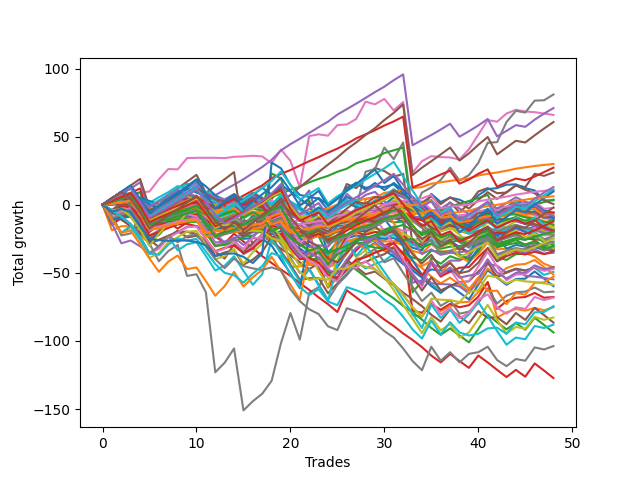

# Long Pointer Six (0219) 
- Symbol: ES_Unlimited
- Date Range: 03/18/2022 - 07/15/2022
- Trading Period: 7:20-12:30
- Number of Trades: 48



| Name | Win Percent | Profit | Avg Profit / Trade | Avg Time / Trade |      | Name | Win Percent | Profit | Avg Profit / Trade | Avg Time / Trade |
| ---- | ----------- | ------ | ------------------ | ---------------- | ---- | ---- | ----------- | ------ | ------------------ | ---------------- |
| Sorted By <br> Profit | | | | | | Sorted By <br> Win Percentage ||||
| Seven | 72.92 | 40500.00 | 843.75 | 106:43 |     | Eighty-One | 95.83 | 15000.00 | 312.50 | 19:52 |
| Eighty-Four | 87.50 | 35500.00 | 739.58 | 41:28 |     | One Hundred Twenty-One | 89.58 | 5500.00 | 114.58 | 06:35 |
| Six | 62.50 | 33000.00 | 687.50 | 41:33 |     | One Hundred Twenty-Six | 89.58 | 3125.00 | 65.10 | 06:21 |
| Eighty-Five | 85.42 | 30375.00 | 632.81 | 53:17 |     | Eighty-Two | 89.58 | 1875.00 | 39.06 | 30:32 |
| Eighty-One | 95.83 | 15000.00 | 312.50 | 19:52 |     | Eighty-Four | 87.50 | 35500.00 | 739.58 | 41:28 |
| Eighty-Three | 87.50 | 13625.00 | 283.85 | 38:16 |     | Eighty-Three | 87.50 | 13625.00 | 283.85 | 38:16 |
| Five | 58.33 | 11875.00 | 247.40 | 64:29 |     | Eighty-Five | 85.42 | 30375.00 | 632.81 | 53:17 |
| One Hundred Twenty-Nine | 68.75 | 6500.00 | 135.42 | 14:35 |     | One Hundred Eleven | 79.17 | -1125.00 | -23.44 | 03:43 |
| One Hundred Twenty-One | 89.58 | 5500.00 | 114.58 | 06:35 |     | One Hundred Sixteen | 79.17 | -3625.00 | -75.52 | 03:45 |
| One Hundred Twenty-Four | 70.83 | 5500.00 | 114.58 | 15:40 |     | One Hundred Twenty-Seven | 75.00 | -9875.00 | -205.73 | 09:28 |
| One Hundred Twenty-Five | 66.67 | 4875.00 | 101.56 | 18:26 |     | One Hundred Twenty-Two | 75.00 | -13500.00 | -281.25 | 09:54 |
| One Hundred Twenty-Six | 89.58 | 3125.00 | 65.10 | 06:21 |     | Seven | 72.92 | 40500.00 | 843.75 | 106:43 |
| Eighty-Two | 89.58 | 1875.00 | 39.06 | 30:32 |     | One Hundred Twenty-Four | 70.83 | 5500.00 | 114.58 | 15:40 |
| Seventy-Three | 41.67 | 1625.00 | 33.85 | 10:46 |     | One Hundred One | 70.83 | -2750.00 | -57.29 | 02:13 |
| One Hundred Twenty | 43.75 | 250.00 | 5.21 | 09:08 |     | One Hundred Six | 70.83 | -4625.00 | -96.35 | 02:23 |
| One Hundred Thirty | 60.42 | -1000.00 | -20.83 | 16:40 |     | One Hundred Twenty-Eight | 70.83 | -6125.00 | -127.60 | 11:57 |
| One Hundred Eleven | 79.17 | -1125.00 | -23.44 | 03:43 |     | One Hundred Twenty-Three | 70.83 | -12375.00 | -257.81 | 12:33 |
| One Hundred One | 70.83 | -2750.00 | -57.29 | 02:13 |     | One Hundred Twenty-Nine | 68.75 | 6500.00 | 135.42 | 14:35 |
| One Hundred Eight | 47.92 | -2875.00 | -59.90 | 03:52 |     | One Hundred Twenty-Five | 66.67 | 4875.00 | 101.56 | 18:26 |
| Ninety-Four | 35.42 | -2875.00 | -59.90 | 04:38 |     | Zero | 66.67 | -9250.00 | -192.71 | 09:42 |
| Ninety-Five | 31.25 | -3000.00 | -62.50 | 05:42 |     | Sixty-Four | 66.67 | -14750.00 | -307.29 | 06:58 |
| One Hundred Sixteen | 79.17 | -3625.00 | -75.52 | 03:45 |     | Fifty-Six | 66.67 | -17625.00 | -367.19 | 07:14 |
| One Hundred Ninteen | 47.92 | -4125.00 | -85.94 | 08:04 |     | Three | 64.58 | -33875.00 | -705.73 | 27:07 |
| One Hundred Ten | 45.83 | -4500.00 | -93.75 | 04:45 |     | One | 64.58 | -37625.00 | -783.85 | 19:53 |
| One Hundred Five | 37.50 | -4500.00 | -93.75 | 07:18 |     | Six | 62.50 | 33000.00 | 687.50 | 41:33 |
| One Hundred Six | 70.83 | -4625.00 | -96.35 | 02:23 |     | Fifty-Seven | 62.50 | -22875.00 | -476.56 | 12:06 |
| One Hundred Fifteen | 47.92 | -5000.00 | -104.17 | 11:04 |     | One Hundred Thirty | 60.42 | -1000.00 | -20.83 | 16:40 |
| One Hundred Nine | 45.83 | -5000.00 | -104.17 | 04:21 |     | Ninety-One | 60.42 | -5625.00 | -117.19 | 01:47 |
| One Hundred Four | 41.67 | -5375.00 | -111.98 | 06:06 |     | Ninety-Six | 60.42 | -7125.00 | -148.44 | 01:53 |
| Ninety-One | 60.42 | -5625.00 | -117.19 | 01:47 |     | Four | 60.42 | -8750.00 | -182.29 | 44:46 |
| One Hundred Seven | 54.17 | -5625.00 | -117.19 | 03:05 |     | Forty | 60.42 | -10750.00 | -223.96 | 05:05 |
| One Hundred Twenty-Eight | 70.83 | -6125.00 | -127.60 | 11:57 |     | One Hundred Twelve | 60.42 | -15875.00 | -330.73 | 05:34 |
| Ninety-Six | 60.42 | -7125.00 | -148.44 | 01:53 |     | Two | 60.42 | -16125.00 | -335.94 | 33:16 |
| Ninety-Seven | 43.75 | -7500.00 | -156.25 | 02:18 |     | Fifty-Nine | 60.42 | -31875.00 | -664.06 | 15:41 |
| One Hundred Three | 47.92 | -8250.00 | -171.88 | 04:22 |     | Five | 58.33 | 11875.00 | 247.40 | 64:29 |
| Ninety-Three | 39.58 | -8625.00 | -179.69 | 03:15 |     | Forty-Eight | 58.33 | -10875.00 | -226.56 | 04:36 |
| Four | 60.42 | -8750.00 | -182.29 | 44:46 |     | One Hundred Seventeen | 58.33 | -15250.00 | -317.71 | 05:05 |
| Zero | 66.67 | -9250.00 | -192.71 | 09:42 |     | Sixty-Seven | 58.33 | -16375.00 | -341.15 | 14:00 |
| One Hundred | 43.75 | -9375.00 | -195.31 | 03:06 |     | Sixty-Five | 58.33 | -17000.00 | -354.17 | 10:54 |
| One Hundred Eighteen | 54.17 | -9625.00 | -200.52 | 06:37 |     | One Hundred Seven | 54.17 | -5625.00 | -117.19 | 03:05 |
| One Hundred Twenty-Seven | 75.00 | -9875.00 | -205.73 | 09:28 |     | One Hundred Eighteen | 54.17 | -9625.00 | -200.52 | 06:37 |
| Ninety-Nine | 43.75 | -9875.00 | -205.73 | 02:55 |     | One Hundred Thirteen | 54.17 | -16000.00 | -333.33 | 07:26 |
| Ninety-Eight | 43.75 | -9875.00 | -205.73 | 02:40 |     | Fifty-Eight | 54.17 | -23625.00 | -492.19 | 18:17 |
| One Hundred Fourteen | 50.00 | -10000.00 | -208.33 | 09:38 |     | One Hundred Two | 52.08 | -12375.00 | -257.81 | 03:12 |
| Forty | 60.42 | -10750.00 | -223.96 | 05:05 |     | One Hundred Fourteen | 50.00 | -10000.00 | -208.33 | 09:38 |
| Forty-Eight | 58.33 | -10875.00 | -226.56 | 04:36 |     | Sixty-Six | 50.00 | -23000.00 | -479.17 | 15:52 |
| Ninety-Two | 43.75 | -11125.00 | -231.77 | 02:35 |     | One Hundred Eight | 47.92 | -2875.00 | -59.90 | 03:52 |
| Fifty | 43.75 | -11125.00 | -231.77 | 08:43 |     | One Hundred Ninteen | 47.92 | -4125.00 | -85.94 | 08:04 |
| Forty-Nine | 45.83 | -11500.00 | -239.58 | 07:10 |     | One Hundred Fifteen | 47.92 | -5000.00 | -104.17 | 11:04 |
| One Hundred Twenty-Three | 70.83 | -12375.00 | -257.81 | 12:33 |     | One Hundred Three | 47.92 | -8250.00 | -171.88 | 04:22 |
| One Hundred Two | 52.08 | -12375.00 | -257.81 | 03:12 |     | Sixty-Three | 47.92 | -26375.00 | -549.48 | 39:13 |
| One Hundred Twenty-Two | 75.00 | -13500.00 | -281.25 | 09:54 |     | Sixty | 47.92 | -41375.00 | -861.98 | 23:48 |
| Fifty-Four | 39.58 | -13625.00 | -283.85 | 05:06 |     | One Hundred Ten | 45.83 | -4500.00 | -93.75 | 04:45 |
| Fifty-One | 45.83 | -14250.00 | -296.88 | 08:03 |     | One Hundred Nine | 45.83 | -5000.00 | -104.17 | 04:21 |
| Sixty-Four | 66.67 | -14750.00 | -307.29 | 06:58 |     | Forty-Nine | 45.83 | -11500.00 | -239.58 | 07:10 |
| One Hundred Seventeen | 58.33 | -15250.00 | -317.71 | 05:05 |     | Fifty-One | 45.83 | -14250.00 | -296.88 | 08:03 |
| Fifty-Two | 41.67 | -15250.00 | -317.71 | 09:45 |     | Fifty-Five | 45.83 | -17000.00 | -354.17 | 09:58 |
| One Hundred Twelve | 60.42 | -15875.00 | -330.73 | 05:34 |     | Forty-One | 45.83 | -24625.00 | -513.02 | 08:43 |
| One Hundred Thirteen | 54.17 | -16000.00 | -333.33 | 07:26 |     | One Hundred Twenty | 43.75 | 250.00 | 5.21 | 09:08 |
| Two | 60.42 | -16125.00 | -335.94 | 33:16 |     | Ninety-Seven | 43.75 | -7500.00 | -156.25 | 02:18 |
| Sixty-Seven | 58.33 | -16375.00 | -341.15 | 14:00 |     | One Hundred | 43.75 | -9375.00 | -195.31 | 03:06 |
| Sixty-Two | 41.67 | -16625.00 | -346.35 | 15:48 |     | Ninety-Nine | 43.75 | -9875.00 | -205.73 | 02:55 |
| Sixty-Five | 58.33 | -17000.00 | -354.17 | 10:54 |     | Ninety-Eight | 43.75 | -9875.00 | -205.73 | 02:40 |
| Fifty-Five | 45.83 | -17000.00 | -354.17 | 09:58 |     | Ninety-Two | 43.75 | -11125.00 | -231.77 | 02:35 |
| Fifty-Six | 66.67 | -17625.00 | -367.19 | 07:14 |     | Fifty | 43.75 | -11125.00 | -231.77 | 08:43 |
| Fifty-Seven | 62.50 | -22875.00 | -476.56 | 12:06 |     | Forty-Three | 43.75 | -25625.00 | -533.85 | 10:49 |
| Sixty-Six | 50.00 | -23000.00 | -479.17 | 15:52 |     | Seventy-Three | 41.67 | 1625.00 | 33.85 | 10:46 |
| Fifty-Three | 41.67 | -23000.00 | -479.17 | 10:38 |     | One Hundred Four | 41.67 | -5375.00 | -111.98 | 06:06 |
| Fifty-Eight | 54.17 | -23625.00 | -492.19 | 18:17 |     | Fifty-Two | 41.67 | -15250.00 | -317.71 | 09:45 |
| Forty-One | 45.83 | -24625.00 | -513.02 | 08:43 |     | Sixty-Two | 41.67 | -16625.00 | -346.35 | 15:48 |
| Forty-Three | 43.75 | -25625.00 | -533.85 | 10:49 |     | Fifty-Three | 41.67 | -23000.00 | -479.17 | 10:38 |
| Sixty-Three | 47.92 | -26375.00 | -549.48 | 39:13 |     | Sixty-One | 41.67 | -44000.00 | -916.67 | 29:48 |
| Forty-Six | 31.25 | -27375.00 | -570.31 | 08:15 |     | Ninety-Three | 39.58 | -8625.00 | -179.69 | 03:15 |
| Seventy | 35.42 | -29375.00 | -611.98 | 11:13 |     | Fifty-Four | 39.58 | -13625.00 | -283.85 | 05:06 |
| Forty-Two | 35.42 | -29875.00 | -622.40 | 12:43 |     | Sixty-Eight | 39.58 | -34125.00 | -710.94 | 19:18 |
| Fifty-Nine | 60.42 | -31875.00 | -664.06 | 15:41 |     | One Hundred Five | 37.50 | -4500.00 | -93.75 | 07:18 |
| Three | 64.58 | -33875.00 | -705.73 | 27:07 |     | Seventy-One | 37.50 | -37250.00 | -776.04 | 22:56 |
| Sixty-Eight | 39.58 | -34125.00 | -710.94 | 19:18 |     | Ninety-Four | 35.42 | -2875.00 | -59.90 | 04:38 |
| Seventy-One | 37.50 | -37250.00 | -776.04 | 22:56 |     | Seventy | 35.42 | -29375.00 | -611.98 | 11:13 |
| One | 64.58 | -37625.00 | -783.85 | 19:53 |     | Forty-Two | 35.42 | -29875.00 | -622.40 | 12:43 |
| Sixty | 47.92 | -41375.00 | -861.98 | 23:48 |     | Ninety-Five | 31.25 | -3000.00 | -62.50 | 05:42 |
| Forty-Seven | 29.17 | -43250.00 | -901.04 | 20:53 |     | Forty-Six | 31.25 | -27375.00 | -570.31 | 08:15 |
| Sixty-One | 41.67 | -44000.00 | -916.67 | 29:48 |     | Sixty-Nine | 31.25 | -51875.00 | -1080.73 | 22:35 |
| Forty-Four | 29.17 | -46875.00 | -976.56 | 15:22 |     | Forty-Seven | 29.17 | -43250.00 | -901.04 | 20:53 |
| Sixty-Nine | 31.25 | -51875.00 | -1080.73 | 22:35 |     | Forty-Four | 29.17 | -46875.00 | -976.56 | 15:22 |
| Forty-Five | 20.83 | -63625.00 | -1325.52 | 18:16 |     | Forty-Five | 20.83 | -63625.00 | -1325.52 | 18:16 |

## NO STOPLOSS

### Test Zero
* Sell when price hits the middle line of the 20p bollinger
* No Stoploss
* Results:
```
Total Trades: 48
Percent Up: 66.67
Percent Down: 33.33
Total Points Moved Up: -18.50
Potential Profit: -9250.00
Total Points Ups: 79.50 Count Ups: 32
Total Points Downs: -98.00 Count Downs: 16
```

<details><summary>Trades</summary>

<code>In: 2022-03-21 09:41:00		Out: 2022-03-21 09:45:55		Total Position Time: 04:55		Total Move Up: 5.00		Total to Date: 5.00</code> <br />
<code>In: 2022-03-23 09:16:00		Out: 2022-03-23 09:19:40		Total Position Time: 03:40		Total Move Up: 3.25		Total to Date: 8.25</code> <br />
<code>In: 2022-03-23 10:33:00		Out: 2022-03-23 10:51:10		Total Position Time: 18:10		Total Move Up: -1.75		Total to Date: 6.50</code> <br />
<code>In: 2022-03-25 08:17:00		Out: 2022-03-25 08:36:55		Total Position Time: 19:55		Total Move Up: -8.25		Total to Date: -1.75</code> <br />
<code>In: 2022-03-30 08:03:00		Out: 2022-03-30 08:19:25		Total Position Time: 16:25		Total Move Up: -5.00		Total to Date: -6.75</code> <br />
<code>In: 2022-03-30 08:15:00		Out: 2022-03-30 08:19:25		Total Position Time: 04:25		Total Move Up: 3.25		Total to Date: -3.50</code> <br />
<code>In: 2022-03-30 12:28:00		Out: 2022-03-30 12:30:50		Total Position Time: 02:50		Total Move Up: 0.50		Total to Date: -3.00</code> <br />
<code>In: 2022-03-31 08:38:00		Out: 2022-03-31 08:40:25		Total Position Time: 02:25		Total Move Up: 0.75		Total to Date: -2.25</code> <br />
<code>In: 2022-03-31 10:19:00		Out: 2022-03-31 10:20:10		Total Position Time: 01:10		Total Move Up: 0.25		Total to Date: -2.00</code> <br />
<code>In: 2022-04-04 09:49:00		Out: 2022-04-04 10:09:45		Total Position Time: 20:45		Total Move Up: -1.50		Total to Date: -3.50</code> <br />
<code>In: 2022-04-08 10:22:00		Out: 2022-04-08 10:52:15		Total Position Time: 30:15		Total Move Up: -6.25		Total to Date: -9.75</code> <br />
<code>In: 2022-04-12 07:34:00		Out: 2022-04-12 08:02:05		Total Position Time: 28:05		Total Move Up: -9.25		Total to Date: -19.00</code> <br />
<code>In: 2022-04-19 09:45:00		Out: 2022-04-19 09:49:40		Total Position Time: 04:40		Total Move Up: 0.75		Total to Date: -18.25</code> <br />
<code>In: 2022-04-19 10:32:00		Out: 2022-04-19 10:39:55		Total Position Time: 07:55		Total Move Up: 2.25		Total to Date: -16.00</code> <br />
<code>In: 2022-04-26 07:24:00		Out: 2022-04-26 07:31:40		Total Position Time: 07:40		Total Move Up: 4.00		Total to Date: -12.00</code> <br />
<code>In: 2022-04-27 11:41:00		Out: 2022-04-27 11:42:10		Total Position Time: 01:10		Total Move Up: 0.50		Total to Date: -11.50</code> <br />
<code>In: 2022-05-03 09:14:00		Out: 2022-05-03 09:20:50		Total Position Time: 06:50		Total Move Up: 4.50		Total to Date: -7.00</code> <br />
<code>In: 2022-05-04 11:37:00		Out: 2022-05-04 11:40:45		Total Position Time: 03:45		Total Move Up: -1.25		Total to Date: -8.25</code> <br />
<code>In: 2022-05-06 11:12:00		Out: 2022-05-06 11:15:05		Total Position Time: 03:05		Total Move Up: 3.25		Total to Date: -5.00</code> <br />
<code>In: 2022-05-10 07:45:00		Out: 2022-05-10 08:02:25		Total Position Time: 17:25		Total Move Up: -10.75		Total to Date: -15.75</code> <br />
<code>In: 2022-05-11 10:51:00		Out: 2022-05-11 11:01:10		Total Position Time: 10:10		Total Move Up: -3.75		Total to Date: -19.50</code> <br />
<code>In: 2022-05-12 11:46:00		Out: 2022-05-12 11:48:05		Total Position Time: 02:05		Total Move Up: 0.00		Total to Date: -19.50</code> <br />
<code>In: 2022-05-13 09:56:00		Out: 2022-05-13 10:00:15		Total Position Time: 04:15		Total Move Up: 4.25		Total to Date: -15.25</code> <br />
<code>In: 2022-05-13 10:50:00		Out: 2022-05-13 11:19:15		Total Position Time: 29:15		Total Move Up: -19.75		Total to Date: -35.00</code> <br />
<code>In: 2022-05-17 11:25:00		Out: 2022-05-17 11:31:40		Total Position Time: 06:40		Total Move Up: 7.00		Total to Date: -28.00</code> <br />
<code>In: 2022-05-23 10:24:00		Out: 2022-05-23 10:26:30		Total Position Time: 02:30		Total Move Up: 3.50		Total to Date: -24.50</code> <br />
<code>In: 2022-05-25 08:41:00		Out: 2022-05-25 08:44:20		Total Position Time: 03:20		Total Move Up: 5.00		Total to Date: -19.50</code> <br />
<code>In: 2022-05-25 09:30:00		Out: 2022-05-25 09:41:30		Total Position Time: 11:30		Total Move Up: 0.25		Total to Date: -19.25</code> <br />
<code>In: 2022-05-26 11:39:00		Out: 2022-05-26 11:45:25		Total Position Time: 06:25		Total Move Up: 3.00		Total to Date: -16.25</code> <br />
<code>In: 2022-06-03 07:46:00		Out: 2022-06-03 07:49:00		Total Position Time: 03:00		Total Move Up: 4.50		Total to Date: -11.75</code> <br />
<code>In: 2022-06-08 09:48:00		Out: 2022-06-08 09:56:25		Total Position Time: 08:25		Total Move Up: 2.25		Total to Date: -9.50</code> <br />
<code>In: 2022-06-09 07:57:00		Out: 2022-06-09 08:11:10		Total Position Time: 14:10		Total Move Up: -3.00		Total to Date: -12.50</code> <br />
<code>In: 2022-06-09 11:28:00		Out: 2022-06-09 11:29:15		Total Position Time: 01:15		Total Move Up: 1.00		Total to Date: -11.50</code> <br />
<code>In: 2022-06-15 07:58:00		Out: 2022-06-15 08:34:25		Total Position Time: 36:25		Total Move Up: -4.50		Total to Date: -16.00</code> <br />
<code>In: 2022-06-16 11:57:00		Out: 2022-06-16 12:00:35		Total Position Time: 03:35		Total Move Up: 3.50		Total to Date: -12.50</code> <br />
<code>In: 2022-06-21 08:43:00		Out: 2022-06-21 09:02:20		Total Position Time: 19:20		Total Move Up: -4.00		Total to Date: -16.50</code> <br />
<code>In: 2022-06-21 11:06:00		Out: 2022-06-21 11:08:05		Total Position Time: 02:05		Total Move Up: 1.50		Total to Date: -15.00</code> <br />
<code>In: 2022-06-27 09:10:00		Out: 2022-06-27 09:19:00		Total Position Time: 09:00		Total Move Up: 0.50		Total to Date: -14.50</code> <br />
<code>In: 2022-06-27 10:51:00		Out: 2022-06-27 10:53:30		Total Position Time: 02:30		Total Move Up: 0.75		Total to Date: -13.75</code> <br />
<code>In: 2022-06-27 12:09:00		Out: 2022-06-27 12:10:20		Total Position Time: 01:20		Total Move Up: 4.25		Total to Date: -9.50</code> <br />
<code>In: 2022-06-29 08:26:00		Out: 2022-06-29 08:32:10		Total Position Time: 06:10		Total Move Up: 3.75		Total to Date: -5.75</code> <br />
<code>In: 2022-06-30 11:29:00		Out: 2022-06-30 12:02:20		Total Position Time: 33:20		Total Move Up: -14.50		Total to Date: -20.25</code> <br />
<code>In: 2022-07-06 08:13:00		Out: 2022-07-06 08:15:05		Total Position Time: 02:05		Total Move Up: 1.75		Total to Date: -18.50</code> <br />
<code>In: 2022-07-11 08:54:00		Out: 2022-07-11 08:58:45		Total Position Time: 04:45		Total Move Up: 1.50		Total to Date: -17.00</code> <br />
<code>In: 2022-07-11 12:09:00		Out: 2022-07-11 12:22:10		Total Position Time: 13:10		Total Move Up: -1.25		Total to Date: -18.25</code> <br />
<code>In: 2022-07-14 09:54:00		Out: 2022-07-14 09:57:50		Total Position Time: 03:50		Total Move Up: 2.25		Total to Date: -16.00</code> <br />
<code>In: 2022-07-15 09:05:00		Out: 2022-07-15 09:19:20		Total Position Time: 14:20		Total Move Up: -3.25		Total to Date: -19.25</code> <br />
<code>In: 2022-07-15 09:14:00		Out: 2022-07-15 09:19:20		Total Position Time: 05:20		Total Move Up: 0.75		Total to Date: -18.50</code> <br />


</details>

### Test One
* Sell when the price hits the upper line of the 20p 1std bollinger
* No Stoploss
* Results:
```
Total Trades: 48
Percent Up: 64.58
Percent Down: 35.42
Total Points Moved Up: -75.25
Potential Profit: -37625.00
Total Points Ups: 112.00 Count Ups: 31
Total Points Downs: -187.25 Count Downs: 17
```

<details><summary>Trades</summary>

<code>In: 2022-03-21 09:41:00		Out: 2022-03-21 10:32:05		Total Position Time: 51:05		Total Move Up: -18.75		Total to Date: -18.75</code> <br />
<code>In: 2022-03-23 09:16:00		Out: 2022-03-23 09:30:05		Total Position Time: 14:05		Total Move Up: 3.00		Total to Date: -15.75</code> <br />
<code>In: 2022-03-23 10:33:00		Out: 2022-03-23 10:51:50		Total Position Time: 18:50		Total Move Up: 0.00		Total to Date: -15.75</code> <br />
<code>In: 2022-03-25 08:17:00		Out: 2022-03-25 08:41:10		Total Position Time: 24:10		Total Move Up: -6.75		Total to Date: -22.50</code> <br />
<code>In: 2022-03-30 08:03:00		Out: 2022-03-30 08:34:45		Total Position Time: 31:45		Total Move Up: -5.75		Total to Date: -28.25</code> <br />
<code>In: 2022-03-30 08:15:00		Out: 2022-03-30 08:34:45		Total Position Time: 19:45		Total Move Up: 2.50		Total to Date: -25.75</code> <br />
<code>In: 2022-03-30 12:28:00		Out: 2022-03-30 12:32:20		Total Position Time: 04:20		Total Move Up: 3.00		Total to Date: -22.75</code> <br />
<code>In: 2022-03-31 08:38:00		Out: 2022-03-31 08:40:40		Total Position Time: 02:40		Total Move Up: 2.50		Total to Date: -20.25</code> <br />
<code>In: 2022-03-31 10:19:00		Out: 2022-03-31 10:26:35		Total Position Time: 07:35		Total Move Up: 0.50		Total to Date: -19.75</code> <br />
<code>In: 2022-04-04 09:49:00		Out: 2022-04-04 10:18:05		Total Position Time: 29:05		Total Move Up: -1.75		Total to Date: -21.50</code> <br />
<code>In: 2022-04-08 10:22:00		Out: 2022-04-08 11:01:00		Total Position Time: 39:00		Total Move Up: -5.25		Total to Date: -26.75</code> <br />
<code>In: 2022-04-12 07:34:00		Out: 2022-04-12 08:02:35		Total Position Time: 28:35		Total Move Up: -7.25		Total to Date: -34.00</code> <br />
<code>In: 2022-04-19 09:45:00		Out: 2022-04-19 09:51:05		Total Position Time: 06:05		Total Move Up: 2.50		Total to Date: -31.50</code> <br />
<code>In: 2022-04-19 10:32:00		Out: 2022-04-19 10:48:55		Total Position Time: 16:55		Total Move Up: 1.75		Total to Date: -29.75</code> <br />
<code>In: 2022-04-26 07:24:00		Out: 2022-04-26 07:53:15		Total Position Time: 29:15		Total Move Up: -2.75		Total to Date: -32.50</code> <br />
<code>In: 2022-04-27 11:41:00		Out: 2022-04-27 11:42:35		Total Position Time: 01:35		Total Move Up: 3.75		Total to Date: -28.75</code> <br />
<code>In: 2022-05-03 09:14:00		Out: 2022-05-03 09:25:05		Total Position Time: 11:05		Total Move Up: 5.75		Total to Date: -23.00</code> <br />
<code>In: 2022-05-04 11:37:00		Out: 2022-05-04 11:41:40		Total Position Time: 04:40		Total Move Up: 10.75		Total to Date: -12.25</code> <br />
<code>In: 2022-05-06 11:12:00		Out: 2022-05-06 11:49:10		Total Position Time: 37:10		Total Move Up: -3.75		Total to Date: -16.00</code> <br />
<code>In: 2022-05-10 07:45:00		Out: 2022-05-10 08:37:10		Total Position Time: 52:10		Total Move Up: -29.50		Total to Date: -45.50</code> <br />
<code>In: 2022-05-11 10:51:00		Out: 2022-05-11 11:01:30		Total Position Time: 10:30		Total Move Up: 0.25		Total to Date: -45.25</code> <br />
<code>In: 2022-05-12 11:46:00		Out: 2022-05-12 11:52:55		Total Position Time: 06:55		Total Move Up: 1.00		Total to Date: -44.25</code> <br />
<code>In: 2022-05-13 09:56:00		Out: 2022-05-13 10:26:10		Total Position Time: 30:10		Total Move Up: 0.25		Total to Date: -44.00</code> <br />
<code>In: 2022-05-13 10:50:00		Out: 2022-05-13 11:30:55		Total Position Time: 40:55		Total Move Up: -17.00		Total to Date: -61.00</code> <br />
<code>In: 2022-05-17 11:25:00		Out: 2022-05-17 11:39:45		Total Position Time: 14:45		Total Move Up: 7.25		Total to Date: -53.75</code> <br />
<code>In: 2022-05-23 10:24:00		Out: 2022-05-23 10:32:50		Total Position Time: 08:50		Total Move Up: 6.75		Total to Date: -47.00</code> <br />
<code>In: 2022-05-25 08:41:00		Out: 2022-05-25 08:50:50		Total Position Time: 09:50		Total Move Up: 7.00		Total to Date: -40.00</code> <br />
<code>In: 2022-05-25 09:30:00		Out: 2022-05-25 09:44:30		Total Position Time: 14:30		Total Move Up: 2.00		Total to Date: -38.00</code> <br />
<code>In: 2022-05-26 11:39:00		Out: 2022-05-26 11:50:15		Total Position Time: 11:15		Total Move Up: 3.25		Total to Date: -34.75</code> <br />
<code>In: 2022-06-03 07:46:00		Out: 2022-06-03 07:58:10		Total Position Time: 12:10		Total Move Up: 2.50		Total to Date: -32.25</code> <br />
<code>In: 2022-06-08 09:48:00		Out: 2022-06-08 09:59:05		Total Position Time: 11:05		Total Move Up: 4.75		Total to Date: -27.50</code> <br />
<code>In: 2022-06-09 07:57:00		Out: 2022-06-09 08:21:10		Total Position Time: 24:10		Total Move Up: -1.50		Total to Date: -29.00</code> <br />
<code>In: 2022-06-09 11:28:00		Out: 2022-06-09 12:47:00		Total Position Time: 79:00		Total Move Up: -52.00		Total to Date: -81.00</code> <br />
<code>In: 2022-06-15 07:58:00		Out: 2022-06-15 08:38:55		Total Position Time: 40:55		Total Move Up: -1.25		Total to Date: -82.25</code> <br />
<code>In: 2022-06-16 11:57:00		Out: 2022-06-16 12:01:55		Total Position Time: 04:55		Total Move Up: 9.75		Total to Date: -72.50</code> <br />
<code>In: 2022-06-21 08:43:00		Out: 2022-06-21 09:17:50		Total Position Time: 34:50		Total Move Up: -5.50		Total to Date: -78.00</code> <br />
<code>In: 2022-06-21 11:06:00		Out: 2022-06-21 11:10:05		Total Position Time: 04:05		Total Move Up: 3.25		Total to Date: -74.75</code> <br />
<code>In: 2022-06-27 09:10:00		Out: 2022-06-27 09:20:20		Total Position Time: 10:20		Total Move Up: 3.00		Total to Date: -71.75</code> <br />
<code>In: 2022-06-27 10:51:00		Out: 2022-06-27 11:03:15		Total Position Time: 12:15		Total Move Up: 0.50		Total to Date: -71.25</code> <br />
<code>In: 2022-06-27 12:09:00		Out: 2022-06-27 12:12:10		Total Position Time: 03:10		Total Move Up: 7.25		Total to Date: -64.00</code> <br />
<code>In: 2022-06-29 08:26:00		Out: 2022-06-29 08:33:05		Total Position Time: 07:05		Total Move Up: 6.75		Total to Date: -57.25</code> <br />
<code>In: 2022-06-30 11:29:00		Out: 2022-06-30 12:25:10		Total Position Time: 56:10		Total Move Up: -25.50		Total to Date: -82.75</code> <br />
<code>In: 2022-07-06 08:13:00		Out: 2022-07-06 08:21:05		Total Position Time: 08:05		Total Move Up: 3.75		Total to Date: -79.00</code> <br />
<code>In: 2022-07-11 08:54:00		Out: 2022-07-11 09:00:10		Total Position Time: 06:10		Total Move Up: 2.50		Total to Date: -76.50</code> <br />
<code>In: 2022-07-11 12:09:00		Out: 2022-07-11 12:29:20		Total Position Time: 20:20		Total Move Up: -1.25		Total to Date: -77.75</code> <br />
<code>In: 2022-07-14 09:54:00		Out: 2022-07-14 10:07:55		Total Position Time: 13:55		Total Move Up: 2.00		Total to Date: -75.75</code> <br />
<code>In: 2022-07-15 09:05:00		Out: 2022-07-15 09:23:55		Total Position Time: 18:55		Total Move Up: -1.75		Total to Date: -77.50</code> <br />
<code>In: 2022-07-15 09:14:00		Out: 2022-07-15 09:23:55		Total Position Time: 09:55		Total Move Up: 2.25		Total to Date: -75.25</code> <br />


</details>

### Test Two
* Sell when the price hits the upper line of the 20p 2std bollinger
* No Stoploss
* Results:
```
Total Trades: 48
Percent Up: 60.42
Percent Down: 39.58
Total Points Moved Up: -32.25
Potential Profit: -16125.00
Total Points Ups: 178.50 Count Ups: 29
Total Points Downs: -210.75 Count Downs: 19
```

<details><summary>Trades</summary>

<code>In: 2022-03-21 09:41:00		Out: 2022-03-21 10:34:15		Total Position Time: 53:15		Total Move Up: -14.75		Total to Date: -14.75</code> <br />
<code>In: 2022-03-23 09:16:00		Out: 2022-03-23 09:31:10		Total Position Time: 15:10		Total Move Up: 6.00		Total to Date: -8.75</code> <br />
<code>In: 2022-03-23 10:33:00		Out: 2022-03-23 10:54:30		Total Position Time: 21:30		Total Move Up: 2.50		Total to Date: -6.25</code> <br />
<code>In: 2022-03-25 08:17:00		Out: 2022-03-25 08:41:55		Total Position Time: 24:55		Total Move Up: -2.75		Total to Date: -9.00</code> <br />
<code>In: 2022-03-30 08:03:00		Out: 2022-03-30 08:35:15		Total Position Time: 32:15		Total Move Up: -4.00		Total to Date: -13.00</code> <br />
<code>In: 2022-03-30 08:15:00		Out: 2022-03-30 08:35:15		Total Position Time: 20:15		Total Move Up: 4.25		Total to Date: -8.75</code> <br />
<code>In: 2022-03-30 12:28:00		Out: 2022-03-30 12:36:20		Total Position Time: 08:20		Total Move Up: 5.75		Total to Date: -3.00</code> <br />
<code>In: 2022-03-31 08:38:00		Out: 2022-03-31 08:41:10		Total Position Time: 03:10		Total Move Up: 4.50		Total to Date: 1.50</code> <br />
<code>In: 2022-03-31 10:19:00		Out: 2022-03-31 10:27:50		Total Position Time: 08:50		Total Move Up: 1.25		Total to Date: 2.75</code> <br />
<code>In: 2022-04-04 09:49:00		Out: 2022-04-04 10:18:20		Total Position Time: 29:20		Total Move Up: -1.50		Total to Date: 1.25</code> <br />
<code>In: 2022-04-08 10:22:00		Out: 2022-04-08 11:10:10		Total Position Time: 48:10		Total Move Up: -5.00		Total to Date: -3.75</code> <br />
<code>In: 2022-04-12 07:34:00		Out: 2022-04-12 08:15:40		Total Position Time: 41:40		Total Move Up: -7.00		Total to Date: -10.75</code> <br />
<code>In: 2022-04-19 09:45:00		Out: 2022-04-19 10:49:55		Total Position Time: 64:55		Total Move Up: 0.25		Total to Date: -10.50</code> <br />
<code>In: 2022-04-19 10:32:00		Out: 2022-04-19 10:49:55		Total Position Time: 17:55		Total Move Up: 3.75		Total to Date: -6.75</code> <br />
<code>In: 2022-04-26 07:24:00		Out: 2022-04-26 08:22:20		Total Position Time: 58:20		Total Move Up: -10.00		Total to Date: -16.75</code> <br />
<code>In: 2022-04-27 11:41:00		Out: 2022-04-27 11:42:45		Total Position Time: 01:45		Total Move Up: 5.50		Total to Date: -11.25</code> <br />
<code>In: 2022-05-03 09:14:00		Out: 2022-05-03 09:28:00		Total Position Time: 14:00		Total Move Up: 8.50		Total to Date: -2.75</code> <br />
<code>In: 2022-05-04 11:37:00		Out: 2022-05-04 11:43:55		Total Position Time: 06:55		Total Move Up: 25.75		Total to Date: 23.00</code> <br />
<code>In: 2022-05-06 11:12:00		Out: 2022-05-06 11:49:10		Total Position Time: 37:10		Total Move Up: -3.75		Total to Date: 19.25</code> <br />
<code>In: 2022-05-10 07:45:00		Out: 2022-05-10 08:39:10		Total Position Time: 54:10		Total Move Up: -23.25		Total to Date: -4.00</code> <br />
<code>In: 2022-05-11 10:51:00		Out: 2022-05-11 11:04:55		Total Position Time: 13:55		Total Move Up: 4.00		Total to Date: 0.00</code> <br />
<code>In: 2022-05-12 11:46:00		Out: 2022-05-12 11:53:25		Total Position Time: 07:25		Total Move Up: 3.25		Total to Date: 3.25</code> <br />
<code>In: 2022-05-13 09:56:00		Out: 2022-05-13 11:31:20		Total Position Time: 95:20		Total Move Up: -26.25		Total to Date: -23.00</code> <br />
<code>In: 2022-05-13 10:50:00		Out: 2022-05-13 11:31:20		Total Position Time: 41:20		Total Move Up: -14.25		Total to Date: -37.25</code> <br />
<code>In: 2022-05-17 11:25:00		Out: 2022-05-17 11:40:05		Total Position Time: 15:05		Total Move Up: 11.00		Total to Date: -26.25</code> <br />
<code>In: 2022-05-23 10:24:00		Out: 2022-05-23 10:33:15		Total Position Time: 09:15		Total Move Up: 10.25		Total to Date: -16.00</code> <br />
<code>In: 2022-05-25 08:41:00		Out: 2022-05-25 09:02:30		Total Position Time: 21:30		Total Move Up: 8.75		Total to Date: -7.25</code> <br />
<code>In: 2022-05-25 09:30:00		Out: 2022-05-25 09:45:20		Total Position Time: 15:20		Total Move Up: 3.75		Total to Date: -3.50</code> <br />
<code>In: 2022-05-26 11:39:00		Out: 2022-05-26 11:54:10		Total Position Time: 15:10		Total Move Up: 4.00		Total to Date: 0.50</code> <br />
<code>In: 2022-06-03 07:46:00		Out: 2022-06-03 08:32:20		Total Position Time: 46:20		Total Move Up: -11.00		Total to Date: -10.50</code> <br />
<code>In: 2022-06-08 09:48:00		Out: 2022-06-08 11:03:45		Total Position Time: 75:45		Total Move Up: -2.50		Total to Date: -13.00</code> <br />
<code>In: 2022-06-09 07:57:00		Out: 2022-06-09 08:22:35		Total Position Time: 25:35		Total Move Up: 0.75		Total to Date: -12.25</code> <br />
<code>In: 2022-06-09 11:28:00		Out: 2022-06-09 12:47:00		Total Position Time: 79:00		Total Move Up: -52.00		Total to Date: -64.25</code> <br />
<code>In: 2022-06-15 07:58:00		Out: 2022-06-15 10:58:15		Total Position Time: 180:15		Total Move Up: 8.00		Total to Date: -56.25</code> <br />
<code>In: 2022-06-16 11:57:00		Out: 2022-06-16 12:10:00		Total Position Time: 13:00		Total Move Up: 17.25		Total to Date: -39.00</code> <br />
<code>In: 2022-06-21 08:43:00		Out: 2022-06-21 09:19:55		Total Position Time: 36:55		Total Move Up: -4.25		Total to Date: -43.25</code> <br />
<code>In: 2022-06-21 11:06:00		Out: 2022-06-21 11:12:50		Total Position Time: 06:50		Total Move Up: 5.50		Total to Date: -37.75</code> <br />
<code>In: 2022-06-27 09:10:00		Out: 2022-06-27 09:45:05		Total Position Time: 35:05		Total Move Up: -2.50		Total to Date: -40.25</code> <br />
<code>In: 2022-06-27 10:51:00		Out: 2022-06-27 11:13:35		Total Position Time: 22:35		Total Move Up: 1.50		Total to Date: -38.75</code> <br />
<code>In: 2022-06-27 12:09:00		Out: 2022-06-27 12:45:40		Total Position Time: 36:40		Total Move Up: 10.75		Total to Date: -28.00</code> <br />
<code>In: 2022-06-29 08:26:00		Out: 2022-06-29 08:35:35		Total Position Time: 09:35		Total Move Up: 10.75		Total to Date: -17.25</code> <br />
<code>In: 2022-06-30 11:29:00		Out: 2022-06-30 12:26:05		Total Position Time: 57:05		Total Move Up: -21.25		Total to Date: -38.50</code> <br />
<code>In: 2022-07-06 08:13:00		Out: 2022-07-06 08:51:15		Total Position Time: 38:15		Total Move Up: -2.00		Total to Date: -40.50</code> <br />
<code>In: 2022-07-11 08:54:00		Out: 2022-07-11 09:10:15		Total Position Time: 16:15		Total Move Up: 4.25		Total to Date: -36.25</code> <br />
<code>In: 2022-07-11 12:09:00		Out: 2022-07-11 12:29:40		Total Position Time: 20:40		Total Move Up: 0.25		Total to Date: -36.00</code> <br />
<code>In: 2022-07-14 09:54:00		Out: 2022-07-14 10:17:35		Total Position Time: 23:35		Total Move Up: 5.25		Total to Date: -30.75</code> <br />
<code>In: 2022-07-15 09:05:00		Out: 2022-07-15 09:48:20		Total Position Time: 43:20		Total Move Up: -2.75		Total to Date: -33.50</code> <br />
<code>In: 2022-07-15 09:14:00		Out: 2022-07-15 09:48:20		Total Position Time: 34:20		Total Move Up: 1.25		Total to Date: -32.25</code> <br />


</details>

### Test Three
* Sell when price hits the middle line of the 50p bollinger
* No Stoploss
* Results:
```
Total Trades: 48
Percent Up: 64.58
Percent Down: 35.42
Total Points Moved Up: -67.75
Potential Profit: -33875.00
Total Points Ups: 135.50 Count Ups: 31
Total Points Downs: -203.25 Count Downs: 17
```

<details><summary>Trades</summary>

<code>In: 2022-03-21 09:41:00		Out: 2022-03-21 10:34:30		Total Position Time: 53:30		Total Move Up: -14.25		Total to Date: -14.25</code> <br />
<code>In: 2022-03-23 09:16:00		Out: 2022-03-23 09:30:30		Total Position Time: 14:30		Total Move Up: 4.25		Total to Date: -10.00</code> <br />
<code>In: 2022-03-23 10:33:00		Out: 2022-03-23 10:55:00		Total Position Time: 22:00		Total Move Up: 3.00		Total to Date: -7.00</code> <br />
<code>In: 2022-03-25 08:17:00		Out: 2022-03-25 08:53:00		Total Position Time: 36:00		Total Move Up: -3.50		Total to Date: -10.50</code> <br />
<code>In: 2022-03-30 08:03:00		Out: 2022-03-30 08:35:20		Total Position Time: 32:20		Total Move Up: -3.50		Total to Date: -14.00</code> <br />
<code>In: 2022-03-30 08:15:00		Out: 2022-03-30 08:35:20		Total Position Time: 20:20		Total Move Up: 4.75		Total to Date: -9.25</code> <br />
<code>In: 2022-03-30 12:28:00		Out: 2022-03-30 12:33:40		Total Position Time: 05:40		Total Move Up: 4.75		Total to Date: -4.50</code> <br />
<code>In: 2022-03-31 08:38:00		Out: 2022-03-31 08:41:05		Total Position Time: 03:05		Total Move Up: 3.00		Total to Date: -1.50</code> <br />
<code>In: 2022-03-31 10:19:00		Out: 2022-03-31 10:28:00		Total Position Time: 09:00		Total Move Up: 1.50		Total to Date: 0.00</code> <br />
<code>In: 2022-04-04 09:49:00		Out: 2022-04-04 10:19:25		Total Position Time: 30:25		Total Move Up: 0.25		Total to Date: 0.25</code> <br />
<code>In: 2022-04-08 10:22:00		Out: 2022-04-08 11:10:10		Total Position Time: 48:10		Total Move Up: -5.00		Total to Date: -4.75</code> <br />
<code>In: 2022-04-12 07:34:00		Out: 2022-04-12 08:16:15		Total Position Time: 42:15		Total Move Up: -7.25		Total to Date: -12.00</code> <br />
<code>In: 2022-04-19 09:45:00		Out: 2022-04-19 09:51:05		Total Position Time: 06:05		Total Move Up: 2.50		Total to Date: -9.50</code> <br />
<code>In: 2022-04-19 10:32:00		Out: 2022-04-19 10:49:10		Total Position Time: 17:10		Total Move Up: 2.50		Total to Date: -7.00</code> <br />
<code>In: 2022-04-26 07:24:00		Out: 2022-04-26 08:22:20		Total Position Time: 58:20		Total Move Up: -10.00		Total to Date: -17.00</code> <br />
<code>In: 2022-04-27 11:41:00		Out: 2022-04-27 11:42:35		Total Position Time: 01:35		Total Move Up: 3.75		Total to Date: -13.25</code> <br />
<code>In: 2022-05-03 09:14:00		Out: 2022-05-03 09:28:00		Total Position Time: 14:00		Total Move Up: 8.50		Total to Date: -4.75</code> <br />
<code>In: 2022-05-04 11:37:00		Out: 2022-05-04 11:41:15		Total Position Time: 04:15		Total Move Up: 5.25		Total to Date: 0.50</code> <br />
<code>In: 2022-05-06 11:12:00		Out: 2022-05-06 11:49:25		Total Position Time: 37:25		Total Move Up: -1.25		Total to Date: -0.75</code> <br />
<code>In: 2022-05-10 07:45:00		Out: 2022-05-10 08:38:55		Total Position Time: 53:55		Total Move Up: -27.75		Total to Date: -28.50</code> <br />
<code>In: 2022-05-11 10:51:00		Out: 2022-05-11 11:05:00		Total Position Time: 14:00		Total Move Up: 5.75		Total to Date: -22.75</code> <br />
<code>In: 2022-05-12 11:46:00		Out: 2022-05-12 11:53:25		Total Position Time: 07:25		Total Move Up: 3.25		Total to Date: -19.50</code> <br />
<code>In: 2022-05-13 09:56:00		Out: 2022-05-13 11:31:20		Total Position Time: 95:20		Total Move Up: -26.25		Total to Date: -45.75</code> <br />
<code>In: 2022-05-13 10:50:00		Out: 2022-05-13 11:31:20		Total Position Time: 41:20		Total Move Up: -14.25		Total to Date: -60.00</code> <br />
<code>In: 2022-05-17 11:25:00		Out: 2022-05-17 11:40:05		Total Position Time: 15:05		Total Move Up: 11.00		Total to Date: -49.00</code> <br />
<code>In: 2022-05-23 10:24:00		Out: 2022-05-23 10:33:05		Total Position Time: 09:05		Total Move Up: 7.00		Total to Date: -42.00</code> <br />
<code>In: 2022-05-25 08:41:00		Out: 2022-05-25 08:58:25		Total Position Time: 17:25		Total Move Up: 8.50		Total to Date: -33.50</code> <br />
<code>In: 2022-05-25 09:30:00		Out: 2022-05-25 09:49:10		Total Position Time: 19:10		Total Move Up: 6.75		Total to Date: -26.75</code> <br />
<code>In: 2022-05-26 11:39:00		Out: 2022-05-26 11:54:10		Total Position Time: 15:10		Total Move Up: 4.00		Total to Date: -22.75</code> <br />
<code>In: 2022-06-03 07:46:00		Out: 2022-06-03 08:35:05		Total Position Time: 49:05		Total Move Up: -7.25		Total to Date: -30.00</code> <br />
<code>In: 2022-06-08 09:48:00		Out: 2022-06-08 10:19:05		Total Position Time: 31:05		Total Move Up: 3.00		Total to Date: -27.00</code> <br />
<code>In: 2022-06-09 07:57:00		Out: 2022-06-09 08:25:35		Total Position Time: 28:35		Total Move Up: 1.00		Total to Date: -26.00</code> <br />
<code>In: 2022-06-09 11:28:00		Out: 2022-06-09 12:47:00		Total Position Time: 79:00		Total Move Up: -52.00		Total to Date: -78.00</code> <br />
<code>In: 2022-06-15 07:58:00		Out: 2022-06-15 08:38:55		Total Position Time: 40:55		Total Move Up: -1.25		Total to Date: -79.25</code> <br />
<code>In: 2022-06-16 11:57:00		Out: 2022-06-16 12:01:35		Total Position Time: 04:35		Total Move Up: 6.25		Total to Date: -73.00</code> <br />
<code>In: 2022-06-21 08:43:00		Out: 2022-06-21 09:20:05		Total Position Time: 37:05		Total Move Up: -4.00		Total to Date: -77.00</code> <br />
<code>In: 2022-06-21 11:06:00		Out: 2022-06-21 11:10:20		Total Position Time: 04:20		Total Move Up: 4.25		Total to Date: -72.75</code> <br />
<code>In: 2022-06-27 09:10:00		Out: 2022-06-27 09:45:05		Total Position Time: 35:05		Total Move Up: -2.50		Total to Date: -75.25</code> <br />
<code>In: 2022-06-27 10:51:00		Out: 2022-06-27 11:13:35		Total Position Time: 22:35		Total Move Up: 1.50		Total to Date: -73.75</code> <br />
<code>In: 2022-06-27 12:09:00		Out: 2022-06-27 12:11:50		Total Position Time: 02:50		Total Move Up: 6.25		Total to Date: -67.50</code> <br />
<code>In: 2022-06-29 08:26:00		Out: 2022-06-29 08:35:35		Total Position Time: 09:35		Total Move Up: 10.75		Total to Date: -56.75</code> <br />
<code>In: 2022-06-30 11:29:00		Out: 2022-06-30 12:27:50		Total Position Time: 58:50		Total Move Up: -19.75		Total to Date: -76.50</code> <br />
<code>In: 2022-07-06 08:13:00		Out: 2022-07-06 08:21:40		Total Position Time: 08:40		Total Move Up: 5.75		Total to Date: -70.75</code> <br />
<code>In: 2022-07-11 08:54:00		Out: 2022-07-11 09:09:25		Total Position Time: 15:25		Total Move Up: 2.50		Total to Date: -68.25</code> <br />
<code>In: 2022-07-11 12:09:00		Out: 2022-07-11 12:40:45		Total Position Time: 31:45		Total Move Up: 0.50		Total to Date: -67.75</code> <br />
<code>In: 2022-07-14 09:54:00		Out: 2022-07-14 10:17:25		Total Position Time: 23:25		Total Move Up: 3.00		Total to Date: -64.75</code> <br />
<code>In: 2022-07-15 09:05:00		Out: 2022-07-15 09:47:15		Total Position Time: 42:15		Total Move Up: -3.50		Total to Date: -68.25</code> <br />
<code>In: 2022-07-15 09:14:00		Out: 2022-07-15 09:47:15		Total Position Time: 33:15		Total Move Up: 0.50		Total to Date: -67.75</code> <br />


</details>

### Test Four
* Sell when the price hits the upper line of the 50p 1std bollinger
* No Stoploss
* Results:
```
Total Trades: 48
Percent Up: 60.42
Percent Down: 39.58
Total Points Moved Up: -17.50
Potential Profit: -8750.00
Total Points Ups: 175.75 Count Ups: 29
Total Points Downs: -193.25 Count Downs: 19
```

<details><summary>Trades</summary>

<code>In: 2022-03-21 09:41:00		Out: 2022-03-21 10:50:05		Total Position Time: 69:05		Total Move Up: -13.75		Total to Date: -13.75</code> <br />
<code>In: 2022-03-23 09:16:00		Out: 2022-03-23 11:27:00		Total Position Time: 131:00		Total Move Up: -14.50		Total to Date: -28.25</code> <br />
<code>In: 2022-03-23 10:33:00		Out: 2022-03-23 11:27:00		Total Position Time: 54:00		Total Move Up: 2.00		Total to Date: -26.25</code> <br />
<code>In: 2022-03-25 08:17:00		Out: 2022-03-25 09:08:25		Total Position Time: 51:25		Total Move Up: -4.25		Total to Date: -30.50</code> <br />
<code>In: 2022-03-30 08:03:00		Out: 2022-03-30 08:57:20		Total Position Time: 54:20		Total Move Up: -4.75		Total to Date: -35.25</code> <br />
<code>In: 2022-03-30 08:15:00		Out: 2022-03-30 08:57:20		Total Position Time: 42:20		Total Move Up: 3.50		Total to Date: -31.75</code> <br />
<code>In: 2022-03-30 12:28:00		Out: 2022-03-30 12:46:25		Total Position Time: 18:25		Total Move Up: 8.00		Total to Date: -23.75</code> <br />
<code>In: 2022-03-31 08:38:00		Out: 2022-03-31 09:00:40		Total Position Time: 22:40		Total Move Up: 3.75		Total to Date: -20.00</code> <br />
<code>In: 2022-03-31 10:19:00		Out: 2022-03-31 10:29:50		Total Position Time: 10:50		Total Move Up: 4.00		Total to Date: -16.00</code> <br />
<code>In: 2022-04-04 09:49:00		Out: 2022-04-04 10:27:40		Total Position Time: 38:40		Total Move Up: 0.50		Total to Date: -15.50</code> <br />
<code>In: 2022-04-08 10:22:00		Out: 2022-04-08 11:14:50		Total Position Time: 52:50		Total Move Up: -4.00		Total to Date: -19.50</code> <br />
<code>In: 2022-04-12 07:34:00		Out: 2022-04-12 08:19:50		Total Position Time: 45:50		Total Move Up: -3.50		Total to Date: -23.00</code> <br />
<code>In: 2022-04-19 09:45:00		Out: 2022-04-19 10:21:00		Total Position Time: 36:00		Total Move Up: 2.25		Total to Date: -20.75</code> <br />
<code>In: 2022-04-19 10:32:00		Out: 2022-04-19 10:50:15		Total Position Time: 18:15		Total Move Up: 5.25		Total to Date: -15.50</code> <br />
<code>In: 2022-04-26 07:24:00		Out: 2022-04-26 08:23:10		Total Position Time: 59:10		Total Move Up: -6.00		Total to Date: -21.50</code> <br />
<code>In: 2022-04-27 11:41:00		Out: 2022-04-27 11:45:50		Total Position Time: 04:50		Total Move Up: 8.50		Total to Date: -13.00</code> <br />
<code>In: 2022-05-03 09:14:00		Out: 2022-05-03 10:00:30		Total Position Time: 46:30		Total Move Up: 6.25		Total to Date: -6.75</code> <br />
<code>In: 2022-05-04 11:37:00		Out: 2022-05-04 11:42:00		Total Position Time: 05:00		Total Move Up: 14.75		Total to Date: 8.00</code> <br />
<code>In: 2022-05-06 11:12:00		Out: 2022-05-06 11:50:10		Total Position Time: 38:10		Total Move Up: 4.50		Total to Date: 12.50</code> <br />
<code>In: 2022-05-10 07:45:00		Out: 2022-05-10 08:40:30		Total Position Time: 55:30		Total Move Up: -18.25		Total to Date: -5.75</code> <br />
<code>In: 2022-05-11 10:51:00		Out: 2022-05-11 11:18:20		Total Position Time: 27:20		Total Move Up: 8.00		Total to Date: 2.25</code> <br />
<code>In: 2022-05-12 11:46:00		Out: 2022-05-12 12:04:10		Total Position Time: 18:10		Total Move Up: 8.25		Total to Date: 10.50</code> <br />
<code>In: 2022-05-13 09:56:00		Out: 2022-05-13 11:43:10		Total Position Time: 107:10		Total Move Up: -23.00		Total to Date: -12.50</code> <br />
<code>In: 2022-05-13 10:50:00		Out: 2022-05-13 11:43:10		Total Position Time: 53:10		Total Move Up: -11.00		Total to Date: -23.50</code> <br />
<code>In: 2022-05-17 11:25:00		Out: 2022-05-17 11:45:50		Total Position Time: 20:50		Total Move Up: 19.50		Total to Date: -4.00</code> <br />
<code>In: 2022-05-23 10:24:00		Out: 2022-05-23 10:36:45		Total Position Time: 12:45		Total Move Up: 12.00		Total to Date: 8.00</code> <br />
<code>In: 2022-05-25 08:41:00		Out: 2022-05-25 10:10:05		Total Position Time: 89:05		Total Move Up: -5.75		Total to Date: 2.25</code> <br />
<code>In: 2022-05-25 09:30:00		Out: 2022-05-25 10:10:05		Total Position Time: 40:05		Total Move Up: 5.00		Total to Date: 7.25</code> <br />
<code>In: 2022-05-26 11:39:00		Out: 2022-05-26 12:41:50		Total Position Time: 62:50		Total Move Up: 2.25		Total to Date: 9.50</code> <br />
<code>In: 2022-06-03 07:46:00		Out: 2022-06-03 09:00:30		Total Position Time: 74:30		Total Move Up: -7.00		Total to Date: 2.50</code> <br />
<code>In: 2022-06-08 09:48:00		Out: 2022-06-08 12:12:35		Total Position Time: 144:35		Total Move Up: -7.75		Total to Date: -5.25</code> <br />
<code>In: 2022-06-09 07:57:00		Out: 2022-06-09 08:40:10		Total Position Time: 43:10		Total Move Up: 0.00		Total to Date: -5.25</code> <br />
<code>In: 2022-06-09 11:28:00		Out: 2022-06-09 12:47:00		Total Position Time: 79:00		Total Move Up: -52.00		Total to Date: -57.25</code> <br />
<code>In: 2022-06-15 07:58:00		Out: 2022-06-15 08:57:35		Total Position Time: 59:35		Total Move Up: 1.75		Total to Date: -55.50</code> <br />
<code>In: 2022-06-16 11:57:00		Out: 2022-06-16 12:04:10		Total Position Time: 07:10		Total Move Up: 11.75		Total to Date: -43.75</code> <br />
<code>In: 2022-06-21 08:43:00		Out: 2022-06-21 09:26:10		Total Position Time: 43:10		Total Move Up: -2.00		Total to Date: -45.75</code> <br />
<code>In: 2022-06-21 11:06:00		Out: 2022-06-21 11:29:15		Total Position Time: 23:15		Total Move Up: 4.75		Total to Date: -41.00</code> <br />
<code>In: 2022-06-27 09:10:00		Out: 2022-06-27 09:55:20		Total Position Time: 45:20		Total Move Up: 0.00		Total to Date: -41.00</code> <br />
<code>In: 2022-06-27 10:51:00		Out: 2022-06-27 11:18:25		Total Position Time: 27:25		Total Move Up: 3.75		Total to Date: -37.25</code> <br />
<code>In: 2022-06-27 12:09:00		Out: 2022-06-27 12:15:30		Total Position Time: 06:30		Total Move Up: 9.75		Total to Date: -27.50</code> <br />
<code>In: 2022-06-29 08:26:00		Out: 2022-06-29 08:53:10		Total Position Time: 27:10		Total Move Up: 10.50		Total to Date: -17.00</code> <br />
<code>In: 2022-06-30 11:29:00		Out: 2022-06-30 12:31:25		Total Position Time: 62:25		Total Move Up: -11.00		Total to Date: -28.00</code> <br />
<code>In: 2022-07-06 08:13:00		Out: 2022-07-06 09:13:30		Total Position Time: 60:30		Total Move Up: -1.25		Total to Date: -29.25</code> <br />
<code>In: 2022-07-11 08:54:00		Out: 2022-07-11 09:11:20		Total Position Time: 17:20		Total Move Up: 4.75		Total to Date: -24.50</code> <br />
<code>In: 2022-07-11 12:09:00		Out: 2022-07-11 12:47:00		Total Position Time: 38:00		Total Move Up: -1.25		Total to Date: -25.75</code> <br />
<code>In: 2022-07-14 09:54:00		Out: 2022-07-14 10:18:15		Total Position Time: 24:15		Total Move Up: 8.75		Total to Date: -17.00</code> <br />
<code>In: 2022-07-15 09:05:00		Out: 2022-07-15 09:49:30		Total Position Time: 44:30		Total Move Up: -2.25		Total to Date: -19.25</code> <br />
<code>In: 2022-07-15 09:14:00		Out: 2022-07-15 09:49:30		Total Position Time: 35:30		Total Move Up: 1.75		Total to Date: -17.50</code> <br />


</details>

### Test Five
* Sell when the price hits the upper line of the 50p 2std bollinger
* No Stoploss
* Results:
```
Total Trades: 48
Percent Up: 58.33
Percent Down: 41.67
Total Points Moved Up: 23.75
Potential Profit: 11875.00
Total Points Ups: 225.25 Count Ups: 28
Total Points Downs: -201.50 Count Downs: 20
```

<details><summary>Trades</summary>

<code>In: 2022-03-21 09:41:00		Out: 2022-03-21 11:00:20		Total Position Time: 79:20		Total Move Up: -9.00		Total to Date: -9.00</code> <br />
<code>In: 2022-03-23 09:16:00		Out: 2022-03-23 11:30:00		Total Position Time: 134:00		Total Move Up: -11.75		Total to Date: -20.75</code> <br />
<code>In: 2022-03-23 10:33:00		Out: 2022-03-23 11:30:00		Total Position Time: 57:00		Total Move Up: 4.75		Total to Date: -16.00</code> <br />
<code>In: 2022-03-25 08:17:00		Out: 2022-03-25 09:11:40		Total Position Time: 54:40		Total Move Up: -1.25		Total to Date: -17.25</code> <br />
<code>In: 2022-03-30 08:03:00		Out: 2022-03-30 09:00:25		Total Position Time: 57:25		Total Move Up: -2.75		Total to Date: -20.00</code> <br />
<code>In: 2022-03-30 08:15:00		Out: 2022-03-30 09:00:25		Total Position Time: 45:25		Total Move Up: 5.50		Total to Date: -14.50</code> <br />
<code>In: 2022-03-30 12:28:00		Out: 2022-03-30 12:47:00		Total Position Time: 19:00		Total Move Up: 7.50		Total to Date: -7.00</code> <br />
<code>In: 2022-03-31 08:38:00		Out: 2022-03-31 10:46:00		Total Position Time: 128:00		Total Move Up: -6.00		Total to Date: -13.00</code> <br />
<code>In: 2022-03-31 10:19:00		Out: 2022-03-31 10:46:00		Total Position Time: 27:00		Total Move Up: 4.50		Total to Date: -8.50</code> <br />
<code>In: 2022-04-04 09:49:00		Out: 2022-04-04 10:29:40		Total Position Time: 40:40		Total Move Up: 1.50		Total to Date: -7.00</code> <br />
<code>In: 2022-04-08 10:22:00		Out: 2022-04-08 11:21:10		Total Position Time: 59:10		Total Move Up: -2.50		Total to Date: -9.50</code> <br />
<code>In: 2022-04-12 07:34:00		Out: 2022-04-12 08:23:15		Total Position Time: 49:15		Total Move Up: 0.00		Total to Date: -9.50</code> <br />
<code>In: 2022-04-19 09:45:00		Out: 2022-04-19 10:50:50		Total Position Time: 65:50		Total Move Up: 3.50		Total to Date: -6.00</code> <br />
<code>In: 2022-04-19 10:32:00		Out: 2022-04-19 10:50:50		Total Position Time: 18:50		Total Move Up: 7.00		Total to Date: 1.00</code> <br />
<code>In: 2022-04-26 07:24:00		Out: 2022-04-26 09:18:20		Total Position Time: 114:20		Total Move Up: -10.50		Total to Date: -9.50</code> <br />
<code>In: 2022-04-27 11:41:00		Out: 2022-04-27 12:47:00		Total Position Time: 66:00		Total Move Up: -19.75		Total to Date: -29.25</code> <br />
<code>In: 2022-05-03 09:14:00		Out: 2022-05-03 10:00:35		Total Position Time: 46:35		Total Move Up: 7.75		Total to Date: -21.50</code> <br />
<code>In: 2022-05-04 11:37:00		Out: 2022-05-04 11:43:55		Total Position Time: 06:55		Total Move Up: 25.75		Total to Date: 4.25</code> <br />
<code>In: 2022-05-06 11:12:00		Out: 2022-05-06 11:54:15		Total Position Time: 42:15		Total Move Up: 8.75		Total to Date: 13.00</code> <br />
<code>In: 2022-05-10 07:45:00		Out: 2022-05-10 10:04:15		Total Position Time: 139:15		Total Move Up: -32.75		Total to Date: -19.75</code> <br />
<code>In: 2022-05-11 10:51:00		Out: 2022-05-11 11:23:40		Total Position Time: 32:40		Total Move Up: 12.25		Total to Date: -7.50</code> <br />
<code>In: 2022-05-12 11:46:00		Out: 2022-05-12 12:17:40		Total Position Time: 31:40		Total Move Up: 9.00		Total to Date: 1.50</code> <br />
<code>In: 2022-05-13 09:56:00		Out: 2022-05-13 11:51:25		Total Position Time: 115:25		Total Move Up: -20.75		Total to Date: -19.25</code> <br />
<code>In: 2022-05-13 10:50:00		Out: 2022-05-13 11:51:25		Total Position Time: 61:25		Total Move Up: -8.75		Total to Date: -28.00</code> <br />
<code>In: 2022-05-17 11:25:00		Out: 2022-05-17 11:48:40		Total Position Time: 23:40		Total Move Up: 27.25		Total to Date: -0.75</code> <br />
<code>In: 2022-05-23 10:24:00		Out: 2022-05-23 10:47:45		Total Position Time: 23:45		Total Move Up: 16.00		Total to Date: 15.25</code> <br />
<code>In: 2022-05-25 08:41:00		Out: 2022-05-25 10:29:35		Total Position Time: 108:35		Total Move Up: -3.00		Total to Date: 12.25</code> <br />
<code>In: 2022-05-25 09:30:00		Out: 2022-05-25 10:29:35		Total Position Time: 59:35		Total Move Up: 7.75		Total to Date: 20.00</code> <br />
<code>In: 2022-05-26 11:39:00		Out: 2022-05-26 12:45:15		Total Position Time: 66:15		Total Move Up: 7.00		Total to Date: 27.00</code> <br />
<code>In: 2022-06-03 07:46:00		Out: 2022-06-03 09:01:55		Total Position Time: 75:55		Total Move Up: -2.25		Total to Date: 24.75</code> <br />
<code>In: 2022-06-08 09:48:00		Out: 2022-06-08 12:21:15		Total Position Time: 153:15		Total Move Up: -4.25		Total to Date: 20.50</code> <br />
<code>In: 2022-06-09 07:57:00		Out: 2022-06-09 08:41:45		Total Position Time: 44:45		Total Move Up: 2.25		Total to Date: 22.75</code> <br />
<code>In: 2022-06-09 11:28:00		Out: 2022-06-09 12:47:00		Total Position Time: 79:00		Total Move Up: -52.00		Total to Date: -29.25</code> <br />
<code>In: 2022-06-15 07:58:00		Out: 2022-06-15 10:58:15		Total Position Time: 180:15		Total Move Up: 8.00		Total to Date: -21.25</code> <br />
<code>In: 2022-06-16 11:57:00		Out: 2022-06-16 12:10:00		Total Position Time: 13:00		Total Move Up: 17.25		Total to Date: -4.00</code> <br />
<code>In: 2022-06-21 08:43:00		Out: 2022-06-21 09:36:00		Total Position Time: 53:00		Total Move Up: -0.50		Total to Date: -4.50</code> <br />
<code>In: 2022-06-21 11:06:00		Out: 2022-06-21 11:30:15		Total Position Time: 24:15		Total Move Up: 6.25		Total to Date: 1.75</code> <br />
<code>In: 2022-06-27 09:10:00		Out: 2022-06-27 11:38:15		Total Position Time: 148:15		Total Move Up: -7.25		Total to Date: -5.50</code> <br />
<code>In: 2022-06-27 10:51:00		Out: 2022-06-27 11:38:15		Total Position Time: 47:15		Total Move Up: 6.25		Total to Date: 0.75</code> <br />
<code>In: 2022-06-27 12:09:00		Out: 2022-06-27 12:47:00		Total Position Time: 38:00		Total Move Up: 9.00		Total to Date: 9.75</code> <br />
<code>In: 2022-06-29 08:26:00		Out: 2022-06-29 10:09:35		Total Position Time: 103:35		Total Move Up: 2.50		Total to Date: 12.25</code> <br />
<code>In: 2022-06-30 11:29:00		Out: 2022-06-30 12:36:55		Total Position Time: 67:55		Total Move Up: -3.75		Total to Date: 8.50</code> <br />
<code>In: 2022-07-06 08:13:00		Out: 2022-07-06 09:35:55		Total Position Time: 82:55		Total Move Up: 0.50		Total to Date: 9.00</code> <br />
<code>In: 2022-07-11 08:54:00		Out: 2022-07-11 09:35:30		Total Position Time: 41:30		Total Move Up: 5.25		Total to Date: 14.25</code> <br />
<code>In: 2022-07-11 12:09:00		Out: 2022-07-11 12:47:00		Total Position Time: 38:00		Total Move Up: -1.25		Total to Date: 13.00</code> <br />
<code>In: 2022-07-14 09:54:00		Out: 2022-07-14 10:19:05		Total Position Time: 25:05		Total Move Up: 9.75		Total to Date: 22.75</code> <br />
<code>In: 2022-07-15 09:05:00		Out: 2022-07-15 10:02:15		Total Position Time: 57:15		Total Move Up: -1.50		Total to Date: 21.25</code> <br />
<code>In: 2022-07-15 09:14:00		Out: 2022-07-15 10:02:15		Total Position Time: 48:15		Total Move Up: 2.50		Total to Date: 23.75</code> <br />


</details>

### Test Six
* Sell when the price hits the middle line of the 1std VWAP
* No Stoploss
* Results:
```
Total Trades: 48
Percent Up: 62.50
Percent Down: 37.50
Total Points Moved Up: 66.00
Potential Profit: 33000.00
Total Points Ups: 170.75 Count Ups: 30
Total Points Downs: -104.75 Count Downs: 18
```

<details><summary>Trades</summary>

<code>In: 2022-03-21 09:41:00		Out: 2022-03-21 11:46:15		Total Position Time: 125:15		Total Move Up: 2.25		Total to Date: 2.25</code> <br />
<code>In: 2022-03-23 09:16:00		Out: 2022-03-23 09:17:10		Total Position Time: 01:10		Total Move Up: 0.75		Total to Date: 3.00</code> <br />
<code>In: 2022-03-23 10:33:00		Out: 2022-03-23 12:47:00		Total Position Time: 134:00		Total Move Up: 1.50		Total to Date: 4.50</code> <br />
<code>In: 2022-03-25 08:17:00		Out: 2022-03-25 10:19:30		Total Position Time: 122:30		Total Move Up: 4.50		Total to Date: 9.00</code> <br />
<code>In: 2022-03-30 08:03:00		Out: 2022-03-30 09:03:05		Total Position Time: 60:05		Total Move Up: 0.75		Total to Date: 9.75</code> <br />
<code>In: 2022-03-30 08:15:00		Out: 2022-03-30 09:03:05		Total Position Time: 48:05		Total Move Up: 9.00		Total to Date: 18.75</code> <br />
<code>In: 2022-03-30 12:28:00		Out: 2022-03-30 12:47:00		Total Position Time: 19:00		Total Move Up: 7.50		Total to Date: 26.25</code> <br />
<code>In: 2022-03-31 08:38:00		Out: 2022-03-31 08:40:05		Total Position Time: 02:05		Total Move Up: -0.25		Total to Date: 26.00</code> <br />
<code>In: 2022-03-31 10:19:00		Out: 2022-03-31 10:52:05		Total Position Time: 33:05		Total Move Up: 8.25		Total to Date: 34.25</code> <br />
<code>In: 2022-04-04 09:49:00		Out: 2022-04-04 09:50:10		Total Position Time: 01:10		Total Move Up: 0.25		Total to Date: 34.50</code> <br />
<code>In: 2022-04-08 10:22:00		Out: 2022-04-08 10:23:10		Total Position Time: 01:10		Total Move Up: 0.00		Total to Date: 34.50</code> <br />
<code>In: 2022-04-12 07:34:00		Out: 2022-04-12 08:23:15		Total Position Time: 49:15		Total Move Up: 0.00		Total to Date: 34.50</code> <br />
<code>In: 2022-04-19 09:45:00		Out: 2022-04-19 09:46:10		Total Position Time: 01:10		Total Move Up: -0.25		Total to Date: 34.25</code> <br />
<code>In: 2022-04-19 10:32:00		Out: 2022-04-19 10:33:10		Total Position Time: 01:10		Total Move Up: 1.00		Total to Date: 35.25</code> <br />
<code>In: 2022-04-26 07:24:00		Out: 2022-04-26 09:27:50		Total Position Time: 123:50		Total Move Up: 0.25		Total to Date: 35.50</code> <br />
<code>In: 2022-04-27 11:41:00		Out: 2022-04-27 11:42:10		Total Position Time: 01:10		Total Move Up: 0.50		Total to Date: 36.00</code> <br />
<code>In: 2022-05-03 09:14:00		Out: 2022-05-03 09:15:10		Total Position Time: 01:10		Total Move Up: -0.50		Total to Date: 35.50</code> <br />
<code>In: 2022-05-04 11:37:00		Out: 2022-05-04 11:38:10		Total Position Time: 01:10		Total Move Up: -5.00		Total to Date: 30.50</code> <br />
<code>In: 2022-05-06 11:12:00		Out: 2022-05-06 11:55:05		Total Position Time: 43:05		Total Move Up: 10.00		Total to Date: 40.50</code> <br />
<code>In: 2022-05-10 07:45:00		Out: 2022-05-10 10:35:05		Total Position Time: 170:05		Total Move Up: -8.25		Total to Date: 32.25</code> <br />
<code>In: 2022-05-11 10:51:00		Out: 2022-05-11 12:47:00		Total Position Time: 116:00		Total Move Up: -19.50		Total to Date: 12.75</code> <br />
<code>In: 2022-05-12 11:46:00		Out: 2022-05-12 12:23:20		Total Position Time: 37:20		Total Move Up: 37.75		Total to Date: 50.50</code> <br />
<code>In: 2022-05-13 09:56:00		Out: 2022-05-13 09:57:10		Total Position Time: 01:10		Total Move Up: 1.25		Total to Date: 51.75</code> <br />
<code>In: 2022-05-13 10:50:00		Out: 2022-05-13 10:51:10		Total Position Time: 01:10		Total Move Up: -1.00		Total to Date: 50.75</code> <br />
<code>In: 2022-05-17 11:25:00		Out: 2022-05-17 11:27:25		Total Position Time: 02:25		Total Move Up: 7.75		Total to Date: 58.50</code> <br />
<code>In: 2022-05-23 10:24:00		Out: 2022-05-23 10:25:10		Total Position Time: 01:10		Total Move Up: 0.50		Total to Date: 59.00</code> <br />
<code>In: 2022-05-25 08:41:00		Out: 2022-05-25 08:44:05		Total Position Time: 03:05		Total Move Up: 4.00		Total to Date: 63.00</code> <br />
<code>In: 2022-05-25 09:30:00		Out: 2022-05-25 10:37:05		Total Position Time: 67:05		Total Move Up: 12.75		Total to Date: 75.75</code> <br />
<code>In: 2022-05-26 11:39:00		Out: 2022-05-26 11:40:10		Total Position Time: 01:10		Total Move Up: -2.00		Total to Date: 73.75</code> <br />
<code>In: 2022-06-03 07:46:00		Out: 2022-06-03 09:55:25		Total Position Time: 129:25		Total Move Up: 4.00		Total to Date: 77.75</code> <br />
<code>In: 2022-06-08 09:48:00		Out: 2022-06-08 12:47:00		Total Position Time: 179:00		Total Move Up: -8.50		Total to Date: 69.25</code> <br />
<code>In: 2022-06-09 07:57:00		Out: 2022-06-09 08:42:55		Total Position Time: 45:55		Total Move Up: 6.25		Total to Date: 75.50</code> <br />
<code>In: 2022-06-09 11:28:00		Out: 2022-06-09 12:47:00		Total Position Time: 79:00		Total Move Up: -52.00		Total to Date: 23.50</code> <br />
<code>In: 2022-06-15 07:58:00		Out: 2022-06-15 09:22:15		Total Position Time: 84:15		Total Move Up: 8.50		Total to Date: 32.00</code> <br />
<code>In: 2022-06-16 11:57:00		Out: 2022-06-16 12:47:00		Total Position Time: 50:00		Total Move Up: 3.75		Total to Date: 35.75</code> <br />
<code>In: 2022-06-21 08:43:00		Out: 2022-06-21 08:44:10		Total Position Time: 01:10		Total Move Up: -0.75		Total to Date: 35.00</code> <br />
<code>In: 2022-06-21 11:06:00		Out: 2022-06-21 11:07:10		Total Position Time: 01:10		Total Move Up: -0.25		Total to Date: 34.75</code> <br />
<code>In: 2022-06-27 09:10:00		Out: 2022-06-27 09:11:10		Total Position Time: 01:10		Total Move Up: -1.50		Total to Date: 33.25</code> <br />
<code>In: 2022-06-27 10:51:00		Out: 2022-06-27 11:38:50		Total Position Time: 47:50		Total Move Up: 7.50		Total to Date: 40.75</code> <br />
<code>In: 2022-06-27 12:09:00		Out: 2022-06-27 12:45:40		Total Position Time: 36:40		Total Move Up: 10.75		Total to Date: 51.50</code> <br />
<code>In: 2022-06-29 08:26:00		Out: 2022-06-29 08:35:35		Total Position Time: 09:35		Total Move Up: 10.75		Total to Date: 62.25</code> <br />
<code>In: 2022-06-30 11:29:00		Out: 2022-06-30 11:30:10		Total Position Time: 01:10		Total Move Up: -1.25		Total to Date: 61.00</code> <br />
<code>In: 2022-07-06 08:13:00		Out: 2022-07-06 10:03:05		Total Position Time: 110:05		Total Move Up: 6.00		Total to Date: 67.00</code> <br />
<code>In: 2022-07-11 08:54:00		Out: 2022-07-11 09:00:15		Total Position Time: 06:15		Total Move Up: 2.75		Total to Date: 69.75</code> <br />
<code>In: 2022-07-11 12:09:00		Out: 2022-07-11 12:47:00		Total Position Time: 38:00		Total Move Up: -1.25		Total to Date: 68.50</code> <br />
<code>In: 2022-07-14 09:54:00		Out: 2022-07-14 09:55:10		Total Position Time: 01:10		Total Move Up: -0.50		Total to Date: 68.00</code> <br />
<code>In: 2022-07-15 09:05:00		Out: 2022-07-15 09:06:10		Total Position Time: 01:10		Total Move Up: -1.00		Total to Date: 67.00</code> <br />
<code>In: 2022-07-15 09:14:00		Out: 2022-07-15 09:15:10		Total Position Time: 01:10		Total Move Up: -1.00		Total to Date: 66.00</code> <br />


</details>

### Test Seven
* Sell when the price hits the upper line of the 1std VWAP
* No Stoploss
* Results:
```
Total Trades: 48
Percent Up: 72.92
Percent Down: 27.08
Total Points Moved Up: 81.00
Potential Profit: 40500.00
Total Points Ups: 368.75 Count Ups: 35
Total Points Downs: -287.75 Count Downs: 13
```

<details><summary>Trades</summary>

<code>In: 2022-03-21 09:41:00		Out: 2022-03-21 12:47:00		Total Position Time: 186:00		Total Move Up: -7.50		Total to Date: -7.50</code> <br />
<code>In: 2022-03-23 09:16:00		Out: 2022-03-23 12:47:00		Total Position Time: 211:00		Total Move Up: -15.00		Total to Date: -22.50</code> <br />
<code>In: 2022-03-23 10:33:00		Out: 2022-03-23 12:47:00		Total Position Time: 134:00		Total Move Up: 1.50		Total to Date: -21.00</code> <br />
<code>In: 2022-03-25 08:17:00		Out: 2022-03-25 11:04:05		Total Position Time: 167:05		Total Move Up: 13.75		Total to Date: -7.25</code> <br />
<code>In: 2022-03-30 08:03:00		Out: 2022-03-30 12:47:00		Total Position Time: 284:00		Total Move Up: -21.25		Total to Date: -28.50</code> <br />
<code>In: 2022-03-30 08:15:00		Out: 2022-03-30 12:47:00		Total Position Time: 272:00		Total Move Up: -13.00		Total to Date: -41.50</code> <br />
<code>In: 2022-03-30 12:28:00		Out: 2022-03-30 12:47:00		Total Position Time: 19:00		Total Move Up: 7.50		Total to Date: -34.00</code> <br />
<code>In: 2022-03-31 08:38:00		Out: 2022-03-31 08:41:10		Total Position Time: 03:10		Total Move Up: 4.50		Total to Date: -29.50</code> <br />
<code>In: 2022-03-31 10:19:00		Out: 2022-03-31 12:47:00		Total Position Time: 148:00		Total Move Up: -22.75		Total to Date: -52.25</code> <br />
<code>In: 2022-04-04 09:49:00		Out: 2022-04-04 10:28:35		Total Position Time: 39:35		Total Move Up: 1.25		Total to Date: -51.00</code> <br />
<code>In: 2022-04-08 10:22:00		Out: 2022-04-08 12:47:00		Total Position Time: 145:00		Total Move Up: -13.25		Total to Date: -64.25</code> <br />
<code>In: 2022-04-12 07:34:00		Out: 2022-04-12 12:47:00		Total Position Time: 313:00		Total Move Up: -58.75		Total to Date: -123.00</code> <br />
<code>In: 2022-04-19 09:45:00		Out: 2022-04-19 12:08:50		Total Position Time: 143:50		Total Move Up: 7.00		Total to Date: -116.00</code> <br />
<code>In: 2022-04-19 10:32:00		Out: 2022-04-19 12:08:50		Total Position Time: 96:50		Total Move Up: 10.50		Total to Date: -105.50</code> <br />
<code>In: 2022-04-26 07:24:00		Out: 2022-04-26 12:47:00		Total Position Time: 323:00		Total Move Up: -45.50		Total to Date: -151.00</code> <br />
<code>In: 2022-04-27 11:41:00		Out: 2022-04-27 11:44:15		Total Position Time: 03:15		Total Move Up: 6.75		Total to Date: -144.25</code> <br />
<code>In: 2022-05-03 09:14:00		Out: 2022-05-03 09:22:10		Total Position Time: 08:10		Total Move Up: 5.50		Total to Date: -138.75</code> <br />
<code>In: 2022-05-04 11:37:00		Out: 2022-05-04 11:41:35		Total Position Time: 04:35		Total Move Up: 9.50		Total to Date: -129.25</code> <br />
<code>In: 2022-05-06 11:12:00		Out: 2022-05-06 12:46:35		Total Position Time: 94:35		Total Move Up: 27.75		Total to Date: -101.50</code> <br />
<code>In: 2022-05-10 07:45:00		Out: 2022-05-10 10:59:35		Total Position Time: 194:35		Total Move Up: 22.00		Total to Date: -79.50</code> <br />
<code>In: 2022-05-11 10:51:00		Out: 2022-05-11 12:47:00		Total Position Time: 116:00		Total Move Up: -19.50		Total to Date: -99.00</code> <br />
<code>In: 2022-05-12 11:46:00		Out: 2022-05-12 12:47:00		Total Position Time: 61:00		Total Move Up: 34.25		Total to Date: -64.75</code> <br />
<code>In: 2022-05-13 09:56:00		Out: 2022-05-13 10:00:15		Total Position Time: 04:15		Total Move Up: 4.25		Total to Date: -60.50</code> <br />
<code>In: 2022-05-13 10:50:00		Out: 2022-05-13 12:14:40		Total Position Time: 84:40		Total Move Up: 13.00		Total to Date: -47.50</code> <br />
<code>In: 2022-05-17 11:25:00		Out: 2022-05-17 11:40:20		Total Position Time: 15:20		Total Move Up: 17.25		Total to Date: -30.25</code> <br />
<code>In: 2022-05-23 10:24:00		Out: 2022-05-23 10:42:15		Total Position Time: 18:15		Total Move Up: 13.25		Total to Date: -17.00</code> <br />
<code>In: 2022-05-25 08:41:00		Out: 2022-05-25 11:02:25		Total Position Time: 141:25		Total Move Up: 15.25		Total to Date: -1.75</code> <br />
<code>In: 2022-05-25 09:30:00		Out: 2022-05-25 11:02:25		Total Position Time: 92:25		Total Move Up: 26.00		Total to Date: 24.25</code> <br />
<code>In: 2022-05-26 11:39:00		Out: 2022-05-26 11:42:40		Total Position Time: 03:40		Total Move Up: 2.00		Total to Date: 26.25</code> <br />
<code>In: 2022-06-03 07:46:00		Out: 2022-06-03 10:03:50		Total Position Time: 137:50		Total Move Up: 15.75		Total to Date: 42.00</code> <br />
<code>In: 2022-06-08 09:48:00		Out: 2022-06-08 12:47:00		Total Position Time: 179:00		Total Move Up: -8.50		Total to Date: 33.50</code> <br />
<code>In: 2022-06-09 07:57:00		Out: 2022-06-09 09:59:40		Total Position Time: 122:40		Total Move Up: 12.25		Total to Date: 45.75</code> <br />
<code>In: 2022-06-09 11:28:00		Out: 2022-06-09 12:47:00		Total Position Time: 79:00		Total Move Up: -52.00		Total to Date: -6.25</code> <br />
<code>In: 2022-06-15 07:58:00		Out: 2022-06-15 11:00:30		Total Position Time: 182:30		Total Move Up: 15.25		Total to Date: 9.00</code> <br />
<code>In: 2022-06-16 11:57:00		Out: 2022-06-16 12:47:00		Total Position Time: 50:00		Total Move Up: 3.75		Total to Date: 12.75</code> <br />
<code>In: 2022-06-21 08:43:00		Out: 2022-06-21 09:59:10		Total Position Time: 76:10		Total Move Up: 5.50		Total to Date: 18.25</code> <br />
<code>In: 2022-06-21 11:06:00		Out: 2022-06-21 11:52:25		Total Position Time: 46:25		Total Move Up: 9.00		Total to Date: 27.25</code> <br />
<code>In: 2022-06-27 09:10:00		Out: 2022-06-27 12:47:00		Total Position Time: 217:00		Total Move Up: -9.50		Total to Date: 17.75</code> <br />
<code>In: 2022-06-27 10:51:00		Out: 2022-06-27 12:47:00		Total Position Time: 116:00		Total Move Up: 4.00		Total to Date: 21.75</code> <br />
<code>In: 2022-06-27 12:09:00		Out: 2022-06-27 12:47:00		Total Position Time: 38:00		Total Move Up: 9.00		Total to Date: 30.75</code> <br />
<code>In: 2022-06-29 08:26:00		Out: 2022-06-29 11:02:00		Total Position Time: 156:00		Total Move Up: 14.75		Total to Date: 45.50</code> <br />
<code>In: 2022-06-30 11:29:00		Out: 2022-06-30 11:30:50		Total Position Time: 01:50		Total Move Up: 0.50		Total to Date: 46.00</code> <br />
<code>In: 2022-07-06 08:13:00		Out: 2022-07-06 11:00:25		Total Position Time: 167:25		Total Move Up: 14.75		Total to Date: 60.75</code> <br />
<code>In: 2022-07-11 08:54:00		Out: 2022-07-11 09:39:35		Total Position Time: 45:35		Total Move Up: 8.25		Total to Date: 69.00</code> <br />
<code>In: 2022-07-11 12:09:00		Out: 2022-07-11 12:47:00		Total Position Time: 38:00		Total Move Up: -1.25		Total to Date: 67.75</code> <br />
<code>In: 2022-07-14 09:54:00		Out: 2022-07-14 10:18:15		Total Position Time: 24:15		Total Move Up: 8.75		Total to Date: 76.50</code> <br />
<code>In: 2022-07-15 09:05:00		Out: 2022-07-15 10:08:20		Total Position Time: 63:20		Total Move Up: 0.25		Total to Date: 76.75</code> <br />
<code>In: 2022-07-15 09:14:00		Out: 2022-07-15 10:08:20		Total Position Time: 54:20		Total Move Up: 4.25		Total to Date: 81.00</code> <br />


</details>

## STOPLOSS OF 5

### Test Forty
* Sell when price hits the middle line of the 20p bollinger
* Stoploss is 5 points
* Results:
```
Total Trades: 48
Percent Up: 60.42
Percent Down: 39.58
Total Points Moved Up: -21.50
Potential Profit: -10750.00
Total Points Ups: 71.75 Count Ups: 29
Total Points Downs: -93.25 Count Downs: 19
```

<details><summary>Trades</summary>

<code>In: 2022-03-21 09:41:00		Out: 2022-03-21 09:45:55		Total Position Time: 04:55		Total Move Up: 5.00		Total to Date: 5.00</code> <br />
<code>In: 2022-03-23 09:16:00		Out: 2022-03-23 09:19:40		Total Position Time: 03:40		Total Move Up: 3.25		Total to Date: 8.25</code> <br />
<code>In: 2022-03-23 10:33:00		Out: 2022-03-23 10:45:05		Total Position Time: 12:05		Total Move Up: -4.75		Total to Date: 3.50</code> <br />
<code>In: 2022-03-25 08:17:00		Out: 2022-03-25 08:20:45		Total Position Time: 03:45		Total Move Up: -5.25		Total to Date: -1.75</code> <br />
<code>In: 2022-03-30 08:03:00		Out: 2022-03-30 08:07:05		Total Position Time: 04:05		Total Move Up: -5.00		Total to Date: -6.75</code> <br />
<code>In: 2022-03-30 08:15:00		Out: 2022-03-30 08:19:25		Total Position Time: 04:25		Total Move Up: 3.25		Total to Date: -3.50</code> <br />
<code>In: 2022-03-30 12:28:00		Out: 2022-03-30 12:30:50		Total Position Time: 02:50		Total Move Up: 0.50		Total to Date: -3.00</code> <br />
<code>In: 2022-03-31 08:38:00		Out: 2022-03-31 08:40:25		Total Position Time: 02:25		Total Move Up: 0.75		Total to Date: -2.25</code> <br />
<code>In: 2022-03-31 10:19:00		Out: 2022-03-31 10:20:10		Total Position Time: 01:10		Total Move Up: 0.25		Total to Date: -2.00</code> <br />
<code>In: 2022-04-04 09:49:00		Out: 2022-04-04 10:09:45		Total Position Time: 20:45		Total Move Up: -1.50		Total to Date: -3.50</code> <br />
<code>In: 2022-04-08 10:22:00		Out: 2022-04-08 10:32:15		Total Position Time: 10:15		Total Move Up: -5.25		Total to Date: -8.75</code> <br />
<code>In: 2022-04-12 07:34:00		Out: 2022-04-12 07:38:05		Total Position Time: 04:05		Total Move Up: -6.50		Total to Date: -15.25</code> <br />
<code>In: 2022-04-19 09:45:00		Out: 2022-04-19 09:49:40		Total Position Time: 04:40		Total Move Up: 0.75		Total to Date: -14.50</code> <br />
<code>In: 2022-04-19 10:32:00		Out: 2022-04-19 10:39:55		Total Position Time: 07:55		Total Move Up: 2.25		Total to Date: -12.25</code> <br />
<code>In: 2022-04-26 07:24:00		Out: 2022-04-26 07:27:10		Total Position Time: 03:10		Total Move Up: -5.75		Total to Date: -18.00</code> <br />
<code>In: 2022-04-27 11:41:00		Out: 2022-04-27 11:42:10		Total Position Time: 01:10		Total Move Up: 0.50		Total to Date: -17.50</code> <br />
<code>In: 2022-05-03 09:14:00		Out: 2022-05-03 09:20:50		Total Position Time: 06:50		Total Move Up: 4.50		Total to Date: -13.00</code> <br />
<code>In: 2022-05-04 11:37:00		Out: 2022-05-04 11:38:10		Total Position Time: 01:10		Total Move Up: -5.00		Total to Date: -18.00</code> <br />
<code>In: 2022-05-06 11:12:00		Out: 2022-05-06 11:15:05		Total Position Time: 03:05		Total Move Up: 3.25		Total to Date: -14.75</code> <br />
<code>In: 2022-05-10 07:45:00		Out: 2022-05-10 07:46:10		Total Position Time: 01:10		Total Move Up: -4.75		Total to Date: -19.50</code> <br />
<code>In: 2022-05-11 10:51:00		Out: 2022-05-11 10:53:50		Total Position Time: 02:50		Total Move Up: -5.25		Total to Date: -24.75</code> <br />
<code>In: 2022-05-12 11:46:00		Out: 2022-05-12 11:48:05		Total Position Time: 02:05		Total Move Up: 0.00		Total to Date: -24.75</code> <br />
<code>In: 2022-05-13 09:56:00		Out: 2022-05-13 10:00:15		Total Position Time: 04:15		Total Move Up: 4.25		Total to Date: -20.50</code> <br />
<code>In: 2022-05-13 10:50:00		Out: 2022-05-13 10:54:00		Total Position Time: 04:00		Total Move Up: -5.00		Total to Date: -25.50</code> <br />
<code>In: 2022-05-17 11:25:00		Out: 2022-05-17 11:31:40		Total Position Time: 06:40		Total Move Up: 7.00		Total to Date: -18.50</code> <br />
<code>In: 2022-05-23 10:24:00		Out: 2022-05-23 10:26:30		Total Position Time: 02:30		Total Move Up: 3.50		Total to Date: -15.00</code> <br />
<code>In: 2022-05-25 08:41:00		Out: 2022-05-25 08:44:20		Total Position Time: 03:20		Total Move Up: 5.00		Total to Date: -10.00</code> <br />
<code>In: 2022-05-25 09:30:00		Out: 2022-05-25 09:36:15		Total Position Time: 06:15		Total Move Up: -5.25		Total to Date: -15.25</code> <br />
<code>In: 2022-05-26 11:39:00		Out: 2022-05-26 11:45:25		Total Position Time: 06:25		Total Move Up: 3.00		Total to Date: -12.25</code> <br />
<code>In: 2022-06-03 07:46:00		Out: 2022-06-03 07:49:00		Total Position Time: 03:00		Total Move Up: 4.50		Total to Date: -7.75</code> <br />
<code>In: 2022-06-08 09:48:00		Out: 2022-06-08 09:56:25		Total Position Time: 08:25		Total Move Up: 2.25		Total to Date: -5.50</code> <br />
<code>In: 2022-06-09 07:57:00		Out: 2022-06-09 08:04:00		Total Position Time: 07:00		Total Move Up: -5.50		Total to Date: -11.00</code> <br />
<code>In: 2022-06-09 11:28:00		Out: 2022-06-09 11:29:15		Total Position Time: 01:15		Total Move Up: 1.00		Total to Date: -10.00</code> <br />
<code>In: 2022-06-15 07:58:00		Out: 2022-06-15 08:10:05		Total Position Time: 12:05		Total Move Up: -5.25		Total to Date: -15.25</code> <br />
<code>In: 2022-06-16 11:57:00		Out: 2022-06-16 11:58:10		Total Position Time: 01:10		Total Move Up: -6.25		Total to Date: -21.50</code> <br />
<code>In: 2022-06-21 08:43:00		Out: 2022-06-21 08:45:50		Total Position Time: 02:50		Total Move Up: -5.00		Total to Date: -26.50</code> <br />
<code>In: 2022-06-21 11:06:00		Out: 2022-06-21 11:08:05		Total Position Time: 02:05		Total Move Up: 1.50		Total to Date: -25.00</code> <br />
<code>In: 2022-06-27 09:10:00		Out: 2022-06-27 09:19:00		Total Position Time: 09:00		Total Move Up: 0.50		Total to Date: -24.50</code> <br />
<code>In: 2022-06-27 10:51:00		Out: 2022-06-27 10:53:30		Total Position Time: 02:30		Total Move Up: 0.75		Total to Date: -23.75</code> <br />
<code>In: 2022-06-27 12:09:00		Out: 2022-06-27 12:10:20		Total Position Time: 01:20		Total Move Up: 4.25		Total to Date: -19.50</code> <br />
<code>In: 2022-06-29 08:26:00		Out: 2022-06-29 08:32:10		Total Position Time: 06:10		Total Move Up: 3.75		Total to Date: -15.75</code> <br />
<code>In: 2022-06-30 11:29:00		Out: 2022-06-30 11:41:10		Total Position Time: 12:10		Total Move Up: -5.50		Total to Date: -21.25</code> <br />
<code>In: 2022-07-06 08:13:00		Out: 2022-07-06 08:15:05		Total Position Time: 02:05		Total Move Up: 1.75		Total to Date: -19.50</code> <br />
<code>In: 2022-07-11 08:54:00		Out: 2022-07-11 08:58:45		Total Position Time: 04:45		Total Move Up: 1.50		Total to Date: -18.00</code> <br />
<code>In: 2022-07-11 12:09:00		Out: 2022-07-11 12:22:10		Total Position Time: 13:10		Total Move Up: -1.25		Total to Date: -19.25</code> <br />
<code>In: 2022-07-14 09:54:00		Out: 2022-07-14 09:57:50		Total Position Time: 03:50		Total Move Up: 2.25		Total to Date: -17.00</code> <br />
<code>In: 2022-07-15 09:05:00		Out: 2022-07-15 09:09:15		Total Position Time: 04:15		Total Move Up: -5.25		Total to Date: -22.25</code> <br />
<code>In: 2022-07-15 09:14:00		Out: 2022-07-15 09:19:20		Total Position Time: 05:20		Total Move Up: 0.75		Total to Date: -21.50</code> <br />


</details>

### Test Forty-One
* Sell when the price hits the upper line of the 20p 1std bollinger
* Stoploss is 5 points
* Results:
```
Total Trades: 48
Percent Up: 45.83
Percent Down: 54.17
Total Points Moved Up: -49.25
Potential Profit: -24625.00
Total Points Ups: 80.25 Count Ups: 22
Total Points Downs: -129.50 Count Downs: 26
```

<details><summary>Trades</summary>

<code>In: 2022-03-21 09:41:00		Out: 2022-03-21 09:52:35		Total Position Time: 11:35		Total Move Up: -5.25		Total to Date: -5.25</code> <br />
<code>In: 2022-03-23 09:16:00		Out: 2022-03-23 09:30:05		Total Position Time: 14:05		Total Move Up: 3.00		Total to Date: -2.25</code> <br />
<code>In: 2022-03-23 10:33:00		Out: 2022-03-23 10:45:05		Total Position Time: 12:05		Total Move Up: -4.75		Total to Date: -7.00</code> <br />
<code>In: 2022-03-25 08:17:00		Out: 2022-03-25 08:20:45		Total Position Time: 03:45		Total Move Up: -5.25		Total to Date: -12.25</code> <br />
<code>In: 2022-03-30 08:03:00		Out: 2022-03-30 08:07:05		Total Position Time: 04:05		Total Move Up: -5.00		Total to Date: -17.25</code> <br />
<code>In: 2022-03-30 08:15:00		Out: 2022-03-30 08:34:45		Total Position Time: 19:45		Total Move Up: 2.50		Total to Date: -14.75</code> <br />
<code>In: 2022-03-30 12:28:00		Out: 2022-03-30 12:32:20		Total Position Time: 04:20		Total Move Up: 3.00		Total to Date: -11.75</code> <br />
<code>In: 2022-03-31 08:38:00		Out: 2022-03-31 08:40:40		Total Position Time: 02:40		Total Move Up: 2.50		Total to Date: -9.25</code> <br />
<code>In: 2022-03-31 10:19:00		Out: 2022-03-31 10:26:35		Total Position Time: 07:35		Total Move Up: 0.50		Total to Date: -8.75</code> <br />
<code>In: 2022-04-04 09:49:00		Out: 2022-04-04 10:18:05		Total Position Time: 29:05		Total Move Up: -1.75		Total to Date: -10.50</code> <br />
<code>In: 2022-04-08 10:22:00		Out: 2022-04-08 10:32:15		Total Position Time: 10:15		Total Move Up: -5.25		Total to Date: -15.75</code> <br />
<code>In: 2022-04-12 07:34:00		Out: 2022-04-12 07:38:05		Total Position Time: 04:05		Total Move Up: -6.50		Total to Date: -22.25</code> <br />
<code>In: 2022-04-19 09:45:00		Out: 2022-04-19 09:51:05		Total Position Time: 06:05		Total Move Up: 2.50		Total to Date: -19.75</code> <br />
<code>In: 2022-04-19 10:32:00		Out: 2022-04-19 10:48:55		Total Position Time: 16:55		Total Move Up: 1.75		Total to Date: -18.00</code> <br />
<code>In: 2022-04-26 07:24:00		Out: 2022-04-26 07:27:10		Total Position Time: 03:10		Total Move Up: -5.75		Total to Date: -23.75</code> <br />
<code>In: 2022-04-27 11:41:00		Out: 2022-04-27 11:42:35		Total Position Time: 01:35		Total Move Up: 3.75		Total to Date: -20.00</code> <br />
<code>In: 2022-05-03 09:14:00		Out: 2022-05-03 09:25:05		Total Position Time: 11:05		Total Move Up: 5.75		Total to Date: -14.25</code> <br />
<code>In: 2022-05-04 11:37:00		Out: 2022-05-04 11:38:10		Total Position Time: 01:10		Total Move Up: -5.00		Total to Date: -19.25</code> <br />
<code>In: 2022-05-06 11:12:00		Out: 2022-05-06 11:25:35		Total Position Time: 13:35		Total Move Up: -4.75		Total to Date: -24.00</code> <br />
<code>In: 2022-05-10 07:45:00		Out: 2022-05-10 07:46:10		Total Position Time: 01:10		Total Move Up: -4.75		Total to Date: -28.75</code> <br />
<code>In: 2022-05-11 10:51:00		Out: 2022-05-11 10:53:50		Total Position Time: 02:50		Total Move Up: -5.25		Total to Date: -34.00</code> <br />
<code>In: 2022-05-12 11:46:00		Out: 2022-05-12 11:50:00		Total Position Time: 04:00		Total Move Up: -5.00		Total to Date: -39.00</code> <br />
<code>In: 2022-05-13 09:56:00		Out: 2022-05-13 10:19:40		Total Position Time: 23:40		Total Move Up: -5.50		Total to Date: -44.50</code> <br />
<code>In: 2022-05-13 10:50:00		Out: 2022-05-13 10:54:00		Total Position Time: 04:00		Total Move Up: -5.00		Total to Date: -49.50</code> <br />
<code>In: 2022-05-17 11:25:00		Out: 2022-05-17 11:35:05		Total Position Time: 10:05		Total Move Up: -5.75		Total to Date: -55.25</code> <br />
<code>In: 2022-05-23 10:24:00		Out: 2022-05-23 10:32:50		Total Position Time: 08:50		Total Move Up: 6.75		Total to Date: -48.50</code> <br />
<code>In: 2022-05-25 08:41:00		Out: 2022-05-25 08:50:50		Total Position Time: 09:50		Total Move Up: 7.00		Total to Date: -41.50</code> <br />
<code>In: 2022-05-25 09:30:00		Out: 2022-05-25 09:36:15		Total Position Time: 06:15		Total Move Up: -5.25		Total to Date: -46.75</code> <br />
<code>In: 2022-05-26 11:39:00		Out: 2022-05-26 11:50:15		Total Position Time: 11:15		Total Move Up: 3.25		Total to Date: -43.50</code> <br />
<code>In: 2022-06-03 07:46:00		Out: 2022-06-03 07:58:10		Total Position Time: 12:10		Total Move Up: 2.50		Total to Date: -41.00</code> <br />
<code>In: 2022-06-08 09:48:00		Out: 2022-06-08 09:59:05		Total Position Time: 11:05		Total Move Up: 4.75		Total to Date: -36.25</code> <br />
<code>In: 2022-06-09 07:57:00		Out: 2022-06-09 08:04:00		Total Position Time: 07:00		Total Move Up: -5.50		Total to Date: -41.75</code> <br />
<code>In: 2022-06-09 11:28:00		Out: 2022-06-09 11:32:10		Total Position Time: 04:10		Total Move Up: -4.75		Total to Date: -46.50</code> <br />
<code>In: 2022-06-15 07:58:00		Out: 2022-06-15 08:10:05		Total Position Time: 12:05		Total Move Up: -5.25		Total to Date: -51.75</code> <br />
<code>In: 2022-06-16 11:57:00		Out: 2022-06-16 11:58:10		Total Position Time: 01:10		Total Move Up: -6.25		Total to Date: -58.00</code> <br />
<code>In: 2022-06-21 08:43:00		Out: 2022-06-21 08:45:50		Total Position Time: 02:50		Total Move Up: -5.00		Total to Date: -63.00</code> <br />
<code>In: 2022-06-21 11:06:00		Out: 2022-06-21 11:10:05		Total Position Time: 04:05		Total Move Up: 3.25		Total to Date: -59.75</code> <br />
<code>In: 2022-06-27 09:10:00		Out: 2022-06-27 09:20:20		Total Position Time: 10:20		Total Move Up: 3.00		Total to Date: -56.75</code> <br />
<code>In: 2022-06-27 10:51:00		Out: 2022-06-27 11:01:00		Total Position Time: 10:00		Total Move Up: -5.00		Total to Date: -61.75</code> <br />
<code>In: 2022-06-27 12:09:00		Out: 2022-06-27 12:12:10		Total Position Time: 03:10		Total Move Up: 7.25		Total to Date: -54.50</code> <br />
<code>In: 2022-06-29 08:26:00		Out: 2022-06-29 08:33:05		Total Position Time: 07:05		Total Move Up: 6.75		Total to Date: -47.75</code> <br />
<code>In: 2022-06-30 11:29:00		Out: 2022-06-30 11:41:10		Total Position Time: 12:10		Total Move Up: -5.50		Total to Date: -53.25</code> <br />
<code>In: 2022-07-06 08:13:00		Out: 2022-07-06 08:21:05		Total Position Time: 08:05		Total Move Up: 3.75		Total to Date: -49.50</code> <br />
<code>In: 2022-07-11 08:54:00		Out: 2022-07-11 09:00:10		Total Position Time: 06:10		Total Move Up: 2.50		Total to Date: -47.00</code> <br />
<code>In: 2022-07-11 12:09:00		Out: 2022-07-11 12:29:20		Total Position Time: 20:20		Total Move Up: -1.25		Total to Date: -48.25</code> <br />
<code>In: 2022-07-14 09:54:00		Out: 2022-07-14 10:07:55		Total Position Time: 13:55		Total Move Up: 2.00		Total to Date: -46.25</code> <br />
<code>In: 2022-07-15 09:05:00		Out: 2022-07-15 09:09:15		Total Position Time: 04:15		Total Move Up: -5.25		Total to Date: -51.50</code> <br />
<code>In: 2022-07-15 09:14:00		Out: 2022-07-15 09:23:55		Total Position Time: 09:55		Total Move Up: 2.25		Total to Date: -49.25</code> <br />


</details>

### Test Forty-Two
* Sell when the price hits the upper line of the 20p 2std bollinger
* Stoploss is 5 points
* Results:
```
Total Trades: 48
Percent Up: 35.42
Percent Down: 64.58
Total Points Moved Up: -59.75
Potential Profit: -29875.00
Total Points Ups: 99.25 Count Ups: 17
Total Points Downs: -159.00 Count Downs: 31
```

<details><summary>Trades</summary>

<code>In: 2022-03-21 09:41:00		Out: 2022-03-21 09:52:35		Total Position Time: 11:35		Total Move Up: -5.25		Total to Date: -5.25</code> <br />
<code>In: 2022-03-23 09:16:00		Out: 2022-03-23 09:31:10		Total Position Time: 15:10		Total Move Up: 6.00		Total to Date: 0.75</code> <br />
<code>In: 2022-03-23 10:33:00		Out: 2022-03-23 10:45:05		Total Position Time: 12:05		Total Move Up: -4.75		Total to Date: -4.00</code> <br />
<code>In: 2022-03-25 08:17:00		Out: 2022-03-25 08:20:45		Total Position Time: 03:45		Total Move Up: -5.25		Total to Date: -9.25</code> <br />
<code>In: 2022-03-30 08:03:00		Out: 2022-03-30 08:07:05		Total Position Time: 04:05		Total Move Up: -5.00		Total to Date: -14.25</code> <br />
<code>In: 2022-03-30 08:15:00		Out: 2022-03-30 08:35:15		Total Position Time: 20:15		Total Move Up: 4.25		Total to Date: -10.00</code> <br />
<code>In: 2022-03-30 12:28:00		Out: 2022-03-30 12:36:20		Total Position Time: 08:20		Total Move Up: 5.75		Total to Date: -4.25</code> <br />
<code>In: 2022-03-31 08:38:00		Out: 2022-03-31 08:41:10		Total Position Time: 03:10		Total Move Up: 4.50		Total to Date: 0.25</code> <br />
<code>In: 2022-03-31 10:19:00		Out: 2022-03-31 10:27:50		Total Position Time: 08:50		Total Move Up: 1.25		Total to Date: 1.50</code> <br />
<code>In: 2022-04-04 09:49:00		Out: 2022-04-04 10:18:20		Total Position Time: 29:20		Total Move Up: -1.50		Total to Date: 0.00</code> <br />
<code>In: 2022-04-08 10:22:00		Out: 2022-04-08 10:32:15		Total Position Time: 10:15		Total Move Up: -5.25		Total to Date: -5.25</code> <br />
<code>In: 2022-04-12 07:34:00		Out: 2022-04-12 07:38:05		Total Position Time: 04:05		Total Move Up: -6.50		Total to Date: -11.75</code> <br />
<code>In: 2022-04-19 09:45:00		Out: 2022-04-19 10:28:35		Total Position Time: 43:35		Total Move Up: -5.00		Total to Date: -16.75</code> <br />
<code>In: 2022-04-19 10:32:00		Out: 2022-04-19 10:49:55		Total Position Time: 17:55		Total Move Up: 3.75		Total to Date: -13.00</code> <br />
<code>In: 2022-04-26 07:24:00		Out: 2022-04-26 07:27:10		Total Position Time: 03:10		Total Move Up: -5.75		Total to Date: -18.75</code> <br />
<code>In: 2022-04-27 11:41:00		Out: 2022-04-27 11:42:45		Total Position Time: 01:45		Total Move Up: 5.50		Total to Date: -13.25</code> <br />
<code>In: 2022-05-03 09:14:00		Out: 2022-05-03 09:28:00		Total Position Time: 14:00		Total Move Up: 8.50		Total to Date: -4.75</code> <br />
<code>In: 2022-05-04 11:37:00		Out: 2022-05-04 11:38:10		Total Position Time: 01:10		Total Move Up: -5.00		Total to Date: -9.75</code> <br />
<code>In: 2022-05-06 11:12:00		Out: 2022-05-06 11:25:35		Total Position Time: 13:35		Total Move Up: -4.75		Total to Date: -14.50</code> <br />
<code>In: 2022-05-10 07:45:00		Out: 2022-05-10 07:46:10		Total Position Time: 01:10		Total Move Up: -4.75		Total to Date: -19.25</code> <br />
<code>In: 2022-05-11 10:51:00		Out: 2022-05-11 10:53:50		Total Position Time: 02:50		Total Move Up: -5.25		Total to Date: -24.50</code> <br />
<code>In: 2022-05-12 11:46:00		Out: 2022-05-12 11:50:00		Total Position Time: 04:00		Total Move Up: -5.00		Total to Date: -29.50</code> <br />
<code>In: 2022-05-13 09:56:00		Out: 2022-05-13 10:19:40		Total Position Time: 23:40		Total Move Up: -5.50		Total to Date: -35.00</code> <br />
<code>In: 2022-05-13 10:50:00		Out: 2022-05-13 10:54:00		Total Position Time: 04:00		Total Move Up: -5.00		Total to Date: -40.00</code> <br />
<code>In: 2022-05-17 11:25:00		Out: 2022-05-17 11:35:05		Total Position Time: 10:05		Total Move Up: -5.75		Total to Date: -45.75</code> <br />
<code>In: 2022-05-23 10:24:00		Out: 2022-05-23 10:33:15		Total Position Time: 09:15		Total Move Up: 10.25		Total to Date: -35.50</code> <br />
<code>In: 2022-05-25 08:41:00		Out: 2022-05-25 09:02:30		Total Position Time: 21:30		Total Move Up: 8.75		Total to Date: -26.75</code> <br />
<code>In: 2022-05-25 09:30:00		Out: 2022-05-25 09:36:15		Total Position Time: 06:15		Total Move Up: -5.25		Total to Date: -32.00</code> <br />
<code>In: 2022-05-26 11:39:00		Out: 2022-05-26 11:54:10		Total Position Time: 15:10		Total Move Up: 4.00		Total to Date: -28.00</code> <br />
<code>In: 2022-06-03 07:46:00		Out: 2022-06-03 08:03:40		Total Position Time: 17:40		Total Move Up: -5.25		Total to Date: -33.25</code> <br />
<code>In: 2022-06-08 09:48:00		Out: 2022-06-08 10:30:05		Total Position Time: 42:05		Total Move Up: -4.75		Total to Date: -38.00</code> <br />
<code>In: 2022-06-09 07:57:00		Out: 2022-06-09 08:04:00		Total Position Time: 07:00		Total Move Up: -5.50		Total to Date: -43.50</code> <br />
<code>In: 2022-06-09 11:28:00		Out: 2022-06-09 11:32:10		Total Position Time: 04:10		Total Move Up: -4.75		Total to Date: -48.25</code> <br />
<code>In: 2022-06-15 07:58:00		Out: 2022-06-15 08:10:05		Total Position Time: 12:05		Total Move Up: -5.25		Total to Date: -53.50</code> <br />
<code>In: 2022-06-16 11:57:00		Out: 2022-06-16 11:58:10		Total Position Time: 01:10		Total Move Up: -6.25		Total to Date: -59.75</code> <br />
<code>In: 2022-06-21 08:43:00		Out: 2022-06-21 08:45:50		Total Position Time: 02:50		Total Move Up: -5.00		Total to Date: -64.75</code> <br />
<code>In: 2022-06-21 11:06:00		Out: 2022-06-21 11:12:50		Total Position Time: 06:50		Total Move Up: 5.50		Total to Date: -59.25</code> <br />
<code>In: 2022-06-27 09:10:00		Out: 2022-06-27 09:25:30		Total Position Time: 15:30		Total Move Up: -5.25		Total to Date: -64.50</code> <br />
<code>In: 2022-06-27 10:51:00		Out: 2022-06-27 11:01:00		Total Position Time: 10:00		Total Move Up: -5.00		Total to Date: -69.50</code> <br />
<code>In: 2022-06-27 12:09:00		Out: 2022-06-27 12:45:40		Total Position Time: 36:40		Total Move Up: 10.75		Total to Date: -58.75</code> <br />
<code>In: 2022-06-29 08:26:00		Out: 2022-06-29 08:35:35		Total Position Time: 09:35		Total Move Up: 10.75		Total to Date: -48.00</code> <br />
<code>In: 2022-06-30 11:29:00		Out: 2022-06-30 11:41:10		Total Position Time: 12:10		Total Move Up: -5.50		Total to Date: -53.50</code> <br />
<code>In: 2022-07-06 08:13:00		Out: 2022-07-06 08:30:50		Total Position Time: 17:50		Total Move Up: -5.25		Total to Date: -58.75</code> <br />
<code>In: 2022-07-11 08:54:00		Out: 2022-07-11 09:10:15		Total Position Time: 16:15		Total Move Up: 4.25		Total to Date: -54.50</code> <br />
<code>In: 2022-07-11 12:09:00		Out: 2022-07-11 12:29:40		Total Position Time: 20:40		Total Move Up: 0.25		Total to Date: -54.25</code> <br />
<code>In: 2022-07-14 09:54:00		Out: 2022-07-14 10:17:35		Total Position Time: 23:35		Total Move Up: 5.25		Total to Date: -49.00</code> <br />
<code>In: 2022-07-15 09:05:00		Out: 2022-07-15 09:09:15		Total Position Time: 04:15		Total Move Up: -5.25		Total to Date: -54.25</code> <br />
<code>In: 2022-07-15 09:14:00		Out: 2022-07-15 09:40:25		Total Position Time: 26:25		Total Move Up: -5.50		Total to Date: -59.75</code> <br />


</details>

### Test Forty-Three
* Sell when price hits the middle line of the 50p bollinger
* Stoploss is 5 points
* Results:
```
Total Trades: 48
Percent Up: 43.75
Percent Down: 56.25
Total Points Moved Up: -51.25
Potential Profit: -25625.00
Total Points Ups: 91.25 Count Ups: 21
Total Points Downs: -142.50 Count Downs: 27
```

<details><summary>Trades</summary>

<code>In: 2022-03-21 09:41:00		Out: 2022-03-21 09:52:35		Total Position Time: 11:35		Total Move Up: -5.25		Total to Date: -5.25</code> <br />
<code>In: 2022-03-23 09:16:00		Out: 2022-03-23 09:30:30		Total Position Time: 14:30		Total Move Up: 4.25		Total to Date: -1.00</code> <br />
<code>In: 2022-03-23 10:33:00		Out: 2022-03-23 10:45:05		Total Position Time: 12:05		Total Move Up: -4.75		Total to Date: -5.75</code> <br />
<code>In: 2022-03-25 08:17:00		Out: 2022-03-25 08:20:45		Total Position Time: 03:45		Total Move Up: -5.25		Total to Date: -11.00</code> <br />
<code>In: 2022-03-30 08:03:00		Out: 2022-03-30 08:07:05		Total Position Time: 04:05		Total Move Up: -5.00		Total to Date: -16.00</code> <br />
<code>In: 2022-03-30 08:15:00		Out: 2022-03-30 08:35:20		Total Position Time: 20:20		Total Move Up: 4.75		Total to Date: -11.25</code> <br />
<code>In: 2022-03-30 12:28:00		Out: 2022-03-30 12:33:40		Total Position Time: 05:40		Total Move Up: 4.75		Total to Date: -6.50</code> <br />
<code>In: 2022-03-31 08:38:00		Out: 2022-03-31 08:41:05		Total Position Time: 03:05		Total Move Up: 3.00		Total to Date: -3.50</code> <br />
<code>In: 2022-03-31 10:19:00		Out: 2022-03-31 10:28:00		Total Position Time: 09:00		Total Move Up: 1.50		Total to Date: -2.00</code> <br />
<code>In: 2022-04-04 09:49:00		Out: 2022-04-04 10:19:25		Total Position Time: 30:25		Total Move Up: 0.25		Total to Date: -1.75</code> <br />
<code>In: 2022-04-08 10:22:00		Out: 2022-04-08 10:32:15		Total Position Time: 10:15		Total Move Up: -5.25		Total to Date: -7.00</code> <br />
<code>In: 2022-04-12 07:34:00		Out: 2022-04-12 07:38:05		Total Position Time: 04:05		Total Move Up: -6.50		Total to Date: -13.50</code> <br />
<code>In: 2022-04-19 09:45:00		Out: 2022-04-19 09:51:05		Total Position Time: 06:05		Total Move Up: 2.50		Total to Date: -11.00</code> <br />
<code>In: 2022-04-19 10:32:00		Out: 2022-04-19 10:49:10		Total Position Time: 17:10		Total Move Up: 2.50		Total to Date: -8.50</code> <br />
<code>In: 2022-04-26 07:24:00		Out: 2022-04-26 07:27:10		Total Position Time: 03:10		Total Move Up: -5.75		Total to Date: -14.25</code> <br />
<code>In: 2022-04-27 11:41:00		Out: 2022-04-27 11:42:35		Total Position Time: 01:35		Total Move Up: 3.75		Total to Date: -10.50</code> <br />
<code>In: 2022-05-03 09:14:00		Out: 2022-05-03 09:28:00		Total Position Time: 14:00		Total Move Up: 8.50		Total to Date: -2.00</code> <br />
<code>In: 2022-05-04 11:37:00		Out: 2022-05-04 11:38:10		Total Position Time: 01:10		Total Move Up: -5.00		Total to Date: -7.00</code> <br />
<code>In: 2022-05-06 11:12:00		Out: 2022-05-06 11:25:35		Total Position Time: 13:35		Total Move Up: -4.75		Total to Date: -11.75</code> <br />
<code>In: 2022-05-10 07:45:00		Out: 2022-05-10 07:46:10		Total Position Time: 01:10		Total Move Up: -4.75		Total to Date: -16.50</code> <br />
<code>In: 2022-05-11 10:51:00		Out: 2022-05-11 10:53:50		Total Position Time: 02:50		Total Move Up: -5.25		Total to Date: -21.75</code> <br />
<code>In: 2022-05-12 11:46:00		Out: 2022-05-12 11:50:00		Total Position Time: 04:00		Total Move Up: -5.00		Total to Date: -26.75</code> <br />
<code>In: 2022-05-13 09:56:00		Out: 2022-05-13 10:19:40		Total Position Time: 23:40		Total Move Up: -5.50		Total to Date: -32.25</code> <br />
<code>In: 2022-05-13 10:50:00		Out: 2022-05-13 10:54:00		Total Position Time: 04:00		Total Move Up: -5.00		Total to Date: -37.25</code> <br />
<code>In: 2022-05-17 11:25:00		Out: 2022-05-17 11:35:05		Total Position Time: 10:05		Total Move Up: -5.75		Total to Date: -43.00</code> <br />
<code>In: 2022-05-23 10:24:00		Out: 2022-05-23 10:33:05		Total Position Time: 09:05		Total Move Up: 7.00		Total to Date: -36.00</code> <br />
<code>In: 2022-05-25 08:41:00		Out: 2022-05-25 08:58:25		Total Position Time: 17:25		Total Move Up: 8.50		Total to Date: -27.50</code> <br />
<code>In: 2022-05-25 09:30:00		Out: 2022-05-25 09:36:15		Total Position Time: 06:15		Total Move Up: -5.25		Total to Date: -32.75</code> <br />
<code>In: 2022-05-26 11:39:00		Out: 2022-05-26 11:54:10		Total Position Time: 15:10		Total Move Up: 4.00		Total to Date: -28.75</code> <br />
<code>In: 2022-06-03 07:46:00		Out: 2022-06-03 08:03:40		Total Position Time: 17:40		Total Move Up: -5.25		Total to Date: -34.00</code> <br />
<code>In: 2022-06-08 09:48:00		Out: 2022-06-08 10:19:05		Total Position Time: 31:05		Total Move Up: 3.00		Total to Date: -31.00</code> <br />
<code>In: 2022-06-09 07:57:00		Out: 2022-06-09 08:04:00		Total Position Time: 07:00		Total Move Up: -5.50		Total to Date: -36.50</code> <br />
<code>In: 2022-06-09 11:28:00		Out: 2022-06-09 11:32:10		Total Position Time: 04:10		Total Move Up: -4.75		Total to Date: -41.25</code> <br />
<code>In: 2022-06-15 07:58:00		Out: 2022-06-15 08:10:05		Total Position Time: 12:05		Total Move Up: -5.25		Total to Date: -46.50</code> <br />
<code>In: 2022-06-16 11:57:00		Out: 2022-06-16 11:58:10		Total Position Time: 01:10		Total Move Up: -6.25		Total to Date: -52.75</code> <br />
<code>In: 2022-06-21 08:43:00		Out: 2022-06-21 08:45:50		Total Position Time: 02:50		Total Move Up: -5.00		Total to Date: -57.75</code> <br />
<code>In: 2022-06-21 11:06:00		Out: 2022-06-21 11:10:20		Total Position Time: 04:20		Total Move Up: 4.25		Total to Date: -53.50</code> <br />
<code>In: 2022-06-27 09:10:00		Out: 2022-06-27 09:25:30		Total Position Time: 15:30		Total Move Up: -5.25		Total to Date: -58.75</code> <br />
<code>In: 2022-06-27 10:51:00		Out: 2022-06-27 11:01:00		Total Position Time: 10:00		Total Move Up: -5.00		Total to Date: -63.75</code> <br />
<code>In: 2022-06-27 12:09:00		Out: 2022-06-27 12:11:50		Total Position Time: 02:50		Total Move Up: 6.25		Total to Date: -57.50</code> <br />
<code>In: 2022-06-29 08:26:00		Out: 2022-06-29 08:35:35		Total Position Time: 09:35		Total Move Up: 10.75		Total to Date: -46.75</code> <br />
<code>In: 2022-06-30 11:29:00		Out: 2022-06-30 11:41:10		Total Position Time: 12:10		Total Move Up: -5.50		Total to Date: -52.25</code> <br />
<code>In: 2022-07-06 08:13:00		Out: 2022-07-06 08:21:40		Total Position Time: 08:40		Total Move Up: 5.75		Total to Date: -46.50</code> <br />
<code>In: 2022-07-11 08:54:00		Out: 2022-07-11 09:09:25		Total Position Time: 15:25		Total Move Up: 2.50		Total to Date: -44.00</code> <br />
<code>In: 2022-07-11 12:09:00		Out: 2022-07-11 12:40:45		Total Position Time: 31:45		Total Move Up: 0.50		Total to Date: -43.50</code> <br />
<code>In: 2022-07-14 09:54:00		Out: 2022-07-14 10:17:25		Total Position Time: 23:25		Total Move Up: 3.00		Total to Date: -40.50</code> <br />
<code>In: 2022-07-15 09:05:00		Out: 2022-07-15 09:09:15		Total Position Time: 04:15		Total Move Up: -5.25		Total to Date: -45.75</code> <br />
<code>In: 2022-07-15 09:14:00		Out: 2022-07-15 09:40:25		Total Position Time: 26:25		Total Move Up: -5.50		Total to Date: -51.25</code> <br />


</details>

### Test Forty-Four
* Sell when the price hits the upper line of the 50p 1std bollinger
* Stoploss is 5 points
* Results:
```
Total Trades: 48
Percent Up: 29.17
Percent Down: 70.83
Total Points Moved Up: -93.75
Potential Profit: -46875.00
Total Points Ups: 86.25 Count Ups: 14
Total Points Downs: -180.00 Count Downs: 34
```

<details><summary>Trades</summary>

<code>In: 2022-03-21 09:41:00		Out: 2022-03-21 09:52:35		Total Position Time: 11:35		Total Move Up: -5.25		Total to Date: -5.25</code> <br />
<code>In: 2022-03-23 09:16:00		Out: 2022-03-23 09:44:30		Total Position Time: 28:30		Total Move Up: -5.50		Total to Date: -10.75</code> <br />
<code>In: 2022-03-23 10:33:00		Out: 2022-03-23 10:45:05		Total Position Time: 12:05		Total Move Up: -4.75		Total to Date: -15.50</code> <br />
<code>In: 2022-03-25 08:17:00		Out: 2022-03-25 08:20:45		Total Position Time: 03:45		Total Move Up: -5.25		Total to Date: -20.75</code> <br />
<code>In: 2022-03-30 08:03:00		Out: 2022-03-30 08:07:05		Total Position Time: 04:05		Total Move Up: -5.00		Total to Date: -25.75</code> <br />
<code>In: 2022-03-30 08:15:00		Out: 2022-03-30 08:57:20		Total Position Time: 42:20		Total Move Up: 3.50		Total to Date: -22.25</code> <br />
<code>In: 2022-03-30 12:28:00		Out: 2022-03-30 12:46:25		Total Position Time: 18:25		Total Move Up: 8.00		Total to Date: -14.25</code> <br />
<code>In: 2022-03-31 08:38:00		Out: 2022-03-31 09:00:40		Total Position Time: 22:40		Total Move Up: 3.75		Total to Date: -10.50</code> <br />
<code>In: 2022-03-31 10:19:00		Out: 2022-03-31 10:29:50		Total Position Time: 10:50		Total Move Up: 4.00		Total to Date: -6.50</code> <br />
<code>In: 2022-04-04 09:49:00		Out: 2022-04-04 10:27:40		Total Position Time: 38:40		Total Move Up: 0.50		Total to Date: -6.00</code> <br />
<code>In: 2022-04-08 10:22:00		Out: 2022-04-08 10:32:15		Total Position Time: 10:15		Total Move Up: -5.25		Total to Date: -11.25</code> <br />
<code>In: 2022-04-12 07:34:00		Out: 2022-04-12 07:38:05		Total Position Time: 04:05		Total Move Up: -6.50		Total to Date: -17.75</code> <br />
<code>In: 2022-04-19 09:45:00		Out: 2022-04-19 10:21:00		Total Position Time: 36:00		Total Move Up: 2.25		Total to Date: -15.50</code> <br />
<code>In: 2022-04-19 10:32:00		Out: 2022-04-19 10:50:15		Total Position Time: 18:15		Total Move Up: 5.25		Total to Date: -10.25</code> <br />
<code>In: 2022-04-26 07:24:00		Out: 2022-04-26 07:27:10		Total Position Time: 03:10		Total Move Up: -5.75		Total to Date: -16.00</code> <br />
<code>In: 2022-04-27 11:41:00		Out: 2022-04-27 11:45:50		Total Position Time: 04:50		Total Move Up: 8.50		Total to Date: -7.50</code> <br />
<code>In: 2022-05-03 09:14:00		Out: 2022-05-03 09:30:15		Total Position Time: 16:15		Total Move Up: -6.00		Total to Date: -13.50</code> <br />
<code>In: 2022-05-04 11:37:00		Out: 2022-05-04 11:38:10		Total Position Time: 01:10		Total Move Up: -5.00		Total to Date: -18.50</code> <br />
<code>In: 2022-05-06 11:12:00		Out: 2022-05-06 11:25:35		Total Position Time: 13:35		Total Move Up: -4.75		Total to Date: -23.25</code> <br />
<code>In: 2022-05-10 07:45:00		Out: 2022-05-10 07:46:10		Total Position Time: 01:10		Total Move Up: -4.75		Total to Date: -28.00</code> <br />
<code>In: 2022-05-11 10:51:00		Out: 2022-05-11 10:53:50		Total Position Time: 02:50		Total Move Up: -5.25		Total to Date: -33.25</code> <br />
<code>In: 2022-05-12 11:46:00		Out: 2022-05-12 11:50:00		Total Position Time: 04:00		Total Move Up: -5.00		Total to Date: -38.25</code> <br />
<code>In: 2022-05-13 09:56:00		Out: 2022-05-13 10:19:40		Total Position Time: 23:40		Total Move Up: -5.50		Total to Date: -43.75</code> <br />
<code>In: 2022-05-13 10:50:00		Out: 2022-05-13 10:54:00		Total Position Time: 04:00		Total Move Up: -5.00		Total to Date: -48.75</code> <br />
<code>In: 2022-05-17 11:25:00		Out: 2022-05-17 11:35:05		Total Position Time: 10:05		Total Move Up: -5.75		Total to Date: -54.50</code> <br />
<code>In: 2022-05-23 10:24:00		Out: 2022-05-23 10:36:45		Total Position Time: 12:45		Total Move Up: 12.00		Total to Date: -42.50</code> <br />
<code>In: 2022-05-25 08:41:00		Out: 2022-05-25 09:21:10		Total Position Time: 40:10		Total Move Up: -5.25		Total to Date: -47.75</code> <br />
<code>In: 2022-05-25 09:30:00		Out: 2022-05-25 09:36:15		Total Position Time: 06:15		Total Move Up: -5.25		Total to Date: -53.00</code> <br />
<code>In: 2022-05-26 11:39:00		Out: 2022-05-26 12:04:15		Total Position Time: 25:15		Total Move Up: -5.75		Total to Date: -58.75</code> <br />
<code>In: 2022-06-03 07:46:00		Out: 2022-06-03 08:03:40		Total Position Time: 17:40		Total Move Up: -5.25		Total to Date: -64.00</code> <br />
<code>In: 2022-06-08 09:48:00		Out: 2022-06-08 10:30:05		Total Position Time: 42:05		Total Move Up: -4.75		Total to Date: -68.75</code> <br />
<code>In: 2022-06-09 07:57:00		Out: 2022-06-09 08:04:00		Total Position Time: 07:00		Total Move Up: -5.50		Total to Date: -74.25</code> <br />
<code>In: 2022-06-09 11:28:00		Out: 2022-06-09 11:32:10		Total Position Time: 04:10		Total Move Up: -4.75		Total to Date: -79.00</code> <br />
<code>In: 2022-06-15 07:58:00		Out: 2022-06-15 08:10:05		Total Position Time: 12:05		Total Move Up: -5.25		Total to Date: -84.25</code> <br />
<code>In: 2022-06-16 11:57:00		Out: 2022-06-16 11:58:10		Total Position Time: 01:10		Total Move Up: -6.25		Total to Date: -90.50</code> <br />
<code>In: 2022-06-21 08:43:00		Out: 2022-06-21 08:45:50		Total Position Time: 02:50		Total Move Up: -5.00		Total to Date: -95.50</code> <br />
<code>In: 2022-06-21 11:06:00		Out: 2022-06-21 11:29:15		Total Position Time: 23:15		Total Move Up: 4.75		Total to Date: -90.75</code> <br />
<code>In: 2022-06-27 09:10:00		Out: 2022-06-27 09:25:30		Total Position Time: 15:30		Total Move Up: -5.25		Total to Date: -96.00</code> <br />
<code>In: 2022-06-27 10:51:00		Out: 2022-06-27 11:01:00		Total Position Time: 10:00		Total Move Up: -5.00		Total to Date: -101.00</code> <br />
<code>In: 2022-06-27 12:09:00		Out: 2022-06-27 12:15:30		Total Position Time: 06:30		Total Move Up: 9.75		Total to Date: -91.25</code> <br />
<code>In: 2022-06-29 08:26:00		Out: 2022-06-29 08:53:10		Total Position Time: 27:10		Total Move Up: 10.50		Total to Date: -80.75</code> <br />
<code>In: 2022-06-30 11:29:00		Out: 2022-06-30 11:41:10		Total Position Time: 12:10		Total Move Up: -5.50		Total to Date: -86.25</code> <br />
<code>In: 2022-07-06 08:13:00		Out: 2022-07-06 08:30:50		Total Position Time: 17:50		Total Move Up: -5.25		Total to Date: -91.50</code> <br />
<code>In: 2022-07-11 08:54:00		Out: 2022-07-11 09:11:20		Total Position Time: 17:20		Total Move Up: 4.75		Total to Date: -86.75</code> <br />
<code>In: 2022-07-11 12:09:00		Out: 2022-07-11 12:44:45		Total Position Time: 35:45		Total Move Up: -5.00		Total to Date: -91.75</code> <br />
<code>In: 2022-07-14 09:54:00		Out: 2022-07-14 10:18:15		Total Position Time: 24:15		Total Move Up: 8.75		Total to Date: -83.00</code> <br />
<code>In: 2022-07-15 09:05:00		Out: 2022-07-15 09:09:15		Total Position Time: 04:15		Total Move Up: -5.25		Total to Date: -88.25</code> <br />
<code>In: 2022-07-15 09:14:00		Out: 2022-07-15 09:40:25		Total Position Time: 26:25		Total Move Up: -5.50		Total to Date: -93.75</code> <br />


</details>

### Test Forty-Five
* Sell when the price hits the upper line of the 50p 2std bollinger
* Stoploss is 5 points
* Results:
```
Total Trades: 48
Percent Up: 20.83
Percent Down: 79.17
Total Points Moved Up: -127.25
Potential Profit: -63625.00
Total Points Ups: 72.25 Count Ups: 10
Total Points Downs: -199.50 Count Downs: 38
```

<details><summary>Trades</summary>

<code>In: 2022-03-21 09:41:00		Out: 2022-03-21 09:52:35		Total Position Time: 11:35		Total Move Up: -5.25		Total to Date: -5.25</code> <br />
<code>In: 2022-03-23 09:16:00		Out: 2022-03-23 09:44:30		Total Position Time: 28:30		Total Move Up: -5.50		Total to Date: -10.75</code> <br />
<code>In: 2022-03-23 10:33:00		Out: 2022-03-23 10:45:05		Total Position Time: 12:05		Total Move Up: -4.75		Total to Date: -15.50</code> <br />
<code>In: 2022-03-25 08:17:00		Out: 2022-03-25 08:20:45		Total Position Time: 03:45		Total Move Up: -5.25		Total to Date: -20.75</code> <br />
<code>In: 2022-03-30 08:03:00		Out: 2022-03-30 08:07:05		Total Position Time: 04:05		Total Move Up: -5.00		Total to Date: -25.75</code> <br />
<code>In: 2022-03-30 08:15:00		Out: 2022-03-30 09:00:25		Total Position Time: 45:25		Total Move Up: 5.50		Total to Date: -20.25</code> <br />
<code>In: 2022-03-30 12:28:00		Out: 2022-03-30 12:47:00		Total Position Time: 19:00		Total Move Up: 7.50		Total to Date: -12.75</code> <br />
<code>In: 2022-03-31 08:38:00		Out: 2022-03-31 09:15:10		Total Position Time: 37:10		Total Move Up: -4.75		Total to Date: -17.50</code> <br />
<code>In: 2022-03-31 10:19:00		Out: 2022-03-31 10:46:00		Total Position Time: 27:00		Total Move Up: 4.50		Total to Date: -13.00</code> <br />
<code>In: 2022-04-04 09:49:00		Out: 2022-04-04 10:29:40		Total Position Time: 40:40		Total Move Up: 1.50		Total to Date: -11.50</code> <br />
<code>In: 2022-04-08 10:22:00		Out: 2022-04-08 10:32:15		Total Position Time: 10:15		Total Move Up: -5.25		Total to Date: -16.75</code> <br />
<code>In: 2022-04-12 07:34:00		Out: 2022-04-12 07:38:05		Total Position Time: 04:05		Total Move Up: -6.50		Total to Date: -23.25</code> <br />
<code>In: 2022-04-19 09:45:00		Out: 2022-04-19 10:28:35		Total Position Time: 43:35		Total Move Up: -5.00		Total to Date: -28.25</code> <br />
<code>In: 2022-04-19 10:32:00		Out: 2022-04-19 10:50:50		Total Position Time: 18:50		Total Move Up: 7.00		Total to Date: -21.25</code> <br />
<code>In: 2022-04-26 07:24:00		Out: 2022-04-26 07:27:10		Total Position Time: 03:10		Total Move Up: -5.75		Total to Date: -27.00</code> <br />
<code>In: 2022-04-27 11:41:00		Out: 2022-04-27 11:51:15		Total Position Time: 10:15		Total Move Up: -4.75		Total to Date: -31.75</code> <br />
<code>In: 2022-05-03 09:14:00		Out: 2022-05-03 09:30:15		Total Position Time: 16:15		Total Move Up: -6.00		Total to Date: -37.75</code> <br />
<code>In: 2022-05-04 11:37:00		Out: 2022-05-04 11:38:10		Total Position Time: 01:10		Total Move Up: -5.00		Total to Date: -42.75</code> <br />
<code>In: 2022-05-06 11:12:00		Out: 2022-05-06 11:25:35		Total Position Time: 13:35		Total Move Up: -4.75		Total to Date: -47.50</code> <br />
<code>In: 2022-05-10 07:45:00		Out: 2022-05-10 07:46:10		Total Position Time: 01:10		Total Move Up: -4.75		Total to Date: -52.25</code> <br />
<code>In: 2022-05-11 10:51:00		Out: 2022-05-11 10:53:50		Total Position Time: 02:50		Total Move Up: -5.25		Total to Date: -57.50</code> <br />
<code>In: 2022-05-12 11:46:00		Out: 2022-05-12 11:50:00		Total Position Time: 04:00		Total Move Up: -5.00		Total to Date: -62.50</code> <br />
<code>In: 2022-05-13 09:56:00		Out: 2022-05-13 10:19:40		Total Position Time: 23:40		Total Move Up: -5.50		Total to Date: -68.00</code> <br />
<code>In: 2022-05-13 10:50:00		Out: 2022-05-13 10:54:00		Total Position Time: 04:00		Total Move Up: -5.00		Total to Date: -73.00</code> <br />
<code>In: 2022-05-17 11:25:00		Out: 2022-05-17 11:35:05		Total Position Time: 10:05		Total Move Up: -5.75		Total to Date: -78.75</code> <br />
<code>In: 2022-05-23 10:24:00		Out: 2022-05-23 10:47:45		Total Position Time: 23:45		Total Move Up: 16.00		Total to Date: -62.75</code> <br />
<code>In: 2022-05-25 08:41:00		Out: 2022-05-25 09:21:10		Total Position Time: 40:10		Total Move Up: -5.25		Total to Date: -68.00</code> <br />
<code>In: 2022-05-25 09:30:00		Out: 2022-05-25 09:36:15		Total Position Time: 06:15		Total Move Up: -5.25		Total to Date: -73.25</code> <br />
<code>In: 2022-05-26 11:39:00		Out: 2022-05-26 12:04:15		Total Position Time: 25:15		Total Move Up: -5.75		Total to Date: -79.00</code> <br />
<code>In: 2022-06-03 07:46:00		Out: 2022-06-03 08:03:40		Total Position Time: 17:40		Total Move Up: -5.25		Total to Date: -84.25</code> <br />
<code>In: 2022-06-08 09:48:00		Out: 2022-06-08 10:30:05		Total Position Time: 42:05		Total Move Up: -4.75		Total to Date: -89.00</code> <br />
<code>In: 2022-06-09 07:57:00		Out: 2022-06-09 08:04:00		Total Position Time: 07:00		Total Move Up: -5.50		Total to Date: -94.50</code> <br />
<code>In: 2022-06-09 11:28:00		Out: 2022-06-09 11:32:10		Total Position Time: 04:10		Total Move Up: -4.75		Total to Date: -99.25</code> <br />
<code>In: 2022-06-15 07:58:00		Out: 2022-06-15 08:10:05		Total Position Time: 12:05		Total Move Up: -5.25		Total to Date: -104.50</code> <br />
<code>In: 2022-06-16 11:57:00		Out: 2022-06-16 11:58:10		Total Position Time: 01:10		Total Move Up: -6.25		Total to Date: -110.75</code> <br />
<code>In: 2022-06-21 08:43:00		Out: 2022-06-21 08:45:50		Total Position Time: 02:50		Total Move Up: -5.00		Total to Date: -115.75</code> <br />
<code>In: 2022-06-21 11:06:00		Out: 2022-06-21 11:30:15		Total Position Time: 24:15		Total Move Up: 6.25		Total to Date: -109.50</code> <br />
<code>In: 2022-06-27 09:10:00		Out: 2022-06-27 09:25:30		Total Position Time: 15:30		Total Move Up: -5.25		Total to Date: -114.75</code> <br />
<code>In: 2022-06-27 10:51:00		Out: 2022-06-27 11:01:00		Total Position Time: 10:00		Total Move Up: -5.00		Total to Date: -119.75</code> <br />
<code>In: 2022-06-27 12:09:00		Out: 2022-06-27 12:47:00		Total Position Time: 38:00		Total Move Up: 9.00		Total to Date: -110.75</code> <br />
<code>In: 2022-06-29 08:26:00		Out: 2022-06-29 09:13:40		Total Position Time: 47:40		Total Move Up: -5.00		Total to Date: -115.75</code> <br />
<code>In: 2022-06-30 11:29:00		Out: 2022-06-30 11:41:10		Total Position Time: 12:10		Total Move Up: -5.50		Total to Date: -121.25</code> <br />
<code>In: 2022-07-06 08:13:00		Out: 2022-07-06 08:30:50		Total Position Time: 17:50		Total Move Up: -5.25		Total to Date: -126.50</code> <br />
<code>In: 2022-07-11 08:54:00		Out: 2022-07-11 09:35:30		Total Position Time: 41:30		Total Move Up: 5.25		Total to Date: -121.25</code> <br />
<code>In: 2022-07-11 12:09:00		Out: 2022-07-11 12:44:45		Total Position Time: 35:45		Total Move Up: -5.00		Total to Date: -126.25</code> <br />
<code>In: 2022-07-14 09:54:00		Out: 2022-07-14 10:19:05		Total Position Time: 25:05		Total Move Up: 9.75		Total to Date: -116.50</code> <br />
<code>In: 2022-07-15 09:05:00		Out: 2022-07-15 09:09:15		Total Position Time: 04:15		Total Move Up: -5.25		Total to Date: -121.75</code> <br />
<code>In: 2022-07-15 09:14:00		Out: 2022-07-15 09:40:25		Total Position Time: 26:25		Total Move Up: -5.50		Total to Date: -127.25</code> <br />


</details>

### Test Forty-Six
* Sell when the price hits the middle line of the 1std VWAP
* Stoploss is 5 points
* Results:
```
Total Trades: 48
Percent Up: 31.25
Percent Down: 68.75
Total Points Moved Up: -54.75
Potential Profit: -27375.00
Total Points Ups: 65.00 Count Ups: 15
Total Points Downs: -119.75 Count Downs: 33
```

<details><summary>Trades</summary>

<code>In: 2022-03-21 09:41:00		Out: 2022-03-21 09:52:35		Total Position Time: 11:35		Total Move Up: -5.25		Total to Date: -5.25</code> <br />
<code>In: 2022-03-23 09:16:00		Out: 2022-03-23 09:17:10		Total Position Time: 01:10		Total Move Up: 0.75		Total to Date: -4.50</code> <br />
<code>In: 2022-03-23 10:33:00		Out: 2022-03-23 10:45:05		Total Position Time: 12:05		Total Move Up: -4.75		Total to Date: -9.25</code> <br />
<code>In: 2022-03-25 08:17:00		Out: 2022-03-25 08:20:45		Total Position Time: 03:45		Total Move Up: -5.25		Total to Date: -14.50</code> <br />
<code>In: 2022-03-30 08:03:00		Out: 2022-03-30 08:07:05		Total Position Time: 04:05		Total Move Up: -5.00		Total to Date: -19.50</code> <br />
<code>In: 2022-03-30 08:15:00		Out: 2022-03-30 09:03:05		Total Position Time: 48:05		Total Move Up: 9.00		Total to Date: -10.50</code> <br />
<code>In: 2022-03-30 12:28:00		Out: 2022-03-30 12:47:00		Total Position Time: 19:00		Total Move Up: 7.50		Total to Date: -3.00</code> <br />
<code>In: 2022-03-31 08:38:00		Out: 2022-03-31 08:40:05		Total Position Time: 02:05		Total Move Up: -0.25		Total to Date: -3.25</code> <br />
<code>In: 2022-03-31 10:19:00		Out: 2022-03-31 10:52:05		Total Position Time: 33:05		Total Move Up: 8.25		Total to Date: 5.00</code> <br />
<code>In: 2022-04-04 09:49:00		Out: 2022-04-04 09:50:10		Total Position Time: 01:10		Total Move Up: 0.25		Total to Date: 5.25</code> <br />
<code>In: 2022-04-08 10:22:00		Out: 2022-04-08 10:23:10		Total Position Time: 01:10		Total Move Up: 0.00		Total to Date: 5.25</code> <br />
<code>In: 2022-04-12 07:34:00		Out: 2022-04-12 07:38:05		Total Position Time: 04:05		Total Move Up: -6.50		Total to Date: -1.25</code> <br />
<code>In: 2022-04-19 09:45:00		Out: 2022-04-19 09:46:10		Total Position Time: 01:10		Total Move Up: -0.25		Total to Date: -1.50</code> <br />
<code>In: 2022-04-19 10:32:00		Out: 2022-04-19 10:33:10		Total Position Time: 01:10		Total Move Up: 1.00		Total to Date: -0.50</code> <br />
<code>In: 2022-04-26 07:24:00		Out: 2022-04-26 07:27:10		Total Position Time: 03:10		Total Move Up: -5.75		Total to Date: -6.25</code> <br />
<code>In: 2022-04-27 11:41:00		Out: 2022-04-27 11:42:10		Total Position Time: 01:10		Total Move Up: 0.50		Total to Date: -5.75</code> <br />
<code>In: 2022-05-03 09:14:00		Out: 2022-05-03 09:15:10		Total Position Time: 01:10		Total Move Up: -0.50		Total to Date: -6.25</code> <br />
<code>In: 2022-05-04 11:37:00		Out: 2022-05-04 11:38:10		Total Position Time: 01:10		Total Move Up: -5.00		Total to Date: -11.25</code> <br />
<code>In: 2022-05-06 11:12:00		Out: 2022-05-06 11:25:35		Total Position Time: 13:35		Total Move Up: -4.75		Total to Date: -16.00</code> <br />
<code>In: 2022-05-10 07:45:00		Out: 2022-05-10 07:46:10		Total Position Time: 01:10		Total Move Up: -4.75		Total to Date: -20.75</code> <br />
<code>In: 2022-05-11 10:51:00		Out: 2022-05-11 10:53:50		Total Position Time: 02:50		Total Move Up: -5.25		Total to Date: -26.00</code> <br />
<code>In: 2022-05-12 11:46:00		Out: 2022-05-12 11:50:00		Total Position Time: 04:00		Total Move Up: -5.00		Total to Date: -31.00</code> <br />
<code>In: 2022-05-13 09:56:00		Out: 2022-05-13 09:57:10		Total Position Time: 01:10		Total Move Up: 1.25		Total to Date: -29.75</code> <br />
<code>In: 2022-05-13 10:50:00		Out: 2022-05-13 10:51:10		Total Position Time: 01:10		Total Move Up: -1.00		Total to Date: -30.75</code> <br />
<code>In: 2022-05-17 11:25:00		Out: 2022-05-17 11:27:25		Total Position Time: 02:25		Total Move Up: 7.75		Total to Date: -23.00</code> <br />
<code>In: 2022-05-23 10:24:00		Out: 2022-05-23 10:25:10		Total Position Time: 01:10		Total Move Up: 0.50		Total to Date: -22.50</code> <br />
<code>In: 2022-05-25 08:41:00		Out: 2022-05-25 08:44:05		Total Position Time: 03:05		Total Move Up: 4.00		Total to Date: -18.50</code> <br />
<code>In: 2022-05-25 09:30:00		Out: 2022-05-25 09:36:15		Total Position Time: 06:15		Total Move Up: -5.25		Total to Date: -23.75</code> <br />
<code>In: 2022-05-26 11:39:00		Out: 2022-05-26 11:40:10		Total Position Time: 01:10		Total Move Up: -2.00		Total to Date: -25.75</code> <br />
<code>In: 2022-06-03 07:46:00		Out: 2022-06-03 08:03:40		Total Position Time: 17:40		Total Move Up: -5.25		Total to Date: -31.00</code> <br />
<code>In: 2022-06-08 09:48:00		Out: 2022-06-08 10:30:05		Total Position Time: 42:05		Total Move Up: -4.75		Total to Date: -35.75</code> <br />
<code>In: 2022-06-09 07:57:00		Out: 2022-06-09 08:04:00		Total Position Time: 07:00		Total Move Up: -5.50		Total to Date: -41.25</code> <br />
<code>In: 2022-06-09 11:28:00		Out: 2022-06-09 11:32:10		Total Position Time: 04:10		Total Move Up: -4.75		Total to Date: -46.00</code> <br />
<code>In: 2022-06-15 07:58:00		Out: 2022-06-15 08:10:05		Total Position Time: 12:05		Total Move Up: -5.25		Total to Date: -51.25</code> <br />
<code>In: 2022-06-16 11:57:00		Out: 2022-06-16 11:58:10		Total Position Time: 01:10		Total Move Up: -6.25		Total to Date: -57.50</code> <br />
<code>In: 2022-06-21 08:43:00		Out: 2022-06-21 08:44:10		Total Position Time: 01:10		Total Move Up: -0.75		Total to Date: -58.25</code> <br />
<code>In: 2022-06-21 11:06:00		Out: 2022-06-21 11:07:10		Total Position Time: 01:10		Total Move Up: -0.25		Total to Date: -58.50</code> <br />
<code>In: 2022-06-27 09:10:00		Out: 2022-06-27 09:11:10		Total Position Time: 01:10		Total Move Up: -1.50		Total to Date: -60.00</code> <br />
<code>In: 2022-06-27 10:51:00		Out: 2022-06-27 11:01:00		Total Position Time: 10:00		Total Move Up: -5.00		Total to Date: -65.00</code> <br />
<code>In: 2022-06-27 12:09:00		Out: 2022-06-27 12:45:40		Total Position Time: 36:40		Total Move Up: 10.75		Total to Date: -54.25</code> <br />
<code>In: 2022-06-29 08:26:00		Out: 2022-06-29 08:35:35		Total Position Time: 09:35		Total Move Up: 10.75		Total to Date: -43.50</code> <br />
<code>In: 2022-06-30 11:29:00		Out: 2022-06-30 11:30:10		Total Position Time: 01:10		Total Move Up: -1.25		Total to Date: -44.75</code> <br />
<code>In: 2022-07-06 08:13:00		Out: 2022-07-06 08:30:50		Total Position Time: 17:50		Total Move Up: -5.25		Total to Date: -50.00</code> <br />
<code>In: 2022-07-11 08:54:00		Out: 2022-07-11 09:00:15		Total Position Time: 06:15		Total Move Up: 2.75		Total to Date: -47.25</code> <br />
<code>In: 2022-07-11 12:09:00		Out: 2022-07-11 12:44:45		Total Position Time: 35:45		Total Move Up: -5.00		Total to Date: -52.25</code> <br />
<code>In: 2022-07-14 09:54:00		Out: 2022-07-14 09:55:10		Total Position Time: 01:10		Total Move Up: -0.50		Total to Date: -52.75</code> <br />
<code>In: 2022-07-15 09:05:00		Out: 2022-07-15 09:06:10		Total Position Time: 01:10		Total Move Up: -1.00		Total to Date: -53.75</code> <br />
<code>In: 2022-07-15 09:14:00		Out: 2022-07-15 09:15:10		Total Position Time: 01:10		Total Move Up: -1.00		Total to Date: -54.75</code> <br />


</details>

### Test Forty-Seven
* Sell when the price hits the upper line of the 1std VWAP
* Stoploss is 5 points
* Results:
```
Total Trades: 48
Percent Up: 29.17
Percent Down: 70.83
Total Points Moved Up: -86.50
Potential Profit: -43250.00
Total Points Ups: 91.00 Count Ups: 14
Total Points Downs: -177.50 Count Downs: 34
```

<details><summary>Trades</summary>

<code>In: 2022-03-21 09:41:00		Out: 2022-03-21 09:52:35		Total Position Time: 11:35		Total Move Up: -5.25		Total to Date: -5.25</code> <br />
<code>In: 2022-03-23 09:16:00		Out: 2022-03-23 09:44:30		Total Position Time: 28:30		Total Move Up: -5.50		Total to Date: -10.75</code> <br />
<code>In: 2022-03-23 10:33:00		Out: 2022-03-23 10:45:05		Total Position Time: 12:05		Total Move Up: -4.75		Total to Date: -15.50</code> <br />
<code>In: 2022-03-25 08:17:00		Out: 2022-03-25 08:20:45		Total Position Time: 03:45		Total Move Up: -5.25		Total to Date: -20.75</code> <br />
<code>In: 2022-03-30 08:03:00		Out: 2022-03-30 08:07:05		Total Position Time: 04:05		Total Move Up: -5.00		Total to Date: -25.75</code> <br />
<code>In: 2022-03-30 08:15:00		Out: 2022-03-30 10:41:05		Total Position Time: 146:05		Total Move Up: -5.25		Total to Date: -31.00</code> <br />
<code>In: 2022-03-30 12:28:00		Out: 2022-03-30 12:47:00		Total Position Time: 19:00		Total Move Up: 7.50		Total to Date: -23.50</code> <br />
<code>In: 2022-03-31 08:38:00		Out: 2022-03-31 08:41:10		Total Position Time: 03:10		Total Move Up: 4.50		Total to Date: -19.00</code> <br />
<code>In: 2022-03-31 10:19:00		Out: 2022-03-31 11:14:55		Total Position Time: 55:55		Total Move Up: -5.00		Total to Date: -24.00</code> <br />
<code>In: 2022-04-04 09:49:00		Out: 2022-04-04 10:28:35		Total Position Time: 39:35		Total Move Up: 1.25		Total to Date: -22.75</code> <br />
<code>In: 2022-04-08 10:22:00		Out: 2022-04-08 10:32:15		Total Position Time: 10:15		Total Move Up: -5.25		Total to Date: -28.00</code> <br />
<code>In: 2022-04-12 07:34:00		Out: 2022-04-12 07:38:05		Total Position Time: 04:05		Total Move Up: -6.50		Total to Date: -34.50</code> <br />
<code>In: 2022-04-19 09:45:00		Out: 2022-04-19 10:28:35		Total Position Time: 43:35		Total Move Up: -5.00		Total to Date: -39.50</code> <br />
<code>In: 2022-04-19 10:32:00		Out: 2022-04-19 12:08:50		Total Position Time: 96:50		Total Move Up: 10.50		Total to Date: -29.00</code> <br />
<code>In: 2022-04-26 07:24:00		Out: 2022-04-26 07:27:10		Total Position Time: 03:10		Total Move Up: -5.75		Total to Date: -34.75</code> <br />
<code>In: 2022-04-27 11:41:00		Out: 2022-04-27 11:44:15		Total Position Time: 03:15		Total Move Up: 6.75		Total to Date: -28.00</code> <br />
<code>In: 2022-05-03 09:14:00		Out: 2022-05-03 09:22:10		Total Position Time: 08:10		Total Move Up: 5.50		Total to Date: -22.50</code> <br />
<code>In: 2022-05-04 11:37:00		Out: 2022-05-04 11:38:10		Total Position Time: 01:10		Total Move Up: -5.00		Total to Date: -27.50</code> <br />
<code>In: 2022-05-06 11:12:00		Out: 2022-05-06 11:25:35		Total Position Time: 13:35		Total Move Up: -4.75		Total to Date: -32.25</code> <br />
<code>In: 2022-05-10 07:45:00		Out: 2022-05-10 07:46:10		Total Position Time: 01:10		Total Move Up: -4.75		Total to Date: -37.00</code> <br />
<code>In: 2022-05-11 10:51:00		Out: 2022-05-11 10:53:50		Total Position Time: 02:50		Total Move Up: -5.25		Total to Date: -42.25</code> <br />
<code>In: 2022-05-12 11:46:00		Out: 2022-05-12 11:50:00		Total Position Time: 04:00		Total Move Up: -5.00		Total to Date: -47.25</code> <br />
<code>In: 2022-05-13 09:56:00		Out: 2022-05-13 10:00:15		Total Position Time: 04:15		Total Move Up: 4.25		Total to Date: -43.00</code> <br />
<code>In: 2022-05-13 10:50:00		Out: 2022-05-13 10:54:00		Total Position Time: 04:00		Total Move Up: -5.00		Total to Date: -48.00</code> <br />
<code>In: 2022-05-17 11:25:00		Out: 2022-05-17 11:35:05		Total Position Time: 10:05		Total Move Up: -5.75		Total to Date: -53.75</code> <br />
<code>In: 2022-05-23 10:24:00		Out: 2022-05-23 10:42:15		Total Position Time: 18:15		Total Move Up: 13.25		Total to Date: -40.50</code> <br />
<code>In: 2022-05-25 08:41:00		Out: 2022-05-25 09:21:10		Total Position Time: 40:10		Total Move Up: -5.25		Total to Date: -45.75</code> <br />
<code>In: 2022-05-25 09:30:00		Out: 2022-05-25 09:36:15		Total Position Time: 06:15		Total Move Up: -5.25		Total to Date: -51.00</code> <br />
<code>In: 2022-05-26 11:39:00		Out: 2022-05-26 11:42:40		Total Position Time: 03:40		Total Move Up: 2.00		Total to Date: -49.00</code> <br />
<code>In: 2022-06-03 07:46:00		Out: 2022-06-03 08:03:40		Total Position Time: 17:40		Total Move Up: -5.25		Total to Date: -54.25</code> <br />
<code>In: 2022-06-08 09:48:00		Out: 2022-06-08 10:30:05		Total Position Time: 42:05		Total Move Up: -4.75		Total to Date: -59.00</code> <br />
<code>In: 2022-06-09 07:57:00		Out: 2022-06-09 08:04:00		Total Position Time: 07:00		Total Move Up: -5.50		Total to Date: -64.50</code> <br />
<code>In: 2022-06-09 11:28:00		Out: 2022-06-09 11:32:10		Total Position Time: 04:10		Total Move Up: -4.75		Total to Date: -69.25</code> <br />
<code>In: 2022-06-15 07:58:00		Out: 2022-06-15 08:10:05		Total Position Time: 12:05		Total Move Up: -5.25		Total to Date: -74.50</code> <br />
<code>In: 2022-06-16 11:57:00		Out: 2022-06-16 11:58:10		Total Position Time: 01:10		Total Move Up: -6.25		Total to Date: -80.75</code> <br />
<code>In: 2022-06-21 08:43:00		Out: 2022-06-21 08:45:50		Total Position Time: 02:50		Total Move Up: -5.00		Total to Date: -85.75</code> <br />
<code>In: 2022-06-21 11:06:00		Out: 2022-06-21 11:52:25		Total Position Time: 46:25		Total Move Up: 9.00		Total to Date: -76.75</code> <br />
<code>In: 2022-06-27 09:10:00		Out: 2022-06-27 09:25:30		Total Position Time: 15:30		Total Move Up: -5.25		Total to Date: -82.00</code> <br />
<code>In: 2022-06-27 10:51:00		Out: 2022-06-27 11:01:00		Total Position Time: 10:00		Total Move Up: -5.00		Total to Date: -87.00</code> <br />
<code>In: 2022-06-27 12:09:00		Out: 2022-06-27 12:47:00		Total Position Time: 38:00		Total Move Up: 9.00		Total to Date: -78.00</code> <br />
<code>In: 2022-06-29 08:26:00		Out: 2022-06-29 09:13:40		Total Position Time: 47:40		Total Move Up: -5.00		Total to Date: -83.00</code> <br />
<code>In: 2022-06-30 11:29:00		Out: 2022-06-30 11:30:50		Total Position Time: 01:50		Total Move Up: 0.50		Total to Date: -82.50</code> <br />
<code>In: 2022-07-06 08:13:00		Out: 2022-07-06 08:30:50		Total Position Time: 17:50		Total Move Up: -5.25		Total to Date: -87.75</code> <br />
<code>In: 2022-07-11 08:54:00		Out: 2022-07-11 09:39:35		Total Position Time: 45:35		Total Move Up: 8.25		Total to Date: -79.50</code> <br />
<code>In: 2022-07-11 12:09:00		Out: 2022-07-11 12:44:45		Total Position Time: 35:45		Total Move Up: -5.00		Total to Date: -84.50</code> <br />
<code>In: 2022-07-14 09:54:00		Out: 2022-07-14 10:18:15		Total Position Time: 24:15		Total Move Up: 8.75		Total to Date: -75.75</code> <br />
<code>In: 2022-07-15 09:05:00		Out: 2022-07-15 09:09:15		Total Position Time: 04:15		Total Move Up: -5.25		Total to Date: -81.00</code> <br />
<code>In: 2022-07-15 09:14:00		Out: 2022-07-15 09:40:25		Total Position Time: 26:25		Total Move Up: -5.50		Total to Date: -86.50</code> <br />


</details>

## TRAIL STOP OF 5

### Test Forty-Eight
* Sell when price hits the middle line of the 20p bollinger
* Trailing Stop is 5 points
* Results:
```
Total Trades: 48
Percent Up: 58.33
Percent Down: 41.67
Total Points Moved Up: -21.75
Potential Profit: -10875.00
Total Points Ups: 66.25 Count Ups: 28
Total Points Downs: -88.00 Count Downs: 20
```

<details><summary>Trades</summary>

<code>In: 2022-03-21 09:41:00		Out: 2022-03-21 09:45:55		Total Position Time: 04:55		Total Move Up: 5.00		Total to Date: 5.00</code> <br />
<code>In: 2022-03-23 09:16:00		Out: 2022-03-23 09:19:40		Total Position Time: 03:40		Total Move Up: 3.25		Total to Date: 8.25</code> <br />
<code>In: 2022-03-23 10:33:00		Out: 2022-03-23 10:44:25		Total Position Time: 11:25		Total Move Up: -3.75		Total to Date: 4.50</code> <br />
<code>In: 2022-03-25 08:17:00		Out: 2022-03-25 08:20:40		Total Position Time: 03:40		Total Move Up: -4.75		Total to Date: -0.25</code> <br />
<code>In: 2022-03-30 08:03:00		Out: 2022-03-30 08:08:25		Total Position Time: 05:25		Total Move Up: -7.00		Total to Date: -7.25</code> <br />
<code>In: 2022-03-30 08:15:00		Out: 2022-03-30 08:19:25		Total Position Time: 04:25		Total Move Up: 3.25		Total to Date: -4.00</code> <br />
<code>In: 2022-03-30 12:28:00		Out: 2022-03-30 12:30:50		Total Position Time: 02:50		Total Move Up: 0.50		Total to Date: -3.50</code> <br />
<code>In: 2022-03-31 08:38:00		Out: 2022-03-31 08:40:25		Total Position Time: 02:25		Total Move Up: 0.75		Total to Date: -2.75</code> <br />
<code>In: 2022-03-31 10:19:00		Out: 2022-03-31 10:20:10		Total Position Time: 01:10		Total Move Up: 0.25		Total to Date: -2.50</code> <br />
<code>In: 2022-04-04 09:49:00		Out: 2022-04-04 10:09:45		Total Position Time: 20:45		Total Move Up: -1.50		Total to Date: -4.00</code> <br />
<code>In: 2022-04-08 10:22:00		Out: 2022-04-08 10:31:10		Total Position Time: 09:10		Total Move Up: -4.50		Total to Date: -8.50</code> <br />
<code>In: 2022-04-12 07:34:00		Out: 2022-04-12 07:37:45		Total Position Time: 03:45		Total Move Up: -3.75		Total to Date: -12.25</code> <br />
<code>In: 2022-04-19 09:45:00		Out: 2022-04-19 09:49:40		Total Position Time: 04:40		Total Move Up: 0.75		Total to Date: -11.50</code> <br />
<code>In: 2022-04-19 10:32:00		Out: 2022-04-19 10:39:55		Total Position Time: 07:55		Total Move Up: 2.25		Total to Date: -9.25</code> <br />
<code>In: 2022-04-26 07:24:00		Out: 2022-04-26 07:27:05		Total Position Time: 03:05		Total Move Up: -4.75		Total to Date: -14.00</code> <br />
<code>In: 2022-04-27 11:41:00		Out: 2022-04-27 11:42:10		Total Position Time: 01:10		Total Move Up: 0.50		Total to Date: -13.50</code> <br />
<code>In: 2022-05-03 09:14:00		Out: 2022-05-03 09:18:05		Total Position Time: 04:05		Total Move Up: -3.75		Total to Date: -17.25</code> <br />
<code>In: 2022-05-04 11:37:00		Out: 2022-05-04 11:38:55		Total Position Time: 01:55		Total Move Up: -9.25		Total to Date: -26.50</code> <br />
<code>In: 2022-05-06 11:12:00		Out: 2022-05-06 11:15:05		Total Position Time: 03:05		Total Move Up: 3.25		Total to Date: -23.25</code> <br />
<code>In: 2022-05-10 07:45:00		Out: 2022-05-10 07:46:40		Total Position Time: 01:40		Total Move Up: -8.50		Total to Date: -31.75</code> <br />
<code>In: 2022-05-11 10:51:00		Out: 2022-05-11 10:53:40		Total Position Time: 02:40		Total Move Up: -4.25		Total to Date: -36.00</code> <br />
<code>In: 2022-05-12 11:46:00		Out: 2022-05-12 11:48:05		Total Position Time: 02:05		Total Move Up: 0.00		Total to Date: -36.00</code> <br />
<code>In: 2022-05-13 09:56:00		Out: 2022-05-13 10:00:15		Total Position Time: 04:15		Total Move Up: 4.25		Total to Date: -31.75</code> <br />
<code>In: 2022-05-13 10:50:00		Out: 2022-05-13 10:53:15		Total Position Time: 03:15		Total Move Up: -4.25		Total to Date: -36.00</code> <br />
<code>In: 2022-05-17 11:25:00		Out: 2022-05-17 11:29:15		Total Position Time: 04:15		Total Move Up: 3.00		Total to Date: -33.00</code> <br />
<code>In: 2022-05-23 10:24:00		Out: 2022-05-23 10:26:30		Total Position Time: 02:30		Total Move Up: 3.50		Total to Date: -29.50</code> <br />
<code>In: 2022-05-25 08:41:00		Out: 2022-05-25 08:44:20		Total Position Time: 03:20		Total Move Up: 5.00		Total to Date: -24.50</code> <br />
<code>In: 2022-05-25 09:30:00		Out: 2022-05-25 09:33:30		Total Position Time: 03:30		Total Move Up: -1.50		Total to Date: -26.00</code> <br />
<code>In: 2022-05-26 11:39:00		Out: 2022-05-26 11:45:25		Total Position Time: 06:25		Total Move Up: 3.00		Total to Date: -23.00</code> <br />
<code>In: 2022-06-03 07:46:00		Out: 2022-06-03 07:49:00		Total Position Time: 03:00		Total Move Up: 4.50		Total to Date: -18.50</code> <br />
<code>In: 2022-06-08 09:48:00		Out: 2022-06-08 09:56:25		Total Position Time: 08:25		Total Move Up: 2.25		Total to Date: -16.25</code> <br />
<code>In: 2022-06-09 07:57:00		Out: 2022-06-09 08:02:00		Total Position Time: 05:00		Total Move Up: -3.00		Total to Date: -19.25</code> <br />
<code>In: 2022-06-09 11:28:00		Out: 2022-06-09 11:29:15		Total Position Time: 01:15		Total Move Up: 1.00		Total to Date: -18.25</code> <br />
<code>In: 2022-06-15 07:58:00		Out: 2022-06-15 08:01:25		Total Position Time: 03:25		Total Move Up: -2.00		Total to Date: -20.25</code> <br />
<code>In: 2022-06-16 11:57:00		Out: 2022-06-16 12:00:35		Total Position Time: 03:35		Total Move Up: 3.50		Total to Date: -16.75</code> <br />
<code>In: 2022-06-21 08:43:00		Out: 2022-06-21 08:45:55		Total Position Time: 02:55		Total Move Up: -5.75		Total to Date: -22.50</code> <br />
<code>In: 2022-06-21 11:06:00		Out: 2022-06-21 11:08:05		Total Position Time: 02:05		Total Move Up: 1.50		Total to Date: -21.00</code> <br />
<code>In: 2022-06-27 09:10:00		Out: 2022-06-27 09:17:10		Total Position Time: 07:10		Total Move Up: -4.25		Total to Date: -25.25</code> <br />
<code>In: 2022-06-27 10:51:00		Out: 2022-06-27 10:53:30		Total Position Time: 02:30		Total Move Up: 0.75		Total to Date: -24.50</code> <br />
<code>In: 2022-06-27 12:09:00		Out: 2022-06-27 12:10:20		Total Position Time: 01:20		Total Move Up: 4.25		Total to Date: -20.25</code> <br />
<code>In: 2022-06-29 08:26:00		Out: 2022-06-29 08:32:10		Total Position Time: 06:10		Total Move Up: 3.75		Total to Date: -16.50</code> <br />
<code>In: 2022-06-30 11:29:00		Out: 2022-06-30 11:36:50		Total Position Time: 07:50		Total Move Up: -5.00		Total to Date: -21.50</code> <br />
<code>In: 2022-07-06 08:13:00		Out: 2022-07-06 08:15:05		Total Position Time: 02:05		Total Move Up: 1.75		Total to Date: -19.75</code> <br />
<code>In: 2022-07-11 08:54:00		Out: 2022-07-11 08:58:45		Total Position Time: 04:45		Total Move Up: 1.50		Total to Date: -18.25</code> <br />
<code>In: 2022-07-11 12:09:00		Out: 2022-07-11 12:22:10		Total Position Time: 13:10		Total Move Up: -1.25		Total to Date: -19.50</code> <br />
<code>In: 2022-07-14 09:54:00		Out: 2022-07-14 09:57:50		Total Position Time: 03:50		Total Move Up: 2.25		Total to Date: -17.25</code> <br />
<code>In: 2022-07-15 09:05:00		Out: 2022-07-15 09:09:20		Total Position Time: 04:20		Total Move Up: -5.25		Total to Date: -22.50</code> <br />
<code>In: 2022-07-15 09:14:00		Out: 2022-07-15 09:19:20		Total Position Time: 05:20		Total Move Up: 0.75		Total to Date: -21.75</code> <br />


</details>

### Test Forty-Nine
* Sell when the price hits the upper line of the 20p 1std bollinger
* Trailing Stop is 5 points
* Results:
```
Total Trades: 48
Percent Up: 45.83
Percent Down: 54.17
Total Points Moved Up: -23.00
Potential Profit: -11500.00
Total Points Ups: 82.25 Count Ups: 22
Total Points Downs: -105.25 Count Downs: 26
```

<details><summary>Trades</summary>

<code>In: 2022-03-21 09:41:00		Out: 2022-03-21 09:50:35		Total Position Time: 09:35		Total Move Up: 1.00		Total to Date: 1.00</code> <br />
<code>In: 2022-03-23 09:16:00		Out: 2022-03-23 09:30:05		Total Position Time: 14:05		Total Move Up: 3.00		Total to Date: 4.00</code> <br />
<code>In: 2022-03-23 10:33:00		Out: 2022-03-23 10:44:25		Total Position Time: 11:25		Total Move Up: -3.75		Total to Date: 0.25</code> <br />
<code>In: 2022-03-25 08:17:00		Out: 2022-03-25 08:20:40		Total Position Time: 03:40		Total Move Up: -4.75		Total to Date: -4.50</code> <br />
<code>In: 2022-03-30 08:03:00		Out: 2022-03-30 08:08:25		Total Position Time: 05:25		Total Move Up: -7.00		Total to Date: -11.50</code> <br />
<code>In: 2022-03-30 08:15:00		Out: 2022-03-30 08:27:05		Total Position Time: 12:05		Total Move Up: -1.00		Total to Date: -12.50</code> <br />
<code>In: 2022-03-30 12:28:00		Out: 2022-03-30 12:32:20		Total Position Time: 04:20		Total Move Up: 3.00		Total to Date: -9.50</code> <br />
<code>In: 2022-03-31 08:38:00		Out: 2022-03-31 08:40:40		Total Position Time: 02:40		Total Move Up: 2.50		Total to Date: -7.00</code> <br />
<code>In: 2022-03-31 10:19:00		Out: 2022-03-31 10:26:35		Total Position Time: 07:35		Total Move Up: 0.50		Total to Date: -6.50</code> <br />
<code>In: 2022-04-04 09:49:00		Out: 2022-04-04 10:18:05		Total Position Time: 29:05		Total Move Up: -1.75		Total to Date: -8.25</code> <br />
<code>In: 2022-04-08 10:22:00		Out: 2022-04-08 10:31:10		Total Position Time: 09:10		Total Move Up: -4.50		Total to Date: -12.75</code> <br />
<code>In: 2022-04-12 07:34:00		Out: 2022-04-12 07:37:45		Total Position Time: 03:45		Total Move Up: -3.75		Total to Date: -16.50</code> <br />
<code>In: 2022-04-19 09:45:00		Out: 2022-04-19 09:51:05		Total Position Time: 06:05		Total Move Up: 2.50		Total to Date: -14.00</code> <br />
<code>In: 2022-04-19 10:32:00		Out: 2022-04-19 10:48:55		Total Position Time: 16:55		Total Move Up: 1.75		Total to Date: -12.25</code> <br />
<code>In: 2022-04-26 07:24:00		Out: 2022-04-26 07:27:05		Total Position Time: 03:05		Total Move Up: -4.75		Total to Date: -17.00</code> <br />
<code>In: 2022-04-27 11:41:00		Out: 2022-04-27 11:42:35		Total Position Time: 01:35		Total Move Up: 3.75		Total to Date: -13.25</code> <br />
<code>In: 2022-05-03 09:14:00		Out: 2022-05-03 09:18:05		Total Position Time: 04:05		Total Move Up: -3.75		Total to Date: -17.00</code> <br />
<code>In: 2022-05-04 11:37:00		Out: 2022-05-04 11:38:55		Total Position Time: 01:55		Total Move Up: -9.25		Total to Date: -26.25</code> <br />
<code>In: 2022-05-06 11:12:00		Out: 2022-05-06 11:16:25		Total Position Time: 04:25		Total Move Up: 2.50		Total to Date: -23.75</code> <br />
<code>In: 2022-05-10 07:45:00		Out: 2022-05-10 07:46:40		Total Position Time: 01:40		Total Move Up: -8.50		Total to Date: -32.25</code> <br />
<code>In: 2022-05-11 10:51:00		Out: 2022-05-11 10:53:40		Total Position Time: 02:40		Total Move Up: -4.25		Total to Date: -36.50</code> <br />
<code>In: 2022-05-12 11:46:00		Out: 2022-05-12 11:50:00		Total Position Time: 04:00		Total Move Up: -5.00		Total to Date: -41.50</code> <br />
<code>In: 2022-05-13 09:56:00		Out: 2022-05-13 10:03:25		Total Position Time: 07:25		Total Move Up: 1.50		Total to Date: -40.00</code> <br />
<code>In: 2022-05-13 10:50:00		Out: 2022-05-13 10:53:15		Total Position Time: 03:15		Total Move Up: -4.25		Total to Date: -44.25</code> <br />
<code>In: 2022-05-17 11:25:00		Out: 2022-05-17 11:29:15		Total Position Time: 04:15		Total Move Up: 3.00		Total to Date: -41.25</code> <br />
<code>In: 2022-05-23 10:24:00		Out: 2022-05-23 10:32:50		Total Position Time: 08:50		Total Move Up: 6.75		Total to Date: -34.50</code> <br />
<code>In: 2022-05-25 08:41:00		Out: 2022-05-25 08:50:50		Total Position Time: 09:50		Total Move Up: 7.00		Total to Date: -27.50</code> <br />
<code>In: 2022-05-25 09:30:00		Out: 2022-05-25 09:33:30		Total Position Time: 03:30		Total Move Up: -1.50		Total to Date: -29.00</code> <br />
<code>In: 2022-05-26 11:39:00		Out: 2022-05-26 11:50:15		Total Position Time: 11:15		Total Move Up: 3.25		Total to Date: -25.75</code> <br />
<code>In: 2022-06-03 07:46:00		Out: 2022-06-03 07:55:00		Total Position Time: 09:00		Total Move Up: -0.50		Total to Date: -26.25</code> <br />
<code>In: 2022-06-08 09:48:00		Out: 2022-06-08 09:59:05		Total Position Time: 11:05		Total Move Up: 4.75		Total to Date: -21.50</code> <br />
<code>In: 2022-06-09 07:57:00		Out: 2022-06-09 08:02:00		Total Position Time: 05:00		Total Move Up: -3.00		Total to Date: -24.50</code> <br />
<code>In: 2022-06-09 11:28:00		Out: 2022-06-09 11:31:40		Total Position Time: 03:40		Total Move Up: -4.00		Total to Date: -28.50</code> <br />
<code>In: 2022-06-15 07:58:00		Out: 2022-06-15 08:01:25		Total Position Time: 03:25		Total Move Up: -2.00		Total to Date: -30.50</code> <br />
<code>In: 2022-06-16 11:57:00		Out: 2022-06-16 12:01:55		Total Position Time: 04:55		Total Move Up: 9.75		Total to Date: -20.75</code> <br />
<code>In: 2022-06-21 08:43:00		Out: 2022-06-21 08:45:55		Total Position Time: 02:55		Total Move Up: -5.75		Total to Date: -26.50</code> <br />
<code>In: 2022-06-21 11:06:00		Out: 2022-06-21 11:10:05		Total Position Time: 04:05		Total Move Up: 3.25		Total to Date: -23.25</code> <br />
<code>In: 2022-06-27 09:10:00		Out: 2022-06-27 09:17:10		Total Position Time: 07:10		Total Move Up: -4.25		Total to Date: -27.50</code> <br />
<code>In: 2022-06-27 10:51:00		Out: 2022-06-27 11:00:25		Total Position Time: 09:25		Total Move Up: -4.00		Total to Date: -31.50</code> <br />
<code>In: 2022-06-27 12:09:00		Out: 2022-06-27 12:12:10		Total Position Time: 03:10		Total Move Up: 7.25		Total to Date: -24.25</code> <br />
<code>In: 2022-06-29 08:26:00		Out: 2022-06-29 08:33:05		Total Position Time: 07:05		Total Move Up: 6.75		Total to Date: -17.50</code> <br />
<code>In: 2022-06-30 11:29:00		Out: 2022-06-30 11:36:50		Total Position Time: 07:50		Total Move Up: -5.00		Total to Date: -22.50</code> <br />
<code>In: 2022-07-06 08:13:00		Out: 2022-07-06 08:21:05		Total Position Time: 08:05		Total Move Up: 3.75		Total to Date: -18.75</code> <br />
<code>In: 2022-07-11 08:54:00		Out: 2022-07-11 09:00:10		Total Position Time: 06:10		Total Move Up: 2.50		Total to Date: -16.25</code> <br />
<code>In: 2022-07-11 12:09:00		Out: 2022-07-11 12:29:20		Total Position Time: 20:20		Total Move Up: -1.25		Total to Date: -17.50</code> <br />
<code>In: 2022-07-14 09:54:00		Out: 2022-07-14 10:02:50		Total Position Time: 08:50		Total Move Up: -2.50		Total to Date: -20.00</code> <br />
<code>In: 2022-07-15 09:05:00		Out: 2022-07-15 09:09:20		Total Position Time: 04:20		Total Move Up: -5.25		Total to Date: -25.25</code> <br />
<code>In: 2022-07-15 09:14:00		Out: 2022-07-15 09:23:55		Total Position Time: 09:55		Total Move Up: 2.25		Total to Date: -23.00</code> <br />


</details>

### Test Fifty
* Sell when the price hits the upper line of the 20p 2std bollinger
* Trailing Stop is 5 points
* Results:
```
Total Trades: 48
Percent Up: 43.75
Percent Down: 56.25
Total Points Moved Up: -22.25
Potential Profit: -11125.00
Total Points Ups: 85.75 Count Ups: 21
Total Points Downs: -108.00 Count Downs: 27
```

<details><summary>Trades</summary>

<code>In: 2022-03-21 09:41:00		Out: 2022-03-21 09:50:35		Total Position Time: 09:35		Total Move Up: 1.00		Total to Date: 1.00</code> <br />
<code>In: 2022-03-23 09:16:00		Out: 2022-03-23 09:31:10		Total Position Time: 15:10		Total Move Up: 6.00		Total to Date: 7.00</code> <br />
<code>In: 2022-03-23 10:33:00		Out: 2022-03-23 10:44:25		Total Position Time: 11:25		Total Move Up: -3.75		Total to Date: 3.25</code> <br />
<code>In: 2022-03-25 08:17:00		Out: 2022-03-25 08:20:40		Total Position Time: 03:40		Total Move Up: -4.75		Total to Date: -1.50</code> <br />
<code>In: 2022-03-30 08:03:00		Out: 2022-03-30 08:08:25		Total Position Time: 05:25		Total Move Up: -7.00		Total to Date: -8.50</code> <br />
<code>In: 2022-03-30 08:15:00		Out: 2022-03-30 08:27:05		Total Position Time: 12:05		Total Move Up: -1.00		Total to Date: -9.50</code> <br />
<code>In: 2022-03-30 12:28:00		Out: 2022-03-30 12:36:20		Total Position Time: 08:20		Total Move Up: 5.75		Total to Date: -3.75</code> <br />
<code>In: 2022-03-31 08:38:00		Out: 2022-03-31 08:41:10		Total Position Time: 03:10		Total Move Up: 4.50		Total to Date: 0.75</code> <br />
<code>In: 2022-03-31 10:19:00		Out: 2022-03-31 10:27:50		Total Position Time: 08:50		Total Move Up: 1.25		Total to Date: 2.00</code> <br />
<code>In: 2022-04-04 09:49:00		Out: 2022-04-04 10:18:20		Total Position Time: 29:20		Total Move Up: -1.50		Total to Date: 0.50</code> <br />
<code>In: 2022-04-08 10:22:00		Out: 2022-04-08 10:31:10		Total Position Time: 09:10		Total Move Up: -4.50		Total to Date: -4.00</code> <br />
<code>In: 2022-04-12 07:34:00		Out: 2022-04-12 07:37:45		Total Position Time: 03:45		Total Move Up: -3.75		Total to Date: -7.75</code> <br />
<code>In: 2022-04-19 09:45:00		Out: 2022-04-19 10:10:30		Total Position Time: 25:30		Total Move Up: -1.50		Total to Date: -9.25</code> <br />
<code>In: 2022-04-19 10:32:00		Out: 2022-04-19 10:49:55		Total Position Time: 17:55		Total Move Up: 3.75		Total to Date: -5.50</code> <br />
<code>In: 2022-04-26 07:24:00		Out: 2022-04-26 07:27:05		Total Position Time: 03:05		Total Move Up: -4.75		Total to Date: -10.25</code> <br />
<code>In: 2022-04-27 11:41:00		Out: 2022-04-27 11:42:45		Total Position Time: 01:45		Total Move Up: 5.50		Total to Date: -4.75</code> <br />
<code>In: 2022-05-03 09:14:00		Out: 2022-05-03 09:18:05		Total Position Time: 04:05		Total Move Up: -3.75		Total to Date: -8.50</code> <br />
<code>In: 2022-05-04 11:37:00		Out: 2022-05-04 11:38:55		Total Position Time: 01:55		Total Move Up: -9.25		Total to Date: -17.75</code> <br />
<code>In: 2022-05-06 11:12:00		Out: 2022-05-06 11:16:25		Total Position Time: 04:25		Total Move Up: 2.50		Total to Date: -15.25</code> <br />
<code>In: 2022-05-10 07:45:00		Out: 2022-05-10 07:46:40		Total Position Time: 01:40		Total Move Up: -8.50		Total to Date: -23.75</code> <br />
<code>In: 2022-05-11 10:51:00		Out: 2022-05-11 10:53:40		Total Position Time: 02:40		Total Move Up: -4.25		Total to Date: -28.00</code> <br />
<code>In: 2022-05-12 11:46:00		Out: 2022-05-12 11:50:00		Total Position Time: 04:00		Total Move Up: -5.00		Total to Date: -33.00</code> <br />
<code>In: 2022-05-13 09:56:00		Out: 2022-05-13 10:03:25		Total Position Time: 07:25		Total Move Up: 1.50		Total to Date: -31.50</code> <br />
<code>In: 2022-05-13 10:50:00		Out: 2022-05-13 10:53:15		Total Position Time: 03:15		Total Move Up: -4.25		Total to Date: -35.75</code> <br />
<code>In: 2022-05-17 11:25:00		Out: 2022-05-17 11:29:15		Total Position Time: 04:15		Total Move Up: 3.00		Total to Date: -32.75</code> <br />
<code>In: 2022-05-23 10:24:00		Out: 2022-05-23 10:33:15		Total Position Time: 09:15		Total Move Up: 10.25		Total to Date: -22.50</code> <br />
<code>In: 2022-05-25 08:41:00		Out: 2022-05-25 08:51:45		Total Position Time: 10:45		Total Move Up: 2.25		Total to Date: -20.25</code> <br />
<code>In: 2022-05-25 09:30:00		Out: 2022-05-25 09:33:30		Total Position Time: 03:30		Total Move Up: -1.50		Total to Date: -21.75</code> <br />
<code>In: 2022-05-26 11:39:00		Out: 2022-05-26 11:54:10		Total Position Time: 15:10		Total Move Up: 4.00		Total to Date: -17.75</code> <br />
<code>In: 2022-06-03 07:46:00		Out: 2022-06-03 07:55:00		Total Position Time: 09:00		Total Move Up: -0.50		Total to Date: -18.25</code> <br />
<code>In: 2022-06-08 09:48:00		Out: 2022-06-08 10:01:40		Total Position Time: 13:40		Total Move Up: 0.25		Total to Date: -18.00</code> <br />
<code>In: 2022-06-09 07:57:00		Out: 2022-06-09 08:02:00		Total Position Time: 05:00		Total Move Up: -3.00		Total to Date: -21.00</code> <br />
<code>In: 2022-06-09 11:28:00		Out: 2022-06-09 11:31:40		Total Position Time: 03:40		Total Move Up: -4.00		Total to Date: -25.00</code> <br />
<code>In: 2022-06-15 07:58:00		Out: 2022-06-15 08:01:25		Total Position Time: 03:25		Total Move Up: -2.00		Total to Date: -27.00</code> <br />
<code>In: 2022-06-16 11:57:00		Out: 2022-06-16 12:05:05		Total Position Time: 08:05		Total Move Up: 7.00		Total to Date: -20.00</code> <br />
<code>In: 2022-06-21 08:43:00		Out: 2022-06-21 08:45:55		Total Position Time: 02:55		Total Move Up: -5.75		Total to Date: -25.75</code> <br />
<code>In: 2022-06-21 11:06:00		Out: 2022-06-21 11:12:50		Total Position Time: 06:50		Total Move Up: 5.50		Total to Date: -20.25</code> <br />
<code>In: 2022-06-27 09:10:00		Out: 2022-06-27 09:17:10		Total Position Time: 07:10		Total Move Up: -4.25		Total to Date: -24.50</code> <br />
<code>In: 2022-06-27 10:51:00		Out: 2022-06-27 11:00:25		Total Position Time: 09:25		Total Move Up: -4.00		Total to Date: -28.50</code> <br />
<code>In: 2022-06-27 12:09:00		Out: 2022-06-27 12:21:40		Total Position Time: 12:40		Total Move Up: 6.00		Total to Date: -22.50</code> <br />
<code>In: 2022-06-29 08:26:00		Out: 2022-06-29 08:35:35		Total Position Time: 09:35		Total Move Up: 10.75		Total to Date: -11.75</code> <br />
<code>In: 2022-06-30 11:29:00		Out: 2022-06-30 11:36:50		Total Position Time: 07:50		Total Move Up: -5.00		Total to Date: -16.75</code> <br />
<code>In: 2022-07-06 08:13:00		Out: 2022-07-06 08:22:35		Total Position Time: 09:35		Total Move Up: 0.50		Total to Date: -16.25</code> <br />
<code>In: 2022-07-11 08:54:00		Out: 2022-07-11 09:10:15		Total Position Time: 16:15		Total Move Up: 4.25		Total to Date: -12.00</code> <br />
<code>In: 2022-07-11 12:09:00		Out: 2022-07-11 12:29:40		Total Position Time: 20:40		Total Move Up: 0.25		Total to Date: -11.75</code> <br />
<code>In: 2022-07-14 09:54:00		Out: 2022-07-14 10:02:50		Total Position Time: 08:50		Total Move Up: -2.50		Total to Date: -14.25</code> <br />
<code>In: 2022-07-15 09:05:00		Out: 2022-07-15 09:09:20		Total Position Time: 04:20		Total Move Up: -5.25		Total to Date: -19.50</code> <br />
<code>In: 2022-07-15 09:14:00		Out: 2022-07-15 09:33:15		Total Position Time: 19:15		Total Move Up: -2.75		Total to Date: -22.25</code> <br />


</details>

### Test Fifty-One
* Sell when price hits the middle line of the 50p bollinger
* Trailing Stop is 5 points
* Results:
```
Total Trades: 48
Percent Up: 45.83
Percent Down: 54.17
Total Points Moved Up: -28.50
Potential Profit: -14250.00
Total Points Ups: 79.75 Count Ups: 22
Total Points Downs: -108.25 Count Downs: 26
```

<details><summary>Trades</summary>

<code>In: 2022-03-21 09:41:00		Out: 2022-03-21 09:50:35		Total Position Time: 09:35		Total Move Up: 1.00		Total to Date: 1.00</code> <br />
<code>In: 2022-03-23 09:16:00		Out: 2022-03-23 09:30:30		Total Position Time: 14:30		Total Move Up: 4.25		Total to Date: 5.25</code> <br />
<code>In: 2022-03-23 10:33:00		Out: 2022-03-23 10:44:25		Total Position Time: 11:25		Total Move Up: -3.75		Total to Date: 1.50</code> <br />
<code>In: 2022-03-25 08:17:00		Out: 2022-03-25 08:20:40		Total Position Time: 03:40		Total Move Up: -4.75		Total to Date: -3.25</code> <br />
<code>In: 2022-03-30 08:03:00		Out: 2022-03-30 08:08:25		Total Position Time: 05:25		Total Move Up: -7.00		Total to Date: -10.25</code> <br />
<code>In: 2022-03-30 08:15:00		Out: 2022-03-30 08:27:05		Total Position Time: 12:05		Total Move Up: -1.00		Total to Date: -11.25</code> <br />
<code>In: 2022-03-30 12:28:00		Out: 2022-03-30 12:33:40		Total Position Time: 05:40		Total Move Up: 4.75		Total to Date: -6.50</code> <br />
<code>In: 2022-03-31 08:38:00		Out: 2022-03-31 08:41:05		Total Position Time: 03:05		Total Move Up: 3.00		Total to Date: -3.50</code> <br />
<code>In: 2022-03-31 10:19:00		Out: 2022-03-31 10:28:00		Total Position Time: 09:00		Total Move Up: 1.50		Total to Date: -2.00</code> <br />
<code>In: 2022-04-04 09:49:00		Out: 2022-04-04 10:19:25		Total Position Time: 30:25		Total Move Up: 0.25		Total to Date: -1.75</code> <br />
<code>In: 2022-04-08 10:22:00		Out: 2022-04-08 10:31:10		Total Position Time: 09:10		Total Move Up: -4.50		Total to Date: -6.25</code> <br />
<code>In: 2022-04-12 07:34:00		Out: 2022-04-12 07:37:45		Total Position Time: 03:45		Total Move Up: -3.75		Total to Date: -10.00</code> <br />
<code>In: 2022-04-19 09:45:00		Out: 2022-04-19 09:51:05		Total Position Time: 06:05		Total Move Up: 2.50		Total to Date: -7.50</code> <br />
<code>In: 2022-04-19 10:32:00		Out: 2022-04-19 10:49:10		Total Position Time: 17:10		Total Move Up: 2.50		Total to Date: -5.00</code> <br />
<code>In: 2022-04-26 07:24:00		Out: 2022-04-26 07:27:05		Total Position Time: 03:05		Total Move Up: -4.75		Total to Date: -9.75</code> <br />
<code>In: 2022-04-27 11:41:00		Out: 2022-04-27 11:42:35		Total Position Time: 01:35		Total Move Up: 3.75		Total to Date: -6.00</code> <br />
<code>In: 2022-05-03 09:14:00		Out: 2022-05-03 09:18:05		Total Position Time: 04:05		Total Move Up: -3.75		Total to Date: -9.75</code> <br />
<code>In: 2022-05-04 11:37:00		Out: 2022-05-04 11:38:55		Total Position Time: 01:55		Total Move Up: -9.25		Total to Date: -19.00</code> <br />
<code>In: 2022-05-06 11:12:00		Out: 2022-05-06 11:16:25		Total Position Time: 04:25		Total Move Up: 2.50		Total to Date: -16.50</code> <br />
<code>In: 2022-05-10 07:45:00		Out: 2022-05-10 07:46:40		Total Position Time: 01:40		Total Move Up: -8.50		Total to Date: -25.00</code> <br />
<code>In: 2022-05-11 10:51:00		Out: 2022-05-11 10:53:40		Total Position Time: 02:40		Total Move Up: -4.25		Total to Date: -29.25</code> <br />
<code>In: 2022-05-12 11:46:00		Out: 2022-05-12 11:50:00		Total Position Time: 04:00		Total Move Up: -5.00		Total to Date: -34.25</code> <br />
<code>In: 2022-05-13 09:56:00		Out: 2022-05-13 10:03:25		Total Position Time: 07:25		Total Move Up: 1.50		Total to Date: -32.75</code> <br />
<code>In: 2022-05-13 10:50:00		Out: 2022-05-13 10:53:15		Total Position Time: 03:15		Total Move Up: -4.25		Total to Date: -37.00</code> <br />
<code>In: 2022-05-17 11:25:00		Out: 2022-05-17 11:29:15		Total Position Time: 04:15		Total Move Up: 3.00		Total to Date: -34.00</code> <br />
<code>In: 2022-05-23 10:24:00		Out: 2022-05-23 10:33:05		Total Position Time: 09:05		Total Move Up: 7.00		Total to Date: -27.00</code> <br />
<code>In: 2022-05-25 08:41:00		Out: 2022-05-25 08:51:45		Total Position Time: 10:45		Total Move Up: 2.25		Total to Date: -24.75</code> <br />
<code>In: 2022-05-25 09:30:00		Out: 2022-05-25 09:33:30		Total Position Time: 03:30		Total Move Up: -1.50		Total to Date: -26.25</code> <br />
<code>In: 2022-05-26 11:39:00		Out: 2022-05-26 11:54:10		Total Position Time: 15:10		Total Move Up: 4.00		Total to Date: -22.25</code> <br />
<code>In: 2022-06-03 07:46:00		Out: 2022-06-03 07:55:00		Total Position Time: 09:00		Total Move Up: -0.50		Total to Date: -22.75</code> <br />
<code>In: 2022-06-08 09:48:00		Out: 2022-06-08 10:01:40		Total Position Time: 13:40		Total Move Up: 0.25		Total to Date: -22.50</code> <br />
<code>In: 2022-06-09 07:57:00		Out: 2022-06-09 08:02:00		Total Position Time: 05:00		Total Move Up: -3.00		Total to Date: -25.50</code> <br />
<code>In: 2022-06-09 11:28:00		Out: 2022-06-09 11:31:40		Total Position Time: 03:40		Total Move Up: -4.00		Total to Date: -29.50</code> <br />
<code>In: 2022-06-15 07:58:00		Out: 2022-06-15 08:01:25		Total Position Time: 03:25		Total Move Up: -2.00		Total to Date: -31.50</code> <br />
<code>In: 2022-06-16 11:57:00		Out: 2022-06-16 12:01:35		Total Position Time: 04:35		Total Move Up: 6.25		Total to Date: -25.25</code> <br />
<code>In: 2022-06-21 08:43:00		Out: 2022-06-21 08:45:55		Total Position Time: 02:55		Total Move Up: -5.75		Total to Date: -31.00</code> <br />
<code>In: 2022-06-21 11:06:00		Out: 2022-06-21 11:10:20		Total Position Time: 04:20		Total Move Up: 4.25		Total to Date: -26.75</code> <br />
<code>In: 2022-06-27 09:10:00		Out: 2022-06-27 09:17:10		Total Position Time: 07:10		Total Move Up: -4.25		Total to Date: -31.00</code> <br />
<code>In: 2022-06-27 10:51:00		Out: 2022-06-27 11:00:25		Total Position Time: 09:25		Total Move Up: -4.00		Total to Date: -35.00</code> <br />
<code>In: 2022-06-27 12:09:00		Out: 2022-06-27 12:11:50		Total Position Time: 02:50		Total Move Up: 6.25		Total to Date: -28.75</code> <br />
<code>In: 2022-06-29 08:26:00		Out: 2022-06-29 08:35:35		Total Position Time: 09:35		Total Move Up: 10.75		Total to Date: -18.00</code> <br />
<code>In: 2022-06-30 11:29:00		Out: 2022-06-30 11:36:50		Total Position Time: 07:50		Total Move Up: -5.00		Total to Date: -23.00</code> <br />
<code>In: 2022-07-06 08:13:00		Out: 2022-07-06 08:21:40		Total Position Time: 08:40		Total Move Up: 5.75		Total to Date: -17.25</code> <br />
<code>In: 2022-07-11 08:54:00		Out: 2022-07-11 09:09:25		Total Position Time: 15:25		Total Move Up: 2.50		Total to Date: -14.75</code> <br />
<code>In: 2022-07-11 12:09:00		Out: 2022-07-11 12:37:40		Total Position Time: 28:40		Total Move Up: -3.25		Total to Date: -18.00</code> <br />
<code>In: 2022-07-14 09:54:00		Out: 2022-07-14 10:02:50		Total Position Time: 08:50		Total Move Up: -2.50		Total to Date: -20.50</code> <br />
<code>In: 2022-07-15 09:05:00		Out: 2022-07-15 09:09:20		Total Position Time: 04:20		Total Move Up: -5.25		Total to Date: -25.75</code> <br />
<code>In: 2022-07-15 09:14:00		Out: 2022-07-15 09:33:15		Total Position Time: 19:15		Total Move Up: -2.75		Total to Date: -28.50</code> <br />


</details>

### Test Fifty-Two
* Sell when the price hits the upper line of the 50p 1std bollinger
* Trailing Stop is 5 points
* Results:
```
Total Trades: 48
Percent Up: 41.67
Percent Down: 58.33
Total Points Moved Up: -30.50
Potential Profit: -15250.00
Total Points Ups: 79.50 Count Ups: 20
Total Points Downs: -110.00 Count Downs: 28
```

<details><summary>Trades</summary>

<code>In: 2022-03-21 09:41:00		Out: 2022-03-21 09:50:35		Total Position Time: 09:35		Total Move Up: 1.00		Total to Date: 1.00</code> <br />
<code>In: 2022-03-23 09:16:00		Out: 2022-03-23 09:35:15		Total Position Time: 19:15		Total Move Up: 0.75		Total to Date: 1.75</code> <br />
<code>In: 2022-03-23 10:33:00		Out: 2022-03-23 10:44:25		Total Position Time: 11:25		Total Move Up: -3.75		Total to Date: -2.00</code> <br />
<code>In: 2022-03-25 08:17:00		Out: 2022-03-25 08:20:40		Total Position Time: 03:40		Total Move Up: -4.75		Total to Date: -6.75</code> <br />
<code>In: 2022-03-30 08:03:00		Out: 2022-03-30 08:08:25		Total Position Time: 05:25		Total Move Up: -7.00		Total to Date: -13.75</code> <br />
<code>In: 2022-03-30 08:15:00		Out: 2022-03-30 08:27:05		Total Position Time: 12:05		Total Move Up: -1.00		Total to Date: -14.75</code> <br />
<code>In: 2022-03-30 12:28:00		Out: 2022-03-30 12:38:50		Total Position Time: 10:50		Total Move Up: 2.00		Total to Date: -12.75</code> <br />
<code>In: 2022-03-31 08:38:00		Out: 2022-03-31 08:47:20		Total Position Time: 09:20		Total Move Up: 0.25		Total to Date: -12.50</code> <br />
<code>In: 2022-03-31 10:19:00		Out: 2022-03-31 10:29:50		Total Position Time: 10:50		Total Move Up: 4.00		Total to Date: -8.50</code> <br />
<code>In: 2022-04-04 09:49:00		Out: 2022-04-04 10:27:40		Total Position Time: 38:40		Total Move Up: 0.50		Total to Date: -8.00</code> <br />
<code>In: 2022-04-08 10:22:00		Out: 2022-04-08 10:31:10		Total Position Time: 09:10		Total Move Up: -4.50		Total to Date: -12.50</code> <br />
<code>In: 2022-04-12 07:34:00		Out: 2022-04-12 07:37:45		Total Position Time: 03:45		Total Move Up: -3.75		Total to Date: -16.25</code> <br />
<code>In: 2022-04-19 09:45:00		Out: 2022-04-19 10:10:30		Total Position Time: 25:30		Total Move Up: -1.50		Total to Date: -17.75</code> <br />
<code>In: 2022-04-19 10:32:00		Out: 2022-04-19 10:50:15		Total Position Time: 18:15		Total Move Up: 5.25		Total to Date: -12.50</code> <br />
<code>In: 2022-04-26 07:24:00		Out: 2022-04-26 07:27:05		Total Position Time: 03:05		Total Move Up: -4.75		Total to Date: -17.25</code> <br />
<code>In: 2022-04-27 11:41:00		Out: 2022-04-27 11:45:50		Total Position Time: 04:50		Total Move Up: 8.50		Total to Date: -8.75</code> <br />
<code>In: 2022-05-03 09:14:00		Out: 2022-05-03 09:18:05		Total Position Time: 04:05		Total Move Up: -3.75		Total to Date: -12.50</code> <br />
<code>In: 2022-05-04 11:37:00		Out: 2022-05-04 11:38:55		Total Position Time: 01:55		Total Move Up: -9.25		Total to Date: -21.75</code> <br />
<code>In: 2022-05-06 11:12:00		Out: 2022-05-06 11:16:25		Total Position Time: 04:25		Total Move Up: 2.50		Total to Date: -19.25</code> <br />
<code>In: 2022-05-10 07:45:00		Out: 2022-05-10 07:46:40		Total Position Time: 01:40		Total Move Up: -8.50		Total to Date: -27.75</code> <br />
<code>In: 2022-05-11 10:51:00		Out: 2022-05-11 10:53:40		Total Position Time: 02:40		Total Move Up: -4.25		Total to Date: -32.00</code> <br />
<code>In: 2022-05-12 11:46:00		Out: 2022-05-12 11:50:00		Total Position Time: 04:00		Total Move Up: -5.00		Total to Date: -37.00</code> <br />
<code>In: 2022-05-13 09:56:00		Out: 2022-05-13 10:03:25		Total Position Time: 07:25		Total Move Up: 1.50		Total to Date: -35.50</code> <br />
<code>In: 2022-05-13 10:50:00		Out: 2022-05-13 10:53:15		Total Position Time: 03:15		Total Move Up: -4.25		Total to Date: -39.75</code> <br />
<code>In: 2022-05-17 11:25:00		Out: 2022-05-17 11:29:15		Total Position Time: 04:15		Total Move Up: 3.00		Total to Date: -36.75</code> <br />
<code>In: 2022-05-23 10:24:00		Out: 2022-05-23 10:36:45		Total Position Time: 12:45		Total Move Up: 12.00		Total to Date: -24.75</code> <br />
<code>In: 2022-05-25 08:41:00		Out: 2022-05-25 08:51:45		Total Position Time: 10:45		Total Move Up: 2.25		Total to Date: -22.50</code> <br />
<code>In: 2022-05-25 09:30:00		Out: 2022-05-25 09:33:30		Total Position Time: 03:30		Total Move Up: -1.50		Total to Date: -24.00</code> <br />
<code>In: 2022-05-26 11:39:00		Out: 2022-05-26 12:01:45		Total Position Time: 22:45		Total Move Up: -0.25		Total to Date: -24.25</code> <br />
<code>In: 2022-06-03 07:46:00		Out: 2022-06-03 07:55:00		Total Position Time: 09:00		Total Move Up: -0.50		Total to Date: -24.75</code> <br />
<code>In: 2022-06-08 09:48:00		Out: 2022-06-08 10:01:40		Total Position Time: 13:40		Total Move Up: 0.25		Total to Date: -24.50</code> <br />
<code>In: 2022-06-09 07:57:00		Out: 2022-06-09 08:02:00		Total Position Time: 05:00		Total Move Up: -3.00		Total to Date: -27.50</code> <br />
<code>In: 2022-06-09 11:28:00		Out: 2022-06-09 11:31:40		Total Position Time: 03:40		Total Move Up: -4.00		Total to Date: -31.50</code> <br />
<code>In: 2022-06-15 07:58:00		Out: 2022-06-15 08:01:25		Total Position Time: 03:25		Total Move Up: -2.00		Total to Date: -33.50</code> <br />
<code>In: 2022-06-16 11:57:00		Out: 2022-06-16 12:04:10		Total Position Time: 07:10		Total Move Up: 11.75		Total to Date: -21.75</code> <br />
<code>In: 2022-06-21 08:43:00		Out: 2022-06-21 08:45:55		Total Position Time: 02:55		Total Move Up: -5.75		Total to Date: -27.50</code> <br />
<code>In: 2022-06-21 11:06:00		Out: 2022-06-21 11:14:45		Total Position Time: 08:45		Total Move Up: 0.75		Total to Date: -26.75</code> <br />
<code>In: 2022-06-27 09:10:00		Out: 2022-06-27 09:17:10		Total Position Time: 07:10		Total Move Up: -4.25		Total to Date: -31.00</code> <br />
<code>In: 2022-06-27 10:51:00		Out: 2022-06-27 11:00:25		Total Position Time: 09:25		Total Move Up: -4.00		Total to Date: -35.00</code> <br />
<code>In: 2022-06-27 12:09:00		Out: 2022-06-27 12:15:30		Total Position Time: 06:30		Total Move Up: 9.75		Total to Date: -25.25</code> <br />
<code>In: 2022-06-29 08:26:00		Out: 2022-06-29 08:42:30		Total Position Time: 16:30		Total Move Up: 8.25		Total to Date: -17.00</code> <br />
<code>In: 2022-06-30 11:29:00		Out: 2022-06-30 11:36:50		Total Position Time: 07:50		Total Move Up: -5.00		Total to Date: -22.00</code> <br />
<code>In: 2022-07-06 08:13:00		Out: 2022-07-06 08:22:35		Total Position Time: 09:35		Total Move Up: 0.50		Total to Date: -21.50</code> <br />
<code>In: 2022-07-11 08:54:00		Out: 2022-07-11 09:11:20		Total Position Time: 17:20		Total Move Up: 4.75		Total to Date: -16.75</code> <br />
<code>In: 2022-07-11 12:09:00		Out: 2022-07-11 12:37:40		Total Position Time: 28:40		Total Move Up: -3.25		Total to Date: -20.00</code> <br />
<code>In: 2022-07-14 09:54:00		Out: 2022-07-14 10:02:50		Total Position Time: 08:50		Total Move Up: -2.50		Total to Date: -22.50</code> <br />
<code>In: 2022-07-15 09:05:00		Out: 2022-07-15 09:09:20		Total Position Time: 04:20		Total Move Up: -5.25		Total to Date: -27.75</code> <br />
<code>In: 2022-07-15 09:14:00		Out: 2022-07-15 09:33:15		Total Position Time: 19:15		Total Move Up: -2.75		Total to Date: -30.50</code> <br />


</details>

### Test Fifty-Three
* Sell when the price hits the upper line of the 50p 2std bollinger
* Trailing Stop is 5 points
* Results:
```
Total Trades: 48
Percent Up: 41.67
Percent Down: 58.33
Total Points Moved Up: -46.00
Potential Profit: -23000.00
Total Points Ups: 64.00 Count Ups: 20
Total Points Downs: -110.00 Count Downs: 28
```

<details><summary>Trades</summary>

<code>In: 2022-03-21 09:41:00		Out: 2022-03-21 09:50:35		Total Position Time: 09:35		Total Move Up: 1.00		Total to Date: 1.00</code> <br />
<code>In: 2022-03-23 09:16:00		Out: 2022-03-23 09:35:15		Total Position Time: 19:15		Total Move Up: 0.75		Total to Date: 1.75</code> <br />
<code>In: 2022-03-23 10:33:00		Out: 2022-03-23 10:44:25		Total Position Time: 11:25		Total Move Up: -3.75		Total to Date: -2.00</code> <br />
<code>In: 2022-03-25 08:17:00		Out: 2022-03-25 08:20:40		Total Position Time: 03:40		Total Move Up: -4.75		Total to Date: -6.75</code> <br />
<code>In: 2022-03-30 08:03:00		Out: 2022-03-30 08:08:25		Total Position Time: 05:25		Total Move Up: -7.00		Total to Date: -13.75</code> <br />
<code>In: 2022-03-30 08:15:00		Out: 2022-03-30 08:27:05		Total Position Time: 12:05		Total Move Up: -1.00		Total to Date: -14.75</code> <br />
<code>In: 2022-03-30 12:28:00		Out: 2022-03-30 12:38:50		Total Position Time: 10:50		Total Move Up: 2.00		Total to Date: -12.75</code> <br />
<code>In: 2022-03-31 08:38:00		Out: 2022-03-31 08:47:20		Total Position Time: 09:20		Total Move Up: 0.25		Total to Date: -12.50</code> <br />
<code>In: 2022-03-31 10:19:00		Out: 2022-03-31 10:39:20		Total Position Time: 20:20		Total Move Up: 0.25		Total to Date: -12.25</code> <br />
<code>In: 2022-04-04 09:49:00		Out: 2022-04-04 10:29:40		Total Position Time: 40:40		Total Move Up: 1.50		Total to Date: -10.75</code> <br />
<code>In: 2022-04-08 10:22:00		Out: 2022-04-08 10:31:10		Total Position Time: 09:10		Total Move Up: -4.50		Total to Date: -15.25</code> <br />
<code>In: 2022-04-12 07:34:00		Out: 2022-04-12 07:37:45		Total Position Time: 03:45		Total Move Up: -3.75		Total to Date: -19.00</code> <br />
<code>In: 2022-04-19 09:45:00		Out: 2022-04-19 10:10:30		Total Position Time: 25:30		Total Move Up: -1.50		Total to Date: -20.50</code> <br />
<code>In: 2022-04-19 10:32:00		Out: 2022-04-19 10:50:50		Total Position Time: 18:50		Total Move Up: 7.00		Total to Date: -13.50</code> <br />
<code>In: 2022-04-26 07:24:00		Out: 2022-04-26 07:27:05		Total Position Time: 03:05		Total Move Up: -4.75		Total to Date: -18.25</code> <br />
<code>In: 2022-04-27 11:41:00		Out: 2022-04-27 11:47:10		Total Position Time: 06:10		Total Move Up: 3.25		Total to Date: -15.00</code> <br />
<code>In: 2022-05-03 09:14:00		Out: 2022-05-03 09:18:05		Total Position Time: 04:05		Total Move Up: -3.75		Total to Date: -18.75</code> <br />
<code>In: 2022-05-04 11:37:00		Out: 2022-05-04 11:38:55		Total Position Time: 01:55		Total Move Up: -9.25		Total to Date: -28.00</code> <br />
<code>In: 2022-05-06 11:12:00		Out: 2022-05-06 11:16:25		Total Position Time: 04:25		Total Move Up: 2.50		Total to Date: -25.50</code> <br />
<code>In: 2022-05-10 07:45:00		Out: 2022-05-10 07:46:40		Total Position Time: 01:40		Total Move Up: -8.50		Total to Date: -34.00</code> <br />
<code>In: 2022-05-11 10:51:00		Out: 2022-05-11 10:53:40		Total Position Time: 02:40		Total Move Up: -4.25		Total to Date: -38.25</code> <br />
<code>In: 2022-05-12 11:46:00		Out: 2022-05-12 11:50:00		Total Position Time: 04:00		Total Move Up: -5.00		Total to Date: -43.25</code> <br />
<code>In: 2022-05-13 09:56:00		Out: 2022-05-13 10:03:25		Total Position Time: 07:25		Total Move Up: 1.50		Total to Date: -41.75</code> <br />
<code>In: 2022-05-13 10:50:00		Out: 2022-05-13 10:53:15		Total Position Time: 03:15		Total Move Up: -4.25		Total to Date: -46.00</code> <br />
<code>In: 2022-05-17 11:25:00		Out: 2022-05-17 11:29:15		Total Position Time: 04:15		Total Move Up: 3.00		Total to Date: -43.00</code> <br />
<code>In: 2022-05-23 10:24:00		Out: 2022-05-23 10:47:45		Total Position Time: 23:45		Total Move Up: 16.00		Total to Date: -27.00</code> <br />
<code>In: 2022-05-25 08:41:00		Out: 2022-05-25 08:51:45		Total Position Time: 10:45		Total Move Up: 2.25		Total to Date: -24.75</code> <br />
<code>In: 2022-05-25 09:30:00		Out: 2022-05-25 09:33:30		Total Position Time: 03:30		Total Move Up: -1.50		Total to Date: -26.25</code> <br />
<code>In: 2022-05-26 11:39:00		Out: 2022-05-26 12:01:45		Total Position Time: 22:45		Total Move Up: -0.25		Total to Date: -26.50</code> <br />
<code>In: 2022-06-03 07:46:00		Out: 2022-06-03 07:55:00		Total Position Time: 09:00		Total Move Up: -0.50		Total to Date: -27.00</code> <br />
<code>In: 2022-06-08 09:48:00		Out: 2022-06-08 10:01:40		Total Position Time: 13:40		Total Move Up: 0.25		Total to Date: -26.75</code> <br />
<code>In: 2022-06-09 07:57:00		Out: 2022-06-09 08:02:00		Total Position Time: 05:00		Total Move Up: -3.00		Total to Date: -29.75</code> <br />
<code>In: 2022-06-09 11:28:00		Out: 2022-06-09 11:31:40		Total Position Time: 03:40		Total Move Up: -4.00		Total to Date: -33.75</code> <br />
<code>In: 2022-06-15 07:58:00		Out: 2022-06-15 08:01:25		Total Position Time: 03:25		Total Move Up: -2.00		Total to Date: -35.75</code> <br />
<code>In: 2022-06-16 11:57:00		Out: 2022-06-16 12:05:05		Total Position Time: 08:05		Total Move Up: 7.00		Total to Date: -28.75</code> <br />
<code>In: 2022-06-21 08:43:00		Out: 2022-06-21 08:45:55		Total Position Time: 02:55		Total Move Up: -5.75		Total to Date: -34.50</code> <br />
<code>In: 2022-06-21 11:06:00		Out: 2022-06-21 11:14:45		Total Position Time: 08:45		Total Move Up: 0.75		Total to Date: -33.75</code> <br />
<code>In: 2022-06-27 09:10:00		Out: 2022-06-27 09:17:10		Total Position Time: 07:10		Total Move Up: -4.25		Total to Date: -38.00</code> <br />
<code>In: 2022-06-27 10:51:00		Out: 2022-06-27 11:00:25		Total Position Time: 09:25		Total Move Up: -4.00		Total to Date: -42.00</code> <br />
<code>In: 2022-06-27 12:09:00		Out: 2022-06-27 12:21:40		Total Position Time: 12:40		Total Move Up: 6.00		Total to Date: -36.00</code> <br />
<code>In: 2022-06-29 08:26:00		Out: 2022-06-29 08:42:30		Total Position Time: 16:30		Total Move Up: 8.25		Total to Date: -27.75</code> <br />
<code>In: 2022-06-30 11:29:00		Out: 2022-06-30 11:36:50		Total Position Time: 07:50		Total Move Up: -5.00		Total to Date: -32.75</code> <br />
<code>In: 2022-07-06 08:13:00		Out: 2022-07-06 08:22:35		Total Position Time: 09:35		Total Move Up: 0.50		Total to Date: -32.25</code> <br />
<code>In: 2022-07-11 08:54:00		Out: 2022-07-11 09:22:50		Total Position Time: 28:50		Total Move Up: 0.00		Total to Date: -32.25</code> <br />
<code>In: 2022-07-11 12:09:00		Out: 2022-07-11 12:37:40		Total Position Time: 28:40		Total Move Up: -3.25		Total to Date: -35.50</code> <br />
<code>In: 2022-07-14 09:54:00		Out: 2022-07-14 10:02:50		Total Position Time: 08:50		Total Move Up: -2.50		Total to Date: -38.00</code> <br />
<code>In: 2022-07-15 09:05:00		Out: 2022-07-15 09:09:20		Total Position Time: 04:20		Total Move Up: -5.25		Total to Date: -43.25</code> <br />
<code>In: 2022-07-15 09:14:00		Out: 2022-07-15 09:33:15		Total Position Time: 19:15		Total Move Up: -2.75		Total to Date: -46.00</code> <br />


</details>

### Test Fifty-Four
* Sell when the price hits the middle line of the 1std VWAP
* Trailing Stop is 5 points
* Results:
```
Total Trades: 48
Percent Up: 39.58
Percent Down: 60.42
Total Points Moved Up: -27.25
Potential Profit: -13625.00
Total Points Ups: 49.00 Count Ups: 19
Total Points Downs: -76.25 Count Downs: 29
```

<details><summary>Trades</summary>

<code>In: 2022-03-21 09:41:00		Out: 2022-03-21 09:50:35		Total Position Time: 09:35		Total Move Up: 1.00		Total to Date: 1.00</code> <br />
<code>In: 2022-03-23 09:16:00		Out: 2022-03-23 09:17:10		Total Position Time: 01:10		Total Move Up: 0.75		Total to Date: 1.75</code> <br />
<code>In: 2022-03-23 10:33:00		Out: 2022-03-23 10:44:25		Total Position Time: 11:25		Total Move Up: -3.75		Total to Date: -2.00</code> <br />
<code>In: 2022-03-25 08:17:00		Out: 2022-03-25 08:20:40		Total Position Time: 03:40		Total Move Up: -4.75		Total to Date: -6.75</code> <br />
<code>In: 2022-03-30 08:03:00		Out: 2022-03-30 08:08:25		Total Position Time: 05:25		Total Move Up: -7.00		Total to Date: -13.75</code> <br />
<code>In: 2022-03-30 08:15:00		Out: 2022-03-30 08:27:05		Total Position Time: 12:05		Total Move Up: -1.00		Total to Date: -14.75</code> <br />
<code>In: 2022-03-30 12:28:00		Out: 2022-03-30 12:38:50		Total Position Time: 10:50		Total Move Up: 2.00		Total to Date: -12.75</code> <br />
<code>In: 2022-03-31 08:38:00		Out: 2022-03-31 08:40:05		Total Position Time: 02:05		Total Move Up: -0.25		Total to Date: -13.00</code> <br />
<code>In: 2022-03-31 10:19:00		Out: 2022-03-31 10:39:20		Total Position Time: 20:20		Total Move Up: 0.25		Total to Date: -12.75</code> <br />
<code>In: 2022-04-04 09:49:00		Out: 2022-04-04 09:50:10		Total Position Time: 01:10		Total Move Up: 0.25		Total to Date: -12.50</code> <br />
<code>In: 2022-04-08 10:22:00		Out: 2022-04-08 10:23:10		Total Position Time: 01:10		Total Move Up: 0.00		Total to Date: -12.50</code> <br />
<code>In: 2022-04-12 07:34:00		Out: 2022-04-12 07:37:45		Total Position Time: 03:45		Total Move Up: -3.75		Total to Date: -16.25</code> <br />
<code>In: 2022-04-19 09:45:00		Out: 2022-04-19 09:46:10		Total Position Time: 01:10		Total Move Up: -0.25		Total to Date: -16.50</code> <br />
<code>In: 2022-04-19 10:32:00		Out: 2022-04-19 10:33:10		Total Position Time: 01:10		Total Move Up: 1.00		Total to Date: -15.50</code> <br />
<code>In: 2022-04-26 07:24:00		Out: 2022-04-26 07:27:05		Total Position Time: 03:05		Total Move Up: -4.75		Total to Date: -20.25</code> <br />
<code>In: 2022-04-27 11:41:00		Out: 2022-04-27 11:42:10		Total Position Time: 01:10		Total Move Up: 0.50		Total to Date: -19.75</code> <br />
<code>In: 2022-05-03 09:14:00		Out: 2022-05-03 09:15:10		Total Position Time: 01:10		Total Move Up: -0.50		Total to Date: -20.25</code> <br />
<code>In: 2022-05-04 11:37:00		Out: 2022-05-04 11:38:10		Total Position Time: 01:10		Total Move Up: -5.00		Total to Date: -25.25</code> <br />
<code>In: 2022-05-06 11:12:00		Out: 2022-05-06 11:16:25		Total Position Time: 04:25		Total Move Up: 2.50		Total to Date: -22.75</code> <br />
<code>In: 2022-05-10 07:45:00		Out: 2022-05-10 07:46:40		Total Position Time: 01:40		Total Move Up: -8.50		Total to Date: -31.25</code> <br />
<code>In: 2022-05-11 10:51:00		Out: 2022-05-11 10:53:40		Total Position Time: 02:40		Total Move Up: -4.25		Total to Date: -35.50</code> <br />
<code>In: 2022-05-12 11:46:00		Out: 2022-05-12 11:50:00		Total Position Time: 04:00		Total Move Up: -5.00		Total to Date: -40.50</code> <br />
<code>In: 2022-05-13 09:56:00		Out: 2022-05-13 09:57:10		Total Position Time: 01:10		Total Move Up: 1.25		Total to Date: -39.25</code> <br />
<code>In: 2022-05-13 10:50:00		Out: 2022-05-13 10:51:10		Total Position Time: 01:10		Total Move Up: -1.00		Total to Date: -40.25</code> <br />
<code>In: 2022-05-17 11:25:00		Out: 2022-05-17 11:27:25		Total Position Time: 02:25		Total Move Up: 7.75		Total to Date: -32.50</code> <br />
<code>In: 2022-05-23 10:24:00		Out: 2022-05-23 10:25:10		Total Position Time: 01:10		Total Move Up: 0.50		Total to Date: -32.00</code> <br />
<code>In: 2022-05-25 08:41:00		Out: 2022-05-25 08:44:05		Total Position Time: 03:05		Total Move Up: 4.00		Total to Date: -28.00</code> <br />
<code>In: 2022-05-25 09:30:00		Out: 2022-05-25 09:33:30		Total Position Time: 03:30		Total Move Up: -1.50		Total to Date: -29.50</code> <br />
<code>In: 2022-05-26 11:39:00		Out: 2022-05-26 11:40:10		Total Position Time: 01:10		Total Move Up: -2.00		Total to Date: -31.50</code> <br />
<code>In: 2022-06-03 07:46:00		Out: 2022-06-03 07:55:00		Total Position Time: 09:00		Total Move Up: -0.50		Total to Date: -32.00</code> <br />
<code>In: 2022-06-08 09:48:00		Out: 2022-06-08 10:01:40		Total Position Time: 13:40		Total Move Up: 0.25		Total to Date: -31.75</code> <br />
<code>In: 2022-06-09 07:57:00		Out: 2022-06-09 08:02:00		Total Position Time: 05:00		Total Move Up: -3.00		Total to Date: -34.75</code> <br />
<code>In: 2022-06-09 11:28:00		Out: 2022-06-09 11:31:40		Total Position Time: 03:40		Total Move Up: -4.00		Total to Date: -38.75</code> <br />
<code>In: 2022-06-15 07:58:00		Out: 2022-06-15 08:01:25		Total Position Time: 03:25		Total Move Up: -2.00		Total to Date: -40.75</code> <br />
<code>In: 2022-06-16 11:57:00		Out: 2022-06-16 12:05:05		Total Position Time: 08:05		Total Move Up: 7.00		Total to Date: -33.75</code> <br />
<code>In: 2022-06-21 08:43:00		Out: 2022-06-21 08:44:10		Total Position Time: 01:10		Total Move Up: -0.75		Total to Date: -34.50</code> <br />
<code>In: 2022-06-21 11:06:00		Out: 2022-06-21 11:07:10		Total Position Time: 01:10		Total Move Up: -0.25		Total to Date: -34.75</code> <br />
<code>In: 2022-06-27 09:10:00		Out: 2022-06-27 09:11:10		Total Position Time: 01:10		Total Move Up: -1.50		Total to Date: -36.25</code> <br />
<code>In: 2022-06-27 10:51:00		Out: 2022-06-27 11:00:25		Total Position Time: 09:25		Total Move Up: -4.00		Total to Date: -40.25</code> <br />
<code>In: 2022-06-27 12:09:00		Out: 2022-06-27 12:21:40		Total Position Time: 12:40		Total Move Up: 6.00		Total to Date: -34.25</code> <br />
<code>In: 2022-06-29 08:26:00		Out: 2022-06-29 08:35:35		Total Position Time: 09:35		Total Move Up: 10.75		Total to Date: -23.50</code> <br />
<code>In: 2022-06-30 11:29:00		Out: 2022-06-30 11:30:10		Total Position Time: 01:10		Total Move Up: -1.25		Total to Date: -24.75</code> <br />
<code>In: 2022-07-06 08:13:00		Out: 2022-07-06 08:22:35		Total Position Time: 09:35		Total Move Up: 0.50		Total to Date: -24.25</code> <br />
<code>In: 2022-07-11 08:54:00		Out: 2022-07-11 09:00:15		Total Position Time: 06:15		Total Move Up: 2.75		Total to Date: -21.50</code> <br />
<code>In: 2022-07-11 12:09:00		Out: 2022-07-11 12:37:40		Total Position Time: 28:40		Total Move Up: -3.25		Total to Date: -24.75</code> <br />
<code>In: 2022-07-14 09:54:00		Out: 2022-07-14 09:55:10		Total Position Time: 01:10		Total Move Up: -0.50		Total to Date: -25.25</code> <br />
<code>In: 2022-07-15 09:05:00		Out: 2022-07-15 09:06:10		Total Position Time: 01:10		Total Move Up: -1.00		Total to Date: -26.25</code> <br />
<code>In: 2022-07-15 09:14:00		Out: 2022-07-15 09:15:10		Total Position Time: 01:10		Total Move Up: -1.00		Total to Date: -27.25</code> <br />


</details>

### Test Fifty-Five
* Sell when the price hits the upper line of the 1std VWAP
* Trailing Stop is 5 points
* Results:
```
Total Trades: 48
Percent Up: 45.83
Percent Down: 54.17
Total Points Moved Up: -34.00
Potential Profit: -17000.00
Total Points Ups: 70.75 Count Ups: 22
Total Points Downs: -104.75 Count Downs: 26
```

<details><summary>Trades</summary>

<code>In: 2022-03-21 09:41:00		Out: 2022-03-21 09:50:35		Total Position Time: 09:35		Total Move Up: 1.00		Total to Date: 1.00</code> <br />
<code>In: 2022-03-23 09:16:00		Out: 2022-03-23 09:35:15		Total Position Time: 19:15		Total Move Up: 0.75		Total to Date: 1.75</code> <br />
<code>In: 2022-03-23 10:33:00		Out: 2022-03-23 10:44:25		Total Position Time: 11:25		Total Move Up: -3.75		Total to Date: -2.00</code> <br />
<code>In: 2022-03-25 08:17:00		Out: 2022-03-25 08:20:40		Total Position Time: 03:40		Total Move Up: -4.75		Total to Date: -6.75</code> <br />
<code>In: 2022-03-30 08:03:00		Out: 2022-03-30 08:08:25		Total Position Time: 05:25		Total Move Up: -7.00		Total to Date: -13.75</code> <br />
<code>In: 2022-03-30 08:15:00		Out: 2022-03-30 08:27:05		Total Position Time: 12:05		Total Move Up: -1.00		Total to Date: -14.75</code> <br />
<code>In: 2022-03-30 12:28:00		Out: 2022-03-30 12:38:50		Total Position Time: 10:50		Total Move Up: 2.00		Total to Date: -12.75</code> <br />
<code>In: 2022-03-31 08:38:00		Out: 2022-03-31 08:41:10		Total Position Time: 03:10		Total Move Up: 4.50		Total to Date: -8.25</code> <br />
<code>In: 2022-03-31 10:19:00		Out: 2022-03-31 10:39:20		Total Position Time: 20:20		Total Move Up: 0.25		Total to Date: -8.00</code> <br />
<code>In: 2022-04-04 09:49:00		Out: 2022-04-04 10:28:35		Total Position Time: 39:35		Total Move Up: 1.25		Total to Date: -6.75</code> <br />
<code>In: 2022-04-08 10:22:00		Out: 2022-04-08 10:31:10		Total Position Time: 09:10		Total Move Up: -4.50		Total to Date: -11.25</code> <br />
<code>In: 2022-04-12 07:34:00		Out: 2022-04-12 07:37:45		Total Position Time: 03:45		Total Move Up: -3.75		Total to Date: -15.00</code> <br />
<code>In: 2022-04-19 09:45:00		Out: 2022-04-19 10:10:30		Total Position Time: 25:30		Total Move Up: -1.50		Total to Date: -16.50</code> <br />
<code>In: 2022-04-19 10:32:00		Out: 2022-04-19 11:02:20		Total Position Time: 30:20		Total Move Up: 3.75		Total to Date: -12.75</code> <br />
<code>In: 2022-04-26 07:24:00		Out: 2022-04-26 07:27:05		Total Position Time: 03:05		Total Move Up: -4.75		Total to Date: -17.50</code> <br />
<code>In: 2022-04-27 11:41:00		Out: 2022-04-27 11:44:15		Total Position Time: 03:15		Total Move Up: 6.75		Total to Date: -10.75</code> <br />
<code>In: 2022-05-03 09:14:00		Out: 2022-05-03 09:18:05		Total Position Time: 04:05		Total Move Up: -3.75		Total to Date: -14.50</code> <br />
<code>In: 2022-05-04 11:37:00		Out: 2022-05-04 11:38:55		Total Position Time: 01:55		Total Move Up: -9.25		Total to Date: -23.75</code> <br />
<code>In: 2022-05-06 11:12:00		Out: 2022-05-06 11:16:25		Total Position Time: 04:25		Total Move Up: 2.50		Total to Date: -21.25</code> <br />
<code>In: 2022-05-10 07:45:00		Out: 2022-05-10 07:46:40		Total Position Time: 01:40		Total Move Up: -8.50		Total to Date: -29.75</code> <br />
<code>In: 2022-05-11 10:51:00		Out: 2022-05-11 10:53:40		Total Position Time: 02:40		Total Move Up: -4.25		Total to Date: -34.00</code> <br />
<code>In: 2022-05-12 11:46:00		Out: 2022-05-12 11:50:00		Total Position Time: 04:00		Total Move Up: -5.00		Total to Date: -39.00</code> <br />
<code>In: 2022-05-13 09:56:00		Out: 2022-05-13 10:00:15		Total Position Time: 04:15		Total Move Up: 4.25		Total to Date: -34.75</code> <br />
<code>In: 2022-05-13 10:50:00		Out: 2022-05-13 10:53:15		Total Position Time: 03:15		Total Move Up: -4.25		Total to Date: -39.00</code> <br />
<code>In: 2022-05-17 11:25:00		Out: 2022-05-17 11:29:15		Total Position Time: 04:15		Total Move Up: 3.00		Total to Date: -36.00</code> <br />
<code>In: 2022-05-23 10:24:00		Out: 2022-05-23 10:42:15		Total Position Time: 18:15		Total Move Up: 13.25		Total to Date: -22.75</code> <br />
<code>In: 2022-05-25 08:41:00		Out: 2022-05-25 08:51:45		Total Position Time: 10:45		Total Move Up: 2.25		Total to Date: -20.50</code> <br />
<code>In: 2022-05-25 09:30:00		Out: 2022-05-25 09:33:30		Total Position Time: 03:30		Total Move Up: -1.50		Total to Date: -22.00</code> <br />
<code>In: 2022-05-26 11:39:00		Out: 2022-05-26 11:42:40		Total Position Time: 03:40		Total Move Up: 2.00		Total to Date: -20.00</code> <br />
<code>In: 2022-06-03 07:46:00		Out: 2022-06-03 07:55:00		Total Position Time: 09:00		Total Move Up: -0.50		Total to Date: -20.50</code> <br />
<code>In: 2022-06-08 09:48:00		Out: 2022-06-08 10:01:40		Total Position Time: 13:40		Total Move Up: 0.25		Total to Date: -20.25</code> <br />
<code>In: 2022-06-09 07:57:00		Out: 2022-06-09 08:02:00		Total Position Time: 05:00		Total Move Up: -3.00		Total to Date: -23.25</code> <br />
<code>In: 2022-06-09 11:28:00		Out: 2022-06-09 11:31:40		Total Position Time: 03:40		Total Move Up: -4.00		Total to Date: -27.25</code> <br />
<code>In: 2022-06-15 07:58:00		Out: 2022-06-15 08:01:25		Total Position Time: 03:25		Total Move Up: -2.00		Total to Date: -29.25</code> <br />
<code>In: 2022-06-16 11:57:00		Out: 2022-06-16 12:05:05		Total Position Time: 08:05		Total Move Up: 7.00		Total to Date: -22.25</code> <br />
<code>In: 2022-06-21 08:43:00		Out: 2022-06-21 08:45:55		Total Position Time: 02:55		Total Move Up: -5.75		Total to Date: -28.00</code> <br />
<code>In: 2022-06-21 11:06:00		Out: 2022-06-21 11:14:45		Total Position Time: 08:45		Total Move Up: 0.75		Total to Date: -27.25</code> <br />
<code>In: 2022-06-27 09:10:00		Out: 2022-06-27 09:17:10		Total Position Time: 07:10		Total Move Up: -4.25		Total to Date: -31.50</code> <br />
<code>In: 2022-06-27 10:51:00		Out: 2022-06-27 11:00:25		Total Position Time: 09:25		Total Move Up: -4.00		Total to Date: -35.50</code> <br />
<code>In: 2022-06-27 12:09:00		Out: 2022-06-27 12:21:40		Total Position Time: 12:40		Total Move Up: 6.00		Total to Date: -29.50</code> <br />
<code>In: 2022-06-29 08:26:00		Out: 2022-06-29 08:42:30		Total Position Time: 16:30		Total Move Up: 8.25		Total to Date: -21.25</code> <br />
<code>In: 2022-06-30 11:29:00		Out: 2022-06-30 11:30:50		Total Position Time: 01:50		Total Move Up: 0.50		Total to Date: -20.75</code> <br />
<code>In: 2022-07-06 08:13:00		Out: 2022-07-06 08:22:35		Total Position Time: 09:35		Total Move Up: 0.50		Total to Date: -20.25</code> <br />
<code>In: 2022-07-11 08:54:00		Out: 2022-07-11 09:22:50		Total Position Time: 28:50		Total Move Up: 0.00		Total to Date: -20.25</code> <br />
<code>In: 2022-07-11 12:09:00		Out: 2022-07-11 12:37:40		Total Position Time: 28:40		Total Move Up: -3.25		Total to Date: -23.50</code> <br />
<code>In: 2022-07-14 09:54:00		Out: 2022-07-14 10:02:50		Total Position Time: 08:50		Total Move Up: -2.50		Total to Date: -26.00</code> <br />
<code>In: 2022-07-15 09:05:00		Out: 2022-07-15 09:09:20		Total Position Time: 04:20		Total Move Up: -5.25		Total to Date: -31.25</code> <br />
<code>In: 2022-07-15 09:14:00		Out: 2022-07-15 09:33:15		Total Position Time: 19:15		Total Move Up: -2.75		Total to Date: -34.00</code> <br />


</details>

## STOPLOSS OF 10

### Test Fifty-Six
* Sell when price hits the middle line of the 20p bollinger
* Stoploss is 10 points
* Results:
```
Total Trades: 48
Percent Up: 66.67
Percent Down: 33.33
Total Points Moved Up: -35.25
Potential Profit: -17625.00
Total Points Ups: 79.50 Count Ups: 32
Total Points Downs: -114.75 Count Downs: 16
```

<details><summary>Trades</summary>

<code>In: 2022-03-21 09:41:00		Out: 2022-03-21 09:45:55		Total Position Time: 04:55		Total Move Up: 5.00		Total to Date: 5.00</code> <br />
<code>In: 2022-03-23 09:16:00		Out: 2022-03-23 09:19:40		Total Position Time: 03:40		Total Move Up: 3.25		Total to Date: 8.25</code> <br />
<code>In: 2022-03-23 10:33:00		Out: 2022-03-23 10:51:10		Total Position Time: 18:10		Total Move Up: -1.75		Total to Date: 6.50</code> <br />
<code>In: 2022-03-25 08:17:00		Out: 2022-03-25 08:26:00		Total Position Time: 09:00		Total Move Up: -10.00		Total to Date: -3.50</code> <br />
<code>In: 2022-03-30 08:03:00		Out: 2022-03-30 08:11:10		Total Position Time: 08:10		Total Move Up: -10.50		Total to Date: -14.00</code> <br />
<code>In: 2022-03-30 08:15:00		Out: 2022-03-30 08:19:25		Total Position Time: 04:25		Total Move Up: 3.25		Total to Date: -10.75</code> <br />
<code>In: 2022-03-30 12:28:00		Out: 2022-03-30 12:30:50		Total Position Time: 02:50		Total Move Up: 0.50		Total to Date: -10.25</code> <br />
<code>In: 2022-03-31 08:38:00		Out: 2022-03-31 08:40:25		Total Position Time: 02:25		Total Move Up: 0.75		Total to Date: -9.50</code> <br />
<code>In: 2022-03-31 10:19:00		Out: 2022-03-31 10:20:10		Total Position Time: 01:10		Total Move Up: 0.25		Total to Date: -9.25</code> <br />
<code>In: 2022-04-04 09:49:00		Out: 2022-04-04 10:09:45		Total Position Time: 20:45		Total Move Up: -1.50		Total to Date: -10.75</code> <br />
<code>In: 2022-04-08 10:22:00		Out: 2022-04-08 10:52:15		Total Position Time: 30:15		Total Move Up: -6.25		Total to Date: -17.00</code> <br />
<code>In: 2022-04-12 07:34:00		Out: 2022-04-12 07:48:15		Total Position Time: 14:15		Total Move Up: -10.75		Total to Date: -27.75</code> <br />
<code>In: 2022-04-19 09:45:00		Out: 2022-04-19 09:49:40		Total Position Time: 04:40		Total Move Up: 0.75		Total to Date: -27.00</code> <br />
<code>In: 2022-04-19 10:32:00		Out: 2022-04-19 10:39:55		Total Position Time: 07:55		Total Move Up: 2.25		Total to Date: -24.75</code> <br />
<code>In: 2022-04-26 07:24:00		Out: 2022-04-26 07:31:40		Total Position Time: 07:40		Total Move Up: 4.00		Total to Date: -20.75</code> <br />
<code>In: 2022-04-27 11:41:00		Out: 2022-04-27 11:42:10		Total Position Time: 01:10		Total Move Up: 0.50		Total to Date: -20.25</code> <br />
<code>In: 2022-05-03 09:14:00		Out: 2022-05-03 09:20:50		Total Position Time: 06:50		Total Move Up: 4.50		Total to Date: -15.75</code> <br />
<code>In: 2022-05-04 11:37:00		Out: 2022-05-04 11:40:45		Total Position Time: 03:45		Total Move Up: -1.25		Total to Date: -17.00</code> <br />
<code>In: 2022-05-06 11:12:00		Out: 2022-05-06 11:15:05		Total Position Time: 03:05		Total Move Up: 3.25		Total to Date: -13.75</code> <br />
<code>In: 2022-05-10 07:45:00		Out: 2022-05-10 07:46:50		Total Position Time: 01:50		Total Move Up: -9.75		Total to Date: -23.50</code> <br />
<code>In: 2022-05-11 10:51:00		Out: 2022-05-11 10:58:35		Total Position Time: 07:35		Total Move Up: -11.00		Total to Date: -34.50</code> <br />
<code>In: 2022-05-12 11:46:00		Out: 2022-05-12 11:48:05		Total Position Time: 02:05		Total Move Up: 0.00		Total to Date: -34.50</code> <br />
<code>In: 2022-05-13 09:56:00		Out: 2022-05-13 10:00:15		Total Position Time: 04:15		Total Move Up: 4.25		Total to Date: -30.25</code> <br />
<code>In: 2022-05-13 10:50:00		Out: 2022-05-13 10:56:50		Total Position Time: 06:50		Total Move Up: -11.25		Total to Date: -41.50</code> <br />
<code>In: 2022-05-17 11:25:00		Out: 2022-05-17 11:31:40		Total Position Time: 06:40		Total Move Up: 7.00		Total to Date: -34.50</code> <br />
<code>In: 2022-05-23 10:24:00		Out: 2022-05-23 10:26:30		Total Position Time: 02:30		Total Move Up: 3.50		Total to Date: -31.00</code> <br />
<code>In: 2022-05-25 08:41:00		Out: 2022-05-25 08:44:20		Total Position Time: 03:20		Total Move Up: 5.00		Total to Date: -26.00</code> <br />
<code>In: 2022-05-25 09:30:00		Out: 2022-05-25 09:41:30		Total Position Time: 11:30		Total Move Up: 0.25		Total to Date: -25.75</code> <br />
<code>In: 2022-05-26 11:39:00		Out: 2022-05-26 11:45:25		Total Position Time: 06:25		Total Move Up: 3.00		Total to Date: -22.75</code> <br />
<code>In: 2022-06-03 07:46:00		Out: 2022-06-03 07:49:00		Total Position Time: 03:00		Total Move Up: 4.50		Total to Date: -18.25</code> <br />
<code>In: 2022-06-08 09:48:00		Out: 2022-06-08 09:56:25		Total Position Time: 08:25		Total Move Up: 2.25		Total to Date: -16.00</code> <br />
<code>In: 2022-06-09 07:57:00		Out: 2022-06-09 08:07:25		Total Position Time: 10:25		Total Move Up: -10.75		Total to Date: -26.75</code> <br />
<code>In: 2022-06-09 11:28:00		Out: 2022-06-09 11:29:15		Total Position Time: 01:15		Total Move Up: 1.00		Total to Date: -25.75</code> <br />
<code>In: 2022-06-15 07:58:00		Out: 2022-06-15 08:13:05		Total Position Time: 15:05		Total Move Up: -10.50		Total to Date: -36.25</code> <br />
<code>In: 2022-06-16 11:57:00		Out: 2022-06-16 12:00:35		Total Position Time: 03:35		Total Move Up: 3.50		Total to Date: -32.75</code> <br />
<code>In: 2022-06-21 08:43:00		Out: 2022-06-21 09:02:20		Total Position Time: 19:20		Total Move Up: -4.00		Total to Date: -36.75</code> <br />
<code>In: 2022-06-21 11:06:00		Out: 2022-06-21 11:08:05		Total Position Time: 02:05		Total Move Up: 1.50		Total to Date: -35.25</code> <br />
<code>In: 2022-06-27 09:10:00		Out: 2022-06-27 09:19:00		Total Position Time: 09:00		Total Move Up: 0.50		Total to Date: -34.75</code> <br />
<code>In: 2022-06-27 10:51:00		Out: 2022-06-27 10:53:30		Total Position Time: 02:30		Total Move Up: 0.75		Total to Date: -34.00</code> <br />
<code>In: 2022-06-27 12:09:00		Out: 2022-06-27 12:10:20		Total Position Time: 01:20		Total Move Up: 4.25		Total to Date: -29.75</code> <br />
<code>In: 2022-06-29 08:26:00		Out: 2022-06-29 08:32:10		Total Position Time: 06:10		Total Move Up: 3.75		Total to Date: -26.00</code> <br />
<code>In: 2022-06-30 11:29:00		Out: 2022-06-30 11:43:05		Total Position Time: 14:05		Total Move Up: -11.00		Total to Date: -37.00</code> <br />
<code>In: 2022-07-06 08:13:00		Out: 2022-07-06 08:15:05		Total Position Time: 02:05		Total Move Up: 1.75		Total to Date: -35.25</code> <br />
<code>In: 2022-07-11 08:54:00		Out: 2022-07-11 08:58:45		Total Position Time: 04:45		Total Move Up: 1.50		Total to Date: -33.75</code> <br />
<code>In: 2022-07-11 12:09:00		Out: 2022-07-11 12:22:10		Total Position Time: 13:10		Total Move Up: -1.25		Total to Date: -35.00</code> <br />
<code>In: 2022-07-14 09:54:00		Out: 2022-07-14 09:57:50		Total Position Time: 03:50		Total Move Up: 2.25		Total to Date: -32.75</code> <br />
<code>In: 2022-07-15 09:05:00		Out: 2022-07-15 09:19:20		Total Position Time: 14:20		Total Move Up: -3.25		Total to Date: -36.00</code> <br />
<code>In: 2022-07-15 09:14:00		Out: 2022-07-15 09:19:20		Total Position Time: 05:20		Total Move Up: 0.75		Total to Date: -35.25</code> <br />


</details>

### Test Fifty-Seven
* Sell when the price hits the upper line of the 20p 1std bollinger
* Stoploss is 10 points
* Results:
```
Total Trades: 48
Percent Up: 62.50
Percent Down: 37.50
Total Points Moved Up: -45.75
Potential Profit: -22875.00
Total Points Ups: 111.75 Count Ups: 30
Total Points Downs: -157.50 Count Downs: 18
```

<details><summary>Trades</summary>

<code>In: 2022-03-21 09:41:00		Out: 2022-03-21 09:54:30		Total Position Time: 13:30		Total Move Up: -10.75		Total to Date: -10.75</code> <br />
<code>In: 2022-03-23 09:16:00		Out: 2022-03-23 09:30:05		Total Position Time: 14:05		Total Move Up: 3.00		Total to Date: -7.75</code> <br />
<code>In: 2022-03-23 10:33:00		Out: 2022-03-23 10:51:50		Total Position Time: 18:50		Total Move Up: 0.00		Total to Date: -7.75</code> <br />
<code>In: 2022-03-25 08:17:00		Out: 2022-03-25 08:26:00		Total Position Time: 09:00		Total Move Up: -10.00		Total to Date: -17.75</code> <br />
<code>In: 2022-03-30 08:03:00		Out: 2022-03-30 08:11:10		Total Position Time: 08:10		Total Move Up: -10.50		Total to Date: -28.25</code> <br />
<code>In: 2022-03-30 08:15:00		Out: 2022-03-30 08:34:45		Total Position Time: 19:45		Total Move Up: 2.50		Total to Date: -25.75</code> <br />
<code>In: 2022-03-30 12:28:00		Out: 2022-03-30 12:32:20		Total Position Time: 04:20		Total Move Up: 3.00		Total to Date: -22.75</code> <br />
<code>In: 2022-03-31 08:38:00		Out: 2022-03-31 08:40:40		Total Position Time: 02:40		Total Move Up: 2.50		Total to Date: -20.25</code> <br />
<code>In: 2022-03-31 10:19:00		Out: 2022-03-31 10:26:35		Total Position Time: 07:35		Total Move Up: 0.50		Total to Date: -19.75</code> <br />
<code>In: 2022-04-04 09:49:00		Out: 2022-04-04 10:18:05		Total Position Time: 29:05		Total Move Up: -1.75		Total to Date: -21.50</code> <br />
<code>In: 2022-04-08 10:22:00		Out: 2022-04-08 11:01:00		Total Position Time: 39:00		Total Move Up: -5.25		Total to Date: -26.75</code> <br />
<code>In: 2022-04-12 07:34:00		Out: 2022-04-12 07:48:15		Total Position Time: 14:15		Total Move Up: -10.75		Total to Date: -37.50</code> <br />
<code>In: 2022-04-19 09:45:00		Out: 2022-04-19 09:51:05		Total Position Time: 06:05		Total Move Up: 2.50		Total to Date: -35.00</code> <br />
<code>In: 2022-04-19 10:32:00		Out: 2022-04-19 10:48:55		Total Position Time: 16:55		Total Move Up: 1.75		Total to Date: -33.25</code> <br />
<code>In: 2022-04-26 07:24:00		Out: 2022-04-26 07:38:55		Total Position Time: 14:55		Total Move Up: -10.75		Total to Date: -44.00</code> <br />
<code>In: 2022-04-27 11:41:00		Out: 2022-04-27 11:42:35		Total Position Time: 01:35		Total Move Up: 3.75		Total to Date: -40.25</code> <br />
<code>In: 2022-05-03 09:14:00		Out: 2022-05-03 09:25:05		Total Position Time: 11:05		Total Move Up: 5.75		Total to Date: -34.50</code> <br />
<code>In: 2022-05-04 11:37:00		Out: 2022-05-04 11:41:40		Total Position Time: 04:40		Total Move Up: 10.75		Total to Date: -23.75</code> <br />
<code>In: 2022-05-06 11:12:00		Out: 2022-05-06 11:26:15		Total Position Time: 14:15		Total Move Up: -10.50		Total to Date: -34.25</code> <br />
<code>In: 2022-05-10 07:45:00		Out: 2022-05-10 07:46:50		Total Position Time: 01:50		Total Move Up: -9.75		Total to Date: -44.00</code> <br />
<code>In: 2022-05-11 10:51:00		Out: 2022-05-11 10:58:35		Total Position Time: 07:35		Total Move Up: -11.00		Total to Date: -55.00</code> <br />
<code>In: 2022-05-12 11:46:00		Out: 2022-05-12 11:52:55		Total Position Time: 06:55		Total Move Up: 1.00		Total to Date: -54.00</code> <br />
<code>In: 2022-05-13 09:56:00		Out: 2022-05-13 10:26:10		Total Position Time: 30:10		Total Move Up: 0.25		Total to Date: -53.75</code> <br />
<code>In: 2022-05-13 10:50:00		Out: 2022-05-13 10:56:50		Total Position Time: 06:50		Total Move Up: -11.25		Total to Date: -65.00</code> <br />
<code>In: 2022-05-17 11:25:00		Out: 2022-05-17 11:39:45		Total Position Time: 14:45		Total Move Up: 7.25		Total to Date: -57.75</code> <br />
<code>In: 2022-05-23 10:24:00		Out: 2022-05-23 10:32:50		Total Position Time: 08:50		Total Move Up: 6.75		Total to Date: -51.00</code> <br />
<code>In: 2022-05-25 08:41:00		Out: 2022-05-25 08:50:50		Total Position Time: 09:50		Total Move Up: 7.00		Total to Date: -44.00</code> <br />
<code>In: 2022-05-25 09:30:00		Out: 2022-05-25 09:44:30		Total Position Time: 14:30		Total Move Up: 2.00		Total to Date: -42.00</code> <br />
<code>In: 2022-05-26 11:39:00		Out: 2022-05-26 11:50:15		Total Position Time: 11:15		Total Move Up: 3.25		Total to Date: -38.75</code> <br />
<code>In: 2022-06-03 07:46:00		Out: 2022-06-03 07:58:10		Total Position Time: 12:10		Total Move Up: 2.50		Total to Date: -36.25</code> <br />
<code>In: 2022-06-08 09:48:00		Out: 2022-06-08 09:59:05		Total Position Time: 11:05		Total Move Up: 4.75		Total to Date: -31.50</code> <br />
<code>In: 2022-06-09 07:57:00		Out: 2022-06-09 08:07:25		Total Position Time: 10:25		Total Move Up: -10.75		Total to Date: -42.25</code> <br />
<code>In: 2022-06-09 11:28:00		Out: 2022-06-09 11:38:40		Total Position Time: 10:40		Total Move Up: -10.25		Total to Date: -52.50</code> <br />
<code>In: 2022-06-15 07:58:00		Out: 2022-06-15 08:13:05		Total Position Time: 15:05		Total Move Up: -10.50		Total to Date: -63.00</code> <br />
<code>In: 2022-06-16 11:57:00		Out: 2022-06-16 12:01:55		Total Position Time: 04:55		Total Move Up: 9.75		Total to Date: -53.25</code> <br />
<code>In: 2022-06-21 08:43:00		Out: 2022-06-21 09:09:00		Total Position Time: 26:00		Total Move Up: -9.75		Total to Date: -63.00</code> <br />
<code>In: 2022-06-21 11:06:00		Out: 2022-06-21 11:10:05		Total Position Time: 04:05		Total Move Up: 3.25		Total to Date: -59.75</code> <br />
<code>In: 2022-06-27 09:10:00		Out: 2022-06-27 09:20:20		Total Position Time: 10:20		Total Move Up: 3.00		Total to Date: -56.75</code> <br />
<code>In: 2022-06-27 10:51:00		Out: 2022-06-27 11:03:15		Total Position Time: 12:15		Total Move Up: 0.50		Total to Date: -56.25</code> <br />
<code>In: 2022-06-27 12:09:00		Out: 2022-06-27 12:12:10		Total Position Time: 03:10		Total Move Up: 7.25		Total to Date: -49.00</code> <br />
<code>In: 2022-06-29 08:26:00		Out: 2022-06-29 08:33:05		Total Position Time: 07:05		Total Move Up: 6.75		Total to Date: -42.25</code> <br />
<code>In: 2022-06-30 11:29:00		Out: 2022-06-30 11:43:05		Total Position Time: 14:05		Total Move Up: -11.00		Total to Date: -53.25</code> <br />
<code>In: 2022-07-06 08:13:00		Out: 2022-07-06 08:21:05		Total Position Time: 08:05		Total Move Up: 3.75		Total to Date: -49.50</code> <br />
<code>In: 2022-07-11 08:54:00		Out: 2022-07-11 09:00:10		Total Position Time: 06:10		Total Move Up: 2.50		Total to Date: -47.00</code> <br />
<code>In: 2022-07-11 12:09:00		Out: 2022-07-11 12:29:20		Total Position Time: 20:20		Total Move Up: -1.25		Total to Date: -48.25</code> <br />
<code>In: 2022-07-14 09:54:00		Out: 2022-07-14 10:07:55		Total Position Time: 13:55		Total Move Up: 2.00		Total to Date: -46.25</code> <br />
<code>In: 2022-07-15 09:05:00		Out: 2022-07-15 09:23:55		Total Position Time: 18:55		Total Move Up: -1.75		Total to Date: -48.00</code> <br />
<code>In: 2022-07-15 09:14:00		Out: 2022-07-15 09:23:55		Total Position Time: 09:55		Total Move Up: 2.25		Total to Date: -45.75</code> <br />


</details>

### Test Fifty-Eight
* Sell when the price hits the upper line of the 20p 2std bollinger
* Stoploss is 10 points
* Results:
```
Total Trades: 48
Percent Up: 54.17
Percent Down: 45.83
Total Points Moved Up: -47.25
Potential Profit: -23625.00
Total Points Ups: 165.75 Count Ups: 26
Total Points Downs: -213.00 Count Downs: 22
```

<details><summary>Trades</summary>

<code>In: 2022-03-21 09:41:00		Out: 2022-03-21 09:54:30		Total Position Time: 13:30		Total Move Up: -10.75		Total to Date: -10.75</code> <br />
<code>In: 2022-03-23 09:16:00		Out: 2022-03-23 09:31:10		Total Position Time: 15:10		Total Move Up: 6.00		Total to Date: -4.75</code> <br />
<code>In: 2022-03-23 10:33:00		Out: 2022-03-23 10:54:30		Total Position Time: 21:30		Total Move Up: 2.50		Total to Date: -2.25</code> <br />
<code>In: 2022-03-25 08:17:00		Out: 2022-03-25 08:26:00		Total Position Time: 09:00		Total Move Up: -10.00		Total to Date: -12.25</code> <br />
<code>In: 2022-03-30 08:03:00		Out: 2022-03-30 08:11:10		Total Position Time: 08:10		Total Move Up: -10.50		Total to Date: -22.75</code> <br />
<code>In: 2022-03-30 08:15:00		Out: 2022-03-30 08:35:15		Total Position Time: 20:15		Total Move Up: 4.25		Total to Date: -18.50</code> <br />
<code>In: 2022-03-30 12:28:00		Out: 2022-03-30 12:36:20		Total Position Time: 08:20		Total Move Up: 5.75		Total to Date: -12.75</code> <br />
<code>In: 2022-03-31 08:38:00		Out: 2022-03-31 08:41:10		Total Position Time: 03:10		Total Move Up: 4.50		Total to Date: -8.25</code> <br />
<code>In: 2022-03-31 10:19:00		Out: 2022-03-31 10:27:50		Total Position Time: 08:50		Total Move Up: 1.25		Total to Date: -7.00</code> <br />
<code>In: 2022-04-04 09:49:00		Out: 2022-04-04 10:18:20		Total Position Time: 29:20		Total Move Up: -1.50		Total to Date: -8.50</code> <br />
<code>In: 2022-04-08 10:22:00		Out: 2022-04-08 11:02:40		Total Position Time: 40:40		Total Move Up: -10.00		Total to Date: -18.50</code> <br />
<code>In: 2022-04-12 07:34:00		Out: 2022-04-12 07:48:15		Total Position Time: 14:15		Total Move Up: -10.75		Total to Date: -29.25</code> <br />
<code>In: 2022-04-19 09:45:00		Out: 2022-04-19 10:49:55		Total Position Time: 64:55		Total Move Up: 0.25		Total to Date: -29.00</code> <br />
<code>In: 2022-04-19 10:32:00		Out: 2022-04-19 10:49:55		Total Position Time: 17:55		Total Move Up: 3.75		Total to Date: -25.25</code> <br />
<code>In: 2022-04-26 07:24:00		Out: 2022-04-26 07:38:55		Total Position Time: 14:55		Total Move Up: -10.75		Total to Date: -36.00</code> <br />
<code>In: 2022-04-27 11:41:00		Out: 2022-04-27 11:42:45		Total Position Time: 01:45		Total Move Up: 5.50		Total to Date: -30.50</code> <br />
<code>In: 2022-05-03 09:14:00		Out: 2022-05-03 09:28:00		Total Position Time: 14:00		Total Move Up: 8.50		Total to Date: -22.00</code> <br />
<code>In: 2022-05-04 11:37:00		Out: 2022-05-04 11:43:55		Total Position Time: 06:55		Total Move Up: 25.75		Total to Date: 3.75</code> <br />
<code>In: 2022-05-06 11:12:00		Out: 2022-05-06 11:26:15		Total Position Time: 14:15		Total Move Up: -10.50		Total to Date: -6.75</code> <br />
<code>In: 2022-05-10 07:45:00		Out: 2022-05-10 07:46:50		Total Position Time: 01:50		Total Move Up: -9.75		Total to Date: -16.50</code> <br />
<code>In: 2022-05-11 10:51:00		Out: 2022-05-11 10:58:35		Total Position Time: 07:35		Total Move Up: -11.00		Total to Date: -27.50</code> <br />
<code>In: 2022-05-12 11:46:00		Out: 2022-05-12 11:53:25		Total Position Time: 07:25		Total Move Up: 3.25		Total to Date: -24.25</code> <br />
<code>In: 2022-05-13 09:56:00		Out: 2022-05-13 10:40:15		Total Position Time: 44:15		Total Move Up: -11.75		Total to Date: -36.00</code> <br />
<code>In: 2022-05-13 10:50:00		Out: 2022-05-13 10:56:50		Total Position Time: 06:50		Total Move Up: -11.25		Total to Date: -47.25</code> <br />
<code>In: 2022-05-17 11:25:00		Out: 2022-05-17 11:40:05		Total Position Time: 15:05		Total Move Up: 11.00		Total to Date: -36.25</code> <br />
<code>In: 2022-05-23 10:24:00		Out: 2022-05-23 10:33:15		Total Position Time: 09:15		Total Move Up: 10.25		Total to Date: -26.00</code> <br />
<code>In: 2022-05-25 08:41:00		Out: 2022-05-25 09:02:30		Total Position Time: 21:30		Total Move Up: 8.75		Total to Date: -17.25</code> <br />
<code>In: 2022-05-25 09:30:00		Out: 2022-05-25 09:45:20		Total Position Time: 15:20		Total Move Up: 3.75		Total to Date: -13.50</code> <br />
<code>In: 2022-05-26 11:39:00		Out: 2022-05-26 11:54:10		Total Position Time: 15:10		Total Move Up: 4.00		Total to Date: -9.50</code> <br />
<code>In: 2022-06-03 07:46:00		Out: 2022-06-03 08:05:50		Total Position Time: 19:50		Total Move Up: -9.75		Total to Date: -19.25</code> <br />
<code>In: 2022-06-08 09:48:00		Out: 2022-06-08 10:31:15		Total Position Time: 43:15		Total Move Up: -9.75		Total to Date: -29.00</code> <br />
<code>In: 2022-06-09 07:57:00		Out: 2022-06-09 08:07:25		Total Position Time: 10:25		Total Move Up: -10.75		Total to Date: -39.75</code> <br />
<code>In: 2022-06-09 11:28:00		Out: 2022-06-09 11:38:40		Total Position Time: 10:40		Total Move Up: -10.25		Total to Date: -50.00</code> <br />
<code>In: 2022-06-15 07:58:00		Out: 2022-06-15 08:13:05		Total Position Time: 15:05		Total Move Up: -10.50		Total to Date: -60.50</code> <br />
<code>In: 2022-06-16 11:57:00		Out: 2022-06-16 12:10:00		Total Position Time: 13:00		Total Move Up: 17.25		Total to Date: -43.25</code> <br />
<code>In: 2022-06-21 08:43:00		Out: 2022-06-21 09:09:00		Total Position Time: 26:00		Total Move Up: -9.75		Total to Date: -53.00</code> <br />
<code>In: 2022-06-21 11:06:00		Out: 2022-06-21 11:12:50		Total Position Time: 06:50		Total Move Up: 5.50		Total to Date: -47.50</code> <br />
<code>In: 2022-06-27 09:10:00		Out: 2022-06-27 09:31:00		Total Position Time: 21:00		Total Move Up: -10.00		Total to Date: -57.50</code> <br />
<code>In: 2022-06-27 10:51:00		Out: 2022-06-27 11:13:35		Total Position Time: 22:35		Total Move Up: 1.50		Total to Date: -56.00</code> <br />
<code>In: 2022-06-27 12:09:00		Out: 2022-06-27 12:45:40		Total Position Time: 36:40		Total Move Up: 10.75		Total to Date: -45.25</code> <br />
<code>In: 2022-06-29 08:26:00		Out: 2022-06-29 08:35:35		Total Position Time: 09:35		Total Move Up: 10.75		Total to Date: -34.50</code> <br />
<code>In: 2022-06-30 11:29:00		Out: 2022-06-30 11:43:05		Total Position Time: 14:05		Total Move Up: -11.00		Total to Date: -45.50</code> <br />
<code>In: 2022-07-06 08:13:00		Out: 2022-07-06 08:32:45		Total Position Time: 19:45		Total Move Up: -10.00		Total to Date: -55.50</code> <br />
<code>In: 2022-07-11 08:54:00		Out: 2022-07-11 09:10:15		Total Position Time: 16:15		Total Move Up: 4.25		Total to Date: -51.25</code> <br />
<code>In: 2022-07-11 12:09:00		Out: 2022-07-11 12:29:40		Total Position Time: 20:40		Total Move Up: 0.25		Total to Date: -51.00</code> <br />
<code>In: 2022-07-14 09:54:00		Out: 2022-07-14 10:17:35		Total Position Time: 23:35		Total Move Up: 5.25		Total to Date: -45.75</code> <br />
<code>In: 2022-07-15 09:05:00		Out: 2022-07-15 09:48:20		Total Position Time: 43:20		Total Move Up: -2.75		Total to Date: -48.50</code> <br />
<code>In: 2022-07-15 09:14:00		Out: 2022-07-15 09:48:20		Total Position Time: 34:20		Total Move Up: 1.25		Total to Date: -47.25</code> <br />


</details>

### Test Fifty-Nine
* Sell when price hits the middle line of the 50p bollinger
* Stoploss is 10 points
* Results:
```
Total Trades: 48
Percent Up: 60.42
Percent Down: 39.58
Total Points Moved Up: -63.75
Potential Profit: -31875.00
Total Points Ups: 128.75 Count Ups: 29
Total Points Downs: -192.50 Count Downs: 19
```

<details><summary>Trades</summary>

<code>In: 2022-03-21 09:41:00		Out: 2022-03-21 09:54:30		Total Position Time: 13:30		Total Move Up: -10.75		Total to Date: -10.75</code> <br />
<code>In: 2022-03-23 09:16:00		Out: 2022-03-23 09:30:30		Total Position Time: 14:30		Total Move Up: 4.25		Total to Date: -6.50</code> <br />
<code>In: 2022-03-23 10:33:00		Out: 2022-03-23 10:55:00		Total Position Time: 22:00		Total Move Up: 3.00		Total to Date: -3.50</code> <br />
<code>In: 2022-03-25 08:17:00		Out: 2022-03-25 08:26:00		Total Position Time: 09:00		Total Move Up: -10.00		Total to Date: -13.50</code> <br />
<code>In: 2022-03-30 08:03:00		Out: 2022-03-30 08:11:10		Total Position Time: 08:10		Total Move Up: -10.50		Total to Date: -24.00</code> <br />
<code>In: 2022-03-30 08:15:00		Out: 2022-03-30 08:35:20		Total Position Time: 20:20		Total Move Up: 4.75		Total to Date: -19.25</code> <br />
<code>In: 2022-03-30 12:28:00		Out: 2022-03-30 12:33:40		Total Position Time: 05:40		Total Move Up: 4.75		Total to Date: -14.50</code> <br />
<code>In: 2022-03-31 08:38:00		Out: 2022-03-31 08:41:05		Total Position Time: 03:05		Total Move Up: 3.00		Total to Date: -11.50</code> <br />
<code>In: 2022-03-31 10:19:00		Out: 2022-03-31 10:28:00		Total Position Time: 09:00		Total Move Up: 1.50		Total to Date: -10.00</code> <br />
<code>In: 2022-04-04 09:49:00		Out: 2022-04-04 10:19:25		Total Position Time: 30:25		Total Move Up: 0.25		Total to Date: -9.75</code> <br />
<code>In: 2022-04-08 10:22:00		Out: 2022-04-08 11:02:40		Total Position Time: 40:40		Total Move Up: -10.00		Total to Date: -19.75</code> <br />
<code>In: 2022-04-12 07:34:00		Out: 2022-04-12 07:48:15		Total Position Time: 14:15		Total Move Up: -10.75		Total to Date: -30.50</code> <br />
<code>In: 2022-04-19 09:45:00		Out: 2022-04-19 09:51:05		Total Position Time: 06:05		Total Move Up: 2.50		Total to Date: -28.00</code> <br />
<code>In: 2022-04-19 10:32:00		Out: 2022-04-19 10:49:10		Total Position Time: 17:10		Total Move Up: 2.50		Total to Date: -25.50</code> <br />
<code>In: 2022-04-26 07:24:00		Out: 2022-04-26 07:38:55		Total Position Time: 14:55		Total Move Up: -10.75		Total to Date: -36.25</code> <br />
<code>In: 2022-04-27 11:41:00		Out: 2022-04-27 11:42:35		Total Position Time: 01:35		Total Move Up: 3.75		Total to Date: -32.50</code> <br />
<code>In: 2022-05-03 09:14:00		Out: 2022-05-03 09:28:00		Total Position Time: 14:00		Total Move Up: 8.50		Total to Date: -24.00</code> <br />
<code>In: 2022-05-04 11:37:00		Out: 2022-05-04 11:41:15		Total Position Time: 04:15		Total Move Up: 5.25		Total to Date: -18.75</code> <br />
<code>In: 2022-05-06 11:12:00		Out: 2022-05-06 11:26:15		Total Position Time: 14:15		Total Move Up: -10.50		Total to Date: -29.25</code> <br />
<code>In: 2022-05-10 07:45:00		Out: 2022-05-10 07:46:50		Total Position Time: 01:50		Total Move Up: -9.75		Total to Date: -39.00</code> <br />
<code>In: 2022-05-11 10:51:00		Out: 2022-05-11 10:58:35		Total Position Time: 07:35		Total Move Up: -11.00		Total to Date: -50.00</code> <br />
<code>In: 2022-05-12 11:46:00		Out: 2022-05-12 11:53:25		Total Position Time: 07:25		Total Move Up: 3.25		Total to Date: -46.75</code> <br />
<code>In: 2022-05-13 09:56:00		Out: 2022-05-13 10:40:15		Total Position Time: 44:15		Total Move Up: -11.75		Total to Date: -58.50</code> <br />
<code>In: 2022-05-13 10:50:00		Out: 2022-05-13 10:56:50		Total Position Time: 06:50		Total Move Up: -11.25		Total to Date: -69.75</code> <br />
<code>In: 2022-05-17 11:25:00		Out: 2022-05-17 11:40:05		Total Position Time: 15:05		Total Move Up: 11.00		Total to Date: -58.75</code> <br />
<code>In: 2022-05-23 10:24:00		Out: 2022-05-23 10:33:05		Total Position Time: 09:05		Total Move Up: 7.00		Total to Date: -51.75</code> <br />
<code>In: 2022-05-25 08:41:00		Out: 2022-05-25 08:58:25		Total Position Time: 17:25		Total Move Up: 8.50		Total to Date: -43.25</code> <br />
<code>In: 2022-05-25 09:30:00		Out: 2022-05-25 09:49:10		Total Position Time: 19:10		Total Move Up: 6.75		Total to Date: -36.50</code> <br />
<code>In: 2022-05-26 11:39:00		Out: 2022-05-26 11:54:10		Total Position Time: 15:10		Total Move Up: 4.00		Total to Date: -32.50</code> <br />
<code>In: 2022-06-03 07:46:00		Out: 2022-06-03 08:05:50		Total Position Time: 19:50		Total Move Up: -9.75		Total to Date: -42.25</code> <br />
<code>In: 2022-06-08 09:48:00		Out: 2022-06-08 10:19:05		Total Position Time: 31:05		Total Move Up: 3.00		Total to Date: -39.25</code> <br />
<code>In: 2022-06-09 07:57:00		Out: 2022-06-09 08:07:25		Total Position Time: 10:25		Total Move Up: -10.75		Total to Date: -50.00</code> <br />
<code>In: 2022-06-09 11:28:00		Out: 2022-06-09 11:38:40		Total Position Time: 10:40		Total Move Up: -10.25		Total to Date: -60.25</code> <br />
<code>In: 2022-06-15 07:58:00		Out: 2022-06-15 08:13:05		Total Position Time: 15:05		Total Move Up: -10.50		Total to Date: -70.75</code> <br />
<code>In: 2022-06-16 11:57:00		Out: 2022-06-16 12:01:35		Total Position Time: 04:35		Total Move Up: 6.25		Total to Date: -64.50</code> <br />
<code>In: 2022-06-21 08:43:00		Out: 2022-06-21 09:09:00		Total Position Time: 26:00		Total Move Up: -9.75		Total to Date: -74.25</code> <br />
<code>In: 2022-06-21 11:06:00		Out: 2022-06-21 11:10:20		Total Position Time: 04:20		Total Move Up: 4.25		Total to Date: -70.00</code> <br />
<code>In: 2022-06-27 09:10:00		Out: 2022-06-27 09:31:00		Total Position Time: 21:00		Total Move Up: -10.00		Total to Date: -80.00</code> <br />
<code>In: 2022-06-27 10:51:00		Out: 2022-06-27 11:13:35		Total Position Time: 22:35		Total Move Up: 1.50		Total to Date: -78.50</code> <br />
<code>In: 2022-06-27 12:09:00		Out: 2022-06-27 12:11:50		Total Position Time: 02:50		Total Move Up: 6.25		Total to Date: -72.25</code> <br />
<code>In: 2022-06-29 08:26:00		Out: 2022-06-29 08:35:35		Total Position Time: 09:35		Total Move Up: 10.75		Total to Date: -61.50</code> <br />
<code>In: 2022-06-30 11:29:00		Out: 2022-06-30 11:43:05		Total Position Time: 14:05		Total Move Up: -11.00		Total to Date: -72.50</code> <br />
<code>In: 2022-07-06 08:13:00		Out: 2022-07-06 08:21:40		Total Position Time: 08:40		Total Move Up: 5.75		Total to Date: -66.75</code> <br />
<code>In: 2022-07-11 08:54:00		Out: 2022-07-11 09:09:25		Total Position Time: 15:25		Total Move Up: 2.50		Total to Date: -64.25</code> <br />
<code>In: 2022-07-11 12:09:00		Out: 2022-07-11 12:40:45		Total Position Time: 31:45		Total Move Up: 0.50		Total to Date: -63.75</code> <br />
<code>In: 2022-07-14 09:54:00		Out: 2022-07-14 10:17:25		Total Position Time: 23:25		Total Move Up: 3.00		Total to Date: -60.75</code> <br />
<code>In: 2022-07-15 09:05:00		Out: 2022-07-15 09:47:15		Total Position Time: 42:15		Total Move Up: -3.50		Total to Date: -64.25</code> <br />
<code>In: 2022-07-15 09:14:00		Out: 2022-07-15 09:47:15		Total Position Time: 33:15		Total Move Up: 0.50		Total to Date: -63.75</code> <br />


</details>

### Test Sixty
* Sell when the price hits the upper line of the 50p 1std bollinger
* Stoploss is 10 points
* Results:
```
Total Trades: 48
Percent Up: 47.92
Percent Down: 52.08
Total Points Moved Up: -82.75
Potential Profit: -41375.00
Total Points Ups: 159.25 Count Ups: 23
Total Points Downs: -242.00 Count Downs: 25
```

<details><summary>Trades</summary>

<code>In: 2022-03-21 09:41:00		Out: 2022-03-21 09:54:30		Total Position Time: 13:30		Total Move Up: -10.75		Total to Date: -10.75</code> <br />
<code>In: 2022-03-23 09:16:00		Out: 2022-03-23 10:19:45		Total Position Time: 63:45		Total Move Up: -9.75		Total to Date: -20.50</code> <br />
<code>In: 2022-03-23 10:33:00		Out: 2022-03-23 11:27:00		Total Position Time: 54:00		Total Move Up: 2.00		Total to Date: -18.50</code> <br />
<code>In: 2022-03-25 08:17:00		Out: 2022-03-25 08:26:00		Total Position Time: 09:00		Total Move Up: -10.00		Total to Date: -28.50</code> <br />
<code>In: 2022-03-30 08:03:00		Out: 2022-03-30 08:11:10		Total Position Time: 08:10		Total Move Up: -10.50		Total to Date: -39.00</code> <br />
<code>In: 2022-03-30 08:15:00		Out: 2022-03-30 08:57:20		Total Position Time: 42:20		Total Move Up: 3.50		Total to Date: -35.50</code> <br />
<code>In: 2022-03-30 12:28:00		Out: 2022-03-30 12:46:25		Total Position Time: 18:25		Total Move Up: 8.00		Total to Date: -27.50</code> <br />
<code>In: 2022-03-31 08:38:00		Out: 2022-03-31 09:00:40		Total Position Time: 22:40		Total Move Up: 3.75		Total to Date: -23.75</code> <br />
<code>In: 2022-03-31 10:19:00		Out: 2022-03-31 10:29:50		Total Position Time: 10:50		Total Move Up: 4.00		Total to Date: -19.75</code> <br />
<code>In: 2022-04-04 09:49:00		Out: 2022-04-04 10:27:40		Total Position Time: 38:40		Total Move Up: 0.50		Total to Date: -19.25</code> <br />
<code>In: 2022-04-08 10:22:00		Out: 2022-04-08 11:02:40		Total Position Time: 40:40		Total Move Up: -10.00		Total to Date: -29.25</code> <br />
<code>In: 2022-04-12 07:34:00		Out: 2022-04-12 07:48:15		Total Position Time: 14:15		Total Move Up: -10.75		Total to Date: -40.00</code> <br />
<code>In: 2022-04-19 09:45:00		Out: 2022-04-19 10:21:00		Total Position Time: 36:00		Total Move Up: 2.25		Total to Date: -37.75</code> <br />
<code>In: 2022-04-19 10:32:00		Out: 2022-04-19 10:50:15		Total Position Time: 18:15		Total Move Up: 5.25		Total to Date: -32.50</code> <br />
<code>In: 2022-04-26 07:24:00		Out: 2022-04-26 07:38:55		Total Position Time: 14:55		Total Move Up: -10.75		Total to Date: -43.25</code> <br />
<code>In: 2022-04-27 11:41:00		Out: 2022-04-27 11:45:50		Total Position Time: 04:50		Total Move Up: 8.50		Total to Date: -34.75</code> <br />
<code>In: 2022-05-03 09:14:00		Out: 2022-05-03 10:00:30		Total Position Time: 46:30		Total Move Up: 6.25		Total to Date: -28.50</code> <br />
<code>In: 2022-05-04 11:37:00		Out: 2022-05-04 11:42:00		Total Position Time: 05:00		Total Move Up: 14.75		Total to Date: -13.75</code> <br />
<code>In: 2022-05-06 11:12:00		Out: 2022-05-06 11:26:15		Total Position Time: 14:15		Total Move Up: -10.50		Total to Date: -24.25</code> <br />
<code>In: 2022-05-10 07:45:00		Out: 2022-05-10 07:46:50		Total Position Time: 01:50		Total Move Up: -9.75		Total to Date: -34.00</code> <br />
<code>In: 2022-05-11 10:51:00		Out: 2022-05-11 10:58:35		Total Position Time: 07:35		Total Move Up: -11.00		Total to Date: -45.00</code> <br />
<code>In: 2022-05-12 11:46:00		Out: 2022-05-12 12:04:10		Total Position Time: 18:10		Total Move Up: 8.25		Total to Date: -36.75</code> <br />
<code>In: 2022-05-13 09:56:00		Out: 2022-05-13 10:40:15		Total Position Time: 44:15		Total Move Up: -11.75		Total to Date: -48.50</code> <br />
<code>In: 2022-05-13 10:50:00		Out: 2022-05-13 10:56:50		Total Position Time: 06:50		Total Move Up: -11.25		Total to Date: -59.75</code> <br />
<code>In: 2022-05-17 11:25:00		Out: 2022-05-17 11:45:50		Total Position Time: 20:50		Total Move Up: 19.50		Total to Date: -40.25</code> <br />
<code>In: 2022-05-23 10:24:00		Out: 2022-05-23 10:36:45		Total Position Time: 12:45		Total Move Up: 12.00		Total to Date: -28.25</code> <br />
<code>In: 2022-05-25 08:41:00		Out: 2022-05-25 09:25:25		Total Position Time: 44:25		Total Move Up: -10.25		Total to Date: -38.50</code> <br />
<code>In: 2022-05-25 09:30:00		Out: 2022-05-25 10:10:05		Total Position Time: 40:05		Total Move Up: 5.00		Total to Date: -33.50</code> <br />
<code>In: 2022-05-26 11:39:00		Out: 2022-05-26 12:17:45		Total Position Time: 38:45		Total Move Up: -9.75		Total to Date: -43.25</code> <br />
<code>In: 2022-06-03 07:46:00		Out: 2022-06-03 08:05:50		Total Position Time: 19:50		Total Move Up: -9.75		Total to Date: -53.00</code> <br />
<code>In: 2022-06-08 09:48:00		Out: 2022-06-08 10:31:15		Total Position Time: 43:15		Total Move Up: -9.75		Total to Date: -62.75</code> <br />
<code>In: 2022-06-09 07:57:00		Out: 2022-06-09 08:07:25		Total Position Time: 10:25		Total Move Up: -10.75		Total to Date: -73.50</code> <br />
<code>In: 2022-06-09 11:28:00		Out: 2022-06-09 11:38:40		Total Position Time: 10:40		Total Move Up: -10.25		Total to Date: -83.75</code> <br />
<code>In: 2022-06-15 07:58:00		Out: 2022-06-15 08:13:05		Total Position Time: 15:05		Total Move Up: -10.50		Total to Date: -94.25</code> <br />
<code>In: 2022-06-16 11:57:00		Out: 2022-06-16 12:04:10		Total Position Time: 07:10		Total Move Up: 11.75		Total to Date: -82.50</code> <br />
<code>In: 2022-06-21 08:43:00		Out: 2022-06-21 09:09:00		Total Position Time: 26:00		Total Move Up: -9.75		Total to Date: -92.25</code> <br />
<code>In: 2022-06-21 11:06:00		Out: 2022-06-21 11:29:15		Total Position Time: 23:15		Total Move Up: 4.75		Total to Date: -87.50</code> <br />
<code>In: 2022-06-27 09:10:00		Out: 2022-06-27 09:31:00		Total Position Time: 21:00		Total Move Up: -10.00		Total to Date: -97.50</code> <br />
<code>In: 2022-06-27 10:51:00		Out: 2022-06-27 11:18:25		Total Position Time: 27:25		Total Move Up: 3.75		Total to Date: -93.75</code> <br />
<code>In: 2022-06-27 12:09:00		Out: 2022-06-27 12:15:30		Total Position Time: 06:30		Total Move Up: 9.75		Total to Date: -84.00</code> <br />
<code>In: 2022-06-29 08:26:00		Out: 2022-06-29 08:53:10		Total Position Time: 27:10		Total Move Up: 10.50		Total to Date: -73.50</code> <br />
<code>In: 2022-06-30 11:29:00		Out: 2022-06-30 11:43:05		Total Position Time: 14:05		Total Move Up: -11.00		Total to Date: -84.50</code> <br />
<code>In: 2022-07-06 08:13:00		Out: 2022-07-06 08:32:45		Total Position Time: 19:45		Total Move Up: -10.00		Total to Date: -94.50</code> <br />
<code>In: 2022-07-11 08:54:00		Out: 2022-07-11 09:11:20		Total Position Time: 17:20		Total Move Up: 4.75		Total to Date: -89.75</code> <br />
<code>In: 2022-07-11 12:09:00		Out: 2022-07-11 12:47:00		Total Position Time: 38:00		Total Move Up: -1.25		Total to Date: -91.00</code> <br />
<code>In: 2022-07-14 09:54:00		Out: 2022-07-14 10:18:15		Total Position Time: 24:15		Total Move Up: 8.75		Total to Date: -82.25</code> <br />
<code>In: 2022-07-15 09:05:00		Out: 2022-07-15 09:49:30		Total Position Time: 44:30		Total Move Up: -2.25		Total to Date: -84.50</code> <br />
<code>In: 2022-07-15 09:14:00		Out: 2022-07-15 09:49:30		Total Position Time: 35:30		Total Move Up: 1.75		Total to Date: -82.75</code> <br />


</details>

### Test Sixty-One
* Sell when the price hits the upper line of the 50p 2std bollinger
* Stoploss is 10 points
* Results:
```
Total Trades: 48
Percent Up: 41.67
Percent Down: 58.33
Total Points Moved Up: -88.00
Potential Profit: -44000.00
Total Points Ups: 184.00 Count Ups: 20
Total Points Downs: -272.00 Count Downs: 28
```

<details><summary>Trades</summary>

<code>In: 2022-03-21 09:41:00		Out: 2022-03-21 09:54:30		Total Position Time: 13:30		Total Move Up: -10.75		Total to Date: -10.75</code> <br />
<code>In: 2022-03-23 09:16:00		Out: 2022-03-23 10:19:45		Total Position Time: 63:45		Total Move Up: -9.75		Total to Date: -20.50</code> <br />
<code>In: 2022-03-23 10:33:00		Out: 2022-03-23 11:30:00		Total Position Time: 57:00		Total Move Up: 4.75		Total to Date: -15.75</code> <br />
<code>In: 2022-03-25 08:17:00		Out: 2022-03-25 08:26:00		Total Position Time: 09:00		Total Move Up: -10.00		Total to Date: -25.75</code> <br />
<code>In: 2022-03-30 08:03:00		Out: 2022-03-30 08:11:10		Total Position Time: 08:10		Total Move Up: -10.50		Total to Date: -36.25</code> <br />
<code>In: 2022-03-30 08:15:00		Out: 2022-03-30 09:00:25		Total Position Time: 45:25		Total Move Up: 5.50		Total to Date: -30.75</code> <br />
<code>In: 2022-03-30 12:28:00		Out: 2022-03-30 12:47:00		Total Position Time: 19:00		Total Move Up: 7.50		Total to Date: -23.25</code> <br />
<code>In: 2022-03-31 08:38:00		Out: 2022-03-31 09:35:20		Total Position Time: 57:20		Total Move Up: -10.25		Total to Date: -33.50</code> <br />
<code>In: 2022-03-31 10:19:00		Out: 2022-03-31 10:46:00		Total Position Time: 27:00		Total Move Up: 4.50		Total to Date: -29.00</code> <br />
<code>In: 2022-04-04 09:49:00		Out: 2022-04-04 10:29:40		Total Position Time: 40:40		Total Move Up: 1.50		Total to Date: -27.50</code> <br />
<code>In: 2022-04-08 10:22:00		Out: 2022-04-08 11:02:40		Total Position Time: 40:40		Total Move Up: -10.00		Total to Date: -37.50</code> <br />
<code>In: 2022-04-12 07:34:00		Out: 2022-04-12 07:48:15		Total Position Time: 14:15		Total Move Up: -10.75		Total to Date: -48.25</code> <br />
<code>In: 2022-04-19 09:45:00		Out: 2022-04-19 10:50:50		Total Position Time: 65:50		Total Move Up: 3.50		Total to Date: -44.75</code> <br />
<code>In: 2022-04-19 10:32:00		Out: 2022-04-19 10:50:50		Total Position Time: 18:50		Total Move Up: 7.00		Total to Date: -37.75</code> <br />
<code>In: 2022-04-26 07:24:00		Out: 2022-04-26 07:38:55		Total Position Time: 14:55		Total Move Up: -10.75		Total to Date: -48.50</code> <br />
<code>In: 2022-04-27 11:41:00		Out: 2022-04-27 11:54:10		Total Position Time: 13:10		Total Move Up: -10.25		Total to Date: -58.75</code> <br />
<code>In: 2022-05-03 09:14:00		Out: 2022-05-03 10:00:35		Total Position Time: 46:35		Total Move Up: 7.75		Total to Date: -51.00</code> <br />
<code>In: 2022-05-04 11:37:00		Out: 2022-05-04 11:43:55		Total Position Time: 06:55		Total Move Up: 25.75		Total to Date: -25.25</code> <br />
<code>In: 2022-05-06 11:12:00		Out: 2022-05-06 11:26:15		Total Position Time: 14:15		Total Move Up: -10.50		Total to Date: -35.75</code> <br />
<code>In: 2022-05-10 07:45:00		Out: 2022-05-10 07:46:50		Total Position Time: 01:50		Total Move Up: -9.75		Total to Date: -45.50</code> <br />
<code>In: 2022-05-11 10:51:00		Out: 2022-05-11 10:58:35		Total Position Time: 07:35		Total Move Up: -11.00		Total to Date: -56.50</code> <br />
<code>In: 2022-05-12 11:46:00		Out: 2022-05-12 12:17:40		Total Position Time: 31:40		Total Move Up: 9.00		Total to Date: -47.50</code> <br />
<code>In: 2022-05-13 09:56:00		Out: 2022-05-13 10:40:15		Total Position Time: 44:15		Total Move Up: -11.75		Total to Date: -59.25</code> <br />
<code>In: 2022-05-13 10:50:00		Out: 2022-05-13 10:56:50		Total Position Time: 06:50		Total Move Up: -11.25		Total to Date: -70.50</code> <br />
<code>In: 2022-05-17 11:25:00		Out: 2022-05-17 11:48:40		Total Position Time: 23:40		Total Move Up: 27.25		Total to Date: -43.25</code> <br />
<code>In: 2022-05-23 10:24:00		Out: 2022-05-23 10:47:45		Total Position Time: 23:45		Total Move Up: 16.00		Total to Date: -27.25</code> <br />
<code>In: 2022-05-25 08:41:00		Out: 2022-05-25 09:25:25		Total Position Time: 44:25		Total Move Up: -10.25		Total to Date: -37.50</code> <br />
<code>In: 2022-05-25 09:30:00		Out: 2022-05-25 10:29:35		Total Position Time: 59:35		Total Move Up: 7.75		Total to Date: -29.75</code> <br />
<code>In: 2022-05-26 11:39:00		Out: 2022-05-26 12:17:45		Total Position Time: 38:45		Total Move Up: -9.75		Total to Date: -39.50</code> <br />
<code>In: 2022-06-03 07:46:00		Out: 2022-06-03 08:05:50		Total Position Time: 19:50		Total Move Up: -9.75		Total to Date: -49.25</code> <br />
<code>In: 2022-06-08 09:48:00		Out: 2022-06-08 10:31:15		Total Position Time: 43:15		Total Move Up: -9.75		Total to Date: -59.00</code> <br />
<code>In: 2022-06-09 07:57:00		Out: 2022-06-09 08:07:25		Total Position Time: 10:25		Total Move Up: -10.75		Total to Date: -69.75</code> <br />
<code>In: 2022-06-09 11:28:00		Out: 2022-06-09 11:38:40		Total Position Time: 10:40		Total Move Up: -10.25		Total to Date: -80.00</code> <br />
<code>In: 2022-06-15 07:58:00		Out: 2022-06-15 08:13:05		Total Position Time: 15:05		Total Move Up: -10.50		Total to Date: -90.50</code> <br />
<code>In: 2022-06-16 11:57:00		Out: 2022-06-16 12:10:00		Total Position Time: 13:00		Total Move Up: 17.25		Total to Date: -73.25</code> <br />
<code>In: 2022-06-21 08:43:00		Out: 2022-06-21 09:09:00		Total Position Time: 26:00		Total Move Up: -9.75		Total to Date: -83.00</code> <br />
<code>In: 2022-06-21 11:06:00		Out: 2022-06-21 11:30:15		Total Position Time: 24:15		Total Move Up: 6.25		Total to Date: -76.75</code> <br />
<code>In: 2022-06-27 09:10:00		Out: 2022-06-27 09:31:00		Total Position Time: 21:00		Total Move Up: -10.00		Total to Date: -86.75</code> <br />
<code>In: 2022-06-27 10:51:00		Out: 2022-06-27 11:38:15		Total Position Time: 47:15		Total Move Up: 6.25		Total to Date: -80.50</code> <br />
<code>In: 2022-06-27 12:09:00		Out: 2022-06-27 12:47:00		Total Position Time: 38:00		Total Move Up: 9.00		Total to Date: -71.50</code> <br />
<code>In: 2022-06-29 08:26:00		Out: 2022-06-29 09:25:10		Total Position Time: 59:10		Total Move Up: -10.25		Total to Date: -81.75</code> <br />
<code>In: 2022-06-30 11:29:00		Out: 2022-06-30 11:43:05		Total Position Time: 14:05		Total Move Up: -11.00		Total to Date: -92.75</code> <br />
<code>In: 2022-07-06 08:13:00		Out: 2022-07-06 08:32:45		Total Position Time: 19:45		Total Move Up: -10.00		Total to Date: -102.75</code> <br />
<code>In: 2022-07-11 08:54:00		Out: 2022-07-11 09:35:30		Total Position Time: 41:30		Total Move Up: 5.25		Total to Date: -97.50</code> <br />
<code>In: 2022-07-11 12:09:00		Out: 2022-07-11 12:47:00		Total Position Time: 38:00		Total Move Up: -1.25		Total to Date: -98.75</code> <br />
<code>In: 2022-07-14 09:54:00		Out: 2022-07-14 10:19:05		Total Position Time: 25:05		Total Move Up: 9.75		Total to Date: -89.00</code> <br />
<code>In: 2022-07-15 09:05:00		Out: 2022-07-15 10:02:15		Total Position Time: 57:15		Total Move Up: -1.50		Total to Date: -90.50</code> <br />
<code>In: 2022-07-15 09:14:00		Out: 2022-07-15 10:02:15		Total Position Time: 48:15		Total Move Up: 2.50		Total to Date: -88.00</code> <br />


</details>

### Test Sixty-Two
* Sell when the price hits the middle line of the 1std VWAP
* Stoploss is 10 points
* Results:
```
Total Trades: 48
Percent Up: 41.67
Percent Down: 58.33
Total Points Moved Up: -33.25
Potential Profit: -16625.00
Total Points Ups: 128.25 Count Ups: 20
Total Points Downs: -161.50 Count Downs: 28
```

<details><summary>Trades</summary>

<code>In: 2022-03-21 09:41:00		Out: 2022-03-21 09:54:30		Total Position Time: 13:30		Total Move Up: -10.75		Total to Date: -10.75</code> <br />
<code>In: 2022-03-23 09:16:00		Out: 2022-03-23 09:17:10		Total Position Time: 01:10		Total Move Up: 0.75		Total to Date: -10.00</code> <br />
<code>In: 2022-03-23 10:33:00		Out: 2022-03-23 12:47:00		Total Position Time: 134:00		Total Move Up: 1.50		Total to Date: -8.50</code> <br />
<code>In: 2022-03-25 08:17:00		Out: 2022-03-25 08:26:00		Total Position Time: 09:00		Total Move Up: -10.00		Total to Date: -18.50</code> <br />
<code>In: 2022-03-30 08:03:00		Out: 2022-03-30 08:11:10		Total Position Time: 08:10		Total Move Up: -10.50		Total to Date: -29.00</code> <br />
<code>In: 2022-03-30 08:15:00		Out: 2022-03-30 09:03:05		Total Position Time: 48:05		Total Move Up: 9.00		Total to Date: -20.00</code> <br />
<code>In: 2022-03-30 12:28:00		Out: 2022-03-30 12:47:00		Total Position Time: 19:00		Total Move Up: 7.50		Total to Date: -12.50</code> <br />
<code>In: 2022-03-31 08:38:00		Out: 2022-03-31 08:40:05		Total Position Time: 02:05		Total Move Up: -0.25		Total to Date: -12.75</code> <br />
<code>In: 2022-03-31 10:19:00		Out: 2022-03-31 10:52:05		Total Position Time: 33:05		Total Move Up: 8.25		Total to Date: -4.50</code> <br />
<code>In: 2022-04-04 09:49:00		Out: 2022-04-04 09:50:10		Total Position Time: 01:10		Total Move Up: 0.25		Total to Date: -4.25</code> <br />
<code>In: 2022-04-08 10:22:00		Out: 2022-04-08 10:23:10		Total Position Time: 01:10		Total Move Up: 0.00		Total to Date: -4.25</code> <br />
<code>In: 2022-04-12 07:34:00		Out: 2022-04-12 07:48:15		Total Position Time: 14:15		Total Move Up: -10.75		Total to Date: -15.00</code> <br />
<code>In: 2022-04-19 09:45:00		Out: 2022-04-19 09:46:10		Total Position Time: 01:10		Total Move Up: -0.25		Total to Date: -15.25</code> <br />
<code>In: 2022-04-19 10:32:00		Out: 2022-04-19 10:33:10		Total Position Time: 01:10		Total Move Up: 1.00		Total to Date: -14.25</code> <br />
<code>In: 2022-04-26 07:24:00		Out: 2022-04-26 07:38:55		Total Position Time: 14:55		Total Move Up: -10.75		Total to Date: -25.00</code> <br />
<code>In: 2022-04-27 11:41:00		Out: 2022-04-27 11:42:10		Total Position Time: 01:10		Total Move Up: 0.50		Total to Date: -24.50</code> <br />
<code>In: 2022-05-03 09:14:00		Out: 2022-05-03 09:15:10		Total Position Time: 01:10		Total Move Up: -0.50		Total to Date: -25.00</code> <br />
<code>In: 2022-05-04 11:37:00		Out: 2022-05-04 11:38:10		Total Position Time: 01:10		Total Move Up: -5.00		Total to Date: -30.00</code> <br />
<code>In: 2022-05-06 11:12:00		Out: 2022-05-06 11:26:15		Total Position Time: 14:15		Total Move Up: -10.50		Total to Date: -40.50</code> <br />
<code>In: 2022-05-10 07:45:00		Out: 2022-05-10 07:46:50		Total Position Time: 01:50		Total Move Up: -9.75		Total to Date: -50.25</code> <br />
<code>In: 2022-05-11 10:51:00		Out: 2022-05-11 10:58:35		Total Position Time: 07:35		Total Move Up: -11.00		Total to Date: -61.25</code> <br />
<code>In: 2022-05-12 11:46:00		Out: 2022-05-12 12:23:20		Total Position Time: 37:20		Total Move Up: 37.75		Total to Date: -23.50</code> <br />
<code>In: 2022-05-13 09:56:00		Out: 2022-05-13 09:57:10		Total Position Time: 01:10		Total Move Up: 1.25		Total to Date: -22.25</code> <br />
<code>In: 2022-05-13 10:50:00		Out: 2022-05-13 10:51:10		Total Position Time: 01:10		Total Move Up: -1.00		Total to Date: -23.25</code> <br />
<code>In: 2022-05-17 11:25:00		Out: 2022-05-17 11:27:25		Total Position Time: 02:25		Total Move Up: 7.75		Total to Date: -15.50</code> <br />
<code>In: 2022-05-23 10:24:00		Out: 2022-05-23 10:25:10		Total Position Time: 01:10		Total Move Up: 0.50		Total to Date: -15.00</code> <br />
<code>In: 2022-05-25 08:41:00		Out: 2022-05-25 08:44:05		Total Position Time: 03:05		Total Move Up: 4.00		Total to Date: -11.00</code> <br />
<code>In: 2022-05-25 09:30:00		Out: 2022-05-25 10:37:05		Total Position Time: 67:05		Total Move Up: 12.75		Total to Date: 1.75</code> <br />
<code>In: 2022-05-26 11:39:00		Out: 2022-05-26 11:40:10		Total Position Time: 01:10		Total Move Up: -2.00		Total to Date: -0.25</code> <br />
<code>In: 2022-06-03 07:46:00		Out: 2022-06-03 08:05:50		Total Position Time: 19:50		Total Move Up: -9.75		Total to Date: -10.00</code> <br />
<code>In: 2022-06-08 09:48:00		Out: 2022-06-08 10:31:15		Total Position Time: 43:15		Total Move Up: -9.75		Total to Date: -19.75</code> <br />
<code>In: 2022-06-09 07:57:00		Out: 2022-06-09 08:07:25		Total Position Time: 10:25		Total Move Up: -10.75		Total to Date: -30.50</code> <br />
<code>In: 2022-06-09 11:28:00		Out: 2022-06-09 11:38:40		Total Position Time: 10:40		Total Move Up: -10.25		Total to Date: -40.75</code> <br />
<code>In: 2022-06-15 07:58:00		Out: 2022-06-15 08:13:05		Total Position Time: 15:05		Total Move Up: -10.50		Total to Date: -51.25</code> <br />
<code>In: 2022-06-16 11:57:00		Out: 2022-06-16 12:47:00		Total Position Time: 50:00		Total Move Up: 3.75		Total to Date: -47.50</code> <br />
<code>In: 2022-06-21 08:43:00		Out: 2022-06-21 08:44:10		Total Position Time: 01:10		Total Move Up: -0.75		Total to Date: -48.25</code> <br />
<code>In: 2022-06-21 11:06:00		Out: 2022-06-21 11:07:10		Total Position Time: 01:10		Total Move Up: -0.25		Total to Date: -48.50</code> <br />
<code>In: 2022-06-27 09:10:00		Out: 2022-06-27 09:11:10		Total Position Time: 01:10		Total Move Up: -1.50		Total to Date: -50.00</code> <br />
<code>In: 2022-06-27 10:51:00		Out: 2022-06-27 11:38:50		Total Position Time: 47:50		Total Move Up: 7.50		Total to Date: -42.50</code> <br />
<code>In: 2022-06-27 12:09:00		Out: 2022-06-27 12:45:40		Total Position Time: 36:40		Total Move Up: 10.75		Total to Date: -31.75</code> <br />
<code>In: 2022-06-29 08:26:00		Out: 2022-06-29 08:35:35		Total Position Time: 09:35		Total Move Up: 10.75		Total to Date: -21.00</code> <br />
<code>In: 2022-06-30 11:29:00		Out: 2022-06-30 11:30:10		Total Position Time: 01:10		Total Move Up: -1.25		Total to Date: -22.25</code> <br />
<code>In: 2022-07-06 08:13:00		Out: 2022-07-06 08:32:45		Total Position Time: 19:45		Total Move Up: -10.00		Total to Date: -32.25</code> <br />
<code>In: 2022-07-11 08:54:00		Out: 2022-07-11 09:00:15		Total Position Time: 06:15		Total Move Up: 2.75		Total to Date: -29.50</code> <br />
<code>In: 2022-07-11 12:09:00		Out: 2022-07-11 12:47:00		Total Position Time: 38:00		Total Move Up: -1.25		Total to Date: -30.75</code> <br />
<code>In: 2022-07-14 09:54:00		Out: 2022-07-14 09:55:10		Total Position Time: 01:10		Total Move Up: -0.50		Total to Date: -31.25</code> <br />
<code>In: 2022-07-15 09:05:00		Out: 2022-07-15 09:06:10		Total Position Time: 01:10		Total Move Up: -1.00		Total to Date: -32.25</code> <br />
<code>In: 2022-07-15 09:14:00		Out: 2022-07-15 09:15:10		Total Position Time: 01:10		Total Move Up: -1.00		Total to Date: -33.25</code> <br />


</details>

### Test Sixty-Three
* Sell when the price hits the upper line of the 1std VWAP
* Stoploss is 10 points
* Results:
```
Total Trades: 48
Percent Up: 47.92
Percent Down: 52.08
Total Points Moved Up: -52.75
Potential Profit: -26375.00
Total Points Ups: 194.75 Count Ups: 23
Total Points Downs: -247.50 Count Downs: 25
```

<details><summary>Trades</summary>

<code>In: 2022-03-21 09:41:00		Out: 2022-03-21 09:54:30		Total Position Time: 13:30		Total Move Up: -10.75		Total to Date: -10.75</code> <br />
<code>In: 2022-03-23 09:16:00		Out: 2022-03-23 10:19:45		Total Position Time: 63:45		Total Move Up: -9.75		Total to Date: -20.50</code> <br />
<code>In: 2022-03-23 10:33:00		Out: 2022-03-23 12:47:00		Total Position Time: 134:00		Total Move Up: 1.50		Total to Date: -19.00</code> <br />
<code>In: 2022-03-25 08:17:00		Out: 2022-03-25 08:26:00		Total Position Time: 09:00		Total Move Up: -10.00		Total to Date: -29.00</code> <br />
<code>In: 2022-03-30 08:03:00		Out: 2022-03-30 08:11:10		Total Position Time: 08:10		Total Move Up: -10.50		Total to Date: -39.50</code> <br />
<code>In: 2022-03-30 08:15:00		Out: 2022-03-30 11:44:15		Total Position Time: 209:15		Total Move Up: -9.75		Total to Date: -49.25</code> <br />
<code>In: 2022-03-30 12:28:00		Out: 2022-03-30 12:47:00		Total Position Time: 19:00		Total Move Up: 7.50		Total to Date: -41.75</code> <br />
<code>In: 2022-03-31 08:38:00		Out: 2022-03-31 08:41:10		Total Position Time: 03:10		Total Move Up: 4.50		Total to Date: -37.25</code> <br />
<code>In: 2022-03-31 10:19:00		Out: 2022-03-31 12:24:05		Total Position Time: 125:05		Total Move Up: -10.00		Total to Date: -47.25</code> <br />
<code>In: 2022-04-04 09:49:00		Out: 2022-04-04 10:28:35		Total Position Time: 39:35		Total Move Up: 1.25		Total to Date: -46.00</code> <br />
<code>In: 2022-04-08 10:22:00		Out: 2022-04-08 11:02:40		Total Position Time: 40:40		Total Move Up: -10.00		Total to Date: -56.00</code> <br />
<code>In: 2022-04-12 07:34:00		Out: 2022-04-12 07:48:15		Total Position Time: 14:15		Total Move Up: -10.75		Total to Date: -66.75</code> <br />
<code>In: 2022-04-19 09:45:00		Out: 2022-04-19 12:08:50		Total Position Time: 143:50		Total Move Up: 7.00		Total to Date: -59.75</code> <br />
<code>In: 2022-04-19 10:32:00		Out: 2022-04-19 12:08:50		Total Position Time: 96:50		Total Move Up: 10.50		Total to Date: -49.25</code> <br />
<code>In: 2022-04-26 07:24:00		Out: 2022-04-26 07:38:55		Total Position Time: 14:55		Total Move Up: -10.75		Total to Date: -60.00</code> <br />
<code>In: 2022-04-27 11:41:00		Out: 2022-04-27 11:44:15		Total Position Time: 03:15		Total Move Up: 6.75		Total to Date: -53.25</code> <br />
<code>In: 2022-05-03 09:14:00		Out: 2022-05-03 09:22:10		Total Position Time: 08:10		Total Move Up: 5.50		Total to Date: -47.75</code> <br />
<code>In: 2022-05-04 11:37:00		Out: 2022-05-04 11:41:35		Total Position Time: 04:35		Total Move Up: 9.50		Total to Date: -38.25</code> <br />
<code>In: 2022-05-06 11:12:00		Out: 2022-05-06 11:26:15		Total Position Time: 14:15		Total Move Up: -10.50		Total to Date: -48.75</code> <br />
<code>In: 2022-05-10 07:45:00		Out: 2022-05-10 07:46:50		Total Position Time: 01:50		Total Move Up: -9.75		Total to Date: -58.50</code> <br />
<code>In: 2022-05-11 10:51:00		Out: 2022-05-11 10:58:35		Total Position Time: 07:35		Total Move Up: -11.00		Total to Date: -69.50</code> <br />
<code>In: 2022-05-12 11:46:00		Out: 2022-05-12 12:47:00		Total Position Time: 61:00		Total Move Up: 34.25		Total to Date: -35.25</code> <br />
<code>In: 2022-05-13 09:56:00		Out: 2022-05-13 10:00:15		Total Position Time: 04:15		Total Move Up: 4.25		Total to Date: -31.00</code> <br />
<code>In: 2022-05-13 10:50:00		Out: 2022-05-13 10:56:50		Total Position Time: 06:50		Total Move Up: -11.25		Total to Date: -42.25</code> <br />
<code>In: 2022-05-17 11:25:00		Out: 2022-05-17 11:40:20		Total Position Time: 15:20		Total Move Up: 17.25		Total to Date: -25.00</code> <br />
<code>In: 2022-05-23 10:24:00		Out: 2022-05-23 10:42:15		Total Position Time: 18:15		Total Move Up: 13.25		Total to Date: -11.75</code> <br />
<code>In: 2022-05-25 08:41:00		Out: 2022-05-25 09:25:25		Total Position Time: 44:25		Total Move Up: -10.25		Total to Date: -22.00</code> <br />
<code>In: 2022-05-25 09:30:00		Out: 2022-05-25 11:02:25		Total Position Time: 92:25		Total Move Up: 26.00		Total to Date: 4.00</code> <br />
<code>In: 2022-05-26 11:39:00		Out: 2022-05-26 11:42:40		Total Position Time: 03:40		Total Move Up: 2.00		Total to Date: 6.00</code> <br />
<code>In: 2022-06-03 07:46:00		Out: 2022-06-03 08:05:50		Total Position Time: 19:50		Total Move Up: -9.75		Total to Date: -3.75</code> <br />
<code>In: 2022-06-08 09:48:00		Out: 2022-06-08 10:31:15		Total Position Time: 43:15		Total Move Up: -9.75		Total to Date: -13.50</code> <br />
<code>In: 2022-06-09 07:57:00		Out: 2022-06-09 08:07:25		Total Position Time: 10:25		Total Move Up: -10.75		Total to Date: -24.25</code> <br />
<code>In: 2022-06-09 11:28:00		Out: 2022-06-09 11:38:40		Total Position Time: 10:40		Total Move Up: -10.25		Total to Date: -34.50</code> <br />
<code>In: 2022-06-15 07:58:00		Out: 2022-06-15 08:13:05		Total Position Time: 15:05		Total Move Up: -10.50		Total to Date: -45.00</code> <br />
<code>In: 2022-06-16 11:57:00		Out: 2022-06-16 12:47:00		Total Position Time: 50:00		Total Move Up: 3.75		Total to Date: -41.25</code> <br />
<code>In: 2022-06-21 08:43:00		Out: 2022-06-21 09:09:00		Total Position Time: 26:00		Total Move Up: -9.75		Total to Date: -51.00</code> <br />
<code>In: 2022-06-21 11:06:00		Out: 2022-06-21 11:52:25		Total Position Time: 46:25		Total Move Up: 9.00		Total to Date: -42.00</code> <br />
<code>In: 2022-06-27 09:10:00		Out: 2022-06-27 09:31:00		Total Position Time: 21:00		Total Move Up: -10.00		Total to Date: -52.00</code> <br />
<code>In: 2022-06-27 10:51:00		Out: 2022-06-27 12:05:40		Total Position Time: 74:40		Total Move Up: -10.25		Total to Date: -62.25</code> <br />
<code>In: 2022-06-27 12:09:00		Out: 2022-06-27 12:47:00		Total Position Time: 38:00		Total Move Up: 9.00		Total to Date: -53.25</code> <br />
<code>In: 2022-06-29 08:26:00		Out: 2022-06-29 09:25:10		Total Position Time: 59:10		Total Move Up: -10.25		Total to Date: -63.50</code> <br />
<code>In: 2022-06-30 11:29:00		Out: 2022-06-30 11:30:50		Total Position Time: 01:50		Total Move Up: 0.50		Total to Date: -63.00</code> <br />
<code>In: 2022-07-06 08:13:00		Out: 2022-07-06 08:32:45		Total Position Time: 19:45		Total Move Up: -10.00		Total to Date: -73.00</code> <br />
<code>In: 2022-07-11 08:54:00		Out: 2022-07-11 09:39:35		Total Position Time: 45:35		Total Move Up: 8.25		Total to Date: -64.75</code> <br />
<code>In: 2022-07-11 12:09:00		Out: 2022-07-11 12:47:00		Total Position Time: 38:00		Total Move Up: -1.25		Total to Date: -66.00</code> <br />
<code>In: 2022-07-14 09:54:00		Out: 2022-07-14 10:18:15		Total Position Time: 24:15		Total Move Up: 8.75		Total to Date: -57.25</code> <br />
<code>In: 2022-07-15 09:05:00		Out: 2022-07-15 10:08:20		Total Position Time: 63:20		Total Move Up: 0.25		Total to Date: -57.00</code> <br />
<code>In: 2022-07-15 09:14:00		Out: 2022-07-15 10:08:20		Total Position Time: 54:20		Total Move Up: 4.25		Total to Date: -52.75</code> <br />


</details>

## TRAIL STOP OF 10

### Test Sixty-Four
* Sell when price hits the middle line of the 20p bollinger
* Trailing Stop is 10 points
* Results:
```
Total Trades: 48
Percent Up: 66.67
Percent Down: 33.33
Total Points Moved Up: -29.50
Potential Profit: -14750.00
Total Points Ups: 79.50 Count Ups: 32
Total Points Downs: -109.00 Count Downs: 16
```

<details><summary>Trades</summary>

<code>In: 2022-03-21 09:41:00		Out: 2022-03-21 09:45:55		Total Position Time: 04:55		Total Move Up: 5.00		Total to Date: 5.00</code> <br />
<code>In: 2022-03-23 09:16:00		Out: 2022-03-23 09:19:40		Total Position Time: 03:40		Total Move Up: 3.25		Total to Date: 8.25</code> <br />
<code>In: 2022-03-23 10:33:00		Out: 2022-03-23 10:51:10		Total Position Time: 18:10		Total Move Up: -1.75		Total to Date: 6.50</code> <br />
<code>In: 2022-03-25 08:17:00		Out: 2022-03-25 08:25:00		Total Position Time: 08:00		Total Move Up: -9.50		Total to Date: -3.00</code> <br />
<code>In: 2022-03-30 08:03:00		Out: 2022-03-30 08:11:15		Total Position Time: 08:15		Total Move Up: -12.00		Total to Date: -15.00</code> <br />
<code>In: 2022-03-30 08:15:00		Out: 2022-03-30 08:19:25		Total Position Time: 04:25		Total Move Up: 3.25		Total to Date: -11.75</code> <br />
<code>In: 2022-03-30 12:28:00		Out: 2022-03-30 12:30:50		Total Position Time: 02:50		Total Move Up: 0.50		Total to Date: -11.25</code> <br />
<code>In: 2022-03-31 08:38:00		Out: 2022-03-31 08:40:25		Total Position Time: 02:25		Total Move Up: 0.75		Total to Date: -10.50</code> <br />
<code>In: 2022-03-31 10:19:00		Out: 2022-03-31 10:20:10		Total Position Time: 01:10		Total Move Up: 0.25		Total to Date: -10.25</code> <br />
<code>In: 2022-04-04 09:49:00		Out: 2022-04-04 10:09:45		Total Position Time: 20:45		Total Move Up: -1.50		Total to Date: -11.75</code> <br />
<code>In: 2022-04-08 10:22:00		Out: 2022-04-08 10:50:05		Total Position Time: 28:05		Total Move Up: -9.25		Total to Date: -21.00</code> <br />
<code>In: 2022-04-12 07:34:00		Out: 2022-04-12 07:44:10		Total Position Time: 10:10		Total Move Up: -9.25		Total to Date: -30.25</code> <br />
<code>In: 2022-04-19 09:45:00		Out: 2022-04-19 09:49:40		Total Position Time: 04:40		Total Move Up: 0.75		Total to Date: -29.50</code> <br />
<code>In: 2022-04-19 10:32:00		Out: 2022-04-19 10:39:55		Total Position Time: 07:55		Total Move Up: 2.25		Total to Date: -27.25</code> <br />
<code>In: 2022-04-26 07:24:00		Out: 2022-04-26 07:31:40		Total Position Time: 07:40		Total Move Up: 4.00		Total to Date: -23.25</code> <br />
<code>In: 2022-04-27 11:41:00		Out: 2022-04-27 11:42:10		Total Position Time: 01:10		Total Move Up: 0.50		Total to Date: -22.75</code> <br />
<code>In: 2022-05-03 09:14:00		Out: 2022-05-03 09:20:50		Total Position Time: 06:50		Total Move Up: 4.50		Total to Date: -18.25</code> <br />
<code>In: 2022-05-04 11:37:00		Out: 2022-05-04 11:40:45		Total Position Time: 03:45		Total Move Up: -1.25		Total to Date: -19.50</code> <br />
<code>In: 2022-05-06 11:12:00		Out: 2022-05-06 11:15:05		Total Position Time: 03:05		Total Move Up: 3.25		Total to Date: -16.25</code> <br />
<code>In: 2022-05-10 07:45:00		Out: 2022-05-10 07:48:35		Total Position Time: 03:35		Total Move Up: -13.75		Total to Date: -30.00</code> <br />
<code>In: 2022-05-11 10:51:00		Out: 2022-05-11 10:56:20		Total Position Time: 05:20		Total Move Up: -8.75		Total to Date: -38.75</code> <br />
<code>In: 2022-05-12 11:46:00		Out: 2022-05-12 11:48:05		Total Position Time: 02:05		Total Move Up: 0.00		Total to Date: -38.75</code> <br />
<code>In: 2022-05-13 09:56:00		Out: 2022-05-13 10:00:15		Total Position Time: 04:15		Total Move Up: 4.25		Total to Date: -34.50</code> <br />
<code>In: 2022-05-13 10:50:00		Out: 2022-05-13 10:56:20		Total Position Time: 06:20		Total Move Up: -9.00		Total to Date: -43.50</code> <br />
<code>In: 2022-05-17 11:25:00		Out: 2022-05-17 11:31:40		Total Position Time: 06:40		Total Move Up: 7.00		Total to Date: -36.50</code> <br />
<code>In: 2022-05-23 10:24:00		Out: 2022-05-23 10:26:30		Total Position Time: 02:30		Total Move Up: 3.50		Total to Date: -33.00</code> <br />
<code>In: 2022-05-25 08:41:00		Out: 2022-05-25 08:44:20		Total Position Time: 03:20		Total Move Up: 5.00		Total to Date: -28.00</code> <br />
<code>In: 2022-05-25 09:30:00		Out: 2022-05-25 09:41:30		Total Position Time: 11:30		Total Move Up: 0.25		Total to Date: -27.75</code> <br />
<code>In: 2022-05-26 11:39:00		Out: 2022-05-26 11:45:25		Total Position Time: 06:25		Total Move Up: 3.00		Total to Date: -24.75</code> <br />
<code>In: 2022-06-03 07:46:00		Out: 2022-06-03 07:49:00		Total Position Time: 03:00		Total Move Up: 4.50		Total to Date: -20.25</code> <br />
<code>In: 2022-06-08 09:48:00		Out: 2022-06-08 09:56:25		Total Position Time: 08:25		Total Move Up: 2.25		Total to Date: -18.00</code> <br />
<code>In: 2022-06-09 07:57:00		Out: 2022-06-09 08:04:25		Total Position Time: 07:25		Total Move Up: -8.00		Total to Date: -26.00</code> <br />
<code>In: 2022-06-09 11:28:00		Out: 2022-06-09 11:29:15		Total Position Time: 01:15		Total Move Up: 1.00		Total to Date: -25.00</code> <br />
<code>In: 2022-06-15 07:58:00		Out: 2022-06-15 08:11:15		Total Position Time: 13:15		Total Move Up: -6.75		Total to Date: -31.75</code> <br />
<code>In: 2022-06-16 11:57:00		Out: 2022-06-16 12:00:35		Total Position Time: 03:35		Total Move Up: 3.50		Total to Date: -28.25</code> <br />
<code>In: 2022-06-21 08:43:00		Out: 2022-06-21 09:02:20		Total Position Time: 19:20		Total Move Up: -4.00		Total to Date: -32.25</code> <br />
<code>In: 2022-06-21 11:06:00		Out: 2022-06-21 11:08:05		Total Position Time: 02:05		Total Move Up: 1.50		Total to Date: -30.75</code> <br />
<code>In: 2022-06-27 09:10:00		Out: 2022-06-27 09:19:00		Total Position Time: 09:00		Total Move Up: 0.50		Total to Date: -30.25</code> <br />
<code>In: 2022-06-27 10:51:00		Out: 2022-06-27 10:53:30		Total Position Time: 02:30		Total Move Up: 0.75		Total to Date: -29.50</code> <br />
<code>In: 2022-06-27 12:09:00		Out: 2022-06-27 12:10:20		Total Position Time: 01:20		Total Move Up: 4.25		Total to Date: -25.25</code> <br />
<code>In: 2022-06-29 08:26:00		Out: 2022-06-29 08:32:10		Total Position Time: 06:10		Total Move Up: 3.75		Total to Date: -21.50</code> <br />
<code>In: 2022-06-30 11:29:00		Out: 2022-06-30 11:43:00		Total Position Time: 14:00		Total Move Up: -9.75		Total to Date: -31.25</code> <br />
<code>In: 2022-07-06 08:13:00		Out: 2022-07-06 08:15:05		Total Position Time: 02:05		Total Move Up: 1.75		Total to Date: -29.50</code> <br />
<code>In: 2022-07-11 08:54:00		Out: 2022-07-11 08:58:45		Total Position Time: 04:45		Total Move Up: 1.50		Total to Date: -28.00</code> <br />
<code>In: 2022-07-11 12:09:00		Out: 2022-07-11 12:22:10		Total Position Time: 13:10		Total Move Up: -1.25		Total to Date: -29.25</code> <br />
<code>In: 2022-07-14 09:54:00		Out: 2022-07-14 09:57:50		Total Position Time: 03:50		Total Move Up: 2.25		Total to Date: -27.00</code> <br />
<code>In: 2022-07-15 09:05:00		Out: 2022-07-15 09:19:20		Total Position Time: 14:20		Total Move Up: -3.25		Total to Date: -30.25</code> <br />
<code>In: 2022-07-15 09:14:00		Out: 2022-07-15 09:19:20		Total Position Time: 05:20		Total Move Up: 0.75		Total to Date: -29.50</code> <br />


</details>

### Test Sixty-Five
* Sell when the price hits the upper line of the 20p 1std bollinger
* Trailing Stop is 10 points
* Results:
```
Total Trades: 48
Percent Up: 58.33
Percent Down: 41.67
Total Points Moved Up: -34.00
Potential Profit: -17000.00
Total Points Ups: 104.25 Count Ups: 28
Total Points Downs: -138.25 Count Downs: 20
```

<details><summary>Trades</summary>

<code>In: 2022-03-21 09:41:00		Out: 2022-03-21 09:51:50		Total Position Time: 10:50		Total Move Up: -4.00		Total to Date: -4.00</code> <br />
<code>In: 2022-03-23 09:16:00		Out: 2022-03-23 09:30:05		Total Position Time: 14:05		Total Move Up: 3.00		Total to Date: -1.00</code> <br />
<code>In: 2022-03-23 10:33:00		Out: 2022-03-23 10:51:50		Total Position Time: 18:50		Total Move Up: 0.00		Total to Date: -1.00</code> <br />
<code>In: 2022-03-25 08:17:00		Out: 2022-03-25 08:25:00		Total Position Time: 08:00		Total Move Up: -9.50		Total to Date: -10.50</code> <br />
<code>In: 2022-03-30 08:03:00		Out: 2022-03-30 08:11:15		Total Position Time: 08:15		Total Move Up: -12.00		Total to Date: -22.50</code> <br />
<code>In: 2022-03-30 08:15:00		Out: 2022-03-30 08:34:45		Total Position Time: 19:45		Total Move Up: 2.50		Total to Date: -20.00</code> <br />
<code>In: 2022-03-30 12:28:00		Out: 2022-03-30 12:32:20		Total Position Time: 04:20		Total Move Up: 3.00		Total to Date: -17.00</code> <br />
<code>In: 2022-03-31 08:38:00		Out: 2022-03-31 08:40:40		Total Position Time: 02:40		Total Move Up: 2.50		Total to Date: -14.50</code> <br />
<code>In: 2022-03-31 10:19:00		Out: 2022-03-31 10:26:35		Total Position Time: 07:35		Total Move Up: 0.50		Total to Date: -14.00</code> <br />
<code>In: 2022-04-04 09:49:00		Out: 2022-04-04 10:18:05		Total Position Time: 29:05		Total Move Up: -1.75		Total to Date: -15.75</code> <br />
<code>In: 2022-04-08 10:22:00		Out: 2022-04-08 10:50:05		Total Position Time: 28:05		Total Move Up: -9.25		Total to Date: -25.00</code> <br />
<code>In: 2022-04-12 07:34:00		Out: 2022-04-12 07:44:10		Total Position Time: 10:10		Total Move Up: -9.25		Total to Date: -34.25</code> <br />
<code>In: 2022-04-19 09:45:00		Out: 2022-04-19 09:51:05		Total Position Time: 06:05		Total Move Up: 2.50		Total to Date: -31.75</code> <br />
<code>In: 2022-04-19 10:32:00		Out: 2022-04-19 10:48:55		Total Position Time: 16:55		Total Move Up: 1.75		Total to Date: -30.00</code> <br />
<code>In: 2022-04-26 07:24:00		Out: 2022-04-26 07:34:20		Total Position Time: 10:20		Total Move Up: -5.50		Total to Date: -35.50</code> <br />
<code>In: 2022-04-27 11:41:00		Out: 2022-04-27 11:42:35		Total Position Time: 01:35		Total Move Up: 3.75		Total to Date: -31.75</code> <br />
<code>In: 2022-05-03 09:14:00		Out: 2022-05-03 09:25:05		Total Position Time: 11:05		Total Move Up: 5.75		Total to Date: -26.00</code> <br />
<code>In: 2022-05-04 11:37:00		Out: 2022-05-04 11:41:40		Total Position Time: 04:40		Total Move Up: 10.75		Total to Date: -15.25</code> <br />
<code>In: 2022-05-06 11:12:00		Out: 2022-05-06 11:20:05		Total Position Time: 08:05		Total Move Up: -2.25		Total to Date: -17.50</code> <br />
<code>In: 2022-05-10 07:45:00		Out: 2022-05-10 07:48:35		Total Position Time: 03:35		Total Move Up: -13.75		Total to Date: -31.25</code> <br />
<code>In: 2022-05-11 10:51:00		Out: 2022-05-11 10:56:20		Total Position Time: 05:20		Total Move Up: -8.75		Total to Date: -40.00</code> <br />
<code>In: 2022-05-12 11:46:00		Out: 2022-05-12 11:52:55		Total Position Time: 06:55		Total Move Up: 1.00		Total to Date: -39.00</code> <br />
<code>In: 2022-05-13 09:56:00		Out: 2022-05-13 10:10:45		Total Position Time: 14:45		Total Move Up: -3.50		Total to Date: -42.50</code> <br />
<code>In: 2022-05-13 10:50:00		Out: 2022-05-13 10:56:20		Total Position Time: 06:20		Total Move Up: -9.00		Total to Date: -51.50</code> <br />
<code>In: 2022-05-17 11:25:00		Out: 2022-05-17 11:33:15		Total Position Time: 08:15		Total Move Up: -2.75		Total to Date: -54.25</code> <br />
<code>In: 2022-05-23 10:24:00		Out: 2022-05-23 10:32:50		Total Position Time: 08:50		Total Move Up: 6.75		Total to Date: -47.50</code> <br />
<code>In: 2022-05-25 08:41:00		Out: 2022-05-25 08:50:50		Total Position Time: 09:50		Total Move Up: 7.00		Total to Date: -40.50</code> <br />
<code>In: 2022-05-25 09:30:00		Out: 2022-05-25 09:44:30		Total Position Time: 14:30		Total Move Up: 2.00		Total to Date: -38.50</code> <br />
<code>In: 2022-05-26 11:39:00		Out: 2022-05-26 11:50:15		Total Position Time: 11:15		Total Move Up: 3.25		Total to Date: -35.25</code> <br />
<code>In: 2022-06-03 07:46:00		Out: 2022-06-03 07:58:10		Total Position Time: 12:10		Total Move Up: 2.50		Total to Date: -32.75</code> <br />
<code>In: 2022-06-08 09:48:00		Out: 2022-06-08 09:59:05		Total Position Time: 11:05		Total Move Up: 4.75		Total to Date: -28.00</code> <br />
<code>In: 2022-06-09 07:57:00		Out: 2022-06-09 08:04:25		Total Position Time: 07:25		Total Move Up: -8.00		Total to Date: -36.00</code> <br />
<code>In: 2022-06-09 11:28:00		Out: 2022-06-09 11:38:20		Total Position Time: 10:20		Total Move Up: -9.25		Total to Date: -45.25</code> <br />
<code>In: 2022-06-15 07:58:00		Out: 2022-06-15 08:11:15		Total Position Time: 13:15		Total Move Up: -6.75		Total to Date: -52.00</code> <br />
<code>In: 2022-06-16 11:57:00		Out: 2022-06-16 12:01:55		Total Position Time: 04:55		Total Move Up: 9.75		Total to Date: -42.25</code> <br />
<code>In: 2022-06-21 08:43:00		Out: 2022-06-21 09:09:05		Total Position Time: 26:05		Total Move Up: -10.25		Total to Date: -52.50</code> <br />
<code>In: 2022-06-21 11:06:00		Out: 2022-06-21 11:10:05		Total Position Time: 04:05		Total Move Up: 3.25		Total to Date: -49.25</code> <br />
<code>In: 2022-06-27 09:10:00		Out: 2022-06-27 09:20:20		Total Position Time: 10:20		Total Move Up: 3.00		Total to Date: -46.25</code> <br />
<code>In: 2022-06-27 10:51:00		Out: 2022-06-27 11:03:15		Total Position Time: 12:15		Total Move Up: 0.50		Total to Date: -45.75</code> <br />
<code>In: 2022-06-27 12:09:00		Out: 2022-06-27 12:12:10		Total Position Time: 03:10		Total Move Up: 7.25		Total to Date: -38.50</code> <br />
<code>In: 2022-06-29 08:26:00		Out: 2022-06-29 08:33:05		Total Position Time: 07:05		Total Move Up: 6.75		Total to Date: -31.75</code> <br />
<code>In: 2022-06-30 11:29:00		Out: 2022-06-30 11:43:00		Total Position Time: 14:00		Total Move Up: -9.75		Total to Date: -41.50</code> <br />
<code>In: 2022-07-06 08:13:00		Out: 2022-07-06 08:21:05		Total Position Time: 08:05		Total Move Up: 3.75		Total to Date: -37.75</code> <br />
<code>In: 2022-07-11 08:54:00		Out: 2022-07-11 09:00:10		Total Position Time: 06:10		Total Move Up: 2.50		Total to Date: -35.25</code> <br />
<code>In: 2022-07-11 12:09:00		Out: 2022-07-11 12:29:20		Total Position Time: 20:20		Total Move Up: -1.25		Total to Date: -36.50</code> <br />
<code>In: 2022-07-14 09:54:00		Out: 2022-07-14 10:07:55		Total Position Time: 13:55		Total Move Up: 2.00		Total to Date: -34.50</code> <br />
<code>In: 2022-07-15 09:05:00		Out: 2022-07-15 09:23:55		Total Position Time: 18:55		Total Move Up: -1.75		Total to Date: -36.25</code> <br />
<code>In: 2022-07-15 09:14:00		Out: 2022-07-15 09:23:55		Total Position Time: 09:55		Total Move Up: 2.25		Total to Date: -34.00</code> <br />


</details>

### Test Sixty-Six
* Sell when the price hits the upper line of the 20p 2std bollinger
* Trailing Stop is 10 points
* Results:
```
Total Trades: 48
Percent Up: 50.00
Percent Down: 50.00
Total Points Moved Up: -46.00
Potential Profit: -23000.00
Total Points Ups: 121.00 Count Ups: 24
Total Points Downs: -167.00 Count Downs: 24
```

<details><summary>Trades</summary>

<code>In: 2022-03-21 09:41:00		Out: 2022-03-21 09:51:50		Total Position Time: 10:50		Total Move Up: -4.00		Total to Date: -4.00</code> <br />
<code>In: 2022-03-23 09:16:00		Out: 2022-03-23 09:31:10		Total Position Time: 15:10		Total Move Up: 6.00		Total to Date: 2.00</code> <br />
<code>In: 2022-03-23 10:33:00		Out: 2022-03-23 10:54:30		Total Position Time: 21:30		Total Move Up: 2.50		Total to Date: 4.50</code> <br />
<code>In: 2022-03-25 08:17:00		Out: 2022-03-25 08:25:00		Total Position Time: 08:00		Total Move Up: -9.50		Total to Date: -5.00</code> <br />
<code>In: 2022-03-30 08:03:00		Out: 2022-03-30 08:11:15		Total Position Time: 08:15		Total Move Up: -12.00		Total to Date: -17.00</code> <br />
<code>In: 2022-03-30 08:15:00		Out: 2022-03-30 08:35:15		Total Position Time: 20:15		Total Move Up: 4.25		Total to Date: -12.75</code> <br />
<code>In: 2022-03-30 12:28:00		Out: 2022-03-30 12:36:20		Total Position Time: 08:20		Total Move Up: 5.75		Total to Date: -7.00</code> <br />
<code>In: 2022-03-31 08:38:00		Out: 2022-03-31 08:41:10		Total Position Time: 03:10		Total Move Up: 4.50		Total to Date: -2.50</code> <br />
<code>In: 2022-03-31 10:19:00		Out: 2022-03-31 10:27:50		Total Position Time: 08:50		Total Move Up: 1.25		Total to Date: -1.25</code> <br />
<code>In: 2022-04-04 09:49:00		Out: 2022-04-04 10:18:20		Total Position Time: 29:20		Total Move Up: -1.50		Total to Date: -2.75</code> <br />
<code>In: 2022-04-08 10:22:00		Out: 2022-04-08 10:50:05		Total Position Time: 28:05		Total Move Up: -9.25		Total to Date: -12.00</code> <br />
<code>In: 2022-04-12 07:34:00		Out: 2022-04-12 07:44:10		Total Position Time: 10:10		Total Move Up: -9.25		Total to Date: -21.25</code> <br />
<code>In: 2022-04-19 09:45:00		Out: 2022-04-19 10:29:10		Total Position Time: 44:10		Total Move Up: -6.50		Total to Date: -27.75</code> <br />
<code>In: 2022-04-19 10:32:00		Out: 2022-04-19 10:49:55		Total Position Time: 17:55		Total Move Up: 3.75		Total to Date: -24.00</code> <br />
<code>In: 2022-04-26 07:24:00		Out: 2022-04-26 07:34:20		Total Position Time: 10:20		Total Move Up: -5.50		Total to Date: -29.50</code> <br />
<code>In: 2022-04-27 11:41:00		Out: 2022-04-27 11:42:45		Total Position Time: 01:45		Total Move Up: 5.50		Total to Date: -24.00</code> <br />
<code>In: 2022-05-03 09:14:00		Out: 2022-05-03 09:28:00		Total Position Time: 14:00		Total Move Up: 8.50		Total to Date: -15.50</code> <br />
<code>In: 2022-05-04 11:37:00		Out: 2022-05-04 11:42:45		Total Position Time: 05:45		Total Move Up: 1.75		Total to Date: -13.75</code> <br />
<code>In: 2022-05-06 11:12:00		Out: 2022-05-06 11:20:05		Total Position Time: 08:05		Total Move Up: -2.25		Total to Date: -16.00</code> <br />
<code>In: 2022-05-10 07:45:00		Out: 2022-05-10 07:48:35		Total Position Time: 03:35		Total Move Up: -13.75		Total to Date: -29.75</code> <br />
<code>In: 2022-05-11 10:51:00		Out: 2022-05-11 10:56:20		Total Position Time: 05:20		Total Move Up: -8.75		Total to Date: -38.50</code> <br />
<code>In: 2022-05-12 11:46:00		Out: 2022-05-12 11:53:25		Total Position Time: 07:25		Total Move Up: 3.25		Total to Date: -35.25</code> <br />
<code>In: 2022-05-13 09:56:00		Out: 2022-05-13 10:10:45		Total Position Time: 14:45		Total Move Up: -3.50		Total to Date: -38.75</code> <br />
<code>In: 2022-05-13 10:50:00		Out: 2022-05-13 10:56:20		Total Position Time: 06:20		Total Move Up: -9.00		Total to Date: -47.75</code> <br />
<code>In: 2022-05-17 11:25:00		Out: 2022-05-17 11:33:15		Total Position Time: 08:15		Total Move Up: -2.75		Total to Date: -50.50</code> <br />
<code>In: 2022-05-23 10:24:00		Out: 2022-05-23 10:33:15		Total Position Time: 09:15		Total Move Up: 10.25		Total to Date: -40.25</code> <br />
<code>In: 2022-05-25 08:41:00		Out: 2022-05-25 09:02:30		Total Position Time: 21:30		Total Move Up: 8.75		Total to Date: -31.50</code> <br />
<code>In: 2022-05-25 09:30:00		Out: 2022-05-25 09:45:20		Total Position Time: 15:20		Total Move Up: 3.75		Total to Date: -27.75</code> <br />
<code>In: 2022-05-26 11:39:00		Out: 2022-05-26 11:54:10		Total Position Time: 15:10		Total Move Up: 4.00		Total to Date: -23.75</code> <br />
<code>In: 2022-06-03 07:46:00		Out: 2022-06-03 08:03:45		Total Position Time: 17:45		Total Move Up: -6.00		Total to Date: -29.75</code> <br />
<code>In: 2022-06-08 09:48:00		Out: 2022-06-08 10:30:05		Total Position Time: 42:05		Total Move Up: -4.75		Total to Date: -34.50</code> <br />
<code>In: 2022-06-09 07:57:00		Out: 2022-06-09 08:04:25		Total Position Time: 07:25		Total Move Up: -8.00		Total to Date: -42.50</code> <br />
<code>In: 2022-06-09 11:28:00		Out: 2022-06-09 11:38:20		Total Position Time: 10:20		Total Move Up: -9.25		Total to Date: -51.75</code> <br />
<code>In: 2022-06-15 07:58:00		Out: 2022-06-15 08:11:15		Total Position Time: 13:15		Total Move Up: -6.75		Total to Date: -58.50</code> <br />
<code>In: 2022-06-16 11:57:00		Out: 2022-06-16 12:10:00		Total Position Time: 13:00		Total Move Up: 17.25		Total to Date: -41.25</code> <br />
<code>In: 2022-06-21 08:43:00		Out: 2022-06-21 09:09:05		Total Position Time: 26:05		Total Move Up: -10.25		Total to Date: -51.50</code> <br />
<code>In: 2022-06-21 11:06:00		Out: 2022-06-21 11:12:50		Total Position Time: 06:50		Total Move Up: 5.50		Total to Date: -46.00</code> <br />
<code>In: 2022-06-27 09:10:00		Out: 2022-06-27 09:25:50		Total Position Time: 15:50		Total Move Up: -7.50		Total to Date: -53.50</code> <br />
<code>In: 2022-06-27 10:51:00		Out: 2022-06-27 11:13:35		Total Position Time: 22:35		Total Move Up: 1.50		Total to Date: -52.00</code> <br />
<code>In: 2022-06-27 12:09:00		Out: 2022-06-27 12:35:15		Total Position Time: 26:15		Total Move Up: 1.25		Total to Date: -50.75</code> <br />
<code>In: 2022-06-29 08:26:00		Out: 2022-06-29 08:35:35		Total Position Time: 09:35		Total Move Up: 10.75		Total to Date: -40.00</code> <br />
<code>In: 2022-06-30 11:29:00		Out: 2022-06-30 11:43:00		Total Position Time: 14:00		Total Move Up: -9.75		Total to Date: -49.75</code> <br />
<code>In: 2022-07-06 08:13:00		Out: 2022-07-06 08:30:45		Total Position Time: 17:45		Total Move Up: -4.50		Total to Date: -54.25</code> <br />
<code>In: 2022-07-11 08:54:00		Out: 2022-07-11 09:10:15		Total Position Time: 16:15		Total Move Up: 4.25		Total to Date: -50.00</code> <br />
<code>In: 2022-07-11 12:09:00		Out: 2022-07-11 12:29:40		Total Position Time: 20:40		Total Move Up: 0.25		Total to Date: -49.75</code> <br />
<code>In: 2022-07-14 09:54:00		Out: 2022-07-14 10:17:35		Total Position Time: 23:35		Total Move Up: 5.25		Total to Date: -44.50</code> <br />
<code>In: 2022-07-15 09:05:00		Out: 2022-07-15 09:48:20		Total Position Time: 43:20		Total Move Up: -2.75		Total to Date: -47.25</code> <br />
<code>In: 2022-07-15 09:14:00		Out: 2022-07-15 09:48:20		Total Position Time: 34:20		Total Move Up: 1.25		Total to Date: -46.00</code> <br />


</details>

### Test Sixty-Seven
* Sell when price hits the middle line of the 50p bollinger
* Trailing Stop is 10 points
* Results:
```
Total Trades: 48
Percent Up: 58.33
Percent Down: 41.67
Total Points Moved Up: -32.75
Potential Profit: -16375.00
Total Points Ups: 117.75 Count Ups: 28
Total Points Downs: -150.50 Count Downs: 20
```

<details><summary>Trades</summary>

<code>In: 2022-03-21 09:41:00		Out: 2022-03-21 09:51:50		Total Position Time: 10:50		Total Move Up: -4.00		Total to Date: -4.00</code> <br />
<code>In: 2022-03-23 09:16:00		Out: 2022-03-23 09:30:30		Total Position Time: 14:30		Total Move Up: 4.25		Total to Date: 0.25</code> <br />
<code>In: 2022-03-23 10:33:00		Out: 2022-03-23 10:55:00		Total Position Time: 22:00		Total Move Up: 3.00		Total to Date: 3.25</code> <br />
<code>In: 2022-03-25 08:17:00		Out: 2022-03-25 08:25:00		Total Position Time: 08:00		Total Move Up: -9.50		Total to Date: -6.25</code> <br />
<code>In: 2022-03-30 08:03:00		Out: 2022-03-30 08:11:15		Total Position Time: 08:15		Total Move Up: -12.00		Total to Date: -18.25</code> <br />
<code>In: 2022-03-30 08:15:00		Out: 2022-03-30 08:35:20		Total Position Time: 20:20		Total Move Up: 4.75		Total to Date: -13.50</code> <br />
<code>In: 2022-03-30 12:28:00		Out: 2022-03-30 12:33:40		Total Position Time: 05:40		Total Move Up: 4.75		Total to Date: -8.75</code> <br />
<code>In: 2022-03-31 08:38:00		Out: 2022-03-31 08:41:05		Total Position Time: 03:05		Total Move Up: 3.00		Total to Date: -5.75</code> <br />
<code>In: 2022-03-31 10:19:00		Out: 2022-03-31 10:28:00		Total Position Time: 09:00		Total Move Up: 1.50		Total to Date: -4.25</code> <br />
<code>In: 2022-04-04 09:49:00		Out: 2022-04-04 10:19:25		Total Position Time: 30:25		Total Move Up: 0.25		Total to Date: -4.00</code> <br />
<code>In: 2022-04-08 10:22:00		Out: 2022-04-08 10:50:05		Total Position Time: 28:05		Total Move Up: -9.25		Total to Date: -13.25</code> <br />
<code>In: 2022-04-12 07:34:00		Out: 2022-04-12 07:44:10		Total Position Time: 10:10		Total Move Up: -9.25		Total to Date: -22.50</code> <br />
<code>In: 2022-04-19 09:45:00		Out: 2022-04-19 09:51:05		Total Position Time: 06:05		Total Move Up: 2.50		Total to Date: -20.00</code> <br />
<code>In: 2022-04-19 10:32:00		Out: 2022-04-19 10:49:10		Total Position Time: 17:10		Total Move Up: 2.50		Total to Date: -17.50</code> <br />
<code>In: 2022-04-26 07:24:00		Out: 2022-04-26 07:34:20		Total Position Time: 10:20		Total Move Up: -5.50		Total to Date: -23.00</code> <br />
<code>In: 2022-04-27 11:41:00		Out: 2022-04-27 11:42:35		Total Position Time: 01:35		Total Move Up: 3.75		Total to Date: -19.25</code> <br />
<code>In: 2022-05-03 09:14:00		Out: 2022-05-03 09:28:00		Total Position Time: 14:00		Total Move Up: 8.50		Total to Date: -10.75</code> <br />
<code>In: 2022-05-04 11:37:00		Out: 2022-05-04 11:41:15		Total Position Time: 04:15		Total Move Up: 5.25		Total to Date: -5.50</code> <br />
<code>In: 2022-05-06 11:12:00		Out: 2022-05-06 11:20:05		Total Position Time: 08:05		Total Move Up: -2.25		Total to Date: -7.75</code> <br />
<code>In: 2022-05-10 07:45:00		Out: 2022-05-10 07:48:35		Total Position Time: 03:35		Total Move Up: -13.75		Total to Date: -21.50</code> <br />
<code>In: 2022-05-11 10:51:00		Out: 2022-05-11 10:56:20		Total Position Time: 05:20		Total Move Up: -8.75		Total to Date: -30.25</code> <br />
<code>In: 2022-05-12 11:46:00		Out: 2022-05-12 11:53:25		Total Position Time: 07:25		Total Move Up: 3.25		Total to Date: -27.00</code> <br />
<code>In: 2022-05-13 09:56:00		Out: 2022-05-13 10:10:45		Total Position Time: 14:45		Total Move Up: -3.50		Total to Date: -30.50</code> <br />
<code>In: 2022-05-13 10:50:00		Out: 2022-05-13 10:56:20		Total Position Time: 06:20		Total Move Up: -9.00		Total to Date: -39.50</code> <br />
<code>In: 2022-05-17 11:25:00		Out: 2022-05-17 11:33:15		Total Position Time: 08:15		Total Move Up: -2.75		Total to Date: -42.25</code> <br />
<code>In: 2022-05-23 10:24:00		Out: 2022-05-23 10:33:05		Total Position Time: 09:05		Total Move Up: 7.00		Total to Date: -35.25</code> <br />
<code>In: 2022-05-25 08:41:00		Out: 2022-05-25 08:58:25		Total Position Time: 17:25		Total Move Up: 8.50		Total to Date: -26.75</code> <br />
<code>In: 2022-05-25 09:30:00		Out: 2022-05-25 09:49:10		Total Position Time: 19:10		Total Move Up: 6.75		Total to Date: -20.00</code> <br />
<code>In: 2022-05-26 11:39:00		Out: 2022-05-26 11:54:10		Total Position Time: 15:10		Total Move Up: 4.00		Total to Date: -16.00</code> <br />
<code>In: 2022-06-03 07:46:00		Out: 2022-06-03 08:03:45		Total Position Time: 17:45		Total Move Up: -6.00		Total to Date: -22.00</code> <br />
<code>In: 2022-06-08 09:48:00		Out: 2022-06-08 10:19:05		Total Position Time: 31:05		Total Move Up: 3.00		Total to Date: -19.00</code> <br />
<code>In: 2022-06-09 07:57:00		Out: 2022-06-09 08:04:25		Total Position Time: 07:25		Total Move Up: -8.00		Total to Date: -27.00</code> <br />
<code>In: 2022-06-09 11:28:00		Out: 2022-06-09 11:38:20		Total Position Time: 10:20		Total Move Up: -9.25		Total to Date: -36.25</code> <br />
<code>In: 2022-06-15 07:58:00		Out: 2022-06-15 08:11:15		Total Position Time: 13:15		Total Move Up: -6.75		Total to Date: -43.00</code> <br />
<code>In: 2022-06-16 11:57:00		Out: 2022-06-16 12:01:35		Total Position Time: 04:35		Total Move Up: 6.25		Total to Date: -36.75</code> <br />
<code>In: 2022-06-21 08:43:00		Out: 2022-06-21 09:09:05		Total Position Time: 26:05		Total Move Up: -10.25		Total to Date: -47.00</code> <br />
<code>In: 2022-06-21 11:06:00		Out: 2022-06-21 11:10:20		Total Position Time: 04:20		Total Move Up: 4.25		Total to Date: -42.75</code> <br />
<code>In: 2022-06-27 09:10:00		Out: 2022-06-27 09:25:50		Total Position Time: 15:50		Total Move Up: -7.50		Total to Date: -50.25</code> <br />
<code>In: 2022-06-27 10:51:00		Out: 2022-06-27 11:13:35		Total Position Time: 22:35		Total Move Up: 1.50		Total to Date: -48.75</code> <br />
<code>In: 2022-06-27 12:09:00		Out: 2022-06-27 12:11:50		Total Position Time: 02:50		Total Move Up: 6.25		Total to Date: -42.50</code> <br />
<code>In: 2022-06-29 08:26:00		Out: 2022-06-29 08:35:35		Total Position Time: 09:35		Total Move Up: 10.75		Total to Date: -31.75</code> <br />
<code>In: 2022-06-30 11:29:00		Out: 2022-06-30 11:43:00		Total Position Time: 14:00		Total Move Up: -9.75		Total to Date: -41.50</code> <br />
<code>In: 2022-07-06 08:13:00		Out: 2022-07-06 08:21:40		Total Position Time: 08:40		Total Move Up: 5.75		Total to Date: -35.75</code> <br />
<code>In: 2022-07-11 08:54:00		Out: 2022-07-11 09:09:25		Total Position Time: 15:25		Total Move Up: 2.50		Total to Date: -33.25</code> <br />
<code>In: 2022-07-11 12:09:00		Out: 2022-07-11 12:40:45		Total Position Time: 31:45		Total Move Up: 0.50		Total to Date: -32.75</code> <br />
<code>In: 2022-07-14 09:54:00		Out: 2022-07-14 10:17:25		Total Position Time: 23:25		Total Move Up: 3.00		Total to Date: -29.75</code> <br />
<code>In: 2022-07-15 09:05:00		Out: 2022-07-15 09:47:15		Total Position Time: 42:15		Total Move Up: -3.50		Total to Date: -33.25</code> <br />
<code>In: 2022-07-15 09:14:00		Out: 2022-07-15 09:47:15		Total Position Time: 33:15		Total Move Up: 0.50		Total to Date: -32.75</code> <br />


</details>

### Test Sixty-Eight
* Sell when the price hits the upper line of the 50p 1std bollinger
* Trailing Stop is 10 points
* Results:
```
Total Trades: 48
Percent Up: 39.58
Percent Down: 60.42
Total Points Moved Up: -68.25
Potential Profit: -34125.00
Total Points Ups: 116.75 Count Ups: 19
Total Points Downs: -185.00 Count Downs: 29
```

<details><summary>Trades</summary>

<code>In: 2022-03-21 09:41:00		Out: 2022-03-21 09:51:50		Total Position Time: 10:50		Total Move Up: -4.00		Total to Date: -4.00</code> <br />
<code>In: 2022-03-23 09:16:00		Out: 2022-03-23 09:44:25		Total Position Time: 28:25		Total Move Up: -4.75		Total to Date: -8.75</code> <br />
<code>In: 2022-03-23 10:33:00		Out: 2022-03-23 11:10:40		Total Position Time: 37:40		Total Move Up: -5.50		Total to Date: -14.25</code> <br />
<code>In: 2022-03-25 08:17:00		Out: 2022-03-25 08:25:00		Total Position Time: 08:00		Total Move Up: -9.50		Total to Date: -23.75</code> <br />
<code>In: 2022-03-30 08:03:00		Out: 2022-03-30 08:11:15		Total Position Time: 08:15		Total Move Up: -12.00		Total to Date: -35.75</code> <br />
<code>In: 2022-03-30 08:15:00		Out: 2022-03-30 08:57:20		Total Position Time: 42:20		Total Move Up: 3.50		Total to Date: -32.25</code> <br />
<code>In: 2022-03-30 12:28:00		Out: 2022-03-30 12:46:25		Total Position Time: 18:25		Total Move Up: 8.00		Total to Date: -24.25</code> <br />
<code>In: 2022-03-31 08:38:00		Out: 2022-03-31 09:00:40		Total Position Time: 22:40		Total Move Up: 3.75		Total to Date: -20.50</code> <br />
<code>In: 2022-03-31 10:19:00		Out: 2022-03-31 10:29:50		Total Position Time: 10:50		Total Move Up: 4.00		Total to Date: -16.50</code> <br />
<code>In: 2022-04-04 09:49:00		Out: 2022-04-04 10:27:40		Total Position Time: 38:40		Total Move Up: 0.50		Total to Date: -16.00</code> <br />
<code>In: 2022-04-08 10:22:00		Out: 2022-04-08 10:50:05		Total Position Time: 28:05		Total Move Up: -9.25		Total to Date: -25.25</code> <br />
<code>In: 2022-04-12 07:34:00		Out: 2022-04-12 07:44:10		Total Position Time: 10:10		Total Move Up: -9.25		Total to Date: -34.50</code> <br />
<code>In: 2022-04-19 09:45:00		Out: 2022-04-19 10:21:00		Total Position Time: 36:00		Total Move Up: 2.25		Total to Date: -32.25</code> <br />
<code>In: 2022-04-19 10:32:00		Out: 2022-04-19 10:50:15		Total Position Time: 18:15		Total Move Up: 5.25		Total to Date: -27.00</code> <br />
<code>In: 2022-04-26 07:24:00		Out: 2022-04-26 07:34:20		Total Position Time: 10:20		Total Move Up: -5.50		Total to Date: -32.50</code> <br />
<code>In: 2022-04-27 11:41:00		Out: 2022-04-27 11:45:50		Total Position Time: 04:50		Total Move Up: 8.50		Total to Date: -24.00</code> <br />
<code>In: 2022-05-03 09:14:00		Out: 2022-05-03 09:30:00		Total Position Time: 16:00		Total Move Up: -1.00		Total to Date: -25.00</code> <br />
<code>In: 2022-05-04 11:37:00		Out: 2022-05-04 11:42:00		Total Position Time: 05:00		Total Move Up: 14.75		Total to Date: -10.25</code> <br />
<code>In: 2022-05-06 11:12:00		Out: 2022-05-06 11:20:05		Total Position Time: 08:05		Total Move Up: -2.25		Total to Date: -12.50</code> <br />
<code>In: 2022-05-10 07:45:00		Out: 2022-05-10 07:48:35		Total Position Time: 03:35		Total Move Up: -13.75		Total to Date: -26.25</code> <br />
<code>In: 2022-05-11 10:51:00		Out: 2022-05-11 10:56:20		Total Position Time: 05:20		Total Move Up: -8.75		Total to Date: -35.00</code> <br />
<code>In: 2022-05-12 11:46:00		Out: 2022-05-12 11:58:00		Total Position Time: 12:00		Total Move Up: -6.00		Total to Date: -41.00</code> <br />
<code>In: 2022-05-13 09:56:00		Out: 2022-05-13 10:10:45		Total Position Time: 14:45		Total Move Up: -3.50		Total to Date: -44.50</code> <br />
<code>In: 2022-05-13 10:50:00		Out: 2022-05-13 10:56:20		Total Position Time: 06:20		Total Move Up: -9.00		Total to Date: -53.50</code> <br />
<code>In: 2022-05-17 11:25:00		Out: 2022-05-17 11:33:15		Total Position Time: 08:15		Total Move Up: -2.75		Total to Date: -56.25</code> <br />
<code>In: 2022-05-23 10:24:00		Out: 2022-05-23 10:36:45		Total Position Time: 12:45		Total Move Up: 12.00		Total to Date: -44.25</code> <br />
<code>In: 2022-05-25 08:41:00		Out: 2022-05-25 09:09:35		Total Position Time: 28:35		Total Move Up: -2.25		Total to Date: -46.50</code> <br />
<code>In: 2022-05-25 09:30:00		Out: 2022-05-25 10:10:05		Total Position Time: 40:05		Total Move Up: 5.00		Total to Date: -41.50</code> <br />
<code>In: 2022-05-26 11:39:00		Out: 2022-05-26 12:04:15		Total Position Time: 25:15		Total Move Up: -5.75		Total to Date: -47.25</code> <br />
<code>In: 2022-06-03 07:46:00		Out: 2022-06-03 08:03:45		Total Position Time: 17:45		Total Move Up: -6.00		Total to Date: -53.25</code> <br />
<code>In: 2022-06-08 09:48:00		Out: 2022-06-08 10:30:05		Total Position Time: 42:05		Total Move Up: -4.75		Total to Date: -58.00</code> <br />
<code>In: 2022-06-09 07:57:00		Out: 2022-06-09 08:04:25		Total Position Time: 07:25		Total Move Up: -8.00		Total to Date: -66.00</code> <br />
<code>In: 2022-06-09 11:28:00		Out: 2022-06-09 11:38:20		Total Position Time: 10:20		Total Move Up: -9.25		Total to Date: -75.25</code> <br />
<code>In: 2022-06-15 07:58:00		Out: 2022-06-15 08:11:15		Total Position Time: 13:15		Total Move Up: -6.75		Total to Date: -82.00</code> <br />
<code>In: 2022-06-16 11:57:00		Out: 2022-06-16 12:04:10		Total Position Time: 07:10		Total Move Up: 11.75		Total to Date: -70.25</code> <br />
<code>In: 2022-06-21 08:43:00		Out: 2022-06-21 09:09:05		Total Position Time: 26:05		Total Move Up: -10.25		Total to Date: -80.50</code> <br />
<code>In: 2022-06-21 11:06:00		Out: 2022-06-21 11:29:15		Total Position Time: 23:15		Total Move Up: 4.75		Total to Date: -75.75</code> <br />
<code>In: 2022-06-27 09:10:00		Out: 2022-06-27 09:25:50		Total Position Time: 15:50		Total Move Up: -7.50		Total to Date: -83.25</code> <br />
<code>In: 2022-06-27 10:51:00		Out: 2022-06-27 11:18:25		Total Position Time: 27:25		Total Move Up: 3.75		Total to Date: -79.50</code> <br />
<code>In: 2022-06-27 12:09:00		Out: 2022-06-27 12:15:30		Total Position Time: 06:30		Total Move Up: 9.75		Total to Date: -69.75</code> <br />
<code>In: 2022-06-29 08:26:00		Out: 2022-06-29 08:44:20		Total Position Time: 18:20		Total Move Up: 4.00		Total to Date: -65.75</code> <br />
<code>In: 2022-06-30 11:29:00		Out: 2022-06-30 11:43:00		Total Position Time: 14:00		Total Move Up: -9.75		Total to Date: -75.50</code> <br />
<code>In: 2022-07-06 08:13:00		Out: 2022-07-06 08:30:45		Total Position Time: 17:45		Total Move Up: -4.50		Total to Date: -80.00</code> <br />
<code>In: 2022-07-11 08:54:00		Out: 2022-07-11 09:11:20		Total Position Time: 17:20		Total Move Up: 4.75		Total to Date: -75.25</code> <br />
<code>In: 2022-07-11 12:09:00		Out: 2022-07-11 12:47:00		Total Position Time: 38:00		Total Move Up: -1.25		Total to Date: -76.50</code> <br />
<code>In: 2022-07-14 09:54:00		Out: 2022-07-14 10:18:15		Total Position Time: 24:15		Total Move Up: 8.75		Total to Date: -67.75</code> <br />
<code>In: 2022-07-15 09:05:00		Out: 2022-07-15 09:49:30		Total Position Time: 44:30		Total Move Up: -2.25		Total to Date: -70.00</code> <br />
<code>In: 2022-07-15 09:14:00		Out: 2022-07-15 09:49:30		Total Position Time: 35:30		Total Move Up: 1.75		Total to Date: -68.25</code> <br />


</details>

### Test Sixty-Nine
* Sell when the price hits the upper line of the 50p 2std bollinger
* Trailing Stop is 10 points
* Results:
```
Total Trades: 48
Percent Up: 31.25
Percent Down: 68.75
Total Points Moved Up: -103.75
Potential Profit: -51875.00
Total Points Ups: 96.25 Count Ups: 15
Total Points Downs: -200.00 Count Downs: 33
```

<details><summary>Trades</summary>

<code>In: 2022-03-21 09:41:00		Out: 2022-03-21 09:51:50		Total Position Time: 10:50		Total Move Up: -4.00		Total to Date: -4.00</code> <br />
<code>In: 2022-03-23 09:16:00		Out: 2022-03-23 09:44:25		Total Position Time: 28:25		Total Move Up: -4.75		Total to Date: -8.75</code> <br />
<code>In: 2022-03-23 10:33:00		Out: 2022-03-23 11:10:40		Total Position Time: 37:40		Total Move Up: -5.50		Total to Date: -14.25</code> <br />
<code>In: 2022-03-25 08:17:00		Out: 2022-03-25 08:25:00		Total Position Time: 08:00		Total Move Up: -9.50		Total to Date: -23.75</code> <br />
<code>In: 2022-03-30 08:03:00		Out: 2022-03-30 08:11:15		Total Position Time: 08:15		Total Move Up: -12.00		Total to Date: -35.75</code> <br />
<code>In: 2022-03-30 08:15:00		Out: 2022-03-30 09:00:25		Total Position Time: 45:25		Total Move Up: 5.50		Total to Date: -30.25</code> <br />
<code>In: 2022-03-30 12:28:00		Out: 2022-03-30 12:47:00		Total Position Time: 19:00		Total Move Up: 7.50		Total to Date: -22.75</code> <br />
<code>In: 2022-03-31 08:38:00		Out: 2022-03-31 09:15:10		Total Position Time: 37:10		Total Move Up: -4.75		Total to Date: -27.50</code> <br />
<code>In: 2022-03-31 10:19:00		Out: 2022-03-31 10:46:00		Total Position Time: 27:00		Total Move Up: 4.50		Total to Date: -23.00</code> <br />
<code>In: 2022-04-04 09:49:00		Out: 2022-04-04 10:29:40		Total Position Time: 40:40		Total Move Up: 1.50		Total to Date: -21.50</code> <br />
<code>In: 2022-04-08 10:22:00		Out: 2022-04-08 10:50:05		Total Position Time: 28:05		Total Move Up: -9.25		Total to Date: -30.75</code> <br />
<code>In: 2022-04-12 07:34:00		Out: 2022-04-12 07:44:10		Total Position Time: 10:10		Total Move Up: -9.25		Total to Date: -40.00</code> <br />
<code>In: 2022-04-19 09:45:00		Out: 2022-04-19 10:29:10		Total Position Time: 44:10		Total Move Up: -6.50		Total to Date: -46.50</code> <br />
<code>In: 2022-04-19 10:32:00		Out: 2022-04-19 10:50:50		Total Position Time: 18:50		Total Move Up: 7.00		Total to Date: -39.50</code> <br />
<code>In: 2022-04-26 07:24:00		Out: 2022-04-26 07:34:20		Total Position Time: 10:20		Total Move Up: -5.50		Total to Date: -45.00</code> <br />
<code>In: 2022-04-27 11:41:00		Out: 2022-04-27 11:48:15		Total Position Time: 07:15		Total Move Up: -1.75		Total to Date: -46.75</code> <br />
<code>In: 2022-05-03 09:14:00		Out: 2022-05-03 09:30:00		Total Position Time: 16:00		Total Move Up: -1.00		Total to Date: -47.75</code> <br />
<code>In: 2022-05-04 11:37:00		Out: 2022-05-04 11:42:45		Total Position Time: 05:45		Total Move Up: 1.75		Total to Date: -46.00</code> <br />
<code>In: 2022-05-06 11:12:00		Out: 2022-05-06 11:20:05		Total Position Time: 08:05		Total Move Up: -2.25		Total to Date: -48.25</code> <br />
<code>In: 2022-05-10 07:45:00		Out: 2022-05-10 07:48:35		Total Position Time: 03:35		Total Move Up: -13.75		Total to Date: -62.00</code> <br />
<code>In: 2022-05-11 10:51:00		Out: 2022-05-11 10:56:20		Total Position Time: 05:20		Total Move Up: -8.75		Total to Date: -70.75</code> <br />
<code>In: 2022-05-12 11:46:00		Out: 2022-05-12 11:58:00		Total Position Time: 12:00		Total Move Up: -6.00		Total to Date: -76.75</code> <br />
<code>In: 2022-05-13 09:56:00		Out: 2022-05-13 10:10:45		Total Position Time: 14:45		Total Move Up: -3.50		Total to Date: -80.25</code> <br />
<code>In: 2022-05-13 10:50:00		Out: 2022-05-13 10:56:20		Total Position Time: 06:20		Total Move Up: -9.00		Total to Date: -89.25</code> <br />
<code>In: 2022-05-17 11:25:00		Out: 2022-05-17 11:33:15		Total Position Time: 08:15		Total Move Up: -2.75		Total to Date: -92.00</code> <br />
<code>In: 2022-05-23 10:24:00		Out: 2022-05-23 10:47:45		Total Position Time: 23:45		Total Move Up: 16.00		Total to Date: -76.00</code> <br />
<code>In: 2022-05-25 08:41:00		Out: 2022-05-25 09:09:35		Total Position Time: 28:35		Total Move Up: -2.25		Total to Date: -78.25</code> <br />
<code>In: 2022-05-25 09:30:00		Out: 2022-05-25 10:12:10		Total Position Time: 42:10		Total Move Up: -2.75		Total to Date: -81.00</code> <br />
<code>In: 2022-05-26 11:39:00		Out: 2022-05-26 12:04:15		Total Position Time: 25:15		Total Move Up: -5.75		Total to Date: -86.75</code> <br />
<code>In: 2022-06-03 07:46:00		Out: 2022-06-03 08:03:45		Total Position Time: 17:45		Total Move Up: -6.00		Total to Date: -92.75</code> <br />
<code>In: 2022-06-08 09:48:00		Out: 2022-06-08 10:30:05		Total Position Time: 42:05		Total Move Up: -4.75		Total to Date: -97.50</code> <br />
<code>In: 2022-06-09 07:57:00		Out: 2022-06-09 08:04:25		Total Position Time: 07:25		Total Move Up: -8.00		Total to Date: -105.50</code> <br />
<code>In: 2022-06-09 11:28:00		Out: 2022-06-09 11:38:20		Total Position Time: 10:20		Total Move Up: -9.25		Total to Date: -114.75</code> <br />
<code>In: 2022-06-15 07:58:00		Out: 2022-06-15 08:11:15		Total Position Time: 13:15		Total Move Up: -6.75		Total to Date: -121.50</code> <br />
<code>In: 2022-06-16 11:57:00		Out: 2022-06-16 12:10:00		Total Position Time: 13:00		Total Move Up: 17.25		Total to Date: -104.25</code> <br />
<code>In: 2022-06-21 08:43:00		Out: 2022-06-21 09:09:05		Total Position Time: 26:05		Total Move Up: -10.25		Total to Date: -114.50</code> <br />
<code>In: 2022-06-21 11:06:00		Out: 2022-06-21 11:30:15		Total Position Time: 24:15		Total Move Up: 6.25		Total to Date: -108.25</code> <br />
<code>In: 2022-06-27 09:10:00		Out: 2022-06-27 09:25:50		Total Position Time: 15:50		Total Move Up: -7.50		Total to Date: -115.75</code> <br />
<code>In: 2022-06-27 10:51:00		Out: 2022-06-27 11:38:15		Total Position Time: 47:15		Total Move Up: 6.25		Total to Date: -109.50</code> <br />
<code>In: 2022-06-27 12:09:00		Out: 2022-06-27 12:35:15		Total Position Time: 26:15		Total Move Up: 1.25		Total to Date: -108.25</code> <br />
<code>In: 2022-06-29 08:26:00		Out: 2022-06-29 08:44:20		Total Position Time: 18:20		Total Move Up: 4.00		Total to Date: -104.25</code> <br />
<code>In: 2022-06-30 11:29:00		Out: 2022-06-30 11:43:00		Total Position Time: 14:00		Total Move Up: -9.75		Total to Date: -114.00</code> <br />
<code>In: 2022-07-06 08:13:00		Out: 2022-07-06 08:30:45		Total Position Time: 17:45		Total Move Up: -4.50		Total to Date: -118.50</code> <br />
<code>In: 2022-07-11 08:54:00		Out: 2022-07-11 09:35:30		Total Position Time: 41:30		Total Move Up: 5.25		Total to Date: -113.25</code> <br />
<code>In: 2022-07-11 12:09:00		Out: 2022-07-11 12:47:00		Total Position Time: 38:00		Total Move Up: -1.25		Total to Date: -114.50</code> <br />
<code>In: 2022-07-14 09:54:00		Out: 2022-07-14 10:19:05		Total Position Time: 25:05		Total Move Up: 9.75		Total to Date: -104.75</code> <br />
<code>In: 2022-07-15 09:05:00		Out: 2022-07-15 10:02:15		Total Position Time: 57:15		Total Move Up: -1.50		Total to Date: -106.25</code> <br />
<code>In: 2022-07-15 09:14:00		Out: 2022-07-15 10:02:15		Total Position Time: 48:15		Total Move Up: 2.50		Total to Date: -103.75</code> <br />


</details>

### Test Seventy
* Sell when the price hits the middle line of the 1std VWAP
* Trailing Stop is 10 points
* Results:
```
Total Trades: 48
Percent Up: 35.42
Percent Down: 64.58
Total Points Moved Up: -58.75
Potential Profit: -29375.00
Total Points Ups: 76.25 Count Ups: 17
Total Points Downs: -135.00 Count Downs: 31
```

<details><summary>Trades</summary>

<code>In: 2022-03-21 09:41:00		Out: 2022-03-21 09:51:50		Total Position Time: 10:50		Total Move Up: -4.00		Total to Date: -4.00</code> <br />
<code>In: 2022-03-23 09:16:00		Out: 2022-03-23 09:17:10		Total Position Time: 01:10		Total Move Up: 0.75		Total to Date: -3.25</code> <br />
<code>In: 2022-03-23 10:33:00		Out: 2022-03-23 11:10:40		Total Position Time: 37:40		Total Move Up: -5.50		Total to Date: -8.75</code> <br />
<code>In: 2022-03-25 08:17:00		Out: 2022-03-25 08:25:00		Total Position Time: 08:00		Total Move Up: -9.50		Total to Date: -18.25</code> <br />
<code>In: 2022-03-30 08:03:00		Out: 2022-03-30 08:11:15		Total Position Time: 08:15		Total Move Up: -12.00		Total to Date: -30.25</code> <br />
<code>In: 2022-03-30 08:15:00		Out: 2022-03-30 09:03:05		Total Position Time: 48:05		Total Move Up: 9.00		Total to Date: -21.25</code> <br />
<code>In: 2022-03-30 12:28:00		Out: 2022-03-30 12:47:00		Total Position Time: 19:00		Total Move Up: 7.50		Total to Date: -13.75</code> <br />
<code>In: 2022-03-31 08:38:00		Out: 2022-03-31 08:40:05		Total Position Time: 02:05		Total Move Up: -0.25		Total to Date: -14.00</code> <br />
<code>In: 2022-03-31 10:19:00		Out: 2022-03-31 10:52:05		Total Position Time: 33:05		Total Move Up: 8.25		Total to Date: -5.75</code> <br />
<code>In: 2022-04-04 09:49:00		Out: 2022-04-04 09:50:10		Total Position Time: 01:10		Total Move Up: 0.25		Total to Date: -5.50</code> <br />
<code>In: 2022-04-08 10:22:00		Out: 2022-04-08 10:23:10		Total Position Time: 01:10		Total Move Up: 0.00		Total to Date: -5.50</code> <br />
<code>In: 2022-04-12 07:34:00		Out: 2022-04-12 07:44:10		Total Position Time: 10:10		Total Move Up: -9.25		Total to Date: -14.75</code> <br />
<code>In: 2022-04-19 09:45:00		Out: 2022-04-19 09:46:10		Total Position Time: 01:10		Total Move Up: -0.25		Total to Date: -15.00</code> <br />
<code>In: 2022-04-19 10:32:00		Out: 2022-04-19 10:33:10		Total Position Time: 01:10		Total Move Up: 1.00		Total to Date: -14.00</code> <br />
<code>In: 2022-04-26 07:24:00		Out: 2022-04-26 07:34:20		Total Position Time: 10:20		Total Move Up: -5.50		Total to Date: -19.50</code> <br />
<code>In: 2022-04-27 11:41:00		Out: 2022-04-27 11:42:10		Total Position Time: 01:10		Total Move Up: 0.50		Total to Date: -19.00</code> <br />
<code>In: 2022-05-03 09:14:00		Out: 2022-05-03 09:15:10		Total Position Time: 01:10		Total Move Up: -0.50		Total to Date: -19.50</code> <br />
<code>In: 2022-05-04 11:37:00		Out: 2022-05-04 11:38:10		Total Position Time: 01:10		Total Move Up: -5.00		Total to Date: -24.50</code> <br />
<code>In: 2022-05-06 11:12:00		Out: 2022-05-06 11:20:05		Total Position Time: 08:05		Total Move Up: -2.25		Total to Date: -26.75</code> <br />
<code>In: 2022-05-10 07:45:00		Out: 2022-05-10 07:48:35		Total Position Time: 03:35		Total Move Up: -13.75		Total to Date: -40.50</code> <br />
<code>In: 2022-05-11 10:51:00		Out: 2022-05-11 10:56:20		Total Position Time: 05:20		Total Move Up: -8.75		Total to Date: -49.25</code> <br />
<code>In: 2022-05-12 11:46:00		Out: 2022-05-12 11:58:00		Total Position Time: 12:00		Total Move Up: -6.00		Total to Date: -55.25</code> <br />
<code>In: 2022-05-13 09:56:00		Out: 2022-05-13 09:57:10		Total Position Time: 01:10		Total Move Up: 1.25		Total to Date: -54.00</code> <br />
<code>In: 2022-05-13 10:50:00		Out: 2022-05-13 10:51:10		Total Position Time: 01:10		Total Move Up: -1.00		Total to Date: -55.00</code> <br />
<code>In: 2022-05-17 11:25:00		Out: 2022-05-17 11:27:25		Total Position Time: 02:25		Total Move Up: 7.75		Total to Date: -47.25</code> <br />
<code>In: 2022-05-23 10:24:00		Out: 2022-05-23 10:25:10		Total Position Time: 01:10		Total Move Up: 0.50		Total to Date: -46.75</code> <br />
<code>In: 2022-05-25 08:41:00		Out: 2022-05-25 08:44:05		Total Position Time: 03:05		Total Move Up: 4.00		Total to Date: -42.75</code> <br />
<code>In: 2022-05-25 09:30:00		Out: 2022-05-25 10:12:10		Total Position Time: 42:10		Total Move Up: -2.75		Total to Date: -45.50</code> <br />
<code>In: 2022-05-26 11:39:00		Out: 2022-05-26 11:40:10		Total Position Time: 01:10		Total Move Up: -2.00		Total to Date: -47.50</code> <br />
<code>In: 2022-06-03 07:46:00		Out: 2022-06-03 08:03:45		Total Position Time: 17:45		Total Move Up: -6.00		Total to Date: -53.50</code> <br />
<code>In: 2022-06-08 09:48:00		Out: 2022-06-08 10:30:05		Total Position Time: 42:05		Total Move Up: -4.75		Total to Date: -58.25</code> <br />
<code>In: 2022-06-09 07:57:00		Out: 2022-06-09 08:04:25		Total Position Time: 07:25		Total Move Up: -8.00		Total to Date: -66.25</code> <br />
<code>In: 2022-06-09 11:28:00		Out: 2022-06-09 11:38:20		Total Position Time: 10:20		Total Move Up: -9.25		Total to Date: -75.50</code> <br />
<code>In: 2022-06-15 07:58:00		Out: 2022-06-15 08:11:15		Total Position Time: 13:15		Total Move Up: -6.75		Total to Date: -82.25</code> <br />
<code>In: 2022-06-16 11:57:00		Out: 2022-06-16 12:12:55		Total Position Time: 15:55		Total Move Up: 13.25		Total to Date: -69.00</code> <br />
<code>In: 2022-06-21 08:43:00		Out: 2022-06-21 08:44:10		Total Position Time: 01:10		Total Move Up: -0.75		Total to Date: -69.75</code> <br />
<code>In: 2022-06-21 11:06:00		Out: 2022-06-21 11:07:10		Total Position Time: 01:10		Total Move Up: -0.25		Total to Date: -70.00</code> <br />
<code>In: 2022-06-27 09:10:00		Out: 2022-06-27 09:11:10		Total Position Time: 01:10		Total Move Up: -1.50		Total to Date: -71.50</code> <br />
<code>In: 2022-06-27 10:51:00		Out: 2022-06-27 11:38:50		Total Position Time: 47:50		Total Move Up: 7.50		Total to Date: -64.00</code> <br />
<code>In: 2022-06-27 12:09:00		Out: 2022-06-27 12:35:15		Total Position Time: 26:15		Total Move Up: 1.25		Total to Date: -62.75</code> <br />
<code>In: 2022-06-29 08:26:00		Out: 2022-06-29 08:35:35		Total Position Time: 09:35		Total Move Up: 10.75		Total to Date: -52.00</code> <br />
<code>In: 2022-06-30 11:29:00		Out: 2022-06-30 11:30:10		Total Position Time: 01:10		Total Move Up: -1.25		Total to Date: -53.25</code> <br />
<code>In: 2022-07-06 08:13:00		Out: 2022-07-06 08:30:45		Total Position Time: 17:45		Total Move Up: -4.50		Total to Date: -57.75</code> <br />
<code>In: 2022-07-11 08:54:00		Out: 2022-07-11 09:00:15		Total Position Time: 06:15		Total Move Up: 2.75		Total to Date: -55.00</code> <br />
<code>In: 2022-07-11 12:09:00		Out: 2022-07-11 12:47:00		Total Position Time: 38:00		Total Move Up: -1.25		Total to Date: -56.25</code> <br />
<code>In: 2022-07-14 09:54:00		Out: 2022-07-14 09:55:10		Total Position Time: 01:10		Total Move Up: -0.50		Total to Date: -56.75</code> <br />
<code>In: 2022-07-15 09:05:00		Out: 2022-07-15 09:06:10		Total Position Time: 01:10		Total Move Up: -1.00		Total to Date: -57.75</code> <br />
<code>In: 2022-07-15 09:14:00		Out: 2022-07-15 09:15:10		Total Position Time: 01:10		Total Move Up: -1.00		Total to Date: -58.75</code> <br />


</details>

### Test Seventy-One
* Sell when the price hits the upper line of the 1std VWAP
* Trailing Stop is 10 points
* Results:
```
Total Trades: 48
Percent Up: 37.50
Percent Down: 62.50
Total Points Moved Up: -74.50
Potential Profit: -37250.00
Total Points Ups: 104.00 Count Ups: 18
Total Points Downs: -178.50 Count Downs: 30
```

<details><summary>Trades</summary>

<code>In: 2022-03-21 09:41:00		Out: 2022-03-21 09:51:50		Total Position Time: 10:50		Total Move Up: -4.00		Total to Date: -4.00</code> <br />
<code>In: 2022-03-23 09:16:00		Out: 2022-03-23 09:44:25		Total Position Time: 28:25		Total Move Up: -4.75		Total to Date: -8.75</code> <br />
<code>In: 2022-03-23 10:33:00		Out: 2022-03-23 11:10:40		Total Position Time: 37:40		Total Move Up: -5.50		Total to Date: -14.25</code> <br />
<code>In: 2022-03-25 08:17:00		Out: 2022-03-25 08:25:00		Total Position Time: 08:00		Total Move Up: -9.50		Total to Date: -23.75</code> <br />
<code>In: 2022-03-30 08:03:00		Out: 2022-03-30 08:11:15		Total Position Time: 08:15		Total Move Up: -12.00		Total to Date: -35.75</code> <br />
<code>In: 2022-03-30 08:15:00		Out: 2022-03-30 09:12:45		Total Position Time: 57:45		Total Move Up: -1.00		Total to Date: -36.75</code> <br />
<code>In: 2022-03-30 12:28:00		Out: 2022-03-30 12:47:00		Total Position Time: 19:00		Total Move Up: 7.50		Total to Date: -29.25</code> <br />
<code>In: 2022-03-31 08:38:00		Out: 2022-03-31 08:41:10		Total Position Time: 03:10		Total Move Up: 4.50		Total to Date: -24.75</code> <br />
<code>In: 2022-03-31 10:19:00		Out: 2022-03-31 11:03:20		Total Position Time: 44:20		Total Move Up: -1.50		Total to Date: -26.25</code> <br />
<code>In: 2022-04-04 09:49:00		Out: 2022-04-04 10:28:35		Total Position Time: 39:35		Total Move Up: 1.25		Total to Date: -25.00</code> <br />
<code>In: 2022-04-08 10:22:00		Out: 2022-04-08 10:50:05		Total Position Time: 28:05		Total Move Up: -9.25		Total to Date: -34.25</code> <br />
<code>In: 2022-04-12 07:34:00		Out: 2022-04-12 07:44:10		Total Position Time: 10:10		Total Move Up: -9.25		Total to Date: -43.50</code> <br />
<code>In: 2022-04-19 09:45:00		Out: 2022-04-19 10:29:10		Total Position Time: 44:10		Total Move Up: -6.50		Total to Date: -50.00</code> <br />
<code>In: 2022-04-19 10:32:00		Out: 2022-04-19 11:11:40		Total Position Time: 39:40		Total Move Up: -1.75		Total to Date: -51.75</code> <br />
<code>In: 2022-04-26 07:24:00		Out: 2022-04-26 07:34:20		Total Position Time: 10:20		Total Move Up: -5.50		Total to Date: -57.25</code> <br />
<code>In: 2022-04-27 11:41:00		Out: 2022-04-27 11:44:15		Total Position Time: 03:15		Total Move Up: 6.75		Total to Date: -50.50</code> <br />
<code>In: 2022-05-03 09:14:00		Out: 2022-05-03 09:22:10		Total Position Time: 08:10		Total Move Up: 5.50		Total to Date: -45.00</code> <br />
<code>In: 2022-05-04 11:37:00		Out: 2022-05-04 11:41:35		Total Position Time: 04:35		Total Move Up: 9.50		Total to Date: -35.50</code> <br />
<code>In: 2022-05-06 11:12:00		Out: 2022-05-06 11:20:05		Total Position Time: 08:05		Total Move Up: -2.25		Total to Date: -37.75</code> <br />
<code>In: 2022-05-10 07:45:00		Out: 2022-05-10 07:48:35		Total Position Time: 03:35		Total Move Up: -13.75		Total to Date: -51.50</code> <br />
<code>In: 2022-05-11 10:51:00		Out: 2022-05-11 10:56:20		Total Position Time: 05:20		Total Move Up: -8.75		Total to Date: -60.25</code> <br />
<code>In: 2022-05-12 11:46:00		Out: 2022-05-12 11:58:00		Total Position Time: 12:00		Total Move Up: -6.00		Total to Date: -66.25</code> <br />
<code>In: 2022-05-13 09:56:00		Out: 2022-05-13 10:00:15		Total Position Time: 04:15		Total Move Up: 4.25		Total to Date: -62.00</code> <br />
<code>In: 2022-05-13 10:50:00		Out: 2022-05-13 10:56:20		Total Position Time: 06:20		Total Move Up: -9.00		Total to Date: -71.00</code> <br />
<code>In: 2022-05-17 11:25:00		Out: 2022-05-17 11:33:15		Total Position Time: 08:15		Total Move Up: -2.75		Total to Date: -73.75</code> <br />
<code>In: 2022-05-23 10:24:00		Out: 2022-05-23 10:42:15		Total Position Time: 18:15		Total Move Up: 13.25		Total to Date: -60.50</code> <br />
<code>In: 2022-05-25 08:41:00		Out: 2022-05-25 09:09:35		Total Position Time: 28:35		Total Move Up: -2.25		Total to Date: -62.75</code> <br />
<code>In: 2022-05-25 09:30:00		Out: 2022-05-25 10:12:10		Total Position Time: 42:10		Total Move Up: -2.75		Total to Date: -65.50</code> <br />
<code>In: 2022-05-26 11:39:00		Out: 2022-05-26 11:42:40		Total Position Time: 03:40		Total Move Up: 2.00		Total to Date: -63.50</code> <br />
<code>In: 2022-06-03 07:46:00		Out: 2022-06-03 08:03:45		Total Position Time: 17:45		Total Move Up: -6.00		Total to Date: -69.50</code> <br />
<code>In: 2022-06-08 09:48:00		Out: 2022-06-08 10:30:05		Total Position Time: 42:05		Total Move Up: -4.75		Total to Date: -74.25</code> <br />
<code>In: 2022-06-09 07:57:00		Out: 2022-06-09 08:04:25		Total Position Time: 07:25		Total Move Up: -8.00		Total to Date: -82.25</code> <br />
<code>In: 2022-06-09 11:28:00		Out: 2022-06-09 11:38:20		Total Position Time: 10:20		Total Move Up: -9.25		Total to Date: -91.50</code> <br />
<code>In: 2022-06-15 07:58:00		Out: 2022-06-15 08:11:15		Total Position Time: 13:15		Total Move Up: -6.75		Total to Date: -98.25</code> <br />
<code>In: 2022-06-16 11:57:00		Out: 2022-06-16 12:12:55		Total Position Time: 15:55		Total Move Up: 13.25		Total to Date: -85.00</code> <br />
<code>In: 2022-06-21 08:43:00		Out: 2022-06-21 09:09:05		Total Position Time: 26:05		Total Move Up: -10.25		Total to Date: -95.25</code> <br />
<code>In: 2022-06-21 11:06:00		Out: 2022-06-21 11:52:25		Total Position Time: 46:25		Total Move Up: 9.00		Total to Date: -86.25</code> <br />
<code>In: 2022-06-27 09:10:00		Out: 2022-06-27 09:25:50		Total Position Time: 15:50		Total Move Up: -7.50		Total to Date: -93.75</code> <br />
<code>In: 2022-06-27 10:51:00		Out: 2022-06-27 12:01:30		Total Position Time: 70:30		Total Move Up: -2.25		Total to Date: -96.00</code> <br />
<code>In: 2022-06-27 12:09:00		Out: 2022-06-27 12:35:15		Total Position Time: 26:15		Total Move Up: 1.25		Total to Date: -94.75</code> <br />
<code>In: 2022-06-29 08:26:00		Out: 2022-06-29 08:44:20		Total Position Time: 18:20		Total Move Up: 4.00		Total to Date: -90.75</code> <br />
<code>In: 2022-06-30 11:29:00		Out: 2022-06-30 11:30:50		Total Position Time: 01:50		Total Move Up: 0.50		Total to Date: -90.25</code> <br />
<code>In: 2022-07-06 08:13:00		Out: 2022-07-06 08:30:45		Total Position Time: 17:45		Total Move Up: -4.50		Total to Date: -94.75</code> <br />
<code>In: 2022-07-11 08:54:00		Out: 2022-07-11 09:39:35		Total Position Time: 45:35		Total Move Up: 8.25		Total to Date: -86.50</code> <br />
<code>In: 2022-07-11 12:09:00		Out: 2022-07-11 12:47:00		Total Position Time: 38:00		Total Move Up: -1.25		Total to Date: -87.75</code> <br />
<code>In: 2022-07-14 09:54:00		Out: 2022-07-14 10:18:15		Total Position Time: 24:15		Total Move Up: 8.75		Total to Date: -79.00</code> <br />
<code>In: 2022-07-15 09:05:00		Out: 2022-07-15 10:08:20		Total Position Time: 63:20		Total Move Up: 0.25		Total to Date: -78.75</code> <br />
<code>In: 2022-07-15 09:14:00		Out: 2022-07-15 10:08:20		Total Position Time: 54:20		Total Move Up: 4.25		Total to Date: -74.50</code> <br />


</details>

## SPECIAL EXIT CONDITIONS 

### Test Seventy-Three
* Sell when the linear regression slope changes to negative
* No Stoploss
* Results:
```
Total Trades: 48
Percent Up: 41.67
Percent Down: 58.33
Total Points Moved Up: 3.25
Potential Profit: 1625.00
Total Points Ups: 129.75 Count Ups: 20
Total Points Downs: -126.50 Count Downs: 28
```

<details><summary>Trades</summary>

<code>In: 2022-03-21 09:41:00		Out: 2022-03-21 09:53:05		Total Position Time: 12:05		Total Move Up: -5.00		Total to Date: -5.00</code> <br />
<code>In: 2022-03-23 09:16:00		Out: 2022-03-23 09:28:05		Total Position Time: 12:05		Total Move Up: 2.00		Total to Date: -3.00</code> <br />
<code>In: 2022-03-23 10:33:00		Out: 2022-03-23 10:43:05		Total Position Time: 10:05		Total Move Up: -2.50		Total to Date: -5.50</code> <br />
<code>In: 2022-03-25 08:17:00		Out: 2022-03-25 08:26:05		Total Position Time: 09:05		Total Move Up: -10.25		Total to Date: -15.75</code> <br />
<code>In: 2022-03-30 08:03:00		Out: 2022-03-30 08:28:05		Total Position Time: 25:05		Total Move Up: -9.25		Total to Date: -25.00</code> <br />
<code>In: 2022-03-30 08:15:00		Out: 2022-03-30 08:28:05		Total Position Time: 13:05		Total Move Up: -1.00		Total to Date: -26.00</code> <br />
<code>In: 2022-03-30 12:28:00		Out: 2022-03-30 12:41:05		Total Position Time: 13:05		Total Move Up: -0.50		Total to Date: -26.50</code> <br />
<code>In: 2022-03-31 08:38:00		Out: 2022-03-31 08:50:05		Total Position Time: 12:05		Total Move Up: 0.25		Total to Date: -26.25</code> <br />
<code>In: 2022-03-31 10:19:00		Out: 2022-03-31 10:26:05		Total Position Time: 07:05		Total Move Up: 0.00		Total to Date: -26.25</code> <br />
<code>In: 2022-04-04 09:49:00		Out: 2022-04-04 09:58:05		Total Position Time: 09:05		Total Move Up: -1.00		Total to Date: -27.25</code> <br />
<code>In: 2022-04-08 10:22:00		Out: 2022-04-08 10:28:05		Total Position Time: 06:05		Total Move Up: -2.50		Total to Date: -29.75</code> <br />
<code>In: 2022-04-12 07:34:00		Out: 2022-04-12 07:40:05		Total Position Time: 06:05		Total Move Up: -8.00		Total to Date: -37.75</code> <br />
<code>In: 2022-04-19 09:45:00		Out: 2022-04-19 09:59:05		Total Position Time: 14:05		Total Move Up: 1.75		Total to Date: -36.00</code> <br />
<code>In: 2022-04-19 10:32:00		Out: 2022-04-19 10:44:05		Total Position Time: 12:05		Total Move Up: 0.25		Total to Date: -35.75</code> <br />
<code>In: 2022-04-26 07:24:00		Out: 2022-04-26 07:29:05		Total Position Time: 05:05		Total Move Up: -2.50		Total to Date: -38.25</code> <br />
<code>In: 2022-04-27 11:41:00		Out: 2022-04-27 11:51:05		Total Position Time: 10:05		Total Move Up: -4.50		Total to Date: -42.75</code> <br />
<code>In: 2022-05-03 09:14:00		Out: 2022-05-03 09:29:05		Total Position Time: 15:05		Total Move Up: 7.00		Total to Date: -35.75</code> <br />
<code>In: 2022-05-04 11:37:00		Out: 2022-05-04 12:00:05		Total Position Time: 23:05		Total Move Up: 66.75		Total to Date: 31.00</code> <br />
<code>In: 2022-05-06 11:12:00		Out: 2022-05-06 11:22:05		Total Position Time: 10:05		Total Move Up: -4.25		Total to Date: 26.75</code> <br />
<code>In: 2022-05-10 07:45:00		Out: 2022-05-10 07:48:05		Total Position Time: 03:05		Total Move Up: -12.25		Total to Date: 14.50</code> <br />
<code>In: 2022-05-11 10:51:00		Out: 2022-05-11 10:56:05		Total Position Time: 05:05		Total Move Up: -7.25		Total to Date: 7.25</code> <br />
<code>In: 2022-05-12 11:46:00		Out: 2022-05-12 11:52:05		Total Position Time: 06:05		Total Move Up: -1.50		Total to Date: 5.75</code> <br />
<code>In: 2022-05-13 09:56:00		Out: 2022-05-13 10:08:05		Total Position Time: 12:05		Total Move Up: -1.25		Total to Date: 4.50</code> <br />
<code>In: 2022-05-13 10:50:00		Out: 2022-05-13 10:56:05		Total Position Time: 06:05		Total Move Up: -8.25		Total to Date: -3.75</code> <br />
<code>In: 2022-05-17 11:25:00		Out: 2022-05-17 11:37:05		Total Position Time: 12:05		Total Move Up: 2.50		Total to Date: -1.25</code> <br />
<code>In: 2022-05-23 10:24:00		Out: 2022-05-23 10:47:05		Total Position Time: 23:05		Total Move Up: 13.75		Total to Date: 12.50</code> <br />
<code>In: 2022-05-25 08:41:00		Out: 2022-05-25 08:54:05		Total Position Time: 13:05		Total Move Up: 3.00		Total to Date: 15.50</code> <br />
<code>In: 2022-05-25 09:30:00		Out: 2022-05-25 09:38:05		Total Position Time: 08:05		Total Move Up: -3.00		Total to Date: 12.50</code> <br />
<code>In: 2022-05-26 11:39:00		Out: 2022-05-26 11:53:05		Total Position Time: 14:05		Total Move Up: 1.00		Total to Date: 13.50</code> <br />
<code>In: 2022-06-03 07:46:00		Out: 2022-06-03 07:57:05		Total Position Time: 11:05		Total Move Up: -0.50		Total to Date: 13.00</code> <br />
<code>In: 2022-06-08 09:48:00		Out: 2022-06-08 10:01:05		Total Position Time: 13:05		Total Move Up: 2.00		Total to Date: 15.00</code> <br />
<code>In: 2022-06-09 07:57:00		Out: 2022-06-09 08:06:05		Total Position Time: 09:05		Total Move Up: -6.75		Total to Date: 8.25</code> <br />
<code>In: 2022-06-09 11:28:00		Out: 2022-06-09 11:33:05		Total Position Time: 05:05		Total Move Up: -6.50		Total to Date: 1.75</code> <br />
<code>In: 2022-06-15 07:58:00		Out: 2022-06-15 08:10:05		Total Position Time: 12:05		Total Move Up: -5.25		Total to Date: -3.50</code> <br />
<code>In: 2022-06-16 11:57:00		Out: 2022-06-16 12:15:05		Total Position Time: 18:05		Total Move Up: 11.50		Total to Date: 8.00</code> <br />
<code>In: 2022-06-21 08:43:00		Out: 2022-06-21 08:54:05		Total Position Time: 11:05		Total Move Up: -6.00		Total to Date: 2.00</code> <br />
<code>In: 2022-06-21 11:06:00		Out: 2022-06-21 11:09:05		Total Position Time: 03:05		Total Move Up: 3.25		Total to Date: 5.25</code> <br />
<code>In: 2022-06-27 09:10:00		Out: 2022-06-27 09:18:05		Total Position Time: 08:05		Total Move Up: -1.50		Total to Date: 3.75</code> <br />
<code>In: 2022-06-27 10:51:00		Out: 2022-06-27 11:02:05		Total Position Time: 11:05		Total Move Up: -3.50		Total to Date: 0.25</code> <br />
<code>In: 2022-06-27 12:09:00		Out: 2022-06-27 12:23:05		Total Position Time: 14:05		Total Move Up: 6.75		Total to Date: 7.00</code> <br />
<code>In: 2022-06-29 08:26:00		Out: 2022-06-29 08:45:05		Total Position Time: 19:05		Total Move Up: 4.50		Total to Date: 11.50</code> <br />
<code>In: 2022-06-30 11:29:00		Out: 2022-06-30 11:31:05		Total Position Time: 02:05		Total Move Up: 0.75		Total to Date: 12.25</code> <br />
<code>In: 2022-07-06 08:13:00		Out: 2022-07-06 08:25:05		Total Position Time: 12:05		Total Move Up: 2.50		Total to Date: 14.75</code> <br />
<code>In: 2022-07-11 08:54:00		Out: 2022-07-11 08:57:05		Total Position Time: 03:05		Total Move Up: 0.25		Total to Date: 15.00</code> <br />
<code>In: 2022-07-11 12:09:00		Out: 2022-07-11 12:16:05		Total Position Time: 07:05		Total Move Up: -2.75		Total to Date: 12.25</code> <br />
<code>In: 2022-07-14 09:54:00		Out: 2022-07-14 10:05:05		Total Position Time: 11:05		Total Move Up: -1.75		Total to Date: 10.50</code> <br />
<code>In: 2022-07-15 09:05:00		Out: 2022-07-15 09:11:05		Total Position Time: 06:05		Total Move Up: -7.25		Total to Date: 3.25</code> <br />
<code>In: 2022-07-15 09:14:00		Out: 2022-07-15 09:27:05		Total Position Time: 13:05		Total Move Up: 0.00		Total to Date: 3.25</code> <br />


</details>

## TAKE PROFIT

### Test Eighty-One
* Take Profit of 1 Point
* No Stoploss
* Results:
```
Total Trades: 48
Percent Up: 95.83
Percent Down: 4.17
Total Points Moved Up: 30.00
Potential Profit: 15000.00
Total Points Ups: 64.50 Count Ups: 46
Total Points Downs: -34.50 Count Downs: 2
```

<details><summary>Trades</summary>

<code>In: 2022-03-21 09:41:00		Out: 2022-03-21 09:42:10		Total Position Time: 01:10		Total Move Up: 1.00		Total to Date: 1.00</code> <br />
<code>In: 2022-03-23 09:16:00		Out: 2022-03-23 09:17:10		Total Position Time: 01:10		Total Move Up: 0.75		Total to Date: 1.75</code> <br />
<code>In: 2022-03-23 10:33:00		Out: 2022-03-23 10:34:40		Total Position Time: 01:40		Total Move Up: 1.25		Total to Date: 3.00</code> <br />
<code>In: 2022-03-25 08:17:00		Out: 2022-03-25 09:21:25		Total Position Time: 64:25		Total Move Up: 1.00		Total to Date: 4.00</code> <br />
<code>In: 2022-03-30 08:03:00		Out: 2022-03-30 12:47:00		Total Position Time: 284:00		Total Move Up: -21.25		Total to Date: -17.25</code> <br />
<code>In: 2022-03-30 08:15:00		Out: 2022-03-30 08:16:10		Total Position Time: 01:10		Total Move Up: 1.25		Total to Date: -16.00</code> <br />
<code>In: 2022-03-30 12:28:00		Out: 2022-03-30 12:31:35		Total Position Time: 03:35		Total Move Up: 1.75		Total to Date: -14.25</code> <br />
<code>In: 2022-03-31 08:38:00		Out: 2022-03-31 08:40:35		Total Position Time: 02:35		Total Move Up: 2.00		Total to Date: -12.25</code> <br />
<code>In: 2022-03-31 10:19:00		Out: 2022-03-31 10:26:55		Total Position Time: 07:55		Total Move Up: 1.25		Total to Date: -11.00</code> <br />
<code>In: 2022-04-04 09:49:00		Out: 2022-04-04 10:28:25		Total Position Time: 39:25		Total Move Up: 0.75		Total to Date: -10.25</code> <br />
<code>In: 2022-04-08 10:22:00		Out: 2022-04-08 12:47:00		Total Position Time: 145:00		Total Move Up: -13.25		Total to Date: -23.50</code> <br />
<code>In: 2022-04-12 07:34:00		Out: 2022-04-12 07:35:35		Total Position Time: 01:35		Total Move Up: 1.25		Total to Date: -22.25</code> <br />
<code>In: 2022-04-19 09:45:00		Out: 2022-04-19 09:47:30		Total Position Time: 02:30		Total Move Up: 1.00		Total to Date: -21.25</code> <br />
<code>In: 2022-04-19 10:32:00		Out: 2022-04-19 10:33:10		Total Position Time: 01:10		Total Move Up: 1.00		Total to Date: -20.25</code> <br />
<code>In: 2022-04-26 07:24:00		Out: 2022-04-26 07:29:40		Total Position Time: 05:40		Total Move Up: 1.25		Total to Date: -19.00</code> <br />
<code>In: 2022-04-27 11:41:00		Out: 2022-04-27 11:42:25		Total Position Time: 01:25		Total Move Up: 1.25		Total to Date: -17.75</code> <br />
<code>In: 2022-05-03 09:14:00		Out: 2022-05-03 09:15:20		Total Position Time: 01:20		Total Move Up: 1.25		Total to Date: -16.50</code> <br />
<code>In: 2022-05-04 11:37:00		Out: 2022-05-04 11:41:15		Total Position Time: 04:15		Total Move Up: 5.25		Total to Date: -11.25</code> <br />
<code>In: 2022-05-06 11:12:00		Out: 2022-05-06 11:13:10		Total Position Time: 01:10		Total Move Up: 2.50		Total to Date: -8.75</code> <br />
<code>In: 2022-05-10 07:45:00		Out: 2022-05-10 10:40:25		Total Position Time: 175:25		Total Move Up: 1.50		Total to Date: -7.25</code> <br />
<code>In: 2022-05-11 10:51:00		Out: 2022-05-11 10:52:55		Total Position Time: 01:55		Total Move Up: 1.25		Total to Date: -6.00</code> <br />
<code>In: 2022-05-12 11:46:00		Out: 2022-05-12 11:52:55		Total Position Time: 06:55		Total Move Up: 1.00		Total to Date: -5.00</code> <br />
<code>In: 2022-05-13 09:56:00		Out: 2022-05-13 09:57:10		Total Position Time: 01:10		Total Move Up: 1.25		Total to Date: -3.75</code> <br />
<code>In: 2022-05-13 10:50:00		Out: 2022-05-13 10:51:45		Total Position Time: 01:45		Total Move Up: 1.00		Total to Date: -2.75</code> <br />
<code>In: 2022-05-17 11:25:00		Out: 2022-05-17 11:26:40		Total Position Time: 01:40		Total Move Up: 3.00		Total to Date: 0.25</code> <br />
<code>In: 2022-05-23 10:24:00		Out: 2022-05-23 10:25:25		Total Position Time: 01:25		Total Move Up: 1.00		Total to Date: 1.25</code> <br />
<code>In: 2022-05-25 08:41:00		Out: 2022-05-25 08:43:55		Total Position Time: 02:55		Total Move Up: 1.25		Total to Date: 2.50</code> <br />
<code>In: 2022-05-25 09:30:00		Out: 2022-05-25 09:31:10		Total Position Time: 01:10		Total Move Up: 2.00		Total to Date: 4.50</code> <br />
<code>In: 2022-05-26 11:39:00		Out: 2022-05-26 11:42:10		Total Position Time: 03:10		Total Move Up: 0.75		Total to Date: 5.25</code> <br />
<code>In: 2022-06-03 07:46:00		Out: 2022-06-03 07:47:10		Total Position Time: 01:10		Total Move Up: 3.50		Total to Date: 8.75</code> <br />
<code>In: 2022-06-08 09:48:00		Out: 2022-06-08 09:49:20		Total Position Time: 01:20		Total Move Up: 1.00		Total to Date: 9.75</code> <br />
<code>In: 2022-06-09 07:57:00		Out: 2022-06-09 07:58:25		Total Position Time: 01:25		Total Move Up: 1.50		Total to Date: 11.25</code> <br />
<code>In: 2022-06-09 11:28:00		Out: 2022-06-09 11:29:15		Total Position Time: 01:15		Total Move Up: 1.00		Total to Date: 12.25</code> <br />
<code>In: 2022-06-15 07:58:00		Out: 2022-06-15 08:00:20		Total Position Time: 02:20		Total Move Up: 0.75		Total to Date: 13.00</code> <br />
<code>In: 2022-06-16 11:57:00		Out: 2022-06-16 12:00:25		Total Position Time: 03:25		Total Move Up: 2.50		Total to Date: 15.50</code> <br />
<code>In: 2022-06-21 08:43:00		Out: 2022-06-21 09:37:35		Total Position Time: 54:35		Total Move Up: 1.00		Total to Date: 16.50</code> <br />
<code>In: 2022-06-21 11:06:00		Out: 2022-06-21 11:07:45		Total Position Time: 01:45		Total Move Up: 1.00		Total to Date: 17.50</code> <br />
<code>In: 2022-06-27 09:10:00		Out: 2022-06-27 09:19:25		Total Position Time: 09:25		Total Move Up: 1.00		Total to Date: 18.50</code> <br />
<code>In: 2022-06-27 10:51:00		Out: 2022-06-27 10:53:30		Total Position Time: 02:30		Total Move Up: 0.75		Total to Date: 19.25</code> <br />
<code>In: 2022-06-27 12:09:00		Out: 2022-06-27 12:10:10		Total Position Time: 01:10		Total Move Up: 2.25		Total to Date: 21.50</code> <br />
<code>In: 2022-06-29 08:26:00		Out: 2022-06-29 08:27:15		Total Position Time: 01:15		Total Move Up: 1.25		Total to Date: 22.75</code> <br />
<code>In: 2022-06-30 11:29:00		Out: 2022-06-30 11:31:00		Total Position Time: 02:00		Total Move Up: 1.00		Total to Date: 23.75</code> <br />
<code>In: 2022-07-06 08:13:00		Out: 2022-07-06 08:14:25		Total Position Time: 01:25		Total Move Up: 1.25		Total to Date: 25.00</code> <br />
<code>In: 2022-07-11 08:54:00		Out: 2022-07-11 08:56:05		Total Position Time: 02:05		Total Move Up: 1.50		Total to Date: 26.50</code> <br />
<code>In: 2022-07-11 12:09:00		Out: 2022-07-11 12:31:15		Total Position Time: 22:15		Total Move Up: 1.00		Total to Date: 27.50</code> <br />
<code>In: 2022-07-14 09:54:00		Out: 2022-07-14 09:57:20		Total Position Time: 03:20		Total Move Up: 1.00		Total to Date: 28.50</code> <br />
<code>In: 2022-07-15 09:05:00		Out: 2022-07-15 10:12:35		Total Position Time: 67:35		Total Move Up: 0.75		Total to Date: 29.25</code> <br />
<code>In: 2022-07-15 09:14:00		Out: 2022-07-15 09:19:25		Total Position Time: 05:25		Total Move Up: 0.75		Total to Date: 30.00</code> <br />


</details>

### Test Eighty-Two
* Take Profit of 2 Point
* No Stoploss
* Results:
```
Total Trades: 48
Percent Up: 89.58
Percent Down: 10.42
Total Points Moved Up: 3.75
Potential Profit: 1875.00
Total Points Ups: 104.25 Count Ups: 43
Total Points Downs: -100.50 Count Downs: 5
```

<details><summary>Trades</summary>

<code>In: 2022-03-21 09:41:00		Out: 2022-03-21 09:42:50		Total Position Time: 01:50		Total Move Up: 2.00		Total to Date: 2.00</code> <br />
<code>In: 2022-03-23 09:16:00		Out: 2022-03-23 09:17:25		Total Position Time: 01:25		Total Move Up: 2.75		Total to Date: 4.75</code> <br />
<code>In: 2022-03-23 10:33:00		Out: 2022-03-23 10:54:30		Total Position Time: 21:30		Total Move Up: 2.50		Total to Date: 7.25</code> <br />
<code>In: 2022-03-25 08:17:00		Out: 2022-03-25 10:18:40		Total Position Time: 121:40		Total Move Up: 2.00		Total to Date: 9.25</code> <br />
<code>In: 2022-03-30 08:03:00		Out: 2022-03-30 12:47:00		Total Position Time: 284:00		Total Move Up: -21.25		Total to Date: -12.00</code> <br />
<code>In: 2022-03-30 08:15:00		Out: 2022-03-30 08:18:10		Total Position Time: 03:10		Total Move Up: 1.75		Total to Date: -10.25</code> <br />
<code>In: 2022-03-30 12:28:00		Out: 2022-03-30 12:32:05		Total Position Time: 04:05		Total Move Up: 2.00		Total to Date: -8.25</code> <br />
<code>In: 2022-03-31 08:38:00		Out: 2022-03-31 08:40:35		Total Position Time: 02:35		Total Move Up: 2.00		Total to Date: -6.25</code> <br />
<code>In: 2022-03-31 10:19:00		Out: 2022-03-31 10:29:10		Total Position Time: 10:10		Total Move Up: 2.00		Total to Date: -4.25</code> <br />
<code>In: 2022-04-04 09:49:00		Out: 2022-04-04 10:32:10		Total Position Time: 43:10		Total Move Up: 2.00		Total to Date: -2.25</code> <br />
<code>In: 2022-04-08 10:22:00		Out: 2022-04-08 12:47:00		Total Position Time: 145:00		Total Move Up: -13.25		Total to Date: -15.50</code> <br />
<code>In: 2022-04-12 07:34:00		Out: 2022-04-12 08:26:15		Total Position Time: 52:15		Total Move Up: 2.00		Total to Date: -13.50</code> <br />
<code>In: 2022-04-19 09:45:00		Out: 2022-04-19 09:51:05		Total Position Time: 06:05		Total Move Up: 2.50		Total to Date: -11.00</code> <br />
<code>In: 2022-04-19 10:32:00		Out: 2022-04-19 10:34:00		Total Position Time: 02:00		Total Move Up: 2.25		Total to Date: -8.75</code> <br />
<code>In: 2022-04-26 07:24:00		Out: 2022-04-26 07:30:00		Total Position Time: 06:00		Total Move Up: 3.75		Total to Date: -5.00</code> <br />
<code>In: 2022-04-27 11:41:00		Out: 2022-04-27 11:42:35		Total Position Time: 01:35		Total Move Up: 3.75		Total to Date: -1.25</code> <br />
<code>In: 2022-05-03 09:14:00		Out: 2022-05-03 09:19:05		Total Position Time: 05:05		Total Move Up: 1.75		Total to Date: 0.50</code> <br />
<code>In: 2022-05-04 11:37:00		Out: 2022-05-04 11:41:15		Total Position Time: 04:15		Total Move Up: 5.25		Total to Date: 5.75</code> <br />
<code>In: 2022-05-06 11:12:00		Out: 2022-05-06 11:13:10		Total Position Time: 01:10		Total Move Up: 2.50		Total to Date: 8.25</code> <br />
<code>In: 2022-05-10 07:45:00		Out: 2022-05-10 10:40:30		Total Position Time: 175:30		Total Move Up: 2.75		Total to Date: 11.00</code> <br />
<code>In: 2022-05-11 10:51:00		Out: 2022-05-11 11:01:40		Total Position Time: 10:40		Total Move Up: 2.25		Total to Date: 13.25</code> <br />
<code>In: 2022-05-12 11:46:00		Out: 2022-05-12 11:53:25		Total Position Time: 07:25		Total Move Up: 3.25		Total to Date: 16.50</code> <br />
<code>In: 2022-05-13 09:56:00		Out: 2022-05-13 09:57:50		Total Position Time: 01:50		Total Move Up: 2.50		Total to Date: 19.00</code> <br />
<code>In: 2022-05-13 10:50:00		Out: 2022-05-13 11:55:00		Total Position Time: 65:00		Total Move Up: 2.25		Total to Date: 21.25</code> <br />
<code>In: 2022-05-17 11:25:00		Out: 2022-05-17 11:26:40		Total Position Time: 01:40		Total Move Up: 3.00		Total to Date: 24.25</code> <br />
<code>In: 2022-05-23 10:24:00		Out: 2022-05-23 10:25:50		Total Position Time: 01:50		Total Move Up: 2.25		Total to Date: 26.50</code> <br />
<code>In: 2022-05-25 08:41:00		Out: 2022-05-25 08:44:05		Total Position Time: 03:05		Total Move Up: 4.00		Total to Date: 30.50</code> <br />
<code>In: 2022-05-25 09:30:00		Out: 2022-05-25 09:31:10		Total Position Time: 01:10		Total Move Up: 2.00		Total to Date: 32.50</code> <br />
<code>In: 2022-05-26 11:39:00		Out: 2022-05-26 11:42:40		Total Position Time: 03:40		Total Move Up: 2.00		Total to Date: 34.50</code> <br />
<code>In: 2022-06-03 07:46:00		Out: 2022-06-03 07:47:10		Total Position Time: 01:10		Total Move Up: 3.50		Total to Date: 38.00</code> <br />
<code>In: 2022-06-08 09:48:00		Out: 2022-06-08 09:51:35		Total Position Time: 03:35		Total Move Up: 2.00		Total to Date: 40.00</code> <br />
<code>In: 2022-06-09 07:57:00		Out: 2022-06-09 07:58:30		Total Position Time: 01:30		Total Move Up: 2.00		Total to Date: 42.00</code> <br />
<code>In: 2022-06-09 11:28:00		Out: 2022-06-09 12:47:00		Total Position Time: 79:00		Total Move Up: -52.00		Total to Date: -10.00</code> <br />
<code>In: 2022-06-15 07:58:00		Out: 2022-06-15 09:01:05		Total Position Time: 63:05		Total Move Up: 2.00		Total to Date: -8.00</code> <br />
<code>In: 2022-06-16 11:57:00		Out: 2022-06-16 12:00:25		Total Position Time: 03:25		Total Move Up: 2.50		Total to Date: -5.50</code> <br />
<code>In: 2022-06-21 08:43:00		Out: 2022-06-21 09:53:05		Total Position Time: 70:05		Total Move Up: 2.00		Total to Date: -3.50</code> <br />
<code>In: 2022-06-21 11:06:00		Out: 2022-06-21 11:08:15		Total Position Time: 02:15		Total Move Up: 2.25		Total to Date: -1.25</code> <br />
<code>In: 2022-06-27 09:10:00		Out: 2022-06-27 09:20:15		Total Position Time: 10:15		Total Move Up: 2.00		Total to Date: 0.75</code> <br />
<code>In: 2022-06-27 10:51:00		Out: 2022-06-27 11:14:45		Total Position Time: 23:45		Total Move Up: 2.00		Total to Date: 2.75</code> <br />
<code>In: 2022-06-27 12:09:00		Out: 2022-06-27 12:10:10		Total Position Time: 01:10		Total Move Up: 2.25		Total to Date: 5.00</code> <br />
<code>In: 2022-06-29 08:26:00		Out: 2022-06-29 08:28:05		Total Position Time: 02:05		Total Move Up: 2.25		Total to Date: 7.25</code> <br />
<code>In: 2022-06-30 11:29:00		Out: 2022-06-30 12:47:00		Total Position Time: 78:00		Total Move Up: -12.75		Total to Date: -5.50</code> <br />
<code>In: 2022-07-06 08:13:00		Out: 2022-07-06 08:15:15		Total Position Time: 02:15		Total Move Up: 2.50		Total to Date: -3.00</code> <br />
<code>In: 2022-07-11 08:54:00		Out: 2022-07-11 08:58:55		Total Position Time: 04:55		Total Move Up: 2.00		Total to Date: -1.00</code> <br />
<code>In: 2022-07-11 12:09:00		Out: 2022-07-11 12:47:00		Total Position Time: 38:00		Total Move Up: -1.25		Total to Date: -2.25</code> <br />
<code>In: 2022-07-14 09:54:00		Out: 2022-07-14 09:57:50		Total Position Time: 03:50		Total Move Up: 2.25		Total to Date: 0.00</code> <br />
<code>In: 2022-07-15 09:05:00		Out: 2022-07-15 10:27:35		Total Position Time: 82:35		Total Move Up: 2.00		Total to Date: 2.00</code> <br />
<code>In: 2022-07-15 09:14:00		Out: 2022-07-15 09:20:00		Total Position Time: 06:00		Total Move Up: 1.75		Total to Date: 3.75</code> <br />


</details>

### Test Eighty-Three
* Take Profit of 3 Point
* No Stoploss
* Results:
```
Total Trades: 48
Percent Up: 87.50
Percent Down: 12.50
Total Points Moved Up: 27.25
Potential Profit: 13625.00
Total Points Ups: 137.25 Count Ups: 42
Total Points Downs: -110.00 Count Downs: 6
```

<details><summary>Trades</summary>

<code>In: 2022-03-21 09:41:00		Out: 2022-03-21 09:44:45		Total Position Time: 03:45		Total Move Up: 2.75		Total to Date: 2.75</code> <br />
<code>In: 2022-03-23 09:16:00		Out: 2022-03-23 09:19:25		Total Position Time: 03:25		Total Move Up: 3.00		Total to Date: 5.75</code> <br />
<code>In: 2022-03-23 10:33:00		Out: 2022-03-23 10:55:00		Total Position Time: 22:00		Total Move Up: 3.00		Total to Date: 8.75</code> <br />
<code>In: 2022-03-25 08:17:00		Out: 2022-03-25 10:18:45		Total Position Time: 121:45		Total Move Up: 3.25		Total to Date: 12.00</code> <br />
<code>In: 2022-03-30 08:03:00		Out: 2022-03-30 12:47:00		Total Position Time: 284:00		Total Move Up: -21.25		Total to Date: -9.25</code> <br />
<code>In: 2022-03-30 08:15:00		Out: 2022-03-30 08:19:25		Total Position Time: 04:25		Total Move Up: 3.25		Total to Date: -6.00</code> <br />
<code>In: 2022-03-30 12:28:00		Out: 2022-03-30 12:32:20		Total Position Time: 04:20		Total Move Up: 3.00		Total to Date: -3.00</code> <br />
<code>In: 2022-03-31 08:38:00		Out: 2022-03-31 08:41:05		Total Position Time: 03:05		Total Move Up: 3.00		Total to Date: 0.00</code> <br />
<code>In: 2022-03-31 10:19:00		Out: 2022-03-31 10:29:20		Total Position Time: 10:20		Total Move Up: 3.00		Total to Date: 3.00</code> <br />
<code>In: 2022-04-04 09:49:00		Out: 2022-04-04 10:51:30		Total Position Time: 62:30		Total Move Up: 3.25		Total to Date: 6.25</code> <br />
<code>In: 2022-04-08 10:22:00		Out: 2022-04-08 12:47:00		Total Position Time: 145:00		Total Move Up: -13.25		Total to Date: -7.00</code> <br />
<code>In: 2022-04-12 07:34:00		Out: 2022-04-12 08:27:20		Total Position Time: 53:20		Total Move Up: 3.25		Total to Date: -3.75</code> <br />
<code>In: 2022-04-19 09:45:00		Out: 2022-04-19 09:51:25		Total Position Time: 06:25		Total Move Up: 3.00		Total to Date: -0.75</code> <br />
<code>In: 2022-04-19 10:32:00		Out: 2022-04-19 10:49:55		Total Position Time: 17:55		Total Move Up: 3.75		Total to Date: 3.00</code> <br />
<code>In: 2022-04-26 07:24:00		Out: 2022-04-26 07:30:00		Total Position Time: 06:00		Total Move Up: 3.75		Total to Date: 6.75</code> <br />
<code>In: 2022-04-27 11:41:00		Out: 2022-04-27 11:42:35		Total Position Time: 01:35		Total Move Up: 3.75		Total to Date: 10.50</code> <br />
<code>In: 2022-05-03 09:14:00		Out: 2022-05-03 09:20:15		Total Position Time: 06:15		Total Move Up: 3.75		Total to Date: 14.25</code> <br />
<code>In: 2022-05-04 11:37:00		Out: 2022-05-04 11:41:15		Total Position Time: 04:15		Total Move Up: 5.25		Total to Date: 19.50</code> <br />
<code>In: 2022-05-06 11:12:00		Out: 2022-05-06 11:15:05		Total Position Time: 03:05		Total Move Up: 3.25		Total to Date: 22.75</code> <br />
<code>In: 2022-05-10 07:45:00		Out: 2022-05-10 10:40:30		Total Position Time: 175:30		Total Move Up: 2.75		Total to Date: 25.50</code> <br />
<code>In: 2022-05-11 10:51:00		Out: 2022-05-11 11:04:50		Total Position Time: 13:50		Total Move Up: 3.25		Total to Date: 28.75</code> <br />
<code>In: 2022-05-12 11:46:00		Out: 2022-05-12 11:53:25		Total Position Time: 07:25		Total Move Up: 3.25		Total to Date: 32.00</code> <br />
<code>In: 2022-05-13 09:56:00		Out: 2022-05-13 10:00:00		Total Position Time: 04:00		Total Move Up: 3.00		Total to Date: 35.00</code> <br />
<code>In: 2022-05-13 10:50:00		Out: 2022-05-13 12:00:35		Total Position Time: 70:35		Total Move Up: 3.25		Total to Date: 38.25</code> <br />
<code>In: 2022-05-17 11:25:00		Out: 2022-05-17 11:26:40		Total Position Time: 01:40		Total Move Up: 3.00		Total to Date: 41.25</code> <br />
<code>In: 2022-05-23 10:24:00		Out: 2022-05-23 10:26:30		Total Position Time: 02:30		Total Move Up: 3.50		Total to Date: 44.75</code> <br />
<code>In: 2022-05-25 08:41:00		Out: 2022-05-25 08:44:05		Total Position Time: 03:05		Total Move Up: 4.00		Total to Date: 48.75</code> <br />
<code>In: 2022-05-25 09:30:00		Out: 2022-05-25 09:31:45		Total Position Time: 01:45		Total Move Up: 3.00		Total to Date: 51.75</code> <br />
<code>In: 2022-05-26 11:39:00		Out: 2022-05-26 11:45:25		Total Position Time: 06:25		Total Move Up: 3.00		Total to Date: 54.75</code> <br />
<code>In: 2022-06-03 07:46:00		Out: 2022-06-03 07:47:10		Total Position Time: 01:10		Total Move Up: 3.50		Total to Date: 58.25</code> <br />
<code>In: 2022-06-08 09:48:00		Out: 2022-06-08 09:53:00		Total Position Time: 05:00		Total Move Up: 3.00		Total to Date: 61.25</code> <br />
<code>In: 2022-06-09 07:57:00		Out: 2022-06-09 08:42:25		Total Position Time: 45:25		Total Move Up: 3.50		Total to Date: 64.75</code> <br />
<code>In: 2022-06-09 11:28:00		Out: 2022-06-09 12:47:00		Total Position Time: 79:00		Total Move Up: -52.00		Total to Date: 12.75</code> <br />
<code>In: 2022-06-15 07:58:00		Out: 2022-06-15 09:02:35		Total Position Time: 64:35		Total Move Up: 2.75		Total to Date: 15.50</code> <br />
<code>In: 2022-06-16 11:57:00		Out: 2022-06-16 12:00:35		Total Position Time: 03:35		Total Move Up: 3.50		Total to Date: 19.00</code> <br />
<code>In: 2022-06-21 08:43:00		Out: 2022-06-21 09:54:50		Total Position Time: 71:50		Total Move Up: 3.25		Total to Date: 22.25</code> <br />
<code>In: 2022-06-21 11:06:00		Out: 2022-06-21 11:08:30		Total Position Time: 02:30		Total Move Up: 2.75		Total to Date: 25.00</code> <br />
<code>In: 2022-06-27 09:10:00		Out: 2022-06-27 12:47:00		Total Position Time: 217:00		Total Move Up: -9.50		Total to Date: 15.50</code> <br />
<code>In: 2022-06-27 10:51:00		Out: 2022-06-27 11:16:55		Total Position Time: 25:55		Total Move Up: 3.00		Total to Date: 18.50</code> <br />
<code>In: 2022-06-27 12:09:00		Out: 2022-06-27 12:10:20		Total Position Time: 01:20		Total Move Up: 4.25		Total to Date: 22.75</code> <br />
<code>In: 2022-06-29 08:26:00		Out: 2022-06-29 08:28:15		Total Position Time: 02:15		Total Move Up: 3.25		Total to Date: 26.00</code> <br />
<code>In: 2022-06-30 11:29:00		Out: 2022-06-30 12:47:00		Total Position Time: 78:00		Total Move Up: -12.75		Total to Date: 13.25</code> <br />
<code>In: 2022-07-06 08:13:00		Out: 2022-07-06 08:16:50		Total Position Time: 03:50		Total Move Up: 3.25		Total to Date: 16.50</code> <br />
<code>In: 2022-07-11 08:54:00		Out: 2022-07-11 09:00:15		Total Position Time: 06:15		Total Move Up: 2.75		Total to Date: 19.25</code> <br />
<code>In: 2022-07-11 12:09:00		Out: 2022-07-11 12:47:00		Total Position Time: 38:00		Total Move Up: -1.25		Total to Date: 18.00</code> <br />
<code>In: 2022-07-14 09:54:00		Out: 2022-07-14 10:00:20		Total Position Time: 06:20		Total Move Up: 2.75		Total to Date: 20.75</code> <br />
<code>In: 2022-07-15 09:05:00		Out: 2022-07-15 10:28:30		Total Position Time: 83:30		Total Move Up: 3.25		Total to Date: 24.00</code> <br />
<code>In: 2022-07-15 09:14:00		Out: 2022-07-15 10:05:35		Total Position Time: 51:35		Total Move Up: 3.25		Total to Date: 27.25</code> <br />


</details>

### Test Eighty-Four
* Take Profit of 4 Point
* No Stoploss
* Results:
```
Total Trades: 48
Percent Up: 87.50
Percent Down: 12.50
Total Points Moved Up: 71.00
Potential Profit: 35500.00
Total Points Ups: 181.00 Count Ups: 42
Total Points Downs: -110.00 Count Downs: 6
```

<details><summary>Trades</summary>

<code>In: 2022-03-21 09:41:00		Out: 2022-03-21 09:44:55		Total Position Time: 03:55		Total Move Up: 4.00		Total to Date: 4.00</code> <br />
<code>In: 2022-03-23 09:16:00		Out: 2022-03-23 09:19:50		Total Position Time: 03:50		Total Move Up: 4.25		Total to Date: 8.25</code> <br />
<code>In: 2022-03-23 10:33:00		Out: 2022-03-23 10:55:10		Total Position Time: 22:10		Total Move Up: 3.75		Total to Date: 12.00</code> <br />
<code>In: 2022-03-25 08:17:00		Out: 2022-03-25 10:19:30		Total Position Time: 122:30		Total Move Up: 4.50		Total to Date: 16.50</code> <br />
<code>In: 2022-03-30 08:03:00		Out: 2022-03-30 12:47:00		Total Position Time: 284:00		Total Move Up: -21.25		Total to Date: -4.75</code> <br />
<code>In: 2022-03-30 08:15:00		Out: 2022-03-30 08:19:35		Total Position Time: 04:35		Total Move Up: 4.00		Total to Date: -0.75</code> <br />
<code>In: 2022-03-30 12:28:00		Out: 2022-03-30 12:32:30		Total Position Time: 04:30		Total Move Up: 3.75		Total to Date: 3.00</code> <br />
<code>In: 2022-03-31 08:38:00		Out: 2022-03-31 08:41:10		Total Position Time: 03:10		Total Move Up: 4.50		Total to Date: 7.50</code> <br />
<code>In: 2022-03-31 10:19:00		Out: 2022-03-31 10:29:50		Total Position Time: 10:50		Total Move Up: 4.00		Total to Date: 11.50</code> <br />
<code>In: 2022-04-04 09:49:00		Out: 2022-04-04 10:57:40		Total Position Time: 68:40		Total Move Up: 4.50		Total to Date: 16.00</code> <br />
<code>In: 2022-04-08 10:22:00		Out: 2022-04-08 12:47:00		Total Position Time: 145:00		Total Move Up: -13.25		Total to Date: 2.75</code> <br />
<code>In: 2022-04-12 07:34:00		Out: 2022-04-12 08:28:20		Total Position Time: 54:20		Total Move Up: 4.25		Total to Date: 7.00</code> <br />
<code>In: 2022-04-19 09:45:00		Out: 2022-04-19 10:52:15		Total Position Time: 67:15		Total Move Up: 4.00		Total to Date: 11.00</code> <br />
<code>In: 2022-04-19 10:32:00		Out: 2022-04-19 10:50:00		Total Position Time: 18:00		Total Move Up: 3.75		Total to Date: 14.75</code> <br />
<code>In: 2022-04-26 07:24:00		Out: 2022-04-26 07:31:40		Total Position Time: 07:40		Total Move Up: 4.00		Total to Date: 18.75</code> <br />
<code>In: 2022-04-27 11:41:00		Out: 2022-04-27 11:42:40		Total Position Time: 01:40		Total Move Up: 4.50		Total to Date: 23.25</code> <br />
<code>In: 2022-05-03 09:14:00		Out: 2022-05-03 09:20:50		Total Position Time: 06:50		Total Move Up: 4.50		Total to Date: 27.75</code> <br />
<code>In: 2022-05-04 11:37:00		Out: 2022-05-04 11:41:15		Total Position Time: 04:15		Total Move Up: 5.25		Total to Date: 33.00</code> <br />
<code>In: 2022-05-06 11:12:00		Out: 2022-05-06 11:15:50		Total Position Time: 03:50		Total Move Up: 7.00		Total to Date: 40.00</code> <br />
<code>In: 2022-05-10 07:45:00		Out: 2022-05-10 10:40:55		Total Position Time: 175:55		Total Move Up: 4.50		Total to Date: 44.50</code> <br />
<code>In: 2022-05-11 10:51:00		Out: 2022-05-11 11:04:55		Total Position Time: 13:55		Total Move Up: 4.00		Total to Date: 48.50</code> <br />
<code>In: 2022-05-12 11:46:00		Out: 2022-05-12 11:54:20		Total Position Time: 08:20		Total Move Up: 4.25		Total to Date: 52.75</code> <br />
<code>In: 2022-05-13 09:56:00		Out: 2022-05-13 10:00:15		Total Position Time: 04:15		Total Move Up: 4.25		Total to Date: 57.00</code> <br />
<code>In: 2022-05-13 10:50:00		Out: 2022-05-13 12:01:05		Total Position Time: 71:05		Total Move Up: 4.00		Total to Date: 61.00</code> <br />
<code>In: 2022-05-17 11:25:00		Out: 2022-05-17 11:27:05		Total Position Time: 02:05		Total Move Up: 5.25		Total to Date: 66.25</code> <br />
<code>In: 2022-05-23 10:24:00		Out: 2022-05-23 10:26:55		Total Position Time: 02:55		Total Move Up: 4.00		Total to Date: 70.25</code> <br />
<code>In: 2022-05-25 08:41:00		Out: 2022-05-25 08:44:05		Total Position Time: 03:05		Total Move Up: 4.00		Total to Date: 74.25</code> <br />
<code>In: 2022-05-25 09:30:00		Out: 2022-05-25 09:48:10		Total Position Time: 18:10		Total Move Up: 4.25		Total to Date: 78.50</code> <br />
<code>In: 2022-05-26 11:39:00		Out: 2022-05-26 11:57:50		Total Position Time: 18:50		Total Move Up: 4.25		Total to Date: 82.75</code> <br />
<code>In: 2022-06-03 07:46:00		Out: 2022-06-03 07:48:45		Total Position Time: 02:45		Total Move Up: 4.00		Total to Date: 86.75</code> <br />
<code>In: 2022-06-08 09:48:00		Out: 2022-06-08 09:59:05		Total Position Time: 11:05		Total Move Up: 4.75		Total to Date: 91.50</code> <br />
<code>In: 2022-06-09 07:57:00		Out: 2022-06-09 08:42:45		Total Position Time: 45:45		Total Move Up: 4.25		Total to Date: 95.75</code> <br />
<code>In: 2022-06-09 11:28:00		Out: 2022-06-09 12:47:00		Total Position Time: 79:00		Total Move Up: -52.00		Total to Date: 43.75</code> <br />
<code>In: 2022-06-15 07:58:00		Out: 2022-06-15 09:03:05		Total Position Time: 65:05		Total Move Up: 3.75		Total to Date: 47.50</code> <br />
<code>In: 2022-06-16 11:57:00		Out: 2022-06-16 12:00:40		Total Position Time: 03:40		Total Move Up: 3.75		Total to Date: 51.25</code> <br />
<code>In: 2022-06-21 08:43:00		Out: 2022-06-21 09:55:40		Total Position Time: 72:40		Total Move Up: 4.00		Total to Date: 55.25</code> <br />
<code>In: 2022-06-21 11:06:00		Out: 2022-06-21 11:10:20		Total Position Time: 04:20		Total Move Up: 4.25		Total to Date: 59.50</code> <br />
<code>In: 2022-06-27 09:10:00		Out: 2022-06-27 12:47:00		Total Position Time: 217:00		Total Move Up: -9.50		Total to Date: 50.00</code> <br />
<code>In: 2022-06-27 10:51:00		Out: 2022-06-27 11:18:55		Total Position Time: 27:55		Total Move Up: 4.00		Total to Date: 54.00</code> <br />
<code>In: 2022-06-27 12:09:00		Out: 2022-06-27 12:10:20		Total Position Time: 01:20		Total Move Up: 4.25		Total to Date: 58.25</code> <br />
<code>In: 2022-06-29 08:26:00		Out: 2022-06-29 08:32:15		Total Position Time: 06:15		Total Move Up: 4.75		Total to Date: 63.00</code> <br />
<code>In: 2022-06-30 11:29:00		Out: 2022-06-30 12:47:00		Total Position Time: 78:00		Total Move Up: -12.75		Total to Date: 50.25</code> <br />
<code>In: 2022-07-06 08:13:00		Out: 2022-07-06 08:17:05		Total Position Time: 04:05		Total Move Up: 4.00		Total to Date: 54.25</code> <br />
<code>In: 2022-07-11 08:54:00		Out: 2022-07-11 09:10:15		Total Position Time: 16:15		Total Move Up: 4.25		Total to Date: 58.50</code> <br />
<code>In: 2022-07-11 12:09:00		Out: 2022-07-11 12:47:00		Total Position Time: 38:00		Total Move Up: -1.25		Total to Date: 57.25</code> <br />
<code>In: 2022-07-14 09:54:00		Out: 2022-07-14 10:17:35		Total Position Time: 23:35		Total Move Up: 5.25		Total to Date: 62.50</code> <br />
<code>In: 2022-07-15 09:05:00		Out: 2022-07-15 10:29:50		Total Position Time: 84:50		Total Move Up: 4.50		Total to Date: 67.00</code> <br />
<code>In: 2022-07-15 09:14:00		Out: 2022-07-15 10:07:45		Total Position Time: 53:45		Total Move Up: 4.00		Total to Date: 71.00</code> <br />


</details>

### Test Eighty-Five
* Take Profit of 5 Point
* No Stoploss
* Results:
```
Total Trades: 48
Percent Up: 85.42
Percent Down: 14.58
Total Points Moved Up: 60.75
Potential Profit: 30375.00
Total Points Ups: 216.25 Count Ups: 41
Total Points Downs: -155.50 Count Downs: 7
```

<details><summary>Trades</summary>

<code>In: 2022-03-21 09:41:00		Out: 2022-03-21 09:45:00		Total Position Time: 04:00		Total Move Up: 4.75		Total to Date: 4.75</code> <br />
<code>In: 2022-03-23 09:16:00		Out: 2022-03-23 09:31:00		Total Position Time: 15:00		Total Move Up: 4.75		Total to Date: 9.50</code> <br />
<code>In: 2022-03-23 10:33:00		Out: 2022-03-23 11:30:00		Total Position Time: 57:00		Total Move Up: 4.75		Total to Date: 14.25</code> <br />
<code>In: 2022-03-25 08:17:00		Out: 2022-03-25 10:19:40		Total Position Time: 122:40		Total Move Up: 4.75		Total to Date: 19.00</code> <br />
<code>In: 2022-03-30 08:03:00		Out: 2022-03-30 12:47:00		Total Position Time: 284:00		Total Move Up: -21.25		Total to Date: -2.25</code> <br />
<code>In: 2022-03-30 08:15:00		Out: 2022-03-30 08:35:25		Total Position Time: 20:25		Total Move Up: 5.00		Total to Date: 2.75</code> <br />
<code>In: 2022-03-30 12:28:00		Out: 2022-03-30 12:33:40		Total Position Time: 05:40		Total Move Up: 4.75		Total to Date: 7.50</code> <br />
<code>In: 2022-03-31 08:38:00		Out: 2022-03-31 08:42:55		Total Position Time: 04:55		Total Move Up: 4.50		Total to Date: 12.00</code> <br />
<code>In: 2022-03-31 10:19:00		Out: 2022-03-31 10:31:40		Total Position Time: 12:40		Total Move Up: 5.00		Total to Date: 17.00</code> <br />
<code>In: 2022-04-04 09:49:00		Out: 2022-04-04 10:58:40		Total Position Time: 69:40		Total Move Up: 5.00		Total to Date: 22.00</code> <br />
<code>In: 2022-04-08 10:22:00		Out: 2022-04-08 12:47:00		Total Position Time: 145:00		Total Move Up: -13.25		Total to Date: 8.75</code> <br />
<code>In: 2022-04-12 07:34:00		Out: 2022-04-12 08:28:35		Total Position Time: 54:35		Total Move Up: 5.00		Total to Date: 13.75</code> <br />
<code>In: 2022-04-19 09:45:00		Out: 2022-04-19 10:52:45		Total Position Time: 67:45		Total Move Up: 5.00		Total to Date: 18.75</code> <br />
<code>In: 2022-04-19 10:32:00		Out: 2022-04-19 10:50:15		Total Position Time: 18:15		Total Move Up: 5.25		Total to Date: 24.00</code> <br />
<code>In: 2022-04-26 07:24:00		Out: 2022-04-26 12:47:00		Total Position Time: 323:00		Total Move Up: -45.50		Total to Date: -21.50</code> <br />
<code>In: 2022-04-27 11:41:00		Out: 2022-04-27 11:42:45		Total Position Time: 01:45		Total Move Up: 5.50		Total to Date: -16.00</code> <br />
<code>In: 2022-05-03 09:14:00		Out: 2022-05-03 09:21:25		Total Position Time: 07:25		Total Move Up: 5.50		Total to Date: -10.50</code> <br />
<code>In: 2022-05-04 11:37:00		Out: 2022-05-04 11:41:15		Total Position Time: 04:15		Total Move Up: 5.25		Total to Date: -5.25</code> <br />
<code>In: 2022-05-06 11:12:00		Out: 2022-05-06 11:15:50		Total Position Time: 03:50		Total Move Up: 7.00		Total to Date: 1.75</code> <br />
<code>In: 2022-05-10 07:45:00		Out: 2022-05-10 10:41:00		Total Position Time: 176:00		Total Move Up: 5.50		Total to Date: 7.25</code> <br />
<code>In: 2022-05-11 10:51:00		Out: 2022-05-11 11:05:00		Total Position Time: 14:00		Total Move Up: 5.75		Total to Date: 13.00</code> <br />
<code>In: 2022-05-12 11:46:00		Out: 2022-05-12 12:03:45		Total Position Time: 17:45		Total Move Up: 5.50		Total to Date: 18.50</code> <br />
<code>In: 2022-05-13 09:56:00		Out: 2022-05-13 10:00:35		Total Position Time: 04:35		Total Move Up: 5.50		Total to Date: 24.00</code> <br />
<code>In: 2022-05-13 10:50:00		Out: 2022-05-13 12:01:10		Total Position Time: 71:10		Total Move Up: 5.50		Total to Date: 29.50</code> <br />
<code>In: 2022-05-17 11:25:00		Out: 2022-05-17 11:27:05		Total Position Time: 02:05		Total Move Up: 5.25		Total to Date: 34.75</code> <br />
<code>In: 2022-05-23 10:24:00		Out: 2022-05-23 10:32:35		Total Position Time: 08:35		Total Move Up: 6.00		Total to Date: 40.75</code> <br />
<code>In: 2022-05-25 08:41:00		Out: 2022-05-25 08:44:20		Total Position Time: 03:20		Total Move Up: 5.00		Total to Date: 45.75</code> <br />
<code>In: 2022-05-25 09:30:00		Out: 2022-05-25 09:48:50		Total Position Time: 18:50		Total Move Up: 5.50		Total to Date: 51.25</code> <br />
<code>In: 2022-05-26 11:39:00		Out: 2022-05-26 11:58:05		Total Position Time: 19:05		Total Move Up: 5.00		Total to Date: 56.25</code> <br />
<code>In: 2022-06-03 07:46:00		Out: 2022-06-03 09:55:40		Total Position Time: 129:40		Total Move Up: 6.00		Total to Date: 62.25</code> <br />
<code>In: 2022-06-08 09:48:00		Out: 2022-06-08 09:59:10		Total Position Time: 11:10		Total Move Up: 5.25		Total to Date: 67.50</code> <br />
<code>In: 2022-06-09 07:57:00		Out: 2022-06-09 08:42:55		Total Position Time: 45:55		Total Move Up: 6.25		Total to Date: 73.75</code> <br />
<code>In: 2022-06-09 11:28:00		Out: 2022-06-09 12:47:00		Total Position Time: 79:00		Total Move Up: -52.00		Total to Date: 21.75</code> <br />
<code>In: 2022-06-15 07:58:00		Out: 2022-06-15 09:15:05		Total Position Time: 77:05		Total Move Up: 5.50		Total to Date: 27.25</code> <br />
<code>In: 2022-06-16 11:57:00		Out: 2022-06-16 12:01:00		Total Position Time: 04:00		Total Move Up: 4.75		Total to Date: 32.00</code> <br />
<code>In: 2022-06-21 08:43:00		Out: 2022-06-21 09:59:00		Total Position Time: 76:00		Total Move Up: 5.00		Total to Date: 37.00</code> <br />
<code>In: 2022-06-21 11:06:00		Out: 2022-06-21 11:11:00		Total Position Time: 05:00		Total Move Up: 5.00		Total to Date: 42.00</code> <br />
<code>In: 2022-06-27 09:10:00		Out: 2022-06-27 12:47:00		Total Position Time: 217:00		Total Move Up: -9.50		Total to Date: 32.50</code> <br />
<code>In: 2022-06-27 10:51:00		Out: 2022-06-27 11:19:05		Total Position Time: 28:05		Total Move Up: 5.25		Total to Date: 37.75</code> <br />
<code>In: 2022-06-27 12:09:00		Out: 2022-06-27 12:10:30		Total Position Time: 01:30		Total Move Up: 6.25		Total to Date: 44.00</code> <br />
<code>In: 2022-06-29 08:26:00		Out: 2022-06-29 08:32:20		Total Position Time: 06:20		Total Move Up: 5.75		Total to Date: 49.75</code> <br />
<code>In: 2022-06-30 11:29:00		Out: 2022-06-30 12:47:00		Total Position Time: 78:00		Total Move Up: -12.75		Total to Date: 37.00</code> <br />
<code>In: 2022-07-06 08:13:00		Out: 2022-07-06 08:21:30		Total Position Time: 08:30		Total Move Up: 5.00		Total to Date: 42.00</code> <br />
<code>In: 2022-07-11 08:54:00		Out: 2022-07-11 09:18:30		Total Position Time: 24:30		Total Move Up: 5.00		Total to Date: 47.00</code> <br />
<code>In: 2022-07-11 12:09:00		Out: 2022-07-11 12:47:00		Total Position Time: 38:00		Total Move Up: -1.25		Total to Date: 45.75</code> <br />
<code>In: 2022-07-14 09:54:00		Out: 2022-07-14 10:17:35		Total Position Time: 23:35		Total Move Up: 5.25		Total to Date: 51.00</code> <br />
<code>In: 2022-07-15 09:05:00		Out: 2022-07-15 10:33:35		Total Position Time: 88:35		Total Move Up: 5.00		Total to Date: 56.00</code> <br />
<code>In: 2022-07-15 09:14:00		Out: 2022-07-15 10:12:35		Total Position Time: 58:35		Total Move Up: 4.75		Total to Date: 60.75</code> <br />


</details>

## TAKE PROFIT Stoploss of Two

### Test Ninety-One
* Take Profit of 1 Point
* Stoploss is 2 points
* Results:
```
Total Trades: 48
Percent Up: 60.42
Percent Down: 39.58
Total Points Moved Up: -11.25
Potential Profit: -5625.00
Total Points Ups: 41.25 Count Ups: 29
Total Points Downs: -52.50 Count Downs: 19
```

<details><summary>Trades</summary>

<code>In: 2022-03-21 09:41:00		Out: 2022-03-21 09:42:10		Total Position Time: 01:10		Total Move Up: 1.00		Total to Date: 1.00</code> <br />
<code>In: 2022-03-23 09:16:00		Out: 2022-03-23 09:17:10		Total Position Time: 01:10		Total Move Up: 0.75		Total to Date: 1.75</code> <br />
<code>In: 2022-03-23 10:33:00		Out: 2022-03-23 10:34:40		Total Position Time: 01:40		Total Move Up: 1.25		Total to Date: 3.00</code> <br />
<code>In: 2022-03-25 08:17:00		Out: 2022-03-25 08:19:25		Total Position Time: 02:25		Total Move Up: -2.25		Total to Date: 0.75</code> <br />
<code>In: 2022-03-30 08:03:00		Out: 2022-03-30 08:04:10		Total Position Time: 01:10		Total Move Up: -2.50		Total to Date: -1.75</code> <br />
<code>In: 2022-03-30 08:15:00		Out: 2022-03-30 08:16:10		Total Position Time: 01:10		Total Move Up: 1.25		Total to Date: -0.50</code> <br />
<code>In: 2022-03-30 12:28:00		Out: 2022-03-30 12:31:35		Total Position Time: 03:35		Total Move Up: 1.75		Total to Date: 1.25</code> <br />
<code>In: 2022-03-31 08:38:00		Out: 2022-03-31 08:40:35		Total Position Time: 02:35		Total Move Up: 2.00		Total to Date: 3.25</code> <br />
<code>In: 2022-03-31 10:19:00		Out: 2022-03-31 10:24:00		Total Position Time: 05:00		Total Move Up: -2.00		Total to Date: 1.25</code> <br />
<code>In: 2022-04-04 09:49:00		Out: 2022-04-04 09:55:25		Total Position Time: 06:25		Total Move Up: -1.75		Total to Date: -0.50</code> <br />
<code>In: 2022-04-08 10:22:00		Out: 2022-04-08 10:25:05		Total Position Time: 03:05		Total Move Up: -2.00		Total to Date: -2.50</code> <br />
<code>In: 2022-04-12 07:34:00		Out: 2022-04-12 07:35:35		Total Position Time: 01:35		Total Move Up: 1.25		Total to Date: -1.25</code> <br />
<code>In: 2022-04-19 09:45:00		Out: 2022-04-19 09:47:30		Total Position Time: 02:30		Total Move Up: 1.00		Total to Date: -0.25</code> <br />
<code>In: 2022-04-19 10:32:00		Out: 2022-04-19 10:33:10		Total Position Time: 01:10		Total Move Up: 1.00		Total to Date: 0.75</code> <br />
<code>In: 2022-04-26 07:24:00		Out: 2022-04-26 07:25:10		Total Position Time: 01:10		Total Move Up: -2.25		Total to Date: -1.50</code> <br />
<code>In: 2022-04-27 11:41:00		Out: 2022-04-27 11:42:25		Total Position Time: 01:25		Total Move Up: 1.25		Total to Date: -0.25</code> <br />
<code>In: 2022-05-03 09:14:00		Out: 2022-05-03 09:15:20		Total Position Time: 01:20		Total Move Up: 1.25		Total to Date: 1.00</code> <br />
<code>In: 2022-05-04 11:37:00		Out: 2022-05-04 11:38:10		Total Position Time: 01:10		Total Move Up: -5.00		Total to Date: -4.00</code> <br />
<code>In: 2022-05-06 11:12:00		Out: 2022-05-06 11:13:10		Total Position Time: 01:10		Total Move Up: 2.50		Total to Date: -1.50</code> <br />
<code>In: 2022-05-10 07:45:00		Out: 2022-05-10 07:46:10		Total Position Time: 01:10		Total Move Up: -4.75		Total to Date: -6.25</code> <br />
<code>In: 2022-05-11 10:51:00		Out: 2022-05-11 10:52:10		Total Position Time: 01:10		Total Move Up: -2.00		Total to Date: -8.25</code> <br />
<code>In: 2022-05-12 11:46:00		Out: 2022-05-12 11:47:10		Total Position Time: 01:10		Total Move Up: -4.50		Total to Date: -12.75</code> <br />
<code>In: 2022-05-13 09:56:00		Out: 2022-05-13 09:57:10		Total Position Time: 01:10		Total Move Up: 1.25		Total to Date: -11.50</code> <br />
<code>In: 2022-05-13 10:50:00		Out: 2022-05-13 10:51:45		Total Position Time: 01:45		Total Move Up: 1.00		Total to Date: -10.50</code> <br />
<code>In: 2022-05-17 11:25:00		Out: 2022-05-17 11:26:40		Total Position Time: 01:40		Total Move Up: 3.00		Total to Date: -7.50</code> <br />
<code>In: 2022-05-23 10:24:00		Out: 2022-05-23 10:25:25		Total Position Time: 01:25		Total Move Up: 1.00		Total to Date: -6.50</code> <br />
<code>In: 2022-05-25 08:41:00		Out: 2022-05-25 08:42:10		Total Position Time: 01:10		Total Move Up: -3.75		Total to Date: -10.25</code> <br />
<code>In: 2022-05-25 09:30:00		Out: 2022-05-25 09:31:10		Total Position Time: 01:10		Total Move Up: 2.00		Total to Date: -8.25</code> <br />
<code>In: 2022-05-26 11:39:00		Out: 2022-05-26 11:40:10		Total Position Time: 01:10		Total Move Up: -2.00		Total to Date: -10.25</code> <br />
<code>In: 2022-06-03 07:46:00		Out: 2022-06-03 07:47:10		Total Position Time: 01:10		Total Move Up: 3.50		Total to Date: -6.75</code> <br />
<code>In: 2022-06-08 09:48:00		Out: 2022-06-08 09:49:20		Total Position Time: 01:20		Total Move Up: 1.00		Total to Date: -5.75</code> <br />
<code>In: 2022-06-09 07:57:00		Out: 2022-06-09 07:58:25		Total Position Time: 01:25		Total Move Up: 1.50		Total to Date: -4.25</code> <br />
<code>In: 2022-06-09 11:28:00		Out: 2022-06-09 11:29:15		Total Position Time: 01:15		Total Move Up: 1.00		Total to Date: -3.25</code> <br />
<code>In: 2022-06-15 07:58:00		Out: 2022-06-15 08:00:20		Total Position Time: 02:20		Total Move Up: 0.75		Total to Date: -2.50</code> <br />
<code>In: 2022-06-16 11:57:00		Out: 2022-06-16 11:58:10		Total Position Time: 01:10		Total Move Up: -6.25		Total to Date: -8.75</code> <br />
<code>In: 2022-06-21 08:43:00		Out: 2022-06-21 08:44:20		Total Position Time: 01:20		Total Move Up: -2.00		Total to Date: -10.75</code> <br />
<code>In: 2022-06-21 11:06:00		Out: 2022-06-21 11:07:45		Total Position Time: 01:45		Total Move Up: 1.00		Total to Date: -9.75</code> <br />
<code>In: 2022-06-27 09:10:00		Out: 2022-06-27 09:11:15		Total Position Time: 01:15		Total Move Up: -2.00		Total to Date: -11.75</code> <br />
<code>In: 2022-06-27 10:51:00		Out: 2022-06-27 10:53:30		Total Position Time: 02:30		Total Move Up: 0.75		Total to Date: -11.00</code> <br />
<code>In: 2022-06-27 12:09:00		Out: 2022-06-27 12:10:10		Total Position Time: 01:10		Total Move Up: 2.25		Total to Date: -8.75</code> <br />
<code>In: 2022-06-29 08:26:00		Out: 2022-06-29 08:27:15		Total Position Time: 01:15		Total Move Up: 1.25		Total to Date: -7.50</code> <br />
<code>In: 2022-06-30 11:29:00		Out: 2022-06-30 11:31:00		Total Position Time: 02:00		Total Move Up: 1.00		Total to Date: -6.50</code> <br />
<code>In: 2022-07-06 08:13:00		Out: 2022-07-06 08:14:25		Total Position Time: 01:25		Total Move Up: 1.25		Total to Date: -5.25</code> <br />
<code>In: 2022-07-11 08:54:00		Out: 2022-07-11 08:56:05		Total Position Time: 02:05		Total Move Up: 1.50		Total to Date: -3.75</code> <br />
<code>In: 2022-07-11 12:09:00		Out: 2022-07-11 12:10:10		Total Position Time: 01:10		Total Move Up: -2.00		Total to Date: -5.75</code> <br />
<code>In: 2022-07-14 09:54:00		Out: 2022-07-14 09:56:15		Total Position Time: 02:15		Total Move Up: -2.00		Total to Date: -7.75</code> <br />
<code>In: 2022-07-15 09:05:00		Out: 2022-07-15 09:07:30		Total Position Time: 02:30		Total Move Up: -1.75		Total to Date: -9.50</code> <br />
<code>In: 2022-07-15 09:14:00		Out: 2022-07-15 09:16:50		Total Position Time: 02:50		Total Move Up: -1.75		Total to Date: -11.25</code> <br />


</details>

### Test Ninety-Two
* Take Profit of 2 Point
* Stoploss is 2 points
* Results:
```
Total Trades: 48
Percent Up: 43.75
Percent Down: 56.25
Total Points Moved Up: -22.25
Potential Profit: -11125.00
Total Points Ups: 50.00 Count Ups: 21
Total Points Downs: -72.25 Count Downs: 27
```

<details><summary>Trades</summary>

<code>In: 2022-03-21 09:41:00		Out: 2022-03-21 09:42:50		Total Position Time: 01:50		Total Move Up: 2.00		Total to Date: 2.00</code> <br />
<code>In: 2022-03-23 09:16:00		Out: 2022-03-23 09:17:25		Total Position Time: 01:25		Total Move Up: 2.75		Total to Date: 4.75</code> <br />
<code>In: 2022-03-23 10:33:00		Out: 2022-03-23 10:40:30		Total Position Time: 07:30		Total Move Up: -2.00		Total to Date: 2.75</code> <br />
<code>In: 2022-03-25 08:17:00		Out: 2022-03-25 08:19:25		Total Position Time: 02:25		Total Move Up: -2.25		Total to Date: 0.50</code> <br />
<code>In: 2022-03-30 08:03:00		Out: 2022-03-30 08:04:10		Total Position Time: 01:10		Total Move Up: -2.50		Total to Date: -2.00</code> <br />
<code>In: 2022-03-30 08:15:00		Out: 2022-03-30 08:18:10		Total Position Time: 03:10		Total Move Up: 1.75		Total to Date: -0.25</code> <br />
<code>In: 2022-03-30 12:28:00		Out: 2022-03-30 12:32:05		Total Position Time: 04:05		Total Move Up: 2.00		Total to Date: 1.75</code> <br />
<code>In: 2022-03-31 08:38:00		Out: 2022-03-31 08:40:35		Total Position Time: 02:35		Total Move Up: 2.00		Total to Date: 3.75</code> <br />
<code>In: 2022-03-31 10:19:00		Out: 2022-03-31 10:24:00		Total Position Time: 05:00		Total Move Up: -2.00		Total to Date: 1.75</code> <br />
<code>In: 2022-04-04 09:49:00		Out: 2022-04-04 09:55:25		Total Position Time: 06:25		Total Move Up: -1.75		Total to Date: 0.00</code> <br />
<code>In: 2022-04-08 10:22:00		Out: 2022-04-08 10:25:05		Total Position Time: 03:05		Total Move Up: -2.00		Total to Date: -2.00</code> <br />
<code>In: 2022-04-12 07:34:00		Out: 2022-04-12 07:37:15		Total Position Time: 03:15		Total Move Up: -2.75		Total to Date: -4.75</code> <br />
<code>In: 2022-04-19 09:45:00		Out: 2022-04-19 09:51:05		Total Position Time: 06:05		Total Move Up: 2.50		Total to Date: -2.25</code> <br />
<code>In: 2022-04-19 10:32:00		Out: 2022-04-19 10:34:00		Total Position Time: 02:00		Total Move Up: 2.25		Total to Date: 0.00</code> <br />
<code>In: 2022-04-26 07:24:00		Out: 2022-04-26 07:25:10		Total Position Time: 01:10		Total Move Up: -2.25		Total to Date: -2.25</code> <br />
<code>In: 2022-04-27 11:41:00		Out: 2022-04-27 11:42:35		Total Position Time: 01:35		Total Move Up: 3.75		Total to Date: 1.50</code> <br />
<code>In: 2022-05-03 09:14:00		Out: 2022-05-03 09:18:00		Total Position Time: 04:00		Total Move Up: -2.00		Total to Date: -0.50</code> <br />
<code>In: 2022-05-04 11:37:00		Out: 2022-05-04 11:38:10		Total Position Time: 01:10		Total Move Up: -5.00		Total to Date: -5.50</code> <br />
<code>In: 2022-05-06 11:12:00		Out: 2022-05-06 11:13:10		Total Position Time: 01:10		Total Move Up: 2.50		Total to Date: -3.00</code> <br />
<code>In: 2022-05-10 07:45:00		Out: 2022-05-10 07:46:10		Total Position Time: 01:10		Total Move Up: -4.75		Total to Date: -7.75</code> <br />
<code>In: 2022-05-11 10:51:00		Out: 2022-05-11 10:52:10		Total Position Time: 01:10		Total Move Up: -2.00		Total to Date: -9.75</code> <br />
<code>In: 2022-05-12 11:46:00		Out: 2022-05-12 11:47:10		Total Position Time: 01:10		Total Move Up: -4.50		Total to Date: -14.25</code> <br />
<code>In: 2022-05-13 09:56:00		Out: 2022-05-13 09:57:50		Total Position Time: 01:50		Total Move Up: 2.50		Total to Date: -11.75</code> <br />
<code>In: 2022-05-13 10:50:00		Out: 2022-05-13 10:52:15		Total Position Time: 02:15		Total Move Up: -3.50		Total to Date: -15.25</code> <br />
<code>In: 2022-05-17 11:25:00		Out: 2022-05-17 11:26:40		Total Position Time: 01:40		Total Move Up: 3.00		Total to Date: -12.25</code> <br />
<code>In: 2022-05-23 10:24:00		Out: 2022-05-23 10:25:50		Total Position Time: 01:50		Total Move Up: 2.25		Total to Date: -10.00</code> <br />
<code>In: 2022-05-25 08:41:00		Out: 2022-05-25 08:42:10		Total Position Time: 01:10		Total Move Up: -3.75		Total to Date: -13.75</code> <br />
<code>In: 2022-05-25 09:30:00		Out: 2022-05-25 09:31:10		Total Position Time: 01:10		Total Move Up: 2.00		Total to Date: -11.75</code> <br />
<code>In: 2022-05-26 11:39:00		Out: 2022-05-26 11:40:10		Total Position Time: 01:10		Total Move Up: -2.00		Total to Date: -13.75</code> <br />
<code>In: 2022-06-03 07:46:00		Out: 2022-06-03 07:47:10		Total Position Time: 01:10		Total Move Up: 3.50		Total to Date: -10.25</code> <br />
<code>In: 2022-06-08 09:48:00		Out: 2022-06-08 09:51:35		Total Position Time: 03:35		Total Move Up: 2.00		Total to Date: -8.25</code> <br />
<code>In: 2022-06-09 07:57:00		Out: 2022-06-09 07:58:30		Total Position Time: 01:30		Total Move Up: 2.00		Total to Date: -6.25</code> <br />
<code>In: 2022-06-09 11:28:00		Out: 2022-06-09 11:30:10		Total Position Time: 02:10		Total Move Up: -2.25		Total to Date: -8.50</code> <br />
<code>In: 2022-06-15 07:58:00		Out: 2022-06-15 08:01:30		Total Position Time: 03:30		Total Move Up: -2.75		Total to Date: -11.25</code> <br />
<code>In: 2022-06-16 11:57:00		Out: 2022-06-16 11:58:10		Total Position Time: 01:10		Total Move Up: -6.25		Total to Date: -17.50</code> <br />
<code>In: 2022-06-21 08:43:00		Out: 2022-06-21 08:44:20		Total Position Time: 01:20		Total Move Up: -2.00		Total to Date: -19.50</code> <br />
<code>In: 2022-06-21 11:06:00		Out: 2022-06-21 11:08:15		Total Position Time: 02:15		Total Move Up: 2.25		Total to Date: -17.25</code> <br />
<code>In: 2022-06-27 09:10:00		Out: 2022-06-27 09:11:15		Total Position Time: 01:15		Total Move Up: -2.00		Total to Date: -19.25</code> <br />
<code>In: 2022-06-27 10:51:00		Out: 2022-06-27 11:00:10		Total Position Time: 09:10		Total Move Up: -2.00		Total to Date: -21.25</code> <br />
<code>In: 2022-06-27 12:09:00		Out: 2022-06-27 12:10:10		Total Position Time: 01:10		Total Move Up: 2.25		Total to Date: -19.00</code> <br />
<code>In: 2022-06-29 08:26:00		Out: 2022-06-29 08:28:05		Total Position Time: 02:05		Total Move Up: 2.25		Total to Date: -16.75</code> <br />
<code>In: 2022-06-30 11:29:00		Out: 2022-06-30 11:33:30		Total Position Time: 04:30		Total Move Up: -2.50		Total to Date: -19.25</code> <br />
<code>In: 2022-07-06 08:13:00		Out: 2022-07-06 08:15:15		Total Position Time: 02:15		Total Move Up: 2.50		Total to Date: -16.75</code> <br />
<code>In: 2022-07-11 08:54:00		Out: 2022-07-11 08:58:55		Total Position Time: 04:55		Total Move Up: 2.00		Total to Date: -14.75</code> <br />
<code>In: 2022-07-11 12:09:00		Out: 2022-07-11 12:10:10		Total Position Time: 01:10		Total Move Up: -2.00		Total to Date: -16.75</code> <br />
<code>In: 2022-07-14 09:54:00		Out: 2022-07-14 09:56:15		Total Position Time: 02:15		Total Move Up: -2.00		Total to Date: -18.75</code> <br />
<code>In: 2022-07-15 09:05:00		Out: 2022-07-15 09:07:30		Total Position Time: 02:30		Total Move Up: -1.75		Total to Date: -20.50</code> <br />
<code>In: 2022-07-15 09:14:00		Out: 2022-07-15 09:16:50		Total Position Time: 02:50		Total Move Up: -1.75		Total to Date: -22.25</code> <br />


</details>

### Test Ninety-Three
* Take Profit of 3 Point
* Stoploss is 2 points
* Results:
```
Total Trades: 48
Percent Up: 39.58
Percent Down: 60.42
Total Points Moved Up: -17.25
Potential Profit: -8625.00
Total Points Ups: 60.25 Count Ups: 19
Total Points Downs: -77.50 Count Downs: 29
```

<details><summary>Trades</summary>

<code>In: 2022-03-21 09:41:00		Out: 2022-03-21 09:44:45		Total Position Time: 03:45		Total Move Up: 2.75		Total to Date: 2.75</code> <br />
<code>In: 2022-03-23 09:16:00		Out: 2022-03-23 09:19:25		Total Position Time: 03:25		Total Move Up: 3.00		Total to Date: 5.75</code> <br />
<code>In: 2022-03-23 10:33:00		Out: 2022-03-23 10:40:30		Total Position Time: 07:30		Total Move Up: -2.00		Total to Date: 3.75</code> <br />
<code>In: 2022-03-25 08:17:00		Out: 2022-03-25 08:19:25		Total Position Time: 02:25		Total Move Up: -2.25		Total to Date: 1.50</code> <br />
<code>In: 2022-03-30 08:03:00		Out: 2022-03-30 08:04:10		Total Position Time: 01:10		Total Move Up: -2.50		Total to Date: -1.00</code> <br />
<code>In: 2022-03-30 08:15:00		Out: 2022-03-30 08:19:25		Total Position Time: 04:25		Total Move Up: 3.25		Total to Date: 2.25</code> <br />
<code>In: 2022-03-30 12:28:00		Out: 2022-03-30 12:32:20		Total Position Time: 04:20		Total Move Up: 3.00		Total to Date: 5.25</code> <br />
<code>In: 2022-03-31 08:38:00		Out: 2022-03-31 08:41:05		Total Position Time: 03:05		Total Move Up: 3.00		Total to Date: 8.25</code> <br />
<code>In: 2022-03-31 10:19:00		Out: 2022-03-31 10:24:00		Total Position Time: 05:00		Total Move Up: -2.00		Total to Date: 6.25</code> <br />
<code>In: 2022-04-04 09:49:00		Out: 2022-04-04 09:55:25		Total Position Time: 06:25		Total Move Up: -1.75		Total to Date: 4.50</code> <br />
<code>In: 2022-04-08 10:22:00		Out: 2022-04-08 10:25:05		Total Position Time: 03:05		Total Move Up: -2.00		Total to Date: 2.50</code> <br />
<code>In: 2022-04-12 07:34:00		Out: 2022-04-12 07:37:15		Total Position Time: 03:15		Total Move Up: -2.75		Total to Date: -0.25</code> <br />
<code>In: 2022-04-19 09:45:00		Out: 2022-04-19 09:51:25		Total Position Time: 06:25		Total Move Up: 3.00		Total to Date: 2.75</code> <br />
<code>In: 2022-04-19 10:32:00		Out: 2022-04-19 10:46:00		Total Position Time: 14:00		Total Move Up: -2.25		Total to Date: 0.50</code> <br />
<code>In: 2022-04-26 07:24:00		Out: 2022-04-26 07:25:10		Total Position Time: 01:10		Total Move Up: -2.25		Total to Date: -1.75</code> <br />
<code>In: 2022-04-27 11:41:00		Out: 2022-04-27 11:42:35		Total Position Time: 01:35		Total Move Up: 3.75		Total to Date: 2.00</code> <br />
<code>In: 2022-05-03 09:14:00		Out: 2022-05-03 09:18:00		Total Position Time: 04:00		Total Move Up: -2.00		Total to Date: 0.00</code> <br />
<code>In: 2022-05-04 11:37:00		Out: 2022-05-04 11:38:10		Total Position Time: 01:10		Total Move Up: -5.00		Total to Date: -5.00</code> <br />
<code>In: 2022-05-06 11:12:00		Out: 2022-05-06 11:15:05		Total Position Time: 03:05		Total Move Up: 3.25		Total to Date: -1.75</code> <br />
<code>In: 2022-05-10 07:45:00		Out: 2022-05-10 07:46:10		Total Position Time: 01:10		Total Move Up: -4.75		Total to Date: -6.50</code> <br />
<code>In: 2022-05-11 10:51:00		Out: 2022-05-11 10:52:10		Total Position Time: 01:10		Total Move Up: -2.00		Total to Date: -8.50</code> <br />
<code>In: 2022-05-12 11:46:00		Out: 2022-05-12 11:47:10		Total Position Time: 01:10		Total Move Up: -4.50		Total to Date: -13.00</code> <br />
<code>In: 2022-05-13 09:56:00		Out: 2022-05-13 10:00:00		Total Position Time: 04:00		Total Move Up: 3.00		Total to Date: -10.00</code> <br />
<code>In: 2022-05-13 10:50:00		Out: 2022-05-13 10:52:15		Total Position Time: 02:15		Total Move Up: -3.50		Total to Date: -13.50</code> <br />
<code>In: 2022-05-17 11:25:00		Out: 2022-05-17 11:26:40		Total Position Time: 01:40		Total Move Up: 3.00		Total to Date: -10.50</code> <br />
<code>In: 2022-05-23 10:24:00		Out: 2022-05-23 10:26:30		Total Position Time: 02:30		Total Move Up: 3.50		Total to Date: -7.00</code> <br />
<code>In: 2022-05-25 08:41:00		Out: 2022-05-25 08:42:10		Total Position Time: 01:10		Total Move Up: -3.75		Total to Date: -10.75</code> <br />
<code>In: 2022-05-25 09:30:00		Out: 2022-05-25 09:31:45		Total Position Time: 01:45		Total Move Up: 3.00		Total to Date: -7.75</code> <br />
<code>In: 2022-05-26 11:39:00		Out: 2022-05-26 11:40:10		Total Position Time: 01:10		Total Move Up: -2.00		Total to Date: -9.75</code> <br />
<code>In: 2022-06-03 07:46:00		Out: 2022-06-03 07:47:10		Total Position Time: 01:10		Total Move Up: 3.50		Total to Date: -6.25</code> <br />
<code>In: 2022-06-08 09:48:00		Out: 2022-06-08 09:53:00		Total Position Time: 05:00		Total Move Up: 3.00		Total to Date: -3.25</code> <br />
<code>In: 2022-06-09 07:57:00		Out: 2022-06-09 08:02:00		Total Position Time: 05:00		Total Move Up: -3.00		Total to Date: -6.25</code> <br />
<code>In: 2022-06-09 11:28:00		Out: 2022-06-09 11:30:10		Total Position Time: 02:10		Total Move Up: -2.25		Total to Date: -8.50</code> <br />
<code>In: 2022-06-15 07:58:00		Out: 2022-06-15 08:01:30		Total Position Time: 03:30		Total Move Up: -2.75		Total to Date: -11.25</code> <br />
<code>In: 2022-06-16 11:57:00		Out: 2022-06-16 11:58:10		Total Position Time: 01:10		Total Move Up: -6.25		Total to Date: -17.50</code> <br />
<code>In: 2022-06-21 08:43:00		Out: 2022-06-21 08:44:20		Total Position Time: 01:20		Total Move Up: -2.00		Total to Date: -19.50</code> <br />
<code>In: 2022-06-21 11:06:00		Out: 2022-06-21 11:08:30		Total Position Time: 02:30		Total Move Up: 2.75		Total to Date: -16.75</code> <br />
<code>In: 2022-06-27 09:10:00		Out: 2022-06-27 09:11:15		Total Position Time: 01:15		Total Move Up: -2.00		Total to Date: -18.75</code> <br />
<code>In: 2022-06-27 10:51:00		Out: 2022-06-27 11:00:10		Total Position Time: 09:10		Total Move Up: -2.00		Total to Date: -20.75</code> <br />
<code>In: 2022-06-27 12:09:00		Out: 2022-06-27 12:10:20		Total Position Time: 01:20		Total Move Up: 4.25		Total to Date: -16.50</code> <br />
<code>In: 2022-06-29 08:26:00		Out: 2022-06-29 08:28:15		Total Position Time: 02:15		Total Move Up: 3.25		Total to Date: -13.25</code> <br />
<code>In: 2022-06-30 11:29:00		Out: 2022-06-30 11:33:30		Total Position Time: 04:30		Total Move Up: -2.50		Total to Date: -15.75</code> <br />
<code>In: 2022-07-06 08:13:00		Out: 2022-07-06 08:16:50		Total Position Time: 03:50		Total Move Up: 3.25		Total to Date: -12.50</code> <br />
<code>In: 2022-07-11 08:54:00		Out: 2022-07-11 09:00:15		Total Position Time: 06:15		Total Move Up: 2.75		Total to Date: -9.75</code> <br />
<code>In: 2022-07-11 12:09:00		Out: 2022-07-11 12:10:10		Total Position Time: 01:10		Total Move Up: -2.00		Total to Date: -11.75</code> <br />
<code>In: 2022-07-14 09:54:00		Out: 2022-07-14 09:56:15		Total Position Time: 02:15		Total Move Up: -2.00		Total to Date: -13.75</code> <br />
<code>In: 2022-07-15 09:05:00		Out: 2022-07-15 09:07:30		Total Position Time: 02:30		Total Move Up: -1.75		Total to Date: -15.50</code> <br />
<code>In: 2022-07-15 09:14:00		Out: 2022-07-15 09:16:50		Total Position Time: 02:50		Total Move Up: -1.75		Total to Date: -17.25</code> <br />


</details>

### Test Ninety-Four
* Take Profit of 4 Point
* Stoploss is 2 points
* Results:
```
Total Trades: 48
Percent Up: 35.42
Percent Down: 64.58
Total Points Moved Up: -5.75
Potential Profit: -2875.00
Total Points Ups: 75.75 Count Ups: 17
Total Points Downs: -81.50 Count Downs: 31
```

<details><summary>Trades</summary>

<code>In: 2022-03-21 09:41:00		Out: 2022-03-21 09:44:55		Total Position Time: 03:55		Total Move Up: 4.00		Total to Date: 4.00</code> <br />
<code>In: 2022-03-23 09:16:00		Out: 2022-03-23 09:19:50		Total Position Time: 03:50		Total Move Up: 4.25		Total to Date: 8.25</code> <br />
<code>In: 2022-03-23 10:33:00		Out: 2022-03-23 10:40:30		Total Position Time: 07:30		Total Move Up: -2.00		Total to Date: 6.25</code> <br />
<code>In: 2022-03-25 08:17:00		Out: 2022-03-25 08:19:25		Total Position Time: 02:25		Total Move Up: -2.25		Total to Date: 4.00</code> <br />
<code>In: 2022-03-30 08:03:00		Out: 2022-03-30 08:04:10		Total Position Time: 01:10		Total Move Up: -2.50		Total to Date: 1.50</code> <br />
<code>In: 2022-03-30 08:15:00		Out: 2022-03-30 08:19:35		Total Position Time: 04:35		Total Move Up: 4.00		Total to Date: 5.50</code> <br />
<code>In: 2022-03-30 12:28:00		Out: 2022-03-30 12:32:30		Total Position Time: 04:30		Total Move Up: 3.75		Total to Date: 9.25</code> <br />
<code>In: 2022-03-31 08:38:00		Out: 2022-03-31 08:41:10		Total Position Time: 03:10		Total Move Up: 4.50		Total to Date: 13.75</code> <br />
<code>In: 2022-03-31 10:19:00		Out: 2022-03-31 10:24:00		Total Position Time: 05:00		Total Move Up: -2.00		Total to Date: 11.75</code> <br />
<code>In: 2022-04-04 09:49:00		Out: 2022-04-04 09:55:25		Total Position Time: 06:25		Total Move Up: -1.75		Total to Date: 10.00</code> <br />
<code>In: 2022-04-08 10:22:00		Out: 2022-04-08 10:25:05		Total Position Time: 03:05		Total Move Up: -2.00		Total to Date: 8.00</code> <br />
<code>In: 2022-04-12 07:34:00		Out: 2022-04-12 07:37:15		Total Position Time: 03:15		Total Move Up: -2.75		Total to Date: 5.25</code> <br />
<code>In: 2022-04-19 09:45:00		Out: 2022-04-19 10:26:55		Total Position Time: 41:55		Total Move Up: -2.00		Total to Date: 3.25</code> <br />
<code>In: 2022-04-19 10:32:00		Out: 2022-04-19 10:46:00		Total Position Time: 14:00		Total Move Up: -2.25		Total to Date: 1.00</code> <br />
<code>In: 2022-04-26 07:24:00		Out: 2022-04-26 07:25:10		Total Position Time: 01:10		Total Move Up: -2.25		Total to Date: -1.25</code> <br />
<code>In: 2022-04-27 11:41:00		Out: 2022-04-27 11:42:40		Total Position Time: 01:40		Total Move Up: 4.50		Total to Date: 3.25</code> <br />
<code>In: 2022-05-03 09:14:00		Out: 2022-05-03 09:18:00		Total Position Time: 04:00		Total Move Up: -2.00		Total to Date: 1.25</code> <br />
<code>In: 2022-05-04 11:37:00		Out: 2022-05-04 11:38:10		Total Position Time: 01:10		Total Move Up: -5.00		Total to Date: -3.75</code> <br />
<code>In: 2022-05-06 11:12:00		Out: 2022-05-06 11:15:50		Total Position Time: 03:50		Total Move Up: 7.00		Total to Date: 3.25</code> <br />
<code>In: 2022-05-10 07:45:00		Out: 2022-05-10 07:46:10		Total Position Time: 01:10		Total Move Up: -4.75		Total to Date: -1.50</code> <br />
<code>In: 2022-05-11 10:51:00		Out: 2022-05-11 10:52:10		Total Position Time: 01:10		Total Move Up: -2.00		Total to Date: -3.50</code> <br />
<code>In: 2022-05-12 11:46:00		Out: 2022-05-12 11:47:10		Total Position Time: 01:10		Total Move Up: -4.50		Total to Date: -8.00</code> <br />
<code>In: 2022-05-13 09:56:00		Out: 2022-05-13 10:00:15		Total Position Time: 04:15		Total Move Up: 4.25		Total to Date: -3.75</code> <br />
<code>In: 2022-05-13 10:50:00		Out: 2022-05-13 10:52:15		Total Position Time: 02:15		Total Move Up: -3.50		Total to Date: -7.25</code> <br />
<code>In: 2022-05-17 11:25:00		Out: 2022-05-17 11:27:05		Total Position Time: 02:05		Total Move Up: 5.25		Total to Date: -2.00</code> <br />
<code>In: 2022-05-23 10:24:00		Out: 2022-05-23 10:26:55		Total Position Time: 02:55		Total Move Up: 4.00		Total to Date: 2.00</code> <br />
<code>In: 2022-05-25 08:41:00		Out: 2022-05-25 08:42:10		Total Position Time: 01:10		Total Move Up: -3.75		Total to Date: -1.75</code> <br />
<code>In: 2022-05-25 09:30:00		Out: 2022-05-25 09:35:55		Total Position Time: 05:55		Total Move Up: -2.00		Total to Date: -3.75</code> <br />
<code>In: 2022-05-26 11:39:00		Out: 2022-05-26 11:40:10		Total Position Time: 01:10		Total Move Up: -2.00		Total to Date: -5.75</code> <br />
<code>In: 2022-06-03 07:46:00		Out: 2022-06-03 07:48:45		Total Position Time: 02:45		Total Move Up: 4.00		Total to Date: -1.75</code> <br />
<code>In: 2022-06-08 09:48:00		Out: 2022-06-08 09:59:05		Total Position Time: 11:05		Total Move Up: 4.75		Total to Date: 3.00</code> <br />
<code>In: 2022-06-09 07:57:00		Out: 2022-06-09 08:02:00		Total Position Time: 05:00		Total Move Up: -3.00		Total to Date: 0.00</code> <br />
<code>In: 2022-06-09 11:28:00		Out: 2022-06-09 11:30:10		Total Position Time: 02:10		Total Move Up: -2.25		Total to Date: -2.25</code> <br />
<code>In: 2022-06-15 07:58:00		Out: 2022-06-15 08:01:30		Total Position Time: 03:30		Total Move Up: -2.75		Total to Date: -5.00</code> <br />
<code>In: 2022-06-16 11:57:00		Out: 2022-06-16 11:58:10		Total Position Time: 01:10		Total Move Up: -6.25		Total to Date: -11.25</code> <br />
<code>In: 2022-06-21 08:43:00		Out: 2022-06-21 08:44:20		Total Position Time: 01:20		Total Move Up: -2.00		Total to Date: -13.25</code> <br />
<code>In: 2022-06-21 11:06:00		Out: 2022-06-21 11:10:20		Total Position Time: 04:20		Total Move Up: 4.25		Total to Date: -9.00</code> <br />
<code>In: 2022-06-27 09:10:00		Out: 2022-06-27 09:11:15		Total Position Time: 01:15		Total Move Up: -2.00		Total to Date: -11.00</code> <br />
<code>In: 2022-06-27 10:51:00		Out: 2022-06-27 11:00:10		Total Position Time: 09:10		Total Move Up: -2.00		Total to Date: -13.00</code> <br />
<code>In: 2022-06-27 12:09:00		Out: 2022-06-27 12:10:20		Total Position Time: 01:20		Total Move Up: 4.25		Total to Date: -8.75</code> <br />
<code>In: 2022-06-29 08:26:00		Out: 2022-06-29 08:32:15		Total Position Time: 06:15		Total Move Up: 4.75		Total to Date: -4.00</code> <br />
<code>In: 2022-06-30 11:29:00		Out: 2022-06-30 11:33:30		Total Position Time: 04:30		Total Move Up: -2.50		Total to Date: -6.50</code> <br />
<code>In: 2022-07-06 08:13:00		Out: 2022-07-06 08:17:05		Total Position Time: 04:05		Total Move Up: 4.00		Total to Date: -2.50</code> <br />
<code>In: 2022-07-11 08:54:00		Out: 2022-07-11 09:10:15		Total Position Time: 16:15		Total Move Up: 4.25		Total to Date: 1.75</code> <br />
<code>In: 2022-07-11 12:09:00		Out: 2022-07-11 12:10:10		Total Position Time: 01:10		Total Move Up: -2.00		Total to Date: -0.25</code> <br />
<code>In: 2022-07-14 09:54:00		Out: 2022-07-14 09:56:15		Total Position Time: 02:15		Total Move Up: -2.00		Total to Date: -2.25</code> <br />
<code>In: 2022-07-15 09:05:00		Out: 2022-07-15 09:07:30		Total Position Time: 02:30		Total Move Up: -1.75		Total to Date: -4.00</code> <br />
<code>In: 2022-07-15 09:14:00		Out: 2022-07-15 09:16:50		Total Position Time: 02:50		Total Move Up: -1.75		Total to Date: -5.75</code> <br />


</details>

### Test Ninety-Five
* Take Profit of 5 Point
* Stoploss is 2 points
* Results:
```
Total Trades: 48
Percent Up: 31.25
Percent Down: 68.75
Total Points Moved Up: -6.00
Potential Profit: -3000.00
Total Points Ups: 80.25 Count Ups: 15
Total Points Downs: -86.25 Count Downs: 33
```

<details><summary>Trades</summary>

<code>In: 2022-03-21 09:41:00		Out: 2022-03-21 09:45:00		Total Position Time: 04:00		Total Move Up: 4.75		Total to Date: 4.75</code> <br />
<code>In: 2022-03-23 09:16:00		Out: 2022-03-23 09:31:00		Total Position Time: 15:00		Total Move Up: 4.75		Total to Date: 9.50</code> <br />
<code>In: 2022-03-23 10:33:00		Out: 2022-03-23 10:40:30		Total Position Time: 07:30		Total Move Up: -2.00		Total to Date: 7.50</code> <br />
<code>In: 2022-03-25 08:17:00		Out: 2022-03-25 08:19:25		Total Position Time: 02:25		Total Move Up: -2.25		Total to Date: 5.25</code> <br />
<code>In: 2022-03-30 08:03:00		Out: 2022-03-30 08:04:10		Total Position Time: 01:10		Total Move Up: -2.50		Total to Date: 2.75</code> <br />
<code>In: 2022-03-30 08:15:00		Out: 2022-03-30 08:28:45		Total Position Time: 13:45		Total Move Up: -2.50		Total to Date: 0.25</code> <br />
<code>In: 2022-03-30 12:28:00		Out: 2022-03-30 12:33:40		Total Position Time: 05:40		Total Move Up: 4.75		Total to Date: 5.00</code> <br />
<code>In: 2022-03-31 08:38:00		Out: 2022-03-31 08:42:55		Total Position Time: 04:55		Total Move Up: 4.50		Total to Date: 9.50</code> <br />
<code>In: 2022-03-31 10:19:00		Out: 2022-03-31 10:24:00		Total Position Time: 05:00		Total Move Up: -2.00		Total to Date: 7.50</code> <br />
<code>In: 2022-04-04 09:49:00		Out: 2022-04-04 09:55:25		Total Position Time: 06:25		Total Move Up: -1.75		Total to Date: 5.75</code> <br />
<code>In: 2022-04-08 10:22:00		Out: 2022-04-08 10:25:05		Total Position Time: 03:05		Total Move Up: -2.00		Total to Date: 3.75</code> <br />
<code>In: 2022-04-12 07:34:00		Out: 2022-04-12 07:37:15		Total Position Time: 03:15		Total Move Up: -2.75		Total to Date: 1.00</code> <br />
<code>In: 2022-04-19 09:45:00		Out: 2022-04-19 10:26:55		Total Position Time: 41:55		Total Move Up: -2.00		Total to Date: -1.00</code> <br />
<code>In: 2022-04-19 10:32:00		Out: 2022-04-19 10:46:00		Total Position Time: 14:00		Total Move Up: -2.25		Total to Date: -3.25</code> <br />
<code>In: 2022-04-26 07:24:00		Out: 2022-04-26 07:25:10		Total Position Time: 01:10		Total Move Up: -2.25		Total to Date: -5.50</code> <br />
<code>In: 2022-04-27 11:41:00		Out: 2022-04-27 11:42:45		Total Position Time: 01:45		Total Move Up: 5.50		Total to Date: 0.00</code> <br />
<code>In: 2022-05-03 09:14:00		Out: 2022-05-03 09:18:00		Total Position Time: 04:00		Total Move Up: -2.00		Total to Date: -2.00</code> <br />
<code>In: 2022-05-04 11:37:00		Out: 2022-05-04 11:38:10		Total Position Time: 01:10		Total Move Up: -5.00		Total to Date: -7.00</code> <br />
<code>In: 2022-05-06 11:12:00		Out: 2022-05-06 11:15:50		Total Position Time: 03:50		Total Move Up: 7.00		Total to Date: 0.00</code> <br />
<code>In: 2022-05-10 07:45:00		Out: 2022-05-10 07:46:10		Total Position Time: 01:10		Total Move Up: -4.75		Total to Date: -4.75</code> <br />
<code>In: 2022-05-11 10:51:00		Out: 2022-05-11 10:52:10		Total Position Time: 01:10		Total Move Up: -2.00		Total to Date: -6.75</code> <br />
<code>In: 2022-05-12 11:46:00		Out: 2022-05-12 11:47:10		Total Position Time: 01:10		Total Move Up: -4.50		Total to Date: -11.25</code> <br />
<code>In: 2022-05-13 09:56:00		Out: 2022-05-13 10:00:35		Total Position Time: 04:35		Total Move Up: 5.50		Total to Date: -5.75</code> <br />
<code>In: 2022-05-13 10:50:00		Out: 2022-05-13 10:52:15		Total Position Time: 02:15		Total Move Up: -3.50		Total to Date: -9.25</code> <br />
<code>In: 2022-05-17 11:25:00		Out: 2022-05-17 11:27:05		Total Position Time: 02:05		Total Move Up: 5.25		Total to Date: -4.00</code> <br />
<code>In: 2022-05-23 10:24:00		Out: 2022-05-23 10:32:35		Total Position Time: 08:35		Total Move Up: 6.00		Total to Date: 2.00</code> <br />
<code>In: 2022-05-25 08:41:00		Out: 2022-05-25 08:42:10		Total Position Time: 01:10		Total Move Up: -3.75		Total to Date: -1.75</code> <br />
<code>In: 2022-05-25 09:30:00		Out: 2022-05-25 09:35:55		Total Position Time: 05:55		Total Move Up: -2.00		Total to Date: -3.75</code> <br />
<code>In: 2022-05-26 11:39:00		Out: 2022-05-26 11:40:10		Total Position Time: 01:10		Total Move Up: -2.00		Total to Date: -5.75</code> <br />
<code>In: 2022-06-03 07:46:00		Out: 2022-06-03 07:56:45		Total Position Time: 10:45		Total Move Up: -2.25		Total to Date: -8.00</code> <br />
<code>In: 2022-06-08 09:48:00		Out: 2022-06-08 09:59:10		Total Position Time: 11:10		Total Move Up: 5.25		Total to Date: -2.75</code> <br />
<code>In: 2022-06-09 07:57:00		Out: 2022-06-09 08:02:00		Total Position Time: 05:00		Total Move Up: -3.00		Total to Date: -5.75</code> <br />
<code>In: 2022-06-09 11:28:00		Out: 2022-06-09 11:30:10		Total Position Time: 02:10		Total Move Up: -2.25		Total to Date: -8.00</code> <br />
<code>In: 2022-06-15 07:58:00		Out: 2022-06-15 08:01:30		Total Position Time: 03:30		Total Move Up: -2.75		Total to Date: -10.75</code> <br />
<code>In: 2022-06-16 11:57:00		Out: 2022-06-16 11:58:10		Total Position Time: 01:10		Total Move Up: -6.25		Total to Date: -17.00</code> <br />
<code>In: 2022-06-21 08:43:00		Out: 2022-06-21 08:44:20		Total Position Time: 01:20		Total Move Up: -2.00		Total to Date: -19.00</code> <br />
<code>In: 2022-06-21 11:06:00		Out: 2022-06-21 11:11:00		Total Position Time: 05:00		Total Move Up: 5.00		Total to Date: -14.00</code> <br />
<code>In: 2022-06-27 09:10:00		Out: 2022-06-27 09:11:15		Total Position Time: 01:15		Total Move Up: -2.00		Total to Date: -16.00</code> <br />
<code>In: 2022-06-27 10:51:00		Out: 2022-06-27 11:00:10		Total Position Time: 09:10		Total Move Up: -2.00		Total to Date: -18.00</code> <br />
<code>In: 2022-06-27 12:09:00		Out: 2022-06-27 12:10:30		Total Position Time: 01:30		Total Move Up: 6.25		Total to Date: -11.75</code> <br />
<code>In: 2022-06-29 08:26:00		Out: 2022-06-29 08:32:20		Total Position Time: 06:20		Total Move Up: 5.75		Total to Date: -6.00</code> <br />
<code>In: 2022-06-30 11:29:00		Out: 2022-06-30 11:33:30		Total Position Time: 04:30		Total Move Up: -2.50		Total to Date: -8.50</code> <br />
<code>In: 2022-07-06 08:13:00		Out: 2022-07-06 08:21:30		Total Position Time: 08:30		Total Move Up: 5.00		Total to Date: -3.50</code> <br />
<code>In: 2022-07-11 08:54:00		Out: 2022-07-11 09:18:30		Total Position Time: 24:30		Total Move Up: 5.00		Total to Date: 1.50</code> <br />
<code>In: 2022-07-11 12:09:00		Out: 2022-07-11 12:10:10		Total Position Time: 01:10		Total Move Up: -2.00		Total to Date: -0.50</code> <br />
<code>In: 2022-07-14 09:54:00		Out: 2022-07-14 09:56:15		Total Position Time: 02:15		Total Move Up: -2.00		Total to Date: -2.50</code> <br />
<code>In: 2022-07-15 09:05:00		Out: 2022-07-15 09:07:30		Total Position Time: 02:30		Total Move Up: -1.75		Total to Date: -4.25</code> <br />
<code>In: 2022-07-15 09:14:00		Out: 2022-07-15 09:16:50		Total Position Time: 02:50		Total Move Up: -1.75		Total to Date: -6.00</code> <br />


</details>

## TAKE PROFIT Trailstop of Two

### Test Ninety-Six
* Take Profit of 1 Point
* Trailing stop is 2 points
* Results:
```
Total Trades: 48
Percent Up: 60.42
Percent Down: 39.58
Total Points Moved Up: -14.25
Potential Profit: -7125.00
Total Points Ups: 40.50 Count Ups: 29
Total Points Downs: -54.75 Count Downs: 19
```

<details><summary>Trades</summary>

<code>In: 2022-03-21 09:41:00		Out: 2022-03-21 09:42:10		Total Position Time: 01:10		Total Move Up: 1.00		Total to Date: 1.00</code> <br />
<code>In: 2022-03-23 09:16:00		Out: 2022-03-23 09:17:10		Total Position Time: 01:10		Total Move Up: 0.75		Total to Date: 1.75</code> <br />
<code>In: 2022-03-23 10:33:00		Out: 2022-03-23 10:34:40		Total Position Time: 01:40		Total Move Up: 1.25		Total to Date: 3.00</code> <br />
<code>In: 2022-03-25 08:17:00		Out: 2022-03-25 08:19:10		Total Position Time: 02:10		Total Move Up: -1.50		Total to Date: 1.50</code> <br />
<code>In: 2022-03-30 08:03:00		Out: 2022-03-30 08:06:10		Total Position Time: 03:10		Total Move Up: -4.00		Total to Date: -2.50</code> <br />
<code>In: 2022-03-30 08:15:00		Out: 2022-03-30 08:16:10		Total Position Time: 01:10		Total Move Up: 1.25		Total to Date: -1.25</code> <br />
<code>In: 2022-03-30 12:28:00		Out: 2022-03-30 12:31:35		Total Position Time: 03:35		Total Move Up: 1.75		Total to Date: 0.50</code> <br />
<code>In: 2022-03-31 08:38:00		Out: 2022-03-31 08:40:35		Total Position Time: 02:35		Total Move Up: 2.00		Total to Date: 2.50</code> <br />
<code>In: 2022-03-31 10:19:00		Out: 2022-03-31 10:21:55		Total Position Time: 02:55		Total Move Up: -1.25		Total to Date: 1.25</code> <br />
<code>In: 2022-04-04 09:49:00		Out: 2022-04-04 09:55:25		Total Position Time: 06:25		Total Move Up: -1.75		Total to Date: -0.50</code> <br />
<code>In: 2022-04-08 10:22:00		Out: 2022-04-08 10:24:30		Total Position Time: 02:30		Total Move Up: -1.25		Total to Date: -1.75</code> <br />
<code>In: 2022-04-12 07:34:00		Out: 2022-04-12 07:35:35		Total Position Time: 01:35		Total Move Up: 1.25		Total to Date: -0.50</code> <br />
<code>In: 2022-04-19 09:45:00		Out: 2022-04-19 09:47:30		Total Position Time: 02:30		Total Move Up: 1.00		Total to Date: 0.50</code> <br />
<code>In: 2022-04-19 10:32:00		Out: 2022-04-19 10:33:10		Total Position Time: 01:10		Total Move Up: 1.00		Total to Date: 1.50</code> <br />
<code>In: 2022-04-26 07:24:00		Out: 2022-04-26 07:25:55		Total Position Time: 01:55		Total Move Up: -1.75		Total to Date: -0.25</code> <br />
<code>In: 2022-04-27 11:41:00		Out: 2022-04-27 11:42:25		Total Position Time: 01:25		Total Move Up: 1.25		Total to Date: 1.00</code> <br />
<code>In: 2022-05-03 09:14:00		Out: 2022-05-03 09:15:20		Total Position Time: 01:20		Total Move Up: 1.25		Total to Date: 2.25</code> <br />
<code>In: 2022-05-04 11:37:00		Out: 2022-05-04 11:38:10		Total Position Time: 01:10		Total Move Up: -5.00		Total to Date: -2.75</code> <br />
<code>In: 2022-05-06 11:12:00		Out: 2022-05-06 11:13:10		Total Position Time: 01:10		Total Move Up: 2.50		Total to Date: -0.25</code> <br />
<code>In: 2022-05-10 07:45:00		Out: 2022-05-10 07:46:15		Total Position Time: 01:15		Total Move Up: -6.25		Total to Date: -6.50</code> <br />
<code>In: 2022-05-11 10:51:00		Out: 2022-05-11 10:52:30		Total Position Time: 01:30		Total Move Up: -2.50		Total to Date: -9.00</code> <br />
<code>In: 2022-05-12 11:46:00		Out: 2022-05-12 11:47:25		Total Position Time: 01:25		Total Move Up: -4.75		Total to Date: -13.75</code> <br />
<code>In: 2022-05-13 09:56:00		Out: 2022-05-13 09:57:10		Total Position Time: 01:10		Total Move Up: 1.25		Total to Date: -12.50</code> <br />
<code>In: 2022-05-13 10:50:00		Out: 2022-05-13 10:51:45		Total Position Time: 01:45		Total Move Up: 1.00		Total to Date: -11.50</code> <br />
<code>In: 2022-05-17 11:25:00		Out: 2022-05-17 11:26:40		Total Position Time: 01:40		Total Move Up: 3.00		Total to Date: -8.50</code> <br />
<code>In: 2022-05-23 10:24:00		Out: 2022-05-23 10:25:25		Total Position Time: 01:25		Total Move Up: 1.00		Total to Date: -7.50</code> <br />
<code>In: 2022-05-25 08:41:00		Out: 2022-05-25 08:42:10		Total Position Time: 01:10		Total Move Up: -3.75		Total to Date: -11.25</code> <br />
<code>In: 2022-05-25 09:30:00		Out: 2022-05-25 09:31:10		Total Position Time: 01:10		Total Move Up: 2.00		Total to Date: -9.25</code> <br />
<code>In: 2022-05-26 11:39:00		Out: 2022-05-26 11:40:15		Total Position Time: 01:15		Total Move Up: -3.00		Total to Date: -12.25</code> <br />
<code>In: 2022-06-03 07:46:00		Out: 2022-06-03 07:47:10		Total Position Time: 01:10		Total Move Up: 3.50		Total to Date: -8.75</code> <br />
<code>In: 2022-06-08 09:48:00		Out: 2022-06-08 09:49:20		Total Position Time: 01:20		Total Move Up: 1.00		Total to Date: -7.75</code> <br />
<code>In: 2022-06-09 07:57:00		Out: 2022-06-09 07:58:25		Total Position Time: 01:25		Total Move Up: 1.50		Total to Date: -6.25</code> <br />
<code>In: 2022-06-09 11:28:00		Out: 2022-06-09 11:29:15		Total Position Time: 01:15		Total Move Up: 1.00		Total to Date: -5.25</code> <br />
<code>In: 2022-06-15 07:58:00		Out: 2022-06-15 07:59:10		Total Position Time: 01:10		Total Move Up: 0.00		Total to Date: -5.25</code> <br />
<code>In: 2022-06-16 11:57:00		Out: 2022-06-16 11:58:10		Total Position Time: 01:10		Total Move Up: -6.25		Total to Date: -11.50</code> <br />
<code>In: 2022-06-21 08:43:00		Out: 2022-06-21 08:44:25		Total Position Time: 01:25		Total Move Up: -2.50		Total to Date: -14.00</code> <br />
<code>In: 2022-06-21 11:06:00		Out: 2022-06-21 11:07:45		Total Position Time: 01:45		Total Move Up: 1.00		Total to Date: -13.00</code> <br />
<code>In: 2022-06-27 09:10:00		Out: 2022-06-27 09:14:05		Total Position Time: 04:05		Total Move Up: -1.50		Total to Date: -14.50</code> <br />
<code>In: 2022-06-27 10:51:00		Out: 2022-06-27 10:53:30		Total Position Time: 02:30		Total Move Up: 0.75		Total to Date: -13.75</code> <br />
<code>In: 2022-06-27 12:09:00		Out: 2022-06-27 12:10:10		Total Position Time: 01:10		Total Move Up: 2.25		Total to Date: -11.50</code> <br />
<code>In: 2022-06-29 08:26:00		Out: 2022-06-29 08:27:15		Total Position Time: 01:15		Total Move Up: 1.25		Total to Date: -10.25</code> <br />
<code>In: 2022-06-30 11:29:00		Out: 2022-06-30 11:31:00		Total Position Time: 02:00		Total Move Up: 1.00		Total to Date: -9.25</code> <br />
<code>In: 2022-07-06 08:13:00		Out: 2022-07-06 08:14:25		Total Position Time: 01:25		Total Move Up: 1.25		Total to Date: -8.00</code> <br />
<code>In: 2022-07-11 08:54:00		Out: 2022-07-11 08:56:05		Total Position Time: 02:05		Total Move Up: 1.50		Total to Date: -6.50</code> <br />
<code>In: 2022-07-11 12:09:00		Out: 2022-07-11 12:12:25		Total Position Time: 03:25		Total Move Up: -2.00		Total to Date: -8.50</code> <br />
<code>In: 2022-07-14 09:54:00		Out: 2022-07-14 09:55:50		Total Position Time: 01:50		Total Move Up: -1.25		Total to Date: -9.75</code> <br />
<code>In: 2022-07-15 09:05:00		Out: 2022-07-15 09:07:45		Total Position Time: 02:45		Total Move Up: -2.25		Total to Date: -12.00</code> <br />
<code>In: 2022-07-15 09:14:00		Out: 2022-07-15 09:17:00		Total Position Time: 03:00		Total Move Up: -2.25		Total to Date: -14.25</code> <br />


</details>

### Test Ninety-Seven
* Take Profit of 2 Point
* Trailing stop is 2 points
* Results:
```
Total Trades: 48
Percent Up: 43.75
Percent Down: 56.25
Total Points Moved Up: -15.00
Potential Profit: -7500.00
Total Points Ups: 48.00 Count Ups: 21
Total Points Downs: -63.00 Count Downs: 27
```

<details><summary>Trades</summary>

<code>In: 2022-03-21 09:41:00		Out: 2022-03-21 09:42:50		Total Position Time: 01:50		Total Move Up: 2.00		Total to Date: 2.00</code> <br />
<code>In: 2022-03-23 09:16:00		Out: 2022-03-23 09:17:25		Total Position Time: 01:25		Total Move Up: 2.75		Total to Date: 4.75</code> <br />
<code>In: 2022-03-23 10:33:00		Out: 2022-03-23 10:35:30		Total Position Time: 02:30		Total Move Up: -1.50		Total to Date: 3.25</code> <br />
<code>In: 2022-03-25 08:17:00		Out: 2022-03-25 08:19:10		Total Position Time: 02:10		Total Move Up: -1.50		Total to Date: 1.75</code> <br />
<code>In: 2022-03-30 08:03:00		Out: 2022-03-30 08:06:10		Total Position Time: 03:10		Total Move Up: -4.00		Total to Date: -2.25</code> <br />
<code>In: 2022-03-30 08:15:00		Out: 2022-03-30 08:18:10		Total Position Time: 03:10		Total Move Up: 1.75		Total to Date: -0.50</code> <br />
<code>In: 2022-03-30 12:28:00		Out: 2022-03-30 12:32:05		Total Position Time: 04:05		Total Move Up: 2.00		Total to Date: 1.50</code> <br />
<code>In: 2022-03-31 08:38:00		Out: 2022-03-31 08:40:35		Total Position Time: 02:35		Total Move Up: 2.00		Total to Date: 3.50</code> <br />
<code>In: 2022-03-31 10:19:00		Out: 2022-03-31 10:21:55		Total Position Time: 02:55		Total Move Up: -1.25		Total to Date: 2.25</code> <br />
<code>In: 2022-04-04 09:49:00		Out: 2022-04-04 09:55:25		Total Position Time: 06:25		Total Move Up: -1.75		Total to Date: 0.50</code> <br />
<code>In: 2022-04-08 10:22:00		Out: 2022-04-08 10:24:30		Total Position Time: 02:30		Total Move Up: -1.25		Total to Date: -0.75</code> <br />
<code>In: 2022-04-12 07:34:00		Out: 2022-04-12 07:36:15		Total Position Time: 02:15		Total Move Up: -1.00		Total to Date: -1.75</code> <br />
<code>In: 2022-04-19 09:45:00		Out: 2022-04-19 09:51:05		Total Position Time: 06:05		Total Move Up: 2.50		Total to Date: 0.75</code> <br />
<code>In: 2022-04-19 10:32:00		Out: 2022-04-19 10:34:00		Total Position Time: 02:00		Total Move Up: 2.25		Total to Date: 3.00</code> <br />
<code>In: 2022-04-26 07:24:00		Out: 2022-04-26 07:25:55		Total Position Time: 01:55		Total Move Up: -1.75		Total to Date: 1.25</code> <br />
<code>In: 2022-04-27 11:41:00		Out: 2022-04-27 11:42:35		Total Position Time: 01:35		Total Move Up: 3.75		Total to Date: 5.00</code> <br />
<code>In: 2022-05-03 09:14:00		Out: 2022-05-03 09:16:10		Total Position Time: 02:10		Total Move Up: -0.50		Total to Date: 4.50</code> <br />
<code>In: 2022-05-04 11:37:00		Out: 2022-05-04 11:38:10		Total Position Time: 01:10		Total Move Up: -5.00		Total to Date: -0.50</code> <br />
<code>In: 2022-05-06 11:12:00		Out: 2022-05-06 11:13:10		Total Position Time: 01:10		Total Move Up: 2.50		Total to Date: 2.00</code> <br />
<code>In: 2022-05-10 07:45:00		Out: 2022-05-10 07:46:15		Total Position Time: 01:15		Total Move Up: -6.25		Total to Date: -4.25</code> <br />
<code>In: 2022-05-11 10:51:00		Out: 2022-05-11 10:52:30		Total Position Time: 01:30		Total Move Up: -2.50		Total to Date: -6.75</code> <br />
<code>In: 2022-05-12 11:46:00		Out: 2022-05-12 11:47:25		Total Position Time: 01:25		Total Move Up: -4.75		Total to Date: -11.50</code> <br />
<code>In: 2022-05-13 09:56:00		Out: 2022-05-13 09:57:50		Total Position Time: 01:50		Total Move Up: 2.50		Total to Date: -9.00</code> <br />
<code>In: 2022-05-13 10:50:00		Out: 2022-05-13 10:51:55		Total Position Time: 01:55		Total Move Up: -1.25		Total to Date: -10.25</code> <br />
<code>In: 2022-05-17 11:25:00		Out: 2022-05-17 11:26:40		Total Position Time: 01:40		Total Move Up: 3.00		Total to Date: -7.25</code> <br />
<code>In: 2022-05-23 10:24:00		Out: 2022-05-23 10:25:50		Total Position Time: 01:50		Total Move Up: 2.25		Total to Date: -5.00</code> <br />
<code>In: 2022-05-25 08:41:00		Out: 2022-05-25 08:42:10		Total Position Time: 01:10		Total Move Up: -3.75		Total to Date: -8.75</code> <br />
<code>In: 2022-05-25 09:30:00		Out: 2022-05-25 09:31:10		Total Position Time: 01:10		Total Move Up: 2.00		Total to Date: -6.75</code> <br />
<code>In: 2022-05-26 11:39:00		Out: 2022-05-26 11:40:15		Total Position Time: 01:15		Total Move Up: -3.00		Total to Date: -9.75</code> <br />
<code>In: 2022-06-03 07:46:00		Out: 2022-06-03 07:47:10		Total Position Time: 01:10		Total Move Up: 3.50		Total to Date: -6.25</code> <br />
<code>In: 2022-06-08 09:48:00		Out: 2022-06-08 09:51:35		Total Position Time: 03:35		Total Move Up: 2.00		Total to Date: -4.25</code> <br />
<code>In: 2022-06-09 07:57:00		Out: 2022-06-09 07:58:30		Total Position Time: 01:30		Total Move Up: 2.00		Total to Date: -2.25</code> <br />
<code>In: 2022-06-09 11:28:00		Out: 2022-06-09 11:30:05		Total Position Time: 02:05		Total Move Up: -1.25		Total to Date: -3.50</code> <br />
<code>In: 2022-06-15 07:58:00		Out: 2022-06-15 07:59:10		Total Position Time: 01:10		Total Move Up: 0.00		Total to Date: -3.50</code> <br />
<code>In: 2022-06-16 11:57:00		Out: 2022-06-16 11:58:10		Total Position Time: 01:10		Total Move Up: -6.25		Total to Date: -9.75</code> <br />
<code>In: 2022-06-21 08:43:00		Out: 2022-06-21 08:44:25		Total Position Time: 01:25		Total Move Up: -2.50		Total to Date: -12.25</code> <br />
<code>In: 2022-06-21 11:06:00		Out: 2022-06-21 11:08:15		Total Position Time: 02:15		Total Move Up: 2.25		Total to Date: -10.00</code> <br />
<code>In: 2022-06-27 09:10:00		Out: 2022-06-27 09:14:05		Total Position Time: 04:05		Total Move Up: -1.50		Total to Date: -11.50</code> <br />
<code>In: 2022-06-27 10:51:00		Out: 2022-06-27 10:54:55		Total Position Time: 03:55		Total Move Up: -0.25		Total to Date: -11.75</code> <br />
<code>In: 2022-06-27 12:09:00		Out: 2022-06-27 12:10:10		Total Position Time: 01:10		Total Move Up: 2.25		Total to Date: -9.50</code> <br />
<code>In: 2022-06-29 08:26:00		Out: 2022-06-29 08:28:05		Total Position Time: 02:05		Total Move Up: 2.25		Total to Date: -7.25</code> <br />
<code>In: 2022-06-30 11:29:00		Out: 2022-06-30 11:31:25		Total Position Time: 02:25		Total Move Up: -1.75		Total to Date: -9.00</code> <br />
<code>In: 2022-07-06 08:13:00		Out: 2022-07-06 08:15:15		Total Position Time: 02:15		Total Move Up: 2.50		Total to Date: -6.50</code> <br />
<code>In: 2022-07-11 08:54:00		Out: 2022-07-11 08:57:15		Total Position Time: 03:15		Total Move Up: -0.75		Total to Date: -7.25</code> <br />
<code>In: 2022-07-11 12:09:00		Out: 2022-07-11 12:12:25		Total Position Time: 03:25		Total Move Up: -2.00		Total to Date: -9.25</code> <br />
<code>In: 2022-07-14 09:54:00		Out: 2022-07-14 09:55:50		Total Position Time: 01:50		Total Move Up: -1.25		Total to Date: -10.50</code> <br />
<code>In: 2022-07-15 09:05:00		Out: 2022-07-15 09:07:45		Total Position Time: 02:45		Total Move Up: -2.25		Total to Date: -12.75</code> <br />
<code>In: 2022-07-15 09:14:00		Out: 2022-07-15 09:17:00		Total Position Time: 03:00		Total Move Up: -2.25		Total to Date: -15.00</code> <br />


</details>

### Test Ninety-Eight
* Take Profit of 3 Point
* Trailing stop is 2 points
* Results:
```
Total Trades: 48
Percent Up: 43.75
Percent Down: 56.25
Total Points Moved Up: -19.75
Potential Profit: -9875.00
Total Points Ups: 43.25 Count Ups: 21
Total Points Downs: -63.00 Count Downs: 27
```

<details><summary>Trades</summary>

<code>In: 2022-03-21 09:41:00		Out: 2022-03-21 09:43:45		Total Position Time: 02:45		Total Move Up: 0.25		Total to Date: 0.25</code> <br />
<code>In: 2022-03-23 09:16:00		Out: 2022-03-23 09:18:25		Total Position Time: 02:25		Total Move Up: 0.50		Total to Date: 0.75</code> <br />
<code>In: 2022-03-23 10:33:00		Out: 2022-03-23 10:35:30		Total Position Time: 02:30		Total Move Up: -1.50		Total to Date: -0.75</code> <br />
<code>In: 2022-03-25 08:17:00		Out: 2022-03-25 08:19:10		Total Position Time: 02:10		Total Move Up: -1.50		Total to Date: -2.25</code> <br />
<code>In: 2022-03-30 08:03:00		Out: 2022-03-30 08:06:10		Total Position Time: 03:10		Total Move Up: -4.00		Total to Date: -6.25</code> <br />
<code>In: 2022-03-30 08:15:00		Out: 2022-03-30 08:19:25		Total Position Time: 04:25		Total Move Up: 3.25		Total to Date: -3.00</code> <br />
<code>In: 2022-03-30 12:28:00		Out: 2022-03-30 12:32:20		Total Position Time: 04:20		Total Move Up: 3.00		Total to Date: 0.00</code> <br />
<code>In: 2022-03-31 08:38:00		Out: 2022-03-31 08:41:05		Total Position Time: 03:05		Total Move Up: 3.00		Total to Date: 3.00</code> <br />
<code>In: 2022-03-31 10:19:00		Out: 2022-03-31 10:21:55		Total Position Time: 02:55		Total Move Up: -1.25		Total to Date: 1.75</code> <br />
<code>In: 2022-04-04 09:49:00		Out: 2022-04-04 09:55:25		Total Position Time: 06:25		Total Move Up: -1.75		Total to Date: 0.00</code> <br />
<code>In: 2022-04-08 10:22:00		Out: 2022-04-08 10:24:30		Total Position Time: 02:30		Total Move Up: -1.25		Total to Date: -1.25</code> <br />
<code>In: 2022-04-12 07:34:00		Out: 2022-04-12 07:36:15		Total Position Time: 02:15		Total Move Up: -1.00		Total to Date: -2.25</code> <br />
<code>In: 2022-04-19 09:45:00		Out: 2022-04-19 09:51:25		Total Position Time: 06:25		Total Move Up: 3.00		Total to Date: 0.75</code> <br />
<code>In: 2022-04-19 10:32:00		Out: 2022-04-19 10:41:05		Total Position Time: 09:05		Total Move Up: 0.50		Total to Date: 1.25</code> <br />
<code>In: 2022-04-26 07:24:00		Out: 2022-04-26 07:25:55		Total Position Time: 01:55		Total Move Up: -1.75		Total to Date: -0.50</code> <br />
<code>In: 2022-04-27 11:41:00		Out: 2022-04-27 11:42:35		Total Position Time: 01:35		Total Move Up: 3.75		Total to Date: 3.25</code> <br />
<code>In: 2022-05-03 09:14:00		Out: 2022-05-03 09:16:10		Total Position Time: 02:10		Total Move Up: -0.50		Total to Date: 2.75</code> <br />
<code>In: 2022-05-04 11:37:00		Out: 2022-05-04 11:38:10		Total Position Time: 01:10		Total Move Up: -5.00		Total to Date: -2.25</code> <br />
<code>In: 2022-05-06 11:12:00		Out: 2022-05-06 11:13:40		Total Position Time: 01:40		Total Move Up: 0.50		Total to Date: -1.75</code> <br />
<code>In: 2022-05-10 07:45:00		Out: 2022-05-10 07:46:15		Total Position Time: 01:15		Total Move Up: -6.25		Total to Date: -8.00</code> <br />
<code>In: 2022-05-11 10:51:00		Out: 2022-05-11 10:52:30		Total Position Time: 01:30		Total Move Up: -2.50		Total to Date: -10.50</code> <br />
<code>In: 2022-05-12 11:46:00		Out: 2022-05-12 11:47:25		Total Position Time: 01:25		Total Move Up: -4.75		Total to Date: -15.25</code> <br />
<code>In: 2022-05-13 09:56:00		Out: 2022-05-13 09:58:55		Total Position Time: 02:55		Total Move Up: 0.75		Total to Date: -14.50</code> <br />
<code>In: 2022-05-13 10:50:00		Out: 2022-05-13 10:51:55		Total Position Time: 01:55		Total Move Up: -1.25		Total to Date: -15.75</code> <br />
<code>In: 2022-05-17 11:25:00		Out: 2022-05-17 11:26:40		Total Position Time: 01:40		Total Move Up: 3.00		Total to Date: -12.75</code> <br />
<code>In: 2022-05-23 10:24:00		Out: 2022-05-23 10:26:30		Total Position Time: 02:30		Total Move Up: 3.50		Total to Date: -9.25</code> <br />
<code>In: 2022-05-25 08:41:00		Out: 2022-05-25 08:42:10		Total Position Time: 01:10		Total Move Up: -3.75		Total to Date: -13.00</code> <br />
<code>In: 2022-05-25 09:30:00		Out: 2022-05-25 09:31:45		Total Position Time: 01:45		Total Move Up: 3.00		Total to Date: -10.00</code> <br />
<code>In: 2022-05-26 11:39:00		Out: 2022-05-26 11:40:15		Total Position Time: 01:15		Total Move Up: -3.00		Total to Date: -13.00</code> <br />
<code>In: 2022-06-03 07:46:00		Out: 2022-06-03 07:47:10		Total Position Time: 01:10		Total Move Up: 3.50		Total to Date: -9.50</code> <br />
<code>In: 2022-06-08 09:48:00		Out: 2022-06-08 09:52:35		Total Position Time: 04:35		Total Move Up: 0.75		Total to Date: -8.75</code> <br />
<code>In: 2022-06-09 07:57:00		Out: 2022-06-09 07:59:10		Total Position Time: 02:10		Total Move Up: 0.50		Total to Date: -8.25</code> <br />
<code>In: 2022-06-09 11:28:00		Out: 2022-06-09 11:30:05		Total Position Time: 02:05		Total Move Up: -1.25		Total to Date: -9.50</code> <br />
<code>In: 2022-06-15 07:58:00		Out: 2022-06-15 07:59:10		Total Position Time: 01:10		Total Move Up: 0.00		Total to Date: -9.50</code> <br />
<code>In: 2022-06-16 11:57:00		Out: 2022-06-16 11:58:10		Total Position Time: 01:10		Total Move Up: -6.25		Total to Date: -15.75</code> <br />
<code>In: 2022-06-21 08:43:00		Out: 2022-06-21 08:44:25		Total Position Time: 01:25		Total Move Up: -2.50		Total to Date: -18.25</code> <br />
<code>In: 2022-06-21 11:06:00		Out: 2022-06-21 11:08:30		Total Position Time: 02:30		Total Move Up: 2.75		Total to Date: -15.50</code> <br />
<code>In: 2022-06-27 09:10:00		Out: 2022-06-27 09:14:05		Total Position Time: 04:05		Total Move Up: -1.50		Total to Date: -17.00</code> <br />
<code>In: 2022-06-27 10:51:00		Out: 2022-06-27 10:54:55		Total Position Time: 03:55		Total Move Up: -0.25		Total to Date: -17.25</code> <br />
<code>In: 2022-06-27 12:09:00		Out: 2022-06-27 12:10:20		Total Position Time: 01:20		Total Move Up: 4.25		Total to Date: -13.00</code> <br />
<code>In: 2022-06-29 08:26:00		Out: 2022-06-29 08:28:15		Total Position Time: 02:15		Total Move Up: 3.25		Total to Date: -9.75</code> <br />
<code>In: 2022-06-30 11:29:00		Out: 2022-06-30 11:31:25		Total Position Time: 02:25		Total Move Up: -1.75		Total to Date: -11.50</code> <br />
<code>In: 2022-07-06 08:13:00		Out: 2022-07-06 08:16:15		Total Position Time: 03:15		Total Move Up: 0.25		Total to Date: -11.25</code> <br />
<code>In: 2022-07-11 08:54:00		Out: 2022-07-11 08:57:15		Total Position Time: 03:15		Total Move Up: -0.75		Total to Date: -12.00</code> <br />
<code>In: 2022-07-11 12:09:00		Out: 2022-07-11 12:12:25		Total Position Time: 03:25		Total Move Up: -2.00		Total to Date: -14.00</code> <br />
<code>In: 2022-07-14 09:54:00		Out: 2022-07-14 09:55:50		Total Position Time: 01:50		Total Move Up: -1.25		Total to Date: -15.25</code> <br />
<code>In: 2022-07-15 09:05:00		Out: 2022-07-15 09:07:45		Total Position Time: 02:45		Total Move Up: -2.25		Total to Date: -17.50</code> <br />
<code>In: 2022-07-15 09:14:00		Out: 2022-07-15 09:17:00		Total Position Time: 03:00		Total Move Up: -2.25		Total to Date: -19.75</code> <br />


</details>

### Test Ninety-Nine
* Take Profit of 4 Point
* Trailing stop is 2 points
* Results:
```
Total Trades: 48
Percent Up: 43.75
Percent Down: 56.25
Total Points Moved Up: -19.75
Potential Profit: -9875.00
Total Points Ups: 43.25 Count Ups: 21
Total Points Downs: -63.00 Count Downs: 27
```

<details><summary>Trades</summary>

<code>In: 2022-03-21 09:41:00		Out: 2022-03-21 09:43:45		Total Position Time: 02:45		Total Move Up: 0.25		Total to Date: 0.25</code> <br />
<code>In: 2022-03-23 09:16:00		Out: 2022-03-23 09:18:25		Total Position Time: 02:25		Total Move Up: 0.50		Total to Date: 0.75</code> <br />
<code>In: 2022-03-23 10:33:00		Out: 2022-03-23 10:35:30		Total Position Time: 02:30		Total Move Up: -1.50		Total to Date: -0.75</code> <br />
<code>In: 2022-03-25 08:17:00		Out: 2022-03-25 08:19:10		Total Position Time: 02:10		Total Move Up: -1.50		Total to Date: -2.25</code> <br />
<code>In: 2022-03-30 08:03:00		Out: 2022-03-30 08:06:10		Total Position Time: 03:10		Total Move Up: -4.00		Total to Date: -6.25</code> <br />
<code>In: 2022-03-30 08:15:00		Out: 2022-03-30 08:19:35		Total Position Time: 04:35		Total Move Up: 4.00		Total to Date: -2.25</code> <br />
<code>In: 2022-03-30 12:28:00		Out: 2022-03-30 12:32:30		Total Position Time: 04:30		Total Move Up: 3.75		Total to Date: 1.50</code> <br />
<code>In: 2022-03-31 08:38:00		Out: 2022-03-31 08:41:10		Total Position Time: 03:10		Total Move Up: 4.50		Total to Date: 6.00</code> <br />
<code>In: 2022-03-31 10:19:00		Out: 2022-03-31 10:21:55		Total Position Time: 02:55		Total Move Up: -1.25		Total to Date: 4.75</code> <br />
<code>In: 2022-04-04 09:49:00		Out: 2022-04-04 09:55:25		Total Position Time: 06:25		Total Move Up: -1.75		Total to Date: 3.00</code> <br />
<code>In: 2022-04-08 10:22:00		Out: 2022-04-08 10:24:30		Total Position Time: 02:30		Total Move Up: -1.25		Total to Date: 1.75</code> <br />
<code>In: 2022-04-12 07:34:00		Out: 2022-04-12 07:36:15		Total Position Time: 02:15		Total Move Up: -1.00		Total to Date: 0.75</code> <br />
<code>In: 2022-04-19 09:45:00		Out: 2022-04-19 09:56:45		Total Position Time: 11:45		Total Move Up: 1.50		Total to Date: 2.25</code> <br />
<code>In: 2022-04-19 10:32:00		Out: 2022-04-19 10:41:05		Total Position Time: 09:05		Total Move Up: 0.50		Total to Date: 2.75</code> <br />
<code>In: 2022-04-26 07:24:00		Out: 2022-04-26 07:25:55		Total Position Time: 01:55		Total Move Up: -1.75		Total to Date: 1.00</code> <br />
<code>In: 2022-04-27 11:41:00		Out: 2022-04-27 11:42:40		Total Position Time: 01:40		Total Move Up: 4.50		Total to Date: 5.50</code> <br />
<code>In: 2022-05-03 09:14:00		Out: 2022-05-03 09:16:10		Total Position Time: 02:10		Total Move Up: -0.50		Total to Date: 5.00</code> <br />
<code>In: 2022-05-04 11:37:00		Out: 2022-05-04 11:38:10		Total Position Time: 01:10		Total Move Up: -5.00		Total to Date: 0.00</code> <br />
<code>In: 2022-05-06 11:12:00		Out: 2022-05-06 11:13:40		Total Position Time: 01:40		Total Move Up: 0.50		Total to Date: 0.50</code> <br />
<code>In: 2022-05-10 07:45:00		Out: 2022-05-10 07:46:15		Total Position Time: 01:15		Total Move Up: -6.25		Total to Date: -5.75</code> <br />
<code>In: 2022-05-11 10:51:00		Out: 2022-05-11 10:52:30		Total Position Time: 01:30		Total Move Up: -2.50		Total to Date: -8.25</code> <br />
<code>In: 2022-05-12 11:46:00		Out: 2022-05-12 11:47:25		Total Position Time: 01:25		Total Move Up: -4.75		Total to Date: -13.00</code> <br />
<code>In: 2022-05-13 09:56:00		Out: 2022-05-13 09:58:55		Total Position Time: 02:55		Total Move Up: 0.75		Total to Date: -12.25</code> <br />
<code>In: 2022-05-13 10:50:00		Out: 2022-05-13 10:51:55		Total Position Time: 01:55		Total Move Up: -1.25		Total to Date: -13.50</code> <br />
<code>In: 2022-05-17 11:25:00		Out: 2022-05-17 11:27:05		Total Position Time: 02:05		Total Move Up: 5.25		Total to Date: -8.25</code> <br />
<code>In: 2022-05-23 10:24:00		Out: 2022-05-23 10:26:55		Total Position Time: 02:55		Total Move Up: 4.00		Total to Date: -4.25</code> <br />
<code>In: 2022-05-25 08:41:00		Out: 2022-05-25 08:42:10		Total Position Time: 01:10		Total Move Up: -3.75		Total to Date: -8.00</code> <br />
<code>In: 2022-05-25 09:30:00		Out: 2022-05-25 09:33:05		Total Position Time: 03:05		Total Move Up: 0.50		Total to Date: -7.50</code> <br />
<code>In: 2022-05-26 11:39:00		Out: 2022-05-26 11:40:15		Total Position Time: 01:15		Total Move Up: -3.00		Total to Date: -10.50</code> <br />
<code>In: 2022-06-03 07:46:00		Out: 2022-06-03 07:47:35		Total Position Time: 01:35		Total Move Up: 1.50		Total to Date: -9.00</code> <br />
<code>In: 2022-06-08 09:48:00		Out: 2022-06-08 09:52:35		Total Position Time: 04:35		Total Move Up: 0.75		Total to Date: -8.25</code> <br />
<code>In: 2022-06-09 07:57:00		Out: 2022-06-09 07:59:10		Total Position Time: 02:10		Total Move Up: 0.50		Total to Date: -7.75</code> <br />
<code>In: 2022-06-09 11:28:00		Out: 2022-06-09 11:30:05		Total Position Time: 02:05		Total Move Up: -1.25		Total to Date: -9.00</code> <br />
<code>In: 2022-06-15 07:58:00		Out: 2022-06-15 07:59:10		Total Position Time: 01:10		Total Move Up: 0.00		Total to Date: -9.00</code> <br />
<code>In: 2022-06-16 11:57:00		Out: 2022-06-16 11:58:10		Total Position Time: 01:10		Total Move Up: -6.25		Total to Date: -15.25</code> <br />
<code>In: 2022-06-21 08:43:00		Out: 2022-06-21 08:44:25		Total Position Time: 01:25		Total Move Up: -2.50		Total to Date: -17.75</code> <br />
<code>In: 2022-06-21 11:06:00		Out: 2022-06-21 11:10:20		Total Position Time: 04:20		Total Move Up: 4.25		Total to Date: -13.50</code> <br />
<code>In: 2022-06-27 09:10:00		Out: 2022-06-27 09:14:05		Total Position Time: 04:05		Total Move Up: -1.50		Total to Date: -15.00</code> <br />
<code>In: 2022-06-27 10:51:00		Out: 2022-06-27 10:54:55		Total Position Time: 03:55		Total Move Up: -0.25		Total to Date: -15.25</code> <br />
<code>In: 2022-06-27 12:09:00		Out: 2022-06-27 12:10:20		Total Position Time: 01:20		Total Move Up: 4.25		Total to Date: -11.00</code> <br />
<code>In: 2022-06-29 08:26:00		Out: 2022-06-29 08:30:15		Total Position Time: 04:15		Total Move Up: 1.25		Total to Date: -9.75</code> <br />
<code>In: 2022-06-30 11:29:00		Out: 2022-06-30 11:31:25		Total Position Time: 02:25		Total Move Up: -1.75		Total to Date: -11.50</code> <br />
<code>In: 2022-07-06 08:13:00		Out: 2022-07-06 08:16:15		Total Position Time: 03:15		Total Move Up: 0.25		Total to Date: -11.25</code> <br />
<code>In: 2022-07-11 08:54:00		Out: 2022-07-11 08:57:15		Total Position Time: 03:15		Total Move Up: -0.75		Total to Date: -12.00</code> <br />
<code>In: 2022-07-11 12:09:00		Out: 2022-07-11 12:12:25		Total Position Time: 03:25		Total Move Up: -2.00		Total to Date: -14.00</code> <br />
<code>In: 2022-07-14 09:54:00		Out: 2022-07-14 09:55:50		Total Position Time: 01:50		Total Move Up: -1.25		Total to Date: -15.25</code> <br />
<code>In: 2022-07-15 09:05:00		Out: 2022-07-15 09:07:45		Total Position Time: 02:45		Total Move Up: -2.25		Total to Date: -17.50</code> <br />
<code>In: 2022-07-15 09:14:00		Out: 2022-07-15 09:17:00		Total Position Time: 03:00		Total Move Up: -2.25		Total to Date: -19.75</code> <br />


</details>

### Test One Hundred
* Take Profit of 5 Point
* Trailing stop is 2 points
* Results:
```
Total Trades: 48
Percent Up: 43.75
Percent Down: 56.25
Total Points Moved Up: -18.75
Potential Profit: -9375.00
Total Points Ups: 44.25 Count Ups: 21
Total Points Downs: -63.00 Count Downs: 27
```

<details><summary>Trades</summary>

<code>In: 2022-03-21 09:41:00		Out: 2022-03-21 09:43:45		Total Position Time: 02:45		Total Move Up: 0.25		Total to Date: 0.25</code> <br />
<code>In: 2022-03-23 09:16:00		Out: 2022-03-23 09:18:25		Total Position Time: 02:25		Total Move Up: 0.50		Total to Date: 0.75</code> <br />
<code>In: 2022-03-23 10:33:00		Out: 2022-03-23 10:35:30		Total Position Time: 02:30		Total Move Up: -1.50		Total to Date: -0.75</code> <br />
<code>In: 2022-03-25 08:17:00		Out: 2022-03-25 08:19:10		Total Position Time: 02:10		Total Move Up: -1.50		Total to Date: -2.25</code> <br />
<code>In: 2022-03-30 08:03:00		Out: 2022-03-30 08:06:10		Total Position Time: 03:10		Total Move Up: -4.00		Total to Date: -6.25</code> <br />
<code>In: 2022-03-30 08:15:00		Out: 2022-03-30 08:21:20		Total Position Time: 06:20		Total Move Up: 1.50		Total to Date: -4.75</code> <br />
<code>In: 2022-03-30 12:28:00		Out: 2022-03-30 12:33:40		Total Position Time: 05:40		Total Move Up: 4.75		Total to Date: 0.00</code> <br />
<code>In: 2022-03-31 08:38:00		Out: 2022-03-31 08:42:55		Total Position Time: 04:55		Total Move Up: 4.50		Total to Date: 4.50</code> <br />
<code>In: 2022-03-31 10:19:00		Out: 2022-03-31 10:21:55		Total Position Time: 02:55		Total Move Up: -1.25		Total to Date: 3.25</code> <br />
<code>In: 2022-04-04 09:49:00		Out: 2022-04-04 09:55:25		Total Position Time: 06:25		Total Move Up: -1.75		Total to Date: 1.50</code> <br />
<code>In: 2022-04-08 10:22:00		Out: 2022-04-08 10:24:30		Total Position Time: 02:30		Total Move Up: -1.25		Total to Date: 0.25</code> <br />
<code>In: 2022-04-12 07:34:00		Out: 2022-04-12 07:36:15		Total Position Time: 02:15		Total Move Up: -1.00		Total to Date: -0.75</code> <br />
<code>In: 2022-04-19 09:45:00		Out: 2022-04-19 09:56:45		Total Position Time: 11:45		Total Move Up: 1.50		Total to Date: 0.75</code> <br />
<code>In: 2022-04-19 10:32:00		Out: 2022-04-19 10:41:05		Total Position Time: 09:05		Total Move Up: 0.50		Total to Date: 1.25</code> <br />
<code>In: 2022-04-26 07:24:00		Out: 2022-04-26 07:25:55		Total Position Time: 01:55		Total Move Up: -1.75		Total to Date: -0.50</code> <br />
<code>In: 2022-04-27 11:41:00		Out: 2022-04-27 11:42:45		Total Position Time: 01:45		Total Move Up: 5.50		Total to Date: 5.00</code> <br />
<code>In: 2022-05-03 09:14:00		Out: 2022-05-03 09:16:10		Total Position Time: 02:10		Total Move Up: -0.50		Total to Date: 4.50</code> <br />
<code>In: 2022-05-04 11:37:00		Out: 2022-05-04 11:38:10		Total Position Time: 01:10		Total Move Up: -5.00		Total to Date: -0.50</code> <br />
<code>In: 2022-05-06 11:12:00		Out: 2022-05-06 11:13:40		Total Position Time: 01:40		Total Move Up: 0.50		Total to Date: 0.00</code> <br />
<code>In: 2022-05-10 07:45:00		Out: 2022-05-10 07:46:15		Total Position Time: 01:15		Total Move Up: -6.25		Total to Date: -6.25</code> <br />
<code>In: 2022-05-11 10:51:00		Out: 2022-05-11 10:52:30		Total Position Time: 01:30		Total Move Up: -2.50		Total to Date: -8.75</code> <br />
<code>In: 2022-05-12 11:46:00		Out: 2022-05-12 11:47:25		Total Position Time: 01:25		Total Move Up: -4.75		Total to Date: -13.50</code> <br />
<code>In: 2022-05-13 09:56:00		Out: 2022-05-13 09:58:55		Total Position Time: 02:55		Total Move Up: 0.75		Total to Date: -12.75</code> <br />
<code>In: 2022-05-13 10:50:00		Out: 2022-05-13 10:51:55		Total Position Time: 01:55		Total Move Up: -1.25		Total to Date: -14.00</code> <br />
<code>In: 2022-05-17 11:25:00		Out: 2022-05-17 11:27:05		Total Position Time: 02:05		Total Move Up: 5.25		Total to Date: -8.75</code> <br />
<code>In: 2022-05-23 10:24:00		Out: 2022-05-23 10:30:10		Total Position Time: 06:10		Total Move Up: 2.75		Total to Date: -6.00</code> <br />
<code>In: 2022-05-25 08:41:00		Out: 2022-05-25 08:42:10		Total Position Time: 01:10		Total Move Up: -3.75		Total to Date: -9.75</code> <br />
<code>In: 2022-05-25 09:30:00		Out: 2022-05-25 09:33:05		Total Position Time: 03:05		Total Move Up: 0.50		Total to Date: -9.25</code> <br />
<code>In: 2022-05-26 11:39:00		Out: 2022-05-26 11:40:15		Total Position Time: 01:15		Total Move Up: -3.00		Total to Date: -12.25</code> <br />
<code>In: 2022-06-03 07:46:00		Out: 2022-06-03 07:47:35		Total Position Time: 01:35		Total Move Up: 1.50		Total to Date: -10.75</code> <br />
<code>In: 2022-06-08 09:48:00		Out: 2022-06-08 09:52:35		Total Position Time: 04:35		Total Move Up: 0.75		Total to Date: -10.00</code> <br />
<code>In: 2022-06-09 07:57:00		Out: 2022-06-09 07:59:10		Total Position Time: 02:10		Total Move Up: 0.50		Total to Date: -9.50</code> <br />
<code>In: 2022-06-09 11:28:00		Out: 2022-06-09 11:30:05		Total Position Time: 02:05		Total Move Up: -1.25		Total to Date: -10.75</code> <br />
<code>In: 2022-06-15 07:58:00		Out: 2022-06-15 07:59:10		Total Position Time: 01:10		Total Move Up: 0.00		Total to Date: -10.75</code> <br />
<code>In: 2022-06-16 11:57:00		Out: 2022-06-16 11:58:10		Total Position Time: 01:10		Total Move Up: -6.25		Total to Date: -17.00</code> <br />
<code>In: 2022-06-21 08:43:00		Out: 2022-06-21 08:44:25		Total Position Time: 01:25		Total Move Up: -2.50		Total to Date: -19.50</code> <br />
<code>In: 2022-06-21 11:06:00		Out: 2022-06-21 11:11:00		Total Position Time: 05:00		Total Move Up: 5.00		Total to Date: -14.50</code> <br />
<code>In: 2022-06-27 09:10:00		Out: 2022-06-27 09:14:05		Total Position Time: 04:05		Total Move Up: -1.50		Total to Date: -16.00</code> <br />
<code>In: 2022-06-27 10:51:00		Out: 2022-06-27 10:54:55		Total Position Time: 03:55		Total Move Up: -0.25		Total to Date: -16.25</code> <br />
<code>In: 2022-06-27 12:09:00		Out: 2022-06-27 12:10:30		Total Position Time: 01:30		Total Move Up: 6.25		Total to Date: -10.00</code> <br />
<code>In: 2022-06-29 08:26:00		Out: 2022-06-29 08:30:15		Total Position Time: 04:15		Total Move Up: 1.25		Total to Date: -8.75</code> <br />
<code>In: 2022-06-30 11:29:00		Out: 2022-06-30 11:31:25		Total Position Time: 02:25		Total Move Up: -1.75		Total to Date: -10.50</code> <br />
<code>In: 2022-07-06 08:13:00		Out: 2022-07-06 08:16:15		Total Position Time: 03:15		Total Move Up: 0.25		Total to Date: -10.25</code> <br />
<code>In: 2022-07-11 08:54:00		Out: 2022-07-11 08:57:15		Total Position Time: 03:15		Total Move Up: -0.75		Total to Date: -11.00</code> <br />
<code>In: 2022-07-11 12:09:00		Out: 2022-07-11 12:12:25		Total Position Time: 03:25		Total Move Up: -2.00		Total to Date: -13.00</code> <br />
<code>In: 2022-07-14 09:54:00		Out: 2022-07-14 09:55:50		Total Position Time: 01:50		Total Move Up: -1.25		Total to Date: -14.25</code> <br />
<code>In: 2022-07-15 09:05:00		Out: 2022-07-15 09:07:45		Total Position Time: 02:45		Total Move Up: -2.25		Total to Date: -16.50</code> <br />
<code>In: 2022-07-15 09:14:00		Out: 2022-07-15 09:17:00		Total Position Time: 03:00		Total Move Up: -2.25		Total to Date: -18.75</code> <br />


</details>

## TAKE PROFIT Stoploss of Three

### Test One Hundred One
* Take Profit of 1 Point
* Stoploss is 3 points
* Results:
```
Total Trades: 48
Percent Up: 70.83
Percent Down: 29.17
Total Points Moved Up: -5.50
Potential Profit: -2750.00
Total Points Ups: 46.25 Count Ups: 34
Total Points Downs: -51.75 Count Downs: 14
```

<details><summary>Trades</summary>

<code>In: 2022-03-21 09:41:00		Out: 2022-03-21 09:42:10		Total Position Time: 01:10		Total Move Up: 1.00		Total to Date: 1.00</code> <br />
<code>In: 2022-03-23 09:16:00		Out: 2022-03-23 09:17:10		Total Position Time: 01:10		Total Move Up: 0.75		Total to Date: 1.75</code> <br />
<code>In: 2022-03-23 10:33:00		Out: 2022-03-23 10:34:40		Total Position Time: 01:40		Total Move Up: 1.25		Total to Date: 3.00</code> <br />
<code>In: 2022-03-25 08:17:00		Out: 2022-03-25 08:19:35		Total Position Time: 02:35		Total Move Up: -3.00		Total to Date: 0.00</code> <br />
<code>In: 2022-03-30 08:03:00		Out: 2022-03-30 08:04:35		Total Position Time: 01:35		Total Move Up: -3.00		Total to Date: -3.00</code> <br />
<code>In: 2022-03-30 08:15:00		Out: 2022-03-30 08:16:10		Total Position Time: 01:10		Total Move Up: 1.25		Total to Date: -1.75</code> <br />
<code>In: 2022-03-30 12:28:00		Out: 2022-03-30 12:31:35		Total Position Time: 03:35		Total Move Up: 1.75		Total to Date: 0.00</code> <br />
<code>In: 2022-03-31 08:38:00		Out: 2022-03-31 08:40:35		Total Position Time: 02:35		Total Move Up: 2.00		Total to Date: 2.00</code> <br />
<code>In: 2022-03-31 10:19:00		Out: 2022-03-31 10:26:55		Total Position Time: 07:55		Total Move Up: 1.25		Total to Date: 3.25</code> <br />
<code>In: 2022-04-04 09:49:00		Out: 2022-04-04 10:00:15		Total Position Time: 11:15		Total Move Up: -2.75		Total to Date: 0.50</code> <br />
<code>In: 2022-04-08 10:22:00		Out: 2022-04-08 10:25:45		Total Position Time: 03:45		Total Move Up: -3.00		Total to Date: -2.50</code> <br />
<code>In: 2022-04-12 07:34:00		Out: 2022-04-12 07:35:35		Total Position Time: 01:35		Total Move Up: 1.25		Total to Date: -1.25</code> <br />
<code>In: 2022-04-19 09:45:00		Out: 2022-04-19 09:47:30		Total Position Time: 02:30		Total Move Up: 1.00		Total to Date: -0.25</code> <br />
<code>In: 2022-04-19 10:32:00		Out: 2022-04-19 10:33:10		Total Position Time: 01:10		Total Move Up: 1.00		Total to Date: 0.75</code> <br />
<code>In: 2022-04-26 07:24:00		Out: 2022-04-26 07:26:10		Total Position Time: 02:10		Total Move Up: -3.25		Total to Date: -2.50</code> <br />
<code>In: 2022-04-27 11:41:00		Out: 2022-04-27 11:42:25		Total Position Time: 01:25		Total Move Up: 1.25		Total to Date: -1.25</code> <br />
<code>In: 2022-05-03 09:14:00		Out: 2022-05-03 09:15:20		Total Position Time: 01:20		Total Move Up: 1.25		Total to Date: 0.00</code> <br />
<code>In: 2022-05-04 11:37:00		Out: 2022-05-04 11:38:10		Total Position Time: 01:10		Total Move Up: -5.00		Total to Date: -5.00</code> <br />
<code>In: 2022-05-06 11:12:00		Out: 2022-05-06 11:13:10		Total Position Time: 01:10		Total Move Up: 2.50		Total to Date: -2.50</code> <br />
<code>In: 2022-05-10 07:45:00		Out: 2022-05-10 07:46:10		Total Position Time: 01:10		Total Move Up: -4.75		Total to Date: -7.25</code> <br />
<code>In: 2022-05-11 10:51:00		Out: 2022-05-11 10:52:55		Total Position Time: 01:55		Total Move Up: 1.25		Total to Date: -6.00</code> <br />
<code>In: 2022-05-12 11:46:00		Out: 2022-05-12 11:47:10		Total Position Time: 01:10		Total Move Up: -4.50		Total to Date: -10.50</code> <br />
<code>In: 2022-05-13 09:56:00		Out: 2022-05-13 09:57:10		Total Position Time: 01:10		Total Move Up: 1.25		Total to Date: -9.25</code> <br />
<code>In: 2022-05-13 10:50:00		Out: 2022-05-13 10:51:45		Total Position Time: 01:45		Total Move Up: 1.00		Total to Date: -8.25</code> <br />
<code>In: 2022-05-17 11:25:00		Out: 2022-05-17 11:26:40		Total Position Time: 01:40		Total Move Up: 3.00		Total to Date: -5.25</code> <br />
<code>In: 2022-05-23 10:24:00		Out: 2022-05-23 10:25:25		Total Position Time: 01:25		Total Move Up: 1.00		Total to Date: -4.25</code> <br />
<code>In: 2022-05-25 08:41:00		Out: 2022-05-25 08:42:10		Total Position Time: 01:10		Total Move Up: -3.75		Total to Date: -8.00</code> <br />
<code>In: 2022-05-25 09:30:00		Out: 2022-05-25 09:31:10		Total Position Time: 01:10		Total Move Up: 2.00		Total to Date: -6.00</code> <br />
<code>In: 2022-05-26 11:39:00		Out: 2022-05-26 11:42:10		Total Position Time: 03:10		Total Move Up: 0.75		Total to Date: -5.25</code> <br />
<code>In: 2022-06-03 07:46:00		Out: 2022-06-03 07:47:10		Total Position Time: 01:10		Total Move Up: 3.50		Total to Date: -1.75</code> <br />
<code>In: 2022-06-08 09:48:00		Out: 2022-06-08 09:49:20		Total Position Time: 01:20		Total Move Up: 1.00		Total to Date: -0.75</code> <br />
<code>In: 2022-06-09 07:57:00		Out: 2022-06-09 07:58:25		Total Position Time: 01:25		Total Move Up: 1.50		Total to Date: 0.75</code> <br />
<code>In: 2022-06-09 11:28:00		Out: 2022-06-09 11:29:15		Total Position Time: 01:15		Total Move Up: 1.00		Total to Date: 1.75</code> <br />
<code>In: 2022-06-15 07:58:00		Out: 2022-06-15 08:00:20		Total Position Time: 02:20		Total Move Up: 0.75		Total to Date: 2.50</code> <br />
<code>In: 2022-06-16 11:57:00		Out: 2022-06-16 11:58:10		Total Position Time: 01:10		Total Move Up: -6.25		Total to Date: -3.75</code> <br />
<code>In: 2022-06-21 08:43:00		Out: 2022-06-21 08:44:50		Total Position Time: 01:50		Total Move Up: -3.00		Total to Date: -6.75</code> <br />
<code>In: 2022-06-21 11:06:00		Out: 2022-06-21 11:07:45		Total Position Time: 01:45		Total Move Up: 1.00		Total to Date: -5.75</code> <br />
<code>In: 2022-06-27 09:10:00		Out: 2022-06-27 09:11:20		Total Position Time: 01:20		Total Move Up: -3.25		Total to Date: -9.00</code> <br />
<code>In: 2022-06-27 10:51:00		Out: 2022-06-27 10:53:30		Total Position Time: 02:30		Total Move Up: 0.75		Total to Date: -8.25</code> <br />
<code>In: 2022-06-27 12:09:00		Out: 2022-06-27 12:10:10		Total Position Time: 01:10		Total Move Up: 2.25		Total to Date: -6.00</code> <br />
<code>In: 2022-06-29 08:26:00		Out: 2022-06-29 08:27:15		Total Position Time: 01:15		Total Move Up: 1.25		Total to Date: -4.75</code> <br />
<code>In: 2022-06-30 11:29:00		Out: 2022-06-30 11:31:00		Total Position Time: 02:00		Total Move Up: 1.00		Total to Date: -3.75</code> <br />
<code>In: 2022-07-06 08:13:00		Out: 2022-07-06 08:14:25		Total Position Time: 01:25		Total Move Up: 1.25		Total to Date: -2.50</code> <br />
<code>In: 2022-07-11 08:54:00		Out: 2022-07-11 08:56:05		Total Position Time: 02:05		Total Move Up: 1.50		Total to Date: -1.00</code> <br />
<code>In: 2022-07-11 12:09:00		Out: 2022-07-11 12:13:20		Total Position Time: 04:20		Total Move Up: -2.75		Total to Date: -3.75</code> <br />
<code>In: 2022-07-14 09:54:00		Out: 2022-07-14 09:57:20		Total Position Time: 03:20		Total Move Up: 1.00		Total to Date: -2.75</code> <br />
<code>In: 2022-07-15 09:05:00		Out: 2022-07-15 09:08:25		Total Position Time: 03:25		Total Move Up: -3.50		Total to Date: -6.25</code> <br />
<code>In: 2022-07-15 09:14:00		Out: 2022-07-15 09:19:25		Total Position Time: 05:25		Total Move Up: 0.75		Total to Date: -5.50</code> <br />


</details>

### Test One Hundred Two
* Take Profit of 2 Point
* Stoploss is 3 points
* Results:
```
Total Trades: 48
Percent Up: 52.08
Percent Down: 47.92
Total Points Moved Up: -24.75
Potential Profit: -12375.00
Total Points Ups: 58.00 Count Ups: 25
Total Points Downs: -82.75 Count Downs: 23
```

<details><summary>Trades</summary>

<code>In: 2022-03-21 09:41:00		Out: 2022-03-21 09:42:50		Total Position Time: 01:50		Total Move Up: 2.00		Total to Date: 2.00</code> <br />
<code>In: 2022-03-23 09:16:00		Out: 2022-03-23 09:17:25		Total Position Time: 01:25		Total Move Up: 2.75		Total to Date: 4.75</code> <br />
<code>In: 2022-03-23 10:33:00		Out: 2022-03-23 10:43:35		Total Position Time: 10:35		Total Move Up: -3.00		Total to Date: 1.75</code> <br />
<code>In: 2022-03-25 08:17:00		Out: 2022-03-25 08:19:35		Total Position Time: 02:35		Total Move Up: -3.00		Total to Date: -1.25</code> <br />
<code>In: 2022-03-30 08:03:00		Out: 2022-03-30 08:04:35		Total Position Time: 01:35		Total Move Up: -3.00		Total to Date: -4.25</code> <br />
<code>In: 2022-03-30 08:15:00		Out: 2022-03-30 08:18:10		Total Position Time: 03:10		Total Move Up: 1.75		Total to Date: -2.50</code> <br />
<code>In: 2022-03-30 12:28:00		Out: 2022-03-30 12:32:05		Total Position Time: 04:05		Total Move Up: 2.00		Total to Date: -0.50</code> <br />
<code>In: 2022-03-31 08:38:00		Out: 2022-03-31 08:40:35		Total Position Time: 02:35		Total Move Up: 2.00		Total to Date: 1.50</code> <br />
<code>In: 2022-03-31 10:19:00		Out: 2022-03-31 10:29:10		Total Position Time: 10:10		Total Move Up: 2.00		Total to Date: 3.50</code> <br />
<code>In: 2022-04-04 09:49:00		Out: 2022-04-04 10:00:15		Total Position Time: 11:15		Total Move Up: -2.75		Total to Date: 0.75</code> <br />
<code>In: 2022-04-08 10:22:00		Out: 2022-04-08 10:25:45		Total Position Time: 03:45		Total Move Up: -3.00		Total to Date: -2.25</code> <br />
<code>In: 2022-04-12 07:34:00		Out: 2022-04-12 07:37:20		Total Position Time: 03:20		Total Move Up: -3.00		Total to Date: -5.25</code> <br />
<code>In: 2022-04-19 09:45:00		Out: 2022-04-19 09:51:05		Total Position Time: 06:05		Total Move Up: 2.50		Total to Date: -2.75</code> <br />
<code>In: 2022-04-19 10:32:00		Out: 2022-04-19 10:34:00		Total Position Time: 02:00		Total Move Up: 2.25		Total to Date: -0.50</code> <br />
<code>In: 2022-04-26 07:24:00		Out: 2022-04-26 07:26:10		Total Position Time: 02:10		Total Move Up: -3.25		Total to Date: -3.75</code> <br />
<code>In: 2022-04-27 11:41:00		Out: 2022-04-27 11:42:35		Total Position Time: 01:35		Total Move Up: 3.75		Total to Date: 0.00</code> <br />
<code>In: 2022-05-03 09:14:00		Out: 2022-05-03 09:18:05		Total Position Time: 04:05		Total Move Up: -3.75		Total to Date: -3.75</code> <br />
<code>In: 2022-05-04 11:37:00		Out: 2022-05-04 11:38:10		Total Position Time: 01:10		Total Move Up: -5.00		Total to Date: -8.75</code> <br />
<code>In: 2022-05-06 11:12:00		Out: 2022-05-06 11:13:10		Total Position Time: 01:10		Total Move Up: 2.50		Total to Date: -6.25</code> <br />
<code>In: 2022-05-10 07:45:00		Out: 2022-05-10 07:46:10		Total Position Time: 01:10		Total Move Up: -4.75		Total to Date: -11.00</code> <br />
<code>In: 2022-05-11 10:51:00		Out: 2022-05-11 10:53:40		Total Position Time: 02:40		Total Move Up: -4.25		Total to Date: -15.25</code> <br />
<code>In: 2022-05-12 11:46:00		Out: 2022-05-12 11:47:10		Total Position Time: 01:10		Total Move Up: -4.50		Total to Date: -19.75</code> <br />
<code>In: 2022-05-13 09:56:00		Out: 2022-05-13 09:57:50		Total Position Time: 01:50		Total Move Up: 2.50		Total to Date: -17.25</code> <br />
<code>In: 2022-05-13 10:50:00		Out: 2022-05-13 10:52:15		Total Position Time: 02:15		Total Move Up: -3.50		Total to Date: -20.75</code> <br />
<code>In: 2022-05-17 11:25:00		Out: 2022-05-17 11:26:40		Total Position Time: 01:40		Total Move Up: 3.00		Total to Date: -17.75</code> <br />
<code>In: 2022-05-23 10:24:00		Out: 2022-05-23 10:25:50		Total Position Time: 01:50		Total Move Up: 2.25		Total to Date: -15.50</code> <br />
<code>In: 2022-05-25 08:41:00		Out: 2022-05-25 08:42:10		Total Position Time: 01:10		Total Move Up: -3.75		Total to Date: -19.25</code> <br />
<code>In: 2022-05-25 09:30:00		Out: 2022-05-25 09:31:10		Total Position Time: 01:10		Total Move Up: 2.00		Total to Date: -17.25</code> <br />
<code>In: 2022-05-26 11:39:00		Out: 2022-05-26 11:42:40		Total Position Time: 03:40		Total Move Up: 2.00		Total to Date: -15.25</code> <br />
<code>In: 2022-06-03 07:46:00		Out: 2022-06-03 07:47:10		Total Position Time: 01:10		Total Move Up: 3.50		Total to Date: -11.75</code> <br />
<code>In: 2022-06-08 09:48:00		Out: 2022-06-08 09:51:35		Total Position Time: 03:35		Total Move Up: 2.00		Total to Date: -9.75</code> <br />
<code>In: 2022-06-09 07:57:00		Out: 2022-06-09 07:58:30		Total Position Time: 01:30		Total Move Up: 2.00		Total to Date: -7.75</code> <br />
<code>In: 2022-06-09 11:28:00		Out: 2022-06-09 11:30:35		Total Position Time: 02:35		Total Move Up: -3.75		Total to Date: -11.50</code> <br />
<code>In: 2022-06-15 07:58:00		Out: 2022-06-15 08:01:30		Total Position Time: 03:30		Total Move Up: -2.75		Total to Date: -14.25</code> <br />
<code>In: 2022-06-16 11:57:00		Out: 2022-06-16 11:58:10		Total Position Time: 01:10		Total Move Up: -6.25		Total to Date: -20.50</code> <br />
<code>In: 2022-06-21 08:43:00		Out: 2022-06-21 08:44:50		Total Position Time: 01:50		Total Move Up: -3.00		Total to Date: -23.50</code> <br />
<code>In: 2022-06-21 11:06:00		Out: 2022-06-21 11:08:15		Total Position Time: 02:15		Total Move Up: 2.25		Total to Date: -21.25</code> <br />
<code>In: 2022-06-27 09:10:00		Out: 2022-06-27 09:11:20		Total Position Time: 01:20		Total Move Up: -3.25		Total to Date: -24.50</code> <br />
<code>In: 2022-06-27 10:51:00		Out: 2022-06-27 11:00:25		Total Position Time: 09:25		Total Move Up: -4.00		Total to Date: -28.50</code> <br />
<code>In: 2022-06-27 12:09:00		Out: 2022-06-27 12:10:10		Total Position Time: 01:10		Total Move Up: 2.25		Total to Date: -26.25</code> <br />
<code>In: 2022-06-29 08:26:00		Out: 2022-06-29 08:28:05		Total Position Time: 02:05		Total Move Up: 2.25		Total to Date: -24.00</code> <br />
<code>In: 2022-06-30 11:29:00		Out: 2022-06-30 11:33:35		Total Position Time: 04:35		Total Move Up: -3.00		Total to Date: -27.00</code> <br />
<code>In: 2022-07-06 08:13:00		Out: 2022-07-06 08:15:15		Total Position Time: 02:15		Total Move Up: 2.50		Total to Date: -24.50</code> <br />
<code>In: 2022-07-11 08:54:00		Out: 2022-07-11 08:58:55		Total Position Time: 04:55		Total Move Up: 2.00		Total to Date: -22.50</code> <br />
<code>In: 2022-07-11 12:09:00		Out: 2022-07-11 12:13:20		Total Position Time: 04:20		Total Move Up: -2.75		Total to Date: -25.25</code> <br />
<code>In: 2022-07-14 09:54:00		Out: 2022-07-14 09:57:50		Total Position Time: 03:50		Total Move Up: 2.25		Total to Date: -23.00</code> <br />
<code>In: 2022-07-15 09:05:00		Out: 2022-07-15 09:08:25		Total Position Time: 03:25		Total Move Up: -3.50		Total to Date: -26.50</code> <br />
<code>In: 2022-07-15 09:14:00		Out: 2022-07-15 09:20:00		Total Position Time: 06:00		Total Move Up: 1.75		Total to Date: -24.75</code> <br />


</details>

### Test One Hundred Three
* Take Profit of 3 Point
* Stoploss is 3 points
* Results:
```
Total Trades: 48
Percent Up: 47.92
Percent Down: 52.08
Total Points Moved Up: -16.50
Potential Profit: -8250.00
Total Points Ups: 72.75 Count Ups: 23
Total Points Downs: -89.25 Count Downs: 25
```

<details><summary>Trades</summary>

<code>In: 2022-03-21 09:41:00		Out: 2022-03-21 09:44:45		Total Position Time: 03:45		Total Move Up: 2.75		Total to Date: 2.75</code> <br />
<code>In: 2022-03-23 09:16:00		Out: 2022-03-23 09:19:25		Total Position Time: 03:25		Total Move Up: 3.00		Total to Date: 5.75</code> <br />
<code>In: 2022-03-23 10:33:00		Out: 2022-03-23 10:43:35		Total Position Time: 10:35		Total Move Up: -3.00		Total to Date: 2.75</code> <br />
<code>In: 2022-03-25 08:17:00		Out: 2022-03-25 08:19:35		Total Position Time: 02:35		Total Move Up: -3.00		Total to Date: -0.25</code> <br />
<code>In: 2022-03-30 08:03:00		Out: 2022-03-30 08:04:35		Total Position Time: 01:35		Total Move Up: -3.00		Total to Date: -3.25</code> <br />
<code>In: 2022-03-30 08:15:00		Out: 2022-03-30 08:19:25		Total Position Time: 04:25		Total Move Up: 3.25		Total to Date: 0.00</code> <br />
<code>In: 2022-03-30 12:28:00		Out: 2022-03-30 12:32:20		Total Position Time: 04:20		Total Move Up: 3.00		Total to Date: 3.00</code> <br />
<code>In: 2022-03-31 08:38:00		Out: 2022-03-31 08:41:05		Total Position Time: 03:05		Total Move Up: 3.00		Total to Date: 6.00</code> <br />
<code>In: 2022-03-31 10:19:00		Out: 2022-03-31 10:29:20		Total Position Time: 10:20		Total Move Up: 3.00		Total to Date: 9.00</code> <br />
<code>In: 2022-04-04 09:49:00		Out: 2022-04-04 10:00:15		Total Position Time: 11:15		Total Move Up: -2.75		Total to Date: 6.25</code> <br />
<code>In: 2022-04-08 10:22:00		Out: 2022-04-08 10:25:45		Total Position Time: 03:45		Total Move Up: -3.00		Total to Date: 3.25</code> <br />
<code>In: 2022-04-12 07:34:00		Out: 2022-04-12 07:37:20		Total Position Time: 03:20		Total Move Up: -3.00		Total to Date: 0.25</code> <br />
<code>In: 2022-04-19 09:45:00		Out: 2022-04-19 09:51:25		Total Position Time: 06:25		Total Move Up: 3.00		Total to Date: 3.25</code> <br />
<code>In: 2022-04-19 10:32:00		Out: 2022-04-19 10:49:55		Total Position Time: 17:55		Total Move Up: 3.75		Total to Date: 7.00</code> <br />
<code>In: 2022-04-26 07:24:00		Out: 2022-04-26 07:26:10		Total Position Time: 02:10		Total Move Up: -3.25		Total to Date: 3.75</code> <br />
<code>In: 2022-04-27 11:41:00		Out: 2022-04-27 11:42:35		Total Position Time: 01:35		Total Move Up: 3.75		Total to Date: 7.50</code> <br />
<code>In: 2022-05-03 09:14:00		Out: 2022-05-03 09:18:05		Total Position Time: 04:05		Total Move Up: -3.75		Total to Date: 3.75</code> <br />
<code>In: 2022-05-04 11:37:00		Out: 2022-05-04 11:38:10		Total Position Time: 01:10		Total Move Up: -5.00		Total to Date: -1.25</code> <br />
<code>In: 2022-05-06 11:12:00		Out: 2022-05-06 11:15:05		Total Position Time: 03:05		Total Move Up: 3.25		Total to Date: 2.00</code> <br />
<code>In: 2022-05-10 07:45:00		Out: 2022-05-10 07:46:10		Total Position Time: 01:10		Total Move Up: -4.75		Total to Date: -2.75</code> <br />
<code>In: 2022-05-11 10:51:00		Out: 2022-05-11 10:53:40		Total Position Time: 02:40		Total Move Up: -4.25		Total to Date: -7.00</code> <br />
<code>In: 2022-05-12 11:46:00		Out: 2022-05-12 11:47:10		Total Position Time: 01:10		Total Move Up: -4.50		Total to Date: -11.50</code> <br />
<code>In: 2022-05-13 09:56:00		Out: 2022-05-13 10:00:00		Total Position Time: 04:00		Total Move Up: 3.00		Total to Date: -8.50</code> <br />
<code>In: 2022-05-13 10:50:00		Out: 2022-05-13 10:52:15		Total Position Time: 02:15		Total Move Up: -3.50		Total to Date: -12.00</code> <br />
<code>In: 2022-05-17 11:25:00		Out: 2022-05-17 11:26:40		Total Position Time: 01:40		Total Move Up: 3.00		Total to Date: -9.00</code> <br />
<code>In: 2022-05-23 10:24:00		Out: 2022-05-23 10:26:30		Total Position Time: 02:30		Total Move Up: 3.50		Total to Date: -5.50</code> <br />
<code>In: 2022-05-25 08:41:00		Out: 2022-05-25 08:42:10		Total Position Time: 01:10		Total Move Up: -3.75		Total to Date: -9.25</code> <br />
<code>In: 2022-05-25 09:30:00		Out: 2022-05-25 09:31:45		Total Position Time: 01:45		Total Move Up: 3.00		Total to Date: -6.25</code> <br />
<code>In: 2022-05-26 11:39:00		Out: 2022-05-26 11:45:25		Total Position Time: 06:25		Total Move Up: 3.00		Total to Date: -3.25</code> <br />
<code>In: 2022-06-03 07:46:00		Out: 2022-06-03 07:47:10		Total Position Time: 01:10		Total Move Up: 3.50		Total to Date: 0.25</code> <br />
<code>In: 2022-06-08 09:48:00		Out: 2022-06-08 09:53:00		Total Position Time: 05:00		Total Move Up: 3.00		Total to Date: 3.25</code> <br />
<code>In: 2022-06-09 07:57:00		Out: 2022-06-09 08:02:20		Total Position Time: 05:20		Total Move Up: -3.25		Total to Date: 0.00</code> <br />
<code>In: 2022-06-09 11:28:00		Out: 2022-06-09 11:30:35		Total Position Time: 02:35		Total Move Up: -3.75		Total to Date: -3.75</code> <br />
<code>In: 2022-06-15 07:58:00		Out: 2022-06-15 08:01:30		Total Position Time: 03:30		Total Move Up: -2.75		Total to Date: -6.50</code> <br />
<code>In: 2022-06-16 11:57:00		Out: 2022-06-16 11:58:10		Total Position Time: 01:10		Total Move Up: -6.25		Total to Date: -12.75</code> <br />
<code>In: 2022-06-21 08:43:00		Out: 2022-06-21 08:44:50		Total Position Time: 01:50		Total Move Up: -3.00		Total to Date: -15.75</code> <br />
<code>In: 2022-06-21 11:06:00		Out: 2022-06-21 11:08:30		Total Position Time: 02:30		Total Move Up: 2.75		Total to Date: -13.00</code> <br />
<code>In: 2022-06-27 09:10:00		Out: 2022-06-27 09:11:20		Total Position Time: 01:20		Total Move Up: -3.25		Total to Date: -16.25</code> <br />
<code>In: 2022-06-27 10:51:00		Out: 2022-06-27 11:00:25		Total Position Time: 09:25		Total Move Up: -4.00		Total to Date: -20.25</code> <br />
<code>In: 2022-06-27 12:09:00		Out: 2022-06-27 12:10:20		Total Position Time: 01:20		Total Move Up: 4.25		Total to Date: -16.00</code> <br />
<code>In: 2022-06-29 08:26:00		Out: 2022-06-29 08:28:15		Total Position Time: 02:15		Total Move Up: 3.25		Total to Date: -12.75</code> <br />
<code>In: 2022-06-30 11:29:00		Out: 2022-06-30 11:33:35		Total Position Time: 04:35		Total Move Up: -3.00		Total to Date: -15.75</code> <br />
<code>In: 2022-07-06 08:13:00		Out: 2022-07-06 08:16:50		Total Position Time: 03:50		Total Move Up: 3.25		Total to Date: -12.50</code> <br />
<code>In: 2022-07-11 08:54:00		Out: 2022-07-11 09:00:15		Total Position Time: 06:15		Total Move Up: 2.75		Total to Date: -9.75</code> <br />
<code>In: 2022-07-11 12:09:00		Out: 2022-07-11 12:13:20		Total Position Time: 04:20		Total Move Up: -2.75		Total to Date: -12.50</code> <br />
<code>In: 2022-07-14 09:54:00		Out: 2022-07-14 10:00:20		Total Position Time: 06:20		Total Move Up: 2.75		Total to Date: -9.75</code> <br />
<code>In: 2022-07-15 09:05:00		Out: 2022-07-15 09:08:25		Total Position Time: 03:25		Total Move Up: -3.50		Total to Date: -13.25</code> <br />
<code>In: 2022-07-15 09:14:00		Out: 2022-07-15 09:33:55		Total Position Time: 19:55		Total Move Up: -3.25		Total to Date: -16.50</code> <br />


</details>

### Test One Hundred Four
* Take Profit of 4 Point
* Stoploss is 3 points
* Results:
```
Total Trades: 48
Percent Up: 41.67
Percent Down: 58.33
Total Points Moved Up: -10.75
Potential Profit: -5375.00
Total Points Ups: 87.75 Count Ups: 20
Total Points Downs: -98.50 Count Downs: 28
```

<details><summary>Trades</summary>

<code>In: 2022-03-21 09:41:00		Out: 2022-03-21 09:44:55		Total Position Time: 03:55		Total Move Up: 4.00		Total to Date: 4.00</code> <br />
<code>In: 2022-03-23 09:16:00		Out: 2022-03-23 09:19:50		Total Position Time: 03:50		Total Move Up: 4.25		Total to Date: 8.25</code> <br />
<code>In: 2022-03-23 10:33:00		Out: 2022-03-23 10:43:35		Total Position Time: 10:35		Total Move Up: -3.00		Total to Date: 5.25</code> <br />
<code>In: 2022-03-25 08:17:00		Out: 2022-03-25 08:19:35		Total Position Time: 02:35		Total Move Up: -3.00		Total to Date: 2.25</code> <br />
<code>In: 2022-03-30 08:03:00		Out: 2022-03-30 08:04:35		Total Position Time: 01:35		Total Move Up: -3.00		Total to Date: -0.75</code> <br />
<code>In: 2022-03-30 08:15:00		Out: 2022-03-30 08:19:35		Total Position Time: 04:35		Total Move Up: 4.00		Total to Date: 3.25</code> <br />
<code>In: 2022-03-30 12:28:00		Out: 2022-03-30 12:32:30		Total Position Time: 04:30		Total Move Up: 3.75		Total to Date: 7.00</code> <br />
<code>In: 2022-03-31 08:38:00		Out: 2022-03-31 08:41:10		Total Position Time: 03:10		Total Move Up: 4.50		Total to Date: 11.50</code> <br />
<code>In: 2022-03-31 10:19:00		Out: 2022-03-31 10:29:50		Total Position Time: 10:50		Total Move Up: 4.00		Total to Date: 15.50</code> <br />
<code>In: 2022-04-04 09:49:00		Out: 2022-04-04 10:00:15		Total Position Time: 11:15		Total Move Up: -2.75		Total to Date: 12.75</code> <br />
<code>In: 2022-04-08 10:22:00		Out: 2022-04-08 10:25:45		Total Position Time: 03:45		Total Move Up: -3.00		Total to Date: 9.75</code> <br />
<code>In: 2022-04-12 07:34:00		Out: 2022-04-12 07:37:20		Total Position Time: 03:20		Total Move Up: -3.00		Total to Date: 6.75</code> <br />
<code>In: 2022-04-19 09:45:00		Out: 2022-04-19 10:27:00		Total Position Time: 42:00		Total Move Up: -2.75		Total to Date: 4.00</code> <br />
<code>In: 2022-04-19 10:32:00		Out: 2022-04-19 10:50:00		Total Position Time: 18:00		Total Move Up: 3.75		Total to Date: 7.75</code> <br />
<code>In: 2022-04-26 07:24:00		Out: 2022-04-26 07:26:10		Total Position Time: 02:10		Total Move Up: -3.25		Total to Date: 4.50</code> <br />
<code>In: 2022-04-27 11:41:00		Out: 2022-04-27 11:42:40		Total Position Time: 01:40		Total Move Up: 4.50		Total to Date: 9.00</code> <br />
<code>In: 2022-05-03 09:14:00		Out: 2022-05-03 09:18:05		Total Position Time: 04:05		Total Move Up: -3.75		Total to Date: 5.25</code> <br />
<code>In: 2022-05-04 11:37:00		Out: 2022-05-04 11:38:10		Total Position Time: 01:10		Total Move Up: -5.00		Total to Date: 0.25</code> <br />
<code>In: 2022-05-06 11:12:00		Out: 2022-05-06 11:15:50		Total Position Time: 03:50		Total Move Up: 7.00		Total to Date: 7.25</code> <br />
<code>In: 2022-05-10 07:45:00		Out: 2022-05-10 07:46:10		Total Position Time: 01:10		Total Move Up: -4.75		Total to Date: 2.50</code> <br />
<code>In: 2022-05-11 10:51:00		Out: 2022-05-11 10:53:40		Total Position Time: 02:40		Total Move Up: -4.25		Total to Date: -1.75</code> <br />
<code>In: 2022-05-12 11:46:00		Out: 2022-05-12 11:47:10		Total Position Time: 01:10		Total Move Up: -4.50		Total to Date: -6.25</code> <br />
<code>In: 2022-05-13 09:56:00		Out: 2022-05-13 10:00:15		Total Position Time: 04:15		Total Move Up: 4.25		Total to Date: -2.00</code> <br />
<code>In: 2022-05-13 10:50:00		Out: 2022-05-13 10:52:15		Total Position Time: 02:15		Total Move Up: -3.50		Total to Date: -5.50</code> <br />
<code>In: 2022-05-17 11:25:00		Out: 2022-05-17 11:27:05		Total Position Time: 02:05		Total Move Up: 5.25		Total to Date: -0.25</code> <br />
<code>In: 2022-05-23 10:24:00		Out: 2022-05-23 10:26:55		Total Position Time: 02:55		Total Move Up: 4.00		Total to Date: 3.75</code> <br />
<code>In: 2022-05-25 08:41:00		Out: 2022-05-25 08:42:10		Total Position Time: 01:10		Total Move Up: -3.75		Total to Date: 0.00</code> <br />
<code>In: 2022-05-25 09:30:00		Out: 2022-05-25 09:36:05		Total Position Time: 06:05		Total Move Up: -3.75		Total to Date: -3.75</code> <br />
<code>In: 2022-05-26 11:39:00		Out: 2022-05-26 11:57:50		Total Position Time: 18:50		Total Move Up: 4.25		Total to Date: 0.50</code> <br />
<code>In: 2022-06-03 07:46:00		Out: 2022-06-03 07:48:45		Total Position Time: 02:45		Total Move Up: 4.00		Total to Date: 4.50</code> <br />
<code>In: 2022-06-08 09:48:00		Out: 2022-06-08 09:59:05		Total Position Time: 11:05		Total Move Up: 4.75		Total to Date: 9.25</code> <br />
<code>In: 2022-06-09 07:57:00		Out: 2022-06-09 08:02:20		Total Position Time: 05:20		Total Move Up: -3.25		Total to Date: 6.00</code> <br />
<code>In: 2022-06-09 11:28:00		Out: 2022-06-09 11:30:35		Total Position Time: 02:35		Total Move Up: -3.75		Total to Date: 2.25</code> <br />
<code>In: 2022-06-15 07:58:00		Out: 2022-06-15 08:01:30		Total Position Time: 03:30		Total Move Up: -2.75		Total to Date: -0.50</code> <br />
<code>In: 2022-06-16 11:57:00		Out: 2022-06-16 11:58:10		Total Position Time: 01:10		Total Move Up: -6.25		Total to Date: -6.75</code> <br />
<code>In: 2022-06-21 08:43:00		Out: 2022-06-21 08:44:50		Total Position Time: 01:50		Total Move Up: -3.00		Total to Date: -9.75</code> <br />
<code>In: 2022-06-21 11:06:00		Out: 2022-06-21 11:10:20		Total Position Time: 04:20		Total Move Up: 4.25		Total to Date: -5.50</code> <br />
<code>In: 2022-06-27 09:10:00		Out: 2022-06-27 09:11:20		Total Position Time: 01:20		Total Move Up: -3.25		Total to Date: -8.75</code> <br />
<code>In: 2022-06-27 10:51:00		Out: 2022-06-27 11:00:25		Total Position Time: 09:25		Total Move Up: -4.00		Total to Date: -12.75</code> <br />
<code>In: 2022-06-27 12:09:00		Out: 2022-06-27 12:10:20		Total Position Time: 01:20		Total Move Up: 4.25		Total to Date: -8.50</code> <br />
<code>In: 2022-06-29 08:26:00		Out: 2022-06-29 08:32:15		Total Position Time: 06:15		Total Move Up: 4.75		Total to Date: -3.75</code> <br />
<code>In: 2022-06-30 11:29:00		Out: 2022-06-30 11:33:35		Total Position Time: 04:35		Total Move Up: -3.00		Total to Date: -6.75</code> <br />
<code>In: 2022-07-06 08:13:00		Out: 2022-07-06 08:17:05		Total Position Time: 04:05		Total Move Up: 4.00		Total to Date: -2.75</code> <br />
<code>In: 2022-07-11 08:54:00		Out: 2022-07-11 09:10:15		Total Position Time: 16:15		Total Move Up: 4.25		Total to Date: 1.50</code> <br />
<code>In: 2022-07-11 12:09:00		Out: 2022-07-11 12:13:20		Total Position Time: 04:20		Total Move Up: -2.75		Total to Date: -1.25</code> <br />
<code>In: 2022-07-14 09:54:00		Out: 2022-07-14 10:04:05		Total Position Time: 10:05		Total Move Up: -2.75		Total to Date: -4.00</code> <br />
<code>In: 2022-07-15 09:05:00		Out: 2022-07-15 09:08:25		Total Position Time: 03:25		Total Move Up: -3.50		Total to Date: -7.50</code> <br />
<code>In: 2022-07-15 09:14:00		Out: 2022-07-15 09:33:55		Total Position Time: 19:55		Total Move Up: -3.25		Total to Date: -10.75</code> <br />


</details>

### Test One Hundred Five
* Take Profit of 5 Point
* Stoploss is 3 points
* Results:
```
Total Trades: 48
Percent Up: 37.50
Percent Down: 62.50
Total Points Moved Up: -9.00
Potential Profit: -4500.00
Total Points Ups: 95.50 Count Ups: 18
Total Points Downs: -104.50 Count Downs: 30
```

<details><summary>Trades</summary>

<code>In: 2022-03-21 09:41:00		Out: 2022-03-21 09:45:00		Total Position Time: 04:00		Total Move Up: 4.75		Total to Date: 4.75</code> <br />
<code>In: 2022-03-23 09:16:00		Out: 2022-03-23 09:31:00		Total Position Time: 15:00		Total Move Up: 4.75		Total to Date: 9.50</code> <br />
<code>In: 2022-03-23 10:33:00		Out: 2022-03-23 10:43:35		Total Position Time: 10:35		Total Move Up: -3.00		Total to Date: 6.50</code> <br />
<code>In: 2022-03-25 08:17:00		Out: 2022-03-25 08:19:35		Total Position Time: 02:35		Total Move Up: -3.00		Total to Date: 3.50</code> <br />
<code>In: 2022-03-30 08:03:00		Out: 2022-03-30 08:04:35		Total Position Time: 01:35		Total Move Up: -3.00		Total to Date: 0.50</code> <br />
<code>In: 2022-03-30 08:15:00		Out: 2022-03-30 08:28:50		Total Position Time: 13:50		Total Move Up: -3.00		Total to Date: -2.50</code> <br />
<code>In: 2022-03-30 12:28:00		Out: 2022-03-30 12:33:40		Total Position Time: 05:40		Total Move Up: 4.75		Total to Date: 2.25</code> <br />
<code>In: 2022-03-31 08:38:00		Out: 2022-03-31 08:42:55		Total Position Time: 04:55		Total Move Up: 4.50		Total to Date: 6.75</code> <br />
<code>In: 2022-03-31 10:19:00		Out: 2022-03-31 10:31:40		Total Position Time: 12:40		Total Move Up: 5.00		Total to Date: 11.75</code> <br />
<code>In: 2022-04-04 09:49:00		Out: 2022-04-04 10:00:15		Total Position Time: 11:15		Total Move Up: -2.75		Total to Date: 9.00</code> <br />
<code>In: 2022-04-08 10:22:00		Out: 2022-04-08 10:25:45		Total Position Time: 03:45		Total Move Up: -3.00		Total to Date: 6.00</code> <br />
<code>In: 2022-04-12 07:34:00		Out: 2022-04-12 07:37:20		Total Position Time: 03:20		Total Move Up: -3.00		Total to Date: 3.00</code> <br />
<code>In: 2022-04-19 09:45:00		Out: 2022-04-19 10:27:00		Total Position Time: 42:00		Total Move Up: -2.75		Total to Date: 0.25</code> <br />
<code>In: 2022-04-19 10:32:00		Out: 2022-04-19 10:50:15		Total Position Time: 18:15		Total Move Up: 5.25		Total to Date: 5.50</code> <br />
<code>In: 2022-04-26 07:24:00		Out: 2022-04-26 07:26:10		Total Position Time: 02:10		Total Move Up: -3.25		Total to Date: 2.25</code> <br />
<code>In: 2022-04-27 11:41:00		Out: 2022-04-27 11:42:45		Total Position Time: 01:45		Total Move Up: 5.50		Total to Date: 7.75</code> <br />
<code>In: 2022-05-03 09:14:00		Out: 2022-05-03 09:18:05		Total Position Time: 04:05		Total Move Up: -3.75		Total to Date: 4.00</code> <br />
<code>In: 2022-05-04 11:37:00		Out: 2022-05-04 11:38:10		Total Position Time: 01:10		Total Move Up: -5.00		Total to Date: -1.00</code> <br />
<code>In: 2022-05-06 11:12:00		Out: 2022-05-06 11:15:50		Total Position Time: 03:50		Total Move Up: 7.00		Total to Date: 6.00</code> <br />
<code>In: 2022-05-10 07:45:00		Out: 2022-05-10 07:46:10		Total Position Time: 01:10		Total Move Up: -4.75		Total to Date: 1.25</code> <br />
<code>In: 2022-05-11 10:51:00		Out: 2022-05-11 10:53:40		Total Position Time: 02:40		Total Move Up: -4.25		Total to Date: -3.00</code> <br />
<code>In: 2022-05-12 11:46:00		Out: 2022-05-12 11:47:10		Total Position Time: 01:10		Total Move Up: -4.50		Total to Date: -7.50</code> <br />
<code>In: 2022-05-13 09:56:00		Out: 2022-05-13 10:00:35		Total Position Time: 04:35		Total Move Up: 5.50		Total to Date: -2.00</code> <br />
<code>In: 2022-05-13 10:50:00		Out: 2022-05-13 10:52:15		Total Position Time: 02:15		Total Move Up: -3.50		Total to Date: -5.50</code> <br />
<code>In: 2022-05-17 11:25:00		Out: 2022-05-17 11:27:05		Total Position Time: 02:05		Total Move Up: 5.25		Total to Date: -0.25</code> <br />
<code>In: 2022-05-23 10:24:00		Out: 2022-05-23 10:32:35		Total Position Time: 08:35		Total Move Up: 6.00		Total to Date: 5.75</code> <br />
<code>In: 2022-05-25 08:41:00		Out: 2022-05-25 08:42:10		Total Position Time: 01:10		Total Move Up: -3.75		Total to Date: 2.00</code> <br />
<code>In: 2022-05-25 09:30:00		Out: 2022-05-25 09:36:05		Total Position Time: 06:05		Total Move Up: -3.75		Total to Date: -1.75</code> <br />
<code>In: 2022-05-26 11:39:00		Out: 2022-05-26 11:58:05		Total Position Time: 19:05		Total Move Up: 5.00		Total to Date: 3.25</code> <br />
<code>In: 2022-06-03 07:46:00		Out: 2022-06-03 08:00:40		Total Position Time: 14:40		Total Move Up: -3.00		Total to Date: 0.25</code> <br />
<code>In: 2022-06-08 09:48:00		Out: 2022-06-08 09:59:10		Total Position Time: 11:10		Total Move Up: 5.25		Total to Date: 5.50</code> <br />
<code>In: 2022-06-09 07:57:00		Out: 2022-06-09 08:02:20		Total Position Time: 05:20		Total Move Up: -3.25		Total to Date: 2.25</code> <br />
<code>In: 2022-06-09 11:28:00		Out: 2022-06-09 11:30:35		Total Position Time: 02:35		Total Move Up: -3.75		Total to Date: -1.50</code> <br />
<code>In: 2022-06-15 07:58:00		Out: 2022-06-15 08:01:30		Total Position Time: 03:30		Total Move Up: -2.75		Total to Date: -4.25</code> <br />
<code>In: 2022-06-16 11:57:00		Out: 2022-06-16 11:58:10		Total Position Time: 01:10		Total Move Up: -6.25		Total to Date: -10.50</code> <br />
<code>In: 2022-06-21 08:43:00		Out: 2022-06-21 08:44:50		Total Position Time: 01:50		Total Move Up: -3.00		Total to Date: -13.50</code> <br />
<code>In: 2022-06-21 11:06:00		Out: 2022-06-21 11:11:00		Total Position Time: 05:00		Total Move Up: 5.00		Total to Date: -8.50</code> <br />
<code>In: 2022-06-27 09:10:00		Out: 2022-06-27 09:11:20		Total Position Time: 01:20		Total Move Up: -3.25		Total to Date: -11.75</code> <br />
<code>In: 2022-06-27 10:51:00		Out: 2022-06-27 11:00:25		Total Position Time: 09:25		Total Move Up: -4.00		Total to Date: -15.75</code> <br />
<code>In: 2022-06-27 12:09:00		Out: 2022-06-27 12:10:30		Total Position Time: 01:30		Total Move Up: 6.25		Total to Date: -9.50</code> <br />
<code>In: 2022-06-29 08:26:00		Out: 2022-06-29 08:32:20		Total Position Time: 06:20		Total Move Up: 5.75		Total to Date: -3.75</code> <br />
<code>In: 2022-06-30 11:29:00		Out: 2022-06-30 11:33:35		Total Position Time: 04:35		Total Move Up: -3.00		Total to Date: -6.75</code> <br />
<code>In: 2022-07-06 08:13:00		Out: 2022-07-06 08:21:30		Total Position Time: 08:30		Total Move Up: 5.00		Total to Date: -1.75</code> <br />
<code>In: 2022-07-11 08:54:00		Out: 2022-07-11 09:18:30		Total Position Time: 24:30		Total Move Up: 5.00		Total to Date: 3.25</code> <br />
<code>In: 2022-07-11 12:09:00		Out: 2022-07-11 12:13:20		Total Position Time: 04:20		Total Move Up: -2.75		Total to Date: 0.50</code> <br />
<code>In: 2022-07-14 09:54:00		Out: 2022-07-14 10:04:05		Total Position Time: 10:05		Total Move Up: -2.75		Total to Date: -2.25</code> <br />
<code>In: 2022-07-15 09:05:00		Out: 2022-07-15 09:08:25		Total Position Time: 03:25		Total Move Up: -3.50		Total to Date: -5.75</code> <br />
<code>In: 2022-07-15 09:14:00		Out: 2022-07-15 09:33:55		Total Position Time: 19:55		Total Move Up: -3.25		Total to Date: -9.00</code> <br />


</details>

## TAKE PROFIT Trailstop of Three

### Test One Hundred Six
* Take Profit of 1 Point
* Trailing stop is 3 points
* Results:
```
Total Trades: 48
Percent Up: 70.83
Percent Down: 29.17
Total Points Moved Up: -9.25
Potential Profit: -4625.00
Total Points Ups: 45.50 Count Ups: 34
Total Points Downs: -54.75 Count Downs: 14
```

<details><summary>Trades</summary>

<code>In: 2022-03-21 09:41:00		Out: 2022-03-21 09:42:10		Total Position Time: 01:10		Total Move Up: 1.00		Total to Date: 1.00</code> <br />
<code>In: 2022-03-23 09:16:00		Out: 2022-03-23 09:17:10		Total Position Time: 01:10		Total Move Up: 0.75		Total to Date: 1.75</code> <br />
<code>In: 2022-03-23 10:33:00		Out: 2022-03-23 10:34:40		Total Position Time: 01:40		Total Move Up: 1.25		Total to Date: 3.00</code> <br />
<code>In: 2022-03-25 08:17:00		Out: 2022-03-25 08:19:35		Total Position Time: 02:35		Total Move Up: -3.00		Total to Date: 0.00</code> <br />
<code>In: 2022-03-30 08:03:00		Out: 2022-03-30 08:07:00		Total Position Time: 04:00		Total Move Up: -4.75		Total to Date: -4.75</code> <br />
<code>In: 2022-03-30 08:15:00		Out: 2022-03-30 08:16:10		Total Position Time: 01:10		Total Move Up: 1.25		Total to Date: -3.50</code> <br />
<code>In: 2022-03-30 12:28:00		Out: 2022-03-30 12:31:35		Total Position Time: 03:35		Total Move Up: 1.75		Total to Date: -1.75</code> <br />
<code>In: 2022-03-31 08:38:00		Out: 2022-03-31 08:40:35		Total Position Time: 02:35		Total Move Up: 2.00		Total to Date: 0.25</code> <br />
<code>In: 2022-03-31 10:19:00		Out: 2022-03-31 10:24:00		Total Position Time: 05:00		Total Move Up: -2.00		Total to Date: -1.75</code> <br />
<code>In: 2022-04-04 09:49:00		Out: 2022-04-04 10:00:15		Total Position Time: 11:15		Total Move Up: -2.75		Total to Date: -4.50</code> <br />
<code>In: 2022-04-08 10:22:00		Out: 2022-04-08 10:25:35		Total Position Time: 03:35		Total Move Up: -3.00		Total to Date: -7.50</code> <br />
<code>In: 2022-04-12 07:34:00		Out: 2022-04-12 07:35:35		Total Position Time: 01:35		Total Move Up: 1.25		Total to Date: -6.25</code> <br />
<code>In: 2022-04-19 09:45:00		Out: 2022-04-19 09:47:30		Total Position Time: 02:30		Total Move Up: 1.00		Total to Date: -5.25</code> <br />
<code>In: 2022-04-19 10:32:00		Out: 2022-04-19 10:33:10		Total Position Time: 01:10		Total Move Up: 1.00		Total to Date: -4.25</code> <br />
<code>In: 2022-04-26 07:24:00		Out: 2022-04-26 07:26:05		Total Position Time: 02:05		Total Move Up: -2.50		Total to Date: -6.75</code> <br />
<code>In: 2022-04-27 11:41:00		Out: 2022-04-27 11:42:25		Total Position Time: 01:25		Total Move Up: 1.25		Total to Date: -5.50</code> <br />
<code>In: 2022-05-03 09:14:00		Out: 2022-05-03 09:15:20		Total Position Time: 01:20		Total Move Up: 1.25		Total to Date: -4.25</code> <br />
<code>In: 2022-05-04 11:37:00		Out: 2022-05-04 11:38:20		Total Position Time: 01:20		Total Move Up: -7.25		Total to Date: -11.50</code> <br />
<code>In: 2022-05-06 11:12:00		Out: 2022-05-06 11:13:10		Total Position Time: 01:10		Total Move Up: 2.50		Total to Date: -9.00</code> <br />
<code>In: 2022-05-10 07:45:00		Out: 2022-05-10 07:46:25		Total Position Time: 01:25		Total Move Up: -7.50		Total to Date: -16.50</code> <br />
<code>In: 2022-05-11 10:51:00		Out: 2022-05-11 10:52:55		Total Position Time: 01:55		Total Move Up: 1.25		Total to Date: -15.25</code> <br />
<code>In: 2022-05-12 11:46:00		Out: 2022-05-12 11:49:05		Total Position Time: 03:05		Total Move Up: -3.50		Total to Date: -18.75</code> <br />
<code>In: 2022-05-13 09:56:00		Out: 2022-05-13 09:57:10		Total Position Time: 01:10		Total Move Up: 1.25		Total to Date: -17.50</code> <br />
<code>In: 2022-05-13 10:50:00		Out: 2022-05-13 10:51:45		Total Position Time: 01:45		Total Move Up: 1.00		Total to Date: -16.50</code> <br />
<code>In: 2022-05-17 11:25:00		Out: 2022-05-17 11:26:40		Total Position Time: 01:40		Total Move Up: 3.00		Total to Date: -13.50</code> <br />
<code>In: 2022-05-23 10:24:00		Out: 2022-05-23 10:25:25		Total Position Time: 01:25		Total Move Up: 1.00		Total to Date: -12.50</code> <br />
<code>In: 2022-05-25 08:41:00		Out: 2022-05-25 08:43:55		Total Position Time: 02:55		Total Move Up: 1.25		Total to Date: -11.25</code> <br />
<code>In: 2022-05-25 09:30:00		Out: 2022-05-25 09:31:10		Total Position Time: 01:10		Total Move Up: 2.00		Total to Date: -9.25</code> <br />
<code>In: 2022-05-26 11:39:00		Out: 2022-05-26 11:42:10		Total Position Time: 03:10		Total Move Up: 0.75		Total to Date: -8.50</code> <br />
<code>In: 2022-06-03 07:46:00		Out: 2022-06-03 07:47:10		Total Position Time: 01:10		Total Move Up: 3.50		Total to Date: -5.00</code> <br />
<code>In: 2022-06-08 09:48:00		Out: 2022-06-08 09:49:20		Total Position Time: 01:20		Total Move Up: 1.00		Total to Date: -4.00</code> <br />
<code>In: 2022-06-09 07:57:00		Out: 2022-06-09 07:58:25		Total Position Time: 01:25		Total Move Up: 1.50		Total to Date: -2.50</code> <br />
<code>In: 2022-06-09 11:28:00		Out: 2022-06-09 11:29:15		Total Position Time: 01:15		Total Move Up: 1.00		Total to Date: -1.50</code> <br />
<code>In: 2022-06-15 07:58:00		Out: 2022-06-15 07:59:10		Total Position Time: 01:10		Total Move Up: 0.00		Total to Date: -1.50</code> <br />
<code>In: 2022-06-16 11:57:00		Out: 2022-06-16 11:58:10		Total Position Time: 01:10		Total Move Up: -6.25		Total to Date: -7.75</code> <br />
<code>In: 2022-06-21 08:43:00		Out: 2022-06-21 08:45:25		Total Position Time: 02:25		Total Move Up: -3.25		Total to Date: -11.00</code> <br />
<code>In: 2022-06-21 11:06:00		Out: 2022-06-21 11:07:45		Total Position Time: 01:45		Total Move Up: 1.00		Total to Date: -10.00</code> <br />
<code>In: 2022-06-27 09:10:00		Out: 2022-06-27 09:15:50		Total Position Time: 05:50		Total Move Up: -2.75		Total to Date: -12.75</code> <br />
<code>In: 2022-06-27 10:51:00		Out: 2022-06-27 10:53:30		Total Position Time: 02:30		Total Move Up: 0.75		Total to Date: -12.00</code> <br />
<code>In: 2022-06-27 12:09:00		Out: 2022-06-27 12:10:10		Total Position Time: 01:10		Total Move Up: 2.25		Total to Date: -9.75</code> <br />
<code>In: 2022-06-29 08:26:00		Out: 2022-06-29 08:27:15		Total Position Time: 01:15		Total Move Up: 1.25		Total to Date: -8.50</code> <br />
<code>In: 2022-06-30 11:29:00		Out: 2022-06-30 11:31:00		Total Position Time: 02:00		Total Move Up: 1.00		Total to Date: -7.50</code> <br />
<code>In: 2022-07-06 08:13:00		Out: 2022-07-06 08:14:25		Total Position Time: 01:25		Total Move Up: 1.25		Total to Date: -6.25</code> <br />
<code>In: 2022-07-11 08:54:00		Out: 2022-07-11 08:56:05		Total Position Time: 02:05		Total Move Up: 1.50		Total to Date: -4.75</code> <br />
<code>In: 2022-07-11 12:09:00		Out: 2022-07-11 12:13:20		Total Position Time: 04:20		Total Move Up: -2.75		Total to Date: -7.50</code> <br />
<code>In: 2022-07-14 09:54:00		Out: 2022-07-14 09:57:20		Total Position Time: 03:20		Total Move Up: 1.00		Total to Date: -6.50</code> <br />
<code>In: 2022-07-15 09:05:00		Out: 2022-07-15 09:08:35		Total Position Time: 03:35		Total Move Up: -3.50		Total to Date: -10.00</code> <br />
<code>In: 2022-07-15 09:14:00		Out: 2022-07-15 09:19:25		Total Position Time: 05:25		Total Move Up: 0.75		Total to Date: -9.25</code> <br />


</details>

### Test One Hundred Seven
* Take Profit of 2 Point
* Trailing stop is 3 points
* Results:
```
Total Trades: 48
Percent Up: 54.17
Percent Down: 45.83
Total Points Moved Up: -11.25
Potential Profit: -5625.00
Total Points Ups: 60.00 Count Ups: 26
Total Points Downs: -71.25 Count Downs: 22
```

<details><summary>Trades</summary>

<code>In: 2022-03-21 09:41:00		Out: 2022-03-21 09:42:50		Total Position Time: 01:50		Total Move Up: 2.00		Total to Date: 2.00</code> <br />
<code>In: 2022-03-23 09:16:00		Out: 2022-03-23 09:17:25		Total Position Time: 01:25		Total Move Up: 2.75		Total to Date: 4.75</code> <br />
<code>In: 2022-03-23 10:33:00		Out: 2022-03-23 10:40:30		Total Position Time: 07:30		Total Move Up: -2.00		Total to Date: 2.75</code> <br />
<code>In: 2022-03-25 08:17:00		Out: 2022-03-25 08:19:35		Total Position Time: 02:35		Total Move Up: -3.00		Total to Date: -0.25</code> <br />
<code>In: 2022-03-30 08:03:00		Out: 2022-03-30 08:07:00		Total Position Time: 04:00		Total Move Up: -4.75		Total to Date: -5.00</code> <br />
<code>In: 2022-03-30 08:15:00		Out: 2022-03-30 08:18:10		Total Position Time: 03:10		Total Move Up: 1.75		Total to Date: -3.25</code> <br />
<code>In: 2022-03-30 12:28:00		Out: 2022-03-30 12:32:05		Total Position Time: 04:05		Total Move Up: 2.00		Total to Date: -1.25</code> <br />
<code>In: 2022-03-31 08:38:00		Out: 2022-03-31 08:40:35		Total Position Time: 02:35		Total Move Up: 2.00		Total to Date: 0.75</code> <br />
<code>In: 2022-03-31 10:19:00		Out: 2022-03-31 10:24:00		Total Position Time: 05:00		Total Move Up: -2.00		Total to Date: -1.25</code> <br />
<code>In: 2022-04-04 09:49:00		Out: 2022-04-04 10:00:15		Total Position Time: 11:15		Total Move Up: -2.75		Total to Date: -4.00</code> <br />
<code>In: 2022-04-08 10:22:00		Out: 2022-04-08 10:25:35		Total Position Time: 03:35		Total Move Up: -3.00		Total to Date: -7.00</code> <br />
<code>In: 2022-04-12 07:34:00		Out: 2022-04-12 07:36:20		Total Position Time: 02:20		Total Move Up: -1.75		Total to Date: -8.75</code> <br />
<code>In: 2022-04-19 09:45:00		Out: 2022-04-19 09:51:05		Total Position Time: 06:05		Total Move Up: 2.50		Total to Date: -6.25</code> <br />
<code>In: 2022-04-19 10:32:00		Out: 2022-04-19 10:34:00		Total Position Time: 02:00		Total Move Up: 2.25		Total to Date: -4.00</code> <br />
<code>In: 2022-04-26 07:24:00		Out: 2022-04-26 07:26:05		Total Position Time: 02:05		Total Move Up: -2.50		Total to Date: -6.50</code> <br />
<code>In: 2022-04-27 11:41:00		Out: 2022-04-27 11:42:35		Total Position Time: 01:35		Total Move Up: 3.75		Total to Date: -2.75</code> <br />
<code>In: 2022-05-03 09:14:00		Out: 2022-05-03 09:16:20		Total Position Time: 02:20		Total Move Up: -1.50		Total to Date: -4.25</code> <br />
<code>In: 2022-05-04 11:37:00		Out: 2022-05-04 11:38:20		Total Position Time: 01:20		Total Move Up: -7.25		Total to Date: -11.50</code> <br />
<code>In: 2022-05-06 11:12:00		Out: 2022-05-06 11:13:10		Total Position Time: 01:10		Total Move Up: 2.50		Total to Date: -9.00</code> <br />
<code>In: 2022-05-10 07:45:00		Out: 2022-05-10 07:46:25		Total Position Time: 01:25		Total Move Up: -7.50		Total to Date: -16.50</code> <br />
<code>In: 2022-05-11 10:51:00		Out: 2022-05-11 10:53:30		Total Position Time: 02:30		Total Move Up: -1.75		Total to Date: -18.25</code> <br />
<code>In: 2022-05-12 11:46:00		Out: 2022-05-12 11:49:05		Total Position Time: 03:05		Total Move Up: -3.50		Total to Date: -21.75</code> <br />
<code>In: 2022-05-13 09:56:00		Out: 2022-05-13 09:57:50		Total Position Time: 01:50		Total Move Up: 2.50		Total to Date: -19.25</code> <br />
<code>In: 2022-05-13 10:50:00		Out: 2022-05-13 10:52:15		Total Position Time: 02:15		Total Move Up: -3.50		Total to Date: -22.75</code> <br />
<code>In: 2022-05-17 11:25:00		Out: 2022-05-17 11:26:40		Total Position Time: 01:40		Total Move Up: 3.00		Total to Date: -19.75</code> <br />
<code>In: 2022-05-23 10:24:00		Out: 2022-05-23 10:25:50		Total Position Time: 01:50		Total Move Up: 2.25		Total to Date: -17.50</code> <br />
<code>In: 2022-05-25 08:41:00		Out: 2022-05-25 08:44:05		Total Position Time: 03:05		Total Move Up: 4.00		Total to Date: -13.50</code> <br />
<code>In: 2022-05-25 09:30:00		Out: 2022-05-25 09:31:10		Total Position Time: 01:10		Total Move Up: 2.00		Total to Date: -11.50</code> <br />
<code>In: 2022-05-26 11:39:00		Out: 2022-05-26 11:42:40		Total Position Time: 03:40		Total Move Up: 2.00		Total to Date: -9.50</code> <br />
<code>In: 2022-06-03 07:46:00		Out: 2022-06-03 07:47:10		Total Position Time: 01:10		Total Move Up: 3.50		Total to Date: -6.00</code> <br />
<code>In: 2022-06-08 09:48:00		Out: 2022-06-08 09:51:35		Total Position Time: 03:35		Total Move Up: 2.00		Total to Date: -4.00</code> <br />
<code>In: 2022-06-09 07:57:00		Out: 2022-06-09 07:58:30		Total Position Time: 01:30		Total Move Up: 2.00		Total to Date: -2.00</code> <br />
<code>In: 2022-06-09 11:28:00		Out: 2022-06-09 11:30:10		Total Position Time: 02:10		Total Move Up: -2.25		Total to Date: -4.25</code> <br />
<code>In: 2022-06-15 07:58:00		Out: 2022-06-15 07:59:10		Total Position Time: 01:10		Total Move Up: 0.00		Total to Date: -4.25</code> <br />
<code>In: 2022-06-16 11:57:00		Out: 2022-06-16 11:58:10		Total Position Time: 01:10		Total Move Up: -6.25		Total to Date: -10.50</code> <br />
<code>In: 2022-06-21 08:43:00		Out: 2022-06-21 08:45:25		Total Position Time: 02:25		Total Move Up: -3.25		Total to Date: -13.75</code> <br />
<code>In: 2022-06-21 11:06:00		Out: 2022-06-21 11:08:15		Total Position Time: 02:15		Total Move Up: 2.25		Total to Date: -11.50</code> <br />
<code>In: 2022-06-27 09:10:00		Out: 2022-06-27 09:15:50		Total Position Time: 05:50		Total Move Up: -2.75		Total to Date: -14.25</code> <br />
<code>In: 2022-06-27 10:51:00		Out: 2022-06-27 10:57:25		Total Position Time: 06:25		Total Move Up: -1.25		Total to Date: -15.50</code> <br />
<code>In: 2022-06-27 12:09:00		Out: 2022-06-27 12:10:10		Total Position Time: 01:10		Total Move Up: 2.25		Total to Date: -13.25</code> <br />
<code>In: 2022-06-29 08:26:00		Out: 2022-06-29 08:28:05		Total Position Time: 02:05		Total Move Up: 2.25		Total to Date: -11.00</code> <br />
<code>In: 2022-06-30 11:29:00		Out: 2022-06-30 11:33:30		Total Position Time: 04:30		Total Move Up: -2.50		Total to Date: -13.50</code> <br />
<code>In: 2022-07-06 08:13:00		Out: 2022-07-06 08:15:15		Total Position Time: 02:15		Total Move Up: 2.50		Total to Date: -11.00</code> <br />
<code>In: 2022-07-11 08:54:00		Out: 2022-07-11 08:58:55		Total Position Time: 04:55		Total Move Up: 2.00		Total to Date: -9.00</code> <br />
<code>In: 2022-07-11 12:09:00		Out: 2022-07-11 12:13:20		Total Position Time: 04:20		Total Move Up: -2.75		Total to Date: -11.75</code> <br />
<code>In: 2022-07-14 09:54:00		Out: 2022-07-14 09:57:50		Total Position Time: 03:50		Total Move Up: 2.25		Total to Date: -9.50</code> <br />
<code>In: 2022-07-15 09:05:00		Out: 2022-07-15 09:08:35		Total Position Time: 03:35		Total Move Up: -3.50		Total to Date: -13.00</code> <br />
<code>In: 2022-07-15 09:14:00		Out: 2022-07-15 09:20:00		Total Position Time: 06:00		Total Move Up: 1.75		Total to Date: -11.25</code> <br />


</details>

### Test One Hundred Eight
* Take Profit of 3 Point
* Trailing stop is 3 points
* Results:
```
Total Trades: 48
Percent Up: 47.92
Percent Down: 52.08
Total Points Moved Up: -5.75
Potential Profit: -2875.00
Total Points Ups: 66.75 Count Ups: 23
Total Points Downs: -72.50 Count Downs: 25
```

<details><summary>Trades</summary>

<code>In: 2022-03-21 09:41:00		Out: 2022-03-21 09:44:45		Total Position Time: 03:45		Total Move Up: 2.75		Total to Date: 2.75</code> <br />
<code>In: 2022-03-23 09:16:00		Out: 2022-03-23 09:19:25		Total Position Time: 03:25		Total Move Up: 3.00		Total to Date: 5.75</code> <br />
<code>In: 2022-03-23 10:33:00		Out: 2022-03-23 10:40:30		Total Position Time: 07:30		Total Move Up: -2.00		Total to Date: 3.75</code> <br />
<code>In: 2022-03-25 08:17:00		Out: 2022-03-25 08:19:35		Total Position Time: 02:35		Total Move Up: -3.00		Total to Date: 0.75</code> <br />
<code>In: 2022-03-30 08:03:00		Out: 2022-03-30 08:07:00		Total Position Time: 04:00		Total Move Up: -4.75		Total to Date: -4.00</code> <br />
<code>In: 2022-03-30 08:15:00		Out: 2022-03-30 08:19:25		Total Position Time: 04:25		Total Move Up: 3.25		Total to Date: -0.75</code> <br />
<code>In: 2022-03-30 12:28:00		Out: 2022-03-30 12:32:20		Total Position Time: 04:20		Total Move Up: 3.00		Total to Date: 2.25</code> <br />
<code>In: 2022-03-31 08:38:00		Out: 2022-03-31 08:41:05		Total Position Time: 03:05		Total Move Up: 3.00		Total to Date: 5.25</code> <br />
<code>In: 2022-03-31 10:19:00		Out: 2022-03-31 10:24:00		Total Position Time: 05:00		Total Move Up: -2.00		Total to Date: 3.25</code> <br />
<code>In: 2022-04-04 09:49:00		Out: 2022-04-04 10:00:15		Total Position Time: 11:15		Total Move Up: -2.75		Total to Date: 0.50</code> <br />
<code>In: 2022-04-08 10:22:00		Out: 2022-04-08 10:25:35		Total Position Time: 03:35		Total Move Up: -3.00		Total to Date: -2.50</code> <br />
<code>In: 2022-04-12 07:34:00		Out: 2022-04-12 07:36:20		Total Position Time: 02:20		Total Move Up: -1.75		Total to Date: -4.25</code> <br />
<code>In: 2022-04-19 09:45:00		Out: 2022-04-19 09:51:25		Total Position Time: 06:25		Total Move Up: 3.00		Total to Date: -1.25</code> <br />
<code>In: 2022-04-19 10:32:00		Out: 2022-04-19 10:43:15		Total Position Time: 11:15		Total Move Up: -0.25		Total to Date: -1.50</code> <br />
<code>In: 2022-04-26 07:24:00		Out: 2022-04-26 07:26:05		Total Position Time: 02:05		Total Move Up: -2.50		Total to Date: -4.00</code> <br />
<code>In: 2022-04-27 11:41:00		Out: 2022-04-27 11:42:35		Total Position Time: 01:35		Total Move Up: 3.75		Total to Date: -0.25</code> <br />
<code>In: 2022-05-03 09:14:00		Out: 2022-05-03 09:16:20		Total Position Time: 02:20		Total Move Up: -1.50		Total to Date: -1.75</code> <br />
<code>In: 2022-05-04 11:37:00		Out: 2022-05-04 11:38:20		Total Position Time: 01:20		Total Move Up: -7.25		Total to Date: -9.00</code> <br />
<code>In: 2022-05-06 11:12:00		Out: 2022-05-06 11:13:55		Total Position Time: 01:55		Total Move Up: 0.00		Total to Date: -9.00</code> <br />
<code>In: 2022-05-10 07:45:00		Out: 2022-05-10 07:46:25		Total Position Time: 01:25		Total Move Up: -7.50		Total to Date: -16.50</code> <br />
<code>In: 2022-05-11 10:51:00		Out: 2022-05-11 10:53:30		Total Position Time: 02:30		Total Move Up: -1.75		Total to Date: -18.25</code> <br />
<code>In: 2022-05-12 11:46:00		Out: 2022-05-12 11:49:05		Total Position Time: 03:05		Total Move Up: -3.50		Total to Date: -21.75</code> <br />
<code>In: 2022-05-13 09:56:00		Out: 2022-05-13 10:00:00		Total Position Time: 04:00		Total Move Up: 3.00		Total to Date: -18.75</code> <br />
<code>In: 2022-05-13 10:50:00		Out: 2022-05-13 10:52:15		Total Position Time: 02:15		Total Move Up: -3.50		Total to Date: -22.25</code> <br />
<code>In: 2022-05-17 11:25:00		Out: 2022-05-17 11:26:40		Total Position Time: 01:40		Total Move Up: 3.00		Total to Date: -19.25</code> <br />
<code>In: 2022-05-23 10:24:00		Out: 2022-05-23 10:26:30		Total Position Time: 02:30		Total Move Up: 3.50		Total to Date: -15.75</code> <br />
<code>In: 2022-05-25 08:41:00		Out: 2022-05-25 08:44:05		Total Position Time: 03:05		Total Move Up: 4.00		Total to Date: -11.75</code> <br />
<code>In: 2022-05-25 09:30:00		Out: 2022-05-25 09:31:45		Total Position Time: 01:45		Total Move Up: 3.00		Total to Date: -8.75</code> <br />
<code>In: 2022-05-26 11:39:00		Out: 2022-05-26 11:45:25		Total Position Time: 06:25		Total Move Up: 3.00		Total to Date: -5.75</code> <br />
<code>In: 2022-06-03 07:46:00		Out: 2022-06-03 07:47:10		Total Position Time: 01:10		Total Move Up: 3.50		Total to Date: -2.25</code> <br />
<code>In: 2022-06-08 09:48:00		Out: 2022-06-08 09:53:00		Total Position Time: 05:00		Total Move Up: 3.00		Total to Date: 0.75</code> <br />
<code>In: 2022-06-09 07:57:00		Out: 2022-06-09 08:00:05		Total Position Time: 03:05		Total Move Up: -0.75		Total to Date: 0.00</code> <br />
<code>In: 2022-06-09 11:28:00		Out: 2022-06-09 11:30:10		Total Position Time: 02:10		Total Move Up: -2.25		Total to Date: -2.25</code> <br />
<code>In: 2022-06-15 07:58:00		Out: 2022-06-15 07:59:10		Total Position Time: 01:10		Total Move Up: 0.00		Total to Date: -2.25</code> <br />
<code>In: 2022-06-16 11:57:00		Out: 2022-06-16 11:58:10		Total Position Time: 01:10		Total Move Up: -6.25		Total to Date: -8.50</code> <br />
<code>In: 2022-06-21 08:43:00		Out: 2022-06-21 08:45:25		Total Position Time: 02:25		Total Move Up: -3.25		Total to Date: -11.75</code> <br />
<code>In: 2022-06-21 11:06:00		Out: 2022-06-21 11:08:30		Total Position Time: 02:30		Total Move Up: 2.75		Total to Date: -9.00</code> <br />
<code>In: 2022-06-27 09:10:00		Out: 2022-06-27 09:15:50		Total Position Time: 05:50		Total Move Up: -2.75		Total to Date: -11.75</code> <br />
<code>In: 2022-06-27 10:51:00		Out: 2022-06-27 10:57:25		Total Position Time: 06:25		Total Move Up: -1.25		Total to Date: -13.00</code> <br />
<code>In: 2022-06-27 12:09:00		Out: 2022-06-27 12:10:20		Total Position Time: 01:20		Total Move Up: 4.25		Total to Date: -8.75</code> <br />
<code>In: 2022-06-29 08:26:00		Out: 2022-06-29 08:28:15		Total Position Time: 02:15		Total Move Up: 3.25		Total to Date: -5.50</code> <br />
<code>In: 2022-06-30 11:29:00		Out: 2022-06-30 11:33:30		Total Position Time: 04:30		Total Move Up: -2.50		Total to Date: -8.00</code> <br />
<code>In: 2022-07-06 08:13:00		Out: 2022-07-06 08:16:50		Total Position Time: 03:50		Total Move Up: 3.25		Total to Date: -4.75</code> <br />
<code>In: 2022-07-11 08:54:00		Out: 2022-07-11 09:00:15		Total Position Time: 06:15		Total Move Up: 2.75		Total to Date: -2.00</code> <br />
<code>In: 2022-07-11 12:09:00		Out: 2022-07-11 12:13:20		Total Position Time: 04:20		Total Move Up: -2.75		Total to Date: -4.75</code> <br />
<code>In: 2022-07-14 09:54:00		Out: 2022-07-14 10:00:20		Total Position Time: 06:20		Total Move Up: 2.75		Total to Date: -2.00</code> <br />
<code>In: 2022-07-15 09:05:00		Out: 2022-07-15 09:08:35		Total Position Time: 03:35		Total Move Up: -3.50		Total to Date: -5.50</code> <br />
<code>In: 2022-07-15 09:14:00		Out: 2022-07-15 09:25:30		Total Position Time: 11:30		Total Move Up: -0.25		Total to Date: -5.75</code> <br />


</details>

### Test One Hundred Nine
* Take Profit of 4 Point
* Trailing stop is 3 points
* Results:
```
Total Trades: 48
Percent Up: 45.83
Percent Down: 54.17
Total Points Moved Up: -10.00
Potential Profit: -5000.00
Total Points Ups: 62.75 Count Ups: 22
Total Points Downs: -72.75 Count Downs: 26
```

<details><summary>Trades</summary>

<code>In: 2022-03-21 09:41:00		Out: 2022-03-21 09:44:55		Total Position Time: 03:55		Total Move Up: 4.00		Total to Date: 4.00</code> <br />
<code>In: 2022-03-23 09:16:00		Out: 2022-03-23 09:19:50		Total Position Time: 03:50		Total Move Up: 4.25		Total to Date: 8.25</code> <br />
<code>In: 2022-03-23 10:33:00		Out: 2022-03-23 10:40:30		Total Position Time: 07:30		Total Move Up: -2.00		Total to Date: 6.25</code> <br />
<code>In: 2022-03-25 08:17:00		Out: 2022-03-25 08:19:35		Total Position Time: 02:35		Total Move Up: -3.00		Total to Date: 3.25</code> <br />
<code>In: 2022-03-30 08:03:00		Out: 2022-03-30 08:07:00		Total Position Time: 04:00		Total Move Up: -4.75		Total to Date: -1.50</code> <br />
<code>In: 2022-03-30 08:15:00		Out: 2022-03-30 08:19:35		Total Position Time: 04:35		Total Move Up: 4.00		Total to Date: 2.50</code> <br />
<code>In: 2022-03-30 12:28:00		Out: 2022-03-30 12:32:30		Total Position Time: 04:30		Total Move Up: 3.75		Total to Date: 6.25</code> <br />
<code>In: 2022-03-31 08:38:00		Out: 2022-03-31 08:41:10		Total Position Time: 03:10		Total Move Up: 4.50		Total to Date: 10.75</code> <br />
<code>In: 2022-03-31 10:19:00		Out: 2022-03-31 10:24:00		Total Position Time: 05:00		Total Move Up: -2.00		Total to Date: 8.75</code> <br />
<code>In: 2022-04-04 09:49:00		Out: 2022-04-04 10:00:15		Total Position Time: 11:15		Total Move Up: -2.75		Total to Date: 6.00</code> <br />
<code>In: 2022-04-08 10:22:00		Out: 2022-04-08 10:25:35		Total Position Time: 03:35		Total Move Up: -3.00		Total to Date: 3.00</code> <br />
<code>In: 2022-04-12 07:34:00		Out: 2022-04-12 07:36:20		Total Position Time: 02:20		Total Move Up: -1.75		Total to Date: 1.25</code> <br />
<code>In: 2022-04-19 09:45:00		Out: 2022-04-19 09:58:05		Total Position Time: 13:05		Total Move Up: 0.25		Total to Date: 1.50</code> <br />
<code>In: 2022-04-19 10:32:00		Out: 2022-04-19 10:43:15		Total Position Time: 11:15		Total Move Up: -0.25		Total to Date: 1.25</code> <br />
<code>In: 2022-04-26 07:24:00		Out: 2022-04-26 07:26:05		Total Position Time: 02:05		Total Move Up: -2.50		Total to Date: -1.25</code> <br />
<code>In: 2022-04-27 11:41:00		Out: 2022-04-27 11:42:40		Total Position Time: 01:40		Total Move Up: 4.50		Total to Date: 3.25</code> <br />
<code>In: 2022-05-03 09:14:00		Out: 2022-05-03 09:16:20		Total Position Time: 02:20		Total Move Up: -1.50		Total to Date: 1.75</code> <br />
<code>In: 2022-05-04 11:37:00		Out: 2022-05-04 11:38:20		Total Position Time: 01:20		Total Move Up: -7.25		Total to Date: -5.50</code> <br />
<code>In: 2022-05-06 11:12:00		Out: 2022-05-06 11:13:55		Total Position Time: 01:55		Total Move Up: 0.00		Total to Date: -5.50</code> <br />
<code>In: 2022-05-10 07:45:00		Out: 2022-05-10 07:46:25		Total Position Time: 01:25		Total Move Up: -7.50		Total to Date: -13.00</code> <br />
<code>In: 2022-05-11 10:51:00		Out: 2022-05-11 10:53:30		Total Position Time: 02:30		Total Move Up: -1.75		Total to Date: -14.75</code> <br />
<code>In: 2022-05-12 11:46:00		Out: 2022-05-12 11:49:05		Total Position Time: 03:05		Total Move Up: -3.50		Total to Date: -18.25</code> <br />
<code>In: 2022-05-13 09:56:00		Out: 2022-05-13 10:00:15		Total Position Time: 04:15		Total Move Up: 4.25		Total to Date: -14.00</code> <br />
<code>In: 2022-05-13 10:50:00		Out: 2022-05-13 10:52:15		Total Position Time: 02:15		Total Move Up: -3.50		Total to Date: -17.50</code> <br />
<code>In: 2022-05-17 11:25:00		Out: 2022-05-17 11:27:05		Total Position Time: 02:05		Total Move Up: 5.25		Total to Date: -12.25</code> <br />
<code>In: 2022-05-23 10:24:00		Out: 2022-05-23 10:26:55		Total Position Time: 02:55		Total Move Up: 4.00		Total to Date: -8.25</code> <br />
<code>In: 2022-05-25 08:41:00		Out: 2022-05-25 08:44:05		Total Position Time: 03:05		Total Move Up: 4.00		Total to Date: -4.25</code> <br />
<code>In: 2022-05-25 09:30:00		Out: 2022-05-25 09:33:05		Total Position Time: 03:05		Total Move Up: 0.50		Total to Date: -3.75</code> <br />
<code>In: 2022-05-26 11:39:00		Out: 2022-05-26 11:46:10		Total Position Time: 07:10		Total Move Up: 0.00		Total to Date: -3.75</code> <br />
<code>In: 2022-06-03 07:46:00		Out: 2022-06-03 07:48:05		Total Position Time: 02:05		Total Move Up: 1.00		Total to Date: -2.75</code> <br />
<code>In: 2022-06-08 09:48:00		Out: 2022-06-08 09:59:05		Total Position Time: 11:05		Total Move Up: 4.75		Total to Date: 2.00</code> <br />
<code>In: 2022-06-09 07:57:00		Out: 2022-06-09 08:00:05		Total Position Time: 03:05		Total Move Up: -0.75		Total to Date: 1.25</code> <br />
<code>In: 2022-06-09 11:28:00		Out: 2022-06-09 11:30:10		Total Position Time: 02:10		Total Move Up: -2.25		Total to Date: -1.00</code> <br />
<code>In: 2022-06-15 07:58:00		Out: 2022-06-15 07:59:10		Total Position Time: 01:10		Total Move Up: 0.00		Total to Date: -1.00</code> <br />
<code>In: 2022-06-16 11:57:00		Out: 2022-06-16 11:58:10		Total Position Time: 01:10		Total Move Up: -6.25		Total to Date: -7.25</code> <br />
<code>In: 2022-06-21 08:43:00		Out: 2022-06-21 08:45:25		Total Position Time: 02:25		Total Move Up: -3.25		Total to Date: -10.50</code> <br />
<code>In: 2022-06-21 11:06:00		Out: 2022-06-21 11:10:20		Total Position Time: 04:20		Total Move Up: 4.25		Total to Date: -6.25</code> <br />
<code>In: 2022-06-27 09:10:00		Out: 2022-06-27 09:15:50		Total Position Time: 05:50		Total Move Up: -2.75		Total to Date: -9.00</code> <br />
<code>In: 2022-06-27 10:51:00		Out: 2022-06-27 10:57:25		Total Position Time: 06:25		Total Move Up: -1.25		Total to Date: -10.25</code> <br />
<code>In: 2022-06-27 12:09:00		Out: 2022-06-27 12:10:20		Total Position Time: 01:20		Total Move Up: 4.25		Total to Date: -6.00</code> <br />
<code>In: 2022-06-29 08:26:00		Out: 2022-06-29 08:30:20		Total Position Time: 04:20		Total Move Up: 1.00		Total to Date: -5.00</code> <br />
<code>In: 2022-06-30 11:29:00		Out: 2022-06-30 11:33:30		Total Position Time: 04:30		Total Move Up: -2.50		Total to Date: -7.50</code> <br />
<code>In: 2022-07-06 08:13:00		Out: 2022-07-06 08:17:05		Total Position Time: 04:05		Total Move Up: 4.00		Total to Date: -3.50</code> <br />
<code>In: 2022-07-11 08:54:00		Out: 2022-07-11 09:01:35		Total Position Time: 07:35		Total Move Up: 0.25		Total to Date: -3.25</code> <br />
<code>In: 2022-07-11 12:09:00		Out: 2022-07-11 12:13:20		Total Position Time: 04:20		Total Move Up: -2.75		Total to Date: -6.00</code> <br />
<code>In: 2022-07-14 09:54:00		Out: 2022-07-14 10:00:40		Total Position Time: 06:40		Total Move Up: -0.25		Total to Date: -6.25</code> <br />
<code>In: 2022-07-15 09:05:00		Out: 2022-07-15 09:08:35		Total Position Time: 03:35		Total Move Up: -3.50		Total to Date: -9.75</code> <br />
<code>In: 2022-07-15 09:14:00		Out: 2022-07-15 09:25:30		Total Position Time: 11:30		Total Move Up: -0.25		Total to Date: -10.00</code> <br />


</details>

### Test One Hundred Ten
* Take Profit of 5 Point
* Trailing stop is 3 points
* Results:
```
Total Trades: 48
Percent Up: 45.83
Percent Down: 54.17
Total Points Moved Up: -9.00
Potential Profit: -4500.00
Total Points Ups: 63.75 Count Ups: 22
Total Points Downs: -72.75 Count Downs: 26
```

<details><summary>Trades</summary>

<code>In: 2022-03-21 09:41:00		Out: 2022-03-21 09:45:00		Total Position Time: 04:00		Total Move Up: 4.75		Total to Date: 4.75</code> <br />
<code>In: 2022-03-23 09:16:00		Out: 2022-03-23 09:22:20		Total Position Time: 06:20		Total Move Up: 1.25		Total to Date: 6.00</code> <br />
<code>In: 2022-03-23 10:33:00		Out: 2022-03-23 10:40:30		Total Position Time: 07:30		Total Move Up: -2.00		Total to Date: 4.00</code> <br />
<code>In: 2022-03-25 08:17:00		Out: 2022-03-25 08:19:35		Total Position Time: 02:35		Total Move Up: -3.00		Total to Date: 1.00</code> <br />
<code>In: 2022-03-30 08:03:00		Out: 2022-03-30 08:07:00		Total Position Time: 04:00		Total Move Up: -4.75		Total to Date: -3.75</code> <br />
<code>In: 2022-03-30 08:15:00		Out: 2022-03-30 08:22:45		Total Position Time: 07:45		Total Move Up: 1.00		Total to Date: -2.75</code> <br />
<code>In: 2022-03-30 12:28:00		Out: 2022-03-30 12:33:40		Total Position Time: 05:40		Total Move Up: 4.75		Total to Date: 2.00</code> <br />
<code>In: 2022-03-31 08:38:00		Out: 2022-03-31 08:42:55		Total Position Time: 04:55		Total Move Up: 4.50		Total to Date: 6.50</code> <br />
<code>In: 2022-03-31 10:19:00		Out: 2022-03-31 10:24:00		Total Position Time: 05:00		Total Move Up: -2.00		Total to Date: 4.50</code> <br />
<code>In: 2022-04-04 09:49:00		Out: 2022-04-04 10:00:15		Total Position Time: 11:15		Total Move Up: -2.75		Total to Date: 1.75</code> <br />
<code>In: 2022-04-08 10:22:00		Out: 2022-04-08 10:25:35		Total Position Time: 03:35		Total Move Up: -3.00		Total to Date: -1.25</code> <br />
<code>In: 2022-04-12 07:34:00		Out: 2022-04-12 07:36:20		Total Position Time: 02:20		Total Move Up: -1.75		Total to Date: -3.00</code> <br />
<code>In: 2022-04-19 09:45:00		Out: 2022-04-19 09:58:05		Total Position Time: 13:05		Total Move Up: 0.25		Total to Date: -2.75</code> <br />
<code>In: 2022-04-19 10:32:00		Out: 2022-04-19 10:43:15		Total Position Time: 11:15		Total Move Up: -0.25		Total to Date: -3.00</code> <br />
<code>In: 2022-04-26 07:24:00		Out: 2022-04-26 07:26:05		Total Position Time: 02:05		Total Move Up: -2.50		Total to Date: -5.50</code> <br />
<code>In: 2022-04-27 11:41:00		Out: 2022-04-27 11:42:45		Total Position Time: 01:45		Total Move Up: 5.50		Total to Date: 0.00</code> <br />
<code>In: 2022-05-03 09:14:00		Out: 2022-05-03 09:16:20		Total Position Time: 02:20		Total Move Up: -1.50		Total to Date: -1.50</code> <br />
<code>In: 2022-05-04 11:37:00		Out: 2022-05-04 11:38:20		Total Position Time: 01:20		Total Move Up: -7.25		Total to Date: -8.75</code> <br />
<code>In: 2022-05-06 11:12:00		Out: 2022-05-06 11:13:55		Total Position Time: 01:55		Total Move Up: 0.00		Total to Date: -8.75</code> <br />
<code>In: 2022-05-10 07:45:00		Out: 2022-05-10 07:46:25		Total Position Time: 01:25		Total Move Up: -7.50		Total to Date: -16.25</code> <br />
<code>In: 2022-05-11 10:51:00		Out: 2022-05-11 10:53:30		Total Position Time: 02:30		Total Move Up: -1.75		Total to Date: -18.00</code> <br />
<code>In: 2022-05-12 11:46:00		Out: 2022-05-12 11:49:05		Total Position Time: 03:05		Total Move Up: -3.50		Total to Date: -21.50</code> <br />
<code>In: 2022-05-13 09:56:00		Out: 2022-05-13 10:00:35		Total Position Time: 04:35		Total Move Up: 5.50		Total to Date: -16.00</code> <br />
<code>In: 2022-05-13 10:50:00		Out: 2022-05-13 10:52:15		Total Position Time: 02:15		Total Move Up: -3.50		Total to Date: -19.50</code> <br />
<code>In: 2022-05-17 11:25:00		Out: 2022-05-17 11:27:05		Total Position Time: 02:05		Total Move Up: 5.25		Total to Date: -14.25</code> <br />
<code>In: 2022-05-23 10:24:00		Out: 2022-05-23 10:30:55		Total Position Time: 06:55		Total Move Up: 1.75		Total to Date: -12.50</code> <br />
<code>In: 2022-05-25 08:41:00		Out: 2022-05-25 08:44:20		Total Position Time: 03:20		Total Move Up: 5.00		Total to Date: -7.50</code> <br />
<code>In: 2022-05-25 09:30:00		Out: 2022-05-25 09:33:05		Total Position Time: 03:05		Total Move Up: 0.50		Total to Date: -7.00</code> <br />
<code>In: 2022-05-26 11:39:00		Out: 2022-05-26 11:46:10		Total Position Time: 07:10		Total Move Up: 0.00		Total to Date: -7.00</code> <br />
<code>In: 2022-06-03 07:46:00		Out: 2022-06-03 07:48:05		Total Position Time: 02:05		Total Move Up: 1.00		Total to Date: -6.00</code> <br />
<code>In: 2022-06-08 09:48:00		Out: 2022-06-08 09:59:10		Total Position Time: 11:10		Total Move Up: 5.25		Total to Date: -0.75</code> <br />
<code>In: 2022-06-09 07:57:00		Out: 2022-06-09 08:00:05		Total Position Time: 03:05		Total Move Up: -0.75		Total to Date: -1.50</code> <br />
<code>In: 2022-06-09 11:28:00		Out: 2022-06-09 11:30:10		Total Position Time: 02:10		Total Move Up: -2.25		Total to Date: -3.75</code> <br />
<code>In: 2022-06-15 07:58:00		Out: 2022-06-15 07:59:10		Total Position Time: 01:10		Total Move Up: 0.00		Total to Date: -3.75</code> <br />
<code>In: 2022-06-16 11:57:00		Out: 2022-06-16 11:58:10		Total Position Time: 01:10		Total Move Up: -6.25		Total to Date: -10.00</code> <br />
<code>In: 2022-06-21 08:43:00		Out: 2022-06-21 08:45:25		Total Position Time: 02:25		Total Move Up: -3.25		Total to Date: -13.25</code> <br />
<code>In: 2022-06-21 11:06:00		Out: 2022-06-21 11:11:00		Total Position Time: 05:00		Total Move Up: 5.00		Total to Date: -8.25</code> <br />
<code>In: 2022-06-27 09:10:00		Out: 2022-06-27 09:15:50		Total Position Time: 05:50		Total Move Up: -2.75		Total to Date: -11.00</code> <br />
<code>In: 2022-06-27 10:51:00		Out: 2022-06-27 10:57:25		Total Position Time: 06:25		Total Move Up: -1.25		Total to Date: -12.25</code> <br />
<code>In: 2022-06-27 12:09:00		Out: 2022-06-27 12:10:30		Total Position Time: 01:30		Total Move Up: 6.25		Total to Date: -6.00</code> <br />
<code>In: 2022-06-29 08:26:00		Out: 2022-06-29 08:30:20		Total Position Time: 04:20		Total Move Up: 1.00		Total to Date: -5.00</code> <br />
<code>In: 2022-06-30 11:29:00		Out: 2022-06-30 11:33:30		Total Position Time: 04:30		Total Move Up: -2.50		Total to Date: -7.50</code> <br />
<code>In: 2022-07-06 08:13:00		Out: 2022-07-06 08:21:30		Total Position Time: 08:30		Total Move Up: 5.00		Total to Date: -2.50</code> <br />
<code>In: 2022-07-11 08:54:00		Out: 2022-07-11 09:01:35		Total Position Time: 07:35		Total Move Up: 0.25		Total to Date: -2.25</code> <br />
<code>In: 2022-07-11 12:09:00		Out: 2022-07-11 12:13:20		Total Position Time: 04:20		Total Move Up: -2.75		Total to Date: -5.00</code> <br />
<code>In: 2022-07-14 09:54:00		Out: 2022-07-14 10:00:40		Total Position Time: 06:40		Total Move Up: -0.25		Total to Date: -5.25</code> <br />
<code>In: 2022-07-15 09:05:00		Out: 2022-07-15 09:08:35		Total Position Time: 03:35		Total Move Up: -3.50		Total to Date: -8.75</code> <br />
<code>In: 2022-07-15 09:14:00		Out: 2022-07-15 09:25:30		Total Position Time: 11:30		Total Move Up: -0.25		Total to Date: -9.00</code> <br />


</details>

## TAKE PROFIT Stoploss of Five

### Test One Hundred Eleven
* Take Profit of 1 Point
* Stoploss is 5 points
* Results:
```
Total Trades: 48
Percent Up: 79.17
Percent Down: 20.83
Total Points Moved Up: -2.25
Potential Profit: -1125.00
Total Points Ups: 50.25 Count Ups: 38
Total Points Downs: -52.50 Count Downs: 10
```

<details><summary>Trades</summary>

<code>In: 2022-03-21 09:41:00		Out: 2022-03-21 09:42:10		Total Position Time: 01:10		Total Move Up: 1.00		Total to Date: 1.00</code> <br />
<code>In: 2022-03-23 09:16:00		Out: 2022-03-23 09:17:10		Total Position Time: 01:10		Total Move Up: 0.75		Total to Date: 1.75</code> <br />
<code>In: 2022-03-23 10:33:00		Out: 2022-03-23 10:34:40		Total Position Time: 01:40		Total Move Up: 1.25		Total to Date: 3.00</code> <br />
<code>In: 2022-03-25 08:17:00		Out: 2022-03-25 08:20:45		Total Position Time: 03:45		Total Move Up: -5.25		Total to Date: -2.25</code> <br />
<code>In: 2022-03-30 08:03:00		Out: 2022-03-30 08:07:05		Total Position Time: 04:05		Total Move Up: -5.00		Total to Date: -7.25</code> <br />
<code>In: 2022-03-30 08:15:00		Out: 2022-03-30 08:16:10		Total Position Time: 01:10		Total Move Up: 1.25		Total to Date: -6.00</code> <br />
<code>In: 2022-03-30 12:28:00		Out: 2022-03-30 12:31:35		Total Position Time: 03:35		Total Move Up: 1.75		Total to Date: -4.25</code> <br />
<code>In: 2022-03-31 08:38:00		Out: 2022-03-31 08:40:35		Total Position Time: 02:35		Total Move Up: 2.00		Total to Date: -2.25</code> <br />
<code>In: 2022-03-31 10:19:00		Out: 2022-03-31 10:26:55		Total Position Time: 07:55		Total Move Up: 1.25		Total to Date: -1.00</code> <br />
<code>In: 2022-04-04 09:49:00		Out: 2022-04-04 10:28:25		Total Position Time: 39:25		Total Move Up: 0.75		Total to Date: -0.25</code> <br />
<code>In: 2022-04-08 10:22:00		Out: 2022-04-08 10:32:15		Total Position Time: 10:15		Total Move Up: -5.25		Total to Date: -5.50</code> <br />
<code>In: 2022-04-12 07:34:00		Out: 2022-04-12 07:35:35		Total Position Time: 01:35		Total Move Up: 1.25		Total to Date: -4.25</code> <br />
<code>In: 2022-04-19 09:45:00		Out: 2022-04-19 09:47:30		Total Position Time: 02:30		Total Move Up: 1.00		Total to Date: -3.25</code> <br />
<code>In: 2022-04-19 10:32:00		Out: 2022-04-19 10:33:10		Total Position Time: 01:10		Total Move Up: 1.00		Total to Date: -2.25</code> <br />
<code>In: 2022-04-26 07:24:00		Out: 2022-04-26 07:27:10		Total Position Time: 03:10		Total Move Up: -5.75		Total to Date: -8.00</code> <br />
<code>In: 2022-04-27 11:41:00		Out: 2022-04-27 11:42:25		Total Position Time: 01:25		Total Move Up: 1.25		Total to Date: -6.75</code> <br />
<code>In: 2022-05-03 09:14:00		Out: 2022-05-03 09:15:20		Total Position Time: 01:20		Total Move Up: 1.25		Total to Date: -5.50</code> <br />
<code>In: 2022-05-04 11:37:00		Out: 2022-05-04 11:38:10		Total Position Time: 01:10		Total Move Up: -5.00		Total to Date: -10.50</code> <br />
<code>In: 2022-05-06 11:12:00		Out: 2022-05-06 11:13:10		Total Position Time: 01:10		Total Move Up: 2.50		Total to Date: -8.00</code> <br />
<code>In: 2022-05-10 07:45:00		Out: 2022-05-10 07:46:10		Total Position Time: 01:10		Total Move Up: -4.75		Total to Date: -12.75</code> <br />
<code>In: 2022-05-11 10:51:00		Out: 2022-05-11 10:52:55		Total Position Time: 01:55		Total Move Up: 1.25		Total to Date: -11.50</code> <br />
<code>In: 2022-05-12 11:46:00		Out: 2022-05-12 11:50:00		Total Position Time: 04:00		Total Move Up: -5.00		Total to Date: -16.50</code> <br />
<code>In: 2022-05-13 09:56:00		Out: 2022-05-13 09:57:10		Total Position Time: 01:10		Total Move Up: 1.25		Total to Date: -15.25</code> <br />
<code>In: 2022-05-13 10:50:00		Out: 2022-05-13 10:51:45		Total Position Time: 01:45		Total Move Up: 1.00		Total to Date: -14.25</code> <br />
<code>In: 2022-05-17 11:25:00		Out: 2022-05-17 11:26:40		Total Position Time: 01:40		Total Move Up: 3.00		Total to Date: -11.25</code> <br />
<code>In: 2022-05-23 10:24:00		Out: 2022-05-23 10:25:25		Total Position Time: 01:25		Total Move Up: 1.00		Total to Date: -10.25</code> <br />
<code>In: 2022-05-25 08:41:00		Out: 2022-05-25 08:43:55		Total Position Time: 02:55		Total Move Up: 1.25		Total to Date: -9.00</code> <br />
<code>In: 2022-05-25 09:30:00		Out: 2022-05-25 09:31:10		Total Position Time: 01:10		Total Move Up: 2.00		Total to Date: -7.00</code> <br />
<code>In: 2022-05-26 11:39:00		Out: 2022-05-26 11:42:10		Total Position Time: 03:10		Total Move Up: 0.75		Total to Date: -6.25</code> <br />
<code>In: 2022-06-03 07:46:00		Out: 2022-06-03 07:47:10		Total Position Time: 01:10		Total Move Up: 3.50		Total to Date: -2.75</code> <br />
<code>In: 2022-06-08 09:48:00		Out: 2022-06-08 09:49:20		Total Position Time: 01:20		Total Move Up: 1.00		Total to Date: -1.75</code> <br />
<code>In: 2022-06-09 07:57:00		Out: 2022-06-09 07:58:25		Total Position Time: 01:25		Total Move Up: 1.50		Total to Date: -0.25</code> <br />
<code>In: 2022-06-09 11:28:00		Out: 2022-06-09 11:29:15		Total Position Time: 01:15		Total Move Up: 1.00		Total to Date: 0.75</code> <br />
<code>In: 2022-06-15 07:58:00		Out: 2022-06-15 08:00:20		Total Position Time: 02:20		Total Move Up: 0.75		Total to Date: 1.50</code> <br />
<code>In: 2022-06-16 11:57:00		Out: 2022-06-16 11:58:10		Total Position Time: 01:10		Total Move Up: -6.25		Total to Date: -4.75</code> <br />
<code>In: 2022-06-21 08:43:00		Out: 2022-06-21 08:45:50		Total Position Time: 02:50		Total Move Up: -5.00		Total to Date: -9.75</code> <br />
<code>In: 2022-06-21 11:06:00		Out: 2022-06-21 11:07:45		Total Position Time: 01:45		Total Move Up: 1.00		Total to Date: -8.75</code> <br />
<code>In: 2022-06-27 09:10:00		Out: 2022-06-27 09:19:25		Total Position Time: 09:25		Total Move Up: 1.00		Total to Date: -7.75</code> <br />
<code>In: 2022-06-27 10:51:00		Out: 2022-06-27 10:53:30		Total Position Time: 02:30		Total Move Up: 0.75		Total to Date: -7.00</code> <br />
<code>In: 2022-06-27 12:09:00		Out: 2022-06-27 12:10:10		Total Position Time: 01:10		Total Move Up: 2.25		Total to Date: -4.75</code> <br />
<code>In: 2022-06-29 08:26:00		Out: 2022-06-29 08:27:15		Total Position Time: 01:15		Total Move Up: 1.25		Total to Date: -3.50</code> <br />
<code>In: 2022-06-30 11:29:00		Out: 2022-06-30 11:31:00		Total Position Time: 02:00		Total Move Up: 1.00		Total to Date: -2.50</code> <br />
<code>In: 2022-07-06 08:13:00		Out: 2022-07-06 08:14:25		Total Position Time: 01:25		Total Move Up: 1.25		Total to Date: -1.25</code> <br />
<code>In: 2022-07-11 08:54:00		Out: 2022-07-11 08:56:05		Total Position Time: 02:05		Total Move Up: 1.50		Total to Date: 0.25</code> <br />
<code>In: 2022-07-11 12:09:00		Out: 2022-07-11 12:31:15		Total Position Time: 22:15		Total Move Up: 1.00		Total to Date: 1.25</code> <br />
<code>In: 2022-07-14 09:54:00		Out: 2022-07-14 09:57:20		Total Position Time: 03:20		Total Move Up: 1.00		Total to Date: 2.25</code> <br />
<code>In: 2022-07-15 09:05:00		Out: 2022-07-15 09:09:15		Total Position Time: 04:15		Total Move Up: -5.25		Total to Date: -3.00</code> <br />
<code>In: 2022-07-15 09:14:00		Out: 2022-07-15 09:19:25		Total Position Time: 05:25		Total Move Up: 0.75		Total to Date: -2.25</code> <br />


</details>

### Test One Hundred Twelve
* Take Profit of 2 Point
* Stoploss is 5 points
* Results:
```
Total Trades: 48
Percent Up: 60.42
Percent Down: 39.58
Total Points Moved Up: -31.75
Potential Profit: -15875.00
Total Points Ups: 67.75 Count Ups: 29
Total Points Downs: -99.50 Count Downs: 19
```

<details><summary>Trades</summary>

<code>In: 2022-03-21 09:41:00		Out: 2022-03-21 09:42:50		Total Position Time: 01:50		Total Move Up: 2.00		Total to Date: 2.00</code> <br />
<code>In: 2022-03-23 09:16:00		Out: 2022-03-23 09:17:25		Total Position Time: 01:25		Total Move Up: 2.75		Total to Date: 4.75</code> <br />
<code>In: 2022-03-23 10:33:00		Out: 2022-03-23 10:45:05		Total Position Time: 12:05		Total Move Up: -4.75		Total to Date: 0.00</code> <br />
<code>In: 2022-03-25 08:17:00		Out: 2022-03-25 08:20:45		Total Position Time: 03:45		Total Move Up: -5.25		Total to Date: -5.25</code> <br />
<code>In: 2022-03-30 08:03:00		Out: 2022-03-30 08:07:05		Total Position Time: 04:05		Total Move Up: -5.00		Total to Date: -10.25</code> <br />
<code>In: 2022-03-30 08:15:00		Out: 2022-03-30 08:18:10		Total Position Time: 03:10		Total Move Up: 1.75		Total to Date: -8.50</code> <br />
<code>In: 2022-03-30 12:28:00		Out: 2022-03-30 12:32:05		Total Position Time: 04:05		Total Move Up: 2.00		Total to Date: -6.50</code> <br />
<code>In: 2022-03-31 08:38:00		Out: 2022-03-31 08:40:35		Total Position Time: 02:35		Total Move Up: 2.00		Total to Date: -4.50</code> <br />
<code>In: 2022-03-31 10:19:00		Out: 2022-03-31 10:29:10		Total Position Time: 10:10		Total Move Up: 2.00		Total to Date: -2.50</code> <br />
<code>In: 2022-04-04 09:49:00		Out: 2022-04-04 10:32:10		Total Position Time: 43:10		Total Move Up: 2.00		Total to Date: -0.50</code> <br />
<code>In: 2022-04-08 10:22:00		Out: 2022-04-08 10:32:15		Total Position Time: 10:15		Total Move Up: -5.25		Total to Date: -5.75</code> <br />
<code>In: 2022-04-12 07:34:00		Out: 2022-04-12 07:38:05		Total Position Time: 04:05		Total Move Up: -6.50		Total to Date: -12.25</code> <br />
<code>In: 2022-04-19 09:45:00		Out: 2022-04-19 09:51:05		Total Position Time: 06:05		Total Move Up: 2.50		Total to Date: -9.75</code> <br />
<code>In: 2022-04-19 10:32:00		Out: 2022-04-19 10:34:00		Total Position Time: 02:00		Total Move Up: 2.25		Total to Date: -7.50</code> <br />
<code>In: 2022-04-26 07:24:00		Out: 2022-04-26 07:27:10		Total Position Time: 03:10		Total Move Up: -5.75		Total to Date: -13.25</code> <br />
<code>In: 2022-04-27 11:41:00		Out: 2022-04-27 11:42:35		Total Position Time: 01:35		Total Move Up: 3.75		Total to Date: -9.50</code> <br />
<code>In: 2022-05-03 09:14:00		Out: 2022-05-03 09:19:05		Total Position Time: 05:05		Total Move Up: 1.75		Total to Date: -7.75</code> <br />
<code>In: 2022-05-04 11:37:00		Out: 2022-05-04 11:38:10		Total Position Time: 01:10		Total Move Up: -5.00		Total to Date: -12.75</code> <br />
<code>In: 2022-05-06 11:12:00		Out: 2022-05-06 11:13:10		Total Position Time: 01:10		Total Move Up: 2.50		Total to Date: -10.25</code> <br />
<code>In: 2022-05-10 07:45:00		Out: 2022-05-10 07:46:10		Total Position Time: 01:10		Total Move Up: -4.75		Total to Date: -15.00</code> <br />
<code>In: 2022-05-11 10:51:00		Out: 2022-05-11 10:53:50		Total Position Time: 02:50		Total Move Up: -5.25		Total to Date: -20.25</code> <br />
<code>In: 2022-05-12 11:46:00		Out: 2022-05-12 11:50:00		Total Position Time: 04:00		Total Move Up: -5.00		Total to Date: -25.25</code> <br />
<code>In: 2022-05-13 09:56:00		Out: 2022-05-13 09:57:50		Total Position Time: 01:50		Total Move Up: 2.50		Total to Date: -22.75</code> <br />
<code>In: 2022-05-13 10:50:00		Out: 2022-05-13 10:54:00		Total Position Time: 04:00		Total Move Up: -5.00		Total to Date: -27.75</code> <br />
<code>In: 2022-05-17 11:25:00		Out: 2022-05-17 11:26:40		Total Position Time: 01:40		Total Move Up: 3.00		Total to Date: -24.75</code> <br />
<code>In: 2022-05-23 10:24:00		Out: 2022-05-23 10:25:50		Total Position Time: 01:50		Total Move Up: 2.25		Total to Date: -22.50</code> <br />
<code>In: 2022-05-25 08:41:00		Out: 2022-05-25 08:44:05		Total Position Time: 03:05		Total Move Up: 4.00		Total to Date: -18.50</code> <br />
<code>In: 2022-05-25 09:30:00		Out: 2022-05-25 09:31:10		Total Position Time: 01:10		Total Move Up: 2.00		Total to Date: -16.50</code> <br />
<code>In: 2022-05-26 11:39:00		Out: 2022-05-26 11:42:40		Total Position Time: 03:40		Total Move Up: 2.00		Total to Date: -14.50</code> <br />
<code>In: 2022-06-03 07:46:00		Out: 2022-06-03 07:47:10		Total Position Time: 01:10		Total Move Up: 3.50		Total to Date: -11.00</code> <br />
<code>In: 2022-06-08 09:48:00		Out: 2022-06-08 09:51:35		Total Position Time: 03:35		Total Move Up: 2.00		Total to Date: -9.00</code> <br />
<code>In: 2022-06-09 07:57:00		Out: 2022-06-09 07:58:30		Total Position Time: 01:30		Total Move Up: 2.00		Total to Date: -7.00</code> <br />
<code>In: 2022-06-09 11:28:00		Out: 2022-06-09 11:32:10		Total Position Time: 04:10		Total Move Up: -4.75		Total to Date: -11.75</code> <br />
<code>In: 2022-06-15 07:58:00		Out: 2022-06-15 08:10:05		Total Position Time: 12:05		Total Move Up: -5.25		Total to Date: -17.00</code> <br />
<code>In: 2022-06-16 11:57:00		Out: 2022-06-16 11:58:10		Total Position Time: 01:10		Total Move Up: -6.25		Total to Date: -23.25</code> <br />
<code>In: 2022-06-21 08:43:00		Out: 2022-06-21 08:45:50		Total Position Time: 02:50		Total Move Up: -5.00		Total to Date: -28.25</code> <br />
<code>In: 2022-06-21 11:06:00		Out: 2022-06-21 11:08:15		Total Position Time: 02:15		Total Move Up: 2.25		Total to Date: -26.00</code> <br />
<code>In: 2022-06-27 09:10:00		Out: 2022-06-27 09:20:15		Total Position Time: 10:15		Total Move Up: 2.00		Total to Date: -24.00</code> <br />
<code>In: 2022-06-27 10:51:00		Out: 2022-06-27 11:01:00		Total Position Time: 10:00		Total Move Up: -5.00		Total to Date: -29.00</code> <br />
<code>In: 2022-06-27 12:09:00		Out: 2022-06-27 12:10:10		Total Position Time: 01:10		Total Move Up: 2.25		Total to Date: -26.75</code> <br />
<code>In: 2022-06-29 08:26:00		Out: 2022-06-29 08:28:05		Total Position Time: 02:05		Total Move Up: 2.25		Total to Date: -24.50</code> <br />
<code>In: 2022-06-30 11:29:00		Out: 2022-06-30 11:41:10		Total Position Time: 12:10		Total Move Up: -5.50		Total to Date: -30.00</code> <br />
<code>In: 2022-07-06 08:13:00		Out: 2022-07-06 08:15:15		Total Position Time: 02:15		Total Move Up: 2.50		Total to Date: -27.50</code> <br />
<code>In: 2022-07-11 08:54:00		Out: 2022-07-11 08:58:55		Total Position Time: 04:55		Total Move Up: 2.00		Total to Date: -25.50</code> <br />
<code>In: 2022-07-11 12:09:00		Out: 2022-07-11 12:44:45		Total Position Time: 35:45		Total Move Up: -5.00		Total to Date: -30.50</code> <br />
<code>In: 2022-07-14 09:54:00		Out: 2022-07-14 09:57:50		Total Position Time: 03:50		Total Move Up: 2.25		Total to Date: -28.25</code> <br />
<code>In: 2022-07-15 09:05:00		Out: 2022-07-15 09:09:15		Total Position Time: 04:15		Total Move Up: -5.25		Total to Date: -33.50</code> <br />
<code>In: 2022-07-15 09:14:00		Out: 2022-07-15 09:20:00		Total Position Time: 06:00		Total Move Up: 1.75		Total to Date: -31.75</code> <br />


</details>

### Test One Hundred Thirteen
* Take Profit of 3 Point
* Stoploss is 5 points
* Results:
```
Total Trades: 48
Percent Up: 54.17
Percent Down: 45.83
Total Points Moved Up: -32.00
Potential Profit: -16000.00
Total Points Ups: 83.75 Count Ups: 26
Total Points Downs: -115.75 Count Downs: 22
```

<details><summary>Trades</summary>

<code>In: 2022-03-21 09:41:00		Out: 2022-03-21 09:44:45		Total Position Time: 03:45		Total Move Up: 2.75		Total to Date: 2.75</code> <br />
<code>In: 2022-03-23 09:16:00		Out: 2022-03-23 09:19:25		Total Position Time: 03:25		Total Move Up: 3.00		Total to Date: 5.75</code> <br />
<code>In: 2022-03-23 10:33:00		Out: 2022-03-23 10:45:05		Total Position Time: 12:05		Total Move Up: -4.75		Total to Date: 1.00</code> <br />
<code>In: 2022-03-25 08:17:00		Out: 2022-03-25 08:20:45		Total Position Time: 03:45		Total Move Up: -5.25		Total to Date: -4.25</code> <br />
<code>In: 2022-03-30 08:03:00		Out: 2022-03-30 08:07:05		Total Position Time: 04:05		Total Move Up: -5.00		Total to Date: -9.25</code> <br />
<code>In: 2022-03-30 08:15:00		Out: 2022-03-30 08:19:25		Total Position Time: 04:25		Total Move Up: 3.25		Total to Date: -6.00</code> <br />
<code>In: 2022-03-30 12:28:00		Out: 2022-03-30 12:32:20		Total Position Time: 04:20		Total Move Up: 3.00		Total to Date: -3.00</code> <br />
<code>In: 2022-03-31 08:38:00		Out: 2022-03-31 08:41:05		Total Position Time: 03:05		Total Move Up: 3.00		Total to Date: 0.00</code> <br />
<code>In: 2022-03-31 10:19:00		Out: 2022-03-31 10:29:20		Total Position Time: 10:20		Total Move Up: 3.00		Total to Date: 3.00</code> <br />
<code>In: 2022-04-04 09:49:00		Out: 2022-04-04 10:51:30		Total Position Time: 62:30		Total Move Up: 3.25		Total to Date: 6.25</code> <br />
<code>In: 2022-04-08 10:22:00		Out: 2022-04-08 10:32:15		Total Position Time: 10:15		Total Move Up: -5.25		Total to Date: 1.00</code> <br />
<code>In: 2022-04-12 07:34:00		Out: 2022-04-12 07:38:05		Total Position Time: 04:05		Total Move Up: -6.50		Total to Date: -5.50</code> <br />
<code>In: 2022-04-19 09:45:00		Out: 2022-04-19 09:51:25		Total Position Time: 06:25		Total Move Up: 3.00		Total to Date: -2.50</code> <br />
<code>In: 2022-04-19 10:32:00		Out: 2022-04-19 10:49:55		Total Position Time: 17:55		Total Move Up: 3.75		Total to Date: 1.25</code> <br />
<code>In: 2022-04-26 07:24:00		Out: 2022-04-26 07:27:10		Total Position Time: 03:10		Total Move Up: -5.75		Total to Date: -4.50</code> <br />
<code>In: 2022-04-27 11:41:00		Out: 2022-04-27 11:42:35		Total Position Time: 01:35		Total Move Up: 3.75		Total to Date: -0.75</code> <br />
<code>In: 2022-05-03 09:14:00		Out: 2022-05-03 09:20:15		Total Position Time: 06:15		Total Move Up: 3.75		Total to Date: 3.00</code> <br />
<code>In: 2022-05-04 11:37:00		Out: 2022-05-04 11:38:10		Total Position Time: 01:10		Total Move Up: -5.00		Total to Date: -2.00</code> <br />
<code>In: 2022-05-06 11:12:00		Out: 2022-05-06 11:15:05		Total Position Time: 03:05		Total Move Up: 3.25		Total to Date: 1.25</code> <br />
<code>In: 2022-05-10 07:45:00		Out: 2022-05-10 07:46:10		Total Position Time: 01:10		Total Move Up: -4.75		Total to Date: -3.50</code> <br />
<code>In: 2022-05-11 10:51:00		Out: 2022-05-11 10:53:50		Total Position Time: 02:50		Total Move Up: -5.25		Total to Date: -8.75</code> <br />
<code>In: 2022-05-12 11:46:00		Out: 2022-05-12 11:50:00		Total Position Time: 04:00		Total Move Up: -5.00		Total to Date: -13.75</code> <br />
<code>In: 2022-05-13 09:56:00		Out: 2022-05-13 10:00:00		Total Position Time: 04:00		Total Move Up: 3.00		Total to Date: -10.75</code> <br />
<code>In: 2022-05-13 10:50:00		Out: 2022-05-13 10:54:00		Total Position Time: 04:00		Total Move Up: -5.00		Total to Date: -15.75</code> <br />
<code>In: 2022-05-17 11:25:00		Out: 2022-05-17 11:26:40		Total Position Time: 01:40		Total Move Up: 3.00		Total to Date: -12.75</code> <br />
<code>In: 2022-05-23 10:24:00		Out: 2022-05-23 10:26:30		Total Position Time: 02:30		Total Move Up: 3.50		Total to Date: -9.25</code> <br />
<code>In: 2022-05-25 08:41:00		Out: 2022-05-25 08:44:05		Total Position Time: 03:05		Total Move Up: 4.00		Total to Date: -5.25</code> <br />
<code>In: 2022-05-25 09:30:00		Out: 2022-05-25 09:31:45		Total Position Time: 01:45		Total Move Up: 3.00		Total to Date: -2.25</code> <br />
<code>In: 2022-05-26 11:39:00		Out: 2022-05-26 11:45:25		Total Position Time: 06:25		Total Move Up: 3.00		Total to Date: 0.75</code> <br />
<code>In: 2022-06-03 07:46:00		Out: 2022-06-03 07:47:10		Total Position Time: 01:10		Total Move Up: 3.50		Total to Date: 4.25</code> <br />
<code>In: 2022-06-08 09:48:00		Out: 2022-06-08 09:53:00		Total Position Time: 05:00		Total Move Up: 3.00		Total to Date: 7.25</code> <br />
<code>In: 2022-06-09 07:57:00		Out: 2022-06-09 08:04:00		Total Position Time: 07:00		Total Move Up: -5.50		Total to Date: 1.75</code> <br />
<code>In: 2022-06-09 11:28:00		Out: 2022-06-09 11:32:10		Total Position Time: 04:10		Total Move Up: -4.75		Total to Date: -3.00</code> <br />
<code>In: 2022-06-15 07:58:00		Out: 2022-06-15 08:10:05		Total Position Time: 12:05		Total Move Up: -5.25		Total to Date: -8.25</code> <br />
<code>In: 2022-06-16 11:57:00		Out: 2022-06-16 11:58:10		Total Position Time: 01:10		Total Move Up: -6.25		Total to Date: -14.50</code> <br />
<code>In: 2022-06-21 08:43:00		Out: 2022-06-21 08:45:50		Total Position Time: 02:50		Total Move Up: -5.00		Total to Date: -19.50</code> <br />
<code>In: 2022-06-21 11:06:00		Out: 2022-06-21 11:08:30		Total Position Time: 02:30		Total Move Up: 2.75		Total to Date: -16.75</code> <br />
<code>In: 2022-06-27 09:10:00		Out: 2022-06-27 09:25:30		Total Position Time: 15:30		Total Move Up: -5.25		Total to Date: -22.00</code> <br />
<code>In: 2022-06-27 10:51:00		Out: 2022-06-27 11:01:00		Total Position Time: 10:00		Total Move Up: -5.00		Total to Date: -27.00</code> <br />
<code>In: 2022-06-27 12:09:00		Out: 2022-06-27 12:10:20		Total Position Time: 01:20		Total Move Up: 4.25		Total to Date: -22.75</code> <br />
<code>In: 2022-06-29 08:26:00		Out: 2022-06-29 08:28:15		Total Position Time: 02:15		Total Move Up: 3.25		Total to Date: -19.50</code> <br />
<code>In: 2022-06-30 11:29:00		Out: 2022-06-30 11:41:10		Total Position Time: 12:10		Total Move Up: -5.50		Total to Date: -25.00</code> <br />
<code>In: 2022-07-06 08:13:00		Out: 2022-07-06 08:16:50		Total Position Time: 03:50		Total Move Up: 3.25		Total to Date: -21.75</code> <br />
<code>In: 2022-07-11 08:54:00		Out: 2022-07-11 09:00:15		Total Position Time: 06:15		Total Move Up: 2.75		Total to Date: -19.00</code> <br />
<code>In: 2022-07-11 12:09:00		Out: 2022-07-11 12:44:45		Total Position Time: 35:45		Total Move Up: -5.00		Total to Date: -24.00</code> <br />
<code>In: 2022-07-14 09:54:00		Out: 2022-07-14 10:00:20		Total Position Time: 06:20		Total Move Up: 2.75		Total to Date: -21.25</code> <br />
<code>In: 2022-07-15 09:05:00		Out: 2022-07-15 09:09:15		Total Position Time: 04:15		Total Move Up: -5.25		Total to Date: -26.50</code> <br />
<code>In: 2022-07-15 09:14:00		Out: 2022-07-15 09:40:25		Total Position Time: 26:25		Total Move Up: -5.50		Total to Date: -32.00</code> <br />


</details>

### Test One Hundred Fourteen
* Take Profit of 4 Point
* Stoploss is 5 points
* Results:
```
Total Trades: 48
Percent Up: 50.00
Percent Down: 50.00
Total Points Moved Up: -20.00
Potential Profit: -10000.00
Total Points Ups: 106.00 Count Ups: 24
Total Points Downs: -126.00 Count Downs: 24
```

<details><summary>Trades</summary>

<code>In: 2022-03-21 09:41:00		Out: 2022-03-21 09:44:55		Total Position Time: 03:55		Total Move Up: 4.00		Total to Date: 4.00</code> <br />
<code>In: 2022-03-23 09:16:00		Out: 2022-03-23 09:19:50		Total Position Time: 03:50		Total Move Up: 4.25		Total to Date: 8.25</code> <br />
<code>In: 2022-03-23 10:33:00		Out: 2022-03-23 10:45:05		Total Position Time: 12:05		Total Move Up: -4.75		Total to Date: 3.50</code> <br />
<code>In: 2022-03-25 08:17:00		Out: 2022-03-25 08:20:45		Total Position Time: 03:45		Total Move Up: -5.25		Total to Date: -1.75</code> <br />
<code>In: 2022-03-30 08:03:00		Out: 2022-03-30 08:07:05		Total Position Time: 04:05		Total Move Up: -5.00		Total to Date: -6.75</code> <br />
<code>In: 2022-03-30 08:15:00		Out: 2022-03-30 08:19:35		Total Position Time: 04:35		Total Move Up: 4.00		Total to Date: -2.75</code> <br />
<code>In: 2022-03-30 12:28:00		Out: 2022-03-30 12:32:30		Total Position Time: 04:30		Total Move Up: 3.75		Total to Date: 1.00</code> <br />
<code>In: 2022-03-31 08:38:00		Out: 2022-03-31 08:41:10		Total Position Time: 03:10		Total Move Up: 4.50		Total to Date: 5.50</code> <br />
<code>In: 2022-03-31 10:19:00		Out: 2022-03-31 10:29:50		Total Position Time: 10:50		Total Move Up: 4.00		Total to Date: 9.50</code> <br />
<code>In: 2022-04-04 09:49:00		Out: 2022-04-04 10:57:40		Total Position Time: 68:40		Total Move Up: 4.50		Total to Date: 14.00</code> <br />
<code>In: 2022-04-08 10:22:00		Out: 2022-04-08 10:32:15		Total Position Time: 10:15		Total Move Up: -5.25		Total to Date: 8.75</code> <br />
<code>In: 2022-04-12 07:34:00		Out: 2022-04-12 07:38:05		Total Position Time: 04:05		Total Move Up: -6.50		Total to Date: 2.25</code> <br />
<code>In: 2022-04-19 09:45:00		Out: 2022-04-19 10:28:35		Total Position Time: 43:35		Total Move Up: -5.00		Total to Date: -2.75</code> <br />
<code>In: 2022-04-19 10:32:00		Out: 2022-04-19 10:50:00		Total Position Time: 18:00		Total Move Up: 3.75		Total to Date: 1.00</code> <br />
<code>In: 2022-04-26 07:24:00		Out: 2022-04-26 07:27:10		Total Position Time: 03:10		Total Move Up: -5.75		Total to Date: -4.75</code> <br />
<code>In: 2022-04-27 11:41:00		Out: 2022-04-27 11:42:40		Total Position Time: 01:40		Total Move Up: 4.50		Total to Date: -0.25</code> <br />
<code>In: 2022-05-03 09:14:00		Out: 2022-05-03 09:20:50		Total Position Time: 06:50		Total Move Up: 4.50		Total to Date: 4.25</code> <br />
<code>In: 2022-05-04 11:37:00		Out: 2022-05-04 11:38:10		Total Position Time: 01:10		Total Move Up: -5.00		Total to Date: -0.75</code> <br />
<code>In: 2022-05-06 11:12:00		Out: 2022-05-06 11:15:50		Total Position Time: 03:50		Total Move Up: 7.00		Total to Date: 6.25</code> <br />
<code>In: 2022-05-10 07:45:00		Out: 2022-05-10 07:46:10		Total Position Time: 01:10		Total Move Up: -4.75		Total to Date: 1.50</code> <br />
<code>In: 2022-05-11 10:51:00		Out: 2022-05-11 10:53:50		Total Position Time: 02:50		Total Move Up: -5.25		Total to Date: -3.75</code> <br />
<code>In: 2022-05-12 11:46:00		Out: 2022-05-12 11:50:00		Total Position Time: 04:00		Total Move Up: -5.00		Total to Date: -8.75</code> <br />
<code>In: 2022-05-13 09:56:00		Out: 2022-05-13 10:00:15		Total Position Time: 04:15		Total Move Up: 4.25		Total to Date: -4.50</code> <br />
<code>In: 2022-05-13 10:50:00		Out: 2022-05-13 10:54:00		Total Position Time: 04:00		Total Move Up: -5.00		Total to Date: -9.50</code> <br />
<code>In: 2022-05-17 11:25:00		Out: 2022-05-17 11:27:05		Total Position Time: 02:05		Total Move Up: 5.25		Total to Date: -4.25</code> <br />
<code>In: 2022-05-23 10:24:00		Out: 2022-05-23 10:26:55		Total Position Time: 02:55		Total Move Up: 4.00		Total to Date: -0.25</code> <br />
<code>In: 2022-05-25 08:41:00		Out: 2022-05-25 08:44:05		Total Position Time: 03:05		Total Move Up: 4.00		Total to Date: 3.75</code> <br />
<code>In: 2022-05-25 09:30:00		Out: 2022-05-25 09:36:15		Total Position Time: 06:15		Total Move Up: -5.25		Total to Date: -1.50</code> <br />
<code>In: 2022-05-26 11:39:00		Out: 2022-05-26 11:57:50		Total Position Time: 18:50		Total Move Up: 4.25		Total to Date: 2.75</code> <br />
<code>In: 2022-06-03 07:46:00		Out: 2022-06-03 07:48:45		Total Position Time: 02:45		Total Move Up: 4.00		Total to Date: 6.75</code> <br />
<code>In: 2022-06-08 09:48:00		Out: 2022-06-08 09:59:05		Total Position Time: 11:05		Total Move Up: 4.75		Total to Date: 11.50</code> <br />
<code>In: 2022-06-09 07:57:00		Out: 2022-06-09 08:04:00		Total Position Time: 07:00		Total Move Up: -5.50		Total to Date: 6.00</code> <br />
<code>In: 2022-06-09 11:28:00		Out: 2022-06-09 11:32:10		Total Position Time: 04:10		Total Move Up: -4.75		Total to Date: 1.25</code> <br />
<code>In: 2022-06-15 07:58:00		Out: 2022-06-15 08:10:05		Total Position Time: 12:05		Total Move Up: -5.25		Total to Date: -4.00</code> <br />
<code>In: 2022-06-16 11:57:00		Out: 2022-06-16 11:58:10		Total Position Time: 01:10		Total Move Up: -6.25		Total to Date: -10.25</code> <br />
<code>In: 2022-06-21 08:43:00		Out: 2022-06-21 08:45:50		Total Position Time: 02:50		Total Move Up: -5.00		Total to Date: -15.25</code> <br />
<code>In: 2022-06-21 11:06:00		Out: 2022-06-21 11:10:20		Total Position Time: 04:20		Total Move Up: 4.25		Total to Date: -11.00</code> <br />
<code>In: 2022-06-27 09:10:00		Out: 2022-06-27 09:25:30		Total Position Time: 15:30		Total Move Up: -5.25		Total to Date: -16.25</code> <br />
<code>In: 2022-06-27 10:51:00		Out: 2022-06-27 11:01:00		Total Position Time: 10:00		Total Move Up: -5.00		Total to Date: -21.25</code> <br />
<code>In: 2022-06-27 12:09:00		Out: 2022-06-27 12:10:20		Total Position Time: 01:20		Total Move Up: 4.25		Total to Date: -17.00</code> <br />
<code>In: 2022-06-29 08:26:00		Out: 2022-06-29 08:32:15		Total Position Time: 06:15		Total Move Up: 4.75		Total to Date: -12.25</code> <br />
<code>In: 2022-06-30 11:29:00		Out: 2022-06-30 11:41:10		Total Position Time: 12:10		Total Move Up: -5.50		Total to Date: -17.75</code> <br />
<code>In: 2022-07-06 08:13:00		Out: 2022-07-06 08:17:05		Total Position Time: 04:05		Total Move Up: 4.00		Total to Date: -13.75</code> <br />
<code>In: 2022-07-11 08:54:00		Out: 2022-07-11 09:10:15		Total Position Time: 16:15		Total Move Up: 4.25		Total to Date: -9.50</code> <br />
<code>In: 2022-07-11 12:09:00		Out: 2022-07-11 12:44:45		Total Position Time: 35:45		Total Move Up: -5.00		Total to Date: -14.50</code> <br />
<code>In: 2022-07-14 09:54:00		Out: 2022-07-14 10:17:35		Total Position Time: 23:35		Total Move Up: 5.25		Total to Date: -9.25</code> <br />
<code>In: 2022-07-15 09:05:00		Out: 2022-07-15 09:09:15		Total Position Time: 04:15		Total Move Up: -5.25		Total to Date: -14.50</code> <br />
<code>In: 2022-07-15 09:14:00		Out: 2022-07-15 09:40:25		Total Position Time: 26:25		Total Move Up: -5.50		Total to Date: -20.00</code> <br />


</details>

### Test One Hundred Fifteen
* Take Profit of 5 Point
* Stoploss is 5 points
* Results:
```
Total Trades: 48
Percent Up: 47.92
Percent Down: 52.08
Total Points Moved Up: -10.00
Potential Profit: -5000.00
Total Points Ups: 121.25 Count Ups: 23
Total Points Downs: -131.25 Count Downs: 25
```

<details><summary>Trades</summary>

<code>In: 2022-03-21 09:41:00		Out: 2022-03-21 09:45:00		Total Position Time: 04:00		Total Move Up: 4.75		Total to Date: 4.75</code> <br />
<code>In: 2022-03-23 09:16:00		Out: 2022-03-23 09:31:00		Total Position Time: 15:00		Total Move Up: 4.75		Total to Date: 9.50</code> <br />
<code>In: 2022-03-23 10:33:00		Out: 2022-03-23 10:45:05		Total Position Time: 12:05		Total Move Up: -4.75		Total to Date: 4.75</code> <br />
<code>In: 2022-03-25 08:17:00		Out: 2022-03-25 08:20:45		Total Position Time: 03:45		Total Move Up: -5.25		Total to Date: -0.50</code> <br />
<code>In: 2022-03-30 08:03:00		Out: 2022-03-30 08:07:05		Total Position Time: 04:05		Total Move Up: -5.00		Total to Date: -5.50</code> <br />
<code>In: 2022-03-30 08:15:00		Out: 2022-03-30 08:35:25		Total Position Time: 20:25		Total Move Up: 5.00		Total to Date: -0.50</code> <br />
<code>In: 2022-03-30 12:28:00		Out: 2022-03-30 12:33:40		Total Position Time: 05:40		Total Move Up: 4.75		Total to Date: 4.25</code> <br />
<code>In: 2022-03-31 08:38:00		Out: 2022-03-31 08:42:55		Total Position Time: 04:55		Total Move Up: 4.50		Total to Date: 8.75</code> <br />
<code>In: 2022-03-31 10:19:00		Out: 2022-03-31 10:31:40		Total Position Time: 12:40		Total Move Up: 5.00		Total to Date: 13.75</code> <br />
<code>In: 2022-04-04 09:49:00		Out: 2022-04-04 10:58:40		Total Position Time: 69:40		Total Move Up: 5.00		Total to Date: 18.75</code> <br />
<code>In: 2022-04-08 10:22:00		Out: 2022-04-08 10:32:15		Total Position Time: 10:15		Total Move Up: -5.25		Total to Date: 13.50</code> <br />
<code>In: 2022-04-12 07:34:00		Out: 2022-04-12 07:38:05		Total Position Time: 04:05		Total Move Up: -6.50		Total to Date: 7.00</code> <br />
<code>In: 2022-04-19 09:45:00		Out: 2022-04-19 10:28:35		Total Position Time: 43:35		Total Move Up: -5.00		Total to Date: 2.00</code> <br />
<code>In: 2022-04-19 10:32:00		Out: 2022-04-19 10:50:15		Total Position Time: 18:15		Total Move Up: 5.25		Total to Date: 7.25</code> <br />
<code>In: 2022-04-26 07:24:00		Out: 2022-04-26 07:27:10		Total Position Time: 03:10		Total Move Up: -5.75		Total to Date: 1.50</code> <br />
<code>In: 2022-04-27 11:41:00		Out: 2022-04-27 11:42:45		Total Position Time: 01:45		Total Move Up: 5.50		Total to Date: 7.00</code> <br />
<code>In: 2022-05-03 09:14:00		Out: 2022-05-03 09:21:25		Total Position Time: 07:25		Total Move Up: 5.50		Total to Date: 12.50</code> <br />
<code>In: 2022-05-04 11:37:00		Out: 2022-05-04 11:38:10		Total Position Time: 01:10		Total Move Up: -5.00		Total to Date: 7.50</code> <br />
<code>In: 2022-05-06 11:12:00		Out: 2022-05-06 11:15:50		Total Position Time: 03:50		Total Move Up: 7.00		Total to Date: 14.50</code> <br />
<code>In: 2022-05-10 07:45:00		Out: 2022-05-10 07:46:10		Total Position Time: 01:10		Total Move Up: -4.75		Total to Date: 9.75</code> <br />
<code>In: 2022-05-11 10:51:00		Out: 2022-05-11 10:53:50		Total Position Time: 02:50		Total Move Up: -5.25		Total to Date: 4.50</code> <br />
<code>In: 2022-05-12 11:46:00		Out: 2022-05-12 11:50:00		Total Position Time: 04:00		Total Move Up: -5.00		Total to Date: -0.50</code> <br />
<code>In: 2022-05-13 09:56:00		Out: 2022-05-13 10:00:35		Total Position Time: 04:35		Total Move Up: 5.50		Total to Date: 5.00</code> <br />
<code>In: 2022-05-13 10:50:00		Out: 2022-05-13 10:54:00		Total Position Time: 04:00		Total Move Up: -5.00		Total to Date: 0.00</code> <br />
<code>In: 2022-05-17 11:25:00		Out: 2022-05-17 11:27:05		Total Position Time: 02:05		Total Move Up: 5.25		Total to Date: 5.25</code> <br />
<code>In: 2022-05-23 10:24:00		Out: 2022-05-23 10:32:35		Total Position Time: 08:35		Total Move Up: 6.00		Total to Date: 11.25</code> <br />
<code>In: 2022-05-25 08:41:00		Out: 2022-05-25 08:44:20		Total Position Time: 03:20		Total Move Up: 5.00		Total to Date: 16.25</code> <br />
<code>In: 2022-05-25 09:30:00		Out: 2022-05-25 09:36:15		Total Position Time: 06:15		Total Move Up: -5.25		Total to Date: 11.00</code> <br />
<code>In: 2022-05-26 11:39:00		Out: 2022-05-26 11:58:05		Total Position Time: 19:05		Total Move Up: 5.00		Total to Date: 16.00</code> <br />
<code>In: 2022-06-03 07:46:00		Out: 2022-06-03 08:03:40		Total Position Time: 17:40		Total Move Up: -5.25		Total to Date: 10.75</code> <br />
<code>In: 2022-06-08 09:48:00		Out: 2022-06-08 09:59:10		Total Position Time: 11:10		Total Move Up: 5.25		Total to Date: 16.00</code> <br />
<code>In: 2022-06-09 07:57:00		Out: 2022-06-09 08:04:00		Total Position Time: 07:00		Total Move Up: -5.50		Total to Date: 10.50</code> <br />
<code>In: 2022-06-09 11:28:00		Out: 2022-06-09 11:32:10		Total Position Time: 04:10		Total Move Up: -4.75		Total to Date: 5.75</code> <br />
<code>In: 2022-06-15 07:58:00		Out: 2022-06-15 08:10:05		Total Position Time: 12:05		Total Move Up: -5.25		Total to Date: 0.50</code> <br />
<code>In: 2022-06-16 11:57:00		Out: 2022-06-16 11:58:10		Total Position Time: 01:10		Total Move Up: -6.25		Total to Date: -5.75</code> <br />
<code>In: 2022-06-21 08:43:00		Out: 2022-06-21 08:45:50		Total Position Time: 02:50		Total Move Up: -5.00		Total to Date: -10.75</code> <br />
<code>In: 2022-06-21 11:06:00		Out: 2022-06-21 11:11:00		Total Position Time: 05:00		Total Move Up: 5.00		Total to Date: -5.75</code> <br />
<code>In: 2022-06-27 09:10:00		Out: 2022-06-27 09:25:30		Total Position Time: 15:30		Total Move Up: -5.25		Total to Date: -11.00</code> <br />
<code>In: 2022-06-27 10:51:00		Out: 2022-06-27 11:01:00		Total Position Time: 10:00		Total Move Up: -5.00		Total to Date: -16.00</code> <br />
<code>In: 2022-06-27 12:09:00		Out: 2022-06-27 12:10:30		Total Position Time: 01:30		Total Move Up: 6.25		Total to Date: -9.75</code> <br />
<code>In: 2022-06-29 08:26:00		Out: 2022-06-29 08:32:20		Total Position Time: 06:20		Total Move Up: 5.75		Total to Date: -4.00</code> <br />
<code>In: 2022-06-30 11:29:00		Out: 2022-06-30 11:41:10		Total Position Time: 12:10		Total Move Up: -5.50		Total to Date: -9.50</code> <br />
<code>In: 2022-07-06 08:13:00		Out: 2022-07-06 08:21:30		Total Position Time: 08:30		Total Move Up: 5.00		Total to Date: -4.50</code> <br />
<code>In: 2022-07-11 08:54:00		Out: 2022-07-11 09:18:30		Total Position Time: 24:30		Total Move Up: 5.00		Total to Date: 0.50</code> <br />
<code>In: 2022-07-11 12:09:00		Out: 2022-07-11 12:44:45		Total Position Time: 35:45		Total Move Up: -5.00		Total to Date: -4.50</code> <br />
<code>In: 2022-07-14 09:54:00		Out: 2022-07-14 10:17:35		Total Position Time: 23:35		Total Move Up: 5.25		Total to Date: 0.75</code> <br />
<code>In: 2022-07-15 09:05:00		Out: 2022-07-15 09:09:15		Total Position Time: 04:15		Total Move Up: -5.25		Total to Date: -4.50</code> <br />
<code>In: 2022-07-15 09:14:00		Out: 2022-07-15 09:40:25		Total Position Time: 26:25		Total Move Up: -5.50		Total to Date: -10.00</code> <br />


</details>

## TAKE PROFIT Trailstop of Five

### Test One Hundred Sixteen
* Take Profit of 1 Point
* Trailing stop is 5 points
* Results:
```
Total Trades: 48
Percent Up: 79.17
Percent Down: 20.83
Total Points Moved Up: -7.25
Potential Profit: -3625.00
Total Points Ups: 51.75 Count Ups: 38
Total Points Downs: -59.00 Count Downs: 10
```

<details><summary>Trades</summary>

<code>In: 2022-03-21 09:41:00		Out: 2022-03-21 09:42:10		Total Position Time: 01:10		Total Move Up: 1.00		Total to Date: 1.00</code> <br />
<code>In: 2022-03-23 09:16:00		Out: 2022-03-23 09:17:10		Total Position Time: 01:10		Total Move Up: 0.75		Total to Date: 1.75</code> <br />
<code>In: 2022-03-23 10:33:00		Out: 2022-03-23 10:34:40		Total Position Time: 01:40		Total Move Up: 1.25		Total to Date: 3.00</code> <br />
<code>In: 2022-03-25 08:17:00		Out: 2022-03-25 08:20:40		Total Position Time: 03:40		Total Move Up: -4.75		Total to Date: -1.75</code> <br />
<code>In: 2022-03-30 08:03:00		Out: 2022-03-30 08:08:25		Total Position Time: 05:25		Total Move Up: -7.00		Total to Date: -8.75</code> <br />
<code>In: 2022-03-30 08:15:00		Out: 2022-03-30 08:16:10		Total Position Time: 01:10		Total Move Up: 1.25		Total to Date: -7.50</code> <br />
<code>In: 2022-03-30 12:28:00		Out: 2022-03-30 12:31:35		Total Position Time: 03:35		Total Move Up: 1.75		Total to Date: -5.75</code> <br />
<code>In: 2022-03-31 08:38:00		Out: 2022-03-31 08:40:35		Total Position Time: 02:35		Total Move Up: 2.00		Total to Date: -3.75</code> <br />
<code>In: 2022-03-31 10:19:00		Out: 2022-03-31 10:26:55		Total Position Time: 07:55		Total Move Up: 1.25		Total to Date: -2.50</code> <br />
<code>In: 2022-04-04 09:49:00		Out: 2022-04-04 10:28:25		Total Position Time: 39:25		Total Move Up: 0.75		Total to Date: -1.75</code> <br />
<code>In: 2022-04-08 10:22:00		Out: 2022-04-08 10:31:10		Total Position Time: 09:10		Total Move Up: -4.50		Total to Date: -6.25</code> <br />
<code>In: 2022-04-12 07:34:00		Out: 2022-04-12 07:35:35		Total Position Time: 01:35		Total Move Up: 1.25		Total to Date: -5.00</code> <br />
<code>In: 2022-04-19 09:45:00		Out: 2022-04-19 09:47:30		Total Position Time: 02:30		Total Move Up: 1.00		Total to Date: -4.00</code> <br />
<code>In: 2022-04-19 10:32:00		Out: 2022-04-19 10:33:10		Total Position Time: 01:10		Total Move Up: 1.00		Total to Date: -3.00</code> <br />
<code>In: 2022-04-26 07:24:00		Out: 2022-04-26 07:27:05		Total Position Time: 03:05		Total Move Up: -4.75		Total to Date: -7.75</code> <br />
<code>In: 2022-04-27 11:41:00		Out: 2022-04-27 11:42:25		Total Position Time: 01:25		Total Move Up: 1.25		Total to Date: -6.50</code> <br />
<code>In: 2022-05-03 09:14:00		Out: 2022-05-03 09:15:20		Total Position Time: 01:20		Total Move Up: 1.25		Total to Date: -5.25</code> <br />
<code>In: 2022-05-04 11:37:00		Out: 2022-05-04 11:38:55		Total Position Time: 01:55		Total Move Up: -9.25		Total to Date: -14.50</code> <br />
<code>In: 2022-05-06 11:12:00		Out: 2022-05-06 11:13:10		Total Position Time: 01:10		Total Move Up: 2.50		Total to Date: -12.00</code> <br />
<code>In: 2022-05-10 07:45:00		Out: 2022-05-10 07:46:40		Total Position Time: 01:40		Total Move Up: -8.50		Total to Date: -20.50</code> <br />
<code>In: 2022-05-11 10:51:00		Out: 2022-05-11 10:52:55		Total Position Time: 01:55		Total Move Up: 1.25		Total to Date: -19.25</code> <br />
<code>In: 2022-05-12 11:46:00		Out: 2022-05-12 11:50:00		Total Position Time: 04:00		Total Move Up: -5.00		Total to Date: -24.25</code> <br />
<code>In: 2022-05-13 09:56:00		Out: 2022-05-13 09:57:10		Total Position Time: 01:10		Total Move Up: 1.25		Total to Date: -23.00</code> <br />
<code>In: 2022-05-13 10:50:00		Out: 2022-05-13 10:51:45		Total Position Time: 01:45		Total Move Up: 1.00		Total to Date: -22.00</code> <br />
<code>In: 2022-05-17 11:25:00		Out: 2022-05-17 11:26:40		Total Position Time: 01:40		Total Move Up: 3.00		Total to Date: -19.00</code> <br />
<code>In: 2022-05-23 10:24:00		Out: 2022-05-23 10:25:25		Total Position Time: 01:25		Total Move Up: 1.00		Total to Date: -18.00</code> <br />
<code>In: 2022-05-25 08:41:00		Out: 2022-05-25 08:43:55		Total Position Time: 02:55		Total Move Up: 1.25		Total to Date: -16.75</code> <br />
<code>In: 2022-05-25 09:30:00		Out: 2022-05-25 09:31:10		Total Position Time: 01:10		Total Move Up: 2.00		Total to Date: -14.75</code> <br />
<code>In: 2022-05-26 11:39:00		Out: 2022-05-26 11:42:10		Total Position Time: 03:10		Total Move Up: 0.75		Total to Date: -14.00</code> <br />
<code>In: 2022-06-03 07:46:00		Out: 2022-06-03 07:47:10		Total Position Time: 01:10		Total Move Up: 3.50		Total to Date: -10.50</code> <br />
<code>In: 2022-06-08 09:48:00		Out: 2022-06-08 09:49:20		Total Position Time: 01:20		Total Move Up: 1.00		Total to Date: -9.50</code> <br />
<code>In: 2022-06-09 07:57:00		Out: 2022-06-09 07:58:25		Total Position Time: 01:25		Total Move Up: 1.50		Total to Date: -8.00</code> <br />
<code>In: 2022-06-09 11:28:00		Out: 2022-06-09 11:29:15		Total Position Time: 01:15		Total Move Up: 1.00		Total to Date: -7.00</code> <br />
<code>In: 2022-06-15 07:58:00		Out: 2022-06-15 08:00:20		Total Position Time: 02:20		Total Move Up: 0.75		Total to Date: -6.25</code> <br />
<code>In: 2022-06-16 11:57:00		Out: 2022-06-16 12:00:25		Total Position Time: 03:25		Total Move Up: 2.50		Total to Date: -3.75</code> <br />
<code>In: 2022-06-21 08:43:00		Out: 2022-06-21 08:45:55		Total Position Time: 02:55		Total Move Up: -5.75		Total to Date: -9.50</code> <br />
<code>In: 2022-06-21 11:06:00		Out: 2022-06-21 11:07:45		Total Position Time: 01:45		Total Move Up: 1.00		Total to Date: -8.50</code> <br />
<code>In: 2022-06-27 09:10:00		Out: 2022-06-27 09:17:10		Total Position Time: 07:10		Total Move Up: -4.25		Total to Date: -12.75</code> <br />
<code>In: 2022-06-27 10:51:00		Out: 2022-06-27 10:53:30		Total Position Time: 02:30		Total Move Up: 0.75		Total to Date: -12.00</code> <br />
<code>In: 2022-06-27 12:09:00		Out: 2022-06-27 12:10:10		Total Position Time: 01:10		Total Move Up: 2.25		Total to Date: -9.75</code> <br />
<code>In: 2022-06-29 08:26:00		Out: 2022-06-29 08:27:15		Total Position Time: 01:15		Total Move Up: 1.25		Total to Date: -8.50</code> <br />
<code>In: 2022-06-30 11:29:00		Out: 2022-06-30 11:31:00		Total Position Time: 02:00		Total Move Up: 1.00		Total to Date: -7.50</code> <br />
<code>In: 2022-07-06 08:13:00		Out: 2022-07-06 08:14:25		Total Position Time: 01:25		Total Move Up: 1.25		Total to Date: -6.25</code> <br />
<code>In: 2022-07-11 08:54:00		Out: 2022-07-11 08:56:05		Total Position Time: 02:05		Total Move Up: 1.50		Total to Date: -4.75</code> <br />
<code>In: 2022-07-11 12:09:00		Out: 2022-07-11 12:31:15		Total Position Time: 22:15		Total Move Up: 1.00		Total to Date: -3.75</code> <br />
<code>In: 2022-07-14 09:54:00		Out: 2022-07-14 09:57:20		Total Position Time: 03:20		Total Move Up: 1.00		Total to Date: -2.75</code> <br />
<code>In: 2022-07-15 09:05:00		Out: 2022-07-15 09:09:20		Total Position Time: 04:20		Total Move Up: -5.25		Total to Date: -8.00</code> <br />
<code>In: 2022-07-15 09:14:00		Out: 2022-07-15 09:19:25		Total Position Time: 05:25		Total Move Up: 0.75		Total to Date: -7.25</code> <br />


</details>

### Test One Hundred Seventeen
* Take Profit of 2 Point
* Trailing stop is 5 points
* Results:
```
Total Trades: 48
Percent Up: 58.33
Percent Down: 41.67
Total Points Moved Up: -30.50
Potential Profit: -15250.00
Total Points Ups: 66.50 Count Ups: 28
Total Points Downs: -97.00 Count Downs: 20
```

<details><summary>Trades</summary>

<code>In: 2022-03-21 09:41:00		Out: 2022-03-21 09:42:50		Total Position Time: 01:50		Total Move Up: 2.00		Total to Date: 2.00</code> <br />
<code>In: 2022-03-23 09:16:00		Out: 2022-03-23 09:17:25		Total Position Time: 01:25		Total Move Up: 2.75		Total to Date: 4.75</code> <br />
<code>In: 2022-03-23 10:33:00		Out: 2022-03-23 10:44:25		Total Position Time: 11:25		Total Move Up: -3.75		Total to Date: 1.00</code> <br />
<code>In: 2022-03-25 08:17:00		Out: 2022-03-25 08:20:40		Total Position Time: 03:40		Total Move Up: -4.75		Total to Date: -3.75</code> <br />
<code>In: 2022-03-30 08:03:00		Out: 2022-03-30 08:08:25		Total Position Time: 05:25		Total Move Up: -7.00		Total to Date: -10.75</code> <br />
<code>In: 2022-03-30 08:15:00		Out: 2022-03-30 08:18:10		Total Position Time: 03:10		Total Move Up: 1.75		Total to Date: -9.00</code> <br />
<code>In: 2022-03-30 12:28:00		Out: 2022-03-30 12:32:05		Total Position Time: 04:05		Total Move Up: 2.00		Total to Date: -7.00</code> <br />
<code>In: 2022-03-31 08:38:00		Out: 2022-03-31 08:40:35		Total Position Time: 02:35		Total Move Up: 2.00		Total to Date: -5.00</code> <br />
<code>In: 2022-03-31 10:19:00		Out: 2022-03-31 10:29:10		Total Position Time: 10:10		Total Move Up: 2.00		Total to Date: -3.00</code> <br />
<code>In: 2022-04-04 09:49:00		Out: 2022-04-04 10:32:10		Total Position Time: 43:10		Total Move Up: 2.00		Total to Date: -1.00</code> <br />
<code>In: 2022-04-08 10:22:00		Out: 2022-04-08 10:31:10		Total Position Time: 09:10		Total Move Up: -4.50		Total to Date: -5.50</code> <br />
<code>In: 2022-04-12 07:34:00		Out: 2022-04-12 07:37:45		Total Position Time: 03:45		Total Move Up: -3.75		Total to Date: -9.25</code> <br />
<code>In: 2022-04-19 09:45:00		Out: 2022-04-19 09:51:05		Total Position Time: 06:05		Total Move Up: 2.50		Total to Date: -6.75</code> <br />
<code>In: 2022-04-19 10:32:00		Out: 2022-04-19 10:34:00		Total Position Time: 02:00		Total Move Up: 2.25		Total to Date: -4.50</code> <br />
<code>In: 2022-04-26 07:24:00		Out: 2022-04-26 07:27:05		Total Position Time: 03:05		Total Move Up: -4.75		Total to Date: -9.25</code> <br />
<code>In: 2022-04-27 11:41:00		Out: 2022-04-27 11:42:35		Total Position Time: 01:35		Total Move Up: 3.75		Total to Date: -5.50</code> <br />
<code>In: 2022-05-03 09:14:00		Out: 2022-05-03 09:18:05		Total Position Time: 04:05		Total Move Up: -3.75		Total to Date: -9.25</code> <br />
<code>In: 2022-05-04 11:37:00		Out: 2022-05-04 11:38:55		Total Position Time: 01:55		Total Move Up: -9.25		Total to Date: -18.50</code> <br />
<code>In: 2022-05-06 11:12:00		Out: 2022-05-06 11:13:10		Total Position Time: 01:10		Total Move Up: 2.50		Total to Date: -16.00</code> <br />
<code>In: 2022-05-10 07:45:00		Out: 2022-05-10 07:46:40		Total Position Time: 01:40		Total Move Up: -8.50		Total to Date: -24.50</code> <br />
<code>In: 2022-05-11 10:51:00		Out: 2022-05-11 10:53:40		Total Position Time: 02:40		Total Move Up: -4.25		Total to Date: -28.75</code> <br />
<code>In: 2022-05-12 11:46:00		Out: 2022-05-12 11:50:00		Total Position Time: 04:00		Total Move Up: -5.00		Total to Date: -33.75</code> <br />
<code>In: 2022-05-13 09:56:00		Out: 2022-05-13 09:57:50		Total Position Time: 01:50		Total Move Up: 2.50		Total to Date: -31.25</code> <br />
<code>In: 2022-05-13 10:50:00		Out: 2022-05-13 10:53:15		Total Position Time: 03:15		Total Move Up: -4.25		Total to Date: -35.50</code> <br />
<code>In: 2022-05-17 11:25:00		Out: 2022-05-17 11:26:40		Total Position Time: 01:40		Total Move Up: 3.00		Total to Date: -32.50</code> <br />
<code>In: 2022-05-23 10:24:00		Out: 2022-05-23 10:25:50		Total Position Time: 01:50		Total Move Up: 2.25		Total to Date: -30.25</code> <br />
<code>In: 2022-05-25 08:41:00		Out: 2022-05-25 08:44:05		Total Position Time: 03:05		Total Move Up: 4.00		Total to Date: -26.25</code> <br />
<code>In: 2022-05-25 09:30:00		Out: 2022-05-25 09:31:10		Total Position Time: 01:10		Total Move Up: 2.00		Total to Date: -24.25</code> <br />
<code>In: 2022-05-26 11:39:00		Out: 2022-05-26 11:42:40		Total Position Time: 03:40		Total Move Up: 2.00		Total to Date: -22.25</code> <br />
<code>In: 2022-06-03 07:46:00		Out: 2022-06-03 07:47:10		Total Position Time: 01:10		Total Move Up: 3.50		Total to Date: -18.75</code> <br />
<code>In: 2022-06-08 09:48:00		Out: 2022-06-08 09:51:35		Total Position Time: 03:35		Total Move Up: 2.00		Total to Date: -16.75</code> <br />
<code>In: 2022-06-09 07:57:00		Out: 2022-06-09 07:58:30		Total Position Time: 01:30		Total Move Up: 2.00		Total to Date: -14.75</code> <br />
<code>In: 2022-06-09 11:28:00		Out: 2022-06-09 11:31:40		Total Position Time: 03:40		Total Move Up: -4.00		Total to Date: -18.75</code> <br />
<code>In: 2022-06-15 07:58:00		Out: 2022-06-15 08:01:25		Total Position Time: 03:25		Total Move Up: -2.00		Total to Date: -20.75</code> <br />
<code>In: 2022-06-16 11:57:00		Out: 2022-06-16 12:00:25		Total Position Time: 03:25		Total Move Up: 2.50		Total to Date: -18.25</code> <br />
<code>In: 2022-06-21 08:43:00		Out: 2022-06-21 08:45:55		Total Position Time: 02:55		Total Move Up: -5.75		Total to Date: -24.00</code> <br />
<code>In: 2022-06-21 11:06:00		Out: 2022-06-21 11:08:15		Total Position Time: 02:15		Total Move Up: 2.25		Total to Date: -21.75</code> <br />
<code>In: 2022-06-27 09:10:00		Out: 2022-06-27 09:17:10		Total Position Time: 07:10		Total Move Up: -4.25		Total to Date: -26.00</code> <br />
<code>In: 2022-06-27 10:51:00		Out: 2022-06-27 11:00:25		Total Position Time: 09:25		Total Move Up: -4.00		Total to Date: -30.00</code> <br />
<code>In: 2022-06-27 12:09:00		Out: 2022-06-27 12:10:10		Total Position Time: 01:10		Total Move Up: 2.25		Total to Date: -27.75</code> <br />
<code>In: 2022-06-29 08:26:00		Out: 2022-06-29 08:28:05		Total Position Time: 02:05		Total Move Up: 2.25		Total to Date: -25.50</code> <br />
<code>In: 2022-06-30 11:29:00		Out: 2022-06-30 11:36:50		Total Position Time: 07:50		Total Move Up: -5.00		Total to Date: -30.50</code> <br />
<code>In: 2022-07-06 08:13:00		Out: 2022-07-06 08:15:15		Total Position Time: 02:15		Total Move Up: 2.50		Total to Date: -28.00</code> <br />
<code>In: 2022-07-11 08:54:00		Out: 2022-07-11 08:58:55		Total Position Time: 04:55		Total Move Up: 2.00		Total to Date: -26.00</code> <br />
<code>In: 2022-07-11 12:09:00		Out: 2022-07-11 12:37:40		Total Position Time: 28:40		Total Move Up: -3.25		Total to Date: -29.25</code> <br />
<code>In: 2022-07-14 09:54:00		Out: 2022-07-14 09:57:50		Total Position Time: 03:50		Total Move Up: 2.25		Total to Date: -27.00</code> <br />
<code>In: 2022-07-15 09:05:00		Out: 2022-07-15 09:09:20		Total Position Time: 04:20		Total Move Up: -5.25		Total to Date: -32.25</code> <br />
<code>In: 2022-07-15 09:14:00		Out: 2022-07-15 09:20:00		Total Position Time: 06:00		Total Move Up: 1.75		Total to Date: -30.50</code> <br />


</details>

### Test One Hundred Eighteen
* Take Profit of 3 Point
* Trailing stop is 5 points
* Results:
```
Total Trades: 48
Percent Up: 54.17
Percent Down: 45.83
Total Points Moved Up: -19.25
Potential Profit: -9625.00
Total Points Ups: 83.50 Count Ups: 26
Total Points Downs: -102.75 Count Downs: 22
```

<details><summary>Trades</summary>

<code>In: 2022-03-21 09:41:00		Out: 2022-03-21 09:44:45		Total Position Time: 03:45		Total Move Up: 2.75		Total to Date: 2.75</code> <br />
<code>In: 2022-03-23 09:16:00		Out: 2022-03-23 09:19:25		Total Position Time: 03:25		Total Move Up: 3.00		Total to Date: 5.75</code> <br />
<code>In: 2022-03-23 10:33:00		Out: 2022-03-23 10:44:25		Total Position Time: 11:25		Total Move Up: -3.75		Total to Date: 2.00</code> <br />
<code>In: 2022-03-25 08:17:00		Out: 2022-03-25 08:20:40		Total Position Time: 03:40		Total Move Up: -4.75		Total to Date: -2.75</code> <br />
<code>In: 2022-03-30 08:03:00		Out: 2022-03-30 08:08:25		Total Position Time: 05:25		Total Move Up: -7.00		Total to Date: -9.75</code> <br />
<code>In: 2022-03-30 08:15:00		Out: 2022-03-30 08:19:25		Total Position Time: 04:25		Total Move Up: 3.25		Total to Date: -6.50</code> <br />
<code>In: 2022-03-30 12:28:00		Out: 2022-03-30 12:32:20		Total Position Time: 04:20		Total Move Up: 3.00		Total to Date: -3.50</code> <br />
<code>In: 2022-03-31 08:38:00		Out: 2022-03-31 08:41:05		Total Position Time: 03:05		Total Move Up: 3.00		Total to Date: -0.50</code> <br />
<code>In: 2022-03-31 10:19:00		Out: 2022-03-31 10:29:20		Total Position Time: 10:20		Total Move Up: 3.00		Total to Date: 2.50</code> <br />
<code>In: 2022-04-04 09:49:00		Out: 2022-04-04 10:51:30		Total Position Time: 62:30		Total Move Up: 3.25		Total to Date: 5.75</code> <br />
<code>In: 2022-04-08 10:22:00		Out: 2022-04-08 10:31:10		Total Position Time: 09:10		Total Move Up: -4.50		Total to Date: 1.25</code> <br />
<code>In: 2022-04-12 07:34:00		Out: 2022-04-12 07:37:45		Total Position Time: 03:45		Total Move Up: -3.75		Total to Date: -2.50</code> <br />
<code>In: 2022-04-19 09:45:00		Out: 2022-04-19 09:51:25		Total Position Time: 06:25		Total Move Up: 3.00		Total to Date: 0.50</code> <br />
<code>In: 2022-04-19 10:32:00		Out: 2022-04-19 10:49:55		Total Position Time: 17:55		Total Move Up: 3.75		Total to Date: 4.25</code> <br />
<code>In: 2022-04-26 07:24:00		Out: 2022-04-26 07:27:05		Total Position Time: 03:05		Total Move Up: -4.75		Total to Date: -0.50</code> <br />
<code>In: 2022-04-27 11:41:00		Out: 2022-04-27 11:42:35		Total Position Time: 01:35		Total Move Up: 3.75		Total to Date: 3.25</code> <br />
<code>In: 2022-05-03 09:14:00		Out: 2022-05-03 09:18:05		Total Position Time: 04:05		Total Move Up: -3.75		Total to Date: -0.50</code> <br />
<code>In: 2022-05-04 11:37:00		Out: 2022-05-04 11:38:55		Total Position Time: 01:55		Total Move Up: -9.25		Total to Date: -9.75</code> <br />
<code>In: 2022-05-06 11:12:00		Out: 2022-05-06 11:15:05		Total Position Time: 03:05		Total Move Up: 3.25		Total to Date: -6.50</code> <br />
<code>In: 2022-05-10 07:45:00		Out: 2022-05-10 07:46:40		Total Position Time: 01:40		Total Move Up: -8.50		Total to Date: -15.00</code> <br />
<code>In: 2022-05-11 10:51:00		Out: 2022-05-11 10:53:40		Total Position Time: 02:40		Total Move Up: -4.25		Total to Date: -19.25</code> <br />
<code>In: 2022-05-12 11:46:00		Out: 2022-05-12 11:50:00		Total Position Time: 04:00		Total Move Up: -5.00		Total to Date: -24.25</code> <br />
<code>In: 2022-05-13 09:56:00		Out: 2022-05-13 10:00:00		Total Position Time: 04:00		Total Move Up: 3.00		Total to Date: -21.25</code> <br />
<code>In: 2022-05-13 10:50:00		Out: 2022-05-13 10:53:15		Total Position Time: 03:15		Total Move Up: -4.25		Total to Date: -25.50</code> <br />
<code>In: 2022-05-17 11:25:00		Out: 2022-05-17 11:26:40		Total Position Time: 01:40		Total Move Up: 3.00		Total to Date: -22.50</code> <br />
<code>In: 2022-05-23 10:24:00		Out: 2022-05-23 10:26:30		Total Position Time: 02:30		Total Move Up: 3.50		Total to Date: -19.00</code> <br />
<code>In: 2022-05-25 08:41:00		Out: 2022-05-25 08:44:05		Total Position Time: 03:05		Total Move Up: 4.00		Total to Date: -15.00</code> <br />
<code>In: 2022-05-25 09:30:00		Out: 2022-05-25 09:31:45		Total Position Time: 01:45		Total Move Up: 3.00		Total to Date: -12.00</code> <br />
<code>In: 2022-05-26 11:39:00		Out: 2022-05-26 11:45:25		Total Position Time: 06:25		Total Move Up: 3.00		Total to Date: -9.00</code> <br />
<code>In: 2022-06-03 07:46:00		Out: 2022-06-03 07:47:10		Total Position Time: 01:10		Total Move Up: 3.50		Total to Date: -5.50</code> <br />
<code>In: 2022-06-08 09:48:00		Out: 2022-06-08 09:53:00		Total Position Time: 05:00		Total Move Up: 3.00		Total to Date: -2.50</code> <br />
<code>In: 2022-06-09 07:57:00		Out: 2022-06-09 08:02:00		Total Position Time: 05:00		Total Move Up: -3.00		Total to Date: -5.50</code> <br />
<code>In: 2022-06-09 11:28:00		Out: 2022-06-09 11:31:40		Total Position Time: 03:40		Total Move Up: -4.00		Total to Date: -9.50</code> <br />
<code>In: 2022-06-15 07:58:00		Out: 2022-06-15 08:01:25		Total Position Time: 03:25		Total Move Up: -2.00		Total to Date: -11.50</code> <br />
<code>In: 2022-06-16 11:57:00		Out: 2022-06-16 12:00:35		Total Position Time: 03:35		Total Move Up: 3.50		Total to Date: -8.00</code> <br />
<code>In: 2022-06-21 08:43:00		Out: 2022-06-21 08:45:55		Total Position Time: 02:55		Total Move Up: -5.75		Total to Date: -13.75</code> <br />
<code>In: 2022-06-21 11:06:00		Out: 2022-06-21 11:08:30		Total Position Time: 02:30		Total Move Up: 2.75		Total to Date: -11.00</code> <br />
<code>In: 2022-06-27 09:10:00		Out: 2022-06-27 09:17:10		Total Position Time: 07:10		Total Move Up: -4.25		Total to Date: -15.25</code> <br />
<code>In: 2022-06-27 10:51:00		Out: 2022-06-27 11:00:25		Total Position Time: 09:25		Total Move Up: -4.00		Total to Date: -19.25</code> <br />
<code>In: 2022-06-27 12:09:00		Out: 2022-06-27 12:10:20		Total Position Time: 01:20		Total Move Up: 4.25		Total to Date: -15.00</code> <br />
<code>In: 2022-06-29 08:26:00		Out: 2022-06-29 08:28:15		Total Position Time: 02:15		Total Move Up: 3.25		Total to Date: -11.75</code> <br />
<code>In: 2022-06-30 11:29:00		Out: 2022-06-30 11:36:50		Total Position Time: 07:50		Total Move Up: -5.00		Total to Date: -16.75</code> <br />
<code>In: 2022-07-06 08:13:00		Out: 2022-07-06 08:16:50		Total Position Time: 03:50		Total Move Up: 3.25		Total to Date: -13.50</code> <br />
<code>In: 2022-07-11 08:54:00		Out: 2022-07-11 09:00:15		Total Position Time: 06:15		Total Move Up: 2.75		Total to Date: -10.75</code> <br />
<code>In: 2022-07-11 12:09:00		Out: 2022-07-11 12:37:40		Total Position Time: 28:40		Total Move Up: -3.25		Total to Date: -14.00</code> <br />
<code>In: 2022-07-14 09:54:00		Out: 2022-07-14 10:00:20		Total Position Time: 06:20		Total Move Up: 2.75		Total to Date: -11.25</code> <br />
<code>In: 2022-07-15 09:05:00		Out: 2022-07-15 09:09:20		Total Position Time: 04:20		Total Move Up: -5.25		Total to Date: -16.50</code> <br />
<code>In: 2022-07-15 09:14:00		Out: 2022-07-15 09:33:15		Total Position Time: 19:15		Total Move Up: -2.75		Total to Date: -19.25</code> <br />


</details>

### Test One Hundred Ninteen
* Take Profit of 4 Point
* Trailing stop is 5 points
* Results:
```
Total Trades: 48
Percent Up: 47.92
Percent Down: 52.08
Total Points Moved Up: -8.25
Potential Profit: -4125.00
Total Points Ups: 100.00 Count Ups: 23
Total Points Downs: -108.25 Count Downs: 25
```

<details><summary>Trades</summary>

<code>In: 2022-03-21 09:41:00		Out: 2022-03-21 09:44:55		Total Position Time: 03:55		Total Move Up: 4.00		Total to Date: 4.00</code> <br />
<code>In: 2022-03-23 09:16:00		Out: 2022-03-23 09:19:50		Total Position Time: 03:50		Total Move Up: 4.25		Total to Date: 8.25</code> <br />
<code>In: 2022-03-23 10:33:00		Out: 2022-03-23 10:44:25		Total Position Time: 11:25		Total Move Up: -3.75		Total to Date: 4.50</code> <br />
<code>In: 2022-03-25 08:17:00		Out: 2022-03-25 08:20:40		Total Position Time: 03:40		Total Move Up: -4.75		Total to Date: -0.25</code> <br />
<code>In: 2022-03-30 08:03:00		Out: 2022-03-30 08:08:25		Total Position Time: 05:25		Total Move Up: -7.00		Total to Date: -7.25</code> <br />
<code>In: 2022-03-30 08:15:00		Out: 2022-03-30 08:19:35		Total Position Time: 04:35		Total Move Up: 4.00		Total to Date: -3.25</code> <br />
<code>In: 2022-03-30 12:28:00		Out: 2022-03-30 12:32:30		Total Position Time: 04:30		Total Move Up: 3.75		Total to Date: 0.50</code> <br />
<code>In: 2022-03-31 08:38:00		Out: 2022-03-31 08:41:10		Total Position Time: 03:10		Total Move Up: 4.50		Total to Date: 5.00</code> <br />
<code>In: 2022-03-31 10:19:00		Out: 2022-03-31 10:29:50		Total Position Time: 10:50		Total Move Up: 4.00		Total to Date: 9.00</code> <br />
<code>In: 2022-04-04 09:49:00		Out: 2022-04-04 10:57:40		Total Position Time: 68:40		Total Move Up: 4.50		Total to Date: 13.50</code> <br />
<code>In: 2022-04-08 10:22:00		Out: 2022-04-08 10:31:10		Total Position Time: 09:10		Total Move Up: -4.50		Total to Date: 9.00</code> <br />
<code>In: 2022-04-12 07:34:00		Out: 2022-04-12 07:37:45		Total Position Time: 03:45		Total Move Up: -3.75		Total to Date: 5.25</code> <br />
<code>In: 2022-04-19 09:45:00		Out: 2022-04-19 10:10:30		Total Position Time: 25:30		Total Move Up: -1.50		Total to Date: 3.75</code> <br />
<code>In: 2022-04-19 10:32:00		Out: 2022-04-19 10:50:00		Total Position Time: 18:00		Total Move Up: 3.75		Total to Date: 7.50</code> <br />
<code>In: 2022-04-26 07:24:00		Out: 2022-04-26 07:27:05		Total Position Time: 03:05		Total Move Up: -4.75		Total to Date: 2.75</code> <br />
<code>In: 2022-04-27 11:41:00		Out: 2022-04-27 11:42:40		Total Position Time: 01:40		Total Move Up: 4.50		Total to Date: 7.25</code> <br />
<code>In: 2022-05-03 09:14:00		Out: 2022-05-03 09:18:05		Total Position Time: 04:05		Total Move Up: -3.75		Total to Date: 3.50</code> <br />
<code>In: 2022-05-04 11:37:00		Out: 2022-05-04 11:38:55		Total Position Time: 01:55		Total Move Up: -9.25		Total to Date: -5.75</code> <br />
<code>In: 2022-05-06 11:12:00		Out: 2022-05-06 11:15:50		Total Position Time: 03:50		Total Move Up: 7.00		Total to Date: 1.25</code> <br />
<code>In: 2022-05-10 07:45:00		Out: 2022-05-10 07:46:40		Total Position Time: 01:40		Total Move Up: -8.50		Total to Date: -7.25</code> <br />
<code>In: 2022-05-11 10:51:00		Out: 2022-05-11 10:53:40		Total Position Time: 02:40		Total Move Up: -4.25		Total to Date: -11.50</code> <br />
<code>In: 2022-05-12 11:46:00		Out: 2022-05-12 11:50:00		Total Position Time: 04:00		Total Move Up: -5.00		Total to Date: -16.50</code> <br />
<code>In: 2022-05-13 09:56:00		Out: 2022-05-13 10:00:15		Total Position Time: 04:15		Total Move Up: 4.25		Total to Date: -12.25</code> <br />
<code>In: 2022-05-13 10:50:00		Out: 2022-05-13 10:53:15		Total Position Time: 03:15		Total Move Up: -4.25		Total to Date: -16.50</code> <br />
<code>In: 2022-05-17 11:25:00		Out: 2022-05-17 11:27:05		Total Position Time: 02:05		Total Move Up: 5.25		Total to Date: -11.25</code> <br />
<code>In: 2022-05-23 10:24:00		Out: 2022-05-23 10:26:55		Total Position Time: 02:55		Total Move Up: 4.00		Total to Date: -7.25</code> <br />
<code>In: 2022-05-25 08:41:00		Out: 2022-05-25 08:44:05		Total Position Time: 03:05		Total Move Up: 4.00		Total to Date: -3.25</code> <br />
<code>In: 2022-05-25 09:30:00		Out: 2022-05-25 09:33:30		Total Position Time: 03:30		Total Move Up: -1.50		Total to Date: -4.75</code> <br />
<code>In: 2022-05-26 11:39:00		Out: 2022-05-26 11:57:50		Total Position Time: 18:50		Total Move Up: 4.25		Total to Date: -0.50</code> <br />
<code>In: 2022-06-03 07:46:00		Out: 2022-06-03 07:48:45		Total Position Time: 02:45		Total Move Up: 4.00		Total to Date: 3.50</code> <br />
<code>In: 2022-06-08 09:48:00		Out: 2022-06-08 09:59:05		Total Position Time: 11:05		Total Move Up: 4.75		Total to Date: 8.25</code> <br />
<code>In: 2022-06-09 07:57:00		Out: 2022-06-09 08:02:00		Total Position Time: 05:00		Total Move Up: -3.00		Total to Date: 5.25</code> <br />
<code>In: 2022-06-09 11:28:00		Out: 2022-06-09 11:31:40		Total Position Time: 03:40		Total Move Up: -4.00		Total to Date: 1.25</code> <br />
<code>In: 2022-06-15 07:58:00		Out: 2022-06-15 08:01:25		Total Position Time: 03:25		Total Move Up: -2.00		Total to Date: -0.75</code> <br />
<code>In: 2022-06-16 11:57:00		Out: 2022-06-16 12:00:40		Total Position Time: 03:40		Total Move Up: 3.75		Total to Date: 3.00</code> <br />
<code>In: 2022-06-21 08:43:00		Out: 2022-06-21 08:45:55		Total Position Time: 02:55		Total Move Up: -5.75		Total to Date: -2.75</code> <br />
<code>In: 2022-06-21 11:06:00		Out: 2022-06-21 11:10:20		Total Position Time: 04:20		Total Move Up: 4.25		Total to Date: 1.50</code> <br />
<code>In: 2022-06-27 09:10:00		Out: 2022-06-27 09:17:10		Total Position Time: 07:10		Total Move Up: -4.25		Total to Date: -2.75</code> <br />
<code>In: 2022-06-27 10:51:00		Out: 2022-06-27 11:00:25		Total Position Time: 09:25		Total Move Up: -4.00		Total to Date: -6.75</code> <br />
<code>In: 2022-06-27 12:09:00		Out: 2022-06-27 12:10:20		Total Position Time: 01:20		Total Move Up: 4.25		Total to Date: -2.50</code> <br />
<code>In: 2022-06-29 08:26:00		Out: 2022-06-29 08:32:15		Total Position Time: 06:15		Total Move Up: 4.75		Total to Date: 2.25</code> <br />
<code>In: 2022-06-30 11:29:00		Out: 2022-06-30 11:36:50		Total Position Time: 07:50		Total Move Up: -5.00		Total to Date: -2.75</code> <br />
<code>In: 2022-07-06 08:13:00		Out: 2022-07-06 08:17:05		Total Position Time: 04:05		Total Move Up: 4.00		Total to Date: 1.25</code> <br />
<code>In: 2022-07-11 08:54:00		Out: 2022-07-11 09:10:15		Total Position Time: 16:15		Total Move Up: 4.25		Total to Date: 5.50</code> <br />
<code>In: 2022-07-11 12:09:00		Out: 2022-07-11 12:37:40		Total Position Time: 28:40		Total Move Up: -3.25		Total to Date: 2.25</code> <br />
<code>In: 2022-07-14 09:54:00		Out: 2022-07-14 10:02:50		Total Position Time: 08:50		Total Move Up: -2.50		Total to Date: -0.25</code> <br />
<code>In: 2022-07-15 09:05:00		Out: 2022-07-15 09:09:20		Total Position Time: 04:20		Total Move Up: -5.25		Total to Date: -5.50</code> <br />
<code>In: 2022-07-15 09:14:00		Out: 2022-07-15 09:33:15		Total Position Time: 19:15		Total Move Up: -2.75		Total to Date: -8.25</code> <br />


</details>

### Test One Hundred Twenty
* Take Profit of 5 Point
* Trailing stop is 5 points
* Results:
```
Total Trades: 48
Percent Up: 43.75
Percent Down: 56.25
Total Points Moved Up: 0.50
Potential Profit: 250.00
Total Points Ups: 110.25 Count Ups: 21
Total Points Downs: -109.75 Count Downs: 27
```

<details><summary>Trades</summary>

<code>In: 2022-03-21 09:41:00		Out: 2022-03-21 09:45:00		Total Position Time: 04:00		Total Move Up: 4.75		Total to Date: 4.75</code> <br />
<code>In: 2022-03-23 09:16:00		Out: 2022-03-23 09:31:00		Total Position Time: 15:00		Total Move Up: 4.75		Total to Date: 9.50</code> <br />
<code>In: 2022-03-23 10:33:00		Out: 2022-03-23 10:44:25		Total Position Time: 11:25		Total Move Up: -3.75		Total to Date: 5.75</code> <br />
<code>In: 2022-03-25 08:17:00		Out: 2022-03-25 08:20:40		Total Position Time: 03:40		Total Move Up: -4.75		Total to Date: 1.00</code> <br />
<code>In: 2022-03-30 08:03:00		Out: 2022-03-30 08:08:25		Total Position Time: 05:25		Total Move Up: -7.00		Total to Date: -6.00</code> <br />
<code>In: 2022-03-30 08:15:00		Out: 2022-03-30 08:27:05		Total Position Time: 12:05		Total Move Up: -1.00		Total to Date: -7.00</code> <br />
<code>In: 2022-03-30 12:28:00		Out: 2022-03-30 12:33:40		Total Position Time: 05:40		Total Move Up: 4.75		Total to Date: -2.25</code> <br />
<code>In: 2022-03-31 08:38:00		Out: 2022-03-31 08:42:55		Total Position Time: 04:55		Total Move Up: 4.50		Total to Date: 2.25</code> <br />
<code>In: 2022-03-31 10:19:00		Out: 2022-03-31 10:31:40		Total Position Time: 12:40		Total Move Up: 5.00		Total to Date: 7.25</code> <br />
<code>In: 2022-04-04 09:49:00		Out: 2022-04-04 10:58:40		Total Position Time: 69:40		Total Move Up: 5.00		Total to Date: 12.25</code> <br />
<code>In: 2022-04-08 10:22:00		Out: 2022-04-08 10:31:10		Total Position Time: 09:10		Total Move Up: -4.50		Total to Date: 7.75</code> <br />
<code>In: 2022-04-12 07:34:00		Out: 2022-04-12 07:37:45		Total Position Time: 03:45		Total Move Up: -3.75		Total to Date: 4.00</code> <br />
<code>In: 2022-04-19 09:45:00		Out: 2022-04-19 10:10:30		Total Position Time: 25:30		Total Move Up: -1.50		Total to Date: 2.50</code> <br />
<code>In: 2022-04-19 10:32:00		Out: 2022-04-19 10:50:15		Total Position Time: 18:15		Total Move Up: 5.25		Total to Date: 7.75</code> <br />
<code>In: 2022-04-26 07:24:00		Out: 2022-04-26 07:27:05		Total Position Time: 03:05		Total Move Up: -4.75		Total to Date: 3.00</code> <br />
<code>In: 2022-04-27 11:41:00		Out: 2022-04-27 11:42:45		Total Position Time: 01:45		Total Move Up: 5.50		Total to Date: 8.50</code> <br />
<code>In: 2022-05-03 09:14:00		Out: 2022-05-03 09:18:05		Total Position Time: 04:05		Total Move Up: -3.75		Total to Date: 4.75</code> <br />
<code>In: 2022-05-04 11:37:00		Out: 2022-05-04 11:38:55		Total Position Time: 01:55		Total Move Up: -9.25		Total to Date: -4.50</code> <br />
<code>In: 2022-05-06 11:12:00		Out: 2022-05-06 11:15:50		Total Position Time: 03:50		Total Move Up: 7.00		Total to Date: 2.50</code> <br />
<code>In: 2022-05-10 07:45:00		Out: 2022-05-10 07:46:40		Total Position Time: 01:40		Total Move Up: -8.50		Total to Date: -6.00</code> <br />
<code>In: 2022-05-11 10:51:00		Out: 2022-05-11 10:53:40		Total Position Time: 02:40		Total Move Up: -4.25		Total to Date: -10.25</code> <br />
<code>In: 2022-05-12 11:46:00		Out: 2022-05-12 11:50:00		Total Position Time: 04:00		Total Move Up: -5.00		Total to Date: -15.25</code> <br />
<code>In: 2022-05-13 09:56:00		Out: 2022-05-13 10:00:35		Total Position Time: 04:35		Total Move Up: 5.50		Total to Date: -9.75</code> <br />
<code>In: 2022-05-13 10:50:00		Out: 2022-05-13 10:53:15		Total Position Time: 03:15		Total Move Up: -4.25		Total to Date: -14.00</code> <br />
<code>In: 2022-05-17 11:25:00		Out: 2022-05-17 11:27:05		Total Position Time: 02:05		Total Move Up: 5.25		Total to Date: -8.75</code> <br />
<code>In: 2022-05-23 10:24:00		Out: 2022-05-23 10:32:35		Total Position Time: 08:35		Total Move Up: 6.00		Total to Date: -2.75</code> <br />
<code>In: 2022-05-25 08:41:00		Out: 2022-05-25 08:44:20		Total Position Time: 03:20		Total Move Up: 5.00		Total to Date: 2.25</code> <br />
<code>In: 2022-05-25 09:30:00		Out: 2022-05-25 09:33:30		Total Position Time: 03:30		Total Move Up: -1.50		Total to Date: 0.75</code> <br />
<code>In: 2022-05-26 11:39:00		Out: 2022-05-26 11:58:05		Total Position Time: 19:05		Total Move Up: 5.00		Total to Date: 5.75</code> <br />
<code>In: 2022-06-03 07:46:00		Out: 2022-06-03 07:55:00		Total Position Time: 09:00		Total Move Up: -0.50		Total to Date: 5.25</code> <br />
<code>In: 2022-06-08 09:48:00		Out: 2022-06-08 09:59:10		Total Position Time: 11:10		Total Move Up: 5.25		Total to Date: 10.50</code> <br />
<code>In: 2022-06-09 07:57:00		Out: 2022-06-09 08:02:00		Total Position Time: 05:00		Total Move Up: -3.00		Total to Date: 7.50</code> <br />
<code>In: 2022-06-09 11:28:00		Out: 2022-06-09 11:31:40		Total Position Time: 03:40		Total Move Up: -4.00		Total to Date: 3.50</code> <br />
<code>In: 2022-06-15 07:58:00		Out: 2022-06-15 08:01:25		Total Position Time: 03:25		Total Move Up: -2.00		Total to Date: 1.50</code> <br />
<code>In: 2022-06-16 11:57:00		Out: 2022-06-16 12:01:00		Total Position Time: 04:00		Total Move Up: 4.75		Total to Date: 6.25</code> <br />
<code>In: 2022-06-21 08:43:00		Out: 2022-06-21 08:45:55		Total Position Time: 02:55		Total Move Up: -5.75		Total to Date: 0.50</code> <br />
<code>In: 2022-06-21 11:06:00		Out: 2022-06-21 11:11:00		Total Position Time: 05:00		Total Move Up: 5.00		Total to Date: 5.50</code> <br />
<code>In: 2022-06-27 09:10:00		Out: 2022-06-27 09:17:10		Total Position Time: 07:10		Total Move Up: -4.25		Total to Date: 1.25</code> <br />
<code>In: 2022-06-27 10:51:00		Out: 2022-06-27 11:00:25		Total Position Time: 09:25		Total Move Up: -4.00		Total to Date: -2.75</code> <br />
<code>In: 2022-06-27 12:09:00		Out: 2022-06-27 12:10:30		Total Position Time: 01:30		Total Move Up: 6.25		Total to Date: 3.50</code> <br />
<code>In: 2022-06-29 08:26:00		Out: 2022-06-29 08:32:20		Total Position Time: 06:20		Total Move Up: 5.75		Total to Date: 9.25</code> <br />
<code>In: 2022-06-30 11:29:00		Out: 2022-06-30 11:36:50		Total Position Time: 07:50		Total Move Up: -5.00		Total to Date: 4.25</code> <br />
<code>In: 2022-07-06 08:13:00		Out: 2022-07-06 08:21:30		Total Position Time: 08:30		Total Move Up: 5.00		Total to Date: 9.25</code> <br />
<code>In: 2022-07-11 08:54:00		Out: 2022-07-11 09:18:30		Total Position Time: 24:30		Total Move Up: 5.00		Total to Date: 14.25</code> <br />
<code>In: 2022-07-11 12:09:00		Out: 2022-07-11 12:37:40		Total Position Time: 28:40		Total Move Up: -3.25		Total to Date: 11.00</code> <br />
<code>In: 2022-07-14 09:54:00		Out: 2022-07-14 10:02:50		Total Position Time: 08:50		Total Move Up: -2.50		Total to Date: 8.50</code> <br />
<code>In: 2022-07-15 09:05:00		Out: 2022-07-15 09:09:20		Total Position Time: 04:20		Total Move Up: -5.25		Total to Date: 3.25</code> <br />
<code>In: 2022-07-15 09:14:00		Out: 2022-07-15 09:33:15		Total Position Time: 19:15		Total Move Up: -2.75		Total to Date: 0.50</code> <br />


</details>

## TAKE PROFIT Stoploss of Ten

### Test One Hundred Twenty-One
* Take Profit of 1 Point
* Stoploss is 10 points
* Results:
```
Total Trades: 48
Percent Up: 89.58
Percent Down: 10.42
Total Points Moved Up: 11.00
Potential Profit: 5500.00
Total Points Ups: 61.00 Count Ups: 43
Total Points Downs: -50.00 Count Downs: 5
```

<details><summary>Trades</summary>

<code>In: 2022-03-21 09:41:00		Out: 2022-03-21 09:42:10		Total Position Time: 01:10		Total Move Up: 1.00		Total to Date: 1.00</code> <br />
<code>In: 2022-03-23 09:16:00		Out: 2022-03-23 09:17:10		Total Position Time: 01:10		Total Move Up: 0.75		Total to Date: 1.75</code> <br />
<code>In: 2022-03-23 10:33:00		Out: 2022-03-23 10:34:40		Total Position Time: 01:40		Total Move Up: 1.25		Total to Date: 3.00</code> <br />
<code>In: 2022-03-25 08:17:00		Out: 2022-03-25 08:26:00		Total Position Time: 09:00		Total Move Up: -10.00		Total to Date: -7.00</code> <br />
<code>In: 2022-03-30 08:03:00		Out: 2022-03-30 08:11:10		Total Position Time: 08:10		Total Move Up: -10.50		Total to Date: -17.50</code> <br />
<code>In: 2022-03-30 08:15:00		Out: 2022-03-30 08:16:10		Total Position Time: 01:10		Total Move Up: 1.25		Total to Date: -16.25</code> <br />
<code>In: 2022-03-30 12:28:00		Out: 2022-03-30 12:31:35		Total Position Time: 03:35		Total Move Up: 1.75		Total to Date: -14.50</code> <br />
<code>In: 2022-03-31 08:38:00		Out: 2022-03-31 08:40:35		Total Position Time: 02:35		Total Move Up: 2.00		Total to Date: -12.50</code> <br />
<code>In: 2022-03-31 10:19:00		Out: 2022-03-31 10:26:55		Total Position Time: 07:55		Total Move Up: 1.25		Total to Date: -11.25</code> <br />
<code>In: 2022-04-04 09:49:00		Out: 2022-04-04 10:28:25		Total Position Time: 39:25		Total Move Up: 0.75		Total to Date: -10.50</code> <br />
<code>In: 2022-04-08 10:22:00		Out: 2022-04-08 11:02:40		Total Position Time: 40:40		Total Move Up: -10.00		Total to Date: -20.50</code> <br />
<code>In: 2022-04-12 07:34:00		Out: 2022-04-12 07:35:35		Total Position Time: 01:35		Total Move Up: 1.25		Total to Date: -19.25</code> <br />
<code>In: 2022-04-19 09:45:00		Out: 2022-04-19 09:47:30		Total Position Time: 02:30		Total Move Up: 1.00		Total to Date: -18.25</code> <br />
<code>In: 2022-04-19 10:32:00		Out: 2022-04-19 10:33:10		Total Position Time: 01:10		Total Move Up: 1.00		Total to Date: -17.25</code> <br />
<code>In: 2022-04-26 07:24:00		Out: 2022-04-26 07:29:40		Total Position Time: 05:40		Total Move Up: 1.25		Total to Date: -16.00</code> <br />
<code>In: 2022-04-27 11:41:00		Out: 2022-04-27 11:42:25		Total Position Time: 01:25		Total Move Up: 1.25		Total to Date: -14.75</code> <br />
<code>In: 2022-05-03 09:14:00		Out: 2022-05-03 09:15:20		Total Position Time: 01:20		Total Move Up: 1.25		Total to Date: -13.50</code> <br />
<code>In: 2022-05-04 11:37:00		Out: 2022-05-04 11:41:15		Total Position Time: 04:15		Total Move Up: 5.25		Total to Date: -8.25</code> <br />
<code>In: 2022-05-06 11:12:00		Out: 2022-05-06 11:13:10		Total Position Time: 01:10		Total Move Up: 2.50		Total to Date: -5.75</code> <br />
<code>In: 2022-05-10 07:45:00		Out: 2022-05-10 07:46:50		Total Position Time: 01:50		Total Move Up: -9.75		Total to Date: -15.50</code> <br />
<code>In: 2022-05-11 10:51:00		Out: 2022-05-11 10:52:55		Total Position Time: 01:55		Total Move Up: 1.25		Total to Date: -14.25</code> <br />
<code>In: 2022-05-12 11:46:00		Out: 2022-05-12 11:52:55		Total Position Time: 06:55		Total Move Up: 1.00		Total to Date: -13.25</code> <br />
<code>In: 2022-05-13 09:56:00		Out: 2022-05-13 09:57:10		Total Position Time: 01:10		Total Move Up: 1.25		Total to Date: -12.00</code> <br />
<code>In: 2022-05-13 10:50:00		Out: 2022-05-13 10:51:45		Total Position Time: 01:45		Total Move Up: 1.00		Total to Date: -11.00</code> <br />
<code>In: 2022-05-17 11:25:00		Out: 2022-05-17 11:26:40		Total Position Time: 01:40		Total Move Up: 3.00		Total to Date: -8.00</code> <br />
<code>In: 2022-05-23 10:24:00		Out: 2022-05-23 10:25:25		Total Position Time: 01:25		Total Move Up: 1.00		Total to Date: -7.00</code> <br />
<code>In: 2022-05-25 08:41:00		Out: 2022-05-25 08:43:55		Total Position Time: 02:55		Total Move Up: 1.25		Total to Date: -5.75</code> <br />
<code>In: 2022-05-25 09:30:00		Out: 2022-05-25 09:31:10		Total Position Time: 01:10		Total Move Up: 2.00		Total to Date: -3.75</code> <br />
<code>In: 2022-05-26 11:39:00		Out: 2022-05-26 11:42:10		Total Position Time: 03:10		Total Move Up: 0.75		Total to Date: -3.00</code> <br />
<code>In: 2022-06-03 07:46:00		Out: 2022-06-03 07:47:10		Total Position Time: 01:10		Total Move Up: 3.50		Total to Date: 0.50</code> <br />
<code>In: 2022-06-08 09:48:00		Out: 2022-06-08 09:49:20		Total Position Time: 01:20		Total Move Up: 1.00		Total to Date: 1.50</code> <br />
<code>In: 2022-06-09 07:57:00		Out: 2022-06-09 07:58:25		Total Position Time: 01:25		Total Move Up: 1.50		Total to Date: 3.00</code> <br />
<code>In: 2022-06-09 11:28:00		Out: 2022-06-09 11:29:15		Total Position Time: 01:15		Total Move Up: 1.00		Total to Date: 4.00</code> <br />
<code>In: 2022-06-15 07:58:00		Out: 2022-06-15 08:00:20		Total Position Time: 02:20		Total Move Up: 0.75		Total to Date: 4.75</code> <br />
<code>In: 2022-06-16 11:57:00		Out: 2022-06-16 12:00:25		Total Position Time: 03:25		Total Move Up: 2.50		Total to Date: 7.25</code> <br />
<code>In: 2022-06-21 08:43:00		Out: 2022-06-21 09:09:00		Total Position Time: 26:00		Total Move Up: -9.75		Total to Date: -2.50</code> <br />
<code>In: 2022-06-21 11:06:00		Out: 2022-06-21 11:07:45		Total Position Time: 01:45		Total Move Up: 1.00		Total to Date: -1.50</code> <br />
<code>In: 2022-06-27 09:10:00		Out: 2022-06-27 09:19:25		Total Position Time: 09:25		Total Move Up: 1.00		Total to Date: -0.50</code> <br />
<code>In: 2022-06-27 10:51:00		Out: 2022-06-27 10:53:30		Total Position Time: 02:30		Total Move Up: 0.75		Total to Date: 0.25</code> <br />
<code>In: 2022-06-27 12:09:00		Out: 2022-06-27 12:10:10		Total Position Time: 01:10		Total Move Up: 2.25		Total to Date: 2.50</code> <br />
<code>In: 2022-06-29 08:26:00		Out: 2022-06-29 08:27:15		Total Position Time: 01:15		Total Move Up: 1.25		Total to Date: 3.75</code> <br />
<code>In: 2022-06-30 11:29:00		Out: 2022-06-30 11:31:00		Total Position Time: 02:00		Total Move Up: 1.00		Total to Date: 4.75</code> <br />
<code>In: 2022-07-06 08:13:00		Out: 2022-07-06 08:14:25		Total Position Time: 01:25		Total Move Up: 1.25		Total to Date: 6.00</code> <br />
<code>In: 2022-07-11 08:54:00		Out: 2022-07-11 08:56:05		Total Position Time: 02:05		Total Move Up: 1.50		Total to Date: 7.50</code> <br />
<code>In: 2022-07-11 12:09:00		Out: 2022-07-11 12:31:15		Total Position Time: 22:15		Total Move Up: 1.00		Total to Date: 8.50</code> <br />
<code>In: 2022-07-14 09:54:00		Out: 2022-07-14 09:57:20		Total Position Time: 03:20		Total Move Up: 1.00		Total to Date: 9.50</code> <br />
<code>In: 2022-07-15 09:05:00		Out: 2022-07-15 10:12:35		Total Position Time: 67:35		Total Move Up: 0.75		Total to Date: 10.25</code> <br />
<code>In: 2022-07-15 09:14:00		Out: 2022-07-15 09:19:25		Total Position Time: 05:25		Total Move Up: 0.75		Total to Date: 11.00</code> <br />


</details>

### Test One Hundred Twenty-Two
* Take Profit of 2 Point
* Stoploss is 10 points
* Results:
```
Total Trades: 48
Percent Up: 75.00
Percent Down: 25.00
Total Points Moved Up: -27.00
Potential Profit: -13500.00
Total Points Ups: 89.00 Count Ups: 36
Total Points Downs: -116.00 Count Downs: 12
```

<details><summary>Trades</summary>

<code>In: 2022-03-21 09:41:00		Out: 2022-03-21 09:42:50		Total Position Time: 01:50		Total Move Up: 2.00		Total to Date: 2.00</code> <br />
<code>In: 2022-03-23 09:16:00		Out: 2022-03-23 09:17:25		Total Position Time: 01:25		Total Move Up: 2.75		Total to Date: 4.75</code> <br />
<code>In: 2022-03-23 10:33:00		Out: 2022-03-23 10:54:30		Total Position Time: 21:30		Total Move Up: 2.50		Total to Date: 7.25</code> <br />
<code>In: 2022-03-25 08:17:00		Out: 2022-03-25 08:26:00		Total Position Time: 09:00		Total Move Up: -10.00		Total to Date: -2.75</code> <br />
<code>In: 2022-03-30 08:03:00		Out: 2022-03-30 08:11:10		Total Position Time: 08:10		Total Move Up: -10.50		Total to Date: -13.25</code> <br />
<code>In: 2022-03-30 08:15:00		Out: 2022-03-30 08:18:10		Total Position Time: 03:10		Total Move Up: 1.75		Total to Date: -11.50</code> <br />
<code>In: 2022-03-30 12:28:00		Out: 2022-03-30 12:32:05		Total Position Time: 04:05		Total Move Up: 2.00		Total to Date: -9.50</code> <br />
<code>In: 2022-03-31 08:38:00		Out: 2022-03-31 08:40:35		Total Position Time: 02:35		Total Move Up: 2.00		Total to Date: -7.50</code> <br />
<code>In: 2022-03-31 10:19:00		Out: 2022-03-31 10:29:10		Total Position Time: 10:10		Total Move Up: 2.00		Total to Date: -5.50</code> <br />
<code>In: 2022-04-04 09:49:00		Out: 2022-04-04 10:32:10		Total Position Time: 43:10		Total Move Up: 2.00		Total to Date: -3.50</code> <br />
<code>In: 2022-04-08 10:22:00		Out: 2022-04-08 11:02:40		Total Position Time: 40:40		Total Move Up: -10.00		Total to Date: -13.50</code> <br />
<code>In: 2022-04-12 07:34:00		Out: 2022-04-12 07:48:15		Total Position Time: 14:15		Total Move Up: -10.75		Total to Date: -24.25</code> <br />
<code>In: 2022-04-19 09:45:00		Out: 2022-04-19 09:51:05		Total Position Time: 06:05		Total Move Up: 2.50		Total to Date: -21.75</code> <br />
<code>In: 2022-04-19 10:32:00		Out: 2022-04-19 10:34:00		Total Position Time: 02:00		Total Move Up: 2.25		Total to Date: -19.50</code> <br />
<code>In: 2022-04-26 07:24:00		Out: 2022-04-26 07:30:00		Total Position Time: 06:00		Total Move Up: 3.75		Total to Date: -15.75</code> <br />
<code>In: 2022-04-27 11:41:00		Out: 2022-04-27 11:42:35		Total Position Time: 01:35		Total Move Up: 3.75		Total to Date: -12.00</code> <br />
<code>In: 2022-05-03 09:14:00		Out: 2022-05-03 09:19:05		Total Position Time: 05:05		Total Move Up: 1.75		Total to Date: -10.25</code> <br />
<code>In: 2022-05-04 11:37:00		Out: 2022-05-04 11:41:15		Total Position Time: 04:15		Total Move Up: 5.25		Total to Date: -5.00</code> <br />
<code>In: 2022-05-06 11:12:00		Out: 2022-05-06 11:13:10		Total Position Time: 01:10		Total Move Up: 2.50		Total to Date: -2.50</code> <br />
<code>In: 2022-05-10 07:45:00		Out: 2022-05-10 07:46:50		Total Position Time: 01:50		Total Move Up: -9.75		Total to Date: -12.25</code> <br />
<code>In: 2022-05-11 10:51:00		Out: 2022-05-11 10:58:35		Total Position Time: 07:35		Total Move Up: -11.00		Total to Date: -23.25</code> <br />
<code>In: 2022-05-12 11:46:00		Out: 2022-05-12 11:53:25		Total Position Time: 07:25		Total Move Up: 3.25		Total to Date: -20.00</code> <br />
<code>In: 2022-05-13 09:56:00		Out: 2022-05-13 09:57:50		Total Position Time: 01:50		Total Move Up: 2.50		Total to Date: -17.50</code> <br />
<code>In: 2022-05-13 10:50:00		Out: 2022-05-13 10:56:50		Total Position Time: 06:50		Total Move Up: -11.25		Total to Date: -28.75</code> <br />
<code>In: 2022-05-17 11:25:00		Out: 2022-05-17 11:26:40		Total Position Time: 01:40		Total Move Up: 3.00		Total to Date: -25.75</code> <br />
<code>In: 2022-05-23 10:24:00		Out: 2022-05-23 10:25:50		Total Position Time: 01:50		Total Move Up: 2.25		Total to Date: -23.50</code> <br />
<code>In: 2022-05-25 08:41:00		Out: 2022-05-25 08:44:05		Total Position Time: 03:05		Total Move Up: 4.00		Total to Date: -19.50</code> <br />
<code>In: 2022-05-25 09:30:00		Out: 2022-05-25 09:31:10		Total Position Time: 01:10		Total Move Up: 2.00		Total to Date: -17.50</code> <br />
<code>In: 2022-05-26 11:39:00		Out: 2022-05-26 11:42:40		Total Position Time: 03:40		Total Move Up: 2.00		Total to Date: -15.50</code> <br />
<code>In: 2022-06-03 07:46:00		Out: 2022-06-03 07:47:10		Total Position Time: 01:10		Total Move Up: 3.50		Total to Date: -12.00</code> <br />
<code>In: 2022-06-08 09:48:00		Out: 2022-06-08 09:51:35		Total Position Time: 03:35		Total Move Up: 2.00		Total to Date: -10.00</code> <br />
<code>In: 2022-06-09 07:57:00		Out: 2022-06-09 07:58:30		Total Position Time: 01:30		Total Move Up: 2.00		Total to Date: -8.00</code> <br />
<code>In: 2022-06-09 11:28:00		Out: 2022-06-09 11:38:40		Total Position Time: 10:40		Total Move Up: -10.25		Total to Date: -18.25</code> <br />
<code>In: 2022-06-15 07:58:00		Out: 2022-06-15 08:13:05		Total Position Time: 15:05		Total Move Up: -10.50		Total to Date: -28.75</code> <br />
<code>In: 2022-06-16 11:57:00		Out: 2022-06-16 12:00:25		Total Position Time: 03:25		Total Move Up: 2.50		Total to Date: -26.25</code> <br />
<code>In: 2022-06-21 08:43:00		Out: 2022-06-21 09:09:00		Total Position Time: 26:00		Total Move Up: -9.75		Total to Date: -36.00</code> <br />
<code>In: 2022-06-21 11:06:00		Out: 2022-06-21 11:08:15		Total Position Time: 02:15		Total Move Up: 2.25		Total to Date: -33.75</code> <br />
<code>In: 2022-06-27 09:10:00		Out: 2022-06-27 09:20:15		Total Position Time: 10:15		Total Move Up: 2.00		Total to Date: -31.75</code> <br />
<code>In: 2022-06-27 10:51:00		Out: 2022-06-27 11:14:45		Total Position Time: 23:45		Total Move Up: 2.00		Total to Date: -29.75</code> <br />
<code>In: 2022-06-27 12:09:00		Out: 2022-06-27 12:10:10		Total Position Time: 01:10		Total Move Up: 2.25		Total to Date: -27.50</code> <br />
<code>In: 2022-06-29 08:26:00		Out: 2022-06-29 08:28:05		Total Position Time: 02:05		Total Move Up: 2.25		Total to Date: -25.25</code> <br />
<code>In: 2022-06-30 11:29:00		Out: 2022-06-30 11:43:05		Total Position Time: 14:05		Total Move Up: -11.00		Total to Date: -36.25</code> <br />
<code>In: 2022-07-06 08:13:00		Out: 2022-07-06 08:15:15		Total Position Time: 02:15		Total Move Up: 2.50		Total to Date: -33.75</code> <br />
<code>In: 2022-07-11 08:54:00		Out: 2022-07-11 08:58:55		Total Position Time: 04:55		Total Move Up: 2.00		Total to Date: -31.75</code> <br />
<code>In: 2022-07-11 12:09:00		Out: 2022-07-11 12:47:00		Total Position Time: 38:00		Total Move Up: -1.25		Total to Date: -33.00</code> <br />
<code>In: 2022-07-14 09:54:00		Out: 2022-07-14 09:57:50		Total Position Time: 03:50		Total Move Up: 2.25		Total to Date: -30.75</code> <br />
<code>In: 2022-07-15 09:05:00		Out: 2022-07-15 10:27:35		Total Position Time: 82:35		Total Move Up: 2.00		Total to Date: -28.75</code> <br />
<code>In: 2022-07-15 09:14:00		Out: 2022-07-15 09:20:00		Total Position Time: 06:00		Total Move Up: 1.75		Total to Date: -27.00</code> <br />


</details>

### Test One Hundred Twenty-Three
* Take Profit of 3 Point
* Stoploss is 10 points
* Results:
```
Total Trades: 48
Percent Up: 70.83
Percent Down: 29.17
Total Points Moved Up: -24.75
Potential Profit: -12375.00
Total Points Ups: 112.00 Count Ups: 34
Total Points Downs: -136.75 Count Downs: 14
```

<details><summary>Trades</summary>

<code>In: 2022-03-21 09:41:00		Out: 2022-03-21 09:44:45		Total Position Time: 03:45		Total Move Up: 2.75		Total to Date: 2.75</code> <br />
<code>In: 2022-03-23 09:16:00		Out: 2022-03-23 09:19:25		Total Position Time: 03:25		Total Move Up: 3.00		Total to Date: 5.75</code> <br />
<code>In: 2022-03-23 10:33:00		Out: 2022-03-23 10:55:00		Total Position Time: 22:00		Total Move Up: 3.00		Total to Date: 8.75</code> <br />
<code>In: 2022-03-25 08:17:00		Out: 2022-03-25 08:26:00		Total Position Time: 09:00		Total Move Up: -10.00		Total to Date: -1.25</code> <br />
<code>In: 2022-03-30 08:03:00		Out: 2022-03-30 08:11:10		Total Position Time: 08:10		Total Move Up: -10.50		Total to Date: -11.75</code> <br />
<code>In: 2022-03-30 08:15:00		Out: 2022-03-30 08:19:25		Total Position Time: 04:25		Total Move Up: 3.25		Total to Date: -8.50</code> <br />
<code>In: 2022-03-30 12:28:00		Out: 2022-03-30 12:32:20		Total Position Time: 04:20		Total Move Up: 3.00		Total to Date: -5.50</code> <br />
<code>In: 2022-03-31 08:38:00		Out: 2022-03-31 08:41:05		Total Position Time: 03:05		Total Move Up: 3.00		Total to Date: -2.50</code> <br />
<code>In: 2022-03-31 10:19:00		Out: 2022-03-31 10:29:20		Total Position Time: 10:20		Total Move Up: 3.00		Total to Date: 0.50</code> <br />
<code>In: 2022-04-04 09:49:00		Out: 2022-04-04 10:51:30		Total Position Time: 62:30		Total Move Up: 3.25		Total to Date: 3.75</code> <br />
<code>In: 2022-04-08 10:22:00		Out: 2022-04-08 11:02:40		Total Position Time: 40:40		Total Move Up: -10.00		Total to Date: -6.25</code> <br />
<code>In: 2022-04-12 07:34:00		Out: 2022-04-12 07:48:15		Total Position Time: 14:15		Total Move Up: -10.75		Total to Date: -17.00</code> <br />
<code>In: 2022-04-19 09:45:00		Out: 2022-04-19 09:51:25		Total Position Time: 06:25		Total Move Up: 3.00		Total to Date: -14.00</code> <br />
<code>In: 2022-04-19 10:32:00		Out: 2022-04-19 10:49:55		Total Position Time: 17:55		Total Move Up: 3.75		Total to Date: -10.25</code> <br />
<code>In: 2022-04-26 07:24:00		Out: 2022-04-26 07:30:00		Total Position Time: 06:00		Total Move Up: 3.75		Total to Date: -6.50</code> <br />
<code>In: 2022-04-27 11:41:00		Out: 2022-04-27 11:42:35		Total Position Time: 01:35		Total Move Up: 3.75		Total to Date: -2.75</code> <br />
<code>In: 2022-05-03 09:14:00		Out: 2022-05-03 09:20:15		Total Position Time: 06:15		Total Move Up: 3.75		Total to Date: 1.00</code> <br />
<code>In: 2022-05-04 11:37:00		Out: 2022-05-04 11:41:15		Total Position Time: 04:15		Total Move Up: 5.25		Total to Date: 6.25</code> <br />
<code>In: 2022-05-06 11:12:00		Out: 2022-05-06 11:15:05		Total Position Time: 03:05		Total Move Up: 3.25		Total to Date: 9.50</code> <br />
<code>In: 2022-05-10 07:45:00		Out: 2022-05-10 07:46:50		Total Position Time: 01:50		Total Move Up: -9.75		Total to Date: -0.25</code> <br />
<code>In: 2022-05-11 10:51:00		Out: 2022-05-11 10:58:35		Total Position Time: 07:35		Total Move Up: -11.00		Total to Date: -11.25</code> <br />
<code>In: 2022-05-12 11:46:00		Out: 2022-05-12 11:53:25		Total Position Time: 07:25		Total Move Up: 3.25		Total to Date: -8.00</code> <br />
<code>In: 2022-05-13 09:56:00		Out: 2022-05-13 10:00:00		Total Position Time: 04:00		Total Move Up: 3.00		Total to Date: -5.00</code> <br />
<code>In: 2022-05-13 10:50:00		Out: 2022-05-13 10:56:50		Total Position Time: 06:50		Total Move Up: -11.25		Total to Date: -16.25</code> <br />
<code>In: 2022-05-17 11:25:00		Out: 2022-05-17 11:26:40		Total Position Time: 01:40		Total Move Up: 3.00		Total to Date: -13.25</code> <br />
<code>In: 2022-05-23 10:24:00		Out: 2022-05-23 10:26:30		Total Position Time: 02:30		Total Move Up: 3.50		Total to Date: -9.75</code> <br />
<code>In: 2022-05-25 08:41:00		Out: 2022-05-25 08:44:05		Total Position Time: 03:05		Total Move Up: 4.00		Total to Date: -5.75</code> <br />
<code>In: 2022-05-25 09:30:00		Out: 2022-05-25 09:31:45		Total Position Time: 01:45		Total Move Up: 3.00		Total to Date: -2.75</code> <br />
<code>In: 2022-05-26 11:39:00		Out: 2022-05-26 11:45:25		Total Position Time: 06:25		Total Move Up: 3.00		Total to Date: 0.25</code> <br />
<code>In: 2022-06-03 07:46:00		Out: 2022-06-03 07:47:10		Total Position Time: 01:10		Total Move Up: 3.50		Total to Date: 3.75</code> <br />
<code>In: 2022-06-08 09:48:00		Out: 2022-06-08 09:53:00		Total Position Time: 05:00		Total Move Up: 3.00		Total to Date: 6.75</code> <br />
<code>In: 2022-06-09 07:57:00		Out: 2022-06-09 08:07:25		Total Position Time: 10:25		Total Move Up: -10.75		Total to Date: -4.00</code> <br />
<code>In: 2022-06-09 11:28:00		Out: 2022-06-09 11:38:40		Total Position Time: 10:40		Total Move Up: -10.25		Total to Date: -14.25</code> <br />
<code>In: 2022-06-15 07:58:00		Out: 2022-06-15 08:13:05		Total Position Time: 15:05		Total Move Up: -10.50		Total to Date: -24.75</code> <br />
<code>In: 2022-06-16 11:57:00		Out: 2022-06-16 12:00:35		Total Position Time: 03:35		Total Move Up: 3.50		Total to Date: -21.25</code> <br />
<code>In: 2022-06-21 08:43:00		Out: 2022-06-21 09:09:00		Total Position Time: 26:00		Total Move Up: -9.75		Total to Date: -31.00</code> <br />
<code>In: 2022-06-21 11:06:00		Out: 2022-06-21 11:08:30		Total Position Time: 02:30		Total Move Up: 2.75		Total to Date: -28.25</code> <br />
<code>In: 2022-06-27 09:10:00		Out: 2022-06-27 09:31:00		Total Position Time: 21:00		Total Move Up: -10.00		Total to Date: -38.25</code> <br />
<code>In: 2022-06-27 10:51:00		Out: 2022-06-27 11:16:55		Total Position Time: 25:55		Total Move Up: 3.00		Total to Date: -35.25</code> <br />
<code>In: 2022-06-27 12:09:00		Out: 2022-06-27 12:10:20		Total Position Time: 01:20		Total Move Up: 4.25		Total to Date: -31.00</code> <br />
<code>In: 2022-06-29 08:26:00		Out: 2022-06-29 08:28:15		Total Position Time: 02:15		Total Move Up: 3.25		Total to Date: -27.75</code> <br />
<code>In: 2022-06-30 11:29:00		Out: 2022-06-30 11:43:05		Total Position Time: 14:05		Total Move Up: -11.00		Total to Date: -38.75</code> <br />
<code>In: 2022-07-06 08:13:00		Out: 2022-07-06 08:16:50		Total Position Time: 03:50		Total Move Up: 3.25		Total to Date: -35.50</code> <br />
<code>In: 2022-07-11 08:54:00		Out: 2022-07-11 09:00:15		Total Position Time: 06:15		Total Move Up: 2.75		Total to Date: -32.75</code> <br />
<code>In: 2022-07-11 12:09:00		Out: 2022-07-11 12:47:00		Total Position Time: 38:00		Total Move Up: -1.25		Total to Date: -34.00</code> <br />
<code>In: 2022-07-14 09:54:00		Out: 2022-07-14 10:00:20		Total Position Time: 06:20		Total Move Up: 2.75		Total to Date: -31.25</code> <br />
<code>In: 2022-07-15 09:05:00		Out: 2022-07-15 10:28:30		Total Position Time: 83:30		Total Move Up: 3.25		Total to Date: -28.00</code> <br />
<code>In: 2022-07-15 09:14:00		Out: 2022-07-15 10:05:35		Total Position Time: 51:35		Total Move Up: 3.25		Total to Date: -24.75</code> <br />


</details>

### Test One Hundred Twenty-Four
* Take Profit of 4 Point
* Stoploss is 10 points
* Results:
```
Total Trades: 48
Percent Up: 70.83
Percent Down: 29.17
Total Points Moved Up: 11.00
Potential Profit: 5500.00
Total Points Ups: 147.75 Count Ups: 34
Total Points Downs: -136.75 Count Downs: 14
```

<details><summary>Trades</summary>

<code>In: 2022-03-21 09:41:00		Out: 2022-03-21 09:44:55		Total Position Time: 03:55		Total Move Up: 4.00		Total to Date: 4.00</code> <br />
<code>In: 2022-03-23 09:16:00		Out: 2022-03-23 09:19:50		Total Position Time: 03:50		Total Move Up: 4.25		Total to Date: 8.25</code> <br />
<code>In: 2022-03-23 10:33:00		Out: 2022-03-23 10:55:10		Total Position Time: 22:10		Total Move Up: 3.75		Total to Date: 12.00</code> <br />
<code>In: 2022-03-25 08:17:00		Out: 2022-03-25 08:26:00		Total Position Time: 09:00		Total Move Up: -10.00		Total to Date: 2.00</code> <br />
<code>In: 2022-03-30 08:03:00		Out: 2022-03-30 08:11:10		Total Position Time: 08:10		Total Move Up: -10.50		Total to Date: -8.50</code> <br />
<code>In: 2022-03-30 08:15:00		Out: 2022-03-30 08:19:35		Total Position Time: 04:35		Total Move Up: 4.00		Total to Date: -4.50</code> <br />
<code>In: 2022-03-30 12:28:00		Out: 2022-03-30 12:32:30		Total Position Time: 04:30		Total Move Up: 3.75		Total to Date: -0.75</code> <br />
<code>In: 2022-03-31 08:38:00		Out: 2022-03-31 08:41:10		Total Position Time: 03:10		Total Move Up: 4.50		Total to Date: 3.75</code> <br />
<code>In: 2022-03-31 10:19:00		Out: 2022-03-31 10:29:50		Total Position Time: 10:50		Total Move Up: 4.00		Total to Date: 7.75</code> <br />
<code>In: 2022-04-04 09:49:00		Out: 2022-04-04 10:57:40		Total Position Time: 68:40		Total Move Up: 4.50		Total to Date: 12.25</code> <br />
<code>In: 2022-04-08 10:22:00		Out: 2022-04-08 11:02:40		Total Position Time: 40:40		Total Move Up: -10.00		Total to Date: 2.25</code> <br />
<code>In: 2022-04-12 07:34:00		Out: 2022-04-12 07:48:15		Total Position Time: 14:15		Total Move Up: -10.75		Total to Date: -8.50</code> <br />
<code>In: 2022-04-19 09:45:00		Out: 2022-04-19 10:52:15		Total Position Time: 67:15		Total Move Up: 4.00		Total to Date: -4.50</code> <br />
<code>In: 2022-04-19 10:32:00		Out: 2022-04-19 10:50:00		Total Position Time: 18:00		Total Move Up: 3.75		Total to Date: -0.75</code> <br />
<code>In: 2022-04-26 07:24:00		Out: 2022-04-26 07:31:40		Total Position Time: 07:40		Total Move Up: 4.00		Total to Date: 3.25</code> <br />
<code>In: 2022-04-27 11:41:00		Out: 2022-04-27 11:42:40		Total Position Time: 01:40		Total Move Up: 4.50		Total to Date: 7.75</code> <br />
<code>In: 2022-05-03 09:14:00		Out: 2022-05-03 09:20:50		Total Position Time: 06:50		Total Move Up: 4.50		Total to Date: 12.25</code> <br />
<code>In: 2022-05-04 11:37:00		Out: 2022-05-04 11:41:15		Total Position Time: 04:15		Total Move Up: 5.25		Total to Date: 17.50</code> <br />
<code>In: 2022-05-06 11:12:00		Out: 2022-05-06 11:15:50		Total Position Time: 03:50		Total Move Up: 7.00		Total to Date: 24.50</code> <br />
<code>In: 2022-05-10 07:45:00		Out: 2022-05-10 07:46:50		Total Position Time: 01:50		Total Move Up: -9.75		Total to Date: 14.75</code> <br />
<code>In: 2022-05-11 10:51:00		Out: 2022-05-11 10:58:35		Total Position Time: 07:35		Total Move Up: -11.00		Total to Date: 3.75</code> <br />
<code>In: 2022-05-12 11:46:00		Out: 2022-05-12 11:54:20		Total Position Time: 08:20		Total Move Up: 4.25		Total to Date: 8.00</code> <br />
<code>In: 2022-05-13 09:56:00		Out: 2022-05-13 10:00:15		Total Position Time: 04:15		Total Move Up: 4.25		Total to Date: 12.25</code> <br />
<code>In: 2022-05-13 10:50:00		Out: 2022-05-13 10:56:50		Total Position Time: 06:50		Total Move Up: -11.25		Total to Date: 1.00</code> <br />
<code>In: 2022-05-17 11:25:00		Out: 2022-05-17 11:27:05		Total Position Time: 02:05		Total Move Up: 5.25		Total to Date: 6.25</code> <br />
<code>In: 2022-05-23 10:24:00		Out: 2022-05-23 10:26:55		Total Position Time: 02:55		Total Move Up: 4.00		Total to Date: 10.25</code> <br />
<code>In: 2022-05-25 08:41:00		Out: 2022-05-25 08:44:05		Total Position Time: 03:05		Total Move Up: 4.00		Total to Date: 14.25</code> <br />
<code>In: 2022-05-25 09:30:00		Out: 2022-05-25 09:48:10		Total Position Time: 18:10		Total Move Up: 4.25		Total to Date: 18.50</code> <br />
<code>In: 2022-05-26 11:39:00		Out: 2022-05-26 11:57:50		Total Position Time: 18:50		Total Move Up: 4.25		Total to Date: 22.75</code> <br />
<code>In: 2022-06-03 07:46:00		Out: 2022-06-03 07:48:45		Total Position Time: 02:45		Total Move Up: 4.00		Total to Date: 26.75</code> <br />
<code>In: 2022-06-08 09:48:00		Out: 2022-06-08 09:59:05		Total Position Time: 11:05		Total Move Up: 4.75		Total to Date: 31.50</code> <br />
<code>In: 2022-06-09 07:57:00		Out: 2022-06-09 08:07:25		Total Position Time: 10:25		Total Move Up: -10.75		Total to Date: 20.75</code> <br />
<code>In: 2022-06-09 11:28:00		Out: 2022-06-09 11:38:40		Total Position Time: 10:40		Total Move Up: -10.25		Total to Date: 10.50</code> <br />
<code>In: 2022-06-15 07:58:00		Out: 2022-06-15 08:13:05		Total Position Time: 15:05		Total Move Up: -10.50		Total to Date: 0.00</code> <br />
<code>In: 2022-06-16 11:57:00		Out: 2022-06-16 12:00:40		Total Position Time: 03:40		Total Move Up: 3.75		Total to Date: 3.75</code> <br />
<code>In: 2022-06-21 08:43:00		Out: 2022-06-21 09:09:00		Total Position Time: 26:00		Total Move Up: -9.75		Total to Date: -6.00</code> <br />
<code>In: 2022-06-21 11:06:00		Out: 2022-06-21 11:10:20		Total Position Time: 04:20		Total Move Up: 4.25		Total to Date: -1.75</code> <br />
<code>In: 2022-06-27 09:10:00		Out: 2022-06-27 09:31:00		Total Position Time: 21:00		Total Move Up: -10.00		Total to Date: -11.75</code> <br />
<code>In: 2022-06-27 10:51:00		Out: 2022-06-27 11:18:55		Total Position Time: 27:55		Total Move Up: 4.00		Total to Date: -7.75</code> <br />
<code>In: 2022-06-27 12:09:00		Out: 2022-06-27 12:10:20		Total Position Time: 01:20		Total Move Up: 4.25		Total to Date: -3.50</code> <br />
<code>In: 2022-06-29 08:26:00		Out: 2022-06-29 08:32:15		Total Position Time: 06:15		Total Move Up: 4.75		Total to Date: 1.25</code> <br />
<code>In: 2022-06-30 11:29:00		Out: 2022-06-30 11:43:05		Total Position Time: 14:05		Total Move Up: -11.00		Total to Date: -9.75</code> <br />
<code>In: 2022-07-06 08:13:00		Out: 2022-07-06 08:17:05		Total Position Time: 04:05		Total Move Up: 4.00		Total to Date: -5.75</code> <br />
<code>In: 2022-07-11 08:54:00		Out: 2022-07-11 09:10:15		Total Position Time: 16:15		Total Move Up: 4.25		Total to Date: -1.50</code> <br />
<code>In: 2022-07-11 12:09:00		Out: 2022-07-11 12:47:00		Total Position Time: 38:00		Total Move Up: -1.25		Total to Date: -2.75</code> <br />
<code>In: 2022-07-14 09:54:00		Out: 2022-07-14 10:17:35		Total Position Time: 23:35		Total Move Up: 5.25		Total to Date: 2.50</code> <br />
<code>In: 2022-07-15 09:05:00		Out: 2022-07-15 10:29:50		Total Position Time: 84:50		Total Move Up: 4.50		Total to Date: 7.00</code> <br />
<code>In: 2022-07-15 09:14:00		Out: 2022-07-15 10:07:45		Total Position Time: 53:45		Total Move Up: 4.00		Total to Date: 11.00</code> <br />


</details>

### Test One Hundred Twenty-Five
* Take Profit of 5 Point
* Stoploss is 10 points
* Results:
```
Total Trades: 48
Percent Up: 66.67
Percent Down: 33.33
Total Points Moved Up: 9.75
Potential Profit: 4875.00
Total Points Ups: 167.00 Count Ups: 32
Total Points Downs: -157.25 Count Downs: 16
```

<details><summary>Trades</summary>

<code>In: 2022-03-21 09:41:00		Out: 2022-03-21 09:45:00		Total Position Time: 04:00		Total Move Up: 4.75		Total to Date: 4.75</code> <br />
<code>In: 2022-03-23 09:16:00		Out: 2022-03-23 09:31:00		Total Position Time: 15:00		Total Move Up: 4.75		Total to Date: 9.50</code> <br />
<code>In: 2022-03-23 10:33:00		Out: 2022-03-23 11:30:00		Total Position Time: 57:00		Total Move Up: 4.75		Total to Date: 14.25</code> <br />
<code>In: 2022-03-25 08:17:00		Out: 2022-03-25 08:26:00		Total Position Time: 09:00		Total Move Up: -10.00		Total to Date: 4.25</code> <br />
<code>In: 2022-03-30 08:03:00		Out: 2022-03-30 08:11:10		Total Position Time: 08:10		Total Move Up: -10.50		Total to Date: -6.25</code> <br />
<code>In: 2022-03-30 08:15:00		Out: 2022-03-30 08:35:25		Total Position Time: 20:25		Total Move Up: 5.00		Total to Date: -1.25</code> <br />
<code>In: 2022-03-30 12:28:00		Out: 2022-03-30 12:33:40		Total Position Time: 05:40		Total Move Up: 4.75		Total to Date: 3.50</code> <br />
<code>In: 2022-03-31 08:38:00		Out: 2022-03-31 08:42:55		Total Position Time: 04:55		Total Move Up: 4.50		Total to Date: 8.00</code> <br />
<code>In: 2022-03-31 10:19:00		Out: 2022-03-31 10:31:40		Total Position Time: 12:40		Total Move Up: 5.00		Total to Date: 13.00</code> <br />
<code>In: 2022-04-04 09:49:00		Out: 2022-04-04 10:58:40		Total Position Time: 69:40		Total Move Up: 5.00		Total to Date: 18.00</code> <br />
<code>In: 2022-04-08 10:22:00		Out: 2022-04-08 11:02:40		Total Position Time: 40:40		Total Move Up: -10.00		Total to Date: 8.00</code> <br />
<code>In: 2022-04-12 07:34:00		Out: 2022-04-12 07:48:15		Total Position Time: 14:15		Total Move Up: -10.75		Total to Date: -2.75</code> <br />
<code>In: 2022-04-19 09:45:00		Out: 2022-04-19 10:52:45		Total Position Time: 67:45		Total Move Up: 5.00		Total to Date: 2.25</code> <br />
<code>In: 2022-04-19 10:32:00		Out: 2022-04-19 10:50:15		Total Position Time: 18:15		Total Move Up: 5.25		Total to Date: 7.50</code> <br />
<code>In: 2022-04-26 07:24:00		Out: 2022-04-26 07:38:55		Total Position Time: 14:55		Total Move Up: -10.75		Total to Date: -3.25</code> <br />
<code>In: 2022-04-27 11:41:00		Out: 2022-04-27 11:42:45		Total Position Time: 01:45		Total Move Up: 5.50		Total to Date: 2.25</code> <br />
<code>In: 2022-05-03 09:14:00		Out: 2022-05-03 09:21:25		Total Position Time: 07:25		Total Move Up: 5.50		Total to Date: 7.75</code> <br />
<code>In: 2022-05-04 11:37:00		Out: 2022-05-04 11:41:15		Total Position Time: 04:15		Total Move Up: 5.25		Total to Date: 13.00</code> <br />
<code>In: 2022-05-06 11:12:00		Out: 2022-05-06 11:15:50		Total Position Time: 03:50		Total Move Up: 7.00		Total to Date: 20.00</code> <br />
<code>In: 2022-05-10 07:45:00		Out: 2022-05-10 07:46:50		Total Position Time: 01:50		Total Move Up: -9.75		Total to Date: 10.25</code> <br />
<code>In: 2022-05-11 10:51:00		Out: 2022-05-11 10:58:35		Total Position Time: 07:35		Total Move Up: -11.00		Total to Date: -0.75</code> <br />
<code>In: 2022-05-12 11:46:00		Out: 2022-05-12 12:03:45		Total Position Time: 17:45		Total Move Up: 5.50		Total to Date: 4.75</code> <br />
<code>In: 2022-05-13 09:56:00		Out: 2022-05-13 10:00:35		Total Position Time: 04:35		Total Move Up: 5.50		Total to Date: 10.25</code> <br />
<code>In: 2022-05-13 10:50:00		Out: 2022-05-13 10:56:50		Total Position Time: 06:50		Total Move Up: -11.25		Total to Date: -1.00</code> <br />
<code>In: 2022-05-17 11:25:00		Out: 2022-05-17 11:27:05		Total Position Time: 02:05		Total Move Up: 5.25		Total to Date: 4.25</code> <br />
<code>In: 2022-05-23 10:24:00		Out: 2022-05-23 10:32:35		Total Position Time: 08:35		Total Move Up: 6.00		Total to Date: 10.25</code> <br />
<code>In: 2022-05-25 08:41:00		Out: 2022-05-25 08:44:20		Total Position Time: 03:20		Total Move Up: 5.00		Total to Date: 15.25</code> <br />
<code>In: 2022-05-25 09:30:00		Out: 2022-05-25 09:48:50		Total Position Time: 18:50		Total Move Up: 5.50		Total to Date: 20.75</code> <br />
<code>In: 2022-05-26 11:39:00		Out: 2022-05-26 11:58:05		Total Position Time: 19:05		Total Move Up: 5.00		Total to Date: 25.75</code> <br />
<code>In: 2022-06-03 07:46:00		Out: 2022-06-03 08:05:50		Total Position Time: 19:50		Total Move Up: -9.75		Total to Date: 16.00</code> <br />
<code>In: 2022-06-08 09:48:00		Out: 2022-06-08 09:59:10		Total Position Time: 11:10		Total Move Up: 5.25		Total to Date: 21.25</code> <br />
<code>In: 2022-06-09 07:57:00		Out: 2022-06-09 08:07:25		Total Position Time: 10:25		Total Move Up: -10.75		Total to Date: 10.50</code> <br />
<code>In: 2022-06-09 11:28:00		Out: 2022-06-09 11:38:40		Total Position Time: 10:40		Total Move Up: -10.25		Total to Date: 0.25</code> <br />
<code>In: 2022-06-15 07:58:00		Out: 2022-06-15 08:13:05		Total Position Time: 15:05		Total Move Up: -10.50		Total to Date: -10.25</code> <br />
<code>In: 2022-06-16 11:57:00		Out: 2022-06-16 12:01:00		Total Position Time: 04:00		Total Move Up: 4.75		Total to Date: -5.50</code> <br />
<code>In: 2022-06-21 08:43:00		Out: 2022-06-21 09:09:00		Total Position Time: 26:00		Total Move Up: -9.75		Total to Date: -15.25</code> <br />
<code>In: 2022-06-21 11:06:00		Out: 2022-06-21 11:11:00		Total Position Time: 05:00		Total Move Up: 5.00		Total to Date: -10.25</code> <br />
<code>In: 2022-06-27 09:10:00		Out: 2022-06-27 09:31:00		Total Position Time: 21:00		Total Move Up: -10.00		Total to Date: -20.25</code> <br />
<code>In: 2022-06-27 10:51:00		Out: 2022-06-27 11:19:05		Total Position Time: 28:05		Total Move Up: 5.25		Total to Date: -15.00</code> <br />
<code>In: 2022-06-27 12:09:00		Out: 2022-06-27 12:10:30		Total Position Time: 01:30		Total Move Up: 6.25		Total to Date: -8.75</code> <br />
<code>In: 2022-06-29 08:26:00		Out: 2022-06-29 08:32:20		Total Position Time: 06:20		Total Move Up: 5.75		Total to Date: -3.00</code> <br />
<code>In: 2022-06-30 11:29:00		Out: 2022-06-30 11:43:05		Total Position Time: 14:05		Total Move Up: -11.00		Total to Date: -14.00</code> <br />
<code>In: 2022-07-06 08:13:00		Out: 2022-07-06 08:21:30		Total Position Time: 08:30		Total Move Up: 5.00		Total to Date: -9.00</code> <br />
<code>In: 2022-07-11 08:54:00		Out: 2022-07-11 09:18:30		Total Position Time: 24:30		Total Move Up: 5.00		Total to Date: -4.00</code> <br />
<code>In: 2022-07-11 12:09:00		Out: 2022-07-11 12:47:00		Total Position Time: 38:00		Total Move Up: -1.25		Total to Date: -5.25</code> <br />
<code>In: 2022-07-14 09:54:00		Out: 2022-07-14 10:17:35		Total Position Time: 23:35		Total Move Up: 5.25		Total to Date: 0.00</code> <br />
<code>In: 2022-07-15 09:05:00		Out: 2022-07-15 10:33:35		Total Position Time: 88:35		Total Move Up: 5.00		Total to Date: 5.00</code> <br />
<code>In: 2022-07-15 09:14:00		Out: 2022-07-15 10:12:35		Total Position Time: 58:35		Total Move Up: 4.75		Total to Date: 9.75</code> <br />


</details>

## TAKE PROFIT Trailstop of Ten

### Test One Hundred Twenty-Six
* Take Profit of 1 Point
* Trailing stop is 10 points
* Results:
```
Total Trades: 48
Percent Up: 89.58
Percent Down: 10.42
Total Points Moved Up: 6.25
Potential Profit: 3125.00
Total Points Ups: 61.00 Count Ups: 43
Total Points Downs: -54.75 Count Downs: 5
```

<details><summary>Trades</summary>

<code>In: 2022-03-21 09:41:00		Out: 2022-03-21 09:42:10		Total Position Time: 01:10		Total Move Up: 1.00		Total to Date: 1.00</code> <br />
<code>In: 2022-03-23 09:16:00		Out: 2022-03-23 09:17:10		Total Position Time: 01:10		Total Move Up: 0.75		Total to Date: 1.75</code> <br />
<code>In: 2022-03-23 10:33:00		Out: 2022-03-23 10:34:40		Total Position Time: 01:40		Total Move Up: 1.25		Total to Date: 3.00</code> <br />
<code>In: 2022-03-25 08:17:00		Out: 2022-03-25 08:25:00		Total Position Time: 08:00		Total Move Up: -9.50		Total to Date: -6.50</code> <br />
<code>In: 2022-03-30 08:03:00		Out: 2022-03-30 08:11:15		Total Position Time: 08:15		Total Move Up: -12.00		Total to Date: -18.50</code> <br />
<code>In: 2022-03-30 08:15:00		Out: 2022-03-30 08:16:10		Total Position Time: 01:10		Total Move Up: 1.25		Total to Date: -17.25</code> <br />
<code>In: 2022-03-30 12:28:00		Out: 2022-03-30 12:31:35		Total Position Time: 03:35		Total Move Up: 1.75		Total to Date: -15.50</code> <br />
<code>In: 2022-03-31 08:38:00		Out: 2022-03-31 08:40:35		Total Position Time: 02:35		Total Move Up: 2.00		Total to Date: -13.50</code> <br />
<code>In: 2022-03-31 10:19:00		Out: 2022-03-31 10:26:55		Total Position Time: 07:55		Total Move Up: 1.25		Total to Date: -12.25</code> <br />
<code>In: 2022-04-04 09:49:00		Out: 2022-04-04 10:28:25		Total Position Time: 39:25		Total Move Up: 0.75		Total to Date: -11.50</code> <br />
<code>In: 2022-04-08 10:22:00		Out: 2022-04-08 10:50:05		Total Position Time: 28:05		Total Move Up: -9.25		Total to Date: -20.75</code> <br />
<code>In: 2022-04-12 07:34:00		Out: 2022-04-12 07:35:35		Total Position Time: 01:35		Total Move Up: 1.25		Total to Date: -19.50</code> <br />
<code>In: 2022-04-19 09:45:00		Out: 2022-04-19 09:47:30		Total Position Time: 02:30		Total Move Up: 1.00		Total to Date: -18.50</code> <br />
<code>In: 2022-04-19 10:32:00		Out: 2022-04-19 10:33:10		Total Position Time: 01:10		Total Move Up: 1.00		Total to Date: -17.50</code> <br />
<code>In: 2022-04-26 07:24:00		Out: 2022-04-26 07:29:40		Total Position Time: 05:40		Total Move Up: 1.25		Total to Date: -16.25</code> <br />
<code>In: 2022-04-27 11:41:00		Out: 2022-04-27 11:42:25		Total Position Time: 01:25		Total Move Up: 1.25		Total to Date: -15.00</code> <br />
<code>In: 2022-05-03 09:14:00		Out: 2022-05-03 09:15:20		Total Position Time: 01:20		Total Move Up: 1.25		Total to Date: -13.75</code> <br />
<code>In: 2022-05-04 11:37:00		Out: 2022-05-04 11:41:15		Total Position Time: 04:15		Total Move Up: 5.25		Total to Date: -8.50</code> <br />
<code>In: 2022-05-06 11:12:00		Out: 2022-05-06 11:13:10		Total Position Time: 01:10		Total Move Up: 2.50		Total to Date: -6.00</code> <br />
<code>In: 2022-05-10 07:45:00		Out: 2022-05-10 07:48:35		Total Position Time: 03:35		Total Move Up: -13.75		Total to Date: -19.75</code> <br />
<code>In: 2022-05-11 10:51:00		Out: 2022-05-11 10:52:55		Total Position Time: 01:55		Total Move Up: 1.25		Total to Date: -18.50</code> <br />
<code>In: 2022-05-12 11:46:00		Out: 2022-05-12 11:52:55		Total Position Time: 06:55		Total Move Up: 1.00		Total to Date: -17.50</code> <br />
<code>In: 2022-05-13 09:56:00		Out: 2022-05-13 09:57:10		Total Position Time: 01:10		Total Move Up: 1.25		Total to Date: -16.25</code> <br />
<code>In: 2022-05-13 10:50:00		Out: 2022-05-13 10:51:45		Total Position Time: 01:45		Total Move Up: 1.00		Total to Date: -15.25</code> <br />
<code>In: 2022-05-17 11:25:00		Out: 2022-05-17 11:26:40		Total Position Time: 01:40		Total Move Up: 3.00		Total to Date: -12.25</code> <br />
<code>In: 2022-05-23 10:24:00		Out: 2022-05-23 10:25:25		Total Position Time: 01:25		Total Move Up: 1.00		Total to Date: -11.25</code> <br />
<code>In: 2022-05-25 08:41:00		Out: 2022-05-25 08:43:55		Total Position Time: 02:55		Total Move Up: 1.25		Total to Date: -10.00</code> <br />
<code>In: 2022-05-25 09:30:00		Out: 2022-05-25 09:31:10		Total Position Time: 01:10		Total Move Up: 2.00		Total to Date: -8.00</code> <br />
<code>In: 2022-05-26 11:39:00		Out: 2022-05-26 11:42:10		Total Position Time: 03:10		Total Move Up: 0.75		Total to Date: -7.25</code> <br />
<code>In: 2022-06-03 07:46:00		Out: 2022-06-03 07:47:10		Total Position Time: 01:10		Total Move Up: 3.50		Total to Date: -3.75</code> <br />
<code>In: 2022-06-08 09:48:00		Out: 2022-06-08 09:49:20		Total Position Time: 01:20		Total Move Up: 1.00		Total to Date: -2.75</code> <br />
<code>In: 2022-06-09 07:57:00		Out: 2022-06-09 07:58:25		Total Position Time: 01:25		Total Move Up: 1.50		Total to Date: -1.25</code> <br />
<code>In: 2022-06-09 11:28:00		Out: 2022-06-09 11:29:15		Total Position Time: 01:15		Total Move Up: 1.00		Total to Date: -0.25</code> <br />
<code>In: 2022-06-15 07:58:00		Out: 2022-06-15 08:00:20		Total Position Time: 02:20		Total Move Up: 0.75		Total to Date: 0.50</code> <br />
<code>In: 2022-06-16 11:57:00		Out: 2022-06-16 12:00:25		Total Position Time: 03:25		Total Move Up: 2.50		Total to Date: 3.00</code> <br />
<code>In: 2022-06-21 08:43:00		Out: 2022-06-21 09:09:05		Total Position Time: 26:05		Total Move Up: -10.25		Total to Date: -7.25</code> <br />
<code>In: 2022-06-21 11:06:00		Out: 2022-06-21 11:07:45		Total Position Time: 01:45		Total Move Up: 1.00		Total to Date: -6.25</code> <br />
<code>In: 2022-06-27 09:10:00		Out: 2022-06-27 09:19:25		Total Position Time: 09:25		Total Move Up: 1.00		Total to Date: -5.25</code> <br />
<code>In: 2022-06-27 10:51:00		Out: 2022-06-27 10:53:30		Total Position Time: 02:30		Total Move Up: 0.75		Total to Date: -4.50</code> <br />
<code>In: 2022-06-27 12:09:00		Out: 2022-06-27 12:10:10		Total Position Time: 01:10		Total Move Up: 2.25		Total to Date: -2.25</code> <br />
<code>In: 2022-06-29 08:26:00		Out: 2022-06-29 08:27:15		Total Position Time: 01:15		Total Move Up: 1.25		Total to Date: -1.00</code> <br />
<code>In: 2022-06-30 11:29:00		Out: 2022-06-30 11:31:00		Total Position Time: 02:00		Total Move Up: 1.00		Total to Date: 0.00</code> <br />
<code>In: 2022-07-06 08:13:00		Out: 2022-07-06 08:14:25		Total Position Time: 01:25		Total Move Up: 1.25		Total to Date: 1.25</code> <br />
<code>In: 2022-07-11 08:54:00		Out: 2022-07-11 08:56:05		Total Position Time: 02:05		Total Move Up: 1.50		Total to Date: 2.75</code> <br />
<code>In: 2022-07-11 12:09:00		Out: 2022-07-11 12:31:15		Total Position Time: 22:15		Total Move Up: 1.00		Total to Date: 3.75</code> <br />
<code>In: 2022-07-14 09:54:00		Out: 2022-07-14 09:57:20		Total Position Time: 03:20		Total Move Up: 1.00		Total to Date: 4.75</code> <br />
<code>In: 2022-07-15 09:05:00		Out: 2022-07-15 10:12:35		Total Position Time: 67:35		Total Move Up: 0.75		Total to Date: 5.50</code> <br />
<code>In: 2022-07-15 09:14:00		Out: 2022-07-15 09:19:25		Total Position Time: 05:25		Total Move Up: 0.75		Total to Date: 6.25</code> <br />


</details>

### Test One Hundred Twenty-Seven
* Take Profit of 2 Point
* Trailing stop is 10 points
* Results:
```
Total Trades: 48
Percent Up: 75.00
Percent Down: 25.00
Total Points Moved Up: -19.75
Potential Profit: -9875.00
Total Points Ups: 89.00 Count Ups: 36
Total Points Downs: -108.75 Count Downs: 12
```

<details><summary>Trades</summary>

<code>In: 2022-03-21 09:41:00		Out: 2022-03-21 09:42:50		Total Position Time: 01:50		Total Move Up: 2.00		Total to Date: 2.00</code> <br />
<code>In: 2022-03-23 09:16:00		Out: 2022-03-23 09:17:25		Total Position Time: 01:25		Total Move Up: 2.75		Total to Date: 4.75</code> <br />
<code>In: 2022-03-23 10:33:00		Out: 2022-03-23 10:54:30		Total Position Time: 21:30		Total Move Up: 2.50		Total to Date: 7.25</code> <br />
<code>In: 2022-03-25 08:17:00		Out: 2022-03-25 08:25:00		Total Position Time: 08:00		Total Move Up: -9.50		Total to Date: -2.25</code> <br />
<code>In: 2022-03-30 08:03:00		Out: 2022-03-30 08:11:15		Total Position Time: 08:15		Total Move Up: -12.00		Total to Date: -14.25</code> <br />
<code>In: 2022-03-30 08:15:00		Out: 2022-03-30 08:18:10		Total Position Time: 03:10		Total Move Up: 1.75		Total to Date: -12.50</code> <br />
<code>In: 2022-03-30 12:28:00		Out: 2022-03-30 12:32:05		Total Position Time: 04:05		Total Move Up: 2.00		Total to Date: -10.50</code> <br />
<code>In: 2022-03-31 08:38:00		Out: 2022-03-31 08:40:35		Total Position Time: 02:35		Total Move Up: 2.00		Total to Date: -8.50</code> <br />
<code>In: 2022-03-31 10:19:00		Out: 2022-03-31 10:29:10		Total Position Time: 10:10		Total Move Up: 2.00		Total to Date: -6.50</code> <br />
<code>In: 2022-04-04 09:49:00		Out: 2022-04-04 10:32:10		Total Position Time: 43:10		Total Move Up: 2.00		Total to Date: -4.50</code> <br />
<code>In: 2022-04-08 10:22:00		Out: 2022-04-08 10:50:05		Total Position Time: 28:05		Total Move Up: -9.25		Total to Date: -13.75</code> <br />
<code>In: 2022-04-12 07:34:00		Out: 2022-04-12 07:44:10		Total Position Time: 10:10		Total Move Up: -9.25		Total to Date: -23.00</code> <br />
<code>In: 2022-04-19 09:45:00		Out: 2022-04-19 09:51:05		Total Position Time: 06:05		Total Move Up: 2.50		Total to Date: -20.50</code> <br />
<code>In: 2022-04-19 10:32:00		Out: 2022-04-19 10:34:00		Total Position Time: 02:00		Total Move Up: 2.25		Total to Date: -18.25</code> <br />
<code>In: 2022-04-26 07:24:00		Out: 2022-04-26 07:30:00		Total Position Time: 06:00		Total Move Up: 3.75		Total to Date: -14.50</code> <br />
<code>In: 2022-04-27 11:41:00		Out: 2022-04-27 11:42:35		Total Position Time: 01:35		Total Move Up: 3.75		Total to Date: -10.75</code> <br />
<code>In: 2022-05-03 09:14:00		Out: 2022-05-03 09:19:05		Total Position Time: 05:05		Total Move Up: 1.75		Total to Date: -9.00</code> <br />
<code>In: 2022-05-04 11:37:00		Out: 2022-05-04 11:41:15		Total Position Time: 04:15		Total Move Up: 5.25		Total to Date: -3.75</code> <br />
<code>In: 2022-05-06 11:12:00		Out: 2022-05-06 11:13:10		Total Position Time: 01:10		Total Move Up: 2.50		Total to Date: -1.25</code> <br />
<code>In: 2022-05-10 07:45:00		Out: 2022-05-10 07:48:35		Total Position Time: 03:35		Total Move Up: -13.75		Total to Date: -15.00</code> <br />
<code>In: 2022-05-11 10:51:00		Out: 2022-05-11 10:56:20		Total Position Time: 05:20		Total Move Up: -8.75		Total to Date: -23.75</code> <br />
<code>In: 2022-05-12 11:46:00		Out: 2022-05-12 11:53:25		Total Position Time: 07:25		Total Move Up: 3.25		Total to Date: -20.50</code> <br />
<code>In: 2022-05-13 09:56:00		Out: 2022-05-13 09:57:50		Total Position Time: 01:50		Total Move Up: 2.50		Total to Date: -18.00</code> <br />
<code>In: 2022-05-13 10:50:00		Out: 2022-05-13 10:56:20		Total Position Time: 06:20		Total Move Up: -9.00		Total to Date: -27.00</code> <br />
<code>In: 2022-05-17 11:25:00		Out: 2022-05-17 11:26:40		Total Position Time: 01:40		Total Move Up: 3.00		Total to Date: -24.00</code> <br />
<code>In: 2022-05-23 10:24:00		Out: 2022-05-23 10:25:50		Total Position Time: 01:50		Total Move Up: 2.25		Total to Date: -21.75</code> <br />
<code>In: 2022-05-25 08:41:00		Out: 2022-05-25 08:44:05		Total Position Time: 03:05		Total Move Up: 4.00		Total to Date: -17.75</code> <br />
<code>In: 2022-05-25 09:30:00		Out: 2022-05-25 09:31:10		Total Position Time: 01:10		Total Move Up: 2.00		Total to Date: -15.75</code> <br />
<code>In: 2022-05-26 11:39:00		Out: 2022-05-26 11:42:40		Total Position Time: 03:40		Total Move Up: 2.00		Total to Date: -13.75</code> <br />
<code>In: 2022-06-03 07:46:00		Out: 2022-06-03 07:47:10		Total Position Time: 01:10		Total Move Up: 3.50		Total to Date: -10.25</code> <br />
<code>In: 2022-06-08 09:48:00		Out: 2022-06-08 09:51:35		Total Position Time: 03:35		Total Move Up: 2.00		Total to Date: -8.25</code> <br />
<code>In: 2022-06-09 07:57:00		Out: 2022-06-09 07:58:30		Total Position Time: 01:30		Total Move Up: 2.00		Total to Date: -6.25</code> <br />
<code>In: 2022-06-09 11:28:00		Out: 2022-06-09 11:38:20		Total Position Time: 10:20		Total Move Up: -9.25		Total to Date: -15.50</code> <br />
<code>In: 2022-06-15 07:58:00		Out: 2022-06-15 08:11:15		Total Position Time: 13:15		Total Move Up: -6.75		Total to Date: -22.25</code> <br />
<code>In: 2022-06-16 11:57:00		Out: 2022-06-16 12:00:25		Total Position Time: 03:25		Total Move Up: 2.50		Total to Date: -19.75</code> <br />
<code>In: 2022-06-21 08:43:00		Out: 2022-06-21 09:09:05		Total Position Time: 26:05		Total Move Up: -10.25		Total to Date: -30.00</code> <br />
<code>In: 2022-06-21 11:06:00		Out: 2022-06-21 11:08:15		Total Position Time: 02:15		Total Move Up: 2.25		Total to Date: -27.75</code> <br />
<code>In: 2022-06-27 09:10:00		Out: 2022-06-27 09:20:15		Total Position Time: 10:15		Total Move Up: 2.00		Total to Date: -25.75</code> <br />
<code>In: 2022-06-27 10:51:00		Out: 2022-06-27 11:14:45		Total Position Time: 23:45		Total Move Up: 2.00		Total to Date: -23.75</code> <br />
<code>In: 2022-06-27 12:09:00		Out: 2022-06-27 12:10:10		Total Position Time: 01:10		Total Move Up: 2.25		Total to Date: -21.50</code> <br />
<code>In: 2022-06-29 08:26:00		Out: 2022-06-29 08:28:05		Total Position Time: 02:05		Total Move Up: 2.25		Total to Date: -19.25</code> <br />
<code>In: 2022-06-30 11:29:00		Out: 2022-06-30 11:43:00		Total Position Time: 14:00		Total Move Up: -9.75		Total to Date: -29.00</code> <br />
<code>In: 2022-07-06 08:13:00		Out: 2022-07-06 08:15:15		Total Position Time: 02:15		Total Move Up: 2.50		Total to Date: -26.50</code> <br />
<code>In: 2022-07-11 08:54:00		Out: 2022-07-11 08:58:55		Total Position Time: 04:55		Total Move Up: 2.00		Total to Date: -24.50</code> <br />
<code>In: 2022-07-11 12:09:00		Out: 2022-07-11 12:47:00		Total Position Time: 38:00		Total Move Up: -1.25		Total to Date: -25.75</code> <br />
<code>In: 2022-07-14 09:54:00		Out: 2022-07-14 09:57:50		Total Position Time: 03:50		Total Move Up: 2.25		Total to Date: -23.50</code> <br />
<code>In: 2022-07-15 09:05:00		Out: 2022-07-15 10:27:35		Total Position Time: 82:35		Total Move Up: 2.00		Total to Date: -21.50</code> <br />
<code>In: 2022-07-15 09:14:00		Out: 2022-07-15 09:20:00		Total Position Time: 06:00		Total Move Up: 1.75		Total to Date: -19.75</code> <br />


</details>

### Test One Hundred Twenty-Eight
* Take Profit of 3 Point
* Trailing stop is 10 points
* Results:
```
Total Trades: 48
Percent Up: 70.83
Percent Down: 29.17
Total Points Moved Up: -12.25
Potential Profit: -6125.00
Total Points Ups: 112.00 Count Ups: 34
Total Points Downs: -124.25 Count Downs: 14
```

<details><summary>Trades</summary>

<code>In: 2022-03-21 09:41:00		Out: 2022-03-21 09:44:45		Total Position Time: 03:45		Total Move Up: 2.75		Total to Date: 2.75</code> <br />
<code>In: 2022-03-23 09:16:00		Out: 2022-03-23 09:19:25		Total Position Time: 03:25		Total Move Up: 3.00		Total to Date: 5.75</code> <br />
<code>In: 2022-03-23 10:33:00		Out: 2022-03-23 10:55:00		Total Position Time: 22:00		Total Move Up: 3.00		Total to Date: 8.75</code> <br />
<code>In: 2022-03-25 08:17:00		Out: 2022-03-25 08:25:00		Total Position Time: 08:00		Total Move Up: -9.50		Total to Date: -0.75</code> <br />
<code>In: 2022-03-30 08:03:00		Out: 2022-03-30 08:11:15		Total Position Time: 08:15		Total Move Up: -12.00		Total to Date: -12.75</code> <br />
<code>In: 2022-03-30 08:15:00		Out: 2022-03-30 08:19:25		Total Position Time: 04:25		Total Move Up: 3.25		Total to Date: -9.50</code> <br />
<code>In: 2022-03-30 12:28:00		Out: 2022-03-30 12:32:20		Total Position Time: 04:20		Total Move Up: 3.00		Total to Date: -6.50</code> <br />
<code>In: 2022-03-31 08:38:00		Out: 2022-03-31 08:41:05		Total Position Time: 03:05		Total Move Up: 3.00		Total to Date: -3.50</code> <br />
<code>In: 2022-03-31 10:19:00		Out: 2022-03-31 10:29:20		Total Position Time: 10:20		Total Move Up: 3.00		Total to Date: -0.50</code> <br />
<code>In: 2022-04-04 09:49:00		Out: 2022-04-04 10:51:30		Total Position Time: 62:30		Total Move Up: 3.25		Total to Date: 2.75</code> <br />
<code>In: 2022-04-08 10:22:00		Out: 2022-04-08 10:50:05		Total Position Time: 28:05		Total Move Up: -9.25		Total to Date: -6.50</code> <br />
<code>In: 2022-04-12 07:34:00		Out: 2022-04-12 07:44:10		Total Position Time: 10:10		Total Move Up: -9.25		Total to Date: -15.75</code> <br />
<code>In: 2022-04-19 09:45:00		Out: 2022-04-19 09:51:25		Total Position Time: 06:25		Total Move Up: 3.00		Total to Date: -12.75</code> <br />
<code>In: 2022-04-19 10:32:00		Out: 2022-04-19 10:49:55		Total Position Time: 17:55		Total Move Up: 3.75		Total to Date: -9.00</code> <br />
<code>In: 2022-04-26 07:24:00		Out: 2022-04-26 07:30:00		Total Position Time: 06:00		Total Move Up: 3.75		Total to Date: -5.25</code> <br />
<code>In: 2022-04-27 11:41:00		Out: 2022-04-27 11:42:35		Total Position Time: 01:35		Total Move Up: 3.75		Total to Date: -1.50</code> <br />
<code>In: 2022-05-03 09:14:00		Out: 2022-05-03 09:20:15		Total Position Time: 06:15		Total Move Up: 3.75		Total to Date: 2.25</code> <br />
<code>In: 2022-05-04 11:37:00		Out: 2022-05-04 11:41:15		Total Position Time: 04:15		Total Move Up: 5.25		Total to Date: 7.50</code> <br />
<code>In: 2022-05-06 11:12:00		Out: 2022-05-06 11:15:05		Total Position Time: 03:05		Total Move Up: 3.25		Total to Date: 10.75</code> <br />
<code>In: 2022-05-10 07:45:00		Out: 2022-05-10 07:48:35		Total Position Time: 03:35		Total Move Up: -13.75		Total to Date: -3.00</code> <br />
<code>In: 2022-05-11 10:51:00		Out: 2022-05-11 10:56:20		Total Position Time: 05:20		Total Move Up: -8.75		Total to Date: -11.75</code> <br />
<code>In: 2022-05-12 11:46:00		Out: 2022-05-12 11:53:25		Total Position Time: 07:25		Total Move Up: 3.25		Total to Date: -8.50</code> <br />
<code>In: 2022-05-13 09:56:00		Out: 2022-05-13 10:00:00		Total Position Time: 04:00		Total Move Up: 3.00		Total to Date: -5.50</code> <br />
<code>In: 2022-05-13 10:50:00		Out: 2022-05-13 10:56:20		Total Position Time: 06:20		Total Move Up: -9.00		Total to Date: -14.50</code> <br />
<code>In: 2022-05-17 11:25:00		Out: 2022-05-17 11:26:40		Total Position Time: 01:40		Total Move Up: 3.00		Total to Date: -11.50</code> <br />
<code>In: 2022-05-23 10:24:00		Out: 2022-05-23 10:26:30		Total Position Time: 02:30		Total Move Up: 3.50		Total to Date: -8.00</code> <br />
<code>In: 2022-05-25 08:41:00		Out: 2022-05-25 08:44:05		Total Position Time: 03:05		Total Move Up: 4.00		Total to Date: -4.00</code> <br />
<code>In: 2022-05-25 09:30:00		Out: 2022-05-25 09:31:45		Total Position Time: 01:45		Total Move Up: 3.00		Total to Date: -1.00</code> <br />
<code>In: 2022-05-26 11:39:00		Out: 2022-05-26 11:45:25		Total Position Time: 06:25		Total Move Up: 3.00		Total to Date: 2.00</code> <br />
<code>In: 2022-06-03 07:46:00		Out: 2022-06-03 07:47:10		Total Position Time: 01:10		Total Move Up: 3.50		Total to Date: 5.50</code> <br />
<code>In: 2022-06-08 09:48:00		Out: 2022-06-08 09:53:00		Total Position Time: 05:00		Total Move Up: 3.00		Total to Date: 8.50</code> <br />
<code>In: 2022-06-09 07:57:00		Out: 2022-06-09 08:04:25		Total Position Time: 07:25		Total Move Up: -8.00		Total to Date: 0.50</code> <br />
<code>In: 2022-06-09 11:28:00		Out: 2022-06-09 11:38:20		Total Position Time: 10:20		Total Move Up: -9.25		Total to Date: -8.75</code> <br />
<code>In: 2022-06-15 07:58:00		Out: 2022-06-15 08:11:15		Total Position Time: 13:15		Total Move Up: -6.75		Total to Date: -15.50</code> <br />
<code>In: 2022-06-16 11:57:00		Out: 2022-06-16 12:00:35		Total Position Time: 03:35		Total Move Up: 3.50		Total to Date: -12.00</code> <br />
<code>In: 2022-06-21 08:43:00		Out: 2022-06-21 09:09:05		Total Position Time: 26:05		Total Move Up: -10.25		Total to Date: -22.25</code> <br />
<code>In: 2022-06-21 11:06:00		Out: 2022-06-21 11:08:30		Total Position Time: 02:30		Total Move Up: 2.75		Total to Date: -19.50</code> <br />
<code>In: 2022-06-27 09:10:00		Out: 2022-06-27 09:25:50		Total Position Time: 15:50		Total Move Up: -7.50		Total to Date: -27.00</code> <br />
<code>In: 2022-06-27 10:51:00		Out: 2022-06-27 11:16:55		Total Position Time: 25:55		Total Move Up: 3.00		Total to Date: -24.00</code> <br />
<code>In: 2022-06-27 12:09:00		Out: 2022-06-27 12:10:20		Total Position Time: 01:20		Total Move Up: 4.25		Total to Date: -19.75</code> <br />
<code>In: 2022-06-29 08:26:00		Out: 2022-06-29 08:28:15		Total Position Time: 02:15		Total Move Up: 3.25		Total to Date: -16.50</code> <br />
<code>In: 2022-06-30 11:29:00		Out: 2022-06-30 11:43:00		Total Position Time: 14:00		Total Move Up: -9.75		Total to Date: -26.25</code> <br />
<code>In: 2022-07-06 08:13:00		Out: 2022-07-06 08:16:50		Total Position Time: 03:50		Total Move Up: 3.25		Total to Date: -23.00</code> <br />
<code>In: 2022-07-11 08:54:00		Out: 2022-07-11 09:00:15		Total Position Time: 06:15		Total Move Up: 2.75		Total to Date: -20.25</code> <br />
<code>In: 2022-07-11 12:09:00		Out: 2022-07-11 12:47:00		Total Position Time: 38:00		Total Move Up: -1.25		Total to Date: -21.50</code> <br />
<code>In: 2022-07-14 09:54:00		Out: 2022-07-14 10:00:20		Total Position Time: 06:20		Total Move Up: 2.75		Total to Date: -18.75</code> <br />
<code>In: 2022-07-15 09:05:00		Out: 2022-07-15 10:28:30		Total Position Time: 83:30		Total Move Up: 3.25		Total to Date: -15.50</code> <br />
<code>In: 2022-07-15 09:14:00		Out: 2022-07-15 10:05:35		Total Position Time: 51:35		Total Move Up: 3.25		Total to Date: -12.25</code> <br />


</details>

### Test One Hundred Twenty-Nine
* Take Profit of 4 Point
* Trailing stop is 10 points
* Results:
```
Total Trades: 48
Percent Up: 68.75
Percent Down: 31.25
Total Points Moved Up: 13.00
Potential Profit: 6500.00
Total Points Ups: 143.75 Count Ups: 33
Total Points Downs: -130.75 Count Downs: 15
```

<details><summary>Trades</summary>

<code>In: 2022-03-21 09:41:00		Out: 2022-03-21 09:44:55		Total Position Time: 03:55		Total Move Up: 4.00		Total to Date: 4.00</code> <br />
<code>In: 2022-03-23 09:16:00		Out: 2022-03-23 09:19:50		Total Position Time: 03:50		Total Move Up: 4.25		Total to Date: 8.25</code> <br />
<code>In: 2022-03-23 10:33:00		Out: 2022-03-23 10:55:10		Total Position Time: 22:10		Total Move Up: 3.75		Total to Date: 12.00</code> <br />
<code>In: 2022-03-25 08:17:00		Out: 2022-03-25 08:25:00		Total Position Time: 08:00		Total Move Up: -9.50		Total to Date: 2.50</code> <br />
<code>In: 2022-03-30 08:03:00		Out: 2022-03-30 08:11:15		Total Position Time: 08:15		Total Move Up: -12.00		Total to Date: -9.50</code> <br />
<code>In: 2022-03-30 08:15:00		Out: 2022-03-30 08:19:35		Total Position Time: 04:35		Total Move Up: 4.00		Total to Date: -5.50</code> <br />
<code>In: 2022-03-30 12:28:00		Out: 2022-03-30 12:32:30		Total Position Time: 04:30		Total Move Up: 3.75		Total to Date: -1.75</code> <br />
<code>In: 2022-03-31 08:38:00		Out: 2022-03-31 08:41:10		Total Position Time: 03:10		Total Move Up: 4.50		Total to Date: 2.75</code> <br />
<code>In: 2022-03-31 10:19:00		Out: 2022-03-31 10:29:50		Total Position Time: 10:50		Total Move Up: 4.00		Total to Date: 6.75</code> <br />
<code>In: 2022-04-04 09:49:00		Out: 2022-04-04 10:57:40		Total Position Time: 68:40		Total Move Up: 4.50		Total to Date: 11.25</code> <br />
<code>In: 2022-04-08 10:22:00		Out: 2022-04-08 10:50:05		Total Position Time: 28:05		Total Move Up: -9.25		Total to Date: 2.00</code> <br />
<code>In: 2022-04-12 07:34:00		Out: 2022-04-12 07:44:10		Total Position Time: 10:10		Total Move Up: -9.25		Total to Date: -7.25</code> <br />
<code>In: 2022-04-19 09:45:00		Out: 2022-04-19 10:29:10		Total Position Time: 44:10		Total Move Up: -6.50		Total to Date: -13.75</code> <br />
<code>In: 2022-04-19 10:32:00		Out: 2022-04-19 10:50:00		Total Position Time: 18:00		Total Move Up: 3.75		Total to Date: -10.00</code> <br />
<code>In: 2022-04-26 07:24:00		Out: 2022-04-26 07:31:40		Total Position Time: 07:40		Total Move Up: 4.00		Total to Date: -6.00</code> <br />
<code>In: 2022-04-27 11:41:00		Out: 2022-04-27 11:42:40		Total Position Time: 01:40		Total Move Up: 4.50		Total to Date: -1.50</code> <br />
<code>In: 2022-05-03 09:14:00		Out: 2022-05-03 09:20:50		Total Position Time: 06:50		Total Move Up: 4.50		Total to Date: 3.00</code> <br />
<code>In: 2022-05-04 11:37:00		Out: 2022-05-04 11:41:15		Total Position Time: 04:15		Total Move Up: 5.25		Total to Date: 8.25</code> <br />
<code>In: 2022-05-06 11:12:00		Out: 2022-05-06 11:15:50		Total Position Time: 03:50		Total Move Up: 7.00		Total to Date: 15.25</code> <br />
<code>In: 2022-05-10 07:45:00		Out: 2022-05-10 07:48:35		Total Position Time: 03:35		Total Move Up: -13.75		Total to Date: 1.50</code> <br />
<code>In: 2022-05-11 10:51:00		Out: 2022-05-11 10:56:20		Total Position Time: 05:20		Total Move Up: -8.75		Total to Date: -7.25</code> <br />
<code>In: 2022-05-12 11:46:00		Out: 2022-05-12 11:54:20		Total Position Time: 08:20		Total Move Up: 4.25		Total to Date: -3.00</code> <br />
<code>In: 2022-05-13 09:56:00		Out: 2022-05-13 10:00:15		Total Position Time: 04:15		Total Move Up: 4.25		Total to Date: 1.25</code> <br />
<code>In: 2022-05-13 10:50:00		Out: 2022-05-13 10:56:20		Total Position Time: 06:20		Total Move Up: -9.00		Total to Date: -7.75</code> <br />
<code>In: 2022-05-17 11:25:00		Out: 2022-05-17 11:27:05		Total Position Time: 02:05		Total Move Up: 5.25		Total to Date: -2.50</code> <br />
<code>In: 2022-05-23 10:24:00		Out: 2022-05-23 10:26:55		Total Position Time: 02:55		Total Move Up: 4.00		Total to Date: 1.50</code> <br />
<code>In: 2022-05-25 08:41:00		Out: 2022-05-25 08:44:05		Total Position Time: 03:05		Total Move Up: 4.00		Total to Date: 5.50</code> <br />
<code>In: 2022-05-25 09:30:00		Out: 2022-05-25 09:48:10		Total Position Time: 18:10		Total Move Up: 4.25		Total to Date: 9.75</code> <br />
<code>In: 2022-05-26 11:39:00		Out: 2022-05-26 11:57:50		Total Position Time: 18:50		Total Move Up: 4.25		Total to Date: 14.00</code> <br />
<code>In: 2022-06-03 07:46:00		Out: 2022-06-03 07:48:45		Total Position Time: 02:45		Total Move Up: 4.00		Total to Date: 18.00</code> <br />
<code>In: 2022-06-08 09:48:00		Out: 2022-06-08 09:59:05		Total Position Time: 11:05		Total Move Up: 4.75		Total to Date: 22.75</code> <br />
<code>In: 2022-06-09 07:57:00		Out: 2022-06-09 08:04:25		Total Position Time: 07:25		Total Move Up: -8.00		Total to Date: 14.75</code> <br />
<code>In: 2022-06-09 11:28:00		Out: 2022-06-09 11:38:20		Total Position Time: 10:20		Total Move Up: -9.25		Total to Date: 5.50</code> <br />
<code>In: 2022-06-15 07:58:00		Out: 2022-06-15 08:11:15		Total Position Time: 13:15		Total Move Up: -6.75		Total to Date: -1.25</code> <br />
<code>In: 2022-06-16 11:57:00		Out: 2022-06-16 12:00:40		Total Position Time: 03:40		Total Move Up: 3.75		Total to Date: 2.50</code> <br />
<code>In: 2022-06-21 08:43:00		Out: 2022-06-21 09:09:05		Total Position Time: 26:05		Total Move Up: -10.25		Total to Date: -7.75</code> <br />
<code>In: 2022-06-21 11:06:00		Out: 2022-06-21 11:10:20		Total Position Time: 04:20		Total Move Up: 4.25		Total to Date: -3.50</code> <br />
<code>In: 2022-06-27 09:10:00		Out: 2022-06-27 09:25:50		Total Position Time: 15:50		Total Move Up: -7.50		Total to Date: -11.00</code> <br />
<code>In: 2022-06-27 10:51:00		Out: 2022-06-27 11:18:55		Total Position Time: 27:55		Total Move Up: 4.00		Total to Date: -7.00</code> <br />
<code>In: 2022-06-27 12:09:00		Out: 2022-06-27 12:10:20		Total Position Time: 01:20		Total Move Up: 4.25		Total to Date: -2.75</code> <br />
<code>In: 2022-06-29 08:26:00		Out: 2022-06-29 08:32:15		Total Position Time: 06:15		Total Move Up: 4.75		Total to Date: 2.00</code> <br />
<code>In: 2022-06-30 11:29:00		Out: 2022-06-30 11:43:00		Total Position Time: 14:00		Total Move Up: -9.75		Total to Date: -7.75</code> <br />
<code>In: 2022-07-06 08:13:00		Out: 2022-07-06 08:17:05		Total Position Time: 04:05		Total Move Up: 4.00		Total to Date: -3.75</code> <br />
<code>In: 2022-07-11 08:54:00		Out: 2022-07-11 09:10:15		Total Position Time: 16:15		Total Move Up: 4.25		Total to Date: 0.50</code> <br />
<code>In: 2022-07-11 12:09:00		Out: 2022-07-11 12:47:00		Total Position Time: 38:00		Total Move Up: -1.25		Total to Date: -0.75</code> <br />
<code>In: 2022-07-14 09:54:00		Out: 2022-07-14 10:17:35		Total Position Time: 23:35		Total Move Up: 5.25		Total to Date: 4.50</code> <br />
<code>In: 2022-07-15 09:05:00		Out: 2022-07-15 10:29:50		Total Position Time: 84:50		Total Move Up: 4.50		Total to Date: 9.00</code> <br />
<code>In: 2022-07-15 09:14:00		Out: 2022-07-15 10:07:45		Total Position Time: 53:45		Total Move Up: 4.00		Total to Date: 13.00</code> <br />


</details>

### Test One Hundred Thirty
* Take Profit of 5 Point
* Trailing stop is 10 points
* Results:
```
Total Trades: 48
Percent Up: 60.42
Percent Down: 39.58
Total Points Moved Up: -2.00
Potential Profit: -1000.00
Total Points Ups: 151.75 Count Ups: 29
Total Points Downs: -153.75 Count Downs: 19
```

<details><summary>Trades</summary>

<code>In: 2022-03-21 09:41:00		Out: 2022-03-21 09:45:00		Total Position Time: 04:00		Total Move Up: 4.75		Total to Date: 4.75</code> <br />
<code>In: 2022-03-23 09:16:00		Out: 2022-03-23 09:31:00		Total Position Time: 15:00		Total Move Up: 4.75		Total to Date: 9.50</code> <br />
<code>In: 2022-03-23 10:33:00		Out: 2022-03-23 11:10:40		Total Position Time: 37:40		Total Move Up: -5.50		Total to Date: 4.00</code> <br />
<code>In: 2022-03-25 08:17:00		Out: 2022-03-25 08:25:00		Total Position Time: 08:00		Total Move Up: -9.50		Total to Date: -5.50</code> <br />
<code>In: 2022-03-30 08:03:00		Out: 2022-03-30 08:11:15		Total Position Time: 08:15		Total Move Up: -12.00		Total to Date: -17.50</code> <br />
<code>In: 2022-03-30 08:15:00		Out: 2022-03-30 08:35:25		Total Position Time: 20:25		Total Move Up: 5.00		Total to Date: -12.50</code> <br />
<code>In: 2022-03-30 12:28:00		Out: 2022-03-30 12:33:40		Total Position Time: 05:40		Total Move Up: 4.75		Total to Date: -7.75</code> <br />
<code>In: 2022-03-31 08:38:00		Out: 2022-03-31 08:42:55		Total Position Time: 04:55		Total Move Up: 4.50		Total to Date: -3.25</code> <br />
<code>In: 2022-03-31 10:19:00		Out: 2022-03-31 10:31:40		Total Position Time: 12:40		Total Move Up: 5.00		Total to Date: 1.75</code> <br />
<code>In: 2022-04-04 09:49:00		Out: 2022-04-04 10:58:40		Total Position Time: 69:40		Total Move Up: 5.00		Total to Date: 6.75</code> <br />
<code>In: 2022-04-08 10:22:00		Out: 2022-04-08 10:50:05		Total Position Time: 28:05		Total Move Up: -9.25		Total to Date: -2.50</code> <br />
<code>In: 2022-04-12 07:34:00		Out: 2022-04-12 07:44:10		Total Position Time: 10:10		Total Move Up: -9.25		Total to Date: -11.75</code> <br />
<code>In: 2022-04-19 09:45:00		Out: 2022-04-19 10:29:10		Total Position Time: 44:10		Total Move Up: -6.50		Total to Date: -18.25</code> <br />
<code>In: 2022-04-19 10:32:00		Out: 2022-04-19 10:50:15		Total Position Time: 18:15		Total Move Up: 5.25		Total to Date: -13.00</code> <br />
<code>In: 2022-04-26 07:24:00		Out: 2022-04-26 07:34:20		Total Position Time: 10:20		Total Move Up: -5.50		Total to Date: -18.50</code> <br />
<code>In: 2022-04-27 11:41:00		Out: 2022-04-27 11:42:45		Total Position Time: 01:45		Total Move Up: 5.50		Total to Date: -13.00</code> <br />
<code>In: 2022-05-03 09:14:00		Out: 2022-05-03 09:21:25		Total Position Time: 07:25		Total Move Up: 5.50		Total to Date: -7.50</code> <br />
<code>In: 2022-05-04 11:37:00		Out: 2022-05-04 11:41:15		Total Position Time: 04:15		Total Move Up: 5.25		Total to Date: -2.25</code> <br />
<code>In: 2022-05-06 11:12:00		Out: 2022-05-06 11:15:50		Total Position Time: 03:50		Total Move Up: 7.00		Total to Date: 4.75</code> <br />
<code>In: 2022-05-10 07:45:00		Out: 2022-05-10 07:48:35		Total Position Time: 03:35		Total Move Up: -13.75		Total to Date: -9.00</code> <br />
<code>In: 2022-05-11 10:51:00		Out: 2022-05-11 10:56:20		Total Position Time: 05:20		Total Move Up: -8.75		Total to Date: -17.75</code> <br />
<code>In: 2022-05-12 11:46:00		Out: 2022-05-12 11:58:00		Total Position Time: 12:00		Total Move Up: -6.00		Total to Date: -23.75</code> <br />
<code>In: 2022-05-13 09:56:00		Out: 2022-05-13 10:00:35		Total Position Time: 04:35		Total Move Up: 5.50		Total to Date: -18.25</code> <br />
<code>In: 2022-05-13 10:50:00		Out: 2022-05-13 10:56:20		Total Position Time: 06:20		Total Move Up: -9.00		Total to Date: -27.25</code> <br />
<code>In: 2022-05-17 11:25:00		Out: 2022-05-17 11:27:05		Total Position Time: 02:05		Total Move Up: 5.25		Total to Date: -22.00</code> <br />
<code>In: 2022-05-23 10:24:00		Out: 2022-05-23 10:32:35		Total Position Time: 08:35		Total Move Up: 6.00		Total to Date: -16.00</code> <br />
<code>In: 2022-05-25 08:41:00		Out: 2022-05-25 08:44:20		Total Position Time: 03:20		Total Move Up: 5.00		Total to Date: -11.00</code> <br />
<code>In: 2022-05-25 09:30:00		Out: 2022-05-25 09:48:50		Total Position Time: 18:50		Total Move Up: 5.50		Total to Date: -5.50</code> <br />
<code>In: 2022-05-26 11:39:00		Out: 2022-05-26 11:58:05		Total Position Time: 19:05		Total Move Up: 5.00		Total to Date: -0.50</code> <br />
<code>In: 2022-06-03 07:46:00		Out: 2022-06-03 08:03:45		Total Position Time: 17:45		Total Move Up: -6.00		Total to Date: -6.50</code> <br />
<code>In: 2022-06-08 09:48:00		Out: 2022-06-08 09:59:10		Total Position Time: 11:10		Total Move Up: 5.25		Total to Date: -1.25</code> <br />
<code>In: 2022-06-09 07:57:00		Out: 2022-06-09 08:04:25		Total Position Time: 07:25		Total Move Up: -8.00		Total to Date: -9.25</code> <br />
<code>In: 2022-06-09 11:28:00		Out: 2022-06-09 11:38:20		Total Position Time: 10:20		Total Move Up: -9.25		Total to Date: -18.50</code> <br />
<code>In: 2022-06-15 07:58:00		Out: 2022-06-15 08:11:15		Total Position Time: 13:15		Total Move Up: -6.75		Total to Date: -25.25</code> <br />
<code>In: 2022-06-16 11:57:00		Out: 2022-06-16 12:01:00		Total Position Time: 04:00		Total Move Up: 4.75		Total to Date: -20.50</code> <br />
<code>In: 2022-06-21 08:43:00		Out: 2022-06-21 09:09:05		Total Position Time: 26:05		Total Move Up: -10.25		Total to Date: -30.75</code> <br />
<code>In: 2022-06-21 11:06:00		Out: 2022-06-21 11:11:00		Total Position Time: 05:00		Total Move Up: 5.00		Total to Date: -25.75</code> <br />
<code>In: 2022-06-27 09:10:00		Out: 2022-06-27 09:25:50		Total Position Time: 15:50		Total Move Up: -7.50		Total to Date: -33.25</code> <br />
<code>In: 2022-06-27 10:51:00		Out: 2022-06-27 11:19:05		Total Position Time: 28:05		Total Move Up: 5.25		Total to Date: -28.00</code> <br />
<code>In: 2022-06-27 12:09:00		Out: 2022-06-27 12:10:30		Total Position Time: 01:30		Total Move Up: 6.25		Total to Date: -21.75</code> <br />
<code>In: 2022-06-29 08:26:00		Out: 2022-06-29 08:32:20		Total Position Time: 06:20		Total Move Up: 5.75		Total to Date: -16.00</code> <br />
<code>In: 2022-06-30 11:29:00		Out: 2022-06-30 11:43:00		Total Position Time: 14:00		Total Move Up: -9.75		Total to Date: -25.75</code> <br />
<code>In: 2022-07-06 08:13:00		Out: 2022-07-06 08:21:30		Total Position Time: 08:30		Total Move Up: 5.00		Total to Date: -20.75</code> <br />
<code>In: 2022-07-11 08:54:00		Out: 2022-07-11 09:18:30		Total Position Time: 24:30		Total Move Up: 5.00		Total to Date: -15.75</code> <br />
<code>In: 2022-07-11 12:09:00		Out: 2022-07-11 12:47:00		Total Position Time: 38:00		Total Move Up: -1.25		Total to Date: -17.00</code> <br />
<code>In: 2022-07-14 09:54:00		Out: 2022-07-14 10:17:35		Total Position Time: 23:35		Total Move Up: 5.25		Total to Date: -11.75</code> <br />
<code>In: 2022-07-15 09:05:00		Out: 2022-07-15 10:33:35		Total Position Time: 88:35		Total Move Up: 5.00		Total to Date: -6.75</code> <br />
<code>In: 2022-07-15 09:14:00		Out: 2022-07-15 10:12:35		Total Position Time: 58:35		Total Move Up: 4.75		Total to Date: -2.00</code> <br />


</details>