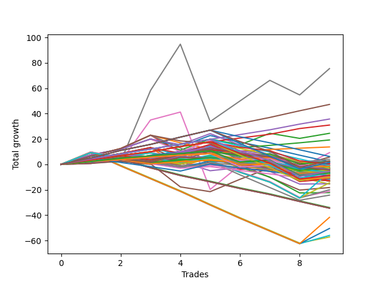

# Long Pointer Ten (1226 REV) 
- Symbol: ES_Unlimited
- Date Range: 03/18/2022 - 07/15/2022
- Trading Period: 7:20-12:30
- Number of Trades: 9



| Name | Win Percent | Profit | Avg Profit / Trade | Avg Time / Trade |      | Name | Win Percent | Profit | Avg Profit / Trade | Avg Time / Trade |
| ---- | ----------- | ------ | ------------------ | ---------------- | ---- | ---- | ----------- | ------ | ------------------ | ---------------- |
| Sorted By <br> Profit | | | | | | Sorted By <br> Win Percentage ||||
| Seven | 66.67 | 37750.00 | 4194.44 | 124:46 |     | Eighty-Five | 100.00 | 23625.00 | 2625.00 | 26:08 |
| Eighty-Five | 100.00 | 23625.00 | 2625.00 | 26:08 |     | Eighty-Four | 100.00 | 17875.00 | 1986.11 | 23:58 |
| Eighty-Four | 100.00 | 17875.00 | 1986.11 | 23:58 |     | Eighty-Three | 100.00 | 15500.00 | 1722.22 | 23:09 |
| Eighty-Three | 100.00 | 15500.00 | 1722.22 | 23:09 |     | Eighty-Two | 100.00 | 9625.00 | 1069.44 | 13:51 |
| Two | 66.67 | 12250.00 | 1361.11 | 40:41 |     | Eighty-One | 100.00 | 6875.00 | 763.89 | 13:26 |
| Eighty-Two | 100.00 | 9625.00 | 1069.44 | 13:51 |     | One Hundred Twelve | 77.78 | 2000.00 | 222.22 | 02:42 |
| Eighty-One | 100.00 | 6875.00 | 763.89 | 13:26 |     | One Hundred Seventeen | 77.78 | 1250.00 | 138.89 | 02:49 |
| Six | 66.67 | 4625.00 | 513.89 | 102:37 |     | One Hundred Eleven | 77.78 | 0.00 | 0.00 | 02:20 |
| One Hundred Fifteen | 55.56 | 3125.00 | 347.22 | 07:28 |     | One Hundred Sixteen | 77.78 | -750.00 | -83.33 | 02:27 |
| Five | 55.56 | 2875.00 | 319.44 | 81:15 |     | One Hundred Twenty-Two | 77.78 | -2875.00 | -319.44 | 04:27 |
| One Hundred Twelve | 77.78 | 2000.00 | 222.22 | 02:42 |     | One Hundred Twenty-Seven | 77.78 | -3375.00 | -375.00 | 05:37 |
| One Hundred Thirty | 66.67 | 1375.00 | 152.78 | 11:58 |     | One Hundred Twenty-One | 77.78 | -4875.00 | -541.67 | 04:06 |
| One Hundred Seventeen | 77.78 | 1250.00 | 138.89 | 02:49 |     | One Hundred Twenty-Six | 77.78 | -5375.00 | -597.22 | 05:15 |
| One Hundred Nine | 44.44 | 1000.00 | 111.11 | 03:05 |     | Seven | 66.67 | 37750.00 | 4194.44 | 124:46 |
| Forty-Two | 44.44 | 1000.00 | 111.11 | 09:21 |     | Two | 66.67 | 12250.00 | 1361.11 | 40:41 |
| One Hundred Twenty-Five | 66.67 | 750.00 | 83.33 | 11:14 |     | Six | 66.67 | 4625.00 | 513.89 | 102:37 |
| Four | 55.56 | 750.00 | 83.33 | 53:11 |     | One Hundred Thirty | 66.67 | 1375.00 | 152.78 | 11:58 |
| One Hundred Eight | 44.44 | 375.00 | 41.67 | 02:58 |     | One Hundred Twenty-Five | 66.67 | 750.00 | 83.33 | 11:14 |
| One Hundred Eighteen | 55.56 | 125.00 | 13.89 | 04:56 |     | One Hundred Twenty-Nine | 66.67 | -2750.00 | -305.56 | 09:52 |
| One Hundred Eleven | 77.78 | 0.00 | 0.00 | 02:20 |     | One Hundred Twenty-Four | 66.67 | -3375.00 | -375.00 | 09:08 |
| One Hundred Fourteen | 55.56 | -500.00 | -55.56 | 06:09 |     | Zero | 66.67 | -3500.00 | -388.89 | 16:37 |
| Sixty-Six | 55.56 | -500.00 | -55.56 | 12:55 |     | One Hundred Twenty-Eight | 66.67 | -4375.00 | -486.11 | 09:16 |
| One Hundred Ten | 44.44 | -500.00 | -55.56 | 03:15 |     | One Hundred Twenty-Three | 66.67 | -5000.00 | -555.56 | 08:32 |
| One Hundred Sixteen | 77.78 | -750.00 | -83.33 | 02:27 |     | Fifty-Six | 66.67 | -7625.00 | -847.22 | 08:53 |
| One Hundred Seven | 55.56 | -1250.00 | -138.89 | 02:04 |     | One Hundred Fifteen | 55.56 | 3125.00 | 347.22 | 07:28 |
| Ninety-Nine | 44.44 | -1375.00 | -152.78 | 02:02 |     | Five | 55.56 | 2875.00 | 319.44 | 81:15 |
| One Hundred Thirteen | 55.56 | -1500.00 | -166.67 | 05:45 |     | Four | 55.56 | 750.00 | 83.33 | 53:11 |
| One Hundred | 44.44 | -1625.00 | -180.56 | 02:04 |     | One Hundred Eighteen | 55.56 | 125.00 | 13.89 | 04:56 |
| Ninety-Eight | 44.44 | -1625.00 | -180.56 | 02:00 |     | One Hundred Fourteen | 55.56 | -500.00 | -55.56 | 06:09 |
| Ninety-Seven | 44.44 | -1625.00 | -180.56 | 01:42 |     | Sixty-Six | 55.56 | -500.00 | -55.56 | 12:55 |
| Ninety-Six | 55.56 | -1750.00 | -194.44 | 01:35 |     | One Hundred Seven | 55.56 | -1250.00 | -138.89 | 02:04 |
| One Hundred Ninteen | 44.44 | -2000.00 | -222.22 | 05:05 |     | One Hundred Thirteen | 55.56 | -1500.00 | -166.67 | 05:45 |
| Three | 44.44 | -2000.00 | -222.22 | 30:56 |     | Ninety-Six | 55.56 | -1750.00 | -194.44 | 01:35 |
| Ninety-Four | 33.33 | -2000.00 | -222.22 | 02:41 |     | One | 55.56 | -2750.00 | -305.56 | 22:35 |
| Ninety-Two | 44.44 | -2125.00 | -236.11 | 01:31 |     | One Hundred Six | 55.56 | -3000.00 | -333.33 | 01:51 |
| One Hundred Twenty | 33.33 | -2250.00 | -250.00 | 05:37 |     | Fifty-Eight | 55.56 | -3875.00 | -430.56 | 12:41 |
| Forty-Nine | 33.33 | -2375.00 | -263.89 | 05:51 |     | Seventy-Three | 55.56 | -4625.00 | -513.89 | 09:45 |
| Fifty | 22.22 | -2375.00 | -263.89 | 06:45 |     | Sixty-Five | 55.56 | -5750.00 | -638.89 | 10:48 |
| Ninety-Three | 33.33 | -2625.00 | -291.67 | 02:34 |     | Fifty-Seven | 55.56 | -9125.00 | -1013.89 | 10:33 |
| One Hundred Twenty-Nine | 66.67 | -2750.00 | -305.56 | 09:52 |     | Sixty-Four | 55.56 | -11125.00 | -1236.11 | 09:18 |
| One | 55.56 | -2750.00 | -305.56 | 22:35 |     | One Hundred Nine | 44.44 | 1000.00 | 111.11 | 03:05 |
| One Hundred Twenty-Two | 77.78 | -2875.00 | -319.44 | 04:27 |     | Forty-Two | 44.44 | 1000.00 | 111.11 | 09:21 |
| Seventy-One | 33.33 | -2875.00 | -319.44 | 31:59 |     | One Hundred Eight | 44.44 | 375.00 | 41.67 | 02:58 |
| One Hundred Six | 55.56 | -3000.00 | -333.33 | 01:51 |     | One Hundred Ten | 44.44 | -500.00 | -55.56 | 03:15 |
| One Hundred Two | 44.44 | -3125.00 | -347.22 | 01:41 |     | Ninety-Nine | 44.44 | -1375.00 | -152.78 | 02:02 |
| Forty-Eight | 44.44 | -3250.00 | -361.11 | 04:49 |     | One Hundred | 44.44 | -1625.00 | -180.56 | 02:04 |
| Forty-One | 44.44 | -3250.00 | -361.11 | 07:33 |     | Ninety-Eight | 44.44 | -1625.00 | -180.56 | 02:00 |
| One Hundred Four | 33.33 | -3250.00 | -361.11 | 02:56 |     | Ninety-Seven | 44.44 | -1625.00 | -180.56 | 01:42 |
| One Hundred Twenty-Seven | 77.78 | -3375.00 | -375.00 | 05:37 |     | One Hundred Ninteen | 44.44 | -2000.00 | -222.22 | 05:05 |
| One Hundred Twenty-Four | 66.67 | -3375.00 | -375.00 | 09:08 |     | Three | 44.44 | -2000.00 | -222.22 | 30:56 |
| Zero | 66.67 | -3500.00 | -388.89 | 16:37 |     | Ninety-Two | 44.44 | -2125.00 | -236.11 | 01:31 |
| Ninety-One | 44.44 | -3750.00 | -416.67 | 01:18 |     | One Hundred Two | 44.44 | -3125.00 | -347.22 | 01:41 |
| Ninety-Five | 22.22 | -3750.00 | -416.67 | 03:18 |     | Forty-Eight | 44.44 | -3250.00 | -361.11 | 04:49 |
| Fifty-Eight | 55.56 | -3875.00 | -430.56 | 12:41 |     | Forty-One | 44.44 | -3250.00 | -361.11 | 07:33 |
| One Hundred Three | 33.33 | -3875.00 | -430.56 | 02:49 |     | Ninety-One | 44.44 | -3750.00 | -416.67 | 01:18 |
| Sixty-Seven | 44.44 | -4250.00 | -472.22 | 13:55 |     | Sixty-Seven | 44.44 | -4250.00 | -472.22 | 13:55 |
| One Hundred Twenty-Eight | 66.67 | -4375.00 | -486.11 | 09:16 |     | One Hundred One | 44.44 | -4750.00 | -527.78 | 01:28 |
| Forty-Three | 33.33 | -4375.00 | -486.11 | 10:29 |     | Forty | 44.44 | -7750.00 | -861.11 | 06:16 |
| Seventy-Three | 55.56 | -4625.00 | -513.89 | 09:45 |     | Fifty-Nine | 44.44 | -12125.00 | -1347.22 | 15:02 |
| One Hundred One | 44.44 | -4750.00 | -527.78 | 01:28 |     | Ninety-Four | 33.33 | -2000.00 | -222.22 | 02:41 |
| One Hundred Twenty-One | 77.78 | -4875.00 | -541.67 | 04:06 |     | One Hundred Twenty | 33.33 | -2250.00 | -250.00 | 05:37 |
| One Hundred Twenty-Three | 66.67 | -5000.00 | -555.56 | 08:32 |     | Forty-Nine | 33.33 | -2375.00 | -263.89 | 05:51 |
| Fifty-One | 22.22 | -5125.00 | -569.44 | 06:47 |     | Ninety-Three | 33.33 | -2625.00 | -291.67 | 02:34 |
| One Hundred Twenty-Six | 77.78 | -5375.00 | -597.22 | 05:15 |     | Seventy-One | 33.33 | -2875.00 | -319.44 | 31:59 |
| Sixty-Five | 55.56 | -5750.00 | -638.89 | 10:48 |     | One Hundred Four | 33.33 | -3250.00 | -361.11 | 02:56 |
| One Hundred Five | 22.22 | -5750.00 | -638.89 | 03:49 |     | One Hundred Three | 33.33 | -3875.00 | -430.56 | 02:49 |
| Fifty-Five | 22.22 | -6500.00 | -722.22 | 07:22 |     | Forty-Three | 33.33 | -4375.00 | -486.11 | 10:29 |
| Fifty-Four | 22.22 | -6500.00 | -722.22 | 07:22 |     | Seventy | 33.33 | -7250.00 | -805.56 | 25:37 |
| Fifty-Three | 22.22 | -6500.00 | -722.22 | 07:22 |     | Sixty-Nine | 33.33 | -10000.00 | -1111.11 | 22:36 |
| Fifty-Two | 22.22 | -6500.00 | -722.22 | 07:22 |     | Sixty-Eight | 33.33 | -10625.00 | -1180.56 | 20:02 |
| Seventy | 33.33 | -7250.00 | -805.56 | 25:37 |     | Fifty | 22.22 | -2375.00 | -263.89 | 06:45 |
| Fifty-Six | 66.67 | -7625.00 | -847.22 | 08:53 |     | Ninety-Five | 22.22 | -3750.00 | -416.67 | 03:18 |
| Forty | 44.44 | -7750.00 | -861.11 | 06:16 |     | Fifty-One | 22.22 | -5125.00 | -569.44 | 06:47 |
| Fifty-Seven | 55.56 | -9125.00 | -1013.89 | 10:33 |     | One Hundred Five | 22.22 | -5750.00 | -638.89 | 03:49 |
| Sixty-Nine | 33.33 | -10000.00 | -1111.11 | 22:36 |     | Fifty-Five | 22.22 | -6500.00 | -722.22 | 07:22 |
| Sixty-Eight | 33.33 | -10625.00 | -1180.56 | 20:02 |     | Fifty-Four | 22.22 | -6500.00 | -722.22 | 07:22 |
| Sixty-Four | 55.56 | -11125.00 | -1236.11 | 09:18 |     | Fifty-Three | 22.22 | -6500.00 | -722.22 | 07:22 |
| Fifty-Nine | 44.44 | -12125.00 | -1347.22 | 15:02 |     | Fifty-Two | 22.22 | -6500.00 | -722.22 | 07:22 |
| Forty-Four | 11.11 | -17000.00 | -1888.89 | 14:31 |     | Sixty-Three | 22.22 | -20875.00 | -2319.44 | 34:11 |
| Forty-Seven | 11.11 | -17250.00 | -1916.67 | 14:35 |     | Sixty-Two | 22.22 | -25250.00 | -2805.56 | 27:49 |
| Forty-Six | 11.11 | -17250.00 | -1916.67 | 14:35 |     | Sixty-One | 22.22 | -28000.00 | -3111.11 | 24:48 |
| Forty-Five | 11.11 | -17250.00 | -1916.67 | 14:35 |     | Sixty | 22.22 | -28625.00 | -3180.56 | 22:15 |
| Sixty-Three | 22.22 | -20875.00 | -2319.44 | 34:11 |     | Forty-Four | 11.11 | -17000.00 | -1888.89 | 14:31 |
| Sixty-Two | 22.22 | -25250.00 | -2805.56 | 27:49 |     | Forty-Seven | 11.11 | -17250.00 | -1916.67 | 14:35 |
| Sixty-One | 22.22 | -28000.00 | -3111.11 | 24:48 |     | Forty-Six | 11.11 | -17250.00 | -1916.67 | 14:35 |
| Sixty | 22.22 | -28625.00 | -3180.56 | 22:15 |     | Forty-Five | 11.11 | -17250.00 | -1916.67 | 14:35 |

## NO STOPLOSS

### Test Zero
* Sell when price hits the middle line of the 20p bollinger
* No Stoploss
* Results:
```
Total Trades: 9
Percent Up: 66.67
Percent Down: 33.33
Total Points Moved Up: -7.00
Potential Profit: -3500.00
Total Points Ups: 15.25 Count Ups: 6
Total Points Downs: -22.25 Count Downs: 3
```

<details><summary>Trades</summary>

<code>In: 2022-03-30 12:27:00		Out: 2022-03-30 12:28:50		Total Position Time: 01:50		Total Move Up: 2.75		Total to Date: 2.75</code> <br />
<code>In: 2022-04-12 11:35:00		Out: 2022-04-12 11:36:10		Total Position Time: 01:10		Total Move Up: 1.50		Total to Date: 4.25</code> <br />
<code>In: 2022-05-02 10:51:00		Out: 2022-05-02 10:59:50		Total Position Time: 08:50		Total Move Up: 2.25		Total to Date: 6.50</code> <br />
<code>In: 2022-05-10 07:52:00		Out: 2022-05-10 08:02:25		Total Position Time: 10:25		Total Move Up: 3.75		Total to Date: 10.25</code> <br />
<code>In: 2022-05-18 08:32:00		Out: 2022-05-18 08:37:35		Total Position Time: 05:35		Total Move Up: 4.75		Total to Date: 15.00</code> <br />
<code>In: 2022-06-14 11:52:00		Out: 2022-06-14 12:26:30		Total Position Time: 34:30		Total Move Up: -11.75		Total to Date: 3.25</code> <br />
<code>In: 2022-06-15 07:57:00		Out: 2022-06-15 08:34:25		Total Position Time: 37:25		Total Move Up: -3.50		Total to Date: -0.25</code> <br />
<code>In: 2022-06-16 11:02:00		Out: 2022-06-16 11:40:20		Total Position Time: 38:20		Total Move Up: -7.00		Total to Date: -7.25</code> <br />
<code>In: 2022-07-06 08:35:00		Out: 2022-07-06 08:46:30		Total Position Time: 11:30		Total Move Up: 0.25		Total to Date: -7.00</code> <br />


</details>

### Test One
* Sell when the price hits the upper line of the 20p 1std bollinger
* No Stoploss
* Results:
```
Total Trades: 9
Percent Up: 55.56
Percent Down: 44.44
Total Points Moved Up: -5.50
Potential Profit: -2750.00
Total Points Ups: 22.25 Count Ups: 5
Total Points Downs: -27.75 Count Downs: 4
```

<details><summary>Trades</summary>

<code>In: 2022-03-30 12:27:00		Out: 2022-03-30 12:32:20		Total Position Time: 05:20		Total Move Up: 4.75		Total to Date: 4.75</code> <br />
<code>In: 2022-04-12 11:35:00		Out: 2022-04-12 11:37:30		Total Position Time: 02:30		Total Move Up: 3.75		Total to Date: 8.50</code> <br />
<code>In: 2022-05-02 10:51:00		Out: 2022-05-02 11:02:45		Total Position Time: 11:45		Total Move Up: 4.75		Total to Date: 13.25</code> <br />
<code>In: 2022-05-10 07:52:00		Out: 2022-05-10 08:37:10		Total Position Time: 45:10		Total Move Up: -15.00		Total to Date: -1.75</code> <br />
<code>In: 2022-05-18 08:32:00		Out: 2022-05-18 08:41:20		Total Position Time: 09:20		Total Move Up: 7.00		Total to Date: 5.25</code> <br />
<code>In: 2022-06-14 11:52:00		Out: 2022-06-14 12:27:20		Total Position Time: 35:20		Total Move Up: -7.75		Total to Date: -2.50</code> <br />
<code>In: 2022-06-15 07:57:00		Out: 2022-06-15 08:38:55		Total Position Time: 41:55		Total Move Up: -0.25		Total to Date: -2.75</code> <br />
<code>In: 2022-06-16 11:02:00		Out: 2022-06-16 11:40:30		Total Position Time: 38:30		Total Move Up: -4.75		Total to Date: -7.50</code> <br />
<code>In: 2022-07-06 08:35:00		Out: 2022-07-06 08:48:25		Total Position Time: 13:25		Total Move Up: 2.00		Total to Date: -5.50</code> <br />


</details>

### Test Two
* Sell when the price hits the upper line of the 20p 2std bollinger
* No Stoploss
* Results:
```
Total Trades: 9
Percent Up: 66.67
Percent Down: 33.33
Total Points Moved Up: 24.50
Potential Profit: 12250.00
Total Points Ups: 41.75 Count Ups: 6
Total Points Downs: -17.25 Count Downs: 3
```

<details><summary>Trades</summary>

<code>In: 2022-03-30 12:27:00		Out: 2022-03-30 12:36:20		Total Position Time: 09:20		Total Move Up: 7.50		Total to Date: 7.50</code> <br />
<code>In: 2022-04-12 11:35:00		Out: 2022-04-12 11:47:00		Total Position Time: 12:00		Total Move Up: 4.50		Total to Date: 12.00</code> <br />
<code>In: 2022-05-02 10:51:00		Out: 2022-05-02 11:03:55		Total Position Time: 12:55		Total Move Up: 8.00		Total to Date: 20.00</code> <br />
<code>In: 2022-05-10 07:52:00		Out: 2022-05-10 08:39:10		Total Position Time: 47:10		Total Move Up: -8.75		Total to Date: 11.25</code> <br />
<code>In: 2022-05-18 08:32:00		Out: 2022-05-18 08:42:55		Total Position Time: 10:55		Total Move Up: 8.75		Total to Date: 20.00</code> <br />
<code>In: 2022-06-14 11:52:00		Out: 2022-06-14 12:29:20		Total Position Time: 37:20		Total Move Up: -4.50		Total to Date: 15.50</code> <br />
<code>In: 2022-06-15 07:57:00		Out: 2022-06-15 10:58:15		Total Position Time: 181:15		Total Move Up: 9.00		Total to Date: 24.50</code> <br />
<code>In: 2022-06-16 11:02:00		Out: 2022-06-16 11:41:05		Total Position Time: 39:05		Total Move Up: -4.00		Total to Date: 20.50</code> <br />
<code>In: 2022-07-06 08:35:00		Out: 2022-07-06 08:51:15		Total Position Time: 16:15		Total Move Up: 4.00		Total to Date: 24.50</code> <br />


</details>

### Test Three
* Sell when price hits the middle line of the 50p bollinger
* No Stoploss
* Results:
```
Total Trades: 9
Percent Up: 44.44
Percent Down: 55.56
Total Points Moved Up: -4.00
Potential Profit: -2000.00
Total Points Ups: 27.00 Count Ups: 4
Total Points Downs: -31.00 Count Downs: 5
```

<details><summary>Trades</summary>

<code>In: 2022-03-30 12:27:00		Out: 2022-03-30 12:33:40		Total Position Time: 06:40		Total Move Up: 6.50		Total to Date: 6.50</code> <br />
<code>In: 2022-04-12 11:35:00		Out: 2022-04-12 11:47:05		Total Position Time: 12:05		Total Move Up: 6.00		Total to Date: 12.50</code> <br />
<code>In: 2022-05-02 10:51:00		Out: 2022-05-02 11:05:00		Total Position Time: 14:00		Total Move Up: 10.50		Total to Date: 23.00</code> <br />
<code>In: 2022-05-10 07:52:00		Out: 2022-05-10 08:38:55		Total Position Time: 46:55		Total Move Up: -13.25		Total to Date: 9.75</code> <br />
<code>In: 2022-05-18 08:32:00		Out: 2022-05-18 09:36:20		Total Position Time: 64:20		Total Move Up: -8.75		Total to Date: 1.00</code> <br />
<code>In: 2022-06-14 11:52:00		Out: 2022-06-14 12:29:10		Total Position Time: 37:10		Total Move Up: -4.75		Total to Date: -3.75</code> <br />
<code>In: 2022-06-15 07:57:00		Out: 2022-06-15 08:38:55		Total Position Time: 41:55		Total Move Up: -0.25		Total to Date: -4.00</code> <br />
<code>In: 2022-06-16 11:02:00		Out: 2022-06-16 11:41:05		Total Position Time: 39:05		Total Move Up: -4.00		Total to Date: -8.00</code> <br />
<code>In: 2022-07-06 08:35:00		Out: 2022-07-06 08:51:15		Total Position Time: 16:15		Total Move Up: 4.00		Total to Date: -4.00</code> <br />


</details>

### Test Four
* Sell when the price hits the upper line of the 50p 1std bollinger
* No Stoploss
* Results:
```
Total Trades: 9
Percent Up: 55.56
Percent Down: 44.44
Total Points Moved Up: 1.50
Potential Profit: 750.00
Total Points Ups: 23.00 Count Ups: 5
Total Points Downs: -21.50 Count Downs: 4
```

<details><summary>Trades</summary>

<code>In: 2022-03-30 12:27:00		Out: 2022-03-30 12:46:25		Total Position Time: 19:25		Total Move Up: 9.75		Total to Date: 9.75</code> <br />
<code>In: 2022-04-12 11:35:00		Out: 2022-04-12 12:47:00		Total Position Time: 72:00		Total Move Up: -7.00		Total to Date: 2.75</code> <br />
<code>In: 2022-05-02 10:51:00		Out: 2022-05-02 11:53:40		Total Position Time: 62:40		Total Move Up: 3.25		Total to Date: 6.00</code> <br />
<code>In: 2022-05-10 07:52:00		Out: 2022-05-10 08:40:30		Total Position Time: 48:30		Total Move Up: -3.75		Total to Date: 2.25</code> <br />
<code>In: 2022-05-18 08:32:00		Out: 2022-05-18 09:47:55		Total Position Time: 75:55		Total Move Up: -7.25		Total to Date: -5.00</code> <br />
<code>In: 2022-06-14 11:52:00		Out: 2022-06-14 12:30:55		Total Position Time: 38:55		Total Move Up: 2.50		Total to Date: -2.50</code> <br />
<code>In: 2022-06-15 07:57:00		Out: 2022-06-15 08:57:35		Total Position Time: 60:35		Total Move Up: 2.75		Total to Date: 0.25</code> <br />
<code>In: 2022-06-16 11:02:00		Out: 2022-06-16 12:04:10		Total Position Time: 62:10		Total Move Up: -3.50		Total to Date: -3.25</code> <br />
<code>In: 2022-07-06 08:35:00		Out: 2022-07-06 09:13:30		Total Position Time: 38:30		Total Move Up: 4.75		Total to Date: 1.50</code> <br />


</details>

### Test Five
* Sell when the price hits the upper line of the 50p 2std bollinger
* No Stoploss
* Results:
```
Total Trades: 9
Percent Up: 55.56
Percent Down: 44.44
Total Points Moved Up: 5.75
Potential Profit: 2875.00
Total Points Ups: 36.50 Count Ups: 5
Total Points Downs: -30.75 Count Downs: 4
```

<details><summary>Trades</summary>

<code>In: 2022-03-30 12:27:00		Out: 2022-03-30 12:47:00		Total Position Time: 20:00		Total Move Up: 9.25		Total to Date: 9.25</code> <br />
<code>In: 2022-04-12 11:35:00		Out: 2022-04-12 12:47:00		Total Position Time: 72:00		Total Move Up: -7.00		Total to Date: 2.25</code> <br />
<code>In: 2022-05-02 10:51:00		Out: 2022-05-02 12:03:30		Total Position Time: 72:30		Total Move Up: -1.75		Total to Date: 0.50</code> <br />
<code>In: 2022-05-10 07:52:00		Out: 2022-05-10 10:04:15		Total Position Time: 132:15		Total Move Up: -18.25		Total to Date: -17.75</code> <br />
<code>In: 2022-05-18 08:32:00		Out: 2022-05-18 09:50:35		Total Position Time: 78:35		Total Move Up: -3.75		Total to Date: -21.50</code> <br />
<code>In: 2022-06-14 11:52:00		Out: 2022-06-14 12:37:50		Total Position Time: 45:50		Total Move Up: 9.75		Total to Date: -11.75</code> <br />
<code>In: 2022-06-15 07:57:00		Out: 2022-06-15 10:58:15		Total Position Time: 181:15		Total Move Up: 9.00		Total to Date: -2.75</code> <br />
<code>In: 2022-06-16 11:02:00		Out: 2022-06-16 12:10:00		Total Position Time: 68:00		Total Move Up: 2.00		Total to Date: -0.75</code> <br />
<code>In: 2022-07-06 08:35:00		Out: 2022-07-06 09:35:55		Total Position Time: 60:55		Total Move Up: 6.50		Total to Date: 5.75</code> <br />


</details>

### Test Six
* Sell when the price hits the middle line of the 1std VWAP
* No Stoploss
* Results:
```
Total Trades: 9
Percent Up: 66.67
Percent Down: 33.33
Total Points Moved Up: 9.25
Potential Profit: 4625.00
Total Points Ups: 88.75 Count Ups: 6
Total Points Downs: -79.50 Count Downs: 3
```

<details><summary>Trades</summary>

<code>In: 2022-03-30 12:27:00		Out: 2022-03-30 12:47:00		Total Position Time: 20:00		Total Move Up: 9.25		Total to Date: 9.25</code> <br />
<code>In: 2022-04-12 11:35:00		Out: 2022-04-12 12:47:00		Total Position Time: 72:00		Total Move Up: -7.00		Total to Date: 2.25</code> <br />
<code>In: 2022-05-02 10:51:00		Out: 2022-05-02 12:16:15		Total Position Time: 85:15		Total Move Up: 32.75		Total to Date: 35.00</code> <br />
<code>In: 2022-05-10 07:52:00		Out: 2022-05-10 10:35:05		Total Position Time: 163:05		Total Move Up: 6.25		Total to Date: 41.25</code> <br />
<code>In: 2022-05-18 08:32:00		Out: 2022-05-18 12:47:00		Total Position Time: 255:00		Total Move Up: -61.00		Total to Date: -19.75</code> <br />
<code>In: 2022-06-14 11:52:00		Out: 2022-06-14 12:42:00		Total Position Time: 50:00		Total Move Up: 19.00		Total to Date: -0.75</code> <br />
<code>In: 2022-06-15 07:57:00		Out: 2022-06-15 09:22:15		Total Position Time: 85:15		Total Move Up: 9.50		Total to Date: 8.75</code> <br />
<code>In: 2022-06-16 11:02:00		Out: 2022-06-16 12:47:00		Total Position Time: 105:00		Total Move Up: -11.50		Total to Date: -2.75</code> <br />
<code>In: 2022-07-06 08:35:00		Out: 2022-07-06 10:03:05		Total Position Time: 88:05		Total Move Up: 12.00		Total to Date: 9.25</code> <br />


</details>

### Test Seven
* Sell when the price hits the upper line of the 1std VWAP
* No Stoploss
* Results:
```
Total Trades: 9
Percent Up: 66.67
Percent Down: 33.33
Total Points Moved Up: 75.50
Potential Profit: 37750.00
Total Points Ups: 155.00 Count Ups: 6
Total Points Downs: -79.50 Count Downs: 3
```

<details><summary>Trades</summary>

<code>In: 2022-03-30 12:27:00		Out: 2022-03-30 12:47:00		Total Position Time: 20:00		Total Move Up: 9.25		Total to Date: 9.25</code> <br />
<code>In: 2022-04-12 11:35:00		Out: 2022-04-12 12:47:00		Total Position Time: 72:00		Total Move Up: -7.00		Total to Date: 2.25</code> <br />
<code>In: 2022-05-02 10:51:00		Out: 2022-05-02 12:30:30		Total Position Time: 99:30		Total Move Up: 56.00		Total to Date: 58.25</code> <br />
<code>In: 2022-05-10 07:52:00		Out: 2022-05-10 10:59:35		Total Position Time: 187:35		Total Move Up: 36.50		Total to Date: 94.75</code> <br />
<code>In: 2022-05-18 08:32:00		Out: 2022-05-18 12:47:00		Total Position Time: 255:00		Total Move Up: -61.00		Total to Date: 33.75</code> <br />
<code>In: 2022-06-14 11:52:00		Out: 2022-06-14 12:47:00		Total Position Time: 55:00		Total Move Up: 16.25		Total to Date: 50.00</code> <br />
<code>In: 2022-06-15 07:57:00		Out: 2022-06-15 11:00:30		Total Position Time: 183:30		Total Move Up: 16.25		Total to Date: 66.25</code> <br />
<code>In: 2022-06-16 11:02:00		Out: 2022-06-16 12:47:00		Total Position Time: 105:00		Total Move Up: -11.50		Total to Date: 54.75</code> <br />
<code>In: 2022-07-06 08:35:00		Out: 2022-07-06 11:00:25		Total Position Time: 145:25		Total Move Up: 20.75		Total to Date: 75.50</code> <br />


</details>

## STOPLOSS OF 5

### Test Forty
* Sell when price hits the middle line of the 20p bollinger
* Stoploss is 5 points
* Results:
```
Total Trades: 9
Percent Up: 44.44
Percent Down: 55.56
Total Points Moved Up: -15.50
Potential Profit: -7750.00
Total Points Ups: 11.25 Count Ups: 4
Total Points Downs: -26.75 Count Downs: 5
```

<details><summary>Trades</summary>

<code>In: 2022-03-30 12:27:00		Out: 2022-03-30 12:28:50		Total Position Time: 01:50		Total Move Up: 2.75		Total to Date: 2.75</code> <br />
<code>In: 2022-04-12 11:35:00		Out: 2022-04-12 11:36:10		Total Position Time: 01:10		Total Move Up: 1.50		Total to Date: 4.25</code> <br />
<code>In: 2022-05-02 10:51:00		Out: 2022-05-02 10:59:50		Total Position Time: 08:50		Total Move Up: 2.25		Total to Date: 6.50</code> <br />
<code>In: 2022-05-10 07:52:00		Out: 2022-05-10 08:01:00		Total Position Time: 09:00		Total Move Up: -6.00		Total to Date: 0.50</code> <br />
<code>In: 2022-05-18 08:32:00		Out: 2022-05-18 08:37:35		Total Position Time: 05:35		Total Move Up: 4.75		Total to Date: 5.25</code> <br />
<code>In: 2022-06-14 11:52:00		Out: 2022-06-14 11:54:45		Total Position Time: 02:45		Total Move Up: -5.25		Total to Date: 0.00</code> <br />
<code>In: 2022-06-15 07:57:00		Out: 2022-06-15 08:10:15		Total Position Time: 13:15		Total Move Up: -4.75		Total to Date: -4.75</code> <br />
<code>In: 2022-06-16 11:02:00		Out: 2022-06-16 11:05:50		Total Position Time: 03:50		Total Move Up: -5.50		Total to Date: -10.25</code> <br />
<code>In: 2022-07-06 08:35:00		Out: 2022-07-06 08:45:15		Total Position Time: 10:15		Total Move Up: -5.25		Total to Date: -15.50</code> <br />


</details>

### Test Forty-One
* Sell when the price hits the upper line of the 20p 1std bollinger
* Stoploss is 5 points
* Results:
```
Total Trades: 9
Percent Up: 44.44
Percent Down: 55.56
Total Points Moved Up: -6.50
Potential Profit: -3250.00
Total Points Ups: 20.25 Count Ups: 4
Total Points Downs: -26.75 Count Downs: 5
```

<details><summary>Trades</summary>

<code>In: 2022-03-30 12:27:00		Out: 2022-03-30 12:32:20		Total Position Time: 05:20		Total Move Up: 4.75		Total to Date: 4.75</code> <br />
<code>In: 2022-04-12 11:35:00		Out: 2022-04-12 11:37:30		Total Position Time: 02:30		Total Move Up: 3.75		Total to Date: 8.50</code> <br />
<code>In: 2022-05-02 10:51:00		Out: 2022-05-02 11:02:45		Total Position Time: 11:45		Total Move Up: 4.75		Total to Date: 13.25</code> <br />
<code>In: 2022-05-10 07:52:00		Out: 2022-05-10 08:01:00		Total Position Time: 09:00		Total Move Up: -6.00		Total to Date: 7.25</code> <br />
<code>In: 2022-05-18 08:32:00		Out: 2022-05-18 08:41:20		Total Position Time: 09:20		Total Move Up: 7.00		Total to Date: 14.25</code> <br />
<code>In: 2022-06-14 11:52:00		Out: 2022-06-14 11:54:45		Total Position Time: 02:45		Total Move Up: -5.25		Total to Date: 9.00</code> <br />
<code>In: 2022-06-15 07:57:00		Out: 2022-06-15 08:10:15		Total Position Time: 13:15		Total Move Up: -4.75		Total to Date: 4.25</code> <br />
<code>In: 2022-06-16 11:02:00		Out: 2022-06-16 11:05:50		Total Position Time: 03:50		Total Move Up: -5.50		Total to Date: -1.25</code> <br />
<code>In: 2022-07-06 08:35:00		Out: 2022-07-06 08:45:15		Total Position Time: 10:15		Total Move Up: -5.25		Total to Date: -6.50</code> <br />


</details>

### Test Forty-Two
* Sell when the price hits the upper line of the 20p 2std bollinger
* Stoploss is 5 points
* Results:
```
Total Trades: 9
Percent Up: 44.44
Percent Down: 55.56
Total Points Moved Up: 2.00
Potential Profit: 1000.00
Total Points Ups: 28.75 Count Ups: 4
Total Points Downs: -26.75 Count Downs: 5
```

<details><summary>Trades</summary>

<code>In: 2022-03-30 12:27:00		Out: 2022-03-30 12:36:20		Total Position Time: 09:20		Total Move Up: 7.50		Total to Date: 7.50</code> <br />
<code>In: 2022-04-12 11:35:00		Out: 2022-04-12 11:47:00		Total Position Time: 12:00		Total Move Up: 4.50		Total to Date: 12.00</code> <br />
<code>In: 2022-05-02 10:51:00		Out: 2022-05-02 11:03:55		Total Position Time: 12:55		Total Move Up: 8.00		Total to Date: 20.00</code> <br />
<code>In: 2022-05-10 07:52:00		Out: 2022-05-10 08:01:00		Total Position Time: 09:00		Total Move Up: -6.00		Total to Date: 14.00</code> <br />
<code>In: 2022-05-18 08:32:00		Out: 2022-05-18 08:42:55		Total Position Time: 10:55		Total Move Up: 8.75		Total to Date: 22.75</code> <br />
<code>In: 2022-06-14 11:52:00		Out: 2022-06-14 11:54:45		Total Position Time: 02:45		Total Move Up: -5.25		Total to Date: 17.50</code> <br />
<code>In: 2022-06-15 07:57:00		Out: 2022-06-15 08:10:15		Total Position Time: 13:15		Total Move Up: -4.75		Total to Date: 12.75</code> <br />
<code>In: 2022-06-16 11:02:00		Out: 2022-06-16 11:05:50		Total Position Time: 03:50		Total Move Up: -5.50		Total to Date: 7.25</code> <br />
<code>In: 2022-07-06 08:35:00		Out: 2022-07-06 08:45:15		Total Position Time: 10:15		Total Move Up: -5.25		Total to Date: 2.00</code> <br />


</details>

### Test Forty-Three
* Sell when price hits the middle line of the 50p bollinger
* Stoploss is 5 points
* Results:
```
Total Trades: 9
Percent Up: 33.33
Percent Down: 66.67
Total Points Moved Up: -8.75
Potential Profit: -4375.00
Total Points Ups: 23.00 Count Ups: 3
Total Points Downs: -31.75 Count Downs: 6
```

<details><summary>Trades</summary>

<code>In: 2022-03-30 12:27:00		Out: 2022-03-30 12:33:40		Total Position Time: 06:40		Total Move Up: 6.50		Total to Date: 6.50</code> <br />
<code>In: 2022-04-12 11:35:00		Out: 2022-04-12 11:47:05		Total Position Time: 12:05		Total Move Up: 6.00		Total to Date: 12.50</code> <br />
<code>In: 2022-05-02 10:51:00		Out: 2022-05-02 11:05:00		Total Position Time: 14:00		Total Move Up: 10.50		Total to Date: 23.00</code> <br />
<code>In: 2022-05-10 07:52:00		Out: 2022-05-10 08:01:00		Total Position Time: 09:00		Total Move Up: -6.00		Total to Date: 17.00</code> <br />
<code>In: 2022-05-18 08:32:00		Out: 2022-05-18 08:54:35		Total Position Time: 22:35		Total Move Up: -5.00		Total to Date: 12.00</code> <br />
<code>In: 2022-06-14 11:52:00		Out: 2022-06-14 11:54:45		Total Position Time: 02:45		Total Move Up: -5.25		Total to Date: 6.75</code> <br />
<code>In: 2022-06-15 07:57:00		Out: 2022-06-15 08:10:15		Total Position Time: 13:15		Total Move Up: -4.75		Total to Date: 2.00</code> <br />
<code>In: 2022-06-16 11:02:00		Out: 2022-06-16 11:05:50		Total Position Time: 03:50		Total Move Up: -5.50		Total to Date: -3.50</code> <br />
<code>In: 2022-07-06 08:35:00		Out: 2022-07-06 08:45:15		Total Position Time: 10:15		Total Move Up: -5.25		Total to Date: -8.75</code> <br />


</details>

### Test Forty-Four
* Sell when the price hits the upper line of the 50p 1std bollinger
* Stoploss is 5 points
* Results:
```
Total Trades: 9
Percent Up: 11.11
Percent Down: 88.89
Total Points Moved Up: -34.00
Potential Profit: -17000.00
Total Points Ups: 9.75 Count Ups: 1
Total Points Downs: -43.75 Count Downs: 8
```

<details><summary>Trades</summary>

<code>In: 2022-03-30 12:27:00		Out: 2022-03-30 12:46:25		Total Position Time: 19:25		Total Move Up: 9.75		Total to Date: 9.75</code> <br />
<code>In: 2022-04-12 11:35:00		Out: 2022-04-12 12:03:05		Total Position Time: 28:05		Total Move Up: -5.25		Total to Date: 4.50</code> <br />
<code>In: 2022-05-02 10:51:00		Out: 2022-05-02 11:12:30		Total Position Time: 21:30		Total Move Up: -6.75		Total to Date: -2.25</code> <br />
<code>In: 2022-05-10 07:52:00		Out: 2022-05-10 08:01:00		Total Position Time: 09:00		Total Move Up: -6.00		Total to Date: -8.25</code> <br />
<code>In: 2022-05-18 08:32:00		Out: 2022-05-18 08:54:35		Total Position Time: 22:35		Total Move Up: -5.00		Total to Date: -13.25</code> <br />
<code>In: 2022-06-14 11:52:00		Out: 2022-06-14 11:54:45		Total Position Time: 02:45		Total Move Up: -5.25		Total to Date: -18.50</code> <br />
<code>In: 2022-06-15 07:57:00		Out: 2022-06-15 08:10:15		Total Position Time: 13:15		Total Move Up: -4.75		Total to Date: -23.25</code> <br />
<code>In: 2022-06-16 11:02:00		Out: 2022-06-16 11:05:50		Total Position Time: 03:50		Total Move Up: -5.50		Total to Date: -28.75</code> <br />
<code>In: 2022-07-06 08:35:00		Out: 2022-07-06 08:45:15		Total Position Time: 10:15		Total Move Up: -5.25		Total to Date: -34.00</code> <br />


</details>

### Test Forty-Five
* Sell when the price hits the upper line of the 50p 2std bollinger
* Stoploss is 5 points
* Results:
```
Total Trades: 9
Percent Up: 11.11
Percent Down: 88.89
Total Points Moved Up: -34.50
Potential Profit: -17250.00
Total Points Ups: 9.25 Count Ups: 1
Total Points Downs: -43.75 Count Downs: 8
```

<details><summary>Trades</summary>

<code>In: 2022-03-30 12:27:00		Out: 2022-03-30 12:47:00		Total Position Time: 20:00		Total Move Up: 9.25		Total to Date: 9.25</code> <br />
<code>In: 2022-04-12 11:35:00		Out: 2022-04-12 12:03:05		Total Position Time: 28:05		Total Move Up: -5.25		Total to Date: 4.00</code> <br />
<code>In: 2022-05-02 10:51:00		Out: 2022-05-02 11:12:30		Total Position Time: 21:30		Total Move Up: -6.75		Total to Date: -2.75</code> <br />
<code>In: 2022-05-10 07:52:00		Out: 2022-05-10 08:01:00		Total Position Time: 09:00		Total Move Up: -6.00		Total to Date: -8.75</code> <br />
<code>In: 2022-05-18 08:32:00		Out: 2022-05-18 08:54:35		Total Position Time: 22:35		Total Move Up: -5.00		Total to Date: -13.75</code> <br />
<code>In: 2022-06-14 11:52:00		Out: 2022-06-14 11:54:45		Total Position Time: 02:45		Total Move Up: -5.25		Total to Date: -19.00</code> <br />
<code>In: 2022-06-15 07:57:00		Out: 2022-06-15 08:10:15		Total Position Time: 13:15		Total Move Up: -4.75		Total to Date: -23.75</code> <br />
<code>In: 2022-06-16 11:02:00		Out: 2022-06-16 11:05:50		Total Position Time: 03:50		Total Move Up: -5.50		Total to Date: -29.25</code> <br />
<code>In: 2022-07-06 08:35:00		Out: 2022-07-06 08:45:15		Total Position Time: 10:15		Total Move Up: -5.25		Total to Date: -34.50</code> <br />


</details>

### Test Forty-Six
* Sell when the price hits the middle line of the 1std VWAP
* Stoploss is 5 points
* Results:
```
Total Trades: 9
Percent Up: 11.11
Percent Down: 88.89
Total Points Moved Up: -34.50
Potential Profit: -17250.00
Total Points Ups: 9.25 Count Ups: 1
Total Points Downs: -43.75 Count Downs: 8
```

<details><summary>Trades</summary>

<code>In: 2022-03-30 12:27:00		Out: 2022-03-30 12:47:00		Total Position Time: 20:00		Total Move Up: 9.25		Total to Date: 9.25</code> <br />
<code>In: 2022-04-12 11:35:00		Out: 2022-04-12 12:03:05		Total Position Time: 28:05		Total Move Up: -5.25		Total to Date: 4.00</code> <br />
<code>In: 2022-05-02 10:51:00		Out: 2022-05-02 11:12:30		Total Position Time: 21:30		Total Move Up: -6.75		Total to Date: -2.75</code> <br />
<code>In: 2022-05-10 07:52:00		Out: 2022-05-10 08:01:00		Total Position Time: 09:00		Total Move Up: -6.00		Total to Date: -8.75</code> <br />
<code>In: 2022-05-18 08:32:00		Out: 2022-05-18 08:54:35		Total Position Time: 22:35		Total Move Up: -5.00		Total to Date: -13.75</code> <br />
<code>In: 2022-06-14 11:52:00		Out: 2022-06-14 11:54:45		Total Position Time: 02:45		Total Move Up: -5.25		Total to Date: -19.00</code> <br />
<code>In: 2022-06-15 07:57:00		Out: 2022-06-15 08:10:15		Total Position Time: 13:15		Total Move Up: -4.75		Total to Date: -23.75</code> <br />
<code>In: 2022-06-16 11:02:00		Out: 2022-06-16 11:05:50		Total Position Time: 03:50		Total Move Up: -5.50		Total to Date: -29.25</code> <br />
<code>In: 2022-07-06 08:35:00		Out: 2022-07-06 08:45:15		Total Position Time: 10:15		Total Move Up: -5.25		Total to Date: -34.50</code> <br />


</details>

### Test Forty-Seven
* Sell when the price hits the upper line of the 1std VWAP
* Stoploss is 5 points
* Results:
```
Total Trades: 9
Percent Up: 11.11
Percent Down: 88.89
Total Points Moved Up: -34.50
Potential Profit: -17250.00
Total Points Ups: 9.25 Count Ups: 1
Total Points Downs: -43.75 Count Downs: 8
```

<details><summary>Trades</summary>

<code>In: 2022-03-30 12:27:00		Out: 2022-03-30 12:47:00		Total Position Time: 20:00		Total Move Up: 9.25		Total to Date: 9.25</code> <br />
<code>In: 2022-04-12 11:35:00		Out: 2022-04-12 12:03:05		Total Position Time: 28:05		Total Move Up: -5.25		Total to Date: 4.00</code> <br />
<code>In: 2022-05-02 10:51:00		Out: 2022-05-02 11:12:30		Total Position Time: 21:30		Total Move Up: -6.75		Total to Date: -2.75</code> <br />
<code>In: 2022-05-10 07:52:00		Out: 2022-05-10 08:01:00		Total Position Time: 09:00		Total Move Up: -6.00		Total to Date: -8.75</code> <br />
<code>In: 2022-05-18 08:32:00		Out: 2022-05-18 08:54:35		Total Position Time: 22:35		Total Move Up: -5.00		Total to Date: -13.75</code> <br />
<code>In: 2022-06-14 11:52:00		Out: 2022-06-14 11:54:45		Total Position Time: 02:45		Total Move Up: -5.25		Total to Date: -19.00</code> <br />
<code>In: 2022-06-15 07:57:00		Out: 2022-06-15 08:10:15		Total Position Time: 13:15		Total Move Up: -4.75		Total to Date: -23.75</code> <br />
<code>In: 2022-06-16 11:02:00		Out: 2022-06-16 11:05:50		Total Position Time: 03:50		Total Move Up: -5.50		Total to Date: -29.25</code> <br />
<code>In: 2022-07-06 08:35:00		Out: 2022-07-06 08:45:15		Total Position Time: 10:15		Total Move Up: -5.25		Total to Date: -34.50</code> <br />


</details>

## TRAIL STOP OF 5

### Test Forty-Eight
* Sell when price hits the middle line of the 20p bollinger
* Trailing Stop is 5 points
* Results:
```
Total Trades: 9
Percent Up: 44.44
Percent Down: 55.56
Total Points Moved Up: -6.50
Potential Profit: -3250.00
Total Points Ups: 11.25 Count Ups: 4
Total Points Downs: -17.75 Count Downs: 5
```

<details><summary>Trades</summary>

<code>In: 2022-03-30 12:27:00		Out: 2022-03-30 12:28:50		Total Position Time: 01:50		Total Move Up: 2.75		Total to Date: 2.75</code> <br />
<code>In: 2022-04-12 11:35:00		Out: 2022-04-12 11:36:10		Total Position Time: 01:10		Total Move Up: 1.50		Total to Date: 4.25</code> <br />
<code>In: 2022-05-02 10:51:00		Out: 2022-05-02 10:59:50		Total Position Time: 08:50		Total Move Up: 2.25		Total to Date: 6.50</code> <br />
<code>In: 2022-05-10 07:52:00		Out: 2022-05-10 07:55:20		Total Position Time: 03:20		Total Move Up: -0.25		Total to Date: 6.25</code> <br />
<code>In: 2022-05-18 08:32:00		Out: 2022-05-18 08:37:35		Total Position Time: 05:35		Total Move Up: 4.75		Total to Date: 11.00</code> <br />
<code>In: 2022-06-14 11:52:00		Out: 2022-06-14 11:54:35		Total Position Time: 02:35		Total Move Up: -4.25		Total to Date: 6.75</code> <br />
<code>In: 2022-06-15 07:57:00		Out: 2022-06-15 08:05:25		Total Position Time: 08:25		Total Move Up: -2.75		Total to Date: 4.00</code> <br />
<code>In: 2022-06-16 11:02:00		Out: 2022-06-16 11:07:05		Total Position Time: 05:05		Total Move Up: -8.00		Total to Date: -4.00</code> <br />
<code>In: 2022-07-06 08:35:00		Out: 2022-07-06 08:41:35		Total Position Time: 06:35		Total Move Up: -2.50		Total to Date: -6.50</code> <br />


</details>

### Test Forty-Nine
* Sell when the price hits the upper line of the 20p 1std bollinger
* Trailing Stop is 5 points
* Results:
```
Total Trades: 9
Percent Up: 33.33
Percent Down: 66.67
Total Points Moved Up: -4.75
Potential Profit: -2375.00
Total Points Ups: 15.50 Count Ups: 3
Total Points Downs: -20.25 Count Downs: 6
```

<details><summary>Trades</summary>

<code>In: 2022-03-30 12:27:00		Out: 2022-03-30 12:32:20		Total Position Time: 05:20		Total Move Up: 4.75		Total to Date: 4.75</code> <br />
<code>In: 2022-04-12 11:35:00		Out: 2022-04-12 11:37:30		Total Position Time: 02:30		Total Move Up: 3.75		Total to Date: 8.50</code> <br />
<code>In: 2022-05-02 10:51:00		Out: 2022-05-02 11:00:30		Total Position Time: 09:30		Total Move Up: -2.50		Total to Date: 6.00</code> <br />
<code>In: 2022-05-10 07:52:00		Out: 2022-05-10 07:55:20		Total Position Time: 03:20		Total Move Up: -0.25		Total to Date: 5.75</code> <br />
<code>In: 2022-05-18 08:32:00		Out: 2022-05-18 08:41:20		Total Position Time: 09:20		Total Move Up: 7.00		Total to Date: 12.75</code> <br />
<code>In: 2022-06-14 11:52:00		Out: 2022-06-14 11:54:35		Total Position Time: 02:35		Total Move Up: -4.25		Total to Date: 8.50</code> <br />
<code>In: 2022-06-15 07:57:00		Out: 2022-06-15 08:05:25		Total Position Time: 08:25		Total Move Up: -2.75		Total to Date: 5.75</code> <br />
<code>In: 2022-06-16 11:02:00		Out: 2022-06-16 11:07:05		Total Position Time: 05:05		Total Move Up: -8.00		Total to Date: -2.25</code> <br />
<code>In: 2022-07-06 08:35:00		Out: 2022-07-06 08:41:35		Total Position Time: 06:35		Total Move Up: -2.50		Total to Date: -4.75</code> <br />


</details>

### Test Fifty
* Sell when the price hits the upper line of the 20p 2std bollinger
* Trailing Stop is 5 points
* Results:
```
Total Trades: 9
Percent Up: 22.22
Percent Down: 77.78
Total Points Moved Up: -4.75
Potential Profit: -2375.00
Total Points Ups: 16.25 Count Ups: 2
Total Points Downs: -21.00 Count Downs: 7
```

<details><summary>Trades</summary>

<code>In: 2022-03-30 12:27:00		Out: 2022-03-30 12:36:20		Total Position Time: 09:20		Total Move Up: 7.50		Total to Date: 7.50</code> <br />
<code>In: 2022-04-12 11:35:00		Out: 2022-04-12 11:40:05		Total Position Time: 05:05		Total Move Up: -0.75		Total to Date: 6.75</code> <br />
<code>In: 2022-05-02 10:51:00		Out: 2022-05-02 11:00:30		Total Position Time: 09:30		Total Move Up: -2.50		Total to Date: 4.25</code> <br />
<code>In: 2022-05-10 07:52:00		Out: 2022-05-10 07:55:20		Total Position Time: 03:20		Total Move Up: -0.25		Total to Date: 4.00</code> <br />
<code>In: 2022-05-18 08:32:00		Out: 2022-05-18 08:42:55		Total Position Time: 10:55		Total Move Up: 8.75		Total to Date: 12.75</code> <br />
<code>In: 2022-06-14 11:52:00		Out: 2022-06-14 11:54:35		Total Position Time: 02:35		Total Move Up: -4.25		Total to Date: 8.50</code> <br />
<code>In: 2022-06-15 07:57:00		Out: 2022-06-15 08:05:25		Total Position Time: 08:25		Total Move Up: -2.75		Total to Date: 5.75</code> <br />
<code>In: 2022-06-16 11:02:00		Out: 2022-06-16 11:07:05		Total Position Time: 05:05		Total Move Up: -8.00		Total to Date: -2.25</code> <br />
<code>In: 2022-07-06 08:35:00		Out: 2022-07-06 08:41:35		Total Position Time: 06:35		Total Move Up: -2.50		Total to Date: -4.75</code> <br />


</details>

### Test Fifty-One
* Sell when price hits the middle line of the 50p bollinger
* Trailing Stop is 5 points
* Results:
```
Total Trades: 9
Percent Up: 22.22
Percent Down: 77.78
Total Points Moved Up: -10.25
Potential Profit: -5125.00
Total Points Ups: 10.75 Count Ups: 2
Total Points Downs: -21.00 Count Downs: 7
```

<details><summary>Trades</summary>

<code>In: 2022-03-30 12:27:00		Out: 2022-03-30 12:33:40		Total Position Time: 06:40		Total Move Up: 6.50		Total to Date: 6.50</code> <br />
<code>In: 2022-04-12 11:35:00		Out: 2022-04-12 11:40:05		Total Position Time: 05:05		Total Move Up: -0.75		Total to Date: 5.75</code> <br />
<code>In: 2022-05-02 10:51:00		Out: 2022-05-02 11:00:30		Total Position Time: 09:30		Total Move Up: -2.50		Total to Date: 3.25</code> <br />
<code>In: 2022-05-10 07:52:00		Out: 2022-05-10 07:55:20		Total Position Time: 03:20		Total Move Up: -0.25		Total to Date: 3.00</code> <br />
<code>In: 2022-05-18 08:32:00		Out: 2022-05-18 08:45:55		Total Position Time: 13:55		Total Move Up: 4.25		Total to Date: 7.25</code> <br />
<code>In: 2022-06-14 11:52:00		Out: 2022-06-14 11:54:35		Total Position Time: 02:35		Total Move Up: -4.25		Total to Date: 3.00</code> <br />
<code>In: 2022-06-15 07:57:00		Out: 2022-06-15 08:05:25		Total Position Time: 08:25		Total Move Up: -2.75		Total to Date: 0.25</code> <br />
<code>In: 2022-06-16 11:02:00		Out: 2022-06-16 11:07:05		Total Position Time: 05:05		Total Move Up: -8.00		Total to Date: -7.75</code> <br />
<code>In: 2022-07-06 08:35:00		Out: 2022-07-06 08:41:35		Total Position Time: 06:35		Total Move Up: -2.50		Total to Date: -10.25</code> <br />


</details>

### Test Fifty-Two
* Sell when the price hits the upper line of the 50p 1std bollinger
* Trailing Stop is 5 points
* Results:
```
Total Trades: 9
Percent Up: 22.22
Percent Down: 77.78
Total Points Moved Up: -13.00
Potential Profit: -6500.00
Total Points Ups: 8.00 Count Ups: 2
Total Points Downs: -21.00 Count Downs: 7
```

<details><summary>Trades</summary>

<code>In: 2022-03-30 12:27:00		Out: 2022-03-30 12:38:50		Total Position Time: 11:50		Total Move Up: 3.75		Total to Date: 3.75</code> <br />
<code>In: 2022-04-12 11:35:00		Out: 2022-04-12 11:40:05		Total Position Time: 05:05		Total Move Up: -0.75		Total to Date: 3.00</code> <br />
<code>In: 2022-05-02 10:51:00		Out: 2022-05-02 11:00:30		Total Position Time: 09:30		Total Move Up: -2.50		Total to Date: 0.50</code> <br />
<code>In: 2022-05-10 07:52:00		Out: 2022-05-10 07:55:20		Total Position Time: 03:20		Total Move Up: -0.25		Total to Date: 0.25</code> <br />
<code>In: 2022-05-18 08:32:00		Out: 2022-05-18 08:45:55		Total Position Time: 13:55		Total Move Up: 4.25		Total to Date: 4.50</code> <br />
<code>In: 2022-06-14 11:52:00		Out: 2022-06-14 11:54:35		Total Position Time: 02:35		Total Move Up: -4.25		Total to Date: 0.25</code> <br />
<code>In: 2022-06-15 07:57:00		Out: 2022-06-15 08:05:25		Total Position Time: 08:25		Total Move Up: -2.75		Total to Date: -2.50</code> <br />
<code>In: 2022-06-16 11:02:00		Out: 2022-06-16 11:07:05		Total Position Time: 05:05		Total Move Up: -8.00		Total to Date: -10.50</code> <br />
<code>In: 2022-07-06 08:35:00		Out: 2022-07-06 08:41:35		Total Position Time: 06:35		Total Move Up: -2.50		Total to Date: -13.00</code> <br />


</details>

### Test Fifty-Three
* Sell when the price hits the upper line of the 50p 2std bollinger
* Trailing Stop is 5 points
* Results:
```
Total Trades: 9
Percent Up: 22.22
Percent Down: 77.78
Total Points Moved Up: -13.00
Potential Profit: -6500.00
Total Points Ups: 8.00 Count Ups: 2
Total Points Downs: -21.00 Count Downs: 7
```

<details><summary>Trades</summary>

<code>In: 2022-03-30 12:27:00		Out: 2022-03-30 12:38:50		Total Position Time: 11:50		Total Move Up: 3.75		Total to Date: 3.75</code> <br />
<code>In: 2022-04-12 11:35:00		Out: 2022-04-12 11:40:05		Total Position Time: 05:05		Total Move Up: -0.75		Total to Date: 3.00</code> <br />
<code>In: 2022-05-02 10:51:00		Out: 2022-05-02 11:00:30		Total Position Time: 09:30		Total Move Up: -2.50		Total to Date: 0.50</code> <br />
<code>In: 2022-05-10 07:52:00		Out: 2022-05-10 07:55:20		Total Position Time: 03:20		Total Move Up: -0.25		Total to Date: 0.25</code> <br />
<code>In: 2022-05-18 08:32:00		Out: 2022-05-18 08:45:55		Total Position Time: 13:55		Total Move Up: 4.25		Total to Date: 4.50</code> <br />
<code>In: 2022-06-14 11:52:00		Out: 2022-06-14 11:54:35		Total Position Time: 02:35		Total Move Up: -4.25		Total to Date: 0.25</code> <br />
<code>In: 2022-06-15 07:57:00		Out: 2022-06-15 08:05:25		Total Position Time: 08:25		Total Move Up: -2.75		Total to Date: -2.50</code> <br />
<code>In: 2022-06-16 11:02:00		Out: 2022-06-16 11:07:05		Total Position Time: 05:05		Total Move Up: -8.00		Total to Date: -10.50</code> <br />
<code>In: 2022-07-06 08:35:00		Out: 2022-07-06 08:41:35		Total Position Time: 06:35		Total Move Up: -2.50		Total to Date: -13.00</code> <br />


</details>

### Test Fifty-Four
* Sell when the price hits the middle line of the 1std VWAP
* Trailing Stop is 5 points
* Results:
```
Total Trades: 9
Percent Up: 22.22
Percent Down: 77.78
Total Points Moved Up: -13.00
Potential Profit: -6500.00
Total Points Ups: 8.00 Count Ups: 2
Total Points Downs: -21.00 Count Downs: 7
```

<details><summary>Trades</summary>

<code>In: 2022-03-30 12:27:00		Out: 2022-03-30 12:38:50		Total Position Time: 11:50		Total Move Up: 3.75		Total to Date: 3.75</code> <br />
<code>In: 2022-04-12 11:35:00		Out: 2022-04-12 11:40:05		Total Position Time: 05:05		Total Move Up: -0.75		Total to Date: 3.00</code> <br />
<code>In: 2022-05-02 10:51:00		Out: 2022-05-02 11:00:30		Total Position Time: 09:30		Total Move Up: -2.50		Total to Date: 0.50</code> <br />
<code>In: 2022-05-10 07:52:00		Out: 2022-05-10 07:55:20		Total Position Time: 03:20		Total Move Up: -0.25		Total to Date: 0.25</code> <br />
<code>In: 2022-05-18 08:32:00		Out: 2022-05-18 08:45:55		Total Position Time: 13:55		Total Move Up: 4.25		Total to Date: 4.50</code> <br />
<code>In: 2022-06-14 11:52:00		Out: 2022-06-14 11:54:35		Total Position Time: 02:35		Total Move Up: -4.25		Total to Date: 0.25</code> <br />
<code>In: 2022-06-15 07:57:00		Out: 2022-06-15 08:05:25		Total Position Time: 08:25		Total Move Up: -2.75		Total to Date: -2.50</code> <br />
<code>In: 2022-06-16 11:02:00		Out: 2022-06-16 11:07:05		Total Position Time: 05:05		Total Move Up: -8.00		Total to Date: -10.50</code> <br />
<code>In: 2022-07-06 08:35:00		Out: 2022-07-06 08:41:35		Total Position Time: 06:35		Total Move Up: -2.50		Total to Date: -13.00</code> <br />


</details>

### Test Fifty-Five
* Sell when the price hits the upper line of the 1std VWAP
* Trailing Stop is 5 points
* Results:
```
Total Trades: 9
Percent Up: 22.22
Percent Down: 77.78
Total Points Moved Up: -13.00
Potential Profit: -6500.00
Total Points Ups: 8.00 Count Ups: 2
Total Points Downs: -21.00 Count Downs: 7
```

<details><summary>Trades</summary>

<code>In: 2022-03-30 12:27:00		Out: 2022-03-30 12:38:50		Total Position Time: 11:50		Total Move Up: 3.75		Total to Date: 3.75</code> <br />
<code>In: 2022-04-12 11:35:00		Out: 2022-04-12 11:40:05		Total Position Time: 05:05		Total Move Up: -0.75		Total to Date: 3.00</code> <br />
<code>In: 2022-05-02 10:51:00		Out: 2022-05-02 11:00:30		Total Position Time: 09:30		Total Move Up: -2.50		Total to Date: 0.50</code> <br />
<code>In: 2022-05-10 07:52:00		Out: 2022-05-10 07:55:20		Total Position Time: 03:20		Total Move Up: -0.25		Total to Date: 0.25</code> <br />
<code>In: 2022-05-18 08:32:00		Out: 2022-05-18 08:45:55		Total Position Time: 13:55		Total Move Up: 4.25		Total to Date: 4.50</code> <br />
<code>In: 2022-06-14 11:52:00		Out: 2022-06-14 11:54:35		Total Position Time: 02:35		Total Move Up: -4.25		Total to Date: 0.25</code> <br />
<code>In: 2022-06-15 07:57:00		Out: 2022-06-15 08:05:25		Total Position Time: 08:25		Total Move Up: -2.75		Total to Date: -2.50</code> <br />
<code>In: 2022-06-16 11:02:00		Out: 2022-06-16 11:07:05		Total Position Time: 05:05		Total Move Up: -8.00		Total to Date: -10.50</code> <br />
<code>In: 2022-07-06 08:35:00		Out: 2022-07-06 08:41:35		Total Position Time: 06:35		Total Move Up: -2.50		Total to Date: -13.00</code> <br />


</details>

## STOPLOSS OF 10

### Test Fifty-Six
* Sell when price hits the middle line of the 20p bollinger
* Stoploss is 10 points
* Results:
```
Total Trades: 9
Percent Up: 66.67
Percent Down: 33.33
Total Points Moved Up: -15.25
Potential Profit: -7625.00
Total Points Ups: 15.25 Count Ups: 6
Total Points Downs: -30.50 Count Downs: 3
```

<details><summary>Trades</summary>

<code>In: 2022-03-30 12:27:00		Out: 2022-03-30 12:28:50		Total Position Time: 01:50		Total Move Up: 2.75		Total to Date: 2.75</code> <br />
<code>In: 2022-04-12 11:35:00		Out: 2022-04-12 11:36:10		Total Position Time: 01:10		Total Move Up: 1.50		Total to Date: 4.25</code> <br />
<code>In: 2022-05-02 10:51:00		Out: 2022-05-02 10:59:50		Total Position Time: 08:50		Total Move Up: 2.25		Total to Date: 6.50</code> <br />
<code>In: 2022-05-10 07:52:00		Out: 2022-05-10 08:02:25		Total Position Time: 10:25		Total Move Up: 3.75		Total to Date: 10.25</code> <br />
<code>In: 2022-05-18 08:32:00		Out: 2022-05-18 08:37:35		Total Position Time: 05:35		Total Move Up: 4.75		Total to Date: 15.00</code> <br />
<code>In: 2022-06-14 11:52:00		Out: 2022-06-14 12:08:20		Total Position Time: 16:20		Total Move Up: -10.50		Total to Date: 4.50</code> <br />
<code>In: 2022-06-15 07:57:00		Out: 2022-06-15 08:15:20		Total Position Time: 18:20		Total Move Up: -10.00		Total to Date: -5.50</code> <br />
<code>In: 2022-06-16 11:02:00		Out: 2022-06-16 11:08:05		Total Position Time: 06:05		Total Move Up: -10.00		Total to Date: -15.50</code> <br />
<code>In: 2022-07-06 08:35:00		Out: 2022-07-06 08:46:30		Total Position Time: 11:30		Total Move Up: 0.25		Total to Date: -15.25</code> <br />


</details>

### Test Fifty-Seven
* Sell when the price hits the upper line of the 20p 1std bollinger
* Stoploss is 10 points
* Results:
```
Total Trades: 9
Percent Up: 55.56
Percent Down: 44.44
Total Points Moved Up: -18.25
Potential Profit: -9125.00
Total Points Ups: 22.25 Count Ups: 5
Total Points Downs: -40.50 Count Downs: 4
```

<details><summary>Trades</summary>

<code>In: 2022-03-30 12:27:00		Out: 2022-03-30 12:32:20		Total Position Time: 05:20		Total Move Up: 4.75		Total to Date: 4.75</code> <br />
<code>In: 2022-04-12 11:35:00		Out: 2022-04-12 11:37:30		Total Position Time: 02:30		Total Move Up: 3.75		Total to Date: 8.50</code> <br />
<code>In: 2022-05-02 10:51:00		Out: 2022-05-02 11:02:45		Total Position Time: 11:45		Total Move Up: 4.75		Total to Date: 13.25</code> <br />
<code>In: 2022-05-10 07:52:00		Out: 2022-05-10 08:04:00		Total Position Time: 12:00		Total Move Up: -10.00		Total to Date: 3.25</code> <br />
<code>In: 2022-05-18 08:32:00		Out: 2022-05-18 08:41:20		Total Position Time: 09:20		Total Move Up: 7.00		Total to Date: 10.25</code> <br />
<code>In: 2022-06-14 11:52:00		Out: 2022-06-14 12:08:20		Total Position Time: 16:20		Total Move Up: -10.50		Total to Date: -0.25</code> <br />
<code>In: 2022-06-15 07:57:00		Out: 2022-06-15 08:15:20		Total Position Time: 18:20		Total Move Up: -10.00		Total to Date: -10.25</code> <br />
<code>In: 2022-06-16 11:02:00		Out: 2022-06-16 11:08:05		Total Position Time: 06:05		Total Move Up: -10.00		Total to Date: -20.25</code> <br />
<code>In: 2022-07-06 08:35:00		Out: 2022-07-06 08:48:25		Total Position Time: 13:25		Total Move Up: 2.00		Total to Date: -18.25</code> <br />


</details>

### Test Fifty-Eight
* Sell when the price hits the upper line of the 20p 2std bollinger
* Stoploss is 10 points
* Results:
```
Total Trades: 9
Percent Up: 55.56
Percent Down: 44.44
Total Points Moved Up: -7.75
Potential Profit: -3875.00
Total Points Ups: 32.75 Count Ups: 5
Total Points Downs: -40.50 Count Downs: 4
```

<details><summary>Trades</summary>

<code>In: 2022-03-30 12:27:00		Out: 2022-03-30 12:36:20		Total Position Time: 09:20		Total Move Up: 7.50		Total to Date: 7.50</code> <br />
<code>In: 2022-04-12 11:35:00		Out: 2022-04-12 11:47:00		Total Position Time: 12:00		Total Move Up: 4.50		Total to Date: 12.00</code> <br />
<code>In: 2022-05-02 10:51:00		Out: 2022-05-02 11:03:55		Total Position Time: 12:55		Total Move Up: 8.00		Total to Date: 20.00</code> <br />
<code>In: 2022-05-10 07:52:00		Out: 2022-05-10 08:04:00		Total Position Time: 12:00		Total Move Up: -10.00		Total to Date: 10.00</code> <br />
<code>In: 2022-05-18 08:32:00		Out: 2022-05-18 08:42:55		Total Position Time: 10:55		Total Move Up: 8.75		Total to Date: 18.75</code> <br />
<code>In: 2022-06-14 11:52:00		Out: 2022-06-14 12:08:20		Total Position Time: 16:20		Total Move Up: -10.50		Total to Date: 8.25</code> <br />
<code>In: 2022-06-15 07:57:00		Out: 2022-06-15 08:15:20		Total Position Time: 18:20		Total Move Up: -10.00		Total to Date: -1.75</code> <br />
<code>In: 2022-06-16 11:02:00		Out: 2022-06-16 11:08:05		Total Position Time: 06:05		Total Move Up: -10.00		Total to Date: -11.75</code> <br />
<code>In: 2022-07-06 08:35:00		Out: 2022-07-06 08:51:15		Total Position Time: 16:15		Total Move Up: 4.00		Total to Date: -7.75</code> <br />


</details>

### Test Fifty-Nine
* Sell when price hits the middle line of the 50p bollinger
* Stoploss is 10 points
* Results:
```
Total Trades: 9
Percent Up: 44.44
Percent Down: 55.56
Total Points Moved Up: -24.25
Potential Profit: -12125.00
Total Points Ups: 27.00 Count Ups: 4
Total Points Downs: -51.25 Count Downs: 5
```

<details><summary>Trades</summary>

<code>In: 2022-03-30 12:27:00		Out: 2022-03-30 12:33:40		Total Position Time: 06:40		Total Move Up: 6.50		Total to Date: 6.50</code> <br />
<code>In: 2022-04-12 11:35:00		Out: 2022-04-12 11:47:05		Total Position Time: 12:05		Total Move Up: 6.00		Total to Date: 12.50</code> <br />
<code>In: 2022-05-02 10:51:00		Out: 2022-05-02 11:05:00		Total Position Time: 14:00		Total Move Up: 10.50		Total to Date: 23.00</code> <br />
<code>In: 2022-05-10 07:52:00		Out: 2022-05-10 08:04:00		Total Position Time: 12:00		Total Move Up: -10.00		Total to Date: 13.00</code> <br />
<code>In: 2022-05-18 08:32:00		Out: 2022-05-18 09:05:35		Total Position Time: 33:35		Total Move Up: -10.75		Total to Date: 2.25</code> <br />
<code>In: 2022-06-14 11:52:00		Out: 2022-06-14 12:08:20		Total Position Time: 16:20		Total Move Up: -10.50		Total to Date: -8.25</code> <br />
<code>In: 2022-06-15 07:57:00		Out: 2022-06-15 08:15:20		Total Position Time: 18:20		Total Move Up: -10.00		Total to Date: -18.25</code> <br />
<code>In: 2022-06-16 11:02:00		Out: 2022-06-16 11:08:05		Total Position Time: 06:05		Total Move Up: -10.00		Total to Date: -28.25</code> <br />
<code>In: 2022-07-06 08:35:00		Out: 2022-07-06 08:51:15		Total Position Time: 16:15		Total Move Up: 4.00		Total to Date: -24.25</code> <br />


</details>

### Test Sixty
* Sell when the price hits the upper line of the 50p 1std bollinger
* Stoploss is 10 points
* Results:
```
Total Trades: 9
Percent Up: 22.22
Percent Down: 77.78
Total Points Moved Up: -57.25
Potential Profit: -28625.00
Total Points Ups: 14.50 Count Ups: 2
Total Points Downs: -71.75 Count Downs: 7
```

<details><summary>Trades</summary>

<code>In: 2022-03-30 12:27:00		Out: 2022-03-30 12:46:25		Total Position Time: 19:25		Total Move Up: 9.75		Total to Date: 9.75</code> <br />
<code>In: 2022-04-12 11:35:00		Out: 2022-04-12 12:08:25		Total Position Time: 33:25		Total Move Up: -10.50		Total to Date: -0.75</code> <br />
<code>In: 2022-05-02 10:51:00		Out: 2022-05-02 11:13:35		Total Position Time: 22:35		Total Move Up: -10.00		Total to Date: -10.75</code> <br />
<code>In: 2022-05-10 07:52:00		Out: 2022-05-10 08:04:00		Total Position Time: 12:00		Total Move Up: -10.00		Total to Date: -20.75</code> <br />
<code>In: 2022-05-18 08:32:00		Out: 2022-05-18 09:05:35		Total Position Time: 33:35		Total Move Up: -10.75		Total to Date: -31.50</code> <br />
<code>In: 2022-06-14 11:52:00		Out: 2022-06-14 12:08:20		Total Position Time: 16:20		Total Move Up: -10.50		Total to Date: -42.00</code> <br />
<code>In: 2022-06-15 07:57:00		Out: 2022-06-15 08:15:20		Total Position Time: 18:20		Total Move Up: -10.00		Total to Date: -52.00</code> <br />
<code>In: 2022-06-16 11:02:00		Out: 2022-06-16 11:08:05		Total Position Time: 06:05		Total Move Up: -10.00		Total to Date: -62.00</code> <br />
<code>In: 2022-07-06 08:35:00		Out: 2022-07-06 09:13:30		Total Position Time: 38:30		Total Move Up: 4.75		Total to Date: -57.25</code> <br />


</details>

### Test Sixty-One
* Sell when the price hits the upper line of the 50p 2std bollinger
* Stoploss is 10 points
* Results:
```
Total Trades: 9
Percent Up: 22.22
Percent Down: 77.78
Total Points Moved Up: -56.00
Potential Profit: -28000.00
Total Points Ups: 15.75 Count Ups: 2
Total Points Downs: -71.75 Count Downs: 7
```

<details><summary>Trades</summary>

<code>In: 2022-03-30 12:27:00		Out: 2022-03-30 12:47:00		Total Position Time: 20:00		Total Move Up: 9.25		Total to Date: 9.25</code> <br />
<code>In: 2022-04-12 11:35:00		Out: 2022-04-12 12:08:25		Total Position Time: 33:25		Total Move Up: -10.50		Total to Date: -1.25</code> <br />
<code>In: 2022-05-02 10:51:00		Out: 2022-05-02 11:13:35		Total Position Time: 22:35		Total Move Up: -10.00		Total to Date: -11.25</code> <br />
<code>In: 2022-05-10 07:52:00		Out: 2022-05-10 08:04:00		Total Position Time: 12:00		Total Move Up: -10.00		Total to Date: -21.25</code> <br />
<code>In: 2022-05-18 08:32:00		Out: 2022-05-18 09:05:35		Total Position Time: 33:35		Total Move Up: -10.75		Total to Date: -32.00</code> <br />
<code>In: 2022-06-14 11:52:00		Out: 2022-06-14 12:08:20		Total Position Time: 16:20		Total Move Up: -10.50		Total to Date: -42.50</code> <br />
<code>In: 2022-06-15 07:57:00		Out: 2022-06-15 08:15:20		Total Position Time: 18:20		Total Move Up: -10.00		Total to Date: -52.50</code> <br />
<code>In: 2022-06-16 11:02:00		Out: 2022-06-16 11:08:05		Total Position Time: 06:05		Total Move Up: -10.00		Total to Date: -62.50</code> <br />
<code>In: 2022-07-06 08:35:00		Out: 2022-07-06 09:35:55		Total Position Time: 60:55		Total Move Up: 6.50		Total to Date: -56.00</code> <br />


</details>

### Test Sixty-Two
* Sell when the price hits the middle line of the 1std VWAP
* Stoploss is 10 points
* Results:
```
Total Trades: 9
Percent Up: 22.22
Percent Down: 77.78
Total Points Moved Up: -50.50
Potential Profit: -25250.00
Total Points Ups: 21.25 Count Ups: 2
Total Points Downs: -71.75 Count Downs: 7
```

<details><summary>Trades</summary>

<code>In: 2022-03-30 12:27:00		Out: 2022-03-30 12:47:00		Total Position Time: 20:00		Total Move Up: 9.25		Total to Date: 9.25</code> <br />
<code>In: 2022-04-12 11:35:00		Out: 2022-04-12 12:08:25		Total Position Time: 33:25		Total Move Up: -10.50		Total to Date: -1.25</code> <br />
<code>In: 2022-05-02 10:51:00		Out: 2022-05-02 11:13:35		Total Position Time: 22:35		Total Move Up: -10.00		Total to Date: -11.25</code> <br />
<code>In: 2022-05-10 07:52:00		Out: 2022-05-10 08:04:00		Total Position Time: 12:00		Total Move Up: -10.00		Total to Date: -21.25</code> <br />
<code>In: 2022-05-18 08:32:00		Out: 2022-05-18 09:05:35		Total Position Time: 33:35		Total Move Up: -10.75		Total to Date: -32.00</code> <br />
<code>In: 2022-06-14 11:52:00		Out: 2022-06-14 12:08:20		Total Position Time: 16:20		Total Move Up: -10.50		Total to Date: -42.50</code> <br />
<code>In: 2022-06-15 07:57:00		Out: 2022-06-15 08:15:20		Total Position Time: 18:20		Total Move Up: -10.00		Total to Date: -52.50</code> <br />
<code>In: 2022-06-16 11:02:00		Out: 2022-06-16 11:08:05		Total Position Time: 06:05		Total Move Up: -10.00		Total to Date: -62.50</code> <br />
<code>In: 2022-07-06 08:35:00		Out: 2022-07-06 10:03:05		Total Position Time: 88:05		Total Move Up: 12.00		Total to Date: -50.50</code> <br />


</details>

### Test Sixty-Three
* Sell when the price hits the upper line of the 1std VWAP
* Stoploss is 10 points
* Results:
```
Total Trades: 9
Percent Up: 22.22
Percent Down: 77.78
Total Points Moved Up: -41.75
Potential Profit: -20875.00
Total Points Ups: 30.00 Count Ups: 2
Total Points Downs: -71.75 Count Downs: 7
```

<details><summary>Trades</summary>

<code>In: 2022-03-30 12:27:00		Out: 2022-03-30 12:47:00		Total Position Time: 20:00		Total Move Up: 9.25		Total to Date: 9.25</code> <br />
<code>In: 2022-04-12 11:35:00		Out: 2022-04-12 12:08:25		Total Position Time: 33:25		Total Move Up: -10.50		Total to Date: -1.25</code> <br />
<code>In: 2022-05-02 10:51:00		Out: 2022-05-02 11:13:35		Total Position Time: 22:35		Total Move Up: -10.00		Total to Date: -11.25</code> <br />
<code>In: 2022-05-10 07:52:00		Out: 2022-05-10 08:04:00		Total Position Time: 12:00		Total Move Up: -10.00		Total to Date: -21.25</code> <br />
<code>In: 2022-05-18 08:32:00		Out: 2022-05-18 09:05:35		Total Position Time: 33:35		Total Move Up: -10.75		Total to Date: -32.00</code> <br />
<code>In: 2022-06-14 11:52:00		Out: 2022-06-14 12:08:20		Total Position Time: 16:20		Total Move Up: -10.50		Total to Date: -42.50</code> <br />
<code>In: 2022-06-15 07:57:00		Out: 2022-06-15 08:15:20		Total Position Time: 18:20		Total Move Up: -10.00		Total to Date: -52.50</code> <br />
<code>In: 2022-06-16 11:02:00		Out: 2022-06-16 11:08:05		Total Position Time: 06:05		Total Move Up: -10.00		Total to Date: -62.50</code> <br />
<code>In: 2022-07-06 08:35:00		Out: 2022-07-06 11:00:25		Total Position Time: 145:25		Total Move Up: 20.75		Total to Date: -41.75</code> <br />


</details>

## TRAIL STOP OF 10

### Test Sixty-Four
* Sell when price hits the middle line of the 20p bollinger
* Trailing Stop is 10 points
* Results:
```
Total Trades: 9
Percent Up: 55.56
Percent Down: 44.44
Total Points Moved Up: -22.25
Potential Profit: -11125.00
Total Points Ups: 11.50 Count Ups: 5
Total Points Downs: -33.75 Count Downs: 4
```

<details><summary>Trades</summary>

<code>In: 2022-03-30 12:27:00		Out: 2022-03-30 12:28:50		Total Position Time: 01:50		Total Move Up: 2.75		Total to Date: 2.75</code> <br />
<code>In: 2022-04-12 11:35:00		Out: 2022-04-12 11:36:10		Total Position Time: 01:10		Total Move Up: 1.50		Total to Date: 4.25</code> <br />
<code>In: 2022-05-02 10:51:00		Out: 2022-05-02 10:59:50		Total Position Time: 08:50		Total Move Up: 2.25		Total to Date: 6.50</code> <br />
<code>In: 2022-05-10 07:52:00		Out: 2022-05-10 07:59:35		Total Position Time: 07:35		Total Move Up: -4.50		Total to Date: 2.00</code> <br />
<code>In: 2022-05-18 08:32:00		Out: 2022-05-18 08:37:35		Total Position Time: 05:35		Total Move Up: 4.75		Total to Date: 6.75</code> <br />
<code>In: 2022-06-14 11:52:00		Out: 2022-06-14 12:03:10		Total Position Time: 11:10		Total Move Up: -9.00		Total to Date: -2.25</code> <br />
<code>In: 2022-06-15 07:57:00		Out: 2022-06-15 08:11:30		Total Position Time: 14:30		Total Move Up: -7.75		Total to Date: -10.00</code> <br />
<code>In: 2022-06-16 11:02:00		Out: 2022-06-16 11:23:40		Total Position Time: 21:40		Total Move Up: -12.50		Total to Date: -22.50</code> <br />
<code>In: 2022-07-06 08:35:00		Out: 2022-07-06 08:46:30		Total Position Time: 11:30		Total Move Up: 0.25		Total to Date: -22.25</code> <br />


</details>

### Test Sixty-Five
* Sell when the price hits the upper line of the 20p 1std bollinger
* Trailing Stop is 10 points
* Results:
```
Total Trades: 9
Percent Up: 55.56
Percent Down: 44.44
Total Points Moved Up: -11.50
Potential Profit: -5750.00
Total Points Ups: 22.25 Count Ups: 5
Total Points Downs: -33.75 Count Downs: 4
```

<details><summary>Trades</summary>

<code>In: 2022-03-30 12:27:00		Out: 2022-03-30 12:32:20		Total Position Time: 05:20		Total Move Up: 4.75		Total to Date: 4.75</code> <br />
<code>In: 2022-04-12 11:35:00		Out: 2022-04-12 11:37:30		Total Position Time: 02:30		Total Move Up: 3.75		Total to Date: 8.50</code> <br />
<code>In: 2022-05-02 10:51:00		Out: 2022-05-02 11:02:45		Total Position Time: 11:45		Total Move Up: 4.75		Total to Date: 13.25</code> <br />
<code>In: 2022-05-10 07:52:00		Out: 2022-05-10 07:59:35		Total Position Time: 07:35		Total Move Up: -4.50		Total to Date: 8.75</code> <br />
<code>In: 2022-05-18 08:32:00		Out: 2022-05-18 08:41:20		Total Position Time: 09:20		Total Move Up: 7.00		Total to Date: 15.75</code> <br />
<code>In: 2022-06-14 11:52:00		Out: 2022-06-14 12:03:10		Total Position Time: 11:10		Total Move Up: -9.00		Total to Date: 6.75</code> <br />
<code>In: 2022-06-15 07:57:00		Out: 2022-06-15 08:11:30		Total Position Time: 14:30		Total Move Up: -7.75		Total to Date: -1.00</code> <br />
<code>In: 2022-06-16 11:02:00		Out: 2022-06-16 11:23:40		Total Position Time: 21:40		Total Move Up: -12.50		Total to Date: -13.50</code> <br />
<code>In: 2022-07-06 08:35:00		Out: 2022-07-06 08:48:25		Total Position Time: 13:25		Total Move Up: 2.00		Total to Date: -11.50</code> <br />


</details>

### Test Sixty-Six
* Sell when the price hits the upper line of the 20p 2std bollinger
* Trailing Stop is 10 points
* Results:
```
Total Trades: 9
Percent Up: 55.56
Percent Down: 44.44
Total Points Moved Up: -1.00
Potential Profit: -500.00
Total Points Ups: 32.75 Count Ups: 5
Total Points Downs: -33.75 Count Downs: 4
```

<details><summary>Trades</summary>

<code>In: 2022-03-30 12:27:00		Out: 2022-03-30 12:36:20		Total Position Time: 09:20		Total Move Up: 7.50		Total to Date: 7.50</code> <br />
<code>In: 2022-04-12 11:35:00		Out: 2022-04-12 11:47:00		Total Position Time: 12:00		Total Move Up: 4.50		Total to Date: 12.00</code> <br />
<code>In: 2022-05-02 10:51:00		Out: 2022-05-02 11:03:55		Total Position Time: 12:55		Total Move Up: 8.00		Total to Date: 20.00</code> <br />
<code>In: 2022-05-10 07:52:00		Out: 2022-05-10 07:59:35		Total Position Time: 07:35		Total Move Up: -4.50		Total to Date: 15.50</code> <br />
<code>In: 2022-05-18 08:32:00		Out: 2022-05-18 08:42:55		Total Position Time: 10:55		Total Move Up: 8.75		Total to Date: 24.25</code> <br />
<code>In: 2022-06-14 11:52:00		Out: 2022-06-14 12:03:10		Total Position Time: 11:10		Total Move Up: -9.00		Total to Date: 15.25</code> <br />
<code>In: 2022-06-15 07:57:00		Out: 2022-06-15 08:11:30		Total Position Time: 14:30		Total Move Up: -7.75		Total to Date: 7.50</code> <br />
<code>In: 2022-06-16 11:02:00		Out: 2022-06-16 11:23:40		Total Position Time: 21:40		Total Move Up: -12.50		Total to Date: -5.00</code> <br />
<code>In: 2022-07-06 08:35:00		Out: 2022-07-06 08:51:15		Total Position Time: 16:15		Total Move Up: 4.00		Total to Date: -1.00</code> <br />


</details>

### Test Sixty-Seven
* Sell when price hits the middle line of the 50p bollinger
* Trailing Stop is 10 points
* Results:
```
Total Trades: 9
Percent Up: 44.44
Percent Down: 55.56
Total Points Moved Up: -8.50
Potential Profit: -4250.00
Total Points Ups: 27.00 Count Ups: 4
Total Points Downs: -35.50 Count Downs: 5
```

<details><summary>Trades</summary>

<code>In: 2022-03-30 12:27:00		Out: 2022-03-30 12:33:40		Total Position Time: 06:40		Total Move Up: 6.50		Total to Date: 6.50</code> <br />
<code>In: 2022-04-12 11:35:00		Out: 2022-04-12 11:47:05		Total Position Time: 12:05		Total Move Up: 6.00		Total to Date: 12.50</code> <br />
<code>In: 2022-05-02 10:51:00		Out: 2022-05-02 11:05:00		Total Position Time: 14:00		Total Move Up: 10.50		Total to Date: 23.00</code> <br />
<code>In: 2022-05-10 07:52:00		Out: 2022-05-10 07:59:35		Total Position Time: 07:35		Total Move Up: -4.50		Total to Date: 18.50</code> <br />
<code>In: 2022-05-18 08:32:00		Out: 2022-05-18 08:53:20		Total Position Time: 21:20		Total Move Up: -1.75		Total to Date: 16.75</code> <br />
<code>In: 2022-06-14 11:52:00		Out: 2022-06-14 12:03:10		Total Position Time: 11:10		Total Move Up: -9.00		Total to Date: 7.75</code> <br />
<code>In: 2022-06-15 07:57:00		Out: 2022-06-15 08:11:30		Total Position Time: 14:30		Total Move Up: -7.75		Total to Date: 0.00</code> <br />
<code>In: 2022-06-16 11:02:00		Out: 2022-06-16 11:23:40		Total Position Time: 21:40		Total Move Up: -12.50		Total to Date: -12.50</code> <br />
<code>In: 2022-07-06 08:35:00		Out: 2022-07-06 08:51:15		Total Position Time: 16:15		Total Move Up: 4.00		Total to Date: -8.50</code> <br />


</details>

### Test Sixty-Eight
* Sell when the price hits the upper line of the 50p 1std bollinger
* Trailing Stop is 10 points
* Results:
```
Total Trades: 9
Percent Up: 33.33
Percent Down: 66.67
Total Points Moved Up: -21.25
Potential Profit: -10625.00
Total Points Ups: 18.00 Count Ups: 3
Total Points Downs: -39.25 Count Downs: 6
```

<details><summary>Trades</summary>

<code>In: 2022-03-30 12:27:00		Out: 2022-03-30 12:46:25		Total Position Time: 19:25		Total Move Up: 9.75		Total to Date: 9.75</code> <br />
<code>In: 2022-04-12 11:35:00		Out: 2022-04-12 12:02:50		Total Position Time: 27:50		Total Move Up: -3.75		Total to Date: 6.00</code> <br />
<code>In: 2022-05-02 10:51:00		Out: 2022-05-02 11:09:25		Total Position Time: 18:25		Total Move Up: 3.50		Total to Date: 9.50</code> <br />
<code>In: 2022-05-10 07:52:00		Out: 2022-05-10 07:59:35		Total Position Time: 07:35		Total Move Up: -4.50		Total to Date: 5.00</code> <br />
<code>In: 2022-05-18 08:32:00		Out: 2022-05-18 08:53:20		Total Position Time: 21:20		Total Move Up: -1.75		Total to Date: 3.25</code> <br />
<code>In: 2022-06-14 11:52:00		Out: 2022-06-14 12:03:10		Total Position Time: 11:10		Total Move Up: -9.00		Total to Date: -5.75</code> <br />
<code>In: 2022-06-15 07:57:00		Out: 2022-06-15 08:11:30		Total Position Time: 14:30		Total Move Up: -7.75		Total to Date: -13.50</code> <br />
<code>In: 2022-06-16 11:02:00		Out: 2022-06-16 11:23:40		Total Position Time: 21:40		Total Move Up: -12.50		Total to Date: -26.00</code> <br />
<code>In: 2022-07-06 08:35:00		Out: 2022-07-06 09:13:30		Total Position Time: 38:30		Total Move Up: 4.75		Total to Date: -21.25</code> <br />


</details>

### Test Sixty-Nine
* Sell when the price hits the upper line of the 50p 2std bollinger
* Trailing Stop is 10 points
* Results:
```
Total Trades: 9
Percent Up: 33.33
Percent Down: 66.67
Total Points Moved Up: -20.00
Potential Profit: -10000.00
Total Points Ups: 19.25 Count Ups: 3
Total Points Downs: -39.25 Count Downs: 6
```

<details><summary>Trades</summary>

<code>In: 2022-03-30 12:27:00		Out: 2022-03-30 12:47:00		Total Position Time: 20:00		Total Move Up: 9.25		Total to Date: 9.25</code> <br />
<code>In: 2022-04-12 11:35:00		Out: 2022-04-12 12:02:50		Total Position Time: 27:50		Total Move Up: -3.75		Total to Date: 5.50</code> <br />
<code>In: 2022-05-02 10:51:00		Out: 2022-05-02 11:09:25		Total Position Time: 18:25		Total Move Up: 3.50		Total to Date: 9.00</code> <br />
<code>In: 2022-05-10 07:52:00		Out: 2022-05-10 07:59:35		Total Position Time: 07:35		Total Move Up: -4.50		Total to Date: 4.50</code> <br />
<code>In: 2022-05-18 08:32:00		Out: 2022-05-18 08:53:20		Total Position Time: 21:20		Total Move Up: -1.75		Total to Date: 2.75</code> <br />
<code>In: 2022-06-14 11:52:00		Out: 2022-06-14 12:03:10		Total Position Time: 11:10		Total Move Up: -9.00		Total to Date: -6.25</code> <br />
<code>In: 2022-06-15 07:57:00		Out: 2022-06-15 08:11:30		Total Position Time: 14:30		Total Move Up: -7.75		Total to Date: -14.00</code> <br />
<code>In: 2022-06-16 11:02:00		Out: 2022-06-16 11:23:40		Total Position Time: 21:40		Total Move Up: -12.50		Total to Date: -26.50</code> <br />
<code>In: 2022-07-06 08:35:00		Out: 2022-07-06 09:35:55		Total Position Time: 60:55		Total Move Up: 6.50		Total to Date: -20.00</code> <br />


</details>

### Test Seventy
* Sell when the price hits the middle line of the 1std VWAP
* Trailing Stop is 10 points
* Results:
```
Total Trades: 9
Percent Up: 33.33
Percent Down: 66.67
Total Points Moved Up: -14.50
Potential Profit: -7250.00
Total Points Ups: 24.75 Count Ups: 3
Total Points Downs: -39.25 Count Downs: 6
```

<details><summary>Trades</summary>

<code>In: 2022-03-30 12:27:00		Out: 2022-03-30 12:47:00		Total Position Time: 20:00		Total Move Up: 9.25		Total to Date: 9.25</code> <br />
<code>In: 2022-04-12 11:35:00		Out: 2022-04-12 12:02:50		Total Position Time: 27:50		Total Move Up: -3.75		Total to Date: 5.50</code> <br />
<code>In: 2022-05-02 10:51:00		Out: 2022-05-02 11:09:25		Total Position Time: 18:25		Total Move Up: 3.50		Total to Date: 9.00</code> <br />
<code>In: 2022-05-10 07:52:00		Out: 2022-05-10 07:59:35		Total Position Time: 07:35		Total Move Up: -4.50		Total to Date: 4.50</code> <br />
<code>In: 2022-05-18 08:32:00		Out: 2022-05-18 08:53:20		Total Position Time: 21:20		Total Move Up: -1.75		Total to Date: 2.75</code> <br />
<code>In: 2022-06-14 11:52:00		Out: 2022-06-14 12:03:10		Total Position Time: 11:10		Total Move Up: -9.00		Total to Date: -6.25</code> <br />
<code>In: 2022-06-15 07:57:00		Out: 2022-06-15 08:11:30		Total Position Time: 14:30		Total Move Up: -7.75		Total to Date: -14.00</code> <br />
<code>In: 2022-06-16 11:02:00		Out: 2022-06-16 11:23:40		Total Position Time: 21:40		Total Move Up: -12.50		Total to Date: -26.50</code> <br />
<code>In: 2022-07-06 08:35:00		Out: 2022-07-06 10:03:05		Total Position Time: 88:05		Total Move Up: 12.00		Total to Date: -14.50</code> <br />


</details>

### Test Seventy-One
* Sell when the price hits the upper line of the 1std VWAP
* Trailing Stop is 10 points
* Results:
```
Total Trades: 9
Percent Up: 33.33
Percent Down: 66.67
Total Points Moved Up: -5.75
Potential Profit: -2875.00
Total Points Ups: 33.50 Count Ups: 3
Total Points Downs: -39.25 Count Downs: 6
```

<details><summary>Trades</summary>

<code>In: 2022-03-30 12:27:00		Out: 2022-03-30 12:47:00		Total Position Time: 20:00		Total Move Up: 9.25		Total to Date: 9.25</code> <br />
<code>In: 2022-04-12 11:35:00		Out: 2022-04-12 12:02:50		Total Position Time: 27:50		Total Move Up: -3.75		Total to Date: 5.50</code> <br />
<code>In: 2022-05-02 10:51:00		Out: 2022-05-02 11:09:25		Total Position Time: 18:25		Total Move Up: 3.50		Total to Date: 9.00</code> <br />
<code>In: 2022-05-10 07:52:00		Out: 2022-05-10 07:59:35		Total Position Time: 07:35		Total Move Up: -4.50		Total to Date: 4.50</code> <br />
<code>In: 2022-05-18 08:32:00		Out: 2022-05-18 08:53:20		Total Position Time: 21:20		Total Move Up: -1.75		Total to Date: 2.75</code> <br />
<code>In: 2022-06-14 11:52:00		Out: 2022-06-14 12:03:10		Total Position Time: 11:10		Total Move Up: -9.00		Total to Date: -6.25</code> <br />
<code>In: 2022-06-15 07:57:00		Out: 2022-06-15 08:11:30		Total Position Time: 14:30		Total Move Up: -7.75		Total to Date: -14.00</code> <br />
<code>In: 2022-06-16 11:02:00		Out: 2022-06-16 11:23:40		Total Position Time: 21:40		Total Move Up: -12.50		Total to Date: -26.50</code> <br />
<code>In: 2022-07-06 08:35:00		Out: 2022-07-06 11:00:25		Total Position Time: 145:25		Total Move Up: 20.75		Total to Date: -5.75</code> <br />


</details>

## SPECIAL EXIT CONDITIONS 

### Test Seventy-Three
* Sell when the linear regression slope changes to negative
* No Stoploss
* Results:
```
Total Trades: 9
Percent Up: 55.56
Percent Down: 44.44
Total Points Moved Up: -9.25
Potential Profit: -4625.00
Total Points Ups: 12.00 Count Ups: 5
Total Points Downs: -21.25 Count Downs: 4
```

<details><summary>Trades</summary>

<code>In: 2022-03-30 12:27:00		Out: 2022-03-30 12:41:05		Total Position Time: 14:05		Total Move Up: 1.25		Total to Date: 1.25</code> <br />
<code>In: 2022-04-12 11:35:00		Out: 2022-04-12 11:42:05		Total Position Time: 07:05		Total Move Up: 1.00		Total to Date: 2.25</code> <br />
<code>In: 2022-05-02 10:51:00		Out: 2022-05-02 11:03:05		Total Position Time: 12:05		Total Move Up: 5.00		Total to Date: 7.25</code> <br />
<code>In: 2022-05-10 07:52:00		Out: 2022-05-10 07:58:05		Total Position Time: 06:05		Total Move Up: 2.50		Total to Date: 9.75</code> <br />
<code>In: 2022-05-18 08:32:00		Out: 2022-05-18 08:48:05		Total Position Time: 16:05		Total Move Up: 2.25		Total to Date: 12.00</code> <br />
<code>In: 2022-06-14 11:52:00		Out: 2022-06-14 11:57:05		Total Position Time: 05:05		Total Move Up: -5.00		Total to Date: 7.00</code> <br />
<code>In: 2022-06-15 07:57:00		Out: 2022-06-15 08:10:05		Total Position Time: 13:05		Total Move Up: -4.25		Total to Date: 2.75</code> <br />
<code>In: 2022-06-16 11:02:00		Out: 2022-06-16 11:07:05		Total Position Time: 05:05		Total Move Up: -8.00		Total to Date: -5.25</code> <br />
<code>In: 2022-07-06 08:35:00		Out: 2022-07-06 08:44:05		Total Position Time: 09:05		Total Move Up: -4.00		Total to Date: -9.25</code> <br />


</details>

## TAKE PROFIT

### Test Eighty-One
* Take Profit of 1 Point
* No Stoploss
* Results:
```
Total Trades: 9
Percent Up: 100.00
Percent Down: 0.00
Total Points Moved Up: 13.75
Potential Profit: 6875.00
Total Points Ups: 13.75 Count Ups: 9
Total Points Downs: 0.00 Count Downs: 0
```

<details><summary>Trades</summary>

<code>In: 2022-03-30 12:27:00		Out: 2022-03-30 12:28:10		Total Position Time: 01:10		Total Move Up: 2.25		Total to Date: 2.25</code> <br />
<code>In: 2022-04-12 11:35:00		Out: 2022-04-12 11:36:10		Total Position Time: 01:10		Total Move Up: 1.50		Total to Date: 3.75</code> <br />
<code>In: 2022-05-02 10:51:00		Out: 2022-05-02 10:55:45		Total Position Time: 04:45		Total Move Up: 2.00		Total to Date: 5.75</code> <br />
<code>In: 2022-05-10 07:52:00		Out: 2022-05-10 07:54:05		Total Position Time: 02:05		Total Move Up: 1.50		Total to Date: 7.25</code> <br />
<code>In: 2022-05-18 08:32:00		Out: 2022-05-18 08:33:20		Total Position Time: 01:20		Total Move Up: 1.25		Total to Date: 8.50</code> <br />
<code>In: 2022-06-14 11:52:00		Out: 2022-06-14 12:30:35		Total Position Time: 38:35		Total Move Up: 2.00		Total to Date: 10.50</code> <br />
<code>In: 2022-06-15 07:57:00		Out: 2022-06-15 07:59:05		Total Position Time: 02:05		Total Move Up: 1.25		Total to Date: 11.75</code> <br />
<code>In: 2022-06-16 11:02:00		Out: 2022-06-16 12:09:50		Total Position Time: 67:50		Total Move Up: 1.00		Total to Date: 12.75</code> <br />
<code>In: 2022-07-06 08:35:00		Out: 2022-07-06 08:36:55		Total Position Time: 01:55		Total Move Up: 1.00		Total to Date: 13.75</code> <br />


</details>

### Test Eighty-Two
* Take Profit of 2 Point
* No Stoploss
* Results:
```
Total Trades: 9
Percent Up: 100.00
Percent Down: 0.00
Total Points Moved Up: 19.25
Potential Profit: 9625.00
Total Points Ups: 19.25 Count Ups: 9
Total Points Downs: 0.00 Count Downs: 0
```

<details><summary>Trades</summary>

<code>In: 2022-03-30 12:27:00		Out: 2022-03-30 12:28:10		Total Position Time: 01:10		Total Move Up: 2.25		Total to Date: 2.25</code> <br />
<code>In: 2022-04-12 11:35:00		Out: 2022-04-12 11:36:15		Total Position Time: 01:15		Total Move Up: 2.50		Total to Date: 4.75</code> <br />
<code>In: 2022-05-02 10:51:00		Out: 2022-05-02 10:55:45		Total Position Time: 04:45		Total Move Up: 2.00		Total to Date: 6.75</code> <br />
<code>In: 2022-05-10 07:52:00		Out: 2022-05-10 07:54:10		Total Position Time: 02:10		Total Move Up: 1.75		Total to Date: 8.50</code> <br />
<code>In: 2022-05-18 08:32:00		Out: 2022-05-18 08:35:00		Total Position Time: 03:00		Total Move Up: 2.25		Total to Date: 10.75</code> <br />
<code>In: 2022-06-14 11:52:00		Out: 2022-06-14 12:30:55		Total Position Time: 38:55		Total Move Up: 2.50		Total to Date: 13.25</code> <br />
<code>In: 2022-06-15 07:57:00		Out: 2022-06-15 08:00:20		Total Position Time: 03:20		Total Move Up: 1.75		Total to Date: 15.00</code> <br />
<code>In: 2022-06-16 11:02:00		Out: 2022-06-16 12:10:00		Total Position Time: 68:00		Total Move Up: 2.00		Total to Date: 17.00</code> <br />
<code>In: 2022-07-06 08:35:00		Out: 2022-07-06 08:37:05		Total Position Time: 02:05		Total Move Up: 2.25		Total to Date: 19.25</code> <br />


</details>

### Test Eighty-Three
* Take Profit of 3 Point
* No Stoploss
* Results:
```
Total Trades: 9
Percent Up: 100.00
Percent Down: 0.00
Total Points Moved Up: 31.00
Potential Profit: 15500.00
Total Points Ups: 31.00 Count Ups: 9
Total Points Downs: 0.00 Count Downs: 0
```

<details><summary>Trades</summary>

<code>In: 2022-03-30 12:27:00		Out: 2022-03-30 12:31:35		Total Position Time: 04:35		Total Move Up: 3.50		Total to Date: 3.50</code> <br />
<code>In: 2022-04-12 11:35:00		Out: 2022-04-12 11:37:20		Total Position Time: 02:20		Total Move Up: 3.50		Total to Date: 7.00</code> <br />
<code>In: 2022-05-02 10:51:00		Out: 2022-05-02 11:00:05		Total Position Time: 09:05		Total Move Up: 3.00		Total to Date: 10.00</code> <br />
<code>In: 2022-05-10 07:52:00		Out: 2022-05-10 07:54:15		Total Position Time: 02:15		Total Move Up: 4.00		Total to Date: 14.00</code> <br />
<code>In: 2022-05-18 08:32:00		Out: 2022-05-18 08:35:30		Total Position Time: 03:30		Total Move Up: 3.75		Total to Date: 17.75</code> <br />
<code>In: 2022-06-14 11:52:00		Out: 2022-06-14 12:32:10		Total Position Time: 40:10		Total Move Up: 3.00		Total to Date: 20.75</code> <br />
<code>In: 2022-06-15 07:57:00		Out: 2022-06-15 09:01:05		Total Position Time: 64:05		Total Move Up: 3.00		Total to Date: 23.75</code> <br />
<code>In: 2022-06-16 11:02:00		Out: 2022-06-16 12:10:05		Total Position Time: 68:05		Total Move Up: 4.50		Total to Date: 28.25</code> <br />
<code>In: 2022-07-06 08:35:00		Out: 2022-07-06 08:49:20		Total Position Time: 14:20		Total Move Up: 2.75		Total to Date: 31.00</code> <br />


</details>

### Test Eighty-Four
* Take Profit of 4 Point
* No Stoploss
* Results:
```
Total Trades: 9
Percent Up: 100.00
Percent Down: 0.00
Total Points Moved Up: 35.75
Potential Profit: 17875.00
Total Points Ups: 35.75 Count Ups: 9
Total Points Downs: 0.00 Count Downs: 0
```

<details><summary>Trades</summary>

<code>In: 2022-03-30 12:27:00		Out: 2022-03-30 12:32:15		Total Position Time: 05:15		Total Move Up: 4.25		Total to Date: 4.25</code> <br />
<code>In: 2022-04-12 11:35:00		Out: 2022-04-12 11:37:35		Total Position Time: 02:35		Total Move Up: 4.00		Total to Date: 8.25</code> <br />
<code>In: 2022-05-02 10:51:00		Out: 2022-05-02 11:02:40		Total Position Time: 11:40		Total Move Up: 3.75		Total to Date: 12.00</code> <br />
<code>In: 2022-05-10 07:52:00		Out: 2022-05-10 07:54:15		Total Position Time: 02:15		Total Move Up: 4.00		Total to Date: 16.00</code> <br />
<code>In: 2022-05-18 08:32:00		Out: 2022-05-18 08:35:35		Total Position Time: 03:35		Total Move Up: 3.75		Total to Date: 19.75</code> <br />
<code>In: 2022-06-14 11:52:00		Out: 2022-06-14 12:32:30		Total Position Time: 40:30		Total Move Up: 3.75		Total to Date: 23.50</code> <br />
<code>In: 2022-06-15 07:57:00		Out: 2022-06-15 09:02:35		Total Position Time: 65:35		Total Move Up: 3.75		Total to Date: 27.25</code> <br />
<code>In: 2022-06-16 11:02:00		Out: 2022-06-16 12:10:05		Total Position Time: 68:05		Total Move Up: 4.50		Total to Date: 31.75</code> <br />
<code>In: 2022-07-06 08:35:00		Out: 2022-07-06 08:51:15		Total Position Time: 16:15		Total Move Up: 4.00		Total to Date: 35.75</code> <br />


</details>

### Test Eighty-Five
* Take Profit of 5 Point
* No Stoploss
* Results:
```
Total Trades: 9
Percent Up: 100.00
Percent Down: 0.00
Total Points Moved Up: 47.25
Potential Profit: 23625.00
Total Points Ups: 47.25 Count Ups: 9
Total Points Downs: 0.00 Count Downs: 0
```

<details><summary>Trades</summary>

<code>In: 2022-03-30 12:27:00		Out: 2022-03-30 12:32:25		Total Position Time: 05:25		Total Move Up: 5.00		Total to Date: 5.00</code> <br />
<code>In: 2022-04-12 11:35:00		Out: 2022-04-12 11:47:05		Total Position Time: 12:05		Total Move Up: 6.00		Total to Date: 11.00</code> <br />
<code>In: 2022-05-02 10:51:00		Out: 2022-05-02 11:02:45		Total Position Time: 11:45		Total Move Up: 4.75		Total to Date: 15.75</code> <br />
<code>In: 2022-05-10 07:52:00		Out: 2022-05-10 07:54:20		Total Position Time: 02:20		Total Move Up: 5.75		Total to Date: 21.50</code> <br />
<code>In: 2022-05-18 08:32:00		Out: 2022-05-18 08:37:40		Total Position Time: 05:40		Total Move Up: 5.50		Total to Date: 27.00</code> <br />
<code>In: 2022-06-14 11:52:00		Out: 2022-06-14 12:32:40		Total Position Time: 40:40		Total Move Up: 5.25		Total to Date: 32.25</code> <br />
<code>In: 2022-06-15 07:57:00		Out: 2022-06-15 09:03:05		Total Position Time: 66:05		Total Move Up: 4.75		Total to Date: 37.00</code> <br />
<code>In: 2022-06-16 11:02:00		Out: 2022-06-16 12:10:10		Total Position Time: 68:10		Total Move Up: 5.25		Total to Date: 42.25</code> <br />
<code>In: 2022-07-06 08:35:00		Out: 2022-07-06 08:58:10		Total Position Time: 23:10		Total Move Up: 5.00		Total to Date: 47.25</code> <br />


</details>

## TAKE PROFIT Stoploss of Two

### Test Ninety-One
* Take Profit of 1 Point
* Stoploss is 2 points
* Results:
```
Total Trades: 9
Percent Up: 44.44
Percent Down: 55.56
Total Points Moved Up: -7.50
Potential Profit: -3750.00
Total Points Ups: 6.00 Count Ups: 4
Total Points Downs: -13.50 Count Downs: 5
```

<details><summary>Trades</summary>

<code>In: 2022-03-30 12:27:00		Out: 2022-03-30 12:28:10		Total Position Time: 01:10		Total Move Up: 2.25		Total to Date: 2.25</code> <br />
<code>In: 2022-04-12 11:35:00		Out: 2022-04-12 11:36:10		Total Position Time: 01:10		Total Move Up: 1.50		Total to Date: 3.75</code> <br />
<code>In: 2022-05-02 10:51:00		Out: 2022-05-02 10:52:15		Total Position Time: 01:15		Total Move Up: -2.25		Total to Date: 1.50</code> <br />
<code>In: 2022-05-10 07:52:00		Out: 2022-05-10 07:53:10		Total Position Time: 01:10		Total Move Up: -3.50		Total to Date: -2.00</code> <br />
<code>In: 2022-05-18 08:32:00		Out: 2022-05-18 08:33:20		Total Position Time: 01:20		Total Move Up: 1.25		Total to Date: -0.75</code> <br />
<code>In: 2022-06-14 11:52:00		Out: 2022-06-14 11:53:25		Total Position Time: 01:25		Total Move Up: -2.00		Total to Date: -2.75</code> <br />
<code>In: 2022-06-15 07:57:00		Out: 2022-06-15 07:58:10		Total Position Time: 01:10		Total Move Up: -2.75		Total to Date: -5.50</code> <br />
<code>In: 2022-06-16 11:02:00		Out: 2022-06-16 11:03:10		Total Position Time: 01:10		Total Move Up: -3.00		Total to Date: -8.50</code> <br />
<code>In: 2022-07-06 08:35:00		Out: 2022-07-06 08:36:55		Total Position Time: 01:55		Total Move Up: 1.00		Total to Date: -7.50</code> <br />


</details>

### Test Ninety-Two
* Take Profit of 2 Point
* Stoploss is 2 points
* Results:
```
Total Trades: 9
Percent Up: 44.44
Percent Down: 55.56
Total Points Moved Up: -4.25
Potential Profit: -2125.00
Total Points Ups: 9.25 Count Ups: 4
Total Points Downs: -13.50 Count Downs: 5
```

<details><summary>Trades</summary>

<code>In: 2022-03-30 12:27:00		Out: 2022-03-30 12:28:10		Total Position Time: 01:10		Total Move Up: 2.25		Total to Date: 2.25</code> <br />
<code>In: 2022-04-12 11:35:00		Out: 2022-04-12 11:36:15		Total Position Time: 01:15		Total Move Up: 2.50		Total to Date: 4.75</code> <br />
<code>In: 2022-05-02 10:51:00		Out: 2022-05-02 10:52:15		Total Position Time: 01:15		Total Move Up: -2.25		Total to Date: 2.50</code> <br />
<code>In: 2022-05-10 07:52:00		Out: 2022-05-10 07:53:10		Total Position Time: 01:10		Total Move Up: -3.50		Total to Date: -1.00</code> <br />
<code>In: 2022-05-18 08:32:00		Out: 2022-05-18 08:35:00		Total Position Time: 03:00		Total Move Up: 2.25		Total to Date: 1.25</code> <br />
<code>In: 2022-06-14 11:52:00		Out: 2022-06-14 11:53:25		Total Position Time: 01:25		Total Move Up: -2.00		Total to Date: -0.75</code> <br />
<code>In: 2022-06-15 07:57:00		Out: 2022-06-15 07:58:10		Total Position Time: 01:10		Total Move Up: -2.75		Total to Date: -3.50</code> <br />
<code>In: 2022-06-16 11:02:00		Out: 2022-06-16 11:03:10		Total Position Time: 01:10		Total Move Up: -3.00		Total to Date: -6.50</code> <br />
<code>In: 2022-07-06 08:35:00		Out: 2022-07-06 08:37:05		Total Position Time: 02:05		Total Move Up: 2.25		Total to Date: -4.25</code> <br />


</details>

### Test Ninety-Three
* Take Profit of 3 Point
* Stoploss is 2 points
* Results:
```
Total Trades: 9
Percent Up: 33.33
Percent Down: 66.67
Total Points Moved Up: -5.25
Potential Profit: -2625.00
Total Points Ups: 10.75 Count Ups: 3
Total Points Downs: -16.00 Count Downs: 6
```

<details><summary>Trades</summary>

<code>In: 2022-03-30 12:27:00		Out: 2022-03-30 12:31:35		Total Position Time: 04:35		Total Move Up: 3.50		Total to Date: 3.50</code> <br />
<code>In: 2022-04-12 11:35:00		Out: 2022-04-12 11:37:20		Total Position Time: 02:20		Total Move Up: 3.50		Total to Date: 7.00</code> <br />
<code>In: 2022-05-02 10:51:00		Out: 2022-05-02 10:52:15		Total Position Time: 01:15		Total Move Up: -2.25		Total to Date: 4.75</code> <br />
<code>In: 2022-05-10 07:52:00		Out: 2022-05-10 07:53:10		Total Position Time: 01:10		Total Move Up: -3.50		Total to Date: 1.25</code> <br />
<code>In: 2022-05-18 08:32:00		Out: 2022-05-18 08:35:30		Total Position Time: 03:30		Total Move Up: 3.75		Total to Date: 5.00</code> <br />
<code>In: 2022-06-14 11:52:00		Out: 2022-06-14 11:53:25		Total Position Time: 01:25		Total Move Up: -2.00		Total to Date: 3.00</code> <br />
<code>In: 2022-06-15 07:57:00		Out: 2022-06-15 07:58:10		Total Position Time: 01:10		Total Move Up: -2.75		Total to Date: 0.25</code> <br />
<code>In: 2022-06-16 11:02:00		Out: 2022-06-16 11:03:10		Total Position Time: 01:10		Total Move Up: -3.00		Total to Date: -2.75</code> <br />
<code>In: 2022-07-06 08:35:00		Out: 2022-07-06 08:41:35		Total Position Time: 06:35		Total Move Up: -2.50		Total to Date: -5.25</code> <br />


</details>

### Test Ninety-Four
* Take Profit of 4 Point
* Stoploss is 2 points
* Results:
```
Total Trades: 9
Percent Up: 33.33
Percent Down: 66.67
Total Points Moved Up: -4.00
Potential Profit: -2000.00
Total Points Ups: 12.00 Count Ups: 3
Total Points Downs: -16.00 Count Downs: 6
```

<details><summary>Trades</summary>

<code>In: 2022-03-30 12:27:00		Out: 2022-03-30 12:32:15		Total Position Time: 05:15		Total Move Up: 4.25		Total to Date: 4.25</code> <br />
<code>In: 2022-04-12 11:35:00		Out: 2022-04-12 11:37:35		Total Position Time: 02:35		Total Move Up: 4.00		Total to Date: 8.25</code> <br />
<code>In: 2022-05-02 10:51:00		Out: 2022-05-02 10:52:15		Total Position Time: 01:15		Total Move Up: -2.25		Total to Date: 6.00</code> <br />
<code>In: 2022-05-10 07:52:00		Out: 2022-05-10 07:53:10		Total Position Time: 01:10		Total Move Up: -3.50		Total to Date: 2.50</code> <br />
<code>In: 2022-05-18 08:32:00		Out: 2022-05-18 08:35:35		Total Position Time: 03:35		Total Move Up: 3.75		Total to Date: 6.25</code> <br />
<code>In: 2022-06-14 11:52:00		Out: 2022-06-14 11:53:25		Total Position Time: 01:25		Total Move Up: -2.00		Total to Date: 4.25</code> <br />
<code>In: 2022-06-15 07:57:00		Out: 2022-06-15 07:58:10		Total Position Time: 01:10		Total Move Up: -2.75		Total to Date: 1.50</code> <br />
<code>In: 2022-06-16 11:02:00		Out: 2022-06-16 11:03:10		Total Position Time: 01:10		Total Move Up: -3.00		Total to Date: -1.50</code> <br />
<code>In: 2022-07-06 08:35:00		Out: 2022-07-06 08:41:35		Total Position Time: 06:35		Total Move Up: -2.50		Total to Date: -4.00</code> <br />


</details>

### Test Ninety-Five
* Take Profit of 5 Point
* Stoploss is 2 points
* Results:
```
Total Trades: 9
Percent Up: 22.22
Percent Down: 77.78
Total Points Moved Up: -7.50
Potential Profit: -3750.00
Total Points Ups: 10.50 Count Ups: 2
Total Points Downs: -18.00 Count Downs: 7
```

<details><summary>Trades</summary>

<code>In: 2022-03-30 12:27:00		Out: 2022-03-30 12:32:25		Total Position Time: 05:25		Total Move Up: 5.00		Total to Date: 5.00</code> <br />
<code>In: 2022-04-12 11:35:00		Out: 2022-04-12 11:41:00		Total Position Time: 06:00		Total Move Up: -2.00		Total to Date: 3.00</code> <br />
<code>In: 2022-05-02 10:51:00		Out: 2022-05-02 10:52:15		Total Position Time: 01:15		Total Move Up: -2.25		Total to Date: 0.75</code> <br />
<code>In: 2022-05-10 07:52:00		Out: 2022-05-10 07:53:10		Total Position Time: 01:10		Total Move Up: -3.50		Total to Date: -2.75</code> <br />
<code>In: 2022-05-18 08:32:00		Out: 2022-05-18 08:37:40		Total Position Time: 05:40		Total Move Up: 5.50		Total to Date: 2.75</code> <br />
<code>In: 2022-06-14 11:52:00		Out: 2022-06-14 11:53:25		Total Position Time: 01:25		Total Move Up: -2.00		Total to Date: 0.75</code> <br />
<code>In: 2022-06-15 07:57:00		Out: 2022-06-15 07:58:10		Total Position Time: 01:10		Total Move Up: -2.75		Total to Date: -2.00</code> <br />
<code>In: 2022-06-16 11:02:00		Out: 2022-06-16 11:03:10		Total Position Time: 01:10		Total Move Up: -3.00		Total to Date: -5.00</code> <br />
<code>In: 2022-07-06 08:35:00		Out: 2022-07-06 08:41:35		Total Position Time: 06:35		Total Move Up: -2.50		Total to Date: -7.50</code> <br />


</details>

## TAKE PROFIT Trailstop of Two

### Test Ninety-Six
* Take Profit of 1 Point
* Trailing stop is 2 points
* Results:
```
Total Trades: 9
Percent Up: 55.56
Percent Down: 44.44
Total Points Moved Up: -3.50
Potential Profit: -1750.00
Total Points Ups: 7.50 Count Ups: 5
Total Points Downs: -11.00 Count Downs: 4
```

<details><summary>Trades</summary>

<code>In: 2022-03-30 12:27:00		Out: 2022-03-30 12:28:10		Total Position Time: 01:10		Total Move Up: 2.25		Total to Date: 2.25</code> <br />
<code>In: 2022-04-12 11:35:00		Out: 2022-04-12 11:36:10		Total Position Time: 01:10		Total Move Up: 1.50		Total to Date: 3.75</code> <br />
<code>In: 2022-05-02 10:51:00		Out: 2022-05-02 10:52:20		Total Position Time: 01:20		Total Move Up: -2.50		Total to Date: 1.25</code> <br />
<code>In: 2022-05-10 07:52:00		Out: 2022-05-10 07:54:05		Total Position Time: 02:05		Total Move Up: 1.50		Total to Date: 2.75</code> <br />
<code>In: 2022-05-18 08:32:00		Out: 2022-05-18 08:33:20		Total Position Time: 01:20		Total Move Up: 1.25		Total to Date: 4.00</code> <br />
<code>In: 2022-06-14 11:52:00		Out: 2022-06-14 11:53:10		Total Position Time: 01:10		Total Move Up: -1.00		Total to Date: 3.00</code> <br />
<code>In: 2022-06-15 07:57:00		Out: 2022-06-15 07:58:10		Total Position Time: 01:10		Total Move Up: -2.75		Total to Date: 0.25</code> <br />
<code>In: 2022-06-16 11:02:00		Out: 2022-06-16 11:05:00		Total Position Time: 03:00		Total Move Up: -4.75		Total to Date: -4.50</code> <br />
<code>In: 2022-07-06 08:35:00		Out: 2022-07-06 08:36:55		Total Position Time: 01:55		Total Move Up: 1.00		Total to Date: -3.50</code> <br />


</details>

### Test Ninety-Seven
* Take Profit of 2 Point
* Trailing stop is 2 points
* Results:
```
Total Trades: 9
Percent Up: 44.44
Percent Down: 55.56
Total Points Moved Up: -3.25
Potential Profit: -1625.00
Total Points Ups: 8.75 Count Ups: 4
Total Points Downs: -12.00 Count Downs: 5
```

<details><summary>Trades</summary>

<code>In: 2022-03-30 12:27:00		Out: 2022-03-30 12:28:10		Total Position Time: 01:10		Total Move Up: 2.25		Total to Date: 2.25</code> <br />
<code>In: 2022-04-12 11:35:00		Out: 2022-04-12 11:36:15		Total Position Time: 01:15		Total Move Up: 2.50		Total to Date: 4.75</code> <br />
<code>In: 2022-05-02 10:51:00		Out: 2022-05-02 10:52:20		Total Position Time: 01:20		Total Move Up: -2.50		Total to Date: 2.25</code> <br />
<code>In: 2022-05-10 07:52:00		Out: 2022-05-10 07:54:10		Total Position Time: 02:10		Total Move Up: 1.75		Total to Date: 4.00</code> <br />
<code>In: 2022-05-18 08:32:00		Out: 2022-05-18 08:34:05		Total Position Time: 02:05		Total Move Up: -1.00		Total to Date: 3.00</code> <br />
<code>In: 2022-06-14 11:52:00		Out: 2022-06-14 11:53:10		Total Position Time: 01:10		Total Move Up: -1.00		Total to Date: 2.00</code> <br />
<code>In: 2022-06-15 07:57:00		Out: 2022-06-15 07:58:10		Total Position Time: 01:10		Total Move Up: -2.75		Total to Date: -0.75</code> <br />
<code>In: 2022-06-16 11:02:00		Out: 2022-06-16 11:05:00		Total Position Time: 03:00		Total Move Up: -4.75		Total to Date: -5.50</code> <br />
<code>In: 2022-07-06 08:35:00		Out: 2022-07-06 08:37:05		Total Position Time: 02:05		Total Move Up: 2.25		Total to Date: -3.25</code> <br />


</details>

### Test Ninety-Eight
* Take Profit of 3 Point
* Trailing stop is 2 points
* Results:
```
Total Trades: 9
Percent Up: 44.44
Percent Down: 55.56
Total Points Moved Up: -3.25
Potential Profit: -1625.00
Total Points Ups: 8.75 Count Ups: 4
Total Points Downs: -12.00 Count Downs: 5
```

<details><summary>Trades</summary>

<code>In: 2022-03-30 12:27:00		Out: 2022-03-30 12:29:05		Total Position Time: 02:05		Total Move Up: 0.75		Total to Date: 0.75</code> <br />
<code>In: 2022-04-12 11:35:00		Out: 2022-04-12 11:37:20		Total Position Time: 02:20		Total Move Up: 3.50		Total to Date: 4.25</code> <br />
<code>In: 2022-05-02 10:51:00		Out: 2022-05-02 10:52:20		Total Position Time: 01:20		Total Move Up: -2.50		Total to Date: 1.75</code> <br />
<code>In: 2022-05-10 07:52:00		Out: 2022-05-10 07:54:15		Total Position Time: 02:15		Total Move Up: 4.00		Total to Date: 5.75</code> <br />
<code>In: 2022-05-18 08:32:00		Out: 2022-05-18 08:34:05		Total Position Time: 02:05		Total Move Up: -1.00		Total to Date: 4.75</code> <br />
<code>In: 2022-06-14 11:52:00		Out: 2022-06-14 11:53:10		Total Position Time: 01:10		Total Move Up: -1.00		Total to Date: 3.75</code> <br />
<code>In: 2022-06-15 07:57:00		Out: 2022-06-15 07:58:10		Total Position Time: 01:10		Total Move Up: -2.75		Total to Date: 1.00</code> <br />
<code>In: 2022-06-16 11:02:00		Out: 2022-06-16 11:05:00		Total Position Time: 03:00		Total Move Up: -4.75		Total to Date: -3.75</code> <br />
<code>In: 2022-07-06 08:35:00		Out: 2022-07-06 08:37:40		Total Position Time: 02:40		Total Move Up: 0.50		Total to Date: -3.25</code> <br />


</details>

### Test Ninety-Nine
* Take Profit of 4 Point
* Trailing stop is 2 points
* Results:
```
Total Trades: 9
Percent Up: 44.44
Percent Down: 55.56
Total Points Moved Up: -2.75
Potential Profit: -1375.00
Total Points Ups: 9.25 Count Ups: 4
Total Points Downs: -12.00 Count Downs: 5
```

<details><summary>Trades</summary>

<code>In: 2022-03-30 12:27:00		Out: 2022-03-30 12:29:05		Total Position Time: 02:05		Total Move Up: 0.75		Total to Date: 0.75</code> <br />
<code>In: 2022-04-12 11:35:00		Out: 2022-04-12 11:37:35		Total Position Time: 02:35		Total Move Up: 4.00		Total to Date: 4.75</code> <br />
<code>In: 2022-05-02 10:51:00		Out: 2022-05-02 10:52:20		Total Position Time: 01:20		Total Move Up: -2.50		Total to Date: 2.25</code> <br />
<code>In: 2022-05-10 07:52:00		Out: 2022-05-10 07:54:15		Total Position Time: 02:15		Total Move Up: 4.00		Total to Date: 6.25</code> <br />
<code>In: 2022-05-18 08:32:00		Out: 2022-05-18 08:34:05		Total Position Time: 02:05		Total Move Up: -1.00		Total to Date: 5.25</code> <br />
<code>In: 2022-06-14 11:52:00		Out: 2022-06-14 11:53:10		Total Position Time: 01:10		Total Move Up: -1.00		Total to Date: 4.25</code> <br />
<code>In: 2022-06-15 07:57:00		Out: 2022-06-15 07:58:10		Total Position Time: 01:10		Total Move Up: -2.75		Total to Date: 1.50</code> <br />
<code>In: 2022-06-16 11:02:00		Out: 2022-06-16 11:05:00		Total Position Time: 03:00		Total Move Up: -4.75		Total to Date: -3.25</code> <br />
<code>In: 2022-07-06 08:35:00		Out: 2022-07-06 08:37:40		Total Position Time: 02:40		Total Move Up: 0.50		Total to Date: -2.75</code> <br />


</details>

### Test One Hundred
* Take Profit of 5 Point
* Trailing stop is 2 points
* Results:
```
Total Trades: 9
Percent Up: 44.44
Percent Down: 55.56
Total Points Moved Up: -3.25
Potential Profit: -1625.00
Total Points Ups: 8.75 Count Ups: 4
Total Points Downs: -12.00 Count Downs: 5
```

<details><summary>Trades</summary>

<code>In: 2022-03-30 12:27:00		Out: 2022-03-30 12:29:05		Total Position Time: 02:05		Total Move Up: 0.75		Total to Date: 0.75</code> <br />
<code>In: 2022-04-12 11:35:00		Out: 2022-04-12 11:37:50		Total Position Time: 02:50		Total Move Up: 1.75		Total to Date: 2.50</code> <br />
<code>In: 2022-05-02 10:51:00		Out: 2022-05-02 10:52:20		Total Position Time: 01:20		Total Move Up: -2.50		Total to Date: 0.00</code> <br />
<code>In: 2022-05-10 07:52:00		Out: 2022-05-10 07:54:20		Total Position Time: 02:20		Total Move Up: 5.75		Total to Date: 5.75</code> <br />
<code>In: 2022-05-18 08:32:00		Out: 2022-05-18 08:34:05		Total Position Time: 02:05		Total Move Up: -1.00		Total to Date: 4.75</code> <br />
<code>In: 2022-06-14 11:52:00		Out: 2022-06-14 11:53:10		Total Position Time: 01:10		Total Move Up: -1.00		Total to Date: 3.75</code> <br />
<code>In: 2022-06-15 07:57:00		Out: 2022-06-15 07:58:10		Total Position Time: 01:10		Total Move Up: -2.75		Total to Date: 1.00</code> <br />
<code>In: 2022-06-16 11:02:00		Out: 2022-06-16 11:05:00		Total Position Time: 03:00		Total Move Up: -4.75		Total to Date: -3.75</code> <br />
<code>In: 2022-07-06 08:35:00		Out: 2022-07-06 08:37:40		Total Position Time: 02:40		Total Move Up: 0.50		Total to Date: -3.25</code> <br />


</details>

## TAKE PROFIT Stoploss of Three

### Test One Hundred One
* Take Profit of 1 Point
* Stoploss is 3 points
* Results:
```
Total Trades: 9
Percent Up: 44.44
Percent Down: 55.56
Total Points Moved Up: -9.50
Potential Profit: -4750.00
Total Points Ups: 6.00 Count Ups: 4
Total Points Downs: -15.50 Count Downs: 5
```

<details><summary>Trades</summary>

<code>In: 2022-03-30 12:27:00		Out: 2022-03-30 12:28:10		Total Position Time: 01:10		Total Move Up: 2.25		Total to Date: 2.25</code> <br />
<code>In: 2022-04-12 11:35:00		Out: 2022-04-12 11:36:10		Total Position Time: 01:10		Total Move Up: 1.50		Total to Date: 3.75</code> <br />
<code>In: 2022-05-02 10:51:00		Out: 2022-05-02 10:53:10		Total Position Time: 02:10		Total Move Up: -3.25		Total to Date: 0.50</code> <br />
<code>In: 2022-05-10 07:52:00		Out: 2022-05-10 07:53:10		Total Position Time: 01:10		Total Move Up: -3.50		Total to Date: -3.00</code> <br />
<code>In: 2022-05-18 08:32:00		Out: 2022-05-18 08:33:20		Total Position Time: 01:20		Total Move Up: 1.25		Total to Date: -1.75</code> <br />
<code>In: 2022-06-14 11:52:00		Out: 2022-06-14 11:54:00		Total Position Time: 02:00		Total Move Up: -3.00		Total to Date: -4.75</code> <br />
<code>In: 2022-06-15 07:57:00		Out: 2022-06-15 07:58:10		Total Position Time: 01:10		Total Move Up: -2.75		Total to Date: -7.50</code> <br />
<code>In: 2022-06-16 11:02:00		Out: 2022-06-16 11:03:10		Total Position Time: 01:10		Total Move Up: -3.00		Total to Date: -10.50</code> <br />
<code>In: 2022-07-06 08:35:00		Out: 2022-07-06 08:36:55		Total Position Time: 01:55		Total Move Up: 1.00		Total to Date: -9.50</code> <br />


</details>

### Test One Hundred Two
* Take Profit of 2 Point
* Stoploss is 3 points
* Results:
```
Total Trades: 9
Percent Up: 44.44
Percent Down: 55.56
Total Points Moved Up: -6.25
Potential Profit: -3125.00
Total Points Ups: 9.25 Count Ups: 4
Total Points Downs: -15.50 Count Downs: 5
```

<details><summary>Trades</summary>

<code>In: 2022-03-30 12:27:00		Out: 2022-03-30 12:28:10		Total Position Time: 01:10		Total Move Up: 2.25		Total to Date: 2.25</code> <br />
<code>In: 2022-04-12 11:35:00		Out: 2022-04-12 11:36:15		Total Position Time: 01:15		Total Move Up: 2.50		Total to Date: 4.75</code> <br />
<code>In: 2022-05-02 10:51:00		Out: 2022-05-02 10:53:10		Total Position Time: 02:10		Total Move Up: -3.25		Total to Date: 1.50</code> <br />
<code>In: 2022-05-10 07:52:00		Out: 2022-05-10 07:53:10		Total Position Time: 01:10		Total Move Up: -3.50		Total to Date: -2.00</code> <br />
<code>In: 2022-05-18 08:32:00		Out: 2022-05-18 08:35:00		Total Position Time: 03:00		Total Move Up: 2.25		Total to Date: 0.25</code> <br />
<code>In: 2022-06-14 11:52:00		Out: 2022-06-14 11:54:00		Total Position Time: 02:00		Total Move Up: -3.00		Total to Date: -2.75</code> <br />
<code>In: 2022-06-15 07:57:00		Out: 2022-06-15 07:58:10		Total Position Time: 01:10		Total Move Up: -2.75		Total to Date: -5.50</code> <br />
<code>In: 2022-06-16 11:02:00		Out: 2022-06-16 11:03:10		Total Position Time: 01:10		Total Move Up: -3.00		Total to Date: -8.50</code> <br />
<code>In: 2022-07-06 08:35:00		Out: 2022-07-06 08:37:05		Total Position Time: 02:05		Total Move Up: 2.25		Total to Date: -6.25</code> <br />


</details>

### Test One Hundred Three
* Take Profit of 3 Point
* Stoploss is 3 points
* Results:
```
Total Trades: 9
Percent Up: 33.33
Percent Down: 66.67
Total Points Moved Up: -7.75
Potential Profit: -3875.00
Total Points Ups: 10.75 Count Ups: 3
Total Points Downs: -18.50 Count Downs: 6
```

<details><summary>Trades</summary>

<code>In: 2022-03-30 12:27:00		Out: 2022-03-30 12:31:35		Total Position Time: 04:35		Total Move Up: 3.50		Total to Date: 3.50</code> <br />
<code>In: 2022-04-12 11:35:00		Out: 2022-04-12 11:37:20		Total Position Time: 02:20		Total Move Up: 3.50		Total to Date: 7.00</code> <br />
<code>In: 2022-05-02 10:51:00		Out: 2022-05-02 10:53:10		Total Position Time: 02:10		Total Move Up: -3.25		Total to Date: 3.75</code> <br />
<code>In: 2022-05-10 07:52:00		Out: 2022-05-10 07:53:10		Total Position Time: 01:10		Total Move Up: -3.50		Total to Date: 0.25</code> <br />
<code>In: 2022-05-18 08:32:00		Out: 2022-05-18 08:35:30		Total Position Time: 03:30		Total Move Up: 3.75		Total to Date: 4.00</code> <br />
<code>In: 2022-06-14 11:52:00		Out: 2022-06-14 11:54:00		Total Position Time: 02:00		Total Move Up: -3.00		Total to Date: 1.00</code> <br />
<code>In: 2022-06-15 07:57:00		Out: 2022-06-15 07:58:10		Total Position Time: 01:10		Total Move Up: -2.75		Total to Date: -1.75</code> <br />
<code>In: 2022-06-16 11:02:00		Out: 2022-06-16 11:03:10		Total Position Time: 01:10		Total Move Up: -3.00		Total to Date: -4.75</code> <br />
<code>In: 2022-07-06 08:35:00		Out: 2022-07-06 08:42:20		Total Position Time: 07:20		Total Move Up: -3.00		Total to Date: -7.75</code> <br />


</details>

### Test One Hundred Four
* Take Profit of 4 Point
* Stoploss is 3 points
* Results:
```
Total Trades: 9
Percent Up: 33.33
Percent Down: 66.67
Total Points Moved Up: -6.50
Potential Profit: -3250.00
Total Points Ups: 12.00 Count Ups: 3
Total Points Downs: -18.50 Count Downs: 6
```

<details><summary>Trades</summary>

<code>In: 2022-03-30 12:27:00		Out: 2022-03-30 12:32:15		Total Position Time: 05:15		Total Move Up: 4.25		Total to Date: 4.25</code> <br />
<code>In: 2022-04-12 11:35:00		Out: 2022-04-12 11:37:35		Total Position Time: 02:35		Total Move Up: 4.00		Total to Date: 8.25</code> <br />
<code>In: 2022-05-02 10:51:00		Out: 2022-05-02 10:53:10		Total Position Time: 02:10		Total Move Up: -3.25		Total to Date: 5.00</code> <br />
<code>In: 2022-05-10 07:52:00		Out: 2022-05-10 07:53:10		Total Position Time: 01:10		Total Move Up: -3.50		Total to Date: 1.50</code> <br />
<code>In: 2022-05-18 08:32:00		Out: 2022-05-18 08:35:35		Total Position Time: 03:35		Total Move Up: 3.75		Total to Date: 5.25</code> <br />
<code>In: 2022-06-14 11:52:00		Out: 2022-06-14 11:54:00		Total Position Time: 02:00		Total Move Up: -3.00		Total to Date: 2.25</code> <br />
<code>In: 2022-06-15 07:57:00		Out: 2022-06-15 07:58:10		Total Position Time: 01:10		Total Move Up: -2.75		Total to Date: -0.50</code> <br />
<code>In: 2022-06-16 11:02:00		Out: 2022-06-16 11:03:10		Total Position Time: 01:10		Total Move Up: -3.00		Total to Date: -3.50</code> <br />
<code>In: 2022-07-06 08:35:00		Out: 2022-07-06 08:42:20		Total Position Time: 07:20		Total Move Up: -3.00		Total to Date: -6.50</code> <br />


</details>

### Test One Hundred Five
* Take Profit of 5 Point
* Stoploss is 3 points
* Results:
```
Total Trades: 9
Percent Up: 22.22
Percent Down: 77.78
Total Points Moved Up: -11.50
Potential Profit: -5750.00
Total Points Ups: 10.50 Count Ups: 2
Total Points Downs: -22.00 Count Downs: 7
```

<details><summary>Trades</summary>

<code>In: 2022-03-30 12:27:00		Out: 2022-03-30 12:32:25		Total Position Time: 05:25		Total Move Up: 5.00		Total to Date: 5.00</code> <br />
<code>In: 2022-04-12 11:35:00		Out: 2022-04-12 11:43:20		Total Position Time: 08:20		Total Move Up: -3.50		Total to Date: 1.50</code> <br />
<code>In: 2022-05-02 10:51:00		Out: 2022-05-02 10:53:10		Total Position Time: 02:10		Total Move Up: -3.25		Total to Date: -1.75</code> <br />
<code>In: 2022-05-10 07:52:00		Out: 2022-05-10 07:53:10		Total Position Time: 01:10		Total Move Up: -3.50		Total to Date: -5.25</code> <br />
<code>In: 2022-05-18 08:32:00		Out: 2022-05-18 08:37:40		Total Position Time: 05:40		Total Move Up: 5.50		Total to Date: 0.25</code> <br />
<code>In: 2022-06-14 11:52:00		Out: 2022-06-14 11:54:00		Total Position Time: 02:00		Total Move Up: -3.00		Total to Date: -2.75</code> <br />
<code>In: 2022-06-15 07:57:00		Out: 2022-06-15 07:58:10		Total Position Time: 01:10		Total Move Up: -2.75		Total to Date: -5.50</code> <br />
<code>In: 2022-06-16 11:02:00		Out: 2022-06-16 11:03:10		Total Position Time: 01:10		Total Move Up: -3.00		Total to Date: -8.50</code> <br />
<code>In: 2022-07-06 08:35:00		Out: 2022-07-06 08:42:20		Total Position Time: 07:20		Total Move Up: -3.00		Total to Date: -11.50</code> <br />


</details>

## TAKE PROFIT Trailstop of Three

### Test One Hundred Six
* Take Profit of 1 Point
* Trailing stop is 3 points
* Results:
```
Total Trades: 9
Percent Up: 55.56
Percent Down: 44.44
Total Points Moved Up: -6.00
Potential Profit: -3000.00
Total Points Ups: 7.50 Count Ups: 5
Total Points Downs: -13.50 Count Downs: 4
```

<details><summary>Trades</summary>

<code>In: 2022-03-30 12:27:00		Out: 2022-03-30 12:28:10		Total Position Time: 01:10		Total Move Up: 2.25		Total to Date: 2.25</code> <br />
<code>In: 2022-04-12 11:35:00		Out: 2022-04-12 11:36:10		Total Position Time: 01:10		Total Move Up: 1.50		Total to Date: 3.75</code> <br />
<code>In: 2022-05-02 10:51:00		Out: 2022-05-02 10:53:35		Total Position Time: 02:35		Total Move Up: -3.25		Total to Date: 0.50</code> <br />
<code>In: 2022-05-10 07:52:00		Out: 2022-05-10 07:54:05		Total Position Time: 02:05		Total Move Up: 1.50		Total to Date: 2.00</code> <br />
<code>In: 2022-05-18 08:32:00		Out: 2022-05-18 08:33:20		Total Position Time: 01:20		Total Move Up: 1.25		Total to Date: 3.25</code> <br />
<code>In: 2022-06-14 11:52:00		Out: 2022-06-14 11:53:25		Total Position Time: 01:25		Total Move Up: -2.00		Total to Date: 1.25</code> <br />
<code>In: 2022-06-15 07:57:00		Out: 2022-06-15 07:58:10		Total Position Time: 01:10		Total Move Up: -2.75		Total to Date: -1.50</code> <br />
<code>In: 2022-06-16 11:02:00		Out: 2022-06-16 11:05:50		Total Position Time: 03:50		Total Move Up: -5.50		Total to Date: -7.00</code> <br />
<code>In: 2022-07-06 08:35:00		Out: 2022-07-06 08:36:55		Total Position Time: 01:55		Total Move Up: 1.00		Total to Date: -6.00</code> <br />


</details>

### Test One Hundred Seven
* Take Profit of 2 Point
* Trailing stop is 3 points
* Results:
```
Total Trades: 9
Percent Up: 55.56
Percent Down: 44.44
Total Points Moved Up: -2.50
Potential Profit: -1250.00
Total Points Ups: 11.00 Count Ups: 5
Total Points Downs: -13.50 Count Downs: 4
```

<details><summary>Trades</summary>

<code>In: 2022-03-30 12:27:00		Out: 2022-03-30 12:28:10		Total Position Time: 01:10		Total Move Up: 2.25		Total to Date: 2.25</code> <br />
<code>In: 2022-04-12 11:35:00		Out: 2022-04-12 11:36:15		Total Position Time: 01:15		Total Move Up: 2.50		Total to Date: 4.75</code> <br />
<code>In: 2022-05-02 10:51:00		Out: 2022-05-02 10:53:35		Total Position Time: 02:35		Total Move Up: -3.25		Total to Date: 1.50</code> <br />
<code>In: 2022-05-10 07:52:00		Out: 2022-05-10 07:54:10		Total Position Time: 02:10		Total Move Up: 1.75		Total to Date: 3.25</code> <br />
<code>In: 2022-05-18 08:32:00		Out: 2022-05-18 08:35:00		Total Position Time: 03:00		Total Move Up: 2.25		Total to Date: 5.50</code> <br />
<code>In: 2022-06-14 11:52:00		Out: 2022-06-14 11:53:25		Total Position Time: 01:25		Total Move Up: -2.00		Total to Date: 3.50</code> <br />
<code>In: 2022-06-15 07:57:00		Out: 2022-06-15 07:58:10		Total Position Time: 01:10		Total Move Up: -2.75		Total to Date: 0.75</code> <br />
<code>In: 2022-06-16 11:02:00		Out: 2022-06-16 11:05:50		Total Position Time: 03:50		Total Move Up: -5.50		Total to Date: -4.75</code> <br />
<code>In: 2022-07-06 08:35:00		Out: 2022-07-06 08:37:05		Total Position Time: 02:05		Total Move Up: 2.25		Total to Date: -2.50</code> <br />


</details>

### Test One Hundred Eight
* Take Profit of 3 Point
* Trailing stop is 3 points
* Results:
```
Total Trades: 9
Percent Up: 44.44
Percent Down: 55.56
Total Points Moved Up: 0.75
Potential Profit: 375.00
Total Points Ups: 14.75 Count Ups: 4
Total Points Downs: -14.00 Count Downs: 5
```

<details><summary>Trades</summary>

<code>In: 2022-03-30 12:27:00		Out: 2022-03-30 12:31:35		Total Position Time: 04:35		Total Move Up: 3.50		Total to Date: 3.50</code> <br />
<code>In: 2022-04-12 11:35:00		Out: 2022-04-12 11:37:20		Total Position Time: 02:20		Total Move Up: 3.50		Total to Date: 7.00</code> <br />
<code>In: 2022-05-02 10:51:00		Out: 2022-05-02 10:53:35		Total Position Time: 02:35		Total Move Up: -3.25		Total to Date: 3.75</code> <br />
<code>In: 2022-05-10 07:52:00		Out: 2022-05-10 07:54:15		Total Position Time: 02:15		Total Move Up: 4.00		Total to Date: 7.75</code> <br />
<code>In: 2022-05-18 08:32:00		Out: 2022-05-18 08:35:30		Total Position Time: 03:30		Total Move Up: 3.75		Total to Date: 11.50</code> <br />
<code>In: 2022-06-14 11:52:00		Out: 2022-06-14 11:53:25		Total Position Time: 01:25		Total Move Up: -2.00		Total to Date: 9.50</code> <br />
<code>In: 2022-06-15 07:57:00		Out: 2022-06-15 07:58:10		Total Position Time: 01:10		Total Move Up: -2.75		Total to Date: 6.75</code> <br />
<code>In: 2022-06-16 11:02:00		Out: 2022-06-16 11:05:50		Total Position Time: 03:50		Total Move Up: -5.50		Total to Date: 1.25</code> <br />
<code>In: 2022-07-06 08:35:00		Out: 2022-07-06 08:40:10		Total Position Time: 05:10		Total Move Up: -0.50		Total to Date: 0.75</code> <br />


</details>

### Test One Hundred Nine
* Take Profit of 4 Point
* Trailing stop is 3 points
* Results:
```
Total Trades: 9
Percent Up: 44.44
Percent Down: 55.56
Total Points Moved Up: 2.00
Potential Profit: 1000.00
Total Points Ups: 16.00 Count Ups: 4
Total Points Downs: -14.00 Count Downs: 5
```

<details><summary>Trades</summary>

<code>In: 2022-03-30 12:27:00		Out: 2022-03-30 12:32:15		Total Position Time: 05:15		Total Move Up: 4.25		Total to Date: 4.25</code> <br />
<code>In: 2022-04-12 11:35:00		Out: 2022-04-12 11:37:35		Total Position Time: 02:35		Total Move Up: 4.00		Total to Date: 8.25</code> <br />
<code>In: 2022-05-02 10:51:00		Out: 2022-05-02 10:53:35		Total Position Time: 02:35		Total Move Up: -3.25		Total to Date: 5.00</code> <br />
<code>In: 2022-05-10 07:52:00		Out: 2022-05-10 07:54:15		Total Position Time: 02:15		Total Move Up: 4.00		Total to Date: 9.00</code> <br />
<code>In: 2022-05-18 08:32:00		Out: 2022-05-18 08:35:35		Total Position Time: 03:35		Total Move Up: 3.75		Total to Date: 12.75</code> <br />
<code>In: 2022-06-14 11:52:00		Out: 2022-06-14 11:53:25		Total Position Time: 01:25		Total Move Up: -2.00		Total to Date: 10.75</code> <br />
<code>In: 2022-06-15 07:57:00		Out: 2022-06-15 07:58:10		Total Position Time: 01:10		Total Move Up: -2.75		Total to Date: 8.00</code> <br />
<code>In: 2022-06-16 11:02:00		Out: 2022-06-16 11:05:50		Total Position Time: 03:50		Total Move Up: -5.50		Total to Date: 2.50</code> <br />
<code>In: 2022-07-06 08:35:00		Out: 2022-07-06 08:40:10		Total Position Time: 05:10		Total Move Up: -0.50		Total to Date: 2.00</code> <br />


</details>

### Test One Hundred Ten
* Take Profit of 5 Point
* Trailing stop is 3 points
* Results:
```
Total Trades: 9
Percent Up: 44.44
Percent Down: 55.56
Total Points Moved Up: -1.00
Potential Profit: -500.00
Total Points Ups: 13.00 Count Ups: 4
Total Points Downs: -14.00 Count Downs: 5
```

<details><summary>Trades</summary>

<code>In: 2022-03-30 12:27:00		Out: 2022-03-30 12:32:25		Total Position Time: 05:25		Total Move Up: 5.00		Total to Date: 5.00</code> <br />
<code>In: 2022-04-12 11:35:00		Out: 2022-04-12 11:38:15		Total Position Time: 03:15		Total Move Up: 1.00		Total to Date: 6.00</code> <br />
<code>In: 2022-05-02 10:51:00		Out: 2022-05-02 10:53:35		Total Position Time: 02:35		Total Move Up: -3.25		Total to Date: 2.75</code> <br />
<code>In: 2022-05-10 07:52:00		Out: 2022-05-10 07:54:20		Total Position Time: 02:20		Total Move Up: 5.75		Total to Date: 8.50</code> <br />
<code>In: 2022-05-18 08:32:00		Out: 2022-05-18 08:36:05		Total Position Time: 04:05		Total Move Up: 1.25		Total to Date: 9.75</code> <br />
<code>In: 2022-06-14 11:52:00		Out: 2022-06-14 11:53:25		Total Position Time: 01:25		Total Move Up: -2.00		Total to Date: 7.75</code> <br />
<code>In: 2022-06-15 07:57:00		Out: 2022-06-15 07:58:10		Total Position Time: 01:10		Total Move Up: -2.75		Total to Date: 5.00</code> <br />
<code>In: 2022-06-16 11:02:00		Out: 2022-06-16 11:05:50		Total Position Time: 03:50		Total Move Up: -5.50		Total to Date: -0.50</code> <br />
<code>In: 2022-07-06 08:35:00		Out: 2022-07-06 08:40:10		Total Position Time: 05:10		Total Move Up: -0.50		Total to Date: -1.00</code> <br />


</details>

## TAKE PROFIT Stoploss of Five

### Test One Hundred Eleven
* Take Profit of 1 Point
* Stoploss is 5 points
* Results:
```
Total Trades: 9
Percent Up: 77.78
Percent Down: 22.22
Total Points Moved Up: 0.00
Potential Profit: 0.00
Total Points Ups: 10.75 Count Ups: 7
Total Points Downs: -10.75 Count Downs: 2
```

<details><summary>Trades</summary>

<code>In: 2022-03-30 12:27:00		Out: 2022-03-30 12:28:10		Total Position Time: 01:10		Total Move Up: 2.25		Total to Date: 2.25</code> <br />
<code>In: 2022-04-12 11:35:00		Out: 2022-04-12 11:36:10		Total Position Time: 01:10		Total Move Up: 1.50		Total to Date: 3.75</code> <br />
<code>In: 2022-05-02 10:51:00		Out: 2022-05-02 10:55:45		Total Position Time: 04:45		Total Move Up: 2.00		Total to Date: 5.75</code> <br />
<code>In: 2022-05-10 07:52:00		Out: 2022-05-10 07:54:05		Total Position Time: 02:05		Total Move Up: 1.50		Total to Date: 7.25</code> <br />
<code>In: 2022-05-18 08:32:00		Out: 2022-05-18 08:33:20		Total Position Time: 01:20		Total Move Up: 1.25		Total to Date: 8.50</code> <br />
<code>In: 2022-06-14 11:52:00		Out: 2022-06-14 11:54:45		Total Position Time: 02:45		Total Move Up: -5.25		Total to Date: 3.25</code> <br />
<code>In: 2022-06-15 07:57:00		Out: 2022-06-15 07:59:05		Total Position Time: 02:05		Total Move Up: 1.25		Total to Date: 4.50</code> <br />
<code>In: 2022-06-16 11:02:00		Out: 2022-06-16 11:05:50		Total Position Time: 03:50		Total Move Up: -5.50		Total to Date: -1.00</code> <br />
<code>In: 2022-07-06 08:35:00		Out: 2022-07-06 08:36:55		Total Position Time: 01:55		Total Move Up: 1.00		Total to Date: 0.00</code> <br />


</details>

### Test One Hundred Twelve
* Take Profit of 2 Point
* Stoploss is 5 points
* Results:
```
Total Trades: 9
Percent Up: 77.78
Percent Down: 22.22
Total Points Moved Up: 4.00
Potential Profit: 2000.00
Total Points Ups: 14.75 Count Ups: 7
Total Points Downs: -10.75 Count Downs: 2
```

<details><summary>Trades</summary>

<code>In: 2022-03-30 12:27:00		Out: 2022-03-30 12:28:10		Total Position Time: 01:10		Total Move Up: 2.25		Total to Date: 2.25</code> <br />
<code>In: 2022-04-12 11:35:00		Out: 2022-04-12 11:36:15		Total Position Time: 01:15		Total Move Up: 2.50		Total to Date: 4.75</code> <br />
<code>In: 2022-05-02 10:51:00		Out: 2022-05-02 10:55:45		Total Position Time: 04:45		Total Move Up: 2.00		Total to Date: 6.75</code> <br />
<code>In: 2022-05-10 07:52:00		Out: 2022-05-10 07:54:10		Total Position Time: 02:10		Total Move Up: 1.75		Total to Date: 8.50</code> <br />
<code>In: 2022-05-18 08:32:00		Out: 2022-05-18 08:35:00		Total Position Time: 03:00		Total Move Up: 2.25		Total to Date: 10.75</code> <br />
<code>In: 2022-06-14 11:52:00		Out: 2022-06-14 11:54:45		Total Position Time: 02:45		Total Move Up: -5.25		Total to Date: 5.50</code> <br />
<code>In: 2022-06-15 07:57:00		Out: 2022-06-15 08:00:20		Total Position Time: 03:20		Total Move Up: 1.75		Total to Date: 7.25</code> <br />
<code>In: 2022-06-16 11:02:00		Out: 2022-06-16 11:05:50		Total Position Time: 03:50		Total Move Up: -5.50		Total to Date: 1.75</code> <br />
<code>In: 2022-07-06 08:35:00		Out: 2022-07-06 08:37:05		Total Position Time: 02:05		Total Move Up: 2.25		Total to Date: 4.00</code> <br />


</details>

### Test One Hundred Thirteen
* Take Profit of 3 Point
* Stoploss is 5 points
* Results:
```
Total Trades: 9
Percent Up: 55.56
Percent Down: 44.44
Total Points Moved Up: -3.00
Potential Profit: -1500.00
Total Points Ups: 17.75 Count Ups: 5
Total Points Downs: -20.75 Count Downs: 4
```

<details><summary>Trades</summary>

<code>In: 2022-03-30 12:27:00		Out: 2022-03-30 12:31:35		Total Position Time: 04:35		Total Move Up: 3.50		Total to Date: 3.50</code> <br />
<code>In: 2022-04-12 11:35:00		Out: 2022-04-12 11:37:20		Total Position Time: 02:20		Total Move Up: 3.50		Total to Date: 7.00</code> <br />
<code>In: 2022-05-02 10:51:00		Out: 2022-05-02 11:00:05		Total Position Time: 09:05		Total Move Up: 3.00		Total to Date: 10.00</code> <br />
<code>In: 2022-05-10 07:52:00		Out: 2022-05-10 07:54:15		Total Position Time: 02:15		Total Move Up: 4.00		Total to Date: 14.00</code> <br />
<code>In: 2022-05-18 08:32:00		Out: 2022-05-18 08:35:30		Total Position Time: 03:30		Total Move Up: 3.75		Total to Date: 17.75</code> <br />
<code>In: 2022-06-14 11:52:00		Out: 2022-06-14 11:54:45		Total Position Time: 02:45		Total Move Up: -5.25		Total to Date: 12.50</code> <br />
<code>In: 2022-06-15 07:57:00		Out: 2022-06-15 08:10:15		Total Position Time: 13:15		Total Move Up: -4.75		Total to Date: 7.75</code> <br />
<code>In: 2022-06-16 11:02:00		Out: 2022-06-16 11:05:50		Total Position Time: 03:50		Total Move Up: -5.50		Total to Date: 2.25</code> <br />
<code>In: 2022-07-06 08:35:00		Out: 2022-07-06 08:45:15		Total Position Time: 10:15		Total Move Up: -5.25		Total to Date: -3.00</code> <br />


</details>

### Test One Hundred Fourteen
* Take Profit of 4 Point
* Stoploss is 5 points
* Results:
```
Total Trades: 9
Percent Up: 55.56
Percent Down: 44.44
Total Points Moved Up: -1.00
Potential Profit: -500.00
Total Points Ups: 19.75 Count Ups: 5
Total Points Downs: -20.75 Count Downs: 4
```

<details><summary>Trades</summary>

<code>In: 2022-03-30 12:27:00		Out: 2022-03-30 12:32:15		Total Position Time: 05:15		Total Move Up: 4.25		Total to Date: 4.25</code> <br />
<code>In: 2022-04-12 11:35:00		Out: 2022-04-12 11:37:35		Total Position Time: 02:35		Total Move Up: 4.00		Total to Date: 8.25</code> <br />
<code>In: 2022-05-02 10:51:00		Out: 2022-05-02 11:02:40		Total Position Time: 11:40		Total Move Up: 3.75		Total to Date: 12.00</code> <br />
<code>In: 2022-05-10 07:52:00		Out: 2022-05-10 07:54:15		Total Position Time: 02:15		Total Move Up: 4.00		Total to Date: 16.00</code> <br />
<code>In: 2022-05-18 08:32:00		Out: 2022-05-18 08:35:35		Total Position Time: 03:35		Total Move Up: 3.75		Total to Date: 19.75</code> <br />
<code>In: 2022-06-14 11:52:00		Out: 2022-06-14 11:54:45		Total Position Time: 02:45		Total Move Up: -5.25		Total to Date: 14.50</code> <br />
<code>In: 2022-06-15 07:57:00		Out: 2022-06-15 08:10:15		Total Position Time: 13:15		Total Move Up: -4.75		Total to Date: 9.75</code> <br />
<code>In: 2022-06-16 11:02:00		Out: 2022-06-16 11:05:50		Total Position Time: 03:50		Total Move Up: -5.50		Total to Date: 4.25</code> <br />
<code>In: 2022-07-06 08:35:00		Out: 2022-07-06 08:45:15		Total Position Time: 10:15		Total Move Up: -5.25		Total to Date: -1.00</code> <br />


</details>

### Test One Hundred Fifteen
* Take Profit of 5 Point
* Stoploss is 5 points
* Results:
```
Total Trades: 9
Percent Up: 55.56
Percent Down: 44.44
Total Points Moved Up: 6.25
Potential Profit: 3125.00
Total Points Ups: 27.00 Count Ups: 5
Total Points Downs: -20.75 Count Downs: 4
```

<details><summary>Trades</summary>

<code>In: 2022-03-30 12:27:00		Out: 2022-03-30 12:32:25		Total Position Time: 05:25		Total Move Up: 5.00		Total to Date: 5.00</code> <br />
<code>In: 2022-04-12 11:35:00		Out: 2022-04-12 11:47:05		Total Position Time: 12:05		Total Move Up: 6.00		Total to Date: 11.00</code> <br />
<code>In: 2022-05-02 10:51:00		Out: 2022-05-02 11:02:45		Total Position Time: 11:45		Total Move Up: 4.75		Total to Date: 15.75</code> <br />
<code>In: 2022-05-10 07:52:00		Out: 2022-05-10 07:54:20		Total Position Time: 02:20		Total Move Up: 5.75		Total to Date: 21.50</code> <br />
<code>In: 2022-05-18 08:32:00		Out: 2022-05-18 08:37:40		Total Position Time: 05:40		Total Move Up: 5.50		Total to Date: 27.00</code> <br />
<code>In: 2022-06-14 11:52:00		Out: 2022-06-14 11:54:45		Total Position Time: 02:45		Total Move Up: -5.25		Total to Date: 21.75</code> <br />
<code>In: 2022-06-15 07:57:00		Out: 2022-06-15 08:10:15		Total Position Time: 13:15		Total Move Up: -4.75		Total to Date: 17.00</code> <br />
<code>In: 2022-06-16 11:02:00		Out: 2022-06-16 11:05:50		Total Position Time: 03:50		Total Move Up: -5.50		Total to Date: 11.50</code> <br />
<code>In: 2022-07-06 08:35:00		Out: 2022-07-06 08:45:15		Total Position Time: 10:15		Total Move Up: -5.25		Total to Date: 6.25</code> <br />


</details>

## TAKE PROFIT Trailstop of Five

### Test One Hundred Sixteen
* Take Profit of 1 Point
* Trailing stop is 5 points
* Results:
```
Total Trades: 9
Percent Up: 77.78
Percent Down: 22.22
Total Points Moved Up: -1.50
Potential Profit: -750.00
Total Points Ups: 10.75 Count Ups: 7
Total Points Downs: -12.25 Count Downs: 2
```

<details><summary>Trades</summary>

<code>In: 2022-03-30 12:27:00		Out: 2022-03-30 12:28:10		Total Position Time: 01:10		Total Move Up: 2.25		Total to Date: 2.25</code> <br />
<code>In: 2022-04-12 11:35:00		Out: 2022-04-12 11:36:10		Total Position Time: 01:10		Total Move Up: 1.50		Total to Date: 3.75</code> <br />
<code>In: 2022-05-02 10:51:00		Out: 2022-05-02 10:55:45		Total Position Time: 04:45		Total Move Up: 2.00		Total to Date: 5.75</code> <br />
<code>In: 2022-05-10 07:52:00		Out: 2022-05-10 07:54:05		Total Position Time: 02:05		Total Move Up: 1.50		Total to Date: 7.25</code> <br />
<code>In: 2022-05-18 08:32:00		Out: 2022-05-18 08:33:20		Total Position Time: 01:20		Total Move Up: 1.25		Total to Date: 8.50</code> <br />
<code>In: 2022-06-14 11:52:00		Out: 2022-06-14 11:54:35		Total Position Time: 02:35		Total Move Up: -4.25		Total to Date: 4.25</code> <br />
<code>In: 2022-06-15 07:57:00		Out: 2022-06-15 07:59:05		Total Position Time: 02:05		Total Move Up: 1.25		Total to Date: 5.50</code> <br />
<code>In: 2022-06-16 11:02:00		Out: 2022-06-16 11:07:05		Total Position Time: 05:05		Total Move Up: -8.00		Total to Date: -2.50</code> <br />
<code>In: 2022-07-06 08:35:00		Out: 2022-07-06 08:36:55		Total Position Time: 01:55		Total Move Up: 1.00		Total to Date: -1.50</code> <br />


</details>

### Test One Hundred Seventeen
* Take Profit of 2 Point
* Trailing stop is 5 points
* Results:
```
Total Trades: 9
Percent Up: 77.78
Percent Down: 22.22
Total Points Moved Up: 2.50
Potential Profit: 1250.00
Total Points Ups: 14.75 Count Ups: 7
Total Points Downs: -12.25 Count Downs: 2
```

<details><summary>Trades</summary>

<code>In: 2022-03-30 12:27:00		Out: 2022-03-30 12:28:10		Total Position Time: 01:10		Total Move Up: 2.25		Total to Date: 2.25</code> <br />
<code>In: 2022-04-12 11:35:00		Out: 2022-04-12 11:36:15		Total Position Time: 01:15		Total Move Up: 2.50		Total to Date: 4.75</code> <br />
<code>In: 2022-05-02 10:51:00		Out: 2022-05-02 10:55:45		Total Position Time: 04:45		Total Move Up: 2.00		Total to Date: 6.75</code> <br />
<code>In: 2022-05-10 07:52:00		Out: 2022-05-10 07:54:10		Total Position Time: 02:10		Total Move Up: 1.75		Total to Date: 8.50</code> <br />
<code>In: 2022-05-18 08:32:00		Out: 2022-05-18 08:35:00		Total Position Time: 03:00		Total Move Up: 2.25		Total to Date: 10.75</code> <br />
<code>In: 2022-06-14 11:52:00		Out: 2022-06-14 11:54:35		Total Position Time: 02:35		Total Move Up: -4.25		Total to Date: 6.50</code> <br />
<code>In: 2022-06-15 07:57:00		Out: 2022-06-15 08:00:20		Total Position Time: 03:20		Total Move Up: 1.75		Total to Date: 8.25</code> <br />
<code>In: 2022-06-16 11:02:00		Out: 2022-06-16 11:07:05		Total Position Time: 05:05		Total Move Up: -8.00		Total to Date: 0.25</code> <br />
<code>In: 2022-07-06 08:35:00		Out: 2022-07-06 08:37:05		Total Position Time: 02:05		Total Move Up: 2.25		Total to Date: 2.50</code> <br />


</details>

### Test One Hundred Eighteen
* Take Profit of 3 Point
* Trailing stop is 5 points
* Results:
```
Total Trades: 9
Percent Up: 55.56
Percent Down: 44.44
Total Points Moved Up: 0.25
Potential Profit: 125.00
Total Points Ups: 17.75 Count Ups: 5
Total Points Downs: -17.50 Count Downs: 4
```

<details><summary>Trades</summary>

<code>In: 2022-03-30 12:27:00		Out: 2022-03-30 12:31:35		Total Position Time: 04:35		Total Move Up: 3.50		Total to Date: 3.50</code> <br />
<code>In: 2022-04-12 11:35:00		Out: 2022-04-12 11:37:20		Total Position Time: 02:20		Total Move Up: 3.50		Total to Date: 7.00</code> <br />
<code>In: 2022-05-02 10:51:00		Out: 2022-05-02 11:00:05		Total Position Time: 09:05		Total Move Up: 3.00		Total to Date: 10.00</code> <br />
<code>In: 2022-05-10 07:52:00		Out: 2022-05-10 07:54:15		Total Position Time: 02:15		Total Move Up: 4.00		Total to Date: 14.00</code> <br />
<code>In: 2022-05-18 08:32:00		Out: 2022-05-18 08:35:30		Total Position Time: 03:30		Total Move Up: 3.75		Total to Date: 17.75</code> <br />
<code>In: 2022-06-14 11:52:00		Out: 2022-06-14 11:54:35		Total Position Time: 02:35		Total Move Up: -4.25		Total to Date: 13.50</code> <br />
<code>In: 2022-06-15 07:57:00		Out: 2022-06-15 08:05:25		Total Position Time: 08:25		Total Move Up: -2.75		Total to Date: 10.75</code> <br />
<code>In: 2022-06-16 11:02:00		Out: 2022-06-16 11:07:05		Total Position Time: 05:05		Total Move Up: -8.00		Total to Date: 2.75</code> <br />
<code>In: 2022-07-06 08:35:00		Out: 2022-07-06 08:41:35		Total Position Time: 06:35		Total Move Up: -2.50		Total to Date: 0.25</code> <br />


</details>

### Test One Hundred Ninteen
* Take Profit of 4 Point
* Trailing stop is 5 points
* Results:
```
Total Trades: 9
Percent Up: 44.44
Percent Down: 55.56
Total Points Moved Up: -4.00
Potential Profit: -2000.00
Total Points Ups: 16.00 Count Ups: 4
Total Points Downs: -20.00 Count Downs: 5
```

<details><summary>Trades</summary>

<code>In: 2022-03-30 12:27:00		Out: 2022-03-30 12:32:15		Total Position Time: 05:15		Total Move Up: 4.25		Total to Date: 4.25</code> <br />
<code>In: 2022-04-12 11:35:00		Out: 2022-04-12 11:37:35		Total Position Time: 02:35		Total Move Up: 4.00		Total to Date: 8.25</code> <br />
<code>In: 2022-05-02 10:51:00		Out: 2022-05-02 11:00:30		Total Position Time: 09:30		Total Move Up: -2.50		Total to Date: 5.75</code> <br />
<code>In: 2022-05-10 07:52:00		Out: 2022-05-10 07:54:15		Total Position Time: 02:15		Total Move Up: 4.00		Total to Date: 9.75</code> <br />
<code>In: 2022-05-18 08:32:00		Out: 2022-05-18 08:35:35		Total Position Time: 03:35		Total Move Up: 3.75		Total to Date: 13.50</code> <br />
<code>In: 2022-06-14 11:52:00		Out: 2022-06-14 11:54:35		Total Position Time: 02:35		Total Move Up: -4.25		Total to Date: 9.25</code> <br />
<code>In: 2022-06-15 07:57:00		Out: 2022-06-15 08:05:25		Total Position Time: 08:25		Total Move Up: -2.75		Total to Date: 6.50</code> <br />
<code>In: 2022-06-16 11:02:00		Out: 2022-06-16 11:07:05		Total Position Time: 05:05		Total Move Up: -8.00		Total to Date: -1.50</code> <br />
<code>In: 2022-07-06 08:35:00		Out: 2022-07-06 08:41:35		Total Position Time: 06:35		Total Move Up: -2.50		Total to Date: -4.00</code> <br />


</details>

### Test One Hundred Twenty
* Take Profit of 5 Point
* Trailing stop is 5 points
* Results:
```
Total Trades: 9
Percent Up: 33.33
Percent Down: 66.67
Total Points Moved Up: -4.50
Potential Profit: -2250.00
Total Points Ups: 16.25 Count Ups: 3
Total Points Downs: -20.75 Count Downs: 6
```

<details><summary>Trades</summary>

<code>In: 2022-03-30 12:27:00		Out: 2022-03-30 12:32:25		Total Position Time: 05:25		Total Move Up: 5.00		Total to Date: 5.00</code> <br />
<code>In: 2022-04-12 11:35:00		Out: 2022-04-12 11:40:05		Total Position Time: 05:05		Total Move Up: -0.75		Total to Date: 4.25</code> <br />
<code>In: 2022-05-02 10:51:00		Out: 2022-05-02 11:00:30		Total Position Time: 09:30		Total Move Up: -2.50		Total to Date: 1.75</code> <br />
<code>In: 2022-05-10 07:52:00		Out: 2022-05-10 07:54:20		Total Position Time: 02:20		Total Move Up: 5.75		Total to Date: 7.50</code> <br />
<code>In: 2022-05-18 08:32:00		Out: 2022-05-18 08:37:40		Total Position Time: 05:40		Total Move Up: 5.50		Total to Date: 13.00</code> <br />
<code>In: 2022-06-14 11:52:00		Out: 2022-06-14 11:54:35		Total Position Time: 02:35		Total Move Up: -4.25		Total to Date: 8.75</code> <br />
<code>In: 2022-06-15 07:57:00		Out: 2022-06-15 08:05:25		Total Position Time: 08:25		Total Move Up: -2.75		Total to Date: 6.00</code> <br />
<code>In: 2022-06-16 11:02:00		Out: 2022-06-16 11:07:05		Total Position Time: 05:05		Total Move Up: -8.00		Total to Date: -2.00</code> <br />
<code>In: 2022-07-06 08:35:00		Out: 2022-07-06 08:41:35		Total Position Time: 06:35		Total Move Up: -2.50		Total to Date: -4.50</code> <br />


</details>

## TAKE PROFIT Stoploss of Ten

### Test One Hundred Twenty-One
* Take Profit of 1 Point
* Stoploss is 10 points
* Results:
```
Total Trades: 9
Percent Up: 77.78
Percent Down: 22.22
Total Points Moved Up: -9.75
Potential Profit: -4875.00
Total Points Ups: 10.75 Count Ups: 7
Total Points Downs: -20.50 Count Downs: 2
```

<details><summary>Trades</summary>

<code>In: 2022-03-30 12:27:00		Out: 2022-03-30 12:28:10		Total Position Time: 01:10		Total Move Up: 2.25		Total to Date: 2.25</code> <br />
<code>In: 2022-04-12 11:35:00		Out: 2022-04-12 11:36:10		Total Position Time: 01:10		Total Move Up: 1.50		Total to Date: 3.75</code> <br />
<code>In: 2022-05-02 10:51:00		Out: 2022-05-02 10:55:45		Total Position Time: 04:45		Total Move Up: 2.00		Total to Date: 5.75</code> <br />
<code>In: 2022-05-10 07:52:00		Out: 2022-05-10 07:54:05		Total Position Time: 02:05		Total Move Up: 1.50		Total to Date: 7.25</code> <br />
<code>In: 2022-05-18 08:32:00		Out: 2022-05-18 08:33:20		Total Position Time: 01:20		Total Move Up: 1.25		Total to Date: 8.50</code> <br />
<code>In: 2022-06-14 11:52:00		Out: 2022-06-14 12:08:20		Total Position Time: 16:20		Total Move Up: -10.50		Total to Date: -2.00</code> <br />
<code>In: 2022-06-15 07:57:00		Out: 2022-06-15 07:59:05		Total Position Time: 02:05		Total Move Up: 1.25		Total to Date: -0.75</code> <br />
<code>In: 2022-06-16 11:02:00		Out: 2022-06-16 11:08:05		Total Position Time: 06:05		Total Move Up: -10.00		Total to Date: -10.75</code> <br />
<code>In: 2022-07-06 08:35:00		Out: 2022-07-06 08:36:55		Total Position Time: 01:55		Total Move Up: 1.00		Total to Date: -9.75</code> <br />


</details>

### Test One Hundred Twenty-Two
* Take Profit of 2 Point
* Stoploss is 10 points
* Results:
```
Total Trades: 9
Percent Up: 77.78
Percent Down: 22.22
Total Points Moved Up: -5.75
Potential Profit: -2875.00
Total Points Ups: 14.75 Count Ups: 7
Total Points Downs: -20.50 Count Downs: 2
```

<details><summary>Trades</summary>

<code>In: 2022-03-30 12:27:00		Out: 2022-03-30 12:28:10		Total Position Time: 01:10		Total Move Up: 2.25		Total to Date: 2.25</code> <br />
<code>In: 2022-04-12 11:35:00		Out: 2022-04-12 11:36:15		Total Position Time: 01:15		Total Move Up: 2.50		Total to Date: 4.75</code> <br />
<code>In: 2022-05-02 10:51:00		Out: 2022-05-02 10:55:45		Total Position Time: 04:45		Total Move Up: 2.00		Total to Date: 6.75</code> <br />
<code>In: 2022-05-10 07:52:00		Out: 2022-05-10 07:54:10		Total Position Time: 02:10		Total Move Up: 1.75		Total to Date: 8.50</code> <br />
<code>In: 2022-05-18 08:32:00		Out: 2022-05-18 08:35:00		Total Position Time: 03:00		Total Move Up: 2.25		Total to Date: 10.75</code> <br />
<code>In: 2022-06-14 11:52:00		Out: 2022-06-14 12:08:20		Total Position Time: 16:20		Total Move Up: -10.50		Total to Date: 0.25</code> <br />
<code>In: 2022-06-15 07:57:00		Out: 2022-06-15 08:00:20		Total Position Time: 03:20		Total Move Up: 1.75		Total to Date: 2.00</code> <br />
<code>In: 2022-06-16 11:02:00		Out: 2022-06-16 11:08:05		Total Position Time: 06:05		Total Move Up: -10.00		Total to Date: -8.00</code> <br />
<code>In: 2022-07-06 08:35:00		Out: 2022-07-06 08:37:05		Total Position Time: 02:05		Total Move Up: 2.25		Total to Date: -5.75</code> <br />


</details>

### Test One Hundred Twenty-Three
* Take Profit of 3 Point
* Stoploss is 10 points
* Results:
```
Total Trades: 9
Percent Up: 66.67
Percent Down: 33.33
Total Points Moved Up: -10.00
Potential Profit: -5000.00
Total Points Ups: 20.50 Count Ups: 6
Total Points Downs: -30.50 Count Downs: 3
```

<details><summary>Trades</summary>

<code>In: 2022-03-30 12:27:00		Out: 2022-03-30 12:31:35		Total Position Time: 04:35		Total Move Up: 3.50		Total to Date: 3.50</code> <br />
<code>In: 2022-04-12 11:35:00		Out: 2022-04-12 11:37:20		Total Position Time: 02:20		Total Move Up: 3.50		Total to Date: 7.00</code> <br />
<code>In: 2022-05-02 10:51:00		Out: 2022-05-02 11:00:05		Total Position Time: 09:05		Total Move Up: 3.00		Total to Date: 10.00</code> <br />
<code>In: 2022-05-10 07:52:00		Out: 2022-05-10 07:54:15		Total Position Time: 02:15		Total Move Up: 4.00		Total to Date: 14.00</code> <br />
<code>In: 2022-05-18 08:32:00		Out: 2022-05-18 08:35:30		Total Position Time: 03:30		Total Move Up: 3.75		Total to Date: 17.75</code> <br />
<code>In: 2022-06-14 11:52:00		Out: 2022-06-14 12:08:20		Total Position Time: 16:20		Total Move Up: -10.50		Total to Date: 7.25</code> <br />
<code>In: 2022-06-15 07:57:00		Out: 2022-06-15 08:15:20		Total Position Time: 18:20		Total Move Up: -10.00		Total to Date: -2.75</code> <br />
<code>In: 2022-06-16 11:02:00		Out: 2022-06-16 11:08:05		Total Position Time: 06:05		Total Move Up: -10.00		Total to Date: -12.75</code> <br />
<code>In: 2022-07-06 08:35:00		Out: 2022-07-06 08:49:20		Total Position Time: 14:20		Total Move Up: 2.75		Total to Date: -10.00</code> <br />


</details>

### Test One Hundred Twenty-Four
* Take Profit of 4 Point
* Stoploss is 10 points
* Results:
```
Total Trades: 9
Percent Up: 66.67
Percent Down: 33.33
Total Points Moved Up: -6.75
Potential Profit: -3375.00
Total Points Ups: 23.75 Count Ups: 6
Total Points Downs: -30.50 Count Downs: 3
```

<details><summary>Trades</summary>

<code>In: 2022-03-30 12:27:00		Out: 2022-03-30 12:32:15		Total Position Time: 05:15		Total Move Up: 4.25		Total to Date: 4.25</code> <br />
<code>In: 2022-04-12 11:35:00		Out: 2022-04-12 11:37:35		Total Position Time: 02:35		Total Move Up: 4.00		Total to Date: 8.25</code> <br />
<code>In: 2022-05-02 10:51:00		Out: 2022-05-02 11:02:40		Total Position Time: 11:40		Total Move Up: 3.75		Total to Date: 12.00</code> <br />
<code>In: 2022-05-10 07:52:00		Out: 2022-05-10 07:54:15		Total Position Time: 02:15		Total Move Up: 4.00		Total to Date: 16.00</code> <br />
<code>In: 2022-05-18 08:32:00		Out: 2022-05-18 08:35:35		Total Position Time: 03:35		Total Move Up: 3.75		Total to Date: 19.75</code> <br />
<code>In: 2022-06-14 11:52:00		Out: 2022-06-14 12:08:20		Total Position Time: 16:20		Total Move Up: -10.50		Total to Date: 9.25</code> <br />
<code>In: 2022-06-15 07:57:00		Out: 2022-06-15 08:15:20		Total Position Time: 18:20		Total Move Up: -10.00		Total to Date: -0.75</code> <br />
<code>In: 2022-06-16 11:02:00		Out: 2022-06-16 11:08:05		Total Position Time: 06:05		Total Move Up: -10.00		Total to Date: -10.75</code> <br />
<code>In: 2022-07-06 08:35:00		Out: 2022-07-06 08:51:15		Total Position Time: 16:15		Total Move Up: 4.00		Total to Date: -6.75</code> <br />


</details>

### Test One Hundred Twenty-Five
* Take Profit of 5 Point
* Stoploss is 10 points
* Results:
```
Total Trades: 9
Percent Up: 66.67
Percent Down: 33.33
Total Points Moved Up: 1.50
Potential Profit: 750.00
Total Points Ups: 32.00 Count Ups: 6
Total Points Downs: -30.50 Count Downs: 3
```

<details><summary>Trades</summary>

<code>In: 2022-03-30 12:27:00		Out: 2022-03-30 12:32:25		Total Position Time: 05:25		Total Move Up: 5.00		Total to Date: 5.00</code> <br />
<code>In: 2022-04-12 11:35:00		Out: 2022-04-12 11:47:05		Total Position Time: 12:05		Total Move Up: 6.00		Total to Date: 11.00</code> <br />
<code>In: 2022-05-02 10:51:00		Out: 2022-05-02 11:02:45		Total Position Time: 11:45		Total Move Up: 4.75		Total to Date: 15.75</code> <br />
<code>In: 2022-05-10 07:52:00		Out: 2022-05-10 07:54:20		Total Position Time: 02:20		Total Move Up: 5.75		Total to Date: 21.50</code> <br />
<code>In: 2022-05-18 08:32:00		Out: 2022-05-18 08:37:40		Total Position Time: 05:40		Total Move Up: 5.50		Total to Date: 27.00</code> <br />
<code>In: 2022-06-14 11:52:00		Out: 2022-06-14 12:08:20		Total Position Time: 16:20		Total Move Up: -10.50		Total to Date: 16.50</code> <br />
<code>In: 2022-06-15 07:57:00		Out: 2022-06-15 08:15:20		Total Position Time: 18:20		Total Move Up: -10.00		Total to Date: 6.50</code> <br />
<code>In: 2022-06-16 11:02:00		Out: 2022-06-16 11:08:05		Total Position Time: 06:05		Total Move Up: -10.00		Total to Date: -3.50</code> <br />
<code>In: 2022-07-06 08:35:00		Out: 2022-07-06 08:58:10		Total Position Time: 23:10		Total Move Up: 5.00		Total to Date: 1.50</code> <br />


</details>

## TAKE PROFIT Trailstop of Ten

### Test One Hundred Twenty-Six
* Take Profit of 1 Point
* Trailing stop is 10 points
* Results:
```
Total Trades: 9
Percent Up: 77.78
Percent Down: 22.22
Total Points Moved Up: -10.75
Potential Profit: -5375.00
Total Points Ups: 10.75 Count Ups: 7
Total Points Downs: -21.50 Count Downs: 2
```

<details><summary>Trades</summary>

<code>In: 2022-03-30 12:27:00		Out: 2022-03-30 12:28:10		Total Position Time: 01:10		Total Move Up: 2.25		Total to Date: 2.25</code> <br />
<code>In: 2022-04-12 11:35:00		Out: 2022-04-12 11:36:10		Total Position Time: 01:10		Total Move Up: 1.50		Total to Date: 3.75</code> <br />
<code>In: 2022-05-02 10:51:00		Out: 2022-05-02 10:55:45		Total Position Time: 04:45		Total Move Up: 2.00		Total to Date: 5.75</code> <br />
<code>In: 2022-05-10 07:52:00		Out: 2022-05-10 07:54:05		Total Position Time: 02:05		Total Move Up: 1.50		Total to Date: 7.25</code> <br />
<code>In: 2022-05-18 08:32:00		Out: 2022-05-18 08:33:20		Total Position Time: 01:20		Total Move Up: 1.25		Total to Date: 8.50</code> <br />
<code>In: 2022-06-14 11:52:00		Out: 2022-06-14 12:03:10		Total Position Time: 11:10		Total Move Up: -9.00		Total to Date: -0.50</code> <br />
<code>In: 2022-06-15 07:57:00		Out: 2022-06-15 07:59:05		Total Position Time: 02:05		Total Move Up: 1.25		Total to Date: 0.75</code> <br />
<code>In: 2022-06-16 11:02:00		Out: 2022-06-16 11:23:40		Total Position Time: 21:40		Total Move Up: -12.50		Total to Date: -11.75</code> <br />
<code>In: 2022-07-06 08:35:00		Out: 2022-07-06 08:36:55		Total Position Time: 01:55		Total Move Up: 1.00		Total to Date: -10.75</code> <br />


</details>

### Test One Hundred Twenty-Seven
* Take Profit of 2 Point
* Trailing stop is 10 points
* Results:
```
Total Trades: 9
Percent Up: 77.78
Percent Down: 22.22
Total Points Moved Up: -6.75
Potential Profit: -3375.00
Total Points Ups: 14.75 Count Ups: 7
Total Points Downs: -21.50 Count Downs: 2
```

<details><summary>Trades</summary>

<code>In: 2022-03-30 12:27:00		Out: 2022-03-30 12:28:10		Total Position Time: 01:10		Total Move Up: 2.25		Total to Date: 2.25</code> <br />
<code>In: 2022-04-12 11:35:00		Out: 2022-04-12 11:36:15		Total Position Time: 01:15		Total Move Up: 2.50		Total to Date: 4.75</code> <br />
<code>In: 2022-05-02 10:51:00		Out: 2022-05-02 10:55:45		Total Position Time: 04:45		Total Move Up: 2.00		Total to Date: 6.75</code> <br />
<code>In: 2022-05-10 07:52:00		Out: 2022-05-10 07:54:10		Total Position Time: 02:10		Total Move Up: 1.75		Total to Date: 8.50</code> <br />
<code>In: 2022-05-18 08:32:00		Out: 2022-05-18 08:35:00		Total Position Time: 03:00		Total Move Up: 2.25		Total to Date: 10.75</code> <br />
<code>In: 2022-06-14 11:52:00		Out: 2022-06-14 12:03:10		Total Position Time: 11:10		Total Move Up: -9.00		Total to Date: 1.75</code> <br />
<code>In: 2022-06-15 07:57:00		Out: 2022-06-15 08:00:20		Total Position Time: 03:20		Total Move Up: 1.75		Total to Date: 3.50</code> <br />
<code>In: 2022-06-16 11:02:00		Out: 2022-06-16 11:23:40		Total Position Time: 21:40		Total Move Up: -12.50		Total to Date: -9.00</code> <br />
<code>In: 2022-07-06 08:35:00		Out: 2022-07-06 08:37:05		Total Position Time: 02:05		Total Move Up: 2.25		Total to Date: -6.75</code> <br />


</details>

### Test One Hundred Twenty-Eight
* Take Profit of 3 Point
* Trailing stop is 10 points
* Results:
```
Total Trades: 9
Percent Up: 66.67
Percent Down: 33.33
Total Points Moved Up: -8.75
Potential Profit: -4375.00
Total Points Ups: 20.50 Count Ups: 6
Total Points Downs: -29.25 Count Downs: 3
```

<details><summary>Trades</summary>

<code>In: 2022-03-30 12:27:00		Out: 2022-03-30 12:31:35		Total Position Time: 04:35		Total Move Up: 3.50		Total to Date: 3.50</code> <br />
<code>In: 2022-04-12 11:35:00		Out: 2022-04-12 11:37:20		Total Position Time: 02:20		Total Move Up: 3.50		Total to Date: 7.00</code> <br />
<code>In: 2022-05-02 10:51:00		Out: 2022-05-02 11:00:05		Total Position Time: 09:05		Total Move Up: 3.00		Total to Date: 10.00</code> <br />
<code>In: 2022-05-10 07:52:00		Out: 2022-05-10 07:54:15		Total Position Time: 02:15		Total Move Up: 4.00		Total to Date: 14.00</code> <br />
<code>In: 2022-05-18 08:32:00		Out: 2022-05-18 08:35:30		Total Position Time: 03:30		Total Move Up: 3.75		Total to Date: 17.75</code> <br />
<code>In: 2022-06-14 11:52:00		Out: 2022-06-14 12:03:10		Total Position Time: 11:10		Total Move Up: -9.00		Total to Date: 8.75</code> <br />
<code>In: 2022-06-15 07:57:00		Out: 2022-06-15 08:11:30		Total Position Time: 14:30		Total Move Up: -7.75		Total to Date: 1.00</code> <br />
<code>In: 2022-06-16 11:02:00		Out: 2022-06-16 11:23:40		Total Position Time: 21:40		Total Move Up: -12.50		Total to Date: -11.50</code> <br />
<code>In: 2022-07-06 08:35:00		Out: 2022-07-06 08:49:20		Total Position Time: 14:20		Total Move Up: 2.75		Total to Date: -8.75</code> <br />


</details>

### Test One Hundred Twenty-Nine
* Take Profit of 4 Point
* Trailing stop is 10 points
* Results:
```
Total Trades: 9
Percent Up: 66.67
Percent Down: 33.33
Total Points Moved Up: -5.50
Potential Profit: -2750.00
Total Points Ups: 23.75 Count Ups: 6
Total Points Downs: -29.25 Count Downs: 3
```

<details><summary>Trades</summary>

<code>In: 2022-03-30 12:27:00		Out: 2022-03-30 12:32:15		Total Position Time: 05:15		Total Move Up: 4.25		Total to Date: 4.25</code> <br />
<code>In: 2022-04-12 11:35:00		Out: 2022-04-12 11:37:35		Total Position Time: 02:35		Total Move Up: 4.00		Total to Date: 8.25</code> <br />
<code>In: 2022-05-02 10:51:00		Out: 2022-05-02 11:02:40		Total Position Time: 11:40		Total Move Up: 3.75		Total to Date: 12.00</code> <br />
<code>In: 2022-05-10 07:52:00		Out: 2022-05-10 07:54:15		Total Position Time: 02:15		Total Move Up: 4.00		Total to Date: 16.00</code> <br />
<code>In: 2022-05-18 08:32:00		Out: 2022-05-18 08:35:35		Total Position Time: 03:35		Total Move Up: 3.75		Total to Date: 19.75</code> <br />
<code>In: 2022-06-14 11:52:00		Out: 2022-06-14 12:03:10		Total Position Time: 11:10		Total Move Up: -9.00		Total to Date: 10.75</code> <br />
<code>In: 2022-06-15 07:57:00		Out: 2022-06-15 08:11:30		Total Position Time: 14:30		Total Move Up: -7.75		Total to Date: 3.00</code> <br />
<code>In: 2022-06-16 11:02:00		Out: 2022-06-16 11:23:40		Total Position Time: 21:40		Total Move Up: -12.50		Total to Date: -9.50</code> <br />
<code>In: 2022-07-06 08:35:00		Out: 2022-07-06 08:51:15		Total Position Time: 16:15		Total Move Up: 4.00		Total to Date: -5.50</code> <br />


</details>

### Test One Hundred Thirty
* Take Profit of 5 Point
* Trailing stop is 10 points
* Results:
```
Total Trades: 9
Percent Up: 66.67
Percent Down: 33.33
Total Points Moved Up: 2.75
Potential Profit: 1375.00
Total Points Ups: 32.00 Count Ups: 6
Total Points Downs: -29.25 Count Downs: 3
```

<details><summary>Trades</summary>

<code>In: 2022-03-30 12:27:00		Out: 2022-03-30 12:32:25		Total Position Time: 05:25		Total Move Up: 5.00		Total to Date: 5.00</code> <br />
<code>In: 2022-04-12 11:35:00		Out: 2022-04-12 11:47:05		Total Position Time: 12:05		Total Move Up: 6.00		Total to Date: 11.00</code> <br />
<code>In: 2022-05-02 10:51:00		Out: 2022-05-02 11:02:45		Total Position Time: 11:45		Total Move Up: 4.75		Total to Date: 15.75</code> <br />
<code>In: 2022-05-10 07:52:00		Out: 2022-05-10 07:54:20		Total Position Time: 02:20		Total Move Up: 5.75		Total to Date: 21.50</code> <br />
<code>In: 2022-05-18 08:32:00		Out: 2022-05-18 08:37:40		Total Position Time: 05:40		Total Move Up: 5.50		Total to Date: 27.00</code> <br />
<code>In: 2022-06-14 11:52:00		Out: 2022-06-14 12:03:10		Total Position Time: 11:10		Total Move Up: -9.00		Total to Date: 18.00</code> <br />
<code>In: 2022-06-15 07:57:00		Out: 2022-06-15 08:11:30		Total Position Time: 14:30		Total Move Up: -7.75		Total to Date: 10.25</code> <br />
<code>In: 2022-06-16 11:02:00		Out: 2022-06-16 11:23:40		Total Position Time: 21:40		Total Move Up: -12.50		Total to Date: -2.25</code> <br />
<code>In: 2022-07-06 08:35:00		Out: 2022-07-06 08:58:10		Total Position Time: 23:10		Total Move Up: 5.00		Total to Date: 2.75</code> <br />


</details>