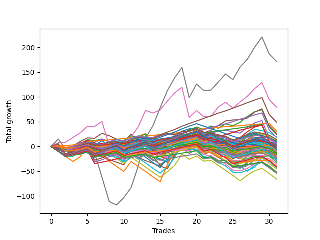

# Long Pointer Eleven (1231 REV) 
- Symbol: ES_Unlimited
- Date Range: 03/18/2022 - 07/15/2022
- Trading Period: 7:20-12:30
- Number of Trades: 31



| Name | Win Percent | Profit | Avg Profit / Trade | Avg Time / Trade |      | Name | Win Percent | Profit | Avg Profit / Trade | Avg Time / Trade |
| ---- | ----------- | ------ | ------------------ | ---------------- | ---- | ---- | ----------- | ------ | ------------------ | ---------------- |
| Sorted By <br> Profit | | | | | | Sorted By <br> Win Percentage ||||
| Seven | 64.52 | 85875.00 | 2770.16 | 142:55 |     | Eighty-One | 96.77 | 15500.00 | 500.00 | 23:38 |
| Six | 74.19 | 39750.00 | 1282.26 | 98:05 |     | Eighty-Two | 90.32 | -2500.00 | -80.65 | 41:22 |
| Eighty-Five | 87.10 | 24625.00 | 794.35 | 50:15 |     | Eighty-Five | 87.10 | 24625.00 | 794.35 | 50:15 |
| Eighty-One | 96.77 | 15500.00 | 500.00 | 23:38 |     | Eighty-Four | 87.10 | 9125.00 | 294.35 | 48:00 |
| Five | 54.84 | 13250.00 | 427.42 | 68:57 |     | Eighty-Three | 87.10 | -3000.00 | -96.77 | 46:59 |
| Two | 58.06 | 12250.00 | 395.16 | 32:20 |     | One Hundred Sixteen | 77.42 | -3625.00 | -116.94 | 03:10 |
| Fifty-One | 45.16 | 9625.00 | 310.48 | 08:12 |     | One Hundred Twenty-One | 77.42 | -17625.00 | -568.55 | 05:47 |
| Eighty-Four | 87.10 | 9125.00 | 294.35 | 48:00 |     | One Hundred Twenty-Six | 77.42 | -19875.00 | -641.13 | 06:36 |
| One Hundred Twenty | 48.39 | 7000.00 | 225.81 | 06:24 |     | Six | 74.19 | 39750.00 | 1282.26 | 98:05 |
| Fifty | 45.16 | 6125.00 | 197.58 | 08:28 |     | One Hundred Eleven | 70.97 | -5125.00 | -165.32 | 02:45 |
| One Hundred Fifteen | 51.61 | 5500.00 | 177.42 | 06:32 |     | Zero | 67.74 | 875.00 | 28.23 | 13:56 |
| Fifty-Four | 45.16 | 4750.00 | 153.23 | 09:43 |     | Fifty-Six | 67.74 | -9500.00 | -306.45 | 08:59 |
| Forty-Nine | 48.39 | 4250.00 | 137.10 | 07:19 |     | One Hundred Twenty-Seven | 67.74 | -26250.00 | -846.77 | 07:53 |
| One Hundred Ninteen | 54.84 | 3750.00 | 120.97 | 05:34 |     | One Hundred Twenty-Two | 67.74 | -27125.00 | -875.00 | 07:10 |
| Forty-Eight | 58.06 | 2375.00 | 76.61 | 05:38 |     | Seven | 64.52 | 85875.00 | 2770.16 | 142:55 |
| One Hundred Five | 38.71 | 2375.00 | 76.61 | 04:26 |     | One Hundred Thirty | 64.52 | -875.00 | -28.23 | 11:56 |
| Four | 51.61 | 1375.00 | 44.35 | 51:31 |     | One Hundred Twenty-Five | 64.52 | -2875.00 | -92.74 | 11:21 |
| One Hundred Nine | 45.16 | 1000.00 | 32.26 | 03:08 |     | One Hundred Seventeen | 64.52 | -6500.00 | -209.68 | 04:10 |
| Zero | 67.74 | 875.00 | 28.23 | 13:56 |     | One Hundred Twenty-Nine | 64.52 | -11375.00 | -366.94 | 10:23 |
| One Hundred Ten | 45.16 | 750.00 | 24.19 | 03:29 |     | One Hundred Twenty-Four | 64.52 | -13375.00 | -431.45 | 09:48 |
| Fifty-Three | 45.16 | 125.00 | 4.03 | 09:59 |     | One Hundred Twenty-Eight | 64.52 | -20625.00 | -665.32 | 09:33 |
| One Hundred Four | 41.94 | -250.00 | -8.06 | 03:25 |     | One Hundred Twenty-Three | 64.52 | -22625.00 | -729.84 | 08:58 |
| Forty-Two | 38.71 | -250.00 | -8.06 | 11:16 |     | One Hundred Six | 61.29 | -8625.00 | -278.23 | 02:12 |
| One Hundred Thirty | 64.52 | -875.00 | -28.23 | 11:56 |     | Sixty-Four | 61.29 | -15750.00 | -508.06 | 09:30 |
| One Hundred Eighteen | 58.06 | -1000.00 | -32.26 | 05:22 |     | Two | 58.06 | 12250.00 | 395.16 | 32:20 |
| Fifty-Five | 45.16 | -1125.00 | -36.29 | 10:04 |     | Forty-Eight | 58.06 | 2375.00 | 76.61 | 05:38 |
| Forty-Seven | 19.35 | -1250.00 | -40.32 | 27:08 |     | One Hundred Eighteen | 58.06 | -1000.00 | -32.26 | 05:22 |
| Sixty-Six | 54.84 | -1500.00 | -48.39 | 15:09 |     | Fifty-Seven | 58.06 | -10000.00 | -322.58 | 12:19 |
| Fifty-Two | 45.16 | -1500.00 | -48.39 | 09:36 |     | One Hundred Twelve | 58.06 | -12000.00 | -387.10 | 03:45 |
| Ninety-Four | 35.48 | -1875.00 | -60.48 | 02:27 |     | One | 58.06 | -12875.00 | -415.32 | 22:45 |
| Eighty-Two | 90.32 | -2500.00 | -80.65 | 41:22 |     | Five | 54.84 | 13250.00 | 427.42 | 68:57 |
| Forty-Three | 35.48 | -2625.00 | -84.68 | 11:00 |     | One Hundred Ninteen | 54.84 | 3750.00 | 120.97 | 05:34 |
| One Hundred Twenty-Five | 64.52 | -2875.00 | -92.74 | 11:21 |     | Sixty-Six | 54.84 | -1500.00 | -48.39 | 15:09 |
| Forty-One | 41.94 | -2875.00 | -92.74 | 08:45 |     | Fifty-Eight | 54.84 | -4750.00 | -153.23 | 16:19 |
| Eighty-Three | 87.10 | -3000.00 | -96.77 | 46:59 |     | Ninety-Six | 54.84 | -8375.00 | -270.16 | 01:54 |
| Three | 51.61 | -3125.00 | -100.81 | 30:54 |     | Sixty-Five | 54.84 | -10750.00 | -346.77 | 12:03 |
| Ninety-Five | 29.03 | -3250.00 | -104.84 | 03:11 |     | Seventy-Three | 54.84 | -12125.00 | -391.13 | 11:12 |
| Forty | 51.61 | -3375.00 | -108.87 | 06:04 |     | One Hundred Fifteen | 51.61 | 5500.00 | 177.42 | 06:32 |
| One Hundred Fourteen | 51.61 | -3500.00 | -112.90 | 05:17 |     | Four | 51.61 | 1375.00 | 44.35 | 51:31 |
| One Hundred Sixteen | 77.42 | -3625.00 | -116.94 | 03:10 |     | Three | 51.61 | -3125.00 | -100.81 | 30:54 |
| Ninety-Nine | 41.94 | -3625.00 | -116.94 | 02:25 |     | Forty | 51.61 | -3375.00 | -108.87 | 06:04 |
| Fifty-Eight | 54.84 | -4750.00 | -153.23 | 16:19 |     | One Hundred Fourteen | 51.61 | -3500.00 | -112.90 | 05:17 |
| One Hundred Eight | 45.16 | -5000.00 | -161.29 | 03:02 |     | Sixty-Seven | 51.61 | -5750.00 | -185.48 | 14:59 |
| One Hundred Eleven | 70.97 | -5125.00 | -165.32 | 02:45 |     | One Hundred Seven | 51.61 | -7750.00 | -250.00 | 02:31 |
| Sixty-Three | 32.26 | -5250.00 | -169.35 | 48:27 |     | One Hundred Thirteen | 51.61 | -10750.00 | -346.77 | 05:03 |
| One Hundred | 41.94 | -5500.00 | -177.42 | 02:37 |     | One Hundred One | 51.61 | -10875.00 | -350.81 | 01:57 |
| Forty-Five | 25.81 | -5625.00 | -181.45 | 19:33 |     | Fifty-Nine | 51.61 | -13875.00 | -447.58 | 16:37 |
| Sixty-Seven | 51.61 | -5750.00 | -185.48 | 14:59 |     | One Hundred Twenty | 48.39 | 7000.00 | 225.81 | 06:24 |
| One Hundred Three | 41.94 | -6250.00 | -201.61 | 03:18 |     | Forty-Nine | 48.39 | 4250.00 | 137.10 | 07:19 |
| One Hundred Seventeen | 64.52 | -6500.00 | -209.68 | 04:10 |     | Ninety-One | 48.39 | -9125.00 | -294.35 | 01:32 |
| Forty-Six | 25.81 | -6875.00 | -221.77 | 19:35 |     | Fifty-One | 45.16 | 9625.00 | 310.48 | 08:12 |
| Ninety-Eight | 41.94 | -7250.00 | -233.87 | 02:23 |     | Fifty | 45.16 | 6125.00 | 197.58 | 08:28 |
| Ninety-Two | 41.94 | -7500.00 | -241.94 | 01:49 |     | Fifty-Four | 45.16 | 4750.00 | 153.23 | 09:43 |
| Ninety-Three | 35.48 | -7500.00 | -241.94 | 02:22 |     | One Hundred Nine | 45.16 | 1000.00 | 32.26 | 03:08 |
| One Hundred Seven | 51.61 | -7750.00 | -250.00 | 02:31 |     | One Hundred Ten | 45.16 | 750.00 | 24.19 | 03:29 |
| Ninety-Six | 54.84 | -8375.00 | -270.16 | 01:54 |     | Fifty-Three | 45.16 | 125.00 | 4.03 | 09:59 |
| Ninety-Seven | 41.94 | -8375.00 | -270.16 | 02:06 |     | Fifty-Five | 45.16 | -1125.00 | -36.29 | 10:04 |
| One Hundred Six | 61.29 | -8625.00 | -278.23 | 02:12 |     | Fifty-Two | 45.16 | -1500.00 | -48.39 | 09:36 |
| Forty-Four | 29.03 | -9000.00 | -290.32 | 16:19 |     | One Hundred Eight | 45.16 | -5000.00 | -161.29 | 03:02 |
| Ninety-One | 48.39 | -9125.00 | -294.35 | 01:32 |     | One Hundred Two | 45.16 | -9625.00 | -310.48 | 02:38 |
| Fifty-Six | 67.74 | -9500.00 | -306.45 | 08:59 |     | One Hundred Four | 41.94 | -250.00 | -8.06 | 03:25 |
| One Hundred Two | 45.16 | -9625.00 | -310.48 | 02:38 |     | Forty-One | 41.94 | -2875.00 | -92.74 | 08:45 |
| Fifty-Seven | 58.06 | -10000.00 | -322.58 | 12:19 |     | Ninety-Nine | 41.94 | -3625.00 | -116.94 | 02:25 |
| Seventy | 35.48 | -10250.00 | -330.65 | 24:11 |     | One Hundred | 41.94 | -5500.00 | -177.42 | 02:37 |
| Sixty-Five | 54.84 | -10750.00 | -346.77 | 12:03 |     | One Hundred Three | 41.94 | -6250.00 | -201.61 | 03:18 |
| One Hundred Thirteen | 51.61 | -10750.00 | -346.77 | 05:03 |     | Ninety-Eight | 41.94 | -7250.00 | -233.87 | 02:23 |
| One Hundred One | 51.61 | -10875.00 | -350.81 | 01:57 |     | Ninety-Two | 41.94 | -7500.00 | -241.94 | 01:49 |
| One Hundred Twenty-Nine | 64.52 | -11375.00 | -366.94 | 10:23 |     | Ninety-Seven | 41.94 | -8375.00 | -270.16 | 02:06 |
| One Hundred Twelve | 58.06 | -12000.00 | -387.10 | 03:45 |     | Sixty-Two | 41.94 | -13125.00 | -423.39 | 33:56 |
| Seventy-Three | 54.84 | -12125.00 | -391.13 | 11:12 |     | Sixty | 41.94 | -32875.00 | -1060.48 | 26:49 |
| One | 58.06 | -12875.00 | -415.32 | 22:45 |     | One Hundred Five | 38.71 | 2375.00 | 76.61 | 04:26 |
| Sixty-Two | 41.94 | -13125.00 | -423.39 | 33:56 |     | Forty-Two | 38.71 | -250.00 | -8.06 | 11:16 |
| One Hundred Twenty-Four | 64.52 | -13375.00 | -431.45 | 09:48 |     | Sixty-Eight | 38.71 | -25750.00 | -830.65 | 21:35 |
| Fifty-Nine | 51.61 | -13875.00 | -447.58 | 16:37 |     | Sixty-One | 38.71 | -26625.00 | -858.87 | 31:33 |
| Sixty-Four | 61.29 | -15750.00 | -508.06 | 09:30 |     | Ninety-Four | 35.48 | -1875.00 | -60.48 | 02:27 |
| One Hundred Twenty-One | 77.42 | -17625.00 | -568.55 | 05:47 |     | Forty-Three | 35.48 | -2625.00 | -84.68 | 11:00 |
| One Hundred Twenty-Six | 77.42 | -19875.00 | -641.13 | 06:36 |     | Ninety-Three | 35.48 | -7500.00 | -241.94 | 02:22 |
| One Hundred Twenty-Eight | 64.52 | -20625.00 | -665.32 | 09:33 |     | Seventy | 35.48 | -10250.00 | -330.65 | 24:11 |
| Sixty-Nine | 35.48 | -20625.00 | -665.32 | 23:38 |     | Sixty-Nine | 35.48 | -20625.00 | -665.32 | 23:38 |
| Seventy-One | 32.26 | -21250.00 | -685.48 | 28:15 |     | Sixty-Three | 32.26 | -5250.00 | -169.35 | 48:27 |
| One Hundred Twenty-Three | 64.52 | -22625.00 | -729.84 | 08:58 |     | Seventy-One | 32.26 | -21250.00 | -685.48 | 28:15 |
| Sixty-Eight | 38.71 | -25750.00 | -830.65 | 21:35 |     | Ninety-Five | 29.03 | -3250.00 | -104.84 | 03:11 |
| One Hundred Twenty-Seven | 67.74 | -26250.00 | -846.77 | 07:53 |     | Forty-Four | 29.03 | -9000.00 | -290.32 | 16:19 |
| Sixty-One | 38.71 | -26625.00 | -858.87 | 31:33 |     | Forty-Five | 25.81 | -5625.00 | -181.45 | 19:33 |
| One Hundred Twenty-Two | 67.74 | -27125.00 | -875.00 | 07:10 |     | Forty-Six | 25.81 | -6875.00 | -221.77 | 19:35 |
| Sixty | 41.94 | -32875.00 | -1060.48 | 26:49 |     | Forty-Seven | 19.35 | -1250.00 | -40.32 | 27:08 |

## NO STOPLOSS

### Test Zero
* Sell when price hits the middle line of the 20p bollinger
* No Stoploss
* Results:
```
Total Trades: 31
Percent Up: 67.74
Percent Down: 32.26
Total Points Moved Up: 1.75
Potential Profit: 875.00
Total Points Ups: 77.50 Count Ups: 21
Total Points Downs: -75.75 Count Downs: 10
```

<details><summary>Trades</summary>

<code>In: 2022-03-28 08:39:00		Out: 2022-03-28 09:02:00		Total Position Time: 23:00		Total Move Up: -5.75		Total to Date: -5.75</code> <br />
<code>In: 2022-03-30 08:02:00		Out: 2022-03-30 08:19:25		Total Position Time: 17:25		Total Move Up: -4.75		Total to Date: -10.50</code> <br />
<code>In: 2022-03-30 08:14:00		Out: 2022-03-30 08:19:25		Total Position Time: 05:25		Total Move Up: 3.75		Total to Date: -6.75</code> <br />
<code>In: 2022-03-30 12:27:00		Out: 2022-03-30 12:28:50		Total Position Time: 01:50		Total Move Up: 2.75		Total to Date: -4.00</code> <br />
<code>In: 2022-04-07 08:35:00		Out: 2022-04-07 08:37:20		Total Position Time: 02:20		Total Move Up: 5.75		Total to Date: 1.75</code> <br />
<code>In: 2022-04-11 07:30:00		Out: 2022-04-11 07:51:45		Total Position Time: 21:45		Total Move Up: -3.50		Total to Date: -1.75</code> <br />
<code>In: 2022-04-12 07:53:00		Out: 2022-04-12 08:02:05		Total Position Time: 09:05		Total Move Up: 0.75		Total to Date: -1.00</code> <br />
<code>In: 2022-04-12 09:14:00		Out: 2022-04-12 09:17:45		Total Position Time: 03:45		Total Move Up: 6.25		Total to Date: 5.25</code> <br />
<code>In: 2022-04-12 11:35:00		Out: 2022-04-12 11:36:10		Total Position Time: 01:10		Total Move Up: 1.50		Total to Date: 6.75</code> <br />
<code>In: 2022-04-18 08:30:00		Out: 2022-04-18 08:55:05		Total Position Time: 25:05		Total Move Up: -5.25		Total to Date: 1.50</code> <br />
<code>In: 2022-04-20 11:58:00		Out: 2022-04-20 12:01:15		Total Position Time: 03:15		Total Move Up: 4.75		Total to Date: 6.25</code> <br />
<code>In: 2022-05-02 10:06:00		Out: 2022-05-02 10:08:15		Total Position Time: 02:15		Total Move Up: 10.50		Total to Date: 16.75</code> <br />
<code>In: 2022-05-02 10:51:00		Out: 2022-05-02 10:59:50		Total Position Time: 08:50		Total Move Up: 2.25		Total to Date: 19.00</code> <br />
<code>In: 2022-05-10 07:44:00		Out: 2022-05-10 08:02:25		Total Position Time: 18:25		Total Move Up: -7.75		Total to Date: 11.25</code> <br />
<code>In: 2022-05-10 07:52:00		Out: 2022-05-10 08:02:25		Total Position Time: 10:25		Total Move Up: 3.75		Total to Date: 15.00</code> <br />
<code>In: 2022-05-13 11:07:00		Out: 2022-05-13 11:19:15		Total Position Time: 12:15		Total Move Up: 2.25		Total to Date: 17.25</code> <br />
<code>In: 2022-05-17 07:48:00		Out: 2022-05-17 07:55:15		Total Position Time: 07:15		Total Move Up: 3.00		Total to Date: 20.25</code> <br />
<code>In: 2022-05-17 11:24:00		Out: 2022-05-17 11:31:40		Total Position Time: 07:40		Total Move Up: 10.50		Total to Date: 30.75</code> <br />
<code>In: 2022-05-18 08:32:00		Out: 2022-05-18 08:37:35		Total Position Time: 05:35		Total Move Up: 4.75		Total to Date: 35.50</code> <br />
<code>In: 2022-05-25 09:29:00		Out: 2022-05-25 09:41:30		Total Position Time: 12:30		Total Move Up: 1.75		Total to Date: 37.25</code> <br />
<code>In: 2022-06-06 09:08:00		Out: 2022-06-06 09:34:45		Total Position Time: 26:45		Total Move Up: -9.75		Total to Date: 27.50</code> <br />
<code>In: 2022-06-08 10:35:00		Out: 2022-06-08 10:43:10		Total Position Time: 08:10		Total Move Up: 2.00		Total to Date: 29.50</code> <br />
<code>In: 2022-06-14 11:52:00		Out: 2022-06-14 12:26:30		Total Position Time: 34:30		Total Move Up: -11.75		Total to Date: 17.75</code> <br />
<code>In: 2022-06-15 07:57:00		Out: 2022-06-15 08:34:25		Total Position Time: 37:25		Total Move Up: -3.50		Total to Date: 14.25</code> <br />
<code>In: 2022-06-16 11:02:00		Out: 2022-06-16 11:40:20		Total Position Time: 38:20		Total Move Up: -7.00		Total to Date: 7.25</code> <br />
<code>In: 2022-06-23 09:07:00		Out: 2022-06-23 09:17:45		Total Position Time: 10:45		Total Move Up: 1.25		Total to Date: 8.50</code> <br />
<code>In: 2022-06-29 08:25:00		Out: 2022-06-29 08:32:10		Total Position Time: 07:10		Total Move Up: 4.75		Total to Date: 13.25</code> <br />
<code>In: 2022-06-29 09:29:00		Out: 2022-06-29 09:36:40		Total Position Time: 07:40		Total Move Up: 4.50		Total to Date: 17.75</code> <br />
<code>In: 2022-07-06 08:35:00		Out: 2022-07-06 08:46:30		Total Position Time: 11:30		Total Move Up: 0.25		Total to Date: 18.00</code> <br />
<code>In: 2022-07-12 11:36:00		Out: 2022-07-12 11:48:15		Total Position Time: 12:15		Total Move Up: 0.50		Total to Date: 18.50</code> <br />
<code>In: 2022-07-12 12:07:00		Out: 2022-07-12 12:45:35		Total Position Time: 38:35		Total Move Up: -16.75		Total to Date: 1.75</code> <br />


</details>

### Test One
* Sell when the price hits the upper line of the 20p 1std bollinger
* No Stoploss
* Results:
```
Total Trades: 31
Percent Up: 58.06
Percent Down: 41.94
Total Points Moved Up: -25.75
Potential Profit: -12875.00
Total Points Ups: 107.00 Count Ups: 18
Total Points Downs: -132.75 Count Downs: 13
```

<details><summary>Trades</summary>

<code>In: 2022-03-28 08:39:00		Out: 2022-03-28 09:05:25		Total Position Time: 26:25		Total Move Up: -3.75		Total to Date: -3.75</code> <br />
<code>In: 2022-03-30 08:02:00		Out: 2022-03-30 08:34:45		Total Position Time: 32:45		Total Move Up: -5.50		Total to Date: -9.25</code> <br />
<code>In: 2022-03-30 08:14:00		Out: 2022-03-30 08:34:45		Total Position Time: 20:45		Total Move Up: 3.00		Total to Date: -6.25</code> <br />
<code>In: 2022-03-30 12:27:00		Out: 2022-03-30 12:32:20		Total Position Time: 05:20		Total Move Up: 4.75		Total to Date: -1.50</code> <br />
<code>In: 2022-04-07 08:35:00		Out: 2022-04-07 08:47:30		Total Position Time: 12:30		Total Move Up: 6.75		Total to Date: 5.25</code> <br />
<code>In: 2022-04-11 07:30:00		Out: 2022-04-11 07:54:05		Total Position Time: 24:05		Total Move Up: -2.50		Total to Date: 2.75</code> <br />
<code>In: 2022-04-12 07:53:00		Out: 2022-04-12 08:02:35		Total Position Time: 09:35		Total Move Up: 2.75		Total to Date: 5.50</code> <br />
<code>In: 2022-04-12 09:14:00		Out: 2022-04-12 09:50:15		Total Position Time: 36:15		Total Move Up: -6.00		Total to Date: -0.50</code> <br />
<code>In: 2022-04-12 11:35:00		Out: 2022-04-12 11:37:30		Total Position Time: 02:30		Total Move Up: 3.75		Total to Date: 3.25</code> <br />
<code>In: 2022-04-18 08:30:00		Out: 2022-04-18 08:57:20		Total Position Time: 27:20		Total Move Up: -3.75		Total to Date: -0.50</code> <br />
<code>In: 2022-04-20 11:58:00		Out: 2022-04-20 12:04:20		Total Position Time: 06:20		Total Move Up: 7.50		Total to Date: 7.00</code> <br />
<code>In: 2022-05-02 10:06:00		Out: 2022-05-02 10:10:55		Total Position Time: 04:55		Total Move Up: 14.00		Total to Date: 21.00</code> <br />
<code>In: 2022-05-02 10:51:00		Out: 2022-05-02 11:02:45		Total Position Time: 11:45		Total Move Up: 4.75		Total to Date: 25.75</code> <br />
<code>In: 2022-05-10 07:44:00		Out: 2022-05-10 08:37:10		Total Position Time: 53:10		Total Move Up: -26.50		Total to Date: -0.75</code> <br />
<code>In: 2022-05-10 07:52:00		Out: 2022-05-10 08:37:10		Total Position Time: 45:10		Total Move Up: -15.00		Total to Date: -15.75</code> <br />
<code>In: 2022-05-13 11:07:00		Out: 2022-05-13 11:30:55		Total Position Time: 23:55		Total Move Up: 5.00		Total to Date: -10.75</code> <br />
<code>In: 2022-05-17 07:48:00		Out: 2022-05-17 07:59:10		Total Position Time: 11:10		Total Move Up: 4.25		Total to Date: -6.50</code> <br />
<code>In: 2022-05-17 11:24:00		Out: 2022-05-17 11:39:45		Total Position Time: 15:45		Total Move Up: 10.75		Total to Date: 4.25</code> <br />
<code>In: 2022-05-18 08:32:00		Out: 2022-05-18 08:41:20		Total Position Time: 09:20		Total Move Up: 7.00		Total to Date: 11.25</code> <br />
<code>In: 2022-05-25 09:29:00		Out: 2022-05-25 09:44:30		Total Position Time: 15:30		Total Move Up: 3.50		Total to Date: 14.75</code> <br />
<code>In: 2022-06-06 09:08:00		Out: 2022-06-06 09:37:35		Total Position Time: 29:35		Total Move Up: -7.50		Total to Date: 7.25</code> <br />
<code>In: 2022-06-08 10:35:00		Out: 2022-06-08 10:47:05		Total Position Time: 12:05		Total Move Up: 5.25		Total to Date: 12.50</code> <br />
<code>In: 2022-06-14 11:52:00		Out: 2022-06-14 12:27:20		Total Position Time: 35:20		Total Move Up: -7.75		Total to Date: 4.75</code> <br />
<code>In: 2022-06-15 07:57:00		Out: 2022-06-15 08:38:55		Total Position Time: 41:55		Total Move Up: -0.25		Total to Date: 4.50</code> <br />
<code>In: 2022-06-16 11:02:00		Out: 2022-06-16 11:40:30		Total Position Time: 38:30		Total Move Up: -4.75		Total to Date: -0.25</code> <br />
<code>In: 2022-06-23 09:07:00		Out: 2022-06-23 09:18:25		Total Position Time: 11:25		Total Move Up: 4.75		Total to Date: 4.50</code> <br />
<code>In: 2022-06-29 08:25:00		Out: 2022-06-29 08:33:05		Total Position Time: 08:05		Total Move Up: 7.75		Total to Date: 12.25</code> <br />
<code>In: 2022-06-29 09:29:00		Out: 2022-06-29 09:38:30		Total Position Time: 09:30		Total Move Up: 9.50		Total to Date: 21.75</code> <br />
<code>In: 2022-07-06 08:35:00		Out: 2022-07-06 08:48:25		Total Position Time: 13:25		Total Move Up: 2.00		Total to Date: 23.75</code> <br />
<code>In: 2022-07-12 11:36:00		Out: 2022-07-12 12:47:00		Total Position Time: 71:00		Total Move Up: -34.25		Total to Date: -10.50</code> <br />
<code>In: 2022-07-12 12:07:00		Out: 2022-07-12 12:47:00		Total Position Time: 40:00		Total Move Up: -15.25		Total to Date: -25.75</code> <br />


</details>

### Test Two
* Sell when the price hits the upper line of the 20p 2std bollinger
* No Stoploss
* Results:
```
Total Trades: 31
Percent Up: 58.06
Percent Down: 41.94
Total Points Moved Up: 24.50
Potential Profit: 12250.00
Total Points Ups: 135.50 Count Ups: 18
Total Points Downs: -111.00 Count Downs: 13
```

<details><summary>Trades</summary>

<code>In: 2022-03-28 08:39:00		Out: 2022-03-28 09:07:10		Total Position Time: 28:10		Total Move Up: -2.50		Total to Date: -2.50</code> <br />
<code>In: 2022-03-30 08:02:00		Out: 2022-03-30 08:35:15		Total Position Time: 33:15		Total Move Up: -3.75		Total to Date: -6.25</code> <br />
<code>In: 2022-03-30 08:14:00		Out: 2022-03-30 08:35:15		Total Position Time: 21:15		Total Move Up: 4.75		Total to Date: -1.50</code> <br />
<code>In: 2022-03-30 12:27:00		Out: 2022-03-30 12:36:20		Total Position Time: 09:20		Total Move Up: 7.50		Total to Date: 6.00</code> <br />
<code>In: 2022-04-07 08:35:00		Out: 2022-04-07 08:48:15		Total Position Time: 13:15		Total Move Up: 7.50		Total to Date: 13.50</code> <br />
<code>In: 2022-04-11 07:30:00		Out: 2022-04-11 07:56:35		Total Position Time: 26:35		Total Move Up: -1.50		Total to Date: 12.00</code> <br />
<code>In: 2022-04-12 07:53:00		Out: 2022-04-12 08:15:40		Total Position Time: 22:40		Total Move Up: 3.00		Total to Date: 15.00</code> <br />
<code>In: 2022-04-12 09:14:00		Out: 2022-04-12 09:50:15		Total Position Time: 36:15		Total Move Up: -6.00		Total to Date: 9.00</code> <br />
<code>In: 2022-04-12 11:35:00		Out: 2022-04-12 11:47:00		Total Position Time: 12:00		Total Move Up: 4.50		Total to Date: 13.50</code> <br />
<code>In: 2022-04-18 08:30:00		Out: 2022-04-18 08:59:35		Total Position Time: 29:35		Total Move Up: -1.50		Total to Date: 12.00</code> <br />
<code>In: 2022-04-20 11:58:00		Out: 2022-04-20 12:12:35		Total Position Time: 14:35		Total Move Up: 9.75		Total to Date: 21.75</code> <br />
<code>In: 2022-05-02 10:06:00		Out: 2022-05-02 11:03:55		Total Position Time: 57:55		Total Move Up: -4.00		Total to Date: 17.75</code> <br />
<code>In: 2022-05-02 10:51:00		Out: 2022-05-02 11:03:55		Total Position Time: 12:55		Total Move Up: 8.00		Total to Date: 25.75</code> <br />
<code>In: 2022-05-10 07:44:00		Out: 2022-05-10 08:39:10		Total Position Time: 55:10		Total Move Up: -20.25		Total to Date: 5.50</code> <br />
<code>In: 2022-05-10 07:52:00		Out: 2022-05-10 08:39:10		Total Position Time: 47:10		Total Move Up: -8.75		Total to Date: -3.25</code> <br />
<code>In: 2022-05-13 11:07:00		Out: 2022-05-13 11:31:20		Total Position Time: 24:20		Total Move Up: 7.75		Total to Date: 4.50</code> <br />
<code>In: 2022-05-17 07:48:00		Out: 2022-05-17 08:00:05		Total Position Time: 12:05		Total Move Up: 6.00		Total to Date: 10.50</code> <br />
<code>In: 2022-05-17 11:24:00		Out: 2022-05-17 11:40:05		Total Position Time: 16:05		Total Move Up: 14.50		Total to Date: 25.00</code> <br />
<code>In: 2022-05-18 08:32:00		Out: 2022-05-18 08:42:55		Total Position Time: 10:55		Total Move Up: 8.75		Total to Date: 33.75</code> <br />
<code>In: 2022-05-25 09:29:00		Out: 2022-05-25 09:45:20		Total Position Time: 16:20		Total Move Up: 5.25		Total to Date: 39.00</code> <br />
<code>In: 2022-06-06 09:08:00		Out: 2022-06-06 09:41:50		Total Position Time: 33:50		Total Move Up: -4.75		Total to Date: 34.25</code> <br />
<code>In: 2022-06-08 10:35:00		Out: 2022-06-08 11:03:45		Total Position Time: 28:45		Total Move Up: 7.00		Total to Date: 41.25</code> <br />
<code>In: 2022-06-14 11:52:00		Out: 2022-06-14 12:29:20		Total Position Time: 37:20		Total Move Up: -4.50		Total to Date: 36.75</code> <br />
<code>In: 2022-06-15 07:57:00		Out: 2022-06-15 10:58:15		Total Position Time: 181:15		Total Move Up: 9.00		Total to Date: 45.75</code> <br />
<code>In: 2022-06-16 11:02:00		Out: 2022-06-16 11:41:05		Total Position Time: 39:05		Total Move Up: -4.00		Total to Date: 41.75</code> <br />
<code>In: 2022-06-23 09:07:00		Out: 2022-06-23 09:19:10		Total Position Time: 12:10		Total Move Up: 7.25		Total to Date: 49.00</code> <br />
<code>In: 2022-06-29 08:25:00		Out: 2022-06-29 08:35:35		Total Position Time: 10:35		Total Move Up: 11.75		Total to Date: 60.75</code> <br />
<code>In: 2022-06-29 09:29:00		Out: 2022-06-29 10:01:45		Total Position Time: 32:45		Total Move Up: 9.25		Total to Date: 70.00</code> <br />
<code>In: 2022-07-06 08:35:00		Out: 2022-07-06 08:51:15		Total Position Time: 16:15		Total Move Up: 4.00		Total to Date: 74.00</code> <br />
<code>In: 2022-07-12 11:36:00		Out: 2022-07-12 12:47:00		Total Position Time: 71:00		Total Move Up: -34.25		Total to Date: 39.75</code> <br />
<code>In: 2022-07-12 12:07:00		Out: 2022-07-12 12:47:00		Total Position Time: 40:00		Total Move Up: -15.25		Total to Date: 24.50</code> <br />


</details>

### Test Three
* Sell when price hits the middle line of the 50p bollinger
* No Stoploss
* Results:
```
Total Trades: 31
Percent Up: 51.61
Percent Down: 48.39
Total Points Moved Up: -6.25
Potential Profit: -3125.00
Total Points Ups: 127.50 Count Ups: 16
Total Points Downs: -133.75 Count Downs: 15
```

<details><summary>Trades</summary>

<code>In: 2022-03-28 08:39:00		Out: 2022-03-28 09:25:20		Total Position Time: 46:20		Total Move Up: -6.00		Total to Date: -6.00</code> <br />
<code>In: 2022-03-30 08:02:00		Out: 2022-03-30 08:35:20		Total Position Time: 33:20		Total Move Up: -3.25		Total to Date: -9.25</code> <br />
<code>In: 2022-03-30 08:14:00		Out: 2022-03-30 08:35:20		Total Position Time: 21:20		Total Move Up: 5.25		Total to Date: -4.00</code> <br />
<code>In: 2022-03-30 12:27:00		Out: 2022-03-30 12:33:40		Total Position Time: 06:40		Total Move Up: 6.50		Total to Date: 2.50</code> <br />
<code>In: 2022-04-07 08:35:00		Out: 2022-04-07 08:47:35		Total Position Time: 12:35		Total Move Up: 7.00		Total to Date: 9.50</code> <br />
<code>In: 2022-04-11 07:30:00		Out: 2022-04-11 08:31:05		Total Position Time: 61:05		Total Move Up: -6.00		Total to Date: 3.50</code> <br />
<code>In: 2022-04-12 07:53:00		Out: 2022-04-12 08:16:15		Total Position Time: 23:15		Total Move Up: 2.75		Total to Date: 6.25</code> <br />
<code>In: 2022-04-12 09:14:00		Out: 2022-04-12 10:00:40		Total Position Time: 46:40		Total Move Up: -5.50		Total to Date: 0.75</code> <br />
<code>In: 2022-04-12 11:35:00		Out: 2022-04-12 11:47:05		Total Position Time: 12:05		Total Move Up: 6.00		Total to Date: 6.75</code> <br />
<code>In: 2022-04-18 08:30:00		Out: 2022-04-18 09:07:15		Total Position Time: 37:15		Total Move Up: -2.50		Total to Date: 4.25</code> <br />
<code>In: 2022-04-20 11:58:00		Out: 2022-04-20 12:10:10		Total Position Time: 12:10		Total Move Up: 8.25		Total to Date: 12.50</code> <br />
<code>In: 2022-05-02 10:06:00		Out: 2022-05-02 11:05:00		Total Position Time: 59:00		Total Move Up: -1.50		Total to Date: 11.00</code> <br />
<code>In: 2022-05-02 10:51:00		Out: 2022-05-02 11:05:00		Total Position Time: 14:00		Total Move Up: 10.50		Total to Date: 21.50</code> <br />
<code>In: 2022-05-10 07:44:00		Out: 2022-05-10 08:38:55		Total Position Time: 54:55		Total Move Up: -24.75		Total to Date: -3.25</code> <br />
<code>In: 2022-05-10 07:52:00		Out: 2022-05-10 08:38:55		Total Position Time: 46:55		Total Move Up: -13.25		Total to Date: -16.50</code> <br />
<code>In: 2022-05-13 11:07:00		Out: 2022-05-13 11:31:20		Total Position Time: 24:20		Total Move Up: 7.75		Total to Date: -8.75</code> <br />
<code>In: 2022-05-17 07:48:00		Out: 2022-05-17 08:04:10		Total Position Time: 16:10		Total Move Up: 10.25		Total to Date: 1.50</code> <br />
<code>In: 2022-05-17 11:24:00		Out: 2022-05-17 11:40:05		Total Position Time: 16:05		Total Move Up: 14.50		Total to Date: 16.00</code> <br />
<code>In: 2022-05-18 08:32:00		Out: 2022-05-18 09:36:20		Total Position Time: 64:20		Total Move Up: -8.75		Total to Date: 7.25</code> <br />
<code>In: 2022-05-25 09:29:00		Out: 2022-05-25 09:49:10		Total Position Time: 20:10		Total Move Up: 8.25		Total to Date: 15.50</code> <br />
<code>In: 2022-06-06 09:08:00		Out: 2022-06-06 09:43:15		Total Position Time: 35:15		Total Move Up: -3.75		Total to Date: 11.75</code> <br />
<code>In: 2022-06-08 10:35:00		Out: 2022-06-08 10:48:35		Total Position Time: 13:35		Total Move Up: 6.50		Total to Date: 18.25</code> <br />
<code>In: 2022-06-14 11:52:00		Out: 2022-06-14 12:29:10		Total Position Time: 37:10		Total Move Up: -4.75		Total to Date: 13.50</code> <br />
<code>In: 2022-06-15 07:57:00		Out: 2022-06-15 08:38:55		Total Position Time: 41:55		Total Move Up: -0.25		Total to Date: 13.25</code> <br />
<code>In: 2022-06-16 11:02:00		Out: 2022-06-16 11:41:05		Total Position Time: 39:05		Total Move Up: -4.00		Total to Date: 9.25</code> <br />
<code>In: 2022-06-23 09:07:00		Out: 2022-06-23 09:22:00		Total Position Time: 15:00		Total Move Up: 8.75		Total to Date: 18.00</code> <br />
<code>In: 2022-06-29 08:25:00		Out: 2022-06-29 08:35:35		Total Position Time: 10:35		Total Move Up: 11.75		Total to Date: 29.75</code> <br />
<code>In: 2022-06-29 09:29:00		Out: 2022-06-29 09:38:30		Total Position Time: 09:30		Total Move Up: 9.50		Total to Date: 39.25</code> <br />
<code>In: 2022-07-06 08:35:00		Out: 2022-07-06 08:51:15		Total Position Time: 16:15		Total Move Up: 4.00		Total to Date: 43.25</code> <br />
<code>In: 2022-07-12 11:36:00		Out: 2022-07-12 12:47:00		Total Position Time: 71:00		Total Move Up: -34.25		Total to Date: 9.00</code> <br />
<code>In: 2022-07-12 12:07:00		Out: 2022-07-12 12:47:00		Total Position Time: 40:00		Total Move Up: -15.25		Total to Date: -6.25</code> <br />


</details>

### Test Four
* Sell when the price hits the upper line of the 50p 1std bollinger
* No Stoploss
* Results:
```
Total Trades: 31
Percent Up: 51.61
Percent Down: 48.39
Total Points Moved Up: 2.75
Potential Profit: 1375.00
Total Points Ups: 129.50 Count Ups: 16
Total Points Downs: -126.75 Count Downs: 15
```

<details><summary>Trades</summary>

<code>In: 2022-03-28 08:39:00		Out: 2022-03-28 09:35:05		Total Position Time: 56:05		Total Move Up: -4.25		Total to Date: -4.25</code> <br />
<code>In: 2022-03-30 08:02:00		Out: 2022-03-30 08:57:20		Total Position Time: 55:20		Total Move Up: -4.50		Total to Date: -8.75</code> <br />
<code>In: 2022-03-30 08:14:00		Out: 2022-03-30 08:57:20		Total Position Time: 43:20		Total Move Up: 4.00		Total to Date: -4.75</code> <br />
<code>In: 2022-03-30 12:27:00		Out: 2022-03-30 12:46:25		Total Position Time: 19:25		Total Move Up: 9.75		Total to Date: 5.00</code> <br />
<code>In: 2022-04-07 08:35:00		Out: 2022-04-07 09:10:45		Total Position Time: 35:45		Total Move Up: 7.25		Total to Date: 12.25</code> <br />
<code>In: 2022-04-11 07:30:00		Out: 2022-04-11 08:33:00		Total Position Time: 63:00		Total Move Up: -3.75		Total to Date: 8.50</code> <br />
<code>In: 2022-04-12 07:53:00		Out: 2022-04-12 08:19:50		Total Position Time: 26:50		Total Move Up: 6.50		Total to Date: 15.00</code> <br />
<code>In: 2022-04-12 09:14:00		Out: 2022-04-12 10:13:30		Total Position Time: 59:30		Total Move Up: -4.75		Total to Date: 10.25</code> <br />
<code>In: 2022-04-12 11:35:00		Out: 2022-04-12 12:47:00		Total Position Time: 72:00		Total Move Up: -7.00		Total to Date: 3.25</code> <br />
<code>In: 2022-04-18 08:30:00		Out: 2022-04-18 09:53:35		Total Position Time: 83:35		Total Move Up: -7.75		Total to Date: -4.50</code> <br />
<code>In: 2022-04-20 11:58:00		Out: 2022-04-20 12:13:35		Total Position Time: 15:35		Total Move Up: 13.00		Total to Date: 8.50</code> <br />
<code>In: 2022-05-02 10:06:00		Out: 2022-05-02 11:53:40		Total Position Time: 107:40		Total Move Up: -8.75		Total to Date: -0.25</code> <br />
<code>In: 2022-05-02 10:51:00		Out: 2022-05-02 11:53:40		Total Position Time: 62:40		Total Move Up: 3.25		Total to Date: 3.00</code> <br />
<code>In: 2022-05-10 07:44:00		Out: 2022-05-10 08:40:30		Total Position Time: 56:30		Total Move Up: -15.25		Total to Date: -12.25</code> <br />
<code>In: 2022-05-10 07:52:00		Out: 2022-05-10 08:40:30		Total Position Time: 48:30		Total Move Up: -3.75		Total to Date: -16.00</code> <br />
<code>In: 2022-05-13 11:07:00		Out: 2022-05-13 11:43:10		Total Position Time: 36:10		Total Move Up: 11.00		Total to Date: -5.00</code> <br />
<code>In: 2022-05-17 07:48:00		Out: 2022-05-17 08:18:30		Total Position Time: 30:30		Total Move Up: 13.00		Total to Date: 8.00</code> <br />
<code>In: 2022-05-17 11:24:00		Out: 2022-05-17 11:45:50		Total Position Time: 21:50		Total Move Up: 23.00		Total to Date: 31.00</code> <br />
<code>In: 2022-05-18 08:32:00		Out: 2022-05-18 09:47:55		Total Position Time: 75:55		Total Move Up: -7.25		Total to Date: 23.75</code> <br />
<code>In: 2022-05-25 09:29:00		Out: 2022-05-25 10:10:05		Total Position Time: 41:05		Total Move Up: 6.50		Total to Date: 30.25</code> <br />
<code>In: 2022-06-06 09:08:00		Out: 2022-06-06 09:55:15		Total Position Time: 47:15		Total Move Up: -4.25		Total to Date: 26.00</code> <br />
<code>In: 2022-06-08 10:35:00		Out: 2022-06-08 12:12:35		Total Position Time: 97:35		Total Move Up: 1.75		Total to Date: 27.75</code> <br />
<code>In: 2022-06-14 11:52:00		Out: 2022-06-14 12:30:55		Total Position Time: 38:55		Total Move Up: 2.50		Total to Date: 30.25</code> <br />
<code>In: 2022-06-15 07:57:00		Out: 2022-06-15 08:57:35		Total Position Time: 60:35		Total Move Up: 2.75		Total to Date: 33.00</code> <br />
<code>In: 2022-06-16 11:02:00		Out: 2022-06-16 12:04:10		Total Position Time: 62:10		Total Move Up: -3.50		Total to Date: 29.50</code> <br />
<code>In: 2022-06-23 09:07:00		Out: 2022-06-23 10:18:10		Total Position Time: 71:10		Total Move Up: -2.50		Total to Date: 27.00</code> <br />
<code>In: 2022-06-29 08:25:00		Out: 2022-06-29 08:53:10		Total Position Time: 28:10		Total Move Up: 11.50		Total to Date: 38.50</code> <br />
<code>In: 2022-06-29 09:29:00		Out: 2022-06-29 09:59:30		Total Position Time: 30:30		Total Move Up: 9.00		Total to Date: 47.50</code> <br />
<code>In: 2022-07-06 08:35:00		Out: 2022-07-06 09:13:30		Total Position Time: 38:30		Total Move Up: 4.75		Total to Date: 52.25</code> <br />
<code>In: 2022-07-12 11:36:00		Out: 2022-07-12 12:47:00		Total Position Time: 71:00		Total Move Up: -34.25		Total to Date: 18.00</code> <br />
<code>In: 2022-07-12 12:07:00		Out: 2022-07-12 12:47:00		Total Position Time: 40:00		Total Move Up: -15.25		Total to Date: 2.75</code> <br />


</details>

### Test Five
* Sell when the price hits the upper line of the 50p 2std bollinger
* No Stoploss
* Results:
```
Total Trades: 31
Percent Up: 54.84
Percent Down: 45.16
Total Points Moved Up: 26.50
Potential Profit: 13250.00
Total Points Ups: 168.50 Count Ups: 17
Total Points Downs: -142.00 Count Downs: 14
```

<details><summary>Trades</summary>

<code>In: 2022-03-28 08:39:00		Out: 2022-03-28 09:39:55		Total Position Time: 60:55		Total Move Up: -2.75		Total to Date: -2.75</code> <br />
<code>In: 2022-03-30 08:02:00		Out: 2022-03-30 09:00:25		Total Position Time: 58:25		Total Move Up: -2.50		Total to Date: -5.25</code> <br />
<code>In: 2022-03-30 08:14:00		Out: 2022-03-30 09:00:25		Total Position Time: 46:25		Total Move Up: 6.00		Total to Date: 0.75</code> <br />
<code>In: 2022-03-30 12:27:00		Out: 2022-03-30 12:47:00		Total Position Time: 20:00		Total Move Up: 9.25		Total to Date: 10.00</code> <br />
<code>In: 2022-04-07 08:35:00		Out: 2022-04-07 09:22:05		Total Position Time: 47:05		Total Move Up: 7.25		Total to Date: 17.25</code> <br />
<code>In: 2022-04-11 07:30:00		Out: 2022-04-11 08:36:10		Total Position Time: 66:10		Total Move Up: -0.75		Total to Date: 16.50</code> <br />
<code>In: 2022-04-12 07:53:00		Out: 2022-04-12 08:23:15		Total Position Time: 30:15		Total Move Up: 10.00		Total to Date: 26.50</code> <br />
<code>In: 2022-04-12 09:14:00		Out: 2022-04-12 10:20:10		Total Position Time: 66:10		Total Move Up: -4.75		Total to Date: 21.75</code> <br />
<code>In: 2022-04-12 11:35:00		Out: 2022-04-12 12:47:00		Total Position Time: 72:00		Total Move Up: -7.00		Total to Date: 14.75</code> <br />
<code>In: 2022-04-18 08:30:00		Out: 2022-04-18 09:58:15		Total Position Time: 88:15		Total Move Up: -6.00		Total to Date: 8.75</code> <br />
<code>In: 2022-04-20 11:58:00		Out: 2022-04-20 12:25:45		Total Position Time: 27:45		Total Move Up: 16.25		Total to Date: 25.00</code> <br />
<code>In: 2022-05-02 10:06:00		Out: 2022-05-02 12:03:30		Total Position Time: 117:30		Total Move Up: -13.75		Total to Date: 11.25</code> <br />
<code>In: 2022-05-02 10:51:00		Out: 2022-05-02 12:03:30		Total Position Time: 72:30		Total Move Up: -1.75		Total to Date: 9.50</code> <br />
<code>In: 2022-05-10 07:44:00		Out: 2022-05-10 10:04:15		Total Position Time: 140:15		Total Move Up: -29.75		Total to Date: -20.25</code> <br />
<code>In: 2022-05-10 07:52:00		Out: 2022-05-10 10:04:15		Total Position Time: 132:15		Total Move Up: -18.25		Total to Date: -38.50</code> <br />
<code>In: 2022-05-13 11:07:00		Out: 2022-05-13 11:51:25		Total Position Time: 44:25		Total Move Up: 13.25		Total to Date: -25.25</code> <br />
<code>In: 2022-05-17 07:48:00		Out: 2022-05-17 08:28:25		Total Position Time: 40:25		Total Move Up: 18.00		Total to Date: -7.25</code> <br />
<code>In: 2022-05-17 11:24:00		Out: 2022-05-17 11:48:40		Total Position Time: 24:40		Total Move Up: 30.75		Total to Date: 23.50</code> <br />
<code>In: 2022-05-18 08:32:00		Out: 2022-05-18 09:50:35		Total Position Time: 78:35		Total Move Up: -3.75		Total to Date: 19.75</code> <br />
<code>In: 2022-05-25 09:29:00		Out: 2022-05-25 10:29:35		Total Position Time: 60:35		Total Move Up: 9.25		Total to Date: 29.00</code> <br />
<code>In: 2022-06-06 09:08:00		Out: 2022-06-06 09:56:20		Total Position Time: 48:20		Total Move Up: -1.50		Total to Date: 27.50</code> <br />
<code>In: 2022-06-08 10:35:00		Out: 2022-06-08 12:21:15		Total Position Time: 106:15		Total Move Up: 5.25		Total to Date: 32.75</code> <br />
<code>In: 2022-06-14 11:52:00		Out: 2022-06-14 12:37:50		Total Position Time: 45:50		Total Move Up: 9.75		Total to Date: 42.50</code> <br />
<code>In: 2022-06-15 07:57:00		Out: 2022-06-15 10:58:15		Total Position Time: 181:15		Total Move Up: 9.00		Total to Date: 51.50</code> <br />
<code>In: 2022-06-16 11:02:00		Out: 2022-06-16 12:10:00		Total Position Time: 68:00		Total Move Up: 2.00		Total to Date: 53.50</code> <br />
<code>In: 2022-06-23 09:07:00		Out: 2022-06-23 10:23:20		Total Position Time: 76:20		Total Move Up: 0.50		Total to Date: 54.00</code> <br />
<code>In: 2022-06-29 08:25:00		Out: 2022-06-29 10:09:35		Total Position Time: 104:35		Total Move Up: 3.50		Total to Date: 57.50</code> <br />
<code>In: 2022-06-29 09:29:00		Out: 2022-06-29 10:09:35		Total Position Time: 40:35		Total Move Up: 12.00		Total to Date: 69.50</code> <br />
<code>In: 2022-07-06 08:35:00		Out: 2022-07-06 09:35:55		Total Position Time: 60:55		Total Move Up: 6.50		Total to Date: 76.00</code> <br />
<code>In: 2022-07-12 11:36:00		Out: 2022-07-12 12:47:00		Total Position Time: 71:00		Total Move Up: -34.25		Total to Date: 41.75</code> <br />
<code>In: 2022-07-12 12:07:00		Out: 2022-07-12 12:47:00		Total Position Time: 40:00		Total Move Up: -15.25		Total to Date: 26.50</code> <br />


</details>

### Test Six
* Sell when the price hits the middle line of the 1std VWAP
* No Stoploss
* Results:
```
Total Trades: 31
Percent Up: 74.19
Percent Down: 25.81
Total Points Moved Up: 79.50
Potential Profit: 39750.00
Total Points Ups: 276.00 Count Ups: 23
Total Points Downs: -196.50 Count Downs: 8
```

<details><summary>Trades</summary>

<code>In: 2022-03-28 08:39:00		Out: 2022-03-28 10:24:25		Total Position Time: 105:25		Total Move Up: 7.50		Total to Date: 7.50</code> <br />
<code>In: 2022-03-30 08:02:00		Out: 2022-03-30 09:03:05		Total Position Time: 61:05		Total Move Up: 1.00		Total to Date: 8.50</code> <br />
<code>In: 2022-03-30 08:14:00		Out: 2022-03-30 09:03:05		Total Position Time: 49:05		Total Move Up: 9.50		Total to Date: 18.00</code> <br />
<code>In: 2022-03-30 12:27:00		Out: 2022-03-30 12:47:00		Total Position Time: 20:00		Total Move Up: 9.25		Total to Date: 27.25</code> <br />
<code>In: 2022-04-07 08:35:00		Out: 2022-04-07 10:12:10		Total Position Time: 97:10		Total Move Up: 13.25		Total to Date: 40.50</code> <br />
<code>In: 2022-04-11 07:30:00		Out: 2022-04-11 11:52:05		Total Position Time: 262:05		Total Move Up: 0.00		Total to Date: 40.50</code> <br />
<code>In: 2022-04-12 07:53:00		Out: 2022-04-12 08:23:15		Total Position Time: 30:15		Total Move Up: 10.00		Total to Date: 50.50</code> <br />
<code>In: 2022-04-12 09:14:00		Out: 2022-04-12 12:47:00		Total Position Time: 213:00		Total Move Up: -49.25		Total to Date: 1.25</code> <br />
<code>In: 2022-04-12 11:35:00		Out: 2022-04-12 12:47:00		Total Position Time: 72:00		Total Move Up: -7.00		Total to Date: -5.75</code> <br />
<code>In: 2022-04-18 08:30:00		Out: 2022-04-18 10:32:10		Total Position Time: 122:10		Total Move Up: 6.75		Total to Date: 1.00</code> <br />
<code>In: 2022-04-20 11:58:00		Out: 2022-04-20 12:26:10		Total Position Time: 28:10		Total Move Up: 18.25		Total to Date: 19.25</code> <br />
<code>In: 2022-05-02 10:06:00		Out: 2022-05-02 12:16:15		Total Position Time: 130:15		Total Move Up: 20.75		Total to Date: 40.00</code> <br />
<code>In: 2022-05-02 10:51:00		Out: 2022-05-02 12:16:15		Total Position Time: 85:15		Total Move Up: 32.75		Total to Date: 72.75</code> <br />
<code>In: 2022-05-10 07:44:00		Out: 2022-05-10 10:35:05		Total Position Time: 171:05		Total Move Up: -5.25		Total to Date: 67.50</code> <br />
<code>In: 2022-05-10 07:52:00		Out: 2022-05-10 10:35:05		Total Position Time: 163:05		Total Move Up: 6.25		Total to Date: 73.75</code> <br />
<code>In: 2022-05-13 11:07:00		Out: 2022-05-13 11:52:35		Total Position Time: 45:35		Total Move Up: 18.00		Total to Date: 91.75</code> <br />
<code>In: 2022-05-17 07:48:00		Out: 2022-05-17 08:25:20		Total Position Time: 37:20		Total Move Up: 16.50		Total to Date: 108.25</code> <br />
<code>In: 2022-05-17 11:24:00		Out: 2022-05-17 11:27:25		Total Position Time: 03:25		Total Move Up: 11.25		Total to Date: 119.50</code> <br />
<code>In: 2022-05-18 08:32:00		Out: 2022-05-18 12:47:00		Total Position Time: 255:00		Total Move Up: -61.00		Total to Date: 58.50</code> <br />
<code>In: 2022-05-25 09:29:00		Out: 2022-05-25 10:37:05		Total Position Time: 68:05		Total Move Up: 14.25		Total to Date: 72.75</code> <br />
<code>In: 2022-06-06 09:08:00		Out: 2022-06-06 12:47:00		Total Position Time: 219:00		Total Move Up: -13.00		Total to Date: 59.75</code> <br />
<code>In: 2022-06-08 10:35:00		Out: 2022-06-08 12:47:00		Total Position Time: 132:00		Total Move Up: 1.00		Total to Date: 60.75</code> <br />
<code>In: 2022-06-14 11:52:00		Out: 2022-06-14 12:42:00		Total Position Time: 50:00		Total Move Up: 19.00		Total to Date: 79.75</code> <br />
<code>In: 2022-06-15 07:57:00		Out: 2022-06-15 09:22:15		Total Position Time: 85:15		Total Move Up: 9.50		Total to Date: 89.25</code> <br />
<code>In: 2022-06-16 11:02:00		Out: 2022-06-16 12:47:00		Total Position Time: 105:00		Total Move Up: -11.50		Total to Date: 77.75</code> <br />
<code>In: 2022-06-23 09:07:00		Out: 2022-06-23 11:30:55		Total Position Time: 143:55		Total Move Up: 12.00		Total to Date: 89.75</code> <br />
<code>In: 2022-06-29 08:25:00		Out: 2022-06-29 08:35:35		Total Position Time: 10:35		Total Move Up: 11.75		Total to Date: 101.50</code> <br />
<code>In: 2022-06-29 09:29:00		Out: 2022-06-29 10:45:25		Total Position Time: 76:25		Total Move Up: 15.50		Total to Date: 117.00</code> <br />
<code>In: 2022-07-06 08:35:00		Out: 2022-07-06 10:03:05		Total Position Time: 88:05		Total Move Up: 12.00		Total to Date: 129.00</code> <br />
<code>In: 2022-07-12 11:36:00		Out: 2022-07-12 12:47:00		Total Position Time: 71:00		Total Move Up: -34.25		Total to Date: 94.75</code> <br />
<code>In: 2022-07-12 12:07:00		Out: 2022-07-12 12:47:00		Total Position Time: 40:00		Total Move Up: -15.25		Total to Date: 79.50</code> <br />


</details>

### Test Seven
* Sell when the price hits the upper line of the 1std VWAP
* No Stoploss
* Results:
```
Total Trades: 31
Percent Up: 64.52
Percent Down: 35.48
Total Points Moved Up: 171.75
Potential Profit: 85875.00
Total Points Ups: 472.00 Count Ups: 20
Total Points Downs: -300.25 Count Downs: 11
```

<details><summary>Trades</summary>

<code>In: 2022-03-28 08:39:00		Out: 2022-03-28 11:29:05		Total Position Time: 170:05		Total Move Up: 15.00		Total to Date: 15.00</code> <br />
<code>In: 2022-03-30 08:02:00		Out: 2022-03-30 12:47:00		Total Position Time: 285:00		Total Move Up: -21.00		Total to Date: -6.00</code> <br />
<code>In: 2022-03-30 08:14:00		Out: 2022-03-30 12:47:00		Total Position Time: 273:00		Total Move Up: -12.50		Total to Date: -18.50</code> <br />
<code>In: 2022-03-30 12:27:00		Out: 2022-03-30 12:47:00		Total Position Time: 20:00		Total Move Up: 9.25		Total to Date: -9.25</code> <br />
<code>In: 2022-04-07 08:35:00		Out: 2022-04-07 10:20:30		Total Position Time: 105:30		Total Move Up: 22.75		Total to Date: 13.50</code> <br />
<code>In: 2022-04-11 07:30:00		Out: 2022-04-11 12:47:00		Total Position Time: 317:00		Total Move Up: -26.75		Total to Date: -13.25</code> <br />
<code>In: 2022-04-12 07:53:00		Out: 2022-04-12 12:47:00		Total Position Time: 294:00		Total Move Up: -48.75		Total to Date: -62.00</code> <br />
<code>In: 2022-04-12 09:14:00		Out: 2022-04-12 12:47:00		Total Position Time: 213:00		Total Move Up: -49.25		Total to Date: -111.25</code> <br />
<code>In: 2022-04-12 11:35:00		Out: 2022-04-12 12:47:00		Total Position Time: 72:00		Total Move Up: -7.00		Total to Date: -118.25</code> <br />
<code>In: 2022-04-18 08:30:00		Out: 2022-04-18 10:35:50		Total Position Time: 125:50		Total Move Up: 14.75		Total to Date: -103.50</code> <br />
<code>In: 2022-04-20 11:58:00		Out: 2022-04-20 12:47:00		Total Position Time: 49:00		Total Move Up: 20.00		Total to Date: -83.50</code> <br />
<code>In: 2022-05-02 10:06:00		Out: 2022-05-02 12:30:30		Total Position Time: 144:30		Total Move Up: 44.00		Total to Date: -39.50</code> <br />
<code>In: 2022-05-02 10:51:00		Out: 2022-05-02 12:30:30		Total Position Time: 99:30		Total Move Up: 56.00		Total to Date: 16.50</code> <br />
<code>In: 2022-05-10 07:44:00		Out: 2022-05-10 10:59:35		Total Position Time: 195:35		Total Move Up: 25.00		Total to Date: 41.50</code> <br />
<code>In: 2022-05-10 07:52:00		Out: 2022-05-10 10:59:35		Total Position Time: 187:35		Total Move Up: 36.50		Total to Date: 78.00</code> <br />
<code>In: 2022-05-13 11:07:00		Out: 2022-05-13 12:14:40		Total Position Time: 67:40		Total Move Up: 35.00		Total to Date: 113.00</code> <br />
<code>In: 2022-05-17 07:48:00		Out: 2022-05-17 08:33:25		Total Position Time: 45:25		Total Move Up: 25.75		Total to Date: 138.75</code> <br />
<code>In: 2022-05-17 11:24:00		Out: 2022-05-17 11:40:20		Total Position Time: 16:20		Total Move Up: 20.75		Total to Date: 159.50</code> <br />
<code>In: 2022-05-18 08:32:00		Out: 2022-05-18 12:47:00		Total Position Time: 255:00		Total Move Up: -61.00		Total to Date: 98.50</code> <br />
<code>In: 2022-05-25 09:29:00		Out: 2022-05-25 11:02:25		Total Position Time: 93:25		Total Move Up: 27.50		Total to Date: 126.00</code> <br />
<code>In: 2022-06-06 09:08:00		Out: 2022-06-06 12:47:00		Total Position Time: 219:00		Total Move Up: -13.00		Total to Date: 113.00</code> <br />
<code>In: 2022-06-08 10:35:00		Out: 2022-06-08 12:47:00		Total Position Time: 132:00		Total Move Up: 1.00		Total to Date: 114.00</code> <br />
<code>In: 2022-06-14 11:52:00		Out: 2022-06-14 12:47:00		Total Position Time: 55:00		Total Move Up: 16.25		Total to Date: 130.25</code> <br />
<code>In: 2022-06-15 07:57:00		Out: 2022-06-15 11:00:30		Total Position Time: 183:30		Total Move Up: 16.25		Total to Date: 146.50</code> <br />
<code>In: 2022-06-16 11:02:00		Out: 2022-06-16 12:47:00		Total Position Time: 105:00		Total Move Up: -11.50		Total to Date: 135.00</code> <br />
<code>In: 2022-06-23 09:07:00		Out: 2022-06-23 12:27:35		Total Position Time: 200:35		Total Move Up: 25.50		Total to Date: 160.50</code> <br />
<code>In: 2022-06-29 08:25:00		Out: 2022-06-29 11:02:00		Total Position Time: 157:00		Total Move Up: 15.75		Total to Date: 176.25</code> <br />
<code>In: 2022-06-29 09:29:00		Out: 2022-06-29 11:02:00		Total Position Time: 93:00		Total Move Up: 24.25		Total to Date: 200.50</code> <br />
<code>In: 2022-07-06 08:35:00		Out: 2022-07-06 11:00:25		Total Position Time: 145:25		Total Move Up: 20.75		Total to Date: 221.25</code> <br />
<code>In: 2022-07-12 11:36:00		Out: 2022-07-12 12:47:00		Total Position Time: 71:00		Total Move Up: -34.25		Total to Date: 187.00</code> <br />
<code>In: 2022-07-12 12:07:00		Out: 2022-07-12 12:47:00		Total Position Time: 40:00		Total Move Up: -15.25		Total to Date: 171.75</code> <br />


</details>

## STOPLOSS OF 5

### Test Forty
* Sell when price hits the middle line of the 20p bollinger
* Stoploss is 5 points
* Results:
```
Total Trades: 31
Percent Up: 51.61
Percent Down: 48.39
Total Points Moved Up: -6.75
Potential Profit: -3375.00
Total Points Ups: 69.50 Count Ups: 16
Total Points Downs: -76.25 Count Downs: 15
```

<details><summary>Trades</summary>

<code>In: 2022-03-28 08:39:00		Out: 2022-03-28 08:46:30		Total Position Time: 07:30		Total Move Up: -5.00		Total to Date: -5.00</code> <br />
<code>In: 2022-03-30 08:02:00		Out: 2022-03-30 08:08:00		Total Position Time: 06:00		Total Move Up: -5.00		Total to Date: -10.00</code> <br />
<code>In: 2022-03-30 08:14:00		Out: 2022-03-30 08:19:25		Total Position Time: 05:25		Total Move Up: 3.75		Total to Date: -6.25</code> <br />
<code>In: 2022-03-30 12:27:00		Out: 2022-03-30 12:28:50		Total Position Time: 01:50		Total Move Up: 2.75		Total to Date: -3.50</code> <br />
<code>In: 2022-04-07 08:35:00		Out: 2022-04-07 08:37:20		Total Position Time: 02:20		Total Move Up: 5.75		Total to Date: 2.25</code> <br />
<code>In: 2022-04-11 07:30:00		Out: 2022-04-11 07:38:00		Total Position Time: 08:00		Total Move Up: -5.25		Total to Date: -3.00</code> <br />
<code>In: 2022-04-12 07:53:00		Out: 2022-04-12 08:00:35		Total Position Time: 07:35		Total Move Up: -4.75		Total to Date: -7.75</code> <br />
<code>In: 2022-04-12 09:14:00		Out: 2022-04-12 09:17:45		Total Position Time: 03:45		Total Move Up: 6.25		Total to Date: -1.50</code> <br />
<code>In: 2022-04-12 11:35:00		Out: 2022-04-12 11:36:10		Total Position Time: 01:10		Total Move Up: 1.50		Total to Date: 0.00</code> <br />
<code>In: 2022-04-18 08:30:00		Out: 2022-04-18 08:38:10		Total Position Time: 08:10		Total Move Up: -5.25		Total to Date: -5.25</code> <br />
<code>In: 2022-04-20 11:58:00		Out: 2022-04-20 12:01:15		Total Position Time: 03:15		Total Move Up: 4.75		Total to Date: -0.50</code> <br />
<code>In: 2022-05-02 10:06:00		Out: 2022-05-02 10:08:15		Total Position Time: 02:15		Total Move Up: 10.50		Total to Date: 10.00</code> <br />
<code>In: 2022-05-02 10:51:00		Out: 2022-05-02 10:59:50		Total Position Time: 08:50		Total Move Up: 2.25		Total to Date: 12.25</code> <br />
<code>In: 2022-05-10 07:44:00		Out: 2022-05-10 07:46:30		Total Position Time: 02:30		Total Move Up: -5.00		Total to Date: 7.25</code> <br />
<code>In: 2022-05-10 07:52:00		Out: 2022-05-10 08:01:00		Total Position Time: 09:00		Total Move Up: -6.00		Total to Date: 1.25</code> <br />
<code>In: 2022-05-13 11:07:00		Out: 2022-05-13 11:19:15		Total Position Time: 12:15		Total Move Up: 2.25		Total to Date: 3.50</code> <br />
<code>In: 2022-05-17 07:48:00		Out: 2022-05-17 07:55:15		Total Position Time: 07:15		Total Move Up: 3.00		Total to Date: 6.50</code> <br />
<code>In: 2022-05-17 11:24:00		Out: 2022-05-17 11:31:40		Total Position Time: 07:40		Total Move Up: 10.50		Total to Date: 17.00</code> <br />
<code>In: 2022-05-18 08:32:00		Out: 2022-05-18 08:37:35		Total Position Time: 05:35		Total Move Up: 4.75		Total to Date: 21.75</code> <br />
<code>In: 2022-05-25 09:29:00		Out: 2022-05-25 09:41:30		Total Position Time: 12:30		Total Move Up: 1.75		Total to Date: 23.50</code> <br />
<code>In: 2022-06-06 09:08:00		Out: 2022-06-06 09:09:10		Total Position Time: 01:10		Total Move Up: -5.00		Total to Date: 18.50</code> <br />
<code>In: 2022-06-08 10:35:00		Out: 2022-06-08 10:38:15		Total Position Time: 03:15		Total Move Up: -5.00		Total to Date: 13.50</code> <br />
<code>In: 2022-06-14 11:52:00		Out: 2022-06-14 11:54:45		Total Position Time: 02:45		Total Move Up: -5.25		Total to Date: 8.25</code> <br />
<code>In: 2022-06-15 07:57:00		Out: 2022-06-15 08:10:15		Total Position Time: 13:15		Total Move Up: -4.75		Total to Date: 3.50</code> <br />
<code>In: 2022-06-16 11:02:00		Out: 2022-06-16 11:05:50		Total Position Time: 03:50		Total Move Up: -5.50		Total to Date: -2.00</code> <br />
<code>In: 2022-06-23 09:07:00		Out: 2022-06-23 09:09:30		Total Position Time: 02:30		Total Move Up: -4.50		Total to Date: -6.50</code> <br />
<code>In: 2022-06-29 08:25:00		Out: 2022-06-29 08:32:10		Total Position Time: 07:10		Total Move Up: 4.75		Total to Date: -1.75</code> <br />
<code>In: 2022-06-29 09:29:00		Out: 2022-06-29 09:36:40		Total Position Time: 07:40		Total Move Up: 4.50		Total to Date: 2.75</code> <br />
<code>In: 2022-07-06 08:35:00		Out: 2022-07-06 08:45:15		Total Position Time: 10:15		Total Move Up: -5.25		Total to Date: -2.50</code> <br />
<code>In: 2022-07-12 11:36:00		Out: 2022-07-12 11:48:15		Total Position Time: 12:15		Total Move Up: 0.50		Total to Date: -2.00</code> <br />
<code>In: 2022-07-12 12:07:00		Out: 2022-07-12 12:08:10		Total Position Time: 01:10		Total Move Up: -4.75		Total to Date: -6.75</code> <br />


</details>

### Test Forty-One
* Sell when the price hits the upper line of the 20p 1std bollinger
* Stoploss is 5 points
* Results:
```
Total Trades: 31
Percent Up: 41.94
Percent Down: 58.06
Total Points Moved Up: -5.75
Potential Profit: -2875.00
Total Points Ups: 87.25 Count Ups: 13
Total Points Downs: -93.00 Count Downs: 18
```

<details><summary>Trades</summary>

<code>In: 2022-03-28 08:39:00		Out: 2022-03-28 08:46:30		Total Position Time: 07:30		Total Move Up: -5.00		Total to Date: -5.00</code> <br />
<code>In: 2022-03-30 08:02:00		Out: 2022-03-30 08:08:00		Total Position Time: 06:00		Total Move Up: -5.00		Total to Date: -10.00</code> <br />
<code>In: 2022-03-30 08:14:00		Out: 2022-03-30 08:34:45		Total Position Time: 20:45		Total Move Up: 3.00		Total to Date: -7.00</code> <br />
<code>In: 2022-03-30 12:27:00		Out: 2022-03-30 12:32:20		Total Position Time: 05:20		Total Move Up: 4.75		Total to Date: -2.25</code> <br />
<code>In: 2022-04-07 08:35:00		Out: 2022-04-07 08:47:30		Total Position Time: 12:30		Total Move Up: 6.75		Total to Date: 4.50</code> <br />
<code>In: 2022-04-11 07:30:00		Out: 2022-04-11 07:38:00		Total Position Time: 08:00		Total Move Up: -5.25		Total to Date: -0.75</code> <br />
<code>In: 2022-04-12 07:53:00		Out: 2022-04-12 08:00:35		Total Position Time: 07:35		Total Move Up: -4.75		Total to Date: -5.50</code> <br />
<code>In: 2022-04-12 09:14:00		Out: 2022-04-12 09:25:05		Total Position Time: 11:05		Total Move Up: -5.75		Total to Date: -11.25</code> <br />
<code>In: 2022-04-12 11:35:00		Out: 2022-04-12 11:37:30		Total Position Time: 02:30		Total Move Up: 3.75		Total to Date: -7.50</code> <br />
<code>In: 2022-04-18 08:30:00		Out: 2022-04-18 08:38:10		Total Position Time: 08:10		Total Move Up: -5.25		Total to Date: -12.75</code> <br />
<code>In: 2022-04-20 11:58:00		Out: 2022-04-20 12:04:20		Total Position Time: 06:20		Total Move Up: 7.50		Total to Date: -5.25</code> <br />
<code>In: 2022-05-02 10:06:00		Out: 2022-05-02 10:10:55		Total Position Time: 04:55		Total Move Up: 14.00		Total to Date: 8.75</code> <br />
<code>In: 2022-05-02 10:51:00		Out: 2022-05-02 11:02:45		Total Position Time: 11:45		Total Move Up: 4.75		Total to Date: 13.50</code> <br />
<code>In: 2022-05-10 07:44:00		Out: 2022-05-10 07:46:30		Total Position Time: 02:30		Total Move Up: -5.00		Total to Date: 8.50</code> <br />
<code>In: 2022-05-10 07:52:00		Out: 2022-05-10 08:01:00		Total Position Time: 09:00		Total Move Up: -6.00		Total to Date: 2.50</code> <br />
<code>In: 2022-05-13 11:07:00		Out: 2022-05-13 11:26:55		Total Position Time: 19:55		Total Move Up: -5.00		Total to Date: -2.50</code> <br />
<code>In: 2022-05-17 07:48:00		Out: 2022-05-17 07:59:10		Total Position Time: 11:10		Total Move Up: 4.25		Total to Date: 1.75</code> <br />
<code>In: 2022-05-17 11:24:00		Out: 2022-05-17 11:39:45		Total Position Time: 15:45		Total Move Up: 10.75		Total to Date: 12.50</code> <br />
<code>In: 2022-05-18 08:32:00		Out: 2022-05-18 08:41:20		Total Position Time: 09:20		Total Move Up: 7.00		Total to Date: 19.50</code> <br />
<code>In: 2022-05-25 09:29:00		Out: 2022-05-25 09:44:30		Total Position Time: 15:30		Total Move Up: 3.50		Total to Date: 23.00</code> <br />
<code>In: 2022-06-06 09:08:00		Out: 2022-06-06 09:09:10		Total Position Time: 01:10		Total Move Up: -5.00		Total to Date: 18.00</code> <br />
<code>In: 2022-06-08 10:35:00		Out: 2022-06-08 10:38:15		Total Position Time: 03:15		Total Move Up: -5.00		Total to Date: 13.00</code> <br />
<code>In: 2022-06-14 11:52:00		Out: 2022-06-14 11:54:45		Total Position Time: 02:45		Total Move Up: -5.25		Total to Date: 7.75</code> <br />
<code>In: 2022-06-15 07:57:00		Out: 2022-06-15 08:10:15		Total Position Time: 13:15		Total Move Up: -4.75		Total to Date: 3.00</code> <br />
<code>In: 2022-06-16 11:02:00		Out: 2022-06-16 11:05:50		Total Position Time: 03:50		Total Move Up: -5.50		Total to Date: -2.50</code> <br />
<code>In: 2022-06-23 09:07:00		Out: 2022-06-23 09:09:30		Total Position Time: 02:30		Total Move Up: -4.50		Total to Date: -7.00</code> <br />
<code>In: 2022-06-29 08:25:00		Out: 2022-06-29 08:33:05		Total Position Time: 08:05		Total Move Up: 7.75		Total to Date: 0.75</code> <br />
<code>In: 2022-06-29 09:29:00		Out: 2022-06-29 09:38:30		Total Position Time: 09:30		Total Move Up: 9.50		Total to Date: 10.25</code> <br />
<code>In: 2022-07-06 08:35:00		Out: 2022-07-06 08:45:15		Total Position Time: 10:15		Total Move Up: -5.25		Total to Date: 5.00</code> <br />
<code>In: 2022-07-12 11:36:00		Out: 2022-07-12 11:56:05		Total Position Time: 20:05		Total Move Up: -6.00		Total to Date: -1.00</code> <br />
<code>In: 2022-07-12 12:07:00		Out: 2022-07-12 12:08:10		Total Position Time: 01:10		Total Move Up: -4.75		Total to Date: -5.75</code> <br />


</details>

### Test Forty-Two
* Sell when the price hits the upper line of the 20p 2std bollinger
* Stoploss is 5 points
* Results:
```
Total Trades: 31
Percent Up: 38.71
Percent Down: 61.29
Total Points Moved Up: -0.50
Potential Profit: -250.00
Total Points Ups: 97.50 Count Ups: 12
Total Points Downs: -98.00 Count Downs: 19
```

<details><summary>Trades</summary>

<code>In: 2022-03-28 08:39:00		Out: 2022-03-28 08:46:30		Total Position Time: 07:30		Total Move Up: -5.00		Total to Date: -5.00</code> <br />
<code>In: 2022-03-30 08:02:00		Out: 2022-03-30 08:08:00		Total Position Time: 06:00		Total Move Up: -5.00		Total to Date: -10.00</code> <br />
<code>In: 2022-03-30 08:14:00		Out: 2022-03-30 08:35:15		Total Position Time: 21:15		Total Move Up: 4.75		Total to Date: -5.25</code> <br />
<code>In: 2022-03-30 12:27:00		Out: 2022-03-30 12:36:20		Total Position Time: 09:20		Total Move Up: 7.50		Total to Date: 2.25</code> <br />
<code>In: 2022-04-07 08:35:00		Out: 2022-04-07 08:48:15		Total Position Time: 13:15		Total Move Up: 7.50		Total to Date: 9.75</code> <br />
<code>In: 2022-04-11 07:30:00		Out: 2022-04-11 07:38:00		Total Position Time: 08:00		Total Move Up: -5.25		Total to Date: 4.50</code> <br />
<code>In: 2022-04-12 07:53:00		Out: 2022-04-12 08:00:35		Total Position Time: 07:35		Total Move Up: -4.75		Total to Date: -0.25</code> <br />
<code>In: 2022-04-12 09:14:00		Out: 2022-04-12 09:25:05		Total Position Time: 11:05		Total Move Up: -5.75		Total to Date: -6.00</code> <br />
<code>In: 2022-04-12 11:35:00		Out: 2022-04-12 11:47:00		Total Position Time: 12:00		Total Move Up: 4.50		Total to Date: -1.50</code> <br />
<code>In: 2022-04-18 08:30:00		Out: 2022-04-18 08:38:10		Total Position Time: 08:10		Total Move Up: -5.25		Total to Date: -6.75</code> <br />
<code>In: 2022-04-20 11:58:00		Out: 2022-04-20 12:12:35		Total Position Time: 14:35		Total Move Up: 9.75		Total to Date: 3.00</code> <br />
<code>In: 2022-05-02 10:06:00		Out: 2022-05-02 10:35:35		Total Position Time: 29:35		Total Move Up: -5.00		Total to Date: -2.00</code> <br />
<code>In: 2022-05-02 10:51:00		Out: 2022-05-02 11:03:55		Total Position Time: 12:55		Total Move Up: 8.00		Total to Date: 6.00</code> <br />
<code>In: 2022-05-10 07:44:00		Out: 2022-05-10 07:46:30		Total Position Time: 02:30		Total Move Up: -5.00		Total to Date: 1.00</code> <br />
<code>In: 2022-05-10 07:52:00		Out: 2022-05-10 08:01:00		Total Position Time: 09:00		Total Move Up: -6.00		Total to Date: -5.00</code> <br />
<code>In: 2022-05-13 11:07:00		Out: 2022-05-13 11:26:55		Total Position Time: 19:55		Total Move Up: -5.00		Total to Date: -10.00</code> <br />
<code>In: 2022-05-17 07:48:00		Out: 2022-05-17 08:00:05		Total Position Time: 12:05		Total Move Up: 6.00		Total to Date: -4.00</code> <br />
<code>In: 2022-05-17 11:24:00		Out: 2022-05-17 11:40:05		Total Position Time: 16:05		Total Move Up: 14.50		Total to Date: 10.50</code> <br />
<code>In: 2022-05-18 08:32:00		Out: 2022-05-18 08:42:55		Total Position Time: 10:55		Total Move Up: 8.75		Total to Date: 19.25</code> <br />
<code>In: 2022-05-25 09:29:00		Out: 2022-05-25 09:45:20		Total Position Time: 16:20		Total Move Up: 5.25		Total to Date: 24.50</code> <br />
<code>In: 2022-06-06 09:08:00		Out: 2022-06-06 09:09:10		Total Position Time: 01:10		Total Move Up: -5.00		Total to Date: 19.50</code> <br />
<code>In: 2022-06-08 10:35:00		Out: 2022-06-08 10:38:15		Total Position Time: 03:15		Total Move Up: -5.00		Total to Date: 14.50</code> <br />
<code>In: 2022-06-14 11:52:00		Out: 2022-06-14 11:54:45		Total Position Time: 02:45		Total Move Up: -5.25		Total to Date: 9.25</code> <br />
<code>In: 2022-06-15 07:57:00		Out: 2022-06-15 08:10:15		Total Position Time: 13:15		Total Move Up: -4.75		Total to Date: 4.50</code> <br />
<code>In: 2022-06-16 11:02:00		Out: 2022-06-16 11:05:50		Total Position Time: 03:50		Total Move Up: -5.50		Total to Date: -1.00</code> <br />
<code>In: 2022-06-23 09:07:00		Out: 2022-06-23 09:09:30		Total Position Time: 02:30		Total Move Up: -4.50		Total to Date: -5.50</code> <br />
<code>In: 2022-06-29 08:25:00		Out: 2022-06-29 08:35:35		Total Position Time: 10:35		Total Move Up: 11.75		Total to Date: 6.25</code> <br />
<code>In: 2022-06-29 09:29:00		Out: 2022-06-29 10:01:45		Total Position Time: 32:45		Total Move Up: 9.25		Total to Date: 15.50</code> <br />
<code>In: 2022-07-06 08:35:00		Out: 2022-07-06 08:45:15		Total Position Time: 10:15		Total Move Up: -5.25		Total to Date: 10.25</code> <br />
<code>In: 2022-07-12 11:36:00		Out: 2022-07-12 11:56:05		Total Position Time: 20:05		Total Move Up: -6.00		Total to Date: 4.25</code> <br />
<code>In: 2022-07-12 12:07:00		Out: 2022-07-12 12:08:10		Total Position Time: 01:10		Total Move Up: -4.75		Total to Date: -0.50</code> <br />


</details>

### Test Forty-Three
* Sell when price hits the middle line of the 50p bollinger
* Stoploss is 5 points
* Results:
```
Total Trades: 31
Percent Up: 35.48
Percent Down: 64.52
Total Points Moved Up: -5.25
Potential Profit: -2625.00
Total Points Ups: 97.75 Count Ups: 11
Total Points Downs: -103.00 Count Downs: 20
```

<details><summary>Trades</summary>

<code>In: 2022-03-28 08:39:00		Out: 2022-03-28 08:46:30		Total Position Time: 07:30		Total Move Up: -5.00		Total to Date: -5.00</code> <br />
<code>In: 2022-03-30 08:02:00		Out: 2022-03-30 08:08:00		Total Position Time: 06:00		Total Move Up: -5.00		Total to Date: -10.00</code> <br />
<code>In: 2022-03-30 08:14:00		Out: 2022-03-30 08:35:20		Total Position Time: 21:20		Total Move Up: 5.25		Total to Date: -4.75</code> <br />
<code>In: 2022-03-30 12:27:00		Out: 2022-03-30 12:33:40		Total Position Time: 06:40		Total Move Up: 6.50		Total to Date: 1.75</code> <br />
<code>In: 2022-04-07 08:35:00		Out: 2022-04-07 08:47:35		Total Position Time: 12:35		Total Move Up: 7.00		Total to Date: 8.75</code> <br />
<code>In: 2022-04-11 07:30:00		Out: 2022-04-11 07:38:00		Total Position Time: 08:00		Total Move Up: -5.25		Total to Date: 3.50</code> <br />
<code>In: 2022-04-12 07:53:00		Out: 2022-04-12 08:00:35		Total Position Time: 07:35		Total Move Up: -4.75		Total to Date: -1.25</code> <br />
<code>In: 2022-04-12 09:14:00		Out: 2022-04-12 09:25:05		Total Position Time: 11:05		Total Move Up: -5.75		Total to Date: -7.00</code> <br />
<code>In: 2022-04-12 11:35:00		Out: 2022-04-12 11:47:05		Total Position Time: 12:05		Total Move Up: 6.00		Total to Date: -1.00</code> <br />
<code>In: 2022-04-18 08:30:00		Out: 2022-04-18 08:38:10		Total Position Time: 08:10		Total Move Up: -5.25		Total to Date: -6.25</code> <br />
<code>In: 2022-04-20 11:58:00		Out: 2022-04-20 12:10:10		Total Position Time: 12:10		Total Move Up: 8.25		Total to Date: 2.00</code> <br />
<code>In: 2022-05-02 10:06:00		Out: 2022-05-02 10:35:35		Total Position Time: 29:35		Total Move Up: -5.00		Total to Date: -3.00</code> <br />
<code>In: 2022-05-02 10:51:00		Out: 2022-05-02 11:05:00		Total Position Time: 14:00		Total Move Up: 10.50		Total to Date: 7.50</code> <br />
<code>In: 2022-05-10 07:44:00		Out: 2022-05-10 07:46:30		Total Position Time: 02:30		Total Move Up: -5.00		Total to Date: 2.50</code> <br />
<code>In: 2022-05-10 07:52:00		Out: 2022-05-10 08:01:00		Total Position Time: 09:00		Total Move Up: -6.00		Total to Date: -3.50</code> <br />
<code>In: 2022-05-13 11:07:00		Out: 2022-05-13 11:26:55		Total Position Time: 19:55		Total Move Up: -5.00		Total to Date: -8.50</code> <br />
<code>In: 2022-05-17 07:48:00		Out: 2022-05-17 08:04:10		Total Position Time: 16:10		Total Move Up: 10.25		Total to Date: 1.75</code> <br />
<code>In: 2022-05-17 11:24:00		Out: 2022-05-17 11:40:05		Total Position Time: 16:05		Total Move Up: 14.50		Total to Date: 16.25</code> <br />
<code>In: 2022-05-18 08:32:00		Out: 2022-05-18 08:54:35		Total Position Time: 22:35		Total Move Up: -5.00		Total to Date: 11.25</code> <br />
<code>In: 2022-05-25 09:29:00		Out: 2022-05-25 09:49:10		Total Position Time: 20:10		Total Move Up: 8.25		Total to Date: 19.50</code> <br />
<code>In: 2022-06-06 09:08:00		Out: 2022-06-06 09:09:10		Total Position Time: 01:10		Total Move Up: -5.00		Total to Date: 14.50</code> <br />
<code>In: 2022-06-08 10:35:00		Out: 2022-06-08 10:38:15		Total Position Time: 03:15		Total Move Up: -5.00		Total to Date: 9.50</code> <br />
<code>In: 2022-06-14 11:52:00		Out: 2022-06-14 11:54:45		Total Position Time: 02:45		Total Move Up: -5.25		Total to Date: 4.25</code> <br />
<code>In: 2022-06-15 07:57:00		Out: 2022-06-15 08:10:15		Total Position Time: 13:15		Total Move Up: -4.75		Total to Date: -0.50</code> <br />
<code>In: 2022-06-16 11:02:00		Out: 2022-06-16 11:05:50		Total Position Time: 03:50		Total Move Up: -5.50		Total to Date: -6.00</code> <br />
<code>In: 2022-06-23 09:07:00		Out: 2022-06-23 09:09:30		Total Position Time: 02:30		Total Move Up: -4.50		Total to Date: -10.50</code> <br />
<code>In: 2022-06-29 08:25:00		Out: 2022-06-29 08:35:35		Total Position Time: 10:35		Total Move Up: 11.75		Total to Date: 1.25</code> <br />
<code>In: 2022-06-29 09:29:00		Out: 2022-06-29 09:38:30		Total Position Time: 09:30		Total Move Up: 9.50		Total to Date: 10.75</code> <br />
<code>In: 2022-07-06 08:35:00		Out: 2022-07-06 08:45:15		Total Position Time: 10:15		Total Move Up: -5.25		Total to Date: 5.50</code> <br />
<code>In: 2022-07-12 11:36:00		Out: 2022-07-12 11:56:05		Total Position Time: 20:05		Total Move Up: -6.00		Total to Date: -0.50</code> <br />
<code>In: 2022-07-12 12:07:00		Out: 2022-07-12 12:08:10		Total Position Time: 01:10		Total Move Up: -4.75		Total to Date: -5.25</code> <br />


</details>

### Test Forty-Four
* Sell when the price hits the upper line of the 50p 1std bollinger
* Stoploss is 5 points
* Results:
```
Total Trades: 31
Percent Up: 29.03
Percent Down: 70.97
Total Points Moved Up: -18.00
Potential Profit: -9000.00
Total Points Ups: 97.00 Count Ups: 9
Total Points Downs: -115.00 Count Downs: 22
```

<details><summary>Trades</summary>

<code>In: 2022-03-28 08:39:00		Out: 2022-03-28 08:46:30		Total Position Time: 07:30		Total Move Up: -5.00		Total to Date: -5.00</code> <br />
<code>In: 2022-03-30 08:02:00		Out: 2022-03-30 08:08:00		Total Position Time: 06:00		Total Move Up: -5.00		Total to Date: -10.00</code> <br />
<code>In: 2022-03-30 08:14:00		Out: 2022-03-30 08:57:20		Total Position Time: 43:20		Total Move Up: 4.00		Total to Date: -6.00</code> <br />
<code>In: 2022-03-30 12:27:00		Out: 2022-03-30 12:46:25		Total Position Time: 19:25		Total Move Up: 9.75		Total to Date: 3.75</code> <br />
<code>In: 2022-04-07 08:35:00		Out: 2022-04-07 09:10:45		Total Position Time: 35:45		Total Move Up: 7.25		Total to Date: 11.00</code> <br />
<code>In: 2022-04-11 07:30:00		Out: 2022-04-11 07:38:00		Total Position Time: 08:00		Total Move Up: -5.25		Total to Date: 5.75</code> <br />
<code>In: 2022-04-12 07:53:00		Out: 2022-04-12 08:00:35		Total Position Time: 07:35		Total Move Up: -4.75		Total to Date: 1.00</code> <br />
<code>In: 2022-04-12 09:14:00		Out: 2022-04-12 09:25:05		Total Position Time: 11:05		Total Move Up: -5.75		Total to Date: -4.75</code> <br />
<code>In: 2022-04-12 11:35:00		Out: 2022-04-12 12:03:05		Total Position Time: 28:05		Total Move Up: -5.25		Total to Date: -10.00</code> <br />
<code>In: 2022-04-18 08:30:00		Out: 2022-04-18 08:38:10		Total Position Time: 08:10		Total Move Up: -5.25		Total to Date: -15.25</code> <br />
<code>In: 2022-04-20 11:58:00		Out: 2022-04-20 12:13:35		Total Position Time: 15:35		Total Move Up: 13.00		Total to Date: -2.25</code> <br />
<code>In: 2022-05-02 10:06:00		Out: 2022-05-02 10:35:35		Total Position Time: 29:35		Total Move Up: -5.00		Total to Date: -7.25</code> <br />
<code>In: 2022-05-02 10:51:00		Out: 2022-05-02 11:12:30		Total Position Time: 21:30		Total Move Up: -6.75		Total to Date: -14.00</code> <br />
<code>In: 2022-05-10 07:44:00		Out: 2022-05-10 07:46:30		Total Position Time: 02:30		Total Move Up: -5.00		Total to Date: -19.00</code> <br />
<code>In: 2022-05-10 07:52:00		Out: 2022-05-10 08:01:00		Total Position Time: 09:00		Total Move Up: -6.00		Total to Date: -25.00</code> <br />
<code>In: 2022-05-13 11:07:00		Out: 2022-05-13 11:26:55		Total Position Time: 19:55		Total Move Up: -5.00		Total to Date: -30.00</code> <br />
<code>In: 2022-05-17 07:48:00		Out: 2022-05-17 08:18:30		Total Position Time: 30:30		Total Move Up: 13.00		Total to Date: -17.00</code> <br />
<code>In: 2022-05-17 11:24:00		Out: 2022-05-17 11:45:50		Total Position Time: 21:50		Total Move Up: 23.00		Total to Date: 6.00</code> <br />
<code>In: 2022-05-18 08:32:00		Out: 2022-05-18 08:54:35		Total Position Time: 22:35		Total Move Up: -5.00		Total to Date: 1.00</code> <br />
<code>In: 2022-05-25 09:29:00		Out: 2022-05-25 10:10:05		Total Position Time: 41:05		Total Move Up: 6.50		Total to Date: 7.50</code> <br />
<code>In: 2022-06-06 09:08:00		Out: 2022-06-06 09:09:10		Total Position Time: 01:10		Total Move Up: -5.00		Total to Date: 2.50</code> <br />
<code>In: 2022-06-08 10:35:00		Out: 2022-06-08 10:38:15		Total Position Time: 03:15		Total Move Up: -5.00		Total to Date: -2.50</code> <br />
<code>In: 2022-06-14 11:52:00		Out: 2022-06-14 11:54:45		Total Position Time: 02:45		Total Move Up: -5.25		Total to Date: -7.75</code> <br />
<code>In: 2022-06-15 07:57:00		Out: 2022-06-15 08:10:15		Total Position Time: 13:15		Total Move Up: -4.75		Total to Date: -12.50</code> <br />
<code>In: 2022-06-16 11:02:00		Out: 2022-06-16 11:05:50		Total Position Time: 03:50		Total Move Up: -5.50		Total to Date: -18.00</code> <br />
<code>In: 2022-06-23 09:07:00		Out: 2022-06-23 09:09:30		Total Position Time: 02:30		Total Move Up: -4.50		Total to Date: -22.50</code> <br />
<code>In: 2022-06-29 08:25:00		Out: 2022-06-29 08:53:10		Total Position Time: 28:10		Total Move Up: 11.50		Total to Date: -11.00</code> <br />
<code>In: 2022-06-29 09:29:00		Out: 2022-06-29 09:59:30		Total Position Time: 30:30		Total Move Up: 9.00		Total to Date: -2.00</code> <br />
<code>In: 2022-07-06 08:35:00		Out: 2022-07-06 08:45:15		Total Position Time: 10:15		Total Move Up: -5.25		Total to Date: -7.25</code> <br />
<code>In: 2022-07-12 11:36:00		Out: 2022-07-12 11:56:05		Total Position Time: 20:05		Total Move Up: -6.00		Total to Date: -13.25</code> <br />
<code>In: 2022-07-12 12:07:00		Out: 2022-07-12 12:08:10		Total Position Time: 01:10		Total Move Up: -4.75		Total to Date: -18.00</code> <br />


</details>

### Test Forty-Five
* Sell when the price hits the upper line of the 50p 2std bollinger
* Stoploss is 5 points
* Results:
```
Total Trades: 31
Percent Up: 25.81
Percent Down: 74.19
Total Points Moved Up: -11.25
Potential Profit: -5625.00
Total Points Ups: 108.75 Count Ups: 8
Total Points Downs: -120.00 Count Downs: 23
```

<details><summary>Trades</summary>

<code>In: 2022-03-28 08:39:00		Out: 2022-03-28 08:46:30		Total Position Time: 07:30		Total Move Up: -5.00		Total to Date: -5.00</code> <br />
<code>In: 2022-03-30 08:02:00		Out: 2022-03-30 08:08:00		Total Position Time: 06:00		Total Move Up: -5.00		Total to Date: -10.00</code> <br />
<code>In: 2022-03-30 08:14:00		Out: 2022-03-30 09:00:25		Total Position Time: 46:25		Total Move Up: 6.00		Total to Date: -4.00</code> <br />
<code>In: 2022-03-30 12:27:00		Out: 2022-03-30 12:47:00		Total Position Time: 20:00		Total Move Up: 9.25		Total to Date: 5.25</code> <br />
<code>In: 2022-04-07 08:35:00		Out: 2022-04-07 09:22:05		Total Position Time: 47:05		Total Move Up: 7.25		Total to Date: 12.50</code> <br />
<code>In: 2022-04-11 07:30:00		Out: 2022-04-11 07:38:00		Total Position Time: 08:00		Total Move Up: -5.25		Total to Date: 7.25</code> <br />
<code>In: 2022-04-12 07:53:00		Out: 2022-04-12 08:00:35		Total Position Time: 07:35		Total Move Up: -4.75		Total to Date: 2.50</code> <br />
<code>In: 2022-04-12 09:14:00		Out: 2022-04-12 09:25:05		Total Position Time: 11:05		Total Move Up: -5.75		Total to Date: -3.25</code> <br />
<code>In: 2022-04-12 11:35:00		Out: 2022-04-12 12:03:05		Total Position Time: 28:05		Total Move Up: -5.25		Total to Date: -8.50</code> <br />
<code>In: 2022-04-18 08:30:00		Out: 2022-04-18 08:38:10		Total Position Time: 08:10		Total Move Up: -5.25		Total to Date: -13.75</code> <br />
<code>In: 2022-04-20 11:58:00		Out: 2022-04-20 12:25:45		Total Position Time: 27:45		Total Move Up: 16.25		Total to Date: 2.50</code> <br />
<code>In: 2022-05-02 10:06:00		Out: 2022-05-02 10:35:35		Total Position Time: 29:35		Total Move Up: -5.00		Total to Date: -2.50</code> <br />
<code>In: 2022-05-02 10:51:00		Out: 2022-05-02 11:12:30		Total Position Time: 21:30		Total Move Up: -6.75		Total to Date: -9.25</code> <br />
<code>In: 2022-05-10 07:44:00		Out: 2022-05-10 07:46:30		Total Position Time: 02:30		Total Move Up: -5.00		Total to Date: -14.25</code> <br />
<code>In: 2022-05-10 07:52:00		Out: 2022-05-10 08:01:00		Total Position Time: 09:00		Total Move Up: -6.00		Total to Date: -20.25</code> <br />
<code>In: 2022-05-13 11:07:00		Out: 2022-05-13 11:26:55		Total Position Time: 19:55		Total Move Up: -5.00		Total to Date: -25.25</code> <br />
<code>In: 2022-05-17 07:48:00		Out: 2022-05-17 08:28:25		Total Position Time: 40:25		Total Move Up: 18.00		Total to Date: -7.25</code> <br />
<code>In: 2022-05-17 11:24:00		Out: 2022-05-17 11:48:40		Total Position Time: 24:40		Total Move Up: 30.75		Total to Date: 23.50</code> <br />
<code>In: 2022-05-18 08:32:00		Out: 2022-05-18 08:54:35		Total Position Time: 22:35		Total Move Up: -5.00		Total to Date: 18.50</code> <br />
<code>In: 2022-05-25 09:29:00		Out: 2022-05-25 10:29:35		Total Position Time: 60:35		Total Move Up: 9.25		Total to Date: 27.75</code> <br />
<code>In: 2022-06-06 09:08:00		Out: 2022-06-06 09:09:10		Total Position Time: 01:10		Total Move Up: -5.00		Total to Date: 22.75</code> <br />
<code>In: 2022-06-08 10:35:00		Out: 2022-06-08 10:38:15		Total Position Time: 03:15		Total Move Up: -5.00		Total to Date: 17.75</code> <br />
<code>In: 2022-06-14 11:52:00		Out: 2022-06-14 11:54:45		Total Position Time: 02:45		Total Move Up: -5.25		Total to Date: 12.50</code> <br />
<code>In: 2022-06-15 07:57:00		Out: 2022-06-15 08:10:15		Total Position Time: 13:15		Total Move Up: -4.75		Total to Date: 7.75</code> <br />
<code>In: 2022-06-16 11:02:00		Out: 2022-06-16 11:05:50		Total Position Time: 03:50		Total Move Up: -5.50		Total to Date: 2.25</code> <br />
<code>In: 2022-06-23 09:07:00		Out: 2022-06-23 09:09:30		Total Position Time: 02:30		Total Move Up: -4.50		Total to Date: -2.25</code> <br />
<code>In: 2022-06-29 08:25:00		Out: 2022-06-29 09:23:50		Total Position Time: 58:50		Total Move Up: -5.00		Total to Date: -7.25</code> <br />
<code>In: 2022-06-29 09:29:00		Out: 2022-06-29 10:09:35		Total Position Time: 40:35		Total Move Up: 12.00		Total to Date: 4.75</code> <br />
<code>In: 2022-07-06 08:35:00		Out: 2022-07-06 08:45:15		Total Position Time: 10:15		Total Move Up: -5.25		Total to Date: -0.50</code> <br />
<code>In: 2022-07-12 11:36:00		Out: 2022-07-12 11:56:05		Total Position Time: 20:05		Total Move Up: -6.00		Total to Date: -6.50</code> <br />
<code>In: 2022-07-12 12:07:00		Out: 2022-07-12 12:08:10		Total Position Time: 01:10		Total Move Up: -4.75		Total to Date: -11.25</code> <br />


</details>

### Test Forty-Six
* Sell when the price hits the middle line of the 1std VWAP
* Stoploss is 5 points
* Results:
```
Total Trades: 31
Percent Up: 25.81
Percent Down: 74.19
Total Points Moved Up: -13.75
Potential Profit: -6875.00
Total Points Ups: 106.25 Count Ups: 8
Total Points Downs: -120.00 Count Downs: 23
```

<details><summary>Trades</summary>

<code>In: 2022-03-28 08:39:00		Out: 2022-03-28 08:46:30		Total Position Time: 07:30		Total Move Up: -5.00		Total to Date: -5.00</code> <br />
<code>In: 2022-03-30 08:02:00		Out: 2022-03-30 08:08:00		Total Position Time: 06:00		Total Move Up: -5.00		Total to Date: -10.00</code> <br />
<code>In: 2022-03-30 08:14:00		Out: 2022-03-30 09:03:05		Total Position Time: 49:05		Total Move Up: 9.50		Total to Date: -0.50</code> <br />
<code>In: 2022-03-30 12:27:00		Out: 2022-03-30 12:47:00		Total Position Time: 20:00		Total Move Up: 9.25		Total to Date: 8.75</code> <br />
<code>In: 2022-04-07 08:35:00		Out: 2022-04-07 09:49:20		Total Position Time: 74:20		Total Move Up: -5.00		Total to Date: 3.75</code> <br />
<code>In: 2022-04-11 07:30:00		Out: 2022-04-11 07:38:00		Total Position Time: 08:00		Total Move Up: -5.25		Total to Date: -1.50</code> <br />
<code>In: 2022-04-12 07:53:00		Out: 2022-04-12 08:00:35		Total Position Time: 07:35		Total Move Up: -4.75		Total to Date: -6.25</code> <br />
<code>In: 2022-04-12 09:14:00		Out: 2022-04-12 09:25:05		Total Position Time: 11:05		Total Move Up: -5.75		Total to Date: -12.00</code> <br />
<code>In: 2022-04-12 11:35:00		Out: 2022-04-12 12:03:05		Total Position Time: 28:05		Total Move Up: -5.25		Total to Date: -17.25</code> <br />
<code>In: 2022-04-18 08:30:00		Out: 2022-04-18 08:38:10		Total Position Time: 08:10		Total Move Up: -5.25		Total to Date: -22.50</code> <br />
<code>In: 2022-04-20 11:58:00		Out: 2022-04-20 12:26:10		Total Position Time: 28:10		Total Move Up: 18.25		Total to Date: -4.25</code> <br />
<code>In: 2022-05-02 10:06:00		Out: 2022-05-02 10:35:35		Total Position Time: 29:35		Total Move Up: -5.00		Total to Date: -9.25</code> <br />
<code>In: 2022-05-02 10:51:00		Out: 2022-05-02 11:12:30		Total Position Time: 21:30		Total Move Up: -6.75		Total to Date: -16.00</code> <br />
<code>In: 2022-05-10 07:44:00		Out: 2022-05-10 07:46:30		Total Position Time: 02:30		Total Move Up: -5.00		Total to Date: -21.00</code> <br />
<code>In: 2022-05-10 07:52:00		Out: 2022-05-10 08:01:00		Total Position Time: 09:00		Total Move Up: -6.00		Total to Date: -27.00</code> <br />
<code>In: 2022-05-13 11:07:00		Out: 2022-05-13 11:26:55		Total Position Time: 19:55		Total Move Up: -5.00		Total to Date: -32.00</code> <br />
<code>In: 2022-05-17 07:48:00		Out: 2022-05-17 08:25:20		Total Position Time: 37:20		Total Move Up: 16.50		Total to Date: -15.50</code> <br />
<code>In: 2022-05-17 11:24:00		Out: 2022-05-17 11:27:25		Total Position Time: 03:25		Total Move Up: 11.25		Total to Date: -4.25</code> <br />
<code>In: 2022-05-18 08:32:00		Out: 2022-05-18 08:54:35		Total Position Time: 22:35		Total Move Up: -5.00		Total to Date: -9.25</code> <br />
<code>In: 2022-05-25 09:29:00		Out: 2022-05-25 10:37:05		Total Position Time: 68:05		Total Move Up: 14.25		Total to Date: 5.00</code> <br />
<code>In: 2022-06-06 09:08:00		Out: 2022-06-06 09:09:10		Total Position Time: 01:10		Total Move Up: -5.00		Total to Date: 0.00</code> <br />
<code>In: 2022-06-08 10:35:00		Out: 2022-06-08 10:38:15		Total Position Time: 03:15		Total Move Up: -5.00		Total to Date: -5.00</code> <br />
<code>In: 2022-06-14 11:52:00		Out: 2022-06-14 11:54:45		Total Position Time: 02:45		Total Move Up: -5.25		Total to Date: -10.25</code> <br />
<code>In: 2022-06-15 07:57:00		Out: 2022-06-15 08:10:15		Total Position Time: 13:15		Total Move Up: -4.75		Total to Date: -15.00</code> <br />
<code>In: 2022-06-16 11:02:00		Out: 2022-06-16 11:05:50		Total Position Time: 03:50		Total Move Up: -5.50		Total to Date: -20.50</code> <br />
<code>In: 2022-06-23 09:07:00		Out: 2022-06-23 09:09:30		Total Position Time: 02:30		Total Move Up: -4.50		Total to Date: -25.00</code> <br />
<code>In: 2022-06-29 08:25:00		Out: 2022-06-29 08:35:35		Total Position Time: 10:35		Total Move Up: 11.75		Total to Date: -13.25</code> <br />
<code>In: 2022-06-29 09:29:00		Out: 2022-06-29 10:45:25		Total Position Time: 76:25		Total Move Up: 15.50		Total to Date: 2.25</code> <br />
<code>In: 2022-07-06 08:35:00		Out: 2022-07-06 08:45:15		Total Position Time: 10:15		Total Move Up: -5.25		Total to Date: -3.00</code> <br />
<code>In: 2022-07-12 11:36:00		Out: 2022-07-12 11:56:05		Total Position Time: 20:05		Total Move Up: -6.00		Total to Date: -9.00</code> <br />
<code>In: 2022-07-12 12:07:00		Out: 2022-07-12 12:08:10		Total Position Time: 01:10		Total Move Up: -4.75		Total to Date: -13.75</code> <br />


</details>

### Test Forty-Seven
* Sell when the price hits the upper line of the 1std VWAP
* Stoploss is 5 points
* Results:
```
Total Trades: 31
Percent Up: 19.35
Percent Down: 80.65
Total Points Moved Up: -2.50
Potential Profit: -1250.00
Total Points Ups: 127.50 Count Ups: 6
Total Points Downs: -130.00 Count Downs: 25
```

<details><summary>Trades</summary>

<code>In: 2022-03-28 08:39:00		Out: 2022-03-28 08:46:30		Total Position Time: 07:30		Total Move Up: -5.00		Total to Date: -5.00</code> <br />
<code>In: 2022-03-30 08:02:00		Out: 2022-03-30 08:08:00		Total Position Time: 06:00		Total Move Up: -5.00		Total to Date: -10.00</code> <br />
<code>In: 2022-03-30 08:14:00		Out: 2022-03-30 10:45:30		Total Position Time: 151:30		Total Move Up: -5.00		Total to Date: -15.00</code> <br />
<code>In: 2022-03-30 12:27:00		Out: 2022-03-30 12:47:00		Total Position Time: 20:00		Total Move Up: 9.25		Total to Date: -5.75</code> <br />
<code>In: 2022-04-07 08:35:00		Out: 2022-04-07 09:49:20		Total Position Time: 74:20		Total Move Up: -5.00		Total to Date: -10.75</code> <br />
<code>In: 2022-04-11 07:30:00		Out: 2022-04-11 07:38:00		Total Position Time: 08:00		Total Move Up: -5.25		Total to Date: -16.00</code> <br />
<code>In: 2022-04-12 07:53:00		Out: 2022-04-12 08:00:35		Total Position Time: 07:35		Total Move Up: -4.75		Total to Date: -20.75</code> <br />
<code>In: 2022-04-12 09:14:00		Out: 2022-04-12 09:25:05		Total Position Time: 11:05		Total Move Up: -5.75		Total to Date: -26.50</code> <br />
<code>In: 2022-04-12 11:35:00		Out: 2022-04-12 12:03:05		Total Position Time: 28:05		Total Move Up: -5.25		Total to Date: -31.75</code> <br />
<code>In: 2022-04-18 08:30:00		Out: 2022-04-18 08:38:10		Total Position Time: 08:10		Total Move Up: -5.25		Total to Date: -37.00</code> <br />
<code>In: 2022-04-20 11:58:00		Out: 2022-04-20 12:47:00		Total Position Time: 49:00		Total Move Up: 20.00		Total to Date: -17.00</code> <br />
<code>In: 2022-05-02 10:06:00		Out: 2022-05-02 10:35:35		Total Position Time: 29:35		Total Move Up: -5.00		Total to Date: -22.00</code> <br />
<code>In: 2022-05-02 10:51:00		Out: 2022-05-02 11:12:30		Total Position Time: 21:30		Total Move Up: -6.75		Total to Date: -28.75</code> <br />
<code>In: 2022-05-10 07:44:00		Out: 2022-05-10 07:46:30		Total Position Time: 02:30		Total Move Up: -5.00		Total to Date: -33.75</code> <br />
<code>In: 2022-05-10 07:52:00		Out: 2022-05-10 08:01:00		Total Position Time: 09:00		Total Move Up: -6.00		Total to Date: -39.75</code> <br />
<code>In: 2022-05-13 11:07:00		Out: 2022-05-13 11:26:55		Total Position Time: 19:55		Total Move Up: -5.00		Total to Date: -44.75</code> <br />
<code>In: 2022-05-17 07:48:00		Out: 2022-05-17 08:33:25		Total Position Time: 45:25		Total Move Up: 25.75		Total to Date: -19.00</code> <br />
<code>In: 2022-05-17 11:24:00		Out: 2022-05-17 11:40:20		Total Position Time: 16:20		Total Move Up: 20.75		Total to Date: 1.75</code> <br />
<code>In: 2022-05-18 08:32:00		Out: 2022-05-18 08:54:35		Total Position Time: 22:35		Total Move Up: -5.00		Total to Date: -3.25</code> <br />
<code>In: 2022-05-25 09:29:00		Out: 2022-05-25 11:02:25		Total Position Time: 93:25		Total Move Up: 27.50		Total to Date: 24.25</code> <br />
<code>In: 2022-06-06 09:08:00		Out: 2022-06-06 09:09:10		Total Position Time: 01:10		Total Move Up: -5.00		Total to Date: 19.25</code> <br />
<code>In: 2022-06-08 10:35:00		Out: 2022-06-08 10:38:15		Total Position Time: 03:15		Total Move Up: -5.00		Total to Date: 14.25</code> <br />
<code>In: 2022-06-14 11:52:00		Out: 2022-06-14 11:54:45		Total Position Time: 02:45		Total Move Up: -5.25		Total to Date: 9.00</code> <br />
<code>In: 2022-06-15 07:57:00		Out: 2022-06-15 08:10:15		Total Position Time: 13:15		Total Move Up: -4.75		Total to Date: 4.25</code> <br />
<code>In: 2022-06-16 11:02:00		Out: 2022-06-16 11:05:50		Total Position Time: 03:50		Total Move Up: -5.50		Total to Date: -1.25</code> <br />
<code>In: 2022-06-23 09:07:00		Out: 2022-06-23 09:09:30		Total Position Time: 02:30		Total Move Up: -4.50		Total to Date: -5.75</code> <br />
<code>In: 2022-06-29 08:25:00		Out: 2022-06-29 09:23:50		Total Position Time: 58:50		Total Move Up: -5.00		Total to Date: -10.75</code> <br />
<code>In: 2022-06-29 09:29:00		Out: 2022-06-29 11:02:00		Total Position Time: 93:00		Total Move Up: 24.25		Total to Date: 13.50</code> <br />
<code>In: 2022-07-06 08:35:00		Out: 2022-07-06 08:45:15		Total Position Time: 10:15		Total Move Up: -5.25		Total to Date: 8.25</code> <br />
<code>In: 2022-07-12 11:36:00		Out: 2022-07-12 11:56:05		Total Position Time: 20:05		Total Move Up: -6.00		Total to Date: 2.25</code> <br />
<code>In: 2022-07-12 12:07:00		Out: 2022-07-12 12:08:10		Total Position Time: 01:10		Total Move Up: -4.75		Total to Date: -2.50</code> <br />


</details>

## TRAIL STOP OF 5

### Test Forty-Eight
* Sell when price hits the middle line of the 20p bollinger
* Trailing Stop is 5 points
* Results:
```
Total Trades: 31
Percent Up: 58.06
Percent Down: 41.94
Total Points Moved Up: 4.75
Potential Profit: 2375.00
Total Points Ups: 65.75 Count Ups: 18
Total Points Downs: -61.00 Count Downs: 13
```

<details><summary>Trades</summary>

<code>In: 2022-03-28 08:39:00		Out: 2022-03-28 08:46:25		Total Position Time: 07:25		Total Move Up: -4.50		Total to Date: -4.50</code> <br />
<code>In: 2022-03-30 08:02:00		Out: 2022-03-30 08:07:05		Total Position Time: 05:05		Total Move Up: -4.75		Total to Date: -9.25</code> <br />
<code>In: 2022-03-30 08:14:00		Out: 2022-03-30 08:19:25		Total Position Time: 05:25		Total Move Up: 3.75		Total to Date: -5.50</code> <br />
<code>In: 2022-03-30 12:27:00		Out: 2022-03-30 12:28:50		Total Position Time: 01:50		Total Move Up: 2.75		Total to Date: -2.75</code> <br />
<code>In: 2022-04-07 08:35:00		Out: 2022-04-07 08:37:20		Total Position Time: 02:20		Total Move Up: 5.75		Total to Date: 3.00</code> <br />
<code>In: 2022-04-11 07:30:00		Out: 2022-04-11 07:37:05		Total Position Time: 07:05		Total Move Up: -4.25		Total to Date: -1.25</code> <br />
<code>In: 2022-04-12 07:53:00		Out: 2022-04-12 08:00:35		Total Position Time: 07:35		Total Move Up: -4.75		Total to Date: -6.00</code> <br />
<code>In: 2022-04-12 09:14:00		Out: 2022-04-12 09:17:45		Total Position Time: 03:45		Total Move Up: 6.25		Total to Date: 0.25</code> <br />
<code>In: 2022-04-12 11:35:00		Out: 2022-04-12 11:36:10		Total Position Time: 01:10		Total Move Up: 1.50		Total to Date: 1.75</code> <br />
<code>In: 2022-04-18 08:30:00		Out: 2022-04-18 08:38:10		Total Position Time: 08:10		Total Move Up: -5.25		Total to Date: -3.50</code> <br />
<code>In: 2022-04-20 11:58:00		Out: 2022-04-20 12:01:15		Total Position Time: 03:15		Total Move Up: 4.75		Total to Date: 1.25</code> <br />
<code>In: 2022-05-02 10:06:00		Out: 2022-05-02 10:08:15		Total Position Time: 02:15		Total Move Up: 10.50		Total to Date: 11.75</code> <br />
<code>In: 2022-05-02 10:51:00		Out: 2022-05-02 10:59:50		Total Position Time: 08:50		Total Move Up: 2.25		Total to Date: 14.00</code> <br />
<code>In: 2022-05-10 07:44:00		Out: 2022-05-10 07:45:35		Total Position Time: 01:35		Total Move Up: -2.00		Total to Date: 12.00</code> <br />
<code>In: 2022-05-10 07:52:00		Out: 2022-05-10 07:55:20		Total Position Time: 03:20		Total Move Up: -0.25		Total to Date: 11.75</code> <br />
<code>In: 2022-05-13 11:07:00		Out: 2022-05-13 11:13:40		Total Position Time: 06:40		Total Move Up: 1.00		Total to Date: 12.75</code> <br />
<code>In: 2022-05-17 07:48:00		Out: 2022-05-17 07:55:15		Total Position Time: 07:15		Total Move Up: 3.00		Total to Date: 15.75</code> <br />
<code>In: 2022-05-17 11:24:00		Out: 2022-05-17 11:29:15		Total Position Time: 05:15		Total Move Up: 6.50		Total to Date: 22.25</code> <br />
<code>In: 2022-05-18 08:32:00		Out: 2022-05-18 08:37:35		Total Position Time: 05:35		Total Move Up: 4.75		Total to Date: 27.00</code> <br />
<code>In: 2022-05-25 09:29:00		Out: 2022-05-25 09:33:30		Total Position Time: 04:30		Total Move Up: 0.00		Total to Date: 27.00</code> <br />
<code>In: 2022-06-06 09:08:00		Out: 2022-06-06 09:10:45		Total Position Time: 02:45		Total Move Up: -9.00		Total to Date: 18.00</code> <br />
<code>In: 2022-06-08 10:35:00		Out: 2022-06-08 10:43:10		Total Position Time: 08:10		Total Move Up: 2.00		Total to Date: 20.00</code> <br />
<code>In: 2022-06-14 11:52:00		Out: 2022-06-14 11:54:35		Total Position Time: 02:35		Total Move Up: -4.25		Total to Date: 15.75</code> <br />
<code>In: 2022-06-15 07:57:00		Out: 2022-06-15 08:05:25		Total Position Time: 08:25		Total Move Up: -2.75		Total to Date: 13.00</code> <br />
<code>In: 2022-06-16 11:02:00		Out: 2022-06-16 11:07:05		Total Position Time: 05:05		Total Move Up: -8.00		Total to Date: 5.00</code> <br />
<code>In: 2022-06-23 09:07:00		Out: 2022-06-23 09:17:45		Total Position Time: 10:45		Total Move Up: 1.25		Total to Date: 6.25</code> <br />
<code>In: 2022-06-29 08:25:00		Out: 2022-06-29 08:32:10		Total Position Time: 07:10		Total Move Up: 4.75		Total to Date: 11.00</code> <br />
<code>In: 2022-06-29 09:29:00		Out: 2022-06-29 09:36:40		Total Position Time: 07:40		Total Move Up: 4.50		Total to Date: 15.50</code> <br />
<code>In: 2022-07-06 08:35:00		Out: 2022-07-06 08:41:35		Total Position Time: 06:35		Total Move Up: -2.50		Total to Date: 13.00</code> <br />
<code>In: 2022-07-12 11:36:00		Out: 2022-07-12 11:48:15		Total Position Time: 12:15		Total Move Up: 0.50		Total to Date: 13.50</code> <br />
<code>In: 2022-07-12 12:07:00		Out: 2022-07-12 12:12:10		Total Position Time: 05:10		Total Move Up: -8.75		Total to Date: 4.75</code> <br />


</details>

### Test Forty-Nine
* Sell when the price hits the upper line of the 20p 1std bollinger
* Trailing Stop is 5 points
* Results:
```
Total Trades: 31
Percent Up: 48.39
Percent Down: 51.61
Total Points Moved Up: 8.50
Potential Profit: 4250.00
Total Points Ups: 76.50 Count Ups: 15
Total Points Downs: -68.00 Count Downs: 16
```

<details><summary>Trades</summary>

<code>In: 2022-03-28 08:39:00		Out: 2022-03-28 08:46:25		Total Position Time: 07:25		Total Move Up: -4.50		Total to Date: -4.50</code> <br />
<code>In: 2022-03-30 08:02:00		Out: 2022-03-30 08:07:05		Total Position Time: 05:05		Total Move Up: -4.75		Total to Date: -9.25</code> <br />
<code>In: 2022-03-30 08:14:00		Out: 2022-03-30 08:27:05		Total Position Time: 13:05		Total Move Up: -0.50		Total to Date: -9.75</code> <br />
<code>In: 2022-03-30 12:27:00		Out: 2022-03-30 12:32:20		Total Position Time: 05:20		Total Move Up: 4.75		Total to Date: -5.00</code> <br />
<code>In: 2022-04-07 08:35:00		Out: 2022-04-07 08:47:30		Total Position Time: 12:30		Total Move Up: 6.75		Total to Date: 1.75</code> <br />
<code>In: 2022-04-11 07:30:00		Out: 2022-04-11 07:37:05		Total Position Time: 07:05		Total Move Up: -4.25		Total to Date: -2.50</code> <br />
<code>In: 2022-04-12 07:53:00		Out: 2022-04-12 08:00:35		Total Position Time: 07:35		Total Move Up: -4.75		Total to Date: -7.25</code> <br />
<code>In: 2022-04-12 09:14:00		Out: 2022-04-12 09:20:00		Total Position Time: 06:00		Total Move Up: 2.00		Total to Date: -5.25</code> <br />
<code>In: 2022-04-12 11:35:00		Out: 2022-04-12 11:37:30		Total Position Time: 02:30		Total Move Up: 3.75		Total to Date: -1.50</code> <br />
<code>In: 2022-04-18 08:30:00		Out: 2022-04-18 08:38:10		Total Position Time: 08:10		Total Move Up: -5.25		Total to Date: -6.75</code> <br />
<code>In: 2022-04-20 11:58:00		Out: 2022-04-20 12:04:20		Total Position Time: 06:20		Total Move Up: 7.50		Total to Date: 0.75</code> <br />
<code>In: 2022-05-02 10:06:00		Out: 2022-05-02 10:09:15		Total Position Time: 03:15		Total Move Up: 5.75		Total to Date: 6.50</code> <br />
<code>In: 2022-05-02 10:51:00		Out: 2022-05-02 11:00:30		Total Position Time: 09:30		Total Move Up: -2.50		Total to Date: 4.00</code> <br />
<code>In: 2022-05-10 07:44:00		Out: 2022-05-10 07:45:35		Total Position Time: 01:35		Total Move Up: -2.00		Total to Date: 2.00</code> <br />
<code>In: 2022-05-10 07:52:00		Out: 2022-05-10 07:55:20		Total Position Time: 03:20		Total Move Up: -0.25		Total to Date: 1.75</code> <br />
<code>In: 2022-05-13 11:07:00		Out: 2022-05-13 11:13:40		Total Position Time: 06:40		Total Move Up: 1.00		Total to Date: 2.75</code> <br />
<code>In: 2022-05-17 07:48:00		Out: 2022-05-17 07:59:10		Total Position Time: 11:10		Total Move Up: 4.25		Total to Date: 7.00</code> <br />
<code>In: 2022-05-17 11:24:00		Out: 2022-05-17 11:29:15		Total Position Time: 05:15		Total Move Up: 6.50		Total to Date: 13.50</code> <br />
<code>In: 2022-05-18 08:32:00		Out: 2022-05-18 08:41:20		Total Position Time: 09:20		Total Move Up: 7.00		Total to Date: 20.50</code> <br />
<code>In: 2022-05-25 09:29:00		Out: 2022-05-25 09:33:30		Total Position Time: 04:30		Total Move Up: 0.00		Total to Date: 20.50</code> <br />
<code>In: 2022-06-06 09:08:00		Out: 2022-06-06 09:10:45		Total Position Time: 02:45		Total Move Up: -9.00		Total to Date: 11.50</code> <br />
<code>In: 2022-06-08 10:35:00		Out: 2022-06-08 10:47:05		Total Position Time: 12:05		Total Move Up: 5.25		Total to Date: 16.75</code> <br />
<code>In: 2022-06-14 11:52:00		Out: 2022-06-14 11:54:35		Total Position Time: 02:35		Total Move Up: -4.25		Total to Date: 12.50</code> <br />
<code>In: 2022-06-15 07:57:00		Out: 2022-06-15 08:05:25		Total Position Time: 08:25		Total Move Up: -2.75		Total to Date: 9.75</code> <br />
<code>In: 2022-06-16 11:02:00		Out: 2022-06-16 11:07:05		Total Position Time: 05:05		Total Move Up: -8.00		Total to Date: 1.75</code> <br />
<code>In: 2022-06-23 09:07:00		Out: 2022-06-23 09:18:25		Total Position Time: 11:25		Total Move Up: 4.75		Total to Date: 6.50</code> <br />
<code>In: 2022-06-29 08:25:00		Out: 2022-06-29 08:33:05		Total Position Time: 08:05		Total Move Up: 7.75		Total to Date: 14.25</code> <br />
<code>In: 2022-06-29 09:29:00		Out: 2022-06-29 09:38:30		Total Position Time: 09:30		Total Move Up: 9.50		Total to Date: 23.75</code> <br />
<code>In: 2022-07-06 08:35:00		Out: 2022-07-06 08:41:35		Total Position Time: 06:35		Total Move Up: -2.50		Total to Date: 21.25</code> <br />
<code>In: 2022-07-12 11:36:00		Out: 2022-07-12 11:55:55		Total Position Time: 19:55		Total Move Up: -4.00		Total to Date: 17.25</code> <br />
<code>In: 2022-07-12 12:07:00		Out: 2022-07-12 12:12:10		Total Position Time: 05:10		Total Move Up: -8.75		Total to Date: 8.50</code> <br />


</details>

### Test Fifty
* Sell when the price hits the upper line of the 20p 2std bollinger
* Trailing Stop is 5 points
* Results:
```
Total Trades: 31
Percent Up: 45.16
Percent Down: 54.84
Total Points Moved Up: 12.25
Potential Profit: 6125.00
Total Points Ups: 81.00 Count Ups: 14
Total Points Downs: -68.75 Count Downs: 17
```

<details><summary>Trades</summary>

<code>In: 2022-03-28 08:39:00		Out: 2022-03-28 08:46:25		Total Position Time: 07:25		Total Move Up: -4.50		Total to Date: -4.50</code> <br />
<code>In: 2022-03-30 08:02:00		Out: 2022-03-30 08:07:05		Total Position Time: 05:05		Total Move Up: -4.75		Total to Date: -9.25</code> <br />
<code>In: 2022-03-30 08:14:00		Out: 2022-03-30 08:27:05		Total Position Time: 13:05		Total Move Up: -0.50		Total to Date: -9.75</code> <br />
<code>In: 2022-03-30 12:27:00		Out: 2022-03-30 12:36:20		Total Position Time: 09:20		Total Move Up: 7.50		Total to Date: -2.25</code> <br />
<code>In: 2022-04-07 08:35:00		Out: 2022-04-07 08:48:15		Total Position Time: 13:15		Total Move Up: 7.50		Total to Date: 5.25</code> <br />
<code>In: 2022-04-11 07:30:00		Out: 2022-04-11 07:37:05		Total Position Time: 07:05		Total Move Up: -4.25		Total to Date: 1.00</code> <br />
<code>In: 2022-04-12 07:53:00		Out: 2022-04-12 08:00:35		Total Position Time: 07:35		Total Move Up: -4.75		Total to Date: -3.75</code> <br />
<code>In: 2022-04-12 09:14:00		Out: 2022-04-12 09:20:00		Total Position Time: 06:00		Total Move Up: 2.00		Total to Date: -1.75</code> <br />
<code>In: 2022-04-12 11:35:00		Out: 2022-04-12 11:40:05		Total Position Time: 05:05		Total Move Up: -0.75		Total to Date: -2.50</code> <br />
<code>In: 2022-04-18 08:30:00		Out: 2022-04-18 08:38:10		Total Position Time: 08:10		Total Move Up: -5.25		Total to Date: -7.75</code> <br />
<code>In: 2022-04-20 11:58:00		Out: 2022-04-20 12:12:35		Total Position Time: 14:35		Total Move Up: 9.75		Total to Date: 2.00</code> <br />
<code>In: 2022-05-02 10:06:00		Out: 2022-05-02 10:09:15		Total Position Time: 03:15		Total Move Up: 5.75		Total to Date: 7.75</code> <br />
<code>In: 2022-05-02 10:51:00		Out: 2022-05-02 11:00:30		Total Position Time: 09:30		Total Move Up: -2.50		Total to Date: 5.25</code> <br />
<code>In: 2022-05-10 07:44:00		Out: 2022-05-10 07:45:35		Total Position Time: 01:35		Total Move Up: -2.00		Total to Date: 3.25</code> <br />
<code>In: 2022-05-10 07:52:00		Out: 2022-05-10 07:55:20		Total Position Time: 03:20		Total Move Up: -0.25		Total to Date: 3.00</code> <br />
<code>In: 2022-05-13 11:07:00		Out: 2022-05-13 11:13:40		Total Position Time: 06:40		Total Move Up: 1.00		Total to Date: 4.00</code> <br />
<code>In: 2022-05-17 07:48:00		Out: 2022-05-17 08:00:05		Total Position Time: 12:05		Total Move Up: 6.00		Total to Date: 10.00</code> <br />
<code>In: 2022-05-17 11:24:00		Out: 2022-05-17 11:29:15		Total Position Time: 05:15		Total Move Up: 6.50		Total to Date: 16.50</code> <br />
<code>In: 2022-05-18 08:32:00		Out: 2022-05-18 08:42:55		Total Position Time: 10:55		Total Move Up: 8.75		Total to Date: 25.25</code> <br />
<code>In: 2022-05-25 09:29:00		Out: 2022-05-25 09:33:30		Total Position Time: 04:30		Total Move Up: 0.00		Total to Date: 25.25</code> <br />
<code>In: 2022-06-06 09:08:00		Out: 2022-06-06 09:10:45		Total Position Time: 02:45		Total Move Up: -9.00		Total to Date: 16.25</code> <br />
<code>In: 2022-06-08 10:35:00		Out: 2022-06-08 10:52:05		Total Position Time: 17:05		Total Move Up: 1.75		Total to Date: 18.00</code> <br />
<code>In: 2022-06-14 11:52:00		Out: 2022-06-14 11:54:35		Total Position Time: 02:35		Total Move Up: -4.25		Total to Date: 13.75</code> <br />
<code>In: 2022-06-15 07:57:00		Out: 2022-06-15 08:05:25		Total Position Time: 08:25		Total Move Up: -2.75		Total to Date: 11.00</code> <br />
<code>In: 2022-06-16 11:02:00		Out: 2022-06-16 11:07:05		Total Position Time: 05:05		Total Move Up: -8.00		Total to Date: 3.00</code> <br />
<code>In: 2022-06-23 09:07:00		Out: 2022-06-23 09:19:10		Total Position Time: 12:10		Total Move Up: 7.25		Total to Date: 10.25</code> <br />
<code>In: 2022-06-29 08:25:00		Out: 2022-06-29 08:35:35		Total Position Time: 10:35		Total Move Up: 11.75		Total to Date: 22.00</code> <br />
<code>In: 2022-06-29 09:29:00		Out: 2022-06-29 09:47:30		Total Position Time: 18:30		Total Move Up: 5.50		Total to Date: 27.50</code> <br />
<code>In: 2022-07-06 08:35:00		Out: 2022-07-06 08:41:35		Total Position Time: 06:35		Total Move Up: -2.50		Total to Date: 25.00</code> <br />
<code>In: 2022-07-12 11:36:00		Out: 2022-07-12 11:55:55		Total Position Time: 19:55		Total Move Up: -4.00		Total to Date: 21.00</code> <br />
<code>In: 2022-07-12 12:07:00		Out: 2022-07-12 12:12:10		Total Position Time: 05:10		Total Move Up: -8.75		Total to Date: 12.25</code> <br />


</details>

### Test Fifty-One
* Sell when price hits the middle line of the 50p bollinger
* Trailing Stop is 5 points
* Results:
```
Total Trades: 31
Percent Up: 45.16
Percent Down: 54.84
Total Points Moved Up: 19.25
Potential Profit: 9625.00
Total Points Ups: 88.00 Count Ups: 14
Total Points Downs: -68.75 Count Downs: 17
```

<details><summary>Trades</summary>

<code>In: 2022-03-28 08:39:00		Out: 2022-03-28 08:46:25		Total Position Time: 07:25		Total Move Up: -4.50		Total to Date: -4.50</code> <br />
<code>In: 2022-03-30 08:02:00		Out: 2022-03-30 08:07:05		Total Position Time: 05:05		Total Move Up: -4.75		Total to Date: -9.25</code> <br />
<code>In: 2022-03-30 08:14:00		Out: 2022-03-30 08:27:05		Total Position Time: 13:05		Total Move Up: -0.50		Total to Date: -9.75</code> <br />
<code>In: 2022-03-30 12:27:00		Out: 2022-03-30 12:33:40		Total Position Time: 06:40		Total Move Up: 6.50		Total to Date: -3.25</code> <br />
<code>In: 2022-04-07 08:35:00		Out: 2022-04-07 08:47:35		Total Position Time: 12:35		Total Move Up: 7.00		Total to Date: 3.75</code> <br />
<code>In: 2022-04-11 07:30:00		Out: 2022-04-11 07:37:05		Total Position Time: 07:05		Total Move Up: -4.25		Total to Date: -0.50</code> <br />
<code>In: 2022-04-12 07:53:00		Out: 2022-04-12 08:00:35		Total Position Time: 07:35		Total Move Up: -4.75		Total to Date: -5.25</code> <br />
<code>In: 2022-04-12 09:14:00		Out: 2022-04-12 09:20:00		Total Position Time: 06:00		Total Move Up: 2.00		Total to Date: -3.25</code> <br />
<code>In: 2022-04-12 11:35:00		Out: 2022-04-12 11:40:05		Total Position Time: 05:05		Total Move Up: -0.75		Total to Date: -4.00</code> <br />
<code>In: 2022-04-18 08:30:00		Out: 2022-04-18 08:38:10		Total Position Time: 08:10		Total Move Up: -5.25		Total to Date: -9.25</code> <br />
<code>In: 2022-04-20 11:58:00		Out: 2022-04-20 12:10:10		Total Position Time: 12:10		Total Move Up: 8.25		Total to Date: -1.00</code> <br />
<code>In: 2022-05-02 10:06:00		Out: 2022-05-02 10:09:15		Total Position Time: 03:15		Total Move Up: 5.75		Total to Date: 4.75</code> <br />
<code>In: 2022-05-02 10:51:00		Out: 2022-05-02 11:00:30		Total Position Time: 09:30		Total Move Up: -2.50		Total to Date: 2.25</code> <br />
<code>In: 2022-05-10 07:44:00		Out: 2022-05-10 07:45:35		Total Position Time: 01:35		Total Move Up: -2.00		Total to Date: 0.25</code> <br />
<code>In: 2022-05-10 07:52:00		Out: 2022-05-10 07:55:20		Total Position Time: 03:20		Total Move Up: -0.25		Total to Date: 0.00</code> <br />
<code>In: 2022-05-13 11:07:00		Out: 2022-05-13 11:13:40		Total Position Time: 06:40		Total Move Up: 1.00		Total to Date: 1.00</code> <br />
<code>In: 2022-05-17 07:48:00		Out: 2022-05-17 08:04:10		Total Position Time: 16:10		Total Move Up: 10.25		Total to Date: 11.25</code> <br />
<code>In: 2022-05-17 11:24:00		Out: 2022-05-17 11:29:15		Total Position Time: 05:15		Total Move Up: 6.50		Total to Date: 17.75</code> <br />
<code>In: 2022-05-18 08:32:00		Out: 2022-05-18 08:45:55		Total Position Time: 13:55		Total Move Up: 4.25		Total to Date: 22.00</code> <br />
<code>In: 2022-05-25 09:29:00		Out: 2022-05-25 09:33:30		Total Position Time: 04:30		Total Move Up: 0.00		Total to Date: 22.00</code> <br />
<code>In: 2022-06-06 09:08:00		Out: 2022-06-06 09:10:45		Total Position Time: 02:45		Total Move Up: -9.00		Total to Date: 13.00</code> <br />
<code>In: 2022-06-08 10:35:00		Out: 2022-06-08 10:48:35		Total Position Time: 13:35		Total Move Up: 6.50		Total to Date: 19.50</code> <br />
<code>In: 2022-06-14 11:52:00		Out: 2022-06-14 11:54:35		Total Position Time: 02:35		Total Move Up: -4.25		Total to Date: 15.25</code> <br />
<code>In: 2022-06-15 07:57:00		Out: 2022-06-15 08:05:25		Total Position Time: 08:25		Total Move Up: -2.75		Total to Date: 12.50</code> <br />
<code>In: 2022-06-16 11:02:00		Out: 2022-06-16 11:07:05		Total Position Time: 05:05		Total Move Up: -8.00		Total to Date: 4.50</code> <br />
<code>In: 2022-06-23 09:07:00		Out: 2022-06-23 09:22:00		Total Position Time: 15:00		Total Move Up: 8.75		Total to Date: 13.25</code> <br />
<code>In: 2022-06-29 08:25:00		Out: 2022-06-29 08:35:35		Total Position Time: 10:35		Total Move Up: 11.75		Total to Date: 25.00</code> <br />
<code>In: 2022-06-29 09:29:00		Out: 2022-06-29 09:38:30		Total Position Time: 09:30		Total Move Up: 9.50		Total to Date: 34.50</code> <br />
<code>In: 2022-07-06 08:35:00		Out: 2022-07-06 08:41:35		Total Position Time: 06:35		Total Move Up: -2.50		Total to Date: 32.00</code> <br />
<code>In: 2022-07-12 11:36:00		Out: 2022-07-12 11:55:55		Total Position Time: 19:55		Total Move Up: -4.00		Total to Date: 28.00</code> <br />
<code>In: 2022-07-12 12:07:00		Out: 2022-07-12 12:12:10		Total Position Time: 05:10		Total Move Up: -8.75		Total to Date: 19.25</code> <br />


</details>

### Test Fifty-Two
* Sell when the price hits the upper line of the 50p 1std bollinger
* Trailing Stop is 5 points
* Results:
```
Total Trades: 31
Percent Up: 45.16
Percent Down: 54.84
Total Points Moved Up: -3.00
Potential Profit: -1500.00
Total Points Ups: 65.75 Count Ups: 14
Total Points Downs: -68.75 Count Downs: 17
```

<details><summary>Trades</summary>

<code>In: 2022-03-28 08:39:00		Out: 2022-03-28 08:46:25		Total Position Time: 07:25		Total Move Up: -4.50		Total to Date: -4.50</code> <br />
<code>In: 2022-03-30 08:02:00		Out: 2022-03-30 08:07:05		Total Position Time: 05:05		Total Move Up: -4.75		Total to Date: -9.25</code> <br />
<code>In: 2022-03-30 08:14:00		Out: 2022-03-30 08:27:05		Total Position Time: 13:05		Total Move Up: -0.50		Total to Date: -9.75</code> <br />
<code>In: 2022-03-30 12:27:00		Out: 2022-03-30 12:38:50		Total Position Time: 11:50		Total Move Up: 3.75		Total to Date: -6.00</code> <br />
<code>In: 2022-04-07 08:35:00		Out: 2022-04-07 08:49:20		Total Position Time: 14:20		Total Move Up: 2.50		Total to Date: -3.50</code> <br />
<code>In: 2022-04-11 07:30:00		Out: 2022-04-11 07:37:05		Total Position Time: 07:05		Total Move Up: -4.25		Total to Date: -7.75</code> <br />
<code>In: 2022-04-12 07:53:00		Out: 2022-04-12 08:00:35		Total Position Time: 07:35		Total Move Up: -4.75		Total to Date: -12.50</code> <br />
<code>In: 2022-04-12 09:14:00		Out: 2022-04-12 09:20:00		Total Position Time: 06:00		Total Move Up: 2.00		Total to Date: -10.50</code> <br />
<code>In: 2022-04-12 11:35:00		Out: 2022-04-12 11:40:05		Total Position Time: 05:05		Total Move Up: -0.75		Total to Date: -11.25</code> <br />
<code>In: 2022-04-18 08:30:00		Out: 2022-04-18 08:38:10		Total Position Time: 08:10		Total Move Up: -5.25		Total to Date: -16.50</code> <br />
<code>In: 2022-04-20 11:58:00		Out: 2022-04-20 12:13:35		Total Position Time: 15:35		Total Move Up: 13.00		Total to Date: -3.50</code> <br />
<code>In: 2022-05-02 10:06:00		Out: 2022-05-02 10:09:15		Total Position Time: 03:15		Total Move Up: 5.75		Total to Date: 2.25</code> <br />
<code>In: 2022-05-02 10:51:00		Out: 2022-05-02 11:00:30		Total Position Time: 09:30		Total Move Up: -2.50		Total to Date: -0.25</code> <br />
<code>In: 2022-05-10 07:44:00		Out: 2022-05-10 07:45:35		Total Position Time: 01:35		Total Move Up: -2.00		Total to Date: -2.25</code> <br />
<code>In: 2022-05-10 07:52:00		Out: 2022-05-10 07:55:20		Total Position Time: 03:20		Total Move Up: -0.25		Total to Date: -2.50</code> <br />
<code>In: 2022-05-13 11:07:00		Out: 2022-05-13 11:13:40		Total Position Time: 06:40		Total Move Up: 1.00		Total to Date: -1.50</code> <br />
<code>In: 2022-05-17 07:48:00		Out: 2022-05-17 08:16:00		Total Position Time: 28:00		Total Move Up: 7.25		Total to Date: 5.75</code> <br />
<code>In: 2022-05-17 11:24:00		Out: 2022-05-17 11:29:15		Total Position Time: 05:15		Total Move Up: 6.50		Total to Date: 12.25</code> <br />
<code>In: 2022-05-18 08:32:00		Out: 2022-05-18 08:45:55		Total Position Time: 13:55		Total Move Up: 4.25		Total to Date: 16.50</code> <br />
<code>In: 2022-05-25 09:29:00		Out: 2022-05-25 09:33:30		Total Position Time: 04:30		Total Move Up: 0.00		Total to Date: 16.50</code> <br />
<code>In: 2022-06-06 09:08:00		Out: 2022-06-06 09:10:45		Total Position Time: 02:45		Total Move Up: -9.00		Total to Date: 7.50</code> <br />
<code>In: 2022-06-08 10:35:00		Out: 2022-06-08 10:52:05		Total Position Time: 17:05		Total Move Up: 1.75		Total to Date: 9.25</code> <br />
<code>In: 2022-06-14 11:52:00		Out: 2022-06-14 11:54:35		Total Position Time: 02:35		Total Move Up: -4.25		Total to Date: 5.00</code> <br />
<code>In: 2022-06-15 07:57:00		Out: 2022-06-15 08:05:25		Total Position Time: 08:25		Total Move Up: -2.75		Total to Date: 2.25</code> <br />
<code>In: 2022-06-16 11:02:00		Out: 2022-06-16 11:07:05		Total Position Time: 05:05		Total Move Up: -8.00		Total to Date: -5.75</code> <br />
<code>In: 2022-06-23 09:07:00		Out: 2022-06-23 09:23:55		Total Position Time: 16:55		Total Move Up: 3.25		Total to Date: -2.50</code> <br />
<code>In: 2022-06-29 08:25:00		Out: 2022-06-29 08:42:30		Total Position Time: 17:30		Total Move Up: 9.25		Total to Date: 6.75</code> <br />
<code>In: 2022-06-29 09:29:00		Out: 2022-06-29 09:47:30		Total Position Time: 18:30		Total Move Up: 5.50		Total to Date: 12.25</code> <br />
<code>In: 2022-07-06 08:35:00		Out: 2022-07-06 08:41:35		Total Position Time: 06:35		Total Move Up: -2.50		Total to Date: 9.75</code> <br />
<code>In: 2022-07-12 11:36:00		Out: 2022-07-12 11:55:55		Total Position Time: 19:55		Total Move Up: -4.00		Total to Date: 5.75</code> <br />
<code>In: 2022-07-12 12:07:00		Out: 2022-07-12 12:12:10		Total Position Time: 05:10		Total Move Up: -8.75		Total to Date: -3.00</code> <br />


</details>

### Test Fifty-Three
* Sell when the price hits the upper line of the 50p 2std bollinger
* Trailing Stop is 5 points
* Results:
```
Total Trades: 31
Percent Up: 45.16
Percent Down: 54.84
Total Points Moved Up: 0.25
Potential Profit: 125.00
Total Points Ups: 69.00 Count Ups: 14
Total Points Downs: -68.75 Count Downs: 17
```

<details><summary>Trades</summary>

<code>In: 2022-03-28 08:39:00		Out: 2022-03-28 08:46:25		Total Position Time: 07:25		Total Move Up: -4.50		Total to Date: -4.50</code> <br />
<code>In: 2022-03-30 08:02:00		Out: 2022-03-30 08:07:05		Total Position Time: 05:05		Total Move Up: -4.75		Total to Date: -9.25</code> <br />
<code>In: 2022-03-30 08:14:00		Out: 2022-03-30 08:27:05		Total Position Time: 13:05		Total Move Up: -0.50		Total to Date: -9.75</code> <br />
<code>In: 2022-03-30 12:27:00		Out: 2022-03-30 12:38:50		Total Position Time: 11:50		Total Move Up: 3.75		Total to Date: -6.00</code> <br />
<code>In: 2022-04-07 08:35:00		Out: 2022-04-07 08:49:20		Total Position Time: 14:20		Total Move Up: 2.50		Total to Date: -3.50</code> <br />
<code>In: 2022-04-11 07:30:00		Out: 2022-04-11 07:37:05		Total Position Time: 07:05		Total Move Up: -4.25		Total to Date: -7.75</code> <br />
<code>In: 2022-04-12 07:53:00		Out: 2022-04-12 08:00:35		Total Position Time: 07:35		Total Move Up: -4.75		Total to Date: -12.50</code> <br />
<code>In: 2022-04-12 09:14:00		Out: 2022-04-12 09:20:00		Total Position Time: 06:00		Total Move Up: 2.00		Total to Date: -10.50</code> <br />
<code>In: 2022-04-12 11:35:00		Out: 2022-04-12 11:40:05		Total Position Time: 05:05		Total Move Up: -0.75		Total to Date: -11.25</code> <br />
<code>In: 2022-04-18 08:30:00		Out: 2022-04-18 08:38:10		Total Position Time: 08:10		Total Move Up: -5.25		Total to Date: -16.50</code> <br />
<code>In: 2022-04-20 11:58:00		Out: 2022-04-20 12:25:45		Total Position Time: 27:45		Total Move Up: 16.25		Total to Date: -0.25</code> <br />
<code>In: 2022-05-02 10:06:00		Out: 2022-05-02 10:09:15		Total Position Time: 03:15		Total Move Up: 5.75		Total to Date: 5.50</code> <br />
<code>In: 2022-05-02 10:51:00		Out: 2022-05-02 11:00:30		Total Position Time: 09:30		Total Move Up: -2.50		Total to Date: 3.00</code> <br />
<code>In: 2022-05-10 07:44:00		Out: 2022-05-10 07:45:35		Total Position Time: 01:35		Total Move Up: -2.00		Total to Date: 1.00</code> <br />
<code>In: 2022-05-10 07:52:00		Out: 2022-05-10 07:55:20		Total Position Time: 03:20		Total Move Up: -0.25		Total to Date: 0.75</code> <br />
<code>In: 2022-05-13 11:07:00		Out: 2022-05-13 11:13:40		Total Position Time: 06:40		Total Move Up: 1.00		Total to Date: 1.75</code> <br />
<code>In: 2022-05-17 07:48:00		Out: 2022-05-17 08:16:00		Total Position Time: 28:00		Total Move Up: 7.25		Total to Date: 9.00</code> <br />
<code>In: 2022-05-17 11:24:00		Out: 2022-05-17 11:29:15		Total Position Time: 05:15		Total Move Up: 6.50		Total to Date: 15.50</code> <br />
<code>In: 2022-05-18 08:32:00		Out: 2022-05-18 08:45:55		Total Position Time: 13:55		Total Move Up: 4.25		Total to Date: 19.75</code> <br />
<code>In: 2022-05-25 09:29:00		Out: 2022-05-25 09:33:30		Total Position Time: 04:30		Total Move Up: 0.00		Total to Date: 19.75</code> <br />
<code>In: 2022-06-06 09:08:00		Out: 2022-06-06 09:10:45		Total Position Time: 02:45		Total Move Up: -9.00		Total to Date: 10.75</code> <br />
<code>In: 2022-06-08 10:35:00		Out: 2022-06-08 10:52:05		Total Position Time: 17:05		Total Move Up: 1.75		Total to Date: 12.50</code> <br />
<code>In: 2022-06-14 11:52:00		Out: 2022-06-14 11:54:35		Total Position Time: 02:35		Total Move Up: -4.25		Total to Date: 8.25</code> <br />
<code>In: 2022-06-15 07:57:00		Out: 2022-06-15 08:05:25		Total Position Time: 08:25		Total Move Up: -2.75		Total to Date: 5.50</code> <br />
<code>In: 2022-06-16 11:02:00		Out: 2022-06-16 11:07:05		Total Position Time: 05:05		Total Move Up: -8.00		Total to Date: -2.50</code> <br />
<code>In: 2022-06-23 09:07:00		Out: 2022-06-23 09:23:55		Total Position Time: 16:55		Total Move Up: 3.25		Total to Date: 0.75</code> <br />
<code>In: 2022-06-29 08:25:00		Out: 2022-06-29 08:42:30		Total Position Time: 17:30		Total Move Up: 9.25		Total to Date: 10.00</code> <br />
<code>In: 2022-06-29 09:29:00		Out: 2022-06-29 09:47:30		Total Position Time: 18:30		Total Move Up: 5.50		Total to Date: 15.50</code> <br />
<code>In: 2022-07-06 08:35:00		Out: 2022-07-06 08:41:35		Total Position Time: 06:35		Total Move Up: -2.50		Total to Date: 13.00</code> <br />
<code>In: 2022-07-12 11:36:00		Out: 2022-07-12 11:55:55		Total Position Time: 19:55		Total Move Up: -4.00		Total to Date: 9.00</code> <br />
<code>In: 2022-07-12 12:07:00		Out: 2022-07-12 12:12:10		Total Position Time: 05:10		Total Move Up: -8.75		Total to Date: 0.25</code> <br />


</details>

### Test Fifty-Four
* Sell when the price hits the middle line of the 1std VWAP
* Trailing Stop is 5 points
* Results:
```
Total Trades: 31
Percent Up: 45.16
Percent Down: 54.84
Total Points Moved Up: 9.50
Potential Profit: 4750.00
Total Points Ups: 78.25 Count Ups: 14
Total Points Downs: -68.75 Count Downs: 17
```

<details><summary>Trades</summary>

<code>In: 2022-03-28 08:39:00		Out: 2022-03-28 08:46:25		Total Position Time: 07:25		Total Move Up: -4.50		Total to Date: -4.50</code> <br />
<code>In: 2022-03-30 08:02:00		Out: 2022-03-30 08:07:05		Total Position Time: 05:05		Total Move Up: -4.75		Total to Date: -9.25</code> <br />
<code>In: 2022-03-30 08:14:00		Out: 2022-03-30 08:27:05		Total Position Time: 13:05		Total Move Up: -0.50		Total to Date: -9.75</code> <br />
<code>In: 2022-03-30 12:27:00		Out: 2022-03-30 12:38:50		Total Position Time: 11:50		Total Move Up: 3.75		Total to Date: -6.00</code> <br />
<code>In: 2022-04-07 08:35:00		Out: 2022-04-07 08:49:20		Total Position Time: 14:20		Total Move Up: 2.50		Total to Date: -3.50</code> <br />
<code>In: 2022-04-11 07:30:00		Out: 2022-04-11 07:37:05		Total Position Time: 07:05		Total Move Up: -4.25		Total to Date: -7.75</code> <br />
<code>In: 2022-04-12 07:53:00		Out: 2022-04-12 08:00:35		Total Position Time: 07:35		Total Move Up: -4.75		Total to Date: -12.50</code> <br />
<code>In: 2022-04-12 09:14:00		Out: 2022-04-12 09:20:00		Total Position Time: 06:00		Total Move Up: 2.00		Total to Date: -10.50</code> <br />
<code>In: 2022-04-12 11:35:00		Out: 2022-04-12 11:40:05		Total Position Time: 05:05		Total Move Up: -0.75		Total to Date: -11.25</code> <br />
<code>In: 2022-04-18 08:30:00		Out: 2022-04-18 08:38:10		Total Position Time: 08:10		Total Move Up: -5.25		Total to Date: -16.50</code> <br />
<code>In: 2022-04-20 11:58:00		Out: 2022-04-20 12:26:10		Total Position Time: 28:10		Total Move Up: 18.25		Total to Date: 1.75</code> <br />
<code>In: 2022-05-02 10:06:00		Out: 2022-05-02 10:09:15		Total Position Time: 03:15		Total Move Up: 5.75		Total to Date: 7.50</code> <br />
<code>In: 2022-05-02 10:51:00		Out: 2022-05-02 11:00:30		Total Position Time: 09:30		Total Move Up: -2.50		Total to Date: 5.00</code> <br />
<code>In: 2022-05-10 07:44:00		Out: 2022-05-10 07:45:35		Total Position Time: 01:35		Total Move Up: -2.00		Total to Date: 3.00</code> <br />
<code>In: 2022-05-10 07:52:00		Out: 2022-05-10 07:55:20		Total Position Time: 03:20		Total Move Up: -0.25		Total to Date: 2.75</code> <br />
<code>In: 2022-05-13 11:07:00		Out: 2022-05-13 11:13:40		Total Position Time: 06:40		Total Move Up: 1.00		Total to Date: 3.75</code> <br />
<code>In: 2022-05-17 07:48:00		Out: 2022-05-17 08:16:00		Total Position Time: 28:00		Total Move Up: 7.25		Total to Date: 11.00</code> <br />
<code>In: 2022-05-17 11:24:00		Out: 2022-05-17 11:27:25		Total Position Time: 03:25		Total Move Up: 11.25		Total to Date: 22.25</code> <br />
<code>In: 2022-05-18 08:32:00		Out: 2022-05-18 08:45:55		Total Position Time: 13:55		Total Move Up: 4.25		Total to Date: 26.50</code> <br />
<code>In: 2022-05-25 09:29:00		Out: 2022-05-25 09:33:30		Total Position Time: 04:30		Total Move Up: 0.00		Total to Date: 26.50</code> <br />
<code>In: 2022-06-06 09:08:00		Out: 2022-06-06 09:10:45		Total Position Time: 02:45		Total Move Up: -9.00		Total to Date: 17.50</code> <br />
<code>In: 2022-06-08 10:35:00		Out: 2022-06-08 10:52:05		Total Position Time: 17:05		Total Move Up: 1.75		Total to Date: 19.25</code> <br />
<code>In: 2022-06-14 11:52:00		Out: 2022-06-14 11:54:35		Total Position Time: 02:35		Total Move Up: -4.25		Total to Date: 15.00</code> <br />
<code>In: 2022-06-15 07:57:00		Out: 2022-06-15 08:05:25		Total Position Time: 08:25		Total Move Up: -2.75		Total to Date: 12.25</code> <br />
<code>In: 2022-06-16 11:02:00		Out: 2022-06-16 11:07:05		Total Position Time: 05:05		Total Move Up: -8.00		Total to Date: 4.25</code> <br />
<code>In: 2022-06-23 09:07:00		Out: 2022-06-23 09:23:55		Total Position Time: 16:55		Total Move Up: 3.25		Total to Date: 7.50</code> <br />
<code>In: 2022-06-29 08:25:00		Out: 2022-06-29 08:35:35		Total Position Time: 10:35		Total Move Up: 11.75		Total to Date: 19.25</code> <br />
<code>In: 2022-06-29 09:29:00		Out: 2022-06-29 09:47:30		Total Position Time: 18:30		Total Move Up: 5.50		Total to Date: 24.75</code> <br />
<code>In: 2022-07-06 08:35:00		Out: 2022-07-06 08:41:35		Total Position Time: 06:35		Total Move Up: -2.50		Total to Date: 22.25</code> <br />
<code>In: 2022-07-12 11:36:00		Out: 2022-07-12 11:55:55		Total Position Time: 19:55		Total Move Up: -4.00		Total to Date: 18.25</code> <br />
<code>In: 2022-07-12 12:07:00		Out: 2022-07-12 12:12:10		Total Position Time: 05:10		Total Move Up: -8.75		Total to Date: 9.50</code> <br />


</details>

### Test Fifty-Five
* Sell when the price hits the upper line of the 1std VWAP
* Trailing Stop is 5 points
* Results:
```
Total Trades: 31
Percent Up: 45.16
Percent Down: 54.84
Total Points Moved Up: -2.25
Potential Profit: -1125.00
Total Points Ups: 66.50 Count Ups: 14
Total Points Downs: -68.75 Count Downs: 17
```

<details><summary>Trades</summary>

<code>In: 2022-03-28 08:39:00		Out: 2022-03-28 08:46:25		Total Position Time: 07:25		Total Move Up: -4.50		Total to Date: -4.50</code> <br />
<code>In: 2022-03-30 08:02:00		Out: 2022-03-30 08:07:05		Total Position Time: 05:05		Total Move Up: -4.75		Total to Date: -9.25</code> <br />
<code>In: 2022-03-30 08:14:00		Out: 2022-03-30 08:27:05		Total Position Time: 13:05		Total Move Up: -0.50		Total to Date: -9.75</code> <br />
<code>In: 2022-03-30 12:27:00		Out: 2022-03-30 12:38:50		Total Position Time: 11:50		Total Move Up: 3.75		Total to Date: -6.00</code> <br />
<code>In: 2022-04-07 08:35:00		Out: 2022-04-07 08:49:20		Total Position Time: 14:20		Total Move Up: 2.50		Total to Date: -3.50</code> <br />
<code>In: 2022-04-11 07:30:00		Out: 2022-04-11 07:37:05		Total Position Time: 07:05		Total Move Up: -4.25		Total to Date: -7.75</code> <br />
<code>In: 2022-04-12 07:53:00		Out: 2022-04-12 08:00:35		Total Position Time: 07:35		Total Move Up: -4.75		Total to Date: -12.50</code> <br />
<code>In: 2022-04-12 09:14:00		Out: 2022-04-12 09:20:00		Total Position Time: 06:00		Total Move Up: 2.00		Total to Date: -10.50</code> <br />
<code>In: 2022-04-12 11:35:00		Out: 2022-04-12 11:40:05		Total Position Time: 05:05		Total Move Up: -0.75		Total to Date: -11.25</code> <br />
<code>In: 2022-04-18 08:30:00		Out: 2022-04-18 08:38:10		Total Position Time: 08:10		Total Move Up: -5.25		Total to Date: -16.50</code> <br />
<code>In: 2022-04-20 11:58:00		Out: 2022-04-20 12:28:15		Total Position Time: 30:15		Total Move Up: 13.75		Total to Date: -2.75</code> <br />
<code>In: 2022-05-02 10:06:00		Out: 2022-05-02 10:09:15		Total Position Time: 03:15		Total Move Up: 5.75		Total to Date: 3.00</code> <br />
<code>In: 2022-05-02 10:51:00		Out: 2022-05-02 11:00:30		Total Position Time: 09:30		Total Move Up: -2.50		Total to Date: 0.50</code> <br />
<code>In: 2022-05-10 07:44:00		Out: 2022-05-10 07:45:35		Total Position Time: 01:35		Total Move Up: -2.00		Total to Date: -1.50</code> <br />
<code>In: 2022-05-10 07:52:00		Out: 2022-05-10 07:55:20		Total Position Time: 03:20		Total Move Up: -0.25		Total to Date: -1.75</code> <br />
<code>In: 2022-05-13 11:07:00		Out: 2022-05-13 11:13:40		Total Position Time: 06:40		Total Move Up: 1.00		Total to Date: -0.75</code> <br />
<code>In: 2022-05-17 07:48:00		Out: 2022-05-17 08:16:00		Total Position Time: 28:00		Total Move Up: 7.25		Total to Date: 6.50</code> <br />
<code>In: 2022-05-17 11:24:00		Out: 2022-05-17 11:29:15		Total Position Time: 05:15		Total Move Up: 6.50		Total to Date: 13.00</code> <br />
<code>In: 2022-05-18 08:32:00		Out: 2022-05-18 08:45:55		Total Position Time: 13:55		Total Move Up: 4.25		Total to Date: 17.25</code> <br />
<code>In: 2022-05-25 09:29:00		Out: 2022-05-25 09:33:30		Total Position Time: 04:30		Total Move Up: 0.00		Total to Date: 17.25</code> <br />
<code>In: 2022-06-06 09:08:00		Out: 2022-06-06 09:10:45		Total Position Time: 02:45		Total Move Up: -9.00		Total to Date: 8.25</code> <br />
<code>In: 2022-06-08 10:35:00		Out: 2022-06-08 10:52:05		Total Position Time: 17:05		Total Move Up: 1.75		Total to Date: 10.00</code> <br />
<code>In: 2022-06-14 11:52:00		Out: 2022-06-14 11:54:35		Total Position Time: 02:35		Total Move Up: -4.25		Total to Date: 5.75</code> <br />
<code>In: 2022-06-15 07:57:00		Out: 2022-06-15 08:05:25		Total Position Time: 08:25		Total Move Up: -2.75		Total to Date: 3.00</code> <br />
<code>In: 2022-06-16 11:02:00		Out: 2022-06-16 11:07:05		Total Position Time: 05:05		Total Move Up: -8.00		Total to Date: -5.00</code> <br />
<code>In: 2022-06-23 09:07:00		Out: 2022-06-23 09:23:55		Total Position Time: 16:55		Total Move Up: 3.25		Total to Date: -1.75</code> <br />
<code>In: 2022-06-29 08:25:00		Out: 2022-06-29 08:42:30		Total Position Time: 17:30		Total Move Up: 9.25		Total to Date: 7.50</code> <br />
<code>In: 2022-06-29 09:29:00		Out: 2022-06-29 09:47:30		Total Position Time: 18:30		Total Move Up: 5.50		Total to Date: 13.00</code> <br />
<code>In: 2022-07-06 08:35:00		Out: 2022-07-06 08:41:35		Total Position Time: 06:35		Total Move Up: -2.50		Total to Date: 10.50</code> <br />
<code>In: 2022-07-12 11:36:00		Out: 2022-07-12 11:55:55		Total Position Time: 19:55		Total Move Up: -4.00		Total to Date: 6.50</code> <br />
<code>In: 2022-07-12 12:07:00		Out: 2022-07-12 12:12:10		Total Position Time: 05:10		Total Move Up: -8.75		Total to Date: -2.25</code> <br />


</details>

## STOPLOSS OF 10

### Test Fifty-Six
* Sell when price hits the middle line of the 20p bollinger
* Stoploss is 10 points
* Results:
```
Total Trades: 31
Percent Up: 67.74
Percent Down: 32.26
Total Points Moved Up: -19.00
Potential Profit: -9500.00
Total Points Ups: 77.50 Count Ups: 21
Total Points Downs: -96.50 Count Downs: 10
```

<details><summary>Trades</summary>

<code>In: 2022-03-28 08:39:00		Out: 2022-03-28 08:50:00		Total Position Time: 11:00		Total Move Up: -10.00		Total to Date: -10.00</code> <br />
<code>In: 2022-03-30 08:02:00		Out: 2022-03-30 08:11:10		Total Position Time: 09:10		Total Move Up: -10.25		Total to Date: -20.25</code> <br />
<code>In: 2022-03-30 08:14:00		Out: 2022-03-30 08:19:25		Total Position Time: 05:25		Total Move Up: 3.75		Total to Date: -16.50</code> <br />
<code>In: 2022-03-30 12:27:00		Out: 2022-03-30 12:28:50		Total Position Time: 01:50		Total Move Up: 2.75		Total to Date: -13.75</code> <br />
<code>In: 2022-04-07 08:35:00		Out: 2022-04-07 08:37:20		Total Position Time: 02:20		Total Move Up: 5.75		Total to Date: -8.00</code> <br />
<code>In: 2022-04-11 07:30:00		Out: 2022-04-11 07:51:45		Total Position Time: 21:45		Total Move Up: -3.50		Total to Date: -11.50</code> <br />
<code>In: 2022-04-12 07:53:00		Out: 2022-04-12 08:02:05		Total Position Time: 09:05		Total Move Up: 0.75		Total to Date: -10.75</code> <br />
<code>In: 2022-04-12 09:14:00		Out: 2022-04-12 09:17:45		Total Position Time: 03:45		Total Move Up: 6.25		Total to Date: -4.50</code> <br />
<code>In: 2022-04-12 11:35:00		Out: 2022-04-12 11:36:10		Total Position Time: 01:10		Total Move Up: 1.50		Total to Date: -3.00</code> <br />
<code>In: 2022-04-18 08:30:00		Out: 2022-04-18 08:49:10		Total Position Time: 19:10		Total Move Up: -10.25		Total to Date: -13.25</code> <br />
<code>In: 2022-04-20 11:58:00		Out: 2022-04-20 12:01:15		Total Position Time: 03:15		Total Move Up: 4.75		Total to Date: -8.50</code> <br />
<code>In: 2022-05-02 10:06:00		Out: 2022-05-02 10:08:15		Total Position Time: 02:15		Total Move Up: 10.50		Total to Date: 2.00</code> <br />
<code>In: 2022-05-02 10:51:00		Out: 2022-05-02 10:59:50		Total Position Time: 08:50		Total Move Up: 2.25		Total to Date: 4.25</code> <br />
<code>In: 2022-05-10 07:44:00		Out: 2022-05-10 07:47:55		Total Position Time: 03:55		Total Move Up: -10.75		Total to Date: -6.50</code> <br />
<code>In: 2022-05-10 07:52:00		Out: 2022-05-10 08:02:25		Total Position Time: 10:25		Total Move Up: 3.75		Total to Date: -2.75</code> <br />
<code>In: 2022-05-13 11:07:00		Out: 2022-05-13 11:19:15		Total Position Time: 12:15		Total Move Up: 2.25		Total to Date: -0.50</code> <br />
<code>In: 2022-05-17 07:48:00		Out: 2022-05-17 07:55:15		Total Position Time: 07:15		Total Move Up: 3.00		Total to Date: 2.50</code> <br />
<code>In: 2022-05-17 11:24:00		Out: 2022-05-17 11:31:40		Total Position Time: 07:40		Total Move Up: 10.50		Total to Date: 13.00</code> <br />
<code>In: 2022-05-18 08:32:00		Out: 2022-05-18 08:37:35		Total Position Time: 05:35		Total Move Up: 4.75		Total to Date: 17.75</code> <br />
<code>In: 2022-05-25 09:29:00		Out: 2022-05-25 09:41:30		Total Position Time: 12:30		Total Move Up: 1.75		Total to Date: 19.50</code> <br />
<code>In: 2022-06-06 09:08:00		Out: 2022-06-06 09:12:50		Total Position Time: 04:50		Total Move Up: -10.25		Total to Date: 9.25</code> <br />
<code>In: 2022-06-08 10:35:00		Out: 2022-06-08 10:43:10		Total Position Time: 08:10		Total Move Up: 2.00		Total to Date: 11.25</code> <br />
<code>In: 2022-06-14 11:52:00		Out: 2022-06-14 12:08:20		Total Position Time: 16:20		Total Move Up: -10.50		Total to Date: 0.75</code> <br />
<code>In: 2022-06-15 07:57:00		Out: 2022-06-15 08:15:20		Total Position Time: 18:20		Total Move Up: -10.00		Total to Date: -9.25</code> <br />
<code>In: 2022-06-16 11:02:00		Out: 2022-06-16 11:08:05		Total Position Time: 06:05		Total Move Up: -10.00		Total to Date: -19.25</code> <br />
<code>In: 2022-06-23 09:07:00		Out: 2022-06-23 09:17:45		Total Position Time: 10:45		Total Move Up: 1.25		Total to Date: -18.00</code> <br />
<code>In: 2022-06-29 08:25:00		Out: 2022-06-29 08:32:10		Total Position Time: 07:10		Total Move Up: 4.75		Total to Date: -13.25</code> <br />
<code>In: 2022-06-29 09:29:00		Out: 2022-06-29 09:36:40		Total Position Time: 07:40		Total Move Up: 4.50		Total to Date: -8.75</code> <br />
<code>In: 2022-07-06 08:35:00		Out: 2022-07-06 08:46:30		Total Position Time: 11:30		Total Move Up: 0.25		Total to Date: -8.50</code> <br />
<code>In: 2022-07-12 11:36:00		Out: 2022-07-12 11:48:15		Total Position Time: 12:15		Total Move Up: 0.50		Total to Date: -8.00</code> <br />
<code>In: 2022-07-12 12:07:00		Out: 2022-07-12 12:23:55		Total Position Time: 16:55		Total Move Up: -11.00		Total to Date: -19.00</code> <br />


</details>

### Test Fifty-Seven
* Sell when the price hits the upper line of the 20p 1std bollinger
* Stoploss is 10 points
* Results:
```
Total Trades: 31
Percent Up: 58.06
Percent Down: 41.94
Total Points Moved Up: -20.00
Potential Profit: -10000.00
Total Points Ups: 107.00 Count Ups: 18
Total Points Downs: -127.00 Count Downs: 13
```

<details><summary>Trades</summary>

<code>In: 2022-03-28 08:39:00		Out: 2022-03-28 08:50:00		Total Position Time: 11:00		Total Move Up: -10.00		Total to Date: -10.00</code> <br />
<code>In: 2022-03-30 08:02:00		Out: 2022-03-30 08:11:10		Total Position Time: 09:10		Total Move Up: -10.25		Total to Date: -20.25</code> <br />
<code>In: 2022-03-30 08:14:00		Out: 2022-03-30 08:34:45		Total Position Time: 20:45		Total Move Up: 3.00		Total to Date: -17.25</code> <br />
<code>In: 2022-03-30 12:27:00		Out: 2022-03-30 12:32:20		Total Position Time: 05:20		Total Move Up: 4.75		Total to Date: -12.50</code> <br />
<code>In: 2022-04-07 08:35:00		Out: 2022-04-07 08:47:30		Total Position Time: 12:30		Total Move Up: 6.75		Total to Date: -5.75</code> <br />
<code>In: 2022-04-11 07:30:00		Out: 2022-04-11 07:54:05		Total Position Time: 24:05		Total Move Up: -2.50		Total to Date: -8.25</code> <br />
<code>In: 2022-04-12 07:53:00		Out: 2022-04-12 08:02:35		Total Position Time: 09:35		Total Move Up: 2.75		Total to Date: -5.50</code> <br />
<code>In: 2022-04-12 09:14:00		Out: 2022-04-12 09:26:25		Total Position Time: 12:25		Total Move Up: -11.00		Total to Date: -16.50</code> <br />
<code>In: 2022-04-12 11:35:00		Out: 2022-04-12 11:37:30		Total Position Time: 02:30		Total Move Up: 3.75		Total to Date: -12.75</code> <br />
<code>In: 2022-04-18 08:30:00		Out: 2022-04-18 08:49:10		Total Position Time: 19:10		Total Move Up: -10.25		Total to Date: -23.00</code> <br />
<code>In: 2022-04-20 11:58:00		Out: 2022-04-20 12:04:20		Total Position Time: 06:20		Total Move Up: 7.50		Total to Date: -15.50</code> <br />
<code>In: 2022-05-02 10:06:00		Out: 2022-05-02 10:10:55		Total Position Time: 04:55		Total Move Up: 14.00		Total to Date: -1.50</code> <br />
<code>In: 2022-05-02 10:51:00		Out: 2022-05-02 11:02:45		Total Position Time: 11:45		Total Move Up: 4.75		Total to Date: 3.25</code> <br />
<code>In: 2022-05-10 07:44:00		Out: 2022-05-10 07:47:55		Total Position Time: 03:55		Total Move Up: -10.75		Total to Date: -7.50</code> <br />
<code>In: 2022-05-10 07:52:00		Out: 2022-05-10 08:04:00		Total Position Time: 12:00		Total Move Up: -10.00		Total to Date: -17.50</code> <br />
<code>In: 2022-05-13 11:07:00		Out: 2022-05-13 11:30:55		Total Position Time: 23:55		Total Move Up: 5.00		Total to Date: -12.50</code> <br />
<code>In: 2022-05-17 07:48:00		Out: 2022-05-17 07:59:10		Total Position Time: 11:10		Total Move Up: 4.25		Total to Date: -8.25</code> <br />
<code>In: 2022-05-17 11:24:00		Out: 2022-05-17 11:39:45		Total Position Time: 15:45		Total Move Up: 10.75		Total to Date: 2.50</code> <br />
<code>In: 2022-05-18 08:32:00		Out: 2022-05-18 08:41:20		Total Position Time: 09:20		Total Move Up: 7.00		Total to Date: 9.50</code> <br />
<code>In: 2022-05-25 09:29:00		Out: 2022-05-25 09:44:30		Total Position Time: 15:30		Total Move Up: 3.50		Total to Date: 13.00</code> <br />
<code>In: 2022-06-06 09:08:00		Out: 2022-06-06 09:12:50		Total Position Time: 04:50		Total Move Up: -10.25		Total to Date: 2.75</code> <br />
<code>In: 2022-06-08 10:35:00		Out: 2022-06-08 10:47:05		Total Position Time: 12:05		Total Move Up: 5.25		Total to Date: 8.00</code> <br />
<code>In: 2022-06-14 11:52:00		Out: 2022-06-14 12:08:20		Total Position Time: 16:20		Total Move Up: -10.50		Total to Date: -2.50</code> <br />
<code>In: 2022-06-15 07:57:00		Out: 2022-06-15 08:15:20		Total Position Time: 18:20		Total Move Up: -10.00		Total to Date: -12.50</code> <br />
<code>In: 2022-06-16 11:02:00		Out: 2022-06-16 11:08:05		Total Position Time: 06:05		Total Move Up: -10.00		Total to Date: -22.50</code> <br />
<code>In: 2022-06-23 09:07:00		Out: 2022-06-23 09:18:25		Total Position Time: 11:25		Total Move Up: 4.75		Total to Date: -17.75</code> <br />
<code>In: 2022-06-29 08:25:00		Out: 2022-06-29 08:33:05		Total Position Time: 08:05		Total Move Up: 7.75		Total to Date: -10.00</code> <br />
<code>In: 2022-06-29 09:29:00		Out: 2022-06-29 09:38:30		Total Position Time: 09:30		Total Move Up: 9.50		Total to Date: -0.50</code> <br />
<code>In: 2022-07-06 08:35:00		Out: 2022-07-06 08:48:25		Total Position Time: 13:25		Total Move Up: 2.00		Total to Date: 1.50</code> <br />
<code>In: 2022-07-12 11:36:00		Out: 2022-07-12 12:00:10		Total Position Time: 24:10		Total Move Up: -10.50		Total to Date: -9.00</code> <br />
<code>In: 2022-07-12 12:07:00		Out: 2022-07-12 12:23:55		Total Position Time: 16:55		Total Move Up: -11.00		Total to Date: -20.00</code> <br />


</details>

### Test Fifty-Eight
* Sell when the price hits the upper line of the 20p 2std bollinger
* Stoploss is 10 points
* Results:
```
Total Trades: 31
Percent Up: 54.84
Percent Down: 45.16
Total Points Moved Up: -9.50
Potential Profit: -4750.00
Total Points Ups: 126.50 Count Ups: 17
Total Points Downs: -136.00 Count Downs: 14
```

<details><summary>Trades</summary>

<code>In: 2022-03-28 08:39:00		Out: 2022-03-28 08:50:00		Total Position Time: 11:00		Total Move Up: -10.00		Total to Date: -10.00</code> <br />
<code>In: 2022-03-30 08:02:00		Out: 2022-03-30 08:11:10		Total Position Time: 09:10		Total Move Up: -10.25		Total to Date: -20.25</code> <br />
<code>In: 2022-03-30 08:14:00		Out: 2022-03-30 08:35:15		Total Position Time: 21:15		Total Move Up: 4.75		Total to Date: -15.50</code> <br />
<code>In: 2022-03-30 12:27:00		Out: 2022-03-30 12:36:20		Total Position Time: 09:20		Total Move Up: 7.50		Total to Date: -8.00</code> <br />
<code>In: 2022-04-07 08:35:00		Out: 2022-04-07 08:48:15		Total Position Time: 13:15		Total Move Up: 7.50		Total to Date: -0.50</code> <br />
<code>In: 2022-04-11 07:30:00		Out: 2022-04-11 07:56:35		Total Position Time: 26:35		Total Move Up: -1.50		Total to Date: -2.00</code> <br />
<code>In: 2022-04-12 07:53:00		Out: 2022-04-12 08:15:40		Total Position Time: 22:40		Total Move Up: 3.00		Total to Date: 1.00</code> <br />
<code>In: 2022-04-12 09:14:00		Out: 2022-04-12 09:26:25		Total Position Time: 12:25		Total Move Up: -11.00		Total to Date: -10.00</code> <br />
<code>In: 2022-04-12 11:35:00		Out: 2022-04-12 11:47:00		Total Position Time: 12:00		Total Move Up: 4.50		Total to Date: -5.50</code> <br />
<code>In: 2022-04-18 08:30:00		Out: 2022-04-18 08:49:10		Total Position Time: 19:10		Total Move Up: -10.25		Total to Date: -15.75</code> <br />
<code>In: 2022-04-20 11:58:00		Out: 2022-04-20 12:12:35		Total Position Time: 14:35		Total Move Up: 9.75		Total to Date: -6.00</code> <br />
<code>In: 2022-05-02 10:06:00		Out: 2022-05-02 10:45:00		Total Position Time: 39:00		Total Move Up: -10.00		Total to Date: -16.00</code> <br />
<code>In: 2022-05-02 10:51:00		Out: 2022-05-02 11:03:55		Total Position Time: 12:55		Total Move Up: 8.00		Total to Date: -8.00</code> <br />
<code>In: 2022-05-10 07:44:00		Out: 2022-05-10 07:47:55		Total Position Time: 03:55		Total Move Up: -10.75		Total to Date: -18.75</code> <br />
<code>In: 2022-05-10 07:52:00		Out: 2022-05-10 08:04:00		Total Position Time: 12:00		Total Move Up: -10.00		Total to Date: -28.75</code> <br />
<code>In: 2022-05-13 11:07:00		Out: 2022-05-13 11:31:20		Total Position Time: 24:20		Total Move Up: 7.75		Total to Date: -21.00</code> <br />
<code>In: 2022-05-17 07:48:00		Out: 2022-05-17 08:00:05		Total Position Time: 12:05		Total Move Up: 6.00		Total to Date: -15.00</code> <br />
<code>In: 2022-05-17 11:24:00		Out: 2022-05-17 11:40:05		Total Position Time: 16:05		Total Move Up: 14.50		Total to Date: -0.50</code> <br />
<code>In: 2022-05-18 08:32:00		Out: 2022-05-18 08:42:55		Total Position Time: 10:55		Total Move Up: 8.75		Total to Date: 8.25</code> <br />
<code>In: 2022-05-25 09:29:00		Out: 2022-05-25 09:45:20		Total Position Time: 16:20		Total Move Up: 5.25		Total to Date: 13.50</code> <br />
<code>In: 2022-06-06 09:08:00		Out: 2022-06-06 09:12:50		Total Position Time: 04:50		Total Move Up: -10.25		Total to Date: 3.25</code> <br />
<code>In: 2022-06-08 10:35:00		Out: 2022-06-08 11:03:45		Total Position Time: 28:45		Total Move Up: 7.00		Total to Date: 10.25</code> <br />
<code>In: 2022-06-14 11:52:00		Out: 2022-06-14 12:08:20		Total Position Time: 16:20		Total Move Up: -10.50		Total to Date: -0.25</code> <br />
<code>In: 2022-06-15 07:57:00		Out: 2022-06-15 08:15:20		Total Position Time: 18:20		Total Move Up: -10.00		Total to Date: -10.25</code> <br />
<code>In: 2022-06-16 11:02:00		Out: 2022-06-16 11:08:05		Total Position Time: 06:05		Total Move Up: -10.00		Total to Date: -20.25</code> <br />
<code>In: 2022-06-23 09:07:00		Out: 2022-06-23 09:19:10		Total Position Time: 12:10		Total Move Up: 7.25		Total to Date: -13.00</code> <br />
<code>In: 2022-06-29 08:25:00		Out: 2022-06-29 08:35:35		Total Position Time: 10:35		Total Move Up: 11.75		Total to Date: -1.25</code> <br />
<code>In: 2022-06-29 09:29:00		Out: 2022-06-29 10:01:45		Total Position Time: 32:45		Total Move Up: 9.25		Total to Date: 8.00</code> <br />
<code>In: 2022-07-06 08:35:00		Out: 2022-07-06 08:51:15		Total Position Time: 16:15		Total Move Up: 4.00		Total to Date: 12.00</code> <br />
<code>In: 2022-07-12 11:36:00		Out: 2022-07-12 12:00:10		Total Position Time: 24:10		Total Move Up: -10.50		Total to Date: 1.50</code> <br />
<code>In: 2022-07-12 12:07:00		Out: 2022-07-12 12:23:55		Total Position Time: 16:55		Total Move Up: -11.00		Total to Date: -9.50</code> <br />


</details>

### Test Fifty-Nine
* Sell when price hits the middle line of the 50p bollinger
* Stoploss is 10 points
* Results:
```
Total Trades: 31
Percent Up: 51.61
Percent Down: 48.39
Total Points Moved Up: -27.75
Potential Profit: -13875.00
Total Points Ups: 127.50 Count Ups: 16
Total Points Downs: -155.25 Count Downs: 15
```

<details><summary>Trades</summary>

<code>In: 2022-03-28 08:39:00		Out: 2022-03-28 08:50:00		Total Position Time: 11:00		Total Move Up: -10.00		Total to Date: -10.00</code> <br />
<code>In: 2022-03-30 08:02:00		Out: 2022-03-30 08:11:10		Total Position Time: 09:10		Total Move Up: -10.25		Total to Date: -20.25</code> <br />
<code>In: 2022-03-30 08:14:00		Out: 2022-03-30 08:35:20		Total Position Time: 21:20		Total Move Up: 5.25		Total to Date: -15.00</code> <br />
<code>In: 2022-03-30 12:27:00		Out: 2022-03-30 12:33:40		Total Position Time: 06:40		Total Move Up: 6.50		Total to Date: -8.50</code> <br />
<code>In: 2022-04-07 08:35:00		Out: 2022-04-07 08:47:35		Total Position Time: 12:35		Total Move Up: 7.00		Total to Date: -1.50</code> <br />
<code>In: 2022-04-11 07:30:00		Out: 2022-04-11 08:14:30		Total Position Time: 44:30		Total Move Up: -10.00		Total to Date: -11.50</code> <br />
<code>In: 2022-04-12 07:53:00		Out: 2022-04-12 08:16:15		Total Position Time: 23:15		Total Move Up: 2.75		Total to Date: -8.75</code> <br />
<code>In: 2022-04-12 09:14:00		Out: 2022-04-12 09:26:25		Total Position Time: 12:25		Total Move Up: -11.00		Total to Date: -19.75</code> <br />
<code>In: 2022-04-12 11:35:00		Out: 2022-04-12 11:47:05		Total Position Time: 12:05		Total Move Up: 6.00		Total to Date: -13.75</code> <br />
<code>In: 2022-04-18 08:30:00		Out: 2022-04-18 08:49:10		Total Position Time: 19:10		Total Move Up: -10.25		Total to Date: -24.00</code> <br />
<code>In: 2022-04-20 11:58:00		Out: 2022-04-20 12:10:10		Total Position Time: 12:10		Total Move Up: 8.25		Total to Date: -15.75</code> <br />
<code>In: 2022-05-02 10:06:00		Out: 2022-05-02 10:45:00		Total Position Time: 39:00		Total Move Up: -10.00		Total to Date: -25.75</code> <br />
<code>In: 2022-05-02 10:51:00		Out: 2022-05-02 11:05:00		Total Position Time: 14:00		Total Move Up: 10.50		Total to Date: -15.25</code> <br />
<code>In: 2022-05-10 07:44:00		Out: 2022-05-10 07:47:55		Total Position Time: 03:55		Total Move Up: -10.75		Total to Date: -26.00</code> <br />
<code>In: 2022-05-10 07:52:00		Out: 2022-05-10 08:04:00		Total Position Time: 12:00		Total Move Up: -10.00		Total to Date: -36.00</code> <br />
<code>In: 2022-05-13 11:07:00		Out: 2022-05-13 11:31:20		Total Position Time: 24:20		Total Move Up: 7.75		Total to Date: -28.25</code> <br />
<code>In: 2022-05-17 07:48:00		Out: 2022-05-17 08:04:10		Total Position Time: 16:10		Total Move Up: 10.25		Total to Date: -18.00</code> <br />
<code>In: 2022-05-17 11:24:00		Out: 2022-05-17 11:40:05		Total Position Time: 16:05		Total Move Up: 14.50		Total to Date: -3.50</code> <br />
<code>In: 2022-05-18 08:32:00		Out: 2022-05-18 09:05:35		Total Position Time: 33:35		Total Move Up: -10.75		Total to Date: -14.25</code> <br />
<code>In: 2022-05-25 09:29:00		Out: 2022-05-25 09:49:10		Total Position Time: 20:10		Total Move Up: 8.25		Total to Date: -6.00</code> <br />
<code>In: 2022-06-06 09:08:00		Out: 2022-06-06 09:12:50		Total Position Time: 04:50		Total Move Up: -10.25		Total to Date: -16.25</code> <br />
<code>In: 2022-06-08 10:35:00		Out: 2022-06-08 10:48:35		Total Position Time: 13:35		Total Move Up: 6.50		Total to Date: -9.75</code> <br />
<code>In: 2022-06-14 11:52:00		Out: 2022-06-14 12:08:20		Total Position Time: 16:20		Total Move Up: -10.50		Total to Date: -20.25</code> <br />
<code>In: 2022-06-15 07:57:00		Out: 2022-06-15 08:15:20		Total Position Time: 18:20		Total Move Up: -10.00		Total to Date: -30.25</code> <br />
<code>In: 2022-06-16 11:02:00		Out: 2022-06-16 11:08:05		Total Position Time: 06:05		Total Move Up: -10.00		Total to Date: -40.25</code> <br />
<code>In: 2022-06-23 09:07:00		Out: 2022-06-23 09:22:00		Total Position Time: 15:00		Total Move Up: 8.75		Total to Date: -31.50</code> <br />
<code>In: 2022-06-29 08:25:00		Out: 2022-06-29 08:35:35		Total Position Time: 10:35		Total Move Up: 11.75		Total to Date: -19.75</code> <br />
<code>In: 2022-06-29 09:29:00		Out: 2022-06-29 09:38:30		Total Position Time: 09:30		Total Move Up: 9.50		Total to Date: -10.25</code> <br />
<code>In: 2022-07-06 08:35:00		Out: 2022-07-06 08:51:15		Total Position Time: 16:15		Total Move Up: 4.00		Total to Date: -6.25</code> <br />
<code>In: 2022-07-12 11:36:00		Out: 2022-07-12 12:00:10		Total Position Time: 24:10		Total Move Up: -10.50		Total to Date: -16.75</code> <br />
<code>In: 2022-07-12 12:07:00		Out: 2022-07-12 12:23:55		Total Position Time: 16:55		Total Move Up: -11.00		Total to Date: -27.75</code> <br />


</details>

### Test Sixty
* Sell when the price hits the upper line of the 50p 1std bollinger
* Stoploss is 10 points
* Results:
```
Total Trades: 31
Percent Up: 41.94
Percent Down: 58.06
Total Points Moved Up: -65.75
Potential Profit: -32875.00
Total Points Ups: 121.00 Count Ups: 13
Total Points Downs: -186.75 Count Downs: 18
```

<details><summary>Trades</summary>

<code>In: 2022-03-28 08:39:00		Out: 2022-03-28 08:50:00		Total Position Time: 11:00		Total Move Up: -10.00		Total to Date: -10.00</code> <br />
<code>In: 2022-03-30 08:02:00		Out: 2022-03-30 08:11:10		Total Position Time: 09:10		Total Move Up: -10.25		Total to Date: -20.25</code> <br />
<code>In: 2022-03-30 08:14:00		Out: 2022-03-30 08:57:20		Total Position Time: 43:20		Total Move Up: 4.00		Total to Date: -16.25</code> <br />
<code>In: 2022-03-30 12:27:00		Out: 2022-03-30 12:46:25		Total Position Time: 19:25		Total Move Up: 9.75		Total to Date: -6.50</code> <br />
<code>In: 2022-04-07 08:35:00		Out: 2022-04-07 09:10:45		Total Position Time: 35:45		Total Move Up: 7.25		Total to Date: 0.75</code> <br />
<code>In: 2022-04-11 07:30:00		Out: 2022-04-11 08:14:30		Total Position Time: 44:30		Total Move Up: -10.00		Total to Date: -9.25</code> <br />
<code>In: 2022-04-12 07:53:00		Out: 2022-04-12 08:19:50		Total Position Time: 26:50		Total Move Up: 6.50		Total to Date: -2.75</code> <br />
<code>In: 2022-04-12 09:14:00		Out: 2022-04-12 09:26:25		Total Position Time: 12:25		Total Move Up: -11.00		Total to Date: -13.75</code> <br />
<code>In: 2022-04-12 11:35:00		Out: 2022-04-12 12:08:25		Total Position Time: 33:25		Total Move Up: -10.50		Total to Date: -24.25</code> <br />
<code>In: 2022-04-18 08:30:00		Out: 2022-04-18 08:49:10		Total Position Time: 19:10		Total Move Up: -10.25		Total to Date: -34.50</code> <br />
<code>In: 2022-04-20 11:58:00		Out: 2022-04-20 12:13:35		Total Position Time: 15:35		Total Move Up: 13.00		Total to Date: -21.50</code> <br />
<code>In: 2022-05-02 10:06:00		Out: 2022-05-02 10:45:00		Total Position Time: 39:00		Total Move Up: -10.00		Total to Date: -31.50</code> <br />
<code>In: 2022-05-02 10:51:00		Out: 2022-05-02 11:13:35		Total Position Time: 22:35		Total Move Up: -10.00		Total to Date: -41.50</code> <br />
<code>In: 2022-05-10 07:44:00		Out: 2022-05-10 07:47:55		Total Position Time: 03:55		Total Move Up: -10.75		Total to Date: -52.25</code> <br />
<code>In: 2022-05-10 07:52:00		Out: 2022-05-10 08:04:00		Total Position Time: 12:00		Total Move Up: -10.00		Total to Date: -62.25</code> <br />
<code>In: 2022-05-13 11:07:00		Out: 2022-05-13 11:43:10		Total Position Time: 36:10		Total Move Up: 11.00		Total to Date: -51.25</code> <br />
<code>In: 2022-05-17 07:48:00		Out: 2022-05-17 08:18:30		Total Position Time: 30:30		Total Move Up: 13.00		Total to Date: -38.25</code> <br />
<code>In: 2022-05-17 11:24:00		Out: 2022-05-17 11:45:50		Total Position Time: 21:50		Total Move Up: 23.00		Total to Date: -15.25</code> <br />
<code>In: 2022-05-18 08:32:00		Out: 2022-05-18 09:05:35		Total Position Time: 33:35		Total Move Up: -10.75		Total to Date: -26.00</code> <br />
<code>In: 2022-05-25 09:29:00		Out: 2022-05-25 10:10:05		Total Position Time: 41:05		Total Move Up: 6.50		Total to Date: -19.50</code> <br />
<code>In: 2022-06-06 09:08:00		Out: 2022-06-06 09:12:50		Total Position Time: 04:50		Total Move Up: -10.25		Total to Date: -29.75</code> <br />
<code>In: 2022-06-08 10:35:00		Out: 2022-06-08 12:12:35		Total Position Time: 97:35		Total Move Up: 1.75		Total to Date: -28.00</code> <br />
<code>In: 2022-06-14 11:52:00		Out: 2022-06-14 12:08:20		Total Position Time: 16:20		Total Move Up: -10.50		Total to Date: -38.50</code> <br />
<code>In: 2022-06-15 07:57:00		Out: 2022-06-15 08:15:20		Total Position Time: 18:20		Total Move Up: -10.00		Total to Date: -48.50</code> <br />
<code>In: 2022-06-16 11:02:00		Out: 2022-06-16 11:08:05		Total Position Time: 06:05		Total Move Up: -10.00		Total to Date: -58.50</code> <br />
<code>In: 2022-06-23 09:07:00		Out: 2022-06-23 09:45:45		Total Position Time: 38:45		Total Move Up: -11.00		Total to Date: -69.50</code> <br />
<code>In: 2022-06-29 08:25:00		Out: 2022-06-29 08:53:10		Total Position Time: 28:10		Total Move Up: 11.50		Total to Date: -58.00</code> <br />
<code>In: 2022-06-29 09:29:00		Out: 2022-06-29 09:59:30		Total Position Time: 30:30		Total Move Up: 9.00		Total to Date: -49.00</code> <br />
<code>In: 2022-07-06 08:35:00		Out: 2022-07-06 09:13:30		Total Position Time: 38:30		Total Move Up: 4.75		Total to Date: -44.25</code> <br />
<code>In: 2022-07-12 11:36:00		Out: 2022-07-12 12:00:10		Total Position Time: 24:10		Total Move Up: -10.50		Total to Date: -54.75</code> <br />
<code>In: 2022-07-12 12:07:00		Out: 2022-07-12 12:23:55		Total Position Time: 16:55		Total Move Up: -11.00		Total to Date: -65.75</code> <br />


</details>

### Test Sixty-One
* Sell when the price hits the upper line of the 50p 2std bollinger
* Stoploss is 10 points
* Results:
```
Total Trades: 31
Percent Up: 38.71
Percent Down: 61.29
Total Points Moved Up: -53.25
Potential Profit: -26625.00
Total Points Ups: 143.75 Count Ups: 12
Total Points Downs: -197.00 Count Downs: 19
```

<details><summary>Trades</summary>

<code>In: 2022-03-28 08:39:00		Out: 2022-03-28 08:50:00		Total Position Time: 11:00		Total Move Up: -10.00		Total to Date: -10.00</code> <br />
<code>In: 2022-03-30 08:02:00		Out: 2022-03-30 08:11:10		Total Position Time: 09:10		Total Move Up: -10.25		Total to Date: -20.25</code> <br />
<code>In: 2022-03-30 08:14:00		Out: 2022-03-30 09:00:25		Total Position Time: 46:25		Total Move Up: 6.00		Total to Date: -14.25</code> <br />
<code>In: 2022-03-30 12:27:00		Out: 2022-03-30 12:47:00		Total Position Time: 20:00		Total Move Up: 9.25		Total to Date: -5.00</code> <br />
<code>In: 2022-04-07 08:35:00		Out: 2022-04-07 09:22:05		Total Position Time: 47:05		Total Move Up: 7.25		Total to Date: 2.25</code> <br />
<code>In: 2022-04-11 07:30:00		Out: 2022-04-11 08:14:30		Total Position Time: 44:30		Total Move Up: -10.00		Total to Date: -7.75</code> <br />
<code>In: 2022-04-12 07:53:00		Out: 2022-04-12 08:23:15		Total Position Time: 30:15		Total Move Up: 10.00		Total to Date: 2.25</code> <br />
<code>In: 2022-04-12 09:14:00		Out: 2022-04-12 09:26:25		Total Position Time: 12:25		Total Move Up: -11.00		Total to Date: -8.75</code> <br />
<code>In: 2022-04-12 11:35:00		Out: 2022-04-12 12:08:25		Total Position Time: 33:25		Total Move Up: -10.50		Total to Date: -19.25</code> <br />
<code>In: 2022-04-18 08:30:00		Out: 2022-04-18 08:49:10		Total Position Time: 19:10		Total Move Up: -10.25		Total to Date: -29.50</code> <br />
<code>In: 2022-04-20 11:58:00		Out: 2022-04-20 12:25:45		Total Position Time: 27:45		Total Move Up: 16.25		Total to Date: -13.25</code> <br />
<code>In: 2022-05-02 10:06:00		Out: 2022-05-02 10:45:00		Total Position Time: 39:00		Total Move Up: -10.00		Total to Date: -23.25</code> <br />
<code>In: 2022-05-02 10:51:00		Out: 2022-05-02 11:13:35		Total Position Time: 22:35		Total Move Up: -10.00		Total to Date: -33.25</code> <br />
<code>In: 2022-05-10 07:44:00		Out: 2022-05-10 07:47:55		Total Position Time: 03:55		Total Move Up: -10.75		Total to Date: -44.00</code> <br />
<code>In: 2022-05-10 07:52:00		Out: 2022-05-10 08:04:00		Total Position Time: 12:00		Total Move Up: -10.00		Total to Date: -54.00</code> <br />
<code>In: 2022-05-13 11:07:00		Out: 2022-05-13 11:51:25		Total Position Time: 44:25		Total Move Up: 13.25		Total to Date: -40.75</code> <br />
<code>In: 2022-05-17 07:48:00		Out: 2022-05-17 08:28:25		Total Position Time: 40:25		Total Move Up: 18.00		Total to Date: -22.75</code> <br />
<code>In: 2022-05-17 11:24:00		Out: 2022-05-17 11:48:40		Total Position Time: 24:40		Total Move Up: 30.75		Total to Date: 8.00</code> <br />
<code>In: 2022-05-18 08:32:00		Out: 2022-05-18 09:05:35		Total Position Time: 33:35		Total Move Up: -10.75		Total to Date: -2.75</code> <br />
<code>In: 2022-05-25 09:29:00		Out: 2022-05-25 10:29:35		Total Position Time: 60:35		Total Move Up: 9.25		Total to Date: 6.50</code> <br />
<code>In: 2022-06-06 09:08:00		Out: 2022-06-06 09:12:50		Total Position Time: 04:50		Total Move Up: -10.25		Total to Date: -3.75</code> <br />
<code>In: 2022-06-08 10:35:00		Out: 2022-06-08 12:21:15		Total Position Time: 106:15		Total Move Up: 5.25		Total to Date: 1.50</code> <br />
<code>In: 2022-06-14 11:52:00		Out: 2022-06-14 12:08:20		Total Position Time: 16:20		Total Move Up: -10.50		Total to Date: -9.00</code> <br />
<code>In: 2022-06-15 07:57:00		Out: 2022-06-15 08:15:20		Total Position Time: 18:20		Total Move Up: -10.00		Total to Date: -19.00</code> <br />
<code>In: 2022-06-16 11:02:00		Out: 2022-06-16 11:08:05		Total Position Time: 06:05		Total Move Up: -10.00		Total to Date: -29.00</code> <br />
<code>In: 2022-06-23 09:07:00		Out: 2022-06-23 09:45:45		Total Position Time: 38:45		Total Move Up: -11.00		Total to Date: -40.00</code> <br />
<code>In: 2022-06-29 08:25:00		Out: 2022-06-29 09:27:40		Total Position Time: 62:40		Total Move Up: -10.25		Total to Date: -50.25</code> <br />
<code>In: 2022-06-29 09:29:00		Out: 2022-06-29 10:09:35		Total Position Time: 40:35		Total Move Up: 12.00		Total to Date: -38.25</code> <br />
<code>In: 2022-07-06 08:35:00		Out: 2022-07-06 09:35:55		Total Position Time: 60:55		Total Move Up: 6.50		Total to Date: -31.75</code> <br />
<code>In: 2022-07-12 11:36:00		Out: 2022-07-12 12:00:10		Total Position Time: 24:10		Total Move Up: -10.50		Total to Date: -42.25</code> <br />
<code>In: 2022-07-12 12:07:00		Out: 2022-07-12 12:23:55		Total Position Time: 16:55		Total Move Up: -11.00		Total to Date: -53.25</code> <br />


</details>

### Test Sixty-Two
* Sell when the price hits the middle line of the 1std VWAP
* Stoploss is 10 points
* Results:
```
Total Trades: 31
Percent Up: 41.94
Percent Down: 58.06
Total Points Moved Up: -26.25
Potential Profit: -13125.00
Total Points Ups: 160.50 Count Ups: 13
Total Points Downs: -186.75 Count Downs: 18
```

<details><summary>Trades</summary>

<code>In: 2022-03-28 08:39:00		Out: 2022-03-28 08:50:00		Total Position Time: 11:00		Total Move Up: -10.00		Total to Date: -10.00</code> <br />
<code>In: 2022-03-30 08:02:00		Out: 2022-03-30 08:11:10		Total Position Time: 09:10		Total Move Up: -10.25		Total to Date: -20.25</code> <br />
<code>In: 2022-03-30 08:14:00		Out: 2022-03-30 09:03:05		Total Position Time: 49:05		Total Move Up: 9.50		Total to Date: -10.75</code> <br />
<code>In: 2022-03-30 12:27:00		Out: 2022-03-30 12:47:00		Total Position Time: 20:00		Total Move Up: 9.25		Total to Date: -1.50</code> <br />
<code>In: 2022-04-07 08:35:00		Out: 2022-04-07 10:12:10		Total Position Time: 97:10		Total Move Up: 13.25		Total to Date: 11.75</code> <br />
<code>In: 2022-04-11 07:30:00		Out: 2022-04-11 08:14:30		Total Position Time: 44:30		Total Move Up: -10.00		Total to Date: 1.75</code> <br />
<code>In: 2022-04-12 07:53:00		Out: 2022-04-12 08:23:15		Total Position Time: 30:15		Total Move Up: 10.00		Total to Date: 11.75</code> <br />
<code>In: 2022-04-12 09:14:00		Out: 2022-04-12 09:26:25		Total Position Time: 12:25		Total Move Up: -11.00		Total to Date: 0.75</code> <br />
<code>In: 2022-04-12 11:35:00		Out: 2022-04-12 12:08:25		Total Position Time: 33:25		Total Move Up: -10.50		Total to Date: -9.75</code> <br />
<code>In: 2022-04-18 08:30:00		Out: 2022-04-18 08:49:10		Total Position Time: 19:10		Total Move Up: -10.25		Total to Date: -20.00</code> <br />
<code>In: 2022-04-20 11:58:00		Out: 2022-04-20 12:26:10		Total Position Time: 28:10		Total Move Up: 18.25		Total to Date: -1.75</code> <br />
<code>In: 2022-05-02 10:06:00		Out: 2022-05-02 10:45:00		Total Position Time: 39:00		Total Move Up: -10.00		Total to Date: -11.75</code> <br />
<code>In: 2022-05-02 10:51:00		Out: 2022-05-02 11:13:35		Total Position Time: 22:35		Total Move Up: -10.00		Total to Date: -21.75</code> <br />
<code>In: 2022-05-10 07:44:00		Out: 2022-05-10 07:47:55		Total Position Time: 03:55		Total Move Up: -10.75		Total to Date: -32.50</code> <br />
<code>In: 2022-05-10 07:52:00		Out: 2022-05-10 08:04:00		Total Position Time: 12:00		Total Move Up: -10.00		Total to Date: -42.50</code> <br />
<code>In: 2022-05-13 11:07:00		Out: 2022-05-13 11:52:35		Total Position Time: 45:35		Total Move Up: 18.00		Total to Date: -24.50</code> <br />
<code>In: 2022-05-17 07:48:00		Out: 2022-05-17 08:25:20		Total Position Time: 37:20		Total Move Up: 16.50		Total to Date: -8.00</code> <br />
<code>In: 2022-05-17 11:24:00		Out: 2022-05-17 11:27:25		Total Position Time: 03:25		Total Move Up: 11.25		Total to Date: 3.25</code> <br />
<code>In: 2022-05-18 08:32:00		Out: 2022-05-18 09:05:35		Total Position Time: 33:35		Total Move Up: -10.75		Total to Date: -7.50</code> <br />
<code>In: 2022-05-25 09:29:00		Out: 2022-05-25 10:37:05		Total Position Time: 68:05		Total Move Up: 14.25		Total to Date: 6.75</code> <br />
<code>In: 2022-06-06 09:08:00		Out: 2022-06-06 09:12:50		Total Position Time: 04:50		Total Move Up: -10.25		Total to Date: -3.50</code> <br />
<code>In: 2022-06-08 10:35:00		Out: 2022-06-08 12:47:00		Total Position Time: 132:00		Total Move Up: 1.00		Total to Date: -2.50</code> <br />
<code>In: 2022-06-14 11:52:00		Out: 2022-06-14 12:08:20		Total Position Time: 16:20		Total Move Up: -10.50		Total to Date: -13.00</code> <br />
<code>In: 2022-06-15 07:57:00		Out: 2022-06-15 08:15:20		Total Position Time: 18:20		Total Move Up: -10.00		Total to Date: -23.00</code> <br />
<code>In: 2022-06-16 11:02:00		Out: 2022-06-16 11:08:05		Total Position Time: 06:05		Total Move Up: -10.00		Total to Date: -33.00</code> <br />
<code>In: 2022-06-23 09:07:00		Out: 2022-06-23 09:45:45		Total Position Time: 38:45		Total Move Up: -11.00		Total to Date: -44.00</code> <br />
<code>In: 2022-06-29 08:25:00		Out: 2022-06-29 08:35:35		Total Position Time: 10:35		Total Move Up: 11.75		Total to Date: -32.25</code> <br />
<code>In: 2022-06-29 09:29:00		Out: 2022-06-29 10:45:25		Total Position Time: 76:25		Total Move Up: 15.50		Total to Date: -16.75</code> <br />
<code>In: 2022-07-06 08:35:00		Out: 2022-07-06 10:03:05		Total Position Time: 88:05		Total Move Up: 12.00		Total to Date: -4.75</code> <br />
<code>In: 2022-07-12 11:36:00		Out: 2022-07-12 12:00:10		Total Position Time: 24:10		Total Move Up: -10.50		Total to Date: -15.25</code> <br />
<code>In: 2022-07-12 12:07:00		Out: 2022-07-12 12:23:55		Total Position Time: 16:55		Total Move Up: -11.00		Total to Date: -26.25</code> <br />


</details>

### Test Sixty-Three
* Sell when the price hits the upper line of the 1std VWAP
* Stoploss is 10 points
* Results:
```
Total Trades: 31
Percent Up: 32.26
Percent Down: 67.74
Total Points Moved Up: -10.50
Potential Profit: -5250.00
Total Points Ups: 207.00 Count Ups: 10
Total Points Downs: -217.50 Count Downs: 21
```

<details><summary>Trades</summary>

<code>In: 2022-03-28 08:39:00		Out: 2022-03-28 08:50:00		Total Position Time: 11:00		Total Move Up: -10.00		Total to Date: -10.00</code> <br />
<code>In: 2022-03-30 08:02:00		Out: 2022-03-30 08:11:10		Total Position Time: 09:10		Total Move Up: -10.25		Total to Date: -20.25</code> <br />
<code>In: 2022-03-30 08:14:00		Out: 2022-03-30 11:46:15		Total Position Time: 212:15		Total Move Up: -10.00		Total to Date: -30.25</code> <br />
<code>In: 2022-03-30 12:27:00		Out: 2022-03-30 12:47:00		Total Position Time: 20:00		Total Move Up: 9.25		Total to Date: -21.00</code> <br />
<code>In: 2022-04-07 08:35:00		Out: 2022-04-07 10:20:30		Total Position Time: 105:30		Total Move Up: 22.75		Total to Date: 1.75</code> <br />
<code>In: 2022-04-11 07:30:00		Out: 2022-04-11 08:14:30		Total Position Time: 44:30		Total Move Up: -10.00		Total to Date: -8.25</code> <br />
<code>In: 2022-04-12 07:53:00		Out: 2022-04-12 09:26:25		Total Position Time: 93:25		Total Move Up: -10.50		Total to Date: -18.75</code> <br />
<code>In: 2022-04-12 09:14:00		Out: 2022-04-12 09:26:25		Total Position Time: 12:25		Total Move Up: -11.00		Total to Date: -29.75</code> <br />
<code>In: 2022-04-12 11:35:00		Out: 2022-04-12 12:08:25		Total Position Time: 33:25		Total Move Up: -10.50		Total to Date: -40.25</code> <br />
<code>In: 2022-04-18 08:30:00		Out: 2022-04-18 08:49:10		Total Position Time: 19:10		Total Move Up: -10.25		Total to Date: -50.50</code> <br />
<code>In: 2022-04-20 11:58:00		Out: 2022-04-20 12:47:00		Total Position Time: 49:00		Total Move Up: 20.00		Total to Date: -30.50</code> <br />
<code>In: 2022-05-02 10:06:00		Out: 2022-05-02 10:45:00		Total Position Time: 39:00		Total Move Up: -10.00		Total to Date: -40.50</code> <br />
<code>In: 2022-05-02 10:51:00		Out: 2022-05-02 11:13:35		Total Position Time: 22:35		Total Move Up: -10.00		Total to Date: -50.50</code> <br />
<code>In: 2022-05-10 07:44:00		Out: 2022-05-10 07:47:55		Total Position Time: 03:55		Total Move Up: -10.75		Total to Date: -61.25</code> <br />
<code>In: 2022-05-10 07:52:00		Out: 2022-05-10 08:04:00		Total Position Time: 12:00		Total Move Up: -10.00		Total to Date: -71.25</code> <br />
<code>In: 2022-05-13 11:07:00		Out: 2022-05-13 12:14:40		Total Position Time: 67:40		Total Move Up: 35.00		Total to Date: -36.25</code> <br />
<code>In: 2022-05-17 07:48:00		Out: 2022-05-17 08:33:25		Total Position Time: 45:25		Total Move Up: 25.75		Total to Date: -10.50</code> <br />
<code>In: 2022-05-17 11:24:00		Out: 2022-05-17 11:40:20		Total Position Time: 16:20		Total Move Up: 20.75		Total to Date: 10.25</code> <br />
<code>In: 2022-05-18 08:32:00		Out: 2022-05-18 09:05:35		Total Position Time: 33:35		Total Move Up: -10.75		Total to Date: -0.50</code> <br />
<code>In: 2022-05-25 09:29:00		Out: 2022-05-25 11:02:25		Total Position Time: 93:25		Total Move Up: 27.50		Total to Date: 27.00</code> <br />
<code>In: 2022-06-06 09:08:00		Out: 2022-06-06 09:12:50		Total Position Time: 04:50		Total Move Up: -10.25		Total to Date: 16.75</code> <br />
<code>In: 2022-06-08 10:35:00		Out: 2022-06-08 12:47:00		Total Position Time: 132:00		Total Move Up: 1.00		Total to Date: 17.75</code> <br />
<code>In: 2022-06-14 11:52:00		Out: 2022-06-14 12:08:20		Total Position Time: 16:20		Total Move Up: -10.50		Total to Date: 7.25</code> <br />
<code>In: 2022-06-15 07:57:00		Out: 2022-06-15 08:15:20		Total Position Time: 18:20		Total Move Up: -10.00		Total to Date: -2.75</code> <br />
<code>In: 2022-06-16 11:02:00		Out: 2022-06-16 11:08:05		Total Position Time: 06:05		Total Move Up: -10.00		Total to Date: -12.75</code> <br />
<code>In: 2022-06-23 09:07:00		Out: 2022-06-23 09:45:45		Total Position Time: 38:45		Total Move Up: -11.00		Total to Date: -23.75</code> <br />
<code>In: 2022-06-29 08:25:00		Out: 2022-06-29 09:27:40		Total Position Time: 62:40		Total Move Up: -10.25		Total to Date: -34.00</code> <br />
<code>In: 2022-06-29 09:29:00		Out: 2022-06-29 11:02:00		Total Position Time: 93:00		Total Move Up: 24.25		Total to Date: -9.75</code> <br />
<code>In: 2022-07-06 08:35:00		Out: 2022-07-06 11:00:25		Total Position Time: 145:25		Total Move Up: 20.75		Total to Date: 11.00</code> <br />
<code>In: 2022-07-12 11:36:00		Out: 2022-07-12 12:00:10		Total Position Time: 24:10		Total Move Up: -10.50		Total to Date: 0.50</code> <br />
<code>In: 2022-07-12 12:07:00		Out: 2022-07-12 12:23:55		Total Position Time: 16:55		Total Move Up: -11.00		Total to Date: -10.50</code> <br />


</details>

## TRAIL STOP OF 10

### Test Sixty-Four
* Sell when price hits the middle line of the 20p bollinger
* Trailing Stop is 10 points
* Results:
```
Total Trades: 31
Percent Up: 61.29
Percent Down: 38.71
Total Points Moved Up: -31.50
Potential Profit: -15750.00
Total Points Ups: 71.50 Count Ups: 19
Total Points Downs: -103.00 Count Downs: 12
```

<details><summary>Trades</summary>

<code>In: 2022-03-28 08:39:00		Out: 2022-03-28 08:49:45		Total Position Time: 10:45		Total Move Up: -9.25		Total to Date: -9.25</code> <br />
<code>In: 2022-03-30 08:02:00		Out: 2022-03-30 08:11:10		Total Position Time: 09:10		Total Move Up: -10.25		Total to Date: -19.50</code> <br />
<code>In: 2022-03-30 08:14:00		Out: 2022-03-30 08:19:25		Total Position Time: 05:25		Total Move Up: 3.75		Total to Date: -15.75</code> <br />
<code>In: 2022-03-30 12:27:00		Out: 2022-03-30 12:28:50		Total Position Time: 01:50		Total Move Up: 2.75		Total to Date: -13.00</code> <br />
<code>In: 2022-04-07 08:35:00		Out: 2022-04-07 08:37:20		Total Position Time: 02:20		Total Move Up: 5.75		Total to Date: -7.25</code> <br />
<code>In: 2022-04-11 07:30:00		Out: 2022-04-11 07:51:45		Total Position Time: 21:45		Total Move Up: -3.50		Total to Date: -10.75</code> <br />
<code>In: 2022-04-12 07:53:00		Out: 2022-04-12 08:02:05		Total Position Time: 09:05		Total Move Up: 0.75		Total to Date: -10.00</code> <br />
<code>In: 2022-04-12 09:14:00		Out: 2022-04-12 09:17:45		Total Position Time: 03:45		Total Move Up: 6.25		Total to Date: -3.75</code> <br />
<code>In: 2022-04-12 11:35:00		Out: 2022-04-12 11:36:10		Total Position Time: 01:10		Total Move Up: 1.50		Total to Date: -2.25</code> <br />
<code>In: 2022-04-18 08:30:00		Out: 2022-04-18 08:48:40		Total Position Time: 18:40		Total Move Up: -9.25		Total to Date: -11.50</code> <br />
<code>In: 2022-04-20 11:58:00		Out: 2022-04-20 12:01:15		Total Position Time: 03:15		Total Move Up: 4.75		Total to Date: -6.75</code> <br />
<code>In: 2022-05-02 10:06:00		Out: 2022-05-02 10:08:15		Total Position Time: 02:15		Total Move Up: 10.50		Total to Date: 3.75</code> <br />
<code>In: 2022-05-02 10:51:00		Out: 2022-05-02 10:59:50		Total Position Time: 08:50		Total Move Up: 2.25		Total to Date: 6.00</code> <br />
<code>In: 2022-05-10 07:44:00		Out: 2022-05-10 07:46:45		Total Position Time: 02:45		Total Move Up: -7.00		Total to Date: -1.00</code> <br />
<code>In: 2022-05-10 07:52:00		Out: 2022-05-10 07:59:35		Total Position Time: 07:35		Total Move Up: -4.50		Total to Date: -5.50</code> <br />
<code>In: 2022-05-13 11:07:00		Out: 2022-05-13 11:16:05		Total Position Time: 09:05		Total Move Up: -3.50		Total to Date: -9.00</code> <br />
<code>In: 2022-05-17 07:48:00		Out: 2022-05-17 07:55:15		Total Position Time: 07:15		Total Move Up: 3.00		Total to Date: -6.00</code> <br />
<code>In: 2022-05-17 11:24:00		Out: 2022-05-17 11:31:40		Total Position Time: 07:40		Total Move Up: 10.50		Total to Date: 4.50</code> <br />
<code>In: 2022-05-18 08:32:00		Out: 2022-05-18 08:37:35		Total Position Time: 05:35		Total Move Up: 4.75		Total to Date: 9.25</code> <br />
<code>In: 2022-05-25 09:29:00		Out: 2022-05-25 09:41:30		Total Position Time: 12:30		Total Move Up: 1.75		Total to Date: 11.00</code> <br />
<code>In: 2022-06-06 09:08:00		Out: 2022-06-06 09:30:15		Total Position Time: 22:15		Total Move Up: -14.25		Total to Date: -3.25</code> <br />
<code>In: 2022-06-08 10:35:00		Out: 2022-06-08 10:43:10		Total Position Time: 08:10		Total Move Up: 2.00		Total to Date: -1.25</code> <br />
<code>In: 2022-06-14 11:52:00		Out: 2022-06-14 12:03:10		Total Position Time: 11:10		Total Move Up: -9.00		Total to Date: -10.25</code> <br />
<code>In: 2022-06-15 07:57:00		Out: 2022-06-15 08:11:30		Total Position Time: 14:30		Total Move Up: -7.75		Total to Date: -18.00</code> <br />
<code>In: 2022-06-16 11:02:00		Out: 2022-06-16 11:23:40		Total Position Time: 21:40		Total Move Up: -12.50		Total to Date: -30.50</code> <br />
<code>In: 2022-06-23 09:07:00		Out: 2022-06-23 09:17:45		Total Position Time: 10:45		Total Move Up: 1.25		Total to Date: -29.25</code> <br />
<code>In: 2022-06-29 08:25:00		Out: 2022-06-29 08:32:10		Total Position Time: 07:10		Total Move Up: 4.75		Total to Date: -24.50</code> <br />
<code>In: 2022-06-29 09:29:00		Out: 2022-06-29 09:36:40		Total Position Time: 07:40		Total Move Up: 4.50		Total to Date: -20.00</code> <br />
<code>In: 2022-07-06 08:35:00		Out: 2022-07-06 08:46:30		Total Position Time: 11:30		Total Move Up: 0.25		Total to Date: -19.75</code> <br />
<code>In: 2022-07-12 11:36:00		Out: 2022-07-12 11:48:15		Total Position Time: 12:15		Total Move Up: 0.50		Total to Date: -19.25</code> <br />
<code>In: 2022-07-12 12:07:00		Out: 2022-07-12 12:24:00		Total Position Time: 17:00		Total Move Up: -12.25		Total to Date: -31.50</code> <br />


</details>

### Test Sixty-Five
* Sell when the price hits the upper line of the 20p 1std bollinger
* Trailing Stop is 10 points
* Results:
```
Total Trades: 31
Percent Up: 54.84
Percent Down: 45.16
Total Points Moved Up: -21.50
Potential Profit: -10750.00
Total Points Ups: 92.00 Count Ups: 17
Total Points Downs: -113.50 Count Downs: 14
```

<details><summary>Trades</summary>

<code>In: 2022-03-28 08:39:00		Out: 2022-03-28 08:49:45		Total Position Time: 10:45		Total Move Up: -9.25		Total to Date: -9.25</code> <br />
<code>In: 2022-03-30 08:02:00		Out: 2022-03-30 08:11:10		Total Position Time: 09:10		Total Move Up: -10.25		Total to Date: -19.50</code> <br />
<code>In: 2022-03-30 08:14:00		Out: 2022-03-30 08:34:45		Total Position Time: 20:45		Total Move Up: 3.00		Total to Date: -16.50</code> <br />
<code>In: 2022-03-30 12:27:00		Out: 2022-03-30 12:32:20		Total Position Time: 05:20		Total Move Up: 4.75		Total to Date: -11.75</code> <br />
<code>In: 2022-04-07 08:35:00		Out: 2022-04-07 08:47:30		Total Position Time: 12:30		Total Move Up: 6.75		Total to Date: -5.00</code> <br />
<code>In: 2022-04-11 07:30:00		Out: 2022-04-11 07:54:05		Total Position Time: 24:05		Total Move Up: -2.50		Total to Date: -7.50</code> <br />
<code>In: 2022-04-12 07:53:00		Out: 2022-04-12 08:02:35		Total Position Time: 09:35		Total Move Up: 2.75		Total to Date: -4.75</code> <br />
<code>In: 2022-04-12 09:14:00		Out: 2022-04-12 09:23:35		Total Position Time: 09:35		Total Move Up: -2.75		Total to Date: -7.50</code> <br />
<code>In: 2022-04-12 11:35:00		Out: 2022-04-12 11:37:30		Total Position Time: 02:30		Total Move Up: 3.75		Total to Date: -3.75</code> <br />
<code>In: 2022-04-18 08:30:00		Out: 2022-04-18 08:48:40		Total Position Time: 18:40		Total Move Up: -9.25		Total to Date: -13.00</code> <br />
<code>In: 2022-04-20 11:58:00		Out: 2022-04-20 12:04:20		Total Position Time: 06:20		Total Move Up: 7.50		Total to Date: -5.50</code> <br />
<code>In: 2022-05-02 10:06:00		Out: 2022-05-02 10:10:55		Total Position Time: 04:55		Total Move Up: 14.00		Total to Date: 8.50</code> <br />
<code>In: 2022-05-02 10:51:00		Out: 2022-05-02 11:02:45		Total Position Time: 11:45		Total Move Up: 4.75		Total to Date: 13.25</code> <br />
<code>In: 2022-05-10 07:44:00		Out: 2022-05-10 07:46:45		Total Position Time: 02:45		Total Move Up: -7.00		Total to Date: 6.25</code> <br />
<code>In: 2022-05-10 07:52:00		Out: 2022-05-10 07:59:35		Total Position Time: 07:35		Total Move Up: -4.50		Total to Date: 1.75</code> <br />
<code>In: 2022-05-13 11:07:00		Out: 2022-05-13 11:16:05		Total Position Time: 09:05		Total Move Up: -3.50		Total to Date: -1.75</code> <br />
<code>In: 2022-05-17 07:48:00		Out: 2022-05-17 07:59:10		Total Position Time: 11:10		Total Move Up: 4.25		Total to Date: 2.50</code> <br />
<code>In: 2022-05-17 11:24:00		Out: 2022-05-17 11:33:15		Total Position Time: 09:15		Total Move Up: 0.75		Total to Date: 3.25</code> <br />
<code>In: 2022-05-18 08:32:00		Out: 2022-05-18 08:41:20		Total Position Time: 09:20		Total Move Up: 7.00		Total to Date: 10.25</code> <br />
<code>In: 2022-05-25 09:29:00		Out: 2022-05-25 09:44:30		Total Position Time: 15:30		Total Move Up: 3.50		Total to Date: 13.75</code> <br />
<code>In: 2022-06-06 09:08:00		Out: 2022-06-06 09:30:15		Total Position Time: 22:15		Total Move Up: -14.25		Total to Date: -0.50</code> <br />
<code>In: 2022-06-08 10:35:00		Out: 2022-06-08 10:47:05		Total Position Time: 12:05		Total Move Up: 5.25		Total to Date: 4.75</code> <br />
<code>In: 2022-06-14 11:52:00		Out: 2022-06-14 12:03:10		Total Position Time: 11:10		Total Move Up: -9.00		Total to Date: -4.25</code> <br />
<code>In: 2022-06-15 07:57:00		Out: 2022-06-15 08:11:30		Total Position Time: 14:30		Total Move Up: -7.75		Total to Date: -12.00</code> <br />
<code>In: 2022-06-16 11:02:00		Out: 2022-06-16 11:23:40		Total Position Time: 21:40		Total Move Up: -12.50		Total to Date: -24.50</code> <br />
<code>In: 2022-06-23 09:07:00		Out: 2022-06-23 09:18:25		Total Position Time: 11:25		Total Move Up: 4.75		Total to Date: -19.75</code> <br />
<code>In: 2022-06-29 08:25:00		Out: 2022-06-29 08:33:05		Total Position Time: 08:05		Total Move Up: 7.75		Total to Date: -12.00</code> <br />
<code>In: 2022-06-29 09:29:00		Out: 2022-06-29 09:38:30		Total Position Time: 09:30		Total Move Up: 9.50		Total to Date: -2.50</code> <br />
<code>In: 2022-07-06 08:35:00		Out: 2022-07-06 08:48:25		Total Position Time: 13:25		Total Move Up: 2.00		Total to Date: -0.50</code> <br />
<code>In: 2022-07-12 11:36:00		Out: 2022-07-12 11:58:10		Total Position Time: 22:10		Total Move Up: -8.75		Total to Date: -9.25</code> <br />
<code>In: 2022-07-12 12:07:00		Out: 2022-07-12 12:24:00		Total Position Time: 17:00		Total Move Up: -12.25		Total to Date: -21.50</code> <br />


</details>

### Test Sixty-Six
* Sell when the price hits the upper line of the 20p 2std bollinger
* Trailing Stop is 10 points
* Results:
```
Total Trades: 31
Percent Up: 54.84
Percent Down: 45.16
Total Points Moved Up: -3.00
Potential Profit: -1500.00
Total Points Ups: 109.50 Count Ups: 17
Total Points Downs: -112.50 Count Downs: 14
```

<details><summary>Trades</summary>

<code>In: 2022-03-28 08:39:00		Out: 2022-03-28 08:49:45		Total Position Time: 10:45		Total Move Up: -9.25		Total to Date: -9.25</code> <br />
<code>In: 2022-03-30 08:02:00		Out: 2022-03-30 08:11:10		Total Position Time: 09:10		Total Move Up: -10.25		Total to Date: -19.50</code> <br />
<code>In: 2022-03-30 08:14:00		Out: 2022-03-30 08:35:15		Total Position Time: 21:15		Total Move Up: 4.75		Total to Date: -14.75</code> <br />
<code>In: 2022-03-30 12:27:00		Out: 2022-03-30 12:36:20		Total Position Time: 09:20		Total Move Up: 7.50		Total to Date: -7.25</code> <br />
<code>In: 2022-04-07 08:35:00		Out: 2022-04-07 08:48:15		Total Position Time: 13:15		Total Move Up: 7.50		Total to Date: 0.25</code> <br />
<code>In: 2022-04-11 07:30:00		Out: 2022-04-11 07:56:35		Total Position Time: 26:35		Total Move Up: -1.50		Total to Date: -1.25</code> <br />
<code>In: 2022-04-12 07:53:00		Out: 2022-04-12 08:15:40		Total Position Time: 22:40		Total Move Up: 3.00		Total to Date: 1.75</code> <br />
<code>In: 2022-04-12 09:14:00		Out: 2022-04-12 09:23:35		Total Position Time: 09:35		Total Move Up: -2.75		Total to Date: -1.00</code> <br />
<code>In: 2022-04-12 11:35:00		Out: 2022-04-12 11:47:00		Total Position Time: 12:00		Total Move Up: 4.50		Total to Date: 3.50</code> <br />
<code>In: 2022-04-18 08:30:00		Out: 2022-04-18 08:48:40		Total Position Time: 18:40		Total Move Up: -9.25		Total to Date: -5.75</code> <br />
<code>In: 2022-04-20 11:58:00		Out: 2022-04-20 12:12:35		Total Position Time: 14:35		Total Move Up: 9.75		Total to Date: 4.00</code> <br />
<code>In: 2022-05-02 10:06:00		Out: 2022-05-02 10:18:05		Total Position Time: 12:05		Total Move Up: 4.50		Total to Date: 8.50</code> <br />
<code>In: 2022-05-02 10:51:00		Out: 2022-05-02 11:03:55		Total Position Time: 12:55		Total Move Up: 8.00		Total to Date: 16.50</code> <br />
<code>In: 2022-05-10 07:44:00		Out: 2022-05-10 07:46:45		Total Position Time: 02:45		Total Move Up: -7.00		Total to Date: 9.50</code> <br />
<code>In: 2022-05-10 07:52:00		Out: 2022-05-10 07:59:35		Total Position Time: 07:35		Total Move Up: -4.50		Total to Date: 5.00</code> <br />
<code>In: 2022-05-13 11:07:00		Out: 2022-05-13 11:16:05		Total Position Time: 09:05		Total Move Up: -3.50		Total to Date: 1.50</code> <br />
<code>In: 2022-05-17 07:48:00		Out: 2022-05-17 08:00:05		Total Position Time: 12:05		Total Move Up: 6.00		Total to Date: 7.50</code> <br />
<code>In: 2022-05-17 11:24:00		Out: 2022-05-17 11:33:15		Total Position Time: 09:15		Total Move Up: 0.75		Total to Date: 8.25</code> <br />
<code>In: 2022-05-18 08:32:00		Out: 2022-05-18 08:42:55		Total Position Time: 10:55		Total Move Up: 8.75		Total to Date: 17.00</code> <br />
<code>In: 2022-05-25 09:29:00		Out: 2022-05-25 09:45:20		Total Position Time: 16:20		Total Move Up: 5.25		Total to Date: 22.25</code> <br />
<code>In: 2022-06-06 09:08:00		Out: 2022-06-06 09:30:15		Total Position Time: 22:15		Total Move Up: -14.25		Total to Date: 8.00</code> <br />
<code>In: 2022-06-08 10:35:00		Out: 2022-06-08 11:03:45		Total Position Time: 28:45		Total Move Up: 7.00		Total to Date: 15.00</code> <br />
<code>In: 2022-06-14 11:52:00		Out: 2022-06-14 12:03:10		Total Position Time: 11:10		Total Move Up: -9.00		Total to Date: 6.00</code> <br />
<code>In: 2022-06-15 07:57:00		Out: 2022-06-15 08:11:30		Total Position Time: 14:30		Total Move Up: -7.75		Total to Date: -1.75</code> <br />
<code>In: 2022-06-16 11:02:00		Out: 2022-06-16 11:23:40		Total Position Time: 21:40		Total Move Up: -12.50		Total to Date: -14.25</code> <br />
<code>In: 2022-06-23 09:07:00		Out: 2022-06-23 09:19:10		Total Position Time: 12:10		Total Move Up: 7.25		Total to Date: -7.00</code> <br />
<code>In: 2022-06-29 08:25:00		Out: 2022-06-29 08:35:35		Total Position Time: 10:35		Total Move Up: 11.75		Total to Date: 4.75</code> <br />
<code>In: 2022-06-29 09:29:00		Out: 2022-06-29 10:01:45		Total Position Time: 32:45		Total Move Up: 9.25		Total to Date: 14.00</code> <br />
<code>In: 2022-07-06 08:35:00		Out: 2022-07-06 08:51:15		Total Position Time: 16:15		Total Move Up: 4.00		Total to Date: 18.00</code> <br />
<code>In: 2022-07-12 11:36:00		Out: 2022-07-12 11:58:10		Total Position Time: 22:10		Total Move Up: -8.75		Total to Date: 9.25</code> <br />
<code>In: 2022-07-12 12:07:00		Out: 2022-07-12 12:24:00		Total Position Time: 17:00		Total Move Up: -12.25		Total to Date: -3.00</code> <br />


</details>

### Test Sixty-Seven
* Sell when price hits the middle line of the 50p bollinger
* Trailing Stop is 10 points
* Results:
```
Total Trades: 31
Percent Up: 51.61
Percent Down: 48.39
Total Points Moved Up: -11.50
Potential Profit: -5750.00
Total Points Ups: 110.50 Count Ups: 16
Total Points Downs: -122.00 Count Downs: 15
```

<details><summary>Trades</summary>

<code>In: 2022-03-28 08:39:00		Out: 2022-03-28 08:49:45		Total Position Time: 10:45		Total Move Up: -9.25		Total to Date: -9.25</code> <br />
<code>In: 2022-03-30 08:02:00		Out: 2022-03-30 08:11:10		Total Position Time: 09:10		Total Move Up: -10.25		Total to Date: -19.50</code> <br />
<code>In: 2022-03-30 08:14:00		Out: 2022-03-30 08:35:20		Total Position Time: 21:20		Total Move Up: 5.25		Total to Date: -14.25</code> <br />
<code>In: 2022-03-30 12:27:00		Out: 2022-03-30 12:33:40		Total Position Time: 06:40		Total Move Up: 6.50		Total to Date: -7.75</code> <br />
<code>In: 2022-04-07 08:35:00		Out: 2022-04-07 08:47:35		Total Position Time: 12:35		Total Move Up: 7.00		Total to Date: -0.75</code> <br />
<code>In: 2022-04-11 07:30:00		Out: 2022-04-11 08:12:20		Total Position Time: 42:20		Total Move Up: -9.25		Total to Date: -10.00</code> <br />
<code>In: 2022-04-12 07:53:00		Out: 2022-04-12 08:16:15		Total Position Time: 23:15		Total Move Up: 2.75		Total to Date: -7.25</code> <br />
<code>In: 2022-04-12 09:14:00		Out: 2022-04-12 09:23:35		Total Position Time: 09:35		Total Move Up: -2.75		Total to Date: -10.00</code> <br />
<code>In: 2022-04-12 11:35:00		Out: 2022-04-12 11:47:05		Total Position Time: 12:05		Total Move Up: 6.00		Total to Date: -4.00</code> <br />
<code>In: 2022-04-18 08:30:00		Out: 2022-04-18 08:48:40		Total Position Time: 18:40		Total Move Up: -9.25		Total to Date: -13.25</code> <br />
<code>In: 2022-04-20 11:58:00		Out: 2022-04-20 12:10:10		Total Position Time: 12:10		Total Move Up: 8.25		Total to Date: -5.00</code> <br />
<code>In: 2022-05-02 10:06:00		Out: 2022-05-02 10:18:05		Total Position Time: 12:05		Total Move Up: 4.50		Total to Date: -0.50</code> <br />
<code>In: 2022-05-02 10:51:00		Out: 2022-05-02 11:05:00		Total Position Time: 14:00		Total Move Up: 10.50		Total to Date: 10.00</code> <br />
<code>In: 2022-05-10 07:44:00		Out: 2022-05-10 07:46:45		Total Position Time: 02:45		Total Move Up: -7.00		Total to Date: 3.00</code> <br />
<code>In: 2022-05-10 07:52:00		Out: 2022-05-10 07:59:35		Total Position Time: 07:35		Total Move Up: -4.50		Total to Date: -1.50</code> <br />
<code>In: 2022-05-13 11:07:00		Out: 2022-05-13 11:16:05		Total Position Time: 09:05		Total Move Up: -3.50		Total to Date: -5.00</code> <br />
<code>In: 2022-05-17 07:48:00		Out: 2022-05-17 08:04:10		Total Position Time: 16:10		Total Move Up: 10.25		Total to Date: 5.25</code> <br />
<code>In: 2022-05-17 11:24:00		Out: 2022-05-17 11:33:15		Total Position Time: 09:15		Total Move Up: 0.75		Total to Date: 6.00</code> <br />
<code>In: 2022-05-18 08:32:00		Out: 2022-05-18 08:53:20		Total Position Time: 21:20		Total Move Up: -1.75		Total to Date: 4.25</code> <br />
<code>In: 2022-05-25 09:29:00		Out: 2022-05-25 09:49:10		Total Position Time: 20:10		Total Move Up: 8.25		Total to Date: 12.50</code> <br />
<code>In: 2022-06-06 09:08:00		Out: 2022-06-06 09:30:15		Total Position Time: 22:15		Total Move Up: -14.25		Total to Date: -1.75</code> <br />
<code>In: 2022-06-08 10:35:00		Out: 2022-06-08 10:48:35		Total Position Time: 13:35		Total Move Up: 6.50		Total to Date: 4.75</code> <br />
<code>In: 2022-06-14 11:52:00		Out: 2022-06-14 12:03:10		Total Position Time: 11:10		Total Move Up: -9.00		Total to Date: -4.25</code> <br />
<code>In: 2022-06-15 07:57:00		Out: 2022-06-15 08:11:30		Total Position Time: 14:30		Total Move Up: -7.75		Total to Date: -12.00</code> <br />
<code>In: 2022-06-16 11:02:00		Out: 2022-06-16 11:23:40		Total Position Time: 21:40		Total Move Up: -12.50		Total to Date: -24.50</code> <br />
<code>In: 2022-06-23 09:07:00		Out: 2022-06-23 09:22:00		Total Position Time: 15:00		Total Move Up: 8.75		Total to Date: -15.75</code> <br />
<code>In: 2022-06-29 08:25:00		Out: 2022-06-29 08:35:35		Total Position Time: 10:35		Total Move Up: 11.75		Total to Date: -4.00</code> <br />
<code>In: 2022-06-29 09:29:00		Out: 2022-06-29 09:38:30		Total Position Time: 09:30		Total Move Up: 9.50		Total to Date: 5.50</code> <br />
<code>In: 2022-07-06 08:35:00		Out: 2022-07-06 08:51:15		Total Position Time: 16:15		Total Move Up: 4.00		Total to Date: 9.50</code> <br />
<code>In: 2022-07-12 11:36:00		Out: 2022-07-12 11:58:10		Total Position Time: 22:10		Total Move Up: -8.75		Total to Date: 0.75</code> <br />
<code>In: 2022-07-12 12:07:00		Out: 2022-07-12 12:24:00		Total Position Time: 17:00		Total Move Up: -12.25		Total to Date: -11.50</code> <br />


</details>

### Test Sixty-Eight
* Sell when the price hits the upper line of the 50p 1std bollinger
* Trailing Stop is 10 points
* Results:
```
Total Trades: 31
Percent Up: 38.71
Percent Down: 61.29
Total Points Moved Up: -51.50
Potential Profit: -25750.00
Total Points Ups: 80.25 Count Ups: 12
Total Points Downs: -131.75 Count Downs: 19
```

<details><summary>Trades</summary>

<code>In: 2022-03-28 08:39:00		Out: 2022-03-28 08:49:45		Total Position Time: 10:45		Total Move Up: -9.25		Total to Date: -9.25</code> <br />
<code>In: 2022-03-30 08:02:00		Out: 2022-03-30 08:11:10		Total Position Time: 09:10		Total Move Up: -10.25		Total to Date: -19.50</code> <br />
<code>In: 2022-03-30 08:14:00		Out: 2022-03-30 08:57:20		Total Position Time: 43:20		Total Move Up: 4.00		Total to Date: -15.50</code> <br />
<code>In: 2022-03-30 12:27:00		Out: 2022-03-30 12:46:25		Total Position Time: 19:25		Total Move Up: 9.75		Total to Date: -5.75</code> <br />
<code>In: 2022-04-07 08:35:00		Out: 2022-04-07 08:54:45		Total Position Time: 19:45		Total Move Up: -2.50		Total to Date: -8.25</code> <br />
<code>In: 2022-04-11 07:30:00		Out: 2022-04-11 08:12:20		Total Position Time: 42:20		Total Move Up: -9.25		Total to Date: -17.50</code> <br />
<code>In: 2022-04-12 07:53:00		Out: 2022-04-12 08:19:50		Total Position Time: 26:50		Total Move Up: 6.50		Total to Date: -11.00</code> <br />
<code>In: 2022-04-12 09:14:00		Out: 2022-04-12 09:23:35		Total Position Time: 09:35		Total Move Up: -2.75		Total to Date: -13.75</code> <br />
<code>In: 2022-04-12 11:35:00		Out: 2022-04-12 12:02:50		Total Position Time: 27:50		Total Move Up: -3.75		Total to Date: -17.50</code> <br />
<code>In: 2022-04-18 08:30:00		Out: 2022-04-18 08:48:40		Total Position Time: 18:40		Total Move Up: -9.25		Total to Date: -26.75</code> <br />
<code>In: 2022-04-20 11:58:00		Out: 2022-04-20 12:13:35		Total Position Time: 15:35		Total Move Up: 13.00		Total to Date: -13.75</code> <br />
<code>In: 2022-05-02 10:06:00		Out: 2022-05-02 10:18:05		Total Position Time: 12:05		Total Move Up: 4.50		Total to Date: -9.25</code> <br />
<code>In: 2022-05-02 10:51:00		Out: 2022-05-02 11:09:25		Total Position Time: 18:25		Total Move Up: 3.50		Total to Date: -5.75</code> <br />
<code>In: 2022-05-10 07:44:00		Out: 2022-05-10 07:46:45		Total Position Time: 02:45		Total Move Up: -7.00		Total to Date: -12.75</code> <br />
<code>In: 2022-05-10 07:52:00		Out: 2022-05-10 07:59:35		Total Position Time: 07:35		Total Move Up: -4.50		Total to Date: -17.25</code> <br />
<code>In: 2022-05-13 11:07:00		Out: 2022-05-13 11:16:05		Total Position Time: 09:05		Total Move Up: -3.50		Total to Date: -20.75</code> <br />
<code>In: 2022-05-17 07:48:00		Out: 2022-05-17 08:18:30		Total Position Time: 30:30		Total Move Up: 13.00		Total to Date: -7.75</code> <br />
<code>In: 2022-05-17 11:24:00		Out: 2022-05-17 11:33:15		Total Position Time: 09:15		Total Move Up: 0.75		Total to Date: -7.00</code> <br />
<code>In: 2022-05-18 08:32:00		Out: 2022-05-18 08:53:20		Total Position Time: 21:20		Total Move Up: -1.75		Total to Date: -8.75</code> <br />
<code>In: 2022-05-25 09:29:00		Out: 2022-05-25 10:10:05		Total Position Time: 41:05		Total Move Up: 6.50		Total to Date: -2.25</code> <br />
<code>In: 2022-06-06 09:08:00		Out: 2022-06-06 09:30:15		Total Position Time: 22:15		Total Move Up: -14.25		Total to Date: -16.50</code> <br />
<code>In: 2022-06-08 10:35:00		Out: 2022-06-08 11:26:40		Total Position Time: 51:40		Total Move Up: -2.25		Total to Date: -18.75</code> <br />
<code>In: 2022-06-14 11:52:00		Out: 2022-06-14 12:03:10		Total Position Time: 11:10		Total Move Up: -9.00		Total to Date: -27.75</code> <br />
<code>In: 2022-06-15 07:57:00		Out: 2022-06-15 08:11:30		Total Position Time: 14:30		Total Move Up: -7.75		Total to Date: -35.50</code> <br />
<code>In: 2022-06-16 11:02:00		Out: 2022-06-16 11:23:40		Total Position Time: 21:40		Total Move Up: -12.50		Total to Date: -48.00</code> <br />
<code>In: 2022-06-23 09:07:00		Out: 2022-06-23 09:32:00		Total Position Time: 25:00		Total Move Up: -1.25		Total to Date: -49.25</code> <br />
<code>In: 2022-06-29 08:25:00		Out: 2022-06-29 08:44:20		Total Position Time: 19:20		Total Move Up: 5.00		Total to Date: -44.25</code> <br />
<code>In: 2022-06-29 09:29:00		Out: 2022-06-29 09:59:30		Total Position Time: 30:30		Total Move Up: 9.00		Total to Date: -35.25</code> <br />
<code>In: 2022-07-06 08:35:00		Out: 2022-07-06 09:13:30		Total Position Time: 38:30		Total Move Up: 4.75		Total to Date: -30.50</code> <br />
<code>In: 2022-07-12 11:36:00		Out: 2022-07-12 11:58:10		Total Position Time: 22:10		Total Move Up: -8.75		Total to Date: -39.25</code> <br />
<code>In: 2022-07-12 12:07:00		Out: 2022-07-12 12:24:00		Total Position Time: 17:00		Total Move Up: -12.25		Total to Date: -51.50</code> <br />


</details>

### Test Sixty-Nine
* Sell when the price hits the upper line of the 50p 2std bollinger
* Trailing Stop is 10 points
* Results:
```
Total Trades: 31
Percent Up: 35.48
Percent Down: 64.52
Total Points Moved Up: -41.25
Potential Profit: -20625.00
Total Points Ups: 91.75 Count Ups: 11
Total Points Downs: -133.00 Count Downs: 20
```

<details><summary>Trades</summary>

<code>In: 2022-03-28 08:39:00		Out: 2022-03-28 08:49:45		Total Position Time: 10:45		Total Move Up: -9.25		Total to Date: -9.25</code> <br />
<code>In: 2022-03-30 08:02:00		Out: 2022-03-30 08:11:10		Total Position Time: 09:10		Total Move Up: -10.25		Total to Date: -19.50</code> <br />
<code>In: 2022-03-30 08:14:00		Out: 2022-03-30 09:00:25		Total Position Time: 46:25		Total Move Up: 6.00		Total to Date: -13.50</code> <br />
<code>In: 2022-03-30 12:27:00		Out: 2022-03-30 12:47:00		Total Position Time: 20:00		Total Move Up: 9.25		Total to Date: -4.25</code> <br />
<code>In: 2022-04-07 08:35:00		Out: 2022-04-07 08:54:45		Total Position Time: 19:45		Total Move Up: -2.50		Total to Date: -6.75</code> <br />
<code>In: 2022-04-11 07:30:00		Out: 2022-04-11 08:12:20		Total Position Time: 42:20		Total Move Up: -9.25		Total to Date: -16.00</code> <br />
<code>In: 2022-04-12 07:53:00		Out: 2022-04-12 08:23:15		Total Position Time: 30:15		Total Move Up: 10.00		Total to Date: -6.00</code> <br />
<code>In: 2022-04-12 09:14:00		Out: 2022-04-12 09:23:35		Total Position Time: 09:35		Total Move Up: -2.75		Total to Date: -8.75</code> <br />
<code>In: 2022-04-12 11:35:00		Out: 2022-04-12 12:02:50		Total Position Time: 27:50		Total Move Up: -3.75		Total to Date: -12.50</code> <br />
<code>In: 2022-04-18 08:30:00		Out: 2022-04-18 08:48:40		Total Position Time: 18:40		Total Move Up: -9.25		Total to Date: -21.75</code> <br />
<code>In: 2022-04-20 11:58:00		Out: 2022-04-20 12:25:45		Total Position Time: 27:45		Total Move Up: 16.25		Total to Date: -5.50</code> <br />
<code>In: 2022-05-02 10:06:00		Out: 2022-05-02 10:18:05		Total Position Time: 12:05		Total Move Up: 4.50		Total to Date: -1.00</code> <br />
<code>In: 2022-05-02 10:51:00		Out: 2022-05-02 11:09:25		Total Position Time: 18:25		Total Move Up: 3.50		Total to Date: 2.50</code> <br />
<code>In: 2022-05-10 07:44:00		Out: 2022-05-10 07:46:45		Total Position Time: 02:45		Total Move Up: -7.00		Total to Date: -4.50</code> <br />
<code>In: 2022-05-10 07:52:00		Out: 2022-05-10 07:59:35		Total Position Time: 07:35		Total Move Up: -4.50		Total to Date: -9.00</code> <br />
<code>In: 2022-05-13 11:07:00		Out: 2022-05-13 11:16:05		Total Position Time: 09:05		Total Move Up: -3.50		Total to Date: -12.50</code> <br />
<code>In: 2022-05-17 07:48:00		Out: 2022-05-17 08:28:25		Total Position Time: 40:25		Total Move Up: 18.00		Total to Date: 5.50</code> <br />
<code>In: 2022-05-17 11:24:00		Out: 2022-05-17 11:33:15		Total Position Time: 09:15		Total Move Up: 0.75		Total to Date: 6.25</code> <br />
<code>In: 2022-05-18 08:32:00		Out: 2022-05-18 08:53:20		Total Position Time: 21:20		Total Move Up: -1.75		Total to Date: 4.50</code> <br />
<code>In: 2022-05-25 09:29:00		Out: 2022-05-25 10:12:10		Total Position Time: 43:10		Total Move Up: -1.25		Total to Date: 3.25</code> <br />
<code>In: 2022-06-06 09:08:00		Out: 2022-06-06 09:30:15		Total Position Time: 22:15		Total Move Up: -14.25		Total to Date: -11.00</code> <br />
<code>In: 2022-06-08 10:35:00		Out: 2022-06-08 11:26:40		Total Position Time: 51:40		Total Move Up: -2.25		Total to Date: -13.25</code> <br />
<code>In: 2022-06-14 11:52:00		Out: 2022-06-14 12:03:10		Total Position Time: 11:10		Total Move Up: -9.00		Total to Date: -22.25</code> <br />
<code>In: 2022-06-15 07:57:00		Out: 2022-06-15 08:11:30		Total Position Time: 14:30		Total Move Up: -7.75		Total to Date: -30.00</code> <br />
<code>In: 2022-06-16 11:02:00		Out: 2022-06-16 11:23:40		Total Position Time: 21:40		Total Move Up: -12.50		Total to Date: -42.50</code> <br />
<code>In: 2022-06-23 09:07:00		Out: 2022-06-23 09:32:00		Total Position Time: 25:00		Total Move Up: -1.25		Total to Date: -43.75</code> <br />
<code>In: 2022-06-29 08:25:00		Out: 2022-06-29 08:44:20		Total Position Time: 19:20		Total Move Up: 5.00		Total to Date: -38.75</code> <br />
<code>In: 2022-06-29 09:29:00		Out: 2022-06-29 10:09:35		Total Position Time: 40:35		Total Move Up: 12.00		Total to Date: -26.75</code> <br />
<code>In: 2022-07-06 08:35:00		Out: 2022-07-06 09:35:55		Total Position Time: 60:55		Total Move Up: 6.50		Total to Date: -20.25</code> <br />
<code>In: 2022-07-12 11:36:00		Out: 2022-07-12 11:58:10		Total Position Time: 22:10		Total Move Up: -8.75		Total to Date: -29.00</code> <br />
<code>In: 2022-07-12 12:07:00		Out: 2022-07-12 12:24:00		Total Position Time: 17:00		Total Move Up: -12.25		Total to Date: -41.25</code> <br />


</details>

### Test Seventy
* Sell when the price hits the middle line of the 1std VWAP
* Trailing Stop is 10 points
* Results:
```
Total Trades: 31
Percent Up: 35.48
Percent Down: 64.52
Total Points Moved Up: -20.50
Potential Profit: -10250.00
Total Points Ups: 112.50 Count Ups: 11
Total Points Downs: -133.00 Count Downs: 20
```

<details><summary>Trades</summary>

<code>In: 2022-03-28 08:39:00		Out: 2022-03-28 08:49:45		Total Position Time: 10:45		Total Move Up: -9.25		Total to Date: -9.25</code> <br />
<code>In: 2022-03-30 08:02:00		Out: 2022-03-30 08:11:10		Total Position Time: 09:10		Total Move Up: -10.25		Total to Date: -19.50</code> <br />
<code>In: 2022-03-30 08:14:00		Out: 2022-03-30 09:03:05		Total Position Time: 49:05		Total Move Up: 9.50		Total to Date: -10.00</code> <br />
<code>In: 2022-03-30 12:27:00		Out: 2022-03-30 12:47:00		Total Position Time: 20:00		Total Move Up: 9.25		Total to Date: -0.75</code> <br />
<code>In: 2022-04-07 08:35:00		Out: 2022-04-07 08:54:45		Total Position Time: 19:45		Total Move Up: -2.50		Total to Date: -3.25</code> <br />
<code>In: 2022-04-11 07:30:00		Out: 2022-04-11 08:12:20		Total Position Time: 42:20		Total Move Up: -9.25		Total to Date: -12.50</code> <br />
<code>In: 2022-04-12 07:53:00		Out: 2022-04-12 08:23:15		Total Position Time: 30:15		Total Move Up: 10.00		Total to Date: -2.50</code> <br />
<code>In: 2022-04-12 09:14:00		Out: 2022-04-12 09:23:35		Total Position Time: 09:35		Total Move Up: -2.75		Total to Date: -5.25</code> <br />
<code>In: 2022-04-12 11:35:00		Out: 2022-04-12 12:02:50		Total Position Time: 27:50		Total Move Up: -3.75		Total to Date: -9.00</code> <br />
<code>In: 2022-04-18 08:30:00		Out: 2022-04-18 08:48:40		Total Position Time: 18:40		Total Move Up: -9.25		Total to Date: -18.25</code> <br />
<code>In: 2022-04-20 11:58:00		Out: 2022-04-20 12:26:10		Total Position Time: 28:10		Total Move Up: 18.25		Total to Date: 0.00</code> <br />
<code>In: 2022-05-02 10:06:00		Out: 2022-05-02 10:18:05		Total Position Time: 12:05		Total Move Up: 4.50		Total to Date: 4.50</code> <br />
<code>In: 2022-05-02 10:51:00		Out: 2022-05-02 11:09:25		Total Position Time: 18:25		Total Move Up: 3.50		Total to Date: 8.00</code> <br />
<code>In: 2022-05-10 07:44:00		Out: 2022-05-10 07:46:45		Total Position Time: 02:45		Total Move Up: -7.00		Total to Date: 1.00</code> <br />
<code>In: 2022-05-10 07:52:00		Out: 2022-05-10 07:59:35		Total Position Time: 07:35		Total Move Up: -4.50		Total to Date: -3.50</code> <br />
<code>In: 2022-05-13 11:07:00		Out: 2022-05-13 11:16:05		Total Position Time: 09:05		Total Move Up: -3.50		Total to Date: -7.00</code> <br />
<code>In: 2022-05-17 07:48:00		Out: 2022-05-17 08:25:20		Total Position Time: 37:20		Total Move Up: 16.50		Total to Date: 9.50</code> <br />
<code>In: 2022-05-17 11:24:00		Out: 2022-05-17 11:27:25		Total Position Time: 03:25		Total Move Up: 11.25		Total to Date: 20.75</code> <br />
<code>In: 2022-05-18 08:32:00		Out: 2022-05-18 08:53:20		Total Position Time: 21:20		Total Move Up: -1.75		Total to Date: 19.00</code> <br />
<code>In: 2022-05-25 09:29:00		Out: 2022-05-25 10:12:10		Total Position Time: 43:10		Total Move Up: -1.25		Total to Date: 17.75</code> <br />
<code>In: 2022-06-06 09:08:00		Out: 2022-06-06 09:30:15		Total Position Time: 22:15		Total Move Up: -14.25		Total to Date: 3.50</code> <br />
<code>In: 2022-06-08 10:35:00		Out: 2022-06-08 11:26:40		Total Position Time: 51:40		Total Move Up: -2.25		Total to Date: 1.25</code> <br />
<code>In: 2022-06-14 11:52:00		Out: 2022-06-14 12:03:10		Total Position Time: 11:10		Total Move Up: -9.00		Total to Date: -7.75</code> <br />
<code>In: 2022-06-15 07:57:00		Out: 2022-06-15 08:11:30		Total Position Time: 14:30		Total Move Up: -7.75		Total to Date: -15.50</code> <br />
<code>In: 2022-06-16 11:02:00		Out: 2022-06-16 11:23:40		Total Position Time: 21:40		Total Move Up: -12.50		Total to Date: -28.00</code> <br />
<code>In: 2022-06-23 09:07:00		Out: 2022-06-23 09:32:00		Total Position Time: 25:00		Total Move Up: -1.25		Total to Date: -29.25</code> <br />
<code>In: 2022-06-29 08:25:00		Out: 2022-06-29 08:35:35		Total Position Time: 10:35		Total Move Up: 11.75		Total to Date: -17.50</code> <br />
<code>In: 2022-06-29 09:29:00		Out: 2022-06-29 10:13:55		Total Position Time: 44:55		Total Move Up: 6.00		Total to Date: -11.50</code> <br />
<code>In: 2022-07-06 08:35:00		Out: 2022-07-06 10:03:05		Total Position Time: 88:05		Total Move Up: 12.00		Total to Date: 0.50</code> <br />
<code>In: 2022-07-12 11:36:00		Out: 2022-07-12 11:58:10		Total Position Time: 22:10		Total Move Up: -8.75		Total to Date: -8.25</code> <br />
<code>In: 2022-07-12 12:07:00		Out: 2022-07-12 12:24:00		Total Position Time: 17:00		Total Move Up: -12.25		Total to Date: -20.50</code> <br />


</details>

### Test Seventy-One
* Sell when the price hits the upper line of the 1std VWAP
* Trailing Stop is 10 points
* Results:
```
Total Trades: 31
Percent Up: 32.26
Percent Down: 67.74
Total Points Moved Up: -42.50
Potential Profit: -21250.00
Total Points Ups: 91.00 Count Ups: 10
Total Points Downs: -133.50 Count Downs: 21
```

<details><summary>Trades</summary>

<code>In: 2022-03-28 08:39:00		Out: 2022-03-28 08:49:45		Total Position Time: 10:45		Total Move Up: -9.25		Total to Date: -9.25</code> <br />
<code>In: 2022-03-30 08:02:00		Out: 2022-03-30 08:11:10		Total Position Time: 09:10		Total Move Up: -10.25		Total to Date: -19.50</code> <br />
<code>In: 2022-03-30 08:14:00		Out: 2022-03-30 09:12:45		Total Position Time: 58:45		Total Move Up: -0.50		Total to Date: -20.00</code> <br />
<code>In: 2022-03-30 12:27:00		Out: 2022-03-30 12:47:00		Total Position Time: 20:00		Total Move Up: 9.25		Total to Date: -10.75</code> <br />
<code>In: 2022-04-07 08:35:00		Out: 2022-04-07 08:54:45		Total Position Time: 19:45		Total Move Up: -2.50		Total to Date: -13.25</code> <br />
<code>In: 2022-04-11 07:30:00		Out: 2022-04-11 08:12:20		Total Position Time: 42:20		Total Move Up: -9.25		Total to Date: -22.50</code> <br />
<code>In: 2022-04-12 07:53:00		Out: 2022-04-12 08:50:30		Total Position Time: 57:30		Total Move Up: 7.00		Total to Date: -15.50</code> <br />
<code>In: 2022-04-12 09:14:00		Out: 2022-04-12 09:23:35		Total Position Time: 09:35		Total Move Up: -2.75		Total to Date: -18.25</code> <br />
<code>In: 2022-04-12 11:35:00		Out: 2022-04-12 12:02:50		Total Position Time: 27:50		Total Move Up: -3.75		Total to Date: -22.00</code> <br />
<code>In: 2022-04-18 08:30:00		Out: 2022-04-18 08:48:40		Total Position Time: 18:40		Total Move Up: -9.25		Total to Date: -31.25</code> <br />
<code>In: 2022-04-20 11:58:00		Out: 2022-04-20 12:35:15		Total Position Time: 37:15		Total Move Up: 8.50		Total to Date: -22.75</code> <br />
<code>In: 2022-05-02 10:06:00		Out: 2022-05-02 10:18:05		Total Position Time: 12:05		Total Move Up: 4.50		Total to Date: -18.25</code> <br />
<code>In: 2022-05-02 10:51:00		Out: 2022-05-02 11:09:25		Total Position Time: 18:25		Total Move Up: 3.50		Total to Date: -14.75</code> <br />
<code>In: 2022-05-10 07:44:00		Out: 2022-05-10 07:46:45		Total Position Time: 02:45		Total Move Up: -7.00		Total to Date: -21.75</code> <br />
<code>In: 2022-05-10 07:52:00		Out: 2022-05-10 07:59:35		Total Position Time: 07:35		Total Move Up: -4.50		Total to Date: -26.25</code> <br />
<code>In: 2022-05-13 11:07:00		Out: 2022-05-13 11:16:05		Total Position Time: 09:05		Total Move Up: -3.50		Total to Date: -29.75</code> <br />
<code>In: 2022-05-17 07:48:00		Out: 2022-05-17 08:33:25		Total Position Time: 45:25		Total Move Up: 25.75		Total to Date: -4.00</code> <br />
<code>In: 2022-05-17 11:24:00		Out: 2022-05-17 11:33:15		Total Position Time: 09:15		Total Move Up: 0.75		Total to Date: -3.25</code> <br />
<code>In: 2022-05-18 08:32:00		Out: 2022-05-18 08:53:20		Total Position Time: 21:20		Total Move Up: -1.75		Total to Date: -5.00</code> <br />
<code>In: 2022-05-25 09:29:00		Out: 2022-05-25 10:12:10		Total Position Time: 43:10		Total Move Up: -1.25		Total to Date: -6.25</code> <br />
<code>In: 2022-06-06 09:08:00		Out: 2022-06-06 09:30:15		Total Position Time: 22:15		Total Move Up: -14.25		Total to Date: -20.50</code> <br />
<code>In: 2022-06-08 10:35:00		Out: 2022-06-08 11:26:40		Total Position Time: 51:40		Total Move Up: -2.25		Total to Date: -22.75</code> <br />
<code>In: 2022-06-14 11:52:00		Out: 2022-06-14 12:03:10		Total Position Time: 11:10		Total Move Up: -9.00		Total to Date: -31.75</code> <br />
<code>In: 2022-06-15 07:57:00		Out: 2022-06-15 08:11:30		Total Position Time: 14:30		Total Move Up: -7.75		Total to Date: -39.50</code> <br />
<code>In: 2022-06-16 11:02:00		Out: 2022-06-16 11:23:40		Total Position Time: 21:40		Total Move Up: -12.50		Total to Date: -52.00</code> <br />
<code>In: 2022-06-23 09:07:00		Out: 2022-06-23 09:32:00		Total Position Time: 25:00		Total Move Up: -1.25		Total to Date: -53.25</code> <br />
<code>In: 2022-06-29 08:25:00		Out: 2022-06-29 08:44:20		Total Position Time: 19:20		Total Move Up: 5.00		Total to Date: -48.25</code> <br />
<code>In: 2022-06-29 09:29:00		Out: 2022-06-29 10:13:55		Total Position Time: 44:55		Total Move Up: 6.00		Total to Date: -42.25</code> <br />
<code>In: 2022-07-06 08:35:00		Out: 2022-07-06 11:00:25		Total Position Time: 145:25		Total Move Up: 20.75		Total to Date: -21.50</code> <br />
<code>In: 2022-07-12 11:36:00		Out: 2022-07-12 11:58:10		Total Position Time: 22:10		Total Move Up: -8.75		Total to Date: -30.25</code> <br />
<code>In: 2022-07-12 12:07:00		Out: 2022-07-12 12:24:00		Total Position Time: 17:00		Total Move Up: -12.25		Total to Date: -42.50</code> <br />


</details>

## SPECIAL EXIT CONDITIONS 

### Test Seventy-Three
* Sell when the linear regression slope changes to negative
* No Stoploss
* Results:
```
Total Trades: 31
Percent Up: 54.84
Percent Down: 45.16
Total Points Moved Up: -24.25
Potential Profit: -12125.00
Total Points Ups: 53.00 Count Ups: 17
Total Points Downs: -77.25 Count Downs: 14
```

<details><summary>Trades</summary>

<code>In: 2022-03-28 08:39:00		Out: 2022-03-28 08:49:05		Total Position Time: 10:05		Total Move Up: -5.75		Total to Date: -5.75</code> <br />
<code>In: 2022-03-30 08:02:00		Out: 2022-03-30 08:28:05		Total Position Time: 26:05		Total Move Up: -9.00		Total to Date: -14.75</code> <br />
<code>In: 2022-03-30 08:14:00		Out: 2022-03-30 08:28:05		Total Position Time: 14:05		Total Move Up: -0.50		Total to Date: -15.25</code> <br />
<code>In: 2022-03-30 12:27:00		Out: 2022-03-30 12:41:05		Total Position Time: 14:05		Total Move Up: 1.25		Total to Date: -14.00</code> <br />
<code>In: 2022-04-07 08:35:00		Out: 2022-04-07 08:47:05		Total Position Time: 12:05		Total Move Up: 5.00		Total to Date: -9.00</code> <br />
<code>In: 2022-04-11 07:30:00		Out: 2022-04-11 07:39:05		Total Position Time: 09:05		Total Move Up: -3.00		Total to Date: -12.00</code> <br />
<code>In: 2022-04-12 07:53:00		Out: 2022-04-12 08:00:05		Total Position Time: 07:05		Total Move Up: -1.75		Total to Date: -13.75</code> <br />
<code>In: 2022-04-12 09:14:00		Out: 2022-04-12 09:23:05		Total Position Time: 09:05		Total Move Up: 0.00		Total to Date: -13.75</code> <br />
<code>In: 2022-04-12 11:35:00		Out: 2022-04-12 11:42:05		Total Position Time: 07:05		Total Move Up: 1.00		Total to Date: -12.75</code> <br />
<code>In: 2022-04-18 08:30:00		Out: 2022-04-18 08:39:05		Total Position Time: 09:05		Total Move Up: -4.00		Total to Date: -16.75</code> <br />
<code>In: 2022-04-20 11:58:00		Out: 2022-04-20 12:11:05		Total Position Time: 13:05		Total Move Up: 6.25		Total to Date: -10.50</code> <br />
<code>In: 2022-05-02 10:06:00		Out: 2022-05-02 10:19:05		Total Position Time: 13:05		Total Move Up: 6.50		Total to Date: -4.00</code> <br />
<code>In: 2022-05-02 10:51:00		Out: 2022-05-02 11:03:05		Total Position Time: 12:05		Total Move Up: 5.00		Total to Date: 1.00</code> <br />
<code>In: 2022-05-10 07:44:00		Out: 2022-05-10 07:48:05		Total Position Time: 04:05		Total Move Up: -9.25		Total to Date: -8.25</code> <br />
<code>In: 2022-05-10 07:52:00		Out: 2022-05-10 07:58:05		Total Position Time: 06:05		Total Move Up: 2.50		Total to Date: -5.75</code> <br />
<code>In: 2022-05-13 11:07:00		Out: 2022-05-13 11:20:05		Total Position Time: 13:05		Total Move Up: 4.25		Total to Date: -1.50</code> <br />
<code>In: 2022-05-17 07:48:00		Out: 2022-05-17 07:53:05		Total Position Time: 05:05		Total Move Up: 0.75		Total to Date: -0.75</code> <br />
<code>In: 2022-05-17 11:24:00		Out: 2022-05-17 11:37:05		Total Position Time: 13:05		Total Move Up: 6.00		Total to Date: 5.25</code> <br />
<code>In: 2022-05-18 08:32:00		Out: 2022-05-18 08:48:05		Total Position Time: 16:05		Total Move Up: 2.25		Total to Date: 7.50</code> <br />
<code>In: 2022-05-25 09:29:00		Out: 2022-05-25 09:38:05		Total Position Time: 09:05		Total Move Up: -1.50		Total to Date: 6.00</code> <br />
<code>In: 2022-06-06 09:08:00		Out: 2022-06-06 09:18:05		Total Position Time: 10:05		Total Move Up: -8.25		Total to Date: -2.25</code> <br />
<code>In: 2022-06-08 10:35:00		Out: 2022-06-08 10:54:05		Total Position Time: 19:05		Total Move Up: 3.75		Total to Date: 1.50</code> <br />
<code>In: 2022-06-14 11:52:00		Out: 2022-06-14 11:57:05		Total Position Time: 05:05		Total Move Up: -5.00		Total to Date: -3.50</code> <br />
<code>In: 2022-06-15 07:57:00		Out: 2022-06-15 08:10:05		Total Position Time: 13:05		Total Move Up: -4.25		Total to Date: -7.75</code> <br />
<code>In: 2022-06-16 11:02:00		Out: 2022-06-16 11:07:05		Total Position Time: 05:05		Total Move Up: -8.00		Total to Date: -15.75</code> <br />
<code>In: 2022-06-23 09:07:00		Out: 2022-06-23 09:14:05		Total Position Time: 07:05		Total Move Up: 1.00		Total to Date: -14.75</code> <br />
<code>In: 2022-06-29 08:25:00		Out: 2022-06-29 08:45:05		Total Position Time: 20:05		Total Move Up: 5.50		Total to Date: -9.25</code> <br />
<code>In: 2022-06-29 09:29:00		Out: 2022-06-29 09:36:05		Total Position Time: 07:05		Total Move Up: 2.00		Total to Date: -7.25</code> <br />
<code>In: 2022-07-06 08:35:00		Out: 2022-07-06 08:44:05		Total Position Time: 09:05		Total Move Up: -4.00		Total to Date: -11.25</code> <br />
<code>In: 2022-07-12 11:36:00		Out: 2022-07-12 11:48:05		Total Position Time: 12:05		Total Move Up: 0.00		Total to Date: -11.25</code> <br />
<code>In: 2022-07-12 12:07:00		Out: 2022-07-12 12:24:05		Total Position Time: 17:05		Total Move Up: -13.00		Total to Date: -24.25</code> <br />


</details>

## TAKE PROFIT

### Test Eighty-One
* Take Profit of 1 Point
* No Stoploss
* Results:
```
Total Trades: 31
Percent Up: 96.77
Percent Down: 3.23
Total Points Moved Up: 31.00
Potential Profit: 15500.00
Total Points Ups: 46.25 Count Ups: 30
Total Points Downs: -15.25 Count Downs: 1
```

<details><summary>Trades</summary>

<code>In: 2022-03-28 08:39:00		Out: 2022-03-28 08:44:40		Total Position Time: 05:40		Total Move Up: 1.00		Total to Date: 1.00</code> <br />
<code>In: 2022-03-30 08:02:00		Out: 2022-03-30 09:03:05		Total Position Time: 61:05		Total Move Up: 1.00		Total to Date: 2.00</code> <br />
<code>In: 2022-03-30 08:14:00		Out: 2022-03-30 08:15:25		Total Position Time: 01:25		Total Move Up: 1.00		Total to Date: 3.00</code> <br />
<code>In: 2022-03-30 12:27:00		Out: 2022-03-30 12:28:10		Total Position Time: 01:10		Total Move Up: 2.25		Total to Date: 5.25</code> <br />
<code>In: 2022-04-07 08:35:00		Out: 2022-04-07 08:36:10		Total Position Time: 01:10		Total Move Up: 4.25		Total to Date: 9.50</code> <br />
<code>In: 2022-04-11 07:30:00		Out: 2022-04-11 12:02:05		Total Position Time: 272:05		Total Move Up: 1.75		Total to Date: 11.25</code> <br />
<code>In: 2022-04-12 07:53:00		Out: 2022-04-12 07:57:25		Total Position Time: 04:25		Total Move Up: 1.00		Total to Date: 12.25</code> <br />
<code>In: 2022-04-12 09:14:00		Out: 2022-04-12 09:15:15		Total Position Time: 01:15		Total Move Up: 1.00		Total to Date: 13.25</code> <br />
<code>In: 2022-04-12 11:35:00		Out: 2022-04-12 11:36:10		Total Position Time: 01:10		Total Move Up: 1.50		Total to Date: 14.75</code> <br />
<code>In: 2022-04-18 08:30:00		Out: 2022-04-18 10:10:35		Total Position Time: 100:35		Total Move Up: 1.00		Total to Date: 15.75</code> <br />
<code>In: 2022-04-20 11:58:00		Out: 2022-04-20 12:00:15		Total Position Time: 02:15		Total Move Up: 2.00		Total to Date: 17.75</code> <br />
<code>In: 2022-05-02 10:06:00		Out: 2022-05-02 10:07:25		Total Position Time: 01:25		Total Move Up: 1.00		Total to Date: 18.75</code> <br />
<code>In: 2022-05-02 10:51:00		Out: 2022-05-02 10:55:45		Total Position Time: 04:45		Total Move Up: 2.00		Total to Date: 20.75</code> <br />
<code>In: 2022-05-10 07:44:00		Out: 2022-05-10 07:45:15		Total Position Time: 01:15		Total Move Up: 1.50		Total to Date: 22.25</code> <br />
<code>In: 2022-05-10 07:52:00		Out: 2022-05-10 07:54:05		Total Position Time: 02:05		Total Move Up: 1.50		Total to Date: 23.75</code> <br />
<code>In: 2022-05-13 11:07:00		Out: 2022-05-13 11:09:25		Total Position Time: 02:25		Total Move Up: 1.25		Total to Date: 25.00</code> <br />
<code>In: 2022-05-17 07:48:00		Out: 2022-05-17 07:52:35		Total Position Time: 04:35		Total Move Up: 1.75		Total to Date: 26.75</code> <br />
<code>In: 2022-05-17 11:24:00		Out: 2022-05-17 11:25:10		Total Position Time: 01:10		Total Move Up: 2.75		Total to Date: 29.50</code> <br />
<code>In: 2022-05-18 08:32:00		Out: 2022-05-18 08:33:20		Total Position Time: 01:20		Total Move Up: 1.25		Total to Date: 30.75</code> <br />
<code>In: 2022-05-25 09:29:00		Out: 2022-05-25 09:30:10		Total Position Time: 01:10		Total Move Up: 2.50		Total to Date: 33.25</code> <br />
<code>In: 2022-06-06 09:08:00		Out: 2022-06-06 10:38:00		Total Position Time: 90:00		Total Move Up: 2.50		Total to Date: 35.75</code> <br />
<code>In: 2022-06-08 10:35:00		Out: 2022-06-08 10:41:55		Total Position Time: 06:55		Total Move Up: 1.00		Total to Date: 36.75</code> <br />
<code>In: 2022-06-14 11:52:00		Out: 2022-06-14 12:30:35		Total Position Time: 38:35		Total Move Up: 2.00		Total to Date: 38.75</code> <br />
<code>In: 2022-06-15 07:57:00		Out: 2022-06-15 07:59:05		Total Position Time: 02:05		Total Move Up: 1.25		Total to Date: 40.00</code> <br />
<code>In: 2022-06-16 11:02:00		Out: 2022-06-16 12:09:50		Total Position Time: 67:50		Total Move Up: 1.00		Total to Date: 41.00</code> <br />
<code>In: 2022-06-23 09:07:00		Out: 2022-06-23 09:13:50		Total Position Time: 06:50		Total Move Up: 0.75		Total to Date: 41.75</code> <br />
<code>In: 2022-06-29 08:25:00		Out: 2022-06-29 08:26:10		Total Position Time: 01:10		Total Move Up: 1.75		Total to Date: 43.50</code> <br />
<code>In: 2022-06-29 09:29:00		Out: 2022-06-29 09:32:00		Total Position Time: 03:00		Total Move Up: 1.00		Total to Date: 44.50</code> <br />
<code>In: 2022-07-06 08:35:00		Out: 2022-07-06 08:36:55		Total Position Time: 01:55		Total Move Up: 1.00		Total to Date: 45.50</code> <br />
<code>In: 2022-07-12 11:36:00		Out: 2022-07-12 11:37:55		Total Position Time: 01:55		Total Move Up: 0.75		Total to Date: 46.25</code> <br />
<code>In: 2022-07-12 12:07:00		Out: 2022-07-12 12:47:00		Total Position Time: 40:00		Total Move Up: -15.25		Total to Date: 31.00</code> <br />


</details>

### Test Eighty-Two
* Take Profit of 2 Point
* No Stoploss
* Results:
```
Total Trades: 31
Percent Up: 90.32
Percent Down: 9.68
Total Points Moved Up: -5.00
Potential Profit: -2500.00
Total Points Ups: 65.50 Count Ups: 28
Total Points Downs: -70.50 Count Downs: 3
```

<details><summary>Trades</summary>

<code>In: 2022-03-28 08:39:00		Out: 2022-03-28 09:55:05		Total Position Time: 76:05		Total Move Up: 2.75		Total to Date: 2.75</code> <br />
<code>In: 2022-03-30 08:02:00		Out: 2022-03-30 12:47:00		Total Position Time: 285:00		Total Move Up: -21.00		Total to Date: -18.25</code> <br />
<code>In: 2022-03-30 08:14:00		Out: 2022-03-30 08:15:40		Total Position Time: 01:40		Total Move Up: 2.25		Total to Date: -16.00</code> <br />
<code>In: 2022-03-30 12:27:00		Out: 2022-03-30 12:28:10		Total Position Time: 01:10		Total Move Up: 2.25		Total to Date: -13.75</code> <br />
<code>In: 2022-04-07 08:35:00		Out: 2022-04-07 08:36:10		Total Position Time: 01:10		Total Move Up: 4.25		Total to Date: -9.50</code> <br />
<code>In: 2022-04-11 07:30:00		Out: 2022-04-11 12:02:10		Total Position Time: 272:10		Total Move Up: 2.50		Total to Date: -7.00</code> <br />
<code>In: 2022-04-12 07:53:00		Out: 2022-04-12 08:02:35		Total Position Time: 09:35		Total Move Up: 2.75		Total to Date: -4.25</code> <br />
<code>In: 2022-04-12 09:14:00		Out: 2022-04-12 09:16:20		Total Position Time: 02:20		Total Move Up: 2.25		Total to Date: -2.00</code> <br />
<code>In: 2022-04-12 11:35:00		Out: 2022-04-12 11:36:15		Total Position Time: 01:15		Total Move Up: 2.50		Total to Date: 0.50</code> <br />
<code>In: 2022-04-18 08:30:00		Out: 2022-04-18 10:11:15		Total Position Time: 101:15		Total Move Up: 1.75		Total to Date: 2.25</code> <br />
<code>In: 2022-04-20 11:58:00		Out: 2022-04-20 12:00:15		Total Position Time: 02:15		Total Move Up: 2.00		Total to Date: 4.25</code> <br />
<code>In: 2022-05-02 10:06:00		Out: 2022-05-02 10:07:30		Total Position Time: 01:30		Total Move Up: 2.75		Total to Date: 7.00</code> <br />
<code>In: 2022-05-02 10:51:00		Out: 2022-05-02 10:55:45		Total Position Time: 04:45		Total Move Up: 2.00		Total to Date: 9.00</code> <br />
<code>In: 2022-05-10 07:44:00		Out: 2022-05-10 10:37:40		Total Position Time: 173:40		Total Move Up: 2.25		Total to Date: 11.25</code> <br />
<code>In: 2022-05-10 07:52:00		Out: 2022-05-10 07:54:10		Total Position Time: 02:10		Total Move Up: 1.75		Total to Date: 13.00</code> <br />
<code>In: 2022-05-13 11:07:00		Out: 2022-05-13 11:09:30		Total Position Time: 02:30		Total Move Up: 2.25		Total to Date: 15.25</code> <br />
<code>In: 2022-05-17 07:48:00		Out: 2022-05-17 07:52:40		Total Position Time: 04:40		Total Move Up: 1.75		Total to Date: 17.00</code> <br />
<code>In: 2022-05-17 11:24:00		Out: 2022-05-17 11:25:10		Total Position Time: 01:10		Total Move Up: 2.75		Total to Date: 19.75</code> <br />
<code>In: 2022-05-18 08:32:00		Out: 2022-05-18 08:35:00		Total Position Time: 03:00		Total Move Up: 2.25		Total to Date: 22.00</code> <br />
<code>In: 2022-05-25 09:29:00		Out: 2022-05-25 09:30:10		Total Position Time: 01:10		Total Move Up: 2.50		Total to Date: 24.50</code> <br />
<code>In: 2022-06-06 09:08:00		Out: 2022-06-06 10:38:00		Total Position Time: 90:00		Total Move Up: 2.50		Total to Date: 27.00</code> <br />
<code>In: 2022-06-08 10:35:00		Out: 2022-06-08 10:42:15		Total Position Time: 07:15		Total Move Up: 2.25		Total to Date: 29.25</code> <br />
<code>In: 2022-06-14 11:52:00		Out: 2022-06-14 12:30:55		Total Position Time: 38:55		Total Move Up: 2.50		Total to Date: 31.75</code> <br />
<code>In: 2022-06-15 07:57:00		Out: 2022-06-15 08:00:20		Total Position Time: 03:20		Total Move Up: 1.75		Total to Date: 33.50</code> <br />
<code>In: 2022-06-16 11:02:00		Out: 2022-06-16 12:10:00		Total Position Time: 68:00		Total Move Up: 2.00		Total to Date: 35.50</code> <br />
<code>In: 2022-06-23 09:07:00		Out: 2022-06-23 09:14:30		Total Position Time: 07:30		Total Move Up: 2.00		Total to Date: 37.50</code> <br />
<code>In: 2022-06-29 08:25:00		Out: 2022-06-29 08:27:15		Total Position Time: 02:15		Total Move Up: 2.25		Total to Date: 39.75</code> <br />
<code>In: 2022-06-29 09:29:00		Out: 2022-06-29 09:32:45		Total Position Time: 03:45		Total Move Up: 2.50		Total to Date: 42.25</code> <br />
<code>In: 2022-07-06 08:35:00		Out: 2022-07-06 08:37:05		Total Position Time: 02:05		Total Move Up: 2.25		Total to Date: 44.50</code> <br />
<code>In: 2022-07-12 11:36:00		Out: 2022-07-12 12:47:00		Total Position Time: 71:00		Total Move Up: -34.25		Total to Date: 10.25</code> <br />
<code>In: 2022-07-12 12:07:00		Out: 2022-07-12 12:47:00		Total Position Time: 40:00		Total Move Up: -15.25		Total to Date: -5.00</code> <br />


</details>

### Test Eighty-Three
* Take Profit of 3 Point
* No Stoploss
* Results:
```
Total Trades: 31
Percent Up: 87.10
Percent Down: 12.90
Total Points Moved Up: -6.00
Potential Profit: -3000.00
Total Points Ups: 91.25 Count Ups: 27
Total Points Downs: -97.25 Count Downs: 4
```

<details><summary>Trades</summary>

<code>In: 2022-03-28 08:39:00		Out: 2022-03-28 09:58:10		Total Position Time: 79:10		Total Move Up: 2.75		Total to Date: 2.75</code> <br />
<code>In: 2022-03-30 08:02:00		Out: 2022-03-30 12:47:00		Total Position Time: 285:00		Total Move Up: -21.00		Total to Date: -18.25</code> <br />
<code>In: 2022-03-30 08:14:00		Out: 2022-03-30 08:19:15		Total Position Time: 05:15		Total Move Up: 2.75		Total to Date: -15.50</code> <br />
<code>In: 2022-03-30 12:27:00		Out: 2022-03-30 12:31:35		Total Position Time: 04:35		Total Move Up: 3.50		Total to Date: -12.00</code> <br />
<code>In: 2022-04-07 08:35:00		Out: 2022-04-07 08:36:10		Total Position Time: 01:10		Total Move Up: 4.25		Total to Date: -7.75</code> <br />
<code>In: 2022-04-11 07:30:00		Out: 2022-04-11 12:47:00		Total Position Time: 317:00		Total Move Up: -26.75		Total to Date: -34.50</code> <br />
<code>In: 2022-04-12 07:53:00		Out: 2022-04-12 08:02:55		Total Position Time: 09:55		Total Move Up: 2.75		Total to Date: -31.75</code> <br />
<code>In: 2022-04-12 09:14:00		Out: 2022-04-12 09:16:50		Total Position Time: 02:50		Total Move Up: 3.00		Total to Date: -28.75</code> <br />
<code>In: 2022-04-12 11:35:00		Out: 2022-04-12 11:37:20		Total Position Time: 02:20		Total Move Up: 3.50		Total to Date: -25.25</code> <br />
<code>In: 2022-04-18 08:30:00		Out: 2022-04-18 10:31:40		Total Position Time: 121:40		Total Move Up: 3.25		Total to Date: -22.00</code> <br />
<code>In: 2022-04-20 11:58:00		Out: 2022-04-20 12:01:10		Total Position Time: 03:10		Total Move Up: 3.50		Total to Date: -18.50</code> <br />
<code>In: 2022-05-02 10:06:00		Out: 2022-05-02 10:07:40		Total Position Time: 01:40		Total Move Up: 3.00		Total to Date: -15.50</code> <br />
<code>In: 2022-05-02 10:51:00		Out: 2022-05-02 11:00:05		Total Position Time: 09:05		Total Move Up: 3.00		Total to Date: -12.50</code> <br />
<code>In: 2022-05-10 07:44:00		Out: 2022-05-10 10:40:20		Total Position Time: 176:20		Total Move Up: 3.50		Total to Date: -9.00</code> <br />
<code>In: 2022-05-10 07:52:00		Out: 2022-05-10 07:54:15		Total Position Time: 02:15		Total Move Up: 4.00		Total to Date: -5.00</code> <br />
<code>In: 2022-05-13 11:07:00		Out: 2022-05-13 11:09:35		Total Position Time: 02:35		Total Move Up: 3.00		Total to Date: -2.00</code> <br />
<code>In: 2022-05-17 07:48:00		Out: 2022-05-17 07:55:15		Total Position Time: 07:15		Total Move Up: 3.00		Total to Date: 1.00</code> <br />
<code>In: 2022-05-17 11:24:00		Out: 2022-05-17 11:25:15		Total Position Time: 01:15		Total Move Up: 4.00		Total to Date: 5.00</code> <br />
<code>In: 2022-05-18 08:32:00		Out: 2022-05-18 08:35:30		Total Position Time: 03:30		Total Move Up: 3.75		Total to Date: 8.75</code> <br />
<code>In: 2022-05-25 09:29:00		Out: 2022-05-25 09:30:15		Total Position Time: 01:15		Total Move Up: 2.75		Total to Date: 11.50</code> <br />
<code>In: 2022-06-06 09:08:00		Out: 2022-06-06 10:38:35		Total Position Time: 90:35		Total Move Up: 3.00		Total to Date: 14.50</code> <br />
<code>In: 2022-06-08 10:35:00		Out: 2022-06-08 10:44:05		Total Position Time: 09:05		Total Move Up: 3.25		Total to Date: 17.75</code> <br />
<code>In: 2022-06-14 11:52:00		Out: 2022-06-14 12:32:10		Total Position Time: 40:10		Total Move Up: 3.00		Total to Date: 20.75</code> <br />
<code>In: 2022-06-15 07:57:00		Out: 2022-06-15 09:01:05		Total Position Time: 64:05		Total Move Up: 3.00		Total to Date: 23.75</code> <br />
<code>In: 2022-06-16 11:02:00		Out: 2022-06-16 12:10:05		Total Position Time: 68:05		Total Move Up: 4.50		Total to Date: 28.25</code> <br />
<code>In: 2022-06-23 09:07:00		Out: 2022-06-23 09:18:25		Total Position Time: 11:25		Total Move Up: 4.75		Total to Date: 33.00</code> <br />
<code>In: 2022-06-29 08:25:00		Out: 2022-06-29 08:28:05		Total Position Time: 03:05		Total Move Up: 3.25		Total to Date: 36.25</code> <br />
<code>In: 2022-06-29 09:29:00		Out: 2022-06-29 09:36:40		Total Position Time: 07:40		Total Move Up: 4.50		Total to Date: 40.75</code> <br />
<code>In: 2022-07-06 08:35:00		Out: 2022-07-06 08:49:20		Total Position Time: 14:20		Total Move Up: 2.75		Total to Date: 43.50</code> <br />
<code>In: 2022-07-12 11:36:00		Out: 2022-07-12 12:47:00		Total Position Time: 71:00		Total Move Up: -34.25		Total to Date: 9.25</code> <br />
<code>In: 2022-07-12 12:07:00		Out: 2022-07-12 12:47:00		Total Position Time: 40:00		Total Move Up: -15.25		Total to Date: -6.00</code> <br />


</details>

### Test Eighty-Four
* Take Profit of 4 Point
* No Stoploss
* Results:
```
Total Trades: 31
Percent Up: 87.10
Percent Down: 12.90
Total Points Moved Up: 18.25
Potential Profit: 9125.00
Total Points Ups: 115.50 Count Ups: 27
Total Points Downs: -97.25 Count Downs: 4
```

<details><summary>Trades</summary>

<code>In: 2022-03-28 08:39:00		Out: 2022-03-28 10:00:45		Total Position Time: 81:45		Total Move Up: 4.00		Total to Date: 4.00</code> <br />
<code>In: 2022-03-30 08:02:00		Out: 2022-03-30 12:47:00		Total Position Time: 285:00		Total Move Up: -21.00		Total to Date: -17.00</code> <br />
<code>In: 2022-03-30 08:14:00		Out: 2022-03-30 08:19:30		Total Position Time: 05:30		Total Move Up: 4.00		Total to Date: -13.00</code> <br />
<code>In: 2022-03-30 12:27:00		Out: 2022-03-30 12:32:15		Total Position Time: 05:15		Total Move Up: 4.25		Total to Date: -8.75</code> <br />
<code>In: 2022-04-07 08:35:00		Out: 2022-04-07 08:36:10		Total Position Time: 01:10		Total Move Up: 4.25		Total to Date: -4.50</code> <br />
<code>In: 2022-04-11 07:30:00		Out: 2022-04-11 12:47:00		Total Position Time: 317:00		Total Move Up: -26.75		Total to Date: -31.25</code> <br />
<code>In: 2022-04-12 07:53:00		Out: 2022-04-12 08:18:50		Total Position Time: 25:50		Total Move Up: 4.25		Total to Date: -27.00</code> <br />
<code>In: 2022-04-12 09:14:00		Out: 2022-04-12 09:17:45		Total Position Time: 03:45		Total Move Up: 6.25		Total to Date: -20.75</code> <br />
<code>In: 2022-04-12 11:35:00		Out: 2022-04-12 11:37:35		Total Position Time: 02:35		Total Move Up: 4.00		Total to Date: -16.75</code> <br />
<code>In: 2022-04-18 08:30:00		Out: 2022-04-18 10:32:05		Total Position Time: 122:05		Total Move Up: 4.25		Total to Date: -12.50</code> <br />
<code>In: 2022-04-20 11:58:00		Out: 2022-04-20 12:01:15		Total Position Time: 03:15		Total Move Up: 4.75		Total to Date: -7.75</code> <br />
<code>In: 2022-05-02 10:06:00		Out: 2022-05-02 10:07:45		Total Position Time: 01:45		Total Move Up: 5.00		Total to Date: -2.75</code> <br />
<code>In: 2022-05-02 10:51:00		Out: 2022-05-02 11:02:40		Total Position Time: 11:40		Total Move Up: 3.75		Total to Date: 1.00</code> <br />
<code>In: 2022-05-10 07:44:00		Out: 2022-05-10 10:40:25		Total Position Time: 176:25		Total Move Up: 4.50		Total to Date: 5.50</code> <br />
<code>In: 2022-05-10 07:52:00		Out: 2022-05-10 07:54:15		Total Position Time: 02:15		Total Move Up: 4.00		Total to Date: 9.50</code> <br />
<code>In: 2022-05-13 11:07:00		Out: 2022-05-13 11:10:20		Total Position Time: 03:20		Total Move Up: 3.75		Total to Date: 13.25</code> <br />
<code>In: 2022-05-17 07:48:00		Out: 2022-05-17 07:56:10		Total Position Time: 08:10		Total Move Up: 4.75		Total to Date: 18.00</code> <br />
<code>In: 2022-05-17 11:24:00		Out: 2022-05-17 11:25:15		Total Position Time: 01:15		Total Move Up: 4.00		Total to Date: 22.00</code> <br />
<code>In: 2022-05-18 08:32:00		Out: 2022-05-18 08:35:35		Total Position Time: 03:35		Total Move Up: 3.75		Total to Date: 25.75</code> <br />
<code>In: 2022-05-25 09:29:00		Out: 2022-05-25 09:30:30		Total Position Time: 01:30		Total Move Up: 4.00		Total to Date: 29.75</code> <br />
<code>In: 2022-06-06 09:08:00		Out: 2022-06-06 10:38:50		Total Position Time: 90:50		Total Move Up: 4.00		Total to Date: 33.75</code> <br />
<code>In: 2022-06-08 10:35:00		Out: 2022-06-08 10:45:20		Total Position Time: 10:20		Total Move Up: 4.50		Total to Date: 38.25</code> <br />
<code>In: 2022-06-14 11:52:00		Out: 2022-06-14 12:32:30		Total Position Time: 40:30		Total Move Up: 3.75		Total to Date: 42.00</code> <br />
<code>In: 2022-06-15 07:57:00		Out: 2022-06-15 09:02:35		Total Position Time: 65:35		Total Move Up: 3.75		Total to Date: 45.75</code> <br />
<code>In: 2022-06-16 11:02:00		Out: 2022-06-16 12:10:05		Total Position Time: 68:05		Total Move Up: 4.50		Total to Date: 50.25</code> <br />
<code>In: 2022-06-23 09:07:00		Out: 2022-06-23 09:18:25		Total Position Time: 11:25		Total Move Up: 4.75		Total to Date: 55.00</code> <br />
<code>In: 2022-06-29 08:25:00		Out: 2022-06-29 08:28:15		Total Position Time: 03:15		Total Move Up: 4.25		Total to Date: 59.25</code> <br />
<code>In: 2022-06-29 09:29:00		Out: 2022-06-29 09:36:40		Total Position Time: 07:40		Total Move Up: 4.50		Total to Date: 63.75</code> <br />
<code>In: 2022-07-06 08:35:00		Out: 2022-07-06 08:51:15		Total Position Time: 16:15		Total Move Up: 4.00		Total to Date: 67.75</code> <br />
<code>In: 2022-07-12 11:36:00		Out: 2022-07-12 12:47:00		Total Position Time: 71:00		Total Move Up: -34.25		Total to Date: 33.50</code> <br />
<code>In: 2022-07-12 12:07:00		Out: 2022-07-12 12:47:00		Total Position Time: 40:00		Total Move Up: -15.25		Total to Date: 18.25</code> <br />


</details>

### Test Eighty-Five
* Take Profit of 5 Point
* No Stoploss
* Results:
```
Total Trades: 31
Percent Up: 87.10
Percent Down: 12.90
Total Points Moved Up: 49.25
Potential Profit: 24625.00
Total Points Ups: 146.50 Count Ups: 27
Total Points Downs: -97.25 Count Downs: 4
```

<details><summary>Trades</summary>

<code>In: 2022-03-28 08:39:00		Out: 2022-03-28 10:21:55		Total Position Time: 102:55		Total Move Up: 5.50		Total to Date: 5.50</code> <br />
<code>In: 2022-03-30 08:02:00		Out: 2022-03-30 12:47:00		Total Position Time: 285:00		Total Move Up: -21.00		Total to Date: -15.50</code> <br />
<code>In: 2022-03-30 08:14:00		Out: 2022-03-30 08:35:15		Total Position Time: 21:15		Total Move Up: 4.75		Total to Date: -10.75</code> <br />
<code>In: 2022-03-30 12:27:00		Out: 2022-03-30 12:32:25		Total Position Time: 05:25		Total Move Up: 5.00		Total to Date: -5.75</code> <br />
<code>In: 2022-04-07 08:35:00		Out: 2022-04-07 08:36:25		Total Position Time: 01:25		Total Move Up: 4.75		Total to Date: -1.00</code> <br />
<code>In: 2022-04-11 07:30:00		Out: 2022-04-11 12:47:00		Total Position Time: 317:00		Total Move Up: -26.75		Total to Date: -27.75</code> <br />
<code>In: 2022-04-12 07:53:00		Out: 2022-04-12 08:19:00		Total Position Time: 26:00		Total Move Up: 4.75		Total to Date: -23.00</code> <br />
<code>In: 2022-04-12 09:14:00		Out: 2022-04-12 09:17:45		Total Position Time: 03:45		Total Move Up: 6.25		Total to Date: -16.75</code> <br />
<code>In: 2022-04-12 11:35:00		Out: 2022-04-12 11:47:05		Total Position Time: 12:05		Total Move Up: 6.00		Total to Date: -10.75</code> <br />
<code>In: 2022-04-18 08:30:00		Out: 2022-04-18 10:32:10		Total Position Time: 122:10		Total Move Up: 6.75		Total to Date: -4.00</code> <br />
<code>In: 2022-04-20 11:58:00		Out: 2022-04-20 12:01:20		Total Position Time: 03:20		Total Move Up: 6.50		Total to Date: 2.50</code> <br />
<code>In: 2022-05-02 10:06:00		Out: 2022-05-02 10:07:45		Total Position Time: 01:45		Total Move Up: 5.00		Total to Date: 7.50</code> <br />
<code>In: 2022-05-02 10:51:00		Out: 2022-05-02 11:02:45		Total Position Time: 11:45		Total Move Up: 4.75		Total to Date: 12.25</code> <br />
<code>In: 2022-05-10 07:44:00		Out: 2022-05-10 10:40:30		Total Position Time: 176:30		Total Move Up: 5.75		Total to Date: 18.00</code> <br />
<code>In: 2022-05-10 07:52:00		Out: 2022-05-10 07:54:20		Total Position Time: 02:20		Total Move Up: 5.75		Total to Date: 23.75</code> <br />
<code>In: 2022-05-13 11:07:00		Out: 2022-05-13 11:10:50		Total Position Time: 03:50		Total Move Up: 5.25		Total to Date: 29.00</code> <br />
<code>In: 2022-05-17 07:48:00		Out: 2022-05-17 07:59:15		Total Position Time: 11:15		Total Move Up: 5.25		Total to Date: 34.25</code> <br />
<code>In: 2022-05-17 11:24:00		Out: 2022-05-17 11:26:40		Total Position Time: 02:40		Total Move Up: 6.50		Total to Date: 40.75</code> <br />
<code>In: 2022-05-18 08:32:00		Out: 2022-05-18 08:37:40		Total Position Time: 05:40		Total Move Up: 5.50		Total to Date: 46.25</code> <br />
<code>In: 2022-05-25 09:29:00		Out: 2022-05-25 09:32:10		Total Position Time: 03:10		Total Move Up: 5.00		Total to Date: 51.25</code> <br />
<code>In: 2022-06-06 09:08:00		Out: 2022-06-06 10:39:05		Total Position Time: 91:05		Total Move Up: 5.50		Total to Date: 56.75</code> <br />
<code>In: 2022-06-08 10:35:00		Out: 2022-06-08 10:47:05		Total Position Time: 12:05		Total Move Up: 5.25		Total to Date: 62.00</code> <br />
<code>In: 2022-06-14 11:52:00		Out: 2022-06-14 12:32:40		Total Position Time: 40:40		Total Move Up: 5.25		Total to Date: 67.25</code> <br />
<code>In: 2022-06-15 07:57:00		Out: 2022-06-15 09:03:05		Total Position Time: 66:05		Total Move Up: 4.75		Total to Date: 72.00</code> <br />
<code>In: 2022-06-16 11:02:00		Out: 2022-06-16 12:10:10		Total Position Time: 68:10		Total Move Up: 5.25		Total to Date: 77.25</code> <br />
<code>In: 2022-06-23 09:07:00		Out: 2022-06-23 09:18:40		Total Position Time: 11:40		Total Move Up: 5.50		Total to Date: 82.75</code> <br />
<code>In: 2022-06-29 08:25:00		Out: 2022-06-29 08:32:15		Total Position Time: 07:15		Total Move Up: 5.75		Total to Date: 88.50</code> <br />
<code>In: 2022-06-29 09:29:00		Out: 2022-06-29 09:36:45		Total Position Time: 07:45		Total Move Up: 5.25		Total to Date: 93.75</code> <br />
<code>In: 2022-07-06 08:35:00		Out: 2022-07-06 08:58:10		Total Position Time: 23:10		Total Move Up: 5.00		Total to Date: 98.75</code> <br />
<code>In: 2022-07-12 11:36:00		Out: 2022-07-12 12:47:00		Total Position Time: 71:00		Total Move Up: -34.25		Total to Date: 64.50</code> <br />
<code>In: 2022-07-12 12:07:00		Out: 2022-07-12 12:47:00		Total Position Time: 40:00		Total Move Up: -15.25		Total to Date: 49.25</code> <br />


</details>

## TAKE PROFIT Stoploss of Two

### Test Ninety-One
* Take Profit of 1 Point
* Stoploss is 2 points
* Results:
```
Total Trades: 31
Percent Up: 48.39
Percent Down: 51.61
Total Points Moved Up: -18.25
Potential Profit: -9125.00
Total Points Ups: 25.50 Count Ups: 15
Total Points Downs: -43.75 Count Downs: 16
```

<details><summary>Trades</summary>

<code>In: 2022-03-28 08:39:00		Out: 2022-03-28 08:40:10		Total Position Time: 01:10		Total Move Up: -2.00		Total to Date: -2.00</code> <br />
<code>In: 2022-03-30 08:02:00		Out: 2022-03-30 08:04:05		Total Position Time: 02:05		Total Move Up: -2.50		Total to Date: -4.50</code> <br />
<code>In: 2022-03-30 08:14:00		Out: 2022-03-30 08:15:25		Total Position Time: 01:25		Total Move Up: 1.00		Total to Date: -3.50</code> <br />
<code>In: 2022-03-30 12:27:00		Out: 2022-03-30 12:28:10		Total Position Time: 01:10		Total Move Up: 2.25		Total to Date: -1.25</code> <br />
<code>In: 2022-04-07 08:35:00		Out: 2022-04-07 08:36:10		Total Position Time: 01:10		Total Move Up: 4.25		Total to Date: 3.00</code> <br />
<code>In: 2022-04-11 07:30:00		Out: 2022-04-11 07:33:40		Total Position Time: 03:40		Total Move Up: -1.75		Total to Date: 1.25</code> <br />
<code>In: 2022-04-12 07:53:00		Out: 2022-04-12 07:54:40		Total Position Time: 01:40		Total Move Up: -2.75		Total to Date: -1.50</code> <br />
<code>In: 2022-04-12 09:14:00		Out: 2022-04-12 09:15:15		Total Position Time: 01:15		Total Move Up: 1.00		Total to Date: -0.50</code> <br />
<code>In: 2022-04-12 11:35:00		Out: 2022-04-12 11:36:10		Total Position Time: 01:10		Total Move Up: 1.50		Total to Date: 1.00</code> <br />
<code>In: 2022-04-18 08:30:00		Out: 2022-04-18 08:33:00		Total Position Time: 03:00		Total Move Up: -2.25		Total to Date: -1.25</code> <br />
<code>In: 2022-04-20 11:58:00		Out: 2022-04-20 12:00:15		Total Position Time: 02:15		Total Move Up: 2.00		Total to Date: 0.75</code> <br />
<code>In: 2022-05-02 10:06:00		Out: 2022-05-02 10:07:25		Total Position Time: 01:25		Total Move Up: 1.00		Total to Date: 1.75</code> <br />
<code>In: 2022-05-02 10:51:00		Out: 2022-05-02 10:52:15		Total Position Time: 01:15		Total Move Up: -2.25		Total to Date: -0.50</code> <br />
<code>In: 2022-05-10 07:44:00		Out: 2022-05-10 07:45:15		Total Position Time: 01:15		Total Move Up: 1.50		Total to Date: 1.00</code> <br />
<code>In: 2022-05-10 07:52:00		Out: 2022-05-10 07:53:10		Total Position Time: 01:10		Total Move Up: -3.50		Total to Date: -2.50</code> <br />
<code>In: 2022-05-13 11:07:00		Out: 2022-05-13 11:08:10		Total Position Time: 01:10		Total Move Up: -2.75		Total to Date: -5.25</code> <br />
<code>In: 2022-05-17 07:48:00		Out: 2022-05-17 07:49:10		Total Position Time: 01:10		Total Move Up: -2.00		Total to Date: -7.25</code> <br />
<code>In: 2022-05-17 11:24:00		Out: 2022-05-17 11:25:10		Total Position Time: 01:10		Total Move Up: 2.75		Total to Date: -4.50</code> <br />
<code>In: 2022-05-18 08:32:00		Out: 2022-05-18 08:33:20		Total Position Time: 01:20		Total Move Up: 1.25		Total to Date: -3.25</code> <br />
<code>In: 2022-05-25 09:29:00		Out: 2022-05-25 09:30:10		Total Position Time: 01:10		Total Move Up: 2.50		Total to Date: -0.75</code> <br />
<code>In: 2022-06-06 09:08:00		Out: 2022-06-06 09:09:10		Total Position Time: 01:10		Total Move Up: -5.00		Total to Date: -5.75</code> <br />
<code>In: 2022-06-08 10:35:00		Out: 2022-06-08 10:36:10		Total Position Time: 01:10		Total Move Up: -2.25		Total to Date: -8.00</code> <br />
<code>In: 2022-06-14 11:52:00		Out: 2022-06-14 11:53:25		Total Position Time: 01:25		Total Move Up: -2.00		Total to Date: -10.00</code> <br />
<code>In: 2022-06-15 07:57:00		Out: 2022-06-15 07:58:10		Total Position Time: 01:10		Total Move Up: -2.75		Total to Date: -12.75</code> <br />
<code>In: 2022-06-16 11:02:00		Out: 2022-06-16 11:03:10		Total Position Time: 01:10		Total Move Up: -3.00		Total to Date: -15.75</code> <br />
<code>In: 2022-06-23 09:07:00		Out: 2022-06-23 09:08:30		Total Position Time: 01:30		Total Move Up: -2.25		Total to Date: -18.00</code> <br />
<code>In: 2022-06-29 08:25:00		Out: 2022-06-29 08:26:10		Total Position Time: 01:10		Total Move Up: 1.75		Total to Date: -16.25</code> <br />
<code>In: 2022-06-29 09:29:00		Out: 2022-06-29 09:32:00		Total Position Time: 03:00		Total Move Up: 1.00		Total to Date: -15.25</code> <br />
<code>In: 2022-07-06 08:35:00		Out: 2022-07-06 08:36:55		Total Position Time: 01:55		Total Move Up: 1.00		Total to Date: -14.25</code> <br />
<code>In: 2022-07-12 11:36:00		Out: 2022-07-12 11:37:55		Total Position Time: 01:55		Total Move Up: 0.75		Total to Date: -13.50</code> <br />
<code>In: 2022-07-12 12:07:00		Out: 2022-07-12 12:08:10		Total Position Time: 01:10		Total Move Up: -4.75		Total to Date: -18.25</code> <br />


</details>

### Test Ninety-Two
* Take Profit of 2 Point
* Stoploss is 2 points
* Results:
```
Total Trades: 31
Percent Up: 41.94
Percent Down: 58.06
Total Points Moved Up: -15.00
Potential Profit: -7500.00
Total Points Ups: 32.75 Count Ups: 13
Total Points Downs: -47.75 Count Downs: 18
```

<details><summary>Trades</summary>

<code>In: 2022-03-28 08:39:00		Out: 2022-03-28 08:40:10		Total Position Time: 01:10		Total Move Up: -2.00		Total to Date: -2.00</code> <br />
<code>In: 2022-03-30 08:02:00		Out: 2022-03-30 08:04:05		Total Position Time: 02:05		Total Move Up: -2.50		Total to Date: -4.50</code> <br />
<code>In: 2022-03-30 08:14:00		Out: 2022-03-30 08:15:40		Total Position Time: 01:40		Total Move Up: 2.25		Total to Date: -2.25</code> <br />
<code>In: 2022-03-30 12:27:00		Out: 2022-03-30 12:28:10		Total Position Time: 01:10		Total Move Up: 2.25		Total to Date: 0.00</code> <br />
<code>In: 2022-04-07 08:35:00		Out: 2022-04-07 08:36:10		Total Position Time: 01:10		Total Move Up: 4.25		Total to Date: 4.25</code> <br />
<code>In: 2022-04-11 07:30:00		Out: 2022-04-11 07:33:40		Total Position Time: 03:40		Total Move Up: -1.75		Total to Date: 2.50</code> <br />
<code>In: 2022-04-12 07:53:00		Out: 2022-04-12 07:54:40		Total Position Time: 01:40		Total Move Up: -2.75		Total to Date: -0.25</code> <br />
<code>In: 2022-04-12 09:14:00		Out: 2022-04-12 09:16:20		Total Position Time: 02:20		Total Move Up: 2.25		Total to Date: 2.00</code> <br />
<code>In: 2022-04-12 11:35:00		Out: 2022-04-12 11:36:15		Total Position Time: 01:15		Total Move Up: 2.50		Total to Date: 4.50</code> <br />
<code>In: 2022-04-18 08:30:00		Out: 2022-04-18 08:33:00		Total Position Time: 03:00		Total Move Up: -2.25		Total to Date: 2.25</code> <br />
<code>In: 2022-04-20 11:58:00		Out: 2022-04-20 12:00:15		Total Position Time: 02:15		Total Move Up: 2.00		Total to Date: 4.25</code> <br />
<code>In: 2022-05-02 10:06:00		Out: 2022-05-02 10:07:30		Total Position Time: 01:30		Total Move Up: 2.75		Total to Date: 7.00</code> <br />
<code>In: 2022-05-02 10:51:00		Out: 2022-05-02 10:52:15		Total Position Time: 01:15		Total Move Up: -2.25		Total to Date: 4.75</code> <br />
<code>In: 2022-05-10 07:44:00		Out: 2022-05-10 07:45:35		Total Position Time: 01:35		Total Move Up: -2.00		Total to Date: 2.75</code> <br />
<code>In: 2022-05-10 07:52:00		Out: 2022-05-10 07:53:10		Total Position Time: 01:10		Total Move Up: -3.50		Total to Date: -0.75</code> <br />
<code>In: 2022-05-13 11:07:00		Out: 2022-05-13 11:08:10		Total Position Time: 01:10		Total Move Up: -2.75		Total to Date: -3.50</code> <br />
<code>In: 2022-05-17 07:48:00		Out: 2022-05-17 07:49:10		Total Position Time: 01:10		Total Move Up: -2.00		Total to Date: -5.50</code> <br />
<code>In: 2022-05-17 11:24:00		Out: 2022-05-17 11:25:10		Total Position Time: 01:10		Total Move Up: 2.75		Total to Date: -2.75</code> <br />
<code>In: 2022-05-18 08:32:00		Out: 2022-05-18 08:35:00		Total Position Time: 03:00		Total Move Up: 2.25		Total to Date: -0.50</code> <br />
<code>In: 2022-05-25 09:29:00		Out: 2022-05-25 09:30:10		Total Position Time: 01:10		Total Move Up: 2.50		Total to Date: 2.00</code> <br />
<code>In: 2022-06-06 09:08:00		Out: 2022-06-06 09:09:10		Total Position Time: 01:10		Total Move Up: -5.00		Total to Date: -3.00</code> <br />
<code>In: 2022-06-08 10:35:00		Out: 2022-06-08 10:36:10		Total Position Time: 01:10		Total Move Up: -2.25		Total to Date: -5.25</code> <br />
<code>In: 2022-06-14 11:52:00		Out: 2022-06-14 11:53:25		Total Position Time: 01:25		Total Move Up: -2.00		Total to Date: -7.25</code> <br />
<code>In: 2022-06-15 07:57:00		Out: 2022-06-15 07:58:10		Total Position Time: 01:10		Total Move Up: -2.75		Total to Date: -10.00</code> <br />
<code>In: 2022-06-16 11:02:00		Out: 2022-06-16 11:03:10		Total Position Time: 01:10		Total Move Up: -3.00		Total to Date: -13.00</code> <br />
<code>In: 2022-06-23 09:07:00		Out: 2022-06-23 09:08:30		Total Position Time: 01:30		Total Move Up: -2.25		Total to Date: -15.25</code> <br />
<code>In: 2022-06-29 08:25:00		Out: 2022-06-29 08:27:15		Total Position Time: 02:15		Total Move Up: 2.25		Total to Date: -13.00</code> <br />
<code>In: 2022-06-29 09:29:00		Out: 2022-06-29 09:32:45		Total Position Time: 03:45		Total Move Up: 2.50		Total to Date: -10.50</code> <br />
<code>In: 2022-07-06 08:35:00		Out: 2022-07-06 08:37:05		Total Position Time: 02:05		Total Move Up: 2.25		Total to Date: -8.25</code> <br />
<code>In: 2022-07-12 11:36:00		Out: 2022-07-12 11:41:00		Total Position Time: 05:00		Total Move Up: -2.00		Total to Date: -10.25</code> <br />
<code>In: 2022-07-12 12:07:00		Out: 2022-07-12 12:08:10		Total Position Time: 01:10		Total Move Up: -4.75		Total to Date: -15.00</code> <br />


</details>

### Test Ninety-Three
* Take Profit of 3 Point
* Stoploss is 2 points
* Results:
```
Total Trades: 31
Percent Up: 35.48
Percent Down: 64.52
Total Points Moved Up: -15.00
Potential Profit: -7500.00
Total Points Ups: 37.25 Count Ups: 11
Total Points Downs: -52.25 Count Downs: 20
```

<details><summary>Trades</summary>

<code>In: 2022-03-28 08:39:00		Out: 2022-03-28 08:40:10		Total Position Time: 01:10		Total Move Up: -2.00		Total to Date: -2.00</code> <br />
<code>In: 2022-03-30 08:02:00		Out: 2022-03-30 08:04:05		Total Position Time: 02:05		Total Move Up: -2.50		Total to Date: -4.50</code> <br />
<code>In: 2022-03-30 08:14:00		Out: 2022-03-30 08:19:15		Total Position Time: 05:15		Total Move Up: 2.75		Total to Date: -1.75</code> <br />
<code>In: 2022-03-30 12:27:00		Out: 2022-03-30 12:31:35		Total Position Time: 04:35		Total Move Up: 3.50		Total to Date: 1.75</code> <br />
<code>In: 2022-04-07 08:35:00		Out: 2022-04-07 08:36:10		Total Position Time: 01:10		Total Move Up: 4.25		Total to Date: 6.00</code> <br />
<code>In: 2022-04-11 07:30:00		Out: 2022-04-11 07:33:40		Total Position Time: 03:40		Total Move Up: -1.75		Total to Date: 4.25</code> <br />
<code>In: 2022-04-12 07:53:00		Out: 2022-04-12 07:54:40		Total Position Time: 01:40		Total Move Up: -2.75		Total to Date: 1.50</code> <br />
<code>In: 2022-04-12 09:14:00		Out: 2022-04-12 09:16:50		Total Position Time: 02:50		Total Move Up: 3.00		Total to Date: 4.50</code> <br />
<code>In: 2022-04-12 11:35:00		Out: 2022-04-12 11:37:20		Total Position Time: 02:20		Total Move Up: 3.50		Total to Date: 8.00</code> <br />
<code>In: 2022-04-18 08:30:00		Out: 2022-04-18 08:33:00		Total Position Time: 03:00		Total Move Up: -2.25		Total to Date: 5.75</code> <br />
<code>In: 2022-04-20 11:58:00		Out: 2022-04-20 12:01:10		Total Position Time: 03:10		Total Move Up: 3.50		Total to Date: 9.25</code> <br />
<code>In: 2022-05-02 10:06:00		Out: 2022-05-02 10:07:40		Total Position Time: 01:40		Total Move Up: 3.00		Total to Date: 12.25</code> <br />
<code>In: 2022-05-02 10:51:00		Out: 2022-05-02 10:52:15		Total Position Time: 01:15		Total Move Up: -2.25		Total to Date: 10.00</code> <br />
<code>In: 2022-05-10 07:44:00		Out: 2022-05-10 07:45:35		Total Position Time: 01:35		Total Move Up: -2.00		Total to Date: 8.00</code> <br />
<code>In: 2022-05-10 07:52:00		Out: 2022-05-10 07:53:10		Total Position Time: 01:10		Total Move Up: -3.50		Total to Date: 4.50</code> <br />
<code>In: 2022-05-13 11:07:00		Out: 2022-05-13 11:08:10		Total Position Time: 01:10		Total Move Up: -2.75		Total to Date: 1.75</code> <br />
<code>In: 2022-05-17 07:48:00		Out: 2022-05-17 07:49:10		Total Position Time: 01:10		Total Move Up: -2.00		Total to Date: -0.25</code> <br />
<code>In: 2022-05-17 11:24:00		Out: 2022-05-17 11:25:15		Total Position Time: 01:15		Total Move Up: 4.00		Total to Date: 3.75</code> <br />
<code>In: 2022-05-18 08:32:00		Out: 2022-05-18 08:35:30		Total Position Time: 03:30		Total Move Up: 3.75		Total to Date: 7.50</code> <br />
<code>In: 2022-05-25 09:29:00		Out: 2022-05-25 09:30:15		Total Position Time: 01:15		Total Move Up: 2.75		Total to Date: 10.25</code> <br />
<code>In: 2022-06-06 09:08:00		Out: 2022-06-06 09:09:10		Total Position Time: 01:10		Total Move Up: -5.00		Total to Date: 5.25</code> <br />
<code>In: 2022-06-08 10:35:00		Out: 2022-06-08 10:36:10		Total Position Time: 01:10		Total Move Up: -2.25		Total to Date: 3.00</code> <br />
<code>In: 2022-06-14 11:52:00		Out: 2022-06-14 11:53:25		Total Position Time: 01:25		Total Move Up: -2.00		Total to Date: 1.00</code> <br />
<code>In: 2022-06-15 07:57:00		Out: 2022-06-15 07:58:10		Total Position Time: 01:10		Total Move Up: -2.75		Total to Date: -1.75</code> <br />
<code>In: 2022-06-16 11:02:00		Out: 2022-06-16 11:03:10		Total Position Time: 01:10		Total Move Up: -3.00		Total to Date: -4.75</code> <br />
<code>In: 2022-06-23 09:07:00		Out: 2022-06-23 09:08:30		Total Position Time: 01:30		Total Move Up: -2.25		Total to Date: -7.00</code> <br />
<code>In: 2022-06-29 08:25:00		Out: 2022-06-29 08:28:05		Total Position Time: 03:05		Total Move Up: 3.25		Total to Date: -3.75</code> <br />
<code>In: 2022-06-29 09:29:00		Out: 2022-06-29 09:34:15		Total Position Time: 05:15		Total Move Up: -2.00		Total to Date: -5.75</code> <br />
<code>In: 2022-07-06 08:35:00		Out: 2022-07-06 08:41:35		Total Position Time: 06:35		Total Move Up: -2.50		Total to Date: -8.25</code> <br />
<code>In: 2022-07-12 11:36:00		Out: 2022-07-12 11:41:00		Total Position Time: 05:00		Total Move Up: -2.00		Total to Date: -10.25</code> <br />
<code>In: 2022-07-12 12:07:00		Out: 2022-07-12 12:08:10		Total Position Time: 01:10		Total Move Up: -4.75		Total to Date: -15.00</code> <br />


</details>

### Test Ninety-Four
* Take Profit of 4 Point
* Stoploss is 2 points
* Results:
```
Total Trades: 31
Percent Up: 35.48
Percent Down: 64.52
Total Points Moved Up: -3.75
Potential Profit: -1875.00
Total Points Ups: 48.50 Count Ups: 11
Total Points Downs: -52.25 Count Downs: 20
```

<details><summary>Trades</summary>

<code>In: 2022-03-28 08:39:00		Out: 2022-03-28 08:40:10		Total Position Time: 01:10		Total Move Up: -2.00		Total to Date: -2.00</code> <br />
<code>In: 2022-03-30 08:02:00		Out: 2022-03-30 08:04:05		Total Position Time: 02:05		Total Move Up: -2.50		Total to Date: -4.50</code> <br />
<code>In: 2022-03-30 08:14:00		Out: 2022-03-30 08:19:30		Total Position Time: 05:30		Total Move Up: 4.00		Total to Date: -0.50</code> <br />
<code>In: 2022-03-30 12:27:00		Out: 2022-03-30 12:32:15		Total Position Time: 05:15		Total Move Up: 4.25		Total to Date: 3.75</code> <br />
<code>In: 2022-04-07 08:35:00		Out: 2022-04-07 08:36:10		Total Position Time: 01:10		Total Move Up: 4.25		Total to Date: 8.00</code> <br />
<code>In: 2022-04-11 07:30:00		Out: 2022-04-11 07:33:40		Total Position Time: 03:40		Total Move Up: -1.75		Total to Date: 6.25</code> <br />
<code>In: 2022-04-12 07:53:00		Out: 2022-04-12 07:54:40		Total Position Time: 01:40		Total Move Up: -2.75		Total to Date: 3.50</code> <br />
<code>In: 2022-04-12 09:14:00		Out: 2022-04-12 09:17:45		Total Position Time: 03:45		Total Move Up: 6.25		Total to Date: 9.75</code> <br />
<code>In: 2022-04-12 11:35:00		Out: 2022-04-12 11:37:35		Total Position Time: 02:35		Total Move Up: 4.00		Total to Date: 13.75</code> <br />
<code>In: 2022-04-18 08:30:00		Out: 2022-04-18 08:33:00		Total Position Time: 03:00		Total Move Up: -2.25		Total to Date: 11.50</code> <br />
<code>In: 2022-04-20 11:58:00		Out: 2022-04-20 12:01:15		Total Position Time: 03:15		Total Move Up: 4.75		Total to Date: 16.25</code> <br />
<code>In: 2022-05-02 10:06:00		Out: 2022-05-02 10:07:45		Total Position Time: 01:45		Total Move Up: 5.00		Total to Date: 21.25</code> <br />
<code>In: 2022-05-02 10:51:00		Out: 2022-05-02 10:52:15		Total Position Time: 01:15		Total Move Up: -2.25		Total to Date: 19.00</code> <br />
<code>In: 2022-05-10 07:44:00		Out: 2022-05-10 07:45:35		Total Position Time: 01:35		Total Move Up: -2.00		Total to Date: 17.00</code> <br />
<code>In: 2022-05-10 07:52:00		Out: 2022-05-10 07:53:10		Total Position Time: 01:10		Total Move Up: -3.50		Total to Date: 13.50</code> <br />
<code>In: 2022-05-13 11:07:00		Out: 2022-05-13 11:08:10		Total Position Time: 01:10		Total Move Up: -2.75		Total to Date: 10.75</code> <br />
<code>In: 2022-05-17 07:48:00		Out: 2022-05-17 07:49:10		Total Position Time: 01:10		Total Move Up: -2.00		Total to Date: 8.75</code> <br />
<code>In: 2022-05-17 11:24:00		Out: 2022-05-17 11:25:15		Total Position Time: 01:15		Total Move Up: 4.00		Total to Date: 12.75</code> <br />
<code>In: 2022-05-18 08:32:00		Out: 2022-05-18 08:35:35		Total Position Time: 03:35		Total Move Up: 3.75		Total to Date: 16.50</code> <br />
<code>In: 2022-05-25 09:29:00		Out: 2022-05-25 09:30:30		Total Position Time: 01:30		Total Move Up: 4.00		Total to Date: 20.50</code> <br />
<code>In: 2022-06-06 09:08:00		Out: 2022-06-06 09:09:10		Total Position Time: 01:10		Total Move Up: -5.00		Total to Date: 15.50</code> <br />
<code>In: 2022-06-08 10:35:00		Out: 2022-06-08 10:36:10		Total Position Time: 01:10		Total Move Up: -2.25		Total to Date: 13.25</code> <br />
<code>In: 2022-06-14 11:52:00		Out: 2022-06-14 11:53:25		Total Position Time: 01:25		Total Move Up: -2.00		Total to Date: 11.25</code> <br />
<code>In: 2022-06-15 07:57:00		Out: 2022-06-15 07:58:10		Total Position Time: 01:10		Total Move Up: -2.75		Total to Date: 8.50</code> <br />
<code>In: 2022-06-16 11:02:00		Out: 2022-06-16 11:03:10		Total Position Time: 01:10		Total Move Up: -3.00		Total to Date: 5.50</code> <br />
<code>In: 2022-06-23 09:07:00		Out: 2022-06-23 09:08:30		Total Position Time: 01:30		Total Move Up: -2.25		Total to Date: 3.25</code> <br />
<code>In: 2022-06-29 08:25:00		Out: 2022-06-29 08:28:15		Total Position Time: 03:15		Total Move Up: 4.25		Total to Date: 7.50</code> <br />
<code>In: 2022-06-29 09:29:00		Out: 2022-06-29 09:34:15		Total Position Time: 05:15		Total Move Up: -2.00		Total to Date: 5.50</code> <br />
<code>In: 2022-07-06 08:35:00		Out: 2022-07-06 08:41:35		Total Position Time: 06:35		Total Move Up: -2.50		Total to Date: 3.00</code> <br />
<code>In: 2022-07-12 11:36:00		Out: 2022-07-12 11:41:00		Total Position Time: 05:00		Total Move Up: -2.00		Total to Date: 1.00</code> <br />
<code>In: 2022-07-12 12:07:00		Out: 2022-07-12 12:08:10		Total Position Time: 01:10		Total Move Up: -4.75		Total to Date: -3.75</code> <br />


</details>

### Test Ninety-Five
* Take Profit of 5 Point
* Stoploss is 2 points
* Results:
```
Total Trades: 31
Percent Up: 29.03
Percent Down: 70.97
Total Points Moved Up: -6.50
Potential Profit: -3250.00
Total Points Ups: 50.25 Count Ups: 9
Total Points Downs: -56.75 Count Downs: 22
```

<details><summary>Trades</summary>

<code>In: 2022-03-28 08:39:00		Out: 2022-03-28 08:40:10		Total Position Time: 01:10		Total Move Up: -2.00		Total to Date: -2.00</code> <br />
<code>In: 2022-03-30 08:02:00		Out: 2022-03-30 08:04:05		Total Position Time: 02:05		Total Move Up: -2.50		Total to Date: -4.50</code> <br />
<code>In: 2022-03-30 08:14:00		Out: 2022-03-30 08:28:50		Total Position Time: 14:50		Total Move Up: -2.50		Total to Date: -7.00</code> <br />
<code>In: 2022-03-30 12:27:00		Out: 2022-03-30 12:32:25		Total Position Time: 05:25		Total Move Up: 5.00		Total to Date: -2.00</code> <br />
<code>In: 2022-04-07 08:35:00		Out: 2022-04-07 08:36:25		Total Position Time: 01:25		Total Move Up: 4.75		Total to Date: 2.75</code> <br />
<code>In: 2022-04-11 07:30:00		Out: 2022-04-11 07:33:40		Total Position Time: 03:40		Total Move Up: -1.75		Total to Date: 1.00</code> <br />
<code>In: 2022-04-12 07:53:00		Out: 2022-04-12 07:54:40		Total Position Time: 01:40		Total Move Up: -2.75		Total to Date: -1.75</code> <br />
<code>In: 2022-04-12 09:14:00		Out: 2022-04-12 09:17:45		Total Position Time: 03:45		Total Move Up: 6.25		Total to Date: 4.50</code> <br />
<code>In: 2022-04-12 11:35:00		Out: 2022-04-12 11:41:00		Total Position Time: 06:00		Total Move Up: -2.00		Total to Date: 2.50</code> <br />
<code>In: 2022-04-18 08:30:00		Out: 2022-04-18 08:33:00		Total Position Time: 03:00		Total Move Up: -2.25		Total to Date: 0.25</code> <br />
<code>In: 2022-04-20 11:58:00		Out: 2022-04-20 12:01:20		Total Position Time: 03:20		Total Move Up: 6.50		Total to Date: 6.75</code> <br />
<code>In: 2022-05-02 10:06:00		Out: 2022-05-02 10:07:45		Total Position Time: 01:45		Total Move Up: 5.00		Total to Date: 11.75</code> <br />
<code>In: 2022-05-02 10:51:00		Out: 2022-05-02 10:52:15		Total Position Time: 01:15		Total Move Up: -2.25		Total to Date: 9.50</code> <br />
<code>In: 2022-05-10 07:44:00		Out: 2022-05-10 07:45:35		Total Position Time: 01:35		Total Move Up: -2.00		Total to Date: 7.50</code> <br />
<code>In: 2022-05-10 07:52:00		Out: 2022-05-10 07:53:10		Total Position Time: 01:10		Total Move Up: -3.50		Total to Date: 4.00</code> <br />
<code>In: 2022-05-13 11:07:00		Out: 2022-05-13 11:08:10		Total Position Time: 01:10		Total Move Up: -2.75		Total to Date: 1.25</code> <br />
<code>In: 2022-05-17 07:48:00		Out: 2022-05-17 07:49:10		Total Position Time: 01:10		Total Move Up: -2.00		Total to Date: -0.75</code> <br />
<code>In: 2022-05-17 11:24:00		Out: 2022-05-17 11:26:40		Total Position Time: 02:40		Total Move Up: 6.50		Total to Date: 5.75</code> <br />
<code>In: 2022-05-18 08:32:00		Out: 2022-05-18 08:37:40		Total Position Time: 05:40		Total Move Up: 5.50		Total to Date: 11.25</code> <br />
<code>In: 2022-05-25 09:29:00		Out: 2022-05-25 09:32:10		Total Position Time: 03:10		Total Move Up: 5.00		Total to Date: 16.25</code> <br />
<code>In: 2022-06-06 09:08:00		Out: 2022-06-06 09:09:10		Total Position Time: 01:10		Total Move Up: -5.00		Total to Date: 11.25</code> <br />
<code>In: 2022-06-08 10:35:00		Out: 2022-06-08 10:36:10		Total Position Time: 01:10		Total Move Up: -2.25		Total to Date: 9.00</code> <br />
<code>In: 2022-06-14 11:52:00		Out: 2022-06-14 11:53:25		Total Position Time: 01:25		Total Move Up: -2.00		Total to Date: 7.00</code> <br />
<code>In: 2022-06-15 07:57:00		Out: 2022-06-15 07:58:10		Total Position Time: 01:10		Total Move Up: -2.75		Total to Date: 4.25</code> <br />
<code>In: 2022-06-16 11:02:00		Out: 2022-06-16 11:03:10		Total Position Time: 01:10		Total Move Up: -3.00		Total to Date: 1.25</code> <br />
<code>In: 2022-06-23 09:07:00		Out: 2022-06-23 09:08:30		Total Position Time: 01:30		Total Move Up: -2.25		Total to Date: -1.00</code> <br />
<code>In: 2022-06-29 08:25:00		Out: 2022-06-29 08:32:15		Total Position Time: 07:15		Total Move Up: 5.75		Total to Date: 4.75</code> <br />
<code>In: 2022-06-29 09:29:00		Out: 2022-06-29 09:34:15		Total Position Time: 05:15		Total Move Up: -2.00		Total to Date: 2.75</code> <br />
<code>In: 2022-07-06 08:35:00		Out: 2022-07-06 08:41:35		Total Position Time: 06:35		Total Move Up: -2.50		Total to Date: 0.25</code> <br />
<code>In: 2022-07-12 11:36:00		Out: 2022-07-12 11:41:00		Total Position Time: 05:00		Total Move Up: -2.00		Total to Date: -1.75</code> <br />
<code>In: 2022-07-12 12:07:00		Out: 2022-07-12 12:08:10		Total Position Time: 01:10		Total Move Up: -4.75		Total to Date: -6.50</code> <br />


</details>

## TAKE PROFIT Trailstop of Two

### Test Ninety-Six
* Take Profit of 1 Point
* Trailing stop is 2 points
* Results:
```
Total Trades: 31
Percent Up: 54.84
Percent Down: 45.16
Total Points Moved Up: -16.75
Potential Profit: -8375.00
Total Points Ups: 27.00 Count Ups: 17
Total Points Downs: -43.75 Count Downs: 14
```

<details><summary>Trades</summary>

<code>In: 2022-03-28 08:39:00		Out: 2022-03-28 08:44:40		Total Position Time: 05:40		Total Move Up: 1.00		Total to Date: 1.00</code> <br />
<code>In: 2022-03-30 08:02:00		Out: 2022-03-30 08:04:05		Total Position Time: 02:05		Total Move Up: -2.50		Total to Date: -1.50</code> <br />
<code>In: 2022-03-30 08:14:00		Out: 2022-03-30 08:15:25		Total Position Time: 01:25		Total Move Up: 1.00		Total to Date: -0.50</code> <br />
<code>In: 2022-03-30 12:27:00		Out: 2022-03-30 12:28:10		Total Position Time: 01:10		Total Move Up: 2.25		Total to Date: 1.75</code> <br />
<code>In: 2022-04-07 08:35:00		Out: 2022-04-07 08:36:10		Total Position Time: 01:10		Total Move Up: 4.25		Total to Date: 6.00</code> <br />
<code>In: 2022-04-11 07:30:00		Out: 2022-04-11 07:33:35		Total Position Time: 03:35		Total Move Up: -1.50		Total to Date: 4.50</code> <br />
<code>In: 2022-04-12 07:53:00		Out: 2022-04-12 07:54:40		Total Position Time: 01:40		Total Move Up: -2.75		Total to Date: 1.75</code> <br />
<code>In: 2022-04-12 09:14:00		Out: 2022-04-12 09:15:15		Total Position Time: 01:15		Total Move Up: 1.00		Total to Date: 2.75</code> <br />
<code>In: 2022-04-12 11:35:00		Out: 2022-04-12 11:36:10		Total Position Time: 01:10		Total Move Up: 1.50		Total to Date: 4.25</code> <br />
<code>In: 2022-04-18 08:30:00		Out: 2022-04-18 08:32:50		Total Position Time: 02:50		Total Move Up: -1.50		Total to Date: 2.75</code> <br />
<code>In: 2022-04-20 11:58:00		Out: 2022-04-20 12:00:15		Total Position Time: 02:15		Total Move Up: 2.00		Total to Date: 4.75</code> <br />
<code>In: 2022-05-02 10:06:00		Out: 2022-05-02 10:07:25		Total Position Time: 01:25		Total Move Up: 1.00		Total to Date: 5.75</code> <br />
<code>In: 2022-05-02 10:51:00		Out: 2022-05-02 10:52:20		Total Position Time: 01:20		Total Move Up: -2.50		Total to Date: 3.25</code> <br />
<code>In: 2022-05-10 07:44:00		Out: 2022-05-10 07:45:10		Total Position Time: 01:10		Total Move Up: 0.50		Total to Date: 3.75</code> <br />
<code>In: 2022-05-10 07:52:00		Out: 2022-05-10 07:54:05		Total Position Time: 02:05		Total Move Up: 1.50		Total to Date: 5.25</code> <br />
<code>In: 2022-05-13 11:07:00		Out: 2022-05-13 11:08:10		Total Position Time: 01:10		Total Move Up: -2.75		Total to Date: 2.50</code> <br />
<code>In: 2022-05-17 07:48:00		Out: 2022-05-17 07:51:00		Total Position Time: 03:00		Total Move Up: -3.00		Total to Date: -0.50</code> <br />
<code>In: 2022-05-17 11:24:00		Out: 2022-05-17 11:25:10		Total Position Time: 01:10		Total Move Up: 2.75		Total to Date: 2.25</code> <br />
<code>In: 2022-05-18 08:32:00		Out: 2022-05-18 08:33:20		Total Position Time: 01:20		Total Move Up: 1.25		Total to Date: 3.50</code> <br />
<code>In: 2022-05-25 09:29:00		Out: 2022-05-25 09:30:10		Total Position Time: 01:10		Total Move Up: 2.50		Total to Date: 6.00</code> <br />
<code>In: 2022-06-06 09:08:00		Out: 2022-06-06 09:09:20		Total Position Time: 01:20		Total Move Up: -6.50		Total to Date: -0.50</code> <br />
<code>In: 2022-06-08 10:35:00		Out: 2022-06-08 10:37:35		Total Position Time: 02:35		Total Move Up: -4.00		Total to Date: -4.50</code> <br />
<code>In: 2022-06-14 11:52:00		Out: 2022-06-14 11:53:10		Total Position Time: 01:10		Total Move Up: -1.00		Total to Date: -5.50</code> <br />
<code>In: 2022-06-15 07:57:00		Out: 2022-06-15 07:58:10		Total Position Time: 01:10		Total Move Up: -2.75		Total to Date: -8.25</code> <br />
<code>In: 2022-06-16 11:02:00		Out: 2022-06-16 11:05:00		Total Position Time: 03:00		Total Move Up: -4.75		Total to Date: -13.00</code> <br />
<code>In: 2022-06-23 09:07:00		Out: 2022-06-23 09:08:40		Total Position Time: 01:40		Total Move Up: -2.75		Total to Date: -15.75</code> <br />
<code>In: 2022-06-29 08:25:00		Out: 2022-06-29 08:26:10		Total Position Time: 01:10		Total Move Up: 1.75		Total to Date: -14.00</code> <br />
<code>In: 2022-06-29 09:29:00		Out: 2022-06-29 09:32:00		Total Position Time: 03:00		Total Move Up: 1.00		Total to Date: -13.00</code> <br />
<code>In: 2022-07-06 08:35:00		Out: 2022-07-06 08:36:55		Total Position Time: 01:55		Total Move Up: 1.00		Total to Date: -12.00</code> <br />
<code>In: 2022-07-12 11:36:00		Out: 2022-07-12 11:37:55		Total Position Time: 01:55		Total Move Up: 0.75		Total to Date: -11.25</code> <br />
<code>In: 2022-07-12 12:07:00		Out: 2022-07-12 12:09:10		Total Position Time: 02:10		Total Move Up: -5.50		Total to Date: -16.75</code> <br />


</details>

### Test Ninety-Seven
* Take Profit of 2 Point
* Trailing stop is 2 points
* Results:
```
Total Trades: 31
Percent Up: 41.94
Percent Down: 58.06
Total Points Moved Up: -16.75
Potential Profit: -8375.00
Total Points Ups: 30.50 Count Ups: 13
Total Points Downs: -47.25 Count Downs: 18
```

<details><summary>Trades</summary>

<code>In: 2022-03-28 08:39:00		Out: 2022-03-28 08:45:25		Total Position Time: 06:25		Total Move Up: -1.00		Total to Date: -1.00</code> <br />
<code>In: 2022-03-30 08:02:00		Out: 2022-03-30 08:04:05		Total Position Time: 02:05		Total Move Up: -2.50		Total to Date: -3.50</code> <br />
<code>In: 2022-03-30 08:14:00		Out: 2022-03-30 08:15:40		Total Position Time: 01:40		Total Move Up: 2.25		Total to Date: -1.25</code> <br />
<code>In: 2022-03-30 12:27:00		Out: 2022-03-30 12:28:10		Total Position Time: 01:10		Total Move Up: 2.25		Total to Date: 1.00</code> <br />
<code>In: 2022-04-07 08:35:00		Out: 2022-04-07 08:36:10		Total Position Time: 01:10		Total Move Up: 4.25		Total to Date: 5.25</code> <br />
<code>In: 2022-04-11 07:30:00		Out: 2022-04-11 07:33:35		Total Position Time: 03:35		Total Move Up: -1.50		Total to Date: 3.75</code> <br />
<code>In: 2022-04-12 07:53:00		Out: 2022-04-12 07:54:40		Total Position Time: 01:40		Total Move Up: -2.75		Total to Date: 1.00</code> <br />
<code>In: 2022-04-12 09:14:00		Out: 2022-04-12 09:15:35		Total Position Time: 01:35		Total Move Up: -0.75		Total to Date: 0.25</code> <br />
<code>In: 2022-04-12 11:35:00		Out: 2022-04-12 11:36:15		Total Position Time: 01:15		Total Move Up: 2.50		Total to Date: 2.75</code> <br />
<code>In: 2022-04-18 08:30:00		Out: 2022-04-18 08:32:50		Total Position Time: 02:50		Total Move Up: -1.50		Total to Date: 1.25</code> <br />
<code>In: 2022-04-20 11:58:00		Out: 2022-04-20 12:00:15		Total Position Time: 02:15		Total Move Up: 2.00		Total to Date: 3.25</code> <br />
<code>In: 2022-05-02 10:06:00		Out: 2022-05-02 10:07:30		Total Position Time: 01:30		Total Move Up: 2.75		Total to Date: 6.00</code> <br />
<code>In: 2022-05-02 10:51:00		Out: 2022-05-02 10:52:20		Total Position Time: 01:20		Total Move Up: -2.50		Total to Date: 3.50</code> <br />
<code>In: 2022-05-10 07:44:00		Out: 2022-05-10 07:45:10		Total Position Time: 01:10		Total Move Up: 0.50		Total to Date: 4.00</code> <br />
<code>In: 2022-05-10 07:52:00		Out: 2022-05-10 07:54:10		Total Position Time: 02:10		Total Move Up: 1.75		Total to Date: 5.75</code> <br />
<code>In: 2022-05-13 11:07:00		Out: 2022-05-13 11:08:10		Total Position Time: 01:10		Total Move Up: -2.75		Total to Date: 3.00</code> <br />
<code>In: 2022-05-17 07:48:00		Out: 2022-05-17 07:51:00		Total Position Time: 03:00		Total Move Up: -3.00		Total to Date: 0.00</code> <br />
<code>In: 2022-05-17 11:24:00		Out: 2022-05-17 11:25:10		Total Position Time: 01:10		Total Move Up: 2.75		Total to Date: 2.75</code> <br />
<code>In: 2022-05-18 08:32:00		Out: 2022-05-18 08:34:05		Total Position Time: 02:05		Total Move Up: -1.00		Total to Date: 1.75</code> <br />
<code>In: 2022-05-25 09:29:00		Out: 2022-05-25 09:30:10		Total Position Time: 01:10		Total Move Up: 2.50		Total to Date: 4.25</code> <br />
<code>In: 2022-06-06 09:08:00		Out: 2022-06-06 09:09:20		Total Position Time: 01:20		Total Move Up: -6.50		Total to Date: -2.25</code> <br />
<code>In: 2022-06-08 10:35:00		Out: 2022-06-08 10:37:35		Total Position Time: 02:35		Total Move Up: -4.00		Total to Date: -6.25</code> <br />
<code>In: 2022-06-14 11:52:00		Out: 2022-06-14 11:53:10		Total Position Time: 01:10		Total Move Up: -1.00		Total to Date: -7.25</code> <br />
<code>In: 2022-06-15 07:57:00		Out: 2022-06-15 07:58:10		Total Position Time: 01:10		Total Move Up: -2.75		Total to Date: -10.00</code> <br />
<code>In: 2022-06-16 11:02:00		Out: 2022-06-16 11:05:00		Total Position Time: 03:00		Total Move Up: -4.75		Total to Date: -14.75</code> <br />
<code>In: 2022-06-23 09:07:00		Out: 2022-06-23 09:08:40		Total Position Time: 01:40		Total Move Up: -2.75		Total to Date: -17.50</code> <br />
<code>In: 2022-06-29 08:25:00		Out: 2022-06-29 08:27:15		Total Position Time: 02:15		Total Move Up: 2.25		Total to Date: -15.25</code> <br />
<code>In: 2022-06-29 09:29:00		Out: 2022-06-29 09:32:45		Total Position Time: 03:45		Total Move Up: 2.50		Total to Date: -12.75</code> <br />
<code>In: 2022-07-06 08:35:00		Out: 2022-07-06 08:37:05		Total Position Time: 02:05		Total Move Up: 2.25		Total to Date: -10.50</code> <br />
<code>In: 2022-07-12 11:36:00		Out: 2022-07-12 11:39:50		Total Position Time: 03:50		Total Move Up: -0.75		Total to Date: -11.25</code> <br />
<code>In: 2022-07-12 12:07:00		Out: 2022-07-12 12:09:10		Total Position Time: 02:10		Total Move Up: -5.50		Total to Date: -16.75</code> <br />


</details>

### Test Ninety-Eight
* Take Profit of 3 Point
* Trailing stop is 2 points
* Results:
```
Total Trades: 31
Percent Up: 41.94
Percent Down: 58.06
Total Points Moved Up: -14.50
Potential Profit: -7250.00
Total Points Ups: 32.75 Count Ups: 13
Total Points Downs: -47.25 Count Downs: 18
```

<details><summary>Trades</summary>

<code>In: 2022-03-28 08:39:00		Out: 2022-03-28 08:45:25		Total Position Time: 06:25		Total Move Up: -1.00		Total to Date: -1.00</code> <br />
<code>In: 2022-03-30 08:02:00		Out: 2022-03-30 08:04:05		Total Position Time: 02:05		Total Move Up: -2.50		Total to Date: -3.50</code> <br />
<code>In: 2022-03-30 08:14:00		Out: 2022-03-30 08:19:15		Total Position Time: 05:15		Total Move Up: 2.75		Total to Date: -0.75</code> <br />
<code>In: 2022-03-30 12:27:00		Out: 2022-03-30 12:29:05		Total Position Time: 02:05		Total Move Up: 0.75		Total to Date: 0.00</code> <br />
<code>In: 2022-04-07 08:35:00		Out: 2022-04-07 08:36:10		Total Position Time: 01:10		Total Move Up: 4.25		Total to Date: 4.25</code> <br />
<code>In: 2022-04-11 07:30:00		Out: 2022-04-11 07:33:35		Total Position Time: 03:35		Total Move Up: -1.50		Total to Date: 2.75</code> <br />
<code>In: 2022-04-12 07:53:00		Out: 2022-04-12 07:54:40		Total Position Time: 01:40		Total Move Up: -2.75		Total to Date: 0.00</code> <br />
<code>In: 2022-04-12 09:14:00		Out: 2022-04-12 09:15:35		Total Position Time: 01:35		Total Move Up: -0.75		Total to Date: -0.75</code> <br />
<code>In: 2022-04-12 11:35:00		Out: 2022-04-12 11:37:20		Total Position Time: 02:20		Total Move Up: 3.50		Total to Date: 2.75</code> <br />
<code>In: 2022-04-18 08:30:00		Out: 2022-04-18 08:32:50		Total Position Time: 02:50		Total Move Up: -1.50		Total to Date: 1.25</code> <br />
<code>In: 2022-04-20 11:58:00		Out: 2022-04-20 12:01:10		Total Position Time: 03:10		Total Move Up: 3.50		Total to Date: 4.75</code> <br />
<code>In: 2022-05-02 10:06:00		Out: 2022-05-02 10:07:40		Total Position Time: 01:40		Total Move Up: 3.00		Total to Date: 7.75</code> <br />
<code>In: 2022-05-02 10:51:00		Out: 2022-05-02 10:52:20		Total Position Time: 01:20		Total Move Up: -2.50		Total to Date: 5.25</code> <br />
<code>In: 2022-05-10 07:44:00		Out: 2022-05-10 07:45:10		Total Position Time: 01:10		Total Move Up: 0.50		Total to Date: 5.75</code> <br />
<code>In: 2022-05-10 07:52:00		Out: 2022-05-10 07:54:15		Total Position Time: 02:15		Total Move Up: 4.00		Total to Date: 9.75</code> <br />
<code>In: 2022-05-13 11:07:00		Out: 2022-05-13 11:08:10		Total Position Time: 01:10		Total Move Up: -2.75		Total to Date: 7.00</code> <br />
<code>In: 2022-05-17 07:48:00		Out: 2022-05-17 07:51:00		Total Position Time: 03:00		Total Move Up: -3.00		Total to Date: 4.00</code> <br />
<code>In: 2022-05-17 11:24:00		Out: 2022-05-17 11:25:15		Total Position Time: 01:15		Total Move Up: 4.00		Total to Date: 8.00</code> <br />
<code>In: 2022-05-18 08:32:00		Out: 2022-05-18 08:34:05		Total Position Time: 02:05		Total Move Up: -1.00		Total to Date: 7.00</code> <br />
<code>In: 2022-05-25 09:29:00		Out: 2022-05-25 09:30:15		Total Position Time: 01:15		Total Move Up: 2.75		Total to Date: 9.75</code> <br />
<code>In: 2022-06-06 09:08:00		Out: 2022-06-06 09:09:20		Total Position Time: 01:20		Total Move Up: -6.50		Total to Date: 3.25</code> <br />
<code>In: 2022-06-08 10:35:00		Out: 2022-06-08 10:37:35		Total Position Time: 02:35		Total Move Up: -4.00		Total to Date: -0.75</code> <br />
<code>In: 2022-06-14 11:52:00		Out: 2022-06-14 11:53:10		Total Position Time: 01:10		Total Move Up: -1.00		Total to Date: -1.75</code> <br />
<code>In: 2022-06-15 07:57:00		Out: 2022-06-15 07:58:10		Total Position Time: 01:10		Total Move Up: -2.75		Total to Date: -4.50</code> <br />
<code>In: 2022-06-16 11:02:00		Out: 2022-06-16 11:05:00		Total Position Time: 03:00		Total Move Up: -4.75		Total to Date: -9.25</code> <br />
<code>In: 2022-06-23 09:07:00		Out: 2022-06-23 09:08:40		Total Position Time: 01:40		Total Move Up: -2.75		Total to Date: -12.00</code> <br />
<code>In: 2022-06-29 08:25:00		Out: 2022-06-29 08:28:05		Total Position Time: 03:05		Total Move Up: 3.25		Total to Date: -8.75</code> <br />
<code>In: 2022-06-29 09:29:00		Out: 2022-06-29 09:33:05		Total Position Time: 04:05		Total Move Up: 0.00		Total to Date: -8.75</code> <br />
<code>In: 2022-07-06 08:35:00		Out: 2022-07-06 08:37:40		Total Position Time: 02:40		Total Move Up: 0.50		Total to Date: -8.25</code> <br />
<code>In: 2022-07-12 11:36:00		Out: 2022-07-12 11:39:50		Total Position Time: 03:50		Total Move Up: -0.75		Total to Date: -9.00</code> <br />
<code>In: 2022-07-12 12:07:00		Out: 2022-07-12 12:09:10		Total Position Time: 02:10		Total Move Up: -5.50		Total to Date: -14.50</code> <br />


</details>

### Test Ninety-Nine
* Take Profit of 4 Point
* Trailing stop is 2 points
* Results:
```
Total Trades: 31
Percent Up: 41.94
Percent Down: 58.06
Total Points Moved Up: -7.25
Potential Profit: -3625.00
Total Points Ups: 40.00 Count Ups: 13
Total Points Downs: -47.25 Count Downs: 18
```

<details><summary>Trades</summary>

<code>In: 2022-03-28 08:39:00		Out: 2022-03-28 08:45:25		Total Position Time: 06:25		Total Move Up: -1.00		Total to Date: -1.00</code> <br />
<code>In: 2022-03-30 08:02:00		Out: 2022-03-30 08:04:05		Total Position Time: 02:05		Total Move Up: -2.50		Total to Date: -3.50</code> <br />
<code>In: 2022-03-30 08:14:00		Out: 2022-03-30 08:19:30		Total Position Time: 05:30		Total Move Up: 4.00		Total to Date: 0.50</code> <br />
<code>In: 2022-03-30 12:27:00		Out: 2022-03-30 12:29:05		Total Position Time: 02:05		Total Move Up: 0.75		Total to Date: 1.25</code> <br />
<code>In: 2022-04-07 08:35:00		Out: 2022-04-07 08:36:10		Total Position Time: 01:10		Total Move Up: 4.25		Total to Date: 5.50</code> <br />
<code>In: 2022-04-11 07:30:00		Out: 2022-04-11 07:33:35		Total Position Time: 03:35		Total Move Up: -1.50		Total to Date: 4.00</code> <br />
<code>In: 2022-04-12 07:53:00		Out: 2022-04-12 07:54:40		Total Position Time: 01:40		Total Move Up: -2.75		Total to Date: 1.25</code> <br />
<code>In: 2022-04-12 09:14:00		Out: 2022-04-12 09:15:35		Total Position Time: 01:35		Total Move Up: -0.75		Total to Date: 0.50</code> <br />
<code>In: 2022-04-12 11:35:00		Out: 2022-04-12 11:37:35		Total Position Time: 02:35		Total Move Up: 4.00		Total to Date: 4.50</code> <br />
<code>In: 2022-04-18 08:30:00		Out: 2022-04-18 08:32:50		Total Position Time: 02:50		Total Move Up: -1.50		Total to Date: 3.00</code> <br />
<code>In: 2022-04-20 11:58:00		Out: 2022-04-20 12:01:15		Total Position Time: 03:15		Total Move Up: 4.75		Total to Date: 7.75</code> <br />
<code>In: 2022-05-02 10:06:00		Out: 2022-05-02 10:07:45		Total Position Time: 01:45		Total Move Up: 5.00		Total to Date: 12.75</code> <br />
<code>In: 2022-05-02 10:51:00		Out: 2022-05-02 10:52:20		Total Position Time: 01:20		Total Move Up: -2.50		Total to Date: 10.25</code> <br />
<code>In: 2022-05-10 07:44:00		Out: 2022-05-10 07:45:10		Total Position Time: 01:10		Total Move Up: 0.50		Total to Date: 10.75</code> <br />
<code>In: 2022-05-10 07:52:00		Out: 2022-05-10 07:54:15		Total Position Time: 02:15		Total Move Up: 4.00		Total to Date: 14.75</code> <br />
<code>In: 2022-05-13 11:07:00		Out: 2022-05-13 11:08:10		Total Position Time: 01:10		Total Move Up: -2.75		Total to Date: 12.00</code> <br />
<code>In: 2022-05-17 07:48:00		Out: 2022-05-17 07:51:00		Total Position Time: 03:00		Total Move Up: -3.00		Total to Date: 9.00</code> <br />
<code>In: 2022-05-17 11:24:00		Out: 2022-05-17 11:25:15		Total Position Time: 01:15		Total Move Up: 4.00		Total to Date: 13.00</code> <br />
<code>In: 2022-05-18 08:32:00		Out: 2022-05-18 08:34:05		Total Position Time: 02:05		Total Move Up: -1.00		Total to Date: 12.00</code> <br />
<code>In: 2022-05-25 09:29:00		Out: 2022-05-25 09:30:30		Total Position Time: 01:30		Total Move Up: 4.00		Total to Date: 16.00</code> <br />
<code>In: 2022-06-06 09:08:00		Out: 2022-06-06 09:09:20		Total Position Time: 01:20		Total Move Up: -6.50		Total to Date: 9.50</code> <br />
<code>In: 2022-06-08 10:35:00		Out: 2022-06-08 10:37:35		Total Position Time: 02:35		Total Move Up: -4.00		Total to Date: 5.50</code> <br />
<code>In: 2022-06-14 11:52:00		Out: 2022-06-14 11:53:10		Total Position Time: 01:10		Total Move Up: -1.00		Total to Date: 4.50</code> <br />
<code>In: 2022-06-15 07:57:00		Out: 2022-06-15 07:58:10		Total Position Time: 01:10		Total Move Up: -2.75		Total to Date: 1.75</code> <br />
<code>In: 2022-06-16 11:02:00		Out: 2022-06-16 11:05:00		Total Position Time: 03:00		Total Move Up: -4.75		Total to Date: -3.00</code> <br />
<code>In: 2022-06-23 09:07:00		Out: 2022-06-23 09:08:40		Total Position Time: 01:40		Total Move Up: -2.75		Total to Date: -5.75</code> <br />
<code>In: 2022-06-29 08:25:00		Out: 2022-06-29 08:28:15		Total Position Time: 03:15		Total Move Up: 4.25		Total to Date: -1.50</code> <br />
<code>In: 2022-06-29 09:29:00		Out: 2022-06-29 09:33:05		Total Position Time: 04:05		Total Move Up: 0.00		Total to Date: -1.50</code> <br />
<code>In: 2022-07-06 08:35:00		Out: 2022-07-06 08:37:40		Total Position Time: 02:40		Total Move Up: 0.50		Total to Date: -1.00</code> <br />
<code>In: 2022-07-12 11:36:00		Out: 2022-07-12 11:39:50		Total Position Time: 03:50		Total Move Up: -0.75		Total to Date: -1.75</code> <br />
<code>In: 2022-07-12 12:07:00		Out: 2022-07-12 12:09:10		Total Position Time: 02:10		Total Move Up: -5.50		Total to Date: -7.25</code> <br />


</details>

### Test One Hundred
* Take Profit of 5 Point
* Trailing stop is 2 points
* Results:
```
Total Trades: 31
Percent Up: 41.94
Percent Down: 58.06
Total Points Moved Up: -11.00
Potential Profit: -5500.00
Total Points Ups: 36.25 Count Ups: 13
Total Points Downs: -47.25 Count Downs: 18
```

<details><summary>Trades</summary>

<code>In: 2022-03-28 08:39:00		Out: 2022-03-28 08:45:25		Total Position Time: 06:25		Total Move Up: -1.00		Total to Date: -1.00</code> <br />
<code>In: 2022-03-30 08:02:00		Out: 2022-03-30 08:04:05		Total Position Time: 02:05		Total Move Up: -2.50		Total to Date: -3.50</code> <br />
<code>In: 2022-03-30 08:14:00		Out: 2022-03-30 08:21:20		Total Position Time: 07:20		Total Move Up: 2.00		Total to Date: -1.50</code> <br />
<code>In: 2022-03-30 12:27:00		Out: 2022-03-30 12:29:05		Total Position Time: 02:05		Total Move Up: 0.75		Total to Date: -0.75</code> <br />
<code>In: 2022-04-07 08:35:00		Out: 2022-04-07 08:36:25		Total Position Time: 01:25		Total Move Up: 4.75		Total to Date: 4.00</code> <br />
<code>In: 2022-04-11 07:30:00		Out: 2022-04-11 07:33:35		Total Position Time: 03:35		Total Move Up: -1.50		Total to Date: 2.50</code> <br />
<code>In: 2022-04-12 07:53:00		Out: 2022-04-12 07:54:40		Total Position Time: 01:40		Total Move Up: -2.75		Total to Date: -0.25</code> <br />
<code>In: 2022-04-12 09:14:00		Out: 2022-04-12 09:15:35		Total Position Time: 01:35		Total Move Up: -0.75		Total to Date: -1.00</code> <br />
<code>In: 2022-04-12 11:35:00		Out: 2022-04-12 11:37:50		Total Position Time: 02:50		Total Move Up: 1.75		Total to Date: 0.75</code> <br />
<code>In: 2022-04-18 08:30:00		Out: 2022-04-18 08:32:50		Total Position Time: 02:50		Total Move Up: -1.50		Total to Date: -0.75</code> <br />
<code>In: 2022-04-20 11:58:00		Out: 2022-04-20 12:01:20		Total Position Time: 03:20		Total Move Up: 6.50		Total to Date: 5.75</code> <br />
<code>In: 2022-05-02 10:06:00		Out: 2022-05-02 10:07:45		Total Position Time: 01:45		Total Move Up: 5.00		Total to Date: 10.75</code> <br />
<code>In: 2022-05-02 10:51:00		Out: 2022-05-02 10:52:20		Total Position Time: 01:20		Total Move Up: -2.50		Total to Date: 8.25</code> <br />
<code>In: 2022-05-10 07:44:00		Out: 2022-05-10 07:45:10		Total Position Time: 01:10		Total Move Up: 0.50		Total to Date: 8.75</code> <br />
<code>In: 2022-05-10 07:52:00		Out: 2022-05-10 07:54:20		Total Position Time: 02:20		Total Move Up: 5.75		Total to Date: 14.50</code> <br />
<code>In: 2022-05-13 11:07:00		Out: 2022-05-13 11:08:10		Total Position Time: 01:10		Total Move Up: -2.75		Total to Date: 11.75</code> <br />
<code>In: 2022-05-17 07:48:00		Out: 2022-05-17 07:51:00		Total Position Time: 03:00		Total Move Up: -3.00		Total to Date: 8.75</code> <br />
<code>In: 2022-05-17 11:24:00		Out: 2022-05-17 11:25:30		Total Position Time: 01:30		Total Move Up: 1.50		Total to Date: 10.25</code> <br />
<code>In: 2022-05-18 08:32:00		Out: 2022-05-18 08:34:05		Total Position Time: 02:05		Total Move Up: -1.00		Total to Date: 9.25</code> <br />
<code>In: 2022-05-25 09:29:00		Out: 2022-05-25 09:32:10		Total Position Time: 03:10		Total Move Up: 5.00		Total to Date: 14.25</code> <br />
<code>In: 2022-06-06 09:08:00		Out: 2022-06-06 09:09:20		Total Position Time: 01:20		Total Move Up: -6.50		Total to Date: 7.75</code> <br />
<code>In: 2022-06-08 10:35:00		Out: 2022-06-08 10:37:35		Total Position Time: 02:35		Total Move Up: -4.00		Total to Date: 3.75</code> <br />
<code>In: 2022-06-14 11:52:00		Out: 2022-06-14 11:53:10		Total Position Time: 01:10		Total Move Up: -1.00		Total to Date: 2.75</code> <br />
<code>In: 2022-06-15 07:57:00		Out: 2022-06-15 07:58:10		Total Position Time: 01:10		Total Move Up: -2.75		Total to Date: 0.00</code> <br />
<code>In: 2022-06-16 11:02:00		Out: 2022-06-16 11:05:00		Total Position Time: 03:00		Total Move Up: -4.75		Total to Date: -4.75</code> <br />
<code>In: 2022-06-23 09:07:00		Out: 2022-06-23 09:08:40		Total Position Time: 01:40		Total Move Up: -2.75		Total to Date: -7.50</code> <br />
<code>In: 2022-06-29 08:25:00		Out: 2022-06-29 08:30:15		Total Position Time: 05:15		Total Move Up: 2.25		Total to Date: -5.25</code> <br />
<code>In: 2022-06-29 09:29:00		Out: 2022-06-29 09:33:05		Total Position Time: 04:05		Total Move Up: 0.00		Total to Date: -5.25</code> <br />
<code>In: 2022-07-06 08:35:00		Out: 2022-07-06 08:37:40		Total Position Time: 02:40		Total Move Up: 0.50		Total to Date: -4.75</code> <br />
<code>In: 2022-07-12 11:36:00		Out: 2022-07-12 11:39:50		Total Position Time: 03:50		Total Move Up: -0.75		Total to Date: -5.50</code> <br />
<code>In: 2022-07-12 12:07:00		Out: 2022-07-12 12:09:10		Total Position Time: 02:10		Total Move Up: -5.50		Total to Date: -11.00</code> <br />


</details>

## TAKE PROFIT Stoploss of Three

### Test One Hundred One
* Take Profit of 1 Point
* Stoploss is 3 points
* Results:
```
Total Trades: 31
Percent Up: 51.61
Percent Down: 48.39
Total Points Moved Up: -21.75
Potential Profit: -10875.00
Total Points Ups: 26.75 Count Ups: 16
Total Points Downs: -48.50 Count Downs: 15
```

<details><summary>Trades</summary>

<code>In: 2022-03-28 08:39:00		Out: 2022-03-28 08:41:25		Total Position Time: 02:25		Total Move Up: -2.75		Total to Date: -2.75</code> <br />
<code>In: 2022-03-30 08:02:00		Out: 2022-03-30 08:06:00		Total Position Time: 04:00		Total Move Up: -3.00		Total to Date: -5.75</code> <br />
<code>In: 2022-03-30 08:14:00		Out: 2022-03-30 08:15:25		Total Position Time: 01:25		Total Move Up: 1.00		Total to Date: -4.75</code> <br />
<code>In: 2022-03-30 12:27:00		Out: 2022-03-30 12:28:10		Total Position Time: 01:10		Total Move Up: 2.25		Total to Date: -2.50</code> <br />
<code>In: 2022-04-07 08:35:00		Out: 2022-04-07 08:36:10		Total Position Time: 01:10		Total Move Up: 4.25		Total to Date: 1.75</code> <br />
<code>In: 2022-04-11 07:30:00		Out: 2022-04-11 07:36:15		Total Position Time: 06:15		Total Move Up: -2.75		Total to Date: -1.00</code> <br />
<code>In: 2022-04-12 07:53:00		Out: 2022-04-12 07:55:30		Total Position Time: 02:30		Total Move Up: -3.25		Total to Date: -4.25</code> <br />
<code>In: 2022-04-12 09:14:00		Out: 2022-04-12 09:15:15		Total Position Time: 01:15		Total Move Up: 1.00		Total to Date: -3.25</code> <br />
<code>In: 2022-04-12 11:35:00		Out: 2022-04-12 11:36:10		Total Position Time: 01:10		Total Move Up: 1.50		Total to Date: -1.75</code> <br />
<code>In: 2022-04-18 08:30:00		Out: 2022-04-18 08:33:15		Total Position Time: 03:15		Total Move Up: -2.75		Total to Date: -4.50</code> <br />
<code>In: 2022-04-20 11:58:00		Out: 2022-04-20 12:00:15		Total Position Time: 02:15		Total Move Up: 2.00		Total to Date: -2.50</code> <br />
<code>In: 2022-05-02 10:06:00		Out: 2022-05-02 10:07:25		Total Position Time: 01:25		Total Move Up: 1.00		Total to Date: -1.50</code> <br />
<code>In: 2022-05-02 10:51:00		Out: 2022-05-02 10:53:10		Total Position Time: 02:10		Total Move Up: -3.25		Total to Date: -4.75</code> <br />
<code>In: 2022-05-10 07:44:00		Out: 2022-05-10 07:45:15		Total Position Time: 01:15		Total Move Up: 1.50		Total to Date: -3.25</code> <br />
<code>In: 2022-05-10 07:52:00		Out: 2022-05-10 07:53:10		Total Position Time: 01:10		Total Move Up: -3.50		Total to Date: -6.75</code> <br />
<code>In: 2022-05-13 11:07:00		Out: 2022-05-13 11:09:25		Total Position Time: 02:25		Total Move Up: 1.25		Total to Date: -5.50</code> <br />
<code>In: 2022-05-17 07:48:00		Out: 2022-05-17 07:51:00		Total Position Time: 03:00		Total Move Up: -3.00		Total to Date: -8.50</code> <br />
<code>In: 2022-05-17 11:24:00		Out: 2022-05-17 11:25:10		Total Position Time: 01:10		Total Move Up: 2.75		Total to Date: -5.75</code> <br />
<code>In: 2022-05-18 08:32:00		Out: 2022-05-18 08:33:20		Total Position Time: 01:20		Total Move Up: 1.25		Total to Date: -4.50</code> <br />
<code>In: 2022-05-25 09:29:00		Out: 2022-05-25 09:30:10		Total Position Time: 01:10		Total Move Up: 2.50		Total to Date: -2.00</code> <br />
<code>In: 2022-06-06 09:08:00		Out: 2022-06-06 09:09:10		Total Position Time: 01:10		Total Move Up: -5.00		Total to Date: -7.00</code> <br />
<code>In: 2022-06-08 10:35:00		Out: 2022-06-08 10:37:30		Total Position Time: 02:30		Total Move Up: -3.00		Total to Date: -10.00</code> <br />
<code>In: 2022-06-14 11:52:00		Out: 2022-06-14 11:54:00		Total Position Time: 02:00		Total Move Up: -3.00		Total to Date: -13.00</code> <br />
<code>In: 2022-06-15 07:57:00		Out: 2022-06-15 07:58:10		Total Position Time: 01:10		Total Move Up: -2.75		Total to Date: -15.75</code> <br />
<code>In: 2022-06-16 11:02:00		Out: 2022-06-16 11:03:10		Total Position Time: 01:10		Total Move Up: -3.00		Total to Date: -18.75</code> <br />
<code>In: 2022-06-23 09:07:00		Out: 2022-06-23 09:08:50		Total Position Time: 01:50		Total Move Up: -2.75		Total to Date: -21.50</code> <br />
<code>In: 2022-06-29 08:25:00		Out: 2022-06-29 08:26:10		Total Position Time: 01:10		Total Move Up: 1.75		Total to Date: -19.75</code> <br />
<code>In: 2022-06-29 09:29:00		Out: 2022-06-29 09:32:00		Total Position Time: 03:00		Total Move Up: 1.00		Total to Date: -18.75</code> <br />
<code>In: 2022-07-06 08:35:00		Out: 2022-07-06 08:36:55		Total Position Time: 01:55		Total Move Up: 1.00		Total to Date: -17.75</code> <br />
<code>In: 2022-07-12 11:36:00		Out: 2022-07-12 11:37:55		Total Position Time: 01:55		Total Move Up: 0.75		Total to Date: -17.00</code> <br />
<code>In: 2022-07-12 12:07:00		Out: 2022-07-12 12:08:10		Total Position Time: 01:10		Total Move Up: -4.75		Total to Date: -21.75</code> <br />


</details>

### Test One Hundred Two
* Take Profit of 2 Point
* Stoploss is 3 points
* Results:
```
Total Trades: 31
Percent Up: 45.16
Percent Down: 54.84
Total Points Moved Up: -19.25
Potential Profit: -9625.00
Total Points Ups: 35.00 Count Ups: 14
Total Points Downs: -54.25 Count Downs: 17
```

<details><summary>Trades</summary>

<code>In: 2022-03-28 08:39:00		Out: 2022-03-28 08:41:25		Total Position Time: 02:25		Total Move Up: -2.75		Total to Date: -2.75</code> <br />
<code>In: 2022-03-30 08:02:00		Out: 2022-03-30 08:06:00		Total Position Time: 04:00		Total Move Up: -3.00		Total to Date: -5.75</code> <br />
<code>In: 2022-03-30 08:14:00		Out: 2022-03-30 08:15:40		Total Position Time: 01:40		Total Move Up: 2.25		Total to Date: -3.50</code> <br />
<code>In: 2022-03-30 12:27:00		Out: 2022-03-30 12:28:10		Total Position Time: 01:10		Total Move Up: 2.25		Total to Date: -1.25</code> <br />
<code>In: 2022-04-07 08:35:00		Out: 2022-04-07 08:36:10		Total Position Time: 01:10		Total Move Up: 4.25		Total to Date: 3.00</code> <br />
<code>In: 2022-04-11 07:30:00		Out: 2022-04-11 07:36:15		Total Position Time: 06:15		Total Move Up: -2.75		Total to Date: 0.25</code> <br />
<code>In: 2022-04-12 07:53:00		Out: 2022-04-12 07:55:30		Total Position Time: 02:30		Total Move Up: -3.25		Total to Date: -3.00</code> <br />
<code>In: 2022-04-12 09:14:00		Out: 2022-04-12 09:16:20		Total Position Time: 02:20		Total Move Up: 2.25		Total to Date: -0.75</code> <br />
<code>In: 2022-04-12 11:35:00		Out: 2022-04-12 11:36:15		Total Position Time: 01:15		Total Move Up: 2.50		Total to Date: 1.75</code> <br />
<code>In: 2022-04-18 08:30:00		Out: 2022-04-18 08:33:15		Total Position Time: 03:15		Total Move Up: -2.75		Total to Date: -1.00</code> <br />
<code>In: 2022-04-20 11:58:00		Out: 2022-04-20 12:00:15		Total Position Time: 02:15		Total Move Up: 2.00		Total to Date: 1.00</code> <br />
<code>In: 2022-05-02 10:06:00		Out: 2022-05-02 10:07:30		Total Position Time: 01:30		Total Move Up: 2.75		Total to Date: 3.75</code> <br />
<code>In: 2022-05-02 10:51:00		Out: 2022-05-02 10:53:10		Total Position Time: 02:10		Total Move Up: -3.25		Total to Date: 0.50</code> <br />
<code>In: 2022-05-10 07:44:00		Out: 2022-05-10 07:45:45		Total Position Time: 01:45		Total Move Up: -2.75		Total to Date: -2.25</code> <br />
<code>In: 2022-05-10 07:52:00		Out: 2022-05-10 07:53:10		Total Position Time: 01:10		Total Move Up: -3.50		Total to Date: -5.75</code> <br />
<code>In: 2022-05-13 11:07:00		Out: 2022-05-13 11:09:30		Total Position Time: 02:30		Total Move Up: 2.25		Total to Date: -3.50</code> <br />
<code>In: 2022-05-17 07:48:00		Out: 2022-05-17 07:51:00		Total Position Time: 03:00		Total Move Up: -3.00		Total to Date: -6.50</code> <br />
<code>In: 2022-05-17 11:24:00		Out: 2022-05-17 11:25:10		Total Position Time: 01:10		Total Move Up: 2.75		Total to Date: -3.75</code> <br />
<code>In: 2022-05-18 08:32:00		Out: 2022-05-18 08:35:00		Total Position Time: 03:00		Total Move Up: 2.25		Total to Date: -1.50</code> <br />
<code>In: 2022-05-25 09:29:00		Out: 2022-05-25 09:30:10		Total Position Time: 01:10		Total Move Up: 2.50		Total to Date: 1.00</code> <br />
<code>In: 2022-06-06 09:08:00		Out: 2022-06-06 09:09:10		Total Position Time: 01:10		Total Move Up: -5.00		Total to Date: -4.00</code> <br />
<code>In: 2022-06-08 10:35:00		Out: 2022-06-08 10:37:30		Total Position Time: 02:30		Total Move Up: -3.00		Total to Date: -7.00</code> <br />
<code>In: 2022-06-14 11:52:00		Out: 2022-06-14 11:54:00		Total Position Time: 02:00		Total Move Up: -3.00		Total to Date: -10.00</code> <br />
<code>In: 2022-06-15 07:57:00		Out: 2022-06-15 07:58:10		Total Position Time: 01:10		Total Move Up: -2.75		Total to Date: -12.75</code> <br />
<code>In: 2022-06-16 11:02:00		Out: 2022-06-16 11:03:10		Total Position Time: 01:10		Total Move Up: -3.00		Total to Date: -15.75</code> <br />
<code>In: 2022-06-23 09:07:00		Out: 2022-06-23 09:08:50		Total Position Time: 01:50		Total Move Up: -2.75		Total to Date: -18.50</code> <br />
<code>In: 2022-06-29 08:25:00		Out: 2022-06-29 08:27:15		Total Position Time: 02:15		Total Move Up: 2.25		Total to Date: -16.25</code> <br />
<code>In: 2022-06-29 09:29:00		Out: 2022-06-29 09:32:45		Total Position Time: 03:45		Total Move Up: 2.50		Total to Date: -13.75</code> <br />
<code>In: 2022-07-06 08:35:00		Out: 2022-07-06 08:37:05		Total Position Time: 02:05		Total Move Up: 2.25		Total to Date: -11.50</code> <br />
<code>In: 2022-07-12 11:36:00		Out: 2022-07-12 11:53:20		Total Position Time: 17:20		Total Move Up: -3.00		Total to Date: -14.50</code> <br />
<code>In: 2022-07-12 12:07:00		Out: 2022-07-12 12:08:10		Total Position Time: 01:10		Total Move Up: -4.75		Total to Date: -19.25</code> <br />


</details>

### Test One Hundred Three
* Take Profit of 3 Point
* Stoploss is 3 points
* Results:
```
Total Trades: 31
Percent Up: 41.94
Percent Down: 58.06
Total Points Moved Up: -12.50
Potential Profit: -6250.00
Total Points Ups: 44.75 Count Ups: 13
Total Points Downs: -57.25 Count Downs: 18
```

<details><summary>Trades</summary>

<code>In: 2022-03-28 08:39:00		Out: 2022-03-28 08:41:25		Total Position Time: 02:25		Total Move Up: -2.75		Total to Date: -2.75</code> <br />
<code>In: 2022-03-30 08:02:00		Out: 2022-03-30 08:06:00		Total Position Time: 04:00		Total Move Up: -3.00		Total to Date: -5.75</code> <br />
<code>In: 2022-03-30 08:14:00		Out: 2022-03-30 08:19:15		Total Position Time: 05:15		Total Move Up: 2.75		Total to Date: -3.00</code> <br />
<code>In: 2022-03-30 12:27:00		Out: 2022-03-30 12:31:35		Total Position Time: 04:35		Total Move Up: 3.50		Total to Date: 0.50</code> <br />
<code>In: 2022-04-07 08:35:00		Out: 2022-04-07 08:36:10		Total Position Time: 01:10		Total Move Up: 4.25		Total to Date: 4.75</code> <br />
<code>In: 2022-04-11 07:30:00		Out: 2022-04-11 07:36:15		Total Position Time: 06:15		Total Move Up: -2.75		Total to Date: 2.00</code> <br />
<code>In: 2022-04-12 07:53:00		Out: 2022-04-12 07:55:30		Total Position Time: 02:30		Total Move Up: -3.25		Total to Date: -1.25</code> <br />
<code>In: 2022-04-12 09:14:00		Out: 2022-04-12 09:16:50		Total Position Time: 02:50		Total Move Up: 3.00		Total to Date: 1.75</code> <br />
<code>In: 2022-04-12 11:35:00		Out: 2022-04-12 11:37:20		Total Position Time: 02:20		Total Move Up: 3.50		Total to Date: 5.25</code> <br />
<code>In: 2022-04-18 08:30:00		Out: 2022-04-18 08:33:15		Total Position Time: 03:15		Total Move Up: -2.75		Total to Date: 2.50</code> <br />
<code>In: 2022-04-20 11:58:00		Out: 2022-04-20 12:01:10		Total Position Time: 03:10		Total Move Up: 3.50		Total to Date: 6.00</code> <br />
<code>In: 2022-05-02 10:06:00		Out: 2022-05-02 10:07:40		Total Position Time: 01:40		Total Move Up: 3.00		Total to Date: 9.00</code> <br />
<code>In: 2022-05-02 10:51:00		Out: 2022-05-02 10:53:10		Total Position Time: 02:10		Total Move Up: -3.25		Total to Date: 5.75</code> <br />
<code>In: 2022-05-10 07:44:00		Out: 2022-05-10 07:45:45		Total Position Time: 01:45		Total Move Up: -2.75		Total to Date: 3.00</code> <br />
<code>In: 2022-05-10 07:52:00		Out: 2022-05-10 07:53:10		Total Position Time: 01:10		Total Move Up: -3.50		Total to Date: -0.50</code> <br />
<code>In: 2022-05-13 11:07:00		Out: 2022-05-13 11:09:35		Total Position Time: 02:35		Total Move Up: 3.00		Total to Date: 2.50</code> <br />
<code>In: 2022-05-17 07:48:00		Out: 2022-05-17 07:51:00		Total Position Time: 03:00		Total Move Up: -3.00		Total to Date: -0.50</code> <br />
<code>In: 2022-05-17 11:24:00		Out: 2022-05-17 11:25:15		Total Position Time: 01:15		Total Move Up: 4.00		Total to Date: 3.50</code> <br />
<code>In: 2022-05-18 08:32:00		Out: 2022-05-18 08:35:30		Total Position Time: 03:30		Total Move Up: 3.75		Total to Date: 7.25</code> <br />
<code>In: 2022-05-25 09:29:00		Out: 2022-05-25 09:30:15		Total Position Time: 01:15		Total Move Up: 2.75		Total to Date: 10.00</code> <br />
<code>In: 2022-06-06 09:08:00		Out: 2022-06-06 09:09:10		Total Position Time: 01:10		Total Move Up: -5.00		Total to Date: 5.00</code> <br />
<code>In: 2022-06-08 10:35:00		Out: 2022-06-08 10:37:30		Total Position Time: 02:30		Total Move Up: -3.00		Total to Date: 2.00</code> <br />
<code>In: 2022-06-14 11:52:00		Out: 2022-06-14 11:54:00		Total Position Time: 02:00		Total Move Up: -3.00		Total to Date: -1.00</code> <br />
<code>In: 2022-06-15 07:57:00		Out: 2022-06-15 07:58:10		Total Position Time: 01:10		Total Move Up: -2.75		Total to Date: -3.75</code> <br />
<code>In: 2022-06-16 11:02:00		Out: 2022-06-16 11:03:10		Total Position Time: 01:10		Total Move Up: -3.00		Total to Date: -6.75</code> <br />
<code>In: 2022-06-23 09:07:00		Out: 2022-06-23 09:08:50		Total Position Time: 01:50		Total Move Up: -2.75		Total to Date: -9.50</code> <br />
<code>In: 2022-06-29 08:25:00		Out: 2022-06-29 08:28:05		Total Position Time: 03:05		Total Move Up: 3.25		Total to Date: -6.25</code> <br />
<code>In: 2022-06-29 09:29:00		Out: 2022-06-29 09:36:40		Total Position Time: 07:40		Total Move Up: 4.50		Total to Date: -1.75</code> <br />
<code>In: 2022-07-06 08:35:00		Out: 2022-07-06 08:42:20		Total Position Time: 07:20		Total Move Up: -3.00		Total to Date: -4.75</code> <br />
<code>In: 2022-07-12 11:36:00		Out: 2022-07-12 11:53:20		Total Position Time: 17:20		Total Move Up: -3.00		Total to Date: -7.75</code> <br />
<code>In: 2022-07-12 12:07:00		Out: 2022-07-12 12:08:10		Total Position Time: 01:10		Total Move Up: -4.75		Total to Date: -12.50</code> <br />


</details>

### Test One Hundred Four
* Take Profit of 4 Point
* Stoploss is 3 points
* Results:
```
Total Trades: 31
Percent Up: 41.94
Percent Down: 58.06
Total Points Moved Up: -0.50
Potential Profit: -250.00
Total Points Ups: 56.75 Count Ups: 13
Total Points Downs: -57.25 Count Downs: 18
```

<details><summary>Trades</summary>

<code>In: 2022-03-28 08:39:00		Out: 2022-03-28 08:41:25		Total Position Time: 02:25		Total Move Up: -2.75		Total to Date: -2.75</code> <br />
<code>In: 2022-03-30 08:02:00		Out: 2022-03-30 08:06:00		Total Position Time: 04:00		Total Move Up: -3.00		Total to Date: -5.75</code> <br />
<code>In: 2022-03-30 08:14:00		Out: 2022-03-30 08:19:30		Total Position Time: 05:30		Total Move Up: 4.00		Total to Date: -1.75</code> <br />
<code>In: 2022-03-30 12:27:00		Out: 2022-03-30 12:32:15		Total Position Time: 05:15		Total Move Up: 4.25		Total to Date: 2.50</code> <br />
<code>In: 2022-04-07 08:35:00		Out: 2022-04-07 08:36:10		Total Position Time: 01:10		Total Move Up: 4.25		Total to Date: 6.75</code> <br />
<code>In: 2022-04-11 07:30:00		Out: 2022-04-11 07:36:15		Total Position Time: 06:15		Total Move Up: -2.75		Total to Date: 4.00</code> <br />
<code>In: 2022-04-12 07:53:00		Out: 2022-04-12 07:55:30		Total Position Time: 02:30		Total Move Up: -3.25		Total to Date: 0.75</code> <br />
<code>In: 2022-04-12 09:14:00		Out: 2022-04-12 09:17:45		Total Position Time: 03:45		Total Move Up: 6.25		Total to Date: 7.00</code> <br />
<code>In: 2022-04-12 11:35:00		Out: 2022-04-12 11:37:35		Total Position Time: 02:35		Total Move Up: 4.00		Total to Date: 11.00</code> <br />
<code>In: 2022-04-18 08:30:00		Out: 2022-04-18 08:33:15		Total Position Time: 03:15		Total Move Up: -2.75		Total to Date: 8.25</code> <br />
<code>In: 2022-04-20 11:58:00		Out: 2022-04-20 12:01:15		Total Position Time: 03:15		Total Move Up: 4.75		Total to Date: 13.00</code> <br />
<code>In: 2022-05-02 10:06:00		Out: 2022-05-02 10:07:45		Total Position Time: 01:45		Total Move Up: 5.00		Total to Date: 18.00</code> <br />
<code>In: 2022-05-02 10:51:00		Out: 2022-05-02 10:53:10		Total Position Time: 02:10		Total Move Up: -3.25		Total to Date: 14.75</code> <br />
<code>In: 2022-05-10 07:44:00		Out: 2022-05-10 07:45:45		Total Position Time: 01:45		Total Move Up: -2.75		Total to Date: 12.00</code> <br />
<code>In: 2022-05-10 07:52:00		Out: 2022-05-10 07:53:10		Total Position Time: 01:10		Total Move Up: -3.50		Total to Date: 8.50</code> <br />
<code>In: 2022-05-13 11:07:00		Out: 2022-05-13 11:10:20		Total Position Time: 03:20		Total Move Up: 3.75		Total to Date: 12.25</code> <br />
<code>In: 2022-05-17 07:48:00		Out: 2022-05-17 07:51:00		Total Position Time: 03:00		Total Move Up: -3.00		Total to Date: 9.25</code> <br />
<code>In: 2022-05-17 11:24:00		Out: 2022-05-17 11:25:15		Total Position Time: 01:15		Total Move Up: 4.00		Total to Date: 13.25</code> <br />
<code>In: 2022-05-18 08:32:00		Out: 2022-05-18 08:35:35		Total Position Time: 03:35		Total Move Up: 3.75		Total to Date: 17.00</code> <br />
<code>In: 2022-05-25 09:29:00		Out: 2022-05-25 09:30:30		Total Position Time: 01:30		Total Move Up: 4.00		Total to Date: 21.00</code> <br />
<code>In: 2022-06-06 09:08:00		Out: 2022-06-06 09:09:10		Total Position Time: 01:10		Total Move Up: -5.00		Total to Date: 16.00</code> <br />
<code>In: 2022-06-08 10:35:00		Out: 2022-06-08 10:37:30		Total Position Time: 02:30		Total Move Up: -3.00		Total to Date: 13.00</code> <br />
<code>In: 2022-06-14 11:52:00		Out: 2022-06-14 11:54:00		Total Position Time: 02:00		Total Move Up: -3.00		Total to Date: 10.00</code> <br />
<code>In: 2022-06-15 07:57:00		Out: 2022-06-15 07:58:10		Total Position Time: 01:10		Total Move Up: -2.75		Total to Date: 7.25</code> <br />
<code>In: 2022-06-16 11:02:00		Out: 2022-06-16 11:03:10		Total Position Time: 01:10		Total Move Up: -3.00		Total to Date: 4.25</code> <br />
<code>In: 2022-06-23 09:07:00		Out: 2022-06-23 09:08:50		Total Position Time: 01:50		Total Move Up: -2.75		Total to Date: 1.50</code> <br />
<code>In: 2022-06-29 08:25:00		Out: 2022-06-29 08:28:15		Total Position Time: 03:15		Total Move Up: 4.25		Total to Date: 5.75</code> <br />
<code>In: 2022-06-29 09:29:00		Out: 2022-06-29 09:36:40		Total Position Time: 07:40		Total Move Up: 4.50		Total to Date: 10.25</code> <br />
<code>In: 2022-07-06 08:35:00		Out: 2022-07-06 08:42:20		Total Position Time: 07:20		Total Move Up: -3.00		Total to Date: 7.25</code> <br />
<code>In: 2022-07-12 11:36:00		Out: 2022-07-12 11:53:20		Total Position Time: 17:20		Total Move Up: -3.00		Total to Date: 4.25</code> <br />
<code>In: 2022-07-12 12:07:00		Out: 2022-07-12 12:08:10		Total Position Time: 01:10		Total Move Up: -4.75		Total to Date: -0.50</code> <br />


</details>

### Test One Hundred Five
* Take Profit of 5 Point
* Stoploss is 3 points
* Results:
```
Total Trades: 31
Percent Up: 38.71
Percent Down: 61.29
Total Points Moved Up: 4.75
Potential Profit: 2375.00
Total Points Ups: 65.50 Count Ups: 12
Total Points Downs: -60.75 Count Downs: 19
```

<details><summary>Trades</summary>

<code>In: 2022-03-28 08:39:00		Out: 2022-03-28 08:41:25		Total Position Time: 02:25		Total Move Up: -2.75		Total to Date: -2.75</code> <br />
<code>In: 2022-03-30 08:02:00		Out: 2022-03-30 08:06:00		Total Position Time: 04:00		Total Move Up: -3.00		Total to Date: -5.75</code> <br />
<code>In: 2022-03-30 08:14:00		Out: 2022-03-30 08:35:15		Total Position Time: 21:15		Total Move Up: 4.75		Total to Date: -1.00</code> <br />
<code>In: 2022-03-30 12:27:00		Out: 2022-03-30 12:32:25		Total Position Time: 05:25		Total Move Up: 5.00		Total to Date: 4.00</code> <br />
<code>In: 2022-04-07 08:35:00		Out: 2022-04-07 08:36:25		Total Position Time: 01:25		Total Move Up: 4.75		Total to Date: 8.75</code> <br />
<code>In: 2022-04-11 07:30:00		Out: 2022-04-11 07:36:15		Total Position Time: 06:15		Total Move Up: -2.75		Total to Date: 6.00</code> <br />
<code>In: 2022-04-12 07:53:00		Out: 2022-04-12 07:55:30		Total Position Time: 02:30		Total Move Up: -3.25		Total to Date: 2.75</code> <br />
<code>In: 2022-04-12 09:14:00		Out: 2022-04-12 09:17:45		Total Position Time: 03:45		Total Move Up: 6.25		Total to Date: 9.00</code> <br />
<code>In: 2022-04-12 11:35:00		Out: 2022-04-12 11:43:20		Total Position Time: 08:20		Total Move Up: -3.50		Total to Date: 5.50</code> <br />
<code>In: 2022-04-18 08:30:00		Out: 2022-04-18 08:33:15		Total Position Time: 03:15		Total Move Up: -2.75		Total to Date: 2.75</code> <br />
<code>In: 2022-04-20 11:58:00		Out: 2022-04-20 12:01:20		Total Position Time: 03:20		Total Move Up: 6.50		Total to Date: 9.25</code> <br />
<code>In: 2022-05-02 10:06:00		Out: 2022-05-02 10:07:45		Total Position Time: 01:45		Total Move Up: 5.00		Total to Date: 14.25</code> <br />
<code>In: 2022-05-02 10:51:00		Out: 2022-05-02 10:53:10		Total Position Time: 02:10		Total Move Up: -3.25		Total to Date: 11.00</code> <br />
<code>In: 2022-05-10 07:44:00		Out: 2022-05-10 07:45:45		Total Position Time: 01:45		Total Move Up: -2.75		Total to Date: 8.25</code> <br />
<code>In: 2022-05-10 07:52:00		Out: 2022-05-10 07:53:10		Total Position Time: 01:10		Total Move Up: -3.50		Total to Date: 4.75</code> <br />
<code>In: 2022-05-13 11:07:00		Out: 2022-05-13 11:10:50		Total Position Time: 03:50		Total Move Up: 5.25		Total to Date: 10.00</code> <br />
<code>In: 2022-05-17 07:48:00		Out: 2022-05-17 07:51:00		Total Position Time: 03:00		Total Move Up: -3.00		Total to Date: 7.00</code> <br />
<code>In: 2022-05-17 11:24:00		Out: 2022-05-17 11:26:40		Total Position Time: 02:40		Total Move Up: 6.50		Total to Date: 13.50</code> <br />
<code>In: 2022-05-18 08:32:00		Out: 2022-05-18 08:37:40		Total Position Time: 05:40		Total Move Up: 5.50		Total to Date: 19.00</code> <br />
<code>In: 2022-05-25 09:29:00		Out: 2022-05-25 09:32:10		Total Position Time: 03:10		Total Move Up: 5.00		Total to Date: 24.00</code> <br />
<code>In: 2022-06-06 09:08:00		Out: 2022-06-06 09:09:10		Total Position Time: 01:10		Total Move Up: -5.00		Total to Date: 19.00</code> <br />
<code>In: 2022-06-08 10:35:00		Out: 2022-06-08 10:37:30		Total Position Time: 02:30		Total Move Up: -3.00		Total to Date: 16.00</code> <br />
<code>In: 2022-06-14 11:52:00		Out: 2022-06-14 11:54:00		Total Position Time: 02:00		Total Move Up: -3.00		Total to Date: 13.00</code> <br />
<code>In: 2022-06-15 07:57:00		Out: 2022-06-15 07:58:10		Total Position Time: 01:10		Total Move Up: -2.75		Total to Date: 10.25</code> <br />
<code>In: 2022-06-16 11:02:00		Out: 2022-06-16 11:03:10		Total Position Time: 01:10		Total Move Up: -3.00		Total to Date: 7.25</code> <br />
<code>In: 2022-06-23 09:07:00		Out: 2022-06-23 09:08:50		Total Position Time: 01:50		Total Move Up: -2.75		Total to Date: 4.50</code> <br />
<code>In: 2022-06-29 08:25:00		Out: 2022-06-29 08:32:15		Total Position Time: 07:15		Total Move Up: 5.75		Total to Date: 10.25</code> <br />
<code>In: 2022-06-29 09:29:00		Out: 2022-06-29 09:36:45		Total Position Time: 07:45		Total Move Up: 5.25		Total to Date: 15.50</code> <br />
<code>In: 2022-07-06 08:35:00		Out: 2022-07-06 08:42:20		Total Position Time: 07:20		Total Move Up: -3.00		Total to Date: 12.50</code> <br />
<code>In: 2022-07-12 11:36:00		Out: 2022-07-12 11:53:20		Total Position Time: 17:20		Total Move Up: -3.00		Total to Date: 9.50</code> <br />
<code>In: 2022-07-12 12:07:00		Out: 2022-07-12 12:08:10		Total Position Time: 01:10		Total Move Up: -4.75		Total to Date: 4.75</code> <br />


</details>

## TAKE PROFIT Trailstop of Three

### Test One Hundred Six
* Take Profit of 1 Point
* Trailing stop is 3 points
* Results:
```
Total Trades: 31
Percent Up: 61.29
Percent Down: 38.71
Total Points Moved Up: -17.25
Potential Profit: -8625.00
Total Points Ups: 30.25 Count Ups: 19
Total Points Downs: -47.50 Count Downs: 12
```

<details><summary>Trades</summary>

<code>In: 2022-03-28 08:39:00		Out: 2022-03-28 08:44:40		Total Position Time: 05:40		Total Move Up: 1.00		Total to Date: 1.00</code> <br />
<code>In: 2022-03-30 08:02:00		Out: 2022-03-30 08:04:35		Total Position Time: 02:35		Total Move Up: -2.75		Total to Date: -1.75</code> <br />
<code>In: 2022-03-30 08:14:00		Out: 2022-03-30 08:15:25		Total Position Time: 01:25		Total Move Up: 1.00		Total to Date: -0.75</code> <br />
<code>In: 2022-03-30 12:27:00		Out: 2022-03-30 12:28:10		Total Position Time: 01:10		Total Move Up: 2.25		Total to Date: 1.50</code> <br />
<code>In: 2022-04-07 08:35:00		Out: 2022-04-07 08:36:10		Total Position Time: 01:10		Total Move Up: 4.25		Total to Date: 5.75</code> <br />
<code>In: 2022-04-11 07:30:00		Out: 2022-04-11 07:33:45		Total Position Time: 03:45		Total Move Up: -2.75		Total to Date: 3.00</code> <br />
<code>In: 2022-04-12 07:53:00		Out: 2022-04-12 07:57:25		Total Position Time: 04:25		Total Move Up: 1.00		Total to Date: 4.00</code> <br />
<code>In: 2022-04-12 09:14:00		Out: 2022-04-12 09:15:15		Total Position Time: 01:15		Total Move Up: 1.00		Total to Date: 5.00</code> <br />
<code>In: 2022-04-12 11:35:00		Out: 2022-04-12 11:36:10		Total Position Time: 01:10		Total Move Up: 1.50		Total to Date: 6.50</code> <br />
<code>In: 2022-04-18 08:30:00		Out: 2022-04-18 08:33:05		Total Position Time: 03:05		Total Move Up: -2.50		Total to Date: 4.00</code> <br />
<code>In: 2022-04-20 11:58:00		Out: 2022-04-20 12:00:15		Total Position Time: 02:15		Total Move Up: 2.00		Total to Date: 6.00</code> <br />
<code>In: 2022-05-02 10:06:00		Out: 2022-05-02 10:07:25		Total Position Time: 01:25		Total Move Up: 1.00		Total to Date: 7.00</code> <br />
<code>In: 2022-05-02 10:51:00		Out: 2022-05-02 10:53:35		Total Position Time: 02:35		Total Move Up: -3.25		Total to Date: 3.75</code> <br />
<code>In: 2022-05-10 07:44:00		Out: 2022-05-10 07:45:15		Total Position Time: 01:15		Total Move Up: 1.50		Total to Date: 5.25</code> <br />
<code>In: 2022-05-10 07:52:00		Out: 2022-05-10 07:54:05		Total Position Time: 02:05		Total Move Up: 1.50		Total to Date: 6.75</code> <br />
<code>In: 2022-05-13 11:07:00		Out: 2022-05-13 11:09:25		Total Position Time: 02:25		Total Move Up: 1.25		Total to Date: 8.00</code> <br />
<code>In: 2022-05-17 07:48:00		Out: 2022-05-17 07:51:00		Total Position Time: 03:00		Total Move Up: -3.00		Total to Date: 5.00</code> <br />
<code>In: 2022-05-17 11:24:00		Out: 2022-05-17 11:25:10		Total Position Time: 01:10		Total Move Up: 2.75		Total to Date: 7.75</code> <br />
<code>In: 2022-05-18 08:32:00		Out: 2022-05-18 08:33:20		Total Position Time: 01:20		Total Move Up: 1.25		Total to Date: 9.00</code> <br />
<code>In: 2022-05-25 09:29:00		Out: 2022-05-25 09:30:10		Total Position Time: 01:10		Total Move Up: 2.50		Total to Date: 11.50</code> <br />
<code>In: 2022-06-06 09:08:00		Out: 2022-06-06 09:10:05		Total Position Time: 02:05		Total Move Up: -7.25		Total to Date: 4.25</code> <br />
<code>In: 2022-06-08 10:35:00		Out: 2022-06-08 10:38:15		Total Position Time: 03:15		Total Move Up: -5.00		Total to Date: -0.75</code> <br />
<code>In: 2022-06-14 11:52:00		Out: 2022-06-14 11:53:25		Total Position Time: 01:25		Total Move Up: -2.00		Total to Date: -2.75</code> <br />
<code>In: 2022-06-15 07:57:00		Out: 2022-06-15 07:58:10		Total Position Time: 01:10		Total Move Up: -2.75		Total to Date: -5.50</code> <br />
<code>In: 2022-06-16 11:02:00		Out: 2022-06-16 11:05:50		Total Position Time: 03:50		Total Move Up: -5.50		Total to Date: -11.00</code> <br />
<code>In: 2022-06-23 09:07:00		Out: 2022-06-23 09:08:55		Total Position Time: 01:55		Total Move Up: -3.75		Total to Date: -14.75</code> <br />
<code>In: 2022-06-29 08:25:00		Out: 2022-06-29 08:26:10		Total Position Time: 01:10		Total Move Up: 1.75		Total to Date: -13.00</code> <br />
<code>In: 2022-06-29 09:29:00		Out: 2022-06-29 09:32:00		Total Position Time: 03:00		Total Move Up: 1.00		Total to Date: -12.00</code> <br />
<code>In: 2022-07-06 08:35:00		Out: 2022-07-06 08:36:55		Total Position Time: 01:55		Total Move Up: 1.00		Total to Date: -11.00</code> <br />
<code>In: 2022-07-12 11:36:00		Out: 2022-07-12 11:37:55		Total Position Time: 01:55		Total Move Up: 0.75		Total to Date: -10.25</code> <br />
<code>In: 2022-07-12 12:07:00		Out: 2022-07-12 12:09:30		Total Position Time: 02:30		Total Move Up: -7.00		Total to Date: -17.25</code> <br />


</details>

### Test One Hundred Seven
* Take Profit of 2 Point
* Trailing stop is 3 points
* Results:
```
Total Trades: 31
Percent Up: 51.61
Percent Down: 48.39
Total Points Moved Up: -15.50
Potential Profit: -7750.00
Total Points Ups: 37.00 Count Ups: 16
Total Points Downs: -52.50 Count Downs: 15
```

<details><summary>Trades</summary>

<code>In: 2022-03-28 08:39:00		Out: 2022-03-28 08:45:40		Total Position Time: 06:40		Total Move Up: -1.75		Total to Date: -1.75</code> <br />
<code>In: 2022-03-30 08:02:00		Out: 2022-03-30 08:04:35		Total Position Time: 02:35		Total Move Up: -2.75		Total to Date: -4.50</code> <br />
<code>In: 2022-03-30 08:14:00		Out: 2022-03-30 08:15:40		Total Position Time: 01:40		Total Move Up: 2.25		Total to Date: -2.25</code> <br />
<code>In: 2022-03-30 12:27:00		Out: 2022-03-30 12:28:10		Total Position Time: 01:10		Total Move Up: 2.25		Total to Date: 0.00</code> <br />
<code>In: 2022-04-07 08:35:00		Out: 2022-04-07 08:36:10		Total Position Time: 01:10		Total Move Up: 4.25		Total to Date: 4.25</code> <br />
<code>In: 2022-04-11 07:30:00		Out: 2022-04-11 07:33:45		Total Position Time: 03:45		Total Move Up: -2.75		Total to Date: 1.50</code> <br />
<code>In: 2022-04-12 07:53:00		Out: 2022-04-12 07:57:50		Total Position Time: 04:50		Total Move Up: -1.75		Total to Date: -0.25</code> <br />
<code>In: 2022-04-12 09:14:00		Out: 2022-04-12 09:16:20		Total Position Time: 02:20		Total Move Up: 2.25		Total to Date: 2.00</code> <br />
<code>In: 2022-04-12 11:35:00		Out: 2022-04-12 11:36:15		Total Position Time: 01:15		Total Move Up: 2.50		Total to Date: 4.50</code> <br />
<code>In: 2022-04-18 08:30:00		Out: 2022-04-18 08:33:05		Total Position Time: 03:05		Total Move Up: -2.50		Total to Date: 2.00</code> <br />
<code>In: 2022-04-20 11:58:00		Out: 2022-04-20 12:00:15		Total Position Time: 02:15		Total Move Up: 2.00		Total to Date: 4.00</code> <br />
<code>In: 2022-05-02 10:06:00		Out: 2022-05-02 10:07:30		Total Position Time: 01:30		Total Move Up: 2.75		Total to Date: 6.75</code> <br />
<code>In: 2022-05-02 10:51:00		Out: 2022-05-02 10:53:35		Total Position Time: 02:35		Total Move Up: -3.25		Total to Date: 3.50</code> <br />
<code>In: 2022-05-10 07:44:00		Out: 2022-05-10 07:45:30		Total Position Time: 01:30		Total Move Up: 0.25		Total to Date: 3.75</code> <br />
<code>In: 2022-05-10 07:52:00		Out: 2022-05-10 07:54:10		Total Position Time: 02:10		Total Move Up: 1.75		Total to Date: 5.50</code> <br />
<code>In: 2022-05-13 11:07:00		Out: 2022-05-13 11:09:30		Total Position Time: 02:30		Total Move Up: 2.25		Total to Date: 7.75</code> <br />
<code>In: 2022-05-17 07:48:00		Out: 2022-05-17 07:51:00		Total Position Time: 03:00		Total Move Up: -3.00		Total to Date: 4.75</code> <br />
<code>In: 2022-05-17 11:24:00		Out: 2022-05-17 11:25:10		Total Position Time: 01:10		Total Move Up: 2.75		Total to Date: 7.50</code> <br />
<code>In: 2022-05-18 08:32:00		Out: 2022-05-18 08:35:00		Total Position Time: 03:00		Total Move Up: 2.25		Total to Date: 9.75</code> <br />
<code>In: 2022-05-25 09:29:00		Out: 2022-05-25 09:30:10		Total Position Time: 01:10		Total Move Up: 2.50		Total to Date: 12.25</code> <br />
<code>In: 2022-06-06 09:08:00		Out: 2022-06-06 09:10:05		Total Position Time: 02:05		Total Move Up: -7.25		Total to Date: 5.00</code> <br />
<code>In: 2022-06-08 10:35:00		Out: 2022-06-08 10:38:15		Total Position Time: 03:15		Total Move Up: -5.00		Total to Date: 0.00</code> <br />
<code>In: 2022-06-14 11:52:00		Out: 2022-06-14 11:53:25		Total Position Time: 01:25		Total Move Up: -2.00		Total to Date: -2.00</code> <br />
<code>In: 2022-06-15 07:57:00		Out: 2022-06-15 07:58:10		Total Position Time: 01:10		Total Move Up: -2.75		Total to Date: -4.75</code> <br />
<code>In: 2022-06-16 11:02:00		Out: 2022-06-16 11:05:50		Total Position Time: 03:50		Total Move Up: -5.50		Total to Date: -10.25</code> <br />
<code>In: 2022-06-23 09:07:00		Out: 2022-06-23 09:08:55		Total Position Time: 01:55		Total Move Up: -3.75		Total to Date: -14.00</code> <br />
<code>In: 2022-06-29 08:25:00		Out: 2022-06-29 08:27:15		Total Position Time: 02:15		Total Move Up: 2.25		Total to Date: -11.75</code> <br />
<code>In: 2022-06-29 09:29:00		Out: 2022-06-29 09:32:45		Total Position Time: 03:45		Total Move Up: 2.50		Total to Date: -9.25</code> <br />
<code>In: 2022-07-06 08:35:00		Out: 2022-07-06 08:37:05		Total Position Time: 02:05		Total Move Up: 2.25		Total to Date: -7.00</code> <br />
<code>In: 2022-07-12 11:36:00		Out: 2022-07-12 11:40:50		Total Position Time: 04:50		Total Move Up: -1.50		Total to Date: -8.50</code> <br />
<code>In: 2022-07-12 12:07:00		Out: 2022-07-12 12:09:30		Total Position Time: 02:30		Total Move Up: -7.00		Total to Date: -15.50</code> <br />


</details>

### Test One Hundred Eight
* Take Profit of 3 Point
* Trailing stop is 3 points
* Results:
```
Total Trades: 31
Percent Up: 45.16
Percent Down: 54.84
Total Points Moved Up: -10.00
Potential Profit: -5000.00
Total Points Ups: 44.50 Count Ups: 14
Total Points Downs: -54.50 Count Downs: 17
```

<details><summary>Trades</summary>

<code>In: 2022-03-28 08:39:00		Out: 2022-03-28 08:45:40		Total Position Time: 06:40		Total Move Up: -1.75		Total to Date: -1.75</code> <br />
<code>In: 2022-03-30 08:02:00		Out: 2022-03-30 08:04:35		Total Position Time: 02:35		Total Move Up: -2.75		Total to Date: -4.50</code> <br />
<code>In: 2022-03-30 08:14:00		Out: 2022-03-30 08:19:15		Total Position Time: 05:15		Total Move Up: 2.75		Total to Date: -1.75</code> <br />
<code>In: 2022-03-30 12:27:00		Out: 2022-03-30 12:31:35		Total Position Time: 04:35		Total Move Up: 3.50		Total to Date: 1.75</code> <br />
<code>In: 2022-04-07 08:35:00		Out: 2022-04-07 08:36:10		Total Position Time: 01:10		Total Move Up: 4.25		Total to Date: 6.00</code> <br />
<code>In: 2022-04-11 07:30:00		Out: 2022-04-11 07:33:45		Total Position Time: 03:45		Total Move Up: -2.75		Total to Date: 3.25</code> <br />
<code>In: 2022-04-12 07:53:00		Out: 2022-04-12 07:57:50		Total Position Time: 04:50		Total Move Up: -1.75		Total to Date: 1.50</code> <br />
<code>In: 2022-04-12 09:14:00		Out: 2022-04-12 09:16:50		Total Position Time: 02:50		Total Move Up: 3.00		Total to Date: 4.50</code> <br />
<code>In: 2022-04-12 11:35:00		Out: 2022-04-12 11:37:20		Total Position Time: 02:20		Total Move Up: 3.50		Total to Date: 8.00</code> <br />
<code>In: 2022-04-18 08:30:00		Out: 2022-04-18 08:33:05		Total Position Time: 03:05		Total Move Up: -2.50		Total to Date: 5.50</code> <br />
<code>In: 2022-04-20 11:58:00		Out: 2022-04-20 12:01:10		Total Position Time: 03:10		Total Move Up: 3.50		Total to Date: 9.00</code> <br />
<code>In: 2022-05-02 10:06:00		Out: 2022-05-02 10:07:40		Total Position Time: 01:40		Total Move Up: 3.00		Total to Date: 12.00</code> <br />
<code>In: 2022-05-02 10:51:00		Out: 2022-05-02 10:53:35		Total Position Time: 02:35		Total Move Up: -3.25		Total to Date: 8.75</code> <br />
<code>In: 2022-05-10 07:44:00		Out: 2022-05-10 07:45:30		Total Position Time: 01:30		Total Move Up: 0.25		Total to Date: 9.00</code> <br />
<code>In: 2022-05-10 07:52:00		Out: 2022-05-10 07:54:15		Total Position Time: 02:15		Total Move Up: 4.00		Total to Date: 13.00</code> <br />
<code>In: 2022-05-13 11:07:00		Out: 2022-05-13 11:09:35		Total Position Time: 02:35		Total Move Up: 3.00		Total to Date: 16.00</code> <br />
<code>In: 2022-05-17 07:48:00		Out: 2022-05-17 07:51:00		Total Position Time: 03:00		Total Move Up: -3.00		Total to Date: 13.00</code> <br />
<code>In: 2022-05-17 11:24:00		Out: 2022-05-17 11:25:15		Total Position Time: 01:15		Total Move Up: 4.00		Total to Date: 17.00</code> <br />
<code>In: 2022-05-18 08:32:00		Out: 2022-05-18 08:35:30		Total Position Time: 03:30		Total Move Up: 3.75		Total to Date: 20.75</code> <br />
<code>In: 2022-05-25 09:29:00		Out: 2022-05-25 09:30:15		Total Position Time: 01:15		Total Move Up: 2.75		Total to Date: 23.50</code> <br />
<code>In: 2022-06-06 09:08:00		Out: 2022-06-06 09:10:05		Total Position Time: 02:05		Total Move Up: -7.25		Total to Date: 16.25</code> <br />
<code>In: 2022-06-08 10:35:00		Out: 2022-06-08 10:38:15		Total Position Time: 03:15		Total Move Up: -5.00		Total to Date: 11.25</code> <br />
<code>In: 2022-06-14 11:52:00		Out: 2022-06-14 11:53:25		Total Position Time: 01:25		Total Move Up: -2.00		Total to Date: 9.25</code> <br />
<code>In: 2022-06-15 07:57:00		Out: 2022-06-15 07:58:10		Total Position Time: 01:10		Total Move Up: -2.75		Total to Date: 6.50</code> <br />
<code>In: 2022-06-16 11:02:00		Out: 2022-06-16 11:05:50		Total Position Time: 03:50		Total Move Up: -5.50		Total to Date: 1.00</code> <br />
<code>In: 2022-06-23 09:07:00		Out: 2022-06-23 09:08:55		Total Position Time: 01:55		Total Move Up: -3.75		Total to Date: -2.75</code> <br />
<code>In: 2022-06-29 08:25:00		Out: 2022-06-29 08:28:05		Total Position Time: 03:05		Total Move Up: 3.25		Total to Date: 0.50</code> <br />
<code>In: 2022-06-29 09:29:00		Out: 2022-06-29 09:34:00		Total Position Time: 05:00		Total Move Up: -1.50		Total to Date: -1.00</code> <br />
<code>In: 2022-07-06 08:35:00		Out: 2022-07-06 08:40:10		Total Position Time: 05:10		Total Move Up: -0.50		Total to Date: -1.50</code> <br />
<code>In: 2022-07-12 11:36:00		Out: 2022-07-12 11:40:50		Total Position Time: 04:50		Total Move Up: -1.50		Total to Date: -3.00</code> <br />
<code>In: 2022-07-12 12:07:00		Out: 2022-07-12 12:09:30		Total Position Time: 02:30		Total Move Up: -7.00		Total to Date: -10.00</code> <br />


</details>

### Test One Hundred Nine
* Take Profit of 4 Point
* Trailing stop is 3 points
* Results:
```
Total Trades: 31
Percent Up: 45.16
Percent Down: 54.84
Total Points Moved Up: 2.00
Potential Profit: 1000.00
Total Points Ups: 56.50 Count Ups: 14
Total Points Downs: -54.50 Count Downs: 17
```

<details><summary>Trades</summary>

<code>In: 2022-03-28 08:39:00		Out: 2022-03-28 08:45:40		Total Position Time: 06:40		Total Move Up: -1.75		Total to Date: -1.75</code> <br />
<code>In: 2022-03-30 08:02:00		Out: 2022-03-30 08:04:35		Total Position Time: 02:35		Total Move Up: -2.75		Total to Date: -4.50</code> <br />
<code>In: 2022-03-30 08:14:00		Out: 2022-03-30 08:19:30		Total Position Time: 05:30		Total Move Up: 4.00		Total to Date: -0.50</code> <br />
<code>In: 2022-03-30 12:27:00		Out: 2022-03-30 12:32:15		Total Position Time: 05:15		Total Move Up: 4.25		Total to Date: 3.75</code> <br />
<code>In: 2022-04-07 08:35:00		Out: 2022-04-07 08:36:10		Total Position Time: 01:10		Total Move Up: 4.25		Total to Date: 8.00</code> <br />
<code>In: 2022-04-11 07:30:00		Out: 2022-04-11 07:33:45		Total Position Time: 03:45		Total Move Up: -2.75		Total to Date: 5.25</code> <br />
<code>In: 2022-04-12 07:53:00		Out: 2022-04-12 07:57:50		Total Position Time: 04:50		Total Move Up: -1.75		Total to Date: 3.50</code> <br />
<code>In: 2022-04-12 09:14:00		Out: 2022-04-12 09:17:45		Total Position Time: 03:45		Total Move Up: 6.25		Total to Date: 9.75</code> <br />
<code>In: 2022-04-12 11:35:00		Out: 2022-04-12 11:37:35		Total Position Time: 02:35		Total Move Up: 4.00		Total to Date: 13.75</code> <br />
<code>In: 2022-04-18 08:30:00		Out: 2022-04-18 08:33:05		Total Position Time: 03:05		Total Move Up: -2.50		Total to Date: 11.25</code> <br />
<code>In: 2022-04-20 11:58:00		Out: 2022-04-20 12:01:15		Total Position Time: 03:15		Total Move Up: 4.75		Total to Date: 16.00</code> <br />
<code>In: 2022-05-02 10:06:00		Out: 2022-05-02 10:07:45		Total Position Time: 01:45		Total Move Up: 5.00		Total to Date: 21.00</code> <br />
<code>In: 2022-05-02 10:51:00		Out: 2022-05-02 10:53:35		Total Position Time: 02:35		Total Move Up: -3.25		Total to Date: 17.75</code> <br />
<code>In: 2022-05-10 07:44:00		Out: 2022-05-10 07:45:30		Total Position Time: 01:30		Total Move Up: 0.25		Total to Date: 18.00</code> <br />
<code>In: 2022-05-10 07:52:00		Out: 2022-05-10 07:54:15		Total Position Time: 02:15		Total Move Up: 4.00		Total to Date: 22.00</code> <br />
<code>In: 2022-05-13 11:07:00		Out: 2022-05-13 11:10:20		Total Position Time: 03:20		Total Move Up: 3.75		Total to Date: 25.75</code> <br />
<code>In: 2022-05-17 07:48:00		Out: 2022-05-17 07:51:00		Total Position Time: 03:00		Total Move Up: -3.00		Total to Date: 22.75</code> <br />
<code>In: 2022-05-17 11:24:00		Out: 2022-05-17 11:25:15		Total Position Time: 01:15		Total Move Up: 4.00		Total to Date: 26.75</code> <br />
<code>In: 2022-05-18 08:32:00		Out: 2022-05-18 08:35:35		Total Position Time: 03:35		Total Move Up: 3.75		Total to Date: 30.50</code> <br />
<code>In: 2022-05-25 09:29:00		Out: 2022-05-25 09:30:30		Total Position Time: 01:30		Total Move Up: 4.00		Total to Date: 34.50</code> <br />
<code>In: 2022-06-06 09:08:00		Out: 2022-06-06 09:10:05		Total Position Time: 02:05		Total Move Up: -7.25		Total to Date: 27.25</code> <br />
<code>In: 2022-06-08 10:35:00		Out: 2022-06-08 10:38:15		Total Position Time: 03:15		Total Move Up: -5.00		Total to Date: 22.25</code> <br />
<code>In: 2022-06-14 11:52:00		Out: 2022-06-14 11:53:25		Total Position Time: 01:25		Total Move Up: -2.00		Total to Date: 20.25</code> <br />
<code>In: 2022-06-15 07:57:00		Out: 2022-06-15 07:58:10		Total Position Time: 01:10		Total Move Up: -2.75		Total to Date: 17.50</code> <br />
<code>In: 2022-06-16 11:02:00		Out: 2022-06-16 11:05:50		Total Position Time: 03:50		Total Move Up: -5.50		Total to Date: 12.00</code> <br />
<code>In: 2022-06-23 09:07:00		Out: 2022-06-23 09:08:55		Total Position Time: 01:55		Total Move Up: -3.75		Total to Date: 8.25</code> <br />
<code>In: 2022-06-29 08:25:00		Out: 2022-06-29 08:28:15		Total Position Time: 03:15		Total Move Up: 4.25		Total to Date: 12.50</code> <br />
<code>In: 2022-06-29 09:29:00		Out: 2022-06-29 09:34:00		Total Position Time: 05:00		Total Move Up: -1.50		Total to Date: 11.00</code> <br />
<code>In: 2022-07-06 08:35:00		Out: 2022-07-06 08:40:10		Total Position Time: 05:10		Total Move Up: -0.50		Total to Date: 10.50</code> <br />
<code>In: 2022-07-12 11:36:00		Out: 2022-07-12 11:40:50		Total Position Time: 04:50		Total Move Up: -1.50		Total to Date: 9.00</code> <br />
<code>In: 2022-07-12 12:07:00		Out: 2022-07-12 12:09:30		Total Position Time: 02:30		Total Move Up: -7.00		Total to Date: 2.00</code> <br />


</details>

### Test One Hundred Ten
* Take Profit of 5 Point
* Trailing stop is 3 points
* Results:
```
Total Trades: 31
Percent Up: 45.16
Percent Down: 54.84
Total Points Moved Up: 1.50
Potential Profit: 750.00
Total Points Ups: 56.00 Count Ups: 14
Total Points Downs: -54.50 Count Downs: 17
```

<details><summary>Trades</summary>

<code>In: 2022-03-28 08:39:00		Out: 2022-03-28 08:45:40		Total Position Time: 06:40		Total Move Up: -1.75		Total to Date: -1.75</code> <br />
<code>In: 2022-03-30 08:02:00		Out: 2022-03-30 08:04:35		Total Position Time: 02:35		Total Move Up: -2.75		Total to Date: -4.50</code> <br />
<code>In: 2022-03-30 08:14:00		Out: 2022-03-30 08:22:45		Total Position Time: 08:45		Total Move Up: 1.50		Total to Date: -3.00</code> <br />
<code>In: 2022-03-30 12:27:00		Out: 2022-03-30 12:32:25		Total Position Time: 05:25		Total Move Up: 5.00		Total to Date: 2.00</code> <br />
<code>In: 2022-04-07 08:35:00		Out: 2022-04-07 08:36:25		Total Position Time: 01:25		Total Move Up: 4.75		Total to Date: 6.75</code> <br />
<code>In: 2022-04-11 07:30:00		Out: 2022-04-11 07:33:45		Total Position Time: 03:45		Total Move Up: -2.75		Total to Date: 4.00</code> <br />
<code>In: 2022-04-12 07:53:00		Out: 2022-04-12 07:57:50		Total Position Time: 04:50		Total Move Up: -1.75		Total to Date: 2.25</code> <br />
<code>In: 2022-04-12 09:14:00		Out: 2022-04-12 09:17:45		Total Position Time: 03:45		Total Move Up: 6.25		Total to Date: 8.50</code> <br />
<code>In: 2022-04-12 11:35:00		Out: 2022-04-12 11:38:15		Total Position Time: 03:15		Total Move Up: 1.00		Total to Date: 9.50</code> <br />
<code>In: 2022-04-18 08:30:00		Out: 2022-04-18 08:33:05		Total Position Time: 03:05		Total Move Up: -2.50		Total to Date: 7.00</code> <br />
<code>In: 2022-04-20 11:58:00		Out: 2022-04-20 12:01:20		Total Position Time: 03:20		Total Move Up: 6.50		Total to Date: 13.50</code> <br />
<code>In: 2022-05-02 10:06:00		Out: 2022-05-02 10:07:45		Total Position Time: 01:45		Total Move Up: 5.00		Total to Date: 18.50</code> <br />
<code>In: 2022-05-02 10:51:00		Out: 2022-05-02 10:53:35		Total Position Time: 02:35		Total Move Up: -3.25		Total to Date: 15.25</code> <br />
<code>In: 2022-05-10 07:44:00		Out: 2022-05-10 07:45:30		Total Position Time: 01:30		Total Move Up: 0.25		Total to Date: 15.50</code> <br />
<code>In: 2022-05-10 07:52:00		Out: 2022-05-10 07:54:20		Total Position Time: 02:20		Total Move Up: 5.75		Total to Date: 21.25</code> <br />
<code>In: 2022-05-13 11:07:00		Out: 2022-05-13 11:10:50		Total Position Time: 03:50		Total Move Up: 5.25		Total to Date: 26.50</code> <br />
<code>In: 2022-05-17 07:48:00		Out: 2022-05-17 07:51:00		Total Position Time: 03:00		Total Move Up: -3.00		Total to Date: 23.50</code> <br />
<code>In: 2022-05-17 11:24:00		Out: 2022-05-17 11:26:40		Total Position Time: 02:40		Total Move Up: 6.50		Total to Date: 30.00</code> <br />
<code>In: 2022-05-18 08:32:00		Out: 2022-05-18 08:36:05		Total Position Time: 04:05		Total Move Up: 1.25		Total to Date: 31.25</code> <br />
<code>In: 2022-05-25 09:29:00		Out: 2022-05-25 09:32:10		Total Position Time: 03:10		Total Move Up: 5.00		Total to Date: 36.25</code> <br />
<code>In: 2022-06-06 09:08:00		Out: 2022-06-06 09:10:05		Total Position Time: 02:05		Total Move Up: -7.25		Total to Date: 29.00</code> <br />
<code>In: 2022-06-08 10:35:00		Out: 2022-06-08 10:38:15		Total Position Time: 03:15		Total Move Up: -5.00		Total to Date: 24.00</code> <br />
<code>In: 2022-06-14 11:52:00		Out: 2022-06-14 11:53:25		Total Position Time: 01:25		Total Move Up: -2.00		Total to Date: 22.00</code> <br />
<code>In: 2022-06-15 07:57:00		Out: 2022-06-15 07:58:10		Total Position Time: 01:10		Total Move Up: -2.75		Total to Date: 19.25</code> <br />
<code>In: 2022-06-16 11:02:00		Out: 2022-06-16 11:05:50		Total Position Time: 03:50		Total Move Up: -5.50		Total to Date: 13.75</code> <br />
<code>In: 2022-06-23 09:07:00		Out: 2022-06-23 09:08:55		Total Position Time: 01:55		Total Move Up: -3.75		Total to Date: 10.00</code> <br />
<code>In: 2022-06-29 08:25:00		Out: 2022-06-29 08:30:20		Total Position Time: 05:20		Total Move Up: 2.00		Total to Date: 12.00</code> <br />
<code>In: 2022-06-29 09:29:00		Out: 2022-06-29 09:34:00		Total Position Time: 05:00		Total Move Up: -1.50		Total to Date: 10.50</code> <br />
<code>In: 2022-07-06 08:35:00		Out: 2022-07-06 08:40:10		Total Position Time: 05:10		Total Move Up: -0.50		Total to Date: 10.00</code> <br />
<code>In: 2022-07-12 11:36:00		Out: 2022-07-12 11:40:50		Total Position Time: 04:50		Total Move Up: -1.50		Total to Date: 8.50</code> <br />
<code>In: 2022-07-12 12:07:00		Out: 2022-07-12 12:09:30		Total Position Time: 02:30		Total Move Up: -7.00		Total to Date: 1.50</code> <br />


</details>

## TAKE PROFIT Stoploss of Five

### Test One Hundred Eleven
* Take Profit of 1 Point
* Stoploss is 5 points
* Results:
```
Total Trades: 31
Percent Up: 70.97
Percent Down: 29.03
Total Points Moved Up: -10.25
Potential Profit: -5125.00
Total Points Ups: 35.25 Count Ups: 22
Total Points Downs: -45.50 Count Downs: 9
```

<details><summary>Trades</summary>

<code>In: 2022-03-28 08:39:00		Out: 2022-03-28 08:44:40		Total Position Time: 05:40		Total Move Up: 1.00		Total to Date: 1.00</code> <br />
<code>In: 2022-03-30 08:02:00		Out: 2022-03-30 08:08:00		Total Position Time: 06:00		Total Move Up: -5.00		Total to Date: -4.00</code> <br />
<code>In: 2022-03-30 08:14:00		Out: 2022-03-30 08:15:25		Total Position Time: 01:25		Total Move Up: 1.00		Total to Date: -3.00</code> <br />
<code>In: 2022-03-30 12:27:00		Out: 2022-03-30 12:28:10		Total Position Time: 01:10		Total Move Up: 2.25		Total to Date: -0.75</code> <br />
<code>In: 2022-04-07 08:35:00		Out: 2022-04-07 08:36:10		Total Position Time: 01:10		Total Move Up: 4.25		Total to Date: 3.50</code> <br />
<code>In: 2022-04-11 07:30:00		Out: 2022-04-11 07:38:00		Total Position Time: 08:00		Total Move Up: -5.25		Total to Date: -1.75</code> <br />
<code>In: 2022-04-12 07:53:00		Out: 2022-04-12 07:57:25		Total Position Time: 04:25		Total Move Up: 1.00		Total to Date: -0.75</code> <br />
<code>In: 2022-04-12 09:14:00		Out: 2022-04-12 09:15:15		Total Position Time: 01:15		Total Move Up: 1.00		Total to Date: 0.25</code> <br />
<code>In: 2022-04-12 11:35:00		Out: 2022-04-12 11:36:10		Total Position Time: 01:10		Total Move Up: 1.50		Total to Date: 1.75</code> <br />
<code>In: 2022-04-18 08:30:00		Out: 2022-04-18 08:38:10		Total Position Time: 08:10		Total Move Up: -5.25		Total to Date: -3.50</code> <br />
<code>In: 2022-04-20 11:58:00		Out: 2022-04-20 12:00:15		Total Position Time: 02:15		Total Move Up: 2.00		Total to Date: -1.50</code> <br />
<code>In: 2022-05-02 10:06:00		Out: 2022-05-02 10:07:25		Total Position Time: 01:25		Total Move Up: 1.00		Total to Date: -0.50</code> <br />
<code>In: 2022-05-02 10:51:00		Out: 2022-05-02 10:55:45		Total Position Time: 04:45		Total Move Up: 2.00		Total to Date: 1.50</code> <br />
<code>In: 2022-05-10 07:44:00		Out: 2022-05-10 07:45:15		Total Position Time: 01:15		Total Move Up: 1.50		Total to Date: 3.00</code> <br />
<code>In: 2022-05-10 07:52:00		Out: 2022-05-10 07:54:05		Total Position Time: 02:05		Total Move Up: 1.50		Total to Date: 4.50</code> <br />
<code>In: 2022-05-13 11:07:00		Out: 2022-05-13 11:09:25		Total Position Time: 02:25		Total Move Up: 1.25		Total to Date: 5.75</code> <br />
<code>In: 2022-05-17 07:48:00		Out: 2022-05-17 07:52:35		Total Position Time: 04:35		Total Move Up: 1.75		Total to Date: 7.50</code> <br />
<code>In: 2022-05-17 11:24:00		Out: 2022-05-17 11:25:10		Total Position Time: 01:10		Total Move Up: 2.75		Total to Date: 10.25</code> <br />
<code>In: 2022-05-18 08:32:00		Out: 2022-05-18 08:33:20		Total Position Time: 01:20		Total Move Up: 1.25		Total to Date: 11.50</code> <br />
<code>In: 2022-05-25 09:29:00		Out: 2022-05-25 09:30:10		Total Position Time: 01:10		Total Move Up: 2.50		Total to Date: 14.00</code> <br />
<code>In: 2022-06-06 09:08:00		Out: 2022-06-06 09:09:10		Total Position Time: 01:10		Total Move Up: -5.00		Total to Date: 9.00</code> <br />
<code>In: 2022-06-08 10:35:00		Out: 2022-06-08 10:38:15		Total Position Time: 03:15		Total Move Up: -5.00		Total to Date: 4.00</code> <br />
<code>In: 2022-06-14 11:52:00		Out: 2022-06-14 11:54:45		Total Position Time: 02:45		Total Move Up: -5.25		Total to Date: -1.25</code> <br />
<code>In: 2022-06-15 07:57:00		Out: 2022-06-15 07:59:05		Total Position Time: 02:05		Total Move Up: 1.25		Total to Date: 0.00</code> <br />
<code>In: 2022-06-16 11:02:00		Out: 2022-06-16 11:05:50		Total Position Time: 03:50		Total Move Up: -5.50		Total to Date: -5.50</code> <br />
<code>In: 2022-06-23 09:07:00		Out: 2022-06-23 09:09:30		Total Position Time: 02:30		Total Move Up: -4.50		Total to Date: -10.00</code> <br />
<code>In: 2022-06-29 08:25:00		Out: 2022-06-29 08:26:10		Total Position Time: 01:10		Total Move Up: 1.75		Total to Date: -8.25</code> <br />
<code>In: 2022-06-29 09:29:00		Out: 2022-06-29 09:32:00		Total Position Time: 03:00		Total Move Up: 1.00		Total to Date: -7.25</code> <br />
<code>In: 2022-07-06 08:35:00		Out: 2022-07-06 08:36:55		Total Position Time: 01:55		Total Move Up: 1.00		Total to Date: -6.25</code> <br />
<code>In: 2022-07-12 11:36:00		Out: 2022-07-12 11:37:55		Total Position Time: 01:55		Total Move Up: 0.75		Total to Date: -5.50</code> <br />
<code>In: 2022-07-12 12:07:00		Out: 2022-07-12 12:08:10		Total Position Time: 01:10		Total Move Up: -4.75		Total to Date: -10.25</code> <br />


</details>

### Test One Hundred Twelve
* Take Profit of 2 Point
* Stoploss is 5 points
* Results:
```
Total Trades: 31
Percent Up: 58.06
Percent Down: 41.94
Total Points Moved Up: -24.00
Potential Profit: -12000.00
Total Points Ups: 42.25 Count Ups: 18
Total Points Downs: -66.25 Count Downs: 13
```

<details><summary>Trades</summary>

<code>In: 2022-03-28 08:39:00		Out: 2022-03-28 08:46:30		Total Position Time: 07:30		Total Move Up: -5.00		Total to Date: -5.00</code> <br />
<code>In: 2022-03-30 08:02:00		Out: 2022-03-30 08:08:00		Total Position Time: 06:00		Total Move Up: -5.00		Total to Date: -10.00</code> <br />
<code>In: 2022-03-30 08:14:00		Out: 2022-03-30 08:15:40		Total Position Time: 01:40		Total Move Up: 2.25		Total to Date: -7.75</code> <br />
<code>In: 2022-03-30 12:27:00		Out: 2022-03-30 12:28:10		Total Position Time: 01:10		Total Move Up: 2.25		Total to Date: -5.50</code> <br />
<code>In: 2022-04-07 08:35:00		Out: 2022-04-07 08:36:10		Total Position Time: 01:10		Total Move Up: 4.25		Total to Date: -1.25</code> <br />
<code>In: 2022-04-11 07:30:00		Out: 2022-04-11 07:38:00		Total Position Time: 08:00		Total Move Up: -5.25		Total to Date: -6.50</code> <br />
<code>In: 2022-04-12 07:53:00		Out: 2022-04-12 08:00:35		Total Position Time: 07:35		Total Move Up: -4.75		Total to Date: -11.25</code> <br />
<code>In: 2022-04-12 09:14:00		Out: 2022-04-12 09:16:20		Total Position Time: 02:20		Total Move Up: 2.25		Total to Date: -9.00</code> <br />
<code>In: 2022-04-12 11:35:00		Out: 2022-04-12 11:36:15		Total Position Time: 01:15		Total Move Up: 2.50		Total to Date: -6.50</code> <br />
<code>In: 2022-04-18 08:30:00		Out: 2022-04-18 08:38:10		Total Position Time: 08:10		Total Move Up: -5.25		Total to Date: -11.75</code> <br />
<code>In: 2022-04-20 11:58:00		Out: 2022-04-20 12:00:15		Total Position Time: 02:15		Total Move Up: 2.00		Total to Date: -9.75</code> <br />
<code>In: 2022-05-02 10:06:00		Out: 2022-05-02 10:07:30		Total Position Time: 01:30		Total Move Up: 2.75		Total to Date: -7.00</code> <br />
<code>In: 2022-05-02 10:51:00		Out: 2022-05-02 10:55:45		Total Position Time: 04:45		Total Move Up: 2.00		Total to Date: -5.00</code> <br />
<code>In: 2022-05-10 07:44:00		Out: 2022-05-10 07:46:30		Total Position Time: 02:30		Total Move Up: -5.00		Total to Date: -10.00</code> <br />
<code>In: 2022-05-10 07:52:00		Out: 2022-05-10 07:54:10		Total Position Time: 02:10		Total Move Up: 1.75		Total to Date: -8.25</code> <br />
<code>In: 2022-05-13 11:07:00		Out: 2022-05-13 11:09:30		Total Position Time: 02:30		Total Move Up: 2.25		Total to Date: -6.00</code> <br />
<code>In: 2022-05-17 07:48:00		Out: 2022-05-17 07:52:40		Total Position Time: 04:40		Total Move Up: 1.75		Total to Date: -4.25</code> <br />
<code>In: 2022-05-17 11:24:00		Out: 2022-05-17 11:25:10		Total Position Time: 01:10		Total Move Up: 2.75		Total to Date: -1.50</code> <br />
<code>In: 2022-05-18 08:32:00		Out: 2022-05-18 08:35:00		Total Position Time: 03:00		Total Move Up: 2.25		Total to Date: 0.75</code> <br />
<code>In: 2022-05-25 09:29:00		Out: 2022-05-25 09:30:10		Total Position Time: 01:10		Total Move Up: 2.50		Total to Date: 3.25</code> <br />
<code>In: 2022-06-06 09:08:00		Out: 2022-06-06 09:09:10		Total Position Time: 01:10		Total Move Up: -5.00		Total to Date: -1.75</code> <br />
<code>In: 2022-06-08 10:35:00		Out: 2022-06-08 10:38:15		Total Position Time: 03:15		Total Move Up: -5.00		Total to Date: -6.75</code> <br />
<code>In: 2022-06-14 11:52:00		Out: 2022-06-14 11:54:45		Total Position Time: 02:45		Total Move Up: -5.25		Total to Date: -12.00</code> <br />
<code>In: 2022-06-15 07:57:00		Out: 2022-06-15 08:00:20		Total Position Time: 03:20		Total Move Up: 1.75		Total to Date: -10.25</code> <br />
<code>In: 2022-06-16 11:02:00		Out: 2022-06-16 11:05:50		Total Position Time: 03:50		Total Move Up: -5.50		Total to Date: -15.75</code> <br />
<code>In: 2022-06-23 09:07:00		Out: 2022-06-23 09:09:30		Total Position Time: 02:30		Total Move Up: -4.50		Total to Date: -20.25</code> <br />
<code>In: 2022-06-29 08:25:00		Out: 2022-06-29 08:27:15		Total Position Time: 02:15		Total Move Up: 2.25		Total to Date: -18.00</code> <br />
<code>In: 2022-06-29 09:29:00		Out: 2022-06-29 09:32:45		Total Position Time: 03:45		Total Move Up: 2.50		Total to Date: -15.50</code> <br />
<code>In: 2022-07-06 08:35:00		Out: 2022-07-06 08:37:05		Total Position Time: 02:05		Total Move Up: 2.25		Total to Date: -13.25</code> <br />
<code>In: 2022-07-12 11:36:00		Out: 2022-07-12 11:56:05		Total Position Time: 20:05		Total Move Up: -6.00		Total to Date: -19.25</code> <br />
<code>In: 2022-07-12 12:07:00		Out: 2022-07-12 12:08:10		Total Position Time: 01:10		Total Move Up: -4.75		Total to Date: -24.00</code> <br />


</details>

### Test One Hundred Thirteen
* Take Profit of 3 Point
* Stoploss is 5 points
* Results:
```
Total Trades: 31
Percent Up: 51.61
Percent Down: 48.39
Total Points Moved Up: -21.50
Potential Profit: -10750.00
Total Points Ups: 54.75 Count Ups: 16
Total Points Downs: -76.25 Count Downs: 15
```

<details><summary>Trades</summary>

<code>In: 2022-03-28 08:39:00		Out: 2022-03-28 08:46:30		Total Position Time: 07:30		Total Move Up: -5.00		Total to Date: -5.00</code> <br />
<code>In: 2022-03-30 08:02:00		Out: 2022-03-30 08:08:00		Total Position Time: 06:00		Total Move Up: -5.00		Total to Date: -10.00</code> <br />
<code>In: 2022-03-30 08:14:00		Out: 2022-03-30 08:19:15		Total Position Time: 05:15		Total Move Up: 2.75		Total to Date: -7.25</code> <br />
<code>In: 2022-03-30 12:27:00		Out: 2022-03-30 12:31:35		Total Position Time: 04:35		Total Move Up: 3.50		Total to Date: -3.75</code> <br />
<code>In: 2022-04-07 08:35:00		Out: 2022-04-07 08:36:10		Total Position Time: 01:10		Total Move Up: 4.25		Total to Date: 0.50</code> <br />
<code>In: 2022-04-11 07:30:00		Out: 2022-04-11 07:38:00		Total Position Time: 08:00		Total Move Up: -5.25		Total to Date: -4.75</code> <br />
<code>In: 2022-04-12 07:53:00		Out: 2022-04-12 08:00:35		Total Position Time: 07:35		Total Move Up: -4.75		Total to Date: -9.50</code> <br />
<code>In: 2022-04-12 09:14:00		Out: 2022-04-12 09:16:50		Total Position Time: 02:50		Total Move Up: 3.00		Total to Date: -6.50</code> <br />
<code>In: 2022-04-12 11:35:00		Out: 2022-04-12 11:37:20		Total Position Time: 02:20		Total Move Up: 3.50		Total to Date: -3.00</code> <br />
<code>In: 2022-04-18 08:30:00		Out: 2022-04-18 08:38:10		Total Position Time: 08:10		Total Move Up: -5.25		Total to Date: -8.25</code> <br />
<code>In: 2022-04-20 11:58:00		Out: 2022-04-20 12:01:10		Total Position Time: 03:10		Total Move Up: 3.50		Total to Date: -4.75</code> <br />
<code>In: 2022-05-02 10:06:00		Out: 2022-05-02 10:07:40		Total Position Time: 01:40		Total Move Up: 3.00		Total to Date: -1.75</code> <br />
<code>In: 2022-05-02 10:51:00		Out: 2022-05-02 11:00:05		Total Position Time: 09:05		Total Move Up: 3.00		Total to Date: 1.25</code> <br />
<code>In: 2022-05-10 07:44:00		Out: 2022-05-10 07:46:30		Total Position Time: 02:30		Total Move Up: -5.00		Total to Date: -3.75</code> <br />
<code>In: 2022-05-10 07:52:00		Out: 2022-05-10 07:54:15		Total Position Time: 02:15		Total Move Up: 4.00		Total to Date: 0.25</code> <br />
<code>In: 2022-05-13 11:07:00		Out: 2022-05-13 11:09:35		Total Position Time: 02:35		Total Move Up: 3.00		Total to Date: 3.25</code> <br />
<code>In: 2022-05-17 07:48:00		Out: 2022-05-17 07:55:15		Total Position Time: 07:15		Total Move Up: 3.00		Total to Date: 6.25</code> <br />
<code>In: 2022-05-17 11:24:00		Out: 2022-05-17 11:25:15		Total Position Time: 01:15		Total Move Up: 4.00		Total to Date: 10.25</code> <br />
<code>In: 2022-05-18 08:32:00		Out: 2022-05-18 08:35:30		Total Position Time: 03:30		Total Move Up: 3.75		Total to Date: 14.00</code> <br />
<code>In: 2022-05-25 09:29:00		Out: 2022-05-25 09:30:15		Total Position Time: 01:15		Total Move Up: 2.75		Total to Date: 16.75</code> <br />
<code>In: 2022-06-06 09:08:00		Out: 2022-06-06 09:09:10		Total Position Time: 01:10		Total Move Up: -5.00		Total to Date: 11.75</code> <br />
<code>In: 2022-06-08 10:35:00		Out: 2022-06-08 10:38:15		Total Position Time: 03:15		Total Move Up: -5.00		Total to Date: 6.75</code> <br />
<code>In: 2022-06-14 11:52:00		Out: 2022-06-14 11:54:45		Total Position Time: 02:45		Total Move Up: -5.25		Total to Date: 1.50</code> <br />
<code>In: 2022-06-15 07:57:00		Out: 2022-06-15 08:10:15		Total Position Time: 13:15		Total Move Up: -4.75		Total to Date: -3.25</code> <br />
<code>In: 2022-06-16 11:02:00		Out: 2022-06-16 11:05:50		Total Position Time: 03:50		Total Move Up: -5.50		Total to Date: -8.75</code> <br />
<code>In: 2022-06-23 09:07:00		Out: 2022-06-23 09:09:30		Total Position Time: 02:30		Total Move Up: -4.50		Total to Date: -13.25</code> <br />
<code>In: 2022-06-29 08:25:00		Out: 2022-06-29 08:28:05		Total Position Time: 03:05		Total Move Up: 3.25		Total to Date: -10.00</code> <br />
<code>In: 2022-06-29 09:29:00		Out: 2022-06-29 09:36:40		Total Position Time: 07:40		Total Move Up: 4.50		Total to Date: -5.50</code> <br />
<code>In: 2022-07-06 08:35:00		Out: 2022-07-06 08:45:15		Total Position Time: 10:15		Total Move Up: -5.25		Total to Date: -10.75</code> <br />
<code>In: 2022-07-12 11:36:00		Out: 2022-07-12 11:56:05		Total Position Time: 20:05		Total Move Up: -6.00		Total to Date: -16.75</code> <br />
<code>In: 2022-07-12 12:07:00		Out: 2022-07-12 12:08:10		Total Position Time: 01:10		Total Move Up: -4.75		Total to Date: -21.50</code> <br />


</details>

### Test One Hundred Fourteen
* Take Profit of 4 Point
* Stoploss is 5 points
* Results:
```
Total Trades: 31
Percent Up: 51.61
Percent Down: 48.39
Total Points Moved Up: -7.00
Potential Profit: -3500.00
Total Points Ups: 69.25 Count Ups: 16
Total Points Downs: -76.25 Count Downs: 15
```

<details><summary>Trades</summary>

<code>In: 2022-03-28 08:39:00		Out: 2022-03-28 08:46:30		Total Position Time: 07:30		Total Move Up: -5.00		Total to Date: -5.00</code> <br />
<code>In: 2022-03-30 08:02:00		Out: 2022-03-30 08:08:00		Total Position Time: 06:00		Total Move Up: -5.00		Total to Date: -10.00</code> <br />
<code>In: 2022-03-30 08:14:00		Out: 2022-03-30 08:19:30		Total Position Time: 05:30		Total Move Up: 4.00		Total to Date: -6.00</code> <br />
<code>In: 2022-03-30 12:27:00		Out: 2022-03-30 12:32:15		Total Position Time: 05:15		Total Move Up: 4.25		Total to Date: -1.75</code> <br />
<code>In: 2022-04-07 08:35:00		Out: 2022-04-07 08:36:10		Total Position Time: 01:10		Total Move Up: 4.25		Total to Date: 2.50</code> <br />
<code>In: 2022-04-11 07:30:00		Out: 2022-04-11 07:38:00		Total Position Time: 08:00		Total Move Up: -5.25		Total to Date: -2.75</code> <br />
<code>In: 2022-04-12 07:53:00		Out: 2022-04-12 08:00:35		Total Position Time: 07:35		Total Move Up: -4.75		Total to Date: -7.50</code> <br />
<code>In: 2022-04-12 09:14:00		Out: 2022-04-12 09:17:45		Total Position Time: 03:45		Total Move Up: 6.25		Total to Date: -1.25</code> <br />
<code>In: 2022-04-12 11:35:00		Out: 2022-04-12 11:37:35		Total Position Time: 02:35		Total Move Up: 4.00		Total to Date: 2.75</code> <br />
<code>In: 2022-04-18 08:30:00		Out: 2022-04-18 08:38:10		Total Position Time: 08:10		Total Move Up: -5.25		Total to Date: -2.50</code> <br />
<code>In: 2022-04-20 11:58:00		Out: 2022-04-20 12:01:15		Total Position Time: 03:15		Total Move Up: 4.75		Total to Date: 2.25</code> <br />
<code>In: 2022-05-02 10:06:00		Out: 2022-05-02 10:07:45		Total Position Time: 01:45		Total Move Up: 5.00		Total to Date: 7.25</code> <br />
<code>In: 2022-05-02 10:51:00		Out: 2022-05-02 11:02:40		Total Position Time: 11:40		Total Move Up: 3.75		Total to Date: 11.00</code> <br />
<code>In: 2022-05-10 07:44:00		Out: 2022-05-10 07:46:30		Total Position Time: 02:30		Total Move Up: -5.00		Total to Date: 6.00</code> <br />
<code>In: 2022-05-10 07:52:00		Out: 2022-05-10 07:54:15		Total Position Time: 02:15		Total Move Up: 4.00		Total to Date: 10.00</code> <br />
<code>In: 2022-05-13 11:07:00		Out: 2022-05-13 11:10:20		Total Position Time: 03:20		Total Move Up: 3.75		Total to Date: 13.75</code> <br />
<code>In: 2022-05-17 07:48:00		Out: 2022-05-17 07:56:10		Total Position Time: 08:10		Total Move Up: 4.75		Total to Date: 18.50</code> <br />
<code>In: 2022-05-17 11:24:00		Out: 2022-05-17 11:25:15		Total Position Time: 01:15		Total Move Up: 4.00		Total to Date: 22.50</code> <br />
<code>In: 2022-05-18 08:32:00		Out: 2022-05-18 08:35:35		Total Position Time: 03:35		Total Move Up: 3.75		Total to Date: 26.25</code> <br />
<code>In: 2022-05-25 09:29:00		Out: 2022-05-25 09:30:30		Total Position Time: 01:30		Total Move Up: 4.00		Total to Date: 30.25</code> <br />
<code>In: 2022-06-06 09:08:00		Out: 2022-06-06 09:09:10		Total Position Time: 01:10		Total Move Up: -5.00		Total to Date: 25.25</code> <br />
<code>In: 2022-06-08 10:35:00		Out: 2022-06-08 10:38:15		Total Position Time: 03:15		Total Move Up: -5.00		Total to Date: 20.25</code> <br />
<code>In: 2022-06-14 11:52:00		Out: 2022-06-14 11:54:45		Total Position Time: 02:45		Total Move Up: -5.25		Total to Date: 15.00</code> <br />
<code>In: 2022-06-15 07:57:00		Out: 2022-06-15 08:10:15		Total Position Time: 13:15		Total Move Up: -4.75		Total to Date: 10.25</code> <br />
<code>In: 2022-06-16 11:02:00		Out: 2022-06-16 11:05:50		Total Position Time: 03:50		Total Move Up: -5.50		Total to Date: 4.75</code> <br />
<code>In: 2022-06-23 09:07:00		Out: 2022-06-23 09:09:30		Total Position Time: 02:30		Total Move Up: -4.50		Total to Date: 0.25</code> <br />
<code>In: 2022-06-29 08:25:00		Out: 2022-06-29 08:28:15		Total Position Time: 03:15		Total Move Up: 4.25		Total to Date: 4.50</code> <br />
<code>In: 2022-06-29 09:29:00		Out: 2022-06-29 09:36:40		Total Position Time: 07:40		Total Move Up: 4.50		Total to Date: 9.00</code> <br />
<code>In: 2022-07-06 08:35:00		Out: 2022-07-06 08:45:15		Total Position Time: 10:15		Total Move Up: -5.25		Total to Date: 3.75</code> <br />
<code>In: 2022-07-12 11:36:00		Out: 2022-07-12 11:56:05		Total Position Time: 20:05		Total Move Up: -6.00		Total to Date: -2.25</code> <br />
<code>In: 2022-07-12 12:07:00		Out: 2022-07-12 12:08:10		Total Position Time: 01:10		Total Move Up: -4.75		Total to Date: -7.00</code> <br />


</details>

### Test One Hundred Fifteen
* Take Profit of 5 Point
* Stoploss is 5 points
* Results:
```
Total Trades: 31
Percent Up: 51.61
Percent Down: 48.39
Total Points Moved Up: 11.00
Potential Profit: 5500.00
Total Points Ups: 87.25 Count Ups: 16
Total Points Downs: -76.25 Count Downs: 15
```

<details><summary>Trades</summary>

<code>In: 2022-03-28 08:39:00		Out: 2022-03-28 08:46:30		Total Position Time: 07:30		Total Move Up: -5.00		Total to Date: -5.00</code> <br />
<code>In: 2022-03-30 08:02:00		Out: 2022-03-30 08:08:00		Total Position Time: 06:00		Total Move Up: -5.00		Total to Date: -10.00</code> <br />
<code>In: 2022-03-30 08:14:00		Out: 2022-03-30 08:35:15		Total Position Time: 21:15		Total Move Up: 4.75		Total to Date: -5.25</code> <br />
<code>In: 2022-03-30 12:27:00		Out: 2022-03-30 12:32:25		Total Position Time: 05:25		Total Move Up: 5.00		Total to Date: -0.25</code> <br />
<code>In: 2022-04-07 08:35:00		Out: 2022-04-07 08:36:25		Total Position Time: 01:25		Total Move Up: 4.75		Total to Date: 4.50</code> <br />
<code>In: 2022-04-11 07:30:00		Out: 2022-04-11 07:38:00		Total Position Time: 08:00		Total Move Up: -5.25		Total to Date: -0.75</code> <br />
<code>In: 2022-04-12 07:53:00		Out: 2022-04-12 08:00:35		Total Position Time: 07:35		Total Move Up: -4.75		Total to Date: -5.50</code> <br />
<code>In: 2022-04-12 09:14:00		Out: 2022-04-12 09:17:45		Total Position Time: 03:45		Total Move Up: 6.25		Total to Date: 0.75</code> <br />
<code>In: 2022-04-12 11:35:00		Out: 2022-04-12 11:47:05		Total Position Time: 12:05		Total Move Up: 6.00		Total to Date: 6.75</code> <br />
<code>In: 2022-04-18 08:30:00		Out: 2022-04-18 08:38:10		Total Position Time: 08:10		Total Move Up: -5.25		Total to Date: 1.50</code> <br />
<code>In: 2022-04-20 11:58:00		Out: 2022-04-20 12:01:20		Total Position Time: 03:20		Total Move Up: 6.50		Total to Date: 8.00</code> <br />
<code>In: 2022-05-02 10:06:00		Out: 2022-05-02 10:07:45		Total Position Time: 01:45		Total Move Up: 5.00		Total to Date: 13.00</code> <br />
<code>In: 2022-05-02 10:51:00		Out: 2022-05-02 11:02:45		Total Position Time: 11:45		Total Move Up: 4.75		Total to Date: 17.75</code> <br />
<code>In: 2022-05-10 07:44:00		Out: 2022-05-10 07:46:30		Total Position Time: 02:30		Total Move Up: -5.00		Total to Date: 12.75</code> <br />
<code>In: 2022-05-10 07:52:00		Out: 2022-05-10 07:54:20		Total Position Time: 02:20		Total Move Up: 5.75		Total to Date: 18.50</code> <br />
<code>In: 2022-05-13 11:07:00		Out: 2022-05-13 11:10:50		Total Position Time: 03:50		Total Move Up: 5.25		Total to Date: 23.75</code> <br />
<code>In: 2022-05-17 07:48:00		Out: 2022-05-17 07:59:15		Total Position Time: 11:15		Total Move Up: 5.25		Total to Date: 29.00</code> <br />
<code>In: 2022-05-17 11:24:00		Out: 2022-05-17 11:26:40		Total Position Time: 02:40		Total Move Up: 6.50		Total to Date: 35.50</code> <br />
<code>In: 2022-05-18 08:32:00		Out: 2022-05-18 08:37:40		Total Position Time: 05:40		Total Move Up: 5.50		Total to Date: 41.00</code> <br />
<code>In: 2022-05-25 09:29:00		Out: 2022-05-25 09:32:10		Total Position Time: 03:10		Total Move Up: 5.00		Total to Date: 46.00</code> <br />
<code>In: 2022-06-06 09:08:00		Out: 2022-06-06 09:09:10		Total Position Time: 01:10		Total Move Up: -5.00		Total to Date: 41.00</code> <br />
<code>In: 2022-06-08 10:35:00		Out: 2022-06-08 10:38:15		Total Position Time: 03:15		Total Move Up: -5.00		Total to Date: 36.00</code> <br />
<code>In: 2022-06-14 11:52:00		Out: 2022-06-14 11:54:45		Total Position Time: 02:45		Total Move Up: -5.25		Total to Date: 30.75</code> <br />
<code>In: 2022-06-15 07:57:00		Out: 2022-06-15 08:10:15		Total Position Time: 13:15		Total Move Up: -4.75		Total to Date: 26.00</code> <br />
<code>In: 2022-06-16 11:02:00		Out: 2022-06-16 11:05:50		Total Position Time: 03:50		Total Move Up: -5.50		Total to Date: 20.50</code> <br />
<code>In: 2022-06-23 09:07:00		Out: 2022-06-23 09:09:30		Total Position Time: 02:30		Total Move Up: -4.50		Total to Date: 16.00</code> <br />
<code>In: 2022-06-29 08:25:00		Out: 2022-06-29 08:32:15		Total Position Time: 07:15		Total Move Up: 5.75		Total to Date: 21.75</code> <br />
<code>In: 2022-06-29 09:29:00		Out: 2022-06-29 09:36:45		Total Position Time: 07:45		Total Move Up: 5.25		Total to Date: 27.00</code> <br />
<code>In: 2022-07-06 08:35:00		Out: 2022-07-06 08:45:15		Total Position Time: 10:15		Total Move Up: -5.25		Total to Date: 21.75</code> <br />
<code>In: 2022-07-12 11:36:00		Out: 2022-07-12 11:56:05		Total Position Time: 20:05		Total Move Up: -6.00		Total to Date: 15.75</code> <br />
<code>In: 2022-07-12 12:07:00		Out: 2022-07-12 12:08:10		Total Position Time: 01:10		Total Move Up: -4.75		Total to Date: 11.00</code> <br />


</details>

## TAKE PROFIT Trailstop of Five

### Test One Hundred Sixteen
* Take Profit of 1 Point
* Trailing stop is 5 points
* Results:
```
Total Trades: 31
Percent Up: 77.42
Percent Down: 22.58
Total Points Moved Up: -7.25
Potential Profit: -3625.00
Total Points Ups: 37.00 Count Ups: 24
Total Points Downs: -44.25 Count Downs: 7
```

<details><summary>Trades</summary>

<code>In: 2022-03-28 08:39:00		Out: 2022-03-28 08:44:40		Total Position Time: 05:40		Total Move Up: 1.00		Total to Date: 1.00</code> <br />
<code>In: 2022-03-30 08:02:00		Out: 2022-03-30 08:07:05		Total Position Time: 05:05		Total Move Up: -4.75		Total to Date: -3.75</code> <br />
<code>In: 2022-03-30 08:14:00		Out: 2022-03-30 08:15:25		Total Position Time: 01:25		Total Move Up: 1.00		Total to Date: -2.75</code> <br />
<code>In: 2022-03-30 12:27:00		Out: 2022-03-30 12:28:10		Total Position Time: 01:10		Total Move Up: 2.25		Total to Date: -0.50</code> <br />
<code>In: 2022-04-07 08:35:00		Out: 2022-04-07 08:36:10		Total Position Time: 01:10		Total Move Up: 4.25		Total to Date: 3.75</code> <br />
<code>In: 2022-04-11 07:30:00		Out: 2022-04-11 07:37:05		Total Position Time: 07:05		Total Move Up: -4.25		Total to Date: -0.50</code> <br />
<code>In: 2022-04-12 07:53:00		Out: 2022-04-12 07:57:25		Total Position Time: 04:25		Total Move Up: 1.00		Total to Date: 0.50</code> <br />
<code>In: 2022-04-12 09:14:00		Out: 2022-04-12 09:15:15		Total Position Time: 01:15		Total Move Up: 1.00		Total to Date: 1.50</code> <br />
<code>In: 2022-04-12 11:35:00		Out: 2022-04-12 11:36:10		Total Position Time: 01:10		Total Move Up: 1.50		Total to Date: 3.00</code> <br />
<code>In: 2022-04-18 08:30:00		Out: 2022-04-18 08:38:10		Total Position Time: 08:10		Total Move Up: -5.25		Total to Date: -2.25</code> <br />
<code>In: 2022-04-20 11:58:00		Out: 2022-04-20 12:00:15		Total Position Time: 02:15		Total Move Up: 2.00		Total to Date: -0.25</code> <br />
<code>In: 2022-05-02 10:06:00		Out: 2022-05-02 10:07:25		Total Position Time: 01:25		Total Move Up: 1.00		Total to Date: 0.75</code> <br />
<code>In: 2022-05-02 10:51:00		Out: 2022-05-02 10:55:45		Total Position Time: 04:45		Total Move Up: 2.00		Total to Date: 2.75</code> <br />
<code>In: 2022-05-10 07:44:00		Out: 2022-05-10 07:45:15		Total Position Time: 01:15		Total Move Up: 1.50		Total to Date: 4.25</code> <br />
<code>In: 2022-05-10 07:52:00		Out: 2022-05-10 07:54:05		Total Position Time: 02:05		Total Move Up: 1.50		Total to Date: 5.75</code> <br />
<code>In: 2022-05-13 11:07:00		Out: 2022-05-13 11:09:25		Total Position Time: 02:25		Total Move Up: 1.25		Total to Date: 7.00</code> <br />
<code>In: 2022-05-17 07:48:00		Out: 2022-05-17 07:52:35		Total Position Time: 04:35		Total Move Up: 1.75		Total to Date: 8.75</code> <br />
<code>In: 2022-05-17 11:24:00		Out: 2022-05-17 11:25:10		Total Position Time: 01:10		Total Move Up: 2.75		Total to Date: 11.50</code> <br />
<code>In: 2022-05-18 08:32:00		Out: 2022-05-18 08:33:20		Total Position Time: 01:20		Total Move Up: 1.25		Total to Date: 12.75</code> <br />
<code>In: 2022-05-25 09:29:00		Out: 2022-05-25 09:30:10		Total Position Time: 01:10		Total Move Up: 2.50		Total to Date: 15.25</code> <br />
<code>In: 2022-06-06 09:08:00		Out: 2022-06-06 09:10:45		Total Position Time: 02:45		Total Move Up: -9.00		Total to Date: 6.25</code> <br />
<code>In: 2022-06-08 10:35:00		Out: 2022-06-08 10:41:55		Total Position Time: 06:55		Total Move Up: 1.00		Total to Date: 7.25</code> <br />
<code>In: 2022-06-14 11:52:00		Out: 2022-06-14 11:54:35		Total Position Time: 02:35		Total Move Up: -4.25		Total to Date: 3.00</code> <br />
<code>In: 2022-06-15 07:57:00		Out: 2022-06-15 07:59:05		Total Position Time: 02:05		Total Move Up: 1.25		Total to Date: 4.25</code> <br />
<code>In: 2022-06-16 11:02:00		Out: 2022-06-16 11:07:05		Total Position Time: 05:05		Total Move Up: -8.00		Total to Date: -3.75</code> <br />
<code>In: 2022-06-23 09:07:00		Out: 2022-06-23 09:13:50		Total Position Time: 06:50		Total Move Up: 0.75		Total to Date: -3.00</code> <br />
<code>In: 2022-06-29 08:25:00		Out: 2022-06-29 08:26:10		Total Position Time: 01:10		Total Move Up: 1.75		Total to Date: -1.25</code> <br />
<code>In: 2022-06-29 09:29:00		Out: 2022-06-29 09:32:00		Total Position Time: 03:00		Total Move Up: 1.00		Total to Date: -0.25</code> <br />
<code>In: 2022-07-06 08:35:00		Out: 2022-07-06 08:36:55		Total Position Time: 01:55		Total Move Up: 1.00		Total to Date: 0.75</code> <br />
<code>In: 2022-07-12 11:36:00		Out: 2022-07-12 11:37:55		Total Position Time: 01:55		Total Move Up: 0.75		Total to Date: 1.50</code> <br />
<code>In: 2022-07-12 12:07:00		Out: 2022-07-12 12:12:10		Total Position Time: 05:10		Total Move Up: -8.75		Total to Date: -7.25</code> <br />


</details>

### Test One Hundred Seventeen
* Take Profit of 2 Point
* Trailing stop is 5 points
* Results:
```
Total Trades: 31
Percent Up: 64.52
Percent Down: 35.48
Total Points Moved Up: -13.00
Potential Profit: -6500.00
Total Points Ups: 46.50 Count Ups: 20
Total Points Downs: -59.50 Count Downs: 11
```

<details><summary>Trades</summary>

<code>In: 2022-03-28 08:39:00		Out: 2022-03-28 08:46:25		Total Position Time: 07:25		Total Move Up: -4.50		Total to Date: -4.50</code> <br />
<code>In: 2022-03-30 08:02:00		Out: 2022-03-30 08:07:05		Total Position Time: 05:05		Total Move Up: -4.75		Total to Date: -9.25</code> <br />
<code>In: 2022-03-30 08:14:00		Out: 2022-03-30 08:15:40		Total Position Time: 01:40		Total Move Up: 2.25		Total to Date: -7.00</code> <br />
<code>In: 2022-03-30 12:27:00		Out: 2022-03-30 12:28:10		Total Position Time: 01:10		Total Move Up: 2.25		Total to Date: -4.75</code> <br />
<code>In: 2022-04-07 08:35:00		Out: 2022-04-07 08:36:10		Total Position Time: 01:10		Total Move Up: 4.25		Total to Date: -0.50</code> <br />
<code>In: 2022-04-11 07:30:00		Out: 2022-04-11 07:37:05		Total Position Time: 07:05		Total Move Up: -4.25		Total to Date: -4.75</code> <br />
<code>In: 2022-04-12 07:53:00		Out: 2022-04-12 08:00:35		Total Position Time: 07:35		Total Move Up: -4.75		Total to Date: -9.50</code> <br />
<code>In: 2022-04-12 09:14:00		Out: 2022-04-12 09:16:20		Total Position Time: 02:20		Total Move Up: 2.25		Total to Date: -7.25</code> <br />
<code>In: 2022-04-12 11:35:00		Out: 2022-04-12 11:36:15		Total Position Time: 01:15		Total Move Up: 2.50		Total to Date: -4.75</code> <br />
<code>In: 2022-04-18 08:30:00		Out: 2022-04-18 08:38:10		Total Position Time: 08:10		Total Move Up: -5.25		Total to Date: -10.00</code> <br />
<code>In: 2022-04-20 11:58:00		Out: 2022-04-20 12:00:15		Total Position Time: 02:15		Total Move Up: 2.00		Total to Date: -8.00</code> <br />
<code>In: 2022-05-02 10:06:00		Out: 2022-05-02 10:07:30		Total Position Time: 01:30		Total Move Up: 2.75		Total to Date: -5.25</code> <br />
<code>In: 2022-05-02 10:51:00		Out: 2022-05-02 10:55:45		Total Position Time: 04:45		Total Move Up: 2.00		Total to Date: -3.25</code> <br />
<code>In: 2022-05-10 07:44:00		Out: 2022-05-10 07:45:35		Total Position Time: 01:35		Total Move Up: -2.00		Total to Date: -5.25</code> <br />
<code>In: 2022-05-10 07:52:00		Out: 2022-05-10 07:54:10		Total Position Time: 02:10		Total Move Up: 1.75		Total to Date: -3.50</code> <br />
<code>In: 2022-05-13 11:07:00		Out: 2022-05-13 11:09:30		Total Position Time: 02:30		Total Move Up: 2.25		Total to Date: -1.25</code> <br />
<code>In: 2022-05-17 07:48:00		Out: 2022-05-17 07:52:40		Total Position Time: 04:40		Total Move Up: 1.75		Total to Date: 0.50</code> <br />
<code>In: 2022-05-17 11:24:00		Out: 2022-05-17 11:25:10		Total Position Time: 01:10		Total Move Up: 2.75		Total to Date: 3.25</code> <br />
<code>In: 2022-05-18 08:32:00		Out: 2022-05-18 08:35:00		Total Position Time: 03:00		Total Move Up: 2.25		Total to Date: 5.50</code> <br />
<code>In: 2022-05-25 09:29:00		Out: 2022-05-25 09:30:10		Total Position Time: 01:10		Total Move Up: 2.50		Total to Date: 8.00</code> <br />
<code>In: 2022-06-06 09:08:00		Out: 2022-06-06 09:10:45		Total Position Time: 02:45		Total Move Up: -9.00		Total to Date: -1.00</code> <br />
<code>In: 2022-06-08 10:35:00		Out: 2022-06-08 10:42:15		Total Position Time: 07:15		Total Move Up: 2.25		Total to Date: 1.25</code> <br />
<code>In: 2022-06-14 11:52:00		Out: 2022-06-14 11:54:35		Total Position Time: 02:35		Total Move Up: -4.25		Total to Date: -3.00</code> <br />
<code>In: 2022-06-15 07:57:00		Out: 2022-06-15 08:00:20		Total Position Time: 03:20		Total Move Up: 1.75		Total to Date: -1.25</code> <br />
<code>In: 2022-06-16 11:02:00		Out: 2022-06-16 11:07:05		Total Position Time: 05:05		Total Move Up: -8.00		Total to Date: -9.25</code> <br />
<code>In: 2022-06-23 09:07:00		Out: 2022-06-23 09:14:30		Total Position Time: 07:30		Total Move Up: 2.00		Total to Date: -7.25</code> <br />
<code>In: 2022-06-29 08:25:00		Out: 2022-06-29 08:27:15		Total Position Time: 02:15		Total Move Up: 2.25		Total to Date: -5.00</code> <br />
<code>In: 2022-06-29 09:29:00		Out: 2022-06-29 09:32:45		Total Position Time: 03:45		Total Move Up: 2.50		Total to Date: -2.50</code> <br />
<code>In: 2022-07-06 08:35:00		Out: 2022-07-06 08:37:05		Total Position Time: 02:05		Total Move Up: 2.25		Total to Date: -0.25</code> <br />
<code>In: 2022-07-12 11:36:00		Out: 2022-07-12 11:55:55		Total Position Time: 19:55		Total Move Up: -4.00		Total to Date: -4.25</code> <br />
<code>In: 2022-07-12 12:07:00		Out: 2022-07-12 12:12:10		Total Position Time: 05:10		Total Move Up: -8.75		Total to Date: -13.00</code> <br />


</details>

### Test One Hundred Eighteen
* Take Profit of 3 Point
* Trailing stop is 5 points
* Results:
```
Total Trades: 31
Percent Up: 58.06
Percent Down: 41.94
Total Points Moved Up: -2.00
Potential Profit: -1000.00
Total Points Ups: 62.75 Count Ups: 18
Total Points Downs: -64.75 Count Downs: 13
```

<details><summary>Trades</summary>

<code>In: 2022-03-28 08:39:00		Out: 2022-03-28 08:46:25		Total Position Time: 07:25		Total Move Up: -4.50		Total to Date: -4.50</code> <br />
<code>In: 2022-03-30 08:02:00		Out: 2022-03-30 08:07:05		Total Position Time: 05:05		Total Move Up: -4.75		Total to Date: -9.25</code> <br />
<code>In: 2022-03-30 08:14:00		Out: 2022-03-30 08:19:15		Total Position Time: 05:15		Total Move Up: 2.75		Total to Date: -6.50</code> <br />
<code>In: 2022-03-30 12:27:00		Out: 2022-03-30 12:31:35		Total Position Time: 04:35		Total Move Up: 3.50		Total to Date: -3.00</code> <br />
<code>In: 2022-04-07 08:35:00		Out: 2022-04-07 08:36:10		Total Position Time: 01:10		Total Move Up: 4.25		Total to Date: 1.25</code> <br />
<code>In: 2022-04-11 07:30:00		Out: 2022-04-11 07:37:05		Total Position Time: 07:05		Total Move Up: -4.25		Total to Date: -3.00</code> <br />
<code>In: 2022-04-12 07:53:00		Out: 2022-04-12 08:00:35		Total Position Time: 07:35		Total Move Up: -4.75		Total to Date: -7.75</code> <br />
<code>In: 2022-04-12 09:14:00		Out: 2022-04-12 09:16:50		Total Position Time: 02:50		Total Move Up: 3.00		Total to Date: -4.75</code> <br />
<code>In: 2022-04-12 11:35:00		Out: 2022-04-12 11:37:20		Total Position Time: 02:20		Total Move Up: 3.50		Total to Date: -1.25</code> <br />
<code>In: 2022-04-18 08:30:00		Out: 2022-04-18 08:38:10		Total Position Time: 08:10		Total Move Up: -5.25		Total to Date: -6.50</code> <br />
<code>In: 2022-04-20 11:58:00		Out: 2022-04-20 12:01:10		Total Position Time: 03:10		Total Move Up: 3.50		Total to Date: -3.00</code> <br />
<code>In: 2022-05-02 10:06:00		Out: 2022-05-02 10:07:40		Total Position Time: 01:40		Total Move Up: 3.00		Total to Date: 0.00</code> <br />
<code>In: 2022-05-02 10:51:00		Out: 2022-05-02 11:00:05		Total Position Time: 09:05		Total Move Up: 3.00		Total to Date: 3.00</code> <br />
<code>In: 2022-05-10 07:44:00		Out: 2022-05-10 07:45:35		Total Position Time: 01:35		Total Move Up: -2.00		Total to Date: 1.00</code> <br />
<code>In: 2022-05-10 07:52:00		Out: 2022-05-10 07:54:15		Total Position Time: 02:15		Total Move Up: 4.00		Total to Date: 5.00</code> <br />
<code>In: 2022-05-13 11:07:00		Out: 2022-05-13 11:09:35		Total Position Time: 02:35		Total Move Up: 3.00		Total to Date: 8.00</code> <br />
<code>In: 2022-05-17 07:48:00		Out: 2022-05-17 07:55:15		Total Position Time: 07:15		Total Move Up: 3.00		Total to Date: 11.00</code> <br />
<code>In: 2022-05-17 11:24:00		Out: 2022-05-17 11:25:15		Total Position Time: 01:15		Total Move Up: 4.00		Total to Date: 15.00</code> <br />
<code>In: 2022-05-18 08:32:00		Out: 2022-05-18 08:35:30		Total Position Time: 03:30		Total Move Up: 3.75		Total to Date: 18.75</code> <br />
<code>In: 2022-05-25 09:29:00		Out: 2022-05-25 09:30:15		Total Position Time: 01:15		Total Move Up: 2.75		Total to Date: 21.50</code> <br />
<code>In: 2022-06-06 09:08:00		Out: 2022-06-06 09:10:45		Total Position Time: 02:45		Total Move Up: -9.00		Total to Date: 12.50</code> <br />
<code>In: 2022-06-08 10:35:00		Out: 2022-06-08 10:44:05		Total Position Time: 09:05		Total Move Up: 3.25		Total to Date: 15.75</code> <br />
<code>In: 2022-06-14 11:52:00		Out: 2022-06-14 11:54:35		Total Position Time: 02:35		Total Move Up: -4.25		Total to Date: 11.50</code> <br />
<code>In: 2022-06-15 07:57:00		Out: 2022-06-15 08:05:25		Total Position Time: 08:25		Total Move Up: -2.75		Total to Date: 8.75</code> <br />
<code>In: 2022-06-16 11:02:00		Out: 2022-06-16 11:07:05		Total Position Time: 05:05		Total Move Up: -8.00		Total to Date: 0.75</code> <br />
<code>In: 2022-06-23 09:07:00		Out: 2022-06-23 09:18:25		Total Position Time: 11:25		Total Move Up: 4.75		Total to Date: 5.50</code> <br />
<code>In: 2022-06-29 08:25:00		Out: 2022-06-29 08:28:05		Total Position Time: 03:05		Total Move Up: 3.25		Total to Date: 8.75</code> <br />
<code>In: 2022-06-29 09:29:00		Out: 2022-06-29 09:36:40		Total Position Time: 07:40		Total Move Up: 4.50		Total to Date: 13.25</code> <br />
<code>In: 2022-07-06 08:35:00		Out: 2022-07-06 08:41:35		Total Position Time: 06:35		Total Move Up: -2.50		Total to Date: 10.75</code> <br />
<code>In: 2022-07-12 11:36:00		Out: 2022-07-12 11:55:55		Total Position Time: 19:55		Total Move Up: -4.00		Total to Date: 6.75</code> <br />
<code>In: 2022-07-12 12:07:00		Out: 2022-07-12 12:12:10		Total Position Time: 05:10		Total Move Up: -8.75		Total to Date: -2.00</code> <br />


</details>

### Test One Hundred Ninteen
* Take Profit of 4 Point
* Trailing stop is 5 points
* Results:
```
Total Trades: 31
Percent Up: 54.84
Percent Down: 45.16
Total Points Moved Up: 7.50
Potential Profit: 3750.00
Total Points Ups: 74.75 Count Ups: 17
Total Points Downs: -67.25 Count Downs: 14
```

<details><summary>Trades</summary>

<code>In: 2022-03-28 08:39:00		Out: 2022-03-28 08:46:25		Total Position Time: 07:25		Total Move Up: -4.50		Total to Date: -4.50</code> <br />
<code>In: 2022-03-30 08:02:00		Out: 2022-03-30 08:07:05		Total Position Time: 05:05		Total Move Up: -4.75		Total to Date: -9.25</code> <br />
<code>In: 2022-03-30 08:14:00		Out: 2022-03-30 08:19:30		Total Position Time: 05:30		Total Move Up: 4.00		Total to Date: -5.25</code> <br />
<code>In: 2022-03-30 12:27:00		Out: 2022-03-30 12:32:15		Total Position Time: 05:15		Total Move Up: 4.25		Total to Date: -1.00</code> <br />
<code>In: 2022-04-07 08:35:00		Out: 2022-04-07 08:36:10		Total Position Time: 01:10		Total Move Up: 4.25		Total to Date: 3.25</code> <br />
<code>In: 2022-04-11 07:30:00		Out: 2022-04-11 07:37:05		Total Position Time: 07:05		Total Move Up: -4.25		Total to Date: -1.00</code> <br />
<code>In: 2022-04-12 07:53:00		Out: 2022-04-12 08:00:35		Total Position Time: 07:35		Total Move Up: -4.75		Total to Date: -5.75</code> <br />
<code>In: 2022-04-12 09:14:00		Out: 2022-04-12 09:17:45		Total Position Time: 03:45		Total Move Up: 6.25		Total to Date: 0.50</code> <br />
<code>In: 2022-04-12 11:35:00		Out: 2022-04-12 11:37:35		Total Position Time: 02:35		Total Move Up: 4.00		Total to Date: 4.50</code> <br />
<code>In: 2022-04-18 08:30:00		Out: 2022-04-18 08:38:10		Total Position Time: 08:10		Total Move Up: -5.25		Total to Date: -0.75</code> <br />
<code>In: 2022-04-20 11:58:00		Out: 2022-04-20 12:01:15		Total Position Time: 03:15		Total Move Up: 4.75		Total to Date: 4.00</code> <br />
<code>In: 2022-05-02 10:06:00		Out: 2022-05-02 10:07:45		Total Position Time: 01:45		Total Move Up: 5.00		Total to Date: 9.00</code> <br />
<code>In: 2022-05-02 10:51:00		Out: 2022-05-02 11:00:30		Total Position Time: 09:30		Total Move Up: -2.50		Total to Date: 6.50</code> <br />
<code>In: 2022-05-10 07:44:00		Out: 2022-05-10 07:45:35		Total Position Time: 01:35		Total Move Up: -2.00		Total to Date: 4.50</code> <br />
<code>In: 2022-05-10 07:52:00		Out: 2022-05-10 07:54:15		Total Position Time: 02:15		Total Move Up: 4.00		Total to Date: 8.50</code> <br />
<code>In: 2022-05-13 11:07:00		Out: 2022-05-13 11:10:20		Total Position Time: 03:20		Total Move Up: 3.75		Total to Date: 12.25</code> <br />
<code>In: 2022-05-17 07:48:00		Out: 2022-05-17 07:56:10		Total Position Time: 08:10		Total Move Up: 4.75		Total to Date: 17.00</code> <br />
<code>In: 2022-05-17 11:24:00		Out: 2022-05-17 11:25:15		Total Position Time: 01:15		Total Move Up: 4.00		Total to Date: 21.00</code> <br />
<code>In: 2022-05-18 08:32:00		Out: 2022-05-18 08:35:35		Total Position Time: 03:35		Total Move Up: 3.75		Total to Date: 24.75</code> <br />
<code>In: 2022-05-25 09:29:00		Out: 2022-05-25 09:30:30		Total Position Time: 01:30		Total Move Up: 4.00		Total to Date: 28.75</code> <br />
<code>In: 2022-06-06 09:08:00		Out: 2022-06-06 09:10:45		Total Position Time: 02:45		Total Move Up: -9.00		Total to Date: 19.75</code> <br />
<code>In: 2022-06-08 10:35:00		Out: 2022-06-08 10:45:20		Total Position Time: 10:20		Total Move Up: 4.50		Total to Date: 24.25</code> <br />
<code>In: 2022-06-14 11:52:00		Out: 2022-06-14 11:54:35		Total Position Time: 02:35		Total Move Up: -4.25		Total to Date: 20.00</code> <br />
<code>In: 2022-06-15 07:57:00		Out: 2022-06-15 08:05:25		Total Position Time: 08:25		Total Move Up: -2.75		Total to Date: 17.25</code> <br />
<code>In: 2022-06-16 11:02:00		Out: 2022-06-16 11:07:05		Total Position Time: 05:05		Total Move Up: -8.00		Total to Date: 9.25</code> <br />
<code>In: 2022-06-23 09:07:00		Out: 2022-06-23 09:18:25		Total Position Time: 11:25		Total Move Up: 4.75		Total to Date: 14.00</code> <br />
<code>In: 2022-06-29 08:25:00		Out: 2022-06-29 08:28:15		Total Position Time: 03:15		Total Move Up: 4.25		Total to Date: 18.25</code> <br />
<code>In: 2022-06-29 09:29:00		Out: 2022-06-29 09:36:40		Total Position Time: 07:40		Total Move Up: 4.50		Total to Date: 22.75</code> <br />
<code>In: 2022-07-06 08:35:00		Out: 2022-07-06 08:41:35		Total Position Time: 06:35		Total Move Up: -2.50		Total to Date: 20.25</code> <br />
<code>In: 2022-07-12 11:36:00		Out: 2022-07-12 11:55:55		Total Position Time: 19:55		Total Move Up: -4.00		Total to Date: 16.25</code> <br />
<code>In: 2022-07-12 12:07:00		Out: 2022-07-12 12:12:10		Total Position Time: 05:10		Total Move Up: -8.75		Total to Date: 7.50</code> <br />


</details>

### Test One Hundred Twenty
* Take Profit of 5 Point
* Trailing stop is 5 points
* Results:
```
Total Trades: 31
Percent Up: 48.39
Percent Down: 51.61
Total Points Moved Up: 14.00
Potential Profit: 7000.00
Total Points Ups: 82.50 Count Ups: 15
Total Points Downs: -68.50 Count Downs: 16
```

<details><summary>Trades</summary>

<code>In: 2022-03-28 08:39:00		Out: 2022-03-28 08:46:25		Total Position Time: 07:25		Total Move Up: -4.50		Total to Date: -4.50</code> <br />
<code>In: 2022-03-30 08:02:00		Out: 2022-03-30 08:07:05		Total Position Time: 05:05		Total Move Up: -4.75		Total to Date: -9.25</code> <br />
<code>In: 2022-03-30 08:14:00		Out: 2022-03-30 08:27:05		Total Position Time: 13:05		Total Move Up: -0.50		Total to Date: -9.75</code> <br />
<code>In: 2022-03-30 12:27:00		Out: 2022-03-30 12:32:25		Total Position Time: 05:25		Total Move Up: 5.00		Total to Date: -4.75</code> <br />
<code>In: 2022-04-07 08:35:00		Out: 2022-04-07 08:36:25		Total Position Time: 01:25		Total Move Up: 4.75		Total to Date: 0.00</code> <br />
<code>In: 2022-04-11 07:30:00		Out: 2022-04-11 07:37:05		Total Position Time: 07:05		Total Move Up: -4.25		Total to Date: -4.25</code> <br />
<code>In: 2022-04-12 07:53:00		Out: 2022-04-12 08:00:35		Total Position Time: 07:35		Total Move Up: -4.75		Total to Date: -9.00</code> <br />
<code>In: 2022-04-12 09:14:00		Out: 2022-04-12 09:17:45		Total Position Time: 03:45		Total Move Up: 6.25		Total to Date: -2.75</code> <br />
<code>In: 2022-04-12 11:35:00		Out: 2022-04-12 11:40:05		Total Position Time: 05:05		Total Move Up: -0.75		Total to Date: -3.50</code> <br />
<code>In: 2022-04-18 08:30:00		Out: 2022-04-18 08:38:10		Total Position Time: 08:10		Total Move Up: -5.25		Total to Date: -8.75</code> <br />
<code>In: 2022-04-20 11:58:00		Out: 2022-04-20 12:01:20		Total Position Time: 03:20		Total Move Up: 6.50		Total to Date: -2.25</code> <br />
<code>In: 2022-05-02 10:06:00		Out: 2022-05-02 10:07:45		Total Position Time: 01:45		Total Move Up: 5.00		Total to Date: 2.75</code> <br />
<code>In: 2022-05-02 10:51:00		Out: 2022-05-02 11:00:30		Total Position Time: 09:30		Total Move Up: -2.50		Total to Date: 0.25</code> <br />
<code>In: 2022-05-10 07:44:00		Out: 2022-05-10 07:45:35		Total Position Time: 01:35		Total Move Up: -2.00		Total to Date: -1.75</code> <br />
<code>In: 2022-05-10 07:52:00		Out: 2022-05-10 07:54:20		Total Position Time: 02:20		Total Move Up: 5.75		Total to Date: 4.00</code> <br />
<code>In: 2022-05-13 11:07:00		Out: 2022-05-13 11:10:50		Total Position Time: 03:50		Total Move Up: 5.25		Total to Date: 9.25</code> <br />
<code>In: 2022-05-17 07:48:00		Out: 2022-05-17 07:59:15		Total Position Time: 11:15		Total Move Up: 5.25		Total to Date: 14.50</code> <br />
<code>In: 2022-05-17 11:24:00		Out: 2022-05-17 11:26:40		Total Position Time: 02:40		Total Move Up: 6.50		Total to Date: 21.00</code> <br />
<code>In: 2022-05-18 08:32:00		Out: 2022-05-18 08:37:40		Total Position Time: 05:40		Total Move Up: 5.50		Total to Date: 26.50</code> <br />
<code>In: 2022-05-25 09:29:00		Out: 2022-05-25 09:32:10		Total Position Time: 03:10		Total Move Up: 5.00		Total to Date: 31.50</code> <br />
<code>In: 2022-06-06 09:08:00		Out: 2022-06-06 09:10:45		Total Position Time: 02:45		Total Move Up: -9.00		Total to Date: 22.50</code> <br />
<code>In: 2022-06-08 10:35:00		Out: 2022-06-08 10:47:05		Total Position Time: 12:05		Total Move Up: 5.25		Total to Date: 27.75</code> <br />
<code>In: 2022-06-14 11:52:00		Out: 2022-06-14 11:54:35		Total Position Time: 02:35		Total Move Up: -4.25		Total to Date: 23.50</code> <br />
<code>In: 2022-06-15 07:57:00		Out: 2022-06-15 08:05:25		Total Position Time: 08:25		Total Move Up: -2.75		Total to Date: 20.75</code> <br />
<code>In: 2022-06-16 11:02:00		Out: 2022-06-16 11:07:05		Total Position Time: 05:05		Total Move Up: -8.00		Total to Date: 12.75</code> <br />
<code>In: 2022-06-23 09:07:00		Out: 2022-06-23 09:18:40		Total Position Time: 11:40		Total Move Up: 5.50		Total to Date: 18.25</code> <br />
<code>In: 2022-06-29 08:25:00		Out: 2022-06-29 08:32:15		Total Position Time: 07:15		Total Move Up: 5.75		Total to Date: 24.00</code> <br />
<code>In: 2022-06-29 09:29:00		Out: 2022-06-29 09:36:45		Total Position Time: 07:45		Total Move Up: 5.25		Total to Date: 29.25</code> <br />
<code>In: 2022-07-06 08:35:00		Out: 2022-07-06 08:41:35		Total Position Time: 06:35		Total Move Up: -2.50		Total to Date: 26.75</code> <br />
<code>In: 2022-07-12 11:36:00		Out: 2022-07-12 11:55:55		Total Position Time: 19:55		Total Move Up: -4.00		Total to Date: 22.75</code> <br />
<code>In: 2022-07-12 12:07:00		Out: 2022-07-12 12:12:10		Total Position Time: 05:10		Total Move Up: -8.75		Total to Date: 14.00</code> <br />


</details>

## TAKE PROFIT Stoploss of Ten

### Test One Hundred Twenty-One
* Take Profit of 1 Point
* Stoploss is 10 points
* Results:
```
Total Trades: 31
Percent Up: 77.42
Percent Down: 22.58
Total Points Moved Up: -35.25
Potential Profit: -17625.00
Total Points Ups: 37.00 Count Ups: 24
Total Points Downs: -72.25 Count Downs: 7
```

<details><summary>Trades</summary>

<code>In: 2022-03-28 08:39:00		Out: 2022-03-28 08:44:40		Total Position Time: 05:40		Total Move Up: 1.00		Total to Date: 1.00</code> <br />
<code>In: 2022-03-30 08:02:00		Out: 2022-03-30 08:11:10		Total Position Time: 09:10		Total Move Up: -10.25		Total to Date: -9.25</code> <br />
<code>In: 2022-03-30 08:14:00		Out: 2022-03-30 08:15:25		Total Position Time: 01:25		Total Move Up: 1.00		Total to Date: -8.25</code> <br />
<code>In: 2022-03-30 12:27:00		Out: 2022-03-30 12:28:10		Total Position Time: 01:10		Total Move Up: 2.25		Total to Date: -6.00</code> <br />
<code>In: 2022-04-07 08:35:00		Out: 2022-04-07 08:36:10		Total Position Time: 01:10		Total Move Up: 4.25		Total to Date: -1.75</code> <br />
<code>In: 2022-04-11 07:30:00		Out: 2022-04-11 08:14:30		Total Position Time: 44:30		Total Move Up: -10.00		Total to Date: -11.75</code> <br />
<code>In: 2022-04-12 07:53:00		Out: 2022-04-12 07:57:25		Total Position Time: 04:25		Total Move Up: 1.00		Total to Date: -10.75</code> <br />
<code>In: 2022-04-12 09:14:00		Out: 2022-04-12 09:15:15		Total Position Time: 01:15		Total Move Up: 1.00		Total to Date: -9.75</code> <br />
<code>In: 2022-04-12 11:35:00		Out: 2022-04-12 11:36:10		Total Position Time: 01:10		Total Move Up: 1.50		Total to Date: -8.25</code> <br />
<code>In: 2022-04-18 08:30:00		Out: 2022-04-18 08:49:10		Total Position Time: 19:10		Total Move Up: -10.25		Total to Date: -18.50</code> <br />
<code>In: 2022-04-20 11:58:00		Out: 2022-04-20 12:00:15		Total Position Time: 02:15		Total Move Up: 2.00		Total to Date: -16.50</code> <br />
<code>In: 2022-05-02 10:06:00		Out: 2022-05-02 10:07:25		Total Position Time: 01:25		Total Move Up: 1.00		Total to Date: -15.50</code> <br />
<code>In: 2022-05-02 10:51:00		Out: 2022-05-02 10:55:45		Total Position Time: 04:45		Total Move Up: 2.00		Total to Date: -13.50</code> <br />
<code>In: 2022-05-10 07:44:00		Out: 2022-05-10 07:45:15		Total Position Time: 01:15		Total Move Up: 1.50		Total to Date: -12.00</code> <br />
<code>In: 2022-05-10 07:52:00		Out: 2022-05-10 07:54:05		Total Position Time: 02:05		Total Move Up: 1.50		Total to Date: -10.50</code> <br />
<code>In: 2022-05-13 11:07:00		Out: 2022-05-13 11:09:25		Total Position Time: 02:25		Total Move Up: 1.25		Total to Date: -9.25</code> <br />
<code>In: 2022-05-17 07:48:00		Out: 2022-05-17 07:52:35		Total Position Time: 04:35		Total Move Up: 1.75		Total to Date: -7.50</code> <br />
<code>In: 2022-05-17 11:24:00		Out: 2022-05-17 11:25:10		Total Position Time: 01:10		Total Move Up: 2.75		Total to Date: -4.75</code> <br />
<code>In: 2022-05-18 08:32:00		Out: 2022-05-18 08:33:20		Total Position Time: 01:20		Total Move Up: 1.25		Total to Date: -3.50</code> <br />
<code>In: 2022-05-25 09:29:00		Out: 2022-05-25 09:30:10		Total Position Time: 01:10		Total Move Up: 2.50		Total to Date: -1.00</code> <br />
<code>In: 2022-06-06 09:08:00		Out: 2022-06-06 09:12:50		Total Position Time: 04:50		Total Move Up: -10.25		Total to Date: -11.25</code> <br />
<code>In: 2022-06-08 10:35:00		Out: 2022-06-08 10:41:55		Total Position Time: 06:55		Total Move Up: 1.00		Total to Date: -10.25</code> <br />
<code>In: 2022-06-14 11:52:00		Out: 2022-06-14 12:08:20		Total Position Time: 16:20		Total Move Up: -10.50		Total to Date: -20.75</code> <br />
<code>In: 2022-06-15 07:57:00		Out: 2022-06-15 07:59:05		Total Position Time: 02:05		Total Move Up: 1.25		Total to Date: -19.50</code> <br />
<code>In: 2022-06-16 11:02:00		Out: 2022-06-16 11:08:05		Total Position Time: 06:05		Total Move Up: -10.00		Total to Date: -29.50</code> <br />
<code>In: 2022-06-23 09:07:00		Out: 2022-06-23 09:13:50		Total Position Time: 06:50		Total Move Up: 0.75		Total to Date: -28.75</code> <br />
<code>In: 2022-06-29 08:25:00		Out: 2022-06-29 08:26:10		Total Position Time: 01:10		Total Move Up: 1.75		Total to Date: -27.00</code> <br />
<code>In: 2022-06-29 09:29:00		Out: 2022-06-29 09:32:00		Total Position Time: 03:00		Total Move Up: 1.00		Total to Date: -26.00</code> <br />
<code>In: 2022-07-06 08:35:00		Out: 2022-07-06 08:36:55		Total Position Time: 01:55		Total Move Up: 1.00		Total to Date: -25.00</code> <br />
<code>In: 2022-07-12 11:36:00		Out: 2022-07-12 11:37:55		Total Position Time: 01:55		Total Move Up: 0.75		Total to Date: -24.25</code> <br />
<code>In: 2022-07-12 12:07:00		Out: 2022-07-12 12:23:55		Total Position Time: 16:55		Total Move Up: -11.00		Total to Date: -35.25</code> <br />


</details>

### Test One Hundred Twenty-Two
* Take Profit of 2 Point
* Stoploss is 10 points
* Results:
```
Total Trades: 31
Percent Up: 67.74
Percent Down: 32.26
Total Points Moved Up: -54.25
Potential Profit: -27125.00
Total Points Ups: 49.25 Count Ups: 21
Total Points Downs: -103.50 Count Downs: 10
```

<details><summary>Trades</summary>

<code>In: 2022-03-28 08:39:00		Out: 2022-03-28 08:50:00		Total Position Time: 11:00		Total Move Up: -10.00		Total to Date: -10.00</code> <br />
<code>In: 2022-03-30 08:02:00		Out: 2022-03-30 08:11:10		Total Position Time: 09:10		Total Move Up: -10.25		Total to Date: -20.25</code> <br />
<code>In: 2022-03-30 08:14:00		Out: 2022-03-30 08:15:40		Total Position Time: 01:40		Total Move Up: 2.25		Total to Date: -18.00</code> <br />
<code>In: 2022-03-30 12:27:00		Out: 2022-03-30 12:28:10		Total Position Time: 01:10		Total Move Up: 2.25		Total to Date: -15.75</code> <br />
<code>In: 2022-04-07 08:35:00		Out: 2022-04-07 08:36:10		Total Position Time: 01:10		Total Move Up: 4.25		Total to Date: -11.50</code> <br />
<code>In: 2022-04-11 07:30:00		Out: 2022-04-11 08:14:30		Total Position Time: 44:30		Total Move Up: -10.00		Total to Date: -21.50</code> <br />
<code>In: 2022-04-12 07:53:00		Out: 2022-04-12 08:02:35		Total Position Time: 09:35		Total Move Up: 2.75		Total to Date: -18.75</code> <br />
<code>In: 2022-04-12 09:14:00		Out: 2022-04-12 09:16:20		Total Position Time: 02:20		Total Move Up: 2.25		Total to Date: -16.50</code> <br />
<code>In: 2022-04-12 11:35:00		Out: 2022-04-12 11:36:15		Total Position Time: 01:15		Total Move Up: 2.50		Total to Date: -14.00</code> <br />
<code>In: 2022-04-18 08:30:00		Out: 2022-04-18 08:49:10		Total Position Time: 19:10		Total Move Up: -10.25		Total to Date: -24.25</code> <br />
<code>In: 2022-04-20 11:58:00		Out: 2022-04-20 12:00:15		Total Position Time: 02:15		Total Move Up: 2.00		Total to Date: -22.25</code> <br />
<code>In: 2022-05-02 10:06:00		Out: 2022-05-02 10:07:30		Total Position Time: 01:30		Total Move Up: 2.75		Total to Date: -19.50</code> <br />
<code>In: 2022-05-02 10:51:00		Out: 2022-05-02 10:55:45		Total Position Time: 04:45		Total Move Up: 2.00		Total to Date: -17.50</code> <br />
<code>In: 2022-05-10 07:44:00		Out: 2022-05-10 07:47:55		Total Position Time: 03:55		Total Move Up: -10.75		Total to Date: -28.25</code> <br />
<code>In: 2022-05-10 07:52:00		Out: 2022-05-10 07:54:10		Total Position Time: 02:10		Total Move Up: 1.75		Total to Date: -26.50</code> <br />
<code>In: 2022-05-13 11:07:00		Out: 2022-05-13 11:09:30		Total Position Time: 02:30		Total Move Up: 2.25		Total to Date: -24.25</code> <br />
<code>In: 2022-05-17 07:48:00		Out: 2022-05-17 07:52:40		Total Position Time: 04:40		Total Move Up: 1.75		Total to Date: -22.50</code> <br />
<code>In: 2022-05-17 11:24:00		Out: 2022-05-17 11:25:10		Total Position Time: 01:10		Total Move Up: 2.75		Total to Date: -19.75</code> <br />
<code>In: 2022-05-18 08:32:00		Out: 2022-05-18 08:35:00		Total Position Time: 03:00		Total Move Up: 2.25		Total to Date: -17.50</code> <br />
<code>In: 2022-05-25 09:29:00		Out: 2022-05-25 09:30:10		Total Position Time: 01:10		Total Move Up: 2.50		Total to Date: -15.00</code> <br />
<code>In: 2022-06-06 09:08:00		Out: 2022-06-06 09:12:50		Total Position Time: 04:50		Total Move Up: -10.25		Total to Date: -25.25</code> <br />
<code>In: 2022-06-08 10:35:00		Out: 2022-06-08 10:42:15		Total Position Time: 07:15		Total Move Up: 2.25		Total to Date: -23.00</code> <br />
<code>In: 2022-06-14 11:52:00		Out: 2022-06-14 12:08:20		Total Position Time: 16:20		Total Move Up: -10.50		Total to Date: -33.50</code> <br />
<code>In: 2022-06-15 07:57:00		Out: 2022-06-15 08:00:20		Total Position Time: 03:20		Total Move Up: 1.75		Total to Date: -31.75</code> <br />
<code>In: 2022-06-16 11:02:00		Out: 2022-06-16 11:08:05		Total Position Time: 06:05		Total Move Up: -10.00		Total to Date: -41.75</code> <br />
<code>In: 2022-06-23 09:07:00		Out: 2022-06-23 09:14:30		Total Position Time: 07:30		Total Move Up: 2.00		Total to Date: -39.75</code> <br />
<code>In: 2022-06-29 08:25:00		Out: 2022-06-29 08:27:15		Total Position Time: 02:15		Total Move Up: 2.25		Total to Date: -37.50</code> <br />
<code>In: 2022-06-29 09:29:00		Out: 2022-06-29 09:32:45		Total Position Time: 03:45		Total Move Up: 2.50		Total to Date: -35.00</code> <br />
<code>In: 2022-07-06 08:35:00		Out: 2022-07-06 08:37:05		Total Position Time: 02:05		Total Move Up: 2.25		Total to Date: -32.75</code> <br />
<code>In: 2022-07-12 11:36:00		Out: 2022-07-12 12:00:10		Total Position Time: 24:10		Total Move Up: -10.50		Total to Date: -43.25</code> <br />
<code>In: 2022-07-12 12:07:00		Out: 2022-07-12 12:23:55		Total Position Time: 16:55		Total Move Up: -11.00		Total to Date: -54.25</code> <br />


</details>

### Test One Hundred Twenty-Three
* Take Profit of 3 Point
* Stoploss is 10 points
* Results:
```
Total Trades: 31
Percent Up: 64.52
Percent Down: 35.48
Total Points Moved Up: -45.25
Potential Profit: -22625.00
Total Points Ups: 68.25 Count Ups: 20
Total Points Downs: -113.50 Count Downs: 11
```

<details><summary>Trades</summary>

<code>In: 2022-03-28 08:39:00		Out: 2022-03-28 08:50:00		Total Position Time: 11:00		Total Move Up: -10.00		Total to Date: -10.00</code> <br />
<code>In: 2022-03-30 08:02:00		Out: 2022-03-30 08:11:10		Total Position Time: 09:10		Total Move Up: -10.25		Total to Date: -20.25</code> <br />
<code>In: 2022-03-30 08:14:00		Out: 2022-03-30 08:19:15		Total Position Time: 05:15		Total Move Up: 2.75		Total to Date: -17.50</code> <br />
<code>In: 2022-03-30 12:27:00		Out: 2022-03-30 12:31:35		Total Position Time: 04:35		Total Move Up: 3.50		Total to Date: -14.00</code> <br />
<code>In: 2022-04-07 08:35:00		Out: 2022-04-07 08:36:10		Total Position Time: 01:10		Total Move Up: 4.25		Total to Date: -9.75</code> <br />
<code>In: 2022-04-11 07:30:00		Out: 2022-04-11 08:14:30		Total Position Time: 44:30		Total Move Up: -10.00		Total to Date: -19.75</code> <br />
<code>In: 2022-04-12 07:53:00		Out: 2022-04-12 08:02:55		Total Position Time: 09:55		Total Move Up: 2.75		Total to Date: -17.00</code> <br />
<code>In: 2022-04-12 09:14:00		Out: 2022-04-12 09:16:50		Total Position Time: 02:50		Total Move Up: 3.00		Total to Date: -14.00</code> <br />
<code>In: 2022-04-12 11:35:00		Out: 2022-04-12 11:37:20		Total Position Time: 02:20		Total Move Up: 3.50		Total to Date: -10.50</code> <br />
<code>In: 2022-04-18 08:30:00		Out: 2022-04-18 08:49:10		Total Position Time: 19:10		Total Move Up: -10.25		Total to Date: -20.75</code> <br />
<code>In: 2022-04-20 11:58:00		Out: 2022-04-20 12:01:10		Total Position Time: 03:10		Total Move Up: 3.50		Total to Date: -17.25</code> <br />
<code>In: 2022-05-02 10:06:00		Out: 2022-05-02 10:07:40		Total Position Time: 01:40		Total Move Up: 3.00		Total to Date: -14.25</code> <br />
<code>In: 2022-05-02 10:51:00		Out: 2022-05-02 11:00:05		Total Position Time: 09:05		Total Move Up: 3.00		Total to Date: -11.25</code> <br />
<code>In: 2022-05-10 07:44:00		Out: 2022-05-10 07:47:55		Total Position Time: 03:55		Total Move Up: -10.75		Total to Date: -22.00</code> <br />
<code>In: 2022-05-10 07:52:00		Out: 2022-05-10 07:54:15		Total Position Time: 02:15		Total Move Up: 4.00		Total to Date: -18.00</code> <br />
<code>In: 2022-05-13 11:07:00		Out: 2022-05-13 11:09:35		Total Position Time: 02:35		Total Move Up: 3.00		Total to Date: -15.00</code> <br />
<code>In: 2022-05-17 07:48:00		Out: 2022-05-17 07:55:15		Total Position Time: 07:15		Total Move Up: 3.00		Total to Date: -12.00</code> <br />
<code>In: 2022-05-17 11:24:00		Out: 2022-05-17 11:25:15		Total Position Time: 01:15		Total Move Up: 4.00		Total to Date: -8.00</code> <br />
<code>In: 2022-05-18 08:32:00		Out: 2022-05-18 08:35:30		Total Position Time: 03:30		Total Move Up: 3.75		Total to Date: -4.25</code> <br />
<code>In: 2022-05-25 09:29:00		Out: 2022-05-25 09:30:15		Total Position Time: 01:15		Total Move Up: 2.75		Total to Date: -1.50</code> <br />
<code>In: 2022-06-06 09:08:00		Out: 2022-06-06 09:12:50		Total Position Time: 04:50		Total Move Up: -10.25		Total to Date: -11.75</code> <br />
<code>In: 2022-06-08 10:35:00		Out: 2022-06-08 10:44:05		Total Position Time: 09:05		Total Move Up: 3.25		Total to Date: -8.50</code> <br />
<code>In: 2022-06-14 11:52:00		Out: 2022-06-14 12:08:20		Total Position Time: 16:20		Total Move Up: -10.50		Total to Date: -19.00</code> <br />
<code>In: 2022-06-15 07:57:00		Out: 2022-06-15 08:15:20		Total Position Time: 18:20		Total Move Up: -10.00		Total to Date: -29.00</code> <br />
<code>In: 2022-06-16 11:02:00		Out: 2022-06-16 11:08:05		Total Position Time: 06:05		Total Move Up: -10.00		Total to Date: -39.00</code> <br />
<code>In: 2022-06-23 09:07:00		Out: 2022-06-23 09:18:25		Total Position Time: 11:25		Total Move Up: 4.75		Total to Date: -34.25</code> <br />
<code>In: 2022-06-29 08:25:00		Out: 2022-06-29 08:28:05		Total Position Time: 03:05		Total Move Up: 3.25		Total to Date: -31.00</code> <br />
<code>In: 2022-06-29 09:29:00		Out: 2022-06-29 09:36:40		Total Position Time: 07:40		Total Move Up: 4.50		Total to Date: -26.50</code> <br />
<code>In: 2022-07-06 08:35:00		Out: 2022-07-06 08:49:20		Total Position Time: 14:20		Total Move Up: 2.75		Total to Date: -23.75</code> <br />
<code>In: 2022-07-12 11:36:00		Out: 2022-07-12 12:00:10		Total Position Time: 24:10		Total Move Up: -10.50		Total to Date: -34.25</code> <br />
<code>In: 2022-07-12 12:07:00		Out: 2022-07-12 12:23:55		Total Position Time: 16:55		Total Move Up: -11.00		Total to Date: -45.25</code> <br />


</details>

### Test One Hundred Twenty-Four
* Take Profit of 4 Point
* Stoploss is 10 points
* Results:
```
Total Trades: 31
Percent Up: 64.52
Percent Down: 35.48
Total Points Moved Up: -26.75
Potential Profit: -13375.00
Total Points Ups: 86.75 Count Ups: 20
Total Points Downs: -113.50 Count Downs: 11
```

<details><summary>Trades</summary>

<code>In: 2022-03-28 08:39:00		Out: 2022-03-28 08:50:00		Total Position Time: 11:00		Total Move Up: -10.00		Total to Date: -10.00</code> <br />
<code>In: 2022-03-30 08:02:00		Out: 2022-03-30 08:11:10		Total Position Time: 09:10		Total Move Up: -10.25		Total to Date: -20.25</code> <br />
<code>In: 2022-03-30 08:14:00		Out: 2022-03-30 08:19:30		Total Position Time: 05:30		Total Move Up: 4.00		Total to Date: -16.25</code> <br />
<code>In: 2022-03-30 12:27:00		Out: 2022-03-30 12:32:15		Total Position Time: 05:15		Total Move Up: 4.25		Total to Date: -12.00</code> <br />
<code>In: 2022-04-07 08:35:00		Out: 2022-04-07 08:36:10		Total Position Time: 01:10		Total Move Up: 4.25		Total to Date: -7.75</code> <br />
<code>In: 2022-04-11 07:30:00		Out: 2022-04-11 08:14:30		Total Position Time: 44:30		Total Move Up: -10.00		Total to Date: -17.75</code> <br />
<code>In: 2022-04-12 07:53:00		Out: 2022-04-12 08:18:50		Total Position Time: 25:50		Total Move Up: 4.25		Total to Date: -13.50</code> <br />
<code>In: 2022-04-12 09:14:00		Out: 2022-04-12 09:17:45		Total Position Time: 03:45		Total Move Up: 6.25		Total to Date: -7.25</code> <br />
<code>In: 2022-04-12 11:35:00		Out: 2022-04-12 11:37:35		Total Position Time: 02:35		Total Move Up: 4.00		Total to Date: -3.25</code> <br />
<code>In: 2022-04-18 08:30:00		Out: 2022-04-18 08:49:10		Total Position Time: 19:10		Total Move Up: -10.25		Total to Date: -13.50</code> <br />
<code>In: 2022-04-20 11:58:00		Out: 2022-04-20 12:01:15		Total Position Time: 03:15		Total Move Up: 4.75		Total to Date: -8.75</code> <br />
<code>In: 2022-05-02 10:06:00		Out: 2022-05-02 10:07:45		Total Position Time: 01:45		Total Move Up: 5.00		Total to Date: -3.75</code> <br />
<code>In: 2022-05-02 10:51:00		Out: 2022-05-02 11:02:40		Total Position Time: 11:40		Total Move Up: 3.75		Total to Date: 0.00</code> <br />
<code>In: 2022-05-10 07:44:00		Out: 2022-05-10 07:47:55		Total Position Time: 03:55		Total Move Up: -10.75		Total to Date: -10.75</code> <br />
<code>In: 2022-05-10 07:52:00		Out: 2022-05-10 07:54:15		Total Position Time: 02:15		Total Move Up: 4.00		Total to Date: -6.75</code> <br />
<code>In: 2022-05-13 11:07:00		Out: 2022-05-13 11:10:20		Total Position Time: 03:20		Total Move Up: 3.75		Total to Date: -3.00</code> <br />
<code>In: 2022-05-17 07:48:00		Out: 2022-05-17 07:56:10		Total Position Time: 08:10		Total Move Up: 4.75		Total to Date: 1.75</code> <br />
<code>In: 2022-05-17 11:24:00		Out: 2022-05-17 11:25:15		Total Position Time: 01:15		Total Move Up: 4.00		Total to Date: 5.75</code> <br />
<code>In: 2022-05-18 08:32:00		Out: 2022-05-18 08:35:35		Total Position Time: 03:35		Total Move Up: 3.75		Total to Date: 9.50</code> <br />
<code>In: 2022-05-25 09:29:00		Out: 2022-05-25 09:30:30		Total Position Time: 01:30		Total Move Up: 4.00		Total to Date: 13.50</code> <br />
<code>In: 2022-06-06 09:08:00		Out: 2022-06-06 09:12:50		Total Position Time: 04:50		Total Move Up: -10.25		Total to Date: 3.25</code> <br />
<code>In: 2022-06-08 10:35:00		Out: 2022-06-08 10:45:20		Total Position Time: 10:20		Total Move Up: 4.50		Total to Date: 7.75</code> <br />
<code>In: 2022-06-14 11:52:00		Out: 2022-06-14 12:08:20		Total Position Time: 16:20		Total Move Up: -10.50		Total to Date: -2.75</code> <br />
<code>In: 2022-06-15 07:57:00		Out: 2022-06-15 08:15:20		Total Position Time: 18:20		Total Move Up: -10.00		Total to Date: -12.75</code> <br />
<code>In: 2022-06-16 11:02:00		Out: 2022-06-16 11:08:05		Total Position Time: 06:05		Total Move Up: -10.00		Total to Date: -22.75</code> <br />
<code>In: 2022-06-23 09:07:00		Out: 2022-06-23 09:18:25		Total Position Time: 11:25		Total Move Up: 4.75		Total to Date: -18.00</code> <br />
<code>In: 2022-06-29 08:25:00		Out: 2022-06-29 08:28:15		Total Position Time: 03:15		Total Move Up: 4.25		Total to Date: -13.75</code> <br />
<code>In: 2022-06-29 09:29:00		Out: 2022-06-29 09:36:40		Total Position Time: 07:40		Total Move Up: 4.50		Total to Date: -9.25</code> <br />
<code>In: 2022-07-06 08:35:00		Out: 2022-07-06 08:51:15		Total Position Time: 16:15		Total Move Up: 4.00		Total to Date: -5.25</code> <br />
<code>In: 2022-07-12 11:36:00		Out: 2022-07-12 12:00:10		Total Position Time: 24:10		Total Move Up: -10.50		Total to Date: -15.75</code> <br />
<code>In: 2022-07-12 12:07:00		Out: 2022-07-12 12:23:55		Total Position Time: 16:55		Total Move Up: -11.00		Total to Date: -26.75</code> <br />


</details>

### Test One Hundred Twenty-Five
* Take Profit of 5 Point
* Stoploss is 10 points
* Results:
```
Total Trades: 31
Percent Up: 64.52
Percent Down: 35.48
Total Points Moved Up: -5.75
Potential Profit: -2875.00
Total Points Ups: 107.75 Count Ups: 20
Total Points Downs: -113.50 Count Downs: 11
```

<details><summary>Trades</summary>

<code>In: 2022-03-28 08:39:00		Out: 2022-03-28 08:50:00		Total Position Time: 11:00		Total Move Up: -10.00		Total to Date: -10.00</code> <br />
<code>In: 2022-03-30 08:02:00		Out: 2022-03-30 08:11:10		Total Position Time: 09:10		Total Move Up: -10.25		Total to Date: -20.25</code> <br />
<code>In: 2022-03-30 08:14:00		Out: 2022-03-30 08:35:15		Total Position Time: 21:15		Total Move Up: 4.75		Total to Date: -15.50</code> <br />
<code>In: 2022-03-30 12:27:00		Out: 2022-03-30 12:32:25		Total Position Time: 05:25		Total Move Up: 5.00		Total to Date: -10.50</code> <br />
<code>In: 2022-04-07 08:35:00		Out: 2022-04-07 08:36:25		Total Position Time: 01:25		Total Move Up: 4.75		Total to Date: -5.75</code> <br />
<code>In: 2022-04-11 07:30:00		Out: 2022-04-11 08:14:30		Total Position Time: 44:30		Total Move Up: -10.00		Total to Date: -15.75</code> <br />
<code>In: 2022-04-12 07:53:00		Out: 2022-04-12 08:19:00		Total Position Time: 26:00		Total Move Up: 4.75		Total to Date: -11.00</code> <br />
<code>In: 2022-04-12 09:14:00		Out: 2022-04-12 09:17:45		Total Position Time: 03:45		Total Move Up: 6.25		Total to Date: -4.75</code> <br />
<code>In: 2022-04-12 11:35:00		Out: 2022-04-12 11:47:05		Total Position Time: 12:05		Total Move Up: 6.00		Total to Date: 1.25</code> <br />
<code>In: 2022-04-18 08:30:00		Out: 2022-04-18 08:49:10		Total Position Time: 19:10		Total Move Up: -10.25		Total to Date: -9.00</code> <br />
<code>In: 2022-04-20 11:58:00		Out: 2022-04-20 12:01:20		Total Position Time: 03:20		Total Move Up: 6.50		Total to Date: -2.50</code> <br />
<code>In: 2022-05-02 10:06:00		Out: 2022-05-02 10:07:45		Total Position Time: 01:45		Total Move Up: 5.00		Total to Date: 2.50</code> <br />
<code>In: 2022-05-02 10:51:00		Out: 2022-05-02 11:02:45		Total Position Time: 11:45		Total Move Up: 4.75		Total to Date: 7.25</code> <br />
<code>In: 2022-05-10 07:44:00		Out: 2022-05-10 07:47:55		Total Position Time: 03:55		Total Move Up: -10.75		Total to Date: -3.50</code> <br />
<code>In: 2022-05-10 07:52:00		Out: 2022-05-10 07:54:20		Total Position Time: 02:20		Total Move Up: 5.75		Total to Date: 2.25</code> <br />
<code>In: 2022-05-13 11:07:00		Out: 2022-05-13 11:10:50		Total Position Time: 03:50		Total Move Up: 5.25		Total to Date: 7.50</code> <br />
<code>In: 2022-05-17 07:48:00		Out: 2022-05-17 07:59:15		Total Position Time: 11:15		Total Move Up: 5.25		Total to Date: 12.75</code> <br />
<code>In: 2022-05-17 11:24:00		Out: 2022-05-17 11:26:40		Total Position Time: 02:40		Total Move Up: 6.50		Total to Date: 19.25</code> <br />
<code>In: 2022-05-18 08:32:00		Out: 2022-05-18 08:37:40		Total Position Time: 05:40		Total Move Up: 5.50		Total to Date: 24.75</code> <br />
<code>In: 2022-05-25 09:29:00		Out: 2022-05-25 09:32:10		Total Position Time: 03:10		Total Move Up: 5.00		Total to Date: 29.75</code> <br />
<code>In: 2022-06-06 09:08:00		Out: 2022-06-06 09:12:50		Total Position Time: 04:50		Total Move Up: -10.25		Total to Date: 19.50</code> <br />
<code>In: 2022-06-08 10:35:00		Out: 2022-06-08 10:47:05		Total Position Time: 12:05		Total Move Up: 5.25		Total to Date: 24.75</code> <br />
<code>In: 2022-06-14 11:52:00		Out: 2022-06-14 12:08:20		Total Position Time: 16:20		Total Move Up: -10.50		Total to Date: 14.25</code> <br />
<code>In: 2022-06-15 07:57:00		Out: 2022-06-15 08:15:20		Total Position Time: 18:20		Total Move Up: -10.00		Total to Date: 4.25</code> <br />
<code>In: 2022-06-16 11:02:00		Out: 2022-06-16 11:08:05		Total Position Time: 06:05		Total Move Up: -10.00		Total to Date: -5.75</code> <br />
<code>In: 2022-06-23 09:07:00		Out: 2022-06-23 09:18:40		Total Position Time: 11:40		Total Move Up: 5.50		Total to Date: -0.25</code> <br />
<code>In: 2022-06-29 08:25:00		Out: 2022-06-29 08:32:15		Total Position Time: 07:15		Total Move Up: 5.75		Total to Date: 5.50</code> <br />
<code>In: 2022-06-29 09:29:00		Out: 2022-06-29 09:36:45		Total Position Time: 07:45		Total Move Up: 5.25		Total to Date: 10.75</code> <br />
<code>In: 2022-07-06 08:35:00		Out: 2022-07-06 08:58:10		Total Position Time: 23:10		Total Move Up: 5.00		Total to Date: 15.75</code> <br />
<code>In: 2022-07-12 11:36:00		Out: 2022-07-12 12:00:10		Total Position Time: 24:10		Total Move Up: -10.50		Total to Date: 5.25</code> <br />
<code>In: 2022-07-12 12:07:00		Out: 2022-07-12 12:23:55		Total Position Time: 16:55		Total Move Up: -11.00		Total to Date: -5.75</code> <br />


</details>

## TAKE PROFIT Trailstop of Ten

### Test One Hundred Twenty-Six
* Take Profit of 1 Point
* Trailing stop is 10 points
* Results:
```
Total Trades: 31
Percent Up: 77.42
Percent Down: 22.58
Total Points Moved Up: -39.75
Potential Profit: -19875.00
Total Points Ups: 37.00 Count Ups: 24
Total Points Downs: -76.75 Count Downs: 7
```

<details><summary>Trades</summary>

<code>In: 2022-03-28 08:39:00		Out: 2022-03-28 08:44:40		Total Position Time: 05:40		Total Move Up: 1.00		Total to Date: 1.00</code> <br />
<code>In: 2022-03-30 08:02:00		Out: 2022-03-30 08:11:10		Total Position Time: 09:10		Total Move Up: -10.25		Total to Date: -9.25</code> <br />
<code>In: 2022-03-30 08:14:00		Out: 2022-03-30 08:15:25		Total Position Time: 01:25		Total Move Up: 1.00		Total to Date: -8.25</code> <br />
<code>In: 2022-03-30 12:27:00		Out: 2022-03-30 12:28:10		Total Position Time: 01:10		Total Move Up: 2.25		Total to Date: -6.00</code> <br />
<code>In: 2022-04-07 08:35:00		Out: 2022-04-07 08:36:10		Total Position Time: 01:10		Total Move Up: 4.25		Total to Date: -1.75</code> <br />
<code>In: 2022-04-11 07:30:00		Out: 2022-04-11 08:12:20		Total Position Time: 42:20		Total Move Up: -9.25		Total to Date: -11.00</code> <br />
<code>In: 2022-04-12 07:53:00		Out: 2022-04-12 07:57:25		Total Position Time: 04:25		Total Move Up: 1.00		Total to Date: -10.00</code> <br />
<code>In: 2022-04-12 09:14:00		Out: 2022-04-12 09:15:15		Total Position Time: 01:15		Total Move Up: 1.00		Total to Date: -9.00</code> <br />
<code>In: 2022-04-12 11:35:00		Out: 2022-04-12 11:36:10		Total Position Time: 01:10		Total Move Up: 1.50		Total to Date: -7.50</code> <br />
<code>In: 2022-04-18 08:30:00		Out: 2022-04-18 08:48:40		Total Position Time: 18:40		Total Move Up: -9.25		Total to Date: -16.75</code> <br />
<code>In: 2022-04-20 11:58:00		Out: 2022-04-20 12:00:15		Total Position Time: 02:15		Total Move Up: 2.00		Total to Date: -14.75</code> <br />
<code>In: 2022-05-02 10:06:00		Out: 2022-05-02 10:07:25		Total Position Time: 01:25		Total Move Up: 1.00		Total to Date: -13.75</code> <br />
<code>In: 2022-05-02 10:51:00		Out: 2022-05-02 10:55:45		Total Position Time: 04:45		Total Move Up: 2.00		Total to Date: -11.75</code> <br />
<code>In: 2022-05-10 07:44:00		Out: 2022-05-10 07:45:15		Total Position Time: 01:15		Total Move Up: 1.50		Total to Date: -10.25</code> <br />
<code>In: 2022-05-10 07:52:00		Out: 2022-05-10 07:54:05		Total Position Time: 02:05		Total Move Up: 1.50		Total to Date: -8.75</code> <br />
<code>In: 2022-05-13 11:07:00		Out: 2022-05-13 11:09:25		Total Position Time: 02:25		Total Move Up: 1.25		Total to Date: -7.50</code> <br />
<code>In: 2022-05-17 07:48:00		Out: 2022-05-17 07:52:35		Total Position Time: 04:35		Total Move Up: 1.75		Total to Date: -5.75</code> <br />
<code>In: 2022-05-17 11:24:00		Out: 2022-05-17 11:25:10		Total Position Time: 01:10		Total Move Up: 2.75		Total to Date: -3.00</code> <br />
<code>In: 2022-05-18 08:32:00		Out: 2022-05-18 08:33:20		Total Position Time: 01:20		Total Move Up: 1.25		Total to Date: -1.75</code> <br />
<code>In: 2022-05-25 09:29:00		Out: 2022-05-25 09:30:10		Total Position Time: 01:10		Total Move Up: 2.50		Total to Date: 0.75</code> <br />
<code>In: 2022-06-06 09:08:00		Out: 2022-06-06 09:30:15		Total Position Time: 22:15		Total Move Up: -14.25		Total to Date: -13.50</code> <br />
<code>In: 2022-06-08 10:35:00		Out: 2022-06-08 10:41:55		Total Position Time: 06:55		Total Move Up: 1.00		Total to Date: -12.50</code> <br />
<code>In: 2022-06-14 11:52:00		Out: 2022-06-14 12:03:10		Total Position Time: 11:10		Total Move Up: -9.00		Total to Date: -21.50</code> <br />
<code>In: 2022-06-15 07:57:00		Out: 2022-06-15 07:59:05		Total Position Time: 02:05		Total Move Up: 1.25		Total to Date: -20.25</code> <br />
<code>In: 2022-06-16 11:02:00		Out: 2022-06-16 11:23:40		Total Position Time: 21:40		Total Move Up: -12.50		Total to Date: -32.75</code> <br />
<code>In: 2022-06-23 09:07:00		Out: 2022-06-23 09:13:50		Total Position Time: 06:50		Total Move Up: 0.75		Total to Date: -32.00</code> <br />
<code>In: 2022-06-29 08:25:00		Out: 2022-06-29 08:26:10		Total Position Time: 01:10		Total Move Up: 1.75		Total to Date: -30.25</code> <br />
<code>In: 2022-06-29 09:29:00		Out: 2022-06-29 09:32:00		Total Position Time: 03:00		Total Move Up: 1.00		Total to Date: -29.25</code> <br />
<code>In: 2022-07-06 08:35:00		Out: 2022-07-06 08:36:55		Total Position Time: 01:55		Total Move Up: 1.00		Total to Date: -28.25</code> <br />
<code>In: 2022-07-12 11:36:00		Out: 2022-07-12 11:37:55		Total Position Time: 01:55		Total Move Up: 0.75		Total to Date: -27.50</code> <br />
<code>In: 2022-07-12 12:07:00		Out: 2022-07-12 12:24:00		Total Position Time: 17:00		Total Move Up: -12.25		Total to Date: -39.75</code> <br />


</details>

### Test One Hundred Twenty-Seven
* Take Profit of 2 Point
* Trailing stop is 10 points
* Results:
```
Total Trades: 31
Percent Up: 67.74
Percent Down: 32.26
Total Points Moved Up: -52.50
Potential Profit: -26250.00
Total Points Ups: 49.25 Count Ups: 21
Total Points Downs: -101.75 Count Downs: 10
```

<details><summary>Trades</summary>

<code>In: 2022-03-28 08:39:00		Out: 2022-03-28 08:49:45		Total Position Time: 10:45		Total Move Up: -9.25		Total to Date: -9.25</code> <br />
<code>In: 2022-03-30 08:02:00		Out: 2022-03-30 08:11:10		Total Position Time: 09:10		Total Move Up: -10.25		Total to Date: -19.50</code> <br />
<code>In: 2022-03-30 08:14:00		Out: 2022-03-30 08:15:40		Total Position Time: 01:40		Total Move Up: 2.25		Total to Date: -17.25</code> <br />
<code>In: 2022-03-30 12:27:00		Out: 2022-03-30 12:28:10		Total Position Time: 01:10		Total Move Up: 2.25		Total to Date: -15.00</code> <br />
<code>In: 2022-04-07 08:35:00		Out: 2022-04-07 08:36:10		Total Position Time: 01:10		Total Move Up: 4.25		Total to Date: -10.75</code> <br />
<code>In: 2022-04-11 07:30:00		Out: 2022-04-11 08:12:20		Total Position Time: 42:20		Total Move Up: -9.25		Total to Date: -20.00</code> <br />
<code>In: 2022-04-12 07:53:00		Out: 2022-04-12 08:02:35		Total Position Time: 09:35		Total Move Up: 2.75		Total to Date: -17.25</code> <br />
<code>In: 2022-04-12 09:14:00		Out: 2022-04-12 09:16:20		Total Position Time: 02:20		Total Move Up: 2.25		Total to Date: -15.00</code> <br />
<code>In: 2022-04-12 11:35:00		Out: 2022-04-12 11:36:15		Total Position Time: 01:15		Total Move Up: 2.50		Total to Date: -12.50</code> <br />
<code>In: 2022-04-18 08:30:00		Out: 2022-04-18 08:48:40		Total Position Time: 18:40		Total Move Up: -9.25		Total to Date: -21.75</code> <br />
<code>In: 2022-04-20 11:58:00		Out: 2022-04-20 12:00:15		Total Position Time: 02:15		Total Move Up: 2.00		Total to Date: -19.75</code> <br />
<code>In: 2022-05-02 10:06:00		Out: 2022-05-02 10:07:30		Total Position Time: 01:30		Total Move Up: 2.75		Total to Date: -17.00</code> <br />
<code>In: 2022-05-02 10:51:00		Out: 2022-05-02 10:55:45		Total Position Time: 04:45		Total Move Up: 2.00		Total to Date: -15.00</code> <br />
<code>In: 2022-05-10 07:44:00		Out: 2022-05-10 07:46:45		Total Position Time: 02:45		Total Move Up: -7.00		Total to Date: -22.00</code> <br />
<code>In: 2022-05-10 07:52:00		Out: 2022-05-10 07:54:10		Total Position Time: 02:10		Total Move Up: 1.75		Total to Date: -20.25</code> <br />
<code>In: 2022-05-13 11:07:00		Out: 2022-05-13 11:09:30		Total Position Time: 02:30		Total Move Up: 2.25		Total to Date: -18.00</code> <br />
<code>In: 2022-05-17 07:48:00		Out: 2022-05-17 07:52:40		Total Position Time: 04:40		Total Move Up: 1.75		Total to Date: -16.25</code> <br />
<code>In: 2022-05-17 11:24:00		Out: 2022-05-17 11:25:10		Total Position Time: 01:10		Total Move Up: 2.75		Total to Date: -13.50</code> <br />
<code>In: 2022-05-18 08:32:00		Out: 2022-05-18 08:35:00		Total Position Time: 03:00		Total Move Up: 2.25		Total to Date: -11.25</code> <br />
<code>In: 2022-05-25 09:29:00		Out: 2022-05-25 09:30:10		Total Position Time: 01:10		Total Move Up: 2.50		Total to Date: -8.75</code> <br />
<code>In: 2022-06-06 09:08:00		Out: 2022-06-06 09:30:15		Total Position Time: 22:15		Total Move Up: -14.25		Total to Date: -23.00</code> <br />
<code>In: 2022-06-08 10:35:00		Out: 2022-06-08 10:42:15		Total Position Time: 07:15		Total Move Up: 2.25		Total to Date: -20.75</code> <br />
<code>In: 2022-06-14 11:52:00		Out: 2022-06-14 12:03:10		Total Position Time: 11:10		Total Move Up: -9.00		Total to Date: -29.75</code> <br />
<code>In: 2022-06-15 07:57:00		Out: 2022-06-15 08:00:20		Total Position Time: 03:20		Total Move Up: 1.75		Total to Date: -28.00</code> <br />
<code>In: 2022-06-16 11:02:00		Out: 2022-06-16 11:23:40		Total Position Time: 21:40		Total Move Up: -12.50		Total to Date: -40.50</code> <br />
<code>In: 2022-06-23 09:07:00		Out: 2022-06-23 09:14:30		Total Position Time: 07:30		Total Move Up: 2.00		Total to Date: -38.50</code> <br />
<code>In: 2022-06-29 08:25:00		Out: 2022-06-29 08:27:15		Total Position Time: 02:15		Total Move Up: 2.25		Total to Date: -36.25</code> <br />
<code>In: 2022-06-29 09:29:00		Out: 2022-06-29 09:32:45		Total Position Time: 03:45		Total Move Up: 2.50		Total to Date: -33.75</code> <br />
<code>In: 2022-07-06 08:35:00		Out: 2022-07-06 08:37:05		Total Position Time: 02:05		Total Move Up: 2.25		Total to Date: -31.50</code> <br />
<code>In: 2022-07-12 11:36:00		Out: 2022-07-12 11:58:10		Total Position Time: 22:10		Total Move Up: -8.75		Total to Date: -40.25</code> <br />
<code>In: 2022-07-12 12:07:00		Out: 2022-07-12 12:24:00		Total Position Time: 17:00		Total Move Up: -12.25		Total to Date: -52.50</code> <br />


</details>

### Test One Hundred Twenty-Eight
* Take Profit of 3 Point
* Trailing stop is 10 points
* Results:
```
Total Trades: 31
Percent Up: 64.52
Percent Down: 35.48
Total Points Moved Up: -41.25
Potential Profit: -20625.00
Total Points Ups: 68.25 Count Ups: 20
Total Points Downs: -109.50 Count Downs: 11
```

<details><summary>Trades</summary>

<code>In: 2022-03-28 08:39:00		Out: 2022-03-28 08:49:45		Total Position Time: 10:45		Total Move Up: -9.25		Total to Date: -9.25</code> <br />
<code>In: 2022-03-30 08:02:00		Out: 2022-03-30 08:11:10		Total Position Time: 09:10		Total Move Up: -10.25		Total to Date: -19.50</code> <br />
<code>In: 2022-03-30 08:14:00		Out: 2022-03-30 08:19:15		Total Position Time: 05:15		Total Move Up: 2.75		Total to Date: -16.75</code> <br />
<code>In: 2022-03-30 12:27:00		Out: 2022-03-30 12:31:35		Total Position Time: 04:35		Total Move Up: 3.50		Total to Date: -13.25</code> <br />
<code>In: 2022-04-07 08:35:00		Out: 2022-04-07 08:36:10		Total Position Time: 01:10		Total Move Up: 4.25		Total to Date: -9.00</code> <br />
<code>In: 2022-04-11 07:30:00		Out: 2022-04-11 08:12:20		Total Position Time: 42:20		Total Move Up: -9.25		Total to Date: -18.25</code> <br />
<code>In: 2022-04-12 07:53:00		Out: 2022-04-12 08:02:55		Total Position Time: 09:55		Total Move Up: 2.75		Total to Date: -15.50</code> <br />
<code>In: 2022-04-12 09:14:00		Out: 2022-04-12 09:16:50		Total Position Time: 02:50		Total Move Up: 3.00		Total to Date: -12.50</code> <br />
<code>In: 2022-04-12 11:35:00		Out: 2022-04-12 11:37:20		Total Position Time: 02:20		Total Move Up: 3.50		Total to Date: -9.00</code> <br />
<code>In: 2022-04-18 08:30:00		Out: 2022-04-18 08:48:40		Total Position Time: 18:40		Total Move Up: -9.25		Total to Date: -18.25</code> <br />
<code>In: 2022-04-20 11:58:00		Out: 2022-04-20 12:01:10		Total Position Time: 03:10		Total Move Up: 3.50		Total to Date: -14.75</code> <br />
<code>In: 2022-05-02 10:06:00		Out: 2022-05-02 10:07:40		Total Position Time: 01:40		Total Move Up: 3.00		Total to Date: -11.75</code> <br />
<code>In: 2022-05-02 10:51:00		Out: 2022-05-02 11:00:05		Total Position Time: 09:05		Total Move Up: 3.00		Total to Date: -8.75</code> <br />
<code>In: 2022-05-10 07:44:00		Out: 2022-05-10 07:46:45		Total Position Time: 02:45		Total Move Up: -7.00		Total to Date: -15.75</code> <br />
<code>In: 2022-05-10 07:52:00		Out: 2022-05-10 07:54:15		Total Position Time: 02:15		Total Move Up: 4.00		Total to Date: -11.75</code> <br />
<code>In: 2022-05-13 11:07:00		Out: 2022-05-13 11:09:35		Total Position Time: 02:35		Total Move Up: 3.00		Total to Date: -8.75</code> <br />
<code>In: 2022-05-17 07:48:00		Out: 2022-05-17 07:55:15		Total Position Time: 07:15		Total Move Up: 3.00		Total to Date: -5.75</code> <br />
<code>In: 2022-05-17 11:24:00		Out: 2022-05-17 11:25:15		Total Position Time: 01:15		Total Move Up: 4.00		Total to Date: -1.75</code> <br />
<code>In: 2022-05-18 08:32:00		Out: 2022-05-18 08:35:30		Total Position Time: 03:30		Total Move Up: 3.75		Total to Date: 2.00</code> <br />
<code>In: 2022-05-25 09:29:00		Out: 2022-05-25 09:30:15		Total Position Time: 01:15		Total Move Up: 2.75		Total to Date: 4.75</code> <br />
<code>In: 2022-06-06 09:08:00		Out: 2022-06-06 09:30:15		Total Position Time: 22:15		Total Move Up: -14.25		Total to Date: -9.50</code> <br />
<code>In: 2022-06-08 10:35:00		Out: 2022-06-08 10:44:05		Total Position Time: 09:05		Total Move Up: 3.25		Total to Date: -6.25</code> <br />
<code>In: 2022-06-14 11:52:00		Out: 2022-06-14 12:03:10		Total Position Time: 11:10		Total Move Up: -9.00		Total to Date: -15.25</code> <br />
<code>In: 2022-06-15 07:57:00		Out: 2022-06-15 08:11:30		Total Position Time: 14:30		Total Move Up: -7.75		Total to Date: -23.00</code> <br />
<code>In: 2022-06-16 11:02:00		Out: 2022-06-16 11:23:40		Total Position Time: 21:40		Total Move Up: -12.50		Total to Date: -35.50</code> <br />
<code>In: 2022-06-23 09:07:00		Out: 2022-06-23 09:18:25		Total Position Time: 11:25		Total Move Up: 4.75		Total to Date: -30.75</code> <br />
<code>In: 2022-06-29 08:25:00		Out: 2022-06-29 08:28:05		Total Position Time: 03:05		Total Move Up: 3.25		Total to Date: -27.50</code> <br />
<code>In: 2022-06-29 09:29:00		Out: 2022-06-29 09:36:40		Total Position Time: 07:40		Total Move Up: 4.50		Total to Date: -23.00</code> <br />
<code>In: 2022-07-06 08:35:00		Out: 2022-07-06 08:49:20		Total Position Time: 14:20		Total Move Up: 2.75		Total to Date: -20.25</code> <br />
<code>In: 2022-07-12 11:36:00		Out: 2022-07-12 11:58:10		Total Position Time: 22:10		Total Move Up: -8.75		Total to Date: -29.00</code> <br />
<code>In: 2022-07-12 12:07:00		Out: 2022-07-12 12:24:00		Total Position Time: 17:00		Total Move Up: -12.25		Total to Date: -41.25</code> <br />


</details>

### Test One Hundred Twenty-Nine
* Take Profit of 4 Point
* Trailing stop is 10 points
* Results:
```
Total Trades: 31
Percent Up: 64.52
Percent Down: 35.48
Total Points Moved Up: -22.75
Potential Profit: -11375.00
Total Points Ups: 86.75 Count Ups: 20
Total Points Downs: -109.50 Count Downs: 11
```

<details><summary>Trades</summary>

<code>In: 2022-03-28 08:39:00		Out: 2022-03-28 08:49:45		Total Position Time: 10:45		Total Move Up: -9.25		Total to Date: -9.25</code> <br />
<code>In: 2022-03-30 08:02:00		Out: 2022-03-30 08:11:10		Total Position Time: 09:10		Total Move Up: -10.25		Total to Date: -19.50</code> <br />
<code>In: 2022-03-30 08:14:00		Out: 2022-03-30 08:19:30		Total Position Time: 05:30		Total Move Up: 4.00		Total to Date: -15.50</code> <br />
<code>In: 2022-03-30 12:27:00		Out: 2022-03-30 12:32:15		Total Position Time: 05:15		Total Move Up: 4.25		Total to Date: -11.25</code> <br />
<code>In: 2022-04-07 08:35:00		Out: 2022-04-07 08:36:10		Total Position Time: 01:10		Total Move Up: 4.25		Total to Date: -7.00</code> <br />
<code>In: 2022-04-11 07:30:00		Out: 2022-04-11 08:12:20		Total Position Time: 42:20		Total Move Up: -9.25		Total to Date: -16.25</code> <br />
<code>In: 2022-04-12 07:53:00		Out: 2022-04-12 08:18:50		Total Position Time: 25:50		Total Move Up: 4.25		Total to Date: -12.00</code> <br />
<code>In: 2022-04-12 09:14:00		Out: 2022-04-12 09:17:45		Total Position Time: 03:45		Total Move Up: 6.25		Total to Date: -5.75</code> <br />
<code>In: 2022-04-12 11:35:00		Out: 2022-04-12 11:37:35		Total Position Time: 02:35		Total Move Up: 4.00		Total to Date: -1.75</code> <br />
<code>In: 2022-04-18 08:30:00		Out: 2022-04-18 08:48:40		Total Position Time: 18:40		Total Move Up: -9.25		Total to Date: -11.00</code> <br />
<code>In: 2022-04-20 11:58:00		Out: 2022-04-20 12:01:15		Total Position Time: 03:15		Total Move Up: 4.75		Total to Date: -6.25</code> <br />
<code>In: 2022-05-02 10:06:00		Out: 2022-05-02 10:07:45		Total Position Time: 01:45		Total Move Up: 5.00		Total to Date: -1.25</code> <br />
<code>In: 2022-05-02 10:51:00		Out: 2022-05-02 11:02:40		Total Position Time: 11:40		Total Move Up: 3.75		Total to Date: 2.50</code> <br />
<code>In: 2022-05-10 07:44:00		Out: 2022-05-10 07:46:45		Total Position Time: 02:45		Total Move Up: -7.00		Total to Date: -4.50</code> <br />
<code>In: 2022-05-10 07:52:00		Out: 2022-05-10 07:54:15		Total Position Time: 02:15		Total Move Up: 4.00		Total to Date: -0.50</code> <br />
<code>In: 2022-05-13 11:07:00		Out: 2022-05-13 11:10:20		Total Position Time: 03:20		Total Move Up: 3.75		Total to Date: 3.25</code> <br />
<code>In: 2022-05-17 07:48:00		Out: 2022-05-17 07:56:10		Total Position Time: 08:10		Total Move Up: 4.75		Total to Date: 8.00</code> <br />
<code>In: 2022-05-17 11:24:00		Out: 2022-05-17 11:25:15		Total Position Time: 01:15		Total Move Up: 4.00		Total to Date: 12.00</code> <br />
<code>In: 2022-05-18 08:32:00		Out: 2022-05-18 08:35:35		Total Position Time: 03:35		Total Move Up: 3.75		Total to Date: 15.75</code> <br />
<code>In: 2022-05-25 09:29:00		Out: 2022-05-25 09:30:30		Total Position Time: 01:30		Total Move Up: 4.00		Total to Date: 19.75</code> <br />
<code>In: 2022-06-06 09:08:00		Out: 2022-06-06 09:30:15		Total Position Time: 22:15		Total Move Up: -14.25		Total to Date: 5.50</code> <br />
<code>In: 2022-06-08 10:35:00		Out: 2022-06-08 10:45:20		Total Position Time: 10:20		Total Move Up: 4.50		Total to Date: 10.00</code> <br />
<code>In: 2022-06-14 11:52:00		Out: 2022-06-14 12:03:10		Total Position Time: 11:10		Total Move Up: -9.00		Total to Date: 1.00</code> <br />
<code>In: 2022-06-15 07:57:00		Out: 2022-06-15 08:11:30		Total Position Time: 14:30		Total Move Up: -7.75		Total to Date: -6.75</code> <br />
<code>In: 2022-06-16 11:02:00		Out: 2022-06-16 11:23:40		Total Position Time: 21:40		Total Move Up: -12.50		Total to Date: -19.25</code> <br />
<code>In: 2022-06-23 09:07:00		Out: 2022-06-23 09:18:25		Total Position Time: 11:25		Total Move Up: 4.75		Total to Date: -14.50</code> <br />
<code>In: 2022-06-29 08:25:00		Out: 2022-06-29 08:28:15		Total Position Time: 03:15		Total Move Up: 4.25		Total to Date: -10.25</code> <br />
<code>In: 2022-06-29 09:29:00		Out: 2022-06-29 09:36:40		Total Position Time: 07:40		Total Move Up: 4.50		Total to Date: -5.75</code> <br />
<code>In: 2022-07-06 08:35:00		Out: 2022-07-06 08:51:15		Total Position Time: 16:15		Total Move Up: 4.00		Total to Date: -1.75</code> <br />
<code>In: 2022-07-12 11:36:00		Out: 2022-07-12 11:58:10		Total Position Time: 22:10		Total Move Up: -8.75		Total to Date: -10.50</code> <br />
<code>In: 2022-07-12 12:07:00		Out: 2022-07-12 12:24:00		Total Position Time: 17:00		Total Move Up: -12.25		Total to Date: -22.75</code> <br />


</details>

### Test One Hundred Thirty
* Take Profit of 5 Point
* Trailing stop is 10 points
* Results:
```
Total Trades: 31
Percent Up: 64.52
Percent Down: 35.48
Total Points Moved Up: -1.75
Potential Profit: -875.00
Total Points Ups: 107.75 Count Ups: 20
Total Points Downs: -109.50 Count Downs: 11
```

<details><summary>Trades</summary>

<code>In: 2022-03-28 08:39:00		Out: 2022-03-28 08:49:45		Total Position Time: 10:45		Total Move Up: -9.25		Total to Date: -9.25</code> <br />
<code>In: 2022-03-30 08:02:00		Out: 2022-03-30 08:11:10		Total Position Time: 09:10		Total Move Up: -10.25		Total to Date: -19.50</code> <br />
<code>In: 2022-03-30 08:14:00		Out: 2022-03-30 08:35:15		Total Position Time: 21:15		Total Move Up: 4.75		Total to Date: -14.75</code> <br />
<code>In: 2022-03-30 12:27:00		Out: 2022-03-30 12:32:25		Total Position Time: 05:25		Total Move Up: 5.00		Total to Date: -9.75</code> <br />
<code>In: 2022-04-07 08:35:00		Out: 2022-04-07 08:36:25		Total Position Time: 01:25		Total Move Up: 4.75		Total to Date: -5.00</code> <br />
<code>In: 2022-04-11 07:30:00		Out: 2022-04-11 08:12:20		Total Position Time: 42:20		Total Move Up: -9.25		Total to Date: -14.25</code> <br />
<code>In: 2022-04-12 07:53:00		Out: 2022-04-12 08:19:00		Total Position Time: 26:00		Total Move Up: 4.75		Total to Date: -9.50</code> <br />
<code>In: 2022-04-12 09:14:00		Out: 2022-04-12 09:17:45		Total Position Time: 03:45		Total Move Up: 6.25		Total to Date: -3.25</code> <br />
<code>In: 2022-04-12 11:35:00		Out: 2022-04-12 11:47:05		Total Position Time: 12:05		Total Move Up: 6.00		Total to Date: 2.75</code> <br />
<code>In: 2022-04-18 08:30:00		Out: 2022-04-18 08:48:40		Total Position Time: 18:40		Total Move Up: -9.25		Total to Date: -6.50</code> <br />
<code>In: 2022-04-20 11:58:00		Out: 2022-04-20 12:01:20		Total Position Time: 03:20		Total Move Up: 6.50		Total to Date: 0.00</code> <br />
<code>In: 2022-05-02 10:06:00		Out: 2022-05-02 10:07:45		Total Position Time: 01:45		Total Move Up: 5.00		Total to Date: 5.00</code> <br />
<code>In: 2022-05-02 10:51:00		Out: 2022-05-02 11:02:45		Total Position Time: 11:45		Total Move Up: 4.75		Total to Date: 9.75</code> <br />
<code>In: 2022-05-10 07:44:00		Out: 2022-05-10 07:46:45		Total Position Time: 02:45		Total Move Up: -7.00		Total to Date: 2.75</code> <br />
<code>In: 2022-05-10 07:52:00		Out: 2022-05-10 07:54:20		Total Position Time: 02:20		Total Move Up: 5.75		Total to Date: 8.50</code> <br />
<code>In: 2022-05-13 11:07:00		Out: 2022-05-13 11:10:50		Total Position Time: 03:50		Total Move Up: 5.25		Total to Date: 13.75</code> <br />
<code>In: 2022-05-17 07:48:00		Out: 2022-05-17 07:59:15		Total Position Time: 11:15		Total Move Up: 5.25		Total to Date: 19.00</code> <br />
<code>In: 2022-05-17 11:24:00		Out: 2022-05-17 11:26:40		Total Position Time: 02:40		Total Move Up: 6.50		Total to Date: 25.50</code> <br />
<code>In: 2022-05-18 08:32:00		Out: 2022-05-18 08:37:40		Total Position Time: 05:40		Total Move Up: 5.50		Total to Date: 31.00</code> <br />
<code>In: 2022-05-25 09:29:00		Out: 2022-05-25 09:32:10		Total Position Time: 03:10		Total Move Up: 5.00		Total to Date: 36.00</code> <br />
<code>In: 2022-06-06 09:08:00		Out: 2022-06-06 09:30:15		Total Position Time: 22:15		Total Move Up: -14.25		Total to Date: 21.75</code> <br />
<code>In: 2022-06-08 10:35:00		Out: 2022-06-08 10:47:05		Total Position Time: 12:05		Total Move Up: 5.25		Total to Date: 27.00</code> <br />
<code>In: 2022-06-14 11:52:00		Out: 2022-06-14 12:03:10		Total Position Time: 11:10		Total Move Up: -9.00		Total to Date: 18.00</code> <br />
<code>In: 2022-06-15 07:57:00		Out: 2022-06-15 08:11:30		Total Position Time: 14:30		Total Move Up: -7.75		Total to Date: 10.25</code> <br />
<code>In: 2022-06-16 11:02:00		Out: 2022-06-16 11:23:40		Total Position Time: 21:40		Total Move Up: -12.50		Total to Date: -2.25</code> <br />
<code>In: 2022-06-23 09:07:00		Out: 2022-06-23 09:18:40		Total Position Time: 11:40		Total Move Up: 5.50		Total to Date: 3.25</code> <br />
<code>In: 2022-06-29 08:25:00		Out: 2022-06-29 08:32:15		Total Position Time: 07:15		Total Move Up: 5.75		Total to Date: 9.00</code> <br />
<code>In: 2022-06-29 09:29:00		Out: 2022-06-29 09:36:45		Total Position Time: 07:45		Total Move Up: 5.25		Total to Date: 14.25</code> <br />
<code>In: 2022-07-06 08:35:00		Out: 2022-07-06 08:58:10		Total Position Time: 23:10		Total Move Up: 5.00		Total to Date: 19.25</code> <br />
<code>In: 2022-07-12 11:36:00		Out: 2022-07-12 11:58:10		Total Position Time: 22:10		Total Move Up: -8.75		Total to Date: 10.50</code> <br />
<code>In: 2022-07-12 12:07:00		Out: 2022-07-12 12:24:00		Total Position Time: 17:00		Total Move Up: -12.25		Total to Date: -1.75</code> <br />


</details>