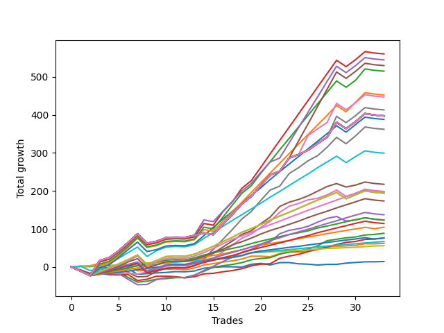

# Long Shepard 003 DB 
- Symbol: ES
- Date Range: 03/18/2022 - 07/15/2022
- Trading Period: 7:20-12:30
- Number of Trades: 33



| Name | Win Percent | Profit | Avg Profit / Trade | Avg Time / Trade |      | Name | Win Percent | Profit | Avg Profit / Trade | Avg Time / Trade |
| ---- | ----------- | ------ | ------------------ | ---------------- | ---- | ---- | ----------- | ------ | ------------------ | ---------------- |
| Sorted By <br> Profit | | | | | | Sorted By <br> Win Percentage ||||
| Two Hundred Three.Five | 75.76 | 280250.00 | 8492.42 | 122:35 |     | Eighty-One | 100.00 | 28000.00 | 848.48 | 10:39 |
| Two Hundred Four | 75.76 | 272375.00 | 8253.79 | 132:56 |     | Eighty-Two | 96.97 | 33500.00 | 1015.15 | 18:09 |
| Two Hundred Four.Five | 75.76 | 264875.00 | 8026.52 | 149:37 |     | Eighty-Four | 87.88 | 52375.00 | 1587.12 | 36:07 |
| Two Hundred Three | 75.76 | 257500.00 | 7803.03 | 107:28 |     | Eighty-Three | 87.88 | 38250.00 | 1159.09 | 32:03 |
| Two Hundred Two.Five | 75.76 | 226250.00 | 6856.06 | 100:35 |     | Eighty-Five | 84.85 | 61750.00 | 1871.21 | 41:12 |
| Two Hundred Five | 75.76 | 223625.00 | 6776.52 | 154:44 |     | Two | 84.85 | 44375.00 | 1344.70 | 17:45 |
| Two Hundred Five.Five | 75.76 | 206625.00 | 6261.36 | 157:11 |     | Eighty-Nine | 81.82 | 98500.00 | 2984.85 | 57:32 |
| Two Hundred Fifteen | 75.76 | 198750.00 | 6022.73 | 158:19 |     | Eighty-Eight | 81.82 | 86875.00 | 2632.58 | 56:34 |
| Two Hundred Fourteen.Five | 75.76 | 198750.00 | 6022.73 | 158:19 |     | Eighty-Seven | 81.82 | 68750.00 | 2083.33 | 53:42 |
| Two Hundred Fourteen | 75.76 | 198750.00 | 6022.73 | 158:19 |     | Eighty-Six | 81.82 | 57250.00 | 1734.85 | 52:35 |
| Two Hundred Thirteen.Five | 75.76 | 198750.00 | 6022.73 | 158:19 |     | Two Hundred Two | 78.79 | 194125.00 | 5882.58 | 94:54 |
| Two Hundred Thirteen | 75.76 | 198750.00 | 6022.73 | 158:19 |     | Seven | 78.79 | 181125.00 | 5488.64 | 82:20 |
| Two Hundred Twelve.Five | 75.76 | 198750.00 | 6022.73 | 158:19 |     | Two Hundred One.Five | 78.79 | 149750.00 | 4537.88 | 78:13 |
| Two Hundred Twelve | 75.76 | 198750.00 | 6022.73 | 158:19 |     | Two Hundred One | 78.79 | 97125.00 | 2943.18 | 66:44 |
| Two Hundred Eleven.Five | 75.76 | 198750.00 | 6022.73 | 158:19 |     | Ninety | 78.79 | 97125.00 | 2943.18 | 66:44 |
| Two Hundred Eleven | 75.76 | 198750.00 | 6022.73 | 158:19 |     | Three | 78.79 | 38250.00 | 1159.09 | 17:44 |
| Two Hundred Ten.Five | 75.76 | 198750.00 | 6022.73 | 158:19 |     | One | 78.79 | 31125.00 | 943.18 | 09:43 |
| Two Hundred Ten | 75.76 | 198750.00 | 6022.73 | 158:19 |     | Two Hundred Three.Five | 75.76 | 280250.00 | 8492.42 | 122:35 |
| Two Hundred Nine.Five | 75.76 | 198750.00 | 6022.73 | 158:19 |     | Two Hundred Four | 75.76 | 272375.00 | 8253.79 | 132:56 |
| Two Hundred Nine | 75.76 | 198750.00 | 6022.73 | 158:19 |     | Two Hundred Four.Five | 75.76 | 264875.00 | 8026.52 | 149:37 |
| Two Hundred Eight.Five | 75.76 | 198750.00 | 6022.73 | 158:19 |     | Two Hundred Three | 75.76 | 257500.00 | 7803.03 | 107:28 |
| Two Hundred Eight | 75.76 | 198750.00 | 6022.73 | 158:19 |     | Two Hundred Two.Five | 75.76 | 226250.00 | 6856.06 | 100:35 |
| Two Hundred Seven.Five | 75.76 | 198750.00 | 6022.73 | 158:19 |     | Two Hundred Five | 75.76 | 223625.00 | 6776.52 | 154:44 |
| Two Hundred Seven | 75.76 | 198750.00 | 6022.73 | 158:19 |     | Two Hundred Five.Five | 75.76 | 206625.00 | 6261.36 | 157:11 |
| Two Hundred Six.Five | 75.76 | 198750.00 | 6022.73 | 158:19 |     | Two Hundred Fifteen | 75.76 | 198750.00 | 6022.73 | 158:19 |
| Two Hundred Six | 75.76 | 198750.00 | 6022.73 | 158:19 |     | Two Hundred Fourteen.Five | 75.76 | 198750.00 | 6022.73 | 158:19 |
| Two Hundred Two | 78.79 | 194125.00 | 5882.58 | 94:54 |     | Two Hundred Fourteen | 75.76 | 198750.00 | 6022.73 | 158:19 |
| Seven | 78.79 | 181125.00 | 5488.64 | 82:20 |     | Two Hundred Thirteen.Five | 75.76 | 198750.00 | 6022.73 | 158:19 |
| Two Hundred One.Five | 78.79 | 149750.00 | 4537.88 | 78:13 |     | Two Hundred Thirteen | 75.76 | 198750.00 | 6022.73 | 158:19 |
| Five | 72.73 | 108750.00 | 3295.45 | 40:01 |     | Two Hundred Twelve.Five | 75.76 | 198750.00 | 6022.73 | 158:19 |
| Six | 75.76 | 99375.00 | 3011.36 | 43:57 |     | Two Hundred Twelve | 75.76 | 198750.00 | 6022.73 | 158:19 |
| Eighty-Nine | 81.82 | 98500.00 | 2984.85 | 57:32 |     | Two Hundred Eleven.Five | 75.76 | 198750.00 | 6022.73 | 158:19 |
| Two Hundred One | 78.79 | 97125.00 | 2943.18 | 66:44 |     | Two Hundred Eleven | 75.76 | 198750.00 | 6022.73 | 158:19 |
| Ninety | 78.79 | 97125.00 | 2943.18 | 66:44 |     | Two Hundred Ten.Five | 75.76 | 198750.00 | 6022.73 | 158:19 |
| Eighty-Eight | 81.82 | 86875.00 | 2632.58 | 56:34 |     | Two Hundred Ten | 75.76 | 198750.00 | 6022.73 | 158:19 |
| Eighty-Seven | 81.82 | 68750.00 | 2083.33 | 53:42 |     | Two Hundred Nine.Five | 75.76 | 198750.00 | 6022.73 | 158:19 |
| Eighty-Five | 84.85 | 61750.00 | 1871.21 | 41:12 |     | Two Hundred Nine | 75.76 | 198750.00 | 6022.73 | 158:19 |
| Four | 72.73 | 61750.00 | 1871.21 | 32:26 |     | Two Hundred Eight.Five | 75.76 | 198750.00 | 6022.73 | 158:19 |
| Eighty-Six | 81.82 | 57250.00 | 1734.85 | 52:35 |     | Two Hundred Eight | 75.76 | 198750.00 | 6022.73 | 158:19 |
| Eighty-Four | 87.88 | 52375.00 | 1587.12 | 36:07 |     | Two Hundred Seven.Five | 75.76 | 198750.00 | 6022.73 | 158:19 |
| Two | 84.85 | 44375.00 | 1344.70 | 17:45 |     | Two Hundred Seven | 75.76 | 198750.00 | 6022.73 | 158:19 |
| Eighty-Three | 87.88 | 38250.00 | 1159.09 | 32:03 |     | Two Hundred Six.Five | 75.76 | 198750.00 | 6022.73 | 158:19 |
| Three | 78.79 | 38250.00 | 1159.09 | 17:44 |     | Two Hundred Six | 75.76 | 198750.00 | 6022.73 | 158:19 |
| Eighty-Two | 96.97 | 33500.00 | 1015.15 | 18:09 |     | Six | 75.76 | 99375.00 | 3011.36 | 43:57 |
| One | 78.79 | 31125.00 | 943.18 | 09:43 |     | Five | 72.73 | 108750.00 | 3295.45 | 40:01 |
| Eighty-One | 100.00 | 28000.00 | 848.48 | 10:39 |     | Four | 72.73 | 61750.00 | 1871.21 | 32:26 |
| Zero | 66.67 | 7250.00 | 219.70 | 04:36 |     | Zero | 66.67 | 7250.00 | 219.70 | 04:36 |

## NO STOPLOSS

### Test Zero
* Sell when price hits the middle line of the 20p bollinger
* No Stoploss
* Results:
```
Total Trades: 33
Percent Up: 66.67
Percent Down: 33.33
Total Points Moved Up: 14.50
Potential Profit: 7250.00
Total Points Ups: 53.00 Count Ups: 22
Total Points Downs: -38.50 Count Downs: 11
```

<details><summary>Trades</summary>

<code>In: 2022-03-23 09:49:00		Out: 2022-03-23 09:54:15		Total Position Time: 05:15		Total Move Up: 1.25		Total to Date: 1.25</code> <br />
<code>In: 2022-03-23 09:53:00		Out: 2022-03-23 09:54:15		Total Position Time: 01:15		Total Move Up: -0.25		Total to Date: 1.00</code> <br />
<code>In: 2022-03-24 07:32:00		Out: 2022-03-24 07:32:40		Total Position Time: 00:40		Total Move Up: 3.25		Total to Date: 4.25</code> <br />
<code>In: 2022-03-25 08:18:00		Out: 2022-03-25 08:36:40		Total Position Time: 18:40		Total Move Up: -8.75		Total to Date: -4.50</code> <br />
<code>In: 2022-03-28 07:30:00		Out: 2022-03-28 07:30:15		Total Position Time: 00:15		Total Move Up: -1.75		Total to Date: -6.25</code> <br />
<code>In: 2022-03-28 08:11:00		Out: 2022-03-28 08:11:45		Total Position Time: 00:45		Total Move Up: 2.75		Total to Date: -3.50</code> <br />
<code>In: 2022-03-28 08:30:00		Out: 2022-03-28 09:01:50		Total Position Time: 31:50		Total Move Up: -15.75		Total to Date: -19.25</code> <br />
<code>In: 2022-03-31 09:30:00		Out: 2022-03-31 09:32:50		Total Position Time: 02:50		Total Move Up: 2.00		Total to Date: -17.25</code> <br />
<code>In: 2022-04-20 08:27:00		Out: 2022-04-20 08:28:55		Total Position Time: 01:55		Total Move Up: 1.75		Total to Date: -15.50</code> <br />
<code>In: 2022-04-20 11:48:00		Out: 2022-04-20 11:48:20		Total Position Time: 00:20		Total Move Up: 1.25		Total to Date: -14.25</code> <br />
<code>In: 2022-04-27 12:11:00		Out: 2022-04-27 12:14:00		Total Position Time: 03:00		Total Move Up: 2.25		Total to Date: -12.00</code> <br />
<code>In: 2022-04-27 12:14:00		Out: 2022-04-27 12:14:35		Total Position Time: 00:35		Total Move Up: -0.50		Total to Date: -12.50</code> <br />
<code>In: 2022-04-27 12:24:00		Out: 2022-04-27 12:24:15		Total Position Time: 00:15		Total Move Up: 2.00		Total to Date: -10.50</code> <br />
<code>In: 2022-05-03 07:51:00		Out: 2022-05-03 07:54:05		Total Position Time: 03:05		Total Move Up: 7.50		Total to Date: -3.00</code> <br />
<code>In: 2022-05-03 11:45:00		Out: 2022-05-03 11:45:15		Total Position Time: 00:15		Total Move Up: 2.00		Total to Date: -1.00</code> <br />
<code>In: 2022-05-06 11:36:00		Out: 2022-05-06 11:40:25		Total Position Time: 04:25		Total Move Up: 1.75		Total to Date: 0.75</code> <br />
<code>In: 2022-05-06 11:41:00		Out: 2022-05-06 11:41:15		Total Position Time: 00:15		Total Move Up: -0.25		Total to Date: 0.50</code> <br />
<code>In: 2022-05-06 11:47:00		Out: 2022-05-06 11:48:15		Total Position Time: 01:15		Total Move Up: -0.75		Total to Date: -0.25</code> <br />
<code>In: 2022-05-06 11:50:00		Out: 2022-05-06 11:50:15		Total Position Time: 00:15		Total Move Up: 7.50		Total to Date: 7.25</code> <br />
<code>In: 2022-05-06 12:12:00		Out: 2022-05-06 12:19:15		Total Position Time: 07:15		Total Move Up: 2.25		Total to Date: 9.50</code> <br />
<code>In: 2022-05-06 12:20:00		Out: 2022-05-06 12:27:55		Total Position Time: 07:55		Total Move Up: -4.00		Total to Date: 5.50</code> <br />
<code>In: 2022-05-12 09:04:00		Out: 2022-05-12 09:07:35		Total Position Time: 03:35		Total Move Up: 6.00		Total to Date: 11.50</code> <br />
<code>In: 2022-05-13 11:10:00		Out: 2022-05-13 11:19:15		Total Position Time: 09:15		Total Move Up: 0.25		Total to Date: 11.75</code> <br />
<code>In: 2022-05-16 07:58:00		Out: 2022-05-16 08:09:30		Total Position Time: 11:30		Total Move Up: -3.25		Total to Date: 8.50</code> <br />
<code>In: 2022-05-16 08:02:00		Out: 2022-05-16 08:09:30		Total Position Time: 07:30		Total Move Up: -1.00		Total to Date: 7.50</code> <br />
<code>In: 2022-05-19 07:47:00		Out: 2022-05-19 07:53:45		Total Position Time: 06:45		Total Move Up: -2.25		Total to Date: 5.25</code> <br />
<code>In: 2022-05-19 10:19:00		Out: 2022-05-19 10:19:20		Total Position Time: 00:20		Total Move Up: 1.75		Total to Date: 7.00</code> <br />
<code>In: 2022-05-25 09:39:00		Out: 2022-05-25 09:41:25		Total Position Time: 02:25		Total Move Up: 0.00		Total to Date: 7.00</code> <br />
<code>In: 2022-06-06 08:24:00		Out: 2022-06-06 08:31:35		Total Position Time: 07:35		Total Move Up: 3.25		Total to Date: 10.25</code> <br />
<code>In: 2022-07-08 09:48:00		Out: 2022-07-08 09:49:00		Total Position Time: 01:00		Total Move Up: 1.75		Total to Date: 12.00</code> <br />
<code>In: 2022-07-08 10:06:00		Out: 2022-07-08 10:06:15		Total Position Time: 00:15		Total Move Up: 1.75		Total to Date: 13.75</code> <br />
<code>In: 2022-07-11 12:15:00		Out: 2022-07-11 12:22:10		Total Position Time: 07:10		Total Move Up: 0.00		Total to Date: 13.75</code> <br />
<code>In: 2022-07-11 12:25:00		Out: 2022-07-11 12:27:35		Total Position Time: 02:35		Total Move Up: 0.75		Total to Date: 14.50</code> <br />


</details>

### Test One
* Sell when the price hits the upper line of the 20p 1std bollinger
* No Stoploss
* Results:
```
Total Trades: 33
Percent Up: 78.79
Percent Down: 21.21
Total Points Moved Up: 62.25
Potential Profit: 31125.00
Total Points Ups: 88.25 Count Ups: 26
Total Points Downs: -26.00 Count Downs: 7
```

<details><summary>Trades</summary>

<code>In: 2022-03-23 09:49:00		Out: 2022-03-23 09:59:10		Total Position Time: 10:10		Total Move Up: 2.50		Total to Date: 2.50</code> <br />
<code>In: 2022-03-23 09:53:00		Out: 2022-03-23 09:59:10		Total Position Time: 06:10		Total Move Up: 1.00		Total to Date: 3.50</code> <br />
<code>In: 2022-03-24 07:32:00		Out: 2022-03-24 07:32:55		Total Position Time: 00:55		Total Move Up: 6.00		Total to Date: 9.50</code> <br />
<code>In: 2022-03-25 08:18:00		Out: 2022-03-25 08:41:10		Total Position Time: 23:10		Total Move Up: -7.25		Total to Date: 2.25</code> <br />
<code>In: 2022-03-28 07:30:00		Out: 2022-03-28 07:30:20		Total Position Time: 00:20		Total Move Up: -0.50		Total to Date: 1.75</code> <br />
<code>In: 2022-03-28 08:11:00		Out: 2022-03-28 08:21:30		Total Position Time: 10:30		Total Move Up: 2.25		Total to Date: 4.00</code> <br />
<code>In: 2022-03-28 08:30:00		Out: 2022-03-28 09:04:55		Total Position Time: 34:55		Total Move Up: -14.00		Total to Date: -10.00</code> <br />
<code>In: 2022-03-31 09:30:00		Out: 2022-03-31 09:40:45		Total Position Time: 10:45		Total Move Up: 1.50		Total to Date: -8.50</code> <br />
<code>In: 2022-04-20 08:27:00		Out: 2022-04-20 08:30:35		Total Position Time: 03:35		Total Move Up: 3.50		Total to Date: -5.00</code> <br />
<code>In: 2022-04-20 11:48:00		Out: 2022-04-20 12:04:20		Total Position Time: 16:20		Total Move Up: -0.75		Total to Date: -5.75</code> <br />
<code>In: 2022-04-27 12:11:00		Out: 2022-04-27 12:27:15		Total Position Time: 16:15		Total Move Up: 0.50		Total to Date: -5.25</code> <br />
<code>In: 2022-04-27 12:14:00		Out: 2022-04-27 12:27:15		Total Position Time: 13:15		Total Move Up: -1.75		Total to Date: -7.00</code> <br />
<code>In: 2022-04-27 12:24:00		Out: 2022-04-27 12:27:15		Total Position Time: 03:15		Total Move Up: 4.50		Total to Date: -2.50</code> <br />
<code>In: 2022-05-03 07:51:00		Out: 2022-05-03 07:57:10		Total Position Time: 06:10		Total Move Up: 8.00		Total to Date: 5.50</code> <br />
<code>In: 2022-05-03 11:45:00		Out: 2022-05-03 11:49:20		Total Position Time: 04:20		Total Move Up: 3.50		Total to Date: 9.00</code> <br />
<code>In: 2022-05-06 11:36:00		Out: 2022-05-06 11:49:10		Total Position Time: 13:10		Total Move Up: 4.00		Total to Date: 13.00</code> <br />
<code>In: 2022-05-06 11:41:00		Out: 2022-05-06 11:49:10		Total Position Time: 08:10		Total Move Up: 3.25		Total to Date: 16.25</code> <br />
<code>In: 2022-05-06 11:47:00		Out: 2022-05-06 11:49:10		Total Position Time: 02:10		Total Move Up: 4.75		Total to Date: 21.00</code> <br />
<code>In: 2022-05-06 11:50:00		Out: 2022-05-06 11:50:15		Total Position Time: 00:15		Total Move Up: 7.50		Total to Date: 28.50</code> <br />
<code>In: 2022-05-06 12:12:00		Out: 2022-05-06 12:28:05		Total Position Time: 16:05		Total Move Up: 0.00		Total to Date: 28.50</code> <br />
<code>In: 2022-05-06 12:20:00		Out: 2022-05-06 12:28:05		Total Position Time: 08:05		Total Move Up: -1.50		Total to Date: 27.00</code> <br />
<code>In: 2022-05-12 09:04:00		Out: 2022-05-12 09:11:10		Total Position Time: 07:10		Total Move Up: 8.50		Total to Date: 35.50</code> <br />
<code>In: 2022-05-13 11:10:00		Out: 2022-05-13 11:20:00		Total Position Time: 10:00		Total Move Up: 3.75		Total to Date: 39.25</code> <br />
<code>In: 2022-05-16 07:58:00		Out: 2022-05-16 08:09:50		Total Position Time: 11:50		Total Move Up: 0.00		Total to Date: 39.25</code> <br />
<code>In: 2022-05-16 08:02:00		Out: 2022-05-16 08:09:50		Total Position Time: 07:50		Total Move Up: 2.25		Total to Date: 41.50</code> <br />
<code>In: 2022-05-19 07:47:00		Out: 2022-05-19 07:55:00		Total Position Time: 08:00		Total Move Up: 3.75		Total to Date: 45.25</code> <br />
<code>In: 2022-05-19 10:19:00		Out: 2022-05-19 10:22:50		Total Position Time: 03:50		Total Move Up: 7.50		Total to Date: 52.75</code> <br />
<code>In: 2022-05-25 09:39:00		Out: 2022-05-25 09:44:25		Total Position Time: 05:25		Total Move Up: 1.50		Total to Date: 54.25</code> <br />
<code>In: 2022-06-06 08:24:00		Out: 2022-06-06 08:39:15		Total Position Time: 15:15		Total Move Up: 1.50		Total to Date: 55.75</code> <br />
<code>In: 2022-07-08 09:48:00		Out: 2022-07-08 10:09:40		Total Position Time: 21:40		Total Move Up: 1.25		Total to Date: 57.00</code> <br />
<code>In: 2022-07-08 10:06:00		Out: 2022-07-08 10:09:40		Total Position Time: 03:40		Total Move Up: 4.25		Total to Date: 61.25</code> <br />
<code>In: 2022-07-11 12:15:00		Out: 2022-07-11 12:29:15		Total Position Time: 14:15		Total Move Up: -0.25		Total to Date: 61.00</code> <br />
<code>In: 2022-07-11 12:25:00		Out: 2022-07-11 12:29:15		Total Position Time: 04:15		Total Move Up: 1.25		Total to Date: 62.25</code> <br />


</details>

### Test Two
* Sell when the price hits the upper line of the 20p 2std bollinger
* No Stoploss
* Results:
```
Total Trades: 33
Percent Up: 84.85
Percent Down: 15.15
Total Points Moved Up: 88.75
Potential Profit: 44375.00
Total Points Ups: 139.25 Count Ups: 28
Total Points Downs: -50.50 Count Downs: 5
```

<details><summary>Trades</summary>

<code>In: 2022-03-23 09:49:00		Out: 2022-03-23 10:54:30		Total Position Time: 65:30		Total Move Up: -9.75		Total to Date: -9.75</code> <br />
<code>In: 2022-03-23 09:53:00		Out: 2022-03-23 10:54:30		Total Position Time: 61:30		Total Move Up: -11.25		Total to Date: -21.00</code> <br />
<code>In: 2022-03-24 07:32:00		Out: 2022-03-24 07:34:20		Total Position Time: 02:20		Total Move Up: 9.25		Total to Date: -11.75</code> <br />
<code>In: 2022-03-25 08:18:00		Out: 2022-03-25 08:41:55		Total Position Time: 23:55		Total Move Up: -3.25		Total to Date: -15.00</code> <br />
<code>In: 2022-03-28 07:30:00		Out: 2022-03-28 07:48:05		Total Position Time: 18:05		Total Move Up: 1.50		Total to Date: -13.50</code> <br />
<code>In: 2022-03-28 08:11:00		Out: 2022-03-28 09:07:10		Total Position Time: 56:10		Total Move Up: -13.75		Total to Date: -27.25</code> <br />
<code>In: 2022-03-28 08:30:00		Out: 2022-03-28 09:07:10		Total Position Time: 37:10		Total Move Up: -12.50		Total to Date: -39.75</code> <br />
<code>In: 2022-03-31 09:30:00		Out: 2022-03-31 09:44:20		Total Position Time: 14:20		Total Move Up: 2.50		Total to Date: -37.25</code> <br />
<code>In: 2022-04-20 08:27:00		Out: 2022-04-20 08:31:15		Total Position Time: 04:15		Total Move Up: 5.25		Total to Date: -32.00</code> <br />
<code>In: 2022-04-20 11:48:00		Out: 2022-04-20 12:12:35		Total Position Time: 24:35		Total Move Up: 1.50		Total to Date: -30.50</code> <br />
<code>In: 2022-04-27 12:11:00		Out: 2022-04-27 12:31:20		Total Position Time: 20:20		Total Move Up: 2.50		Total to Date: -28.00</code> <br />
<code>In: 2022-04-27 12:14:00		Out: 2022-04-27 12:31:20		Total Position Time: 17:20		Total Move Up: 0.25		Total to Date: -27.75</code> <br />
<code>In: 2022-04-27 12:24:00		Out: 2022-04-27 12:31:20		Total Position Time: 07:20		Total Move Up: 6.50		Total to Date: -21.25</code> <br />
<code>In: 2022-05-03 07:51:00		Out: 2022-05-03 07:59:10		Total Position Time: 08:10		Total Move Up: 10.00		Total to Date: -11.25</code> <br />
<code>In: 2022-05-03 11:45:00		Out: 2022-05-03 11:52:05		Total Position Time: 07:05		Total Move Up: 10.75		Total to Date: -0.50</code> <br />
<code>In: 2022-05-06 11:36:00		Out: 2022-05-06 11:49:10		Total Position Time: 13:10		Total Move Up: 4.00		Total to Date: 3.50</code> <br />
<code>In: 2022-05-06 11:41:00		Out: 2022-05-06 11:49:10		Total Position Time: 08:10		Total Move Up: 3.25		Total to Date: 6.75</code> <br />
<code>In: 2022-05-06 11:47:00		Out: 2022-05-06 11:49:10		Total Position Time: 02:10		Total Move Up: 4.75		Total to Date: 11.50</code> <br />
<code>In: 2022-05-06 11:50:00		Out: 2022-05-06 11:50:15		Total Position Time: 00:15		Total Move Up: 7.50		Total to Date: 19.00</code> <br />
<code>In: 2022-05-06 12:12:00		Out: 2022-05-06 12:28:50		Total Position Time: 16:50		Total Move Up: 3.50		Total to Date: 22.50</code> <br />
<code>In: 2022-05-06 12:20:00		Out: 2022-05-06 12:28:50		Total Position Time: 08:50		Total Move Up: 2.00		Total to Date: 24.50</code> <br />
<code>In: 2022-05-12 09:04:00		Out: 2022-05-12 09:21:15		Total Position Time: 17:15		Total Move Up: 9.25		Total to Date: 33.75</code> <br />
<code>In: 2022-05-13 11:10:00		Out: 2022-05-13 11:31:20		Total Position Time: 21:20		Total Move Up: 5.75		Total to Date: 39.50</code> <br />
<code>In: 2022-05-16 07:58:00		Out: 2022-05-16 08:11:35		Total Position Time: 13:35		Total Move Up: 2.75		Total to Date: 42.25</code> <br />
<code>In: 2022-05-16 08:02:00		Out: 2022-05-16 08:11:35		Total Position Time: 09:35		Total Move Up: 5.00		Total to Date: 47.25</code> <br />
<code>In: 2022-05-19 07:47:00		Out: 2022-05-19 07:55:55		Total Position Time: 08:55		Total Move Up: 8.50		Total to Date: 55.75</code> <br />
<code>In: 2022-05-19 10:19:00		Out: 2022-05-19 10:44:05		Total Position Time: 25:05		Total Move Up: 13.50		Total to Date: 69.25</code> <br />
<code>In: 2022-05-25 09:39:00		Out: 2022-05-25 09:45:20		Total Position Time: 06:20		Total Move Up: 3.75		Total to Date: 73.00</code> <br />
<code>In: 2022-06-06 08:24:00		Out: 2022-06-06 08:43:00		Total Position Time: 19:00		Total Move Up: 3.75		Total to Date: 76.75</code> <br />
<code>In: 2022-07-08 09:48:00		Out: 2022-07-08 10:11:05		Total Position Time: 23:05		Total Move Up: 2.25		Total to Date: 79.00</code> <br />
<code>In: 2022-07-08 10:06:00		Out: 2022-07-08 10:11:05		Total Position Time: 05:05		Total Move Up: 5.25		Total to Date: 84.25</code> <br />
<code>In: 2022-07-11 12:15:00		Out: 2022-07-11 12:29:40		Total Position Time: 14:40		Total Move Up: 1.50		Total to Date: 85.75</code> <br />
<code>In: 2022-07-11 12:25:00		Out: 2022-07-11 12:29:40		Total Position Time: 04:40		Total Move Up: 3.00		Total to Date: 88.75</code> <br />


</details>

### Test Three
* Sell when price hits the middle line of the 50p bollinger
* No Stoploss
* Results:
```
Total Trades: 33
Percent Up: 78.79
Percent Down: 21.21
Total Points Moved Up: 76.50
Potential Profit: 38250.00
Total Points Ups: 121.75 Count Ups: 26
Total Points Downs: -45.25 Count Downs: 7
```

<details><summary>Trades</summary>

<code>In: 2022-03-23 09:49:00		Out: 2022-03-23 10:54:50		Total Position Time: 65:50		Total Move Up: -9.50		Total to Date: -9.50</code> <br />
<code>In: 2022-03-23 09:53:00		Out: 2022-03-23 10:54:50		Total Position Time: 61:50		Total Move Up: -11.00		Total to Date: -20.50</code> <br />
<code>In: 2022-03-24 07:32:00		Out: 2022-03-24 07:32:45		Total Position Time: 00:45		Total Move Up: 4.25		Total to Date: -16.25</code> <br />
<code>In: 2022-03-25 08:18:00		Out: 2022-03-25 08:53:00		Total Position Time: 35:00		Total Move Up: -4.00		Total to Date: -20.25</code> <br />
<code>In: 2022-03-28 07:30:00		Out: 2022-03-28 07:30:20		Total Position Time: 00:20		Total Move Up: -0.50		Total to Date: -20.75</code> <br />
<code>In: 2022-03-28 08:11:00		Out: 2022-03-28 08:11:30		Total Position Time: 00:30		Total Move Up: 1.25		Total to Date: -19.50</code> <br />
<code>In: 2022-03-28 08:30:00		Out: 2022-03-28 09:25:20		Total Position Time: 55:20		Total Move Up: -16.00		Total to Date: -35.50</code> <br />
<code>In: 2022-03-31 09:30:00		Out: 2022-03-31 09:46:10		Total Position Time: 16:10		Total Move Up: 3.50		Total to Date: -32.00</code> <br />
<code>In: 2022-04-20 08:27:00		Out: 2022-04-20 08:36:10		Total Position Time: 09:10		Total Move Up: 7.75		Total to Date: -24.25</code> <br />
<code>In: 2022-04-20 11:48:00		Out: 2022-04-20 12:10:10		Total Position Time: 22:10		Total Move Up: 0.00		Total to Date: -24.25</code> <br />
<code>In: 2022-04-27 12:11:00		Out: 2022-04-27 12:44:20		Total Position Time: 33:20		Total Move Up: -1.00		Total to Date: -25.25</code> <br />
<code>In: 2022-04-27 12:14:00		Out: 2022-04-27 12:44:20		Total Position Time: 30:20		Total Move Up: -3.25		Total to Date: -28.50</code> <br />
<code>In: 2022-04-27 12:24:00		Out: 2022-04-27 12:44:20		Total Position Time: 20:20		Total Move Up: 3.00		Total to Date: -25.50</code> <br />
<code>In: 2022-05-03 07:51:00		Out: 2022-05-03 07:54:05		Total Position Time: 03:05		Total Move Up: 7.50		Total to Date: -18.00</code> <br />
<code>In: 2022-05-03 11:45:00		Out: 2022-05-03 11:48:10		Total Position Time: 03:10		Total Move Up: 1.50		Total to Date: -16.50</code> <br />
<code>In: 2022-05-06 11:36:00		Out: 2022-05-06 11:49:10		Total Position Time: 13:10		Total Move Up: 4.00		Total to Date: -12.50</code> <br />
<code>In: 2022-05-06 11:41:00		Out: 2022-05-06 11:49:10		Total Position Time: 08:10		Total Move Up: 3.25		Total to Date: -9.25</code> <br />
<code>In: 2022-05-06 11:47:00		Out: 2022-05-06 11:49:10		Total Position Time: 02:10		Total Move Up: 4.75		Total to Date: -4.50</code> <br />
<code>In: 2022-05-06 11:50:00		Out: 2022-05-06 11:50:15		Total Position Time: 00:15		Total Move Up: 7.50		Total to Date: 3.00</code> <br />
<code>In: 2022-05-06 12:12:00		Out: 2022-05-06 12:13:10		Total Position Time: 01:10		Total Move Up: 4.50		Total to Date: 7.50</code> <br />
<code>In: 2022-05-06 12:20:00		Out: 2022-05-06 12:28:25		Total Position Time: 08:25		Total Move Up: 1.00		Total to Date: 8.50</code> <br />
<code>In: 2022-05-12 09:04:00		Out: 2022-05-12 09:21:35		Total Position Time: 17:35		Total Move Up: 14.50		Total to Date: 23.00</code> <br />
<code>In: 2022-05-13 11:10:00		Out: 2022-05-13 11:31:20		Total Position Time: 21:20		Total Move Up: 5.75		Total to Date: 28.75</code> <br />
<code>In: 2022-05-16 07:58:00		Out: 2022-05-16 08:17:00		Total Position Time: 19:00		Total Move Up: 4.75		Total to Date: 33.50</code> <br />
<code>In: 2022-05-16 08:02:00		Out: 2022-05-16 08:17:00		Total Position Time: 15:00		Total Move Up: 7.00		Total to Date: 40.50</code> <br />
<code>In: 2022-05-19 07:47:00		Out: 2022-05-19 07:55:40		Total Position Time: 08:40		Total Move Up: 7.50		Total to Date: 48.00</code> <br />
<code>In: 2022-05-19 10:19:00		Out: 2022-05-19 10:21:15		Total Position Time: 02:15		Total Move Up: 4.50		Total to Date: 52.50</code> <br />
<code>In: 2022-05-25 09:39:00		Out: 2022-05-25 09:49:10		Total Position Time: 10:10		Total Move Up: 6.75		Total to Date: 59.25</code> <br />
<code>In: 2022-06-06 08:24:00		Out: 2022-06-06 08:55:25		Total Position Time: 31:25		Total Move Up: 5.75		Total to Date: 65.00</code> <br />
<code>In: 2022-07-08 09:48:00		Out: 2022-07-08 10:11:10		Total Position Time: 23:10		Total Move Up: 2.25		Total to Date: 67.25</code> <br />
<code>In: 2022-07-08 10:06:00		Out: 2022-07-08 10:11:10		Total Position Time: 05:10		Total Move Up: 5.25		Total to Date: 72.50</code> <br />
<code>In: 2022-07-11 12:15:00		Out: 2022-07-11 12:40:35		Total Position Time: 25:35		Total Move Up: 1.25		Total to Date: 73.75</code> <br />
<code>In: 2022-07-11 12:25:00		Out: 2022-07-11 12:40:35		Total Position Time: 15:35		Total Move Up: 2.75		Total to Date: 76.50</code> <br />


</details>

### Test Four
* Sell when the price hits the upper line of the 50p 1std bollinger
* No Stoploss
* Results:
```
Total Trades: 33
Percent Up: 72.73
Percent Down: 27.27
Total Points Moved Up: 123.50
Potential Profit: 61750.00
Total Points Ups: 199.00 Count Ups: 24
Total Points Downs: -75.50 Count Downs: 9
```

<details><summary>Trades</summary>

<code>In: 2022-03-23 09:49:00		Out: 2022-03-23 11:27:00		Total Position Time: 98:00		Total Move Up: -10.25		Total to Date: -10.25</code> <br />
<code>In: 2022-03-23 09:53:00		Out: 2022-03-23 11:27:00		Total Position Time: 94:00		Total Move Up: -11.75		Total to Date: -22.00</code> <br />
<code>In: 2022-03-24 07:32:00		Out: 2022-03-24 07:34:15		Total Position Time: 02:15		Total Move Up: 8.75		Total to Date: -13.25</code> <br />
<code>In: 2022-03-25 08:18:00		Out: 2022-03-25 09:07:15		Total Position Time: 49:15		Total Move Up: -5.00		Total to Date: -18.25</code> <br />
<code>In: 2022-03-28 07:30:00		Out: 2022-03-28 07:48:05		Total Position Time: 18:05		Total Move Up: 1.50		Total to Date: -16.75</code> <br />
<code>In: 2022-03-28 08:11:00		Out: 2022-03-28 09:35:05		Total Position Time: 84:05		Total Move Up: -15.50		Total to Date: -32.25</code> <br />
<code>In: 2022-03-28 08:30:00		Out: 2022-03-28 09:35:05		Total Position Time: 65:05		Total Move Up: -14.25		Total to Date: -46.50</code> <br />
<code>In: 2022-03-31 09:30:00		Out: 2022-03-31 10:29:50		Total Position Time: 59:50		Total Move Up: 0.75		Total to Date: -45.75</code> <br />
<code>In: 2022-04-20 08:27:00		Out: 2022-04-20 08:45:25		Total Position Time: 18:25		Total Move Up: 12.75		Total to Date: -33.00</code> <br />
<code>In: 2022-04-20 11:48:00		Out: 2022-04-20 12:13:35		Total Position Time: 25:35		Total Move Up: 4.75		Total to Date: -28.25</code> <br />
<code>In: 2022-04-27 12:11:00		Out: 2022-04-27 12:46:05		Total Position Time: 35:05		Total Move Up: 1.50		Total to Date: -26.75</code> <br />
<code>In: 2022-04-27 12:14:00		Out: 2022-04-27 12:46:05		Total Position Time: 32:05		Total Move Up: -0.75		Total to Date: -27.50</code> <br />
<code>In: 2022-04-27 12:24:00		Out: 2022-04-27 12:46:05		Total Position Time: 22:05		Total Move Up: 5.50		Total to Date: -22.00</code> <br />
<code>In: 2022-05-03 07:51:00		Out: 2022-05-03 08:02:25		Total Position Time: 11:25		Total Move Up: 13.25		Total to Date: -8.75</code> <br />
<code>In: 2022-05-03 11:45:00		Out: 2022-05-03 11:52:05		Total Position Time: 07:05		Total Move Up: 10.75		Total to Date: 2.00</code> <br />
<code>In: 2022-05-06 11:36:00		Out: 2022-05-06 11:50:10		Total Position Time: 14:10		Total Move Up: 12.25		Total to Date: 14.25</code> <br />
<code>In: 2022-05-06 11:41:00		Out: 2022-05-06 11:50:10		Total Position Time: 09:10		Total Move Up: 11.50		Total to Date: 25.75</code> <br />
<code>In: 2022-05-06 11:47:00		Out: 2022-05-06 11:50:10		Total Position Time: 03:10		Total Move Up: 13.00		Total to Date: 38.75</code> <br />
<code>In: 2022-05-06 11:50:00		Out: 2022-05-06 11:50:15		Total Position Time: 00:15		Total Move Up: 7.50		Total to Date: 46.25</code> <br />
<code>In: 2022-05-06 12:12:00		Out: 2022-05-06 12:30:30		Total Position Time: 18:30		Total Move Up: 10.75		Total to Date: 57.00</code> <br />
<code>In: 2022-05-06 12:20:00		Out: 2022-05-06 12:30:30		Total Position Time: 10:30		Total Move Up: 9.25		Total to Date: 66.25</code> <br />
<code>In: 2022-05-12 09:04:00		Out: 2022-05-12 09:30:15		Total Position Time: 26:15		Total Move Up: 21.25		Total to Date: 87.50</code> <br />
<code>In: 2022-05-13 11:10:00		Out: 2022-05-13 11:43:10		Total Position Time: 33:10		Total Move Up: 9.00		Total to Date: 96.50</code> <br />
<code>In: 2022-05-16 07:58:00		Out: 2022-05-16 08:34:50		Total Position Time: 36:50		Total Move Up: 4.25		Total to Date: 100.75</code> <br />
<code>In: 2022-05-16 08:02:00		Out: 2022-05-16 08:34:50		Total Position Time: 32:50		Total Move Up: 6.50		Total to Date: 107.25</code> <br />
<code>In: 2022-05-19 07:47:00		Out: 2022-05-19 08:12:25		Total Position Time: 25:25		Total Move Up: 10.75		Total to Date: 118.00</code> <br />
<code>In: 2022-05-19 10:19:00		Out: 2022-05-19 10:23:35		Total Position Time: 04:35		Total Move Up: 10.00		Total to Date: 128.00</code> <br />
<code>In: 2022-05-25 09:39:00		Out: 2022-05-25 10:10:05		Total Position Time: 31:05		Total Move Up: 5.00		Total to Date: 133.00</code> <br />
<code>In: 2022-06-06 08:24:00		Out: 2022-06-06 09:55:00		Total Position Time: 91:00		Total Move Up: -12.00		Total to Date: 121.00</code> <br />
<code>In: 2022-07-08 09:48:00		Out: 2022-07-08 10:26:30		Total Position Time: 38:30		Total Move Up: 2.75		Total to Date: 123.75</code> <br />
<code>In: 2022-07-08 10:06:00		Out: 2022-07-08 10:26:30		Total Position Time: 20:30		Total Move Up: 5.75		Total to Date: 129.50</code> <br />
<code>In: 2022-07-11 12:15:00		Out: 2022-07-11 12:46:05		Total Position Time: 31:05		Total Move Up: -3.75		Total to Date: 125.75</code> <br />
<code>In: 2022-07-11 12:25:00		Out: 2022-07-11 12:46:05		Total Position Time: 21:05		Total Move Up: -2.25		Total to Date: 123.50</code> <br />


</details>

### Test Five
* Sell when the price hits the upper line of the 50p 2std bollinger
* No Stoploss
* Results:
```
Total Trades: 33
Percent Up: 72.73
Percent Down: 27.27
Total Points Moved Up: 217.50
Potential Profit: 108750.00
Total Points Ups: 277.75 Count Ups: 24
Total Points Downs: -60.25 Count Downs: 9
```

<details><summary>Trades</summary>

<code>In: 2022-03-23 09:49:00		Out: 2022-03-23 11:30:00		Total Position Time: 101:00		Total Move Up: -7.50		Total to Date: -7.50</code> <br />
<code>In: 2022-03-23 09:53:00		Out: 2022-03-23 11:30:00		Total Position Time: 97:00		Total Move Up: -9.00		Total to Date: -16.50</code> <br />
<code>In: 2022-03-24 07:32:00		Out: 2022-03-24 08:01:10		Total Position Time: 29:10		Total Move Up: 15.25		Total to Date: -1.25</code> <br />
<code>In: 2022-03-25 08:18:00		Out: 2022-03-25 09:11:40		Total Position Time: 53:40		Total Move Up: -1.75		Total to Date: -3.00</code> <br />
<code>In: 2022-03-28 07:30:00		Out: 2022-03-28 07:53:50		Total Position Time: 23:50		Total Move Up: 3.25		Total to Date: 0.25</code> <br />
<code>In: 2022-03-28 08:11:00		Out: 2022-03-28 09:40:05		Total Position Time: 89:05		Total Move Up: -13.75		Total to Date: -13.50</code> <br />
<code>In: 2022-03-28 08:30:00		Out: 2022-03-28 09:40:05		Total Position Time: 70:05		Total Move Up: -12.50		Total to Date: -26.00</code> <br />
<code>In: 2022-03-31 09:30:00		Out: 2022-03-31 10:46:00		Total Position Time: 76:00		Total Move Up: 1.25		Total to Date: -24.75</code> <br />
<code>In: 2022-04-20 08:27:00		Out: 2022-04-20 09:52:35		Total Position Time: 85:35		Total Move Up: 13.25		Total to Date: -11.50</code> <br />
<code>In: 2022-04-20 11:48:00		Out: 2022-04-20 12:25:45		Total Position Time: 37:45		Total Move Up: 8.00		Total to Date: -3.50</code> <br />
<code>In: 2022-04-27 12:11:00		Out: 2022-04-27 12:46:05		Total Position Time: 35:05		Total Move Up: 1.50		Total to Date: -2.00</code> <br />
<code>In: 2022-04-27 12:14:00		Out: 2022-04-27 12:46:05		Total Position Time: 32:05		Total Move Up: -0.75		Total to Date: -2.75</code> <br />
<code>In: 2022-04-27 12:24:00		Out: 2022-04-27 12:46:05		Total Position Time: 22:05		Total Move Up: 5.50		Total to Date: 2.75</code> <br />
<code>In: 2022-05-03 07:51:00		Out: 2022-05-03 08:05:00		Total Position Time: 14:00		Total Move Up: 19.50		Total to Date: 22.25</code> <br />
<code>In: 2022-05-03 11:45:00		Out: 2022-05-03 11:56:50		Total Position Time: 11:50		Total Move Up: 13.75		Total to Date: 36.00</code> <br />
<code>In: 2022-05-06 11:36:00		Out: 2022-05-06 11:54:15		Total Position Time: 18:15		Total Move Up: 16.50		Total to Date: 52.50</code> <br />
<code>In: 2022-05-06 11:41:00		Out: 2022-05-06 11:54:15		Total Position Time: 13:15		Total Move Up: 15.75		Total to Date: 68.25</code> <br />
<code>In: 2022-05-06 11:47:00		Out: 2022-05-06 11:54:15		Total Position Time: 07:15		Total Move Up: 17.25		Total to Date: 85.50</code> <br />
<code>In: 2022-05-06 11:50:00		Out: 2022-05-06 11:54:15		Total Position Time: 04:15		Total Move Up: 9.75		Total to Date: 95.25</code> <br />
<code>In: 2022-05-06 12:12:00		Out: 2022-05-06 12:35:55		Total Position Time: 23:55		Total Move Up: 18.75		Total to Date: 114.00</code> <br />
<code>In: 2022-05-06 12:20:00		Out: 2022-05-06 12:35:55		Total Position Time: 15:55		Total Move Up: 17.25		Total to Date: 131.25</code> <br />
<code>In: 2022-05-12 09:04:00		Out: 2022-05-12 09:32:30		Total Position Time: 28:30		Total Move Up: 28.00		Total to Date: 159.25</code> <br />
<code>In: 2022-05-13 11:10:00		Out: 2022-05-13 11:51:25		Total Position Time: 41:25		Total Move Up: 11.25		Total to Date: 170.50</code> <br />
<code>In: 2022-05-16 07:58:00		Out: 2022-05-16 08:38:55		Total Position Time: 40:55		Total Move Up: 7.25		Total to Date: 177.75</code> <br />
<code>In: 2022-05-16 08:02:00		Out: 2022-05-16 08:38:55		Total Position Time: 36:55		Total Move Up: 9.50		Total to Date: 187.25</code> <br />
<code>In: 2022-05-19 07:47:00		Out: 2022-05-19 08:31:45		Total Position Time: 44:45		Total Move Up: 12.25		Total to Date: 199.50</code> <br />
<code>In: 2022-05-19 10:19:00		Out: 2022-05-19 10:31:30		Total Position Time: 12:30		Total Move Up: 12.25		Total to Date: 211.75</code> <br />
<code>In: 2022-05-25 09:39:00		Out: 2022-05-25 10:29:35		Total Position Time: 50:35		Total Move Up: 7.75		Total to Date: 219.50</code> <br />
<code>In: 2022-06-06 08:24:00		Out: 2022-06-06 09:56:15		Total Position Time: 92:15		Total Move Up: -9.00		Total to Date: 210.50</code> <br />
<code>In: 2022-07-08 09:48:00		Out: 2022-07-08 10:27:00		Total Position Time: 39:00		Total Move Up: 5.00		Total to Date: 215.50</code> <br />
<code>In: 2022-07-08 10:06:00		Out: 2022-07-08 10:27:00		Total Position Time: 21:00		Total Move Up: 8.00		Total to Date: 223.50</code> <br />
<code>In: 2022-07-11 12:15:00		Out: 2022-07-11 12:46:05		Total Position Time: 31:05		Total Move Up: -3.75		Total to Date: 219.75</code> <br />
<code>In: 2022-07-11 12:25:00		Out: 2022-07-11 12:46:05		Total Position Time: 21:05		Total Move Up: -2.25		Total to Date: 217.50</code> <br />


</details>

### Test Six
* Sell when the price hits the middle line of the 1std VWAP
* No Stoploss
* Results:
```
Total Trades: 33
Percent Up: 75.76
Percent Down: 24.24
Total Points Moved Up: 198.75
Potential Profit: 99375.00
Total Points Ups: 249.00 Count Ups: 25
Total Points Downs: -50.25 Count Downs: 8
```

<details><summary>Trades</summary>

<code>In: 2022-03-23 09:49:00		Out: 2022-03-23 12:46:05		Total Position Time: 177:05		Total Move Up: -10.50		Total to Date: -10.50</code> <br />
<code>In: 2022-03-23 09:53:00		Out: 2022-03-23 12:46:05		Total Position Time: 173:05		Total Move Up: -12.00		Total to Date: -22.50</code> <br />
<code>In: 2022-03-24 07:32:00		Out: 2022-03-24 07:32:40		Total Position Time: 00:40		Total Move Up: 3.25		Total to Date: -19.25</code> <br />
<code>In: 2022-03-25 08:18:00		Out: 2022-03-25 10:19:30		Total Position Time: 121:30		Total Move Up: 4.00		Total to Date: -15.25</code> <br />
<code>In: 2022-03-28 07:30:00		Out: 2022-03-28 07:30:15		Total Position Time: 00:15		Total Move Up: -1.75		Total to Date: -17.00</code> <br />
<code>In: 2022-03-28 08:11:00		Out: 2022-03-28 08:11:30		Total Position Time: 00:30		Total Move Up: 1.25		Total to Date: -15.75</code> <br />
<code>In: 2022-03-28 08:30:00		Out: 2022-03-28 10:24:25		Total Position Time: 114:25		Total Move Up: -2.50		Total to Date: -18.25</code> <br />
<code>In: 2022-03-31 09:30:00		Out: 2022-03-31 10:52:05		Total Position Time: 82:05		Total Move Up: 5.00		Total to Date: -13.25</code> <br />
<code>In: 2022-04-20 08:27:00		Out: 2022-04-20 08:31:55		Total Position Time: 04:55		Total Move Up: 5.75		Total to Date: -7.50</code> <br />
<code>In: 2022-04-20 11:48:00		Out: 2022-04-20 12:26:10		Total Position Time: 38:10		Total Move Up: 10.00		Total to Date: 2.50</code> <br />
<code>In: 2022-04-27 12:11:00		Out: 2022-04-27 12:46:05		Total Position Time: 35:05		Total Move Up: 1.50		Total to Date: 4.00</code> <br />
<code>In: 2022-04-27 12:14:00		Out: 2022-04-27 12:46:05		Total Position Time: 32:05		Total Move Up: -0.75		Total to Date: 3.25</code> <br />
<code>In: 2022-04-27 12:24:00		Out: 2022-04-27 12:46:05		Total Position Time: 22:05		Total Move Up: 5.50		Total to Date: 8.75</code> <br />
<code>In: 2022-05-03 07:51:00		Out: 2022-05-03 07:54:05		Total Position Time: 03:05		Total Move Up: 7.50		Total to Date: 16.25</code> <br />
<code>In: 2022-05-03 11:45:00		Out: 2022-05-03 11:50:50		Total Position Time: 05:50		Total Move Up: 6.25		Total to Date: 22.50</code> <br />
<code>In: 2022-05-06 11:36:00		Out: 2022-05-06 11:55:05		Total Position Time: 19:05		Total Move Up: 17.75		Total to Date: 40.25</code> <br />
<code>In: 2022-05-06 11:41:00		Out: 2022-05-06 11:55:05		Total Position Time: 14:05		Total Move Up: 17.00		Total to Date: 57.25</code> <br />
<code>In: 2022-05-06 11:47:00		Out: 2022-05-06 11:55:05		Total Position Time: 08:05		Total Move Up: 18.50		Total to Date: 75.75</code> <br />
<code>In: 2022-05-06 11:50:00		Out: 2022-05-06 11:55:05		Total Position Time: 05:05		Total Move Up: 11.00		Total to Date: 86.75</code> <br />
<code>In: 2022-05-06 12:12:00		Out: 2022-05-06 12:35:40		Total Position Time: 23:40		Total Move Up: 17.50		Total to Date: 104.25</code> <br />
<code>In: 2022-05-06 12:20:00		Out: 2022-05-06 12:35:40		Total Position Time: 15:40		Total Move Up: 16.00		Total to Date: 120.25</code> <br />
<code>In: 2022-05-12 09:04:00		Out: 2022-05-12 09:31:15		Total Position Time: 27:15		Total Move Up: 23.75		Total to Date: 144.00</code> <br />
<code>In: 2022-05-13 11:10:00		Out: 2022-05-13 11:52:35		Total Position Time: 42:35		Total Move Up: 16.00		Total to Date: 160.00</code> <br />
<code>In: 2022-05-16 07:58:00		Out: 2022-05-16 08:17:40		Total Position Time: 19:40		Total Move Up: 7.25		Total to Date: 167.25</code> <br />
<code>In: 2022-05-16 08:02:00		Out: 2022-05-16 08:17:40		Total Position Time: 15:40		Total Move Up: 9.50		Total to Date: 176.75</code> <br />
<code>In: 2022-05-19 07:47:00		Out: 2022-05-19 07:55:05		Total Position Time: 08:05		Total Move Up: 4.00		Total to Date: 180.75</code> <br />
<code>In: 2022-05-19 10:19:00		Out: 2022-05-19 10:23:20		Total Position Time: 04:20		Total Move Up: 9.00		Total to Date: 189.75</code> <br />
<code>In: 2022-05-25 09:39:00		Out: 2022-05-25 10:37:05		Total Position Time: 58:05		Total Move Up: 12.75		Total to Date: 202.50</code> <br />
<code>In: 2022-06-06 08:24:00		Out: 2022-06-06 12:46:05		Total Position Time: 262:05		Total Move Up: -16.75		Total to Date: 185.75</code> <br />
<code>In: 2022-07-08 09:48:00		Out: 2022-07-08 10:29:10		Total Position Time: 41:10		Total Move Up: 8.00		Total to Date: 193.75</code> <br />
<code>In: 2022-07-08 10:06:00		Out: 2022-07-08 10:29:10		Total Position Time: 23:10		Total Move Up: 11.00		Total to Date: 204.75</code> <br />
<code>In: 2022-07-11 12:15:00		Out: 2022-07-11 12:46:05		Total Position Time: 31:05		Total Move Up: -3.75		Total to Date: 201.00</code> <br />
<code>In: 2022-07-11 12:25:00		Out: 2022-07-11 12:46:05		Total Position Time: 21:05		Total Move Up: -2.25		Total to Date: 198.75</code> <br />


</details>

### Test Seven
* Sell when the price hits the upper line of the 1std VWAP
* No Stoploss
* Results:
```
Total Trades: 33
Percent Up: 78.79
Percent Down: 21.21
Total Points Moved Up: 362.25
Potential Profit: 181125.00
Total Points Ups: 433.00 Count Ups: 26
Total Points Downs: -70.75 Count Downs: 7
```

<details><summary>Trades</summary>

<code>In: 2022-03-23 09:49:00		Out: 2022-03-23 12:46:05		Total Position Time: 177:05		Total Move Up: -10.50		Total to Date: -10.50</code> <br />
<code>In: 2022-03-23 09:53:00		Out: 2022-03-23 12:46:05		Total Position Time: 173:05		Total Move Up: -12.00		Total to Date: -22.50</code> <br />
<code>In: 2022-03-24 07:32:00		Out: 2022-03-24 07:33:25		Total Position Time: 01:25		Total Move Up: 7.25		Total to Date: -15.25</code> <br />
<code>In: 2022-03-25 08:18:00		Out: 2022-03-25 11:04:05		Total Position Time: 166:05		Total Move Up: 13.25		Total to Date: -2.00</code> <br />
<code>In: 2022-03-28 07:30:00		Out: 2022-03-28 07:48:05		Total Position Time: 18:05		Total Move Up: 1.50		Total to Date: -0.50</code> <br />
<code>In: 2022-03-28 08:11:00		Out: 2022-03-28 11:29:05		Total Position Time: 198:05		Total Move Up: 3.75		Total to Date: 3.25</code> <br />
<code>In: 2022-03-28 08:30:00		Out: 2022-03-28 11:29:05		Total Position Time: 179:05		Total Move Up: 5.00		Total to Date: 8.25</code> <br />
<code>In: 2022-03-31 09:30:00		Out: 2022-03-31 12:46:05		Total Position Time: 196:05		Total Move Up: -24.75		Total to Date: -16.50</code> <br />
<code>In: 2022-04-20 08:27:00		Out: 2022-04-20 09:52:35		Total Position Time: 85:35		Total Move Up: 13.25		Total to Date: -3.25</code> <br />
<code>In: 2022-04-20 11:48:00		Out: 2022-04-20 12:46:05		Total Position Time: 58:05		Total Move Up: 9.50		Total to Date: 6.25</code> <br />
<code>In: 2022-04-27 12:11:00		Out: 2022-04-27 12:46:05		Total Position Time: 35:05		Total Move Up: 1.50		Total to Date: 7.75</code> <br />
<code>In: 2022-04-27 12:14:00		Out: 2022-04-27 12:46:05		Total Position Time: 32:05		Total Move Up: -0.75		Total to Date: 7.00</code> <br />
<code>In: 2022-04-27 12:24:00		Out: 2022-04-27 12:46:05		Total Position Time: 22:05		Total Move Up: 5.50		Total to Date: 12.50</code> <br />
<code>In: 2022-05-03 07:51:00		Out: 2022-05-03 08:02:10		Total Position Time: 11:10		Total Move Up: 11.25		Total to Date: 23.75</code> <br />
<code>In: 2022-05-03 11:45:00		Out: 2022-05-03 12:06:40		Total Position Time: 21:40		Total Move Up: 22.00		Total to Date: 45.75</code> <br />
<code>In: 2022-05-06 11:36:00		Out: 2022-05-06 12:46:05		Total Position Time: 70:05		Total Move Up: 26.75		Total to Date: 72.50</code> <br />
<code>In: 2022-05-06 11:41:00		Out: 2022-05-06 12:46:05		Total Position Time: 65:05		Total Move Up: 26.00		Total to Date: 98.50</code> <br />
<code>In: 2022-05-06 11:47:00		Out: 2022-05-06 12:46:05		Total Position Time: 59:05		Total Move Up: 27.50		Total to Date: 126.00</code> <br />
<code>In: 2022-05-06 11:50:00		Out: 2022-05-06 12:46:05		Total Position Time: 56:05		Total Move Up: 20.00		Total to Date: 146.00</code> <br />
<code>In: 2022-05-06 12:12:00		Out: 2022-05-06 12:46:05		Total Position Time: 34:05		Total Move Up: 29.00		Total to Date: 175.00</code> <br />
<code>In: 2022-05-06 12:20:00		Out: 2022-05-06 12:46:05		Total Position Time: 26:05		Total Move Up: 27.50		Total to Date: 202.50</code> <br />
<code>In: 2022-05-12 09:04:00		Out: 2022-05-12 12:46:05		Total Position Time: 222:05		Total Move Up: 10.25		Total to Date: 212.75</code> <br />
<code>In: 2022-05-13 11:10:00		Out: 2022-05-13 12:14:40		Total Position Time: 64:40		Total Move Up: 33.00		Total to Date: 245.75</code> <br />
<code>In: 2022-05-16 07:58:00		Out: 2022-05-16 08:45:00		Total Position Time: 47:00		Total Move Up: 15.75		Total to Date: 261.50</code> <br />
<code>In: 2022-05-16 08:02:00		Out: 2022-05-16 08:45:00		Total Position Time: 43:00		Total Move Up: 18.00		Total to Date: 279.50</code> <br />
<code>In: 2022-05-19 07:47:00		Out: 2022-05-19 08:33:45		Total Position Time: 46:45		Total Move Up: 13.25		Total to Date: 292.75</code> <br />
<code>In: 2022-05-19 10:19:00		Out: 2022-05-19 10:56:05		Total Position Time: 37:05		Total Move Up: 22.25		Total to Date: 315.00</code> <br />
<code>In: 2022-05-25 09:39:00		Out: 2022-05-25 11:02:25		Total Position Time: 83:25		Total Move Up: 26.00		Total to Date: 341.00</code> <br />
<code>In: 2022-06-06 08:24:00		Out: 2022-06-06 12:46:05		Total Position Time: 262:05		Total Move Up: -16.75		Total to Date: 324.25</code> <br />
<code>In: 2022-07-08 09:48:00		Out: 2022-07-08 11:24:00		Total Position Time: 96:00		Total Move Up: 20.50		Total to Date: 344.75</code> <br />
<code>In: 2022-07-08 10:06:00		Out: 2022-07-08 11:24:00		Total Position Time: 78:00		Total Move Up: 23.50		Total to Date: 368.25</code> <br />
<code>In: 2022-07-11 12:15:00		Out: 2022-07-11 12:46:05		Total Position Time: 31:05		Total Move Up: -3.75		Total to Date: 364.50</code> <br />
<code>In: 2022-07-11 12:25:00		Out: 2022-07-11 12:46:05		Total Position Time: 21:05		Total Move Up: -2.25		Total to Date: 362.25</code> <br />


</details>

## TAKE PROFIT

### Test Eighty-One
* Take Profit of 1 Point
* No Stoploss
* Results:
```
Total Trades: 33
Percent Up: 100.00
Percent Down: 0.00
Total Points Moved Up: 56.00
Potential Profit: 28000.00
Total Points Ups: 56.00 Count Ups: 33
Total Points Downs: 0.00 Count Downs: 0
```

<details><summary>Trades</summary>

<code>In: 2022-03-23 09:49:00		Out: 2022-03-23 09:52:50		Total Position Time: 03:50		Total Move Up: 1.50		Total to Date: 1.50</code> <br />
<code>In: 2022-03-23 09:53:00		Out: 2022-03-23 09:59:10		Total Position Time: 06:10		Total Move Up: 1.00		Total to Date: 2.50</code> <br />
<code>In: 2022-03-24 07:32:00		Out: 2022-03-24 07:32:20		Total Position Time: 00:20		Total Move Up: 1.00		Total to Date: 3.50</code> <br />
<code>In: 2022-03-25 08:18:00		Out: 2022-03-25 09:51:50		Total Position Time: 93:50		Total Move Up: 0.75		Total to Date: 4.25</code> <br />
<code>In: 2022-03-28 07:30:00		Out: 2022-03-28 07:48:05		Total Position Time: 18:05		Total Move Up: 1.50		Total to Date: 5.75</code> <br />
<code>In: 2022-03-28 08:11:00		Out: 2022-03-28 08:11:30		Total Position Time: 00:30		Total Move Up: 1.25		Total to Date: 7.00</code> <br />
<code>In: 2022-03-28 08:30:00		Out: 2022-03-28 11:03:05		Total Position Time: 153:05		Total Move Up: 2.75		Total to Date: 9.75</code> <br />
<code>In: 2022-03-31 09:30:00		Out: 2022-03-31 09:30:30		Total Position Time: 00:30		Total Move Up: 1.00		Total to Date: 10.75</code> <br />
<code>In: 2022-04-20 08:27:00		Out: 2022-04-20 08:28:50		Total Position Time: 01:50		Total Move Up: 1.25		Total to Date: 12.00</code> <br />
<code>In: 2022-04-20 11:48:00		Out: 2022-04-20 11:48:15		Total Position Time: 00:15		Total Move Up: 1.00		Total to Date: 13.00</code> <br />
<code>In: 2022-04-27 12:11:00		Out: 2022-04-27 12:13:55		Total Position Time: 02:55		Total Move Up: 1.50		Total to Date: 14.50</code> <br />
<code>In: 2022-04-27 12:14:00		Out: 2022-04-27 12:15:20		Total Position Time: 01:20		Total Move Up: 2.00		Total to Date: 16.50</code> <br />
<code>In: 2022-04-27 12:24:00		Out: 2022-04-27 12:24:15		Total Position Time: 00:15		Total Move Up: 2.00		Total to Date: 18.50</code> <br />
<code>In: 2022-05-03 07:51:00		Out: 2022-05-03 07:51:35		Total Position Time: 00:35		Total Move Up: 1.75		Total to Date: 20.25</code> <br />
<code>In: 2022-05-03 11:45:00		Out: 2022-05-03 11:45:15		Total Position Time: 00:15		Total Move Up: 2.00		Total to Date: 22.25</code> <br />
<code>In: 2022-05-06 11:36:00		Out: 2022-05-06 11:40:25		Total Position Time: 04:25		Total Move Up: 1.75		Total to Date: 24.00</code> <br />
<code>In: 2022-05-06 11:41:00		Out: 2022-05-06 11:41:55		Total Position Time: 00:55		Total Move Up: 1.00		Total to Date: 25.00</code> <br />
<code>In: 2022-05-06 11:47:00		Out: 2022-05-06 11:49:10		Total Position Time: 02:10		Total Move Up: 4.75		Total to Date: 29.75</code> <br />
<code>In: 2022-05-06 11:50:00		Out: 2022-05-06 11:50:15		Total Position Time: 00:15		Total Move Up: 7.50		Total to Date: 37.25</code> <br />
<code>In: 2022-05-06 12:12:00		Out: 2022-05-06 12:12:15		Total Position Time: 00:15		Total Move Up: 1.50		Total to Date: 38.75</code> <br />
<code>In: 2022-05-06 12:20:00		Out: 2022-05-06 12:28:25		Total Position Time: 08:25		Total Move Up: 1.00		Total to Date: 39.75</code> <br />
<code>In: 2022-05-12 09:04:00		Out: 2022-05-12 09:04:20		Total Position Time: 00:20		Total Move Up: 1.25		Total to Date: 41.00</code> <br />
<code>In: 2022-05-13 11:10:00		Out: 2022-05-13 11:10:15		Total Position Time: 00:15		Total Move Up: 1.50		Total to Date: 42.50</code> <br />
<code>In: 2022-05-16 07:58:00		Out: 2022-05-16 08:09:55		Total Position Time: 11:55		Total Move Up: 1.25		Total to Date: 43.75</code> <br />
<code>In: 2022-05-16 08:02:00		Out: 2022-05-16 08:09:40		Total Position Time: 07:40		Total Move Up: 1.25		Total to Date: 45.00</code> <br />
<code>In: 2022-05-19 07:47:00		Out: 2022-05-19 07:54:45		Total Position Time: 07:45		Total Move Up: 2.25		Total to Date: 47.25</code> <br />
<code>In: 2022-05-19 10:19:00		Out: 2022-05-19 10:19:20		Total Position Time: 00:20		Total Move Up: 1.75		Total to Date: 49.00</code> <br />
<code>In: 2022-05-25 09:39:00		Out: 2022-05-25 09:42:00		Total Position Time: 03:00		Total Move Up: 0.75		Total to Date: 49.75</code> <br />
<code>In: 2022-06-06 08:24:00		Out: 2022-06-06 08:26:35		Total Position Time: 02:35		Total Move Up: 1.25		Total to Date: 51.00</code> <br />
<code>In: 2022-07-08 09:48:00		Out: 2022-07-08 09:48:20		Total Position Time: 00:20		Total Move Up: 1.00		Total to Date: 52.00</code> <br />
<code>In: 2022-07-08 10:06:00		Out: 2022-07-08 10:06:15		Total Position Time: 00:15		Total Move Up: 1.75		Total to Date: 53.75</code> <br />
<code>In: 2022-07-11 12:15:00		Out: 2022-07-11 12:29:40		Total Position Time: 14:40		Total Move Up: 1.50		Total to Date: 55.25</code> <br />
<code>In: 2022-07-11 12:25:00		Out: 2022-07-11 12:27:35		Total Position Time: 02:35		Total Move Up: 0.75		Total to Date: 56.00</code> <br />


</details>

### Test Eighty-Two
* Take Profit of 2 Point
* No Stoploss
* Results:
```
Total Trades: 33
Percent Up: 96.97
Percent Down: 3.03
Total Points Moved Up: 67.00
Potential Profit: 33500.00
Total Points Ups: 79.00 Count Ups: 32
Total Points Downs: -12.00 Count Downs: 1
```

<details><summary>Trades</summary>

<code>In: 2022-03-23 09:49:00		Out: 2022-03-23 09:59:10		Total Position Time: 10:10		Total Move Up: 2.50		Total to Date: 2.50</code> <br />
<code>In: 2022-03-23 09:53:00		Out: 2022-03-23 12:46:05		Total Position Time: 173:05		Total Move Up: -12.00		Total to Date: -9.50</code> <br />
<code>In: 2022-03-24 07:32:00		Out: 2022-03-24 07:32:40		Total Position Time: 00:40		Total Move Up: 3.25		Total to Date: -6.25</code> <br />
<code>In: 2022-03-25 08:18:00		Out: 2022-03-25 10:18:45		Total Position Time: 120:45		Total Move Up: 2.75		Total to Date: -3.50</code> <br />
<code>In: 2022-03-28 07:30:00		Out: 2022-03-28 07:48:15		Total Position Time: 18:15		Total Move Up: 2.25		Total to Date: -1.25</code> <br />
<code>In: 2022-03-28 08:11:00		Out: 2022-03-28 08:11:40		Total Position Time: 00:40		Total Move Up: 2.00		Total to Date: 0.75</code> <br />
<code>In: 2022-03-28 08:30:00		Out: 2022-03-28 11:03:05		Total Position Time: 153:05		Total Move Up: 2.75		Total to Date: 3.50</code> <br />
<code>In: 2022-03-31 09:30:00		Out: 2022-03-31 09:32:50		Total Position Time: 02:50		Total Move Up: 2.00		Total to Date: 5.50</code> <br />
<code>In: 2022-04-20 08:27:00		Out: 2022-04-20 08:29:05		Total Position Time: 02:05		Total Move Up: 2.00		Total to Date: 7.50</code> <br />
<code>In: 2022-04-20 11:48:00		Out: 2022-04-20 12:12:50		Total Position Time: 24:50		Total Move Up: 3.00		Total to Date: 10.50</code> <br />
<code>In: 2022-04-27 12:11:00		Out: 2022-04-27 12:14:00		Total Position Time: 03:00		Total Move Up: 2.25		Total to Date: 12.75</code> <br />
<code>In: 2022-04-27 12:14:00		Out: 2022-04-27 12:15:20		Total Position Time: 01:20		Total Move Up: 2.00		Total to Date: 14.75</code> <br />
<code>In: 2022-04-27 12:24:00		Out: 2022-04-27 12:25:15		Total Position Time: 01:15		Total Move Up: 1.75		Total to Date: 16.50</code> <br />
<code>In: 2022-05-03 07:51:00		Out: 2022-05-03 07:51:55		Total Position Time: 00:55		Total Move Up: 1.75		Total to Date: 18.25</code> <br />
<code>In: 2022-05-03 11:45:00		Out: 2022-05-03 11:45:15		Total Position Time: 00:15		Total Move Up: 2.00		Total to Date: 20.25</code> <br />
<code>In: 2022-05-06 11:36:00		Out: 2022-05-06 11:40:25		Total Position Time: 04:25		Total Move Up: 1.75		Total to Date: 22.00</code> <br />
<code>In: 2022-05-06 11:41:00		Out: 2022-05-06 11:49:10		Total Position Time: 08:10		Total Move Up: 3.25		Total to Date: 25.25</code> <br />
<code>In: 2022-05-06 11:47:00		Out: 2022-05-06 11:49:10		Total Position Time: 02:10		Total Move Up: 4.75		Total to Date: 30.00</code> <br />
<code>In: 2022-05-06 11:50:00		Out: 2022-05-06 11:50:15		Total Position Time: 00:15		Total Move Up: 7.50		Total to Date: 37.50</code> <br />
<code>In: 2022-05-06 12:12:00		Out: 2022-05-06 12:12:25		Total Position Time: 00:25		Total Move Up: 2.00		Total to Date: 39.50</code> <br />
<code>In: 2022-05-06 12:20:00		Out: 2022-05-06 12:28:50		Total Position Time: 08:50		Total Move Up: 2.00		Total to Date: 41.50</code> <br />
<code>In: 2022-05-12 09:04:00		Out: 2022-05-12 09:04:35		Total Position Time: 00:35		Total Move Up: 2.50		Total to Date: 44.00</code> <br />
<code>In: 2022-05-13 11:10:00		Out: 2022-05-13 11:10:20		Total Position Time: 00:20		Total Move Up: 1.75		Total to Date: 45.75</code> <br />
<code>In: 2022-05-16 07:58:00		Out: 2022-05-16 08:11:15		Total Position Time: 13:15		Total Move Up: 2.50		Total to Date: 48.25</code> <br />
<code>In: 2022-05-16 08:02:00		Out: 2022-05-16 08:09:50		Total Position Time: 07:50		Total Move Up: 2.25		Total to Date: 50.50</code> <br />
<code>In: 2022-05-19 07:47:00		Out: 2022-05-19 07:54:45		Total Position Time: 07:45		Total Move Up: 2.25		Total to Date: 52.75</code> <br />
<code>In: 2022-05-19 10:19:00		Out: 2022-05-19 10:19:30		Total Position Time: 00:30		Total Move Up: 2.50		Total to Date: 55.25</code> <br />
<code>In: 2022-05-25 09:39:00		Out: 2022-05-25 09:44:30		Total Position Time: 05:30		Total Move Up: 2.00		Total to Date: 57.25</code> <br />
<code>In: 2022-06-06 08:24:00		Out: 2022-06-06 08:27:45		Total Position Time: 03:45		Total Move Up: 2.25		Total to Date: 59.50</code> <br />
<code>In: 2022-07-08 09:48:00		Out: 2022-07-08 09:49:00		Total Position Time: 01:00		Total Move Up: 1.75		Total to Date: 61.25</code> <br />
<code>In: 2022-07-08 10:06:00		Out: 2022-07-08 10:06:35		Total Position Time: 00:35		Total Move Up: 2.00		Total to Date: 63.25</code> <br />
<code>In: 2022-07-11 12:15:00		Out: 2022-07-11 12:31:10		Total Position Time: 16:10		Total Move Up: 2.00		Total to Date: 65.25</code> <br />
<code>In: 2022-07-11 12:25:00		Out: 2022-07-11 12:29:25		Total Position Time: 04:25		Total Move Up: 1.75		Total to Date: 67.00</code> <br />


</details>

### Test Eighty-Three
* Take Profit of 3 Point
* No Stoploss
* Results:
```
Total Trades: 33
Percent Up: 87.88
Percent Down: 12.12
Total Points Moved Up: 76.50
Potential Profit: 38250.00
Total Points Ups: 103.50 Count Ups: 29
Total Points Downs: -27.00 Count Downs: 4
```

<details><summary>Trades</summary>

<code>In: 2022-03-23 09:49:00		Out: 2022-03-23 12:46:05		Total Position Time: 177:05		Total Move Up: -10.50		Total to Date: -10.50</code> <br />
<code>In: 2022-03-23 09:53:00		Out: 2022-03-23 12:46:05		Total Position Time: 173:05		Total Move Up: -12.00		Total to Date: -22.50</code> <br />
<code>In: 2022-03-24 07:32:00		Out: 2022-03-24 07:32:40		Total Position Time: 00:40		Total Move Up: 3.25		Total to Date: -19.25</code> <br />
<code>In: 2022-03-25 08:18:00		Out: 2022-03-25 10:18:45		Total Position Time: 120:45		Total Move Up: 2.75		Total to Date: -16.50</code> <br />
<code>In: 2022-03-28 07:30:00		Out: 2022-03-28 07:48:35		Total Position Time: 18:35		Total Move Up: 2.75		Total to Date: -13.75</code> <br />
<code>In: 2022-03-28 08:11:00		Out: 2022-03-28 11:10:35		Total Position Time: 179:35		Total Move Up: 2.75		Total to Date: -11.00</code> <br />
<code>In: 2022-03-28 08:30:00		Out: 2022-03-28 11:10:25		Total Position Time: 160:25		Total Move Up: 4.25		Total to Date: -6.75</code> <br />
<code>In: 2022-03-31 09:30:00		Out: 2022-03-31 09:44:50		Total Position Time: 14:50		Total Move Up: 3.00		Total to Date: -3.75</code> <br />
<code>In: 2022-04-20 08:27:00		Out: 2022-04-20 08:29:30		Total Position Time: 02:30		Total Move Up: 3.25		Total to Date: -0.50</code> <br />
<code>In: 2022-04-20 11:48:00		Out: 2022-04-20 12:12:55		Total Position Time: 24:55		Total Move Up: 3.50		Total to Date: 3.00</code> <br />
<code>In: 2022-04-27 12:11:00		Out: 2022-04-27 12:15:20		Total Position Time: 04:20		Total Move Up: 4.25		Total to Date: 7.25</code> <br />
<code>In: 2022-04-27 12:14:00		Out: 2022-04-27 12:46:05		Total Position Time: 32:05		Total Move Up: -0.75		Total to Date: 6.50</code> <br />
<code>In: 2022-04-27 12:24:00		Out: 2022-04-27 12:27:15		Total Position Time: 03:15		Total Move Up: 4.50		Total to Date: 11.00</code> <br />
<code>In: 2022-05-03 07:51:00		Out: 2022-05-03 07:52:25		Total Position Time: 01:25		Total Move Up: 3.75		Total to Date: 14.75</code> <br />
<code>In: 2022-05-03 11:45:00		Out: 2022-05-03 11:49:20		Total Position Time: 04:20		Total Move Up: 3.50		Total to Date: 18.25</code> <br />
<code>In: 2022-05-06 11:36:00		Out: 2022-05-06 11:49:10		Total Position Time: 13:10		Total Move Up: 4.00		Total to Date: 22.25</code> <br />
<code>In: 2022-05-06 11:41:00		Out: 2022-05-06 11:49:10		Total Position Time: 08:10		Total Move Up: 3.25		Total to Date: 25.50</code> <br />
<code>In: 2022-05-06 11:47:00		Out: 2022-05-06 11:49:10		Total Position Time: 02:10		Total Move Up: 4.75		Total to Date: 30.25</code> <br />
<code>In: 2022-05-06 11:50:00		Out: 2022-05-06 11:50:15		Total Position Time: 00:15		Total Move Up: 7.50		Total to Date: 37.75</code> <br />
<code>In: 2022-05-06 12:12:00		Out: 2022-05-06 12:13:10		Total Position Time: 01:10		Total Move Up: 4.50		Total to Date: 42.25</code> <br />
<code>In: 2022-05-06 12:20:00		Out: 2022-05-06 12:28:55		Total Position Time: 08:55		Total Move Up: 3.00		Total to Date: 45.25</code> <br />
<code>In: 2022-05-12 09:04:00		Out: 2022-05-12 09:05:00		Total Position Time: 01:00		Total Move Up: 3.25		Total to Date: 48.50</code> <br />
<code>In: 2022-05-13 11:10:00		Out: 2022-05-13 11:10:50		Total Position Time: 00:50		Total Move Up: 3.25		Total to Date: 51.75</code> <br />
<code>In: 2022-05-16 07:58:00		Out: 2022-05-16 08:12:00		Total Position Time: 14:00		Total Move Up: 2.75		Total to Date: 54.50</code> <br />
<code>In: 2022-05-16 08:02:00		Out: 2022-05-16 08:09:55		Total Position Time: 07:55		Total Move Up: 3.50		Total to Date: 58.00</code> <br />
<code>In: 2022-05-19 07:47:00		Out: 2022-05-19 07:54:50		Total Position Time: 07:50		Total Move Up: 3.25		Total to Date: 61.25</code> <br />
<code>In: 2022-05-19 10:19:00		Out: 2022-05-19 10:20:00		Total Position Time: 01:00		Total Move Up: 3.50		Total to Date: 64.75</code> <br />
<code>In: 2022-05-25 09:39:00		Out: 2022-05-25 09:45:15		Total Position Time: 06:15		Total Move Up: 3.00		Total to Date: 67.75</code> <br />
<code>In: 2022-06-06 08:24:00		Out: 2022-06-06 08:31:35		Total Position Time: 07:35		Total Move Up: 3.25		Total to Date: 71.00</code> <br />
<code>In: 2022-07-08 09:48:00		Out: 2022-07-08 10:11:20		Total Position Time: 23:20		Total Move Up: 2.75		Total to Date: 73.75</code> <br />
<code>In: 2022-07-08 10:06:00		Out: 2022-07-08 10:06:50		Total Position Time: 00:50		Total Move Up: 3.50		Total to Date: 77.25</code> <br />
<code>In: 2022-07-11 12:15:00		Out: 2022-07-11 12:46:05		Total Position Time: 31:05		Total Move Up: -3.75		Total to Date: 73.50</code> <br />
<code>In: 2022-07-11 12:25:00		Out: 2022-07-11 12:29:40		Total Position Time: 04:40		Total Move Up: 3.00		Total to Date: 76.50</code> <br />


</details>

### Test Eighty-Four
* Take Profit of 4 Point
* No Stoploss
* Results:
```
Total Trades: 33
Percent Up: 87.88
Percent Down: 12.12
Total Points Moved Up: 104.75
Potential Profit: 52375.00
Total Points Ups: 131.75 Count Ups: 29
Total Points Downs: -27.00 Count Downs: 4
```

<details><summary>Trades</summary>

<code>In: 2022-03-23 09:49:00		Out: 2022-03-23 12:46:05		Total Position Time: 177:05		Total Move Up: -10.50		Total to Date: -10.50</code> <br />
<code>In: 2022-03-23 09:53:00		Out: 2022-03-23 12:46:05		Total Position Time: 173:05		Total Move Up: -12.00		Total to Date: -22.50</code> <br />
<code>In: 2022-03-24 07:32:00		Out: 2022-03-24 07:32:45		Total Position Time: 00:45		Total Move Up: 4.25		Total to Date: -18.25</code> <br />
<code>In: 2022-03-25 08:18:00		Out: 2022-03-25 10:19:30		Total Position Time: 121:30		Total Move Up: 4.00		Total to Date: -14.25</code> <br />
<code>In: 2022-03-28 07:30:00		Out: 2022-03-28 08:00:05		Total Position Time: 30:05		Total Move Up: 4.00		Total to Date: -10.25</code> <br />
<code>In: 2022-03-28 08:11:00		Out: 2022-03-28 11:29:10		Total Position Time: 198:10		Total Move Up: 3.75		Total to Date: -6.50</code> <br />
<code>In: 2022-03-28 08:30:00		Out: 2022-03-28 11:10:25		Total Position Time: 160:25		Total Move Up: 4.25		Total to Date: -2.25</code> <br />
<code>In: 2022-03-31 09:30:00		Out: 2022-03-31 10:51:00		Total Position Time: 81:00		Total Move Up: 4.00		Total to Date: 1.75</code> <br />
<code>In: 2022-04-20 08:27:00		Out: 2022-04-20 08:30:50		Total Position Time: 03:50		Total Move Up: 4.50		Total to Date: 6.25</code> <br />
<code>In: 2022-04-20 11:48:00		Out: 2022-04-20 12:13:35		Total Position Time: 25:35		Total Move Up: 4.75		Total to Date: 11.00</code> <br />
<code>In: 2022-04-27 12:11:00		Out: 2022-04-27 12:15:20		Total Position Time: 04:20		Total Move Up: 4.25		Total to Date: 15.25</code> <br />
<code>In: 2022-04-27 12:14:00		Out: 2022-04-27 12:46:05		Total Position Time: 32:05		Total Move Up: -0.75		Total to Date: 14.50</code> <br />
<code>In: 2022-04-27 12:24:00		Out: 2022-04-27 12:27:15		Total Position Time: 03:15		Total Move Up: 4.50		Total to Date: 19.00</code> <br />
<code>In: 2022-05-03 07:51:00		Out: 2022-05-03 07:54:05		Total Position Time: 03:05		Total Move Up: 7.50		Total to Date: 26.50</code> <br />
<code>In: 2022-05-03 11:45:00		Out: 2022-05-03 11:50:40		Total Position Time: 05:40		Total Move Up: 4.00		Total to Date: 30.50</code> <br />
<code>In: 2022-05-06 11:36:00		Out: 2022-05-06 11:49:10		Total Position Time: 13:10		Total Move Up: 4.00		Total to Date: 34.50</code> <br />
<code>In: 2022-05-06 11:41:00		Out: 2022-05-06 11:49:25		Total Position Time: 08:25		Total Move Up: 5.75		Total to Date: 40.25</code> <br />
<code>In: 2022-05-06 11:47:00		Out: 2022-05-06 11:49:10		Total Position Time: 02:10		Total Move Up: 4.75		Total to Date: 45.00</code> <br />
<code>In: 2022-05-06 11:50:00		Out: 2022-05-06 11:50:15		Total Position Time: 00:15		Total Move Up: 7.50		Total to Date: 52.50</code> <br />
<code>In: 2022-05-06 12:12:00		Out: 2022-05-06 12:13:10		Total Position Time: 01:10		Total Move Up: 4.50		Total to Date: 57.00</code> <br />
<code>In: 2022-05-06 12:20:00		Out: 2022-05-06 12:30:15		Total Position Time: 10:15		Total Move Up: 4.75		Total to Date: 61.75</code> <br />
<code>In: 2022-05-12 09:04:00		Out: 2022-05-12 09:05:05		Total Position Time: 01:05		Total Move Up: 4.00		Total to Date: 65.75</code> <br />
<code>In: 2022-05-13 11:10:00		Out: 2022-05-13 11:12:25		Total Position Time: 02:25		Total Move Up: 4.50		Total to Date: 70.25</code> <br />
<code>In: 2022-05-16 07:58:00		Out: 2022-05-16 08:16:25		Total Position Time: 18:25		Total Move Up: 4.25		Total to Date: 74.50</code> <br />
<code>In: 2022-05-16 08:02:00		Out: 2022-05-16 08:11:15		Total Position Time: 09:15		Total Move Up: 4.75		Total to Date: 79.25</code> <br />
<code>In: 2022-05-19 07:47:00		Out: 2022-05-19 07:55:05		Total Position Time: 08:05		Total Move Up: 4.00		Total to Date: 83.25</code> <br />
<code>In: 2022-05-19 10:19:00		Out: 2022-05-19 10:21:15		Total Position Time: 02:15		Total Move Up: 4.50		Total to Date: 87.75</code> <br />
<code>In: 2022-05-25 09:39:00		Out: 2022-05-25 09:48:10		Total Position Time: 09:10		Total Move Up: 4.25		Total to Date: 92.00</code> <br />
<code>In: 2022-06-06 08:24:00		Out: 2022-06-06 08:44:10		Total Position Time: 20:10		Total Move Up: 4.25		Total to Date: 96.25</code> <br />
<code>In: 2022-07-08 09:48:00		Out: 2022-07-08 10:12:25		Total Position Time: 24:25		Total Move Up: 4.00		Total to Date: 100.25</code> <br />
<code>In: 2022-07-08 10:06:00		Out: 2022-07-08 10:09:40		Total Position Time: 03:40		Total Move Up: 4.25		Total to Date: 104.50</code> <br />
<code>In: 2022-07-11 12:15:00		Out: 2022-07-11 12:46:05		Total Position Time: 31:05		Total Move Up: -3.75		Total to Date: 100.75</code> <br />
<code>In: 2022-07-11 12:25:00		Out: 2022-07-11 12:31:50		Total Position Time: 06:50		Total Move Up: 4.00		Total to Date: 104.75</code> <br />


</details>

### Test Eighty-Five
* Take Profit of 5 Point
* No Stoploss
* Results:
```
Total Trades: 33
Percent Up: 84.85
Percent Down: 15.15
Total Points Moved Up: 123.50
Potential Profit: 61750.00
Total Points Ups: 152.75 Count Ups: 28
Total Points Downs: -29.25 Count Downs: 5
```

<details><summary>Trades</summary>

<code>In: 2022-03-23 09:49:00		Out: 2022-03-23 12:46:05		Total Position Time: 177:05		Total Move Up: -10.50		Total to Date: -10.50</code> <br />
<code>In: 2022-03-23 09:53:00		Out: 2022-03-23 12:46:05		Total Position Time: 173:05		Total Move Up: -12.00		Total to Date: -22.50</code> <br />
<code>In: 2022-03-24 07:32:00		Out: 2022-03-24 07:32:50		Total Position Time: 00:50		Total Move Up: 5.50		Total to Date: -17.00</code> <br />
<code>In: 2022-03-25 08:18:00		Out: 2022-03-25 10:51:00		Total Position Time: 153:00		Total Move Up: 5.00		Total to Date: -12.00</code> <br />
<code>In: 2022-03-28 07:30:00		Out: 2022-03-28 08:01:15		Total Position Time: 31:15		Total Move Up: 5.00		Total to Date: -7.00</code> <br />
<code>In: 2022-03-28 08:11:00		Out: 2022-03-28 11:40:50		Total Position Time: 209:50		Total Move Up: 5.00		Total to Date: -2.00</code> <br />
<code>In: 2022-03-28 08:30:00		Out: 2022-03-28 11:29:05		Total Position Time: 179:05		Total Move Up: 5.00		Total to Date: 3.00</code> <br />
<code>In: 2022-03-31 09:30:00		Out: 2022-03-31 10:52:05		Total Position Time: 82:05		Total Move Up: 5.00		Total to Date: 8.00</code> <br />
<code>In: 2022-04-20 08:27:00		Out: 2022-04-20 08:30:55		Total Position Time: 03:55		Total Move Up: 5.00		Total to Date: 13.00</code> <br />
<code>In: 2022-04-20 11:48:00		Out: 2022-04-20 12:13:40		Total Position Time: 25:40		Total Move Up: 5.00		Total to Date: 18.00</code> <br />
<code>In: 2022-04-27 12:11:00		Out: 2022-04-27 12:46:05		Total Position Time: 35:05		Total Move Up: 1.50		Total to Date: 19.50</code> <br />
<code>In: 2022-04-27 12:14:00		Out: 2022-04-27 12:46:05		Total Position Time: 32:05		Total Move Up: -0.75		Total to Date: 18.75</code> <br />
<code>In: 2022-04-27 12:24:00		Out: 2022-04-27 12:27:35		Total Position Time: 03:35		Total Move Up: 5.25		Total to Date: 24.00</code> <br />
<code>In: 2022-05-03 07:51:00		Out: 2022-05-03 07:54:05		Total Position Time: 03:05		Total Move Up: 7.50		Total to Date: 31.50</code> <br />
<code>In: 2022-05-03 11:45:00		Out: 2022-05-03 11:50:45		Total Position Time: 05:45		Total Move Up: 5.25		Total to Date: 36.75</code> <br />
<code>In: 2022-05-06 11:36:00		Out: 2022-05-06 11:49:25		Total Position Time: 13:25		Total Move Up: 6.50		Total to Date: 43.25</code> <br />
<code>In: 2022-05-06 11:41:00		Out: 2022-05-06 11:49:25		Total Position Time: 08:25		Total Move Up: 5.75		Total to Date: 49.00</code> <br />
<code>In: 2022-05-06 11:47:00		Out: 2022-05-06 11:49:20		Total Position Time: 02:20		Total Move Up: 5.25		Total to Date: 54.25</code> <br />
<code>In: 2022-05-06 11:50:00		Out: 2022-05-06 11:50:15		Total Position Time: 00:15		Total Move Up: 7.50		Total to Date: 61.75</code> <br />
<code>In: 2022-05-06 12:12:00		Out: 2022-05-06 12:30:15		Total Position Time: 18:15		Total Move Up: 6.25		Total to Date: 68.00</code> <br />
<code>In: 2022-05-06 12:20:00		Out: 2022-05-06 12:30:20		Total Position Time: 10:20		Total Move Up: 5.75		Total to Date: 73.75</code> <br />
<code>In: 2022-05-12 09:04:00		Out: 2022-05-12 09:07:35		Total Position Time: 03:35		Total Move Up: 6.00		Total to Date: 79.75</code> <br />
<code>In: 2022-05-13 11:10:00		Out: 2022-05-13 11:31:20		Total Position Time: 21:20		Total Move Up: 5.75		Total to Date: 85.50</code> <br />
<code>In: 2022-05-16 07:58:00		Out: 2022-05-16 08:17:00		Total Position Time: 19:00		Total Move Up: 4.75		Total to Date: 90.25</code> <br />
<code>In: 2022-05-16 08:02:00		Out: 2022-05-16 08:11:35		Total Position Time: 09:35		Total Move Up: 5.00		Total to Date: 95.25</code> <br />
<code>In: 2022-05-19 07:47:00		Out: 2022-05-19 07:55:40		Total Position Time: 08:40		Total Move Up: 7.50		Total to Date: 102.75</code> <br />
<code>In: 2022-05-19 10:19:00		Out: 2022-05-19 10:21:35		Total Position Time: 02:35		Total Move Up: 5.00		Total to Date: 107.75</code> <br />
<code>In: 2022-05-25 09:39:00		Out: 2022-05-25 09:48:50		Total Position Time: 09:50		Total Move Up: 5.50		Total to Date: 113.25</code> <br />
<code>In: 2022-06-06 08:24:00		Out: 2022-06-06 08:44:30		Total Position Time: 20:30		Total Move Up: 6.00		Total to Date: 119.25</code> <br />
<code>In: 2022-07-08 09:48:00		Out: 2022-07-08 10:28:05		Total Position Time: 40:05		Total Move Up: 5.25		Total to Date: 124.50</code> <br />
<code>In: 2022-07-08 10:06:00		Out: 2022-07-08 10:10:20		Total Position Time: 04:20		Total Move Up: 5.00		Total to Date: 129.50</code> <br />
<code>In: 2022-07-11 12:15:00		Out: 2022-07-11 12:46:05		Total Position Time: 31:05		Total Move Up: -3.75		Total to Date: 125.75</code> <br />
<code>In: 2022-07-11 12:25:00		Out: 2022-07-11 12:46:05		Total Position Time: 21:05		Total Move Up: -2.25		Total to Date: 123.50</code> <br />


</details>

### Test Eighty-Six
* Take Profit of 6 Point
* No Stoploss
* Results:
```
Total Trades: 33
Percent Up: 81.82
Percent Down: 18.18
Total Points Moved Up: 114.50
Potential Profit: 57250.00
Total Points Ups: 168.50 Count Ups: 27
Total Points Downs: -54.00 Count Downs: 6
```

<details><summary>Trades</summary>

<code>In: 2022-03-23 09:49:00		Out: 2022-03-23 12:46:05		Total Position Time: 177:05		Total Move Up: -10.50		Total to Date: -10.50</code> <br />
<code>In: 2022-03-23 09:53:00		Out: 2022-03-23 12:46:05		Total Position Time: 173:05		Total Move Up: -12.00		Total to Date: -22.50</code> <br />
<code>In: 2022-03-24 07:32:00		Out: 2022-03-24 07:32:55		Total Position Time: 00:55		Total Move Up: 6.00		Total to Date: -16.50</code> <br />
<code>In: 2022-03-25 08:18:00		Out: 2022-03-25 10:55:50		Total Position Time: 157:50		Total Move Up: 6.50		Total to Date: -10.00</code> <br />
<code>In: 2022-03-28 07:30:00		Out: 2022-03-28 11:44:35		Total Position Time: 254:35		Total Move Up: 7.50		Total to Date: -2.50</code> <br />
<code>In: 2022-03-28 08:11:00		Out: 2022-03-28 11:44:00		Total Position Time: 213:00		Total Move Up: 6.00		Total to Date: 3.50</code> <br />
<code>In: 2022-03-28 08:30:00		Out: 2022-03-28 11:40:50		Total Position Time: 190:50		Total Move Up: 6.25		Total to Date: 9.75</code> <br />
<code>In: 2022-03-31 09:30:00		Out: 2022-03-31 12:46:05		Total Position Time: 196:05		Total Move Up: -24.75		Total to Date: -15.00</code> <br />
<code>In: 2022-04-20 08:27:00		Out: 2022-04-20 08:31:55		Total Position Time: 04:55		Total Move Up: 5.75		Total to Date: -9.25</code> <br />
<code>In: 2022-04-20 11:48:00		Out: 2022-04-20 12:18:40		Total Position Time: 30:40		Total Move Up: 6.25		Total to Date: -3.00</code> <br />
<code>In: 2022-04-27 12:11:00		Out: 2022-04-27 12:46:05		Total Position Time: 35:05		Total Move Up: 1.50		Total to Date: -1.50</code> <br />
<code>In: 2022-04-27 12:14:00		Out: 2022-04-27 12:46:05		Total Position Time: 32:05		Total Move Up: -0.75		Total to Date: -2.25</code> <br />
<code>In: 2022-04-27 12:24:00		Out: 2022-04-27 12:31:20		Total Position Time: 07:20		Total Move Up: 6.50		Total to Date: 4.25</code> <br />
<code>In: 2022-05-03 07:51:00		Out: 2022-05-03 07:54:05		Total Position Time: 03:05		Total Move Up: 7.50		Total to Date: 11.75</code> <br />
<code>In: 2022-05-03 11:45:00		Out: 2022-05-03 11:50:50		Total Position Time: 05:50		Total Move Up: 6.25		Total to Date: 18.00</code> <br />
<code>In: 2022-05-06 11:36:00		Out: 2022-05-06 11:49:25		Total Position Time: 13:25		Total Move Up: 6.50		Total to Date: 24.50</code> <br />
<code>In: 2022-05-06 11:41:00		Out: 2022-05-06 11:49:25		Total Position Time: 08:25		Total Move Up: 5.75		Total to Date: 30.25</code> <br />
<code>In: 2022-05-06 11:47:00		Out: 2022-05-06 11:49:25		Total Position Time: 02:25		Total Move Up: 7.25		Total to Date: 37.50</code> <br />
<code>In: 2022-05-06 11:50:00		Out: 2022-05-06 11:50:15		Total Position Time: 00:15		Total Move Up: 7.50		Total to Date: 45.00</code> <br />
<code>In: 2022-05-06 12:12:00		Out: 2022-05-06 12:30:15		Total Position Time: 18:15		Total Move Up: 6.25		Total to Date: 51.25</code> <br />
<code>In: 2022-05-06 12:20:00		Out: 2022-05-06 12:30:25		Total Position Time: 10:25		Total Move Up: 6.00		Total to Date: 57.25</code> <br />
<code>In: 2022-05-12 09:04:00		Out: 2022-05-12 09:07:35		Total Position Time: 03:35		Total Move Up: 6.00		Total to Date: 63.25</code> <br />
<code>In: 2022-05-13 11:10:00		Out: 2022-05-13 11:31:25		Total Position Time: 21:25		Total Move Up: 6.25		Total to Date: 69.50</code> <br />
<code>In: 2022-05-16 07:58:00		Out: 2022-05-16 08:17:40		Total Position Time: 19:40		Total Move Up: 7.25		Total to Date: 76.75</code> <br />
<code>In: 2022-05-16 08:02:00		Out: 2022-05-16 08:16:20		Total Position Time: 14:20		Total Move Up: 6.00		Total to Date: 82.75</code> <br />
<code>In: 2022-05-19 07:47:00		Out: 2022-05-19 07:55:40		Total Position Time: 08:40		Total Move Up: 7.50		Total to Date: 90.25</code> <br />
<code>In: 2022-05-19 10:19:00		Out: 2022-05-19 10:22:45		Total Position Time: 03:45		Total Move Up: 6.25		Total to Date: 96.50</code> <br />
<code>In: 2022-05-25 09:39:00		Out: 2022-05-25 09:49:05		Total Position Time: 10:05		Total Move Up: 6.25		Total to Date: 102.75</code> <br />
<code>In: 2022-06-06 08:24:00		Out: 2022-06-06 08:44:30		Total Position Time: 20:30		Total Move Up: 6.00		Total to Date: 108.75</code> <br />
<code>In: 2022-07-08 09:48:00		Out: 2022-07-08 10:28:15		Total Position Time: 40:15		Total Move Up: 6.00		Total to Date: 114.75</code> <br />
<code>In: 2022-07-08 10:06:00		Out: 2022-07-08 10:11:20		Total Position Time: 05:20		Total Move Up: 5.75		Total to Date: 120.50</code> <br />
<code>In: 2022-07-11 12:15:00		Out: 2022-07-11 12:46:05		Total Position Time: 31:05		Total Move Up: -3.75		Total to Date: 116.75</code> <br />
<code>In: 2022-07-11 12:25:00		Out: 2022-07-11 12:46:05		Total Position Time: 21:05		Total Move Up: -2.25		Total to Date: 114.50</code> <br />


</details>

### Test Eighty-Seven
* Take Profit of 7 Point
* No Stoploss
* Results:
```
Total Trades: 33
Percent Up: 81.82
Percent Down: 18.18
Total Points Moved Up: 137.50
Potential Profit: 68750.00
Total Points Ups: 191.50 Count Ups: 27
Total Points Downs: -54.00 Count Downs: 6
```

<details><summary>Trades</summary>

<code>In: 2022-03-23 09:49:00		Out: 2022-03-23 12:46:05		Total Position Time: 177:05		Total Move Up: -10.50		Total to Date: -10.50</code> <br />
<code>In: 2022-03-23 09:53:00		Out: 2022-03-23 12:46:05		Total Position Time: 173:05		Total Move Up: -12.00		Total to Date: -22.50</code> <br />
<code>In: 2022-03-24 07:32:00		Out: 2022-03-24 07:33:25		Total Position Time: 01:25		Total Move Up: 7.25		Total to Date: -15.25</code> <br />
<code>In: 2022-03-25 08:18:00		Out: 2022-03-25 10:56:40		Total Position Time: 158:40		Total Move Up: 7.25		Total to Date: -8.00</code> <br />
<code>In: 2022-03-28 07:30:00		Out: 2022-03-28 11:44:35		Total Position Time: 254:35		Total Move Up: 7.50		Total to Date: -0.50</code> <br />
<code>In: 2022-03-28 08:11:00		Out: 2022-03-28 11:44:30		Total Position Time: 213:30		Total Move Up: 7.25		Total to Date: 6.75</code> <br />
<code>In: 2022-03-28 08:30:00		Out: 2022-03-28 11:43:50		Total Position Time: 193:50		Total Move Up: 6.75		Total to Date: 13.50</code> <br />
<code>In: 2022-03-31 09:30:00		Out: 2022-03-31 12:46:05		Total Position Time: 196:05		Total Move Up: -24.75		Total to Date: -11.25</code> <br />
<code>In: 2022-04-20 08:27:00		Out: 2022-04-20 08:36:10		Total Position Time: 09:10		Total Move Up: 7.75		Total to Date: -3.50</code> <br />
<code>In: 2022-04-20 11:48:00		Out: 2022-04-20 12:25:30		Total Position Time: 37:30		Total Move Up: 6.75		Total to Date: 3.25</code> <br />
<code>In: 2022-04-27 12:11:00		Out: 2022-04-27 12:46:05		Total Position Time: 35:05		Total Move Up: 1.50		Total to Date: 4.75</code> <br />
<code>In: 2022-04-27 12:14:00		Out: 2022-04-27 12:46:05		Total Position Time: 32:05		Total Move Up: -0.75		Total to Date: 4.00</code> <br />
<code>In: 2022-04-27 12:24:00		Out: 2022-04-27 12:46:05		Total Position Time: 22:05		Total Move Up: 5.50		Total to Date: 9.50</code> <br />
<code>In: 2022-05-03 07:51:00		Out: 2022-05-03 07:54:05		Total Position Time: 03:05		Total Move Up: 7.50		Total to Date: 17.00</code> <br />
<code>In: 2022-05-03 11:45:00		Out: 2022-05-03 11:51:15		Total Position Time: 06:15		Total Move Up: 6.75		Total to Date: 23.75</code> <br />
<code>In: 2022-05-06 11:36:00		Out: 2022-05-06 11:49:30		Total Position Time: 13:30		Total Move Up: 7.50		Total to Date: 31.25</code> <br />
<code>In: 2022-05-06 11:41:00		Out: 2022-05-06 11:49:35		Total Position Time: 08:35		Total Move Up: 7.00		Total to Date: 38.25</code> <br />
<code>In: 2022-05-06 11:47:00		Out: 2022-05-06 11:49:25		Total Position Time: 02:25		Total Move Up: 7.25		Total to Date: 45.50</code> <br />
<code>In: 2022-05-06 11:50:00		Out: 2022-05-06 11:50:15		Total Position Time: 00:15		Total Move Up: 7.50		Total to Date: 53.00</code> <br />
<code>In: 2022-05-06 12:12:00		Out: 2022-05-06 12:30:20		Total Position Time: 18:20		Total Move Up: 7.25		Total to Date: 60.25</code> <br />
<code>In: 2022-05-06 12:20:00		Out: 2022-05-06 12:30:30		Total Position Time: 10:30		Total Move Up: 9.25		Total to Date: 69.50</code> <br />
<code>In: 2022-05-12 09:04:00		Out: 2022-05-12 09:09:10		Total Position Time: 05:10		Total Move Up: 7.25		Total to Date: 76.75</code> <br />
<code>In: 2022-05-13 11:10:00		Out: 2022-05-13 11:31:30		Total Position Time: 21:30		Total Move Up: 8.50		Total to Date: 85.25</code> <br />
<code>In: 2022-05-16 07:58:00		Out: 2022-05-16 08:17:40		Total Position Time: 19:40		Total Move Up: 7.25		Total to Date: 92.50</code> <br />
<code>In: 2022-05-16 08:02:00		Out: 2022-05-16 08:17:00		Total Position Time: 15:00		Total Move Up: 7.00		Total to Date: 99.50</code> <br />
<code>In: 2022-05-19 07:47:00		Out: 2022-05-19 07:55:40		Total Position Time: 08:40		Total Move Up: 7.50		Total to Date: 107.00</code> <br />
<code>In: 2022-05-19 10:19:00		Out: 2022-05-19 10:22:50		Total Position Time: 03:50		Total Move Up: 7.50		Total to Date: 114.50</code> <br />
<code>In: 2022-05-25 09:39:00		Out: 2022-05-25 09:49:25		Total Position Time: 10:25		Total Move Up: 7.00		Total to Date: 121.50</code> <br />
<code>In: 2022-06-06 08:24:00		Out: 2022-06-06 08:45:20		Total Position Time: 21:20		Total Move Up: 7.75		Total to Date: 129.25</code> <br />
<code>In: 2022-07-08 09:48:00		Out: 2022-07-08 10:28:55		Total Position Time: 40:55		Total Move Up: 7.25		Total to Date: 136.50</code> <br />
<code>In: 2022-07-08 10:06:00		Out: 2022-07-08 10:12:25		Total Position Time: 06:25		Total Move Up: 7.00		Total to Date: 143.50</code> <br />
<code>In: 2022-07-11 12:15:00		Out: 2022-07-11 12:46:05		Total Position Time: 31:05		Total Move Up: -3.75		Total to Date: 139.75</code> <br />
<code>In: 2022-07-11 12:25:00		Out: 2022-07-11 12:46:05		Total Position Time: 21:05		Total Move Up: -2.25		Total to Date: 137.50</code> <br />


</details>

### Test Eighty-Eight
* Take Profit of 8 Point
* No Stoploss
* Results:
```
Total Trades: 33
Percent Up: 81.82
Percent Down: 18.18
Total Points Moved Up: 173.75
Potential Profit: 86875.00
Total Points Ups: 227.75 Count Ups: 27
Total Points Downs: -54.00 Count Downs: 6
```

<details><summary>Trades</summary>

<code>In: 2022-03-23 09:49:00		Out: 2022-03-23 12:46:05		Total Position Time: 177:05		Total Move Up: -10.50		Total to Date: -10.50</code> <br />
<code>In: 2022-03-23 09:53:00		Out: 2022-03-23 12:46:05		Total Position Time: 173:05		Total Move Up: -12.00		Total to Date: -22.50</code> <br />
<code>In: 2022-03-24 07:32:00		Out: 2022-03-24 07:34:15		Total Position Time: 02:15		Total Move Up: 8.75		Total to Date: -13.75</code> <br />
<code>In: 2022-03-25 08:18:00		Out: 2022-03-25 10:57:05		Total Position Time: 159:05		Total Move Up: 8.00		Total to Date: -5.75</code> <br />
<code>In: 2022-03-28 07:30:00		Out: 2022-03-28 11:51:00		Total Position Time: 261:00		Total Move Up: 8.00		Total to Date: 2.25</code> <br />
<code>In: 2022-03-28 08:11:00		Out: 2022-03-28 11:44:35		Total Position Time: 213:35		Total Move Up: 11.25		Total to Date: 13.50</code> <br />
<code>In: 2022-03-28 08:30:00		Out: 2022-03-28 11:44:30		Total Position Time: 194:30		Total Move Up: 8.50		Total to Date: 22.00</code> <br />
<code>In: 2022-03-31 09:30:00		Out: 2022-03-31 12:46:05		Total Position Time: 196:05		Total Move Up: -24.75		Total to Date: -2.75</code> <br />
<code>In: 2022-04-20 08:27:00		Out: 2022-04-20 08:38:10		Total Position Time: 11:10		Total Move Up: 8.50		Total to Date: 5.75</code> <br />
<code>In: 2022-04-20 11:48:00		Out: 2022-04-20 12:25:45		Total Position Time: 37:45		Total Move Up: 8.00		Total to Date: 13.75</code> <br />
<code>In: 2022-04-27 12:11:00		Out: 2022-04-27 12:46:05		Total Position Time: 35:05		Total Move Up: 1.50		Total to Date: 15.25</code> <br />
<code>In: 2022-04-27 12:14:00		Out: 2022-04-27 12:46:05		Total Position Time: 32:05		Total Move Up: -0.75		Total to Date: 14.50</code> <br />
<code>In: 2022-04-27 12:24:00		Out: 2022-04-27 12:46:05		Total Position Time: 22:05		Total Move Up: 5.50		Total to Date: 20.00</code> <br />
<code>In: 2022-05-03 07:51:00		Out: 2022-05-03 07:56:45		Total Position Time: 05:45		Total Move Up: 8.25		Total to Date: 28.25</code> <br />
<code>In: 2022-05-03 11:45:00		Out: 2022-05-03 11:52:05		Total Position Time: 07:05		Total Move Up: 10.75		Total to Date: 39.00</code> <br />
<code>In: 2022-05-06 11:36:00		Out: 2022-05-06 11:49:35		Total Position Time: 13:35		Total Move Up: 7.75		Total to Date: 46.75</code> <br />
<code>In: 2022-05-06 11:41:00		Out: 2022-05-06 11:50:10		Total Position Time: 09:10		Total Move Up: 11.50		Total to Date: 58.25</code> <br />
<code>In: 2022-05-06 11:47:00		Out: 2022-05-06 11:49:30		Total Position Time: 02:30		Total Move Up: 8.25		Total to Date: 66.50</code> <br />
<code>In: 2022-05-06 11:50:00		Out: 2022-05-06 11:50:20		Total Position Time: 00:20		Total Move Up: 9.50		Total to Date: 76.00</code> <br />
<code>In: 2022-05-06 12:12:00		Out: 2022-05-06 12:30:30		Total Position Time: 18:30		Total Move Up: 10.75		Total to Date: 86.75</code> <br />
<code>In: 2022-05-06 12:20:00		Out: 2022-05-06 12:30:30		Total Position Time: 10:30		Total Move Up: 9.25		Total to Date: 96.00</code> <br />
<code>In: 2022-05-12 09:04:00		Out: 2022-05-12 09:09:35		Total Position Time: 05:35		Total Move Up: 7.75		Total to Date: 103.75</code> <br />
<code>In: 2022-05-13 11:10:00		Out: 2022-05-13 11:31:30		Total Position Time: 21:30		Total Move Up: 8.50		Total to Date: 112.25</code> <br />
<code>In: 2022-05-16 07:58:00		Out: 2022-05-16 08:39:25		Total Position Time: 41:25		Total Move Up: 8.50		Total to Date: 120.75</code> <br />
<code>In: 2022-05-16 08:02:00		Out: 2022-05-16 08:17:40		Total Position Time: 15:40		Total Move Up: 9.50		Total to Date: 130.25</code> <br />
<code>In: 2022-05-19 07:47:00		Out: 2022-05-19 07:55:55		Total Position Time: 08:55		Total Move Up: 8.50		Total to Date: 138.75</code> <br />
<code>In: 2022-05-19 10:19:00		Out: 2022-05-19 10:22:55		Total Position Time: 03:55		Total Move Up: 8.00		Total to Date: 146.75</code> <br />
<code>In: 2022-05-25 09:39:00		Out: 2022-05-25 10:29:45		Total Position Time: 50:45		Total Move Up: 8.75		Total to Date: 155.50</code> <br />
<code>In: 2022-06-06 08:24:00		Out: 2022-06-06 08:45:35		Total Position Time: 21:35		Total Move Up: 8.00		Total to Date: 163.50</code> <br />
<code>In: 2022-07-08 09:48:00		Out: 2022-07-08 10:29:10		Total Position Time: 41:10		Total Move Up: 8.00		Total to Date: 171.50</code> <br />
<code>In: 2022-07-08 10:06:00		Out: 2022-07-08 10:28:05		Total Position Time: 22:05		Total Move Up: 8.25		Total to Date: 179.75</code> <br />
<code>In: 2022-07-11 12:15:00		Out: 2022-07-11 12:46:05		Total Position Time: 31:05		Total Move Up: -3.75		Total to Date: 176.00</code> <br />
<code>In: 2022-07-11 12:25:00		Out: 2022-07-11 12:46:05		Total Position Time: 21:05		Total Move Up: -2.25		Total to Date: 173.75</code> <br />


</details>

### Test Eighty-Nine
* Take Profit of 9 Point
* No Stoploss
* Results:
```
Total Trades: 33
Percent Up: 81.82
Percent Down: 18.18
Total Points Moved Up: 197.00
Potential Profit: 98500.00
Total Points Ups: 251.00 Count Ups: 27
Total Points Downs: -54.00 Count Downs: 6
```

<details><summary>Trades</summary>

<code>In: 2022-03-23 09:49:00		Out: 2022-03-23 12:46:05		Total Position Time: 177:05		Total Move Up: -10.50		Total to Date: -10.50</code> <br />
<code>In: 2022-03-23 09:53:00		Out: 2022-03-23 12:46:05		Total Position Time: 173:05		Total Move Up: -12.00		Total to Date: -22.50</code> <br />
<code>In: 2022-03-24 07:32:00		Out: 2022-03-24 07:34:20		Total Position Time: 02:20		Total Move Up: 9.25		Total to Date: -13.25</code> <br />
<code>In: 2022-03-25 08:18:00		Out: 2022-03-25 10:57:10		Total Position Time: 159:10		Total Move Up: 9.00		Total to Date: -4.25</code> <br />
<code>In: 2022-03-28 07:30:00		Out: 2022-03-28 11:51:55		Total Position Time: 261:55		Total Move Up: 9.50		Total to Date: 5.25</code> <br />
<code>In: 2022-03-28 08:11:00		Out: 2022-03-28 11:44:35		Total Position Time: 213:35		Total Move Up: 11.25		Total to Date: 16.50</code> <br />
<code>In: 2022-03-28 08:30:00		Out: 2022-03-28 11:44:35		Total Position Time: 194:35		Total Move Up: 12.50		Total to Date: 29.00</code> <br />
<code>In: 2022-03-31 09:30:00		Out: 2022-03-31 12:46:05		Total Position Time: 196:05		Total Move Up: -24.75		Total to Date: 4.25</code> <br />
<code>In: 2022-04-20 08:27:00		Out: 2022-04-20 08:38:20		Total Position Time: 11:20		Total Move Up: 9.00		Total to Date: 13.25</code> <br />
<code>In: 2022-04-20 11:48:00		Out: 2022-04-20 12:25:50		Total Position Time: 37:50		Total Move Up: 9.25		Total to Date: 22.50</code> <br />
<code>In: 2022-04-27 12:11:00		Out: 2022-04-27 12:46:05		Total Position Time: 35:05		Total Move Up: 1.50		Total to Date: 24.00</code> <br />
<code>In: 2022-04-27 12:14:00		Out: 2022-04-27 12:46:05		Total Position Time: 32:05		Total Move Up: -0.75		Total to Date: 23.25</code> <br />
<code>In: 2022-04-27 12:24:00		Out: 2022-04-27 12:46:05		Total Position Time: 22:05		Total Move Up: 5.50		Total to Date: 28.75</code> <br />
<code>In: 2022-05-03 07:51:00		Out: 2022-05-03 07:57:20		Total Position Time: 06:20		Total Move Up: 9.25		Total to Date: 38.00</code> <br />
<code>In: 2022-05-03 11:45:00		Out: 2022-05-03 11:52:05		Total Position Time: 07:05		Total Move Up: 10.75		Total to Date: 48.75</code> <br />
<code>In: 2022-05-06 11:36:00		Out: 2022-05-06 11:50:10		Total Position Time: 14:10		Total Move Up: 12.25		Total to Date: 61.00</code> <br />
<code>In: 2022-05-06 11:41:00		Out: 2022-05-06 11:50:10		Total Position Time: 09:10		Total Move Up: 11.50		Total to Date: 72.50</code> <br />
<code>In: 2022-05-06 11:47:00		Out: 2022-05-06 11:50:05		Total Position Time: 03:05		Total Move Up: 9.25		Total to Date: 81.75</code> <br />
<code>In: 2022-05-06 11:50:00		Out: 2022-05-06 11:50:20		Total Position Time: 00:20		Total Move Up: 9.50		Total to Date: 91.25</code> <br />
<code>In: 2022-05-06 12:12:00		Out: 2022-05-06 12:30:30		Total Position Time: 18:30		Total Move Up: 10.75		Total to Date: 102.00</code> <br />
<code>In: 2022-05-06 12:20:00		Out: 2022-05-06 12:30:30		Total Position Time: 10:30		Total Move Up: 9.25		Total to Date: 111.25</code> <br />
<code>In: 2022-05-12 09:04:00		Out: 2022-05-12 09:11:20		Total Position Time: 07:20		Total Move Up: 9.25		Total to Date: 120.50</code> <br />
<code>In: 2022-05-13 11:10:00		Out: 2022-05-13 11:31:40		Total Position Time: 21:40		Total Move Up: 10.00		Total to Date: 130.50</code> <br />
<code>In: 2022-05-16 07:58:00		Out: 2022-05-16 08:39:30		Total Position Time: 41:30		Total Move Up: 9.25		Total to Date: 139.75</code> <br />
<code>In: 2022-05-16 08:02:00		Out: 2022-05-16 08:17:40		Total Position Time: 15:40		Total Move Up: 9.50		Total to Date: 149.25</code> <br />
<code>In: 2022-05-19 07:47:00		Out: 2022-05-19 08:10:45		Total Position Time: 23:45		Total Move Up: 9.00		Total to Date: 158.25</code> <br />
<code>In: 2022-05-19 10:19:00		Out: 2022-05-19 10:23:20		Total Position Time: 04:20		Total Move Up: 9.00		Total to Date: 167.25</code> <br />
<code>In: 2022-05-25 09:39:00		Out: 2022-05-25 10:30:40		Total Position Time: 51:40		Total Move Up: 8.75		Total to Date: 176.00</code> <br />
<code>In: 2022-06-06 08:24:00		Out: 2022-06-06 08:45:55		Total Position Time: 21:55		Total Move Up: 9.00		Total to Date: 185.00</code> <br />
<code>In: 2022-07-08 09:48:00		Out: 2022-07-08 10:39:20		Total Position Time: 51:20		Total Move Up: 9.00		Total to Date: 194.00</code> <br />
<code>In: 2022-07-08 10:06:00		Out: 2022-07-08 10:28:15		Total Position Time: 22:15		Total Move Up: 9.00		Total to Date: 203.00</code> <br />
<code>In: 2022-07-11 12:15:00		Out: 2022-07-11 12:46:05		Total Position Time: 31:05		Total Move Up: -3.75		Total to Date: 199.25</code> <br />
<code>In: 2022-07-11 12:25:00		Out: 2022-07-11 12:46:05		Total Position Time: 21:05		Total Move Up: -2.25		Total to Date: 197.00</code> <br />


</details>

### Test Ninety
* Take Profit of 10 Point
* No Stoploss
* Results:
```
Total Trades: 33
Percent Up: 78.79
Percent Down: 21.21
Total Points Moved Up: 194.25
Potential Profit: 97125.00
Total Points Ups: 265.00 Count Ups: 26
Total Points Downs: -70.75 Count Downs: 7
```

<details><summary>Trades</summary>

<code>In: 2022-03-23 09:49:00		Out: 2022-03-23 12:46:05		Total Position Time: 177:05		Total Move Up: -10.50		Total to Date: -10.50</code> <br />
<code>In: 2022-03-23 09:53:00		Out: 2022-03-23 12:46:05		Total Position Time: 173:05		Total Move Up: -12.00		Total to Date: -22.50</code> <br />
<code>In: 2022-03-24 07:32:00		Out: 2022-03-24 07:35:45		Total Position Time: 03:45		Total Move Up: 10.50		Total to Date: -12.00</code> <br />
<code>In: 2022-03-25 08:18:00		Out: 2022-03-25 10:58:40		Total Position Time: 160:40		Total Move Up: 10.25		Total to Date: -1.75</code> <br />
<code>In: 2022-03-28 07:30:00		Out: 2022-03-28 11:52:35		Total Position Time: 262:35		Total Move Up: 9.75		Total to Date: 8.00</code> <br />
<code>In: 2022-03-28 08:11:00		Out: 2022-03-28 11:44:35		Total Position Time: 213:35		Total Move Up: 11.25		Total to Date: 19.25</code> <br />
<code>In: 2022-03-28 08:30:00		Out: 2022-03-28 11:44:35		Total Position Time: 194:35		Total Move Up: 12.50		Total to Date: 31.75</code> <br />
<code>In: 2022-03-31 09:30:00		Out: 2022-03-31 12:46:05		Total Position Time: 196:05		Total Move Up: -24.75		Total to Date: 7.00</code> <br />
<code>In: 2022-04-20 08:27:00		Out: 2022-04-20 08:42:05		Total Position Time: 15:05		Total Move Up: 10.00		Total to Date: 17.00</code> <br />
<code>In: 2022-04-20 11:48:00		Out: 2022-04-20 12:26:15		Total Position Time: 38:15		Total Move Up: 10.50		Total to Date: 27.50</code> <br />
<code>In: 2022-04-27 12:11:00		Out: 2022-04-27 12:46:05		Total Position Time: 35:05		Total Move Up: 1.50		Total to Date: 29.00</code> <br />
<code>In: 2022-04-27 12:14:00		Out: 2022-04-27 12:46:05		Total Position Time: 32:05		Total Move Up: -0.75		Total to Date: 28.25</code> <br />
<code>In: 2022-04-27 12:24:00		Out: 2022-04-27 12:46:05		Total Position Time: 22:05		Total Move Up: 5.50		Total to Date: 33.75</code> <br />
<code>In: 2022-05-03 07:51:00		Out: 2022-05-03 07:59:10		Total Position Time: 08:10		Total Move Up: 10.00		Total to Date: 43.75</code> <br />
<code>In: 2022-05-03 11:45:00		Out: 2022-05-03 11:52:05		Total Position Time: 07:05		Total Move Up: 10.75		Total to Date: 54.50</code> <br />
<code>In: 2022-05-06 11:36:00		Out: 2022-05-06 11:50:10		Total Position Time: 14:10		Total Move Up: 12.25		Total to Date: 66.75</code> <br />
<code>In: 2022-05-06 11:41:00		Out: 2022-05-06 11:50:10		Total Position Time: 09:10		Total Move Up: 11.50		Total to Date: 78.25</code> <br />
<code>In: 2022-05-06 11:47:00		Out: 2022-05-06 11:50:10		Total Position Time: 03:10		Total Move Up: 13.00		Total to Date: 91.25</code> <br />
<code>In: 2022-05-06 11:50:00		Out: 2022-05-06 11:54:15		Total Position Time: 04:15		Total Move Up: 9.75		Total to Date: 101.00</code> <br />
<code>In: 2022-05-06 12:12:00		Out: 2022-05-06 12:30:30		Total Position Time: 18:30		Total Move Up: 10.75		Total to Date: 111.75</code> <br />
<code>In: 2022-05-06 12:20:00		Out: 2022-05-06 12:31:25		Total Position Time: 11:25		Total Move Up: 11.50		Total to Date: 123.25</code> <br />
<code>In: 2022-05-12 09:04:00		Out: 2022-05-12 09:21:20		Total Position Time: 17:20		Total Move Up: 10.75		Total to Date: 134.00</code> <br />
<code>In: 2022-05-13 11:10:00		Out: 2022-05-13 11:31:40		Total Position Time: 21:40		Total Move Up: 10.00		Total to Date: 144.00</code> <br />
<code>In: 2022-05-16 07:58:00		Out: 2022-05-16 08:44:40		Total Position Time: 46:40		Total Move Up: 10.50		Total to Date: 154.50</code> <br />
<code>In: 2022-05-16 08:02:00		Out: 2022-05-16 08:39:25		Total Position Time: 37:25		Total Move Up: 10.75		Total to Date: 165.25</code> <br />
<code>In: 2022-05-19 07:47:00		Out: 2022-05-19 08:12:25		Total Position Time: 25:25		Total Move Up: 10.75		Total to Date: 176.00</code> <br />
<code>In: 2022-05-19 10:19:00		Out: 2022-05-19 10:26:00		Total Position Time: 07:00		Total Move Up: 10.00		Total to Date: 186.00</code> <br />
<code>In: 2022-05-25 09:39:00		Out: 2022-05-25 10:35:50		Total Position Time: 56:50		Total Move Up: 10.25		Total to Date: 196.25</code> <br />
<code>In: 2022-06-06 08:24:00		Out: 2022-06-06 12:46:05		Total Position Time: 262:05		Total Move Up: -16.75		Total to Date: 179.50</code> <br />
<code>In: 2022-07-08 09:48:00		Out: 2022-07-08 10:40:55		Total Position Time: 52:55		Total Move Up: 10.50		Total to Date: 190.00</code> <br />
<code>In: 2022-07-08 10:06:00		Out: 2022-07-08 10:28:55		Total Position Time: 22:55		Total Move Up: 10.25		Total to Date: 200.25</code> <br />
<code>In: 2022-07-11 12:15:00		Out: 2022-07-11 12:46:05		Total Position Time: 31:05		Total Move Up: -3.75		Total to Date: 196.50</code> <br />
<code>In: 2022-07-11 12:25:00		Out: 2022-07-11 12:46:05		Total Position Time: 21:05		Total Move Up: -2.25		Total to Date: 194.25</code> <br />


</details>

## DAILY TAKE PROFITS

### Test Two Hundred One
* Take Profit of 10 Point
* No Stoploss
* Results:
```
Total Trades: 33
Percent Up: 78.79
Percent Down: 21.21
Total Points Moved Up: 194.25
Potential Profit: 97125.00
Total Points Ups: 265.00 Count Ups: 26
Total Points Downs: -70.75 Count Downs: 7
```

<details><summary>Trades</summary>

<code>In: 2022-03-23 09:49:00		Out: 2022-03-23 12:46:05		Total Position Time: 177:05		Total Move Up: -10.50		Total to Date: -10.50</code> <br />
<code>In: 2022-03-23 09:53:00		Out: 2022-03-23 12:46:05		Total Position Time: 173:05		Total Move Up: -12.00		Total to Date: -22.50</code> <br />
<code>In: 2022-03-24 07:32:00		Out: 2022-03-24 07:35:45		Total Position Time: 03:45		Total Move Up: 10.50		Total to Date: -12.00</code> <br />
<code>In: 2022-03-25 08:18:00		Out: 2022-03-25 10:58:40		Total Position Time: 160:40		Total Move Up: 10.25		Total to Date: -1.75</code> <br />
<code>In: 2022-03-28 07:30:00		Out: 2022-03-28 11:52:35		Total Position Time: 262:35		Total Move Up: 9.75		Total to Date: 8.00</code> <br />
<code>In: 2022-03-28 08:11:00		Out: 2022-03-28 11:44:35		Total Position Time: 213:35		Total Move Up: 11.25		Total to Date: 19.25</code> <br />
<code>In: 2022-03-28 08:30:00		Out: 2022-03-28 11:44:35		Total Position Time: 194:35		Total Move Up: 12.50		Total to Date: 31.75</code> <br />
<code>In: 2022-03-31 09:30:00		Out: 2022-03-31 12:46:05		Total Position Time: 196:05		Total Move Up: -24.75		Total to Date: 7.00</code> <br />
<code>In: 2022-04-20 08:27:00		Out: 2022-04-20 08:42:05		Total Position Time: 15:05		Total Move Up: 10.00		Total to Date: 17.00</code> <br />
<code>In: 2022-04-20 11:48:00		Out: 2022-04-20 12:26:15		Total Position Time: 38:15		Total Move Up: 10.50		Total to Date: 27.50</code> <br />
<code>In: 2022-04-27 12:11:00		Out: 2022-04-27 12:46:05		Total Position Time: 35:05		Total Move Up: 1.50		Total to Date: 29.00</code> <br />
<code>In: 2022-04-27 12:14:00		Out: 2022-04-27 12:46:05		Total Position Time: 32:05		Total Move Up: -0.75		Total to Date: 28.25</code> <br />
<code>In: 2022-04-27 12:24:00		Out: 2022-04-27 12:46:05		Total Position Time: 22:05		Total Move Up: 5.50		Total to Date: 33.75</code> <br />
<code>In: 2022-05-03 07:51:00		Out: 2022-05-03 07:59:10		Total Position Time: 08:10		Total Move Up: 10.00		Total to Date: 43.75</code> <br />
<code>In: 2022-05-03 11:45:00		Out: 2022-05-03 11:52:05		Total Position Time: 07:05		Total Move Up: 10.75		Total to Date: 54.50</code> <br />
<code>In: 2022-05-06 11:36:00		Out: 2022-05-06 11:50:10		Total Position Time: 14:10		Total Move Up: 12.25		Total to Date: 66.75</code> <br />
<code>In: 2022-05-06 11:41:00		Out: 2022-05-06 11:50:10		Total Position Time: 09:10		Total Move Up: 11.50		Total to Date: 78.25</code> <br />
<code>In: 2022-05-06 11:47:00		Out: 2022-05-06 11:50:10		Total Position Time: 03:10		Total Move Up: 13.00		Total to Date: 91.25</code> <br />
<code>In: 2022-05-06 11:50:00		Out: 2022-05-06 11:54:15		Total Position Time: 04:15		Total Move Up: 9.75		Total to Date: 101.00</code> <br />
<code>In: 2022-05-06 12:12:00		Out: 2022-05-06 12:30:30		Total Position Time: 18:30		Total Move Up: 10.75		Total to Date: 111.75</code> <br />
<code>In: 2022-05-06 12:20:00		Out: 2022-05-06 12:31:25		Total Position Time: 11:25		Total Move Up: 11.50		Total to Date: 123.25</code> <br />
<code>In: 2022-05-12 09:04:00		Out: 2022-05-12 09:21:20		Total Position Time: 17:20		Total Move Up: 10.75		Total to Date: 134.00</code> <br />
<code>In: 2022-05-13 11:10:00		Out: 2022-05-13 11:31:40		Total Position Time: 21:40		Total Move Up: 10.00		Total to Date: 144.00</code> <br />
<code>In: 2022-05-16 07:58:00		Out: 2022-05-16 08:44:40		Total Position Time: 46:40		Total Move Up: 10.50		Total to Date: 154.50</code> <br />
<code>In: 2022-05-16 08:02:00		Out: 2022-05-16 08:39:25		Total Position Time: 37:25		Total Move Up: 10.75		Total to Date: 165.25</code> <br />
<code>In: 2022-05-19 07:47:00		Out: 2022-05-19 08:12:25		Total Position Time: 25:25		Total Move Up: 10.75		Total to Date: 176.00</code> <br />
<code>In: 2022-05-19 10:19:00		Out: 2022-05-19 10:26:00		Total Position Time: 07:00		Total Move Up: 10.00		Total to Date: 186.00</code> <br />
<code>In: 2022-05-25 09:39:00		Out: 2022-05-25 10:35:50		Total Position Time: 56:50		Total Move Up: 10.25		Total to Date: 196.25</code> <br />
<code>In: 2022-06-06 08:24:00		Out: 2022-06-06 12:46:05		Total Position Time: 262:05		Total Move Up: -16.75		Total to Date: 179.50</code> <br />
<code>In: 2022-07-08 09:48:00		Out: 2022-07-08 10:40:55		Total Position Time: 52:55		Total Move Up: 10.50		Total to Date: 190.00</code> <br />
<code>In: 2022-07-08 10:06:00		Out: 2022-07-08 10:28:55		Total Position Time: 22:55		Total Move Up: 10.25		Total to Date: 200.25</code> <br />
<code>In: 2022-07-11 12:15:00		Out: 2022-07-11 12:46:05		Total Position Time: 31:05		Total Move Up: -3.75		Total to Date: 196.50</code> <br />
<code>In: 2022-07-11 12:25:00		Out: 2022-07-11 12:46:05		Total Position Time: 21:05		Total Move Up: -2.25		Total to Date: 194.25</code> <br />


</details>

### Test Two Hundred One.Five
* Take Profit of 15 Point
* No Stoploss
* Results:
```
Total Trades: 33
Percent Up: 78.79
Percent Down: 21.21
Total Points Moved Up: 299.50
Potential Profit: 149750.00
Total Points Ups: 370.25 Count Ups: 26
Total Points Downs: -70.75 Count Downs: 7
```

<details><summary>Trades</summary>

<code>In: 2022-03-23 09:49:00		Out: 2022-03-23 12:46:05		Total Position Time: 177:05		Total Move Up: -10.50		Total to Date: -10.50</code> <br />
<code>In: 2022-03-23 09:53:00		Out: 2022-03-23 12:46:05		Total Position Time: 173:05		Total Move Up: -12.00		Total to Date: -22.50</code> <br />
<code>In: 2022-03-24 07:32:00		Out: 2022-03-24 08:01:10		Total Position Time: 29:10		Total Move Up: 15.25		Total to Date: -7.25</code> <br />
<code>In: 2022-03-25 08:18:00		Out: 2022-03-25 11:10:10		Total Position Time: 172:10		Total Move Up: 15.00		Total to Date: 7.75</code> <br />
<code>In: 2022-03-28 07:30:00		Out: 2022-03-28 12:00:05		Total Position Time: 270:05		Total Move Up: 15.00		Total to Date: 22.75</code> <br />
<code>In: 2022-03-28 08:11:00		Out: 2022-03-28 11:56:05		Total Position Time: 225:05		Total Move Up: 15.00		Total to Date: 37.75</code> <br />
<code>In: 2022-03-28 08:30:00		Out: 2022-03-28 11:52:35		Total Position Time: 202:35		Total Move Up: 14.75		Total to Date: 52.50</code> <br />
<code>In: 2022-03-31 09:30:00		Out: 2022-03-31 12:46:05		Total Position Time: 196:05		Total Move Up: -24.75		Total to Date: 27.75</code> <br />
<code>In: 2022-04-20 08:27:00		Out: 2022-04-20 10:14:20		Total Position Time: 107:20		Total Move Up: 15.25		Total to Date: 43.00</code> <br />
<code>In: 2022-04-20 11:48:00		Out: 2022-04-20 12:46:05		Total Position Time: 58:05		Total Move Up: 9.50		Total to Date: 52.50</code> <br />
<code>In: 2022-04-27 12:11:00		Out: 2022-04-27 12:46:05		Total Position Time: 35:05		Total Move Up: 1.50		Total to Date: 54.00</code> <br />
<code>In: 2022-04-27 12:14:00		Out: 2022-04-27 12:46:05		Total Position Time: 32:05		Total Move Up: -0.75		Total to Date: 53.25</code> <br />
<code>In: 2022-04-27 12:24:00		Out: 2022-04-27 12:46:05		Total Position Time: 22:05		Total Move Up: 5.50		Total to Date: 58.75</code> <br />
<code>In: 2022-05-03 07:51:00		Out: 2022-05-03 08:04:35		Total Position Time: 13:35		Total Move Up: 16.50		Total to Date: 75.25</code> <br />
<code>In: 2022-05-03 11:45:00		Out: 2022-05-03 11:59:05		Total Position Time: 14:05		Total Move Up: 15.50		Total to Date: 90.75</code> <br />
<code>In: 2022-05-06 11:36:00		Out: 2022-05-06 11:50:20		Total Position Time: 14:20		Total Move Up: 16.25		Total to Date: 107.00</code> <br />
<code>In: 2022-05-06 11:41:00		Out: 2022-05-06 11:50:20		Total Position Time: 09:20		Total Move Up: 15.50		Total to Date: 122.50</code> <br />
<code>In: 2022-05-06 11:47:00		Out: 2022-05-06 11:50:15		Total Position Time: 03:15		Total Move Up: 15.00		Total to Date: 137.50</code> <br />
<code>In: 2022-05-06 11:50:00		Out: 2022-05-06 12:38:05		Total Position Time: 48:05		Total Move Up: 15.25		Total to Date: 152.75</code> <br />
<code>In: 2022-05-06 12:12:00		Out: 2022-05-06 12:35:10		Total Position Time: 23:10		Total Move Up: 15.00		Total to Date: 167.75</code> <br />
<code>In: 2022-05-06 12:20:00		Out: 2022-05-06 12:35:40		Total Position Time: 15:40		Total Move Up: 16.00		Total to Date: 183.75</code> <br />
<code>In: 2022-05-12 09:04:00		Out: 2022-05-12 09:25:30		Total Position Time: 21:30		Total Move Up: 15.00		Total to Date: 198.75</code> <br />
<code>In: 2022-05-13 11:10:00		Out: 2022-05-13 11:52:25		Total Position Time: 42:25		Total Move Up: 15.50		Total to Date: 214.25</code> <br />
<code>In: 2022-05-16 07:58:00		Out: 2022-05-16 08:45:00		Total Position Time: 47:00		Total Move Up: 15.75		Total to Date: 230.00</code> <br />
<code>In: 2022-05-16 08:02:00		Out: 2022-05-16 08:44:50		Total Position Time: 42:50		Total Move Up: 15.00		Total to Date: 245.00</code> <br />
<code>In: 2022-05-19 07:47:00		Out: 2022-05-19 08:34:25		Total Position Time: 47:25		Total Move Up: 16.25		Total to Date: 261.25</code> <br />
<code>In: 2022-05-19 10:19:00		Out: 2022-05-19 10:55:10		Total Position Time: 36:10		Total Move Up: 15.00		Total to Date: 276.25</code> <br />
<code>In: 2022-05-25 09:39:00		Out: 2022-05-25 11:00:25		Total Position Time: 81:25		Total Move Up: 15.25		Total to Date: 291.50</code> <br />
<code>In: 2022-06-06 08:24:00		Out: 2022-06-06 12:46:05		Total Position Time: 262:05		Total Move Up: -16.75		Total to Date: 274.75</code> <br />
<code>In: 2022-07-08 09:48:00		Out: 2022-07-08 10:53:05		Total Position Time: 65:05		Total Move Up: 15.50		Total to Date: 290.25</code> <br />
<code>In: 2022-07-08 10:06:00		Out: 2022-07-08 10:47:40		Total Position Time: 41:40		Total Move Up: 15.25		Total to Date: 305.50</code> <br />
<code>In: 2022-07-11 12:15:00		Out: 2022-07-11 12:46:05		Total Position Time: 31:05		Total Move Up: -3.75		Total to Date: 301.75</code> <br />
<code>In: 2022-07-11 12:25:00		Out: 2022-07-11 12:46:05		Total Position Time: 21:05		Total Move Up: -2.25		Total to Date: 299.50</code> <br />


</details>

### Test Two Hundred Two
* Take Profit of 20 Point
* No Stoploss
* Results:
```
Total Trades: 33
Percent Up: 78.79
Percent Down: 21.21
Total Points Moved Up: 388.25
Potential Profit: 194125.00
Total Points Ups: 459.00 Count Ups: 26
Total Points Downs: -70.75 Count Downs: 7
```

<details><summary>Trades</summary>

<code>In: 2022-03-23 09:49:00		Out: 2022-03-23 12:46:05		Total Position Time: 177:05		Total Move Up: -10.50		Total to Date: -10.50</code> <br />
<code>In: 2022-03-23 09:53:00		Out: 2022-03-23 12:46:05		Total Position Time: 173:05		Total Move Up: -12.00		Total to Date: -22.50</code> <br />
<code>In: 2022-03-24 07:32:00		Out: 2022-03-24 08:01:15		Total Position Time: 29:15		Total Move Up: 20.50		Total to Date: -2.00</code> <br />
<code>In: 2022-03-25 08:18:00		Out: 2022-03-25 12:46:05		Total Position Time: 268:05		Total Move Up: 7.50		Total to Date: 5.50</code> <br />
<code>In: 2022-03-28 07:30:00		Out: 2022-03-28 12:34:40		Total Position Time: 304:40		Total Move Up: 19.75		Total to Date: 25.25</code> <br />
<code>In: 2022-03-28 08:11:00		Out: 2022-03-28 12:23:50		Total Position Time: 252:50		Total Move Up: 20.25		Total to Date: 45.50</code> <br />
<code>In: 2022-03-28 08:30:00		Out: 2022-03-28 12:00:05		Total Position Time: 210:05		Total Move Up: 20.00		Total to Date: 65.50</code> <br />
<code>In: 2022-03-31 09:30:00		Out: 2022-03-31 12:46:05		Total Position Time: 196:05		Total Move Up: -24.75		Total to Date: 40.75</code> <br />
<code>In: 2022-04-20 08:27:00		Out: 2022-04-20 12:46:05		Total Position Time: 259:05		Total Move Up: 5.00		Total to Date: 45.75</code> <br />
<code>In: 2022-04-20 11:48:00		Out: 2022-04-20 12:46:05		Total Position Time: 58:05		Total Move Up: 9.50		Total to Date: 55.25</code> <br />
<code>In: 2022-04-27 12:11:00		Out: 2022-04-27 12:46:05		Total Position Time: 35:05		Total Move Up: 1.50		Total to Date: 56.75</code> <br />
<code>In: 2022-04-27 12:14:00		Out: 2022-04-27 12:46:05		Total Position Time: 32:05		Total Move Up: -0.75		Total to Date: 56.00</code> <br />
<code>In: 2022-04-27 12:24:00		Out: 2022-04-27 12:46:05		Total Position Time: 22:05		Total Move Up: 5.50		Total to Date: 61.50</code> <br />
<code>In: 2022-05-03 07:51:00		Out: 2022-05-03 08:05:05		Total Position Time: 14:05		Total Move Up: 21.00		Total to Date: 82.50</code> <br />
<code>In: 2022-05-03 11:45:00		Out: 2022-05-03 12:06:40		Total Position Time: 21:40		Total Move Up: 22.00		Total to Date: 104.50</code> <br />
<code>In: 2022-05-06 11:36:00		Out: 2022-05-06 12:37:20		Total Position Time: 61:20		Total Move Up: 21.25		Total to Date: 125.75</code> <br />
<code>In: 2022-05-06 11:41:00		Out: 2022-05-06 12:37:20		Total Position Time: 56:20		Total Move Up: 20.50		Total to Date: 146.25</code> <br />
<code>In: 2022-05-06 11:47:00		Out: 2022-05-06 12:37:20		Total Position Time: 50:20		Total Move Up: 22.00		Total to Date: 168.25</code> <br />
<code>In: 2022-05-06 11:50:00		Out: 2022-05-06 12:38:30		Total Position Time: 48:30		Total Move Up: 19.75		Total to Date: 188.00</code> <br />
<code>In: 2022-05-06 12:12:00		Out: 2022-05-06 12:37:05		Total Position Time: 25:05		Total Move Up: 20.25		Total to Date: 208.25</code> <br />
<code>In: 2022-05-06 12:20:00		Out: 2022-05-06 12:37:20		Total Position Time: 17:20		Total Move Up: 22.00		Total to Date: 230.25</code> <br />
<code>In: 2022-05-12 09:04:00		Out: 2022-05-12 09:27:20		Total Position Time: 23:20		Total Move Up: 20.50		Total to Date: 250.75</code> <br />
<code>In: 2022-05-13 11:10:00		Out: 2022-05-13 11:54:10		Total Position Time: 44:10		Total Move Up: 20.00		Total to Date: 270.75</code> <br />
<code>In: 2022-05-16 07:58:00		Out: 2022-05-16 08:52:05		Total Position Time: 54:05		Total Move Up: 20.00		Total to Date: 290.75</code> <br />
<code>In: 2022-05-16 08:02:00		Out: 2022-05-16 08:48:15		Total Position Time: 46:15		Total Move Up: 20.25		Total to Date: 311.00</code> <br />
<code>In: 2022-05-19 07:47:00		Out: 2022-05-19 08:35:55		Total Position Time: 48:55		Total Move Up: 19.75		Total to Date: 330.75</code> <br />
<code>In: 2022-05-19 10:19:00		Out: 2022-05-19 10:55:45		Total Position Time: 36:45		Total Move Up: 20.00		Total to Date: 350.75</code> <br />
<code>In: 2022-05-25 09:39:00		Out: 2022-05-25 11:00:35		Total Position Time: 81:35		Total Move Up: 20.75		Total to Date: 371.50</code> <br />
<code>In: 2022-06-06 08:24:00		Out: 2022-06-06 12:46:05		Total Position Time: 262:05		Total Move Up: -16.75		Total to Date: 354.75</code> <br />
<code>In: 2022-07-08 09:48:00		Out: 2022-07-08 11:23:55		Total Position Time: 95:55		Total Move Up: 19.75		Total to Date: 374.50</code> <br />
<code>In: 2022-07-08 10:06:00		Out: 2022-07-08 11:20:25		Total Position Time: 74:25		Total Move Up: 19.75		Total to Date: 394.25</code> <br />
<code>In: 2022-07-11 12:15:00		Out: 2022-07-11 12:46:05		Total Position Time: 31:05		Total Move Up: -3.75		Total to Date: 390.50</code> <br />
<code>In: 2022-07-11 12:25:00		Out: 2022-07-11 12:46:05		Total Position Time: 21:05		Total Move Up: -2.25		Total to Date: 388.25</code> <br />


</details>

### Test Two Hundred Two.Five
* Take Profit of 25 Point
* No Stoploss
* Results:
```
Total Trades: 33
Percent Up: 75.76
Percent Down: 24.24
Total Points Moved Up: 452.50
Potential Profit: 226250.00
Total Points Ups: 527.50 Count Ups: 25
Total Points Downs: -75.00 Count Downs: 8
```

<details><summary>Trades</summary>

<code>In: 2022-03-23 09:49:00		Out: 2022-03-23 12:46:05		Total Position Time: 177:05		Total Move Up: -10.50		Total to Date: -10.50</code> <br />
<code>In: 2022-03-23 09:53:00		Out: 2022-03-23 12:46:05		Total Position Time: 173:05		Total Move Up: -12.00		Total to Date: -22.50</code> <br />
<code>In: 2022-03-24 07:32:00		Out: 2022-03-24 08:27:10		Total Position Time: 55:10		Total Move Up: 26.50		Total to Date: 4.00</code> <br />
<code>In: 2022-03-25 08:18:00		Out: 2022-03-25 12:46:05		Total Position Time: 268:05		Total Move Up: 7.50		Total to Date: 11.50</code> <br />
<code>In: 2022-03-28 07:30:00		Out: 2022-03-28 12:46:05		Total Position Time: 316:05		Total Move Up: 18.00		Total to Date: 29.50</code> <br />
<code>In: 2022-03-28 08:11:00		Out: 2022-03-28 12:46:05		Total Position Time: 275:05		Total Move Up: 21.75		Total to Date: 51.25</code> <br />
<code>In: 2022-03-28 08:30:00		Out: 2022-03-28 12:34:40		Total Position Time: 244:40		Total Move Up: 24.75		Total to Date: 76.00</code> <br />
<code>In: 2022-03-31 09:30:00		Out: 2022-03-31 12:46:05		Total Position Time: 196:05		Total Move Up: -24.75		Total to Date: 51.25</code> <br />
<code>In: 2022-04-20 08:27:00		Out: 2022-04-20 12:46:05		Total Position Time: 259:05		Total Move Up: 5.00		Total to Date: 56.25</code> <br />
<code>In: 2022-04-20 11:48:00		Out: 2022-04-20 12:46:05		Total Position Time: 58:05		Total Move Up: 9.50		Total to Date: 65.75</code> <br />
<code>In: 2022-04-27 12:11:00		Out: 2022-04-27 12:46:05		Total Position Time: 35:05		Total Move Up: 1.50		Total to Date: 67.25</code> <br />
<code>In: 2022-04-27 12:14:00		Out: 2022-04-27 12:46:05		Total Position Time: 32:05		Total Move Up: -0.75		Total to Date: 66.50</code> <br />
<code>In: 2022-04-27 12:24:00		Out: 2022-04-27 12:46:05		Total Position Time: 22:05		Total Move Up: 5.50		Total to Date: 72.00</code> <br />
<code>In: 2022-05-03 07:51:00		Out: 2022-05-03 08:07:20		Total Position Time: 16:20		Total Move Up: 26.50		Total to Date: 98.50</code> <br />
<code>In: 2022-05-03 11:45:00		Out: 2022-05-03 12:46:05		Total Position Time: 61:05		Total Move Up: -4.25		Total to Date: 94.25</code> <br />
<code>In: 2022-05-06 11:36:00		Out: 2022-05-06 12:38:20		Total Position Time: 62:20		Total Move Up: 25.50		Total to Date: 119.75</code> <br />
<code>In: 2022-05-06 11:41:00		Out: 2022-05-06 12:38:20		Total Position Time: 57:20		Total Move Up: 24.75		Total to Date: 144.50</code> <br />
<code>In: 2022-05-06 11:47:00		Out: 2022-05-06 12:38:15		Total Position Time: 51:15		Total Move Up: 25.50		Total to Date: 170.00</code> <br />
<code>In: 2022-05-06 11:50:00		Out: 2022-05-06 12:39:05		Total Position Time: 49:05		Total Move Up: 26.00		Total to Date: 196.00</code> <br />
<code>In: 2022-05-06 12:12:00		Out: 2022-05-06 12:38:10		Total Position Time: 26:10		Total Move Up: 25.75		Total to Date: 221.75</code> <br />
<code>In: 2022-05-06 12:20:00		Out: 2022-05-06 12:38:15		Total Position Time: 18:15		Total Move Up: 25.50		Total to Date: 247.25</code> <br />
<code>In: 2022-05-12 09:04:00		Out: 2022-05-12 09:31:25		Total Position Time: 27:25		Total Move Up: 25.50		Total to Date: 272.75</code> <br />
<code>In: 2022-05-13 11:10:00		Out: 2022-05-13 12:01:10		Total Position Time: 51:10		Total Move Up: 25.50		Total to Date: 298.25</code> <br />
<code>In: 2022-05-16 07:58:00		Out: 2022-05-16 08:55:05		Total Position Time: 57:05		Total Move Up: 25.25		Total to Date: 323.50</code> <br />
<code>In: 2022-05-16 08:02:00		Out: 2022-05-16 08:52:35		Total Position Time: 50:35		Total Move Up: 25.00		Total to Date: 348.50</code> <br />
<code>In: 2022-05-19 07:47:00		Out: 2022-05-19 08:37:30		Total Position Time: 50:30		Total Move Up: 25.25		Total to Date: 373.75</code> <br />
<code>In: 2022-05-19 10:19:00		Out: 2022-05-19 10:56:30		Total Position Time: 37:30		Total Move Up: 25.25		Total to Date: 399.00</code> <br />
<code>In: 2022-05-25 09:39:00		Out: 2022-05-25 11:02:25		Total Position Time: 83:25		Total Move Up: 26.00		Total to Date: 425.00</code> <br />
<code>In: 2022-06-06 08:24:00		Out: 2022-06-06 12:46:05		Total Position Time: 262:05		Total Move Up: -16.75		Total to Date: 408.25</code> <br />
<code>In: 2022-07-08 09:48:00		Out: 2022-07-08 11:37:10		Total Position Time: 109:10		Total Move Up: 25.00		Total to Date: 433.25</code> <br />
<code>In: 2022-07-08 10:06:00		Out: 2022-07-08 11:30:55		Total Position Time: 84:55		Total Move Up: 25.25		Total to Date: 458.50</code> <br />
<code>In: 2022-07-11 12:15:00		Out: 2022-07-11 12:46:05		Total Position Time: 31:05		Total Move Up: -3.75		Total to Date: 454.75</code> <br />
<code>In: 2022-07-11 12:25:00		Out: 2022-07-11 12:46:05		Total Position Time: 21:05		Total Move Up: -2.25		Total to Date: 452.50</code> <br />


</details>

### Test Two Hundred Three
* Take Profit of 30 Point
* No Stoploss
* Results:
```
Total Trades: 33
Percent Up: 75.76
Percent Down: 24.24
Total Points Moved Up: 515.00
Potential Profit: 257500.00
Total Points Ups: 590.00 Count Ups: 25
Total Points Downs: -75.00 Count Downs: 8
```

<details><summary>Trades</summary>

<code>In: 2022-03-23 09:49:00		Out: 2022-03-23 12:46:05		Total Position Time: 177:05		Total Move Up: -10.50		Total to Date: -10.50</code> <br />
<code>In: 2022-03-23 09:53:00		Out: 2022-03-23 12:46:05		Total Position Time: 173:05		Total Move Up: -12.00		Total to Date: -22.50</code> <br />
<code>In: 2022-03-24 07:32:00		Out: 2022-03-24 08:40:50		Total Position Time: 68:50		Total Move Up: 30.00		Total to Date: 7.50</code> <br />
<code>In: 2022-03-25 08:18:00		Out: 2022-03-25 12:46:05		Total Position Time: 268:05		Total Move Up: 7.50		Total to Date: 15.00</code> <br />
<code>In: 2022-03-28 07:30:00		Out: 2022-03-28 12:46:05		Total Position Time: 316:05		Total Move Up: 18.00		Total to Date: 33.00</code> <br />
<code>In: 2022-03-28 08:11:00		Out: 2022-03-28 12:46:05		Total Position Time: 275:05		Total Move Up: 21.75		Total to Date: 54.75</code> <br />
<code>In: 2022-03-28 08:30:00		Out: 2022-03-28 12:46:05		Total Position Time: 256:05		Total Move Up: 23.00		Total to Date: 77.75</code> <br />
<code>In: 2022-03-31 09:30:00		Out: 2022-03-31 12:46:05		Total Position Time: 196:05		Total Move Up: -24.75		Total to Date: 53.00</code> <br />
<code>In: 2022-04-20 08:27:00		Out: 2022-04-20 12:46:05		Total Position Time: 259:05		Total Move Up: 5.00		Total to Date: 58.00</code> <br />
<code>In: 2022-04-20 11:48:00		Out: 2022-04-20 12:46:05		Total Position Time: 58:05		Total Move Up: 9.50		Total to Date: 67.50</code> <br />
<code>In: 2022-04-27 12:11:00		Out: 2022-04-27 12:46:05		Total Position Time: 35:05		Total Move Up: 1.50		Total to Date: 69.00</code> <br />
<code>In: 2022-04-27 12:14:00		Out: 2022-04-27 12:46:05		Total Position Time: 32:05		Total Move Up: -0.75		Total to Date: 68.25</code> <br />
<code>In: 2022-04-27 12:24:00		Out: 2022-04-27 12:46:05		Total Position Time: 22:05		Total Move Up: 5.50		Total to Date: 73.75</code> <br />
<code>In: 2022-05-03 07:51:00		Out: 2022-05-03 08:08:05		Total Position Time: 17:05		Total Move Up: 31.00		Total to Date: 104.75</code> <br />
<code>In: 2022-05-03 11:45:00		Out: 2022-05-03 12:46:05		Total Position Time: 61:05		Total Move Up: -4.25		Total to Date: 100.50</code> <br />
<code>In: 2022-05-06 11:36:00		Out: 2022-05-06 12:38:35		Total Position Time: 62:35		Total Move Up: 30.25		Total to Date: 130.75</code> <br />
<code>In: 2022-05-06 11:41:00		Out: 2022-05-06 12:39:05		Total Position Time: 58:05		Total Move Up: 32.00		Total to Date: 162.75</code> <br />
<code>In: 2022-05-06 11:47:00		Out: 2022-05-06 12:38:35		Total Position Time: 51:35		Total Move Up: 31.00		Total to Date: 193.75</code> <br />
<code>In: 2022-05-06 11:50:00		Out: 2022-05-06 12:46:05		Total Position Time: 56:05		Total Move Up: 20.00		Total to Date: 213.75</code> <br />
<code>In: 2022-05-06 12:12:00		Out: 2022-05-06 12:38:35		Total Position Time: 26:35		Total Move Up: 32.50		Total to Date: 246.25</code> <br />
<code>In: 2022-05-06 12:20:00		Out: 2022-05-06 12:38:35		Total Position Time: 18:35		Total Move Up: 31.00		Total to Date: 277.25</code> <br />
<code>In: 2022-05-12 09:04:00		Out: 2022-05-12 09:33:10		Total Position Time: 29:10		Total Move Up: 31.00		Total to Date: 308.25</code> <br />
<code>In: 2022-05-13 11:10:00		Out: 2022-05-13 12:12:25		Total Position Time: 62:25		Total Move Up: 30.00		Total to Date: 338.25</code> <br />
<code>In: 2022-05-16 07:58:00		Out: 2022-05-16 09:04:10		Total Position Time: 66:10		Total Move Up: 30.50		Total to Date: 368.75</code> <br />
<code>In: 2022-05-16 08:02:00		Out: 2022-05-16 09:02:25		Total Position Time: 60:25		Total Move Up: 30.50		Total to Date: 399.25</code> <br />
<code>In: 2022-05-19 07:47:00		Out: 2022-05-19 08:39:25		Total Position Time: 52:25		Total Move Up: 30.00		Total to Date: 429.25</code> <br />
<code>In: 2022-05-19 10:19:00		Out: 2022-05-19 11:47:35		Total Position Time: 88:35		Total Move Up: 30.00		Total to Date: 459.25</code> <br />
<code>In: 2022-05-25 09:39:00		Out: 2022-05-25 11:27:15		Total Position Time: 108:15		Total Move Up: 30.25		Total to Date: 489.50</code> <br />
<code>In: 2022-06-06 08:24:00		Out: 2022-06-06 12:46:05		Total Position Time: 262:05		Total Move Up: -16.75		Total to Date: 472.75</code> <br />
<code>In: 2022-07-08 09:48:00		Out: 2022-07-08 12:46:05		Total Position Time: 178:05		Total Move Up: 18.25		Total to Date: 491.00</code> <br />
<code>In: 2022-07-08 10:06:00		Out: 2022-07-08 11:44:35		Total Position Time: 98:35		Total Move Up: 30.00		Total to Date: 521.00</code> <br />
<code>In: 2022-07-11 12:15:00		Out: 2022-07-11 12:46:05		Total Position Time: 31:05		Total Move Up: -3.75		Total to Date: 517.25</code> <br />
<code>In: 2022-07-11 12:25:00		Out: 2022-07-11 12:46:05		Total Position Time: 21:05		Total Move Up: -2.25		Total to Date: 515.00</code> <br />


</details>

### Test Two Hundred Three.Five
* Take Profit of 35 Point
* No Stoploss
* Results:
```
Total Trades: 33
Percent Up: 75.76
Percent Down: 24.24
Total Points Moved Up: 560.50
Potential Profit: 280250.00
Total Points Ups: 635.50 Count Ups: 25
Total Points Downs: -75.00 Count Downs: 8
```

<details><summary>Trades</summary>

<code>In: 2022-03-23 09:49:00		Out: 2022-03-23 12:46:05		Total Position Time: 177:05		Total Move Up: -10.50		Total to Date: -10.50</code> <br />
<code>In: 2022-03-23 09:53:00		Out: 2022-03-23 12:46:05		Total Position Time: 173:05		Total Move Up: -12.00		Total to Date: -22.50</code> <br />
<code>In: 2022-03-24 07:32:00		Out: 2022-03-24 12:20:25		Total Position Time: 288:25		Total Move Up: 35.50		Total to Date: 13.00</code> <br />
<code>In: 2022-03-25 08:18:00		Out: 2022-03-25 12:46:05		Total Position Time: 268:05		Total Move Up: 7.50		Total to Date: 20.50</code> <br />
<code>In: 2022-03-28 07:30:00		Out: 2022-03-28 12:46:05		Total Position Time: 316:05		Total Move Up: 18.00		Total to Date: 38.50</code> <br />
<code>In: 2022-03-28 08:11:00		Out: 2022-03-28 12:46:05		Total Position Time: 275:05		Total Move Up: 21.75		Total to Date: 60.25</code> <br />
<code>In: 2022-03-28 08:30:00		Out: 2022-03-28 12:46:05		Total Position Time: 256:05		Total Move Up: 23.00		Total to Date: 83.25</code> <br />
<code>In: 2022-03-31 09:30:00		Out: 2022-03-31 12:46:05		Total Position Time: 196:05		Total Move Up: -24.75		Total to Date: 58.50</code> <br />
<code>In: 2022-04-20 08:27:00		Out: 2022-04-20 12:46:05		Total Position Time: 259:05		Total Move Up: 5.00		Total to Date: 63.50</code> <br />
<code>In: 2022-04-20 11:48:00		Out: 2022-04-20 12:46:05		Total Position Time: 58:05		Total Move Up: 9.50		Total to Date: 73.00</code> <br />
<code>In: 2022-04-27 12:11:00		Out: 2022-04-27 12:46:05		Total Position Time: 35:05		Total Move Up: 1.50		Total to Date: 74.50</code> <br />
<code>In: 2022-04-27 12:14:00		Out: 2022-04-27 12:46:05		Total Position Time: 32:05		Total Move Up: -0.75		Total to Date: 73.75</code> <br />
<code>In: 2022-04-27 12:24:00		Out: 2022-04-27 12:46:05		Total Position Time: 22:05		Total Move Up: 5.50		Total to Date: 79.25</code> <br />
<code>In: 2022-05-03 07:51:00		Out: 2022-05-03 08:15:10		Total Position Time: 24:10		Total Move Up: 35.25		Total to Date: 114.50</code> <br />
<code>In: 2022-05-03 11:45:00		Out: 2022-05-03 12:46:05		Total Position Time: 61:05		Total Move Up: -4.25		Total to Date: 110.25</code> <br />
<code>In: 2022-05-06 11:36:00		Out: 2022-05-06 12:40:40		Total Position Time: 64:40		Total Move Up: 35.00		Total to Date: 145.25</code> <br />
<code>In: 2022-05-06 11:41:00		Out: 2022-05-06 12:46:05		Total Position Time: 65:05		Total Move Up: 26.00		Total to Date: 171.25</code> <br />
<code>In: 2022-05-06 11:47:00		Out: 2022-05-06 12:40:40		Total Position Time: 53:40		Total Move Up: 35.75		Total to Date: 207.00</code> <br />
<code>In: 2022-05-06 11:50:00		Out: 2022-05-06 12:46:05		Total Position Time: 56:05		Total Move Up: 20.00		Total to Date: 227.00</code> <br />
<code>In: 2022-05-06 12:12:00		Out: 2022-05-06 12:39:05		Total Position Time: 27:05		Total Move Up: 35.00		Total to Date: 262.00</code> <br />
<code>In: 2022-05-06 12:20:00		Out: 2022-05-06 12:40:40		Total Position Time: 20:40		Total Move Up: 35.75		Total to Date: 297.75</code> <br />
<code>In: 2022-05-12 09:04:00		Out: 2022-05-12 09:45:00		Total Position Time: 41:00		Total Move Up: 35.25		Total to Date: 333.00</code> <br />
<code>In: 2022-05-13 11:10:00		Out: 2022-05-13 12:16:30		Total Position Time: 66:30		Total Move Up: 34.75		Total to Date: 367.75</code> <br />
<code>In: 2022-05-16 07:58:00		Out: 2022-05-16 10:30:45		Total Position Time: 152:45		Total Move Up: 35.25		Total to Date: 403.00</code> <br />
<code>In: 2022-05-16 08:02:00		Out: 2022-05-16 10:28:20		Total Position Time: 146:20		Total Move Up: 35.00		Total to Date: 438.00</code> <br />
<code>In: 2022-05-19 07:47:00		Out: 2022-05-19 08:40:55		Total Position Time: 53:55		Total Move Up: 35.25		Total to Date: 473.25</code> <br />
<code>In: 2022-05-19 10:19:00		Out: 2022-05-19 11:50:05		Total Position Time: 91:05		Total Move Up: 35.25		Total to Date: 508.50</code> <br />
<code>In: 2022-05-25 09:39:00		Out: 2022-05-25 11:31:25		Total Position Time: 112:25		Total Move Up: 35.25		Total to Date: 543.75</code> <br />
<code>In: 2022-06-06 08:24:00		Out: 2022-06-06 12:46:05		Total Position Time: 262:05		Total Move Up: -16.75		Total to Date: 527.00</code> <br />
<code>In: 2022-07-08 09:48:00		Out: 2022-07-08 12:46:05		Total Position Time: 178:05		Total Move Up: 18.25		Total to Date: 545.25</code> <br />
<code>In: 2022-07-08 10:06:00		Out: 2022-07-08 12:46:05		Total Position Time: 160:05		Total Move Up: 21.25		Total to Date: 566.50</code> <br />
<code>In: 2022-07-11 12:15:00		Out: 2022-07-11 12:46:05		Total Position Time: 31:05		Total Move Up: -3.75		Total to Date: 562.75</code> <br />
<code>In: 2022-07-11 12:25:00		Out: 2022-07-11 12:46:05		Total Position Time: 21:05		Total Move Up: -2.25		Total to Date: 560.50</code> <br />


</details>

### Test Two Hundred Four
* Take Profit of 40 Point
* No Stoploss
* Results:
```
Total Trades: 33
Percent Up: 75.76
Percent Down: 24.24
Total Points Moved Up: 544.75
Potential Profit: 272375.00
Total Points Ups: 619.75 Count Ups: 25
Total Points Downs: -75.00 Count Downs: 8
```

<details><summary>Trades</summary>

<code>In: 2022-03-23 09:49:00		Out: 2022-03-23 12:46:05		Total Position Time: 177:05		Total Move Up: -10.50		Total to Date: -10.50</code> <br />
<code>In: 2022-03-23 09:53:00		Out: 2022-03-23 12:46:05		Total Position Time: 173:05		Total Move Up: -12.00		Total to Date: -22.50</code> <br />
<code>In: 2022-03-24 07:32:00		Out: 2022-03-24 12:25:05		Total Position Time: 293:05		Total Move Up: 40.00		Total to Date: 17.50</code> <br />
<code>In: 2022-03-25 08:18:00		Out: 2022-03-25 12:46:05		Total Position Time: 268:05		Total Move Up: 7.50		Total to Date: 25.00</code> <br />
<code>In: 2022-03-28 07:30:00		Out: 2022-03-28 12:46:05		Total Position Time: 316:05		Total Move Up: 18.00		Total to Date: 43.00</code> <br />
<code>In: 2022-03-28 08:11:00		Out: 2022-03-28 12:46:05		Total Position Time: 275:05		Total Move Up: 21.75		Total to Date: 64.75</code> <br />
<code>In: 2022-03-28 08:30:00		Out: 2022-03-28 12:46:05		Total Position Time: 256:05		Total Move Up: 23.00		Total to Date: 87.75</code> <br />
<code>In: 2022-03-31 09:30:00		Out: 2022-03-31 12:46:05		Total Position Time: 196:05		Total Move Up: -24.75		Total to Date: 63.00</code> <br />
<code>In: 2022-04-20 08:27:00		Out: 2022-04-20 12:46:05		Total Position Time: 259:05		Total Move Up: 5.00		Total to Date: 68.00</code> <br />
<code>In: 2022-04-20 11:48:00		Out: 2022-04-20 12:46:05		Total Position Time: 58:05		Total Move Up: 9.50		Total to Date: 77.50</code> <br />
<code>In: 2022-04-27 12:11:00		Out: 2022-04-27 12:46:05		Total Position Time: 35:05		Total Move Up: 1.50		Total to Date: 79.00</code> <br />
<code>In: 2022-04-27 12:14:00		Out: 2022-04-27 12:46:05		Total Position Time: 32:05		Total Move Up: -0.75		Total to Date: 78.25</code> <br />
<code>In: 2022-04-27 12:24:00		Out: 2022-04-27 12:46:05		Total Position Time: 22:05		Total Move Up: 5.50		Total to Date: 83.75</code> <br />
<code>In: 2022-05-03 07:51:00		Out: 2022-05-03 08:25:30		Total Position Time: 34:30		Total Move Up: 40.00		Total to Date: 123.75</code> <br />
<code>In: 2022-05-03 11:45:00		Out: 2022-05-03 12:46:05		Total Position Time: 61:05		Total Move Up: -4.25		Total to Date: 119.50</code> <br />
<code>In: 2022-05-06 11:36:00		Out: 2022-05-06 12:46:05		Total Position Time: 70:05		Total Move Up: 26.75		Total to Date: 146.25</code> <br />
<code>In: 2022-05-06 11:41:00		Out: 2022-05-06 12:46:05		Total Position Time: 65:05		Total Move Up: 26.00		Total to Date: 172.25</code> <br />
<code>In: 2022-05-06 11:47:00		Out: 2022-05-06 12:46:05		Total Position Time: 59:05		Total Move Up: 27.50		Total to Date: 199.75</code> <br />
<code>In: 2022-05-06 11:50:00		Out: 2022-05-06 12:46:05		Total Position Time: 56:05		Total Move Up: 20.00		Total to Date: 219.75</code> <br />
<code>In: 2022-05-06 12:12:00		Out: 2022-05-06 12:46:05		Total Position Time: 34:05		Total Move Up: 29.00		Total to Date: 248.75</code> <br />
<code>In: 2022-05-06 12:20:00		Out: 2022-05-06 12:46:05		Total Position Time: 26:05		Total Move Up: 27.50		Total to Date: 276.25</code> <br />
<code>In: 2022-05-12 09:04:00		Out: 2022-05-12 12:46:05		Total Position Time: 222:05		Total Move Up: 10.25		Total to Date: 286.50</code> <br />
<code>In: 2022-05-13 11:10:00		Out: 2022-05-13 12:29:40		Total Position Time: 79:40		Total Move Up: 40.25		Total to Date: 326.75</code> <br />
<code>In: 2022-05-16 07:58:00		Out: 2022-05-16 11:06:05		Total Position Time: 188:05		Total Move Up: 40.25		Total to Date: 367.00</code> <br />
<code>In: 2022-05-16 08:02:00		Out: 2022-05-16 11:05:55		Total Position Time: 183:55		Total Move Up: 40.50		Total to Date: 407.50</code> <br />
<code>In: 2022-05-19 07:47:00		Out: 2022-05-19 08:41:45		Total Position Time: 54:45		Total Move Up: 40.00		Total to Date: 447.50</code> <br />
<code>In: 2022-05-19 10:19:00		Out: 2022-05-19 12:02:35		Total Position Time: 103:35		Total Move Up: 40.75		Total to Date: 488.25</code> <br />
<code>In: 2022-05-25 09:39:00		Out: 2022-05-25 11:54:20		Total Position Time: 135:20		Total Move Up: 39.75		Total to Date: 528.00</code> <br />
<code>In: 2022-06-06 08:24:00		Out: 2022-06-06 12:46:05		Total Position Time: 262:05		Total Move Up: -16.75		Total to Date: 511.25</code> <br />
<code>In: 2022-07-08 09:48:00		Out: 2022-07-08 12:46:05		Total Position Time: 178:05		Total Move Up: 18.25		Total to Date: 529.50</code> <br />
<code>In: 2022-07-08 10:06:00		Out: 2022-07-08 12:46:05		Total Position Time: 160:05		Total Move Up: 21.25		Total to Date: 550.75</code> <br />
<code>In: 2022-07-11 12:15:00		Out: 2022-07-11 12:46:05		Total Position Time: 31:05		Total Move Up: -3.75		Total to Date: 547.00</code> <br />
<code>In: 2022-07-11 12:25:00		Out: 2022-07-11 12:46:05		Total Position Time: 21:05		Total Move Up: -2.25		Total to Date: 544.75</code> <br />


</details>

### Test Two Hundred Four.Five
* Take Profit of 45 Point
* No Stoploss
* Results:
```
Total Trades: 33
Percent Up: 75.76
Percent Down: 24.24
Total Points Moved Up: 529.75
Potential Profit: 264875.00
Total Points Ups: 604.75 Count Ups: 25
Total Points Downs: -75.00 Count Downs: 8
```

<details><summary>Trades</summary>

<code>In: 2022-03-23 09:49:00		Out: 2022-03-23 12:46:05		Total Position Time: 177:05		Total Move Up: -10.50		Total to Date: -10.50</code> <br />
<code>In: 2022-03-23 09:53:00		Out: 2022-03-23 12:46:05		Total Position Time: 173:05		Total Move Up: -12.00		Total to Date: -22.50</code> <br />
<code>In: 2022-03-24 07:32:00		Out: 2022-03-24 12:46:05		Total Position Time: 314:05		Total Move Up: 39.25		Total to Date: 16.75</code> <br />
<code>In: 2022-03-25 08:18:00		Out: 2022-03-25 12:46:05		Total Position Time: 268:05		Total Move Up: 7.50		Total to Date: 24.25</code> <br />
<code>In: 2022-03-28 07:30:00		Out: 2022-03-28 12:46:05		Total Position Time: 316:05		Total Move Up: 18.00		Total to Date: 42.25</code> <br />
<code>In: 2022-03-28 08:11:00		Out: 2022-03-28 12:46:05		Total Position Time: 275:05		Total Move Up: 21.75		Total to Date: 64.00</code> <br />
<code>In: 2022-03-28 08:30:00		Out: 2022-03-28 12:46:05		Total Position Time: 256:05		Total Move Up: 23.00		Total to Date: 87.00</code> <br />
<code>In: 2022-03-31 09:30:00		Out: 2022-03-31 12:46:05		Total Position Time: 196:05		Total Move Up: -24.75		Total to Date: 62.25</code> <br />
<code>In: 2022-04-20 08:27:00		Out: 2022-04-20 12:46:05		Total Position Time: 259:05		Total Move Up: 5.00		Total to Date: 67.25</code> <br />
<code>In: 2022-04-20 11:48:00		Out: 2022-04-20 12:46:05		Total Position Time: 58:05		Total Move Up: 9.50		Total to Date: 76.75</code> <br />
<code>In: 2022-04-27 12:11:00		Out: 2022-04-27 12:46:05		Total Position Time: 35:05		Total Move Up: 1.50		Total to Date: 78.25</code> <br />
<code>In: 2022-04-27 12:14:00		Out: 2022-04-27 12:46:05		Total Position Time: 32:05		Total Move Up: -0.75		Total to Date: 77.50</code> <br />
<code>In: 2022-04-27 12:24:00		Out: 2022-04-27 12:46:05		Total Position Time: 22:05		Total Move Up: 5.50		Total to Date: 83.00</code> <br />
<code>In: 2022-05-03 07:51:00		Out: 2022-05-03 12:46:05		Total Position Time: 295:05		Total Move Up: 6.50		Total to Date: 89.50</code> <br />
<code>In: 2022-05-03 11:45:00		Out: 2022-05-03 12:46:05		Total Position Time: 61:05		Total Move Up: -4.25		Total to Date: 85.25</code> <br />
<code>In: 2022-05-06 11:36:00		Out: 2022-05-06 12:46:05		Total Position Time: 70:05		Total Move Up: 26.75		Total to Date: 112.00</code> <br />
<code>In: 2022-05-06 11:41:00		Out: 2022-05-06 12:46:05		Total Position Time: 65:05		Total Move Up: 26.00		Total to Date: 138.00</code> <br />
<code>In: 2022-05-06 11:47:00		Out: 2022-05-06 12:46:05		Total Position Time: 59:05		Total Move Up: 27.50		Total to Date: 165.50</code> <br />
<code>In: 2022-05-06 11:50:00		Out: 2022-05-06 12:46:05		Total Position Time: 56:05		Total Move Up: 20.00		Total to Date: 185.50</code> <br />
<code>In: 2022-05-06 12:12:00		Out: 2022-05-06 12:46:05		Total Position Time: 34:05		Total Move Up: 29.00		Total to Date: 214.50</code> <br />
<code>In: 2022-05-06 12:20:00		Out: 2022-05-06 12:46:05		Total Position Time: 26:05		Total Move Up: 27.50		Total to Date: 242.00</code> <br />
<code>In: 2022-05-12 09:04:00		Out: 2022-05-12 12:46:05		Total Position Time: 222:05		Total Move Up: 10.25		Total to Date: 252.25</code> <br />
<code>In: 2022-05-13 11:10:00		Out: 2022-05-13 12:46:05		Total Position Time: 96:05		Total Move Up: 34.50		Total to Date: 286.75</code> <br />
<code>In: 2022-05-16 07:58:00		Out: 2022-05-16 11:28:30		Total Position Time: 210:30		Total Move Up: 45.25		Total to Date: 332.00</code> <br />
<code>In: 2022-05-16 08:02:00		Out: 2022-05-16 11:27:45		Total Position Time: 205:45		Total Move Up: 45.00		Total to Date: 377.00</code> <br />
<code>In: 2022-05-19 07:47:00		Out: 2022-05-19 12:02:45		Total Position Time: 255:45		Total Move Up: 45.25		Total to Date: 422.25</code> <br />
<code>In: 2022-05-19 10:19:00		Out: 2022-05-19 12:02:45		Total Position Time: 103:45		Total Move Up: 45.25		Total to Date: 467.50</code> <br />
<code>In: 2022-05-25 09:39:00		Out: 2022-05-25 12:01:35		Total Position Time: 142:35		Total Move Up: 45.50		Total to Date: 513.00</code> <br />
<code>In: 2022-06-06 08:24:00		Out: 2022-06-06 12:46:05		Total Position Time: 262:05		Total Move Up: -16.75		Total to Date: 496.25</code> <br />
<code>In: 2022-07-08 09:48:00		Out: 2022-07-08 12:46:05		Total Position Time: 178:05		Total Move Up: 18.25		Total to Date: 514.50</code> <br />
<code>In: 2022-07-08 10:06:00		Out: 2022-07-08 12:46:05		Total Position Time: 160:05		Total Move Up: 21.25		Total to Date: 535.75</code> <br />
<code>In: 2022-07-11 12:15:00		Out: 2022-07-11 12:46:05		Total Position Time: 31:05		Total Move Up: -3.75		Total to Date: 532.00</code> <br />
<code>In: 2022-07-11 12:25:00		Out: 2022-07-11 12:46:05		Total Position Time: 21:05		Total Move Up: -2.25		Total to Date: 529.75</code> <br />


</details>

### Test Two Hundred Five
* Take Profit of 50 Point
* No Stoploss
* Results:
```
Total Trades: 33
Percent Up: 75.76
Percent Down: 24.24
Total Points Moved Up: 447.25
Potential Profit: 223625.00
Total Points Ups: 522.25 Count Ups: 25
Total Points Downs: -75.00 Count Downs: 8
```

<details><summary>Trades</summary>

<code>In: 2022-03-23 09:49:00		Out: 2022-03-23 12:46:05		Total Position Time: 177:05		Total Move Up: -10.50		Total to Date: -10.50</code> <br />
<code>In: 2022-03-23 09:53:00		Out: 2022-03-23 12:46:05		Total Position Time: 173:05		Total Move Up: -12.00		Total to Date: -22.50</code> <br />
<code>In: 2022-03-24 07:32:00		Out: 2022-03-24 12:46:05		Total Position Time: 314:05		Total Move Up: 39.25		Total to Date: 16.75</code> <br />
<code>In: 2022-03-25 08:18:00		Out: 2022-03-25 12:46:05		Total Position Time: 268:05		Total Move Up: 7.50		Total to Date: 24.25</code> <br />
<code>In: 2022-03-28 07:30:00		Out: 2022-03-28 12:46:05		Total Position Time: 316:05		Total Move Up: 18.00		Total to Date: 42.25</code> <br />
<code>In: 2022-03-28 08:11:00		Out: 2022-03-28 12:46:05		Total Position Time: 275:05		Total Move Up: 21.75		Total to Date: 64.00</code> <br />
<code>In: 2022-03-28 08:30:00		Out: 2022-03-28 12:46:05		Total Position Time: 256:05		Total Move Up: 23.00		Total to Date: 87.00</code> <br />
<code>In: 2022-03-31 09:30:00		Out: 2022-03-31 12:46:05		Total Position Time: 196:05		Total Move Up: -24.75		Total to Date: 62.25</code> <br />
<code>In: 2022-04-20 08:27:00		Out: 2022-04-20 12:46:05		Total Position Time: 259:05		Total Move Up: 5.00		Total to Date: 67.25</code> <br />
<code>In: 2022-04-20 11:48:00		Out: 2022-04-20 12:46:05		Total Position Time: 58:05		Total Move Up: 9.50		Total to Date: 76.75</code> <br />
<code>In: 2022-04-27 12:11:00		Out: 2022-04-27 12:46:05		Total Position Time: 35:05		Total Move Up: 1.50		Total to Date: 78.25</code> <br />
<code>In: 2022-04-27 12:14:00		Out: 2022-04-27 12:46:05		Total Position Time: 32:05		Total Move Up: -0.75		Total to Date: 77.50</code> <br />
<code>In: 2022-04-27 12:24:00		Out: 2022-04-27 12:46:05		Total Position Time: 22:05		Total Move Up: 5.50		Total to Date: 83.00</code> <br />
<code>In: 2022-05-03 07:51:00		Out: 2022-05-03 12:46:05		Total Position Time: 295:05		Total Move Up: 6.50		Total to Date: 89.50</code> <br />
<code>In: 2022-05-03 11:45:00		Out: 2022-05-03 12:46:05		Total Position Time: 61:05		Total Move Up: -4.25		Total to Date: 85.25</code> <br />
<code>In: 2022-05-06 11:36:00		Out: 2022-05-06 12:46:05		Total Position Time: 70:05		Total Move Up: 26.75		Total to Date: 112.00</code> <br />
<code>In: 2022-05-06 11:41:00		Out: 2022-05-06 12:46:05		Total Position Time: 65:05		Total Move Up: 26.00		Total to Date: 138.00</code> <br />
<code>In: 2022-05-06 11:47:00		Out: 2022-05-06 12:46:05		Total Position Time: 59:05		Total Move Up: 27.50		Total to Date: 165.50</code> <br />
<code>In: 2022-05-06 11:50:00		Out: 2022-05-06 12:46:05		Total Position Time: 56:05		Total Move Up: 20.00		Total to Date: 185.50</code> <br />
<code>In: 2022-05-06 12:12:00		Out: 2022-05-06 12:46:05		Total Position Time: 34:05		Total Move Up: 29.00		Total to Date: 214.50</code> <br />
<code>In: 2022-05-06 12:20:00		Out: 2022-05-06 12:46:05		Total Position Time: 26:05		Total Move Up: 27.50		Total to Date: 242.00</code> <br />
<code>In: 2022-05-12 09:04:00		Out: 2022-05-12 12:46:05		Total Position Time: 222:05		Total Move Up: 10.25		Total to Date: 252.25</code> <br />
<code>In: 2022-05-13 11:10:00		Out: 2022-05-13 12:46:05		Total Position Time: 96:05		Total Move Up: 34.50		Total to Date: 286.75</code> <br />
<code>In: 2022-05-16 07:58:00		Out: 2022-05-16 12:46:05		Total Position Time: 288:05		Total Move Up: 9.25		Total to Date: 296.00</code> <br />
<code>In: 2022-05-16 08:02:00		Out: 2022-05-16 11:31:00		Total Position Time: 209:00		Total Move Up: 50.25		Total to Date: 346.25</code> <br />
<code>In: 2022-05-19 07:47:00		Out: 2022-05-19 12:46:05		Total Position Time: 299:05		Total Move Up: 17.00		Total to Date: 363.25</code> <br />
<code>In: 2022-05-19 10:19:00		Out: 2022-05-19 12:46:05		Total Position Time: 147:05		Total Move Up: 17.00		Total to Date: 380.25</code> <br />
<code>In: 2022-05-25 09:39:00		Out: 2022-05-25 12:02:45		Total Position Time: 143:45		Total Move Up: 50.25		Total to Date: 430.50</code> <br />
<code>In: 2022-06-06 08:24:00		Out: 2022-06-06 12:46:05		Total Position Time: 262:05		Total Move Up: -16.75		Total to Date: 413.75</code> <br />
<code>In: 2022-07-08 09:48:00		Out: 2022-07-08 12:46:05		Total Position Time: 178:05		Total Move Up: 18.25		Total to Date: 432.00</code> <br />
<code>In: 2022-07-08 10:06:00		Out: 2022-07-08 12:46:05		Total Position Time: 160:05		Total Move Up: 21.25		Total to Date: 453.25</code> <br />
<code>In: 2022-07-11 12:15:00		Out: 2022-07-11 12:46:05		Total Position Time: 31:05		Total Move Up: -3.75		Total to Date: 449.50</code> <br />
<code>In: 2022-07-11 12:25:00		Out: 2022-07-11 12:46:05		Total Position Time: 21:05		Total Move Up: -2.25		Total to Date: 447.25</code> <br />


</details>

### Test Two Hundred Five.Five
* Take Profit of 55 Point
* No Stoploss
* Results:
```
Total Trades: 33
Percent Up: 75.76
Percent Down: 24.24
Total Points Moved Up: 413.25
Potential Profit: 206625.00
Total Points Ups: 488.25 Count Ups: 25
Total Points Downs: -75.00 Count Downs: 8
```

<details><summary>Trades</summary>

<code>In: 2022-03-23 09:49:00		Out: 2022-03-23 12:46:05		Total Position Time: 177:05		Total Move Up: -10.50		Total to Date: -10.50</code> <br />
<code>In: 2022-03-23 09:53:00		Out: 2022-03-23 12:46:05		Total Position Time: 173:05		Total Move Up: -12.00		Total to Date: -22.50</code> <br />
<code>In: 2022-03-24 07:32:00		Out: 2022-03-24 12:46:05		Total Position Time: 314:05		Total Move Up: 39.25		Total to Date: 16.75</code> <br />
<code>In: 2022-03-25 08:18:00		Out: 2022-03-25 12:46:05		Total Position Time: 268:05		Total Move Up: 7.50		Total to Date: 24.25</code> <br />
<code>In: 2022-03-28 07:30:00		Out: 2022-03-28 12:46:05		Total Position Time: 316:05		Total Move Up: 18.00		Total to Date: 42.25</code> <br />
<code>In: 2022-03-28 08:11:00		Out: 2022-03-28 12:46:05		Total Position Time: 275:05		Total Move Up: 21.75		Total to Date: 64.00</code> <br />
<code>In: 2022-03-28 08:30:00		Out: 2022-03-28 12:46:05		Total Position Time: 256:05		Total Move Up: 23.00		Total to Date: 87.00</code> <br />
<code>In: 2022-03-31 09:30:00		Out: 2022-03-31 12:46:05		Total Position Time: 196:05		Total Move Up: -24.75		Total to Date: 62.25</code> <br />
<code>In: 2022-04-20 08:27:00		Out: 2022-04-20 12:46:05		Total Position Time: 259:05		Total Move Up: 5.00		Total to Date: 67.25</code> <br />
<code>In: 2022-04-20 11:48:00		Out: 2022-04-20 12:46:05		Total Position Time: 58:05		Total Move Up: 9.50		Total to Date: 76.75</code> <br />
<code>In: 2022-04-27 12:11:00		Out: 2022-04-27 12:46:05		Total Position Time: 35:05		Total Move Up: 1.50		Total to Date: 78.25</code> <br />
<code>In: 2022-04-27 12:14:00		Out: 2022-04-27 12:46:05		Total Position Time: 32:05		Total Move Up: -0.75		Total to Date: 77.50</code> <br />
<code>In: 2022-04-27 12:24:00		Out: 2022-04-27 12:46:05		Total Position Time: 22:05		Total Move Up: 5.50		Total to Date: 83.00</code> <br />
<code>In: 2022-05-03 07:51:00		Out: 2022-05-03 12:46:05		Total Position Time: 295:05		Total Move Up: 6.50		Total to Date: 89.50</code> <br />
<code>In: 2022-05-03 11:45:00		Out: 2022-05-03 12:46:05		Total Position Time: 61:05		Total Move Up: -4.25		Total to Date: 85.25</code> <br />
<code>In: 2022-05-06 11:36:00		Out: 2022-05-06 12:46:05		Total Position Time: 70:05		Total Move Up: 26.75		Total to Date: 112.00</code> <br />
<code>In: 2022-05-06 11:41:00		Out: 2022-05-06 12:46:05		Total Position Time: 65:05		Total Move Up: 26.00		Total to Date: 138.00</code> <br />
<code>In: 2022-05-06 11:47:00		Out: 2022-05-06 12:46:05		Total Position Time: 59:05		Total Move Up: 27.50		Total to Date: 165.50</code> <br />
<code>In: 2022-05-06 11:50:00		Out: 2022-05-06 12:46:05		Total Position Time: 56:05		Total Move Up: 20.00		Total to Date: 185.50</code> <br />
<code>In: 2022-05-06 12:12:00		Out: 2022-05-06 12:46:05		Total Position Time: 34:05		Total Move Up: 29.00		Total to Date: 214.50</code> <br />
<code>In: 2022-05-06 12:20:00		Out: 2022-05-06 12:46:05		Total Position Time: 26:05		Total Move Up: 27.50		Total to Date: 242.00</code> <br />
<code>In: 2022-05-12 09:04:00		Out: 2022-05-12 12:46:05		Total Position Time: 222:05		Total Move Up: 10.25		Total to Date: 252.25</code> <br />
<code>In: 2022-05-13 11:10:00		Out: 2022-05-13 12:46:05		Total Position Time: 96:05		Total Move Up: 34.50		Total to Date: 286.75</code> <br />
<code>In: 2022-05-16 07:58:00		Out: 2022-05-16 12:46:05		Total Position Time: 288:05		Total Move Up: 9.25		Total to Date: 296.00</code> <br />
<code>In: 2022-05-16 08:02:00		Out: 2022-05-16 12:46:05		Total Position Time: 284:05		Total Move Up: 11.50		Total to Date: 307.50</code> <br />
<code>In: 2022-05-19 07:47:00		Out: 2022-05-19 12:46:05		Total Position Time: 299:05		Total Move Up: 17.00		Total to Date: 324.50</code> <br />
<code>In: 2022-05-19 10:19:00		Out: 2022-05-19 12:46:05		Total Position Time: 147:05		Total Move Up: 17.00		Total to Date: 341.50</code> <br />
<code>In: 2022-05-25 09:39:00		Out: 2022-05-25 12:08:50		Total Position Time: 149:50		Total Move Up: 55.00		Total to Date: 396.50</code> <br />
<code>In: 2022-06-06 08:24:00		Out: 2022-06-06 12:46:05		Total Position Time: 262:05		Total Move Up: -16.75		Total to Date: 379.75</code> <br />
<code>In: 2022-07-08 09:48:00		Out: 2022-07-08 12:46:05		Total Position Time: 178:05		Total Move Up: 18.25		Total to Date: 398.00</code> <br />
<code>In: 2022-07-08 10:06:00		Out: 2022-07-08 12:46:05		Total Position Time: 160:05		Total Move Up: 21.25		Total to Date: 419.25</code> <br />
<code>In: 2022-07-11 12:15:00		Out: 2022-07-11 12:46:05		Total Position Time: 31:05		Total Move Up: -3.75		Total to Date: 415.50</code> <br />
<code>In: 2022-07-11 12:25:00		Out: 2022-07-11 12:46:05		Total Position Time: 21:05		Total Move Up: -2.25		Total to Date: 413.25</code> <br />


</details>

### Test Two Hundred Six
* Take Profit of 60 Point
* No Stoploss
* Results:
```
Total Trades: 33
Percent Up: 75.76
Percent Down: 24.24
Total Points Moved Up: 397.50
Potential Profit: 198750.00
Total Points Ups: 472.50 Count Ups: 25
Total Points Downs: -75.00 Count Downs: 8
```

<details><summary>Trades</summary>

<code>In: 2022-03-23 09:49:00		Out: 2022-03-23 12:46:05		Total Position Time: 177:05		Total Move Up: -10.50		Total to Date: -10.50</code> <br />
<code>In: 2022-03-23 09:53:00		Out: 2022-03-23 12:46:05		Total Position Time: 173:05		Total Move Up: -12.00		Total to Date: -22.50</code> <br />
<code>In: 2022-03-24 07:32:00		Out: 2022-03-24 12:46:05		Total Position Time: 314:05		Total Move Up: 39.25		Total to Date: 16.75</code> <br />
<code>In: 2022-03-25 08:18:00		Out: 2022-03-25 12:46:05		Total Position Time: 268:05		Total Move Up: 7.50		Total to Date: 24.25</code> <br />
<code>In: 2022-03-28 07:30:00		Out: 2022-03-28 12:46:05		Total Position Time: 316:05		Total Move Up: 18.00		Total to Date: 42.25</code> <br />
<code>In: 2022-03-28 08:11:00		Out: 2022-03-28 12:46:05		Total Position Time: 275:05		Total Move Up: 21.75		Total to Date: 64.00</code> <br />
<code>In: 2022-03-28 08:30:00		Out: 2022-03-28 12:46:05		Total Position Time: 256:05		Total Move Up: 23.00		Total to Date: 87.00</code> <br />
<code>In: 2022-03-31 09:30:00		Out: 2022-03-31 12:46:05		Total Position Time: 196:05		Total Move Up: -24.75		Total to Date: 62.25</code> <br />
<code>In: 2022-04-20 08:27:00		Out: 2022-04-20 12:46:05		Total Position Time: 259:05		Total Move Up: 5.00		Total to Date: 67.25</code> <br />
<code>In: 2022-04-20 11:48:00		Out: 2022-04-20 12:46:05		Total Position Time: 58:05		Total Move Up: 9.50		Total to Date: 76.75</code> <br />
<code>In: 2022-04-27 12:11:00		Out: 2022-04-27 12:46:05		Total Position Time: 35:05		Total Move Up: 1.50		Total to Date: 78.25</code> <br />
<code>In: 2022-04-27 12:14:00		Out: 2022-04-27 12:46:05		Total Position Time: 32:05		Total Move Up: -0.75		Total to Date: 77.50</code> <br />
<code>In: 2022-04-27 12:24:00		Out: 2022-04-27 12:46:05		Total Position Time: 22:05		Total Move Up: 5.50		Total to Date: 83.00</code> <br />
<code>In: 2022-05-03 07:51:00		Out: 2022-05-03 12:46:05		Total Position Time: 295:05		Total Move Up: 6.50		Total to Date: 89.50</code> <br />
<code>In: 2022-05-03 11:45:00		Out: 2022-05-03 12:46:05		Total Position Time: 61:05		Total Move Up: -4.25		Total to Date: 85.25</code> <br />
<code>In: 2022-05-06 11:36:00		Out: 2022-05-06 12:46:05		Total Position Time: 70:05		Total Move Up: 26.75		Total to Date: 112.00</code> <br />
<code>In: 2022-05-06 11:41:00		Out: 2022-05-06 12:46:05		Total Position Time: 65:05		Total Move Up: 26.00		Total to Date: 138.00</code> <br />
<code>In: 2022-05-06 11:47:00		Out: 2022-05-06 12:46:05		Total Position Time: 59:05		Total Move Up: 27.50		Total to Date: 165.50</code> <br />
<code>In: 2022-05-06 11:50:00		Out: 2022-05-06 12:46:05		Total Position Time: 56:05		Total Move Up: 20.00		Total to Date: 185.50</code> <br />
<code>In: 2022-05-06 12:12:00		Out: 2022-05-06 12:46:05		Total Position Time: 34:05		Total Move Up: 29.00		Total to Date: 214.50</code> <br />
<code>In: 2022-05-06 12:20:00		Out: 2022-05-06 12:46:05		Total Position Time: 26:05		Total Move Up: 27.50		Total to Date: 242.00</code> <br />
<code>In: 2022-05-12 09:04:00		Out: 2022-05-12 12:46:05		Total Position Time: 222:05		Total Move Up: 10.25		Total to Date: 252.25</code> <br />
<code>In: 2022-05-13 11:10:00		Out: 2022-05-13 12:46:05		Total Position Time: 96:05		Total Move Up: 34.50		Total to Date: 286.75</code> <br />
<code>In: 2022-05-16 07:58:00		Out: 2022-05-16 12:46:05		Total Position Time: 288:05		Total Move Up: 9.25		Total to Date: 296.00</code> <br />
<code>In: 2022-05-16 08:02:00		Out: 2022-05-16 12:46:05		Total Position Time: 284:05		Total Move Up: 11.50		Total to Date: 307.50</code> <br />
<code>In: 2022-05-19 07:47:00		Out: 2022-05-19 12:46:05		Total Position Time: 299:05		Total Move Up: 17.00		Total to Date: 324.50</code> <br />
<code>In: 2022-05-19 10:19:00		Out: 2022-05-19 12:46:05		Total Position Time: 147:05		Total Move Up: 17.00		Total to Date: 341.50</code> <br />
<code>In: 2022-05-25 09:39:00		Out: 2022-05-25 12:46:05		Total Position Time: 187:05		Total Move Up: 39.25		Total to Date: 380.75</code> <br />
<code>In: 2022-06-06 08:24:00		Out: 2022-06-06 12:46:05		Total Position Time: 262:05		Total Move Up: -16.75		Total to Date: 364.00</code> <br />
<code>In: 2022-07-08 09:48:00		Out: 2022-07-08 12:46:05		Total Position Time: 178:05		Total Move Up: 18.25		Total to Date: 382.25</code> <br />
<code>In: 2022-07-08 10:06:00		Out: 2022-07-08 12:46:05		Total Position Time: 160:05		Total Move Up: 21.25		Total to Date: 403.50</code> <br />
<code>In: 2022-07-11 12:15:00		Out: 2022-07-11 12:46:05		Total Position Time: 31:05		Total Move Up: -3.75		Total to Date: 399.75</code> <br />
<code>In: 2022-07-11 12:25:00		Out: 2022-07-11 12:46:05		Total Position Time: 21:05		Total Move Up: -2.25		Total to Date: 397.50</code> <br />


</details>

### Test Two Hundred Six.Five
* Take Profit of 65 Point
* No Stoploss
* Results:
```
Total Trades: 33
Percent Up: 75.76
Percent Down: 24.24
Total Points Moved Up: 397.50
Potential Profit: 198750.00
Total Points Ups: 472.50 Count Ups: 25
Total Points Downs: -75.00 Count Downs: 8
```

<details><summary>Trades</summary>

<code>In: 2022-03-23 09:49:00		Out: 2022-03-23 12:46:05		Total Position Time: 177:05		Total Move Up: -10.50		Total to Date: -10.50</code> <br />
<code>In: 2022-03-23 09:53:00		Out: 2022-03-23 12:46:05		Total Position Time: 173:05		Total Move Up: -12.00		Total to Date: -22.50</code> <br />
<code>In: 2022-03-24 07:32:00		Out: 2022-03-24 12:46:05		Total Position Time: 314:05		Total Move Up: 39.25		Total to Date: 16.75</code> <br />
<code>In: 2022-03-25 08:18:00		Out: 2022-03-25 12:46:05		Total Position Time: 268:05		Total Move Up: 7.50		Total to Date: 24.25</code> <br />
<code>In: 2022-03-28 07:30:00		Out: 2022-03-28 12:46:05		Total Position Time: 316:05		Total Move Up: 18.00		Total to Date: 42.25</code> <br />
<code>In: 2022-03-28 08:11:00		Out: 2022-03-28 12:46:05		Total Position Time: 275:05		Total Move Up: 21.75		Total to Date: 64.00</code> <br />
<code>In: 2022-03-28 08:30:00		Out: 2022-03-28 12:46:05		Total Position Time: 256:05		Total Move Up: 23.00		Total to Date: 87.00</code> <br />
<code>In: 2022-03-31 09:30:00		Out: 2022-03-31 12:46:05		Total Position Time: 196:05		Total Move Up: -24.75		Total to Date: 62.25</code> <br />
<code>In: 2022-04-20 08:27:00		Out: 2022-04-20 12:46:05		Total Position Time: 259:05		Total Move Up: 5.00		Total to Date: 67.25</code> <br />
<code>In: 2022-04-20 11:48:00		Out: 2022-04-20 12:46:05		Total Position Time: 58:05		Total Move Up: 9.50		Total to Date: 76.75</code> <br />
<code>In: 2022-04-27 12:11:00		Out: 2022-04-27 12:46:05		Total Position Time: 35:05		Total Move Up: 1.50		Total to Date: 78.25</code> <br />
<code>In: 2022-04-27 12:14:00		Out: 2022-04-27 12:46:05		Total Position Time: 32:05		Total Move Up: -0.75		Total to Date: 77.50</code> <br />
<code>In: 2022-04-27 12:24:00		Out: 2022-04-27 12:46:05		Total Position Time: 22:05		Total Move Up: 5.50		Total to Date: 83.00</code> <br />
<code>In: 2022-05-03 07:51:00		Out: 2022-05-03 12:46:05		Total Position Time: 295:05		Total Move Up: 6.50		Total to Date: 89.50</code> <br />
<code>In: 2022-05-03 11:45:00		Out: 2022-05-03 12:46:05		Total Position Time: 61:05		Total Move Up: -4.25		Total to Date: 85.25</code> <br />
<code>In: 2022-05-06 11:36:00		Out: 2022-05-06 12:46:05		Total Position Time: 70:05		Total Move Up: 26.75		Total to Date: 112.00</code> <br />
<code>In: 2022-05-06 11:41:00		Out: 2022-05-06 12:46:05		Total Position Time: 65:05		Total Move Up: 26.00		Total to Date: 138.00</code> <br />
<code>In: 2022-05-06 11:47:00		Out: 2022-05-06 12:46:05		Total Position Time: 59:05		Total Move Up: 27.50		Total to Date: 165.50</code> <br />
<code>In: 2022-05-06 11:50:00		Out: 2022-05-06 12:46:05		Total Position Time: 56:05		Total Move Up: 20.00		Total to Date: 185.50</code> <br />
<code>In: 2022-05-06 12:12:00		Out: 2022-05-06 12:46:05		Total Position Time: 34:05		Total Move Up: 29.00		Total to Date: 214.50</code> <br />
<code>In: 2022-05-06 12:20:00		Out: 2022-05-06 12:46:05		Total Position Time: 26:05		Total Move Up: 27.50		Total to Date: 242.00</code> <br />
<code>In: 2022-05-12 09:04:00		Out: 2022-05-12 12:46:05		Total Position Time: 222:05		Total Move Up: 10.25		Total to Date: 252.25</code> <br />
<code>In: 2022-05-13 11:10:00		Out: 2022-05-13 12:46:05		Total Position Time: 96:05		Total Move Up: 34.50		Total to Date: 286.75</code> <br />
<code>In: 2022-05-16 07:58:00		Out: 2022-05-16 12:46:05		Total Position Time: 288:05		Total Move Up: 9.25		Total to Date: 296.00</code> <br />
<code>In: 2022-05-16 08:02:00		Out: 2022-05-16 12:46:05		Total Position Time: 284:05		Total Move Up: 11.50		Total to Date: 307.50</code> <br />
<code>In: 2022-05-19 07:47:00		Out: 2022-05-19 12:46:05		Total Position Time: 299:05		Total Move Up: 17.00		Total to Date: 324.50</code> <br />
<code>In: 2022-05-19 10:19:00		Out: 2022-05-19 12:46:05		Total Position Time: 147:05		Total Move Up: 17.00		Total to Date: 341.50</code> <br />
<code>In: 2022-05-25 09:39:00		Out: 2022-05-25 12:46:05		Total Position Time: 187:05		Total Move Up: 39.25		Total to Date: 380.75</code> <br />
<code>In: 2022-06-06 08:24:00		Out: 2022-06-06 12:46:05		Total Position Time: 262:05		Total Move Up: -16.75		Total to Date: 364.00</code> <br />
<code>In: 2022-07-08 09:48:00		Out: 2022-07-08 12:46:05		Total Position Time: 178:05		Total Move Up: 18.25		Total to Date: 382.25</code> <br />
<code>In: 2022-07-08 10:06:00		Out: 2022-07-08 12:46:05		Total Position Time: 160:05		Total Move Up: 21.25		Total to Date: 403.50</code> <br />
<code>In: 2022-07-11 12:15:00		Out: 2022-07-11 12:46:05		Total Position Time: 31:05		Total Move Up: -3.75		Total to Date: 399.75</code> <br />
<code>In: 2022-07-11 12:25:00		Out: 2022-07-11 12:46:05		Total Position Time: 21:05		Total Move Up: -2.25		Total to Date: 397.50</code> <br />


</details>

### Test Two Hundred Seven
* Take Profit of 70 Point
* No Stoploss
* Results:
```
Total Trades: 33
Percent Up: 75.76
Percent Down: 24.24
Total Points Moved Up: 397.50
Potential Profit: 198750.00
Total Points Ups: 472.50 Count Ups: 25
Total Points Downs: -75.00 Count Downs: 8
```

<details><summary>Trades</summary>

<code>In: 2022-03-23 09:49:00		Out: 2022-03-23 12:46:05		Total Position Time: 177:05		Total Move Up: -10.50		Total to Date: -10.50</code> <br />
<code>In: 2022-03-23 09:53:00		Out: 2022-03-23 12:46:05		Total Position Time: 173:05		Total Move Up: -12.00		Total to Date: -22.50</code> <br />
<code>In: 2022-03-24 07:32:00		Out: 2022-03-24 12:46:05		Total Position Time: 314:05		Total Move Up: 39.25		Total to Date: 16.75</code> <br />
<code>In: 2022-03-25 08:18:00		Out: 2022-03-25 12:46:05		Total Position Time: 268:05		Total Move Up: 7.50		Total to Date: 24.25</code> <br />
<code>In: 2022-03-28 07:30:00		Out: 2022-03-28 12:46:05		Total Position Time: 316:05		Total Move Up: 18.00		Total to Date: 42.25</code> <br />
<code>In: 2022-03-28 08:11:00		Out: 2022-03-28 12:46:05		Total Position Time: 275:05		Total Move Up: 21.75		Total to Date: 64.00</code> <br />
<code>In: 2022-03-28 08:30:00		Out: 2022-03-28 12:46:05		Total Position Time: 256:05		Total Move Up: 23.00		Total to Date: 87.00</code> <br />
<code>In: 2022-03-31 09:30:00		Out: 2022-03-31 12:46:05		Total Position Time: 196:05		Total Move Up: -24.75		Total to Date: 62.25</code> <br />
<code>In: 2022-04-20 08:27:00		Out: 2022-04-20 12:46:05		Total Position Time: 259:05		Total Move Up: 5.00		Total to Date: 67.25</code> <br />
<code>In: 2022-04-20 11:48:00		Out: 2022-04-20 12:46:05		Total Position Time: 58:05		Total Move Up: 9.50		Total to Date: 76.75</code> <br />
<code>In: 2022-04-27 12:11:00		Out: 2022-04-27 12:46:05		Total Position Time: 35:05		Total Move Up: 1.50		Total to Date: 78.25</code> <br />
<code>In: 2022-04-27 12:14:00		Out: 2022-04-27 12:46:05		Total Position Time: 32:05		Total Move Up: -0.75		Total to Date: 77.50</code> <br />
<code>In: 2022-04-27 12:24:00		Out: 2022-04-27 12:46:05		Total Position Time: 22:05		Total Move Up: 5.50		Total to Date: 83.00</code> <br />
<code>In: 2022-05-03 07:51:00		Out: 2022-05-03 12:46:05		Total Position Time: 295:05		Total Move Up: 6.50		Total to Date: 89.50</code> <br />
<code>In: 2022-05-03 11:45:00		Out: 2022-05-03 12:46:05		Total Position Time: 61:05		Total Move Up: -4.25		Total to Date: 85.25</code> <br />
<code>In: 2022-05-06 11:36:00		Out: 2022-05-06 12:46:05		Total Position Time: 70:05		Total Move Up: 26.75		Total to Date: 112.00</code> <br />
<code>In: 2022-05-06 11:41:00		Out: 2022-05-06 12:46:05		Total Position Time: 65:05		Total Move Up: 26.00		Total to Date: 138.00</code> <br />
<code>In: 2022-05-06 11:47:00		Out: 2022-05-06 12:46:05		Total Position Time: 59:05		Total Move Up: 27.50		Total to Date: 165.50</code> <br />
<code>In: 2022-05-06 11:50:00		Out: 2022-05-06 12:46:05		Total Position Time: 56:05		Total Move Up: 20.00		Total to Date: 185.50</code> <br />
<code>In: 2022-05-06 12:12:00		Out: 2022-05-06 12:46:05		Total Position Time: 34:05		Total Move Up: 29.00		Total to Date: 214.50</code> <br />
<code>In: 2022-05-06 12:20:00		Out: 2022-05-06 12:46:05		Total Position Time: 26:05		Total Move Up: 27.50		Total to Date: 242.00</code> <br />
<code>In: 2022-05-12 09:04:00		Out: 2022-05-12 12:46:05		Total Position Time: 222:05		Total Move Up: 10.25		Total to Date: 252.25</code> <br />
<code>In: 2022-05-13 11:10:00		Out: 2022-05-13 12:46:05		Total Position Time: 96:05		Total Move Up: 34.50		Total to Date: 286.75</code> <br />
<code>In: 2022-05-16 07:58:00		Out: 2022-05-16 12:46:05		Total Position Time: 288:05		Total Move Up: 9.25		Total to Date: 296.00</code> <br />
<code>In: 2022-05-16 08:02:00		Out: 2022-05-16 12:46:05		Total Position Time: 284:05		Total Move Up: 11.50		Total to Date: 307.50</code> <br />
<code>In: 2022-05-19 07:47:00		Out: 2022-05-19 12:46:05		Total Position Time: 299:05		Total Move Up: 17.00		Total to Date: 324.50</code> <br />
<code>In: 2022-05-19 10:19:00		Out: 2022-05-19 12:46:05		Total Position Time: 147:05		Total Move Up: 17.00		Total to Date: 341.50</code> <br />
<code>In: 2022-05-25 09:39:00		Out: 2022-05-25 12:46:05		Total Position Time: 187:05		Total Move Up: 39.25		Total to Date: 380.75</code> <br />
<code>In: 2022-06-06 08:24:00		Out: 2022-06-06 12:46:05		Total Position Time: 262:05		Total Move Up: -16.75		Total to Date: 364.00</code> <br />
<code>In: 2022-07-08 09:48:00		Out: 2022-07-08 12:46:05		Total Position Time: 178:05		Total Move Up: 18.25		Total to Date: 382.25</code> <br />
<code>In: 2022-07-08 10:06:00		Out: 2022-07-08 12:46:05		Total Position Time: 160:05		Total Move Up: 21.25		Total to Date: 403.50</code> <br />
<code>In: 2022-07-11 12:15:00		Out: 2022-07-11 12:46:05		Total Position Time: 31:05		Total Move Up: -3.75		Total to Date: 399.75</code> <br />
<code>In: 2022-07-11 12:25:00		Out: 2022-07-11 12:46:05		Total Position Time: 21:05		Total Move Up: -2.25		Total to Date: 397.50</code> <br />


</details>

### Test Two Hundred Seven.Five
* Take Profit of 75 Point
* No Stoploss
* Results:
```
Total Trades: 33
Percent Up: 75.76
Percent Down: 24.24
Total Points Moved Up: 397.50
Potential Profit: 198750.00
Total Points Ups: 472.50 Count Ups: 25
Total Points Downs: -75.00 Count Downs: 8
```

<details><summary>Trades</summary>

<code>In: 2022-03-23 09:49:00		Out: 2022-03-23 12:46:05		Total Position Time: 177:05		Total Move Up: -10.50		Total to Date: -10.50</code> <br />
<code>In: 2022-03-23 09:53:00		Out: 2022-03-23 12:46:05		Total Position Time: 173:05		Total Move Up: -12.00		Total to Date: -22.50</code> <br />
<code>In: 2022-03-24 07:32:00		Out: 2022-03-24 12:46:05		Total Position Time: 314:05		Total Move Up: 39.25		Total to Date: 16.75</code> <br />
<code>In: 2022-03-25 08:18:00		Out: 2022-03-25 12:46:05		Total Position Time: 268:05		Total Move Up: 7.50		Total to Date: 24.25</code> <br />
<code>In: 2022-03-28 07:30:00		Out: 2022-03-28 12:46:05		Total Position Time: 316:05		Total Move Up: 18.00		Total to Date: 42.25</code> <br />
<code>In: 2022-03-28 08:11:00		Out: 2022-03-28 12:46:05		Total Position Time: 275:05		Total Move Up: 21.75		Total to Date: 64.00</code> <br />
<code>In: 2022-03-28 08:30:00		Out: 2022-03-28 12:46:05		Total Position Time: 256:05		Total Move Up: 23.00		Total to Date: 87.00</code> <br />
<code>In: 2022-03-31 09:30:00		Out: 2022-03-31 12:46:05		Total Position Time: 196:05		Total Move Up: -24.75		Total to Date: 62.25</code> <br />
<code>In: 2022-04-20 08:27:00		Out: 2022-04-20 12:46:05		Total Position Time: 259:05		Total Move Up: 5.00		Total to Date: 67.25</code> <br />
<code>In: 2022-04-20 11:48:00		Out: 2022-04-20 12:46:05		Total Position Time: 58:05		Total Move Up: 9.50		Total to Date: 76.75</code> <br />
<code>In: 2022-04-27 12:11:00		Out: 2022-04-27 12:46:05		Total Position Time: 35:05		Total Move Up: 1.50		Total to Date: 78.25</code> <br />
<code>In: 2022-04-27 12:14:00		Out: 2022-04-27 12:46:05		Total Position Time: 32:05		Total Move Up: -0.75		Total to Date: 77.50</code> <br />
<code>In: 2022-04-27 12:24:00		Out: 2022-04-27 12:46:05		Total Position Time: 22:05		Total Move Up: 5.50		Total to Date: 83.00</code> <br />
<code>In: 2022-05-03 07:51:00		Out: 2022-05-03 12:46:05		Total Position Time: 295:05		Total Move Up: 6.50		Total to Date: 89.50</code> <br />
<code>In: 2022-05-03 11:45:00		Out: 2022-05-03 12:46:05		Total Position Time: 61:05		Total Move Up: -4.25		Total to Date: 85.25</code> <br />
<code>In: 2022-05-06 11:36:00		Out: 2022-05-06 12:46:05		Total Position Time: 70:05		Total Move Up: 26.75		Total to Date: 112.00</code> <br />
<code>In: 2022-05-06 11:41:00		Out: 2022-05-06 12:46:05		Total Position Time: 65:05		Total Move Up: 26.00		Total to Date: 138.00</code> <br />
<code>In: 2022-05-06 11:47:00		Out: 2022-05-06 12:46:05		Total Position Time: 59:05		Total Move Up: 27.50		Total to Date: 165.50</code> <br />
<code>In: 2022-05-06 11:50:00		Out: 2022-05-06 12:46:05		Total Position Time: 56:05		Total Move Up: 20.00		Total to Date: 185.50</code> <br />
<code>In: 2022-05-06 12:12:00		Out: 2022-05-06 12:46:05		Total Position Time: 34:05		Total Move Up: 29.00		Total to Date: 214.50</code> <br />
<code>In: 2022-05-06 12:20:00		Out: 2022-05-06 12:46:05		Total Position Time: 26:05		Total Move Up: 27.50		Total to Date: 242.00</code> <br />
<code>In: 2022-05-12 09:04:00		Out: 2022-05-12 12:46:05		Total Position Time: 222:05		Total Move Up: 10.25		Total to Date: 252.25</code> <br />
<code>In: 2022-05-13 11:10:00		Out: 2022-05-13 12:46:05		Total Position Time: 96:05		Total Move Up: 34.50		Total to Date: 286.75</code> <br />
<code>In: 2022-05-16 07:58:00		Out: 2022-05-16 12:46:05		Total Position Time: 288:05		Total Move Up: 9.25		Total to Date: 296.00</code> <br />
<code>In: 2022-05-16 08:02:00		Out: 2022-05-16 12:46:05		Total Position Time: 284:05		Total Move Up: 11.50		Total to Date: 307.50</code> <br />
<code>In: 2022-05-19 07:47:00		Out: 2022-05-19 12:46:05		Total Position Time: 299:05		Total Move Up: 17.00		Total to Date: 324.50</code> <br />
<code>In: 2022-05-19 10:19:00		Out: 2022-05-19 12:46:05		Total Position Time: 147:05		Total Move Up: 17.00		Total to Date: 341.50</code> <br />
<code>In: 2022-05-25 09:39:00		Out: 2022-05-25 12:46:05		Total Position Time: 187:05		Total Move Up: 39.25		Total to Date: 380.75</code> <br />
<code>In: 2022-06-06 08:24:00		Out: 2022-06-06 12:46:05		Total Position Time: 262:05		Total Move Up: -16.75		Total to Date: 364.00</code> <br />
<code>In: 2022-07-08 09:48:00		Out: 2022-07-08 12:46:05		Total Position Time: 178:05		Total Move Up: 18.25		Total to Date: 382.25</code> <br />
<code>In: 2022-07-08 10:06:00		Out: 2022-07-08 12:46:05		Total Position Time: 160:05		Total Move Up: 21.25		Total to Date: 403.50</code> <br />
<code>In: 2022-07-11 12:15:00		Out: 2022-07-11 12:46:05		Total Position Time: 31:05		Total Move Up: -3.75		Total to Date: 399.75</code> <br />
<code>In: 2022-07-11 12:25:00		Out: 2022-07-11 12:46:05		Total Position Time: 21:05		Total Move Up: -2.25		Total to Date: 397.50</code> <br />


</details>

### Test Two Hundred Eight
* Take Profit of 80 Point
* No Stoploss
* Results:
```
Total Trades: 33
Percent Up: 75.76
Percent Down: 24.24
Total Points Moved Up: 397.50
Potential Profit: 198750.00
Total Points Ups: 472.50 Count Ups: 25
Total Points Downs: -75.00 Count Downs: 8
```

<details><summary>Trades</summary>

<code>In: 2022-03-23 09:49:00		Out: 2022-03-23 12:46:05		Total Position Time: 177:05		Total Move Up: -10.50		Total to Date: -10.50</code> <br />
<code>In: 2022-03-23 09:53:00		Out: 2022-03-23 12:46:05		Total Position Time: 173:05		Total Move Up: -12.00		Total to Date: -22.50</code> <br />
<code>In: 2022-03-24 07:32:00		Out: 2022-03-24 12:46:05		Total Position Time: 314:05		Total Move Up: 39.25		Total to Date: 16.75</code> <br />
<code>In: 2022-03-25 08:18:00		Out: 2022-03-25 12:46:05		Total Position Time: 268:05		Total Move Up: 7.50		Total to Date: 24.25</code> <br />
<code>In: 2022-03-28 07:30:00		Out: 2022-03-28 12:46:05		Total Position Time: 316:05		Total Move Up: 18.00		Total to Date: 42.25</code> <br />
<code>In: 2022-03-28 08:11:00		Out: 2022-03-28 12:46:05		Total Position Time: 275:05		Total Move Up: 21.75		Total to Date: 64.00</code> <br />
<code>In: 2022-03-28 08:30:00		Out: 2022-03-28 12:46:05		Total Position Time: 256:05		Total Move Up: 23.00		Total to Date: 87.00</code> <br />
<code>In: 2022-03-31 09:30:00		Out: 2022-03-31 12:46:05		Total Position Time: 196:05		Total Move Up: -24.75		Total to Date: 62.25</code> <br />
<code>In: 2022-04-20 08:27:00		Out: 2022-04-20 12:46:05		Total Position Time: 259:05		Total Move Up: 5.00		Total to Date: 67.25</code> <br />
<code>In: 2022-04-20 11:48:00		Out: 2022-04-20 12:46:05		Total Position Time: 58:05		Total Move Up: 9.50		Total to Date: 76.75</code> <br />
<code>In: 2022-04-27 12:11:00		Out: 2022-04-27 12:46:05		Total Position Time: 35:05		Total Move Up: 1.50		Total to Date: 78.25</code> <br />
<code>In: 2022-04-27 12:14:00		Out: 2022-04-27 12:46:05		Total Position Time: 32:05		Total Move Up: -0.75		Total to Date: 77.50</code> <br />
<code>In: 2022-04-27 12:24:00		Out: 2022-04-27 12:46:05		Total Position Time: 22:05		Total Move Up: 5.50		Total to Date: 83.00</code> <br />
<code>In: 2022-05-03 07:51:00		Out: 2022-05-03 12:46:05		Total Position Time: 295:05		Total Move Up: 6.50		Total to Date: 89.50</code> <br />
<code>In: 2022-05-03 11:45:00		Out: 2022-05-03 12:46:05		Total Position Time: 61:05		Total Move Up: -4.25		Total to Date: 85.25</code> <br />
<code>In: 2022-05-06 11:36:00		Out: 2022-05-06 12:46:05		Total Position Time: 70:05		Total Move Up: 26.75		Total to Date: 112.00</code> <br />
<code>In: 2022-05-06 11:41:00		Out: 2022-05-06 12:46:05		Total Position Time: 65:05		Total Move Up: 26.00		Total to Date: 138.00</code> <br />
<code>In: 2022-05-06 11:47:00		Out: 2022-05-06 12:46:05		Total Position Time: 59:05		Total Move Up: 27.50		Total to Date: 165.50</code> <br />
<code>In: 2022-05-06 11:50:00		Out: 2022-05-06 12:46:05		Total Position Time: 56:05		Total Move Up: 20.00		Total to Date: 185.50</code> <br />
<code>In: 2022-05-06 12:12:00		Out: 2022-05-06 12:46:05		Total Position Time: 34:05		Total Move Up: 29.00		Total to Date: 214.50</code> <br />
<code>In: 2022-05-06 12:20:00		Out: 2022-05-06 12:46:05		Total Position Time: 26:05		Total Move Up: 27.50		Total to Date: 242.00</code> <br />
<code>In: 2022-05-12 09:04:00		Out: 2022-05-12 12:46:05		Total Position Time: 222:05		Total Move Up: 10.25		Total to Date: 252.25</code> <br />
<code>In: 2022-05-13 11:10:00		Out: 2022-05-13 12:46:05		Total Position Time: 96:05		Total Move Up: 34.50		Total to Date: 286.75</code> <br />
<code>In: 2022-05-16 07:58:00		Out: 2022-05-16 12:46:05		Total Position Time: 288:05		Total Move Up: 9.25		Total to Date: 296.00</code> <br />
<code>In: 2022-05-16 08:02:00		Out: 2022-05-16 12:46:05		Total Position Time: 284:05		Total Move Up: 11.50		Total to Date: 307.50</code> <br />
<code>In: 2022-05-19 07:47:00		Out: 2022-05-19 12:46:05		Total Position Time: 299:05		Total Move Up: 17.00		Total to Date: 324.50</code> <br />
<code>In: 2022-05-19 10:19:00		Out: 2022-05-19 12:46:05		Total Position Time: 147:05		Total Move Up: 17.00		Total to Date: 341.50</code> <br />
<code>In: 2022-05-25 09:39:00		Out: 2022-05-25 12:46:05		Total Position Time: 187:05		Total Move Up: 39.25		Total to Date: 380.75</code> <br />
<code>In: 2022-06-06 08:24:00		Out: 2022-06-06 12:46:05		Total Position Time: 262:05		Total Move Up: -16.75		Total to Date: 364.00</code> <br />
<code>In: 2022-07-08 09:48:00		Out: 2022-07-08 12:46:05		Total Position Time: 178:05		Total Move Up: 18.25		Total to Date: 382.25</code> <br />
<code>In: 2022-07-08 10:06:00		Out: 2022-07-08 12:46:05		Total Position Time: 160:05		Total Move Up: 21.25		Total to Date: 403.50</code> <br />
<code>In: 2022-07-11 12:15:00		Out: 2022-07-11 12:46:05		Total Position Time: 31:05		Total Move Up: -3.75		Total to Date: 399.75</code> <br />
<code>In: 2022-07-11 12:25:00		Out: 2022-07-11 12:46:05		Total Position Time: 21:05		Total Move Up: -2.25		Total to Date: 397.50</code> <br />


</details>

### Test Two Hundred Eight.Five
* Take Profit of 85 Point
* No Stoploss
* Results:
```
Total Trades: 33
Percent Up: 75.76
Percent Down: 24.24
Total Points Moved Up: 397.50
Potential Profit: 198750.00
Total Points Ups: 472.50 Count Ups: 25
Total Points Downs: -75.00 Count Downs: 8
```

<details><summary>Trades</summary>

<code>In: 2022-03-23 09:49:00		Out: 2022-03-23 12:46:05		Total Position Time: 177:05		Total Move Up: -10.50		Total to Date: -10.50</code> <br />
<code>In: 2022-03-23 09:53:00		Out: 2022-03-23 12:46:05		Total Position Time: 173:05		Total Move Up: -12.00		Total to Date: -22.50</code> <br />
<code>In: 2022-03-24 07:32:00		Out: 2022-03-24 12:46:05		Total Position Time: 314:05		Total Move Up: 39.25		Total to Date: 16.75</code> <br />
<code>In: 2022-03-25 08:18:00		Out: 2022-03-25 12:46:05		Total Position Time: 268:05		Total Move Up: 7.50		Total to Date: 24.25</code> <br />
<code>In: 2022-03-28 07:30:00		Out: 2022-03-28 12:46:05		Total Position Time: 316:05		Total Move Up: 18.00		Total to Date: 42.25</code> <br />
<code>In: 2022-03-28 08:11:00		Out: 2022-03-28 12:46:05		Total Position Time: 275:05		Total Move Up: 21.75		Total to Date: 64.00</code> <br />
<code>In: 2022-03-28 08:30:00		Out: 2022-03-28 12:46:05		Total Position Time: 256:05		Total Move Up: 23.00		Total to Date: 87.00</code> <br />
<code>In: 2022-03-31 09:30:00		Out: 2022-03-31 12:46:05		Total Position Time: 196:05		Total Move Up: -24.75		Total to Date: 62.25</code> <br />
<code>In: 2022-04-20 08:27:00		Out: 2022-04-20 12:46:05		Total Position Time: 259:05		Total Move Up: 5.00		Total to Date: 67.25</code> <br />
<code>In: 2022-04-20 11:48:00		Out: 2022-04-20 12:46:05		Total Position Time: 58:05		Total Move Up: 9.50		Total to Date: 76.75</code> <br />
<code>In: 2022-04-27 12:11:00		Out: 2022-04-27 12:46:05		Total Position Time: 35:05		Total Move Up: 1.50		Total to Date: 78.25</code> <br />
<code>In: 2022-04-27 12:14:00		Out: 2022-04-27 12:46:05		Total Position Time: 32:05		Total Move Up: -0.75		Total to Date: 77.50</code> <br />
<code>In: 2022-04-27 12:24:00		Out: 2022-04-27 12:46:05		Total Position Time: 22:05		Total Move Up: 5.50		Total to Date: 83.00</code> <br />
<code>In: 2022-05-03 07:51:00		Out: 2022-05-03 12:46:05		Total Position Time: 295:05		Total Move Up: 6.50		Total to Date: 89.50</code> <br />
<code>In: 2022-05-03 11:45:00		Out: 2022-05-03 12:46:05		Total Position Time: 61:05		Total Move Up: -4.25		Total to Date: 85.25</code> <br />
<code>In: 2022-05-06 11:36:00		Out: 2022-05-06 12:46:05		Total Position Time: 70:05		Total Move Up: 26.75		Total to Date: 112.00</code> <br />
<code>In: 2022-05-06 11:41:00		Out: 2022-05-06 12:46:05		Total Position Time: 65:05		Total Move Up: 26.00		Total to Date: 138.00</code> <br />
<code>In: 2022-05-06 11:47:00		Out: 2022-05-06 12:46:05		Total Position Time: 59:05		Total Move Up: 27.50		Total to Date: 165.50</code> <br />
<code>In: 2022-05-06 11:50:00		Out: 2022-05-06 12:46:05		Total Position Time: 56:05		Total Move Up: 20.00		Total to Date: 185.50</code> <br />
<code>In: 2022-05-06 12:12:00		Out: 2022-05-06 12:46:05		Total Position Time: 34:05		Total Move Up: 29.00		Total to Date: 214.50</code> <br />
<code>In: 2022-05-06 12:20:00		Out: 2022-05-06 12:46:05		Total Position Time: 26:05		Total Move Up: 27.50		Total to Date: 242.00</code> <br />
<code>In: 2022-05-12 09:04:00		Out: 2022-05-12 12:46:05		Total Position Time: 222:05		Total Move Up: 10.25		Total to Date: 252.25</code> <br />
<code>In: 2022-05-13 11:10:00		Out: 2022-05-13 12:46:05		Total Position Time: 96:05		Total Move Up: 34.50		Total to Date: 286.75</code> <br />
<code>In: 2022-05-16 07:58:00		Out: 2022-05-16 12:46:05		Total Position Time: 288:05		Total Move Up: 9.25		Total to Date: 296.00</code> <br />
<code>In: 2022-05-16 08:02:00		Out: 2022-05-16 12:46:05		Total Position Time: 284:05		Total Move Up: 11.50		Total to Date: 307.50</code> <br />
<code>In: 2022-05-19 07:47:00		Out: 2022-05-19 12:46:05		Total Position Time: 299:05		Total Move Up: 17.00		Total to Date: 324.50</code> <br />
<code>In: 2022-05-19 10:19:00		Out: 2022-05-19 12:46:05		Total Position Time: 147:05		Total Move Up: 17.00		Total to Date: 341.50</code> <br />
<code>In: 2022-05-25 09:39:00		Out: 2022-05-25 12:46:05		Total Position Time: 187:05		Total Move Up: 39.25		Total to Date: 380.75</code> <br />
<code>In: 2022-06-06 08:24:00		Out: 2022-06-06 12:46:05		Total Position Time: 262:05		Total Move Up: -16.75		Total to Date: 364.00</code> <br />
<code>In: 2022-07-08 09:48:00		Out: 2022-07-08 12:46:05		Total Position Time: 178:05		Total Move Up: 18.25		Total to Date: 382.25</code> <br />
<code>In: 2022-07-08 10:06:00		Out: 2022-07-08 12:46:05		Total Position Time: 160:05		Total Move Up: 21.25		Total to Date: 403.50</code> <br />
<code>In: 2022-07-11 12:15:00		Out: 2022-07-11 12:46:05		Total Position Time: 31:05		Total Move Up: -3.75		Total to Date: 399.75</code> <br />
<code>In: 2022-07-11 12:25:00		Out: 2022-07-11 12:46:05		Total Position Time: 21:05		Total Move Up: -2.25		Total to Date: 397.50</code> <br />


</details>

### Test Two Hundred Nine
* Take Profit of 90 Point
* No Stoploss
* Results:
```
Total Trades: 33
Percent Up: 75.76
Percent Down: 24.24
Total Points Moved Up: 397.50
Potential Profit: 198750.00
Total Points Ups: 472.50 Count Ups: 25
Total Points Downs: -75.00 Count Downs: 8
```

<details><summary>Trades</summary>

<code>In: 2022-03-23 09:49:00		Out: 2022-03-23 12:46:05		Total Position Time: 177:05		Total Move Up: -10.50		Total to Date: -10.50</code> <br />
<code>In: 2022-03-23 09:53:00		Out: 2022-03-23 12:46:05		Total Position Time: 173:05		Total Move Up: -12.00		Total to Date: -22.50</code> <br />
<code>In: 2022-03-24 07:32:00		Out: 2022-03-24 12:46:05		Total Position Time: 314:05		Total Move Up: 39.25		Total to Date: 16.75</code> <br />
<code>In: 2022-03-25 08:18:00		Out: 2022-03-25 12:46:05		Total Position Time: 268:05		Total Move Up: 7.50		Total to Date: 24.25</code> <br />
<code>In: 2022-03-28 07:30:00		Out: 2022-03-28 12:46:05		Total Position Time: 316:05		Total Move Up: 18.00		Total to Date: 42.25</code> <br />
<code>In: 2022-03-28 08:11:00		Out: 2022-03-28 12:46:05		Total Position Time: 275:05		Total Move Up: 21.75		Total to Date: 64.00</code> <br />
<code>In: 2022-03-28 08:30:00		Out: 2022-03-28 12:46:05		Total Position Time: 256:05		Total Move Up: 23.00		Total to Date: 87.00</code> <br />
<code>In: 2022-03-31 09:30:00		Out: 2022-03-31 12:46:05		Total Position Time: 196:05		Total Move Up: -24.75		Total to Date: 62.25</code> <br />
<code>In: 2022-04-20 08:27:00		Out: 2022-04-20 12:46:05		Total Position Time: 259:05		Total Move Up: 5.00		Total to Date: 67.25</code> <br />
<code>In: 2022-04-20 11:48:00		Out: 2022-04-20 12:46:05		Total Position Time: 58:05		Total Move Up: 9.50		Total to Date: 76.75</code> <br />
<code>In: 2022-04-27 12:11:00		Out: 2022-04-27 12:46:05		Total Position Time: 35:05		Total Move Up: 1.50		Total to Date: 78.25</code> <br />
<code>In: 2022-04-27 12:14:00		Out: 2022-04-27 12:46:05		Total Position Time: 32:05		Total Move Up: -0.75		Total to Date: 77.50</code> <br />
<code>In: 2022-04-27 12:24:00		Out: 2022-04-27 12:46:05		Total Position Time: 22:05		Total Move Up: 5.50		Total to Date: 83.00</code> <br />
<code>In: 2022-05-03 07:51:00		Out: 2022-05-03 12:46:05		Total Position Time: 295:05		Total Move Up: 6.50		Total to Date: 89.50</code> <br />
<code>In: 2022-05-03 11:45:00		Out: 2022-05-03 12:46:05		Total Position Time: 61:05		Total Move Up: -4.25		Total to Date: 85.25</code> <br />
<code>In: 2022-05-06 11:36:00		Out: 2022-05-06 12:46:05		Total Position Time: 70:05		Total Move Up: 26.75		Total to Date: 112.00</code> <br />
<code>In: 2022-05-06 11:41:00		Out: 2022-05-06 12:46:05		Total Position Time: 65:05		Total Move Up: 26.00		Total to Date: 138.00</code> <br />
<code>In: 2022-05-06 11:47:00		Out: 2022-05-06 12:46:05		Total Position Time: 59:05		Total Move Up: 27.50		Total to Date: 165.50</code> <br />
<code>In: 2022-05-06 11:50:00		Out: 2022-05-06 12:46:05		Total Position Time: 56:05		Total Move Up: 20.00		Total to Date: 185.50</code> <br />
<code>In: 2022-05-06 12:12:00		Out: 2022-05-06 12:46:05		Total Position Time: 34:05		Total Move Up: 29.00		Total to Date: 214.50</code> <br />
<code>In: 2022-05-06 12:20:00		Out: 2022-05-06 12:46:05		Total Position Time: 26:05		Total Move Up: 27.50		Total to Date: 242.00</code> <br />
<code>In: 2022-05-12 09:04:00		Out: 2022-05-12 12:46:05		Total Position Time: 222:05		Total Move Up: 10.25		Total to Date: 252.25</code> <br />
<code>In: 2022-05-13 11:10:00		Out: 2022-05-13 12:46:05		Total Position Time: 96:05		Total Move Up: 34.50		Total to Date: 286.75</code> <br />
<code>In: 2022-05-16 07:58:00		Out: 2022-05-16 12:46:05		Total Position Time: 288:05		Total Move Up: 9.25		Total to Date: 296.00</code> <br />
<code>In: 2022-05-16 08:02:00		Out: 2022-05-16 12:46:05		Total Position Time: 284:05		Total Move Up: 11.50		Total to Date: 307.50</code> <br />
<code>In: 2022-05-19 07:47:00		Out: 2022-05-19 12:46:05		Total Position Time: 299:05		Total Move Up: 17.00		Total to Date: 324.50</code> <br />
<code>In: 2022-05-19 10:19:00		Out: 2022-05-19 12:46:05		Total Position Time: 147:05		Total Move Up: 17.00		Total to Date: 341.50</code> <br />
<code>In: 2022-05-25 09:39:00		Out: 2022-05-25 12:46:05		Total Position Time: 187:05		Total Move Up: 39.25		Total to Date: 380.75</code> <br />
<code>In: 2022-06-06 08:24:00		Out: 2022-06-06 12:46:05		Total Position Time: 262:05		Total Move Up: -16.75		Total to Date: 364.00</code> <br />
<code>In: 2022-07-08 09:48:00		Out: 2022-07-08 12:46:05		Total Position Time: 178:05		Total Move Up: 18.25		Total to Date: 382.25</code> <br />
<code>In: 2022-07-08 10:06:00		Out: 2022-07-08 12:46:05		Total Position Time: 160:05		Total Move Up: 21.25		Total to Date: 403.50</code> <br />
<code>In: 2022-07-11 12:15:00		Out: 2022-07-11 12:46:05		Total Position Time: 31:05		Total Move Up: -3.75		Total to Date: 399.75</code> <br />
<code>In: 2022-07-11 12:25:00		Out: 2022-07-11 12:46:05		Total Position Time: 21:05		Total Move Up: -2.25		Total to Date: 397.50</code> <br />


</details>

### Test Two Hundred Nine.Five
* Take Profit of 95 Point
* No Stoploss
* Results:
```
Total Trades: 33
Percent Up: 75.76
Percent Down: 24.24
Total Points Moved Up: 397.50
Potential Profit: 198750.00
Total Points Ups: 472.50 Count Ups: 25
Total Points Downs: -75.00 Count Downs: 8
```

<details><summary>Trades</summary>

<code>In: 2022-03-23 09:49:00		Out: 2022-03-23 12:46:05		Total Position Time: 177:05		Total Move Up: -10.50		Total to Date: -10.50</code> <br />
<code>In: 2022-03-23 09:53:00		Out: 2022-03-23 12:46:05		Total Position Time: 173:05		Total Move Up: -12.00		Total to Date: -22.50</code> <br />
<code>In: 2022-03-24 07:32:00		Out: 2022-03-24 12:46:05		Total Position Time: 314:05		Total Move Up: 39.25		Total to Date: 16.75</code> <br />
<code>In: 2022-03-25 08:18:00		Out: 2022-03-25 12:46:05		Total Position Time: 268:05		Total Move Up: 7.50		Total to Date: 24.25</code> <br />
<code>In: 2022-03-28 07:30:00		Out: 2022-03-28 12:46:05		Total Position Time: 316:05		Total Move Up: 18.00		Total to Date: 42.25</code> <br />
<code>In: 2022-03-28 08:11:00		Out: 2022-03-28 12:46:05		Total Position Time: 275:05		Total Move Up: 21.75		Total to Date: 64.00</code> <br />
<code>In: 2022-03-28 08:30:00		Out: 2022-03-28 12:46:05		Total Position Time: 256:05		Total Move Up: 23.00		Total to Date: 87.00</code> <br />
<code>In: 2022-03-31 09:30:00		Out: 2022-03-31 12:46:05		Total Position Time: 196:05		Total Move Up: -24.75		Total to Date: 62.25</code> <br />
<code>In: 2022-04-20 08:27:00		Out: 2022-04-20 12:46:05		Total Position Time: 259:05		Total Move Up: 5.00		Total to Date: 67.25</code> <br />
<code>In: 2022-04-20 11:48:00		Out: 2022-04-20 12:46:05		Total Position Time: 58:05		Total Move Up: 9.50		Total to Date: 76.75</code> <br />
<code>In: 2022-04-27 12:11:00		Out: 2022-04-27 12:46:05		Total Position Time: 35:05		Total Move Up: 1.50		Total to Date: 78.25</code> <br />
<code>In: 2022-04-27 12:14:00		Out: 2022-04-27 12:46:05		Total Position Time: 32:05		Total Move Up: -0.75		Total to Date: 77.50</code> <br />
<code>In: 2022-04-27 12:24:00		Out: 2022-04-27 12:46:05		Total Position Time: 22:05		Total Move Up: 5.50		Total to Date: 83.00</code> <br />
<code>In: 2022-05-03 07:51:00		Out: 2022-05-03 12:46:05		Total Position Time: 295:05		Total Move Up: 6.50		Total to Date: 89.50</code> <br />
<code>In: 2022-05-03 11:45:00		Out: 2022-05-03 12:46:05		Total Position Time: 61:05		Total Move Up: -4.25		Total to Date: 85.25</code> <br />
<code>In: 2022-05-06 11:36:00		Out: 2022-05-06 12:46:05		Total Position Time: 70:05		Total Move Up: 26.75		Total to Date: 112.00</code> <br />
<code>In: 2022-05-06 11:41:00		Out: 2022-05-06 12:46:05		Total Position Time: 65:05		Total Move Up: 26.00		Total to Date: 138.00</code> <br />
<code>In: 2022-05-06 11:47:00		Out: 2022-05-06 12:46:05		Total Position Time: 59:05		Total Move Up: 27.50		Total to Date: 165.50</code> <br />
<code>In: 2022-05-06 11:50:00		Out: 2022-05-06 12:46:05		Total Position Time: 56:05		Total Move Up: 20.00		Total to Date: 185.50</code> <br />
<code>In: 2022-05-06 12:12:00		Out: 2022-05-06 12:46:05		Total Position Time: 34:05		Total Move Up: 29.00		Total to Date: 214.50</code> <br />
<code>In: 2022-05-06 12:20:00		Out: 2022-05-06 12:46:05		Total Position Time: 26:05		Total Move Up: 27.50		Total to Date: 242.00</code> <br />
<code>In: 2022-05-12 09:04:00		Out: 2022-05-12 12:46:05		Total Position Time: 222:05		Total Move Up: 10.25		Total to Date: 252.25</code> <br />
<code>In: 2022-05-13 11:10:00		Out: 2022-05-13 12:46:05		Total Position Time: 96:05		Total Move Up: 34.50		Total to Date: 286.75</code> <br />
<code>In: 2022-05-16 07:58:00		Out: 2022-05-16 12:46:05		Total Position Time: 288:05		Total Move Up: 9.25		Total to Date: 296.00</code> <br />
<code>In: 2022-05-16 08:02:00		Out: 2022-05-16 12:46:05		Total Position Time: 284:05		Total Move Up: 11.50		Total to Date: 307.50</code> <br />
<code>In: 2022-05-19 07:47:00		Out: 2022-05-19 12:46:05		Total Position Time: 299:05		Total Move Up: 17.00		Total to Date: 324.50</code> <br />
<code>In: 2022-05-19 10:19:00		Out: 2022-05-19 12:46:05		Total Position Time: 147:05		Total Move Up: 17.00		Total to Date: 341.50</code> <br />
<code>In: 2022-05-25 09:39:00		Out: 2022-05-25 12:46:05		Total Position Time: 187:05		Total Move Up: 39.25		Total to Date: 380.75</code> <br />
<code>In: 2022-06-06 08:24:00		Out: 2022-06-06 12:46:05		Total Position Time: 262:05		Total Move Up: -16.75		Total to Date: 364.00</code> <br />
<code>In: 2022-07-08 09:48:00		Out: 2022-07-08 12:46:05		Total Position Time: 178:05		Total Move Up: 18.25		Total to Date: 382.25</code> <br />
<code>In: 2022-07-08 10:06:00		Out: 2022-07-08 12:46:05		Total Position Time: 160:05		Total Move Up: 21.25		Total to Date: 403.50</code> <br />
<code>In: 2022-07-11 12:15:00		Out: 2022-07-11 12:46:05		Total Position Time: 31:05		Total Move Up: -3.75		Total to Date: 399.75</code> <br />
<code>In: 2022-07-11 12:25:00		Out: 2022-07-11 12:46:05		Total Position Time: 21:05		Total Move Up: -2.25		Total to Date: 397.50</code> <br />


</details>

### Test Two Hundred Ten
* Take Profit of 100 Point
* No Stoploss
* Results:
```
Total Trades: 33
Percent Up: 75.76
Percent Down: 24.24
Total Points Moved Up: 397.50
Potential Profit: 198750.00
Total Points Ups: 472.50 Count Ups: 25
Total Points Downs: -75.00 Count Downs: 8
```

<details><summary>Trades</summary>

<code>In: 2022-03-23 09:49:00		Out: 2022-03-23 12:46:05		Total Position Time: 177:05		Total Move Up: -10.50		Total to Date: -10.50</code> <br />
<code>In: 2022-03-23 09:53:00		Out: 2022-03-23 12:46:05		Total Position Time: 173:05		Total Move Up: -12.00		Total to Date: -22.50</code> <br />
<code>In: 2022-03-24 07:32:00		Out: 2022-03-24 12:46:05		Total Position Time: 314:05		Total Move Up: 39.25		Total to Date: 16.75</code> <br />
<code>In: 2022-03-25 08:18:00		Out: 2022-03-25 12:46:05		Total Position Time: 268:05		Total Move Up: 7.50		Total to Date: 24.25</code> <br />
<code>In: 2022-03-28 07:30:00		Out: 2022-03-28 12:46:05		Total Position Time: 316:05		Total Move Up: 18.00		Total to Date: 42.25</code> <br />
<code>In: 2022-03-28 08:11:00		Out: 2022-03-28 12:46:05		Total Position Time: 275:05		Total Move Up: 21.75		Total to Date: 64.00</code> <br />
<code>In: 2022-03-28 08:30:00		Out: 2022-03-28 12:46:05		Total Position Time: 256:05		Total Move Up: 23.00		Total to Date: 87.00</code> <br />
<code>In: 2022-03-31 09:30:00		Out: 2022-03-31 12:46:05		Total Position Time: 196:05		Total Move Up: -24.75		Total to Date: 62.25</code> <br />
<code>In: 2022-04-20 08:27:00		Out: 2022-04-20 12:46:05		Total Position Time: 259:05		Total Move Up: 5.00		Total to Date: 67.25</code> <br />
<code>In: 2022-04-20 11:48:00		Out: 2022-04-20 12:46:05		Total Position Time: 58:05		Total Move Up: 9.50		Total to Date: 76.75</code> <br />
<code>In: 2022-04-27 12:11:00		Out: 2022-04-27 12:46:05		Total Position Time: 35:05		Total Move Up: 1.50		Total to Date: 78.25</code> <br />
<code>In: 2022-04-27 12:14:00		Out: 2022-04-27 12:46:05		Total Position Time: 32:05		Total Move Up: -0.75		Total to Date: 77.50</code> <br />
<code>In: 2022-04-27 12:24:00		Out: 2022-04-27 12:46:05		Total Position Time: 22:05		Total Move Up: 5.50		Total to Date: 83.00</code> <br />
<code>In: 2022-05-03 07:51:00		Out: 2022-05-03 12:46:05		Total Position Time: 295:05		Total Move Up: 6.50		Total to Date: 89.50</code> <br />
<code>In: 2022-05-03 11:45:00		Out: 2022-05-03 12:46:05		Total Position Time: 61:05		Total Move Up: -4.25		Total to Date: 85.25</code> <br />
<code>In: 2022-05-06 11:36:00		Out: 2022-05-06 12:46:05		Total Position Time: 70:05		Total Move Up: 26.75		Total to Date: 112.00</code> <br />
<code>In: 2022-05-06 11:41:00		Out: 2022-05-06 12:46:05		Total Position Time: 65:05		Total Move Up: 26.00		Total to Date: 138.00</code> <br />
<code>In: 2022-05-06 11:47:00		Out: 2022-05-06 12:46:05		Total Position Time: 59:05		Total Move Up: 27.50		Total to Date: 165.50</code> <br />
<code>In: 2022-05-06 11:50:00		Out: 2022-05-06 12:46:05		Total Position Time: 56:05		Total Move Up: 20.00		Total to Date: 185.50</code> <br />
<code>In: 2022-05-06 12:12:00		Out: 2022-05-06 12:46:05		Total Position Time: 34:05		Total Move Up: 29.00		Total to Date: 214.50</code> <br />
<code>In: 2022-05-06 12:20:00		Out: 2022-05-06 12:46:05		Total Position Time: 26:05		Total Move Up: 27.50		Total to Date: 242.00</code> <br />
<code>In: 2022-05-12 09:04:00		Out: 2022-05-12 12:46:05		Total Position Time: 222:05		Total Move Up: 10.25		Total to Date: 252.25</code> <br />
<code>In: 2022-05-13 11:10:00		Out: 2022-05-13 12:46:05		Total Position Time: 96:05		Total Move Up: 34.50		Total to Date: 286.75</code> <br />
<code>In: 2022-05-16 07:58:00		Out: 2022-05-16 12:46:05		Total Position Time: 288:05		Total Move Up: 9.25		Total to Date: 296.00</code> <br />
<code>In: 2022-05-16 08:02:00		Out: 2022-05-16 12:46:05		Total Position Time: 284:05		Total Move Up: 11.50		Total to Date: 307.50</code> <br />
<code>In: 2022-05-19 07:47:00		Out: 2022-05-19 12:46:05		Total Position Time: 299:05		Total Move Up: 17.00		Total to Date: 324.50</code> <br />
<code>In: 2022-05-19 10:19:00		Out: 2022-05-19 12:46:05		Total Position Time: 147:05		Total Move Up: 17.00		Total to Date: 341.50</code> <br />
<code>In: 2022-05-25 09:39:00		Out: 2022-05-25 12:46:05		Total Position Time: 187:05		Total Move Up: 39.25		Total to Date: 380.75</code> <br />
<code>In: 2022-06-06 08:24:00		Out: 2022-06-06 12:46:05		Total Position Time: 262:05		Total Move Up: -16.75		Total to Date: 364.00</code> <br />
<code>In: 2022-07-08 09:48:00		Out: 2022-07-08 12:46:05		Total Position Time: 178:05		Total Move Up: 18.25		Total to Date: 382.25</code> <br />
<code>In: 2022-07-08 10:06:00		Out: 2022-07-08 12:46:05		Total Position Time: 160:05		Total Move Up: 21.25		Total to Date: 403.50</code> <br />
<code>In: 2022-07-11 12:15:00		Out: 2022-07-11 12:46:05		Total Position Time: 31:05		Total Move Up: -3.75		Total to Date: 399.75</code> <br />
<code>In: 2022-07-11 12:25:00		Out: 2022-07-11 12:46:05		Total Position Time: 21:05		Total Move Up: -2.25		Total to Date: 397.50</code> <br />


</details>

### Test Two Hundred Ten.Five
* Take Profit of 105 Point
* No Stoploss
* Results:
```
Total Trades: 33
Percent Up: 75.76
Percent Down: 24.24
Total Points Moved Up: 397.50
Potential Profit: 198750.00
Total Points Ups: 472.50 Count Ups: 25
Total Points Downs: -75.00 Count Downs: 8
```

<details><summary>Trades</summary>

<code>In: 2022-03-23 09:49:00		Out: 2022-03-23 12:46:05		Total Position Time: 177:05		Total Move Up: -10.50		Total to Date: -10.50</code> <br />
<code>In: 2022-03-23 09:53:00		Out: 2022-03-23 12:46:05		Total Position Time: 173:05		Total Move Up: -12.00		Total to Date: -22.50</code> <br />
<code>In: 2022-03-24 07:32:00		Out: 2022-03-24 12:46:05		Total Position Time: 314:05		Total Move Up: 39.25		Total to Date: 16.75</code> <br />
<code>In: 2022-03-25 08:18:00		Out: 2022-03-25 12:46:05		Total Position Time: 268:05		Total Move Up: 7.50		Total to Date: 24.25</code> <br />
<code>In: 2022-03-28 07:30:00		Out: 2022-03-28 12:46:05		Total Position Time: 316:05		Total Move Up: 18.00		Total to Date: 42.25</code> <br />
<code>In: 2022-03-28 08:11:00		Out: 2022-03-28 12:46:05		Total Position Time: 275:05		Total Move Up: 21.75		Total to Date: 64.00</code> <br />
<code>In: 2022-03-28 08:30:00		Out: 2022-03-28 12:46:05		Total Position Time: 256:05		Total Move Up: 23.00		Total to Date: 87.00</code> <br />
<code>In: 2022-03-31 09:30:00		Out: 2022-03-31 12:46:05		Total Position Time: 196:05		Total Move Up: -24.75		Total to Date: 62.25</code> <br />
<code>In: 2022-04-20 08:27:00		Out: 2022-04-20 12:46:05		Total Position Time: 259:05		Total Move Up: 5.00		Total to Date: 67.25</code> <br />
<code>In: 2022-04-20 11:48:00		Out: 2022-04-20 12:46:05		Total Position Time: 58:05		Total Move Up: 9.50		Total to Date: 76.75</code> <br />
<code>In: 2022-04-27 12:11:00		Out: 2022-04-27 12:46:05		Total Position Time: 35:05		Total Move Up: 1.50		Total to Date: 78.25</code> <br />
<code>In: 2022-04-27 12:14:00		Out: 2022-04-27 12:46:05		Total Position Time: 32:05		Total Move Up: -0.75		Total to Date: 77.50</code> <br />
<code>In: 2022-04-27 12:24:00		Out: 2022-04-27 12:46:05		Total Position Time: 22:05		Total Move Up: 5.50		Total to Date: 83.00</code> <br />
<code>In: 2022-05-03 07:51:00		Out: 2022-05-03 12:46:05		Total Position Time: 295:05		Total Move Up: 6.50		Total to Date: 89.50</code> <br />
<code>In: 2022-05-03 11:45:00		Out: 2022-05-03 12:46:05		Total Position Time: 61:05		Total Move Up: -4.25		Total to Date: 85.25</code> <br />
<code>In: 2022-05-06 11:36:00		Out: 2022-05-06 12:46:05		Total Position Time: 70:05		Total Move Up: 26.75		Total to Date: 112.00</code> <br />
<code>In: 2022-05-06 11:41:00		Out: 2022-05-06 12:46:05		Total Position Time: 65:05		Total Move Up: 26.00		Total to Date: 138.00</code> <br />
<code>In: 2022-05-06 11:47:00		Out: 2022-05-06 12:46:05		Total Position Time: 59:05		Total Move Up: 27.50		Total to Date: 165.50</code> <br />
<code>In: 2022-05-06 11:50:00		Out: 2022-05-06 12:46:05		Total Position Time: 56:05		Total Move Up: 20.00		Total to Date: 185.50</code> <br />
<code>In: 2022-05-06 12:12:00		Out: 2022-05-06 12:46:05		Total Position Time: 34:05		Total Move Up: 29.00		Total to Date: 214.50</code> <br />
<code>In: 2022-05-06 12:20:00		Out: 2022-05-06 12:46:05		Total Position Time: 26:05		Total Move Up: 27.50		Total to Date: 242.00</code> <br />
<code>In: 2022-05-12 09:04:00		Out: 2022-05-12 12:46:05		Total Position Time: 222:05		Total Move Up: 10.25		Total to Date: 252.25</code> <br />
<code>In: 2022-05-13 11:10:00		Out: 2022-05-13 12:46:05		Total Position Time: 96:05		Total Move Up: 34.50		Total to Date: 286.75</code> <br />
<code>In: 2022-05-16 07:58:00		Out: 2022-05-16 12:46:05		Total Position Time: 288:05		Total Move Up: 9.25		Total to Date: 296.00</code> <br />
<code>In: 2022-05-16 08:02:00		Out: 2022-05-16 12:46:05		Total Position Time: 284:05		Total Move Up: 11.50		Total to Date: 307.50</code> <br />
<code>In: 2022-05-19 07:47:00		Out: 2022-05-19 12:46:05		Total Position Time: 299:05		Total Move Up: 17.00		Total to Date: 324.50</code> <br />
<code>In: 2022-05-19 10:19:00		Out: 2022-05-19 12:46:05		Total Position Time: 147:05		Total Move Up: 17.00		Total to Date: 341.50</code> <br />
<code>In: 2022-05-25 09:39:00		Out: 2022-05-25 12:46:05		Total Position Time: 187:05		Total Move Up: 39.25		Total to Date: 380.75</code> <br />
<code>In: 2022-06-06 08:24:00		Out: 2022-06-06 12:46:05		Total Position Time: 262:05		Total Move Up: -16.75		Total to Date: 364.00</code> <br />
<code>In: 2022-07-08 09:48:00		Out: 2022-07-08 12:46:05		Total Position Time: 178:05		Total Move Up: 18.25		Total to Date: 382.25</code> <br />
<code>In: 2022-07-08 10:06:00		Out: 2022-07-08 12:46:05		Total Position Time: 160:05		Total Move Up: 21.25		Total to Date: 403.50</code> <br />
<code>In: 2022-07-11 12:15:00		Out: 2022-07-11 12:46:05		Total Position Time: 31:05		Total Move Up: -3.75		Total to Date: 399.75</code> <br />
<code>In: 2022-07-11 12:25:00		Out: 2022-07-11 12:46:05		Total Position Time: 21:05		Total Move Up: -2.25		Total to Date: 397.50</code> <br />


</details>

### Test Two Hundred Eleven
* Take Profit of 110 Point
* No Stoploss
* Results:
```
Total Trades: 33
Percent Up: 75.76
Percent Down: 24.24
Total Points Moved Up: 397.50
Potential Profit: 198750.00
Total Points Ups: 472.50 Count Ups: 25
Total Points Downs: -75.00 Count Downs: 8
```

<details><summary>Trades</summary>

<code>In: 2022-03-23 09:49:00		Out: 2022-03-23 12:46:05		Total Position Time: 177:05		Total Move Up: -10.50		Total to Date: -10.50</code> <br />
<code>In: 2022-03-23 09:53:00		Out: 2022-03-23 12:46:05		Total Position Time: 173:05		Total Move Up: -12.00		Total to Date: -22.50</code> <br />
<code>In: 2022-03-24 07:32:00		Out: 2022-03-24 12:46:05		Total Position Time: 314:05		Total Move Up: 39.25		Total to Date: 16.75</code> <br />
<code>In: 2022-03-25 08:18:00		Out: 2022-03-25 12:46:05		Total Position Time: 268:05		Total Move Up: 7.50		Total to Date: 24.25</code> <br />
<code>In: 2022-03-28 07:30:00		Out: 2022-03-28 12:46:05		Total Position Time: 316:05		Total Move Up: 18.00		Total to Date: 42.25</code> <br />
<code>In: 2022-03-28 08:11:00		Out: 2022-03-28 12:46:05		Total Position Time: 275:05		Total Move Up: 21.75		Total to Date: 64.00</code> <br />
<code>In: 2022-03-28 08:30:00		Out: 2022-03-28 12:46:05		Total Position Time: 256:05		Total Move Up: 23.00		Total to Date: 87.00</code> <br />
<code>In: 2022-03-31 09:30:00		Out: 2022-03-31 12:46:05		Total Position Time: 196:05		Total Move Up: -24.75		Total to Date: 62.25</code> <br />
<code>In: 2022-04-20 08:27:00		Out: 2022-04-20 12:46:05		Total Position Time: 259:05		Total Move Up: 5.00		Total to Date: 67.25</code> <br />
<code>In: 2022-04-20 11:48:00		Out: 2022-04-20 12:46:05		Total Position Time: 58:05		Total Move Up: 9.50		Total to Date: 76.75</code> <br />
<code>In: 2022-04-27 12:11:00		Out: 2022-04-27 12:46:05		Total Position Time: 35:05		Total Move Up: 1.50		Total to Date: 78.25</code> <br />
<code>In: 2022-04-27 12:14:00		Out: 2022-04-27 12:46:05		Total Position Time: 32:05		Total Move Up: -0.75		Total to Date: 77.50</code> <br />
<code>In: 2022-04-27 12:24:00		Out: 2022-04-27 12:46:05		Total Position Time: 22:05		Total Move Up: 5.50		Total to Date: 83.00</code> <br />
<code>In: 2022-05-03 07:51:00		Out: 2022-05-03 12:46:05		Total Position Time: 295:05		Total Move Up: 6.50		Total to Date: 89.50</code> <br />
<code>In: 2022-05-03 11:45:00		Out: 2022-05-03 12:46:05		Total Position Time: 61:05		Total Move Up: -4.25		Total to Date: 85.25</code> <br />
<code>In: 2022-05-06 11:36:00		Out: 2022-05-06 12:46:05		Total Position Time: 70:05		Total Move Up: 26.75		Total to Date: 112.00</code> <br />
<code>In: 2022-05-06 11:41:00		Out: 2022-05-06 12:46:05		Total Position Time: 65:05		Total Move Up: 26.00		Total to Date: 138.00</code> <br />
<code>In: 2022-05-06 11:47:00		Out: 2022-05-06 12:46:05		Total Position Time: 59:05		Total Move Up: 27.50		Total to Date: 165.50</code> <br />
<code>In: 2022-05-06 11:50:00		Out: 2022-05-06 12:46:05		Total Position Time: 56:05		Total Move Up: 20.00		Total to Date: 185.50</code> <br />
<code>In: 2022-05-06 12:12:00		Out: 2022-05-06 12:46:05		Total Position Time: 34:05		Total Move Up: 29.00		Total to Date: 214.50</code> <br />
<code>In: 2022-05-06 12:20:00		Out: 2022-05-06 12:46:05		Total Position Time: 26:05		Total Move Up: 27.50		Total to Date: 242.00</code> <br />
<code>In: 2022-05-12 09:04:00		Out: 2022-05-12 12:46:05		Total Position Time: 222:05		Total Move Up: 10.25		Total to Date: 252.25</code> <br />
<code>In: 2022-05-13 11:10:00		Out: 2022-05-13 12:46:05		Total Position Time: 96:05		Total Move Up: 34.50		Total to Date: 286.75</code> <br />
<code>In: 2022-05-16 07:58:00		Out: 2022-05-16 12:46:05		Total Position Time: 288:05		Total Move Up: 9.25		Total to Date: 296.00</code> <br />
<code>In: 2022-05-16 08:02:00		Out: 2022-05-16 12:46:05		Total Position Time: 284:05		Total Move Up: 11.50		Total to Date: 307.50</code> <br />
<code>In: 2022-05-19 07:47:00		Out: 2022-05-19 12:46:05		Total Position Time: 299:05		Total Move Up: 17.00		Total to Date: 324.50</code> <br />
<code>In: 2022-05-19 10:19:00		Out: 2022-05-19 12:46:05		Total Position Time: 147:05		Total Move Up: 17.00		Total to Date: 341.50</code> <br />
<code>In: 2022-05-25 09:39:00		Out: 2022-05-25 12:46:05		Total Position Time: 187:05		Total Move Up: 39.25		Total to Date: 380.75</code> <br />
<code>In: 2022-06-06 08:24:00		Out: 2022-06-06 12:46:05		Total Position Time: 262:05		Total Move Up: -16.75		Total to Date: 364.00</code> <br />
<code>In: 2022-07-08 09:48:00		Out: 2022-07-08 12:46:05		Total Position Time: 178:05		Total Move Up: 18.25		Total to Date: 382.25</code> <br />
<code>In: 2022-07-08 10:06:00		Out: 2022-07-08 12:46:05		Total Position Time: 160:05		Total Move Up: 21.25		Total to Date: 403.50</code> <br />
<code>In: 2022-07-11 12:15:00		Out: 2022-07-11 12:46:05		Total Position Time: 31:05		Total Move Up: -3.75		Total to Date: 399.75</code> <br />
<code>In: 2022-07-11 12:25:00		Out: 2022-07-11 12:46:05		Total Position Time: 21:05		Total Move Up: -2.25		Total to Date: 397.50</code> <br />


</details>

### Test Two Hundred Eleven.Five
* Take Profit of 115 Point
* No Stoploss
* Results:
```
Total Trades: 33
Percent Up: 75.76
Percent Down: 24.24
Total Points Moved Up: 397.50
Potential Profit: 198750.00
Total Points Ups: 472.50 Count Ups: 25
Total Points Downs: -75.00 Count Downs: 8
```

<details><summary>Trades</summary>

<code>In: 2022-03-23 09:49:00		Out: 2022-03-23 12:46:05		Total Position Time: 177:05		Total Move Up: -10.50		Total to Date: -10.50</code> <br />
<code>In: 2022-03-23 09:53:00		Out: 2022-03-23 12:46:05		Total Position Time: 173:05		Total Move Up: -12.00		Total to Date: -22.50</code> <br />
<code>In: 2022-03-24 07:32:00		Out: 2022-03-24 12:46:05		Total Position Time: 314:05		Total Move Up: 39.25		Total to Date: 16.75</code> <br />
<code>In: 2022-03-25 08:18:00		Out: 2022-03-25 12:46:05		Total Position Time: 268:05		Total Move Up: 7.50		Total to Date: 24.25</code> <br />
<code>In: 2022-03-28 07:30:00		Out: 2022-03-28 12:46:05		Total Position Time: 316:05		Total Move Up: 18.00		Total to Date: 42.25</code> <br />
<code>In: 2022-03-28 08:11:00		Out: 2022-03-28 12:46:05		Total Position Time: 275:05		Total Move Up: 21.75		Total to Date: 64.00</code> <br />
<code>In: 2022-03-28 08:30:00		Out: 2022-03-28 12:46:05		Total Position Time: 256:05		Total Move Up: 23.00		Total to Date: 87.00</code> <br />
<code>In: 2022-03-31 09:30:00		Out: 2022-03-31 12:46:05		Total Position Time: 196:05		Total Move Up: -24.75		Total to Date: 62.25</code> <br />
<code>In: 2022-04-20 08:27:00		Out: 2022-04-20 12:46:05		Total Position Time: 259:05		Total Move Up: 5.00		Total to Date: 67.25</code> <br />
<code>In: 2022-04-20 11:48:00		Out: 2022-04-20 12:46:05		Total Position Time: 58:05		Total Move Up: 9.50		Total to Date: 76.75</code> <br />
<code>In: 2022-04-27 12:11:00		Out: 2022-04-27 12:46:05		Total Position Time: 35:05		Total Move Up: 1.50		Total to Date: 78.25</code> <br />
<code>In: 2022-04-27 12:14:00		Out: 2022-04-27 12:46:05		Total Position Time: 32:05		Total Move Up: -0.75		Total to Date: 77.50</code> <br />
<code>In: 2022-04-27 12:24:00		Out: 2022-04-27 12:46:05		Total Position Time: 22:05		Total Move Up: 5.50		Total to Date: 83.00</code> <br />
<code>In: 2022-05-03 07:51:00		Out: 2022-05-03 12:46:05		Total Position Time: 295:05		Total Move Up: 6.50		Total to Date: 89.50</code> <br />
<code>In: 2022-05-03 11:45:00		Out: 2022-05-03 12:46:05		Total Position Time: 61:05		Total Move Up: -4.25		Total to Date: 85.25</code> <br />
<code>In: 2022-05-06 11:36:00		Out: 2022-05-06 12:46:05		Total Position Time: 70:05		Total Move Up: 26.75		Total to Date: 112.00</code> <br />
<code>In: 2022-05-06 11:41:00		Out: 2022-05-06 12:46:05		Total Position Time: 65:05		Total Move Up: 26.00		Total to Date: 138.00</code> <br />
<code>In: 2022-05-06 11:47:00		Out: 2022-05-06 12:46:05		Total Position Time: 59:05		Total Move Up: 27.50		Total to Date: 165.50</code> <br />
<code>In: 2022-05-06 11:50:00		Out: 2022-05-06 12:46:05		Total Position Time: 56:05		Total Move Up: 20.00		Total to Date: 185.50</code> <br />
<code>In: 2022-05-06 12:12:00		Out: 2022-05-06 12:46:05		Total Position Time: 34:05		Total Move Up: 29.00		Total to Date: 214.50</code> <br />
<code>In: 2022-05-06 12:20:00		Out: 2022-05-06 12:46:05		Total Position Time: 26:05		Total Move Up: 27.50		Total to Date: 242.00</code> <br />
<code>In: 2022-05-12 09:04:00		Out: 2022-05-12 12:46:05		Total Position Time: 222:05		Total Move Up: 10.25		Total to Date: 252.25</code> <br />
<code>In: 2022-05-13 11:10:00		Out: 2022-05-13 12:46:05		Total Position Time: 96:05		Total Move Up: 34.50		Total to Date: 286.75</code> <br />
<code>In: 2022-05-16 07:58:00		Out: 2022-05-16 12:46:05		Total Position Time: 288:05		Total Move Up: 9.25		Total to Date: 296.00</code> <br />
<code>In: 2022-05-16 08:02:00		Out: 2022-05-16 12:46:05		Total Position Time: 284:05		Total Move Up: 11.50		Total to Date: 307.50</code> <br />
<code>In: 2022-05-19 07:47:00		Out: 2022-05-19 12:46:05		Total Position Time: 299:05		Total Move Up: 17.00		Total to Date: 324.50</code> <br />
<code>In: 2022-05-19 10:19:00		Out: 2022-05-19 12:46:05		Total Position Time: 147:05		Total Move Up: 17.00		Total to Date: 341.50</code> <br />
<code>In: 2022-05-25 09:39:00		Out: 2022-05-25 12:46:05		Total Position Time: 187:05		Total Move Up: 39.25		Total to Date: 380.75</code> <br />
<code>In: 2022-06-06 08:24:00		Out: 2022-06-06 12:46:05		Total Position Time: 262:05		Total Move Up: -16.75		Total to Date: 364.00</code> <br />
<code>In: 2022-07-08 09:48:00		Out: 2022-07-08 12:46:05		Total Position Time: 178:05		Total Move Up: 18.25		Total to Date: 382.25</code> <br />
<code>In: 2022-07-08 10:06:00		Out: 2022-07-08 12:46:05		Total Position Time: 160:05		Total Move Up: 21.25		Total to Date: 403.50</code> <br />
<code>In: 2022-07-11 12:15:00		Out: 2022-07-11 12:46:05		Total Position Time: 31:05		Total Move Up: -3.75		Total to Date: 399.75</code> <br />
<code>In: 2022-07-11 12:25:00		Out: 2022-07-11 12:46:05		Total Position Time: 21:05		Total Move Up: -2.25		Total to Date: 397.50</code> <br />


</details>

### Test Two Hundred Twelve
* Take Profit of 120 Point
* No Stoploss
* Results:
```
Total Trades: 33
Percent Up: 75.76
Percent Down: 24.24
Total Points Moved Up: 397.50
Potential Profit: 198750.00
Total Points Ups: 472.50 Count Ups: 25
Total Points Downs: -75.00 Count Downs: 8
```

<details><summary>Trades</summary>

<code>In: 2022-03-23 09:49:00		Out: 2022-03-23 12:46:05		Total Position Time: 177:05		Total Move Up: -10.50		Total to Date: -10.50</code> <br />
<code>In: 2022-03-23 09:53:00		Out: 2022-03-23 12:46:05		Total Position Time: 173:05		Total Move Up: -12.00		Total to Date: -22.50</code> <br />
<code>In: 2022-03-24 07:32:00		Out: 2022-03-24 12:46:05		Total Position Time: 314:05		Total Move Up: 39.25		Total to Date: 16.75</code> <br />
<code>In: 2022-03-25 08:18:00		Out: 2022-03-25 12:46:05		Total Position Time: 268:05		Total Move Up: 7.50		Total to Date: 24.25</code> <br />
<code>In: 2022-03-28 07:30:00		Out: 2022-03-28 12:46:05		Total Position Time: 316:05		Total Move Up: 18.00		Total to Date: 42.25</code> <br />
<code>In: 2022-03-28 08:11:00		Out: 2022-03-28 12:46:05		Total Position Time: 275:05		Total Move Up: 21.75		Total to Date: 64.00</code> <br />
<code>In: 2022-03-28 08:30:00		Out: 2022-03-28 12:46:05		Total Position Time: 256:05		Total Move Up: 23.00		Total to Date: 87.00</code> <br />
<code>In: 2022-03-31 09:30:00		Out: 2022-03-31 12:46:05		Total Position Time: 196:05		Total Move Up: -24.75		Total to Date: 62.25</code> <br />
<code>In: 2022-04-20 08:27:00		Out: 2022-04-20 12:46:05		Total Position Time: 259:05		Total Move Up: 5.00		Total to Date: 67.25</code> <br />
<code>In: 2022-04-20 11:48:00		Out: 2022-04-20 12:46:05		Total Position Time: 58:05		Total Move Up: 9.50		Total to Date: 76.75</code> <br />
<code>In: 2022-04-27 12:11:00		Out: 2022-04-27 12:46:05		Total Position Time: 35:05		Total Move Up: 1.50		Total to Date: 78.25</code> <br />
<code>In: 2022-04-27 12:14:00		Out: 2022-04-27 12:46:05		Total Position Time: 32:05		Total Move Up: -0.75		Total to Date: 77.50</code> <br />
<code>In: 2022-04-27 12:24:00		Out: 2022-04-27 12:46:05		Total Position Time: 22:05		Total Move Up: 5.50		Total to Date: 83.00</code> <br />
<code>In: 2022-05-03 07:51:00		Out: 2022-05-03 12:46:05		Total Position Time: 295:05		Total Move Up: 6.50		Total to Date: 89.50</code> <br />
<code>In: 2022-05-03 11:45:00		Out: 2022-05-03 12:46:05		Total Position Time: 61:05		Total Move Up: -4.25		Total to Date: 85.25</code> <br />
<code>In: 2022-05-06 11:36:00		Out: 2022-05-06 12:46:05		Total Position Time: 70:05		Total Move Up: 26.75		Total to Date: 112.00</code> <br />
<code>In: 2022-05-06 11:41:00		Out: 2022-05-06 12:46:05		Total Position Time: 65:05		Total Move Up: 26.00		Total to Date: 138.00</code> <br />
<code>In: 2022-05-06 11:47:00		Out: 2022-05-06 12:46:05		Total Position Time: 59:05		Total Move Up: 27.50		Total to Date: 165.50</code> <br />
<code>In: 2022-05-06 11:50:00		Out: 2022-05-06 12:46:05		Total Position Time: 56:05		Total Move Up: 20.00		Total to Date: 185.50</code> <br />
<code>In: 2022-05-06 12:12:00		Out: 2022-05-06 12:46:05		Total Position Time: 34:05		Total Move Up: 29.00		Total to Date: 214.50</code> <br />
<code>In: 2022-05-06 12:20:00		Out: 2022-05-06 12:46:05		Total Position Time: 26:05		Total Move Up: 27.50		Total to Date: 242.00</code> <br />
<code>In: 2022-05-12 09:04:00		Out: 2022-05-12 12:46:05		Total Position Time: 222:05		Total Move Up: 10.25		Total to Date: 252.25</code> <br />
<code>In: 2022-05-13 11:10:00		Out: 2022-05-13 12:46:05		Total Position Time: 96:05		Total Move Up: 34.50		Total to Date: 286.75</code> <br />
<code>In: 2022-05-16 07:58:00		Out: 2022-05-16 12:46:05		Total Position Time: 288:05		Total Move Up: 9.25		Total to Date: 296.00</code> <br />
<code>In: 2022-05-16 08:02:00		Out: 2022-05-16 12:46:05		Total Position Time: 284:05		Total Move Up: 11.50		Total to Date: 307.50</code> <br />
<code>In: 2022-05-19 07:47:00		Out: 2022-05-19 12:46:05		Total Position Time: 299:05		Total Move Up: 17.00		Total to Date: 324.50</code> <br />
<code>In: 2022-05-19 10:19:00		Out: 2022-05-19 12:46:05		Total Position Time: 147:05		Total Move Up: 17.00		Total to Date: 341.50</code> <br />
<code>In: 2022-05-25 09:39:00		Out: 2022-05-25 12:46:05		Total Position Time: 187:05		Total Move Up: 39.25		Total to Date: 380.75</code> <br />
<code>In: 2022-06-06 08:24:00		Out: 2022-06-06 12:46:05		Total Position Time: 262:05		Total Move Up: -16.75		Total to Date: 364.00</code> <br />
<code>In: 2022-07-08 09:48:00		Out: 2022-07-08 12:46:05		Total Position Time: 178:05		Total Move Up: 18.25		Total to Date: 382.25</code> <br />
<code>In: 2022-07-08 10:06:00		Out: 2022-07-08 12:46:05		Total Position Time: 160:05		Total Move Up: 21.25		Total to Date: 403.50</code> <br />
<code>In: 2022-07-11 12:15:00		Out: 2022-07-11 12:46:05		Total Position Time: 31:05		Total Move Up: -3.75		Total to Date: 399.75</code> <br />
<code>In: 2022-07-11 12:25:00		Out: 2022-07-11 12:46:05		Total Position Time: 21:05		Total Move Up: -2.25		Total to Date: 397.50</code> <br />


</details>

### Test Two Hundred Twelve.Five
* Take Profit of 125 Point
* No Stoploss
* Results:
```
Total Trades: 33
Percent Up: 75.76
Percent Down: 24.24
Total Points Moved Up: 397.50
Potential Profit: 198750.00
Total Points Ups: 472.50 Count Ups: 25
Total Points Downs: -75.00 Count Downs: 8
```

<details><summary>Trades</summary>

<code>In: 2022-03-23 09:49:00		Out: 2022-03-23 12:46:05		Total Position Time: 177:05		Total Move Up: -10.50		Total to Date: -10.50</code> <br />
<code>In: 2022-03-23 09:53:00		Out: 2022-03-23 12:46:05		Total Position Time: 173:05		Total Move Up: -12.00		Total to Date: -22.50</code> <br />
<code>In: 2022-03-24 07:32:00		Out: 2022-03-24 12:46:05		Total Position Time: 314:05		Total Move Up: 39.25		Total to Date: 16.75</code> <br />
<code>In: 2022-03-25 08:18:00		Out: 2022-03-25 12:46:05		Total Position Time: 268:05		Total Move Up: 7.50		Total to Date: 24.25</code> <br />
<code>In: 2022-03-28 07:30:00		Out: 2022-03-28 12:46:05		Total Position Time: 316:05		Total Move Up: 18.00		Total to Date: 42.25</code> <br />
<code>In: 2022-03-28 08:11:00		Out: 2022-03-28 12:46:05		Total Position Time: 275:05		Total Move Up: 21.75		Total to Date: 64.00</code> <br />
<code>In: 2022-03-28 08:30:00		Out: 2022-03-28 12:46:05		Total Position Time: 256:05		Total Move Up: 23.00		Total to Date: 87.00</code> <br />
<code>In: 2022-03-31 09:30:00		Out: 2022-03-31 12:46:05		Total Position Time: 196:05		Total Move Up: -24.75		Total to Date: 62.25</code> <br />
<code>In: 2022-04-20 08:27:00		Out: 2022-04-20 12:46:05		Total Position Time: 259:05		Total Move Up: 5.00		Total to Date: 67.25</code> <br />
<code>In: 2022-04-20 11:48:00		Out: 2022-04-20 12:46:05		Total Position Time: 58:05		Total Move Up: 9.50		Total to Date: 76.75</code> <br />
<code>In: 2022-04-27 12:11:00		Out: 2022-04-27 12:46:05		Total Position Time: 35:05		Total Move Up: 1.50		Total to Date: 78.25</code> <br />
<code>In: 2022-04-27 12:14:00		Out: 2022-04-27 12:46:05		Total Position Time: 32:05		Total Move Up: -0.75		Total to Date: 77.50</code> <br />
<code>In: 2022-04-27 12:24:00		Out: 2022-04-27 12:46:05		Total Position Time: 22:05		Total Move Up: 5.50		Total to Date: 83.00</code> <br />
<code>In: 2022-05-03 07:51:00		Out: 2022-05-03 12:46:05		Total Position Time: 295:05		Total Move Up: 6.50		Total to Date: 89.50</code> <br />
<code>In: 2022-05-03 11:45:00		Out: 2022-05-03 12:46:05		Total Position Time: 61:05		Total Move Up: -4.25		Total to Date: 85.25</code> <br />
<code>In: 2022-05-06 11:36:00		Out: 2022-05-06 12:46:05		Total Position Time: 70:05		Total Move Up: 26.75		Total to Date: 112.00</code> <br />
<code>In: 2022-05-06 11:41:00		Out: 2022-05-06 12:46:05		Total Position Time: 65:05		Total Move Up: 26.00		Total to Date: 138.00</code> <br />
<code>In: 2022-05-06 11:47:00		Out: 2022-05-06 12:46:05		Total Position Time: 59:05		Total Move Up: 27.50		Total to Date: 165.50</code> <br />
<code>In: 2022-05-06 11:50:00		Out: 2022-05-06 12:46:05		Total Position Time: 56:05		Total Move Up: 20.00		Total to Date: 185.50</code> <br />
<code>In: 2022-05-06 12:12:00		Out: 2022-05-06 12:46:05		Total Position Time: 34:05		Total Move Up: 29.00		Total to Date: 214.50</code> <br />
<code>In: 2022-05-06 12:20:00		Out: 2022-05-06 12:46:05		Total Position Time: 26:05		Total Move Up: 27.50		Total to Date: 242.00</code> <br />
<code>In: 2022-05-12 09:04:00		Out: 2022-05-12 12:46:05		Total Position Time: 222:05		Total Move Up: 10.25		Total to Date: 252.25</code> <br />
<code>In: 2022-05-13 11:10:00		Out: 2022-05-13 12:46:05		Total Position Time: 96:05		Total Move Up: 34.50		Total to Date: 286.75</code> <br />
<code>In: 2022-05-16 07:58:00		Out: 2022-05-16 12:46:05		Total Position Time: 288:05		Total Move Up: 9.25		Total to Date: 296.00</code> <br />
<code>In: 2022-05-16 08:02:00		Out: 2022-05-16 12:46:05		Total Position Time: 284:05		Total Move Up: 11.50		Total to Date: 307.50</code> <br />
<code>In: 2022-05-19 07:47:00		Out: 2022-05-19 12:46:05		Total Position Time: 299:05		Total Move Up: 17.00		Total to Date: 324.50</code> <br />
<code>In: 2022-05-19 10:19:00		Out: 2022-05-19 12:46:05		Total Position Time: 147:05		Total Move Up: 17.00		Total to Date: 341.50</code> <br />
<code>In: 2022-05-25 09:39:00		Out: 2022-05-25 12:46:05		Total Position Time: 187:05		Total Move Up: 39.25		Total to Date: 380.75</code> <br />
<code>In: 2022-06-06 08:24:00		Out: 2022-06-06 12:46:05		Total Position Time: 262:05		Total Move Up: -16.75		Total to Date: 364.00</code> <br />
<code>In: 2022-07-08 09:48:00		Out: 2022-07-08 12:46:05		Total Position Time: 178:05		Total Move Up: 18.25		Total to Date: 382.25</code> <br />
<code>In: 2022-07-08 10:06:00		Out: 2022-07-08 12:46:05		Total Position Time: 160:05		Total Move Up: 21.25		Total to Date: 403.50</code> <br />
<code>In: 2022-07-11 12:15:00		Out: 2022-07-11 12:46:05		Total Position Time: 31:05		Total Move Up: -3.75		Total to Date: 399.75</code> <br />
<code>In: 2022-07-11 12:25:00		Out: 2022-07-11 12:46:05		Total Position Time: 21:05		Total Move Up: -2.25		Total to Date: 397.50</code> <br />


</details>

### Test Two Hundred Thirteen
* Take Profit of 130 Point
* No Stoploss
* Results:
```
Total Trades: 33
Percent Up: 75.76
Percent Down: 24.24
Total Points Moved Up: 397.50
Potential Profit: 198750.00
Total Points Ups: 472.50 Count Ups: 25
Total Points Downs: -75.00 Count Downs: 8
```

<details><summary>Trades</summary>

<code>In: 2022-03-23 09:49:00		Out: 2022-03-23 12:46:05		Total Position Time: 177:05		Total Move Up: -10.50		Total to Date: -10.50</code> <br />
<code>In: 2022-03-23 09:53:00		Out: 2022-03-23 12:46:05		Total Position Time: 173:05		Total Move Up: -12.00		Total to Date: -22.50</code> <br />
<code>In: 2022-03-24 07:32:00		Out: 2022-03-24 12:46:05		Total Position Time: 314:05		Total Move Up: 39.25		Total to Date: 16.75</code> <br />
<code>In: 2022-03-25 08:18:00		Out: 2022-03-25 12:46:05		Total Position Time: 268:05		Total Move Up: 7.50		Total to Date: 24.25</code> <br />
<code>In: 2022-03-28 07:30:00		Out: 2022-03-28 12:46:05		Total Position Time: 316:05		Total Move Up: 18.00		Total to Date: 42.25</code> <br />
<code>In: 2022-03-28 08:11:00		Out: 2022-03-28 12:46:05		Total Position Time: 275:05		Total Move Up: 21.75		Total to Date: 64.00</code> <br />
<code>In: 2022-03-28 08:30:00		Out: 2022-03-28 12:46:05		Total Position Time: 256:05		Total Move Up: 23.00		Total to Date: 87.00</code> <br />
<code>In: 2022-03-31 09:30:00		Out: 2022-03-31 12:46:05		Total Position Time: 196:05		Total Move Up: -24.75		Total to Date: 62.25</code> <br />
<code>In: 2022-04-20 08:27:00		Out: 2022-04-20 12:46:05		Total Position Time: 259:05		Total Move Up: 5.00		Total to Date: 67.25</code> <br />
<code>In: 2022-04-20 11:48:00		Out: 2022-04-20 12:46:05		Total Position Time: 58:05		Total Move Up: 9.50		Total to Date: 76.75</code> <br />
<code>In: 2022-04-27 12:11:00		Out: 2022-04-27 12:46:05		Total Position Time: 35:05		Total Move Up: 1.50		Total to Date: 78.25</code> <br />
<code>In: 2022-04-27 12:14:00		Out: 2022-04-27 12:46:05		Total Position Time: 32:05		Total Move Up: -0.75		Total to Date: 77.50</code> <br />
<code>In: 2022-04-27 12:24:00		Out: 2022-04-27 12:46:05		Total Position Time: 22:05		Total Move Up: 5.50		Total to Date: 83.00</code> <br />
<code>In: 2022-05-03 07:51:00		Out: 2022-05-03 12:46:05		Total Position Time: 295:05		Total Move Up: 6.50		Total to Date: 89.50</code> <br />
<code>In: 2022-05-03 11:45:00		Out: 2022-05-03 12:46:05		Total Position Time: 61:05		Total Move Up: -4.25		Total to Date: 85.25</code> <br />
<code>In: 2022-05-06 11:36:00		Out: 2022-05-06 12:46:05		Total Position Time: 70:05		Total Move Up: 26.75		Total to Date: 112.00</code> <br />
<code>In: 2022-05-06 11:41:00		Out: 2022-05-06 12:46:05		Total Position Time: 65:05		Total Move Up: 26.00		Total to Date: 138.00</code> <br />
<code>In: 2022-05-06 11:47:00		Out: 2022-05-06 12:46:05		Total Position Time: 59:05		Total Move Up: 27.50		Total to Date: 165.50</code> <br />
<code>In: 2022-05-06 11:50:00		Out: 2022-05-06 12:46:05		Total Position Time: 56:05		Total Move Up: 20.00		Total to Date: 185.50</code> <br />
<code>In: 2022-05-06 12:12:00		Out: 2022-05-06 12:46:05		Total Position Time: 34:05		Total Move Up: 29.00		Total to Date: 214.50</code> <br />
<code>In: 2022-05-06 12:20:00		Out: 2022-05-06 12:46:05		Total Position Time: 26:05		Total Move Up: 27.50		Total to Date: 242.00</code> <br />
<code>In: 2022-05-12 09:04:00		Out: 2022-05-12 12:46:05		Total Position Time: 222:05		Total Move Up: 10.25		Total to Date: 252.25</code> <br />
<code>In: 2022-05-13 11:10:00		Out: 2022-05-13 12:46:05		Total Position Time: 96:05		Total Move Up: 34.50		Total to Date: 286.75</code> <br />
<code>In: 2022-05-16 07:58:00		Out: 2022-05-16 12:46:05		Total Position Time: 288:05		Total Move Up: 9.25		Total to Date: 296.00</code> <br />
<code>In: 2022-05-16 08:02:00		Out: 2022-05-16 12:46:05		Total Position Time: 284:05		Total Move Up: 11.50		Total to Date: 307.50</code> <br />
<code>In: 2022-05-19 07:47:00		Out: 2022-05-19 12:46:05		Total Position Time: 299:05		Total Move Up: 17.00		Total to Date: 324.50</code> <br />
<code>In: 2022-05-19 10:19:00		Out: 2022-05-19 12:46:05		Total Position Time: 147:05		Total Move Up: 17.00		Total to Date: 341.50</code> <br />
<code>In: 2022-05-25 09:39:00		Out: 2022-05-25 12:46:05		Total Position Time: 187:05		Total Move Up: 39.25		Total to Date: 380.75</code> <br />
<code>In: 2022-06-06 08:24:00		Out: 2022-06-06 12:46:05		Total Position Time: 262:05		Total Move Up: -16.75		Total to Date: 364.00</code> <br />
<code>In: 2022-07-08 09:48:00		Out: 2022-07-08 12:46:05		Total Position Time: 178:05		Total Move Up: 18.25		Total to Date: 382.25</code> <br />
<code>In: 2022-07-08 10:06:00		Out: 2022-07-08 12:46:05		Total Position Time: 160:05		Total Move Up: 21.25		Total to Date: 403.50</code> <br />
<code>In: 2022-07-11 12:15:00		Out: 2022-07-11 12:46:05		Total Position Time: 31:05		Total Move Up: -3.75		Total to Date: 399.75</code> <br />
<code>In: 2022-07-11 12:25:00		Out: 2022-07-11 12:46:05		Total Position Time: 21:05		Total Move Up: -2.25		Total to Date: 397.50</code> <br />


</details>

### Test Two Hundred Thirteen.Five
* Take Profit of 135 Point
* No Stoploss
* Results:
```
Total Trades: 33
Percent Up: 75.76
Percent Down: 24.24
Total Points Moved Up: 397.50
Potential Profit: 198750.00
Total Points Ups: 472.50 Count Ups: 25
Total Points Downs: -75.00 Count Downs: 8
```

<details><summary>Trades</summary>

<code>In: 2022-03-23 09:49:00		Out: 2022-03-23 12:46:05		Total Position Time: 177:05		Total Move Up: -10.50		Total to Date: -10.50</code> <br />
<code>In: 2022-03-23 09:53:00		Out: 2022-03-23 12:46:05		Total Position Time: 173:05		Total Move Up: -12.00		Total to Date: -22.50</code> <br />
<code>In: 2022-03-24 07:32:00		Out: 2022-03-24 12:46:05		Total Position Time: 314:05		Total Move Up: 39.25		Total to Date: 16.75</code> <br />
<code>In: 2022-03-25 08:18:00		Out: 2022-03-25 12:46:05		Total Position Time: 268:05		Total Move Up: 7.50		Total to Date: 24.25</code> <br />
<code>In: 2022-03-28 07:30:00		Out: 2022-03-28 12:46:05		Total Position Time: 316:05		Total Move Up: 18.00		Total to Date: 42.25</code> <br />
<code>In: 2022-03-28 08:11:00		Out: 2022-03-28 12:46:05		Total Position Time: 275:05		Total Move Up: 21.75		Total to Date: 64.00</code> <br />
<code>In: 2022-03-28 08:30:00		Out: 2022-03-28 12:46:05		Total Position Time: 256:05		Total Move Up: 23.00		Total to Date: 87.00</code> <br />
<code>In: 2022-03-31 09:30:00		Out: 2022-03-31 12:46:05		Total Position Time: 196:05		Total Move Up: -24.75		Total to Date: 62.25</code> <br />
<code>In: 2022-04-20 08:27:00		Out: 2022-04-20 12:46:05		Total Position Time: 259:05		Total Move Up: 5.00		Total to Date: 67.25</code> <br />
<code>In: 2022-04-20 11:48:00		Out: 2022-04-20 12:46:05		Total Position Time: 58:05		Total Move Up: 9.50		Total to Date: 76.75</code> <br />
<code>In: 2022-04-27 12:11:00		Out: 2022-04-27 12:46:05		Total Position Time: 35:05		Total Move Up: 1.50		Total to Date: 78.25</code> <br />
<code>In: 2022-04-27 12:14:00		Out: 2022-04-27 12:46:05		Total Position Time: 32:05		Total Move Up: -0.75		Total to Date: 77.50</code> <br />
<code>In: 2022-04-27 12:24:00		Out: 2022-04-27 12:46:05		Total Position Time: 22:05		Total Move Up: 5.50		Total to Date: 83.00</code> <br />
<code>In: 2022-05-03 07:51:00		Out: 2022-05-03 12:46:05		Total Position Time: 295:05		Total Move Up: 6.50		Total to Date: 89.50</code> <br />
<code>In: 2022-05-03 11:45:00		Out: 2022-05-03 12:46:05		Total Position Time: 61:05		Total Move Up: -4.25		Total to Date: 85.25</code> <br />
<code>In: 2022-05-06 11:36:00		Out: 2022-05-06 12:46:05		Total Position Time: 70:05		Total Move Up: 26.75		Total to Date: 112.00</code> <br />
<code>In: 2022-05-06 11:41:00		Out: 2022-05-06 12:46:05		Total Position Time: 65:05		Total Move Up: 26.00		Total to Date: 138.00</code> <br />
<code>In: 2022-05-06 11:47:00		Out: 2022-05-06 12:46:05		Total Position Time: 59:05		Total Move Up: 27.50		Total to Date: 165.50</code> <br />
<code>In: 2022-05-06 11:50:00		Out: 2022-05-06 12:46:05		Total Position Time: 56:05		Total Move Up: 20.00		Total to Date: 185.50</code> <br />
<code>In: 2022-05-06 12:12:00		Out: 2022-05-06 12:46:05		Total Position Time: 34:05		Total Move Up: 29.00		Total to Date: 214.50</code> <br />
<code>In: 2022-05-06 12:20:00		Out: 2022-05-06 12:46:05		Total Position Time: 26:05		Total Move Up: 27.50		Total to Date: 242.00</code> <br />
<code>In: 2022-05-12 09:04:00		Out: 2022-05-12 12:46:05		Total Position Time: 222:05		Total Move Up: 10.25		Total to Date: 252.25</code> <br />
<code>In: 2022-05-13 11:10:00		Out: 2022-05-13 12:46:05		Total Position Time: 96:05		Total Move Up: 34.50		Total to Date: 286.75</code> <br />
<code>In: 2022-05-16 07:58:00		Out: 2022-05-16 12:46:05		Total Position Time: 288:05		Total Move Up: 9.25		Total to Date: 296.00</code> <br />
<code>In: 2022-05-16 08:02:00		Out: 2022-05-16 12:46:05		Total Position Time: 284:05		Total Move Up: 11.50		Total to Date: 307.50</code> <br />
<code>In: 2022-05-19 07:47:00		Out: 2022-05-19 12:46:05		Total Position Time: 299:05		Total Move Up: 17.00		Total to Date: 324.50</code> <br />
<code>In: 2022-05-19 10:19:00		Out: 2022-05-19 12:46:05		Total Position Time: 147:05		Total Move Up: 17.00		Total to Date: 341.50</code> <br />
<code>In: 2022-05-25 09:39:00		Out: 2022-05-25 12:46:05		Total Position Time: 187:05		Total Move Up: 39.25		Total to Date: 380.75</code> <br />
<code>In: 2022-06-06 08:24:00		Out: 2022-06-06 12:46:05		Total Position Time: 262:05		Total Move Up: -16.75		Total to Date: 364.00</code> <br />
<code>In: 2022-07-08 09:48:00		Out: 2022-07-08 12:46:05		Total Position Time: 178:05		Total Move Up: 18.25		Total to Date: 382.25</code> <br />
<code>In: 2022-07-08 10:06:00		Out: 2022-07-08 12:46:05		Total Position Time: 160:05		Total Move Up: 21.25		Total to Date: 403.50</code> <br />
<code>In: 2022-07-11 12:15:00		Out: 2022-07-11 12:46:05		Total Position Time: 31:05		Total Move Up: -3.75		Total to Date: 399.75</code> <br />
<code>In: 2022-07-11 12:25:00		Out: 2022-07-11 12:46:05		Total Position Time: 21:05		Total Move Up: -2.25		Total to Date: 397.50</code> <br />


</details>

### Test Two Hundred Fourteen
* Take Profit of 140 Point
* No Stoploss
* Results:
```
Total Trades: 33
Percent Up: 75.76
Percent Down: 24.24
Total Points Moved Up: 397.50
Potential Profit: 198750.00
Total Points Ups: 472.50 Count Ups: 25
Total Points Downs: -75.00 Count Downs: 8
```

<details><summary>Trades</summary>

<code>In: 2022-03-23 09:49:00		Out: 2022-03-23 12:46:05		Total Position Time: 177:05		Total Move Up: -10.50		Total to Date: -10.50</code> <br />
<code>In: 2022-03-23 09:53:00		Out: 2022-03-23 12:46:05		Total Position Time: 173:05		Total Move Up: -12.00		Total to Date: -22.50</code> <br />
<code>In: 2022-03-24 07:32:00		Out: 2022-03-24 12:46:05		Total Position Time: 314:05		Total Move Up: 39.25		Total to Date: 16.75</code> <br />
<code>In: 2022-03-25 08:18:00		Out: 2022-03-25 12:46:05		Total Position Time: 268:05		Total Move Up: 7.50		Total to Date: 24.25</code> <br />
<code>In: 2022-03-28 07:30:00		Out: 2022-03-28 12:46:05		Total Position Time: 316:05		Total Move Up: 18.00		Total to Date: 42.25</code> <br />
<code>In: 2022-03-28 08:11:00		Out: 2022-03-28 12:46:05		Total Position Time: 275:05		Total Move Up: 21.75		Total to Date: 64.00</code> <br />
<code>In: 2022-03-28 08:30:00		Out: 2022-03-28 12:46:05		Total Position Time: 256:05		Total Move Up: 23.00		Total to Date: 87.00</code> <br />
<code>In: 2022-03-31 09:30:00		Out: 2022-03-31 12:46:05		Total Position Time: 196:05		Total Move Up: -24.75		Total to Date: 62.25</code> <br />
<code>In: 2022-04-20 08:27:00		Out: 2022-04-20 12:46:05		Total Position Time: 259:05		Total Move Up: 5.00		Total to Date: 67.25</code> <br />
<code>In: 2022-04-20 11:48:00		Out: 2022-04-20 12:46:05		Total Position Time: 58:05		Total Move Up: 9.50		Total to Date: 76.75</code> <br />
<code>In: 2022-04-27 12:11:00		Out: 2022-04-27 12:46:05		Total Position Time: 35:05		Total Move Up: 1.50		Total to Date: 78.25</code> <br />
<code>In: 2022-04-27 12:14:00		Out: 2022-04-27 12:46:05		Total Position Time: 32:05		Total Move Up: -0.75		Total to Date: 77.50</code> <br />
<code>In: 2022-04-27 12:24:00		Out: 2022-04-27 12:46:05		Total Position Time: 22:05		Total Move Up: 5.50		Total to Date: 83.00</code> <br />
<code>In: 2022-05-03 07:51:00		Out: 2022-05-03 12:46:05		Total Position Time: 295:05		Total Move Up: 6.50		Total to Date: 89.50</code> <br />
<code>In: 2022-05-03 11:45:00		Out: 2022-05-03 12:46:05		Total Position Time: 61:05		Total Move Up: -4.25		Total to Date: 85.25</code> <br />
<code>In: 2022-05-06 11:36:00		Out: 2022-05-06 12:46:05		Total Position Time: 70:05		Total Move Up: 26.75		Total to Date: 112.00</code> <br />
<code>In: 2022-05-06 11:41:00		Out: 2022-05-06 12:46:05		Total Position Time: 65:05		Total Move Up: 26.00		Total to Date: 138.00</code> <br />
<code>In: 2022-05-06 11:47:00		Out: 2022-05-06 12:46:05		Total Position Time: 59:05		Total Move Up: 27.50		Total to Date: 165.50</code> <br />
<code>In: 2022-05-06 11:50:00		Out: 2022-05-06 12:46:05		Total Position Time: 56:05		Total Move Up: 20.00		Total to Date: 185.50</code> <br />
<code>In: 2022-05-06 12:12:00		Out: 2022-05-06 12:46:05		Total Position Time: 34:05		Total Move Up: 29.00		Total to Date: 214.50</code> <br />
<code>In: 2022-05-06 12:20:00		Out: 2022-05-06 12:46:05		Total Position Time: 26:05		Total Move Up: 27.50		Total to Date: 242.00</code> <br />
<code>In: 2022-05-12 09:04:00		Out: 2022-05-12 12:46:05		Total Position Time: 222:05		Total Move Up: 10.25		Total to Date: 252.25</code> <br />
<code>In: 2022-05-13 11:10:00		Out: 2022-05-13 12:46:05		Total Position Time: 96:05		Total Move Up: 34.50		Total to Date: 286.75</code> <br />
<code>In: 2022-05-16 07:58:00		Out: 2022-05-16 12:46:05		Total Position Time: 288:05		Total Move Up: 9.25		Total to Date: 296.00</code> <br />
<code>In: 2022-05-16 08:02:00		Out: 2022-05-16 12:46:05		Total Position Time: 284:05		Total Move Up: 11.50		Total to Date: 307.50</code> <br />
<code>In: 2022-05-19 07:47:00		Out: 2022-05-19 12:46:05		Total Position Time: 299:05		Total Move Up: 17.00		Total to Date: 324.50</code> <br />
<code>In: 2022-05-19 10:19:00		Out: 2022-05-19 12:46:05		Total Position Time: 147:05		Total Move Up: 17.00		Total to Date: 341.50</code> <br />
<code>In: 2022-05-25 09:39:00		Out: 2022-05-25 12:46:05		Total Position Time: 187:05		Total Move Up: 39.25		Total to Date: 380.75</code> <br />
<code>In: 2022-06-06 08:24:00		Out: 2022-06-06 12:46:05		Total Position Time: 262:05		Total Move Up: -16.75		Total to Date: 364.00</code> <br />
<code>In: 2022-07-08 09:48:00		Out: 2022-07-08 12:46:05		Total Position Time: 178:05		Total Move Up: 18.25		Total to Date: 382.25</code> <br />
<code>In: 2022-07-08 10:06:00		Out: 2022-07-08 12:46:05		Total Position Time: 160:05		Total Move Up: 21.25		Total to Date: 403.50</code> <br />
<code>In: 2022-07-11 12:15:00		Out: 2022-07-11 12:46:05		Total Position Time: 31:05		Total Move Up: -3.75		Total to Date: 399.75</code> <br />
<code>In: 2022-07-11 12:25:00		Out: 2022-07-11 12:46:05		Total Position Time: 21:05		Total Move Up: -2.25		Total to Date: 397.50</code> <br />


</details>

### Test Two Hundred Fourteen.Five
* Take Profit of 145 Point
* No Stoploss
* Results:
```
Total Trades: 33
Percent Up: 75.76
Percent Down: 24.24
Total Points Moved Up: 397.50
Potential Profit: 198750.00
Total Points Ups: 472.50 Count Ups: 25
Total Points Downs: -75.00 Count Downs: 8
```

<details><summary>Trades</summary>

<code>In: 2022-03-23 09:49:00		Out: 2022-03-23 12:46:05		Total Position Time: 177:05		Total Move Up: -10.50		Total to Date: -10.50</code> <br />
<code>In: 2022-03-23 09:53:00		Out: 2022-03-23 12:46:05		Total Position Time: 173:05		Total Move Up: -12.00		Total to Date: -22.50</code> <br />
<code>In: 2022-03-24 07:32:00		Out: 2022-03-24 12:46:05		Total Position Time: 314:05		Total Move Up: 39.25		Total to Date: 16.75</code> <br />
<code>In: 2022-03-25 08:18:00		Out: 2022-03-25 12:46:05		Total Position Time: 268:05		Total Move Up: 7.50		Total to Date: 24.25</code> <br />
<code>In: 2022-03-28 07:30:00		Out: 2022-03-28 12:46:05		Total Position Time: 316:05		Total Move Up: 18.00		Total to Date: 42.25</code> <br />
<code>In: 2022-03-28 08:11:00		Out: 2022-03-28 12:46:05		Total Position Time: 275:05		Total Move Up: 21.75		Total to Date: 64.00</code> <br />
<code>In: 2022-03-28 08:30:00		Out: 2022-03-28 12:46:05		Total Position Time: 256:05		Total Move Up: 23.00		Total to Date: 87.00</code> <br />
<code>In: 2022-03-31 09:30:00		Out: 2022-03-31 12:46:05		Total Position Time: 196:05		Total Move Up: -24.75		Total to Date: 62.25</code> <br />
<code>In: 2022-04-20 08:27:00		Out: 2022-04-20 12:46:05		Total Position Time: 259:05		Total Move Up: 5.00		Total to Date: 67.25</code> <br />
<code>In: 2022-04-20 11:48:00		Out: 2022-04-20 12:46:05		Total Position Time: 58:05		Total Move Up: 9.50		Total to Date: 76.75</code> <br />
<code>In: 2022-04-27 12:11:00		Out: 2022-04-27 12:46:05		Total Position Time: 35:05		Total Move Up: 1.50		Total to Date: 78.25</code> <br />
<code>In: 2022-04-27 12:14:00		Out: 2022-04-27 12:46:05		Total Position Time: 32:05		Total Move Up: -0.75		Total to Date: 77.50</code> <br />
<code>In: 2022-04-27 12:24:00		Out: 2022-04-27 12:46:05		Total Position Time: 22:05		Total Move Up: 5.50		Total to Date: 83.00</code> <br />
<code>In: 2022-05-03 07:51:00		Out: 2022-05-03 12:46:05		Total Position Time: 295:05		Total Move Up: 6.50		Total to Date: 89.50</code> <br />
<code>In: 2022-05-03 11:45:00		Out: 2022-05-03 12:46:05		Total Position Time: 61:05		Total Move Up: -4.25		Total to Date: 85.25</code> <br />
<code>In: 2022-05-06 11:36:00		Out: 2022-05-06 12:46:05		Total Position Time: 70:05		Total Move Up: 26.75		Total to Date: 112.00</code> <br />
<code>In: 2022-05-06 11:41:00		Out: 2022-05-06 12:46:05		Total Position Time: 65:05		Total Move Up: 26.00		Total to Date: 138.00</code> <br />
<code>In: 2022-05-06 11:47:00		Out: 2022-05-06 12:46:05		Total Position Time: 59:05		Total Move Up: 27.50		Total to Date: 165.50</code> <br />
<code>In: 2022-05-06 11:50:00		Out: 2022-05-06 12:46:05		Total Position Time: 56:05		Total Move Up: 20.00		Total to Date: 185.50</code> <br />
<code>In: 2022-05-06 12:12:00		Out: 2022-05-06 12:46:05		Total Position Time: 34:05		Total Move Up: 29.00		Total to Date: 214.50</code> <br />
<code>In: 2022-05-06 12:20:00		Out: 2022-05-06 12:46:05		Total Position Time: 26:05		Total Move Up: 27.50		Total to Date: 242.00</code> <br />
<code>In: 2022-05-12 09:04:00		Out: 2022-05-12 12:46:05		Total Position Time: 222:05		Total Move Up: 10.25		Total to Date: 252.25</code> <br />
<code>In: 2022-05-13 11:10:00		Out: 2022-05-13 12:46:05		Total Position Time: 96:05		Total Move Up: 34.50		Total to Date: 286.75</code> <br />
<code>In: 2022-05-16 07:58:00		Out: 2022-05-16 12:46:05		Total Position Time: 288:05		Total Move Up: 9.25		Total to Date: 296.00</code> <br />
<code>In: 2022-05-16 08:02:00		Out: 2022-05-16 12:46:05		Total Position Time: 284:05		Total Move Up: 11.50		Total to Date: 307.50</code> <br />
<code>In: 2022-05-19 07:47:00		Out: 2022-05-19 12:46:05		Total Position Time: 299:05		Total Move Up: 17.00		Total to Date: 324.50</code> <br />
<code>In: 2022-05-19 10:19:00		Out: 2022-05-19 12:46:05		Total Position Time: 147:05		Total Move Up: 17.00		Total to Date: 341.50</code> <br />
<code>In: 2022-05-25 09:39:00		Out: 2022-05-25 12:46:05		Total Position Time: 187:05		Total Move Up: 39.25		Total to Date: 380.75</code> <br />
<code>In: 2022-06-06 08:24:00		Out: 2022-06-06 12:46:05		Total Position Time: 262:05		Total Move Up: -16.75		Total to Date: 364.00</code> <br />
<code>In: 2022-07-08 09:48:00		Out: 2022-07-08 12:46:05		Total Position Time: 178:05		Total Move Up: 18.25		Total to Date: 382.25</code> <br />
<code>In: 2022-07-08 10:06:00		Out: 2022-07-08 12:46:05		Total Position Time: 160:05		Total Move Up: 21.25		Total to Date: 403.50</code> <br />
<code>In: 2022-07-11 12:15:00		Out: 2022-07-11 12:46:05		Total Position Time: 31:05		Total Move Up: -3.75		Total to Date: 399.75</code> <br />
<code>In: 2022-07-11 12:25:00		Out: 2022-07-11 12:46:05		Total Position Time: 21:05		Total Move Up: -2.25		Total to Date: 397.50</code> <br />


</details>

### Test Two Hundred Fifteen
* Take Profit of 150 Point
* No Stoploss
* Results:
```
Total Trades: 33
Percent Up: 75.76
Percent Down: 24.24
Total Points Moved Up: 397.50
Potential Profit: 198750.00
Total Points Ups: 472.50 Count Ups: 25
Total Points Downs: -75.00 Count Downs: 8
```

<details><summary>Trades</summary>

<code>In: 2022-03-23 09:49:00		Out: 2022-03-23 12:46:05		Total Position Time: 177:05		Total Move Up: -10.50		Total to Date: -10.50</code> <br />
<code>In: 2022-03-23 09:53:00		Out: 2022-03-23 12:46:05		Total Position Time: 173:05		Total Move Up: -12.00		Total to Date: -22.50</code> <br />
<code>In: 2022-03-24 07:32:00		Out: 2022-03-24 12:46:05		Total Position Time: 314:05		Total Move Up: 39.25		Total to Date: 16.75</code> <br />
<code>In: 2022-03-25 08:18:00		Out: 2022-03-25 12:46:05		Total Position Time: 268:05		Total Move Up: 7.50		Total to Date: 24.25</code> <br />
<code>In: 2022-03-28 07:30:00		Out: 2022-03-28 12:46:05		Total Position Time: 316:05		Total Move Up: 18.00		Total to Date: 42.25</code> <br />
<code>In: 2022-03-28 08:11:00		Out: 2022-03-28 12:46:05		Total Position Time: 275:05		Total Move Up: 21.75		Total to Date: 64.00</code> <br />
<code>In: 2022-03-28 08:30:00		Out: 2022-03-28 12:46:05		Total Position Time: 256:05		Total Move Up: 23.00		Total to Date: 87.00</code> <br />
<code>In: 2022-03-31 09:30:00		Out: 2022-03-31 12:46:05		Total Position Time: 196:05		Total Move Up: -24.75		Total to Date: 62.25</code> <br />
<code>In: 2022-04-20 08:27:00		Out: 2022-04-20 12:46:05		Total Position Time: 259:05		Total Move Up: 5.00		Total to Date: 67.25</code> <br />
<code>In: 2022-04-20 11:48:00		Out: 2022-04-20 12:46:05		Total Position Time: 58:05		Total Move Up: 9.50		Total to Date: 76.75</code> <br />
<code>In: 2022-04-27 12:11:00		Out: 2022-04-27 12:46:05		Total Position Time: 35:05		Total Move Up: 1.50		Total to Date: 78.25</code> <br />
<code>In: 2022-04-27 12:14:00		Out: 2022-04-27 12:46:05		Total Position Time: 32:05		Total Move Up: -0.75		Total to Date: 77.50</code> <br />
<code>In: 2022-04-27 12:24:00		Out: 2022-04-27 12:46:05		Total Position Time: 22:05		Total Move Up: 5.50		Total to Date: 83.00</code> <br />
<code>In: 2022-05-03 07:51:00		Out: 2022-05-03 12:46:05		Total Position Time: 295:05		Total Move Up: 6.50		Total to Date: 89.50</code> <br />
<code>In: 2022-05-03 11:45:00		Out: 2022-05-03 12:46:05		Total Position Time: 61:05		Total Move Up: -4.25		Total to Date: 85.25</code> <br />
<code>In: 2022-05-06 11:36:00		Out: 2022-05-06 12:46:05		Total Position Time: 70:05		Total Move Up: 26.75		Total to Date: 112.00</code> <br />
<code>In: 2022-05-06 11:41:00		Out: 2022-05-06 12:46:05		Total Position Time: 65:05		Total Move Up: 26.00		Total to Date: 138.00</code> <br />
<code>In: 2022-05-06 11:47:00		Out: 2022-05-06 12:46:05		Total Position Time: 59:05		Total Move Up: 27.50		Total to Date: 165.50</code> <br />
<code>In: 2022-05-06 11:50:00		Out: 2022-05-06 12:46:05		Total Position Time: 56:05		Total Move Up: 20.00		Total to Date: 185.50</code> <br />
<code>In: 2022-05-06 12:12:00		Out: 2022-05-06 12:46:05		Total Position Time: 34:05		Total Move Up: 29.00		Total to Date: 214.50</code> <br />
<code>In: 2022-05-06 12:20:00		Out: 2022-05-06 12:46:05		Total Position Time: 26:05		Total Move Up: 27.50		Total to Date: 242.00</code> <br />
<code>In: 2022-05-12 09:04:00		Out: 2022-05-12 12:46:05		Total Position Time: 222:05		Total Move Up: 10.25		Total to Date: 252.25</code> <br />
<code>In: 2022-05-13 11:10:00		Out: 2022-05-13 12:46:05		Total Position Time: 96:05		Total Move Up: 34.50		Total to Date: 286.75</code> <br />
<code>In: 2022-05-16 07:58:00		Out: 2022-05-16 12:46:05		Total Position Time: 288:05		Total Move Up: 9.25		Total to Date: 296.00</code> <br />
<code>In: 2022-05-16 08:02:00		Out: 2022-05-16 12:46:05		Total Position Time: 284:05		Total Move Up: 11.50		Total to Date: 307.50</code> <br />
<code>In: 2022-05-19 07:47:00		Out: 2022-05-19 12:46:05		Total Position Time: 299:05		Total Move Up: 17.00		Total to Date: 324.50</code> <br />
<code>In: 2022-05-19 10:19:00		Out: 2022-05-19 12:46:05		Total Position Time: 147:05		Total Move Up: 17.00		Total to Date: 341.50</code> <br />
<code>In: 2022-05-25 09:39:00		Out: 2022-05-25 12:46:05		Total Position Time: 187:05		Total Move Up: 39.25		Total to Date: 380.75</code> <br />
<code>In: 2022-06-06 08:24:00		Out: 2022-06-06 12:46:05		Total Position Time: 262:05		Total Move Up: -16.75		Total to Date: 364.00</code> <br />
<code>In: 2022-07-08 09:48:00		Out: 2022-07-08 12:46:05		Total Position Time: 178:05		Total Move Up: 18.25		Total to Date: 382.25</code> <br />
<code>In: 2022-07-08 10:06:00		Out: 2022-07-08 12:46:05		Total Position Time: 160:05		Total Move Up: 21.25		Total to Date: 403.50</code> <br />
<code>In: 2022-07-11 12:15:00		Out: 2022-07-11 12:46:05		Total Position Time: 31:05		Total Move Up: -3.75		Total to Date: 399.75</code> <br />
<code>In: 2022-07-11 12:25:00		Out: 2022-07-11 12:46:05		Total Position Time: 21:05		Total Move Up: -2.25		Total to Date: 397.50</code> <br />


</details>