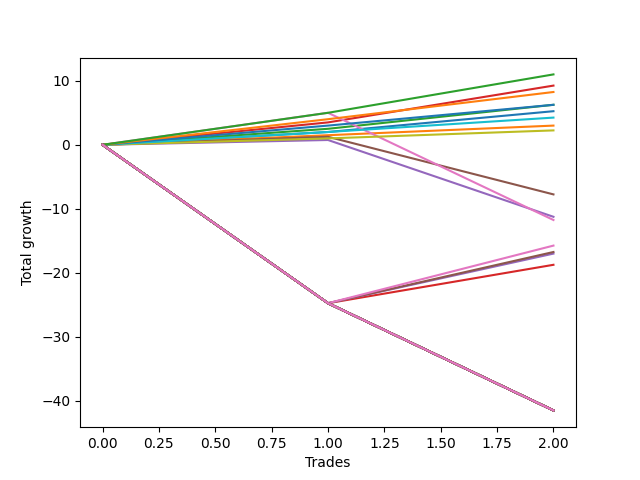

# Long Shepard 004 DB 
- Symbol: ES
- Date Range: 03/18/2022 - 07/15/2022
- Trading Period: 7:20-12:30
- Number of Trades: 2



| Name | Win Percent | Profit | Avg Profit / Trade | Avg Time / Trade |      | Name | Win Percent | Profit | Avg Profit / Trade | Avg Time / Trade |
| ---- | ----------- | ------ | ------------------ | ---------------- | ---- | ---- | ----------- | ------ | ------------------ | ---------------- |
| Sorted By <br> Profit | | | | | | Sorted By <br> Win Percentage ||||
| Eighty-Five | 100.00 | 5500.00 | 2750.00 | 51:17 |     | Eighty-Five | 100.00 | 5500.00 | 2750.00 | 51:17 |
| Three | 100.00 | 4625.00 | 2312.50 | 23:47 |     | Three | 100.00 | 4625.00 | 2312.50 | 23:47 |
| Eighty-Four | 100.00 | 4125.00 | 2062.50 | 50:35 |     | Eighty-Four | 100.00 | 4125.00 | 2062.50 | 50:35 |
| Eighty-Three | 100.00 | 3125.00 | 1562.50 | 11:12 |     | Eighty-Three | 100.00 | 3125.00 | 1562.50 | 11:12 |
| Two | 100.00 | 3125.00 | 1562.50 | 16:40 |     | Two | 100.00 | 3125.00 | 1562.50 | 16:40 |
| Zero | 100.00 | 2625.00 | 1312.50 | 05:12 |     | Zero | 100.00 | 2625.00 | 1312.50 | 05:12 |
| Eighty-Two | 100.00 | 2125.00 | 1062.50 | 03:17 |     | Eighty-Two | 100.00 | 2125.00 | 1062.50 | 03:17 |
| One | 100.00 | 1500.00 | 750.00 | 13:00 |     | One | 100.00 | 1500.00 | 750.00 | 13:00 |
| Eighty-One | 100.00 | 1125.00 | 562.50 | 01:32 |     | Eighty-One | 100.00 | 1125.00 | 562.50 | 01:32 |
| Five | 50.00 | -3875.00 | -1937.50 | 84:07 |     | Five | 50.00 | -3875.00 | -1937.50 | 84:07 |
| Four | 50.00 | -5625.00 | -2812.50 | 75:25 |     | Four | 50.00 | -5625.00 | -2812.50 | 75:25 |
| Six | 50.00 | -5875.00 | -2937.50 | 172:05 |     | Six | 50.00 | -5875.00 | -2937.50 | 172:05 |
| Eighty-Nine | 50.00 | -7875.00 | -3937.50 | 109:00 |     | Eighty-Nine | 50.00 | -7875.00 | -3937.50 | 109:00 |
| Eighty-Eight | 50.00 | -8375.00 | -4187.50 | 108:50 |     | Eighty-Eight | 50.00 | -8375.00 | -4187.50 | 108:50 |
| Eighty-Seven | 50.00 | -8500.00 | -4250.00 | 108:42 |     | Eighty-Seven | 50.00 | -8500.00 | -4250.00 | 108:42 |
| Eighty-Six | 50.00 | -9375.00 | -4687.50 | 108:17 |     | Eighty-Six | 50.00 | -9375.00 | -4687.50 | 108:17 |
| Two Hundred Fifteen | 0.00 | -20750.00 | -10375.00 | 229:05 |     | Two Hundred Fifteen | 0.00 | -20750.00 | -10375.00 | 229:05 |
| Two Hundred Fourteen.Five | 0.00 | -20750.00 | -10375.00 | 229:05 |     | Two Hundred Fourteen.Five | 0.00 | -20750.00 | -10375.00 | 229:05 |
| Two Hundred Fourteen | 0.00 | -20750.00 | -10375.00 | 229:05 |     | Two Hundred Fourteen | 0.00 | -20750.00 | -10375.00 | 229:05 |
| Two Hundred Thirteen.Five | 0.00 | -20750.00 | -10375.00 | 229:05 |     | Two Hundred Thirteen.Five | 0.00 | -20750.00 | -10375.00 | 229:05 |
| Two Hundred Thirteen | 0.00 | -20750.00 | -10375.00 | 229:05 |     | Two Hundred Thirteen | 0.00 | -20750.00 | -10375.00 | 229:05 |
| Two Hundred Twelve.Five | 0.00 | -20750.00 | -10375.00 | 229:05 |     | Two Hundred Twelve.Five | 0.00 | -20750.00 | -10375.00 | 229:05 |
| Two Hundred Twelve | 0.00 | -20750.00 | -10375.00 | 229:05 |     | Two Hundred Twelve | 0.00 | -20750.00 | -10375.00 | 229:05 |
| Two Hundred Eleven.Five | 0.00 | -20750.00 | -10375.00 | 229:05 |     | Two Hundred Eleven.Five | 0.00 | -20750.00 | -10375.00 | 229:05 |
| Two Hundred Eleven | 0.00 | -20750.00 | -10375.00 | 229:05 |     | Two Hundred Eleven | 0.00 | -20750.00 | -10375.00 | 229:05 |
| Two Hundred Ten.Five | 0.00 | -20750.00 | -10375.00 | 229:05 |     | Two Hundred Ten.Five | 0.00 | -20750.00 | -10375.00 | 229:05 |
| Two Hundred Ten | 0.00 | -20750.00 | -10375.00 | 229:05 |     | Two Hundred Ten | 0.00 | -20750.00 | -10375.00 | 229:05 |
| Two Hundred Nine.Five | 0.00 | -20750.00 | -10375.00 | 229:05 |     | Two Hundred Nine.Five | 0.00 | -20750.00 | -10375.00 | 229:05 |
| Two Hundred Nine | 0.00 | -20750.00 | -10375.00 | 229:05 |     | Two Hundred Nine | 0.00 | -20750.00 | -10375.00 | 229:05 |
| Two Hundred Eight.Five | 0.00 | -20750.00 | -10375.00 | 229:05 |     | Two Hundred Eight.Five | 0.00 | -20750.00 | -10375.00 | 229:05 |
| Two Hundred Eight | 0.00 | -20750.00 | -10375.00 | 229:05 |     | Two Hundred Eight | 0.00 | -20750.00 | -10375.00 | 229:05 |
| Two Hundred Seven.Five | 0.00 | -20750.00 | -10375.00 | 229:05 |     | Two Hundred Seven.Five | 0.00 | -20750.00 | -10375.00 | 229:05 |
| Two Hundred Seven | 0.00 | -20750.00 | -10375.00 | 229:05 |     | Two Hundred Seven | 0.00 | -20750.00 | -10375.00 | 229:05 |
| Two Hundred Six.Five | 0.00 | -20750.00 | -10375.00 | 229:05 |     | Two Hundred Six.Five | 0.00 | -20750.00 | -10375.00 | 229:05 |
| Two Hundred Six | 0.00 | -20750.00 | -10375.00 | 229:05 |     | Two Hundred Six | 0.00 | -20750.00 | -10375.00 | 229:05 |
| Two Hundred Five.Five | 0.00 | -20750.00 | -10375.00 | 229:05 |     | Two Hundred Five.Five | 0.00 | -20750.00 | -10375.00 | 229:05 |
| Two Hundred Five | 0.00 | -20750.00 | -10375.00 | 229:05 |     | Two Hundred Five | 0.00 | -20750.00 | -10375.00 | 229:05 |
| Two Hundred Four.Five | 0.00 | -20750.00 | -10375.00 | 229:05 |     | Two Hundred Four.Five | 0.00 | -20750.00 | -10375.00 | 229:05 |
| Two Hundred Four | 0.00 | -20750.00 | -10375.00 | 229:05 |     | Two Hundred Four | 0.00 | -20750.00 | -10375.00 | 229:05 |
| Two Hundred Three.Five | 0.00 | -20750.00 | -10375.00 | 229:05 |     | Two Hundred Three.Five | 0.00 | -20750.00 | -10375.00 | 229:05 |
| Two Hundred Three | 0.00 | -20750.00 | -10375.00 | 229:05 |     | Two Hundred Three | 0.00 | -20750.00 | -10375.00 | 229:05 |
| Two Hundred Two.Five | 0.00 | -20750.00 | -10375.00 | 229:05 |     | Two Hundred Two.Five | 0.00 | -20750.00 | -10375.00 | 229:05 |
| Two Hundred Two | 0.00 | -20750.00 | -10375.00 | 229:05 |     | Two Hundred Two | 0.00 | -20750.00 | -10375.00 | 229:05 |
| Two Hundred One.Five | 0.00 | -20750.00 | -10375.00 | 229:05 |     | Two Hundred One.Five | 0.00 | -20750.00 | -10375.00 | 229:05 |
| Two Hundred One | 0.00 | -20750.00 | -10375.00 | 229:05 |     | Two Hundred One | 0.00 | -20750.00 | -10375.00 | 229:05 |
| Ninety | 0.00 | -20750.00 | -10375.00 | 229:05 |     | Ninety | 0.00 | -20750.00 | -10375.00 | 229:05 |
| Seven | 0.00 | -20750.00 | -10375.00 | 229:05 |     | Seven | 0.00 | -20750.00 | -10375.00 | 229:05 |

## NO STOPLOSS

### Test Zero
* Sell when price hits the middle line of the 20p bollinger
* No Stoploss
* Results:
```
Total Trades: 2
Percent Up: 100.00
Percent Down: 0.00
Total Points Moved Up: 5.25
Potential Profit: 2625.00
Total Points Ups: 5.25 Count Ups: 2
Total Points Downs: 0.00 Count Downs: 0
```

<details><summary>Trades</summary>

<code>In: 2022-03-31 09:30:00		Out: 2022-03-31 09:32:50		Total Position Time: 02:50		Total Move Up: 2.00		Total to Date: 2.00</code> <br />
<code>In: 2022-06-06 08:24:00		Out: 2022-06-06 08:31:35		Total Position Time: 07:35		Total Move Up: 3.25		Total to Date: 5.25</code> <br />


</details>

### Test One
* Sell when the price hits the upper line of the 20p 1std bollinger
* No Stoploss
* Results:
```
Total Trades: 2
Percent Up: 100.00
Percent Down: 0.00
Total Points Moved Up: 3.00
Potential Profit: 1500.00
Total Points Ups: 3.00 Count Ups: 2
Total Points Downs: 0.00 Count Downs: 0
```

<details><summary>Trades</summary>

<code>In: 2022-03-31 09:30:00		Out: 2022-03-31 09:40:45		Total Position Time: 10:45		Total Move Up: 1.50		Total to Date: 1.50</code> <br />
<code>In: 2022-06-06 08:24:00		Out: 2022-06-06 08:39:15		Total Position Time: 15:15		Total Move Up: 1.50		Total to Date: 3.00</code> <br />


</details>

### Test Two
* Sell when the price hits the upper line of the 20p 2std bollinger
* No Stoploss
* Results:
```
Total Trades: 2
Percent Up: 100.00
Percent Down: 0.00
Total Points Moved Up: 6.25
Potential Profit: 3125.00
Total Points Ups: 6.25 Count Ups: 2
Total Points Downs: 0.00 Count Downs: 0
```

<details><summary>Trades</summary>

<code>In: 2022-03-31 09:30:00		Out: 2022-03-31 09:44:20		Total Position Time: 14:20		Total Move Up: 2.50		Total to Date: 2.50</code> <br />
<code>In: 2022-06-06 08:24:00		Out: 2022-06-06 08:43:00		Total Position Time: 19:00		Total Move Up: 3.75		Total to Date: 6.25</code> <br />


</details>

### Test Three
* Sell when price hits the middle line of the 50p bollinger
* No Stoploss
* Results:
```
Total Trades: 2
Percent Up: 100.00
Percent Down: 0.00
Total Points Moved Up: 9.25
Potential Profit: 4625.00
Total Points Ups: 9.25 Count Ups: 2
Total Points Downs: 0.00 Count Downs: 0
```

<details><summary>Trades</summary>

<code>In: 2022-03-31 09:30:00		Out: 2022-03-31 09:46:10		Total Position Time: 16:10		Total Move Up: 3.50		Total to Date: 3.50</code> <br />
<code>In: 2022-06-06 08:24:00		Out: 2022-06-06 08:55:25		Total Position Time: 31:25		Total Move Up: 5.75		Total to Date: 9.25</code> <br />


</details>

### Test Four
* Sell when the price hits the upper line of the 50p 1std bollinger
* No Stoploss
* Results:
```
Total Trades: 2
Percent Up: 50.00
Percent Down: 50.00
Total Points Moved Up: -11.25
Potential Profit: -5625.00
Total Points Ups: 0.75 Count Ups: 1
Total Points Downs: -12.00 Count Downs: 1
```

<details><summary>Trades</summary>

<code>In: 2022-03-31 09:30:00		Out: 2022-03-31 10:29:50		Total Position Time: 59:50		Total Move Up: 0.75		Total to Date: 0.75</code> <br />
<code>In: 2022-06-06 08:24:00		Out: 2022-06-06 09:55:00		Total Position Time: 91:00		Total Move Up: -12.00		Total to Date: -11.25</code> <br />


</details>

### Test Five
* Sell when the price hits the upper line of the 50p 2std bollinger
* No Stoploss
* Results:
```
Total Trades: 2
Percent Up: 50.00
Percent Down: 50.00
Total Points Moved Up: -7.75
Potential Profit: -3875.00
Total Points Ups: 1.25 Count Ups: 1
Total Points Downs: -9.00 Count Downs: 1
```

<details><summary>Trades</summary>

<code>In: 2022-03-31 09:30:00		Out: 2022-03-31 10:46:00		Total Position Time: 76:00		Total Move Up: 1.25		Total to Date: 1.25</code> <br />
<code>In: 2022-06-06 08:24:00		Out: 2022-06-06 09:56:15		Total Position Time: 92:15		Total Move Up: -9.00		Total to Date: -7.75</code> <br />


</details>

### Test Six
* Sell when the price hits the middle line of the 1std VWAP
* No Stoploss
* Results:
```
Total Trades: 2
Percent Up: 50.00
Percent Down: 50.00
Total Points Moved Up: -11.75
Potential Profit: -5875.00
Total Points Ups: 5.00 Count Ups: 1
Total Points Downs: -16.75 Count Downs: 1
```

<details><summary>Trades</summary>

<code>In: 2022-03-31 09:30:00		Out: 2022-03-31 10:52:05		Total Position Time: 82:05		Total Move Up: 5.00		Total to Date: 5.00</code> <br />
<code>In: 2022-06-06 08:24:00		Out: 2022-06-06 12:46:05		Total Position Time: 262:05		Total Move Up: -16.75		Total to Date: -11.75</code> <br />


</details>

### Test Seven
* Sell when the price hits the upper line of the 1std VWAP
* No Stoploss
* Results:
```
Total Trades: 2
Percent Up: 0.00
Percent Down: 100.00
Total Points Moved Up: -41.50
Potential Profit: -20750.00
Total Points Ups: 0.00 Count Ups: 0
Total Points Downs: -41.50 Count Downs: 2
```

<details><summary>Trades</summary>

<code>In: 2022-03-31 09:30:00		Out: 2022-03-31 12:46:05		Total Position Time: 196:05		Total Move Up: -24.75		Total to Date: -24.75</code> <br />
<code>In: 2022-06-06 08:24:00		Out: 2022-06-06 12:46:05		Total Position Time: 262:05		Total Move Up: -16.75		Total to Date: -41.50</code> <br />


</details>

## TAKE PROFIT

### Test Eighty-One
* Take Profit of 1 Point
* No Stoploss
* Results:
```
Total Trades: 2
Percent Up: 100.00
Percent Down: 0.00
Total Points Moved Up: 2.25
Potential Profit: 1125.00
Total Points Ups: 2.25 Count Ups: 2
Total Points Downs: 0.00 Count Downs: 0
```

<details><summary>Trades</summary>

<code>In: 2022-03-31 09:30:00		Out: 2022-03-31 09:30:30		Total Position Time: 00:30		Total Move Up: 1.00		Total to Date: 1.00</code> <br />
<code>In: 2022-06-06 08:24:00		Out: 2022-06-06 08:26:35		Total Position Time: 02:35		Total Move Up: 1.25		Total to Date: 2.25</code> <br />


</details>

### Test Eighty-Two
* Take Profit of 2 Point
* No Stoploss
* Results:
```
Total Trades: 2
Percent Up: 100.00
Percent Down: 0.00
Total Points Moved Up: 4.25
Potential Profit: 2125.00
Total Points Ups: 4.25 Count Ups: 2
Total Points Downs: 0.00 Count Downs: 0
```

<details><summary>Trades</summary>

<code>In: 2022-03-31 09:30:00		Out: 2022-03-31 09:32:50		Total Position Time: 02:50		Total Move Up: 2.00		Total to Date: 2.00</code> <br />
<code>In: 2022-06-06 08:24:00		Out: 2022-06-06 08:27:45		Total Position Time: 03:45		Total Move Up: 2.25		Total to Date: 4.25</code> <br />


</details>

### Test Eighty-Three
* Take Profit of 3 Point
* No Stoploss
* Results:
```
Total Trades: 2
Percent Up: 100.00
Percent Down: 0.00
Total Points Moved Up: 6.25
Potential Profit: 3125.00
Total Points Ups: 6.25 Count Ups: 2
Total Points Downs: 0.00 Count Downs: 0
```

<details><summary>Trades</summary>

<code>In: 2022-03-31 09:30:00		Out: 2022-03-31 09:44:50		Total Position Time: 14:50		Total Move Up: 3.00		Total to Date: 3.00</code> <br />
<code>In: 2022-06-06 08:24:00		Out: 2022-06-06 08:31:35		Total Position Time: 07:35		Total Move Up: 3.25		Total to Date: 6.25</code> <br />


</details>

### Test Eighty-Four
* Take Profit of 4 Point
* No Stoploss
* Results:
```
Total Trades: 2
Percent Up: 100.00
Percent Down: 0.00
Total Points Moved Up: 8.25
Potential Profit: 4125.00
Total Points Ups: 8.25 Count Ups: 2
Total Points Downs: 0.00 Count Downs: 0
```

<details><summary>Trades</summary>

<code>In: 2022-03-31 09:30:00		Out: 2022-03-31 10:51:00		Total Position Time: 81:00		Total Move Up: 4.00		Total to Date: 4.00</code> <br />
<code>In: 2022-06-06 08:24:00		Out: 2022-06-06 08:44:10		Total Position Time: 20:10		Total Move Up: 4.25		Total to Date: 8.25</code> <br />


</details>

### Test Eighty-Five
* Take Profit of 5 Point
* No Stoploss
* Results:
```
Total Trades: 2
Percent Up: 100.00
Percent Down: 0.00
Total Points Moved Up: 11.00
Potential Profit: 5500.00
Total Points Ups: 11.00 Count Ups: 2
Total Points Downs: 0.00 Count Downs: 0
```

<details><summary>Trades</summary>

<code>In: 2022-03-31 09:30:00		Out: 2022-03-31 10:52:05		Total Position Time: 82:05		Total Move Up: 5.00		Total to Date: 5.00</code> <br />
<code>In: 2022-06-06 08:24:00		Out: 2022-06-06 08:44:30		Total Position Time: 20:30		Total Move Up: 6.00		Total to Date: 11.00</code> <br />


</details>

### Test Eighty-Six
* Take Profit of 6 Point
* No Stoploss
* Results:
```
Total Trades: 2
Percent Up: 50.00
Percent Down: 50.00
Total Points Moved Up: -18.75
Potential Profit: -9375.00
Total Points Ups: 6.00 Count Ups: 1
Total Points Downs: -24.75 Count Downs: 1
```

<details><summary>Trades</summary>

<code>In: 2022-03-31 09:30:00		Out: 2022-03-31 12:46:05		Total Position Time: 196:05		Total Move Up: -24.75		Total to Date: -24.75</code> <br />
<code>In: 2022-06-06 08:24:00		Out: 2022-06-06 08:44:30		Total Position Time: 20:30		Total Move Up: 6.00		Total to Date: -18.75</code> <br />


</details>

### Test Eighty-Seven
* Take Profit of 7 Point
* No Stoploss
* Results:
```
Total Trades: 2
Percent Up: 50.00
Percent Down: 50.00
Total Points Moved Up: -17.00
Potential Profit: -8500.00
Total Points Ups: 7.75 Count Ups: 1
Total Points Downs: -24.75 Count Downs: 1
```

<details><summary>Trades</summary>

<code>In: 2022-03-31 09:30:00		Out: 2022-03-31 12:46:05		Total Position Time: 196:05		Total Move Up: -24.75		Total to Date: -24.75</code> <br />
<code>In: 2022-06-06 08:24:00		Out: 2022-06-06 08:45:20		Total Position Time: 21:20		Total Move Up: 7.75		Total to Date: -17.00</code> <br />


</details>

### Test Eighty-Eight
* Take Profit of 8 Point
* No Stoploss
* Results:
```
Total Trades: 2
Percent Up: 50.00
Percent Down: 50.00
Total Points Moved Up: -16.75
Potential Profit: -8375.00
Total Points Ups: 8.00 Count Ups: 1
Total Points Downs: -24.75 Count Downs: 1
```

<details><summary>Trades</summary>

<code>In: 2022-03-31 09:30:00		Out: 2022-03-31 12:46:05		Total Position Time: 196:05		Total Move Up: -24.75		Total to Date: -24.75</code> <br />
<code>In: 2022-06-06 08:24:00		Out: 2022-06-06 08:45:35		Total Position Time: 21:35		Total Move Up: 8.00		Total to Date: -16.75</code> <br />


</details>

### Test Eighty-Nine
* Take Profit of 9 Point
* No Stoploss
* Results:
```
Total Trades: 2
Percent Up: 50.00
Percent Down: 50.00
Total Points Moved Up: -15.75
Potential Profit: -7875.00
Total Points Ups: 9.00 Count Ups: 1
Total Points Downs: -24.75 Count Downs: 1
```

<details><summary>Trades</summary>

<code>In: 2022-03-31 09:30:00		Out: 2022-03-31 12:46:05		Total Position Time: 196:05		Total Move Up: -24.75		Total to Date: -24.75</code> <br />
<code>In: 2022-06-06 08:24:00		Out: 2022-06-06 08:45:55		Total Position Time: 21:55		Total Move Up: 9.00		Total to Date: -15.75</code> <br />


</details>

### Test Ninety
* Take Profit of 10 Point
* No Stoploss
* Results:
```
Total Trades: 2
Percent Up: 0.00
Percent Down: 100.00
Total Points Moved Up: -41.50
Potential Profit: -20750.00
Total Points Ups: 0.00 Count Ups: 0
Total Points Downs: -41.50 Count Downs: 2
```

<details><summary>Trades</summary>

<code>In: 2022-03-31 09:30:00		Out: 2022-03-31 12:46:05		Total Position Time: 196:05		Total Move Up: -24.75		Total to Date: -24.75</code> <br />
<code>In: 2022-06-06 08:24:00		Out: 2022-06-06 12:46:05		Total Position Time: 262:05		Total Move Up: -16.75		Total to Date: -41.50</code> <br />


</details>

## DAILY TAKE PROFITS

### Test Two Hundred One
* Take Profit of 10 Point
* No Stoploss
* Results:
```
Total Trades: 2
Percent Up: 0.00
Percent Down: 100.00
Total Points Moved Up: -41.50
Potential Profit: -20750.00
Total Points Ups: 0.00 Count Ups: 0
Total Points Downs: -41.50 Count Downs: 2
```

<details><summary>Trades</summary>

<code>In: 2022-03-31 09:30:00		Out: 2022-03-31 12:46:05		Total Position Time: 196:05		Total Move Up: -24.75		Total to Date: -24.75</code> <br />
<code>In: 2022-06-06 08:24:00		Out: 2022-06-06 12:46:05		Total Position Time: 262:05		Total Move Up: -16.75		Total to Date: -41.50</code> <br />


</details>

### Test Two Hundred One.Five
* Take Profit of 15 Point
* No Stoploss
* Results:
```
Total Trades: 2
Percent Up: 0.00
Percent Down: 100.00
Total Points Moved Up: -41.50
Potential Profit: -20750.00
Total Points Ups: 0.00 Count Ups: 0
Total Points Downs: -41.50 Count Downs: 2
```

<details><summary>Trades</summary>

<code>In: 2022-03-31 09:30:00		Out: 2022-03-31 12:46:05		Total Position Time: 196:05		Total Move Up: -24.75		Total to Date: -24.75</code> <br />
<code>In: 2022-06-06 08:24:00		Out: 2022-06-06 12:46:05		Total Position Time: 262:05		Total Move Up: -16.75		Total to Date: -41.50</code> <br />


</details>

### Test Two Hundred Two
* Take Profit of 20 Point
* No Stoploss
* Results:
```
Total Trades: 2
Percent Up: 0.00
Percent Down: 100.00
Total Points Moved Up: -41.50
Potential Profit: -20750.00
Total Points Ups: 0.00 Count Ups: 0
Total Points Downs: -41.50 Count Downs: 2
```

<details><summary>Trades</summary>

<code>In: 2022-03-31 09:30:00		Out: 2022-03-31 12:46:05		Total Position Time: 196:05		Total Move Up: -24.75		Total to Date: -24.75</code> <br />
<code>In: 2022-06-06 08:24:00		Out: 2022-06-06 12:46:05		Total Position Time: 262:05		Total Move Up: -16.75		Total to Date: -41.50</code> <br />


</details>

### Test Two Hundred Two.Five
* Take Profit of 25 Point
* No Stoploss
* Results:
```
Total Trades: 2
Percent Up: 0.00
Percent Down: 100.00
Total Points Moved Up: -41.50
Potential Profit: -20750.00
Total Points Ups: 0.00 Count Ups: 0
Total Points Downs: -41.50 Count Downs: 2
```

<details><summary>Trades</summary>

<code>In: 2022-03-31 09:30:00		Out: 2022-03-31 12:46:05		Total Position Time: 196:05		Total Move Up: -24.75		Total to Date: -24.75</code> <br />
<code>In: 2022-06-06 08:24:00		Out: 2022-06-06 12:46:05		Total Position Time: 262:05		Total Move Up: -16.75		Total to Date: -41.50</code> <br />


</details>

### Test Two Hundred Three
* Take Profit of 30 Point
* No Stoploss
* Results:
```
Total Trades: 2
Percent Up: 0.00
Percent Down: 100.00
Total Points Moved Up: -41.50
Potential Profit: -20750.00
Total Points Ups: 0.00 Count Ups: 0
Total Points Downs: -41.50 Count Downs: 2
```

<details><summary>Trades</summary>

<code>In: 2022-03-31 09:30:00		Out: 2022-03-31 12:46:05		Total Position Time: 196:05		Total Move Up: -24.75		Total to Date: -24.75</code> <br />
<code>In: 2022-06-06 08:24:00		Out: 2022-06-06 12:46:05		Total Position Time: 262:05		Total Move Up: -16.75		Total to Date: -41.50</code> <br />


</details>

### Test Two Hundred Three.Five
* Take Profit of 35 Point
* No Stoploss
* Results:
```
Total Trades: 2
Percent Up: 0.00
Percent Down: 100.00
Total Points Moved Up: -41.50
Potential Profit: -20750.00
Total Points Ups: 0.00 Count Ups: 0
Total Points Downs: -41.50 Count Downs: 2
```

<details><summary>Trades</summary>

<code>In: 2022-03-31 09:30:00		Out: 2022-03-31 12:46:05		Total Position Time: 196:05		Total Move Up: -24.75		Total to Date: -24.75</code> <br />
<code>In: 2022-06-06 08:24:00		Out: 2022-06-06 12:46:05		Total Position Time: 262:05		Total Move Up: -16.75		Total to Date: -41.50</code> <br />


</details>

### Test Two Hundred Four
* Take Profit of 40 Point
* No Stoploss
* Results:
```
Total Trades: 2
Percent Up: 0.00
Percent Down: 100.00
Total Points Moved Up: -41.50
Potential Profit: -20750.00
Total Points Ups: 0.00 Count Ups: 0
Total Points Downs: -41.50 Count Downs: 2
```

<details><summary>Trades</summary>

<code>In: 2022-03-31 09:30:00		Out: 2022-03-31 12:46:05		Total Position Time: 196:05		Total Move Up: -24.75		Total to Date: -24.75</code> <br />
<code>In: 2022-06-06 08:24:00		Out: 2022-06-06 12:46:05		Total Position Time: 262:05		Total Move Up: -16.75		Total to Date: -41.50</code> <br />


</details>

### Test Two Hundred Four.Five
* Take Profit of 45 Point
* No Stoploss
* Results:
```
Total Trades: 2
Percent Up: 0.00
Percent Down: 100.00
Total Points Moved Up: -41.50
Potential Profit: -20750.00
Total Points Ups: 0.00 Count Ups: 0
Total Points Downs: -41.50 Count Downs: 2
```

<details><summary>Trades</summary>

<code>In: 2022-03-31 09:30:00		Out: 2022-03-31 12:46:05		Total Position Time: 196:05		Total Move Up: -24.75		Total to Date: -24.75</code> <br />
<code>In: 2022-06-06 08:24:00		Out: 2022-06-06 12:46:05		Total Position Time: 262:05		Total Move Up: -16.75		Total to Date: -41.50</code> <br />


</details>

### Test Two Hundred Five
* Take Profit of 50 Point
* No Stoploss
* Results:
```
Total Trades: 2
Percent Up: 0.00
Percent Down: 100.00
Total Points Moved Up: -41.50
Potential Profit: -20750.00
Total Points Ups: 0.00 Count Ups: 0
Total Points Downs: -41.50 Count Downs: 2
```

<details><summary>Trades</summary>

<code>In: 2022-03-31 09:30:00		Out: 2022-03-31 12:46:05		Total Position Time: 196:05		Total Move Up: -24.75		Total to Date: -24.75</code> <br />
<code>In: 2022-06-06 08:24:00		Out: 2022-06-06 12:46:05		Total Position Time: 262:05		Total Move Up: -16.75		Total to Date: -41.50</code> <br />


</details>

### Test Two Hundred Five.Five
* Take Profit of 55 Point
* No Stoploss
* Results:
```
Total Trades: 2
Percent Up: 0.00
Percent Down: 100.00
Total Points Moved Up: -41.50
Potential Profit: -20750.00
Total Points Ups: 0.00 Count Ups: 0
Total Points Downs: -41.50 Count Downs: 2
```

<details><summary>Trades</summary>

<code>In: 2022-03-31 09:30:00		Out: 2022-03-31 12:46:05		Total Position Time: 196:05		Total Move Up: -24.75		Total to Date: -24.75</code> <br />
<code>In: 2022-06-06 08:24:00		Out: 2022-06-06 12:46:05		Total Position Time: 262:05		Total Move Up: -16.75		Total to Date: -41.50</code> <br />


</details>

### Test Two Hundred Six
* Take Profit of 60 Point
* No Stoploss
* Results:
```
Total Trades: 2
Percent Up: 0.00
Percent Down: 100.00
Total Points Moved Up: -41.50
Potential Profit: -20750.00
Total Points Ups: 0.00 Count Ups: 0
Total Points Downs: -41.50 Count Downs: 2
```

<details><summary>Trades</summary>

<code>In: 2022-03-31 09:30:00		Out: 2022-03-31 12:46:05		Total Position Time: 196:05		Total Move Up: -24.75		Total to Date: -24.75</code> <br />
<code>In: 2022-06-06 08:24:00		Out: 2022-06-06 12:46:05		Total Position Time: 262:05		Total Move Up: -16.75		Total to Date: -41.50</code> <br />


</details>

### Test Two Hundred Six.Five
* Take Profit of 65 Point
* No Stoploss
* Results:
```
Total Trades: 2
Percent Up: 0.00
Percent Down: 100.00
Total Points Moved Up: -41.50
Potential Profit: -20750.00
Total Points Ups: 0.00 Count Ups: 0
Total Points Downs: -41.50 Count Downs: 2
```

<details><summary>Trades</summary>

<code>In: 2022-03-31 09:30:00		Out: 2022-03-31 12:46:05		Total Position Time: 196:05		Total Move Up: -24.75		Total to Date: -24.75</code> <br />
<code>In: 2022-06-06 08:24:00		Out: 2022-06-06 12:46:05		Total Position Time: 262:05		Total Move Up: -16.75		Total to Date: -41.50</code> <br />


</details>

### Test Two Hundred Seven
* Take Profit of 70 Point
* No Stoploss
* Results:
```
Total Trades: 2
Percent Up: 0.00
Percent Down: 100.00
Total Points Moved Up: -41.50
Potential Profit: -20750.00
Total Points Ups: 0.00 Count Ups: 0
Total Points Downs: -41.50 Count Downs: 2
```

<details><summary>Trades</summary>

<code>In: 2022-03-31 09:30:00		Out: 2022-03-31 12:46:05		Total Position Time: 196:05		Total Move Up: -24.75		Total to Date: -24.75</code> <br />
<code>In: 2022-06-06 08:24:00		Out: 2022-06-06 12:46:05		Total Position Time: 262:05		Total Move Up: -16.75		Total to Date: -41.50</code> <br />


</details>

### Test Two Hundred Seven.Five
* Take Profit of 75 Point
* No Stoploss
* Results:
```
Total Trades: 2
Percent Up: 0.00
Percent Down: 100.00
Total Points Moved Up: -41.50
Potential Profit: -20750.00
Total Points Ups: 0.00 Count Ups: 0
Total Points Downs: -41.50 Count Downs: 2
```

<details><summary>Trades</summary>

<code>In: 2022-03-31 09:30:00		Out: 2022-03-31 12:46:05		Total Position Time: 196:05		Total Move Up: -24.75		Total to Date: -24.75</code> <br />
<code>In: 2022-06-06 08:24:00		Out: 2022-06-06 12:46:05		Total Position Time: 262:05		Total Move Up: -16.75		Total to Date: -41.50</code> <br />


</details>

### Test Two Hundred Eight
* Take Profit of 80 Point
* No Stoploss
* Results:
```
Total Trades: 2
Percent Up: 0.00
Percent Down: 100.00
Total Points Moved Up: -41.50
Potential Profit: -20750.00
Total Points Ups: 0.00 Count Ups: 0
Total Points Downs: -41.50 Count Downs: 2
```

<details><summary>Trades</summary>

<code>In: 2022-03-31 09:30:00		Out: 2022-03-31 12:46:05		Total Position Time: 196:05		Total Move Up: -24.75		Total to Date: -24.75</code> <br />
<code>In: 2022-06-06 08:24:00		Out: 2022-06-06 12:46:05		Total Position Time: 262:05		Total Move Up: -16.75		Total to Date: -41.50</code> <br />


</details>

### Test Two Hundred Eight.Five
* Take Profit of 85 Point
* No Stoploss
* Results:
```
Total Trades: 2
Percent Up: 0.00
Percent Down: 100.00
Total Points Moved Up: -41.50
Potential Profit: -20750.00
Total Points Ups: 0.00 Count Ups: 0
Total Points Downs: -41.50 Count Downs: 2
```

<details><summary>Trades</summary>

<code>In: 2022-03-31 09:30:00		Out: 2022-03-31 12:46:05		Total Position Time: 196:05		Total Move Up: -24.75		Total to Date: -24.75</code> <br />
<code>In: 2022-06-06 08:24:00		Out: 2022-06-06 12:46:05		Total Position Time: 262:05		Total Move Up: -16.75		Total to Date: -41.50</code> <br />


</details>

### Test Two Hundred Nine
* Take Profit of 90 Point
* No Stoploss
* Results:
```
Total Trades: 2
Percent Up: 0.00
Percent Down: 100.00
Total Points Moved Up: -41.50
Potential Profit: -20750.00
Total Points Ups: 0.00 Count Ups: 0
Total Points Downs: -41.50 Count Downs: 2
```

<details><summary>Trades</summary>

<code>In: 2022-03-31 09:30:00		Out: 2022-03-31 12:46:05		Total Position Time: 196:05		Total Move Up: -24.75		Total to Date: -24.75</code> <br />
<code>In: 2022-06-06 08:24:00		Out: 2022-06-06 12:46:05		Total Position Time: 262:05		Total Move Up: -16.75		Total to Date: -41.50</code> <br />


</details>

### Test Two Hundred Nine.Five
* Take Profit of 95 Point
* No Stoploss
* Results:
```
Total Trades: 2
Percent Up: 0.00
Percent Down: 100.00
Total Points Moved Up: -41.50
Potential Profit: -20750.00
Total Points Ups: 0.00 Count Ups: 0
Total Points Downs: -41.50 Count Downs: 2
```

<details><summary>Trades</summary>

<code>In: 2022-03-31 09:30:00		Out: 2022-03-31 12:46:05		Total Position Time: 196:05		Total Move Up: -24.75		Total to Date: -24.75</code> <br />
<code>In: 2022-06-06 08:24:00		Out: 2022-06-06 12:46:05		Total Position Time: 262:05		Total Move Up: -16.75		Total to Date: -41.50</code> <br />


</details>

### Test Two Hundred Ten
* Take Profit of 100 Point
* No Stoploss
* Results:
```
Total Trades: 2
Percent Up: 0.00
Percent Down: 100.00
Total Points Moved Up: -41.50
Potential Profit: -20750.00
Total Points Ups: 0.00 Count Ups: 0
Total Points Downs: -41.50 Count Downs: 2
```

<details><summary>Trades</summary>

<code>In: 2022-03-31 09:30:00		Out: 2022-03-31 12:46:05		Total Position Time: 196:05		Total Move Up: -24.75		Total to Date: -24.75</code> <br />
<code>In: 2022-06-06 08:24:00		Out: 2022-06-06 12:46:05		Total Position Time: 262:05		Total Move Up: -16.75		Total to Date: -41.50</code> <br />


</details>

### Test Two Hundred Ten.Five
* Take Profit of 105 Point
* No Stoploss
* Results:
```
Total Trades: 2
Percent Up: 0.00
Percent Down: 100.00
Total Points Moved Up: -41.50
Potential Profit: -20750.00
Total Points Ups: 0.00 Count Ups: 0
Total Points Downs: -41.50 Count Downs: 2
```

<details><summary>Trades</summary>

<code>In: 2022-03-31 09:30:00		Out: 2022-03-31 12:46:05		Total Position Time: 196:05		Total Move Up: -24.75		Total to Date: -24.75</code> <br />
<code>In: 2022-06-06 08:24:00		Out: 2022-06-06 12:46:05		Total Position Time: 262:05		Total Move Up: -16.75		Total to Date: -41.50</code> <br />


</details>

### Test Two Hundred Eleven
* Take Profit of 110 Point
* No Stoploss
* Results:
```
Total Trades: 2
Percent Up: 0.00
Percent Down: 100.00
Total Points Moved Up: -41.50
Potential Profit: -20750.00
Total Points Ups: 0.00 Count Ups: 0
Total Points Downs: -41.50 Count Downs: 2
```

<details><summary>Trades</summary>

<code>In: 2022-03-31 09:30:00		Out: 2022-03-31 12:46:05		Total Position Time: 196:05		Total Move Up: -24.75		Total to Date: -24.75</code> <br />
<code>In: 2022-06-06 08:24:00		Out: 2022-06-06 12:46:05		Total Position Time: 262:05		Total Move Up: -16.75		Total to Date: -41.50</code> <br />


</details>

### Test Two Hundred Eleven.Five
* Take Profit of 115 Point
* No Stoploss
* Results:
```
Total Trades: 2
Percent Up: 0.00
Percent Down: 100.00
Total Points Moved Up: -41.50
Potential Profit: -20750.00
Total Points Ups: 0.00 Count Ups: 0
Total Points Downs: -41.50 Count Downs: 2
```

<details><summary>Trades</summary>

<code>In: 2022-03-31 09:30:00		Out: 2022-03-31 12:46:05		Total Position Time: 196:05		Total Move Up: -24.75		Total to Date: -24.75</code> <br />
<code>In: 2022-06-06 08:24:00		Out: 2022-06-06 12:46:05		Total Position Time: 262:05		Total Move Up: -16.75		Total to Date: -41.50</code> <br />


</details>

### Test Two Hundred Twelve
* Take Profit of 120 Point
* No Stoploss
* Results:
```
Total Trades: 2
Percent Up: 0.00
Percent Down: 100.00
Total Points Moved Up: -41.50
Potential Profit: -20750.00
Total Points Ups: 0.00 Count Ups: 0
Total Points Downs: -41.50 Count Downs: 2
```

<details><summary>Trades</summary>

<code>In: 2022-03-31 09:30:00		Out: 2022-03-31 12:46:05		Total Position Time: 196:05		Total Move Up: -24.75		Total to Date: -24.75</code> <br />
<code>In: 2022-06-06 08:24:00		Out: 2022-06-06 12:46:05		Total Position Time: 262:05		Total Move Up: -16.75		Total to Date: -41.50</code> <br />


</details>

### Test Two Hundred Twelve.Five
* Take Profit of 125 Point
* No Stoploss
* Results:
```
Total Trades: 2
Percent Up: 0.00
Percent Down: 100.00
Total Points Moved Up: -41.50
Potential Profit: -20750.00
Total Points Ups: 0.00 Count Ups: 0
Total Points Downs: -41.50 Count Downs: 2
```

<details><summary>Trades</summary>

<code>In: 2022-03-31 09:30:00		Out: 2022-03-31 12:46:05		Total Position Time: 196:05		Total Move Up: -24.75		Total to Date: -24.75</code> <br />
<code>In: 2022-06-06 08:24:00		Out: 2022-06-06 12:46:05		Total Position Time: 262:05		Total Move Up: -16.75		Total to Date: -41.50</code> <br />


</details>

### Test Two Hundred Thirteen
* Take Profit of 130 Point
* No Stoploss
* Results:
```
Total Trades: 2
Percent Up: 0.00
Percent Down: 100.00
Total Points Moved Up: -41.50
Potential Profit: -20750.00
Total Points Ups: 0.00 Count Ups: 0
Total Points Downs: -41.50 Count Downs: 2
```

<details><summary>Trades</summary>

<code>In: 2022-03-31 09:30:00		Out: 2022-03-31 12:46:05		Total Position Time: 196:05		Total Move Up: -24.75		Total to Date: -24.75</code> <br />
<code>In: 2022-06-06 08:24:00		Out: 2022-06-06 12:46:05		Total Position Time: 262:05		Total Move Up: -16.75		Total to Date: -41.50</code> <br />


</details>

### Test Two Hundred Thirteen.Five
* Take Profit of 135 Point
* No Stoploss
* Results:
```
Total Trades: 2
Percent Up: 0.00
Percent Down: 100.00
Total Points Moved Up: -41.50
Potential Profit: -20750.00
Total Points Ups: 0.00 Count Ups: 0
Total Points Downs: -41.50 Count Downs: 2
```

<details><summary>Trades</summary>

<code>In: 2022-03-31 09:30:00		Out: 2022-03-31 12:46:05		Total Position Time: 196:05		Total Move Up: -24.75		Total to Date: -24.75</code> <br />
<code>In: 2022-06-06 08:24:00		Out: 2022-06-06 12:46:05		Total Position Time: 262:05		Total Move Up: -16.75		Total to Date: -41.50</code> <br />


</details>

### Test Two Hundred Fourteen
* Take Profit of 140 Point
* No Stoploss
* Results:
```
Total Trades: 2
Percent Up: 0.00
Percent Down: 100.00
Total Points Moved Up: -41.50
Potential Profit: -20750.00
Total Points Ups: 0.00 Count Ups: 0
Total Points Downs: -41.50 Count Downs: 2
```

<details><summary>Trades</summary>

<code>In: 2022-03-31 09:30:00		Out: 2022-03-31 12:46:05		Total Position Time: 196:05		Total Move Up: -24.75		Total to Date: -24.75</code> <br />
<code>In: 2022-06-06 08:24:00		Out: 2022-06-06 12:46:05		Total Position Time: 262:05		Total Move Up: -16.75		Total to Date: -41.50</code> <br />


</details>

### Test Two Hundred Fourteen.Five
* Take Profit of 145 Point
* No Stoploss
* Results:
```
Total Trades: 2
Percent Up: 0.00
Percent Down: 100.00
Total Points Moved Up: -41.50
Potential Profit: -20750.00
Total Points Ups: 0.00 Count Ups: 0
Total Points Downs: -41.50 Count Downs: 2
```

<details><summary>Trades</summary>

<code>In: 2022-03-31 09:30:00		Out: 2022-03-31 12:46:05		Total Position Time: 196:05		Total Move Up: -24.75		Total to Date: -24.75</code> <br />
<code>In: 2022-06-06 08:24:00		Out: 2022-06-06 12:46:05		Total Position Time: 262:05		Total Move Up: -16.75		Total to Date: -41.50</code> <br />


</details>

### Test Two Hundred Fifteen
* Take Profit of 150 Point
* No Stoploss
* Results:
```
Total Trades: 2
Percent Up: 0.00
Percent Down: 100.00
Total Points Moved Up: -41.50
Potential Profit: -20750.00
Total Points Ups: 0.00 Count Ups: 0
Total Points Downs: -41.50 Count Downs: 2
```

<details><summary>Trades</summary>

<code>In: 2022-03-31 09:30:00		Out: 2022-03-31 12:46:05		Total Position Time: 196:05		Total Move Up: -24.75		Total to Date: -24.75</code> <br />
<code>In: 2022-06-06 08:24:00		Out: 2022-06-06 12:46:05		Total Position Time: 262:05		Total Move Up: -16.75		Total to Date: -41.50</code> <br />


</details>